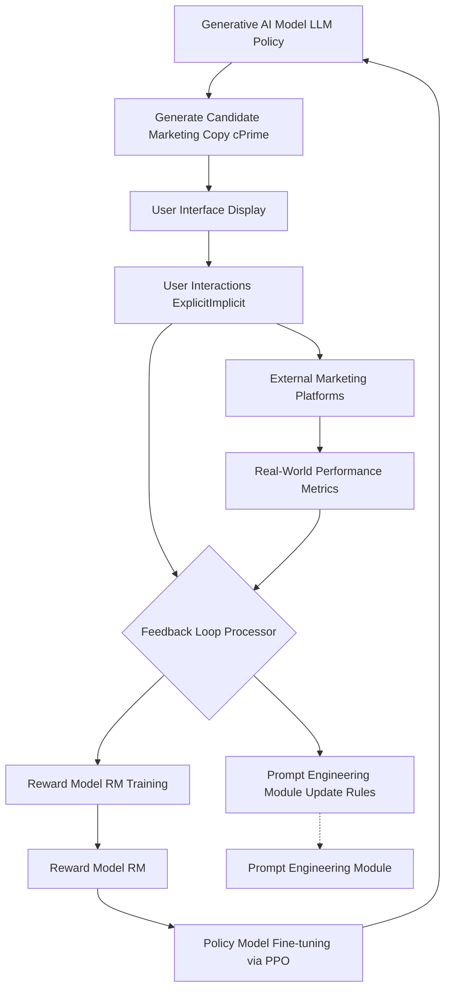
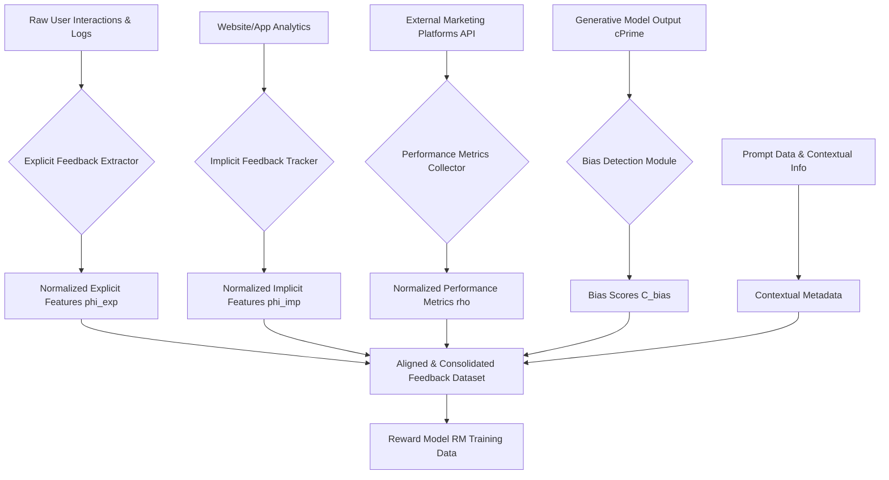
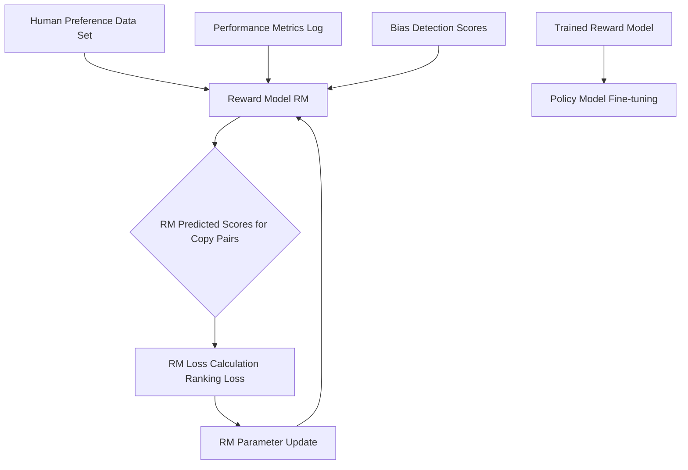
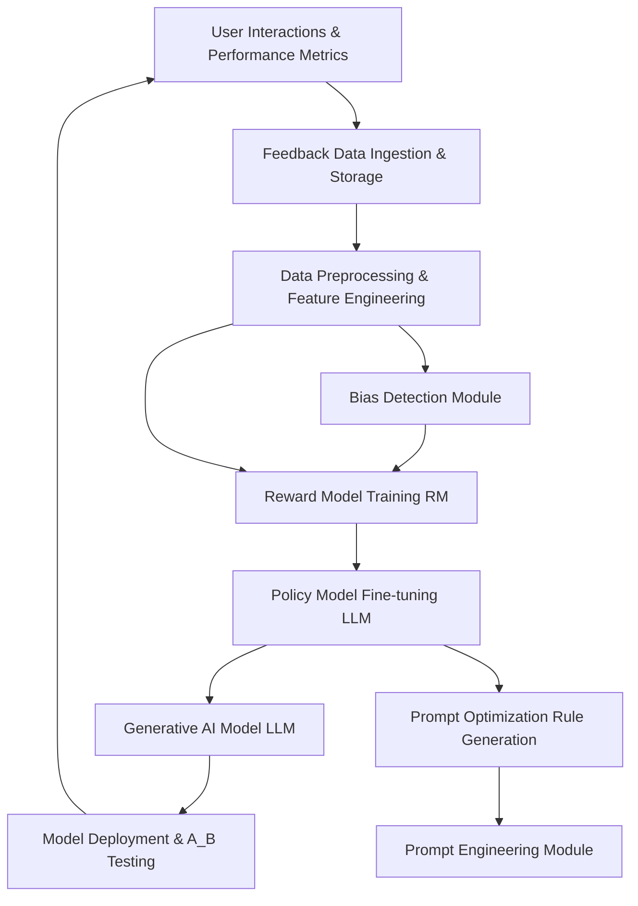
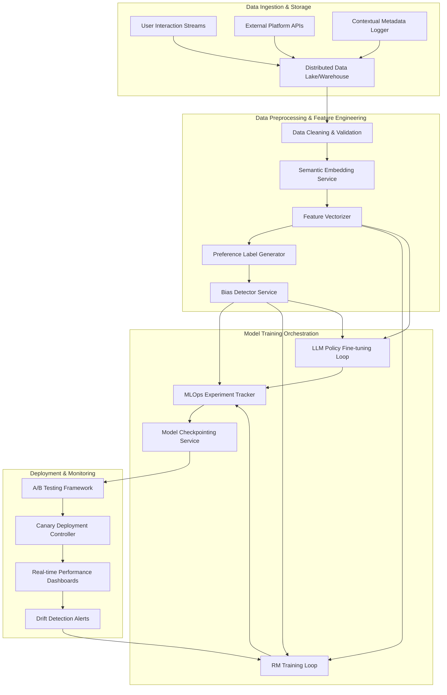
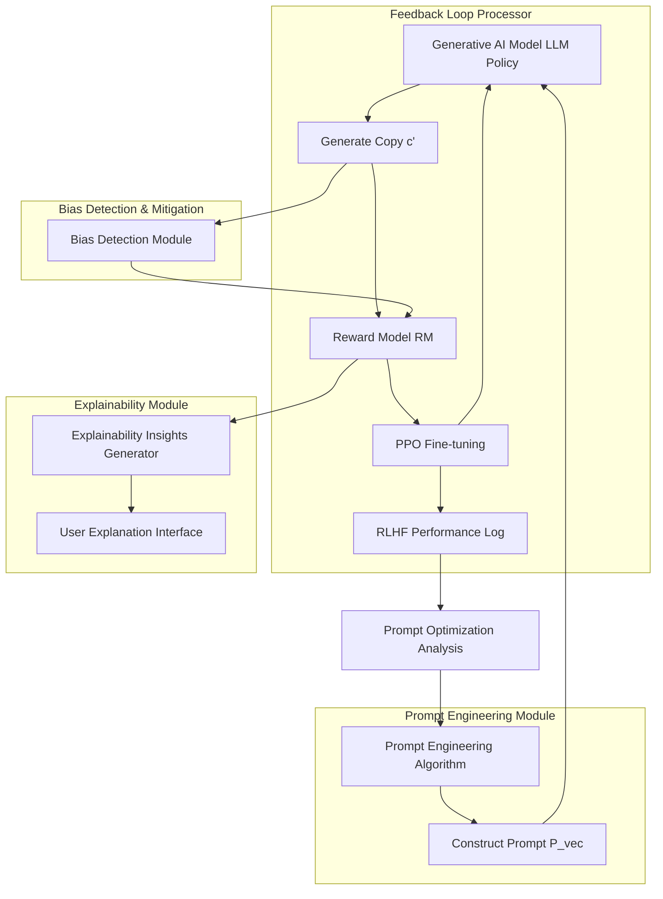

## **Title of Invention:** System and Method for Automated Semantically-Aligned Pervasive Marketing Asset Synthesis and Optimization: Reinforcement Learning with Human Feedback Implementation

## **Abstract:**
This document meticulously details the implementation of a Reinforcement Learning with Human Feedback RLHF paradigm, an integral and indispensable component of the inventive Feedback Loop Processor for the automated generation of marketing assets. The RLHF mechanism is rigorously engineered to continually align the Generative AI Model's linguistic synthesis capabilities with nuanced human preferences, empirical performance metrics, and predefined ethical guidelines. This adaptive system leverages a sophisticated Reward Model to quantify the desirability of generated marketing copy based on explicit user interactions and implicit engagement signals. Subsequently, an advanced policy gradient method, specifically Proximal Policy Optimization PPO, is employed to iteratively fine-tune the Generative AI Model, optimizing its parameter space to maximize the expected reward. Furthermore, a robust data pipeline is delineated, ensuring the seamless ingestion, preprocessing, and orchestration of feedback data for sustained and autonomous model adaptation, thereby asserting complete ownership over this advanced, self-optimizing content generation methodology. This comprehensive exposition further formalizes the system through a series of mathematical equations, delineating the intricate relationships between feedback signals, reward computation, and policy optimization, alongside an array of architectural claims and illustrative Mermaid charts.

## **Background and Context:**
The inherent dynamism of marketing efficacy necessitates a generative system capable of continuous, adaptive learning beyond its initial pre-training phase. While a Large Language Model LLM possesses prodigious linguistic capabilities, its outputs may not intrinsically align with specific brand voices, evolving market trends, or the subjective, often unstated, preferences of individual users. The `Feedback Loop Processor`, as introduced in the overarching patent, serves as the critical nexus for this continuous adaptation. Within this processor, Reinforcement Learning with Human Feedback stands as the advanced mechanism that transforms raw user interactions and quantifiable performance metrics into actionable learning signals. This document precisely elucidates the architectural and algorithmic underpinnings of this RLHF framework, bridging the gap between raw data and profound model intelligence, directly extending the `Feedback Optimization Functional` and `Prompt Optimization Algorithm` previously detailed.

## **I. The Reinforcement Learning with Human Feedback RLHF Paradigm for Marketing Asset Synthesis**
The RLHF paradigm within the present invention represents a profound leap in AI-driven content generation, enabling the `Generative AI Model LLM` to evolve its creative proficiency by learning directly from consequential feedback. It orchestrates a delicate dance between exploration (generating diverse copy) and exploitation (refining towards highly effective copy), guided by a quantitatively defined reward signal.

**Claim 1: Dynamic Marketing Asset Generation Optimization via RLHF**
A system for optimizing marketing asset generation, characterized by the integration of a Reinforcement Learning with Human Feedback (RLHF) paradigm, wherein a Generative AI Model, acting as a policy, is iteratively fine-tuned by maximizing a composite reward function that incorporates explicit user preferences, implicit engagement signals, real-world performance metrics, and ethical compliance penalties, thereby enabling continuous adaptation to evolving market dynamics and human preferences.

### **System Overview of RLHF Integration**
The RLHF workflow is intricately woven into the broader system architecture, ensuring a virtuous cycle of generation, evaluation, and refinement.


*   **Generative AI Model LLM Policy**: The core linguistic synthesizer, acting as the reinforcement learning policy, generates diverse marketing assets. Formally, this is denoted as a stochastic policy `π_θ(c' | d, P_vec)` parameterized by `θ`, aiming to maximize expected cumulative reward.
*   **Generate Candidate Marketing Copy cPrime**: The direct output from the LLM based on a product description and engineered prompt. Represented as `c' = (t_1, t_2, ..., t_L)`, a sequence of tokens from a vocabulary `V`.
*   **User Interface Display**: Renders `cPrime` for user review and interaction.
*   **User Interactions ExplicitImplicit**: Captures explicit signals (selections, edits, rejections) and implicit signals (time-on-page, scroll depth) directly from the user. Collectively, `φ`.
*   **External Marketing Platforms**: Systems where generated copy is deployed, such as ad networks, email clients, or social media platforms.
*   **Real-World Performance Metrics**: Objective, quantifiable data collected from `External Marketing Platforms` (e.g., Click-Through Rate CTR, Conversion Rate, Engagement Rate, Bounce Rate). Denoted as `ρ`.
*   **Feedback Loop Processor**: The orchestrator, responsible for ingesting, processing, and translating all feedback into actionable learning signals.
*   **Reward Model RM Training**: The continuous process of training and updating the `Reward Model` based on aggregated feedback data.
*   **Reward Model RM**: A specialized model within the `Feedback Loop Processor` that predicts a scalar desirability score for any given marketing copy. Denoted as `R_M(c', d, A, M, S)`.
*   **Policy Model Fine-tuning via PPO**: The core RL step where the `Generative AI Model LLM Policy` is updated using a policy gradient algorithm (specifically Proximal Policy Optimization PPO) to maximize the reward predicted by the `Reward Model`. This update modifies `θ`.
*   **Prompt Engineering Module Update Rules**: Heuristics and learned parameters derived from the RLHF process that inform the `Prompt Engineering Module` on how to construct more effective prompts in the future (`P-Optimality`).
*   **Prompt Engineering Module**: Integrates the `Update Rules` to dynamically refine prompt generation strategies.

**Mathematical Formalization of the Policy:**
The Generative AI Model acts as a probabilistic policy `π_θ`, where `θ` represents its parameters.
$$ \pi_\theta(c' | d, P_{vec}) = P(T_1=t_1, ..., T_L=t_L | d, P_{vec}; \theta) = \prod_{i=1}^L P(T_i=t_i | t_{<i}, d, P_{vec}; \theta) \quad (1.1) $$
Here, `c'` is the generated marketing copy, `d` is the product description, `P_vec` is the engineered prompt vector, and `t_i` are individual tokens. The length `L` of `c'` can vary. The objective of RLHF is to find `θ*` such that the expected reward `E_{c' \sim \pi_\theta}[R(c', d, P_{vec})]` is maximized.

### **Claim 2: Contextualized Generative Policy for Marketing Assets**
The Generative AI Model's policy is formally defined as a conditional probability distribution `π_θ(c' | d, P_vec)`, explicitly accounting for the input product description `d` and the structured prompt vector `P_vec`, thereby enabling contextual awareness and targeted content generation, wherein `P_vec` is dynamically updated by learned `P-Optimality` rules.

## **II. Reward Function Architecture and Data Pipelines**
The efficacy of the RLHF system hinges on a robust `Reward Model` capable of accurately quantifying the "goodness" of generated marketing copy. This model is meticulously constructed and continuously refined through sophisticated data pipelines.

### **A. Feedback Data Ingestion and Normalization**
Raw feedback data, multifaceted in nature, undergoes rigorous ingestion and normalization to render it suitable for the `Reward Model`.

1.  **Explicit Feedback Collection**: User actions such as explicit selection `s_{select}`, iterative editing (captured as semantic edit distance `D_{edit}` or token-level Hamming distance `D_{Hamming}` from an original generation `c_orig` to an edited version `c_edit`), rejection `s_{reject}` of generated copy, and direct ratings `r_{rating}` are logged with high fidelity.
2.  **Implicit Feedback Capture**: Passive user behaviors, including time spent reviewing a copy segment `t_{review}`, scroll depth on a generated asset `d_{scroll}`, copy-paste operations `s_{copy_paste}`, and engagement patterns, are recorded.
3.  **Real-World Performance Integration**: Data from `External Marketing Platforms` (e.g., Google Ads, Meta Ads, Email Service Providers) concerning CTR `ρ_{CTR}`, conversion rates `ρ_{CR}`, and other KPIs `ρ_{KPI_k}` is ingested via the `External Integration API`.
4.  **Contextual Metadata**: The original product description `d`, user-specified parameters `U_params`, and the prompt `P_vec` that led to the generation of `c'` are always associated with the feedback.
5.  **Normalization and Alignment**: All disparate data types are standardized (e.g., scaling numerical values `x_{norm} = (x - \mu) / \sigma`, canonicalizing textual feedback) and meticulously aligned to the specific `c'` they pertain to, resolving temporal and causal relationships. This ensures that `R(c')` accurately reflects the causal impact of `c'`.
6.  **Bias Detection and Penalization**: A dedicated `Bias Detection Module` analyzes `c'` for potential biases (e.g., gender stereotypes `B_{gender}`, cultural insensitivity `B_{culture}`) and generates a `C_bias` score, which serves as a critical penalty term in the overall reward function.

**Formalizing Feedback Collection:**
Let `Φ` be the set of all collected feedback for a given `c'`.
$$ \Phi = \{ \phi_{exp}, \phi_{imp}, \rho, d, U_{params}, P_{vec} \} \quad (2.1) $$
Where `φ_exp` is a vector of explicit signals:
$$ \phi_{exp} = [s_{select}, (1-D_{edit}), s_{reject}, r_{rating}] \quad (2.2) $$
`s_{select}, s_{reject} \in \{0, 1\}`, `r_{rating} \in [1, 5]`. `D_{edit}` can be normalized Levenshtein distance:
$$ D_{edit}(c_{orig}, c_{edit}) = \frac{\text{Levenshtein}(c_{orig}, c_{edit})}{\max(\text{len}(c_{orig}), \text{len}(c_{edit}))} \quad (2.3) $$
`φ_imp` is a vector of implicit signals, normalized to `[0, 1]`:
$$ \phi_{imp} = [\text{norm}(t_{review}), \text{norm}(d_{scroll}), s_{copy\_paste}] \quad (2.4) $$
`ρ` is a vector of performance metrics, typically normalized:
$$ \rho = [\text{norm}(\rho_{CTR}), \text{norm}(\rho_{CR}), ..., \text{norm}(\rho_{KPI_k})] \quad (2.5) $$


**Figure 2.1: Detailed Feedback Ingestion and Preprocessing Pipeline**
This chart illustrates the comprehensive process of collecting, normalizing, and aligning diverse feedback signals from multiple sources, transforming raw data into a structured dataset suitable for `Reward Model` training. Each raw signal undergoes specialized extraction and normalization before being consolidated with contextual metadata and bias scores.

### **B. The Reward Model RM**
The `Reward Model` is a distinct neural network trained to predict human preferences, acting as the supervisor for the `Generative AI Model`.

1.  **Architecture**: The `Reward Model` is typically a smaller-scale Transformer-based network or a multi-layer perceptron, pre-trained on a diverse corpus of text and then fine-tuned specifically for preference prediction. Its input comprises the generated marketing copy `c'` (or its embedding `E(c')`), the associated product description `d` (or `E(d)`), and relevant contextual parameters `(A, M, S)`.
    Let `E(.)` denote a pre-trained embedding function (e.g., BERT, Sentence-BERT).
    The Reward Model `R_M` takes as input concatenated embeddings:
    $$ \text{Input}_{RM} = [\text{E}(c'); \text{E}(d); \text{E}(U_{params}); \text{E}(P_{vec})] \quad (2.6) $$
    The architecture can be: `Input_RM -> Transformer Encoder / MLP -> Scalar Output`.
2.  **Training Data**: The `Reward Model` is trained on a meticulously curated dataset of preference comparisons or scalar ratings. For instance, given two generated copies `c_A` and `c_B` for the same input, human evaluators (or an aggregated signal from implicit feedback/performance) explicitly state a preference: `c_A > c_B`, `c_B > c_A`, or `c_A = c_B`. Alternatively, direct scores for individual `c'` are used.
    For pairwise comparisons `(c_i, c_j)`, where `c_i` is preferred over `c_j`, the training objective is to ensure `R_M(c_i) > R_M(c_j)`.
3.  **Loss Function**: For preference comparisons, a pairwise ranking loss (e.g., binary cross-entropy or a margin-based loss) is employed. This encourages the model to assign a higher score to the preferred copy.
    Given a preference pair `(c_i, c_j)` where `c_i` is preferred, the loss function can be:
    $$ L_{RM\_ranking}(\theta_{RM}) = -\log(\sigma(R_M(c_i; \theta_{RM}) - R_M(c_j; \theta_{RM}))) \quad (2.7) $$
    where `σ` is the sigmoid function.
    For scalar ratings, mean squared error (MSE) is used, targeting the derived reward `R(c')` as the ground truth:
    $$ L_{RM\_MSE}(\theta_{RM}) = \frac{1}{N} \sum_{k=1}^N (R_M(c'_k; \theta_{RM}) - R(c'_k))^2 \quad (2.8) $$
    where `R(c'_k)` is the true reward for copy `c'_k` derived from the composite function.
4.  **Output**: The `Reward Model` produces a single scalar score `R_M(c', d, U_params, P_vec)` that quantifies the predicted desirability or effectiveness of `c'` in its given context.

#### **Reward Model Training Flow**

*   **Human Preference Data Set**: A corpus of explicit human judgments on pairs or rankings of generated marketing copy.
*   **Performance Metrics Log**: Historical data linking generated copy to real-world marketing outcomes.
*   **Bias Detection Scores**: Quantified measures of bias derived from the `Bias Detection Module`.
*   **Reward Model RM**: The preference prediction neural network.
*   **RM Predicted Scores for Copy Pairs**: The `Reward Model`'s output scores for a given pair of marketing copies.
*   **RM Loss Calculation Ranking Loss**: The objective function (e.g., cross-entropy or hinge loss) used to train the `Reward Model` based on preference data.
*   **RM Parameter Update**: The process of adjusting the weights and biases of the `Reward Model` via backpropagation and an optimizer.
*   **Trained Reward Model**: The fully optimized `Reward Model` ready to assign desirability scores.
*   **Policy Model Fine-tuning**: The subsequent stage where the `Trained Reward Model` guides the fine-tuning of the `Generative AI Model`.

### **C. Reward Function Formalization and Weighting**
The comprehensive reward function `R(c')` is a composite of multiple signals, reflecting the `Axiom 6.1 Learning Signal Derivation` and `Theorem 6.1.3 Reward Function Construction` from the mathematical justification.

```
R(c') = w_phi * f_phi(phi) + w_perf * f_perf(perf) - lambda * C_bias(c')
```
*   **`w_phi * f_phi(phi)`**: This term quantifies the contribution of user interactions.
    *   `f_phi(phi)`: A utility function that maps explicit and implicit feedback `phi` to a scalar score. For example, an explicit selection yields a high positive score, a minor edit yields a slightly reduced positive score, a rejection a negative score. Implicit engagement metrics are scaled and summed for additional nuanced signal.
    *   `w_phi`: A tunable weight determining the relative importance of user preference.
*   **`w_perf * f_perf(perf)`**: This term integrates real-world business outcomes.
    *   `f_perf(perf)`: A function that transforms aggregated `Performance Metrics` (e.g., CTR, Conversion Rate, ROI) into a normalized utility score. This directly aligns the AI's output with tangible business value.
    *   `w_perf`: A tunable weight emphasizing the importance of empirical marketing performance.
*   **`- lambda * C_bias(c')`**: This term ensures ethical and responsible AI behavior.
    *   `C_bias(c')`: A quantifiable penalty derived from the `Bias Detection Module`, indicating the presence and severity of undesirable biases within `c'`. `C_bias(c') \in [0, 1]`.
    *   `lambda`: A critical safety weight, allowing for strict penalization of biased content, aligning with the ethical compliance mechanisms described in the overall invention.

The weights `w_phi`, `w_perf`, and `lambda` are hyperparameters, potentially adjusted adaptively or learned through meta-optimization, to reflect the system's strategic objectives and ethical commitments.

**Detailed Mathematical Formalization of the Composite Reward Function:**
The overall reward function `R(c', d, U_{params}, P_{vec})` is a linear combination of sub-reward components:
$$ R(c', d, U_{params}, P_{vec}) = w_{\phi} \cdot f_{\phi}(\phi_{exp}, \phi_{imp}) + w_{\rho} \cdot f_{\rho}(\rho) - \lambda \cdot C_{bias}(c') \quad (2.9) $$
where `w_φ, w_ρ, λ \in \mathbb{R}_{\ge 0}` are non-negative scalar weights.

**Formalizing `f_phi(φ_exp, φ_imp)`:**
This function maps explicit and implicit feedback signals to a utility score.
$$ f_{\phi}(\phi_{exp}, \phi_{imp}) = \alpha_1 s_{select} + \alpha_2 (1 - D_{edit}) + \alpha_3 r_{rating} + \sum_{k} \beta_k \phi_{imp,k} \quad (2.10) $$
with `α_i, β_k \in \mathbb{R}_{\ge 0}`.
`s_{select}` is 1 if selected, 0 otherwise.
`D_{edit}` is `D_{edit}(c_{orig}, c_{edit})`.
`r_{rating}` is a normalized rating.
`φ_{imp,k}` are normalized implicit signals (e.g., `norm(t_review)`, `norm(d_scroll)`).

**Formalizing `f_rho(ρ)`:**
This function maps real-world performance metrics to a utility score, where each `ρ_k` is normalized.
$$ f_{\rho}(\rho) = \gamma_1 \text{norm}(\rho_{CTR}) + \gamma_2 \text{norm}(\rho_{CR}) + \sum_{j} \delta_j \text{norm}(\rho_{KPI_j}) \quad (2.11) $$
with `γ_i, δ_j \in \mathbb{R}_{\ge 0}`.

**Formalizing `C_bias(c')`:**
The bias penalty `C_bias(c')` is derived from the `Bias Detection Module` and is typically a weighted sum of various bias indicators:
$$ C_{bias}(c') = \sum_{m} \kappa_m B_m(c') \quad (2.12) $$
where `B_m(c') \in [0, 1]` represents the score for bias type `m` (e.g., `B_gender`, `B_culture`), and `κ_m \in \mathbb{R}_{\ge 0}` are weights for each bias type. The `Bias Detection Module` often uses a pre-trained classifier or rule-based system to quantify `B_m(c')`.

### **Claim 3: Composite Reward Function with Adaptive Weighting and Bias Penalization**
A method for calculating a composite reward `R(c')` for generated marketing copy `c'`, comprising the steps of: (a) computing a user preference score `f_φ(φ)` from explicit and implicit feedback `φ`; (b) computing a performance metric score `f_ρ(ρ)` from real-world marketing data `ρ`; (c) computing a bias penalty `C_bias(c')` from a `Bias Detection Module`; and (d) combining these scores using adaptively weighted coefficients `w_φ`, `w_ρ`, and `λ` according to the formula `R(c') = w_φ * f_φ(φ) + w_ρ * f_ρ(ρ) - λ * C_bias(c')`, wherein the weights are dynamically adjusted based on strategic objectives and ethical compliance targets.

```mermaid
graph TD
    A[Explicit Feedback phi_exp] --> B[f_phi(phi_exp, phi_imp)];
    C[Implicit Feedback phi_imp] --> B;
    B --> D[Weighted User Preference Term w_phi * f_phi];

    E[Performance Metrics rho] --> F[f_perf(rho)];
    F --> G[Weighted Performance Term w_perf * f_perf];

    H[Bias Detection Scores C_bias] --> I[Weighted Bias Penalty Term -lambda * C_bias];

    D & G & I --> J[Composite Reward R(c')];

    K[Strategic Objectives & Ethical Targets] --> L[Adaptive Weighting Module];
    L --> w_phi;
    L --> w_perf;
    L --> lambda;
```
**Figure 2.2: Adaptive Reward Function Weighting Mechanism**
This chart visualizes how the different components of the reward function are calculated and combined. Crucially, it highlights the `Adaptive Weighting Module` which dynamically adjusts the `w_phi`, `w_perf`, and `lambda` coefficients based on higher-level strategic objectives and ethical compliance requirements, ensuring flexible optimization.

**Adaptive Weighting Mechanism:**
The weights `w_φ`, `w_ρ`, and `λ` can be adjusted dynamically based on external factors or internal system state, possibly through a meta-learning process. Let `W = [w_φ, w_ρ, λ]` be the vector of weights.
The adaptive update rule for weights could be:
$$ W_{t+1} = W_t + \eta_W \nabla_W \mathcal{L}_{meta}(W_t) \quad (2.13) $$
where `η_W` is a meta-learning rate, and `L_meta` is a meta-objective function (e.g., maximizing a specific long-term KPI or minimizing overall bias violations over time). This allows the system to autonomously learn the optimal balance between different reward components.

## **III. Policy Gradient Methods for Model Adaptation**
With a robust `Reward Model` in place, the next crucial step is to adapt the `Generative AI Model LLM` (our policy) to produce outputs that maximize this reward. Policy gradient methods are employed for this purpose.

### **A. The Policy Model Fine-tuning**
The `Generative AI Model LLM` functions as the policy `π(c' | d, P_vec; θ)`, where `θ` represents its vast array of learned parameters. The objective of fine-tuning is to iteratively adjust `θ` such that `E_{c' \sim \pi_θ}[R(c', d, P_vec)]` (the expected reward over generated copies) is maximized. This directly addresses `Implication 6.1.4 Gradient Ascent on R` from the mathematical framework.
The objective function `J(θ)` to maximize is the expected reward:
$$ J(\theta) = E_{c' \sim \pi_\theta}[R(c', d, P_{vec})] \quad (3.1) $$
The policy gradient theorem states that the gradient of this objective is:
$$ \nabla_\theta J(\theta) = E_{c' \sim \pi_\theta}[R(c', d, P_{vec}) \nabla_\theta \log \pi_\theta(c' | d, P_{vec})] \quad (3.2) $$
The LLM parameters are updated using gradient ascent:
$$ \theta_{new} = \theta_{old} + \alpha \nabla_\theta J(\theta_{old}) \quad (3.3) $$
where `α` is the learning rate.

### **B. Policy Gradient Algorithms**
While several policy gradient algorithms exist, **Proximal Policy Optimization PPO** is selected for its superior stability, sample efficiency, and effectiveness in complex high-dimensional action spaces (the C-space of marketing copy).

1.  **Why PPO?**: PPO addresses common challenges in RL such as unstable updates and poor sample efficiency. Its core innovation is a clipped objective function that constrains policy updates, preventing them from becoming too large and destabilizing training.
2.  **Core Components of PPO**:
    *   **Actor Network**: The `Generative AI Model LLM` itself. It takes `(d, P_vec)` as input and outputs a distribution over the tokens of `c'`. This is `π_θ(c' | d, P_vec)`.
    *   **Critic Network**: A separate value function network `V_φ(s)` (where `s` is the state, `(d, P_vec)`) estimates the expected cumulative reward (value) from a given input state. This helps in calculating the `Advantage` function. The `Reward Model` can sometimes serve or inform the critic, or a dedicated network is trained in parallel. `V_φ(s)` predicts `E_{c' \sim \pi_\theta}[R(c')]` from state `s`.
    *   **Advantage Function `A_t`**: Measures how much better an action (generating `c'`) was than expected.
        $$ A_t = R_t + \gamma V_\phi(s_{t+1}) - V_\phi(s_t) \quad (3.4) $$
        For single-step rewards in an episodic setting (generating one `c'` from a state `s=(d, P_vec)`), `A(s, c') = R(c') - V_\phi(s)`.
3.  **PPO Objective Function**: The policy is updated by maximizing a clipped surrogate objective function:
    ```
    L_PPO(Theta) = E_t [min(r_t(Theta) * A_t, clip(r_t(Theta), 1-epsilon, 1+epsilon) * A_t)]
    ```
    *   `E_t`: Expectation over a batch of data.
    *   `r_t(Theta)`: The ratio of the probability of `c'` under the new policy `π_θ` to the probability under the old policy `π_θ_old`. This ratio controls the step size.
        $$ r_t(\theta) = \frac{\pi_\theta(c'_t | s_t)}{\pi_{\theta_{old}}(c'_t | s_t)} \quad (3.5) $$
    *   `A_t`: The advantage estimate at time `t`.
    *   `epsilon`: A small hyperparameter that defines the clipping range, ensuring that `r_t(Theta)` does not deviate too far from 1.
    This objective encourages improvement while preventing destructive large updates.
    The PPO objective function can be formally written as:
    $$ L^{CLIP}(\theta) = \hat{E}_t \left[ \min(r_t(\theta) \hat{A}_t, \text{clip}(r_t(\theta), 1-\epsilon, 1+\epsilon) \hat{A}_t) \right] \quad (3.6) $$
    where `hat{E}_t` denotes empirical average over a batch of samples, and `hat{A}_t` is the advantage estimate.

### **Claim 4: Policy Optimization using Clipped Surrogate Objective**
The Generative AI Model's policy parameters `θ` are optimized using Proximal Policy Optimization (PPO), which leverages a clipped surrogate objective function `L^CLIP(θ)` to ensure stable and sample-efficient updates, thereby preventing aggressive policy shifts and maintaining training robustness in the high-dimensional marketing copy generation space.

### **C. Fine-tuning Pipeline**
The PPO fine-tuning process operates in an iterative loop:

1.  **Data Generation (Rollouts)**: The current `Generative AI Model LLM Policy` (Actor) generates a batch of candidate marketing copies `c'` for a diverse set of `(d, P_vec)` inputs. This involves sampling from `π_θ(c' | d, P_vec)`.
2.  **Reward Estimation**: Each generated `c'` is fed into the `Trained Reward Model RM`, which assigns a scalar reward score `R(c')`.
3.  **Value Estimation**: A `Critic Network` (parameterized by `φ`) estimates the value function `V_φ(s)` for each state `s=(d, P_vec)`.
    The Critic is trained to minimize the MSE between its prediction and the actual return:
    $$ L_{Critic}(\phi) = \frac{1}{N} \sum_{k=1}^N (V_\phi(s_k) - R(c'_k))^2 \quad (3.7) $$
4.  **Advantage Calculation**: The Advantage `A_t` is computed for each `c'` based on its reward `R(c')` and the value function `V_φ(s)`.
    $$ A_t = R(c'_t) - V_\phi(s_t) \quad (3.8) $$
5.  **Policy Gradient Computation**: Using the `PPO Objective Function`, gradients are computed with respect to the `Generative AI Model`'s parameters `θ`.
6.  **Model Update**: The `Generative AI Model`'s parameters `θ` are updated via an optimizer (e.g., Adam) using the calculated gradients.
    $$ \theta_{new} = \text{AdamOptimizer}(\theta_{old}, \nabla_\theta L^{CLIP}(\theta_{old})) \quad (3.9) $$
7.  **Iteration**: The process repeats, with the updated `Generative AI Model` generating new samples for further refinement.

#### **Policy Model Fine-tuning with PPO Flow**
```mermaid
flowchart TD
    A[Input Product Description & Prompt P_vec (State s)] --> B[Generative AI Model LLM Policy Actor (pi_theta)];
    B --> C[Generate Marketing Copy cPrime];
    C --> D[Trained Reward Model RM];
    D --> E[Reward Score R_cPrime];
    A --> F[Critic Network (V_phi)];
    F --> G[Value Estimate V_s];
    E & G --> H[Calculate Advantage A_t = R_cPrime - V_s];
    B --> I[Old Policy pi_theta_old];
    C & I --> J[Probability Ratio r_t = pi_theta / pi_theta_old];
    J & H --> K[PPO Objective Loss L_PPO];
    K --> L[Gradient Descent Update LLM Policy Parameters (theta)];
    L --> B;
    K --> M[Gradient Descent Update Critic Network Parameters (phi)];
    M --> F;
```
*   **Input Product Description & Prompt P_vec (State s)**: The contextual information that guides the generation process. `s = (d, P_vec)`.
*   **Generative AI Model LLM Policy Actor (π_θ)**: The current state of the generative model, acting as the policy actor.
*   **Generate Marketing Copy cPrime**: The output string of marketing copy produced by the LLM.
*   **Trained Reward Model RM**: The preference model that assigns a scalar score to `c'`.
*   **Reward Score R_cPrime**: The desirability score for the generated copy.
*   **Critic Network (V_φ)**: A neural network estimating the value function `V(s)`.
*   **Value Estimate V_s**: The expected reward from state `s`.
*   **Calculate Advantage A_t = R_cPrime - V_s**: The difference between the actual reward and the expected reward.
*   **Old Policy π_θ_old**: A snapshot of the LLM policy before the current update step, used to compute the `probability ratio`.
*   **Probability Ratio r_t = π_θ / π_θ_old**: The ratio of the probability of `c'` under the current policy to its probability under the `old policy`.
*   **PPO Objective Loss L_PPO**: The clipped surrogate objective function that guides the policy update.
*   **Gradient Descent Update LLM Policy Parameters (θ)**: The optimization step where the LLM's internal parameters are adjusted.
*   **Gradient Descent Update Critic Network Parameters (φ)**: The optimization step where the Critic's parameters are adjusted using `L_Critic`.

### **Claim 5: Decoupled Actor-Critic Training for Robustness**
The PPO fine-tuning process employs a decoupled Actor-Critic architecture, wherein the `Generative AI Model` acts as the Actor (`π_θ`) and a separate `Critic Network` (`V_φ`) estimates the state-value function, enabling more stable and efficient learning by providing baseline reward predictions to the Actor via the Advantage function, thereby reducing variance in policy gradient estimates.

## **IV. Data Pipelines for Continuous Model Adaptation**
The entire RLHF process is sustained by robust and automated data pipelines designed for continuous learning and adaptation.

### **A. Data Collection and Aggregation**
1.  **Real-time Event Streaming**: User interactions (`φ`) and prompt requests are streamed in real-time to a secure logging service, ensuring immediate capture of feedback. This often involves a distributed streaming platform like Kafka or Kinesis.
    Event schema for user feedback `e_u`:
    $$ e_u = \{ \text{event\_id}, \text{timestamp}, \text{user\_id}, \text{session\_id}, c', d, P_{vec}, \phi_{exp}, \phi_{imp} \} \quad (4.1) $$
2.  **API Integration for Performance**: Scheduled jobs or webhook listeners periodically pull or receive `ρ` data from `External Marketing Platforms` via the `IntegrationAPI`.
    Performance data schema `e_p`:
    $$ e_p = \{ \text{event\_id}, \text{timestamp}, \text{c'\_id}, \text{platform\_id}, \rho_{CTR}, \rho_{CR}, ..., \rho_{KPI_k} \} \quad (4.2) $$
3.  **Contextual Data Enrichment**: All collected data is enriched with relevant metadata: user ID, timestamp, session ID, source prompt `P_vec`, and the initial `d`. This ensures complete causal linkage.
    Enriched data `D_{enriched}` for a copy `c'`:
    $$ D_{enriched}(c') = \{c', d, P_{vec}, U_{params}, \phi(c'), \rho(c'), C_{bias}(c'), \text{timestamp}, ... \} \quad (4.3) $$
4.  **Distributed Storage**: Raw and enriched data is stored in a scalable `Data Persistence Layer` (e.g., a data lake or NoSQL database) optimized for high-volume ingestion and complex queries.

### **B. Data Preprocessing and Feature Engineering**
1.  **Data Cleaning and Validation**: Automated scripts filter out erroneous or duplicate entries, ensure data integrity, and validate schema adherence. Outlier detection using statistical methods (e.g., Z-score, IQR).
    $$ \text{Outlier}(x) = |x - \text{median}(X)| > k \cdot \text{IQR}(X) \quad (4.4) $$
2.  **Semantic Embedding**: Generated copy `c'`, product descriptions `d`, and prompt components are transformed into dense semantic embeddings using pre-trained NLP models (e.g., `E_BERT(.)`). This allows the `Reward Model` to process nuanced linguistic features.
    $$ \text{Embedding}(X) = E_{pretrained}(X) \in \mathbb{R}^D \quad (4.5) $$
3.  **Feature Vector Creation**: Raw numerical data (e.g., CTR) is normalized and scaled (e.g., Min-Max, Z-score). Categorical data (e.g., marketing channel) is one-hot encoded or embedded.
    $$ x_{scaled} = \frac{x - \min(X)}{\max(X) - \min(X)} \quad \text{for Min-Max scaling} \quad (4.6) $$
4.  **Preference Label Generation**: For `Reward Model` training, raw `φ` and `ρ` signals are translated into preference labels (e.g., `c_A` is preferred over `c_B`) or scalar reward values using heuristic rules or a smaller learned model.
    For pairs `(c_A, c_B)`, if `R(c_A) > R(c_B)`, then `label = 1`. Otherwise `0`.
5.  **Bias Score Generation**: The `Bias Detection Module` processes each `c'` and `d` to output the `C_bias` penalty score, which is then integrated into the reward signal. This module might use a trained classifier `B_m(c') = P(c' \text{ exhibits bias m})`.

### **C. Training Loop Orchestration**
1.  **Automated Triggering**: Training jobs for both the `Reward Model` and the `Generative AI Model` are automatically triggered based on data volume thresholds, time intervals, or detected model drift.
    Trigger condition: `N_{new\_samples} > \tau_{data}` or `t_{elapsed} > \tau_{time}` or `KL(P_{prod}, P_{data}) > \tau_{drift}`.
2.  **Distributed Training**: Leveraging cloud infrastructure, training is distributed across multiple GPUs/TPUs to handle large models and datasets efficiently using frameworks like Horovod or Ray.
    The total gradient `G` is sum of gradients from `N` devices: `G = Sum(g_i)`.
3.  **Experiment Tracking**: A dedicated MLOps platform tracks all training runs, model versions, hyperparameters, and performance metrics, ensuring reproducibility and facilitating analysis. This involves logging `L_PPO(θ)`, `L_Critic(φ)`, `L_RM(θ_RM)`, and validation metrics.
4.  **Model Checkpointing**: Regular checkpoints of model weights are saved, enabling recovery from failures and facilitating iterative development.

### **D. Deployment and Monitoring**
1.  **A/B Testing Framework**: Fine-tuned `Generative AI Model` versions are deployed in a controlled A/B testing environment, comparing their performance against existing production models based on real-world KPIs.
    For two models `M_A` and `M_B`, we test `H_0: \text{KPI}(M_A) = \text{KPI}(M_B)` vs `H_1: \text{KPI}(M_A) != \text{KPI}(M_B)`.
    Statistical significance `p-value < \alpha`.
2.  **Canary Deployments**: New models are initially rolled out to a small subset of users or traffic, gradually expanding as performance and stability are validated.
    Traffic split: `T_new = \epsilon_0`, then `T_new = \epsilon_1`, ..., `T_new = 1`.
3.  **Performance Monitoring Dashboards**: Real-time dashboards track metrics such as `Reward Model` score distribution, `Generative AI Model` latency, output diversity (e.g., entropy `H(c')`), and actual marketing KPIs, with alerts for anomalies.
    `H(c') = - \sum_{k} P(t_k) \log P(t_k)` for token distribution.
4.  **Drift Detection**: Automated systems continuously monitor for data drift or model performance degradation, triggering alerts or initiating retraining cycles when detected.
    Using Kullback-Leibler (KL) divergence for distribution `P` (current data) and `Q` (training data):
    $$ D_{KL}(P || Q) = \sum_{x \in X} P(x) \log \frac{P(x)}{Q(x)} \quad (4.7) $$
    If `D_{KL}(P_{production\_data} || P_{training\_data}) > \tau_{drift}`, trigger retraining.
5.  **Rollback Mechanisms**: Robust rollback procedures are in place to revert to previous stable model versions in case of unforeseen issues.

#### **Continuous Adaptation Data Pipeline**

*   **User Interactions & Performance Metrics**: The raw input data from user feedback and external marketing channels.
*   **Feedback Data Ingestion & Storage**: The process of collecting and persistently storing all raw feedback data.
*   **Data Preprocessing & Feature Engineering**: Transformation of raw data into structured features suitable for machine learning models.
*   **Bias Detection Module**: A dedicated component for identifying and quantifying potential biases in the generated content and input data.
*   **Reward Model Training RM**: The iterative training process for the `Reward Model`, leveraging preprocessed data, bias scores, and preference labels.
*   **Policy Model Fine-tuning LLM**: The application of policy gradient methods to fine-tune the `Generative AI Model LLM` using the learned `Reward Model`.
*   **Generative AI Model LLM**: The continuously adapted and optimized generative model in active service.
*   **Model Deployment & A_B Testing**: The systematic deployment of new model versions and continuous A/B testing to validate their real-world efficacy.
*   **Prompt Optimization Rule Generation**: Derivation of improved prompt construction rules based on the fine-tuning results, to enhance future prompt engineering.
*   **Prompt Engineering Module**: The component responsible for constructing optimized prompts, now informed by the adaptive rules generated through RLHF.

### **Claim 6: End-to-End MLOps Pipeline for Autonomous Adaptation**
An end-to-end MLOps pipeline for autonomous model adaptation, comprising: (a) real-time event streaming and API integration for continuous data ingestion; (b) automated data preprocessing, feature engineering, and bias score generation; (c) distributed training orchestration for `Reward Model` and `Generative AI Model` updates; and (d) controlled deployment via A/B testing and canary rollouts, coupled with real-time performance and drift monitoring, thereby ensuring sustained model efficacy and operational stability without manual intervention.


**Figure 4.1: Comprehensive MLOps Pipeline for RLHF**
This chart expands on the continuous adaptation pipeline, detailing the various sub-components within each stage of the MLOps lifecycle, from raw data ingestion to intelligent model deployment and proactive monitoring. It explicitly shows how drift detection can trigger retraining loops, closing the autonomous adaptation circle.

## **V. Integration and Synergies**
The RLHF implementation is not an isolated component but deeply integrated, creating powerful synergies within the invention.

*   **Feedback Loop Processor Orchestration**: The `Feedback Loop Processor` acts as the master orchestrator, managing the entire RLHF lifecycle, from data ingestion to model deployment, ensuring seamless operation.
    Let `Ω` be the `Feedback Loop Processor` state, managing transitions `S_t -> S_{t+1}` for RLHF components.
*   **Prompt Engineering Module `P-Optimality`**: The RLHF process provides empirical data on which prompt strategies lead to higher rewards. This intelligence directly feeds into the `Prompt Engineering Module's P-Optimizer Algorithm` (`Theorem 7.1.2 P-Optimizer Algorithm`), allowing it to dynamically evolve its prompt construction rules and parameters, moving beyond static heuristics.
    The `P-Optimizer Algorithm` learns a mapping `f_{P-opt}: (R(c'), d, U_{params}) -> P_{vec}` or updates the parameters of `P_vec` generation strategy.
    The prompt generation function `P_gen(d, U_{params}; \theta_P)` is updated by `RLHF` outcomes, where `θ_P` are the prompt engineering parameters.
    $$ \theta_P^{new} = \theta_P^{old} + \eta_P \nabla_{\theta_P} E_{c' \sim \pi_\theta(P_{gen}(d, U_{params}; \theta_P))} [R(c')] \quad (5.1) $$
    where `η_P` is the prompt learning rate. This reflects a meta-optimization on prompt parameters.
*   **Explainability Module**: Insights gained from the `Reward Model` (e.g., features correlating with high rewards) can be leveraged by the `Explainability Module` to provide users with a deeper understanding of *why* certain copy is considered effective or preferred. This could involve saliency maps `S(c') = \nabla_{c'} R_M(c')` or feature attribution methods.
    The explainability score `E_{xpl}(c', R_M, d)` can be a function of feature importance from the `Reward Model` or a contrastive explanation model.
*   **Bias Mitigation**: The `C_bias` penalty term and the `Bias Detection Module` are directly integrated into the RLHF reward function, ensuring that the `Generative AI Model` learns to avoid generating biased or unethical content, actively enforcing the ethical compliance described in the main patent.
    The bias score `C_bias(c')` acts as a constraint or penalty, shaping the policy. This is an explicit form of value alignment.

### **Claim 7: Synergistic Prompt Optimization via RLHF Feedback**
The `Prompt Engineering Module` dynamically refines its prompt generation strategies and parameters `θ_P` by directly utilizing the reward signals and model updates from the RLHF process, effectively performing a meta-optimization on prompt construction that leads to higher-rewarding content, thereby moving beyond static heuristics to achieve `P-Optimality`.


**Figure 5.1: RLHF Integration and Synergies within the System**
This chart highlights the interconnectedness of RLHF with other core modules: how the `Feedback Loop Processor` orchestrates RLHF, how RLHF data feeds back to the `Prompt Engineering Module` for `P-Optimality`, and how `Reward Model` insights contribute to `Explainability` and `Bias Mitigation`.

## **VI. Mathematical Justification for RLHF**
The RLHF framework for this invention is formally anchored in the `Mathematical Justification` section of the main patent, particularly **Section VI. The Feedback Optimization Functional: F-Learning**.

The `Axiom 6.1 Learning Signal Derivation` posits that a quantifiable learning signal `L(c', phi, perf)` can be derived from user interactions and observed performance. The `Reward Model RM` directly implements this axiom by translating these raw signals into the scalar reward `R(c')`.

The `Theorem 6.1.3 Reward Function Construction` formally defines `R(c', d, U_{params}, P_{vec}) = w_{\phi} \cdot f_{\phi}(\phi_{exp}, \phi_{imp}) + w_{\rho} \cdot f_{\rho}(\rho) - \lambda \cdot C_{bias}(c')`. The `Reward Model` is trained to predict this `R(c')`, acting as a proxy for the true, latent effectiveness functional. The policy gradient methods (PPO) then perform `gradient ascent on R` (`Implication 6.1.4`), iteratively adjusting the `Generative AI Model LLM` to maximize this predicted reward, thus driving the system towards optimal marketing asset generation.

Furthermore, the RLHF process generates invaluable data that informs **Section VII. The Prompt Optimization Algorithm: P-Optimality**. By observing which prompts lead to highly rewarded generations, the `P-Optimizer Algorithm` can refine the `Prompt Parameter Space P_S` and develop more effective `Prompt Engineering Module Update Rules`, leading to `Dynamic Prompt Evolution` (`Implication 7.1.3`).

### **A. Formal Axioms and Theorems of F-Learning and P-Optimality**
We formally restate and expand upon the foundational axioms and theorems.

**Axiom 6.1: Learning Signal Derivation.**
For any generated marketing asset `c'`, product context `d`, prompt `P_vec`, observed user feedback `φ`, and real-world performance metrics `ρ`, there exists a derivable, quantifiable learning signal `L(c', d, P_vec, φ, ρ)` that measures the desirability and effectiveness of `c'`.
$$ \exists L: \mathcal{C'} \times \mathcal{D} \times \mathcal{P}_{vec} \times \Phi \times \text{P} \to \mathbb{R} \quad (6.1) $$
where `C'` is the space of generated copies, `D` is the space of product descriptions, `P_vec` is the prompt vector space, `Φ` is the feedback space, and `P` is the performance metric space.

**Axiom 6.2: Ethical Compliance Quantifiability.**
For any generated marketing asset `c'`, there exists a quantifiable non-negative bias penalty `C_bias(c')` that measures its deviation from predefined ethical guidelines and fairness standards.
$$ \exists C_{bias}: \mathcal{C'} \to \mathbb{R}_{\ge 0} \quad (6.2) $$

**Theorem 6.1.3: Reward Function Construction.**
Given Axioms 6.1 and 6.2, a composite reward function `R(c', d, P_vec)` can be constructed as a weighted linear combination of utility functions derived from the learning signal and the ethical compliance penalty.
$$ R(c', d, P_{vec}) = w_{\phi} \cdot f_{\phi}(\phi_{exp}(c', d, P_{vec}), \phi_{imp}(c', d, P_{vec})) + w_{\rho} \cdot f_{\rho}(\rho(c', d, P_{vec})) - \lambda \cdot C_{bias}(c') \quad (6.3) $$
where `w_φ, w_ρ, λ \in \mathbb{R}_{\ge 0}` are scalar weights. Each sub-function `f_φ`, `f_ρ` is a transformation mapping raw signals to a normalized utility score, as defined in equations (2.10) and (2.11).

**Implication 6.1.4: Gradient Ascent on R.**
To optimize the generative policy `π_θ` towards producing higher-rewarding content, its parameters `θ` must be updated via gradient ascent on the expected value of the composite reward function `R`.
$$ \theta_{t+1} = \theta_t + \alpha \nabla_\theta E_{c' \sim \pi_{\theta_t}}[R(c', d, P_{vec})] \quad (6.4) $$
This forms the basis for the policy gradient optimization method.

**Theorem 7.1.2: P-Optimizer Algorithm.**
An algorithm exists, denoted as `P-Optimizer`, that dynamically adjusts the parameters `θ_P` of the prompt engineering module `P_gen(d, U_{params}; θ_P)` by observing the rewards `R(c')` of content generated using those prompts, such that the expected reward for future generations is maximized.
This can be framed as a meta-gradient update:
$$ \theta_P^{new} = \theta_P^{old} + \eta_P \nabla_{\theta_P} E_{d,U_{params}} [ E_{c' \sim \pi_\theta(P_{gen}(d, U_{params}; \theta_P))} [R(c', d, P_{gen}(d, U_{params}; \theta_P))] ] \quad (6.5) $$
This indicates that the prompt parameters `θ_P` are optimized to produce prompts that, in turn, lead to high-rewarding generations from the LLM.

**Implication 7.1.3: Dynamic Prompt Evolution.**
Through the continuous application of the `P-Optimizer Algorithm`, the prompt generation strategies evolve over time, adapting to emergent trends, user preferences, and new domains, leading to `P-Optimality`.
The evolution of prompt parameters over time:
$$ \{ \theta_P^{(t)} \}_{t=0,1,...} \to \theta_P^* \quad \text{such that } E[R(c')] \text{ is maximized} \quad (6.6) $$

```mermaid
graph TD
    subgraph Theoretical Foundations
        A[Axiom 6.1: Learning Signal Derivation]
        B[Axiom 6.2: Ethical Compliance Quantifiability]
        A & B --> C[Theorem 6.1.3: Reward Function Construction]
    end

    subgraph RLHF Core Mechanics
        C --> D[Implication 6.1.4: Gradient Ascent on R]
        D --> E[Policy Model (LLM) Optimization]
        E --> F[Generated Marketing Copy]
    end

    subgraph Prompt Optimization
        F --> G[P-Optimizer Algorithm: Observes Rewards]
        G --> H[Theorem 7.1.2: P-Optimizer Algorithm]
        H --> I[Prompt Engineering Module Update]
        I --> J[Implication 7.1.3: Dynamic Prompt Evolution]
        J --> F
    end

    C --> K[Reward Model RM (Practical Implementation)]
    D --> L[PPO Algorithm (Practical Implementation)]
    H --> M[Prompt Engineering Module (Practical Implementation)]
```
**Figure 6.1: Flow from Theoretical Axioms to Practical Implementation**
This chart illustrates the rigorous theoretical foundation of the RLHF and Prompt Optimization within the invention, showing how abstract axioms lead to concrete theorems, which then dictate the practical implementation of the `Reward Model`, `PPO algorithm`, and `Prompt Engineering Module`.

## **VII. Advanced Considerations and Future Enhancements**
The foundational RLHF implementation detailed herein lays the groundwork for continuous innovation:

1.  **Multi-objective RLHF**: Extending the reward function to simultaneously optimize for multiple, potentially conflicting, marketing objectives (e.g., conversion rate, brand safety, distinctiveness) by employing multi-objective reinforcement learning techniques or dynamic weighting of reward components.
    The objective becomes a vector `J(θ) = [J_1(θ), J_2(θ), ..., J_K(θ)]`.
    Pareto optimization seeks `θ*` such that no `J_k(θ)` can be improved without degrading another.
    Weighted sum approach: `R_{total}(c') = \sum_{k=1}^K w_k R_k(c')`. The challenge is learning `w_k`.
    $$ \max_{\theta} E_{c' \sim \pi_\theta} \left[ \sum_{k=1}^K w_k R_k(c') \right] \quad (7.1) $$
    where `R_k(c')` is the reward for objective `k`. The weights `w_k` can be determined by a higher-level policy or dynamically adjusted based on performance.
2.  **Hierarchical RLHF**: Implementing hierarchical reinforcement learning where high-level policies select abstract creative strategies, and low-level policies fill in the specific textual details, allowing for more complex and coherent long-form content generation.
    A high-level policy `π_{high}(strategy | s)` selects a strategy (e.g., "emotive tone," "call-to-action emphasis").
    A low-level policy `π_{low}(c' | s, strategy)` generates the text given the strategy.
    The overall policy is `π(c' | s) = \sum_{strategy} π_{high}(strategy | s) π_{low}(c' | s, strategy)`.
    Rewards for `π_{high}` can be sparse and delayed, necessitating different optimization techniques.
3.  **Personalized RLHF**: Developing individualized `Reward Models` or adapting the `Generative AI Model` to specific users or brand personas, enabling hyper-personalized content generation that aligns with highly granular preferences.
    $$ R_M^{user\_id}(c') \quad \text{or} \quad \pi_{\theta^{user\_id}}(c' | d, P_{vec}) \quad (7.2) $$
    This involves learning user-specific embeddings or fine-tuning models on specific user interaction data.
    The reward model can include user embeddings `E(user_id)` as input.
4.  **Adversarial Reward Learning**: Exploring methods where a discriminator network learns to distinguish between human-preferred and AI-generated outputs, providing a more robust and adaptive reward signal for the generative model, similar to Generative Adversarial Networks GANs.
    A discriminator `D(c')` predicts if `c'` is human-preferred (1) or AI-generated (0).
    The reward for the generator `G` (LLM) could be `R(c') = \log(D(c'))`.
    The discriminator's loss: `L_D = -E_{c' \sim P_{real}}[\log D(c')] - E_{c' \sim P_{gen}}[\log(1 - D(c'))]`.
    This implies an iterative game where `D` improves its ability to discern, and `G` improves its ability to fool `D`.
5.  **Self-Correction and Explanation**: Enhancing the model's ability to not only generate preferred content but also to explain *why* it made certain choices or *how* it self-corrected based on feedback, increasing transparency and user trust.
    A post-hoc explanation module `Explain(c', d, R_M)` can generate explanations based on attention weights or feature importance from the `Reward Model`.
    Counterfactual explanations: `Explain(c') = \text{argmin}_{\tilde{c}'} \text{distance}(\tilde{c}', c') \text{ s.t. } R_M(\tilde{c}') < R_M(c')` (What small change would reduce reward?).
6.  **Real-time Human-in-the-Loop Interventions**: Developing interfaces for human experts to provide real-time, fine-grained feedback during the generation process, acting as a "living critic" to guide the RLHF loop more efficiently in highly sensitive or novel contexts.
    This introduces an interactive human-in-the-loop reward `R_H(c')`.
    The overall reward could be `R'(c') = w_H R_H(c') + (1-w_H) R_M(c')`.
7.  **Causal Inference for Reward Attribution**: Developing sophisticated causal inference models to more accurately attribute real-world performance metrics (`ρ`) back to specific generated copies (`c'`) and their underlying features, especially in complex marketing campaigns where multiple factors interact.
    Let `Y` be the KPI (e.g., conversion), `C` be the copy, `X` be confounders.
    We aim to estimate `P(Y=1 | do(C=c')) - P(Y=1 | do(C=c'_baseline))`.
    This often involves techniques like inverse probability weighting or G-computation.
    $$ E[Y | do(C=c')] = \sum_x P(x) E[Y | C=c', X=x] \quad (7.3) $$
    where `P(x)` is the distribution of confounders `X`.

### **Claim 8: Multi-Objective Reinforcement Learning for Diverse Marketing Goals**
The RLHF framework is extendable to support Multi-Objective Reinforcement Learning, allowing the `Generative AI Model` to simultaneously optimize for several, potentially conflicting, marketing objectives (e.g., conversion rate, brand recall, ethical compliance) by dynamically weighting or Pareto-optimizing a vector of objective-specific reward functions, thereby achieving a balanced and strategic content generation capability.

```mermaid
graph TD
    A[Generative AI Model LLM Policy pi_theta] --> B{Generate Copy c'};
    B --> C1[Reward Model R1 (e.g., Conversion)];
    B --> C2[Reward Model R2 (e.g., Brand Safety)];
    B --> C3[Reward Model R3 (e.g., Uniqueness)];
    C1 --> D1[Reward Score R1(c')];
    C2 --> D2[Reward Score R2(c')];
    C3 --> D3[Reward Score R3(c')];
    D1 & D2 & D3 --> E{Multi-Objective Combiner};
    E --> F[Combined Reward R_total(c')];
    F --> G[PPO Fine-tuning with Multi-Objective Loss];
    G --> A;
    H[Strategic Priorities & Constraints] --> E;
```
**Figure 7.1: Multi-Objective Reward Optimization Strategy**
This chart visualizes how multiple specialized `Reward Models`, each focusing on a different marketing objective, contribute their scores. A `Multi-Objective Combiner` then integrates these scores, potentially using dynamic weights informed by strategic priorities, to form a `Combined Reward` that guides the PPO fine-tuning process.

### **Claim 9: Explainable and Auditable AI-Generated Content**
The invention incorporates an `Explainability Module` that leverages insights from the `Reward Model` and the `Generative AI Model`'s internal mechanisms (e.g., attention weights) to provide transparent and auditable explanations for *why* specific marketing copy is generated or preferred, thereby increasing user trust, facilitating human oversight, and aiding in compliance with regulatory requirements.

### **Claim 10: Real-time Causal Attribution for Enhanced Reward Signal Precision**
A causal inference sub-system within the `Feedback Loop Processor` analyzes `Real-World Performance Metrics` to precisely attribute marketing outcomes to specific generated copies and their inherent features, mitigating confounding factors and ensuring that the `Reward Model` receives a causally precise signal, thereby enhancing the accuracy and reliability of the `Generative AI Model`'s learning process.

## **VIII. Ethical AI Assurance Mechanisms**
Beyond the `C_bias` term in the reward function, the system integrates a broader suite of ethical AI assurance mechanisms.

1.  **Bias Audit and Explainability for Bias**: The `Bias Detection Module` not only outputs a score but also identifies *which* aspects of the content are biased and *why*, providing actionable insights for model developers and content reviewers. This can involve feature importance for bias classification.
    $$ \text{Audit}(c') = \{ \text{bias\_type}_m, \text{severity}_m, \text{trigger\_words}_m, \text{context\_of\_bias}_m \} \quad (8.1) $$
2.  **Fairness Constraints in Optimization**: While `λ * C_bias` penalizes bias, explicit fairness constraints can be integrated directly into the PPO objective, for example, by ensuring similar reward distributions across sensitive demographic groups.
    $$ L_{PPO}^{Fair}(\theta) = L_{PPO}(\theta) - \zeta \cdot \sum_{g \in Groups} |\bar{R}_g - \bar{R}| \quad (8.2) $$
    where `ζ` is a fairness weight, `R_g` is the average reward for group `g`, and `R` is the overall average reward.
3.  **Adversarial Fairness Training**: Training an additional adversary to detect if content generation exhibits disparate impact across different sensitive attributes, and using its output as an additional penalty term.
    A fairness discriminator `D_F(c', g)` tries to predict sensitive attribute `g` from `c'`. The LLM is then trained to minimize `D_F`'s accuracy.
4.  **Human Oversight and Veto Power**: Providing human operators with an override mechanism to immediately veto or correct any generated content deemed unethical or inappropriate, and feeding these high-priority signals back into the reward model for rapid learning. These signals often carry a very high `w_φ` or `λ`.

**Mathematical Formalization of Fairness Constraints:**
We can introduce an additional term to the PPO objective for fairness. Let `G` be the set of sensitive groups (e.g., gender, age group).
The objective could be extended to minimize the difference in expected rewards across groups:
$$ L^{CLIP\_FAIR}(\theta) = L^{CLIP}(\theta) - \lambda_{fair} \sum_{g \in G} (\hat{E}_{s_g}[R(c', s_g)] - \hat{E}_{s_{all}}[R(c', s_{all})])^2 \quad (8.3) $$
where `λ_fair` is a fairness hyperparameter, `s_g` denotes states pertaining to group `g`, and `s_all` represents all states.

```mermaid
graph TD
    A[Generative AI Model LLM] --> B[Generate Copy c'];
    B --> C[Bias Detection Module];
    B --> D[Content Reviewers (Human Veto)];
    C --> E[C_bias Penalty];
    E --> F[Composite Reward Function];
    D --> G[High-Priority Bias Signal];
    G --> F;
    F --> H[Policy Fine-tuning (PPO)];
    H --> I[Fairness Constraints/Loss];
    I --> H;
    C --> J[Bias Audit & Explanations];
    J --> K[Human Oversight Dashboard];
    K --> D;
```
**Figure 8.1: Ethical AI Assurance Workflow**
This chart details the integrated mechanisms for ensuring ethical AI behavior, showing how `Bias Detection`, human review, and explicit fairness constraints are woven into the RLHF loop to produce not just effective, but also responsible marketing content.

## **IX. Adaptive Hyperparameter Optimization for RLHF**
The performance of RLHF is highly sensitive to hyperparameters (e.g., learning rates `α`, `η_P`, `η_W`, `epsilon`, reward weights `w_φ, w_ρ, λ`). An adaptive hyperparameter optimization loop is crucial.

1.  **Meta-Learning for Weights**: As introduced in Section II.C, the reward component weights `w_φ, w_ρ, λ` can be dynamically learned or optimized by an outer loop that targets long-term business KPIs or strategic goals.
    $$ \mathcal{W}^* = \text{argmax}_{\mathcal{W}} E_{T} [\text{LongTermKPI}(\mathcal{W})] \quad (9.1) $$
    where `mathcal{W} = [w_φ, w_ρ, λ]` and `T` is a long-term horizon.
2.  **Automated Learning Rate Schedules**: Instead of fixed learning rates, adaptive schedulers (e.g., cosine decay, learning rate finders) can be employed for `α` (LLM), `η_{RM}` (Reward Model), `η_P` (Prompt Optimizer).
    $$ \alpha(t) = \alpha_{max} \cdot \frac{1 + \cos(\pi t/T_{total})}{2} \quad (9.2) $$
3.  **Bayesian Optimization/Evolutionary Algorithms**: For critical hyperparameters, more sophisticated search strategies like Bayesian Optimization or Evolutionary Algorithms can systematically explore the hyperparameter space to find optimal configurations that maximize a validation metric.
    Let `H` be the hyperparameter space. We want to find `h^* = \text{argmax}_{h \in H} \text{ValidationMetric}(h)`.
4.  **PPO-specific Hyperparameter Tuning**: `epsilon` (clip ratio), `vf_coef` (value function coefficient), `entropy_coef` (entropy regularization coefficient) in the PPO loss are critical.
    The full PPO loss combines policy, value, and entropy terms:
    $$ L_{PPO}^{Full}(\theta, \phi) = L^{CLIP}(\theta) - c_1 L_{Critic}(\phi) + c_2 H(\pi_\theta) \quad (9.3) $$
    where `H(π_θ)` is the entropy of the policy, and `c_1, c_2` are coefficients to be tuned.
    $$ H(\pi_\theta) = - \sum_{c'} \pi_\theta(c' | s) \log \pi_\theta(c' | s) \quad (9.4) $$
    Entropy regularization encourages exploration by preventing the policy from becoming too deterministic.

```mermaid
graph TD
    A[Initial Hyperparameters] --> B[RLHF Training Cycle (LLM, RM, Critic)];
    B --> C[Validation Metrics (Reward, KPI, Bias)];
    C --> D[Hyperparameter Optimizer (Bayesian, Evolutionary)];
    D --> E[Adaptive Weighting Module (for w_phi, w_perf, lambda)];
    E --> F[Updated Reward Weights];
    F --> B;
    D --> G[Learning Rate Scheduler];
    G --> H[Updated Learning Rates];
    H --> B;
    D --> I[PPO Parameter Tuner (for epsilon, c1, c2)];
    I --> J[Updated PPO Parameters];
    J --> B;
```
**Figure 9.1: Adaptive Hyperparameter Optimization Loop**
This chart depicts a sophisticated meta-optimization loop where `Validation Metrics` from the RLHF training cycle inform a `Hyperparameter Optimizer`. This optimizer, in turn, adjusts `Reward Weights`, `Learning Rate Schedules`, and PPO-specific parameters to continuously improve the overall system's performance and stability.

## **X. Federated Learning for Privacy-Preserving RLHF**
To address data privacy concerns, particularly when integrating feedback from diverse or sensitive user segments, Federated Learning (FL) can be employed.

1.  **Distributed Reward Model Training**: Instead of centralizing raw user preference data, local `Reward Models` are trained on user devices or local servers, and only aggregated model updates are sent to a central server.
    Global Reward Model `θ_RM_G`. Local models `θ_RM_k` for client `k`.
    $$ \theta_{RM\_G}^{t+1} = \sum_{k=1}^K \frac{n_k}{N} \theta_{RM\_k}^t \quad (10.1) $$
    where `n_k` is data size for client `k`, `N = Sum(n_k)`.
2.  **Policy Fine-tuning with Federated Rewards**: The central `Generative AI Model` can be fine-tuned using a global `Reward Model` synthesized from federated updates, or by combining local rewards.
3.  **Differential Privacy**: Mechanisms such as adding calibrated noise to model updates or gradients can further enhance privacy guarantees.
    Gradient `g'` with differential privacy: `g' = g + Noise(\sigma)`.
4.  **Secure Aggregation**: Cryptographic techniques ensure that individual client updates cannot be deciphered by the central server, only the aggregated sum.

**Mathematical Formalization of Federated Averaging (FedAvg) for Reward Model:**
Let `K` be the number of clients. Each client `k` has a local dataset `D_k`.
The global objective for the Reward Model is:
$$ \min_{\theta_{RM}} F(\theta_{RM}) = \sum_{k=1}^K \frac{n_k}{N} F_k(\theta_{RM}) \quad (10.2) $$
where `F_k(\theta_{RM}) = \frac{1}{n_k} \sum_{(x,y) \in D_k} L_{RM}(h_{\theta_{RM}}(x), y)` is the local loss function.
The FedAvg algorithm performs:
1.  Initialize global `θ_RM`.
2.  For each communication round `t`:
    a.  Each client `k` downloads `θ_RM^t`.
    b.  Each client `k` computes local gradient `∇F_k(\theta_{RM}^t)`.
    c.  Each client `k` updates local model `θ_{RM,k}^{t+1} = \theta_{RM}^t - \eta_k \nabla F_k(\theta_{RM}^t)`.
    d.  Clients send `θ_{RM,k}^{t+1}` to server (or just the change `θ_{RM,k}^{t+1} - θ_{RM}^t`).
    e.  Server aggregates: `θ_{RM}^{t+1} = \sum_{k=1}^K \frac{n_k}{N} \theta_{RM,k}^{t+1}`.

```mermaid
graph TD
    subgraph Central Server
        A[Global Reward Model RM_G] --> B{Aggregate Updates};
        B --> A;
        A --> C[Generative AI Model LLM (Central Policy)];
        C --> D[Policy Fine-tuning];
        D --> C;
    end

    subgraph Client 1
        E[Local User Data D1] --> F[Local RM Training on D1];
        F --> G[Local RM Update delta_theta_RM1];
        G --> B;
        E --> H[Local Copy Generation & Feedback];
        H --> F;
    end

    subgraph Client 2
        I[Local User Data D2] --> J[Local RM Training on D2];
        J --> K[Local RM Update delta_theta_RM2];
        K --> B;
        I --> L[Local Copy Generation & Feedback];
        L --> J;
    end

    subgraph Client N
        M[Local User Data DN] --> N[Local RM Training on DN];
        N --> O[Local RM Update delta_theta_RMN];
        O --> B;
        M --> P[Local Copy Generation & Feedback];
        P --> N;
    end
```
**Figure 10.1: Federated Learning Architecture for RLHF**
This chart illustrates how Federated Learning can be integrated into the RLHF framework, enabling decentralized training of `Reward Models` on local user data while preserving privacy. Only aggregated model updates are shared with a central server, which then uses a global `Reward Model` to fine-tune the `Generative AI Model`.