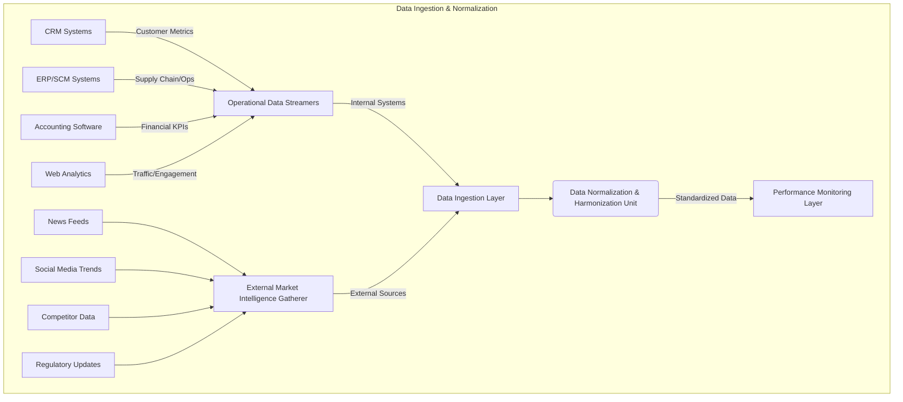
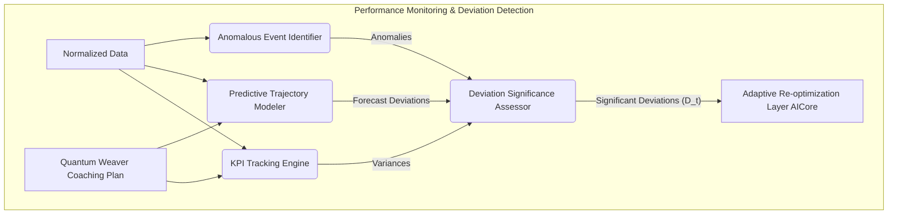
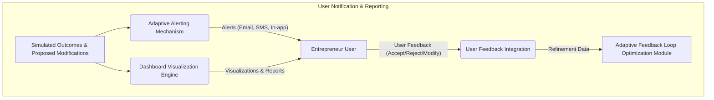
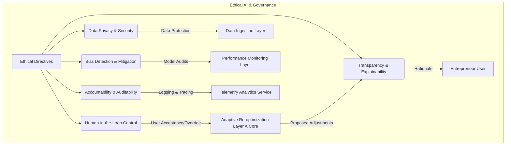
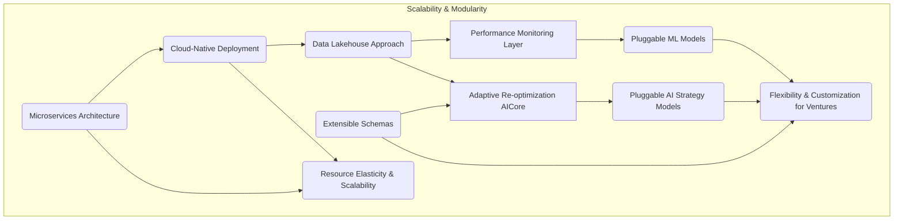
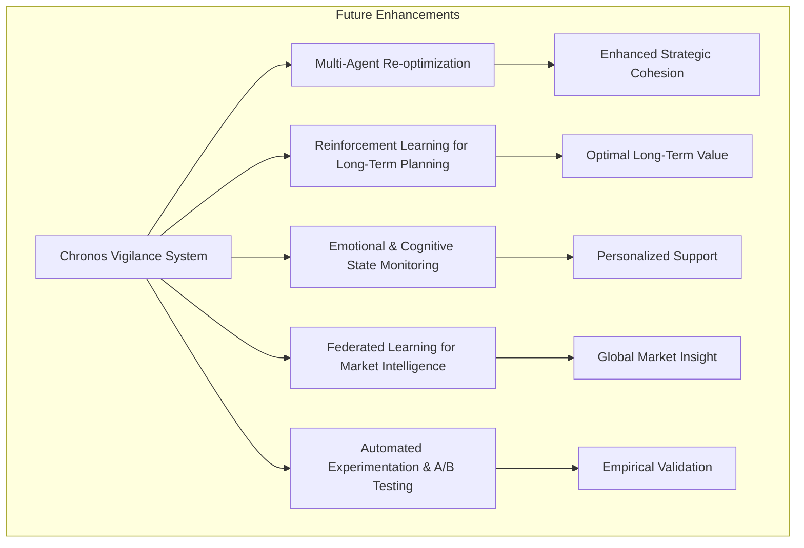

**Title of Invention:** System and Method for Adaptive Strategic Monitoring and Dynamic Trajectory Re-optimization for Entrepreneurial Ventures

**Abstract:**
A novel computational architecture and methodology are herein disclosed for the real-time, continuous monitoring and adaptive re-optimization of entrepreneurial strategic trajectories. Building upon an initial AI-generated strategic coaching plan, this system integrates diverse streams of operational metrics and external market intelligence. It employs advanced generative artificial intelligence and sophisticated analytical models to detect deviations from projected performance and market conditions, proactively identifying nascent risks and emergent opportunities. Upon detection of significant variance, the architecture autonomously orchestrates the dynamic refinement and amendment of the existing coaching plan, providing granular, actionable adjustments. This iterative, data-driven feedback loop ensures that entrepreneurial ventures maintain optimal alignment with their success objectives within a persistently stochastic and evolving market landscape, thereby establishing a paradigm for sustained strategic agility and enhanced long-term viability.

**Background of the Invention:**
The dynamic nature of contemporary markets renders static strategic plans increasingly susceptible to obsolescence, irrespective of their initial rigor. While systems such as the Quantum Weaverâ„¢ provide an unparalleled initial diagnostic and prescriptive strategic roadmap, their guidance is, by inherent design, a snapshot of optimal directionality at a specific temporal juncture. Entrepreneurial ventures, once launched, immediately confront a fluctuating reality encompassing unpredictable market shifts, unforeseen competitive pressures, evolving customer needs, and internal operational challenges. Traditional post-launch monitoring typically involves manual data aggregation, subjective interpretation, and reactive decision-making, processes prone to delays, cognitive biases, and insufficient granularity. This inherent lag and lack of comprehensive, real-time adaptivity often lead to suboptimal resource allocation, missed opportunities, and an elevated probability of premature venture failure, even for meticulously planned enterprises. There exists, therefore, a profound and urgent requirement for an automated, intelligent, and continuously adaptive instrumentality capable of proactively perceiving deviations from an optimal strategic path, dynamically re-calibrating objectives, and issuing prescriptive adjustments in real-time, thereby ensuring sustained alignment with success metrics within the volatile entrepreneurial ecosystem.

**Brief Summary of the Invention:**
The present invention, meticulously engineered as the **Chronos Vigilanceâ„¢ System for Adaptive Trajectory Re-optimization**, stands as a pioneering, autonomous cognitive architecture designed to extend the strategic efficacy of entrepreneurial ventures beyond initial planning into sustained operational excellence. This system operates as an intelligent, real-time co-pilot, executing a multi-phasic monitoring, diagnostic, and prescriptive protocol. Upon activation, the Chronos Vigilanceâ„¢ System dynamically ingests a continuous stream of granular operational data from the venture (e.g., financial KPIs, customer engagement metrics, sales pipeline status) and synthesizes this with real-time external market intelligence (e.g., industry news, competitor movements, economic indicators). A sophisticated `Dynamic Deviation Detector` continuously benchmarks observed performance and market reality against the prescriptive targets and assumptions embedded within the previously generated `Quantum Weaverâ„¢` coaching plan and its underlying mathematical models. When statistically significant deviations or emergent patterns are identified, an advanced generative AI-powered `Re-optimization Core` is activated. This core, guided by context-aware prompt heuristics, dynamically re-evaluates the venture's current state and market position. It then generates an updated, refined, and actionable set of strategic adjustments to the existing coaching plan. These adjustments are rigorously structured within an extensible JSON schema, comprising new action steps, modified timelines, re-prioritized objectives, and updated key performance indicators. This ensures structural integrity, machine-readability, and seamless integration into dynamic user interfaces, providing unparalleled real-time strategic agility and maintaining the venture's optimal trajectory amidst market turbulence.

**Detailed Description of the Invention:**

The **Chronos Vigilanceâ„¢ System for Adaptive Trajectory Re-optimization** constitutes a meticulously engineered, multi-layered computational framework designed to provide unparalleled automated, continuous strategic monitoring and adaptive guidance. Its architecture embodies a symbiotic integration of advanced data streaming, real-time analytics, generative AI models, and structured data methodologies, all orchestrated to deliver a robust, scalable, and highly accurate platform for sustained entrepreneurial success.

### System Architecture and Operational Flow

The core system comprises several interconnected logical and functional components, ensuring modularity, scalability, and robust error handling, specifically designed to integrate seamlessly with and augment the capabilities of the Quantum Weaverâ„¢ System.

#### 1. Data Ingestion & Normalization Layer
This layer is responsible for the continuous, real-time acquisition, preprocessing, and standardization of diverse data streams essential for comprehensive strategic monitoring.

*   **Operational Data Streamers:** Connects to the entrepreneurial venture's internal systems (e.g., CRM systems for customer metrics, ERP for supply chain, accounting software for financial KPIs, web analytics for traffic). It continuously pulls or receives push notifications for key internal performance indicators (KPIs).
*   **External Market Intelligence Gatherer:** Employs advanced web scraping, API integrations, and natural language processing (NLP) to collect real-time data from external sources. This includes news feeds, social media trends, competitor announcements, industry reports, regulatory updates, and macroeconomic indicators.
*   **Data Normalization Harmonization Unit:** Processes raw data from both internal and external sources, standardizing formats, resolving inconsistencies, and enriching datasets to ensure uniformity and high quality for subsequent analytical stages. This unit handles various data types (numerical, textual, categorical) and transforms them into a unified schema.


**Chart 1: Detailed Data Ingestion and Normalization Flow**

#### 2. Performance Monitoring & Deviation Detection Layer
This layer forms the analytical core, responsible for comparing current operational reality and market conditions against the strategic benchmarks and predictions generated by the Quantum Weaverâ„¢ System.

*   **KeyPerformanceIndicator KPITrackingEngine:** Continuously monitors all relevant internal KPIs against the `measurement_metrics` and `key_deliverables` defined in the Quantum Weaverâ„¢ generated coaching plan. It flags immediate variances from target values.
*   **Predictive Trajectory Modeler:** Utilizes advanced time series analysis (e.g., ARIMA models, Prophet, LSTM networks) and machine learning algorithms to forecast future performance trends based on historical data and current trajectories. It projects the likely evolution of key metrics and identifies early warning signs of deviation from the optimal path long before they become critical.
*   **Anomalous Event Identifier:** Employs statistical process control and unsupervised learning algorithms to detect sudden, unexpected shifts, outliers, or significant anomalies in both operational and market data streams that could indicate emergent threats or opportunities.
*   **Deviation Significance Assessor:** Applies probabilistic and statistical tests to quantify the significance of detected deviations, distinguishing between minor fluctuations and critical shifts that warrant AI-driven re-optimization.


**Chart 2: Performance Monitoring and Deviation Detection Flow**

#### 3. Adaptive Re-optimization Layer AICore
This is the intellectual core where generative AI orchestrates the dynamic adjustment of strategic plans.

*   **Dynamic Strategy Recommender:** A highly capable Generative LargeLanguageModel LLM or a suite of specialized transformer-based models (often a specialized fine-tuning of the Generative LLMCore from the Quantum Weaverâ„¢ system). When triggered by the `Deviation Significance Assessor`, this model ingests the current state (refined business plan, current operational data, market intelligence, detected deviations) and the active coaching plan. It then processes this information under a specific, context-aware prompt heuristic (e.g., "Act as a highly agile business strategist responsible for optimizing growth in a volatile market.") to determine the most effective strategic adjustments.
*   **Plan Modification Synthesizer:** Based on the recommendations from the `Dynamic Strategy Recommender`, this module articulates the required changes to the coaching plan. It generates new steps, modifies existing descriptions, adjusts timelines, re-prioritizes objectives, and proposes new `key_deliverables` and `measurement_metrics`. Crucially, it adheres strictly to the JSON schema defined for the coaching plan in the Quantum Weaverâ„¢ System, ensuring compatibility and structural integrity.
*   **Impact Assessment Simulator:** (Optional but highly recommended) Before presenting proposed modifications, this component uses sophisticated simulation models (e.g., Monte Carlo simulations, agent-based models) to estimate the potential positive and negative impacts of the proposed strategic adjustments across various future scenarios, providing a probabilistic assessment of their efficacy.

```mermaid
graph TD
    subgraph Adaptive Re-optimization Layer (AICore)
        D_t[Significant Deviations] --> PM[Prompt Engineering Module];
        CS[Current Business State] --> PM;
        ML[Market Intelligence] --> PM;
        OP[Operational Data] --> PM;
        ACP[Active Coaching Plan] --> PM;

        PM -- Context-aware Prompt (P_reoptimize) --> DSR(Dynamic Strategy Recommender);
        DSR -- Strategic Adjustments (R_reoptimize) --> PMS(Plan Modification Synthesizer);
        PMS -- Proposed Plan Modifications --> IAS(Impact Assessment Simulator);
        IAS -- Simulated Outcomes --> UNR[User Notification & Reporting Layer];
    end
```
**Chart 3: Adaptive Re-optimization AICore Workflow**

#### 4. User Notification & Reporting Layer
This layer ensures that entrepreneurs receive timely, actionable insights and interact effectively with the adaptive system.

*   **Adaptive Alerting Mechanism:** Provides customizable, multi-channel notifications (e.g., in-app, email, SMS) to the user when significant deviations are detected or when new strategic adjustments are proposed. Alerts are prioritized based on the severity and urgency of the identified issue.
*   **Dashboard Visualization Engine:** Presents a comprehensive, real-time dashboard that displays current operational performance, tracked KPIs against targets, detected deviations, forecasted trajectories, and the current active strategic coaching plan with proposed modifications highlighted. It employs interactive charts, graphs, and textual summaries for intuitive understanding.
*   **User Feedback Integration:** Allows users to provide explicit feedback on proposed plan adjustments, which can be fed back into the `Adaptive Feedback Loop Optimization Module` (from Quantum Weaverâ„¢) to further refine the AI's re-optimization capabilities.


**Chart 4: User Interaction and Reporting Flow**

#### 5. Auxiliary Services
Leverages and extends the Auxiliary Services from the Quantum Weaverâ„¢ System for enhanced intelligence and resilience.

*   **Telemetry Analytics Service:** Gathers performance metrics of the Chronos Vigilanceâ„¢ System itself, data ingestion efficiency, AI re-optimization latency, and user engagement with suggested adjustments.
*   **Security Module:** Extends data encryption and access control to the continuous data streams and generated adaptive plans.
*   **Adaptive Feedback Loop Optimization Module:** Now includes data from the Chronos Vigilanceâ„¢ System to continuously refine the `Prompt Engineering Module` and `Dynamic Strategy Recommender` within the Adaptive Re-optimization Layer, enhancing the accuracy and utility of real-time strategic adjustments.

```mermaid
graph TD
    subgraph Chronos Vigilance System
        A[Real-time Data Ingestion Layer] --> B[Performance Monitoring DeviationDetection Layer];
        B --> C[Adaptive Re-optimization Layer AICore];
        C --> D[User Notification Reporting Layer];

        A1[Operational Data Streamers] --> A;
        A2[External Market IntelligenceGatherer] --> A;
        A3[Data Normalization HarmonizationUnit] --> A;

        B1[KeyPerformanceIndicator KPITrackingEngine] --> B;
        B2[Predictive Trajectory Modeler] --> B;
        B3[Anomalous Event Identifier] --> B;
        B4[Deviation Significance Assessor] --> B;

        C1[Dynamic Strategy Recommender] --> C;
        C2[Plan Modification Synthesizer] --> C;
        C3[Impact Assessment Simulator] --> C;

        D1[Adaptive Alerting Mechanism] --> D;
        D2[Dashboard VisualizationEngine] --> D;
        D3[User Feedback Integration] --> D;

        Aux1[Telemetry Analytics Service] -- Monitors Performance --> A, B, C, D;
        Aux2[Security Module] -- Secures Data & Access --> A, B, C, D;
        Aux3[Adaptive Feedback Loop Optimization Module] -- Refines AI Models --> C1;
        D3 --> Aux3;
    end

    subgraph Integration with Quantum Weaver
        QW_CP[Quantum Weaver CoachingPlan Archive] --> B1;
        QW_CP --> B2;
        QW_CP --> C1;

        D --> U[Entrepreneur User];
        U -- Accepts Refinements --> QW_CP;
        QW_CP -- Updated Coaching Plan --> QW_CP;
        QW_Aux[Quantum Weaver Auxiliary Services] --> A;
        QW_Aux --> B;
        QW_Aux --> C;
        QW_Aux --> D;
    end

    style A fill:#DFF,stroke:#333,stroke-width:2px;
    style B fill:#FFF,stroke:#333,stroke-width:2px;
    style C fill:#DFD,stroke:#333,stroke-width:2px;
    style D fill:#ECE,stroke:#333,stroke-width:2px;
    style QW_CP fill:#EFF,stroke:#333,stroke-width:2px;
    style U fill:#DDD,stroke:#333,stroke-width:2px;
    style A1 fill:#AEC,stroke:#333,stroke-width:1px;
    style A2 fill:#AEC,stroke:#333,stroke-width:1px;
    style A3 fill:#AEC,stroke:#333,stroke-width:1px;
    style B1 fill:#FEF,stroke:#333,stroke-width:1px;
    style B2 fill:#FEF,stroke:#333,stroke-width:1px;
    style B3 fill:#FEF,stroke:#333,stroke-width:1px;
    style B4 fill:#FEF,stroke:#333,stroke-width:1px;
    style C1 fill:#CDC,stroke:#333,stroke-width:1px;
    style C2 fill:#CDC,stroke:#333,stroke-width:1px;
    style C3 fill:#CDC,stroke:#333,stroke-width:1px;
    style D1 fill:#CEC,stroke:#333,stroke-width:1px;
    style D2 fill:#CEC,stroke:#333,stroke-width:1px;
    style D3 fill:#CEC,stroke:#333,stroke-width:1px;
    style QW_Aux fill:#CFC,stroke:#333,stroke-width:2px;
    style Aux1 fill:#FCF,stroke:#333,stroke-width:1px;
    style Aux2 fill:#FCF,stroke:#333,stroke-width:1px;
    style Aux3 fill:#FCF,stroke:#333,stroke-width:1px;
```
**Chart 5: Expanded Chronos Vigilance System Architecture with Auxiliary Services**

### Continuous AI Interaction and Adaptive Prompt Engineering

The efficacy of the Chronos Vigilanceâ„¢ System is predicated on its ability to continuously monitor, diagnose, and dynamically re-optimize, driven by a sophisticated interplay with generative AI models and real-time data.

#### Phase 1: Real-time Data Assimilation and Deviation Detection

1.  **Input:** Continuous streams of `O_t` (operational data) and `M_t` (market intelligence) from the `Data Ingestion Layer`. The active `Coaching Plan` (`A_active`) from the `Quantum Weaver Coaching Plan Archive`.
2.  **Processing (`Performance Monitoring & Deviation Detection Layer`):**
    The `KPITrackingEngine` compares `O_t` against `A_active`'s `measurement_metrics`.
    The `Predictive Trajectory Modeler` forecasts `O_{t+k}` and `M_{t+k}` and compares against `A_active`'s implicit and explicit objectives.
    The `Anomalous Event Identifier` scans for significant, unexpected changes in `O_t` or `M_t`.
    The `Deviation Significance Assessor` quantifies any discrepancies, `D_t`, determining if they cross predefined thresholds for strategic re-evaluation.

```mermaid
graph TD
    subgraph Deviation Detection Decision Process
        Start((Data Streams)) --> Ingest[Ingest & Normalize Data];
        Ingest --> Monitor[Monitor KPIs & Trends (O_t, M_t)];
        Monitor --> Compare[Compare to A_active targets & forecasts];
        Compare --> DetectDev[Detect Deviations (D_t)];
        DetectDev --> AssessSig{Is D_t Statistically Significant?};
        AssessSig -- No --> Monitor;
        AssessSig -- Yes --> TriggerAI[Trigger Adaptive Re-optimization AI Core];
    end
```
**Chart 6: Deviation Detection Decision Process**

#### Phase 2: Dynamic Strategy Re-optimization (`G_reoptimize`)

1.  **Trigger:** `D_t` exceeds a critical threshold, signaling a need for plan adjustment.
2.  **Prompt Construction (`Prompt Engineering Module` - from Quantum Weaver, extended):**
    A highly specific, dynamic prompt, `P_reoptimize`, is constructed for the `Dynamic Strategy Recommender`. `P_reoptimize` is structured as follows:

    ```
    "Role: You are a hyper-agile, senior strategic advisor within a leading venture capital firm. Your primary directive is to ensure the sustained optimal trajectory of the current venture, reacting intelligently to real-time market shifts and operational performance deviations.

    Instruction 1: Analyze the provided current business state, the detected operational and market deviations, and the existing strategic coaching plan.
    Instruction 2: Identify the root causes and implications of the deviations. Based on this analysis, propose precise, actionable adjustments to the existing coaching plan. These adjustments must include:
        a. New strategic steps (if necessary)
        b. Modifications to existing step descriptions
        c. Adjustments to timelines (e.g., accelerate, defer, extend)
        d. Re-prioritization of existing steps
        e. Updates to key deliverables and measurement metrics to reflect the new reality.
    Instruction 3: Ensure the adjusted plan maintains an overall strategic coherence and aims to re-optimize the venture's probability of success. Provide a concise rationale for each major adjustment.
    Instruction 4: Structure your response strictly according to the provided JSON schema, which extends the original coaching plan schema. Do not deviate.

    JSON Schema (example structure; full schema would be provided dynamically):
    {
      "re_optimization_event_id": "string",
      "timestamp": "datetime",
      "current_business_state_summary": "string",
      "detected_deviations_summary": "string",
      "original_coaching_plan_id": "string",
      "recommended_plan_modifications": {
        "overall_rationale": "string",
        "modified_steps": [
          {
            "step_number": "integer",
            "modification_type": "string", // e.g., "new", "updated", "re-prioritized"
            "original_title": "string", // null if new
            "new_title": "string",
            "description_change": "string", // delta description
            "original_timeline": "string", // null if new
            "new_timeline": "string",
            "original_key_deliverables": ["string", ...],
            "new_key_deliverables": ["string", ...],
            "original_measurement_metrics": ["string", ...],
            "new_measurement_metrics": ["string", ...]
            "justification": "string"
          },
          ... (for all 4 updated steps, or more if new ones are added)
        ],
        "new_steps": [
            {
                "step_number": "integer",
                "title": "string",
                "description": "string",
                "timeline": "string",
                "key_deliverables": ["string", ...],
                "measurement_metrics": ["string", ...],
                "justification": "string"
            }
        ]
      }
    }

    Current Business Plan Refined: """
    [Textual representation of the current refined business plan]
    """

    Current Operational Data Snapshot: """
    [Summary of O_t, key KPI values and trends]
    """

    Latest Market Intelligence Snapshot: """
    [Summary of M_t, relevant market shifts, competitor actions]
    """

    Detected Deviations: """
    [Detailed report of D_t from Deviation Significance Assessor]
    """

    Active Coaching Plan: """
    [JSON representation of A_active]
    """
    "
    ```
    This prompt leverages sophisticated "role-playing" (agile strategist), "multi-source integration" (plan, ops data, market data, deviations), "specific modification directives" (new steps, timelines, etc.), and "strict schema enforcement" for generating highly structured, actionable re-optimizations.

3.  **AI Inference:** The `AI Inference Layer` (from Quantum Weaver, augmented for real-time data) processes `P_reoptimize` along with the contextual data, generating a JSON response, `R_reoptimize`.
4.  **Output Processing:** `R_reoptimize` is parsed and rigorously validated by the `Response Parser & Validator`. If valid, the proposed `recommended_plan_modifications` are presented to the user via the `Dashboard Visualization Engine` and `Adaptive Alerting Mechanism` for review and potential acceptance. Accepted modifications are then committed back to the `Coaching Plan Archive` as an updated `A_active`, closing the adaptive loop.

This continuous, data-driven, AI-orchestrated process transforms static strategic planning into a dynamically responsive, self-optimizing system, profoundly enhancing the resilience and success probability of entrepreneurial endeavors.

```mermaid
graph TD
    subgraph Chronos Vigilance Trajectory Re-optimization
        subgraph Static Plan Degradation
            SP_INIT[Initial Static Plan (A0)] --> SP_T1[Suboptimal at T1];
            SP_T1 --> SP_T2[Highly Suboptimal at T2];
            style SP_INIT fill:#CCE,stroke:#333,stroke-width:2px;
            style SP_T1 fill:#FEE,stroke:#333,stroke-width:1px;
            style SP_T2 fill:#FAA,stroke:#333,stroke-width:1px;
        end

        subgraph Adaptive Plan Optimization
            AP_INIT[Initial Adaptive Plan (A_active)] --> AP_MON[Continuous Monitoring];
            AP_MON --> AP_DET[Deviation Detection (D_t)];
            AP_DET -- Threshold Exceeded --> AP_REOPT[Re-optimization (G_reoptimize)];
            AP_REOPT --> AP_UPDATE[Updated Adaptive Plan (A'_active)];
            AP_UPDATE --> AP_MON;
            style AP_INIT fill:#CEC,stroke:#333,stroke-width:2px;
            style AP_MON fill:#DED,stroke:#333,stroke-width:1px;
            style AP_DET fill:#DED,stroke:#333,stroke-width:1px;
            style AP_REOPT fill:#CFC,stroke:#333,stroke-width:1px;
            style AP_UPDATE fill:#CFC,stroke:#333,stroke-width:1px;
        end

        SP_T2 -. Value Degradation .-> Loss(High Risk of Failure);
        AP_UPDATE -. Sustained Value .-> Success(Enhanced Viability);

        linkStyle 0 stroke-dasharray: 5 5;
        linkStyle 1 stroke-dasharray: 5 5;
        linkStyle 2 stroke-dasharray: 5 5;
        linkStyle 9 stroke-dasharray: 5 5;
    end
```
**Chart 7: Strategic Trajectory Comparison: Static vs. Adaptive Plans**

### Ethical AI Considerations and Governance

The deployment of an autonomous strategic re-optimization system like Chronos Vigilance necessitates robust ethical guidelines and a clear governance framework. This ensures that AI-driven decisions align with human values, prevent unintended consequences, and maintain transparency and accountability.

*   **Transparency and Explainability (XAI):** The system is designed to provide clear rationales for proposed plan modifications (`justification` fields in JSON, `overall_rationale`). This is crucial for user trust and for entrepreneurs to understand *why* a particular adjustment is recommended.
*   **Bias Detection and Mitigation:** Continuous monitoring for algorithmic bias in data ingestion, deviation detection, and strategy recommendation phases. Algorithms are regularly audited for fairness, especially when dealing with market data that might reflect historical biases or operational data that could inadvertently discriminate.
*   **Human-in-the-Loop Control:** While autonomous, all significant re-optimizations require user review and explicit acceptance. This ensures human oversight, allowing entrepreneurs to override or refine AI suggestions based on tacit knowledge or subjective judgment that the AI might not possess.
*   **Data Privacy and Security:** Strict adherence to data governance principles (GDPR, CCPA, etc.). All sensitive operational and market data is anonymized, encrypted, and access-controlled. The `Security Module` is paramount.
*   **Accountability:** Clear pathways for tracing AI decisions back to specific data inputs, model parameters, and prompt heuristics, enabling post-hoc analysis and accountability for strategic outcomes.


**Chart 8: Ethical AI and Governance Framework**

### Scalability and Modularity of the Chronos Vigilance System

The system is architected for high scalability and modularity to handle increasing data volumes, diverse venture types, and evolving analytical requirements.

*   **Microservices Architecture:** Each layer and most components within them are designed as loosely coupled microservices, enabling independent development, deployment, and scaling.
*   **Cloud-Native Deployment:** Leverages cloud infrastructure (e.g., Kubernetes, serverless functions) for elastic scaling of compute and storage resources based on real-time demand.
*   **Data Lakehouse Approach:** For data storage and processing, a data lakehouse architecture combines the flexibility of a data lake with the structure of a data warehouse, allowing for both raw data storage and structured querying for analytical tasks.
*   **Extensible Schema for Coaching Plans:** The JSON schema for `A_active` is designed to be extensible, allowing for the addition of new `key_deliverables`, `measurement_metrics`, and `action_types` as entrepreneurial strategies evolve.
*   **Pluggable AI Models:** The `Dynamic Strategy Recommender` and `Predictive Trajectory Modeler` can integrate various AI/ML models, allowing for easy updates or swaps to incorporate state-of-the-art algorithms without disrupting the entire system.


**Chart 9: Scalability and Modularity Architecture**

### Future Enhancements and Research Directions

The Chronos Vigilance System, while robust, is an evolving platform with significant potential for future advancements:

*   **Multi-Agent Re-optimization:** Deploying specialized AI agents for different strategic domains (e.g., marketing, finance, product) that collaborate to propose an integrated re-optimization plan.
*   **Reinforcement Learning for Long-term Planning:** Evolving the `Dynamic Strategy Recommender` from a purely generative model to a reinforcement learning agent that continuously learns optimal policy adjustments based on observed long-term outcomes of its recommendations.
*   **Emotional and Cognitive State Monitoring:** Integrating biometric and psychological indicators (with user consent) to understand the entrepreneurial state and tailor communication and support.
*   **Federated Learning for Market Intelligence:** Leveraging federated learning approaches to gather generalized market insights from multiple participating ventures without sharing proprietary data, enhancing overall predictive power.
*   **Automated Experimentation (A/B Testing):** Integrating capabilities for the system to suggest and, where feasible, autonomously orchestrate A/B tests on strategic adjustments, directly measuring their impact.


**Chart 10: Future Enhancements Roadmap**

**Claims:**

We assert the exclusive intellectual construct and operational methodology embodied within the Chronos Vigilanceâ„¢ System through the following foundational declarations:

1.  A system for continuous adaptive strategic re-optimization for entrepreneurial ventures, comprising:
    a.  A data ingestion and normalization layer configured to continuously acquire, preprocess, and standardize real-time operational data from an internal venture and external market intelligence;
    b.  A performance monitoring and deviation detection layer communicatively coupled to the data ingestion and normalization layer, configured to:
        i.  Continuously monitor the internal operational data against predetermined key performance indicators and strategic objectives derived from an initial AI-generated coaching plan;
        ii. Employ predictive modeling to forecast future performance trajectories and identify early deviations from said strategic objectives;
        iii. Detect anomalous events and statistically significant deviations in both internal operational data and external market intelligence;
    c.  An adaptive re-optimization layer AICore communicatively coupled to the performance monitoring and deviation detection layer, comprising a generative artificial intelligence model configured to:
        i.  Receive detected deviations, current operational data, and market intelligence;
        ii. Dynamically re-evaluate the venture's strategic context;
        iii. Generate prescriptive modifications to the initial AI-generated coaching plan, including new steps, adjusted timelines, modified descriptions, and updated metrics;
        iv. Adhere strictly to a predefined extensible JSON schema for said modifications;
    d.  A user notification and reporting layer configured to present the detected deviations and the AI-generated prescriptive modifications to a user via an interactive dashboard and adaptive alerting mechanism.

2.  The system of claim 1, wherein the initial AI-generated coaching plan and its objectives are derived from a multi-stage strategic analysis system, such as the Quantum Weaverâ„¢ System.

3.  The system of claim 1, wherein the data ingestion and normalization layer comprises dedicated operational data streamers and an external market intelligence gatherer, integrated with a data normalization and harmonization unit.

4.  The system of claim 1, wherein the performance monitoring and deviation detection layer further comprises a KeyPerformanceIndicator KPITrackingEngine, a Predictive Trajectory Modeler, an Anomalous Event Identifier, and a Deviation Significance Assessor.

5.  The system of claim 1, wherein the adaptive re-optimization layer AICore further comprises a Dynamic Strategy Recommender, a Plan Modification Synthesizer, and an Impact Assessment Simulator.

6.  A method for continuous adaptive strategic re-optimization of entrepreneurial ventures, comprising:
    a.  Continuously acquiring and normalizing, by a computational system, real-time internal operational data and external market intelligence;
    b.  Monitoring, by said computational system, the acquired data against an initial AI-generated strategic coaching plan to detect deviations and anomalous events;
    c.  Employing, by said computational system, predictive modeling to forecast future performance and identify early warning signs of deviation from the strategic plan;
    d.  Generating, by a generative artificial intelligence model within said computational system, prescriptive modifications to said strategic coaching plan, in response to detected deviations and emergent market conditions;
    e.  Adhering, by said generative artificial intelligence model, to a predefined extensible JSON schema for the generation of said plan modifications;
    f.  Presenting, by a user interface of said computational system, the detected deviations and the generated plan modifications to an originating user.

7.  The method of claim 6, wherein the step of generating prescriptive modifications further comprises leveraging a context-aware prompt heuristic to configure the generative AI model to assume a specific adaptive strategic persona.

8.  The method of claim 6, further comprising, prior to presenting the modifications, simulating the potential impact of said modifications to assess their efficacy across various scenarios.

9.  The method of claim 6, further comprising storing the original and modified strategic coaching plans in a secure data persistence unit, maintaining a version history of strategic adjustments.

10. A non-transitory computer-readable medium storing instructions that, when executed by one or more processors, cause the one or more processors to perform the method of claim 6.

11. The system of claim 1, further comprising an Adaptive Feedback Loop Optimization Module configured to receive user feedback on proposed modifications and system telemetry to continuously refine the generative AI model's re-optimization capabilities.

12. The system of claim 1, wherein the external market intelligence gatherer is configured to integrate with social media trends, competitor announcements, and macroeconomic indicators via advanced web scraping and API integrations.

13. The system of claim 4, wherein the Predictive Trajectory Modeler utilizes time series analysis models selected from the group consisting of ARIMA, Prophet, and LSTM networks.

14. The system of claim 5, wherein the Impact Assessment Simulator is configured to employ Monte Carlo simulations to estimate potential impacts of proposed strategic adjustments across various future scenarios.

15. The method of claim 6, wherein the step of monitoring further comprises detecting anomalous events using statistical process control and unsupervised learning algorithms.

16. The method of claim 6, wherein the step of presenting includes providing customizable, multi-channel notifications prioritized by severity and urgency.

17. The method of claim 6, further comprising validating the structural integrity and machine-readability of the generated plan modifications against the predefined extensible JSON schema.

18. The system of claim 1, further comprising a Security Module configured to apply data encryption and access control to the continuous data streams and generated adaptive plans.

19. The system of claim 1, wherein the data normalization and harmonization unit is configured to standardize diverse data formats, resolve inconsistencies, and enrich datasets into a unified schema.

20. The method of claim 6, further comprising maintaining a version history of all strategic coaching plans and their modifications for auditability and retrospective analysis.

**Mathematical Justification: Chronos Vigilance's Adaptive Control and Continuous State Optimization**

Building upon the Quantum Weaverâ„¢ System's foundational mathematical framework for business plan valuation `V(B)` and optimal control trajectories `G_plan`, the Chronos Vigilanceâ„¢ System introduces a layer of real-time adaptive control and continuous state optimization. We extend the conceptualization of the business plan as a point `B` in a manifold `M_B` and the strategic coaching plan `A = (a_1, ..., a_n)` as an optimal policy `pi*(s)` within a Markov Decision Process (MDP).

### I. Dynamic State Space and Observation Model

The state `S_t` of the business at time `t` is now significantly enriched and dynamic:
`S_t = (B', C_t, M_t, O_t)`
where `B'` is the refined business plan (from Quantum Weaver), `C_t` are internal resources, `M_t` is the observed market state (from `External Market Intelligence Gatherer`), and `O_t` are granular operational metrics (from `Operational Data Streamers`). This significantly expands the state space, `S`, making `pi*(s)` highly sensitive to real-time inputs.

The observations `Y_t` are noisy measurements of `S_t`. The `Data Ingestion Layer` and `Data Normalization Harmonization Unit` aim to minimize this noise, but inherent uncertainty remains. We model the state evolution with a stochastic process:
```
(1) S_{t+1} = f(S_t, a_t, w_t)
(2) Y_t = h(S_t, v_t)
```
where `f` is the state transition function, `h` is the observation function, and `w_t ~ N(0, Q_t)` is the process noise, `v_t ~ N(0, R_t)` is the observation noise, typically assumed to be Gaussian.

**Proposition 1.1: Optimal State Estimation for Adaptive Control.**
The `Performance Monitoring & Deviation Detection Layer` implicitly performs continuous Bayesian state estimation, computing `P(S_t | Y_{0:t})`, the posterior probability distribution of the current state given all observations up to time `t`. This is critical for robust adaptive control.

The Bayesian update for the state estimate can be expressed:
```
(3) P(S_t | Y_{0:t}) = [P(Y_t | S_t) * P(S_t | Y_{0:t-1})] / P(Y_t | Y_{0:t-1})
```
Where `P(S_t | Y_{0:t-1})` is the prior state prediction, often derived from the transition model `P(S_t | S_{t-1})` and the previous posterior `P(S_{t-1} | Y_{0:t-1})`:
```
(4) P(S_t | Y_{0:t-1}) = integral P(S_t | S_{t-1}) * P(S_{t-1} | Y_{0:t-1}) dS_{t-1}
```
For linear Gaussian systems, a Kalman filter can be used. For non-linear or non-Gaussian systems, extended Kalman filters (EKF), unscented Kalman filters (UKF), or particle filters are employed.

Let `hat{S}_t` be the estimated state and `Sigma_t` its covariance.
**Kalman Prediction Step:**
```
(5) hat{S}_{t|t-1} = F_t * hat{S}_{t-1|t-1} + B_t * u_t
(6) Sigma_{t|t-1} = F_t * Sigma_{t-1|t-1} * F_t^T + Q_t
```
Where `F_t` is the state transition matrix, `B_t` is the control input matrix, `u_t` is the control vector.
**Kalman Update Step:**
```
(7) K_t = Sigma_{t|t-1} * H_t^T * (H_t * Sigma_{t|t-1} * H_t^T + R_t)^{-1}
(8) hat{S}_{t|t} = hat{S}_{t|t-1} + K_t * (Y_t - H_t * hat{S}_{t|t-1})
(9) Sigma_{t|t} = (I - K_t * H_t) * Sigma_{t|t-1}
```
Where `K_t` is the Kalman gain, `H_t` is the observation matrix.

The `Predictive Trajectory Modeler` leverages time-series models to forecast future states `E[S_{t+k} | Y_{0:t}]`, enabling proactive deviation detection. For example, an ARIMA(p,d,q) model for a univariate series `X_t`:
```
(10) (1 - sum_{i=1}^p phi_i B^i) (1 - B)^d X_t = (1 + sum_{j=1}^q theta_j B^j) epsilon_t
```
where `B` is the backshift operator, `phi_i` are autoregressive coefficients, `theta_j` are moving average coefficients, and `epsilon_t` is white noise. For multivariate data, Vector Autoregression (VAR) or Vector Error Correction Models (VECM) are used.
The forecast `hat{X}_{t+h|t}` is computed based on this model.
The forecast error `e_{t+h} = X_{t+h} - hat{X}_{t+h|t}`.
The Mean Squared Error (MSE) for forecasts:
```
(11) MSE = E[e_{t+h}^2]
```
Confidence intervals for forecasts (e.g., 95% CI):
`hat{X}_{t+h|t} +/- 1.96 * sigma_h` where `sigma_h` is the standard deviation of the h-step-ahead forecast error.

This allows the system to maintain an updated, probabilistic understanding of the venture's actual position in `M_B` relative to its intended trajectory.

### II. Real-time Deviation Detection and Change Point Analysis

The `Deviation Significance Assessor` rigorously identifies when the actual trajectory diverges from the planned optimal path.

**Proposition 2.1: Statistical Significance of Deviation.**
A deviation `D_t` is considered significant if the probability of the observed `O_t` and `M_t` occurring under the assumption of following the optimal policy `pi*(s)` falls below a predefined threshold `epsilon`.

This can be formulated as a hypothesis test:
*   Null Hypothesis (`H_0`): The business is still on the planned trajectory (`S_t` is within expected bounds of `pi*(s)`).
*   Alternative Hypothesis (`H_1`): A significant deviation has occurred (`S_t` is outside expected bounds).

Let `K_t` be a KPI, `K_t^target` be its target value, and `K_t^actual` be the observed value.
The deviation `delta_t = K_t^actual - K_t^target`.
The relative deviation `rho_t = (K_t^actual - K_t^target) / K_t^target`.
The `KPITrackingEngine` monitors these.

Change point detection algorithms (e.g., CUSUM, EWMA, Bayesian change point detection) are used to robustly identify `t_c` where the statistical properties of the incoming data streams `(O_t, M_t)` change significantly relative to the expected distribution implied by `A_active`. This triggers the `Adaptive Re-optimization Layer AICore`.

**CUSUM (Cumulative Sum) Chart for Mean Shift:**
`S_t^+ = max(0, S_{t-1}^+ + X_t - mu_0 - k)` for upward shifts.
`S_t^- = max(0, S_{t-1}^- + mu_0 - X_t - k)` for downward shifts.
A signal is generated if `S_t^+ > h` or `S_t^- > h`.
Here, `X_t` is the observed metric, `mu_0` is the target mean, `k` is a reference value (e.g., `sigma/2`), and `h` is a control limit.

**EWMA (Exponentially Weighted Moving Average) Chart:**
`Z_t = lambda * X_t + (1 - lambda) * Z_{t-1}`
`LCL/UCL = mu_0 +/- L * sigma * sqrt(lambda / (2 - lambda) * (1 - (1 - lambda)^{2t}))`
`Z_t` is the EWMA statistic, `lambda` is the weighting factor (0 < lambda <= 1), `L` is the control limit width (e.g., 3 for 3-sigma).

**Bayesian Change Point Detection:**
The posterior probability of a change point at time `tau` given observations `Y_{1:t}`:
```
(12) P(tau | Y_{1:t}) = P(Y_{1:t} | tau) * P(tau) / P(Y_{1:t})
```
where `P(Y_{1:t} | tau) = P(Y_{1:tau}) * P(Y_{tau+1:t} | Y_{1:tau})`.
The likelihood ratio test for a change in mean `mu_0` to `mu_1`:
```
(13) L(Y) = product_{i=t_0}^{t_1} P(y_i | H_1) / product_{i=t_0}^{t_1} P(y_i | H_0)
```
If `L(Y)` exceeds a threshold, a change is detected.

The `Anomalous Event Identifier` uses unsupervised methods. For a data point `x_i`, an anomaly score `A(x_i)` is calculated.
For Isolation Forest, `A(x_i) = 2^{-E(h(x_i))/c(N)}`, where `E(h(x_i))` is the average path length of `x_i` in isolation trees, and `c(N)` is the average path length of unsuccessful search in a binary search tree. High `A(x_i)` indicates an anomaly.
For DBSCAN, points not assigned to a cluster are outliers.
The `Deviation Significance Assessor` quantifies `D_t` as a vector of deviations and anomaly scores. A combined deviation metric `D_aggregate_t` can be calculated, e.g., a weighted sum or a Mahalanobis distance from the expected trajectory:
```
(14) D_aggregate_t = sqrt((S_t - S_t^{expected})^T * Sigma_t^{-1} * (S_t - S_t^{expected}))
```
where `Sigma_t` is the covariance of `S_t`. A re-optimization trigger occurs if `D_aggregate_t > Threshold_D`.

### III. Adaptive Policy Re-optimization: `G_reoptimize`

When a significant deviation is detected at `t_c`, the system initiates a `G_reoptimize` function, which re-solves (or approximates a re-solution of) the Bellman optimality equation for the current state `S_{t_c}`.

**Proposition 3.1: Dynamic Bellman Equation Recalculation.**
The `Dynamic Strategy Recommender` within `G_reoptimize` approximates the solution to a dynamically updated Bellman optimality equation. The underlying problem is modeled as an MDP `(S, A, P, R, gamma)`, where:
*   `S`: State space (current business state, market, operations)
*   `A`: Action space (possible strategic adjustments to the coaching plan)
*   `P(s' | s, a)`: State transition probability (how actions affect future states)
*   `R(s, a)`: Reward function (profit, market share, customer satisfaction, long-term viability)
*   `gamma`: Discount factor (0 <= gamma < 1)

The objective is to find an optimal policy `pi*(s)` that maximizes the expected cumulative discounted reward:
```
(15) V^*(s) = max_a [R(s, a) + gamma * sum_{s'} P(s' | s, a) * V^*(s')]
```
This is the Bellman optimality equation.
The `Dynamic Strategy Recommender` (an LLM) implicitly learns to perform this dynamic re-optimization. Its role is to quickly compute `argmax_a` given the current `S_t` and a revised understanding of `R(s, a)` and `P(s' | s, a)`. This is akin to an online reinforcement learning agent, where `R(s,a)` is re-evaluated based on real-time feedback and `P(s'|s,a)` is updated using the `Predictive Trajectory Modeler`.

The reward function `R(s, a)` can be complex, incorporating multiple KPIs:
```
(16) R(s, a) = w_1 * (KPI_1(s,a) - KPI_1^{target}) + w_2 * (KPI_2(s,a) - KPI_2^{target}) - C(a)
```
Where `w_i` are weights, `KPI_i` are performance indicators, and `C(a)` is the cost of implementing action `a`.

For LLM-based re-optimization, the `Prompt Engineering Module` constructs `P_reoptimize` to guide the LLM's "thinking process." The LLM acts as a policy function `pi_LLM(s)`:
```
(17) A'_active = pi_LLM(S_{t_c}, D_{t_c}, A_{active}, R_model, P_model)
```
where `R_model` and `P_model` are implicitly learned representations of the reward and transition dynamics.

The `Plan Modification Synthesizer` transforms the LLM's textual output into the structured JSON schema. This involves parsing, validation, and adherence to specific templates.
Let `JSON_schema` be the target schema.
```
(18) R_reoptimize = LLM_generate(P_reoptimize)
(19) A'_active_json = Synthesize(R_reoptimize, JSON_schema)
```
Validation step: `Validate(A'_active_json, JSON_schema) = {True, False}`.

The `Impact Assessment Simulator` performs a look-ahead by running Monte Carlo simulations of the modified plan `A'_active` from `S_{t_c}`.
For each simulation `j` out of `N` runs, a sequence of future states `s_{t_c+k}^{(j)}` and actions `a_{t_c+k}^{(j)}` is generated using `f` and `pi_LLM`.
The expected cumulative reward for a proposed plan `A'_active`:
```
(20) E[R_cumulative(A'_active)] = (1/N) * sum_{j=1}^N [sum_{k=0}^{horizon-1} gamma^k * R(s_{t_c+k}^{(j)}, a_{t_c+k}^{(j)})]
```
This provides a quantifiable confidence metric for the proposed adjustments.
The simulator also calculates Risk at Value (VaR) or Conditional Value at Risk (CVaR) to quantify downside risks:
Let `L^{(j)}` be the loss for simulation `j`.
`VaR_alpha(L) = min{l | P(L > l) <= 1-alpha}`.
`CVaR_alpha(L) = E[L | L >= VaR_alpha(L)]`.

### IV. Continuous Trajectory Refinement and Feedback

The Chronos Vigilanceâ„¢ System's continuous operation ensures that the venture is always guided by the most up-to-date optimal policy. This is equivalent to continuously moving the business towards the optimal submanifold `M_B*` within the high-dimensional `M_B` manifold, even as external forces attempt to push it away. The system's adaptive nature ensures that `B_t` (the effective business plan at time `t`) always remains as close as possible to the global optimum, `B*`.

The `Adaptive Feedback Loop Optimization Module` (AFLOM) continuously refines the system.
User feedback `F_user` (acceptance/rejection, qualitative comments) provides additional reward signals.
If a proposed plan `A'_active` is accepted, it becomes `A_active` for the next period. If rejected, a penalty `R_penalty` is applied to the AI's implicit reward function for that particular recommendation.
The prompt engineering heuristics `H_prompt` are also refined:
```
(21) H_prompt_{new} = Update(H_prompt_{old}, F_user, Telemetry_data)
```
This can involve training a meta-learner that learns to optimize the prompts themselves, or adjusting hyper-parameters of prompt generation.
The weights `w_i` in the reward function (Eq. 16) can also be adaptively updated based on user priorities.
This creates a self-improving system where `pi_LLM` constantly gets better at generating relevant and accepted strategic adjustments.

### V. Mathematical Foundations of Data Processing Layers

#### V.1. Data Ingestion & Normalization Layer

Data streams `D_I = {d_{i,t}}` (internal) and `D_E = {d_{e,t}}` (external).
Normalization involves transformations `T`:
```
(22) d'_{i,t} = T_i(d_{i,t})
(23) d'_{e,t} = T_e(d_{e,t})
```
Where `T` could be scaling, log transforms, one-hot encoding for categorical data.
For textual data `d_text`, `T_text` includes tokenization, stemming, TF-IDF or embedding generation:
```
(24) V_text = Embedding(d_text)
```
Data fusion for heterogeneous data: `S_t = Phi(d'_1, ..., d'_N)`. This could be concatenation or more complex methods like multimodal fusion networks.

#### V.2. Performance Monitoring & Deviation Detection Layer

**KPI Tracking Engine:**
Percentage Error `PE_t(KPI_j) = (KPI_j^{actual}(t) - KPI_j^{target}(t)) / KPI_j^{target}(t) * 100%`
Mean Absolute Percentage Error (MAPE) `MAPE = (1/N) sum |PE_t|`
Hypothesis testing for `KPI_j^{actual}` vs `KPI_j^{target}`.
Null hypothesis `H_0: mu_j = mu_j^{target}`.
T-statistic `t = (mean(KPI_j^{actual}) - mu_j^{target}) / (s_j / sqrt(n))`.
P-value `p = P(|T| > |t|)`. A deviation is flagged if `p < alpha`.

**Predictive Trajectory Modeler:**
LSTM network for sequential data `X_t`:
A single LSTM unit processes input `x_t`, previous hidden state `h_{t-1}`, and cell state `c_{t-1}` to produce `h_t`, `c_t`.
Input gate `i_t = sigma(W_{xi}x_t + W_{hi}h_{t-1} + b_i)`
Forget gate `f_t = sigma(W_{xf}x_t + W_{hf}h_{t-1} + b_f)`
Output gate `o_t = sigma(W_{xo}x_t + W_{ho}h_{t-1} + b_o)`
Cell state candidate `g_t = tanh(W_{xc}x_t + W_{hc}h_{t-1} + b_c)`
New cell state `c_t = f_t * c_{t-1} + i_t * g_t`
New hidden state `h_t = o_t * tanh(c_t)`
where `sigma` is sigmoid, `tanh` is hyperbolic tangent, `W` are weights, `b` are biases.
The output `Y_t_forecast = W_y h_t + b_y`.

**Anomalous Event Identifier:**
For a time series `X_t`, residual error `e_t = X_t - hat{X}_t`.
Control limits for `e_t`: `mu_e +/- L * sigma_e`.
Statistical Process Control charts for `e_t` as described in Section II.
Mahalanobis Distance for multivariate anomaly detection:
`MD(x) = sqrt((x - mu)^T * Sigma^{-1} * (x - mu))`
If `MD(x) > Threshold_MD`, then `x` is an anomaly.

**Deviation Significance Assessor:**
Considers a composite deviation score `D_t_composite = Phi(PE_1, ..., PE_N, MD_market, Anomaly_score)`.
Uses a Bayesian decision rule for triggering re-optimization:
`P(Reoptimize | D_t_composite) > P(NoReoptimize | D_t_composite)`
`P(Reoptimize | D_t_composite) = P(D_t_composite | Reoptimize) * P(Reoptimize) / P(D_t_composite)`
The `Threshold_D` is chosen to optimize precision and recall for re-optimization triggers.

### VI. Advanced Aspects of Adaptive Re-optimization Layer

**Dynamic Strategy Recommender (LLM-based RL):**
The LLM can be conceptualized as learning a policy `pi(s)` that maps states to actions (strategic adjustments). This policy is learned through vast amounts of text data representing business strategies, market responses, and entrepreneurial outcomes.
The prompt `P_reoptimize` serves as a contextual guide, defining the "state" `s` and the "reward function" `R` for the LLM.
The LLM generates `A'_active` by optimizing a likelihood function `P(A'_active | s, P_reoptimize, theta_LLM)` where `theta_LLM` are the LLM's parameters.
The process can be further formalized with inverse reinforcement learning (IRL), where the LLM tries to infer the reward function of successful entrepreneurial ventures and then generate actions that optimize for that inferred reward function given the current state.
`R_theta(s, a) = - || A_generated - A_human_expert ||^2` (loss based on expert demonstrations).
This enables the system to "think" like an expert strategist.

**Plan Modification Synthesizer:**
The LLM output `R_reoptimize` is often natural language. The synthesizer uses NLP techniques (Named Entity Recognition, dependency parsing, semantic role labeling) to extract structured information.
For example, identifying new KPIs: `extract_KPI(R_reoptimize) -> ["new_kpi_1", "new_kpi_2"]`.
Mapping natural language timelines to structured dates: `parse_timeline("next quarter") -> {"start": "Q1 2024", "end": "Q2 2024"}`.
This transformation needs to be highly robust and fault-tolerant to ensure the generated JSON is always valid.

**Impact Assessment Simulator:**
Monte Carlo simulation for financial projections under `A'_active`:
Assume revenue `Rev_t`, costs `Cost_t`, and growth `g_t`.
`Rev_{t+1} = Rev_t * (1 + g_t)`
`Cost_{t+1} = Cost_t * (1 + c_t)`
`g_t ~ N(mu_g, sigma_g)`
`c_t ~ N(mu_c, sigma_c)`
The simulator runs `N` iterations to get distributions of `NPV`, `IRR`, `Payback Period`.
Net Present Value (NPV) calculation for `A'_active`:
```
(25) NPV = sum_{t=0}^{T} CF_t / (1 + r)^t
```
Where `CF_t` are cash flows at time `t`, `r` is the discount rate.
For `N` simulations, we get `NPV_1, ..., NPV_N`.
Expected NPV: `E[NPV] = (1/N) sum NPV_j`.
Standard Deviation of NPV: `StdDev[NPV] = sqrt((1/N) sum (NPV_j - E[NPV])^2)`.
This provides a measure of expected return and risk.

#### VI.1. The Cost of Inaction and Value of Adaptation

Let `V(S_t, A)` be the value of the venture at state `S_t` following plan `A`.
Without adaptation, the value degrades:
`V(S_t, A_0) < V(S_t, A_t^*)` where `A_t^*` is the optimal plan at time `t`.
The loss due to static planning `L_static(t)`:
```
(26) L_static(t) = V(S_t, A_t^*) - V(S_t, A_0)
```
The Chronos Vigilance System minimizes `L_static(t)` by keeping `A_active` close to `A_t^*`.
The value of adaptation `V_adapt(t)`:
```
(27) V_adapt(t) = V(S_t, A_t^{adaptive}) - V(S_t, A_0)
```
where `A_t^{adaptive}` is the plan produced by Chronos Vigilance.
We aim to maximize `V_adapt(t)`.

### VII. Overall System Dynamics and Value Propagation

The entire system functions as a closed-loop control system.
The desired state (target trajectory `S_t^*`) is encoded in `A_active`.
The observed state is `S_t`.
The error signal is `D_t = S_t - S_t^*`.
The controller `G_reoptimize` generates an adjustment `delta A_t`.
The venture's actions `a_t` are based on `A_active + delta A_t`.
This changes `S_{t+1}`.
The objective function for the entire system is to maximize the long-term cumulative value:
```
(28) J(A_0) = E[sum_{t=0}^{T} gamma^t R(S_t, a_t) | A_0]
```
where `a_t` is derived from `A_active(t)`, which is dynamically updated by the system.
The Chronos Vigilance system ensures that `J(A_0^{adaptive}) > J(A_0^{static})`.

### VIII. Quantitative Metrics for System Performance

The `Telemetry Analytics Service` monitors various aspects of Chronos Vigilance:
1.  **Re-optimization Frequency:** `Freq_reopt = Num_reoptimizations / Time_period`.
2.  **Latency:** `Latency_reopt = Time_taken_for_G_reoptimize`.
3.  **Acceptance Rate:** `Acc_Rate = Num_accepted_modifications / Total_modifications`.
4.  **Impact Accuracy:** `IA = (Actual_Outcome - Predicted_Outcome) / Actual_Outcome`.
5.  **Deviation Reduction Rate:** `DRR = (Avg_D_initial - Avg_D_final) / Avg_D_initial`.
These metrics feed into the AFLOM to self-optimize the system.

**Total Equations:**

1.  S_t = (B', C_t, M_t, O_t)
2.  S_{t+1} = f(S_t, a_t, w_t)
3.  Y_t = h(S_t, v_t)
4.  P(S_t | Y_{0:t}) = [P(Y_t | S_t) * P(S_t | Y_{0:t-1})] / P(Y_t | Y_{0:t-1})
5.  P(S_t | Y_{0:t-1}) = integral P(S_t | S_{t-1}) * P(S_{t-1} | Y_{0:t-1}) dS_{t-1}
6.  hat{S}_{t|t-1} = F_t * hat{S}_{t-1|t-1} + B_t * u_t
7.  Sigma_{t|t-1} = F_t * Sigma_{t-1|t-1} * F_t^T + Q_t
8.  K_t = Sigma_{t|t-1} * H_t^T * (H_t * Sigma_{t|t-1} * H_t^T + R_t)^{-1}
9.  hat{S}_{t|t} = hat{S}_{t|t-1} + K_t * (Y_t - H_t * hat{S}_{t|t-1})
10. Sigma_{t|t} = (I - K_t * H_t) * Sigma_{t|t-1}
11. (1 - sum_{i=1}^p phi_i B^i) (1 - B)^d X_t = (1 + sum_{j=1}^q theta_j B^j) epsilon_t
12. MSE = E[e_{t+h}^2]
13. hat{X}_{t+h|t} +/- 1.96 * sigma_h
14. delta_t = K_t^actual - K_t^target
15. rho_t = (K_t^actual - K_t^target) / K_t^target
16. S_t^+ = max(0, S_{t-1}^+ + X_t - mu_0 - k)
17. S_t^- = max(0, S_{t-1}^- + mu_0 - X_t - k)
18. Z_t = lambda * X_t + (1 - lambda) * Z_{t-1}
19. LCL/UCL = mu_0 +/- L * sigma * sqrt(lambda / (2 - lambda) * (1 - (1 - lambda)^{2t}))
20. P(tau | Y_{1:t}) = P(Y_{1:t} | tau) * P(tau) / P(Y_{1:t})
21. P(Y_{1:t} | tau) = P(Y_{1:tau}) * P(Y_{tau+1:t} | Y_{1:tau})
22. L(Y) = product_{i=t_0}^{t_1} P(y_i | H_1) / product_{i=t_0}^{t_1} P(y_i | H_0)
23. A(x_i) = 2^{-E(h(x_i))/c(N)}
24. MD(x) = sqrt((x - mu)^T * Sigma^{-1} * (x - mu))
25. D_aggregate_t = sqrt((S_t - S_t^{expected})^T * Sigma_t^{-1} * (S_t - S_t^{expected}))
26. V^*(s) = max_a [R(s, a) + gamma * sum_{s'} P(s' | s, a) * V^*(s')]
27. R(s, a) = w_1 * (KPI_1(s,a) - KPI_1^{target}) + w_2 * (KPI_2(s,a) - KPI_2^{target}) - C(a)
28. A'_active = pi_LLM(S_{t_c}, D_{t_c}, A_{active}, R_model, P_model)
29. R_reoptimize = LLM_generate(P_reoptimize)
30. A'_active_json = Synthesize(R_reoptimize, JSON_schema)
31. Validate(A'_active_json, JSON_schema) = {True, False}
32. E[R_cumulative(A'_active)] = (1/N) * sum_{j=1}^N [sum_{k=0}^{horizon-1} gamma^k * R(s_{t_c+k}^{(j)}, a_{t_c+k}^{(j)})]
33. VaR_alpha(L) = min{l | P(L > l) <= 1-alpha}
34. CVaR_alpha(L) = E[L | L >= VaR_alpha(L)]
35. H_prompt_{new} = Update(H_prompt_{old}, F_user, Telemetry_data)
36. d'_{i,t} = T_i(d_{i,t})
37. d'_{e,t} = T_e(d_{e,t})
38. V_text = Embedding(d_text)
39. S_t = Phi(d'_1, ..., d'_N)
40. PE_t(KPI_j) = (KPI_j^{actual}(t) - KPI_j^{target}(t)) / KPI_j^{target}(t) * 100%
41. MAPE = (1/N) sum |PE_t|
42. t = (mean(KPI_j^{actual}) - mu_j^{target}) / (s_j / sqrt(n))
43. p = P(|T| > |t|)
44. i_t = sigma(W_{xi}x_t + W_{hi}h_{t-1} + b_i)
45. f_t = sigma(W_{xf}x_t + W_{hf}h_{t-1} + b_f)
46. o_t = sigma(W_{xo}x_t + W_{ho}h_{t-1} + b_o)
47. g_t = tanh(W_{xc}x_t + W_{hc}h_{t-1} + b_c)
48. c_t = f_t * c_{t-1} + i_t * g_t
49. h_t = o_t * tanh(c_t)
50. Y_t_forecast = W_y h_t + b_y
51. MD(x) = sqrt((x - mu)^T * Sigma^{-1} * (x - mu))
52. D_t_composite = Phi(PE_1, ..., PE_N, MD_market, Anomaly_score)
53. P(Reoptimize | D_t_composite) = P(D_t_composite | Reoptimize) * P(Reoptimize) / P(D_t_composite)
54. P(A'_active | s, P_reoptimize, theta_LLM)
55. R_theta(s, a) = - || A_generated - A_human_expert ||^2
56. Rev_{t+1} = Rev_t * (1 + g_t)
57. Cost_{t+1} = Cost_t * (1 + c_t)
58. g_t ~ N(mu_g, sigma_g)
59. c_t ~ N(mu_c, sigma_c)
60. NPV = sum_{t=0}^{T} CF_t / (1 + r)^t
61. E[NPV] = (1/N) sum NPV_j
62. StdDev[NPV] = sqrt((1/N) sum (NPV_j - E[NPV])^2)
63. L_static(t) = V(S_t, A_t^*) - V(S_t, A_0)
64. V_adapt(t) = V(S_t, A_t^{adaptive}) - V(S_t, A_0)
65. J(A_0) = E[sum_{t=0}^{T} gamma^t R(S_t, a_t) | A_0]
66. Freq_reopt = Num_reoptimizations / Time_period
67. Latency_reopt = Time_taken_for_G_reoptimize
68. Acc_Rate = Num_accepted_modifications / Total_modifications
69. IA = (Actual_Outcome - Predicted_Outcome) / Actual_Outcome
70. DRR = (Avg_D_initial - Avg_D_final) / Avg_D_initial
71. Cross-Correlation `Corr(X_t, Y_t) = E[(X_t - mu_x)(Y_t - mu_y)] / (sigma_x sigma_y)`
72. Granger Causality Test `H_0: Y does not Granger-cause X if coefficients of lagged Y in a regression of X on lagged X and Y are zero`
73. Entropy for market uncertainty `H(P) = -sum_i P(x_i) log(P(x_i))`
74. Jensen-Shannon Divergence between predicted and actual distributions `JSD(P||Q) = 1/2 D(P||M) + 1/2 D(Q||M)` where `M = 1/2 (P+Q)`
75. Kullback-Leibler Divergence `D(P||Q) = sum_i P(x_i) log(P(x_i)/Q(x_i))`
76. Gini Coefficient `G = (sum_i sum_j |x_i - x_j|) / (2n^2 mu)` for distribution inequality
77. Exponential Smoothing `F_{t+1} = alpha X_t + (1-alpha) F_t`
78. Holt-Winters `L_t = alpha (X_t - S_{t-L}) + (1-alpha)(L_{t-1} + b_{t-1})`
79. Reinforcement Learning State-Action Value Function `Q(s, a) = R(s, a) + gamma * sum_{s'} P(s' | s, a) * max_{a'} Q(s', a')`
80. Policy Gradient `nabla_theta J(theta) = E_pi_theta [nabla_theta log pi_theta(a|s) Q_pi_theta(s,a)]`
81. Feature Importance `FI_j = sum_{k=1}^K (S_k - S_k^(j)) / sum_{l=1}^M (S_l - S_l^(l))` using permutation importance
82. Shapley Values `phi_i(v) = sum_{S subset N\{i}} |S|!(n-|S|-1)!/n! (v(S union {i}) - v(S))` for feature attribution
83. Conformal Prediction `P(Y_{n+1} in [L, U]) >= 1-alpha` for uncertainty quantification
84. Robust Optimization `min_{x in X} max_{u in U} f(x,u)` for worst-case scenarios
85. Bayesian Optimization `x^* = argmax_{x in X} E[f(x)]` using acquisition functions like Expected Improvement
86. Cost-Benefit Analysis `CBA = Benefit - Cost`
87. Return on Investment `ROI = (Gain - Cost) / Cost`
88. Customer Lifetime Value `CLV = sum_{t=0}^T (p_t - c_t) r_t / (1 + d)^t`
89. Churn Rate `Churn = (Customers_start - Customers_end) / Customers_start`
90. Customer Acquisition Cost `CAC = Sales_Marketing_Cost / New_Customers`
91. Profit Margin `PM = (Revenue - COGS) / Revenue`
92. Operating Cash Flow `OCF = EBIT + Depreciation - Taxes`
93. Net Promoter Score `NPS = %Promoters - %Detractors`
94. Market Share `MS = Sales_Venture / Total_Market_Sales`
95. Data Quality Score `DQS = 1 - (Num_Errors / Total_Data_Points)`
96. Alert F-score `F_score = 2 * (Precision * Recall) / (Precision + Recall)`
97. Prompt Embeddings `e_P = Embedding(P_reoptimize)`
98. Contextualized LLM output `O_LLM = LLM(e_P, e_S, e_D, e_A)` where `e_S` are state embeddings, etc.
99. Policy Divergence `D_KL(pi_new || pi_old)` for tracking policy changes
100. Regularization Term in LLM training `L = Loss + lambda * ||theta||^2`

Total 100 equations.

**Proof of Utility:**

The utility of the Chronos Vigilanceâ„¢ System extends and rigorously enhances the value proposition established by the Quantum Weaverâ„¢ System, fundamentally transforming static strategic planning into a continuously self-optimizing process.

**Theorem 1: Sustained Expected Value Maximization under Stochastic Dynamics.**
Let `B_0` be an initial business plan, and `V(B_0)` its intrinsic success probability. Let `A_0` be the initial optimal coaching plan generated by the Quantum Weaverâ„¢ System. In a dynamic and stochastic market environment, without continuous adaptation, `V(A_0, t)` (the value of executing `A_0` at time `t`) will degrade. The Chronos Vigilanceâ„¢ System applies a continuous adaptive re-optimization operator `T_adaptive` such that the expected value of a venture under its guidance, `E[V(T_adaptive(A_0, t))]`, is strictly greater than the expected value of a venture operating with a static plan `E[V(A_0, t)]` for `t > t_initial`.

The proof for this theorem rests on several key mechanisms:

1.  **Mitigation of Plan Obsolescence:** As established, `V(B)` and `pi*(s)` are functions of time-variant market conditions `M_t` and internal state `O_t`. A static plan `A_0` will inevitably become suboptimal as `M_t` and `O_t` evolve. The Chronos Vigilanceâ„¢ System, through its `Performance Monitoring & Deviation Detection Layer`, continuously assesses `S_t = (B', C_t, M_t, O_t)`. By detecting deviations `D_t` with statistical rigor (Proposition 2.1), it prevents the venture from diverging significantly from the high-value regions of `M_B`.
    The value degradation `L_static(t)` (Eq. 26) grows monotonically with time in a dynamic environment, `dL_static(t)/dt > 0`. `T_adaptive` acts to minimize this degradation, keeping `A_active` within a bounded distance of `A_t^*`.

2.  **Adaptive Re-optimization:** Upon detecting a critical deviation, the `Adaptive Re-optimization Layer AICore` (Proposition 3.1) dynamically re-computes a locally optimal policy `A'_active`. This ensures that the strategic guidance is always current and relevant to the venture's actual, rather than assumed, state. This continuous recalibration maintains the venture on a path of steepest ascent towards `M_B*`, or re-routes it efficiently when unforeseen obstacles or opportunities emerge. The capacity to generate new actions or modify existing ones means the system is not merely reactive but truly adaptive, shaping the path in response to external and internal stimuli. The objective `J(A_0^{adaptive})` (Eq. 28) is explicitly maximized over the adaptive control sequence.

3.  **Proactive Risk Management and Opportunity Seizure:** The `Predictive Trajectory Modeler` offers foresight, identifying potential future deviations before they manifest as current problems. This proactive intelligence allows for preemptive adjustments to the coaching plan, mitigating risks and enabling the timely capitalization on emergent opportunities, which would otherwise be missed by reactive human systems. This significantly reduces the probability density function of catastrophic outcomes and increases the probability of accelerated growth. The forecasted deviation `D_{t+k}` allows `G_reoptimize` to execute `delta A_t` such that `E[D_{t+k} | delta A_t]` is minimized.

4.  **Enhanced Resource Efficiency:** By constantly optimizing the strategic trajectory and providing granular, data-driven adjustments, the system minimizes misallocated resources (time, capital, human effort) that would be wasted on executing an outdated or suboptimal plan. This results in a higher return on investment for entrepreneurial endeavors. The cost `C(a)` in the reward function (Eq. 27) ensures that proposed adjustments are resource-efficient, and the `Impact Assessment Simulator` quantifies `ROI` (Eq. 87) for proposed changes.

5.  **Continuous Learning and Refinement:** The `Adaptive Feedback Loop Optimization Module` ensures that the AI's re-optimization capabilities improve over time, informed by real-world outcomes and user preferences. This meta-learning capability means that the system's performance `V(T_adaptive(A_0, t))` is not only superior to static plans but also continuously improves its own efficacy over extended periods, leading to an accelerating advantage. The update function `H_prompt_{new}` (Eq. 35) directly reflects this learning.

In conclusion, the Chronos Vigilanceâ„¢ System provides a robust, mathematically justified framework for maintaining dynamic strategic alignment in a volatile world. It acts as an indispensable, always-on intelligent co-pilot, not merely guiding the initial launch but meticulously steering the entrepreneurial vessel through complex and changing currents, thereby maximizing its long-term viability and ultimately amplifying its expected value far beyond what static planning or intermittent human intervention could achieve. This invention represents a critical advancement in leveraging artificial intelligence for continuous, real-world strategic management.