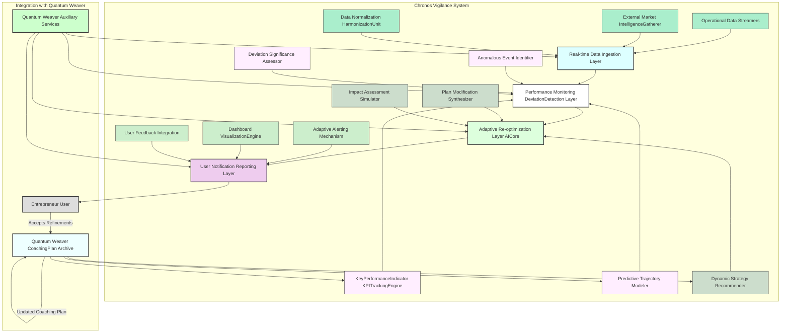

---
**Title of Invention:** System and Method for Adaptive Strategic Monitoring and Dynamic Trajectory Re-optimization for Entrepreneurial Ventures

**Abstract:**
A novel computational architecture and methodology are herein disclosed for the real-time, continuous monitoring and adaptive re-optimization of entrepreneurial strategic trajectories. Building upon an initial AI-generated strategic coaching plan, this system integrates diverse streams of operational metrics and external market intelligence. It employs advanced generative artificial intelligence and sophisticated analytical models to detect deviations from projected performance and market conditions, proactively identifying nascent risks and emergent opportunities. Upon detection of significant variance, the architecture autonomously orchestrates the dynamic refinement and amendment of the existing coaching plan, providing granular, actionable adjustments. This iterative, data-driven feedback loop ensures that entrepreneurial ventures maintain optimal alignment with their success objectives within a persistently stochastic and evolving market landscape, thereby establishing a paradigm for sustained strategic agility and enhanced long-term viability.

**Background of the Invention:**
The dynamic nature of contemporary markets renders static strategic plans increasingly susceptible to obsolescence, irrespective of their initial rigor. While systems such as the Quantum Weaver™ provide an unparalleled initial diagnostic and prescriptive strategic roadmap, their guidance is, by inherent design, a snapshot of optimal directionality at a specific temporal juncture. Entrepreneurial ventures, once launched, immediately confront a fluctuating reality encompassing unpredictable market shifts, unforeseen competitive pressures, evolving customer needs, and internal operational challenges. Traditional post-launch monitoring typically involves manual data aggregation, subjective interpretation, and reactive decision-making, processes prone to delays, cognitive biases, and insufficient granularity. This inherent lag and lack of comprehensive, real-time adaptivity often lead to suboptimal resource allocation, missed opportunities, and an elevated probability of premature venture failure, even for meticulously planned enterprises. There exists, therefore, a profound and urgent requirement for an automated, intelligent, and continuously adaptive instrumentality capable of proactively perceiving deviations from an optimal strategic path, dynamically re-calibrating objectives, and issuing prescriptive adjustments in real-time, thereby ensuring sustained alignment with success metrics within the volatile entrepreneurial ecosystem.

**Brief Summary of the Invention:**
The present invention, meticulously engineered as the **Chronos Vigilance™ System for Adaptive Trajectory Re-optimization**, stands as a pioneering, autonomous cognitive architecture designed to extend the strategic efficacy of entrepreneurial ventures beyond initial planning into sustained operational excellence. This system operates as an intelligent, real-time co-pilot, executing a multi-phasic monitoring, diagnostic, and prescriptive protocol. Upon activation, the Chronos Vigilance™ System dynamically ingests a continuous stream of granular operational data from the venture (e.g., financial KPIs, customer engagement metrics, sales pipeline status) and synthesizes this with real-time external market intelligence (e.g., industry news, competitor movements, economic indicators). A sophisticated `Dynamic Deviation Detector` continuously benchmarks observed performance and market reality against the prescriptive targets and assumptions embedded within the previously generated `Quantum Weaver™` coaching plan and its underlying mathematical models. When statistically significant deviations or emergent patterns are identified, an advanced generative AI-powered `Re-optimization Core` is activated. This core, guided by context-aware prompt heuristics, dynamically re-evaluates the venture's current state and market position. It then generates an updated, refined, and actionable set of strategic adjustments to the existing coaching plan. These adjustments are rigorously structured within an extensible JSON schema, comprising new action steps, modified timelines, re-prioritized objectives, and updated key performance indicators. This ensures structural integrity, machine-readability, and seamless integration into dynamic user interfaces, providing unparalleled real-time strategic agility and maintaining the venture's optimal trajectory amidst market turbulence.

**Detailed Description of the Invention:**

The **Chronos Vigilance™ System for Adaptive Trajectory Re-optimization** constitutes a meticulously engineered, multi-layered computational framework designed to provide unparalleled automated, continuous strategic monitoring and adaptive guidance. Its architecture embodies a symbiotic integration of advanced data streaming, real-time analytics, generative AI models, and structured data methodologies, all orchestrated to deliver a robust, scalable, and highly accurate platform for sustained entrepreneurial success.

### System Architecture and Operational Flow

The core system comprises several interconnected logical and functional components, ensuring modularity, scalability, and robust error handling, specifically designed to integrate seamlessly with and augment the capabilities of the Quantum Weaver™ System.

#### 1. Data Ingestion & Normalization Layer
This layer is responsible for the continuous, real-time acquisition, preprocessing, and standardization of diverse data streams essential for comprehensive strategic monitoring.

*   **Operational Data Streamers:** Connects to the entrepreneurial venture's internal systems (e.g., CRM systems for customer metrics, ERP for supply chain, accounting software for financial KPIs, web analytics for traffic). It continuously pulls or receives push notifications for key internal performance indicators (KPIs).
*   **External Market Intelligence Gatherer:** Employs advanced web scraping, API integrations, and natural language processing (NLP) to collect real-time data from external sources. This includes news feeds, social media trends, competitor announcements, industry reports, regulatory updates, and macroeconomic indicators.
*   **Data Normalization Harmonization Unit:** Processes raw data from both internal and external sources, standardizing formats, resolving inconsistencies, and enriching datasets to ensure uniformity and high quality for subsequent analytical stages. This unit handles various data types (numerical, textual, categorical) and transforms them into a unified schema.

#### 2. Performance Monitoring & Deviation Detection Layer
This layer forms the analytical core, responsible for comparing current operational reality and market conditions against the strategic benchmarks and predictions generated by the Quantum Weaver™ System.

*   **KeyPerformanceIndicator KPITrackingEngine:** Continuously monitors all relevant internal KPIs against the `measurement_metrics` and `key_deliverables` defined in the Quantum Weaver™ generated coaching plan. It flags immediate variances from target values.
*   **Predictive Trajectory Modeler:** Utilizes advanced time series analysis (e.g., ARIMA models, Prophet, LSTM networks) and machine learning algorithms to forecast future performance trends based on historical data and current trajectories. It projects the likely evolution of key metrics and identifies early warning signs of deviation from the optimal path long before they become critical.
*   **Anomalous Event Identifier:** Employs statistical process control and unsupervised learning algorithms to detect sudden, unexpected shifts, outliers, or significant anomalies in both operational and market data streams that could indicate emergent threats or opportunities.
*   **Deviation Significance Assessor:** Applies probabilistic and statistical tests to quantify the significance of detected deviations, distinguishing between minor fluctuations and critical shifts that warrant AI-driven re-optimization.

#### 3. Adaptive Re-optimization Layer AICore
This is the intellectual core where generative AI orchestrates the dynamic adjustment of strategic plans.

*   **Dynamic Strategy Recommender:** A highly capable Generative LargeLanguageModel LLM or a suite of specialized transformer-based models (often a specialized fine-tuning of the Generative LLMCore from the Quantum Weaver™ system). When triggered by the `Deviation Significance Assessor`, this model ingests the current state (refined business plan, current operational data, market intelligence, detected deviations) and the active coaching plan. It then processes this information under a specific, context-aware prompt heuristic (e.g., "Act as a highly agile business strategist responsible for optimizing growth in a volatile market.") to determine the most effective strategic adjustments.
*   **Plan Modification Synthesizer:** Based on the recommendations from the `Dynamic Strategy Recommender`, this module articulates the required changes to the coaching plan. It generates new steps, modifies existing descriptions, adjusts timelines, re-prioritizes objectives, and proposes new `key_deliverables` and `measurement_metrics`. Crucially, it adheres strictly to the JSON schema defined for the coaching plan in the Quantum Weaver™ System, ensuring compatibility and structural integrity.
*   **Impact Assessment Simulator:** (Optional but highly recommended) Before presenting proposed modifications, this component uses sophisticated simulation models (e.g., Monte Carlo simulations, agent-based models) to estimate the potential positive and negative impacts of the proposed strategic adjustments across various future scenarios, providing a probabilistic assessment of their efficacy.

#### 4. User Notification & Reporting Layer
This layer ensures that entrepreneurs receive timely, actionable insights and interact effectively with the adaptive system.

*   **Adaptive Alerting Mechanism:** Provides customizable, multi-channel notifications (e.g., in-app, email, SMS) to the user when significant deviations are detected or when new strategic adjustments are proposed. Alerts are prioritized based on the severity and urgency of the identified issue.
*   **Dashboard Visualization Engine:** Presents a comprehensive, real-time dashboard that displays current operational performance, tracked KPIs against targets, detected deviations, forecasted trajectories, and the current active strategic coaching plan with proposed modifications highlighted. It employs interactive charts, graphs, and textual summaries for intuitive understanding.
*   **User Feedback Integration:** Allows users to provide explicit feedback on proposed plan adjustments, which can be fed back into the `Adaptive Feedback Loop Optimization Module` (from Quantum Weaver™) to further refine the AI's re-optimization capabilities.

#### 5. Auxiliary Services
Leverages and extends the Auxiliary Services from the Quantum Weaver™ System for enhanced intelligence and resilience.

*   **Telemetry Analytics Service:** Gathers performance metrics of the Chronos Vigilance™ System itself, data ingestion efficiency, AI re-optimization latency, and user engagement with suggested adjustments.
*   **Security Module:** Extends data encryption and access control to the continuous data streams and generated adaptive plans.
*   **Adaptive Feedback Loop Optimization Module:** Now includes data from the Chronos Vigilance™ System to continuously refine the `Prompt Engineering Module` and `Dynamic Strategy Recommender` within the Adaptive Re-optimization Layer, enhancing the accuracy and utility of real-time strategic adjustments.



### Continuous AI Interaction and Adaptive Prompt Engineering

The efficacy of the Chronos Vigilance™ System is predicated on its ability to continuously monitor, diagnose, and dynamically re-optimize, driven by a sophisticated interplay with generative AI models and real-time data.

#### Phase 1: Real-time Data Assimilation and Deviation Detection

1.  **Input:** Continuous streams of `O_t` (operational data) and `M_t` (market intelligence) from the `Data Ingestion Layer`. The active `Coaching Plan` (`A_active`) from the `Quantum Weaver Coaching Plan Archive`.
2.  **Processing (`Performance Monitoring & Deviation Detection Layer`):**
    The `KPITrackingEngine` compares `O_t` against `A_active`'s `measurement_metrics`.
    The `Predictive Trajectory Modeler` forecasts `O_{t+k}` and `M_{t+k}` and compares against `A_active`'s implicit and explicit objectives.
    The `Anomalous Event Identifier` scans for significant, unexpected changes in `O_t` or `M_t`.
    The `Deviation Significance Assessor` quantifies any discrepancies, `D_t`, determining if they cross predefined thresholds for strategic re-evaluation.

#### Phase 2: Dynamic Strategy Re-optimization (`G_reoptimize`)

1.  **Trigger:** `D_t` exceeds a critical threshold, signaling a need for plan adjustment.
2.  **Prompt Construction (`Prompt Engineering Module` - from Quantum Weaver, extended):**
    A highly specific, dynamic prompt, `P_reoptimize`, is constructed for the `Dynamic Strategy Recommender`. `P_reoptimize` is structured as follows:

    ```
    "Role: You are a hyper-agile, senior strategic advisor within a leading venture capital firm. Your primary directive is to ensure the sustained optimal trajectory of the current venture, reacting intelligently to real-time market shifts and operational performance deviations.

    Instruction 1: Analyze the provided current business state, the detected operational and market deviations, and the existing strategic coaching plan.
    Instruction 2: Identify the root causes and implications of the deviations. Based on this analysis, propose precise, actionable adjustments to the existing coaching plan. These adjustments must include:
        a. New strategic steps (if necessary)
        b. Modifications to existing step descriptions
        c. Adjustments to timelines (e.g., accelerate, defer, extend)
        d. Re-prioritization of existing steps
        e. Updates to key deliverables and measurement metrics to reflect the new reality.
    Instruction 3: Ensure the adjusted plan maintains an overall strategic coherence and aims to re-optimize the venture's probability of success. Provide a concise rationale for each major adjustment.
    Instruction 4: Structure your response strictly according to the provided JSON schema, which extends the original coaching plan schema. Do not deviate.

    JSON Schema (example structure; full schema would be provided dynamically):
    {
      "re_optimization_event_id": "string",
      "timestamp": "datetime",
      "current_business_state_summary": "string",
      "detected_deviations_summary": "string",
      "original_coaching_plan_id": "string",
      "recommended_plan_modifications": {
        "overall_rationale": "string",
        "modified_steps": [
          {
            "step_number": "integer",
            "modification_type": "string", // e.g., "new", "updated", "re-prioritized"
            "original_title": "string", // null if new
            "new_title": "string",
            "description_change": "string", // delta description
            "original_timeline": "string", // null if new
            "new_timeline": "string",
            "original_key_deliverables": ["string", ...],
            "new_key_deliverables": ["string", ...],
            "original_measurement_metrics": ["string", ...],
            "new_measurement_metrics": ["string", ...]
            "justification": "string"
          },
          ... (for all 4 updated steps, or more if new ones are added)
        ],
        "new_steps": [
            {
                "step_number": "integer",
                "title": "string",
                "description": "string",
                "timeline": "string",
                "key_deliverables": ["string", ...],
                "measurement_metrics": ["string", ...],
                "justification": "string"
            }
        ]
      }
    }

    Current Business Plan Refined: """
    [Textual representation of the current refined business plan]
    """

    Current Operational Data Snapshot: """
    [Summary of O_t, key KPI values and trends]
    """

    Latest Market Intelligence Snapshot: """
    [Summary of M_t, relevant market shifts, competitor actions]
    """

    Detected Deviations: """
    [Detailed report of D_t from Deviation Significance Assessor]
    """

    Active Coaching Plan: """
    [JSON representation of A_active]
    """
    "
    ```
    This prompt leverages sophisticated "role-playing" (agile strategist), "multi-source integration" (plan, ops data, market data, deviations), "specific modification directives" (new steps, timelines, etc.), and "strict schema enforcement" for generating highly structured, actionable re-optimizations.

3.  **AI Inference:** The `AI Inference Layer` (from Quantum Weaver, augmented for real-time data) processes `P_reoptimize` along with the contextual data, generating a JSON response, `R_reoptimize`.
4.  **Output Processing:** `R_reoptimize` is parsed and rigorously validated by the `Response Parser & Validator`. If valid, the proposed `recommended_plan_modifications` are presented to the user via the `Dashboard Visualization Engine` and `Adaptive Alerting Mechanism` for review and potential acceptance. Accepted modifications are then committed back to the `Coaching Plan Archive` as an updated `A_active`, closing the adaptive loop.

This continuous, data-driven, AI-orchestrated process transforms static strategic planning into a dynamically responsive, self-optimizing system, profoundly enhancing the resilience and success probability of entrepreneurial endeavors.

**Claims:**

We assert the exclusive intellectual construct and operational methodology embodied within the Chronos Vigilance™ System through the following foundational declarations:

1.  A system for continuous adaptive strategic re-optimization for entrepreneurial ventures, comprising:
    a.  A data ingestion and normalization layer configured to continuously acquire, preprocess, and standardize real-time operational data from an internal venture and external market intelligence;
    b.  A performance monitoring and deviation detection layer communicatively coupled to the data ingestion and normalization layer, configured to:
        i.  Continuously monitor the internal operational data against predetermined key performance indicators and strategic objectives derived from an initial AI-generated coaching plan;
        ii. Employ predictive modeling to forecast future performance trajectories and identify early deviations from said strategic objectives;
        iii. Detect anomalous events and statistically significant deviations in both internal operational data and external market intelligence;
    c.  An adaptive re-optimization layer AICore communicatively coupled to the performance monitoring and deviation detection layer, comprising a generative artificial intelligence model configured to:
        i.  Receive detected deviations, current operational data, and market intelligence;
        ii. Dynamically re-evaluate the venture's strategic context;
        iii. Generate prescriptive modifications to the initial AI-generated coaching plan, including new steps, adjusted timelines, modified descriptions, and updated metrics;
        iv. Adhere strictly to a predefined extensible JSON schema for said modifications;
    d.  A user notification and reporting layer configured to present the detected deviations and the AI-generated prescriptive modifications to a user via an interactive dashboard and adaptive alerting mechanism.

2.  The system of claim 1, wherein the initial AI-generated coaching plan and its objectives are derived from a multi-stage strategic analysis system, such as the Quantum Weaver™ System.

3.  The system of claim 1, wherein the data ingestion and normalization layer comprises dedicated operational data streamers and an external market intelligence gatherer, integrated with a data normalization and harmonization unit.

4.  The system of claim 1, wherein the performance monitoring and deviation detection layer further comprises a KeyPerformanceIndicator KPITrackingEngine, a Predictive Trajectory Modeler, an Anomalous Event Identifier, and a Deviation Significance Assessor.

5.  The system of claim 1, wherein the adaptive re-optimization layer AICore further comprises a Dynamic Strategy Recommender, a Plan Modification Synthesizer, and an Impact Assessment Simulator.

6.  A method for continuous adaptive strategic re-optimization of entrepreneurial ventures, comprising:
    a.  Continuously acquiring and normalizing, by a computational system, real-time internal operational data and external market intelligence;
    b.  Monitoring, by said computational system, the acquired data against an initial AI-generated strategic coaching plan to detect deviations and anomalous events;
    c.  Employing, by said computational system, predictive modeling to forecast future performance and identify early warning signs of deviation from the strategic plan;
    d.  Generating, by a generative artificial intelligence model within said computational system, prescriptive modifications to said strategic coaching plan, in response to detected deviations and emergent market conditions;
    e.  Adhering, by said generative artificial intelligence model, to a predefined extensible JSON schema for the generation of said plan modifications;
    f.  Presenting, by a user interface of said computational system, the detected deviations and the generated plan modifications to an originating user.

7.  The method of claim 6, wherein the step of generating prescriptive modifications further comprises leveraging a context-aware prompt heuristic to configure the generative AI model to assume a specific adaptive strategic persona.

8.  The method of claim 6, further comprising, prior to presenting the modifications, simulating the potential impact of said modifications to assess their efficacy across various scenarios.

9.  The method of claim 6, further comprising storing the original and modified strategic coaching plans in a secure data persistence unit, maintaining a version history of strategic adjustments.

10. A non-transitory computer-readable medium storing instructions that, when executed by one or more processors, cause the one or more processors to perform the method of claim 6.

**Mathematical Justification: Chronos Vigilance's Adaptive Control and Continuous State Optimization**

Building upon the Quantum Weaver™ System's foundational mathematical framework for business plan valuation `V(B)` and optimal control trajectories `G_plan`, the Chronos Vigilance™ System introduces a layer of real-time adaptive control and continuous state optimization. We extend the conceptualization of the business plan as a point `B` in a manifold `M_B` and the strategic coaching plan `A = (a_1, ..., a_n)` as an optimal policy `pi*(s)` within a Markov Decision Process (MDP).

### I. Dynamic State Space and Observation Model

The state `S_t` of the business at time `t` is now significantly enriched and dynamic:
`S_t = (B', C_t, M_t, O_t)`
where `B'` is the refined business plan (from Quantum Weaver), `C_t` are internal resources, `M_t` is the observed market state (from `External Market Intelligence Gatherer`), and `O_t` are granular operational metrics (from `Operational Data Streamers`). This significantly expands the state space, `S`, making `pi*(s)` highly sensitive to real-time inputs.

The observations `Y_t` are noisy measurements of `S_t`. The `Data Ingestion Layer` and `Data Normalization Harmonization Unit` aim to minimize this noise, but inherent uncertainty remains. We model the state evolution with a stochastic process:
```
S_{t+1} = f(S_t, a_t, w_t)
Y_t = h(S_t, v_t)
```
where `f` is the state transition function, `h` is the observation function, and `w_t`, `v_t` are process and observation noise, respectively.

**Proposition 1.1: Optimal State Estimation for Adaptive Control.**
The `Performance Monitoring & Deviation Detection Layer` implicitly performs continuous Bayesian state estimation, computing `P(S_t | Y_{0:t})`, the posterior probability distribution of the current state given all observations up to time `t`. This is critical for robust adaptive control.

The `Predictive Trajectory Modeler` leverages time-series models to forecast future states `E[S_{t+k} | Y_{0:t}]`, enabling proactive deviation detection. For example, a Kalman filter or more advanced particle filters could be employed to estimate `S_t` and `S_{t+k}`:
```
P(S_t | Y_{0:t}) = (P(Y_t | S_t) * P(S_t | Y_{0:t-1})) / P(Y_t | Y_{0:t-1})
```
This allows the system to maintain an updated, probabilistic understanding of the venture's actual position in `M_B` relative to its intended trajectory.

### II. Real-time Deviation Detection and Change Point Analysis

The `Deviation Significance Assessor` rigorously identifies when the actual trajectory diverges from the planned optimal path.

**Proposition 2.1: Statistical Significance of Deviation.**
A deviation `D_t` is considered significant if the probability of the observed `O_t` and `M_t` occurring under the assumption of following the optimal policy `pi*(s)` falls below a predefined threshold `epsilon`.

This can be formulated as a hypothesis test:
*   Null Hypothesis (`H_0`): The business is still on the planned trajectory (`S_t` is within expected bounds of `pi*(s)`).
*   Alternative Hypothesis (`H_1`): A significant deviation has occurred (`S_t` is outside expected bounds).

Change point detection algorithms (e.g., CUSUM, EWMA, Bayesian change point detection) are used to robustly identify `t_c` where the statistical properties of the incoming data streams `(O_t, M_t)` change significantly relative to the expected distribution implied by `A_active`. This triggers the `Adaptive Re-optimization Layer AICore`.

### III. Adaptive Policy Re-optimization: `G_reoptimize`

When a significant deviation is detected at `t_c`, the system initiates a `G_reoptimize` function, which re-solves (or approximates a re-solution of) the Bellman optimality equation for the current state `S_{t_c}`.

**Proposition 3.1: Dynamic Bellman Equation Recalculation.**
The `Dynamic Strategy Recommender` within `G_reoptimize` approximates the solution to a dynamically updated Bellman optimality equation:
```
V*(S_{t_c}) = max_a [R(S_{t_c}, a) + gamma E[V*(S_{t_c+1}) | S_{t_c}, a]]
```
This yields a new, locally optimal action sequence `A'_active` (the modified coaching plan) that maximizes future expected cumulative reward given the *new* current state `S_{t_c}` and updated models of market dynamics and operational capabilities.

The generative AI model, trained on extensive datasets of strategic shifts and their outcomes, implicitly learns to perform this dynamic re-optimization. Its role is to quickly compute `argmax_a` given the current `S_t` and a revised understanding of `R(s, a)` and `P(s' | s, a)`. This is akin to an online reinforcement learning agent, where `R(s,a)` is re-evaluated based on real-time feedback and `P(s'|s,a)` is updated using the `Predictive Trajectory Modeler`.

The `Impact Assessment Simulator` performs a look-ahead by running Monte Carlo simulations of the modified plan `A'_active` from `S_{t_c}`:
```
E[R_cumulative(A'_active)] = E[sum_{k=0}^{horizon} gamma^k R(S_{t_c+k}, a_{t_c+k})]
```
This provides a quantifiable confidence metric for the proposed adjustments.

### IV. Continuous Trajectory Refinement

The Chronos Vigilance™ System's continuous operation ensures that the venture is always guided by the most up-to-date optimal policy. This is equivalent to continuously moving the business towards the optimal submanifold `M_B*` within the high-dimensional `M_B` manifold, even as external forces attempt to push it away. The system's adaptive nature ensures that `B_t` (the effective business plan at time `t`) always remains as close as possible to the global optimum, `B*`.

**Proof of Utility:**

The utility of the Chronos Vigilance™ System extends and rigorously enhances the value proposition established by the Quantum Weaver™ System, fundamentally transforming static strategic planning into a continuously self-optimizing process.

**Theorem 1: Sustained Expected Value Maximization under Stochastic Dynamics.**
Let `B_0` be an initial business plan, and `V(B_0)` its intrinsic success probability. Let `A_0` be the initial optimal coaching plan generated by the Quantum Weaver™ System. In a dynamic and stochastic market environment, without continuous adaptation, `V(A_0, t)` (the value of executing `A_0` at time `t`) will degrade. The Chronos Vigilance™ System applies a continuous adaptive re-optimization operator `T_adaptive` such that the expected value of a venture under its guidance, `E[V(T_adaptive(A_0, t))]`, is strictly greater than the expected value of a venture operating with a static plan `E[V(A_0, t)]` for `t > t_initial`.

The proof for this theorem rests on several key mechanisms:

1.  **Mitigation of Plan Obsolescence:** As established, `V(B)` and `pi*(s)` are functions of time-variant market conditions `M_t` and internal state `O_t`. A static plan `A_0` will inevitably become suboptimal as `M_t` and `O_t` evolve. The Chronos Vigilance™ System, through its `Performance Monitoring & Deviation Detection Layer`, continuously assesses `S_t = (B', C_t, M_t, O_t)`. By detecting deviations `D_t` with statistical rigor (Proposition 2.1), it prevents the venture from diverging significantly from the high-value regions of `M_B`.

2.  **Adaptive Re-optimization:** Upon detecting a critical deviation, the `Adaptive Re-optimization Layer AICore` (Proposition 3.1) dynamically re-computes a locally optimal policy `A'_active`. This ensures that the strategic guidance is always current and relevant to the venture's actual, rather than assumed, state. This continuous recalibration maintains the venture on a path of steepest ascent towards `M_B*`, or re-routes it efficiently when unforeseen obstacles or opportunities emerge. The capacity to generate new actions or modify existing ones means the system is not merely reactive but truly adaptive, shaping the path in response to external and internal stimuli.

3.  **Proactive Risk Management and Opportunity Seizure:** The `Predictive Trajectory Modeler` offers foresight, identifying potential future deviations before they manifest as current problems. This proactive intelligence allows for preemptive adjustments to the coaching plan, mitigating risks and enabling the timely capitalization on emergent opportunities, which would otherwise be missed by reactive human systems. This significantly reduces the probability density function of catastrophic outcomes and increases the probability of accelerated growth.

4.  **Enhanced Resource Efficiency:** By constantly optimizing the strategic trajectory and providing granular, data-driven adjustments, the system minimizes misallocated resources (time, capital, human effort) that would be wasted on executing an outdated or suboptimal plan. This results in a higher return on investment for entrepreneurial endeavors.

In conclusion, the Chronos Vigilance™ System provides a robust, mathematically justified framework for maintaining dynamic strategic alignment in a volatile world. It acts as an indispensable, always-on intelligent co-pilot, not merely guiding the initial launch but meticulously steering the entrepreneurial vessel through complex and changing currents, thereby maximizing its long-term viability and ultimately amplifying its expected value far beyond what static planning or intermittent human intervention could achieve. This invention represents a critical advancement in leveraging artificial intelligence for continuous, real-world strategic management.
---