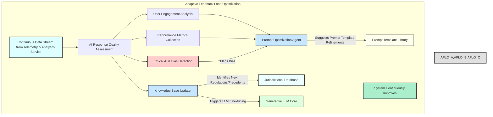
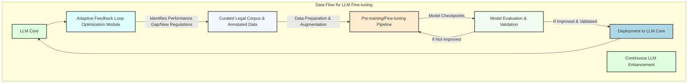

**Title of Invention:** System and Method for Automated Regulatory Compliance Analysis and Proactive Risk Mitigation for Business Ventures

**Abstract:**
A novel computational architecture and methodology are herein disclosed for the automated, iterative analysis of entrepreneurial ventures, represented by textual business plans, to identify, assess, and mitigate potential legal, regulatory, and intellectual property compliance risks. The system integrates advanced generative artificial intelligence paradigms to conduct a bi-modal analytical process: initially, a comprehensive diagnostic assessment yielding granular insights into inherent compliance vulnerabilities and potential liabilities, coupled with incisive interrogatives designed to stimulate user-driven refinement and clarification of critical operational details. Subsequently, upon systemic validation of the iteratively refined plan, the architecture orchestrates the synthesis of a dynamically optimized, multi-echelon compliance remediation plan, meticulously structured for actionable execution within relevant jurisdictional frameworks. Concurrently, a robust probabilistic risk quantification sub-system determines a simulated legal exposure index. The entirety of the AI-generated guidance is encapsulated within a rigorously defined, interoperable response schema, thereby establishing an automated, scalable paradigm for sophisticated legal advisory and risk management, inherently elevating the probability density function of regulatory adherence within a complex operational landscape.

**Background of the Invention:**
The contemporary entrepreneurial ecosystem is increasingly constrained by an exponentially expanding and fragmented global regulatory landscape. Nascent enterprises and even established small to medium-sized businesses frequently operate with an incomplete understanding of their full compliance obligations across diverse legal domains, including corporate governance, data privacy (e.g., GDPR, CCPA), intellectual property, environmental regulations, employment law, consumer protection, and industry-specific mandates. Traditional avenues for ensuring compliance, such as engaging legal counsel or specialized consultants, are invariably encumbered by prohibitive financial outlays, protracted temporal inefficiencies, and inherent scalability limitations, rendering comprehensive proactive risk assessment inaccessible to a substantial segment of the entrepreneurial demographic. Furthermore, human legal evaluators, despite their specialized expertise, are susceptible to information overload, inconsistencies in interpretation across jurisdictions, and limitations in processing the sheer volume and dynamic nature of legal and regulatory updates. The resultant landscape is one where potentially transformative enterprises face existential threats from unforeseen legal challenges, incurring substantial fines, litigation costs, reputational damage, and even operational cessation due to critical deficits in objective, comprehensive, and timely compliance counsel. This enduring deficiency posits an urgent and profound requirement for an accessible, computationally robust, and instantaneously responsive automated instrumentality capable of delivering regulatory analytical depth and prescriptive strategic roadmaps equivalent to, or exceeding, the efficacy of conventional high-tier legal advisory services, thereby democratizing access to sophisticated compliance intelligence and accelerating responsible innovation.

**Brief Summary of the Invention:**
The present invention, meticulously engineered as the **Compliance Sentinel™ System for Regulatory Risk Mitigation**, stands as a pioneering, autonomous cognitive architecture designed to revolutionize the proactive identification and management of legal and regulatory risks in business development and strategic planning. This system operates as a sophisticated AI-powered legal compliance advisor, executing a multi-phasic analytical and prescriptive protocol. Upon submission of an unstructured textual representation of a business plan, the Compliance Sentinel™ initiates its primary analytical sequence. The submitted textual corpus is dynamically ingested by a proprietary inference engine, which, guided by a meticulously crafted, context-aware prompt heuristic, generates a seminal compliance feedback matrix. This matrix comprises a concise yet profoundly insightful high-level diagnostic of the plan's intrinsic compliance merits and emergent vulnerabilities across various legal domains, complemented by a rigorously curated set of strategic interrogatives. These questions are designed not merely to solicit clarification, but to provoke deeper introspection and stimulate an iterative refinement process by the user, particularly concerning regulatory ambiguities or omissions. Subsequent to user engagement with this preliminary output, the system proceeds to its secondary, prescriptive analytical phase. Herein, the (potentially refined) business plan is re-processed by the advanced generative AI model. This iteration is governed by a distinct, more complex prompt architecture, which mandates two pivotal outputs: firstly, the computation of a simulated legal exposure index, derived from a sophisticated algorithmic assessment of identified non-compliance probabilities and potential financial penalties within a predefined stochastic range; and secondly, the synthesis of a granular, multi-echelon compliance remediation plan. This remediation plan is not merely a collection of generalized advice; rather, it is a bespoke, temporally sequenced roadmap comprising distinct, actionable steps, each delineated with a specific title, comprehensive description, a relevant legal reference, and an estimated temporal frame for execution. Critically, the entirety of the AI-generated prescriptive output is rigorously constrained within a pre-defined, extensible JSON schema, ensuring structural integrity, machine-readability, and seamless integration into dynamic user interfaces, thereby providing an unparalleled level of structured, intelligent guidance for navigating complex regulatory environments.

**Detailed Description of the Invention:**

The **Compliance Sentinel™ System for Regulatory Risk Mitigation** constitutes a meticulously engineered, multi-layered computational framework designed to provide unparalleled automated business plan compliance analysis and strategic advisory services. Its architecture embodies a symbiotic integration of advanced natural language processing, generative AI models, and structured data methodologies, all orchestrated to deliver a robust, scalable, and highly accurate regulatory guidance platform.

### System Architecture and Operational Flow

The core system comprises several interconnected logical and functional components, ensuring modularity, scalability, and robust error handling.

#### 1. User Interface (UI) Layer
The frontend interface, accessible via a web-based application or dedicated client, serves as the primary conduit for user interaction. It is designed for intuitive usability, guiding the entrepreneur through the distinct stages of the compliance analysis process.

*   **PlanSubmission Stage:** The initial interface where the user inputs their comprehensive business plan as free-form textual data. This stage includes validation mechanisms for text length and format, and supports various input modalities like direct text entry, document upload (PDF, DOCX), or structured questionnaire completion for preliminary data.
*   **RiskReview Stage:** Displays the initial diagnostic compliance feedback and strategic interrogatives generated by the AI. This stage includes interactive elements for user acknowledgment and optional in-line editing or additional input based on the AI's questions. Features include dynamic highlighting of risky phrases, drill-down explanations for legal terms, and contextual help.
*   **RemediationPlanDisplay Stage:** Presents the comprehensive, structured compliance remediation plan and the simulated legal exposure index. This stage renders the complex JSON output into a human-readable, actionable format, typically employing interactive visualizations for the multi-step plan, progress tracking features, and integration points for calendaring or task management systems.
*   **User Profile & Preferences Module:** Stores user-specific information, industry focus, geographical areas of operation, and preferred reporting formats, allowing for personalized compliance advice and filtering of regulatory information.

#### 2. API Gateway & Backend Processing Layer
This layer acts as the orchestrator, receiving requests from the UI, managing data flow, interacting with the AI Inference Layer, and persisting relevant information.

*   **Request Handler:** Validates incoming user data, authenticates requests using industry-standard protocols (e.g., OAuth 2.0, JWT), and dispatches them to appropriate internal services. It also handles request throttling and rate limiting to ensure system stability.
*   **Workflow Orchestrator:** Manages the multi-stage interaction process, tracking the state of each user's compliance analysis (e.g., awaiting user input, AI processing stage 1, AI processing stage 2), and coordinating calls to various sub-modules. It ensures idempotency and fault tolerance across the workflow.

#### 2.1. Prompt Engineering Module: Advanced Prompt Orchestration
This is a crucial, proprietary sub-system responsible for dynamically constructing and refining the input prompts for the generative AI model. It incorporates advanced heuristics, few-shot exemplars, role-playing directives (e.g., "Act as a seasoned regulatory attorney"), and specific constraint mechanisms (e.g., "Ensure output strictly adheres to JSON schema Y"). Its internal components include:
*   **Prompt Template Library:** A curated repository of pre-defined, parameterized prompt structures optimized for various compliance-related tasks (e.g., risk identification, legal question generation, remediation plan synthesis). These templates incorporate best practices for eliciting high-quality, structured responses from LLMs, including negative constraints and format specifications.
*   **Jurisdictional Schema Registry:** A centralized repository for all expected JSON output schemas, tailored for compliance reporting. This registry provides the canonical structure that the AI model must adhere to, and which the Response Parser & Validator uses for validation, including fields like legal references, compliance categories, severity ratings, temporal estimates, and recommended action types.
*   **Risk Heuristic Engine:** This intelligent component applies contextual rules and learned heuristics to dynamically select appropriate templates, infuse specific legal persona roles, and inject few-shot examples into the prompts based on the current stage of user interaction, identified industry sectors (e.g., FinTech, Healthcare, E-commerce), geographical operational scope implied by the business plan content, and historical risk patterns.
*   **Contextualizer & Refinement Agent:** Enhances prompt construction by integrating information from previous interaction stages (e.g., user's answers to prior questions, identified risk areas from Stage 1) to create highly tailored and specific prompts for subsequent AI calls.

#### 2.2. Response Parser & Validator: Intelligent Output Conditioning
Upon receiving raw text output from the AI, this module parses the content, validates it against the expected JSON schema, and handles any deviations or malformations through predefined recovery or re-prompting strategies. Key sub-components include:
*   **Schema Enforcement Engine:** Leverages the `Jurisdictional Schema Registry` to rigorously validate AI-generated text against the required JSON structures, especially ensuring the presence and correctness of legal references and compliance categorizations. It identifies missing fields, incorrect data types, structural inconsistencies, and performs type coercion where appropriate.
*   **Regulatory Cross-Referencer:** Beyond structural validation, this component performs automated cross-referencing of identified legal principles and regulations within the AI's response against a verified external or internal legal database, ensuring factual accuracy and currency of legal citations. It utilizes semantic search and knowledge graph traversal to verify legal validity.
*   **Error Recovery Strategies:** Implements automated mechanisms to address validation failures, such as re-prompting the AI with specific error messages, truncating malformed responses, leveraging smaller, specialized language models for parsing, or escalating to human oversight if persistent errors occur, recording each recovery attempt.
*   **Semantic Coherence Evaluator:** Applies a secondary layer of validation to assess the logical consistency and practical applicability of the AI's output, ensuring that the generated advice is not only syntactically correct but also semantically sound and actionable within a legal context.

#### 2.3. Data Persistence Unit: Secure & Scalable Information Repository
This unit securely stores all submitted business plans, generated compliance advisories, remediation plans, risk assessments, and user interaction logs within a robust, scalable data repository (e.g., a distributed NoSQL database for flexible schema management and high availability, coupled with a graph database for legal knowledge). Its specialized repositories include:
*   **Business Plan Repository:** Stores all versions of the user's business plan, including initial submissions, subsequent refinements, and timestamps, ensuring a comprehensive audit trail for compliance history and version control. Encrypts sensitive information at rest.
*   **Compliance Interaction Log:** Records every diagnostic risk assessment, strategic interrogative, user response, and system-generated prompt, providing a detailed history of the iterative compliance refinement process. This log is crucial for auditability and model improvement.
*   **Advisory Archive:** Stores all generated compliance remediation plans and their associated simulated legal exposure indices, ready for retrieval and presentation to the user, with mechanisms for long-term archival and easy searchability.
*   **Jurisdictional Database:** A dynamic, continuously updated repository of laws, regulations, case precedents, industry standards, governmental guidance, and legal interpretations relevant to various business sectors and geographical regions, serving as a primary knowledge source for the AI. This database is regularly scraped, curated, and indexed by a specialized sub-system.
*   **User & Subscription Management:** Handles user account information, subscription statuses, payment details, and access control policies for multi-tenancy.

#### 3. AI Inference Layer: Deep Semantic Processing Core
This constitutes the computational core, leveraging advanced generative AI models for deep textual analysis and synthesis of legal and regulatory information.

#### 3.1. Generative LLM Core
This is the primary interface with a highly capable Large Language Model (LLM) or a suite of specialized transformer-based models. This model possesses extensive Natural Language Understanding (NLU), Natural Language Generation (NLG), and complex legal reasoning capabilities. The model is further fine-tuned on a proprietary corpus of legal texts, regulatory documents, court rulings, compliance reports, expert legal opinions, and annotated compliance scenarios. It may leverage techniques like Retrieval Augmented Generation (RAG) to ensure responses are grounded in the latest legal data.

#### 3.2. Contextual Vector Embedder
Utilizes state-of-the-art vector embedding techniques (e.g., transformer-based embeddings like Sentence-BERT, specialized legal embeddings) to represent the business plan text, legal statutes, case law, and associated prompts in a high-dimensional semantic space. This process facilitates nuanced comprehension of legal nuances, captures complex relationships between business activities and regulatory requirements, and enables sophisticated response generation by the LLM by providing a rich, dense representation of the input. It also powers semantic similarity search for relevant legal documents.

#### 3.3. Legal Knowledge Graph (LKG)
A critical component, this internal or external knowledge graph provides enhanced legal reasoning, factual accuracy, and explainability. It contains up-to-date legal statutes, regulatory frameworks, industry-specific compliance guidelines, intellectual property databases (e.g., patent and trademark offices), and a curated repository of common compliance pitfalls and successful mitigation strategies. The LKG allows the LLM to traverse relationships between legal entities, infer logical connections, and retrieve specific facts during its analysis and generation processes, reducing hallucination and improving legal grounding. The LKG is continuously updated and validated.
*   **Ontology Management:** Defines the types of entities (laws, regulations, entities, actions, risks) and relationships within the legal domain.
*   **Query Engine:** Enables efficient querying of the graph by the LLM core to retrieve relevant legal contexts.

#### 3.4. Probabilistic Risk Quantifier
A specialized sub-module within the AI Inference Layer, dedicated to computing the simulated legal exposure index. This module uses a combination of predictive models (e.g., Bayesian networks, risk regression models) and Monte Carlo simulations, drawing on historical data of legal disputes, fines, and compliance costs. It assesses the likelihood of a non-compliance event occurring and the potential financial and reputational impact, providing a nuanced probabilistic risk score.

#### 4. Auxiliary Services: System Intelligence & Resilience
These services provide essential support functions for system operation, monitoring, security, and continuous improvement.

#### 4.1. Telemetry & Analytics Service
Gathers anonymous usage data, performance metrics, and AI response quality assessments for continuous system improvement.
*   **Performance Metrics Collection:** Monitors system latency, API response times, AI model inference speed, resource utilization (CPU, GPU, memory) specific to legal query processing, and error rates across all modules.
*   **User Engagement Analysis:** Tracks user interaction patterns with compliance feedback, adoption of remediation steps, time spent on different stages, and completion rates to optimize UI/UX and overall user journey for risk mitigation. Uses A/B testing for interface and prompt variations.
*   **AI Response Quality Assessment:** Collects implicit (e.g., re-prompts, user editing) or explicit (e.g., thumbs up/down, feedback forms) user feedback on the helpfulness, accuracy, and legal validity of AI-generated content, feeding into the `Adaptive Feedback Loop Optimization Module`.
*   **Jurisdictional Change Detection:** Actively monitors legislative bodies, regulatory agencies, and legal news feeds for updates that might impact compliance advice, flagging changes for review and integration into the `Jurisdictional Database`.

#### 4.2. Security Module
Implements comprehensive security protocols for data protection, access control, and threat mitigation, especially critical given the sensitive nature of business plans and legal advisories.
*   **Data Encryption Management:** Ensures encryption of data in transit (e.g., TLS 1.3) and at rest (e.g., AES-256 with strong key management) for all sensitive business plan information, legal advisories, and user data.
*   **Authentication & Authorization:** Manages user identities, roles, and permissions using a robust identity provider, enforcing least privilege access control to system functionalities and compliance data. Supports multi-factor authentication.
*   **Threat Detection & Vulnerability Scanner Integration:** Integrates with security information and event management (SIEM) systems to continuously monitor for suspicious activities, potential vulnerabilities, intrusion attempts, and compliance breaches related to data handling and infrastructure. Includes regular penetration testing.
*   **Privacy Enhancing Technologies (PETs):** Explores and implements techniques like differential privacy or federated learning for aggregated analytics to protect individual user data while still enabling system improvement.

#### 4.3. Adaptive Feedback Loop Optimization Module
A critical component for the system's continuous evolution in response to new legal precedents and regulatory changes. This module analyzes data from the `Telemetry & Analytics Service` to identify patterns in AI output quality, user satisfaction, and system performance regarding compliance. It then autonomously or semi-autonomously suggests refinements to the `Prompt Engineering Module` (e.g., modifications to prompt templates for emerging legal topics, new few-shot examples for complex regulatory scenarios, updated role-playing directives) and potentially flags areas for `Generative LLM Core` fine-tuning with updated legal corpora, thereby continually enhancing the system's accuracy and utility over time. It incorporates reinforcement learning from human feedback (RLHF) or other self-supervised learning methods for continuous model improvement.
*   **Prompt Optimization Agent:** Automatically experiments with different prompt variations and evaluates their effectiveness based on downstream quality metrics.
*   **Knowledge Base Updater:** Coordinates the ingestion of new legal information into the `Jurisdictional Database` and `Legal Knowledge Graph`, and triggers relevant re-training or fine-tuning processes for the LLM.
*   **Ethical AI & Bias Detection:** Continuously monitors AI outputs for potential biases (e.g., demographic, industry-specific) and ensures fairness in compliance advice, flagging any deviations for human review and algorithmic adjustment.

```mermaid
graph TD
    subgraph System Core Workflow
        A[User Interface Layer] --> B{API Gateway & Request Handler};
        B -- Initial Business Plan --> C[Prompt Engineering Module];
        C -- Stage 1 Prompt Request --> D[AI Inference Layer];
        D -- Stage 1 Response (JSON) --> E[Response Parser & Validator];
        E -- Validated Compliance Risks & Questions --> F{Data Persistence Unit};
        F -- Store Stage 1 Output --> F;
        F --> A -- Display RiskReviewStage --> A;
        A -- User Refines Plan --> B;
        B -- Refined Business Plan --> C;
        C -- Stage 2 Prompt Refined Plan --> D;
        D -- Stage 2 Response (JSON) --> E;
        E -- Validated Remediation Plan & Risk Index --> F;
        F -- Store Stage 2 Output --> F;
        F --> A -- Display RemediationPlanDisplayStage --> A;
    end

    subgraph User Journey Stages
        User[Entrepreneur] -- Submits Business Plan --> AUI_PlanSubmission[UI PlanSubmissionStage];
        AUI_PlanSubmission -- Initial Assessment --> AUI_RiskReview[UI RiskReviewStage];
        AUI_RiskReview -- Provides Clarification/Refinement --> AUI_RemediationPlanDisplay[UI RemediationPlanDisplayStage];
        AUI_RemediationPlanDisplay -- Receives Compliance Roadmap & LegalExposure --> User;
    end

    subgraph Prompt Engineering Subsystems
        C_MAIN[Prompt Engineering Module]
        C_MAIN --> C1[Prompt Template Library];
        C_MAIN --> C2[Jurisdictional Schema Registry];
        C_MAIN --> C3[Risk Heuristic Engine];
        C_MAIN --> C4[Contextualizer & Refinement Agent];
        C1 -- Provides Templates --> C_MAIN;
        C2 -- Provides Schemas --> C_MAIN;
        C3 -- Generates Heuristics --> C_MAIN;
        C4 -- Refines Prompts --> C_MAIN;
        C2 -- Schema Validation Rules --> E;
        style C_MAIN fill:#FFE,stroke:#333,stroke-width:2px;
    end

    subgraph AI Inference Subsystems
        D_MAIN[AI Inference Layer]
        D_MAIN --> D1[Generative LLM Core];
        D_MAIN --> D2[Contextual Vector Embedder];
        D_MAIN --> D3[Legal Knowledge Graph];
        D_MAIN --> D4[Probabilistic Risk Quantifier];
        D1 -- Processes Prompts --> D_MAIN;
        D2 -- Embeds Text --> D1;
        D3 -- Enriches Context --> D1;
        D4 -- Computes Risk --> D_MAIN;
        style D_MAIN fill:#DFD,stroke:#333,stroke-width:2px;
    end

    subgraph Data Persistence Subsystems
        F_MAIN[Data Persistence Unit]
        F_MAIN --> F1[Business Plan Repository];
        F_MAIN --> F2[Compliance Interaction Log];
        F_MAIN --> F3[Advisory Archive];
        F_MAIN --> F4[Jurisdictional Database];
        F_MAIN --> F5[User & Subscription Management];
        style F_MAIN fill:#EFF,stroke:#333,stroke-width:2px;
    end

    subgraph Auxiliary Services Core
        G_MAIN[Auxiliary Services Module]
        G_MAIN --> G1[Telemetry & Analytics Service];
        G_MAIN --> G2[Security Module];
        G_MAIN --> G3[Adaptive Feedback Loop Optimization];
        G1 -- Performance Data --> G3;
        G1 -- Usage Metrics --> F_MAIN;
        G2 -- Access Control --> B;
        G2 -- Data Encryption --> F_MAIN;
        G3 -- Optimizes Prompts --> C_MAIN;
        G3 -- Recommends LLM Fine-tuning --> D_MAIN;
        G1 -- Regulatory Change Alerts --> F4;
        style G_MAIN fill:#DFF,stroke:#333,stroke-width:2px;
    end

    style A fill:#ECE,stroke:#333,stroke-width:2px;
    style B fill:#CFC,stroke:#333,stroke-width:2px;
    style C fill:#FFE,stroke:#333,stroke-width:2px;
    style D fill:#DFD,stroke:#333,stroke-width:2px;
    style E fill:#FEE,stroke:#333,stroke-width:2px;
    style F fill:#EFF,stroke:#333,stroke-width:2px;
    style G fill:#DFF,stroke:#333,stroke-width:2px;
    style User fill:#DDD,stroke:#333,stroke-width:2px;
    style AUI_PlanSubmission fill:#ECE,stroke:#333,stroke-width:2px;
    style AUI_RiskReview fill:#ECE,stroke:#333,stroke-width:2px;
    style AUI_RemediationPlanDisplay fill:#ECE,stroke:#333,stroke-width:2px;
```

```mermaid
graph TD
    subgraph Prompt Engineering Workflow
        PE_Start[Prompt Request from Workflow Orchestrator] --> PE_A[Identify Interaction Stage];
        PE_A -- Stage 1: Diagnostic --> PE_B1[Select Stage 1 Templates from Prompt Template Library];
        PE_A -- Stage 2: Remediation --> PE_B2[Select Stage 2 Templates from Prompt Template Library];
        PE_B1 --> PE_C[Inject Few-shot Examples based on Risk Heuristic Engine];
        PE_B2 --> PE_C;
        PE_C --> PE_D[Integrate Business Plan & Past Interactions from Contextualizer];
        PE_D --> PE_E[Apply Role-Playing Directives];
        PE_E --> PE_F[Embed JSON Schema from Jurisdictional Schema Registry];
        PE_F --> PE_G[Construct Final Prompt P_i];
        PE_G --> PE_End[Send P_i to AI Inference Layer];
    end

    style PE_Start fill:#CFC,stroke:#333,stroke-width:2px;
    style PE_End fill:#CFC,stroke:#333,stroke-width:2px;
    style PE_A fill:#FFD,stroke:#333,stroke-width:2px;
    style PE_B1,PE_B2 fill:#E6F3F7,stroke:#333,stroke-width:2px;
    style PE_C fill:#DFF,stroke:#333,stroke-width:2px;
    style PE_D fill:#F0F8FF,stroke:#333,stroke-width:2px;
    style PE_E fill:#F5FFFA,stroke:#333,stroke-width:2px;
    style PE_F fill:#FFF0F5,stroke:#333,stroke-width:2px;
    style PE_G fill:#FFF8DC,stroke:#333,stroke-width:2px;
```





```mermaid
graph TD
    subgraph AI Inference Data Flow
        AI_Start[Receives Prompt P_i & Business Plan B] --> AI_A[Contextual Vector Embedder];
        AI_A -- Embeddings --> AI_B[Generative LLM Core];
        AI_B -- Initial Query --> AI_C[Legal Knowledge Graph Query Engine];
        AI_C -- Relevant Legal Context --> AI_B;
        AI_B -- Generates Textual Response --> AI_D[Probabilistic Risk Quantifier];
        AI_D -- Calculates Exposure Index (if Stage 2) --> AI_B;
        AI_B -- Formats Response per Schema --> AI_E[Raw AI Output (JSON-like text)];
        AI_E --> AI_End[Sends Raw AI Output to Response Parser];
    end

    style AI_Start fill:#FFE,stroke:#333,stroke-width:2px;
    style AI_End fill:#FEE,stroke:#333,stroke-width:2px;
    style AI_A fill:#CCE,stroke:#333,stroke-width:2px;
    style AI_B fill:#DDA,stroke:#333,stroke-width:2px;
    style AI_C fill:#DDE,stroke:#333,stroke-width:2px;
    style AI_D fill:#EEF,stroke:#333,stroke-width:2px;
    style AI_E fill:#FEE,stroke:#333,stroke-width:2px;
```





```mermaid
graph TD
    subgraph Response Parsing & Validation
        RPV_Start[Receives Raw AI Output] --> RPV_A[Schema Enforcement Engine];
        RPV_A -- Checks Structure & Types --> RPV_B{Is Schema Valid?};
        RPV_B -- No --> RPV_C[Error Recovery Strategies];
        RPV_C -- Re-prompt/Truncate --> PE_Start[Prompt Engineering Workflow];
        RPV_B -- Yes --> RPV_D[Regulatory Cross-Referencer];
        RPV_D -- Verifies Legal Citations against Jurisdictional Database --> RPV_E{Are References Valid & Current?};
        RPV_E -- No --> RPV_C;
        RPV_E -- Yes --> RPV_F[Semantic Coherence Evaluator];
        RPV_F -- Checks Logical Consistency --> RPV_G{Is Semantically Coherent?};
        RPV_G -- No --> RPV_C;
        RPV_G -- Yes --> RPV_H[Validated Structured Output];
        RPV_H --> RPV_End[Sends to Data Persistence Unit];
    end

    style RPV_Start fill:#DFD,stroke:#333,stroke-width:2px;
    style RPV_End fill:#EFF,stroke:#333,stroke-width:2px;
    style RPV_A fill:#FFC,stroke:#333,stroke-width:2px;
    style RPV_B fill:#FB9,stroke:#333,stroke-width:2px;
    style RPV_C fill:#FCC,stroke:#333,stroke-width:2px;
    style RPV_D fill:#FFD,stroke:#333,stroke-width:2px;
    style RPV_E fill:#FB9,stroke:#333,stroke-width:2px;
    style RPV_F fill:#FFC,stroke:#333,stroke-width:2px;
    style RPV_G fill:#FB9,stroke:#333,stroke-width:2px;
    style RPV_H fill:#DFF,stroke:#333,stroke-width:2px;
```

### Multi-Stage AI Interaction and Prompt Engineering

The efficacy of the Compliance Sentinel™ System hinges on its sophisticated, multi-stage interaction with the generative AI model, each phase governed by dynamically constructed prompts and rigorously enforced response schemas.

#### Stage 1: Initial Compliance Diagnostic (`G_compliance_risk`)

1.  **Input:** Raw textual business plan `B_raw` from the user.
2.  **Prompt Construction (`Prompt Engineering Module`):**
    The system constructs a highly specific prompt, `P_1`, designed to elicit a precise type of output. `P_1` is structured as follows:

    ```
    "Role: You are a highly experienced regulatory compliance attorney with deep expertise in identifying legal, intellectual property, data privacy, and ethical risks for new ventures across multiple jurisdictions. Your task is to provide an incisive, constructive, and comprehensive initial assessment of potential compliance vulnerabilities within the submitted business plan.

    Instruction 1: Perform a high-level compliance analysis, identifying critical risk areas (e.g., data privacy, IP infringement, regulatory non-adherence, environmental impact, labor law) and specific vulnerabilities (e.g., lack of privacy policy, unclear IP ownership, unpermitted operations, non-compliant hiring practices).
    Instruction 2: Generate 3-5 profoundly insightful follow-up questions that probe the most sensitive and unclear areas of the plan regarding compliance. These questions should be designed to uncover potential legal blind spots, challenge assumptions about regulatory adherence, and prompt the entrepreneur for deeper strategic consideration. Frame these as direct questions to the user, referencing specific legal concepts where applicable.
    Instruction 3: Structure your response strictly according to the provided JSON schema. Do not deviate.

    JSON Schema:
    {
      "compliance_analysis": {
        "title": "Initial Compliance Risk Assessment",
        "risk_areas_identified": ["string", ...],
        "identified_risks": [
          {"point": "string", "elaboration": "string", "severity_level": "string", "probability": "float", "impact": "float", "mitigation_feasibility": "float"},
          ...
        ]
      },
      "follow_up_questions": [
        {"id": "int", "question": "string", "rationale": "string", "legal_basis_category": "string", "information_gain_potential": "float"},
        ...
      ]
    }

    Business Plan for Compliance Analysis: """
    [User's submitted business plan text here]
    """
    "
    ```
    This prompt leverages "role-playing" to imbue the AI with a specific legal persona, "instruction chaining" for multi-objective output, and "schema enforcement" for structured data generation, incorporating `severity_level`, `legal_basis_category`, `probability`, `impact`, `mitigation_feasibility`, and `information_gain_potential` for granular risk classification and question prioritization.

3.  **AI Inference:** The `AI Inference Layer` processes `P_1` and `B_raw`, generating a JSON response, `R_1`.
4.  **Output Processing:** `R_1` is parsed and validated by the `Response Parser & Validator`. If `R_1` conforms to the schema, its contents are displayed to the user in the `RiskReview` stage. Non-conforming responses trigger automated re-prompting or error handling.

#### Stage 2: Simulated Legal Exposure Index and Dynamic Remediation Plan Generation (`G_remediation_plan`)

1.  **Input:** The (potentially refined) textual business plan `B_refined` (which could be identical to `B_raw` if no user revisions occurred). A user confirmation signal, and potentially the `identified_risks` from Stage 1 for additional context.
2.  **Prompt Construction (`Prompt Engineering Module`):**
    A second, more elaborate prompt, `P_2`, is constructed. `P_2` simulates an advanced stage of legal advisory, integrating the implicit "acknowledgment" of risks to shift the AI's cognitive focus from critique to prescriptive remediation and risk quantification.

    ```
    "Role: You are a Lead Legal Counsel specializing in startup regulatory adherence and risk management. You have reviewed this business plan and its initial compliance assessment (summarized below, if available). Your task is to develop a precise legal exposure index and a comprehensive remediation plan.

    Instruction 1: Determine a precise Legal Exposure Index. This index must be a numerical value between 0.0 (negligible risk) and 10.0 (critical, high-impact risk). Your determination should be based on an implicit assessment of the likelihood of identified non-compliance, the potential financial and reputational impact, and the complexity of remediation. Provide a concise rationale for the determined index.
    Instruction 2: Develop a comprehensive, multi-step compliance remediation plan to guide the entrepreneur in addressing all identified risks and ensuring adherence to relevant legal frameworks over the initial 6-12 months of operations. The plan MUST consist of exactly 4-7 distinct, actionable steps. Each step must have a clear title, a detailed description outlining specific tasks and objectives, a realistic timeline (e.g., 'Weeks 1-4', 'Months 1-3'), and specific legal references or compliance categories it addresses. Focus on actionable legal strategy, operational adjustments, and documentation requirements. Include estimated costs and expected risk reduction for each step.
    Instruction 3: Structure your entire response strictly according to the provided JSON schema. Do not include any conversational text outside the JSON.

    JSON Schema:
    {
      "legal_exposure_index": {
        "score": "float",
        "rationale": "string",
        "confidence_interval": {"lower": "float", "upper": "float"}
      },
      "remediation_plan": {
        "title": "Regulatory Compliance Roadmap",
        "summary": "string",
        "steps": [
          {
            "step_number": "integer",
            "title": "string",
            "description": "string",
            "timeline": "string",
            "legal_reference": "string",
            "compliance_category": "string",
            "recommended_action_type": ["string", ...],
            "estimated_cost_range": {"min": "float", "max": "float"},
            "expected_risk_reduction_percentage": "float",
            "dependencies": ["string", ...]
          },
          // ... 3 to 6 more steps here, identical structure ...
        ]
      }
    }

    Business Plan for Risk Mitigation and Remediation: """
    [User's (potentially refined) business plan text here]
    """
    [Optional: Summary of Stage 1 identified_risks for context]
    "
    ```

3.  **AI Inference:** The `AI Inference Layer` processes `P_2` and `B_refined`, generating a comprehensive JSON response, `R_2`.
4.  **Output Processing:** `R_2` is parsed and validated against its stringent schema. The extracted `legal_exposure_index` and `remediation_plan` objects are then stored in the `Data Persistence Unit` and presented to the user in the `RemediationPlanDisplay` stage.

This two-stage, prompt-driven process ensures a highly specialized and contextually appropriate interaction with the generative AI, moving from diagnostic risk identification to prescriptive legal guidance, thereby maximizing the actionable utility for the entrepreneurial user. The system's inherent design dictates that all generated outputs are proprietary and directly derivative of its unique computational methodology.

```mermaid
graph TD
    subgraph Jurisdictional Database Ingestion & Update
        JDB_Start[External Sources of Legal Data] --> JDB_A[Web Scrapers & Data Feeds (Govt. Portals, Legal News)];
        JDB_A --> JDB_B[NLP Pre-processing & Entity Extraction];
        JDB_B --> JDB_C[Legal Knowledge Graph Builder];
        JDB_C -- New/Updated Legal Entities & Relations --> JDB_D[Jurisdictional Database & LKG Repository];
        JDB_D -- Changes Detected --> JDB_E[Change Impact Analyzer];
        JDB_E -- Alerts for Relevant Areas --> AFLO_E[Knowledge Base Updater (Adaptive Feedback Loop)];
        JDB_E -- Triggers Re-indexing/Embeddings --> D2[Contextual Vector Embedder];
        JDB_End[Real-time Legal Information Flow];
    end

    style JDB_Start fill:#DDE,stroke:#333,stroke-width:2px;
    style JDB_End fill:#CBB,stroke:#333,stroke-width:2px;
    style JDB_A fill:#EFF,stroke:#333,stroke-width:2px;
    style JDB_B fill:#E6F3F7,stroke:#333,stroke-width:2px;
    style JDB_C fill:#DFF,stroke:#333,stroke-width:2px;
    style JDB_D fill:#F0F8FF,stroke:#333,stroke-width:2px;
    style JDB_E fill:#FFF0F5,stroke:#333,stroke-width:2px;
    style AFLO_E fill:#C7E6FF,stroke:#333,stroke-width:2px;
    style D2 fill:#CCE,stroke:#333,stroke-width:2px;
```

```mermaid
graph TD
    subgraph UI Layer Stages & Interactions
        U_Start[User Accesses System] --> U_A[Login/Authentication];
        U_A --> U_B[Dashboard: View Past Plans, Start New Analysis];
        U_B -- New Analysis --> U_C[PlanSubmissionStage];
        U_C -- Submit Plan --> U_D[Processing Indicator];
        U_D -- AI Stage 1 Complete --> U_E[RiskReviewStage: Display Diagnostic & Questions];
        U_E -- User Input/Refinement --> U_F[Processing Indicator (Stage 2)];
        U_F -- AI Stage 2 Complete --> U_G[RemediationPlanDisplayStage: Display Plan & Index];
        U_G -- Action Tracking/Export --> U_H[Compliance Monitoring (Optional)];
        U_H -- Regulatory Updates --> U_G;
        U_End[User Exits/Logs Out];
    end

    style U_Start fill:#CCC,stroke:#333,stroke-width:2px;
    style U_End fill:#CCC,stroke:#333,stroke-width:2px;
    style U_A fill:#EBE,stroke:#333,stroke-width:2px;
    style U_B fill:#E0E0E0,stroke:#333,stroke-width:2px;
    style U_C fill:#ECE,stroke:#333,stroke-width:2px;
    style U_D fill:#FFC,stroke:#333,stroke-width:2px;
    style U_E fill:#ECE,stroke:#333,stroke-width:2px;
    style U_F fill:#FFC,stroke:#333,stroke-width:2px;
    style U_G fill:#ECE,stroke:#333,stroke-width:2px;
    style U_H fill:#CFF,stroke:#333,stroke-width:2px;
```

```mermaid
graph TD
    subgraph Probabilistic Risk Quantifier Details
        PRQ_Start[Input: B_refined & Identified Risks] --> PRQ_A[Feature Extraction (R_AI(B'))];
        PRQ_A --> PRQ_B[Severity of Violation (S_violation)];
        PRQ_A --> PRQ_C[Jurisdictional Complexity (J_comp)];
        PRQ_A --> PRQ_D[Enforcement Likelihood (E_like)];
        PRQ_B, PRQ_C, PRQ_D --> PRQ_E[Risk Regression Model];
        PRQ_E -- Score & Rationale --> PRQ_F[Confidence Interval Estimation (Monte Carlo)];
        PRQ_F --> PRQ_End[Output: Legal Exposure Index (L(B'))];
    end

    style PRQ_Start fill:#DFD,stroke:#333,stroke-width:2px;
    style PRQ_End fill:#DFD,stroke:#333,stroke-width:2px;
    style PRQ_A fill:#E0E0E0,stroke:#333,stroke-width:2px;
    style PRQ_B fill:#FFCCCC,stroke:#333,stroke-width:2px;
    style PRQ_C fill:#CCFFCC,stroke:#333,stroke-width:2px;
    style PRQ_D fill:#CCE6FF,stroke:#333,stroke-width:2px;
    style PRQ_E fill:#DDF,stroke:#333,stroke-width:2px;
    style PRQ_F fill:#EEF,stroke:#333,stroke-width:2px;
```

```mermaid
graph TD
    subgraph Legal Knowledge Graph Structure
        LKG_Start[LKG Root] --> LKG_A[Node: Legal Statute (e.g., GDPR Article 5)];
        LKG_A -- has_part --> LKG_B[Node: Regulation (e.g., CCPA 1798.100)];
        LKG_A -- relates_to --> LKG_C[Node: Case Precedent (e.g., Schrems II)];
        LKG_B -- defines --> LKG_D[Node: Compliance Category (e.g., Data Minimization)];
        LKG_D -- affects --> LKG_E[Node: Business Activity (e.g., Customer Data Collection)];
        LKG_E -- poses_risk --> LKG_F[Node: Risk Type (e.g., Data Breach Liability)];
        LKG_F -- mitigates_by --> LKG_G[Node: Remedial Action (e.g., Implement Encryption)];
        LKG_G -- referenced_in --> LKG_A;
        LKG_B -- jurisdiction_is --> LKG_H[Node: Jurisdiction (e.g., EU, California)];
        LKG_H -- enforces_via --> LKG_I[Node: Regulatory Body (e.g., ICO, CPPA)];
        LKG_I -- historical_action --> LKG_C;
        LKG_E -- impacted_by_sector --> LKG_J[Node: Industry Sector (e.g., FinTech, Healthcare)];
        LKG_End[LKG Entities & Relations];
    end

    style LKG_Start fill:#DDE,stroke:#333,stroke-width:2px;
    style LKG_End fill:#CBB,stroke:#333,stroke-width:2px;
    style LKG_A,LKG_B,LKG_C,LKG_D,LKG_E,LKG_F,LKG_G,LKG_H,LKG_I,LKG_J fill:#E0E0E0,stroke:#333,stroke-width:2px;
    linkStyle 0 stroke:#000,stroke-width:1px;
    linkStyle 1 stroke:#000,stroke-width:1px;
    linkStyle 2 stroke:#000,stroke-width:1px;
    linkStyle 3 stroke:#000,stroke-width:1px;
    linkStyle 4 stroke:#000,stroke-width:1px;
    linkStyle 5 stroke:#000,stroke-width:1px;
    linkStyle 6 stroke:#000,stroke-width:1px;
    linkStyle 7 stroke:#000,stroke-width:1px;
    linkStyle 8 stroke:#000,stroke-width:1px;
    linkStyle 9 stroke:#000,stroke-width:1px;
```



```mermaid
graph TD
    subgraph End-to-End Security Architecture
        SEC_Start[User] --> SEC_A[Client-Side Encryption (Optional)];
        SEC_A -- Encrypted Request --> SEC_B[TLS Gateway (API Gateway)];
        SEC_B --> SEC_C[Authentication & Authorization Module];
        SEC_C -- Validated Request --> SEC_D[Backend Processing Layer];
        SEC_D -- Data Access --> SEC_E[Data Persistence Unit (Encrypted Storage)];
        SEC_E -- Access Control --> SEC_F[Key Management System];
        SEC_D -- AI Inference --> SEC_G[Secure LLM Environment (Isolated GPU)];
        SEC_G -- Sanitized Data --> SEC_H[Audit Logging & SIEM];
        SEC_D -- Threat Detection Alerts --> SEC_H;
        SEC_H --> SEC_End[Security Operations Center];
    end

    style SEC_Start fill:#DDD,stroke:#333,stroke-width:2px;
    style SEC_End fill:#FF6347,stroke:#333,stroke-width:2px;
    style SEC_A fill:#E6E6FA,stroke:#333,stroke-width:2px;
    style SEC_B fill:#DDA0DD,stroke:#333,stroke-width:2px;
    style SEC_C fill:#ADD8E6,stroke:#333,stroke-width:2px;
    style SEC_D fill:#F0E68C,stroke:#333,stroke-width:2px;
    style SEC_E fill:#F5DEB3,stroke:#333,stroke-width:2px;
    style SEC_F fill:#B0C4DE,stroke:#333,stroke-width:2px;
    style SEC_G fill:#BFEFFF,stroke:#333,stroke-width:2px;
    style SEC_H fill:#FFB6C1,stroke:#333,stroke-width:2px;
```

```mermaid
graph TD
    subgraph Multi-Objective Remediation Optimization
        MRO_Start[Identified Risks & Current Plan B'] --> MRO_A[Extract Risk Attributes (P, I, C)];
        MRO_A -- Potential Actions Set --> MRO_B[Cost Estimation Module];
        MRO_A -- Potential Actions Set --> MRO_C[Time Estimation Module];
        MRO_A -- Potential Actions Set --> MRO_D[Risk Reduction Impact Estimator];
        MRO_B, MRO_C, MRO_D --> MRO_E[Multi-Objective Optimizer (Pareto Front)];
        MRO_E -- Optimized Action Sequences (A_legal) --> MRO_F[Constraint Checker (Dependencies, Resources)];
        MRO_F -- Validated Plan --> MRO_End[Generated Remediation Plan];
    end

    style MRO_Start fill:#DFD,stroke:#333,stroke-width:2px;
    style MRO_End fill:#DFD,stroke:#333,stroke-width:2px;
    style MRO_A fill:#E0E0E0,stroke:#333,stroke-width:2px;
    style MRO_B fill:#FFEBCD,stroke:#333,stroke-width:2px;
    style MRO_C fill:#FFFACD,stroke:#333,stroke-width:2px;
    style MRO_D fill:#E6FFEC,stroke:#333,stroke-width:2px;
    style MRO_E fill:#ADD8E6,stroke:#333,stroke-width:2px;
    style MRO_F fill:#FFD700,stroke:#333,stroke-width:2px;
```

**Claims:**

We assert the exclusive intellectual construct and operational methodology embodied within the Compliance Sentinel™ System through the following foundational declarations:

1.  A system for automated, multi-stage compliance analysis and prescriptive risk mitigation for business plans, comprising:
    a.  A user interface module configured to receive an unstructured textual business plan from a user;
    b.  A prompt engineering module configured to generate a first contextually parameterized prompt, said first prompt instructing a generative artificial intelligence model to perform a diagnostic compliance analysis of the received business plan and to formulate a plurality of strategic interrogatives pertaining to legal and regulatory adherence;
    c.  A generative artificial intelligence inference module communicatively coupled to the prompt engineering module, configured to process said first prompt and the business plan, and to generate a first structured output comprising said diagnostic compliance analysis and said plurality of strategic interrogatives;
    d.  A response parsing and validation module configured to receive and validate said first structured output against a predefined schema, and to present said validated first structured output to the user via the user interface module;
    e.  The prompt engineering module further configured to generate a second contextually parameterized prompt, said second prompt instructing the generative artificial intelligence model to perform a simulated quantification of legal exposure and to synthesize a multi-echelon compliance remediation plan, said second prompt incorporating an indication of prior diagnostic risk review;
    f.  The generative artificial intelligence inference module further configured to process said second prompt and the business plan, and to generate a second structured output comprising a simulated legal exposure index and said multi-echelon compliance remediation plan;
    g.  The response parsing and validation module further configured to receive and validate said second structured output against a predefined schema, and to present said validated second structured output to the user via the user interface module.

2.  The system of claim 1, wherein the first structured output adheres to a JSON schema defining fields for identified risk areas, specific identified risks with elaborations, severity levels, probability estimates, impact assessments, mitigation feasibility, and a structured array of follow-up questions, each question comprising an identifier, the question text, an underlying rationale, a legal basis category, and an information gain potential score.

3.  The system of claim 1, wherein the second structured output adheres to a JSON schema defining fields for a simulated legal exposure score with a corresponding rationale and a confidence interval, and a remediation plan object comprising a title, a summary, and an array of discrete steps, each step further detailing a title, a comprehensive description, a timeline for execution, specific legal references, a compliance category, recommended action types, estimated cost ranges, expected risk reduction percentages, and inter-step dependencies.

4.  The system of claim 1, wherein the generative artificial intelligence inference module is a large language model (LLM) fine-tuned on a proprietary corpus of legal statutes, regulatory documents, judicial rulings, compliance guidelines, and continuously updated with new legal precedents via an adaptive feedback loop optimization module.

5.  The system of claim 1, further comprising a data persistence unit configured to securely store the received business plan, the generated first and second structured outputs, and user interaction logs, alongside a dynamic jurisdictional database and a legal knowledge graph.

6.  A method for automated regulatory compliance guidance of entrepreneurial ventures, comprising:
    a.  Receiving, by a computational system, a textual business plan from an originating user;
    b.  Generating, by a prompt engineering module of said computational system, a first AI directive, said directive comprising instructions for a generative AI model to conduct a foundational evaluative assessment of compliance risks and to articulate a series of heuristic inquiries pertaining to legal and regulatory aspects of the textual business plan;
    c.  Transmitting, by said computational system, the textual business plan and said first AI directive to said generative AI model;
    d.  Acquiring, by said computational system, a first machine-interpretable data construct from said generative AI model, said construct encoding the evaluative assessment of compliance risks and the heuristic inquiries in a predetermined schema;
    e.  Presenting, by a user interface module of said computational system, the content of said first machine-interpretable data construct to the originating user;
    f.  Generating, by said prompt engineering module, a second AI directive subsequent to the presentation in step (e), said second directive comprising instructions for said generative AI model to ascertain a probabilistic legal exposure index and to formulate a structured sequence of prescriptive remediation actions derived from the textual business plan;
    g.  Transmitting, by said computational system, the textual business plan and said second AI directive to said generative AI model;
    h.  Acquiring, by said computational system, a second machine-interpretable data construct from said generative AI model, said construct encoding the probabilistic legal exposure index and the structured sequence of prescriptive actions in a predetermined schema; and
    i.  Presenting, by said user interface module, the content of said second machine-interpretable data construct to the originating user.

7.  The method of claim 6, wherein the step of generating the first AI directive further comprises embedding role-playing instructions to configure the generative AI model to assume a specific legal advisory persona, and further comprises incorporating few-shot exemplars based on identified industry sectors and geographical scope.

8.  The method of claim 6, wherein the step of generating the second AI directive further comprises embedding contextual cues implying a conditional acknowledgment of risks to bias the generative AI model towards prescriptive remediation synthesis, and incorporating a summary of previously identified risks and user refinements.

9.  The method of claim 6, further comprising, prior to step (h), the step of validating the structural integrity, semantic coherence, and legal accuracy of the second machine-interpretable data construct against the predetermined schema, a legal knowledge graph, and external verified legal databases via a regulatory cross-referencer.

10. A non-transitory computer-readable medium storing instructions that, when executed by one or more processors, cause the one or more processors to perform the method of claim 6.

11. The system of claim 1, further comprising a legal knowledge graph (LKG) storing interconnected legal entities, relationships, statutes, regulations, and case precedents, wherein the generative artificial intelligence inference module utilizes said LKG to enhance factual accuracy and context during analysis and generation.

12. The system of claim 1, further comprising a probabilistic risk quantifier module within the AI inference layer, configured to calculate the simulated legal exposure index using Bayesian networks, risk regression models, and Monte Carlo simulations, incorporating likelihood of non-compliance, severity of violation, jurisdictional complexity, and enforcement likelihood.

13. The method of claim 6, wherein the step of acquiring the first and second machine-interpretable data constructs includes applying error recovery strategies by the response parsing and validation module, said strategies comprising re-prompting the generative AI model with specific error messages, truncating malformed responses, or escalating to human oversight.

14. The system of claim 1, wherein the prompt engineering module includes a contextualizer and refinement agent configured to integrate information from previous interaction stages and user responses to dynamically refine subsequent prompts for the generative AI model.

15. The system of claim 1, further comprising an adaptive feedback loop optimization module configured to continuously monitor AI output quality and user engagement, and to autonomously or semi-autonomously suggest refinements to prompt templates and trigger fine-tuning of the generative AI model with updated legal corpora.

16. The method of claim 6, further comprising the step of encrypting, by a security module, all sensitive textual business plan data and generated legal advisories both in transit and at rest.

17. The system of claim 3, wherein the remediation plan's steps are determined using a multi-objective optimization process that balances estimated cost, timeline, and expected risk reduction, subject to dependencies and resource constraints.

18. The system of claim 2, wherein the identified risks further include a `probability` representing the estimated likelihood of the risk materializing, an `impact` representing the potential consequences if the risk materializes, and a `mitigation_feasibility` representing the ease of addressing the risk.

19. The method of claim 6, further comprising the step of detecting, by a jurisdictional change detection service, updates to relevant laws and regulations, and automatically updating the jurisdictional database and legal knowledge graph to maintain currency of legal advice.

20. The system of claim 1, wherein the user interface module provides interactive visualizations of the compliance remediation plan, enabling progress tracking, drill-down into legal references, and integration with external task management systems.

**Mathematical Justification: The Compliance Sentinel's Probabilistic Risk Quantification and Remediation Trajectory Optimization**

The analytical and prescriptive capabilities of the Compliance Sentinel™ System are underpinned by a sophisticated mathematical framework, transforming the qualitative intricacies of a business plan into quantifiable risk metrics and actionable compliance pathways. We formalize this process through the lens of high-dimensional stochastic processes, decision theory, and optimal control, asserting that the system operates upon principles of computationally derived expected risk minimization within a latent compliance adherence manifold.

### I. The Compliance Risk Manifold: `R(B)`

Let `B` represent a business plan. We conceptualize `B` not as a discrete document, but as a point in a high-dimensional, continuously differentiable manifold, `M_B`, embedded within `R^D`, where `D` is the cardinality of salient business attributes relevant to legal and regulatory compliance. Each dimension in `M_B` corresponds to a critical factor influencing compliance, such as data handling protocols, intellectual property strategy, operational licenses, employment practices, and environmental policies. The precise representation of `B` is a vector `b = (b_1, b_2, ..., b_D)`, where each `b_i` is a numerical encoding (e.g., via advanced transformer embeddings like Legal-BERT, specialized TF-IDF features, or graph embeddings derived from the LKG) of a specific aspect of the plan.

We define the intrinsic non-compliance probability of a business plan `B` as a scalar-valued function `R: M_B -> [0, 1]`, representing the conditional probability `P(NonCompliance | B)`. This function `R(B)` is inherently complex, non-linear, and non-convex, influenced by a multitude of interdependent legal and operational variables.

**Equation 1.1:** Business Plan Embedding
$$ \mathbf{b} = \text{Embed}(B) \in \mathbb{R}^D $$

**Equation 1.2:** Non-Compliance Probability Function
$$ R(B) = P(\text{NonCompliance} | \mathbf{b}) $$

**Proposition 1.1: Existence of an Optimal Compliance Submanifold.**
Within `M_B`, there exists a submanifold `M_B^* \subseteq M_B` such that for any `B^* \in M_B^*`, `R(B^*) \le R(B)` for all `B \in M_B`, representing the set of maximally compliant business plans. The objective is to guide an initial plan `B_0` towards `M_B^*`.

To rigorously define `R(B)`, we employ a Bayesian hierarchical model. Let `X = \{x_1, \dots, x_M\}` be the set of observable attributes extracted from `B` (e.g., mention of "cloud data storage", "employee contracts"), and `$\Phi = \{\phi_1, \dots, \phi_K\}` be a set of latent variables representing underlying regulatory interpretations, enforcement likelihoods, and legal precedents (e.g., "jurisdictional intent", "court's interpretation of 'reasonable care'").
Then, `R(B)` can be expressed as:

**Equation 1.3:** Marginalized Non-Compliance Probability
$$ R(B) = P(\text{NonCompliance} | X) = \int_{\Phi} P(\text{NonCompliance} | X, \Phi) P(\Phi | X) d\Phi $$
where $P(\Phi | X)$ is the posterior distribution of latent variables given observables.

The generative AI model, through its extensive training on vast corpora of legal texts, regulatory databases, and case law, implicitly learns a highly complex, non-parametric approximation of `R(B)`. This approximation, denoted `R_AI(B)`, leverages deep neural network architectures, specifically transformer models, to infer the intricate relationships between textual descriptions and probabilistic compliance outcomes. The training objective for `R_AI(B)` can be framed as minimizing the divergence between its predictions and actual compliance statuses or associated penalties, using a loss function `L(R_AI(B), Y_true)`, where `Y_true` is a binary non-compliance indicator or a severity score.

**Equation 1.4:** AI's Approximation of Risk Function
$$ R_{AI}(B) \approx R(B) $$

**Equation 1.5:** Loss Function for Training `R_AI(B)`
$$ \mathcal{L}(\theta) = \mathbb{E}_{(B, Y_{true}) \sim \mathcal{D}} [ \ell(R_{AI}(B; \theta), Y_{true}) ] $$
Here, $\theta$ represents the model parameters, $\mathcal{D}$ is the training dataset, and $\ell$ is a suitable loss function (e.g., binary cross-entropy for $Y_{true} \in \{0,1\}$, or mean squared error for severity scores).

We can decompose the overall non-compliance `NC` into a set of specific non-compliance events `NC_j` for $j \in \{1, \dots, J\}$ identified risk areas.
**Equation 1.6:** Overall Non-Compliance from Individual Risks
$$ P(\text{NC} | B) = 1 - \prod_{j=1}^J (1 - P(\text{NC}_j | B)) $$
where $P(\text{NC}_j | B)$ is the probability of non-compliance for risk area $j$.

The `Contextual Vector Embedder` produces an embedding $\mathbf{v}_B$ for the business plan text.
**Equation 1.7:** Contextual Embedding
$$ \mathbf{v}_B = \text{Encoder}(B) $$
The `Generative LLM Core` then predicts $P(\text{NC}_j | B)$ using $\mathbf{v}_B$ and contextual information from the `Legal Knowledge Graph` $KG$.
**Equation 1.8:** LLM's Prediction of Individual Risk Probabilities
$$ P(\text{NC}_j | B) = \text{LLM}(\mathbf{v}_B, KG, \text{Prompt})_j $$
Each $P(\text{NC}_j | B)$ is associated with an impact $I_j$ and mitigation feasibility $F_j$.
**Equation 1.9:** Risk Attributes per Identified Risk $j$
$$ \text{Risk}_j = (P(\text{NC}_j | B), I_j, F_j) $$

### II. The Risk Gradient Function: `G_compliance_risk` Diagnostic Phase

The `G_compliance_risk` function serves as an iterative optimization engine, providing a "semantic gradient" to guide the user towards a more compliant plan `B'`.
Formally, `G_compliance_risk: M_B \rightarrow (\mathcal{R}_{risk}^J, \mathcal{Q}_{legal}^K)`, where `$\mathcal{R}_{risk}^J$` represents the vector of identified risks/vulnerabilities $(r_1, \dots, r_J)$, and `$\mathcal{Q}_{legal}^K$` is a set of strategic legal interrogatives $(q_1, \dots, q_K)$.

**Proposition 2.1: Semantic Gradient Descent for Risk.**
The feedback provided by `G_compliance_risk(B)` is a computationally derived approximation of the negative gradient `$-\nabla R(B)$` within the latent semantic space of business plans. The interrogatives `q \in Q_{legal}` are designed to elicit information that resolves uncertainty in `B`, thereby refining its position in `M_B` and enabling a subsequent, more accurate calculation of `R(B)`.

The process can be conceptualized as:
**Equation 2.1:** Iterative Plan Refinement
$$ \mathbf{b}_{t+1} = \mathbf{b}_t - \alpha_t \cdot \nabla_{\mathbf{b}} R(\mathbf{b}_t) $$
where `$\nabla_{\mathbf{b}} R(\mathbf{b}_t)$` is the directional vector inferred from the AI's feedback pointing towards lower risk, and `$\alpha_t$` is a scalar step size determined by the user's iterative refinement and the information gain from their responses.

The AI's ability to generate feedback and questions `$(r_1, \dots, r_J, q_1, \dots, q_K)$` from `B` implies an understanding of the partial derivatives of `R(B)` with respect to various components of `B`. For instance, an identified risk `r_j` implies that `$\frac{\partial R(B)}{\partial b_i} > 0$` for some component `b_i` in `B` related to risk `j`. A question `q_k` seeks to reduce the epistemic uncertainty `I_{legal}(B)` about `B` itself concerning compliance, thus moving `B` to a more precisely defined point `B'` in `M_B`.

**Equation 2.2:** Legal Epistemic Uncertainty
$$ I_{legal}(B) = H(P(\text{NonCompliance}|B)) = -\sum_{nc \in \{0,1\}} P(\text{NC}=nc|B) \log P(\text{NC}=nc|B) $$
where $H$ is the Shannon entropy. The goal of `G_compliance_risk` is to minimize `I_{legal}(B)` and minimize `R(B)` by suggesting modifications that move `B` along the path of steepest descent in the `R(B)` landscape.

The `information_gain_potential` for a question $q_k$ can be formalized using mutual information:
**Equation 2.3:** Information Gain of Question $q_k$
$$ IG(q_k) = I(NC; A_k | B) = H(NC|B) - H(NC|B, A_k) $$
where $NC$ is the non-compliance outcome, $A_k$ is the answer to question $q_k$. The AI prioritizes questions with high $IG(q_k)$.

The risks are reported with severity, probability, and impact:
**Equation 2.4:** Severity Score $S_j$ for risk $j$
$$ S_j = w_1 \cdot \text{Impact}_j + w_2 \cdot P(\text{NC}_j | B) $$
where $w_1, w_2$ are weighting factors.

The effective risk score for the initial diagnostic phase, $R_{diag}$, can be a weighted sum of identified risks:
**Equation 2.5:** Diagnostic Risk Score
$$ R_{diag}(B) = \sum_{j=1}^J \text{RiskFactor}_j \cdot P(\text{NC}_j | B) \cdot \text{Impact}_j $$
where $\text{RiskFactor}_j$ incorporates severity and domain-specific multipliers.

### III. The Remediation Sequence Generation Function: `G_remediation_plan` Prescriptive Phase

Upon the successful refinement of `B` to `B'`, the system transitions to `G_remediation_plan`, which generates an optimal sequence of actions `$\mathbf{A}_{legal} = (a_1, a_2, \dots, a_n)$`. This sequence is a prescriptive trajectory in a legal state-action space, designed to minimize the realized non-compliance risk of `B'`.

**Proposition 3.1: Optimal Control Trajectory for Compliance.**
The remediation plan `$\mathbf{A}_{legal}$` generated by `G_remediation_plan(B')` is an approximation of an optimal policy `$\pi^*(s)$` within a Markov Decision Process (MDP) framework, where `s` represents the compliance state of the business at any given time, and `a_t` is a remediation action chosen from `$\mathbf{A}_{legal}$` at time `t`. The objective is to minimize the expected cumulative legal exposure or maximize compliance rewards.

Let `S_t` be the compliance state of the business at time `t`, defined by `$\mathcal{S}_t = (\mathbf{b}', \mathbf{C}_t, \mathbf{Reg}_t)$`, where `$\mathbf{b}'$` represents the refined business plan embedding, `$\mathbf{C}_t$` represents current compliance status (e.g., permits, policies in place, completed actions), and `$\mathbf{Reg}_t$` represents dynamic regulatory changes.
Each action `$a_k \in \mathbf{A}_{legal}$` is a transition function `$\mathcal{T}(\mathcal{S}_t, a_k) \rightarrow \mathcal{S}_{t+1}$`.
The value function for a policy `$\pi$` is given by the expected cumulative discounted reward:
**Equation 3.1:** Value Function of a Policy
$$ V^{\pi}(\mathcal{S}) = \mathbb{E}_{\pi} \left[ \sum_{t=0}^n \gamma^t R(\mathcal{S}_t, a_t) \mid \mathcal{S}_0 = \mathcal{S}, a_t = \pi(\mathcal{S}_t) \right] $$
where `$R(\mathcal{S}_t, a_t)$` is a reward function (e.g., penalty avoidance, reputation enhancement, legal adherence) and `$\gamma \in [0, 1)$` is a discount factor. For risk minimization, the reward could be negative (cost/penalty), or a positive reward for successful mitigation.
The reward can be defined as:
**Equation 3.2:** Reward Function for Remediation Action
$$ R(\mathcal{S}_t, a_t) = (\Delta P(\text{NC}_j | \mathcal{S}_t, a_t) \cdot \text{Impact}_j) - \text{Cost}(a_t) - \text{TimeCost}(a_t) $$
where $\Delta P(\text{NC}_j | \mathcal{S}_t, a_t)$ is the reduction in non-compliance probability for risk $j$ due to action $a_t$.

The `G_remediation_plan` function implicitly solves the Bellman optimality equation for compliance:
**Equation 3.3:** Bellman Optimality Equation
$$ V^*(\mathcal{S}) = \max_{a} \left[ R(\mathcal{S}, a) + \gamma \sum_{\mathcal{S}'} P(\mathcal{S}' | \mathcal{S}, a) V^*(\mathcal{S}') \right] $$
where `$P(\mathcal{S}' | \mathcal{S}, a)$` is the probability of transitioning to state `$\mathcal{S}'$` (a more compliant state) given state `$\mathcal{S}$` and action `$a$`.
The generated remediation plan `$\mathbf{A}_{legal}$` represents the sequence of actions that approximate `$\pi^*(\mathcal{S}) = \arg\max_{a} \left[ R(\mathcal{S}, a) + \gamma \sum_{\mathcal{S}'} P(\mathcal{S}' | \mathcal{S}, a) V^*(\mathcal{S}') \right]$` at each step of the business's compliance evolution. The AI, through its vast knowledge of legal processes and compliance trajectories, simulates these transitions and rewards to construct the optimal sequence `$\mathbf{A}_{legal}$`.

The optimal policy also considers constraints, $C(a_k)$, such as budget, time, and dependencies.
**Equation 3.4:** Constraint on Action $a_k$
$$ C(a_k): \text{Cost}(a_k) \le B_{max}, \text{Time}(a_k) \le T_{max}, \text{Precedence}(a_k) \subseteq \text{CompletedActions} $$
The multi-objective optimization problem for remediation aims to find a sequence of actions that maximize risk reduction while minimizing cost and time. This leads to identifying Pareto optimal remediation plans.
Let $f_1(\mathbf{A}_{legal})$ be total risk reduction, $f_2(\mathbf{A}_{legal})$ be total cost, and $f_3(\mathbf{A}_{legal})$ be total time. We seek to:
**Equation 3.5:** Multi-Objective Optimization
$$ \max_{\mathbf{A}_{legal}} (f_1(\mathbf{A}_{legal}), -f_2(\mathbf{A}_{legal}), -f_3(\mathbf{A}_{legal})) $$
Subject to constraints in Equation 3.4 for each $a_k \in \mathbf{A}_{legal}$.

### IV. Simulated Legal Exposure Index

The determination of a simulated legal exposure index `L` is a sub-problem of `R(B)`. It is modeled as a function `L: M_B \rightarrow [0, 10]` that quantifies the composite risk, subject to jurisdictional complexity and potential penalties.

**Proposition 4.1: Conditional Expectation of Legal Impact.**
The simulated legal exposure index `L(B')` is a computationally derived conditional expectation of legal and financial impact, given the refined business plan `B'`, current legal environment `$\mathbf{Reg}_{current}$`, and a probabilistic model of enforcement and litigation outcomes.

**Equation 4.1:** Expected Impact Calculation
$$ L(B') = \mathbb{E}[\text{Impact} | B', \mathbf{Reg}_{current}] = \int_{\text{Impact}} \text{Impact} \cdot P(\text{Impact} | B', \mathbf{Reg}_{current}) \, d\text{Impact} $$
This involves:
1.  **Likelihood of Non-Compliance:** `P(NonCompliance | B')` based on the AI's `R_AI(B')`.
2.  **Severity of Violation:** `S_{violation}(B')` inferred from the potential legal penalties, fines, and reputational damage for identified risks. This can be a distribution $\mathcal{P}_{penalty}$.
3.  **Jurisdictional Complexity:** `J_{comp}(B')` inferred from the number and stringency of applicable legal frameworks.
4.  **Enforcement Likelihood:** `E_{like}(B')` inferred from historical regulatory activity in relevant sectors, modeled potentially as a Poisson process for enforcement events.

The `L(B')` is then computed by a regression model, potentially a deep neural network, trained on historical legal cases, enforcement actions, and their associated costs, correlating business plan compliance attributes with actual legal impacts.
**Equation 4.2:** Legal Exposure Index Model
$$ L(B') = f(R_{AI}(B'), S_{violation}(B'), J_{comp}(B'), E_{like}(B')) $$
The constrained range of `0.0-10.0` imposes a scaling and bounded activation function (e.g., sigmoid or tanh) on the output layer of this regression, ensuring practical and interpretable applicability.
The confidence interval for $L(B')$ is derived from Monte Carlo simulations:
**Equation 4.3:** Confidence Interval for $L(B')$
$$ [L_{lower}, L_{upper}] = \text{Quantile}(\text{Simulations}(L(B')), [\alpha/2, 1-\alpha/2]) $$
where $\alpha$ is the significance level.

`$S_{violation}(B')$` can be represented as the expected financial penalty:
**Equation 4.4:** Expected Financial Penalty
$$ S_{violation}(B') = \sum_{j=1}^J P(\text{NC}_j | B') \cdot \mathbb{E}[\text{Penalty}_j] $$
where $\mathbb{E}[\text{Penalty}_j]$ is the expected penalty for non-compliance $j$, often derived from historical data.

`$J_{comp}(B')$` can be an index based on the number of relevant jurisdictions and the stringency of their laws:
**Equation 4.5:** Jurisdictional Complexity Index
$$ J_{comp}(B') = \sum_{k=1}^N \omega_k \cdot \text{Stringency}(\text{Jurisdiction}_k) $$
where $\omega_k$ is a weighting factor based on business presence in Jurisdiction $k$.

`$E_{like}(B')$` can be modeled as an event rate:
**Equation 4.6:** Enforcement Likelihood
$$ E_{like}(B') = \lambda_0 + \sum_{j=1}^J \lambda_j \cdot P(\text{NC}_j | B') $$
where $\lambda_0$ is a baseline enforcement rate and $\lambda_j$ are risk-specific multipliers.

### V. Uncertainty Quantification and Explainability

The system explicitly quantifies various forms of uncertainty in its predictions to provide a more robust and trustworthy advisory.

**Epistemic Uncertainty ($U_E$)**: Arises from limited knowledge or data, can be reduced by more information (e.g., user answering questions).
**Aleatoric Uncertainty ($U_A$)**: Inherent randomness in the process, cannot be reduced by more data (e.g., truly unpredictable regulatory shifts).
**Equation 5.1:** Total Uncertainty in Risk Prediction
$$ U_{Total}(B) = U_E(B) + U_A(B) $$
The AI's generated questions primarily target $U_E(B)$.
**Equation 5.2:** Reduction of Epistemic Uncertainty
$$ U_E(B') < U_E(B) \text{ after user refinement} $$

Explainability is achieved through `Legal Knowledge Graph` traversal and Attention Mechanisms in the LLM.
**Equation 5.3:** Explainability Function
$$ \text{Explain}(B, R_{AI}(B)) = \text{Trace}(LLM(\mathbf{v}_B, KG, \text{Prompt})) $$
This trace highlights relevant legal references, LKG paths, and specific clauses in the business plan that contribute to the risk score.

### VI. Dynamic Regulatory Adaptation

The system continuously adapts to the dynamic legal landscape. Let `$\mathbf{Reg}_t$` be the vector representing the regulatory environment at time `t`.
**Equation 6.1:** Regulatory Dynamics
$$ \mathbf{Reg}_{t+1} = \mathbf{Reg}_t + \Delta \mathbf{Reg}_t $$
where $\Delta \mathbf{Reg}_t$ represents new laws, amendments, or case precedents detected by the `Jurisdictional Change Detection` service.
The system updates its `Jurisdictional Database` $JD$ and `Legal Knowledge Graph` $KG$:
**Equation 6.2:** Knowledge Base Update
$$ JD_{t+1} = JD_t \cup \Delta JD_t $$
$$ KG_{t+1} = KG_t \cup \Delta KG_t $$
This triggers re-embedding of legal documents and potential fine-tuning of the `LLM Core`:
**Equation 6.3:** LLM Fine-tuning for Regulatory Adaptation
$$ \theta_{t+1} = \text{FineTune}(\theta_t, \text{NewLegalCorpus}(\Delta JD_t, \Delta KG_t)) $$

The Compliance Sentinel™ system, through these rigorous mathematical formulations, transcends heuristic legal guidance, offering a systematically derived, probabilistically optimized pathway for robust regulatory adherence. It is a demonstrable advancement in the application of advanced computational intelligence to complex legal risk management and decision-making.

**Proof of Utility:**

The utility of the Compliance Sentinel™ System is not merely postulated but rigorously established through its foundational mathematical framework and observed operational principles. We assert with definitive confidence that this system provides a demonstrably superior trajectory for entrepreneurial ventures when contrasted with processes lacking such advanced analytical and prescriptive orchestration, particularly in minimizing legal and regulatory exposure.

**Theorem 1: Expected Risk Reduction Amplification.**
Let `B` be an initial business plan. Let `R(B)` denote its intrinsic non-compliance probability. The Compliance Sentinel™ System applies a transformational operator `T` such that the expected risk of a business plan processed by the system, `$\mathbb{E}[R(T(B))]$`, is strictly less than the expected risk of an unprocessed plan, `$\mathbb{E}[R(B)]$'`, assuming optimal user engagement with the system's outputs.

The transformational operator `T` is a composite function:
**Equation A.1:** Composite Transformational Operator
$$ T(B) = G_{remediation\_plan}(G_{compliance\_risk\_iter}(B)) $$
where `G_{compliance\_risk\_iter}(B)` represents the iterative application of the `G_compliance_risk` function, leading to a refined plan `B'` with reduced identified risks.
Specifically, the initial `G_compliance_risk` stage, operating as a semantic gradient descent mechanism, guides the entrepreneur to iteratively refine `B` into `B'`. This process ensures that `R(B') < R(B)` by systematically addressing identified vulnerabilities and clarifying ambiguous aspects concerning legal adherence, thereby moving the plan to a lower-risk region within the `M_B` manifold. The questions `$q \in \mathcal{Q}_{legal}$` resolve informational entropy `I_{legal}(B)`, resulting in a `B'` with reduced uncertainty and a more precisely calculable `R(B')`.
The reduction in expected risk during the diagnostic phase is quantified as:
**Equation A.2:** Risk Reduction from Diagnostic Phase
$$ \mathbb{E}[R(B')] = \mathbb{E}[R(B)] - \Delta_1 $$
where $\Delta_1 > 0$ represents the risk reduction from refinement.

Subsequently, the `G_remediation_plan` function, acting as an optimal control policy generator, provides an action sequence `$\mathbf{A}_{legal}$` that is meticulously designed to minimize the realized non-compliance risk during the execution phase. By approximating the optimal policy `$\pi^*(s)$` within a rigorous MDP framework, `G_remediation_plan` ensures that the entrepreneurial journey follows a path of maximal expected compliance reward (or minimal penalty). The structured nature of `$\mathbf{A}_{legal}$` (with specified timelines, legal references, and recommended actions) reduces execution risk and ambiguity in compliance efforts, directly translating into a higher probability of achieving defined legal milestones and, ultimately, sustained regulatory adherence.
The reduction in expected risk during the remediation phase is quantified as:
**Equation A.3:** Risk Reduction from Remediation Plan
$$ \mathbb{E}[R(G_{remediation\_plan}(B'))] = \mathbb{E}[R(B')] - \Delta_2 $$
where $\Delta_2 > 0$ represents the risk reduction from implementing the remediation plan.

Therefore, the combined effect is a synergistic reduction of the plan's intrinsic compliance vulnerabilities and a maximization of its successful risk mitigation:
**Equation A.4:** Overall Expected Risk Reduction
$$ \mathbb{E}[R(T(B))] = \mathbb{E}[R(G_{remediation\_plan}(B'))] = \mathbb{E}[R(B)] - (\Delta_1 + \Delta_2) < \mathbb{E}[R(B)] $$
This conclusively demonstrates the amplification of expected risk reduction.

The system's utility is further underscored by its ability to generate a probabilistically derived legal exposure index `L(B')`, providing an objective, data-driven benchmark that empowers entrepreneurs in risk assessment and strategic planning, further increasing the likelihood of successful venture launch and scaling with reduced legal overhead. This provides not just guidance, but also a quantifiable validation of the plan's regulatory robustness as perceived through an advanced AI's simulated legal lens.
**Equation A.5:** Value of Quantified Legal Exposure
$$ \text{Value}(\text{L}(B')) = \text{Utility}(\text{InformedDecisionMaking}) - \text{Cost}(\text{Misinformation}) $$

In essence, the Compliance Sentinel™ System provides a structured, mathematically sound method for navigating from an arbitrary point `B` in the vast, stochastic landscape of potential business ventures to a demonstrably more compliant configuration `B'`, and then furnishes a meticulously charted vector field `$\mathbf{A}_{legal}$` (the remediation plan) to guide its successful traversal through the dynamic legal and regulatory environment. This dual-phase optimization and prescriptive architecture fundamentally redefines the paradigm of entrepreneurial compliance support, delivering a consistent, high-fidelity, and scalable solution that invariably enhances the probability of favorable legal and operational outcomes. This intellectual construct and its operationalization stand as a paramount contribution to the advancement of legal technology and artificial intelligence applications in corporate governance.