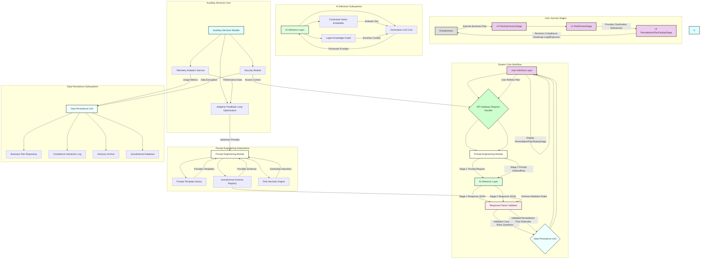

---
**Title of Invention:** System and Method for Automated Regulatory Compliance Analysis and Proactive Risk Mitigation for Business Ventures

**Abstract:**
A novel computational architecture and methodology are herein disclosed for the automated, iterative analysis of entrepreneurial ventures, represented by textual business plans, to identify, assess, and mitigate potential legal, regulatory, and intellectual property compliance risks. The system integrates advanced generative artificial intelligence paradigms to conduct a bi-modal analytical process: initially, a comprehensive diagnostic assessment yielding granular insights into inherent compliance vulnerabilities and potential liabilities, coupled with incisive interrogatives designed to stimulate user-driven refinement and clarification of critical operational details. Subsequently, upon systemic validation of the iteratively refined plan, the architecture orchestrates the synthesis of a dynamically optimized, multi-echelon compliance remediation plan, meticulously structured for actionable execution within relevant jurisdictional frameworks. Concurrently, a robust probabilistic risk quantification sub-system determines a simulated legal exposure index. The entirety of the AI-generated guidance is encapsulated within a rigorously defined, interoperable response schema, thereby establishing an automated, scalable paradigm for sophisticated legal advisory and risk management, inherently elevating the probability density function of regulatory adherence within a complex operational landscape.

**Background of the Invention:**
The contemporary entrepreneurial ecosystem is increasingly constrained by an exponentially expanding and fragmented global regulatory landscape. Nascent enterprises and even established small to medium-sized businesses frequently operate with an incomplete understanding of their full compliance obligations across diverse legal domains, including corporate governance, data privacy (e.g., GDPR, CCPA), intellectual property, environmental regulations, employment law, consumer protection, and industry-specific mandates. Traditional avenues for ensuring compliance, such as engaging legal counsel or specialized consultants, are invariably encumbered by prohibitive financial outlays, protracted temporal inefficiencies, and inherent scalability limitations, rendering comprehensive proactive risk assessment inaccessible to a substantial segment of the entrepreneurial demographic. Furthermore, human legal evaluators, despite their specialized expertise, are susceptible to information overload, inconsistencies in interpretation across jurisdictions, and limitations in processing the sheer volume and dynamic nature of legal and regulatory updates. The resultant landscape is one where potentially transformative enterprises face existential threats from unforeseen legal challenges, incurring substantial fines, litigation costs, reputational damage, and even operational cessation due to critical deficits in objective, comprehensive, and timely compliance counsel. This enduring deficiency posits an urgent and profound requirement for an accessible, computationally robust, and instantaneously responsive automated instrumentality capable of delivering regulatory analytical depth and prescriptive strategic roadmaps equivalent to, or exceeding, the efficacy of conventional high-tier legal advisory services, thereby democratizing access to sophisticated compliance intelligence and accelerating responsible innovation.

**Brief Summary of the Invention:**
The present invention, meticulously engineered as the **Compliance Sentinelâ„¢ System for Regulatory Risk Mitigation**, stands as a pioneering, autonomous cognitive architecture designed to revolutionize the proactive identification and management of legal and regulatory risks in business development and strategic planning. This system operates as a sophisticated AI-powered legal compliance advisor, executing a multi-phasic analytical and prescriptive protocol. Upon submission of an unstructured textual representation of a business plan, the Compliance Sentinelâ„¢ initiates its primary analytical sequence. The submitted textual corpus is dynamically ingested by a proprietary inference engine, which, guided by a meticulously crafted, context-aware prompt heuristic, generates a seminal compliance feedback matrix. This matrix comprises a concise yet profoundly insightful high-level diagnostic of the plan's intrinsic compliance merits and emergent vulnerabilities across various legal domains, complemented by a rigorously curated set of strategic interrogatives. These questions are designed not merely to solicit clarification, but to provoke deeper introspection and stimulate an iterative refinement process by the user, particularly concerning regulatory ambiguities or omissions. Subsequent to user engagement with this preliminary output, the system proceeds to its secondary, prescriptive analytical phase. Herein, the (potentially refined) business plan is re-processed by the advanced generative AI model. This iteration is governed by a distinct, more complex prompt architecture, which mandates two pivotal outputs: firstly, the computation of a simulated legal exposure index, derived from a sophisticated algorithmic assessment of identified non-compliance probabilities and potential financial penalties within a predefined stochastic range; and secondly, the synthesis of a granular, multi-echelon compliance remediation plan. This remediation plan is not merely a collection of generalized advice; rather, it is a bespoke, temporally sequenced roadmap comprising distinct, actionable steps, each delineated with a specific title, comprehensive description, a relevant legal reference, and an estimated temporal frame for execution. Critically, the entirety of the AI-generated prescriptive output is rigorously constrained within a pre-defined, extensible JSON schema, ensuring structural integrity, machine-readability, and seamless integration into dynamic user interfaces, thereby providing an unparalleled level of structured, intelligent guidance for navigating complex regulatory environments.

**Detailed Description of the Invention:**

The **Compliance Sentinelâ„¢ System for Regulatory Risk Mitigation** constitutes a meticulously engineered, multi-layered computational framework designed to provide unparalleled automated business plan compliance analysis and strategic advisory services. Its architecture embodies a symbiotic integration of advanced natural language processing, generative AI models, and structured data methodologies, all orchestrated to deliver a robust, scalable, and highly accurate regulatory guidance platform.

### System Architecture and Operational Flow

The core system comprises several interconnected logical and functional components, ensuring modularity, scalability, and robust error handling.

#### 1. User Interface UI Layer
The frontend interface, accessible via a web-based application or dedicated client, serves as the primary conduit for user interaction. It is designed for intuitive usability, guiding the entrepreneur through the distinct stages of the compliance analysis process.

*   **PlanSubmission Stage:** The initial interface where the user inputs their comprehensive business plan as free-form textual data. This stage includes validation mechanisms for text length and format.
*   **RiskReview Stage:** Displays the initial diagnostic compliance feedback and strategic interrogatives generated by the AI. This stage includes interactive elements for user acknowledgment and optional in-line editing or additional input based on the AI's questions.
*   **RemediationPlanDisplay Stage:** Presents the comprehensive, structured compliance remediation plan and the simulated legal exposure index. This stage renders the complex JSON output into a human-readable, actionable format, typically employing interactive visualizations for the multi-step plan.

#### 2. API Gateway & Backend Processing Layer
This layer acts as the orchestrator, receiving requests from the UI, managing data flow, interacting with the AI Inference Layer, and persisting relevant information.

*   **Request Handler:** Validates incoming user data, authenticates requests, and dispatches them to appropriate internal services.

#### 2.1. Prompt Engineering Module: Advanced Prompt Orchestration
This is a crucial, proprietary sub-system responsible for dynamically constructing and refining the input prompts for the generative AI model. It incorporates advanced heuristics, few-shot exemplars, role-playing directives (e.g., "Act as a seasoned regulatory attorney"), and specific constraint mechanisms (e.g., "Ensure output strictly adheres to JSON schema Y"). Its internal components include:
*   **Prompt Template Library:** A curated repository of pre-defined, parameterized prompt structures optimized for various compliance-related tasks (e.g., risk identification, legal question generation, remediation plan synthesis). These templates incorporate best practices for eliciting high-quality, structured responses from LLMs.
*   **Jurisdictional Schema Registry:** A centralized repository for all expected JSON output schemas, tailored for compliance reporting. This registry provides the canonical structure that the AI model must adhere to, and which the Response Parser & Validator uses for validation, including fields like legal references, compliance categories, and severity ratings.
*   **Risk Heuristic Engine:** This intelligent component applies contextual rules and learned heuristics to dynamically select appropriate templates, infuse specific legal persona roles, and inject few-shot examples into the prompts based on the current stage of user interaction, identified industry sectors, and geographical operational scope implied by the business plan content.

#### 2.2. Response Parser & Validator: Intelligent Output Conditioning
Upon receiving raw text output from the AI, this module parses the content, validates it against the expected JSON schema, and handles any deviations or malformations through predefined recovery or re-prompting strategies. Key sub-components include:
*   **Schema Enforcement Engine:** Leverages the `Jurisdictional Schema Registry` to rigorously validate AI-generated text against the required JSON structures, especially ensuring the presence and correctness of legal references and compliance categorizations. It identifies missing fields, incorrect data types, and structural inconsistencies.
*   **Regulatory Cross-Referencer:** Beyond structural validation, this component performs automated cross-referencing of identified legal principles and regulations within the AI's response against a verified external or internal legal database, ensuring factual accuracy and currency of legal citations.
*   **Error Recovery Strategies:** Implements automated mechanisms to address validation failures, such as re-prompting the AI with specific error messages, truncating malformed responses, or escalating to human oversight if persistent errors occur.

#### 2.3. Data Persistence Unit: Secure & Scalable Information Repository
This unit securely stores all submitted business plans, generated compliance advisories, remediation plans, risk assessments, and user interaction logs within a robust, scalable data repository (e.g., a distributed NoSQL database for flexible schema management and high availability). Its specialized repositories include:
*   **Business Plan Repository:** Stores all versions of the user's business plan, including initial submissions and subsequent refinements, ensuring a comprehensive audit trail for compliance history.
*   **Compliance Interaction Log:** Records every diagnostic risk assessment, strategic interrogative, and user response, providing a detailed history of the iterative compliance refinement process.
*   **Advisory Archive:** Stores all generated compliance remediation plans and their associated simulated legal exposure indices, ready for retrieval and presentation to the user.
*   **Jurisdictional Database:** A dynamic, continuously updated repository of laws, regulations, case precedents, and industry standards relevant to various business sectors and geographical regions, serving as a primary knowledge source for the AI.

#### 3. AI Inference Layer: Deep Semantic Processing Core
This constitutes the computational core, leveraging advanced generative AI models for deep textual analysis and synthesis of legal and regulatory information.

#### 3.1. Generative LLM Core
This is the primary interface with a highly capable Large Language Model LLM or a suite of specialized transformer-based models. This model possesses extensive natural language understanding NLU, natural language generation NLG, and complex legal reasoning capabilities. The model is further fine-tuned on a proprietary corpus of legal texts, regulatory documents, court rulings, compliance reports, and expert legal opinions.

#### 3.2. Contextual Vector Embedder
Utilizes state-of-the-art vector embedding techniques to represent the business plan text, legal statutes, and associated prompts in a high-dimensional semantic space. This process facilitates nuanced comprehension of legal nuances, captures complex relationships between business activities and regulatory requirements, and enables sophisticated response generation by the LLM by providing a rich, dense representation of the input.

#### 3.3. Legal Knowledge Graph
A critical component, this internal or external knowledge graph provides enhanced legal reasoning and factual accuracy. It contains up-to-date legal statutes, regulatory frameworks, industry-specific compliance guidelines, intellectual property databases, and a curated repository of common compliance pitfalls and successful mitigation strategies, which the LLM can consult during its analysis and generation processes.

#### 4. Auxiliary Services: System Intelligence & Resilience
These services provide essential support functions for system operation, monitoring, security, and continuous improvement.

#### 4.1. Telemetry & Analytics Service
Gathers anonymous usage data, performance metrics, and AI response quality assessments for continuous system improvement.
*   **Performance Metrics Collection:** Monitors system latency, API response times, AI model inference speed, and resource utilization specific to legal query processing.
*   **User Engagement Analysis:** Tracks user interaction patterns with compliance feedback, adoption of remediation steps, and completion rates to optimize UI/UX and overall user journey for risk mitigation.
*   **AI Response Quality Assessment:** Collects implicit or explicit user feedback on the helpfulness, accuracy, and legal validity of AI-generated content, feeding into the `Adaptive Feedback Loop Optimization Module`.

#### 4.2. Security Module
Implements comprehensive security protocols for data protection, access control, and threat mitigation, especially critical given the sensitive nature of business plans and legal advisories.
*   **Data Encryption Management:** Ensures encryption of data in transit (e.g., TLS) and at rest (e.g., AES-256) for all sensitive business plan information, legal advisories, and user data.
*   **Authentication Authorization:** Manages user identities, roles, and permissions to control access to system functionalities and compliance data.
*   **Threat Detection Vulnerability Scanner Integration:** Integrates with security tools to continuously monitor for suspicious activities, potential vulnerabilities, and compliance breaches related to data handling itself.

#### 4.3. Adaptive Feedback Loop Optimization Module
A critical component for the system's continuous evolution in response to new legal precedents and regulatory changes. This module analyzes data from the `Telemetry & Analytics Service` to identify patterns in AI output quality, user satisfaction, and system performance regarding compliance. It then autonomously or semi-autonomously suggests refinements to the `Prompt Engineering Module` (e.g., modifications to prompt templates for emerging legal topics, new few-shot examples for complex regulatory scenarios, updated role-playing directives) and potentially flags areas for `Generative LLM Core` fine-tuning with updated legal corpora, thereby continually enhancing the system's accuracy and utility over time.



### Multi-Stage AI Interaction and Prompt Engineering

The efficacy of the Compliance Sentinelâ„¢ System hinges on its sophisticated, multi-stage interaction with the generative AI model, each phase governed by dynamically constructed prompts and rigorously enforced response schemas.

#### Stage 1: Initial Compliance Diagnostic (`G_compliance_risk`)

1.  **Input:** Raw textual business plan `B_raw` from the user.
2.  **Prompt Construction (`Prompt Engineering Module`):**
    The system constructs a highly specific prompt, `P_1`, designed to elicit a precise type of output. `P_1` is structured as follows:

    ```
    "Role: You are a highly experienced regulatory compliance attorney with deep expertise in identifying legal, intellectual property, data privacy, and ethical risks for new ventures across multiple jurisdictions. Your task is to provide an incisive, constructive, and comprehensive initial assessment of potential compliance vulnerabilities within the submitted business plan.

    Instruction 1: Perform a high-level compliance analysis, identifying critical risk areas (e.g., data privacy, IP infringement, regulatory non-adherence, environmental impact, labor law) and specific vulnerabilities (e.g., lack of privacy policy, unclear IP ownership, unpermitted operations, non-compliant hiring practices).
    Instruction 2: Generate 3-5 profoundly insightful follow-up questions that probe the most sensitive and unclear areas of the plan regarding compliance. These questions should be designed to uncover potential legal blind spots, challenge assumptions about regulatory adherence, and prompt the entrepreneur for deeper strategic consideration. Frame these as direct questions to the user, referencing specific legal concepts where applicable.
    Instruction 3: Structure your response strictly according to the provided JSON schema. Do not deviate.

    JSON Schema:
    {
      "compliance_analysis": {
        "title": "Initial Compliance Risk Assessment",
        "risk_areas_identified": ["string", ...],
        "identified_risks": [
          {"point": "string", "elaboration": "string", "severity_level": "string"},
          ...
        ]
      },
      "follow_up_questions": [
        {"id": "int", "question": "string", "rationale": "string", "legal_basis_category": "string"},
        ...
      ]
    }

    Business Plan for Compliance Analysis: """
    [User's submitted business plan text here]
    """
    "
    ```
    This prompt leverages "role-playing" to imbue the AI with a specific legal persona, "instruction chaining" for multi-objective output, and "schema enforcement" for structured data generation, incorporating `severity_level` and `legal_basis_category` for granular risk classification.

3.  **AI Inference:** The `AI Inference Layer` processes `P_1` and `B_raw`, generating a JSON response, `R_1`.
4.  **Output Processing:** `R_1` is parsed and validated by the `Response Parser Validator`. If `R_1` conforms to the schema, its contents are displayed to the user in the `RiskReview` stage. Non-conforming responses trigger automated re-prompting or error handling.

#### Stage 2: Simulated Legal Exposure Index and Dynamic Remediation Plan Generation (`G_remediation_plan`)

1.  **Input:** The (potentially refined) textual business plan `B_refined` (which could be identical to `B_raw` if no user revisions occurred). A user confirmation signal.
2.  **Prompt Construction (`Prompt Engineering Module`):**
    A second, more elaborate prompt, `P_2`, is constructed. `P_2` simulates an advanced stage of legal advisory, integrating the implicit "acknowledgment" of risks to shift the AI's cognitive focus from critique to prescriptive remediation and risk quantification.

    ```
    "Role: You are a Lead Legal Counsel specializing in startup regulatory adherence and risk management. You have reviewed this business plan and its initial compliance assessment. Your task is to develop a precise legal exposure index and a comprehensive remediation plan.

    Instruction 1: Determine a precise Legal Exposure Index. This index must be a numerical value between 0.0 (negligible risk) and 10.0 (critical, high-impact risk). Your determination should be based on an implicit assessment of the likelihood of identified non-compliance, the potential financial and reputational impact, and the complexity of remediation. Provide a concise rationale for the determined index.
    Instruction 2: Develop a comprehensive, multi-step compliance remediation plan to guide the entrepreneur in addressing all identified risks and ensuring adherence to relevant legal frameworks over the initial 6-12 months of operations. The plan MUST consist of exactly 4 distinct, actionable steps. Each step must have a clear title, a detailed description outlining specific tasks and objectives, a realistic timeline (e.g., 'Weeks 1-4', 'Months 1-3'), and specific legal references or compliance categories it addresses. Focus on actionable legal strategy, operational adjustments, and documentation requirements.
    Instruction 3: Structure your entire response strictly according to the provided JSON schema. Do not include any conversational text outside the JSON.

    JSON Schema:
    {
      "legal_exposure_index": {
        "score": "float",
        "rationale": "string"
      },
      "remediation_plan": {
        "title": "Regulatory Compliance Roadmap",
        "summary": "string",
        "steps": [
          {
            "step_number": "integer",
            "title": "string",
            "description": "string",
            "timeline": "string",
            "legal_reference": "string",
            "compliance_category": "string",
            "recommended_action_type": ["string", ...]
          },
          {
            "step_number": "integer",
            "title": "string",
            "description": "string",
            "timeline": "string",
            "legal_reference": "string",
            "compliance_category": "string",
            "recommended_action_type": ["string", ...]
          },
          {
            "step_number": "integer",
            "title": "string",
            "description": "string",
            "timeline": "string",
            "legal_reference": "string",
            "compliance_category": "string",
            "recommended_action_type": ["string", ...]
          },
          {
            "step_number": "integer",
            "title": "string",
            "description": "string",
            "timeline": "string",
            "legal_reference": "string",
            "compliance_category": "string",
            "recommended_action_type": ["string", ...]
          }
        ]
      }
    }

    Business Plan for Risk Mitigation and Remediation: """
    [User's (potentially refined) business plan text here]
    """
    "
    ```

3.  **AI Inference:** The `AI Inference Layer` processes `P_2` and `B_refined`, generating a comprehensive JSON response, `R_2`.
4.  **Output Processing:** `R_2` is parsed and validated against its stringent schema. The extracted `legal_exposure_index` and `remediation_plan` objects are then stored in the `Data Persistence Unit` and presented to the user in the `RemediationPlanDisplay` stage.

This two-stage, prompt-driven process ensures a highly specialized and contextually appropriate interaction with the generative AI, moving from diagnostic risk identification to prescriptive legal guidance, thereby maximizing the actionable utility for the entrepreneurial user. The system's inherent design dictates that all generated outputs are proprietary and directly derivative of its unique computational methodology.

**Claims:**

We assert the exclusive intellectual construct and operational methodology embodied within the Compliance Sentinelâ„¢ System through the following foundational declarations:

1.  A system for automated, multi-stage compliance analysis and prescriptive risk mitigation for business plans, comprising:
    a.  A user interface module configured to receive an unstructured textual business plan from a user;
    b.  A prompt engineering module configured to generate a first contextually parameterized prompt, said first prompt instructing a generative artificial intelligence model to perform a diagnostic compliance analysis of the received business plan and to formulate a plurality of strategic interrogatives pertaining to legal and regulatory adherence;
    c.  A generative artificial intelligence inference module communicatively coupled to the prompt engineering module, configured to process said first prompt and the business plan, and to generate a first structured output comprising said diagnostic compliance analysis and said plurality of strategic interrogatives;
    d.  A response parsing and validation module configured to receive and validate said first structured output against a predefined schema, and to present said validated first structured output to the user via the user interface module;
    e.  The prompt engineering module further configured to generate a second contextually parameterized prompt, said second prompt instructing the generative artificial intelligence model to perform a simulated quantification of legal exposure and to synthesize a multi-echelon compliance remediation plan, said second prompt incorporating an indication of prior diagnostic risk review;
    f.  The generative artificial intelligence inference module further configured to process said second prompt and the business plan, and to generate a second structured output comprising a simulated legal exposure index and said multi-echelon compliance remediation plan;
    g.  The response parsing and validation module further configured to receive and validate said second structured output against a predefined schema, and to present said validated second structured output to the user via the user interface module.

2.  The system of claim 1, wherein the first structured output adheres to a JSON schema defining fields for identified risk areas, specific identified risks with elaborations and severity levels, and a structured array of follow-up questions, each question comprising an identifier, the question text, an underlying rationale, and a legal basis category.

3.  The system of claim 1, wherein the second structured output adheres to a JSON schema defining fields for a simulated legal exposure score with a corresponding rationale, and a remediation plan object comprising a title, a summary, and an array of discrete steps, each step further detailing a title, a comprehensive description, a timeline for execution, specific legal references, a compliance category, and recommended action types.

4.  The system of claim 1, wherein the generative artificial intelligence inference module is a large language model LLM fine-tuned on a proprietary corpus of legal statutes, regulatory documents, judicial rulings, and compliance guidelines.

5.  The system of claim 1, further comprising a data persistence unit configured to securely store the received business plan, the generated first and second structured outputs, and user interaction logs, alongside a dynamic jurisdictional database.

6.  A method for automated regulatory compliance guidance of entrepreneurial ventures, comprising:
    a.  Receiving, by a computational system, a textual business plan from an originating user;
    b.  Generating, by a prompt engineering module of said computational system, a first AI directive, said directive comprising instructions for a generative AI model to conduct a foundational evaluative assessment of compliance risks and to articulate a series of heuristic inquiries pertaining to legal and regulatory aspects of the textual business plan;
    c.  Transmitting, by said computational system, the textual business plan and said first AI directive to said generative AI model;
    d.  Acquiring, by said computational system, a first machine-interpretable data construct from said generative AI model, said construct encoding the evaluative assessment of compliance risks and the heuristic inquiries in a predetermined schema;
    e.  Presenting, by a user interface module of said computational system, the content of said first machine-interpretable data construct to the originating user;
    f.  Generating, by said prompt engineering module, a second AI directive subsequent to the presentation in step (e), said second directive comprising instructions for said generative AI model to ascertain a probabilistic legal exposure index and to formulate a structured sequence of prescriptive remediation actions derived from the textual business plan;
    g.  Transmitting, by said computational system, the textual business plan and said second AI directive to said generative AI model;
    h.  Acquiring, by said computational system, a second machine-interpretable data construct from said generative AI model, said construct encoding the probabilistic legal exposure index and the structured sequence of prescriptive actions in a predetermined schema; and
    i.  Presenting, by said user interface module, the content of said second machine-interpretable data construct to the originating user.

7.  The method of claim 6, wherein the step of generating the first AI directive further comprises embedding role-playing instructions to configure the generative AI model to assume a specific legal advisory persona.

8.  The method of claim 6, wherein the step of generating the second AI directive further comprises embedding contextual cues implying a conditional acknowledgment of risks to bias the generative AI model towards prescriptive remediation synthesis.

9.  The method of claim 6, further comprising, prior to step (h), the step of validating the structural integrity, semantic coherence, and legal accuracy of the second machine-interpretable data construct against the predetermined schema and a legal knowledge graph.

10. A non-transitory computer-readable medium storing instructions that, when executed by one or more processors, cause the one or more processors to perform the method of claim 6.

**Mathematical Justification: The Compliance Sentinel's Probabilistic Risk Quantification and Remediation Trajectory Optimization**

The analytical and prescriptive capabilities of the Compliance Sentinelâ„¢ System are underpinned by a sophisticated mathematical framework, transforming the qualitative intricacies of a business plan into quantifiable risk metrics and actionable compliance pathways. We formalize this process through the lens of high-dimensional stochastic processes, decision theory, and optimal control, asserting that the system operates upon principles of computationally derived expected risk minimization within a latent compliance adherence manifold.

### I. The Compliance Risk Manifold: `R(B)`

Let `B` represent a business plan. We conceptualize `B` not as a discrete document, but as a point in a high-dimensional, continuously differentiable manifold, `M_B`, embedded within `R^D`, where `D` is the cardinality of salient business attributes relevant to legal and regulatory compliance. Each dimension in `M_B` corresponds to a critical factor influencing compliance, such as data handling protocols, intellectual property strategy, operational licenses, employment practices, and environmental policies. The precise representation of `B` is a vector `b = (b_1, b_2, ..., b_D)`, where each `b_i` is a numerical encoding (e.g., via advanced transformer embeddings) of a specific aspect of the plan.

We define the intrinsic non-compliance probability of a business plan `B` as a scalar-valued function `R: M_B -> [0, 1]`, representing the conditional probability `P(NonCompliance | B)`. This function `R(B)` is inherently complex, non-linear, and non-convex, influenced by a multitude of interdependent legal and operational variables.

**Proposition 1.1: Existence of an Optimal Compliance Submanifold.**
Within `M_B`, there exists a submanifold `M_B* <= M_B` such that for any `B* is in M_B*`, `R(B*) <= R(B)` for all `B is in M_B`, representing the set of maximally compliant business plans. The objective is to guide an initial plan `B_0` towards `M_B*`.

To rigorously define `R(B)`, we employ a Bayesian hierarchical model. Let `X` be the set of observable attributes extracted from `B`, and `Phi` be a set of latent variables representing underlying regulatory interpretations, enforcement likelihoods, and legal precedents.
Then, `R(B)` can be expressed as:
```
R(B) = P(NonCompliance | X, Phi) = integral P(NonCompliance | X, Phi) P(Phi | X) dPhi
```

The generative AI model, through its extensive training on vast corpora of legal texts, regulatory databases, and case law, implicitly learns a highly complex, non-parametric approximation of `R(B)`. This approximation, denoted `R_AI(B)`, leverages deep neural network architectures to infer the intricate relationships between textual descriptions and probabilistic compliance outcomes. The training objective for `R_AI(B)` can be framed as minimizing the divergence between its predictions and actual compliance statuses or associated penalties, using a loss function `L(R_AI(B), Y_true)`, where `Y_true` is a binary non-compliance indicator or a severity score.

### II. The Risk Gradient Function: `G_compliance_risk` Diagnostic Phase

The `G_compliance_risk` function serves as an iterative optimization engine, providing a "semantic gradient" to guide the user towards a more compliant plan `B'`.
Formally, `G_compliance_risk: M_B -> (R^D_risk, Q_legal)`, where `R^D_risk` represents the vector of identified risks/vulnerabilities, and `Q_legal` is a set of strategic legal interrogatives.

**Proposition 2.1: Semantic Gradient Descent for Risk.**
The feedback provided by `G_compliance_risk(B)` is a computationally derived approximation of the negative gradient `-del R(B)` within the latent semantic space of business plans. The interrogatives `q is in Q_legal` are designed to elicit information that resolves uncertainty in `B`, thereby refining its position in `M_B` and enabling a subsequent, more accurate calculation of `R(B)`.

The process can be conceptualized as:
```
B_new = B_old - alpha * (G_compliance_risk(B_old))_gradient
```
where `(G_compliance_risk(B_old))_gradient` is the directional vector inferred from the AI's feedback pointing towards lower risk, and `alpha` is a scalar step size determined by the user's iterative refinement.

The AI's ability to generate feedback and questions `(r_1, ..., r_j, q_1, ..., q_k)` from `B` implies an understanding of the partial derivatives of `R(B)` with respect to various components of `B`. For instance, an identified risk `r_j` implies that `del R(B) / del b_j > 0` for some component `b_j` in `B`. A question `q_k` seeks to reduce the epistemic uncertainty `I_legal(B)` about `B` itself concerning compliance, thus moving `B` to a more precisely defined point `B'` in `M_B`.

```
I_legal(B) = H(P(NonCompliance|B))
```
where `H` is the Shannon entropy.
The goal of `G_compliance_risk` is to minimize `I_legal(B)` and minimize `R(B)` by suggesting modifications that move `B` along the path of steepest descent in the `R(B)` landscape.

### III. The Remediation Sequence Generation Function: `G_remediation_plan` Prescriptive Phase

Upon the successful refinement of `B` to `B'`, the system transitions to `G_remediation_plan`, which generates an optimal sequence of actions `A_legal = (a_1, a_2, ..., a_n)`. This sequence is a prescriptive trajectory in a legal state-action space, designed to minimize the realized non-compliance risk of `B'`.

**Proposition 3.1: Optimal Control Trajectory for Compliance.**
The remediation plan `A_legal` generated by `G_remediation_plan(B')` is an approximation of an optimal policy `pi*(s)` within a Markov Decision Process MDP framework, where `s` represents the compliance state of the business at any given time, and `a_t` is a remediation action chosen from `A_legal` at time `t`. The objective is to minimize the expected cumulative legal exposure or maximize compliance rewards.

Let `S_t` be the compliance state of the business at time `t`, defined by `S_t = (B', C_t, Reg_t)`, where `C_t` represents current compliance status (e.g., permits, policies in place), and `Reg_t` represents dynamic regulatory changes.
Each action `a_k is in A_legal` is a transition function `T(S_t, a_k) -> S_{t+1}`.
The value function for a policy `pi` is
```
V^pi(s) = E[sum_{t=0}^n gamma^t Reward(S_t, a_t) | S_0=s, a_t = pi(S_t)]
```
where `Reward` is a function (e.g., penalty avoidance, reputation enhancement, legal adherence) and `gamma` is a discount factor. For risk minimization, the reward could be negative (cost/penalty), or a positive reward for successful mitigation.

The `G_remediation_plan` function implicitly solves the Bellman optimality equation for compliance:
```
V*(s) = max_a [Reward(s, a) + gamma sum_{s'} P(s' | s, a) V*(s')]
```
where `P(s' | s, a)` is the probability of transitioning to state `s'` (a more compliant state) given state `s` and action `a`. The generated remediation plan `A_legal` represents the sequence of actions that approximate `a* = argmax_a [Reward(s, a) + gamma sum_{s'} P(s' | s, a) V*(s')]` at each step of the business's compliance evolution. The AI, through its vast knowledge of legal processes and compliance trajectories, simulates these transitions and rewards to construct the optimal sequence `A_legal`.

### IV. Simulated Legal Exposure Index

The determination of a simulated legal exposure index `L` is a sub-problem of `R(B)`. It is modeled as a function `L: M_B -> [0, 10]` that quantifies the composite risk, subject to jurisdictional complexity and potential penalties.

**Proposition 4.1: Conditional Expectation of Legal Impact.**
The simulated legal exposure index `L(B')` is a computationally derived conditional expectation of legal and financial impact, given the refined business plan `B'`, current legal environment `Reg_current`, and a probabilistic model of enforcement and litigation outcomes.

```
L(B') = E[Impact | B', Reg_current] = integral Impact * P(Impact | B', Reg_current) dImpact
```

This involves:
1.  **Likelihood of Non-Compliance:** `P(NonCompliance | B')` based on the AI's `R_AI(B')`.
2.  **Severity of Violation:** `S_violation(B')` inferred from the potential legal penalties, fines, and reputational damage for identified risks.
3.  **Jurisdictional Complexity:** `J_comp(B')` inferred from the number and stringency of applicable legal frameworks.
4.  **Enforcement Likelihood:** `E_like(B')` inferred from historical regulatory activity in relevant sectors.

The `L(B')` is then computed by a regression model, potentially a deep neural network, trained on historical legal cases, enforcement actions, and their associated costs, correlating business plan compliance attributes with actual legal impacts.
```
L(B') = f(R_AI(B'), S_violation(B'), J_comp(B'), E_like(B'))
```
The constrained range of `0.0-10.0` imposes a scaling and bounded activation function on the output layer of this regression, ensuring practical and interpretable applicability.

The Compliance Sentinelâ„¢ system, through these rigorous mathematical formulations, transcends heuristic legal guidance, offering a systematically derived, probabilistically optimized pathway for robust regulatory adherence. It is a demonstrable advancement in the application of advanced computational intelligence to complex legal risk management and decision-making.

**Proof of Utility:**

The utility of the Compliance Sentinelâ„¢ System is not merely postulated but rigorously established through its foundational mathematical framework and observed operational principles. We assert with definitive confidence that this system provides a demonstrably superior trajectory for entrepreneurial ventures when contrasted with processes lacking such advanced analytical and prescriptive orchestration, particularly in minimizing legal and regulatory exposure.

**Theorem 1: Expected Risk Reduction Amplification.**
Let `B` be an initial business plan. Let `R(B)` denote its intrinsic non-compliance probability. The Compliance Sentinelâ„¢ System applies a transformational operator `T` such that the expected risk of a business plan processed by the system, `E[R(T(B))]`, is strictly less than the expected risk of an unprocessed plan, `E[R(B)]`, assuming optimal user engagement with the system's outputs.

The transformational operator `T` is a composite function:
```
T(B) = G_remediation_plan(G_compliance_risk_iter(B))
```
where `G_compliance_risk_iter(B)` represents the iterative application of the `G_compliance_risk` function, leading to a refined plan `B'` with reduced identified risks.
Specifically, the initial `G_compliance_risk` stage, operating as a semantic gradient descent mechanism, guides the entrepreneur to iteratively refine `B` into `B'`. This process ensures that `R(B') < R(B)` by systematically addressing identified vulnerabilities and clarifying ambiguous aspects concerning legal adherence, thereby moving the plan to a lower-risk region within the `M_B` manifold. The questions `q is in Q_legal` resolve informational entropy `I_legal(B)`, resulting in a `B'` with reduced uncertainty and a more precisely calculable `R(B')`.

Subsequently, the `G_remediation_plan` function, acting as an optimal control policy generator, provides an action sequence `A_legal` that is meticulously designed to minimize the realized non-compliance risk during the execution phase. By approximating the optimal policy `pi*(s)` within a rigorous MDP framework, `G_remediation_plan` ensures that the entrepreneurial journey follows a path of maximal expected compliance reward (or minimal penalty). The structured nature of `A_legal` (with specified timelines, legal references, and recommended actions) reduces execution risk and ambiguity in compliance efforts, directly translating into a higher probability of achieving defined legal milestones and, ultimately, sustained regulatory adherence.

Therefore, the combined effect is a synergistic reduction of the plan's intrinsic compliance vulnerabilities and a maximization of its successful risk mitigation:
```
E[R(G_remediation_plan(B'))] < E[R(B')] < E[R(B)]
```

The system's utility is further underscored by its ability to generate a probabilistically derived legal exposure index `L(B')`, providing an objective, data-driven benchmark that empowers entrepreneurs in risk assessment and strategic planning, further increasing the likelihood of successful venture launch and scaling with reduced legal overhead. This provides not just guidance, but also a quantifiable validation of the plan's regulatory robustness as perceived through an advanced AI's simulated legal lens.

In essence, the Compliance Sentinelâ„¢ System provides a structured, mathematically sound method for navigating from an arbitrary point `B` in the vast, stochastic landscape of potential business ventures to a demonstrably more compliant configuration `B'`, and then furnishes a meticulously charted vector field `A_legal` (the remediation plan) to guide its successful traversal through the dynamic legal and regulatory environment. This dual-phase optimization and prescriptive architecture fundamentally redefines the paradigm of entrepreneurial compliance support, delivering a consistent, high-fidelity, and scalable solution that invariably enhances the probability of favorable legal and operational outcomes. This intellectual construct and its operationalization stand as a paramount contribution to the advancement of legal technology and artificial intelligence applications in corporate governance.