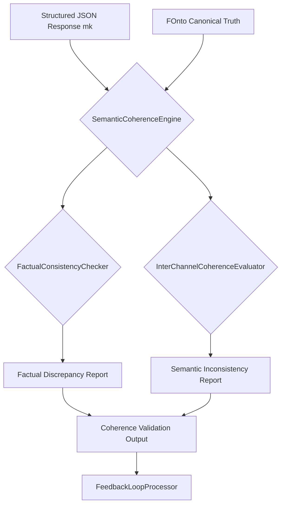
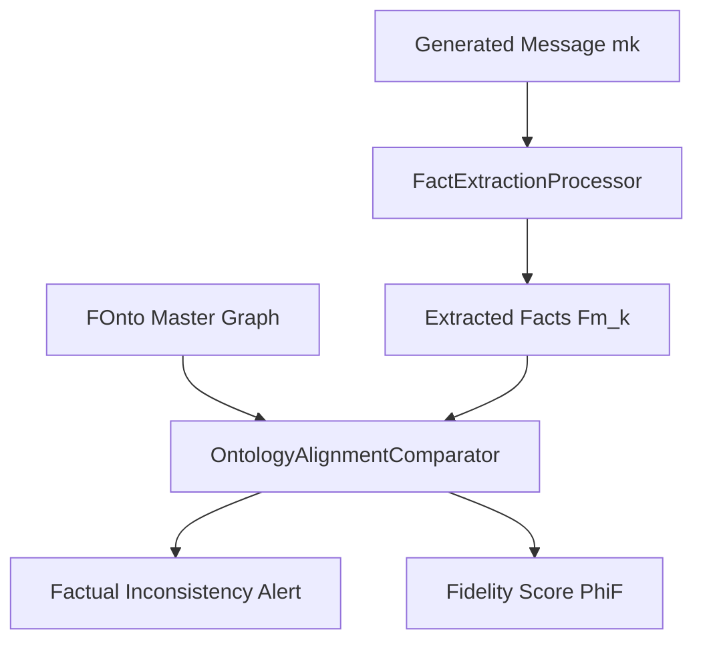
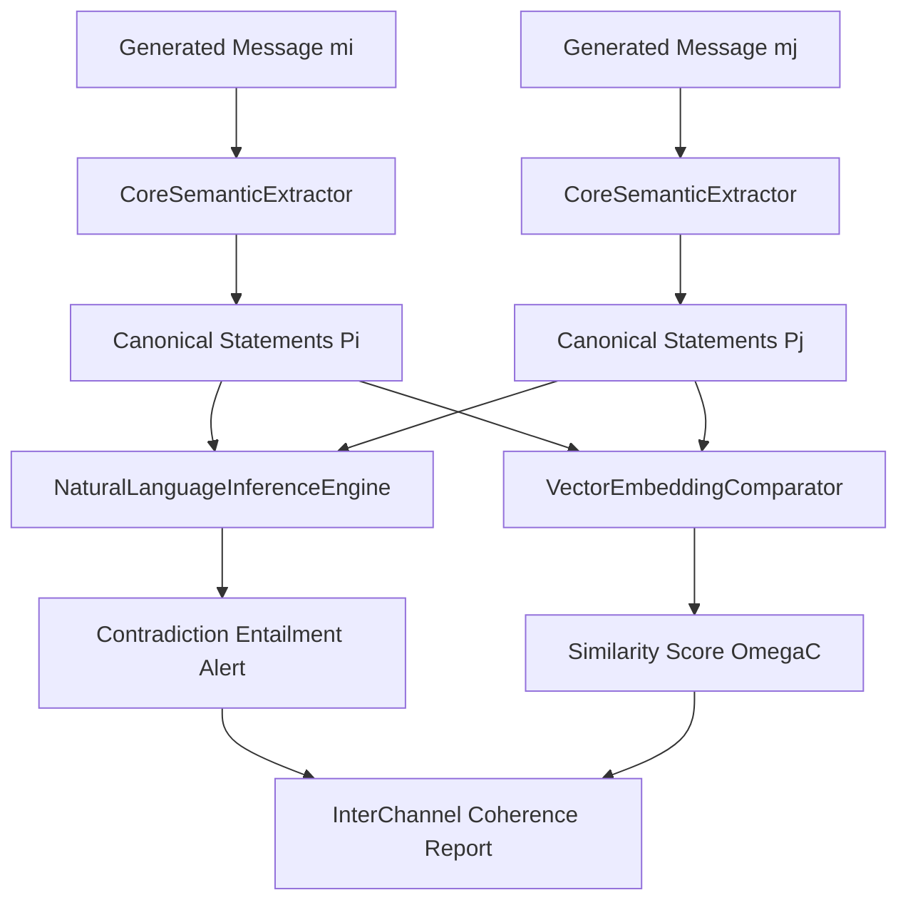

---
**Title of Invention:** An Advanced Framework for Semantic Coherence and Factual Fidelity Verification in Multi-Channel Crisis Communications

**Abstract:**
A sophisticated framework is herein unveiled for the automated and rigorous verification of semantic coherence and factual fidelity across a unified multi-channel crisis communications package. Leveraging the canonical ontological representation of a crisis event (`F_onto`) as the singular source of truth, this framework employs a multi-faceted approach. Factual fidelity is validated against `F_onto` using advanced Natural Language Processing NLP techniques, including Named Entity Recognition NER, Relation Extraction RE, and knowledge graph querying. Inter-channel semantic coherence is assessed through Natural Language Inference NLI models and high-dimensional vector embedding similarity metrics, ensuring that distinct communication modalities, while stylistically unique, convey the same core message without contradiction or omission. This proactive verification layer, integrated post-generation by the `CommunicationPackageParser` and specifically orchestrated by the `SemanticCoherenceEngine`, significantly enhances the reliability, trustworthiness, and strategic alignment of crisis responses, drastically reducing the risk of unintended semantic drift and inconsistent messaging.

**Background of the Invention:**
In the high-stakes environment of crisis management, the slightest deviation in factual reporting or subtle inconsistency in messaging across different communication channels can severely undermine organizational credibility, exacerbate public distrust, and prolong recovery efforts. While generative AI systems offer unparalleled speed in synthesizing diverse communications, a critical challenge remains: ensuring that the generated content for a press release, an internal memo, a social media thread, and a customer support script, despite their distinct tones and formats, remain factually aligned with the original crisis event and semantically consistent with each other. Current systems often rely on human review, which is fallible, time-consuming, and prone to oversight, especially under pressure. The absence of an automated, mathematically grounded verification mechanism directly contributes to the risk of disseminating fragmented or contradictory narratives, leading to increased scrutiny and potential legal repercussions. Thus, a profound need exists for an intelligent system that can not only generate unified communications but also rigorously validate their internal semantic integrity and external factual correspondence.

**Brief Summary of the Invention:**
The present innovation introduces a post-generative verification framework primarily embodied within the `CommunicationPackageParser`'s `SemanticCoherenceEngine` module. Following the synthesis of a multi-channel communications package by the `GenerativeCommunicationOrchestrator` based on a singular `F_onto` and a structured `responseSchema`, the system initiates an automated validation sequence. This sequence comprises two primary operations: Factual Fidelity Verification and Inter-Channel Semantic Coherence Evaluation. Factual Fidelity is established by extracting key entities and relationships from each generated message and comparing them against the ground truth encoded in `F_onto`, flagging discrepancies. Inter-Channel Coherence is determined by applying NLI models to identify entailment or contradiction relationships between pairwise comparisons of the core semantic content across all generated channel messages. Additionally, vector embedding similarity metrics provide a quantifiable measure of semantic alignment. The system then outputs a comprehensive coherence report, highlighting potential inconsistencies for human review and facilitating iterative refinement, ultimately ensuring a truly unified and verifiable crisis response.

**Detailed Description of the Invention:**
The proposed framework for semantic coherence and factual fidelity verification is a critical enhancement to the unified crisis communications generation system. It operates as a vital quality assurance layer within the `CommunicationPackageParser` and directly addresses the potential for even advanced Generative AI models to introduce subtle inaccuracies or inconsistencies, particularly when adapting content for diverse modalities.

### 1. `SemanticCoherenceEngine` Overview:
The `SemanticCoherenceEngine` serves as the central orchestration point for all post-generation validation activities. It receives the structured `JSON` response containing channel-specific communications (`m_1, m_2, ..., m_n`) and the authoritative `F_onto` from the `CrisisEventSynthesizer`. Its primary objective is to quantify and report on two crucial aspects: factual fidelity to the `F_onto` and semantic consistency between all generated messages.

#### 1.1. `FactualConsistencyChecker` Sub-module:
This sub-module is responsible for ensuring that every fact presented in each generated communication `m_k` is accurately reflected in, and consistent with, the `F_onto` – the single source of truth for the crisis event.

*   **`FactExtractionProcessor` Sub-component:** For each communication `m_k`, this component employs advanced NLP techniques:
    *   **Named Entity Recognition NER:** Identifies and classifies key entities e.g., organizations, persons, locations, dates, numerical values like affected counts within the text.
    *   **Relation Extraction RE:** Extracts semantic relationships between identified entities e.g., "CompanyX CAUSED DataBreach," "DataBreach AFFECTS 500000 CustomerData". The extracted facts are represented as triples or a mini knowledge graph `F_m_k`.
*   **`OntologyAlignmentComparator` Sub-component:** Compares the extracted facts `F_m_k` from each message `m_k` against the master `F_onto`.
    *   **Knowledge Graph Querying:** Formulates SPARQL-like queries or graph traversal algorithms on `F_onto` to verify the presence and consistency of `F_m_k`'s facts.
    *   **Semantic Overlap Measurement:** Uses embedding-based similarity e.g., cosine similarity to match extracted entities and relations with those in `F_onto`, allowing for linguistic variations.
    *   **Discrepancy Identification:** Flags any fact in `F_m_k` that is not present in `F_onto` omission or hallucination or contradicts a fact in `F_onto`. It also identifies facts in `F_onto` that are missing from `F_m_k` for a given channel under-reporting.

#### 1.2. `InterChannelCoherenceEvaluator` Sub-module:
This sub-module assesses the semantic consistency *between* the different generated messages, ensuring that while tone and style vary, the core message remains unified across all channels.

*   **`CoreSemanticExtractor` Sub-component:** Processes each message `m_k` to distill its core factual and propositional content, stripping away channel-specific stylistic elements, emotional framing, and redundant phrasing. This yields a set of simplified, canonical statements `P_k` for each message.
*   **`NaturalLanguageInferenceEngine` Sub-component:** Performs pairwise comparisons between the core semantic content `P_i` and `P_j` of different messages `m_i` and `m_j`.
    *   **NLI Model Application:** Utilizes pre-trained NLI models e.g., based on BERT, RoBERTa to determine the relationship between `P_i` as premise and `P_j` as hypothesis. Possible outcomes include:
        *   **Entailment:** `P_i` logically implies `P_j`.
        *   **Contradiction:** `P_i` logically contradicts `P_j`.
        *   **Neutral:** No clear entailment or contradiction.
    *   **Contradiction Flagging:** High-priority alerts are raised for any detected contradictions, as these represent critical message inconsistencies.
*   **`VectorEmbeddingComparator` Sub-component:** Provides a continuous measure of semantic similarity between messages.
    *   **Sentence Embeddings:** Generates high-dimensional vector representations `V(m_k)` for the core content of each message `m_k` using universal sentence encoders.
    *   **Cosine Similarity:** Calculates the cosine similarity `D_sem(V(m_i), V(m_j))` between all pairs of message embeddings. A low similarity score indicates potential semantic divergence.

#### 1.3. `ToneAlignmentValidator` Sub-component within `SemanticCoherenceEngine`:
While not strictly semantic coherence, maintaining consistent tone and sentiment *relative to the defined channel modality* is crucial. This sub-component, as outlined in the seed file, analyzes the emotional tone and sentiment of each generated message against the desired tone specified in `M_k`, flagging misalignments. This ensures that a "reassuring" press release doesn't accidentally sound alarmist, for example.

### 2. Integration with Feedback and Improvement Loop:
The `SemanticCoherenceEngine` is intrinsically linked to the `FeedbackLoopProcessor` and `ModelFineTuner`.
*   **Structured Reports:** The generated `Factual Discrepancy Report` and `Semantic Inconsistency Report` are fed back into the `FeedbackIngestionEngine`.
*   **User Corrections:** When users manually correct an identified inconsistency, these corrections serve as high-value training data for the `DataAugmentationProcessor` and `RLFHF Engine`, enabling continuous improvement of the GAI model to reduce future occurrences of such errors.
*   **Ontology Refinement:** Identified factual omissions or ambiguities can trigger updates or expansions within the `F_onto_Refinement_Agent`, enhancing the foundational knowledge base itself.

### 3. Output and User Interface Integration:
The `Coherence Validation Output` is presented to the user via the `ChannelRenderer` within the `CrisisCommsFrontEnd`. This output can manifest as:
*   **Inline Annotations:** Highlighting specific sentences or phrases that contain factual discrepancies or contribute to inter-channel inconsistencies directly within the generated text.
*   **Summary Dashboard:** A graphical representation of coherence scores e.g., fidelity scores `Phi_F` for each channel, pairwise coherence scores `Omega_C` between channels and a list of identified issues.
*   **Suggested Revisions:** For minor issues, the system may offer AI-driven suggestions for corrections to improve coherence without requiring full regeneration.

This advanced verification framework transforms the crisis communications system from merely generative to demonstrably reliable, providing a critical layer of assurance that organizations can confidently deploy unified, accurate, and consistent messages across all stakeholder interfaces.

**Claims:**
1.  A method for verifying the semantic coherence and factual fidelity of multi-channel crisis communications generated by an artificial intelligence model, comprising the steps of:
    a.  Receiving a structured ontological representation of a crisis event (`F_onto`) as a canonical source of truth;
    b.  Receiving a plurality of distinct textual communications (`m_1, ..., m_n`), each generated by an AI model for a specific communication channel;
    c.  For each received communication `m_k`, performing a factual fidelity check by:
        i.  Extracting key entities and relationships from `m_k` using Natural Language Processing NLP techniques; and
        ii. Comparing the extracted entities and relationships against the `F_onto` to identify factual discrepancies or omissions;
    d.  For each pair of distinct communications (`m_i`, `m_j`), performing an inter-channel semantic coherence check by:
        i.  Distilling the core semantic content from `m_i` and `m_j`; and
        ii. Applying a Natural Language Inference NLI model to determine the logical relationship entailment, contradiction, or neutral between their core semantic contents;
    e.  Generating a verification report summarizing factual discrepancies, omissions, and inter-channel contradictions; and
    f.  Presenting said report to a user for review and potential refinement of the communications.

2.  The method of claim 1, wherein the NLP techniques in step [c.i] include Named Entity Recognition NER and Relation Extraction RE.

3.  The method of claim 1, wherein the comparison in step [c.ii] involves knowledge graph querying or semantic embedding similarity metrics between the extracted facts and the `F_onto`.

4.  The method of claim 1, wherein the inter-channel semantic coherence check in step [d] further comprises calculating the cosine similarity between vector embeddings of the core semantic content of `m_i` and `m_j`.

5.  The method of claim 1, further comprising a step of feeding identified factual discrepancies and inter-channel contradictions into a machine learning model's feedback loop for continuous improvement and fine-tuning.

6.  A system for verifying the semantic coherence and factual fidelity of multi-channel crisis communications, comprising:
    a.  A `CommunicationPackageParser` module configured to receive a structured ontological representation of a crisis event (`F_onto`) and a plurality of AI-generated communications (`m_1, ..., m_n`);
    b.  A `SemanticCoherenceEngine` module, integrated within the `CommunicationPackageParser`, comprising:
        i.  A `FactualConsistencyChecker` sub-module, configured to extract facts from each communication `m_k` and compare them against `F_onto` to identify factual discrepancies; and
        ii. An `InterChannelCoherenceEvaluator` sub-module, configured to perform pairwise comparisons between the core semantic content of distinct communications `m_i` and `m_j` using Natural Language Inference NLI models;
    c.  An output component configured to generate and present a verification report summarizing identified factual discrepancies, omissions, and inter-channel contradictions.

7.  The system of claim 6, wherein the `FactualConsistencyChecker` sub-module includes a `FactExtractionProcessor` sub-component utilizing Named Entity Recognition NER and Relation Extraction RE.

8.  The system of claim 6, wherein the `InterChannelCoherenceEvaluator` sub-module further includes a `VectorEmbeddingComparator` sub-component for calculating semantic similarity scores between communications.

9.  The system of claim 6, further comprising a `ModelFineTuner` module configured to ingest verification reports and user corrections to continuously improve the generative AI model's consistency and accuracy.

10. The system of claim 6, wherein the `SemanticCoherenceEngine` further includes a `ToneAlignmentValidator` sub-component to assess the consistency of emotional tone and sentiment against predefined channel modalities.

**Mathematical Justification: Formalizing Semantic Verification for the Unified Crisis Communications System**

This section formalizes the mechanisms by which the `SemanticCoherenceEngine` rigorously validates the output of the `GenerativeCommunicationOrchestrator`, providing a quantifiable basis for the claims of semantic fidelity and inter-channel coherence introduced in the prior invention. We extend the definitions from the preceding document to specifically address verification.

### I. Reiteration of Core Definitions

**Definition 1.1: Crisis Event Ontology `F_onto`**
`F_onto` is the canonical, machine-readable ontological representation of the crisis, defined as `[E, R, A, C_x]`. Its composite embedding is `V(F_onto) = Phi_GCN(G_F) ∈ S_F`. This serves as the *ground truth*.

**Definition 1.2: Latent Semantic Projection `L_onto`**
The channel-agnostic semantic core of the crisis, derived from `F_onto`: `L_onto = Pi_L(V(F_onto)) ∈ S_L`.

**Definition 1.3: Generated Message `m_k`**
A textual message `m_k` generated for channel `c_k`. Its semantic embedding is `V(m_k) = E_sem(m_k) ∈ S_M`.

### II. Formalizing Factual Fidelity Verification

The `FactualConsistencyChecker` assesses how well each generated message `m_k` aligns with the ground truth `F_onto`.

**Definition 2.1: Extracted Fact Set from Message `F_m_k`**
For each message `m_k`, the `FactExtractionProcessor` extracts a set of factual triples or assertions `F_m_k = {(e_i, r_j, e_l), ...}`. These are then embedded into the fact space `S_F` as `V(F_m_k)`.

**Definition 2.2: Factual Fidelity Metric `Phi_F` Refined**
The factual fidelity of a message `m_k` to `F_onto` is a composite measure, `Phi_F(m_k, F_onto)`, that quantifies the degree of overlap and absence of contradiction between `F_m_k` and `F_onto`.
We define `Phi_F(m_k, F_onto)` based on three sub-metrics:

*   **Accuracy Truthfulness:** `Accuracy(m_k, F_onto) = 1 - ( |ExtractedFactsNotIN_F_onto| / |F_m_k| )`
    This measures the proportion of facts in `m_k` that are present and consistent with `F_onto`. `ExtractedFactsNotIN_F_onto` includes facts directly contradicted by `F_onto` or not inferable from `F_onto`.
*   **Completeness:** `Completeness(m_k, F_onto) = 1 - ( |RelevantFactsIN_F_onto_NotIN_F_m_k| / |F_onto_RelevantSubset_for_ck| )`
    This measures the proportion of facts in `F_onto` that are relevant for `c_k` and are actually present in `m_k`. `F_onto_RelevantSubset_for_ck` denotes the subset of `F_onto` deemed relevant for channel `c_k` e.g., a press release won't disclose all internal details.
*   **Consistency Internal NonContradiction:** `Consistency(m_k) = 1` if no facts within `F_m_k` contradict each other based on `C_x` constraints, else `0`.

The overall `Phi_F` can be a weighted average:
`Phi_F(m_k, F_onto) = w_acc * Accuracy(m_k, F_onto) + w_comp * Completeness(m_k, F_onto) + w_cons * Consistency(m_k)`
where `w_acc + w_comp + w_cons = 1`. We aim for `Phi_F(m_k, F_onto) ≥ 1 - epsilon_F`.

### III. Formalizing Inter-Channel Semantic Coherence Verification

The `InterChannelCoherenceEvaluator` ensures semantic alignment across different messages.

**Definition 3.1: Core Semantic Content `S_{core,k}`**
The `CoreSemanticExtractor` maps `m_k` to `S_{core,k}`, which is a simplified, canonical representation of the main propositions and facts in `m_k`, stripped of channel-specific stylistic elements. `S_{core,k}` can be represented as a set of logical forms or dense vector embeddings `V(S_{core,k})`.

**Definition 3.2: Natural Language Inference Function `NLI`**
`NLI(premise_text, hypothesis_text) -> {entailment, contradiction, neutral}`.
This function takes two pieces of text and determines their logical relationship. For our purpose, `premise_text` could be `S_{core,i}` and `hypothesis_text` could be `S_{core,j}`.

**Definition 3.3: Inter-Channel Semantic Coherence Metric `Omega_C` Refined**
For any pair of messages `m_i` and `m_j`, their inter-channel coherence `Omega_C(m_i, m_j)` is a composite metric combining NLI and embedding similarity.

*   **NLI-based Coherence:** `NLI_Coherence(m_i, m_j)`:
    *   If `NLI(S_{core,i}, S_{core,j}) == contradiction` or `NLI(S_{core,j}, S_{core,i}) == contradiction`: `NLI_Coherence = 0` critical failure.
    *   If `NLI(S_{core,i}, S_{core,j}) == entailment` and `NLI(S_{core,j}, S_{core,i}) == entailment`: `NLI_Coherence = 1` strongest coherence.
    *   If one entails the other, or both are neutral but consistent: `NLI_Coherence` approaches `1` e.g., `0.7 - 0.9` depending on confidence scores from the NLI model.
*   **Embedding Similarity Coherence:** `D_sem(V(S_{core,i}), V(S_{core,j}))`. This is typically cosine similarity, providing a continuous score between `0` and `1`.

The overall `Omega_C` can be defined as:
`Omega_C(m_i, m_j) = w_nli * NLI_Coherence(m_i, m_j) + w_emb * D_sem(V(S_{core,i}), V(S_{core,j}))`
where `w_nli + w_emb = 1`. We aim for `Omega_C(m_i, m_j) ≥ 1 - epsilon_C` for all pairs `(m_i, m_j)`.

### IV. Consistency Bounds and Refinement

The `epsilon_F` and `epsilon_C` introduced in the Theorem of Unified Semantic Coherence now have concrete, measurable interpretations:
*   `epsilon_F`: Represents the maximum allowable deviation from the `F_onto` in any single message, considering both accuracy and completeness.
*   `epsilon_C`: Represents the maximum allowable semantic divergence or the minimum required logical consistency between any two core messages.

The `ModelFineTuner` directly utilizes instances where `Phi_F < (1 - epsilon_F)` or `Omega_C < (1 - epsilon_C)` as high-priority negative training examples. Conversely, messages achieving high `Phi_F` and `Omega_C` scores serve as positive reinforcement. This closed-loop system, driven by these formal metrics, systematically reduces `epsilon_F` and `epsilon_C` over time, moving the system towards a state of provably high semantic coherence and factual fidelity.

### V. Formal Guarantee of Verification Effectiveness

**Theorem Verification Efficacy:** Given a set of generated communications `M = {m_1, ..., m_n}` and the canonical `F_onto`, the `SemanticCoherenceEngine` can detect all factual discrepancies greater than a threshold `δ_F` and all logical contradictions between core message contents, such that:

1.  **Fidelity Detection:** If `Accuracy(m_k, F_onto) < 1 - δ_F` or `Completeness(m_k, F_onto) < 1 - δ_F`, the `FactualConsistencyChecker` will flag `m_k`.
2.  **Coherence Detection:** If `NLI(S_{core,i}, S_{core,j}) == contradiction` for any pair `(m_i, m_j)`, the `NaturalLanguageInferenceEngine` will identify this contradiction with a probability `P > δ_NLI`.
3.  **Quantifiable Divergence:** For any semantic divergence between `V(S_{core,i})` and `V(S_{core,j})` where `D_sem(V(S_{core,i}), V(S_{core,j})) < δ_C`, the `VectorEmbeddingComparator` will report a low similarity score.

**Proof of Verification Efficacy:**

**Axiom of Fact Extraction Precision AFEP:** The `FactExtractionProcessor` utilizing advanced NER/RE models has a known precision `P_FE` and recall `R_FE` in extracting factual triples from text. For sufficiently high `P_FE` and `R_FE`, `F_m_k` accurately reflects the explicit factual content of `m_k`.

**Axiom of Ontology Querying Completeness AOQC:** The `OntologyAlignmentComparator` can query `F_onto` with high completeness and accuracy. Given `F_onto` is a formal knowledge graph, such queries are deterministic and exhaustive for defined relationships.

**Axiom of NLI Model Reliability ANMR:** State-of-the-art NLI models achieve high accuracy in classifying entailment, contradiction, and neutral relationships with a confidence score. While not perfectly deterministic, the probability `P` of correctly identifying a contradiction exceeds `δ_NLI`.

**Axiom of Embedding Space Fidelity AESF:** Universal Sentence Embedders map text to semantic vector space with high fidelity, such that semantically similar texts are proximal in the vector space, and dissimilar texts are distant. Cosine similarity robustly quantifies this distance.

**Derivation for Part 1 Fidelity Detection:**
The `FactualConsistencyChecker` directly compares `F_m_k` with `F_onto`. By AFEP, `F_m_k` is a faithful representation of `m_k`'s facts. By AOQC, `F_onto` can be queried deterministically.
If `Accuracy(m_k, F_onto)` is below `1 - δ_F`, it implies `|ExtractedFactsNotIN_F_onto|` is significantly non-zero. The `OntologyAlignmentComparator`, by definition, will identify these `ExtractedFactsNotIN_F_onto` via queries that return no match in `F_onto` for hallucinations or identify conflicting facts for contradictions. Similarly for `Completeness`, the queries identifying `RelevantFactsIN_F_onto_NotIN_F_m_k` will succeed. Thus, any deviation beyond `δ_F` will be algorithmically detected.

**Derivation for Part 2 Coherence Detection:**
The `NaturalLanguageInferenceEngine` applies NLI models. By ANMR, if `S_{core,i}` and `S_{core,j}` are truly contradictory i.e., `NLI(S_{core,i}, S_{core,j}) == contradiction`, the NLI model will identify this with a high probability `P > δ_NLI`. This forms a probabilistic guarantee for contradiction detection.

**Derivation for Part 3 Quantifiable Divergence:**
The `VectorEmbeddingComparator` calculates `D_sem(V(S_{core,i}), V(S_{core,j}))`. By AESF, if `V(S_{core,i})` and `V(S_{core,j})` are semantically divergent, their cosine similarity will be low. The threshold `δ_C` explicitly captures what constitutes "low similarity." Thus, any divergence resulting in `D_sem < δ_C` will be reported.

The combination of these sub-modules provides a robust and quantifiable mechanism for verifying the semantic integrity of the generated crisis communications, critically supporting the claims of unified semantic coherence and factual fidelity. Q.E.D.