**Title of Invention:** An Advanced Framework for Semantic Coherence and Factual Fidelity Verification in Multi-Channel Crisis Communications

**Abstract:**
A sophisticated framework is herein unveiled for the automated and rigorous verification of semantic coherence and factual fidelity across a unified multi-channel crisis communications package. Leveraging the canonical ontological representation of a crisis event (`F_onto`) as the singular source of truth, this framework employs a multi-faceted approach. Factual fidelity is validated against `F_onto` using advanced Natural Language Processing NLP techniques, including Named Entity Recognition NER, Relation Extraction RE, and knowledge graph querying. Inter-channel semantic coherence is assessed through Natural Language Inference NLI models and high-dimensional vector embedding similarity metrics, ensuring that distinct communication modalities, while stylistically unique, convey the same core message without contradiction or omission. Furthermore, a `ToneAlignmentValidator` ensures the emotional resonance and sentiment of each message aligns with predefined channel-specific profiles. This proactive verification layer, integrated post-generation by the `CommunicationPackageParser` and specifically orchestrated by the `SemanticCoherenceEngine`, significantly enhances the reliability, trustworthiness, and strategic alignment of crisis responses, drastically reducing the risk of unintended semantic drift and inconsistent messaging. The framework provides quantifiable metrics for fidelity and coherence, facilitating a continuous feedback loop for generative AI model improvement and ensuring robust, verifiable communication integrity.

**Background of the Invention:**
In the high-stakes environment of crisis management, the slightest deviation in factual reporting or subtle inconsistency in messaging across different communication channels can severely undermine organizational credibility, exacerbate public distrust, and prolong recovery efforts. While generative AI systems offer unparalleled speed in synthesizing diverse communications, a critical challenge remains: ensuring that the generated content for a press release, an internal memo, a social media thread, and a customer support script, despite their distinct tones and formats, remain factually aligned with the original crisis event and semantically consistent with each other. Current systems often rely on human review, which is fallible, time-consuming, and prone to oversight, especially under pressure. The absence of an automated, mathematically grounded verification mechanism directly contributes to the risk of disseminating fragmented or contradictory narratives, leading to increased scrutiny and potential legal repercussions. Thus, a profound need exists for an intelligent system that can not only generate unified communications but also rigorously validate their internal semantic integrity and external factual correspondence, including crucial elements like emotional tone and sentiment, across all diverse output channels.

**Brief Summary of the Invention:**
The present innovation introduces a post-generative verification framework primarily embodied within the `CommunicationPackageParser`'s `SemanticCoherenceEngine` module. Following the synthesis of a multi-channel communications package by the `GenerativeCommunicationOrchestrator` based on a singular `F_onto` and a structured `responseSchema`, the system initiates an automated validation sequence. This sequence comprises three primary operations: Factual Fidelity Verification, Inter-Channel Semantic Coherence Evaluation, and Channel Tone Alignment Validation. Factual Fidelity is established by extracting key entities and relationships from each generated message and comparing them against the ground truth encoded in `F_onto`, flagging discrepancies. Inter-Channel Coherence is determined by applying NLI models to identify entailment or contradiction relationships between pairwise comparisons of the core semantic content across all generated channel messages, complemented by vector embedding similarity metrics. Tone alignment is assessed by comparing the detected emotional and sentiment profile of a message against its channel's desired profile. The system then outputs a comprehensive coherence report, highlighting potential inconsistencies for human review and facilitating iterative refinement, ultimately ensuring a truly unified and verifiable crisis response. This framework also integrates a robust feedback loop, utilizing verification failures and human corrections to continually fine-tune the generative models and refine the underlying `F_onto`.

**Detailed Description of the Invention:**
The proposed framework for semantic coherence and factual fidelity verification is a critical enhancement to the unified crisis communications generation system. It operates as a vital quality assurance layer within the `CommunicationPackageParser` and directly addresses the potential for even advanced Generative AI models to introduce subtle inaccuracies or inconsistencies, particularly when adapting content for diverse modalities and tones.

### 1. `SemanticCoherenceEngine` Overview:
The `SemanticCoherenceEngine` serves as the central orchestration point for all post-generation validation activities. It receives the structured `JSON` response containing channel-specific communications (`m_1, m_2, ..., m_n`) and the authoritative `F_onto` from the `CrisisEventSynthesizer`. Its primary objective is to quantify and report on three crucial aspects: factual fidelity to the `F_onto`, semantic consistency between all generated messages, and alignment of emotional tone for each message with its target channel.

```mermaid
graph TD
    A[Structured JSON Response mk] --> B{SemanticCoherenceEngine};
    F[FOnto Canonical Truth] --> B;
    P[Channel Desired Tone Profiles] --> B;
    B --> C{FactualConsistencyChecker};
    B --> D{InterChannelCoherenceEvaluator};
    B --> E{ToneAlignmentValidator};
    C --> F_R[Factual Discrepancy Report];
    D --> S_R[Semantic Inconsistency Report];
    E --> T_R[Tone Misalignment Report];
    F_R & S_R & T_R --> H[Coherence Validation Output];
    H --> I[FeedbackLoopProcessor];
    I --> J[ModelFineTuner];
    I --> K[FOnto Refinement Agent];

    subgraph CommunicationPackageParser
        B
        C
        D
        E
    end
```

#### 1.1. `FactualConsistencyChecker` Sub-module:
This sub-module is responsible for ensuring that every fact presented in each generated communication `m_k` is accurately reflected in, and consistent with, the `F_onto` – the single source of truth for the crisis event.

*   **`FactExtractionProcessor` Sub-component:** For each communication `m_k`, this component employs advanced NLP techniques:
    *   **Named Entity Recognition NER:** Identifies and classifies key entities (e.g., organizations, persons, locations, dates, numerical values like affected counts) within the text.
    *   **Relation Extraction RE:** Extracts semantic relationships between identified entities (e.g., "CompanyX CAUSED DataBreach," "DataBreach AFFECTS 500000 CustomerData"). The extracted facts are represented as triples or a mini knowledge graph `F_m_k`.
*   **`OntologyAlignmentComparator` Sub-component:** Compares the extracted facts `F_m_k` from each message `m_k` against the master `F_onto`.
    *   **Knowledge Graph Querying:** Formulates SPARQL-like queries or graph traversal algorithms on `F_onto` to verify the presence and consistency of `F_m_k`'s facts.
    *   **Semantic Overlap Measurement:** Uses embedding-based similarity (e.g., cosine similarity) to match extracted entities and relations with those in `F_onto`, allowing for linguistic variations.
    *   **Discrepancy Identification:** Flags any fact in `F_m_k` that is not present in `F_onto` (omission or hallucination) or contradicts a fact in `F_onto`. It also identifies facts in `F_onto` that are missing from `F_m_k` for a given channel (under-reporting).

#### 1.2. `InterChannelCoherenceEvaluator` Sub-module:
This sub-module assesses the semantic consistency *between* the different generated messages, ensuring that while tone and style vary, the core message remains unified across all channels.

*   **`CoreSemanticExtractor` Sub-component:** Processes each message `m_k` to distill its core factual and propositional content, stripping away channel-specific stylistic elements, emotional framing, and redundant phrasing. This yields a set of simplified, canonical statements `P_k` for each message.
*   **`NaturalLanguageInferenceEngine` Sub-component:** Performs pairwise comparisons between the core semantic content `P_i` and `P_j` of different messages `m_i` and `m_j`.
    *   **NLI Model Application:** Utilizes pre-trained NLI models (e.g., based on BERT, RoBERTa) to determine the relationship between `P_i` as premise and `P_j` as hypothesis. Possible outcomes include:
        *   **Entailment:** `P_i` logically implies `P_j`.
        *   **Contradiction:** `P_i` logically contradicts `P_j`.
        *   **Neutral:** No clear entailment or contradiction.
    *   **Contradiction Flagging:** High-priority alerts are raised for any detected contradictions, as these represent critical message inconsistencies.
*   **`VectorEmbeddingComparator` Sub-component:** Provides a continuous measure of semantic similarity between messages.
    *   **Sentence Embeddings:** Generates high-dimensional vector representations `V(m_k)` for the core content of each message `m_k` using universal sentence encoders.
    *   **Cosine Similarity:** Calculates the cosine similarity `D_sem(V(m_i), V(S_{core,j}))` between all pairs of message core semantic embeddings. A low similarity score indicates potential semantic divergence.

#### 1.3. `ToneAlignmentValidator` Sub-component within `SemanticCoherenceEngine`:
While not strictly semantic coherence, maintaining consistent tone and sentiment *relative to the defined channel modality* is crucial. This sub-component analyzes the emotional tone and sentiment of each generated message against the desired tone specified in `M_k`, flagging misalignments. This ensures that a "reassuring" press release doesn't accidentally sound alarmist, for example.

*   **`SentimentAnalyzer`:** Detects positive, negative, neutral sentiment scores.
*   **`EmotionDetector`:** Identifies a spectrum of emotions (e.g., joy, sadness, anger, fear, surprise, disgust).
*   **`StylisticFeatureExtractor`:** Analyzes linguistic features related to formality, urgency, complexity.
*   **`ToneProfileComparator`:** Compares the extracted `T_actual(m_k)` against the `T_desired(c_k)` for channel `c_k`.

#### 1.4. `CoherenceScoreAggregator` Sub-component:
This new component collects the individual scores from `FactualConsistencyChecker`, `InterChannelCoherenceEvaluator`, and `ToneAlignmentValidator` to produce a unified, weighted coherence score for the entire communication package.

### 2. Integration with Feedback and Improvement Loop:
The `SemanticCoherenceEngine` is intrinsically linked to the `FeedbackLoopProcessor` and `ModelFineTuner`.

*   **`FeedbackLoopProcessor`:** Collects all validation reports, user interactions, and correction signals.
*   **Structured Reports:** The generated `Factual Discrepancy Report`, `Semantic Inconsistency Report`, and `Tone Misalignment Report` are fed back into the `FeedbackIngestionEngine`.
*   **User Corrections:** When users manually correct an identified inconsistency, these corrections serve as high-value training data for the `DataAugmentationProcessor` and `RLFHF Engine`, enabling continuous improvement of the GAI model to reduce future occurrences of such errors.
*   **Ontology Refinement:** Identified factual omissions, ambiguities, or newly emerged crisis aspects can trigger updates or expansions within the `F_onto_Refinement_Agent`, enhancing the foundational knowledge base itself. This ensures `F_onto` remains dynamic and representative of the evolving crisis landscape.

#### 2.1. `FOnto Refinement Agent`:
This sub-system takes insights from validation failures (e.g., `F_onto` omissions causing completeness issues) and user feedback to propose and implement updates to the `F_onto`. This might involve adding new entities, relations, or modifying existing axioms.

### 3. Output and User Interface Integration:
The `Coherence Validation Output` is presented to the user via the `ChannelRenderer` within the `CrisisCommsFrontEnd`. This output can manifest as:
*   **Inline Annotations:** Highlighting specific sentences or phrases that contain factual discrepancies or contribute to inter-channel inconsistencies directly within the generated text.
*   **Summary Dashboard:** A graphical representation of coherence scores (e.g., fidelity scores `Phi_F` for each channel, pairwise coherence scores `Omega_C` between channels) and a list of identified issues.
*   **Suggested Revisions:** For minor issues, the system may offer AI-driven suggestions for corrections to improve coherence without requiring full regeneration. These suggestions are themselves validated before presentation.

#### 3.1. `Suggested Revisions Generator`:
This module utilizes a fine-tuned generative model to propose corrections for identified inconsistencies, aiming to minimize deviation from the original message intent while maximizing coherence and fidelity.

This advanced verification framework transforms the crisis communications system from merely generative to demonstrably reliable, providing a critical layer of assurance that organizations can confidently deploy unified, accurate, and consistent messages across all stakeholder interfaces.

**Claims:**
1.  A method for verifying the semantic coherence and factual fidelity of multi-channel crisis communications generated by an artificial intelligence model, comprising the steps of:
    a.  Receiving a structured ontological representation of a crisis event (`F_onto`) as a canonical source of truth;
    b.  Receiving a plurality of distinct textual communications (`m_1, ..., m_n`), each generated by an AI model for a specific communication channel `c_k`;
    c.  For each received communication `m_k`, performing a factual fidelity check by:
        i.  Extracting key entities `E_k` and relationships `R_k` from `m_k` using Natural Language Processing NLP techniques, forming an extracted fact set `F_m_k`; and
        ii. Comparing `F_m_k` against the `F_onto` using knowledge graph querying and embedding-based similarity to compute a factual fidelity score `Phi_F(m_k, F_onto)` and identify factual discrepancies or omissions;
    d.  For each pair of distinct communications (`m_i`, `m_j`), performing an inter-channel semantic coherence check by:
        i.  Distilling the core semantic content `S_{core,k}` from `m_k` and `m_j`; and
        ii. Applying a Natural Language Inference NLI model to determine the logical relationship (entailment, contradiction, or neutral) between `S_{core,i}` and `S_{core,j}`, and calculating an inter-channel coherence score `Omega_C(m_i, m_j)`;
    e.  For each communication `m_k`, performing a tone alignment check by:
        i.  Extracting the actual tone profile `T_actual(m_k)` from `m_k` using sentiment analysis, emotion detection, and stylistic feature extraction; and
        ii. Comparing `T_actual(m_k)` against a predefined desired tone profile `T_desired(c_k)` for channel `c_k` to calculate a tone alignment score `Psi_T(m_k, c_k)`;
    f.  Generating a comprehensive verification report summarizing factual discrepancies, omissions, inter-channel contradictions, and tone misalignments; and
    g.  Presenting said report to a user for review and potential refinement of the communications, alongside AI-driven suggested revisions.

2.  The method of claim 1, wherein the NLP techniques in step [c.i] include Named Entity Recognition NER and Relation Extraction RE, formalized as functions `NER(m_k)` and `RE(m_k)`.

3.  The method of claim 1, wherein the comparison in step [c.ii] quantifies factual fidelity `Phi_F(m_k, F_onto)` as a weighted composite of `Accuracy(m_k, F_onto)`, `Completeness(m_k, F_onto)`, and `Consistency(m_k)` metrics, as defined by specific mathematical equations.

4.  The method of claim 1, wherein the inter-channel semantic coherence check in step [d] further comprises calculating the cosine similarity `D_sem(V(S_{core,i}), V(S_{core,j}))` between vector embeddings of the core semantic content of `m_i` and `m_j`, and `Omega_C` is a weighted combination of NLI results and embedding similarity.

5.  The method of claim 1, further comprising a step of feeding identified factual discrepancies, inter-channel contradictions, and tone misalignments, along with user corrections, into a machine learning model's feedback loop for continuous improvement and fine-tuning using reinforcement learning from human feedback (RLHF).

6.  A system for verifying the semantic coherence and factual fidelity of multi-channel crisis communications, comprising:
    a.  A `CommunicationPackageParser` module configured to receive a structured ontological representation of a crisis event (`F_onto`) and a plurality of AI-generated communications (`m_1, ..., m_n`);
    b.  A `SemanticCoherenceEngine` module, integrated within the `CommunicationPackageParser`, comprising:
        i.  A `FactualConsistencyChecker` sub-module, configured to extract facts from each communication `m_k` and compare them against `F_onto` to identify factual discrepancies and calculate `Phi_F`;
        ii. An `InterChannelCoherenceEvaluator` sub-module, configured to perform pairwise comparisons between the core semantic content of distinct communications `m_i` and `m_j` using Natural Language Inference NLI models and semantic embedding similarity to calculate `Omega_C`; and
        iii. A `ToneAlignmentValidator` sub-module, configured to extract the actual tone `T_actual(m_k)` from each `m_k` and compare it against a predefined `T_desired(c_k)` to calculate `Psi_T`.
    c.  A `CoherenceScoreAggregator` sub-component configured to combine `Phi_F`, `Omega_C`, and `Psi_T` into an overall package coherence score `Gamma_total`; and
    d.  An output component configured to generate and present a comprehensive verification report summarizing identified issues and providing AI-driven suggested revisions.

7.  The system of claim 6, wherein the `FactualConsistencyChecker` sub-module includes a `FactExtractionProcessor` sub-component utilizing Named Entity Recognition NER and Relation Extraction RE models to generate `F_m_k`.

8.  The system of claim 6, wherein the `InterChannelCoherenceEvaluator` sub-module further includes a `VectorEmbeddingComparator` sub-component for calculating cosine similarity between universal sentence embeddings `V(S_{core,k})` of core message contents.

9.  The system of claim 6, further comprising a `ModelFineTuner` module configured to ingest verification reports and user corrections, guided by a loss function `L_coherence`, to continuously improve the generative AI model's consistency, accuracy, and tone alignment.

10. The system of claim 6, wherein the `SemanticCoherenceEngine` also includes an `FOnto Refinement Agent` sub-system configured to analyze persistent factual discrepancies and user feedback to propose and implement structured updates to the `F_onto` database.

**Mathematical Justification: Formalizing Semantic Verification for the Unified Crisis Communications System**

This section formalizes the mechanisms by which the `SemanticCoherenceEngine` rigorously validates the output of the `GenerativeCommunicationOrchestrator`, providing a quantifiable basis for the claims of semantic fidelity, inter-channel coherence, and tone alignment introduced in the prior invention. We extend the definitions from the preceding document to specifically address verification.

### I. Reiteration and Expansion of Core Definitions

**Definition 1.1: Crisis Event Ontology `F_onto`**
`F_onto` is the canonical, machine-readable ontological representation of the crisis, defined as a knowledge graph `G_F = (V_F, E_F, A_F)`, where `V_F` is the set of entities, `E_F` is the set of relations (edges), and `A_F` is the set of logical axioms and constraints.
Its composite embedding is `V(F_onto) = \Phi_{GCN}(G_F) \in \mathbb{R}^{d_F}`. This serves as the *ground truth*.
The entities are `e \in V_F` and relations `r \in E_F`. Each relation forms a triple `(e_s, r, e_o) \in E_F`.
Axioms `A_F` include, but are not limited to, `\forall x,y,z: (x,r_1,y) \land (y,r_2,z) \implies (x,r_3,z)` and `\forall x,y: (x,r_4,y) \implies \neg(x,r_5,y)`.
The number of entities is `N_V = |V_F|`.
The number of relations is `N_E = |E_F|`.
The dimensionality of the ontology embedding is `d_F`.

**Definition 1.2: Latent Semantic Projection `L_onto`**
The channel-agnostic semantic core of the crisis, derived from `F_onto`: `L_onto = \Pi_L(V(F_onto)) \in \mathbb{R}^{d_L}`.
This projection `\Pi_L: \mathbb{R}^{d_F} \to \mathbb{R}^{d_L}` reduces dimensionality while preserving core semantics.
Typically, `d_L < d_F`.

**Definition 1.3: Generated Message `m_k`**
A textual message `m_k` generated for channel `c_k`.
Its raw semantic embedding is `V_{raw}(m_k) = E_{raw\_sem}(m_k) \in \mathbb{R}^{d_M}`.
The core semantic content `S_{core,k}` derived from `m_k` has its own embedding `V(S_{core,k}) \in \mathbb{R}^{d_S}`.

### II. Formalizing Factual Fidelity Verification (`FactualConsistencyChecker`)

The `FactualConsistencyChecker` assesses how well each generated message `m_k` aligns with the ground truth `F_onto`.

**Definition 2.1: Extracted Fact Set from Message `F_m_k`**
For each message `m_k`, the `FactExtractionProcessor` (a composition of NER and RE models) extracts a set of factual triples `F_{m_k} = \{(e_{s,j}, r_j, e_{o,j})\}_{j=1}^{N_k}`.
1.  **Named Entity Recognition (NER):** A function `\mathcal{N}: \text{Text} \to 2^{\mathcal{E}}`, where `\mathcal{E}` is the set of all possible entities. For `m_k`, `E_k = \mathcal{N}(m_k)`.
    Each extracted entity `e \in E_k` has an embedding `v(e) \in \mathbb{R}^{d_e}`.
2.  **Relation Extraction (RE):** A function `\mathcal{R}: \text{Text} \times 2^{\mathcal{E}} \to 2^{\mathcal{T}}`, where `\mathcal{T}` is the set of all possible triples `(e_s, r, e_o)`. For `m_k`, `R_k = \mathcal{R}(m_k, E_k)`.
    Each extracted relation `r \in R_k` (from a triple) has an embedding `v(r) \in \mathbb{R}^{d_r}`.
    A triple `t_j = (e_{s,j}, r_j, e_{o,j}) \in F_{m_k}` can be represented by a composite embedding `v(t_j) = f_{triple}(v(e_{s,j}), v(r_j), v(e_{o,j})) \in \mathbb{R}^{d_t}`, where `f_{triple}` could be concatenation, addition, or a more complex neural network.
    The total set of extracted facts for `m_k` is `F_{m_k}`. The number of extracted facts is `N_k = |F_{m_k}|`.

**Definition 2.2: Ontology Alignment Comparator Functions**
The `OntologyAlignmentComparator` performs three types of checks against `F_onto`.
1.  **Fact Matching Function:** `\text{match}(t_m, t_o): \mathcal{T} \times \mathcal{T} \to [0,1]`. This function determines if an extracted fact `t_m \in F_{m_k}` matches a fact `t_o \in F_{onto}`.
    `\text{match}(t_m, t_o) = \text{sim}_{\text{KG}}(v(t_m), v(t_o)) > \theta_{match}`.
    `\text{sim}_{\text{KG}}` can be cosine similarity, dot product, or a specialized KG embedding distance.
2.  **Fact Contradiction Function:** `\text{contradicts}(t_m, t_o): \mathcal{T} \times \mathcal{T} \to \{0,1\}`.
    `\text{contradicts}(t_m, t_o) = 1` if `t_m` semantically opposes `t_o` according to `A_F` or a learned contradiction model.
    E.g., `\text{contradicts}((E_1, \text{is\_alive}, E_2), (E_1, \text{is\_dead}, E_2)) = 1`.
3.  **Relevant Fact Identification:** `F_{onto, \text{relevant}}(c_k)` is the subset of `F_onto` deemed relevant for channel `c_k`.
    `F_{onto, \text{relevant}}(c_k) = \{ t \in F_{onto} \mid \text{relevance\_score}(t, c_k) > \theta_{relevance} \}`.
    `\text{relevance\_score}` can be learned from historical data or defined by expert rules.

**Definition 2.3: Factual Fidelity Metric `Phi_F(m_k, F_onto)`**
A composite measure quantifying the degree of overlap and absence of contradiction between `F_{m_k}` and `F_onto`.
It combines three sub-metrics: Accuracy, Completeness, and Internal Consistency.

1.  **Accuracy (Truthfulness):** Measures the proportion of facts in `m_k` that are consistent with `F_onto`.
    `\mathcal{F}_{m_k}^{\text{acc}} = \{ t_m \in F_{m_k} \mid \exists t_o \in F_{onto} \text{ s.t. } \text{match}(t_m, t_o) = 1 \text{ and } \neg \text{contradicts}(t_m, t_o) \}`.
    `\mathcal{F}_{m_k}^{\text{contradicted}} = \{ t_m \in F_{m_k} \mid \exists t_o \in F_{onto} \text{ s.t. } \text{contradicts}(t_m, t_o) = 1 \}`.
    `Accuracy(m_k, F_onto) = \frac{|\mathcal{F}_{m_k}^{\text{acc}}|}{N_k - |\mathcal{F}_{m_k}^{\text{contradicted}}|} \quad \text{if } N_k > |\mathcal{F}_{m_k}^{\text{contradicted}}| \text{ else } 0`.
    A more robust accuracy, accounting for facts that cannot be verified (hallucinations):
    `Accuracy'(m_k, F_onto) = \frac{|\{t_m \in F_{m_k} \mid \exists t_o \in F_{onto} \text{ s.t. } \text{match}(t_m, t_o) > \theta_{match} \}|}{N_k}`.

2.  **Completeness:** Measures the proportion of relevant facts in `F_onto` that are present in `m_k`.
    `\mathcal{F}_{onto, \text{covered}}(m_k) = \{ t_o \in F_{onto, \text{relevant}}(c_k) \mid \exists t_m \in F_{m_k} \text{ s.t. } \text{match}(t_m, t_o) = 1 \}`.
    `Completeness(m_k, F_onto) = \frac{|\mathcal{F}_{onto, \text{covered}}(m_k)|}{|F_{onto, \text{relevant}}(c_k)|} \quad \text{if } |F_{onto, \text{relevant}}(c_k)| > 0 \text{ else } 1`.

3.  **Internal Consistency:** Measures consistency within `F_{m_k}` itself.
    `Consistency(m_k) = 1 - \frac{|\{(t_a, t_b) \in F_{m_k} \times F_{m_k} \mid \text{contradicts}(t_a, t_b) = 1 \}|}{N_k(N_k-1)/2}`.
    If `N_k < 2`, `Consistency(m_k) = 1`. This leverages `A_F` for internal contradiction checks.

The overall factual fidelity score `Phi_F` is a weighted average:
`\Phi_F(m_k, F_onto) = w_{acc} \cdot Accuracy(m_k, F_onto) + w_{comp} \cdot Completeness(m_k, F_onto) + w_{cons} \cdot Consistency(m_k)`
where `w_{acc} + w_{comp} + w_{cons} = 1`.
We aim for `\Phi_F(m_k, F_onto) \ge 1 - \epsilon_F`, where `\epsilon_F` is the maximum allowable factual error.

### III. Formalizing Inter-Channel Semantic Coherence Verification (`InterChannelCoherenceEvaluator`)

This sub-module ensures semantic alignment across different messages.

**Definition 3.1: Core Semantic Content `S_{core,k}`**
The `CoreSemanticExtractor` processes `m_k` to `S_{core,k}`.
`\mathcal{C}: \text{Text} \to 2^{\text{Propositions}}`. `S_{core,k} = \mathcal{C}(m_k) = \{ p_{k,1}, \dots, p_{k,Q_k} \}`.
Each proposition `p_{k,j}` is a simplified, canonical statement.
`V(S_{core,k}) = \text{AggEmb}(\{ \text{Emb}(p_{k,j}) \mid p_{k,j} \in S_{core,k} \}) \in \mathbb{R}^{d_S}`.
`\text{Emb}` can be a Universal Sentence Encoder. `\text{AggEmb}` can be mean pooling or a transformer encoder over proposition embeddings.

**Definition 3.2: Natural Language Inference (NLI) Function `\mathcal{NLI}`**
`\mathcal{NLI}(P, H) \to \{ P(\text{entailment}), P(\text{contradiction}), P(\text{neutral}) \}`.
This function, usually a neural model, takes a premise `P` and a hypothesis `H` and outputs probabilities for their logical relationships.
For pairwise message comparison, we consider `S_{core,i}` as premise and `S_{core,j}` as hypothesis.
We can perform `Q_i \times Q_j` proposition-level NLI comparisons, or an aggregated NLI on message-level embeddings.
Let `P_{NLI}(rel | P, H)` be the probability of relation `rel`.

**Definition 3.3: Inter-Channel Semantic Coherence Metric `Omega_C(m_i, m_j)`**
A composite metric for any pair of messages `m_i` and `m_j`, combining NLI and embedding similarity.

1.  **NLI-based Coherence:** `\Omega_{NLI}(m_i, m_j)`:
    Based on aggregate NLI scores between `S_{core,i}` and `S_{core,j}`.
    `P_{\text{contra}}(m_i, m_j) = \max_{p_x \in S_{core,i}, p_y \in S_{core,j}} ( P_{\mathcal{NLI}}(\text{contradiction} | p_x, p_y) )`.
    `P_{\text{entail}}(m_i, m_j) = \min ( \text{Avg}_{p_x \in S_{core,i}} ( \max_{p_y \in S_{core,j}} P_{\mathcal{NLI}}(\text{entailment} | p_x, p_y) ), \text{Avg}_{p_y \in S_{core,j}} ( \max_{p_x \in S_{core,i}} P_{\mathcal{NLI}}(\text{entailment} | p_x, p_y) ) )`.
    `\Omega_{NLI}(m_i, m_j) = \max(0, P_{\text{entail}}(m_i, m_j) - P_{\text{contra}}(m_i, m_j))`.
    A more robust approach is to penalize contradiction heavily:
    If `P_{\text{contra}}(m_i, m_j) > \theta_{\text{NLI\_contra}}`, then `\Omega_{NLI}(m_i, m_j) = 0`.
    Else, `\Omega_{NLI}(m_i, m_j) = \frac{1}{Q_i Q_j} \sum_{x=1}^{Q_i} \sum_{y=1}^{Q_j} ( P_{\mathcal{NLI}}(\text{entailment} | p_{i,x}, p_{j,y}) + P_{\mathcal{NLI}}(\text{entailment} | p_{j,y}, p_{i,x}) ) / 2`.
    This aims for mutual entailment.

2.  **Embedding Similarity Coherence:** `D_{sem}(V(S_{core,i}), V(S_{core,j}))`.
    This is typically cosine similarity, providing a continuous score between `0` and `1`.
    `D_{sem}(u, v) = \frac{u \cdot v}{||u|| \cdot ||v||}`.

The overall `Omega_C` is a weighted average:
`\Omega_C(m_i, m_j) = w_{nli} \cdot \Omega_{NLI}(m_i, m_j) + w_{emb} \cdot D_{sem}(V(S_{core,i}), V(S_{core,j}))`
where `w_{nli} + w_{emb} = 1`.
We aim for `\Omega_C(m_i, m_j) \ge 1 - \epsilon_C` for all pairs `(m_i, m_j)`, where `\epsilon_C` is the maximum allowable semantic divergence.

### IV. Formalizing Tone Alignment Verification (`ToneAlignmentValidator`)

This sub-module ensures that the emotional and stylistic profile of `m_k` aligns with `c_k`'s `T_{desired}(c_k)`.

**Definition 4.1: Desired Tone Profile `T_{desired}(c_k)`**
Each channel `c_k` has a target tone profile `T_{desired}(c_k) = (s_k, e_k, f_k)`, where:
*   `s_k \in \mathbb{R}^{D_S}` is a vector for desired sentiment distribution (e.g., `[pos, neu, neg]`).
*   `e_k \in \mathbb{R}^{D_E}` is a vector for desired emotion distribution (e.g., `[joy, fear, anger, ...]`).
*   `f_k \in \mathbb{R}^{D_F}` is a vector for desired stylistic features (e.g., `[formality, urgency, complexity]`).
The composite desired tone embedding `v(T_{desired}(c_k)) \in \mathbb{R}^{d_T}` is a concatenation or weighted sum of these component vectors.

**Definition 4.2: Actual Message Tone `T_{actual}(m_k)`**
The `ToneAlignmentValidator` extracts the actual tone profile `T_{actual}(m_k) = (s'_k, e'_k, f'_k)`.
1.  **Sentiment Analyzer `\mathcal{S}: \text{Text} \to \mathbb{R}^{D_S}`**: `s'_k = \mathcal{S}(m_k)`.
2.  **Emotion Detector `\mathcal{E}: \text{Text} \to \mathbb{R}^{D_E}`**: `e'_k = \mathcal{E}(m_k)`.
3.  **Stylistic Feature Extractor `\mathcal{F}: \text{Text} \to \mathbb{R}^{D_F}`**: `f'_k = \mathcal{F}(m_k)`.
The composite actual tone embedding `v(T_{actual}(m_k)) \in \mathbb{R}^{d_T}` is formed similarly.

**Definition 4.3: Tone Alignment Metric `Psi_T(m_k, c_k)`**
`\Psi_T(m_k, c_k)` measures the similarity between the actual and desired tone profiles.
`\Psi_T(m_k, c_k) = \text{sim}_{\text{tone}}(v(T_{actual}(m_k)), v(T_{desired}(c_k)))`.
`\text{sim}_{\text{tone}}` is typically cosine similarity.
We can also define component-wise alignment scores:
`\Psi_T^S(m_k, c_k) = \text{sim}_{\text{sentiment}}(s'_k, s_k)`
`\Psi_T^E(m_k, c_k) = \text{sim}_{\text{emotion}}(e'_k, e_k)`
`\Psi_T^F(m_k, c_k) = \text{sim}_{\text{style}}(f'_k, f_k)`
And then, `\Psi_T(m_k, c_k) = w_S \Psi_T^S + w_E \Psi_T^E + w_F \Psi_T^F`, with `w_S+w_E+w_F = 1`.
We aim for `\Psi_T(m_k, c_k) \ge 1 - \epsilon_T`, where `\epsilon_T` is the maximum allowable tone deviation.

### V. Composite Coherence Score and Feedback Loop

The system combines these metrics for a holistic evaluation and uses the results for continuous improvement.

**Definition 5.1: Channel Relevance Weighting `\Lambda_R(c_k)`**
Not all channels are equally critical. A relevance weight `\lambda_k \in [0,1]` is assigned to each channel `c_k`.
`\sum_{k=1}^N \lambda_k = 1`.

**Definition 5.2: Overall Communication Package Coherence `\Gamma_{\text{total}}`**
This metric provides a single score for the entire package.
It is an aggregation of individual message fidelity and tone, and pairwise inter-channel coherence.
`\Gamma_{\text{total}} = w_{\Phi} \cdot \left( \sum_{k=1}^N \lambda_k \Phi_F(m_k, F_{onto}) \right) + w_{\Omega} \cdot \left( \sum_{i \ne j} \lambda_i \lambda_j \Omega_C(m_i, m_j) / \sum_{i \ne j} \lambda_i \lambda_j \right) + w_{\Psi} \cdot \left( \sum_{k=1}^N \lambda_k \Psi_T(m_k, c_k) \right)`.
Here, `w_{\Phi} + w_{\Omega} + w_{\Psi} = 1` are global weights.
The term `\sum_{i \ne j} \lambda_i \lambda_j / \sum_{i \ne j} \lambda_i \lambda_j` normalizes the inter-channel coherence contribution across relevant pairs.

**Definition 5.3: Coherence Loss Function `\mathcal{L}_{\text{coherence}}`**
This loss function guides the `ModelFineTuner` based on verification results.
Let `\hat{\Phi}_F`, `\hat{\Omega}_C`, `\hat{\Psi}_T` be the achieved scores.
Let `\Phi_F^*`, `\Omega_C^*`, `\Psi_T^*` be target scores (e.g., `1-\delta`).
`\mathcal{L}_{\text{coherence}} = \sum_{k=1}^N \lambda_k [ \max(0, \Phi_F^* - \Phi_F(m_k, F_{onto}))^2 + \max(0, \Psi_T^* - \Psi_T(m_k, c_k))^2 ] + \sum_{i \ne j} \lambda_i \lambda_j [ \max(0, \Omega_C^* - \Omega_C(m_i, m_j))^2 ]`.
This focuses penalty on scores falling below targets.
The `Generative AI Model` parameters `\Theta_{GAI}` are updated via gradient descent:
`\Theta_{GAI, \text{new}} = \Theta_{GAI, \text{old}} - \alpha \nabla_{\Theta_{GAI}} \mathcal{L}_{\text{coherence}}`.

**Definition 5.4: Reinforcement Learning from Human Feedback (RLHF) Integration**
Human corrections `H_{corr}` on `m_k` provide valuable feedback.
Let `R_{human}(m_k, H_{corr})` be a reward signal `\in \mathbb{R}`.
This reward can be incorporated into a policy gradient update:
`\nabla J(\Theta_{GAI}) = E_{\text{trajectory} \sim \pi_{\Theta_{GAI}}} [ \nabla_{\Theta_{GAI}} \log \pi_{\Theta_{GAI}}(\text{m} | \text{input}) \cdot R_{\text{combined}}(\text{m}, \text{input}) ]`.
`R_{\text{combined}}` weights `R_{human}` and the verification scores:
`R_{\text{combined}}(m_k) = w_{\text{RLHF}} \cdot R_{human}(m_k) + w_{\text{verif}} \cdot (\Gamma_{\text{total}}(m_k, \dots) - \text{baseline})`.

**Definition 5.5: `F_onto` Refinement Dynamics**
The `F_onto` itself is subject to refinement based on identified factual gaps.
Let `G_F^{(t)}` be the ontology at time `t`.
When an omission `t_missing \in F_{onto, \text{relevant}}(c_k)` is detected (low `Completeness(m_k, F_onto)`) and confirmed by human review, or a hallucination `t_hallucinated \in F_{m_k}` is confirmed to be a new, valid fact, `G_F` is updated.
`G_F^{(t+1)} = \text{UpdateOntology}(G_F^{(t)}, \Delta_F^{(t)})`.
`\Delta_F^{(t)}` represents new entities, relations, or axioms proposed by the `FOnto Refinement Agent`.
The effectiveness of this update can be measured by the reduction in `\epsilon_F` over time: `\epsilon_F^{(t+1)} < \epsilon_F^{(t)}`.

### VI. Consistency Bounds and Refinement

The `\epsilon_F`, `\epsilon_C`, and `\epsilon_T` introduced now have concrete, measurable interpretations:
*   `\epsilon_F`: Represents the maximum allowable deviation from the `F_onto` in any single message, considering both accuracy and completeness.
*   `\epsilon_C`: Represents the maximum allowable semantic divergence or the minimum required logical consistency between any two core messages.
*   `\epsilon_T`: Represents the maximum allowable stylistic or emotional divergence from the desired tone for a channel.

The `ModelFineTuner` directly utilizes instances where `\Phi_F < (1 - \epsilon_F)` or `\Omega_C < (1 - \epsilon_C)` or `\Psi_T < (1 - \epsilon_T)` as high-priority negative training examples. Conversely, messages achieving high scores serve as positive reinforcement. This closed-loop system, driven by these formal metrics, systematically reduces `\epsilon_F`, `\epsilon_C`, and `\epsilon_T` over time, moving the system towards a state of provably high semantic coherence, factual fidelity, and tone alignment.

### VII. Formal Guarantee of Verification Effectiveness

**Theorem Verification Efficacy:** Given a set of generated communications `M = \{m_1, ..., m_n\}`, the canonical `F_onto`, and channel tone profiles `\{T_{desired}(c_k)\}_{k=1}^N`, the `SemanticCoherenceEngine` can detect all factual discrepancies greater than a threshold `\delta_F`, all logical contradictions between core message contents with probability `P > \delta_{NLI}`, and all tone misalignments greater than `\delta_T` such that:

1.  **Fidelity Detection:** If `Accuracy(m_k, F_onto) < 1 - \delta_F^{\text{acc}}` or `Completeness(m_k, F_onto) < 1 - \delta_F^{\text{comp}}`, the `FactualConsistencyChecker` will flag `m_k`.
    The probability of detecting a hallucinated fact is `P(Detect Hallucination) = \prod_{t_m \in F_{m_k}} (1 - \text{Prob}(\exists t_o \text{ s.t. match}(t_m, t_o) | t_m \text{ is hallucinated}))`.
    The probability of detecting an omission is `P(Detect Omission) = \prod_{t_o \in F_{onto, \text{relevant}}} (1 - \text{Prob}(\exists t_m \text{ s.t. match}(t_m, t_o) | t_o \text{ is omitted}))`.
    The probability of detecting a contradiction within `F_{m_k}` is `P(Detect Internal Contradiction) = 1 - (1 - P_{\text{contradicts}})^{\text{num\_possible\_pairs}}`.

2.  **Coherence Detection:** If `P_{\mathcal{NLI}}(\text{contradiction} | S_{core,i}, S_{core,j}) > \theta_{\text{NLI\_contra}}` for any pair `(m_i, m_j)`, the `NaturalLanguageInferenceEngine` will identify this contradiction with a probability `P > \delta_{NLI}`.
    For any semantic divergence where `D_{sem}(V(S_{core,i}), V(S_{core,j})) < \delta_C`, the `VectorEmbeddingComparator` will report a low similarity score.
    The false negative rate for contradiction detection is `FNR_{NLI} = P(\text{NLI predicts neutral or entailment} | \text{actual contradiction})`. We require `FNR_{NLI} < \alpha_{NLI}`.

3.  **Tone Alignment Detection:** If `\Psi_T(m_k, c_k) < 1 - \delta_T`, the `ToneAlignmentValidator` will report a tone misalignment.
    The accuracy of tone detection is `Acc_T = P(T_{actual}(m_k) \approx T_{true}(m_k))`. We assume `Acc_T > \beta_T`.
    The sensitivity to deviation is `Sens_T = \frac{\partial \Psi_T}{\partial ||v(T_{actual}) - v(T_{desired})||_2} > \gamma_T`.

**Proof of Verification Efficacy:**

**Axiom of Fact Extraction Precision and Recall (AFEPR):** The `FactExtractionProcessor` (NER/RE) achieves precision `P_{FE}` and recall `R_{FE}` for factual triple extraction. `P_{FE} = \frac{|\text{correctly extracted facts}|}{|\text{all extracted facts}|}` and `R_{FE} = \frac{|\text{correctly extracted facts}|}{|\text{all actual facts in message}|}`. For sufficient `P_{FE}` and `R_{FE}`, `F_{m_k}` accurately reflects the explicit factual content of `m_k`. `P_{FE}, R_{FE} \ge 1 - \eta_{FE}`.

**Axiom of Ontology Querying Completeness and Accuracy (AOQCA):** The `OntologyAlignmentComparator` can query `F_onto` with high completeness and accuracy. Given `F_onto` is a formal knowledge graph, such queries are deterministic and exhaustive for defined relationships. Match function `\text{match}(t_m, t_o)` has `P_{match}` accuracy; `\text{contradicts}(t_m, t_o)` has `P_{contra}` accuracy. `P_{match}, P_{contra} \ge 1 - \eta_{KG}`.

**Axiom of NLI Model Reliability (ANMR):** State-of-the-art NLI models achieve accuracy `P_{NLI}` in classifying entailment, contradiction, and neutral. While not perfectly deterministic, `P_{NLI} \ge \delta_{NLI}` for contradictions.

**Axiom of Embedding Space Fidelity (AESF):** Universal Sentence Embedders map text to semantic vector space with high fidelity, such that semantically similar texts are proximal, and dissimilar texts are distant. Cosine similarity robustly quantifies this distance `P_{Emb} \ge 1 - \eta_{Emb}`.

**Axiom of Tone Model Accuracy (ATMA):** Sentiment, emotion, and stylistic feature extractors reliably capture these dimensions of text with accuracy `P_{Tone} \ge 1 - \eta_{Tone}`.

**Derivation for Part 1 Fidelity Detection:**
The `FactualConsistencyChecker` directly compares `F_{m_k}` with `F_onto`. By AFEPR, `F_{m_k}` is a faithful representation of `m_k`'s facts up to `\eta_{FE}`. By AOQCA, `F_onto` can be queried deterministically with `\eta_{KG}` error.
If `Accuracy(m_k, F_onto)` is below `1 - \delta_F^{\text{acc}}`, it implies a significant number of `t_m` (facts in `m_k`) either are not matched in `F_onto` (hallucinations) or contradict `F_onto`. The `OntologyAlignmentComparator`, by definition of `\text{match}` and `\text{contradicts}` with accuracy `P_{match}, P_{contra}`, will identify these. The probability of detection is `P_{detect\_acc} = P_{FE} \cdot P_{match} \cdot P_{contra} \ge (1 - \eta_{FE})(1 - \eta_{KG})^2`.
Similarly for `Completeness(m_k, F_onto)` below `1 - \delta_F^{\text{comp}}`, the system will identify relevant `t_o \in F_{onto, \text{relevant}}(c_k)` not covered by `F_{m_k}`. The probability of detecting omissions is `P_{detect\_comp} = P_{FE} \cdot P_{match} \cdot \text{relevance\_model\_accuracy} \ge (1 - \eta_{FE})(1 - \eta_{KG})(1-\eta_{rel})`.
Internal consistency uses `\text{contradicts}` on `F_{m_k}`, so its detection probability is `P_{detect\_internal\_cons} = P_{FE} \cdot P_{contra} \ge (1 - \eta_{FE})(1 - \eta_{KG})`.
Thus, any deviation beyond `\delta_F^{\text{acc}}` or `\delta_F^{\text{comp}}` will be algorithmically detected with high probability.

**Derivation for Part 2 Coherence Detection:**
The `NaturalLanguageInferenceEngine` applies NLI models. By ANMR, if `S_{core,i}` and `S_{core,j}` are truly contradictory, `P_{\mathcal{NLI}}(\text{contradiction})` will be high. The NLI model will identify this with probability `P > \delta_{NLI}`. This forms a probabilistic guarantee for contradiction detection. `P_{detect\_NLI} \ge \delta_{NLI}`.
The `VectorEmbeddingComparator` calculates `D_{sem}(V(S_{core,i}), V(S_{core,j}))`. By AESF, if `V(S_{core,i})` and `V(S_{core,j})` are semantically divergent, their cosine similarity will be low. The threshold `\delta_C` explicitly captures what constitutes "low similarity." Thus, any divergence resulting in `D_{sem} < \delta_C` will be reported with probability `P_{detect\_emb} \ge (1 - \eta_{Emb})`.

**Derivation for Part 3 Tone Alignment Detection:**
The `ToneAlignmentValidator` calculates `\Psi_T(m_k, c_k)`. By ATMA, the tone profile extraction is accurate with `P_{Tone}`. The `\text{sim}_{\text{tone}}` function, being cosine similarity, is a direct measure of vector alignment. If `\Psi_T(m_k, c_k) < 1 - \delta_T`, it indicates `v(T_{actual}(m_k))` is significantly different from `v(T_{desired}(c_k))`. The system will detect this deviation. `P_{detect\_tone} \ge P_{Tone} \ge (1 - \eta_{Tone})`.

The combination of these sub-modules provides a robust and quantifiable mechanism for verifying the semantic integrity of the generated crisis communications, critically supporting the claims of unified semantic coherence, factual fidelity, and tone alignment. Q.E.D.