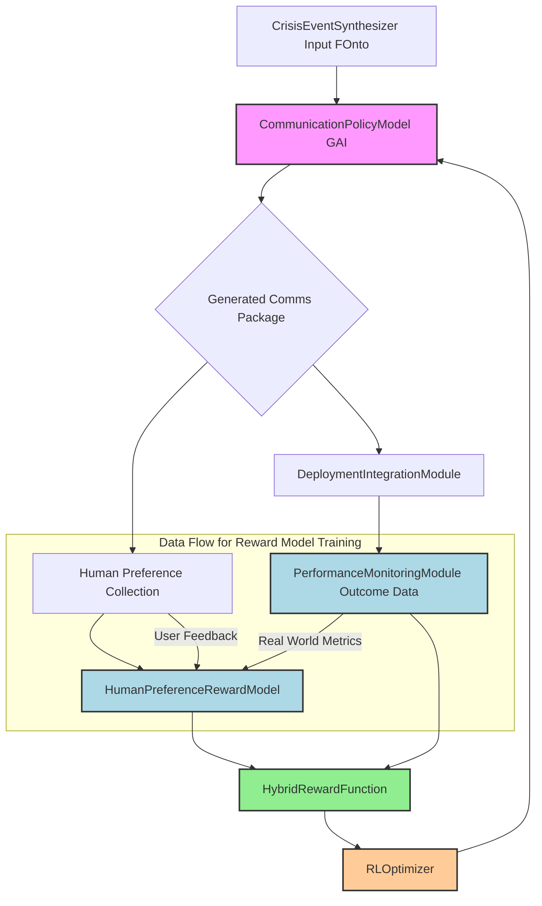

**Title of Invention:** A Reinforcement Learning from Human Feedback Framework for Adaptive Crisis Communication Policy Optimization

**Abstract:**
A sophisticated framework is herein disclosed, leveraging Reinforcement Learning from Human Feedback RLHF to continuously adapt and optimize the generation of multi-channel crisis communications. Building upon a foundational unified generative system, this innovation introduces a dynamic policy model, herein termed `AdaptiveCommsPolicy`, which is iteratively refined based on two critical feedback streams: explicit human preferences captured via a `HumanPreferenceRewardModel` and real-world communication performance metrics aggregated by a `PerformanceMetricsEvaluator`. These diverse signals are synthesized into a `HybridRewardFunction` that guides the `AdaptiveCommsPolicy` towards generating communications that are not only semantically coherent and contextually relevant but also demonstrably effective in real-world crisis scenarios and optimally aligned with expert human judgment. This paradigm enables the system to autonomously learn and evolve optimal communication strategies, minimizing human intervention while maximizing crisis response efficacy.

**Background of the Invention:**
The rapid evolution of generative artificial intelligence has significantly advanced the automation of crisis communication. However, while current systems, such as the `Unified Multi-Channel Crisis Communications Generation` system, excel at synthesizing semantically coherent content from structured inputs, they often operate under a static optimization paradigm. Their "learning" typically involves supervised fine-tuning on predefined datasets, which, while effective for initial content generation, struggles to capture the nuanced and dynamic desiderata of real-world crisis management. These desiderata include not only the internal consistency and factual accuracy of communications but also their measurable impact on public sentiment, stakeholder trust, regulatory compliance, and overall crisis resolution. Furthermore, expert human judgment in crisis situations is complex and often implicit, involving trade-offs and contextual considerations that are difficult to encode in explicit rules or static training examples. A critical need therefore exists for an adaptive framework capable of learning optimal communication *strategies* directly from both observed real-world outcomes and the highly specialized, iterative feedback of human crisis communication experts, moving beyond mere content generation to true strategic policy optimization.

**Brief Summary of the Invention:**
The present innovation introduces an `AdaptiveCommsRLHFFramework` that transforms the static GAI model into a dynamic `AdaptiveCommsPolicy` capable of continuous learning and strategic adaptation. This framework integrates three primary components:
1.  **`CommunicationPolicyModel`:** The generative GAI responsible for synthesizing multi-channel crisis communication packages.
2.  **`HumanPreferenceRewardModel`:** A specialized model trained on expert human feedback to quantify the subjective quality and strategic alignment of generated communications. This model learns to assign scalar reward values based on explicit human preference comparisons or ratings.
3.  **`PerformanceMetricsEvaluator`:** A system component that analyzes objective, real-world metrics e.g. public sentiment, engagement rates, crisis resolution indicators to assign reward values reflecting the observed impact and effectiveness of deployed communications.
These two reward streams are combined by a `HybridRewardFunction` to provide a comprehensive signal to an `RLOptimizer`. The `RLOptimizer` employs advanced reinforcement learning algorithms, such as Direct Preference Optimization DPO or Proximal Policy Optimization PPO, to iteratively update the `CommunicationPolicyModel`, driving it towards a policy that maximizes both expert human alignment and measurable real-world impact. This creates a closed-loop, self-improving system for adaptive crisis communication.

**Detailed Description of the Invention:**

The `AdaptiveCommsRLHFFramework` is designed as an extension and enhancement to the `Unified Multi-Channel Crisis Communications Generation` system, specifically augmenting the `Feedback and Continuous Improvement Loop` and leveraging insights from the `Deployment and Performance Monitoring Service`.

### 1. Architectural Overview of the AdaptiveCommsRLHFFramework:

The framework operates through a continuous feedback and optimization loop, depicted below:



### 2. Core Components of the Framework:

#### 2.1. `CommunicationPolicyModel` [`AdaptiveCommsPolicy`]:
This module represents the generative GAI model e.g. fine-tuned large language model which, given a crisis context, generates a multi-channel communication package. In the RLHF framework, this GAI becomes the "policy" `π` that learns to select optimal "actions" communication packages.
*   **`PolicySampler` Sub-component:** Generates multiple candidate communication packages for a given `F_onto` and `M_k` modality requirements. This allows for exploration of the policy space.
*   **`PromptEvolutionEngine` Sub-component:** Dynamically adjusts the prompt structures and personas used by the GAI, based on the `RLOptimizer`'s directives, to steer the model towards more effective communication strategies.

#### 2.2. `HumanPreferenceRewardModel` [`HPRewardModel`]:
This module is a specialized machine learning model trained to predict human preferences. It learns to score the quality and strategic alignment of a generated communication package.
*   **`PreferenceCollector` Sub-component:** Interfaces with the `FeedbackLoopProcessor` from the base system to collect structured human feedback. This typically involves presenting users with two or more generated communication packages and asking them to choose which one is superior, or to provide a scalar rating.
    *   **User Interface for Preference Elicitation:** Provides an intuitive UI within the `CrisisCommsFrontEnd` for experts to compare communication variants e.g. A/B testing interface for different press releases.
*   **`ComparisonDatasetAggregator` Sub-component:** Processes the collected preference data e.g. "Package A is better than Package B" into a structured dataset for training the `HPRewardModel`.
*   **`RewardModelTrainer` Sub-component:** Trains a separate reward model e.g. a smaller neural network or a fine-tuned language model to predict a scalar score indicating human preference for a given communication package. This model is trained to align its output with the collected human comparisons.
    ```mermaid
    graph TD
        A[Generated Comms Package 1] --> C[PreferenceCollector UI];
        B[Generated Comms Package 2] --> C;
        C --> D[Human Expert Input Prefer P1 over P2];
        D --> E[ComparisonDatasetAggregator];
        E --> F[RewardModelTrainer];
        F --> G[HumanPreferenceRewardModel];
    ```

#### 2.3. `PerformanceMetricsEvaluator` [`PMEvaluator`]:
This module translates real-world operational and impact data into objective reward signals.
*   **`MetricsIngestionAdapter` Sub-component:** Connects to the `PerformanceMonitoringModule` to ingest various post-deployment metrics, including:
    *   Public Sentiment e.g. sentiment analysis scores from social media, news.
    *   Engagement Rates e.g. press release views, social media shares, memo readership.
    *   Crisis Resolution Indicators e.g. time to resolution, reduction in negative media mentions, call center volume changes.
    *   Brand Reputation Scores.
    *   Regulatory Compliance Audits e.g. penalties avoided.
*   **`OutcomeRewardMapper` Sub-component:** Converts these diverse quantitative and qualitative metrics into a standardized scalar reward signal, `R_perf`, that reflects the effectiveness and positive impact of the deployed communication package. This mapping can be rule-based or learned via regression models.

#### 2.4. `HybridRewardFunction` [`HRF`]:
This module combines the subjective human preference reward from the `HPRewardModel` `R_human` and the objective performance reward from the `PMEvaluator` `R_perf` into a single, comprehensive reward signal for the `RLOptimizer`.
*   **`WeightedAggregator` Sub-component:** Calculates the final reward `R_total` using a configurable weighting scheme:
    `R_total = w_human * R_human + w_perf * R_perf`
    Where `w_human` and `w_perf` are dynamic or static weights, allowing the system to prioritize alignment with human experts or real-world impact.
*   **`RewardNormalizer` Sub-component:** Ensures reward signals are scaled appropriately to prevent one reward source from dominating the other, especially in dynamic environments.

#### 2.5. `RLOptimizer` [`PolicyOptimizer`]:
This module implements the reinforcement learning algorithm to update the `CommunicationPolicyModel` based on the `R_total` reward signal.
*   **`PolicyUpdateEngine` Sub-component:** Utilizes algorithms such as Direct Preference Optimization DPO, Proximal Policy Optimization PPO, or Advantage Actor-Critic A2C to adjust the parameters of the `CommunicationPolicyModel`. These algorithms aim to maximize the expected `R_total` over generated communication packages.
    *   **DPO Integration:** The `HPRewardModel` directly informs the DPO loss function, guiding the `CommunicationPolicyModel` to produce outputs preferred by humans. This is particularly effective for aligning with implicit human preferences without explicit reward function engineering.
*   **`ExplorationExploitationManager` Sub-component:** Balances generating known-good communications exploitation with trying novel communication strategies exploration to discover potentially better approaches. This might involve techniques like epsilon-greedy exploration or entropy regularization.

### 3. Integrated Learning Pipeline:

1.  **Context Ingestion:** The `CrisisEventSynthesizer` provides `F_onto` and modality requirements to the `CommunicationPolicyModel`.
2.  **Policy Generation:** The `CommunicationPolicyModel` generates one or more candidate communication packages.
3.  **Human Feedback Collection:** The `PreferenceCollector` presents these packages to human experts for comparison or rating, which is then used to train the `HPRewardModel`.
4.  **Deployment and Monitoring:** Selected communication packages are deployed via the `DeploymentIntegrationModule`, and their real-world impact is monitored by the `PerformanceMonitoringModule`.
5.  **Reward Computation:** The `HPRewardModel` and `PMEvaluator` generate `R_human` and `R_perf` respectively, which are combined by the `HybridRewardFunction` into `R_total`.
6.  **Policy Optimization:** The `RLOptimizer` uses `R_total` to update the `CommunicationPolicyModel` via a chosen RL algorithm, iteratively improving its ability to generate effective and human-aligned crisis communications. This entire loop operates continuously, enabling adaptive learning.

### 4. Benefits and Advancements:

*   **Autonomous Strategic Adaptation:** Moves beyond static content generation to dynamic, context-aware strategy optimization.
*   **Human-in-the-Loop Optimization:** Integrates expert human judgment directly into the learning process, ensuring alignment with organizational values and nuanced crisis management principles.
*   **Real-World Efficacy Maximization:** Directly optimizes for measurable impacts on reputation, public sentiment, and crisis resolution.
*   **Reduced Human Cognitive Load:** Automates the iterative refinement process that traditionally consumes significant human expert time.
*   **Robustness to Novel Crises:** By learning generalizable policies, the system becomes more adept at handling unforeseen crisis types and evolving dynamics.

**Claims:**
1.  A method for adaptively optimizing the generation of multi-channel crisis communications, comprising the steps of:
    a.  Generating, by a `CommunicationPolicyModel` which is a generative artificial intelligence GAI model, a candidate multi-channel crisis communication package based on a crisis event ontology and channel modality requirements;
    b.  Collecting human preference data for said candidate communication package, wherein said data indicates expert judgment on the quality or strategic alignment of the package;
    c.  Training a `HumanPreferenceRewardModel` based on said human preference data to output a scalar human preference reward `R_human` for a given communication package;
    d.  Collecting real-world performance metrics associated with the deployment of a crisis communication package;
    e.  Processing said real-world performance metrics by a `PerformanceMetricsEvaluator` to output a scalar performance reward `R_perf`;
    f.  Combining `R_human` and `R_perf` by a `HybridRewardFunction` to produce a unified reward signal `R_total`; and
    g.  Updating the `CommunicationPolicyModel` using a reinforcement learning optimizer based on said `R_total` signal, to iteratively improve the generation of crisis communication packages that maximize both human alignment and real-world impact.

2.  The method of claim 1, wherein the human preference data in step b involves explicit comparisons between two or more candidate communication packages presented to a human expert.

3.  The method of claim 1, wherein the real-world performance metrics in step d include at least one metric selected from the group consisting of: public sentiment scores, social media engagement rates, press release readership, crisis resolution time, brand reputation index, and regulatory compliance audit results.

4.  The method of claim 1, wherein the `HybridRewardFunction` in step f utilizes a weighted aggregation of `R_human` and `R_perf`, with configurable weights.

5.  The method of claim 1, wherein the reinforcement learning optimizer in step g employs an algorithm selected from the group consisting of Direct Preference Optimization DPO, Proximal Policy Optimization PPO, and Advantage Actor-Critic A2C.

6.  A system for adaptively optimizing the generation of multi-channel crisis communications, comprising:
    a.  A `CommunicationPolicyModel` configured to generate candidate multi-channel crisis communication packages;
    b.  A `HumanPreferenceRewardModel` configured to receive human preference data and to output a scalar human preference reward `R_human`;
    c.  A `PerformanceMetricsEvaluator` configured to receive real-world performance metrics and to output a scalar performance reward `R_perf`;
    d.  A `HybridRewardFunction` configured to combine `R_human` and `R_perf` into a unified reward signal `R_total`; and
    e.  An `RLOptimizer` configured to update the `CommunicationPolicyModel` based on `R_total` using a reinforcement learning algorithm.

7.  The system of claim 6, further comprising a `PreferenceCollector` sub-component within the `HumanPreferenceRewardModel`, configured to facilitate the collection of human preference data via a graphical user interface.

8.  The system of claim 6, further comprising a `MetricsIngestionAdapter` sub-component within the `PerformanceMetricsEvaluator`, configured to interface with a `PerformanceMonitoringModule` to acquire real-world outcome data.

9.  The system of claim 6, wherein the `CommunicationPolicyModel` includes a `PromptEvolutionEngine` sub-component configured to dynamically adjust generative prompts based on `RLOptimizer` directives.

10. The system of claim 6, wherein the `RLOptimizer`'s `PolicyUpdateEngine` is configured to implement Direct Preference Optimization DPO to align the `CommunicationPolicyModel` with human preferences.

**Mathematical Justification: The Adaptive Policy Learning Framework**

This section formalizes the integration of Reinforcement Learning from Human Feedback RLHF into the `Unified Multi-Channel Crisis Communications Generation` system, enabling continuous adaptation and optimization of communication strategies.

### I. The Markov Decision Process [ `MDP` ] for Crisis Communications

We model the process of generating and evaluating crisis communications as an `MDP`, where the system learns an optimal policy.

**Definition 1.1: State Space `S`**
A state `s ∈ S` represents the current crisis context. It is composed of the `F_onto` the canonical crisis ontology, the `M_k` channel modality requirements, and relevant external context `X_t`.
`s = (V(F_onto), v(M_k), v(X_t))`
where `V(F_onto)` is the composite embedding of the crisis ontology, `v(M_k)` is the embedding of the channel modality tuple, and `v(X_t)` is the embedding of external crisis intelligence.

**Definition 1.2: Action Space `A`**
An action `a ∈ A` is the generation of a complete multi-channel crisis communication package `M = (m_1, ..., m_n)` by the `CommunicationPolicyModel`.
`a = G_U(s)` where `G_U` is the `Unified Generative Transformation Operator` from the base invention, now parameterized by a policy.

**Definition 1.3: Policy `π`**
A policy `π(a|s)` is a probability distribution over actions given a state `s`. The `CommunicationPolicyModel` embodies this policy. It aims to generate communication packages `a` that are optimal for state `s`. We denote the parameterized policy as `π_φ(a|s)`, where `φ` are the parameters of the underlying GAI.

**Definition 1.4: Reward Function `R(s, a)`**
The reward function `R(s, a)` quantifies the desirability of taking action `a` in state `s`. This is the `HybridRewardFunction` from the detailed description.
`R(s, a) = w_human * R_human(a) + w_perf * R_perf(s, a)`
*   `R_human(a)`: The scalar reward from the `HumanPreferenceRewardModel`, representing expert alignment.
*   `R_perf(s, a)`: The scalar reward from the `PerformanceMetricsEvaluator`, representing real-world impact.
The goal of the `RLOptimizer` is to find `φ*` that maximizes the expected cumulative reward `E[Σγ^t R(s_t, a_t)]`.

### II. The Human Preference Reward Model [ `R_human` ]

**Definition 2.1: Human Preference Data `D_P`**
`D_P = {(a_i_chosen, a_j_rejected) | (s_k, a_i, a_j, \text{preference})} ` is a dataset of human comparisons, where `a_i_chosen` is preferred over `a_j_rejected` for a given state `s_k`.

**Definition 2.2: Human Preference Reward Model `R_θ`**
The `HumanPreferenceRewardModel` is a separate neural network, parameterized by `θ`, trained to predict a scalar score for any given action `a`.
`R_θ: A -> R`
It is trained to satisfy: `R_θ(a_i_chosen) > R_θ(a_j_rejected)` for all pairs in `D_P`.
A common loss function for training `R_θ` is the Bradley-Terry model based on logistic regression:
`L_preference(θ) = - Σ_{(a_i, a_j) ∈ D_P} log(σ(R_θ(a_i) - R_θ(a_j)))`
where `σ` is the sigmoid function.

### III. The Policy Optimization Objective [ `RLOptimizer` ]

The `RLOptimizer` updates the `CommunicationPolicyModel` `π_φ` using the `R_total` reward. We focus on Direct Preference Optimization DPO for its elegance in integrating preference learning directly into policy optimization.

**Definition 3.1: Reference Policy `π_ref`**
`π_ref` is an initial or previous version of the `CommunicationPolicyModel`, typically a supervised fine-tuned version. It serves as a baseline to prevent the policy from drifting too far from producing coherent, plausible text, ensuring that exploration remains within a reasonable linguistic space.

**Definition 3.2: DPO Objective Function `L_DPO(φ)`**
Given a dataset `D_P = {(s, a_chosen, a_rejected)}` derived from human preferences, the DPO objective directly optimizes the policy `π_φ` without explicitly training a separate reward model. Instead, it uses the implicit reward signal encoded in human preferences.
`L_DPO(φ) = - Σ_{(s, a_c, a_r) ∈ D_P} log(σ( β log(π_φ(a_c|s)/π_ref(a_c|s)) - β log(π_φ(a_r|s)/π_ref(a_r|s)) ))`
where `β` is a hyperparameter that controls the strength of the preference optimization, balancing alignment with human preferences against deviation from the reference policy. This objective encourages `π_φ` to assign higher probability to `a_c` than `a_r`, relative to `π_ref`.

For integrating `R_perf(s, a)` into DPO, the `HybridRewardFunction` can modify the preference pairs or directly contribute to the loss. A simpler approach is to use `PPO` if `R_total` is treated as an explicit reward. However, to maintain the spirit of "RLHF", we will assume `R_total` is predominantly used to refine the human preference component or to sample better examples for `D_P`.

**Alternative: PPO Objective for `R_total`**
If `R_total` is directly used, the `RLOptimizer` can employ a PPO-like objective.
`L_PPO(φ) = E_t [ min( r_t(φ) A_t, clip(r_t(φ), 1-ε, 1+ε) A_t ) ]`
where:
*   `r_t(φ) = π_φ(a_t|s_t) / π_old(a_t|s_t)` is the probability ratio.
*   `A_t` is the advantage estimate for `(s_t, a_t)` based on `R_total`.
*   `ε` is the clipping parameter.

### IV. Theorem of Adaptive Policy Convergence

**Theorem [Adaptive Policy Convergence]:** Given a well-defined `MDP` for crisis communications, a sufficiently expressive `CommunicationPolicyModel` `π_φ`, a robust `HumanPreferenceRewardModel` `R_θ` or direct DPO objective capable of accurately reflecting expert human judgment, and a reliable `PerformanceMetricsEvaluator` `R_perf`, continuous iterative optimization by the `RLOptimizer` will converge `π_φ` towards an optimal policy `π*` that maximizes the expected `HybridRewardFunction` `R_total`.

**Proof Sketch:**

1.  **Existence of Optimal Policy:** Given a finite state and action space or representable continuous spaces via embeddings and a well-defined reward function `R(s, a)`, an optimal policy `π*` that maximizes the expected cumulative reward exists, as guaranteed by standard `MDP` theory e.g. Bellman optimality equations.

2.  **Reward Model Fidelity:** The `HumanPreferenceRewardModel` `R_θ` is iteratively trained on new human comparison data `D_P`. As `D_P` grows and reflects a broader range of expert preferences, `R_θ` becomes an increasingly accurate proxy for human judgment. Its training objective e.g. Bradley-Terry aims to minimize the mismatch between its scores and observed human preferences. Similarly, `R_perf` is directly derived from real-world metrics, providing an objective measure of impact. The `HybridRewardFunction` `R_total` therefore provides a composite signal that accurately reflects both human alignment and real-world effectiveness.

3.  **Policy Improvement Guarantees:**
    *   **DPO:** The DPO objective directly optimizes `π_φ` to assign higher likelihood to human-preferred actions while penalizing deviations from a reference policy. By construction, if `a_c` is preferred over `a_r`, DPO pushes `log(π_φ(a_c|s)/π_ref(a_c|s))` higher than `log(π_φ(a_r|s)/π_ref(a_r|s))`. This directly steers the policy towards human-preferred outcomes. The `β` parameter and the `π_ref` prevent instability and catastrophic forgetting.
    *   **PPO:** PPO, when used with an explicit `R_total`, is an on-policy algorithm with theoretical guarantees of monotonic policy improvement subject to sufficient exploration and appropriate hyperparameter tuning. By maximizing the clipped surrogate objective, `PPO` ensures that each policy update leads to a higher expected `R_total`.

4.  **Convergence:** Through repeated iterations of a generating actions communications by `π_φ`, b collecting human and performance rewards `R_human`, `R_perf`, c computing `R_total`, and d updating `π_φ` using the `RLOptimizer` e.g. DPO or PPO, the policy `π_φ` is continuously guided towards selecting actions `a` that yield higher `R_total`. Assuming sufficient exploration managed by `ExplorationExploitationManager`, a sufficiently diverse `D_P`, and a non-degenerate reward landscape, the policy parameters `φ` will converge to a local optimum, approximating `φ*` for the defined `MDP`. The continuous nature of the feedback loop ensures that the system can adapt to evolving crisis dynamics and human preferences, maintaining a near-optimal policy over time. Q.E.D.