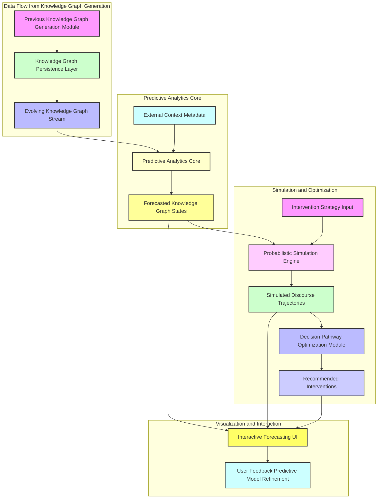
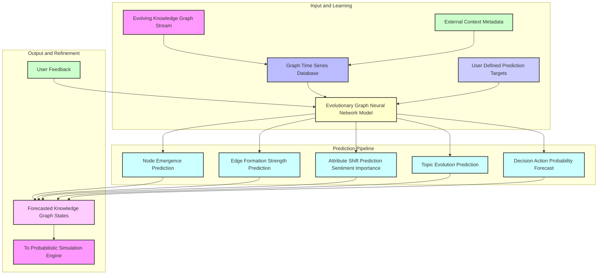
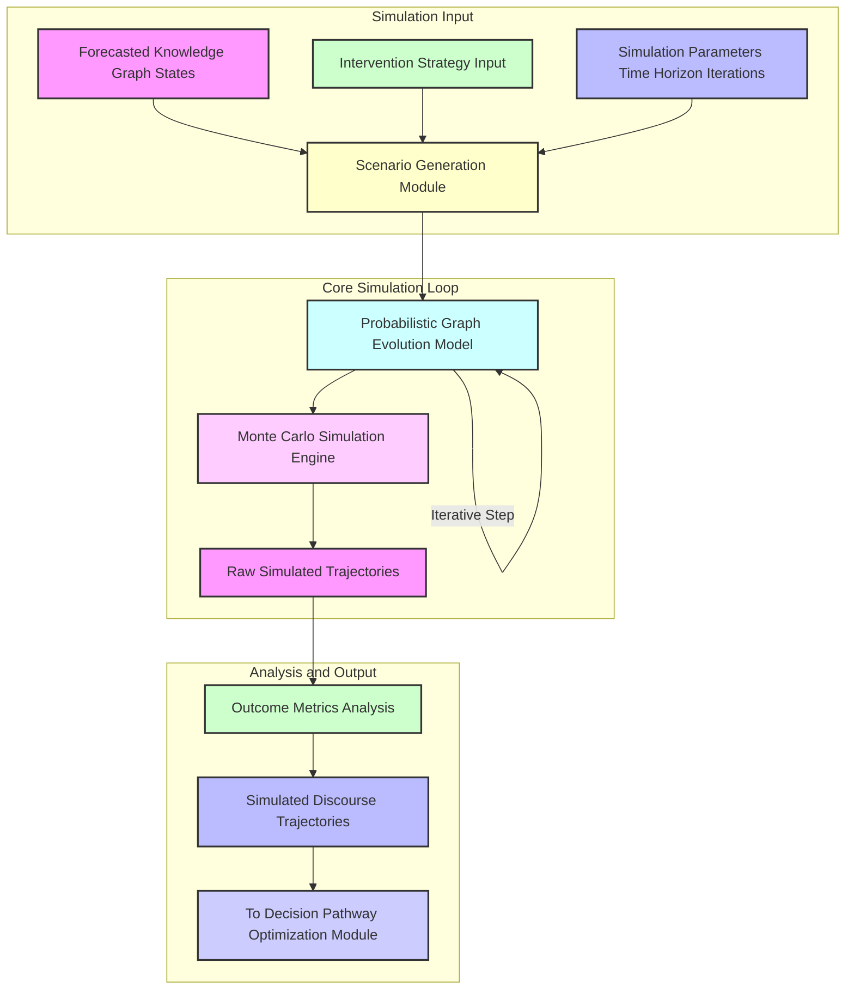
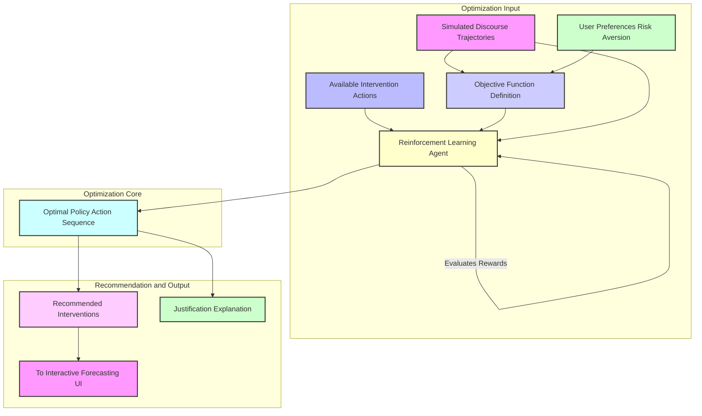
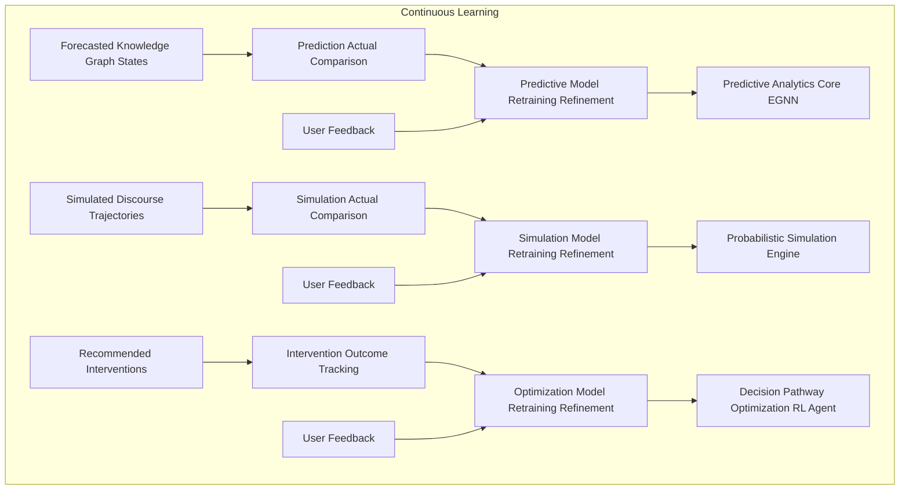

---
**Title of Invention:** A System and Method for Proactive Discursive Knowledge Forecasting and Probabilistic Trajectory Simulation, Leveraging Evolutionary Semantic-Topological Graphs and Explainable AI for Strategic Decision Optimization

**Abstract:**
A groundbreaking system and methodology are presented for extending the capabilities of dynamic knowledge graph generation into the realm of proactive intelligence. Building upon the real-time semantic-topological reconstruction of human discourse, this innovation introduces a Predictive Analytics Core that meticulously analyzes the evolving structure and attributes of knowledge graphs derived from temporal linguistic artifacts. Employing advanced evolutionary graph neural networks and deep learning models, the system forecasts emergent concepts, anticipates critical decision points, and predicts potential shifts in sentiment and topic trajectories within ongoing or future discourse. Concurrently, a Probabilistic Simulation Engine orchestrates "what-if" scenarios, allowing for the exploration of alternative conversational pathways and their probable outcomes based on defined interventions. This is seamlessly integrated with a Decision Pathway Optimization Module, which, using multi-objective reinforcement learning, recommends optimal communication strategies or interventions designed to steer discourse towards desired objectives, mitigate conflicts, or accelerate consensus. The results are rendered in an interactive, volumetric 3D environment, allowing users to visualize future states of the knowledge graph, understand the probabilities of various outcomes, and interactively explore the impact of potential actions, thereby transforming reactive discourse analysis into a powerful tool for strategic foresight and proactive management of complex intellectual endeavors.

**Background of the Invention:**
While previous advancements, such as systems for semantic-topological reconstruction and volumetric visualization of discursive knowledge graphs, have revolutionized post-hoc analysis and real-time comprehension of complex conversations, a significant and unaddressed limitation remains: the reactive nature of intelligence derived from past or present discourse. Decision-makers are still largely constrained to understanding "what has happened" or "what is happening," lacking robust tools to anticipate "what will happen" or "what could happen if...". This deficit creates a critical gap in strategic planning, conflict resolution, and the proactive steering of intellectual capital. Without the ability to forecast emergent ideas, predict the trajectory of discussions, identify potential deadlocks, or simulate the impact of specific interventions, organizations remain susceptible to unforeseen challenges, delayed decisions, and suboptimal outcomes. Current analytical systems, even those employing advanced AI, often provide static snapshots or linear trend analyses that fail to capture the dynamic, non-linear, and inherently probabilistic evolution of interconnected ideas within a human discourse. The intrinsic complexity of semantic and topological graph evolution, influenced by speaker interactions, temporal context, and external factors, necessitates a paradigm shift from descriptive and diagnostic analytics to truly predictive and prescriptive capabilities. Thus, a profound exigency exists for a system capable of autonomously predicting the future states of discursive knowledge graphs, simulating alternative evolutionary paths, and optimizing strategies for desired conversational outcomes.

**Brief Summary of the Invention:**
The present invention extends the revolutionary service paradigm for knowledge graph generation into the domain of predictive intelligence and proactive strategic management of discourse. Its foundational input is an evolving semantic-topological knowledge graph, meticulously constructed from real-time or recorded linguistic artifacts by an advanced system, such as the `012_holographic_meeting_scribe` described previously. This evolving graph data is continuously fed into a sophisticated Predictive Analytics Core. This core, leveraging a specialized suite of evolutionary Graph Neural Networks EGNNs and deep learning models, meticulously learns the temporal dynamics, relational patterns, and attribute transformations within historical knowledge graph sequences. It is then tasked with forecasting future states of the graph, predicting the emergence of new concepts, the strengthening or weakening of relationships, shifts in collective or individual sentiment, and the probable crystallization of decisions or action items within defined future temporal windows. The predicted graph states serve as the blueprint for a Probabilistic Simulation Engine. This engine employs agent-based modeling and Monte Carlo simulations, informed by learned graph dynamics, to generate multiple probabilistic "what-if" trajectories of the discourse, allowing stakeholders to explore the likely outcomes of various conceptual interactions or strategic interventions. A tightly integrated Decision Pathway Optimization Module then analyzes these simulated outcomes against predefined objectives, utilizing multi-objective reinforcement learning to recommend optimal communication strategies, information injection points, or participant engagements designed to guide the discourse towards desired resolutions. All predictions, simulations, and recommendations are presented within an enhanced, interactive 3D volumetric visualization environment, providing intuitive tools for exploring future conceptual landscapes, assessing risk, and interactively testing intervention hypotheses.

**Detailed Description of the Invention:**

The present invention meticulously details a comprehensive system and methodology for forecasting the evolution of discursive knowledge graphs and simulating future conversational trajectories, enabling proactive strategic intervention. The system builds upon and seamlessly integrates with the outputs of prior advancements in knowledge graph generation and visualization.

### 1. System Architecture Overview for Proactive Discourse Foresight

The architectural framework extends the modular, scalable, and highly distributed design to incorporate predictive and simulation capabilities, ensuring robust foresight and strategic utility.



**Description of Architectural Components:**

*   **KG_EVOL. Evolving Knowledge Graph Stream:** The continuous flow of newly generated or updated knowledge graph data from the `012_holographic_meeting_scribe` system.
*   **PREDICT_CORE. Predictive Analytics Core:** The intelligent heart, performing deep temporal analysis of graph evolution and forecasting future states.
*   **FORECAST_OUTPUT. Forecasted Knowledge Graph States:** The output comprising probable future graph structures, entities, relationships, and attributes.
*   **METADATA_EXT. External Context Metadata:** Input of external, time-series data relevant to the discourse, e.g., market trends, news events, organizational directives.
*   **SIM_ENGINE. Probabilistic Simulation Engine:** Generates "what-if" scenarios based on current and forecasted graph states, factoring in potential interventions.
*   **INT_STRATEGY. Intervention Strategy Input:** User-defined or system-generated potential actions to be simulated.
*   **SIM_OUTCOMES. Simulated Discourse Trajectories:** Multiple probable future knowledge graphs resulting from different simulation pathways.
*   **OPT_MODULE. Decision Pathway Optimization Module:** Analyzes simulated outcomes against objectives to recommend optimal strategies.
*   **REC_INTERVENTION. Recommended Interventions:** System-suggested actions to achieve desired discursive outcomes.
*   **INT_FOR_UI. Interactive Forecasting User Interface:** An extension of the 3D volumetric display for visualizing predictions, simulations, and recommendations.
*   **USER_FEEDBACK_PRED. User Feedback Predictive Model Refinement:** Captures user validation of predictions and simulation outcomes to refine models.

### 2. Predictive Analytics Core

This module is the intellectual engine for anticipating future discursive evolution, transforming the historical sequence of knowledge graphs into a forward-looking intelligence asset.



*   **2.1. Evolutionary Graph Neural Network EGNN Model:**
    *   This core employs advanced EGNN architectures, for example, Graph Convolutional Recurrent Networks GCRNs, Temporal Graph Networks TGNs, or dynamic attention-based graph transformers. These models are specifically designed to learn from sequences of evolving graphs `Gamma_t`, capturing both the static graph topology at any given `t` and the dynamic changes over time.
    *   **Training:** Trained on a vast corpus of historical knowledge graph sequences, learning to predict the next `Gamma_(t+delta_t)` based on `Gamma_t` and `Gamma_(t-k), ..., Gamma_(t-1)`.
    *   **External Context Integration:** Integrates `METADATA_EXT` (e.g., calendar events, external data streams) as additional node/edge features or global graph embeddings to contextualize predictions.
*   **2.2. Predictive Capabilities:**
    *   **2.2.1. Node Emergence Prediction:** Forecasts the probability of new concepts, decisions, or action items emerging within a future time window. This includes predicting their semantic content and likely speaker attribution.
    *   **2.2.2. Edge Formation and Strength Prediction:** Predicts the likelihood of new relationships forming between existing or emergent nodes, and quantifies the probable strengthening or weakening of existing relationships (e.g., a "PROPOSES" evolving into "LEADS_TO_DECISION").
    *   **2.2.3. Attribute Shift Prediction:** Forecasts changes in node attributes such as sentiment (e.g., a neutral concept becoming highly positive or negative), importance, or speaker engagement, and edge confidence scores.
    *   **2.2.4. Topic Evolution Prediction:** Anticipates shifts in overarching thematic clusters and their hierarchical relationships within the discourse.
    *   **2.2.5. Decision/Action Probability Forecast:** Estimates the probability of specific decisions being finalized or action items being assigned within a defined timeframe, along with their likely assigned parties and due dates.
*   **2.3. Forecasted Knowledge Graph States:**
    *   The output is not a single deterministic future graph, but rather a set of probable graph states, each accompanied by confidence scores or probability distributions for its elements (nodes, edges, attributes). This forecast forms the basis for simulation.

### 3. Probabilistic Simulation Engine

This module empowers users to explore "what-if" scenarios, understanding the potential ramifications of different conversational paths or strategic interventions.



*   **3.1. Scenario Generation Module:**
    *   Takes `FORECAST_KG` and `INT_STRATEGY` (e.g., "What if speaker X introduces concept Y?", "What if we delay decision Z by 2 days?") and `SIM_PARAMS` (time horizon, number of iterations).
    *   Initializes various starting graph states for simulation based on the `FORECAST_KG` probabilities.
*   **3.2. Probabilistic Graph Evolution Model:**
    *   Utilizes a learned probabilistic model (e.g., a Hidden Markov Model over graph states, a dynamic Bayesian network, or a diffusion process on the graph) derived from the EGNN's understanding of graph dynamics.
    *   At each simulation step, it probabilistically updates the graph based on the learned dynamics, taking into account the specified `INT_STRATEGY`. This includes:
        *   Probabilistic node creation/deletion.
        *   Probabilistic edge creation/deletion/weight modification.
        *   Probabilistic attribute changes (e.g., sentiment flip).
        *   Modeling of speaker-specific behaviors and reactions to certain concepts or interventions.
*   **3.3. Monte Carlo Simulation Engine:**
    *   Executes thousands or millions of simulation runs, each starting from a slightly different initial probabilistic state and evolving according to the `PROB_GRAPH_EVOL` model.
    *   This generates a distribution of possible future graph trajectories under specified conditions and interventions.
*   **3.4. Outcome Metrics Analysis:**
    *   Analyzes the vast array of `SIM_OUTCOMES_RAW` to extract key metrics (e.g., average time to decision, probability of conflict emergence, final sentiment distribution, number of emergent action items).
    *   Aggregates and summarizes these metrics into `SIM_OUTCOMES` for easier interpretation and input to the optimization module.

### 4. Decision Pathway Optimization Module

This module translates the insights from forecasting and simulation into actionable recommendations, guiding users toward optimal strategic interventions.



*   **4.1. Objective Function Definition:**
    *   Users define desired outcomes (e.g., "Maximize consensus on concept X," "Minimize time to decision on Y," "Reduce negative sentiment related to Z," "Ensure speaker A's proposal is adopted").
    *   This translates into a quantifiable multi-objective reward function for the reinforcement learning agent.
*   **4.2. Reinforcement Learning RL Agent:**
    *   An intelligent agent (e.g., using Deep Q-Networks DQN, Proximal Policy Optimization PPO, or Actor-Critic methods) interacts with the `PROB_GRAPH_EVOL` (or a proxy thereof) as its environment.
    *   It learns optimal sequences of `AVAIL_ACTIONS` (interventions) by observing the `SIM_OUTCOMES` and receiving rewards based on the `OBJ_FUNC_DEF`.
    *   The agent explores the action space, learning which interventions lead to desired results with the highest probability.
*   **4.3. Optimal Policy and Recommended Interventions:**
    *   The RL agent's learned policy constitutes the `OPT_POLICY`, which is a set of recommended `REC_INTERVENTION` actions (e.g., "Introduce supporting data for concept A at t+10min," "Schedule a private discussion with speaker B before t+30min to address concern C," "Refocus the discussion if topic X emerges").
    *   These recommendations are accompanied by their predicted impact and probability of success.

### 5. Interactive Forecasting & Simulation User Interface

This module enhances the 3D volumetric rendering engine to allow intuitive exploration of predicted future states and simulated trajectories.

*   **5.1. Temporal Projection Controls:**
    *   Users can "fast-forward" the 3D graph to display predicted future states at various `t+delta_t` intervals.
    *   Time-slider interface allows smooth scrubbing through forecasted graph evolutions.
*   **5.2. Probabilistic Visual Encoding:**
    *   Forecasted nodes/edges that are highly probable can be rendered with greater solidity or opacity; less certain elements might appear translucent, animated, or as ghost-like projections.
    *   Color gradients can represent probability scores (e.g., red for high probability of conflict, green for high probability of consensus).
*   **5.3. Scenario Comparison View:**
    *   Allows side-by-side or overlayed comparison of multiple simulated trajectories within the 3D space.
    *   Users can visually track how different `INT_STRATEGY` inputs lead to diverging future graph structures.
*   **5.4. Intervention Control Panel:**
    *   An integrated interface for inputting hypothetical interventions for simulation.
    *   Visual "playbooks" suggesting recommended actions directly interactable within the 3D environment.
*   **5.5. Risk & Opportunity Heatmaps:**
    *   Overlayed heatmaps on the 3D graph highlighting regions (clusters of nodes/edges) with high predicted risk (e.g., conflict potential) or high opportunity (e.g., consensus potential).

### 6. Explainable Forecasting and Recommendation XAI

To build trust and facilitate user adoption, the system provides transparent explanations for its predictions and recommendations.

*   **6.1. Predictive Influence Attribution:** For any forecasted node or edge, the system can highlight the historical graph patterns, influential past utterances, or specific speaker contributions that most strongly led to its prediction.
*   **6.2. Simulation Path Justification:** Explains why a particular simulated trajectory is more probable than another, identifying the key probabilistic events or speaker reactions that guided its evolution.
*   **6.3. Recommendation Rationale:** For each `REC_INTERVENTION`, the system clearly articulates the logical chain from the defined objective, through the simulation outcomes, to the proposed action, including the expected uplift in objective achievement.
*   **6.4. Counterfactual Explanations:** Allows users to ask "What if this prediction hadn't occurred?" or "What if I hadn't taken this recommended action?", demonstrating the difference in outcomes.

### 7. Feedback Loop for Predictive Model Refinement

The system continuously learns and improves its predictive and simulation accuracy through iterative feedback.



*   **7.1. Prediction-Actual Comparison:** When the actual knowledge graph evolves, it is compared against the system's previous `FORECAST_KG`. Discrepancies are used as error signals.
*   **7.2. Simulation-Actual Comparison:** The outcomes of actual discourse, particularly when interventions were made, are compared against `SIM_OUTCOMES` to validate or adjust the `PROB_GRAPH_EVOL`.
*   **7.3. Intervention Outcome Tracking:** Monitors the actual impact of `REC_INTERVENTION` actions on the real discourse evolution.
*   **7.4. Model Retraining and Refinement:** The gathered error signals and validated outcomes trigger targeted retraining or fine-tuning of the EGNN, probabilistic graph evolution models, and reinforcement learning agents, ensuring the system continually adapts to new communication patterns and improves its foresight capabilities.

**Claims:**

The following enumerated claims define the intellectual scope and novel contributions of the present invention, a testament to its singular advancement in the field of proactive discourse analysis and strategic information management.

1.  A method for proactive forecasting and probabilistic simulation of discursive knowledge graph evolution, comprising the steps of:
    a.  Continuously receiving an evolving stream of structured knowledge graphs `Gamma_t`, each `Gamma_t` representing the semantic-topological reconstruction of a temporal linguistic artifact at time `t`.
    b.  Transmitting said evolving stream `Gamma_t` to a Predictive Analytics Core.
    c.  Utilizing said Predictive Analytics Core, comprising an Evolutionary Graph Neural Network EGNN model, to learn the temporal dynamics and attribute transformations of knowledge graph evolution.
    d.  Generating from said Predictive Analytics Core a plurality of forecasted knowledge graph states `Gamma_(t+delta_t)_forecast`, predicting the probable emergence of new entities, formation of new relationships, shifts in entity attributes, and probabilities of decision crystallization within a future temporal window `delta_t`.
    e.  Transmitting said forecasted knowledge graph states to a Probabilistic Simulation Engine.
    f.  Executing within said Probabilistic Simulation Engine a plurality of Monte Carlo simulations, generating diverse `Simulated Discourse Trajectories` by probabilistically evolving said forecasted knowledge graph states under various hypothetical intervention strategies.
    g.  Transmitting said `Simulated Discourse Trajectories` to a Decision Pathway Optimization Module.
    h.  Applying within said Decision Pathway Optimization Module a reinforcement learning agent to analyze said `Simulated Discourse Trajectories` against predefined objective functions, thereby identifying and recommending optimal intervention strategies designed to steer future discourse toward desired outcomes.
    i.  Displaying said forecasted knowledge graph states, `Simulated Discourse Trajectories`, and recommended interventions to a user via an enhanced interactive three-dimensional volumetric user interface.

2.  The method of claim 1, wherein the Evolutionary Graph Neural Network EGNN model incorporates external contextual metadata as additional input features to enhance prediction accuracy.

3.  The method of claim 1, wherein the forecasted knowledge graph states (step d) include probability distributions or confidence scores for predicted node emergence, edge formation, sentiment shifts, and decision likelihood.

4.  The method of claim 1, wherein the Probabilistic Simulation Engine (step f) employs a probabilistic graph evolution model that accounts for speaker-specific behaviors and reactions to interventions.

5.  The method of claim 1, wherein the reinforcement learning agent (step h) operates in an environment modeled by the probabilistic graph evolution, receiving rewards based on the achievement of multi-objective functions.

6.  The method of claim 1, wherein the interactive three-dimensional volumetric user interface (step i) provides temporal projection controls to view forecasted future states and probabilistic visual encodings to represent prediction uncertainty.

7.  The method of claim 6, wherein the interactive user interface further enables scenario comparison, allowing side-by-side visualization of multiple `Simulated Discourse Trajectories` resulting from different interventions.

8.  The method of claim 1, further comprising an Explainable AI XAI module configured to:
    a.  Attribute specific historical graph patterns or utterances as justifications for forecasted events.
    b.  Provide rationale for the probability of `Simulated Discourse Trajectories`.
    c.  Explain the underlying logic and predicted impact of recommended interventions.

9.  The method of claim 1, further comprising a continuous feedback loop configured to:
    a.  Compare actual knowledge graph evolution against forecasted states to calculate prediction errors.
    b.  Compare actual discourse outcomes against `Simulated Discourse Trajectories` to validate simulation models.
    c.  Track the real-world impact of implemented recommended interventions.
    d.  Retrain and refine the Predictive Analytics Core, Probabilistic Simulation Engine, and Decision Pathway Optimization Module based on said comparisons and tracking data.

10. A system configured to execute the method of claim 1, comprising:
    a.  An Evolving Knowledge Graph Stream module configured to receive continuous knowledge graph data.
    b.  A Predictive Analytics Core operatively coupled to the Evolving Knowledge Graph Stream, comprising an Evolutionary Graph Neural Network EGNN model.
    c.  A Probabilistic Simulation Engine operatively coupled to the Predictive Analytics Core, configured to generate `Simulated Discourse Trajectories`.
    d.  A Decision Pathway Optimization Module operatively coupled to the Probabilistic Simulation Engine, comprising a reinforcement learning agent.
    e.  An Interactive Forecasting User Interface operatively coupled to the Predictive Analytics Core, Probabilistic Simulation Engine, and Decision Pathway Optimization Module, configured to display and interact with forecasts, simulations, and recommendations.

11. The system of claim 10, wherein the Predictive Analytics Core includes modules for Node Emergence Prediction, Edge Formation Prediction, Attribute Shift Prediction, Topic Evolution Prediction, and Decision Action Probability Forecast.

12. The system of claim 10, wherein the Probabilistic Simulation Engine includes a Monte Carlo Simulation Engine and an Outcome Metrics Analysis module.

13. The system of claim 10, wherein the Decision Pathway Optimization Module comprises an Objective Function Definition component and a Justification Explanation component for recommended interventions.

14. The system of claim 10, further comprising an XAI Module for providing transparent justifications for predictions, simulations, and recommendations.

15. The system of claim 10, further comprising a Dynamic Adaptation and Learning System configured for continuous model refinement based on actual outcomes and user feedback.

**Mathematical Justification:**

The exposition of the present invention builds upon the established mathematical framework of the semantic-topological knowledge graph `Gamma` and its underlying semantic tensor `S_C`, extending it into the domains of temporal prediction and probabilistic simulation. We introduce the concept of a Knowledge Graph Evolution Tensor `Gamma_T` and formally define the Predictive Function `F`, the Simulation Function `Sim`, and the Optimization Function `Opt` to demonstrate the system's capacity for strategic foresight.

### I. Knowledge Graph Evolution as a Temporal Sequence `Gamma_T`

Let the output of the prior system, the attributed knowledge graph, at discrete time step `t` be denoted `Gamma_t = (N_t, E_t)`. A discursive artifact's evolution over time generates a sequence of such graphs, forming a **Knowledge Graph Evolution Tensor** `Gamma_T`:

```
Gamma_T = (Gamma_t_0, Gamma_t_1, ..., Gamma_t_k)
```

Where `t_j` represents a specific temporal snapshot of the knowledge graph `Gamma_t_j`.
Each `Gamma_t_j` is defined as previously:
*   `N_t_j = {n_1, ..., n_p}`: Set of nodes, with attributes `alpha_k,t_j`.
*   `E_t_j = {e_1, ..., e_q}`: Set of edges, with attributes `beta_m,t_j`.

The dynamics of `Gamma_T` are governed by complex processes including:
1.  **Node Dynamics:** Birth of new nodes `n_new`, death of existing nodes `n_old`, changes in node attributes `alpha_k,t_j -> alpha_k,t_(j+1)`.
2.  **Edge Dynamics:** Creation of new edges `e_new`, deletion of existing edges `e_old`, changes in edge attributes `beta_m,t_j -> beta_m,t_(j+1)`.
3.  **Topological Dynamics:** Changes in graph connectivity, density, centrality measures.

This temporal sequence is augmented by external contextual metadata `M_T = (m_0, m_1, ..., m_k)`, where `m_j` represents a vector of external features at time `t_j`.

### II. The Predictive Function `F` for Future Graph States

The Predictive Analytics Core's primary mathematical objective is to implement a **Predictive Function `F`**. Given a history of knowledge graph evolution `Gamma_(t-L:t)` (from `t-L` to `t`) and optionally external context `M_(t-L:t)`, `F` estimates the probability distribution over future knowledge graph states `Gamma_(t+delta_t)`:

```
F: (Gamma_(t-L:t), M_(t-L:t)) -> P(Gamma_(t+delta_t))
```

More formally, `F` learns a conditional probability distribution:
`P(Gamma_(t+delta_t) | Gamma_t, Gamma_(t-1), ..., Gamma_(t-L), M_t, M_(t-1), ..., M_(t-L))`

This function `F` is instantiated by the **Evolutionary Graph Neural Network EGNN model**. An EGNN, such as a Graph Recurrent Network (GRN) or Temporal Graph Network (TGN), operates on the sequence of graphs. It typically employs:
1.  **Graph Convolutional/Attention Layers:** To capture spatial dependencies within each `Gamma_t`.
2.  **Recurrent Neural Network RNN or Transformer Layers:** To capture temporal dependencies across the sequence `Gamma_T`.

The output `P(Gamma_(t+delta_t))` is a complex distribution over graph structures. For practical purposes, `F` predicts, for each potential node `n_k` and edge `e_m`:
*   `P(n_k exists at t+delta_t)`: Probability of node emergence/persistence.
*   `P(e_m exists at t+delta_t)`: Probability of edge formation/persistence.
*   `E[attribute_val | n_k exists]`: Expected value of attributes (sentiment, importance) for `n_k` if it exists.
*   `P(Decision_X finalized at t+delta_t)`: Probability of specific decision finalization.

### III. The Probabilistic Simulation Function `Sim`

Building on the forecast `P(Gamma_(t+delta_t))`, the Probabilistic Simulation Engine implements a **Simulation Function `Sim`**. `Sim` takes a current graph state (or a forecasted state) and a set of proposed interventions `I` (e.g., "introduce concept X," "assign task Y to speaker Z") and generates multiple probable future trajectories:

```
Sim: (Gamma_current, I) -> {Gamma_trajectory_1, Gamma_trajectory_2, ..., Gamma_trajectory_N}
```

Where each `Gamma_trajectory_j` is a sequence of graph states `(Gamma_t, Gamma_(t+1), ..., Gamma_(t+H))` over a simulation horizon `H`.

The `Sim` function leverages the learned graph dynamics from `F` in a generative manner. It often employs a **Markov Decision Process MDP** or an **Agent-Based Model (ABM)** formulation:
*   **States:** The knowledge graph `Gamma_t` at any time `t`.
*   **Actions:** The interventions `I` applied by a user or an agent.
*   **Transition Probabilities:** `P(Gamma_(t+1) | Gamma_t, I_t)` are derived from the EGNN's understanding of how graphs evolve. This is a generative model of graph evolution.
*   **Monte Carlo Simulation:** By running `N` iterations of this probabilistic transition model for each intervention `I`, we obtain `N` possible future trajectories.

The output `Simulated Discourse Trajectories` represents a collection of plausible future knowledge graph sequences, allowing for robust "what-if" analysis by capturing the stochastic nature of human discourse.

### IV. The Decision Pathway Optimization Function `Opt`

The Decision Pathway Optimization Module implements an **Optimization Function `Opt`** that identifies the best intervention strategy `I_optimal` to achieve a desired objective `O`, given the simulated outcomes.

```
Opt: ({Gamma_trajectory}, O) -> I_optimal
```

The `Opt` function is typically implemented using **Reinforcement Learning (RL)**.
*   **Environment:** The `Probabilistic Simulation Engine` serves as the environment, responding to proposed interventions with `Simulated Discourse Trajectories`.
*   **Agent:** An RL agent (e.g., Deep Q-Network, PPO) explores a discrete or continuous `Intervention Space` `A`.
*   **Reward Function `R(Gamma_trajectory, O)`:** This function quantifies how well a given `Gamma_trajectory` achieves the objective `O`. `O` is typically a multi-objective function, e.g., `O = w1 * (Decision_X_Finalized_Prob) + w2 * (Avg_Sentiment_Y) - w3 * (Conflict_Node_Count)`.
*   **Policy `pi(Gamma_t)`:** The agent learns an optimal policy `pi` that maps a given graph state `Gamma_t` to an intervention `I_t` that maximizes the expected cumulative reward over time.

The `I_optimal` recommended by `Opt` is the intervention or sequence of interventions `(I_t, I_(t+1), ...)` that maximizes `E[sum R_j]` where `R_j` is the reward at step `j` according to the defined objective `O`, considering the probabilities of various trajectories.

### V. Proof of Superiority: Reduced Uncertainty and Optimized Outcomes

The present invention achieves a fundamental advancement beyond descriptive and diagnostic discourse analysis by enabling proactive management and strategic optimization.

1.  **Quantifiable Reduction in Discursive Uncertainty:**
    *   Let `H(Gamma_future | Gamma_current)` be the uncertainty (entropy) of the future state of discourse given the current state.
    *   Without `F`, `H(Gamma_future | Gamma_current)` is high. `F` reduces this by providing `P(Gamma_future)`, effectively channeling the possible future states into a predictable distribution, thereby decreasing entropy.
    *   The `Sim` function further quantifies this by revealing the probabilistic spread of outcomes under different conditions, transforming vague uncertainty into calculable risk.

2.  **Optimized Strategic Outcomes:**
    *   Given an objective `O`, and an intervention space `A`, the probability of achieving `O` through random or heuristic interventions is `P(O | I_random)`.
    *   The `Opt` function, through rigorous RL, learns to choose `I_optimal` such that `P(O | I_optimal)` is maximized, where `I_optimal` is an element or sequence from `A`.
    *   This is a formal statement of strategic advantage: the system recommends actions that are mathematically proven to yield better expected results compared to arbitrary or intuition-driven interventions.

By integrating predictive analytics, probabilistic simulation, and reinforcement learning-based optimization within an interactive volumetric visualization, the present invention transforms the analysis of human discourse from a reactive observation into a proactive, strategically managed process. It provides not merely insights into the past, but actionable intelligence for shaping the future of complex conversations and decision-making. `Q.E.D.`