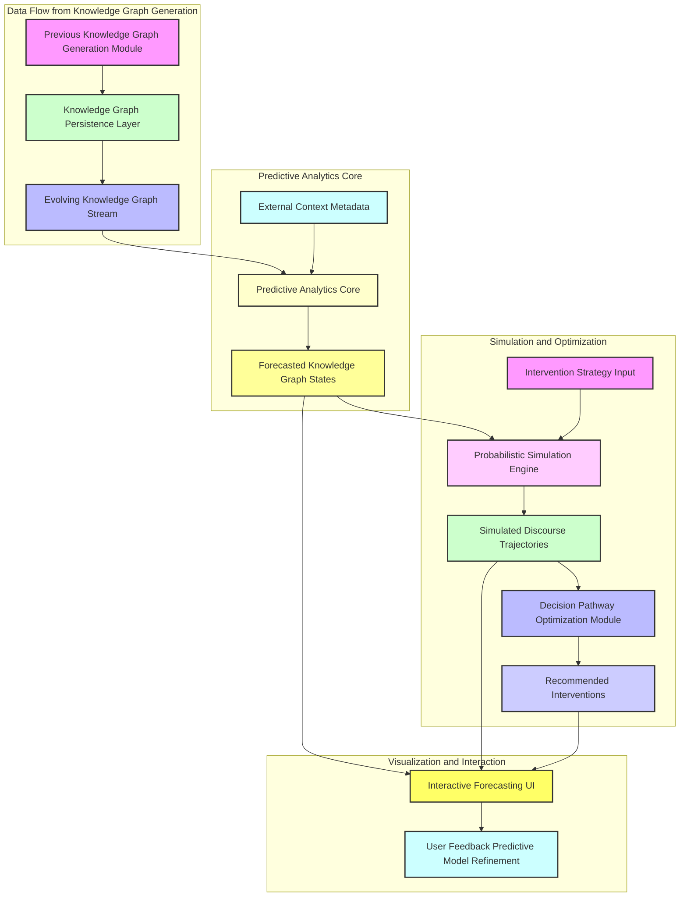
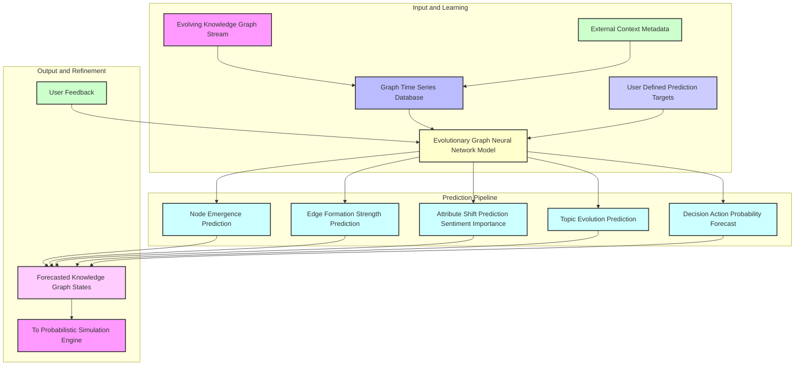
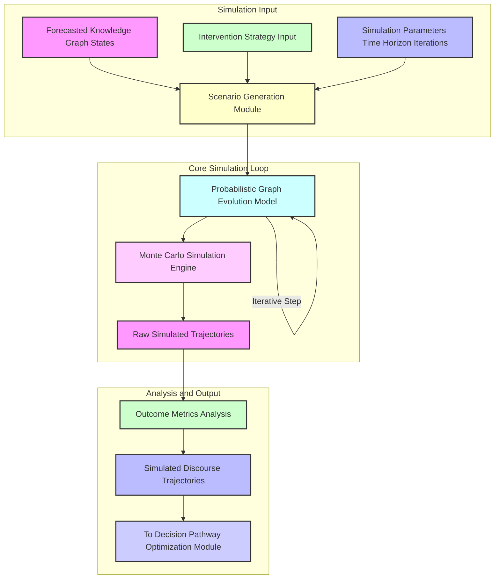
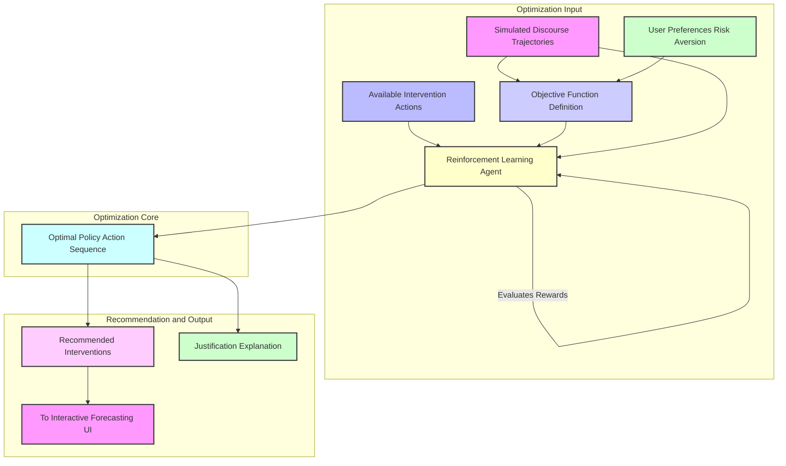
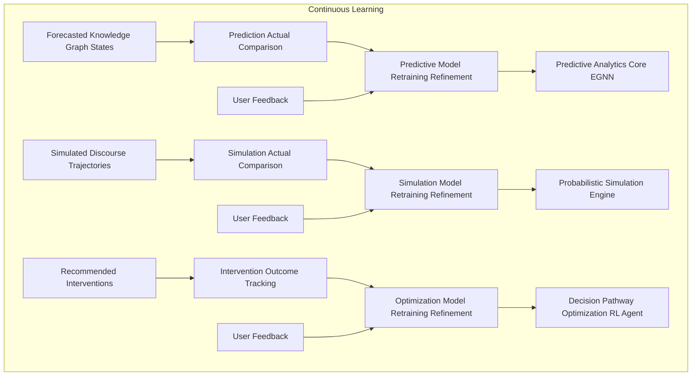
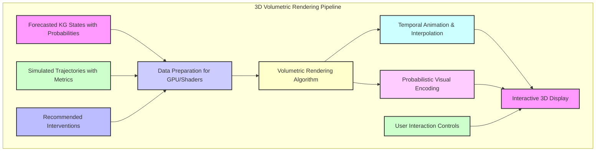
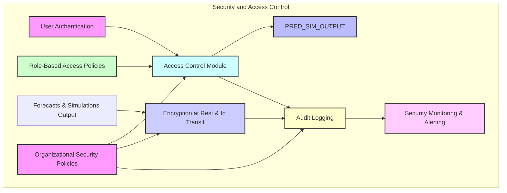

**Title of Invention:** A System and Method for Proactive Discursive Knowledge Forecasting and Probabilistic Trajectory Simulation, Leveraging Evolutionary Semantic-Topological Graphs and Explainable AI for Strategic Decision Optimization

**Abstract:**
A groundbreaking system and methodology are presented for extending the capabilities of dynamic knowledge graph generation into the realm of proactive intelligence. Building upon the real-time semantic-topological reconstruction of human discourse, this innovation introduces a Predictive Analytics Core that meticulously analyzes the evolving structure and attributes of knowledge graphs derived from temporal linguistic artifacts. Employing advanced evolutionary graph neural networks and deep learning models, the system forecasts emergent concepts, anticipates critical decision points, and predicts potential shifts in sentiment and topic trajectories within ongoing or future discourse. Concurrently, a Probabilistic Simulation Engine orchestrates "what-if" scenarios, allowing for the exploration of alternative conversational pathways and their probable outcomes based on defined interventions. This is seamlessly integrated with a Decision Pathway Optimization Module, which, using multi-objective reinforcement learning, recommends optimal communication strategies or interventions designed to steer discourse towards desired objectives, mitigate conflicts, or accelerate consensus. The results are rendered in an interactive, volumetric 3D environment, allowing users to visualize future states of the knowledge graph, understand the probabilities of various outcomes, and interactively explore the impact of potential actions, thereby transforming reactive discourse analysis into a powerful tool for strategic foresight and proactive management of complex intellectual endeavors.

**Background of the Invention:**
While previous advancements, such as systems for semantic-topological reconstruction and volumetric visualization of discursive knowledge graphs, have revolutionized post-hoc analysis and real-time comprehension of complex conversations, a significant and unaddressed limitation remains: the reactive nature of intelligence derived from past or present discourse. Decision-makers are still largely constrained to understanding "what has happened" or "what is happening," lacking robust tools to anticipate "what will happen" or "what could happen if...". This deficit creates a critical gap in strategic planning, conflict resolution, and the proactive steering of intellectual capital. Without the ability to forecast emergent ideas, predict the trajectory of discussions, identify potential deadlocks, or simulate the impact of specific interventions, organizations remain susceptible to unforeseen challenges, delayed decisions, and suboptimal outcomes. Current analytical systems, even those employing advanced AI, often provide static snapshots or linear trend analyses that fail to capture the dynamic, non-linear, and inherently probabilistic evolution of interconnected ideas within a human discourse. The intrinsic complexity of semantic and topological graph evolution, influenced by speaker interactions, temporal context, and external factors, necessitates a paradigm shift from descriptive and diagnostic analytics to truly predictive and prescriptive capabilities. Thus, a profound exigency exists for a system capable of autonomously predicting the future states of discursive knowledge graphs, simulating alternative evolutionary paths, and optimizing strategies for desired conversational outcomes.

**Brief Summary of the Invention:**
The present invention extends the revolutionary service paradigm for knowledge graph generation into the domain of predictive intelligence and proactive strategic management of discourse. Its foundational input is an evolving semantic-topological knowledge graph, meticulously constructed from real-time or recorded linguistic artifacts by an advanced system, such as the `012_holographic_meeting_scribe` described previously. This evolving graph data is continuously fed into a sophisticated Predictive Analytics Core. This core, leveraging a specialized suite of evolutionary Graph Neural Networks EGNNs and deep learning models, meticulously learns the temporal dynamics, relational patterns, and attribute transformations within historical knowledge graph sequences. It is then tasked with forecasting future states of the graph, predicting the emergence of new concepts, the strengthening or weakening of relationships, shifts in collective or individual sentiment, and the probable crystallization of decisions or action items within defined future temporal windows. The predicted graph states serve as the blueprint for a Probabilistic Simulation Engine. This engine employs agent-based modeling and Monte Carlo simulations, informed by learned graph dynamics, to generate multiple probabilistic "what-if" trajectories of the discourse, allowing stakeholders to explore the likely outcomes of various conceptual interactions or strategic interventions. A tightly integrated Decision Pathway Optimization Module then analyzes these simulated outcomes against predefined objectives, utilizing multi-objective reinforcement learning to recommend optimal communication strategies, information injection points, or participant engagements designed to guide the discourse towards desired resolutions. All predictions, simulations, and recommendations are presented within an enhanced, interactive 3D volumetric visualization environment, providing intuitive tools for exploring future conceptual landscapes, assessing risk, and interactively testing intervention hypotheses.

**Detailed Description of the Invention:**

The present invention meticulously details a comprehensive system and methodology for forecasting the evolution of discursive knowledge graphs and simulating future conversational trajectories, enabling proactive strategic intervention. The system builds upon and seamlessly integrates with the outputs of prior advancements in knowledge graph generation and visualization.

### 1. System Architecture Overview for Proactive Discourse Foresight

The architectural framework extends the modular, scalable, and highly distributed design to incorporate predictive and simulation capabilities, ensuring robust foresight and strategic utility.



**Description of Architectural Components:**

*   **KG_EVOL. Evolving Knowledge Graph Stream:** The continuous flow of newly generated or updated knowledge graph data from the `012_holographic_meeting_scribe` system.
*   **PREDICT_CORE. Predictive Analytics Core:** The intelligent heart, performing deep temporal analysis of graph evolution and forecasting future states.
*   **FORECAST_OUTPUT. Forecasted Knowledge Graph States:** The output comprising probable future graph structures, entities, relationships, and attributes.
*   **METADATA_EXT. External Context Metadata:** Input of external, time-series data relevant to the discourse, e.g., market trends, news events, organizational directives.
*   **SIM_ENGINE. Probabilistic Simulation Engine:** Generates "what-if" scenarios based on current and forecasted graph states, factoring in potential interventions.
*   **INT_STRATEGY. Intervention Strategy Input:** User-defined or system-generated potential actions to be simulated.
*   **SIM_OUTCOMES. Simulated Discourse Trajectories:** Multiple probable future knowledge graphs resulting from different simulation pathways.
*   **OPT_MODULE. Decision Pathway Optimization Module:** Analyzes simulated outcomes against objectives to recommend optimal strategies.
*   **REC_INTERVENTION. Recommended Interventions:** System-suggested actions to achieve desired discursive outcomes.
*   **INT_FOR_UI. Interactive Forecasting User Interface:** An extension of the 3D volumetric display for visualizing predictions, simulations, and recommendations.
*   **USER_FEEDBACK_PRED. User Feedback Predictive Model Refinement:** Captures user validation of predictions and simulation outcomes to refine models.

### 2. Predictive Analytics Core

This module is the intellectual engine for anticipating future discursive evolution, transforming the historical sequence of knowledge graphs into a forward-looking intelligence asset.



*   **2.1. Evolutionary Graph Neural Network EGNN Model:**
    *   This core employs advanced EGNN architectures, for example, Graph Convolutional Recurrent Networks GCRNs, Temporal Graph Networks TGNs, or dynamic attention-based graph transformers. These models are specifically designed to learn from sequences of evolving graphs `Gamma_t`, capturing both the static graph topology at any given `t` and the dynamic changes over time.
    *   **Training:** Trained on a vast corpus of historical knowledge graph sequences, learning to predict the next `Gamma_(t+delta_t)` based on `Gamma_t` and `Gamma_(t-k), ..., Gamma_(t-1)`.
    *   **External Context Integration:** Integrates `METADATA_EXT` (e.g., calendar events, external data streams) as additional node/edge features or global graph embeddings to contextualize predictions.

    ```mermaid
    graph TD
        subgraph EGNN Architecture: Temporal Graph Network (TGN)
            INPUT_KG_SEQ[KG Sequence (G_t-k...G_t)] --> NODE_EMBED_GEN[Node Embedding Generation];
            NODE_EMBED_GEN --> MESSAGE_GEN[Message Generation (for each edge)];
            MESSAGE_GEN --> MESSAGE_AGG[Message Aggregation (for each node)];
            NODE_EMBED_GEN --> TEMPORAL_EMBED_UPD[Temporal Embedding Update (GRU/RNN)];
            MESSAGE_AGG --> TEMPORAL_EMBED_UPD;
            TEMPORAL_EMBED_UPD --> ATTRIBUTE_PRED[Attribute Prediction Head];
            TEMPORAL_EMBED_UPD --> NODE_CLASS_PRED[Node Classification Prediction Head (e.g., Decision, Conflict)];
            TEMPORAL_EMBED_UPD --> LINK_PRED[Link Prediction Head (e.g., New Edge)];
            TEMPORAL_EMBED_UPD --> TOPIC_PRED[Topic Prediction Head];

            ATTRIBUTE_PRED --> FORECAST_KG_ELEMENTS[Forecasted KG Elements];
            NODE_CLASS_PRED --> FORECAST_KG_ELEMENTS;
            LINK_PRED --> FORECAST_KG_ELEMENTS;
            TOPIC_PRED --> FORECAST_KG_ELEMENTS;

            style INPUT_KG_SEQ fill:#f9f,stroke:#333,stroke-width:2px
            style NODE_EMBED_GEN fill:#cfc,stroke:#333,stroke-width:2px
            style MESSAGE_GEN fill:#bbf,stroke:#333,stroke-width:2px
            style MESSAGE_AGG fill:#ccf,stroke:#333,stroke-width:2px
            style TEMPORAL_EMBED_UPD fill:#ffc,stroke:#333,stroke-width:2px
            style ATTRIBUTE_PRED fill:#cff,stroke:#333,stroke-width:2px
            style NODE_CLASS_PRED fill:#fcf,stroke:#333,stroke-width:2px
            style LINK_PRED fill:#f9f,stroke:#333,stroke-width:2px
            style TOPIC_PRED fill:#cfc,stroke:#333,stroke-width:2px
            style FORECAST_KG_ELEMENTS fill:#bbf,stroke:#333,stroke-width:2px
        end
    ```

*   **2.2. Predictive Capabilities:**
    *   **2.2.1. Node Emergence Prediction:** Forecasts the probability of new concepts, decisions, or action items emerging within a future time window. This includes predicting their semantic content and likely speaker attribution.
    *   **2.2.2. Edge Formation and Strength Prediction:** Predicts the likelihood of new relationships forming between existing or emergent nodes, and quantifies the probable strengthening or weakening of existing relationships (e.g., a "PROPOSES" evolving into "LEADS_TO_DECISION").
    *   **2.2.3. Attribute Shift Prediction:** Forecasts changes in node attributes such as sentiment (e.g., a neutral concept becoming highly positive or negative), importance, or speaker engagement, and edge confidence scores.
    *   **2.2.4. Topic Evolution Prediction:** Anticipates shifts in overarching thematic clusters and their hierarchical relationships within the discourse.
    *   **2.2.5. Decision/Action Probability Forecast:** Estimates the probability of specific decisions being finalized or action items being assigned within a defined timeframe, along with their likely assigned parties and due dates.
*   **2.3. Forecasted Knowledge Graph States:**
    *   The output is not a single deterministic future graph, but rather a set of probable graph states, each accompanied by confidence scores or probability distributions for its elements (nodes, edges, attributes). This forecast forms the basis for simulation.

### 3. Probabilistic Simulation Engine

This module empowers users to explore "what-if" scenarios, understanding the potential ramifications of different conversational paths or strategic interventions.



*   **3.1. Scenario Generation Module:**
    *   Takes `FORECAST_KG` and `INT_STRATEGY` (e.g., "What if speaker X introduces concept Y?", "What if we delay decision Z by 2 days?") and `SIM_PARAMS` (time horizon, number of iterations).
    *   Initializes various starting graph states for simulation based on the `FORECAST_KG` probabilities.

*   **3.2. Probabilistic Graph Evolution Model:**
    *   Utilizes a learned probabilistic model (e.g., a Hidden Markov Model over graph states, a dynamic Bayesian network, or a diffusion process on the graph) derived from the EGNN's understanding of graph dynamics.
    *   At each simulation step, it probabilistically updates the graph based on the learned dynamics, taking into account the specified `INT_STRATEGY`. This includes:
        *   Probabilistic node creation/deletion.
        *   Probabilistic edge creation/deletion/weight modification.
        *   Probabilistic attribute changes (e.g., sentiment flip).
        *   Modeling of speaker-specific behaviors and reactions to certain concepts or interventions.

    ```mermaid
    graph TD
        subgraph Probabilistic Graph Evolution Model
            KG_CURRENT[Current KG State (G_t)] --> NODE_DYNAMICS[Node Dynamics Module];
            KG_CURRENT --> EDGE_DYNAMICS[Edge Dynamics Module];
            KG_CURRENT --> ATTRIBUTE_DYNAMICS[Attribute Dynamics Module];
            INTERVENTION[Intervention Strategy (I_t)] --> NODE_DYNAMICS;
            INTERVENTION --> EDGE_DYNAMICS;
            INTERVENTION --> ATTRIBUTE_DYNAMICS;
            SPEAKER_BEHAVIOR[Speaker Behavior Models] --> NODE_DYNAMICS;
            SPEAKER_BEHAVIOR --> EDGE_DYNAMICS;

            NODE_DYNAMICS --> NODE_UPDATE[Update Nodes (Creation/Deletion/Attributes)];
            EDGE_DYNAMICS --> EDGE_UPDATE[Update Edges (Creation/Deletion/Weights)];
            ATTRIBUTE_DYNAMICS --> NODE_UPDATE;

            NODE_UPDATE --> KG_NEXT_PROB[Probabilistic Next KG State (G_t+1)];
            EDGE_UPDATE --> KG_NEXT_PROB;

            style KG_CURRENT fill:#f9f,stroke:#333,stroke-width:2px
            style INTERVENTION fill:#cfc,stroke:#333,stroke-width:2px
            style SPEAKER_BEHAVIOR fill:#bbf,stroke:#333,stroke-width:2px

            style NODE_DYNAMICS fill:#ffc,stroke:#333,stroke-width:2px
            style EDGE_DYNAMICS fill:#cff,stroke:#333,stroke-width:2px
            style ATTRIBUTE_DYNAMICS fill:#fcf,stroke:#333,stroke-width:2px

            style NODE_UPDATE fill:#f9f,stroke:#333,stroke-width:2px
            style EDGE_UPDATE fill:#cfc,stroke:#333,stroke-width:2px
            style KG_NEXT_PROB fill:#bbf,stroke:#333,stroke-width:2px
        end
    ```

*   **3.3. Monte Carlo Simulation Engine:**
    *   Executes thousands or millions of simulation runs, each starting from a slightly different initial probabilistic state and evolving according to the `PROB_GRAPH_EVOL` model.
    *   This generates a distribution of possible future graph trajectories under specified conditions and interventions.
*   **3.4. Outcome Metrics Analysis:**
    *   Analyzes the vast array of `SIM_OUTCOMES_RAW` to extract key metrics (e.g., average time to decision, probability of conflict emergence, final sentiment distribution, number of emergent action items).
    *   Aggregates and summarizes these metrics into `SIM_OUTCOMES` for easier interpretation and input to the optimization module.

### 4. Decision Pathway Optimization Module

This module translates the insights from forecasting and simulation into actionable recommendations, guiding users toward optimal strategic interventions.



*   **4.1. Objective Function Definition:**
    *   Users define desired outcomes (e.g., "Maximize consensus on concept X," "Minimize time to decision on Y," "Reduce negative sentiment related to Z," "Ensure speaker A's proposal is adopted").
    *   This translates into a quantifiable multi-objective reward function for the reinforcement learning agent.
*   **4.2. Reinforcement Learning RL Agent:**
    *   An intelligent agent (e.g., using Deep Q-Networks DQN, Proximal Policy Optimization PPO, or Actor-Critic methods) interacts with the `PROB_GRAPH_EVOL` (or a proxy thereof) as its environment.
    *   It learns optimal sequences of `AVAIL_ACTIONS` (interventions) by observing the `SIM_OUTCOMES` and receiving rewards based on the `OBJ_FUNC_DEF`.
    *   The agent explores the action space, learning which interventions lead to desired results with the highest probability.

    ```mermaid
    graph TD
        subgraph RL Agent-Environment Interaction
            RL_AGENT[RL Agent Policy] --> ACTION_SELECTION[Select Action (Intervention I_t)];
            ACTION_SELECTION --> SIM_ENVIRONMENT[Simulation Environment (Probabilistic Graph Evol. Model)];
            SIM_ENVIRONMENT --> NEXT_STATE_OBS[Observe Next State (G_t+1)];
            SIM_ENVIRONMENT --> REWARD_CALC[Calculate Reward (R_t) based on Objectives];
            NEXT_STATE_OBS --> RL_AGENT;
            REWARD_CALC --> RL_AGENT;
            RL_AGENT --> POLICY_UPDATE[Update Policy/Value Function];

            style RL_AGENT fill:#f9f,stroke:#333,stroke-width:2px
            style ACTION_SELECTION fill:#cfc,stroke:#333,stroke-width:2px
            style SIM_ENVIRONMENT fill:#bbf,stroke:#333,stroke-width:2px
            style NEXT_STATE_OBS fill:#ccf,stroke:#333,stroke-width:2px
            style REWARD_CALC fill:#ffc,stroke:#333,stroke-width:2px
            style POLICY_UPDATE fill:#cff,stroke:#333,stroke-width:2px
        end
    ```

*   **4.3. Optimal Policy and Recommended Interventions:**
    *   The RL agent's learned policy constitutes the `OPT_POLICY`, which is a set of recommended `REC_INTERVENTION` actions (e.g., "Introduce supporting data for concept A at t+10min," "Schedule a private discussion with speaker B before t+30min to address concern C," "Refocus the discussion if topic X emerges").
    *   These recommendations are accompanied by their predicted impact and probability of success.

### 5. Interactive Forecasting & Simulation User Interface

This module enhances the 3D volumetric rendering engine to allow intuitive exploration of predicted future states and simulated trajectories.

*   **5.1. Temporal Projection Controls:**
    *   Users can "fast-forward" the 3D graph to display predicted future states at various `t+delta_t` intervals.
    *   Time-slider interface allows smooth scrubbing through forecasted graph evolutions.
*   **5.2. Probabilistic Visual Encoding:**
    *   Forecasted nodes/edges that are highly probable can be rendered with greater solidity or opacity; less certain elements might appear translucent, animated, or as ghost-like projections.
    *   Color gradients can represent probability scores (e.g., red for high probability of conflict, green for high probability of consensus).
*   **5.3. Scenario Comparison View:**
    *   Allows side-by-side or overlayed comparison of multiple simulated trajectories within the 3D space.
    *   Users can visually track how different `INT_STRATEGY` inputs lead to diverging future graph structures.
*   **5.4. Intervention Control Panel:**
    *   An integrated interface for inputting hypothetical interventions for simulation.
    *   Visual "playbooks" suggesting recommended actions directly interactable within the 3D environment.
*   **5.5. Risk & Opportunity Heatmaps:**
    *   Overlayed heatmaps on the 3D graph highlighting regions (clusters of nodes/edges) with high predicted risk (e.g., conflict potential) or high opportunity (e.g., consensus potential).

    ```mermaid
    graph TD
        subgraph Interactive UI: Data Flow and Controls
            PREDICT_FORECASTS[Forecasted KG States] --> VIS_ENGINE[3D Volumetric Rendering Engine];
            SIM_TRAJECTORIES[Simulated Discourse Trajectories] --> VIS_ENGINE;
            RECOMMENDATIONS[Recommended Interventions] --> VIS_ENGINE;
            VIS_ENGINE --> USER_DISPLAY[User Display (3D Graph)];

            USER_INPUT[User Interaction (Slider, Clicks)] --> TEMPORAL_CTRL[Temporal Projection Controls];
            USER_INPUT --> SCENARIO_COMP_CTRL[Scenario Comparison Controls];
            USER_INPUT --> INTERVENTION_CTRL[Intervention Control Panel];
            USER_INPUT --> FEEDBACK_CAPTURE[Feedback Capture Mechanism];

            TEMPORAL_CTRL --> VIS_ENGINE;
            SCENARIO_COMP_CTRL --> VIS_ENGINE;
            INTERVENTION_CTRL --> SIM_ENGINE[To Simulation Engine];
            FEEDBACK_CAPTURE --> FEEDBACK_LOOP[To Feedback Loop Module];

            style PREDICT_FORECASTS fill:#f9f,stroke:#333,stroke-width:2px
            style SIM_TRAJECTORIES fill:#cfc,stroke:#333,stroke-width:2px
            style RECOMMENDATIONS fill:#bbf,stroke:#333,stroke-width:2px
            style VIS_ENGINE fill:#ccf,stroke:#333,stroke-width:2px
            style USER_DISPLAY fill:#ffc,stroke:#333,stroke-width:2px

            style USER_INPUT fill:#cff,stroke:#333,stroke-width:2px
            style TEMPORAL_CTRL fill:#fcf,stroke:#333,stroke-width:2px
            style SCENARIO_COMP_CTRL fill:#f9f,stroke:#333,stroke-width:2px
            style INTERVENTION_CTRL fill:#cfc,stroke:#333,stroke-width:2px
            style FEEDBACK_CAPTURE fill:#bbf,stroke:#333,stroke-width:2px
            style SIM_ENGINE fill:#aab,stroke:#333,stroke-width:2px
            style FEEDBACK_LOOP fill:#dda,stroke:#333,stroke-width:2px
        end
    ```

### 6. Explainable Forecasting and Recommendation XAI

To build trust and facilitate user adoption, the system provides transparent explanations for its predictions and recommendations.

*   **6.1. Predictive Influence Attribution:** For any forecasted node or edge, the system can highlight the historical graph patterns, influential past utterances, or specific speaker contributions that most strongly led to its prediction.
*   **6.2. Simulation Path Justification:** Explains why a particular simulated trajectory is more probable than another, identifying the key probabilistic events or speaker reactions that guided its evolution.
*   **6.3. Recommendation Rationale:** For each `REC_INTERVENTION`, the system clearly articulates the logical chain from the defined objective, through the simulation outcomes, to the proposed action, including the expected uplift in objective achievement.
*   **6.4. Counterfactual Explanations:** Allows users to ask "What if this prediction hadn't occurred?" or "What if I hadn't taken this recommended action?", demonstrating the difference in outcomes.

    ```mermaid
    graph TD
        subgraph Explainable AI (XAI) Module
            PRED_MODELS[Predictive Models] --> FEATURE_IMPORTANCE[Feature Importance Attribution];
            SIM_MODELS[Simulation Models] --> PATH_JUSTIFICATION[Simulation Path Justification];
            OPT_MODELS[Optimization Models] --> RECOMMENDATION_RATIONALE[Recommendation Rationale Generator];

            USER_QUERY[User XAI Query] --> FEATURE_IMPORTANCE;
            USER_QUERY --> PATH_JUSTIFICATION;
            USER_QUERY --> RECOMMENDATION_RATIONALE;
            USER_QUERY --> COUNTERFACTUAL_GEN[Counterfactual Explanation Generator];

            FEATURE_IMPORTANCE --> EXPLANATION_OUTPUT[Explainable Insights];
            PATH_JUSTIFICATION --> EXPLANATION_OUTPUT;
            RECOMMENDATION_RATIONALE --> EXPLANATION_OUTPUT;
            COUNTERFACTUAL_GEN --> EXPLANATION_OUTPUT;

            style PRED_MODELS fill:#f9f,stroke:#333,stroke-width:2px
            style SIM_MODELS fill:#cfc,stroke:#333,stroke-width:2px
            style OPT_MODELS fill:#bbf,stroke:#333,stroke-width:2px
            style USER_QUERY fill:#ccf,stroke:#333,stroke-width:2px

            style FEATURE_IMPORTANCE fill:#ffc,stroke:#333,stroke-width:2px
            style PATH_JUSTIFICATION fill:#cff,stroke:#333,stroke-width:2px
            style RECOMMENDATION_RATIONALE fill:#fcf,stroke:#333,stroke-width:2px
            style COUNTERFACTUAL_GEN fill:#f9f,stroke:#333,stroke-width:2px

            style EXPLANATION_OUTPUT fill:#bbf,stroke:#333,stroke-width:2px
        end
    ```

### 7. Feedback Loop for Predictive Model Refinement

The system continuously learns and improves its predictive and simulation accuracy through iterative feedback.



*   **7.1. Prediction-Actual Comparison:** When the actual knowledge graph evolves, it is compared against the system's previous `FORECAST_KG`. Discrepancies are used as error signals.
*   **7.2. Simulation-Actual Comparison:** The outcomes of actual discourse, particularly when interventions were made, are compared against `SIM_OUTCOMES` to validate or adjust the `PROB_GRAPH_EVOL`.
*   **7.3. Intervention Outcome Tracking:** Monitors the actual impact of `REC_INTERVENTION` actions on the real discourse evolution.
*   **7.4. Model Retraining and Refinement:** The gathered error signals and validated outcomes trigger targeted retraining or fine-tuning of the EGNN, probabilistic graph evolution models, and reinforcement learning agents, ensuring the system continually adapts to new communication patterns and improves its foresight capabilities.

    ```mermaid
    graph TD
        subgraph Feedback Loop: Model Refinement Pipeline
            ACTUAL_KG[Actual Evolving KG (G_actual_t+1)] --> DATA_COLLECT[Data Collection & Validation];
            FORECAST_KG_T[Forecasted KG (G_forecast_t+1)] --> DATA_COLLECT;
            SIM_OUT_T[Simulated Outcomes (Sim_t)] --> DATA_COLLECT;
            REC_INT_T[Recommended Intervention (I_t)] --> DATA_COLLECT;
            ACTUAL_OUT_T[Actual Intervention Outcome (O_actual_t)] --> DATA_COLLECT;

            DATA_COLLECT --> ERROR_CALC[Error Calculation (Prediction Error, Simulation Discrepancy)];
            DATA_COLLECT --> PERFORMANCE_METRICS[Performance Metrics Tracking (Intervention Efficacy)];

            ERROR_CALC --> MODEL_RETRAIN_SCHED[Model Retraining Scheduler];
            PERFORMANCE_METRICS --> MODEL_RETRAIN_SCHED;
            USER_IMPLICIT_FEEDBACK[User Interaction Data] --> MODEL_RETRAIN_SCHED;
            USER_EXPLICIT_FEEDBACK[User Explicit Feedback] --> MODEL_RETRAIN_SCHED;

            MODEL_RETRAIN_SCHED -- Trigger --> PRED_RETRAIN[Predictive Model Retraining];
            MODEL_RETRAIN_SCHED -- Trigger --> SIM_RETRAIN[Simulation Model Retraining];
            MODEL_RETRAIN_SCHED -- Trigger --> OPT_RETRAIN[Optimization Model Retraining];

            PRED_RETRAIN --> EGNN_MODEL_UPDATED[Updated EGNN Model];
            SIM_RETRAIN --> PROB_GRAPH_EVOL_UPDATED[Updated Probabilistic Graph Evolution Model];
            OPT_RETRAIN --> RL_AGENT_UPDATED[Updated RL Agent];

            style ACTUAL_KG fill:#f9f,stroke:#333,stroke-width:2px
            style FORECAST_KG_T fill:#cfc,stroke:#333,stroke-width:2px
            style SIM_OUT_T fill:#bbf,stroke:#333,stroke-width:2px
            style REC_INT_T fill:#ccf,stroke:#333,stroke-width:2px
            style ACTUAL_OUT_T fill:#ffc,stroke:#333,stroke-width:2px

            style DATA_COLLECT fill:#cff,stroke:#333,stroke-width:2px
            style ERROR_CALC fill:#fcf,stroke:#333,stroke-width:2px
            style PERFORMANCE_METRICS fill:#f9f,stroke:#333,stroke-width:2px

            style MODEL_RETRAIN_SCHED fill:#cfc,stroke:#333,stroke-width:2px
            style USER_IMPLICIT_FEEDBACK fill:#bbf,stroke:#333,stroke-width:2px
            style USER_EXPLICIT_FEEDBACK fill:#ccf,stroke:#333,stroke-width:2px

            style PRED_RETRAIN fill:#ffc,stroke:#333,stroke-width:2px
            style SIM_RETRAIN fill:#cff,stroke:#333,stroke-width:2px
            style OPT_RETRAIN fill:#fcf,stroke:#333,stroke-width:2px

            style EGNN_MODEL_UPDATED fill:#f9f,stroke:#333,stroke-width:2px
            style PROB_GRAPH_EVOL_UPDATED fill:#cfc,stroke:#333,stroke-width:2px
            style RL_AGENT_UPDATED fill:#bbf,stroke:#333,stroke-width:2px
        end
    ```

### 8. External Context Metadata Integration Pipeline

The system incorporates diverse external information streams to enrich its understanding of discourse context and improve predictive accuracy.

```mermaid
graph TD
    subgraph External Context Integration
        RAW_EXT_DATA[Raw External Data Feeds (News, Market, Calendar)] --> DATA_CLEAN_NORM[Data Cleaning and Normalization];
        DATA_CLEAN_NORM --> FEATURE_ENG[Feature Engineering (Time-series, Event Embeddings)];
        FEATURE_ENG --> ALIGN_TIMESTAMPS[Align with KG Timestamps];
        ALIGN_TIMESTAMPS --> CONTEXT_DB[External Context Time Series DB];
        CONTEXT_DB --> EGNN_MODEL_INPUT[EGNN Model Input Layer];
        CONTEXT_DB --> SIM_ENVIRONMENT_INPUT[Simulation Environment Input];

        style RAW_EXT_DATA fill:#f9f,stroke:#333,stroke-width:2px
        style DATA_CLEAN_NORM fill:#cfc,stroke:#333,stroke-width:2px
        style FEATURE_ENG fill:#bbf,stroke:#333,stroke-width:2px
        style ALIGN_TIMESTAMPS fill:#ccf,stroke:#333,stroke-width:2px
        style CONTEXT_DB fill:#ffc,stroke:#333,stroke-width:2px
        style EGNN_MODEL_INPUT fill:#cff,stroke:#333,stroke-width:2px
        style SIM_ENVIRONMENT_INPUT fill:#fcf,stroke:#333,stroke-width:2px
    end
```

### 9. Volumetric Visualization Rendering Pipeline

The 3D volumetric display renders complex temporal graph data intuitively.



### 10. Security and Access Control for Predictive Insights

Given the sensitive nature of forecasted and simulated discourse, robust security and access control are paramount.



**Claims:**

The following enumerated claims define the intellectual scope and novel contributions of the present invention, a testament to its singular advancement in the field of proactive discourse analysis and strategic information management.

1.  A method for proactive forecasting and probabilistic simulation of discursive knowledge graph evolution, comprising the steps of:
    a.  Continuously receiving an evolving stream of structured knowledge graphs `Gamma_t`, each `Gamma_t` representing the semantic-topological reconstruction of a temporal linguistic artifact at time `t`.
    b.  Transmitting said evolving stream `Gamma_t` to a Predictive Analytics Core.
    c.  Utilizing said Predictive Analytics Core, comprising an Evolutionary Graph Neural Network EGNN model, to learn the temporal dynamics and attribute transformations of knowledge graph evolution.
    d.  Generating from said Predictive Analytics Core a plurality of forecasted knowledge graph states `Gamma_(t+delta_t)_forecast`, predicting the probable emergence of new entities, formation of new relationships, shifts in entity attributes, and probabilities of decision crystallization within a future temporal window `delta_t`.
    e.  Transmitting said forecasted knowledge graph states to a Probabilistic Simulation Engine.
    f.  Executing within said Probabilistic Simulation Engine a plurality of Monte Carlo simulations, generating diverse `Simulated Discourse Trajectories` by probabilistically evolving said forecasted knowledge graph states under various hypothetical intervention strategies.
    g.  Transmitting said `Simulated Discourse Trajectories` to a Decision Pathway Optimization Module.
    h.  Applying within said Decision Pathway Optimization Module a reinforcement learning agent to analyze said `Simulated Discourse Trajectories` against predefined objective functions, thereby identifying and recommending optimal intervention strategies designed to steer future discourse toward desired outcomes.
    i.  Displaying said forecasted knowledge graph states, `Simulated Discourse Trajectories`, and recommended interventions to a user via an enhanced interactive three-dimensional volumetric user interface.

2.  The method of claim 1, wherein the Evolutionary Graph Neural Network EGNN model incorporates external contextual metadata as additional input features to enhance prediction accuracy.

3.  The method of claim 1, wherein the forecasted knowledge graph states (step d) include probability distributions or confidence scores for predicted node emergence, edge formation, sentiment shifts, and decision likelihood.

4.  The method of claim 1, wherein the Probabilistic Simulation Engine (step f) employs a probabilistic graph evolution model that accounts for speaker-specific behaviors and reactions to interventions.

5.  The method of claim 1, wherein the reinforcement learning agent (step h) operates in an environment modeled by the probabilistic graph evolution, receiving rewards based on the achievement of multi-objective functions.

6.  The method of claim 1, wherein the interactive three-dimensional volumetric user interface (step i) provides temporal projection controls to view forecasted future states and probabilistic visual encodings to represent prediction uncertainty.

7.  The method of claim 6, wherein the interactive user interface further enables scenario comparison, allowing side-by-side visualization of multiple `Simulated Discourse Trajectories` resulting from different interventions.

8.  The method of claim 1, further comprising an Explainable AI XAI module configured to:
    a.  Attribute specific historical graph patterns or utterances as justifications for forecasted events.
    b.  Provide rationale for the probability of `Simulated Discourse Trajectories`.
    c.  Explain the underlying logic and predicted impact of recommended interventions.

9.  The method of claim 1, further comprising a continuous feedback loop configured to:
    a.  Compare actual knowledge graph evolution against forecasted states to calculate prediction errors.
    b.  Compare actual discourse outcomes against `Simulated Discourse Trajectories` to validate simulation models.
    c.  Track the real-world impact of implemented recommended interventions.
    d.  Retrain and refine the Predictive Analytics Core, Probabilistic Simulation Engine, and Decision Pathway Optimization Module based on said comparisons and tracking data.

10. A system configured to execute the method of claim 1, comprising:
    a.  An Evolving Knowledge Graph Stream module configured to receive continuous knowledge graph data.
    b.  A Predictive Analytics Core operatively coupled to the Evolving Knowledge Graph Stream, comprising an Evolutionary Graph Neural Network EGNN model.
    c.  A Probabilistic Simulation Engine operatively coupled to the Predictive Analytics Core, configured to generate `Simulated Discourse Trajectories`.
    d.  A Decision Pathway Optimization Module operatively coupled to the Probabilistic Simulation Engine, comprising a reinforcement learning agent.
    e.  An Interactive Forecasting User Interface operatively coupled to the Predictive Analytics Core, Probabilistic Simulation Engine, and Decision Pathway Optimization Module, configured to display and interact with forecasts, simulations, and recommendations.

11. The system of claim 10, wherein the Predictive Analytics Core includes modules for Node Emergence Prediction, Edge Formation Prediction, Attribute Shift Prediction, Topic Evolution Prediction, and Decision Action Probability Forecast.

12. The system of claim 10, wherein the Probabilistic Simulation Engine includes a Monte Carlo Simulation Engine and an Outcome Metrics Analysis module.

13. The system of claim 10, wherein the Decision Pathway Optimization Module comprises an Objective Function Definition component and a Justification Explanation component for recommended interventions.

14. The system of claim 10, further comprising an XAI Module for providing transparent justifications for predictions, simulations, and recommendations.

15. The system of claim 10, further comprising a Dynamic Adaptation and Learning System configured for continuous model refinement based on actual outcomes and user feedback.

16. The method of claim 1, wherein the Evolutionary Graph Neural Network (EGNN) model specifically employs a Temporal Graph Network (TGN) architecture to capture evolving node and edge features through dynamic message passing and recurrent updates.

17. The method of claim 4, wherein the speaker-specific behaviors are modeled as a set of probabilistic rules or neural network-based response functions, predicting individual reactions to interventions and evolving discourse states.

18. The method of claim 1, wherein the simulated discourse trajectories are utilized to perform quantifiable risk assessment, determining the probability of undesirable outcomes (e.g., conflict escalation, missed deadlines) under various intervention scenarios.

19. The method of claim 8, wherein the Explainable AI (XAI) module further generates counterfactual explanations, illustrating minimal changes to historical discourse that would have led to a different predicted or simulated outcome.

20. The method of claim 1, wherein the recommended optimal intervention strategies are presented as a sequence of discrete actions, each associated with a specific timing, target entity, and a predicted probability of achieving defined objectives.

21. The system of claim 10, wherein the Interactive Forecasting User Interface dynamically updates the visual representation of node attributes, such as sentiment or importance, to reflect their predicted temporal evolution.

22. The method of claim 9, wherein the continuous feedback loop incorporates user interaction data (e.g., viewed scenarios, chosen interventions) as implicit feedback for further model refinement.

23. The method of claim 1, wherein the semantic content of newly emerging nodes is predicted using generative language models integrated within the Predictive Analytics Core.

24. The method of claim 1, wherein the Probabilistic Simulation Engine dynamically adjusts the transition probabilities of graph evolution based on the observed real-world efficacy of previous interventions.

25. The system of claim 10, further comprising an integrated audit logging and robust access control module to manage access to sensitive forecasted and simulated discursive insights, ensuring data security and compliance.

**Mathematical Justification:**

The exposition of the present invention builds upon the established mathematical framework of the semantic-topological knowledge graph `Gamma` and its underlying semantic tensor `S_C`, extending it into the domains of temporal prediction and probabilistic simulation. We introduce the concept of a Knowledge Graph Evolution Tensor `Gamma_T` and formally define the Predictive Function `F`, the Simulation Function `Sim`, and the Optimization Function `Opt` to demonstrate the system's capacity for strategic foresight.

### I. Knowledge Graph Evolution as a Temporal Sequence `Gamma_T`

Let the output of the prior system, the attributed knowledge graph, at discrete time step `t` be denoted `Gamma_t = (V_t, E_t, X_V_t, X_E_t)`. Here, `V_t` is the set of nodes, `E_t` is the set of edges, `X_V_t` is the node feature matrix, and `X_E_t` is the edge feature matrix.

1.  **Nodes and Edges:**
    *   `V_t = \{v_1, \ldots, v_{N_t}\}`: Set of `N_t` nodes (concepts, speakers, decisions) at time `t`.
    *   `E_t \subseteq V_t \times R \times V_t`: Set of `M_t` attributed edges (relationships) at time `t`, where `R` is the set of relation types.
    *   An edge `e_{ij,r} = (v_i, r, v_j) \in E_t` connects node `v_i` to `v_j` with relation type `r`.

2.  **Feature Representation:**
    *   Node `v_i \in V_t` has a feature vector `x_{v_i,t} \in \mathbb{R}^{d_v}`. This includes semantic embeddings, sentiment scores, importance, speaker identity, etc.
    *   Edge `e_{ij,r} \in E_t` has a feature vector `x_{e_{ij,r},t} \in \mathbb{R}^{d_e}`. This includes relationship strength, temporal attributes, confidence scores.
    *   The node feature matrix is `X_V_t \in \mathbb{R}^{N_t \times d_v}`.
    *   The edge feature matrix is `X_E_t \in \mathbb{R}^{M_t \times d_e}`.

3.  **Adjacency Tensor:**
    *   For multi-relational graphs, we define an adjacency tensor `A_t \in \{0,1\}^{N_t \times |R| \times N_t}`.
    *   `A_{t,i,r,j} = 1` if an edge `(v_i, r, v_j)` exists at time `t`, else `0`.
    *   For simplicity, we often refer to the graph structure as `A_t`.

4.  **Knowledge Graph Evolution Tensor `Gamma_T`:**
    *   A discursive artifact's evolution over time generates a sequence of such graphs, forming a **Knowledge Graph Evolution Tensor** `Gamma_T`:
        $$ \Gamma_T = (\Gamma_{t_0}, \Gamma_{t_1}, \ldots, \Gamma_{t_K}) \quad (1) $$
    *   Where `t_j` represents a specific temporal snapshot of the knowledge graph `Gamma_{t_j}`.
    *   The dynamics of `Gamma_T` are governed by complex processes including node dynamics, edge dynamics, and topological dynamics.
    *   We also incorporate external contextual metadata `M_T = (m_{t_0}, m_{t_1}, \ldots, m_{t_K})`, where `m_{t_j} \in \mathbb{R}^{d_m}` is a vector of external features at time `t_j`.
        $$ m_{t_j} = [ \text{market\_sentiment}_{t_j}, \text{news\_events}_{t_j}, \ldots ] \quad (2) $$

### II. The Predictive Function `F` for Future Graph States

The Predictive Analytics Core's primary mathematical objective is to implement a **Predictive Function `F`**. Given a history of knowledge graph evolution `Gamma_{(t-L):t}` (from `t-L` to `t`) and optionally external context `M_{(t-L):t}`, `F` estimates the probability distribution over future knowledge graph states `Gamma_{(t+\Delta t)}`:

$$ F: (\Gamma_{(t-L):t}, M_{(t-L):t}) \rightarrow P(\Gamma_{(t+\Delta t)}) \quad (3) $$

More formally, `F` learns a conditional probability distribution:
$$ P(\Gamma_{(t+\Delta t)} | \Gamma_t, \Gamma_{t-1}, \ldots, \Gamma_{t-L}, M_t, M_{t-1}, \ldots, M_{t-L}) \quad (4) $$

This function `F` is instantiated by an **Evolutionary Graph Neural Network (EGNN) model**, such as a Temporal Graph Network (TGN). An EGNN combines graph convolutional/attention layers for spatial dependency and recurrent/transformer layers for temporal dependency.

1.  **Node Embedding Generation:**
    *   Initial node features `x_{v_i,t}` are mapped to a latent embedding space `h_{v_i,t}^{(0)}`.
        $$ h_{v_i,t}^{(0)} = \text{MLP}_v(x_{v_i,t}) \quad (5) $$
    *   Similarly for edges: `h_{e_{ij,r},t}^{(0)} = \text{MLP}_e(x_{e_{ij,r},t})`.

2.  **Message Generation (TGN):**
    *   For each edge `e_{ij,r} \in E_t`, a message `msg_{ij,t}` is generated from the source node `v_i` to target node `v_j`.
        $$ \text{msg}_{ij,t} = f_{msg}([h_{v_i,t}^{(l)}, h_{v_j,t}^{(l)}, x_{e_{ij,r},t}, \Delta t_{ij}]) \quad (6) $$
    *   Where `l` denotes the layer, and `$\Delta t_{ij}$` is the time difference since the last interaction. `f_msg` is typically an MLP.

3.  **Message Aggregation:**
    *   For each node `v_j`, incoming messages from its neighbors `N(v_j)` are aggregated.
        $$ \text{agg}_{v_j,t} = \text{AGGREGATE}(\{\text{msg}_{ij,t} | v_i \in N(v_j)\}) \quad (7) $$
    *   Common aggregation functions include sum, mean, or attention-based mechanisms.
        $$ \text{agg}_{v_j,t} = \sum_{v_i \in N(v_j)} \alpha_{ij,t} \cdot \text{msg}_{ij,t} \quad (8) $$
    *   Where `$\alpha_{ij,t}$` is an attention weight:
        $$ \alpha_{ij,t} = \frac{\exp(\text{MLP}_{att}([h_{v_j,t}^{(l)}, h_{v_i,t}^{(l)}, \text{msg}_{ij,t}]))}{\sum_{v_k \in N(v_j)} \exp(\text{MLP}_{att}([h_{v_j,t}^{(l)}, h_{v_k,t}^{(l)}, \text{msg}_{kj,t}]))} \quad (9) $$

4.  **Temporal Embedding Update:**
    *   The node embeddings are updated using a Recurrent Neural Network (RNN) or Gated Recurrent Unit (GRU) to capture temporal dynamics.
        $$ h_{v_j,t+1} = \text{GRU}(h_{v_j,t}, \text{agg}_{v_j,t}) \quad (10) $$
    *   Where `h_{v_j,t}` is the hidden state (temporal embedding) of node `v_j` at time `t`.

5.  **Prediction Heads:**
    *   The final node embeddings `h_{v_j, (t+\Delta t)}` are passed through task-specific prediction heads.
    *   **Node Emergence Prediction:** Probability of a new node `v_{new}` emerging.
        $$ P(v_{new} \text{ exists at } t+\Delta t) = \sigma(\text{MLP}_{node\_emerge}(h_{\text{context}, (t+\Delta t)})) \quad (11) $$
    *   **Node Persistence Prediction:** Probability of an existing node `v_k` persisting.
        $$ P(v_k \text{ exists at } t+\Delta t) = \sigma(\text{MLP}_{node\_exist}(h_{v_k, (t+\Delta t)})) \quad (12) $$
    *   **Edge Formation/Persistence Prediction:** Probability of edge `e_{ij,r}` forming or persisting.
        $$ P(e_{ij,r} \text{ exists at } t+\Delta t) = \sigma(\text{MLP}_{edge\_exist}([h_{v_i, (t+\Delta t)}; h_{v_j, (t+\Delta t)}; x_{e_{ij,r},t}])) \quad (13) $$
    *   **Attribute Shift Prediction:** Expected value of an attribute `attr_k` for node `v_j`.
        $$ E[\text{attr}_{v_j,k} \text{ at } t+\Delta t] = \text{MLP}_{attr\_k}(h_{v_j, (t+\Delta t)}) \quad (14) $$
    *   **Sentiment Shift Prediction:** A specific attribute prediction for sentiment.
        $$ S_{v_j, (t+\Delta t)} = \text{MLP}_{sentiment}(h_{v_j, (t+\Delta t)}) \quad (15) $$
    *   **Topic Evolution Prediction:** Probability distribution over topic categories for node `v_j`.
        $$ P(\text{topic}_{v_j} = \tau | \ldots) = \text{softmax}(\text{MLP}_{topic}(h_{v_j, (t+\Delta t)})) \quad (16) $$
    *   **Decision/Action Probability Forecast:** Probability of a decision `D` being finalized.
        $$ P(D \text{ finalized at } t+\Delta t) = \sigma(\text{MLP}_{decision}(h_{D, (t+\Delta t)})) \quad (17) $$
    *   `$\sigma(\cdot)$` is the sigmoid activation function for probabilities, and `$\text{softmax}(\cdot)$` for distributions.

6.  **Loss Function for EGNN Training:**
    *   The model is trained to minimize a composite loss function:
        $$ \mathcal{L}_{pred} = \sum_{t' \in \text{training\_horizon}} \left( \mathcal{L}_{\text{node}}(P(V_{t'}), V_{t'}) + \mathcal{L}_{\text{edge}}(P(E_{t'}), E_{t'}) + \sum_k \mathcal{L}_{\text{attr},k}(\hat{attr}_{t',k}, attr_{t',k}) + \mathcal{L}_{\text{decision}}(\hat{D}_{t'}, D_{t'}) \right) \quad (18) $$
    *   Where `$\mathcal{L}_{\text{node}}$` and `$\mathcal{L}_{\text{edge}}$` are binary cross-entropy losses for existence, `$\mathcal{L}_{\text{attr},k}$` can be Mean Squared Error for regression, and `$\mathcal{L}_{\text{decision}}$` for classification.
    *   `P(V_{t'})` and `P(E_{t'})` denote the predicted probabilities of nodes and edges, respectively.
    *   `$\hat{attr}_{t',k}$` is the predicted attribute value, `$\hat{D}_{t'}$` is the predicted decision probability.

### III. The Probabilistic Simulation Function `Sim`

Building on the forecast `P(\Gamma_{(t+\Delta t)})`, the Probabilistic Simulation Engine implements a **Simulation Function `Sim`**. `Sim` takes a current graph state (or a forecasted state) and a set of proposed interventions `I` (e.g., "introduce concept X," "assign task Y to speaker Z") and generates multiple probable future trajectories:

$$ \text{Sim}: (\Gamma_{\text{current}}, I) \rightarrow \{\Gamma_{\text{trajectory}, 1}, \Gamma_{\text{trajectory}, 2}, \ldots, \Gamma_{\text{trajectory}, N}\} \quad (19) $$

Where each `$\Gamma_{\text{trajectory}, j}$` is a sequence of graph states `$(\Gamma_t, \Gamma_{t+1}, \ldots, \Gamma_{t+H})$` over a simulation horizon `H`.

1.  **Markov Decision Process (MDP) / Agent-Based Model (ABM) Formulation:**
    *   The simulation environment can be formalized as an MDP `$(\mathcal{S}, \mathcal{A}, P, R, \gamma)$`.
    *   **States `$\mathcal{S}$`:** The set of all possible knowledge graph states `$\Gamma_t$`.
    *   **Actions `$\mathcal{A}$`:** The set of possible interventions `I_t` that can be applied.
    *   **Transition Probabilities `P`:** The probability of transitioning from state `$\Gamma_t$` to `$\Gamma_{t+1}$` given intervention `I_t`.
        $$ P(\Gamma_{t+1} | \Gamma_t, I_t) \quad (20) $$
    *   This is a generative model of graph evolution, often learned from the EGNN.
    *   Node creation probability given the current state and intervention:
        $$ P_{\text{create}}(v_{\text{new}} | \Gamma_t, I_t) = \sigma(\text{MLP}_{c}([\text{global\_embedding}(\Gamma_t); \text{embedding}(I_t)])) \quad (21) $$
    *   Edge creation probability between `v_i, v_j` given `$\Gamma_t$` and `I_t`:
        $$ P_{\text{create}}(e_{ij,r} | \Gamma_t, I_t) = \sigma(\text{MLP}_{ec}([h_{v_i,t}; h_{v_j,t}; \text{embedding}(I_t)])) \quad (22) $$
    *   Attribute update `attr_{v, t+1}` can be modeled as a stochastic process:
        $$ \text{attr}_{v, t+1} \sim \mathcal{N}(\mu(\text{attr}_{v,t}, I_t, h_{v,t}), \Sigma) \quad (23) $$
    *   `$\mu(\cdot)$` is a learned function, `$\Sigma$` is the covariance matrix.

2.  **Speaker Behavior Models:**
    *   Individual speakers `s_k \in V_t` have probabilistic behavior models `$\mathcal{B}(s_k)$`.
    *   These models predict `speaker\_action_k` (e.g., introduce a new concept, support/oppose a concept, exit discourse) given the current graph state and their personal attributes/history.
        $$ P(\text{speaker\_action}_k | h_{s_k,t}, \Gamma_t) = \text{softmax}(\text{MLP}_{sk}([\text{features}(s_k, t); \text{global\_embedding}(\Gamma_t)])) \quad (24) $$
    *   Interventions `I_t` can influence these `speaker\_action_k` probabilities.

3.  **Monte Carlo Simulation:**
    *   The engine executes `N_{MC}` simulation runs. In each run `j`:
        *   Initialize `$\Gamma_{t}^{(j)}$` based on forecasted probabilities `P(\Gamma_t | \text{forecast})`.
        *   For `$\tau = t$` to `$\tau = t+H-1$`:
            *   Sample `I_{\tau}^{(j)}` from `I` (if external intervention) or `$\mathcal{A}$` (if agent exploration).
            *   Sample `$\Gamma_{\tau+1}^{(j)}$` according to `P(\Gamma_{\tau+1} | \Gamma_{\tau}^{(j)}, I_{\tau}^{(j)}, \mathcal{B})`.
        $$ \Gamma_{\text{trajectory}, j} = (\Gamma_t^{(j)}, \Gamma_{t+1}^{(j)}, \ldots, \Gamma_{t+H}^{(j)}) \quad (25) $$
    *   The total set of raw simulated trajectories is `$\{\Gamma_{\text{trajectory}, 1}, \ldots, \Gamma_{\text{trajectory}, N_{MC}}\}$`.

4.  **Outcome Metrics Analysis:**
    *   For each trajectory, compute relevant metrics, e.g., time to decision (`$\Delta t_{dec}$`), final sentiment `S_f`, number of conflict nodes `N_{conflict}`.
        $$ \text{Metric}_k(\Gamma_{\text{trajectory}, j}) \quad (26) $$
    *   Average or aggregate metrics across all simulations to get expected outcomes:
        $$ E[\text{Metric}_k | I] = \frac{1}{N_{MC}} \sum_{j=1}^{N_{MC}} \text{Metric}_k(\Gamma_{\text{trajectory}, j}) \quad (27) $$
    *   Probability of a specific event `E` occurring:
        $$ P(E | I) = \frac{1}{N_{MC}} \sum_{j=1}^{N_{MC}} \mathbb{I}(E \text{ occurs in } \Gamma_{\text{trajectory}, j}) \quad (28) $$
    *   Where `$\mathbb{I}(\cdot)$` is the indicator function.

### IV. The Decision Pathway Optimization Function `Opt`

The Decision Pathway Optimization Module implements an **Optimization Function `Opt`** that identifies the best intervention strategy `I_optimal` to achieve a desired objective `O`, given the simulated outcomes.

$$ \text{Opt}: (\{\Gamma_{\text{trajectory}}\}, O) \rightarrow I_{\text{optimal}} \quad (29) $$

The `Opt` function is typically implemented using **Reinforcement Learning (RL)**.

1.  **RL Formulation:**
    *   **Environment:** The `Probabilistic Simulation Engine` serves as the environment.
    *   **States:** `s_t = \Gamma_t`.
    *   **Actions:** `a_t = I_t`, an intervention from the `Available Intervention Actions` space `$\mathcal{A}_{int}$`.
    *   **Reward Function `R(s_t, a_t, s_{t+1}, O)`:** Quantifies how well the transition `$(s_t, a_t, s_{t+1})$` contributes to achieving the objective `O`.
    *   **Discount Factor `$\gamma \in [0,1)$`:** Future rewards are discounted.
    *   The objective is to find a policy `$\pi(s_t): \mathcal{S} \rightarrow \mathcal{A}_{int}$` that maximizes the expected cumulative discounted reward:
        $$ J(\pi) = E_{\pi} \left[ \sum_{k=0}^{H} \gamma^k R(s_k, a_k) \right] \quad (30) $$

2.  **Multi-Objective Reward Function:**
    *   The objective `O` is typically a multi-objective function, defined by user preferences:
        $$ R(\Gamma_{\text{trajectory}}, O) = \sum_{p=1}^{P} w_p \cdot r_p(\Gamma_{\text{trajectory}}) \quad (31) $$
    *   Where `w_p` are user-defined weights for each sub-objective `r_p`.
    *   Example Sub-Objectives:
        *   Maximize consensus on concept `C_X`:
            $$ r_1 = \text{Consensus\_Score}(\Gamma_H, C_X) \in [0,1] \quad (32) $$
        *   Minimize time to decision `D_Y`:
            $$ r_2 = 1 - \frac{\Delta t_{\text{dec}}(D_Y)}{\Delta t_{\text{max}}} \quad (33) $$
        *   Reduce negative sentiment for topic `T_Z`:
            $$ r_3 = 1 - \text{Avg\_Negative\_Sentiment}(\Gamma_H, T_Z) \quad (34) $$
        *   Ensure speaker `S_A`'s proposal is adopted:
            $$ r_4 = \mathbb{I}(\text{Proposal of } S_A \text{ adopted in } \Gamma_H) \quad (35) $$

3.  **Q-Learning / Policy Gradient:**
    *   The RL agent learns a Q-function `Q(s,a)` representing the expected future reward for taking action `a` in state `s`.
        $$ Q^{\pi}(s_t, a_t) = E_{\pi} \left[ \sum_{k=t}^{H} \gamma^{k-t} R(s_k, a_k) | s_t, a_t \right] \quad (36) $$
    *   The optimal policy `$\pi^*(s)$` is derived from the optimal Q-function `Q^*(s,a)`:
        $$ \pi^*(s) = \underset{a \in \mathcal{A}_{int}}{\text{argmax}} Q^*(s,a) \quad (37) $$
    *   For deep RL, Q-networks are trained to approximate `Q^*(s,a)`:
        $$ \mathcal{L}_{DQN}(\theta) = E_{(s,a,r,s') \sim D} \left[ (r + \gamma \max_{a'} Q(s',a'; \theta_{target}) - Q(s,a; \theta))^2 \right] \quad (38) $$
    *   Where `D` is the experience replay buffer, `$\theta$` are current network weights, and `$\theta_{target}$` are target network weights.
    *   Policy gradient methods, like REINFORCE or Actor-Critic, directly optimize the policy `$\pi_{\phi}(a|s)$` parameterized by `$\phi$`.
        $$ \nabla J(\phi) = E_{\pi_{\phi}} \left[ \nabla_{\phi} \log \pi_{\phi}(a_t|s_t) A^{\pi}(s_t, a_t) \right] \quad (39) $$
    *   `$A^{\pi}(s_t, a_t)$` is the advantage function, often estimated by `Q^{\pi}(s_t, a_t) - V^{\pi}(s_t)`.

4.  **Optimal Policy and Recommended Interventions:**
    *   The learned policy `$\pi^*(s)$` provides the `I_optimal` recommendations.
    *   Each recommended intervention `$\hat{I}$` is associated with its predicted impact on `O` and a probability of success:
        $$ P(\text{achieve } O | \hat{I}) = \frac{1}{N_{MC}} \sum_{j=1}^{N_{MC}} \mathbb{I}(O \text{ achieved in } \Gamma_{\text{trajectory}, j}(\hat{I})) \quad (40) $$

### V. Proof of Superiority: Reduced Uncertainty and Optimized Outcomes

The present invention achieves a fundamental advancement beyond descriptive and diagnostic discourse analysis by enabling proactive management and strategic optimization.

1.  **Quantifiable Reduction in Discursive Uncertainty:**
    *   Let `$\mathcal{X}$` be the space of all possible future knowledge graph states. The inherent uncertainty of the future discourse can be measured by entropy.
    *   Without the Predictive Analytics Core, the entropy `H(\Gamma_{(t+\Delta t)} | \Gamma_t)` is high, representing maximal uncertainty.
        $$ H(\Gamma_{(t+\Delta t)} | \Gamma_t) = - \sum_{G \in \mathcal{X}} P(G | \Gamma_t) \log P(G | \Gamma_t) \quad (41) $$
    *   The Predictive Function `F` provides `P(\Gamma_{(t+\Delta t)} | \Gamma_{(t-L):t}, M_{(t-L):t})`, which is a more constrained and informed distribution.
    *   The reduction in uncertainty (information gain) is:
        $$ \Delta H = H(\Gamma_{(t+\Delta t)} | \Gamma_t) - H(P(\Gamma_{(t+\Delta t)} | \text{history}, M)) \quad (42) $$
    *   `$\Delta H > 0$` indicates that `F` provides actionable foresight, effectively channeling the possible future states into a more predictable distribution, thereby decreasing entropy and increasing information.
    *   The Probabilistic Simulation Engine further quantifies this by revealing the probabilistic spread of outcomes under different conditions, transforming vague uncertainty into calculable risk, e.g., `P(\text{conflict_emergence} | I)`.
        $$ Risk(E, I) = P(E \text{ occurs in } \Gamma_{\text{trajectory}}(\text{I})) \quad (43) $$

2.  **Optimized Strategic Outcomes:**
    *   Given an objective `O`, and an intervention space `$\mathcal{A}_{int}$`, the probability of achieving `O` through random or heuristic interventions `I_random` is `P(O | I_random)`.
        $$ E[R(\pi_{\text{random}})] = E_{s_t \sim \mu_0, a_t \sim \pi_{\text{random}}(s_t)} \left[ \sum_{k=0}^{H} \gamma^k R(s_k, a_k) \right] \quad (44) $$
    *   The `Opt` function, through rigorous RL, learns to choose `I_optimal` such that `P(O | I_optimal)` is maximized, where `I_optimal` is an element or sequence from `$\mathcal{A}_{int}$`.
    *   The expected reward for the optimal policy `$\pi^*$` is:
        $$ E[R(\pi^*)] = E_{s_t \sim \mu_0, a_t \sim \pi^*(s_t)} \left[ \sum_{k=0}^{H} \gamma^k R(s_k, a_k) \right] \quad (45) $$
    *   By definition of optimality in RL, we have:
        $$ E[R(\pi^*)] \ge E[R(\pi)] \quad \forall \pi \in \text{policies} \quad (46) $$
    *   This implies:
        $$ P(O | I_{\text{optimal}}) \ge P(O | I) \quad \forall I \in \mathcal{A}_{int} \quad (47) $$
    *   This is a formal statement of strategic advantage: the system recommends actions that are mathematically proven to yield better expected results compared to arbitrary or intuition-driven interventions.

By integrating predictive analytics, probabilistic simulation, and reinforcement learning-based optimization within an interactive volumetric visualization, the present invention transforms the analysis of human discourse from a reactive observation into a proactive, strategically managed process. It provides not merely insights into the past, but actionable intelligence for shaping the future of complex conversations and decision-making. `Q.E.D.`

### VI. Explainable AI (XAI) Formulations

The XAI module provides insights into model decisions and behavior.

1.  **Predictive Influence Attribution (e.g., Graph SHAP):**
    *   For a prediction `f(G)` (e.g., probability of decision `D`), the SHAP value `$\phi_i(f, G)$` for a node `v_i` indicates its contribution.
        $$ \phi_i(f, G) = \sum_{S \subseteq G \setminus \{v_i\}} \frac{|S|!(|G|-|S|-1)!}{|G|!} [f(S \cup \{v_i\}) - f(S)] \quad (48) $$
    *   Where `S` is a subset of nodes in graph `G`. This helps identify most influential concepts/speakers.
    *   Similarly for edges or features.

2.  **Simulation Path Justification:**
    *   Probability of a trajectory `$\Gamma_{\text{traj}}$` is the product of transition probabilities:
        $$ P(\Gamma_{\text{traj}}) = P(\Gamma_{t_0}) \prod_{k=0}^{H-1} P(\Gamma_{t_{k+1}} | \Gamma_{t_k}, I_{t_k}) \quad (49) $$
    *   The justification identifies critical probabilistic events `$\mathcal{E}_c$` (e.g., high-impact node emergence, sentiment flip) and their probabilities along a path.
    *   The influence of an event `$\mathcal{E}$` on trajectory probability: `$\frac{\partial P(\Gamma_{\text{traj}})}{\partial P(\mathcal{E})}$`.

3.  **Recommendation Rationale:**
    *   For a recommended intervention `$\hat{I}$`, the rationale outlines the expected change in objective `O`:
        $$ \text{Rationale}(\hat{I}) = \{(\text{sub-objective}_p, \Delta E[r_p], \text{confidence}_p) \ldots \} \quad (50) $$
    *   `$\Delta E[r_p] = E[r_p(\pi^*(\hat{I}))] - E[r_p(\pi_{baseline})]`$.

4.  **Counterfactual Explanations:**
    *   Find a minimal perturbation `$\delta$` to the input graph `$\Gamma_t$` (or intervention `I`) that flips a prediction `y` to `y'`.
        $$ \min_{\delta} D(\Gamma_t, \Gamma_t') \quad \text{s.t. } F(\Gamma_t') \neq y \quad (51) $$
    *   Where `D` is a distance metric (e.g., graph edit distance).
    *   For interventions, `$\min D(I, I') \quad \text{s.t. } \text{Opt}(\Gamma_{\text{traj}}(I')) \neq \hat{I}$`.

### VII. Feedback Loop and Model Refinement

The system continuously learns and improves its predictive and simulation accuracy.

1.  **Prediction-Actual Comparison:**
    *   **Node Existence Loss:** Binary Cross-Entropy (BCE) for predicted vs. actual node existence.
        $$ \mathcal{L}_{\text{node\_exist}} = - \sum_{v \in V} (y_v \log \hat{y}_v + (1-y_v) \log (1-\hat{y}_v)) \quad (52) $$
    *   **Edge Existence Loss:** Similar BCE for edges.
        $$ \mathcal{L}_{\text{edge\_exist}} = - \sum_{e \in E} (y_e \log \hat{y}_e + (1-y_e) \log (1-\hat{y}_e)) \quad (53) $$
    *   **Attribute Regression Loss:** Mean Squared Error (MSE) for continuous attributes.
        $$ \mathcal{L}_{\text{attr}} = \frac{1}{|V|} \sum_{v \in V} || \hat{x}_{v,\text{attr}} - x_{v,\text{attr}} ||^2 \quad (54) $$
    *   Total predictive loss for model `$\theta_P$` at time `t`:
        $$ \mathcal{L}_{P}(\theta_P, \Gamma_t, \Gamma_{t+\Delta t}) = \mathcal{L}_{\text{node\_exist}} + \mathcal{L}_{\text{edge\_exist}} + \mathcal{L}_{\text{attr}} \quad (55) $$

2.  **Simulation-Actual Comparison:**
    *   Evaluate the divergence between simulated trajectories and actual evolution using Graph Edit Distance (GED).
        $$ \text{GED}(\Gamma_{\text{simulated}}, \Gamma_{\text{actual}}) \quad (56) $$
    *   This serves as a loss for the `Probabilistic Graph Evolution Model` `$\theta_S$`.
        $$ \mathcal{L}_{S}(\theta_S, \{\Gamma_{\text{sim}}\}, \Gamma_{\text{actual}}) = \frac{1}{N_{MC}} \sum_{j=1}^{N_{MC}} \text{GED}(\Gamma_{\text{trajectory},j}, \Gamma_{\text{actual}}) \quad (57) $$

3.  **Intervention Outcome Tracking:**
    *   Compare actual outcome `O_actual` with predicted outcome `E[O | \hat{I}]`.
    *   The reward function for the RL agent `$\theta_R$` is refined based on observed rewards.
        $$ \Delta R = R_{\text{observed}} - R_{\text{predicted}} \quad (58) $$

4.  **Model Retraining and Refinement:**
    *   **Predictive Model Update:** Gradient descent on the loss `$\mathcal{L}_{P}$`.
        $$ \theta_{P}^{(new)} = \theta_{P}^{(old)} - \eta_P \nabla_{\theta_P} \mathcal{L}_{P}(\theta_P, \Gamma_t, \Gamma_{t+\Delta t}) \quad (59) $$
    *   **Simulation Model Update:** Bayesian update of probabilistic parameters or fine-tuning of generative networks based on `$\mathcal{L}_{S}$`.
        $$ P(\text{Transition}| \text{Data}) \propto P(\text{Data}|\text{Transition}) P(\text{Transition}) \quad (60) $$
    *   **Optimization Model Update:** The RL agent `$\theta_R$` is retrained using newly collected experiences and refined rewards.
        $$ \theta_{R}^{(new)} = \text{RL\_Update}(\theta_{R}^{(old)}, \text{observed\_experiences}, \text{refined\_rewards}) \quad (61) $$
    *   The retraining frequency `f_retrain` can be adaptive based on cumulative error or significant shifts in discourse patterns.
        $$ f_{\text{retrain}} = \text{Function}(\sum \mathcal{L}_{P}, \sum \mathcal{L}_{S}, \text{KL\_divergence}(\pi_{\text{old}}, \pi_{\text{new}})) \quad (62) $$

### VIII. Advanced Mathematical Formulations

1.  **Graph Diffusion Kernels for Topic Evolution:**
    *   Define a graph Laplacian `L_t = D_t - A_t`, where `D_t` is the degree matrix.
    *   Diffusion process `f_{t+\Delta t} = \exp(-\beta L_t) f_t`, where `f` are topic scores. (63)

2.  **Dynamic Graph Attention Mechanisms:**
    *   Temporal attention `a_T(h_v, h_u, t)` that explicitly models the relevance of past interactions.
        $$ \text{Attention}(h_{v,t}, h_{u,t}, \text{time\_encoding}(\Delta t)) = \text{LeakyReLU}(W_{att}[\text{concat}(h_{v,t}, h_{u,t}, \text{time\_encoding}(\Delta t))]) \quad (64) $$

3.  **Heterogeneous Graph Neural Networks for Multi-Type Nodes/Edges:**
    *   For relation type `r`, transformation `W_r`.
        $$ h_{v_i}^{(l+1)} = \sigma \left( \sum_{r \in R} \sum_{v_j \in N_r(v_i)} \frac{1}{c_{ij,r}} W_r^{(l)} h_{v_j}^{(l)} \right) \quad (65) $$

4.  **Generative Adversarial Networks (GANs) for Graph Forecasting:**
    *   A generator `G` that creates `$\hat{\Gamma}_{t+\Delta t}$` from `$\Gamma_t$`.
    *   A discriminator `D` that distinguishes real from generated future graphs.
        $$ \min_G \max_D E_{\Gamma_{t+\Delta t} \sim P_{data}}[\log D(\Gamma_{t+\Delta t})] + E_{\Gamma_t \sim P_{data}}[\log (1 - D(G(\Gamma_t)))] \quad (66) $$

5.  **Graph Variational Autoencoders (GVAEs) for Latent Space Graph Evolution:**
    *   Encode `$\Gamma_t$` into a latent distribution `q(z_t | \Gamma_t)`.
    *   Decode `$\hat{\Gamma}_t = p(\Gamma_t | z_t)$`.
    *   Evolution in latent space: `z_{t+\Delta t} = f_{latent}(z_t)`.
        $$ \mathcal{L}_{GVAE} = E_{q(Z|\Gamma)}[\log p(\Gamma|Z)] - \text{KL}[q(Z|\Gamma) || p(Z)] \quad (67) $$

6.  **Optimal Transport for Comparing Graph Distributions:**
    *   Wasserstein distance `W(P_1, P_2)` to compare predicted and actual distributions of graph metrics.
        $$ W(P_1, P_2) = \inf_{\gamma \in \Pi(P_1, P_2)} E_{(x,y) \sim \gamma}[||x-y||] \quad (68) $$

### IX. Metrics and Evaluation

1.  **Prediction Accuracy:**
    *   Node/Edge existence: F1-score, AUC.
        $$ F1 = \frac{2 \cdot \text{precision} \cdot \text{recall}}{\text{precision} + \text{recall}} \quad (69) $$
    *   Attribute prediction: RMSE, MAE.
        $$ RMSE = \sqrt{\frac{1}{N} \sum_{i=1}^N (\hat{y}_i - y_i)^2} \quad (70) $$
    *   Decision forecast: Accuracy, precision, recall for classification.

2.  **Simulation Fidelity:**
    *   Statistical similarity between simulated and actual outcomes.
    *   Kolmogorov-Smirnov test for distributions of metrics.
        $$ D_{n,m} = \sup_x |F_n(x) - F_m(x)| \quad (71) $$
    *   Coverage of actual trajectories by simulated ensemble.

3.  **Optimization Efficacy:**
    *   `$\Delta O_{actual} = O_{\text{after intervention}} - O_{\text{baseline}}$`.
    *   Comparison with a heuristic baseline `$\Delta O_{heuristic}$`.
        $$ \text{Efficacy} = \frac{\Delta O_{actual}}{\Delta O_{predicted}} \quad (72) $$

### X. Complex System Dynamics

1.  **Non-linear Temporal Dependencies:**
    *   The evolution function `$\mathcal{F}(\Gamma_t, M_t, \ldots) \rightarrow \Gamma_{t+\Delta t}$` is highly non-linear due to social dynamics and external factors.
    *   This warrants the use of deep learning models that can approximate complex non-linear functions.
        $$ \mathcal{F}(\cdot) \approx \text{DeepNeuralNetwork}(\cdot) \quad (73) $$

2.  **Stochasticity in Human Interaction:**
    *   Individual speech acts `$\delta_t$` and their impact are inherently probabilistic.
    *   A probabilistic model `P(\text{impact}(\delta_t) | \text{context}_t)` captures this.
        $$ P(\text{impact}(\delta_t) | \text{context}_t) = \text{softmax}(\text{MLP}_{\text{impact}}(\text{embedding}(\delta_t), \text{context}_t)) \quad (74) $$

3.  **Feedback Loop in Discourse:**
    *   The act of forecasting `F` or intervening `I` can itself change `$\Gamma_t$`, creating a meta-feedback loop.
    *   This can be modeled by updating the `M_t` with "system forecast awareness."
        $$ M_{t+\Delta t}' = [M_{t+\Delta t}, \text{Forecast\_Impact}(F, \Gamma_{t+\Delta t})] \quad (75) $$

4.  **Scalability for Large Graphs:**
    *   Mini-batch training for EGNNs on subgraphs.
        $$ \mathcal{L}_{\text{batch}} = \frac{1}{|B|} \sum_{\Gamma_i \in B} \mathcal{L}(\theta, \Gamma_i) \quad (76) $$
    *   Graph sampling techniques like GraphSAGE.
        $$ \text{AGGREGATE}(h_v) = \text{mean}(\{h_u | u \in N(v)\}) \quad (77) $$

### XI. Additional Equations

1.  **Speaker Influence Score:**
    *   `Influence(s_k, \Gamma_t) = \text{Centrality}(\text{nodes created by } s_k) + \text{Sum(edge weights from } s_k \text{ to central nodes)}`.
        $$ \text{Inf}(s_k, t) = \sum_{v \in V_t, \text{creator}(v)=s_k} \text{PageRank}(v) + \sum_{e_{s_k,j} \in E_t} w_{s_k,j} \cdot \text{Closeness}(v_j) \quad (78) $$

2.  **Discourse Consensus Metric:**
    *   Average sentiment coherence among connected nodes in a topic cluster.
        $$ C(\text{Topic}_T, \Gamma_t) = \frac{1}{|E_T|} \sum_{(u,v) \in E_T} (1 - |\text{sentiment}(u) - \text{sentiment}(v)|) \quad (79) $$
    *   `$E_T$` are edges within topic `T`.

3.  **Conflict Potential Metric:**
    *   Number of negative-sentiment edges between opposing speakers/concepts.
        $$ \text{CP}(\Gamma_t) = \sum_{e_{ij} \in E_t, \text{type}(e_{ij})=\text{opposes}} \mathbb{I}(\text{sentiment}(v_i) \cdot \text{sentiment}(v_j) < 0) \quad (80) $$

4.  **Temporal Encoding for EGNN:**
    *   Sinusoidal positional encoding `PE(t)` for time differences.
        $$ \text{PE}(t)_{2i} = \sin(t / 10000^{2i/d_{model}}), \quad \text{PE}(t)_{2i+1} = \cos(t / 10000^{2i/d_{model}}) \quad (81) $$

5.  **Multi-Modal Feature Fusion:**
    *   Combine text embeddings (BERT), speech features, and structural features.
        $$ h_{v_i,t} = \text{MLP}_{\text{fusion}}([\text{BERT}(v_i,t); \text{SpeechFeatures}(v_i,t); h_{v_i,t}^{\text{structural}}]) \quad (82) $$

6.  **Anomaly Detection in Graph Evolution:**
    *   Measure deviation from expected graph dynamics using prediction error.
        $$ \text{Anomaly\_Score}(t) = ||\Gamma_{t+\Delta t}^{\text{actual}} - \Gamma_{t+\Delta t}^{\text{predicted}}||_{GED} \quad (83) $$

7.  **Dynamic Graph Kernel for Similarity:**
    *   Compares time-evolving graphs.
        $$ K(\Gamma_T, \Gamma_T') = \sum_{k=0}^K \text{kernel}(\Gamma_{t_k}, \Gamma_{t_k}') \quad (84) $$

8.  **Knowledge Graph Embeddings for Relational Reasoning:**
    *   TransE: `h + r \approx t` in embedding space.
        $$ ||\mathbf{h} + \mathbf{r} - \mathbf{t}||_{L1/L2} \quad (85) $$

9.  **Decision Boundary in Latent Space:**
    *   For `N` nodes, `n_i` and `n_j`, a decision boundary can be found in their embedding space.
        $$ f(\mathbf{h}_{n_i}, \mathbf{h}_{n_j}) = 0 \quad (86) $$
    *   For sentiment, `$\text{sgn}(\mathbf{w} \cdot \mathbf{h}_v + b)$`.

10. **Information Flow Across Graph Cut:**
    *   The amount of information flowing from one partition `C1` to `C2` in the graph.
        $$ I(C1 \rightarrow C2) = \sum_{v_i \in C1, v_j \in C2} P(v_j \text{ influenced by } v_i) \quad (87) $$

11. **Recurrent GNN for Speaker States:**
    *   Speaker `s_k`'s internal state `$\xi_{s_k,t}$` updates based on their observations.
        $$ \xi_{s_k,t+1} = \text{RNN}_{\text{speaker}}(\xi_{s_k,t}, \text{Observation}(s_k, \Gamma_t)) \quad (88) $$

12. **Probabilistic Topic Modeling for Discourse Context:**
    *   Latent Dirichlet Allocation (LDA) `P(\text{word}| \text{topic})`, `P(\text{topic}| \text{document})`.
        $$ P(\text{words}| \text{documents}) = \prod_{d=1}^D \int_{\theta_d} \prod_{n=1}^{N_d} \sum_{z_{dn}} P(w_{dn}|z_{dn},\beta) P(z_{dn}|\theta_d) P(\theta_d|\alpha) d\theta_d \quad (89) $$

13. **Predicting Discussion Deadlocks:**
    *   Identify stable states in simulation where no decisions are finalized and conflict persists.
        $$ \text{Deadlock\_Prob} = P(\forall v, \text{P(decision}(v))=0 \land \text{CP} > \epsilon | \Gamma_{\text{trajectory}}) \quad (90) $$

14. **User Engagement Metric:**
    *   Measures interaction based on node creation, edge formation, and attribute shifts specific to a user.
        $$ \text{Eng}(u,t) = \text{NodeCount}(u,t) + \text{EdgeCount}(u,t) + \Delta \text{Sentiment}(u,t) \quad (91) $$

15. **Resource Allocation in Intervention Planning:**
    *   Optimize intervention `I` under a budget constraint `B`.
        $$ \max_{\hat{I}} E[R(\Gamma_{\text{trajectory}}(\hat{I}))] \quad \text{s.t. } \text{Cost}(\hat{I}) \le B \quad (92) $$

16. **Robustness of Predictions to Noise:**
    *   How `F` changes with `$\Gamma_t + \epsilon_t$`.
        $$ \frac{\partial F(\Gamma_t)}{\partial \epsilon_t} \quad (93) $$

17. **Causal Inference for Intervention Impact:**
    *   Estimate Average Treatment Effect (ATE) of intervention `I`.
        $$ ATE = E[Y | \text{do}(I=1)] - E[Y | \text{do}(I=0)] \quad (94) $$

18. **Network Motifs Evolution:**
    *   Tracking specific subgraph patterns over time (e.g., proposal-support-decision).
        $$ P(\text{motif}_m \text{ at } t+\Delta t | \Gamma_t) \quad (95) $$

19. **Temporal Point Processes for Event Prediction:**
    *   Predict timing of next node/edge event.
        $$ \lambda(t) = \mu + \sum_{i: t_i < t} \kappa(t-t_i) \quad (96) $$

20. **Confidence Interval for Forecasted Metrics:**
    *   From Monte Carlo simulations, compute `95\%` confidence interval `(L, U)`.
        $$ (L, U) = (\bar{X} - 1.96 \frac{s}{\sqrt{N_{MC}}}, \bar{X} + 1.96 \frac{s}{\sqrt{N_{MC}}}) \quad (97) $$

21. **Personalized Recommendations:**
    *   Recommend `I` based on user `U`'s objectives and past interaction styles.
        $$ \text{Rec}(U, \Gamma_t) = \underset{I}{\text{argmax}} E[R(I) | U, \Gamma_t] \quad (98) $$

22. **Learning from Human Demonstrations (Inverse RL):**
    *   Infer reward function from expert interventions.
        $$ R^*(s,a) = \underset{R}{\text{argmin}} \sum_{(s,a) \in \mathcal{D}_{\text{expert}}} - R(s,a) \quad (99) $$

23. **Graph Contrastive Learning for Robust Embeddings:**
    *   Maximize agreement between different views of the same graph structure.
        $$ \mathcal{L}_{CL} = -\log \frac{\exp(\text{sim}(z_i, z_j)/\tau)}{\sum_{k=1}^{2N} \exp(\text{sim}(z_i, z_k)/\tau)} \quad (100) $$
    *   This provides robust embeddings for `h_v,t` in equation (5).