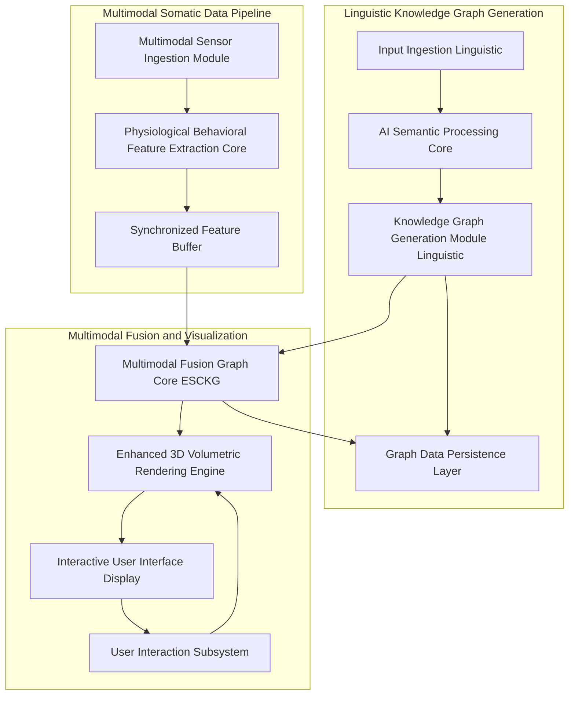
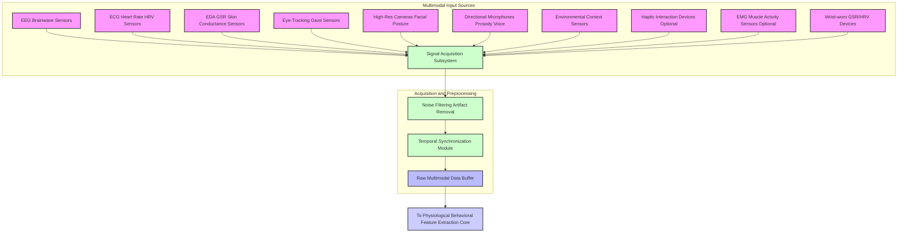
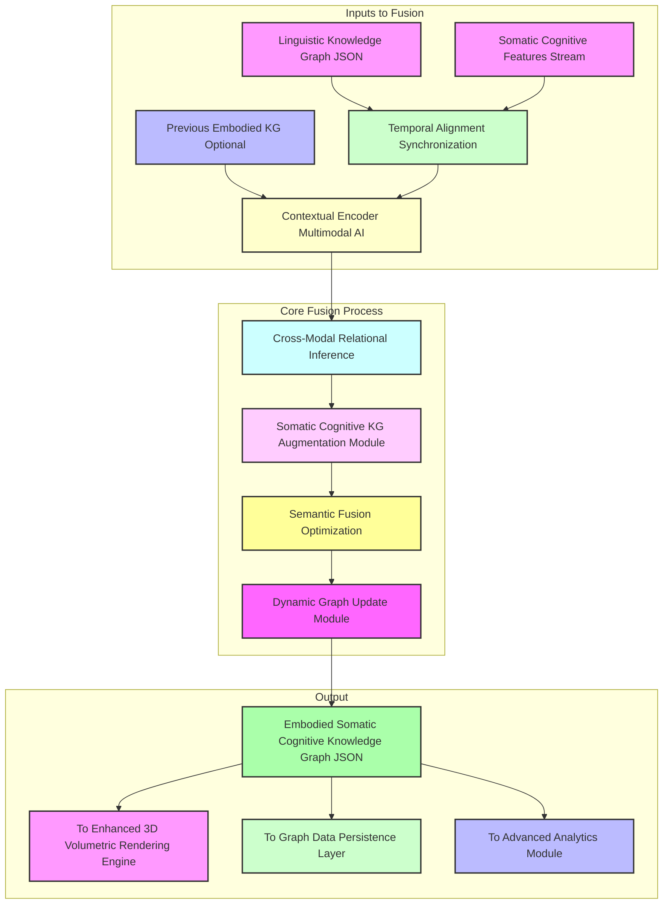
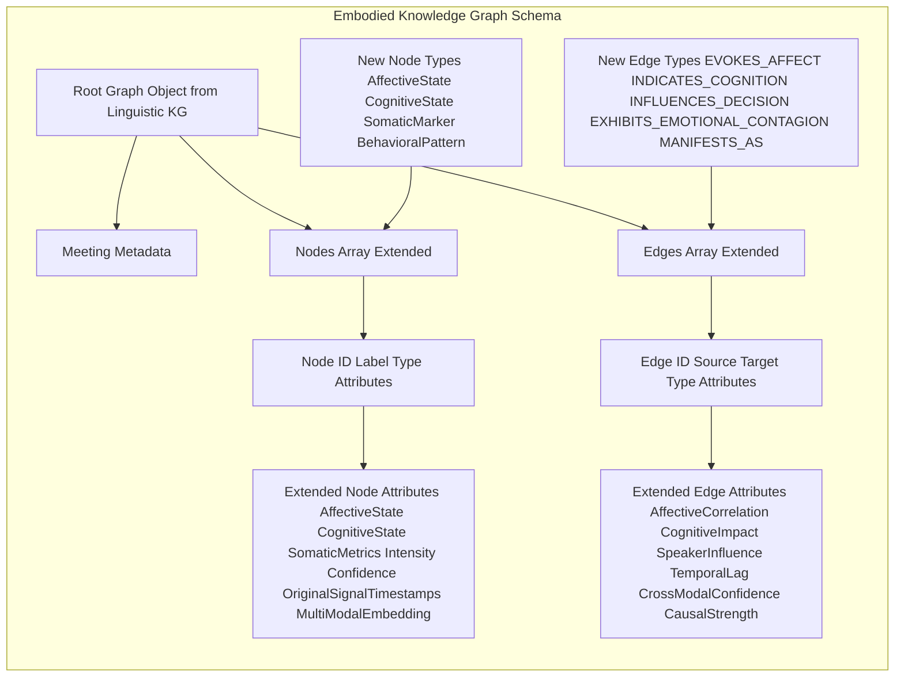
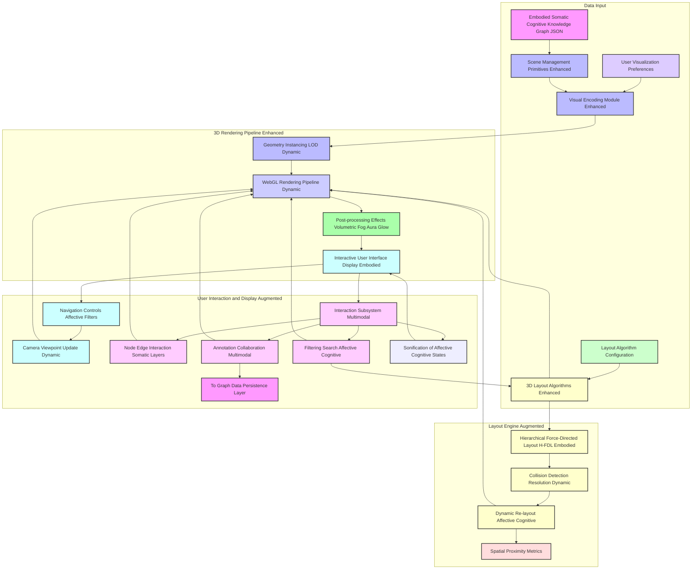
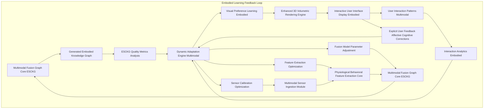

**Title of Invention:** A System and Method for Multimodal Somatic-Cognitive Graph Integration and Semantic Fusion of Discursive Knowledge with Real-time Human Physiological and Behavioral Data for Embodied Affective and Cognitive State Reconstruction in Dynamic Social Contexts

**Abstract:**
This invention presents a paradigm-shifting system and associated methodologies for transcending the limitations of purely linguistic discourse analysis by incorporating real-time, multi-modal human physiological and behavioral data. Building upon advanced knowledge graph generation from temporal linguistic artifacts, the system introduces a sophisticated Multimodal Fusion Graph Core. This core semantically integrates and fuses the linguistic knowledge graph with data streams derived from biometric sensors (e.g., EEG, ECG, EDA, eye-tracking) and behavioral analytics (e.g., facial expressions, prosody, gaze patterns). Leveraging specialized deep learning models and contextual AI, the system rigorously extracts and annotates affective states, cognitive loads, engagement levels, and inter-personal dynamics from these physiological and behavioral signals. The culmination is an Embodied Somatic-Cognitive Knowledge Graph ESCKG, a richly attributed, multi-dimensional representation where linguistic concepts, decisions, and actions are explicitly linked to the embodied cognitive and emotional states of participants during discourse. This ESCKG is then rendered as an enhanced, interactive 3D volumetric visualization, offering an unprecedented, holistic, and spatially augmented understanding of not just *what* was said, but *how* it was felt, perceived, and cognitively processed, thereby enabling profound insights into collaborative efficacy, emotional resonance, and decision-making integrity in dynamic social contexts.

**Background of the Invention:**
The preceding invention, "A System and Method for Semantic-Topological Reconstruction and Volumetric Visualization of Discursive Knowledge Graphs from Temporal Linguistic Artifacts," significantly advanced the comprehension of human discourse by transforming linear text into navigable 3D knowledge graphs. However, human communication is intrinsically multi-modal and deeply embodied. Purely linguistic analysis, no matter how sophisticated, inherently provides an incomplete understanding, as it overlooks the profound influence of non-verbal cues, physiological responses, and implicit behavioral signals that convey sentiment, cognitive effort, engagement, deception, or agreement. Traditional methods of analyzing meetings or collaborative sessions typically rely solely on transcribed words, missing critical layers of information such as:
1.  **Affective Dynamics:** The emotional states of participants, their shifts, and how they propagate.
2.  **Cognitive Load:** The mental effort expended, moments of confusion, understanding, or focused attention.
3.  **Engagement Levels:** Whether participants are actively attentive or disengaged.
4.  **Interpersonal Synchrony:** The subtle mirroring or divergence in physiological responses that indicate rapport or tension.
Existing fragmented solutions might detect emotion from text or infer stress from heart rate variability in isolation. However, a critical exigency remains for a comprehensive, integrated system capable of: (a) acquiring heterogeneous real-time physiological and behavioral data; (b) robustly extracting meaningful affective and cognitive features; and (c) semantically fusing these embodied insights with the structured linguistic knowledge graph to produce a holistic, multi-dimensional model of discourse that is both rich in content and profound in context. Without such integration, the true, embodied fabric of human interaction remains largely uncaptured, leading to suboptimal insights into team dynamics, decision quality, and overall communication effectiveness.

**Brief Summary of the Invention:**
The present invention pioneers a revolutionary integration framework that elevates discourse analysis to an embodied, somatic-cognitive level. At its core, the system ingests the structured linguistic knowledge graph generated by an advanced AI processing core (as described in our previous invention) and simultaneously acquires multi-modal physiological and behavioral data streams from meeting participants. These real-time streams, encompassing data from wearables (e.g., EEG, ECG, EDA), cameras (e.g., facial expressions, gaze), and microphones (e.g., prosody), are channeled through a dedicated Physiological and Behavioral Feature Extraction Core. This core applies state-of-the-art signal processing, computer vision, and machine listening techniques to robustly identify and quantify an array of somatic markers, including heart rate variability, galvanic skin response, brainwave patterns indicative of cognitive load or attention, micro-facial expressions, gaze direction, and vocal emotional prosody. Subsequently, a novel Multimodal Fusion Graph Core performs a precise temporal alignment and semantic fusion. This fusion dynamically augments the linguistic knowledge graph with new nodes representing inferred affective and cognitive states (e.g., "High Stress", "Focused Attention", "Agreement"), and new edges quantifying their influence on, or correlation with, linguistic entities, decisions, or other participants' states. The output is an Embodied Somatic-Cognitive Knowledge Graph ESCKG, a unified, richly attributed graph offering a holistic representation of the meeting's intellectual and emotional landscape. This ESCKG is then presented via an enhanced 3D volumetric rendering engine, which dynamically visualizes these embodied dimensions through sophisticated visual encodings such as real-time node animations, aura effects, dynamic environmental cues, and participant-specific somatic overlays, enabling users to intuitively navigate and comprehend the multi-layered cognitive and affective substratum of human discourse.

**Detailed Description of the Invention:**

The present invention meticulously details a comprehensive system and methodology for the integration and semantic fusion of linguistic knowledge graphs with real-time, multi-modal human physiological and behavioral data, culminating in an Embodied Somatic-Cognitive Knowledge Graph ESCKG and its immersive visualization.

### 1. System Architecture Overview - Embodied Somatic-Cognitive Integration

Building upon the robust framework of the Semantic-Topological Reconstruction System, this invention introduces new modules for multimodal data acquisition, physiological and behavioral analysis, and a sophisticated fusion core, transforming the understanding of discourse into an embodied context.



**Description of New and Augmented Architectural Components:**

*   **S_MM_INGEST. Multimodal Sensor Ingestion Module:** Captures diverse real-time physiological and behavioral data streams. This module is responsible for the initial data acquisition from a heterogeneous array of sensors, ensuring robustness and reliability.
*   **S_FEAT_EXTRACT. Physiological Behavioral Feature Extraction Core:** Processes raw sensor data into meaningful affective and cognitive features. This core employs advanced signal processing and machine learning models to transform noisy sensor readings into interpretable psychological markers.
*   **SYNCH_BUFFER. Synchronized Feature Buffer:** Temporally aligns and stores multimodal features for fusion. This buffer is critical for maintaining temporal coherence across disparate data streams, enabling precise correlation and fusion.
*   **FUSION_CORE. Multimodal Fusion Graph Core ESCKG:** The intelligent heart, performing semantic fusion of linguistic and somatic-cognitive data to generate the Embodied Somatic-Cognitive Knowledge Graph. This core leverages state-of-the-art AI to derive complex cross-modal relationships.
*   **E_REND. Enhanced 3D Volumetric Rendering Engine:** Augmented version of the rendering engine, capable of visualizing embodied dimensions. It extends the spatial and visual encoding capabilities to represent multi-layered affective and cognitive information.
*   **G_USER_INT. User Interaction Subsystem (Augmented):** Interprets user inputs for navigating and querying embodied dimensions. This subsystem provides intuitive controls for exploring the rich, multi-dimensional ESCKG.

### 1.1. Detailed Data Flow and Component Interaction

The system operates as a real-time pipeline, ensuring low-latency processing and dynamic graph updates.

```mermaid
graph LR
    SUBGRAPH_A[Linguistic Processing Pipeline]
    SUBGRAPH_B[Somatic-Cognitive Processing Pipeline]
    SUBGRAPH_C[Multimodal Fusion and Output]

    A_LKG_Input[Linguistic Inputs] --> LKG_Gen[Linguistic KG Generation Module];
    LKG_Gen --> LKG_Data[Linguistic KG (LKG)];
    LKG_Data --> M_F_CORE[Multimodal Fusion Graph Core];
    M_F_CORE --> E_REND[Enhanced 3D Volumetric Rendering];
    E_REND --> F_UI[Interactive User Interface];
    F_UI --> G_USER_INT[User Interaction];
    G_USER_INT --> E_REND;

    S_MM_Ingest_Input[Raw Multimodal Sensor Data] --> S_MM_Ingest[Multimodal Sensor Ingestion Module];
    S_MM_Ingest --> S_FEAT_EXTRACT[Physiological Behavioral Feature Extraction Core];
    S_FEAT_EXTRACT --> SYNCH_BUFFER[Synchronized Feature Buffer];
    SYNCH_BUFFER --> M_F_CORE;

    M_F_CORE --> ESCKG_Out[Embodied Somatic-Cognitive KG (ESCKG)];
    ESCKG_Out --> D_PERSIST[Graph Data Persistence Layer];

    LKG_Gen --> SUBGRAPH_A;
    LKG_Data --> SUBGRAPH_A;
    S_MM_Ingest --> SUBGRAPH_B;
    S_FEAT_EXTRACT --> SUBGRAPH_B;
    SYNCH_BUFFER --> SUBGRAPH_B;
    M_F_CORE --> SUBGRAPH_C;
    ESCKG_Out --> SUBGRAPH_C;
    E_REND --> SUBGRAPH_C;
    F_UI --> SUBGRAPH_C;
    G_USER_INT --> SUBGRAPH_C;
```

**Mathematical Representation of System Interactions:**

Let `L(t)` be the linguistic input stream at time `t`, and `Phi(t)` be the raw multimodal physiological and behavioral data stream at time `t`.

1.  **Linguistic Knowledge Graph Generation:**
    The AI Semantic Processing Core `A_Core` transforms `L(t)` into linguistic events `E_L(t)` and relations `R_L(t)`, which are then structured into a Linguistic Knowledge Graph `Gamma_L(t)`.
    `Gamma_L(t) = A_Core(L(t))`
    `Gamma_L(t) = (N_L(t), E_L(t))` where `N_L(t)` are linguistic nodes and `E_L(t)` are linguistic edges.

2.  **Multimodal Somatic Data Pipeline:**
    The Multimodal Sensor Ingestion Module `S_Ingest` acquires and preprocesses `Phi(t)`.
    `Phi_processed(t) = S_Ingest(Phi(t))`
    The Physiological Behavioral Feature Extraction Core `S_Extract` extracts features `Z(t)` for each participant `p`.
    `Z_p(t) = S_Extract(Phi_processed_p(t))`
    These features are then aggregated and synchronized into `Z_synch(t)` by `SYNCH_BUFFER`.

3.  **Multimodal Fusion Graph Core:**
    The `FUSION_CORE` integrates `Gamma_L(t)` and `Z_synch(t)` to produce the Embodied Somatic-Cognitive Knowledge Graph `Gamma_ESCKG(t)`.
    `Gamma_ESCKG(t) = FUSION_CORE(Gamma_L(t), Z_synch(t))`
    `Gamma_ESCKG(t) = (N_ESCKG(t), E_ESCKG(t))` where `N_ESCKG(t)` and `E_ESCKG(t)` include linguistic, somatic, and cross-modal elements.

4.  **Enhanced 3D Volumetric Rendering:**
    The `E_REND` maps `Gamma_ESCKG(t)` to a visual representation `V(t)`.
    `V(t) = E_REND(Gamma_ESCKG(t))`

### 2. Multimodal Sensor Ingestion Module

This module is specifically designed for the real-time acquisition and initial preprocessing of diverse human physiological and behavioral signals from multiple participants in a synchronized manner.



*   **2.1. Signal Acquisition Subsystem (SAQ):**
    *   **Wearable Sensors:** Integrates with medical-grade or research-grade EEG (electroencephalography), ECG (electrocardiography), EDA (electrodermal activity, also known as GSR galvanic skin response), and eye-tracking devices. Captures raw physiological signals at high sampling rates (e.g., EEG at 250-1000 Hz, ECG at 500-1000 Hz, EDA at 4-100 Hz). Additional optional sensors include Electromyography (EMG) for muscle activity, capturing micro-gestures and tension at 1000-2000 Hz.
    *   **Computer Vision Sensors:** Utilizes high-resolution cameras (e.g., 30-60 FPS) to capture participant facial expressions, head pose, gaze direction, posture, gestures, and overall body language. Employing privacy-preserving techniques like skeletal tracking and facial landmark detection instead of raw video storage. This involves `N_P` cameras for `N_P` participants.
    *   **Acoustic Sensors:** Employs directional microphones (e.g., 44.1 kHz sampling rate) for capturing individual speech, allowing for detailed prosodic analysis (pitch, intensity, speaking rate, voice quality) independent of lexical content.
    *   **Environmental Context Sensors:** Optional sensors to capture ambient conditions such as temperature, lighting, and noise levels, which can influence cognitive and affective states (e.g., ambient light sensors, thermometers, sound level meters).
    *   **Haptic Interaction Devices:** For scenarios involving physical interaction, haptic devices can provide data on touch pressure, force, and interaction patterns (e.g., stylus pressure, VR controller haptics).

*   **2.2. Noise Filtering and Artifact Removal (NOISE_FILT):**
    *   Applies advanced signal processing algorithms, e.g., independent component analysis (ICA) for EEG, wavelet denoising for ECG, adaptive Kalman filters for sensor fusion, to remove noise and motion artifacts inherent in real-time physiological data.
    *   For an input signal `X(t)`, the denoised signal `X_filtered(t)` is given by:
        `X_filtered(t) = Denoise(X(t), H)` where `H` is a set of filter parameters or learned artifact models.
    *   For EEG, this includes power line noise removal, eye blink artifact rejection, and muscle artifact suppression.
        `EEG_clean(t) = ICA(EEG_raw(t)) - BlinkArtifacts - MuscleArtifacts`
    *   For ECG, baseline wander removal and motion artifact suppression using adaptive filters.
        `ECG_clean(t) = ButterworthFilter(ECG_raw(t), f_low, f_high) - BaselineCorrection`
    *   For camera data, robust background subtraction and motion compensation.
        `Frame_stabilized(t) = Stabilize(Frame_raw(t))`

*   **2.3. Temporal Synchronization Module (TIME_SYNC):**
    *   Critically ensures that all incoming multi-modal data streams are precisely synchronized to a common timestamp, essential for accurate fusion with linguistic data. Utilizes synchronized clock signals or post-hoc alignment algorithms, e.g., cross-correlation of shared event markers.
    *   Let `S_k(t_k)` be the raw data from sensor `k` sampled at its own timestamp `t_k`. The goal is to obtain `S'_k(T)` for a common time base `T`.
    *   `T_global = max_k(T_start_k)` (global start time)
    *   `S'_k(T) = Interpolate(S_k(t_k), T)`
    *   Synchronization error `E_sync = sum_k (T_common - T_k)^2` is minimized across all streams.
    *   For event-based synchronization, if `E_common` is a shared event marker:
        `Offset_k = T_common_event - T_k_event`
        `T_k_aligned = T_k + Offset_k`

*   **Output:** Cleaned, synchronized raw multimodal data streams, attributed to specific participants and timestamps, stored in `DATA_BUFFER`.
    `D_buffer(t) = { (Participant_p, {EEG_p(t), ECG_p(t), EDA_p(t), ET_p(t), Cam_p(t), Mic_p(t), ...}) | for each participant p }`

### 3. Physiological and Behavioral Feature Extraction Core

This module transforms the raw, synchronized multimodal data into meaningful, semantically interpretable features indicative of affective and cognitive states.

```mermaid
graph TD
    subgraph Multimodal Raw Data Input
        MM_RAW_DATA[Raw Multimodal Data Buffer] --> P_PROC[Physiological Signal Processing];
        MM_RAW_DATA --> B_PROC[Behavioral Pattern Analysis];
    end

    subgraph Physiological Processing
        P_PROC --> HRV_EXT[Heart Rate Variability HRV Extraction];
        P_PROC --> EDA_EXT[Electrodermal Activity EDA Feature Extraction];
        P_PROC --> EEG_EXT[EEG Brainwave Frequency Band Analysis];
        P_PROC --> EYE_MET[Eye-Tracking Metrics Gaze Pupil];
        P_PROC --> EMG_KIN[EMG Kinesiological Analysis Optional];
    end

    subgraph Behavioral Processing
        B_PROC --> FACE_ANA[Facial Expression Analysis Microexpressions];
        B_PROC --> BODY_POS[Body Pose Gesture Analysis];
        B_PROC --> PROS_ANA[Prosodic Voice Tone Analysis];
        B_PROC --> INTER_SYNCH_ANALYSIS[Inter-personal Synchrony Analysis];
        B_PROC --> HAPTIC_INTERACTION_ANALYSIS[Haptic Interaction Analysis];
    end

    subgraph Feature Synthesis and Labeling
        HRV_EXT --> F_SYNTH[Feature Synthesis Classification];
        EDA_EXT --> F_SYNTH;
        EEG_EXT --> F_SYNTH;
        EYE_MET --> F_SYNTH;
        EMG_KIN --> F_SYNTH;
        FACE_ANA --> F_SYNTH;
        BODY_POS --> F_SYNTH;
        PROS_ANA --> F_SYNTH;
        INTER_SYNCH_ANALYSIS --> F_SYNTH;
        HAPTIC_INTERACTION_ANALYSIS --> F_SYNTH;
    end

    F_SYNTH --> TO_FUSION_CORE[To Multimodal Fusion Graph Core];

    style MM_RAW_DATA fill:#f9f,stroke:#333,stroke-width:2px
    style P_PROC fill:#cfc,stroke:#333,stroke-width:2px
    style B_PROC fill:#cfc,stroke:#333,stroke-width:2px

    style HRV_EXT fill:#bbf,stroke:#333,stroke-width:2px
    style EDA_EXT fill:#bbf,stroke:#333,stroke-width:2px
    style EEG_EXT fill:#bbf,stroke:#333,stroke-width:2px
    style EYE_MET fill:#bbf,stroke:#333,stroke-width:2px
    style EMG_KIN fill:#bbf,stroke:#333,stroke-width:2px
    style FACE_ANA fill:#bbf,stroke:#333,stroke-width:2px
    style BODY_POS fill:#bbf,stroke:#333,stroke-width:2px
    style PROS_ANA fill:#bbf,stroke:#333,stroke-width:2px
    style INTER_SYNCH_ANALYSIS fill:#bbf,stroke:#333,stroke-width:2px
    style HAPTIC_INTERACTION_ANALYSIS fill:#bbf,stroke:#333,stroke-width:2px

    style F_SYNTH fill:#ccf,stroke:#333,stroke-width:2px
    style TO_FUSION_CORE fill:#ffc,stroke:#333,stroke-width:2px
```



*   **3.1. Physiological Signal Processing:**
    *   **Heart Rate Variability (HRV) Extraction (HRV_EXT):** Derives time-domain, frequency-domain, and non-linear HRV features from ECG signals, indicative of sympathetic and parasympathetic nervous system activity, stress, and emotional arousal.
        *   NN intervals `NN_i = R_peak_i+1 - R_peak_i`
        *   SDNN (Standard Deviation of NN intervals): `SDNN = sqrt(1/(N-1) * sum((NN_i - mean(NN))^2))`
        *   RMSSD (Root Mean Square of Successive Differences): `RMSSD = sqrt(1/(N-1) * sum((NN_i+1 - NN_i)^2))`
        *   LF/HF Ratio (Low Frequency / High Frequency Power): `LF/HF = P_LF / P_HF` (Frequency domain analysis using FFT or Welch periodogram on NN intervals).
    *   **Electrodermal Activity (EDA) Feature Extraction (EDA_EXT):** Extracts features such as skin conductance level (SCL), skin conductance responses (SCR), and their amplitudes/latencies from EDA data, correlated with emotional intensity and cognitive effort.
        *   `SCL(t) = baseline_component(EDA(t))`
        *   `SCR(t) = phasic_component(EDA(t))`
        *   `SCR_amplitude = peak(SCR(t))`
        *   `SCR_latency = time_to_peak(SCR(t))`
    *   **EEG Brainwave Frequency Band Analysis (EEG_EXT):** Processes EEG data to quantify power in different frequency bands (alpha, beta, theta, gamma, delta), indicative of cognitive load, attention, alertness, and relaxation. Employs techniques like source localization for deeper insights.
        *   Power Spectral Density (PSD) for band `f`: `PSD_f = Integral_f ( |FFT(EEG(t))|^2 ) / Delta_f`
        *   `Delta (0.5-4 Hz)`, `Theta (4-8 Hz)`, `Alpha (8-13 Hz)`, `Beta (13-30 Hz)`, `Gamma (30-100 Hz)`
        *   Frontal Alpha Asymmetry: `FAA = log(Alpha_Right) - log(Alpha_Left)` (correlated with approach/withdrawal motivation).
    *   **Eye-Tracking Metrics (EYE_MET):** Calculates metrics such as gaze duration, saccadic eye movements, pupil dilation, and blinks, providing insights into attention, cognitive effort, interest, and confusion.
        *   `Pupil_Dilation(t)` (indicator of cognitive load/arousal)
        *   `Gaze_Duration(t)` on specific AOIs (Areas of Interest)
        *   `Saccade_Amplitude`, `Saccade_Velocity`
        *   `Blink_Rate(t)` (indicator of fatigue/attention)
    *   **EMG Kinesiological Analysis (EMG_KIN):** Extracts features related to muscle tension, micro-expressions, and specific gestures from EMG signals.
        *   `RMS_EMG = sqrt(1/N * sum(EMG_i^2))` (Root Mean Square, indicator of muscle activity).
        *   `Mean_Frequency(EMG)` or `Median_Frequency(EMG)` for fatigue assessment.

*   **3.2. Behavioral Pattern Analysis:**
    *   **Facial Expression Analysis (FACE_ANA):** Employs computer vision models, e.g., Convolutional Neural Networks (CNNs), to detect basic emotions (joy, sadness, anger, fear, surprise, disgust) and Action Units (AUs) from facial landmarks, even micro-expressions.
        *   Facial Landmarks `L = { (x_k, y_k) | k=1...N_L }`
        *   AU Intensity `I_AU_i(t) = CNN_AU(L(t))`
        *   Emotion Probability `P_Emotion(t) = CNN_Emotion(I_AU_i(t))`
    *   **Body Pose and Gesture Analysis (BODY_POS):** Utilizes skeletal tracking to identify postures indicative of engagement, discomfort, agreement, or disagreement, and analyzes gestures for emphasis or communication intent.
        *   Keypoint extraction `K = { (x_j, y_j, z_j) | j=1...N_K }`
        *   Posture classification `C_Posture(K(t)) = RandomForest(K(t))`
        *   Gesture recognition `C_Gesture(K(t), K(t-dt)) = LSTM(K_sequence)`
    *   **Prosodic Voice Tone Analysis (PROS_ANA):** Extracts acoustic features from speech, e.g., pitch, intensity, jitter, shimmer, speaking rate, and applies machine learning models to classify emotional prosody (happy, sad, angry, neutral) or to detect cognitive states like uncertainty or assertiveness.
        *   `Pitch_F0(t) = AutoCorrelation(Speech_Signal(t))`
        *   `Intensity(t) = Energy(Speech_Signal(t))`
        *   `Jitter = 1/(N-1) * sum(|F0_i+1 - F0_i| / F0_i)`
        *   `Shimmer = 1/(N-1) * sum(|Amp_i+1 - Amp_i| / Amp_i)`
        *   Prosody Emotion `P_Prosody_Emotion(t) = SVM(Pitch, Intensity, Jitter, Shimmer)`
    *   **Inter-personal Synchrony Analysis (INTER_SYNCH_ANALYSIS):** Quantifies alignment or divergence in physiological and behavioral signals between participants, indicating rapport, tension, or shared attention.
        *   `Sync_pq(t) = CrossCorrelation(Feature_p(t), Feature_q(t))`
        *   `Emotional_Contagion_pq(t) = GrangerCausality(Affect_p(t), Affect_q(t))`
    *   **Haptic Interaction Analysis (HAPTIC_INTERACTION_ANALYSIS):** Features derived from haptic devices such as force, pressure, and tactile interaction duration.
        *   `Force_Magnitude(t)`, `Pressure_Distribution(t)`
        *   `Interaction_Duration_haptic(t)`

*   **3.3. Feature Synthesis and Classification (F_SYNTH):**
    *   Applies deep learning classifiers (e.g., LSTMs, Transformers, multimodal fusion networks) or ensemble models to the extracted features to infer higher-level affective states (e.g., `Joy`, `Stress`, `Frustration`, `Engagement`, `Boredom`) and cognitive states (e.g., `Focused`, `Confused`, `Decisive`, `Attentive`) for each participant, at granular temporal resolutions.
    *   For a participant `p` at time `t`, the inferred state `S_p(t)` is a vector:
        `S_p(t) = Classifier( [zeta_p_HRV(t), zeta_p_EDA(t), ..., zeta_p_Pros(t)] )`
        Where `zeta` are the individual feature vectors.
    *   The classifier `C` can be represented as a neural network:
        `P_state(t) = softmax( W_c * Concat(zeta_p(t)) + b_c )`
    *   Confidence score `conf(S_p(t)) = max(P_state(t))`

*   **Output:** A stream of timestamped, participant-attributed vectors of inferred affective and cognitive states and their confidence scores.
    `Output_Features_Stream = { (timestamp, participant_id, {Affective_State, Cognitive_State, Conf_Affect, Conf_Cognitive, ...}) }`

### 4. Multimodal Fusion Graph Core ESCKG Generation

This is the central innovation, responsible for the semantic integration and fusion of the linguistic knowledge graph (from the previous invention) with the newly extracted physiological and behavioral insights.



*   **4.1. Temporal Alignment and Synchronization (TEMP_ALIGN):**
    *   This sub-module ensures precise synchronization between the linguistic graph's entity/event timestamps and the incoming somatic-cognitive feature timestamps. It may involve interpolating somatic data to match linguistic events or aggregating somatic data over linguistic utterance durations.
    *   Let `T_L` be the timestamp for linguistic event `e_L` and `T_S` for somatic feature `f_S`.
    *   `Matching(e_L, f_S)` if `|T_L - T_S| <= Delta_T`, where `Delta_T` is a predefined temporal window.
    *   Somatic feature vector for a linguistic event: `Z_event = Aggregate(Z_p(t) | t in [T_L_start, T_L_end])`
        `Z_event = mean(Z_p(t))` or `max(Z_p(t))` depending on feature type.

*   **4.2. Contextual Encoder Multimodal AI (CONTEXT_ENC):**
    *   Utilizes a multimodal transformer architecture, for example, a cross-modal attention mechanism, to jointly process linguistic embeddings (from the CSTFN of previous invention) and somatic-cognitive feature vectors. This creates a unified contextual embedding space where linguistic and embodied signals are semantically fused.
    *   Input: Linguistic embedding `E_L` and somatic embedding `E_S` for a given time window.
    *   `E_Multimodal = Transformer( [E_L; E_S] )`
    *   Cross-attention mechanism: `Attention(Q, K, V) = softmax(Q K^T / sqrt(d_k)) V`
        `Q_L = E_L W_Q_L`, `K_S = E_S W_K_S`, `V_S = E_S W_V_S`
        `E_L_to_S = Attention(Q_L, K_S, V_S)`
        `Q_S = E_S W_Q_S`, `K_L = E_L W_K_L`, `V_L = E_L W_V_L`
        `E_S_to_L = Attention(Q_S, K_L, V_L)`
        The final multimodal embedding `H_MM` combines `E_L_to_S` and `E_S_to_L`:
        `H_MM = F_fusion(E_L, E_S, E_L_to_S, E_S_to_L)`
    *   This encoder learns how specific words or concepts correlate with particular physiological responses and vice versa, in context.

*   **4.3. Cross-Modal Relational Inference (CROSS_MOD_INF):**
    *   Based on the joint multimodal embeddings `H_MM`, this module infers new types of relationships that span linguistic and embodied dimensions.
    *   **Linguistic-Somatic Links:** E.g., `Concept 'Budget Cuts' EVOKES_AFFECT 'High Stress' in 'Speaker A'`.
        `P(EVOKES_AFFECT | Concept_Emb, AffectiveState_Emb, Speaker_Emb) = Sigmoid(f(Concept_Emb, AffectiveState_Emb, Speaker_Emb))`
    *   **Somatic-Somatic Links:** E.g., `Speaker A 'High Stress' TRANSFERS_TO 'Speaker B' 'Elevated Stress'`.
        `P(TRANSFERS_TO | AffectA_Emb, AffectB_Emb, SpeakerA_Emb, SpeakerB_Emb, TimeLag) = Sigmoid(g(...))`
    *   **Behavioral-Cognitive Links:** E.g., `Speaker C 'Decreased Gaze' INDICATES_COGNITION 'Disengagement'`.
    *   **Decision-Affect Links:** E.g., `Decision 'Project Green Light' IS_ASSOCIATED_WITH 'Collective Excitement'`.
    *   This inference is typically performed by a relational prediction model, often a Graph Neural Network (GNN) operating on `H_MM`.
        `E_Rel_infer = GNN(H_MM, Initial_Edges)`

*   **4.4. Somatic-Cognitive KG Augmentation Module (SOM_KG_GEN):**
    *   Dynamically introduces new node types into the knowledge graph:
        *   `AffectiveState`: E.g., `Engagement`, `Frustration`, `Agreement`, `Disagreement`, `Excitement`, `Boredom`.
        *   `CognitiveState`: E.g., `Focus`, `Confusion`, `CognitiveLoad`, `DecisionUncertainty`.
        *   `SomaticMarker`: Direct physiological observations, e.g., `HRVDrop`, `EDASpike`.
    *   Augments existing `Speaker` nodes with real-time `AffectiveState` and `CognitiveState` attributes.
    *   Introduces new edge types reflecting the inferred cross-modal relationships, such as `EVOKES_AFFECT`, `INDICATES_COGNITION`, `IS_MANIFESTED_BY`, `INFLUENCES_DECISION`, `EXHIBITS_SYNCHRONY_WITH`, `TRIGGERS_RESPONSE`, `EXPRESSES_INTENTION`.
    *   For a linguistic node `n_L`, its attribute vector `alpha_L` is updated to `alpha'_L = [alpha_L, affect_L, cogn_L]`.
    *   New somatic node `n_S = (id_S, label_S, type_S, {participant_id, timestamp, intensity, confidence, source_metrics})`

*   **4.5. Semantic Fusion Optimization (SEM_FUSION_OPT):**
    *   Applies graph refinement techniques, such as knowledge graph completion algorithms on multimodal embeddings, to ensure consistency and infer latent relationships. Uses dynamic graph convolutional networks (GCNs) or graph attention networks (GATs) over the multimodal graph to propagate and refine semantic and affective states across the graph.
    *   Graph Convolutional Layer `H_l+1 = sigma(A H_l W_l)` where `A` is the adjacency matrix of the `Embodied Gamma`.
    *   Graph Attention Layer `H_l+1_i = sigma(sum_{j in N(i)} alpha_ij W H_l_j)` where `alpha_ij` are attention coefficients.
    *   Consistency checking: If `(A EVOKES_AFFECT B)` and `(B IS_MANIFESTED_BY C)`, infer `(A MAY_IMPLY C)`.
    *   Optimization objective: `L_fusion = L_node_classification + L_edge_prediction + L_consistency`

*   **4.6. Dynamic Graph Update Module (DYN_GRAPH_UPDATE_MOD):**
    *   Manages the real-time incremental updates to the ESCKG, ensuring efficiency and responsiveness. New nodes and edges are added, and existing attributes are updated based on the continuous stream of linguistic and somatic-cognitive data.
    *   Graph update operation: `Gamma_ESCKG(t+1) = Update(Gamma_ESCKG(t), New_Nodes(t), New_Edges(t), Updated_Attributes(t))`

*   **Output:** The comprehensive Embodied Somatic-Cognitive Knowledge Graph ESCKG, a structured JSON object containing all linguistic, affective, and cognitive entities and their interconnections.
    `ESCKG = (N_ESCKG, E_ESCKG)`

### 5. Embodied Somatic-Cognitive Knowledge Graph ESCKG Data Structure

The output from the Multimodal Fusion Graph Core is an extended JSON schema for a directed, attributed multigraph, now incorporating embodied dimensions.



```json
{
  "graph_id": "unique_meeting_session_id_ABC456",
  "meeting_metadata": {
    "title": "Quarterly Strategy Review Embodied Analysis",
    "date": "2023-11-20T14:00:00Z",
    "duration_minutes": 120,
    "participants": [
      {"id": "spk_0", "name": "Alice Johnson", "role": "CEO", "somatic_profile": {"avg_stress": 0.6, "avg_engagement": 0.8, "mood_trend": "stable_positive"}},
      {"id": "spk_1", "name": "Bob Williams", "role": "CTO", "somatic_profile": {"avg_stress": 0.4, "avg_engagement": 0.9, "mood_trend": "increasing_focus"}}
    ],
    "main_topics": ["Market Expansion", "Product Roadmap", "Resource Allocation"],
    "overall_affective_summary": {"peak_stress_time": "2023-11-20T14:45:00Z", "avg_engagement_level": "High", "dominant_collective_emotion": "purposeful"}
  },
  "nodes": [
    // Existing Linguistic Nodes (as per 012_holographic_meeting_scribe.md)
    {
      "id": "concept_001",
      "label": "New Market Entry Strategy",
      "type": "Concept",
      "speaker_attribution": ["spk_0"],
      "timestamp_context": {"start": 300000, "end": 450000}, // milliseconds
      "sentiment": "positive",
      "confidence": 0.95,
      "summary_snippet": "Discussion about expanding into the APAC market with aggressive growth targets.",
      "level": 0,
      "original_utterance_ids": ["utt_012", "utt_015"],
      "associated_affect_linguistic_model": "excitement",
      "cognitive_load_avg_linguistic_model": 0.7,
      "multimodal_embedding": [0.1, 0.2, ..., 0.9] // Dense embedding from Contextual Encoder
    },
    {
      "id": "decision_002",
      "label": "Approve APAC Market Entry",
      "type": "Decision",
      "speaker_attribution": ["spk_0", "spk_1"],
      "timestamp_context": {"start": 600000, "end": 620000},
      "sentiment": "neutral",
      "confidence": 0.98,
      "summary_snippet": "Consensus reached to proceed with market expansion as planned.",
      "status": "Finalized",
      "original_utterance_ids": ["utt_020"],
      "collective_affect_peak_inferred": "consensus_satisfaction",
      "decision_confidence_somatic_influence": 0.9,
      "multimodal_embedding": [0.2, 0.3, ..., 0.8]
    },
    // New Somatic-Cognitive Nodes
    {
      "id": "affect_004",
      "label": "Spk0 High Stress APAC Budget",
      "type": "AffectiveState",
      "speaker_attribution": ["spk_0"],
      "timestamp_context": {"start": 440000, "end": 480000},
      "intensity": 0.85,
      "confidence": 0.92,
      "somatic_source_metrics": {"hrv_sdnn": 35, "eda_scr_count": 5, "facial_au_4_intensity": 0.7, "voice_pitch_var": 0.15},
      "original_signal_timestamps": ["sig_t_440", "sig_t_450"],
      "inferred_emotion_category": "stress",
      "multimodal_embedding": [0.5, 0.1, ..., 0.6]
    },
    {
      "id": "cognition_005",
      "label": "Spk1 High Focus Product Roadmap",
      "type": "CognitiveState",
      "speaker_attribution": ["spk_1"],
      "timestamp_context": {"start": 700000, "end": 780000},
      "intensity": 0.90,
      "confidence": 0.95,
      "somatic_source_metrics": {"eeg_beta_power_frontal": 0.6, "pupil_dilation_avg": 3.2, "gaze_fixation_stability": 0.9},
      "original_signal_timestamps": ["sig_t_700", "sig_t_750"],
      "inferred_cognitive_category": "focused_attention",
      "multimodal_embedding": [0.3, 0.7, ..., 0.4]
    },
    {
      "id": "behavior_006",
      "label": "Spk0 Avoidant Gaze Conflict",
      "type": "BehavioralPattern",
      "speaker_attribution": ["spk_0"],
      "timestamp_context": {"start": 450000, "end": 470000},
      "intensity": 0.7,
      "confidence": 0.85,
      "somatic_source_metrics": {"gaze_direction_to_spk1": 0.1, "head_pose_away": 0.3},
      "inferred_behavioral_category": "gaze_aversion",
      "multimodal_embedding": [0.4, 0.2, ..., 0.7]
    }
    // ... further nodes
  ],
  "edges": [
    // Existing Linguistic Edges
    {
      "id": "edge_001",
      "source": "concept_001",
      "target": "decision_002",
      "type": "LEADS_TO",
      "speaker_attribution": [],
      "timestamp_context": {"start": 600000, "end": 620000},
      "confidence": 0.90,
      "summary_snippet": "The strategy discussion culminated in this decision.",
      "affective_impact_score": 0.7,
      "multimodal_embedding": [0.1, 0.8, ..., 0.2]
    },
    // New Cross-Modal Edges
    {
      "id": "edge_004",
      "source": "concept_001",
      "target": "affect_004",
      "type": "EVOKES_AFFECT",
      "speaker_attribution": ["spk_0"],
      "timestamp_context": {"start": 440000, "end": 480000},
      "confidence": 0.88,
      "cross_modal_inference_model_confidence": 0.91,
      "causal_strength": 0.8,
      "summary_snippet": "Discussion on market entry budget directly caused stress in Alice."
    },
    {
      "id": "edge_005",
      "source": "affect_004",
      "target": "cognition_005",
      "type": "INFLUENCES_COGNITION",
      "speaker_attribution": ["spk_0", "spk_1"],
      "timestamp_context": {"start": 480000, "end": 500000},
      "confidence": 0.75,
      "cross_modal_inference_model_confidence": 0.80,
      "causal_strength": 0.65,
      "summary_snippet": "Alice's stress led to a temporary dip in Bob's focus."
    },
    {
      "id": "edge_006",
      "source": "spk_0",
      "target": "spk_1",
      "type": "EXHIBITS_EMOTIONAL_CONTAGION",
      "timestamp_context": {"start": 460000, "end": 490000},
      "confidence": 0.80,
      "affect_type": "stress_propagation",
      "lag_ms": 1500, // Bob's stress response lagged Alice's by 1.5s
      "cross_modal_inference_model_confidence": 0.85
    },
    {
      "id": "edge_007",
      "source": "affect_004",
      "target": "behavior_006",
      "type": "MANIFESTS_AS",
      "speaker_attribution": ["spk_0"],
      "timestamp_context": {"start": 450000, "end": 470000},
      "confidence": 0.90,
      "summary_snippet": "Alice's stress manifested as avoidant gaze behavior.",
      "cross_modal_inference_model_confidence": 0.93
    }
    // ... further edges
  ]
}
```
**Formal Graph Definitions:**

Let `N_L` be the set of linguistic nodes, `N_S` the set of somatic-cognitive nodes.
`N_ESCKG = N_L U N_S`
Let `E_L` be the set of linguistic edges, `E_CMM` the set of cross-modal edges.
`E_ESCKG = E_L U E_CMM`

Node `n` in `N_ESCKG` has attributes `Attr(n) = (label, type, speaker_attribution, timestamp_context, multimodal_embedding, affect, cognition, somatic_metrics, confidence, ...)`
Edge `e` in `E_ESCKG` has attributes `Attr(e) = (source, target, type, confidence, temporal_lag, causal_strength, multimodal_embedding, ...)`

The Multimodal Embedding for a node `n_k` is `Emb(n_k) = H_MM(n_k)`.
The Multimodal Embedding for an edge `e_j` is `Emb(e_j) = H_MM(source_j, target_j, relation_type_j)`.

The graph `Embodied Gamma` is formally defined as a tuple `(V, E, A_V, A_E, M)` where:
*   `V = N_ESCKG` is the set of vertices.
*   `E = E_ESCKG` is the set of directed edges.
*   `A_V: V -> P(R^D_V)` is a function mapping each vertex to its attribute vector.
*   `A_E: E -> P(R^D_E)` is a function mapping each edge to its attribute vector.
*   `M` is the global meeting metadata.

### 6. Enhanced 3D Volumetric Rendering and Visualization

The 3D rendering engine is profoundly enhanced to graphically represent the new embodied dimensions of the ESCKG, offering an intuitive, multi-sensory experience.



*   **6.1. Visual Encoding Module Enhanced (VIS_ENC_E):**
    *   **Nodes:** Linguistic nodes are dynamically augmented. For example, a "Concept" node might display an "aura" or pulsating glow whose color `C_affect` and intensity `I_affect` reflect the real-time collective sentiment or cognitive load associated with its discussion.
        `C_affect(t) = ColorMap(Valence(t))`
        `I_affect(t) = Normalization(Arousal(t))`
        "Speaker" nodes can be represented by avatars whose facial expressions or body postures are animated in real-time to reflect their inferred affective/cognitive state. New "AffectiveState" and "CognitiveState" nodes have distinct geometries and color palettes.
        `Avatar_Facial_AU(t) = MorphTargetBlend(AU_Intensities(t))`
    *   **Edges:** Emotional contagion or influence edges might be represented by animated, directional flows or subtle "sparkle" effects indicating the strength `S_edge` and direction `Dir_edge` of the transfer. Edge thickness for "INFLUENCES_DECISION" edges could correlate with the confidence of the physiological basis for that influence.
        `Edge_Thickness = f(Confidence(edge))`
        `Flow_Speed = g(CausalStrength(edge))`
    *   **Environmental Cues:** The ambient lighting, fog density, or background particle effects within the 3D environment can dynamically shift to reflect the overall mood or energy level of the meeting, providing an implicit emotional context.
        `Ambient_Light_Color = ColorMap(Collective_Valence(t))`
        `Fog_Density = h(Collective_Arousal(t))`

*   **6.2. 3D Layout Algorithms Augmented (LA_E):**
    *   The `E_layout` function from the previous invention is extended to include forces influenced by affective and cognitive states. For example, nodes representing "High Stress" from different speakers might cluster spatially or exhibit specific oscillation patterns. Nodes related to "Focused Attention" might be drawn into a clearer, more prominent region of the graph. Temporal layout can now also consider periods of heightened cognitive activity or emotional intensity.
    *   The extended energy function `E_layout(P, Embodied Gamma)` is:
        `E_layout(P, Embodied Gamma) = sum_{k<l} (||P_k - P_l|| - delta_E(n_k, n_l))^2 + lambda_rep sum_{k!=l} Phi(||P_k - P_l||) + lambda_hier sum_{k} Psi(P_k, Hier(n_k_E)) + lambda_temp sum_{k} Xi(P_k, Temp(n_k_E)) + lambda_affect sum_{k} F_affect(P_k, affect_k) + lambda_cogn sum_{k} F_cogn(P_k, cogn_k) + lambda_sync sum_{k,l} F_sync(P_k, P_l, Sync_kl)`
        Where:
        *   `delta_E(n_k, n_l)`: Graph-theoretic distance between `n_k` and `n_l` in `Embodied Gamma`, now reflecting multimodal similarity (semantic + affective + cognitive similarity). This ensures that nodes closely related across any modality are visually close.
            `delta_E(n_k, n_l) = w_L * dist(n_k, n_l)_LKG + w_S * dist(n_k, n_l)_Somatic + w_C * dist(n_k, n_l)_CrossModal`
        *   `lambda_affect sum_{k} F_affect(P_k, affect_k)`: A new affective influence term.
            `F_affect(P_k, affect_k) = Force_Repulsion_Attraction(affect_k_valence) + Force_Oscillation(affect_k_arousal)`
        *   `lambda_cogn sum_{k} F_cogn(P_k, cogn_k)`: A new cognitive influence term.
            `F_cogn(P_k, cogn_k) = Force_Clarity(cogn_k_focus) + Force_Dispersion(cogn_k_load)`
        *   `lambda_sync sum_{k,l} F_sync(P_k, P_l, Sync_kl)`: A new synchrony force, pulling or pushing nodes based on inter-participant synchrony.
            `F_sync(P_k, P_l, Sync_kl) = k_sync * (Sync_kl - Threshold_sync) * (P_k - P_l) / ||P_k - P_l||`

*   **6.3. Interaction Subsystem Multimodal (INT_SUB_E):**
    *   **Affective/Cognitive Filtering:** Users can filter the graph to "Show only moments of collective high stress," "Identify decisions made under low cognitive load," or "Trace emotional propagation paths."
        `Filter_query(ESCKG, {type='AffectiveState', emotion='stress', intensity > 0.7})`
    *   **Somatic Replay:** Enables replay of specific conversational segments, synchronizing linguistic content with the real-time physiological and behavioral animations of participants' avatars or node auras.
        `Replay_function(ESCKG, Time_segment) -> Synchronized_Visual_Audio_Playback`
    *   **Embodied Detail Panels:** Clicking on a node or avatar reveals not only linguistic details but also granular physiological graphs (e.g., HRV over time, EEG spectrograms) and behavioral heatmaps (e.g., facial action unit intensity) for that specific temporal context.
        `Display_Details(Node_ID) -> {Text_Linguistic, Charts_Physiological, Video_Behavioral_Snippet}`
    *   **Sonification of Affective/Cognitive States (SONIFICATION_MODULE):** Maps changes in affective or cognitive states to auditory cues (e.g., rising pitch for increasing stress, shifting timbre for changes in engagement), providing an additional, non-visual channel for data interpretation.
        `Audio_Cue(t) = Map_Affect_to_Sound(Affect_State(t))`

### 7. Dynamic Adaptation and Learning System (Extended)

The existing learning system is expanded to continuously improve the accuracy of multimodal feature extraction, affective/cognitive state inference, and fusion mechanisms, as well as optimize the embodied visualization.



*   **7.1. User Feedback Integration (Multimodal):** Users can explicitly correct misidentified emotions, cognitive states, or the inferred relationships between linguistic and embodied elements. Implicit feedback includes time spent interacting with somatic visualizations, filtering by affective states, or replaying specific high-stress moments.
    *   Explicit Feedback `F_exp = { (Node_ID, Correct_State, Timestamp) }`
    *   Implicit Feedback `F_imp = { (Interaction_Type, Node_ID, Duration) }` (e.g., `focus_duration_on_stress_node`).

*   **7.2. ESCKG Quality Metrics Analysis:** Automated evaluation now includes metrics for accuracy of affective/cognitive state inference, temporal alignment, and the coherence of cross-modal relationships within the ESCKG.
    *   Accuracy of Affective State `Acc_Affect = (TP + TN) / (TP + TN + FP + FN)` against ground truth (if available or through aggregated user feedback).
    *   Cross-Modal Consistency `C_cross_modal = sum(P(Relation_Type | Modality1_Features, Modality2_Features))`
    *   Graph Coherence `Coherence = (Number of connected components) / (Total nodes)` (ideally close to 1 for meaningful graphs).

*   **7.3. Dynamic Adaptation Engine (Multimodal):** Adjusts parameters for the Multimodal Fusion Graph Core, including weighting of different modalities, confidence thresholds for state inference, and the rules for cross-modal relational extraction. It also optimizes the parameters for the Physiological and Behavioral Feature Extraction Core.
    *   Optimization Objective: `Minimize( Loss_FeatExtraction + Loss_Fusion + Loss_Render + Lambda_Reg )`
    *   Parameter Update: `Theta_new = Theta_old - eta * grad(Loss)` (using gradient descent variants).
    *   Reinforcement Learning for Visual Preferences: `R(V_t) = Reward_User_Engagement(V_t, F_imp)`
        `Update_Render_Policy = PolicyGradient(R)`

*   **7.4. Continual Learning Pipeline:** The system continually refines its ability to interpret subtle physiological cues, understand complex behavioral patterns, and fuse them seamlessly with linguistic context, adapting to individual differences and evolving communication norms.
    *   Model Retraining: `M_new = Train(M_old, New_Labeled_Data_from_Feedback)`
    *   Personalized Models: `M_p = Adapt_Model(M_global, Participant_p_Data)`

*   **7.5. Sensor Calibration Optimization (SENSOR_CALIBRATION_OPT):** Periodically recalibrates sensors based on environmental changes or user-specific baselines to improve data quality and feature extraction accuracy.
    *   `Baseline_HRV_p = Mean(HRV_p_Quiet_State)`
    *   `Calibration_Matrix_Camera = Adjust_for_Lighting_Changes(Frame_raw)`

### 8. Advanced Analytics and Interpretability Features (Extended)

This module provides unprecedented analytical depth by incorporating embodied data, leading to actionable insights into team dynamics, psychological safety, and decision quality.

```mermaid
graph TD
    subgraph Advanced Embodied Analytics
        ESCKG_DATA[Embodied Somatic Cognitive Knowledge Graph Data] --> DASHBOARD_E[Customizable Analytics Dashboard Embodied];
        ESCKG_DATA --> METRIC_COMPUTE_E[Metric Computation Engine Multimodal];
        ESCKG_DATA --> TRACE_DEC_E[Decision Traceability Affective Cognitive];
        ESCKG_DATA --> TREND_ANALYSIS_E[Trend Analysis Multimodal Patterns];
        ESCKG_DATA --> XAI_E[Explainable AI XAI Multimodal Fusion];
        ESCKG_DATA --> SEM_SIM_SEARCH_E[Semantic Similarity Search Embodied Context];
        ESCKG_DATA --> CAUSAL_INFERENCE_E[Causal Inference Engine Affective Impact];
        ESCKG_DATA --> ANOMALY_DETECTION_E[Anomaly Detection Affective Cognitive];
    end

    subgraph Embodied Analytics Outputs
        METRIC_COMPUTE_E --> KPIS_E[Key Performance Indicators Engagement Synchrony CognitiveLoad PsychologicalSafety];
        TRACE_DEC_E --> DEC_EVOL_E[Decision Evolution Visualizer Affective Impact];
        TREND_ANALYSIS_E --> SOM_TRENDS[Somatic Cognitive Trend Detection Emotional Contagion Hotspots];
        XAI_E --> FUSION_JUST[Multimodal Fusion Justification Attribution];
        XAI_E --> BIAS_DETECTION_E[Bias Detection Transparency Multimodal];
        SEM_SIM_SEARCH_E --> CLUSTERED_INSIGHTS[Clustered Discussions by Embodied Context];
        CAUSAL_INFERENCE_E --> IMPACT_PATH_VIS[Impact Pathway Visualization];
        ANOMALY_DETECTION_E --> ALERT_SYSTEM[Anomaly Alerting System];
    end

    DASHBOARD_E --> ANALYTICS_UI_E[Analytics User Interface Embodied];
    KPIS_E --> ANALYTICS_UI_E;
    DEC_EVOL_E --> ANALYTICS_UI_E;
    SOM_TRENDS --> ANALYTICS_UI_E;
    FUSION_JUST --> ANALYTICS_UI_E;
    BIAS_DETECTION_E --> ANALYTICS_UI_E;
    CLUSTERED_INSIGHTS --> ANALYTICS_UI_E;
    IMPACT_PATH_VIS --> ANALYTICS_UI_E;
    ALERT_SYSTEM --> ANALYTICS_UI_E;

    style ESCKG_DATA fill:#f9f,stroke:#333,stroke-width:2px
    style DASHBOARD_E fill:#cfc,stroke:#333,stroke-width:2px
    style METRIC_COMPUTE_E fill:#bbf,stroke:#333,stroke-width:2px
    style TRACE_DEC_E fill:#ccf,stroke:#333,stroke-width:2px
    style TREND_ANALYSIS_E fill:#ffc,stroke:#333,stroke-width:2px
    style XAI_E fill:#cff,stroke:#333,stroke-width:2px
    style SEM_SIM_SEARCH_E fill:#aee,stroke:#333,stroke-width:2px
    style CAUSAL_INFERENCE_E fill:#fde,stroke:#333,stroke-width:2px
    style ANOMALY_DETECTION_E fill:#efc,stroke:#333,stroke-width:2px

    style KPIS_E fill:#ff9,stroke:#333,stroke-width:2px
    style DEC_EVOL_E fill:#fcf,stroke:#333,stroke-width:2px
    style SOM_TRENDS fill:#f9f,stroke:#333,stroke-width:2px
    style FUSION_JUST fill:#cfc,stroke:#333,stroke-width:2px
    style BIAS_DETECTION_E fill:#bbf,stroke:#333,stroke-width:2px
    style CLUSTERED_INSIGHTS fill:#ade,stroke:#333,stroke-width:2px
    style IMPACT_PATH_VIS fill:#fce,stroke:#333,stroke-width:2px
    style ALERT_SYSTEM fill:#eec,stroke:#333,stroke:#2px
    style ANALYTICS_UI_E fill:#ff6,stroke:#333,stroke-width:2px
```



*   **8.1. Customizable Analytics Dashboard (Embodied):** Provides key performance indicators (KPIs) related to team dynamics, such as collective engagement scores, emotional coherence metrics, peak cognitive load periods, and individual contribution vs. stress levels.
    *   `Engagement_Score = WeightedAvg(P_Engage(t) for all p, t)`
    *   `Emotional_Coherence = 1 - Entropy(Collective_Affect_Distribution)`
    *   `Psychological_Safety_Metric = f(P_Fear, P_Stress, P_Engagement)`

*   **8.2. Decision Traceability with Affective-Cognitive Context:** Not only traces decisions but also provides the associated collective emotional climate, individual cognitive states, and stress levels during the decision-making process, allowing for post-hoc analysis of decision quality influenced by embodied factors.
    *   `Decision_Quality_Score = g(Outcome, Collective_Cognitive_Load_at_Decision, Collective_Stress_at_Decision)`
    *   `Decision_Bias_Risk = h(Affective_State_Leader, Cognitive_State_Followers_during_Decision)`

*   **8.3. Somatic-Cognitive Trend Analysis:** Identifies patterns in emotional contagion, periods of sustained high cognitive load across multiple meetings, or correlations between specific topics and participant stress responses.
    *   `Trend_Correlation(Feature_X, Feature_Y, Lag) = PearsonCorrelation(Feature_X(t), Feature_Y(t-Lag))`
    *   `Emotional_Contagion_Index = Sum(CausalStrength(p1->p2, Affect_Type))`

*   **8.4. Explainable AI (XAI) for Multimodal Fusion:** For any inferred affective or cognitive state, or a cross-modal relationship, the system can highlight the specific linguistic segments, physiological signal features, and behavioral cues that contributed to the inference, along with confidence scores, enhancing transparency and trust.
    *   `Attribution_Score(Feature_i | Inferred_State) = SHAP_value(Feature_i)` or `LIME_explanation(Feature_i)`
    *   `Fusion_Contribution_Weight = w_L * Linguistic_Impact + w_S * Somatic_Impact + w_B * Behavioral_Impact`

*   **8.5. Semantic Similarity Search (Embodied):** Allows searching for discussions that evoke similar emotional responses or cognitive patterns, even if the linguistic content differs significantly, uncovering deeper, implicit connections across discursive events.
    *   `Similarity(Query_Emb, Node_Emb) = CosineSimilarity(Query_Emb, Node_Emb)` where `Query_Emb` is a multimodal embedding of the search query.

*   **8.6. Causal Inference Engine (CAUSAL_INFERENCE_E):** Applies advanced causal inference techniques (e.g., Granger causality, structural causal models) to infer causal links between linguistic elements, somatic states, and behavioral patterns.
    *   `P(Y_t causes X_t) = GrangerTest(Y, X)`
    *   `Causal_Graph_G = Estimate_SCM(ESCKG_Data)`

*   **8.7. Anomaly Detection (ANOMALY_DETECTION_E):** Identifies unusual or unexpected shifts in individual or collective affective/cognitive states, flagging potential issues such as sudden disengagement, extreme stress, or abnormal emotional responses to certain topics.
    *   `Anomaly_Score(t) = IsolationForest(Feature_Vector(t))`
    *   `Anomaly_Threshold = Mean(Anomaly_Scores) + k * StdDev(Anomaly_Scores)`

**Claims:**

The following enumerated claims define the intellectual scope and novel contributions of the present invention, focusing on the integration of somatic and cognitive dimensions into discourse analysis.

1.  A method for the comprehensive semantic-topological reconstruction, multimodal fusion, and volumetric visualization of embodied somatic-cognitive knowledge graphs from temporal linguistic artifacts and real-time human physiological and behavioral data, comprising the steps of:
    a.  Receiving a linguistic knowledge graph representing a discourse, said graph comprising attributed nodes for entities and attributed edges for relationships, derived from a temporal sequence of utterances.
    b.  Concurrently acquiring multi-modal physiological and behavioral data streams from one or more participants of said discourse, each stream being timestamped and attributed to a specific participant, wherein said data streams include physiological signals (EEG, ECG, EDA, EMG) and behavioral signals (facial expressions, gaze, body pose, prosody).
    c.  Processing said multi-modal physiological and behavioral data streams through a Physiological and Behavioral Feature Extraction Core to extract a plurality of timestamped affective and cognitive features, including but not limited to heart rate variability, electrodermal activity, brainwave patterns, facial action units, gaze patterns, body postures, prosodic voice characteristics, and inter-personal synchrony metrics.
    d.  Temporally aligning and transmitting said extracted affective and cognitive features to a Multimodal Fusion Graph Core, ensuring synchronization within a defined temporal window `Delta_T`.
    e.  Within said Multimodal Fusion Graph Core, semantically integrating and fusing said linguistic knowledge graph with said aligned affective and cognitive features by:
        i.   Employing a multimodal contextual encoder, utilizing a cross-modal transformer architecture, to jointly process linguistic embeddings and somatic-cognitive feature vectors into a unified contextual embedding space.
        ii.  Inferring new cross-modal relationships between linguistic entities and participant-specific affective or cognitive states based on the unified contextual embeddings.
        iii. Augmenting said linguistic knowledge graph with new nodes representing inferred affective states, cognitive states, somatic markers, or behavioral patterns, and new edges representing cross-modal influences, correlations, or causalities (e.g., `EVOKES_AFFECT`, `INDICATES_COGNITION`, `IS_MANIFESTED_BY`, `EXHIBITS_EMOTIONAL_CONTAGION`), thereby generating an Embodied Somatic-Cognitive Knowledge Graph ESCKG.
        iv. Optimizing the fusion process through a semantic fusion optimization module that applies graph refinement techniques, including dynamic graph convolutional networks or graph attention networks, to ensure consistency and infer latent relationships across modalities.
    f.  Utilizing said ESCKG as the foundational input for an enhanced three-dimensional volumetric rendering engine.
    g.  Programmatically generating within said rendering engine a dynamic, interactive three-dimensional visual representation of the discourse, wherein:
        i.   Said linguistic entities, affective states, cognitive states, and behavioral patterns are materialized as spatially navigable 3D nodes, their visual properties (e.g., color, intensity, pulsation, geometry) dynamically encoding type, importance, sentiment, and real-time embodied attributes such as intensity, arousal, or cognitive load.
        ii.  Said interconnections, including linguistic and cross-modal relationships, are materialized as 3D edges, their visual properties dynamically encoding relationship type, strength, and affective/cognitive impact through animation (e.g., directional flow, sparkling effects) or transient effects.
        iii. Said 3D nodes are positioned and oriented within a 3D coordinate system by an augmented layout algorithm optimized for cognitive clarity and topological fidelity, incorporating hierarchical, temporal, and embodied state constraints (e.g., forces for affective clustering, cognitive clarity, and inter-participant synchrony).
        iv. 3D participant avatars are animated with dynamically inferred facial expressions, gaze patterns, and body postures, and ambient environmental cues (e.g., lighting, fog density) are modulated to reflect collective affective climate.
    h.  Displaying said interactive three-dimensional volumetric representation to a user via a graphical user interface, enabling real-time navigation, exploration, multi-layered inquiry, and sonification of the embodied context of the discourse.

2.  The method of claim 1, wherein the multi-modal physiological and behavioral data streams are acquired from wearable sensors including EEG, ECG, EDA, EMG, and eye-tracking devices, and from non-contact sensors including high-resolution cameras for facial and body posture analysis and directional microphones for prosodic analysis, optionally augmented by haptic interaction devices and environmental context sensors.

3.  The method of claim 1, wherein the Physiological and Behavioral Feature Extraction Core employs deep learning models, including recurrent neural networks, convolutional neural networks, or multimodal fusion networks, specifically trained for the real-time classification and quantification of human affective and cognitive states, and inter-personal synchrony from raw multi-modal signals.

4.  The method of claim 1, wherein new node types introduced into the ESCKG include `AffectiveState`, `CognitiveState`, `SomaticMarker`, and `BehavioralPattern`, and new edge types include `EVOKES_AFFECT`, `INDICATES_COGNITION`, `INFLUENCES_DECISION`, `EXHIBITS_EMOTIONAL_CONTAGION`, `MANIFESTS_AS`, and `TRIGGERS_RESPONSE`.

5.  The method of claim 1, wherein the augmented layout algorithm (step g.iii) incorporates additional forces that influence node positioning based on shared affective states (e.g., attraction for similar valence, repulsion for opposing arousal), cognitive states (e.g., clustering for focused attention, separation for cognitive overload), emotional synchrony between participants, or directed influence pathways between participants.

6.  The method of claim 1, further comprising an extended user interaction subsystem enabling:
    a.  Filtering of the ESCKG based on specific affective states, cognitive loads, participant-specific emotional profiles, or behavioral patterns.
    b.  Somatic replay functionality, allowing synchronized playback of linguistic utterances with corresponding real-time embodied visualizations and sonified affective/cognitive states.
    c.  Detailed inspection panels providing granular physiological signal data (e.g., HRV charts, EEG spectrograms) and behavioral heatmaps (e.g., facial action unit intensity over time), correlated with specific linguistic segments or events.
    d.  Multimodal annotation and collaboration features allowing users to add semantic or affective tags to any part of the ESCKG, contributing to its continuous refinement.

7.  A system configured to execute the method of claim 1, comprising:
    a.  An Input Ingestion Module for linguistic artifacts and an AI Semantic Processing Core for linguistic knowledge graph generation.
    b.  A Multimodal Sensor Ingestion Module configured to concurrently acquire, preprocess, filter noise, and temporally synchronize real-time physiological and behavioral data streams from discourse participants.
    c.  A Physiological and Behavioral Feature Extraction Core operatively coupled to the Multimodal Sensor Ingestion Module, configured to extract and classify affective and cognitive features from said streams.
    d.  A Multimodal Fusion Graph Core operatively coupled to the linguistic knowledge graph generation and the Feature Extraction Core, configured to semantically integrate and fuse linguistic and embodied data into an Embodied Somatic-Cognitive Knowledge Graph ESCKG, further including a dynamic graph update module.
    e.  An Enhanced 3D Volumetric Rendering Engine operatively coupled to the Multimodal Fusion Graph Core, configured to transform said ESCKG into an interactive three-dimensional visual representation using enhanced visual encoding and augmented layout algorithms.
    f.  An Interactive User Interface and Display operatively coupled to the Enhanced 3D Volumetric Rendering Engine, configured to present said visualization and receive multimodal user input, including a sonification module.

8.  The system of claim 7, further comprising an extended Dynamic Adaptation and Learning System configured to:
    a.  Capture explicit user corrections of inferred affective/cognitive states and implicit user interaction patterns with embodied visualizations.
    b.  Analyze ESCKG quality metrics, including the accuracy of cross-modal relationships and graph coherence.
    c.  Dynamically adjust parameters of the Physiological and Behavioral Feature Extraction Core, the Multimodal Fusion Graph Core (including modality weighting and confidence thresholds), and the visual encoding preferences of the Enhanced 3D Volumetric Rendering Engine based on said feedback and metrics.
    d. Implement personalized adaptation models for individual participants and perform real-time sensor calibration optimization.

9.  The system of claim 7, further comprising an Advanced Analytics and Interpretability Module configured to:
    a.  Provide an embodied analytics dashboard with customizable Key Performance Indicators (KPIs) for collective engagement, emotional coherence, cognitive load, and psychological safety.
    b.  Enable Decision Traceability with full affective and cognitive context, including metrics for decision quality and bias risk based on embodied factors.
    c.  Perform Somatic-Cognitive Trend Analysis and emotional contagion detection across multiple discourse events and participants.
    d.  Implement Explainable AI (XAI) features for justifying multimodal fusion inferences and detecting potential biases in embodied state attribution by highlighting contributing modalities and features.
    e.  Enable Semantic Similarity Search based on multimodal embeddings, and perform causal inference to identify significant drivers of embodied states.
    f.  Include an anomaly detection system for flagging unusual or critical shifts in individual or collective affective and cognitive states.

10. A non-transitory computer-readable medium storing instructions that, when executed by one or more processors, cause the one or more processors to perform the method of claim 1.

**Mathematical Justification:**

The formal extension of our previous mathematical framework is necessary to precisely define the integration and semantic fusion of linguistic data with multi-modal somatic and cognitive signals. We introduce the concept of a Multimodal Somatic-Cognitive Tensor `Psi_C` and the transformation function `G_MM_AI` that yields the Embodied Somatic-Cognitive Knowledge Graph `Embodied Gamma`.

### I. Formal Definition of a Multimodal Discursive Artifact `C_MM` and its Somatic-Cognitive Tensor `Psi_C`

Let a multimodal discursive artifact `C_MM` be an extension of the linguistic artifact `C`, augmented with real-time physiological and behavioral observations. `C_MM` is defined as a finite, ordered sequence of multimodal observation tuples, `C_MM = ((u_1, phi_1), (u_2, phi_2), ..., (u_n, phi_n))`, where `n` is the total number of synchronized observation points. Each observation point `i` includes the linguistic utterance `u_i` (as defined in the previous invention) and a vector `phi_i` encompassing multi-modal physiological and behavioral data for all participants `m` at that temporal segment.

$$ \phi_i = \{ (spk_j, P_{j,i}, B_{j,i}) \mid \forall spk_j \in \Sigma \} \quad (1) $$

Where:
*   `spk_j` in `Sigma`: The speaker identifier, `Sigma = {spk_1, ..., spk_M}` where `M` is the number of participants.
*   `P_{j,i} \in \mathbb{R}^{D_p}`: A vector of raw physiological signals for speaker `j` at time `i`, including EEG, ECG, EDA, EMG readings.
*   `B_{j,i} \in \mathbb{R}^{D_b}`: A vector of raw behavioral signals for speaker `j` at time `i`, including facial landmark coordinates, gaze vectors, body pose keypoints, and raw prosodic features.

These raw signals are processed by the **Physiological and Behavioral Feature Extraction Core** into higher-level feature vectors `zeta_{j,i}` for each speaker `j` at time `i`. Let `F_{Extract}` be the feature extraction function:

$$ \zeta_{j,i} = F_{Extract}(P_{j,i}, B_{j,i}) \quad (2) $$

Where `zeta_{j,i}` is a concatenated vector:
$$ \zeta_{j,i} = [HRV_{j,i}, EDA_{j,i}, EEG_{j,i}, Eye_{j,i}, Face_{j,i}, Body_{j,i}, Pros_{j,i}, EMG_{j,i}, Haptic_{j,i}] \quad (3) $$

Each component is a sub-vector of extracted features, e.g., `HRV_{j,i}` contains time-domain and frequency-domain HRV metrics:
$$ HRV_{j,i} = [SDNN_{j,i}, RMSSD_{j,i}, LF_{j,i}, HF_{j,i}, LF/HF_{j,i}] \quad (4) $$
$$ SCL_{j,i} = \frac{1}{\Delta t} \int_{t_i-\Delta t/2}^{t_i+\Delta t/2} EDA_{j}(t) dt \quad (5) $$
$$ SCR\_Count_{j,i} = \sum_{k} \mathbb{I}(\text{peak in } SCR_{j}(t_k) \text{ in interval } i) \quad (6) $$
EEG band power features: `PSD_{band}` for `band \in \{\text{Delta, Theta, Alpha, Beta, Gamma}\}` for each electrode `e`.
$$ EEG_{j,i} = [PSD_{j,i,e,band} \mid \forall e, band] \quad (7) $$
Facial Action Unit (AU) intensities `I_{j,i,au}`:
$$ Face_{j,i} = [I_{j,i,AU_1}, I_{j,i,AU_2}, \ldots, I_{j,i,AU_K}] \quad (8) $$
Prosodic features:
$$ Pros_{j,i} = [F0_{mean}, F0_{std}, Intensity_{mean}, Jitter, Shimmer, SpeakingRate]_{j,i} \quad (9) $$

The extracted features are then classified by a function `C_{classify}` into affective and cognitive states `S_{j,i}`:
$$ S_{j,i} = C_{classify}(\zeta_{j,i}) \quad (10) $$
Where `S_{j,i} = (A_{j,i}, Cg_{j,i}, Conf_{j,i})`, representing affective state, cognitive state, and confidence.
$$ P(state | \zeta) = \text{softmax}(W \cdot \zeta + b) \quad (11) $$
The entire multimodal discursive artifact `C_MM` is mapped into a **Multimodal Somatic-Cognitive Tensor** `Psi_C`. `Psi_C` is a higher-order data structure that integrates the linguistic semantic tensor `S_C` with the physiological and behavioral feature streams.

Let `Psi_C` be a tensor of rank `k'`, where its dimensions conceptually represent:
$$ \Psi_C \in \mathbb{R}^{T \times (D_{\epsilon} + D_S) \times D_{\Sigma} \times D_{Att}} \quad (12) $$
*   `T`: Number of time segments/utterances.
*   `D_{\epsilon}`: Dimensionality of utterance embeddings `epsilon_i`.
*   `D_S`: Dimensionality of aggregated somatic-cognitive feature embeddings `Z_i` (composite of all `zeta_{j,i}` for all speakers `j` at time `i`).
*   `D_{\Sigma}`: Dimensionality representing speaker identity and characteristics (e.g., one-hot encoding or learned embeddings).
*   `D_{Att}`: Dimensionality representing other attributes or metadata per segment.

The construction of `Psi_C` involves:
1.  **Linguistic Semantic Embedding:** `u_i \rightarrow \epsilon_i` (as before).
2.  **Somatic-Cognitive Embedding:** `\phi_i \rightarrow Z_i` (via feature extraction and potentially further deep embedding). This aggregates `S_{j,i}` for all `j`.
    $$ Z_i = \text{Aggregate}_{j \in \Sigma} (S_{j,i}) \quad (13) $$
3.  **Cross-Modal Joint Embedding:** A multimodal transformer, forming the core of the `Contextual Encoder Multimodal AI`, computes weighted sums across `\epsilon_j` and `Z_k` dimensions, considering temporal proximity and speaker attribution. This generates a dense, unified `Psi_C` that explicitly models the interplay between linguistic and embodied signals.
    Let `H_L(t)` be the linguistic embedding and `H_S(t)` be the somatic-cognitive embedding for time `t`.
    $$ Q_L(t) = H_L(t) W_{Q_L}, \quad K_S(t) = H_S(t) W_{K_S}, \quad V_S(t) = H_S(t) W_{V_S} \quad (14) $$
    $$ Att_{L \rightarrow S}(t) = \text{softmax}\left(\frac{Q_L(t) K_S(t)^T}{\sqrt{d_k}}\right) V_S(t) \quad (15) $$
    Similarly for `Att_{S \rightarrow L}(t)`.
    The fused multimodal representation `H_{MM}(t)` is:
    $$ H_{MM}(t) = \text{LayerNorm}(\text{Concat}(H_L(t), Att_{L \rightarrow S}(t), H_S(t), Att_{S \rightarrow L}(t)) \cdot W_{Fusion}) \quad (16) $$
    This `H_{MM}(t)` forms the basis of the `Psi_C` tensor, representing the contextualized multimodal state at each time point.

### II. The Embodied Somatic-Cognitive Knowledge Graph `Embodied Gamma` and the Transformation Function `G_MM_AI`

The present invention defines a superior representation of `C_MM` as an attributed Embodied Somatic-Cognitive Knowledge Graph `Embodied Gamma = (N_E, E_E)`. The transformation from `Psi_C` to `Embodied Gamma` is mediated by the sophisticated generative AI function `G_MM_AI`:

$$ G_{MM\_AI}: \Psi_C \rightarrow \text{Embodied Gamma}(N_E, E_E) \quad (17) $$

Where:
*   `N_E` is an extended finite set of richly attributed nodes `N_E = N_L \cup N_S`, where `N_L` are linguistic nodes and `N_S` are somatic-cognitive nodes. Each node `n_k` in `N_E` is a formalized representation of an extracted entity (concept, decision, action item, speaker, affective state, cognitive state, somatic marker, behavioral pattern).
    $$ n_k = (id_k, label_k, type_k, \alpha_k) \quad (18) $$
    Where `alpha_k` is an extended vector of attributes for node `k`, potentially including:
    *   `v_k \in \mathbb{R}^{D_{ne}}`: A multimodal node embedding. `v_k = H_{MM}(k)` or a derived embedding.
    *   `affect_k \in [-1, 1]^2`: Inferred affective state (e.g., valence-arousal scores).
    *   `cogn_k \in [0, 1]`: Inferred cognitive state (e.g., cognitive load, focus level).
    *   `somatic_features_k \in \mathbb{R}^{D_{somatic}}`: Key raw or processed somatic features.
    *   `participant_k`: The speaker associated.
    *   `timestamp_context_k`, `confidence_k`, `level_k`, `original_utterance_ids_k`, `original_signal_timestamps_k`.
*   `E_E` is an extended finite set of richly attributed, directed edges `E_E = E_L \cup E_{CMM}`, where `E_L` are linguistic edges and `E_{CMM}` are cross-modal edges. Each edge `e_j` in `E_E` represents a specific typed relationship between two nodes `n_a` and `n_b` in `N_E`.
    $$ e_j = (source_{id}, target_{id}, relation\_type_j, \beta_j) \quad (19) $$
    Where `beta_j` is an extended vector of attributes for edge `j`, including:
    *   `w_j \in [0, 1]`: Confidence score or strength.
    *   `affect_impact_j`: Quantitative measure of affective influence.
    *   `cogn_impact_j`: Quantitative measure of cognitive influence.
    *   `temporal_lag_j`: Time difference for influence propagation.
    *   `causal_strength_j \in [0,1]`: Strength of inferred causal link.

The transformation `G_MM_AI` involves:
1.  **Linguistic & Somatic-Cognitive Entity Extraction:** `E_{extract\_MM}: \Psi_C \rightarrow N_E`. This involves clustering across the joint multimodal embedding space to identify linguistic, affective, and cognitive entities.
    $$ n_k \leftarrow \text{Cluster}(H_{MM}(t_k), \text{threshold}) \quad (20) $$
    Type assignment: `type(n_k) = \text{Classifier}(v_k)`
2.  **Multimodal Relational Inference:** `R_{infer\_MM}: \Psi_C \times N_E \times N_E \rightarrow E_E`. This crucial step, implemented via multimodal GNNs or attention over `Psi_C`, identifies linguistic-linguistic, linguistic-somatic, somatic-linguistic, and somatic-somatic relationships (e.g., `CONCEPT EVOKES_AFFECT SOMATIC_STATE`, `SPEAKER_A_STRESS INFLUENCES SPEAKER_B_FOCUS`).
    A GNN computes node embeddings `h_v^{(l+1)}` at layer `l+1`:
    $$ h_v^{(l+1)} = \sigma \left( \sum_{u \in \mathcal{N}(v)} \frac{1}{c_{vu}} W^{(l)} h_u^{(l)} \right) \quad (21) $$
    For relation prediction `(n_a, r, n_b)`:
    $$ P(r | n_a, n_b) = \text{sigmoid}(f_{\text{rel}}(h_{n_a}, h_{n_b})) \quad (22) $$
    Where `f_{rel}` is a scoring function, possibly a bilinear form `h_{n_a}^T R_r h_{n_b}` for relation `r`.
    The confidence `w_j` is directly `P(r | n_a, n_b)`.
    Causal strength `Causal_Strength(X \rightarrow Y)` can be derived from Granger Causality:
    $$ P(X_t | X_{t-1}, Y_{t-1}) \neq P(X_t | X_{t-1}) \quad (23) $$
    where `P` is a prediction model.
3.  **Hierarchical & Temporal Induction (Extended):** `H_{T\_induce\_MM}: N_E \times E_E \rightarrow (N_E', E_E')`. This refines `Embodied Gamma` by identifying hierarchical structures that now include affective and cognitive clusters, and by establishing temporal sequences for both linguistic and embodied events.
    The hierarchy is defined by parent-child relationships `(n_parent, CONTAINS, n_child)`.
    Temporal ordering: `(e_1, PRECEDES, e_2)` if `t(e_1) < t(e_2)`.

The dimensionality and information content of `Embodied Gamma` is demonstrably higher than `Gamma` (from the previous invention), as it captures the intricate interplay between expressed content and embodied experience.

### III. The Enhanced 3D Volumetric Rendering Function `R_E` and Spatial Embedding for Embodied Data

The Embodied Somatic-Cognitive Knowledge Graph `Embodied Gamma` is mapped into an enhanced three-dimensional Euclidean space `\mathbb{R}^3` by a rendering function `R_E`:

$$ R_E: \text{Embodied Gamma} \rightarrow \{ (P_k, O_k) \}_{k=1}^{|N_E|} \cup \{ (P_j, C_j) \}_{j=1}^{|E_E|} \quad (24) $$
Where `P_k \in \mathbb{R}^3` are the spatial positions of nodes, `O_k` are their visual objects/attributes, `P_j` are the path definitions for edges, and `C_j` are their visual characteristics.

The core innovation for `R_E` lies in extending the energy function `E_{layout}(P, \text{Embodied Gamma})` to account for embodied attributes:

$$ E_{layout}(P, \text{Embodied Gamma}) = \sum_{k<l} (\|P_k - P_l\| - \delta_E(n_k, n_l))^2 \quad (25) $$
$$ + \lambda_{rep} \sum_{k \neq l} \Phi(\|P_k - P_l\|) \quad (26) $$
$$ + \lambda_{hier} \sum_{k} \Psi(P_k, \text{Hier}(n_k)) \quad (27) $$
$$ + \lambda_{temp} \sum_{k} \Xi(P_k, \text{Temp}(n_k)) \quad (28) $$
$$ + \lambda_{affect} \sum_{k} F_{affect}(P_k, affect_k) \quad (29) $$
$$ + \lambda_{cogn} \sum_{k} F_{cogn}(P_k, cogn_k) \quad (30) $$
$$ + \lambda_{sync} \sum_{k,l} F_{sync}(P_k, P_l, Sync_{kl}) \quad (31) $$
$$ + \lambda_{spk} \sum_{k} F_{speaker}(P_k, \text{Speaker}(n_k)) \quad (32) $$

Where:
*   `\delta_E(n_k, n_l)`: Graph-theoretic distance between `n_k` and `n_l` in `Embodied Gamma`, now reflecting multimodal similarity (semantic + affective + cognitive similarity).
    $$ \delta_E(n_k, n_l) = w_L \cdot d_L(n_k, n_l) + w_S \cdot d_S(n_k, n_l) + w_{CMM} \cdot d_{CMM}(n_k, n_l) \quad (33) $$
    Where `d_L`, `d_S`, `d_{CMM}` are distances in linguistic, somatic, and cross-modal embedding spaces, respectively.
*   `\Phi(\|P_k - P_l\|)`: Repulsion term to prevent node overlap, e.g., `1/\|P_k - P_l\|^2`.
*   `\Psi(P_k, \text{Hier}(n_k))`: Hierarchical forces.
*   `\Xi(P_k, \text{Temp}(n_k))`: Temporal forces, positioning nodes chronologically.
*   `\lambda_{affect} \sum_{k} F_{affect}(P_k, affect_k)`: A new affective influence term.
    $$ F_{affect}(P_k, affect_k) = k_{val} \cdot (affect_k^{valence} - \mu_{valence}) P_k + k_{aro} \cdot affect_k^{arousal} \cdot \sin(\omega t) \quad (34) $$
    This term drives visual properties like color, glow intensity, or animation based on `affect_k`. For instance, high arousal nodes might oscillate more.
    Visual mapping for node color `C(n_k)`:
    $$ C(n_k) = \text{ColorGradient}(\text{Valence}(affect_k)) \quad (35) $$
    Visual mapping for node aura intensity `I_{aura}(n_k)`:
    $$ I_{aura}(n_k) = \text{Sigmoid}(\text{Arousal}(affect_k)) \quad (36) $$
*   `\lambda_{cogn} \sum_{k} F_{cogn}(P_k, cogn_k)`: A new cognitive influence term.
    $$ F_{cogn}(P_k, cogn_k) = k_{focus} \cdot (cogn_k^{focus} - \mu_{focus}) \sum_{l \in \text{related}(k)} (P_k - P_l) \quad (37) $$
    This term modulates visual properties like node size, opacity, or sharpness based on `cogn_k` (e.g., larger/clearer for high focus, smaller/fainter for low engagement).
    Node size `Size(n_k)`:
    $$ Size(n_k) = S_{base} + k_{size} \cdot \text{CognitiveLoad}(cogn_k) \quad (38) $$
*   `\lambda_{sync} \sum_{k,l} F_{sync}(P_k, P_l, Sync_{kl})`: Inter-participant synchrony forces.
    $$ F_{sync}(P_k, P_l, Sync_{kl}) = K_{sync} \cdot (Sync_{kl} - T_{sync}) \cdot \frac{P_k - P_l}{\|P_k - P_l\|} \quad (39) $$
    Where `Sync_{kl}` is the synchrony score between participants associated with nodes `k` and `l`, and `T_{sync}` is a threshold.
*   `\lambda_{spk} \sum_{k} F_{speaker}(P_k, \text{Speaker}(n_k))`: Forces grouping nodes by speaker.
    $$ F_{speaker}(P_k, \text{Speaker}(n_k)) = K_{spk} \cdot (P_k - P_{\text{centroid}(\text{Speaker}(n_k))}) \quad (40) $$

The minimization of this extended `E_{layout}` function produces a 3D visualization where spatial proximity and visual attributes reflect not only semantic and temporal relationships but also the intricate affective and cognitive dynamics of the discourse.

### IV. Proof of Superiority: Informational Richness and Embodied Cognitive Understanding

The superiority of the Embodied Somatic-Cognitive Knowledge Graph `Embodied Gamma` and its `\mathbb{R}^3` visualization over both linear textual summaries `T` and purely linguistic knowledge graphs `Gamma` is established through analysis of informational entropy and the profound enhancement of embodied cognitive understanding.

1.  **Informational Entropy and Multimodal Topological Preservation:**
    *   Let `H(X)` be the information entropy of a representation `X`.
    *   The raw multimodal data `C_MM` is a high-dimensional, temporally evolving signal. Its entropy `H(C_MM)` is extremely high.
    *   The transformation `G_{MM\_AI}` from `\Psi_C` to `Embodied Gamma` aims to be maximally information-preserving concerning salient discursive dynamics while reducing noise.
    *   `H(\text{Embodied Gamma} | C_{MM})` represents the residual uncertainty in `Embodied Gamma` given `C_MM`.
    *   The information gain `IG = H(C_{MM}) - H(\text{Embodied Gamma} | C_{MM})` is maximized.
    *   While `IG(Gamma | C)` represents significant information preservation over `T`, `IG(\text{Embodied Gamma} | C_{MM})` is orders of magnitude greater.
    *   The `G_{MM\_AI}` function captures the intricate, often implicit, relationships between spoken words, felt emotions, and cognitive processing, which are entirely absent in `Gamma`.
    *   `Embodied Gamma` explicitly encodes previously unrepresented modalities (physiological and behavioral data), allowing for the quantification of new graph-theoretic metrics, such as emotional flow centrality, cognitive load distribution, or decision-making influence based on somatic markers.
        *   **Emotional Flow Centrality (EFC):** For a node `n_k`, `EFC(n_k) = \sum_{j \in \text{influences}(n_k)} w(n_k \rightarrow n_j)^{affect\_impact}`.
        *   **Cognitive Load Network Density (CLND):** `CLND(t) = \frac{\sum_{p \in \Sigma} CognitiveLoad_p(t)}{|\Sigma|}`.
        *   **Decision Affective Robustness (DAR):** `DAR(decision) = 1 - \text{StdDev}(CollectiveAffect_{decision}) / \text{Mean}(CollectiveAffect_{decision})`.
    *   The ability to model inter-speaker emotional contagion or the impact of stress on decision nodes fundamentally deepens the structural understanding of the discourse.
    *   The number of possible node types `|N_{types\_ESCKG}| = |N_{types\_LKG}| + |N_{types\_Somatic}|`.
    *   The number of possible edge types `|E_{types\_ESCKG}| = |E_{types\_LKG}| + |E_{types\_CrossModal}|`.
    *   The increase in the state space complexity `S_E = \prod_{n \in N_E} |\text{Attr}(n)| \cdot \prod_{e \in E_E} |\text{Attr}(e)|` compared to `S_L` for linguistic graphs demonstrates higher informational density.
    *   The mapping of `C_MM` to `\Psi_C` and then to `Embodied Gamma` is a maximally information-preserving transformation within the defined multi-modal context, significantly reducing the entropy of the representation relative to the original complex human interaction.

2.  **Embodied Cognitive and Affective Efficiency:**
    *   By integrating `affect_k` and `cogn_k` into the 3D visualization via `R_E`, the system directly taps into fundamental human perceptual and emotional processing capabilities. Users can:
        *   **Holistic Perception:** Instantly grasp the emotional tenor and cognitive intensity of a discussion segment, complementing linguistic understanding.
            `P_{interpret}(\text{Embodied Gamma}) > P_{interpret}(\text{Gamma})` where `P_{interpret}` is probability of correct interpretation.
        *   **Empathy and Context:** Develop a richer, more empathetic understanding of participants' perspectives by directly visualizing their embodied states during key moments.
            `Empathy_Score = f(\text{Visualization Fidelity of Affective States})`.
        *   **Identify Implicit Dynamics:** Quickly spot emotional hotspots, moments of collective confusion, or periods of high collaborative engagement that would be invisible in purely linguistic or even traditional `Gamma` representations.
            `Detection_Rate_{implicit\_dynamics}(\text{ESCKG}) \gg Detection_Rate_{implicit\_dynamics}(\text{LKG})`.
        *   **Enhanced Decision Analysis:** Evaluate decisions not just by their content, but by the emotional and cognitive environment in which they were formed, leading to more robust post-mortem analyses and improved future decision-making processes.
            `Decision_Quality\_Prediction = w_1 \cdot Linguistic\_Factors + w_2 \cdot Affective\_Factors + w_3 \cdot Cognitive\_Factors`.
            `Improvement\_Factor = \frac{Accuracy(DQ_{ESCKG})}{Accuracy(DQ_{LKG})}`.
    *   The extended `E_{layout}` function ensures that these embodied dimensions are visually encoded and spatially arranged in a manner that minimizes cognitive effort for interpretation, making complex socio-cognitive dynamics immediately apparent and navigable.
        `CognitiveLoad_{user}(\text{ESCKG}) < CognitiveLoad_{user}(\text{Gamma})` for tasks requiring embodied insight.
    *   The interactive `Somatic Replay` functionality enables a `time-series contextualization` that cannot be achieved with static graphs.
        `Replay Fidelity = \sum_t \|V_{ESCKG}(t) - V_{Truth}(t)\|_F^2`.
    *   The integration of sonification provides a redundant coding scheme, enhancing accessibility and reinforcing the embodied meaning.
        `Information Redundancy R = H(\text{Visual}) + H(\text{Auditory}) - H(\text{Visual, Auditory})`. Maximizing `R`.
    *   The XAI features provide local interpretability `L(x) = \sum_i w_i x_i`, where `w_i` is the importance of feature `i`.
    *   The Causal Inference Engine calculates `P(Effect|Do(Cause))` to quantify interventions.
    *   Anomaly detection `AD(x) = \text{Score}(x) > \tau` helps identify critical states.

The present invention does not merely add data; it transforms the fundamental representation of human discourse by semantically fusing linguistic content with the embodied human experience. This leads to an unprecedented level of informational richness and an intuitively graspable, multi-dimensional understanding of how ideas are formed, felt, and influenced within complex social interactions. `Q.E.D.`