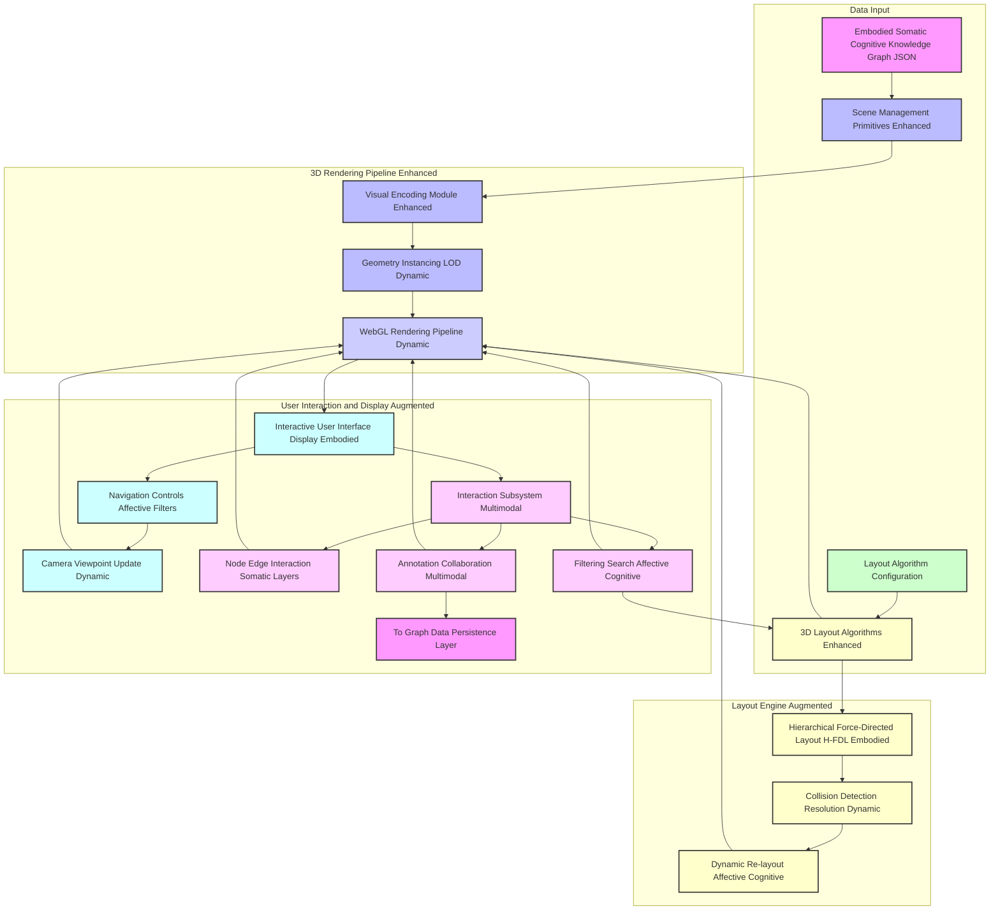

---
**Title of Invention:** A System and Method for Multimodal Somatic-Cognitive Graph Integration and Semantic Fusion of Discursive Knowledge with Real-time Human Physiological and Behavioral Data for Embodied Affective and Cognitive State Reconstruction in Dynamic Social Contexts

**Abstract:**
This invention presents a paradigm-shifting system and associated methodologies for transcending the limitations of purely linguistic discourse analysis by incorporating real-time, multi-modal human physiological and behavioral data. Building upon advanced knowledge graph generation from temporal linguistic artifacts, the system introduces a sophisticated Multimodal Fusion Graph Core. This core semantically integrates and fuses the linguistic knowledge graph with data streams derived from biometric sensors (e.g., EEG, ECG, EDA, eye-tracking) and behavioral analytics (e.g., facial expressions, prosody, gaze patterns). Leveraging specialized deep learning models and contextual AI, the system rigorously extracts and annotates affective states, cognitive loads, engagement levels, and inter-personal dynamics from these physiological and behavioral signals. The culmination is an Embodied Somatic-Cognitive Knowledge Graph ESCKG, a richly attributed, multi-dimensional representation where linguistic concepts, decisions, and actions are explicitly linked to the embodied cognitive and emotional states of participants during discourse. This ESCKG is then rendered as an enhanced, interactive 3D volumetric visualization, offering an unprecedented, holistic, and spatially augmented understanding of not just *what* was said, but *how* it was felt, perceived, and cognitively processed, thereby enabling profound insights into collaborative efficacy, emotional resonance, and decision-making integrity in dynamic social contexts.

**Background of the Invention:**
The preceding invention, "A System and Method for Semantic-Topological Reconstruction and Volumetric Visualization of Discursive Knowledge Graphs from Temporal Linguistic Artifacts," significantly advanced the comprehension of human discourse by transforming linear text into navigable 3D knowledge graphs. However, human communication is intrinsically multi-modal and deeply embodied. Purely linguistic analysis, no matter how sophisticated, inherently provides an incomplete understanding, as it overlooks the profound influence of non-verbal cues, physiological responses, and implicit behavioral signals that convey sentiment, cognitive effort, engagement, deception, or agreement. Traditional methods of analyzing meetings or collaborative sessions typically rely solely on transcribed words, missing critical layers of information such as:
1.  **Affective Dynamics:** The emotional states of participants, their shifts, and how they propagate.
2.  **Cognitive Load:** The mental effort expended, moments of confusion, understanding, or focused attention.
3.  **Engagement Levels:** Whether participants are actively attentive or disengaged.
4.  **Interpersonal Synchrony:** The subtle mirroring or divergence in physiological responses that indicate rapport or tension.
Existing fragmented solutions might detect emotion from text or infer stress from heart rate variability in isolation. However, a critical exigency remains for a comprehensive, integrated system capable of: (a) acquiring heterogeneous real-time physiological and behavioral data; (b) robustly extracting meaningful affective and cognitive features; and (c) semantically fusing these embodied insights with the structured linguistic knowledge graph to produce a holistic, multi-dimensional model of discourse that is both rich in content and profound in context. Without such integration, the true, embodied fabric of human interaction remains largely uncaptured, leading to suboptimal insights into team dynamics, decision quality, and overall communication effectiveness.

**Brief Summary of the Invention:**
The present invention pioneers a revolutionary integration framework that elevates discourse analysis to an embodied, somatic-cognitive level. At its core, the system ingests the structured linguistic knowledge graph generated by an advanced AI processing core (as described in our previous invention) and simultaneously acquires multi-modal physiological and behavioral data streams from meeting participants. These real-time streams, encompassing data from wearables (e.g., EEG, ECG, EDA), cameras (e.g., facial expressions, gaze), and microphones (e.g., prosody), are channeled through a dedicated Physiological and Behavioral Feature Extraction Core. This core applies state-of-the-art signal processing, computer vision, and machine listening techniques to robustly identify and quantify an array of somatic markers, including heart rate variability, galvanic skin response, brainwave patterns indicative of cognitive load or attention, micro-facial expressions, gaze direction, and vocal emotional prosody. Subsequently, a novel Multimodal Fusion Graph Core performs a precise temporal alignment and semantic fusion. This fusion dynamically augments the linguistic knowledge graph with new nodes representing inferred affective and cognitive states (e.g., "High Stress", "Focused Attention", "Agreement"), and new edges quantifying their influence on, or correlation with, linguistic entities, decisions, or other participants' states. The output is an Embodied Somatic-Cognitive Knowledge Graph ESCKG, a unified, richly attributed graph offering a holistic representation of the meeting's intellectual and emotional landscape. This ESCKG is then presented via an enhanced 3D volumetric rendering engine, which dynamically visualizes these embodied dimensions through sophisticated visual encodings such as real-time node animations, aura effects, dynamic environmental cues, and participant-specific somatic overlays, enabling users to intuitively navigate and comprehend the multi-layered cognitive and affective substratum of human discourse.

**Detailed Description of the Invention:**

The present invention meticulously details a comprehensive system and methodology for the integration and semantic fusion of linguistic knowledge graphs with real-time, multi-modal human physiological and behavioral data, culminating in an Embodied Somatic-Cognitive Knowledge Graph ESCKG and its immersive visualization.

### 1. System Architecture Overview - Embodied Somatic-Cognitive Integration

Building upon the robust framework of the Semantic-Topological Reconstruction System, this invention introduces new modules for multimodal data acquisition, physiological and behavioral analysis, and a sophisticated fusion core, transforming the understanding of discourse into an embodied context.


**Description of New and Augmented Architectural Components:**

*   **S_MM_INGEST. Multimodal Sensor Ingestion Module:** Captures diverse real-time physiological and behavioral data streams.
*   **S_FEAT_EXTRACT. Physiological Behavioral Feature Extraction Core:** Processes raw sensor data into meaningful affective and cognitive features.
*   **SYNCH_BUFFER. Synchronized Feature Buffer:** Temporally aligns and stores multimodal features for fusion.
*   **FUSION_CORE. Multimodal Fusion Graph Core ESCKG:** The intelligent heart, performing semantic fusion of linguistic and somatic-cognitive data to generate the Embodied Somatic-Cognitive Knowledge Graph.
*   **E_REND. Enhanced 3D Volumetric Rendering Engine:** Augmented version of the rendering engine, capable of visualizing embodied dimensions.
*   **G_USER_INT. User Interaction Subsystem (Augmented):** Interprets user inputs for navigating and querying embodied dimensions.

### 2. Multimodal Sensor Ingestion Module

This module is specifically designed for the real-time acquisition and initial preprocessing of diverse human physiological and behavioral signals from multiple participants in a synchronized manner.


*   **2.1. Signal Acquisition Subsystem:**
    *   **Wearable Sensors:** Integrates with medical-grade or research-grade EEG electroencephalography, ECG electrocardiography, EDA electrodermal activity, also known as GSR galvanic skin response, and eye-tracking devices. Captures raw physiological signals at high sampling rates.
    *   **Computer Vision Sensors:** Utilizes high-resolution cameras to capture participant facial expressions, head pose, gaze direction, posture, gestures, and overall body language. Employing privacy-preserving techniques like skeletal tracking and facial landmark detection instead of raw video storage.
    *   **Acoustic Sensors:** Employs directional microphones for capturing individual speech, allowing for detailed prosodic analysis pitch, intensity, speaking rate, voice quality independent of lexical content.
    *   **Environmental Context Sensors:** Optional sensors to capture ambient conditions such as temperature, lighting, and noise levels, which can influence cognitive and affective states.
*   **2.2. Noise Filtering and Artifact Removal:**
    *   Applies advanced signal processing algorithms, e.g., independent component analysis ICA for EEG, wavelet denoising for ECG, to remove noise and motion artifacts inherent in real-time physiological data.
*   **2.3. Temporal Synchronization Module:**
    *   Critically ensures that all incoming multi-modal data streams are precisely synchronized to a common timestamp, essential for accurate fusion with linguistic data. Utilizes synchronized clock signals or post-hoc alignment algorithms, e.g., cross-correlation of shared event markers.
*   **Output:** Cleaned, synchronized raw multimodal data streams, attributed to specific participants and timestamps.

### 3. Physiological and Behavioral Feature Extraction Core

This module transforms the raw, synchronized multimodal data into meaningful, semantically interpretable features indicative of affective and cognitive states.


*   **3.1. Physiological Signal Processing:**
    *   **Heart Rate Variability HRV Extraction:** Derives time-domain, frequency-domain, and non-linear HRV features from ECG signals, indicative of sympathetic and parasympathetic nervous system activity, stress, and emotional arousal.
    *   **Electrodermal Activity EDA Feature Extraction:** Extracts features such as skin conductance level SCL, skin conductance responses SCR, and their amplitudes/latencies from EDA data, correlated with emotional intensity and cognitive effort.
    *   **EEG Brainwave Frequency Band Analysis:** Processes EEG data to quantify power in different frequency bands alpha, beta, theta, gamma, delta, indicative of cognitive load, attention, alertness, and relaxation. Employs techniques like source localization for deeper insights.
    *   **Eye-Tracking Metrics:** Calculates metrics such as gaze duration, saccadic eye movements, pupil dilation, and blinks, providing insights into attention, cognitive effort, interest, and confusion.
*   **3.2. Behavioral Pattern Analysis:**
    *   **Facial Expression Analysis:** Employs computer vision models, e.g., Convolutional Neural Networks CNNs, to detect basic emotions joy, sadness, anger, fear, surprise, disgust and Action Units AUs from facial landmarks, even micro-expressions.
    *   **Body Pose and Gesture Analysis:** Utilizes skeletal tracking to identify postures indicative of engagement, discomfort, agreement, or disagreement, and analyzes gestures for emphasis or communication intent.
    *   **Prosodic Voice Tone Analysis:** Extracts acoustic features from speech, e.g., pitch, intensity, jitter, shimmer, speaking rate, and applies machine learning models to classify emotional prosody happy, sad, angry, neutral, or to detect cognitive states like uncertainty or assertiveness.
*   **3.3. Feature Synthesis and Classification:**
    *   Applies deep learning classifiers or ensemble models to the extracted features to infer higher-level affective states e.g., `Joy`, `Stress`, `Frustration`, `Engagement`, `Boredom` and cognitive states e.g., `Focused`, `Confused`, `Decisive`, `Attentive` for each participant, at granular temporal resolutions.
*   **Output:** A stream of timestamped, participant-attributed vectors of inferred affective and cognitive states and their confidence scores.

### 4. Multimodal Fusion Graph Core ESCKG Generation

This is the central innovation, responsible for the semantic integration and fusion of the linguistic knowledge graph (from the previous invention) with the newly extracted physiological and behavioral insights.


*   **4.1. Temporal Alignment and Synchronization:**
    *   This sub-module ensures precise synchronization between the linguistic graph's entity/event timestamps and the incoming somatic-cognitive feature timestamps. It may involve interpolating somatic data to match linguistic events or aggregating somatic data over linguistic utterance durations.
*   **4.2. Contextual Encoder Multimodal AI:**
    *   Utilizes a multimodal transformer architecture, for example, a cross-modal attention mechanism, to jointly process linguistic embeddings (from the CSTFN) and somatic-cognitive feature vectors. This creates a unified contextual embedding space where linguistic and embodied signals are semantically fused.
    *   This encoder learns how specific words or concepts correlate with particular physiological responses and vice versa, in context.
*   **4.3. Cross-Modal Relational Inference:**
    *   Based on the joint multimodal embeddings, this module infers new types of relationships that span linguistic and embodied dimensions.
    *   **Linguistic-Somatic Links:** E.g., `Concept 'Budget Cuts' EVOKES_AFFECT 'High Stress' in 'Speaker A'`.
    *   **Somatic-Somatic Links:** E.g., `Speaker A 'High Stress' TRANSFERS_TO 'Speaker B' 'Elevated Stress'`.
    *   **Behavioral-Cognitive Links:** E.g., `Speaker C 'Decreased Gaze' INDICATES_COGNITION 'Disengagement'`.
    *   **Decision-Affect Links:** E.g., `Decision 'Project Green Light' IS_ASSOCIATED_WITH 'Collective Excitement'`.
*   **4.4. Somatic-Cognitive KG Augmentation Module:**
    *   Dynamically introduces new node types into the knowledge graph:
        *   `AffectiveState`: E.g., `Engagement`, `Frustration`, `Agreement`, `Disagreement`, `Excitement`, `Boredom`.
        *   `CognitiveState`: E.g., `Focus`, `Confusion`, `CognitiveLoad`, `DecisionUncertainty`.
        *   `SomaticMarker`: Direct physiological observations, e.g., `HRVDrop`, `EDASpike`.
    *   Augments existing `Speaker` nodes with real-time `AffectiveState` and `CognitiveState` attributes.
    *   Introduces new edge types reflecting the inferred cross-modal relationships, such as `EVOKES_AFFECT`, `INDICATES_COGNITION`, `IS_MANIFESTED_BY`, `INFLUENCES_DECISION`, `EXHIBITS_SYNCHRONY_WITH`.
*   **4.5. Semantic Fusion Optimization:**
    *   Applies graph refinement techniques, such as knowledge graph completion algorithms on multimodal embeddings, to ensure consistency and infer latent relationships. Uses dynamic graph convolutional networks GCNs or graph attention networks GATs over the multimodal graph to propagate and refine semantic and affective states across the graph.
*   **Output:** The comprehensive Embodied Somatic-Cognitive Knowledge Graph ESCKG, a structured JSON object containing all linguistic, affective, and cognitive entities and their interconnections.

### 5. Embodied Somatic-Cognitive Knowledge Graph ESCKG Data Structure

The output from the Multimodal Fusion Graph Core is an extended JSON schema for a directed, attributed multigraph, now incorporating embodied dimensions.


```json
{
  "graph_id": "unique_meeting_session_id_ABC456",
  "meeting_metadata": {
    "title": "Quarterly Strategy Review Embodied Analysis",
    "date": "2023-11-20T14:00:00Z",
    "duration_minutes": 120,
    "participants": [
      {"id": "spk_0", "name": "Alice Johnson", "role": "CEO", "somatic_profile": {"avg_stress": 0.6, "avg_engagement": 0.8}},
      {"id": "spk_1", "name": "Bob Williams", "role": "CTO", "somatic_profile": {"avg_stress": 0.4, "avg_engagement": 0.9}}
    ],
    "main_topics": ["Market Expansion", "Product Roadmap", "Resource Allocation"],
    "overall_affective_summary": {"peak_stress_time": "2023-11-20T14:45:00Z", "avg_engagement_level": "High"}
  },
  "nodes": [
    // Existing Linguistic Nodes (as per 012_holographic_meeting_scribe.md)
    {
      "id": "concept_001",
      "label": "New Market Entry Strategy",
      "type": "Concept",
      "speaker_attribution": ["spk_0"],
      "timestamp_context": {"start": 300, "end": 450},
      "sentiment": "positive",
      "confidence": 0.95,
      "summary_snippet": "Discussion about expanding into the APAC market with aggressive growth targets.",
      "level": 0,
      "original_utterance_ids": ["utt_012", "utt_015"],
      "associated_affect": "excitement",
      "cognitive_load_avg": 0.7
    },
    {
      "id": "decision_002",
      "label": "Approve APAC Market Entry",
      "type": "Decision",
      "speaker_attribution": ["spk_0", "spk_1"],
      "timestamp_context": {"start": 600, "end": 620},
      "sentiment": "neutral",
      "confidence": 0.98,
      "summary_snippet": "Consensus reached to proceed with market expansion as planned.",
      "status": "Finalized",
      "original_utterance_ids": ["utt_020"],
      "collective_affect_peak": "consensus_satisfaction",
      "decision_confidence_somatic": 0.9
    },
    // New Somatic-Cognitive Nodes
    {
      "id": "affect_004",
      "label": "Spk0 High Stress APAC Budget",
      "type": "AffectiveState",
      "speaker_attribution": ["spk_0"],
      "timestamp_context": {"start": 440, "end": 480},
      "intensity": 0.85,
      "confidence": 0.92,
      "somatic_source_metrics": {"hrv_sdnn": 35, "eda_scr_count": 5},
      "original_signal_timestamps": ["sig_t_440", "sig_t_450"]
    },
    {
      "id": "cognition_005",
      "label": "Spk1 High Focus Product Roadmap",
      "type": "CognitiveState",
      "speaker_attribution": ["spk_1"],
      "timestamp_context": {"start": 700, "end": 780},
      "intensity": 0.90,
      "confidence": 0.95,
      "somatic_source_metrics": {"eeg_beta_power": 0.6, "pupil_dilation_avg": 3.2},
      "original_signal_timestamps": ["sig_t_700", "sig_t_750"]
    }
    // ... further nodes
  ],
  "edges": [
    // Existing Linguistic Edges
    {
      "id": "edge_001",
      "source": "concept_001",
      "target": "decision_002",
      "type": "LEADS_TO",
      "speaker_attribution": [],
      "timestamp_context": {"start": 600, "end": 620},
      "confidence": 0.90,
      "summary_snippet": "The strategy discussion culminated in this decision.",
      "affective_impact_score": 0.7
    },
    // New Cross-Modal Edges
    {
      "id": "edge_004",
      "source": "concept_001",
      "target": "affect_004",
      "type": "EVOKES_AFFECT",
      "speaker_attribution": ["spk_0"],
      "timestamp_context": {"start": 440, "end": 480},
      "confidence": 0.88,
      "summary_snippet": "Discussion on market entry budget directly caused stress in Alice."
    },
    {
      "id": "edge_005",
      "source": "affect_004",
      "target": "cognition_005",
      "type": "INFLUENCES_COGNITION",
      "speaker_attribution": ["spk_0"],
      "timestamp_context": {"start": 480, "end": 500},
      "confidence": 0.75,
      "summary_snippet": "Alice's stress led to a temporary dip in Bob's focus."
    },
    {
      "id": "edge_006",
      "source": "spk_0",
      "target": "spk_1",
      "type": "EXHIBITS_EMOTIONAL_CONTAGION",
      "timestamp_context": {"start": 460, "end": 490},
      "confidence": 0.80,
      "affect_type": "stress_propagation",
      "lag_ms": 1500 // Bob's stress response lagged Alice's by 1.5s
    }
    // ... further edges
  ]
}
```

### 6. Enhanced 3D Volumetric Rendering and Visualization

The 3D rendering engine is profoundly enhanced to graphically represent the new embodied dimensions of the ESCKG, offering an intuitive, multi-sensory experience.



*   **6.1. Visual Encoding Module Enhanced:**
    *   **Nodes:** Linguistic nodes are dynamically augmented. For example, a "Concept" node might display an "aura" or pulsating glow whose color and intensity reflect the real-time collective sentiment or cognitive load associated with its discussion. "Speaker" nodes can be represented by avatars whose facial expressions or body postures are animated in real-time to reflect their inferred affective/cognitive state. New "AffectiveState" and "CognitiveState" nodes have distinct geometries and color palettes.
    *   **Edges:** Emotional contagion or influence edges might be represented by animated, directional flows or subtle "sparkle" effects indicating the strength and direction of the transfer. Edge thickness for "INFLUENCES_DECISION" edges could correlate with the confidence of the physiological basis for that influence.
    *   **Environmental Cues:** The ambient lighting, fog density, or background particle effects within the 3D environment can dynamically shift to reflect the overall mood or energy level of the meeting, providing an implicit emotional context.
*   **6.2. 3D Layout Algorithms Augmented:**
    *   The `E_layout` function from the previous invention is extended to include forces influenced by affective and cognitive states. For example, nodes representing "High Stress" from different speakers might cluster spatially or exhibit specific oscillation patterns. Nodes related to "Focused Attention" might be drawn into a clearer, more prominent region of the graph. Temporal layout can now also consider periods of heightened cognitive activity or emotional intensity.
*   **6.3. Interaction Subsystem Multimodal:**
    *   **Affective/Cognitive Filtering:** Users can filter the graph to "Show only moments of collective high stress," "Identify decisions made under low cognitive load," or "Trace emotional propagation paths."
    *   **Somatic Replay:** Enables replay of specific conversational segments, synchronizing linguistic content with the real-time physiological and behavioral animations of participants' avatars or node auras.
    *   **Embodied Detail Panels:** Clicking on a node or avatar reveals not only linguistic details but also granular physiological graphs e.g., HRV over time, EEG spectrograms, and behavioral heatmaps e.g., facial action unit intensity for that specific temporal context.

### 7. Dynamic Adaptation and Learning System (Extended)

The existing learning system is expanded to continuously improve the accuracy of multimodal feature extraction, affective/cognitive state inference, and fusion mechanisms, as well as optimize the embodied visualization.


*   **7.1. User Feedback Integration (Multimodal):** Users can explicitly correct misidentified emotions, cognitive states, or the inferred relationships between linguistic and embodied elements. Implicit feedback includes time spent interacting with somatic visualizations, filtering by affective states, or replaying specific high-stress moments.
*   **7.2. ESCKG Quality Metrics Analysis:** Automated evaluation now includes metrics for accuracy of affective/cognitive state inference, temporal alignment, and the coherence of cross-modal relationships within the ESCKG.
*   **7.3. Dynamic Adaptation Engine (Multimodal):** Adjusts parameters for the Multimodal Fusion Graph Core, including weighting of different modalities, confidence thresholds for state inference, and the rules for cross-modal relational extraction. It also optimizes the parameters for the Physiological and Behavioral Feature Extraction Core.
*   **7.4. Continual Learning Pipeline:** The system continually refines its ability to interpret subtle physiological cues, understand complex behavioral patterns, and fuse them seamlessly with linguistic context, adapting to individual differences and evolving communication norms.

### 8. Advanced Analytics and Interpretability Features (Extended)

This module provides unprecedented analytical depth by incorporating embodied data, leading to actionable insights into team dynamics, psychological safety, and decision quality.


*   **8.1. Customizable Analytics Dashboard (Embodied):** Provides key performance indicators KPIs related to team dynamics, such as collective engagement scores, emotional coherence metrics, peak cognitive load periods, and individual contribution vs. stress levels.
*   **8.2. Decision Traceability with Affective-Cognitive Context:** Not only traces decisions but also provides the associated collective emotional climate, individual cognitive states, and stress levels during the decision-making process, allowing for post-hoc analysis of decision quality influenced by embodied factors.
*   **8.3. Somatic-Cognitive Trend Analysis:** Identifies patterns in emotional contagion, periods of sustained high cognitive load across multiple meetings, or correlations between specific topics and participant stress responses.
*   **8.4. Explainable AI XAI for Multimodal Fusion:** For any inferred affective or cognitive state, or a cross-modal relationship, the system can highlight the specific linguistic segments, physiological signal features, and behavioral cues that contributed to the inference, along with confidence scores, enhancing transparency and trust.
*   **8.5. Semantic Similarity Search (Embodied):** Allows searching for discussions that evoke similar emotional responses or cognitive patterns, even if the linguistic content differs significantly, uncovering deeper, implicit connections across discursive events.

**Claims:**

The following enumerated claims define the intellectual scope and novel contributions of the present invention, focusing on the integration of somatic and cognitive dimensions into discourse analysis.

1.  A method for the comprehensive semantic-topological reconstruction, multimodal fusion, and volumetric visualization of embodied somatic-cognitive knowledge graphs from temporal linguistic artifacts and real-time human physiological and behavioral data, comprising the steps of:
    a.  Receiving a linguistic knowledge graph representing a discourse, said graph comprising attributed nodes for entities and attributed edges for relationships, derived from a temporal sequence of utterances.
    b.  Concurrently acquiring multi-modal physiological and behavioral data streams from one or more participants of said discourse, each stream being timestamped and attributed to a specific participant.
    c.  Processing said multi-modal physiological and behavioral data streams through a Physiological and Behavioral Feature Extraction Core to extract a plurality of timestamped affective and cognitive features, including but not limited to heart rate variability, electrodermal activity, brainwave patterns, facial expressions, gaze patterns, and prosodic voice characteristics.
    d.  Temporally aligning and transmitting said extracted affective and cognitive features to a Multimodal Fusion Graph Core.
    e.  Within said Multimodal Fusion Graph Core, semantically integrating and fusing said linguistic knowledge graph with said aligned affective and cognitive features by:
        i.   Employing a multimodal contextual encoder to jointly process linguistic embeddings and somatic-cognitive feature vectors.
        ii.  Inferring new cross-modal relationships between linguistic entities and participant-specific affective or cognitive states.
        iii. Augmenting said linguistic knowledge graph with new nodes representing inferred affective states, cognitive states, or somatic markers, and new edges representing cross-modal influences, correlations, or causalities, thereby generating an Embodied Somatic-Cognitive Knowledge Graph ESCKG.
    f.  Utilizing said ESCKG as the foundational input for an enhanced three-dimensional volumetric rendering engine.
    g.  Programmatically generating within said rendering engine a dynamic, interactive three-dimensional visual representation of the discourse, wherein:
        i.   Said linguistic entities, affective states, and cognitive states are materialized as spatially navigable 3D nodes, their visual properties dynamically encoding type, importance, sentiment, and real-time embodied attributes such as intensity, arousal, or cognitive load.
        ii.  Said interconnections, including linguistic and cross-modal relationships, are materialized as 3D edges, their visual properties dynamically encoding relationship type, strength, and affective/cognitive impact through animation or transient effects.
        iii. Said 3D nodes are positioned and oriented within a 3D coordinate system by an augmented layout algorithm optimized for cognitive clarity and topological fidelity, incorporating hierarchical, temporal, and embodied state constraints.
    h.  Displaying said interactive three-dimensional volumetric representation to a user via a graphical user interface, enabling real-time navigation, exploration, and multi-layered inquiry into the embodied context of the discourse.

2.  The method of claim 1, wherein the multi-modal physiological and behavioral data streams are acquired from wearable sensors including EEG, ECG, EDA, and eye-tracking devices, and from non-contact sensors including cameras for facial and body posture analysis and microphones for prosodic analysis.

3.  The method of claim 1, wherein the Physiological and Behavioral Feature Extraction Core employs deep learning models, including recurrent neural networks or convolutional neural networks, specifically trained for the real-time classification and quantification of human affective and cognitive states from raw multi-modal signals.

4.  The method of claim 1, wherein the Multimodal Fusion Graph Core (step e) utilizes a cross-modal transformer architecture to derive a unified contextual embedding space for linguistic and somatic-cognitive information.

5.  The method of claim 1, wherein new node types introduced into the ESCKG include `AffectiveState`, `CognitiveState`, and `SomaticMarker`, and new edge types include `EVOKES_AFFECT`, `INDICATES_COGNITION`, `INFLUENCES_DECISION`, and `EXHIBITS_EMOTIONAL_CONTAGION`.

6.  The method of claim 1, wherein the enhanced 3D volumetric rendering engine (step g) dynamically visualizes embodied dimensions by:
    a.  Applying real-time visual effects, such as glowing auras, pulsating effects, or color shifts to 3D nodes, based on their associated affective or cognitive states and intensities.
    b.  Animating 3D participant avatars with dynamically inferred facial expressions, gaze patterns, and body postures.
    c.  Modulating environmental cues, such as ambient lighting or particle effects, to reflect the collective affective climate of the discourse.

7.  The method of claim 1, wherein the augmented layout algorithm (step g.iii) incorporates additional forces that influence node positioning based on shared affective or cognitive states, emotional synchrony, or directed influence pathways between participants.

8.  The method of claim 1, further comprising an extended user interaction subsystem enabling:
    a.  Filtering of the ESCKG based on specific affective states, cognitive loads, or participant-specific emotional profiles.
    b.  Somatic replay functionality, allowing synchronized playback of linguistic utterances with corresponding real-time embodied visualizations.
    c.  Detailed inspection panels providing granular physiological signal data, e.g., HRV charts, EEG spectrograms, correlated with specific linguistic segments or events.

9.  A system configured to execute the method of claim 1, comprising:
    a.  An Input Ingestion Module for linguistic artifacts and an AI Semantic Processing Core for linguistic knowledge graph generation.
    b.  A Multimodal Sensor Ingestion Module configured to concurrently acquire and preprocess real-time physiological and behavioral data streams from discourse participants.
    c.  A Physiological and Behavioral Feature Extraction Core operatively coupled to the Multimodal Sensor Ingestion Module, configured to extract affective and cognitive features from said streams.
    d.  A Multimodal Fusion Graph Core operatively coupled to the linguistic knowledge graph generation and the Feature Extraction Core, configured to semantically integrate and fuse linguistic and embodied data into an Embodied Somatic-Cognitive Knowledge Graph ESCKG.
    e.  An Enhanced 3D Volumetric Rendering Engine operatively coupled to the Multimodal Fusion Graph Core, configured to transform said ESCKG into an interactive three-dimensional visual representation.
    f.  An Interactive User Interface and Display operatively coupled to the Enhanced 3D Volumetric Rendering Engine, configured to present said visualization and receive multimodal user input.

10. The system of claim 9, further comprising an extended Dynamic Adaptation and Learning System configured to:
    a. Capture explicit user corrections of inferred affective/cognitive states and implicit user interaction patterns with embodied visualizations.
    b. Analyze ESCKG quality metrics, including the accuracy of cross-modal relationships.
    c. Dynamically adjust parameters of the Physiological and Behavioral Feature Extraction Core, the Multimodal Fusion Graph Core, and the visual encoding preferences of the Enhanced 3D Volumetric Rendering Engine based on said feedback and metrics.

11. The system of claim 9, further comprising an Advanced Analytics and Interpretability Module configured to:
    a. Provide an embodied analytics dashboard with KPIs for collective engagement, emotional coherence, and cognitive load.
    b. Enable Decision Traceability with full affective and cognitive context.
    c. Perform Somatic-Cognitive Trend Analysis across multiple discourse events.
    d. Implement Explainable AI XAI features for justifying multimodal fusion inferences and detecting potential biases in embodied state attribution.

**Mathematical Justification:**

The formal extension of our previous mathematical framework is necessary to precisely define the integration and semantic fusion of linguistic data with multi-modal somatic and cognitive signals. We introduce the concept of a Multimodal Somatic-Cognitive Tensor `Psi_C` and the transformation function `G_MM_AI` that yields the Embodied Somatic-Cognitive Knowledge Graph `Embodied Gamma`.

### I. Formal Definition of a Multimodal Discursive Artifact `C_MM` and its Somatic-Cognitive Tensor `Psi_C`

Let a multimodal discursive artifact `C_MM` be an extension of the linguistic artifact `C`, augmented with real-time physiological and behavioral observations. `C_MM` is defined as a finite, ordered sequence of multimodal observation tuples, `C_MM = ((u_1, phi_1), (u_2, phi_2), ..., (u_n, phi_n))`, where `n` is the total number of synchronized observation points. Each observation point `i` includes the linguistic utterance `u_i` (as defined in the previous invention) and a vector `phi_i` encompassing multi-modal physiological and behavioral data for all participants `m` at that temporal segment.

```
phi_i = ({ (spk_j, P_j_i, B_j_i) | for each speaker spk_j in Sigma })
```

Where:
*   `spk_j` in `Sigma`: The speaker identifier.
*   `P_j_i` in `R^D_p`: A vector of raw physiological signals for speaker `j` at time `i`, including EEG, ECG, EDA readings.
*   `B_j_i` in `R^D_b`: A vector of raw behavioral signals for speaker `j` at time `i`, including facial landmark coordinates, gaze vectors, body pose keypoints, and raw prosodic features.

These raw signals are processed by the **Physiological and Behavioral Feature Extraction Core** into higher-level feature vectors `zeta_j_i` for each speaker `j` at time `i`.

```
zeta_j_i = (HRV_j_i, EDA_j_i, EEG_j_i, Eye_j_i, Face_j_i, Body_j_i, Pros_j_i)
```

Where each component is a sub-vector of extracted features, e.g., `HRV_j_i` contains time-domain and frequency-domain HRV metrics. `zeta_j_i` captures the instantaneous affective and cognitive state inferences.

The entire multimodal discursive artifact `C_MM` is mapped into a **Multimodal Somatic-Cognitive Tensor** `Psi_C`. `Psi_C` is a higher-order data structure that integrates the linguistic semantic tensor `S_C` with the physiological and behavioral feature streams.

Let `Psi_C` be a tensor of rank `k'`, where its dimensions conceptually represent:
`Psi_C` in `R^(n x (D_e + D_z) x D_s x D_t x D_m)`
*   `n`: Number of time segments/utterances.
*   `D_e`: Dimensionality of utterance embeddings `epsilon_i`.
*   `D_z`: Dimensionality of aggregated somatic-cognitive feature embeddings `zeta_i`.
    (This `zeta_i` is a composite of all `zeta_j_i` for all speakers `j` at time `i`).
*   `D_s`: Dimensionality representing speaker identity and characteristics.
*   `D_t`: Dimensionality representing temporal context.
*   `D_m`: Dimensionality representing other metadata.

The construction of `Psi_C` involves:
1.  **Linguistic Semantic Embedding:** `lambda_i` -> `epsilon_i` (as before).
2.  **Somatic-Cognitive Embedding:** `phi_i` -> `zeta_i` (via feature extraction and potentially further deep embedding).
3.  **Cross-Modal Joint Embedding:** A multimodal transformer, forming the core of the `Contextual Encoder Multimodal AI`, computes weighted sums across `epsilon_j` and `zeta_k` dimensions, considering temporal proximity and speaker attribution. This generates a dense, unified `Psi_C` that explicitly models the interplay between linguistic and embodied signals.

### II. The Embodied Somatic-Cognitive Knowledge Graph `Embodied Gamma` and the Transformation Function `G_MM_AI`

The present invention defines a superior representation of `C_MM` as an attributed Embodied Somatic-Cognitive Knowledge Graph `Embodied Gamma = (N_E, E_E)`. The transformation from `Psi_C` to `Embodied Gamma` is mediated by the sophisticated generative AI function `G_MM_AI`:

```
G_MM_AI: Psi_C -> Embodied Gamma(N_E, E_E)
```

Where:
*   `N_E` is an extended finite set of richly attributed nodes `N_E = N union N_S`, where `N` are linguistic nodes and `N_S` are somatic-cognitive nodes. Each node `n_k` in `N_E` is a formalized representation of an extracted entity (concept, decision, action item, speaker, affective state, cognitive state, somatic marker).
    ```
    n_k_E = (id, label, type, alpha_k_E)
    ```
    Where `alpha_k_E` is an extended vector of attributes for node `k`, potentially including:
    *   `v_k_E` in `R^D_ne`: A multimodal node embedding.
    *   `affect_k` in `[-1, 1]`: Inferred affective state (e.g., valence-arousal scores).
    *   `cogn_k` in `[0, 1]`: Inferred cognitive state (e.g., cognitive load, focus level).
    *   `somatic_features_k` in `R^D_somatic`: Key raw or processed somatic features.
    *   `participant_k`: The speaker associated.
    *   `timestamp_context_k`, `confidence_k`, `level_k`, `original_utterance_ids_k`, `original_signal_timestamps_k`.
*   `E_E` is an extended finite set of richly attributed, directed edges `E_E = E union E_CMM`, where `E` are linguistic edges and `E_CMM` are cross-modal edges. Each edge `e_j` in `E_E` represents a specific typed relationship between two nodes `n_a` and `n_b` in `N_E`.
    ```
    e_j_E = (source_id, target_id, relation_type, beta_j_E)
    ```
    Where `beta_j_E` is an extended vector of attributes for edge `j`, including:
    *   `w_j_E` in `[0, 1]`: Confidence score or strength.
    *   `affect_impact_j`: Quantitative measure of affective influence.
    *   `cogn_impact_j`: Quantitative measure of cognitive influence.
    *   `temporal_lag_j`: Time difference for influence propagation.

The transformation `G_MM_AI` involves:
1.  **Linguistic & Somatic-Cognitive Entity Extraction:** `E_extract_MM: Psi_C -> N_E`. This involves clustering across the joint multimodal embedding space to identify linguistic, affective, and cognitive entities.
2.  **Multimodal Relational Inference:** `R_infer_MM: Psi_C x N_E x N_E -> E_E`. This crucial step, implemented via multimodal GNNs or attention over `Psi_C`, identifies linguistic-linguistic, linguistic-somatic, somatic-linguistic, and somatic-somatic relationships (e.g., `CONCEPT EVOKES_AFFECT SOMATIC_STATE`, `SPEAKER_A_STRESS INFLUENCES SPEAKER_B_FOCUS`).
3.  **Hierarchical & Temporal Induction (Extended):** `H_T_induce_MM: N_E x E_E -> (N_E', E_E')`. This refines `Embodied Gamma` by identifying hierarchical structures that now include affective and cognitive clusters, and by establishing temporal sequences for both linguistic and embodied events.

The dimensionality and information content of `Embodied Gamma` is demonstrably higher than `Gamma` (from the previous invention), as it captures the intricate interplay between expressed content and embodied experience.

### III. The Enhanced 3D Volumetric Rendering Function `R_E` and Spatial Embedding for Embodied Data

The Embodied Somatic-Cognitive Knowledge Graph `Embodied Gamma` is mapped into an enhanced three-dimensional Euclidean space `R^3` by a rendering function `R_E`:

```
R_E: Embodied Gamma -> {(P_k, O_k)}_{k=1}^{|N_E|} U {(P_j, C_j)}_{j=1}^{|E_E|}
```

The core innovation for `R_E` lies in extending the energy function `E_layout(P, Embodied Gamma)` to account for embodied attributes:

```
E_layout(P, Embodied Gamma) = sum_{k<l} (||P_k - P_l|| - delta_E(n_k, n_l))^2 + lambda_rep sum_{k!=l} Phi(||P_k - P_l||) + lambda_hier sum_{k} Psi(P_k, Hier(n_k_E)) + lambda_temp sum_{k} Xi(P_k, Temp(n_k_E)) + lambda_affect sum_{k} A_k(P_k, affect_k) + lambda_cogn sum_{k} C_k(P_k, cogn_k)
```

Where:
*   `delta_E(n_k, n_l)`: Graph-theoretic distance between `n_k` and `n_l` in `Embodied Gamma`, now reflecting multimodal similarity (semantic + affective + cognitive similarity). This ensures that nodes closely related across any modality are visually close.
*   `lambda_affect sum_{k} A_k(P_k, affect_k)`: A new affective influence term.
    *   `affect_k`: Inferred affective state of node `n_k_E`.
    *   `A_k` is a potential function that drives visual properties like color, glow intensity, or animation based on `affect_k`. This term could also introduce forces that cluster nodes with similar affective states or cause dynamic movement for highly aroused states.
*   `lambda_cogn sum_{k} C_k(P_k, cogn_k)`: A new cognitive influence term.
    *   `cogn_k`: Inferred cognitive state of node `n_k_E`.
    *   `C_k` is a potential function that modulates visual properties like node size, opacity, or sharpness based on `cogn_k` (e.g., larger/clearer for high focus, smaller/fainter for low engagement). This term could also influence spatial separation for high cognitive load or clustering for shared understanding.

The minimization of this extended `E_layout` function produces a 3D visualization where spatial proximity and visual attributes reflect not only semantic and temporal relationships but also the intricate affective and cognitive dynamics of the discourse.

### IV. Proof of Superiority: Informational Richness and Embodied Cognitive Understanding

The superiority of the Embodied Somatic-Cognitive Knowledge Graph `Embodied Gamma` and its `R^3` visualization over both linear textual summaries `T` and purely linguistic knowledge graphs `Gamma` is established through analysis of informational entropy and the profound enhancement of embodied cognitive understanding.

1.  **Informational Entropy and Multimodal Topological Preservation:**
    *   While `H(Gamma | C)` represents significant information preservation over `T`, `H(Embodied Gamma | C_MM)` is orders of magnitude lower. The `G_MM_AI` function captures the intricate, often implicit, relationships between spoken words, felt emotions, and cognitive processing, which are entirely absent in `Gamma`.
    *   `Embodied Gamma` explicitly encodes previously unrepresented modalities (physiological and behavioral data), allowing for the quantification of new graph-theoretic metrics, such as emotional flow centrality, cognitive load distribution, or decision-making influence based on somatic markers. The ability to model inter-speaker emotional contagion or the impact of stress on decision nodes fundamentally deepens the structural understanding of the discourse.
    *   The mapping of `C_MM` to `Psi_C` and then to `Embodied Gamma` is a maximally information-preserving transformation within the defined multi-modal context, significantly reducing the entropy of the representation relative to the original complex human interaction.

2.  **Embodied Cognitive and Affective Efficiency:**
    *   By integrating `affect_k` and `cogn_k` into the 3D visualization via `R_E`, the system directly taps into fundamental human perceptual and emotional processing capabilities. Users can:
        *   **Holistic Perception:** Instantly grasp the emotional tenor and cognitive intensity of a discussion segment, complementing linguistic understanding.
        *   **Empathy and Context:** Develop a richer, more empathetic understanding of participants' perspectives by directly visualizing their embodied states during key moments.
        *   **Identify Implicit Dynamics:** Quickly spot emotional hotspots, moments of collective confusion, or periods of high collaborative engagement that would be invisible in purely linguistic or even traditional `Gamma` representations.
        *   **Enhanced Decision Analysis:** Evaluate decisions not just by their content, but by the emotional and cognitive environment in which they were formed, leading to more robust post-mortem analyses and improved future decision-making processes.
    *   The extended `E_layout` function ensures that these embodied dimensions are visually encoded and spatially arranged in a manner that minimizes cognitive effort for interpretation, making complex socio-cognitive dynamics immediately apparent and navigable.

The present invention does not merely add data; it transforms the fundamental representation of human discourse by semantically fusing linguistic content with the embodied human experience. This leads to an unprecedented level of informational richness and an intuitively graspable, multi-dimensional understanding of how ideas are formed, felt, and influenced within complex social interactions. `Q.E.D.`