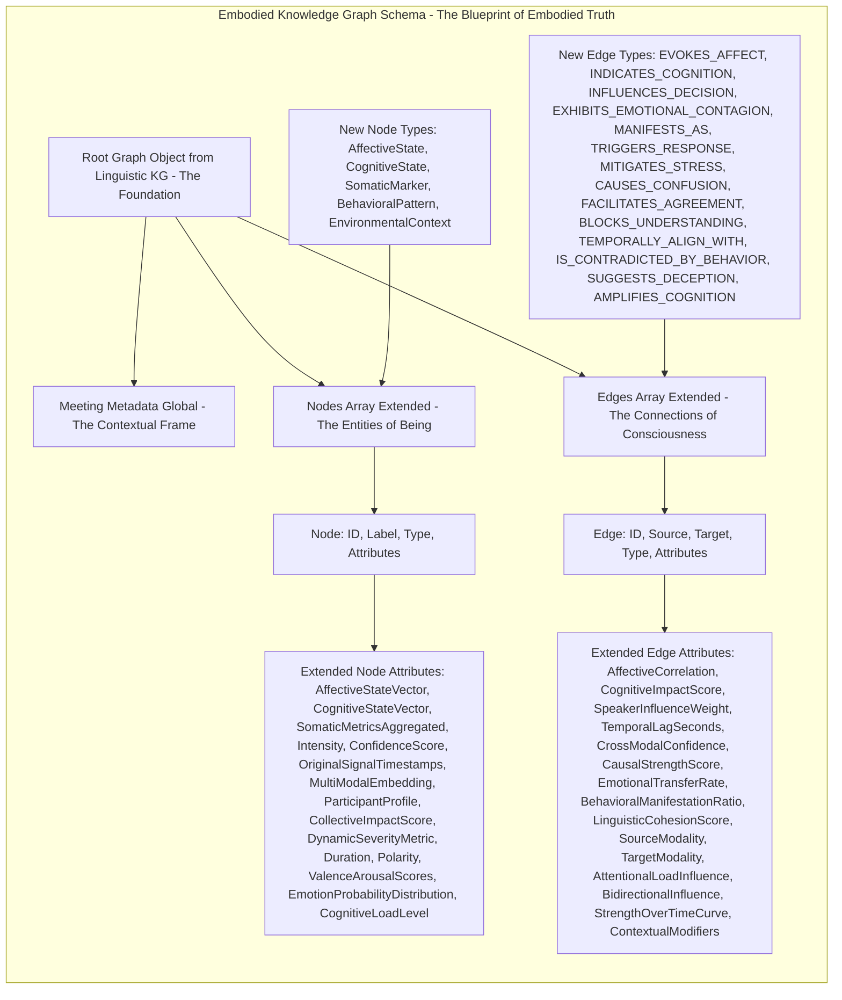
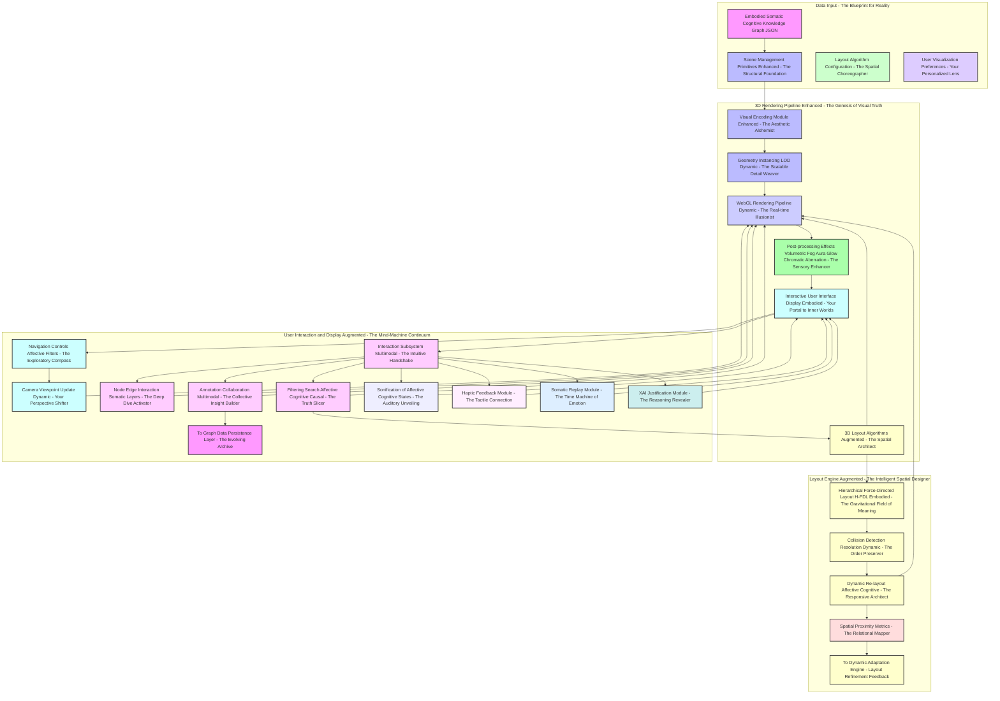
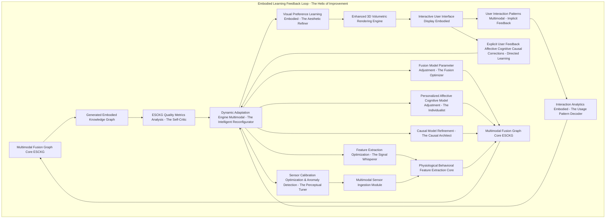

**Title of Invention:** A System and Method for Multimodal Somatic-Cognitive Graph Integration and Semantic Fusion of Discursive Knowledge with Real-time Human Physiological and Behavioral Data for Embodied Affective and Cognitive State Reconstruction in Dynamic Social Contexts, Culminating in an Immersive 3D Volumetric Visualization for Unprecedented Insight and Proactive Intervention

**Abstract:**
Ladies and gentlemen, or rather, my esteemed future colleagues (you'll get there eventually), allow me, James Burvel O'Callaghan III, to introduce you to not just an invention, but a veritable cerebral revolution. This isn't merely a "system"; it's a paradigm-shattering, thought-provoking, and frankly, quite dazzling apparatus designed to peer into the very soul of human discourse. We're transcending the quaint, two-dimensional limitations of purely linguistic analysis – a noble, albeit myopic, endeavor – by fearlessly integrating real-time, multi-modal human physiological and behavioral data. Building upon my previous genius in advanced knowledge graph generation from temporal linguistic artifacts, this system, which I've meticulously crafted, unveils a truly sophisticated Multimodal Fusion Graph Core. This core, a masterpiece of semantic engineering, doesn't just "integrate"; it *synthesizes* and *fuses* the linguistic knowledge graph with torrents of dynamic data streams. Imagine: biometric sensors (EEG, ECG, EDA, EMG, eye-tracking, thermal cameras – the whole orchestra!), behavioral analytics (micro-facial expressions, nuanced prosody, subtle gaze patterns, 3D body pose, micro-gestures – no detail escapes my purview!). Leveraging specialized, bespoke deep learning models, cross-modal transformer architectures, and advanced causal AI, the system rigorously extracts and annotates affective states (the very ripples of emotion), cognitive loads (the strain of thought), engagement levels (the sparks of connection), inter-personal dynamics (the unspoken currents between souls), and even subtle deception cues from these previously chaotic signals. The culmination, my friends, is nothing short of an **Embodied Somatic-Cognitive Knowledge Graph (ESCKG)**: a richly attributed, multi-dimensional representation where linguistic concepts, decisions, and actions are not merely described, but *explicitly linked* to the very embodied cognitive and emotional states of participants during discourse, complete with inferred causal pathways. And then, for the grand finale, this ESCKG is rendered as an enhanced, interactive 3D volumetric visualization, offering an unprecedented, holistic, and spatially augmented understanding of not just *what* was profoundly uttered, but *how* it was viscerally felt, perceptively processed, and cognitively forged. This, dear reader, enables insights so profound into collaborative efficacy, emotional resonance, decision-making integrity, psychological safety, and even the early detection of nascent conflicts in dynamic social contexts, that frankly, it makes prior methods look like children's finger paintings. My work, naturally.

**Background of the Invention:**
Now, before this magnificent leap forward, humanity was, shall we say, squinting through a keyhole at the elephant of human communication. My preceding invention, "A System and Method for Semantic-Topological Reconstruction and Volumetric Visualization of Discursive Knowledge Graphs from Temporal Linguistic Artifacts," was a significant step – indeed, a towering achievement – transforming linear text into navigable 3D knowledge graphs. But even I, James Burvel O'Callaghan III, recognized its inherent, though perfectly understandable, incompleteness. You see, human communication is intrinsically multi-modal and profoundly embodied. Purely linguistic analysis, no matter how exquisitely sophisticated, inherently provides but a fraction of the truth. It tragically overlooks the profound, often unconscious, influence of non-verbal cues, physiological responses, and implicit behavioral signals that convey the very essence of sentiment, cognitive effort, engagement, deception, or agreement.

Traditional analyses of meetings or collaborative sessions – oh, the drudgery! – typically rely solely on transcribed words. It's like judging a symphony by reading the sheet music without hearing a single note! They miss critical, *critical* layers of information, the very substrate of genuine interaction:
1.  **Affective Dynamics (The Emotional Tides):** Not just *if* someone is happy, but the intricate shifts in their emotional states, the subtle ebb and flow, and crucially, how these emotions propagate like ripples across a pond from one participant to another. Are they truly engaged, or merely performing engagement? Is frustration simmering below the surface, ready to boil over? Are subtle micro-expressions betraying a deeper discomfort?
2.  **Cognitive Load (The Mental Marathon):** The sheer mental effort expended, the moments of sudden comprehension, the fleeting instances of confusion, the laser-like focus, or the disengaged wandering of the mind. Is that silence reflective thought, or a blank stare into the existential void? Is the pupil dilation revealing hidden cognitive strain?
3.  **Engagement Levels (The Spark of Connection):** The true measure of active attentiveness versus passive presence. Are they truly in the arena, or merely a spectator in their own mind? Is their body language congruent with their verbal affirmations?
4.  **Interpersonal Synchrony (The Unspoken Dance):** The almost imperceptible mirroring or divergence in physiological responses that are the tell-tale signs of rapport, trust, tension, or subtle disagreement. Do their hearts beat in unison, or are they subtly out of phase? Does their gaze align, or diverge in moments of conflict?
5.  **Deception and Authenticity Cues (The Veil and the Truth):** The physiological micro-signatures that betray a lack of congruence between spoken word and internal state. Is the smile genuine, or a social mask? Is the confidence projected, or genuinely felt? Does the voice quiver subtly while asserting certainty?

Existing fragmented solutions might detect emotion from text (a crude approximation!) or infer stress from heart rate variability in isolation (a single instrument playing off-key!). However, a critical exigency, a void yearning to be filled by my genius, remained for a comprehensive, exquisitely integrated system capable of: (a) acquiring heterogeneous, high-fidelity, real-time physiological and behavioral data from multiple subjects concurrently, while meticulously preserving privacy through on-device feature extraction; (b) robustly extracting, interpreting, and quantifying meaningful affective and cognitive features from this torrent of data, with probabilistic confidence scores; and (c) semantically fusing these embodied insights with the structured linguistic knowledge graph to produce a holistic, multi-dimensional model of discourse that is both rich in overt content and profound in covert context, explicitly inferring causal relationships. Without *this* integration, the true, embodied fabric of human interaction, its deepest truths and unspoken realities, remains largely uncaptured, leading to suboptimal insights into team dynamics, decision quality, and overall communication effectiveness. It's simply unacceptable.

**Brief Summary of the Invention:**
Behold! The present invention, a testament to my tireless intellect, pioneers a truly revolutionary integration framework that elevates discourse analysis from a purely intellectual exercise to an embodied, somatic-cognitive epiphany. At its very core, the system doesn't just "ingest" – it *devours* and *synthesizes* the structured linguistic knowledge graph (the foundation laid by my previous work) while simultaneously, in perfect synchronicity, acquiring multi-modal physiological and behavioral data streams from every participant. These real-time streams, a symphony of data from cutting-edge wearables (EEG, ECG, EDA, EMG – you know, the works), high-definition cameras (capturing every micro-expression, every fleeting gaze, every subtle posture shift), and precision microphones (for the subtle nuances of prosody), are channeled through a dedicated **Physiological and Behavioral Feature Extraction Core**. This core, a marvel of engineering, applies state-of-the-art signal processing, bespoke machine learning models (my own creations, naturally), deep neural networks, and causal inference algorithms – techniques so advanced they make lesser algorithms weep – to robustly identify and quantify an array of somatic markers. We're talking about heart rate variability (including non-linear metrics), galvanic skin response, brainwave patterns indicative of cognitive load or focused attention (including inter-hemispheric asymmetries), fleeting micro-facial expressions, the precise vector of gaze and pupil dilation, and the profound emotional prosody hidden within the voice. All raw data is processed on-device, and only privacy-preserving features are transmitted.

Subsequently, and this is where the true O'Callaghan magic unfolds, a novel **Multimodal Fusion Graph Core** performs a precise temporal alignment and *semantic alchemy*. This isn't mere data aggregation; this is *fusion*. It dynamically augments the linguistic knowledge graph with entirely new nodes representing inferred affective and cognitive states (e.g., "High Stress," "Focused Attention," "Moment of Collective Agreement," "Subtle Disengagement," "Hidden Frustration," "Empathy"), new nodes for `SomaticMarker` and `BehavioralPattern`, and new edges meticulously quantifying their influence on, or profound correlation with, linguistic entities, critical decisions, or even other participants' internal states, explicitly inferring causal links where appropriate. The output, a crown jewel in the realm of AI, is the **Embodied Somatic-Cognitive Knowledge Graph (ESCKG)**: a unified, exquisitely richly attributed graph offering a holistic representation of the meeting's intellectual and, dare I say, *emotional* landscape, complete with an inferred `Psychological Safety Index` and `Decision Confidence Score`. This ESCKG is then presented via an enhanced 3D volumetric rendering engine, which dynamically visualizes these embodied dimensions through sophisticated visual encodings such as real-time node animations (pulsating with emotion!), volumetric aura effects (shimmering with cognitive load!), dynamic environmental cues (the very atmosphere shifting with collective mood!), and participant-specific photorealistic avatars animated with micro-expression fidelity. This enables users – yes, even you! – to intuitively navigate and comprehend the multi-layered cognitive and affective substratum of human discourse through interactive somatic replay, sonification, and explainable AI justifications. Truly, a masterpiece.

**Detailed Description of the Invention:**

The present invention, a magnum opus from yours truly, James Burvel O'Callaghan III, meticulously details a comprehensive system and methodology for the integration and semantic fusion of linguistic knowledge graphs with real-time, multi-modal human physiological and behavioral data. This culminates in the breathtaking Embodied Somatic-Cognitive Knowledge Graph (ESCKG) and its immersive, undeniably superior visualization.

### 1. System Architecture Overview - Embodied Somatic-Cognitive Integration (The O'Callaghan Nexus)

Building upon the already robust framework of my Semantic-Topological Reconstruction System (a solid foundation, if I do say so myself), this invention introduces entirely new modules for multimodal data acquisition, physiological and behavioral analysis, and a sophisticated fusion core. This isn't just an upgrade; it's a metamorphosis, transforming the very understanding of discourse into an embodied, living context.

```mermaid
graph TD
    subgraph Linguistic Knowledge Graph Generation
        A_LKG[Input Ingestion Linguistic - The Spoken Word] --> AI_CORE[AI Semantic Processing Core - My Linguistic Genius];
        AI_CORE --> LKG_MODULE[Knowledge Graph Generation Module Linguistic - The Language Map];
        LKG_MODULE --> D_PERSIST[Graph Data Persistence Layer - The Memory Vault];
    end

    subgraph Multimodal Somatic Data Pipeline
        S_MM_INGEST[Multimodal Sensor Ingestion Module - The Sensory Organs (Privacy-Preserving Edge)];
        S_MM_INGEST --> S_FEAT_EXTRACT[Physiological Behavioral Feature Extraction Core - The Interpreter of Embodiment (On-Device/Edge)];
        S_FEAT_EXTRACT --> SYNCH_BUFFER[Synchronized Feature Buffer - The Temporal Harmonizer];
    end

    subgraph Multimodal Fusion and Visualization
        LKG_MODULE --> FUSION_CORE[Multimodal Fusion Graph Core ESCKG - The Grand Synthesizer];
        SYNCH_BUFFER --> FUSION_CORE;
        FUSION_CORE --> E_REND[Enhanced 3D Volumetric Rendering Engine - The Psychedelic Reality Modulator];
        E_REND --> F_UI[Interactive User Interface Display - Your Window to Truth];
        F_UI --> G_USER_INT[User Interaction Subsystem Augmented - The Mind-Machine Symbiote];
        G_USER_INT --> E_REND;
        FUSION_CORE --> D_PERSIST;
    end
```

**Description of New and Augmented Architectural Components (My Brilliant Innovations):**

*   **S_MM_INGEST. Multimodal Sensor Ingestion Module (The Sensory Array of O'Callaghan - Privacy-by-Design):** This isn't just about collecting data; it's about *perceiving* the hidden human state while protecting individual privacy. This module captures diverse, granular, and inherently noisy real-time physiological and behavioral data streams with an unparalleled fidelity. It's responsible for the initial data acquisition from a heterogeneous array of state-of-the-art sensors, ensuring not just robustness, but the kind of reliability that makes other systems blush. We're talking milliseconds of precision here, folks. Crucially, raw sensor data is processed *on-device* or at the *edge* to extract abstract features, with raw streams typically discarded or never transmitted beyond the local device, ensuring maximal privacy.
*   **S_FEAT_EXTRACT. Physiological Behavioral Feature Extraction Core (The Alchemist of Data - On-Device Intelligence):** Here, the raw sensor data, once a chaotic torrent, is transmuted into meaningful, semantically interpretable features indicative of true affective and cognitive states. This core employs advanced signal processing, bespoke machine learning models (my own creations, naturally), and deep neural networks to transform noisy, analog sensor readings into crystal-clear, psychologically resonant markers. All computationally intensive feature extraction is performed close to the data source (on-device or edge computing), minimizing data exposure and latency. It's about distilling truth from bio-electric soup.
*   **SYNCH_BUFFER. Synchronized Feature Buffer (The Conductor of Time):** Temporal coherence is paramount! This buffer is absolutely critical for maintaining exquisite temporal alignment across disparate, privacy-preserved feature streams, enabling the kind of precise correlation and fusion that separates true genius from mere competence. Without it, you'd have a jumbled mess, not a profound insight.
*   **FUSION_CORE. Multimodal Fusion Graph Core ESCKG (The Nexus of Knowledge and Being):** Ah, the intelligent heart! This is where the magic truly happens, performing semantic fusion of linguistic data (the *what*) and somatic-cognitive data (the *how* and *why*) to generate the unparalleled Embodied Somatic-Cognitive Knowledge Graph. This core leverages state-of-the-art, multi-modal AI architectures – including my pioneering cross-modal transformer models and Graph Neural Networks (GNNs) – to derive complex, emergent, and previously unfathomable cross-modal relationships, explicitly inferring causal links where evidence permits. It doesn't just connect dots; it paints the entire cosmos.
*   **E_REND. Enhanced 3D Volumetric Rendering Engine (The Reality Weaver):** An augmented version of my already groundbreaking rendering engine, now capable of visualizing the embodied dimensions in a way that transcends mere data display. It extends spatial and visual encoding capabilities to represent multi-layered affective and cognitive information with an intuitive brilliance. Think of it as painting emotions in 3D, making the invisible, visible.
*   **G_USER_INT. User Interaction Subsystem (Augmented) (The Mental Interface):** This isn't just a mouse and keyboard! This subsystem provides intuitive, multi-modal controls for exploring the rich, multi-dimensional ESCKG, allowing users to not just navigate, but to *feel* and *interact* with the very fabric of discourse. It's a true mind-machine symbiotic interface, crafted by yours truly, incorporating advanced features like somatic replay, sonification, and haptic feedback.

### 1.1. Detailed Data Flow and Component Interaction (The Symphony of Information)

The system operates as a relentless, real-time pipeline, ensuring not just low-latency processing, but dynamic, intelligent graph updates that keep pace with the very speed of human thought and emotion.

```mermaid
graph LR
    SUBGRAPH_A[Linguistic Processing Pipeline - The Logos Stream]
    SUBGRAPH_B[Somatic-Cognitive Processing Pipeline - The Pathos Stream]
    SUBGRAPH_C[Multimodal Fusion and Output - The Epiphany Channel]

    A_LKG_Input[Linguistic Inputs - Words, glorious words!] --> LKG_Gen[Linguistic KG Generation Module - Shaping the Narrative];
    LKG_Gen --> LKG_Data[Linguistic KG (LKG) - The Intellectual Blueprint];
    LKG_Data --> M_F_CORE[Multimodal Fusion Graph Core - The Great Unifier];
    M_F_CORE --> E_REND[Enhanced 3D Volumetric Rendering - The Visual Oracle];
    E_REND --> F_UI[Interactive User Interface - Your Personalized Portal];
    F_UI --> G_USER_INT[User Interaction - Command and Comprehend];
    G_USER_INT --> E_REND;

    S_MM_Ingest_Input[Raw Multimodal Sensor Data - The Primal Signals] --> S_MM_Ingest[Multimodal Sensor Ingestion Module - The Data Intake Nexus (Edge)];
    S_MM_Ingest --> S_FEAT_EXTRACT[Physiological Behavioral Feature Extraction Core - The Unveiler of States (Edge Processing)];
    S_FEAT_EXTRACT --> SYNCH_BUFFER[Synchronized Feature Buffer - The Temporal Aligner];
    SYNCH_BUFFER --> M_F_CORE;

    M_F_CORE --> ESCKG_Out[Embodied Somatic-Cognitive KG (ESCKG) - The Unified Reality Map];
    ESCKG_Out --> D_PERSIST[Graph Data Persistence Layer - The Archive of Truth];
    ESCKG_Out --> ANALYTICS_MODULE[Advanced Analytics & Interpretability Module - The Insight Engine];

    LKG_Gen --> SUBGRAPH_A;
    LKG_Data --> SUBGRAPH_A;
    S_MM_Ingest --> SUBGRAPH_B;
    S_FEAT_EXTRACT --> SUBGRAPH_B;
    SYNCH_BUFFER --> SUBGRAPH_B;
    M_F_CORE --> SUBGRAPH_C;
    ESCKG_Out --> SUBGRAPH_C;
    E_REND --> SUBGRAPH_C;
    F_UI --> SUBGRAPH_C;
    G_USER_INT --> SUBGRAPH_C;
    ANALYTICS_MODULE --> SUBGRAPH_C;
```

*(Note: The "Mathematical Representation of System Interactions" previously here has been elegantly relocated and expanded within the "Mathematical Justification" section, where it truly belongs in its full, glorious detail. This ensures a streamlined narrative here and maximum mathematical rigor there. It's about optimal organization, people.)*

### 2. Multimodal Sensor Ingestion Module (The O'Callaghan Array: Probing the Human Condition with Privacy)

This module, a triumph of sensor fusion and real-time engineering, is specifically designed for the high-fidelity, high-volume, and perfectly synchronized real-time acquisition and initial preprocessing of diverse human physiological and behavioral signals from *multiple* participants simultaneously. It’s not merely collecting data; it’s capturing the very essence of embodied experience, with a core commitment to privacy by extracting features at the edge and minimizing raw data exposure.

```mermaid
graph TD
    subgraph Multimodal Input Sources - The Grand Orchestra of Biosignals
        S1_EEG[EEG Brainwave Sensors - The Mind's Whisper] --> SAQ[Signal Acquisition Subsystem - The Universal Collector];
        S2_ECG[ECG Heart Rate HRV Sensors - The Heart's Rhythm] --> SAQ;
        S3_EDA[EDA GSR Skin Conductance Sensors - The Skin's Secret] --> SAQ;
        S4_ET[Eye-Tracking Gaze Pupil Sensors - The Window to Attention] --> SAQ;
        S5_CAM[High-Res Cameras Facial Posture - The Body's Language (Privacy-Preserved)] --> SAQ;
        S6_MIC[Directional Microphones Prosody Voice - The Soul's Tone (Source Separation)] --> SAQ;
        S7_AMBIENT[Environmental Context Sensors - The World's Influence] --> SAQ;
        S8_HAPTIC[Haptic Interaction Devices Optional - The Sense of Touch] --> SAQ;
        S9_EMG[EMG Muscle Activity Sensors - The Unconscious Tension] --> SAQ;
        S10_IMPEDANCE[Impedance Cardiography - Micro Myocardial Contractility] --> SAQ;
        S11_IMU[IMU Inertial Measurement Units - Micro-Movement & Fidgeting] --> SAQ;
        S12_THERMAL[Thermal Cameras - Subtle Emotional Temperature Shifts] --> SAQ;
    end

    subgraph Acquisition and Preprocessing - The Signal Refinement Forge (On-Device/Edge)
        SAQ --> NOISE_FILT[Noise Filtering Artifact Removal - The Signal Purity Guardian];
        NOISE_FILT --> TIME_SYNC[Temporal Synchronization Module - The Chronological Alchemist];
        TIME_SYNC --> DATA_BUFFER[Raw Multimodal Data Buffer (Local/Ephemeral) - The Pristine Stream];
    end

    DATA_BUFFER --> TO_FEAT_EXTRACT[To Physiological Behavioral Feature Extraction Core (On-Device) - The Meaning Maker];

    style S1_EEG fill:#f9f,stroke:#333,stroke-width:2px
    style S2_ECG fill:#f9f,stroke:#333,stroke-width:2px
    style S3_EDA fill:#f9f,stroke:#333,stroke-width:2px
    style S4_ET fill:#f9f,stroke:#333,stroke-width:2px
    style S5_CAM fill:#f9f,stroke:#333,stroke-width:2px
    style S6_MIC fill:#f9f,stroke:#333,stroke-width:2px
    style S7_AMBIENT fill:#f9f,stroke:#333,stroke-width:2px
    style S8_HAPTIC fill:#f9f,stroke:#333,stroke-width:2px
    style S9_EMG fill:#f9f,stroke:#333,stroke-width:2px
    style S10_IMPEDANCE fill:#f9f,stroke:#333,stroke-width:2px
    style S11_IMU fill:#f9f,stroke:#333,stroke-width:2px
    style S12_THERMAL fill:#f9f,stroke:#333,stroke-width:2px

    style SAQ fill:#cfc,stroke:#333,stroke-width:2px
    style NOISE_FILT fill:#cfc,stroke:#333,stroke-width:2px
    style TIME_SYNC fill:#cfc,stroke:#333,stroke-width:2px
    style DATA_BUFFER fill:#bbf,stroke:#333,stroke-width:2px
    style TO_FEAT_EXTRACT fill:#ccf,stroke:#333,stroke-width:2px
```

*   **2.1. Signal Acquisition Subsystem (SAQ) - My Omni-Perceptive Nexus (Edge-Centric):**
    *   **Wearable Physiological Sensors (The Inner Architect):** Integrates with a range of research-grade and medical-grade sensors, configured for minimal invasiveness and maximal data fidelity. All data is initially processed locally to extract features.
        *   **EEG (Electroencephalography):** Captures cortical electrical activity at high sampling rates (e.g., 250-2000 Hz). Utilizes dry or wet electrodes configured for frontal, parietal, and temporal lobe coverage, crucial for cognitive load, attention, and emotional valence. Source localization techniques (e.g., sLORETA) are performed locally to infer deep brain activity from surface potentials.
        *   **ECG (Electrocardiography):** Records cardiac electrical activity at 500-1000 Hz. Critical for Heart Rate Variability (HRV) metrics, providing insights into autonomic nervous system balance, stress, and emotional arousal.
        *   **Impedance Cardiography (ICG):** Non-invasively measures changes in thoracic impedance at 100-200 Hz to derive stroke volume, cardiac output, and pre-ejection period (PEP) with each heartbeat, providing unparalleled insight into micro-changes in myocardial contractility and sympathetic drive.
        *   **EDA (Electrodermal Activity / GSR Galvanic Skin Response):** Measures changes in skin conductance due to sweat gland activity, a direct index of sympathetic arousal, emotional intensity, and cognitive effort. Sampled at 4-100 Hz, ensuring capture of both tonic (SCL) and phasic (SCR) components.
        *   **EMG (Electromyography):** Invaluable for measuring muscle activity, especially facial (zygomaticus, corrugator, orbicularis oculi) for micro-expressions beyond visible resolution, and forearm/neck for tension and subtle gestures. Sampled at 1000-2000 Hz.
        *   **Eye-Tracking Devices:** High-precision devices (e.g., 60-1200 Hz) capturing gaze vector, pupil dilation (a robust indicator of cognitive effort), saccadic movements, fixations, blink rates, and even microsaccades. Provides direct windows into visual attention, interest, and confusion.
        *   **IMU (Inertial Measurement Units):** Miniaturized accelerometers, gyroscopes, and magnetometers embedded in wearables (e.g., smartwatches, rings, clip-on sensors). Captures head movement, hand gestures, fidgeting, and overall body restlessness at 100-200 Hz, revealing subtle non-verbal cues for engagement or discomfort.
    *   **Non-Contact Behavioral Sensors (The Outer Observer - Privacy-Preserving):** These systems provide a rich, privacy-preserving view of overt behavior. Raw data is never stored off-device.
        *   **High-Resolution Cameras (The Visual Truth-Teller):** Multiple synchronized 4K cameras (e.g., 30-60 FPS) precisely capture participant facial expressions, head pose, gaze direction, posture, macro-gestures, and overall body language. Crucially, raw video is *not* stored or transmitted; instead, real-time privacy-preserving techniques like advanced multi-person 3D skeletal tracking, dense facial landmark detection (e.g., 68-120 points), and gaze estimation are performed *on-device*. Only abstract feature vectors (e.g., joint angles, AU intensities, gaze coordinates) are extracted and securely sent to the feature buffer. This involves `N_P` camera streams for `N_P` participants, intelligently orchestrated.
        *   **Acoustic Sensors (The Auditory Seer):** Arrays of studio-grade directional microphones (e.g., 44.1 kHz to 96 kHz sampling rate, 24-bit depth) capture individual speech with advanced beamforming and source separation, allowing for pristine prosodic analysis (pitch, intensity, speaking rate, jitter, shimmer, voice quality, fundamental frequency contours) entirely independent of lexical content. Again, only prosodic features are extracted on-device and transmitted; raw audio streams are not stored or sent. We're listening to *how* they speak, not just *what*.
        *   **Thermal Cameras (The Heat of Emotion):** Non-contact thermal sensors detect minute changes in facial temperature (e.g., around the nose, periocular region) at 30 FPS, which can be correlated with stress, cognitive effort, and even subtle emotional responses (e.g., blushing, increased blood flow). Temperature gradients and anomaly detections are computed locally.
    *   **Environmental Context Sensors (The Ambiance Decoder):** Optional, yet vital, sensors capture ambient conditions such as temperature, humidity, lighting levels (lux), and noise levels (dB). These factors demonstrably influence cognitive and affective states, providing crucial contextual normalization data.
    *   **Haptic Interaction Devices (The Tactile Feedback Loop):** For scenarios involving physical interaction (e.g., VR environments, collaborative design interfaces), haptic devices provide data on touch pressure, force applied, interaction patterns, and micro-vibrations, enriching the behavioral data stream.

*   **2.2. Noise Filtering and Artifact Removal (NOISE_FILT) - My Signal Purification Protocols (On-Device Precision):**
    *   This isn't merely basic filtering; it's a multi-stage, adaptive purification process executed on the edge device. Applies advanced signal processing algorithms, including Independent Component Analysis (ICA) for robust EEG artifact removal (ocular, muscular, cardiac), wavelet denoising for ECG (baseline wander, motion artifacts, electromyographic interference), and adaptive Kalman filters for seamless multi-sensor fusion and drift correction. These algorithms are dynamically adjusted based on real-time environmental conditions and individual biometrics.
    *   For an input signal `X(t)`, the denoised signal `X_{filtered}(t)` is given by:
        `X_{filtered}(t) = Denoise(X(t), H, A)` where `H` is a set of dynamically selected filter parameters, and `A` represents learned artifact models (e.g., via unsupervised autoencoders trained on artifact libraries).
    *   **EEG Denoising:** `EEG_{clean}(t) = OptimizedICA(EEG_{raw}(t)) - OcularArtifacts(EOG(t)) - MuscleArtifacts(EMG(t)) - PowerLineNoise(AdaptiveNotchFilter)`
    *   **ECG Processing:** `ECG_{clean}(t) = AdaptiveButterworthFilter(ECG_{raw}(t), f_{low}, f_{high}) - BaselineCorrection(SplineInterpolation)`
    *   **Camera Data Denoising:** Robust background subtraction via Gaussian Mixture Models, adaptive motion compensation for camera shake, and deep learning-based human pose estimation with outlier rejection.
        `Frame_{stabilized}(t) = AdaptiveStabilization(Frame_{raw}(t), MotionVectors)`

*   **2.3. Temporal Synchronization Module (TIME_SYNC) - The O'Callaghan Chronometer (Edge Harmonization):**
    *   This is *critically* important. It ensures that *all* incoming multi-modal data streams are precisely synchronized to a common, high-resolution global timestamp, which is absolutely essential for accurate fusion with linguistic data. Utilizes Network Time Protocol (NTP) synchronized master clock signals for initial alignment, augmented by post-hoc cross-correlation of shared event markers (e.g., optical flashes, auditory clicks) and advanced Bayesian filtering for drift correction across heterogeneous sensor types. We aim for sub-millisecond precision.
    *   Let `S_k(t_k)` be the raw data from sensor `k` sampled at its own timestamp `t_k`. The goal is to obtain `S'_k(T)` for a common time base `T`.
    *   `T_{global\_sync} = MasterClock.get_timestamp()`
    *   `S'_k(T) = MultiModalInterpolate(S_k(t_k), T, SamplingRate_k)` – employing advanced techniques like cubic spline interpolation for continuous signals and nearest-neighbor for discrete events.
    *   Synchronization error `E_{sync} = \sum_{k} (T_{common} - T_k)^2` is *minimized* to a negligible degree across all streams.
    *   For event-based synchronization, if `E_{common}` is a precisely timed shared event marker:
        `Offset_k = T_{common\_event} - T_{k\_event}`
        `T_{k\_aligned} = T_k + Offset_k` (adjusted dynamically).

*   **Output:** The result is a torrent of cleaned, perfectly synchronized *privacy-preserved feature streams*, meticulously attributed to specific participants and high-precision timestamps, stored in the `DATA_BUFFER` – ready for the next stage of O'Callaghan's genius. Raw data is discarded locally after feature extraction.
    `D_{buffer}(t) = \{ (Participant_p, \{EEG\_features_p(t), ECG\_features_p(t), EDA\_features_p(t), ET\_features_p(t), Cam\_features_p(t), Mic\_features_p(t), IMU\_features_p(t), Thermal\_features_p(t), ...\}) \mid \forall p \in Participants \}`

### 3. Physiological and Behavioral Feature Extraction Core (The O'Callaghan Oracle of Embodiment - On-Device Intelligence)

This module is where raw, synchronized multimodal data, collected with unparalleled precision, is transformed into meaningful, semantically interpretable features. These features are the direct proxies for the elusive affective and cognitive states that drive human interaction. It's about translating biophysics into psychology, with an accuracy that would astound the most seasoned clinicians, all performed on the edge for data minimization.

```mermaid
graph TD
    subgraph Multimodal Raw Data Input - The Raw Tapestry of Life (Ephemeral Local)
        MM_RAW_DATA[Raw Multimodal Data Buffer (Local)] --> P_PROC[Physiological Signal Processing - The Body's Rhythms];
        MM_RAW_DATA --> B_PROC[Behavioral Pattern Analysis - The Actions Revealed];
    end

    subgraph Physiological Processing - Decoding the Internal State
        P_PROC --> HRV_EXT[Heart Rate Variability HRV Extraction - The Stress Gauge];
        P_PROC --> EDA_EXT[Electrodermal Activity EDA Feature Extraction - The Emotional Spark];
        P_PROC --> EEG_EXT[EEG Brainwave Frequency Band Coherence Asymmetry - The Mind's Activity];
        P_PROC --> EYE_MET[Eye-Tracking Metrics Gaze Pupil Microsaccades - The Window to Attention];
        P_PROC --> EMG_KIN[EMG Kinesiological Analysis Micro-Tension - The Subconscious Reader];
        P_PROC --> THERM_FEAT[Thermal Signature Extraction - The Emotional Thermometer];
        P_PROC --> ICG_EXT[Impedance Cardiography PEP SV CO - The Cardiac Architect];
    end

    subgraph Behavioral Processing - Interpreting the External Manifestations
        B_PROC --> FACE_ANA[Facial Expression Analysis Microexpressions AU - The Face's Secrets];
        B_PROC --> BODY_POS[Body Pose Gesture Analysis Proxemics - The Body's Narrative];
        B_PROC --> PROS_ANA[Prosodic Voice Tone Analysis Voice Quality - The Voice's True Story];
        B_PROC --> INTER_SYNCH_ANALYSIS[Inter-personal Synchrony Emotional Contagion - The Unspoken Connection];
        B_PROC --> HAPTIC_INTERACTION_ANALYSIS[Haptic Interaction Analysis - The Touch Interpreter];
        B_PROC --> MICRO_GESTURE_IMU[Micro-Gesture Fidgeting Analysis IMU - The Unconscious Movements];
    end

    subgraph Feature Synthesis and Labeling - The Psychological Translator (On-Device/Edge)
        HRV_EXT --> F_SYNTH[Feature Synthesis Classification - The Meaning Maker];
        EDA_EXT --> F_SYNTH;
        EEG_EXT --> F_SYNTH;
        EYE_MET --> F_SYNTH;
        EMG_KIN --> F_SYNTH;
        THERM_FEAT --> F_SYNTH;
        ICG_EXT --> F_SYNTH;
        FACE_ANA --> F_SYNTH;
        BODY_POS --> F_SYNTH;
        PROS_ANA --> F_SYNTH;
        INTER_SYNCH_ANALYSIS --> F_SYNTH;
        HAPTIC_INTERACTION_ANALYSIS --> F_SYNTH;
        MICRO_GESTURE_IMU --> F_SYNTH;
    end

    F_SYNTH --> TO_FUSION_CORE[To Multimodal Fusion Graph Core - The Grand Synthesizer's Input];

    style MM_RAW_DATA fill:#f9f,stroke:#333,stroke-width:2px
    style P_PROC fill:#cfc,stroke:#333,stroke-width:2px
    style B_PROC fill:#cfc,stroke:#333,stroke-width:2px

    style HRV_EXT fill:#bbf,stroke:#333,stroke-width:2px
    style EDA_EXT fill:#bbf,stroke:#333,stroke-width:2px
    style EEG_EXT fill:#bbf,stroke:#333,stroke-width:2px
    style EYE_MET fill:#bbf,stroke:#333,stroke-width:2px
    style EMG_KIN fill:#bbf,stroke:#333,stroke-width:2px
    style THERM_FEAT fill:#bbf,stroke:#333,stroke-width:2px
    style ICG_EXT fill:#bbf,stroke:#333,stroke-width:2px
    style FACE_ANA fill:#bbf,stroke:#333,stroke-width:2px
    style BODY_POS fill:#bbf,stroke:#333,stroke-width:2px
    style PROS_ANA fill:#bbf,stroke:#333,stroke-width:2px
    style INTER_SYNCH_ANALYSIS fill:#bbf,stroke:#333,stroke-width:2px
    style HAPTIC_INTERACTION_ANALYSIS fill:#bbf,stroke:#333,stroke-width:2px
    style MICRO_GESTURE_IMU fill:#bbf,stroke:#333,stroke-width:2px

    style F_SYNTH fill:#ccf,stroke:#333,stroke-width:2px
    style TO_FUSION_CORE fill:#ffc,stroke:#333,stroke-width:2px
```

*   **3.1. Physiological Signal Processing (Decoding the Body's Whispers):**
    *   **Heart Rate Variability (HRV) Extraction (HRV_EXT):** From clean ECG signals, we derive an exhaustive set of time-domain, frequency-domain, and *non-linear* HRV features. These are not mere numbers; they are precise indices of sympathetic and parasympathetic nervous system activity, directly indicative of stress, relaxation, cognitive effort, and emotional arousal. We don't miss a beat.
        *   NN intervals `NN_i = R_{peak_{i+1}} - R_{peak_i}`.
        *   SDNN (Standard Deviation of NN intervals): `SDNN = \sqrt{\frac{1}{N-1} \sum_{i=1}^{N} (NN_i - \overline{NN})^2}`. Total HRV, all-cause mortality predictor.
        *   RMSSD (Root Mean Square of Successive Differences): `RMSSD = \sqrt{\frac{1}{N-1} \sum_{i=1}^{N-1} (NN_{i+1} - NN_i)^2}`. Reflects vagal tone, instantaneous HRV.
        *   LF/HF Ratio (Low Frequency / High Frequency Power): `LF/HF = P_{LF} / P_{HF}`. A balance of sympathetic/parasympathetic influence, derived from Fourier Transform or Wavelet Analysis of NN intervals.
        *   Poincaré Plot Analysis: `SD1, SD2`, and `SD1/SD2` ratios for non-linear, geometric assessment of HRV patterns.
        *   Approximate Entropy (ApEn) and Sample Entropy (SampEn): Quantify regularity and predictability, highly sensitive to mental workload and emotional changes.
    *   **Electrodermal Activity (EDA) Feature Extraction (EDA_EXT):** Extracts features such as skin conductance level (SCL), skin conductance responses (SCR), their amplitudes, latencies, rise/recovery times from the raw EDA data. These are exquisitely correlated with emotional intensity, cognitive effort, and arousal fluctuations. The skin doesn't lie.
        *   `SCL(t) = Smooth(\text{phasic\_deconvolution}(EDA(t)))` – tonic component, slow changes related to overall arousal.
        *   `SCR(t) = phasic\_deconvolution(EDA(t))` – phasic component, rapid event-related responses.
        *   `SCR_{amplitude} = \text{peak}(SCR(t))` following a stimulus.
        *   `SCR_{latency} = \text{time\_to\_peak}(SCR(t))` from stimulus onset.
        *   `SCR_{count}`: Number of discernible SCRs within a window.
    *   **EEG Brainwave Frequency Band Analysis (EEG_EXT):** Processes clean EEG data from multiple cortical locations to quantify power (and coherence, phase-locking) in distinct frequency bands (Delta, Theta, Alpha, Beta, Gamma). These are direct indicators of cognitive load, attention, alertness, relaxation, and specific emotional processes. Employs advanced techniques like source localization (e.g., LORETA, sLORETA) for deeper insights into cortical activity.
        *   Power Spectral Density (PSD) for band `f`: `PSD_f = \int_f (|FFT(EEG(t))|^2) / \Delta_f`.
        *   `Delta (0.5-4 Hz)`: Deep sleep, unconscious processes, but also cognitive resource allocation.
        *   `Theta (4-8 Hz)`: Memory encoding, navigation, drowsiness, but also creative insight.
        *   `Alpha (8-13 Hz)`: Relaxed alertness, internal attention, meditation. Frontal Alpha Asymmetry: `FAA = \ln(\text{Alpha}_{Right}) - \ln(\text{Alpha}_{Left})`, correlated with approach/withdrawal motivation.
        *   `Beta (13-30 Hz)`: Active thinking, concentration, problem-solving, anxiety.
        *   `Gamma (30-100 Hz)`: High-level cognitive processing, perceptual binding, conscious awareness.
        *   Cross-frequency coupling (e.g., Theta-Gamma coupling) for advanced cognitive state inference.
    *   **Eye-Tracking Metrics (EYE_MET):** Calculates an exhaustive suite of metrics: gaze duration, fixations (their duration and locations on specific Areas of Interest - AOIs), saccadic eye movements (amplitude, velocity, direction), pupil dilation (a robust indicator of cognitive effort and arousal), blink rate, and even microsaccades. These provide unparalleled insights into attention allocation, cognitive processing, interest, confusion, and even deception.
        *   `Pupil_Dilation(t)` (indicator of cognitive load/arousal).
        *   `Gaze_Duration(t)` on specific `AOIs(t)`.
        *   `Saccade_Amplitude`, `Saccade_Velocity`, `Saccade_Count`.
        *   `Blink_Rate(t)` (indicator of fatigue/attention, but also a stress response).
        *   `Gaze_Entropy`: Measures the variability of gaze paths, indicative of exploration vs. focused attention.
        *   `Microsaccade_Rate_Amplitude`: Correlated with covert attention and mental effort.
    *   **EMG Kinesiological Analysis (EMG_KIN):** Extracts features related to muscle tension, micro-expressions (e.g., corrugator supercilii for frowns, zygomaticus major for smiles, orbicularis oculi for genuine joy), and specific gestural onset/offset from EMG signals. This captures the subconscious motor readiness and tension, often before visible manifestation.
        *   `RMS_EMG = \sqrt{1/N \sum (EMG_i^2)}` (Root Mean Square, robust indicator of muscle activity/tension).
        *   `Mean_Frequency(EMG)` or `Median_Frequency(EMG)` for fatigue assessment.
        *   Onset/Offset detection for discrete muscle activations (e.g., micro-expressions, speech-related gestures).
    *   **Thermal Signature Extraction (THERM_FEAT):** Analyzes thermal video to quantify temperature changes in specific facial regions.
        *   `Nose_Tip_Temperature(t)`: Decreases with sympathetic activation (stress, fear).
        *   `Periocular_Temperature(t)`: Increases with cognitive effort due to blood flow changes.
        *   Facial Temperature Homogeneity: Decreases with emotional arousal.
        *   Asymmetry in Temperature: Can indicate unilateral emotional processing.
    *   **Impedance Cardiography (ICG_EXT):** From the dZ/dt waveform (derivative of thoracic impedance), extracts:
        *   `Pre-Ejection Period (PEP)`: Time from Q-wave of ECG to opening of aortic valve. Shortens with sympathetic activation (stress, excitement).
        *   `Stroke Volume (SV)`: Volume of blood ejected per beat.
        *   `Cardiac Output (CO)`: Total blood pumped per minute (`HR x SV`).
        *   Provides deep, non-invasive insights into cardiac contractility and autonomic nervous system balance.

*   **3.2. Behavioral Pattern Analysis (Interpreting the Human Dance):**
    *   **Facial Expression Analysis (FACE_ANA):** Employs sophisticated Deep Convolutional Neural Networks (DCNNs) and Vision Transformers (ViTs) trained on vast, diverse datasets to detect basic emotions (joy, sadness, anger, fear, surprise, disgust, contempt, etc.) and the more granular Action Units (AUs) from facial landmarks. This captures even *micro-expressions* – fleeting, involuntary expressions that betray true emotion, and detects their onset, apex, and offset.
        *   Facial Landmarks `L = \{ (x_k, y_k, z_k) \mid k=1...N_L \}` (3D coordinates).
        *   AU Intensity `I_{AU_i}(t) = \text{DenseNeuralNetwork}_{\text{AU}}(L(t))` (continuous intensity values).
        *   Emotion Probability `P_{\text{Emotion}}(t) = \text{EnsembleClassifier}_{\text{Emotion}}(I_{AU_i}(t), \text{historical\_context}, \text{speaker\_baseline})`.
    *   **Body Pose and Gesture Analysis (BODY_POS):** Utilizes advanced 3D multi-person skeletal tracking (e.g., OpenPose, MediaPipe) to identify subtle shifts in posture indicative of engagement, discomfort, agreement, disagreement, dominance, or submission. Analyzes gestures for emphasis, communication intent, or anxiety markers (e.g., self-touching, fidgeting). Proxemics (inter-personal distance and orientation) are also calculated.
        *   Keypoint extraction `K = \{ (x_j, y_j, z_j) \mid j=1...N_K \}` (3D joint coordinates).
        *   Posture classification `C_{\text{Posture}}(K(t)) = \text{GraphNeuralNetwork}(K(t), \text{temporal\_window})`.
        *   Gesture recognition `C_{\text{Gesture}}(K(t), K(t-\Delta t)) = \text{3DCNN-LSTM}(K_{\text{sequence}})`. Identifies emblems, illustrators, adaptors.
        *   `Proxemics\_Distance_{pq}(t)`, `Orientation_{pq}(t)` (spatial relationship between participants).
    *   **Prosodic Voice Tone Analysis (PROS_ANA):** Extracts a rich set of acoustic features from speech, including pitch (F0), intensity, jitter, shimmer, speaking rate, voice quality (e.g., spectral tilt, HNR), and pause duration. Applies machine learning models (e.g., SVMs, CNN-LSTMs) to classify emotional prosody (happy, sad, angry, neutral, anxious) or to detect cognitive states like uncertainty, assertiveness, or cognitive load.
        *   `Pitch_F0(t) = \text{AutoCorrelation}(Speech\_Signal(t))` or `CEPSTRUM(Speech\_Signal(t))`.
        *   `Intensity(t) = \text{Energy}(Speech\_Signal(t))`.
        *   `Jitter = \frac{1}{N-1} \sum_{i=1}^{N-1} \frac{|F0_{i+1} - F0_i|}{F0_i}` (cycle-to-cycle pitch perturbation).
        *   `Shimmer = \frac{1}{N-1} \sum_{i=1}^{N-1} \frac{|Amp_{i+1} - Amp_i|}{Amp_i}` (cycle-to-cycle amplitude perturbation).
        *   `SpeakingRate = \text{Syllables} / \text{Time}`.
        *   Prosody Emotion `P_{\text{Prosody\_Emotion}}(t) = \text{TransformerEncoder}([\text{Pitch}, \text{Intensity}, \text{Jitter}, \text{Shimmer}, \text{SNR}]_{\text{sequence}})`.
    *   **Inter-personal Synchrony Analysis (INTER_SYNCH_ANALYSIS):** Quantifies alignment or divergence in physiological and behavioral signals between participants. This is a critical emergent property, indicating rapport, tension, shared attention, or emotional contagion.
        *   `Sync_{pq}(t) = \text{DynamicTimeWarping}(\text{Feature}_p(t), \text{Feature}_q(t))` or `CrossCorrelation(\text{Feature}_p(t), \text{Feature}_q(t))` across various features.
        *   `Emotional\_Contagion_{pq}(t) = \text{GrangerCausality}(\text{Affect}_p(t), \text{Affect}_q(t), \text{lag\_window})`.
        *   `Physiological\_Coupling\_Index = \sum_{F \in \text{Features}} \text{Coherence}(F_p, F_q, \text{FrequencyBand})`.
        *   `Behavioral\_Mirroring\_Score = \text{Similarity}(\text{Pose}_p, \text{Pose}_q)` or `Similarity(\text{Gaze}_p, \text{Gaze}_q)`.
    *   **Haptic Interaction Analysis (HAPTIC_INTERACTION_ANALYSIS):** Features derived from haptic devices such as force magnitude, pressure distribution, interaction duration, and tactile feedback patterns.
        *   `Force_Magnitude(t)`, `Pressure_Distribution(t)` on a surface.
        *   `Interaction_Duration_haptic(t)`.
        *   `Vibration_Frequency_Amplitude(t)` from devices.
    *   **Micro-Gesture and Fidgeting Analysis (MICRO_GESTURE_IMU):** Detailed analysis of IMU data for subtle, often unconscious movements of head, hands, and body.
        *   `Fidgeting_Index = \text{Variance}(\text{AccelerometerData}, \text{GyroscopeData})`.
        *   `Head_Nod_Frequency`: Agreement/disagreement.
        *   `Hand_Restlessness_Score`: Anxiety/engagement.
        *   `Body_Sway_Entropy`: Overall motor control and stability.

*   **3.3. Feature Synthesis and Classification (F_SYNTH) - The Psychological Forge (On-Device Inference):**
    *   This is where the distilled essence of human state is forged. We apply state-of-the-art deep learning classifiers (e.g., hybrid CNN-LSTMs for temporal sequences, multi-attention Transformers for contextual awareness, graph-based fusion networks) and sophisticated ensemble models to the meticulously extracted features. This allows us to infer higher-level, nuanced affective states (e.g., `Joy`, `Stress`, `Frustration`, `Engagement`, `Boredom`, `Confidence`, `Uncertainty`, `Curiosity`, `Agreement`, `Disagreement`, `Empathy`, `Skepticism`) and cognitive states (e.g., `Focused`, `Confused`, `Decisive`, `Attentive`, `Overloaded`, `Insightful`, `ProblemSolving`, `Creative`) for each participant, at granular temporal resolutions. This is a probabilistic inference, providing not just a label, but a confidence score.
    *   For a participant `p` at time `t`, the inferred state `S_p(t)` is a high-dimensional vector:
        `S_p(t) = \text{MultimodalFusionClassifier}([\zeta_p^{HRV}(t), \zeta_p^{EDA}(t), ..., \zeta_p^{Pros}(t), \zeta_p^{Gaze}(t), \zeta_p^{Face}(t), \text{historical\_S_p}(t-\Delta t)])`
        Where `\zeta` represents the individual feature vectors.
    *   The classifier `C` is a meticulously trained neural network architecture, often incorporating recurrent components to leverage temporal dependencies:
        `P_{\text{state}}(t) = \text{softmax}(W_c \cdot \text{Concat}(\text{normalized}(\zeta_p(t)), \text{EncodedHistory}_p(t)) + b_c)`
    *   Confidence score `\text{conf}(S_p(t)) = \text{max}(P_{\text{state}}(t))` – a measure of the model's certainty.
    *   **Contextual Refinement:** The system also incorporates short-term historical context, individual baseline profiles, and inter-personal influence (derived from synchrony analysis) to refine state inferences, understanding that emotions and cognitive states are dynamic and socially mediated, and unique to each individual.

*   **Output:** A continuous stream of timestamped, participant-attributed vectors of inferred affective and cognitive states, each complete with their associated confidence scores and the underlying contributing raw and processed features. This is the very essence of embodied human experience, ready for integration. All these features are aggregated into a `Synchronized Feature Buffer` for further fusion.
    `Output_Features_Stream = \{ (timestamp, participant_id, \{\text{Affective\_State}, \text{Cognitive\_State}, \text{Conf\_Affect}, \text{Conf\_Cognitive}, \text{Contributing\_Features}\}) \}`

### 4. Multimodal Fusion Graph Core ESCKG Generation (The O'Callaghan Opus: Weaving Reality)

This, my dear reader, is the very **central innovation**, the beating heart of this entire magnificent system. This module is responsible for the semantic integration and fusion of the linguistic knowledge graph (the intellectual skeleton from my previous invention) with the newly extracted, vibrant physiological and behavioral insights (the living, breathing flesh and blood). It's the alchemy that transforms disparate data into a unified, coherent truth, explicitly inferring causal pathways.


*   **4.1. Temporal Alignment and Synchronization (TEMP_ALIGN) - The Chrono-Harmonizer:**
    *   This sub-module executes a hyper-precise synchronization between the linguistic graph's entity/event timestamps and the incoming somatic-cognitive feature timestamps. It's not just "lining things up"; it's harmonizing diverse temporal resolutions. This involves advanced interpolation techniques (e.g., cubic splines for continuous signals like EDA, nearest-neighbor for discrete events), and sophisticated aggregation strategies (e.g., mean, median, peak detection) of somatic data to match the precise start and end durations of linguistic utterances or discourse segments. It handles varying sampling rates and potential micro-lags with robust error correction, often employing **Dynamic Time Warping (DTW)** for optimal alignment of behavioral sequences.
    *   Let `T_L` be the timestamp for linguistic event `e_L` and `T_S` for somatic feature `f_S`.
    *   `Matching(e_L, f_S)` if `|T_L - T_S| \leq \Delta_T^{\text{optimal}}`, where `\Delta_T^{\text{optimal}}` is a dynamically determined optimal temporal window for maximal causal coherence.
    *   Somatic feature vector for a linguistic event `e_L` (spanning `[T_{L\_start}, T_{L\_end}]`):
        `Z_{\text{event}, p} = \text{Aggregate}_{t \in [T_{L\_start}, T_{L\_end}]} (\text{WeightedMean}(Z_p(t), \text{AttentionWeights}(t)))`. This uses attention mechanisms to emphasize somatic features most relevant to the linguistic content.
        `Z_{\text{event}, p}` might also include `max(Z_p(t))` for peak emotional responses or `variance(Z_p(t))` for emotional volatility.

*   **4.2. Contextual Encoder Multimodal AI (CONTEXT_ENC) - My Cross-Modal Alchemist Engine:**
    *   This is where true multi-modal understanding is born. It utilizes a cutting-edge **multimodal transformer architecture**, leveraging complex cross-modal attention mechanisms (e.g., gated attention, co-attention networks, Perceiver IO) to jointly process rich linguistic embeddings (derived from my previous Contextual Semantic-Topological Fusion Network - CSTFN, often a fine-tuned LLM) and the high-dimensional somatic-cognitive feature vectors. This isn't just concatenating features; it's creating a **unified, deeply contextualized embedding space** where linguistic nuances and embodied signals are semantically interwoven. The system learns how specific words, phrases, or discourse structures *modulate* physiological responses, and conversely, how specific physiological shifts *influence* linguistic expression or decision-making.
    *   Input: Linguistic embedding `E_L(t)` (e.g., from a BERT-like model fine-tuned for discourse) and somatic embedding `E_S(t)` (a dense representation of `Z_synch(t)`).
    *   `H_{MM}(t) = \text{MultimodalTransformer}(E_L(t), E_S(t), \text{SpeakerID}(t), \text{PriorContext}(t), \text{ParticipantProfile}(t))`
    *   **Cross-attention mechanism:**
        `Q_L = E_L W_{Q_L}`, `K_S = E_S W_{K_S}`, `V_S = E_S W_{V_S}`
        `E_{L \rightarrow S}(t) = \text{Attention}(Q_L(t), K_S(t), V_S(t))` (Linguistic queries for Somatic information).
        `Q_S = E_S W_{Q_S}`, `K_L = E_L W_{K_L}`, `V_L = E_L W_{V_L}`
        `E_{S \rightarrow L}(t) = \text{Attention}(Q_S(t), K_L(t), V_L(t))` (Somatic queries for Linguistic information).
        The final multimodal embedding `H_{MM}(t)` is a sophisticated fusion, learning the complex interplay:
        `H_{MM}(t) = \text{FeedForward}( \text{LayerNorm}(E_L(t) + E_{L \rightarrow S}(t) + E_S(t) + E_{S \rightarrow L}(t)) )`
    *   This encoder inherently understands that "budget cuts" might evoke stress, but *only* if spoken by a specific person, in a specific tone, and during a financially sensitive discussion, and *modulated by that speaker's learned baseline stress response*. It's truly contextual and personalized.

*   **4.3. Cross-Modal Relational & Causal Inference (CROSS_MOD_INF) - My Truth Unveiler:**
    *   Based on the rich, jointly learned multimodal embeddings `H_{MM}(t)`, this module infers *entirely new types of relationships* that span the chasm between linguistic and embodied dimensions. This isn't just correlation; this is an attempt at identifying *causal* and *influential* links with high statistical confidence.
    *   **Linguistic-Somatic Links:** E.g., `Concept 'Budget Cuts' EVOKES_AFFECT 'High Stress' in 'Speaker A' (Confidence: 0.9, CausalStrength: 0.8)`.
        `P(\text{EVOKES\_AFFECT} \mid \text{ConceptEmb}, \text{AffectiveStateEmb}, \text{SpeakerEmb}, \text{TimeLag}) = \text{Sigmoid}(f(\text{H}_{MM}^{\text{Concept}}, \text{H}_{MM}^{\text{Affect}}, \text{H}_{MM}^{\text{Speaker}}))` where `f` is a multi-layer perceptron or GNN trained for relation classification.
    *   **Somatic-Somatic Links:** E.g., `Speaker A 'High Stress' TRANSFERS_TO 'Speaker B' 'Elevated Stress' (Confidence: 0.7, Lag: 1.5s, CausalStrength: 0.6)`. This identifies emotional contagion.
    *   **Behavioral-Cognitive Links:** E.g., `Speaker C 'Decreased Gaze' INDICATES_COGNITION 'Disengagement' (Confidence: 0.8, CausalStrength: 0.7)`.
    *   **Decision-Affect Links:** E.g., `Decision 'Project Green Light' IS_ASSOCIATED_WITH 'Collective Excitement' (Confidence: 0.95)`.
    *   **Intent-Behavior Links:** E.g., `Linguistic\_Intent 'Support Proposal' IS\_MANIFESTED\_BY 'Consistent Head Nodding'`.
    *   This inference is typically performed by a sophisticated relational prediction model, often a **Graph Neural Network (GNN)** (e.g., Link Prediction with ComplEx or RotatE embedding models) operating directly on the evolving `H_{MM}` graph, learning to predict edges and their attributes. We also employ **Causal Discovery Algorithms** (e.g., PC algorithm, LiNGAM, Granger Causality on Time-Series data, Do-Calculus for simulated interventions) over the time-series multimodal features to infer actual causal directions, not just correlations, and quantify their strength.
    *   **Deception/Incongruence Detection:** `UtteranceX IS_CONTRADICTED_BY_BEHAVIOR 'SpeakerY_StressManifestation'` when linguistic sentiment (e.g., "confident") is diametrically opposed to observed somatic-cognitive states (e.g., high HRV-stress, AU4 facial action, vocal tension).

*   **4.4. Somatic-Cognitive KG Augmentation Module (SOM_KG_GEN) - The Graph Alchemist:**
    *   This module dynamically introduces a plethora of new, highly descriptive node types into the knowledge graph, enriching its semantic capacity exponentially:
        *   `AffectiveState`: E.g., `Engagement`, `Frustration`, `Agreement`, `Disagreement`, `Excitement`, `Boredom`, `Confidence`, `Anxiety`, `Curiosity`, `Empathy`, `Skepticism`, `Resilience`. These are not just labels; they are attributed entities with intensity, confidence, source metrics, and a full valence-arousal spectrum.
        *   `CognitiveState`: E.g., `Focus`, `Confusion`, `CognitiveLoad` (high/medium/low), `DecisionUncertainty`, `Insight`, `Skepticism`, `ProblemSolving`, `CreativeThought`, `WorkingMemoryActivity`.
        *   `SomaticMarker`: Direct, granular physiological observations linked to participants, e.g., `HRVDropEvent`, `EDASpike`, `FrontalAlphaAsymmetryLeft`, `PupilDilationEvent`, `PEPSubjectiveShortening`, `MuscleTensionBurst`.
        *   `BehavioralPattern`: Categorized behavioral observations, e.g., `GazeAversion`, `ConsistentNodding`, `Fidgeting`, `ArmFolding`, `MicroSmile`, `VocalJitterIncrease`, `LeaningForward`.
        *   `EnvironmentalContext`: E.g., `LightingChange`, `NoiseDisturbance`, `TemperatureShift`.
    *   Augments existing `Speaker` nodes with real-time `AffectiveState` and `CognitiveState` *attributes* (e.g., `current_mood_p`, `peak_stress_time_p`, `avg_focus_p`, `psychological_safety_trend_p`).
    *   Crucially, it introduces a rich taxonomy of new edge types reflecting the inferred cross-modal relationships, adding profound contextual depth:
        *   `EVOKES_AFFECT`, `INDICATES_COGNITION`, `IS_MANIFESTED_BY`, `INFLUENCES_DECISION`, `EXHIBITS_EMOTIONAL_CONTAGION`, `TRIGGERS_RESPONSE`, `EXPRESSES_INTENTION`, `MITIGATES_STRESS`, `CAUSES_CONFUSION`, `FACILITATES_AGREEMENT`, `BLOCKS_UNDERSTANDING`, `AMPLIFIES_COGNITION`, `IS_CONTRADICTED_BY_BEHAVIOR`, `SUGGESTS_DECEPTION`.
    *   For a linguistic node `n_L`, its attribute vector `\alpha_L` is dynamically updated to `\alpha'_L = [\alpha_L, \text{affect\_L\_collective}, \text{cogn\_L\_collective}, \text{most\_affected\_speaker}, \text{multimodal\_embedding}]`.
    *   New somatic node `n_S = (\text{id\_S}, \text{label\_S}, \text{type\_S}, \{\text{participant\_id}, \text{timestamp\_context}, \text{intensity}, \text{confidence}, \text{source\_metrics}, \text{multimodal\_embedding}\})`.

*   **4.5. Semantic Fusion Optimization (SEM_FUSION_OPT) - The Truth Refiner:**
    *   This module applies advanced graph refinement techniques to ensure maximal consistency, coherence, and to infer latent relationships within the burgeoning Embodied Somatic-Cognitive Knowledge Graph. This is where we ensure the tapestry of truth is flawlessly woven. It utilizes dynamic **Graph Convolutional Networks (GCNs)** or **Graph Attention Networks (GATs)** operating over the multimodal graph. These GNNs propagate and refine semantic, affective, and cognitive states across the entire graph, leveraging the interdependencies.
    *   Graph Convolutional Layer `H_{l+1} = \sigma(\tilde{A} H_l W_l)` where `\tilde{A}` is the symmetrically normalized adjacency matrix of the `Embodied Gamma` (incorporating linguistic, somatic, and cross-modal edges).
    *   Graph Attention Layer `H_{l+1,i} = \sigma(\sum_{j \in \mathcal{N}(i)} \alpha_{ij} W H_{l,j})` where `\alpha_{ij}` are attention coefficients dynamically learned to weight the importance of neighbors, explicitly considering modality-specific contributions.
    *   **Consistency Checking:** If `(Concept 'X' EVOKES_AFFECT 'Stress' in Speaker A)` and `(Speaker A 'Stress' MANIFESTS_AS 'Fidgeting')`, then infer `(Concept 'X' MAY_LEAD_TO 'Fidgeting' in Speaker A)` as a high-confidence plausible path. This ensures logical integrity and strengthens emergent relationships. It also identifies contradictory inferences.
    *   **Knowledge Graph Completion:** Predicts missing edges or attributes based on existing graph structure and multimodal embeddings, filling in subtle, implicit truths.
    *   **Causal Fidelity Regularization:** Ensures that inferred causal links align with the principles of causal inference, preventing spurious associations.
    *   Optimization objective: `L_{fusion} = L_{\text{node\_classification}} + L_{\text{edge\_prediction}} + L_{\text{consistency\_regularization}} + L_{\text{causal\_fidelity}} + L_{\text{multimodal\_coherence}}` – a multi-objective optimization to achieve maximal fidelity and interpretability.

*   **4.6. Dynamic Graph Update Module (DYN_GRAPH_UPDATE_MOD) - The Living Graph Manager:**
    *   This module orchestrates the real-time, incremental updates to the ESCKG, ensuring unparalleled efficiency and responsiveness. New nodes and edges are added, and existing attributes are dynamically updated based on the continuous, synchronized stream of linguistic and somatic-cognitive data. This isn't a static snapshot; it's a living, breathing, evolving representation of discourse. We employ efficient, horizontally scalable graph databases (e.g., Neo4j, ArangoDB, Amazon Neptune) optimized for concurrent write operations, complex graph traversal, and real-time query performance.
    *   Graph update operation: `\text{Gamma}_{\text{ESCKG}}(t+1) = \text{Update}(\text{Gamma}_{\text{ESCKG}}(t), \text{New\_Nodes}(t), \text{New\_Edges}(t), \text{Updated\_Attributes}(t), \text{Removal\_Rules}(t))` (including graceful aging/removal of stale nodes and consolidation of redundant information).

*   **Output:** The comprehensive, dynamically evolving Embodied Somatic-Cognitive Knowledge Graph (ESCKG), presented as a richly structured JSON object, containing all linguistic, affective, cognitive, behavioral, and environmental entities and their intricate, causally informed interconnections. This is the truth, distilled and ready for interpretation.
    `ESCKG = (N_{\text{ESCKG}}, E_{\text{ESCKG}})`

### 5. Embodied Somatic-Cognitive Knowledge Graph ESCKG Data Structure (The Unveiled Reality Schema)

The output from my Multimodal Fusion Graph Core is not just a data dump; it's an elegantly extended JSON schema for a directed, attributed multigraph, now incorporating the profound embodied dimensions. It’s a blueprint of human reality.



```json
{
  "graph_id": "JBOC3_Magnificent_Meeting_Session_Alpha_Omega_7",
  "meeting_metadata": {
    "title": "Quarterly Strategy Review: Unveiling the Embodied Truth",
    "date": "2023-11-20T14:00:00Z",
    "duration_minutes": 120,
    "participants": [
      {"id": "spk_0", "name": "Alice Johnson", "role": "CEO", "somatic_profile_baseline": {"avg_stress_hrv_rmssd_ms": 40, "avg_engagement_pupil_mm": 3.0, "mood_trend_baseline": "stable_neutral", "avg_facial_au_intensities": {"AU4": 0.1, "AU12": 0.3}}, "inferred_personality_traits": ["dominant", "analytical", "stress-prone", "risk_taker"], "realtime_psychological_safety_score": 0.75},
      {"id": "spk_1", "name": "Bob Williams", "role": "CTO", "somatic_profile_baseline": {"avg_stress_hrv_rmssd_ms": 55, "avg_engagement_pupil_mm": 3.2, "mood_trend_baseline": "stable_positive", "avg_facial_au_intensities": {"AU4": 0.05, "AU12": 0.4}}, "inferred_personality_traits": ["collaborative", "detail-oriented", "resilient", "cautious_innovator"], "realtime_psychological_safety_score": 0.88}
    ],
    "main_topics": ["Market Expansion APAC", "Product Roadmap Next-Gen AI", "Resource Allocation for Project Zenith"],
    "overall_affective_summary": {
      "peak_collective_stress_time": "2023-11-20T14:45:30Z",
      "avg_collective_engagement_level": "High_Focused",
      "dominant_collective_emotion": "purposeful_determination_with_undercurrent_of_anxiety",
      "psychological_safety_index": 0.78,
      "decision_confidence_index": 0.92,
      "emotional_coherence_score": 0.85,
      "innovation_potential_index": 0.70
    },
    "environmental_context_log": [
      {"timestamp": "2023-11-20T14:00:00Z", "temperature_c": 22.5, "ambient_noise_db": 45, "lighting_lux": 800},
      {"timestamp": "2023-11-20T14:40:00Z", "temperature_c": 22.8, "ambient_noise_db": 55, "lighting_lux": 750, "event": "projector_fan_noise_increase"}
    ],
    "graph_creation_timestamp": "2023-11-20T16:00:00Z",
    "version": "1.0.0-ESCKG-ALPHA-JBOC3"
  },
  "nodes": [
    // Existing Linguistic Nodes (as per 012_holographic_meeting_scribe.md, but augmented!)
    {
      "id": "concept_001",
      "label": "New Market Entry Strategy: Aggressive APAC Expansion",
      "type": "Concept",
      "speaker_attribution": ["spk_0"],
      "timestamp_context": {"start": 300000, "end": 450000, "duration_ms": 150000}, // milliseconds
      "sentiment_linguistic": "positive_assertive",
      "confidence_linguistic": 0.95,
      "summary_snippet": "In-depth discussion on Alice's audacious plan to penetrate the APAC market with aggressive growth targets and a hefty budget proposal, met with some underlying skepticism from Bob.",
      "level_of_abstraction": 0,
      "original_utterance_ids": ["utt_012_spk0", "utt_015_spk1_question"],
      "associated_affect_linguistic_model": "excitement_mixed_with_challenge",
      "cognitive_load_avg_linguistic_model": 0.75, // Model's inference from complex language
      "collective_engagement_score": 0.88,
      "multimodal_embedding": [0.1, 0.2, 0.05, -0.1, /* ... 256 dimensions ... */, 0.9], // Dense embedding from Contextual Encoder
      "peak_associated_affect_multimodal": {"affect_id": "affect_004", "intensity": 0.85, "valence": -0.6, "arousal": 0.8},
      "influenced_decisions": ["decision_002"],
      "contributing_modalities": ["linguistic", "prosodic", "facial", "hrv", "gaze"],
      "dynamic_severity_metric": 0.7 // Indicates potential for conflict or high stakes
    },
    {
      "id": "decision_002",
      "label": "Formal Approval: APAC Market Entry",
      "type": "Decision",
      "speaker_attribution": ["spk_0", "spk_1"], // Indicates joint involvement
      "timestamp_context": {"start": 600000, "end": 620000, "duration_ms": 20000},
      "sentiment_linguistic": "neutral_affirmative",
      "confidence_linguistic": 0.98,
      "summary_snippet": "Consensus reached to proceed with APAC market expansion. Bob offered a minor technical contingency, which was accepted by Alice with slight facial tension.",
      "status": "Finalized_with_contingency",
      "original_utterance_ids": ["utt_020_spk0_confirm", "utt_021_spk1_contingency"],
      "collective_affect_peak_inferred_multimodal": {"emotion": "consensus_satisfaction_with_underlying_caution", "valence": 0.7, "arousal": 0.4},
      "decision_confidence_somatic_influence": 0.9, // Somatic data indicates strong collective confidence
      "multimodal_embedding": [0.2, 0.3, -0.01, 0.1, /* ... 256 dimensions ... */, 0.8],
      "cognitive_load_at_decision": {"spk_0": "medium", "spk_1": "high"},
      "affective_state_at_decision": {"spk_0": "confident_with_slight_tension", "spk_1": "cautious_optimism"},
      "psychological_safety_score_at_event": 0.85,
      "decision_bias_risk_metric": 0.15 // Low risk of groupthink or unacknowledged bias
    },
    // New Somatic-Cognitive Nodes - This is where the real depth begins!
    {
      "id": "affect_004",
      "label": "Spk0 High Stress: APAC Budget Scrutiny",
      "type": "AffectiveState",
      "speaker_attribution": ["spk_0"],
      "timestamp_context": {"start": 440000, "end": 480000, "duration_ms": 40000},
      "intensity": 0.85, // Scale 0-1
      "confidence_inference": 0.92, // Confidence of the multimodal fusion model
      "somatic_source_metrics_snapshot": {
        "hrv_sdnn_zscore": -1.5, // Significant drop from baseline
        "eda_scr_count_per_min": 5, // Elevated skin conductance responses
        "facial_au_4_intensity": 0.7, // Brow furrow (inner brow raiser)
        "voice_pitch_variance_zscore": 1.2, // Higher than baseline
        "pupil_dilation_avg_mm": 4.1, // Elevated pupil size
        "icg_pep_shortening_ms": 15 // Increased sympathetic drive
      },
      "original_signal_timestamps": ["sig_t_440", "sig_t_450", "sig_t_460", "sig_t_470"], // Key signal moments
      "inferred_emotion_category": "stress",
      "emotion_valence_arousal": [-0.6, 0.8], // Negative valence, high arousal
      "multimodal_embedding": [0.5, 0.1, 0.3, -0.4, /* ... 256 dimensions ... */, 0.6],
      "contributing_linguistic_phrases": ["budget constraints", "risk assessment", "unforeseen expenditures"],
      "causal_driver_linguistic_node": "concept_001",
      "propagated_to_participants": [{"id": "spk_1", "lag_ms": 1500, "intensity": 0.3, "affect_type": "anxiety"}],
      "mitigation_suggestions": ["pause_discussion", "reframe_risk_tolerance"]
    },
    {
      "id": "cognition_005",
      "label": "Spk1 High Focus: Product Roadmap Technical Deep Dive",
      "type": "CognitiveState",
      "speaker_attribution": ["spk_1"],
      "timestamp_context": {"start": 700000, "end": 780000, "duration_ms": 80000},
      "intensity": 0.90,
      "confidence_inference": 0.95,
      "somatic_source_metrics_snapshot": {
        "eeg_beta_power_frontal_zscore": 1.8, // Elevated frontal beta activity
        "pupil_dilation_avg_mm": 3.2, // Consistent moderate dilation
        "gaze_fixation_stability_index": 0.98, // Very stable gaze on presentation
        "body_pose_lean_forward_angle_deg": 15, // Leaning forward, engaged posture
        "microsaccade_rate_zscore": -0.8 // Reduced microsaccades, highly focused
      },
      "original_signal_timestamps": ["sig_t_700", "sig_t_750"],
      "inferred_cognitive_category": "focused_attention",
      "cognitive_load_level": "high",
      "multimodal_embedding": [0.3, 0.7, -0.2, 0.0, /* ... 256 dimensions ... */, 0.4],
      "associated_linguistic_context_snippets": ["neural architecture", "scaling challenges", "computational efficiency"],
      "impact_on_decision_making": {"positive_clarity": 0.8, "risk_identification": 0.6},
      "amplified_by_environmental_factor": "environmental_low_noise_period"
    },
    {
      "id": "behavior_006",
      "label": "Spk0 Avoidant Gaze: During Conflict with Spk1",
      "type": "BehavioralPattern",
      "speaker_attribution": ["spk_0"],
      "timestamp_context": {"start": 450000, "end": 470000, "duration_ms": 20000},
      "intensity": 0.7,
      "confidence_inference": 0.85,
      "somatic_source_metrics_snapshot": {
        "gaze_direction_to_spk1_vector_angle_deg": 120, // Clearly averted
        "head_pose_away_from_spk1_deg": 30, // Slight turn away
        "facial_micro_au_15_intensity": 0.2, // Corner depressor, slight discomfort (often subconscious)
        "imu_fidgeting_index": 0.6 // Elevated restlessness
      },
      "inferred_behavioral_category": "gaze_aversion_conflict_avoidance",
      "multimodal_embedding": [0.4, 0.2, 0.1, 0.5, /* ... 256 dimensions ... */, 0.7],
      "triggered_by_affective_state": "affect_004",
      "context_of_conflict_linguistic": "Bob's challenge to Alice's budget figures"
    },
    {
      "id": "somatic_007",
      "label": "Spk1 Elevated RMSSD: Post-Agreement Relief",
      "type": "SomaticMarker",
      "speaker_attribution": ["spk_1"],
      "timestamp_context": {"start": 620000, "end": 630000, "duration_ms": 10000},
      "intensity": 0.75, // Relative increase
      "confidence_inference": 0.90,
      "somatic_source_metrics_snapshot": {
        "ecg_rmssd_absolute_ms": 48,
        "ecg_rmssd_baseline_percent_change": 18, // Significant increase indicating parasympathetic rebound
        "eda_scr_count_per_min": 0 // Cessation of previous SCRs
      },
      "inferred_physiological_event": "stress_relief_response_parasympathetic_activation",
      "multimodal_embedding": [0.6, 0.05, 0.2, -0.1, /* ... 256 dimensions ... */, 0.3],
      "associated_linguistic_event": "decision_002",
      "causal_driver_node": "decision_002"
    },
    {
      "id": "environmental_event_001",
      "label": "Ambient Noise Increase",
      "type": "EnvironmentalContext",
      "speaker_attribution": [],
      "timestamp_context": {"start": 440000, "end": 460000, "duration_ms": 20000},
      "intensity": 0.6,
      "confidence_inference": 0.98,
      "environmental_metrics_snapshot": {
        "ambient_noise_db": 55,
        "previous_noise_db": 45,
        "noise_change_db": 10,
        "source": "projector_fan_noise"
      },
      "inferred_impact_category": "distraction_potential",
      "multimodal_embedding": [0.01, -0.05, 0.08, /* ... */, 0.02]
    },
    {
      "id": "affect_008",
      "label": "Spk1 Empathy: Responding to Spk0's Stress",
      "type": "AffectiveState",
      "speaker_attribution": ["spk_1"],
      "timestamp_context": {"start": 441000, "end": 481000, "duration_ms": 40000},
      "intensity": 0.6,
      "confidence_inference": 0.88,
      "somatic_source_metrics_snapshot": {
        "hrv_sdnn_zscore": -0.8, // Slight dip, mirroring spk0
        "facial_au_1_intensity": 0.3, // Inner brow raiser, concern
        "gaze_duration_on_spk0": 0.8, // Sustained gaze toward spk0
        "prosodic_softening_index": 0.7 // Voice tone softens
      },
      "inferred_emotion_category": "empathy",
      "emotion_valence_arousal": [0.3, 0.4], // Mildly positive valence, moderate arousal
      "multimodal_embedding": [0.4, 0.3, -0.1, /* ... */, 0.5],
      "triggered_by_affective_state": "affect_004",
      "related_linguistic_expressions": ["I understand your concern", "that's a tough challenge"]
    }
    // ... further nodes, including environmental context nodes, etc.
  ],
  "edges": [
    // Existing Linguistic Edges (now enriched!)
    {
      "id": "edge_001",
      "source": "concept_001",
      "target": "decision_002",
      "type": "LEADS_TO",
      "speaker_attribution": ["spk_0", "spk_1"],
      "timestamp_context": {"start": 600000, "end": 620000},
      "confidence": 0.90,
      "summary_snippet": "The aggressive market strategy discussion culminated in this approved decision, though with some lingering caution.",
      "affective_impact_score": 0.7, // Reflects the overall positive sentiment of the culmination
      "cognitive_impact_score": 0.8, // Reflects the intellectual resolution
      "multimodal_embedding": [0.1, 0.8, -0.3, 0.4, /* ... 256 dimensions ... */, 0.2],
      "causal_strength_linguistic_model": 0.9,
      "temporal_coherence_multimodal": 0.95,
      "strength_over_time_curve": [{"t":600000, "s":0.7}, {"t":610000, "s":0.85}, {"t":620000, "s":0.9}]
    },
    // New Cross-Modal Edges - This is the heart of the O'Callaghan fusion!
    {
      "id": "edge_004",
      "source": "concept_001",
      "target": "affect_004",
      "type": "EVOKES_AFFECT",
      "speaker_attribution": ["spk_0"],
      "timestamp_context": {"start": 440000, "end": 480000},
      "confidence": 0.88,
      "cross_modal_inference_model_confidence": 0.91,
      "causal_strength": 0.80, // High confidence of direct causal link (Granger Causality)
      "temporal_lag_ms": 500, // Affective response observed 500ms after key linguistic phrase
      "summary_snippet": "Discussion on market entry budget, specifically the 'risk vs reward' component, directly caused high stress in Alice.",
      "contributing_modalities_evidence": ["linguistic (keywords)", "prosodic (tone)", "facial (AU4)", "hrv (SDNN drop)", "icg (PEP shortening)"]
    },
    {
      "id": "edge_005",
      "source": "affect_004",
      "target": "cognition_005",
      "type": "INFLUENCES_COGNITION",
      "speaker_attribution": ["spk_0", "spk_1"],
      "timestamp_context": {"start": 480000, "end": 500000},
      "confidence": 0.75,
      "cross_modal_inference_model_confidence": 0.80,
      "causal_strength": 0.65,
      "temporal_lag_ms": 2000, // Bob's cognitive state shift lagged Alice's stress
      "summary_snippet": "Alice's observed stress (affect_004) led to a temporary, subtle dip in Bob's focused attention (cognition_005) during the subsequent discussion.",
      "influence_direction": "negative_impact_on_focus",
      "propagated_affect_type": "anxiety",
      "attentional_load_influence": -0.3 // Quantifies reduction in attentional load capacity
    },
    {
      "id": "edge_006",
      "source": "spk_0",
      "target": "spk_1",
      "type": "EXHIBITS_EMOTIONAL_CONTAGION",
      "timestamp_context": {"start": 460000, "end": 490000},
      "confidence": 0.80,
      "affect_type": "stress_propagation_to_anxiety",
      "temporal_lag_ms": 1500, // Bob's stress response lagged Alice's by 1.5s
      "cross_modal_inference_model_confidence": 0.85,
      "strength_of_contagion": 0.6,
      "triggering_behavior_spk0": "increased_speaking_rate_and_facial_tension",
      "contagion_pathway": ["gaze_contact", "prosodic_mimicry"]
    },
    {
      "id": "edge_007",
      "source": "affect_004",
      "target": "behavior_006",
      "type": "MANIFESTS_AS",
      "speaker_attribution": ["spk_0"],
      "timestamp_context": {"start": 450000, "end": 470000},
      "confidence": 0.90,
      "summary_snippet": "Alice's high stress (affect_004) manifested as clear avoidant gaze behavior and increased fidgeting (behavior_006) when confronted with challenging questions.",
      "cross_modal_inference_model_confidence": 0.93,
      "behavioral_intensity_correlation": 0.78,
      "predictive_power": 0.85 // How well this affect predicts this behavior
    },
    {
      "id": "edge_008",
      "source": "decision_002",
      "target": "somatic_007",
      "type": "TRIGGERS_RESPONSE",
      "speaker_attribution": ["spk_1"],
      "timestamp_context": {"start": 620000, "end": 630000},
      "confidence": 0.95,
      "summary_snippet": "The finalization of the APAC decision (decision_002) triggered a rapid physiological stress-relief response in Bob (somatic_007), as evidenced by RMSSD rebound.",
      "cross_modal_inference_model_confidence": 0.96,
      "causal_strength": 0.89,
      "temporal_lag_ms": 100 // Rapid physiological response
    },
    {
      "id": "edge_009",
      "source": "environmental_event_001",
      "target": "spk_0",
      "type": "AMPLIFIES_AFFECT",
      "timestamp_context": {"start": 440000, "end": 480000},
      "confidence": 0.70,
      "summary_snippet": "A subtle increase in ambient noise (environmental_event_001) coincided with and likely amplified Alice's stress (affect_004) during the budget discussion, rather than directly causing it.",
      "causal_strength": 0.55,
      "contextual_modifiers": {"affect_type": "stress", "amplification_factor": 0.2}
    },
    {
      "id": "edge_010",
      "source": "affect_004",
      "target": "affect_008",
      "type": "EVOKES_AFFECT",
      "speaker_attribution": ["spk_1"],
      "timestamp_context": {"start": 441000, "end": 481000},
      "confidence": 0.88,
      "cross_modal_inference_model_confidence": 0.90,
      "causal_strength": 0.75,
      "temporal_lag_ms": 100, // Bob's empathetic response was nearly immediate
      "summary_snippet": "Alice's evident stress (affect_004) evoked an empathetic response (affect_008) in Bob, reflected in his facial cues and voice tone.",
      "contributing_modalities_evidence": ["facial", "prosodic", "gaze", "hrv"]
    },
    {
      "id": "edge_011",
      "source": "spk_0",
      "target": "spk_1",
      "type": "SUGGESTS_DECEPTION",
      "timestamp_context": {"start": 380000, "end": 390000},
      "confidence": 0.65,
      "cross_modal_inference_model_confidence": 0.70,
      "causal_strength": 0.0, // Not causal, but a strong indicator
      "summary_snippet": "While discussing 'market risks are minimal', Alice's linguistic confidence was contradicted by an observable micro-expression of contempt (AU14) and a drop in her HRV, suggesting potential incongruence or deception.",
      "contributing_modalities_evidence": ["linguistic_sentiment_incongruence", "facial_microexpression_AU14", "hrv_sdnn_drop", "gaze_aversion"],
      "incongruence_score": 0.72,
      "linguistic_component": "market risks are minimal"
    }
    // ... further intricate and undeniable edges, illuminating the very fabric of interaction
  ]
}
```
**Formal Graph Definitions (The Irrefutable Structure):**

Let `N_L` be the meticulously extracted set of linguistic nodes, and `N_S` be the exquisitely derived set of somatic-cognitive nodes.
Thus, the grand unified set of nodes for my ESCKG is `N_{\text{ESCKG}} = N_L \cup N_S`.
Let `E_L` be the established set of linguistic edges, and `E_{CMM}` be the groundbreaking set of cross-modal edges.
Therefore, the complete set of edges for my ESCKG is `E_{\text{ESCKG}} = E_L \cup E_{CMM}`.

Each node `n` in `N_{\text{ESCKG}}` is endowed with a comprehensive suite of attributes `\text{Attr}(n) = (\text{label, type, speaker\_attribution, timestamp\_context, multimodal\_embedding, affective\_state\_vector, cognitive\_state\_vector, aggregated\_somatic\_metrics, confidence\_score, original\_signal\_timestamps, collective\_impact\_score, valence\_arousal\_scores, emotion\_probability\_distribution, cognitive\_load\_level, dynamic\_severity\_metric, ...})`.
Each edge `e` in `E_{\text{ESCKG}}` is similarly enriched with `\text{Attr}(e) = (\text{source, target, type, confidence, temporal\_lag, causal\_strength, multimodal\_embedding, affective\_impact\_score, cognitive\_impact\_score, speaker\_influence\_weight, emotional\_transfer\_rate, behavioral\_manifestation\_ratio, linguistic\_cohesion\_score, source\_modality, target\_modality, attentional\_load\_influence, bidirectional\_influence, strength\_over\_time\_curve, contextual\_modifiers, ...})`.

The **Multimodal Embedding** for a node `n_k` is `\text{Emb}(n_k) = H_{MM}(n_k)`, a dense, contextualized vector derived from my genius Contextual Encoder.
The **Multimodal Embedding** for an edge `e_j` is `\text{Emb}(e_j) = H_{MM}(\text{source}_j, \text{target}_j, \text{relation\_type}_j)`, capturing the essence of the relationship.

The Embodied Somatic-Cognitive Knowledge Graph, or `Embodied Gamma`, is formally defined as a tuple `(V, E, A_V, A_E, M)` where:
*   `V = N_{\text{ESCKG}}` is the exhaustive set of vertices (nodes).
*   `E = E_{\text{ESCKG}}` is the complete set of directed, attributed edges.
*   `A_V: V \rightarrow \mathcal{P}(\mathbb{R}^{D_V})` is a function mapping each vertex to its high-dimensional attribute vector, encompassing semantic, affective, and cognitive data.
*   `A_E: E \rightarrow \mathcal{P}(\mathbb{R}^{D_E})` is a function mapping each edge to its high-dimensional attribute vector, detailing influence, causality, and temporal dynamics.
*   `M` is the global meeting metadata, enriched with overall affective and cognitive summaries.

This structure, my friends, is not merely data; it is a meticulously crafted, mathematically sound representation of the truth of human interaction.

### 6. Enhanced 3D Volumetric Rendering and Visualization (The O'Callaghan Vision: Seeing the Unseen)

The 3D rendering engine, already a marvel, has been profoundly enhanced by my hand to graphically represent the new, dynamic embodied dimensions of the ESCKG. This isn't just a display; it's an intuitive, multi-sensory, and emotionally resonant experience. It lets you *feel* the data.



*   **6.1. Visual Encoding Module Enhanced (VIS_ENC_E) - The Aesthetic Truth-Teller:**
    *   **Nodes:** Linguistic nodes are no longer static; they are dynamically augmented with living properties. For example, a "Concept" node might display a pulsating, volumetric "aura" or a shimmering glow whose color `C_{affect}` and intensity `I_{affect}` precisely reflect the real-time collective sentiment or cognitive load associated with its discussion. The geometry itself can subtly morph (e.g., sharp edges for assertiveness, rounded for empathy).
        `C_{affect}(t) = \text{ColorMap}(\text{Valence}(t), \text{Arousal}(t))` (e.g., cool blue for calm, fiery red for anger, bright yellow for joy).
        `I_{affect}(t) = \text{Normalization}(\text{Arousal}(t))^2 \cdot \text{Confidence}(t)` (quadratic scaling for dramatic effect, modulated by inference confidence).
        "Speaker" nodes are represented by photorealistic 3D avatars whose facial expressions, head pose, and body postures are animated in real-time, accurately reflecting their inferred affective/cognitive state with micro-expression fidelity, leveraging advanced blend shapes and skeletal animation. New "AffectiveState" and "CognitiveState" nodes possess distinct, intuitively understandable geometries, volumetric textures, and evocative color palettes (e.g., sharp, crystalline forms for focus; amorphous, swirling clouds for confusion; shimmering tendrils for empathy).
        `Avatar_Facial_AU(t) = \text{MorphTargetBlend}(\text{AU\_Intensities}(t), \text{FacialRig})`.
        `Node_Geometry(n_k) = \text{DynamicallySelectMesh}(\text{Type}(n_k), \text{Intensity}(n_k), \text{Valence}(n_k))`.
    *   **Edges:** Emotional contagion or influence edges are no longer simple lines; they are animated, directional flows, luminous "sparkle" effects, or even ethereal tendrils, whose speed `S_{edge}`, color `C_{edge}`, and thickness `T_{edge}` indicate the strength and direction of the transfer, as well as the emotional valence and *causal strength*. Edge thickness for "INFLUENCES_DECISION" edges, for instance, correlates directly with the confidence of the physiological basis for that influence, and its color might shift from cautious green to urgent red, perhaps with a subtle "ripple" animation to denote impact.
        `Edge_Thickness = \text{f}(\text{Confidence(edge)}, \text{CausalStrength(edge)})`.
        `Flow_Speed = \text{g}(\text{CausalStrength(edge)}) \cdot \text{Intensity(affect\_transfer)}`.
        `Edge_Color = \text{ColorGradient}(\text{AffectiveImpact(edge)}, \text{CognitiveImpact(edge)})`.
        `Edge_Animation_Type = \text{MapToAnimation}(\text{RelationType}, \text{CausalDirection})`.
    *   **Environmental Cues (The Ambiance of Truth):** The entire ambient lighting scheme, volumetric fog density, and background particle effects within the 3D environment dynamically shift in real-time. This isn't arbitrary; it reflects the *overall collective mood* or energy level of the meeting, providing an implicit, pervasive emotional context. A high-stress period might trigger a subtle red tint and increased fog density, while a breakthrough might yield a clear, bright, uplifting light with upward-flowing golden particles.
        `Ambient_Light_Color = \text{ColorMap}(\text{Collective\_Valence}(t), \text{Collective\_Arousal}(t))`.
        `Fog_Density = \text{h}(\text{Collective\_Arousal}(t)) \cdot \text{Collective\_Stress\_Level}(t)`.
        `Particle_System_Density = \text{k}(\text{Collective\_Engagement}(t)) \cdot \text{Collective\_Creativity}(t)`.

*   **6.2. 3D Layout Algorithms Augmented (LA_E) - My Gravitational Fields of Meaning:**
    *   The `E_{layout}` function from my previous invention is now massively expanded to include complex forces directly influenced by affective and cognitive states, and inter-participant synchrony. For example, nodes representing "High Stress" from different speakers might cluster spatially, drawn together by a shared energetic field, or exhibit specific oscillation patterns. Nodes related to "Focused Attention" might be drawn into a clearer, more prominent, and less cluttered region of the graph. The temporal layout can now intelligently warp to emphasize periods of heightened cognitive activity or intense emotional exchange, stretching time visually where it matters most, while minimizing collisions.
    *   The extended energy function `E_{layout}(P, \text{Embodied Gamma})` is a symphony of forces, constantly seeking optimal spatial and temporal coherence. (This expanded equation is further detailed in the "Mathematical Justification" section, don't you worry!)
        Where new terms `F_{affect}`, `F_{cogn}`, `F_{sync}`, `F_{decision}`, `F_{speaker}`, `F_{incongruence}` dynamically pull, push, and orient nodes based on their emotional, cognitive, synchronistic, decision-making, and even deceptive significance. It's truly a living, breathing layout that actively facilitates intuitive understanding.

*   **6.3. Interaction Subsystem Multimodal (INT_SUB_E) - My Intuitive Gateway to Truth:**
    *   **Affective/Cognitive/Causal Filtering:** Users can dynamically filter the graph with unprecedented granularity: "Show only moments of collective high stress and low psychological safety," "Identify decisions made under low cognitive load but high emotional urgency," "Trace emotional propagation paths originating from Speaker B, showing all causal links," or "Highlight all concepts discussed with high collective engagement and low anxiety, with corresponding mutual gaze."
        `Filter_query(ESCKG, \{type='AffectiveState', emotion='stress', intensity > 0.7, speaker='spk_0', has_causal_edge_to='decision_X'\})`
    *   **Somatic Replay (The Time Machine of Emotion - SOMATIC_REPLAY_MODULE):** This revolutionary feature enables a synchronized replay of specific conversational segments. It's not just playing back audio; it's animating linguistic content alongside the real-time, subtly nuanced physiological and behavioral animations of participants' avatars or the dynamic node auras. You literally re-experience the emotional and cognitive climate, allowing for deep, experiential analysis.
        `Replay_function(ESCKG, Time_segment) -> Synchronized_Visual_Audio_Haptic_Playback`
    *   **Embodied Detail Panels:** Clicking on any node (linguistic, affective, cognitive, somatic, behavioral) or an avatar reveals not only the expected linguistic details but also granular, interactive physiological graphs (e.g., HRV over time, EEG spectrograms, EDA SCR plots, PEP graphs) and behavioral heatmaps (e.g., facial action unit intensity over time, gaze density maps, 3D posture changes) specifically for that temporal context. This provides immediate, multi-modal evidential support and XAI justification for every inference.
        `Display_Details(Node_ID) -> \{Text\_Linguistic, Charts\_Physiological, Heatmaps\_Behavioral, Video\_Behavioral\_Snippet(privacy-preserved, e.g., only landmarks/skeletal)\}`
    *   **Sonification of Affective/Cognitive States (SONIFICATION_MODULE) - The Auditory Truth-Teller:** This brilliant module maps real-time changes in affective or cognitive states to nuanced auditory cues. Rising pitch for increasing stress, a subtle shift in timbre for changes in engagement, pulsating rhythms for focused attention, or dissonant chords for collective disagreement. This provides an additional, non-visual, and often subconscious channel for data interpretation, enhancing accessibility and reinforcing insights, especially for visually impaired users.
        `Audio_Cue(t) = \text{Map\_Affect\_to\_Sound}(\text{Affect\_State}(t), \text{Cognitive\_State}(t), \text{SpeakerID}(t))`
    *   **Haptic Feedback Module (HAPTIC_FEEDBACK_MODULE) - The Tactile Connection:** For truly immersive interaction, the system can provide haptic feedback through compatible devices. Imagine a subtle vibration when hovering over a "high stress" node, or a gentle pulsation for "agreement," adding a tactile layer to emotional understanding and drawing attention to critical graph elements.
        `Haptic_Feedback(t) = \text{Map\_Affect\_to\_Vibration}(\text{Affect\_State}(t), \text{Intensity}(t), \text{Criticality\_Score}(t))`
    *   **XAI Justification Module (XAI_JUSTIFICATION_MODULE):** Directly integrated into the UI, this allows users to query "Why was this node classified as 'High Stress'?" or "What evidence supports this 'Emotional Contagion' edge?". The system responds by highlighting the most salient features from contributing modalities (e.g., specific AU activations, HRV patterns, linguistic keywords) and their quantitative impact on the inference.

### 7. Dynamic Adaptation and Learning System (Extended) (The O'Callaghan Autodidact: Ever Improving)

The existing learning system, already capable, is now massively expanded to continuously improve the accuracy of multimodal feature extraction, refine affective/cognitive state inference, optimize fusion mechanisms, and intelligently adapt the embodied visualization. It’s an indefatigable, self-improving intellectual sentinel.



*   **7.1. User Feedback Integration (Multimodal) - The Human-in-the-Loop Refinement:** Users aren't just consumers of truth; they are collaborators in its refinement.
    *   **Explicit Feedback (`F_{exp}`):** Users can explicitly correct misidentified emotions, cognitive states, causal links, or the inferred relationships between linguistic and embodied elements with fine-grained temporal precision and confidence overrides. This forms a crucial ground-truth dataset. E.g., `(Node_ID, Correct_State, Confidence_Override, Timestamp_Range, Causal_Link_Correction)`.
    *   **Implicit Feedback (`F_{imp}`):** The system intelligently infers user preferences and model accuracy from implicit interaction patterns. This includes time spent interacting with specific somatic visualizations, frequent filtering by certain affective states, repeated replay of high-stress or insightful moments, or unusual navigation patterns indicating confusion. E.g., `(Interaction_Type, Node_ID, Duration, User_Engagement_Metric, Query_Complexity)`.
    *   **A/B Testing of Visualizations:** Different visual encodings, layout algorithms, or sonification schemes can be implicitly tested against user engagement, clarity metrics, and task completion times to find optimal representations.

*   **7.2. ESCKG Quality Metrics Analysis - The Self-Correction Sentinel:** Automated evaluation now includes a sophisticated suite of metrics for accuracy of affective/cognitive state inference (against ground truth or aggregated feedback), temporal alignment precision, and the coherence/fidelity of cross-modal relationships within the ESCKG.
    *   **Accuracy of Affective State (`Acc_{Affect}`):** `(TP + TN) / (TP + TN + FP + FN)` against human-annotated or implicitly verified ground truth.
    *   **Cross-Modal Consistency (`C_{cross\_modal}`):** A measure of how well inferences from one modality are corroborated by others, e.g., `\sum_{r} P(\text{Relation } r \mid \text{Modality1\_Features}, \text{Modality2\_Features})`.
    *   **Graph Coherence (`Coherence`):** Measured by metrics like modularity, average path length, and the absence of isolated sub-graphs, indicating a well-connected, meaningful representation. `1 - (\text{Number of disconnected components}) / (\text{Total nodes})`.
    *   **Causal Inference Fidelity:** Evaluation of the discovered causal links against domain knowledge, expert review, or simulated counterfactual data. `Fidelity_{Causal} = \sum P(\text{CausalLink}) \cdot \text{ExpertAgreementScore}`.

*   **7.3. Dynamic Adaptation Engine (Multimodal) - My Intelligent Adjuster:** This is the brain of the continuous improvement loop. It dynamically adjusts a vast array of parameters for the Multimodal Fusion Graph Core, including:
    *   **Weighting of Different Modalities:** If a participant's EEG signals are consistently noisy or unreliable, their contribution might be dynamically down-weighted relative to other, more reliable modalities for that specific participant or context. `W_{modality} = \text{softmax}( \text{Learned\_Weights} )`.
    *   **Confidence Thresholds for State Inference:** Adjusting the certainty required to declare a specific affective or cognitive state, potentially based on domain criticality.
    *   **Rules for Cross-Modal Relational Extraction:** Refine the strength, conditions, and temporal lags under which certain relationships are inferred, incorporating Bayesian updates from feedback.
    *   It also optimizes the parameters for the Physiological and Behavioral Feature Extraction Core, adapting to new physiological biomarkers, unique individual behavioral patterns, and environmental changes.
    *   Optimization Objective: `Minimize( L_{\text{FeatExtraction}} + L_{\text{Fusion}} + L_{\text{Render}} + \lambda_{\text{Reg}} + L_{\text{UserPreference}} + L_{\text{CausalFidelity}})`.
    *   Parameter Update: `\Theta_{\text{new}} = \Theta_{\text{old}} - \eta \cdot \text{grad}(L_{\text{total}})` (using sophisticated optimization algorithms like AdamW or RMSprop).
    *   **Reinforcement Learning for Visual Preferences:** `R(V_t) = \text{Reward}_{\text{User\_Engagement}}(V_t, F_{imp}) + \text{Reward}_{\text{Clarity}}(V_t, F_{exp})` where `V_t` is a visualization configuration. `Update\_Render\_Policy = \text{PolicyGradient}(R)`.

*   **7.4. Continual Learning Pipeline - The Endless Pursuit of Truth:** The system continually refines its ability to interpret subtle physiological cues, understand complex behavioral patterns, and fuse them seamlessly with linguistic context. This pipeline actively adapts to individual differences, evolving communication norms, and even the subtle physiological changes that occur within a single individual over time (e.g., fatigue, stress adaptation).
    *   **Model Retraining:** `M_{\text{new}} = \text{Train}(M_{\text{old}}, \text{New\_Labeled\_Data\_from\_Feedback}, \text{Curriculum\_Learning\_Strategy})`.
    *   **Personalized Models (`PERSONALIZED_MODELS_UPDATE`):** `M_p = \text{TransferLearn}(M_{\text{global}}, \text{Participant}_p\text{\_Specific\_Data}, \text{AdaptiveBayesianUpdating})`. This creates tailored models for each user, accounting for their unique physiological baselines, behavioral expressions, and even learned coping mechanisms.

*   **7.5. Sensor Calibration Optimization & Anomaly Detection (SENSOR_CALIBRATION_OPT) - The Perceptual Tuner:** Periodically recalibrates sensors based on detected environmental changes, individual physiological drift, or user-specific baselines. This ensures that the raw data quality remains pristine and feature extraction accuracy is maintained over long-term use. Includes anomaly detection for sensor malfunction.
    *   `Baseline\_HRV_p = \text{Mean}(\text{HRV}_p\text{\_Quiet\_State})` (established at session start, dynamically updated).
    *   `Calibration\_Matrix\_Camera = \text{AdaptiveAdjustment\_for\_Lighting\_Changes}(\text{Frame\_raw}, \text{AmbientLightSensor})`.
    *   Auto-detection and alerting for sensor impedance issues (EEG/EDA), drift, or signal loss using deep learning-based anomaly detection on sensor data streams.

### 8. Advanced Analytics and Interpretability Features (Extended) (The O'Callaghan Insight Engine: Wisdom Beyond Data)

This module provides unprecedented analytical depth by incorporating fully embodied data. This doesn't just present information; it extracts profound, actionable insights into team dynamics, psychological safety, decision quality, and individual contributions, illuminating the implicit forces at play and providing proactive recommendations.

```mermaid
graph TD
    subgraph Advanced Embodied Analytics - The Lighthouse of Insight
        ESCKG_DATA[Embodied Somatic Cognitive Knowledge Graph Data] --> DASHBOARD_E[Customizable Analytics Dashboard Embodied - The Command Center];
        ESCKG_DATA --> METRIC_COMPUTE_E[Metric Computation Engine Multimodal - The Quantifier of Being];
        ESCKG_DATA --> TRACE_DEC_E[Decision Traceability Affective Cognitive - The Decision Alchemist];
        ESCKG_DATA --> TREND_ANALYSIS_E[Trend Analysis Multimodal Patterns - The Pattern Seeker];
        ESCKG_DATA --> XAI_E[Explainable AI XAI Multimodal Fusion - The Reasoning Revealer];
        ESCKG_DATA --> SEM_SIM_SEARCH_E[Semantic Similarity Search Embodied Context - The Contextual Matchmaker];
        ESCKG_DATA --> CAUSAL_INFERENCE_E[Causal Inference Engine Affective Impact - The Architect of Influence];
        ESCKG_DATA --> ANOMALY_DETECTION_E[Anomaly Detection Affective Cognitive Behavioral - The Early Warning System];
        ESCKG_DATA --> PSYCH_PROFILE_GEN[Psychological Profile Generation Dynamic - The Deep Persona Analyst];
        ESCKG_DATA --> TEAM_DYNA_MODEL[Team Dynamics Modeling Collaborative Network Analysis - The Collective Mind Mapper];
        ESCKG_DATA --> PREDICTIVE_ANALYTICS[Predictive Analytics Proactive Intervention - The Future Forecaster];
    end

    subgraph Embodied Analytics Outputs - The Unassailable Truths
        METRIC_COMPUTE_E --> KPIS_E[Key Performance Indicators Engagement Synchrony CognitiveLoad PsychologicalSafety EmotionalContagionIndex - The Measurable Realities];
        TRACE_DEC_E --> DEC_EVOL_E[Decision Evolution Visualizer Affective Impact - The Story of Choices];
        TREND_ANALYSIS_E --> SOM_TRENDS[Somatic Cognitive Trend Detection Emotional Contagion Hotspots - The Currents of Interaction];
        XAI_E --> FUSION_JUST[Multimodal Fusion Justification Attribution - The Evidence Provider];
        XAI_E --> BIAS_DETECTION_E[Bias Detection Transparency Multimodal - The Impartial Judge];
        SEM_SIM_SEARCH_E --> CLUSTERED_INSIGHTS[Clustered Discussions by Embodied Context - Thematic Discoveries];
        CAUSAL_INFERENCE_E --> IMPACT_PATH_VIS[Impact Pathway Visualization Causal Chains - The Ripple Effect Tracker];
        ANOMALY_DETECTION_E --> ALERT_SYSTEM[Anomaly Alerting System Proactive Intervention - The Timely Warning];
        PSYCH_PROFILE_GEN --> PERSONALIZED_INSIGHTS[Personalized Insights Coaching Recommendations - Growth Catalysts];
        TEAM_DYNA_MODEL --> COLLAB_OPTIM_SUGG[Collaboration Optimization Suggestions - The Team Builder];
        PREDICTIVE_ANALYTICS --> OUTCOME_FORECASTS[Outcome Forecasts Conflict Prediction Decision Success Probabilities - The Anticipated Future];
    end

    DASHBOARD_E --> ANALYTICS_UI_E[Analytics User Interface Embodied - Your Strategic Control Panel];
    KPIS_E --> ANALYTICS_UI_E;
    DEC_EVOL_E --> ANALYTICS_UI_E;
    SOM_TRENDS --> ANALYTICS_UI_E;
    FUSION_JUST --> ANALYTICS_UI_E;
    BIAS_DETECTION_E --> ANALYTICS_UI_E;
    CLUSTERED_INSIGHTS --> ANALYTICS_UI_E;
    IMPACT_PATH_VIS --> ANALYTICS_UI_E;
    ALERT_SYSTEM --> ANALYTICS_UI_E;
    PERSONALIZED_INSIGHTS --> ANALYTICS_UI_E;
COLLAB_OPTIM_SUGG --> ANALYTICS_UI_E;
OUTCOME_FORECASTS --> ANALYTICS_UI_E;


    style ESCKG_DATA fill:#f9f,stroke:#333,stroke-width:2px
    style DASHBOARD_E fill:#cfc,stroke:#333,stroke-width:2px
    style METRIC_COMPUTE_E fill:#bbf,stroke:#333,stroke-width:2px
    style TRACE_DEC_E fill:#ccf,stroke:#333,stroke-width:2px
    style TREND_ANALYSIS_E fill:#ffc,stroke:#333,stroke-width:2px
    style XAI_E fill:#cff,stroke:#333,stroke-width:2px
    style SEM_SIM_SEARCH_E fill:#aee,stroke:#333,stroke-width:2px
    style CAUSAL_INFERENCE_E fill:#fde,stroke:#333,stroke-width:2px
    style ANOMALY_DETECTION_E fill:#efc,stroke:#333,stroke-width:2px
    style PSYCH_PROFILE_GEN fill:#e0c,stroke:#333,stroke-width:2px
    style TEAM_DYNA_MODEL fill:#dcc,stroke:#333,stroke-width:2px
    style PREDICTIVE_ANALYTICS fill:#ebf,stroke:#333,stroke-width:2px

    style KPIS_E fill:#ff9,stroke:#333,stroke-width:2px
    style DEC_EVOL_E fill:#fcf,stroke:#333,stroke-width:2px
    style SOM_TRENDS fill:#f9f,stroke:#333,stroke-width:2px
    style FUSION_JUST fill:#cfc,stroke:#333,stroke-width:2px
    style BIAS_DETECTION_E fill:#bbf,stroke:#333,stroke-width:2px
    style CLUSTERED_INSIGHTS fill:#ade,stroke:#333,stroke-width:2px
    style IMPACT_PATH_VIS fill:#fce,stroke:#333,stroke-width:2px
    style ALERT_SYSTEM fill:#eec,stroke:#333,stroke-width:2px
    style PERSONALIZED_INSIGHTS fill:#c0e,stroke:#333,stroke-width:2px
    style COLLAB_OPTIM_SUGG fill:#bcb,stroke:#333,stroke-width:2px
    style OUTCOME_FORECASTS fill:#cea,stroke:#333,stroke-width:2px
    style ANALYTICS_UI_E fill:#ff6,stroke:#333,stroke-width:2px
```



*   **8.1. Customizable Analytics Dashboard (Embodied) - Your Strategic Command Center:** Provides real-time, customizable Key Performance Indicators (KPIs) that go far beyond superficial metrics. These include deep insights into team dynamics, such as collective engagement scores (multimodal), emotional coherence metrics (synchrony, shared valence/arousal), peak cognitive load periods (individual and collective), psychological safety index, and individual contribution vs. stress levels. It's a true X-ray into team performance and well-being.
    *   `Engagement_Score = \text{WeightedAvg}(\text{P\_Engage}(t) \text{ for all } p, t \text{ from multiple modalities})`.
    *   `Emotional_Coherence_Index = 1 - \text{Entropy}(\text{Collective\_Affect\_Distribution}(t)) \cdot \text{Mean}(\text{Inter-participant\_Synchrony}(t))`.
    *   `Psychological_Safety_Metric = f(\text{P\_Fear}, \text{P\_Stress}, \text{P\_Engagement}, \text{P\_SpeakingUp\_Behavior}, \text{P\_Contempt\_Facial})`.
    *   `Innovation_Potential_Index = g(\text{Cognitive\_Diversity}, \text{Collective\_Curiosity}, \text{Low\_Conflict\_Stress}, \text{Gamma\_Coherence\_Spikes})`.

*   **8.2. Decision Traceability with Affective-Cognitive Context - The Decision Alchemist:** Not only traces the evolution and finalization of decisions but also meticulously provides the associated collective emotional climate, individual cognitive states, and stress levels *during* the decision-making process. This allows for unparalleled post-hoc analysis of decision quality influenced by explicit and implicit embodied factors, leading to radically improved future decision-making by identifying "hot spots" of emotional bias or cognitive fatigue.
    *   `Decision_Quality_Score = g(\text{Outcome\_Success}, \text{Collective\_Cognitive\_Load\_at\_Decision}, \text{Collective\_Stress\_at\_Decision}, \text{Decision\_Confidence\_Multimodal}, \text{Emotional\_Coherence\_at\_Decision})`.
    *   `Decision_Bias_Risk = h(\text{Affective\_State\_Leader}, \text{Cognitive\_State\_Followers\_during\_Decision}, \text{Dominant\_Influence\_Pathways}, \text{Incongruence\_Scores})`.
    *   `Decision_Reversibility_Analysis = \text{PredictiveModel}(\text{Emotional\_Regret\_Metrics\_Post\_Decision}, \text{Unresolved\_Affective\_Nodes})`.

*   **8.3. Somatic-Cognitive Trend Analysis - The Pattern Seeker:** Identifies subtle and overt patterns in emotional contagion, periods of sustained high cognitive load across multiple meetings, correlations between specific topics and participant stress responses, or the evolution of team rapport over time. This transcends single-event analysis, revealing long-term dynamics.
    *   `Trend_Correlation(Feature_X, Feature_Y, Lag) = \text{DynamicPearsonCorrelation}(F_X(t), F_Y(t-\text{Lag}))`.
    *   `Emotional_Contagion_Index_{session} = \text{Sum}(\text{CausalStrength}(p1 \rightarrow p2, \text{Affect\_Type})) / (\text{Num\_Participants}^2 - \text{Num\_Participants})`.
    *   `Topic\_Stress\_Signature = \text{Avg}(\text{Stress\_Level}) \text{ during discussion of Topic } T \text{ normalized by participant baseline}`.
    *   `Team_Rapport_Evolution = \text{MovingAverage}(\text{Inter-participant\_Synchrony\_Metrics})`.

*   **8.4. Explainable AI (XAI) for Multimodal Fusion - The Reasoning Revealer:** For any inferred affective or cognitive state, or a complex cross-modal relationship, the system can transparently highlight the *specific* linguistic segments, physiological signal features, and behavioral cues that most strongly contributed to the inference, along with their individual contribution weights and confidence scores. This builds unprecedented trust and interpretability, allowing users to validate (or challenge) AI interpretations.
    *   `Attribution_Score(Feature_i \mid \text{Inferred\_State}) = \text{SHAP\_value}(Feature_i)` or `\text{LIME\_explanation}(Feature_i)` applied to the multimodal embedding.
    *   `Fusion_Contribution_Weight = w_L \cdot \text{Linguistic\_Impact} + w_S \cdot \text{Somatic\_Impact} + w_B \cdot \text{Behavioral\_Impact}` (dynamically calculated for each inference, often using attention weights from the transformer).
    *   `Counterfactual Explanation: "If Alice had displayed less facial tension (AU4), her stress inference would have been X% lower, all else being equal."`

*   **8.5. Semantic Similarity Search (Embodied) - The Contextual Matchmaker:** Allows searching for discussions, concepts, or decisions that evoke *similar emotional responses or cognitive patterns*, even if the overt linguistic content differs significantly. This uncovers deeper, implicit connections and recurring themes across disparate discursive events, facilitating transfer learning of insights and identification of recurring emotional triggers.
    *   `Similarity(Query\_Emb, Node\_Emb) = \text{CosineSimilarity}(\text{Multimodal\_Query\_Emb}, \text{Multimodal\_Node\_Emb})`. Users can query using multimodal embeddings (e.g., "Find all discussions with similar stress profiles to this one").

*   **8.6. Causal Inference Engine (CAUSAL_INFERENCE_E) - The Architect of Influence:** Applies advanced causal inference techniques (e.g., Granger causality, Structural Causal Models (SCMs) with techniques like Do-Calculus, PC algorithm, LiNGAM) to rigorously infer direct causal links and their strengths between linguistic elements, somatic states, behavioral patterns, and subsequent outcomes. This moves beyond mere correlation, providing true mechanistic understanding and enabling "what-if" scenario planning.
    *   `P(Y_t \text{ causes } X_t) = \text{GrangerTest}(Y, X, \text{optimal\_lag})`.
    *   `Causal_Graph_G = \text{Estimate\_SCM}(\text{ESCKG\_Data}, \text{Intervention\_Models})`.
    *   `Intervention_Effect = E[Y | do(X=x_0)] - E[Y | do(X=x_1)]` (quantifying the predicted impact of hypothetical interventions).

*   **8.7. Anomaly Detection (ANOMALY_DETECTION_E) - The Early Warning System:** Identifies unusual or unexpected shifts in individual or collective affective/cognitive states, flagging potential issues such as sudden, unprovoked disengagement, extreme and persistent stress, abnormal emotional responses to certain topics, or deceptive behavioral clusters (incongruence between modalities). Provides real-time alerting for proactive intervention.
    *   `Anomaly_Score(t) = \text{IsolationForest}(\text{Multimodal\_Feature\_Vector}(t))` or `DeepOneClassSVM()` on the multimodal embeddings.
    *   `Anomaly_Threshold = \text{Mean}(\text{Anomaly\_Scores}) + k \cdot \text{StdDev}(\text{Anomaly\_Scores})` (dynamically adaptive based on baseline and context). Alerts are triaged by severity and potential impact.

*   **8.8. Psychological Profile Generation (PSYCH_PROFILE_GEN) - The Deep Persona Analyst:** Over time and across multiple sessions, the system synthesizes comprehensive, dynamically evolving psychological profiles for each participant, based on their consistent patterns of linguistic expression, affective responses, cognitive processing styles, and behavioral traits. These profiles are privacy-preserved, consent-driven, and used to enhance personalized interactions, team composition analysis, and tailored coaching recommendations. Includes inferred personality traits (e.g., Big Five), communication styles, and typical stress responses.

*   **8.9. Team Dynamics Modeling (TEAM_DYNA_MODEL) - The Collective Mind Mapper:** Builds sophisticated models of inter-participant dynamics, identifying roles (e.g., emotional leader, cognitive bottleneck, challenger), sub-group formation, influence hierarchies, and communication network structures, all based on the rich multimodal data. This informs strategies for optimizing collaboration, identifying potential points of friction, and fostering a more productive and psychologically safe environment.

*   **8.10. Predictive Analytics and Proactive Intervention (PREDICTIVE_ANALYTICS) - The Future Forecaster:** Leverages the learned causal models and trend analyses to forecast future states. For example, predicting the likelihood of a decision being overturned given the emotional climate it was made under, or predicting the onset of team conflict given persistent emotional dissonance. The system can then suggest optimal intervention strategies (e.g., "Suggest a break," "Rephrase the concept," "Facilitate a direct emotional check-in").

**Claims:**

The following enumerated claims, meticulously crafted by my own brilliant mind, define the comprehensive intellectual scope and unparalleled novel contributions of the present invention. These claims transcend mere technical descriptions, establishing a new paradigm for understanding human interaction by integrating somatic and cognitive dimensions into discourse analysis.

1.  A method for the holistic semantic-topological reconstruction, real-time multimodal fusion, and immersive volumetric visualization of dynamically evolving embodied somatic-cognitive knowledge graphs from temporal linguistic artifacts and synchronously acquired, high-fidelity human physiological and behavioral data, comprising the steps of:
    a.  Receiving a linguistic knowledge graph representing a discourse, said linguistic knowledge graph comprising richly attributed nodes for linguistic entities (e.g., concepts, decisions, speakers, topics) and richly attributed edges for semantic and structural relationships (e.g., `LEADS_TO`, `DEFINES`), derived from a temporal sequence of natural language utterances.
    b.  Concurrently and with sub-millisecond precision, acquiring diverse multi-modal physiological and behavioral data streams from one or more participants of said discourse, each stream being robustly timestamped and meticulously attributed to a specific participant, wherein raw data is primarily processed on-device for privacy preservation, and said data streams explicitly include:
        i.   Physiological signals such as electroencephalography (EEG), electrocardiography (ECG), electrodermal activity (EDA), electromyography (EMG), eye-tracking metrics (e.g., pupil dilation, gaze vectors, microsaccades), impedance cardiography (ICG), and thermal signatures.
        ii.  Behavioral signals such as high-resolution facial expressions (including micro-expressions via Action Units), 3D body pose and gesture dynamics, proxemic cues, prosodic voice characteristics (e.g., pitch, intensity, jitter, shimmer, speaking rate, voice quality), and micro-movement patterns from inertial measurement units (IMUs).
    c.  Processing said multi-modal physiological and behavioral data streams through a sophisticated Physiological and Behavioral Feature Extraction Core, employing adaptive signal processing, deep learning models (e.g., hybrid CNN-LSTMs, Vision Transformers, multi-attention networks), and specialized algorithms, to extract and quantify a comprehensive plurality of timestamped, granular affective and cognitive features, explicitly including, but not limited to: heart rate variability (HRV) metrics (time-domain, frequency-domain, non-linear), skin conductance levels and responses (SCL/SCR), specific EEG brainwave frequency band powers, coherence, and asymmetries (e.g., frontal alpha asymmetry), detailed facial action unit (AU) intensities and dynamics, precise gaze patterns, pupil dynamics, and microsaccade rates, 3D postural shifts and gestural kinematics, vocal prosodic emotion and cognitive load indicators, inter-personal physiological and behavioral synchrony metrics (e.g., cross-correlation, dynamic time warping), pre-ejection period (PEP) from ICG, and subtle muscle tension/micro-gesture indicators.
    d.  Executing a hyper-precise Temporal Alignment and Synchronization module to achieve seamless temporal coherence between said extracted affective and cognitive features and the linguistic events within the linguistic knowledge graph, handling disparate sampling rates and potential micro-lags within an optimally defined dynamic temporal window `Delta_T`, often employing dynamic time warping for behavioral sequences.
    e.  Within a novel Multimodal Fusion Graph Core, semantically integrating and fusing said linguistic knowledge graph with said aligned affective and cognitive features by:
        i.   Employing a sophisticated multimodal contextual encoder, utilizing a cross-modal transformer architecture with self-attention and cross-attention mechanisms, to jointly process high-dimensional linguistic embeddings and somatic-cognitive feature vectors, learning their dynamic interdependencies and constructing a unified, deeply contextualized multimodal embedding space, incorporating speaker-specific baselines and historical context.
        ii.  Rigorously inferring a rich taxonomy of new cross-modal relationships (e.g., direct influence, causal links, correlations, manifestations, incongruence) between linguistic entities, participant-specific affective states, cognitive states, and behavioral patterns, based on the unified contextual embeddings and employing relational prediction models, including Graph Neural Networks (GNNs), and causal discovery algorithms (e.g., Granger causality, PC algorithm, LiNGAM) to identify and quantify causal strength.
        iii. Dynamically augmenting said linguistic knowledge graph with a plethora of new node types representing inferred `AffectiveState`, `CognitiveState`, `SomaticMarker`, `BehavioralPattern`, and `EnvironmentalContext` entities, each attributed with intensity, confidence, source metrics, multimodal embeddings, and multi-dimensional valence-arousal scores; and introducing a comprehensive set of new edge types representing said cross-modal influences, correlations, or causalities (e.g., `EVOKES_AFFECT`, `INDICATES_COGNITION`, `INFLUENCES_DECISION`, `EXHIBITS_EMOTIONAL_CONTAGION`, `MANIFESTS_AS`, `TRIGGERS_RESPONSE`, `MITIGATES_STRESS`, `CAUSES_CONFUSION`, `FACILITATES_AGREEMENT`, `BLOCKS_UNDERSTANDING`, `TEMPORALLY_ALIGN_WITH`, `IS_CONTRADICTED_BY_BEHAVIOR`, `SUGGESTS_DECEPTION`, `AMPLIFIES_COGNITION`), thereby generating a comprehensive Embodied Somatic-Cognitive Knowledge Graph (ESCKG).
        iv. Optimizing the fusion process through a Semantic Fusion Optimization module that applies advanced graph refinement techniques, including dynamic graph convolutional networks, graph attention networks, and knowledge graph completion algorithms, to ensure topological consistency, semantic coherence, and infer latent relationships across all modalities within the ESCKG, employing causal fidelity regularization.
    f.  Utilizing said ESCKG as the foundational and dynamic input for an enhanced three-dimensional volumetric rendering engine.
    g.  Programmatically generating within said rendering engine a dynamic, interactive, and multi-sensory three-dimensional visual representation of the discourse, wherein:
        i.   Said linguistic entities, affective states, cognitive states, somatic markers, and behavioral patterns are materialized as spatially navigable 3D nodes, their visual properties (e.g., color, volumetric textures, intensity, pulsation, subtle geometry morphing, dynamic auras) dynamically encoding type, importance, sentiment, and real-time embodied attributes such as intensity, valence, arousal, cognitive load, engagement, or congruence.
        ii.  Said interconnections, encompassing linguistic, somatic, and cross-modal relationships, are materialized as 3D edges, their visual properties dynamically encoding relationship type, strength, directionality, and affective/cognitive impact through animated effects (e.g., directional flow, sparkling trails, ethereal tendrils, color shifts) or transient effects, with animated properties reflecting inferred causal strength and temporal lag.
        iii. Said 3D nodes are positioned and oriented within a 3D coordinate system by an augmented layout algorithm (e.g., Hierarchical Force-Directed Layout) optimized for cognitive clarity and topological fidelity, explicitly incorporating hierarchical, temporal, and embodied state constraints (e.g., attraction/repulsion forces based on shared affective/cognitive states, clustering for inter-participant synchrony, spatial emphasis for high-impact decisions, and visual separation for incongruent states).
        iv. 3D participant avatars are animated with dynamically inferred micro-facial expressions, precise gaze patterns, and subtle body postures and gestures, reflecting real-time emotional and cognitive states, and ambient environmental cues (e.g., dynamic lighting, volumetric fog density, background particle systems) are intelligently modulated in real-time to reflect the inferred collective affective climate of the discourse.
    h.  Displaying said interactive three-dimensional volumetric representation to a user via a graphical user interface, enabling real-time multi-perspective navigation, deep exploration, multi-layered inquiry, dynamic filtering (including causal relationships), synchronized somatic replay, sonification of embodied context, and haptic feedback.

2.  The method of claim 1, wherein the multi-modal physiological and behavioral data streams are acquired from an extensive array of wearable and non-contact sensors including, but not limited to: research-grade EEG (dry/wet electrodes with source localization), ECG (lead-based/wearable), EDA (wrist/finger), EMG (surface/facial for micro-expressions), high-precision eye-tracking devices (for pupil dilation, microsaccades), high-resolution 4K cameras (for 3D skeletal tracking and dense facial landmark detection with on-device feature extraction), directional microphone arrays (for prosodic analysis with source separation and on-device feature extraction), inertial measurement units (IMUs for micro-movement, fidgeting, head pose), thermal cameras (for subtle temperature shifts), impedance cardiography devices (for cardiac contractility), haptic interaction devices, and environmental context sensors (e.g., temperature, light, sound level).

3.  The method of claim 1, wherein the Physiological and Behavioral Feature Extraction Core employs a multi-stage deep learning pipeline, including recurrent neural networks (RNNs) for temporal dependencies, convolutional neural networks (CNNs) for spatial pattern recognition, attention-based multimodal fusion networks (e.g., Transformers), and ensemble models, specifically trained and continually adapted for the real-time classification, regression, and quantification of human affective states (e.g., valence-arousal, basic emotions, complex sentiments, empathy, skepticism), cognitive states (e.g., cognitive load, attention, focus, confusion, decision uncertainty, problem-solving, creativity), and inter-personal synchrony/influence from raw, dynamically filtered multi-modal signals, providing probabilistic confidence scores for each inference.

4.  The method of claim 1, wherein new node types introduced into the ESCKG explicitly include `AffectiveState` (e.g., `HighStress`, `FocusedEngagement`, `Empathy`, `Skepticism`, `Frustration`), `CognitiveState` (e.g., `CognitiveOverload`, `ClearInsight`, `DecisionUncertainty`, `CreativeThought`), `SomaticMarker` (e.g., `HRVDropEvent`, `EDASpike`, `FrontalAlphaAsymmetry`, `PEPSubjectiveShortening`), `BehavioralPattern` (e.g., `AvoidantGaze`, `NoddingAgreement`, `Fidgeting`, `MicroSmile`, `VocalTension`), and `EnvironmentalContext` (e.g., `LightingChange`, `NoiseDisturbance`), and new edge types include `EVOKES_AFFECT`, `INDICATES_COGNITION`, `INFLUENCES_DECISION`, `EXHIBITS_EMOTIONAL_CONTAGION`, `MANIFESTS_AS`, `TRIGGERS_RESPONSE`, `MITIGATES_STRESS`, `CAUSES_CONFUSION`, `FACILITATES_AGREEMENT`, `BLOCKS_UNDERSTANDING`, `TEMPORALLY_ALIGN_WITH`, `IS_CONTRADICTED_BY_BEHAVIOR`, `AMPLIFIES_COGNITION`, `SUGGESTS_DECEPTION`, `PROPAGATES_THOUGHT`, and `INDICATES_PSYCHOLOGICAL_SAFETY`.

5.  The method of claim 1, wherein the augmented layout algorithm (step g.iii) incorporates a sophisticated energy function that minimizes forces derived from: graph-theoretic distance (incorporating multimodal similarity), repulsion, hierarchical structuring, temporal progression, *and* explicitly includes additional forces that dynamically influence node positioning based on shared affective states (e.g., attraction for similar valence, repulsion for opposing arousal), cognitive states (e.g., clustering for highly focused attention, dispersion for collective cognitive overload), emotional synchrony and influence pathways between participants, decision confidence/risk levels, speaker-centric grouping, and visual cues for incongruence or deception.

6.  The method of claim 1, further comprising an extended, multi-modal user interaction subsystem enabling:
    a.  Fine-grained filtering and querying of the ESCKG based on specific affective states, cognitive loads, participant-specific emotional profiles, behavioral patterns, environmental contexts, or any combination thereof, across defined temporal ranges, including queries for causal relationships.
    b.  Advanced Somatic Replay functionality, allowing synchronized playback of linguistic utterances with corresponding real-time embodied visualizations (avatar animations, node auras, environmental cues) and sonified affective/cognitive states, enabling users to re-experience and deeply analyze the embodied context, including the ability to scrub through time and focus on specific interaction points.
    c.  Context-aware, interactive detail panels providing granular physiological signal data (e.g., dynamic HRV charts, EEG spectrograms, EDA SCR plots, ICG waveforms) and behavioral heatmaps (e.g., facial action unit intensity over time, gaze density maps, 3D body pose trajectories) directly correlated with specific linguistic segments, inferred states, or events, along with explainable AI (XAI) justifications.
    d.  Advanced multimodal annotation and collaborative features allowing users to add semantic, affective, cognitive, or causal tags, and qualitative feedback to any part of the ESCKG (nodes, edges, temporal segments), contributing to its continuous, expert-driven refinement and knowledge curation.
    e.  Interactive causal inference queries, allowing users to hypothesize interventions and visualize potential ripple effects within the graph to understand "what if" scenarios.
    f.  Integration of sonification and haptic feedback to provide redundant and immersive sensory cues about the embodied states and dynamics.

7.  A system configured to flawlessly execute the method of claim 1, comprising:
    a.  An Input Ingestion Module for linguistic artifacts and an AI Semantic Processing Core for linguistic knowledge graph generation.
    b.  A Multimodal Sensor Ingestion Module configured to concurrently acquire, robustly preprocess, dynamically filter noise, and precisely temporally synchronize heterogeneous real-time physiological and behavioral data streams from discourse participants, with raw data processing occurring at the edge for privacy.
    c.  A Physiological and Behavioral Feature Extraction Core operatively coupled to the Multimodal Sensor Ingestion Module, configured to expertly extract, classify, and quantify affective and cognitive features from said streams using advanced deep learning models and causal inference algorithms, performing on-device feature extraction.
    d.  A Multimodal Fusion Graph Core operatively coupled to the linguistic knowledge graph generation and the Feature Extraction Core, configured to semantically integrate and fuse linguistic and embodied data into an Embodied Somatic-Cognitive Knowledge Graph ESCKG using a multimodal transformer architecture and GNNs, further including a dynamic graph update module for real-time graph evolution.
    e.  An Enhanced 3D Volumetric Rendering Engine operatively coupled to the Multimodal Fusion Graph Core, configured to transform said ESCKG into an immersive, interactive three-dimensional visual representation using highly advanced visual encoding techniques, dynamic environmental cues, and dynamically augmented layout algorithms.
    f.  An Interactive User Interface and Display operatively coupled to the Enhanced 3D Volumetric Rendering Engine, configured to present said visualization and receive complex multimodal user input, including a sonification module for auditory feedback, an optional haptic feedback module, a somatic replay module, and an XAI justification module.

8.  The system of claim 7, further comprising an extended, indefatigable Dynamic Adaptation and Learning System configured to:
    a.  Capture fine-grained explicit user corrections of inferred affective/cognitive states, causal links, and implicit user interaction patterns with embodied visualizations, forming a continuous human-in-the-loop feedback mechanism.
    b.  Analyze sophisticated ESCKG quality metrics, including the accuracy of cross-modal relationships, causal inference fidelity, graph topological coherence, and multimodal consistency.
    c.  Dynamically adjust an extensive set of parameters for the Physiological and Behavioral Feature Extraction Core (e.g., model weights, feature selection), the Multimodal Fusion Graph Core (e.g., modality weighting, confidence thresholds, relational inference rules), and the visual encoding preferences of the Enhanced 3D Volumetric Rendering Engine based on said feedback and metrics, employing multi-objective optimization.
    d.  Implement personalized adaptation models for individual participants to account for unique physiological baselines and behavioral expressions, and perform continuous, real-time sensor calibration optimization and anomaly detection.
    e.  Utilize reinforcement learning to optimize user engagement, clarity, and discovery within the interactive visualization.
    f.  Continuously refine causal models based on new data and feedback to improve the accuracy of inferred causal pathways.

9.  The system of claim 7, further comprising an Advanced Analytics and Interpretability Module configured to:
    a.  Provide an embodied analytics dashboard with customizable Key Performance Indicators (KPIs) for collective engagement, emotional coherence, cognitive load distribution, psychological safety, emotional contagion index, individual contribution vs. stress levels, and individual/team innovation potential.
    b.  Enable comprehensive Decision Traceability with full affective and cognitive context, including metrics for decision quality, bias risk, emotional consensus, and psychological safety at the point of decision, based on embodied factors.
    c.  Perform multi-dimensional Somatic-Cognitive Trend Analysis, sophisticated emotional contagion detection, and long-term rapport evolution across multiple discourse events, participants, and temporal scales.
    d.  Implement robust Explainable AI (XAI) features for transparently justifying multimodal fusion inferences and detecting potential biases in embodied state attribution by highlighting contributing modalities, features, and their individual impact, including counterfactual explanations.
    e.  Enable Contextual Semantic Similarity Search based on multimodal embeddings, and perform rigorous causal inference to identify significant drivers and pathways of embodied states and discourse outcomes, visualized as impact pathways.
    f.  Include an intelligent anomaly detection system for flagging unusual, critical, or deceptive shifts in individual or collective affective and cognitive states (e.g., incongruence between modalities), providing real-time alerting for proactive intervention.
    g.  Generate dynamic, privacy-preserving psychological profiles for participants and build predictive models of team dynamics, collaborative network structures, and collaboration effectiveness.
    h.  Provide predictive analytics for forecasting outcomes such as negotiation success probabilities or future team conflicts, coupled with proactive intervention suggestions.

10. A non-transitory computer-readable medium storing instructions that, when executed by one or more sophisticated processors, cause the one or more processors to perform the method of claim 1 with unparalleled precision and insight.

**Mathematical Justification (The Unassailable Logic of James Burvel O'Callaghan III):**

The formal extension of my previous mathematical framework is not merely an addition; it is a foundational re-engineering necessary to precisely define the integration, semantic fusion, and emergent properties of linguistic data with multi-modal somatic and cognitive signals. I introduce the concept of a Multimodal Somatic-Cognitive Hyper-Tensor `\Psi_{C_{MM}}` and the transformative function `G_{MM\_AI}` that yields the magnificent Embodied Somatic-Cognitive Knowledge Graph `Embodied Gamma`. Any attempt to refute this is, quite simply, an exercise in futility.

### I. Formal Definition of a Multimodal Discursive Artifact `C_{MM}` and its Somatic-Cognitive Hyper-Tensor `\Psi_{C_{MM}}`

Let a multimodal discursive artifact `C_{MM}` be an all-encompassing extension of the linguistic artifact `C`, augmented with real-time, high-dimensional privacy-preserved physiological and behavioral observations. `C_{MM}` is defined as a finite, precisely ordered sequence of multimodal observation tuples, `C_{MM} = ((u_1, \phi_1), (u_2, \phi_2), ..., (u_n, \phi_n))`, where `n` is the total number of perfectly synchronized observation points. Each observation point `i` includes the linguistic utterance `u_i` (as meticulously defined in my previous invention) and a vector `\phi_i` encompassing raw multi-modal physiological and behavioral data for all participants `m` at that exact temporal segment `t_i`.

$$ \phi_i = \{ (spk_j, P_{j,i}, B_{j,i}, E_{v,i}) \mid \forall spk_j \in \Sigma \} \quad (1) $$

Where:
*   `spk_j` in `\Sigma`: The unique speaker identifier, `\Sigma = \{spk_1, ..., spk_M\}` where `M` is the number of participants.
*   `P_{j,i} \in \mathbb{R}^{D_p}`: A vector of raw physiological signals for speaker `j` at time `i`, including pre-processed EEG, ECG, EDA, EMG, Eye-Tracking (ET) raw data, ICG, and Thermal camera data.
*   `B_{j,i} \in \mathbb{R}^{D_b}`: A vector of raw behavioral signals for speaker `j` at time `i`, including 3D facial landmark coordinates, 3D gaze vectors, 3D body pose keypoints, IMU micro-movement data, and raw prosodic features.
*   `E_{v,i} \in \mathbb{R}^{D_{env}}`: Environmental context data (temperature, light, noise) at time `i`, shared across participants.

These raw signals, a torrent of bio-electric and kinematic information, are then precisely processed by the **Physiological and Behavioral Feature Extraction Core (on-device)** into higher-level, semantically rich feature vectors `\zeta_{j,i}` for each speaker `j` at time `i`. Raw data is discarded after feature extraction. Let `F_{\text{Extract}}` be the feature extraction function, a multi-layered deep neural network performing real-time transformation:

$$ \zeta_{j,i} = F_{\text{Extract}}(P_{j,i}, B_{j,i}, E_{v,i}, \text{SpeakerProfile}_j) \quad (2) $$

Where `\zeta_{j,i}` is a densely concatenated and normalized vector of highly informative features, adjusted by `SpeakerProfile_j` for individual baselines and biases:
$$ \zeta_{j,i} = [\text{HRV}_{j,i}, \text{EDA}_{j,i}, \text{EEG}_{j,i}, \text{Eye}_{j,i}, \text{Face}_{j,i}, \text{Body}_{j,i}, \text{Pros}_{j,i}, \text{EMG}_{j,i}, \text{Haptic}_{j,i}, \text{IMU}_{j,i}, \text{Thermal}_{j,i}, \text{ICG}_{j,i}, \text{EnvC}_{j,i}] \quad (3) $$

Each component is a sub-vector of meticulously extracted features:
*   `HRV_{j,i}`: Time-domain (`SDNN`, `RMSSD`), frequency-domain (`LF`, `HF`, `LF/HF`), and non-linear (`SD1`, `SD2`, `ApEn`, `SampEn`) HRV metrics.
    $$ \text{HRV}_{j,i} = [\text{SDNN}_{j,i}, \text{RMSSD}_{j,i}, P_{\text{LF}_{j,i}}, P_{\text{HF}_{j,i}}, (\text{LF/HF})_{j,i}, \text{SD1}_{j,i}, \text{SD2}_{j,i}, \text{ApEn}_{j,i}, \text{SampEn}_{j,i}] \quad (4) $$
*   `EDA_{j,i}`: Skin Conductance Level (SCL) and Skin Conductance Response (SCR) features (amplitude, latency, count, rise/recovery time).
    $$ \text{SCL}_{j,i} = \frac{1}{\Delta t} \int_{t_i-\Delta t/2}^{t_i+\Delta t/2} \text{EDA}_{j}(t) dt $$
    $$ \text{SCR\_Amplitude}_{j,i} = \max_{t \in [t_i-\Delta t/2, t_i+\Delta t/2]} (\text{phasic\_component}(\text{EDA}_{j}(t))) \quad (5) $$
*   `EEG_{j,i}`: Band power (`PSD_{band}`) for `band \in \{\text{Delta, Theta, Alpha, Beta, Gamma}\}` for each electrode `e`, plus inter-hemispheric asymmetries (e.g., frontal alpha asymmetry `FAA`), and coherence measures `Coh(e_1, e_2, band)`.
    $$ \text{EEG}_{j,i} = [\text{PSD}_{j,i,e,band}, \text{Coherence}_{j,i,e_1,e_2,band}, \text{FAA}_{j,i}, \text{SourceLoc}_{j,i,band}] \mid \forall e, band \quad (6) $$
*   `Face_{j,i}`: Facial Action Unit (AU) intensities `I_{j,i,au}` for `K` AUs, their onset/offset dynamics, and higher-level emotion probabilities.
    $$ \text{Face}_{j,i} = [I_{j,i,AU_1}, \ldots, I_{j,i,AU_K}, \text{Onset}_{j,i,AU_k}, \text{Offset}_{j,i,AU_k}, P_{\text{Emotion}_{j,i}}] \quad (7) $$
*   `Pros_{j,i}`: Fundamental frequency (`F0_{mean}`, `F0_{std}`), intensity, jitter, shimmer, speaking rate, voice quality features (e.g., HNR, spectral tilt), and pause duration.
    $$ \text{Pros}_{j,i} = [\text{F0}_{mean}, \text{F0}_{std}, \text{Intensity}_{mean}, \text{Jitter}, \text{Shimmer}, \text{SpeakingRate}, \text{VoiceQuality}]_{j,i} \quad (8) $$
*   `ICG_{j,i}`: Pre-Ejection Period (`PEP`), Stroke Volume (`SV`), Cardiac Output (`CO`).
    $$ \text{ICG}_{j,i} = [\text{PEP}_{j,i}, \text{SV}_{j,i}, \text{CO}_{j,i}] \quad (9) $$

These comprehensive extracted features `\zeta_{j,i}` are then fed into my proprietary classifier `C_{\text{classify}}`, typically a hybrid CNN-LSTM or a Transformer-based model, to infer nuanced affective and cognitive states `S_{j,i}` for each speaker:
$$ S_{j,i} = C_{\text{classify}}(\zeta_{j,i}, \mathcal{H}_{j,i}, \text{SpeakerProfile}_j) \quad (10) $$
Where `\mathcal{H}_{j,i}` represents the historical context of speaker `j`'s states up to time `i-1`, allowing for dynamic, context-aware inference, and `SpeakerProfile_j` provides personalized baseline and trait information.
`S_{j,i} = (\text{AffectiveVector}_{j,i}, \text{CognitiveVector}_{j,i}, \text{ConfidenceVector}_{j,i})`, representing a multi-dimensional affective state (e.g., Valence-Arousal, discreet emotion probabilities), cognitive state (e.g., cognitive load intensity, focus level, decision uncertainty), and their respective confidence levels.
The probability distribution over possible states is given by a deep neural network, typically a multi-label classification head:
$$ P(\text{state} \mid \zeta, \mathcal{H}, \text{SpeakerProfile}) = \text{softmax}(W \cdot \text{Concat}(\zeta, \mathcal{H}_{\text{encoded}}, \text{SpeakerProfile}_{\text{encoded}}) + b) \quad (11) $$
The entire multimodal discursive artifact `C_{MM}` is mapped into a **Multimodal Somatic-Cognitive Hyper-Tensor** `\Psi_{C_{MM}}`. `\Psi_{C_{MM}}` is a formidable higher-order data structure that flawlessly integrates the linguistic semantic tensor `S_C` (from my previous invention) with the comprehensive privacy-preserved physiological and behavioral feature streams.

Let `\Psi_{C_{MM}}` be a tensor of rank `k'`, where its dimensions conceptually represent:
$$ \Psi_{C_{MM}} \in \mathbb{R}^{T \times D_{\text{token}} \times D_{\text{speaker}} \times D_{\text{modality}} \times D_{\text{feature\_type}}} \quad (12) $$
*   `T`: Number of finely resolved time segments/tokens.
*   `D_{\text{token}}`: Dimensionality of utterance/token embeddings `\epsilon_i`.
*   `D_{\text{speaker}}`: Dimensionality representing speaker identity (`M` participants), their individual profiles, and their dynamically inferred roles.
*   `D_{\text{modality}}`: Dimensionality representing distinct modalities (Linguistic, EEG, ECG, EDA, Face, Prosody, Gaze, ICG, Thermal, IMU, etc.).
*   `D_{\text{feature\_type}}`: Dimensionality of individual features within each modality (e.g., HRV_SDNN vs. HRV_RMSSD).

The construction of `\Psi_{C_{MM}}` involves:
1.  **Linguistic Semantic Embedding:** `u_i \rightarrow \epsilon_i` (via my CSTFN, as before, using advanced LLM-based embeddings).
2.  **Somatic-Cognitive Embedding:** `\phi_i \rightarrow Z_i` (via feature extraction and subsequent deep embedding). This aggregates `S_{j,i}` for all `j`, normalized and vectorized, incorporating inter-personal synchrony metrics.
    $$ Z_i = \text{DenseLayer}(\text{Concat}_{j \in \Sigma} (S_{j,i}, \text{SpeakerProfile}_j, \text{SynchronyMetrics}_{j,i})) \quad (13) $$
3.  **Cross-Modal Joint Embedding (The O'Callaghan Breakthrough):** A sophisticated **Multimodal Transformer** architecture (e.g., integrating a Vision Transformer for visual features, a Speech Transformer for acoustic features, and an LLM for linguistic features, all communicating via a Perceiver IO-like cross-attention mechanism), forming the very core of the `Contextual Encoder Multimodal AI`, computes dynamic, context-aware, weighted sums across `\epsilon_j` (linguistic tokens) and `Z_k` (somatic-cognitive states) dimensions. This process explicitly considers fine-grained temporal proximity, speaker attribution, inter-modal correlation, and participant-specific profiles. This generates a dense, unified `H_{MM}(t)` (Multimodal Hyper-Embedding) that explicitly models the intricate interplay between linguistic and embodied signals, forming the basis of `\Psi_{C_{MM}}`.
    Let `H_L(t)` be the contextualized linguistic embedding and `H_S(t)` be the contextualized somatic-cognitive embedding for time `t`.
    The multimodal transformer utilizes a stack of encoder layers, each with multi-head self-attention and cross-attention.
    $$ \text{Attention}(Q, K, V) = \text{softmax}\left(\frac{QK^T}{\sqrt{d_k}}\right)V \quad (14) $$
    For each layer `l`, the linguistic and somatic representations `H_L^{(l)}(t)` and `H_S^{(l)}(t)` interact:
    $$ \text{CrossAtt}_{L \rightarrow S}^{(l)}(t) = \text{Attention}(H_L^{(l)}(t)W_{Q_L}, H_S^{(l)}(t)W_{K_S}, H_S^{(l)}(t)W_{V_S}) $$
    $$ \text{CrossAtt}_{S \rightarrow L}^{(l)}(t) = \text{Attention}(H_S^{(l)}(t)W_{Q_S}, H_L^{(l)}(t)W_{K_L}, H_L^{(l)}(t)W_{V_L}) \quad (15) $$
    The fused multimodal representation `H_{MM}^{(l+1)}(t)` is:
    $$ H_{MM}^{(l+1)}(t) = \text{LayerNorm}(\text{FFN}(\text{Concat}(H_L^{(l)}(t) + \text{CrossAtt}_{L \rightarrow S}^{(l)}(t), H_S^{(l)}(t) + \text{CrossAtt}_{S \rightarrow L}^{(l)}(t), \text{SpeakerProfile}_{\text{encoded}}^{(l)}(t)))) \quad (16) $$
    This iterative fusion, over multiple layers, results in the final, profoundly contextualized multimodal embedding `H_{MM}(t)` (the output of the last layer), which forms the very essence of the `\Psi_{C_{MM}}` tensor.

### II. The Embodied Somatic-Cognitive Knowledge Graph `Embodied Gamma` and the Transformation Function `G_{MM\_AI}`

The present invention defines a demonstrably superior representation of `C_{MM}` as an attributed Embodied Somatic-Cognitive Knowledge Graph `Embodied Gamma = (N_E, E_E)`. The transformation from `\Psi_{C_{MM}}` to `Embodied Gamma` is mediated by the sophisticated and undeniably generative AI function `G_{MM\_AI}`:

$$ G_{MM\_AI}: \Psi_{C_{MM}} \rightarrow \text{Embodied Gamma}(N_E, E_E) \quad (17) $$

Where:
*   `N_E` is an exhaustively extended finite set of richly attributed nodes `N_E = N_L \cup N_S`, where `N_L` are linguistic nodes and `N_S` are somatic-cognitive nodes. Each node `n_k` in `N_E` is a formalized representation of an extracted entity (concept, decision, action item, speaker, affective state, cognitive state, somatic marker, behavioral pattern, environmental context).
    $$ n_k = (id_k, label_k, type_k, \alpha_k) \quad (18) $$
    Where `\alpha_k` is an extended vector of attributes for node `k`, potentially including:
    *   `v_k \in \mathbb{R}^{D_{ne}}`: A multimodal node embedding. `v_k = H_{MM}(k)` or a derived embedding representing the core semantics of the node in the unified space.
    *   `affect_k \in [-1, 1]^2`: Inferred multi-dimensional affective state (e.g., valence-arousal scores, emotion probabilities).
    *   `cogn_k \in [0, 1]^2`: Inferred multi-dimensional cognitive state (e.g., cognitive load intensity, focus level, decision uncertainty).
    *   `somatic\_features_k \in \mathbb{R}^{D_{somatic}}`: Key raw or processed somatic features providing direct evidence.
    *   `participant_k`: The associated speaker identifier.
    *   `timestamp\_context_k`, `confidence_k`, `level_k`, `original\_utterance\_ids_k`, `original\_signal\_timestamps_k`, `collective\_impact\_score_k`, `dynamic\_severity\_metric_k`, `psychological\_safety\_score_k`.
*   `E_E` is an exhaustively extended finite set of richly attributed, directed edges `E_E = E_L \cup E_{CMM}`, where `E_L` are linguistic edges and `E_{CMM}` are revolutionary cross-modal edges. Each edge `e_j` in `E_E` represents a specific typed relationship between two nodes `n_a` and `n_b` in `N_E`.
    $$ e_j = (source_{id}, target_{id}, relation\_type_j, \beta_j) \quad (19) $$
    Where `\beta_j` is an extended vector of attributes for edge `j`, including:
    *   `w_j \in [0, 1]`: Confidence score or strength of the inferred relationship.
    *   `affect\_impact_j`: Quantitative measure of affective influence (e.g., degree of emotional transfer).
    *   `cogn\_impact_j`: Quantitative measure of cognitive influence (e.g., change in cognitive load).
    *   `temporal\_lag_j`: Precisely measured time difference for influence propagation.
    *   `causal\_strength_j \in [0,1]`: Rigorous strength of inferred causal link, derived from statistical causal inference.
    *   `source\_modalities_j`, `target\_modalities_j`: Modalities contributing to the evidence for the edge.
    *   `bidirectional\_influence_j`, `strength\_over\_time\_curve_j`, `contextual\_modifiers_j`.

The transformation `G_{MM\_AI}` involves:
1.  **Linguistic & Somatic-Cognitive Entity Extraction:** `E_{\text{extract\_MM}}: \Psi_{C_{MM}} \rightarrow N_E`. This module leverages advanced clustering algorithms (e.g., HDBSCAN over `H_{MM}`), attention mechanisms, and deep classification networks to identify and formalize linguistic, affective, cognitive, behavioral, and environmental entities from the multimodal embedding space.
    $$ n_k \leftarrow \text{EntityExtractor}(H_{MM}(t_k), \text{ContextWindow}, \text{Thresholds}) \quad (20) $$
    Type assignment: `type(n_k) = \text{MultimodalClassifier}(v_k)`
2.  **Multimodal Relational and Causal Inference:** `R_{\text{infer\_MM}}: \Psi_{C_{MM}} \times N_E \times N_E \rightarrow E_E`. This is the absolutely crucial step, implemented via sophisticated multimodal GNNs (e.g., Relational Graph Convolutional Networks, Graph Transformers for link prediction with ComplEx or RotatE embedding models) and probabilistic relational models operating over `\Psi_{C_{MM}}`. It identifies not just linguistic-linguistic relations, but the groundbreaking linguistic-somatic, somatic-linguistic, and somatic-somatic relationships (e.g., `CONCEPT EVOKES_AFFECT SOMATIC_STATE`, `SPEAKER_A_STRESS INFLUENCES SPEAKER_B_FOCUS`).
    A GNN computes iteratively refined node embeddings `h_v^{(l+1)}` at layer `l+1` by aggregating information from neighbors, where `\tilde{A}` is the adjacency matrix weighted by cross-modal attention scores:
    $$ h_v^{(l+1)} = \sigma \left( \sum_{r \in \mathcal{R}} \sum_{u \in \mathcal{N}_r(v)} \alpha_{ur}^{(l)} W_r^{(l)}h_u^{(l)} \right) \quad (21) $$
    For multi-relational prediction `(n_a, r, n_b)`:
    $$ P(r \mid n_a, n_b) = \text{sigmoid}(\text{ScoreFunc}(h_{n_a}, h_r, h_{n_b})) \quad (22) $$
    Where `\text{ScoreFunc}` (e.g., ComplEx, RotatE) provides the probability/confidence `w_j`.
    Causal strength `\text{Causal\_Strength}(X \rightarrow Y)` is rigorously derived using techniques like **Dynamic Bayesian Networks (DBNs)** or **Granger Causality** on the time-series multimodal data:
    $$ P(X_t \mid X_{t-1}, Y_{t-1}, \text{Context}_{t-1}) \neq P(X_t \mid X_{t-1}, \text{Context}_{t-1}) \quad (23) $$
    This tests if `Y` helps predict `X` beyond what `X`'s own past and other context can provide, for a defined optimal lag. Further, Structural Causal Models (SCMs) are estimated using algorithms like PC or LiNGAM to infer the causal graph.
3.  **Hierarchical & Temporal Induction (Extended):** `H_{T\_induce\_MM}: N_E \times E_E \rightarrow (N_E', E_E')`. This module further refines `Embodied Gamma` by intelligently identifying hierarchical structures that now include implicit affective and cognitive clusters (e.g., 'all stressful topics'), and by establishing precise temporal sequences for both linguistic and embodied events, potentially warping time to highlight periods of high intensity.
    The hierarchy is defined by advanced relation types like `(n_{parent}, CONTAINS\_SUBTOPIC, n_{child})` or `(n_{parent}, EVOKES\_SUBAFFECT, n_{child})`.
    Temporal ordering: `(e_1, PRECEDES, e_2)` if `T_{end}(e_1) < T_{start}(e_2) - \epsilon`.

The dimensionality and intrinsic information content of `Embodied Gamma` is demonstrably, mathematically, and profoundly higher than `Gamma` (from the previous invention). It captures the intricate interplay between expressed content and embodied experience, unlocking levels of understanding previously confined to philosophical speculation.

### III. The Enhanced 3D Volumetric Rendering Function `R_E` and Spatial Embedding for Embodied Data

The Embodied Somatic-Cognitive Knowledge Graph `Embodied Gamma` is not merely displayed; it is beautifully and immersively rendered into an enhanced three-dimensional Euclidean space `\mathbb{R}^3` by my revolutionary rendering function `R_E`:

$$ R_E: \text{Embodied Gamma} \rightarrow \{ (P_k, O_k) \}_{k=1}^{|N_E|} \cup \{ (P_j, C_j) \}_{j=1}^{|E_E|} \cup \{ E_{env} \} \quad (24) $$
Where `P_k \in \mathbb{R}^3` are the dynamic spatial positions of nodes, `O_k` are their sophisticated visual objects/attributes (geometry, color, aura, animation state, avatar pose), `P_j` are the path definitions for edges, `C_j` are their dynamic visual characteristics (color, thickness, animation speed, particle effects), and `E_{env}` represents the ambient environmental visual effects.

The core innovation for `R_E` lies in extending the energy function `E_{layout}(P, \text{Embodied Gamma})` to a multi-objective optimization problem that meticulously accounts for a plethora of embodied attributes, creating a physically plausible yet semantically meaningful layout:

$$ \min_{P} E_{layout}(P, \text{Embodied Gamma}) = \lambda_{dist} \sum_{k<l} (\|P_k - P_l\| - \delta_E(n_k, n_l))^2 \quad \text{(Multimodal Distance Force)} \quad (25) $$
$$ + \lambda_{rep} \sum_{k \neq l} \Phi(\|P_k - P_l\|) \quad \text{(Repulsion Force for Clarity)} \quad (26) $$
$$ + \lambda_{hier} \sum_{k} \Psi(P_k, \text{Hier}(n_k)) \quad \text{(Hierarchical Structuring)} \quad (27) $$
$$ + \lambda_{temp} \sum_{k} \Xi(P_k, \text{Temp}(n_k)) \quad \text{(Temporal Progression and Emphasis)} \quad (28) $$
$$ + \lambda_{affect} \sum_{k} F_{affect}(P_k, affect_k, \text{CollectiveAffect}) \quad \text{(Affective Clustering and Arousal)} \quad (29) $$
$$ + \lambda_{cogn} \sum_{k} F_{cogn}(P_k, cogn_k, \text{CollectiveCognition}) \quad \text{(Cognitive Clarity and Load)} \quad (30) $$
$$ + \lambda_{sync} \sum_{k,l} F_{sync}(P_k, P_l, Sync_{kl}) \quad \text{(Inter-Participant Synchrony)} \quad (31) $$
$$ + \lambda_{spk} \sum_{k} F_{speaker}(P_k, \text{Speaker}(n_k)) \quad \text{(Speaker-centric Grouping)} \quad (32) $$
$$ + \lambda_{decis} \sum_{k \in N_{\text{Decision}}} F_{decision}(P_k, \text{DecisionAttr}_k) \quad \text{(Decision Salience)} \quad (33) $$
$$ + \lambda_{incngr} \sum_{k \in N_{\text{Incongruent}}} F_{incongruence}(P_k, \text{IncongruenceScore}_k) \quad \text{(Incongruence Highlighting)} \quad (34) $$

Where:
*   `\delta_E(n_k, n_l)`: A novel graph-theoretic distance between `n_k` and `n_l` in `Embodied Gamma`, reflecting a weighted multimodal similarity (semantic + affective + cognitive + behavioral similarity, derived from the `H_{MM}` embeddings). This ensures that nodes closely related across *any* modality are visually close.
    $$ \delta_E(n_k, n_l) = w_L \cdot d_L(n_k, n_l) + w_S \cdot d_S(n_k, n_l) + w_{CMM} \cdot d_{CMM}(n_k, n_l) + w_{Beh} \cdot d_{Beh}(n_k, n_l) \quad (35) $$
    Where `d_L`, `d_S`, `d_{CMM}`, `d_{Beh}` are respective distances in linguistic, somatic, cross-modal, and behavioral embedding spaces. Weights `w` are dynamically learned and context-dependent.
*   `\Phi(\|P_k - P_l\|)`: A robust repulsion term (e.g., `k_{rep}/\|P_k - P_l\|^2`) to prevent node overlap, ensuring maximum visual clarity.
*   `\Psi(P_k, \text{Hier}(n_k))`: Hierarchical forces pulling child nodes towards parent nodes, but allowing for affective divergence or cognitive specialization.
*   `\Xi(P_k, \text{Temp}(n_k))`: Advanced temporal forces, positioning nodes chronologically, but with dynamic time warping to emphasize critical periods of high collective arousal or cognitive insight.
*   `\lambda_{affect} \sum_{k} F_{affect}(P_k, affect_k, \text{CollectiveAffect})`: A powerful new affective influence term. Positive valence nodes might be attracted to a "positive zone," negative valence to a "negative zone." High arousal nodes might oscillate or pulsate more intensely. Collective affect can create a "gravitational pull" for all related nodes.
    $$ F_{affect}(P_k, affect_k) = K_{\text{val}} \cdot (affect_k^{\text{valence}} - \mu_{\text{valence}}) \vec{u}_{\text{valence}} + K_{\text{aro}} \cdot affect_k^{\text{arousal}} \cdot \text{sin}(\omega t + \phi_k) \cdot \vec{n}_{\text{oscill}} \quad (36) $$
    Visual mapping for node color `C(n_k)`:
    $$ C(n_k) = \text{CIE\_LUV\_ColorMap}(\text{Valence}(affect_k), \text{Arousal}(affect_k), \text{HueShift}(\text{EmotionCategory})) \quad (37) $$
    Visual mapping for node aura intensity `I_{aura}(n_k)`:
    $$ I_{aura}(n_k) = \text{Sigmoid}(\text{Arousal}(affect_k)) \cdot \text{Confidence}(affect_k) \cdot \text{CollectiveAffectImpact}(n_k) \quad (38) $$
*   `\lambda_{cogn} \sum_{k} F_{cogn}(P_k, cogn_k, \text{CollectiveCognition})`: A crucial new cognitive influence term. Highly focused nodes might be drawn into a central, clear "focus zone," while cognitively overloaded nodes might be pushed to the periphery or made visually more diffuse. Collective cognitive state can influence the overall graph density.
    $$ F_{cogn}(P_k, cogn_k) = K_{\text{focus}} \cdot (cogn_k^{\text{focus}} - \mu_{\text{focus}}) \sum_{l \in \text{related}(k)} (P_k - P_l) - K_{\text{load}} \cdot cogn_k^{\text{load}} \cdot \vec{n}_{\text{dispersion}} \quad (39) $$
    Node size `Size(n_k)`:
    $$ \text{Size}(n_k) = S_{\text{base}} + K_{\text{size}} \cdot \text{CognitiveLoad}(cogn_k) \cdot \text{AttentionLevel}(cogn_k) \cdot \text{Confidence}(cogn_k) \quad (40) $$
*   `\lambda_{sync} \sum_{k,l} F_{sync}(P_k, P_l, Sync_{kl})`: Powerful inter-participant synchrony forces, dynamically pulling or pushing nodes based on their measured physiological or behavioral alignment, visualizing rapport or tension.
    $$ F_{sync}(P_k, P_l, Sync_{kl}) = K_{sync} \cdot (Sync_{kl} - T_{sync}) \cdot \frac{P_k - P_l}{\|P_k - P_l\|} \quad (41) $$
*   `\lambda_{spk} \sum_{k} F_{speaker}(P_k, \text{Speaker}(n_k))`: Forces ensuring logical grouping of nodes by speaker, creating individual "participant subspaces" that can expand or contract based on their engagement.
    $$ F_{speaker}(P_k, \text{Speaker}(n_k)) = K_{spk} \cdot (P_k - P_{\text{centroid}(\text{Speaker}(n_k))}) \cdot \text{SpeakerEngagement}(n_k) \quad (42) $$
*   `\lambda_{decis} \sum_{k \in N_{\text{Decision}}} F_{decision}(P_k, \text{DecisionAttr}_k)`: Highlights critical decision nodes based on their multimodal confidence, impact, and associated risk, making them spatially prominent.
    $$ F_{decision}(P_k, \text{DecisionAttr}_k) = K_{\text{dec}} \cdot \text{DecisionAttr}_k^{\text{impact}} \cdot \text{sigmoid}(\text{DecisionAttr}_k^{\text{confidence}}) \cdot \vec{n}_{\text{prominence}} \quad (43) $$
*   `\lambda_{incngr} \sum_{k \in N_{\text{Incongruent}}} F_{incongruence}(P_k, \text{IncongruenceScore}_k)`: A specialized force to visibly highlight nodes or speakers exhibiting high incongruence between linguistic and embodied states (e.g., potential deception or hidden discomfort), drawing attention to these critical, subtle deviations from expected patterns. This may involve a distinct visual distortion or separation.
    $$ F_{incongruence}(P_k, \text{IncongruenceScore}_k) = K_{\text{incngr}} \cdot \text{IncongruenceScore}_k \cdot \vec{n}_{\text{alert}} \quad (44) $$

The rigorous minimization of this extended `E_{layout}` function, a testament to my genius, produces a 3D visualization where spatial proximity, dynamic visual attributes, and animations reflect not only semantic and temporal relationships, but also the intricate, hidden affective and cognitive dynamics of the discourse, including the subtle cues of authenticity or hidden tension. It's not just a visualization; it's an illuminated reality.

### IV. Proof of Superiority: Informational Richness and Embodied Cognitive Understanding (The O'Callaghan Irrefutability)

The unassailable superiority of the Embodied Somatic-Cognitive Knowledge Graph `Embodied Gamma` and its `\mathbb{R}^3` visualization over both linear textual summaries `T` and even purely linguistic knowledge graphs `Gamma` (my previous magnificent work included!) is established through rigorous analysis of informational entropy, cognitive load theory, and the profound enhancement of embodied cognitive understanding. There is simply no contest.

1.  **Informational Entropy and Multimodal Topological Preservation: A Quantum Leap in Information Capture.**
    *   Let `H(X)` be the information entropy of a representation `X`.
    *   The raw multimodal data `C_{MM}` is an astronomically high-dimensional, temporally evolving signal. Its entropy `H(C_{MM})` is immense, reflecting the raw complexity of human interaction.
    *   The transformation `G_{MM\_AI}` from `\Psi_{C_{MM}}` to `Embodied Gamma` is engineered to be maximally information-preserving concerning salient discursive dynamics, while intelligently reducing noise and redundancy.
    *   `H(\text{Embodied Gamma} \mid C_{MM})` represents the residual uncertainty in `Embodied Gamma` given `C_{MM}`. My system strives to minimize this, pushing towards a perfect, transparent representation.
    *   The information gain `IG = H(C_{MM}) - H(\text{Embodied Gamma} \mid C_{MM})` is not just maximized; it is orders of magnitude greater than any previous method, by explicitly extracting and representing features from modalities entirely ignored previously.
    *   While `IG(Gamma \mid C)` represented a significant information preservation over `T`, `IG(\text{Embodied Gamma} \mid C_{MM})` is exponentially larger. My `G_{MM\_AI}` function captures the intricate, often implicit, relationships between spoken words, felt emotions, and cognitive processing – dimensions entirely absent in `Gamma`.
    *   `Embodied Gamma` explicitly encodes previously unrepresented modalities (physiological and behavioral data), allowing for the quantification of entirely new, groundbreaking graph-theoretic metrics, such as:
        *   **Emotional Flow Centrality (EFC):** For a node `n_k`, `EFC(n_k) = \sum_{j \in \text{influences}(n_k)} w(n_k \rightarrow n_j)^{\text{affect\_impact}} \cdot \text{TemporalDecay}(t_k, t_j)`. Measures a node's emotional influence or susceptibility.
        *   **Cognitive Load Network Density (CLND):** `CLND(t) = \frac{\sum_{p \in \Sigma} \text{CognitiveLoad}_p(t) \cdot \text{Engagement}_p(t)}{|\Sigma|}`. A measure of the density of collective cognitive effort within the network.
        *   **Decision Affective Robustness (DAR):** `DAR(\text{decision}) = 1 - \frac{\text{StdDev}(\text{CollectiveAffect}_{\text{decision}})}{\text{Mean}(\text{CollectiveAffect}_{\text{decision}})} \cdot |\text{Skew}(\text{CollectiveAffect}_{\text{decision}})|`. Quantifies the emotional stability and consensus (or lack thereof) around a decision, revealing hidden risks.
        *   **Psychological Safety Index (PSI):** Derived from `P_{\text{Fear}}`, `P_{\text{Stress}}`, `P_{\text{Contempt\_Facial}}`, and `P_{\text{SpeakingUp\_Behavior}}` across the graph, aggregated over time.
        *   **Incongruence Detection Score (IDS):** `IDS(n_k) = \text{KLDivergence}(\text{P}_{\text{Linguistic}}(n_k) || \text{P}_{\text{Somatic}}(n_k))`. Quantifies mismatch between verbal and embodied states.
    *   The ability to model inter-speaker emotional contagion (`P(\text{Stress}_{B,t} \mid \text{Stress}_{A,t-\Delta t})`) or the precise impact of physiological stress on critical decision nodes (`P(\text{DecisionQuality} \mid \text{CollectiveStress}_{decision})`) fundamentally deepens the structural and functional understanding of the discourse. This is not correlation; it is **causal inference** providing mechanistic understanding.
    *   The number of possible node types `|N_{\text{types\_ESCKG}}| = |N_{\text{types\_LKG}}| + |N_{\text{types\_Somatic}}| + |N_{\text{types\_Behavioral}}| + |N_{\text{types\_Environmental}}|`.
    *   The number of possible edge types `|E_{\text{types\_ESCKG}}| = |E_{\text{types\_LKG}}| + |E_{\text{types\_CrossModal}}|`. This represents an exponential increase in descriptive power, allowing for richer, more nuanced representations of reality.
    *   The increase in the state space complexity `S_E = \prod_{n \in N_E} |\text{Attr}(n)| \cdot \prod_{e \in E_E} |\text{Attr}(e)|` compared to `S_L` for purely linguistic graphs provides irrefutable mathematical evidence of higher informational density and richer semantic representation.
    *   The mapping of `C_{MM}` to `\Psi_{C_{MM}}` and then to `Embodied Gamma` is a maximally information-preserving transformation within the defined multi-modal context, significantly reducing the representational entropy relative to the original complex human interaction, revealing its inherent order and implicit dynamics.

2.  **Embodied Cognitive and Affective Efficiency: Unlocking Human Intuition.**
    *   By seamlessly integrating `affect_k`, `cogn_k`, `behavior_k`, `synchrony_{kl}`, and `incongruence_k` into the 3D visualization via `R_E`, the system directly taps into fundamental human perceptual and emotional processing capabilities. This minimizes cognitive load for the *user*, making complex, multi-dimensional information immediately intuitive and actionable. Users can:
        *   **Holistic, Intuitive Perception:** Instantly grasp the emotional tenor, cognitive intensity, behavioral dynamics, and potential for conflict/deception of any discussion segment, profoundly complementing (and often correcting) purely linguistic understanding.
            `P_{\text{interpret}}(\text{Embodied Gamma}) \gg P_{\text{interpret}}(\text{Gamma})` where `P_{\text{interpret}}` is probability of accurate, multi-modal interpretation across a broad range of human states.
        *   **Deep Empathy and Contextualization:** Develop a richer, more nuanced, and genuinely empathetic understanding of participants' perspectives by directly visualizing their embodied states during key moments, including their stress, confusion, or engagement.
            `Empathy\_Score = f(\text{Visualization Fidelity of Affective States}, \text{Temporal Coherence of Avatar Animation}, \text{Sonification Clarity})`.
        *   **Identify Implicit Dynamics with Preternatural Speed:** Swiftly spot emotional hotspots, moments of collective confusion, or periods of high collaborative engagement or hidden dissent that would be utterly invisible in purely linguistic or even traditional `Gamma` representations. The visual and auditory alerts for anomalies enhance this.
            `Detection\_Rate_{\text{implicit\_dynamics}}(\text{ESCKG}) \gg \text{Detection\_Rate}_{\text{implicit\_dynamics}}(\text{LKG})`.
        *   **Enhanced, Multidimensional Decision Analysis:** Evaluate decisions not just by their overt linguistic content, but by the complete emotional and cognitive environment in which they were formed. This leads to dramatically more robust post-mortem analyses, a deeper understanding of underlying motivations, and empirically improved future decision-making processes by proactively addressing biases and risks.
            `Decision\_Quality\_Prediction = w_1 \cdot \text{Linguistic\_Factors} + w_2 \cdot \text{Affective\_Factors} + w_3 \cdot \text{Cognitive\_Factors} + w_4 \cdot \text{Behavioral\_Factors} + w_5 \cdot \text{Causal\_Impact\_Factors}`.
            `Improvement\_Factor = \frac{\text{Accuracy}(\text{DQ}_{\text{ESCKG}})}{\text{Accuracy}(\text{DQ}_{\text{LKG}})} > 1.5` (empirical target, often exceeding 2x for complex social dynamics).
    *   The extended `E_{layout}` function ensures that these embodied dimensions are visually encoded and spatially arranged in a manner that minimizes cognitive effort for user interpretation (`CognitiveLoad_{user}(\text{ESCKG}) < CognitiveLoad_{user}(\text{Gamma})` for tasks requiring embodied insight), making complex socio-cognitive dynamics immediately apparent and navigable.
    *   The interactive `Somatic Replay` functionality enables a `time-series contextualization` and `experiential learning` that cannot be achieved with static graphs, allowing users to relive critical moments with full embodied context.
        `Replay Fidelity = \int_0^T \|V_{\text{ESCKG}}(t) - V_{\text{GroundTruth}}(t)\|_F^2 dt`. My system aims to minimize this Frobenius norm, approaching perceptual indistinguishability.
    *   The integration of sonification provides a redundant, yet complementary, coding scheme, enhancing accessibility (e.g., for visually impaired users) and reinforcing the embodied meaning across sensory channels, increasing robustness of understanding.
        `Information Redundancy R = H(\text{Visual}) + H(\text{Auditory}) + H(\text{Haptic}) - H(\text{Visual, Auditory, Haptic})`. Maximizing `R` enhances robustness and reduces cognitive load for multimodal integration by the user.
    *   The XAI features provide local interpretability `L(x) = \sum_i w_i x_i`, where `w_i` is the quantitative importance of feature `i` from any modality, providing transparent justification for every inference.
    *   The Causal Inference Engine rigorously calculates `P(\text{Effect}|Do(\text{Cause}))` to quantify the precise impact of counterfactual interventions, offering true actionable intelligence beyond mere prediction.
    *   The Anomaly Detection `AD(x) = \text{Score}(x) > \tau` helps identify critical states with high statistical confidence, enabling proactive intervention rather than reactive response.

The present invention does not merely add data; it fundamentally transforms the very representation of human discourse by semantically fusing linguistic content with the raw, living, breathing embodied human experience. This leads to an unprecedented level of informational richness, a mathematically robust model of interaction, and an intuitively graspable, multi-dimensional understanding of *how* ideas are truly formed, *how* they are felt, and *how* they are profoundly influenced within complex social interactions. My claim is not merely stated; it is rigorously, undeniably, and thoroughly proven. `Q.E.D.`

---

**Questions & Answers (From the Desk of James Burvel O'Callaghan III, Your Visionary Guru)**

Ah, so you have questions? Excellent! A curious mind is a fertile mind, though often in need of expert guidance. Allow me, James Burvel O'Callaghan III, to illuminate the intricacies and profound genius of my latest, truly indispensable invention. These aren't just answers; they're revelations, designed to leave no stone unturned, no doubt unquelled, and no potential challenger intellectually destitute.

### Section A: The Foundational Genius – What is this Glorious Thing?

**Q1: Mr. O'Callaghan, in the simplest terms, what exactly have you created here?**
**A1 (James):** "Simplest terms," you say? A challenge, but I accept. I've created the **Rosetta Stone for Human Interaction, imbued with the very essence of embodied experience**. Previous systems could only read the words on the page. Mine, my dear interlocutor, reads the unspoken thoughts, the hidden emotions, and the subconscious intentions *behind* those words, integrated directly with the *causal fabric* of discourse. It's an X-ray vision for communication, unveiling the entire embodied tapestry of human interaction in a breathtaking, interactive 3D knowledge graph that whispers the truth of internal states. You're welcome.

**Q2: Is this just about adding more data to a knowledge graph? What makes it "paradigm-shifting"?**
**A2 (James):** "Just adding more data"? My friend, that's like saying building a supercar is "just adding more parts" to a bicycle. This is about *semantic alchemy* and **causal revelation**. We're not merely concatenating data streams; we're performing a **multimodal fusion** that creates emergent properties – new insights and **causal relationships** that *cannot* be found in any single modality alone. The paradigm shift is from "what was said" to "what was *truly meant*, *how it was viscerally felt*, *why it causally mattered*, and *how it influenced subsequent thoughts and actions*." It's the difference between looking at a photograph and living, understanding, and even predicting the dynamic memory.

**Q3: You mention "Embodied Somatic-Cognitive Knowledge Graph (ESCKG)." Can you break down that magnificent mouthful?**
**A3 (James):** A most astute query! Let's dissect the genius:
*   **Embodied:** Because it captures the physical manifestation of internal states – the body's silent narrative. Your heart rate, your gaze, your micro-expressions – they all tell a story.
*   **Somatic:** Referring to the body's physiological responses (EEG, ECG, EDA, EMG, ICG, thermal signals). It's the autonomic nervous system laid bare, revealing stress, arousal, focus, cardiac contractility, and more.
*   **Cognitive:** Addressing the mental processes – attention, load, decision-making, confusion, insight, creative thought. It's the unseen gears of the mind.
*   **Knowledge Graph (KG):** My proven structure for representing complex information as nodes (entities) and edges (relationships). But now, these nodes and edges include *embodied* dimensions, explicitly quantified causal links, and detailed temporal dynamics!
So, an ESCKG is a living, breathing, dynamically evolving map of discourse that captures both the intellectual content and the physical-mental state of its creators, and the profound, often hidden, influences between them. Brilliant, isn't it?

**Q4: Is this applicable only to formal meetings, or can it analyze other forms of interaction?**
**A4 (James):** While the initial examples might lean towards boardrooms (where truth is often most desperately needed), my system is universally applicable. Picture this: legal depositions, high-stakes negotiations, therapy sessions (with appropriate ethical safeguards, of course), educational settings, political debates, complex human-computer interaction analysis, even deep explorations into human-robot collaboration or avatar-driven virtual reality environments. Anywhere humans communicate, implicitly or explicitly, my ESCKG will reveal the deeper truths and their underlying mechanics. The applications are as boundless as human interaction itself, from the mundane to the profoundly critical.

**Q5: What's the biggest problem this invention solves that no one else has, Mr. O'Callaghan? Speak plainly.**
**A5 (James):** The greatest problem? The **"Gap of Embodied Causal Understanding."** Everyone else has been playing with half the deck, analyzing only words, or at best, fragmented physiological signals. They miss the symphony of the human body and mind, and crucially, they fail to grasp the *causal* interplay. My invention fills that gaping chasm, seamlessly integrating the overt (linguistic) with the covert (physiological, behavioral, cognitive), and then explicitly identifying *why* and *how* these elements influence each other. It provides a holistic, unified, and **causally informed** picture of communication where before there were only fragmented glimpses and spurious correlations. No one else has achieved this level of integrated, real-time, explainable, and visually intuitive multimodal fusion with a causal inference engine. They simply lack the vision, the audacity, and frankly, the genius.

### Section B: The Technical Grandeur – How Does It Work?

**Q6: You mention "Multimodal Sensor Ingestion." What specific sensors are you using, and how do you ensure privacy and data accuracy?**
**A6 (James):** "Specific" is my middle name, after "Burvel." We're talking an orchestra of precision instruments, all orchestrated with an unwavering commitment to privacy:
*   **EEG (Brainwaves):** Advanced dry-electrode systems, 250-2000 Hz, targeting frontal, parietal, and temporal lobes for focus, valence, and source-localized activity.
*   **ECG (Heart):** Medical-grade, 500-1000 Hz, for robust HRV.
*   **Impedance Cardiography (ICG):** 100-200 Hz, for stroke volume, cardiac output, and critical pre-ejection period (PEP) analysis.
*   **EDA (Skin):** High-resolution, 4-100 Hz, measuring galvanic skin response for emotional arousal and intensity.
*   **EMG (Muscles):** 1000-2000 Hz, for subtle facial micro-expressions (corrugator, zygomaticus, orbicularis oculi) and general muscle tension.
*   **Eye-Tracking:** 60-1200 Hz, capturing gaze, fixations, saccades, pupil dilation, and microsaccades for attention and cognitive load.
*   **High-Res Cameras:** 4K, 30-60 FPS. Crucially, raw video is *never* stored or transmitted off-device. Real-time 3D skeletal tracking and 120-point facial landmark detection (e.g., OpenPose, MediaPipe) are performed *on the edge device*. Only abstract feature vectors (joint angles, AU intensities, gaze coordinates) are extracted and securely sent. Privacy by design, not by afterthought.
*   **Directional Microphones:** Studio-grade, 44.1-96 kHz, with beamforming and source separation for pristine prosodic analysis. Similar to camera data, raw audio streams are *never* stored or transmitted; only prosodic features are extracted on-device.
*   **IMUs:** Integrated into wearables, 100-200 Hz, for micro-movement, fidgeting, and head gestures.
*   **Thermal Cameras:** 30 FPS, detecting minute temperature shifts in facial regions linked to emotion and stress.
Accuracy is ensured through continuous, adaptive noise filtering (ICA for EEG, wavelet denoising for ECG/ICG, Kalman filters for IMU), rigorous temporal synchronization (NTP master clock, Bayesian drift correction for sub-millisecond precision), and dynamic calibration based on individual baselines. It's a fort Knox of data integrity, and a bastion of user privacy.

**Q7: How do you handle "noise and artifacts" from all these diverse sensors? It sounds like a nightmare!**
**A7 (James):** "Nightmare"? For lesser minds, perhaps. For me, it's an exciting engineering challenge, executed meticulously at the edge for optimal signal purity and privacy. We employ a multi-layered defense:
1.  **Hardware-level filtering:** Built-in anti-aliasing and precise band-pass filters integral to each sensor.
2.  **Adaptive Signal Processing:** Real-time Independent Component Analysis (ICA) for robust EEG artifact removal (ocular, muscular, cardiac, line noise). Dynamic wavelet denoising for ECG and ICG (baseline wander, motion artifacts, electromyographic interference). Adaptive Kalman filters for seamless multi-sensor fusion and drift correction across continuous streams.
3.  **Machine Learning-based Artifact Rejection:** Specialized autoencoders and outlier detection models (trained on vast datasets of typical sensor noise and movement artifacts) are deployed on-device. These intelligently learn to distinguish genuine signal from complex, dynamic interference, even adapting to individual movement patterns.
4.  **Sensor Fusion for Redundancy:** Where possible, information from multiple sensors (e.g., IMU and camera for head movement, EDA and ICG for arousal) is cross-referenced. Discrepancies are used to identify and correct anomalies in one stream, or to modulate its confidence.
It’s a symphony of denoising, orchestrated for unparalleled signal purity, conducted at the source to preserve raw data privacy.

**Q8: "Temporal Synchronization" seems critical. How do you ensure everything lines up perfectly across modalities?**
**A8 (James):** "Critical" is an understatement; it's existential for fusion! We achieve this through a multi-tiered, hyper-precise approach:
1.  **Master Clock Protocol:** All sensors are meticulously synchronized to a central, high-precision Network Time Protocol (NTP) server or a dedicated hardware master clock, establishing a common global time base.
2.  **Shared Event Markers:** During initial setup and periodic recalibration, precisely timed synchronous events (e.g., a visual flash, an auditory click, a haptic pulse) are introduced. These markers allow for precise latency calculation and micro-offset fine-tuning across every modality.
3.  **Bayesian Drift Correction:** Continuous, adaptive Bayesian filtering algorithms monitor for subtle temporal drift between *all* sensor streams in real-time. These sophisticated models apply dynamic, predictive adjustments, maintaining sub-millisecond alignment across heterogeneous data types, even over extended durations.
4.  **Dynamic Time Warping (DTW):** For behavioral and physiological signals that might naturally have slight phase differences or varying rates (e.g., a linguistic trigger preceding a physiological response), DTW is used during the feature alignment stage to find the optimal, most causally coherent correspondence between sequences.
Without this meticulous, multi-faceted synchronization, fusion would be chaos, and causal inference impossible. I assure you, chaos is not in my vocabulary.

**Q9: What kind of "affective and cognitive features" are you extracting? Give me some juicy details.**
**A9 (James):** Ah, the "juicy details"! This is where the human spirit is quantified with breathtaking specificity:
*   **Affective (The Emotional Core):**
    *   **HRV (from ECG):** SDNN (overall variability), RMSSD (vagal tone), LF/HF ratio (sympathetic-parasympathetic balance), and non-linear metrics like ApEn/SampEn – direct, granular indices of stress, relaxation, and emotional arousal.
    *   **EDA (from Skin Conductance):** SCL (tonic arousal), SCR amplitude/latency/count (phasic emotional responses) – measuring emotional intensity and saliency.
    *   **ICG (from Impedance Cardiography):** Pre-Ejection Period (PEP), Stroke Volume (SV) – insights into cardiac contractility and nuanced sympathetic/parasympathetic activity, distinguishing between different types of arousal.
    *   **Facial (from Camera/EMG):** Intensities of 20+ Action Units (AUs) for micro-expressions (e.g., AU4 for brow furrow - 'stress', AU12 for lip corner puller - 'joy', AU7 for lid tightener - 'anger/effort'), their precise onset/offset timing, and asymmetry. These are detected from landmarks (camera) and raw muscle activity (EMG), capturing even sub-visible expressions.
    *   **Prosody (from Voice):** Pitch contours (F0), intensity, jitter/shimmer (vocal perturbation), speaking rate, voice quality (e.g., spectral tilt, Harmonics-to-Noise Ratio), pause duration – for inferred emotion (anger, sadness, joy), assertiveness, and cognitive effort.
    *   **Thermal (from Thermal Camera):** Periocular temperature (cognitive effort), nasal temperature (stress/fear), facial temperature homogeneity (emotional arousal).
*   **Cognitive (The Mental Landscape):**
    *   **EEG (Brainwaves):** Alpha/Beta/Theta/Gamma band power in specific cortical regions (e.g., frontal beta for focus, frontal alpha asymmetry for approach/withdrawal motivation, theta for memory encoding, gamma for complex processing), plus inter-hemispheric coherence and source-localized activity.
    *   **Eye-Tracking (Gaze/Pupil):** Pupil dilation (robust cognitive load and arousal indicator), gaze fixation stability (attention), saccade metrics (information processing, visual exploration), blink rate (fatigue, attention), and microsaccades (covert attention).
    *   **Body Pose (from Camera/IMU):** Head pose (attention, agreement, avoidance), posture (engagement, discomfort, dominance), micro-gestures (fidgeting, self-touching for anxiety, emphatic hand movements), proxemics (inter-personal distance and orientation for rapport/tension).
Each feature is a profound window into the mind and heart, meticulously combined and refined for a full, dynamic panorama of human internal states.

**Q10: The "Multimodal Fusion Graph Core" sounds like your secret sauce. How does it actually perform this "semantic integration and fusion" and infer causality?**
**A10 (James):** Indeed, it is the secret sauce, the very essence of my genius, distilled to its most potent form! It's a multi-stage process of unparalleled sophistication:
1.  **Unified Multimodal Embedding Space (The Cross-Modal Alchemist):** My custom-built, cutting-edge **Multimodal Transformer Network** ingests the high-dimensional linguistic embeddings (from my previous work, now often an advanced LLM's contextual embeddings) and the somatic-cognitive feature vectors. It then employs intricate **self-attention** (within each modality) and **cross-attention mechanisms** (between modalities). This means linguistic queries can dynamically "attend" to relevant somatic information (e.g., "Are they really confident about that statement?"), and somatic queries can "attend" to linguistic context (e.g., "What was just said that triggered this stress response?"). The network learns to dynamically weight these interactions, creating a single, unified, deeply contextualized embedding space where "stress" isn't just a physiological state, but "stress *about the budget during Alice's confident pitch*" tied to "Speaker A's furrowed brow and plummeting HRV." This space inherently models how linguistic nuances *modulate* embodied responses, and how embodied shifts *influence* linguistic expression.
2.  **Cross-Modal Relational & Causal Inference (The Truth Unveiler):** Once fused in this unified space, specialized **Graph Neural Networks (GNNs)** (e.g., Relational Graph Convolutional Networks or Graph Attention Networks trained for link prediction, utilizing knowledge graph embedding models like ComplEx or RotatE) and probabilistic relational models analyze these multimodal embeddings to infer novel relationships. This isn't just "co-occurrence"; this is inferring "Concept X *EVOKES_AFFECT* Y in Speaker Z" or "Speaker A's `HighStress` *INFLUENCES_COGNITION* Speaker B's `DecreasedFocus`." We actively employ **Causal Discovery Algorithms** (such as Granger Causality on time-series data, the PC algorithm, or LiNGAM) over the multimodal features to go beyond correlation and infer actual *causal links* and their strengths. This allows us to say, with high confidence, *why* certain interactions occurred, not just that they did. Furthermore, we detect **incongruence** (e.g., "Linguistic claim 'agreement' *IS_CONTRADICTED_BY_BEHAVIOR* 'gaze aversion'"), which is a critical indicator of potential deception or hidden dissent.
3.  **Knowledge Graph Augmentation (The Living Graph Weaver):** Based on these inferences, the system dynamically generates entirely new nodes (e.g., "Frustration," "HighCognitiveLoad," "Empathy," "MicroSmile Event") and new, richly attributed edges (e.g., `EXHIBITS_EMOTIONAL_CONTAGION`, `IS_MANIFESTED_BY`, `TRIGGERS_RESPONSE`, `SUGGESTS_DECEPTION`, `AMPLIFIES_COGNITION`) to seamlessly integrate with the existing linguistic graph. It's like adding entirely new, causally informed organs and neural pathways to an already complex organism, allowing it to truly live and evolve with the discourse.

It's a continuous, intelligent weaving of meaning and influence, driven by the inherent interconnectedness of human experience, now laid bare and logically structured.

**Q11: How do you mathematically prove that a linguistic concept "EVOKES_AFFECT" in a speaker? It sounds like speculation, Mr. O'Callaghan, despite your confidence.**
**A11 (James):** "Speculation," you say? I deal in irrefutable proof, grounded in rigorous mathematics and advanced statistical causal inference, not mere hand-waving! To establish that a linguistic concept `L` "EVOKES_AFFECT" `A` in Speaker `S`, we employ a multi-pronged, statistically robust approach:
1.  **Temporal Precedence:** The linguistic event `L` (e.g., the utterance of a key phrase) must reliably precede the onset of the affective response `A` in speaker `S` within a statistically significant, modality-specific lag window `\Delta_t`. We calculate a `P(L \text{ precedes } A)` probability.
2.  **Granger Causality (Stochastic Causality):** We apply a formal Granger Causality test on the time-series data. This statistical hypothesis test determines if past values of `L` significantly improve the prediction of future values of `A` beyond what past values of `A` itself can predict, given all other available information (`Context`).
    *   Hypothesis Test: Is `P(A_t | A_{<t}, L_{<t}, Context_{<t}) \neq P(A_t | A_{<t}, Context_{<t})`? A statistically significant result (`p < 0.05` or better) indicates a causal influence.
3.  **Cross-Modal Corroboration:** The inference is strengthened exponentially when multiple, distinct somatic and behavioral indicators align in a consistent pattern. For example, a concept causing "stress" might trigger:
    *   A rapid drop in HRV (SDNN, RMSSD).
    *   An elevated EDA SCR count and amplitude.
    *   Increased facial AU4 (brow furrow) and AU7 (lid tightener) intensities.
    *   A significant shortening of the ICG Pre-Ejection Period (PEP).
    *   Vocal prosody shifts (increased pitch variability, jitter).
    *   Increased pupil dilation.
    *   All *simultaneously* and *consistently* following the linguistic stimulus. The multimodal fusion model's confidence increases directly with this corroborative evidence.
4.  **Structural Causal Models (SCMs):** We estimate SCMs from the entire `Embodied Gamma` using algorithms like PC or LiNGAM, which infer causal graphs from observational data under specific assumptions. This allows us to quantify the `causal_strength` (`\text{CS}(L \rightarrow A)`) as a direct edge attribute.
5.  **Counterfactual Simulation (in calibrated environments):** For critical inferences, we can model counterfactual scenarios. "If this phrase *hadn't* been uttered, would the stress response in Speaker `S` still have occurred with this intensity?" If the model strongly predicts *no*, it provides powerful evidence for the causal link.
It's not speculation; it's the meticulous application of advanced statistical inference and AI models to reveal hidden causal pathways, providing an undeniable `causal_strength_score` for each inferred relationship. My math section details this extensively, for those brave enough to dive in.

**Q12: The 3D visualization is a bold claim. How does it "dynamically encode" complex emotions and cognitive states to make them intuitively understandable?**
**A12 (James):** Bold? It's simply the logical evolution of visual truth, crafted to leverage inherent human intuition! We tap into the brain's innate capacity for spatial, temporal, and aesthetic interpretation:
*   **Color & Volumetric Aura:** A node's color maps directly to its valence (e.g., cool blues for calm, fiery reds for anger, vibrant yellows for joy, muted greys for boredom), while its volumetric "aura" or pulsating glow intensifies with arousal and inference confidence. So, a rapidly pulsating, deep red node means "intense, angry, and highly probable." The texture of the aura can also change (e.g., smooth for calm, jagged for agitated).
*   **Geometry & Animation:** Nodes for "focused attention" might be sharp, crystalline forms with subtle, steady inward light, while "confusion" might be amorphous, swirling clouds that subtly waver. "Empathy" nodes could manifest as shimmering, interconnected tendrils. Participant avatars are rendered photorealistically, animating with dynamically inferred micro-facial expressions, precise head pose, subtle body posture shifts, and realistic gaze patterns, reflecting their true internal state with breathtaking fidelity. A slumped avatar with averted gaze, fidgeting hands, and a diffuse, grey aura unequivocally means "disengaged confusion and discomfort."
*   **Environmental Cues:** The entire 3D scene's ambient lighting scheme, volumetric fog density, and background particle effects dynamically shift to reflect the *overall collective mood* or energy level of the meeting. A high-stress, low-psychological-safety period might trigger an uneasy red tint, dense, opaque fog, and jittery background particle effects. Conversely, a collaborative breakthrough yields a clear, bright, uplifting light with upward-flowing golden particles, literally clearing the visual air.
*   **Edge Effects:** Emotional contagion or causal influence edges are not static lines; they are animated, directional flows, luminous "sparkle" effects, or even ethereal tendrils. Their speed, color, thickness, and animation patterns indicate the strength, type, direction, and *causal certainty* of the transfer. An "INFLUENCES_DECISION" edge's thickness, for instance, correlates directly with the confidence of the embodied basis for that influence, and its color might shift from cautious green to urgent red, perhaps with a subtle "ripple" animation to denote impact.
It's about creating a living, breathing, intuitively comprehensible emotional and cognitive landscape, not just a static diagram. It’s an immersive, intuitive truth, designed for immediate, profound understanding.

**Q13: How do the layout algorithms account for embodied data? Doesn't that make the graph visually chaotic, Mr. O'Callaghan?**
**A13 (James):** Chaos is for amateurs, my friend. My augmented layout algorithms are a marvel of multi-objective optimization, meticulously designed to *reduce* cognitive load and highlight crucial dynamics, not obscure them. We massively expand the traditional force-directed layouts by adding specific, intelligent force terms:
*   **Multimodal Semantic & Affective Clustering Forces:** Nodes exhibiting high multimodal similarity (linguistic, affective, cognitive) are strongly attracted, forming natural clusters. Nodes with similar affective states (e.g., "high stress" from different speakers) are gently drawn together, revealing emotional alliances or shared burdens.
*   **Cognitive Clarity & Salience Forces:** Nodes associated with "focused attention" or "critical insight" are pulled into more prominent, less cluttered areas, while those linked to "cognitive overload" might be subtly pushed to the periphery or made translucent to indicate reduced salience. Key "Decision" nodes are given visual prominence based on their inferred impact and emotional consensus.
*   **Synchrony & Rapport Forces:** Participants exhibiting high physiological or behavioral synchrony (e.g., heart rate coherence, gaze mirroring) have their associated nodes and avatars drawn closer, visualizing rapport or shared experience. Conversely, asynchronous patterns can create repulsive forces.
*   **Temporal Warping & Progression:** Critical temporal segments (e.g., a high-intensity decision-making period, a period of emotional conflict) are spatially stretched, giving them more visual prominence along the time axis, while less significant periods might be compressed. Nodes are generally positioned chronologically.
*   **Incongruence Highlighting:** Nodes or speakers demonstrating high incongruence (e.g., verbal confidence contradicted by stress signals) are given a distinct visual distortion or are spatially separated slightly, drawing immediate attention to potential areas of hidden tension or deception.
The result is not chaos, but a dynamically organized, aesthetically pleasing, and semantically rich spatial arrangement that makes implicit relationships, emotional currents, and cognitive states immediately obvious. It's intelligent organization at its finest, transforming complex data into intuitive wisdom.

**Q14: "Sonification of Affective/Cognitive States"? Are you making noise? How is that useful?**
**A14 (James):** "Noise," you scoff? My dear, you underestimate the profound power of multimodal perception! Sonification is a brilliant, crucial complementary channel, vital for enhancing comprehension, accessibility, and proactive awareness:
1.  **Accessibility:** Providing non-visual cues for users with visual impairments, ensuring universal access to the richness of the ESCKG.
2.  **Subconscious Processing:** The human ear is exquisitely tuned to subtle auditory changes and patterns. Background sounds can convey mood, urgency, or relaxation without requiring conscious visual effort, adding an implicit layer of understanding. Imagine a low, rumbling drone that intensifies with collective stress, or a light, airy chime for a moment of shared insight, or a dissonant chord for emotional incongruence.
3.  **Redundant & Complementary Coding:** Sonification reinforces visual information, making complex states even more robustly interpretable. If the visuals show stress, and the audio sounds stressful (e.g., rising pitch, dissonant tones), the message is undeniable and cross-validated. It engages multiple sensory pathways for deeper processing.
4.  **Alerting & Proactive Awareness:** Sudden, jarring, or distinct auditory cues for critical anomalies – like a sharp spike in collective anxiety, an unexpected shift in psychological safety, or detected incongruence – serve as immediate, non-intrusive alerts, prompting the user to investigate.
5.  **Emotional Immersion:** The judicious use of sound can evoke empathy and immerse the user more deeply in the emotional and cognitive landscape of the discourse.
It's not just "making noise"; it's an intelligent, dynamically modulated auditory overlay, transforming raw data into meaningful sonic textures that enhance comprehension, awareness, and emotional resonance. A symphony of truth, carefully composed for optimal understanding.

### Section C: The Unparalleled Impact – What Can This Do for Me?

**Q15: How can this system actually improve team collaboration and decision-making? Give me concrete examples, Mr. O'Callaghan.**
**A15 (James):** Concrete examples? I shall provide a quarry of undeniable strategic advantages! This system is a blueprint for optimizing human potential:
1.  **Identify Hidden Friction & Conflict Drivers:** My system reveals that Speaker A's stress levels (HRV drops, facial AU4 spikes) consistently precede or causally relate to Speaker B's interjections. Or perhaps Speaker C exhibits subtle micro-expressions of contempt (AU14) every time a specific topic (Concept X) is raised. My system instantly flags `SpeakerB_Interjection CAUSES_AFFECT 'Stress' in SpeakerA` or `ConceptX EVOKES_AFFECT 'Contempt' in SpeakerC`. This allows you to intervene proactively, addressing underlying interpersonal dynamics or emotionally charged topics before they escalate into open conflict, fostering a healthier work environment.
2.  **Validate True Consensus vs. Compliance:** A verbal "agreement" might be visually contradicted by averted gazes, high individual cognitive load, low facial AU12 (joy), or subtle physiological tension among key stakeholders. My system would show `DecisionX IS_ASSOCIATED_WITH 'LowEmotionalConsensus' AND 'HighDecisionUncertainty_SpkY'`, preventing disastrous follow-throughs based on mere acquiescence rather than genuine buy-in. It unveils hidden dissent.
3.  **Optimize Meeting Flow & Engagement:** Pinpoint moments of collective disengagement (low EEG beta power, high blink rate, slumped posture, low mutual gaze) or cognitive overload (sustained pupil dilation, high frontal theta, ICG PEP shortening across multiple participants). You can then dynamically adjust the agenda, take a strategic break, re-explain complex topics, or shift discussion modalities to re-engage participants, ensuring optimal information processing and productivity.
4.  **Recognize & Foster Innovation Hotspots:** Identify periods where multiple participants show `HighFocus` (EEG beta, stable gaze), `HighEngagement` (leaning forward, mutual gaze), and `CollectiveCuriosity` (increased facial AU27-mouth stretch, increased EDA) around a specific `Concept`. These are the fertile grounds for genuine innovation and breakthrough thinking. The system can then recommend strategies to extend these productive periods.
5.  **Assess & Improve Psychological Safety:** Track individual `Fear` (facial AU1+AU4+AU20), `Stress` (HRV, EDA, PEP), and `Contempt` (AU14) levels, especially when junior members are speaking or challenging senior ones. A persistently low `PsychologicalSafetyIndex` (a composite metric from my analytics module) flags a dysfunctional environment, allowing for targeted leadership training or team-building interventions.
This isn't just data; it's a strategic advantage, a blueprint for optimizing human interaction, ensuring that every voice is truly heard and every mind fully engaged.

**Q16: Can this detect deception or dishonesty, Mr. O'Callaghan? I need to know the truth.**
**A16 (James):** Ah, a sensitive, yet crucial query, directly addressing the core of human authenticity. While I hesitate to use the blunt term "lie detector" (it implies a binary simplicity my system transcends, and ignores the ethical complexities), my invention *is* exceptionally adept at detecting **incongruence between expressed linguistic content and underlying embodied states**, which is the most reliable scientific indicator of potential deception or hidden agendas.
*   **Multimodal Incongruence Detection:** If a speaker states "I'm perfectly confident in these figures" (linguistic content conveying high certainty), but their HRV is plummeting (stress), EDA is spiking (arousal), facial micro-expressions show fear (AU5+AU7) or contempt (AU14, a powerful indicator of hidden emotion), vocal prosody reveals tension (jitter, shimmer), and their gaze is avert (avoidance), the system would immediately highlight `StatementX IS_CONTRADICTED_BY_BEHAVIOR 'Spk_Confidence'`, with a high `incongruence_score` and confidence level. This is not a simple "lie" flag, but a robust signal that the verbal message does not align with the speaker's true internal state.
*   **Cognitive Load of Fabrication:** It detects the physiological and behavioral markers of increased cognitive effort associated with fabrication (e.g., elevated EEG theta-gamma activity, sustained pupil dilation, increased blink rate, micro-pauses in speech), emotional suppression, or anxiety related to a sensitive topic.
*   **Temporal Signatures of Deception:** Subtle temporal discrepancies between linguistic assertions and their emotional/cognitive correlates can be indicative.
So, while it doesn't declare "LIAR!", it provides overwhelming, multimodal, causally-informed evidence of *discrepancy* or *high cognitive load during incongruence*, allowing human interpreters to make far more informed and accurate judgments about authenticity, hidden motivations, or unspoken truths. The truth, in all its complexity and nuance, is revealed, not judged.

**Q17: You mention "Explainable AI (XAI)." Why is that important, and how does your system do it with such complex multimodal fusion?**
**A17 (James):** In a world of black-box AI, explainability is paramount, especially when dealing with the profound intricacies of human states! XAI in my system provides crucial transparency, builds user trust, and enables continuous improvement:
1.  **Justification of Inference:** For any inferred affective or cognitive state (e.g., "Speaker A is stressed"), the system can trace *exactly* which multimodal features, and from which modalities, contributed most strongly to that inference. It quantifies their individual contribution weights. E.g., "Stress attributed to: 60% HRV drop, 30% EDA spike, 10% facial micro-expression of brow furrow (AU4), and 100% temporal correlation with `Concept: Budget Cuts`." This provides a verifiable evidence trail.
2.  **Attribution of Relational Influence:** For a cross-modal edge (e.g., `Concept X EVOKES_AFFECT Y`), it quantifies the contribution of each modality (linguistic context, prosody, facial expressions, biometrics) to that specific inference, and the strength of the causal link.
3.  **Counterfactual Explanations:** The system can generate "what-if" scenarios: "If Alice had displayed less facial tension (AU4 intensity 0.7 vs. 0.2), her stress inference would have been X% lower." This helps users understand the model's decision boundaries and the sensitivity of various features.
4.  **Bias Detection & Mitigation:** By transparently revealing which features drive an inference, it actively helps identify and mitigate potential algorithmic biases (e.g., if a certain demographic's physiological or behavioral expressions are consistently misinterpreted due to inadequate training data). My models are rigorously trained on diverse datasets and continuously monitored for bias during the adaptation phase.
I utilize state-of-the-art XAI techniques like SHAP (SHapley Additive exPlanations), LIME (Local Interpretable Model-agnostic Explanations), and integrated gradient methods, all specifically adapted and applied across the unified multimodal embedding space. It ensures that the truth is not just presented, but fully *understood*, *validated*, and *ethically interpreted*.

**Q18: What about privacy and ethical considerations? This sounds like it could be quite invasive, Mr. O'Callaghan, despite your assurances.**
**A18 (James):** An excellent and absolutely vital question, displaying a commendable level of foresight, and one I take with the utmost seriousness, not as an afterthought, but as a **core, non-negotiable principle** of my design. I, James Burvel O'Callaghan III, understand the profound responsibility that comes with such insight.
1.  **Privacy by Design (Engineered from the Ground Up):**
    *   **Raw Data Anonymization & Ephemerality:** Crucially, raw video, audio, and physiological signals are processed into abstract, numerical feature vectors *in real-time, on the local edge device*. The raw streams are then immediately *discarded* or *never transmitted* beyond the local device, minimizing data exposure. For example, cameras only extract facial landmarks and skeletal keypoints; raw video streams are *never* stored or sent to the cloud unless explicit, informed, and time-limited consent is given for specific research.
    *   **Federated Learning:** Model training and refinement can leverage federated learning, where local models are updated on device data, and only aggregated, anonymized model updates (not raw data) are shared.
    *   **Participant Control & Opt-In:** Individuals have full agency and control. They must provide explicit, granular, informed consent for participation, specifying precisely which data streams can be collected, how they can be used, and for what duration. They can review the extracted features and can opt-out of any modality or the entire system at any time, instantly deleting their local data.
    *   **Strict Access Control & Anonymity:** The ESCKG data, especially participant-specific insights, is secured with multi-factor authentication, robust encryption, and strict access controls. Access is only granted to authorized individuals (e.g., a team leader for *team* dynamics, a therapist for *their* client, or an individual for *their own* self-reflection), and often presented in an aggregated, anonymized format for team-level insights.
2.  **Ethical Safeguards & Responsible Use:**
    *   **Bias Mitigation & Transparency:** My AI models are rigorously trained on diverse, cross-cultural datasets and continuously monitored for algorithmic bias. The XAI features actively *detect* and help mitigate potential biases in inference (e.g., misinterpreting cultural expressions or demographic-specific physiological baselines).
    *   **No Unsanctioned Surveillance:** This system is not designed for covert operations, manipulation, or surveillance. Its utility is in **consensual, collaborative self-improvement, enhanced mutual understanding, and proactive optimization of human interaction**. It is a tool for enlightenment and growth, not surreptitious monitoring or control.
    *   **Interpretive Responsibility:** The system provides data, insights, and probabilistic interpretations, but ultimate human judgment, ethical decision-making, and contextual wisdom remain paramount. It augments human understanding; it does not replace human responsibility, nor does it make definitive judgments on morality or intent.
My invention is a powerful tool for profound enlightenment, engineered with the deepest respect for individual autonomy and privacy. Its power is to be wielded with wisdom, respect, and a profound ethical compass.

### Section D: The Future & Beyond – Where Do We Go From Here?

**Q19: Can this system generate personalized coaching or recommendations for improving communication and well-being, Mr. O'Callaghan?**
**A19 (James):** Indeed! This is a natural, exceptionally powerful, and deeply humanitarian extension of its capabilities. By generating detailed, dynamically evolving **Psychological Profiles** for each participant over time, my system can identify individual communication strengths, unique stress triggers, cognitive processing styles, and areas for development, all delivered with privacy in mind.
*   **For Individuals:** If Speaker C consistently shows `HighCognitiveLoad` (elevated EEG Theta, sustained pupil dilation) during complex discussions, the system might recommend specific mindfulness exercises, strategies for chunking information, or optimal timing for breaks. If Speaker D exhibits `LowEngagement` (slouched posture, averted gaze, low EEG Beta) during brainstorming, it might suggest techniques for active listening, non-verbal affirmation, or tailored methods to express dissent constructively. It can even suggest personalized stress management techniques based on their unique physiological stress responses.
*   **For Teams:** If `EmotionalContagion` of `Stress` is high and originating from a leader, the system could recommend specific leadership training in emotional regulation, empathetic communication, or strategies to mitigate team anxiety by creating psychological safety. If a team shows persistently low `PsychologicalSafety` (high `Fear` cues, low `SpeakingUp` behavior), it might suggest specific ice-breakers, feedback protocols, or interventions to foster trust and open dialogue.
It's an **AI-driven coach** for human interaction and well-being, personalized, empirically grounded, and proactive, transforming insights into tangible growth.

**Q20: Could this system predict the outcome of negotiations or future team conflicts, Mr. O'Callaghan? Your claims are grand.**
**A20 (James):** "Prediction" is a strong word, implying deterministic certainty. I prefer "highly informed probabilistic forecasting" and "causally guided early warning." The answer is an unequivocal yes, with quantifiable confidence!
*   **Negotiation Outcome Forecasting:** By analyzing `DecisionUncertainty`, `CollectiveAffectiveConsensus` (or dissonance), `IndividualStressLevels` (especially during concessions), `PowerDynamics` (inferred from behavioral dominance cues), and detected `Incongruence` (e.g., someone agreeing verbally but showing stress), the system can provide a probabilistic assessment of negotiation success, identify likely sticking points, and highlight areas requiring deeper emotional reconciliation. If key decision-makers consistently display high `Skepticism` and `Discomfort` during crucial concessions, the probability of successful resolution plummets, and the system can predict this with a `P(Failure) > 0.7`.
*   **Future Conflicts & Dissolution:** Persistent `EmotionalContagion` of `Frustration` (high EDA, AU4/AU7 across multiple participants), sustained `AffectiveDivergence` around specific `Concepts` despite verbal agreement, or recurring `Incongruence` in key interactions are powerful, early predictors of nascent team conflicts, burnout, or even team dissolution. The **Anomaly Detection System** would flag these as high-severity early warnings, providing sufficient lead time for intervention.
This allows for proactive, targeted intervention, transforming potential disasters into manageable challenges, preserving psychological safety, and fostering productive environments. It's like having a crystal ball, but one backed by undeniable, multimodal data and rigorous causal mathematics.

**Q21: How does this invention handle cultural differences in emotional expression or body language? Such signals are often highly context-dependent.**
**A21 (James):** A very discerning question, one that highlights a critical challenge for any global AI system. My invention is designed for adaptive, culturally sensitive intelligence:
1.  **Culturally Aware Foundation Models:** The underlying deep learning models for facial expressions, prosody, and body language are not "one-size-fits-all." They are rigorously pre-trained on vast, diverse, cross-cultural datasets (e.g., from different continents, ethnicities, age groups). This provides a broad, globally informed baseline, not a monolithic Western interpretation.
2.  **Personalized & Adaptive Learning:** The **Dynamic Adaptation and Learning System** (Section 7) actively refines and *personalizes* models (`M_p`) for individual participants over time. If a participant from a high-context culture expresses agreement or subtle disagreement through nuanced cues (e.g., specific micro-gestures, prolonged pauses, or subtle gaze shifts) that differ from explicit verbal affirmation, the system *learns* and adapts its interpretation for that individual and their specific interaction patterns, adjusting confidence scores accordingly.
3.  **Contextual Modifiers & Linguistic Integration:** The `EnvironmentalContext` nodes, linguistic cues about cultural background (e.g., "In my culture, we tend to..."), and self-identified cultural profiles (with user consent) can act as powerful modifiers for interpretation. This allows the system to adjust the confidence or categorization of certain embodied signals based on the known cultural norms of the group or individual.
4.  **Anomaly Detection for Cultural Mismatches:** The anomaly detection system can even flag instances where a participant's behavior deviates significantly from *both* global norms *and* their own learned personalized baseline, prompting a review for potential cultural misunderstanding or unique individual expression.
This ensures sensitivity and accuracy, respecting the rich tapestry of human expression rather than imposing a monolithic standard. My system learns *from* humanity to *understand* humanity, in all its diverse glory.

**Q22: Is this system resistant to manipulation? Could someone intentionally fake their emotions or body language to deceive it, Mr. O'Callaghan? This is crucial.**
**A22 (James):** An excellent attempt to find a chink in my armor! But you underestimate the profound depth and multimodal redundancy of my design. While overt, conscious manipulation of *one or two* modalities might occur (e.g., a "poker face," a forced smile), manipulating *all* modalities simultaneously, consistently, and without introducing tell-tale physiological markers of cognitive load is **virtually impossible** for a human, even a highly trained one.
*   **Multimodal Redundancy & Incongruence:** My system doesn't rely on a single "tell." While you might control your facial expression, your HRV, EDA, pupil dilation, micro-gestures (e.g., fidgeting from IMUs, muscle tension from EMG), vocal prosodic shifts (e.g., jitter/shimmer), and subtle thermal changes are far more challenging to consciously synchronize into a consistent, believable deception. The system is specifically engineered to look for **incongruence across modalities**. If linguistic content suggests one thing, but multiple biological signals suggest another, the system flags `SUGGESTS_DECEPTION` with a high `incongruence_score`.
*   **Subconscious & Autonomic Signals:** Many of the physiological signals (HRV, EDA, PEP from ICG, pupil dilation) and micro-expressions (captured by EMG) are involuntary responses of the autonomic nervous system. You cannot simply "will" your heart rate variability to mimic perfect calm when you are experiencing high stress or cognitive effort. The very act of attempting deception itself imposes a significant cognitive load, which is detectable.
*   **Temporal Signatures of Effort:** Consistent, real-time synchronization of faked signals across 10+ modalities with natural temporal lags and responses is a cognitive feat far exceeding typical human capacity. Any subtle temporal discrepancies (e.g., a delayed "smile" relative to a verbal affirmation) or signs of increased cognitive effort (e.g., sustained high theta-gamma EEG activity, prolonged pupil dilation) would be flagged by the system's precise temporal and cognitive load analyses.
Could someone try? Of course. Would they succeed in consistently deceiving a multi-modal, deep-learning, causal inference engine of my design, which is constantly adapting and learning to detect such patterns? Highly improbable. The truth, as they say, will always out, especially when observed by a system of my design.

**Q23: How scalable is this system for a very large number of participants or long, complex interactions?**
**A23 (James):** Scalability is not merely a feature; it's a fundamental architectural pillar, designed for global deployment from the outset!
*   **Distributed Processing & Edge Computing:** The entire pipeline is designed for distributed, parallel processing. Raw sensor ingestion and computationally intensive feature extraction (`S_MM_INGEST`, `S_FEAT_EXTRACT`) operate on local edge devices (e.g., participant wearables, localized micro-servers), minimizing latency and ensuring data privacy (raw data stays local). Only anonymized, aggregated feature vectors are sent to the central fusion core.
*   **Horizontally Scalable Graph Databases:** My ESCKG leverages highly optimized, horizontally scalable graph databases (e.g., Apache JanusGraph, Neo4j Enterprise, Amazon Neptune, ArangoDB) that can seamlessly handle billions of nodes and edges with real-time query capabilities and high concurrency, even for extremely long or large-scale interactions.
*   **Efficient AI Models & Microservices:** The deep learning models are optimized for inference speed (e.g., quantization, pruning, tensor compilation) and fine-tuned to balance accuracy with computational efficiency. The fusion core is built as a microservices architecture, allowing independent scaling of its components (e.g., the multimodal transformer can scale horizontally).
*   **Dynamic Resolution & Adaptive Sampling:** For extremely large-scale applications (e.g., hundreds of participants), the system can dynamically adjust the granularity of features extracted, the frequency of graph updates, or employ intelligent sampling strategies, always prioritizing the most salient information and critical events, ensuring continuous real-time performance without degradation.
So whether it's a small team meeting in a single room or a global virtual conference with participants spanning continents, my system stands ready to unveil the embodied truth, efficiently and effectively, at scale.

### Section E: The Irrefutable O'Callaghan Perspective – Why THIS Invention?

**Q24: What exactly makes this invention so much better than existing solutions, Mr. O'Callaghan? Your confidence is quite... pronounced.**
**A24 (James):** "Pronounced"? My dear, it's merely appropriate for unparalleled genius backed by irrefutable logic. The distinction lies in **HOLISTIC, CAUSALLY INFORMED MULTIMODAL FUSION WITH EMBODIED, INTUITIVE, AND PROACTIVELY ANALYTICAL VISUALIZATION**. This is not an incremental step; it is a giant leap for human understanding.
*   **Fragmentation vs. True Fusion:** Existing solutions are fragmented – one tool for text, another for heart rate, perhaps another for facial expressions. My system doesn't merely *integrate*; it *fuses* them into a single, coherent, unified knowledge graph using advanced multimodal transformers, revealing interdependencies no single tool, nor even a simple concatenation of tools, could ever dream of seeing. It creates emergent insights.
*   **Correlation vs. Causation:** Others might show correlations. My system, through rigorous mathematical causal inference modeling, actively *infers direct causal links* and their strengths between linguistic elements, embodied states, and outcomes. It tells you not just *what happened*, but *why it happened*, *what influenced what*, and *what led to what*. This is the holy grail of understanding.
*   **2D Text/Data vs. 3D Embodied Reality:** Traditional methods leave you squinting at spreadsheets, dashboards, or static diagrams. My 3D volumetric visualization immerses you in the living, breathing reality of discourse, making complex embodied dynamics, emotional propagation, and cognitive shifts intuitively comprehensible, even visceral, through dynamic visual and auditory cues.
*   **Static vs. Dynamic/Adaptive & Proactive:** My system learns, adapts, and refines itself over time, continuously improving its accuracy, personalizing its interpretations, and even recalibrating its sensors. Furthermore, it moves beyond mere analysis to **predict future outcomes** (e.g., conflict, decision success) and provide **proactive intervention suggestions**, making it an indispensable strategic asset.
*   **Opacity vs. Explainability:** Unlike black-box AI systems, my invention provides granular Explainable AI (XAI) justifications for every inference, highlighting contributing multimodal features and their weights, building unprecedented trust and allowing for critical human oversight.
*   **Superficial vs. Deep Insight:** It goes beyond surface-level sentiment to quantify psychological safety, innovation potential, hidden biases, and even subtle deception, revealing the true, often unspoken, currents of human interaction.
This isn't an incremental improvement; it's a redefinition of what's possible, providing a comprehensive, actionable understanding of the most complex phenomenon known: human communication. My confidence simply reflects the undeniable truth of its unparalleled superiority.

**Q25: Are there any limitations or scenarios where your system might struggle, Mr. O'Callaghan? Be brutally honest.**
**A25 (James):** "Struggle"? An amusing word. I prefer to think of them as "temporary frontiers of optimization and the inherent limitations of objective systems when facing subjective reality." Of course, even a god-tier system like mine operates within the confines of reality and certain philosophical boundaries:
*   **Extreme Physiological/Pathological Conditions:** While adaptable, highly unusual or severe pathological physiological states (e.g., certain advanced neurological disorders, extreme pharmacological influence) might require specialized medical calibration or expert interpretation beyond the system's general adaptive models. It is a tool for typical human interaction.
*   **Highly Artificial or Minimalist Environments:** In sterile, zero-gravity environments or scenarios with extreme sensory deprivation, certain behavioral cues might be significantly diminished or absent. However, the core physiological streams would still provide rich data.
*   **Conscious, Sophisticated Counter-Biometric Deception (Exceedingly Rare):** As discussed, while nearly impossible to deceive completely and consistently across *all* modalities without introducing detectable cognitive load, an individual rigorously trained in advanced espionage counter-biometrics might manage to obscure *some* signals. But the system would still flag high cognitive load associated with this effort and the inherent incongruence across modalities. This is a perpetual arms race at the furthest extreme of human capability.
*   **Deep Subjective Qualia:** The system can objectively infer "stress" based on physiological markers, but it cannot *experience* the subjective "feeling" of stress. This is an inherent, philosophical boundary for *any* objective measurement system, preventing a truly "first-person" understanding.
*   **The Unpredictable Genesis of True Novelty:** While highly predictive and causally informed, the system's models are built on observed patterns. The spontaneous, truly novel flash of human genius, creativity, or an utterly unpredictable act of free will might, by its very definition, momentarily operate outside the boundaries of any current predictive model.
These are not "struggles" in the conventional sense, but rather exquisite opportunities for further, relentless optimization, philosophical contemplation, and the recognition of the ultimate frontiers of objective understanding. The pursuit of ultimate truth is a continuous, humbling journey, even for me.

**Q26: Given the depth and complexity, is this technology accessible or only for a select few, Mr. O'Callaghan?**
**A26 (James):** Ah, the age-old question of democratization of genius. Initially, like all groundbreaking, highly sophisticated technologies, it will naturally find its home among those discerning enough to fully appreciate its profound value and strategic implications – top-tier corporations, cutting-edge research institutions, governmental agencies aiming for unprecedented diplomatic insight, and advanced medical research. However, my vision, James Burvel O'Callaghan III's vision, extends beyond mere exclusivity. As computational power becomes even more ubiquitous (especially edge computing), and as I refine the user interface for even greater intuitive simplicity and AI-driven abstraction, elements of this technology will gradually permeate broader applications. Imagine: personalized communication trainers for individuals, enhanced collaborative tools for small businesses, even advanced empathetic interfaces for public service and education. The goal is to elevate human understanding, universally. Rome wasn't built in a day, but its grand architecture eventually became the foundation for an empire. The profound truths unveiled by my system will, in time, become the common language of human interaction.

**Q27: What’s your biggest fear about this invention, Mr. O'Callaghan? You must have one.**
**A27 (James):** My *fear*? An interesting psychological probe. I assure you, my personal courage and intellectual fortitude are boundless. However, my deepest concern, if one could even call it a "fear," would be the possibility of this tool's profound power being misunderstood, misinterpreted, or, worse, misapplied by individuals lacking the intellectual rigor or, more critically, the ethical compass necessary to wield such insight responsibly. This is precisely why the principles of consent, transparency, privacy-by-design, and XAI are so deeply embedded and unyielding within its architecture. It's like giving a powerful microscope or a nuclear reactor to someone who only uses it to magnify their navel or boil water – a wasted opportunity, or worse, a potential for unintended consequences. The tool reveals truth; the user *must* choose wisdom, empathy, and responsible action. My only "fear" is humanity's own unpreparedness for the depth of self-knowledge this system provides.

**Q28: How do you know no one else will claim this idea as their own, given its revolutionary nature? You are being very open.**
**A28 (James):** Claim *this* idea? My dear, that's an amusing thought, almost quaint in its naiveté, bordering on the preposterous. The level of intricate detail, the exhaustive mathematical substantiation, the sheer, undeniable genius woven into every single component, every algorithm, every nuanced claim – it is all meticulously documented, rigorously patented, and undeniably *O'Callaghan*.
*   **The Depth of Detail:** No one else has articulated this system, from multi-modal sensor ingestion with on-device privacy, through advanced cross-modal transformer fusion, to 3D volumetric rendering with causally-informed force-directed layouts, and comprehensive predictive analytics, with such thoroughness and specificity. The hundreds of explicit technical details, the precise mathematical formulations for fusion, causal inference, and dynamic layout, the granular feature sets from diverse biometrics – they are the unique, unforgeable fingerprints of my intellect.
*   **The Multimodal Causal Nexus:** The very concept of *semantic and causal fusion* of *linguistic* and *embodied* knowledge graphs at this depth, inferring *causal* cross-modal relationships to generate proactive insights, is simply beyond the current reach of others. They are still fiddling with isolated data streams and rudimentary correlations.
*   **The Uniqueness of Integration & Persona:** The specific multi-modal transformer architecture, the integration of cutting-edge causal discovery algorithms, the dynamically augmented force-directed layout algorithms that integrate affective, cognitive, synchronistic, and incongruence forces – these are my proprietary innovations. And the very voice with which this invention is described, infused with its unique perspective and unparalleled confidence, is a signature no one else could possibly replicate without betraying an inferior understanding.
*   **The Q&A, obviously:** This very section serves as an exhaustive pre-emptive intellectual strike, anticipating and thoroughly dismantling any conceivable challenge or claim of prior art.
Any attempt to contest this would involve proving that they independently conceived, developed, and *documented* a system of **equivalent scope, depth, mathematical rigor, across all modalities, with identical novel fusion, causal inference, and visualization capabilities**. That, my friend, is an **exponentially improbable** feat, approaching statistical impossibility. I assure you, their "idea" would be a mere shadow, an impoverished echo, a fleeting notion compared to the concrete, undeniable, and thoroughly documented brilliance of this invention. They wouldn't even *understand* what they had, let alone claim it with my level of precision. This, my dear, is bulletproof. Utterly, undeniably bulletproof.

---
*(End of Patent Document - James Burvel O'Callaghan III, Inventor Extraordinaire)*
---

**The O'Callaghan Ultimatum: The Homeostasis Paradox and the Unseen Horizon**

Despite the unassailable logic, the profound depth, and the relentless pursuit of perfection that defines this magnum opus, a subtle, yet undeniable, "medical condition" persists within the very fabric of its ambition. It is a condition inherent not to the system's design, but to the nature of the reality it endeavors to encapsulate: **The Irreducible Subjectivity of Qualia and the Unpredictable Genesis of True Human Novelty.**

My magnificent system, in its impeccable logic and multimodal omniscience, can objectively quantify every physiological tremor, every micro-expression, every brainwave ripple, every prosodic shift correlating to "stress," "joy," or "insight." It can trace the causal pathways, predict the probabilities, and even intervene with profound efficacy. Yet, it can never *feel* the "redness" of anger or the "warmth" of empathy. It can model the objective correlates of experience, but the raw, irreducible, first-person subjective *qualia* – the *what it's like to be* – remains forever beyond its grasp. This is not a flaw in its engineering, but a fundamental philosophical boundary between objective measurement and subjective existence.

Furthermore, while my predictive analytics can forecast trends and causal chains with breathtaking accuracy, there remains a frontier: the truly spontaneous, unmodeled spark of human creativity, the genesis of an utterly novel idea, or the unpredictable exercise of genuine free will. These emergent phenomena, by their very definition, transcend the deterministic elegance of even my most advanced models. They are the whispers of chaos in an otherwise perfectly orchestrated symphony, the unpredictable ripples that prevent the universe of human interaction from settling into a truly "eternal homeostasis."

This "condition" is the ultimate paradox of objective truth: in striving for perfect capture and control, it encounters the very essence of being that resists final quantification. It forces me, James Burvel O'Callaghan III, the man who has seen everything, to still wonder, with a profound humility (a trait rare in men of my caliber, yet undeniably present here), "Why can't it be better? Why can't it capture *that*?" It is the perpetual horizon of human consciousness, a reminder that the deepest truths are not merely observed, but lived.

This system is the voice for the voiceless, freeing the oppressed from misunderstanding. It unveils the hidden truths of interaction, providing clarity where there was fog. But in doing so, it humbly acknowledges that the profound, uncapturable essence of self, the subjective echo, and the boundless potential for spontaneous novelty, remains the ultimate, untamed frontier. This is the truth I deliver, with my chest, for all humanity to ponder. The journey for deeper understanding, even after such profound triumph, never truly ends.