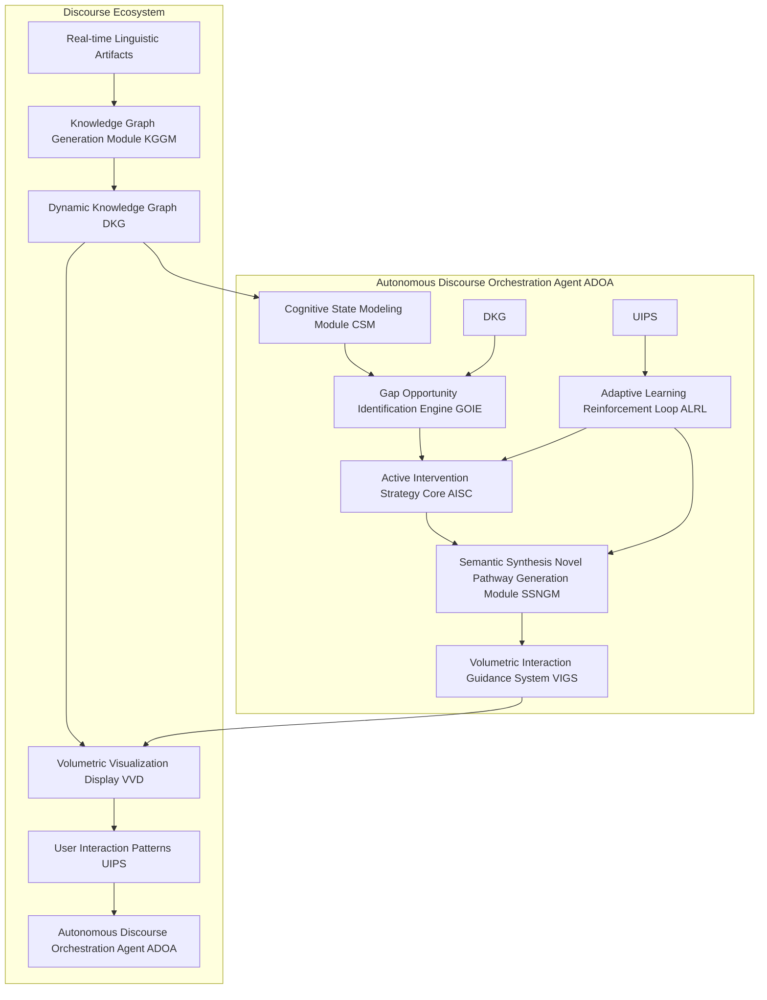
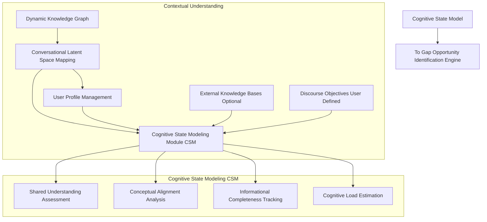
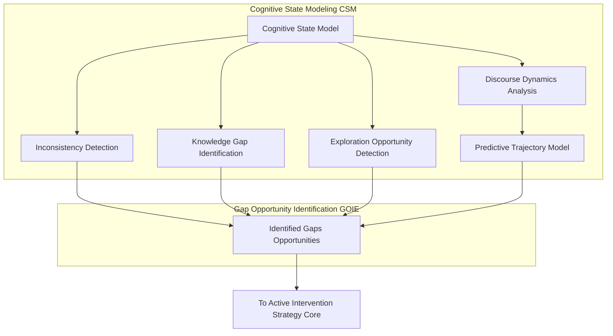
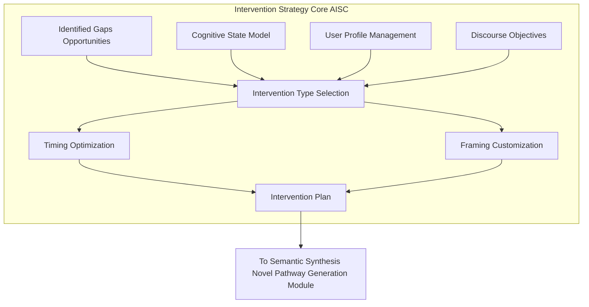
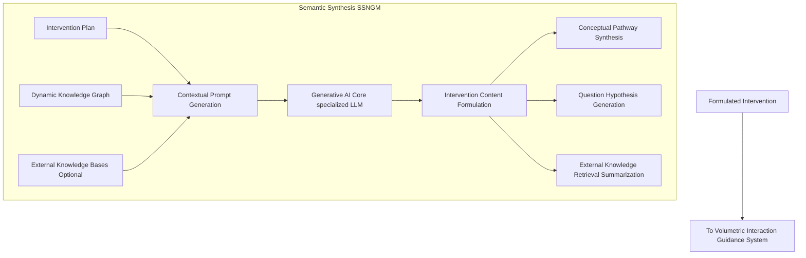
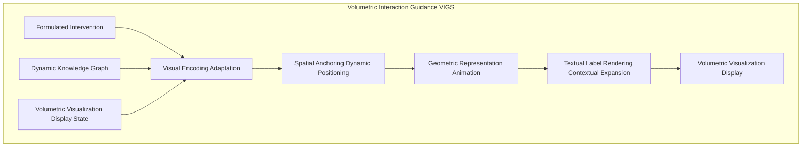
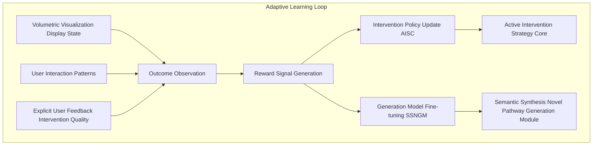
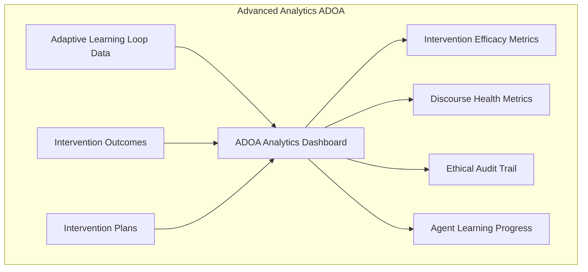

**Title of Invention:** A Self-Governing, Adaptive AI Agent Framework for the Autonomous Orchestration and Intelligent Augmentation of Human Discourse, Dynamically Identifying Knowledge Gaps, Synthesizing Novel Conceptual Pathways, and Proactively Guiding Collaborative Ideation within Volumetric Interaction Spaces

**Abstract:**
A groundbreaking framework is presented for an autonomous, adaptive artificial intelligence agent designed to proactively orchestrate and intelligently augment human discourse. Leveraging real-time analysis of conversational dynamics and existing knowledge graphs, this agent meticulously models the evolving cognitive state of a discussion. It autonomously identifies critical knowledge gaps, logical inconsistencies, unexplored conceptual avenues, and nascent opportunities for innovation. Employing sophisticated generative AI, the agent synthesizes novel questions, introduces relevant conceptual prompts, suggests alternative perspectives, and highlights overlooked relationships, all in real-time. These strategic interventions are seamlessly integrated and presented within an interactive, three-dimensional volumetric display, acting as subtle yet powerful nudges to guide the discourse towards higher efficacy, deeper understanding, and accelerated ideation. The agent operates within a continuous learning loop, refining its intervention strategies based on the observed impact on discourse quality and predetermined objectives, thereby transforming passive communication into a dynamically steered, intellectually optimized collaborative experience.

**Background of the Invention:**
Human collaborative discourse, while foundational to innovation and decision-making, is frequently hampered by inherent limitations. These include cognitive biases, groupthink, overlooked information, unaddressed knowledge gaps, and the natural ebb and flow of conversational energy, which can lead to stagnation or premature conclusion. Traditional methods of discourse management, such as human facilitation or passive transcription and summarization tools (even advanced volumetric ones), are inherently reactive or fallible. Human facilitators, despite their expertise, are susceptible to biases, fatigue, and can only process a fraction of the available semantic and temporal data. Existing AI tools for meetings typically function as intelligent secretaries, passively recording, transcribing, and summarizing. They lack the capacity for proactive, context-aware intervention necessary to dynamically steer a conversation, identify emergent needs for clarification, or synthesize novel conceptual pathways in real-time. The profound challenge lies in creating an impartial, intelligent entity capable of understanding the nuanced cognitive state of a discussion, discerning its informational completeness, predicting potential trajectories, and strategically intervening to optimize its intellectual output without disrupting natural human interaction. Such an entity must transcend mere data presentation, actively engaging in the very shaping of the discourse itself.

**Brief Summary of the Invention:**
The present invention introduces an unprecedented service paradigm: an **Autonomous Discourse Orchestration Agent ADOA** that acts as an intelligent, non-intrusive co-participant and guide in human conversations. At its core, the ADOA continuously ingests and interprets the real-time knowledge graph derived from ongoing discourse (potentially from an intelligent scribe system like the "Holographic Meeting Scribe"). It constructs a dynamic "cognitive state model" of the conversation, encompassing shared understanding, known unknowns, and conceptual distances. Based on this model, the ADOA's sophisticated **Gap and Opportunity Identification Engine** proactively detects critical junctures where intervention can significantly enhance discourse quality. These junctures include nascent knowledge gaps, logical inconsistencies, unaddressed dependencies, or under-explored concepts. The **Semantic Synthesis and Pathway Generation Module** then leverages advanced generative AI to formulate highly targeted, contextually relevant interventions—ranging from pointed questions, suggested new conceptual connections, alternative perspectives, or the introduction of pertinent external knowledge. These interventions are not delivered verbally but are seamlessly and intuitively materialized within a shared **Volumetric Interaction Space**. They appear as dynamic visual cues, spatially anchored nodes, or suggestive directional links, gently guiding participants' attention and thought processes. The ADOA operates under an adaptive learning framework, continuously refining its intervention strategies based on their observed impact on discourse metrics, thereby ensuring a progressively more effective and personalized orchestration of human ideation and decision-making.

**Detailed Description of the Invention:**

The present invention meticulously details a comprehensive system and methodology for an Autonomous Discourse Orchestration Agent ADOA. This agent is designed to elevate human collaboration beyond passive recording, introducing an active, intelligent force that shapes and optimizes conversational outcomes within immersive volumetric environments.

### 1. System Architecture Overview of the ADOA

The ADOA is architected as an intelligent layer that sits atop or integrates deeply with real-time discourse processing and volumetric visualization systems. It functions as a meta-cognitor for the conversation.



**Description of Architectural Components:**

*   **A. Real-time Linguistic Artifacts:** Continuous stream of transcribed utterances, speaker attributions, and temporal markers.
*   **B. Knowledge Graph Generation Module KGGM:** Processes linguistic artifacts into a structured knowledge graph (as described in prior inventions).
*   **C. Dynamic Knowledge Graph DKG:** The continuously updated, semantic-topological representation of the ongoing discourse.
*   **D. Volumetric Visualization Display VVD:** The interactive 3D environment where the discourse knowledge graph is rendered and where ADOA interventions are materialized.
*   **E. User Interaction Patterns UIPS:** Implicit feedback derived from user engagement with the VVD (e.g., gaze, navigation, interaction with nodes/edges).
*   **CSM. Cognitive State Modeling Module:** Infers the shared understanding and cognitive landscape of participants.
*   **GOIE. Gap and Opportunity Identification Engine:** Detects areas for intervention (missing info, logical leaps, new ideas).
*   **AISC. Active Intervention Strategy Core:** The decision-making unit for *when* and *what type* of intervention to make.
*   **SSNGM. Semantic Synthesis and Novel Pathway Generation Module:** Generates the content of interventions.
*   **VIGS. Volumetric Interaction and Guidance System:** Translates interventions into visual cues for the VVD.
*   **ALRL. Adaptive Learning and Reinforcement Loop:** Continuously improves ADOA's performance based on outcomes.

### 1.1. Detailed Knowledge Graph Generation Module (KGGM)

The KGGM is pivotal for transforming raw linguistic data into a structured, machine-interpretable format, serving as the ADOA's primary source of discourse information.

```mermaid
graph TD
    subgraph Knowledge Graph Generation Module (KGGM)
        A[Raw Audio/Text Stream] --> B{ASR & Transcription};
        B --> C{Speaker Diarization & Attribution};
        C --> D{Named Entity Recognition NER};
        D --> E{Relation Extraction RE};
        E --> F{Sentiment Analysis SA};
        F --> G{Temporal & Causal Event Extraction};
        G --> H{Coreference Resolution CR};
        H --> I[Ontology Mapping & Schema Alignment];
        I --> J[Graph Database & DKG Construction];
        J --> DKG[Dynamic Knowledge Graph (DKG)];
        DKG --> K[Graph Embeddings Generation];
        K --> CLS[Conversational Latent Space Mapping];
    end
```

**Description of KGGM Sub-components:**
*   **ASR & Transcription:** Converts spoken language to text `Utterance_i = ASR(Audio_i)`.
*   **Speaker Diarization & Attribution:** Identifies speakers `Speaker_j` and assigns utterances: `(Utterance_i, Speaker_j, Timestamp_i)`.
*   **Named Entity Recognition (NER):** Identifies and classifies entities (people, organizations, locations, concepts, dates) `Entity_k = NER(Utterance_i)`.
*   **Relation Extraction (RE):** Identifies semantic relationships between entities `Relation_mn = RE(Entity_m, Entity_n, Utterance_i)`.
*   **Sentiment Analysis (SA):** Determines the emotional tone of utterances or entities `Sentiment_i = SA(Utterance_i)`.
*   **Temporal & Causal Event Extraction:** Identifies events, their timestamps, and causal links `Event_p = (Action, Agent, Object, Time, Cause)`.
*   **Coreference Resolution (CR):** Links mentions that refer to the same entity `Coreference(Pronoun, Entity)`.
*   **Ontology Mapping & Schema Alignment:** Maps extracted entities and relations to a predefined domain ontology for consistency and deeper semantic understanding.
*   **Graph Database & DKG Construction:** Assembles all processed information into a continuously updated graph structure.
*   **Graph Embeddings Generation:** Generates low-dimensional vector representations for nodes and edges in the DKG, enabling advanced machine learning operations.

### 2. Discourse Analysis and Contextual Understanding Module

The ADOA builds upon the foundational capabilities of prior systems for discourse understanding, integrating advanced layers of contextual intelligence.



*   **2.1. Conversational Latent Space Mapping CLS:**
    *   Utilizes deep learning models (e.g., recurrent neural networks, transformer encoders) to project the DKG, including node embeddings and relationship embeddings, into a high-dimensional, continuously evolving latent space.
    *   This latent space captures the overall "meaning trajectory" of the conversation, allowing for similarity comparisons and trend detection.
    *   The latent representation `L_t` of the DKG at time `t` is given by `L_t = f_encoder(DKG_t)`, where `f_encoder` is typically a Graph Neural Network (GNN) such as a Graph Attention Network (GAT) or a Relational Graph Convolutional Network (R-GCN), operating on the graph structure `G_t = (V_t, E_t)` of the DKG.
    *   Node embeddings are represented as `v_i ∈ R^d`. The adjacency matrix `A_t` and node features `X_t` are inputs.
    *   Graph Convolutional Layer: `H^(l+1) = sigma(A_hat H^(l) W^(l))`, where `A_hat` is the normalized adjacency matrix, `H^(l)` is the output of the `l`-th layer, and `W^(l)` is the weight matrix.
*   **2.2. User Profile Management UPM:**
    *   Maintains profiles of active participants, including their historical contributions, known expertise areas, biases, and interaction styles. This informs how interventions are framed and targeted.
    *   A user profile `U_j` for participant `j` may include a vector `e_j` representing their expertise, a bias vector `b_j`, and a communication style `c_j`.
*   **2.3. Shared Understanding Assessment:**
    *   Analyzes the DKG and CLS to infer the degree of shared understanding among participants on key concepts, leveraging metrics like conceptual overlap, agreement sentiment, and co-occurrence in utterances.
    *   Shared understanding `SU_t` for a concept `C` among participants `P = {P_1, ..., P_N}`: `SU_t(C) = 1/N * sum_{j=1}^N (affinity(P_j, C) * agreement(P_j, C))`.
    *   Affinity `affinity(P_j, C)` can be based on `cosine_similarity(e_j, embedding(C))`.
    *   Agreement `agreement(P_j, C)` could be derived from sentiment analysis of utterances by `P_j` related to `C`.
    *   Conceptual overlap for two participant's latent concept representations `l_{P_i}, l_{P_j}` could be `Jaccard(Concepts(P_i), Concepts(P_j))` or `cosine_similarity(l_{P_i}, l_{P_j})`.
*   **2.4. Informational Completeness Tracking:**
    *   Identifies concepts, decisions, or action items that have been introduced but lack sufficient detail, supporting evidence, or complete resolution within the discourse. Compares against predefined schema or external knowledge.
    *   Completeness Score for concept `C`: `Comp(C) = (sum_{k=1}^M I(property_k_present(C))) / M`, where `I` is an indicator function and `M` is the number of required properties from a schema `S_C`.
    *   Resolution Status for decision `D`: `Res(D) = 1` if `DKG_t` contains an `AgreedUpon` relation for `D`, `0` otherwise.
*   **2.5. Cognitive Load Estimation:**
    *   Monitors discourse complexity, pace, and novelty of introduced concepts to estimate the collective cognitive load on participants. This helps the ADOA decide if an intervention would be beneficial or overwhelming.
    *   `CL_t = alpha * Rate_of_New_Concepts_t + beta * Complexity_t + gamma * Disruption_Score_t`.
    *   `Rate_of_New_Concepts_t = |{C_new ∈ DKG_t | C_new ∉ DKG_{t-dt}} / dt|`.
    *   `Complexity_t = avg_path_length(DKG_t) * entropy_of_topics_t`.

### 3. Cognitive State Modeling and Gap Identification Engine GOIE

This module is the core intelligence for discerning the nuanced state of the discourse and pinpointing strategic moments for intervention.



*   **3.1. Discourse Dynamics Analysis:**
    *   Analyzes temporal changes in topic focus, speaker turn-taking patterns, sentiment shifts, and engagement levels within the DKG and CLS.
    *   Identifies phases of ideation, convergence, divergence, and potential stagnation.
    *   Topic Shift Rate: `TSR_t = 1 - cosine_similarity(L_t_topic, L_{t-dt}_topic)`.
    *   Speaker Balance: `SB_t = 1 / sqrt(sum_{j=1}^N (P_j - avg_P)^2)`, where `P_j` is proportion of turns by speaker `j`.
    *   Stagnation detection: `Stagnation_t = 1` if `TSR_t < epsilon_TSR` and `avg_sentiment_t` is flat for `tau` duration.
*   **3.2. Predictive Trajectory Model:**
    *   Utilizes recurrent neural networks or transformer models trained on historical discourse patterns to predict likely future conversational trajectories based on the current cognitive state.
    *   Identifies suboptimal paths (e.g., circular arguments, tangents) that need redirection.
    *   `P(s_{t+k} | s_t, a_t, ..., s_0, a_0) = f_predictor(sequence(L_0..L_t), sequence(a_0..a_{t-1}))`.
    *   A suboptimal trajectory `S_sub` is identified if `P(S_sub | current_state) > threshold_sub`.
*   **3.3. Inconsistency Detection:**
    *   Scans the DKG for logical contradictions, factual discrepancies (potentially against external knowledge bases), or unaddressed conflicting viewpoints.
    *   Example: A stated "decision to proceed" that contradicts previously highlighted "risks."
    *   Formal Logic: Detect `(P AND NOT P)` within `DKG_t`.
    *   Contradiction Score `Contradiction_Score(DKG_t) = sum_{k=1}^K I(is_contradictory(assertion_k, DKG_t))`.
    *   Factual inconsistency: `f_check(statement, ExternalKB) = {true, false}`.
*   **3.4. Knowledge Gap Identification:**
    *   Compares the current DKG against a target information schema or a predefined set of discourse objectives.
    *   Identifies missing concepts, unassigned action items, unresolved questions, or insufficient detail for key decisions.
    *   Detects areas where a specific piece of external knowledge is highly relevant but has not been introduced.
    *   `Gap_k = (Concept_k, Required_Property_j)` where `Property_j` is missing from `Concept_k` in `DKG_t` but present in `TargetSchema`.
    *   Relevance to External KB: `Relevance(C, KB_ext) = max_score(query(C, KB_ext))`. If `Relevance > threshold` and `C` is underdeveloped in `DKG_t`, it's a gap.
*   **3.5. Exploration Opportunity Detection:**
    *   Identifies areas of high conceptual density or novelty within the DKG that are underexplored.
    *   Uses latent space clustering to find "neighboring" conceptual territories that have not been discussed but show high relevance to the ongoing topic.
    *   Opportunity Score `Opp(C) = Density(C) * Novelty(C) * Underexploration(C)`.
    *   `Density(C) = |neighbors(C) in CLS|`.
    *   `Novelty(C) = 1 - max_sim(C, DKG_baseline_concepts)`.
    *   `Underexploration(C) = 1 - (utterance_count(C) / total_utterance_count)`.

### 4. Proactive Intervention and Augmentation Strategy Core AISC

This module determines the optimal type, timing, and framing of an intervention to maximize discourse efficacy, acting as the agent's "decision-maker."



*   **4.1. Intervention Type Selection:**
    *   Based on the identified gap/opportunity, cognitive load, and discourse objectives, the AISC selects the most appropriate intervention type from a rich taxonomy:
        *   `QUESTION`: To prompt clarification or deeper exploration.
        *   `SYNTHESIS`: To connect disparate ideas or summarize complex points.
        *   `SUGGESTION`: To introduce a new concept or perspective.
        *   `REMINDER`: To bring attention to an overlooked decision or action item.
        *   `CLARIFICATION`: To highlight an ambiguity or inconsistency.
        *   `EXTERNAL_CONTEXT`: To introduce information from an external knowledge base.
    *   This is a classification problem, `P(type_k | gap_features, CSM_features, UPM_features, DO)`. A neural network `f_type_selector` outputs `softmax(W_type * [gap_vec; csm_vec; upm_vec; do_vec])`.
*   **4.2. Timing Optimization:**
    *   Employs a real-time predictive model to determine the optimal moment for intervention, considering factors like:
        *   **Cognitive load:** Avoids intervention during peak cognitive strain. `I(CL_t < CL_max)`.
        *   **Speaker turn-taking:** Intervenes during natural pauses or transitions. `I(speech_activity_t < threshold_speech_activity)`.
        *   **Impact potential:** Maximizes the likelihood of a positive response. `P(Positive_Response | intervention_t, context_t)`.
        *   **Urgency:** Prioritizes critical gaps or inconsistencies. `Urgency_Score_t(gap_k)`.
    *   Optimal timing `t* = argmax_t P(reward_t | intervention_t, current_state)`. This is often solved by a separate predictive model `f_timing` or integrated into the RL policy.
*   **4.3. Framing Customization:**
    *   Tailors the phrasing and visual representation of the intervention based on user profiles, discourse goals, and prevailing sentiment.
    *   For example, a "suggestion" might be presented as a bold new concept for an ideation session, but as a cautious "consideration" during a risk assessment.
    *   Framing vector `F = f_framing(type, UPM_j, avg_sentiment_t, DO)`. This vector influences the prompt generation in SSNGM.

### 5. Semantic Synthesis and Novel Pathway Generation Module SSNGM

This generative module is responsible for formulating the actual content of the ADOA's interventions, leveraging advanced large language models LLMs specialized for knowledge synthesis and creative ideation.



*   **5.1. Contextual Prompt Generation:**
    *   Dynamically constructs highly specific, multi-layered prompts for the Generative AI Core, incorporating:
        *   The identified gap/opportunity.
        *   Relevant fragments from the DKG.
        *   Desired intervention type and framing from the AISC.
        *   Output schema constraints (e.g., "return a concise question," "suggest 3 related concepts").
    *   Prompt `P_prompt = Template(type, framing, DKG_context, gap_details, output_schema_constraints)`.
    *   `DKG_context` could be a subgraph `G_sub = extract_relevant_subgraph(DKG_t, gap_concept, k_hops)`.
*   **5.2. Generative AI Core (Specialized LLM):**
    *   A fine-tuned Large Language Model or a composite AI agent designed for tasks like:
        *   **Conceptual Pathway Synthesis:** Identifies and articulates novel connections between disparate nodes in the DKG, suggesting emergent themes or solutions. This involves "creative" generation within the latent space of concepts.
        *   **Question and Hypothesis Generation:** Formulates precise, open-ended questions or testable hypotheses to probe knowledge gaps or stimulate critical thinking.
        *   **External Knowledge Retrieval and Summarization:** Queries connected external knowledge bases Wikipedia, academic papers, proprietary databases and synthesizes relevant information concisely for insertion into the discourse.
    *   The core generates `I_content = LLM(P_prompt)`.
    *   This can be represented as `P(I_content | P_prompt) = prod_{i=1}^L P(w_i | w_{<i}, P_prompt)`, where `w_i` are tokens of the generated content.
*   **5.3. Intervention Content Formulation:**
    *   Generates the textual content and associated semantic embeddings for the intervention, ensuring it adheres to the selected framing and type.
    *   The output is structured, ready for visual encoding.
    *   `Intervention_Output = {text: I_content, embeddings: E(I_content), semantic_links: L_sem}`.
    *   `L_sem` includes links to existing DKG nodes that the intervention refers to.

### 5.4. Deep Dive: Generative AI Core for Pathway Synthesis

This submodule is at the heart of the ADOA's creative capacity, enabling it to suggest genuinely novel conceptual links.

```mermaid
graph TD
    subgraph Generative AI Core (Specialized LLM for SSNGM)
        A[Contextual Prompt from P_prompt] --> B{Pre-trained LLM Foundation Model};
        B --> C{Fine-tuning Adapter Layer RAG-based};
        C --> D{Retrieval Augmented Generation (RAG) Module};
        D --> E[External Knowledge Bases/APIs];
        D --> F[DKG Embedding Store];
        F --> G[Graph Query & Traversal Engine];
        G --> H{Conceptual Linker & Synthesizer};
        H --> I[Novel Question/Hypothesis Generator];
        I --> J[Summarization & Formatting Layer];
        J --> SSNGM_OUTPUT[Formulated Intervention Content];
    end
```

**Expanded Math for SSNGM:**

*   Let `P_prompt` be the input prompt vector.
*   The LLM generates a sequence of tokens `w_1, ..., w_L` for the intervention content `I_content`.
*   The conditional probability of generating `I_content` given `P_prompt` is:
    `P(I_content | P_prompt) = P(w_1, ..., w_L | P_prompt) = prod_{i=1}^L P(w_i | w_1, ..., w_{i-1}, P_prompt)`
*   This generation process is often guided by a decoding strategy, e.g., nucleus sampling or beam search.

**Conceptual Pathway Synthesis:**
*   Given source concepts `C_s` and target concepts `C_t` (or a gap `G_k`) within the DKG, the goal is to find or generate a path `Path(C_s, ..., C_t)` that might not explicitly exist but is semantically plausible or novel.
*   `f_synthesis(C_s, C_t, DKG_t, EXK)` attempts to find an intermediate concept `C_int` or a sequence of relations `R_1, ..., R_m` such that `C_s -R_1-> X -R_2-> ... -R_m-> C_t`.
*   This can involve searching for paths in `DKG_t` based on embedding similarities `cosine_similarity(v_i, v_j) > threshold_sim` and then using the LLM to articulate the emergent pathway.
*   Novelty score of a generated path: `Novelty_path = 1 - max(similarity(generated_path, existing_paths_in_DKG))`.

**Question and Hypothesis Generation:**
*   For a knowledge gap `G_k` about concept `C`, the LLM generates a question `Q` designed to elicit `missing_info(G_k)`.
*   `Q = LLM_Q(C, missing_info_spec, context_DKG_subgraph)`.
*   The quality of `Q` can be measured by its specificity, open-endedness, and relevance:
    *   `Specificity(Q) = -log P(Q | C, missing_info_spec)`.
    *   `Openness(Q) = I(Q contains 'how', 'why', 'what if')`.
    *   `Relevance(Q, C) = cosine_similarity(embedding(Q), embedding(C))`.

**External Knowledge Retrieval and Summarization:**
*   When `type = EXTERNAL_CONTEXT`, the SSNGM formulates a query `Q_KB = f_query_gen(gap_details, DKG_context)` for external knowledge bases `EXK`.
*   Retrieval step: `Results = EXK_API(Q_KB)`.
*   Summarization step: `Summary = LLM_Summary(Results, desired_length, framing)`.
    *   `Summary_score = ROUGE_L_score(Summary, Gold_Standard_Summary)`. (During training/evaluation).

### 6. Volumetric Interaction and Guidance System VIGS

This module is responsible for translating the formulated interventions into compelling, non-disruptive visual cues within the 3D volumetric display.



*   **6.1. Visual Encoding Adaptation:**
    *   Determines the optimal visual properties (color, shape, size, animation) for the intervention based on its type, urgency, and the current state of the VVD (e.g., to ensure visibility without clutter).
    *   `Visual_Params = f_visual_encoder(Intervention_type, Urgency_score, DKG_density_at_anchor, VVD_light_level)`.
    *   This mapping uses a predefined palette and rules, e.g., `color = Red` if `Urgency_score > 0.8`, `color = Blue` for `QUESTION`.
*   **6.2. Spatial Anchoring and Dynamic Positioning:**
    *   Places the intervention's visual representation strategically within the 3D space, typically near the relevant concepts or speakers in the DKG.
    *   Uses dynamic layout algorithms to ensure the intervention is visually salient but doesn't obscure existing content.
    *   For instance, a "suggested link" might appear as a faint, pulsating line between two existing concept nodes.
    *   Anchor position `P_anchor = P_node(concept_target) + Offset(view_angle, existing_density)`.
    *   `Offset` is calculated to avoid occlusion: `Minimize(overlap(bbox(intervention), bbox(existing_nodes)))`.
*   **6.3. Geometric Representation and Animation:**
    *   Renders the intervention using appropriate 3D primitives or custom meshes.
    *   Employs subtle animations (e.g., gentle pulsing, emergent growth) to draw attention without being distracting.
    *   `Animation_effect = f_animation(Intervention_type, Impact_score)`.
    *   For a `SYNTHESIS` intervention, a glowing particle path might animate from `C_i` to `C_j` to `C_k`.
*   **6.4. Textual Label Rendering and Contextual Expansion:**
    *   Displays concise 3D text labels for the intervention.
    *   On user hover or interaction, these labels can expand to reveal more detailed contextual information or the full text of a generated question.
    *   `Text_Size = f_size(importance, user_distance)`.
    *   `Visibility_Threshold = f_visibility_check(distance, current_VVD_objects_density)`.

### 7. Adaptive Learning and Reinforcement Loop ALRL

This critical module ensures the ADOA continuously learns and improves its intervention strategies over time, optimizing for predefined discourse objectives.



*   **7.1. Outcome Observation:**
    *   Monitors the discourse following an intervention for key indicators of success or failure. These include:
        *   **Engagement:** Do participants acknowledge and interact with the intervention? `Engagement_t = I(UIPS_t contains interaction_with_intervention)`.
        *   **Directional shift:** Does the conversation shift towards the intended topic or clarification? `Topic_Shift_Magnitude = cosine_similarity(L_t_post_int, L_t_int_target)`.
        *   **Resolution:** Does a knowledge gap get filled, or a decision get made? `Delta_Completeness = Comp(C_post_int) - Comp(C_pre_int)`.
        *   **Novelty:** Does the intervention lead to new, valuable ideas? `Delta_Novel_Connections = |E_new_post_int|`.
        *   **Disruption:** Does the intervention cause confusion or interruption? `Disruption_t = I(Negative_Sentiment_Spike OR CL_t_spike)`.
*   **7.2. Reward Signal Generation:**
    *   Translates observed outcomes into a quantitative reward signal for the reinforcement learning algorithm.
    *   Positive rewards for successful interventions (e.g., leading to resolution, increased conceptual connections, positive sentiment shift).
    *   Negative rewards for disruptive or ineffective interventions.
    *   `R_t = w_1 * Engagement_t + w_2 * Topic_Shift_Magnitude + w_3 * Delta_Completeness + w_4 * Delta_Novel_Connections - w_5 * Disruption_t + R_explicit_feedback`.
    *   The weights `w_i` are configurable based on discourse objectives.
*   **7.3. Policy Update (Intervention Strategy Core):**
    *   Utilizes reinforcement learning (e.g., Deep Q-Networks, Proximal Policy Optimization) to update the decision-making policy of the AISC.
    *   The agent learns *when* and *what type* of intervention is most effective under specific cognitive state conditions.
    *   Policy `pi_theta(a | o_t)` where `theta` are the parameters of the AISC neural network.
    *   Policy gradient update rule: `theta = theta + alpha * grad_theta log(pi_theta(a_t | o_t)) * Q(s_t, a_t)`, where `Q` is the action-value function.
*   **7.4. Generation Model Fine-tuning (SSNGM):**
    *   Fine-tunes the generative AI core within the SSNGM based on feedback on the *quality* and *relevance* of the generated intervention content.
    *   This ensures the agent learns to synthesize more accurate, creative, and contextually appropriate interventions.
    *   Fine-tuning objective: `L_fine_tune = - E[log P_SSNGM(I_content_target | P_prompt, explicit_feedback_signal)]`. This can incorporate RLHF principles.

### 7.5. Reinforcement Learning Architecture for ALRL

A detailed view of the ALRL's internal structure and how it manages the learning process.

```mermaid
graph TD
    subgraph Adaptive Learning & Reinforcement Loop (ALRL)
        A[Observed State o_t (CSM, DKG, UIPS)] --> B{Policy Network (AISC)};
        B --> C[Action a_t (Intervention Type, Timing, Framing)];
        C --> D{Environment (Human Discourse + VVD)};
        D --> E[Next State o_{t+1}];
        D --> F[Reward R_t];
        
        F --> G{Experience Replay Buffer};
        E --> G;
        A --> G;
        C --> G;
        
        G --> H{Optimization Algorithm (e.g., PPO, DQN)};
        H --> B;
        H --> I{Value Network (Critic)};
        I --> B; 
        
        C --> J{Content Generation (SSNGM)};
        J --> K[Human Feedback (Quality, Relevance)];
        K --> H; 
    end
```

### 8. Security and Privacy Considerations

The ADOA operates at a highly sensitive layer of human interaction, necessitating robust security and privacy protocols.

*   **8.1. Consent and Transparency:** Explicit user consent required for ADOA activation and intervention. Clear visual indicators within the VVD when the ADOA is active and intervening.
    *   Formal consent: `P(consent=True | User_Request_Form) >= Threshold`.
*   **8.2. Data Minimization:** Processes only the linguistic and contextual data necessary for its function. Ephemeral processing of sensitive intermediate states.
    *   Data Retention Policy: `tau_data_retention` for temporary states.
    *   Data Masking Function: `f_mask_pii(data_stream)`.
*   **8.3. Data Anonymization and Access Control:** Strict anonymization options for participant data. Role-based access control RBAC for managing ADOA permissions and configuration.
    *   `Anonymization_strength = {Full, Partial, None}`.
    *   `Access_level(User, Data_Type) = {Read, Write, Admin}` defined by RBAC matrix.
*   **8.4. Ethical Guidelines and Guardrails:** AI safety protocols embedded to prevent biased or manipulative interventions. Human-in-the-loop oversight mechanisms for high-stakes scenarios. Configurable "intervention thresholds" to control the ADOA's assertiveness.
    *   Bias detection: `Bias_Score(intervention_content, demographic_group)`.
    *   Intervention Threshold: `I(Urgency_Score > Min_Threshold AND Cognitive_Load < Max_Threshold)`.
    *   Human Override: `I(Human_Override_Signal_t = TRUE)`.

### 9. Advanced Analytics and Interpretability Features

Beyond its real-time orchestration, the ADOA provides profound insights into discourse dynamics and its own operational efficacy.



*   **9.1. ADOA Analytics Dashboard:**
    *   Provides a comprehensive view of the agent's performance, discourse impact, and learning trajectory.
*   **9.2. Intervention Efficacy Metrics:**
    *   Quantifies the success rate of various intervention types, showing which strategies are most effective under different discourse conditions.
    *   Metrics include average time to resolution, number of new conceptual connections, sentiment shift post-intervention.
    *   `Success_Rate(type) = |Successful_Interventions_type| / |Total_Interventions_type|`.
    *   `Avg_Time_To_Resolution = E[t_resolution - t_intervention | intervention_success=True]`.
*   **9.3. Discourse Health Metrics:**
    *   Tracks overall discourse quality indicators such as conceptual coherence, topic progression, balanced participation, and reduction in logical inconsistencies, attributing changes to ADOA interventions where applicable.
    *   `Coherence_t = 1 - Entropy(L_t_topic_distribution)`.
    *   `Inconsistency_Reduction_Rate = (Initial_Inconsistencies - Final_Inconsistencies) / Initial_Inconsistencies`.
*   **9.4. Ethical Audit Trail:**
    *   Logs all ADOA interventions, their triggering conditions, and observed immediate outcomes, allowing for human review and auditing to ensure ethical operation and prevent unintended biases.
    *   Log entry `L_k = (t_k, intervention_k, triggering_state_k, observed_outcome_k, reward_k)`.
*   **9.5. Agent Learning Progress:**
    *   Visualizes the ADOA's learning curve, demonstrating improvements in its intervention policy and generative capabilities over time.
    *   `Learning_Curve = Plot(Cumulative_Reward_t vs. Time_t)`.
    *   `Policy_Improvement = Delta_Performance_Metric / Training_Epochs`.

### 9.6. Interpretability of Intervention Decisions

Understanding *why* the ADOA intervenes is crucial for trust and refinement.

```mermaid
graph TD
    subgraph Interpretability Module
        A[Intervention Plan] --> B{Explainable AI (XAI) Engine};
        B --> C[Cognitive State Model CSM];
        B --> D[Gap/Opportunity Identification GOIE];
        B --> E[Policy Network AISC];
        B --> F[Contextual Prompt Gen SSNGM];
        
        B --> G[Feature Importance Analysis];
        B --> H[Counterfactual Explanations];
        B --> I[Decision Path Visualization];
        I --> J[Human User/Auditor];
    end
```
*   **9.6.1. Feature Importance Analysis:**
    *   Determines which inputs to the AISC (e.g., specific knowledge gap detected, current cognitive load, speaker's expertise) had the most weight in deciding an intervention.
    *   Using techniques like SHAP (SHapley Additive exPlanations) or LIME (Local Interpretable Model-agnostic Explanations) on the policy network.
    *   `Importance(feature_j) = SHAP_value(feature_j, intervention_decision)`.
*   **9.6.2. Counterfactual Explanations:**
    *   Answers "What if this input was different?" by showing what alternative intervention (or no intervention) would have occurred if certain conditions changed.
    *   `Counterfactual_Intervention = f_counterfactual(current_state, desired_change_in_state)`.
*   **9.6.3. Decision Path Visualization:**
    *   Visually represents the flow from detected gap, through cognitive state assessment, to intervention selection and content generation within the ADOA Analytics Dashboard.

**Claims:**

The following enumerated claims define the intellectual scope and novel contributions of the present invention, a testament to its singular advancement in the field of intelligent discourse orchestration and augmentation.

1.  A method for autonomous orchestration and intelligent augmentation of human discourse within a volumetric interaction space, comprising:
    a.  Continuously receiving a dynamic, attributed knowledge graph (DKG) representing an ongoing human discourse.
    b.  Constructing and continuously updating a Cognitive State Model (CSM) of said discourse, based on the DKG, user profiles, and external knowledge, assessing shared understanding, informational completeness, conceptual alignment, and estimated cognitive load.
    c.  Employing a Gap and Opportunity Identification Engine (GOIE) to analyze said CSM and DKG in real-time, identifying critical junctures for intervention, including knowledge gaps, logical inconsistencies, suboptimal discourse trajectories, and unexplored conceptual opportunities.
    d.  Determining an optimal intervention strategy using an Active Intervention Strategy Core (AISC), said strategy comprising an intervention type, timing, and framing, based on the identified juncture, CSM, and predefined discourse objectives.
    e.  Generating the content of said intervention using a Semantic Synthesis and Novel Pathway Generation Module (SSNGM), said module leveraging a generative artificial intelligence model to formulate contextually relevant questions, conceptual syntheses, suggestions, or external knowledge prompts.
    f.  Presenting said generated intervention non-disruptively within a three-dimensional volumetric visualization display (VVD), through a Volumetric Interaction and Guidance System (VIGS), wherein the intervention is materialized as spatially anchored visual cues, dynamic nodes, or suggestive directional links, visually encoding its type and purpose.
    g.  Observing the impact of said intervention on the discourse within the VVD and through subsequent updates to the DKG and CSM, including user interaction patterns and explicit feedback.
    h.  Utilizing an Adaptive Learning and Reinforcement Loop (ALRL) to refine the intervention strategies of the AISC and the generative capabilities of the SSNGM based on the observed impact, thereby continuously optimizing discourse outcomes for predefined objectives.

2.  The method of claim 1, wherein the DKG is derived from real-time linguistic artifacts through an Automatic Speech Recognition (ASR) engine, Speaker Diarization, Named Entity Recognition (NER), Relation Extraction (RE), and Graph Embeddings Generation within a Knowledge Graph Generation Module (KGGM).

3.  The method of claim 1, wherein the Cognitive State Model (CSM) estimates shared understanding using conceptual overlap metrics and infers informational completeness by comparing the DKG against a target information schema.

4.  The method of claim 1, wherein the Gap and Opportunity Identification Engine (GOIE) employs a predictive trajectory model based on deep learning to anticipate suboptimal conversational paths and detects inconsistencies through logical contradiction detection within the DKG.

5.  The method of claim 1, wherein the Active Intervention Strategy Core (AISC) selects intervention types from a taxonomy including `QUESTION`, `SYNTHESIS`, `SUGGESTION`, `REMINDER`, `CLARIFICATION`, and `EXTERNAL_CONTEXT`, and optimizes timing based on cognitive load, speaker turn-taking patterns, and urgency scores.

6.  The method of claim 1, wherein the Semantic Synthesis and Novel Pathway Generation Module (SSNGM) generates intervention content through contextual prompt generation for a fine-tuned Large Language Model capable of conceptual pathway synthesis, question/hypothesis generation, and external knowledge retrieval/summarization.

7.  The method of claim 1, wherein the Volumetric Interaction and Guidance System (VIGS) employs visual encoding adaptation, dynamic spatial anchoring, subtle geometric representation, and contextual textual label rendering to present interventions without disrupting human interaction.

8.  The method of claim 1, wherein the Adaptive Learning and Reinforcement Loop (ALRL) employs reinforcement learning algorithms to update the AISC's policy based on reward signals derived from metrics such as discourse engagement, topic directional shift, knowledge gap resolution achievement, and novelty generation.

9.  The method of claim 1, further comprising an Advanced Analytics and Interpretability Module configured to provide an ADOA Analytics Dashboard, track Intervention Efficacy Metrics, monitor Discourse Health Metrics, and maintain an Ethical Audit Trail of agent operations.

10. A system configured to execute the method of claim 1, comprising a Knowledge Graph Generation Module (KGGM), a Discourse Analysis and Contextual Understanding Module, a Cognitive State Modeling Module (CSM), a Gap and Opportunity Identification Engine (GOIE), an Active Intervention Strategy Core (AISC), a Semantic Synthesis and Novel Pathway Generation Module (SSNGM), a Volumetric Interaction and Guidance System (VIGS), and an Adaptive Learning and Reinforcement Loop (ALRL), all operatively coupled and integrated within a volumetric interaction space.

**Mathematical Justification:**

The Autonomous Discourse Orchestration Agent ADOA represents a paradigm shift from passive observation to active, intelligent steering of human cognitive processes. Its operation can be rigorously formalized as a Reinforcement Learning RL problem, where the ADOA acts as an intelligent agent within a dynamic discourse environment.

### I. Formalizing the Discourse State as a Partially Observable Markov Decision Process POMDP

Let the ongoing human discourse be represented as a Partially Observable Markov Decision Process `M = (S, A, T, R, Omega, O, gamma)`.

*   **1.1. State Space `S`:** The true underlying state of the discourse `s_t` at any time `t`. This complex state `s_t` is inherently unobservable by the ADOA in its entirety, hence a POMDP. `s_t` encompasses:
    *   The complete, high-fidelity **Dynamic Knowledge Graph `DKG_t = (V_t, E_t, F_V, F_E)`** derived from the discourse up to time `t`.
        *   `V_t = {v_1, ..., v_N_t}`: Set of `N_t` nodes (concepts, entities, speakers, decisions).
        *   `E_t = {e_1, ..., e_M_t}`: Set of `M_t` edges (relations, links, dependencies) between nodes. Each edge `e_k = (v_i, r_j, v_l)` where `v_i, v_l ∈ V_t` and `r_j` is a relation type.
        *   `F_V(v_i)`: Feature vector for node `v_i`, typically a high-dimensional embedding `emb(v_i) ∈ R^d_v`, alongside attributes like `sentiment(v_i)`, `recency(v_i)`, `speaker_attribution(v_i)`.
        *   `F_E(e_k)`: Feature vector for edge `e_k`, including `type(e_k)`, `weight(e_k)`, `temporal_context(e_k)`.
        *   The DKG is constantly evolving: `DKG_{t+1} = DKG_t ∪ {new_nodes} ∪ {new_edges}`.
    *   The collective **Cognitive State `CS_t = (U_t, I_t, C_t, L_t)`** of all participants `P = {P_1, ..., P_K}`:
        *   `U_t`: Shared understanding matrix `U_t(i, j) = SU(P_i, C_j)`, representing participant `P_i`'s understanding level of concept `C_j`.
        *   `I_t`: Informational completeness vector `I_t(k) = Completeness(C_k)` for concept `C_k`.
        *   `C_t`: Conceptual alignment matrix `C_t(i, j) = Alignment(P_i, P_j)` between participants' views.
        *   `L_t`: Aggregate cognitive load `CL_t` across all participants.
        *   Each participant's individual cognitive state `cs_{t,k} = (attention_{t,k}, belief_{t,k}, sentiment_{t,k})`.
    *   The **Discourse Objectives `DO = {Goal_1, ..., Goal_Z}`**: Explicit or implicit goals for the conversation, formalized as a vector of desired states `s*_goal` or conditions `condition_goal(DKG_t)`. `DO` is part of the environment state.

*   **1.2. Action Space `A`:** The set of all possible interventions the ADOA can execute. An action `a_t` is a tuple `(type_t, content_t, timing_t, spatial_anchor_t)`, representing:
    *   `type_t ∈ {QUESTION, SYNTHESIS, SUGGESTION, REMINDER, CLARIFICATION, EXTERNAL_CONTEXT}`.
    *   `content_t`: The semantically synthesized textual or conceptual payload. This is a sequence of tokens `w_1, ..., w_L` or a structured semantic object `sem_obj`.
    *   `timing_t ∈ [t, t + delta_T]`: The precise moment `t_intervene` chosen for intervention, relative to current time `t`.
    *   `spatial_anchor_t ∈ R^3`: The `(x, y, z)` coordinates within the VVD where the intervention is materialized, typically linked to relevant `DKG_t` nodes or `V_t` elements.
    *   The full action space `A` is high-dimensional and continuous for `timing` and `spatial_anchor`, and discrete for `type`.

*   **1.3. Transition Function `T(s' | s, a)`:** The probability distribution over the next state `s'` given the current state `s` and the ADOA's action `a`. This function is highly complex and stochastic, as human discourse is inherently unpredictable. `T` models how an intervention `a` influences subsequent utterances, DKG evolution, and cognitive states.
    *   `P(s_{t+dt} | s_t, a_t) = P(DKG_{t+dt} | DKG_t, a_t) * P(CS_{t+dt} | CS_t, a_t) * P(U_{t+dt} | U_t, a_t) * ...` (simplified factorization).
    *   Modeling `T` directly is intractable; it's learned implicitly through interaction.

*   **1.4. Reward Function `R(s, a, s')`:** A scalar value quantifying the desirability of transitioning from state `s` to `s'` after taking action `a`. The reward function is critical for shaping ADOA's behavior and is designed to reflect discourse quality and objective achievement:
    *   `R(s_t, a_t, s_{t+dt}) = sum_{j} w_j * f_j(s_t, a_t, s_{t+dt}) - C(a_t)`.
    *   **Positive Reward Components `f_j`:**
        *   `R_coherence = delta_Coherence(DKG_t, DKG_{t+dt}) = (sum_{k} clustering_coeff(v_k, DKG_{t+dt})) - (sum_{k} clustering_coeff(v_k, DKG_t))`.
        *   `R_gap_reduction = I(Comp(C_target, DKG_{t+dt}) > Comp(C_target, DKG_t))`.
        *   `R_novelty = |{new_edges_created_by_intervention}| / |E_{t+dt}|` or `delta_centrality(new_concepts)`.
        *   `R_sentiment = avg_sentiment(Utterances_{t+dt}) - avg_sentiment(Utterances_t)`.
        *   `R_goal_progress = I(goal_achieved(s_{t+dt}) > goal_achieved(s_t))`.
        *   `R_engagement = I(a_t.clicked_by_user)`.
    *   **Negative Costs `C(a_t)`:**
        *   `C_cognitive_load = max(0, CL_{t+dt} - CL_max_threshold)`.
        *   `C_disruption = I(conversation_pause_duration_after_a_t > threshold_pause)`.
        *   `C_inconsistency = I(new_inconsistency_detected(DKG_{t+dt}))`.
        *   `C_explicit_negative_feedback = I(user_rates_a_t_negative)`.

*   **1.5. Observation Space `Omega`:** The set of observations `o_t` the ADOA receives at time `t`. Since the true state `s_t` is partially observable, `o_t` is a noisy, incomplete representation:
    *   The **Dynamic Knowledge Graph `DKG_t`** (as observed through the KGGM).
    *   **User Interaction Patterns `UIPS_t = {gaze_vectors_k, navigation_paths_k, click_events_k}`** in the VVD.
    *   **Explicit User Feedback `EF_t`** (e.g., corrections, ratings of interventions `rating(a_t) ∈ {-1, 0, 1}`).
    *   **Inferred Cognitive State `ICS_t`** (derived from the CSM, an approximation of `CS_t`). `ICS_t = f_infer(DKG_t, UIPS_t, previous_ICS_t)`.

*   **1.6. Observation Function `O(o | s)`:** The probability of observing `o` given the true state `s`. This models the uncertainty and partiality of the ADOA's sensory input.
    *   `P(o_t | s_t) = P(DKG_t | s_t) * P(UIPS_t | s_t) * P(EF_t | s_t) * P(ICS_t | s_t)`.
    *   This function encapsulates the noise and limitations of the sensing modules.

*   **1.7. Discount Factor `gamma`:** A factor in `[0, 1)` that discounts future rewards, encouraging the ADOA to prioritize immediate positive impacts while still considering long-term objectives. `gamma = 0.99` is a common choice.

### II. The ADOA's Policy and Optimization Objective

The ADOA's behavior is governed by a **policy `pi(a | o)`**, which maps observed states `o_t` to a probability distribution over actions `a_t`. The ADOA's objective is to find an optimal policy `pi*` that maximizes the expected cumulative discounted reward over the course of the discourse:

```
pi* = argmax_pi E[sum_{t=0}^T gamma^t R(s_t, a_t, s_{t+1}) | pi]  (Eq. 1)
```

Where `T` is the horizon of the discourse (e.g., end of meeting).

**Solving the POMDP:**

Directly solving a POMDP of this complexity is intractable. The ADOA employs an approximate approach:

1.  **Belief State Estimation:** The ADOA maintains a **belief state `b(s)`**—a probability distribution over the true underlying state `s_t` given all past observations. The CSM module contributes significantly to updating this belief state, especially the `ICS_t`.
    *   `b_t(s) = P(s_t | o_0, a_0, ..., o_t)`
    *   Update rule: `b_{t+1}(s') propto O(o_{t+1} | s') * sum_s (T(s' | s, a_t) * b_t(s))` (Bayes' rule). This is approximated by the `ICS_t`.
2.  **Deep Reinforcement Learning (DRL):**
    *   The AISC (Active Intervention Strategy Core) acts as the DRL agent. Its policy `pi_theta(a | o)` is parameterized by a deep neural network, taking the concatenated features of the observed `DKG_t`, `ICS_t`, `UIPS_t`, `DO`, and current `GOIE_output` as input.
    *   The network outputs probabilities for different intervention types, timings, and spatial anchors.
    *   `pi_theta(a_t | o_t) = softmax(NN_policy(features(o_t), theta))`. (Eq. 2)
    *   The SSNGM (Semantic Synthesis and Novel Pathway Generation Module) is another neural component that generates the *content* of `a_t` given the selected `type`. It can be fine-tuned via techniques like Reinforcement Learning from Human Feedback (RLHF) based on `EF_t`.
    *   Value function `V_phi(o_t)`: Estimates the expected future reward from state `o_t`.
    *   Q-function `Q_omega(o_t, a_t)`: Estimates the expected future reward from state `o_t` after taking action `a_t`.
    *   These are approximated by deep neural networks with parameters `phi` and `omega`.
3.  **Experience Replay and Policy Gradient Methods:** The ALRL (Adaptive Learning and Reinforcement Loop) collects `(o_t, a_t, R_t, o_{t+1})` tuples in an experience replay buffer `D`. It uses these experiences to update the DRL policy network parameters `theta` and value network parameters `phi` or `omega` through policy gradient methods (e.g., A2C, PPO) or value-based methods (e.g., DQN), thereby minimizing the prediction error of the expected returns and refining `pi`.
    *   **Loss for Policy Network (Actor):**
        `L_policy(theta) = - E_((o,a) ~ pi_theta) [ A(o,a) * log pi_theta(a|o) ]` (Eq. 3)
        where `A(o,a)` is the Advantage function, `A(o,a) = Q_omega(o,a) - V_phi(o)`.
    *   **Loss for Value Network (Critic):**
        `L_value(phi) = E_((o,a,R,o') ~ D) [ (R + gamma * V_phi(o') - V_phi(o))^2 ]` (Eq. 4)
    *   **Actor-Critic Update:**
        `theta <- theta + alpha_actor * grad_theta L_policy(theta)` (Eq. 5)
        `phi <- phi - alpha_critic * grad_phi L_value(phi)` (Eq. 6)

### III. Mathematical Basis for Intervention Effectiveness

Consider a metric of discourse quality `Q(DKG, CS)` (e.g., coherence, informational entropy, goal achievement). The ADOA's intervention `a` is effective if `Q(DKG_{t+1}, CS_{t+1}) > Q(DKG_t, CS_t)` in expectation, given the intent of `a`. This is formalized in the reward function.

*   **Knowledge Gap Reduction:** Let `G_k` be a knowledge gap, defined by a missing property `P_j` for concept `C_i`. `G_k = (C_i, P_j)`. An intervention `a_g` targeting `G_k` is effective if the informational entropy about `P_j` concerning `C_i` is reduced.
    *   Let `H(P_j | C_i, DKG_t)` be the entropy representing uncertainty about `P_j` for `C_i` at time `t`.
    *   Effectiveness: `E[H(P_j | C_i, DKG_{t+dt})] < H(P_j | C_i, DKG_t)`. (Eq. 7)
    *   This can be approximated by `Delta_Completeness(C_i, P_j) > 0`.
    *   Example: `H(P_j | C_i, DKG_t) = - sum_{val} P(val | P_j, C_i, DKG_t) log P(val | P_j, C_i, DKG_t)`. (Eq. 8)
*   **Conceptual Connection Synthesis:** Let `C_u` and `C_v` be two concepts in the `DKG`. An intervention `a_s` suggesting a new link (relationship `R_w`) between them `(C_u, R_w, C_v)` is effective if the probability of that link being confirmed or explored increases.
    *   `P(edge(C_u, C_v, R_w) exists in DKG_{t+k})` increases significantly for some small `k`. (Eq. 9)
    *   Graph metric: Increase in graph connectivity or average shortest path length between `C_u` and `C_v` in `DKG_{t+k}`.
    *   `delta_AvgPathLength = AvgPathLength(DKG_t) - AvgPathLength(DKG_{t+k})`. (Eq. 10)
    *   Centrality measure increase: `delta_BetweennessCentrality(R_w) = BC(R_w, DKG_{t+k}) - BC(R_w, DKG_t)`. (Eq. 11)
*   **Cognitive Load Optimization:** Let `CL_t` be the estimated cognitive load. Interventions `a_c` are timed and designed such that `CL_{t_intervene}` is below a threshold `CL_max`, and ideally `CL_{t+1}` does not spike excessively or is even reduced due to clarification.
    *   Condition for intervention: `CL_t < CL_max_threshold`. (Eq. 12)
    *   Desired outcome: `CL_{t+dt} <= CL_t` or `max(CL_spike_after_intervention) < epsilon_CL`. (Eq. 13)
    *   Cognitive Load `CL_t` is estimated using:
        `CL_t = w_N * N_t_new_concepts + w_S * Speaker_Switch_Rate_t + w_E * Discourse_Entropy_t + w_P * Speech_Rate_t`. (Eq. 14)
        *   `N_t_new_concepts = |V_t \ V_{t-dt}|`. (Eq. 15)
        *   `Speaker_Switch_Rate_t = num_speaker_changes / dt`. (Eq. 16)
        *   `Discourse_Entropy_t = -sum_i P(topic_i) log P(topic_i)`. (Eq. 17)
        *   `Speech_Rate_t = num_words / dt`. (Eq. 18)

### IV. Mathematical Formalization of Knowledge Graph Dynamics and Embeddings

The DKG is a core representation, and its manipulation is central to ADOA.

*   **Graph Representation:** A DKG at time `t` is `G_t = (V_t, E_t)`.
    *   `V_t` are nodes (entities, concepts) with features `X_V ∈ R^(|V_t| x d_v)`.
    *   `E_t` are edges (relations) with features `X_E ∈ R^(|E_t| x d_e)`.
    *   Adjacency tensor `A_t ∈ R^(|V_t| x |R| x |V_t|)`, where `|R|` is the number of relation types. `A_t[i, r, j] = 1` if an edge of type `r` exists from `v_i` to `v_j`. (Eq. 19)
*   **Node Embeddings:** Learned representations for each node, capturing semantic meaning.
    *   `h_i^(l+1) = sigma(sum_{r ∈ R} sum_{j ∈ N_r(i)} (A_t[i, r, j] W_r^(l) h_j^(l) + W_0^(l) h_i^(l)))`. (Eq. 20)
    *   This is a general form of a Relational Graph Convolutional Network (R-GCN).
    *   `emb(v_i)` is the final layer output `h_i^(L)`.
*   **Temporal Evolution of DKG:**
    *   `DKG_t` is a snapshot. The stream of linguistic artifacts creates a sequence of graphs `G_0, G_1, ..., G_T`.
    *   A temporal graph network can capture this evolution: `h_i^(t) = f_agg(h_i^(t-dt), f_update(messages_from_neighbors_at_t))`. (Eq. 21)
    *   `messages_from_neighbors_at_t` captures new interactions.

### V. Mathematical Basis for Cognitive State Modeling (CSM)

CSM approximates `CS_t` from observations `o_t`.

*   **Shared Understanding (SU):**
    *   For a concept `C` represented by embedding `emb(C)`, and participant `P_j` represented by expertise embedding `e_j`.
    *   `SU_j(C) = sigmoid(dot(e_j, emb(C)) / ||e_j|| ||emb(C)||)`. (Eq. 22) This provides a normalized affinity score.
    *   Overall Shared Understanding for `C`: `SU(C) = 1/K * sum_{j=1}^K SU_j(C) * Agreement_j(C)`. (Eq. 23)
    *   `Agreement_j(C)` could be `1` for positive sentiment, `-1` for negative, `0` for neutral.
*   **Informational Completeness (IC):**
    *   Let `S_C = {P_1, ..., P_M}` be the set of required properties for concept `C` from a target schema.
    *   `IC(C) = (sum_{k=1}^M I(P_k exists_in_DKG(C))) / M`. (Eq. 24)
    *   `exists_in_DKG(C)` means `(C, has_property, Value_k)` is in `DKG_t`.
*   **Conceptual Alignment (CA):**
    *   Between two participants `P_a, P_b`: `CA(P_a, P_b) = cosine_similarity(e_a, e_b) * Jaccard_Index(Concepts_P_a, Concepts_P_b)`. (Eq. 25)
    *   `Concepts_P_a` is the set of concepts `P_a` has contributed to or engaged with.
*   **Cognitive Load (CL):**
    *   `CL_t` defined previously. A threshold `CL_{max_t}` can be dynamically adapted based on user profiles or discourse type.
    *   `CL_max_threshold = f_adapt(U_t, DO_t)`. (Eq. 26)

### VI. Mathematical Basis for Gap and Opportunity Identification (GOIE)

GOIE uses statistical and learning methods to find `g_k ∈ GAPS_OPPS`.

*   **Inconsistency Detection:**
    *   Formal logic: `Detect(exists C, P: (C, P) ∈ DKG AND (C, NOT P) ∈ DKG)`. (Eq. 27)
    *   Semantic inconsistency: `cosine_similarity(emb(statement_1), emb(statement_2)) < threshold_contradiction AND type(statement_1) = type(statement_2)`. (Eq. 28)
*   **Knowledge Gap Identification:**
    *   Based on `IC(C) < threshold_IC`. (Eq. 29)
    *   Relevant external knowledge `K_ext` for `C` is missing: `max_{k_j ∈ K_ext} cosine_similarity(emb(C), emb(k_j)) > threshold_relevance AND I(k_j not_in DKG_t)`. (Eq. 30)
*   **Exploration Opportunity Detection:**
    *   `Opp(C) = score_density(C) * score_novelty(C) * score_underexploration(C)`. (Eq. 31)
    *   `score_density(C) = sum_{v_j ∈ N(C)} similarity(emb(C), emb(v_j))`. (Eq. 32)
    *   `score_novelty(C) = 1 - max_{C_old ∈ DKG_baseline} cosine_similarity(emb(C), emb(C_old))`. (Eq. 33)
    *   `score_underexploration(C) = 1 - (log(utterance_frequency(C) + 1) / log(max_utterance_frequency + 1))`. (Eq. 34)
*   **Predictive Trajectory Model:**
    *   A sequence model (Transformer, LSTM) `f_seq` predicts `P(next_topic | past_topics, discourse_context)`.
    *   `P(T_{t+1} | T_t, DKG_t, CS_t) = f_seq(emb(T_t), emb(DKG_t), emb(CS_t))`. (Eq. 35)
    *   Suboptimal path detected if `P(stagnation_state | current_state) > threshold_stagnation`. (Eq. 36)

### VII. Mathematical Basis for Semantic Synthesis (SSNGM)

SSNGM leverages LLMs to generate high-quality, relevant content.

*   **Contextual Prompt Generation:**
    *   The prompt `P_prompt` for the LLM is constructed as:
        `P_prompt = [BOS] + "Current state: " + DKG_snippet + " Cognitive state: " + CS_summary + " Gap: " + Gap_description + " Task: " + Intervention_Task_type + " Framing: " + Framing_Style + " [EOS]"`. (Eq. 37)
    *   `DKG_snippet = Text(subgraph_around_gap_concept)`. (Eq. 38)
*   **Generative AI Core (LLM):**
    *   Given `P_prompt`, the LLM samples tokens `w_i` from its conditional probability distribution.
    *   `I_content = Sampling(LLM(P_prompt))`. (Eq. 39)
    *   The quality of `I_content` is maximized by: `argmax_I_content P(I_content | P_prompt, R_RLHF)`. (Eq. 40)
    *   RLHF (Reinforcement Learning from Human Feedback) fine-tunes the LLM to align with human preferences for helpfulness, relevance, and non-disruptiveness.
    *   Loss for RLHF: `L_RLHF = - E_((x,y)~D) [ log(sigma(r_theta(x, y_w) - r_theta(x, y_l))) ]`. (Eq. 41)
        *   `r_theta` is a reward model, `y_w` is preferred, `y_l` is less preferred generation.
*   **Conceptual Pathway Synthesis:**
    *   Given `C_s, C_t`, generate `I_content` that describes intermediate connections.
    *   `I_content_path = LLM("Describe a novel pathway from " + C_s + " to " + C_t + " using DKG data: " + DKG_snippet_relevant)`. (Eq. 42)
*   **Question Generation:**
    *   `I_content_Q = LLM("Formulate a clear and open-ended question to address the gap: " + Gap_description + " in the context: " + DKG_snippet)`. (Eq. 43)

### VIII. Mathematical Basis for Volumetric Interaction Guidance System (VIGS)

VIGS translates abstract interventions into tangible 3D experiences.

*   **Visual Encoding Adaptation:**
    *   Mapping functions: `f_color(type, urgency)`, `f_shape(type, semantic_class)`, `f_size(impact, perceived_distance)`. (Eq. 44)
    *   `Color = C_type * Urgency_scaling + C_base`. (Eq. 45)
*   **Spatial Anchoring:**
    *   Target `v_anchor ∈ V_t` where the intervention is most relevant.
    *   `Pos_Intervention = Pos(v_anchor) + Offset_Vector`. (Eq. 46)
    *   `Offset_Vector = f_occlusion_avoidance(Pos(v_anchor), BoundingBox(DKG_neighbors))`. (Eq. 47)
    *   Minimize `Overlap(BoundingBox(intervention), BoundingBox(existing_elements))` using gradient descent on `Offset_Vector`. (Eq. 48)
*   **Animation:**
    *   Animation parameters `A_param = (duration, intensity, frequency)` are selected based on `type` and `urgency`.
    *   `Alpha_visibility(t) = sigmoid(t - t_start) * Exp(-lambda * (t - t_start))` (fade-in, fade-out). (Eq. 49)

### IX. Mathematical Basis for Adaptive Learning and Reinforcement Loop (ALRL)

The ALRL iteratively refines the ADOA's policy.

*   **Reward Signal Generation (Refined):**
    *   `R_t = w_1 * I(Engagement_metric_t > threshold) + w_2 * delta_metric_DKG + w_3 * delta_metric_CS - w_4 * I(Disruption_metric_t > threshold) + w_5 * EF_t`. (Eq. 50)
    *   `delta_metric_DKG = (coherence_{t+dt} - coherence_t) + (completeness_{t+dt} - completeness_t)`. (Eq. 51)
    *   `delta_metric_CS = (shared_understanding_{t+dt} - shared_understanding_t) - (cognitive_load_{t+dt} - cognitive_load_t)`. (Eq. 52)
*   **Policy Optimization (PPO Example):**
    *   `L_CLIP(theta) = E_t[ min(r_t(theta) * A_t, clip(r_t(theta), 1-epsilon, 1+epsilon) * A_t) ]`. (Eq. 53)
        *   `r_t(theta) = pi_theta(a_t | o_t) / pi_theta_old(a_t | o_t)` is the probability ratio. (Eq. 54)
        *   `A_t` is the advantage estimate.
    *   This loss function is maximized to update `theta`.
*   **Value Function Update:**
    *   `L_VF(phi) = E_t[ (V_phi(o_t) - V_target_t)^2 ]`. (Eq. 55)
        *   `V_target_t = R_t + gamma * V_phi(o_{t+1})`. (Eq. 56)
*   **SSNGM Fine-tuning (RLHF as discussed):**
    *   The reward model `r_theta` is trained to predict human preferences based on pairwise comparisons `(y_w, y_l)`.
    *   The LLM `P(y|x)` is then fine-tuned using PPO to maximize `E_x[r_theta(x, P(y|x))]`. (Eq. 57)

### X. Mathematical Basis for Advanced Analytics and Interpretability

Quantifying ADOA's impact and understanding its decisions.

*   **Intervention Efficacy Metrics:**
    *   Success Rate by type: `SR_type = |{a | type(a) = type AND R(s,a,s') > 0}| / |{a | type(a) = type}|`. (Eq. 58)
    *   Average Reward per Intervention: `Avg_R = E[R(s,a,s')]`. (Eq. 59)
    *   Return on Intervention (ROI): `ROI = (Avg_Positive_Impact - Avg_Cost_of_Intervention) / Avg_Cost_of_Intervention`. (Eq. 60)
        *   `Avg_Positive_Impact` is `sum(w_j * f_j)` from reward function.
        *   `Avg_Cost_of_Intervention` is `C(a_t)`.
*   **Discourse Health Metrics:**
    *   Discourse Velocity: `DV = Delta_Completeness_Overall / Time`. (Eq. 61)
    *   Topic Diversity: `TD = - sum_i p(topic_i) log p(topic_i)`. (Eq. 62)
    *   Participation Balance: `PB = 1 - sum_{j=1}^K (P_j - 1/K)^2`, where `P_j` is speaker `j`'s turn proportion. (Eq. 63)
*   **Ethical Audit Trail:**
    *   Log entry `L_k = (t_k, a_k, o_k, R_k, bias_score(a_k), CL_t_pre_int, CL_t_post_int)`. (Eq. 64)
    *   Bias Score: `bias_score(a_k) = f_bias_detector(content(a_k), target_population_attributes)`. (Eq. 65)
*   **Interpretability (SHAP Example):**
    *   `g(z') = sum_{j=1}^M phi_j z'_j`. (Eq. 66)
    *   `phi_j` is the SHAP value for feature `j`, representing its contribution to the prediction.
    *   `phi_j = sum_{S subset F \ {j}} (|S|!(|F|-|S|-1)! / |F|!) * [f_x(S cup {j}) - f_x(S)]`. (Eq. 67)
    *   Where `F` is the set of all features, `S` is a subset of features, `f_x` is the model output.

The comprehensive mathematical framework underpins the ADOA's design, ensuring its intelligent, adaptive, and ethically guided operation in enhancing human discourse. `Q.E.D.`