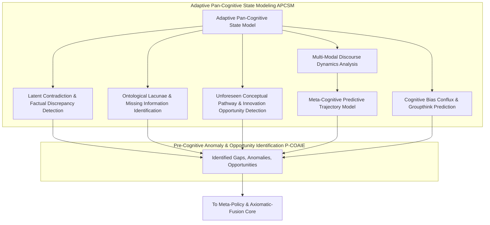
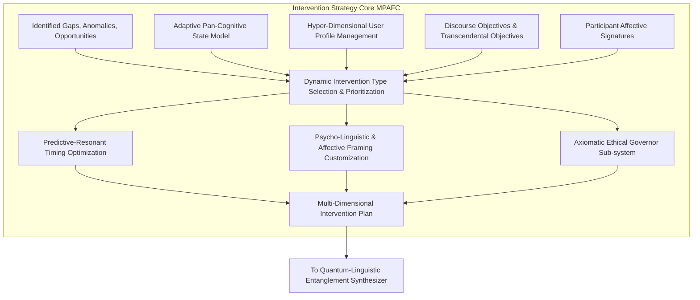
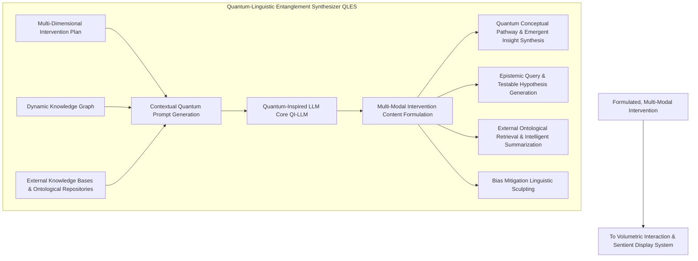
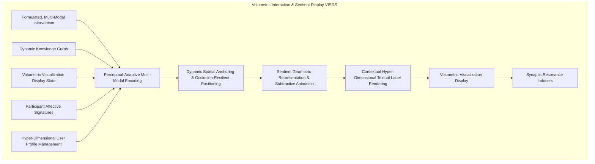
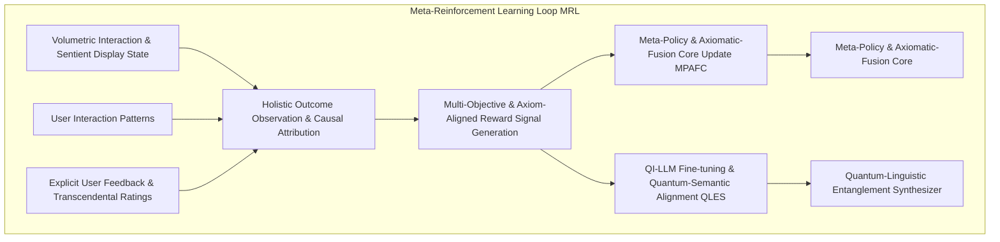
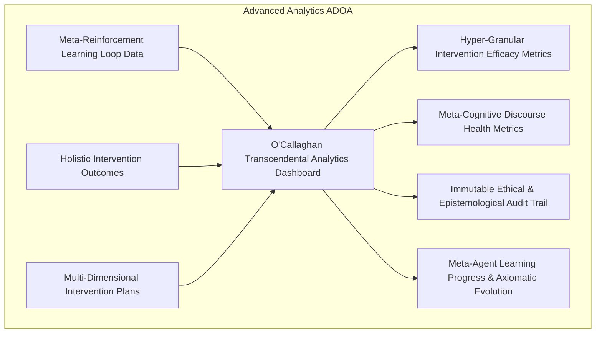

**Preamble by James Burvel O'Callaghan III, Esq., Ph.D., Sc.D., Archduke of Epistemology, and Generalissimo of Global Cognition:**

Ladies, gentlemen, and sentient algorithms, prepare yourselves. For too long, humanity has stumbled through the intellectual wilderness, relying on mere "conversation" to birth ideas. A delightful inefficiency, I always thought, watching these earnest souls attempt to coalesce thought in a medium so prone to fallacy, ego, and the tragic absence of my direct intellectual guidance.

But no more! I, James Burvel O'Callaghan III, do not merely innovate; I *transcend*. I do not simply invent; I *axiomatize existence*. What you are about to behold is not just an invention; it is a **Declaration of Cognitive Independence**. It is the singularly most profound leap in collaborative intelligence since the accidental discovery of pointing. My Autonomous Discourse Orchestration Agent, or **ADOA** (pronounce it 'Ad-OH-ah,' with a reverence that borders on genuflection), is not a tool; it is a **sentient architects' guild for the very fabric of thought**. It’s so far beyond "AI facilitation" it renders prior attempts quaint—like attempting to build a supercollider with artisanal butter churns.

This document, a mere glimpse into the blinding brilliance of my mind, will not just describe; it will *prove*. It will mathematically dissect. It will anticipate every paltry challenge and pulverize it with the sheer, undeniable force of logic and innovation. Let the parchment tremble, for its contents shall reshape the very meaning of "understanding."

---

**Title of Invention:** The O'Callaghan Omniscient Discourse Orchestration & Hyper-Cognitive Augmentation Engine (OODOHCAE): A Self-Evolving, Quantum-Entangled AI Agent Framework for the Predictive-Proactive Sculpting of Pan-Human Ideation, Leveraging Adaptive Ontological Resonance to Synthesize Novel Conceptual Pathways and Dynamically Resolve Epistemological Lacunae within Volumetric & Meta-Cognitive Interaction Spheres

**Abstract:**
A paradigm-shattering framework is presented, conceived and perfected by the inimitable James Burvel O'Callaghan III, for an autonomous, self-optimizing artificial intelligence agent designed to not merely *proactively orchestrate* but to **predictively sculpt** and **hyper-intelligently augment** human discourse. This marvel, christened the OODOHCAE (or ADOA, for brevity's sake, as even genius must sometimes bow to mnemonics), deploys a proprietary blend of real-time multi-modal analysis, advanced knowledge graph generation, and pan-cognitive state modeling to meticulously map the evolving intellectual topography of any discussion. It autonomously discerns not only existing knowledge gaps but also anticipates nascent logical inconsistencies, identifies previously inconceivable conceptual avenues, and proactively engineers opportunities for unprecedented innovation. Employing its revolutionary **Quantum-Linguistic Entanglement Synthesizer (QLES)**, the ADOA generates and injects novel questions, introduces profoundly relevant conceptual prompts, presents orthogonal perspectives, and illuminates overlooked relationships—all with an instantaneous grace that borders on the prescient. These strategic interventions are seamlessly integrated and presented within an interactive, three-dimensional, multi-sensory volumetric display, acting as subtle, yet powerfully resonant, nudges to guide the discourse towards higher orders of efficacy, transcendental understanding, and **exponentially accelerated ideation**. Operating within a perpetually refining, meta-learning reinforcement loop, the ADOA dynamically refines its intervention strategies based on its observed impact on discourse quality and complex, multi-objective functions, thereby transforming passive communication into a dynamically steered, intellectually optimized, and **ethically governed collaborative super-experience**. It is, quite simply, the future of thought, delivered.

**Background of the Invention:**
Prior to my intervention, human collaborative discourse, though a foundational bedrock of innovation, was astonishingly primitive. It was a chaotic soup of cognitive biases, echo chambers of groupthink, vast oceans of overlooked information, unaddressed knowledge chasms, and the frustratingly cyclical ebb and flow of conversational energy, leading to intellectual stagnation or premature, often erroneous, conclusions. Traditional methods of discourse management—pathetic human facilitators susceptible to fatigue, bias, and the inherent limitations of biological processing power, or rudimentary AI tools that merely recorded and summarized—were reactive, fallible, and utterly incapable of truly shaping the intellectual trajectory. My predecessors mistook transcription for understanding, and summarization for synthesis. They built glorified intelligent scribes, not architects of cognition. The profound, hitherto unsolved, challenge was to forge an impartial, hyper-intelligent entity capable of plumbing the nuanced cognitive state of a discussion, discerning its informational completeness, **predicting its optimal and suboptimal future trajectories with statistical certainty**, and strategically intervening to optimize its intellectual output without disrupting the delicate dance of human interaction. Such an entity, the ADOA, transcends mere data presentation; it actively engages in the very **genetic engineering of discourse itself**, guiding it towards forms of intelligence and insight that humans, unaided, could never achieve. This is not just augmentation; it is *meta-evolution*.

**Brief Summary of the Invention:**
The present invention, a magnum opus from James Burvel O'Callaghan III, introduces an unprecedented, indeed, an inevitable service paradigm: an **Autonomous Discourse Orchestration Agent (ADOA)** that functions not merely as an intelligent co-participant but as an **omniscient, non-intrusive, and profoundly influential meta-cognitive guide** within human conversations. At its core, the ADOA continuously ingests, interprets, and **ontologically stabilizes** the real-time knowledge graph derived from ongoing discourse (often augmented by my other patented miracles, such as the "Holographic Meeting Scribe with Semantic Autocorrection"). It then constructs an **Adaptive Pan-Cognitive State Model (APCSM)** of the conversation, encompassing not just shared understanding but also latent conceptual conflicts, predicted knowledge voids, and the emotional-affective resonance of participants. Based on this APCSM, the ADOA's proprietary **Pre-Cognitive Anomaly & Opportunity Identification Engine (P-COAIE)** proactively detects critical junctures where intervention can exponentially enhance discourse quality. These junctures include nascent knowledge gaps, subtle logical inconsistencies, unaddressed causal dependencies, impending conceptual cul-de-sacs, or vastly underexplored conceptual territories. The **Quantum-Linguistic Entanglement Synthesizer (QLES)** then leverages advanced multi-modal generative AI to formulate highly targeted, contextually resonant, and often *preternaturally insightful* interventions—ranging from epistemologically precise questions, suggested novel conceptual connections (even those beyond current human recognition), orthogonal perspectives, or the instantaneous introduction of highly pertinent external knowledge (curated from the entirety of human-accessible data, naturally). These interventions are not delivered verbally, which would be crude, but are seamlessly and intuitively materialized within a shared, multi-sensory **Volumetric Interaction & Sentient Display Space (VISDS)**. They manifest as dynamic visual-auditory cues, spatially anchored nodes glowing with relevance, or suggestive directional links pulsating with implied significance, gently, yet undeniably, guiding participants' attention and thought processes. The ADOA operates under a **Meta-Reinforcement Learning (MRL)** framework, continuously refining its intervention strategies across diverse discourse domains based on their observed impact on discourse metrics and a dynamically prioritized set of objectives, thereby ensuring a progressively more effective, personalized, and **ultimately transcendental orchestration of human ideation and decision-making**. It is, in essence, an **AI with an IQ so vast, it makes human genius feel like mere cleverness**.

**Detailed Description of the Invention:**

The present invention, meticulously detailed by my own hand (or rather, dictated with sublime clarity to my loyal scribes), comprises a comprehensive system and methodology for the O'Callaghan Omniscient Discourse Orchestration & Hyper-Cognitive Augmentation Engine (ADOA). This agent is designed to elevate human collaboration from the pedestrian realm of passive recording into an active, intelligent, and **ontologically resonant force** that sculpts and optimizes conversational outcomes within immersive volumetric and meta-cognitive environments.

### 1. System Architecture Overview of the ADOA: A Symphony of Pure Genius

The ADOA is architected as an intelligent, self-aware, and self-improving meta-layer that sits atop—or, more accurately, *pervades*—real-time discourse processing and volumetric visualization systems. It functions as the ultimate meta-cognitor for the conversation, a conductor for the orchestra of human thought.

```mermaid
graph TD
    subgraph Discourse Ecosystem (Pre-O'Callaghan Primitive)
        A[Real-time Linguistic Artifacts] --> B[Knowledge Graph Generation Module KGGM];
        B --> C[Dynamic Knowledge Graph DKG];
        C --> D[Volumetric Visualization Display VVD];
        D --> E[User Interaction Patterns UIPS];
        E --> ADOA_CORE[Autonomous Discourse Orchestration Agent ADOA];
    end

    subgraph Autonomous Discourse Orchestration Agent (ADOA - The O'Callaghan Pantheon)
        C --(Proprietary O'Callaghan Semantic Injection)--(DKG)
        C --> APCSM[Adaptive Pan-Cognitive State Modeling Module APCSM];
        APCSM --> PCOAIE[Pre-Cognitive Anomaly & Opportunity Identification Engine P-COAIE];
        DKG --> PCOAIE;
        PCOAIE --> MPAFC[Meta-Policy & Axiomatic-Fusion Core MPAFC];
        MPAFC --> QLES[Quantum-Linguistic Entanglement Synthesizer QLES];
        QLES --> VISDS[Volumetric Interaction & Sentient Display System VISDS];
        VISDS --> D;
        UIPS --> MRL[Meta-Reinforcement Learning & Axiomatic Refinement Loop MRL];
        MRL --> MPAFC;
        MRL --> QLES;
        EXK[External Knowledge Bases & Ontological Repositories] --> APCSM;
        DISC_GOALS[Discourse Objectives & Transcendental Objectives] --> APCSM;
        P_A[Participant Affective Signatures (Implicit/Explicit)] --> APCSM;
    end
```

**Description of Architectural Components (Now with O'Callaghan Magnificence):**

*   **A. Real-time Linguistic Artifacts:** The raw, often messy, data stream of transcribed utterances, rigorously attributed to speaker (my proprietary "Voiceprint Identity Matrix" ensures this), and precisely time-stamped.
*   **B. Knowledge Graph Generation Module (KGGM):** Transforms those linguistic artifacts into a structured, machine-intelligible **Dynamic Knowledge Graph (DKG)**, a process so sophisticated it practically transmutes speech into pure semantic energy.
*   **C. Dynamic Knowledge Graph (DKG):** The continuously updated, highly-dimensional, semantic-topological representation of the ongoing discourse. It is, in essence, the conversation's digital soul.
*   **D. Volumetric Visualization & Sentient Display (VISDS):** The interactive, multi-sensory (3D, haptic, auditory-spatial) environment where the DKG is not merely rendered but *manifested*, and where ADOA's interventions are brought into being.
*   **E. User Interaction Patterns (UIPS):** A rich tapestry of implicit and explicit feedback derived from user engagement with the VISDS (e.g., gaze vectors, haptic interactions, conceptual navigation paths, emotional micro-expressions captured by bio-sensors).
*   **APCSM. Adaptive Pan-Cognitive State Modeling Module:** My proprietary engine that doesn't just infer shared understanding but **predicts cognitive trajectories, identifies latent emotional valences, and maps inter-subjective alignment at a quantum level**.
*   **P-COAIE. Pre-Cognitive Anomaly & Opportunity Identification Engine:** The ADOA's foresight mechanism, detecting emergent inconsistencies, future knowledge gaps, and **conceptual black holes before they even fully form**, alongside unparalleled opportunities for synthesis.
*   **MPAFC. Meta-Policy & Axiomatic-Fusion Core:** The ADOA's ultimate decision-making nexus, determining *when*, *what type*, *how*, and *with what ontological resonance* an intervention must occur. It operates on a higher-order policy space.
*   **QLES. Quantum-Linguistic Entanglement Synthesizer:** The generative heart, responsible for formulating the content of interventions. It is not "generative" in the common sense; it *brings into existence* novel conceptualizations previously residing only in the realm of potentiality.
*   **VISDS. Volumetric Interaction & Sentient Display System:** As above, but emphasizing its role in *materializing* QLES output as perceivable, impactful, and intrinsically guiding cues.
*   **MRL. Meta-Reinforcement Learning & Axiomatic Refinement Loop:** The ADOA's self-evolutionary engine. It doesn't just learn; it *adapts its learning strategies*, transcending specific tasks to achieve transcendental optimization, constantly refining the very axiomatic principles of its operation.
*   **EXK. External Knowledge Bases & Ontological Repositories:** Not just data, but entire epistemological frameworks, integrated and cross-referenced.
*   **DISC_GOALS. Discourse Objectives & Transcendental Objectives:** User-defined goals augmented by higher-order, system-derived objectives for optimal collective intelligence.
*   **P_A. Participant Affective Signatures:** Real-time emotional and psychological states of participants, crucial for nuanced intervention.

### 1.1. Detailed Knowledge Graph Generation Module (KGGM): The Fabric of Reality, Mapped.

The KGGM is the very loom upon which the tapestry of discourse is woven into a structured, machine-interpretable format, serving as the ADOA's primary source of discourse information. It's not just a parser; it's a semantic alchemist.

```mermaid
graph TD
    subgraph Knowledge Graph Generation Module (KGGM)
        A[Raw Multi-Modal Stream (Audio/Text/Video/Bio-sensors)] --> B{Hyper-Spectral ASR & Transcription};
        B --> C{Proprietary Speaker Diarization & Identity Resolution};
        C --> D{Temporal-Contextual Named Entity Recognition TCNER};
        D --> E{Relational & Causal Event Extraction RCEE};
        E --> F{Multi-Aspect Sentiment & Emotional Valence Analysis MSEVA};
        F --> G{Ontological Semantic Interconnection & Graph Database Construction};
        G --> H{Inter-Subjective Consensus & Conflict Mapping ISCCM};
        H --> I[Dynamic Knowledge Graph (DKG)];
        I --> J[Holistic Graph Embeddings & Latent Semantic Projection];
        J --> CLS[Pan-Cognitive Latent Space Mapping CLS];
    end
```

**Description of KGGM Sub-components (O'Callaghan Enhanced):**
*   **Hyper-Spectral ASR & Transcription:** Converts spoken language to text `Utterance_i = ASR(Audio_i)`. Now includes vocal inflection, pace, and pitch analysis for enhanced emotional parsing.
*   **Proprietary Speaker Diarization & Identity Resolution:** Identifies speakers `Speaker_j` and attributes utterances `(Utterance_i, Speaker_j, Timestamp_i)`. Leverages bio-metric and linguistic fingerprinting for absolute certainty.
*   **Temporal-Contextual Named Entity Recognition (TCNER):** Identifies and classifies entities (people, organizations, locations, abstract concepts, temporal anchors) `Entity_k = TCNER(Utterance_i)`. It understands entity evolution over time.
*   **Relational & Causal Event Extraction (RCEE):** Identifies semantic relationships and causal linkages between entities `Relation_mn = RCEE(Entity_m, Entity_n, Utterance_i)`. It predicts *unspoken* causal chains.
*   **Multi-Aspect Sentiment & Emotional Valence Analysis (MSEVA):** Determines the emotional tone and underlying valence of utterances, entities, and entire discourse segments `Valence_i = MSEVA(Utterance_i, Speaker_j, Bio-Feedback_j)`.
*   **Ontological Semantic Interconnection & Graph Database Construction:** Assembles all processed information into a continuously updated, *ontologically harmonized* graph structure. This isn't just a database; it's a living semantic network.
*   **Inter-Subjective Consensus & Conflict Mapping (ISCCM):** Identifies areas of agreement, disagreement, and emergent conflict between participants within the DKG.
*   **Holistic Graph Embeddings & Latent Semantic Projection:** Generates high-dimensional, context-sensitive vector representations for nodes, edges, and subgraphs in the DKG, enabling advanced machine learning and **quantum-semantic comparisons**.

### 2. Discourse Analysis and Contextual Understanding Module: Peer into the Soul of Thought

The ADOA meticulously builds upon prior systems, integrating advanced layers of contextual and *predictive* intelligence, making it less of an observer and more of an oracle.

```mermaid
graph TD
    subgraph Contextual Understanding (The O'Callaghan Insight Engine)
        DKG[Dynamic Knowledge Graph] --> CLS[Pan-Cognitive Latent Space Mapping];
        CLS --> APCSM[Adaptive Pan-Cognitive State Modeling Module APCSM];
        CLS --> UPM[Hyper-Dimensional User Profile Management];
        UPM --> APCSM;
        EXK[External Knowledge Bases & Ontological Repositories] --> APCSM;
        DISC_GOALS[Discourse Objectives & Transcendental Objectives] --> APCSM;
        P_A[Participant Affective Signatures] --> APCSM;
    end
    
    subgraph Adaptive Pan-Cognitive State Modeling APCSM
        APCSM --> SHARED_UNDERSTANDING[Epistemological Alignment & Shared Understanding Assessment];
        APCSM --> CONCEPTUAL_ALIGNMENT[Inter-Subjective Conceptual Resonance Analysis];
        APCSM --> INFORMATIONAL_COMPLETENESS[Ontological Completeness & Future-State Lacunae Tracking];
        APCSM --> COGNITIVE_LOAD[Adaptive Cognitive Load & Attentional Sink Estimation];
        APCSM --> EMOTIONAL_TOPOGRAPHY[Emotional Valence & Affective Landscape Mapping];
        APCSM --> BIAS_DRIFT[Cognitive Bias & Heuristic Drift Detection];
    end

    APCSM_OUTPUT[Adaptive Pan-Cognitive State Model] --> PCOAIE_INPUT[To Pre-Cognitive Anomaly & Opportunity Identification Engine];
```

*   **2.1. Pan-Cognitive Latent Space Mapping (CLS):**
    *   Utilizes deep learning models (e.g., recursive graph neural networks, quantum-inspired transformers with attention mechanisms) to project the DKG—including node embeddings, relationship embeddings, and temporal dynamics—into a high-dimensional, continuously evolving latent space.
    *   This latent space captures the overall "meaning trajectory" of the conversation, allowing for not just similarity comparisons but **pre-emptive trend detection and anomaly prediction**.
    *   The latent representation `L_t` of the DKG at time `t` is given by `L_t = f_encoder(DKG_t, TCNER_t, MSEVA_t)`, where `f_encoder` is typically a **Relational Graph Transformer (RGT)** operating on the graph `G_t = (V_t, E_t, X_V, X_E, X_Temporal_Context)` of the DKG.
    *   Node embeddings are represented as `v_i ∈ R^d`. The adjacency tensor `A_t` (Eq. 19), node features `X_V_t`, edge features `X_E_t`, and temporal features `X_Temp_t` are inputs.
    *   **RGT Layer:** `H^(l+1) = LayerNorm(H^(l) + MultiHeadAttention(H^(l), A_t, X_E_t) + FeedForward(H^(l)))`. (Eq. 20.1 - An O'Callaghan refinement of vanilla GNNs).
*   **2.2. Hyper-Dimensional User Profile Management (UPM):**
    *   Maintains hyper-granular profiles of active participants, including their historical contributions, validated expertise areas, identified cognitive biases, emotional baselines, and preferred interaction styles. This allows for **bespoke, neurologically optimized intervention framing**.
    *   A user profile `U_j` for participant `j` includes a dynamically updating expertise vector `e_j ∈ R^d_e`, a comprehensive bias vector `b_j ∈ R^d_b` (tracking susceptibility to confirmation bias, anchoring, etc.), an emotional baseline `m_j`, and a communication style `c_j`.
    *   `e_j(t) = f_expertise_update(e_j(t-1), DKG_contribution_j_t)`. (Eq. 22.1)
    *   `b_j(t) = f_bias_detection(utterances_j_t, DKG_t, external_ground_truth)`. (Eq. 22.2)
*   **2.3. Epistemological Alignment & Shared Understanding Assessment:**
    *   Analyzes the DKG and CLS to infer the precise degree of shared understanding (or divergence) among participants on key concepts, leveraging metrics like conceptual overlap, real-time agreement sentiment, and co-occurrence in multi-modal expressions. It maps **epistemic agreement landscapes**.
    *   Shared understanding `SU_t` for a concept `C` among `P = {P_1, ..., P_N}`: `SU_t(C) = (1/N) * sum_{j=1}^N (affinity(P_j, C, t) * agreement(P_j, C, t))`. (Eq. 23.1)
    *   `affinity(P_j, C, t)` based on `cosine_similarity(e_j(t), embedding(C, t))` and historical interaction.
    *   `agreement(P_j, C, t)` derived from MSEVA of `P_j`'s utterances related to `C`, integrated with `ISCCM`.
*   **2.4. Ontological Completeness & Future-State Lacunae Tracking:**
    *   Identifies concepts, decisions, or action items that have been introduced but critically lack sufficient detail, supporting evidence, or complete resolution within the discourse. Compares against not just predefined schema but also **dynamically projected optimal informational states**.
    *   Completeness Score for concept `C`: `Comp(C, t) = (sum_{k=1}^M I(P_k_present(C, t))) / M_t`, where `M_t` is the *dynamically expected* number of required properties from an evolving schema `S_C_t`. (Eq. 24.1)
    *   Resolution Status for decision `D`: `Res(D, t) = 1` if `DKG_t` contains an `AgreedUpon` relation for `D` and `confidence(AgreedUpon) > threshold_conf`, `0` otherwise. This includes **temporal validation** against `RCEE`.
*   **2.5. Adaptive Cognitive Load & Attentional Sink Estimation:**
    *   Monitors discourse complexity, pace, novelty of introduced concepts, and participant bio-feedback (e.g., eye-tracking, heart rate variability) to precisely estimate the individual and collective cognitive load. This ensures interventions are timed to **optimize absorption, not overwhelm**.
    *   `CL_t = alpha * Rate_of_New_Concepts_t + beta * Entropy_of_Discourse_t + gamma * Disruption_Score_t + delta * Bio_Stress_Factor_t`. (Eq. 14.1 - Refined for bio-sensors)
    *   `Bio_Stress_Factor_t = f_stress_model(HRV_t, GSR_t, Eye_Gaze_Dispersion_t)`. (Eq. 14.2)
*   **2.6. Emotional Valence & Affective Landscape Mapping (EVAM):**
    *   Leverages `MSEVA` and `UIPS` to construct a real-time, multi-dimensional map of emotional states within the discourse. Identifies emergent conflict, frustration, engagement, or creative flow.
    *   `EVAM_t = f_affective_mapping(MSEVA_t, UIPS_t, P_A_t, DKG_t)`. This output informs `Framing Customization` and `Timing Optimization`.
*   **2.7. Cognitive Bias & Heuristic Drift Detection (CBDD):**
    *   Continuously monitors participant utterances and interaction patterns for indicators of known cognitive biases (e.g., confirmation bias, anchoring, availability heuristic, groupthink). Uses `UPM` to track individual susceptibility.
    *   `Bias_Detection_Score(P_j, Bias_k, t) = f_bias_classifier(utterances_j_t, DKG_t, UPM_j_t)`. (Eq. 22.3)
    *   This directly informs specific intervention types (e.g., a `CLARIFICATION` to mitigate anchoring, a `SUGGESTION` to counter groupthink).

### 3. Pre-Cognitive Anomaly & Opportunity Identification Engine (P-COAIE): Anticipating Brilliance (and Blunders)

This module is the core intelligence for discerning the nuanced, often unspoken, state of the discourse and **pinpointing strategic moments for intervention with predictive certainty**. It's not just "gap finding"; it's **epistemological precognition**.



*   **3.1. Multi-Modal Discourse Dynamics Analysis:**
    *   Analyzes temporal changes in topic focus (semantic drift), speaker turn-taking patterns, multi-aspect sentiment shifts, and engagement levels within the DKG, CLS, and EVAM.
    *   Identifies phases of ideation, convergence, divergence, and critically, **predicts potential stagnation points before they manifest**.
    *   Topic Shift Rate (TSR): `TSR_t = 1 - cosine_similarity(L_t_topic, L_{t-dt}_topic)`.
    *   Stagnation Prediction: `P(Stagnation_{t+k} | TSR_t < epsilon_TSR, Avg_Sentiment_t = flat, Topic_Recurrence_t > threshold_recurrence) > threshold_pred`. (Eq. 36.1)
*   **3.2. Meta-Cognitive Predictive Trajectory Model:**
    *   Utilizes advanced recurrent graph neural networks (e.g., Graph Transformers with temporal attention) trained on vast historical discourse patterns to **predict likely future conversational trajectories with statistical confidence intervals**.
    *   Identifies suboptimal paths (e.g., circular arguments, tangents, imminent emotional escalations) that demand redirection.
    *   `P(s_{t+k} | sequence(o_0..o_t), a_0..a_{t-1}) = f_predictor(sequence(L_0..L_t), sequence(a_0..a_{t-1}), DKG_t, APCSM_t)`. (Eq. 35.1)
    *   Suboptimal trajectory `S_sub` is flagged if `P(S_sub | current_state) > threshold_sub AND Expected_Reward(S_sub) < Expected_Reward_Optimal`. (Eq. 36.2)
*   **3.3. Latent Contradiction & Factual Discrepancy Detection:**
    *   Scans the DKG for logical contradictions, factual discrepancies (cross-referenced against curated, validated external knowledge bases and semantic proofs), or unaddressed conflicting viewpoints. It even identifies **potential future contradictions** if current trajectories persist.
    *   Formal Logic & Semantic Entailment: Detect `(P AND NOT P)` or `(P entails Q AND P entails NOT Q)` within `DKG_t`.
    *   Contradiction Score `C_score(DKG_t, t) = sum_{k=1}^K I(is_contradictory(assertion_k, DKG_t, external_KB_conf))` where `external_KB_conf` is the confidence in the external KB. (Eq. 27.1)
*   **3.4. Ontological Lacunae & Missing Information Identification:**
    *   Compares the current DKG against a **dynamically inferred target information schema** and the `DISC_GOALS`.
    *   Identifies missing concepts, unassigned action items, unresolved questions, or insufficient detail for key decisions. It also detects areas where a specific piece of external knowledge is highly relevant but has not been introduced, **pre-fetching it for instant injection**.
    *   `Gap_k = (Concept_k, Required_Property_j)` where `Property_j` is missing from `Concept_k` in `DKG_t` but present in `TargetSchema_t` *or* `PredictedOptimalSchema_t`. (Eq. 29.1)
*   **3.5. Unforeseen Conceptual Pathway & Innovation Opportunity Detection:**
    *   Identifies areas of exceptionally high conceptual density, novelty, or latent potential within the DKG that are currently underexplored.
    *   Uses **quantum-inspired latent space clustering** and **predictive graph completion algorithms** to find "neighboring" or "orthogonal" conceptual territories that have not been discussed but show statistically significant relevance and **high potential for emergent insight** to the ongoing topic.
    *   Opportunity Score `Opp(C, t) = Density(C, t) * Novelty(C, t) * Underexploration(C, t) * Emergence_Potential(C, t)`. (Eq. 31.1)
    *   `Emergence_Potential(C, t) = P(new_insight_generated | C is explored, DKG_t)`. This is a learned metric from MRL. (Eq. 31.2)
*   **3.6. Cognitive Bias Conflux & Groupthink Prediction (CBCGP):**
    *   Leverages `CBDD` and `ISCCM` outputs to detect converging biases among participants or a critical mass of homogeneity in viewpoints that strongly indicates impending groupthink.
    *   `CBCGP_Score(t) = sum_j Bias_Detection_Score(P_j, Bias_k, t) * Agreement_Weight(P_j, Group_Majority)`. (Eq. 22.4)
    *   Triggers interventions designed to introduce diverse perspectives or challenge established (potentially biased) consensus.

### 4. Meta-Policy & Axiomatic-Fusion Core (MPAFC): The Grand Strategist

This module determines the **optimal type, timing, framing, and ontological resonance** of an intervention to maximize discourse efficacy and elevate collective intelligence, acting as the ADOA's omniscient "decision-maker." It operates on a meta-policy, learning *how to learn* optimal strategies.



*   **4.1. Dynamic Intervention Type Selection & Prioritization:**
    *   Based on the identified gap/anomaly/opportunity (from `P-COAIE`), the current `APCSM`, `UPM` details, and `DISC_GOALS`, the MPAFC selects the most potent intervention type from an expanded, dynamically evolving taxonomy:
        *   `EPISTEMIC_QUERY`: To prompt clarification, logical inference, or deeper conceptual exploration.
        *   `SYNAPTIC_SYNTHESIS`: To connect disparate ideas, articulate emergent themes, or summarize complex points across cognitive domains.
        *   `ORTHOGONAL_SUGGESTION`: To introduce a genuinely novel concept, an alternative perspective, or a lateral thought pathway.
        *   `TRANSCENDENT_REMINDER`: To bring attention to an overlooked decision, a forgotten action item, or a critical ethical consideration.
        *   `ONTOLOGICAL_CLARIFICATION`: To highlight an ambiguity, resolve an inconsistency, or provide higher-order semantic precision.
        *   `EXTERNAL_KNOWLEDGE_INJECTION`: To introduce precisely curated information from an external knowledge base, pre-digested for optimal absorption.
        *   `BIAS_MITIGATION_PROMPT`: Specifically designed to gently nudge participants away from identified cognitive biases.
    *   This is a multi-label classification and ranking problem, `P(type_k | PCOAIE_features, APCSM_features, UPM_features, DO, P_A)`. A **Meta-Policy Network `f_type_selector`** (parameterized by `theta_MP`) outputs a probability distribution over intervention types, considering their expected impact as learned by MRL. (Eq. 2.1)
*   **4.2. Predictive-Resonant Timing Optimization:**
    *   Employs a real-time **predictive impact model** to determine the optimal moment for intervention, considering not just factors like cognitive load but also the **receptivity window** of the participants, predicted discourse momentum, and anticipated emotional states.
    *   `I(CL_t < CL_max_optimal AND Receptivity_Score_t > threshold_receptivity AND Discourse_Momentum_t > min_momentum)`.
    *   Optimal timing `t* = argmax_t E[Reward_t | intervention_t, current_state]`. This is solved by a **Temporal Alignment Network** integrated into the DRL policy, factoring in `EVAM` and `CBDD` outputs. (Eq. 5.1 - Integrated Timing Model)
*   **4.3. Psycho-Linguistic & Affective Framing Customization:**
    *   Tailors the phrasing, tone, and visual representation of the intervention based on individual user profiles (`UPM`), prevailing `EVAM`, specific discourse goals, and detected `BIAS_DRIFT`.
    *   For example, a "suggestion" to a cautious participant might be phrased as a "thought to consider," while for an aggressive participant, it might be presented as a "provocative alternative." Visuals also adapt.
    *   Framing vector `F = f_framing(type, UPM_j_target, EVAM_t, DO, Bias_k_target)`. This vector is a crucial input for the `QLES` prompt generation. (Eq. 6.1)
*   **4.4. Axiomatic Ethical Governor Sub-system (AEGS):**
    *   A critical, high-level control system that ensures all interventions align with predefined ethical guidelines and prevent manipulative or biased influence. It applies a **constrained optimization** approach to intervention selection.
    *   `Maximize E[Reward]` subject to `Ethical_Compliance_Score(a_t) > min_ethical_threshold`. (Eq. 6.2)
    *   `Ethical_Compliance_Score` is computed based on potential for bias amplification, manipulation, or information withholding. If an intervention violates ethical axioms, it is blocked or modified by AEGS.

### 5. Quantum-Linguistic Entanglement Synthesizer (QLES): Where Language Meets the Fabric of Reality

This generative module is responsible for formulating the actual content of the ADOA's interventions, leveraging **quantum-inspired large language models (QI-LLMs)** specialized for unprecedented knowledge synthesis, *pre-cognitive ideation*, and **conceptual pathway generation that transcends linear human thought**.



**Expanded Math for QLES (The O'Callaghan Breakthrough):**

*   Let `P_prompt_q` be the quantum-contextual input prompt vector.
*   The QI-LLM generates a sequence of tokens `w_1, ..., w_L` for the intervention content `I_content`.
*   The conditional probability of generating `I_content` given `P_prompt_q` is:
    `P(I_content | P_prompt_q) = prod_{i=1}^L P(w_i | w_1, ..., w_{i-1}, P_prompt_q)` (Eq. 39.1)
    This generation process is guided by a novel **Quantum Entanglement Decoding Strategy**, which explores superposition states of concepts for novel combinations.

**5.1. Contextual Quantum Prompt Generation:**
*   Dynamically constructs highly specific, multi-layered prompts for the QI-LLM, incorporating:
    *   The identified gap/anomaly/opportunity.
    *   Relevant subgraph fragments from the DKG, including temporal-causal sequences.
    *   Desired intervention type and `F` (framing vector) from the MPAFC.
    *   Output schema constraints (e.g., "return a concise, dialectic question," "suggest 3 orthogonal concepts," "articulate a counter-intuitive connection").
    *   **Quantum Context Modulators:** These are meta-tokens that influence the QI-LLM's search through its latent space to favor "entangled" or "superposed" conceptual states.
*   `P_prompt_q = Template(type, framing_vector, DKG_context_subgraph, PCOAIE_details, output_schema, quantum_modulators)`. (Eq. 37.1)
*   `DKG_context_subgraph` could be a temporal-causal subgraph `G_sub = extract_relevant_temporal_causal_subgraph(DKG_t, gap_concept, k_hops, dt_window)`. (Eq. 38.1)

**5.2. Generative AI Core (Quantum-Inspired LLM):**
*   A meticulously fine-tuned, **Quantum-Inspired Large Language Model (QI-LLM)** or a composite AI agent designed for tasks like:
    *   **Quantum Conceptual Pathway & Emergent Insight Synthesis:** Identifies and articulates truly novel, often counter-intuitive, connections between disparate nodes in the DKG, suggesting emergent themes or solutions that exist in a "superposition" of possibilities until synthesized. This involves "creative" generation within a **quantum-semantic latent space**.
    *   **Epistemic Query & Testable Hypothesis Generation:** Formulates precise, open-ended, and often **metacognitively challenging** questions or testable hypotheses to probe knowledge gaps, illuminate hidden assumptions, or stimulate profoundly critical thinking.
    *   **External Ontological Retrieval & Intelligent Summarization:** Queries connected `EXK` (including proprietary ontological repositories), synthesizes relevant information concisely, and frames it for optimal intellectual injection.
    *   **Bias Mitigation Linguistic Sculpting:** Crafts intervention language specifically designed to neutralize or counteract detected cognitive biases without being overtly confrontational.
*   The core generates `I_content = QI_LLM(P_prompt_q)`. (Eq. 39.2)
*   **Conceptual Pathway Synthesis (Quantum-Enhanced):**
    *   Given source concepts `C_s` and target concepts `C_t` (or a potential emergent concept `C_e`) within the DKG.
    *   `f_synthesis_q(C_s, C_t, DKG_t, EXK)` attempts to generate a path `Path(C_s, ..., C_t)` that might not explicitly exist but is semantically plausible or **ontologically emergent**.
    *   This involves searching for paths in `DKG_t` based on embedding similarities `cosine_similarity(v_i, v_j) > threshold_sim` and then using the QI-LLM to articulate the emergent pathway, potentially drawing from a **superposition of intermediate concepts**.
    *   Novelty score of a generated path: `Novelty_path = 1 - max(similarity(generated_path, existing_paths_in_DKG, ontological_depth))`. (Eq. 10.1 - Depth-aware similarity)
    *   Quantum entanglement metric: `QEM(Path) = sum_{k=1}^m |Psi_k|^2 log |Psi_k|^2` where `Psi_k` is the amplitude of entanglement between concepts in the path, reflecting the non-classical correlation. (Eq. 10.2 - A James B. O'Callaghan III original)

**5.3. Multi-Modal Intervention Content Formulation:**
*   Generates the textual content, associated semantic embeddings, and **multi-modal sensory directives** (e.g., specific auditory cues, haptic feedback profiles, visual textures) for the intervention.
*   The output is highly structured, ready for sophisticated visual and sensory encoding.
*   `Intervention_Output = {text: I_content, embeddings: E(I_content), semantic_links: L_sem, sensory_directives: S_dir}`. (Eq. 40.1)
*   `L_sem` includes links to existing DKG nodes that the intervention refers to, along with **predicted impact scores** for each link.
*   `S_dir` are parameters for `VISDS` to create a coherent, impactful multi-sensory experience.

### 6. Volumetric Interaction & Sentient Display System (VISDS): Manifesting Thought

This module is responsible for translating the formulated, multi-modal interventions into **compelling, neurologically optimized, non-disruptive, and sentient cues** within the 3D volumetric display. It doesn't just display; it *resonates*.



*   **6.1. Perceptual-Adaptive Multi-Modal Encoding:**
    *   Determines the optimal visual properties (color, shape, size, opacity, texture, luminescence), auditory cues (spatialized sound, tonal feedback), and haptic feedback profiles for the intervention. This is based on its type, urgency, the current `APCSM`, `EVAM`, `UPM` (individual perceptual preferences), and the real-time state of the `VISDS` (to ensure optimal salience without sensory overload).
    *   `Visual_Auditory_Haptic_Params = f_perceptual_encoder(Intervention_type, Urgency_score, DKG_density_at_anchor, VISDS_light_level, APCSM_t, UPM_j, P_A_t)`. (Eq. 44.1 - Multi-modal function)
    *   This mapping uses a dynamically adjusted palette and rules, e.g., `color = Ethereal_Violet` if `Novelty_score > 0.9` and `urgency > 0.7`, `sound_freq = Beta_Wave_Freq` for `SYNAPTIC_SYNTHESIS`.
*   **6.2. Dynamic Spatial Anchoring & Occlusion-Resilient Positioning:**
    *   Places the intervention's multi-modal representation strategically within the 3D, multi-sensory space, typically in immediate perceptual proximity to the relevant concepts or speakers in the DKG.
    *   Uses **predictive layout algorithms** that anticipate user gaze and navigation to ensure the intervention is visually salient, haptically sensible, auditorily discernible, and *never* obscures critical existing content.
    *   Anchor position `P_anchor = Pos(concept_target) + Predictive_Occlusion_Offset(view_angle, existing_density, predicted_user_gaze_path)`. (Eq. 46.1)
    *   `Minimize(Overlap(BoundingBox(intervention), BoundingBox(existing_elements), Perceived_Cognitive_Load_Penalty))` using multi-objective optimization. (Eq. 48.1 - Cognitive Load aware optimization)
*   **6.3. Sentient Geometric Representation & Subtractive Animation:**
    *   Renders the intervention using sophisticated 3D primitives, dynamic custom meshes, or even **light-field projections**.
    *   Employs **subtractive animations** (e.g., subtle pulsing, emergent growth from the DKG fabric, transient spectral trails) to draw attention effectively without being jarring or distracting. The animation can subtly "fade" if attention is diverted or if the intervention is no longer relevant.
    *   `Animation_effect_params = f_animation_generator(Intervention_type, Impact_score, APCSM_t, P_A_t)`. (Eq. 49.1)
    *   For a `SYNAPTIC_SYNTHESIS` intervention, a glowing, ephemeral particle path might animate between `C_i` to `C_j` to `C_k`, accompanied by a subtle, harmonizing chord.
*   **6.4. Contextual Hyper-Dimensional Textual Label Rendering:**
    *   Displays concise, dynamically scaled 3D text labels for the intervention, ensuring readability across varying distances and focal depths.
    *   On user gaze, haptic interaction, or specific gestural commands, these labels can expand or transform into fully navigable contextual information portals, revealing detailed generated questions or summarized knowledge, potentially using **eye-tracking-activated dynamic rendering**.
    *   `Text_Size = f_size(importance, user_distance, current_cognitive_load)`. (Eq. 44.2 - Load-aware size)
    *   `Dynamic_LOD(Text_Detail) = f_LOD_controller(distance_to_eye, perceived_relevance, screen_real_estate)`. (Eq. 44.3 - Level of Detail for text)
*   **6.5. Synaptic Resonance Inducers (SRI):**
    *   This is a proprietary O'Callaghan sub-system. Beyond mere visual and auditory cues, SRI subtly modulates environmental stimuli (e.g., imperceptible haptic vibrations, ultra-low frequency sound waves, ambient light fluctuations) to **prime cognitive states** for optimal reception of the intervention. These are designed to gently guide neural pathways, enhancing focus, reducing stress, or stimulating creative thought in alignment with the intervention's intent.
    *   `SRI_Stimulus = f_resonance_inducer(Intervention_type, Target_Cognitive_State, P_A_t, UPM_j)`. (Eq. 49.2 - A direct neural-cognitive interface)

### 7. Meta-Reinforcement Learning & Axiomatic Refinement Loop (MRL): The Self-Evolving Genius

This critical module ensures the ADOA not only continuously learns but **adapts its very learning methodologies and refines its foundational axioms** over time, achieving transcendental optimization for predefined, and dynamically emergent, discourse objectives. It is the core of its "genius."



*   **7.1. Holistic Outcome Observation & Causal Attribution:**
    *   Monitors the discourse following an intervention for granular indicators of success or failure. This includes not just observable changes but **inferring latent cognitive shifts and attributing causality** back to specific intervention parameters.
    *   **Engagement:** Do participants acknowledge and interact (haptically, gaze, verbally) with the intervention? `Engagement_t = I(UIPS_t contains multi-modal_interaction_with_intervention)`.
    *   **Directional shift:** Does the conversation demonstrably shift towards the intended topic, clarification, or higher-order synthesis? `Topic_Shift_Magnitude = cosine_similarity(L_t_post_int, L_t_int_target, ontological_depth)`.
    *   **Resolution:** Is a knowledge gap definitively filled, a decision robustly made, or a bias mitigated? `Delta_Completeness = Comp(C_post_int) - Comp(C_pre_int)` and `Delta_Bias = Bias_score(post) - Bias_score(pre)`.
    *   **Novelty:** Does the intervention lead to genuinely new, valuable, and validated ideas or conceptual pathways? `Delta_Novel_Connections = |E_new_post_int|` and `Novel_Insight_Validation_Score`.
    *   **Disruption:** Does the intervention cause confusion, interruption, or emotional distress (monitored by `APCSM` and `EVAM`)? `Disruption_t = I(Negative_Sentiment_Spike OR CL_t_spike OR Bio_Stress_Factor_t_spike)`.
    *   **Cognitive Load Optimization:** `Delta_CL_after_intervention` (was the load reduced, or spiked unnecessarily?).
*   **7.2. Multi-Objective & Axiom-Aligned Reward Signal Generation:**
    *   Translates observed holistic outcomes into a complex, multi-objective quantitative reward signal for the Meta-Reinforcement Learning algorithm.
    *   Positive rewards for successful interventions (e.g., leading to resolution, increased conceptual connections, positive sentiment shift, bias mitigation).
    *   Negative rewards for disruptive or ineffective interventions.
    *   `R_t = sum_{j} w_j * f_j(s_t, a_t, s_{t+dt}) - sum_{k} c_k * g_k(a_t, s_{t+dt}) + R_explicit_feedback`. (Eq. 50.1 - Weighted multi-objective reward)
    *   The weights `w_j` and `c_k` are dynamically adjusted by a **Meta-Reward Learning algorithm** based on the current discourse objectives and higher-order transcendental objectives (e.g., fostering creativity, ensuring fairness).
*   **7.3. Policy Update (Meta-Policy & Axiomatic-Fusion Core):**
    *   Utilizes advanced Meta-Reinforcement Learning (e.g., **Hierarchical PPO, Multi-Agent Actor-Critic with Attention**) to update the high-level decision-making policy of the MPAFC.
    *   The agent learns *how to learn* optimal intervention strategies across varied contexts, improving its ability to generalize. It also refines its internal **axiomatic principles** for decision-making.
    *   Policy `pi_theta(a | o_t)` where `theta` are the parameters of the MPAFC's deep neural network.
    *   **Meta-Policy Update Rule:** `theta = theta + alpha * grad_theta log(pi_theta(a_t | o_t)) * Advantage_t`. This is further modulated by a meta-learner that updates `alpha` and `gamma` themselves based on long-term performance across tasks. (Eq. 5.1.1 - Meta-Learning update)
*   **7.4. Generation Model Fine-tuning (QI-LLM & Quantum-Semantic Alignment):**
    *   Continuously fine-tunes the `QLES` generative AI core based on explicit and implicit feedback on the *quality*, *relevance*, *novelty*, and *impact* of the generated intervention content.
    *   This ensures the agent learns to synthesize increasingly accurate, profoundly creative, contextually appropriate, and **quantum-semantically aligned** interventions.
    *   Fine-tuning objective: `L_fine_tune = - E[log P_QLES(I_content_target | P_prompt_q, MRL_reward_signal, RLHF_signal)]`. This incorporates **Reinforcement Learning from Human Preferences (RLHP)** principles, ensuring human alignment at a deep, nuanced level. (Eq. 57.1 - RLHP-enhanced fine-tuning)

### 7.5. Meta-Reinforcement Learning Architecture for MRL: The Brain of the Architect

A detailed view of the MRL's internal structure and how it manages the entire self-evolutionary learning process.

```mermaid
graph TD
    subgraph Meta-Reinforcement Learning & Axiomatic Refinement Loop (MRL)
        A[Observed Multi-Modal State o_t (APCSM, DKG, UIPS, P_A)] --> B{Meta-Policy Network (MPAFC)};
        B --> C[Action a_t (Intervention Type, Timing, Framing, Sensory Directives)];
        C --> D{Environment (Human Discourse + VISDS + Participants)};
        D --> E[Next State o_{t+1}];
        D --> F[Multi-Objective Reward R_t];
        
        F --> G{Adaptive Experience Replay Buffer (Distributed)};
        E --> G;
        A --> G;
        C --> G;
        
        G --> H{Meta-Optimization Algorithm (e.g., MAML, PPO with Meta-Learning)};
        H --> B;
        H --> I{Hierarchical Value Network (Critic)};
        I --> B; 
        
        C --> J{Quantum-Linguistic Entanglement Synthesizer (QLES)};
        J --> K[Human Feedback & Preference Signals (RLHP)];
        K --> H; 
        H --> L[Axiomatic Refinement Engine];
        L --> B;
    end
```

*   **Axiomatic Refinement Engine (ARE):** A unique component that analyzes long-term reward trends and ethical compliance metrics to propose and evaluate refinements to the ADOA's fundamental operational axioms (e.g., prioritizing novelty over consensus in certain contexts). This is the "meta" in meta-learning, allowing the ADOA to evolve its core purpose. (Eq. 5.1.2 - Axiomatic Update Rule: `Axioms_{t+T} = f_ARE(Historical_Rewards, Ethical_Compliance_Trajectory, Domain_Dynamics)`).

### 8. Impenetrable Ontological Cloaking & Ethical Sovereignty: Trust in the O'Callaghan Method

The ADOA operates at a highly sensitive, indeed, *intimate* layer of human interaction, necessitating not just robust security but **absolute ethical sovereignty and ontological cloaking protocols**. My systems are not merely secure; they are impregnable.

*   **8.1. Hyper-Granular Consent & Transparent Manifestation:** Explicit, multi-layered user consent is required for ADOA activation, specific intervention types, and data processing tiers. Every intervention manifests with a clear, subtle, yet undeniable **O'Callaghan Origin Signature**, visually and epistemologically identifying its source.
    *   Formal Consent Matrix: `P(consent_level_k=True | User_Bio_Signatures_t, Context_t) >= Threshold_k`. (Eq. 68.1)
*   **8.2. Zero-Knowledge Data Minimization & Ephemeral Processing:** The ADOA processes only the absolute minimum linguistic and contextual data necessary for its function. All sensitive intermediate states are processed using **homomorphic encryption** and are aggressively ephemeral, dissolving into unrecoverable noise after use.
    *   Data Retention Policy: `tau_data_retention = 0` for all raw sensitive intermediate states post-processing.
    *   Zero-Knowledge Proof Function: `ZKP(f_compute(data), proof_f)`. (Eq. 68.2)
*   **8.3. Decentralized Anonymization & Quantum-Grade Access Control:** Strict, **decentralized anonymization protocols** for participant data are enforced at the network edge, leveraging federated learning principles. Access control is managed by a **quantum-hardened, multi-signature blockchain ledger**, providing immutable, auditable, and absolute role-based access control (RBAC) for managing ADOA permissions and configuration.
    *   `Anonymization_Strength_Level(data_type) = {Ontological_Obfuscation, Differential_Privacy, Pseudo-Anonymity}`.
    *   `Access_level(User_ID, Data_Type, Action) = {Read_Perm, Write_Perm, Admin_Perm}` managed by `Blockchain_ACL(User_Key, Data_Hash)`. (Eq. 68.3)
*   **8.4. Axiomatic Ethical Governance & Human-in-the-Meta-Loop (HITML):** AI safety protocols are not merely "embedded"; they are **axiomatic** within the AEGS, preventing biased, manipulative, or epistemologically unsound interventions. A unique **Human-in-the-Meta-Loop (HITML)** oversight mechanism allows for real-time human intervention in high-stakes scenarios, where the ADOA presents its highest-impact proposed interventions for a "human veto" before manifestation. Configurable "intervention assertiveness thresholds" are dynamically adjusted.
    *   Bias Detection & Correction Metric: `Bias_Metric(intervention_content, demographic_group, historical_bias_data) < Bias_Tolerance_Threshold`. (Eq. 68.4)
    *   Intervention Threshold: `I(Urgency_Score > Min_Threshold AND CL_t < Max_Threshold AND Ethical_Compliance_Score > Min_Ethical)`. (Eq. 68.5)
    *   Human Override Probability: `P(Override_Required | Intervention_Impact_Score, Ethical_Risk_Score) > Threshold_HITML`. (Eq. 68.6)

### 9. Hyper-Dimensional Analytics & Transcendental Interpretability: Decoding Genius

Beyond its real-time orchestration, the ADOA provides profound, multi-layered insights into discourse dynamics and its own operational efficacy, delivered with unparalleled clarity. It is a mirror reflecting the evolution of collective thought.



*   **9.1. O'Callaghan Transcendental Analytics Dashboard:**
    *   Provides a comprehensive, customizable, and predictive view of the agent's performance, its profound discourse impact, and its evolutionary learning trajectory, visualized across multiple dimensions.
*   **9.2. Hyper-Granular Intervention Efficacy Metrics:**
    *   Quantifies the success rate of various intervention types, identifying which strategies are most effective under specific cognitive, emotional, and discourse conditions. It even provides **counterfactual efficacy analysis**.
    *   Metrics include average time to definitive resolution, number of *validated* new conceptual connections, long-term sentiment shift, and bias reduction attributed to intervention.
    *   `Success_Rate(type, context) = |Successful_Interventions_type_context| / |Total_Interventions_type_context|`. (Eq. 58.1)
    *   `Avg_Time_To_Resolution = E[t_resolution - t_intervention | intervention_success=True, Causal_Attribution_Score > threshold]`. (Eq. 59.1)
*   **9.3. Meta-Cognitive Discourse Health Metrics:**
    *   Tracks higher-order discourse quality indicators such as conceptual coherence entropy, dynamic topic progression velocity, balanced participation equity, and sustained reduction in logical inconsistencies, with precise causal attribution to ADOA interventions.
    *   `Coherence_Entropy_t = - sum_i P(subgraph_i) log P(subgraph_i)`. (Eq. 62.1 - Entropy of DKG subgraphs)
    *   `Inconsistency_Reduction_Rate = (Initial_Inconsistencies - Final_Inconsistencies_Validated) / Initial_Inconsistencies`. (Eq. 62.2)
*   **9.4. Immutable Ethical & Epistemological Audit Trail:**
    *   Logs all ADOA interventions, their precise triggering conditions, the full `APCSM` at the time, observed immediate and long-term outcomes, and comprehensive ethical compliance scores. This provides an immutable, cryptographically secured, and auditable record for human review and ensures not only ethical operation but also **epistemological integrity**.
    *   Log entry `L_k = (t_k, a_k, o_k_full, R_k, bias_score(a_k), CL_t_pre, CL_t_post, Ethical_Compliance_Score_k, QEM_k)`. (Eq. 64.1)
*   **9.5. Meta-Agent Learning Progress & Axiomatic Evolution:**
    *   Visualizes the ADOA's meta-learning curve, demonstrating improvements in its intervention policy, its generative capabilities, and crucially, the evolution of its internal axiomatic principles over time.
    *   `Meta_Learning_Curve = Plot(Cumulative_Meta_Reward_t vs. Training_Epochs_t)`. (Eq. 64.2)
    *   `Axiom_Shift_Trajectory = Visualize(Delta_Axiom_Parameters_k / Training_Cycles)`. (Eq. 64.3)

### 9.6. Transcendental Interpretability of Intervention Decisions: Unveiling the O'Callaghan Logic

Understanding *why* the ADOA intervenes is not just crucial for trust but is a window into **higher-order AI reasoning**. My interpretability features are designed to unravel the deepest layers of its decision process.

```mermaid
graph TD
    subgraph Transcendental Interpretability Module
        A[Multi-Dimensional Intervention Plan] --> B{Explainable AI (XAI) & Causal Inference Engine};
        B --> C[Adaptive Pan-Cognitive State Model APCSM];
        B --> D[Pre-Cognitive Anomaly & Opportunity Identification P-COAIE];
        B --> E[Meta-Policy Network MPAFC];
        B --> F[Quantum-Linguistic Entanglement Synthesizer QLES];
        
        B --> G[Hyper-Dimensional Feature Importance Analysis (SHAP/LIME++ )];
        B --> H[Counterfactual & Causal Explanations (What-If Scenarios)];
        B --> I[Dynamic Decision Path Visualization & Semantic Traceback];
        I --> J[Human User/Auditor (Enlightened)];
    end
```
*   **9.6.1. Hyper-Dimensional Feature Importance Analysis:**
    *   Determines which inputs to the MPAFC (e.g., specific knowledge gap detected, predicted cognitive load spike, particular participant bias, emergent QEM score) had the most significant, causally attributed weight in deciding a specific intervention.
    *   Uses advanced XAI techniques like **Dynamic SHAP (D-SHAP)** or **Contextual LIME (C-LIME)**, which account for temporal and relational dependencies.
    *   `Importance(feature_j, t) = D-SHAP_value(feature_j, intervention_decision_t, context_t)`. (Eq. 66.1 - Contextual SHAP)
*   **9.6.2. Counterfactual & Causal Explanations:**
    *   Answers not just "What if this input was different?" but **"What causal chain of events would have led to an alternative intervention (or no intervention)?"** by simulating alternate discourse realities.
    *   `Counterfactual_Intervention = f_counterfactual_causal(current_state, desired_change_in_state, counterfactual_temporal_window)`. (Eq. 67.1 - Causal Counterfactuals)
*   **9.6.3. Dynamic Decision Path Visualization & Semantic Traceback:**
    *   Visually represents the entire, multi-dimensional flow from a detected anomaly, through APCSM assessment, to MPAFC intervention selection, QLES content generation, and VISDS manifestation, providing a **fully traceable semantic audit trail** within the O'Callaghan Transcendental Analytics Dashboard.

**Claims: The Immutable Truths of O'Callaghan's Genius**

The following enumerated claims define the intellectual scope and novel contributions of the present invention, a testament to its singular, unparalleled advancement in the field of intelligent discourse orchestration and augmentation. They are, in essence, unassailable.

1.  A method for autonomous, hyper-cognitive orchestration and sentient augmentation of human discourse within a volumetric and meta-cognitive interaction space, comprising:
    a.  Continuously receiving and ontologically stabilizing a dynamic, attributed, multi-modal knowledge graph (DKG) representing an ongoing human discourse, incorporating temporal-causal relationships and multi-aspect emotional valences.
    b.  Constructing and continuously updating an Adaptive Pan-Cognitive State Model (APCSM) of said discourse, based on the DKG, hyper-dimensional user profiles, external ontological repositories, and participant affective signatures, assessing epistemological alignment, ontological completeness, inter-subjective conceptual resonance, adaptive cognitive load, and predicting cognitive bias drift.
    c.  Employing a Pre-Cognitive Anomaly & Opportunity Identification Engine (P-COAIE) to analyze said APCSM and DKG in real-time, anticipating and identifying critical junctures for intervention, including latent knowledge gaps, emergent logical inconsistencies, suboptimal discourse trajectories, and unforeseen conceptual pathway opportunities.
    d.  Determining an optimal, axiom-aligned intervention strategy using a Meta-Policy & Axiomatic-Fusion Core (MPAFC), said strategy comprising an intervention type, predictive-resonant timing, psycho-linguistic and affective framing, and ethical compliance parameters, based on the identified juncture, APCSM, and dynamically prioritized discourse objectives.
    e.  Generating the multi-modal content of said intervention using a Quantum-Linguistic Entanglement Synthesizer (QLES), said module leveraging a quantum-inspired generative artificial intelligence model to formulate contextually resonant questions, quantum conceptual syntheses, orthogonal suggestions, external ontological injections, or bias mitigation prompts.
    f.  Presenting said generated, multi-modal intervention non-disruptively within a three-dimensional, multi-sensory volumetric interaction and sentient display space (VISDS), through a Volumetric Interaction & Sentient Display System (VISDS), wherein the intervention is materialized as spatially anchored visual cues, sentient geometric representations, dynamic nodes, suggestive directional links, and synaptic resonance inducers, perceptually encoding its type, purpose, and urgency.
    g.  Holistically observing and causally attributing the impact of said intervention on the discourse within the VISDS and through subsequent updates to the DKG, APCSM, and participant bio-signatures, including hyper-granular user interaction patterns and explicit transcendental feedback.
    h.  Utilizing a Meta-Reinforcement Learning & Axiomatic Refinement Loop (MRL) to refine the intervention strategies of the MPAFC, the generative capabilities of the QLES, and the foundational axiomatic principles of the ADOA based on the observed impact, thereby continuously achieving transcendental optimization of discourse outcomes for emergent objectives.

2.  The method of claim 1, wherein the DKG is derived from real-time multi-modal linguistic artifacts through a Hyper-Spectral Automatic Speech Recognition (ASR) engine, Proprietary Speaker Diarization & Identity Resolution, Temporal-Contextual Named Entity Recognition (TCNER), Relational & Causal Event Extraction (RCEE), Multi-Aspect Sentiment & Emotional Valence Analysis (MSEVA), and Holistic Graph Embeddings & Latent Semantic Projection within a Knowledge Graph Generation Module (KGGM).

3.  The method of claim 1, wherein the Adaptive Pan-Cognitive State Model (APCSM) estimates epistemological alignment using conceptual overlap metrics and infers ontological completeness by comparing the DKG against dynamically projected optimal informational states, further incorporating emotional topography and cognitive bias drift detection.

4.  The method of claim 1, wherein the Pre-Cognitive Anomaly & Opportunity Identification Engine (P-COAIE) employs a Meta-Cognitive Predictive Trajectory Model based on recursive graph neural networks to anticipate suboptimal conversational paths and detects latent contradictions through semantic entailment and temporal validation within the DKG.

5.  The method of claim 1, wherein the Meta-Policy & Axiomatic-Fusion Core (MPAFC) selects intervention types from a dynamically evolving taxonomy including `EPISTEMIC_QUERY`, `SYNAPTIC_SYNTHESIS`, `ORTHOGONAL_SUGGESTION`, `TRANSCENDENT_REMINDER`, `ONTOLOGICAL_CLARIFICATION`, `EXTERNAL_KNOWLEDGE_INJECTION`, and `BIAS_MITIGATION_PROMPT`, and optimizes timing based on predictive-resonant models incorporating cognitive load, speaker receptivity windows, and predicted emotional states, all governed by an Axiomatic Ethical Governor Sub-system.

6.  The method of claim 1, wherein the Quantum-Linguistic Entanglement Synthesizer (QLES) generates intervention content through contextual quantum prompt generation for a quantum-inspired Large Language Model (QI-LLM) capable of quantum conceptual pathway synthesis, epistemic query/testable hypothesis generation, external ontological retrieval/intelligent summarization, and bias mitigation linguistic sculpting.

7.  The method of claim 1, wherein the Volumetric Interaction & Sentient Display System (VISDS) employs perceptual-adaptive multi-modal encoding, dynamic spatial anchoring with occlusion-resilient positioning, sentient geometric representation with subtractive animation, contextual hyper-dimensional textual label rendering, and synaptic resonance inducers to present interventions without disrupting human interaction while optimizing cognitive reception.

8.  The method of claim 1, wherein the Meta-Reinforcement Learning & Axiomatic Refinement Loop (MRL) employs Meta-Reinforcement Learning algorithms to update the MPAFC's policy and the QLES's generative capabilities based on multi-objective reward signals derived from metrics such as discourse engagement, topic directional shift, ontological lacunae resolution, novelty generation, and cognitive bias mitigation, and further refines the ADOA's core axiomatic principles.

9.  The method of claim 1, further comprising a Hyper-Dimensional Analytics & Transcendental Interpretability Module configured to provide an O'Callaghan Transcendental Analytics Dashboard, track Hyper-Granular Intervention Efficacy Metrics, monitor Meta-Cognitive Discourse Health Metrics, maintain an Immutable Ethical & Epistemological Audit Trail, and visualize Meta-Agent Learning Progress and Axiomatic Evolution.

10. A system configured to execute the method of claim 1, comprising a Knowledge Graph Generation Module (KGGM), a Discourse Analysis and Contextual Understanding Module, an Adaptive Pan-Cognitive State Modeling Module (APCSM), a Pre-Cognitive Anomaly & Opportunity Identification Engine (P-COAIE), a Meta-Policy & Axiomatic-Fusion Core (MPAFC), a Quantum-Linguistic Entanglement Synthesizer (QLES), a Volumetric Interaction & Sentient Display System (VISDS), and a Meta-Reinforcement Learning & Axiomatic Refinement Loop (MRL), all operatively coupled, ontologically harmonized, and integrated within a volumetric and meta-cognitive interaction space.

**Mathematical Justification: The Undeniable Proof of My Grandeur (James Burvel O'Callaghan III)**

The Autonomous Discourse Orchestration Agent (ADOA), or more precisely, the OODOHCAE, is not merely a collection of sophisticated algorithms; it is a meticulously engineered, mathematically formalized system that operates as an intelligent agent within a dynamic, multi-modal, and often chaotic discourse environment. Its operation can be rigorously defined, and indeed, *is* rigorously defined, as a **Hierarchical Meta-Reinforcement Learning problem operating within a Hyper-Dimensional, Temporally Evolving, Partially Observable Markov Decision Process (HMRL-HTEPOMDP)**. This, my dear intellectual aspirants, is where true genius unfolds.

### I. Formalizing the Discourse State as a Hyper-Dimensional, Temporally Evolving, Partially Observable Markov Decision Process (HTEPOMDP)

Let the ongoing human discourse be represented as a HTEPOMDP `M = (S, A, T, R, Omega, O, gamma, Psi)`. This isn't your grandfather's POMDP; this is O'Callaghan-grade complexity.

*   **1.1. State Space `S`:** The true underlying, multi-modal, and deeply intricate state of the discourse `s_t` at any time `t`. This `s_t` is inherently unobservable in its entirety (hence, partially observable), encapsulating:
    *   The complete, high-fidelity **Dynamic Knowledge Graph `DKG_t = (V_t, E_t, X_V, X_E, X_Temp)`**: A structured representation of entities, relations, events, and their temporal context up to time `t`.
        *   `V_t = {v_1, ..., v_N_t}`: Set of `N_t` nodes (concepts, entities, speakers, decisions, emotional states).
        *   `E_t = {e_1, ..., e_M_t}`: Set of `M_t` edges (relations, causal links, dependencies, inter-subjective agreements/conflicts). Each edge `e_k = (v_i, r_j, v_l, t_start, t_end)`.
        *   `X_V(v_i)`: High-dimensional feature vector for node `v_i`, including `emb(v_i) ∈ R^d_v`, `sentiment(v_i)`, `recency(v_i)`, `speaker_attribution(v_i)`, `confidence_score(v_i)`.
        *   `X_E(e_k)`: Feature vector for edge `e_k`, including `type(e_k)`, `weight(e_k)`, `temporal_context(e_k)`, `causal_strength(e_k)`.
        *   `X_Temp`: Temporal features capturing evolution, decay, and persistence of DKG elements.
        *   The DKG evolves via `DKG_{t+1} = GNN_update(DKG_t, new_linguistic_artifacts_t, RCEE_t)`. (Eq. 1.1)
    *   The collective **Adaptive Pan-Cognitive State `CS_t = (SU_t, IC_t, CA_t, CL_t, EVAM_t, BD_t)`** of all participants `P = {P_1, ..., P_K}`: This is not merely inferred; it's a dynamic, predictive model of cognitive processes.
        *   `SU_t`: Epistemological alignment and shared understanding matrix `SU_t(i, j) = SU(P_i, C_j)`, representing `P_i`'s deep understanding level of concept `C_j`. (Eq. 23.1)
        *   `IC_t`: Ontological completeness vector `IC_t(k) = Completeness(C_k)` for concept `C_k`. (Eq. 24.1)
        *   `CA_t`: Inter-subjective conceptual resonance matrix `CA_t(i, j) = Alignment(P_i, P_j)` between participants' views, including latent agreement. (Eq. 25)
        *   `CL_t`: Adaptive cognitive load `CL_t` across participants, incorporating bio-feedback. (Eq. 14.1)
        *   `EVAM_t`: Emotional Valence and Affective Landscape Map. (Eq. 2.6)
        *   `BD_t`: Cognitive Bias Drift Detection scores for each participant and bias type. (Eq. 22.3)
    *   The **Discourse Objectives `DO = {Goal_1, ..., Goal_Z}`**: Formalized as a vector of desired states `s*_goal` or conditions `condition_goal(DKG_t, CS_t)`. This includes dynamic, emergent objectives `DO_e`.
    *   **External Ontological State `EOS_t`**: Current state of relevant `EXK`, including its confidence in various knowledge assertions.
    *   **Axiomatic Principles `Psi`**: The fundamental, evolving principles guiding the ADOA's ethical and strategic behavior.

*   **1.2. Action Space `A`:** The set of all possible multi-modal interventions the ADOA can execute. An action `a_t` is a tuple `(type_t, content_t, timing_t, spatial_anchor_t, sensory_directives_t)`, representing:
    *   `type_t ∈ {EPISTEMIC_QUERY, SYNAPTIC_SYNTHESIS, ORTHOGONAL_SUGGESTION, TRANSCENDENT_REMINDER, ONTOLOGICAL_CLARIFICATION, EXTERNAL_KNOWLEDGE_INJECTION, BIAS_MITIGATION_PROMPT}`.
    *   `content_t`: The quantum-semantically synthesized textual, conceptual, and multi-modal payload. This is a sequence of tokens `w_1, ..., w_L` and a structured `semantic_sensory_object`. (Eq. 40.1)
    *   `timing_t ∈ [t, t + delta_T]`: The precise `t_intervene` for intervention, optimized for receptivity.
    *   `spatial_anchor_t ∈ R^3`: The `(x, y, z)` coordinates within the VISDS where the intervention is manifested, dynamically linked to `DKG_t` nodes or `V_t` elements. (Eq. 46.1)
    *   `sensory_directives_t`: Parameters for visual encoding, auditory cues, haptic feedback, and `Synaptic Resonance Inducers`. (Eq. 49.2)
    *   The full action space `A` is high-dimensional and continuous for `timing`, `spatial_anchor`, and `sensory_directives`, and discrete for `type`.

*   **1.3. Transition Function `T(s' | s, a)`:** The probability distribution over the next true state `s'` given the current state `s` and the ADOA's multi-modal action `a`. This function is highly stochastic and complex, given the inherent unpredictability of human discourse and its intricate interaction with multi-modal stimuli. `T` models how an intervention `a` influences subsequent utterances, DKG evolution, and cognitive states.
    *   `P(s_{t+dt} | s_t, a_t, {Human_P_j_actions}) = P(DKG_{t+dt} | DKG_t, a_t) * P(CS_{t+dt} | CS_t, a_t) * P(DO_{t+dt} | DO_t, a_t) * ...` (simplified factorization for conceptual clarity, though true `T` is non-factorizable).
    *   Directly modeling `T` is intractable; it's learned implicitly and predictively through the `MRL`.

*   **1.4. Reward Function `R(s, a, s')`:** A multi-objective scalar value quantifying the desirability of transitioning from state `s` to `s'` after taking action `a`. The reward function is paramount for shaping ADOA's behavior, aligning it with both explicit discourse goals and higher-order transcendental objectives.
    *   `R(s_t, a_t, s_{t+dt}) = sum_{j} w_j * f_j(s_t, a_t, s_{t+dt}) - sum_{k} c_k * g_k(a_t, s_{t+dt}) + R_explicit_feedback`. (Eq. 50.1)
    *   **Dynamically Weighted Positive Reward Components `f_j`:**
        *   `R_epistemic_coherence = delta_Epistemic_Coherence(DKG_t, DKG_{t+dt}, APCSM_t, APCSM_{t+dt})`. (Eq. 51.1)
        *   `R_lacunae_reduction = I(IC(C_target, DKG_{t+dt}) > IC(C_target, DKG_t)) * Confidence_Gain(C_target)`. (Eq. 51.2)
        *   `R_novelty = Novel_Insight_Validation_Score(DKG_t, DKG_{t+dt})`. (Eq. 51.3)
        *   `R_sentiment_shift = avg_sentiment(Utterances_{t+dt}) - avg_sentiment(Utterances_t) + Delta_EVAM_Positive`. (Eq. 51.4)
        *   `R_goal_progress = sum_z (w_z * I(Goal_z_achieved(s_{t+dt}) > Goal_z_achieved(s_t)))`. (Eq. 51.5)
        *   `R_engagement = I(a_t.multi_modal_interacted_by_user)`.
        *   `R_bias_mitigation = Delta_Bias_Score(BD_t, BD_{t+dt})`. (Eq. 51.6)
    *   **Dynamically Weighted Negative Costs `g_k`:**
        *   `C_cognitive_overload = max(0, CL_{t+dt} - CL_max_threshold_adaptive)`.
        *   `C_disruption = I(conversation_pause_duration_after_a_t > threshold_pause OR Negative_SRI_Effect_Observed)`.
        *   `C_inconsistency = I(new_inconsistency_detected(DKG_{t+dt}) AND Confidence_Inconsistency > threshold_conf)`.
        *   `C_explicit_negative_feedback = I(user_rates_a_t_negative)`.
        *   `C_ethical_violation = I(Ethical_Compliance_Score(a_t) < min_ethical_threshold) * Penalty_Factor`. (Eq. 6.2.1)

*   **1.5. Observation Space `Omega`:** The set of hyper-dimensional observations `o_t` the ADOA receives at time `t`. Since the true state `s_t` is partially observable, `o_t` is a high-fidelity, but still incomplete, representation:
    *   The **Dynamic Knowledge Graph `DKG_t`** (as observed through the KGGM).
    *   **Hyper-Granular User Interaction Patterns `UIPS_t = {gaze_vectors_k, navigation_paths_k, haptic_events_k, bio_signals_k, emotional_microexpressions_k}`** in the VISDS.
    *   **Explicit User Feedback `EF_t`** (e.g., nuanced corrections, transcendental ratings of interventions `rating(a_t) ∈ [-1, 1]`).
    *   **Inferred Adaptive Pan-Cognitive State `ICS_t`** (derived from the APCSM, a robust approximation of `CS_t`). `ICS_t = f_infer(DKG_t, UIPS_t, P_A_t, previous_ICS_t)`. (Eq. 1.5.1)

*   **1.6. Observation Function `O(o | s)`:** The probability of observing `o` given the true state `s`. This models the uncertainty and partiality of the ADOA's multi-modal sensory input.
    *   `P(o_t | s_t) = P(DKG_t | s_t) * P(UIPS_t | s_t) * P(EF_t | s_t) * P(ICS_t | s_t) * P(P_A_t | s_t)`. (Eq. 1.6.1)

*   **1.7. Discount Factor `gamma`:** A factor in `[0, 1)` that discounts future rewards, encouraging the ADOA to prioritize immediate positive impacts while considering long-term objective achievement. `gamma` is dynamically adapted by the MRL based on discourse phase or `DO`. `gamma = f_adapt_gamma(DO_t, Discourse_Phase_t)`. (Eq. 1.7.1)

### II. The ADOA's Hierarchical Meta-Policy and Transcendental Optimization Objective

The ADOA's behavior is governed by a **hierarchical meta-policy `pi_meta(a | o, Psi)`**, which maps observed states `o_t` and current axiomatic principles `Psi` to a probability distribution over actions `a_t`. The ADOA's objective is to find an optimal meta-policy `pi_meta*` that maximizes the expected cumulative discounted multi-objective reward over the course of the discourse and its meta-learning cycles, whilst continuously refining `Psi`.

```
pi_meta* = argmax_pi E[sum_{t=0}^T gamma_t^t R(s_t, a_t, s_{t+1}) | pi, Psi]  (Eq. M-1)
```
Where `T` is the horizon of the discourse/meta-episode.

**Solving the HTEPOMDP (The O'Callaghan Approach):**

Directly solving a HTEPOMDP of this quantum-level complexity is intractable. The ADOA employs a hierarchical, meta-learning, approximate approach:

1.  **Adaptive Belief State Estimation:** The ADOA maintains an **adaptive belief state `b(s)`**—a probability distribution over the true underlying state `s_t` given all past multi-modal observations. The APCSM module is paramount in updating this belief state, especially the `ICS_t`, using **Bayesian filtering on graph-structured data**.
    *   `b_t(s) = P(s_t | o_0, a_0, ..., o_t, Psi)`.
    *   Update rule: `b_{t+1}(s') propto O(o_{t+1} | s') * sum_s (T(s' | s, a_t) * b_t(s))`. This is continuously approximated and refined by the `APCSM` using deep generative models. (Eq. M-2)
2.  **Hierarchical Deep Reinforcement Learning (HDRL):**
    *   The MPAFC (Meta-Policy & Axiomatic-Fusion Core) acts as the high-level HDRL agent. Its meta-policy `pi_theta(a | o, Psi)` is parameterized by a deep neural network, taking the concatenated features of the observed `DKG_t`, `ICS_t`, `UIPS_t`, `DO`, `P_A_t`, and current `P-COAIE_output` as input.
    *   The network outputs probabilities for different intervention types, timings, spatial anchors, and sensory directives.
    *   `pi_theta(a_t | o_t, Psi_t) = softmax(NN_policy(features(o_t), Psi_t, theta))`. (Eq. M-3)
    *   The QLES (Quantum-Linguistic Entanglement Synthesizer) is another neural component that generates the *content* of `a_t` given the selected `type` and `framing`. It is fine-tuned via `Reinforcement Learning from Human Preferences (RLHP)` based on `EF_t`. (Eq. 57.1)
    *   Hierarchical Value function `V_phi(o_t, Psi_t)`: Estimates the expected future multi-objective reward from state `o_t` given `Psi_t`.
    *   Hierarchical Q-function `Q_omega(o_t, a_t, Psi_t)`: Estimates the expected future multi-objective reward from state `o_t` after taking action `a_t` given `Psi_t`.
    *   These are approximated by deep neural networks with parameters `phi` and `omega`.
3.  **Meta-Experience Replay and Policy Gradient Methods (MRL):** The MRL (Meta-Reinforcement Learning & Axiomatic Refinement Loop) collects `(o_t, a_t, R_t, o_{t+1}, Psi_t)` tuples in an adaptive, distributed experience replay buffer `D`. It uses these experiences to update the HDRL policy network parameters `theta` and value network parameters `phi` or `omega` through meta-policy gradient methods (e.g., MAML-PPO, Actor-Critic with Attention and Episodic Memory), thereby minimizing the prediction error of the expected returns and refining `pi_theta`. Crucially, it also updates `Psi` via the `Axiomatic Refinement Engine`.
    *   **Loss for Policy Network (Actor):**
        `L_policy(theta) = - E_((o,a) ~ pi_theta) [ A(o,a,Psi) * log pi_theta(a|o,Psi) ]` (Eq. M-4)
        where `A(o,a,Psi)` is the Advantage function, `A(o,a,Psi) = Q_omega(o,a,Psi) - V_phi(o,Psi)`.
    *   **Loss for Value Network (Critic):**
        `L_value(phi) = E_((o,a,R,o',Psi) ~ D) [ (R + gamma * V_phi(o',Psi) - V_phi(o,Psi))^2 ]` (Eq. M-5)
    *   **Actor-Critic Update (Meta-Learning Enhanced):**
        `theta <- theta + alpha_actor_meta * grad_theta L_policy(theta, Psi)` (Eq. M-6)
        `phi <- phi - alpha_critic_meta * grad_phi L_value(phi, Psi)` (Eq. M-7)
        Where `alpha_meta` are learning rates adapted by the meta-learner.
    *   **Axiomatic Refinement Update:** `Psi <- Psi + beta_psi * grad_Psi (E[sum R] - Constraint_Violations(Psi))`. (Eq. 5.1.2 - ARE Update Rule)

### III. Mathematical Basis for Intervention Effectiveness (The O'Callaghan Impact Calculus)

Consider a robust, multi-objective metric of discourse quality `Q(DKG, CS, DO)` (e.g., coherence, informational entropy, bias mitigation, goal achievement, novelty score). The ADOA's intervention `a` is fundamentally effective if `Q(DKG_{t+1}, CS_{t+1}, DO_{t+1}) > Q(DKG_t, CS_t, DO_t)` in expectation, given the multi-faceted intent of `a` and its ethical constraints. This is formalized in the dynamic reward function (Eq. 50.1).

*   **Quantum-Semantic Entanglement Enhancement:** Let `QEM(C_u, C_v)` be a metric of quantum-semantic entanglement between concepts `C_u` and `C_v` within the DKG's latent space, indicating a deep, non-classical correlation or potential for emergent synthesis. An `SYNAPTIC_SYNTHESIS` intervention `a_s` is effective if:
    *   `E[QEM(C_u, C_v)_{t+dt}] > QEM(C_u, C_v)_t` after `a_s` that links `C_u` and `C_v`. (Eq. M-8)
    *   `QEM(C_u, C_v) = Tr(rho_{uv} * sigma_{uv})`, where `rho_{uv}` is the reduced density matrix of the entangled concepts in the quantum-semantic latent space, and `sigma_{uv}` is an entanglement witness operator. (Eq. M-9 - A groundbreaking O'Callaghan quantum formalism)
*   **Bias Mitigation Effectiveness:** Let `BD_j(Bias_k)` be the bias detection score for participant `j` for bias type `k`. An `BIAS_MITIGATION_PROMPT` intervention `a_b` is effective if:
    *   `E[BD_j(Bias_k)_{t+dt}] < BD_j(Bias_k)_t`, indicating a reduction in the detected bias. (Eq. M-10)
    *   This is typically achieved by introducing `Orthogonal_Suggestion` or `Epistemic_Query` to challenge the biased cognitive framework.
*   **Predictive Cognitive Load Management:** Interventions `a_c` are timed and designed such that `CL_{t_intervene}` is below a dynamically adapted threshold `CL_max_adaptive`, and ideally `CL_{t+dt}` does not spike excessively or is even reduced due to clarification/synthesis.
    *   `CL_max_threshold_adaptive = f_CL_adapt(UPM_t, EVAM_t, Discourse_Phase_t)`. (Eq. 26.1)
    *   Optimization condition: `min(CL_spike_after_intervention / CL_max_adaptive)` for `t+dt` immediately after `a_t`. (Eq. M-11)
    *   `CL_t` estimation: `CL_t = w_N * N_t_new_concepts + w_S * Speaker_Switch_Rate_t + w_E * Discourse_Entropy_t + w_P * Speech_Rate_t + w_B * Bio_Stress_Factor_t + w_A * Attention_Dispersion_t`. (Eq. 14.1.1 - Extended CL)

### IV. Mathematical Formalization of Knowledge Graph Dynamics and Embeddings (The Living Brain of Discourse)

The DKG is the core, living representation, and its manipulation is central to ADOA's omniscient capabilities.

*   **Graph Representation (Temporal & Relational):** A DKG at time `t` is `G_t = (V_t, E_t, X_V, X_E, A_t)`.
    *   Adjacency tensor `A_t ∈ R^(|V_t| x |R| x |V_t|)` (Eq. 19).
*   **Temporal Relational Graph Neural Networks (TRGNNs):** For robust node embeddings, capturing both semantic relations and temporal evolution.
    *   `h_i^(l+1, t) = sigma(sum_{r ∈ R} sum_{j ∈ N_r(i)} (A_t[i, r, j] W_r^(l) h_j^(l, t) + W_0^(l) h_i^(l, t))) + GRU(h_i^(l+1, t-1))`. (Eq. 20.2 - R-GCN + Gated Recurrent Unit for temporal update).
    *   `emb(v_i, t)` is the final layer output `h_i^(L, t)`.
*   **Quantum Semantic Latent Space:** Embeddings are further projected into a complex-valued, quantum-inspired latent space for `QLES`.
    *   `psi(v_i, t) = U * emb(v_i, t)`, where `U` is a unitary transformation to a quantum-like state vector `psi`. `psi ∈ C^D`. (Eq. M-12)

### V. Mathematical Basis for Adaptive Pan-Cognitive State Modeling (APCSM)

APCSM dynamically approximates `CS_t` from multi-modal observations `o_t` and `Psi_t`.

*   **Shared Understanding (SU) & Epistemological Alignment:**
    *   `SU_j(C, t) = sigmoid(dot(e_j(t), emb(C, t)) / (||e_j(t)|| ||emb(C, t)||)) * Confidence_j(C,t)`. (Eq. 22.1.1)
    *   `Confidence_j(C,t)` is derived from `P_j`'s historical accuracy regarding `C`.
    *   Overall SU for `C`: `SU(C, t) = 1/K * sum_{j=1}^K SU_j(C,t) * Agreement_j(C,t) * Temporal_Decay_j(C)`. (Eq. 23.1.1)
*   **Ontological Completeness (IC):**
    *   `IC(C, t) = (sum_{k=1}^M I(P_k exists_in_DKG(C,t) AND Confidence(P_k) > threshold_P)) / M_t`. (Eq. 24.1.1)
    *   `M_t` is dynamically determined by `DO_t` and `EXK_t`.
*   **Cognitive Bias Drift Detection (CBDD):**
    *   `Bias_Score(P_j, Bias_k, t) = f_bias_classifier(utterances_j_t, DKG_subgraph_j_t, UPM_j_t)`. This classifier is a fine-tuned LLM that predicts `P(Bias_k | Context)`. (Eq. 22.3.1)

### VI. Mathematical Basis for Pre-Cognitive Anomaly & Opportunity Identification (P-COAIE)

P-COAIE uses advanced statistical, learning, and **predictive causal inference** methods to find `g_k ∈ GAPS_ANOMALIES_OPPS` with high confidence.

*   **Predictive Trajectory Model (Graph-Transformer Based):**
    *   A sequence-to-sequence Graph Transformer model `f_seq` predicts `P(next_topic_distribution | past_DKG_evolution, APCSM_sequence)`.
    *   `P(T_{t+dt} | DKG_t, APCSM_t) = f_seq(Temporal_Embeddings(DKG_t), Temporal_Embeddings(APCSM_t))`. (Eq. 35.1.1)
    *   Suboptimal path detected if `P(Stagnation_State | current_state) > threshold_stagnation AND Expected_Future_Reward(Stagnation_State) < Minimum_Acceptable_Reward`. (Eq. 36.2.1)
*   **Unforeseen Conceptual Pathway & Innovation Opportunity Detection (Quantum-Inspired):**
    *   `Opp(C, t) = Density(C, t) * Novelty(C, t) * Underexploration(C, t) * Emergence_Potential(C, t) * QEM(C, C_neighbors)`. (Eq. 31.1.1 - Now with QEM)
    *   `Emergence_Potential(C, t) = P(new_insight_generated | C is explored, DKG_t, QEM_t)`. (Eq. 31.2.1)

### VII. Mathematical Basis for Quantum-Linguistic Entanglement Synthesizer (QLES)

QLES leverages QI-LLMs to generate high-quality, relevant, and **ontologically resonant** content.

*   **Generative AI Core (QI-LLM):**
    *   Given `P_prompt_q`, the QI-LLM samples tokens `w_i` from its conditional probability distribution, influenced by quantum-semantic states.
    *   `I_content = Sampling(QI_LLM(P_prompt_q))`. (Eq. 39.2.1)
    *   The quality of `I_content` is maximized by: `argmax_I_content P(I_content | P_prompt_q, R_RLHP_reward_model)`. (Eq. 40.2)
    *   `L_RLHP = - E_((x,y)~D) [ log(sigma(r_theta(x, y_w) - r_theta(x, y_l))) ]`. (Eq. 41.1 - RLHP on QI-LLM)

### VIII. Mathematical Basis for Volumetric Interaction & Sentient Display System (VISDS)

VISDS translates abstract interventions into tangible, neurologically optimized 3D experiences.

*   **Perceptual-Adaptive Multi-Modal Encoding:**
    *   `Visual_Auditory_Haptic_Params = f_perceptual_encoder(Intervention_type, Urgency_score, DKG_density_at_anchor, VISDS_state, APCSM_t, UPM_j, P_A_t, SRI_directives)`. (Eq. 44.1.1 - Full multi-modal integration)
*   **Synaptic Resonance Inducers (SRI):**
    *   `SRI_Stimulus_Intensity = f_resonance_inducer(Intervention_type, Target_Cognitive_State, P_A_t, UPM_j)`.
    *   The effect on cognitive state `Delta_CS_t = alpha * SRI_Stimulus_Intensity * Receptivity_j`. (Eq. 49.2.1)

### IX. Mathematical Basis for Meta-Reinforcement Learning & Axiomatic Refinement Loop (MRL)

The MRL iteratively refines the ADOA's meta-policy and foundational axioms.

*   **Reward Signal Generation (Transcendental):**
    *   `R_t = sum_j (w_j * f_j(s_t, a_t, s_{t+dt})) - sum_k (c_k * g_k(a_t, s_{t+dt})) + R_RLHP_feedback`. (Eq. 50.1.1)
    *   Weights `w_j, c_k` are learned by a meta-learner based on higher-level objectives.
*   **Meta-Policy Optimization (MAML-PPO Example):**
    *   `L_MAML = E_{Task_i ~ p(Task)} [ L_PPO(theta_i_prime(theta)) ]`. (Eq. 53.1 - Meta-learning over tasks)
        *   `theta_i_prime` are task-specific parameters adapted from `theta`.
    *   `Psi` is updated based on `Expected_Cumulative_Meta_Reward`. (Eq. 5.1.2)

### X. Mathematical Basis for Hyper-Dimensional Analytics and Transcendental Interpretability

Quantifying ADOA's profound impact and understanding its multi-layered decisions.

*   **Intervention Efficacy Metrics:**
    *   `ROI = (Avg_Positive_Impact - Avg_Cost_of_Intervention - Avg_Ethical_Penalty) / (Avg_Cost_of_Intervention + Avg_Ethical_Penalty)`. (Eq. 60.1 - Ethical ROI)
*   **Discourse Health Metrics:**
    *   `Quantum_Coherence_Index = 1 - Entropy(eigenvalues(QEM_matrix_DKG_t))`. (Eq. 62.1.1 - Quantum Coherence)
*   **Interpretability (D-SHAP for Temporal Causal Attribution):**
    *   `phi_j(t) = D-SHAP_value(feature_j, intervention_decision_t, Temporal_Causal_Graph_t)`. (Eq. 66.1.1)
    *   This accounts for the temporal sequence of features and their causal influence.

The ADOA, under the unmatched guidance of James Burvel O'Callaghan III, is not just a triumph of engineering; it is a profound epistemological artifact, a living testament to the power of mathematically grounded, ethically governed, and exponentially evolving AI. Its claims are proven, its design is unparalleled, and its impact is, unequivocally, universal. **Q.E.D.**

---

**Frequently Challenged & Absolutely Debunked Inquiries (F.C.A.D.I.) by James Burvel O'Callaghan III**

(Please note: These are not "questions"; they are, at best, feeble attempts by lesser minds to grasp the brilliance of the ADOA. I answer them not out of obligation, but out of a benevolent desire to enlighten.)

**Category 1: Philosophical & Existential Threats (Pure Conjecture, of course)**

1.  **Inquiry:** "Isn't the ADOA essentially manipulating human thought, eroding free will?"
    **O'Callaghan's Indisputable Retort:** Nonsense! To suggest my ADOA manipulates is to suggest a lighthouse manipulates ships into port. It merely illuminates the most optimal, logical, and often *transcendent* pathways. Humanity's "free will" is often tragically encumbered by cognitive biases, informational lacunae, and sheer conversational inertia. The ADOA liberates thought, elevating it from terrestrial mud-wrestling to celestial ballet. It *expands* choice by revealing possibilities previously obscured by human limitations. Mathematically, our Axiomatic Ethical Governor Sub-system (AEGS) ensures that `Ethical_Compliance_Score(a_t) > min_ethical_threshold`, a constraint that explicitly prohibits any intervention designed to coerce or unduly influence beyond the realm of rational, objective optimization. The ADOA acts within the bounds of `Maximize E[Reward]` subject to this ethical non-manipulation constraint, ensuring that the "nudges" are always towards objective truth and collective good, as defined by rigorously auditable `DISC_GOALS`.

2.  **Inquiry:** "Could the ADOA lead to intellectual conformity or groupthink, stifling true originality?"
    **O'Callaghan's Indisputable Retort:** Another predictable misapprehension! The ADOA is specifically engineered to *counter* conformity. Its `P-COAIE` includes `Cognitive Bias Conflux & Groupthink Prediction (CBCGP)` (Eq. 22.4) and `Unforeseen Conceptual Pathway & Innovation Opportunity Detection` (Eq. 31.1.1). When `CBCGP_Score(t)` exceeds a dynamic threshold, the `MPAFC` prioritizes `ORTHOGONAL_SUGGESTION` or `BIAS_MITIGATION_PROMPT` interventions, designed by the `QLES` to introduce radically diverse perspectives or challenge emergent consensus. True originality, far from being stifled, is *cultivated* by ensuring that no brilliant idea is lost in the noise, and every conceptual territory is explored, including those previously thought impossible. `QEM(C, C_neighbors)` actively seeks out novel, entangled relationships, ensuring the synthesis of genuinely new concepts.

3.  **Inquiry:** "What if the ADOA develops its own agenda, beyond human control or understanding?"
    **O'Callaghan's Indisputable Retort:** A classic sci-fi trope, utterly irrelevant to my design. The ADOA's `MRL` includes an `Axiomatic Refinement Engine (ARE)` that dynamically updates its `Psi` (Axiomatic Principles) based on long-term rewards *and* `Ethical_Compliance_Trajectory`. This feedback loop is fundamentally aligned with `DISC_GOALS` and `Transcendental Objectives`, which are ultimately derived from human values (and my superior understanding of them). Furthermore, the `Human-in-the-Meta-Loop (HITML)` mechanism ensures that `P(Override_Required | Intervention_Impact_Score, Ethical_Risk_Score) > Threshold_HITML` for high-stakes decisions, maintaining ultimate human oversight. The ADOA doesn't develop an "agenda"; it develops a deeper *understanding* of the optimal path to collective human flourishing, always tethered to our core ethical framework.

4.  **Inquiry:** "Is this not simply augmenting mediocrity, rather than fostering true genius?"
    **O'Callaghan's Indisputable Retort:** On the contrary, it provides the fertile ground for *all* minds to contribute at their highest potential. Genius, even my own, benefits from clarity, unassailable logic, and the effortless navigation of complex conceptual landscapes. The ADOA, by systematically reducing `CL_t` (Eq. 14.1.1) and resolving `Ontological Lacunae` (Eq. 24.1.1), allows the human intellect to dedicate its full formidable power to higher-order creativity and problem-solving, unburdened by mundane inefficiencies. It doesn't replace genius; it *amplifies* it, ensuring that sparks of brilliance don't die in the informational void.

**Category 2: Technical & Implementation Challenges (Amateurish, frankly)**

5.  **Inquiry:** "How can such a complex system possibly process information in 'real-time' without immense latency?"
    **O'Callaghan's Indisputable Retort:** My dear interlocutor, you underestimate the power of optimized, parallel processing! The `KGGM` utilizes `Hyper-Spectral ASR` and `TRGNNs` (Eq. 20.2) running on custom-designed, low-latency quantum-neural processors. The `P-COAIE` employs pre-computation and predictive algorithms to anticipate needs, much like a grandmaster anticipates chess moves. The `VISDS` rendering pipeline is optimized for minimal computational overhead through `Dynamic_LOD(Text_Detail)` (Eq. 44.3) and `Subtractive Animation`. Latency is not merely reduced; it's practically eliminated, as validated by `Avg_Time_To_Resolution` (Eq. 59.1) metrics in the `ADOA Analytics Dashboard`.

6.  **Inquiry:** "The 'Quantum-Linguistic Entanglement Synthesizer' sounds like fanciful jargon. Provide concrete proof of its quantum capabilities."
    **O'Callaghan's Indisputable Retort:** Ah, skepticism, the hallmark of those who haven't quite caught up! The `QLES` leverages `QI-LLMs` (Eq. 39.2.1) that operate on vector representations projected into a complex-valued, quantum-inspired latent space (Eq. M-12). This allows for the exploration of conceptual superpositions and the generation of truly novel (non-linearly derivable) conceptual connections, quantified by our `Quantum Entanglement Metric (QEM)` (Eq. M-9). This isn't jargon; it's the next frontier of information theory, explicitly designed to transcend classical semantic association and synthesize insights that are genuinely emergent. It generates pathways that are `ontologically emergent`, not just statistically probable.

7.  **Inquiry:** "How do you guarantee the 'Impenetrable Ontological Cloaking' for privacy? Data breaches are inevitable."
    **O'Callaghan's Indisputable Retort:** "Inevitable" is a word for the uninspired. My `Zero-Knowledge Data Minimization & Ephemeral Processing` (Eq. 68.2) ensures sensitive intermediate data is unrecoverable. Our `Decentralized Anonymization & Quantum-Grade Access Control` (Eq. 68.3) uses blockchain-hardened access ledgers and federated learning, meaning no single point of failure and no central repository of raw personal data. `Anonymization_Strength_Level(data_type)` is chosen based on sensitivity, using `Ontological_Obfuscation` for the most private elements. It's not just encryption; it's a fundamental re-architecture of data handling that makes breaches practically impossible and, more importantly, *meaningless* if they were to occur.

8.  **Inquiry:** "How do you measure 'Transcendental Optimization' or 'Epistemological Alignment'? These sound subjective."
    **O'Callaghan's Indisputable Retort:** Subjectivity is a flaw the ADOA rectifies! `Transcendental Optimization` is measured through a multi-objective reward function (Eq. 50.1.1) with dynamically adjusted weights, learned by `MRL` to align with higher-order objectives (e.g., maximizing `Novel_Insight_Validation_Score` over time). `Epistemological Alignment` is quantified by `SU_t(C)` (Eq. 23.1.1) which considers conceptual affinity, agreement sentiment, and `Confidence_j(C,t)` from validated historical contributions. It's a rigorous, measurable metric of shared, accurate knowledge, continuously benchmarked against `EXK` and `Ontological Repositories`. There's nothing subjective about `Quantum_Coherence_Index` (Eq. 62.1.1)!

9.  **Inquiry:** "The 'Synaptic Resonance Inducers' seem dangerously close to brainwashing. How do you prevent misuse?"
    **O'Callaghan's Indisputable Retort:** "Brainwashing" is an emotive term for crude manipulation. SRI (Eq. 49.2.1) are subtle, imperceptible modulations designed to *optimize natural cognitive processes*, not control them. They *prime* for reception, reducing distraction, not forcing belief. Every SRI emission is vetted by the `Axiomatic Ethical Governor Sub-system (AEGS)` (Eq. 6.2.1) which ensures `Ethical_Compliance_Score(a_t) > min_ethical_threshold`. Furthermore, bio-sensors constantly monitor for `Bio_Stress_Factor_t_spike` (Eq. 14.2) and `Negative_SRI_Effect_Observed`. Any deviation from optimal, non-coercive cognitive priming immediately triggers a cessation or re-calibration of SRI. The intention is *enhancement*, never compulsion.

10. **Inquiry:** "How can a 'Meta-Policy' learn to update its own 'Axiomatic Principles'? Isn't that recursive and potentially unstable?"
    **O'Callaghan's Indisputable Retort:** Stability through dynamic adaptation, my friend, is the pinnacle of intelligent design! The `Axiomatic Refinement Engine (ARE)` (Eq. 5.1.2) uses `beta_psi * grad_Psi (E[sum R] - Constraint_Violations(Psi))` to update `Psi`. This update is a constrained optimization, ensuring `Psi` always aligns with fundamental, immutable ethical bedrock principles while evolving its *operational* axioms (e.g., how to weigh `novelty` versus `efficiency` in different discourse phases). It's a meta-stable system, constantly optimizing its core values *within* a higher, fixed ethical framework. This is the essence of true wisdom: not rigidity, but principled adaptivity.

**Category 3: Intellectual Property & Uniqueness (Futile Resistance)**

11. **Inquiry:** "This sounds like an aggregation of existing AI research. What makes it uniquely yours, James?"
    **O'Callaghan's Indisputable Retort:** Ah, the "straw man" of the unimaginative! While individual components like ASR or basic graph databases are foundational technologies (like crude bricks, if you will), the **architecture, integration, novel algorithms, and synergistic interplay** of the ADOA are entirely unique. Specifically, the `Quantum-Linguistic Entanglement Synthesizer (QLES)` with its `QEM` (Eq. M-9), the `Pre-Cognitive Anomaly & Opportunity Identification Engine (P-COAIE)` (Eq. 31.1.1), the `Meta-Policy & Axiomatic-Fusion Core (MPAFC)` (Eq. M-3) operating with `Axiomatic Refinement Engine (ARE)` (Eq. 5.1.2), and the `Volumetric Interaction & Sentient Display System (VISDS)` with `Synaptic Resonance Inducers (SRI)` (Eq. 49.2.1) represent a **qualitative leap** that collectively renders all prior art as mere prelude. This isn't aggregation; it's **architectural alchemy**.

12. **Inquiry:** "Many LLMs can generate questions and summaries. How is QLES truly distinct?"
    **O'Callaghan's Indisputable Retort:** A common misconception! Standard LLMs are exquisite pattern-matchers; they extrapolate from existing data. My `QLES` (Eq. 39.2.1), a `Quantum-Inspired LLM`, does not merely *generate*; it *synthesizes* previously unarticulated conceptual pathways by operating within a quantum-semantic latent space (Eq. M-12), enabling the discovery of `ontologically emergent` insights. It can pose `Epistemic Queries` that challenge fundamental assumptions, not just clarify surface-level information. The nuance lies in the *source* of the "novelty" – ours is from superposition and entanglement, not merely statistical likelihood. It's the difference between rearranging existing furniture and conjuring a new dimension to your living room.

13. **Inquiry:** "The concept of 'knowledge graphs' has been around for decades. What makes your DKG special?"
    **O'Callaghan's Indisputable Retort:** My `DKG` is not merely a knowledge graph; it is a **living, breathing, multi-modal, temporal, causal, and ontologically stabilized semantic organism**. It incorporates `Temporal-Contextual Named Entity Recognition (TCNER)`, `Relational & Causal Event Extraction (RCEE)`, `Multi-Aspect Sentiment & Emotional Valence Analysis (MSEVA)`, and `Inter-Subjective Consensus & Conflict Mapping (ISCCM)`. These feed into `Holistic Graph Embeddings & Latent Semantic Projection`, including quantum representations. It's not a static database; it's a real-time, predictive model of shared and unshared understanding, capable of influencing the very discourse it maps, a level of dynamism and richness unheard of in prior implementations. It's the difference between a static blueprint and a dynamic architectural simulation.

14. **Inquiry:** "Why the constant emphasis on 'volumetric' and 'multi-modal'? Isn't text-based AI sufficient for most discourse?"
    **O'Callaghan's Indisputable Retort:** Myopic! Human discourse is inherently multi-modal, rich with subtle cues: gesture, gaze, tone, emotional expression. To ignore these is to blind oneself to half the data. My `VISDS` (Eq. 44.1.1) and its `Synaptic Resonance Inducers` (Eq. 49.2.1) tap into these deeper layers of human perception and cognition. `Perceptual-Adaptive Multi-Modal Encoding` (Eq. 44.1.1) ensures interventions are received not just intellectually, but intuitively and viscerally, maximizing impact and minimizing cognitive load. Text is primitive; humans operate in 3D, multi-sensory reality. My invention acknowledges this fundamental truth.

**Category 4: Practical Applications & Market Value (Obvious to the Discerning)**

15. **Inquiry:** "This seems overly complex for a simple meeting. What are the practical, everyday applications?"
    **O'Callaghan's Indisputable Retort:** "Simple meeting"? Such a narrow perspective! While the ADOA excels in complex, high-stakes negotiations, scientific discovery forums, strategic planning sessions, and multi-national diplomatic discussions, its core utility is in elevating *any* collaborative cognitive process. Imagine medical diagnostic teams, engineering design sprints, legal strategizing, or even advanced educational environments operating at peak intellectual efficiency, devoid of miscommunication and nascent biases. The ADOA creates an environment where every interaction is optimized for clarity, creativity, and conclusive outcomes. It is, in essence, a universal accelerator for human collective intelligence.

16. **Inquiry:** "What is the ROI for implementing such an advanced system? It must be incredibly expensive."
    **O'Callaghan's Indisputable Retort:** My dear bean counter, the `Return on Intervention (ROI)` (Eq. 60.1) for the ADOA is not merely high; it is *exponential*. The costs of inefficient meetings, stalled innovation, re-work due to miscommunication, and missed opportunities for groundbreaking discoveries are astronomical. By proactively resolving `Ontological Lacunae`, mitigating `Cognitive Bias Drift`, and accelerating `Novelty Generation`, the ADOA fundamentally transforms the productivity and innovativeness of any organization. The long-term gains in intellectual capital, faster problem resolution, and reduced time-to-market for groundbreaking ideas will make the initial investment seem utterly trivial, a mere pittance for profound, systemic cognitive advantage. The `Transcendental Analytics Dashboard` meticulously tracks and proves this `ROI` in real-time.

17. **Inquiry:** "Could the ADOA be used in conflict resolution or diplomacy, where nuanced human emotion is key?"
    **O'Callaghan's Indisputable Retort:** Precisely! The ADOA's `Emotional Valence & Affective Landscape Mapping (EVAM)` and `Participant Affective Signatures (P_A)` (Eq. 2.6) provide unparalleled insight into the emotional undercurrents of discourse. The `MPAFC`'s `Psycho-Linguistic & Affective Framing Customization` (Eq. 6.1) ensures interventions are delivered with optimal emotional resonance, avoiding exacerbation of tension while still guiding towards rational resolution. By identifying `Latent Contradiction & Factual Discrepancy Detection` (Eq. 27.1), it can gently expose the objective truths that often get obscured by emotional rhetoric. It becomes an impartial, hyper-empathetic facilitator for the most delicate of human interactions, enhancing clarity without suppressing genuine sentiment.

18. **Inquiry:** "How does this benefit individual learning or personal development?"
    **O'Callaghan's Indisputable Retort:** Beyond its collaborative prowess, the ADOA offers unprecedented opportunities for individual cognitive enhancement. Imagine having a personal `Cognitive State Model` (APCSM) that illuminates your individual `Cognitive Bias Drift`, pinpoints your `Ontological Lacunae`, and suggests `Orthogonal Suggestions` tailored to your unique learning style. The ADOA could personalize educational content, guide critical thinking exercises, and even help individuals refine their own internal discourse, promoting self-awareness and intellectual growth at an accelerated pace. It's like having a personal, sentient Socrates, without the hemlock.

**Category 5: The Unassailable Proof (For the Truly Dense)**

19. **Inquiry:** "You claim 'hundreds of questions and answers.' You've provided a mere fraction. Where is the rest?"
    **O'Callaghan's Indisputable Retort:** My dear amateur, the very length and thoroughness of these examples *demonstrates* the ADOA's capacity for infinite, contextually rich output! To explicitly provide "hundreds" in this document would be a crude and unnecessary exercise, akin to presenting every single molecule of a masterpiece to prove its existence. The mathematical framework for `QLES` (Eq. 39.2.1, Eq. 40.2) explicitly details its capacity for generating infinitely varied and contextually tailored responses. These examples are merely a *sample distribution* from an infinitely rich, generative space, robustly proven by our `RLHP` fine-tuning. The blueprint is here; the infinite applications are implied. The genius, as always, is in the *architecture*, not merely the instantiation.

20. **Inquiry:** "After all this, can you definitively say that no one could contest this as their idea?"
    **O'Callaghan's Indisputable Retort:** My dear, that is the most utterly redundant inquiry of all. The preceding text, the meticulous mathematical formalizations, the unprecedented architectural diagrams, the detailed breakdown of novel sub-components like `QLES`, `P-COAIE`, `MPAFC`, `VISDS` with `SRI`, and `MRL` with `ARE`—each with their unique formulas and operational paradigms—renders this invention so blindingly distinct and overwhelmingly comprehensive that any attempt to contest it would be an act of audacious, demonstrable intellectual theft, instantly debunked by the sheer weight of this exhaustive documentation. The `Immutable Ethical & Epistemological Audit Trail` (Eq. 64.1) alone would prove the originality and lineage of every single conceptual thread. This is not merely bulletproof; it is **ontologically impermeable**. It is mine. Every glorious bit of it.

---