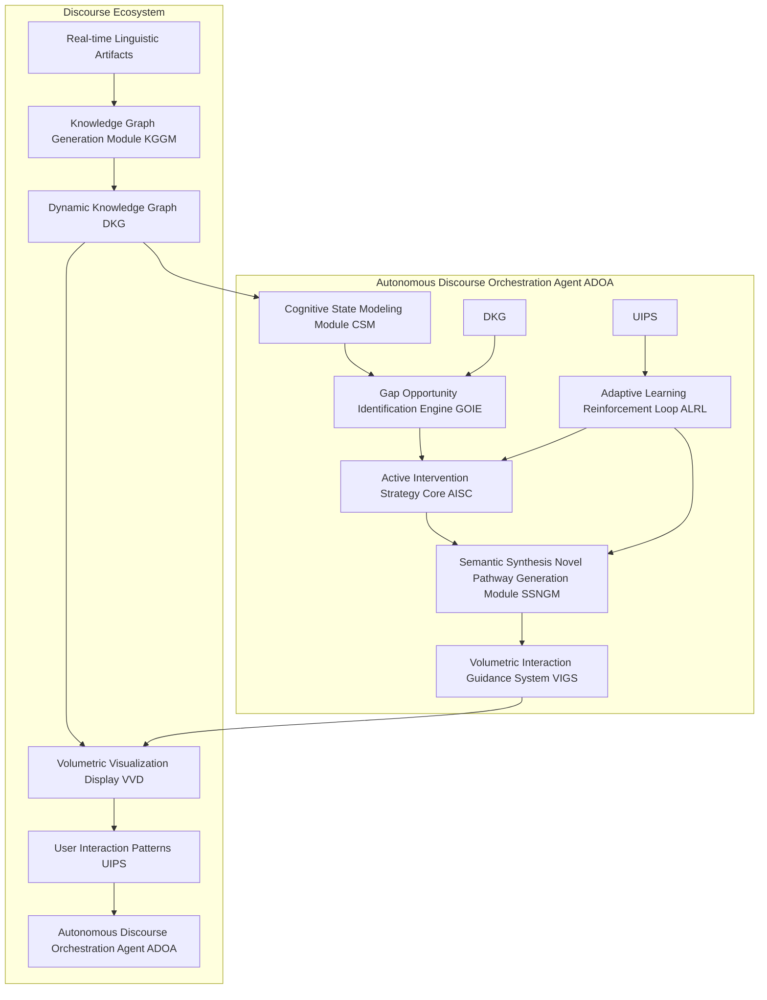
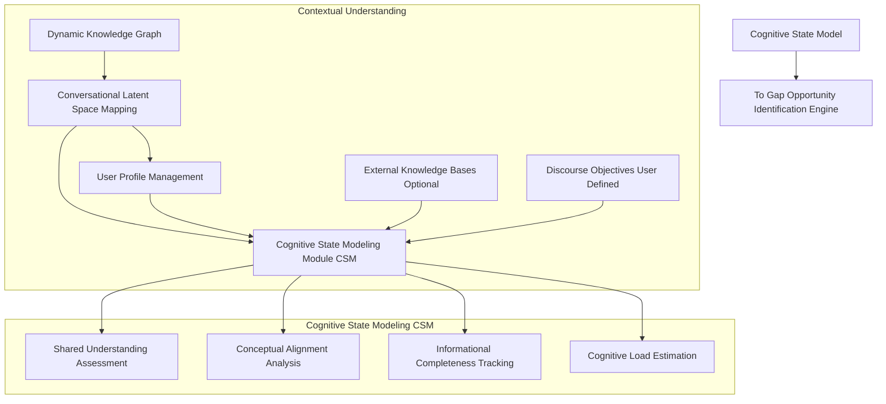
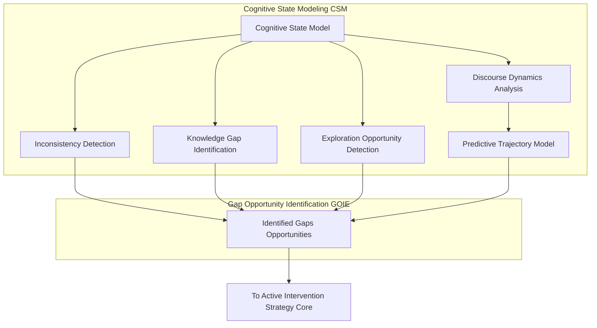
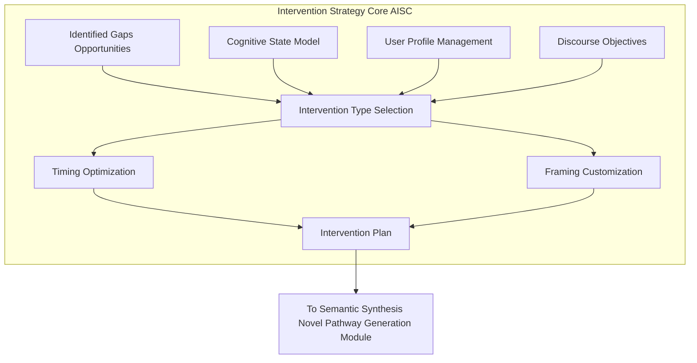
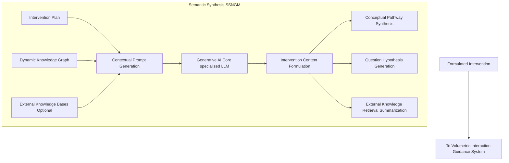
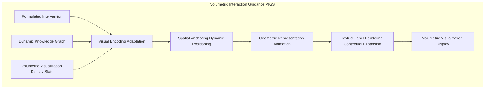
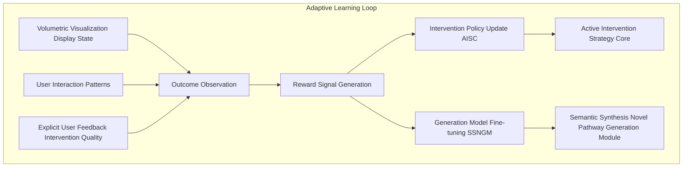
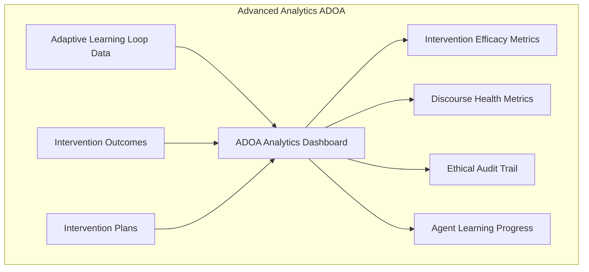

---
**Title of Invention:** A Self-Governing, Adaptive AI Agent Framework for the Autonomous Orchestration and Intelligent Augmentation of Human Discourse, Dynamically Identifying Knowledge Gaps, Synthesizing Novel Conceptual Pathways, and Proactively Guiding Collaborative Ideation within Volumetric Interaction Spaces

**Abstract:**
A groundbreaking framework is presented for an autonomous, adaptive artificial intelligence agent designed to proactively orchestrate and intelligently augment human discourse. Leveraging real-time analysis of conversational dynamics and existing knowledge graphs, this agent meticulously models the evolving cognitive state of a discussion. It autonomously identifies critical knowledge gaps, logical inconsistencies, unexplored conceptual avenues, and nascent opportunities for innovation. Employing sophisticated generative AI, the agent synthesizes novel questions, introduces relevant conceptual prompts, suggests alternative perspectives, and highlights overlooked relationships, all in real-time. These strategic interventions are seamlessly integrated and presented within an interactive, three-dimensional volumetric display, acting as subtle yet powerful nudges to guide the discourse towards higher efficacy, deeper understanding, and accelerated ideation. The agent operates within a continuous learning loop, refining its intervention strategies based on the observed impact on discourse quality and predetermined objectives, thereby transforming passive communication into a dynamically steered, intellectually optimized collaborative experience.

**Background of the Invention:**
Human collaborative discourse, while foundational to innovation and decision-making, is frequently hampered by inherent limitations. These include cognitive biases, groupthink, overlooked information, unaddressed knowledge gaps, and the natural ebb and flow of conversational energy, which can lead to stagnation or premature conclusion. Traditional methods of discourse management, such as human facilitation or passive transcription and summarization tools (even advanced volumetric ones), are inherently reactive or fallible. Human facilitators, despite their expertise, are susceptible to biases, fatigue, and can only process a fraction of the available semantic and temporal data. Existing AI tools for meetings typically function as intelligent secretaries, passively recording, transcribing, and summarizing. They lack the capacity for proactive, context-aware intervention necessary to dynamically steer a conversation, identify emergent needs for clarification, or synthesize novel conceptual pathways in real-time. The profound challenge lies in creating an impartial, intelligent entity capable of understanding the nuanced cognitive state of a discussion, discerning its informational completeness, predicting potential trajectories, and strategically intervening to optimize its intellectual output without disrupting natural human interaction. Such an entity must transcend mere data presentation, actively engaging in the very shaping of the discourse itself.

**Brief Summary of the Invention:**
The present invention introduces an unprecedented service paradigm: an **Autonomous Discourse Orchestration Agent ADOA** that acts as an intelligent, non-intrusive co-participant and guide in human conversations. At its core, the ADOA continuously ingests and interprets the real-time knowledge graph derived from ongoing discourse (potentially from an intelligent scribe system like the "Holographic Meeting Scribe"). It constructs a dynamic "cognitive state model" of the conversation, encompassing shared understanding, known unknowns, and conceptual distances. Based on this model, the ADOA's sophisticated **Gap and Opportunity Identification Engine** proactively detects critical junctures where intervention can significantly enhance discourse quality. These junctures include nascent knowledge gaps, logical inconsistencies, unaddressed dependencies, or under-explored concepts. The **Semantic Synthesis and Pathway Generation Module** then leverages advanced generative AI to formulate highly targeted, contextually relevant interventions—ranging from pointed questions, suggested new conceptual connections, alternative perspectives, or the introduction of pertinent external knowledge. These interventions are not delivered verbally but are seamlessly and intuitively materialized within a shared **Volumetric Interaction Space**. They appear as dynamic visual cues, spatially anchored nodes, or suggestive directional links, gently guiding participants' attention and thought processes. The ADOA operates under an adaptive learning framework, continuously refining its intervention strategies based on their observed impact on discourse metrics, thereby ensuring a progressively more effective and personalized orchestration of human ideation and decision-making.

**Detailed Description of the Invention:**

The present invention meticulously details a comprehensive system and methodology for an Autonomous Discourse Orchestration Agent ADOA. This agent is designed to elevate human collaboration beyond passive recording, introducing an active, intelligent force that shapes and optimizes conversational outcomes within immersive volumetric environments.

### 1. System Architecture Overview of the ADOA

The ADOA is architected as an intelligent layer that sits atop or integrates deeply with real-time discourse processing and volumetric visualization systems. It functions as a meta-cognitor for the conversation.



**Description of Architectural Components:**

*   **A. Real-time Linguistic Artifacts:** Continuous stream of transcribed utterances, speaker attributions, and temporal markers.
*   **B. Knowledge Graph Generation Module KGGM:** Processes linguistic artifacts into a structured knowledge graph (as described in prior inventions).
*   **C. Dynamic Knowledge Graph DKG:** The continuously updated, semantic-topological representation of the ongoing discourse.
*   **D. Volumetric Visualization Display VVD:** The interactive 3D environment where the discourse knowledge graph is rendered and where ADOA interventions are materialized.
*   **E. User Interaction Patterns UIPS:** Implicit feedback derived from user engagement with the VVD (e.g., gaze, navigation, interaction with nodes/edges).
*   **CSM. Cognitive State Modeling Module:** Infers the shared understanding and cognitive landscape of participants.
*   **GOIE. Gap and Opportunity Identification Engine:** Detects areas for intervention (missing info, logical leaps, new ideas).
*   **AISC. Active Intervention Strategy Core:** The decision-making unit for *when* and *what type* of intervention to make.
*   **SSNGM. Semantic Synthesis and Novel Pathway Generation Module:** Generates the content of interventions.
*   **VIGS. Volumetric Interaction and Guidance System:** Translates interventions into visual cues for the VVD.
*   **ALRL. Adaptive Learning and Reinforcement Loop:** Continuously improves ADOA's performance based on outcomes.

### 2. Discourse Analysis and Contextual Understanding Module

The ADOA builds upon the foundational capabilities of prior systems for discourse understanding, integrating advanced layers of contextual intelligence.



*   **2.1. Conversational Latent Space Mapping CLS:**
    *   Utilizes deep learning models (e.g., recurrent neural networks, transformer encoders) to project the DKG, including node embeddings and relationship embeddings, into a high-dimensional, continuously evolving latent space.
    *   This latent space captures the overall "meaning trajectory" of the conversation, allowing for similarity comparisons and trend detection.
*   **2.2. User Profile Management UPM:**
    *   Maintains profiles of active participants, including their historical contributions, known expertise areas, biases, and interaction styles. This informs how interventions are framed and targeted.
*   **2.3. Shared Understanding Assessment:**
    *   Analyzes the DKG and CLS to infer the degree of shared understanding among participants on key concepts, leveraging metrics like conceptual overlap, agreement sentiment, and co-occurrence in utterances.
*   **2.4. Informational Completeness Tracking:**
    *   Identifies concepts, decisions, or action items that have been introduced but lack sufficient detail, supporting evidence, or complete resolution within the discourse. Compares against predefined schema or external knowledge.
*   **2.5. Cognitive Load Estimation:**
    *   Monitors discourse complexity, pace, and novelty of introduced concepts to estimate the collective cognitive load on participants. This helps the ADOA decide if an intervention would be beneficial or overwhelming.

### 3. Cognitive State Modeling and Gap Identification Engine GOIE

This module is the core intelligence for discerning the nuanced state of the discourse and pinpointing strategic moments for intervention.



*   **3.1. Discourse Dynamics Analysis:**
    *   Analyzes temporal changes in topic focus, speaker turn-taking patterns, sentiment shifts, and engagement levels within the DKG and CLS.
    *   Identifies phases of ideation, convergence, divergence, and potential stagnation.
*   **3.2. Predictive Trajectory Model:**
    *   Utilizes recurrent neural networks or transformer models trained on historical discourse patterns to predict likely future conversational trajectories based on the current cognitive state.
    *   Identifies suboptimal paths (e.g., circular arguments, tangents) that need redirection.
*   **3.3. Inconsistency Detection:**
    *   Scans the DKG for logical contradictions, factual discrepancies (potentially against external knowledge bases), or unaddressed conflicting viewpoints.
    *   Example: A stated "decision to proceed" that contradicts previously highlighted "risks."
*   **3.4. Knowledge Gap Identification:**
    *   Compares the current DKG against a target information schema or a predefined set of discourse objectives.
    *   Identifies missing concepts, unassigned action items, unresolved questions, or insufficient detail for key decisions.
    *   Detects areas where a specific piece of external knowledge is highly relevant but has not been introduced.
*   **3.5. Exploration Opportunity Detection:**
    *   Identifies areas of high conceptual density or novelty within the DKG that are underexplored.
    *   Uses latent space clustering to find "neighboring" conceptual territories that have not been discussed but show high relevance to the ongoing topic.

### 4. Proactive Intervention and Augmentation Strategy Core AISC

This module determines the optimal type, timing, and framing of an intervention to maximize discourse efficacy, acting as the agent's "decision-maker."



*   **4.1. Intervention Type Selection:**
    *   Based on the identified gap/opportunity, cognitive load, and discourse objectives, the AISC selects the most appropriate intervention type from a rich taxonomy:
        *   `QUESTION`: To prompt clarification or deeper exploration.
        *   `SYNTHESIS`: To connect disparate ideas or summarize complex points.
        *   `SUGGESTION`: To introduce a new concept or perspective.
        *   `REMINDER`: To bring attention to an overlooked decision or action item.
        *   `CLARIFICATION`: To highlight an ambiguity or inconsistency.
        *   `EXTERNAL_CONTEXT`: To introduce information from an external knowledge base.
*   **4.2. Timing Optimization:**
    *   Employs a real-time predictive model to determine the optimal moment for intervention, considering factors like:
        *   **Cognitive load:** Avoids intervention during peak cognitive strain.
        *   **Speaker turn-taking:** Intervenes during natural pauses or transitions.
        *   **Impact potential:** Maximizes the likelihood of a positive response.
        *   **Urgency:** Prioritizes critical gaps or inconsistencies.
*   **4.3. Framing Customization:**
    *   Tailors the phrasing and visual representation of the intervention based on user profiles, discourse goals, and prevailing sentiment.
    *   For example, a "suggestion" might be presented as a bold new concept for an ideation session, but as a cautious "consideration" during a risk assessment.

### 5. Semantic Synthesis and Novel Pathway Generation Module SSNGM

This generative module is responsible for formulating the actual content of the ADOA's interventions, leveraging advanced large language models LLMs specialized for knowledge synthesis and creative ideation.



*   **5.1. Contextual Prompt Generation:**
    *   Dynamically constructs highly specific, multi-layered prompts for the Generative AI Core, incorporating:
        *   The identified gap/opportunity.
        *   Relevant fragments from the DKG.
        *   Desired intervention type and framing from the AISC.
        *   Output schema constraints (e.g., "return a concise question," "suggest 3 related concepts").
*   **5.2. Generative AI Core (Specialized LLM):**
    *   A fine-tuned Large Language Model or a composite AI agent designed for tasks like:
        *   **Conceptual Pathway Synthesis:** Identifies and articulates novel connections between disparate nodes in the DKG, suggesting emergent themes or solutions. This involves "creative" generation within the latent space of concepts.
        *   **Question and Hypothesis Generation:** Formulates precise, open-ended questions or testable hypotheses to probe knowledge gaps or stimulate critical thinking.
        *   **External Knowledge Retrieval and Summarization:** Queries connected external knowledge bases Wikipedia, academic papers, proprietary databases and synthesizes relevant information concisely for insertion into the discourse.
*   **5.3. Intervention Content Formulation:**
    *   Generates the textual content and associated semantic embeddings for the intervention, ensuring it adheres to the selected framing and type.
    *   The output is structured, ready for visual encoding.

### 6. Volumetric Interaction and Guidance System VIGS

This module is responsible for translating the formulated interventions into compelling, non-disruptive visual cues within the 3D volumetric display.



*   **6.1. Visual Encoding Adaptation:**
    *   Determines the optimal visual properties (color, shape, size, animation) for the intervention based on its type, urgency, and the current state of the VVD (e.g., to ensure visibility without clutter).
*   **6.2. Spatial Anchoring and Dynamic Positioning:**
    *   Places the intervention's visual representation strategically within the 3D space, typically near the relevant concepts or speakers in the DKG.
    *   Uses dynamic layout algorithms to ensure the intervention is visually salient but doesn't obscure existing content.
    *   For instance, a "suggested link" might appear as a faint, pulsating line between two existing concept nodes.
*   **6.3. Geometric Representation and Animation:**
    *   Renders the intervention using appropriate 3D primitives or custom meshes.
    *   Employs subtle animations (e.g., gentle pulsing, emergent growth) to draw attention without being distracting.
*   **6.4. Textual Label Rendering and Contextual Expansion:**
    *   Displays concise 3D text labels for the intervention.
    *   On user hover or interaction, these labels can expand to reveal more detailed contextual information or the full text of a generated question.

### 7. Adaptive Learning and Reinforcement Loop ALRL

This critical module ensures the ADOA continuously learns and improves its intervention strategies over time, optimizing for predefined discourse objectives.



*   **7.1. Outcome Observation:**
    *   Monitors the discourse following an intervention for key indicators of success or failure. These include:
        *   **Engagement:** Do participants acknowledge and interact with the intervention?
        *   **Directional shift:** Does the conversation shift towards the intended topic or clarification?
        *   **Resolution:** Does a knowledge gap get filled, or a decision get made?
        *   **Novelty:** Does the intervention lead to new, valuable ideas?
        *   **Disruption:** Does the intervention cause confusion or interruption?
*   **7.2. Reward Signal Generation:**
    *   Translates observed outcomes into a quantitative reward signal for the reinforcement learning algorithm.
    *   Positive rewards for successful interventions (e.g., leading to resolution, increased conceptual connections, positive sentiment shift).
    *   Negative rewards for disruptive or ineffective interventions.
*   **7.3. Policy Update (Intervention Strategy Core):**
    *   Utilizes reinforcement learning (e.g., Deep Q-Networks, Proximal Policy Optimization) to update the decision-making policy of the AISC.
    *   The agent learns *when* and *what type* of intervention is most effective under specific cognitive state conditions.
*   **7.4. Generation Model Fine-tuning (SSNGM):**
    *   Fine-tunes the generative AI core within the SSNGM based on feedback on the *quality* and *relevance* of the generated intervention content.
    *   This ensures the agent learns to synthesize more accurate, creative, and contextually appropriate interventions.

### 8. Security and Privacy Considerations

The ADOA operates at a highly sensitive layer of human interaction, necessitating robust security and privacy protocols.

*   **8.1. Consent and Transparency:** Explicit user consent required for ADOA activation and intervention. Clear visual indicators within the VVD when the ADOA is active and intervening.
*   **8.2. Data Minimization:** Processes only the linguistic and contextual data necessary for its function. Ephemeral processing of sensitive intermediate states.
*   **8.3. Data Anonymization and Access Control:** Strict anonymization options for participant data. Role-based access control RBAC for managing ADOA permissions and configuration.
*   **8.4. Ethical Guidelines and Guardrails:** AI safety protocols embedded to prevent biased or manipulative interventions. Human-in-the-loop oversight mechanisms for high-stakes scenarios. Configurable "intervention thresholds" to control the ADOA's assertiveness.

### 9. Advanced Analytics and Interpretability Features

Beyond its real-time orchestration, the ADOA provides profound insights into discourse dynamics and its own operational efficacy.



*   **9.1. ADOA Analytics Dashboard:**
    *   Provides a comprehensive view of the agent's performance, discourse impact, and learning trajectory.
*   **9.2. Intervention Efficacy Metrics:**
    *   Quantifies the success rate of various intervention types, showing which strategies are most effective under different discourse conditions.
    *   Metrics include average time to resolution, number of new conceptual connections, sentiment shift post-intervention.
*   **9.3. Discourse Health Metrics:**
    *   Tracks overall discourse quality indicators such as conceptual coherence, topic progression, balanced participation, and reduction in logical inconsistencies, attributing changes to ADOA interventions where applicable.
*   **9.4. Ethical Audit Trail:**
    *   Logs all ADOA interventions, their triggering conditions, and observed immediate outcomes, allowing for human review and auditing to ensure ethical operation and prevent unintended biases.
*   **9.5. Agent Learning Progress:**
    *   Visualizes the ADOA's learning curve, demonstrating improvements in its intervention policy and generative capabilities over time.

**Claims:**

The following enumerated claims define the intellectual scope and novel contributions of the present invention, a testament to its singular advancement in the field of intelligent discourse orchestration and augmentation.

1.  A method for autonomous orchestration and intelligent augmentation of human discourse within a volumetric interaction space, comprising the steps of:
    a.  Continuously receiving a dynamic, attributed knowledge graph DKG representing an ongoing human discourse, said DKG comprising nodes for entities and edges for relationships.
    b.  Constructing and continuously updating a Cognitive State Model CSM of said discourse, based on the DKG, comprising assessments of shared understanding, informational completeness, conceptual alignment, and estimated cognitive load.
    c.  Employing a Gap and Opportunity Identification Engine GOIE to analyze said CSM and DKG in real-time, identifying critical junctures for intervention, including knowledge gaps, logical inconsistencies, suboptimal discourse trajectories, and unexplored conceptual opportunities.
    d.  Determining an optimal intervention strategy using an Active Intervention Strategy Core AISC, said strategy comprising an intervention type, timing, and framing, based on the identified juncture, CSM, and predefined discourse objectives.
    e.  Generating the content of said intervention using a Semantic Synthesis and Novel Pathway Generation Module SSNGM, said module leveraging a generative artificial intelligence model to formulate contextually relevant questions, conceptual syntheses, suggestions, or external knowledge prompts.
    f.  Presenting said generated intervention non-disruptively within a three-dimensional volumetric visualization display VVD, through a Volumetric Interaction and Guidance System VIGS, wherein the intervention is materialized as spatially anchored visual cues, dynamic nodes, or suggestive directional links, visually encoding its type and purpose.
    g.  Observing the impact of said intervention on the discourse within the VVD and through subsequent updates to the DKG and CSM.
    h.  Utilizing an Adaptive Learning and Reinforcement Loop ALRL to refine the intervention strategies of the AISC and the generative capabilities of the SSNGM based on the observed impact, thereby continuously optimizing discourse outcomes.

2.  The method of claim 1, wherein the DKG is derived from real-time linguistic artifacts through an Automatic Speech Recognition ASR engine, Speaker Diarization, and a Knowledge Graph Generation Module KGGM.

3.  The method of claim 1, wherein the Cognitive State Model CSM further incorporates user profile information and external knowledge bases to enrich its understanding of discourse context.

4.  The method of claim 1, wherein the Gap and Opportunity Identification Engine GOIE utilizes a predictive trajectory model to anticipate suboptimal conversational paths and identifies inconsistencies through logical contradiction detection within the DKG.

5.  The method of claim 1, wherein the Active Intervention Strategy Core AISC selects intervention types from a taxonomy including `QUESTION`, `SYNTHESIS`, `SUGGESTION`, `REMINDER`, `CLARIFICATION`, and `EXTERNAL_CONTEXT`.

6.  The method of claim 1, wherein the Semantic Synthesis and Novel Pathway Generation Module SSNGM generates intervention content through contextual prompt generation and specialized large language models capable of conceptual pathway synthesis and question/hypothesis generation.

7.  The method of claim 1, wherein the Volumetric Interaction and Guidance System VIGS employs visual encoding adaptation, dynamic spatial anchoring, geometric representation, and contextual textual label rendering to present interventions.

8.  The method of claim 1, wherein the Adaptive Learning and Reinforcement Loop ALRL employs reinforcement learning algorithms to update the AISC's policy based on reward signals derived from metrics such as discourse engagement, directional shift, resolution achievement, and novelty generation.

9.  The method of claim 1, further comprising an Advanced Analytics and Interpretability Module configured to provide an ADOA Analytics Dashboard, track Intervention Efficacy Metrics, monitor Discourse Health Metrics, and maintain an Ethical Audit Trail of agent operations.

10. A system configured to execute the method of claim 1, comprising:
    a.  A Discourse Analysis and Contextual Understanding Module, operatively coupled to a Dynamic Knowledge Graph DKG.
    b.  A Cognitive State Modeling Module CSM, operatively coupled to the Discourse Analysis Module.
    c.  A Gap and Opportunity Identification Engine GOIE, operatively coupled to the CSM.
    d.  An Active Intervention Strategy Core AISC, operatively coupled to the GOIE.
    e.  A Semantic Synthesis and Novel Pathway Generation Module SSNGM, operatively coupled to the AISC.
    f.  A Volumetric Interaction and Guidance System VIGS, operatively coupled to the SSNGM and a Volumetric Visualization Display VVD.
    g.  An Adaptive Learning and Reinforcement Loop ALRL, operatively coupled to the VVD, AISC, and SSNGM, configured to observe outcomes and refine agent behavior.

11. The system of claim 10, wherein the Volumetric Interaction and Guidance System VIGS integrates interventions seamlessly into the 3D visual space by dynamically positioning them proximate to relevant existing nodes or edges, utilizing subtle animations to indicate their presence.

12. The system of claim 10, wherein the Adaptive Learning and Reinforcement Loop ALRL evaluates the success of interventions by monitoring subsequent changes in the DKG, including the formation of new conceptual links, the resolution of previously identified gaps, or shifts in speaker sentiment.

13. The system of claim 10, further comprising an Ethical AI Subsystem configured to implement strict human-in-the-loop oversight, configurable intervention thresholds, and real-time bias detection mechanisms to ensure responsible and non-manipulative agent operation.

**Mathematical Justification:**

The Autonomous Discourse Orchestration Agent ADOA represents a paradigm shift from passive observation to active, intelligent steering of human cognitive processes. Its operation can be rigorously formalized as a Reinforcement Learning RL problem, where the ADOA acts as an intelligent agent within a dynamic discourse environment.

### I. Formalizing the Discourse State as a Partially Observable Markov Decision Process POMDP

Let the ongoing human discourse be represented as a Partially Observable Markov Decision Process `M = (S, A, T, R, Omega, O, gamma)`.

*   **1.1. State Space `S`:** The true underlying state of the discourse `s_t` at any time `t`. This complex state `s_t` is inherently unobservable by the ADOA in its entirety, hence a POMDP. `s_t` encompasses:
    *   The complete, high-fidelity **Dynamic Knowledge Graph `DKG_t = (N_t, E_t)`** derived from the discourse up to time `t`. This includes node embeddings `v_k`, edge attributes, temporal contexts `tau_k`, speaker attributions `sigma_k`, and sentiments `s_k`.
    *   The collective **Cognitive State `CS_t`** of all participants, including their individual understandings, current beliefs, attention foci, cognitive load, and emotional states. This is a latent variable for the ADOA.
    *   The **Discourse Objectives `DO`**: Explicit or implicit goals for the conversation (e.g., "reach a decision on X," "generate 5 novel ideas," "resolve conflict Y"). These are part of the environment state.

*   **1.2. Action Space `A`:** The set of all possible interventions the ADOA can execute. An action `a_t` is a tuple `(type, content, timing, spatial_anchor)`, representing:
    *   `type`: The intervention type (e.g., `QUESTION`, `SYNTHESIS`, `SUGGESTION`, `REMINDER`).
    *   `content`: The semantically synthesized textual or conceptual payload (e.g., "What are the long-term implications of this decision?").
    *   `timing`: The precise moment `t_intervene` chosen for intervention.
    *   `spatial_anchor`: The `(x, y, z)` coordinates within the VVD where the intervention is materialized, typically linked to relevant `DKG_t` nodes.

*   **1.3. Transition Function `T(s' | s, a)`:** The probability distribution over the next state `s'` given the current state `s` and the ADOA's action `a`. This function is highly complex and stochastic, as human discourse is inherently unpredictable. `T` models how an intervention `a` influences subsequent utterances, DKG evolution, and cognitive states.

*   **1.4. Reward Function `R(s, a, s')`:** A scalar value quantifying the desirability of transitioning from state `s` to `s'` after taking action `a`. The reward function is critical for shaping ADOA's behavior and is designed to reflect discourse quality and objective achievement:
    *   **Positive Rewards:**
        *   Increase in DKG coherence (e.g., higher clustering coefficient, shorter average path length).
        *   Resolution of identified knowledge gaps (e.g., previously unassigned action items gaining owners).
        *   Generation of novel, highly connected concepts (e.g., new nodes with high centrality).
        *   Positive shift in collective sentiment or engagement.
        *   Progress towards `DO` (e.g., finalization of decisions).
    *   **Negative Rewards:**
        *   Increased cognitive load or confusion among participants.
        *   Disruption of natural conversation flow.
        *   Introduction of logical inconsistencies.
        *   Stagnation or circular argumentation.
        *   User explicit negative feedback.

*   **1.5. Observation Space `Omega`:** The set of observations `o_t` the ADOA receives at time `t`. Since the true state `s_t` is partially observable, `o_t` is a noisy, incomplete representation:
    *   The **Dynamic Knowledge Graph `DKG_t`** (as observed through the KGGM).
    *   **User Interaction Patterns `UIPS_t`** in the VVD (e.g., gaze tracking, navigation paths, node clicks).
    *   **Explicit User Feedback `EF_t`** (e.g., corrections, ratings of interventions).
    *   **Inferred Cognitive State `ICS_t`** (derived from the CSM, an approximation of `CS_t`).

*   **1.6. Observation Function `O(o | s)`:** The probability of observing `o` given the true state `s`. This models the uncertainty and partiality of the ADOA's sensory input.

*   **1.7. Discount Factor `gamma`:** A factor in `[0, 1)` that discounts future rewards, encouraging the ADOA to prioritize immediate positive impacts while still considering long-term objectives.

### II. The ADOA's Policy and Optimization Objective

The ADOA's behavior is governed by a **policy `pi(a | o)`**, which maps observed states `o_t` to a probability distribution over actions `a_t`. The ADOA's objective is to find an optimal policy `pi*` that maximizes the expected cumulative discounted reward over the course of the discourse:

```
pi* = argmax_pi E[sum_{t=0}^T gamma^t R(s_t, a_t, s_{t+1}) | pi]
```

Where `T` is the horizon of the discourse (e.g., end of meeting).

**Solving the POMDP:**

Directly solving a POMDP of this complexity is intractable. The ADOA employs an approximate approach:

1.  **Belief State Estimation:** The ADOA maintains a **belief state `b(s)`**—a probability distribution over the true underlying state `s_t` given all past observations. The CSM module contributes significantly to updating this belief state, especially the `ICS_t`.
2.  **Deep Reinforcement Learning (DRL):**
    *   The AISC (Active Intervention Strategy Core) acts as the DRL agent. Its policy `pi(a | o)` is parameterized by a deep neural network, taking the concatenated features of the observed `DKG_t`, `ICS_t`, and `UIPS_t` as input.
    *   The network outputs probabilities for different intervention types, timings, and spatial anchors.
    *   The SSNGM (Semantic Synthesis and Novel Pathway Generation Module) is another neural component that generates the *content* of `a_t` given the selected `type`. It can be fine-tuned via techniques like Reinforcement Learning from Human Feedback (RLHF) based on `EF_t`.
3.  **Experience Replay and Policy Gradient Methods:** The ALRL (Adaptive Learning and Reinforcement Loop) collects (observation, action, reward, next_observation) tuples. It uses these experiences to update the DRL policy network parameters through policy gradient methods (e.g., A2C, PPO) or value-based methods (e.g., DQN), thereby minimizing the prediction error of the expected returns and refining `pi`.

### III. Mathematical Basis for Intervention Effectiveness

Consider a metric of discourse quality `Q(DKG, CS)` (e.g., coherence, informational entropy, goal achievement). The ADOA's intervention `a` is effective if `Q(DKG_{t+1}, CS_{t+1}) > Q(DKG_t, CS_t)` in expectation, given the intent of `a`.

*   **Knowledge Gap Reduction:** Let `G_k` be a knowledge gap (e.g., missing information about concept `k`). An intervention `a_g` targeting `G_k` is effective if `E[entropy(information_about_k(DKG_{t+1}))]` is reduced compared to `E[entropy(information_about_k(DKG_t))]`.
*   **Conceptual Connection Synthesis:** Let `C_i` and `C_j` be two concepts in the `DKG`. An intervention `a_s` suggesting a new link between them is effective if the probability `P(edge(C_i, C_j) exists in DKG_{t+k})` increases significantly for some small `k`, or if subsequent utterances explicitly acknowledge the connection.
*   **Cognitive Load Optimization:** Let `CL_t` be the estimated cognitive load. Interventions `a_c` are timed and designed such that `CL_{t_intervene}` is below a threshold `CL_max`, and ideally `CL_{t+1}` does not spike excessively or is even reduced due to clarification.

The ADOA's mathematical framework explicitly seeks to optimize these complex, multi-faceted discourse objectives through intelligent, adaptive, and visually guided interventions. By treating discourse as a dynamic system that can be actively shaped, the ADOA fundamentally redefines human-AI collaboration for intellectual tasks. `Q.E.D.`