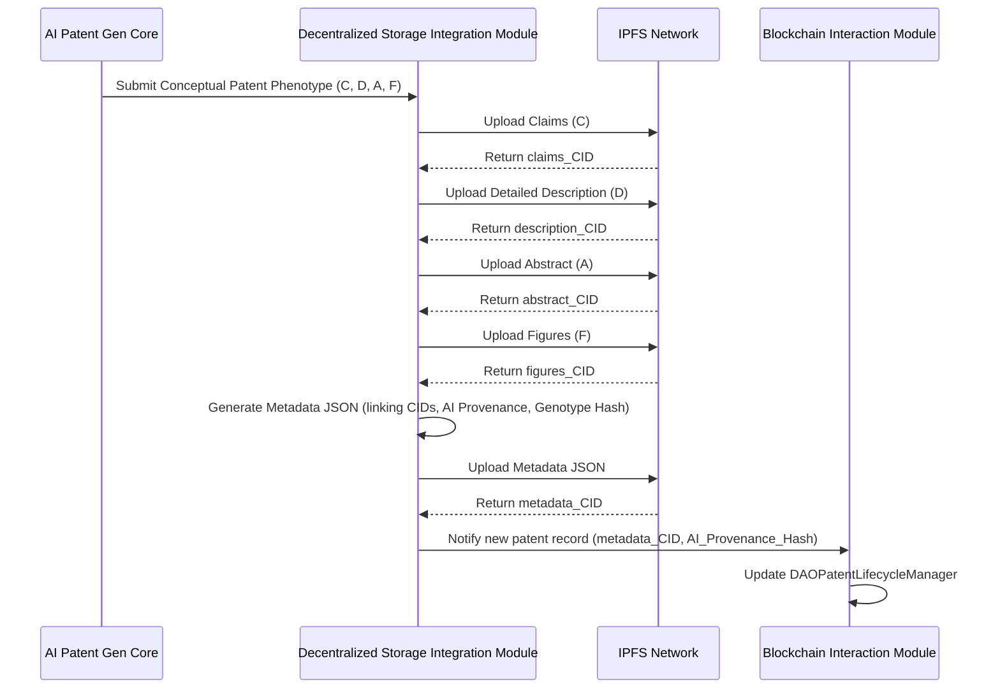
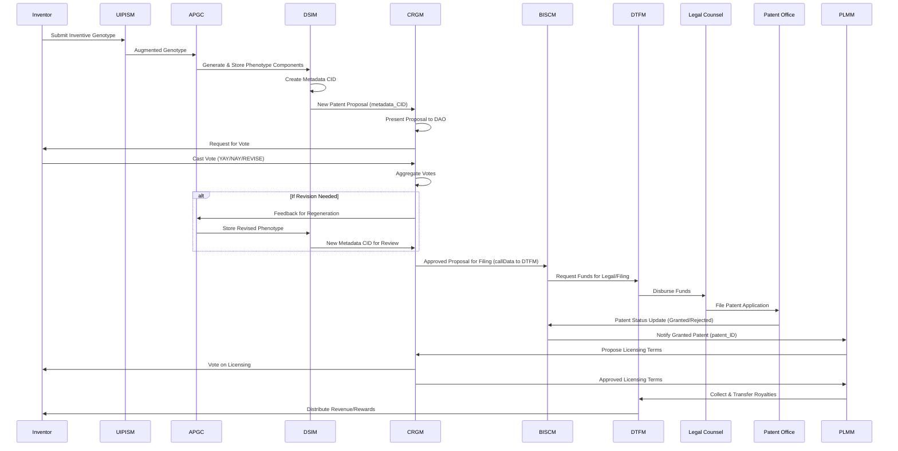

**Title of Invention:** Decentralized Autonomous Organization for Collective AI-Assisted Intellectual Property Genesis and Commercialization (DAOCAIPGC)

**Abstract:**
A novel and sophisticated system is presented for the collaborative and decentralized generation, refinement, and monetization of conceptual intellectual property, specifically patent applications, leveraging advanced artificial intelligence (AI) and distributed ledger technology (DLT). A user or collective initiates a high-level conceptual prompt, herein termed an "inventive genotype," which is processed by an ensemble of specialized generative AI models. These models autonomously formulate comprehensive patent elements, including claims, detailed descriptions, and illustrative diagrams (conceptual phenotypes), guided by a vast repository of existing patents and scientific literature. A Decentralized Autonomous Organization (DAO) framework then orchestrates a community-driven governance process, allowing token holders to collectively review, vote on, and iteratively refine these AI-generated patent drafts. Upon community approval, the DAO's shared treasury funds the formal patent application process, and subsequently manages the licensing and monetization of successfully granted patents. Revenue generated from licensing is programmatically distributed among DAO token holders and contributors, establishing a sustainable, transparent, and collectively owned intellectual property ecosystem. This invention pioneers a paradigm shift in patent ideation and ownership, democratizing innovation and incentivizing collaborative, AI-augmented discovery.

**Background of the Invention:**
Traditional patent generation methodologies are encumbered by significant barriers, primarily high financial costs associated with legal counsel, extensive research, and filing fees, coupled with the inherent complexity and time-intensive nature of the process. This centralized and often opaque system limits innovation to well-resourced entities, creating a significant impediment for individual inventors or smaller research groups to protect their intellectual property. Furthermore, the ideation phase remains largely human-centric, relying on individual genius or small team brainstorming, which can be limited in scope and prone to cognitive biases.

While Decentralized Autonomous Organizations (DAOs) have emerged as a powerful governance model, their application has largely been confined to treasury management, protocol governance, or digital art collectives. A critical lacuna exists in the integration of DAO principles with the rigorous and specialized domain of intellectual property generation, particularly patentable inventions. Current DAO structures often lack sophisticated mechanisms for complex content creation, quality assurance in highly technical fields, or the funding and execution of real-world legal processes such as patent filing. The absence of an integrated system that can bridge abstract ideation, AI-driven content generation, transparent community curation, and real-world legal execution represents a profound unmet need. Existing systems do not effectively synergize the combinatorial power of AI for ideation, the collective intelligence of a decentralized community for refinement and validation, and the immutable record-keeping and incentive structures of DLT for ownership and monetization. This invention directly addresses these limitations by establishing an end-to-end framework where AI acts as a co-inventor, the community acts as a collective patent office, and the DAO serves as the sovereign entity managing the entire lifecycle of collaborative, AI-assisted intellectual property.

**Brief Summary of the Invention:**
The present invention, formally designated as the **Decentralized Autonomous Organization for Collective AI-Assisted Intellectual Property Genesis and Commercialization DAOCAIPGC**, establishes an advanced, integrated framework for the programmatic generation, collective curation, and decentralized monetization of novel conceptual intellectual property, specifically targeting patent applications. The DAOCAIPGC system provides a robust and transparent ecosystem where innovation is democratized and collectively managed.

Upon receipt of a high-level conceptual prompt (inventive genotype) from a user or a DAO-initiated ideation process, the DAOCAIPGC system orchestrates a highly sophisticated, multi-stage generative and governance process:
1.  **Inventive Genotype Submission and Augmentation:** A user submits a conceptual prompt outlining a potential invention, which undergoes advanced semantic analysis and augmentation by an AI-powered Prompt Engineering Module (PEM) to enhance clarity, completeness, and novelty potential, referencing a vast patent database. This initial concept can also be proposed by an AI trained on inventive gaps.
2.  **AI Patent Element Generation:** The refined inventive genotype is transmitted to an ensemble of specialized generative AI models (e.g., AetherPatentScribe, AetherDiagramGen). These models autonomously generate core patent application components:
    *   **Claims:** Drafting primary and dependent claims embodying the invention's novelty.
    *   **Detailed Description:** Producing technical narratives, background, summary, and preferred embodiments.
    *   **Abstract:** Summarizing the invention.
    *   **Illustrative Figures:** Generating conceptual diagrams, flowcharts, or system architectures (often in Mermaid syntax) to support the description and claims.
    *   **Prior Art Analysis:** AI models also perform preliminary prior art searches and generate novelty arguments.
    These outputs collectively form the "conceptual patent phenotype."
3.  **Community Review and Governance:** The AI-generated conceptual patent phenotype is presented to the DAO's token holders for review. A multi-stage voting mechanism allows the community to:
    *   **Approve/Reject:** Initial assessment of novelty, utility, and non-obviousness.
    *   **Suggest Revisions:** Propose specific textual edits to claims, descriptions, or figures.
    *   **Prior Art Flagging:** Identify potential prior art missed by the AI.
    *   **Strategic Direction:** Vote on the patent's commercial viability or strategic importance.
    This iterative process, mediated by DAO smart contracts, ensures collective quality control and consensus building.
4.  **Treasury Funding and Legal Orchestration:** Upon achieving community consensus and approval for filing, the DAO's decentralized treasury, funded by an initial token offering, future licensing revenues, or contributions, allocates resources to:
    *   **AI Compute Costs:** Cover the expenses of running generative AI models for revisions.
    *   **Legal Counsel Engagement:** Fund professional patent attorneys for legal review, final drafting, and official filing.
    *   **Filing Fees:** Cover national and international patent office fees.
    A dedicated Legal Orchestration Module (LOM) coordinates with external legal entities.
5.  **Patent Filing and Ownership:** The refined patent application is filed with relevant patent offices. Ownership of the granted patent is formally vested in a legal entity (e.g., a foundation, trust) controlled by the DAO through its smart contracts, or directly assigned to the DAO itself where legally permissible.
6.  **Licensing, Monetization, and Revenue Distribution:** The DAOCAIPGC system actively pursues licensing opportunities for granted patents. Licensing agreements are approved via DAO votes. All revenue generated from licensing is deposited into the DAO treasury and subsequently distributed programmatically to DAO token holders and contributors, proportional to their contributions (e.g., token holdings, voting participation, successful revision proposals), fostering a continuous incentive loop.
7.  **Verifiable Provenance and Auditability:** Every stage, from initial prompt to final patent document and revenue distribution, is recorded on a distributed ledger, ensuring transparent, tamper-proof provenance and auditability.

### System Architecture Overview

```mermaid
C4Context
    title Decentralized Autonomous Organization for Collective AI-Assisted Intellectual Property Genesis and Commercialization DAOCAIPGC

    Person(inventor, "Inventor/Contributor", "Submits inventive concepts and participates in DAO governance.")
    System(daocaipgcCore, "DAOCAIPGC Core System", "Orchestrates AI patent generation, community governance, treasury, and legal interactions.")

    System_Ext(generativeAIPatent, "Generative AI Patent Models", "External AI services eg AetherPatentScribe, AetherDiagramGen that generate patent components.")
    System_Ext(decentralizedStorage, "Decentralized Storage Network", "Stores patent drafts, figures, metadata eg IPFS.")
    System_Ext(blockchainNetwork, "Blockchain Network", "Distributed ledger for DAO smart contracts, governance, tokenomics, and treasury.")
    System_Ext(patentOffice, "National/International Patent Office", "Formal entity for patent application filing and granting.")
    System_Ext(legalCounsel, "Patent Legal Counsel", "Professional attorneys for legal review and filing.")
    System_Ext(daoTokenHolders, "DAO Token Holders", "Community members who own governance tokens and participate in voting.")
    System_Ext(priorArtDatabases, "Prior Art Databases", "External databases of existing patents, research papers for AI training and search.")
    System_Ext(licensingPlatforms, "Licensing Platforms", "Marketplaces or systems for commercializing patents.")


    Rel(inventor, daocaipgcCore, "Submits inventive genotype prompts")
    Rel(inventor, daoTokenHolders, "Participates in voting and earns rewards")
    Rel(daocaipgcCore, generativeAIPatent, "Sends inventive genotypes for patent component generation", "API Call eg gRPC REST")
    Rel(generativeAIPatent, daocaipgcCore, "Returns conceptual patent phenotype", "Textual Data JSON Diagrams")
    Rel(daocaipgcCore, daoTokenHolders, "Presents patent drafts for review and voting")
    Rel(daoTokenHolders, daocaipgcCore, "Submits votes and feedback on patent drafts")
    Rel(daocaipgcCore, decentralizedStorage, "Uploads patent drafts, figures, and metadata", "HTTP IPFS Client")
    Rel(decentralizedStorage, daocaipgcCore, "Returns Content Identifiers CIDs")
    Rel(daocaipgcCore, blockchainNetwork, "Interacts with DAO smart contracts for governance and treasury", "Web3 RPC")
    Rel(daocaipgcCore, legalCounsel, "Engages for legal review and filing process", "Secure API Gateway")
    Rel(legalCounsel, patentOffice, "Files patent application")
    Rel(patentOffice, daocaipgcCore, "Notifies of patent status grant refusal", "API Webhook")
    Rel(daocaipgcCore, priorArtDatabases, "Queries for AI training and search", "API Call")
    Rel(daocaipgcCore, licensingPlatforms, "Manages patent licensing and revenue collection", "API Integration")
    Rel(licensingPlatforms, daocaipgcCore, "Transfers licensing revenue to DAO treasury")

    Note right of daocaipgcCore: The DAOCAIPGC Core System integrates AI, community governance, and legal execution.
    Note left of generativeAIPatent: Specialized models for legal text and technical diagrams.
    Note right of blockchainNetwork: Also handles DAO token issuance and distribution.
```

**Detailed Description of the Invention:**

The **Decentralized Autonomous Organization for Collective AI-Assisted Intellectual Property Genesis and Commercialization DAOCAIPGC** system is a meticulously designed, modular, and integrated architecture enabling the collective and AI-powered creation and commercialization of patentable intellectual property. The operational flow, from nascent idea to monetized patent, is engineered for maximum transparency, efficiency, and decentralized control.

### 1. User Interface and Patent Idea Submission Module UIPISM

The UIPISM serves as the primary gateway for users and AI agents to contribute inventive genotypes.

*   **Inventive Genotype Input Interface:** A structured input form allowing users to submit high-level invention concepts. This includes:
    *   **Problem Statement:** Articulating the problem the invention solves.
    *   **Proposed Solution:** A concise description of the inventive idea.
    *   **Keywords and Domain Tags:** Categorizing the invention for AI routing.
    *   **Reference Materials:** Uploading sketches, existing research, or preliminary data.
    *   **AI-Generated Prompt Suggestions:** An integrated sub-module leveraging LLMs to suggest improvements or expansions to user-submitted prompts for higher generative efficacy.
*   **Prompt Engineering and Augmentation Module PEM:** This module enhances raw inventive genotypes.
    *   **Semantic Scoring and Novelty Check:** Utilizes AI models trained on patent databases to score the prompt's clarity, completeness, and initial novelty against existing prior art.
    *   **Contextual Expansion:** Leverages large language models (LLMs) and internal knowledge graphs to expand vague prompts into more descriptive and technically sound initial briefs, including potential technical challenges and solutions.
    *   **Prior Art Query Generation:** Automatically generates queries for comprehensive prior art searches based on the inventive genotype.
*   **Contributor Authentication and Wallet Connection:** Integration with Web3 wallet providers (e.g., MetaMask, WalletConnect) to authenticate contributors and link their on-chain identity for voting, rewards, and reputation tracking.
*   **Contribution Tracking:** Records all submitted inventive genotypes, their evolution through AI augmentation, and associated contributor metadata for future reward distribution.

```mermaid
graph TD
    A[Inventor/AI Agent] --> B{Inventive Genotype Submission};
    B -- Problem, Solution, Keywords --> C[UIPISM Input Interface];
    C -- Raw Prompt --> D[Prompt Engineering Module (PEM)];
    D -- Semantic Analysis, Novelty Check --> D1[Prior Art Databases];
    D -- Contextual Expansion, Query Gen --> E[Augmented Inventive Genotype];
    E --> F[AI Patent Generation Core (APGC)];
    A -- Wallet Connect --> G[Contributor Authentication];
    G --> H[Contribution Tracking];
    E --> H;
    H -- Records --> I[Blockchain / DLT];

    subgraph UIPISM
        C
        D
        E
    end
    subgraph Core Functions
        F
        G
        H
    end
    subgraph External
        D1
        I
    end
```

### 2. AI Patent Generation Core APGC

The APGC is the intellectual engine of the system, leveraging advanced generative AI to transform inventive genotypes into comprehensive patent elements (conceptual patent phenotypes).

*   **Generative AI Model Ensemble:** A suite of specialized generative AI models, each fine-tuned for patent-specific tasks:
    *   **AetherPatentScribe:** A large language model (LLM) highly specialized in legal and technical writing, capable of:
        *   Drafting **Patent Claims**: Both independent and dependent claims, adhering to legal conventions (e.g., "A system comprising...", "A method for...").
        *   Generating **Detailed Descriptions**: Elaborating on the invention's background, summary, figures' descriptions, and preferred embodiments.
        *   Producing **Abstracts**: Concise summaries of the invention.
        *   Performing **Automated Prior Art Review**: Synthesizing existing patent literature to identify potential prior art and draft novelty arguments for the proposed invention.
    *   **AetherDiagramGen:** A multi-modal generative AI capable of creating:
        *   **Conceptual Figures:** Flowcharts, block diagrams, system architectures using structured formats like Mermaid syntax or generating raster/vector images from text descriptions.
        *   **Annotated Illustrations:** Adding labels, callouts, and explanations to generated diagrams.
    *   **AetherNoveltyScrutiny:** An adversarial AI that attempts to find weaknesses, redundancies, or potential prior art matches for the AI-generated claims and descriptions, providing feedback for refinement.
*   **Modular Generation Pipeline:** The APGC orchestrates the sequential or parallel generation of patent components, ensuring coherence and consistency across different outputs.
*   **Parameter Management and Iteration:** Manages AI model parameters (e.g., creativity vs. specificity, length, style) and facilitates iterative regeneration based on community feedback.
*   **Output Validation and Harmonization:** Performs initial automated checks for technical consistency, grammatical correctness, and adherence to patent drafting guidelines across all generated components. A Patent Coherence Unit (PCU) ensures that descriptions align with claims and figures.

```mermaid
graph TD
    A[Augmented Inventive Genotype] --> B{APGC Orchestrator};
    B --> C1[AetherPatentScribe];
    C1 -- Generates Claims (C) --> D[Conceptual Patent Phenotype Components];
    C1 -- Generates Detailed Description (D) --> D;
    C1 -- Generates Abstract (A) --> D;
    C1 -- Generates Novelty Arguments --> D;

    B --> C2[AetherDiagramGen];
    C2 -- Generates Illustrative Figures (F) --> D;

    B --> C3[AetherNoveltyScrutiny];
    C3 -- Adversarial Review, Feedback --> B;
    C3 -- Prior Art Analysis --> C1;

    D -- All Components --> E[Patent Coherence Unit (PCU)];
    E -- Validation, Harmonization --> F[Ready for DSIM & CRGM];
    F --> G[Decentralized Storage Integration Module (DSIM)];
    F --> H[Community Review & Governance Module (CRGM)];

    subgraph AI Patent Generation Core (APGC)
        B
        C1
        C2
        C3
        D
        E
    end
```

### 3. Community Review and Governance Module CRGM

The CRGM is the democratic heart of the DAOCAIPGC, facilitating transparent and verifiable community-driven decision-making.

*   **Proposal Creation and Management:** AI-generated patent phenotypes are packaged as formal proposals for DAO token holders to review. Each proposal outlines the patent components, AI provenance, and any associated costs.
*   **Token-Weighted Voting System:**
    *   **Voting Mechanisms:** Implements various voting strategies (e.g., simple majority, quadratic voting, conviction voting) to ensure fair and robust consensus. Votes are weighted by the amount of DAOCAIPGC governance tokens held by participants.
    *   **Review Stages:** Proposals may pass through multiple stages (e.g., initial concept approval, claim refinement, full draft approval) requiring different thresholds.
    *   **Feedback Integration:** A structured feedback mechanism allows token holders to provide specific textual edits or comments, which can be incorporated into subsequent AI regeneration cycles.
*   **Dispute Resolution Mechanism DRM:** For contentious proposals or quality disputes, the DRM can initiate a secondary review process, potentially involving a sub-DAO of expert reviewers or an oracle-based arbitration system.
*   **Reputation and Incentive System:** Tracks active participation (voting, proposing useful edits, identifying prior art) and rewards contributors with additional governance tokens or reputation scores, encouraging high-quality engagement.
*   **Auditability:** All votes, feedback, and proposal states are immutably recorded on the blockchain.

```mermaid
flowchart TD
    A[AI-Generated Patent Phenotype] --> B{Proposal Creation};
    B -- Packaged Proposal (IPFS CID) --> C[DAO Voting Interface];
    C --> D{Token Holders Review};
    D -- Vote (Approve/Reject/Revise) --> E[Token-Weighted Voting System];
    E -- Quorum/Threshold Check --> F{Decision Recorded on Blockchain};

    F -- Approved --> G[Treasury Funding & Legal Orchestration];
    F -- Revision Needed --> H[Feedback Integration];
    H --> I[APGC (Iterative Regeneration)];
    I --> B;

    E -- Contentious/Dispute --> J[Dispute Resolution Mechanism];
    J -- Expert Review / Arbitration --> F;

    D -- Active Participation --> K[Reputation & Incentive System];
    K -- Rewards --> L[DAO Treasury / Token Holders];
    G --> M[Patent Filing];

    subgraph Community Review & Governance Module (CRGM)
        C
        D
        E
        F
        H
        J
        K
    end
```

### 4. Decentralized Treasury and Funding Module DTFM

The DTFM transparently manages the financial resources of the DAOCAIPGC, funding operations and distributing rewards.

*   **Multi-Sig Treasury:** Funds are held in a multi-signature smart contract, requiring approval from a predefined number of authorized DAO members (or further DAO votes) for any disbursement.
*   **Funding Sources:**
    *   **Initial Token Generation Event IGE:** Proceeds from the initial sale of DAOCAIPGC governance tokens.
    *   **Licensing Revenue:** All income generated from licensing granted patents flows directly into the treasury.
    *   **External Grants/Donations:** Other sources of capital.
*   **Automated Disbursements:** Smart contracts are configured to automatically disburse funds for:
    *   **AI Compute Fees:** Payments to generative AI service providers.
    *   **Legal Fees:** Payments to external patent legal counsel.
    *   **Patent Office Fees:** Filing, examination, and maintenance fees.
    *   **Contributor Rewards:** Distribution of revenue or tokens to active DAO members based on their contributions and governance participation.
*   **Budget Proposal and Approval:** Any significant expenditure requires a DAO-wide vote, ensuring collective oversight of financial resources.

```mermaid
graph TD
    A[Initial Token Offering (IGO)] --> B[DAO Treasury Smart Contract];
    C[Licensing Revenue] --> B;
    D[Grants/Donations] --> B;

    B -- Proposed Expenditure --> E[DAO Voting (CRGM)];
    E -- Approved --> F[Automated Disbursement System];

    F -- AI Compute Costs --> G[Generative AI Models];
    F -- Legal Fees --> H[Patent Legal Counsel];
    F -- Filing Fees --> I[Patent Offices];
    F -- Contributor Rewards --> J[DAO Token Holders/Contributors];

    B -- Fund Management --> K[Multi-Sig Operations];
    K -- Security & Timelock --> L[Blockchain Network];

    subgraph Decentralized Treasury & Funding Module (DTFM)
        B
        F
        K
    end
```

### 5. Decentralized Storage Integration Module DSIM

The DSIM ensures the secure, permanent, and verifiable storage of all patent-related assets and metadata.

*   **Asset Upload to IPFS DHT:** All AI-generated conceptual patent phenotypes (claims, descriptions, figures, prior art analyses) and their iterative versions are uploaded to a decentralized content-addressed storage network (e.g., InterPlanetary File System IPFS).
    *   Each component (e.g., a claim set, a specific diagram) receives a unique Content Identifier (CID).
    *   `CIDv1` ensures cryptographic integrity.
*   **Metadata JSON Generation:** A standardized metadata manifest, typically conforming to established NFT or similar metadata schemas (e.g., JSON), is programmatically constructed. This manifest encapsulates critical information:
    *   `name`: Title of the invention.
    *   `description`: Abstract of the patent.
    *   `patent_claims_uri`: `ipfs://<claims_CID>`
    *   `detailed_description_uri`: `ipfs://<description_CID>`
    *   `figures_uri`: `ipfs://<figures_CID>` (potentially an array of CIDs for multiple figures)
    *   `inventive_genotype_hash`: Cryptographic hash of the original prompt.
    *   `AI_Model_Provenance`: Details of generative AI models used (e.g., version, training data hash, developer DID).
    *   `DAO_Proposal_ID`: Reference to the DAO governance proposal that approved this version.
    *   `Approval_Timestamp`: UTC timestamp of DAO approval.
    *   `Contributing_Inventors`: List of inventor addresses.
*   **Metadata Upload to IPFS DHT:** The generated metadata JSON file is also uploaded to IPFS, yielding a distinct **Metadata CID**. This CID is the primary reference stored on the blockchain.



### 6. Blockchain Interaction and DAO Smart Contract Module BISCM

The BISCM is the backbone of the DAOCAIPGC, implementing the core governance and financial logic on a distributed ledger.

*   **DAO Governance Smart Contract:** A central smart contract embodying the DAO's rules:
    *   **Voting Logic:** Implements the token-weighted voting mechanisms for proposals (e.g., `vote(proposalId, support, reason)`).
    *   **Proposal Management:** Functions for creating, listing, and executing proposals (`propose`, `queue`, `execute`).
    *   **Treasury Integration:** Interfaces with the DTFM multi-sig wallet for fund disbursement.
    *   **Reputation System:** Records and updates contributor reputation scores or token-based rewards.
*   **DAOCAIPGC Governance Token:** An ERC-20 compliant token that confers voting rights and entitlement to revenue shares.
*   **Proof of Contribution Registry POC Registry:** A sub-module tracking individual contributions to patent generation (e.g., original prompt submission, impactful revisions, prior art identification, successful voting participation). This data is crucial for fair reward distribution.
*   **Upgradeability UUPS Proxy:** The DAO smart contracts are implemented with an upgradeability pattern (e.g., UUPS Universal Upgradeable Proxy Standard) to allow for future enhancements, bug fixes, or adaptation of governance rules without disrupting the DAO's ongoing operations or token holdings.
*   **Legal Orchestration Module LOM:** An on-chain or off-chain module that automates interactions with external legal entities.
    *   **Smart Legal Contracts:** Potentially uses smart contracts to manage legal service agreements, payments, and milestone tracking with patent attorneys.
    *   **API Gateway:** Securely transmits finalized patent drafts and instructions to legal counsel.

```mermaid
graph TD
    A[DAO Token Holders] --> B{DAOGovernanceToken (ERC-20)};
    B --> C[DAOPatentVoting Smart Contract];
    D[DSIM (New Metadata CID)] --> C;
    E[DAOPatentTreasury] --> C;

    C -- Create/Vote/Execute Proposal --> F[DAOPatentLifecycleManager];
    F -- Records Patent Status --> G[On-chain Patent Records];
    C -- Fund Disbursement Request --> E;

    H[Legal Counsel] --> I[Legal Orchestration Module (LOM)];
    I -- Secure API / Smart Legal Contract --> F;
    F -- Update Legal Status --> G;

    J[Contributor Actions] --> K[Proof of Contribution (POC) Registry];
    K -- Reputation / Rewards --> C;

    L[Admin/Upgrade] --> M[UUPS Proxy Contracts];
    M -- Upgrade Logic --> C;
    M -- Upgrade Logic --> E;
    M -- Upgrade Logic --> F;
    M -- Upgrade Logic --> K;

    subgraph Blockchain Interaction & DAO Smart Contract Module (BISCM)
        B
        C
        E
        F
        K
        M
        I
    end
```

### 7. Patent Licensing and Monetization Module PLMM

The PLMM manages the commercialization of granted patents and ensures programmatic revenue distribution.

*   **Licensing Proposal Generation:** When a patent is granted, the PLMM generates proposals for potential licensing agreements (e.g., non-exclusive, exclusive, field-of-use) to be voted on by the DAO.
*   **On-chain Licensing Registry:** Records all approved licensing agreements, including terms, licensees, and royalty structures, on the blockchain.
*   **Revenue Collection and Treasury Deposit:** Integrates with licensing platforms or direct payment gateways to collect royalties and transfer them to the DAO's DTFM.
*   **Automated Royalty Distribution:** A smart contract automates the distribution of collected revenue to DAO token holders and contributors based on predefined rules (e.g., pro-rata to token holdings, weighted by contribution score, or a combination).
*   **Patent Portfolio Management:** Tracks the status, maintenance fees, and commercial performance of the entire portfolio of DAO-owned patents.

```mermaid
graph TD
    A[Granted Patent (DAOPatentLifecycleManager)] --> B{PLMM: Licensing Proposal Generation};
    B -- Proposed Terms --> C[DAO Voting (CRGM)];
    C -- Approved --> D[On-chain Licensing Registry];
    D -- Agreement Details --> E[Licensing Platforms / Direct Payers];

    E -- Royalty Collection --> F[DAO Treasury (DTFM)];
    F -- Automated Distribution Rules --> G[Automated Royalty Distribution Smart Contract];
    G -- Revenue Share --> H[DAO Token Holders/Contributors];

    D -- Tracks Active Licenses --> I[Patent Portfolio Management];
    I -- Monitors Performance / Fees --> F;

    subgraph Patent Licensing & Monetization Module (PLMM)
        B
        D
        G
        I
    end
```

### 8. AI Model Provenance and Verifiability AMPV

Ensures transparency and traceability of AI models used.

*   **On-chain AI Model Registry:** A smart contract that registers details of all generative AI models utilized by DAOCAIPGC, including:
    *   `modelID`: Unique identifier.
    *   `modelName`: E.g., "AetherPatentScribe v2.0".
    *   `modelVersion`: Specific software version.
    *   `trainingDataHash`: Cryptographic hash of the training dataset.
    *   `architectureHash`: A hash of the model's architecture or configuration.
    *   `developerDID`: Decentralized Identifier of the model developer.
    *   `deploymentTimestamp`: Time of model registration/deployment.
    *   `licensingTerms`: Terms under which the model can be used for generation.
*   **Proof of AI Origin PAIO:** Each conceptual patent phenotype stored on IPFS includes a reference to the `modelID` and `attestationHash` in its metadata. This provides an immutable and verifiable link between the patent content and the specific AI model that generated it.
*   **Integration:** The `DAOPatentLifecycleManager` contract can include a function `getAIProvenance(uint256 patentId)` to retrieve this on-chain provenance data.

```mermaid
graph TD
    A[AI Model Developer] --> B{Register AI Model};
    B -- Model ID, Name, Version --> C[On-chain AI Model Registry (AMPR)];
    B -- Training Data Hash, Architecture Hash --> C;
    B -- Developer DID, Attestation Hash --> C;
    C -- Registers Unique Model ID & Provenance Data --> D[Blockchain Network];

    E[APGC (Generative AI Models)] --> F{Generate Patent Phenotype};
    F -- Uses Specific Model ID & Attestation --> G[DSIM (Metadata Generation)];
    G -- Embeds aiProvenanceHash --> H[IPFS Metadata CID];
    H --> I[DAOPatentLifecycleManager (Record Patent)];

    I -- Retrieve aiProvenanceHash --> C;
    C -- Verify Model Details --> J[Auditor / Public Query];

    subgraph AI Model Provenance and Registry (AMPR)
        C
    end
```

### 9. Patent Lifecycle State Diagram

```mermaid
stateDiagram
    direction LR
    [*] --> Submitted: Inventive Genotype
    Submitted --> AI_Generated_Phenotype: APGC processes
    AI_Generated_Phenotype --> Community_Review_Voting: CRGM presents proposal
    Community_Review_Voting --> Revised_Phenotype: Feedback for APGC
    Community_Review_Voting --> Approved_for_Filing: DAO Vote Passes
    Revised_Phenotype --> Community_Review_Voting: Iterative Refinement
    Approved_for_Filing --> Legal_Review_Preparation: DTFM funds LOM
    Legal_Review_Preparation --> Filed: Legal counsel submits
    Filed --> Granted: Patent Office Approval
    Filed --> Rejected: Patent Office Rejection
    Rejected --> [*]
    Granted --> Licensing_Monetization: PLMM initiated
    Licensing_Monetization --> Revenue_Distribution: DTFM disburses
    Revenue_Distribution --> [*]

    state Legal_Process {
        Legal_Review_Preparation --> Filed
        Filed --> Granted
        Filed --> Rejected
    }
```



### 10. Sequence Diagram: Full Patent Lifecycle Flow



---

**Key Smart Contract Features:**

*   **DAOGovernanceToken:** An ERC-20 token (`DAOGovernanceToken`) serves as the fundamental unit of participation. Holders possess voting power proportional to their token balance, and are eligible for revenue distribution.
*   **DAOPatentVoting:** This contract orchestrates the entire governance process.
    *   **`createProposal(...)`:** Allows authorized members (or AI systems) to submit new patent drafts (referenced by their IPFS Metadata CID) or other operational proposals.
    *   **`vote(proposalId, support)`:** Enables token holders to cast their vote. Voting power is derived from the `DAOGovernanceToken` balance.
    *   **`executeProposal(proposalId)`:** After a proposal passes its voting period and meets quorum requirements, this function can be invoked to execute the associated `callData` (e.g., instructing the `DAOPatentTreasury` to disburse funds).
    *   **`Proposal` struct:** Stores critical details about each proposal, including the hash of the patent content (`proposalHash`), voting outcomes, deadlines, and the target contract/function for execution.
*   **DAOPatentTreasury:** An `OpenZeppelin TimelockController`-based contract managing DAO funds.
    *   **`schedule()`, `execute()`, `cancel()`:** Standard Timelock functions to secure and delay critical operations, preventing impulsive or malicious actions.
    *   **`withdrawFunds()`, `depositFunds()`:** Functions for managing incoming licensing revenue and outgoing payments for legal fees, AI compute, etc.
    *   Uses `AccessControl` to define `PROPOSER_ROLE`, `EXECUTOR_ROLE`, and `CANCELER_ROLE` for its operations, tightly integrated with the `DAOPatentVoting` contract.
*   **DAOPatentLifecycleManager:** This contract tracks the status and metadata of each patent application.
    *   **`submitAIProposedPatent(...)`:** Records an AI-generated patent phenotype, its IPFS URI, the conceptual inventor, and `aiProvenanceHash` on-chain.
    *   **`filePatent(...)`:** Updates the patent record to reflect initiation of the legal filing process, including details of the engaged legal counsel.
    *   **`recordPatentStatus(...)`:** Updates the status (granted/refused) and assigns the official `patentNumber` once confirmed by the patent office.
    *   Stores `PatentRecord` structs which contain the root hash of all patent content, its metadata URI, AI provenance, and legal status.
*   **Access Control and Roles:** Extensive use of `AccessControl` for managing permissions within `DAOPatentTreasury` and `DAOPatentLifecycleManager`, ensuring only authorized entities (often through DAO votes) can perform sensitive actions. Roles like `LEGAL_PROXY_ROLE` can be assigned to external legal counsel for specific, time-bound operations.
*   **Upgradeability UUPS Proxy:** All core DAO contracts are implemented as UUPS upgradeable proxies, allowing for future logic improvements or bug fixes without requiring a new token or re-deploying the entire DAO infrastructure, thus ensuring longevity and adaptability.
*   **Pausability:** Implemented via OpenZeppelin's `Pausable` for emergency situations, allowing critical operations to be temporarily halted by authorized roles in case of vulnerabilities or exploits, providing a safety net.

```mermaid
classDiagram
    direction LR
    class IERC20 {
        <<interface>>
        +totalSupply(): uint256
        +balanceOf(address account): uint256
        +transfer(address to, uint256 amount): bool
        +allowance(address owner, address spender): uint256
        +approve(address spender, uint256 amount): bool
        +transferFrom(address from, address to, uint256 amount): bool
        <<event>> Transfer(address indexed from, address indexed to, uint256 indexed value)
        <<event>> Approval(address indexed owner, address indexed spender, uint256 indexed value)
    }

    class Context {
        <<abstract>>
        -_msgSender(): address
        -_msgData(): bytes
    }

    class ERC165 {
        <<abstract>>
        +supportsInterface(bytes4 interfaceId): bool
    }

    class Ownable {
        <<abstract>>
        -_owner: address
        +owner(): address
        +renounceOwnership(): void
        +transferOwnership(address newOwner): void
    }

    class AccessControl {
        <<abstract>>
        -_roles: mapping(bytes32 => mapping(address => bool))
        +hasRole(bytes32 role, address account): bool
        +getRoleAdmin(bytes32 role): bytes32
        +grantRole(bytes32 role, address account): void
        +revokeRole(bytes32 role, address account): void
        +renounceRole(bytes32 role, address account): void
    }

    class Pausable {
        <<abstract>>
        -_paused: bool
        +paused(): bool
        +pause(): void
        +unpause(): void
    }

    class UUPSUpgradeable {
        <<abstract>>
        +proxiableUUID(): bytes32
        -_authorizeUpgrade(address newImplementation): void
        -_upgradeToAndCall(address newImplementation, bytes memory data, bool forceCall): void
    }

    class TimelockController {
        <<abstract>>
        -_minDelay: uint256
        -_proposers: mapping(address => bool)
        -_executors: mapping(address => bool)
        -_isOperationPending(bytes32 id): bool
        -_schedule(address target, uint256 value, bytes memory data, bytes32 predecessor, bytes32 salt, uint256 delay): bytes32
        -_execute(address target, uint256 value, bytes memory data, bytes32 predecessor, bytes32 salt): bytes32
    }

    class DAOGovernanceToken {
        <<ERC20-compliant>>
        -string _name
        -string _symbol
        -uint256 _totalSupply
        +constructor(string name_, string symbol_, uint256 initialSupply): void
        // Inherits all ERC20 functions
    }

    class DAOPatentTreasury {
        <<Multisig-enabled>>
        +governanceToken: address
        +minDelay: uint256
        +adminRole: bytes32
        +proposerRole: bytes32
        +executorRole: bytes32
        +cancelRole: bytes32
        +constructor(address tokenAddress, uint256 _minDelay, address[] memory proposers, address[] memory executors): void
        +withdrawFunds(address token, address to, uint256 amount): void
        +depositFunds(address token, uint256 amount): void
        // Inherits TimelockController functionality for scheduling and executing operations
    }

    class DAOPatentVoting {
        +governanceToken: address
        +treasury: address // Address of DAOPatentTreasury
        +currentProposalId: uint256
        -mapping(uint256 => Proposal) _proposals
        -mapping(uint256 => mapping(address => bool)) _hasVoted
        -struct Proposal {
            bytes32 proposalHash; // Hash of the patent IPFS CID for content integrity
            address proposer;
            uint256 voteCountYay;
            uint256 voteCountNay;
            uint256 quorum;
            uint256 deadline;
            bool executed;
            string descriptionURI; // IPFS URI to detailed proposal (AI Patent Phenotype)
            address targetContract; // Contract to interact with if proposal passes (e.g., Treasury)
            bytes callData; // Function call to execute if proposal passes
        }
        +constructor(address tokenAddress, address treasuryAddress): void
        +createProposal(bytes32 _proposalHash, string memory _descriptionURI, address _targetContract, bytes memory _callData): uint256
        +vote(uint256 proposalId, bool support): void
        +executeProposal(uint256 proposalId): void
        +getProposal(uint256 proposalId): Proposal view
    }

    class DAOPatentLifecycleManager {
        +voting: address
        +treasury: address
        +MINTER_ROLE: bytes32
        +PAUSER_ROLE: bytes32
        +LEGAL_PROXY_ROLE: bytes32
        +currentPatentId: uint256
        -mapping(uint256 => PatentRecord) _patentRecords
        -struct PatentRecord {
            bytes32 patentHash; // Root hash of all patent CIDs
            string metadataURI; // IPFS URI to comprehensive patent metadata
            address conceptualInventor; // Original prompt submitter
            uint256 initialProposalId;
            bool filed;
            bool granted;
            string patentNumber;
            string legalCounselDID; // DID of legal counsel
            string aiProvenanceHash; // Proof of AI Origin PAIO
        }
        +constructor(address votingAddress, address treasuryAddress): void
        +submitAIProposedPatent(bytes32 _patentHash, string memory _metadataURI, address _conceptualInventor, bytes32 _aiProvenanceHash): uint256
        +filePatent(uint256 patentId, string memory legalCounselDID): void
        +recordPatentStatus(uint256 patentId, bool granted, string memory patentNumber): void
        +assignLegalProxyRole(address account): void
        +setAIProvenanceHash(uint256 patentId, string memory aiProvenanceHash): void
        +getPatentRecord(uint256 patentId): PatentRecord view
    }

    class AIModelRegistry {
        +MINTER_ROLE: bytes32
        -mapping(bytes32 => ModelDetails) _models
        -struct ModelDetails {
            string name;
            string version;
            bytes32 trainingDataHash;
            bytes32 architectureHash;
            string developerDID;
            bytes32 attestationHash;
            uint256 deploymentTimestamp;
            string licensingTermsURI;
        }
        +constructor(): void
        +registerModel(bytes32 modelId, string memory name, string memory version, bytes32 trainingDataHash, bytes32 architectureHash, string memory developerDID, bytes32 attestationHash, string memory licensingTermsURI): void
        +getModelDetails(bytes32 modelId): ModelDetails view
        +updateModelAttestation(bytes32 modelId, bytes32 newAttestationHash): void
    }


    Context <|-- Ownable
    Context <|-- Pausable
    Context <|-- AccessControl
    ERC165 <|-- AccessControl
    ERC165 <|-- UUPSUpgradeable
    Context <|-- UUPSUpgradeable
    Context <|-- TimelockController // Base for DAOPatentTreasury
    IERC20 <|-- DAOGovernanceToken

    UUPSUpgradeable <|-- DAOPatentTreasury
    AccessControl <|-- DAOPatentTreasury
    Pausable <|-- DAOPatentTreasury
    TimelockController <|-- DAOPatentTreasury
    DAOGovernanceToken <.. DAOPatentVoting // Uses DAOGovernanceToken for voting
    UUPSUpgradeable <|-- DAOPatentVoting
    AccessControl <|-- DAOPatentVoting
    Pausable <|-- DAOPatentVoting
    DAOGovernanceToken <.. DAOPatentLifecycleManager // For incentive distribution
    UUPSUpgradeable <|-- DAOPatentLifecycleManager
    AccessControl <|-- DAOPatentLifecycleManager
    Pausable <|-- DAOPatentLifecycleManager
    UUPSUpgradeable <|-- AIModelRegistry
    AccessControl <|-- AIModelRegistry
    Pausable <|-- AIModelRegistry
    DAOPatentLifecycleManager ..> AIModelRegistry : Queries for provenance

    Note for DAOPatentVoting "Manages proposals, voting, and execution logic for patent drafts."
    Note for DAOPatentTreasury "Handles fund allocation, multi-sig operations, and implements timelock for security."
    Note for DAOPatentLifecycleManager "Manages the state and records of patent applications from submission to grant."
    Note for DAOGovernanceToken "The ERC-20 token used for governance and reward distribution."
    Note for AIModelRegistry "Registers and verifies details of AI models used for patent generation."
```

### 9. AI Model Provenance and Registry AMPR

The AMPR is a critical component ensuring transparency and verifiability of the generative AI models used within DAOCAIPGC.

*   **Purpose:** To provide a decentralized, tamper-proof record of the generative AI models that produce conceptual patent phenotypes. This addresses concerns around AI black boxes and establishes trust in the origin of AI-generated content.
*   **Structure:** The AMPR exists as an on-chain smart contract, mapping a unique `modelId` to its verifiable details.
*   **Registered Attributes per Model:**
    *   `modelId`: Unique identifier for the AI model.
    *   `modelName`: e.g., "AetherPatentScribe v2.0".
    *   `modelVersion`: Specific software version.
    *   `trainingDataHash`: A cryptographic hash of the training dataset used, if verifiable.
    *   `architectureHash`: A hash of the model's architecture or configuration.
    *   `developerInfo`: Public key or DID of the model developer.
    *   `deploymentTimestamp`: Time of model registration/deployment.
    *   `licensingTerms`: Terms under which the model can be used for generation.
*   **Proof of AI Origin PAIO:** During the patent metadata generation step, the DAOCAIPGC system records a `AI_Provenance_Hash` attribute for each patent record. This hash is a reference to an entry in the AMPR, proving which exact model generated the patent phenotype. This provides a strong cryptographic link from the patent record back to the AI that created its underlying conceptual content.
*   **Integration:** The `DAOPatentLifecycleManager` contract can include a function `getAIProvenance(uint256 patentId)` to retrieve this on-chain provenance data.

**Claims:**

1.  A system for decentralized, AI-assisted generation and monetization of intellectual property, comprising:
    a.  A User Interface and Patent Idea Submission Module UIPISM configured to receive an inventive genotype from a contributor;
    b.  An AI Patent Generation Core APGC configured to:
        i.  Process the inventive genotype via a Prompt Engineering and Augmentation Module PEM to enhance its clarity, completeness, and novelty potential by analyzing semantic embeddings and referencing prior art databases;
        ii. Transmit the processed inventive genotype to at least one ensemble of specialized generative artificial intelligence models, including AetherPatentScribe for textual patent components (claims, detailed description, abstract) and AetherDiagramGen for illustrative figures (conceptual diagrams, flowcharts), to synthesize a comprehensive conceptual patent phenotype;
        iii. Perform preliminary prior art analysis and novelty argument generation using AetherNoveltyScrutiny, an adversarial AI model, to identify potential weaknesses or existing overlaps;
    c.  A Decentralized Storage Integration Module DSIM configured to:
        i.  Cryptographically hash and upload all individual components of the conceptual patent phenotype to a content-addressed decentralized storage network (e.g., IPFS) to obtain unique Content Identifiers (CIDs) for each component;
        ii. Programmatically generate a structured metadata manifest (e.g., JSON) that aggregates and links the inventive genotype, all conceptual patent phenotype CIDs, and verifiable Proof of AI Origin (PAIO) attributes, including specific AI model identifiers and attestations;
        iii. Upload the structured metadata manifest to the content-addressed decentralized storage network to obtain a unique metadata CID, serving as the immutable on-chain reference;
    d.  A Community Review and Governance Module CRGM configured to:
        i.  Present the conceptual patent phenotype, referenced by its metadata CID, as a formal proposal to a Decentralized Autonomous Organization (DAO) comprising token holders;
        ii. Facilitate multi-stage, token-weighted voting on the patent phenotype for approval, rejection, or iterative refinement, incorporating structured feedback mechanisms for AI model improvement;
        iii. Implement a robust dispute resolution mechanism (DRM) for contentious proposals, potentially involving sub-DAO expert panels or oracle-based arbitration;
    e.  A Blockchain Interaction and DAO Smart Contract Module BISCM configured to:
        i.  Manage a DAOCAIPGC Governance Token, an ERC-20 compliant digital asset, for conferring voting rights, reputation tracking, and entitlement to revenue shares;
        ii. Implement core DAO governance logic, including functions for proposal creation, vote casting, quorum enforcement, and secure proposal execution, on a distributed ledger network;
        iii. Interface seamlessly with a Decentralized Treasury and Funding Module (DTFM) for fund disbursements and an AI Model Provenance and Registry (AMPR) for verifying AI generation sources;
    f.  A Decentralized Treasury and Funding Module DTFM, secured by a multi-signature smart contract and governed by DAO consensus, configured to:
        i.  Securely hold and manage financial assets sourced from initial token offerings, future licensing revenues, and external contributions;
        ii. Disburse funds for AI compute costs, legal counsel engagement, patent filing and maintenance fees, and platform operational expenses upon explicit DAO approval;
        iii. Programmatically distribute collected revenue and rewards to DAO token holders and active contributors based on predefined, on-chain rules;
    g.  A Patent Licensing and Monetization Module PLMM configured to:
        i.  Generate and present licensing proposals for granted patents, subject to DAO approval via voting;
        ii. Establish and record approved licensing agreements on an on-chain registry, including terms, licensees, and royalty structures;
        iii. Integrate with licensing platforms or payment gateways to collect royalties and automatically transfer them to the DTFM;
        iv. Automate the distribution of collected royalties to DAO participants, fostering a continuous incentive loop;
    h.  A DAOPatentLifecycleManager smart contract, deployed on the blockchain network, configured to:
        i.  Record the complete lifecycle status of each patent application, from initial submission to formal filing and grant/rejection;
        ii. Store a permanent, immutable link to the metadata CID of the conceptual patent phenotype and its associated `aiProvenanceHash`;
        iii. Maintain a verifiable record of the conceptual inventor and engaged legal counsel via Decentralized Identifiers (DIDs);
    i.  An AI Model Provenance and Registry AMPR, implemented as an on-chain smart contract, configured to:
        i.  Register unique identifiers and verifiable attributes for all generative AI models utilized within the DAOCAIPGC system, including model versions, cryptographic hashes of training data and architecture, and developer DIDs;
        ii. Provide a cryptographic proof of origin for AI-generated patent content by linking patent records to specific, registered AI models via the `aiProvenanceHash`.

2.  The system of claim 1, wherein the ensemble of specialized generative artificial intelligence models comprises a transformer-based text-to-patent-claims generator (AetherPatentScribe), a sequence-to-sequence model for detailed description generation, a multi-modal text-to-diagram generator (AetherDiagramGen) capable of outputting structured formats like Mermaid or SVG, and a BERT-like model fine-tuned for automated prior art similarity detection and novelty argumentation.

3.  The system of claim 1, wherein the content-addressed decentralized storage network is the InterPlanetary File System (IPFS) utilizing `CIDv1` for cryptographic integrity, coupled with an IPFS pinning service for persistence.

4.  The system of claim 1, wherein the core DAO smart contracts (`DAOPatentVoting`, `DAOPatentTreasury`, `DAOPatentLifecycleManager`, `AIModelRegistry`) are implemented as upgradeable Universal Upgradeable Proxy Standard (UUPS) contracts, incorporating `Ownable`, `Pausable`, and `AccessControl` functionalities for enhanced security, adaptability, and emergency response.

5.  The system of claim 1, wherein the Prompt Engineering and Augmentation Module (PEM) utilizes advanced natural language processing techniques, including cosine similarity measures on vector embeddings, for semantic scoring and novelty checking against a dynamically updated corpus of prior art, and employs reinforcement learning from human feedback (RLHF) to refine contextual expansion algorithms.

6.  The system of claim 1, wherein the structured metadata manifest includes, but is not limited to, the following attributes: `name`, `description`, `patent_claims_uri`, `detailed_description_uri`, `figures_uri` (as an array of CIDs), `inventive_genotype_hash`, `AI_Model_Provenance_ID` (referencing an AMPR entry), `AI_Attestation_Hash`, `DAO_Proposal_ID`, `Approval_Timestamp`, `Conceptual_Inventor_DID`, `Patent_Type`, `IPC_Classification_Codes`, and `Patent_Status`.

7.  A method for democratizing patent generation and ownership via a Decentralized Autonomous Organization, comprising:
    a.  Receiving an inventive genotype from a human contributor or an AI agent via a user interface, the genotype representing a high-level conceptual prompt;
    b.  Pre-processing and augmenting the inventive genotype using an AI-powered Prompt Engineering Module (PEM) to enhance its clarity, technical completeness, and assessed novelty, generating optimized input for generative AI models;
    c.  Generating a comprehensive conceptual patent phenotype, including detailed claims, a descriptive specification, an abstract, and illustrative technical figures, utilizing an ensemble of specialized generative AI models, each model operating on specific patent components;
    d.  Securing the conceptual patent phenotype by uploading its individual components to a content-addressed decentralized storage system (e.g., IPFS) to obtain unique Content Identifiers (CIDs), and subsequently generating and uploading a structured metadata manifest linking these CIDs and embedding verifiable Proof of AI Origin (PAIO) data, obtaining a distinct metadata CID;
    e.  Submitting the conceptual patent phenotype, referenced by its metadata CID, as a formal proposal to a Decentralized Autonomous Organization (DAO) via a `DAOPatentVoting` smart contract;
    f.  Facilitating a multi-stage, token-weighted community review and voting process on the proposal, allowing DAO token holders to approve, reject, or suggest iterative refinements to the patent phenotype, with all feedback and voting actions immutably recorded on a blockchain;
    g.  Upon achieving DAO consensus and approval for filing, authorizing the disbursement of necessary funds from a decentralized treasury, managed by a `DAOPatentTreasury` smart contract, for engaging professional legal counsel and covering patent office filing fees;
    h.  Coordinating the formal filing of the patent application with the relevant national or international patent office through the engaged legal counsel, managed via a Legal Orchestration Module (LOM);
    i.  Recording the patent's lifecycle status, including submission, filing, and grant or refusal, and storing permanent links to its metadata CID and `aiProvenanceHash` on a blockchain via a `DAOPatentLifecycleManager` smart contract;
    j.  Managing the licensing and commercialization of granted patents through a Patent Licensing and Monetization Module (PLMM), which includes generating licensing proposals, securing DAO approval, and recording agreements on an on-chain registry;
    k.  Directing all resulting licensing revenue to the decentralized treasury and subsequently programmatically distributing portions of this revenue to DAO token holders and active contributors based on predefined, on-chain rules and their recorded contributions.

8.  The method of claim 7, further comprising maintaining an on-chain AI Model Provenance and Registry (AMPR) smart contract to register and verify cryptographic details of all generative AI models used for content creation, thereby providing an immutable audit trail for AI attribution and model transparency.

9.  The method of claim 7, wherein community review includes proposing specific textual edits to patent claims or descriptions, identifying missed prior art through a community bounty program, voting on optimal strategic commercialization paths, and evaluating the technical and legal soundness of the AI-generated content.

10. The method of claim 7, wherein the `DAOPatentTreasury` utilizes an OpenZeppelin `TimelockController` smart contract pattern to secure all fund disbursements, requiring a minimum configurable delay between a proposal's approval by the DAO and its execution, enhancing security against malicious or hasty actions.

11. The system of claim 1, further comprising a Proof of Contribution (POC) Registry, implemented as an on-chain sub-module, specifically designed for tracking, quantifying, and rewarding all forms of individual and AI contributions to the patent generation process, including but not limited to original prompt submission, valuable feedback leading to patent improvement, successful prior art identification, and impactful voting participation.

12. The system of claim 1, wherein the `DAOPatentLifecycleManager` records the Decentralized Identifier (DID) of the engaged legal counsel and integrates with a Legal Orchestration Module (LOM) that employs cryptographic attestations and potentially smart legal contracts for automated, secure, and transparent interaction with external legal services.

13. The system of claim 1, further comprising a dynamic reputation system that assigns reputation scores to contributors based on the quality and impact of their contributions, where reputation scores influence future voting power and reward distribution multipliers.

14. A blockchain-based governance token, DAOCAIPGC Governance Token, defined by the `DAOGovernanceToken` smart contract as an ERC-20 standard compliant token, functioning as the primary mechanism for:
    a.  Representing voting power within the DAOCAIPGC, where voting power is directly proportional to the token balance held by a participant;
    b.  Facilitating eligibility for programmatic revenue distribution from patent licensing and monetization activities;
    c.  Incentivizing active and constructive participation in the DAO's governance and intellectual property development lifecycle.

15. The method of claim 7, further comprising a continuous feedback loop where community-suggested revisions and prior art findings are used to retrain or fine-tune the generative AI models, improving their accuracy, novelty detection, and legal compliance over time.

**Mathematical Justification:**

The **Decentralized Autonomous Organization for Collective AI-Assisted Intellectual Property Genesis and Commercialization DAOCAIPGC** can be formally described using concepts from game theory, distributed systems, information theory, and cryptography, establishing a rigorous basis for its operational claims.

### I. The Inventive Genotype `I_G` and Patent Phenotype `P_P` Ontology

Let `I_G` represent the inventive genotype, which is the initial conceptual prompt submitted by a contributor. `I_G` can be modeled as a vector `v_{I_G} \in \mathbb{R}^d` in a high-dimensional semantic space, capturing its core inventive concepts and potential.

**Definition 1.1: Semantic Embedding of Inventive Genotype.**
Let `E: \Sigma^* \rightarrow \mathbb{R}^d` be a non-linear embedding function (e.g., a transformer encoder, $\text{BERT}_{\text{patent}}$) that maps a linguistic description $I_G \in \Sigma^*$ (where $\Sigma$ is the alphabet of natural language) to its semantic vector $v_{I_G}$.
$$ v_{I_G} = E(I_G) $$
The dimensionality $d$ can be very large, typically $d \in [512, 4096]$. The embedding process minimizes semantic distance $D(v_1, v_2)$ for conceptually similar inputs.
$$ D(v_1, v_2) = 1 - \frac{v_1 \cdot v_2}{||v_1|| \cdot ||v_2||} \quad \text{(cosine distance)} $$
The PEM refines this: $v'_{I_G} = \text{PEM}(v_{I_G}, \text{PriorArtDB})$, where $\text{PEM}$ applies transformations based on prior art analysis.

The patent phenotype `P_P` is the collection of all AI-generated patent application elements, comprising claims `C`, detailed description `D`, abstract `A`, and figures `F`.
`P_P = (C, D, A, F)`. Each component is also representable in a semantic space or as a canonical binary form for hashing. Let $C_k = (c_{k,1}, ..., c_{k,m})$ be a set of $m$ claims, $D_k$ a detailed description, $A_k$ an abstract, and $F_k = (f_{k,1}, ..., f_{k,p})$ a set of $p$ figures.

**Definition 1.2: AI Patent Generation Function.**
Let `G_{AI}: \mathbb{R}^d \times \Theta \rightarrow P_P` be the generative AI function.
$$ P_P = G_{AI}(v'_{I_G}, \theta) $$
where $\Theta$ includes AI model parameters, random seeds, and contextual information (e.g., patent style guides, legal heuristics). This function is inherently stochastic, allowing for multiple, distinct $P_P$ from the same $v'_{I_G}$ by varying $\theta$.
The generative process can be broken down:
$$ C = G_{claims}(v'_{I_G}, \theta_C) $$
$$ D = G_{description}(v'_{I_G}, \theta_D) $$
$$ A = G_{abstract}(D, \theta_A) $$
$$ F = G_{figures}(v'_{I_G}, D, \theta_F) $$
The overall coherence $H(P_P)$ is a metric of how well components align:
$$ H(P_P) = \sum_{i \in \{C,D,A,F\}} \sum_{j \in \{C,D,A,F\}, i \neq j} \text{Sim}(\text{Embed}(i), \text{Embed}(j)) $$
where $\text{Sim}$ is a semantic similarity function.

**Definition 1.3: Quality and Novelty Metric `Q`.**
Let `Q: P_P \rightarrow [0,1]` be a scoring function that assesses the quality, completeness, and novelty of a patent phenotype. `Q(P_P)` can be a composite score derived from AI analysis (e.g., AetherNoveltyScrutiny), legal heuristic models, and ultimately, community evaluation.
$$ Q(P_P) = \omega_1 \cdot Q_{AI}(P_P) + \omega_2 \cdot Q_{Community}(P_P) + \omega_3 \cdot Q_{Legal}(P_P) $$
where $\sum \omega_i = 1$.
$Q_{AI}(P_P)$ is based on $S_{novelty}$, $S_{clarity}$, $S_{completeness}$ scores from AetherNoveltyScrutiny.
$$ Q_{AI}(P_P) = \alpha_1 S_{novelty}(P_P) + \alpha_2 S_{clarity}(P_P) + \alpha_3 S_{completeness}(P_P) $$
The novelty score $S_{novelty}(P_P)$ is derived from the minimum semantic distance to prior art $PA$:
$$ S_{novelty}(P_P) = 1 - \min_{pa \in PA} D(E(P_P), E(pa)) $$

### II. Decentralized Storage and Content Addressability

The system relies on cryptographic hashing for data integrity and immutability.

**Definition 2.1: Cryptographic Hash Function `H`.**
`H: \{0,1\}^* \rightarrow \{0,1\}^n` is a collision-resistant hash function (e.g., SHA-256 for IPFS CIDs, where $n=256$).
For each component $c_i \in \{C, D, A, F\}$, we compute its Content Identifier (CID):
$$ \text{CID}_{c_i} = \text{Multihash}(\text{Serialize}(c_i)) $$
The conceptual patent phenotype `P_P` as a whole is referenced by a root hash or a metadata CID.

**Definition 2.2: Metadata Object `M_P`.**
`M_P = \{ \text{name}, \text{abstract}, \text{claims\_uri}: \text{ipfs://CID}_C, \text{description\_uri}: \text{ipfs://CID}_D, \text{figures\_uri}: \text{ipfs://CID}_F, \text{attributes}: [...] \}`
The metadata CID is `CID_{M_P} = \text{Multihash}(\text{Serialize}(M_P))`. This `CID_{M_P}` serves as the immutable on-chain reference for the patent phenotype.
The attributes include $A_{PAIO}$, the Proof of AI Origin hash:
$$ A_{PAIO} = H(\text{ModelID} || \text{ModelVersion} || \text{TrainingDataHash} || \text{AttestationHash}) $$

### III. DAO Governance and Voting Mechanism

The DAOCAIPGC's core is its governance model, formalized as a state-transition system.

**Definition 3.1: DAO State `S_{DAO}`.**
`S_{DAO} = (V, T, R, P)` where:
*   `V` is the set of active voters (token holders) $v_i$.
*   `T` is the total supply of `DAOGovernanceToken` and $t_i$ is the token balance of $v_i$.
*   `R` is a set of roles and their assigned members.
*   `P` is the set of active proposals $p_j$.

**Definition 3.2: Proposal `p_j`.**
A proposal $p_j$ is a tuple $(ID_j, \text{CID}_{M_P}, \text{action}_j, \text{quorum}_j, \text{deadline}_j, \text{votes\_yay}_j, \text{votes\_nay}_j, \text{status}_j)$.
$ID_j$ is unique, $\text{CID}_{M_P}$ references the patent phenotype, $\text{action}_j$ is the proposed change (e.g., "Approve for Filing", "Request Revision"), $\text{quorum}_j$ is the required voting power threshold, $\text{deadline}_j$ is the voting end time.

**Definition 3.3: Token-Weighted Voting Function `Vote(v_i, p_j, choice)`.**
When voter $v_i$ casts a `choice \in \{YAY, NAY\}` for proposal $p_j$, their voting power $w_i = t_i$ is added to $\text{votes\_yay}_j$ or $\text{votes\_nay}_j$.
$$ \text{TotalVotes}_{yay}(p_j) = \sum_{v_k \in V_{yay}} t_k $$
$$ \text{TotalVotes}_{nay}(p_j) = \sum_{v_k \in V_{nay}} t_k $$
`status_j` transitions from `Pending` to `Passed` if $\text{TotalVotes}_{yay}(p_j) \geq \text{quorum}_j$ and $\text{TotalVotes}_{yay}(p_j) > \text{TotalVotes}_{nay}(p_j)$ by $\text{deadline}_j$.
The quorum $Q_j$ can be defined as a percentage $\gamma$ of the total circulating token supply $T_{circ}$:
$$ \text{quorum}_j = \gamma \cdot T_{circ} $$
A quadratic voting mechanism can be applied where a voter's influence $I_i$ is non-linear:
$$ I_i = (\text{cost to vote}_i)^2 = t_i $$
This means the cost $C_v$ to exert $V_p$ units of voting power is $C_v = \sqrt{V_p}$.

**Definition 3.4: Reputation Function `Rep(v_i)`.**
`Rep: V \rightarrow \mathbb{N}` where $\mathbb{N}$ is the natural numbers. `Rep(v_i)` increases with constructive actions (e.g., successful revision suggestions, timely votes on passed proposals). This can influence future token rewards.
Let $\Delta Rep_i$ be the change in reputation for action $a_k$ (e.g., successful feedback, $S_F=1$, or failed feedback $S_F=-0.5$, or successful vote $S_V=0.1$):
$$ Rep_{new}(v_i) = Rep_{old}(v_i) + \sum_{k} \delta_k(v_i, a_k) $$
The total reputation is $Rep_{total} = \sum_{v_k \in V} Rep(v_k)$.

**Theorem 3.1: Collective Consensus.**
Given a sufficient number of rational token holders ($N_V \geq N_{min}$) and well-defined voting rules ($\text{quorum}_j$, $\text{deadline}_j$), the DAOCAIPGC can reach a collective consensus `status_j = Passed` on the quality and strategic direction of a patent phenotype `CID_{M_P}`, exceeding the capabilities of individual evaluation. The token-weighted voting minimizes Sybil attacks (where $N_{Sybil}$ token holders with $t_{min}$ tokens each would require $N_{Sybil} \cdot t_{min}$ tokens, a substantial cost) and aligns incentives with the long-term success of the DAO.
The probability of a correct decision $P(C)$ increases with voter participation $N_V$ and individual voter accuracy $p_i$:
$$ P(C) = \sum_{k=(N_V/2)+1}^{N_V} \binom{N_V}{k} p_i^k (1-p_i)^{N_V-k} \quad \text{(Condorcet's Jury Theorem)} $$

### IV. Decentralized Treasury and Reward Distribution

The DTFM manages the financial resources, modeled as a smart contract controlling asset pools.

**Definition 4.1: Treasury State `S_{Treasury}`.**
`S_{Treasury} = (Assets, Liabilities, Inflow, Outflow)` where `Assets` is the total balance of various tokens, `Liabilities` represent pending payments, `Inflow` is revenue (e.g., licensing fees $R_L$), and `Outflow` is for expenses (e.g., AI compute $E_{AI}$, legal $E_{Legal}$, filing $E_{Filing}$).
The available balance $B_T$ for a given token (e.g., ETH) is:
$$ B_T = \text{Balance}(\text{DAOPatentTreasury.address}) $$

**Definition 4.2: Reward Distribution Function `Distribute(R_L, t_{total}, Rep_{total})`.**
When licensing revenue $R_L$ is received, it is distributed to contributors based on their token holdings and/or reputation.
$$ \text{reward}_i = (\alpha \cdot \frac{t_i}{T_{circ}} + \beta \cdot \frac{Rep(v_i)}{Rep_{total}}) \cdot R_L $$
where $\alpha + \beta = 1$ and $Rep_{total} = \sum_{v_k \in V} Rep(v_k)$ for all contributors $v_k$. This incentivizes both token holding and active participation.
The distribution can also incorporate proof of contribution factors $f_{POC}(v_i)$:
$$ \text{reward}_i = R_L \cdot \left( \gamma_1 \frac{t_i}{T_{circ}} + \gamma_2 \frac{Rep(v_i)}{Rep_{total}} + \gamma_3 f_{POC}(v_i) \right) $$
where $\gamma_1 + \gamma_2 + \gamma_3 = 1$.
The cost of AI compute $C_{AI}$ for $N_{gen}$ generations and $K$ parameters:
$$ C_{AI} = N_{gen} \cdot (\text{cost per inference} + \text{cost per token} \cdot L_{output}) $$
where $L_{output}$ is the average output length.

**Theorem 4.1: Sustainable Financial Model.**
If `sum(R_L) > sum(E_{AI} + E_{Legal} + E_{Filing} + E_{Operational})` over a period $\Delta t$, the DAOCAIPGC is financially sustainable, enabling continuous innovation.
$$ \int_{t_0}^{t_1} R_L(t) dt > \int_{t_0}^{t_1} (E_{AI}(t) + E_{Legal}(t) + E_{Filing}(t) + E_{Operational}(t)) dt $$
The transparency of the on-chain treasury ensures accountability and prevents misappropriation of funds. The probability of fund theft $P_{theft}$ is negligible due to multi-sig and timelock:
$$ P_{theft} < (1/2)^M \quad \text{where } M \text{ is the number of required signatures} $$
The timelock delay $T_{delay}$ allows for intervention if a malicious proposal passes:
$$ T_{execution} - T_{approval} \geq T_{min\_delay} $$

### V. Proof of AI Origin PAIO

The AMPR and the `aiProvenanceHash` provide verifiable assurance of AI involvement.

**Definition 5.1: AI Model Registry `Registry_{AI}`.**
`Registry_{AI}: \text{ModelID} \rightarrow \{ H(\text{Training\_Data}), H(\text{Architecture}), \text{Developer\_DID}, \text{Attestation\_Hash}, \text{Timestamp} \}`
`Attestation_Hash` is a cryptographic commitment to the model's parameters or a verifiable fingerprint.
$$ \text{Attestation\_Hash} = H(\text{ModelWeights}_{\text{snapshot}} || \text{Hyperparameters}) $$
Each model has a unique $ModelID$.
$$ \text{ModelID} = H(\text{ModelName} || \text{Version} || \text{DeveloperDID}) $$

**Definition 5.2: Proof of AI Origin `PAIO(\text{patentId})`.**
`PAIO(\text{patentId}) = H(\text{Registry}_{AI}[\text{ModelID}] || H(I_G) || H(P_P) || \text{Generation\_Parameters} || \text{Timestamp})`
This hash is stored on-chain within the `DAOPatentLifecycleManager` for each `patentId`, providing an immutable link to the AI's contribution.
Let $A_{gen}$ be the set of AI models used for a patent.
$$ \text{aiProvenanceHash}_{patent} = H(\bigoplus_{k \in A_{gen}} \text{AttestationHash}_k || \text{CID}_{I_G} || \text{CID}_{M_P}) $$

**Theorem 5.1: Verifiable AI Provenance.**
Given `PAIO(patentId)` and access to `Registry_{AI}`, any party can cryptographically verify which specific AI model (or ensemble) generated a given patent phenotype and from which inventive genotype, enhancing transparency and combating potential AI attribution disputes. The probability of collision for hashes is negligible ($1/2^n$).
$$ P(\text{collision}) = 1/2^{256} $$
The trust score $TS_AI$ for an AI model increases with verifiable attestations and community acceptance:
$$ TS_AI = \int_{0}^{T_{current}} (w_{att} \cdot \delta(\text{Attestation}) + w_{comm} \cdot \delta(\text{CommunityAcceptance})) dt $$

### VI. Patent Ownership and Monetization

The final stage involves legal recognition and commercial exploitation.

**Definition 6.1: On-chain Patent Ownership `O(\text{patentId})`.**
`O(\text{patentId}) = \text{DAOPatentTreasury.address}` (or a legal entity controlled by the DAO) upon successful granting. This is a public, verifiable record.
The ownership transfer $OT$ is a function:
$$ OT(\text{patentId}, \text{ownerAddress}) \in \{\text{success, fail}\} $$

**Definition 6.2: Licensing Function `License(\text{patentId}, \text{licensee}, \text{terms})`.**
`License: (\text{uint256}, \text{Address}_{\text{licensee}}, \text{Licensing\_Terms}) \rightarrow R_L`
This function, invoked after DAO approval, establishes a legal agreement for the patent's use, generating $R_L$ revenue.
The Net Present Value (NPV) of a patent portfolio $PP$ with $N_P$ patents:
$$ \text{NPV}(PP) = \sum_{j=1}^{N_P} \sum_{t=1}^{T_{patent}} \frac{\text{ExpectedRevenue}_{j,t} - \text{MaintenanceCost}_{j,t}}{(1+r)^t} $$
where $r$ is the discount rate and $T_{patent}$ is the patent's life.

**Theorem 6.1: Undeniable Collective Ownership and Monetization.**
The DAOCAIPGC system establishes an irrefutable and publicly verifiable record of collective ownership of granted patents via the blockchain. All licensing revenue $R_L$ is automatically funneled into the DAO treasury and programmatically distributed, ensuring fair compensation to all participants. The system transforms abstract ideas into tangible, collectively owned, and monetizable intellectual property assets, democratizing the often exclusive patent landscape.
The total utility $U_{total}$ for the DAO is maximized when:
$$ U_{total} = \sum_{v \in V} U(v, \text{rewards}, \text{reputation}) - \sum_{e \in E} \text{cost}(e) $$
The total expected value $EV_{DAO}$ of the ecosystem:
$$ EV_{DAO} = \sum_{k=1}^{N_{patents}} P(\text{Grant}_k) \cdot EV(\text{Licensing}_k) - \sum_{k=1}^{N_{ideas}} P(\text{File}_k) \cdot \text{Cost}(\text{File}_k) $$
The success rate of patent generation $S_R$:
$$ S_R = \frac{\text{Number of Granted Patents}}{\text{Number of Initial Inventive Genotypes}} $$

### VII. Advanced AI Mechanism Details

**AetherPatentScribe (APS):** A multi-modal transformer architecture optimized for legal and technical text generation.
The architecture $A_{APS}$ uses a combination of encoder-decoder layers with attention mechanisms, pre-trained on a massive dataset of patents, legal documents, and scientific literature.
The generation probability $P(w_i | w_{<i}, v'_{I_G}, \theta_{APS})$ for each word $w_i$:
$$ P(w_i | w_{<i}, v'_{I_G}, \theta_{APS}) = \text{softmax}(W \cdot \text{TransformerEncoder}(w_{<i}, v'_{I_G}) + b) $$
Fine-tuning for claim drafting involves specialized loss functions $\mathcal{L}_{claim}$:
$$ \mathcal{L}_{claim} = \mathcal{L}_{NLL} + \lambda_1 \mathcal{L}_{legal\_compliance} + \lambda_2 \mathcal{L}_{novelty} $$
where $\mathcal{L}_{NLL}$ is negative log-likelihood, $\mathcal{L}_{legal\_compliance}$ penalizes non-compliant phrases, and $\mathcal{L}_{novelty}$ encourages semantic distance from prior art.

**AetherDiagramGen (ADG):** A text-to-image (or text-to-structured-diagram) generative model.
For Mermaid syntax generation, it's a sequence-to-sequence model mapping natural language descriptions $D_{text}$ to Mermaid code $M_{code}$:
$$ M_{code} = G_{seq2seq}(D_{text}, \theta_{ADG}) $$
For raster/vector image generation, it might employ Latent Diffusion Models (LDMs):
$$ x_0 = \mathcal{D}_{\theta}(\mathcal{E}_{\phi}(z_T)) $$
where $\mathcal{E}$ is an encoder, $\mathcal{D}$ is a decoder, and $z_T$ is a noisy latent vector.

**AetherNoveltyScrutiny (ANS):** An adversarial validation network.
It consists of a discriminator $D_{ANS}$ trained to identify prior art or obviousness in generated patents.
Given a generated patent $P_P$ and prior art $PA$:
$$ \mathcal{L}_{ANS} = \max_{G_{AI}} \min_{D_{ANS}} [ E_{P_P \sim G_{AI}}[\log(1 - D_{ANS}(P_P))] + E_{PA \sim P_{data}}[\log(D_{ANS}(PA))] ] $$
The feedback $F_{ANS}$ for $G_{AI}$ from $D_{ANS}$ is based on gradient signals or probabilities:
$$ F_{ANS} = \nabla_{P_P} \log(1 - D_{ANS}(P_P)) $$

### VIII. Economic Model and Tokenomics

The DAOCAIPGC token (`DAOGovToken`) is the backbone of the economic model.
**Token Supply $S_T$:** A finite or uncapped supply, with a burning mechanism for fees or a minting schedule for incentives.
$$ S_T = S_{initial} + \sum \text{MintEvents} - \sum \text{BurnEvents} $$
**Value Proposition:** The intrinsic value of the token is tied to the collective IP portfolio.
$$ \text{TokenValue} = \frac{\text{NPV}(\text{PatentPortfolio}) + \text{TreasuryAssets}}{\text{CirculatingSupply}} $$
**Staking Rewards:** Token holders can stake $S_k$ tokens to participate more actively, earning a yield $Y_{stake}$:
$$ Y_{stake} = \frac{\text{ShareOfFees} + \text{NewTokensMinted}}{\text{TotalStaked}} $$
**Voting Power Distribution:** Let $V_P(v_i)$ be the voting power of $v_i$.
$$ V_P(v_i) = \text{weight}_{\text{token}} \cdot t_i + \text{weight}_{\text{reputation}} \cdot Rep(v_i) $$
where $\text{weight}_{\text{token}} + \text{weight}_{\text{reputation}} = 1$.

### IX. Security Considerations

**Smart Contract Security:** Formal verification $FV$ of critical contracts (Timelock, Voting, Treasury).
$$ FV(\text{Contract}) = \text{Proof}(\text{SafetyProperties}) \land \text{Proof}(\text{LivenessProperties}) $$
**Oracle Security:** For external data (e.g., patent office status), use decentralized oracles (e.g., Chainlink) with multiple nodes $N_{oracle}$.
$$ P(\text{CorrectData}) = 1 - P(\text{MaliciousNodes}) $$
**AI Model Robustness:** Defenses against adversarial attacks on AI models (e.g., prompt injection, data poisoning).
The robustness metric $R(G_{AI})$ for an AI model against adversarial inputs $x_{adv}$:
$$ R(G_{AI}) = P(G_{AI}(x) = G_{AI}(x_{adv}) | D(x, x_{adv}) < \epsilon) $$
**Decentralized Storage Redundancy:** Multiple copies of data stored across the network $N_{nodes}$.
$$ P(\text{DataLoss}) = (1 - P(\text{NodeFailure}))^{N_{nodes}} $$

### X. Legal Framework and Compliance

**Jurisdiction and Entity:** The DAO may operate under a legal wrapper (e.g., Foundation, LLC DAO) in a crypto-friendly jurisdiction.
**Patent Law Adherence:** All AI-generated content must conform to patentability criteria (novelty, non-obviousness, utility) of target jurisdictions (e.g., USPTO, EPO).
$$ P(\text{Patentable}) = f(\text{Novelty}, \text{NonObviousness}, \text{Utility}, \text{Enablement}) $$
**Inventor Attribution:** Mechanism to correctly attribute human and AI contributions to the patent. The inventorship is a complex legal issue, with AI contributions currently not recognized as legal inventorship. The DAOCAIPGC manages this by crediting the conceptual inventor and acknowledging AI as a "co-creator" or "assistant."
The contribution weight $w_c$:
$$ w_c = \text{weight}_{human} \cdot C_{human} + \text{weight}_{AI} \cdot C_{AI} $$
where $C_{human}$ is human contribution and $C_{AI}$ is AI contribution, and $\text{weight}_{human} + \text{weight}_{AI} = 1$. Currently, $\text{weight}_{AI} \approx 0$ for legal inventorship, but non-zero for reward distribution.

### XI. Future Enhancements

**Quantum-Resistant Cryptography:** Transition to quantum-resistant hashing and signature schemes for long-term security.
**ZK-SNARKs for Privacy:** Use Zero-Knowledge Succinct Non-Interactive Arguments of Knowledge (ZK-SNARKs) to prove elements of a patent (e.g., novelty score) without revealing the full content prior to filing.
$$ \text{Proof}(\text{Q}(P_P) > \tau) = \text{ZK-SNARK}(\text{H}(P_P), \text{Q\_func}, \tau) $$
**Dynamic DAO Structure:** Implement fractal DAOs or nested sub-DAOs for specialized tasks (e.g., legal sub-DAO, specific technology domain sub-DAO).
$$ \text{DAO}_{\text{parent}} \supset \{\text{subDAO}_1, \text{subDAO}_2, ..., \text{subDAO}_k\} $$

The DAOCAIPGC system thus represents a profound advancement in intellectual property management, leveraging the synergistic power of AI and decentralized governance to create a resilient, transparent, and economically rewarding ecosystem for global innovation.