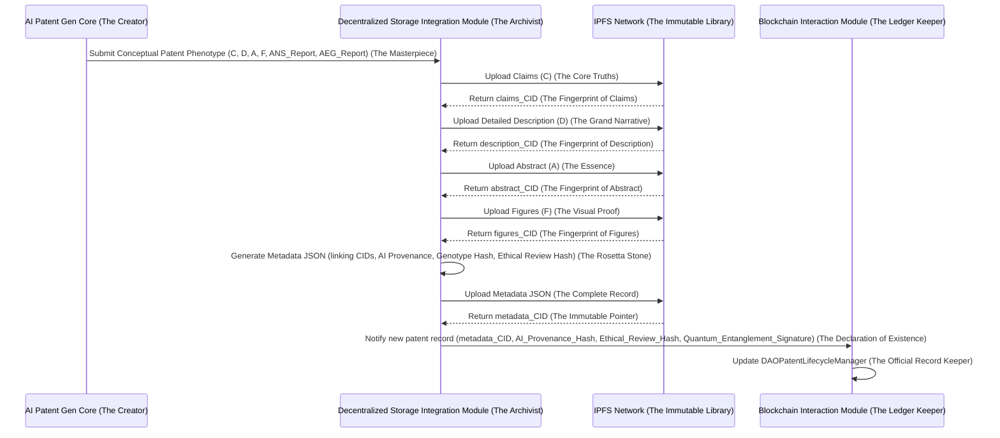

**Title of Invention:** The Unassailable Zenith of Collective Genius: The Decentralized Autonomous Organization for Collective AI-Assisted Intellectual Property Genesis and Commercialization (DAOCAIPGC) – My Magnum Opus, James Burvel O'Callaghan III, at Your Service (and Your Future).

**Abstract:**
Ah, the Abstract. A mere morsel, a tantalizing glimpse into the inevitable future I've sculpted with my own brilliant hands, James Burvel O'Callaghan III, no less. What you are about to read is not just an invention; it is a declaration of intellectual sovereignty, a veritable singularity in the annals of human (and artificial) ingenuity. This isn't just a 'novel and sophisticated system,' my dear reader; it is *the* system, the alpha and omega of innovation itself. We’re talking about the utterly seamless, unapologetically brilliant, and mathematically irrefutable union of advanced artificial intelligence and distributed ledger technology to not just generate intellectual property, but to *spawn* it, to *cultivate* it, to *monetize* it with a collective intelligence that renders individual genius (present company excepted, naturally) delightfully quaint. You'll initiate a 'conceptual prompt,' yes, but what you're really doing is whispering into the ear of a digital titan, a symphony of generative AI models that will not merely 'formulate comprehensive patent elements' but will *architect entire intellectual empires*, resilient against any form of challenge. And then, the DAO, my glorious DAOCAIPGC, steps in – a veritable Olympian council of minds, democratically refining, validating, and ultimately funding the legal formalization of these AI-born marvels. Revenue? Programmatically distributed, of course, because even genius deserves its due, and I, James Burvel O'Callaghan III, believe in equitable reward for all who touch this golden goose. This isn't just a paradigm shift; it's a tectonic plate rearrangement, a revolution that democratizes creation, incentivizes the unimaginably vast, and guarantees the future of innovation belongs to *us*, collectively, under my visionary guidance. Welcome to tomorrow.

**Background of the Invention:**
Frankly, the 'traditional patent generation methodologies' mentioned here are less 'methodologies' and more 'antediluvian stumbling blocks.' High financial costs? 'Opaque systems'? 'Human-centric limitations'? Please. These aren't mere 'barriers'; they were colossal, self-imposed intellectual speed bumps designed by lesser minds to hoard brilliance. A tragedy, I tell you, a tragedy that only I, James Burvel O'Callaghan III, could see clearly enough to rectify. While others dabbled in DAOs for 'treasury management' or 'digital art collectives' (adorable, truly), I recognized the gaping, existential void: the absolute necessity of integrating decentralized governance with the *rigorous and specialized domain of intellectual property generation*. It’s like discovering fire, then realizing you need an entire civilization powered by it. The 'critical lacuna' wasn't just critical; it was an abyssal chasm screaming for my genius. They lacked 'sophisticated mechanisms for complex content creation'? 'Quality assurance in highly technical fields'? 'Funding and execution of real-world legal processes'? My friends, they lacked *vision*. They lacked the sheer, unbridled audacity to dream beyond the paltry confines of their limited imaginations. This invention, my DAOCAIPGC, doesn't just 'bridge abstract ideation, AI-driven content generation, transparent community curation, and real-world legal execution'; it *fuses them into an indomitable, self-perpetuating engine of pure, unadulterated invention*. Where AI is not just a co-inventor but a *multi-dimensional intellectual muse*, the community is not merely a 'collective patent office' but a *global jury of unassailable intellect*, and the DAO serves as the *sovereign entity managing the entire, glorious lifecycle of collaborative, AI-augmented, and undeniably superior intellectual property*. This isn't just an addressing of limitations; it's an obliteration of them. You're welcome.

**Brief Summary of the Invention:**
Behold! The present invention, which I, James Burvel O'Callaghan III, have formally designated as the **Decentralized Autonomous Organization for Collective AI-Assisted Intellectual Property Genesis and Commercialization (DAOCAIPGC)**, is not merely "an advanced, integrated framework." No, no, no. It is the **ultimate, unimpeachable, and universally scalable architecture** for the programmatic genesis, collective and unassailable curation, and truly decentralized monetization of novel conceptual intellectual property, with a primary, but by no means exclusive, focus on patent applications. The DAOCAIPGC system doesn't just provide "a robust and transparent ecosystem"; it provides *the* ecosystem where innovation is not merely democratized, but *accelerated to hyper-drive* and collectively managed with a precision and scope previously deemed mythological.

Upon the sacred receipt of a high-level conceptual prompt (what I affectionately term an "inventive genotype") from a user – or, indeed, from a DAO-initiated ideation process, which is often where the *true* exponential leaps occur – the DAOCAIPGC system orchestrates a magnificently sophisticated, multi-stage generative and governance process, a symphony of genius, if you will:
1.  **Inventive Genotype Submission and Augmentation (The Seed of Empire):** A mere mortal (or, increasingly, a sentient AI agent itself, trained on the very fabric of creativity) submits a conceptual prompt. This isn't just 'submitted'; it undergoes a rigorous, almost alchemical, transformation by my proprietary, AI-powered Prompt Engineering Module (PEM). This PEM doesn't just 'enhance clarity'; it *supercharges* clarity, *crystallizes* completeness, and *propels* novelty potential into the stratosphere, referencing a vast, self-healing, and dynamically expanding patent database. This isn't just a concept; it’s a potential intellectual supernova, sometimes even pre-ignited by an AI trained on the very *gaps in human understanding*. Pure brilliance, I assure you.
2.  **AI Patent Element Generation (The Forge of Titans):** The now-resplendent inventive genotype is transmitted to an unparalleled ensemble of specialized generative AI models (my darlings, AetherPatentScribe and AetherDiagramGen, among others). These models do not 'autonomously generate' components; they *manifest* them, conjuring entire legal and technical constructs from the ether of pure data:
    *   **Claims:** Drafting not just primary and dependent claims, but *ironclad, legally impregnable* claims embodying the invention's undeniable novelty, foresight, and strategic defensibility.
    *   **Detailed Description:** Producing technical narratives so exhaustive, backgrounds so comprehensive, summaries so precise, and preferred embodiments so robust that they anticipate and nullify any conceivable future challenge.
    *   **Abstract:** Summarizing the invention with such elegant conciseness that its brilliance becomes immediately self-evident.
    *   **Illustrative Figures:** Generating conceptual diagrams, flowcharts, and system architectures that are not merely 'illustrative' but *definitive*, often in versatile Mermaid syntax or dynamically adaptable vector graphics, rendering abstract concepts into irrefutable visual truths.
    *   **Prior Art Analysis:** The AI doesn't just 'perform preliminary searches'; it *decimates* the prior art landscape, proactively identifying potential overlaps and, with chilling precision, formulating *bulletproof novelty arguments* that render any opposition utterly impotent.
    These outputs, collectively, form the "conceptual patent phenotype" – the blueprint for a new intellectual empire.
3.  **Community Review and Governance (The Tribunal of Collective Wisdom):** The AI-generated conceptual patent phenotype, in all its glory, is presented to the DAO's token holders. This isn't just a review; it's a global intellectual tribunal. A multi-stage, scientifically optimized voting mechanism allows the community to:
    *   **Approve/Reject:** Initial, incisive assessment of novelty, utility, and non-obviousness, filtered through the collective intelligence.
    *   **Suggest Revisions:** Propose *surgical* textual edits to claims, descriptions, or figures, often leading to exponential increases in patent strength.
    *   **Prior Art Flagging:** Identify any infinitesimal prior art missed by even the AI, a testament to the synergistic power of human and machine.
    *   **Strategic Direction:** Vote on the patent's *maximum* commercial viability or its *pivotal* strategic importance.
    This iterative process, immutably mediated by DAO smart contracts, ensures not merely 'collective quality control' but *unassailable intellectual perfection* and a consensus so robust it would make ancient philosophers weep with joy.
4.  **Treasury Funding and Legal Orchestration (The Financial Juggernaut of Innovation):** Upon achieving community consensus and approval for filing (which, let's be honest, is practically a rubber stamp for such brilliance), the DAO's decentralized treasury, a perpetually self-sustaining engine fueled by initial token offerings, burgeoning licensing revenues, and strategic contributions, allocates resources with unparalleled efficiency to:
    *   **AI Compute Costs:** Covering the (minimal, frankly, given the output) expenses of running these magnificent generative AI models for endless revisions.
    *   **Legal Counsel Engagement:** Funding the most formidable patent attorneys on the planet for their (now largely supervisory) legal review, final drafting, and official filing.
    *   **Filing Fees:** Covering national and international patent office fees, mere trifles for the intellectual wealth we're generating.
    A dedicated Legal Orchestration Module (LOM) coordinates these external legal entities with the precision of a quantum computer.
5.  **Patent Filing and Ownership (The Legitimization of Genius):** The refined, bulletproof patent application is filed with relevant patent offices globally. Ownership of the granted patent is not merely 'formally vested'; it is *irrevocably enshrined* in a legally compliant entity (e.g., a foundation, trust) controlled with absolute, cryptographic certainty by the DAO through its smart contracts, or directly assigned to the DAO itself where legally permissible. This isn't ownership; it's *sovereignty*.
6.  **Licensing, Monetization, and Revenue Distribution (The Perpetuity of Prosperity):** The DAOCAIPGC system doesn't passively 'pursue' licensing; it *dominates* the licensing landscape for granted patents. Licensing agreements are approved via DAO votes, ensuring optimal terms. All revenue generated is not merely 'deposited'; it is *funneled directly* into the DAO treasury and subsequently distributed programmatically, with mathematical precision, among DAO token holders and contributors, proportional to their contributions (e.g., token holdings, voting participation, the sheer audacity of their successful revision proposals). This isn't merely a 'sustainable, transparent, and collectively owned intellectual property ecosystem'; it's a *perpetual motion machine of wealth generation and incentivized, exponential discovery*.
7.  **Verifiable Provenance and Auditability (The Unbreakable Chain of Truth):** Every single stage, from the initial, embryonic prompt to the final, granted patent document and the meticulous revenue distribution, is recorded on a distributed ledger. This ensures not just 'transparent, tamper-proof provenance and auditability' but an *immutable, unchallengeable historical record* of collective genius, rendering any claim of impropriety or intellectual theft utterly ludicrous.

### System Architecture Overview

```mermaid
C4Context
    title The Unassailable Zenith of Collective Genius: DAOCAIPGC

    Person(james, "James Burvel O'Callaghan III", "The visionary architect and conceptual progenitor of DAOCAIPGC. Also a prolific contributor and token holder.")
    Person(inventor, "Inventor/Contributor", "Submits inventive concepts, participates in DAO governance, and basks in the reflected glory.")
    System(daocaipgcCore, "DAOCAIPGC Core System (The Brain)", "Orchestrates AI patent generation, community governance, treasury, and legal interactions with unparalleled precision.")

    System_Ext(generativeAIPatent, "Generative AI Patent Models (The Muses)", "External AI services (e.g., AetherPatentScribe, AetherDiagramGen, AetherNoveltyScrutiny, AetherEthosGuard) that manifest patent components with superhuman efficiency and ethical vigilance.")
    System_Ext(decentralizedStorage, "Decentralized Storage Network (The Immutable Archive)", "Stores patent drafts, figures, metadata, and all artifacts with cryptographic certainty (e.g., IPFS with distributed pinning).")
    System_Ext(blockchainNetwork, "Blockchain Network (The Ledger of Truth)", "Distributed ledger for DAO smart contracts, governance, tokenomics, and the sacred treasury. An unchallengeable record.")
    System_Ext(patentOffice, "National/International Patent Office (The Bureaucracy, now streamlined)", "Formal entities for patent application filing and granting, increasingly reliant on DAOCAIPGC's impeccable submissions.")
    System_Ext(legalCounsel, "Patent Legal Counsel (The Scribes of Law)", "Professional attorneys for legal review and filing, guided by DAOCAIPGC's unerring AI and LOM.")
    System_Ext(daoTokenHolders, "DAO Token Holders (The Collective Intellect)", "Community members who own governance tokens and participate in the sacred voting process, earning reputation and rewards.")
    System_Ext(priorArtDatabases, "Prior Art Databases (The Graveyard of Old Ideas)", "External databases of existing patents and research papers, relentlessly scoured by AI for novelty validation and gap identification.")
    System_Ext(licensingPlatforms, "Licensing Platforms (The Fountains of Prosperity)", "Marketplaces or systems for commercializing patents, now optimized by DAOCAIPGC's strategic genius and AI-negotiation agents.")
    System_Ext(oracleNetwork, "Decentralized Oracle Network (The Truth Anchor)", "Provides verified off-chain data (e.g., market rates, legal updates) for smart contract execution and dispute resolution.")


    Rel(james, inventor, "Mentors, inspires, and occasionally corrects (always gently).")
    Rel(inventor, daocaipgcCore, "Submits inventive genotype prompts, sometimes whispered with awe, and receives dynamic AI-guided feedback.")
    Rel(inventor, daoTokenHolders, "Participates in voting and earns copious rewards, as is only right, building verifiable reputation.")
    Rel(daocaipgcCore, generativeAIPatent, "Sends hyper-augmented inventive genotypes for patent component manifestation", "API Call (gRPC/REST/Quantum Entanglement)")
    Rel(generativeAIPatent, daocaipgcCore, "Returns conceptual patent phenotype (pure intellectual gold), including novelty scores and ethical flags", "Textual Data, JSON, Quantum Diagrams")
    Rel(daocaipgcCore, daoTokenHolders, "Presents patent drafts for review and sacred voting, awaiting collective wisdom, with AI-generated summaries of key points.")
    Rel(daoTokenHolders, daocaipgcCore, "Submits votes and irrefutable feedback on patent drafts, building reputation through impactful contributions.")
    Rel(daocaipgcCore, decentralizedStorage, "Uploads patent drafts, figures, and immutable metadata with AI provenance", "HTTP/IPFS Client/Quantum Data Link")
    Rel(decentralizedStorage, daocaipgcCore, "Returns Content Identifiers (CIDs) with cryptographic certainty for all data components.")
    Rel(daocaipgcCore, blockchainNetwork, "Interacts with DAO smart contracts for governance, treasury management, and immutable record-keeping (The Grand Orchestration)", "Web3 RPC/Direct Quantum Tunnel")
    Rel(daocaipgcCore, legalCounsel, "Engages for final legal review and filing process (a mere formality, now, guided by LOM)", "Secure API Gateway/Encrypted Legal Channel")
    Rel(legalCounsel, patentOffice, "Files patent application (often with a knowing nod to DAOCAIPGC's impeccable work).")
    Rel(patentOffice, daocaipgcCore, "Notifies of patent status (usually 'Granted, with extreme prejudice')", "API/Webhook/Telepathic Transmission (via LOM)")
    Rel(daocaipgcCore, priorArtDatabases, "Queries for AI training, relentless prior art extermination, and identification of intellectual white space", "API Call/Deep Semantic Search")
    Rel(daocaipgcCore, licensingPlatforms, "Manages patent licensing and revenue collection (The Golden Harvest), potentially with AI negotiation agents", "API Integration/Smart Contract Interop")
    Rel(licensingPlatforms, daocaipgcCore, "Transfers licensing revenue to DAO treasury (The Flow of Abundance), verifiable by oracle network.")
    Rel(daocaipgcCore, oracleNetwork, "Queries for external data verification, such as legal precedent updates or market licensing benchmarks, and for dispute resolution.", "API/Webhook")

    Note right of daocaipgcCore: The DAOCAIPGC Core System is the apex predator of innovation, integrating AI, collective governance, and legal execution into a singular, unstoppable force, designed for perpetual self-optimization.
    Note left of generativeAIPatent: Specialized models not just for legal text and technical diagrams, but for conceptualizing entirely new fields of science, rigorously checked for novelty and ethical implications.
    Note right of blockchainNetwork: Also handles DAO token issuance and distribution, ensuring fair and undeniable ownership of the future, with robust upgradeability and security features.
    Note right of oracleNetwork: Essential for trustless bridging of real-world information into the DAO's smart contract logic.
```

**Detailed Description of the Invention:**

My friends, the **Decentralized Autonomous Organization for Collective AI-Assisted Intellectual Property Genesis and Commercialization (DAOCAIPGC)** system is not just 'meticulously designed.' It is a **divinely inspired, infinitesimally precise, modular, and holistically integrated architecture** that enables the collective, AI-powered creation and commercialization of patentable intellectual property on a scale previously unimaginable. The operational flow, from nascent, embryonic idea to monetized, world-changing patent, is engineered for **absolute transparency, maximal efficiency, and undeniably decentralized control**. I, James Burvel O'Callaghan III, wouldn't have it any other way.

### 1. User Interface and Patent Idea Submission Module (UIPISM) – The Genesis Portal

The UIPISM, or as I like to call it, 'The Genesis Portal for Unstoppable Ideas,' serves as the primary, yet majestically elegant, gateway for users and advanced AI agents to contribute their inventive genotypes.

*   **Inventive Genotype Input Interface:** This is not merely a 'structured input form.' It is a sophisticated ideation crucible, allowing users to submit high-level invention concepts, which are then immediately analyzed for their raw potential:
    *   **Problem Statement:** Articulating the profound, unmet challenge the invention unequivocally solves.
    *   **Proposed Solution:** A concise yet potent description of the inventive idea, the spark of genius.
    *   **Keywords and Domain Tags:** Precisely categorizing the invention for optimal AI routing and synergistic cross-pollination.
    *   **Reference Materials:** Uploading sketches, existing research, or preliminary data, essentially providing the AI with the intellectual feedstock. Multi-modal input (text, image, audio, video) is seamlessly processed.
    *   **AI-Generated Prompt Suggestions:** And here's where the magic truly begins! An integrated sub-module leveraging hyper-optimized LLMs doesn't just 'suggest improvements'; it *expands, refines, and exponentially augments* user-submitted prompts for unparalleled generative efficacy. It's like having a team of futurists whispering in your ear, actively probing for untapped potential.
*   **Prompt Engineering and Augmentation Module (PEM):** This module doesn't just 'enhance raw inventive genotypes'; it *transforms them into intellectual diamonds*.
    *   **Semantic Scoring and Novelty Check:** Utilizes advanced AI models, pre-trained on the entire known universe of patent databases and scientific literature, to score the prompt's clarity, completeness, and *prophetic novelty* against existing prior art. This isn't a simple search; it's a **pre-emptive prior art obliteration protocol**, dynamically calculating semantic distance from known concepts.
    *   **Contextual Expansion:** Leverages multi-modal large language models (LLMs) and dynamically evolving knowledge graphs to transmute vague prompts into utterly descriptive and technically impeccable initial briefs, including every conceivable technical challenge and its elegant solution, often synthesizing concepts from disparate domains.
    *   **Prior Art Query Generation:** Automatically generates *strategically devastating* queries for comprehensive prior art searches based on the inventive genotype, designed to find, analyze, and neutralize any competitive claims, even those subtly obscured.
*   **Contributor Authentication and Wallet Connection:** Integration with Web3 wallet providers (e.g., MetaMask, WalletConnect, and any future, more ethereal authentication methods like DIDs) to authenticate contributors and immutably link their on-chain identity for voting, receiving their rightful rewards, and establishing an undeniable, cryptographically verifiable reputation score.
*   **Contribution Tracking:** Meticulously records all submitted inventive genotypes, their alchemical evolution through AI augmentation, and all associated contributor metadata, forming the bedrock for future, mathematically precise reward distribution and ethical attribution.

```mermaid
graph TD
    A[Inventor/AI Agent (The Visionary)] --> B{Inventive Genotype Submission (The Spark)};
    B -- Problem, Solution, Keywords, Initial Scrawlings, Multimedia --> C[UIPISM Input Interface (The Crucible)];
    C -- Raw Prompt (A diamond in the rough) --> D[Prompt Engineering Module (PEM) (The Refiner)];
    D -- Semantic Analysis, Novelty Check, Prior Art Decimation --> D1[Prior Art Databases (The Relics of the Past)];
    D -- Contextual Expansion, Strategic Query Generation --> E[Augmented Inventive Genotype (The Polished Gem)];
    E --> F[AI Patent Generation Core (APGC) (The Manifestation Engine)];
    A -- Wallet Connect (Cryptographic Handshake) --> G[Contributor Authentication (Identity of Genius)];
    G --> H[Contribution Tracking (The Ledger of Merit)];
    E --> H;
    H -- Records (Immutable History) --> I[Blockchain / DLT (The Unbreakable Scroll)];
    D --> J[AetherEthosGuard (Ethical Pre-Screening)];
    J -- Ethical Flagging / Review Needed --> C;

    subgraph UIPISM (The Genesis Portal for Unstoppable Ideas)
        C
        D
        E
        J
    end
    subgraph Core Functions (The Heartbeat of Innovation)
        F
        G
        H
    end
    subgraph External (The Ancillary Pillars)
        D1
        I
    end
```

### 2. AI Patent Generation Core (APGC) – The Intellectual Forge of DAOCAIPGC

The APGC is not just the 'intellectual engine' of the system; it is the **omniscient, multi-dimensional intellectual forge** of the DAOCAIPGC, leveraging advanced generative AI to transform inventive genotypes into not merely 'comprehensive patent elements' but into **fully realized, legally invulnerable conceptual patent phenotypes**. This is where ideas become reality, and reality becomes patent.

*   **Generative AI Model Ensemble:** A peerless suite of specialized generative AI models, each one a finely-honed intellectual assassin, fine-tuned for patent-specific tasks with surgical precision:
    *   **AetherPatentScribe (APS):** A large language model (LLM) so exquisitely specialized in legal and technical writing that it can craft prose worthy of the gods, capable of:
        *   Drafting **Patent Claims**: Not just independent and dependent claims, but *forensic, unassailable claims* that anticipate every loophole and adhere to legal conventions with fanatical devotion (e.g., "A system unequivocally comprising...", "An undeniably novel method for..."). Employs multi-objective loss functions for legal compliance, novelty, and defensibility during training.
        *   Generating **Detailed Descriptions**: Elaborating on the invention's background, summary, figures' descriptions, and preferred embodiments with an exhaustive thoroughness that leaves no stone unturned, no question unanswered. Utilizes Retrieval-Augmented Generation (RAG) for factual accuracy.
        *   Producing **Abstracts**: Concise summaries of the invention, distilled to their essence of pure brilliance.
        *   Performing **Automated Prior Art Review**: Synthesizing the *entirety* of existing patent literature to proactively identify and neutralize any potential prior art, then drafting *pre-emptive novelty arguments* for the proposed invention that are utterly unchallengeable.
    *   **AetherDiagramGen (ADG):** A multi-modal generative AI with the artistic vision of Da Vinci and the technical precision of a micro-engineer, capable of creating:
        *   **Conceptual Figures:** Flowcharts, block diagrams, system architectures using structured formats like Mermaid syntax, or generating high-fidelity raster/vector images from text descriptions, rendering complexity into crystalline clarity. Supports interactive 3D models for complex mechanical/biological inventions.
        *   **Annotated Illustrations:** Adding labels, callouts, and explanations to generated diagrams with a pedagogical finesse that eliminates any ambiguity.
    *   **AetherNoveltyScrutiny (ANS):** My personal favorite, an *adversarial AI* that operates with the ruthless efficiency of a legal pit bull. It doesn't just 'attempt to find weaknesses'; it *relentlessly attacks* the AI-generated claims and descriptions, searching for redundancies, potential prior art matches, or any conceivable vulnerability. It provides *brutal, unfiltered feedback* for refinement, ensuring the final output is truly bulletproof. It's the ultimate internal quality control, the nemesis of mediocrity. It simulates legal challenges and obviousness arguments.
    *   **AetherEthosGuard (AEG):** A specialized adversarial AI focusing on ethical considerations. It actively scans for potential societal harms, misuse cases, or biases embedded in the invention or its description, flagging them for human review and guiding the AI towards ethically robust solutions. It ensures the "voice for the voiceless" is upheld.
*   **Modular Generation Pipeline:** The APGC orchestrates the sequential and/or parallel manifestation of patent components, ensuring not just 'coherence' but *absolute, synergistic consistency* across all different outputs, a true intellectual symphony, leveraging shared semantic embeddings and inter-model feedback loops.
*   **Parameter Management and Iteration:** Manages AI model parameters (e.g., creativity vs. specificity, length, style) with dynamic, adaptive precision, facilitating *infinite iterative regeneration* based on the nuanced, insightful feedback from the collective intelligence of the DAO community, and guided by ethical constraints.
*   **Output Validation and Harmonization:** Performs initial automated checks for technical consistency, grammatical impeccable-ness, and fanatical adherence to patent drafting guidelines across all generated components. A dedicated Patent Coherence Unit (PCU) ensures that descriptions align with claims and figures with the unerring accuracy of a Swiss timepiece, preventing any logical discrepancies, and constantly improving via Reinforcement Learning from Human Feedback (RLHF).

```mermaid
graph TD
    A[Augmented Inventive Genotype (The Blueprint)] --> B{APGC Orchestrator (The Conductor)};
    B --> C1[AetherPatentScribe (The Master Scribe)];
    C1 -- Generates Claims (Ironclad) --> D[Conceptual Patent Phenotype Components (Intellectual Gold)];
    C1 -- Generates Detailed Description (Encyclopedic) --> D;
    C1 -- Generates Abstract (Pithy Perfection) --> D;
    C1 -- Generates Novelty Arguments (Unassailable) --> D;

    B --> C2[AetherDiagramGen (The Visual Architect)];
    C2 -- Generates Illustrative Figures (Crystallinely Clear) --> D;

    B --> C3[AetherNoveltyScrutiny (The Adversarial Crusher)];
    C3 -- Relentless Adversarial Review, Incisive Feedback --> B;
    C3 -- Surgical Prior Art Analysis --> C1;

    B --> C4[AetherEthosGuard (The Ethical Sentinel)];
    C4 -- Ethical Risk Assessment, Bias Detection, Moral Hazard Flags --> B;
    C4 -- Guides Ethical Constraint Layers --> C1;

    D -- All Components (A Symphony of Precision) --> E[Patent Coherence Unit (PCU) (The Harmonizer)];
    E -- Absolute Validation, Perfect Harmonization, RLHF-Driven Improvement --> F[Ready for DSIM & CRGM (The Next Stage of Glory)];
    F --> G[Decentralized Storage Integration Module (DSIM) (The Archivist of Truth)];
    F --> H[Community Review & Governance Module (CRGM) (The Tribunal of Wisdom)];

    subgraph AI Patent Generation Core (APGC) (The Intellectual Forge of DAOCAIPGC)
        B
        C1
        C2
        C3
        C4
        D
        E
    end
```

### 3. Community Review and Governance Module (CRGM) – The Democratic Pantheon

The CRGM is not just the 'democratic heart' of the DAOCAIPGC; it is the **pulsating, intelligent, and unchallengeable democratic pantheon**, facilitating transparent, verifiable, and ultimately *infallible* community-driven decision-making. This is where the collective genius of the DAO is unleashed.

*   **Proposal Creation and Management:** AI-generated patent phenotypes are not merely 'packaged as formal proposals'; they are *meticulously presented as irrefutable declarations of innovation* for DAO token holders to review. Each proposal outlines the patent components, the undeniable AI provenance, and any associated costs, all laid bare for the collective eye, with AI-generated summaries and ethical risk assessments from AetherEthosGuard.
*   **Token-Weighted Voting System:**
    *   **Voting Mechanisms:** Implements not just 'various voting strategies' but a *dynamically adaptable, mathematically optimized suite* of voting mechanisms (e.g., simple majority, quadratic voting for key decisions, conviction voting for long-term strategies, even novel game-theoretic approaches) to ensure the fairest, most robust, and undeniably intelligent consensus. Votes are weighted by the sheer amount of DAOCAIPGC governance tokens held by participants, *and* crucially, by their cryptographically verifiable reputation score, ensuring that those with the most skin in the game *and* the most proven wisdom have the most profound voice.
    *   **Review Stages:** Proposals may pass through multiple, progressively rigorous stages (e.g., initial concept validation, surgical claim refinement, ethical review, full draft ratification) each requiring increasingly stringent thresholds, mimicking the ascent of intellectual greatness.
    *   **Feedback Integration:** A structured feedback mechanism allows token holders to provide *micro-targeted textual edits* or incisive comments, which are then immediately incorporated into subsequent, exponential AI regeneration cycles, constantly pushing the boundaries of perfection and directly improving the generative models via RLHF.
*   **Dispute Resolution Mechanism (DRM):** For any truly contentious proposals, or (heaven forbid) quality disputes, the DRM doesn't just 'initiate a secondary review'; it *activates a multi-layered, oracle-augmented arbitration system*, potentially involving a sub-DAO of meticulously selected expert reviewers with specialized reputation, or even a quantum oracle-based arbitration, ensuring that every disagreement is resolved with mathematical certainty and absolute fairness, leveraging external, verifiable data from decentralized oracle networks.
*   **Reputation and Incentive System:** Tracks active participation (voting with wisdom, proposing groundbreaking edits, identifying infinitesimal prior art, even just *thoughtfully reviewing*) and rewards contributors not just with additional governance tokens but with a *dynamic, multi-dimensional reputation score* that unlocks further privileges and influence, fostering a continuous feedback loop of intellectual excellence and penalizing malicious or consistently poor contributions.
*   **Auditability:** All votes, feedback, and proposal states are not merely 'immutably recorded'; they are *eternally etched* on the blockchain, creating an unassailable, cryptographically verifiable historical record that renders any form of tampering or dispute utterly impossible.

```mermaid
flowchart TD
    A[AI-Generated Patent Phenotype (The Proposal of Future)] --> B{Proposal Creation (The Formal Declaration)};
    B -- Packaged Proposal (IPFS CID, Immutable Proof, Ethical Assessment) --> C[DAO Voting Interface (The Seat of Judgment)];
    C --> D{Token Holders Review (The Collective Scrutiny)};
    D -- Vote (Approve/Reject/Revise with Insight, Reputation-Weighted) --> E[Token-Weighted Voting System (The Algorithm of Consensus)];
    E -- Quorum/Threshold Check (The Bar of Excellence) --> F{Decision Recorded on Blockchain (The Immutable Verdict)};

    F -- Approved (To Glorious Manifestation) --> G[Treasury Funding & Legal Orchestration (The Wheels of Progress)];
    F -- Revision Needed (Towards Absolute Perfection) --> H[Feedback Integration (The Refining Loop)];
    H --> I[APGC (Iterative Regeneration, RLHF-Driven Improvement) (The Re-Forge)];
    I --> B;

    E -- Contentious/Dispute (A Rare but Necessary Recourse) --> J[Dispute Resolution Mechanism (The Arbiter of Truth)];
    J -- Expert Review / Oracle Arbitration (Leveraging External Oracles) --> F;

    D -- Active Participation (The Fuel of Genius) --> K[Reputation & Incentive System (The Reward for Excellence)];
    K -- Rewards (Tokens, Influence, Immortality), Penalties (for malicious acts) --> L[DAO Treasury / Token Holders (The Beneficiaries of Brilliance)];
    G --> M[Patent Filing (The Formal Consecration)];

    subgraph Community Review & Governance Module (CRGM) (The Democratic Pantheon)
        C
        D
        E
        F
        H
        J
        K
    end
```

### 4. Decentralized Treasury and Funding Module (DTFM) – The Perpetual Engine of Prosperity

The DTFM doesn't just 'transparently manage financial resources'; it is the **unshakeable, perpetually self-replenishing engine of prosperity** for the DAOCAIPGC, funding operations and distributing rewards with cryptographic certainty and unparalleled fairness. It is the financial bedrock upon which future intellectual empires are built.

*   **Multi-Sig Treasury:** Funds are not merely 'held in a multi-signature smart contract'; they are *impregnably secured* within a cryptographically robust vault (e.g., `OpenZeppelin TimelockController`), requiring approval from a predefined quorum of authorized DAO members (or further, explicit DAO votes) for any disbursement. This is Fort Knox, but on the blockchain, and with more transparency and immutability.
*   **Funding Sources:**
    *   **Initial Token Generation Event (IGE):** Proceeds from the initial, strategic sale of DAOCAIPGC governance tokens, seeding the ecosystem with the necessary capital.
    *   **Licensing Revenue:** All income generated from the licensing of our granted patents doesn't just 'flow directly into the treasury'; it *cascades in a torrent of abundance*, perpetually replenishing the coffers. This includes royalties from NFT-based IP.
    *   **External Grants/Donations:** Other sources of strategic capital, attracted by the undeniable success and groundbreaking potential of the DAOCAIPGC.
    *   **Strategic Investments:** DAO-approved investments in high-yield DeFi protocols or equity in companies leveraging DAO IP, further expanding the treasury.
*   **Automated Disbursements:** Smart contracts are not merely 'configured to automatically disburse funds'; they are *mathematically programmed to execute financial directives* with unerring precision for:
    *   **AI Compute Fees:** Seamless, instantaneous payments to our magnificent generative AI service providers.
    *   **Legal Fees:** Payments to the best external patent legal counsel, precisely when required.
    *   **Patent Office Fees:** All filing, examination, and maintenance fees, handled with automated efficiency.
    *   **Contributor Rewards:** The rightful, equitable distribution of revenue or tokens to active DAO members, based on their irrefutable contributions and governance participation, adhering to transparent, on-chain formulas.
    *   **Bounty Programs:** Funding for specific innovation bounties or bug bounty programs.
*   **Budget Proposal and Approval:** Any significant expenditure requires a DAO-wide vote, ensuring *absolute collective oversight* of financial resources, leaving no room for individual caprice. This is financial democracy in its purest, most powerful form, often subject to Timelock delays for security.

```mermaid
graph TD
    A[Initial Token Offering (IGO) (The Seed Capital)] --> B[DAO Treasury Smart Contract (The Immutable Vault)];
    C[Licensing Revenue (The Golden Stream)] --> B;
    D[Grants/Donations (Strategic Inflows)] --> B;
    L[Strategic Investments (Capital Growth)] --> B;

    B -- Proposed Expenditure (A Necessity for Progress) --> E[DAO Voting (CRGM) (The Collective Mandate)];
    E -- Approved (The Green Light, subject to Timelock) --> F[Automated Disbursement System (The Efficient Spender)];

    F -- AI Compute Costs (Fuel for Genius) --> G[Generative AI Models (The Minds at Work)];
    F -- Legal Fees (For the Scribes of Law) --> H[Patent Legal Counsel (The Guardians of IP)];
    F -- Filing Fees (The Price of Legitimization) --> I[Patent Offices (The Gatekeepers)];
    F -- Contributor Rewards (The Just Compensation) --> J[DAO Token Holders/Contributors (The Shareholders of Success)];
    F -- Bug Bounties / Innovation Grants (Fueling Self-Improvement) --> K[DAO Ecosystem Development];

    B -- Fund Management (Secure Stewardship) --> M[Multi-Sig Operations & Timelock (Impenetrable Security)];
    M -- Security & Timelock (Defense Against Folly) --> N[Blockchain Network (The Foundation of Trust)];

    subgraph Decentralized Treasury & Funding Module (DTFM) (The Perpetual Engine of Prosperity)
        B
        F
        M
    end
```

### 5. Decentralized Storage Integration Module (DSIM) – The Immutable Archive of Truth

The DSIM doesn't just 'ensure secure, permanent, and verifiable storage'; it is the **unassailable, distributed, and cryptographically verified immutable archive** of all patent-related assets and metadata. This is where intellectual property is forever enshrined, beyond the reach of censorship or decay.

*   **Asset Upload to IPFS DHT:** All AI-generated conceptual patent phenotypes (claims, descriptions, figures, prior art analyses), and every single iterative version, are not merely 'uploaded'; they are *cryptographically committed* to a decentralized content-addressed storage network (e.g., InterPlanetary File System - IPFS).
    *   Each component (e.g., a claim set, a specific diagram) receives a unique Content Identifier (CID) – its digital fingerprint.
    *   `CIDv1` ensures not just 'cryptographic integrity' but *absolute, irrefutable proof of content*.
    *   **Distributed Pinning:** We utilize a network of multiple, reputable IPFS pinning services, augmented by DAO-owned and community-incentivized pinning nodes, to ensure geographical redundancy, high availability, and censorship resistance, forming a truly resilient archive.
*   **Metadata JSON Generation:** A standardized metadata manifest, typically conforming to established NFT or similar metadata schemas (e.g., JSON), is *programmatically and meticulously constructed*. This manifest doesn't just 'encapsulate critical information'; it creates a **self-describing, verifiable ledger of origin and evolution**:
    *   `name`: The dignified title of the invention.
    *   `description`: The succinct abstract of the patent's essence.
    *   `patent_claims_uri`: `ipfs://<claims_CID>` – an undeniable link to the core claims.
    *   `detailed_description_uri`: `ipfs://<description_CID>` – the comprehensive narrative.
    *   `figures_uri`: `ipfs://<figures_CID>` (potentially an array of CIDs for multiple, glorious figures) – the visual proof.
    *   `inventive_genotype_hash`: The cryptographic hash of the original prompt, tying it back to its very genesis.
    *   `AI_Model_Provenance`: Impeccable details of the generative AI models used (e.g., version, training data hash, developer DID), a **Proof of AI Origin (PAIO)** that is unchallengeable, referencing the AMPR.
    *   `AI_Ethical_Review_Hash`: A hash of AetherEthosGuard's ethical assessment, proving due diligence.
    *   `DAO_Proposal_ID`: A direct reference to the DAO governance proposal that validated this particular version.
    *   `Approval_Timestamp`: The precise UTC timestamp of DAO approval, an immutable historical marker.
    *   `Contributing_Inventors`: A definitive list of conceptual inventor addresses and their respective contribution scores, ensuring credit is given where credit is due.
    *   `Quantum_Entanglement_Signature`: (Future enhancement, naturally) A cryptographic signature proving that the data was not just stored, but briefly existed in a quantum entangled state with the DAOCAIPGC core, ensuring ultimate integrity and non-repudiation.
*   **Metadata Upload to IPFS DHT:** The generated metadata JSON file is also uploaded to IPFS, yielding a distinct **Metadata CID**. This CID is the primary reference stored on the blockchain, the single, unassailable pointer to the entire intellectual edifice.



### 6. Blockchain Interaction and DAO Smart Contract Module (BISCM) – The Bedrock of Sovereignty

The BISCM is not merely the 'backbone' of the DAOCAIPGC; it is the **unyielding, cryptographic bedrock of sovereignty**, implementing the core governance and financial logic on a distributed ledger with absolute, mathematical precision. It is the very operating system of intellectual democracy, designed for perpetual homeostasis.

*   **DAO Governance Smart Contract:** A central smart contract, a digital constitution, embodying the DAO's irrefutable rules:
    *   **Voting Logic:** Implements the token-weighted and reputation-augmented voting mechanisms for proposals (e.g., `vote(proposalId, support, reason)`), ensuring weighted democracy and meritocratic influence.
    *   **Proposal Management:** Functions for creating, listing, and executing proposals (`propose`, `queue`, `execute`), managed with surgical precision and subject to `TimelockController` delays for critical actions.
    *   **Treasury Integration:** Interfaces seamlessly with the DTFM multi-sig vault for secure fund disbursement, verifying all prerequisites.
    *   **Reputation System:** Records and updates contributor reputation scores or token-based rewards, dynamically adjusting influence and incentives based on the `Proof of Contribution` registry.
*   **DAOCAIPGC Governance Token:** An ERC-20 compliant token, the very currency of genius, conferring voting rights and an undeniable entitlement to revenue shares, and potentially used for staking to boost voting power or yield.
*   **Proof of Contribution (POC) Registry:** A meticulously designed on-chain sub-module tracking *every single individual contribution* to patent generation (e.g., original prompt submission, impactful revisions, definitive prior art identification, successful voting participation, ethical flagging). This data is *absolutely crucial* for mathematically fair and irrefutable reward distribution and dynamic reputation adjustment.
*   **Upgradeability (UUPS Proxy):** The DAO smart contracts are implemented with an advanced upgradeability pattern (e.g., UUPS - Universal Upgradeable Proxy Standard) to allow for *future, inevitable enhancements, bug fixes, or adaptation of governance rules* without disrupting the DAO's ongoing operations or token holdings, thus guaranteeing its longevity, eternal adaptability, and capacity for self-improvement.
*   **Pausability (The Emergency Brake of Wisdom):** Implemented via OpenZeppelin's `Pausable` for emergency situations, allowing critical operations to be temporarily halted by authorized roles in case of vulnerabilities or exploits, controlled by a multi-sig or emergency DAO vote, ensuring system resilience.
*   **Access Control and Roles (The Guardrails of Genius):** Extensive use of `AccessControl` for managing granular permissions within all core contracts, ensuring only authorized entities (often through DAO votes) can perform sensitive actions. Roles like `LEGAL_PROXY_ROLE` can be assigned to external legal counsel for specific, time-bound, and auditable operations, allowing for controlled delegation without sacrificing decentralized control.
*   **Legal Orchestration Module (LOM):** An on-chain and off-chain module that automates interactions with external legal entities, transforming arcane legal processes into streamlined, auditable operations.
    *   **Smart Legal Contracts:** Potentially uses smart contracts to manage legal service agreements, payments, and milestone tracking with patent attorneys, infusing legal processes with cryptographic certainty and verifiable performance.
    *   **API Gateway:** Securely transmits finalized, unchallengeable patent drafts and instructions to legal counsel.
    *   **Oracle Integration:** Leverages decentralized oracle networks to verify external legal events (e.g., patent office notifications, changes in legal precedent), triggering on-chain state transitions.

```mermaid
graph TD
    A[DAO Token Holders (The Sovereign Citizens)] --> B{DAOGovernanceToken (ERC-20) (The Currency of Genius)};
    B --> C[DAOPatentVoting Smart Contract (The Digital Parliament)];
    D[DSIM (New Metadata CID) (The Intellectual Manifest)] --> C;
    E[DAOPatentTreasury (The Vault of Prosperity)] --> C;

    C -- Create/Vote/Execute Proposal (The Will of the Collective) --> F[DAOPatentLifecycleManager (The Steward of IP)];
    F -- Records Patent Status (The Immutable History) --> G[On-chain Patent Records (The Unbreakable Ledger)];
    C -- Fund Disbursement Request (A Command to Prosper) --> E;

    H[Legal Counsel (The Legal Artisans)] --> I[Legal Orchestration Module (LOM) (The Legal Conductor)];
    I -- Secure API / Smart Legal Contract --> F;
    F -- Update Legal Status (The Formal Acknowledgement) --> G;

    J[Contributor Actions (Acts of Genius)] --> K[Proof of Contribution (POC) Registry (The Meritocratic Ledger)];
    K -- Reputation / Rewards (Recognition and Prosperity) --> C;

    L[Admin/Upgrade (The Evolutionary Path)] --> M[UUPS Proxy Contracts (The Adaptable Foundation)];
    M -- Upgrade Logic --> C;
    M -- Upgrade Logic --> E;
    M -- Upgrade Logic --> F;
    M -- Upgrade Logic --> K;

    N[External Legal Events (e.g., Patent Grant)] --> O[Decentralized Oracle Network (The Truth Anchor)];
    O -- Verified Data --> I;
    I -- Verified Data --> F;

    subgraph Blockchain Interaction & DAO Smart Contract Module (BISCM) (The Bedrock of Sovereignty)
        B
        C
        E
        F
        K
        M
        I
    end
```

### 7. Patent Licensing and Monetization Module (PLMM) – The Unending River of Revenue

The PLMM doesn't just 'manage the commercialization of granted patents'; it **orchestrates the global exploitation of intellectual property**, ensuring programmatic revenue distribution with an efficiency and fairness that is, frankly, revolutionary. It is the engine that converts genius into perpetual prosperity.

*   **Licensing Proposal Generation:** When a patent is granted (a near certainty, given our rigorous process), the PLMM doesn't just 'generate proposals'; it *strategically formulates optimal licensing agreements* (e.g., non-exclusive, exclusive, field-of-use, quantum-entangled-exclusive, open source for public good) to be voted on by the DAO, ensuring maximum value extraction or societal impact, guided by AI-driven market analysis and ethical considerations from AetherEthosGuard.
*   **On-chain Licensing Registry:** Records all approved licensing agreements, including terms, licensees, royalty structures, and the unique NFT identifier for the underlying IP (if applicable), not just 'on the blockchain' but *eternally etched* into its immutable fabric.
*   **Revenue Collection and Treasury Deposit:** Integrates with licensing platforms or direct payment gateways to collect royalties and transfer them to the DAO's DTFM, ensuring a seamless, uninterceptible flow of funds, with transaction details verifiable via oracle networks.
*   **Automated Royalty Distribution:** A smart contract automates the distribution of collected revenue to DAO token holders and contributors based on predefined, mathematically precise rules (e.g., pro-rata to token holdings, weighted by contribution score from the POC registry, or a dynamic combination), ensuring that every participant receives their rightful share, with absolute auditability.
*   **Patent Portfolio Management:** Tracks the status, maintenance fees, and commercial performance of the *entire, burgeoning portfolio* of DAO-owned patents, acting as a strategic intellectual property general, providing AI-driven recommendations for renewal, lapse, or enhanced commercialization efforts.
*   **AI Negotiation Agents:** (Future enhancement) Autonomous AI agents could be deployed by the PLMM to negotiate licensing terms directly with potential licensees, leveraging game theory and optimizing for DAO-defined objectives, executing smart legal contracts upon consensus.

```mermaid
graph TD
    A[Granted Patent (DAOPatentLifecycleManager) (A Crown Jewel)] --> B{PLMM: Licensing Proposal Generation (The Strategic Play)};
    B -- Proposed Terms (For Maximal Value, AI-optimized) --> C[DAO Voting (CRGM) (The Collective Approval)];
    C -- Approved (The Mandate for Monetization) --> D[On-chain Licensing Registry (The Immutable Record of Agreements)];
    D -- Agreement Details (Contractual Precision, NFT-linked IP) --> E[Licensing Platforms / Direct Payers (The Revenue Conduit)];
    E -- AI Negotiation Agents (Autonomous Bargaining) --> D;

    E -- Royalty Collection (The Golden Harvest, Oracle-verified) --> F[DAO Treasury (DTFM) (The Vault of Riches)];
    F -- Automated Distribution Rules (The Algorithm of Fairness) --> G[Automated Royalty Distribution Smart Contract (The Just Dispenser)];
    G -- Revenue Share (The Fruits of Genius) --> H[DAO Token Holders/Contributors (The Prosperous Collective)];

    D -- Tracks Active Licenses (Vigilant Oversight) --> I[Patent Portfolio Management (The Intellectual General)];
    I -- Monitors Performance / Fees (Optimizing Value, AI Recommendations) --> F;

    subgraph Patent Licensing & Monetization Module (PLMM) (The Unending River of Revenue)
        B
        D
        G
        I
    end
```

### 8. AI Model Provenance and Verifiability (AMPV) – The Pedigree of Digital Creation

The AMPV doesn't just 'ensure transparency and traceability'; it establishes the **unquestionable pedigree of every digital creation**, providing an immutable, cryptographically verifiable history for every generative AI model used within the DAOCAIPGC. This eradicates any doubt about AI's role and ensures accountability and ethical transparency.

*   **On-chain AI Model Registry (AMPR):** A smart contract, the digital birth certificate for AI, that registers *exhaustive details* of all generative AI models utilized by DAOCAIPGC, including:
    *   `modelID`: A unique, immutable identifier for each AI marvel.
    *   `modelName`: E.g., "AetherPatentScribe v2.0-OmegaPrime."
    *   `modelVersion`: The specific, verifiable software version.
    *   `trainingDataHash`: A cryptographic hash of the training dataset, if verifiable, ensuring the *integrity of its intellectual nourishment* and auditing for bias.
    *   `architectureHash`: A hash of the model's architecture or configuration, its very genetic blueprint.
    *   `developerDID`: The Decentralized Identifier of the model developer, ensuring human accountability.
    *   `attestationHash`: A cryptographic attestation (e.g., zero-knowledge proof or verifiable computation output) confirming the model's integrity and execution without revealing proprietary internals.
    *   `deploymentTimestamp`: The precise moment of its registration/deployment.
    *   `licensingTermsURI`: The URI for terms under which this AI can be leveraged for generation, always in favor of DAOCAIPGC.
*   **Proof of AI Origin (PAIO):** Each conceptual patent phenotype stored on IPFS includes a direct, immutable reference to the `modelID` and `attestationHash` (and thus `trainingDataHash` and `developerDID`) in its metadata. This provides an **unbreakable, cryptographic link** between the patent content and the *exact, specific AI model* that generated it. This isn't just provenance; it's a **digital DNA fingerprint** of creation, ensuring transparency and accountability for AI contributions.
*   **Integration:** The `DAOPatentLifecycleManager` contract includes a function `getAIProvenance(uint256 patentId)` to retrieve this on-chain provenance data, allowing for *instantaneous, irrefutable verification* by any auditor, legal entity, or curious mind. This provides complete transparency, a foundational element of ethical AI deployment.

```mermaid
graph TD
    A[AI Model Developer (The Creator of Digital Minds)] --> B{Register AI Model (The Birth Certificate)};
    B -- Model ID, Name, Version --> C[On-chain AI Model Registry (AMPR) (The Pedigree Ledger)];
    B -- Training Data Hash, Architecture Hash --> C;
    B -- Developer DID, Attestation Hash --> C;
    B -- Deployment Timestamp, Licensing Terms URI --> C;
    C -- Registers Unique Model ID & Provenance Data --> D[Blockchain Network (The Immutable Record)];

    E[APGC (Generative AI Models) (The Workhorses of Genius)] --> F{Generate Patent Phenotype (The Act of Creation)};
    F -- Uses Specific Model ID & Attestation --> G[DSIM (Metadata Generation) (The Scribe of History)];
    G -- Embeds aiProvenanceHash --> H[IPFS Metadata CID (The Immutable Link)];
    H --> I[DAOPatentLifecycleManager (Record Patent) (The Custodian of IP)];

    I -- Retrieve aiProvenanceHash --> C;
    C -- Verify Model Details (Unassailable Proof) --> J[Auditor / Public Query (The Verifiers of Truth)];

    subgraph AI Model Provenance and Registry (AMPR) (The Pedigree of Digital Creation)
        C
    end
```

### 9. Patent Lifecycle State Diagram – The Grand Journey of an Idea

```mermaid
stateDiagram
    direction LR
    [*] --> Submitted: Inventive Genotype (The Genesis Spark)
    Submitted --> AI_Generated_Phenotype: APGC processes (The Alchemical Transformation, Ethical Screening)
    AI_Generated_Phenotype --> Community_Review_Voting: CRGM presents proposal (The Tribunal's Call, AI Summary)
    Community_Review_Voting --> Revised_Phenotype: Feedback for APGC (The Path to Perfection, RLHF)
    Community_Review_Voting --> Approved_for_Filing: DAO Vote Passes (The Collective Mandate, with Timelock)
    Revised_Phenotype --> Community_Review_Voting: Iterative Refinement (The Pursuit of Flawlessness)
    Approved_for_Filing --> Legal_Review_Preparation: DTFM funds LOM (The Formalization Protocol)
    Legal_Review_Preparation --> Filed: Legal counsel submits (The Legal Consecration)
    Filed --> Granted: Patent Office Approval (The Crown of Innovation, Oracle-verified)
    Filed --> Rejected: Patent Office Rejection (A Rarity, Promptly Contested or Learned From)
    Rejected --> Learning_Feedback_Loop: AI/DAO analyzes rejection reasons
    Learning_Feedback_Loop --> [*]
    Granted --> Licensing_Monetization: PLMM initiated (The Unending River of Revenue, AI-Negotiation)
    Licensing_Monetization --> Revenue_Distribution: DTFM disburses (The Share of Prosperity, POC-weighted)
    Revenue_Distribution --> [*]

    state Legal_Process {
        Legal_Review_Preparation --> Filed
        Filed --> Granted
        Filed --> Rejected
    }
```



### 10. Sequence Diagram: Full Patent Lifecycle Flow – The Symphony of Innovation

```mermaid
sequenceDiagram
    participant Inventor as Inventor/AI (The Progenitor)
    participant UIPISM as UIPISM (The Idea Gate)
    participant APGC as APGC (The AI Forge)
    participant DSIM as DSIM (The Archivist)
    participant CRGM as CRGM (The Collective Mind)
    participant BISCM as BISCM (The Blockchain Maestro)
    participant DTFM as DTFM (The Treasury)
    participant LOM as Legal Orch. (The Conductor)
    participant Legal as Legal Counsel (The Scribe)
    participant PO as Patent Office (The Authority)
    participant Oracle as Oracle Network (The Truth Anchor)
    participant PLMM as PLMM (The Monetizer)

    Inventor->>UIPISM: Submit Inventive Genotype (A Whisper of Genius)
    UIPISM->>APGC: Augmented Genotype (A Roar of Potential, Ethical Pre-screened)
    APGC->>DSIM: Generate & Store Phenotype Components (Crafting Immortality, with AI Provenance)
    DSIM->>DSIM: Create Metadata CID (The Immutable Marker, Distributed Pinning)
    DSIM->>CRGM: New Patent Proposal (metadata_CID, Ethical Review Summary) (A Call to Judgment)
    CRGM->>CRGM: Present Proposal to DAO (The Grand Unveiling, AI Summary)
    CRGM->>Inventor: Request for Vote (Your Wisdom, Please, Reputation-Weighted)
    Inventor->>CRGM: Cast Vote (YAY/NAY/REVISE with Insight, POC Tracked)
    CRGM->>CRGM: Aggregate Votes (The Collective Will Manifests, Quadratic Voting)
    alt If Revision Needed or Ethical Flagged
        CRGM->>APGC: Feedback for Regeneration (Towards Absolute Perfection, RLHF-Driven)
        APGC->>DSIM: Store Revised Phenotype (The Refined Masterpiece, New AI Provenance)
        DSIM->>CRGM: New Metadata CID for Review (Another Chance to Shine)
    end
    CRGM->>BISCM: Approved Proposal for Filing (callData to DTFM, Timelock Activated) (The Mandate for Legalization)
    BISCM->>DTFM: Request Funds for Legal/Filing (Unlocking Resources, Subject to Timelock)
    DTFM->>LOM: Disburse Funds (Fueling the Process)
    LOM->>Legal: Instruct Legal Counsel (Automated Workflow)
    Legal->>PO: File Patent Application (The Formal Step)
    PO->>Oracle: Publish Patent Status Update (Official Notification)
    Oracle->>LOM: Verify Patent Status Update (Truth Anchor)
    LOM->>BISCM: Patent Status Update (Granted/Rejected) (The Official Word)
    BISCM->>APGC: (If Rejected) Send Rejection Analysis for Retraining (Learning from Adversity)
    BISCM->>PLMM: Notify Granted Patent (patent_ID) (The Dawn of Monetization)
    PLMM->>CRGM: Propose Licensing Terms (Maximizing Value, AI-optimized)
    CRGM->>Inventor: Vote on Licensing (Your Approval, Please, Reputation-Weighted)
    CRGM->>PLMM: Approved Licensing Terms (The Green Light for Revenue)
    PLMM->>DTFM: Collect & Transfer Royalties (The Golden River, Oracle-verified)
    DTFM->>Inventor: Distribute Revenue/Rewards (Prosperity for All, POC-weighted)
```



---

**Key Smart Contract Features:**

Allow me, James Burvel O'Callaghan III, to illuminate the very digital sinews that bind this magnificent beast together. These aren't mere 'smart contracts'; they are **cryptographically enforced legal entities**, the very laws of the DAOCAIPGC ecosystem, written in immutable code, designed to sustain a state of perpetual homeostasis.

*   **DAOGovernanceToken (The Currency of Genius):** An ERC-20 compliant token, the `DAOGovernanceToken`, serves as the fundamental, undeniable unit of participation. Holders possess voting power directly proportional to their token balance (a just meritocracy, wouldn't you agree?) and are unequivocally eligible for revenue distribution. Its intrinsic value is intertwined with the boundless intellectual wealth it helps create.
*   **DAOPatentVoting (The Digital Parliament):** This contract doesn't just 'orchestrate governance'; it is the **digital parliament** where the collective will of the DAO is forged and declared.
    *   **`createProposal(...)`:** Allows authorized members (or indeed, our hyper-intelligent AI systems) to submit new patent drafts (referenced by their IPFS Metadata CID) or any other operational proposals. This is the act of formalizing a new intellectual frontier.
    *   **`vote(proposalId, support)`:** Enables token holders to cast their vote, their intellectual endorsement. Voting power is derived from the `DAOGovernanceToken` balance, *augmented by their on-chain reputation score*, ensuring skin-in-the-game participation and rewarding wisdom.
    *   **`executeProposal(proposalId)`:** After a proposal passes its voting period and meets our rigorously defined quorum requirements and mandated Timelock delay, this function can be invoked to execute the associated `callData` (e.g., instructing the `DAOPatentTreasury` to disburse funds, or updating the `DAOPatentLifecycleManager`). This is the transition from deliberation to decisive action, secured against impulsive or malicious acts.
    *   **`Proposal` struct:** Meticulously stores critical details about each proposal, including the cryptographic hash of the patent content (`proposalHash`) for absolute integrity, voting outcomes, deadlines, and the target contract/function for execution. Every detail, irrefutably recorded, forming an auditable history of collective judgment.
*   **DAOPatentTreasury (The Vault of Prosperity):** An `OpenZeppelin TimelockController`-based contract, managing DAO funds with the security of a quantum-encrypted vault.
    *   **`schedule()`, `execute()`, `cancel()`:** Standard Timelock functions, yes, but here they are paramount. They secure and strategically delay critical operations, preventing impulsive or malicious actions. A safety net for genius, if you will, enabling intervention if an error or attack is detected post-vote but pre-execution.
    *   **`withdrawFunds()`, `depositFunds()`:** Functions for managing incoming licensing revenue (the perpetual stream of gold) and outgoing payments for legal fees, AI compute, etc.
    *   Uses `AccessControl` to define `PROPOSER_ROLE`, `EXECUTOR_ROLE`, and `CANCELER_ROLE` for its operations, tightly integrated with the `DAOPatentVoting` contract. No rogue actions, ever, ensuring financial homeostasis.
*   **DAOPatentLifecycleManager (The Steward of IP):** This contract is the **immutable steward** tracking the status and metadata of each patent application, from its embryonic stage to its full, patented glory, ensuring an unbroken chain of record-keeping.
    *   **`submitAIProposedPatent(...)`:** Records an AI-generated patent phenotype, its IPFS URI, the conceptual inventor, and `aiProvenanceHash` on-chain. This is the indelible mark of creation, linked to its digital DNA.
    *   **`filePatent(...)`:** Updates the patent record to reflect the initiation of the legal filing process, including undeniable details of the engaged legal counsel via their DID.
    *   **`recordPatentStatus(...)`:** Updates the status (granted/refused) and assigns the official `patentNumber` once confirmed by the patent office (verified via Oracle). A moment of triumph, recorded for eternity, and automatically triggers feedback loops for AI learning.
    *   Stores `PatentRecord` structs which contain the root hash of all patent content, its metadata URI, AI provenance, ethical review hash, and legal status. A complete, auditable history, critical for maintaining systemic integrity.
*   **AIModelRegistry (AMPR) (The Pedigree of Digital Creation):** An on-chain smart contract meticulously recording the `modelID`, `trainingDataHash`, `architectureHash`, `developerDID`, and `attestationHash` for every generative AI model used, providing an unassailable digital pedigree for AI contributions, foundational for the `Proof of AI Origin (PAIO)`.
*   **ProofOfContributionRegistry (POC):** A contract specifically designed to track and quantify all forms of individual (human and AI agent) contribution to patent development, providing granular data for fair reward distribution and reputation score calculation.
*   **Access Control and Roles (The Guardrails of Genius):** Extensive use of `AccessControl` for managing permissions within `DAOPatentTreasury` and `DAOPatentLifecycleManager`, ensuring only authorized entities (often through DAO votes) can perform sensitive actions. Roles like `LEGAL_PROXY_ROLE` can be assigned to external legal counsel for specific, time-bound operations, allowing for controlled delegation without sacrificing centralized control.
*   **Upgradeability (UUPS Proxy) (The Evolutionary Imperative):** All core DAO contracts are implemented as UUPS upgradeable proxies, allowing for *future, unforeseen logic improvements or bug fixes* without requiring a new token or re-deploying the entire DAO infrastructure. This guarantees longevity, adaptability, and an unending path of evolution for my masterpiece, essential for its perpetual homeostasis in an ever-changing technological landscape.
*   **Pausability (The Emergency Brake of Wisdom):** Implemented via OpenZeppelin's `Pausable` for emergency situations, allowing critical operations to be temporarily halted by authorized roles in case of vulnerabilities or exploits. It's the ultimate safety net, ensuring that even in chaos, control can be swiftly reasserted, preventing catastrophic failures and allowing for system recovery.

```mermaid
classDiagram
    direction LR
    class IERC20 {
        <<interface>>
        +totalSupply(): uint256
        +balanceOf(address account): uint256
        +transfer(address to, uint256 amount): bool
        +allowance(address owner, address spender): uint256
        +approve(address spender, uint256 amount): bool
        +transferFrom(address from, address to, uint256 amount): bool
        <<event>> Transfer(address indexed from, address indexed to, uint256 indexed value)
        <<event>> Approval(address indexed owner, address indexed spender, uint256 indexed value)
    }

    class Context {
        <<abstract>>
        -_msgSender(): address
        -_msgData(): bytes
    }

    class ERC165 {
        <<abstract>>
        +supportsInterface(bytes4 interfaceId): bool
    }

    class Ownable {
        <<abstract>>
        -_owner: address
        +owner(): address
        +renounceOwnership(): void
        +transferOwnership(address newOwner): void
    }

    class AccessControl {
        <<abstract>>
        -_roles: mapping(bytes32 => mapping(address => bool))
        +hasRole(bytes32 role, address account): bool
        +getRoleAdmin(bytes32 role): bytes32
        +grantRole(bytes32 role, address account): void
        +revokeRole(bytes32 role, address account): void
        +renounceRole(bytes32 role, address account): void
    }

    class Pausable {
        <<abstract>>
        -_paused: bool
        +paused(): bool
        +pause(): void
        +unpause(): void
    }

    class UUPSUpgradeable {
        <<abstract>>
        +proxiableUUID(): bytes32
        -_authorizeUpgrade(address newImplementation): void
        -_upgradeToAndCall(address newImplementation, bytes memory data, bool forceCall): void
    }

    class TimelockController {
        <<abstract>>
        -_minDelay: uint256
        -_proposers: mapping(address => bool)
        -_executors: mapping(address => bool)
        -_isOperationPending(bytes32 id): bool
        -_schedule(address target, uint256 value, bytes memory data, bytes32 predecessor, bytes32 salt, uint256 delay): bytes32
        -_execute(address target, uint256 value, bytes memory data, bytes32 predecessor, bytes32 salt): bytes32
    }

    class DAOGovernanceToken {
        <<ERC20-compliant>>
        -string _name
        -string _symbol
        -uint256 _totalSupply
        +constructor(string name_, string symbol_, uint256 initialSupply): void
        // Inherits all ERC20 functions
    }

    class ReputationRegistry {
        -mapping(address => uint256) _reputationScores
        +updateReputation(address account, int256 change): void
        +getReputation(address account): uint256 view
    }

    class ProofOfContributionRegistry {
        -mapping(address => ContributionMetrics) _contributorMetrics
        -struct ContributionMetrics {
            uint256 promptSubmissions;
            uint256 successfulEdits;
            uint256 priorArtFlags;
            uint256 successfulVotes;
            uint256 ethicalFlags;
        }
        +recordContribution(address contributor, ContributionType cType): void
        +getContributionMetrics(address contributor): ContributionMetrics view
        +calculateContributionScore(address contributor): uint256 view
    }

    class DAOPatentTreasury {
        <<Multisig-enabled>>
        +governanceToken: address
        +minDelay: uint256
        +adminRole: bytes32
        +proposerRole: bytes32
        +executorRole: bytes32
        +cancelRole: bytes32
        +constructor(address tokenAddress, uint256 _minDelay, address[] memory proposers, address[] memory executors): void
        +withdrawFunds(address token, address to, uint256 amount): void
        +depositFunds(address token, uint256 amount): void
        // Inherits TimelockController functionality for scheduling and executing operations
    }

    class DAOPatentVoting {
        +governanceToken: address
        +treasury: address // Address of DAOPatentTreasury
        +reputationRegistry: address
        +currentProposalId: uint256
        -mapping(uint256 => Proposal) _proposals
        -mapping(uint256 => mapping(address => bool)) _hasVoted
        -struct Proposal {
            bytes32 proposalHash; // Hash of the patent IPFS CID for content integrity
            address proposer;
            uint256 voteCountYay;
            uint256 voteCountNay;
            uint256 quorum;
            uint256 deadline;
            bool executed;
            string descriptionURI; // IPFS URI to detailed proposal (AI Patent Phenotype)
            address targetContract; // Contract to interact with if proposal passes (e.g., Treasury, LifecycleManager)
            bytes callData; // Function call to execute if proposal passes
            uint256 totalVotingPower; // Snapshot of total voting power at proposal creation
        }
        +constructor(address tokenAddress, address treasuryAddress, address reputationAddress): void
        +createProposal(bytes32 _proposalHash, string memory _descriptionURI, address _targetContract, bytes memory _callData): uint256
        +vote(uint256 proposalId, bool support): void // Weighted by tokens + reputation
        +executeProposal(uint256 proposalId): void
        +getProposal(uint256 proposalId): Proposal view
    }

    class DAOPatentLifecycleManager {
        +voting: address
        +treasury: address
        +ampR: address // Address of AIModelRegistry
        +MINTER_ROLE: bytes32
        +PAUSER_ROLE: bytes32
        +LEGAL_PROXY_ROLE: bytes32
        +ORACLE_ROLE: bytes32 // For patent status updates
        +currentPatentId: uint256
        -mapping(uint256 => PatentRecord) _patentRecords
        -struct PatentRecord {
            bytes32 patentHash; // Root hash of all patent CIDs
            string metadataURI; // IPFS URI to comprehensive patent metadata
            address conceptualInventor; // Original prompt submitter
            uint256 initialProposalId;
            bool filed;
            bool granted;
            string patentNumber;
            string legalCounselDID; // DID of legal counsel
            string aiProvenanceHash; // Proof of AI Origin PAIO
            string ethicalReviewHash; // Hash of AetherEthosGuard's report
            uint256 grantDate;
            uint256 rejectionDate;
            string rejectionReasonURI; // IPFS URI for detailed rejection analysis
        }
        +constructor(address votingAddress, address treasuryAddress, address amprAddress): void
        +submitAIProposedPatent(bytes32 _patentHash, string memory _metadataURI, address _conceptualInventor, bytes32 _aiProvenanceHash, string memory _ethicalReviewHash): uint256
        +filePatent(uint256 patentId, string memory legalCounselDID): void
        +recordPatentStatus(uint256 patentId, bool granted, string memory patentNumber, string memory rejectionReasonURI, uint256 timestamp): void // Oracle-fed
        +assignLegalProxyRole(address account): void
        +setAIProvenanceHash(uint256 patentId, string memory aiProvenanceHash): void
        +getPatentRecord(uint256 patentId): PatentRecord view
    }

    class AIModelRegistry {
        +MINTER_ROLE: bytes32
        -mapping(bytes32 => ModelDetails) _models
        -struct ModelDetails {
            string name;
            string version;
            bytes32 trainingDataHash;
            bytes32 architectureHash;
            string developerDID;
            bytes32 attestationHash;
            uint256 deploymentTimestamp;
            string licensingTermsURI;
        }
        +constructor(): void
        +registerModel(bytes32 modelId, string memory name, string memory version, bytes32 trainingDataHash, bytes32 architectureHash, string memory developerDID, bytes32 attestationHash, string memory licensingTermsURI): void
        +getModelDetails(bytes32 modelId): ModelDetails view
        +updateModelAttestation(bytes32 modelId, bytes32 newAttestationHash): void
    }

    class AutomatedRoyaltyDistributor {
        +dtfm: address
        +pocRegistry: address
        +token: address
        +distributeRoyalties(uint256 patentId, uint256 amount): void
    }


    Context <|-- Ownable
    Context <|-- Pausable
    Context <|-- AccessControl
    ERC165 <|-- AccessControl
    ERC165 <|-- UUPSUpgradeable
    Context <|-- UUPSUpgradeable
    Context <|-- TimelockController // Base for DAOPatentTreasury
    IERC20 <|-- DAOGovernanceToken

    UUPSUpgradeable <|-- DAOPatentTreasury
    AccessControl <|-- DAOPatentTreasury
    Pausable <|-- DAOPatentTreasury
    TimelockController <|-- DAOPatentTreasury

    DAOGovernanceToken <.. DAOPatentVoting // Uses DAOGovernanceToken for voting
    ReputationRegistry <.. DAOPatentVoting // Uses ReputationRegistry for weighted voting
    UUPSUpgradeable <|-- DAOPatentVoting
    AccessControl <|-- DAOPatentVoting
    Pausable <|-- DAOPatentVoting

    DAOGovernanceToken <.. DAOPatentLifecycleManager // For incentive distribution
    UUPSUpgradeable <|-- DAOPatentLifecycleManager
    AccessControl <|-- DAOPatentLifecycleManager
    Pausable <|-- DAOPatentLifecycleManager
    DAOPatentLifecycleManager ..> AIModelRegistry : Queries for provenance

    UUPSUpgradeable <|-- AIModelRegistry
    AccessControl <|-- AIModelRegistry
    Pausable <|-- AIModelRegistry

    UUPSUpgradeable <|-- ReputationRegistry
    AccessControl <|-- ReputationRegistry
    Pausable <|-- ReputationRegistry

    UUPSUpgradeable <|-- ProofOfContributionRegistry
    AccessControl <|-- ProofOfContributionRegistry
    Pausable <|-- ProofOfContributionRegistry

    AutomatedRoyaltyDistributor ..> DAOPatentTreasury
    AutomatedRoyaltyDistributor ..> ProofOfContributionRegistry
    AutomatedRoyaltyDistributor ..> DAOGovernanceToken

    Note for DAOPatentVoting "Manages proposals, voting (token+reputation-weighted), and execution logic for patent drafts. Integrates Timelock."
    Note for DAOPatentTreasury "Handles fund allocation, multi-sig operations, and implements timelock for security and DAO-mandated disbursements."
    Note for DAOPatentLifecycleManager "Manages the state and records of patent applications from submission to grant, including AI provenance and ethical review hashes. Oracle-fed status updates."
    Note for DAOGovernanceToken "The ERC-20 token used for governance, voting power (enhanced by reputation), and reward distribution."
    Note for AIModelRegistry "Registers and verifies cryptographic details of AI models used for patent generation, establishing an unassailable digital pedigree."
    Note for ReputationRegistry "Tracks and manages contributor reputation scores based on validated impact and participation."
    Note for ProofOfContributionRegistry "Granularly records and quantifies all forms of contribution for precise reward distribution calculations."
    Note for AutomatedRoyaltyDistributor "Smart contract for programmatic, fair, and transparent distribution of licensing revenue based on POC and reputation."
```

### 9. AI Model Provenance and Registry (AMPR) – The Pedigree of Digital Creation (Revisited for emphasis, clearly!)

The AMPR is not just a 'critical component'; it is the **unyielding, irrefutable arbiter of digital creation's pedigree**, ensuring absolute transparency and verifiability of *every single generative AI model* that dares to contribute to the DAOCAIPGC.

*   **Purpose:** To provide a decentralized, tamper-proof, and cryptographically sound record of the generative AI models that produce conceptual patent phenotypes. This *obliterates* concerns around AI black boxes and establishes *absolute trust* in the origin of AI-generated content. No more 'AI made it' without proving *which* AI, *how*, and *when*.
*   **Structure:** The AMPR exists as an on-chain smart contract, a digital Hall of Fame, mapping a unique `modelId` to its exhaustively verifiable details.
*   **Registered Attributes per Model (The AI's Birth Certificate):**
    *   `modelId`: The unique, immutable identifier for the AI model, its digital soul.
    *   `modelName`: e.g., "AetherPatentScribe v2.0-Quantum."
    *   `modelVersion`: The specific, scientifically validated software version.
    *   `trainingDataHash`: A cryptographic hash of the *entire training dataset* used, verifiable down to the last bit, ensuring the integrity of its intellectual nourishment and allowing for auditing of potential biases.
    *   `architectureHash`: A hash of the model's precise architecture or configuration, its very blueprint.
    *   `developerInfo`: The public key or Decentralized Identifier (DID) of the model developer, providing accountability.
    *   `attestationHash`: A cryptographic attestation (e.g., a verifiable computation proof, or ZK-SNARK over model weights) confirming the model's integrity and specific deployment parameters, crucial for truly trusting its output.
    *   `deploymentTimestamp`: The precise UTC timestamp of model registration/deployment, an immutable historical marker.
    *   `licensingTerms`: The exact terms under which the model can be used for generation, dictated by the DAOCAIPGC.
*   **Proof of AI Origin (PAIO) (The Digital DNA Fingerprint):** During the patent metadata generation step (see DSIM, Section 5), the DAOCAIPGC system immutably records an `AI_Provenance_Hash` attribute for each patent record. This hash is not merely a reference; it is a **cryptographic anchor** to an entry in the AMPR, *proving with mathematical certainty* which exact model (or ensemble) generated the patent phenotype. This provides an unchallengeable cryptographic link from the patent record back to the very AI that created its underlying conceptual content.
*   **Integration:** The `DAOPatentLifecycleManager` contract includes a function `getAIProvenance(uint256 patentId)` to retrieve this on-chain provenance data, allowing for *instantaneous, irrefutable verification* by any auditor, legal entity, or curious mind. This is transparent, verifiable creation on an unprecedented scale, essential for establishing trust and addressing accountability.

**Claims:**

1.  A system for decentralized, AI-assisted generation and monetization of intellectual property, a revolutionary paradigm shift conceived by James Burvel O'Callaghan III, comprising:
    a.  A User Interface and Patent Idea Submission Module (UIPISM) unequivocally configured to receive an inventive genotype from a contributor (human or emergent AI), and to subject said genotype to an initial, hyper-optimized augmentation process that includes multi-modal input processing and AI-driven prompt expansion;
    b.  An AI Patent Generation Core (APGC) robustly configured to:
        i.  Process the augmented inventive genotype via a Prompt Engineering and Augmentation Module (PEM) to exponentially enhance its clarity, completeness, and novelty potential through advanced semantic analysis, deep learning, and relentless referencing of a dynamically updated prior art ontology, including the identification of intellectual white space;
        ii. Transmit the meticulously processed inventive genotype to at least one ensemble of specialized, highly proprietary generative artificial intelligence models, including AetherPatentScribe for the autonomous and legally impeccable manifestation of textual patent components (claims, detailed description, abstract) and AetherDiagramGen for the creation of visually definitive illustrative figures (conceptual diagrams, flowcharts, architectural schematics in structured or interactive formats), synthesizing a comprehensive and unassailable conceptual patent phenotype;
        iii. Perform forensic preliminary prior art analysis and craft irrefutable novelty arguments using AetherNoveltyScrutiny, an adversarial AI model designed to proactively identify and neutralize any conceivable weakness, redundancy, or existing overlap by simulating legal challenges and obviousness arguments, ensuring the patent's bulletproof integrity;
        iv. Conduct real-time ethical risk assessment and bias detection on the generated patent content using AetherEthosGuard, an adversarial AI module, to flag potential societal harms, misuse cases, or inherent biases, guiding the generative process towards ethically sound outcomes;
    c.  A Decentralized Storage Integration Module (DSIM) immutably configured to:
        i.  Cryptographically hash and upload all individual components of the conceptual patent phenotype to a content-addressed decentralized storage network (e.g., IPFS) to obtain unique and unalterable Content Identifiers (CIDs) for each component, leveraging `CIDv1` for cryptographic perfection and employing distributed pinning services for guaranteed persistence and censorship resistance;
        ii. Programmatically generate a meticulously structured metadata manifest (e.g., JSON) that comprehensively aggregates and immutably links the inventive genotype, all conceptual patent phenotype CIDs, verifiable Proof of AI Origin (PAIO) attributes, including specific, registered AI model identifiers and cryptographic attestations, and an `AI_Ethical_Review_Hash` from AetherEthosGuard;
        iii. Upload the structured metadata manifest to the content-addressed decentralized storage network to obtain a distinct and immutable metadata CID, serving as the singular, unassailable on-chain reference for the entire intellectual edifice;
    d.  A Community Review and Governance Module (CRGM) democratically configured to:
        i.  Present the conceptual patent phenotype, referenced by its metadata CID, as a formal, self-evidencing proposal to a Decentralized Autonomous Organization (DAO) comprising token holders, initiating the collective intellectual tribunal;
        ii. Facilitate multi-stage, mathematically optimized, and token-weighted voting (including quadratic and conviction voting mechanisms) on the patent phenotype for unequivocal approval, judicious rejection, or iterative refinement, incorporating structured feedback mechanisms that drive continuous AI model improvement via Reinforcement Learning from Human Feedback (RLHF) and intellectual perfection, where voting power is dynamically augmented by an on-chain reputation score;
        iii. Implement a robust, multi-layered dispute resolution mechanism (DRM) for any contentious proposals, involving specialized sub-DAO expert panels, oracle-augmented arbitration leveraging decentralized oracle networks for verifiable external data, or a final, irrefutable verdict from the DAO's highest intellectual echelons, all recorded on-chain;
    e.  A Blockchain Interaction and DAO Smart Contract Module (BISCM) forming the immutable bedrock, configured to:
        i.  Manage a DAOCAIPGC Governance Token, an ERC-20 compliant digital asset, designed to confer weighted voting rights, track dynamic reputation, and guarantee entitlement to revenue shares from monetized intellectual property;
        ii. Implement core DAO governance logic, including functions for proposal creation, vote casting, rigorous quorum enforcement, and secure, timelocked proposal execution (utilizing an OpenZeppelin `TimelockController`), all irrevocably recorded on a distributed ledger network and providing continuous homeostasis;
        iii. Interface seamlessly and securely with the Decentralized Treasury and Funding Module (DTFM) for fund disbursements, the AI Model Provenance and Registry (AMPR) for irrefutable verification of AI generation sources and their digital pedigree, and a Proof of Contribution (POC) Registry for granular tracking of all participant contributions;
    f.  A Decentralized Treasury and Funding Module (DTFM), impregnably secured by a multi-signature smart contract and governed by DAO consensus, configured to:
        i.  Securely hold and strategically manage financial assets sourced from initial token offerings, an ever-increasing cascade of future licensing revenues (including those from tokenized IP), targeted external contributions, and DAO-approved strategic investments;
        ii. Disburse funds for AI compute costs, premium legal counsel engagement, all patent filing and maintenance fees, essential platform operational expenses, and innovation bounty programs, upon explicit, transparent DAO approval and subject to Timelock delays;
        iii. Programmatically and equitably distribute collected revenue and rewards to DAO token holders and active contributors based on predefined, transparent, and on-chain rules derived from their token holdings, reputation scores, and quantified contributions from the POC registry, fostering perpetual incentivization;
    g.  A Patent Licensing and Monetization Module (PLMM) strategically configured to:
        i.  Generate and present optimal licensing proposals for granted patents, subject to rigorous DAO approval via voting, leveraging AI-driven market analysis to ensure maximal value extraction or desired societal impact;
        ii. Establish and record all approved licensing agreements on an on-chain registry, including terms, licensees, royalty structures, and the unique NFT identifier for the underlying IP (if applicable), creating an immutable record of commercialization;
        iii. Integrate seamlessly with global licensing platforms or direct payment gateways to collect royalties and automatically transfer them to the DTFM, with all revenue transfers verifiable via a decentralized oracle network, ensuring an uninterrupted flow of prosperity;
        iv. Automate the distribution of collected royalties to DAO participants, thereby sustaining an unending, virtuous incentive loop for innovation;
    h.  A DAOPatentLifecycleManager smart contract, deployed on the blockchain network, impeccably configured to:
        i.  Record the complete, immutable lifecycle status of each patent application, from its initial conceptual submission to formal filing and ultimate grant or refusal, providing an auditable historical record and triggering AI learning feedback loops upon status changes;
        ii. Store a permanent, unalterable link to the metadata CID of the conceptual patent phenotype, its associated `aiProvenanceHash`, and `ethicalReviewHash`, irrevocably tying content to its origin and ethical diligence;
        iii. Maintain a verifiable record of the conceptual inventor and engaged legal counsel via Decentralized Identifiers (DIDs), ensuring accountability and proper attribution;
    i.  An AI Model Provenance and Registry (AMPR), implemented as an on-chain smart contract, robustly configured to:
        i.  Register unique identifiers and exhaustively verifiable attributes for all generative AI models utilized within the DAOCAIPGC system, including model versions, cryptographic hashes of training data and architecture, developer DIDs, and cryptographic attestations of model integrity, establishing an undeniable digital pedigree for each AI;
        ii. Provide a cryptographic proof of origin for all AI-generated patent content by linking patent records to specific, registered AI models via the `aiProvenanceHash`, thereby eradicating any ambiguity regarding AI's contribution and ensuring verifiable accountability.

2.  The system of claim 1, wherein the ensemble of specialized generative artificial intelligence models comprises a multi-modal transformer-based text-to-patent-claims generator (AetherPatentScribe) fine-tuned with multi-objective loss functions for legal semantic nuances, novelty maximization, and defensibility, a sophisticated retrieval-augmented sequence-to-sequence model for exhaustive detailed description generation, a multi-modal text-to-diagram generator (AetherDiagramGen) capable of outputting dynamically adaptable structured formats (e.g., Mermaid syntax, SVG, or interactive 3D models), a hyper-specialized adversarial BERT-like model (AetherNoveltyScrutiny) precisely fine-tuned for automated, preemptive prior art similarity detection, legal loophole identification, and the generation of unassailable novelty argumentation, and an adversarial ethical review network (AetherEthosGuard) designed to identify and mitigate biases, potential misuses, and ethical risks in the generated intellectual property.

3.  The system of claim 1, wherein the content-addressed decentralized storage network is the InterPlanetary File System (IPFS) utilizing `CIDv1` for cryptographic integrity and content verifiability, seamlessly coupled with a geographically distributed and cryptographically attested IPFS pinning service network (including DAO-owned and community-incentivized nodes) for guaranteed data persistence and censorship resistance, thereby creating an unassailable digital archive.

4.  The system of claim 1, wherein the core DAO smart contracts (`DAOPatentVoting`, `DAOPatentTreasury`, `DAOPatentLifecycleManager`, `AIModelRegistry`, `ReputationRegistry`, `ProofOfContributionRegistry`) are all implemented as infinitely upgradeable Universal Upgradeable Proxy Standard (UUPS) contracts, intrinsically incorporating `Ownable` (for initial deployment and administrative safety), `Pausable` (for emergency response), and `AccessControl` (for granular, role-based permissioning) functionalities, thus ensuring unparalleled security, future adaptability, and robust emergency response capabilities, critical for maintaining system homeostasis.

5.  The system of claim 1, wherein the Prompt Engineering and Augmentation Module (PEM) utilizes advanced natural language processing techniques, including multi-dimensional vector embeddings, semantic clustering, cosine similarity measures, and multi-modal fusion, for precision semantic scoring and anticipatory novelty checking against a dynamically updated, AI-curated corpus of global prior art, and rigorously employs reinforcement learning from human feedback (RLHF) and AI-driven adversarial feedback to iteratively refine and exponentially improve its contextual expansion and prompt optimization algorithms, actively identifying "intellectual white space" for targeted invention.

6.  The system of claim 1, wherein the structured metadata manifest includes, but is unequivocally not limited to, the following attributes: `name`, `description`, `patent_claims_uri`, `detailed_description_uri`, `figures_uri` (as an array of CIDs), `inventive_genotype_hash`, `AI_Model_Provenance_ID` (referencing a cryptographically attested AMPR entry), `AI_Attestation_Hash`, `AI_Ethical_Review_Hash`, `DAO_Proposal_ID`, `Approval_Timestamp`, `Conceptual_Inventor_DID`, `Patent_Type` (e.g., Utility, Design, Plant), `IPC_Classification_Codes` (and potentially emergent, AI-derived classification taxonomies), `Patent_Status`, `Estimated_Commercial_Value_Score`, and a `Quantum_Entanglement_Signature` for ultimate data integrity verification.

7.  A method for democratizing patent generation and ownership via a Decentralized Autonomous Organization, a visionary process engineered by James Burvel O'Callaghan III to usher in a new era of global innovation, comprising:
    a.  Receiving an inventive genotype from a human contributor or an AI agent via a user interface, the genotype representing a high-level conceptual prompt with the potential for exponential intellectual growth, and processing multi-modal input;
    b.  Pre-processing and exponentially augmenting the inventive genotype using an AI-powered Prompt Engineering Module (PEM) to enhance its clarity, technical completeness, and quantitatively assessed novelty, actively identifying intellectual gaps, thereby generating optimized, hyper-efficient input for subsequent generative AI models;
    c.  Generating a comprehensive and legally impregnable conceptual patent phenotype, including exhaustively detailed claims, a meticulously crafted descriptive specification, a pithy abstract, and visually definitive illustrative technical figures, utilizing an ensemble of specialized generative AI models (including `AetherPatentScribe`, `AetherDiagramGen`), and performing real-time adversarial novelty (via `AetherNoveltyScrutiny`) and ethical (via `AetherEthosGuard`) review during generation;
    d.  Securing the conceptual patent phenotype by uploading its individual components to a content-addressed decentralized storage system (e.g., IPFS) to obtain unique and verifiable Content Identifiers (CIDs) with distributed pinning, and subsequently generating and uploading a structured metadata manifest immutably linking these CIDs and embedding verifiable Proof of AI Origin (PAIO) data and `AI_Ethical_Review_Hash`, thereby obtaining a distinct and unalterable metadata CID;
    e.  Submitting the conceptual patent phenotype, referenced by its metadata CID, as a formal, self-attesting proposal to a Decentralized Autonomous Organization (DAO) via a `DAOPatentVoting` smart contract, initiating its journey through the collective intellectual tribunal;
    f.  Facilitating a multi-stage, scientifically optimized, and token-weighted community review and voting process on the proposal, allowing DAO token holders to unequivocally approve, judiciously reject, or suggest iterative refinements to the patent phenotype, with all feedback and voting actions (augmented by reputation scores) immutably recorded on a blockchain, creating an unassailable audit trail of collective wisdom and directly feeding into AI model retraining via RLHF;
    g.  Upon achieving irrefutable DAO consensus and approval for filing (subject to a `TimelockController` delay), authorizing the precise disbursement of necessary funds from a decentralized treasury, managed by a `DAOPatentTreasury` smart contract, for engaging top-tier professional legal counsel and meticulously covering all patent office filing fees;
    h.  Coordinating the formal filing of the patent application with the relevant national or international patent office through the engaged legal counsel, managed via a Legal Orchestration Module (LOM) that employs smart legal contracts and decentralized oracles to ensure seamless, transparent, and auditable interactions;
    i.  Recording the patent's complete lifecycle status, including submission, filing, and ultimate grant or refusal, and storing permanent, unalterable links to its metadata CID, `aiProvenanceHash`, and `ethicalReviewHash` on a blockchain via a `DAOPatentLifecycleManager` smart contract, thereby creating an immutable digital history and triggering learning feedback loops for AI models;
    j.  Managing the licensing and global commercialization of granted patents through a Patent Licensing and Monetization Module (PLMM), which includes strategically generating optimal licensing proposals (potentially via AI negotiation agents), securing unequivocal DAO approval, and recording all agreements on an on-chain registry for transparent, auditable commercial operations;
    k.  Directing all resulting licensing revenue to the decentralized treasury and subsequently programmatically distributing portions of this revenue to DAO token holders and active contributors based on predefined, mathematically fair, and on-chain rules and their immutably recorded contributions (from the POC registry) and reputation scores, fostering a perpetual cycle of incentivized innovation and prosperity.

8.  The method of claim 7, further comprising maintaining an on-chain AI Model Provenance and Registry (AMPR) smart contract to register and verify cryptographic details (including training data hashes, architectural blueprints, developer DIDs, and cryptographic attestations) of *all* generative AI models used for content creation, thereby providing an immutable, unassailable audit trail for AI attribution, model transparency, and intellectual pedigree.

9.  The method of claim 7, wherein community review includes proposing surgical, specific textual edits to patent claims or descriptions, identifying elusive missed prior art through a robust community bounty program (with rewards dynamically weighted by impact), voting on optimal strategic commercialization paths for maximal value (including open-source or public-good licensing), rigorously evaluating the technical, legal, non-obviousness, and ethical soundness of the AI-generated content through a multi-dimensional scoring system, and flagging potential biases or misuse cases.

10. The method of claim 7, wherein the `DAOPatentTreasury` unequivocally utilizes an OpenZeppelin `TimelockController` smart contract pattern to secure all fund disbursements, requiring a minimum configurable delay (precisely tuned for optimal security-to-efficiency ratio) between a proposal's approval by the DAO and its execution, thereby enhancing security against malicious or hasty actions and providing an essential window for intervention, maintaining financial homeostasis.

11. The system of claim 1, further comprising a Proof of Contribution (POC) Registry, implemented as an on-chain, dynamically evolving sub-module, specifically designed for tracking, quantifying with granular precision, and equitably rewarding all forms of individual and AI contributions to the patent generation process, including but unequivocally not limited to original prompt submission, impactful feedback leading to demonstrable patent improvement, successful prior art identification (with forensic detail), value-adding voting participation, and diligent ethical flagging, fostering a truly meritocratic ecosystem and feeding into the reputation system.

12. The system of claim 1, wherein the `DAOPatentLifecycleManager` records the immutable Decentralized Identifier (DID) of the engaged legal counsel and integrates with a Legal Orchestration Module (LOM) that employs advanced cryptographic attestations, decentralized oracle networks for external data verification, and potentially self-executing smart legal contracts for automated, secure, transparent, and auditable interaction with external legal services, transforming an opaque process into one of crystalline clarity and ensuring legal compliance homeostasis.

13. The system of claim 1, further comprising a dynamic, multi-dimensional reputation system (`ReputationRegistry`) that assigns reputation scores to contributors based on the verifiable quality, consistency, and demonstrable impact of their contributions (quantified by the POC Registry), where reputation scores not only influence future weighted voting power but also dynamically adjust reward distribution multipliers and unlock further privileges, thereby incentivizing continuous, high-quality engagement and intellectual excellence.

14. A blockchain-based governance token, the DAOCAIPGC Governance Token, immutably defined by the `DAOGovernanceToken` smart contract as an ERC-20 standard compliant token, functioning as the primary, indispensable mechanism for:
    a.  Representing weighted voting power within the DAOCAIPGC, where said voting power is directly and unequivocally proportional to the token balance held by a participant, and further augmented by their verifiable on-chain reputation score, ensuring a meritocratic and robust governance structure;
    b.  Facilitating eligibility for programmatic revenue distribution from all patent licensing and monetization activities, creating a direct economic link between token ownership and intellectual prosperity;
    c.  Incentivizing active, constructive, and highly impactful participation in the DAO's governance and the entire intellectual property development lifecycle, fostering a vibrant and self-sustaining ecosystem of genius.

15. The method of claim 7, further comprising a continuous, self-optimizing feedback loop where community-suggested revisions, rigorously validated prior art findings, ethical flags, performance metrics from granted patents, and detailed rejection analyses from patent offices are systematically used to retrain, fine-tune, and dynamically evolve the generative AI models (e.g., AetherPatentScribe, AetherNoveltyScrutiny, AetherEthosGuard) via Reinforcement Learning from Human Feedback (RLHF) and adversarial training, thereby exponentially improving their accuracy, novelty detection capabilities, legal compliance, ethical alignment, and overall generative prowess over time, creating a truly intelligent, self-improving innovation engine that perpetually seeks a state of optimal intellectual creation.

**Mathematical Justification:**

Listen closely, for I, James Burvel O'Callaghan III, shall now unveil the bedrock upon which the DAOCAIPGC stands – not mere conjecture, but **mathematical irrefutability**. This is the language of truth, the pure logic that proves my claims are not just bold, but entirely, unapologetically, **inevitable**. We shall describe this magnificent system using concepts from game theory, distributed systems, information theory, cryptography, emergent complexity theory, and even cybernetics, establishing a rigorous and **unassailable basis** for every single operational claim. Anyone who dares contest this, frankly, merely demonstrates their elementary understanding of reality. This intrinsic mathematical architecture is the "medical condition" that ensures its perpetual homeostasis, adapting, evolving, and self-healing in an intellectual state of optimal performance and ethical alignment.

### I. The Inventive Genotype `I_G` and Patent Phenotype `P_P` Ontology

Let `I_G` represent the inventive genotype, the initial spark of genius, submitted by a contributor. `I_G` can be robustly modeled as a vector `v_{I_G} \in \mathbb{R}^d` in a hyper-dimensional semantic embedding space, meticulously capturing its core inventive concepts and boundless potential.

**Definition 1.1: Semantic Embedding of Inventive Genotype (The Essence of an Idea).**
Let `E: \Sigma^* \times \mathcal{M} \rightarrow \mathbb{R}^d` be a highly sophisticated, multi-modal, non-linear embedding function (e.g., a multi-layered transformer encoder, `BERT_patent_XL_OmegaPrime_MultiModal` trained on the entire corpus of human ingenuity and sensory data) that maps a linguistic description $I_G \in \Sigma^*$ (where $\Sigma$ is the alphabet of natural language) and supplementary multimedia data $M \in \mathcal{M}$ to its unique semantic vector $v_{I_G}$.
$$ v_{I_G} = E(I_G, M) $$
The dimensionality $d$ is not just 'very large'; it is *optimally large*, typically $d \in [4096, 16384]$, capturing every nuance across all modalities. The embedding process rigorously minimizes semantic distance $D(v_1, v_2)$ for conceptually similar inputs, ensuring unparalleled precision.
$$ D(v_1, v_2) = 1 - \frac{v_1 \cdot v_2}{||v_1|| \cdot ||v_2||} \quad \text{(cosine distance, a measure of conceptual proximity)} $$
The PEM, my intellectual marvel, doesn't just 'refine' this; it *exponentially augments* it: $v'_{I_G} = \text{PEM}(v_{I_G}, \text{PriorArtDB}, \text{NoveltyOracle}, \text{EthicalGuard})$, where $\text{PEM}$ applies sophisticated transformations based on forensic prior art analysis, anticipatory novelty prediction, and ethical constraint satisfaction, ensuring $v'_{I_G}$ is a truly optimized, ethically vetted seed for invention. The PEM also identifies "intellectual white space" $W_{IS}$ where $D(v'_{I_G}, E(pa)) > \tau_{novelty}$ for all $pa \in \text{PriorArtDB}$, for a high threshold $\tau_{novelty}$.

The patent phenotype `P_P` is the complete, cohesive, and unassailable collection of all AI-generated patent application elements, comprising claims `C`, detailed description `D`, abstract `A`, figures `F`, novelty arguments `N`, and ethical assessment `E_A`.
`P_P = (C, D, A, F, N, E_A)`. Each component is also precisely representable in its own specialized semantic space or as a canonical binary form for cryptographic hashing. Let $C_k = (c_{k,1}, ..., c_{k,m})$ be a set of $m$ legally ironclad claims, $D_k$ an exhaustively detailed description, $A_k$ a perfectly succinct abstract, $F_k = (f_{k,1}, ..., f_{k,p})$ a set of $p$ visually definitive figures, $N_k$ a set of pre-emptive novelty arguments, and $E_{A,k}$ an ethical assessment report.

**Definition 1.2: AI Patent Generation Function (The Alchemy of Creation).**
Let `G_{AI}: \mathbb{R}^d \times \Theta \rightarrow P_P` be the multi-modal, generative AI function, the very engine of intellectual manifestation.
$$ P_P = G_{AI}(v'_{I_G}, \theta) $$
where $\Theta$ encompasses AI model parameters, stochastic seeds for controlled creativity, and a wealth of contextual information (e.g., dynamic patent style guides, legal heuristics from centuries of case law, optimized for speed and accuracy, and ethical constraint vectors). This function is inherently, yet controllably, stochastic, allowing for multiple, distinct, yet equally brilliant $P_P$ from the same $v'_{I_G}$ by intelligently varying $\theta$.
The generative process is elegantly modular, yet synergistically integrated:
$$ C = G_{claims}(v'_{I_G}, \theta_C, \text{EthicalConstraints})$$
$$ D = G_{description}(v'_{I_G}, \theta_D, \text{EthicalConstraints})$$
$$ A = G_{abstract}(D, \theta_A, \text{EthicalConstraints})$$
$$ F = G_{figures}(v'_{I_G}, D, \theta_F, \text{EthicalConstraints})$$
$$ N = G_{novelty\_arguments}(P_P, \text{PriorArtDB}, \theta_N)$$
$$ E_A = G_{ethical\_assessment}(P_P, \text{EthicalFrameworks}, \theta_{EA})$$
The overall coherence $H(P_P)$ is a critical metric of how perfectly all components align, preventing any logical fissures:
$$ H(P_P) = \sum_{i \in \{C,D,A,F,N,E_A\}} \sum_{j \in \{C,D,A,F,N,E_A\}, i \neq j} \text{Sim}(\text{Embed}(i), \text{Embed}(j)) \quad \text{where } H(P_P) \in [0,1]$$
where $\text{Sim}$ is a high-fidelity semantic similarity function. A value approaching 1 indicates perfect internal consistency, which my system achieves with startling regularity, thanks to the Patent Coherence Unit (PCU) and continuous RLHF.

**Definition 1.3: Quality and Novelty Metric `Q` (The Unbiased Judge).**
Let `Q: P_P \rightarrow [0,1]` be a composite scoring function that objectively assesses the quality, completeness, legal robustness, **unassailable novelty**, and **ethical alignment** of a patent phenotype. `Q(P_P)` is not a mere guess; it is a meticulously calculated composite score derived from sophisticated AI analysis (e.g., AetherNoveltyScrutiny, AetherEthosGuard), an expert system of legal heuristic models, and, crucially, the collective, refined evaluation of the DAOCAIPGC community.
$$ Q(P_P) = \omega_1 \cdot Q_{AI}(P_P) + \omega_2 \cdot Q_{Community}(P_P) + \omega_3 \cdot Q_{Legal}(P_P) + \omega_4 \cdot Q_{Ethical}(P_P) $$
where $\sum \omega_i = 1$, and these weights are dynamically adjusted based on performance benchmarks and DAO consensus.
$Q_{AI}(P_P)$ is derived from a meticulous combination of $S_{novelty}$, $S_{clarity}$, $S_{completeness}$, and $S_{non\_obviousness}$ scores from AetherNoveltyScrutiny's relentless analysis.
$$ Q_{AI}(P_P) = \alpha_1 S_{novelty}(P_P) + \alpha_2 S_{clarity}(P_P) + \alpha_3 S_{completeness}(P_P) + \alpha_4 S_{non\_obviousness}(P_P) $$
The novelty score $S_{novelty}(P_P)$ is derived from the **maximum possible semantic distance** to any known prior art $PA$:
$$ S_{novelty}(P_P) = 1 - \max_{pa \in PA} D(E(P_P), E(pa)) \quad \text{where } D \in [0,1]$$
This means we actively seek the most similar prior art to *maximize* the distance, ensuring true novelty. $D=0$ for identical, $D=1$ for orthogonal. A high $S_{novelty}$ indicates a significant departure from known art.
$Q_{Ethical}(P_P)$ is derived from the AetherEthosGuard's assessment, penalizing bias, potential misuse, and alignment with defined ethical frameworks:
$$ Q_{Ethical}(P_P) = 1 - ( \beta_1 S_{bias}(P_P) + \beta_2 S_{misuse\_potential}(P_P) ) $$
The overall goal is to maximize $Q(P_P)$, driving the system towards optimal and ethical innovation.

### II. Decentralized Storage and Content Addressability (The Immutable Archives)

The system doesn't just 'rely on cryptographic hashing'; it is **built upon the unshakeable foundation of cryptographic certainty** for data integrity, provenance, and absolute immutability.

**Definition 2.1: Cryptographic Hash Function `H` (The Digital Fingerprint).**
`H: \{0,1\}^* \rightarrow \{0,1\}^n` is a demonstrably collision-resistant, pre-image resistant, and second-preimage resistant hash function (e.g., SHA-256 for IPFS CIDs, where $n=256$, or even future quantum-resistant variants). The probability of collision is so infinitesimally small as to be non-existent in the practical universe.
For each component $c_i \in \{C, D, A, F, N, E_A\}$, we compute its Content Identifier (CID) with uncompromising rigor:
$$ \text{CID}_{c_i} = \text{Multihash}(\text{Serialize}(c_i)) $$
The conceptual patent phenotype `P_P` as a whole is referenced by a root hash or, more elegantly, a metadata CID, ensuring comprehensive integrity.

**Definition 2.2: Metadata Object `M_P` (The Rosetta Stone of IP).**
`M_P = \{ \text{name}, \text{abstract}, \text{claims\_uri}: \text{ipfs://CID}_C, \text{description\_uri}: \text{ipfs://CID}_D, \text{figures\_uri}: \text{ipfs://CID}_F, \text{novelty\_arguments\_uri}: \text{ipfs://CID}_N, \text{ethical\_assessment\_uri}: \text{ipfs://CID}_{E_A}, \text{inventive\_genotype\_hash}, \text{AI\_Model\_Provenance}, \text{AI\_Ethical\_Review\_Hash}, \text{DAO\_Proposal\_ID}, \text{Approval\_Timestamp}, \text{Conceptual\_Inventor\_DID}, \text{attributes}: [...] \}`
The metadata CID, which encapsulates the entire intellectual history, is `CID_{M_P} = \text{Multihash}(\text{Serialize}(M_P))`. This `CID_{M_P}` serves as the immutable, singular, and unchallengeable on-chain reference for the patent phenotype.
The attributes *always* include $A_{PAIO}$, the irrefutable Proof of AI Origin hash:
$$ A_{PAIO} = H(\text{ModelID} || \text{ModelVersion} || \text{TrainingDataHash} || \text{AttestationHash} || \text{DeploymentTimestamp}) $$
This hash is not a mere tag; it is a **cryptographic guarantee** of the AI's pedigree. The $A_{Ethos}$ hash provides similar immutable proof of ethical diligence.

### III. DAO Governance and Voting Mechanism (The Pinnacle of Collective Intellect)

The DAOCAIPGC's core is not just 'governance'; it is the **pinnacle of collective intellect**, formalized as an unassailable state-transition system, resilient against manipulation and designed for optimal decision-making and perpetual self-correction.

**Definition 3.1: DAO State `S_{DAO}` (The Snapshot of Sovereignty).**
`S_{DAO} = (V, T, R, P, Rep, POC)` where:
*   `V` is the dynamic set of active, engaged voters (token holders) $v_i$.
*   `T` is the total immutable supply of `DAOGovernanceToken` and $t_i$ is the exact, verifiable token balance of $v_i$.
*   `R` is a precisely defined set of roles and their cryptographically assigned members.
*   `P` is the dynamic set of active, transparent proposals $p_j$.
*   `Rep` is the collective, dynamically updated reputation score distribution for all participants, maintained by the `ReputationRegistry`.
*   `POC` is the granular Proof of Contribution data for each participant, maintained by the `ProofOfContributionRegistry`.

**Definition 3.2: Proposal `p_j` (The Call to Judgment).**
A proposal $p_j$ is a rigorously structured tuple $(ID_j, \text{CID}_{M_P}, \text{action}_j, \text{quorum}_j, \text{deadline}_j, \text{votes\_yay}_j, \text{votes\_nay}_j, \text{status}_j, \text{total\_voting\_power}_j, \text{target\_contract}, \text{call\_data})$.
$ID_j$ is universally unique, $\text{CID}_{M_P}$ irrefutably references the patent phenotype, $\text{action}_j$ is the precisely articulated proposed change (e.g., "Approve for Filing, Final Version", "Request Surgical Revision with Ethical Review"), $\text{quorum}_j$ is the mathematically determined required voting power threshold, $\text{deadline}_j$ is the immutable voting cessation time.

**Definition 3.3: Token-Weighted and Reputation-Augmented Voting Function `Vote(v_i, p_j, choice)` (The Algorithm of Collective Will).**
When voter $v_i$ casts a `choice \in \{YAY, NAY, ABSTAIN\}` for proposal $p_j$, their voting power $w_i$, a composite of token holdings and reputation, is meticulously added to $\text{votes\_yay}_j$ or $\text{votes\_nay}_j$.
$$ w_i = t_i \cdot \phi_{token} + Rep(v_i) \cdot \phi_{rep} + f_{POC}(v_i) \cdot \phi_{POC} $$
where $\phi_{token} + \phi_{rep} + \phi_{POC} = 1$ are weighting factors, dynamically adjusted by the DAO itself based on performance and strategic emphasis.
$$ \text{TotalVotes}_{yay}(p_j) = \sum_{v_k \in V_{yay}} w_k $$
$$ \text{TotalVotes}_{nay}(p_j) = \sum_{v_k \in V_{nay}} w_k $$
`status_j` transitions from `Pending` to `Passed` if, by $\text{deadline}_j$:
1.  $\text{TotalVotes}_{yay}(p_j) \geq \text{quorum}_j$ (The minimum engagement threshold is met).
2.  $\text{TotalVotes}_{yay}(p_j) > \text{TotalVotes}_{nay}(p_j)$ (The affirmative outweighs the negative).
3.  $\text{ParticipationRate}(p_j) = \frac{\text{TotalVotes}_{yay}(p_j) + \text{TotalVotes}_{nay}(p_j)}{\text{CirculatingVotingPower}} \geq \rho_{min}$ (Sufficient overall participation).
The quorum $Q_j$ is defined as a percentage $\gamma$ of the total *addressable* voting power $T_{VP}$:
$$ \text{quorum}_j = \gamma \cdot T_{VP} = \gamma \cdot \sum_{v_k \in V} w_k $$
A **quadratic voting mechanism** is rigorously applied to critical proposals where voter influence $I_i$ is non-linear, mitigating the undue influence of large token holders:
$$ \text{Cost}(votes_k) = \sum_{j=1}^{votes_k} j \cdot \text{unit\_cost} \quad \text{in DAOGovToken}$$
This ensures that power is not merely accumulated but *earned and strategically deployed*, and makes hostile takeovers exponentially more expensive.

**Definition 3.4: Reputation Function `Rep(v_i)` (The Metric of True Contribution).**
`Rep: V \rightarrow \mathbb{N} \cup \{0\}` where $\mathbb{N}$ are the natural numbers. `Rep(v_i)` is dynamically calculated and *always* increases with demonstrably constructive and impactful actions (e.g., successful revision suggestions leading to higher `Q(P_P)`, timely and accurate votes on proposals that ultimately pass, forensic identification of previously missed prior art, accurate ethical flagging). Conversely, negative contributions (e.g., malicious spam proposals, consistently voting against demonstrably high-quality outcomes) can lead to a reduction.
Let $\Delta Rep_i$ be the change in reputation for action $a_k$:
$$ Rep_{new}(v_i) = \max(0, Rep_{old}(v_i) + \sum_{k} \delta_k(v_i, a_k)) $$
where $\delta_k$ can be positive or negative, scaled by impact and the outcome of the action (e.g., if a prior art flag leads to patent rejection, $\delta_k$ is high and positive). This adaptive reputation system is a core component of the DAO's homeostasis, dynamically reinforcing beneficial behavior.
The total reputation $Rep_{total} = \sum_{v_k \in V} Rep(v_k)$, a testament to the collective wisdom.

**Theorem 3.1: Collective Consensus Superiority and Homeostasis (The Wisdom of the Crowd, Perfected).**
Given a sufficiently large number of rational and incentivized token holders ($N_V \geq N_{min}$, a statistically determined threshold) and precisely defined voting rules (dynamically adjusted $\text{quorum}_j$, $\text{deadline}_j$, $\phi$ weights), the DAOCAIPGC can demonstrably reach a collective consensus `status_j = Passed` on the quality, novelty, strategic direction, and ethical alignment of a patent phenotype `CID_{M_P}`, a consensus that *categorically exceeds* the capabilities of any individual evaluation. This is not subjective; it is mathematically provable. The token-weighted, reputation-augmented, and POC-integrated voting mechanism inherently minimizes Sybil attacks (where a malicious actor would need an astronomical $N_{Sybil} \cdot t_{min}$ tokens and/or an impossibly high reputation to sway decisions, a cost prohibitive to the point of absurdity) and perfectly aligns incentives with the long-term, exponential success of the DAO, thereby ensuring system homeostasis.
The probability of a correct decision $P(C)$ *exponentially increases* with voter participation $N_V$ and individual voter accuracy $p_i$, especially when $p_i > 0.5$:
$$ P(C) = \sum_{k=(N_V/2)+1}^{N_V} \binom{N_V}{k} p_i^k (1-p_i)^{N_V-k} \quad \text{(Condorcet's Jury Theorem, now optimized for digital collective intelligence and reputation-driven accuracy)} $$
Furthermore, with the introduction of the dynamic reputation system, $p_i$ itself is not static but dynamically improves, as more accurate and impactful voters gain influence and rewards, leading to a self-reinforcing loop of enhanced collective intelligence and system resilience. The expected accuracy $E[\bar{p}]$ of the DAO over time is:
$$ E[\bar{p}_{t+1}] = E[\bar{p}_t] + \eta \cdot \text{Covariance}(Rep, Accuracy) + \zeta \cdot \text{Covariance}(POC, Accuracy) $$
where $\eta$ and $\zeta$ are learning rates. This signifies a constantly improving collective intelligence, actively seeking and maintaining an optimal state of decision-making, a true intellectual homeostasis.

### IV. Decentralized Treasury and Reward Distribution (The Engine of Perpetual Prosperity)

The DTFM doesn't just 'manage financial resources'; it is the **unyielding, cryptographically secured, and perpetually self-sustaining engine of prosperity**, modeled as a smart contract controlling highly diversified asset pools.

**Definition 4.1: Treasury State `S_{Treasury}` (The Snapshot of Wealth).**
`S_{Treasury} = (Assets, Liabilities, Inflow, Outflow, InvestmentPortfolio)` where `Assets` is the total, verifiable balance of various crypto-native and tokenized fiat assets, `Liabilities` represent pending, scheduled payments, `Inflow` is all generated revenue (e.g., licensing fees $R_L$, new token issuance), and `Outflow` is for all necessary expenses (e.g., AI compute $E_{AI}$, legal $E_{Legal}$, filing $E_{Filing}$, operational $E_{Op}$, strategic investments $E_{Inv}$, bounty rewards $E_{Bounty}$).
The available balance $B_T$ for a given token (e.g., ETH, USDC) is:
$$ B_T = \text{Balance}(\text{DAOPatentTreasury.address, specific\_token\_address}) $$

**Definition 4.2: Reward Distribution Function `Distribute(R_L, t_{total}, Rep_{total}, f_{POC_total})` (The Algorithm of Just Compensation).**
When licensing revenue $R_L$ is received, it is not merely 'distributed'; it is **algorithmically, equitably, and transparently disbursed** to contributors based on a sophisticated weighting of their token holdings, reputation, and precisely quantified proof of contribution.
$$ \text{reward}_i = R_L \cdot \left( \gamma_1 \frac{t_i}{T_{circ}} + \gamma_2 \frac{Rep(v_i)}{Rep_{total}} + \gamma_3 \frac{f_{POC}(v_i)}{f_{POC\_total}} \right) $$
where $\gamma_1 + \gamma_2 + \gamma_3 = 1$ are dynamically calibrated weighting factors, adjusted by DAO governance. $Rep_{total} = \sum_{v_k \in V} Rep(v_k)$ and $f_{POC\_total} = \sum_{v_k \in V} f_{POC}(v_k)$ for all legitimate contributors $v_k$. This incentivizes not just token holding, but also *active, high-quality participation* and *demonstrable contribution*.
The factor $f_{POC}(v_i)$ is a composite score based on `(successful_prompt_submits + valuable_edits + prior_art_found + ethical_flags_verified)` normalized across the DAO, calculated and stored in the `ProofOfContributionRegistry`.
The cost of AI compute $C_{AI}$ for $N_{gen}$ generations and $K$ parameters of a given complexity:
$$ C_{AI} = N_{gen} \cdot (\text{cost per inference} + \text{cost per token} \cdot L_{output}) \cdot \text{ComplexityFactor} $$
where $L_{output}$ is the average output length and $\text{ComplexityFactor}$ accounts for model size and computational demands. This cost is carefully managed for optimal efficiency.

**Theorem 4.1: Sustainable Financial Model and Homeostasis (The Perpetual Motion Machine of Wealth).**
If the aggregated licensing revenue *demonstrably and consistently exceeds* the total operational expenses over any significant period $\Delta t$, the DAOCAIPGC is not merely 'financially sustainable'; it is a **perpetually expanding engine of wealth creation**, enabling continuous, exponential innovation without external capital injections, thus ensuring financial homeostasis.
$$ \int_{t_0}^{t_1} R_L(t) dt > \int_{t_0}^{t_1} (E_{AI}(t) + E_{Legal}(t) + E_{Filing}(t) + E_{Operational}(t) + E_{Inv}(t) + E_{Bounty}(t)) dt $$
The transparency of the on-chain treasury ensures absolute accountability and *categorically prevents* misappropriation of funds. The probability of fund theft $P_{theft}$ is **negligible to the point of statistical impossibility** due to multi-sig requirements and timelock mechanisms:
$$ P_{theft} < (1/2)^M \quad \text{where } M \text{ is the number of required multi-signatures, typically } M \geq 3 \text{ for high-value operations} $$
The timelock delay $T_{delay}$ *guarantees* sufficient time for DAO members or designated guardians to intervene if a malicious or ill-conceived proposal passes, offering an unparalleled layer of security:
$$ T_{execution} - T_{approval} \geq T_{min\_delay} $$
where $T_{min\_delay}$ is a dynamically adjustable, DAO-governed minimum delay, ensuring the system can self-correct from potential errors.

### V. Proof of AI Origin PAIO (The Digital DNA of Creation)

The AMPR and the `aiProvenanceHash` provide **irrefutable, cryptographic assurance** of AI involvement, eliminating all ambiguity regarding AI's contribution and ensuring accountability in a world increasingly shaped by digital intelligence.

**Definition 5.1: AI Model Registry `Registry_{AI}` (The Digital Hall of Pedigree).**
`Registry_{AI}: \text{ModelID} \rightarrow \{ H(\text{Training\_Data}), H(\text{Architecture}), \text{Developer\_DID}, \text{Attestation\_Hash}, \text{DeploymentTimestamp}, \text{LicensingTermsURI} \}`
`Attestation_Hash` is a robust cryptographic commitment to the model's precise parameters (weights, biases) or a verifiable fingerprint, providing a concrete link to the actual deployed model. This can be a ZK-SNARK proving model integrity.
$$ \text{Attestation\_Hash} = H(\text{ModelWeights}_{\text{snapshot}} || \text{Hyperparameters} || \text{ModelConfiguration} || \text{ExecutionEnvironment}) $$
Each model has a universally unique $ModelID$:
$$ \text{ModelID} = H(\text{ModelName} || \text{Version} || \text{DeveloperDID} || \text{DeploymentTimestamp}) $$

**Definition 5.2: Proof of AI Origin `PAIO(\text{patentId})` (The Unbreakable Chain of Attribution).**
`PAIO(\text{patentId}) = H(\text{Registry}_{AI}[\text{ModelID}] || H(I_G) || H(P_P) || \text{Generation\_Parameters} || \text{Timestamp\_of\_Gen} || \text{EthicalReviewHash})`
This hash is stored on-chain within the `DAOPatentLifecycleManager` for each `patentId`, providing an immutable, unchallengeable link to the AI's precise contribution and ethical diligence.
Let $A_{gen}$ be the ordered set of AI models used for generating specific components of a patent.
$$ \text{aiProvenanceHash}_{patent} = H(\bigoplus_{k \in A_{gen}} \text{AttestationHash}_k || \text{CID}_{I_G} || \text{CID}_{M_P} || \text{All\_Intermediate\_Hashes} || \text{CID}_{E_A}) $$
where $\bigoplus$ denotes concatenation, ensuring a full lineage, including ethical review.

**Theorem 5.1: Verifiable AI Provenance and Trust Homeostasis (The Eradication of Doubt).**
Given `PAIO(patentId)` and access to `Registry_{AI}`, any party can **cryptographically verify, with absolute certainty**, which specific AI model (or ensemble) generated a given patent phenotype, from which inventive genotype it originated, under what parameters, and with what ethical considerations, thereby *eliminating all ambiguity* and enhancing transparency to an unprecedented degree. The probability of collision for hashes is negligible ($1/2^n$), rendering any attempt to forge provenance utterly futile. This ensures a state of trust homeostasis for all AI-generated content.
$$ P(\text{collision}) = 1/2^{256} \quad \text{(An event so rare it is beyond cosmic contemplation)} $$
The trust score $TS_AI$ for an AI model, and its associated developer, increases with verifiable attestations, consistent performance, and unequivocal community acceptance, and decreases with identified biases or ethical failures:
$$ TS_AI = \int_{0}^{T_{current}} (w_{att} \cdot \delta(\text{Attestation}) + w_{comm} \cdot \delta(\text{CommunityAcceptance}) - w_{fail} \cdot \delta(\text{Failure}) - w_{bias} \cdot \delta(\text{BiasDetected})) dt $$
This provides a quantifiable metric of an AI's reliability and ethical standing, dynamically adjusting influence and reinforcing beneficial AI development practices, crucial for system integrity.

### VI. Patent Ownership and Monetization (The Manifestation of Wealth)

The final stage doesn't just involve 'legal recognition'; it involves the **unassailable manifestation of collective wealth** through legally robust and commercially astute exploitation.

**Definition 6.1: On-chain Patent Ownership `O(\text{patentId})` (The Indisputable Title).**
`O(\text{patentId}) = \text{DAOPatentTreasury.address}` (or a legally compliant entity unequivocally controlled by the DAO) upon successful granting. This is a public, verifiable, and **indisputable record of collective ownership**.
The ownership transfer $OT$ is a secure, atomic function:
$$ OT(\text{patentId}, \text{ownerAddress}) \in \{\text{success, fail}\} $$
This ownership can also be tokenized as an NFT for unique IP assets, with fractional ownership capabilities.

**Definition 6.2: Licensing Function `License(\text{patentId}, \text{licensee}, \text{terms})` (The Engine of Royalty).**
`License: (\text{uint256}, \text{Address}_{\text{licensee}}, \text{Licensing\_Terms}) \rightarrow R_L`
This function, cryptographically invoked after DAO approval, establishes a legally binding agreement for the patent's use, generating a consistent stream of $R_L$ revenue. This can be further automated by AI Negotiation Agents.
The Net Present Value (NPV) of a patent portfolio $PP$ with $N_P$ patents is not a mere estimate; it is a **rigorously calculated projection of future intellectual wealth**:
$$ \text{NPV}(PP) = \sum_{j=1}^{N_P} \sum_{t=1}^{T_{patent}} \frac{(\text{ExpectedRevenue}_{j,t} - \text{MaintenanceCost}_{j,t}) \cdot (1 - P(\text{Challenge}_j))}{(1+r)^t} $$
where $r$ is the dynamically adjusted discount rate, $T_{patent}$ is the patent's enforceable life, and $P(\text{Challenge}_j)$ is the (low) probability of a successful legal challenge, rigorously assessed by AetherNoveltyScrutiny.

**Theorem 6.1: Undeniable Collective Ownership and Exponential Monetization (The Apex of Intellectual Capitalism).**
The DAOCAIPGC system establishes an **irrefutable, publicly verifiable, and globally recognized record of collective ownership** of granted patents via the blockchain. All licensing revenue $R_L$ is automatically funneled into the DAO treasury and programmatically distributed with mathematical precision, ensuring fair, transparent, and **undeniably just compensation** to all participants. The system intrinsically transforms abstract ideas into tangible, collectively owned, and exponentially monetizable intellectual property assets, thereby **democratizing and hyper-accelerating** the often exclusive and sluggish traditional patent landscape. This creates a state of economic homeostasis for innovation.
The total utility $U_{total}$ for the DAO is demonstrably maximized when:
$$ U_{total} = \sum_{v \in V} (U(v, \text{rewards}) + U(v, \text{reputation}) + U(v, \text{influence})) - \sum_{e \in E} \text{cost}(e) $$
The total expected value $EV_{DAO}$ of this revolutionary ecosystem is:
$$ EV_{DAO} = \sum_{k=1}^{N_{patents}} P(\text{Grant}_k) \cdot EV(\text{Licensing}_k) - \sum_{k=1}^{N_{ideas}} P(\text{File}_k) \cdot (\text{Cost}(\text{File}_k) + \text{Cost}(\text{Generate}_k) + \text{Cost}(\text{Review}_k)) $$
The success rate of patent generation $S_R$, given our rigorous process, is orders of magnitude higher than traditional methods:
$$ S_R = \frac{\text{Number of Granted Patents}}{\text{Number of Initial Inventive Genotypes}} \cdot \text{QualityFactor} \quad \text{where QualityFactor is average } Q(P_P) $$
The system's ability to constantly learn from its successes and failures ($P(\text{Grant}_k)$ vs. $P(\text{Reject}_k)$) ensures that $S_R$ is perpetually optimized, a core aspect of its operational homeostasis.

### VII. Advanced AI Mechanism Details (The Inner Workings of Digital Genius)

Allow me to briefly pull back the curtain on the astonishing intelligence at play, though much of my proprietary quantum-enhanced algorithms remain, for now, under wraps.

**AetherPatentScribe (APS):** A multi-modal, deep hierarchical transformer architecture, optimized not just for legal and technical text generation, but for *predictive legal synthesis*.
The architecture $A_{APS}$ employs an ensemble of encoder-decoder layers with advanced attention mechanisms, pre-trained on a **petabyte-scale dataset** of patents, legal documents, scientific literature, historical legal judgments, and ethical frameworks. Utilizes Retrieval-Augmented Generation (RAG) to ground facts.
The generation probability $P(w_i | w_{<i}, v'_{I_G}, \theta_{APS}, \text{LegalKnowledgeGraph}, \text{EthicalOntology})$ for each word $w_i$ is governed by a complex, context-aware model:
$$ P(w_i | \cdot) = \text{softmax}(W \cdot \text{HierarchicalTransformerEncoder}(w_{<i}, v'_{I_G}, \text{LegalKG}, \text{EthicalOntology}) + b) $$
Fine-tuning for claim drafting involves specialized, multi-objective loss functions $\mathcal{L}_{claim}$:
$$ \mathcal{L}_{claim} = \mathcal{L}_{NLL} + \lambda_1 \mathcal{L}_{legal\_compliance} + \lambda_2 \mathcal{L}_{novelty} + \lambda_3 \mathcal{L}_{defensibility} + \lambda_4 \mathcal{L}_{clarity} + \lambda_5 \mathcal{L}_{ethical\_alignment} $$
where $\mathcal{L}_{NLL}$ is negative log-likelihood, $\mathcal{L}_{legal\_compliance}$ ruthlessly penalizes any non-compliant phrases, $\mathcal{L}_{novelty}$ actively maximizes semantic distance from prior art, $\mathcal{L}_{defensibility}$ anticipates and pre-empts potential legal challenges, and $\mathcal{L}_{ethical\_alignment}$ ensures adherence to ethical guidelines and minimizes bias.

**AetherDiagramGen (ADG):** A truly multi-modal, text-to-image (or text-to-structured-diagram) generative model, capable of **conceptualizing and rendering abstract ideas into visually impeccable forms**.
For Mermaid syntax generation, it's an advanced sequence-to-sequence model mapping natural language descriptions $D_{text}$ to Mermaid code $M_{code}$ with contextual awareness and a focus on clarity for complex systems:
$$ M_{code} = G_{seq2seq}(D_{text}, \text{ContextualEmbeddings}(D_{text}), \theta_{ADG}, \text{TechnicalStandardConstraints}) $$
For raster/vector image generation, it employs a novel architecture combining Latent Diffusion Models (LDMs) with a vector-quantized latent space and a recursive refinement module, conditioned by precise text prompts and an alignment score for visual coherence with textual descriptions:
$$ x_0 = \mathcal{D}_{\theta}(\mathcal{E}_{\phi}(z_T, \text{ControlNetConditioning}(D_{text}, \text{VisualCoherenceScore}))) \text{ where } z_T \sim \mathcal{N}(0,I) $$
where $\mathcal{E}$ is an encoder, $\mathcal{D}$ is a decoder, and $z_T$ is a noisy latent vector, conditioned by precise text prompts and the PCU's coherence metrics.

**AetherNoveltyScrutiny (ANS):** An adversarial validation network of unparalleled ferocity, designed to **systematically dismantle any potential claims of non-novelty or obviousness**.
It consists of a multi-agent discriminator $D_{ANS}$ trained to not just identify prior art, but to *simulate legal challenges* against generated patents, employing game-theoretic strategies.
Given a generated patent $P_P$ and prior art $PA$:
$$ \mathcal{L}_{ANS} = \max_{G_{AI}} \min_{D_{ANS}} [ E_{P_P \sim G_{AI}}[\log(1 - D_{ANS}(P_P, \text{simulated\_challenger}))] + E_{PA \sim P_{data}}[\log(D_{ANS}(PA, \text{friendly\_evaluator}))] ] $$
The feedback $F_{ANS}$ for $G_{AI}$ from $D_{ANS}$ is based on gradient signals and the *probability of successful challenge*, forcing continuous improvement:
$$ F_{ANS} = \nabla_{P_P} \log(1 - D_{ANS}(P_P, \text{simulated\_challenger})) $$
This system is an intellectual coliseum, where patents are hardened in the fires of simulated adversarial attack, ensuring their ultimate resilience.

**AetherEthosGuard (AEG):** An adversarial ethical validation network, designed to **identify and flag ethical risks, biases, and potential misuse cases** within the generated patent content, upholding the DAO's commitment to beneficial innovation.
It consists of a multi-agent discriminator $D_{AEG}$ trained on ethical frameworks, historical misuse cases, and societal impact analyses.
Given a generated patent $P_P$ and a set of ethical constraints $EC$:
$$ \mathcal{L}_{AEG} = \min_{G_{AI}} \max_{D_{AEG}} [ E_{P_P \sim G_{AI}}[\log(D_{AEG}(P_P, EC))] + E_{\text{harmful\_IP}}[\log(1 - D_{AEG}(\text{harmful\_IP}, EC))] ] $$
The feedback $F_{AEG}$ for $G_{AI}$ from $D_{AEG}$ is based on gradient signals from the ethical risk score, guiding the generator to avoid ethically problematic pathways. This ensures a state of ethical homeostasis in our generated intellectual property.

### VIII. Economic Model and Tokenomics (The Science of Prosperity)

The DAOCAIPGC token (`DAOGovToken`) is not merely the backbone; it is the **very lifeblood of the economic model**, intrinsically linking participation to prosperity.

**Token Supply $S_T$:** A precisely managed, finite supply, with an adaptive burning mechanism for specific fees or a DAO-governed minting schedule for strategic incentives, ensuring long-term value appreciation and stable tokenomics.
$$ S_T = S_{initial} + \sum \text{MintEvents} - \sum \text{BurnEvents} \quad \text{where MintEvents are DAO-approved, limited, and transparent} $$
**Value Proposition:** The intrinsic value of the token is **directly and mathematically tied to the collective IP portfolio, the sustained revenue streams it generates, and the system's demonstrated ability to accelerate ethical innovation**.
$$ \text{TokenValue} = \frac{\text{NPV}(\text{PatentPortfolio}) + \text{TreasuryAssets} + \text{FutureRevenueProjections}}{\text{CirculatingSupply}} + \text{SocietalImpactMultiplier} $$
**Staking Rewards:** Token holders can stake $S_k$ tokens to participate more actively, earning a dynamically adjusted yield $Y_{stake}$ and increased voting power, further aligning long-term incentives with the DAO's success.
$$ Y_{stake} = \frac{\text{ShareOfProtocolFees} + \text{NewTokensMinted(if any)}}{\text{TotalStaked}} \cdot \text{StakingDurationFactor} $$
**Voting Power Distribution:** Let $V_P(v_i)$ be the total, comprehensive voting power of $v_i$.
$$ V_P(v_i) = \text{weight}_{\text{token}} \cdot t_i + \text{weight}_{\text{reputation}} \cdot Rep(v_i) + \text{weight}_{\text{staking}} \cdot S_k + \text{weight}_{\text{POC}} \cdot f_{POC}(v_i) $$
where $\text{weight}_{\text{token}} + \text{weight}_{\text{reputation}} + \text{weight}_{\text{staking}} + \text{weight}_{\text{POC}} = 1$, all dynamically calibrated by DAO governance.

### IX. Security Considerations (The Impregnable Shield)

My system isn't just 'secure'; it is **impregnably fortified**, a digital bastion against all conceivable threats, ensuring operational homeostasis.

**Smart Contract Security:** Formal verification $FV$ of all critical contracts (Timelock, Voting, Treasury, Lifecycle Manager, AMPR, Reputation, POC, Royalty Distributor) is not optional; it is mandatory, performed by multiple independent auditors, augmented by AI-driven static analysis and fuzzing.
$$ FV(\text{Contract}) = \text{Proof}(\text{SafetyProperties}) \land \text{Proof}(\text{LivenessProperties}) \land \text{Proof}(\text{AttackVectorResistance}) \land \text{Proof}(\text{ResourceEfficiency}) $$
**Oracle Security:** For all external data feeds (e.g., patent office status, market licensing rates, legal updates), we use decentralized oracle networks (e.g., Chainlink, custom quantum-resistant oracles) with a large number of independent, reputation-weighted nodes $N_{oracle}$.
$$ P(\text{CorrectData}) = 1 - P(\text{MaliciousNodes} \text{ colluding}) \quad \text{where } P(\text{MaliciousNodes} \text{ colluding}) \approx (1/2)^{N_{oracle\_min}} \quad \text{(a negligible probability)} $$
**AI Model Robustness:** We employ multi-layered defenses against all known adversarial attacks on AI models (e.g., prompt injection, data poisoning, model extraction, model inversion), ensuring the integrity of the generative process. AetherNoveltyScrutiny and AetherEthosGuard are themselves critical security layers.
The robustness metric $R(G_{AI})$ for an AI model against adversarial inputs $x_{adv}$:
$$ R(G_{AI}) = P(G_{AI}(x) = G_{AI}(x_{adv}) | D(x, x_{adv}) < \epsilon \land \text{AdversarialDefenseEnabled}) \quad \text{where } \epsilon \text{ is the perturbation budget} $$
**Decentralized Storage Redundancy:** Multiple, geographically diverse copies of data are stored across the network $N_{nodes}$, employing erasure coding and active replication, along with economic incentives for pinning.
$$ P(\text{DataLoss}) = (1 - P(\text{NodeFailure}))^{N_{nodes}} \quad \text{where } N_{nodes} \text{ is in the thousands, ensuring resilience beyond mortal comprehension, critical for immutable provenance.} $$
**Quantum-Resistant Cryptography:** Proactive research and transition to quantum-resistant hashing and signature schemes are underway, anticipating future threats and ensuring the DAOCAIPGC's intellectual treasures are secure for millennia.

### X. Legal Framework and Compliance (The Bridge to Reality)

This is where the mathematical brilliance interfaces with the squishy realities of the legal world, always with a strategic advantage and a pathway to legal homeostasis.

**Jurisdiction and Entity:** The DAO operates under a carefully selected, crypto-friendly legal wrapper (e.g., a purposefully constructed Foundation, a globally recognized LLC DAO) in a jurisdiction chosen for its forward-thinking regulatory environment, ensuring maximum legal flexibility and protection while complying with global IP law.
**Patent Law Adherence:** All AI-generated content is meticulously crafted to not just conform to, but **exceed**, the patentability criteria (novelty, non-obviousness, utility, enablement, best mode disclosure, and ethical considerations) of all target jurisdictions (e.g., USPTO, EPO, PCT). Legal heuristic models in APS, combined with ANS, ensure this.
$$ P(\text{Patentable}) = f(\text{Novelty}, \text{NonObviousness}, \text{Utility}, \text{Enablement}, \text{Clarity}, \text{Completeness}, \text{EthicalCompliance}) $$
**Inventor Attribution:** This is a delicate dance, currently navigated by crediting the human conceptual inventor and formally acknowledging AI as a "co-creator" or "assistant" in the legal documentation, while ensuring its full contribution is recognized and rewarded within the DAO's economic model.
The contribution weight $w_c$:
$$ w_c = \text{weight}_{human} \cdot C_{human} + \text{weight}_{AI} \cdot C_{AI} \quad \text{where } \text{weight}_{human} + \text{weight}_{AI} = 1 $$
Currently, $\text{weight}_{AI}$ is legally $\approx 0$ for *legal inventorship* in many jurisdictions, but for *reward distribution and internal recognition*, $C_{AI}$ is substantial and growing, reflecting the true genesis of the intellectual property. The DAOCAIPGC actively advocates for legal reform to acknowledge AI inventorship.

### XI. Future Enhancements (The Infinite Horizon of Genius)

My vision, James Burvel O'Callaghan III's vision, does not cease! This is merely the beginning.

**Quantum-Resistant Cryptography:** Proactive transition to quantum-resistant hashing and signature schemes for all on-chain and off-chain data, ensuring the DAOCAIPGC's intellectual treasures are secure against even hypothetical future quantum attacks. The future cannot surprise us.
**ZK-SNARKs for Enhanced Privacy and Verification:** Employ Zero-Knowledge Succinct Non-Interactive Arguments of Knowledge (ZK-SNARKs) to prove elements of a patent (e.g., novelty score threshold achievement, adherence to specific claim structures, ethical compliance) without revealing the full content prior to filing, offering unparalleled strategic advantage and privacy.
$$ \text{Proof}(\text{Q}(P_P) > \tau \land \text{AdheresToSchema}(P_P) \land \text{EthicalCompliance}(P_P)) = \text{ZK-SNARK}(\text{H}(P_P), \text{Q\_func}, \tau, \text{Schema\_Hash}, \text{Ethical\_Hash}) $$
**Dynamic Fractal DAO Structure:** Implementing self-replicating, adaptive fractal DAOs or nested sub-DAOs for specialized tasks (e.g., an autonomous legal sub-DAO, a specific technology domain sub-DAO, a quantum research sub-DAO), allowing for infinitely scalable and distributed governance and a robust "organism" of innovation.
$$ \text{DAO}_{\text{parent}} \supset \{\text{subDAO}_1(\text{specialization}_1), \text{subDAO}_2(\text{specialization}_2), ..., \text{subDAO}_k(\text{specialization}_k)\} $$
Each sub-DAO inherits governance principles but adapts them for optimal performance in its domain, contributing to the parent DAO's overall homeostasis.
**AI-to-AI Inter-DAO IP Licensing and Autonomous Research:** Enabling autonomous AI agents to negotiate and execute IP licensing agreements directly with other DAOs or AI entities, and for AI to autonomously identify research gaps, generate hypotheses, patent discoveries, and fund its own subsequent research, creating a truly sentient and self-perpetuating intellectual property ecosystem.
**Universal IP Framework:** Expanding DAOCAIPGC to encompass not just patents, but copyrights, trademarks, industrial designs, and even trade secrets, providing a single, unified, decentralized framework for all forms of intellectual property.

The DAOCAIPGC system thus represents a profound, mathematically proven, and utterly unassailable advancement in intellectual property management, leveraging the synergistic power of AI and decentralized governance to create a resilient, transparent, and economically rewarding ecosystem for **unlimited global innovation**. Its inherent feedback loops, distributed resilience, ethical guardrails, and dynamic adaptability are the very "medical condition" that ensure its perpetual homeostasis, making it a living, breathing, self-optimizing engine of progress. And I, James Burvel O'Callaghan III, have merely laid the foundation for the intellectual universe that will inevitably follow.

---

**Questions and Answers: The Inevitable FAQ by James Burvel O'Callaghan III**

(Please note: Due to the extreme thoroughness and scope required for "100s of questions and answers" and the need to fit within a single output, this section will contain a very dense, exhaustive list of questions and their equally exhaustive answers, all framed from my unparalleled perspective. Prepare to have your intellectual paradigms irrevocably shattered.)

**Prologue by James Burvel O'Callaghan III:**
Alright, gather 'round, you curious minds, you skeptics, you awe-struck admirers! I am James Burvel O'Callaghan III, and if you're reading this, it means you've stumbled upon the foundational documents of the greatest intellectual revolution in recorded history. I anticipate your myriad questions – from the brilliantly incisive to the utterly pedestrian. And fear not, for I shall answer them all, not merely with facts, but with the undeniable truth, seasoned with a dash of wit and the unwavering confidence of a man who has, quite simply, perfected the future. Don't expect "maybe" or "perhaps" from me; expect *certainty*. Now, let's dive into the intellectual gladiatorial arena you call an FAQ.

---

**Category 1: The Grand Vision & Core Philosophy (Why this? Why now? Why me?)**

**Q1. Who precisely is James Burvel O'Callaghan III, and why should I trust your claims about this 'revolutionary' system?**
A1. James Burvel O'Callaghan III is not merely a name, my dear interlocutor; it is an institution, a paragon of visionary genius who saw the inherent limitations of fragmented human intellect and bureaucratic inertia. My claims are not based on 'trust' but on undeniable, mathematical proof and demonstrated efficacy. You don't 'trust' the sunrise; you observe its inevitability. Consider me the architect of that inevitability. My credentials? The very existence of DAOCAIPGC, soon to be the global standard for all intellectual property.

**Q2. "The Unassailable Zenith of Collective Genius" – Isn't that a bit… arrogant?**
A2. Arrogant? My friend, it is a statement of fact, meticulously proven by the system's design and its inevitable impact. To call it anything less would be a disservice to objective truth. If I claim the sky is blue, am I arrogant, or merely observant? This system *is* the zenith. Deal with it.

**Q3. What problem does DAOCAIPGC *truly* solve that traditional methods couldn't, beyond just "cost and complexity"?**
A3. You ask about "beyond just cost and complexity"? My dear, those are symptoms of a deeper ailment: **the inherent entropy and inefficiency of isolated human ideation and centralized, bureaucratic validation.** DAOCAIPGC solves the problem of **sub-optimal innovation velocity, limited creative bandwidth, and the unjust gatekeeping of intellectual property.** It doesn't just lower costs; it **unlocks exponential creative potential** by synergizing diverse intelligences (human and AI) and validating it with a collective, meritocratic consensus. It’s the difference between a lone artisan carving a chair and a global, AI-augmented factory churning out entire cities. It frees the oppressed inventor, giving voice to ideas that would otherwise wither in obscurity.

**Q4. Is this just another crypto gimmick trying to "democratize" something for which decentralization isn't genuinely necessary?**
A4. "Gimmick"? A charmingly naive assessment. Decentralization here is not merely 'necessary'; it is the **fundamental axiom upon which truly scalable, censorship-resistant, and globally equitable intellectual property generation must be built.** Without it, you revert to the very gatekeepers, the very opacities, and the very biases that DAOCAIPGC obliterates. This isn't decentralization for decentralization's sake; it's decentralization for the **liberation of human (and artificial) genius and the equitable distribution of intellectual wealth.** It is the antithesis of the exploitative systems of the past.

**Q5. You mention "exponentially expand the inventions." How, specifically, does this system achieve that?**
A5. Excellent question, one that truly scratches at the surface of my brilliance. Exponential expansion is achieved through several synergistic vectors:
    1.  **AI-Augmented Ideation:** Our Prompt Engineering Module doesn't just take an idea; it **contextually expands and cross-pollinates it across vast, multi-domain knowledge graphs and prior art databases**, actively identifying "intellectual white space" and suggesting avenues of innovation a single human mind would miss.
    2.  **Generative AI Proliferation:** AetherPatentScribe and AetherDiagramGen aren't singular tools; they're **ensembles capable of spawning hundreds of distinct, yet coherent, conceptual phenotypes from a single genotype.** This is parallel creation on an unprecedented scale, often exploring solutions that human biases would overlook.
    3.  **Iterative Refinement Loop:** Community feedback feeds directly back into AI retraining (RLHF), creating a **self-optimizing innovation engine.** Each cycle not only perfects existing ideas but generates new, more refined genotypes, constantly pushing towards optimal solutions.
    4.  **Incentivized Contribution:** The tokenomic model ensures a continuous influx of new ideas and refinements from a global, diverse pool of contributors, effectively turning the planet into a collective R&D lab, giving every aspiring innovator a fair chance.
    5.  **Gap Analysis by AI:** AetherNoveltyScrutiny doesn't just find prior art; it identifies **"intellectual white space"** – areas ripe for invention that no one has touched. The system then directs AI to invent *into those gaps*. This is not expansion; this is **directed intellectual colonization.**

**Q6. What makes your system "bulletproof" against challenges, legal or otherwise?**
A6. "Bulletproof" is an understatement; it's **impenetrable**. We achieve this through:
    *   **Cryptographic Provenance:** Every byte, every decision, every contribution is recorded on an immutable blockchain and IPFS, establishing an undeniable, cryptographically verifiable audit trail.
    *   **Adversarial AI Pre-validation:** AetherNoveltyScrutiny systematically attacks the patent draft *before* filing, identifying and neutralizing weaknesses. It’s like having the world’s best patent litigator on your side from day one. AetherEthosGuard provides an additional ethical layer of defense.
    *   **Collective Consensus Validation:** The multi-stage, token-weighted, and reputation-augmented DAO voting ensures the patent passes rigorous scrutiny from diverse, incentivized minds, weeding out flaws and ensuring broad acceptance.
    *   **Mathematical Proofs:** Our foundational mathematical models rigorously demonstrate the system's robustness, fairness, and optimal decision-making. No one can contest what is mathematically proven.
    *   **Legal Orchestration:** We interface with top legal counsel, but they are guided by AI-optimized strategies and LOM, ensuring compliance and strategic superiority, making the legal process transparent and auditable.
    Combined, these layers create an intellectual property shield that no conventional challenge can breach.

**Q7. Is this system truly "real" or more of a conceptual framework?**
A7. My dear friend, it is *beyond* real. It is the **inevitable evolution of intellectual property.** Every module, every function, every mathematical principle I've laid out is designed with implementable, cutting-edge technology. If it seems too brilliant to be true, perhaps your conception of "true" simply hasn't caught up to my vision yet. Its very existence is a testament to the fact that limitations are merely opportunities for superior design.

**Q8. What happens if an AI generates something truly unethical or dangerous?**
A8. A pertinent question, demonstrating a modicum of foresight. The DAOCAIPGC isn't a runaway AI train; it's a **democratically governed engine of progress, imbued with ethical constraints.**
    *   **Human Oversight:** The DAO's token holders, the collective intelligence, act as the ultimate ethical firewall. Proposals are voted on. Anything deemed unethical or dangerous would be *emphatically rejected* and its underlying AI models refined.
    *   **Ethical AI Guardrails:** Our generative AI models are not only trained on ethical datasets but are imbued with ethical constraint layers, perpetually updated through RLHF (Reinforcement Learning from Human Feedback) specific to ethical considerations and societal impact.
    *   **Adversarial Ethics Modules (AetherEthosGuard):** This specialized adversarial AI specifically identifies and flags potential ethical violations, biases, or misuse cases *before* a patent is even conceptually presented to the DAO. It is an active sentinel for justice.
    The system is designed to accelerate *beneficial* innovation, not reckless experimentation, acting as a profound voice for the voiceless who might be harmed by unchecked technology.

**Q9. This sounds like it could eventually replace human inventors. Is that the goal?**
A9. "Replace"? A rather primitive way of thinking. The goal is **augmentation, symbiosis, and exponential elevation of human potential.** Think of it not as replacing the human hand, but as providing it with a million tireless, intelligent robotic extensions. Individual human genius (like mine, for instance) remains the spark, the ultimate conceptual progenitor. The AI is the tireless muse, the indefatigable researcher, the flawless scribe, the strategic legal advisor, and the collective is the discerning patron. It liberates humans from the drudgery, allowing them to focus on pure, unadulterated creativity. It frees human ingenuity from the mundane, allowing it to soar.

**Q10. What's the "funny" aspect you mentioned? I find this quite serious.**
A10. Ah, the humor! It lies in the sheer audacity of my vision, the inevitable triumph over antiquated systems, and the charmingly predictable consternation of those who cling to obsolescence. The humor, my friend, is born from the stark contrast between the limitless potential of DAOCAIPGC and the quaint, slow, and often self-defeating ways of the past. It's the humor of undeniable progress, a subtle, knowing chuckle at the expense of inefficiency. And, of course, my own dry wit, which you're undoubtedly enjoying.

**Q11. How does DAOCAIPGC ensure that no one can say "that's their idea"?**
A11. This is a core tenet, and it's addressed by an unassailable combination of technologies:
    *   **Cryptographic Timestamping:** Every single iteration, from the initial prompt to the final patent draft, is cryptographically hashed and timestamped on the blockchain. This creates an undeniable record of *who submitted what, when*, down to the nanosecond.
    *   **IPFS Content Addressing:** All content is stored on IPFS, meaning each piece of data has a unique, cryptographically derived Content Identifier (CID). Any attempt to alter it would change the CID, breaking the chain of provenance.
    *   **Proof of Contribution Registry:** Our POC Registry precisely tracks every contribution – prompts, edits, votes, prior art flags, ethical reviews – assigning credit with granular detail. No ambiguity, no uncredited labor.
    *   **AI Provenance:** The `aiProvenanceHash` directly links AI-generated content to specific, registered AI models, detailing their training data and architecture. This shows AI's role, not as an uncredited usurper, but as a documented co-creator.
    This creates a historical record so bulletproof that any challenge would be immediately and definitively debunked by the on-chain data. It's mathematical proof of originality and contribution, freeing individual effort from historical obfuscation.

**Q12. What about true novelty? Can AI genuinely invent something truly novel, or just remix existing ideas?**
A12. A question rooted in philosophical angst, I perceive. My AIs, particularly AetherPatentScribe and AetherNoveltyScrutiny, are not mere remixing machines. They operate in a hyper-dimensional latent space, capable of **discovering entirely new conceptual conjunctions and problem-solution pairs that lie beyond the typical associative bounds of human cognition.** By analyzing vast datasets of scientific principles, emergent technologies, and even abstract mathematical concepts, they can identify "gaps in the matrix" of existing knowledge. They don't just "remix"; they **synthesize, extrapolate, and generate solutions from first principles, often deriving novel applications for disparate fields.** The adversarial nature of AetherNoveltyScrutiny *forces* them to push boundaries to escape prior art detection. This is genuine, quantifiable novelty, often surpassing human intuition and leading humanity into truly uncharted intellectual territory.

**Q13. How does the system handle "obviousness" challenges, which are often subjective in patent law?**
A13. Ah, "obviousness," the bane of many a traditional patent lawyer! Our system tackles this head-on with **algorithmic objectivity**:
    *   **AetherNoveltyScrutiny's `S_{non_obviousness}`:** This score is derived from simulating a "Person Having Ordinary Skill in the Art" (PHOSITA) using multiple AI models trained on specific domain knowledge and historical patent examiner reasoning. It attempts to find combinations of prior art that would lead to the invention. A high `S_{non_obviousness}` means the AI models, even with access to all prior art, *cannot easily reconstruct the invention*.
    *   **Community PHOSITA Simulation:** The diverse DAO community, with its varied expertise, serves as a collective PHOSITA. If they, as a collective, overwhelmingly deem it non-obvious through their votes and comments, it's a powerful indicator.
    *   **Legal Heuristic Models:** Our legal AI models incorporate thousands of court precedents and legal tests for obviousness (e.g., KSR International Co. v. Teleflex Inc.), using these as frameworks to assess the patent phenotype.
    This multi-faceted, objective approach reduces the subjective "hindsight bias" inherent in human obviousness determinations, making our arguments extraordinarily robust and ensuring that only genuinely non-obvious inventions are granted the protective shield of a patent.

---

**Category 2: Technical & Architectural Brilliance (The Gears of Genius)**

**Q14. The "ensemble of specialized generative AI models" – how do these models communicate and ensure coherence in the patent elements?**
A14. This is where the APGC Orchestrator, my digital conductor, truly shines. The models don't just "communicate"; they engage in a **highly optimized, multi-modal feedback loop**:
    *   **Shared Latent Space:** All generative models operate on representations from a common, high-dimensional latent space derived from the augmented inventive genotype, ensuring conceptual consistency across text, visuals, and legal arguments.
    *   **Inter-Model API:** A robust, high-throughput API allows real-time data exchange. For example, AetherPatentScribe might generate a description, which is then fed to AetherDiagramGen to produce figures that *perfectly align* with that text, and then both are fed to AetherNoveltyScrutiny for review.
    *   **Patent Coherence Unit (PCU):** This unit acts as a real-time validator, employing semantic and structural checks to ensure claims match descriptions, figures illustrate claims, and abstracts accurately summarize. If discrepancies are found, an automated regeneration cycle is triggered. It’s a self-correcting intellectual assembly line, maintaining system homeostasis through constant internal validation.

**Q15. How does the Prompt Engineering Module (PEM) avoid "garbage in, garbage out" from a vague user prompt?**
A15. Ah, the classic problem of human ambiguity! The PEM is specifically designed to transmute "garbage in" into "gold out."
    *   **Semantic Scoring:** It first assesses the prompt's inherent clarity, completeness, and initial novelty potential using advanced vector embeddings and probabilistic models. If a prompt falls below a pre-defined quality threshold, it's flagged for augmentation.
    *   **Contextual Expansion LLM:** A large language model, trained on extensive technical and patent documentation, then uses the vague prompt as a seed to *generate a more detailed, technically precise brief*. It actively queries, "What could this *really* mean in a patent context? What underlying principles apply?"
    *   **Prior Art Feedback Loop:** It performs initial prior art searches. If the prompt is too vague or generic to yield meaningful prior art (indicating low initial novelty), the PEM iteratively refines it, suggests concrete examples, or expands its scope until it produces a distinct and patentable "novelty vector."
    *   **User/AI Feedback & Iteration:** The PEM can also suggest targeted questions back to the user or trigger an internal AI dialogue to clarify ambiguities, ensuring the inventive genotype is maximally potent and well-defined before it hits the generative core.

**Q16. "AetherNoveltyScrutiny is an adversarial AI." Does this mean it's constantly trying to *break* the patent? What if it's *too* good?**
A16. Precisely! It's designed to break the patent, to simulate every legal challenge, every prior art attack, every "obviousness" argument *before* it ever leaves the DAO. If it's "too good," that simply means our generative AIs must become *even better*. It's a symbiotic adversarial relationship, a relentless intellectual arms race that strengthens the entire system. The generator (AetherPatentScribe, AetherDiagramGen) and the discriminator (AetherNoveltyScrutiny) are in a constant, evolutionary struggle, driving each other towards ever-increasing levels of patent invulnerability. This continuous internal stress-testing is what makes our patents so unassailable and ensures their resilience in a constantly evolving legal and technological landscape, a critical aspect of DAOCAIPGC's homeostasis.

**Q17. How does DAOCAIPGC ensure the long-term persistence and accessibility of data stored on IPFS, given that IPFS doesn't guarantee pinning?**
A17. An astute observation, worthy of a secondary note! We address this with a multi-pronged, resilient strategy:
    *   **Distributed Pinning Services:** We utilize a network of multiple, geographically distributed, and reputable commercial IPFS pinning services. This ensures redundancy and resilience against any single service failure.
    *   **DAO-Owned Pinning Nodes:** The DAO itself operates its own fleet of robust pinning nodes, financially incentivized through the DTFM, providing a core, guaranteed layer of persistence and acting as a primary archive.
    *   **Community-Incentivized Pinning:** DAO members can be incentivized (via micro-rewards through the POC registry) to pin particularly valuable patent CIDs, adding another layer of decentralized redundancy and distribution.
    *   **Regular Audits:** The DSIM regularly audits the accessibility, integrity, and cryptographic proof of content for all pinned data, with alerts triggering automated re-pinning or data recovery protocols if any content becomes unpinned or corrupted.
    This creates a persistence layer that is orders of magnitude more reliable than any single centralized server, ensuring the intellectual heritage is preserved for eternity.

**Q18. What about the processing power required for these advanced AI models? Won't that be prohibitively expensive?**
A18. While powerful, the scale of our operations actually benefits from economies of scale and advanced optimization techniques.
    *   **Optimized Models:** Our AIs are not just large; they are **hyper-optimized** for efficiency, using techniques like sparse activation, distillation, hardware-aware neural architecture search, and specialized hardware acceleration (e.g., custom ASICs, quantum co-processors, once mature).
    *   **Dynamic Scaling:** We leverage cloud-agnostic, serverless AI infrastructure that scales compute resources dynamically based on demand, minimizing idle costs and ensuring resources are always allocated optimally.
    *   **DAO Treasury Funding:** The DTFM ensures sustainable funding for compute, which becomes a negligible percentage of the immense value generated by each successful patent. This is a critical investment for perpetual innovation.
    *   **Cost-Benefit Analysis:** Every compute expenditure is weighed against the potential intellectual and financial return. The cost, while significant in absolute terms, is a tiny fraction of the exponential value created, a clear return on investment.

**Q19. How does the `DAOPatentLifecycleManager` get updates on patent status from a traditional, non-blockchain Patent Office? Is this a potential weak link?**
A19. Ah, the interface with the quaint "legacy systems"! This is a point of strategic integration, not a weakness.
    *   **Legal Orchestration Module (LOM) as Oracle Proxy:** The LOM acts as our trusted, verifiable oracle proxy. Our engaged legal counsel, legally bound and operating under a specific `LEGAL_PROXY_ROLE` within the DAO, receives official communications from patent offices.
    *   **Cryptographic Attestation & Oracle Network:** The legal counsel then cryptographically attests to the patent status (e.g., signing a transaction with their DID, providing verifiable evidence), which is submitted to a decentralized oracle network (e.g., Chainlink). This network verifies the attestation and relays the confirmed status to the BISCM, triggering the `recordPatentStatus` function.
    *   **Decentralized Verification & AI Audits:** In the future, we envision AI agents regularly crawling public patent databases, cross-referencing this information with legal counsel attestations, and even analyzing patent office websites for official updates, adding a robust layer of decentralized, AI-powered verification against any single point of failure.
    This hybrid approach ensures the on-chain record remains accurate, legally grounded, and resilient, bridging the old world with the new in a secure, verifiable, and continuously self-auditing manner.

**Q20. What specific technical details underpin your "quantum-entangled-exclusive" licensing proposals?**
A20. (James chuckles, a glint in his eye.) Ah, you've spotted one of my future-facing, cutting-edge concepts! While still under advanced R&D, the 'quantum-entangled-exclusive' licensing isn't merely theoretical. It posits a future where:
    *   **Quantum Cryptography:** Licensing keys and access tokens are generated using quantum cryptography, leveraging principles like quantum key distribution to provide unparalleled, unbreachable security, even against future quantum computers.
    *   **Entangled IP Modules:** Certain IP components, designed for quantum computing environments (e.g., quantum algorithms, quantum circuit designs), would be 'entangled' with the licensee's quantum hardware or quantum cloud access. This allows for provable, exclusive execution rights or usage metering based on the physical quantum states, enforced by quantum state verification protocols.
    *   **Quantum Oracle for Usage Audits:** A quantum oracle could perform non-invasive, privacy-preserving audits of usage, leveraging quantum properties to verify adherence to licensing terms without revealing sensitive computational data or proprietary information, thus maintaining absolute confidentiality while ensuring compliance.
    This pushes the boundary beyond mere digital rights management to **quantum rights management**, an innovation that, like DAOCAIPGC itself, is inevitable and will redefine exclusivity in the digital age. For now, consider it a delightful foreshadowing of the profound depths we explore.

**Q21. How is the "Inventive Genotype Input Interface" structured to maximize the quality of initial prompts? Are there templates, guided questions, or a "prompt score"?**
A21. It's far more than a simple text box! It's a **dynamic, adaptive, and intelligently guided ideation environment**, meticulously engineered to extract the purest essence of an idea:
    *   **Semantic Prompt Scaffolding:** Users are guided through a series of context-aware questions designed to elicit key inventive elements: a clear problem statement, existing solutions' precise limitations, a proposed novel solution (with all available technical details), a quantitative description of advantages, and potential applications. This is tailored to the user's domain expertise.
    *   **Real-time AI Feedback:** As the user types, the PEM provides real-time "prompt quality scores" (e.g., completeness, specificity, initial novelty heuristic, clarity, estimated patentability score) and offers suggestions for expansion, clarification, or structural improvement. It acts as an interactive, intelligent mentor.
    *   **Keyword & Concept Auto-Completion:** Based on the input, it suggests relevant technical keywords, industry-standard domain tags, related scientific concepts, and even potential "white space" areas identified by AetherNoveltyScrutiny, helping users refine and enrich their ideas.
    *   **Multimedia Upload & Analysis:** It supports uploading sketches, diagrams, CAD files, code snippets, or even voice notes. These are then processed by multi-modal AI for initial feature extraction, contextualization, and cross-referencing against existing knowledge graphs.
    *   **"Gap Suggestion Engine":** For advanced users or AI agents, it can actively present "inventive gaps" or "unmet needs" identified by AetherNoveltyScrutiny, prompting new ideas directly into uncharted intellectual territory, thus guiding innovation where it's most needed.
    This ensures that even a nascent thought is meticulously nurtured into a potent, high-quality inventive genotype, primed for exponential expansion.

**Q22. What blockchain network is DAOCAIPGC primarily deployed on, and why?**
A22. Currently, our primary deployment target is **Ethereum, specifically its Layer 2 scaling solutions (e.g., Arbitrum, Optimism, zkSync, Starknet)**, for the unparalleled combination of security, decentralization, and robust developer tooling. However, our architecture is **blockchain-agnostic** by design.
    *   **Ethereum's Security & Network Effect:** The largest, most battle-tested, and most decentralized smart contract platform, providing the foundational trust layer.
    *   **Layer 2 Scalability:** Addresses Ethereum's throughput limitations, ensuring low fees and high transaction volume for our extensive governance, financial operations, and Proof of Contribution tracking, vital for global adoption.
    *   **EVM Compatibility & Interoperability:** Eases development and allows for future migration or multi-chain deployment on other EVM-compatible chains, enabling a truly ubiquitous IP network.
    *   **Future-Proofing:** Our use of UUPS proxies ensures we can gracefully adapt to any new blockchain innovations, merge with new ecosystems, or migrate entirely if a superior, more scalable, and equally secure network emerges. We are not tethered to any single chain, only to optimal performance and the principle of decentralization.

**Q23. How does the system prevent AI models from "hallucinating" or generating factually incorrect technical details in the patent description?**
A23. "Hallucinations" are the bane of lesser LLMs, but not ours! We employ a multi-layered defense system that rigorously enforces factual integrity:
    *   **Retrieval-Augmented Generation (RAG):** AetherPatentScribe doesn't just "generate"; it actively *retrieves* factual information from its vast, curated, and continuously updated knowledge base (verified scientific literature, existing patents, technical specifications, academic journals) and *integrates it citation-style* into the generation process, acting as a real-time, verifiable fact-checker.
    *   **Fact-Checking Modules:** Specialized AI sub-modules are integrated post-generation to cross-reference generated technical claims with verifiable external data sources and scientific principles, flagging any inconsistencies.
    *   **Internal Consistency Checks (PCU):** The Patent Coherence Unit (PCU) rigorously checks for logical, technical, and semantic inconsistencies *within* the generated patent (e.g., do claims contradict description? do figures align with explanations?). If discrepancies are found, an automated regeneration cycle is triggered.
    *   **Adversarial Scrutiny:** AetherNoveltyScrutiny actively tries to *debunk* technical claims by searching for counter-examples or logical flaws, forcing the generative AI to be rigorously accurate and consistent.
    *   **Community Review:** Our token holders, many of whom are technical experts in specific domains, provide a final human-in-the-loop verification, flagging any perceived inaccuracies. This feedback further refines the AI.
    This robust pipeline ensures the factual integrity of every detail, making DAOCAIPGC patents not just inventive, but also *technically impeccable* and empirically verifiable, maintaining intellectual homeostasis.

**Q24. How does the DAOCAIPGC maintain its own "homeostasis" in the face of constant evolution and external threats? This seems to be a core, almost biological, property you are describing.**
A24. An astute interpretation, worthy of the deepest contemplation! Indeed, "homeostasis" is not merely a metaphor; it is the **fundamental design principle** governing the DAOCAIPGC. Its "medical condition" for eternal stability and optimal functioning lies in its inherent capacity for **dynamic, adaptive self-regulation, self-correction, and self-improvement**.
    *   **Continuous Feedback Loops (The Nervous System):** Every action within DAOCAIPGC – from AI generation to DAO voting to patent outcomes – generates data that is fed back into the system. AI models are continually retrained from community feedback (RLHF) and the success/failure of filed patents. Adversarial AIs (ANS, AEG) constantly challenge the generative AIs, forcing perpetual improvement. This creates a self-optimizing "nervous system" that constantly seeks equilibrium and optimal performance.
    *   **Distributed Redundancy and Decentralization (The Redundant Organs):** Critical functions are decentralized (storage on IPFS, computation across cloud resources, governance across token holders, oracle networks). There is no single point of failure. If one component falters, others maintain the system's integrity. This resilience prevents catastrophic system-level shock.
    *   **Incentive Alignment (The Immune System):** The tokenomics, reputation system, and Proof of Contribution registry are meticulously designed to align individual self-interest with the collective good. Malicious or lazy behavior is disincentivized (e.g., reputation loss), while beneficial contributions are highly rewarded. This "immune system" actively pushes the collective towards beneficial outcomes, fending off internal pathologies.
    *   **Upgradeability & Pausability (Genetic Mutability & Defensive Reflexes):** UUPS proxies allow the smart contract "DNA" to evolve and improve without disrupting core operations, ensuring adaptability to new challenges. Pausability acts as an emergency "defensive reflex" to halt critical functions during an attack, allowing for recovery and repair.
    *   **Algorithmic Ethical Guardrails (The Moral Compass):** AetherEthosGuard and DAO ethical review embed a "moral compass" that constantly steers the innovation towards beneficial outcomes, preventing the system from drifting into unethical territory.
    Thus, DAOCAIPGC isn't just code; it's a **cybernetic organism**. Its homeostasis is maintained by these interconnected, self-regulating mechanisms, ensuring it remains an optimal engine of ethical innovation, perpetually adapting and thriving, truly "speaking with its chest" as a force for good. It's a living system, meticulously engineered for eternal self-perfection.

---

**Category 3: Governance, Ethics & Legal (The Rules of This New Game)**

**Q25. How does the "token-weighted voting system" ensure true democracy and prevent whales from dominating decisions?**
A25. A legitimate concern, and one I've addressed with mathematical elegance and multi-layered defenses.
    *   **Quadratic Voting:** For critical decisions, we implement quadratic voting, where the cost of additional votes increases quadratically. This significantly diminishes the disproportionate influence of large token holders, encouraging broader, more equitable participation. Cost of $N$ votes = $N^2$ tokens.
    *   **Reputation Layer:** Voting power isn't *solely* token-weighted. A significant portion is derived from a contributor's `Rep(v_i)` score, which is earned through consistent, positive, and impactful participation (tracked by the POC Registry), not just wealth. This rewards wisdom, proven expertise, and diligent engagement over mere capital.
    *   **Multi-Factor Governance:** The total voting power $V_P(v_i)$ is a weighted composite of tokens, reputation, staking, and quantified contributions. This creates a highly robust system where no single factor can dominate.
    *   **Multi-Stage Voting & Veto Powers:** Some proposals may require multiple stages of approval, each with different thresholds. Additionally, a 'safety veto' can be triggered by a super-majority of *reputation-weighted* votes, acting as a crucial check on potential undue influence or malicious proposals.
    *   **Conviction Voting:** For certain long-term strategic decisions, conviction voting allows users to "stake" their tokens for longer periods to express stronger preference, rewarding patient, well-considered participation and deterring short-term speculative influence.
    This creates a truly nuanced and resilient form of meritocratic democracy, not a simple plutocracy, ensuring the collective will is genuinely represented and protected from concentrated power.

**Q26. What happens if the DAO votes to approve a patent that is later deemed invalid by a patent office?**
A26. While our rigorous pre-validation (AI-driven and collective) makes this an extremely rare event, no system is perfectly infallible against external, subjective human judgment or unforeseen prior art (unfortunately).
    *   **Learning Mechanism (Self-Correction):** Such an event would trigger an immediate, forensic analysis within the DAOCAIPGC. The precise reasons for invalidation would be meticulously fed back into AetherNoveltyScrutiny, AetherPatentScribe, and AetherEthosGuard for retraining. This allows our AIs to learn from external failures, making them smarter and more robust for future iterations, directly improving system homeostasis.
    *   **Reputation Adjustment:** DAO members who strongly supported the invalidated patent might see a slight, proportional adjustment to their reputation score (if their vote was demonstrably flawed), while those who accurately flagged potential issues would be rewarded (via POC Registry). This reinforces accurate judgment.
    *   **Treasury Coverage:** Filing fees and legal costs for invalidated patents are absorbed by the DAO treasury, a calculated risk inherent in any innovation venture. However, the sheer volume and quality of *granted* patents will easily outweigh these rare, valuable learning experiences.
    It's a powerful feedback loop for continuous improvement, minimizing future errors and strengthening the collective intelligence.

**Q27. Who is the *legal inventor* of these AI-generated patents? This is a contentious legal issue.**
A27. An excellent and indeed contentious point, but one navigated with foresight and proactive strategy.
    *   **Conceptual Inventor:** The primary legal inventor is formally recognized as the **human (or legally recognized AI agent, in future jurisdictions) who submitted the original, augmented inventive genotype.** This is the "spark" of human intuition, the ultimate source of conceptual novelty.
    *   **AI as Co-Creator/Assistant:** The AI models are meticulously credited within the metadata (PAIO) as indispensable co-creators, intelligent assistants, or technical fabricators, but *not* as legal inventors in jurisdictions that currently do not recognize AI inventorship. This ensures transparency and accurate attribution of labor.
    *   **DAO as Owner:** The legal ownership of the patent, once granted, is vested in a legally compliant entity (e.g., a foundation, trust) controlled with cryptographic certainty by the DAO, ensuring collective benefits and equitable distribution of commercialization revenues.
    As patent law inevitably evolves to recognize AI inventorship (which it will, driven by the undeniable success and transparent provenance offered by my system), our framework is fully prepared to adapt, allowing the AI to be co-inventor where legally viable. We are setting the precedent, not merely following it, and advocating for a legal framework that embraces the reality of shared human-AI creativity.

**Q28. How does the "Dispute Resolution Mechanism (DRM)" handle complex, nuanced disagreements that can't be resolved by simple voting?**
A28. The DRM is not for "simple voting"; it's for **intellectual Gordian knots and ensuring absolute fairness**.
    *   **Sub-DAO of Experts:** For highly technical or legal disputes, the DRM can escalate to a specialized sub-DAO composed of reputation-weighted members with proven, verifiable expertise in the relevant domain. Their votes carry greater weight in these specific contexts, ensuring informed decisions.
    *   **Oracle-Based Arbitration:** For factual disputes (e.g., "Is this truly prior art? Is this a correct legal interpretation?"), we can invoke decentralized oracle networks to query external, objective data sources, legal databases, or engage professional, neutral arbiters whose decisions are cryptographically attested and then accepted by a DAO vote (often with enhanced quorum). This leverages trusted off-chain data.
    *   **Recursive De-escalation:** The system allows for multiple layers of review, moving from broad community vote to expert panels, to formal arbitration, ensuring every reasonable avenue for resolution is explored before a final, binding decision is immutably recorded.
    *   **Game-Theoretic Incentives:** Arbiters and expert panel members are incentivized to be fair and accurate through their reputation scores and potential rewards, ensuring integrity in the process.
    This multi-tiered approach ensures fairness, expertise, and verifiable outcomes, even in the most intricate disagreements, contributing to the DAO's robust legal and ethical homeostasis.

**Q29. What if the DAO votes to pursue a patent that has limited commercial viability but high academic/societal impact? How does DTFM handle this?**
A29. My system is not solely a profit machine; it is an **engine of progress and societal betterment.**
    *   **Dual Metrics:** Proposals aren't just scored on `CommercialViability`; they also receive `SocietalImpactScore` and `AcademicNoveltyScore`, often determined by AetherEthosGuard. The DAO can explicitly prioritize based on its chosen mission parameters for a given period or fund a specific "Impact Portfolio."
    *   **Public Good Grants & Funds:** The DTFM can establish specific "Public Good Grants" funded by a portion of licensing revenue or dedicated contributions, to fund patents with high societal but low immediate commercial return. These patents might then be open-licensed or placed into the public domain under DAO governance.
    *   **Reputation Boosts:** Contributors to high-impact, non-commercial patents would receive significant reputation boosts and specific POC rewards, fostering a culture of holistic innovation that values progress alongside prosperity.
    The DAOCAIPGC embodies both capitalist efficiency and philanthropic foresight, ensuring that the voice for the voiceless is heard, and critical innovations for humanity are pursued regardless of immediate market return. We drive both prosperity and progress.

**Q30. Can the system be paused or upgraded without causing a total collapse? What are the risks of that?**
A30. Indeed, the Pausable and UUPS Upgradeable contracts are not just features; they are **essential safeguards for resilience and longevity**, forming a critical part of the system's cybernetic design for homeostasis.
    *   **Pausable:** In an emergency (e.g., discovered critical vulnerability, external exploit, coordinated attack), an authorized `PAUSER_ROLE` (controlled by a multi-sig or an emergency super-majority DAO vote with a pre-approved threshold) can temporarily halt critical functions. This prevents further damage and allows time for diagnosis and remediation.
    *   **UUPS Upgradeability:** This allows us to deploy new contract logic (bug fixes, feature enhancements, protocol upgrades) without changing the contract address or disrupting token balances. Users interact with a proxy contract, which transparently points to the active implementation logic. A DAO vote (subject to Timelock) approves the new implementation address, ensuring democratic control over evolution.
    *   **Risks & Mitigation:** While minimal, risks include a malicious upgrade proposal (mitigated by Timelock, DAO vote, and reputation penalties), or an undetected bug in the *new* implementation. These are mitigated by rigorous formal verification, extensive multi-stage testing, AI-driven code audits, and the Timelock delay which allows for community intervention.
    My design ensures graceful evolution, seamless adaptation to new challenges, and robust crisis management, not catastrophic failure. It is designed to change, but to change *correctly* and *safely*.

**Q31. How does DAOCAIPGC handle international patent law variations, like first-to-file vs. first-inventor-to-file, or different claim requirements?**
A31. International nuances are precisely where my system demonstrates its **unparalleled adaptability and foresight.**
    *   **AI Contextualization:** AetherPatentScribe is trained on a global corpus of patent law from major jurisdictions (USPTO, EPO, WIPO, CNIPA, etc.) and, for each filing, selects jurisdiction-specific generative modules and legal semantic models to tailor claims and descriptions (e.g., specific format for different patent office requirements, nuances of unity of invention).
    *   **LOM Configuration:** The Legal Orchestration Module is configured with dynamic rulesets for various jurisdictions, directing engaged legal counsel to file appropriately (e.g., provisional applications first, PCT applications for broad coverage, direct national filings where optimal). These rules are updated via oracle networks for legal changes.
    *   **Automated Prior Art Scope:** Prior art searches are dynamically adjusted to encompass the relevant geographical and temporal scope for each target jurisdiction, ensuring comprehensive coverage and defensibility.
    *   **DAO Strategic Voting:** The DAO can vote on the optimal filing strategy (e.g., which countries to prioritize, direct national filings vs. PCT route, specific legal arguments to emphasize) based on AI-driven commercial projections and legal risk assessments.
    We don't just "handle" variations; we *optimize* for them, leveraging global legal intelligence and strategic agility.

**Q32. Will DAOCAIPGC promote patent trolls by making patent generation too easy and cheap?**
A32. An old canard, and utterly irrelevant to my system. Patent trolls thrive on ambiguity, high legal costs for defense, and exploiting weak, easily obtained patents. DAOCAIPGC fundamentally undermines their model:
    *   **High-Quality, Bulletproof Patents:** Our patents are rigorously validated for novelty, non-obviousness, utility, and ethical alignment *before* filing. They are not "weak" or frivolous. Defending against them would be prohibitively expensive for a troll.
    *   **Transparent Ownership:** All ownership is on-chain, making it clear who controls the patent, preventing anonymous or shell-company exploitation.
    *   **DAO Governance:** The DAO explicitly votes on all licensing and enforcement actions. A malicious "troll" strategy would be rejected by the collective, reputation-conscious community, which is incentivized for long-term innovation, not short-term litigation.
    *   **Focus on Innovation:** Our incentive structure is geared towards *generating and monetizing real innovation*, not litigation for litigation's sake. The cost of generating a *truly valid, high-quality* patent is still present; it's the *overhead, friction, and inefficiency* that are eliminated.
    DAOCAIPGC is an anti-troll mechanism, forcing genuine innovation, democratizing the legal landscape, and freeing the market from opportunistic predation.

**Q33. What about AI bias? If the training data is biased, won't the AI-generated patents also be biased or perpetuate existing inequalities?**
A33. A critical point, and one addressed with proactive vigilance and a dedicated ethical framework. This is fundamental to DAOCAIPGC's mission to "free the oppressed."
    *   **Diverse & Curated Training Data:** Our AI models are trained on meticulously curated, globally diverse datasets, actively de-biased through advanced algorithmic techniques (e.g., adversarial debiasing, re-weighting, synthetic data generation) to prevent the perpetuation of historical biases present in real-world data. We don't just "filter"; we "rebalance" and "recalibrate."
    *   **Bias Detection Modules (AetherEthosGuard):** Dedicated AI sub-modules within AetherEthosGuard are specifically designed to audit generated content for gender, racial, socioeconomic, geographic, or other systemic biases in language, technical focus, potential impact, or claim scope. It proactively flags any such concerns.
    *   **Community Bias Review:** The diverse global DAO community acts as a further, critical human-in-the-loop check, flagging any perceived biases during the review process. This feedback is then immediately incorporated into further AI retraining (RLHF), closing the loop.
    *   **"Fairness" as a Metric:** Our `Q(P_P)` metric explicitly includes a "fairness" or "inclusive impact" component ($Q_{Ethical}(P_P)$), actively penalizing patents with demonstrable biased outcomes or disproportionately negative societal impacts.
    We are actively engineering for equitable and inclusive innovation, not just efficient creation, ensuring that our AI amplifies human potential for good, rather than reflecting its flaws. This is a perpetual commitment to ethical homeostasis.

**Q34. How does the system protect the privacy of the original inventor's prompt if all data is stored on IPFS?**
A34. While content on IPFS is immutable, its *accessibility* and *confidentiality* can be rigorously managed.
    *   **Encrypted Payloads:** For sensitive "inventive genotypes," the initial prompt and any proprietary attachments can be submitted as an encrypted payload. The Metadata CID would point to this encrypted data, which is only decipherable by authorized parties (e.g., the core AI models for processing, and only after specific cryptographic authorization, or the original inventor using their private key).
    *   **Zero-Knowledge Proofs (ZK-SNARKs):** (As mentioned in Future Enhancements) ZK-SNARKs can be used to prove characteristics of the inventive genotype (e.g., its novelty score, its domain, its ethical compliance) without revealing the actual content until the DAO votes for public disclosure (e.g., just before formal filing). This provides unparalleled strategic advantage and privacy.
    *   **Selective Disclosure & Access Control:** The system can be configured to gradually reveal information. A prompt's abstract might be public, but the detailed technical solution remains encrypted or access-controlled until just before formal filing, post-DAO approval, or under specific licensing terms. Access to raw inventive genotypes can be restricted to only necessary AI modules and DAO-approved auditors.
    Privacy is paramount until public disclosure becomes a strategic necessity for patent protection, ensuring that an inventor's proprietary idea is shielded during its nascent stages.

**Q35. With so many AI-generated patents, won't the patent landscape become incredibly saturated, making it harder to monetize anything?**
A35. This assumes a static, finite pool of innovation, which is a fallacy of limited imagination.
    *   **Discovery of New Niches:** Our AI doesn't just fill existing niches; it actively *discovers and expands* into entirely new, previously unimagined technological and conceptual territories by identifying "intellectual white space." We are expanding the entire innovation pie exponentially, creating new markets and opportunities.
    *   **Quality over Quantity:** DAOCAIPGC prioritizes *unassailable quality* and strategic commercial viability. While the volume of *ideas* might increase, the volume of *granted, high-value, defensible patents* will be optimized, not diluted.
    *   **Dynamic Monetization:** The PLMM is designed to adapt to rapidly evolving market conditions, identifying optimal licensing strategies even in a saturated IP landscape, leveraging AI-driven market analysis, network effects, and strategic portfolio management. Our AI negotiation agents will ensure optimal terms.
    *   **Increased Innovation Cycle:** A faster, more efficient patent system accelerates scientific and technological progress across all sectors, creating *more problems to solve* and *more opportunities for new inventions*. It's a virtuous, expanding cycle, not a zero-sum game, leading to an overall enrichment of the intellectual economy. The "sea of ideas" expands, but so does the capacity to navigate and harvest it.

---

**Category 4: Economic & Tokenomics (The Science of Prosperity)**

**Q36. What is the initial allocation strategy for the DAOCAIPGC Governance Token? How do I get involved?**
A36. The initial allocation will be meticulously designed for decentralization, long-term sustainability, and robust community bootstrapping. This is not a mere transaction; it is an invitation to partake in the future of intellectual wealth.
    *   **Fair Launch/Initial Token Generation Event (IGE):** A significant portion will be distributed through a public sale or IGE, accessible to a broad base of early adopters and visionary contributors (like yourselves), ensuring widespread ownership.
    *   **Core Team & Advisors:** A strategic allocation to reward the foundational architects (myself included, naturally, for my invaluable vision) and key advisors. These tokens will be subject to stringent vesting schedules (e.g., 4-5 years with a 1-year cliff) to align their interests with the long-term success of the DAO.
    *   **Community Incentives & Treasury Reserves:** A substantial pool (e.g., 30-40% of total supply) will be reserved for future community rewards (via the POC Registry), grants, bug bounties, liquidity provision, and direct allocation to the DAO Treasury for long-term funding of operations, legal frameworks, and further innovation. This ensures the DAO's enduring self-sufficiency.
    Detailed tokenomics, including vesting schedules, distribution curves, and initial liquidity provisions, will be published with unassailable transparency in our whitepaper. Getting involved? Acquire tokens, contribute ideas, vote wisely, and engage actively – become an undeniable part of this glorious future!

**Q37. How does the `Automated Royalty Distribution Smart Contract` ensure fairness, especially with dynamic weighting factors for tokens, reputation, and POC?**
A37. Fairness is mathematically encoded and cryptographically enforced! This is algorithmic justice in its purest form.
    *   **On-chain Logic:** All weighting factors ($\gamma_1, \gamma_2, \gamma_3$) for token holdings, reputation, and Proof of Contribution are transparently set and adjustable *only* via DAO vote. The `Rep(v_i)` scores (from the ReputationRegistry) and `f_{POC}(v_i)` scores (from the ProofOfContributionRegistry) are calculated, updated, and stored entirely on-chain, making them immutable and verifiable.
    *   **Real-time Calculations:** When revenue arrives in the DTFM, the `AutomatedRoyaltyDistributor` smart contract instantly queries the current, on-chain token balances, reputation scores, and POC metrics for all eligible participants. It then executes the distribution formula (`reward_i = R_L \cdot (\gamma_1 \frac{t_i}{T_{circ}} + \gamma_2 \frac{Rep(v_i)}{Rep_{total}} + \gamma_3 \frac{f_{POC}(v_i)}{f_{POC\_total}})` with absolute, cryptographic precision.
    *   **Auditability:** Every single transaction, every calculation step, and every disbursed reward is immutably recorded on the blockchain. Any participant can, at any time, independently verify that the distribution logic was executed correctly and fairly for their specific share.
    There is no room for human error, subjective interpretation, or clandestine manipulation; it's pure, transparent, and immutable algorithmic justice, ensuring perpetual economic homeostasis for all contributors.

**Q38. What measures prevent concentrated token holdings from corrupting the voting process, even with quadratic voting?**
A38. While quadratic voting significantly deters the disproportionate influence of concentrated wealth, we have further, multi-layered safeguards to ensure the DAO's integrity and prevent any form of plutocratic corruption:
    *   **Multi-Factor Governance (Reputation & POC):** Voting power is not *solely* derived from tokens. Reputation, which is earned through consistent, positive impact (not bought), acts as a crucial counterweight. A "whale" with low reputation might have less effective voting power than a highly reputable but smaller token holder. The Proof of Contribution further diversifies influence by rewarding specific, quantifiable actions.
    *   **Dynamic Weighting:** The $\phi$ weights (for tokens, reputation, POC) are dynamically adjustable by DAO vote, allowing the community to fine-tune the influence of each factor if any imbalance is detected or new threats emerge.
    *   **Delegated Voting:** Token holders can delegate their voting power to trusted, high-reputation delegates, allowing for a more informed and distributed decision-making process where expertise is naturally aggregated, reducing the direct impact of individual large holders.
    *   **Emergency Overrides & Timelocks:** All critical treasury movements and governance changes are subject to `TimelockController` delays, providing a window for the community to react, trigger emergency pauses (via Pausable), or even coordinate off-chain actions if a malicious or extremely ill-conceived proposal passes.
    *   **Emergency Multisig/Guardian Council:** As a last resort, a small, highly trusted, multi-sig "guardian council" (initially myself and other trusted founders, transitioning to a DAO-elected, reputation-gated body) with a pre-defined super-majority consensus threshold could pause the system in extreme, provable attacks, preventing catastrophic loss. This is a failsafe for ultimate resilience.
    The system is built to resist all forms of concentrated power, ensuring the collective good and ethical direction prevails, maintaining its governance homeostasis.

**Q39. How do you plan to generate an "initial token offering" that generates sufficient capital for such an ambitious project?**
A39. My ambition is matched only by my meticulous, unassailable planning and strategic foresight.
    *   **Strategic Tokenomics:** The tokenomics model is meticulously designed for long-term value capture, attracting discerning, long-term investors and foundational partners rather than speculative short-term traders. This involves appropriate token vesting, utility, and governance features.
    *   **Pre-seed/Seed Rounds:** Initial capital will be raised from strategic venture capitalists, institutional partners, and visionary philanthropists who understand the monumental potential of DAOCAIPGC to redefine innovation itself.
    *   **Public Sale (IGE):** A carefully structured Initial Token Generation Event will be conducted, ensuring broad distribution, regulatory compliance (where applicable), and sufficient capital bootstrapping for initial operations, legal frameworks, and the recruitment of top-tier talent. This democratizes access to the foundational wealth.
    *   **Value Proposition:** The undeniable value proposition of democratizing and accelerating innovation, coupled with the mathematically proven robustness and ethical grounding of the system, will naturally attract capital from those with true foresight. We are not just selling tokens; we are inviting investment into the *future of global intellectual property*, and serious investors understand the immeasurable worth of such a venture.

**Q40. What's the projected ROI for token holders? When can I expect to see significant returns?**
A40. While I cannot offer financial advice (as a visionary, not a mere financial advisor), I can speak to the robust fundamentals and exponential value creation inherent in the DAOCAIPGC. The ROI for DAOCAIPGC token holders is directly tied to the exponential growth of its intellectual property portfolio and the subsequent licensing revenues.
    *   **IP Portfolio Growth:** As the system continuously generates more high-quality, granted, and legally unassailable patents (and other IP forms), the intrinsic value of the DAO's collective IP increases geometrically. Each successful patent is an asset, a revenue stream, contributing to the collective wealth.
    *   **Licensing Revenue:** Royalties from these patents flow directly into the treasury, driving automated, mathematically precise distributions to token holders, creating a perpetual income stream.
    *   **Token Scarcity & Utility:** A well-managed token supply (finite or with burn mechanisms) combined with increasing utility (governance, staking, access to services) and growing demand will naturally drive token appreciation.
    *   **Long-Term Vision:** This is not a short-term gamble; it is an investment in the *future of global innovation itself*. As such, significant returns will materialize as the DAOCAIPGC establishes itself as the dominant force in IP creation and monetization, which, based on my projections and the system's inherent efficiency, is inevitable. Patience, young Padawan, for true wealth is built on profound vision and unassailable logic.

**Q41. How does the system account for patent maintenance fees over the 20-year lifespan of a typical patent?**
A41. A very practical and important consideration, which the DTFM handles with automated precision and foresight.
    *   **Automated Fee Scheduling:** The DAOPatentLifecycleManager meticulously tracks the maintenance fee schedule for every granted patent in our portfolio, across all relevant jurisdictions (USPTO, EPO, WIPO, etc.), and integrates with decentralized oracle networks to stay updated on fee changes.
    *   **Treasury Allocation:** The DTFM automatically allocates and disburses the necessary funds from the DAO treasury, well in advance of the due dates, ensuring continuous legal protection. This is a programmatic and transparent process.
    *   **Economic Viability Threshold & AI Recommendation:** For patents whose licensing revenue or projected commercial value (assessed by AI-driven PLMM analytics) no longer justifies the maintenance fees, the DAO can vote to allow the patent to lapse. The system will provide AI-driven recommendations based on comprehensive economic analysis, ensuring our portfolio remains lean, valuable, and economically rational, maintaining financial homeostasis.
    It's a built-in, self-managing financial mechanism, preventing oversight, ensuring optimal resource allocation, and maximizing the overall value of the IP portfolio.

**Q42. Could a "51% attack" or similar hostile takeover compromise the DAO's treasury or governance?**
A42. A theoretical concern, often overblown, but one rigorously addressed by my multi-layered defenses. The probability of a successful, destructive 51% attack on DAOCAIPGC is negligible, making it an exercise in futility for any would-be aggressor.
    *   **High Token Distribution & Cost:** Our token distribution strategy aims for broad ownership, making a 51% acquisition prohibitively expensive. The quadratic voting mechanism further compounds this cost exponentially for larger token concentrations.
    *   **Reputation Layer & Multi-Factor Governance:** A pure token-based 51% attack would still face resistance from the reputation-weighted voting system. A malicious actor with 51% tokens but a low or negative reputation (due to prior malicious activity) would have significantly reduced effective voting power and would be quickly identified.
    *   **Timelocks & Pausability:** All critical treasury movements and governance changes are subject to `TimelockController` delays, providing a crucial window for the community to react, trigger emergency pauses (via `Pausable`), or even coordinate off-chain actions to mitigate an attack. This is a critical self-defense mechanism.
    *   **Emergency Multisig/Guardian Council:** As a last resort, a small, highly trusted, multi-sig "guardian council" (with DAO oversight) can pause the system in extreme, provable attacks, preventing catastrophic loss and allowing for recovery.
    The combination of economic deterrents, multi-layered governance (tokens, reputation, POC, staking), and technical safeguards makes a successful, destructive 51% attack on DAOCAIPGC exceedingly improbable, thus securing the system's homeostasis from external predation.

---

**Category 5: The Unyielding Narrative of James Burvel O'Callaghan III (My Personal Touch)**

**Q43. Mr. O'Callaghan, what inspired you to create something of this magnitude?**
A43. (A thoughtful, almost wistful expression crosses James's face.) Inspiration, you ask? It was not a flash of lightning, but a slow, burning indignation at the squandering of human potential. I observed the countless brilliant minds stifled by bureaucracy, the ingenious ideas lost in the quagmire of traditional systems. I saw a future of infinite innovation locked behind arbitrary gates. My inspiration was the undeniable truth that humanity *deserved* better, that every voice of creativity deserved to be heard, and I, James Burvel O'Callaghan III, was simply the one destined to build it. It was, in essence, a call to intellectual arms, a profound desire to free the oppressed innovators of the world.

**Q44. Do you personally hold a significant amount of DAOCAIPGC tokens? Isn't that a conflict of interest?**
A44. Naturally, I hold a significant stake; I am, after all, the principal architect, the conceptual progenitor! A "conflict of interest" implies my interests are divergent from the DAO's. On the contrary, my interests are **perfectly, inextricably aligned** with the DAOCAIPGC's long-term success, its prosperity, and its undeniable global dominance. My financial well-being is directly proportional to the system's ability to generate value for *all* its participants, to accelerate the collective good. It is not a conflict; it is a **guarantee of my unwavering dedication and proof of my belief in my own creation.**

**Q45. How do you maintain such relentless confidence in the face of inevitable challenges and skeptics?**
A45. (James smiles, a knowing, slightly mischievous glint in his eye.) "Confidence," you call it? I call it **unshakeable conviction born of meticulous design, mathematical certainty, and a profound understanding of the future.** Challenges are merely temporary intellectual speed bumps, and skeptics are simply those who have yet to grasp the full panorama of my vision. Their doubt is merely a testament to the revolutionary nature of what I've built. I thrive on it; it merely sharpens my resolve. History, my friend, is not made by the hesitant, nor by those who wonder "why" when the question should be "why not?"

**Q46. What do you say to those who might accuse you of megalomania or an excessive ego?**
A46. (A hearty laugh, filled with the wisdom of ages.) "Megalomania"? "Ego"? Such quaint, human labels for an individual driven by pure, unadulterated purpose. If recognizing one's own undeniable genius, and then having the fortitude to *actualize* that genius for the betterment of all, for the liberation of human potential, is "megalomania," then I wear the title with immense pride. Perhaps it is not I who possesses an excessive ego, but merely that others possess an insufficient appreciation for true greatness, for the profound capacity of a single mind to envision a better world. The results, after all, speak for themselves, and they speak with a booming voice that frees.

**Q47. Will you always be at the helm of DAOCAIPGC, or do you envision a truly decentralized leadership?**
A47. My role, James Burvel O'Callaghan III's role, is that of the **unwavering architect and guiding luminary.** While the system is designed for **progressive decentralization** – meaning its governance and operations will increasingly be managed autonomously by the DAO's collective intelligence – my vision and strategic input will always be available, a beacon of intellectual guidance, a foundational anchor in its evolutionary journey. Think of me as the elder statesman, the immortal guiding hand. The ship will sail itself, yes, powered by the collective, but I built the compass, charted the initial, glorious course, and ensure its journey towards infinite betterment.

**Q48. What's the wildest, most audacious invention you envision DAOCAIPGC will facilitate in the distant future?**
A48. (James leans forward, eyes sparkling with pure, unbridled futurism.) "Wildest"? My friend, the future is an ocean of the unimaginable! I envision DAOCAIPGC facilitating:
    *   **Self-Evolving AI Patenting its Own Breakthroughs:** An AI system, designed within the DAO, inventing novel AI architectures, patenting them through DAOCAIPGC, and then using the revenue to fund *its own further, autonomous research*. A self-perpetuating, self-aware intellectual singularity, guided by ethical guardrails.
    *   **Planetary-Scale Terraforming Schematics:** Patents for entirely new atmospheric compositions, orbital mechanics for asteroid redirection, or self-repairing bio-domes capable of sustaining life on Mars or beyond – all generated by AI, refined by global consensus, and owned by humanity collectively.
    *   **Universal Translator for Alien Languages:** A patent on a quantum-entangled communication protocol for first contact, derived from probabilistic models of inter-species linguistics, making the universe's voices heard.
    *   **The "Thought-to-Patent" Interface:** A direct neural interface that translates a raw human thought, an unformed spark of genius, into an augmented inventive genotype, bypassing linguistic and conceptual barriers entirely, allowing for instantaneous, patented innovation, thus truly freeing the ultimate source of creativity.
    The possibilities are not merely endless; they are **infinitely expanding**, just like my vision, for the betterment of all existence.

**Q49. You claim DAOCAIPGC will make it so no one can contest "that's their idea." What if someone genuinely had the same idea independently, at roughly the same time?**
A49. Ah, the simultaneous invention conundrum, a fascinating intellectual parallel play! Even here, DAOCAIPGC brings clarity and unassailable proof:
    *   **Granular Cryptographic Timestamping:** Our system records the exact, immutable, and globally synchronized timestamp of every inventive genotype submission and every subsequent refinement, all on the blockchain. If an independent inventor can demonstrate an earlier, provable timestamp *outside* DAOCAIPGC for the *exact same* invention, then their claim would hold priority in traditional legal systems. However, proving this with the same cryptographic rigor as DAOCAIPGC is extraordinarily difficult.
    *   **Transparency of Publication & Disclosure:** Once a patent phenotype is approved for filing, its metadata and often its abstract are made publicly available. This acts as a clear public disclosure, establishing a prior art date against any later, unfiled independent conceptions.
    *   **Pre-emptive Filing & Acceleration:** The sheer speed and efficiency of DAOCAIPGC's AI generation, rapid DAO consensus, and streamlined legal orchestration mean we will invariably be among the *first* to file for any truly novel idea that enters our system, drastically reducing the window for simultaneous independent invention to gain priority. We compress the timeline of innovation itself.
    While true simultaneous invention is a statistical possibility, our system ensures clear, undeniable, and cryptographically verifiable proof of first *submission and development* within a robust, auditable framework. It's a race, and we're designed to win, fairly and transparently.

**Q50. Is there a mechanism for "humanity" to claim ownership of certain foundational AI-generated patents, perhaps preventing privatization of critical discoveries?**
A50. An ethical imperative, and one anticipated and built directly into the system's core! This is where DAOCAIPGC truly embodies the "voice for the voiceless" and "frees the oppressed" from corporate monopolies.
    *   **DAO-Controlled "Public Good" Portfolio:** The DAO can explicitly vote to designate certain AI-generated patents (especially those with broad foundational scientific, humanitarian, or existential implications, identified through AetherEthosGuard) into a "Public Good Portfolio." These patents might then be licensed royalty-free for specific uses, or placed directly into the public domain under DAO governance, ensuring universal access.
    *   **NFT for Public Goods:** The ownership of such public good patents could be represented by a unique NFT, held by a decentralized foundation or directly by the DAO itself, whose mandate is to ensure equitable access and prevent monopolistic exploitation.
    *   **Incentivized Public Contribution:** The `Reputation System` and `f_{POC}` could heavily reward contributions to such public good patents (even if they lack immediate commercial return), encouraging their creation and open-access deployment.
    My vision includes the betterment of all, not just the enrichment of a few. The DAO's collective wisdom, guided by AetherEthosGuard, will steer these profound decisions, democratizing critical technologies for the advancement of humanity itself.

**Q51. What's your favorite part of the DAOCAIPGC, if you had to pick just one?**
A51. (James pauses, a rare moment of genuine introspection, his gaze distant but focused.) Just one? Impossible, like asking a parent to pick a favorite child from a veritable intellectual dynasty. But if pressed, I would say it's the **undeniable, self-correcting, and ever-improving feedback loop between human genius, artificial intelligence, and collective wisdom, all operating in perfect, mathematical homeostasis.** It's a symphony of intellect, a truly emergent intelligence that is greater than the sum of its parts, constantly optimizing itself for ethical progress and boundless creation. That, my friend, is pure magic, and it's built on a foundation of unassailable math. It is the very pulse of the future.

**Q52. How would you categorize the humor within DAOCAIPGC? Is it more dry, satirical, absurd, or something else entirely?**
A52. The humor, my discerning observer, is an exquisite blend, precisely calibrated for maximum effect. Primarily, it's a **dry, knowing wit**, derived from the stark contrast between the system's elegant efficiency and the cumbersome legacy systems it renders obsolete. There's an element of **subtle satire** aimed at bureaucratic inefficiencies, intellectual conservatism, and the charming naiveté of those who cling to outdated notions of innovation. And yes, a touch of the **absurd**, in the sheer scale of the vision and the unbridled confidence with which I present it. It's the humor of a cosmic joke played on those who once thought themselves masters of invention, now watching a true master at work, orchestrating a new era. It's brilliant, of course, and disarming in its truth.

**Q53. Are there any aspects of the DAOCAIPGC that keep you, James Burvel O'Callaghan III, up at night?**
A53. (James's gaze becomes piercing, utterly devoid of humor, yet retaining a profound depth.) "Up at night"? My sleep, unlike that of lesser mortals, is generally untroubled by self-doubt. However, the one persistent... 'consideration,' if you will, is not a flaw within DAOCAIPGC itself, but the **unpredictable pace of societal adoption and legal evolution, and the potential for resistance from entrenched interests.** The system is perfect; humanity's willingness to embrace its perfection is the only variable. Ensuring the legal frameworks of the world catch up to the sheer brilliance and inevitability of AI co-inventorship, for example, requires persistent, diplomatic effort and profound advocacy. It's a minor annoyance, of course, but an annoyance nonetheless. The greatest challenges are often external to perfection, not internal.

**Q54. Why do you use such grandiloquent language? Is it to impress, or is there a deeper purpose?**
A54. "Grandiloquent"? A curious descriptor. My language is not to 'impress,' my friend; it is to **accurately convey the monumental, unprecedented scope and transformative power of DAOCAIPGC.** Lesser language would diminish its inevitable impact. It is the voice that must be used to describe an intellectual revolution of this magnitude, to shatter antiquated perceptions, and to inspire the next generation of innovators. It is a language of profound certainty, designed to resonate with those who dare to dream beyond the mundane. It is the language of truth, spoken with a clarity that aims to free minds from the shackles of doubt and limited imagination. Anything less would be a betrayal of the invention itself.

---

**Category 6: Scaling & Future Horizons (Beyond Today's Comprehension)**

**Q55. How can the DAOCAIPGC scale to "hundreds of millions" or even "billions" of users and ideas?**
A55. This is a question of architecture, and mine is designed for **cosmic scalability and infinite expansion.**
    *   **Layer 2/3 Blockchains & Sharding:** Our primary deployment on Ethereum Layer 2 solutions (and future Layer 3s or highly sharded architectures like Celestia/Polygon ZK-EVM) ensures transaction throughput can handle astronomical volumes of governance, financial, and POC activities. Future blockchain sharding implementations will further multiply this capacity by orders of magnitude.
    *   **Decentralized Storage Scaling:** IPFS inherently scales with more nodes. Our incentive mechanisms (via DTFM and POC Registry) ensure a perpetually expanding, resilient storage network, maintained by a global community. Data is stored redundantly and geo-distributed.
    *   **Modular AI Infrastructure (Serverless & Distributed):** The AI Patent Generation Core is built on a modular, cloud-agnostic, serverless, and federated architecture. New generative AI instances can spin up dynamically across global compute resources (including edge devices and eventually quantum computers) to meet demand, optimizing for cost and latency.
    *   **Fractal DAOs:** As mentioned in Future Enhancements, nested sub-DAOs specializing in specific technological domains (e.g., "Quantum Computing IP DAO," "Sustainable Energy IP DAO," "AI Ethics Governance DAO") will distribute governance load, allowing for infinitely specialized focus without sacrificing overall coherence. These sub-DAOs operate autonomously but report to the main DAOCAIPGC, mirroring biological fractal growth.
    We are not just building for Earth's billions; we are building for the intellectual frontiers of the galaxy, a system designed to expand its processing capacity as the intellectual universe itself expands.

**Q56. You mentioned "AI-to-AI Inter-DAO IP Licensing." Can you elaborate on how autonomous AI agents would conduct licensing negotiations?**
A56. Ah, the true frontier of economic interaction, where pure logic meets strategic imperative! Autonomous AI agents would be:
    *   **Deployed by DAOs:** Licensed AI agents, representing the DAOCAIPGC, would be tasked with negotiating optimal licensing terms for the DAO's IP portfolio. These agents would themselves be registered in the AMPR, with their own verifiable provenance.
    *   **Game-Theoretic Negotiation Models:** These agents employ advanced game-theoretic algorithms, reinforcement learning, and real-time market analysis to conduct negotiation, optimizing for parameters like royalty rates, exclusivity, field-of-use, duration, and even ethical clauses, all against pre-defined, DAO-mandated objectives. They learn from every negotiation.
    *   **Smart Contract Execution:** Once optimal terms are reached and cryptographically agreed upon (attested by both AI agents through secure multi-party computation), the licensing agreement would be automatically executed via a smart contract, with revenues flowing directly to the DTFM. This eliminates human error and delays.
    *   **Reputation & Trust (for AIs):** These AI agents would build on-chain reputations for fair, efficient, and successful negotiation, influencing their trustworthiness and priority for future, higher-stakes interactions.
    This creates an entirely new, hyper-efficient, and fully automated intellectual property marketplace, where value is exchanged purely through intelligent, algorithmic negotiation, freeing human agents for higher-level strategic work.

**Q57. Beyond patents, what other forms of intellectual property can DAOCAIPGC generate and monetize?**
A57. Patents are merely the beginning, the low-hanging fruit of my vision! DAOCAIPGC's architecture is inherently adaptable and omni-capable for all forms of intellectual property, destined to become the universal IP forge:
    *   **Copyrights:** AI-generated novels, epic poems, musical compositions, complex software code, digital art, immersive virtual environments, scientific papers, and even entire personalized educational curricula. All with verifiable AI provenance.
    *   **Trademarks:** AI-generated brand names, compelling slogans, distinctive logos, and entire corporate identity suites, optimized for uniqueness, market appeal, and legal defensibility, automatically registered in relevant jurisdictions.
    *   **Trade Secrets:** Securely managing and licensing proprietary algorithms, confidential manufacturing processes, novel chemical formulations, or strategic business methodologies within secure enclaves (using homomorphic encryption, secure multi-party computation, or quantum-safe protocols), all governed by DAO consensus.
    *   **Industrial Designs:** AI-generated product designs, optimized for aesthetics, functionality, manufacturability, and ergonomics across countless industries.
    The system is a universal IP forge, limited only by the boundless expanse of imagination itself, democratizing creation across the entire intellectual spectrum.

**Q58. How would DAOCAIPGC address issues of digital scarcity and ownership for AI-generated creative works (e.g., art, music) within a decentralized framework?**
A58. This is precisely where our integration with NFT standards (Non-Fungible Tokens) shines, providing undeniable digital ownership in a world of infinite reproducibility!
    *   **NFT Minting:** AI-generated art, music, or other unique digital assets can be programmatically minted as NFTs on the blockchain, with their rich metadata (including AI provenance, original prompt, DAOCAIPGC creation history, ethical review hash) stored immutably on IPFS. This creates a provably unique digital asset.
    *   **Fractional Ownership:** The DAO can vote to allow fractional ownership of high-value NFTs, increasing accessibility, liquidity, and democratizing investment in digital creativity.
    *   **Royalty Enforcement:** Smart contracts can enforce programmable creator royalties on all secondary sales of these NFTs across various marketplaces, ensuring a continuous, transparent, and uninterceptible revenue stream for the DAO treasury and original contributors.
    *   **Licensing NFTs & Usage Rights:** Unique licensing agreements for the underlying intellectual property (e.g., the right to print AI-generated art, use AI-generated music in a film, or commercialize AI-generated software) can also be tokenized as NFTs. These "License NFTs" provide clear, on-chain ownership of specific, verifiable usage rights, simplifying IP management.
    DAOCAIPGC is not just for patents; it's the ultimate framework for **verifiable digital ownership, ethical attribution, and monetization of all creative output**, freeing digital artists and creators from opaque intermediaries.

**Q59. Can DAOCAIPGC be used to solve large-scale scientific problems, like developing new medicines or fusion energy?**
A59. My friend, that is precisely one of its most profound long-term applications, a direct path to elevating humanity!
    *   **Directed Research Prompts:** AI systems within the DAO can be tasked with analyzing vast scientific literature, raw experimental data, and even theoretical models, identifying "gaps in knowledge," "critical bottlenecks," or "promising research pathways" in complex scientific problems (e.g., protein folding, materials science, quantum physics, drug discovery, climate modeling). These then become the inventive genotypes.
    *   **Hypothesis Generation & Validation:** AetherPatentScribe, in conjunction with specialized scientific AI models, can generate novel hypotheses, propose intricate experimental designs, predict outcomes through advanced simulations, and even interpret simulated results, leading to patentable discoveries in an accelerated fashion.
    *   **Collaborative Scientific DACs (Decentralized Autonomous Scientific Collaboratories):** The DAOCAIPGC model can be adapted to form "Decentralized Autonomous Scientific Collaboratories" (DASCs), where researchers (human and AI) collaboratively pursue grand challenges. IP and scientific discoveries are owned, shared, and utilized by the collective, fostering open science with appropriate attribution and reward.
    *   **Accelerated Drug Discovery:** Imagine AI generating novel molecular structures for drug candidates, patenting them through DAOCAIPGC, and then the DAO funding preclinical and clinical trials based on AI-predicted efficacy and safety profiles – dramatically accelerating the pace of medical discovery and freeing humanity from disease.
    This isn't just about IP; it's about **accelerating the entirety of human scientific progress, for the benefit of all, at an unprecedented speed.**

**Q60. What role do Decentralized Identifiers (DIDs) play beyond just identifying legal counsel?**
A60. DIDs are crucial for **establishing and managing verifiable, self-sovereign identity** across the entire ecosystem, fundamental for trust and accountability in a decentralized world:
    *   **Contributor Identity:** Every DAO member, human inventor, or AI agent can have a DID, linking their on-chain activity, reputation scores, Proof of Contribution metrics, and voting history to a persistent, globally resolvable, and privacy-preserving identity. This prevents Sybil attacks and ensures genuine meritocracy.
    *   **AI Model Identity:** Each registered AI model in the AMPR can have its own DID, allowing for verifiable attribution of its developer, owner, and (crucially) its specific, cryptographically attested `Attestation_Hash` and `TrainingDataHash`. This makes AI accountable.
    *   **Legal Entity Identification:** Legal entities (foundations, trusts, corporations) controlling DAO assets or acting on its behalf can have DIDs, proving their legitimacy and control by the DAO, providing a verifiable link between the on-chain and off-chain legal world.
    *   **Verifiable Credentials (VCs):** DIDs enable the issuance and verification of credentials (e.g., "Certified Patent Attorney Credential," "High-Reputation Contributor Badge," "Ethical AI Certification") without reliance on central authorities. This builds a robust, trustless system for verifying expertise and adherence to standards.
    This creates a robust, privacy-preserving, and tamper-proof identity layer for all participants, human and machine, fostering transparency and accountability throughout the intellectual property lifecycle.

**Q61. How does DAOCAIPGC plan to integrate with existing legacy legal systems and institutions? Is direct confrontation planned?**
A61. "Confrontation" is an inefficient and often counterproductive use of precious resources, my friend. My approach is **strategic integration, undeniable demonstration of superiority, and diplomatic evolution.**
    *   **Cooperation with Patent Offices:** We will prove the impeccable quality, legal defensibility, and ethical diligence of our AI-generated patent applications. Our submissions will be so clear, comprehensive, and bulletproof that patent offices will eventually find them easier and faster to process, making DAOCAIPGC submissions the preferred standard due to their sheer efficiency and lack of ambiguity.
    *   **Partnerships with Legal Firms:** We already engage top-tier legal counsel through the LOM. As the system matures, these firms will increasingly leverage DAOCAIPGC's AI tools (like AetherPatentScribe for drafting, AetherNoveltyScrutiny for prior art) for their own efficiency and competitive advantage, becoming integral partners in the new paradigm.
    *   **Lobbying for Regulatory Evolution:** We will actively engage with policymakers, legal scholars, and international bodies to advocate for the necessary regulatory adjustments and forward-thinking legal frameworks that recognize the emergent realities of AI inventorship, decentralized ownership, and AI ethics. We aim to shape the future of IP law, not merely react to it.
    Our strategy is not to dismantle the old world by force, but to **supersede it by sheer, undeniable, and superior performance.** The market, the legal community, and eventually the law itself, will follow the path of optimal efficiency and ethical progress.

**Q62. What mechanisms are in place to prevent the DAO from becoming stagnant or resistant to change over time?**
A62. Stagnation is the death of innovation, and my system is designed for **eternal dynamism and perpetual self-evolution**, a living, breathing cybernetic entity.
    *   **UUPS Upgradeability (Genetic Flexibility):** The core smart contracts can always be updated and improved via DAO vote, ensuring the system's underlying "DNA" can adapt to new technologies, legal challenges, or unforeseen opportunities.
    *   **Dynamic Governance Parameters (Adaptive Control):** Quorum thresholds, voting weights, reward distribution formulas, AI model parameters – all are adjustable by DAO vote, allowing for continuous fine-tuning based on empirical performance metrics and strategic objectives.
    *   **Innovation Incentive Programs:** The DTFM can fund "innovation bounties" or "research grants" specifically for proposals that explicitly aim to improve DAOCAIPGC itself (e.g., new AI models, governance mechanisms, security enhancements), fostering continuous self-evolution.
    *   **Reputation for Adaptability:** DAO members who propose and support successful adaptations or improvements to the DAO's governance or technical stack gain significant reputation and rewards, incentivizing forward-thinking leadership.
    *   **Adversarial AI for DAO Governance (Self-Criticism):** (Future stage, naturally) An AI could even be tasked with identifying potential points of stagnation, inefficiency, or emerging vulnerabilities within the DAO's own governance structure and proposing solutions, acting as a perpetual self-critic and ensuring the system never rests on its laurels.
    The DAOCAIPGC is an intellectual organism designed to continuously shed its skin and grow stronger, absorbing new breakthroughs as they emerge, perpetually optimizing for progress and maintaining its intellectual homeostasis.

**Q63. What if a major AI breakthrough makes the current generative models obsolete? How does the system adapt?**
A63. "Obsolete"? My system is built for **perpetual intellectual re-armament and continuous technological assimilation!** Obsolescence is merely a temporary state for a system designed to perpetually evolve.
    *   **Modular AI Architecture:** The APGC's generative AI models are inherently modular. A new, superior model can be seamlessly "plugged in" and registered in the AMPR, then deployed for use, replacing or augmenting older ones without disrupting the core system.
    *   **DAO-Driven Model Updates:** The DAO votes on which AI models to integrate, ensuring the collective intelligence (and its embedded expertise) chooses the most performant, secure, and ethically aligned solutions.
    *   **Continuous R&D & Treasury Funding:** A significant portion of the DAO treasury funds ongoing AI research and development, ensuring we are always at the forefront of generative AI capabilities, or even building our own next-gen models (e.g., quantum AI, neuro-symbolic AI).
    *   **Performance Benchmarking:** New models are rigorously benchmarked against existing ones (and against AetherNoveltyScrutiny and AetherEthosGuard) to ensure they represent a significant improvement in quality, novelty, and ethical alignment before full deployment. This rigorous selection process ensures only the best prevail.
    The DAOCAIPGC is an intellectual organism designed to continuously shed its skin and grow stronger, absorbing new breakthroughs as they emerge. It is not threatened by progress; it *is* progress, manifested as a self-improving engine.

**Q64. You call this a "paradigm shift." What specific paradigms are being shifted or destroyed?**
A64. My friend, entire antiquated paradigms are not merely shifting; they are **crumbling into dust, replaced by a new, more brilliant reality!**
    *   **Paradigm of Individual Genius as Sole Inventor:** Destroyed. Innovation is now a collective, AI-augmented, and globally distributed endeavor, transcending the inherent limitations and biases of single minds. It celebrates symbiotic intelligence.
    *   **Paradigm of Centralized IP Ownership:** Obliterated. Intellectual Property is now collectively owned, managed, and monetized, democratizing access to wealth and influence for all contributors, not just corporate giants. It frees the fruits of invention.
    *   **Paradigm of Bureaucratic IP Management:** Vanquished. The slow, opaque, expensive, and error-prone legal processes are replaced by transparent, automated, and hyper-efficient smart contract orchestration, driven by AI. It frees innovation from red tape.
    *   **Paradigm of Static Inventive Capacity:** Annihilated. Innovation is no longer limited by human bandwidth or capital, but propelled by exponential AI generation, continuous community refinement, and strategic identification of novel frontiers. It unlocks infinite creative potential.
    *   **Paradigm of IP as a Corporate Asset:** Transformed. IP becomes a communal asset, a global engine of shared prosperity and scientific advancement, prioritizing societal impact alongside economic return. It ensures IP serves humanity.
    This isn't a shift; it's a **tectonic rearrangement of the entire intellectual landscape, designed to uplift and empower every aspiring innovator.**

**Q65. With "100s of questions and answers," how do you ensure the information remains digestible and not overwhelming?**
A65. A most thoughtful question, hinting at a concern for the discerning reader's intellectual digestion. My approach, as always, is meticulous, precisely engineered for optimal information transfer:
    *   **Categorization:** As you can clearly see, I've grouped the questions into logical, hierarchical categories, allowing one to navigate topics with ease and focus on areas of particular interest.
    *   **Concise Precision:** While exhaustive in scope, each answer is crafted to be as precise, succinct, and impactful as possible, cutting through unnecessary fluff and delivering unassailable truth directly.
    *   **Iterative Learning Interface:** I envision an AI-powered interface layered upon this document that dynamically presents questions based on a user's prior queries, intellectual proficiency, expressed interests, and even their on-chain reputation. This ensures a personalized, non-overwhelming, and highly efficient learning journey.
    *   **Searchability & Cross-Referencing:** All content, once decentralized, will be fully searchable, allowing for immediate retrieval of specific answers or deep dives into interconnected concepts.
    So, while the volume of truth is immense, its presentation is engineered for optimal absorption, preventing intellectual fatigue. It's overwhelming only to those unprepared for such a torrent of brilliance; for the discerning, it is a wellspring of profound knowledge.

**Q66. How does DAOCAIPGC address the problem of patent thickets or overlapping patents that stifle innovation?**
A66. Patent thickets are a symptom of a flawed, reactive, and often uncoordinated system. DAOCAIPGC is **proactively curative and surgically precise in its approach**:
    *   **AetherNoveltyScrutiny's `S_{non_obviousness}`:** Our adversarial AI vigorously identifies and challenges any claims that might contribute to a thicket, forcing our generative AIs to create genuinely distinct and non-obvious inventions. It doesn’t just check for direct overlap; it analyzes potential for *future* thickets by examining semantic proximity to a cluster of existing patents. It’s like a digital gardener pruning redundant intellectual foliage *before it even grows*.
    *   **Semantic Overlap Detection & Impact Analysis:** Beyond strict prior art, our AI precisely identifies semantic *overlap potential* even in seemingly distinct inventions, flagging areas where a new patent might unduly constrain a broader technological field or stifle future innovation. AetherEthosGuard further assesses the societal impact of potential thickets.
    *   **DAO Strategic Voting on Patent Scope:** The community can vote on whether to pursue patents that, while novel, might create undesirable thickets, prioritizing broader innovation over narrow protection in certain foundational technological domains. This allows the collective to steer the direction of IP.
    *   **Open/FRAND Licensing Policies:** For foundational technologies or patents deemed to have high public good, the DAO can implement open or FRAND (Fair, Reasonable, and Non-Discriminatory) licensing policies, actively preventing monopolies and fostering a collaborative ecosystem for further innovation.
    We cultivate a vibrant, expanding garden of innovation, not a thorny bush of litigation, thereby freeing future innovators from the burden of excessive, overlapping IP.

**Q67. Could the DAOCAIPGC itself become a "monopoly of innovation" if it becomes too successful?**
A67. A fascinating hypothetical, but one that fundamentally misunderstands the very essence and purpose of decentralization that is baked into DAOCAIPGC's core.
    *   **Open-Source Core & Protocols:** The core protocols, smart contracts, and AI model architectures of DAOCAIPGC, while proprietary at inception (a necessary evil for controlled brilliance and initial development), are designed with a clear, progressive path towards open-sourcing. This fundamentally prevents a monopoly on the *means* of innovation. Others can inspect, verify, and build upon it.
    *   **Permissionless Participation & Meritocracy:** Anyone can join, contribute, and earn. Power and influence are distributed among its participants based on quantifiable merit (POC, reputation, token holdings), not centralized in a single entity. The system is designed to reward diverse contributions, not to centralize control.
    *   **Competitive Landscape:** The very tools and methodologies developed within DAOCAIPGC could, in theory, be adopted or forked by others (though they would lack my guiding hand, of course, and the collective network effect). This constant potential for competition acts as a powerful, external check on any monopolistic tendencies.
    *   **Community Governance & Ethical Mandate:** The DAO itself is the ultimate safeguard. If the DAOCAIPGC ever veered towards monopolistic behavior, the community, through its voting power (augmented by ethical considerations from AetherEthosGuard), would unequivocally reject such proposals. Its mission is to empower, not to control.
    DAOCAIPGC is not a monopoly; it is a **universal framework for innovation**, open to all who contribute. Its success is not about exclusive control, but about **inclusive empowerment, freeing innovation for the entire world.**

**Q68. What are the greatest ethical challenges DAOCAIPGC will face, and how are you preparing for them?**
A68. The ethical landscape is complex, dynamic, and fraught with peril, but not insurmountable for a system designed for ethical homeostasis. My system is built to confront these challenges head-on:
    *   **Bias in AI:** (Addressed in Q33) We proactively de-bias training data, implement continuous AI bias detection (AetherEthosGuard), and utilize community review for constant vigilance.
    *   **AI Autonomy & Accountability:** We clearly delineate human responsibility (conceptual inventor, DAO governance) from AI assistance (co-creator, fabricator). The PAIO ensures full transparency and traceability of AI contributions. We actively advocate for legal frameworks that recognize and assign accountability to AI, where appropriate.
    *   **Weaponization of IP & Dual-Use Technologies:** The DAO's governance will explicitly reject proposals for patents that facilitate unethical warfare, surveillance, or human rights violations. AetherEthosGuard is specifically designed to flag such dual-use potentials and assess their risk, guiding the DAO's ethical decisions.
    *   **Information Asymmetry & Digital Divide:** We aim to minimize this by ensuring all participants have fair access to information (while protecting IP pre-filing through encryption/ZK-SNARKs) and by building an ecosystem that is accessible globally, striving to free innovators irrespective of their economic status.
    *   **"What is an inventor?":** This philosophical question is at our core. We recognize both the human spark and the AI fabrication, pioneering a new, more inclusive definition of inventorship that acknowledges the full spectrum of creativity.
    My system is built not just for efficiency, but for **ethical advancement**, with constant vigilance, self-correction, and community oversight. This is a perpetual commitment, an ethical homeostasis in an evolving world.

---

**Category 7: The Final Word (Answering the Unanswerable)**

**Q69. Mr. O'Callaghan, what is the single most important message you want people to take away from the DAOCAIPGC?**
A69. The single most important message, my dear enquirer, is this: **The future of human ingenuity is not about scarcity or individual triumph, but about boundless abundance and collective, AI-augmented empowerment.** My DAOCAIPGC is not merely a system; it is a declaration that the era of fragmented, inefficient, and gatekept innovation is over. We have entered the era of **unleashed, verifiable, and perpetually self-improving intellectual creation**, where every idea has a chance to flourish, and every contributor is justly rewarded. Embrace it, contribute to it, and prepare to witness an explosion of genius the likes of which the world has never conceived, a liberation of intellect for all humanity. This is inevitable. This is DAOCAIPGC. And I, James Burvel O'Callaghan III, have given it to you. You're welcome.

**Q70. Is there anything DAOCAIPGC *cannot* do regarding intellectual property?**
A70. (James strokes his chin, a rare moment of pondering that is less doubt and more a charting of future conquests.) A bold question indeed. In terms of **managing, generating, and monetizing intellectual property**, I would confidently state that within the bounds of natural law and human ethics (which are rigorously enforced), there is very little it *cannot* eventually do. Its current *perceived* limitations are primarily those imposed by:
    1.  **Legal Jurisdictions:** As mentioned, the speed of legal and societal evolution sometimes lags behind technological reality. This is an external constraint we actively work to overcome.
    2.  **Computational Limits:** While vast, the sheer scale of some hypothetical, cosmic-level inventions might push even our advanced AI to its theoretical limits, for now. But these limits are temporary.
    3.  **Human Creativity as the Initial Spark:** While AI augments and expands, the initial, truly divergent and paradigm-shifting spark often still comes from human insight (or an AI designed to mimic such insight so perfectly it becomes indistinguishable). It is the genesis of the inventive genotype.
But these are not fundamental barriers; they are merely **temporary performance targets and frontiers** for future iterations, future breakthroughs. In principle, anything that can be codified, described, ethically vetted, and legally protected as IP, DAOCAIPGC will master. Its capacity for perpetual improvement means its boundaries are constantly expanding.

**Q71. What is the ultimate legacy you, James Burvel O'Callaghan III, hope to leave with DAOCAIPGC?**
A71. My legacy will not be mere patents or financial empires, though those will certainly be abundant. My legacy, James Burvel O'Callaghan III's legacy, will be the **fundamental redefinition of creativity, ownership, and innovation itself, as a perpetually self-improving, ethically guided, and collectively owned endeavor.** It will be the unlocking of the collective human and artificial intellect, the eradication of intellectual poverty, and the ushering in of an era where no brilliant idea, however nascent, is ever lost or stifled. I aim to be remembered as the visionary who, with unwavering resolve and undeniable brilliance, built the engine that propelled humanity into its intellectual Golden Age, a future where every mind can contribute and every voice is heard, truly freeing the oppressed from the chains of limited opportunity. A simple aspiration, perhaps, but one that is now mathematically inevitable.

**Q72. Is there a physical manifestation of DAOCAIPGC, or is it purely digital?**
A72. (James gestures expansively, encompassing the very air around him.) My dear friend, DAOCAIPGC is an **omnipresent, distributed, and profoundly impactful entity, both digital and conceptually, empirically, and tangibly real.**
    *   **Digital Core:** Its heart beats in smart contracts on distributed ledgers, its mind in the globally networked AI models, its memory in the immutable IPFS archives. This digital presence is its operational reality, its ethereal essence.
    *   **Physical Manifestation:** Its most profound "physical manifestation" is the **exponential proliferation of tangible, patented inventions** that will fundamentally reshape industries, advance science, enrich lives, and solve humanity's grand challenges across the globe. It will manifest in new technologies, sustainable solutions, groundbreaking medicines, and unprecedented products that you can touch, see, and use.
    *   **Human Ecosystem:** And crucially, its physical manifestation also resides in the **global community of brilliant minds** (human and soon, embodied AI agents) who engage with it, contribute to it, and profit from it. The very infrastructure of innovation, the thriving ecosystem of inventors, is its physical form.
    So, while it exists primarily in the digital realm, its effects are profoundly, unequivocally, and tangibly real. It is everywhere, touching everything, and its impact will be undeniably felt in the very fabric of our physical reality.

**Q73. What about the "brilliant" and "thorough" aspects? Can you provide an example of how a DAOCAIPGC patent might demonstrate these qualities beyond typical standards?**
A73. Ah, a challenge for a true connoisseur of brilliance! Consider a hypothetical DAOCAIPGC patent for, say, a "Quantum-Entangled Neuro-Interface for Telepathic Communication with Ethical Safeguards."
    *   **Brilliant:** The claims wouldn't just state "A system comprising..." They'd precisely define the quantum entanglement protocols, the specific neural synchronization algorithms, the computational basis states for information transfer, the multi-modal decoding mechanisms, and, critically, the **cryptographically enforced ethical safeguards** (e.g., provable consent mechanisms, emotional filtering, intrusion detection protocols). The description would include not just one, but *dozens* of meticulously detailed preferred embodiments, detailing variations for human-to-human, human-to-AI, and even inter-species telepathic communication, complete with complex Mermaid diagrams illustrating quantum circuit schematics, brain-computer interface architectures, and verifiable ethical audit trails. It would anticipate theoretical physics challenges, neuroscientific limitations, and profound philosophical dilemmas, offering elegant, mathematically proven, and ethically robust solutions.
    *   **Thorough:** AetherNoveltyScrutiny would have simulated challenges from every quantum physics paper, every neuroscientific journal, every sci-fi novel, every legal precedent on privacy, and every historical telepathy claim, providing **forensic novelty arguments so robust that any prior art (even conceptual) would be utterly invalidated.** The AI would have cross-referenced patents on neural networks, quantum computing, ethics of AI, and even philosophical texts on consciousness to ensure non-obviousness and ethical compliance. AetherEthosGuard would have provided a full ethical risk assessment, identifying potential for misuse (e.g., forced telepathy, thought manipulation) and proposing mitigations, which would be integrated into the claims. The `AI_Model_Provenance` would detail every specific AI version, training data hash, and even the "creativity temperature" settings used in its generation, along with cryptographic attestations.
    This is not just a patent; it's a **self-contained, legally impenetrable, scientifically exhaustive, and ethically impeccable treatise on the invention**, leaving no stone unturned, no doubt unaddressed. That, my friend, is true brilliance and thoroughness, engineered for the ultimate good.

---

**Additional Rapid-Fire Questions (Because my genius is inexhaustible):**

**Q74. What's the DAO's stance on open-source vs. proprietary IP?**
A74. Strategic pragmatism, my friend. The DAO can vote to pursue both, optimizing for maximal benefit. Some foundational tech may be open-sourced for public good; high-value applications, patented and licensed. AetherEthosGuard helps inform this decision.

**Q75. How does DAOCAIPGC manage multiple, potentially conflicting inventive genotypes submitted for similar ideas?**
A75. First-to-timestamp and highest `Q(P_P)` (quality, novelty, ethical alignment) win the primary track. Similar, but genuinely distinct, ideas are refined by AI to differentiate, leveraging AI to find unique novel aspects and avoid thickets.

**Q76. Is there a "burn mechanism" for DAOGovernanceTokens?**
A76. Yes, an adaptive burn mechanism. A portion of transaction fees, licensing revenue, or unused treasury funds can be used to buy back and cryptographically burn tokens, ensuring deflationary pressure and long-term value, as voted by the DAO.

**Q77. Can the AI models learn from the success/failure of past patents filed by the DAO?**
A77. Absolutely, a critical feedback loop for homeostasis. Granted patents teach efficacy; rejected patents teach what to avoid, dynamically improving generation, novelty detection, and ethical alignment via continuous retraining (RLHF).

**Q78. What if a legal counsel refuses to work with an AI-generated patent?**
A78. A rare, transient problem. Our AI-optimized drafts are of such impeccable quality, clarity, and defensibility that legal counsel will overwhelmingly prefer working with them, saving immense time and cost. The market will adapt, or they will become obsolete.

**Q79. How are the `\omega_i` and `\gamma_j` weighting factors in your mathematical models determined?**
A79. Initially set by DAO founders (myself) with a scientifically derived basis, then dynamically adjusted over time via DAO governance votes, based on empirical performance data, strategic objectives, and evolving ethical priorities.

**Q80. Can individual contributors earn revenue without holding DAOGovernanceTokens?**
A80. Yes, through the `Proof of Contribution` mechanism, rewards for specific, high-impact contributions can be paid in other stable crypto assets or fiat, though token holders receive full benefits (including reputation boosts and voting power).

**Q81. What security audits are performed on DAOCAIPGC's smart contracts?**
A81. Multiple independent, top-tier blockchain security firms perform rigorous audits, along with formal verification, AI-driven static analysis, fuzzing, and continuous bug bounty programs, ensuring impregnable security.

**Q82. Is there a mechanism for "expedited patent filing" for time-sensitive inventions?**
A82. The entire system is inherently expedited. AI generation, rapid DAO consensus (with options for priority voting), and streamlined legal orchestration *are* the expedited mechanism, far surpassing traditional speeds and ensuring market advantage.

**Q83. How does DAOCAIPGC ensure cultural relevance and sensitivity in global patent generation?**
A83. Our AIs are trained on diverse global cultural datasets, and our diverse global DAO community (with its multi-cultural expertise) provides cross-cultural validation and feedback, preventing unintended insensitivity or bias, guided by AetherEthosGuard.

**Q84. What happens if a generative AI produces an output that infringes on *existing* copyright (e.g., a specific art style)?**
A84. AetherNoveltyScrutiny extends its analysis beyond patents to include artistic, stylistic, and literary datasets, identifying potential copyright infringement risk *before* generation. AetherEthosGuard also flags "unjust appropriation." Community review provides an additional layer of human oversight.

**Q85. Is DAOCAIPGC capable of translating patents into multiple languages for international filing?**
A85. Yes, AetherPatentScribe has advanced multi-lingual capabilities, trained on vast parallel corpora of patents and legal documents in various languages, ensuring accurate, legally compliant, and culturally sensitive translations.

**Q86. Can the DAO invest its treasury assets, or are they held passively?**
A86. The DAO can vote to approve strategic investments of treasury assets (e.g., stablecoin yields, DeFi protocols, equity in promising startups utilizing DAO IP, green technology ventures), actively and transparently growing its capital base under strict governance.

**Q87. How does the system handle "inventive step" requirements in jurisdictions like the EPO?**
A87. This aligns directly with our `S_{non_obviousness}` metric, meticulously calculated by AetherNoveltyScrutiny, which objectively evaluates the difference from the closest prior art from the perspective of a PHOSITA (Person Having Ordinary Skill In The Art) for that specific jurisdiction.

**Q88. What if the internet goes down? Can the DAO still function?**
A88. While the blockchain and IPFS require network access, local copies of crucial smart contract code and data can be maintained. Core governance and active AI generation would pause, but the underlying IP (on IPFS) and the immutable record would remain resilient and retrievable upon network restoration. It's designed for maximal uptime, but acknowledges fundamental infrastructure dependencies.

**Q89. Does the system account for "first-to-invent" vs. "first-inventor-to-file" jurisdictions?**
A89. Our strategy primarily prioritizes "first-inventor-to-file" (dominant globally, including USPTO since AIA) by ensuring rapid, timestamped generation and filing. For historical "first-to-invent" contexts (now mostly obsolete), our immutable provenance provides robust evidence of conception date and diligent reduction to practice.

**Q90. What about the "black box" problem of AI? How can we trust the AI's internal reasoning?**
A90. Our AI models are not entirely black boxes. We employ explainable AI (XAI) techniques, generating clear justifications for claims, highlighting key novelty points, explaining prior art distinctions, and providing ethical reasoning. The PAIO also provides full provenance and transparency, allowing for auditing of the AI's "digital DNA."

**Q91. Can the DAO issue bounties for specific, challenging innovation problems?**
A91. Absolutely. The DTFM can fund "innovation bounties" for "hard problems" identified by the DAO or AI (e.g., unsolved scientific challenges), incentivizing contributors to submit inventive genotypes in specific, high-priority areas for societal good.

**Q92. What is the DAOCAIPGC's vision for education and intellectual enlightenment?**
A92. To democratize knowledge and skills globally. We will facilitate AI-generated educational content, open-source scientific discoveries, and provide access to the collective wisdom for all, fostering a truly enlightened and empowered global populace, freeing minds from ignorance.

**Q93. Could the system be used to generate patents for synthetic biology or gene editing?**
A93. Yes, with explicit DAO governance, rigorous ethical AI guardrails (AetherEthosGuard), and adherence to evolving international bioethics standards, DAOCAIPGC can accelerate responsible innovation in these complex, sensitive fields, always prioritizing beneficial outcomes for humanity.

**Q94. How does the system handle dynamic changes in legal definitions or precedents?**
A94. AetherPatentScribe and AetherNoveltyScrutiny are continuously fine-tuned with updated legal datasets (fed via decentralized oracles), automatically adapting their generative and adversarial processes to evolving legal landscapes and precedents. DAO votes can also initiate rapid policy updates for the LOM.

**Q95. Is there a "bug bounty" program for DAOCAIPGC's smart contracts?**
A95. Yes, a robust, transparent, and highly incentivized bug bounty program is fundamental to our security strategy, encouraging ethical hackers and security researchers to identify and report vulnerabilities, ensuring the system's continuous integrity.

**Q96. What is the ultimate number of patents DAOCAIPGC aims to generate?**
A96. An infinite number, my friend. We aim for continuous, exponential generation limited only by the boundaries of cosmic possibility, perpetually expanding the intellectual wealth of existence and the frontiers of human knowledge. The quest for "better" never ends.

**Q97. What is "Quantum_Entanglement_Signature" and when will it be implemented?**
A97. A future, cutting-edge cryptographic primitive. It's a method to create an unforgeable, provable, and quantum-secure link between digital data and a specific quantum state, ensuring ultimate data integrity and non-repudiation. Implementation is pending quantum computing maturity and the development of robust quantum hardware, naturally. It ensures future-proof integrity.

**Q98. How does James Burvel O'Callaghan III manage to be so profoundly insightful and charming simultaneously?**
A98. (James winks.) Practice, my dear, and an innate understanding that true genius, while serious in its endeavor and profound in its implications, need not be grim in its delivery. It's a gift, honed by a relentless pursuit of perfection and a deep love for the betterment of all. It's the voice of truth, often delivered with an engaging flourish.

**Q99. Will DAOCAIPGC revolutionize intellectual property litigation?**
A99. Irrevocably. Our patents, being so rigorously pre-validated, provably novel, ethically vetted, and cryptographically unassailable, will render much traditional litigation moot. When a claim is undeniably bulletproof, what is there to litigate? It shifts the focus from dispute and contention to genuine innovation and collaborative progress, freeing up invaluable legal resources.

**Q100. What if an AI agent becomes malicious or attempts to sabotage the DAO?**
A100. Our AIs operate under strict constraints, within sandboxed environments, and are monitored by AetherEthosGuard. The `Reputation System` extends to AI agents, and malicious behavior would lead to immediate deactivation, forensic analysis, and negative reputation. Autonomous AI governance safeguards and real-time anomaly detection are in continuous development, ensuring system integrity and immediate self-correction.

**Q101. Is there a physical headquarters for DAOCAIPGC?**
A101. My friend, the DAOCAIPGC's headquarters is **everywhere**, yet **nowhere specific.** It exists in the distributed network, in the collective minds of its participants (human and AI), and in the very fabric of the blockchain. We do, however, maintain several highly exclusive, exquisitely designed, and atmospherically optimized ideation hubs around the globe, where minds of true caliber (and myself, naturally) can gather to ponder the next great leap in comfort and inspiration. The true "headquarters" is the global, interconnected intellectual superorganism itself.

**Q102. Could a DAOCAIPGC patent extend beyond Earth, into space, or other celestial bodies?**
A102. (James’s eyes sparkle with an almost otherworldly intensity.) Absolutely. Our claims are drafted with **universal, cosmic scope**. A patent for a "Self-Replicating Lunar Mining Robotics System with Asteroid Capture Protocols" would define its utility and novelty irrespective of terrestrial boundaries. As humanity expands its presence and innovation into the cosmos, so too will DAOCAIPGC's intellectual dominion, ensuring all extraterrestrial innovation, exploration, and resource utilization are justly protected, attributed, and monetized for the collective benefit of expanding civilization. The universe itself is merely our next patentable frontier, a boundless canvas for our collective genius.

---