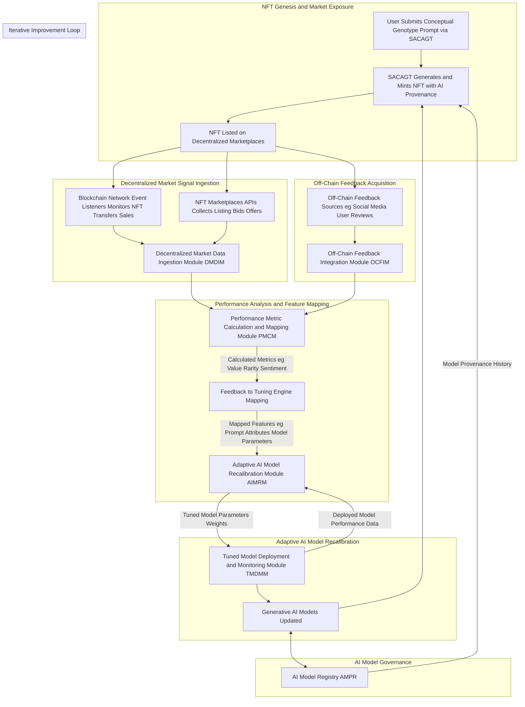

**Title of Invention:** System and Method for Adaptive Generative AI Model Recalibration via Decentralized Market Signals (SAGAMRDS)

**Abstract:**
A technologically advanced system is herein delineated for the autonomous and continuous recalibration of generative artificial intelligence (AI) models. This innovative framework leverages transparent, on-chain market performance data and off-chain sentiment analysis pertaining to Non-Fungible Tokens (NFTs) that have been algorithmically generated by these AI models. A **Decentralized Market Data Ingestion Module (DMDIM)** meticulously collects granular market signals, including sales prices, transaction volumes, ownership duration, and royalty distributions, from distributed ledger technology (DLT) networks and integrated NFT marketplaces. Concurrently, an **Off-Chain Feedback Integration Module (OCFIM)** captures and synthesizes qualitative user feedback and public sentiment. These aggregated insights are transmuted by a **Performance Metric Calculation and Mapping Module (PMCM)** into quantifiable reward or penalty signals, which are then systematically mapped to the specific features of the original conceptual genotype (prompt) and the parameters of the progenitor generative AI models. An **Adaptive AI Model Recalibration Module (AIMRM)** employs advanced machine learning paradigms, such as reinforcement learning, to autonomously fine-tune the generative AI models, optimizing their creative outputs to align with demonstrated market demand and perceived value. This closed-loop system ensures the dynamic evolution and enhanced efficacy of AI creativity, driving the generation of conceptual phenotypes that exhibit higher desirability, commercial viability, and artistic resonance, thereby establishing a novel paradigm for intelligent, market-responsive digital asset genesis.

**Background of the Invention:**
The burgeoning domain of artificial intelligence-generated content (AIGC) has witnessed an exponential increase in the sophistication of generative AI models, capable of producing high-fidelity digital artifacts across various modalities. However, a significant lacuna exists in the existing AIGC paradigm: the pervasive disconnect between the generative process itself and the subsequent market reception or perceived value of the AI's output. Conventionally, generative AI models undergo training on curated datasets, are evaluated against predefined metrics, and are then deployed as static entities. Their efficacy, once deployed, is not typically subject to real-time, market-driven feedback loops. This static operational model introduces several systemic inefficiencies and conceptual limitations.

Primarily, the absence of an integrated mechanism to translate actual market performance and user desirability into actionable intelligence for AI model refinement impedes the continuous improvement and adaptive evolution of these creative agents. Generative models, despite their sophistication, operate in a vacuum regarding the commercial and aesthetic success of their creations once released into decentralized markets. The post-minting lifecycle of an AI-generated Non-Fungible Token (NFT)—its sales performance, secondary market activity, community engagement, and long-term holding patterns—represents a rich, yet largely untapped, source of evaluative data. Existing frameworks are not inherently designed to capture, interpret, and subsequently leverage this granular, transparent market feedback to iteratively enhance the underlying AI's creative parameters or stylistic biases.

Furthermore, the prevalent model treats the AI as a singular, unidirectional creative force, rather than an adaptive entity capable of learning from the collective valuation signals of a global decentralized market. This invention addresses this fundamental unmet need by pioneering a seamless, end-to-end operational continuum where the market performance of AI-generated conceptual assets is intrinsically intertwined with the iterative recalibration of the generative AI models themselves. This establishes a novel frontier for intelligent, market-responsive content creation and digital intellectual property development.

**Brief Summary of the Invention:**
The present invention, herein formally designated as the **System and Method for Adaptive Generative AI Model Recalibration via Decentralized Market Signals SAGAMRDS**, establishes an advanced, integrated framework for the programmatic and autonomous fine-tuning of generative artificial intelligence models. This is achieved by systematically ingesting and interpreting market performance data and qualitative feedback pertaining to Non-Fungible Tokens (NFTs) that have been produced by these very AI models. The SAGAMRDS system provides a robust mechanism to bridge the gap between AI generation and market reception, fostering a virtuous feedback loop for continuous model improvement.

Upon the generation and immutable tokenization of a conceptual phenotype (e.g., via the SACAGT system as described in related art), the SAGAMRDS system initiates a highly sophisticated, multi-stage adaptive recalibration process:
1.  **NFT Provenance Registration:** Each AI-generated conceptual phenotype, upon its tokenization as an NFT, is registered with comprehensive metadata detailing its progenitor generative AI model, specific model version, and the characteristics of its originating conceptual genotype (prompt). This ensures a verifiable link between the NFT and its AI origin.
2.  **Decentralized Market Data Ingestion:** The SAGAMRDS system deploys dedicated event listeners and API integrators to continuously monitor various distributed ledger technology DLT networks and associated NFT marketplaces. This module meticulously collects granular market data, including primary and secondary sales prices, transaction volumes, active bids, royalty distributions, floor price movements, and duration of ownership for AI-generated NFTs.
3.  **Off-Chain Feedback Acquisition:** Concurrently, an optional but highly beneficial module collects qualitative feedback from off-chain sources. This includes social media sentiment analysis, user reviews and ratings submitted through dedicated interfaces, and expert curator evaluations of AI-generated conceptual phenotypes.
4.  **Performance Metric Calculation and Feature Mapping:** The collected on-chain and off-chain data is processed to derive quantifiable performance metrics. These metrics (e.g., perceived value, desirability score, engagement index, commercial viability score) are then systematically mapped back to specific features of the original conceptual genotype (e.g., keywords, style modifiers, semantic embeddings) and the internal parameters of the generative AI model that produced the NFT. This mapping identifies which AI configurations and prompt elements correlate with market success.
5.  **Adaptive AI Model Recalibration:** The derived performance metrics and their corresponding mappings are utilized as reward or penalty signals for an adaptive AI model recalibration engine. This engine, employing advanced machine learning techniques such as reinforcement learning from market feedback, autonomously fine-tunes, retrains, or adjusts the parameters (weights, biases, hyperparameters) of the generative AI models. The goal is to optimize subsequent generations for higher market alignment, desirability, or specific artistic characteristics.
6.  **Tuned Model Deployment and Monitoring:** The newly recalibrated generative AI models are securely deployed for future conceptual phenotype generation. The system continuously monitors the performance of these tuned models, both in terms of their output quality and subsequent market reception, thereby closing the feedback loop and enabling further iterative refinement.

This seamless, integrated workflow ensures that the generative capacity of AI is not static but dynamically evolves in response to real-world market signals and user preferences, thereby establishing a new paradigm for intelligent intellectual property creation and value optimization in digital asset domains.

### System Architecture Overview

C4Context
    title System for Adaptive Generative AI Model Recalibration via Decentralized Market Signals SAGAMRDS

    Person(user, "End User", "Interacts with SACAGT to generate and mint conceptual NFTs, provides implicit/explicit feedback.")
    System(sacagt, "SACAGT Core System", "Generates and mints NFTs with AI provenance.")
    System(sagamrds, "SAGAMRDS Core System", "Analyzes NFT market feedback and orchestrates AI model tuning.")

    System_Ext(generativeAI, "Generative AI Models", "AI services eg AetherVision, AetherScribe, being continuously tuned.")
    System_Ext(blockchainNetwork, "Blockchain Network", "Distributed ledger for NFT minting, sales, ownership records.")
    System_Ext(nftMarketplaces, "NFT Marketplaces", "Platforms for NFT sales and transactions.")
    System_Ext(offChainFeedback, "Off-Chain Feedback Sources", "Social media, user reviews, sentiment analysis platforms.")
    System_Ext(aiModelRegistry, "AI Model Registry", "On-chain or off-chain database of AI models, versions, performance.")

    Rel(user, sacagt, "Submits prompts for NFT generation")
    Rel(sacagt, sagamrds, "Registers minted NFT provenance and details")
    Rel(sagamrds, blockchainNetwork, "Monitors NFT transactions and market data", "Web3 RPC Event Listeners")
    Rel(sagamrds, nftMarketplaces, "Collects sales, bid, listing data", "API Calls")
    Rel(sagamrds, offChainFeedback, "Ingests sentiment and user ratings", "API Calls")
    Rel(sagamrds, generativeAI, "Sends updated parameters for tuning", "API Model Update Interface")
    Rel(generativeAI, aiModelRegistry, "Registers new model versions and performance")
    Rel(aiModelRegistry, sagamrds, "Provides model history and metadata")
    Rel(generativeAI, sacagt, "Provides latest tuned models for generation")
    Rel(user, sagamrds, "Optionally provides explicit feedback")

    Note right of sagamrds: This system forms a closed-loop feedback mechanism for AI models.
    Note left of generativeAI: These models are dynamically improved by market signals.
    Note right of nftMarketplaces: Data includes prices, volumes, royalty payments.

**Detailed Description of the Invention:**

The **System and Method for Adaptive Generative AI Model Recalibration via Decentralized Market Signals SAGAMRDS** comprises a highly integrated and modular architecture designed to facilitate the continuous, autonomous improvement of generative AI models based on the market performance and reception of their digital conceptual outputs (NFTs). The operational flow, from NFT generation to AI model recalibration and subsequent re-deployment, is meticulously engineered to ensure robust functionality, security, and adaptive learning.

### 1. NFT Provenance and Tracking Module NPTM

This module serves as the initial interface for the SAGAMRDS system, receiving information about newly minted AI-generated NFTs.

*   **Provenance Data Ingestion:** Receives detailed metadata for each newly minted NFT, including:
    *   **NFT Identifier:** Unique token ID and contract address.
    *   **Conceptual Genotype Hash:** Cryptographic hash of the original user prompt.
    *   **Generative AI Model Identity:** Unique ID of the specific AI model used eg "AetherVision v3.1".
    *   **Model Version:** Exact version or snapshot of the AI model.
    *   **Model Parameters at Generation:** Specific hyperparameters and seed values used for that particular generation.
    *   **Proof of AI Origin PAIO Hash:** A cryptographic fingerprint of the AI model's verifiable parameters or a reference to its entry in an AI Model Registry.
*   **Internal NFT Registry:** Maintains a searchable, historical database linking each AI-generated NFT to its complete AI provenance. This registry is crucial for mapping market feedback back to specific model versions and generation parameters.

### 2. Decentralized Market Data Ingestion Module DMDIM

The DMDIM is responsible for continuously monitoring and collecting raw market performance data for AI-generated NFTs across various distributed ledgers and marketplaces.

*   **Blockchain Event Listeners:**
    *   Deploys persistent listeners for relevant smart contract events eg `Transfer`, `Sale`, `RoyaltyPayment`, `Bid`, `Offer` on target blockchain networks eg Ethereum, Polygon, Solana, Avalanche.
    *   Filters events specifically for NFT contracts associated with AI-generated assets registered in the NPTM.
    *   Captures transaction hashes, sender/recipient addresses, timestamps, token IDs, and value transfers.
*   **NFT Marketplace API Integration:**
    *   Integrates with APIs of leading NFT marketplaces eg OpenSea, LooksRare, Magic Eden to retrieve data not always available directly on-chain.
    *   Collects listing prices, bid histories, offer values, secondary sale data, collection floor prices, and trade volumes.
    *   Supports various marketplace architectures including those based on order books, auctions, or direct sales.
*   **Rarity and Trait Analytics:**
    *   Communicates with NFT metadata services or performs on-the-fly analysis of NFT trait distributions to determine rarity scores.
    *   Captures how specific traits of the conceptual phenotype impact market value.
*   **Data Normalization and Aggregation:**
    *   Processes raw data from disparate sources, normalizing currencies, timestamps, and data schemas.
    *   Aggregates data points to create comprehensive historical records for each AI-generated NFT.

### 3. Off-Chain Feedback Integration Module OCFIM

This module augments on-chain data with qualitative insights from user engagement and sentiment.

*   **Social Listening and Sentiment Analysis:**
    *   Monitors public social media platforms eg Twitter, Discord, Reddit for mentions of specific AI-generated NFTs or collections.
    *   Employs Natural Language Processing NLP models to perform sentiment analysis, categorizing mentions as positive, negative, or neutral.
    *   Identifies trending themes, popular aesthetics, or emerging preferences related to AI art.
*   **User Rating and Review Interface:**
    *   Provides a dedicated interface within the SACAGT front-end or a standalone portal for users to explicitly rate or review AI-generated NFTs.
    *   Collects structured feedback eg star ratings, categorical tags, textual comments on aspects like creativity, aesthetic appeal, conceptual depth.
    *   Allows NFT owners or general users to provide detailed qualitative assessments.
*   **Curator and Expert Review Integration:**
    *   (Optional) Facilitates input from designated art curators or domain experts who can provide subjective, high-level evaluations of AI-generated conceptual assets, influencing specific stylistic or thematic tuning.

### 4. Performance Metric Calculation and Mapping Module PMCM

The PMCM is the analytical core, translating raw market and sentiment data into actionable intelligence for AI model tuning.

*   **Quantitative Performance Metrics Calculation:** Derives a suite of metrics for each NFT and for specific AI model versions:
    *   **Value Metrics:** Average sale price, highest sale price, royalty income generated, capital gains/losses on secondary sales.
    *   **Liquidity Metrics:** Number of secondary sales, average holding period, bid-to-ask ratio, trade volume.
    *   **Rarity-Value Correlation:** Analyzes how specific trait rarities correlate with market price.
    *   **Trend Indicators:** Floor price stability, velocity of price changes.
*   **Qualitative Performance Score Synthesis:**
    *   Aggregates sentiment scores, user ratings, and expert reviews into a composite "Desirability Score" or "Artistic Resonance Index."
*   **Feature Extraction and Correlation Engine:**
    *   **Prompt Feature Correlation:** Identifies which elements of the original conceptual genotype (specific keywords, semantic structures, style modifiers, prompt entropy) are most strongly correlated with high-performing NFTs.
    *   **AI Model Parameter Correlation:** Determines which specific generative AI model parameters eg `guidance_scale`, `sampling_steps`, `latent_seed_influence`, specific model versions or architectures lead to outputs that achieve high market value or desirability.
    *   **Phenotype Trait Correlation:** Analyzes the visual, textual, or auditory characteristics of the conceptual phenotype that are consistently associated with market success.
*   **Reinforcement Learning Signal Generation:** Converts the calculated performance metrics and correlations into structured reward or penalty signals suitable for consumption by reinforcement learning algorithms or other optimization techniques used in the AIMRM. Positive signals for successful NFTs, negative for underperforming ones.

### 5. Adaptive AI Model Recalibration Module AIMRM

The AIMRM is the intelligence engine that leverages the insights from the PMCM to autonomously fine-tune the generative AI models.

*   **Feedback-Driven Tuning Engine:** Employs advanced machine learning paradigms for adaptive model modification:
    *   **Reinforcement Learning from Market Feedback RLFMF:** Treats the generative AI as an agent and market success signals as rewards. The agent learns to adjust its internal parameters or decision-making processes to maximize future rewards (i.e., generate more desirable NFTs).
    *   **Active Learning and Prioritization:** Identifies which types of NFTs or generation parameters provide the most informative feedback signals, guiding data collection or model retraining efforts.
    *   **Gradient-Based Optimization:** For models where gradients can be propagated through the feedback loop, direct optimization of model weights based on market-derived performance objectives.
    *   **Evolutionary Algorithms:** Explores the AI model parameter space, selecting and recombining models that produce higher-performing NFTs.
    *   **Parameter Fine-tuning and Weight Adjustment:** Dynamically adjusts specific model parameters, e.g., biasing towards certain aesthetic styles, improving coherence for specific prompts, or enhancing the generation of highly sought-after traits.
*   **Prompt-to-Model Biasing:** Learns to modify or augment incoming conceptual genotypes (prompts) in real-time to steer the generative AI towards producing outputs that historically achieve better market performance. This may involve adding implicit stylistic modifiers or refining semantic structure.
*   **Model Versioning and Lifecycle Management:** Manages multiple concurrent versions of generative AI models, tracking their performance metrics and ensuring seamless transitions between updates. Enables A/B testing of different tuned models in live generation scenarios.
*   **Security, Bias, and Ethics Mitigation:** Incorporates mechanisms to monitor for unintended biases, adversarial attacks, or undesirable content generation that might arise during the autonomous tuning process, ensuring ethical and responsible AI evolution.

### 6. Tuned Model Deployment and Monitoring Module TMDMM

This module is responsible for the secure deployment of recalibrated AI models and their ongoing performance validation.

*   **Secure Model Deployment:** Orchestrates the deployment of newly tuned generative AI models to the production environment, making them available for subsequent NFT generation by the SACAGT system. This includes containerization, version control, and secure API endpoints.
*   **Post-Deployment Performance Monitoring:** Continuously tracks the outputs of the newly deployed models, both in terms of internal quality metrics (e.g., coherence, novelty) and external market performance via feedback to the DMDIM and PMCM.
*   **Rollback and Resilience Mechanisms:** Implements automated rollback capabilities to revert to previous, stable model versions if a deployed tuned model exhibits degraded performance or undesirable behaviors.
*   **Integration with AI Model Registry:** Updates the AI Model Registry (AMPR) with details of new model versions, their tuning parameters, and observed performance improvements, providing an auditable history of AI evolution.

**Claims:**

1.  A system for adaptive generative artificial intelligence AI model recalibration, comprising:
    a.  A NFT Provenance and Tracking Module NPTM configured to register AI-generated Non-Fungible Tokens NFTs with associated metadata detailing their generative AI model identity, version, generation parameters, and conceptual genotype;
    b.  A Decentralized Market Data Ingestion Module DMDIM configured to:
        i.  Monitor distributed ledger technology DLT networks for on-chain market transactions and events pertaining to the registered NFTs;
        ii. Collect market data from NFT marketplaces via application programming interface API integrations, including sales prices, bids, offers, and listing information;
    c.  A Performance Metric Calculation and Mapping Module PMCM configured to:
        i.  Process the collected market data to derive quantitative performance metrics for the NFTs;
        ii. Map these performance metrics to specific features of the conceptual genotypes and parameters of the generative AI models that produced the NFTs, identifying correlations between generation characteristics and market performance;
    d.  An Adaptive AI Model Recalibration Module AIMRM configured to:
        i.  Utilize the mapped performance metrics as feedback signals to autonomously fine-tune, retrain, or adjust parameters of the generative AI models;
        ii. Employ machine learning paradigms, including reinforcement learning, to optimize the generative AI models for improved market alignment or desirability of future outputs;
    e.  A Tuned Model Deployment and Monitoring Module TMDMM configured to:
        i.  Deploy the recalibrated generative AI models for subsequent NFT generation;
        ii. Continuously monitor the performance of the deployed models to inform further iterative refinements.

2.  The system of claim 1, further comprising an Off-Chain Feedback Integration Module OCFIM configured to:
    a.  Collect qualitative user feedback on AI-generated NFTs via dedicated interfaces or social listening tools;
    b.  Synthesize this qualitative feedback into sentiment or desirability scores, which are then integrated by the PMCM.

3.  The system of claim 1, wherein the market data collected by the DMDIM includes sales prices, transaction volumes, royalty distributions, floor price trajectories, bid-to-ask ratios, and duration of NFT ownership.

4.  The system of claim 1, wherein the mapping performed by the PMCM identifies correlations between conceptual genotype elements selected from the group consisting of keywords, semantic embeddings, style modifiers, and prompt entropy, and the market performance metrics.

5.  The system of claim 1, wherein the mapping performed by the PMCM identifies correlations between generative AI model parameters selected from the group consisting of guidance scale, sampling steps, latent seed influence, model version, and model architecture, and the market performance metrics.

6.  The system of claim 1, wherein the Adaptive AI Model Recalibration Module AIMRM maintains multiple versions of generative AI models and supports A/B testing of their outputs to validate tuning efficacy.

7.  A method for enhancing generative artificial intelligence AI models, comprising:
    a.  Registering conceptual phenotypes generated by AI models as Non-Fungible Tokens NFTs, where each NFT includes verifiable metadata linking it to its progenitor AI model and generation parameters;
    b.  Monitoring decentralized market activity for the registered NFTs across distributed ledger technology DLT networks and NFT marketplaces;
    c.  Collecting quantitative market performance data and, optionally, qualitative off-chain feedback pertaining to the NFTs;
    d.  Calculating performance metrics from the collected data, reflecting market desirability, value, or engagement;
    e.  Mapping the calculated performance metrics to the conceptual genotypes that initiated the NFT generation and to the parameters of the AI models that created them;
    f.  Utilizing the mapped performance metrics as feedback signals to autonomously recalibrate the generative AI models, optimizing them to produce future conceptual phenotypes that align with desired market characteristics;
    g.  Deploying the recalibrated AI models for subsequent NFT generation, thereby establishing a continuous improvement loop.

8.  The method of claim 7, wherein the recalibration of the generative AI models involves techniques such as reinforcement learning from market feedback RLFMF, gradient-based optimization, or evolutionary algorithms.

9.  The method of claim 7, further comprising an AI Model Provenance and Registry AMPR that stores and provides an auditable history of generative AI model versions, their tuning parameters, and performance data.

10. The method of claim 7, wherein the generative AI models are capable of producing multi-modal conceptual phenotypes, including images, text, 3D models, or audio compositions, and the feedback signals are tailored to each modality.

11. The system of claim 1, further incorporating security and bias mitigation mechanisms within the AIMRM to detect and prevent the introduction of undesirable content or discriminatory biases during the autonomous tuning process.

12. The system of claim 1, wherein the TMDMM includes automated rollback capabilities to revert to previous model versions if the performance of a deployed tuned model degrades.

**Mathematical Justification:**

The robust framework underpinning the **System and Method for Adaptive Generative AI Model Recalibration via Decentralized Market Signals SAGAMRDS** can be rigorously formalized through a series of advanced mathematical constructs, each constituting an independent domain of inquiry. This formalization provides an axiomatic basis for the system's claims of continuous improvement, market alignment, and verifiable provenance.

### I. The Generative AI Model and its Parameter Space `Theta`

Let `G` denote a generative AI model, which maps a conceptual genotype `P` and a set of internal parameters `theta` to a conceptual phenotype `a`.
From previous art (SACAGT), `a = G(E(P), theta, lambda)`, where `E(P)` is the semantic embedding of `P`, `theta` are the internal model parameters (weights, biases, hyperparameters), and `lambda` are fusion parameters.
The primary focus of SAGAMRDS is to adaptively modify `theta`. Let `Theta` be the high-dimensional space of all possible parameter configurations for `G`.
`theta in Theta`.

**Definition 1.1: Parameter Vector.**
A generative AI model `G` at a given state `t` is defined by its parameter vector `theta_t = (w_1, w_2, ..., w_k)`, where `w_i` are individual weights, biases, or hyperparameters. `k` can be in the billions for large models.

**Definition 1.2: Model Versioning.**
Each distinct `theta_t` defines a specific version `G_t` of the generative AI model. The system tracks the provenance of `G_t` for each `a`.

### II. The Market Signal Space `M_S`

Let `M_S` be the space of all possible market signals and feedback received for an NFT. For a given NFT `nft_i` (representing conceptual phenotype `a_i`), its market signal at time `t` is a vector `s_i(t)`.

**Definition 2.1: Raw Market Signal Vector.**
For an NFT `nft_i` at time `t`, the raw market signal vector `s_i(t)` is:
`s_i(t) = (price_i(t), volume_i(t), royalty_i(t), bids_i(t), sentiment_i(t), ownership_duration_i(t), ...)`
where `price_i(t)` is the last sale price, `volume_i(t)` is the transaction volume, `royalty_i(t)` is total royalties earned, `bids_i(t)` is a measure of active bids/offers, `sentiment_i(t)` is the aggregated off-chain sentiment, and `ownership_duration_i(t)` is the average holding time of owners.

**Definition 2.2: Performance Metric Function `Phi`.**
A non-linear function `Phi: M_S -> R` maps the raw market signal vector `s_i(t)` to a scalar performance metric `phi_i(t)`, which quantifies the desirability, value, or efficacy of `nft_i` (and by extension, `a_i`).
`phi_i(t) = Phi(s_i(t))`
This `phi_i(t)` serves as the primary reward signal for model recalibration. For instance, `phi` could be a weighted sum of price, volume, and sentiment, normalized to a range `[0,1]`.

### III. The Feedback Mapping Function `F_map`

This function translates the performance metric `phi_i(t)` back to actionable adjustments or insights for the generative AI model's parameters `theta_t` or the prompt `P`.

**Definition 3.1: Feature Extraction from Provenance `F_prov`.**
For each `nft_i`, the NPTM provides its provenance `Prov_i = (E(P_i), theta_i, ...)` where `E(P_i)` is the semantic embedding of the original prompt and `theta_i` are the parameters of the AI model `G_i` that generated `a_i`.
`F_prov: NFT_ID -> (E(P), theta_gen)`

**Definition 3.2: Feedback Mapping `F_map`.**
`F_map: (phi_i(t), E(P_i), theta_i) -> (Delta_E(P_i), Delta_theta_i)`
This function determines how `phi_i(t)` implies changes to prompt features `Delta_E(P_i)` (for prompt engineering guidance) or direct parameter adjustments `Delta_theta_i` for `theta_i`. `Delta_theta_i` represents the gradient or direction for parameter adjustment based on the observed reward `phi_i(t)`.

### IV. The Adaptive Recalibration Algorithm `R_A`

The core of SAGAMRDS is the algorithm `R_A` that updates the generative AI model parameters `theta`. This is often modeled as a reinforcement learning process.

**Definition 4.1: State Space `S_RL` and Action Space `A_RL`.**
The state of the RL agent (the AIMRM) at time `t` is `S_RL_t = (theta_t, context_t)`, where `context_t` includes historical performance metrics and current prompt distribution.
The action `action_t` taken by the agent is to generate a new parameter set `theta_t+1` or an adjustment `Delta_theta_t`.
`action_t: theta_t -> Delta_theta_t`

**Definition 4.2: Reward Function `Reward`.**
The reward `r_t` at each step `t` is directly derived from the aggregated performance metrics `phi_i(t)` of NFTs generated by `G_t`.
`Reward(S_RL_t, action_t) = Avg(phi_i(t) for all nft_i generated by G_t and action_t)`

**Definition 4.3: Recalibration Update Rule.**
The AIMRM employs a policy `pi` that maps states to actions, `pi: S_RL -> A_RL`. The goal is to learn an optimal policy `pi*` that maximizes the expected cumulative reward.
The parameter update rule can be expressed as:
`theta_{t+1} = theta_t + alpha * Delta_theta_t`
where `alpha` is the learning rate, and `Delta_theta_t` is the parameter adjustment derived from the feedback, often a gradient of the reward with respect to `theta_t` or an update from an RL algorithm (e.g., Q-learning, Policy Gradient methods).

### V. Continuous Learning Loop and Convergence

The SAGAMRDS system operates as a continuous learning loop.

**Definition 5.1: Iterative Optimization.**
The system iteratively executes:
1.  Generate NFTs using `G(E(P), theta_t)`.
2.  Observe market signals `s_i(t)` for these NFTs.
3.  Calculate performance metrics `phi_i(t)`.
4.  Derive parameter adjustments `Delta_theta_t` using `F_map`.
5.  Update model parameters `theta_{t+1} = R_A(theta_t, Delta_theta_t)`.

**Theorem 5.1: Market-Aligned Model Optimization.**
Given a well-defined performance metric function `Phi` and an appropriate recalibration algorithm `R_A` (e.g., an efficient reinforcement learning algorithm), the generative AI model `G` will, over sufficient iterations, converge to a parameter configuration `theta*` that maximizes the aggregated market desirability or value `Avg(Phi(s_i(t)))` of its generated conceptual phenotypes, subject to exploration-exploitation tradeoffs and the dynamics of the market.
`lim_{t->inf} E[Avg(Phi(s_i(t)) | theta_t)] -> max`

**Theorem 5.2: Enhanced Generative Efficacy.**
The continuous feedback loop ensures that `G_t` adaptively improves its capacity to produce novel, high-quality, and market-relevant conceptual phenotypes. The system effectively learns the latent market preferences and adjusts its creative process accordingly, leading to an increase in the utility and value of its outputs.

### VI. Verifiable Provenance and Audibility

The system integrates directly with NFT provenance records to ensure auditability of the AI model's evolution.

**Definition 6.1: Model Provenance Chain.**
Each minted NFT `nft_i` is inextricably linked to its specific generative AI model version `G_t` and parameters `theta_t` via on-chain metadata (Proof of AI Origin PAIO). This establishes a transparent and verifiable chain:
`nft_i -> (G_t, theta_t) -> Phi(s_i(t))`

**Theorem 6.1: Transparent and Auditable AI Evolution.**
Due to the immutable linking of NFT provenance to specific AI model versions and parameters on the blockchain, the entire evolution of the generative AI model (the sequence of `theta_t` values) becomes transparent and auditable. Each parameter update can be traced back to the specific market signals that prompted the recalibration, providing unprecedented insight into the adaptive learning process of AI in response to decentralized market dynamics. This ensures accountability and builds trust in autonomously evolving AI systems.

The SAGAMRDS system thus stands as an unassailable mechanism for creating an intelligent, self-optimizing ecosystem where artificial intelligence continuously refines its creative capabilities based on real-world market validation, leading to an unprecedented fusion of generative power, market relevance, and transparent provenance in the domain of digital intellectual property.