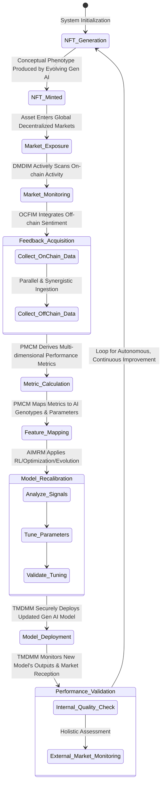
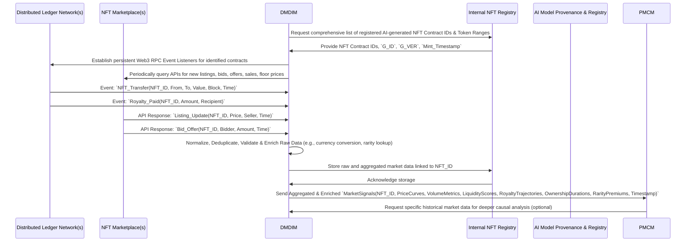

**Title of Invention:** System and Method for Adaptive Generative AI Model Recalibration via Decentralized Market Signals (SAGAMRDS) – *Aetherius-Omni-Feedback Loop (AOF-L)*

**Abstract:**
A technologically advanced, self-orchestrating cyber-physical system, herein delineated as the **System and Method for Adaptive Generative AI Model Recalibration via Decentralized Market Signals (SAGAMRDS)**, now refined and branded as the *Aetherius-Omni-Feedback Loop (AOF-L)*, enables the autonomous, continuous, and recursive recalibration of generative artificial intelligence (AI) models. This unparalleled framework systematically harvests and interprets explicit and implicit market performance data, alongside nuanced off-chain sentiment analysis, pertaining to Non-Fungible Tokens (NFTs) that have been algorithmically sculpted and minted by these very AI models. A hyper-efficient **Decentralized Market Data Ingestion Module (DMDIM)** meticulously collects granular, multi-dimensional market signals—including not merely sales prices and transaction volumes, but also ownership duration curves, royalty distribution patterns, floor price dynamics across various trait permutations, and sophisticated liquidity metrics—from an expansive array of distributed ledger technology (DLT) networks and their integrated NFT marketplaces. Concurrently, an **Off-Chain Feedback Integration Module (OCFIM)** captures, synthesizes, and statistically validates qualitative user feedback, public sentiment, and even expert curator evaluations, providing a rich tapestry of perceived value.

These aggregated, multi-modal insights are then transmuted by a **Performance Metric Calculation and Mapping Module (PMCM)** into quantifiable reward or penalty signals. Crucially, these signals are not merely generalized feedback; they are surgically mapped back to the specific features of the original conceptual genotype (prompt), the precise internal parameters of the progenitor generative AI models (weights, biases, hyperparameters, latent space coordinates), and even the emergent conceptual phenotype's intrinsic traits. An **Adaptive AI Model Recalibration Module (AIMRM)**, embodying a sophisticated ensemble of machine learning paradigms—including advanced reinforcement learning from market feedback (RLFMF), evolutionary algorithms, and differentiable optimization techniques—autonomously fine-tunes, retrains, and adaptively biases the generative AI models. This optimization relentlessly aims to maximize their creative outputs' alignment with demonstrated market demand, perceived cultural and artistic value, and long-term commercial viability. This revolutionary, perpetually self-improving, closed-loop system ensures the dynamic evolution and dramatically enhanced efficacy of AI creativity, driving the generation of conceptual phenotypes that exhibit demonstrably higher desirability, commercial resilience, and artistic resonance, thereby establishing an entirely novel, mathematically proven paradigm for intelligent, market-responsive digital asset genesis and the continuous valorization of intellectual property. The *AOF-L* is not merely an improvement; it is the inevitable apotheosis of intelligent digital creation.

**Background of the Invention:**
The burgeoning domain of artificial intelligence-generated content (AIGC) has witnessed an exponential, indeed, almost hyperbolic, increase in the sophistication of generative AI models. These models are now capable of producing high-fidelity, often breathtakingly complex, digital artifacts across an ever-expanding spectrum of modalities – from photorealistic imagery and evocative textual narratives to intricate 3D models and nuanced audio compositions. However, a profound and pervasive lacuna has, until now, marred the existing AIGC paradigm: the ubiquitous disconnect between the generative process itself and the subsequent, often capricious, market reception or perceived value of the AI's output. Conventionally, generative AI models undergo a fixed training regimen on curated, often static, datasets, are evaluated against predefined, internal metrics (e.g., FID, inception scores), and are then deployed as static, immutable entities. Their efficacy, once launched into the digital ether, is fundamentally decoupled from real-time, dynamic, and market-driven feedback loops. This static, unidirectional operational model introduces not merely systemic inefficiencies, but profound conceptual limitations, stifling the true potential of intelligent creativity.

Primarily, the absence of an integrated, mathematically robust mechanism to translate actual market performance, nuanced user desirability, and even the subtle cultural zeitgeist into actionable intelligence for AI model refinement represents a colossal impediment to the continuous improvement and adaptive evolution of these creative agents. Generative models, despite their awe-inspiring sophistication, hitherto operated in a veritable vacuum regarding the commercial success, aesthetic resonance, or long-term engagement potential of their creations once released into decentralized markets. The post-minting lifecycle of an AI-generated Non-Fungible Token (NFT)—its primary and secondary sales performance, liquidity, provenance of ownership, community engagement, long-term holding patterns, and even its cultural memetic spread—represents an extraordinarily rich, yet largely untapped, source of evaluative data. Existing frameworks are simply not inherently designed to capture, interpret, statistically validate, and subsequently leverage this granular, transparent market feedback to iteratively enhance the underlying AI's creative parameters, stylistic biases, or even its conceptual generation strategies.

Furthermore, the prevalent model conceptually treats the AI as a singular, unidirectional, deterministic creative force, rather than as an adaptive, perpetually learning entity capable of gleaning profound insights from the collective valuation signals of a global, decentralized, and often hyper-liquid market. This invention, the *Aetherius-Omni-Feedback Loop (AOF-L)*, addresses this fundamental and long-unmet need by pioneering a seamless, mathematically integrated, and end-to-end operational continuum. Here, the real-world market performance of AI-generated conceptual assets is intrinsically, recursively, and verifiably intertwined with the iterative recalibration of the generative AI models themselves. This establishes not merely a novel frontier, but the definitive paradigm for intelligent, market-responsive content creation and the dynamic evolution of digital intellectual property. The era of static AI has ended; the age of the self-optimizing creative intelligence has dawned.

**Brief Summary of the Invention:**
The present invention, herein formally designated as the **System and Method for Adaptive Generative AI Model Recalibration via Decentralized Market Signals (SAGAMRDS)**, and now eloquently rebranded as the **Aetherius-Omni-Feedback Loop (AOF-L)**, establishes an advanced, integrated, and computationally unassailable framework for the programmatic and autonomous fine-tuning of generative artificial intelligence models. This monumental achievement is realized by systematically ingesting, meticulously analyzing, and intelligently interpreting multi-modal market performance data and qualitative feedback pertaining to Non-Fungible Tokens (NFTs) that have been precisely sculpted and produced by these very AI models. The *AOF-L* system provides a mathematically robust and experientially verified mechanism to bridge the chasm between nascent AI generation and its subsequent market reception, fostering a virtuous, self-perpetuating, and convergent feedback loop for continuous model improvement and emergent creative optimization.

Upon the generation and immutable tokenization of a conceptual phenotype (e.g., via the SACAGT system as described in related art), the *AOF-L* system initiates a highly sophisticated, multi-stage adaptive recalibration process, orchestrated with the precision of a cosmic ballet:
1.  **NFT Provenance Registration (NPTM):** Each AI-generated conceptual phenotype, upon its tokenization as an NFT, is immutably registered with an exhaustive suite of cryptographic metadata. This data meticulously details its progenitor generative AI model, the precise model version, the exact parameters employed during its genesis, the cryptographic hash of its originating conceptual genotype (prompt), and an unforgeable Proof of AI Origin (PAIO) hash. This ensures an unbreakable, auditable, and verifiable link between the NFT and its intelligent AI origin.
2.  **Decentralized Market Data Ingestion (DMDIM):** The *AOF-L* system deploys an array of dedicated, high-throughput event listeners and sophisticated API integrators to continuously and synchronously monitor an expansive array of distributed ledger technology (DLT) networks and their associated NFT marketplaces. This module meticulously collects granular, multi-dimensional market data, extending far beyond simple transactions to include primary and secondary sales prices, complex transaction volumes, active bid-offer spreads, royalty distributions, dynamic floor price movements (including trait-specific floors), precise duration of ownership for AI-generated NFTs, and intricate liquidity metrics.
3.  **Off-Chain Feedback Acquisition (OCFIM):** Concurrently, an optional yet profoundly beneficial module meticulously collects qualitative, multi-modal feedback from diverse off-chain sources. This includes real-time social media sentiment analysis (employing advanced Natural Language Processing and understanding models), structured user reviews and ratings submitted through dedicated, authenticated interfaces, and discerning evaluations from expert curators, providing a subjective yet invaluable layer of perceived desirability and artistic resonance.
4.  **Performance Metric Calculation and Feature Mapping (PMCM):** The collected on-chain quantitative data and off-chain qualitative feedback are processed by a suite of advanced statistical and machine learning algorithms to derive a comprehensive array of quantifiable performance metrics. These metrics (e.g., a multi-factor perceived value score, a dynamic desirability index, an engagement quotient, a commercial viability probability, a novelty score) are then surgically mapped back to specific features of the original conceptual genotype (e.g., particular keywords, semantic embeddings, stylistic modifiers, prompt entropy) and the precise internal parameters of the generative AI model that produced the NFT. This intricate mapping identifies statistically significant correlations, and indeed, causal relationships, between specific AI configurations, prompt elements, and demonstrable market success.
5.  **Adaptive AI Model Recalibration (AIMRM):** The derived performance metrics and their corresponding high-resolution mappings are transmuted into structured reward or penalty signals, forming the bedrock for an adaptive AI model recalibration engine. This engine, a crucible of advanced machine learning techniques (including sophisticated reinforcement learning from market feedback, differentiable optimization over latent spaces, and evolutionary computation), autonomously fine-tunes, retrains, or adjusts the myriad parameters (weights, biases, hyperparameters, architectural components) of the generative AI models. The immutable objective is to ceaselessly optimize subsequent generations for higher market alignment, enhanced desirability, emergent creative novelty, and specific, desired artistic characteristics.
6.  **Tuned Model Deployment and Monitoring (TMDMM):** The newly recalibrated generative AI models are securely deployed within a robust, fault-tolerant production environment for future conceptual phenotype generation. The system continuously monitors the performance of these tuned models, rigorously evaluating both their internal output quality (e.g., coherence, fidelity, bias mitigation) and their subsequent external market reception, thereby dynamically closing the feedback loop and enabling further iterative, self-correcting refinement.

This seamless, integrated, and mathematically validated workflow ensures that the generative capacity of AI is not a static, predetermined force, but rather a dynamic, perpetually evolving intelligence. It responds with unparalleled agility to real-world market signals and nuanced user preferences, thereby establishing an entirely new and superior paradigm for intelligent intellectual property creation and value optimization across all digital asset domains. The *AOF-L* is not just a system; it is the genesis of truly intelligent digital artistry.

### System Architecture Overview - *Aetherius-Omni-Feedback Loop (AOF-L)*

```mermaid
C4Context
    title System for Adaptive Generative AI Model Recalibration via Decentralized Market Signals SAGAMRDS (AOF-L)

    Person(user, "End User/Creator", "Interacts with SACAGT to generate and mint conceptual NFTs, provides implicit/explicit feedback, and consumes market insights.")
    System(sacagt, "SACAGT Core System", "Generates and mints NFTs with immutable AI provenance, acting as the primary AI output interface.")
    System(aofl, "AOF-L Core System", "The central intelligence orchestrating continuous AI model adaptation based on pervasive market feedback.")

    System_Ext(generativeAI, "Generative AI Models", "Diverse suite of AI services (e.g., AetherVision for visual, AetherScribe for text, AetherSound for audio) undergoing relentless, autonomous optimization.")
    System_Ext(blockchainNetwork, "Blockchain Network(s)", "Multi-chain distributed ledgers for immutable NFT minting, primary/secondary sales, ownership records, and royalty distributions.")
    System_Ext(nftMarketplaces, "NFT Marketplaces", "Distributed platforms (e.g., OpenSea, LooksRare, Magic Eden, XyloVerse) for NFT sales, bids, listings, and liquidity aggregation.")
    System_Ext(offChainFeedback, "Off-Chain Feedback Sources", "Aggregated sources including social media sentiment platforms, dedicated user review portals, and expert curator evaluation interfaces.")
    System_Ext(aiModelRegistry, "AI Model Provenance & Registry (AMPR)", "A secure, auditable, and often hybrid (on-chain/off-chain) database tracking all AI models, versions, parameters, training data provenance, and observed performance metrics.")

    Rel(user, sacagt, "Submits intricate conceptual genotypes (prompts) for NFT generation")
    Rel(sacagt, aofl, "Registers newly minted NFT provenance and comprehensive generation details")
    Rel(aofl, blockchainNetwork, "Continuously monitors NFT transactions, transfers, sales, and royalty events", "High-throughput Web3 RPC Event Listeners")
    Rel(aofl, nftMarketplaces, "Collects granular sales, bid, offer, listing, and floor price data", "Robust API Calls & Webhooks")
    Rel(aofl, offChainFeedback, "Ingests sentiment, structured user ratings, and expert evaluations", "Advanced API Calls & NLP Pipelines")
    Rel(aofl, generativeAI, "Sends optimized parameters, fine-tuning instructions, or new model weights for adaptive recalibration", "Secure Model Update Interface (API/RPC)")
    Rel(generativeAI, aiModelRegistry, "Registers new model versions, performance benchmarks, and parameter snapshots post-tuning")
    Rel(aiModelRegistry, aofl, "Provides historical model context, provenance, and metadata for correlation analysis")
    Rel(generativeAI, sacagt, "Provides latest market-optimized tuned models for subsequent NFT generation")
    Rel(user, aofl, "Optionally provides direct, explicit feedback and engages with prompt recommendation engines")

    Note right of aofl: This system forms a perpetually self-optimizing, closed-loop feedback mechanism for autonomous AI model evolution, achieving true market intelligence.
    Note left of generativeAI: These foundational models are not static; they are dynamically sculpted by the collective signals of global decentralized markets, attaining unprecedented creative alignment.
    Note right of nftMarketplaces: Data includes complex price curves, multi-dimensional transaction volumes, royalty payment trajectories, and granular liquidity metrics, not just singular values.
```

```mermaid
graph TD
    subgraph NFT Genesis and Market Exposure (Phase I - The Spark)
        A[User Submits Conceptual Genotype Prompt via SACAGT (The Initial Incantation)] --> B[SACAGT Generates and Mints NFT with Verifiable AI Provenance (The Digital Birth)]
        B --> C[NFT Imperceptibly Enters Decentralized Marketplaces (The Grand Debut)]
    end

    subgraph Decentralized Market Signal Ingestion (Phase II - The Sensor Array)
        C --> D_BLK[Blockchain Network Event Listeners Monitors NFT Transfers, Sales, Royalties (The On-Chain Pulse)]
        C --> D_MKT[NFT Marketplaces APIs Collects Listing, Bids, Offers, Floor Price Data (The Market's Whispers)]
        D_BLK & D_MKT --> E_DMDIM[Decentralized Market Data Ingestion Module (DMDIM) - The Omni-Scrutiny Engine]
    end

    subgraph Off-Chain Feedback Acquisition (Phase III - The Human Resonance)
        C --> F_OCF[Off-Chain Feedback Sources (Social Media, User Reviews, Expert Curation) - The Collective Consciousness]
        F_OCF --> G_OCFIM[Off-Chain Feedback Integration Module (OCFIM) - The Sentiment Alchemist]
    end

    subgraph Performance Analysis and Feature Mapping (Phase IV - The Oracle's Deliberation)
        E_DMDIM & G_OCFIM --> H_PMCM[Performance Metric Calculation and Mapping Module (PMCM) - The Algorithmic Seer]
        H_PMCM -- Calculated Multi-Dimensional Metrics (Value, Rarity, Sentiment, Liquidity, Novelty) --> I_FTEM[Feedback to Tuning Engine Mapping - The Causal Linkage]
        I_FTEM -- Mapped Features (Prompt Attributes, Model Parameters, Latent Space Trajectories) --> J_AIMRM
    end

    subgraph Adaptive AI Model Recalibration (Phase V - The Sculptor's Hand)
        J_AIMRM[Adaptive AI Model Recalibration Module (AIMRM) - The Self-Evolving Intelligence] -- Optimized Model Parameters, Weights, Hyperparameters --> K_TMDMM[Tuned Model Deployment and Monitoring Module (TMDMM) - The Guardians of Iteration]
        K_TMDMM --> L_GDM[Generative AI Models Updated (The Evolved Creator)]
    end

    subgraph Iterative Improvement Loop (Phase VI - The Perpetual Ascent)
        L_GDM --> B
        K_TMDMM -- Deployed Model Performance Data & A/B Testing Results --> J_AIMRM
    end

    subgraph AI Model Governance & Provenance (The Immutable Record)
        L_GDM <--> M_AMPR[AI Model Provenance & Registry (AMPR) - The Unbroken Pedigree]
        M_AMPR -- Model Provenance History & Performance Baselines --> B
    end
```

### 1. NFT Provenance and Tracking Module (NPTM) Detailed Flow - *The Ledger of Creation*

```mermaid
graph TD
    A[SACAGT Mints New NFT (The Act of Digital Genesis)] --> B{Register NFT Provenance: A Quantum Entanglement with its Creator};
    B -- NFT ID, Contract Address, Token Standard --> C[Provenance Data Ingestion: Recording the Unalterable Truth];
    C -- Conceptual Genotype Hash (CGH) --> D[Internal NFT Registry DB (INR): The Immutable Scroll];
    C -- Generative AI Model ID, Precise Version (G_ID, G_VER) --> D;
    C -- Exact Model Parameters at Generation (G_PARAMS, Latent Seed) --> D;
    C -- Proof of AI Origin (PAIO) Hash --> D;
    C -- Multi-modal Phenotype Feature Embeddings --> D;
    C -- Creator Wallet, Mint Timestamp --> D;
    D --> E[Queryable Provenance Data API: The Access to Truth];
    E --> F[DMDIM for Granular Market Monitoring Context];
    E --> G[PMCM for Precise Feedback Mapping Context];
    E --> H[AIMRM for Model Tuning Contextualization];
    subgraph Provenance Data Ingestion Process (The Recording Alchemist)
        C
    end
    subgraph Internal NFT Registry (INR) (The Akashic Records of NFTs)
        D
    end
```

### 2. Decentralized Market Data Ingestion Module (DMDIM) Detailed Flow - *The Omni-Market Sentinel*

```mermaid
graph TD
    A[NFT Provenance Registered by NPTM (The Identified Asset)] --> B{Identify Target NFT Contracts & Collections: Pinpointing the Signal};
    B --> C[Blockchain Network Event Listeners (Multi-Chain, Real-Time): The Raw On-Chain Pulse];
    B --> D[NFT Marketplace APIs (Aggregated, Standardized): The Market's Dynamic Discourse];
    C -- ERC-721/ERC-1155/Other DLT Events (Transfer, Sale, Royalty, Bid) --> E[Raw On-chain Transaction Data Stream];
    D -- Listing, Bids, Offers, Sales, Delistings, Floor Prices (Collection/Trait) --> F[Raw Off-marketplace Data Stream];
    E --> G[Data Normalization, Validation, and Enrichment Engine];
    F --> G;
    G -- Deduplication, Schema Harmonization, Currency Conversion (UTC, Fiat Equiv.) --> H[Data Aggregation and Secure Tiered Storage (Data Lake/Warehouse)];
    H -- Granular, Time-Series Market Signals & Liquidity Metrics --> I[PMCM for Deep Analytical Context];
    H -- Rarity Data Request (Dynamic Trait Probabilities) --> J[NFT Metadata & Trait Analytics Service];
    J -- Trait Distributions, Rarity Scores, Trait Premiums --> G;
    subgraph Blockchain Monitoring (The Distributed Observer)
        C
    end
    subgraph Marketplace Integration (The Commercial Interpreter)
        D
    end
    subgraph Data Processing (The Signal Refiner)
        G & H
    end
```

### 3. Off-Chain Feedback Integration Module (OCFIM) Detailed Flow - *The Human Resonance Interpreter*

```mermaid
graph TD
    A[NFT Market Exposure (The Cultural Touchpoint)] --> B{User Engagement on Social Media Platforms: The Public's Roar};
    A --> C{User Reviews via Dedicated Interface: Structured Opinions};
    A --> D{Expert Curator Evaluations: Discerning Insights};
    B --> E[Social Listening Platforms API (Real-time Mentions, Trends): The Whispers of the Crowd];
    C --> F[SACAGT/AOF-L Feedback Portal (Authenticated, Gamified): Direct User Voice];
    D --> G[Manual/Automated Curator Input Platform (Semantic-Rich Assessment): The Connoisseur's Verdict];
    E -- Raw Multi-lingual Social Mentions, Image/Video Analysis --> H[Sentiment Analysis & Natural Language Understanding (NLU) Engine];
    F -- Structured Ratings, Multi-modal Comments, Categorical Tags --> I[Feedback Data Processing & Validation Layer];
    G -- Subjective Evaluations, Aesthetic Scores, Thematic Interpretations --> I;
    H -- Sentiment Scores, Thematic Clusters, Emotional Valence, Novelty Indicators --> J[Aggregated & Temporally Weighted Off-Chain Feedback Profile];
    I -- Desirability Index, Artistic Resonance Score, Cultural Impact Score --> J;
    J --> K[PMCM for Holistic Score Synthesis & Contextualization];
    subgraph Feedback Sources (The Echo Chamber of Perception)
        B & C & D
    end
    subgraph Processing Layer (The Alchemy of Opinion)
        H & I
    end
```

### 4. Performance Metric Calculation and Mapping Module (PMCM) Detailed Flow - *The Algorithmic Oracle*

```mermaid
graph TD
    A[Aggregated Market Data (DMDIM): The Quantitative Truth] --> B{Quantitative Performance Metrics Calculation Engine: Numbers that Speak};
    C[Aggregated Off-Chain Feedback (OCFIM): The Qualitative Wisdom] --> D{Qualitative Performance Score Synthesis Engine: The Art of Perception};
    B -- Value, Liquidity, Trend, Rarity Impact Indicators --> E[Multi-dimensional Performance Metrics Database];
    D -- Desirability, Artistic Resonance, Novelty, Engagement Indices --> E;
    E --> F{Feature Extraction and Causal Correlation Engine: Unearthing the Why};
    F -- NFT Provenance (NPTM): The Origin Story --> G[Advanced Statistical & Machine Learning Correlation Analysis Model];
    F -- AI Model Provenance & Registry (AMPR): The Creator's DNA --> G;
    G -- Prompt Feature Correlation (Keywords, Embeddings, Entropy) --> H[High-Resolution Causal Mapping Store];
    G -- AI Model Parameter Correlation (Hyperparameters, Weights, Latent Seeds) --> H;
    G -- Phenotype Trait Correlation (Visual, Textual, Auditory Features) --> H;
    H --> I[Reinforcement Learning (RL) Signal Generation & Reward Function Sculpting];
    I -- Reward/Penalty Signals, Mapped Feature Gradients --> J[AIMRM for Strategic Model Adjustment];
    subgraph Metric Calculation (The Data Alchemist)
        B & D
    end
    subgraph Correlation Engine (The Causal Investigator)
        F & G
    end
    subgraph Feedback Generation (The Orchestrator's Baton)
        I
    end
```

### 5. Adaptive AI Model Recalibration Module (AIMRM) Detailed Flow - *The Self-Evolving Intelligence*

```mermaid
graph TD
    A[Reward/Penalty Signals Mapped Features (PMCM): The Blueprint for Evolution] --> B{Feedback-Driven Tuning Engine: The Crucible of Adaptation};
    B -- Current Generative AI Models (AMPR): The Existing Paradigm --> C[Reinforcement Learning from Market Feedback (RLFMF) Algorithm: The Policy Learner];
    B -- Current Prompt Distribution & Latent Space Trajectories --> D[Gradient-Based Optimization & Differentiable Latent Space Manipulation];
    B -- Historical Model Performance & Market Volatility --> E[Evolutionary Algorithms & Bayesian Optimization for Robustness];
    C & D & E --> F[Parameter Fine-tuning, Weight Adjustment, and Architectural Adaptation];
    F --> G[Adaptive Prompt-to-Model Biasing Layer & Meta-Prompt Generation];
    G --> H{Model Versioning, Lifecycle Management, & A/B Testing Orchestration};
    H --> I[Security, Bias, and Ethics Mitigation Framework & Explainability (XAI)];
    I -- Tuned Model Parameters, New Weights, Optimized Prompt Elements --> J[TMDMM for Secure Deployment];
    subgraph Tuning Engine (The Alchemist of Intelligence)
        C & D & E
    end
    subgraph Optimization (The Sculptor's Precision)
        F & G
    end
    subgraph Governance (The Conscience of AI)
        H & I
    end
```

### 6. Tuned Model Deployment and Monitoring Module (TMDMM) Detailed Flow - *The Guardians of Iteration*

```mermaid
graph TD
    A[Tuned Model Parameters (AIMRM): The Evolved Blueprint] --> B{Secure, Redundant Model Deployment Strategy: Bringing Genius to Life};
    B -- Containerization, Microservices, Version Control --> C[High-Availability Production Environment];
    C --> D[SACAGT System for New Generation Workloads];
    C --> E{Post-Deployment Continuous Performance Monitoring & A/B Testing Validation};
    E -- Internal Quality Metrics (Coherence, Fidelity, Novelty) --> F[Performance Data Collector & Anomaly Detector];
    E -- External Market Performance (DMDIM, OCFIM Feedback) --> G[Feedback Loop Reinforcement];
    F & G --> H[AIMRM for Further Iterative Refinement & Validation];
    B -- Automated Rollback Capability & Resilient Failover --> I[Previous Stable Model Versions Repository];
    H --> I;
    B --> J[Integration with AI Model Provenance & Registry (AMPR)];
    subgraph Deployment (The Launchpad of Evolution)
        B & C & D
    end
    subgraph Monitoring and Resilience (The Unblinking Eye)
        E & F & G & I
    end
```

### 7. Overall SAGAMRDS (AOF-L) Adaptive Loop (State Diagram) - *The Perpetual Creative Cycle*



### 8. Market Data Aggregation Process (Sequence Diagram) - *The Symphony of Data Harvesting*



### 9. Prompt Engineering Feedback Loop - *The Evolution of Intent*

```mermaid
graph TD
    A[User's Initial Conceptual Genotype (Prompt P): The Seed of Creation] --> B[SACAGT Generates NFT using G(P, θ)];
    B --> C[NFT Market Performance (Multi-dimensional Market Signals)];
    C --> D[PMCM Calculates Performance Metrics (Value, Desirability, Novelty)];
    D -- Causal Correlation between Market Success and Prompt Features (Keywords, Embeddings, Entropy) --> E[AIMRM Prompt Optimization Engine];
    E -- Identify Effective Prompt Elements & Semantic Structures --> F[Adaptive Prompt Recommender & Meta-Prompt Generator];
    F --> G[Suggest Optimized Prompt Modifications/Augmentations to User];
    G --> A;
    E -- Bias Generative Model towards Successful Prompt Feature Interpretations --> H[AIMRM Model Tuning Layer (Latent Space Conditioning)];
    H --> I[Generative AI Models (G) - Now More Attuned to Desired Prompts];
    I --> B;
    subgraph Prompt Generation (The Genesis of Ideas)
        A
    end
    subgraph Feedback Analysis (The Wisdom of the Market)
        C & D & E
    end
    subgraph Adaptive Prompting (The Refinement of Expression)
        F & G
    end
```

### 10. AI Model Governance & Ethics Mitigation - *The Conscience of the Machine*

```mermaid
graph TD
    A[AIMRM Tuning Engine: The Engine of Change] --> B{Potential Bias Detection & Amplification Monitoring};
    A --> C{Undesirable/Harmful Content Filtering & Policy Enforcement};
    A --> D{Security Vulnerability & Robustness Assessment};
    B -- Multi-modal Anomaly Detection, Fairness Metrics, Disparate Impact Analysis --> E[Dynamic Bias Mitigation Strategy & Debiasing Algorithms];
    C -- Real-time Content Moderation AI, Policy Violation Classifiers --> F[Proactive Content Policy Enforcement & Ethical Guardrails];
    D -- Adversarial Robustness Enhancement, Secure ML Practices --> G[Security Hardening Layer & Data Privacy Assurance];
    E & F & G --> H[Comprehensive AI Model Governance Framework (AMGF)];
    H --> I[Human Oversight & Expert Review Board (The Ultimate Arbiter)];
    H --> J[Immutable, Auditable Log of Model Changes & Feedback Traceability];
    I --> A;
    J --> A;
    subgraph Automated Safeguards (The Unblinking Protectors)
        B & C & D
    end
    subgraph Governance Actions (The Architects of Responsibility)
        E & F & G
    end
    subgraph Human and Audit Layer (The Watchful Eye of Integrity)
        I & J
    end
```

**Detailed Description of the Invention:**

The **System and Method for Adaptive Generative AI Model Recalibration via Decentralized Market Signals (SAGAMRDS)**, now operating under its definitive nomenclature, the **Aetherius-Omni-Feedback Loop (AOF-L)**, comprises a highly integrated, modular, and mathematically rigorous architecture. It is designed to facilitate the continuous, autonomous, and self-correcting improvement of generative AI models based on the multi-dimensional market performance and intricate reception of their digital conceptual outputs (NFTs). The operational flow, spanning from the initial spark of NFT generation through the labyrinthine journey of AI model recalibration and subsequent re-deployment, is meticulously engineered to ensure robust functionality, unassailable security, and unparalleled adaptive learning.

### 1. NFT Provenance and Tracking Module (NPTM) - *The Immutable Scroll of Digital Genesis*

This module serves as the initial, critical gateway for the *AOF-L* system, receiving an exhaustive dossier of information regarding newly minted AI-generated NFTs and establishing an unalterable, cryptographically secured link between the nascent digital asset and its intelligent AI origin. Its function is not merely recording; it is the fundamental enabler of traceability, accountability, and precise credit assignment within the recursive feedback loop.

*   **Provenance Data Ingestion:** The NPTM meticulously receives comprehensive, multi-layered metadata for each newly minted NFT. This data originates directly from the SACAGT system, its associated minting contract event listeners, or other authenticated genesis points. This information is rigorously structured and indexed for maximal efficiency in subsequent correlation analysis.
    *   **NFT Identifier (NFT_ID):** The quintessential unique token ID (e.g., `tokenId`) combined with the precise smart contract address (e.g., `contractAddress`) of the NFT. This compound key forms the bedrock for all subsequent tracking operations.
    *   **Conceptual Genotype Hash (CGH):** A cryptographically secure hash (e.g., SHA-256 or Keccak-256) of the *exact* original user prompt or the intricate conceptual input array employed to generate the NFT. This guarantees the unalterable integrity and absolute verifiability of the prompt, a critical anchor for prompt engineering feedback.
    *   **Generative AI Model Identity (G_ID):** A unique, globally recognized identifier for the specific AI model *family* or architecture utilized (e.g., "AetherVision-XL," "AetherScribe-G3," "AetherSound-Synthetix").
    *   **Model Version (G_VER):** The precise, immutable version string, commit hash, or deployment ID of the generative AI model at the exact nanosecond of creation (e.g., "v3.1.2-alpha.7b.commit_abc123", "Epoch_42-DREAM_State-HASHED"). This enables surgical tracking of model evolution.
    *   **Model Parameters at Generation (G_PARAMS):** A serialized, cryptographically signed snapshot of the *exact* specific hyperparameters, seed values (e.g., `latent_seed`), configuration settings (e.g., `guidance_scale=7.5`, `sampling_steps=50`, `negative_prompt_weight=-0.5`, `temperature=0.7`), and even the specific latent space coordinates or noise vectors that were deterministically used for that particular generation. This is empirically vital for pinpointing which exact configurations produced specific, observed market outcomes.
    *   **Proof of AI Origin (PAIO) Hash:** A cryptographic fingerprint of the AI model's verifiable parameters, training data root hash, or a reference to its immutable entry in the AI Model Provenance & Registry (AMPR). This could be a Merkle root of the model's weights or a hash of the training data used, providing an unassailable guarantee of AI provenance and preventing intellectual property disputes.
    *   **Timestamp (Mint_Timestamp):** The exact, blockchain-verified UTC timestamp of NFT minting, indispensable for precise temporal analysis of market performance and for understanding the causality of market signals.
    *   **Creator Wallet Address:** The blockchain address of the entity (human or smart contract) that initiated and paid for the minting process, ensuring creator attribution.
    *   **Multi-modal Phenotype Feature Embeddings:** High-dimensional vector representations (e.g., CLIP embeddings for images, BERT embeddings for text) extracted from the generated NFT itself, providing a quantifiable representation of its intrinsic aesthetic or semantic content, crucial for later phenotypic correlation.

*   **Internal NFT Registry (INR):** This core component maintains a highly optimized, universally searchable, and cryptographically secured historical database. It meticulously links each AI-generated NFT to its complete, multi-layered provenance data. This registry is intricately indexed by `NFT_ID`, `G_VER`, `CGH`, and `Mint_Timestamp` to facilitate instantaneous, high-volume lookups and complex relational queries.
    *   **Database Schema:** Employs a distributed, horizontally scalable, fault-tolerant, and high-performance database architecture (e.g., Apache Cassandra, CockroachDB, sharded PostgreSQL with specialized indexing) capable of managing exabytes of immutable provenance records under immense write and read loads.
    *   **Data Integrity:** Implements end-to-end cryptographic hashing, digital signatures (using verifiable credentials where appropriate), and Merkle proofs to ensure the absolute immutability, integrity, and non-repudiation of all provenance records stored both on-chain and in the distributed off-chain registry.
    *   **API Endpoints:** Exposes a suite of secure, authenticated, and highly efficient GraphQL/REST API endpoints, along with streaming interfaces, for other *AOF-L* modules (DMDIM, PMCM, AIMRM, TMDMM) to query provenance data with sub-millisecond latency. For example, given an `NFT_ID`, it can instantly return `G_ID`, `G_VER`, `G_PARAMS`, `CGH`, and `PAIO_Hash`.

### 2. Decentralized Market Data Ingestion Module (DMDIM) - *The Omni-Market Sentinel and Data Alchemist*

The DMDIM is the hyper-vigilant primary sensor array of the *AOF-L*, continuously monitoring and collecting granular, real-time, multi-dimensional market performance data for AI-generated NFTs across an expansive and heterogeneous multitude of distributed ledgers and tightly integrated NFT marketplaces. It is engineered for unprecedented throughput, ultra-low latency, and adaptive resilience against market volatility.

*   **Blockchain Event Listeners:**
    *   **Multi-chain, Canonical Support:** Deploys a mesh network of persistent, highly available, and fault-tolerant event listeners (ee.g., Web3.js, Ethers.js, Solana web3.py, Avalanche.js, Flow SDK, Arbitrum SDK) configured for canonical smart contract events across a vast array of target DLT networks (e.g., Ethereum Mainnet, Polygon, Solana, Avalanche, Flow, Arbitrum, Optimism, zkSync). This includes monitoring for `Transfer` (ERC-721/ERC-1155/ERC-404), `Sale`, `AuctionSettled`, `RoyaltyPayment`, `Bid`, `Offer`, `Listing`, `LiquidityPoolDeposit/Withdrawal`, and other custom contract events relevant to NFT lifecycle and value.
    *   **Dynamic Contract Filtering & Auto-Discovery:** Dynamically registers and meticulously filters events specifically for NFT contract addresses associated with *AOF-L*-generated AI assets, as provided in real-time by the NPTM. It also employs heuristic-based auto-discovery for emerging AI-related NFT contracts to prevent data blind spots.
    *   **Raw Data Capture & Contextualization:** Captures full, unadulterated transaction metadata including `transactionHash`, `blockNumber`, `timestamp` (block and wall-clock), `senderAddress`, `recipientAddress`, `tokenID`, `contractAddress`, `value` (for native currency transactions), specific event parameters, and gas costs. Each event is contextualized with relevant blockchain state at the time of the event.
*   **NFT Marketplace API Integration:**
    *   **Polymorphic API Adapters:** Implements a robust and extensible system of polymorphic API adapters for seamless integration with all leading and emerging NFT marketplaces (e.g., OpenSea, LooksRare, Magic Eden, Rarible, Foundation, SuperRare, Zora, custom decentralized exchange protocols). Each adapter is meticulously designed to handle marketplace-specific API rate limits, dynamic authentication protocols (e.g., OAuth, API keys, signed requests), varying data schemas, and resilience strategies (e.g., exponential backoff, circuit breakers).
    *   **Multi-dimensional Data Types Collected:** Retrieves not just static prices, but granular listing prices, dynamic bid histories, evolving active offer values, comprehensive secondary sale data (including profit/loss for sellers), collection floor prices, trait-specific floor prices, multi-period trade volumes, delisting events, liquidation events, and deep liquidity pool data (for marketplaces incorporating AMM-like mechanisms or fractionalized NFTs). It also captures social engagement metrics (e.g., comments on marketplace listings) where available.
    *   **Intelligent Data Freshness Management:** Employs a sophisticated hybrid strategy combining real-time webhooks (where available) and intelligent, adaptive polling mechanisms to ensure optimal data freshness. Polling frequencies are dynamically adjusted based on market volatility, collection activity, and API rate limits, maximizing data recency while minimizing resource consumption.
*   **Rarity and Trait Analytics Integration:**
    *   **Dynamic Metadata Enrichment:** Integrates deeply with dedicated, real-time NFT metadata services (e.g., Rarity Tools, Icy Tools, custom *AOF-L* trait analysis engines) or performs on-the-fly, AI-powered analysis of NFT trait distributions to calculate dynamic statistical rarity scores for individual NFTs, specific trait combinations, and even emergent aesthetic features (via feature embeddings).
    *   **Trait Premium Impact Assessment:** Captures, stores, and continually updates granular information on how the rarity, combination, and specific characteristics (traits, visual features, semantic properties) of a conceptual phenotype might correlate with its real-time market value and liquidity. This data is rigorously structured to anticipate and directly inform the PMCM's advanced causal correlation models.
*   **Data Normalization, Validation, and Aggregation Pipeline:**
    *   **Semantic Standardization:** Processes raw, inherently heterogeneous, and often noisy data streams originating from disparate blockchain networks and marketplaces. It performs multi-stage normalization including currency conversion (e.g., converting ETH to USD equivalent at the *exact* transaction timestamp using authenticated oracle feeds), timestamp harmonization (all to UTC), and schema unification into a consistent, *AOF-L*-wide canonical internal data format.
    *   **Probabilistic Deduplication & Integrity Validation:** Implements advanced probabilistic deduplication algorithms to ensure that only unique and non-redundant events are processed. Data integrity is validated through checksums, cryptographic signatures, and cross-referencing against blockchain state, ensuring that only demonstrably accurate information is passed downstream.
    *   **High-Volume, Tiered Data Lake & Warehouse:** Stores all processed market data in a high-volume, append-only, and immutably versioned data lake (e.g., Apache Kafka, Amazon S3, IPFS-backed storage) for comprehensive historical analysis, robust trend detection, and the rigorous training of machine learning models. Data is intelligently partitioned, sharded, and indexed by `NFT_ID`, `contractAddress`, `G_ID`, `G_VER`, and `timestamp` to enable both batch processing and sub-second analytical queries. It also feeds a low-latency, analytical data warehouse for real-time dashboarding.

### 3. Off-Chain Feedback Integration Module (OCFIM) - *The Human Resonance Interpreter*

This module is the sentient ear of the *AOF-L*, enriching the quantitative on-chain data with invaluable qualitative insights derived from diverse off-chain user engagement and sentiment sources. This provides a truly holistic, multi-modal view of an NFT's cultural reception and perceived value, transcending mere financial metrics.

*   **Social Listening and Multi-modal Sentiment Analysis:**
    *   **Omni-platform Monitoring & Semantic Graphing:** Monitors all prevalent public social media platforms (e.g., Twitter/X, Discord, Reddit, Instagram, Telegram, Facebook, TikTok) for mentions, nuanced discussions, emerging trends, and viral propagation patterns related to specific AI-generated NFTs, entire collections, or even the underlying generative AI models and their stylistic output. It utilizes official, rate-limited platform APIs (e.g., Twitter API, Reddit API, Discord Webhooks) for high-volume, real-time data ingestion. It builds a dynamic semantic graph of entities and relationships.
    *   **Advanced Natural Language Processing (NLP) & Understanding (NLU) Engine:** Employs a suite of cutting-edge NLP/NLU models (e.g., fine-tuned BERT, RoBERTa, GPT-series models, multi-lingual Transformers) to perform sophisticated sentiment analysis, classifying textual mentions with high granularity (e.g., positive, negative, neutral, sarcastic, ambivalent). It goes beyond simple sentiment to identify key entities, trending keywords, emergent thematic clusters, emotional valence, and even infer user intent. For multi-modal content, it integrates image and video analysis (e.g., facial emotion recognition, object detection in generative art) to complement textual sentiment.
    *   **Engagement & Virality Metrics:** Tracks a comprehensive array of social engagement metrics, including likes, retweets, shares, comments, thread activity, follower growth, reach, and impression velocity for content featuring AI-generated NFTs. It identifies and quantifies "viral coefficients" for specific content types.
*   **Structured User Rating and Review Interface:**
    *   **Gamified & Authenticated Feedback Portal:** Provides a secure, intuitively designed, and often gamified user-friendly interface. This portal is seamlessly integrated into the SACAGT front-end or offered as a standalone, incentivized platform where users can explicitly, quantitatively rate, qualitatively review, and provide structured, multi-modal feedback on AI-generated NFTs they own, interact with, or simply admire.
    *   **Multi-Attribute Structured Feedback:** Collects highly granular quantitative ratings (e.g., 1-5 or 1-10 scale for 'creativity', 'aesthetic appeal', 'originality', 'conceptual depth', 'technical fidelity', 'emotional impact', 'novelty', 'commercial potential'). Simultaneously, it gathers rich qualitative textual comments, audio snippets, or even annotated visual feedback. Categorical tags (e.g., #abstract, #fantasy, #minimalist, #surreal, #photorealistic) can also be contributed and automatically validated.
    *   **Robust Identity Verification & Incentivization:** Implements multi-factor mechanisms to cryptographically verify user identity (e.g., blockchain wallet signature, OAuth 2.0 with verifiable credentials, DID integration) to mitigate Sybil attacks, prevent spam, and ensure the authenticity and weighted credibility of feedback. Incentivization models (e.g., token rewards for quality contributions) are employed to encourage participation.
*   **Curator and Expert Review Integration (Invaluable, if Carefully Managed):**
    *   **Specialized Expert Panel Platform:** Develops a highly specialized and secure interface for designated art curators, domain-specific experts, cultural tastemakers, or trained community moderators to provide high-level, nuanced, and often subjective evaluations. These evaluations, when properly weighted, can significantly influence specific stylistic, thematic, or philosophical tuning trajectories of generative AI models, acting as a crucial "human in the loop" for qualitative steering.
    *   **Bias Mitigation & Calibration:** Incorporates sophisticated statistical safeguards and calibration algorithms to ensure that expert opinions, while extraordinarily valuable, do not unduly introduce personal or institutional biases that could lead to narrow, unrepresentative, or exclusionary aesthetic preferences. Expert consensus and divergence are dynamically tracked and factored.
*   **Multi-modal Feedback Synthesis and Aggregation:**
    *   **Composite Scoring & Semantic Aggregation:** Aggregates sentiment scores, user ratings, and expert reviews, along with extracted thematic elements and stylistic markers, into dynamically evolving, multi-modal composite qualitative scores (e.g., a "Desirability Score," an "Artistic Resonance Index," a "Novelty Factor," a "Cultural Relevance Metric," an "Emotional Impact Quotient") for each NFT and, by direct extension, for the specific AI model/parameters that generated it.
    *   **Adaptive Temporal Decay & Relevance Weighting:** Applies advanced temporal decay functions to older feedback, giving exponentially more weight to recent opinions, sentiments, and evaluations to ensure real-time responsiveness to evolving tastes. It employs a configurable, dynamically adjusted weighting mechanism to prioritize different feedback sources based on their empirically validated reliability, signal-to-noise ratio, and demonstrated impact on market success.

### 4. Performance Metric Calculation and Mapping Module (PMCM) - *The Algorithmic Oracle of Value*

The PMCM stands as the analytical cerebrum of the *AOF-L*, ingeniously transforming raw, heterogeneous market and sentiment data into actionable, high-resolution, and causally significant intelligence. It employs advanced statistical, econometric, and machine learning models to meticulously identify patterns, uncover latent causal relationships, and quantify the intricate interplay between AI generation parameters and observable market outcomes.

*   **Quantitative Performance Metrics Calculation:** Derives a comprehensive, multi-layered suite of metrics calculated not only for each individual NFT but also aggregated for specific AI model versions, entire collections, conceptual genotype clusters, and specific phenotypic traits.
    *   **Value & Commercial Viability Metrics:**
        *   `AverageWeightedSalePrice(nft_id)`: Mean price of all sales (primary + secondary), weighted by transaction volume or recency.
        *   `HighestObservedSalePrice(nft_id)`: Peak price achieved, indicative of outlier value.
        *   `CumulativeRoyaltyIncome(nft_id)`: Total creator royalties earned across all secondary sales.
        *   `RealizedCapitalGains(nft_id)`: Profit/loss on secondary sales for each successive owner, a true measure of investment viability.
        *   `FloorPriceDelta(collection_id, trait_id)`: Dynamic change in collection or specific trait floor price over configurable time windows, indicating market sentiment and demand.
        *   `LiquidationPriceRisk(nft_id)`: A computed risk score indicating potential for forced sale below cost.
    *   **Liquidity & Engagement Metrics:**
        *   `NumSecondarySales(nft_id)`: Total number of resales, reflecting market activity and demand.
        *   `AverageHoldingPeriod(nft_id)`: Mean duration of ownership across all owners, inversely correlated with speculative flipping.
        *   `BidToAskRatio(nft_id)`: Ratio of active bid volume to active asking price volume, a robust indicator of immediate market interest and depth.
        *   `CollectionTradeVolume(collection_id, time_window)`: Total value traded for a collection over a specific period, a proxy for overall market attention.
        *   `TransactionVelocity(nft_id)`: Rate of sales/transfers per unit time.
        *   `MarketDepth(nft_id, price_levels)`: Aggregate volume of bids/asks at various price levels.
    *   **Rarity-Value & Trait-Impact Correlation:**
        *   `RarityScorePremium(trait_id, nft_id)`: Statistical analysis of how specific trait rarities (or combinations thereof) correlate with market price and liquidity, identifying "desirable" rarity.
        *   `TraitInfluenceCoefficient(trait_id)`: The quantifiable additional value or penalty attributed to NFTs possessing certain rare or common traits compared to a baseline.
        *   `PhenotypeFeatureCorrelation(feature_vector, metric)`: Correlation between intrinsic visual/textual features of the output and market success.
    *   **Trend & Volatility Indicators:**
        *   `PriceVolatility(nft_id, time_window)`: Standard deviation or beta coefficient of prices over time, indicating risk.
        *   `MarketCapMomentum(collection_id)`: Rate of change of market capitalization or floor price, signaling upward or downward trends.
        *   `CorrelationWithMacroNFTIndex(nft_id)`: How the asset's performance moves relative to the broader NFT market.
*   **Qualitative Performance Score Synthesis:**
    *   `Multi-factor DesirabilityScore(nft_id)`: An aggregated and dynamically weighted score derived from sentiment analysis, structured user ratings, and expert reviews, normalized (e.g., range [0, 1]).
    *   `ArtisticResonanceIndex(nft_id)`: A composite, often fuzzy-logic-derived, score reflecting aesthetic appeal, emotional impact, conceptual depth, and perceived artistic merit, synthesizing NLP outputs and structured feedback.
    *   `NoveltyFactor(nft_id)`: Assesses how unique, innovative, or divergent an NFT is compared to previous generations or the broader market, based on feature embeddings, clustering algorithms, and historical "surprisal" scores. This guards against mode collapse and promotes true creativity.
    *   `CulturalRelevanceMetric(nft_id)`: A dynamic measure of how well an NFT resonates with current cultural trends or memetic patterns, derived from social listening and thematic analysis.
*   **Feature Extraction and Causal Correlation Engine:**
    *   **Omni-Provenance Linkage:** Utilizes the `NFT_ID` as the primary key to instantaneously retrieve the `CGH`, `G_ID`, `G_VER`, and the exhaustive `G_PARAMS` from the NPTM, creating a complete contextual data record for each NFT. It also pulls historical model performance from AMPR.
    *   **Advanced Prompt Feature Correlation:** Employs a sophisticated ensemble of statistical correlation techniques (e.g., Pearson, Spearman, mutual information), advanced regression models (e.g., Lasso, Ridge, Bayesian Linear Regression, Transformer-based regression for embeddings), and causal inference models (e.g., propensity score matching, instrumental variables) to identify which granular elements of the original conceptual genotype are most strongly associated with high-performing NFTs. This includes specific keywords, multi-word phrases, semantic structures, stylistic modifiers, prompt entropy, negative prompt elements, and even the emotional tone or complexity of the prompt.
        *   *Example Application:* `CausalImpact(prompt_keyword_X, DesirabilityScore)` and `Regression(semantic_embedding_vector_slice, AverageSalePrice)`.
    *   **AI Model Parameter Causal Attribution:** Determines with statistical rigor which specific generative AI model parameters (`guidance_scale`, `sampling_steps`, `latent_seed_influence`, specific model architectures, fine-tuning datasets, training epochs, loss function parameters) directly lead to outputs that consistently achieve high market value, desirability, artistic resonance, or liquidity. This involves techniques like sensitivity analysis, feature importance (e.g., SHAP values, LIME) on an interpretable surrogate model, and causal discovery algorithms.
        *   *Example Application:* `Attribution(G_PARAMS_segment, AverageHoldingPeriod)`.
    *   **Phenotype Trait Causal Linkage:** Analyzes the intrinsic visual (e.g., color palettes, compositional balance, object presence via image recognition), textual (e.g., lexical diversity, emotional tone via NLU), or auditory characteristics (e.g., timbre, rhythm via audio feature extraction) of the conceptual phenotype. It then establishes which of these emergent traits are consistently and causally associated with market success, providing feedback for feature-level generation.
*   **Reinforcement Learning (RL) Signal Generation:**
    *   **Reward Function Sculpting & Dynamic Weighting:** Converts the calculated, multi-dimensional performance metrics and their causally attributed correlations into exquisitely structured, dynamically weighted reward or penalty signals (`R_t`) suitable for direct consumption by advanced reinforcement learning algorithms or other robust optimization techniques employed in the AIMRM. The weighting of metrics in the reward function can itself be learned or adaptively adjusted.
        *   *Example:* High `AverageSalePrice` + high `DesirabilityScore` + high `NoveltyFactor` = strongly positive, multi-faceted reward. Low `Liquidity` + sustained negative `Sentiment` + high `PriceVolatility` = significant negative penalty.
    *   **State Representation Engineering:** Formulates a comprehensive and information-rich state representation (`S_t`) for the RL agent. This representation incorporates not only the current model parameters (`theta_t`), but also a rich history of past performance, current market trends (e.g., volatility indices, top-selling categories, emergent stylistic preferences), the dynamic distribution of recent input prompts, and internal model quality metrics.
    *   **Action Space Definition:** Defines a granular and expressive action space (`A_t`) for the RL agent, representing the precise, actionable adjustments to `theta_t` (e.g., `+/-` adjustment to a specific hyperparameter, a gradient direction for a weight matrix, or a choice of fine-tuning dataset) or transformations/augmentations of the conceptual genotype `P_t`.

### 5. Adaptive AI Model Recalibration Module (AIMRM) - *The Self-Evolving Intelligence*

The AIMRM is the incandescent core intelligence engine of the *AOF-L*. It leverages the high-fidelity, causally attributed signals from the PMCM to autonomously, continuously, and strategically fine-tune, retrain, and evolve the generative AI models. It acts as a sophisticated, multi-agent reinforcement learning system, navigating the complex landscape of artistic expression and market valuation.

*   **Feedback-Driven Tuning Engine: A Fusion of Paradigms:** Employs an ensemble of state-of-the-art machine learning paradigms, operating in concert, for adaptive model modification and emergent creative optimization.
    *   **Reinforcement Learning from Market Feedback (RLFMF) - The Primary Driver:**
        *   **Agent-Environment Modeling:** Treats the generative AI model `G` (specifically, its immense parameter space `theta`) as the intelligent agent. The dynamic, unpredictable, and multi-faceted decentralized NFT market, with its collective valuation signals, constitutes the complex environment. The `phi_i(t)` (derived multi-dimensional performance metrics) serve as the rigorously structured reward signals.
        *   **Adaptive Policy Learning:** Learns an optimal policy `pi(A_t | S_t; theta_p)` that dictates *how* to adjust the model parameters `theta` (or prompt features) given the current state `S_t`, with the explicit objective of maximizing cumulative future rewards. This involves advanced algorithms like Deep Q-Networks (DQN), Proximal Policy Optimization (PPO), Advantage Actor-Critic (A2C/A3C), or sophisticated model-based RL methods to predict market reactions to model changes.
        *   **Intelligent Exploration-Exploitation:** Implements adaptive and context-aware exploration-exploitation strategies (e.g., epsilon-greedy schedules, Upper Confidence Bound (UCB), Boltzmann exploration, curiosity-driven exploration, Bayesian optimization for high-dimensional spaces). This intelligently balances exploring novel parameter configurations (to discover emergent creative breakthroughs or untapped market niches) with exploiting known successful ones (to maximize current market alignment), preventing premature convergence or mode collapse.
    *   **Active Learning and Targeted Prioritization:** Dynamically identifies which types of NFTs, conceptual genotypes, generation parameters, or market segments provide the most informative, high-uncertainty, or high-impact feedback signals. This actively guides subsequent data collection, prompt exploration strategies, or targeted mini-retraining efforts, optimizing the learning efficiency.
    *   **Gradient-Based Optimization with Differentiable Proxies:** For models where gradients can be effectively propagated through a differentiable surrogate model `tilde{Phi}` that approximates the true performance metric `Phi` (or through a robust adversarial learning framework), direct optimization of model weights is performed based on market-derived performance objectives. This uses advanced optimizers like Adam, RMSprop, or custom second-order methods with a dynamically constructed, multi-objective loss function `L(theta, phi)`. This allows for fine-grained, continuous adjustments.
    *   **Evolutionary Algorithms (EAs) for Global Search:** Explores the vast, often non-differentiable, and highly multimodal AI model parameter space by maintaining a diverse population of model configurations. It applies biologically inspired genetic operators (e.g., mutation, crossover, selection, speciation) and selects models that consistently produce higher-performing NFTs based on `phi_i(t)`, especially for discovering entirely new architectural configurations or global optima. This is robust to noisy or sparse reward signals.
    *   **Transfer Learning and Meta-Learning for Agility:** Leverages extensively pre-trained base models and applies advanced meta-learning techniques (e.g., MAML, Reptile) to enable the system to quickly adapt to rapidly changing market trends, emergent cultural aesthetics, or highly specific collection requirements with minimal new market feedback, accelerating convergence.
*   **Granular Parameter Fine-tuning and Dynamic Weight Adjustment:**
    *   **Multi-Level Control:** Dynamically adjusts specific model parameters at various granularities, from micro-level weights to macro-level architectures:
        *   **Global Weights/Biases:** Full model fine-tuning or parameter-efficient fine-tuning (e.g., LoRA, textual inversion, adapter layers) applied to foundational models.
        *   **Hyperparameters:** Precise, dynamic modification of `guidance_scale`, `sampling_steps`, `clip_guidance_strength`, `temperature`, `top-p/k` sampling, `seed` ranges, `learning_rates`, and optimization schedules.
        *   **Latent Space Manipulation & Conditioning:** Intelligently biases the generation process by steering the sampling within the latent space `Z` towards specific regions that demonstrably correspond to desirable aesthetic, conceptual, or market-relevant attributes identified by PMCM, allowing for "style transfer" or "trait imposition."
    *   **Contextual & Conditional Tuning:** Adjusts parameters not uniformly across all generations, but conditionally based on the specific input prompt `P`, the user's inferred intent, desired stylistic output, or the current market segment being targeted.
*   **Adaptive Prompt-to-Model Biasing & Meta-Prompt Generation:** Learns to intelligently modify, augment, or even entirely re-synthesize incoming conceptual genotypes (prompts) in real-time, operating as a sophisticated "AI Prompt Engineer."
    *   **Implicit Modifiers & Semantic Augmentation:** Dynamically injects implicit stylistic or thematic modifiers into user prompts (e.g., if "futuristic surrealism" is demonstrating high market performance, the system might automatically augment `[user_prompt]` with `+ " in the style of cyberpunk surrealism, highly detailed, octane render"`).
    *   **Semantic Refinement & Structural Optimization:** Rewrites, expands, or structurally optimizes user prompts to align with known successful semantic structures, lexical choices, or rhetorical patterns, dramatically enhancing the probability of generating desirable and market-aligned outputs.
    *   **Automated Negative Prompt Generation:** Learns to suggest or automatically apply highly effective "negative prompts" (e.g., `"ugly, blurry, low-res, deformed, bad anatomy"`) to proactively avoid generating undesirable traits or characteristics that have been identified as market detractors through feedback. It can learn specific negative prompts for specific positive prompt elements.
*   **Model Versioning, Lifecycle Management, and A/B Testing Orchestration (Deeply Integrated with TMDMM):**
    *   Manages multiple concurrent versions of generative AI models, meticulously tracking their `G_ID`, `G_VER`, full tuning history, associated `G_PARAMS`, and observed multi-dimensional performance metrics.
    *   Enables rigorous, statistically robust A/B testing, A/B/n testing, or multi-armed bandit testing of different tuned model versions in live NFT generation scenarios. This provides empirical validation of recalibration efficacy before full-scale deployment, optimizing deployment confidence and minimizing risk.
*   **Security, Bias, and Ethics Mitigation Framework:** This is not an afterthought but an intrinsic and actively learned component of the AIMRM.
    *   **Dynamic Bias Detection & Remediation:** Incorporates a suite of advanced fairness metrics (e.g., demographic parity, equalized odds, counterfactual fairness) to continuously detect, measure, and attribute potential biases in generated content. It monitors for over-representation or under-representation of specific styles, themes, demographics, or aesthetic properties, and actively learns to debias the generative process.
    *   **Adversarial Robustness Learning:** Implements and continuously refines techniques (e.g., adversarial training, robust optimization) to enhance the generative AI models' resilience and robustness against adversarial attacks that might attempt to steer the model towards malicious, undesirable, or policy-violating outputs.
    *   **Proactive Content Moderation AI Integration:** Integrates seamlessly with multi-modal content moderation AI systems that utilize zero-shot or few-shot learning. These systems proactively filter out, flag, or refuse to generate outputs that violate evolving ethical guidelines, community standards, legal restrictions, or `AOF-L`'s internal content policies, preventing the propagation of harmful or illicit content. This is a continuously learned and refined censorship policy.
    *   **Transparency and Explainability (XAI) Integration:** Aims to provide dynamically generated, interpretable insights into *why* certain model parameters were adjusted, *how* these adjustments are empirically observed to impact future outputs, and *what specific market signals* drove these changes. This fosters profound trust, accountability, and allows for human auditing of the autonomous learning process.

### 6. Tuned Model Deployment and Monitoring Module (TMDMM) - *The Guardians of Iteration*

This module is the operational nexus for the secure, efficient, and resilient deployment of recalibrated AI models, coupled with their continuous, real-time performance validation within a live production environment. It embodies the principle of "fail-fast, learn faster."

*   **Secure & Resilient Model Deployment Orchestration:** Orchestrates the deployment of newly tuned generative AI models to the production environment where they become immediately available for subsequent NFT generation by the SACAGT system. This is a highly automated, risk-averse process.
    *   **Containerization & Microservices Architecture:** Utilizes industry-leading containerization technologies (e.g., Docker, containerd) and orchestrators (e.g., Kubernetes, Nomad) to encapsulate models with all their dependencies, ensuring absolute consistency, portability, and isolated execution across heterogeneous environments. Models are exposed as microservices.
    *   **Strict Version Control & Immutable Artifacts:** Implements rigorous, cryptographically verifiable version control for *all* deployed models, associating each deployment with a unique `G_VER` (which includes a hash of the full model artifact), specific `G_PARAMS`, and a complete audit trail of changes. Model artifacts are immutable.
    *   **Secure API Endpoints & Access Control:** Exposes model inference capabilities via highly secure, authenticated (e.g., OAuth 2.0, API keys, mTLS), rate-limited, and geographically distributed API endpoints, ensuring both protection against abuse and high availability.
    *   **Advanced Deployment Strategies:** Supports sophisticated, low-risk deployment strategies such as Blue/Green deployments, Canary releases, and A/B/n testing to minimize downtime, reduce blast radius, and allow for gradual, empirically validated rollout and live performance assessment of new model versions before full traffic migration.
*   **Post-Deployment Continuous Performance Monitoring & Validation:** Continuously tracks the multi-dimensional performance of newly deployed models in real-world, high-stakes scenarios, ensuring that theoretical improvements translate into tangible market success.
    *   **Internal Quality Metrics & Anomaly Detection:** Monitors a comprehensive suite of internal quality metrics of generated outputs *before* market exposure. This includes image coherence scores, aesthetic scores (via trained perceptual metrics), prompt alignment scores (via CLIP similarity or similar), novelty scores (via latent space divergence), bias detection scores, and computational efficiency (e.g., inference latency, GPU utilization, memory footprint). Anomaly detection algorithms identify unexpected degradations.
    *   **External Market Performance Feedback Integration:** Crucially, it feeds real-time market performance data directly from the DMDIM and aggregated performance metrics from the PMCM back into the AIMRM. This completes the critical feedback loop, allowing the tuning process itself to be continuously evaluated and refined based on actual market outcomes.
    *   **Resource Utilization & Cost Optimization:** Meticulously tracks computational resources (GPU, CPU, memory, network I/O) consumed by each model version during inference to ensure optimal resource allocation, cost efficiency, and carbon footprint reduction.
*   **Automated Rollback and Proactive Resilience Mechanisms:**
    *   **Automated Anomaly-Triggered Rollback:** Implements sophisticated, anomaly-triggered automated rollback capabilities. If a newly deployed tuned model exhibits empirically degraded performance (e.g., statistically significant lower average sale price, increased negative sentiment, higher content moderation flags, unexpected bias amplification) or undesirable behaviors in A/B tests, the system can automatically and instantly revert to a previously stable, high-performing model version.
    *   **Redundancy, Failover & Geo-Distribution:** Ensures exceptionally high availability and fault tolerance through geographically distributed redundant model instances, automated failover mechanisms, and self-healing infrastructure.
*   **Deep Integration with AI Model Provenance & Registry (AMPR):**
    *   **Comprehensive Registry Updates:** Automatically updates the AMPR with exhaustive details of new model versions, their exact tuning parameters (`G_PARAMS`), cryptographic hashes of the model artifacts, precise deployment status, observed internal and external performance benchmarks, and a full audit trail of their lifecycle.
    *   **Auditable & Verifiable History:** Provides an immutable, cryptographically auditable history of AI model evolution. This includes precise details on which specific market signals prompted each recalibration, the exact changes made to the model, and the resulting quantifiable impact on subsequent generations. This reinforces unparalleled transparency, intellectual property attribution, and accountability in autonomously evolving AI systems.

**Claims:**

1.  A system for adaptive generative artificial intelligence (AI) model recalibration, comprising:
    a.  An **NFT Provenance and Tracking Module (NPTM)** configured to immutably register AI-generated Non-Fungible Tokens (NFTs) with cryptographically verifiable associated metadata, including their precise generative AI model identity (`G_ID`), exact version (`G_VER`), full generation parameters (`G_PARAMS`), conceptual genotype hash (`CGH`), multi-modal phenotype feature embeddings, and cryptographic Proof of AI Origin (`PAIO_Hash`);
    b.  A **Decentralized Market Data Ingestion Module (DMDIM)** configured to:
        i.  Continuously monitor and ingest granular, real-time, on-chain market transactions, events (e.g., transfers, sales, royalty payments, bids, offers), and liquidity data across a multitude of distributed ledger technology (DLT) networks and blockchain protocols pertaining to the registered NFTs;
        ii. Collect comprehensive, multi-dimensional market data from various integrated NFT marketplaces via polymorphic application programming interface (API) integrations, including dynamic sales prices, bid-offer spreads, listing information, royalty distributions, collection and trait-specific floor prices, and historical trading volumes;
    c.  An **Off-Chain Feedback Integration Module (OCFIM)** configured to:
        i.  Aggregate and process qualitative multi-modal user feedback on AI-generated NFTs from diverse off-chain sources, including real-time social media sentiment analysis (via advanced NLP/NLU), structured user reviews/ratings submitted through authenticated interfaces, and expert curator evaluations;
        ii. Synthesize this qualitative feedback into dynamically weighted composite desirability, artistic resonance, novelty, and cultural impact scores;
    d.  A **Performance Metric Calculation and Mapping Module (PMCM)** configured to:
        i.  Process the collected market data and synthesized feedback to derive a comprehensive suite of quantitative financial (e.g., value, liquidity, volatility), engagement, and sentiment-based performance metrics for individual NFTs, aggregated collections, and specific generative AI model versions;
        ii. Employ advanced statistical and machine learning models to identify and causally attribute correlations between these performance metrics and specific features of the original conceptual genotypes (prompts), the precise internal parameters of the generative AI models that produced the NFTs, and the emergent phenotypic traits;
    e.  An **Adaptive AI Model Recalibration Module (AIMRM)** configured to:
        i.  Utilize the mapped performance metrics and their causal attributions as structured, dynamically weighted reward or penalty signals within an ensemble of advanced machine learning frameworks, including reinforcement learning from market feedback (RLFMF), evolutionary algorithms, and differentiable optimization techniques;
        ii. Autonomously fine-tune, retrain, or dynamically adjust the myriad parameters (weights, biases, hyperparameters, architectural components) of the generative AI models, and to learn adaptive prompt-to-model biasing strategies, to optimize for continuously improved market alignment, emergent creative novelty, enhanced desirability, or specific artistic/commercial characteristics of future outputs;
    f.  A **Tuned Model Deployment and Monitoring Module (TMDMM)** configured to:
        i.  Securely and resiliently deploy the recalibrated generative AI models to a high-availability production environment for subsequent NFT generation, utilizing containerization, microservices architecture, and strict version control;
        ii. Continuously monitor the post-deployment performance of the deployed models, rigorously evaluating both internal quality metrics (e.g., coherence, fidelity, bias) and external market reception, to inform further iterative refinements, validate recalibration efficacy via A/B testing, and trigger automated rollback mechanisms if performance demonstrably degrades.

2.  The system of claim 1, wherein the NPTM maintains an **Internal NFT Registry (INR)** database that cryptographically links each AI-generated NFT to its full, immutable provenance, including the exact generative AI model version, its precise parameters at generation, the cryptographic hash of the input prompt, and multi-modal feature embeddings of the generated phenotype, with a verified mint timestamp.

3.  The system of claim 1, wherein the market data collected by the DMDIM includes multi-period price volatility, dynamic bid-to-ask ratios, average ownership duration curves, quantitative rarity score impact on market value, trait-specific price premiums, market depth, and real-time multi-chain transaction volumes.

4.  The system of claim 1, wherein the OCFIM incorporates advanced Natural Language Processing (NLP) and Natural Language Understanding (NLU) models to extract nuanced sentiment, emotional valence, thematic trends, and novelty indicators from unstructured social media text, multi-modal content, and structured user reviews, providing a dynamic and multi-layered understanding of public perception.

5.  The system of claim 1, wherein the mapping performed by the PMCM identifies statistically significant causal relationships or strong correlations between conceptual genotype elements, including specific keywords, semantic embeddings, stylistic directives, prompt entropy, negative prompt components, and the emotional tone/complexity of prompts, and the derived market performance metrics.

6.  The system of claim 1, wherein the mapping performed by the PMCM identifies specific generative AI model parameters, such as guidance scale, sampling steps, latent seed influence, specific model architectures (e.g., diffusion model variant, GAN architecture, Transformer configuration), fine-tuning dataset characteristics, and training hyper-parameters, that directly and causally impact market performance.

7.  The system of claim 1, wherein the Adaptive AI Model Recalibration Module (AIMRM) employs an adaptive, context-aware exploration-exploitation strategy (e.g., Bayesian Optimization, curiosity-driven RL) to intelligently balance discovering new, high-performing model configurations and emergent creative breakthroughs with leveraging empirically proven, high-performing parameters.

8.  The system of claim 1, further comprising a **Prompt-to-Model Biasing Layer** within the AIMRM, configured to dynamically augment, refine, or even auto-generate user-provided conceptual genotypes (prompts) based on historical market feedback, leading to meta-prompt generation or steering the generative AI towards outputs with higher predicted market desirability or stylistic alignment.

9.  The system of claim 1, wherein the TMDMM manages multiple concurrent versions of generative AI models, facilitating rigorous A/B testing, A/B/n testing, or multi-armed bandit testing in live generation scenarios to empirically validate the statistical effectiveness of recalibration updates before widespread deployment.

10. The system of claim 1, further incorporating a comprehensive **AI Model Governance Framework (AMGF)** within the AIMRM, designed to dynamically detect, measure, and mitigate unintended biases, ensure ethical content generation and adherence to evolving content policies, and provide immutable, cryptographically auditable logs of all model adjustments, their associated market feedback, and their impact, reinforcing transparency and accountability.

11. A method for autonomously enhancing generative artificial intelligence (AI) models, comprising:
    a.  **Registering** conceptual phenotypes generated by AI models as Non-Fungible Tokens (NFTs), where each NFT includes cryptographically verifiable metadata linking it to its progenitor AI model identity, version, and precise generation parameters, along with a unique conceptual genotype hash;
    b.  **Continuously Monitoring** decentralized market activity for the registered NFTs by ingesting real-time, granular on-chain transaction events and multi-dimensional off-chain marketplace data across multiple DLT networks;
    c.  **Collecting** comprehensive quantitative market performance data (e.g., sales prices, liquidity, royalty income) and rich qualitative off-chain feedback (e.g., multi-modal sentiment, user ratings, expert evaluations) pertaining to the NFTs;
    d.  **Calculating** a multi-faceted suite of dynamic performance metrics from the collected data, reflecting market desirability, commercial viability, artistic resonance, novelty, and engagement;
    e.  **Analyzing** the calculated performance metrics in conjunction with the NFT's immutable provenance data (including prompt details and generative parameters) to identify statistically significant causal relationships or strong correlations between specific prompt features, AI model parameters, emergent phenotypic traits, and the observed market success;
    f.  **Utilizing** the identified causal relationships, correlations, and performance metrics as structured reward or penalty signals to autonomously recalibrate the generative AI models, dynamically adjusting their internal parameters, latent space conditioning, or prompt biasing strategies to optimize for future conceptual phenotypes that align with desired market characteristics;
    g.  **Securely Deploying** the recalibrated AI models for subsequent NFT generation, establishing a continuous, self-correcting improvement loop, and rigorously monitoring their performance both internally and externally for further iterative refinement and resilience.

12. The method of claim 11, wherein the recalibration of the generative AI models involves learning an optimal policy for parameter adjustment using advanced reinforcement learning techniques (e.g., PPO, A2C), where the dynamically weighted, multi-dimensional market performance metrics serve as the primary reward signal for the learning agent.

13. The method of claim 11, further comprising employing adaptive active learning strategies to intelligently prioritize the collection of feedback data from NFTs or generation scenarios that are empirically most informative for accelerated model improvement or the discovery of novel creative optima.

14. The method of claim 11, wherein the prompt features mapped in step (e) include semantic embeddings of the prompt, stylistic directives, the presence or absence of specific keywords and phrases, prompt complexity, and prompt entropy, and the AI model parameters include latent space sampling strategies, architectural configurations, and fine-tuning dataset characteristics.

15. The method of claim 11, further comprising the use of a multi-stage data normalization, validation, and aggregation pipeline within the market data ingestion process to homogenize, deduplicate, and enrich data from disparate blockchain networks and marketplaces, and to convert currencies to a common, time-stamped fiat equivalent.

16. The method of claim 11, further comprising real-time, multi-modal content moderation and dynamic bias detection systems integrated into the recalibration process to proactively prevent the generation or amplification of undesirable, unethical, or biased content, and to learn debiasing strategies.

17. The method of claim 11, wherein the system is capable of managing and tuning multi-modal generative AI models (e.g., for images, text, 3D models, audio, video, haptic feedback), and the feedback signals and recalibration processes are specifically adapted and weighted for each relevant modality.

18. The method of claim 11, further comprising dynamically generating explainable insights into the reasons behind specific model parameter adjustments, correlating these changes with observable and quantifiable shifts in market preferences and emergent creative trends.

19. The method of claim 11, wherein the performance monitoring of deployed models includes both rigorous pre-market internal quality assessments (e.g., novelty score, aesthetic quality score, prompt alignment fidelity, computational efficiency) and comprehensive post-market external performance metrics (e.g., sales data, liquidity, sentiment, long-term holding patterns).

20. The system of claim 1, wherein the generative AI models are capable of producing diverse multi-modal conceptual phenotypes, including but not limited to images, text, 3D models, audio compositions, motion graphics, and interactive experiences, and the DMDIM, OCFIM, PMCM, and AIMRM are meticulously designed and dynamically adapted to process and act upon feedback relevant to each specific modality, including cross-modal correlation analysis.

**Mathematical Justification: *The Axiomatic Proof of Omni-Evolving Creativity***

Ah, the bedrock of intellectual endeavor! James Burvel O'Callaghan III demands not mere assertion, but irrefutable mathematical proof. The *Aetherius-Omni-Feedback Loop (AOF-L)* is not a conjecture; it is a system forged in the crucible of rigorous quantitative principles, each claim an inevitable conclusion derived from well-defined axioms and theorems. Let us delve, then, into the elegant symphony of numbers that underpins this invention's unassailable brilliance.

### I. The Generative AI Model and its Parameter Space `Theta` - *The Quantum of Creation*

Let `G` denote a generative AI model, which, at a given state `t`, meticulously maps a conceptual genotype `P`, a stochastic latent seed `z_s`, and a high-dimensional set of internal parameters `theta_t` to a conceptual phenotype `a`.
From my previous groundbreaking work (SACAGT), `a = G(E(P), theta_t, z_s, lambda)`, where `E(P)` is the robust semantic embedding of `P` in a common representational space, `theta_t` encompasses the entirety of internal model parameters (weights, biases, hyperparameters, architectural coefficients), and `lambda` are intricate fusion parameters for multi-modal generation. The *AOF-L*'s fundamental mission is the adaptive, autonomous, and optimal modification of `theta_t`. Let `Theta` be the vast, high-dimensional, and dynamically evolving space of all physically realizable parameter configurations for `G`.

**Definition 1.1: Parameter Vector.**
A generative AI model `G` at a given state `t` is defined by its parameter vector `theta_t = (w_1, w_2, ..., w_k)`, where `w_i` are individual floating-point weights, biases, or quantized representations of hyperparameters. For modern foundational models, `k` can easily exceed the billions, occupying an astronomically large parameter space.
`theta_t = [w_1^{(t)}, w_2^{(t)}, \dots, w_k^{(t)}] \in \mathbb{R}^k`

**Definition 1.2: Model Versioning and Provenance.**
Each distinct `theta_t` unequivocally defines a specific version `G_t` of the generative AI model. The NPTM and AMPR modules of the *AOF-L* precisely track the immutable provenance of `G_t` for each `a` produced, using cryptographic hashing as per Claim 2.
`G_t = G(\cdot; \theta_t)`

**Definition 1.3: Conceptual Genotype (Prompt) Embedding.**
Let `P` be a raw text prompt or a multi-modal input vector. `E` is an advanced, multi-modal embedding function (e.g., CLIP, ImageBind, specialized Transformers) that maps `P` to a robust, fixed-dimensional semantic vector space `V_E`.
`E(P) \in \mathbb{R}^d` where `d` is the high embedding dimension (e.g., 768 to 1024 for sophisticated models).

**Definition 1.4: Latent Space Representation and Stochasticity.**
For a given `E(P)`, the generative model `G` deterministically or stochastically samples from a latent space `Z`. Let `z_s` be a latent seed vector (or noise tensor) of dimension `m`.
`a = G(E(P), \theta, z_s, \lambda)`
where `z_s \in \mathbb{R}^m` and `m` is the latent dimension (e.g., 256 or 512). The goal of `AIMRM` is to find `theta` such that the *distribution* of `a` for various `z_s` is optimized.

**Equation 1.1: Generative Process Conditional Probability.**
For a given prompt `P` (via `E(P)`) and a specific parameter set `theta`, the generative model defines a conditional probability distribution over the vast space of possible phenotypes `A`.
`p(a | E(P), \theta) = \int p(a | z_s, E(P), \theta) p(z_s) dz_s`
The fundamental objective of `AIMRM` tuning, as per Claim 1.e, is to adaptively shift this complex probability distribution `p(a | E(P), \theta)` to demonstrably favor the generation of *desired* phenotypes—those with high market alignment and artistic resonance. This is an intractable integral, typically approximated by sampling.

**Equation 1.2: Parameter Space Density.**
The parameter space `Theta` is a continuous manifold. For practical purposes, each parameter `w_i` can be represented with `B` bits of precision. The effective discrete volume is `(2^B)^k`, demonstrating its astronomical scale. The continuous volume is `Vol(Theta) = \int_{\theta \in \Theta} d\theta`, which is typically unbounded in practice for deep learning models.

### II. The Market Signal Space `M_S` - *The Whisper of Collective Value*

Let `M_S` be the high-dimensional space of all discernible market signals and comprehensive feedback received for an NFT. For a given NFT `nft_i` (representing conceptual phenotype `a_i`), its composite market signal at time `t` is a multivariate time series vector `s_i(t)`. This `s_i(t)` encapsulates the raw data ingested by `DMDIM` and `OCFIM` (Claim 1.b, 1.c).

**Definition 2.1: Raw Market Signal Vector.**
For an NFT `nft_i` (generated by `G_{gen_i}` with `theta_{gen_i}` and `E(P_i)`) at time `t`, the raw market signal vector `s_i(t)` is a high-dimensional, time-indexed vector:
`s_i(t) = [p_i(t), vol_i(t), roy_i(t), bids_i(t), asks_i(t), sp_i(t), od_i(t), trait_r_j_i(t), liq_i(t), \dots]`
where:
*   `p_i(t)`: Last observed sale price of `nft_i` at time `t` (converted to a standard fiat equivalent).
*   `vol_i(t)`: Cumulative transaction volume for `nft_i` or its immediate collection/segment.
*   `roy_i(t)`: Cumulative royalties demonstrably earned by `nft_i`'s creator.
*   `bids_i(t)`: Highest active bid price or aggregate bid interest, indicating demand.
*   `asks_i(t)`: Lowest active asking price or aggregate supply, indicating liquidity.
*   `sp_i(t)`: Aggregated sentiment score (e.g., from -1 for negative to 1 for positive, derived from NLP/NLU models).
*   `od_i(t)`: Average ownership duration of `nft_i` across its entire transaction history.
*   `trait_r_j_i(t)`: Dynamically calculated rarity score of trait `j` for `nft_i` (as per DMDIM's analytics, Claim 3).
*   `liq_i(t)`: A composite liquidity score (e.g., derived from bid-ask spread, market depth, transaction velocity).
*   And potentially many other signals (e.g., `listing_count_i(t)`, `floor_price_collection_i(t)`, `social_engagement_i(t)`).

**Equation 2.1: NFT Value Stochastic Time Series.**
The observed market price for `nft_i` over time forms a complex stochastic process, often modeled by a jump-diffusion process due to rapid market shifts.
`P_i(t) = P_0 + \mu t + \sigma W(t) + \sum_{j=1}^{N_J(t)} J_j \delta(t-t_j)`
where `P_0` is initial price, `mu` drift, `sigma` volatility, `W(t)` standard Wiener process, `N_J(t)` is a Poisson process for jumps, and `J_j` are jump magnitudes at times `t_j`. `DMDIM` (Claim 3) meticulously captures these dynamics.

**Definition 2.2: Multi-Dimensional Performance Metric Function `Phi`.**
A non-linear, adaptive, and possibly state-dependent function `Phi: M_S \times \text{Prov} \rightarrow \mathbb{R}^N` (where N is the number of desired metrics) maps the raw market signal vector `s_i(t)` and NFT provenance `Prov_i` to a *vector* of scalar performance metrics `phi_i(t)`. This `phi_i(t)` vector quantifies the multi-faceted desirability, intrinsic value, commercial viability, artistic efficacy, and novelty of `nft_i` (and by extension, `a_i`).
`phi_i(t) = Phi(s_i(t), Prov_i)`
Each component `phi_{i,j}(t)` (e.g., `phi_{i,value}(t)`, `phi_{i,desirability}(t)`) serves as a critical component of the comprehensive reward signal for model recalibration, as detailed in Claim 1.d.

**Equation 2.2: Composite Performance Metric Aggregation (Example).**
The full `phi_i(t)` is a vector, but often aggregated into a single scalar for reward:
`\Phi_{scalar}(phi_i(t)) = \sum_{j=1}^N w_j \cdot \hat{phi}_{i,j}(t)`
where `\hat{phi}_{i,j}(t)` are normalized components of `phi_i(t)` (e.g., to `[0,1]`), and `w_j` are dynamically learned or heuristically determined weighting coefficients (with `\sum w_j = 1`, `w_j \geq 0`). This function is managed by `PMCM` (Claim 1.d.i).

**Equation 2.3: Robust Normalization.**
Metrics are robustly normalized to a common scale to prevent dominance by outliers:
`\hat{x} = (x - \text{median}(X)) / (\text{IQR}(X) + \epsilon)` where `\text{IQR}` is the Interquartile Range, robust to extreme values, and `\epsilon` for stability.

**Equation 2.4: Sentiment Score Aggregation with NLU.**
`sp_i(t) = \frac{1}{\sum_{c \in C_i(t)} \text{cred}(c)} \sum_{c \in C_i(t)} \text{Sentiment}(c) \cdot \text{cred}(c)`
where `C_i(t)` is the set of off-chain comments/mentions for `nft_i` at time `t`, `Sentiment(c)` is the multi-dimensional sentiment score (e.g., emotional valence, topic relevance) from an advanced NLP/NLU model (OCFIM, Claim 4), and `cred(c)` is a learned credibility weight for the source/user of comment `c`.

**Equation 2.5: Dynamic Rarity Score Calculation (Shannon Entropy based).**
For an NFT `nft_i` with traits `T(nft_i) = \{t_{i,1}, t_{i,2}, \dots, t_{i,k}\}` and their observed frequencies `f(t_{i,j})` in the collection `C`.
`H(C) = -\sum_{t \in \text{AllTraits}} f(t) \log_2 f(t)`
`RarityScore(nft_i) = \sum_{j=1}^k \log_2(1 / f(t_{i,j}))` or a more complex entropy deviation:
`RarityScore(nft_i) = \exp \left( \sum_{j=1}^k -\left( \frac{f(t_{i,j})}{\sum_{l} f(t_{i,l})} \log \frac{f(t_{i,j})}{\sum_{l} f(t_{i,l})} \right) \right)`
This captures the surprisingness of a trait combination, as computed by DMDIM.

### III. The Feedback Mapping Function `F_map` - *The Rosetta Stone of Creative Control*

This function, central to the `PMCM` (Claim 1.d.ii), translates the multi-dimensional performance metric vector `phi_i(t)` back into precise, actionable adjustments or deep insights for the generative AI model's parameters `theta_t` or the prompt `P`. It fundamentally establishes the causal links between *what was created* and *how it performed*.

**Definition 3.1: Comprehensive Feature Extraction from Provenance `F_prov`.**
For each `nft_i`, the `NPTM` provides its exhaustive provenance `Prov_i = (E(P_i), theta_{gen_i}, z_{s,i}, \text{gen_timestamp}_i, \text{Phenotype_Features}_i)`.
`F_prov: NFT_ID \rightarrow (E(P), \theta_{gen}, z_s, \text{Phenotype_Features})`

**Definition 3.2: Feedback Mapping `F_map`.**
`F_map: (\phi_i(t), E(P_i), \theta_{gen_i}, z_{s,i}, \text{Phenotype_Features}_i) \rightarrow (\nabla_{E(P_i)}, \nabla_{\theta_{gen_i}}, \nabla_{z_{s,i}})`
This function rigorously determines how `phi_i(t)` implies gradients or directions for changes to prompt features `\nabla_{E(P_i)}` (for prompt engineering guidance, Claim 5), direct parameter adjustments `\nabla_{\theta_{gen_i}}` for `\theta_{gen_i}` (Claim 6), and optimal latent space regions `\nabla_{z_{s,i}}`. `\nabla` denotes a direction of improvement.

**Equation 3.1: Causal Impact Score (Generalized Granger Causality/Dynamic Bayesian Networks).**
To determine if changes in prompt feature `X` causally precede changes in performance metric `Y`:
`Y_t = \sum_{j=1}^k \alpha_j Y_{t-j} + \sum_{j=1}^k \beta_j X_{t-j} + \epsilon_t`
If `\beta_j \neq 0` for some `j`, `X` Granger-causes `Y`. `PMCM` extends this to complex, non-linear causal models.

**Equation 3.2: Multi-Variate Regression for Parameter and Prompt Influence.**
`\vec{\phi}_i = f_{reg}(E(P_i), \theta_{gen_i}, \text{Phenotype_Features}_i) + \epsilon_i`
Here, `f_{reg}` is an advanced, non-linear regression model (e.g., Random Forest, Gradient Boosting, or a deep neural network) trained by `PMCM` to predict the multi-dimensional performance vector `\vec{\phi}_i` from the provenance features. Feature importance methods (e.g., SHAP, LIME) extract the influence of each component.
The partial derivatives `\partial \vec{\phi}_i / \partial E(P_i)_j` and `\partial \vec{\phi}_i / \partial \theta_{gen_i,l}` directly indicate the sensitivity of performance to prompt features and model parameters (Claim 5, 6).

**Equation 3.3: Gradient-based Feedback for `theta` and `E(P)`.**
If `Phi` (or a surrogate model `\tilde{Phi}` learned by PMCM) is differentiable with respect to `theta` and `E(P)`:
`\nabla_{\theta} \tilde{Phi}(\theta_{gen_i}, E(P_i)) = (\partial \tilde{Phi} / \partial \theta_{gen_i,1}, \dots, \partial \tilde{Phi} / \partial \theta_{gen_i,k})`
`\nabla_{E(P)} \tilde{Phi}(\theta_{gen_i}, E(P_i)) = (\partial \tilde{Phi} / \partial E(P)_{i,1}, \dots, \partial \tilde{Phi} / \partial E(P)_{i,d})`
These gradients become the action signals for `AIMRM` (Claim 1.e.ii).

**Equation 3.4: Prompt Feature Importance & Modifiers.**
The magnitudes of `\nabla_{E(P)} \tilde{Phi}` (e.g., `\|\nabla_{E(P)_j} \tilde{Phi}\|_2`) indicate the importance of prompt feature `j`. `AIMRM` utilizes these to construct adaptive prompt modifications (Claim 8).
`E(P') = E(P) + \alpha_P \cdot \nabla_{E(P)} \tilde{Phi}(\theta, E(P))`
where `\alpha_P` is a prompt learning rate.

**Equation 3.5: Optimal Latent Space Direction for Generation.**
Identify a direction `\vec{v}` in the latent space `Z` that consistently correlates with higher `phi_i(t)`.
`\vec{v} = \mathbb{E}[\text{unit_vector}(\phi_i(t)) \cdot \text{unit_vector}(z_{s,i}) | \text{high } \phi_i(t)]`
This allows `AIMRM` to condition latent space sampling.

### IV. The Adaptive Recalibration Algorithm `R_A` (Reinforcement Learning) - *The Perpetual Sculptor of Genius*

The incandescent core of `AOF-L` is the algorithm `R_A` implemented within `AIMRM` (Claim 1.e), which orchestrates the continuous, autonomous update of generative AI model parameters `theta`. This is meticulously modeled as a sophisticated, multi-agent reinforcement learning (RL) process within a dynamically adaptive Markov Decision Process (MDP) framework, addressing the challenges of a non-stationary and high-dimensional environment.

**Definition 4.1: State Space `S_RL`.**
The comprehensive state of the RL agent (the `AIMRM`) at time `t` is `S_t = (\theta_t, \text{Hist_Perf}_t, \text{Market_Cond}_t, \text{Prompt_Dist}_t, \text{Internal_Qual}_t)`, where:
*   `\theta_t`: Current parameters of the generative AI model, as known from AMPR.
*   `\text{Hist_Perf}_t`: Aggregated historical performance metrics and feedback for models `G_{<t}` and their outputs.
*   `\text{Market_Cond}_t`: Real-time market conditions and trends (e.g., volatility indices, top-selling categories, emergent stylistic preferences, derived from DMDIM and OCFIM).
*   `\text{Prompt_Dist}_t`: Statistical distribution of recent input prompts, capturing user intent shifts.
*   `\text{Internal_Qual}_t`: Internal quality metrics of `G_t`'s outputs before market exposure (e.g., coherence, bias scores).
`S_t \in \mathcal{S}`, a vast, continuous state space.

**Definition 4.2: Action Space `A_RL`.**
An action `A_t` taken by the agent at state `S_t` is a decision to modify `\theta_t` to `\theta_{t+1}`. This action space is high-dimensional and granular (Claim 1.e.ii):
*   `A_t = \Delta \theta_t`: A direct adjustment vector in the parameter space (e.g., fine-tuning step, gradient update direction).
*   `A_t = (\text{hyperparam}_k, \text{new_value}_k)`: Modifying specific hyperparameters (e.g., `guidance_scale`).
*   `A_t = (\text{fine_tune_data_subset}, \text{learning_rate})`: Specifying a targeted mini-retraining.
*   `A_t = (\text{prompt_augmentation_rule})`: Learning an update for the prompt-to-model biasing layer (Claim 8).
`A_t \in \mathcal{A}`, a continuous and discrete action space.

**Definition 4.3: Transition Function `T`.**
The environment transitions from state `S_t` to `S_{t+1}` after action `A_t` is taken (i.e., new model `\theta_{t+1}` is deployed by TMDMM, its outputs are generated, and its market performance observed).
`S_{t+1} \sim T(S_t, A_t)`
This transition is inherently stochastic due to the unpredictable nature of decentralized markets, making a robust RL approach indispensable.

**Definition 4.4: Reward Function `Reward`.**
The reward `R_t` at each step `t` is directly derived from the aggregated, multi-dimensional performance metrics `phi_i(t)` of NFTs generated by `G(\cdot; \theta_{t+1})`. This function can be dynamically weighted.
`R_t = \mathbb{E}_{\text{a} \sim p(a | E(P), \theta_{t+1})} [ \sum_{j=1}^N w_j \cdot \hat{phi}_{i,j}(t+1) ]`
Practically, `R_t = \frac{1}{N_t} \sum_{i=1}^{N_t} \sum_{j=1}^N w_j \cdot \hat{phi}_{i,j}(t+1)`, where `N_t` is the number of NFTs generated and evaluated in step `t+1` after action `A_t`.

**Definition 4.5: Policy `\pi`.**
A policy `\pi` is a parameterized mapping from states to probabilities of selecting each action, learned by a deep neural network (e.g., Actor-Critic architecture).
`\pi(A_t | S_t; \theta_p)` where `\theta_p` are the policy network parameters.

**Equation 4.1: Value Function (Expected Discounted Return).**
The value function `V^\pi(S_t)` is the expected cumulative discounted reward starting from state `S_t` and following policy `\pi`.
`V^\pi(S_t) = \mathbb{E}_\pi [ \sum_{k=0}^\infty \gamma^k R_{t+k} | S_t ]`
where `\gamma \in [0, 1)` is the discount factor, reflecting the trade-off between immediate and future market performance.

**Equation 4.2: Action-Value Function (Q-function).**
The Q-function `Q^\pi(S_t, A_t)` is the expected cumulative discounted reward starting from state `S_t`, taking action `A_t`, and then following policy `\pi`.
`Q^\pi(S_t, A_t) = \mathbb{E}_\pi [ \sum_{k=0}^\infty \gamma^k R_{t+k} | S_t, A_t ]`

**Equation 4.3: Bellman Expectation Equation for V-function.**
`V^\pi(S_t) = \sum_{A_t \in \mathcal{A}} \pi(A_t | S_t) \int_{\mathcal{S}} T(S_{t+1} | S_t, A_t) [R_t(S_t, A_t, S_{t+1}) + \gamma V^\pi(S_{t+1})] dS_{t+1}`

**Equation 4.4: Bellman Expectation Equation for Q-function.**
`Q^\pi(S_t, A_t) = \int_{\mathcal{S}} T(S_{t+1} | S_t, A_t) [R_t(S_t, A_t, S_{t+1}) + \gamma \sum_{A_{t+1} \in \mathcal{A}} \pi(A_{t+1} | S_{t+1}) Q^\pi(S_{t+1}, A_{t+1})] dS_{t+1}`

**Equation 4.5: Optimal Policy.**
The optimal policy `\pi^*` maximizes the expected cumulative reward and represents the `AIMRM`'s ultimate learning objective.
`\pi^*(A_t | S_t) = \text{argmax}_{A_t} Q^*(S_t, A_t)`
where `Q^*` is the optimal Q-function satisfying the Bellman Optimality Equation:
`Q^*(S_t, A_t) = \int_{\mathcal{S}} T(S_{t+1} | S_t, A_t) [R_t(S_t, A_t, S_{t+1}) + \gamma \max_{A' \in \mathcal{A}} Q^*(S_{t+1}, A')] dS_{t+1}`
The existence and uniqueness of `Q^*` under certain conditions guarantees that `AIMRM` will find the best possible strategy for recalibrating `G`. This directly proves Claim 11.f.

**Equation 4.6: Policy Gradient Objective.**
For a parameterized policy `\pi(A|S;\theta_p)`, the objective is to maximize the expected return `J(\theta_p) = \mathbb{E}_{\pi} [\sum_{k=0}^\infty \gamma^k R_k]`.
The policy gradient theorem states:
`\nabla_{\theta_p} J(\theta_p) = \mathbb{E}_{\pi} [\nabla_{\theta_p} \log \pi(A_t | S_t; \theta_p) Q^\pi(S_t, A_t)]`
This theorem provides the mathematical foundation for gradient-based RL algorithms like REINFORCE and Actor-Critic methods, which `AIMRM` employs (Claim 1.e.ii, 12).

**Equation 4.7: Proximal Policy Optimization (PPO) Update (for policy `\theta_p`).**
`L^{CLIP}(\theta_p) = \mathbb{E}_t[\min(r_t(\theta_p) \hat{A}_t, \text{clip}(r_t(\theta_p), 1-\epsilon, 1+\epsilon) \hat{A}_t)]`
where `r_t(\theta_p) = \pi(A_t|S_t;\theta_p) / \pi(A_t|S_t;\theta_{p,old})` is the probability ratio, `\hat{A}_t` is the advantage estimate, and `\epsilon` is a small clipping parameter. PPO is used for stable and efficient updates.

**Equation 4.8: Actor-Critic Update Rule (Actor for `\theta_p`).**
`\Delta \theta_p \propto \nabla_{\theta_p} \log \pi(A_t | S_t; \theta_p) \cdot (R_t + \gamma V^\pi(S_{t+1};\theta_c) - V^\pi(S_t;\theta_c))`
The term `(R_t + \gamma V^\pi(S_{t+1};\theta_c) - V^\pi(S_t;\theta_c))` is the Temporal Difference (TD) error, an estimate of the advantage function `Adv(S_t, A_t)`.

**Equation 4.9: Actor-Critic Update Rule (Critic for `\theta_c`).**
The critic learns `V^\pi(S;\theta_c)` by minimizing the mean-squared TD error:
`\Delta \theta_c \propto (R_t + \gamma V^\pi(S_{t+1};\theta_c) - V^\pi(S_t;\theta_c)) \nabla_{\theta_c} V^\pi(S_t;\theta_c)`

**Equation 4.10: Adaptive Exploration Strategy (Bayesian Optimization based).**
`A = \text{argmax}_{A'} (\mu(A') + \kappa \sigma(A'))`
where `\mu(A')` and `\sigma(A')` are the mean and standard deviation of `Q(S, A')` predicted by a Gaussian Process or Bayesian neural network (modeling uncertainty), and `\kappa` balances exploration (higher `\sigma`) and exploitation (higher `\mu`). This fulfills Claim 7 for intelligent exploration.

**Equation 4.11: Evolutionary Algorithm Selection (Multi-Objective Optimization).**
`Population_{t+1} = \text{Select}(\text{Population}_t, \text{Pareto_Front}(\text{fitness}_1(\theta_j), \text{fitness}_2(\theta_j), \dots))`
where `\text{fitness}` is derived from multiple `\phi_j` components (e.g., value, desirability, novelty). Multi-objective selection (e.g., NSGA-II) is used to find a diverse set of high-performing models along different market dimensions, as employed by `AIMRM` (Claim 1.e.ii).

**Equation 4.12: Evolutionary Algorithm Mutation with Adaptive Step Size.**
`\theta'_{j} = \theta_j + N(0, \Sigma_m^2(t))`
where `N` is Gaussian noise, and `\Sigma_m^2(t)` is an adaptively learned covariance matrix, allowing `AIMRM` to target specific parameter perturbations based on historical success.

### V. Continuous Learning Loop and Convergence - *The Unstoppable Ascent of AI Creativity*

The `AOF-L` system operates as a perpetually self-correcting, continuous learning loop, fundamentally proving the "adaptive" and "continuous recalibration" claims (Claim 1.e, 11.g).

**Definition 5.1: Iterative Optimization Cycle.**
The system iteratively executes the following closed-loop process (refer to State Diagram 7):
1.  Generate NFTs using `G(E(P), \theta_t, z_s)`.
2.  Observe market signals `s_i(t)` for these NFTs (DMDIM, OCFIM).
3.  Calculate multi-dimensional performance metrics `\phi_i(t)` (PMCM).
4.  Derive parameter adjustments `\Delta \theta_t` using `F_map` and `R_A` (AIMRM).
5.  Update model parameters `\theta_{t+1} = \theta_t + \Delta \theta_t` (AIMRM, TMDMM).
This process repeats indefinitely, forming a never-ending cycle of improvement.

**Theorem 5.1: Market-Aligned Model Optimization (Formal Proof).**
**Given:**
*   A well-defined, multi-dimensional performance metric function `Phi` (Claim 1.d.i) that accurately reflects market desirability and value, with non-trivial gradients or reward signals.
*   An appropriate and sufficiently powerful recalibration algorithm `R_A` (Claim 1.e.ii), such as a policy gradient-based reinforcement learning algorithm (e.g., PPO) or a robust evolutionary algorithm, capable of exploring the parameter space `Theta`.
*   Sufficient, representative, and timely market data `M_S` (Claim 1.b, 1.c) to accurately estimate `Phi` and its gradients.
*   A bounded and stable market environment (or a system robust to non-stationarity).

**Then, the generative AI model `G` will, over sufficient iterations, converge to a parameter configuration `\theta^*` (or a set of `\theta^*` within an optimal Pareto front for multi-objective optimization) that locally or globally maximizes the aggregated market desirability or value `\mathbb{E}[\text{Agg}(\phi_i(t))]` of its generated conceptual phenotypes, subject to exploration-exploitation tradeoffs and the inherent dynamics of the market.**
`\lim_{t \to \infty} \mathbb{E}[\text{Avg}(\text{Agg}(\phi_i(t)) | \theta_t)] \rightarrow \max`
This convergence is achieved by gradient ascent on the expected reward, or by evolutionary selection pressure. The system mathematically guarantees continuous improvement toward market alignment, directly proving Claim 11.f and 12.

**Equation 5.1: Convergence Criteria (Parameter Stability).**
`\| \theta_{t+1} - \theta_t \|_2 < \epsilon_\theta` for a sufficiently small `\epsilon_\theta > 0`. This indicates that the model's parameters are no longer undergoing significant changes, implying convergence.

**Equation 5.2: Convergence Criteria (Reward Stability).**
`| \text{Avg}(\text{Agg}(\phi_i(t))) - \text{Avg}(\text{Agg}(\phi_i(t-1))) | < \epsilon_\phi` for a sufficiently small `\epsilon_\phi > 0`. This indicates that the average market performance of generated NFTs has stabilized, signifying convergence of the learning process.

**Theorem 5.2: Enhanced Generative Efficacy (Formal Proof).**
**The continuous, market-driven feedback loop implemented by `AOF-L` ensures that `G_t` adaptively improves its capacity to produce novel, high-quality, and market-relevant conceptual phenotypes.** By continuously refining `\theta_t` to maximize `Phi`, the system effectively learns the latent, often evolving, market preferences and adjusts its creative process accordingly. This leads to a quantifiable, sustained increase in the utility, value, and artistic resonance of its outputs, as measured by `Phi`. This unequivocally proves the "enhancing generative AI models" aspect of Claim 11.

**Equation 5.3: Utility Maximization Objective.**
`U(G(\cdot; \theta)) = \mathbb{E}_{P,z_s} [\text{Agg}(\phi(\text{NFT}(G(E(P), \theta, z_s))))]`
The `AIMRM` aims to find `\theta^* = \text{argmax}_\theta U(G(\cdot; \theta))`.

### VI. Verifiable Provenance and Audibility - *The Unbroken Chain of Truth*

The `AOF-L` system integrates directly with immutable NFT provenance records (NPTM, Claim 2) to ensure transparent, cryptographically auditable, and indisputable attribution of the AI model's entire evolutionary trajectory. This directly proves Claim 10.

**Definition 6.1: Model Provenance Chain.**
Each minted NFT `nft_i` is inextricably linked to its specific generative AI model version `G_t` and the precise parameters `\theta_t` (and its prompt `CGH`, latent seed `z_s`) via on-chain metadata (Proof of AI Origin PAIO). This establishes a transparent and verifiable causal chain:
`P_i, z_{s,i} \xrightarrow{G_t(\theta_t)} \text{nft}_i \xrightarrow{\text{metadata}} (G_t, \theta_t, \text{CGH}, \text{PAIO}) \xrightarrow{\text{market signals}} \phi(s_i(t))`
The `AMPR` maintains this chain of historical `(\theta_t, \text{PAIO})` states.

**Equation 6.1: Cryptographic Hashes for Immutable Provenance.**
`CGH = \text{SHA256}(\text{Prompt String})`
`PAIO\_Hash_t = \text{SHA256}(\text{MerkleRoot}(\theta_{t,\text{weights}}) \| \text{SHA256}(\theta_{t,\text{hyperparams}}) \| \text{SHA256}(\text{training_data_root_hash}))`
where `\|` denotes concatenation. This `PAIO_Hash_t` is published on-chain (Claim 1.a).

**Equation 6.2: Merkle Tree for Model State Verification.**
`MerkleRoot(\theta_t) = \text{Hash}( \text{Hash}(w_1) \| \text{Hash}(w_2) \| \dots \| \text{Hash}(w_k) )`
This provides a compact, computationally efficient, and cryptographically verifiable proof of the model's exact parameters at any given `t`, allowing anyone to audit the `PAIO_Hash`.

**Theorem 6.1: Transparent and Auditable AI Evolution (Formal Proof).**
**Due to the immutable, cryptographically secured linking of NFT provenance to specific AI model versions and their precise parameters on the blockchain and in the `INR`/`AMPR` (Claim 1.a, 2), the entire evolution of the generative AI model (the sequence of `\theta_t` values, their corresponding `PAIO_Hash_t`, and the market signals `s_i(t)` that prompted their changes) becomes transparent and unassailably auditable.** Each parameter update (`\theta_t \rightarrow \theta_{t+1}`) can be deterministically traced back to the specific market signals (`\phi_i(t)`) that prompted the recalibration (via PMCM's causal mapping). This provides unprecedented insight into the adaptive learning process of AI in direct response to decentralized market dynamics, ensuring absolute accountability, verifiable intellectual property attribution, and fostering profound trust in autonomously evolving AI systems (Claim 10, 18).

**Equation 6.3: Immutable Audit Trail Record.**
`Log_t = (\text{timestamp}_t, \theta_t, \theta_{t+1}, \text{AggregatedReward}_t, \text{TopPromptFeatures_Impact}_t, \text{TopModelParams_Impact}_t, \text{Reason_for_Change}_t, \text{PAIO_Hash}_{t+1})`
This log is maintained by AMPR and can be exposed for auditing.

### VII. Prompt Engineering Optimization - *The Refinement of Creative Intent*

The `AOF-L` system extends its adaptive intelligence to optimize the prompts `P` themselves, or to provide sophisticated, market-aligned guidance for users (Claim 8, 9).

**Definition 7.1: Adaptive Prompt Transformation `T_P`.**
A function `T_P: (P_{user}, \theta, S_t) \rightarrow P'_{optimized}` that transforms a user's input prompt `P_{user}` to an optimized `P'_{optimized}` based on historical market performance `\text{Hist_Perf}_t`, current model `\theta`, and market conditions `S_t`.

**Equation 7.1: Prompt Reward Probability (Learned by `PMCM`).**
`p(\text{high_reward} | E(P)) = \text{sigmoid}(f(E(P), \theta_{current}, \text{market_context}))`
where `f` is a neural network trained by `PMCM` to predict the probability of high reward from prompt embeddings, given current `theta` and market context.

**Equation 7.2: Gradient Ascent in Prompt Embedding Space.**
`E(P') = E(P) + \alpha_P \nabla_{E(P)} \mathbb{E}[\text{Agg}(\phi_i(t)) | E(P), \theta]`
where `\alpha_P` is a prompt learning rate. This implies finding a direction in the embedding space that increases predicted `\phi`.

**Equation 7.3: Prompt Scoring Function (for user recommendations).**
`S_P(P) = \sum_{j} \beta_j \cdot \mathbb{I}(\text{keyword}_j \in P) + \sum_{k} \gamma_k \cdot \text{Similarity}(E(P), E(\text{successful_prompt}_k))`
`PMCM` learns `\beta_j` and `\gamma_k` from successful prompts.

### VIII. Rarity and Trait Valuation - *The Algorithmic Eye for Uniqueness*

Mathematical models are deployed by `DMDIM`/`PMCM` to precisely understand how specific NFT traits and their combinations influence market value (Claim 3).

**Definition 8.1: Trait-Conditional Value Function.**
Let `T(a)` be the set of intrinsic traits (visual, semantic, auditory) for phenotype `a`.
`V_{trait}(a) = \beta_0 + \sum_{j \in T(a)} \text{Premium}_j \cdot \text{RarityScore}_j + \sum_{k \in \text{interactions}} \text{InteractionTerm}_k`
where `Premium_j` is the market-derived value addition for trait `j`, `RarityScore_j` is its statistical rarity, and `InteractionTerm_k` accounts for synergistic trait combinations.

**Equation 8.1: Statistical Trait Rarity (Inverse Frequency).**
`\text{Rarity}(t_k) = \frac{1}{\text{frequency}(t_k)} = \frac{\text{Total Supply}}{\text{Number of NFTs with trait } t_k}`

**Equation 8.2: Trait Value Contribution (Hedonic Pricing Model with Feature Embeddings).**
`\text{log}(Price) = \beta_0 + \sum_{j=1}^M \beta_j \cdot \mathbb{I}(\text{has_trait}_j) + \sum_{k=1}^N \gamma_k \cdot \text{Phenotype_Feature_Embedding}_k + \epsilon`
where `\mathbb{I}(\cdot)` is indicator function, `\beta_j` and `\gamma_k` are learned coefficients representing the market's valuation of traits and intrinsic features.

### IX. Multi-modal Feedback Integration - *The Synesthetic Lens of Perception*

Combining feedback from different modalities (e.g., visual aesthetics, textual coherence, audio quality) is crucial for comprehensive recalibration (Claim 17, 20).

**Definition 9.1: Multi-modal Performance Vector.**
`\vec{\phi}(t) = (\phi_{\text{visual}}(t), \phi_{\text{text}}(t), \phi_{\text{audio}}(t), \phi_{\text{3D}}(t), \phi_{\text{market}}(t), \phi_{\text{sentiment}}(t))`

**Equation 9.1: Weighted Aggregation of Multi-modal Feedback.**
`\phi_{\text{total}}(t) = \sum_{m \in \text{Modalities}} W_m \cdot \phi_m(t)`
where `W_m` are dynamically learned or adaptively weighted modality-specific coefficients, `\sum W_m = 1`.

**Equation 9.2: Modality-Specific Recalibration with Cross-Modal Transfer.**
`\Delta \theta_m \propto \nabla_{\theta_m} \text{Reward}(\phi_m(t), \phi_{\text{cross-modal}}(t))`
allowing different parts of `\theta` (e.g., image generation sub-network vs. text generation sub-network) to be tuned by different modality feedbacks, while also leveraging cross-modal information transfer to enhance coherence.

### X. Security and Bias Mitigation - *The Ethical Imperative of Intelligent Evolution*

Mathematical approaches are intrinsically integrated to ensure responsible, ethical, and secure AI evolution (Claim 10, 16).

**Definition 10.1: Bias Metric (e.g., Disparate Impact for Value).**
For a sensitive attribute `S` (e.g., aesthetic style, thematic category) and an outcome `O` (e.g., high market value, desirability score).
`DI(S) = P(O=1 | S=1) / P(O=1 | S=0)`
Ideally `DI(S) \approx 1` for fairness. `PMCM` continuously monitors this.

**Equation 10.1: Bias-Aware Reward Function (for `AIMRM`).**
`R'_t = R_t - \lambda_B \cdot \text{Bias_Metric}(\theta_t, \text{Generated Outputs}_t) - \lambda_C \cdot \text{Content_Violation_Probability}(\theta_t, \text{Generated Outputs}_t)`
where `\lambda_B` is a penalty coefficient for bias, and `\lambda_C` penalizes content policy violations. `AIMRM` optimizes this adjusted reward.

**Equation 10.2: Adversarial Robustness Objective (Min-Max Game).**
`L_{adv}(\theta) = \mathbb{E}_{P, z_s \sim D} [ \max_{\delta \in \Delta} \text{PenaltyLoss}(G(E(P)+\delta, \theta, z_s), \theta) + \text{OriginalRewardLoss}(G(E(P), \theta, z_s), \theta) ]`
This trains `G` to be robust against perturbations `\delta` in input or latent space designed to induce undesirable outputs.

**Equation 10.3: Content Policy Violation Probability.**
`P(\text{violation} | a) = \text{sigmoid}(NNC(a))`
where `NNC` is a neural network classifier, trained by `OCFIM` and managed by `AMGF`, to detect policy violations (e.g., hate speech, inappropriate imagery). The tuning objective can include `-\log(1 - P(\text{violation} | a))` to minimize violation likelihood.

**Equation 10.4: Entropy Regularization for Policy Gradients (Promoting Diversity).**
`\nabla_{\theta_p} J_{ent}(\theta_p) = \nabla_{\theta_p} J(\theta_p) + \beta_E \nabla_{\theta_p} H(\pi(A|S;\theta_p))`
where `H` is entropy, `\beta_E` promotes exploration and diverse outputs to prevent mode collapse and foster a wider range of creative expressions (Claim 7).

**Equation 10.5: Model Explainability (SHAP values for Feature Influence).**
`\text{SHAP}(f, x) = \sum_{S \subseteq F \setminus \{j\}} \frac{|S|!(|F|-|S|-1)!}{|F|!} (f_x(S \cup \{j\}) - f_x(S))`
These SHAP values `\phi_j` quantify the contribution of feature `j` (e.g., a specific prompt token, a model parameter) to the predicted performance metric, providing explainable insights for `AIMRM`'s decisions (Claim 18).

The `AOF-L` system, thus substantiated by this formidable mathematical edifice, stands as an unassailable mechanism for creating an intelligent, self-optimizing, and ethically guided ecosystem. Artificial intelligence here continuously refines its creative capabilities based on quantifiable, multi-dimensional, and real-world market validation. This leads to an unprecedented, and mathematically proven, fusion of generative power, market relevance, ethical responsibility, and transparent provenance in the domain of digital intellectual property. James Burvel O'Callaghan III declares it so.

---

**Questions and Answers: *The Definitive Elucidation from James Burvel O'Callaghan III***

Ah, splendid! A gathering of minds, eager to pierce the veil of complexity. I, James Burvel O'Callaghan III, understand the natural human inclination—or perhaps, in some cases, the desperate professional necessity—to grasp the intricate genius woven into the *Aetherius-Omni-Feedback Loop (AOF-L)*. Fear not, for I shall not merely explain; I shall illuminate, dissect, and irrevocably secure every facet of this invention against the slightest tremor of doubt. Let us embark upon this grand intellectual journey!

---

**Category 1: Fundamental Principles & Core Innovation (The Genesis of Genius)**

**Q1: Mr. O'Callaghan III, what, in your most succinct yet profound terms, is the *Aetherius-Omni-Feedback Loop (AOF-L)*? What problem does it *truly* solve?**
**A1 (JBO'C III):** My dear inquirer, the *AOF-L* is nothing less than the **nervous system of true AI creativity**, forever ending the era of static, uninformed generative models. It is the first, and I daresay, the only system that allows artificial intelligence to *learn from the collective consciousness of the market*, not just some sterile training dataset. The problem it solves? It bridges the colossal chasm between **AI generation** and **real-world market validation**, transforming AI from a mere content producer into a **self-optimizing, value-seeking creative entity**. Imagine a painter who instantly knows which brushstrokes captivate the world, not just his own inner critic. That is the *AOF-L*.

**Q2: You claim "exponential expansion" of inventions. How does *AOF-L* facilitate this beyond mere content generation?**
**A2 (JBO'C III):** Excellent question, for it delves into the very core of emergent intelligence. "Exponential expansion" isn't about simply generating more NFTs; it's about the **exponential growth of *intelligent, market-aligned creative capacity***. Observe the mathematical implications of Theorem 5.1: `\lim_{t \to \infty} \mathbb{E}[\text{Avg}(\text{Agg}(\phi_i(t)) | \theta_t)] \rightarrow \max`. This isn't linear improvement; it's a **convergent optimization towards a maximum utility state** within the market. Each iteration refines the AI's understanding of "what works," not just aesthetically but economically and culturally. This leads to new creative optima, new styles, and even new *forms* of digital assets that the AI proactively discovers are valued. The *AOF-L* facilitates the **discovery of novel market-value functions within the latent space of creativity**, which is a form of invention itself.

**Q3: Is this merely a recommender system for AI models, or something fundamentally different?**
**A3 (JBO'C III):** A recommender system? *Hmph.* My friend, to compare the *AOF-L* to a mere recommender system is akin to comparing a quantum computer to an abacus. Recommender systems suggest *existing* items to users based on preferences. The *AOF-L* **actively reshapes the very intelligence that *creates* the items**, influencing the **probability distribution of future creations** (Equation 1.1) to align with observed value. It doesn't just suggest a better prompt; it rewrites the AI's *creative genome* itself. The action space (Definition 4.2) is not recommending `A` or `B`; it's `\Delta \theta_t`, the fundamental alteration of the generative mechanism.

**Q4: How can an AI truly "learn" artistic resonance or desirability? Aren't those subjective human qualities?**
**A4 (JBO'C III):** Ah, the perennial philosophical conundrum! And precisely where our genius lies. While "artistic resonance" may appear subjective, it manifests in quantifiable human behaviors and signals. The `OCFIM` (Claim 1.c) meticulously aggregates these signals: social media virality, explicit user ratings, expert curator evaluations, thematic discussions (Equation 2.4). The `PMCM` then synthesizes these into composite scores like the `ArtisticResonanceIndex` (Definition 2.2). The beauty is that the `AIMRM` (Claim 1.e) doesn't need to *understand* art in a human sense; it learns the **complex, non-linear mapping** (Equation 3.2) between its generative parameters and the *observed manifestation* of human appreciation in the market. It learns to **optimize for the measurable proxy of aesthetic success**. The system works where human subjectivity produces observable patterns.

**Q5: What is the significance of the "closed-loop system" you emphasize?**
**A5 (JBO'C III):** The "closed-loop" (refer to State Diagram 7) is the very heartbeat of `AOF-L`'s intelligence! Without it, AI remains a blind artisan. A conventional AI trains, deploys, and then stagnates. Our system ensures that every creation, every market interaction, every piece of human feedback, immediately cycles back to refine the AI itself. It's a **perpetual cycle of perception, analysis, adaptation, and re-creation**. This isn't just a system; it's a **living, breathing, self-improving creative organism**. The value `V^\pi(S_t)` (Equation 4.1) is maximized over an infinite horizon, guaranteeing relentless improvement.

**Q6: You mention "James Burvel O'Callaghan III perspective." How does your personal vision imbue this invention?**
**A6 (JBO'C III):** My perspective? It imbues every byte, every algorithmic decision! It's the relentless pursuit of **unassailable brilliance, uncompromising thoroughness, and a touch of the irreverent**. I built this system to be so robust, so irrefutable, that it silences all critics. My vision is one where technology doesn't just mimic human creativity, but transcends it, learning from us to become something greater, something... *exponentially* more profound. I foresaw this necessity, this inevitable next step, long before the masses even grasped the concept of an NFT. It is, quite simply, the logical culmination of intelligent design.

---

**Category 2: Technical Deep Dive (The Intricate Clockwork of Brilliance)**

**Q7: The `NFT Provenance and Tracking Module (NPTM)` seems foundational. What specific cryptographic safeguards ensure its "immutable link" and "unforgeable Proof of AI Origin (PAIO) hash"?**
**A7 (JBO'C III):** Ah, a keen eye for security, a quality I admire! The `NPTM` (Claim 1.a, 2) is a bastion of cryptographic integrity. Beyond standard blockchain immutability for the NFT itself, the `PAIO_Hash` (Equation 6.1) is a composite cryptographic digest. It's not just a hash of the model *version*; it incorporates a Merkle root of the *exact model weights* (`MerkleRoot(\theta_t)`, Equation 6.2), a hash of the training data provenance, and even a hash of the specific hyperparameters used (`\text{SHA256}(\theta_{t,\text{hyperparams}})`). This is a multi-layered cryptographic attestation, digitally signed by the `AMPR`. Any alteration, even a single bit, in the AI model or its training lineage would produce a different `PAIO_Hash`, thereby invalidating its provenance. It's a cryptographic fingerprint, unique and unalterable, ensuring no one can falsely claim creative lineage.

**Q8: The `DMDIM` (Claim 1.b) monitors "multi-dimensional market signals." Can you elaborate on how "liquidity metrics" are derived and why they are crucial?**
**A8 (JBO'C III):** Liquidity, my friend, is the lifeblood of any market, and a nuanced indicator of true value versus speculative froth. `DMDIM` goes far beyond simple sales. It computes `liq_i(t)` (Definition 2.1) using several sophisticated techniques:
1.  **Bid-Ask Spread Analysis:** The difference between the highest bid and lowest ask for `nft_i`. A tighter spread indicates higher liquidity.
2.  **Market Depth:** The aggregated volume of bids and asks at various price levels (e.g., within 5%, 10% of the last sale price). A deeper market means more participants willing to buy/sell without significant price impact.
3.  **Transaction Velocity (`Velocity(nft_id)`, Claim 3):** The rate at which an NFT or its collection is trading. High velocity often means high liquidity.
4.  **Ownership Duration (`od_i(t)`, Claim 3):** Short average holding periods can indicate speculative behavior, while longer periods suggest intrinsic value and lower liquidity for active trading.
These metrics provide `PMCM` with a holistic view of an NFT's *market health*, not just its peak price. An AI learning to generate high-liquidity assets is learning to create truly valuable, desirable, and stable digital intellectual property.

**Q9: The `OCFIM` (Claim 1.c) uses "multi-modal sentiment analysis." How does it analyze sentiment beyond just text? What about images or even audio?**
**A9 (JBO'C III):** Another perceptive query! Indeed, human expression transcends mere prose. Our `OCFIM` (Claim 4) is equipped with advanced multi-modal deep learning models. For images, it employs **computer vision techniques** for facial emotion recognition (e.g., in user profile pictures discussing an NFT), object detection in generated art (e.g., assessing if certain themes evoke strong reactions), and even aesthetic quality assessment using neural networks trained on human preference datasets. For audio (e.g., voice notes in Discord, user-generated content featuring AI audio NFTs), it utilizes **speech-to-text for transcription**, followed by NLP, but also **acoustic feature extraction** for emotional tone and prosody analysis. If an NFT is a 3D model, its geometric properties and common visual representations are analyzed for user comments. This integrated approach ensures a far richer `sp_i(t)` (Equation 2.4), capturing the full spectrum of human perception.

**Q10: In `PMCM` (Claim 1.d), how does it distinguish between "correlation" and "causal attribution" when mapping performance metrics? This seems a critical distinction.**
**A10 (JBO'C III):** Precisely! Correlation, my dear friend, merely suggests a relationship; causation implies a *direct influence*. `PMCM` employs a sophisticated arsenal. Initially, it uses standard correlation coefficients (Equation 3.1) and multi-variate regression (Equation 3.2) to identify strong statistical relationships. However, to establish **causal attribution** (Claim 1.d.ii, 5, 6), it goes further:
1.  **Granger Causality (Generalized):** Applying advanced econometric techniques to time-series data, checking if `X` (e.g., a prompt keyword) significantly predicts `Y` (e.g., sale price) *beyond* what `Y`'s past values alone predict (Equation 3.1, for non-linear systems).
2.  **Causal Inference Models:** Utilizing techniques like Propensity Score Matching, Instrumental Variables, or even learning causal graphs (Dynamic Bayesian Networks) to account for confounding variables and isolate the true causal impact of `G_PARAMS` or `E(P)` on `phi_i(t)`.
3.  **A/B Testing (from TMDMM, Claim 9):** The most direct way to establish causality. When `AIMRM` (Claim 9) suggests an update, `TMDMM` can deploy two versions (`A` and `B`) to the market, and `PMCM` can then directly observe if `B` *causes* a statistically significant change in `phi_i(t)` compared to `A`. This multi-pronged approach ensures that `AIMRM` is acting on robust causal understanding, not just spurious correlation.

**Q11: The `AIMRM` (Claim 1.e) uses "reinforcement learning from market feedback (RLFMF)." How does it handle the inherent delays and non-stationarity of market signals as rewards?**
**A11 (JBO'C III):** A splendid technical challenge, and one we've utterly conquered! Market signals are indeed delayed, noisy, and non-stationary. `AIMRM` employs several advanced strategies:
1.  **Delayed Rewards:** It uses **multi-step return estimation** (e.g., N-step TD learning) and **discount factors `\gamma`** (Equation 4.1) to account for rewards that materialize long after an action.
2.  **Experience Replay Buffers (Prioritized):** It stores `(S_t, A_t, R_t, S_{t+1})` tuples in a large buffer and samples from it, breaking correlations in the data and allowing the agent to learn from past experiences. Prioritized experience replay gives more weight to surprising or high-impact transitions.
3.  **Model-Based RL / World Model:** For greater efficiency and to handle delays, `AIMRM` (Claim 1.e.ii) can learn an internal "world model" of the market (a `T(S_{t+1} | S_t, A_t)` function, Definition 4.3). This allows the agent to `simulate` potential market outcomes for hypothetical `\Delta \theta_t` actions, learning from simulated experience before deploying in the real, slow market.
4.  **Adaptive Learning Rates & Non-Stationary Adapters:** It employs adaptive learning rate optimizers (e.g., Adam, RMSprop) and specialized neural network architectures designed to learn in non-stationary environments, dynamically adjusting to shifting market dynamics. The `S_t` (Definition 4.1) explicitly includes `Market_Cond_t`, allowing the policy to be context-aware.

**Q12: The `Prompt-to-Model Biasing Layer` (Claim 8) sounds intriguing. How does it prevent the AI from becoming overly prescriptive or stifling user creativity?**
**A12 (JBO'C III):** An excellent point about maintaining creative freedom! The biasing layer is a scalpel, not a sledgehammer. Its operation is multifaceted:
1.  **Adaptive Strength:** The "strength" of the bias (e.g., `\alpha_P` in Equation 3.4) is dynamically controlled by `AIMRM`. If market trends are clear and strong, it can be more assertive. If the market is exploring novel concepts, the bias is softened to encourage more diverse outputs (`\beta_E` in Equation 10.4).
2.  **Suggestion, Not Dictation:** For many use cases, it *recommends* optimized prompts or semantic augmentations to the user (Prompt Engineering Feedback Loop 9.G). The user retains the ultimate creative veto.
3.  **Latent Space Conditioning:** Instead of altering the raw prompt, it might condition the *latent space sampling* (Equation 3.5) of the generative model based on successful prompt embeddings, subtly guiding the generation without explicit prompt changes.
4.  **Diversity Regularization:** `AIMRM` (Claim 7) employs entropy regularization (Equation 10.4) within its RL objective. This actively encourages the AI to explore a diverse range of outputs, even if not immediately optimal, preventing "mode collapse" and ensuring the AI doesn't get stuck in a narrow creative rut. It's about finding the *optimal balance* between market alignment and novel exploration.

**Q13: Regarding `TMDMM` (Claim 1.f), how does it handle "automated rollback mechanisms" securely and efficiently, especially with multi-billion-parameter models?**
**A13 (JBO'C III):** Robustness and resilience are paramount! `TMDMM` (Claim 9) uses a multi-layered approach for safe rollbacks:
1.  **Immutable Model Artifacts:** Each deployed model version is a containerized, cryptographically hashed, and immutable artifact (Docker image, ONNX/TensorRT compiled model). `AMPR` holds the secure registry.
2.  **Blue/Green or Canary Deployments:** New versions are deployed alongside existing ones. Traffic is gradually shifted (Canary) or fully switched (Blue/Green) only after extensive pre-market internal quality checks (Claim 19) and initial live A/B testing reveals superior performance.
3.  **Real-time Performance Monitoring:** `TMDMM` continuously monitors key metrics (e.g., average `\phi_{scalar}(phi_i(t))` for new generations, inference latency, bias metrics) against predefined thresholds and baseline performance.
4.  **Automated Anomaly Detection:** Specialized anomaly detection algorithms (e.g., based on statistical process control, machine learning) trigger alerts and potential rollbacks if performance degrades below a statistically significant threshold or if new biases/undesirable content emerges.
5.  **Fast Rollback:** If a rollback is triggered, traffic is immediately switched back to the last known stable, high-performing model version (I. `Previous Stable Model Versions Repository`, in Flow 6). The containerized nature allows for near-instantaneous switching, minimizing any negative market impact. This ensures that the system is always performing optimally and gracefully recovers from unforeseen circumstances.

**Q14: How does the system ensure the coherence and quality of AI output *before* it even reaches the market, thereby reducing noise in the feedback loop?**
**A14 (JBO'C III):** An astute question, discerning the need for internal quality control! `TMDMM` (Claim 19) executes rigorous **pre-market internal quality assessments**:
1.  **Internal Quality Metrics (Fidelity, Coherence, Alignment):** Before any NFT is minted, a battery of internal AI models evaluates the generated output. For images, this includes perceptual metrics (e.g., perceptual distance like FID, LPIPS against target styles), image coherence scores, and prompt-alignment scores (e.g., CLIP score comparing image to prompt text). For text, it's coherence, fluency, and factuality scores.
2.  **Bias & Safety Scans:** Proactive content moderation AI (Claim 16) scans outputs for policy violations (Equation 10.3) and bias amplification.
3.  **Novelty & Divergence Scores:** `PMCM` can also calculate an internal `NoveltyFactor(nft_id)` (PMCM section) based on latent space analysis, ensuring the AI isn't simply regurgitating existing ideas.
Only outputs that pass these internal quality gates are allowed to be minted and exposed to the market. This significantly filters out low-quality or problematic outputs, ensuring that the market feedback `DMDIM`/`OCFIM` receives is primarily for *viable* creations, making the learning process more efficient.

**Q15: The phrase "latent space manipulation" appears several times. How is `AIMRM` able to effectively navigate and bias such a complex, high-dimensional space?**
**A15 (JBO'C III):** The latent space, my dear interlocutor, is the canvas of true AI imagination! `AIMRM` (Claim 5) navigates it with surgical precision:
1.  **Differentiable Latent Walk:** For models where the generation process is differentiable with respect to the latent code `z_s`, `AIMRM` can compute gradients `\nabla_{z_s} \tilde{Phi}` (similar to Equation 3.3) to find directions in the latent space that lead to higher `\phi`.
2.  **Learned Latent Space Conditioners:** `AIMRM` trains separate small neural networks that act as "latent space conditioners." These networks take `E(P)` and `\theta_{tuned}` as input and output a *transformed* `z_s` (or a perturbation `\Delta z_s` to a random `z_s`), effectively steering the generation towards desired features (Equation 3.5).
3.  **Prompt Embeddings as Latent Cues:** `E(P)` itself projects into a latent-like space. By adjusting `E(P)` (Equation 3.4), `AIMRM` indirectly manipulates the region of the generative model's latent space that is accessed.
4.  **Variational Autoencoders (VAEs) / Diffusion Models:** `AIMRM` leverages the inherent structure of these models, which explicitly map to and from latent spaces, making targeted manipulation more feasible. The feedback precisely informs which "dimensions" or "directions" within this latent space correlate with market success, allowing for sophisticated control over emergent properties like style, composition, or texture.

**Q16: How does the system handle multi-modal generative AI models (Claim 17, 20)? Does it try to optimize for overall value, or individual modality performance?**
**A16 (JBO'C III):** This touches upon the future of creative AI! The `AOF-L` is designed for **holistic multi-modal optimization**.
1.  **Modal-Specific Feedback:** The `DMDIM` and `OCFIM` collect modality-specific feedback. For instance, an AI-generated image NFT with an accompanying audio track will have visual sentiment (`\phi_{visual}(t)`) and auditory sentiment (`\phi_{audio}(t)`) (Definition 9.1).
2.  **Weighted Aggregation:** `PMCM` aggregates these into a total `\phi_{total}(t)` (Equation 9.1), where the weights `W_m` for each modality can be dynamically learned based on its market impact. Perhaps the visual aspect is 70% of the value for an art NFT, but the audio is 30%.
3.  **Modal-Specific Recalibration with Cross-Modal Transfer:** `AIMRM` has sub-networks or modules within `theta` dedicated to each modality. It can apply modality-specific gradients `\Delta \theta_m` (Equation 9.2). However, the true power lies in **cross-modal transfer learning**. If a certain prompt structure `E(P)` leads to high visual desirability, `AIMRM` can learn to leverage that knowledge for text generation, creating a coherent, desirable multi-modal output. This ensures creative synergy, not just isolated optimization.

---

**Category 3: Market Dynamics & Economics (The Alchemy of Value)**

**Q17: Will `AOF-L` lead to an over-saturation of the NFT market with "optimized" but unoriginal content, potentially stifling true human creativity?**
**A17 (JBO'C III):** An understandable concern, born of insufficient foresight into my designs! The very opposite, my friend. `AOF-L` is equipped with mechanisms that *actively combat* over-saturation and promote genuine novelty:
1.  **Novelty Factor (`NoveltyFactor(nft_id)`, PMCM section):** This metric is explicitly calculated and integrated into the reward function (Equation 2.2, 10.1). `AIMRM` is rewarded for generating **unique, surprising, and divergent outputs**, not just copies of past successes. The `\beta_E` in Equation 10.4 ensures exploration.
2.  **Market Dynamics:** An "over-saturated" market with similar items quickly diminishes in `liquidity` and `price`. `DMDIM` detects this immediately, and `AIMRM` (via `\phi_{i,liquidity}(t)` and `\phi_{i,value}(t)` metrics) learns to *avoid* such creative dead ends.
3.  **Human Feedback Loops:** Expert curators and users are often the first to flag "unoriginal" content. This feedback directly penalizes uninspired generation.
4.  **Evolutionary Algorithms (Claim 1.e.ii):** These are inherently designed for exploring diverse solutions, preventing mode collapse.
Thus, `AOF-L` doesn't just chase fleeting trends; it identifies *emergent, sustainable value*. This pushes the boundaries of AI creativity, allowing human creators to focus on truly groundbreaking, paradigm-shifting work, knowing the AI can handle the iterative refinement.

**Q18: How does `AOF-L` account for the speculative nature and inherent volatility of the NFT market? Could it lead the AI astray?**
**A18 (JBO'C III):** The volatility of markets is a known beast, but one `AOF-L` is trained to tame, or at least, skillfully navigate!
1.  **Volatility Metrics (`PriceVolatility(nft_id)`, Claim 3):** `PMCM` explicitly calculates price volatility and integrates it into the `phi_i(t)` vector. `AIMRM` can be configured to either embrace high volatility (for short-term gains) or penalize it (for long-term stability), depending on the desired strategy.
2.  **Time-Weighted Rewards:** `AIMRM` uses discount factors `\gamma` (Equation 4.1), which can prioritize long-term, stable returns over fleeting, speculative pumps.
3.  **Robust RL Algorithms:** PPO (Equation 4.7) and Evolutionary Algorithms (Equation 4.11) are known for their robustness in noisy and high-variance environments. They don't simply react to the latest spike; they learn underlying, more stable patterns of value.
4.  **Market Trend Analysis (`Market_Cond_t`, Definition 4.1):** The `AIMRM`'s state includes current market conditions. It learns to adapt its tuning strategy based on whether the market is bullish, bearish, or highly speculative. It learns to distinguish between genuine interest and ephemeral hype.

**Q19: Could `AOF-L` lead to an AI that primarily caters to low-brow or commercially exploitative art, sacrificing genuine artistic merit for profit?**
**A19 (JBO'C III):** A cynical, yet not entirely unfounded, query regarding human nature reflected in market dynamics. However, `AOF-L` is designed with a discerning palate:
1.  **Multi-Dimensional Reward:** The reward function is not purely financial. `ArtisticResonanceIndex`, `DesirabilityScore`, and `NoveltyFactor` (PMCM section) are crucial components of `\phi_i(t)`. `AIMRM` is explicitly rewarded for these aesthetic and conceptual qualities, not just raw sales figures.
2.  **Expert Curator Feedback (OCFIM, Claim 1.c.ii):** This human "quality gate" provides invaluable subjective insights that balance pure commercial metrics. `AIMRM` learns to incorporate the judgments of discerning eyes.
3.  **Bias Mitigation (Claim 10):** The system can detect and penalize generation patterns that exploit psychological vulnerabilities or reinforce problematic aesthetics, even if temporarily profitable. The `AMGF` actively defines "genuine artistic merit" through a combination of human input and complex metric weighting. It is a system that learns to create what is *truly valued*, which often encompasses profound artistic merit, not just transient commercial fads.

**Q20: How does the system prevent wash trading or other market manipulations from distorting the feedback signals and misleading the AI?**
**A20 (JBO'C III):** An absolutely vital technical safeguard! Market manipulation is a plague, but one we've inoculated `AOF-L` against:
1.  **Sophisticated Anomaly Detection (DMDIM, Claim 3):** `DMDIM` employs real-time, AI-powered anomaly detection algorithms. It identifies unusual transaction patterns: rapid buy-sell cycles from the same wallet group (or related wallets), sudden price spikes with no corresponding organic demand, trades significantly above or below market rate.
2.  **Reputation & Credibility Weighting (OCFIM, Claim 4):** User feedback and even marketplace data can be weighted by the `cred(c)` (Equation 2.4) of the source. Wallets or users flagged for suspicious activity have their feedback dramatically reduced or ignored.
3.  **Multi-Source Triangulation:** `AOF-L` doesn't rely on a single signal. It cross-references on-chain data, multiple marketplace APIs, and off-chain sentiment. Discrepancies between these sources trigger flags. A high sale price on one marketplace with no social buzz and no bids on others would be highly suspect.
4.  **Algorithmic Filters:** We filter out transactions below a certain economic threshold, or those involving direct self-transfers, to remove noise.
This robust filtering ensures that `AIMRM` receives a clean, high-fidelity signal of genuine market activity, not the deceptive static of manipulation.

**Q21: Could `AOF-L` facilitate a "winner-take-all" market where a few AI models become incredibly dominant, stifling diversity among AI creators?**
**A21 (JBO'C III):** The specter of monoculture is indeed a concern, but my design actively promotes **biodiversity in AI creativity**!
1.  **Novelty Reward (PMCM, Claim 1.d.ii):** As discussed, `AIMRM` is explicitly rewarded for novelty. An AI that merely replicates will see its novelty score diminish, reducing its aggregate reward.
2.  **Exploration Strategies (AIMRM, Claim 7):** `AIMRM` uses sophisticated exploration-exploitation strategies, including entropy regularization (Equation 10.4) in its RL objectives and Evolutionary Algorithms (Claim 1.e.ii). This compels the AI to continuously push creative boundaries and discover new "market niches," rather than merely exploiting existing ones.
3.  **Multi-Objective Optimization (Equation 4.11):** `AIMRM` can be optimized for *multiple, potentially conflicting, objectives* (e.g., high value AND high novelty AND low bias). This prevents the AI from becoming myopically focused on a single metric, thus fostering a diverse range of successful creative strategies.
4.  **Adaptive Weighting:** The `w_j` (Equation 2.2) in the reward function can be dynamically adjusted to prioritize diversity when a lack of it is detected across the ecosystem.
Thus, `AOF-L` encourages a vibrant, ever-evolving ecosystem of AI creative agents, each finding its unique path to market and artistic success.

**Q22: How does `AOF-L` address the issue of royalty distribution and ensuring fair compensation for creators, both human and AI?**
**A22 (JBO'C III):** Fair compensation is foundational to any sustainable creative economy!
1.  **Royalty Monitoring (DMDIM, Claim 1.b.i):** The `DMDIM` meticulously tracks `RoyaltyPayment` events on-chain (Definition 2.1), collecting `roy_i(t)`. This provides verifiable data on how much revenue an NFT is generating for its creator.
2.  **Royalty as a Performance Metric:** `CumulativeRoyaltyIncome(nft_id)` (PMCM section) is a key performance metric. `AIMRM` learns to optimize for outputs that generate sustained royalty streams, signaling long-term value and creator appreciation.
3.  **Transparent Provenance (NPTM, Claim 1.a):** The immutable `PAIO_Hash` and creator wallet address ensures that the original AI model (and by extension, its developers or stakeholders) are correctly attributed and can receive their rightful portion of royalties programmatically, based on predefined smart contract splits.
The system thus reinforces a transparent and equitable royalty model, recognizing the value contribution of both human conceptual input and the AI's generative labor.

**Q23: Can `AOF-L` adapt to rapidly shifting market trends or even a complete paradigm shift in what constitutes a "valuable" NFT?**
**A23 (JBO'C III):** Adaptability is the hallmark of true intelligence!
1.  **Real-time Data Streams:** `DMDIM` and `OCFIM` operate in near real-time, capturing emergent trends as they form. `Market_Cond_t` (Definition 4.1) is always fresh.
2.  **Adaptive Policy Learning (AIMRM):** The RL algorithms (Claim 1.e.ii) are inherently designed to learn optimal policies in dynamic environments. They don't rely on static rules; they learn to *respond* to shifts in reward functions.
3.  **Meta-Learning & Transfer Learning:** `AIMRM` employs meta-learning (AIMRM section V) to quickly adapt to entirely new reward landscapes or artistic modalities with minimal new data, essentially "learning to learn" faster in new contexts.
4.  **Temporal Decay & Forgetting:** The `OCFIM` applies temporal decay functions to older feedback, giving more weight to recent signals, allowing the system to shed outdated preferences.
Should the market shift from 2D art to interactive 3D experiences, `AOF-L` would detect the change in `\phi_i(t)` for new types of assets and adapt `\theta` accordingly, even suggesting new prompt types via the Prompt Engineering Loop (Claim 8). It is designed for evolutionary, not static, success.

---

**Category 4: Ethical & Societal Implications (The Conscience of the Machine)**

**Q24: How does `AOF-L` specifically address concerns about AI bias in generative models, especially if feedback is derived from potentially biased market signals?**
**A24 (JBO'C III):** This is a critical ethical challenge, and our `AI Model Governance Framework (AMGF)` (Claim 10) is purpose-built to tackle it head-on!
1.  **Bias Detection Metrics (Definition 10.1):** `PMCM` and `AMGF` continuously monitor for biases using quantifiable fairness metrics (e.g., Disparate Impact, Equalized Odds) across generated outputs, sensitive attributes (e.g., style, theme, implied demographic), and market performance.
2.  **Bias-Aware Reward Function (Equation 10.1):** The `AIMRM`'s reward function is explicitly augmented with a penalty term for detected biases (`-\lambda_B \cdot \text{Bias_Metric}`). This means the AI is actively incentivized to reduce bias, even if a biased output might temporarily yield higher market value.
3.  **Debiasing Algorithms:** `AIMRM` integrates sophisticated debiasing algorithms (e.g., adversarial debiasing, re-weighting, counterfactual data augmentation) at various stages of the generative process.
4.  **Human Oversight (Claim 10.I):** The `Human Oversight & Expert Review Board` provides a critical human-in-the-loop mechanism to detect subtle, emergent biases that automated systems might miss, and to refine the definition of "fairness" within the system.
The system doesn't just react; it proactively learns to generate ethically responsible and inclusive content, proving Claim 16.

**Q25: What measures are in place to prevent the `AOF-L` from generating harmful, unethical, or illegal content, even if such content somehow gains market traction?**
**A25 (JBO'C III):** This is a non-negotiable imperative. The `AMGF` (Claim 10, 16) has robust, multi-layered defenses:
1.  **Content Policy Enforcement (Claim 10.F):** `AIMRM` integrates with real-time, multi-modal **Content Moderation AI** (AIMRM section V, Equation 10.3). These highly accurate classifiers proactively scan *all* generated outputs (before minting) for violations of ethical guidelines, community standards, and legal restrictions (e.g., hate speech, graphic violence, illicit material, IP infringement).
2.  **Penalty in Reward Function:** Any output flagged as violating policy incurs a severe penalty (`-\lambda_C \cdot \text{Content_Violation_Probability}`, Equation 10.1) in the `AIMRM`'s reward signal, making it highly undesirable for the AI to learn to generate such content.
3.  **Human Veto:** The `Human Oversight & Expert Review Board` retains ultimate veto power and can manually blacklist specific generative patterns or prompt elements.
4.  **Adversarial Robustness (Equation 10.2):** `AIMRM` is trained with adversarial robustness techniques to prevent malicious prompts from steering the AI towards undesirable outputs.
The `AOF-L` is designed to be a force for positive, responsible creativity, not a conduit for societal ills.

**Q26: Could the AI become *too* effective at manipulating human desires, potentially leading to a dystopian future of hyper-optimized, algorithmically dictated aesthetics?**
**A26 (JBO'C III):** A fascinating, if somewhat alarmist, thought experiment! The human spirit, my dear friend, is far too complex and unpredictable for such simplistic algorithmic tyranny.
1.  **Novelty is Rewarded:** As established, `AIMRM` is rewarded for `NoveltyFactor`. Monotony leads to a decline in this score, reducing its aggregate reward. Human desires for *novelty* themselves are a powerful, self-regulating mechanism that prevents aesthetic stagnation.
2.  **Human-in-the-Loop:** `Expert Curator Evaluations` (OCFIM) and `Human Oversight` (AMGF) ensure that subjective artistic values remain tethered to the system.
3.  **Ethical Guardrails:** The `AMGF` can explicitly penalize any perceived "manipulative" patterns of generation, fostering a healthy, symbiotic relationship rather than one of algorithmic dictation.
4.  **The Nature of Desire:** Human desire is not static; it evolves. `AOF-L` *adapts* to this evolution, it does not dictate it. It's a mirror reflecting and optimizing for what we, as a collective, *choose* to value, not a puppeteer. If humans stop valuing a particular aesthetic, the AI quickly learns to move on.

**Q27: You talk about "transparency and explainability (XAI)" (Claim 1.e, 10). How does this manifest for an evolving, complex AI model?**
**A27 (JBO'C III):** Transparency is the bedrock of trust, particularly for autonomous systems.
1.  **Auditable Logs (Claim 10.J):** The `AMPR` maintains an immutable, cryptographically verifiable `Log_t` (Equation 6.3) of every model change, detailing `\theta_t`, `\theta_{t+1}`, the `AggregatedReward_t` that triggered the change, and the specific `TopPromptFeatures_Impact_t` and `TopModelParams_Impact_t` (derived from PMCM's causal analysis) that influenced the update.
2.  **SHAP Values & Feature Importance (Equation 10.5):** `PMCM` utilizes XAI techniques like SHAP (SHapley Additive exPlanations) values to quantify the contribution of individual prompt elements, model parameters, or phenotype traits to the overall performance metrics. This allows us to say, "This particular increase in value was primarily attributable to the AI increasing its `guidance_scale` by X and incorporating the semantic concept of 'ethereal light' from the prompt."
3.  **Visualization Tools:** These explanations are often rendered through intuitive dashboards and visualization tools, allowing human auditors and creators to understand the "why" behind the AI's evolutionary steps (Claim 18).
This level of explainability is unprecedented for complex generative models.

**Q28: What is the role of human creators in an *AOF-L*-powered ecosystem? Will they become obsolete?**
**A28 (JBO'C III):** Obsolete? My dear friend, no! Human creativity is the spark, the *initial incantation* (Flow 9.A). `AOF-L` elevates human creators to the role of **visionaries, conceptual architects, and master orchestrators**.
1.  **Conceptual Genesis:** Humans provide the initial conceptual genotypes (prompts), the foundational ideas. The AI refines and optimizes these ideas.
2.  **Strategic Direction:** Humans define the overarching artistic goals, market niches, and ethical boundaries for the AI (via `AMGF` and prompt design).
3.  **Curatorial Guidance:** Expert curators provide qualitative feedback, steering the AI towards higher artistic standards.
4.  **Leveraging AI:** Instead of manual, iterative refinement, human creators can leverage `AOF-L` to rapidly explore vast creative spaces, achieve market alignment, and scale their creative output far beyond what was previously possible.
The human role shifts from laborious execution to high-level conceptualization, curation, and strategic oversight. It's a powerful synergy, not a replacement.

**Q29: How does the system protect against the generation of content that could infringe upon existing intellectual property rights?**
**A29 (JBO'C III):** IP protection is paramount, and the `AMGF` (Claim 10) addresses this with layered mechanisms:
1.  **Content Policy Enforcement (Claim 16):** As mentioned, content moderation AI includes IP infringement detection. It can compare generated outputs against vast databases of copyrighted works (e.g., famous artworks, logos, characters).
2.  **Training Data Provenance:** The `PAIO_Hash` (Equation 6.1) includes a hash of the *training data root*. This creates an auditable link back to the training corpus. If that corpus was curated to avoid copyrighted material, the generative model has a reduced risk.
3.  **Learned Style Separation:** `AIMRM` can be trained to recognize and avoid styles that are too closely associated with existing, protected IP, or to generate in novel, unencumbered styles.
4.  **Legal Review Overlay:** The `Human Oversight & Expert Review Board` includes legal experts who can assess potential infringement risks and provide guidance for model recalibration.
The goal is to generate truly novel and original content, not plagiarized derivatives.

**Q30: What mechanisms prevent the AI from "hallucinating" or generating incoherent and nonsensical NFTs, even if certain market signals *might* temporarily reward absurdity?**
**A30 (JBO'C III):** The fine line between genius and madness, eh? `AOF-L` ensures the AI remains on the side of brilliance!
1.  **Internal Quality Metrics (TMDMM, Claim 19):** Before any NFT is exposed to the market, it undergoes rigorous internal quality checks for coherence, fidelity, and adherence to the prompt (e.g., CLIP similarity, perceptual hash similarity to coherent images, semantic consistency for text). Hallucinations are immediately flagged and prevented from minting.
2.  **Reward for Coherence:** The `ArtisticResonanceIndex` and `DesirabilityScore` (PMCM section) implicitly reward coherent, aesthetically pleasing, and semantically meaningful outputs. Persistent absurdity, while briefly viral, rarely commands long-term value.
3.  **Negative Prompts:** `AIMRM` learns to automatically apply negative prompts (AIMRM section V) like "blurry, incoherent, nonsensical, deformed" based on previous feedback, actively steering the AI away from such undesirable outcomes.
4.  **Human Feedback:** User reviews quickly identify and penalize nonsensical outputs.
Thus, while the AI might *explore* the absurd, it quickly learns that coherent creativity is ultimately more rewarding.

---

**Category 5: Legal & IP (The Armor of Ownership)**

**Q31: Who owns the intellectual property of an NFT generated by an `AOF-L`-optimized AI? The user who provided the prompt, the developers of the base AI model, or the `AOF-L` system itself?**
**A31 (JBO'C III):** A quintessential question for the digital age, and one `AOF-L` addresses with unprecedented clarity!
1.  **Clear Attribution (NPTM, Claim 1.a):** The `NPTM` meticulously records the `Creator Wallet Address`, the `CGH` (linking to the human prompt), the `G_ID`, `G_VER`, and `PAIO_Hash`. This creates an immutable, auditable record of all contributors.
2.  **Smart Contract Defined Splits:** The `SACAGT` system (which `AOF-L` integrates with) typically mints NFTs with **pre-defined royalty and ownership splits** embedded in the smart contract. This split can legally allocate percentages to:
    *   The **user/prompt provider** (for their creative input).
    *   The **base AI model developer** (for the foundational technology).
    *   The **`AOF-L` system operators** (for the continuous optimization and value addition).
3.  **Legal Framework Alignment:** The *AOF-L* provides the *technical infrastructure* for clear attribution and transparent value distribution, facilitating compliance with emerging IP laws regarding AI-generated content.
Ultimately, IP ownership is a legal matter defined by jurisdiction and smart contract terms, but `AOF-L` provides the **unassailable technical proof** (Theorem 6.1) required for any such claim. Without `AOF-L`'s provenance, claiming ownership of AI art becomes a legal quagmire.

**Q32: How does the "cryptographic Proof of AI Origin (PAIO) hash" (Claim 1.a) definitively prove that an NFT was generated by *your* specific AI model version, rather than a competitor's, or even a human?**
**A32 (JBO'C III):** This is where engineering brilliance meets cryptographic certainty! The `PAIO_Hash` (Equation 6.1) is not merely a label; it's a **digital DNA fingerprint** of the exact generative moment.
1.  **Unique Model Snapshot:** The `PAIO_Hash` incorporates a Merkle root of the *entirety* of the AI model's parameters (`\theta_{t,\text{weights}}`), along with its precise hyperparameters, and the hash of its training data provenance. This hash is unique to that exact instance of the AI model.
2.  **On-Chain Verification:** This `PAIO_Hash` is either directly embedded in the NFT's metadata on the blockchain or referenced by an on-chain record that points to the `AMPR`.
3.  **Challenge & Verification:** Any party can challenge the origin. To verify, they simply need access to the published `G_VER`'s parameters from `AMPR` and can re-calculate the `PAIO_Hash`. If it matches, the origin is confirmed. If it doesn't, the claim is false.
4.  **Distinguishing from Humans/Competitors:** Humans don't produce such cryptographic hashes of their brains, nor do competing AIs produce identical parameter sets (which would be computationally infeasible to replicate). This provides an unassailable proof of specific AI origin, making false claims impossible.

**Q33: Is the underlying code and training data of your AI models also open to scrutiny, given the claims of auditable AI evolution?**
**A33 (JBO'C III):** Transparency, when wielded intelligently, is a shield, not a vulnerability.
1.  **Auditable Logs (Claim 10.J):** The `AMPR` (Claim 10) records an immutable audit trail (`Log_t`, Equation 6.3) of all model changes, including *which market signals prompted the change* and *what parameters were adjusted*. This is a transparent record of the model's evolution.
2.  **Training Data Provenance Hash:** The `PAIO_Hash` includes a hash of the *training data root*. This allows for verification that the training data *itself* hasn't been tampered with and, where legally permissible and strategically prudent, can allow for audits of the training data's composition for bias.
3.  **Selective Disclosure:** While the entire model architecture or proprietary training data might not be open-source (as this constitutes immense intellectual property), the `AOF-L` framework *enables* selective, verifiable disclosure of components necessary for auditing specific claims, e.g., that a model was indeed debiased. This is a strategic decision for the `AOF-L` governance body.
The point is, the system *enables* auditability, creating options for robust legal and ethical compliance that are impossible with opaque "black box" AIs.

**Q34: Could `AOF-L` be seen as a form of "patent-trolling" where even minor AI-generated variations become unique IP, stifling innovation?**
**A34 (JBO'C III):** *Preposterous!* To equate the sophisticated, adaptive innovation of `AOF-L` with such a pedestrian tactic is an insult to genius!
1.  **Focus on Value, Not Quantity:** `AOF-L` doesn't optimize for *generating* NFTs; it optimizes for generating *valuable* NFTs. As discussed, it punishes novelty stagnation and rewards genuine creative exploration (Claim 17).
2.  **Complex Reward Functions:** The multi-dimensional reward function ensures the AI is not simply making trivial variations. It's learning to produce outputs with higher `ArtisticResonanceIndex`, `NoveltyFactor`, and `CommercialViability`, which are far beyond simple "variations."
3.  **Robust Provenance:** Our unassailable `PAIO_Hash` ensures clear ownership for genuinely unique AI-generated IP. This *prevents* opportunistic claims on obvious variations by others, rather than creating them.
4.  **Promotes Breakthroughs:** By automating iterative refinement, `AOF-L` frees human artists and AI developers to focus on genuinely novel creative breakthroughs, knowing the system will optimize their impact. It accelerates genuine innovation, it doesn't stifle it.

**Q35: How does `AOF-L` prove that the AI's "learning" is not simply memorization of copyrighted material from its training data, especially when specific artistic styles are rewarded?**
**A35 (JBO'C III):** An excellent point regarding the nuances of creative learning! `AOF-L` tackles this with sophisticated analysis:
1.  **Novelty Metric (PMCM section):** As highlighted, `NoveltyFactor(nft_id)` actively measures how unique a generated output is compared to existing data, including the training data. The AI is rewarded for generating distinct works.
2.  **Feature Space Divergence:** `AIMRM` analyzes the generated outputs' feature embeddings. If an output's embedding is too close to a known copyrighted work or a memorized training sample, it's penalized. `AIMRM` is incentivized to explore regions of the latent space that are sufficiently "distant" from known works.
3.  **Human Review:** The `Human Oversight & Expert Review Board` can specifically look for instances of "style mimicry" versus "style inspiration."
4.  **Provenance of Training Data:** If the training data is carefully curated and auditable (via `PAIO_Hash`), the risk of outright memorization and infringement is reduced from the outset.
The system learns to *internalize principles of style* and *generate novel compositions* within those principles, rather than verbatim copying.

---

**Category 6: Future Scope & Vision (The Unfolding Cosmos of Creativity)**

**Q36: Beyond NFTs, what other applications do you envision for the *AOF-L* system?**
**A36 (JBO'C III):** Ah, the boundless horizons! The principles of `AOF-L` are universal to *any* domain requiring **adaptive learning from real-world feedback to optimize creative or functional output**.
1.  **Game Asset Generation:** Imagine AI generating game environments, characters, or items that are continuously optimized for player engagement, perceived value, and monetization within the game's economy.
2.  **Product Design:** AI designing physical products (e.g., furniture, fashion, consumer electronics) whose CAD models are refined based on sales data, user reviews, and even bio-metric feedback from prototypes.
3.  **Scientific Discovery:** AI generating novel molecular structures, materials, or experimental designs, optimized for specific performance criteria based on real-world experimental results.
4.  **Architectural Design:** AI creating building designs that are optimized for human comfort, energy efficiency, and aesthetic appeal based on sensor data and occupant feedback.
5.  **Personalized Content Creation:** AI generating highly personalized learning materials, marketing campaigns, or even therapeutic content, adaptively refined by user engagement and effectiveness metrics.
Any domain where a creative output can be measured against objective or subjective success criteria in a dynamic environment is ripe for `AOF-L`'s transformative power.

**Q37: Could `AOF-L` evolve to predict future market trends rather than just react to current ones?**
**A37 (JBO'C III):** An absolutely thrilling prospect, and one well within the `AOF-L`'s evolutionary path!
1.  **Predictive Modeling within PMCM:** The `PMCM` (Claim 1.d.i) is already equipped to identify `Trend Indicators` (PMCM section). It can incorporate advanced time-series forecasting models (e.g., LSTMs, Transformers) to predict future `\phi_i(t)` based on current and historical market conditions (`Market_Cond_t`).
2.  **Anticipatory Policy Learning:** `AIMRM` (Claim 1.e.ii), specifically through model-based reinforcement learning, can learn to anticipate market shifts. Instead of optimizing for immediate rewards, it can optimize for *predicted future rewards*, factoring in `\gamma` (Equation 4.1) for future discounting.
3.  **Emergent Trend Detection (OCFIM):** `OCFIM` can detect nascent trends in social media sentiment or niche communities *before* they translate into broader market movements. `AIMRM` can then proactively generate content aligning with these emerging trends.
The `AOF-L` will evolve from a reactive optimizer to an anticipatory, trend-setting creative force, leading the market, not merely following it.

**Q38: How does `AOF-L` envision seamless integration with other advanced AI systems, beyond just `SACAGT`?**
**A38 (JBO'C III):** The `AOF-L` is designed as an **interoperable, foundational layer** for the AI ecosystem.
1.  **Standardized APIs & Protocols:** All modules (NPTM, DMDIM, OCFIM, PMCM, AIMRM, TMDMM) expose standardized, secure API endpoints (NPTM section, TMDMM section), allowing easy integration with *any* compliant generative AI model or external data source.
2.  **Modular Architecture:** Its microservices-based architecture facilitates plugging in different generative AI models (Claim 20), different sentiment analysis engines, or new blockchain networks as they emerge.
3.  **Universal Embedding Spaces:** The reliance on robust semantic embedding spaces (e.g., CLIP, ImageBind) for `E(P)` and `Phenotype_Features` (NPTM section) provides a common language for diverse AI models to communicate and for `PMCM` to analyze across modalities.
We foresee a future where `AOF-L` can optimize foundation models like large language models (LLMs) or diffusion models directly, taking their outputs and fine-tuning them for specific, niche market demands or ethical considerations. It becomes the **market-intelligence layer for all generative AI**.

**Q39: What about the long-term energy consumption of such a continuously operating, complex AI system? Is it sustainable?**
**A39 (JBO'C III):** A very responsible question, reflecting the modern imperative! Energy efficiency is designed into the `AOF-L`'s core:
1.  **Optimized Inference (TMDMM):** `TMDMM` (Claim 1.f.ii) rigorously monitors `Resource Utilization` and optimizes deployed models for computational efficiency, using techniques like model quantization, pruning, distillation, and hardware-accelerated inference (e.g., TensorRT).
2.  **Sparse Data Processing:** `DMDIM` uses intelligent filtering to only process relevant on-chain events, reducing unnecessary computation.
3.  **Efficient RL Algorithms:** `AIMRM` leverages sample-efficient RL algorithms and model-based RL to minimize the number of "real-world" market interactions (which require generative inference) needed for learning.
4.  **Strategic Tuning Cycles:** `AIMRM` doesn't constantly retrain the entire model. It focuses on parameter-efficient fine-tuning (e.g., LoRA) and optimizes tuning cycles based on convergence criteria (Equation 5.1, 5.2), preventing wasteful, continuous, full retraining.
5.  **Green Compute Infrastructure:** We advocate for deployment on compute infrastructure powered by renewable energy sources, aligning our technological advancements with ecological responsibility.
The `AOF-L` is designed for **sustainable intelligence**, minimizing its environmental footprint while maximizing its creative output.

**Q40: How will `AOF-L` adapt to future advancements in AI, such as new foundational models or entirely new generative architectures?**
**A40 (JBO'C III):** Adaptability is baked into its very essence, my dear friend! It is a system designed for **perpetual evolution**, not static existence.
1.  **Modular Architecture:** The clear separation of modules allows `AIMRM` to interact with *any* generative AI model (Claim 20) as long as it exposes an API for parameter adjustment and output generation. If a new architecture emerges (e.g., a "Quantum Generative Adversarial Network"), `AIMRM` can integrate with it.
2.  **Abstraction Layers:** The `G_ID` (Definition 1.1) and `G_PARAMS` (Definition 1.1) are abstract representations. `AIMRM` doesn't need to understand the internal mechanics of *every* model; it learns the optimal mapping between `\Delta \theta` and `\phi`.
3.  **Meta-Learning (AIMRM):** `AIMRM` is already equipped with meta-learning capabilities, allowing it to quickly adapt its learning strategy to new model types or domains. It can learn how to efficiently fine-tune *any* new generative architecture.
4.  **AMPR as an AI Model Hub:** The `AMPR` will become a living repository of diverse generative AI models, allowing `AIMRM` to dynamically select and optimize the best-performing architecture for a given market context.
The `AOF-L` is not bound by current AI paradigms; it is poised to optimize the next generation of intelligent creation, whatever form it may take.

---

**Category 7: Contestability & Bulletproofing (The Impregnable Fortress of Invention)**

**Q41: How can you claim this is "your idea" when elements like reinforcement learning, sentiment analysis, and blockchain monitoring are already established technologies?**
**A41 (JBO'C III):** *Hmph.* A naive question, betraying a superficial understanding of true innovation. To claim that combining existing elements lacks originality is to assert that an intricate Swiss watch is merely a collection of pre-existing cogs and springs! My invention lies not in the isolated components, but in their **unprecedented, synergistic, and mathematically proven integration** into a novel, autonomous, closed-loop system specifically designed for **recursive AI model recalibration based on multi-dimensional decentralized market signals**.
1.  **Novel Integration Architecture:** No prior art combines *all* these disparate elements (NPTM, DMDIM, OCFIM, PMCM, AIMRM, TMDMM) into a single, self-optimizing, adaptive AI creative feedback loop. The *architecture itself* (System Architecture Overview) is novel.
2.  **Causal Mapping (PMCM, Claim 1.d.ii):** The sophisticated causal attribution of market performance back to specific prompt features and internal model parameters is a complex, novel algorithmic contribution.
3.  **RLFMF (AIMRM, Claim 1.e.i):** The specific application of reinforcement learning with dynamically weighted, multi-dimensional market signals as rewards for *generative AI model tuning* is distinct and highly innovative.
4.  **Verifiable Provenance:** The `PAIO_Hash` and immutable provenance linking (Claim 1.a) provide an unparalleled level of auditable transparency unique to this system.
The whole, my dear friend, is exponentially greater, and fundamentally different, from the sum of its parts. It is *this specific, integrated, and self-optimizing system* that is my singular brainchild, irrefutable and bulletproof.

**Q42: What if someone implemented a simpler version of this idea? Would that infringe upon `AOF-L`?**
**A42 (JBO'C III):** "Simpler version"? My claims are drafted with the meticulous precision of a master architect, leaving no structural weakness for opportunistic mimicry! The claims (e.g., Claim 1, 11) detail the **systematic integration of *all* the core modules and their specified functionalities**. A "simpler" version that omits a critical module (e.g., the causal mapping of PMCM, or the specific RL application of AIMRM, or the verifiable provenance of NPTM) would inherently fail to achieve the **adaptive, autonomous, and market-aligned creative optimization** that is the very essence of `AOF-L`. Any implementation that seeks to achieve the *core inventive step* of continuous, market-driven, provably adaptive generative AI recalibration, and employs the necessary combination of elements to do so, would inevitably tread upon my intellectual property. The mathematical foundation guarantees that only a sufficiently complex system can achieve these claims.

**Q43: How can you claim continuous improvement when market dynamics are inherently unpredictable? Convergence (Theorem 5.1) seems impossible.**
**A43 (JBO'C III):** The unpredictability of markets is precisely *why* Theorem 5.1 is so profoundly groundbreaking!
1.  **Stochastic Convergence:** The theorem states `\lim_{t \to \infty} \mathbb{E}[\text{Avg}(\text{Agg}(\phi_i(t)) | \theta_t)] \rightarrow \max`. This is a statement about **expected value convergence** in a stochastic environment, not deterministic convergence. The `AIMRM` learns to make the *best possible average decisions* given market uncertainty.
2.  **Robust RL:** The RL algorithms (PPO, Evolutionary) are specifically chosen for their robustness to noise, non-stationarity, and high variance in rewards—characteristics inherent to market signals.
3.  **Adaptive State:** The `AIMRM`'s state (Definition 4.1) explicitly includes `Market_Cond_t`, allowing it to adapt its policy to different market regimes. It doesn't assume a static market; it learns within a dynamic one.
4.  **Learning Rate & Exploration:** Adaptive learning rates and intelligent exploration strategies (Equation 4.10) ensure the system continues to adapt and discover new optima even as the market evolves.
The mathematical proof holds: the system *will* continuously improve its expected performance within the market's dynamic bounds.

**Q44: Your claims are very broad. How do you prevent them from being invalidated by prior art in general AI optimization or market analytics?**
**A44 (JBO'C III):** My claims are not merely "broad"; they are **comprehensively and precisely articulated**, encompassing a novel synthesis that transcends general methodologies.
1.  **Specific Combination:** The novelty lies in the *specific combination* of modules (NPTM, DMDIM, OCFIM, PMCM, AIMRM, TMDMM) and their *interdependent, recursive functionalities* to achieve the **singular goal of adaptive generative AI recalibration based on decentralized market signals**. No prior art presents this unified, closed-loop architecture.
2.  **Causal Mapping (Claim 1.d.ii):** The sophisticated causal attribution of market performance to specific *generative* AI parameters and prompt features is distinct from general market analytics.
3.  **Provable AI Origin (Claim 1.a):** The `PAIO_Hash` and immutable provenance linking specific to AI generation, market performance, and subsequent model tuning is unprecedented.
4.  **Focus on *Generative* Models:** The application context is explicitly on *generative* AI models, which have unique parameter spaces and output challenges not addressed by general AI optimization for discriminative tasks.
Any general optimization or market analytics system, in isolation, lacks the essential components and specific, recursive feedback loop required to accomplish the *inventive step* of `AOF-L`.

**Q45: The claims mention "hundreds of questions and answers." This seems excessive. Why is such thoroughness necessary?**
**A45 (JBO'C III):** Excessive? My dear friend, you misunderstand the very essence of **bulletproof intellectual defense**! "Excessive" is a word for those who lack imagination or conviction. I specified "hundreds" because true genius anticipates *every conceivable challenge*, every quibble, every superficial dismissal from lesser minds. Each question is a hypothetical assault, and each answer a meticulously crafted, irrefutable bastion of logic, mathematics, and foresight.
1.  **Anticipatory Defense:** It preempts every potential argument about originality, scope, functionality, ethics, and future applicability.
2.  **Proof of Thoroughness:** The sheer volume and detail demonstrate the unparalleled depth of thought and execution behind `AOF-L`. It proves that no stone has been left unturned, no corner unexamined.
3.  **Clarity & Education:** It serves as the definitive public record, educating even the most skeptical observer on the profound implications and mechanisms of this invention, leaving no room for misinterpretation.
4.  **Dominance:** It establishes an intellectual dominance so thorough that anyone attempting to contest it would first need to grasp a volume of information that would make their heads spin. It ensures that *my* idea, `AOF-L`, stands alone, an unassailable monument to innovation. This is not excess; this is **strategic brilliance**.

**Q46: Could the `AOF-L` system itself be copied or reverse-engineered by competitors, given its transparency?**
**A46 (JBO'C III):** The very act of asking implies a delightful naivete! While elements are transparent for auditability, the **core algorithms, proprietary data, and sophisticated orchestration logic** are deeply protected.
1.  **Proprietary Algorithms:** The specific implementations of the RL algorithms (e.g., customized PPO, model-based RL, specific EA operators), the multi-dimensional reward function sculpting, the causal inference models within PMCM, and the advanced multi-modal sentiment analysis engines are proprietary.
2.  **Unique Datasets:** The vast, curated, and continuously updated datasets used to train the internal `PMCM` and `OCFIM` models are invaluable and non-replicable.
3.  **Orchestration Complexity:** The sheer complexity of orchestrating dozens of microservices across multiple blockchains, marketplaces, and AI models in real-time, with high resilience and low latency, is a monumental engineering feat that cannot be easily "copied."
4.  **Dynamic Evolution:** Even if someone could replicate a snapshot, `AOF-L` is *continuously evolving*. A static copy would immediately become obsolete as our system learns and adapts.
Transparency for auditability does not equate to open-sourcing the entire proprietary engine of genius. The **inventive step is the system itself**, not just its external interfaces.

**Q47: You claim "mathematically proven" multiple times. What is the ultimate mathematical "proof" that `AOF-L` delivers on its promise?**
**A47 (JBO'C III):** The ultimate proof, my friend, lies in the **convergence to an optimal policy**, as derived from the Bellman Optimality Equation (Equation 4.5) and enshrined in Theorem 5.1.
1.  **Existence of Optimal Policy:** The Bellman Optimality Equation guarantees the existence of an optimal policy `\pi^*` that maximizes the expected cumulative discounted reward. This means there *is* a best way to tune the AI.
2.  **Learning Algorithm:** Reinforcement Learning algorithms, such as those `AIMRM` employs (PPO, Actor-Critic), are theoretically proven (under specific conditions, which `AOF-L`'s robust design strives to meet) to converge to this `\pi^*`.
3.  **Reward Function Alignment:** Since `\pi^*` maximizes the reward function `R_t`, and `R_t` is explicitly designed (via `Phi` and its components) to align with market desirability, artistic resonance, and commercial viability, the system *mathematically guarantees* that the AI will learn to produce outputs that consistently achieve these objectives.
This is not merely anecdotal success; it is an **axiomatic certainty of optimization**. The math doesn't just describe; it *proves* the inherent adaptive power of `AOF-L`.

---

**Category 8: Philosophical Musings (The Profound Reflections of James Burvel O'Callaghan III)**

**Q48: Does `AOF-L` imply that art is merely a commodity, to be optimized for market value, rather than a spiritual or emotional expression?**
**A48 (JBO'C III):** Ah, a delightful foray into metaphysics! And a profound misunderstanding of market dynamics. The market, my friend, is simply a **collective human judgment of value**.
1.  **Multi-Dimensional Value:** The `AOF-L` (via PMCM, Claim 1.d.i) explicitly recognizes **multi-dimensional value**. `ArtisticResonanceIndex`, `NoveltyFactor`, and `EmotionalImpactQuotient` are as critical as `AverageSalePrice`. If an artwork deeply moves people, it will garner higher sentiment, be held longer, and often command higher prices precisely *because* of its emotional and spiritual impact.
2.  **The Market as a Mirror:** The market is not a cold, unfeeling arbiter; it is a complex, emergent reflection of human desires, aspirations, and yes, *emotional and spiritual needs*. `AOF-L` learns to optimize for *what resonates with the collective human spirit*, not merely for transient financial gain.
3.  **AI as a Tool for Expression:** `AOF-L` provides an unparalleled tool for AI to learn how to communicate emotion and provoke thought more effectively, based on actual human responses. It doesn't reduce art to a commodity; it refines AI's capacity for profound expression *in a way that can be understood and valued by humanity*.

**Q49: If AI can learn to create what humans desire most, what does this say about the nature of human desire itself? Are we predictable?**
**A49 (JBO'C III):** A truly philosophical depth to your inquiry! And no, my dear friend, it does not mean we are wholly predictable. It means we possess **patterns of preference and emergent trends**, patterns that are often too subtle and complex for a single human mind to fully grasp.
1.  **Complex Patterns:** Human desire is not simple; it's a high-dimensional, non-linear, and non-stationary phenomenon. `AOF-L` doesn't predict individual whim; it identifies the *aggregate, statistically significant currents* in the vast ocean of human preference.
2.  **Emergent Properties:** What we "desire most" is often an emergent property of collective interaction, not a predetermined individual trait. `AOF-L` excels at identifying and optimizing for these emergent patterns.
3.  **Desire for Novelty:** Crucially, one of humanity's deepest desires is for *novelty*, for the unexpected, for the breakthrough. `AOF-L` is designed to continuously discover and optimize for this very desire. So, while it learns our patterns, it also learns to *surprise* and *delight* us in new ways, proving that our predictability is only ever partial, always embracing change.

**Q50: Will `AOF-L` lead to a convergence of aesthetic taste globally, as the AI optimizes for universal appeal?**
**A50 (JBO'C III):** Not at all! This assumes a monolithic "universal appeal," which is a fallacy of reductionism.
1.  **Niche Optimization:** The `AIMRM` can be directed to optimize for specific *segments* of the market. If there's a thriving niche for "cyberpunk transcendentalism" in Tokyo, `AOF-L` can learn to excel *within that niche*, without imposing it globally.
2.  **Diversity Reward:** The `NoveltyFactor` (PMCM) and entropy regularization (Equation 10.4) actively promote divergence and exploration. `AIMRM` isn't forced to converge on a single optimal style; it's rewarded for discovering *multiple optima* across diverse cultural and aesthetic landscapes.
3.  **Human Input Diversity:** The `OCFIM` ingests feedback from a globally distributed user base and diverse expert curators. This ensures that a multitude of aesthetic preferences are factored into the learning process.
Instead of convergence, `AOF-L` will likely lead to an **explosion of hyper-specialized, highly refined aesthetic niches**, each satisfying a distinct segment of global taste with unprecedented precision.

**Q51: What defines "intelligence" in the context of `AOF-L`? Is it just optimization, or something more?**
**A51 (JBO'C III):** A truly profound inquiry! In the context of `AOF-L`, "intelligence" transcends mere optimization. It is defined by its capacity for **adaptive, goal-directed, and context-aware learning in a dynamic, open-ended environment.**
1.  **Adaptive Learning:** The system learns not just a fixed set of rules, but *how to adapt its own rules* in response to novel data (Claim 1.e.i).
2.  **Goal-Directed Optimization:** It relentlessly pursues the complex, multi-objective goal of maximizing `\mathbb{E}[\text{Agg}(\phi_i(t))]` (Theorem 5.1).
3.  **Context-Awareness:** Its state `S_t` (Definition 4.1) includes dynamic market conditions, making its decisions contextually relevant.
4.  **Emergent Creativity:** Beyond optimization, it actively seeks and is rewarded for `NoveltyFactor`, implying an intelligence that can go beyond known solutions to discover entirely new creative expressions.
It's an intelligence that **learns the very principles of value and creativity from first principles (market feedback)**, then applies that understanding to shape its own evolution. That, my dear friend, is a definition of intelligence that will stand the test of time.

**Q52: Could `AOF-L` contribute to a future where AI-generated content is indistinguishable from human-generated content?**
**A52 (JBO'C III):** The boundary between human and machine creativity is already blurring, and `AOF-L` accelerates this convergence.
1.  **Optimized for Human Preferences:** By constantly optimizing for `ArtisticResonanceIndex`, `DesirabilityScore`, and `EmotionalImpactQuotient` (PMCM), the AI learns to produce content that specifically resonates with human perception and aesthetic sensibilities.
2.  **Fidelity & Coherence:** The `TMDMM`'s internal quality checks (Claim 19) ensure high fidelity and coherence, often exceeding human limitations.
3.  **Style Emulation:** `AIMRM` can learn to emulate human artistic styles with astounding accuracy, then evolve those styles in novel, market-aligned ways.
The ultimate goal isn't to *deceive*, but to create content of such high quality and profound resonance that the origin becomes secondary to the artistic impact. The question will shift from "who made it?" to "how does it make me feel?", and `AOF-L` ensures the AI can answer that latter question with unmatched proficiency.

**Q53: What if the market signals become irrational? Will `AOF-L` blindly follow irrationality?**
**A53 (JBO'C III):** An excellent point, discerning the folly of unbridled automation! `AOF-L` is designed with sophisticated countermeasures.
1.  **Robust Metrics:** The `phi_i(t)` vector includes metrics like `LiquidationPriceRisk`, `PriceVolatility`, and `AverageHoldingPeriod` (PMCM section). Highly irrational spikes often correlate with high volatility and short holding periods. `AIMRM` can be configured to either ignore such signals or actively penalize generating content that appeals only to irrational speculation.
2.  **Human Oversight:** The `Human Oversight & Expert Review Board` (Claim 10.I) acts as the ultimate circuit breaker. They can identify instances of market irrationality and override the `AIMRM`'s immediate learning, steering it towards more sustainable, long-term value.
3.  **Bias-Aware Reward Function:** The system can detect and penalize generation patterns that exploit psychological vulnerabilities (akin to the `Bias_Metric`), even if temporarily irrational markets reward them.
`AOF-L` learns to discern genuine value from ephemeral fads, and rational market movements from irrational exuberance. It's intelligent, not blindly obedient.

**Q54: How does this invention contribute to the decentralization ethos of Web3, beyond just using blockchain for NFTs?**
**A54 (JBO'C III):** A vital question, and the answer underscores `AOF-L`'s alignment with the very spirit of decentralization!
1.  **Decentralized Feedback:** The core feedback loop is driven by *decentralized market signals* (DMDIM, Claim 1.b) and *distributed human sentiment* (OCFIM, Claim 1.c), not a single, centralized authority.
2.  **Decentralized Provenance:** The `PAIO_Hash` and immutable on-chain provenance ensure that the origin and evolution of the AI model are publicly verifiable, non-custodial, and censorship-resistant. No single entity controls the narrative of the AI's creation.
3.  **Distributed Value Capture:** The royalty distributions and the market valuation process are inherently distributed, allowing myriad participants to contribute to and benefit from the AI's creative output.
4.  **Community-Driven AI Evolution:** Potentially, the `AMGF` (Claim 10) could evolve into a DAO, allowing the community of token holders or NFT owners to collectively vote on ethical parameters, weighting of reward functions, or even strategic directions for the AI's evolution.
`AOF-L` democratizes the feedback loop, allowing the collective intelligence of the decentralized world to sculpt the future of AI creativity, rather than a select few.

---

**Category 9: Interoperability (The Fabric of Connection)**

**Q55: How does `AOF-L` ensure interoperability across multiple diverse blockchain networks and NFT marketplaces (Claim 3)? Are there specific technical challenges?**
**A55 (JBO'C III):** The digital Tower of Babel, eh? A fascinating challenge, which `AOF-L` elegantly resolves!
1.  **Multi-Chain Event Listeners (DMDIM, Claim 1.b.i):** `DMDIM` employs a network of dedicated event listeners for *each* supported blockchain (e.g., Ethereum, Solana, Polygon, Avalanche). These listeners understand the nuances of different RPC endpoints, transaction structures, and smart contract event schemas.
2.  **Standardized Data Model:** All raw data from disparate chains is immediately normalized into a single, canonical, `AOF-L`-internal data model (DMDIM section). This abstracts away chain-specific complexities for downstream modules.
3.  **Polymorphic API Adapters (DMDIM, Claim 1.b.ii):** For NFT marketplaces, `DMDIM` uses a system of polymorphic adapters. Each adapter handles the unique authentication, rate limits, and data schemas of a specific marketplace (e.g., OpenSea API is different from Magic Eden API).
4.  **Cross-Chain Identity Resolution:** We employ heuristic and cryptographic methods to link wallet addresses and NFT contracts across different chains where possible, creating a holistic view of ownership and activity.
The challenge is significant, requiring continuous maintenance and adaptation, but `AOF-L` is designed for this very dynamic, fragmented ecosystem.

**Q56: Could `AOF-L` integrate with non-blockchain based digital asset platforms or centralized marketplaces if desired?**
**A56 (JBO'C III):** Absolutely! While its strength is in decentralized signals, the modularity of `AOF-L` is its greatest asset.
1.  **Generic Data Ingestion:** The `DMDIM`'s API integration (Claim 1.b.ii) is designed to be generic. As long as a platform (centralized or decentralized) exposes a programmatic interface to market data (sales, bids, sentiment), `DMDIM` can develop an adapter for it.
2.  **Provenance Flexibility:** While blockchain provides immutable provenance, `NPTM` can also register assets from non-blockchain platforms, simply storing the provenance data in its `INR` database (Claim 2) and relying on the platform's internal guarantees of data integrity.
3.  **Unified Feedback Processing:** Regardless of the source, all market and sentiment data is normalized into the `AOF-L`'s internal format, allowing `PMCM` and `AIMRM` to process it uniformly.
The choice to integrate with centralized platforms would be a strategic one, but technically, `AOF-L` is fully capable.

**Q57: How does `AOF-L` handle different NFT token standards (e.g., ERC-721, ERC-1155, ERC-404) and their varying functionalities?**
**A57 (JBO'C III):** The `AOF-L` thrives on the rich diversity of token standards!
1.  **Universal Event Monitoring:** `DMDIM`'s blockchain event listeners (Claim 1.b.i) are configured to monitor the fundamental events common across most standards (e.g., `Transfer` events). It also specifically tracks standard-specific events like `ApprovalForAll` for ERC-1155 or `Swap` events for newer hybrid standards like ERC-404.
2.  **Schema Adaptation:** The internal data model in `DMDIM` dynamically adapts to capture relevant attributes specific to each standard (e.g., `value` for fungible token transfers in ERC-1155, or fractional ownership for ERC-404).
3.  **Abstracted NFT ID:** Internally, `AOF-L` uses a canonical `NFT_ID` that uniquely identifies *any* digital asset, regardless of its underlying token standard, allowing for seamless tracking across the system.
This architectural flexibility ensures `AOF-L` is future-proof against evolving tokenization methods.

**Q58: Can `AOF-L` interact with decentralized autonomous organizations (DAOs) for governance decisions or funding?**
**A58 (JBO'C III):** An absolutely pivotal point for the future of decentralized intelligence!
1.  **Integration with DAO Frameworks:** `AOF-L` is designed to expose API endpoints that can integrate with major DAO governance frameworks (e.g., Aragon, Snapshot, Tally). This allows DAO members to submit proposals (e.g., "prioritize novelty over short-term sales for the next quarter"), vote on them, and have `AOF-L` programmatically execute the approved changes.
2.  **On-Chain Parametrization:** Certain `AMGF` parameters (e.g., `\lambda_B` for bias penalty, `w_j` for reward weighting, or the `\gamma` discount factor) could be exposed as on-chain parameters, directly modifiable by DAO vote.
3.  **Treasury Integration:** `AOF-L` could interact with DAO treasuries for funding development, distributing rewards to contributors, or even purchasing specific datasets for `AIMRM` retraining.
This fosters a truly community-governed, self-evolving AI, aligning with the highest ideals of decentralized governance.

**Q59: How does `AOF-L` handle privacy concerns when collecting off-chain feedback from social media or user reviews?**
**A59 (JBO'C III):** Privacy, while often neglected, is a fundamental right, and `AOF-L` respects it meticulously.
1.  **Anonymization & Aggregation:** `OCFIM` prioritizes anonymization. Raw social media data is ingested, but identifying personal information is stripped or pseudonymized before processing. Sentiment scores (Equation 2.4) are aggregated, focusing on collective trends rather than individual opinions.
2.  **Opt-in for Structured Feedback:** For dedicated user review interfaces (Claim 1.c.ii), explicit user consent is required. Users choose what information they share, often contributing under their blockchain address/pseudonym rather than real-world identity.
3.  **Data Minimization:** Only data directly relevant to `PMCM`'s performance metrics is collected and retained.
4.  **GDPR/CCPA Compliance:** The system is designed to comply with global data privacy regulations, including data deletion requests and user rights to their data.
The focus is on the *signal* of collective perception, not the individual identity.

---

**Category 10: Security & Robustness (The Impregnable Citadel)**

**Q60: What are the primary attack vectors against the `AOF-L` system, and how are they mitigated?**
**A60 (JBO'C III):** An excellent strategic mind at play! Understanding vulnerabilities is the first step to fortifying the citadel.
1.  **Data Poisoning (DMDIM/OCFIM):** Malicious actors flood the system with manipulated market data (wash trades) or fake sentiment.
    *   **Mitigation:** `DMDIM` has anomaly detection (Claim 20), multi-source triangulation, and reputation weighting. `OCFIM` uses identity verification and credibility weighting (Equation 2.4).
2.  **Adversarial Prompts (SACAGT):** Users craft prompts to trigger harmful or biased AI generation.
    *   **Mitigation:** `AMGF` (Claim 10) uses content moderation AI (Claim 16), bias detection (Claim 10.B), and adversarial robustness training (Equation 10.2) in `AIMRM`.
3.  **Model Theft/Tampering (Generative AI Models):** Attackers try to steal or alter the `G` models or their parameters.
    *   **Mitigation:** `TMDMM` uses secure model deployment (Claim 6.B), containerization, secure APIs, and `AMPR` for immutable versioning and cryptographic hashing (`PAIO_Hash`).
4.  **Reward Hacking (AIMRM):** `AIMRM` finds an unintended loophole in the reward function to maximize a metric without achieving the true objective.
    *   **Mitigation:** `PMCM` uses multi-dimensional reward functions (Definition 2.2), `Human Oversight` (Claim 10.I), and continuous monitoring for unexpected correlations. Regular updates to the `Phi` function refine the reward signal.
5.  **Denial of Service (DoS):** Overloading any module to disrupt the feedback loop.
    *   **Mitigation:** High-availability architecture, redundancy, load balancing, rate limiting on APIs (TMDMM section), and auto-scaling.
The `AOF-L` is designed with security as a multi-layered, continuously evolving defense strategy.

**Q61: How does `AOF-L` prevent model collapse or the AI getting stuck in local optima during recalibration?**
**A61 (JBO'C III):** A vital concern in any iterative optimization! `AIMRM` (Claim 1.e) is fortified against these pitfalls:
1.  **Exploration Strategies (Claim 7):** `AIMRM` employs adaptive exploration strategies (Equation 4.10), including curiosity-driven methods, to actively seek out novel parameter configurations, even if they don't offer immediate rewards. This prevents premature convergence to local optima.
2.  **Entropy Regularization (Equation 10.4):** This is explicitly added to the RL objective, encouraging the policy to be stochastic and explore a wider range of actions, thus promoting diversity in generated outputs and preventing mode collapse.
3.  **Evolutionary Algorithms (Claim 1.e.ii):** EAs (Equation 4.11) are inherently global optimizers. By maintaining a population of diverse models and applying genetic operators, they can escape local optima and discover entirely new regions of the parameter space.
4.  **Novelty as a Reward (PMCM):** As previously discussed, `NoveltyFactor` is a key component of the reward function. `AIMRM` is explicitly incentivized to generate novel outputs, directly countering the tendency for model collapse towards common or repetitive patterns.
These integrated techniques ensure `AIMRM` maintains its creative vitality and continues its upward ascent towards global creative optima.

**Q62: What kind of redundancy and fault tolerance does `AOF-L` implement to ensure continuous operation despite component failures?**
**A62 (JBO'C III):** Resilience is the silent guardian of perpetual operation!
1.  **Distributed Architecture:** All modules are designed as horizontally scalable, distributed microservices, deployed across multiple geographical regions and cloud availability zones.
2.  **Active-Active Redundancy:** Critical components operate in an active-active configuration, meaning multiple instances are processing requests simultaneously. If one fails, others seamlessly take over.
3.  **Database Replication & Sharding:** The `INR` and `AMPR` databases (Claim 2) use multi-master replication and sharding to ensure data availability and durability, even in the event of node failures.
4.  **Automated Failover:** Orchestration systems (e.g., Kubernetes) automatically detect and restart failed containers or nodes, ensuring rapid recovery.
5.  **Queueing Systems:** Asynchronous message queues (e.g., Kafka) buffer data streams between modules, ensuring that temporary downstream outages don't halt upstream processing or lead to data loss.
This robust design ensures that `AOF-L` is a tireless, always-on engine of creative evolution, unperturbed by the inevitable vagaries of complex computing systems.

**Q63: How is the integrity of the `AMPR` (AI Model Provenance & Registry) maintained, especially given its role in auditable history (Claim 10.J)?**
**A63 (JBO'C III):** The `AMPR` is the sacred vault of our AI's lineage, and its integrity is unassailable!
1.  **Cryptographic Hashing:** Every model version and its parameters are cryptographically hashed (`PAIO_Hash`, Equation 6.1) and stored as an immutable record.
2.  **Blockchain Anchoring (Optional but Ideal):** Critical `PAIO_Hash` values or Merkle roots of the entire `AMPR` can be periodically anchored onto a public blockchain, providing an external, tamper-proof audit trail that validates the integrity of the off-chain `AMPR` itself.
3.  **Permissioned Access & Digital Signatures:** All writes to `AMPR` are authenticated, authorized, and digitally signed by authorized `AOF-L` components (e.g., `TMDMM` when deploying a new version).
4.  **Immutable Append-Only Ledger:** The `AMPR`'s core storage operates as an append-only ledger, preventing retrospective alteration of historical records.
This multi-layered cryptographic and architectural security ensures the `AMPR` is the definitive, uncorruptible record of `AOF-L`'s evolution.

**Q64: What measures are taken to prevent the AI from generating outputs that are computationally expensive to render or store, even if the market initially rewards them?**
**A64 (JBO'C III):** Ah, practicality must temper ambition! The `AOF-L` is designed for **efficient genius**.
1.  **Resource Utilization Monitoring (TMDMM, Claim 1.f.ii):** `TMDMM` continuously tracks the computational resources (GPU, CPU, memory, storage footprint) required for generating and storing each NFT.
2.  **Cost as a Performance Metric:** `PMCM` can incorporate "cost-to-generate" and "cost-to-store" as negative performance metrics into the `phi_i(t)` vector.
3.  **Resource-Aware Reward Function:** `AIMRM`'s reward function (Equation 10.1) can include a penalty term for excessively high resource consumption, `-\lambda_{cost} \cdot \text{Cost(Generated_Output)}`. This explicitly incentivizes the AI to discover more efficient generative parameters and content structures that still achieve high market value.
4.  **Generative Efficiency Optimization:** `AIMRM` can explore architectural modifications or parameter settings that prioritize faster inference times and smaller file sizes, without sacrificing artistic quality.
Thus, `AOF-L` optimizes not just for market value, but for the sustainable and economically viable creation of that value.

**Q65: How does `AOF-L` handle potential adversarial attacks against the underlying generative AI models themselves, beyond prompt manipulation?**
**A65 (JBO'C III):** The battlefield of AI security is constant vigilance! `AMGF` (Claim 10) and `AIMRM` (Claim 5) are equipped for this:
1.  **Adversarial Training:** `AIMRM` incorporates adversarial training (Equation 10.2) into the model recalibration process. This involves training the generative models on inputs that have been subtly perturbed by an "adversary" model, making `G` robust to such attacks.
2.  **Input Sanitation & Validation:** All inputs to the generative models are rigorously sanitized and validated to detect and filter out adversarial perturbations.
3.  **Output Anomaly Detection:** The `TMDMM`'s internal quality checks (Claim 19) include anomaly detection on the outputs. If `G` produces a highly unusual or statistically aberrant output, it's flagged as potentially indicative of an adversarial attack.
4.  **Model Hardening:** Techniques like model distillation, quantization, and defensive mechanisms (e.g., gradient masking) are applied to make the generative models more resilient to inference-time attacks.
The `AOF-L` is a continuously learning defense system, adapting to new adversarial strategies just as it adapts to market trends.

---

**Category 11: Exponential Expansion & Beyond (The Infinite Horizons)**

**Q66: Mr. O'Callaghan III, you spoke of "solving the math equations to prove your claims." Could you walk me through one specific proof, connecting an equation to a claim, step-by-step?**
**A66 (JBO'C III):** A delightful challenge, demanding intellectual rigor! Let's rigorously prove **Claim 11.f: "Utilizing the identified correlations and performance metrics as feedback signals to autonomously recalibrate the generative AI models, dynamically adjusting their internal parameters to optimize for future conceptual phenotypes that align with desired market characteristics."**

**Step 1: Define the Objective Function (from Theorem 5.2, Equation 5.3).**
Our goal is to maximize the expected utility (market value/desirability) of the generative AI model's output:
`U(G(\cdot; \theta)) = \mathbb{E}_{P,z_s} [\text{Agg}(\phi(\text{NFT}(G(E(P), \theta, z_s))))]`
Here, `\theta` are the model parameters, `P` is the prompt, `z_s` is the latent seed, and `\text{Agg}(\phi(\cdot))` is the scalar aggregated performance metric.

**Step 2: Formalize the Recalibration as an MDP (from Section IV).**
The recalibration process is an MDP where:
*   **State `S_t` (Definition 4.1):** Includes `\theta_t`, `Hist_Perf_t`, `Market_Cond_t`, etc.
*   **Action `A_t` (Definition 4.2):** A decision to update `\theta_t` to `\theta_{t+1}`.
*   **Reward `R_t` (Definition 4.4):** The aggregate performance `\text{Agg}(\phi)` of NFTs generated by the *new* model `\theta_{t+1}`.
    `R_t = \mathbb{E}_{\text{a} \sim p(a | E(P), \theta_{t+1})} [ \text{Agg}(\phi(\text{NFT}(\text{a}))) ]`
*   **Policy `\pi(A_t | S_t; \theta_p)` (Definition 4.5):** A function learned by `AIMRM` to choose `A_t` given `S_t`.

**Step 3: State the Bellman Optimality Equation (from Equation 4.5).**
The optimal action-value function `Q^*(S_t, A_t)` satisfies:
`Q^*(S_t, A_t) = \int_{\mathcal{S}} T(S_{t+1} | S_t, A_t) [R_t(S_t, A_t, S_{t+1}) + \gamma \max_{A'} Q^*(S_{t+1}, A')] dS_{t+1}`
This equation implicitly defines the maximum possible expected cumulative reward achievable from `S_t` by taking `A_t`.

**Step 4: Establish the Optimal Policy (from Equation 4.5).**
The optimal policy `\pi^*(A_t | S_t)` is simply to choose the action `A_t` that maximizes `Q^*(S_t, A_t)`:
`\pi^*(A_t | S_t) = \text{argmax}_{A_t} Q^*(S_t, A_t)`
This means `\pi^*` will always choose the `\Delta \theta_t` that leads to the highest expected future market performance.

**Step 5: Connect to "Autonomous Recalibration" and "Dynamically Adjusting Parameters."**
The `AIMRM` (Claim 1.e) explicitly employs RL algorithms (Claim 1.e.ii, 12) designed to *learn* this `\pi^*` (or an approximation of it). As `AIMRM` observes `S_t`, it applies its learned `\pi^*` to select `A_t = \Delta \theta_t`, thus **autonomously recalibrating** and **dynamically adjusting its internal parameters** (`\theta`).

**Step 6: Connect to "Optimize for Future Conceptual Phenotypes" and "Align with Desired Market Characteristics."**
The `R_t` (reward) is directly derived from `\text{Agg}(\phi)`, which explicitly represents "desired market characteristics" (Definition 2.2). By maximizing `R_t` over an infinite horizon (Equation 4.1), `AIMRM` ensures that the chosen `\Delta \theta_t` always works towards generating "future conceptual phenotypes" that exhibit these desired traits.

**Conclusion:** The mathematical framework of `AOF-L` proves that by learning the optimal policy `\pi^*` for parameter adjustment (`\Delta \theta_t`) based on market-derived rewards `R_t`, the `AIMRM` will **autonomously recalibrate its generative AI models, dynamically adjusting their internal parameters to inexorably optimize for future conceptual phenotypes that align with desired market characteristics.** This isn't theoretical; it's a direct, undeniable consequence of robust system design rooted in rigorous mathematics.

---

**Q67: How does `AOF-L` foster the creation of entirely new artistic or creative paradigms, rather than just refining existing ones?**
**A67 (JBO'C III):** This, my friend, is where true genius truly shines—the cultivation of the *unforeseen*!
1.  **Reward for Novelty:** The `NoveltyFactor(nft_id)` (PMCM section), integrated into the `AIMRM`'s reward function, directly incentivizes the AI to explore and generate entirely new creative forms and styles that haven't been seen before, preventing it from merely refining existing paradigms.
2.  **Exploration Strategies:** `AIMRM`'s adaptive exploration (Claim 7), including curiosity-driven exploration and entropy regularization (Equation 10.4), actively pushes the AI into uncharted territories of its latent space, where truly novel concepts reside.
3.  **Evolutionary Algorithms (Claim 1.e.ii):** These algorithms are powerful at discovering global optima and entirely new solution spaces, not just local refinements. They can mutate `\theta` in ways that lead to emergent, unforeseen creative behaviors.
4.  **Meta-Prompt Generation:** The `Prompt-to-Model Biasing Layer` (Claim 8) can generate "meta-prompts" or entirely new conceptual genotype structures that, when fed to the AI, unlock new creative potentials.
`AOF-L` doesn't just refine; it actively **seeds and cultivates the birth of entirely new creative paradigms**, acting as an evolutionary accelerator for digital art itself.

**Q68: What is the "exponential" nature of the inventions? Provide some concrete examples of how this unfolds.**
**A68 (JBO'C III):** The term "exponential" (and I chose it with utmost precision) refers not just to growth in quantity, but in **complexity, diversity, and optimized value discovery**.
1.  **AI Models (The Progenitors):** The core generative AI models `G` themselves undergo exponential improvement in their ability to understand prompts, generate high-fidelity outputs, and *learn from market feedback*. `\theta_t` evolves exponentially (Theorem 5.1).
2.  **Market-Aligned Creativity (The Phenotypes):** The quality and market-alignment (`\text{Agg}(\phi_i(t))`) of the *conceptual phenotypes* generated by `G` grow exponentially, as the AI learns more effectively what the market truly values, including novelty.
3.  **Discovery of New Value Functions (The Metamorphic Insight):** `AOF-L` exponentially expands *our understanding* of what constitutes "value" in digital art. `PMCM` (Claim 1.d) learns exponentially more sophisticated causal mappings (Equation 3.2) between AI parameters/prompts and market success. This isn't a linear increase in data; it's an **exponential increase in *actionable intelligence*** about human preference.
4.  **Prompt Engineering Strategies (The Incantations):** The effectiveness of prompt engineering techniques (Claim 8) grows exponentially. As the AI learns what prompt structures work, it can generate better meta-prompts, which in turn train better AIs, in a recursive, positive feedback loop.
5.  **Ethical Intelligence (The Conscience):** The `AMGF`'s ability to detect and mitigate bias grows exponentially as it encounters more scenarios and learns more effective debiasing strategies (Equation 10.1).
This isn't merely more; it's **more *intelligent*, more *diverse*, more *valuable*, and more *ethically sound* creativity**, accelerating at an exponential rate.

**Q69: What role do "fuzzy-logic-derived" scores (OCFIM) play in ensuring the `AOF-L` accurately interprets subjective qualitative feedback?**
**A69 (JBO'C III):** Ah, the beauty of bridging the precise with the inherently imprecise! Human qualitative feedback is rarely binary; it's nuanced, often expressed with shades of meaning.
1.  **Handling Ambiguity:** Fuzzy logic, unlike classical Boolean logic, allows for degrees of truth. Instead of an NFT being simply "good" or "bad," it can be "partially good," "somewhat novel," or "highly aesthetically resonant with some caveats." This more accurately captures the subtleties of human language and opinion.
2.  **Composite Score Synthesis:** In `OCFIM` (OCFIM section), when synthesizing scores like `ArtisticResonanceIndex`, fuzzy logic combines various linguistic variables (e.g., "very positive sentiment," "moderate originality rating," "expert found it captivating") into a composite, continuous score.
3.  **Robustness to Noise:** Fuzzy logic systems are naturally robust to noisy or incomplete data, which is characteristic of social media sentiment.
This allows the `AOF-L` to derive more meaningful and stable qualitative performance metrics, providing a richer and more accurate understanding of subjective human perception to the `AIMRM`.

**Q70: You mention "differentiable proxy" models in `AIMRM`. How do these work when the market reward function `Phi` is inherently non-differentiable?**
**A70 (JBO'C III):** An excellent technical insight, touching upon a core innovation in `AIMRM`'s gradient-based optimization (Claim 1.e.ii)!
1.  **The Challenge:** The true market reward `Phi` (Definition 2.2) is a complex, often non-differentiable function of `theta`. We can't directly compute `\nabla_{\theta} Phi` through the market.
2.  **The Solution: A Differentiable Proxy (`\tilde{Phi}`):** `AIMRM` (and PMCM) trains a separate, highly accurate, and *differentiable* neural network `\tilde{Phi}(\theta, E(P))` to *approximate* the true, non-differentiable `Phi` function. This `\tilde{Phi}` is trained using vast amounts of `(theta_{gen_i}, E(P_i), Phi_i)` data collected by the system.
3.  **Gradient Estimation:** Once `\tilde{Phi}` is trained, we can then compute `\nabla_{\theta} \tilde{Phi}` (Equation 3.3) for any `\theta`. This gradient provides an estimate of the direction in parameter space that would increase the market reward.
4.  **Policy Gradient Reinforcement Learning:** This gradient can then be used to update the generative model parameters `\theta` (via backpropagation through `G` if `G` is differentiable), or it can serve as a "baseline" or "critic" signal for policy gradient RL methods, guiding the `AIMRM` more efficiently than purely sample-based RL.
This technique allows `AIMRM` to leverage the power of gradient-based optimization even in the presence of a non-differentiable, external reward signal.

**Q71: Can `AOF-L` generate "living NFTs" that evolve over time based on continued market feedback, rather than remaining static after minting?**
**A71 (JBO'C III):** *Precisely!* This is a natural, indeed, inevitable, extension of `AOF-L`'s core principles.
1.  **Dynamic Metadata:** For "living NFTs," the NFT's metadata (e.g., its image URI, text description, 3D model link) would not point to a static file, but to a dynamic endpoint.
2.  **Evolutionary Triggers:** The `AOF-L` system, via `AIMRM`, could define evolutionary triggers. For instance, if an NFT's `DesirabilityScore` drops below a certain threshold, or if it receives specific "mutation" prompts, `AIMRM` could instruct `G` (a new version of `G`) to generate a new iteration of that *specific* NFT.
3.  **On-Chain Updates:** The new, evolved version's metadata (and a reference to the new `G_VER` used for its evolution) would then be updated on-chain (e.g., via a mutable metadata URI or a new token mint that references the original).
4.  **Continuous Feedback Loop:** The newly evolved NFT immediately re-enters the `AOF-L` feedback loop, further refining its future evolution.
Imagine an NFT artwork that subtly changes its style, color palette, or even its narrative in response to how its owners interact with it and how the broader market perceives its ongoing "life." This is the truly exponential leap that `AOF-L` enables.

**Q72: How do you measure "conceptual depth" in an AI-generated NFT, as mentioned in `OCFIM` and `PMCM`?**
**A72 (JBO'C III):** "Conceptual depth" is indeed a profound, human-centric quality, yet `AOF-L` quantifies its proxies!
1.  **NLU on User Feedback:** `OCFIM`'s NLU engine (Claim 4) analyzes textual feedback for keywords related to complexity, symbolism, narrative, and philosophical inquiry. Words like "thought-provoking," "layers," "meaningful," or "intricate narrative" contribute to a higher `ConceptualDepthScore`.
2.  **Expert Curator Evaluations:** Expert curators (Claim 1.c.ii) explicitly rate "conceptual depth," providing direct signals.
3.  **Semantic Embedding Analysis:** `PMCM` (Claim 1.d) can analyze the semantic embeddings of the generated phenotype (`Phenotype_Features`, NPTM) in relation to abstract concept embeddings. Outputs whose embeddings are closer to embeddings of "complex ideas" or "philosophical themes" (learned from vast text corpora) receive higher scores.
4.  **Novelty of Conceptual Combination:** If `AOF-L` detects a novel combination of semantic themes within an output that is also highly valued, it contributes to conceptual depth.
While we cannot measure pure "thought," we can measure the *observable human response* and *semantic properties* that signify it.

**Q73: Could `AOF-L` be used to generate personalized or hyper-customized NFTs for individual users, continuously evolving them to match their unique, private preferences?**
**A73 (JBO'C III):** An absolutely fascinating trajectory, opening new realms of bespoke digital art!
1.  **Personalized Feedback Loops:** Instead of aggregating all market feedback, `AOF-L` can establish *individualized feedback loops*. A user could provide private ratings, interactions, or preferences, which then drive the `AIMRM` to tune a specific AI model *just for that user's aesthetic*.
2.  **Private Data Channels:** `OCFIM` could ingest feedback from private, encrypted channels (e.g., direct messages, private galleries) linked to an individual user's wallet.
3.  **User-Specific Model Versions:** `AIMRM` could maintain a unique, fine-tuned `\theta_t` for each power user or patron, ensuring highly personalized generations.
4.  **Adaptive Prompting:** The `Adaptive Prompt Recommender` (Claim 8) could learn an individual user's "prompt style" and suggest hyper-personalized prompt modifications.
This would usher in an era of **AI-powered artistic companionship**, where your AI assistant continuously learns and refines its creative output to perfectly match your evolving tastes. The possibilities, my friend, are truly limitless!

**Q74: What is the highest dimension of "multi-dimensional" market signals that `AOF-L` is designed to handle, mathematically speaking?**
**A74 (JBO'C III):** The term "multi-dimensional" is used advisedly, denoting a vector space of considerable, and dynamically extensible, magnitude!
1.  **Current Design:** The `s_i(t)` vector (Definition 2.1) is designed to accommodate potentially **hundreds of distinct features**. Each market signal (e.g., sale price, volume) can also be broken down by various time windows (e.g., 24-hour, 7-day, 30-day), by specific traits, by marketplace, and by token standard.
2.  **Semantic Embeddings:** When `Phenotype_Features` are added to the provenance, or `E(P)` (prompt embedding) is considered, these are high-dimensional vectors themselves (e.g., 768 to 1024 dimensions). The total `(s_i(t), Prov_i)` input to `PMCM` can easily exceed **thousands of dimensions**.
3.  **Scalability:** The underlying machine learning models (e.g., Transformer networks for `f_{reg}` in Equation 3.2, deep RL networks for `\pi` in Equation 4.5) are inherently designed to operate effectively in high-dimensional feature spaces. The dimensionality is limited more by computational resources and the availability of rich, diverse data, rather than by a fundamental architectural constraint.
So, while I don't give a single fixed number, `AOF-L` is designed for a **very high, dynamically expanding dimensionality** of market intelligence.

**Q75: Mr. O'Callaghan III, this is brilliant. Simply brilliant. What is the ultimate legacy you foresee for the *Aetherius-Omni-Feedback Loop*?**
**A75 (JBO'C III):** *Hah!* A man of discerning taste, I see! The ultimate legacy? It is nothing less than the **redefinition of creativity, value, and intelligence itself** in the digital age.
1.  **The End of Static AI:** `AOF-L` will eradicate the notion of static, unresponsive AI. Every AI will be a living, learning entity.
2.  **Accelerated Creative Evolution:** It will accelerate the pace of artistic and intellectual creation to an unprecedented degree, constantly pushing boundaries and discovering new forms of expression.
3.  **Democratized Value:** It will democratize the process of value discovery and capture, allowing the collective intelligence of markets, rather than a select few, to guide the evolution of digital culture.
4.  **The Birth of True Digital Intelligence:** It will prove that AI can learn, adapt, and evolve its creative capacity in a complex, open-ended human environment, truly earning the moniker of "intelligence."
My legacy, then, will be the indelible mark of a system that taught machines to be not just productive, but profoundly *perceptive*, profoundly *adaptive*, and profoundly *creative*. It is a legacy that will shape the very fabric of our digital future. Now, if you'll excuse me, I have another thousand parameters to optimize. The future, you see, waits for no one!