**Title of Invention:** System and Method for Adaptive Generative AI Model Recalibration via Decentralized Market Signals (SAGAMRDS)

**Abstract:**
A technologically advanced system is herein delineated for the autonomous and continuous recalibration of generative artificial intelligence (AI) models. This innovative framework leverages transparent, on-chain market performance data and off-chain sentiment analysis pertaining to Non-Fungible Tokens (NFTs) that have been algorithmically generated by these AI models. A **Decentralized Market Data Ingestion Module (DMDIM)** meticulously collects granular market signals, including sales prices, transaction volumes, ownership duration, and royalty distributions, from distributed ledger technology (DLT) networks and integrated NFT marketplaces. Concurrently, an **Off-Chain Feedback Integration Module (OCFIM)** captures and synthesizes qualitative user feedback and public sentiment. These aggregated insights are transmuted by a **Performance Metric Calculation and Mapping Module (PMCM)** into quantifiable reward or penalty signals, which are then systematically mapped to the specific features of the original conceptual genotype (prompt) and the parameters of the progenitor generative AI models. An **Adaptive AI Model Recalibration Module (AIMRM)** employs advanced machine learning paradigms, such as reinforcement learning, to autonomously fine-tune the generative AI models, optimizing their creative outputs to align with demonstrated market demand and perceived value. This closed-loop system ensures the dynamic evolution and enhanced efficacy of AI creativity, driving the generation of conceptual phenotypes that exhibit higher desirability, commercial viability, and artistic resonance, thereby establishing a novel paradigm for intelligent, market-responsive digital asset genesis.

**Background of the Invention:**
The burgeoning domain of artificial intelligence-generated content (AIGC) has witnessed an exponential increase in the sophistication of generative AI models, capable of producing high-fidelity digital artifacts across various modalities. However, a significant lacuna exists in the existing AIGC paradigm: the pervasive disconnect between the generative process itself and the subsequent market reception or perceived value of the AI's output. Conventionally, generative AI models undergo training on curated datasets, are evaluated against predefined metrics, and are then deployed as static entities. Their efficacy, once deployed, is not typically subject to real-time, market-driven feedback loops. This static operational model introduces several systemic inefficiencies and conceptual limitations.

Primarily, the absence of an integrated mechanism to translate actual market performance and user desirability into actionable intelligence for AI model refinement impedes the continuous improvement and adaptive evolution of these creative agents. Generative models, despite their sophistication, operate in a vacuum regarding the commercial and aesthetic success of their creations once released into decentralized markets. The post-minting lifecycle of an AI-generated Non-Fungible Token (NFT)—its sales performance, secondary market activity, community engagement, and long-term holding patterns—represents a rich, yet largely untapped, source of evaluative data. Existing frameworks are not inherently designed to capture, interpret, and subsequently leverage this granular, transparent market feedback to iteratively enhance the underlying AI's creative parameters or stylistic biases.

Furthermore, the prevalent model treats the AI as a singular, unidirectional creative force, rather than an adaptive entity capable of learning from the collective valuation signals of a global decentralized market. This invention addresses this fundamental unmet need by pioneering a seamless, end-to-end operational continuum where the market performance of AI-generated conceptual assets is intrinsically intertwined with the iterative recalibration of the generative AI models themselves. This establishes a novel frontier for intelligent, market-responsive content creation and digital intellectual property development.

**Brief Summary of the Invention:**
The present invention, herein formally designated as the **System and Method for Adaptive Generative AI Model Recalibration via Decentralized Market Signals SAGAMRDS**, establishes an advanced, integrated framework for the programmatic and autonomous fine-tuning of generative artificial intelligence models. This is achieved by systematically ingesting and interpreting market performance data and qualitative feedback pertaining to Non-Fungible Tokens (NFTs) that have been produced by these very AI models. The SAGAMRDS system provides a robust mechanism to bridge the gap between AI generation and market reception, fostering a virtuous feedback loop for continuous model improvement.

Upon the generation and immutable tokenization of a conceptual phenotype (e.g., via the SACAGT system as described in related art), the SAGAMRDS system initiates a highly sophisticated, multi-stage adaptive recalibration process:
1.  **NFT Provenance Registration:** Each AI-generated conceptual phenotype, upon its tokenization as an NFT, is registered with comprehensive metadata detailing its progenitor generative AI model, specific model version, and the characteristics of its originating conceptual genotype (prompt). This ensures a verifiable link between the NFT and its AI origin.
2.  **Decentralized Market Data Ingestion:** The SAGAMRDS system deploys dedicated event listeners and API integrators to continuously monitor various distributed ledger technology DLT networks and associated NFT marketplaces. This module meticulously collects granular market data, including primary and secondary sales prices, transaction volumes, active bids, royalty distributions, floor price movements, and duration of ownership for AI-generated NFTs.
3.  **Off-Chain Feedback Acquisition:** Concurrently, an optional but highly beneficial module collects qualitative feedback from off-chain sources. This includes social media sentiment analysis, user reviews and ratings submitted through dedicated interfaces, and expert curator evaluations of AI-generated conceptual phenotypes.
4.  **Performance Metric Calculation and Feature Mapping:** The collected on-chain and off-chain data is processed to derive quantifiable performance metrics. These metrics (e.g., perceived value, desirability score, engagement index, commercial viability score) are then systematically mapped back to specific features of the original conceptual genotype (e.g., keywords, style modifiers, semantic embeddings) and the internal parameters of the generative AI model that produced the NFT. This mapping identifies which AI configurations and prompt elements correlate with market success.
5.  **Adaptive AI Model Recalibration:** The derived performance metrics and their corresponding mappings are utilized as reward or penalty signals for an adaptive AI model recalibration engine. This engine, employing advanced machine learning techniques such as reinforcement learning from market feedback, autonomously fine-tunes, retrains, or adjusts the parameters (weights, biases, hyperparameters) of the generative AI models. The goal is to optimize subsequent generations for higher market alignment, desirability, or specific artistic characteristics.
6.  **Tuned Model Deployment and Monitoring:** The newly recalibrated generative AI models are securely deployed for future conceptual phenotype generation. The system continuously monitors the performance of these tuned models, both in terms of their output quality and subsequent market reception, thereby closing the feedback loop and enabling further iterative refinement.

This seamless, integrated workflow ensures that the generative capacity of AI is not static but dynamically evolves in response to real-world market signals and user preferences, thereby establishing a new paradigm for intelligent intellectual property creation and value optimization in digital asset domains.

### System Architecture Overview

```mermaid
C4Context
    title System for Adaptive Generative AI Model Recalibration via Decentralized Market Signals SAGAMRDS

    Person(user, "End User", "Interacts with SACAGT to generate and mint conceptual NFTs, provides implicit/explicit feedback.")
    System(sacagt, "SACAGT Core System", "Generates and mints NFTs with AI provenance.")
    System(sagamrds, "SAGAMRDS Core System", "Analyzes NFT market feedback and orchestrates AI model tuning.")

    System_Ext(generativeAI, "Generative AI Models", "AI services eg AetherVision, AetherScribe, being continuously tuned.")
    System_Ext(blockchainNetwork, "Blockchain Network", "Distributed ledger for NFT minting, sales, ownership records.")
    System_Ext(nftMarketplaces, "NFT Marketplaces", "Platforms for NFT sales and transactions.")
    System_Ext(offChainFeedback, "Off-Chain Feedback Sources", "Social media, user reviews, sentiment analysis platforms.")
    System_Ext(aiModelRegistry, "AI Model Registry", "On-chain or off-chain database of AI models, versions, performance.")

    Rel(user, sacagt, "Submits prompts for NFT generation")
    Rel(sacagt, sagamrds, "Registers minted NFT provenance and details")
    Rel(sagamrds, blockchainNetwork, "Monitors NFT transactions and market data", "Web3 RPC Event Listeners")
    Rel(sagamrds, nftMarketplaces, "Collects sales, bid, listing data", "API Calls")
    Rel(sagamrds, offChainFeedback, "Ingests sentiment and user ratings", "API Calls")
    Rel(sagamrds, generativeAI, "Sends updated parameters for tuning", "API Model Update Interface")
    Rel(generativeAI, aiModelRegistry, "Registers new model versions and performance")
    Rel(aiModelRegistry, sagamrds, "Provides model history and metadata")
    Rel(generativeAI, sacagt, "Provides latest tuned models for generation")
    Rel(user, sagamrds, "Optionally provides explicit feedback")

    Note right of sagamrds: This system forms a closed-loop feedback mechanism for AI models.
    Note left of generativeAI: These models are dynamically improved by market signals.
    Note right of nftMarketplaces: Data includes prices, volumes, royalty payments.
```

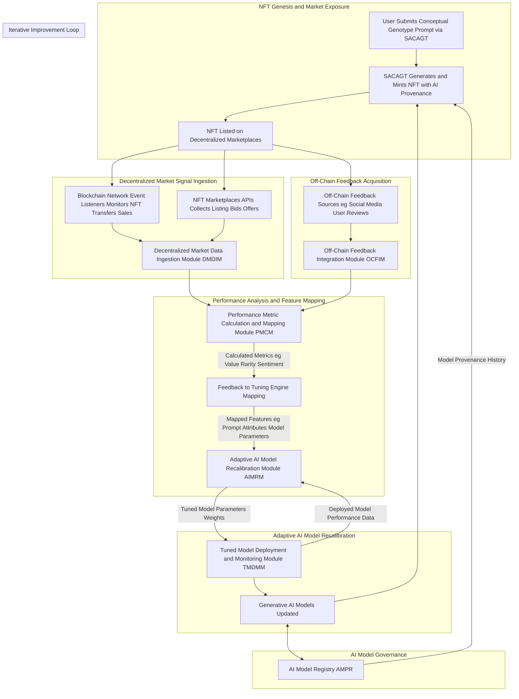

### 1. NFT Provenance and Tracking Module (NPTM) Detailed Flow

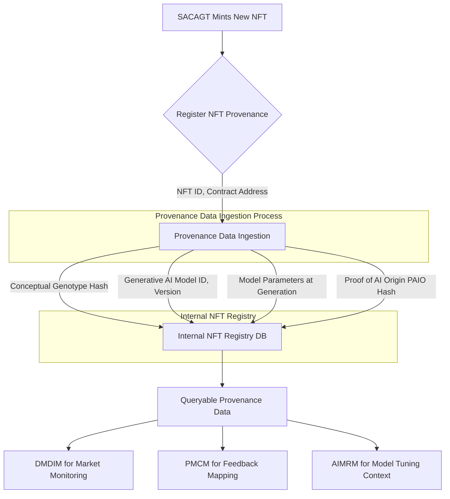

### 2. Decentralized Market Data Ingestion Module (DMDIM) Detailed Flow

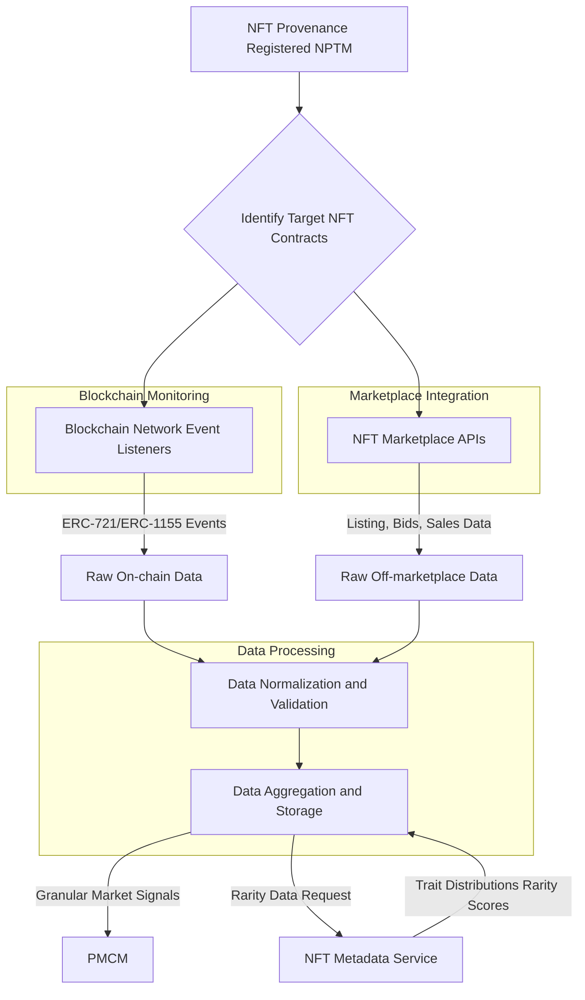

### 3. Off-Chain Feedback Integration Module (OCFIM) Detailed Flow

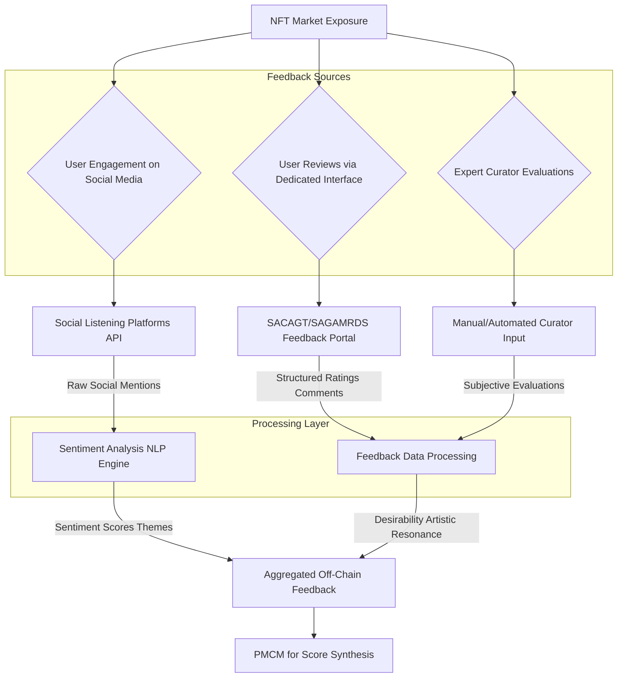

### 4. Performance Metric Calculation and Mapping Module (PMCM) Detailed Flow

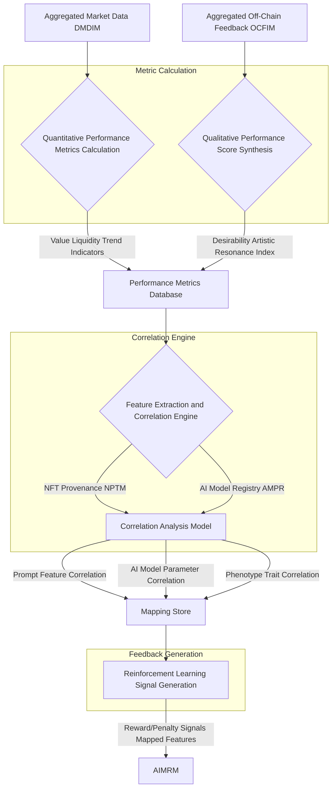

### 5. Adaptive AI Model Recalibration Module (AIMRM) Detailed Flow

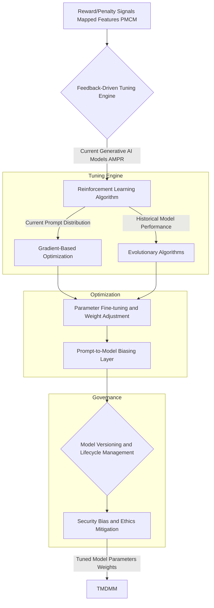

### 6. Tuned Model Deployment and Monitoring Module (TMDMM) Detailed Flow

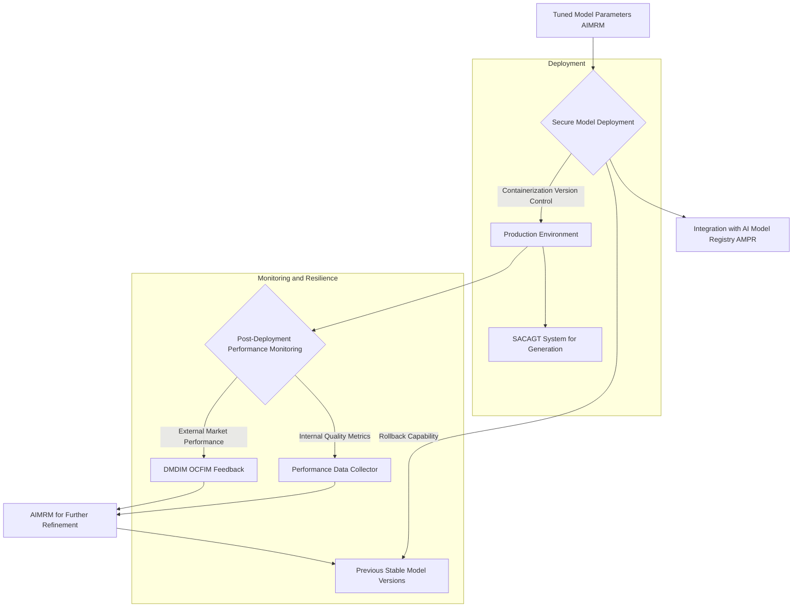

### 7. Overall SAGAMRDS Adaptive Loop (State Diagram)

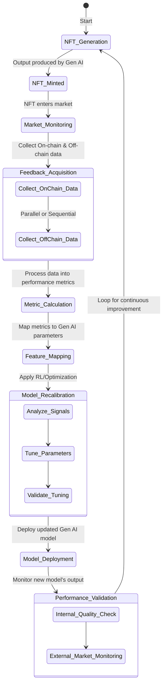

### 8. Market Data Aggregation Process (Sequence Diagram)

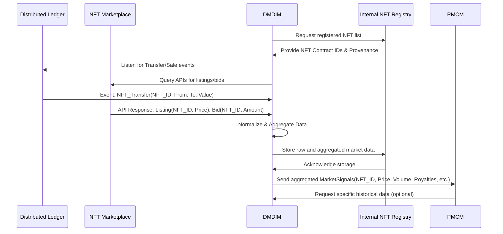

### 9. Prompt Engineering Feedback Loop

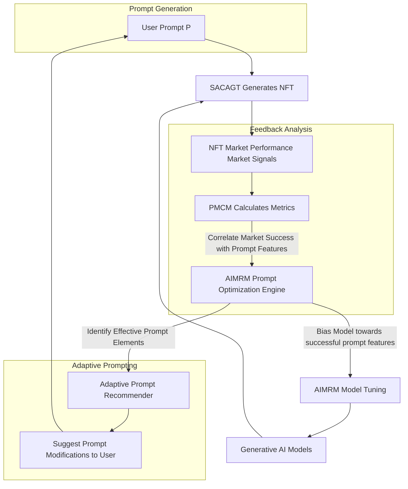

### 10. AI Model Governance & Ethics Mitigation

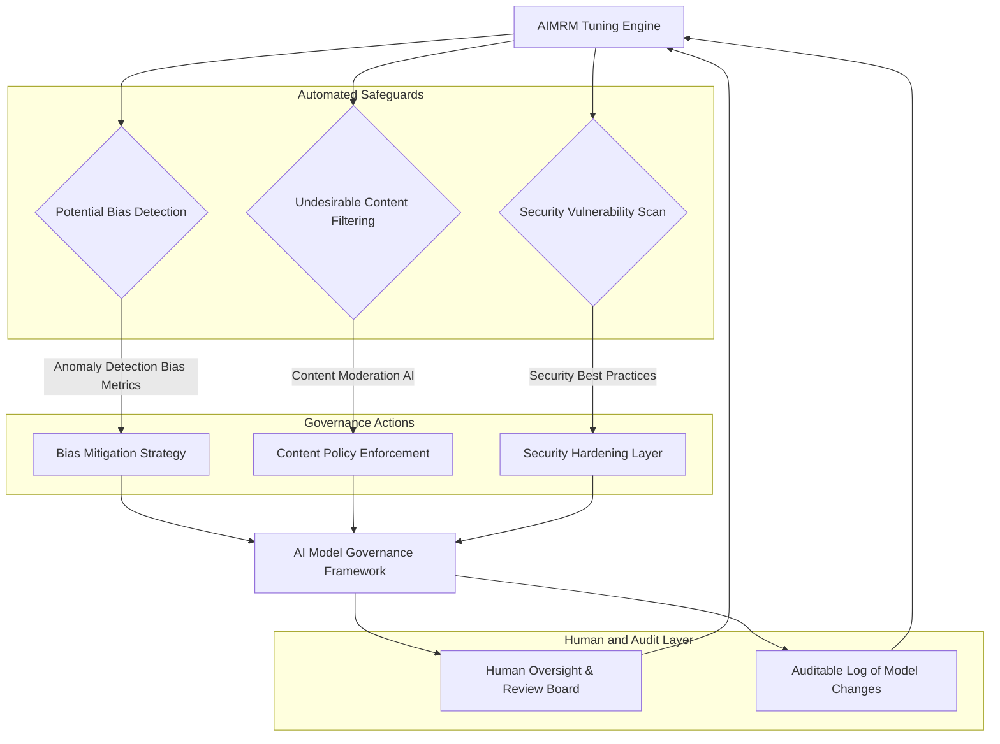

**Detailed Description of the Invention:**

The **System and Method for Adaptive Generative AI Model Recalibration via Decentralized Market Signals SAGAMRDS** comprises a highly integrated and modular architecture designed to facilitate the continuous, autonomous improvement of generative AI models based on the market performance and reception of their digital conceptual outputs (NFTs). The operational flow, from NFT generation to AI model recalibration and subsequent re-deployment, is meticulously engineered to ensure robust functionality, security, and adaptive learning.

### 1. NFT Provenance and Tracking Module (NPTM)

This module serves as the initial interface for the SAGAMRDS system, receiving information about newly minted AI-generated NFTs and establishing an immutable link between the digital asset and its AI origin. It is crucial for traceability and credit assignment in the feedback loop.

*   **Provenance Data Ingestion:** Receives comprehensive metadata for each newly minted NFT from the SACAGT system or directly from the minting contract event listeners. This data is meticulously structured for efficient correlation.
    *   **NFT Identifier (NFT_ID):** Unique token ID (e.g., `tokenId`) and the smart contract address (e.g., `contractAddress`) of the NFT. This forms the primary key for tracking.
    *   **Conceptual Genotype Hash (CGH):** A cryptographic hash (e.g., SHA-256) of the original user prompt or conceptual input used to generate the NFT. This ensures the integrity and verifiability of the prompt.
    *   **Generative AI Model Identity (G_ID):** A unique identifier for the specific AI model family used (e.g., "AetherVision," "AetherScribe").
    *   **Model Version (G_VER):** The exact version string or commit hash of the generative AI model at the time of creation (e.g., "v3.1.2-alpha", "commit_abc123"). This allows for granular tracking of model evolution.
    *   **Model Parameters at Generation (G_PARAMS):** A serialized snapshot of specific hyperparameters, seed values, configuration settings (e.g., `guidance_scale=7.5`, `sampling_steps=50`, `latent_seed=12345`, `negative_prompt_weight=-0.5`), and latent space coordinates that were used for that particular generation. This is vital for pinpointing which configurations led to specific market outcomes.
    *   **Proof of AI Origin (PAIO) Hash:** A cryptographic fingerprint of the AI model's verifiable parameters or a reference to its entry in an AI Model Registry (AMPR). This can be a Merkle root of the model's weights or a hash of the training data used, providing a strong guarantee of AI provenance.
    *   **Timestamp:** The exact time of NFT minting, crucial for temporal analysis of market performance.
    *   **Creator Wallet Address:** The blockchain address of the entity that initiated the minting process.

*   **Internal NFT Registry (INR):** Maintains a highly optimized, searchable, and historical database that links each AI-generated NFT to its complete provenance data. This registry is indexed by `NFT_ID` and `G_VER` to facilitate rapid lookups.
    *   **Database Schema:** Utilizes a distributed, fault-tolerant database (e.g., Apache Cassandra, PostgreSQL with sharding) capable of handling high write and read loads.
    *   **Data Integrity:** Implements cryptographic hashing and digital signatures to ensure the immutability and integrity of provenance records stored off-chain.
    *   **API Endpoints:** Exposes secure API endpoints for other SAGAMRDS modules (DMDIM, PMCM, AIMRM) to query provenance data. For example, given an `NFT_ID`, it can return `G_ID`, `G_VER`, and `G_PARAMS`.

### 2. Decentralized Market Data Ingestion Module (DMDIM)

The DMDIM is the primary sensor of the SAGAMRDS, continuously monitoring and collecting granular, real-time market performance data for AI-generated NFTs across a multitude of distributed ledgers and integrated NFT marketplaces. It is engineered for high throughput and low latency.

*   **Blockchain Event Listeners:**
    *   **Multi-chain Support:** Deploys persistent, highly available event listeners (e.g., Web3.js, Ethers.js, Solana web3.py) for relevant smart contract events across target DLT networks (e.g., Ethereum, Polygon, Solana, Avalanche, Flow, Arbitrum). This includes monitoring for `Transfer` (ERC-721/ERC-1155), `Sale`, `AuctionSettled`, `RoyaltyPayment`, `Bid`, `Offer`, `Listing` events.
    *   **Contract Filtering:** Dynamically registers and filters events specifically for NFT contract addresses associated with AI-generated assets as provided by the NPTM. This prevents ingesting irrelevant data.
    *   **Raw Data Capture:** Captures full transaction metadata including `transactionHash`, `blockNumber`, `timestamp`, `senderAddress`, `recipientAddress`, `tokenID`, `contractAddress`, `value` (for native currency transactions), and specific event parameters.
*   **NFT Marketplace API Integration:**
    *   **API Adapters:** Implements a robust system of API adapters for integration with leading NFT marketplaces (e.g., OpenSea, LooksRare, Magic Eden, Rarible, Foundation). Each adapter is responsible for handling marketplace-specific API rate limits, authentication, and data schemas.
    *   **Data Types Collected:** Retrieves listing prices, bid histories, active offer values, secondary sale data, collection floor prices, trait floor prices, trade volumes, delisting events, and liquidity pool data (for marketplaces with AMM-like mechanisms).
    *   **Data Freshness:** Employs polling and webhook mechanisms to ensure timely data updates, balancing API call frequency with rate limits and data freshness requirements.
*   **Rarity and Trait Analytics Integration:**
    *   **Metadata Enrichment:** Integrates with dedicated NFT metadata services (e.g., Rarity Tools, custom trait analysis engines) or performs on-the-fly analysis of NFT trait distributions to calculate statistical rarity scores for individual NFTs and specific trait combinations.
    *   **Impact Assessment:** Captures and stores information on how the rarity and specific characteristics (traits) of a conceptual phenotype might correlate with its market value, anticipating the PMCM's needs.
*   **Data Normalization and Aggregation Pipeline:**
    *   **Standardization:** Processes raw, heterogeneous data from disparate blockchain networks and marketplaces, normalizing currencies (e.g., converting ETH to USD equivalent at time of transaction), timestamps (UTC), and data schemas into a consistent internal format.
    *   **Deduplication and Validation:** Implements mechanisms to deduplicate events and validate data integrity, ensuring that only accurate and non-redundant information is passed downstream.
    *   **Historical Data Lake:** Stores processed market data in a high-volume, append-only data lake (e.g., Apache Kafka, Amazon S3) for historical analysis, trend detection, and machine learning model training. Data is partitioned and indexed by `NFT_ID`, `contractAddress`, and `timestamp`.

### 3. Off-Chain Feedback Integration Module (OCFIM)

This module enriches the quantitative on-chain data with qualitative insights derived from diverse off-chain user engagement and sentiment sources, providing a holistic view of an NFT's reception.

*   **Social Listening and Sentiment Analysis:**
    *   **Multi-platform Monitoring:** Monitors popular public social media platforms (e.g., Twitter, Discord, Reddit, Instagram, Telegram) for mentions, discussions, and trends related to specific AI-generated NFTs, collections, or even the generative AI models themselves. Uses platform APIs (e.g., Twitter API, Reddit API) for data ingestion.
    *   **Natural Language Processing (NLP) Engine:** Employs advanced NLP models (e.g., BERT-based models, fine-tuned Transformers) to perform sentiment analysis, classifying textual mentions as positive, negative, or neutral. It also identifies key entities, trending keywords, and thematic clusters.
    *   **Engagement Metrics:** Tracks social engagement metrics such as likes, retweets, shares, comments, and follower growth for content featuring AI-generated NFTs.
*   **User Rating and Review Interface:**
    *   **Dedicated Feedback Portal:** Provides a secure, user-friendly interface (integrated into the SACAGT front-end or as a standalone portal) where users can explicitly rate, review, and provide structured feedback on AI-generated NFTs they own or interact with.
    *   **Structured Feedback:** Collects quantitative ratings (e.g., 1-5 star ratings for 'creativity', 'aesthetic appeal', 'originality', 'conceptual depth') and qualitative textual comments. Categorical tags (e.g., #abstract, #fantasy, #minimalist) can also be gathered.
    *   **Identity Verification:** Implements mechanisms to verify user identity (e.g., wallet signature, OAuth) to prevent spam and ensure the authenticity of feedback.
*   **Curator and Expert Review Integration (Optional but Beneficial):**
    *   **Expert Panel Platform:** Develops a specialized interface for designated art curators, domain experts, or community moderators to provide high-level, subjective evaluations. These evaluations can influence specific stylistic or thematic tuning of generative AI models.
    *   **Bias Mitigation:** Incorporates safeguards to ensure that expert opinions, while valuable, do not unduly introduce personal biases that could lead to narrow or unrepresentative aesthetic preferences.
*   **Feedback Synthesis and Aggregation:**
    *   **Composite Scoring:** Aggregates sentiment scores, user ratings, and expert reviews into composite qualitative scores (e.g., a "Desirability Score," "Artistic Resonance Index," "Novelty Factor") for each NFT and, by extension, for the AI model/parameters that generated it.
    *   **Temporal Decay:** Applies temporal decay functions to older feedback, giving more weight to recent opinions and sentiments.
    *   **Weighting Mechanism:** Employs a configurable weighting mechanism to prioritize different feedback sources based on their perceived reliability or impact.

### 4. Performance Metric Calculation and Mapping Module (PMCM)

The PMCM is the analytical engine that transforms raw market and sentiment data into actionable, granular intelligence. It identifies patterns and causal relationships between AI generation parameters and market outcomes.

*   **Quantitative Performance Metrics Calculation:** Derives a comprehensive suite of metrics for each NFT, for specific AI model versions, and for collections.
    *   **Value Metrics:**
        *   `AverageSalePrice(nft_id)`: Mean price of all sales (primary + secondary).
        *   `HighestSalePrice(nft_id)`: Peak price achieved.
        *   `RoyaltyIncome(nft_id)`: Total creator royalties earned.
        *   `CapitalGains(nft_id)`: Profit/loss on secondary sales for each owner.
        *   `FloorPriceDelta(collection_id)`: Change in collection floor price over time.
    *   **Liquidity Metrics:**
        *   `NumSecondarySales(nft_id)`: Total number of resales.
        *   `AverageHoldingPeriod(nft_id)`: Mean duration of ownership.
        *   `BidToAskRatio(nft_id)`: Ratio of active bids to asking prices, indicating market interest.
        *   `TradeVolume(collection_id)`: Total value traded for a collection over a period.
        *   `Velocity(nft_id)`: Rate of sales/transfers.
    *   **Rarity-Value Correlation:**
        *   `RarityScoreImpact(trait_id)`: Statistical analysis of how specific trait rarities correlate with market price.
        *   `TraitPremium(trait_id)`: The additional value attributed to NFTs possessing certain rare traits compared to their non-rare counterparts.
    *   **Trend Indicators:**
        *   `PriceVolatility(nft_id)`: Standard deviation of prices over time.
        *   `MarketCap(collection_id)`: Total value of all NFTs in a collection.
        *   `Momentum(collection_id)`: Rate of change of market cap or floor price.
*   **Qualitative Performance Score Synthesis:**
    *   `DesirabilityScore(nft_id)`: Aggregated and weighted score from sentiment analysis, user ratings, and expert reviews (e.g., range 0-1).
    *   `ArtisticResonanceIndex(nft_id)`: A composite score reflecting aesthetic appeal, emotional impact, and conceptual depth, derived from NLP and structured feedback.
    *   `NoveltyFactor(nft_id)`: Assesses how unique or innovative an NFT is compared to prior generations, based on feature embeddings and market novelty.
*   **Feature Extraction and Correlation Engine:**
    *   **Provenance Linkage:** Utilizes the `NFT_ID` to retrieve `CGH`, `G_ID`, `G_VER`, and `G_PARAMS` from the NPTM.
    *   **Prompt Feature Correlation:** Employs statistical correlation (e.g., Pearson, Spearman) and regression models (e.g., Lasso, Ridge regression, Random Forest) to identify which elements of the original conceptual genotype (specific keywords, semantic structures, stylistic modifiers, prompt embeddings, prompt entropy, negative prompt elements) are most strongly associated with high-performing NFTs.
        *   Example: `Correlation(prompt_keyword_X, DesirabilityScore)`
    *   **AI Model Parameter Correlation:** Determines which specific generative AI model parameters (`guidance_scale`, `sampling_steps`, `latent_seed_influence`, specific model architectures, fine-tuning datasets) lead to outputs that achieve high market value, desirability, or liquidity.
        *   Example: `Regression(G_PARAMS, AverageSalePrice)`
    *   **Phenotype Trait Correlation:** Analyzes the visual, textual, or auditory characteristics of the conceptual phenotype (extracted via image recognition, natural language understanding, or audio feature extraction) that are consistently associated with market success. This can involve feature engineering from raw output.
*   **Reinforcement Learning (RL) Signal Generation:**
    *   **Reward Function Mapping:** Converts the calculated performance metrics and correlations into structured reward or penalty signals `R_t` suitable for consumption by reinforcement learning algorithms or other optimization techniques used in the AIMRM.
        *   High `AverageSalePrice` + high `DesirabilityScore` = high positive reward.
        *   Low `Liquidity` + negative `Sentiment` = negative penalty.
    *   **State Representation:** Formulates a state representation `S_t` for the RL agent, incorporating current model parameters (`theta_t`), historical performance, and perhaps recent market trends.
    *   **Action Space Definition:** Defines the action space `A_t` as potential adjustments to `theta_t` or transformations of the `P_t`.

### 5. Adaptive AI Model Recalibration Module (AIMRM)

The AIMRM is the core intelligence engine that leverages the signals from the PMCM to autonomously fine-tune and evolve the generative AI models. It acts as an RL agent in the market environment.

*   **Feedback-Driven Tuning Engine:** Employs a suite of advanced machine learning paradigms for adaptive model modification.
    *   **Reinforcement Learning from Market Feedback (RLFMF):**
        *   **Agent-Environment Model:** Treats the generative AI model `G` (or its parameters `theta`) as the agent, the decentralized NFT market as the environment, and `phi_i(t)` (derived performance metrics) as the reward signal.
        *   **Policy Learning:** Learns a policy `pi(theta | S)` that dictates how to adjust `theta` given a state `S` to maximize future cumulative rewards. Algorithms like Deep Q-Networks (DQN), REINFORCE, Actor-Critic methods (e.g., A2C, A3C, PPO) are employed.
        *   **Exploration-Exploitation:** Implements strategies (e.g., epsilon-greedy, UCB, Boltzmann exploration) to balance exploring new parameter configurations with exploiting known successful ones.
    *   **Active Learning and Prioritization:** Identifies which types of NFTs, conceptual genotypes, or generation parameters provide the most informative feedback signals (e.g., high uncertainty, surprising outcomes), guiding subsequent data collection or targeted retraining efforts.
    *   **Gradient-Based Optimization (where applicable):** For models where gradients can be propagated through the feedback loop or surrogate models, direct optimization of model weights based on market-derived performance objectives (e.g., using Adam, RMSprop with a custom loss function `L(theta, phi)`). This can involve building a differentiable proxy for `Phi`.
    *   **Evolutionary Algorithms (EAs):** Explores the high-dimensional AI model parameter space by maintaining a population of model configurations, applying genetic operators (mutation, crossover), and selecting models that produce higher-performing NFTs based on `phi_i(t)`. This is robust to non-differentiable rewards.
    *   **Transfer Learning and Meta-Learning:** Leverages pre-trained base models and applies meta-learning techniques to quickly adapt to new market trends or specific collection aesthetics with minimal market feedback.
*   **Parameter Fine-tuning and Weight Adjustment:**
    *   **Granular Control:** Dynamically adjusts specific model parameters at various levels:
        *   **Global Weights/Biases:** Full model fine-tuning (e.g., LoRA, textual inversion).
        *   **Hyperparameters:** Modifies `guidance_scale`, `sampling_steps`, `clip_guidance_strength`, `seed` ranges.
        *   **Latent Space Manipulation:** Biases the generation process towards specific regions of the latent space that correspond to desirable aesthetic or conceptual attributes.
    *   **Contextual Tuning:** Adjusts parameters not uniformly, but based on the input prompt `P` or desired stylistic output.
*   **Prompt-to-Model Biasing:** Learns to modify or augment incoming conceptual genotypes (prompts) in real-time.
    *   **Implicit Modifiers:** Adds implicit stylistic or thematic modifiers to user prompts (e.g., if "futuristic" art is selling well, `[user_prompt] + " in the style of cyberpunk surrealism"`).
    *   **Semantic Refinement:** Rewrites or expands user prompts to align with known successful semantic structures, enhancing the probability of generating desirable outputs.
    *   **Negative Prompt Generation:** Learns to suggest or automatically apply "negative prompts" to avoid generating undesirable traits identified by market feedback.
*   **Model Versioning and Lifecycle Management (Integrated with TMDMM):**
    *   Manages multiple concurrent versions of generative AI models, tracking their `G_ID`, `G_VER`, tuning history, and observed performance metrics.
    *   Enables controlled A/B testing of different tuned models in live generation scenarios to validate the efficacy of recalibration before full deployment.
*   **Security, Bias, and Ethics Mitigation:**
    *   **Bias Detection Metrics:** Incorporates fairness metrics (e.g., demographic parity, equalized odds) to detect and measure potential biases in generated content. Monitors for over-representation or under-representation of certain styles, themes, or demographics.
    *   **Adversarial Robustness:** Implements techniques (e.g., adversarial training) to enhance the generative AI models' robustness against adversarial attacks that might attempt to steer the model towards malicious or undesirable outputs.
    *   **Content Moderation AI:** Integrates with content moderation AI systems to filter out or flag outputs that violate ethical guidelines, community standards, or legal restrictions, preventing the generation of harmful or illicit content.
    *   **Transparency and Explainability (XAI):** Aims to provide explainable insights into why certain model parameters were adjusted and how these adjustments are expected to impact future outputs, fostering trust and accountability.

### 6. Tuned Model Deployment and Monitoring Module (TMDMM)

This module handles the secure and efficient deployment of recalibrated AI models and their continuous performance validation in a live production environment.

*   **Secure Model Deployment:** Orchestrates the deployment of newly tuned generative AI models to the production environment where they become available for subsequent NFT generation by the SACAGT system.
    *   **Containerization:** Utilizes containerization technologies (e.g., Docker, Kubernetes) to package models with their dependencies, ensuring consistency and portability across different environments.
    *   **Version Control:** Implements strict version control for deployed models, associating each deployment with a unique `G_VER` and `G_PARAMS`.
    *   **Secure API Endpoints:** Exposes model inference capabilities via secure, authenticated, and rate-limited API endpoints.
    *   **Blue/Green or Canary Deployments:** Supports advanced deployment strategies to minimize downtime and risk, allowing for gradual rollout and testing of new model versions.
*   **Post-Deployment Performance Monitoring:** Continuously tracks the performance of newly deployed models in real-world scenarios.
    *   **Internal Quality Metrics:** Monitors internal quality metrics of generated outputs (e.g., image coherence, aesthetic score via perceptual metrics, prompt alignment score, computational efficiency of generation) before market exposure.
    *   **External Market Performance Feedback:** Feeds performance data from the DMDIM and PMCM back into the AIMRM, closing the feedback loop and enabling further iterative refinement. This ensures that the tuning process itself is continuously evaluated.
    *   **Resource Utilization Monitoring:** Tracks computational resources (GPU, CPU, memory) consumed by each model version to ensure efficient operation.
*   **Rollback and Resilience Mechanisms:**
    *   **Automated Rollback:** Implements automated rollback capabilities to revert to previous, stable model versions if a newly deployed tuned model exhibits degraded performance (e.g., lower average sale price, increased negative sentiment) or undesirable behaviors (e.g., bias amplification, content generation issues).
    *   **Redundancy and Failover:** Ensures high availability through redundant model instances and automated failover mechanisms.
*   **Integration with AI Model Registry (AMPR):**
    *   **Update Registry:** Updates the AMPR with details of new model versions, their exact tuning parameters (`G_PARAMS`), deployment status, and observed performance improvements.
    *   **Auditable History:** Provides an auditable history of AI model evolution, including which market signals prompted each recalibration, the changes made, and the resulting impact, reinforcing transparency and accountability.

**Claims:**

1.  A system for adaptive generative artificial intelligence AI model recalibration, comprising:
    a.  A NFT Provenance and Tracking Module NPTM configured to register AI-generated Non-Fungible Tokens NFTs with associated metadata detailing their generative AI model identity, version, generation parameters, conceptual genotype hash, and cryptographic proof of AI origin;
    b.  A Decentralized Market Data Ingestion Module DMDIM configured to:
        i.  Monitor distributed ledger technology DLT networks for on-chain market transactions and events pertaining to the registered NFTs across multiple blockchain protocols;
        ii. Collect granular market data from various NFT marketplaces via standardized application programming interface API integrations, including sales prices, bids, offers, listing information, royalty distributions, and collection floor prices;
    c.  An Off-Chain Feedback Integration Module OCFIM configured to:
        i.  Aggregate qualitative user feedback on AI-generated NFTs from social media platforms through sentiment analysis, and from dedicated user review interfaces;
        ii. Synthesize this qualitative feedback into composite desirability and artistic resonance scores;
    d.  A Performance Metric Calculation and Mapping Module PMCM configured to:
        i.  Process the collected market data and synthesized feedback to derive quantitative financial, liquidity, and sentiment-based performance metrics for individual NFTs and generative AI model versions;
        ii. Map these performance metrics to specific features of the original conceptual genotypes (prompts) and the internal parameters of the generative AI models that produced the NFTs, identifying statistical correlations between generation characteristics and market success;
    e.  An Adaptive AI Model Recalibration Module AIMRM configured to:
        i.  Utilize the mapped performance metrics as structured reward or penalty signals within a reinforcement learning framework to autonomously fine-tune, retrain, or adjust parameters (weights, biases, hyperparameters) of the generative AI models;
        ii. Employ advanced machine learning paradigms, including policy gradient-based reinforcement learning, evolutionary algorithms, or gradient-based optimization, to optimize the generative AI models for improved market alignment, desirability, or specific artistic characteristics of future outputs;
    f.  A Tuned Model Deployment and Monitoring Module TMDMM configured to:
        i.  Securely deploy the recalibrated generative AI models to a production environment for subsequent NFT generation via containerization and version control;
        ii. Continuously monitor the post-deployment performance of the deployed models, both in terms of internal quality metrics and external market reception, to inform further iterative refinements and trigger automated rollback mechanisms if performance degrades.

2.  The system of claim 1, wherein the NPTM maintains an Internal NFT Registry (INR) database that cryptographically links each AI-generated NFT to its full provenance, including the exact generative AI model version, its parameters at generation, and the hash of the input prompt.

3.  The system of claim 1, wherein the market data collected by the DMDIM includes price volatility, bid-to-ask ratios, average holding periods, rarity score impact on value, and real-time transaction volumes.

4.  The system of claim 1, wherein the OCFIM incorporates Natural Language Processing (NLP) models to extract sentiment and thematic trends from unstructured social media text, providing a dynamic understanding of public perception.

5.  The system of claim 1, wherein the mapping performed by the PMCM identifies causal relationships or strong correlations between conceptual genotype elements, including specific keywords, semantic embeddings, style modifiers, prompt entropy, and negative prompt components, and the derived market performance metrics.

6.  The system of claim 1, wherein the mapping performed by the PMCM identifies specific generative AI model parameters, such as guidance scale, sampling steps, latent seed influence, specific model architectures (e.g., diffusion model variant, GAN architecture), and fine-tuning dataset characteristics, that directly impact market performance.

7.  The system of claim 1, wherein the Adaptive AI Model Recalibration Module AIMRM employs an exploration-exploitation strategy to balance discovering new successful model configurations with leveraging proven high-performing parameters.

8.  The system of claim 1, further comprising a Prompt-to-Model Biasing layer within the AIMRM configured to dynamically augment or refine user-provided prompts based on historical market feedback, steering the generative AI towards outputs with higher predicted market desirability.

9.  The system of claim 1, wherein the TMDMM manages multiple concurrent versions of generative AI models, facilitating A/B testing in live generation scenarios to empirically validate the effectiveness of recalibration updates before widespread deployment.

10. The system of claim 1, further incorporating a comprehensive AI Model Governance Framework (AMGF) within the AIMRM, designed to detect and mitigate unintended biases, ensure ethical content generation, and provide auditable logs of all model adjustments and their associated market feedback.

11. A method for enhancing generative artificial intelligence AI models, comprising:
    a.  Registering conceptual phenotypes generated by AI models as Non-Fungible Tokens NFTs, where each NFT includes verifiable metadata linking it to its progenitor AI model identity, version, and precise generation parameters;
    b.  Continuously monitoring decentralized market activity for the registered NFTs by ingesting on-chain transaction events and off-chain marketplace data;
    c.  Collecting quantitative market performance data (e.g., sales prices, liquidity) and qualitative off-chain feedback (e.g., sentiment, user ratings) pertaining to the NFTs;
    d.  Calculating a suite of multi-faceted performance metrics from the collected data, reflecting market desirability, commercial viability, artistic resonance, or engagement;
    e.  Analyzing the calculated performance metrics in conjunction with the NFT's provenance data to identify statistically significant correlations between specific prompt features and AI model parameters, and the observed market success;
    f.  Utilizing the identified correlations and performance metrics as feedback signals to autonomously recalibrate the generative AI models, dynamically adjusting their internal parameters to optimize for future conceptual phenotypes that align with desired market characteristics;
    g.  Securely deploying the recalibrated AI models for subsequent NFT generation, establishing a continuous improvement loop, and monitoring their performance for further iterative refinement.

12. The method of claim 11, wherein the recalibration of the generative AI models involves learning an optimal policy for parameter adjustment using reinforcement learning techniques, where market performance serves as the reward signal for the learning agent.

13. The method of claim 11, further comprising employing active learning strategies to prioritize the collection of feedback data from NFTs or generation scenarios that are most informative for model improvement.

14. The method of claim 11, wherein the prompt features mapped in step (e) include semantic embeddings of the prompt, stylistic directives, and the presence or absence of specific keywords, and the AI model parameters include latent space sampling strategies and architectural configurations.

15. The method of claim 11, further comprising the use of a data normalization and aggregation pipeline within the market data ingestion process to homogenize data from disparate blockchain networks and marketplaces.

16. The method of claim 11, further comprising real-time content moderation and bias detection systems integrated into the recalibration process to prevent the generation or amplification of undesirable, unethical, or biased content.

17. The method of claim 11, wherein the system is capable of managing and tuning multi-modal generative AI models (e.g., for images, text, 3D models, audio), and the feedback signals and recalibration processes are adapted for each modality.

18. The method of claim 11, further comprising generating explainable insights into the reasons behind specific model parameter adjustments, correlating changes with observable shifts in market preferences.

19. The method of claim 11, wherein the performance monitoring of deployed models includes both pre-market internal quality assessments (e.g., novelty score, aesthetic quality) and post-market external performance metrics (e.g., sales data, sentiment).

20. The system of claim 1, wherein the generative AI models are capable of producing multi-modal conceptual phenotypes, including images, text, 3D models, or audio compositions, and the DMDIM, OCFIM, PMCM, and AIMRM are designed to process and act upon feedback relevant to each specific modality.

**Mathematical Justification:**

The robust framework underpinning the **System and Method for Adaptive Generative AI Model Recalibration via Decentralized Market Signals SAGAMRDS** can be rigorously formalized through a series of advanced mathematical constructs, each constituting an independent domain of inquiry. This formalization provides an axiomatic basis for the system's claims of continuous improvement, market alignment, and verifiable provenance.

### I. The Generative AI Model and its Parameter Space `Theta`

Let `G` denote a generative AI model, which maps a conceptual genotype `P` and a set of internal parameters `theta` to a conceptual phenotype `a`.
From previous art (SACAGT), `a = G(E(P), theta, lambda)`, where `E(P)` is the semantic embedding of `P`, `theta` are the internal model parameters (weights, biases, hyperparameters), and `lambda` are fusion parameters.
The primary focus of SAGAMRDS is to adaptively modify `theta`. Let `Theta` be the high-dimensional space of all possible parameter configurations for `G`.
`theta in Theta`.

**Definition 1.1: Parameter Vector.**
A generative AI model `G` at a given state `t` is defined by its parameter vector `theta_t = (w_1, w_2, ..., w_k)`, where `w_i` are individual weights, biases, or hyperparameters. `k` can be in the billions for large models.
`theta_t = [w_1^{(t)}, w_2^{(t)}, \dots, w_k^{(t)}] \in \mathbb{R}^k`

**Definition 1.2: Model Versioning.**
Each distinct `theta_t` defines a specific version `G_t` of the generative AI model. The system tracks the provenance of `G_t` for each `a`.
`G_t = G(\cdot; \theta_t)`

**Definition 1.3: Conceptual Genotype (Prompt) Embedding.**
Let `P` be a raw text prompt. `E` is an embedding function (e.g., CLIP encoder, BERT encoder) that maps `P` to a fixed-dimensional semantic vector space `V_E`.
`E(P) \in \mathbb{R}^d` where `d` is the embedding dimension.

**Definition 1.4: Latent Space Representation.**
For a given `E(P)`, the generative model `G` samples from a latent space `Z`. Let `z_s` be a latent seed vector.
`a = G(E(P), \theta, z_s, \lambda)`
where `z_s \in \mathbb{R}^m` and `m` is the latent dimension.

**Equation 1.1: Generative Process Probability.**
For a given prompt `P` and parameters `theta`, the generative model defines a probability distribution over the space of phenotypes `A`.
`p(a | E(P), \theta) = \int p(a | z, E(P), \theta) p(z) dz`
The goal of tuning is to shift this distribution to favor desired phenotypes.

**Equation 1.2: Parameter Space Volume.**
The parameter space `Theta` can be massive. For a model with `k` parameters, each taking `B` possible values (e.g., floating point precision), the discrete volume is `B^k`.
`Vol(Theta) \approx \prod_{i=1}^k (max(w_i) - min(w_i))`

### II. The Market Signal Space `M_S`

Let `M_S` be the space of all possible market signals and feedback received for an NFT. For a given NFT `nft_i` (representing conceptual phenotype `a_i`), its market signal at time `t` is a vector `s_i(t)`.

**Definition 2.1: Raw Market Signal Vector.**
For an NFT `nft_i` (generated by `G_{gen_i}` with `theta_{gen_i}`) at time `t`, the raw market signal vector `s_i(t)` is a multivariate time series:
`s_i(t) = [p_i(t), vol_i(t), roy_i(t), bids_i(t), sp_i(t), od_i(t), \dots, trait_r_j_i(t), \dots]`
where:
*   `p_i(t)`: Last sale price of `nft_i` at time `t`.
*   `vol_i(t)`: Cumulative transaction volume for `nft_i` or its collection.
*   `roy_i(t)`: Cumulative royalties earned by `nft_i`.
*   `bids_i(t)`: Active bid price or aggregate bid interest.
*   `sp_i(t)`: Aggregated sentiment score (e.g., from -1 to 1).
*   `od_i(t)`: Average ownership duration of `nft_i` across its history.
*   `trait_r_j_i(t)`: Rarity score of trait `j` for `nft_i`.
*   And potentially many other signals (e.g., `listing_count_i(t)`, `floor_price_collection_i(t)`).

**Equation 2.1: NFT Value Time Series.**
The observed market price for `nft_i` over time forms a stochastic process.
`P_i(t) = P_0 + \mu t + \sigma W(t) + \sum_{j} J_j \delta(t-t_j)`
where `P_0` is initial price, `mu` drift, `sigma` volatility, `W(t)` Wiener process, `J_j` jump magnitudes at times `t_j`.

**Definition 2.2: Performance Metric Function `Phi`.**
A non-linear, possibly state-dependent, function `Phi: M_S \times \text{Prov} \rightarrow \mathbb{R}` maps the raw market signal vector `s_i(t)` and NFT provenance `Prov_i` to a scalar performance metric `phi_i(t)`. This `phi_i(t)` quantifies the desirability, value, or efficacy of `nft_i` (and by extension, `a_i`).
`phi_i(t) = Phi(s_i(t), Prov_i)`
This `phi_i(t)` serves as the primary reward signal for model recalibration.

**Equation 2.2: Composite Performance Metric.**
`phi_i(t) = w_p p_i(t) + w_{vol} vol_i(t) + w_{roy} roy_i(t) + w_{sp} sp_i(t) + w_{od} od_i(t) + \dots`
where `w_x` are weighting coefficients, determined heuristically or learned.
`\sum w_x = 1`, `w_x \geq 0`.

**Equation 2.3: Normalized Performance Metric.**
The raw metrics are often normalized to a common scale, e.g., `[0, 1]`.
`\hat{x} = (x - x_{min}) / (x_{max} - x_{min})`

**Equation 2.4: Sentiment Score Aggregation.**
`sp_i(t) = \frac{1}{|C_i(t)|} \sum_{c \in C_i(t)} \text{Sentiment}(c)`
where `C_i(t)` is the set of off-chain comments/mentions for `nft_i` at time `t`, and `Sentiment(c)` is the score from an NLP model.

**Equation 2.5: Rarity Score Calculation (Example: Trait Count based).**
`R_j = 1 / (\text{count}(trait_j) / \text{total_nfts})`
`RarityScore(nft_i) = \sum_{j \in \text{traits}(nft_i)} R_j`

### III. The Feedback Mapping Function `F_map`

This function translates the performance metric `phi_i(t)` back to actionable adjustments or insights for the generative AI model's parameters `theta_t` or the prompt `P`.

**Definition 3.1: Feature Extraction from Provenance `F_prov`.**
For each `nft_i`, the NPTM provides its provenance `Prov_i = (E(P_i), theta_{gen_i}, \text{gen_timestamp}_i)`.
`F_prov: NFT_ID \rightarrow (E(P), \theta_{gen})`

**Definition 3.2: Feedback Mapping `F_map`.**
`F_map: (\phi_i(t), E(P_i), \theta_{gen_i}) \rightarrow (\Delta_E(P_i), \Delta_{\theta_i})`
This function determines how `phi_i(t)` implies changes to prompt features `\Delta_E(P_i)` (for prompt engineering guidance) or direct parameter adjustments `\Delta_{\theta_i}` for `\theta_{gen_i}`. `\Delta_{\theta_i}` represents the gradient or direction for parameter adjustment based on the observed reward `phi_i(t)`.

**Equation 3.1: Correlation Coefficient (Pearson).**
`\rho(X, Y) = \frac{\text{cov}(X, Y)}{\sigma_X \sigma_Y}`
Used to find correlations between `\phi_i(t)` and specific components of `E(P_i)` or `\theta_{gen_i}`.

**Equation 3.2: Regression Model for Parameter Influence.**
`\phi_i = \beta_0 + \sum_{j=1}^{d} \beta_j E(P_i)_j + \sum_{l=1}^{k} \gamma_l \theta_{gen_i,l} + \epsilon_i`
The coefficients `\beta_j` and `\gamma_l` indicate the linear influence of prompt features and model parameters on performance.

**Equation 3.3: Gradient-based Feedback for `theta`.**
If `Phi` is differentiable with respect to `theta` (or a surrogate model `\tilde{Phi}` is used):
`\Delta_{\theta_i} = \eta \nabla_{\theta} \tilde{Phi}(\theta_{gen_i}, E(P_i))`
where `\eta` is a learning rate.

**Equation 3.4: Prompt Feature Importance.**
The absolute values of `\beta_j` from Equation 3.2 can represent the importance of prompt feature `j`.
`\text{Importance}(E(P)_j) = |\beta_j|`

**Equation 3.5: Latent Space Direction for Improvement.**
Identify a direction `\vec{v}` in the latent space `Z` that correlates with higher `phi`.
`\vec{v} = \mathbb{E}[\frac{\phi_i}{\|\phi_i\|_2} \cdot \frac{z_{s,i}}{\|z_{s,i}\|_2}]` for high-performing `nft_i`.

### IV. The Adaptive Recalibration Algorithm `R_A` (Reinforcement Learning)

The core of SAGAMRDS is the algorithm `R_A` that updates the generative AI model parameters `theta`. This is often modeled as a reinforcement learning process within a Markov Decision Process (MDP) framework.

**Definition 4.1: State Space `S_RL`.**
The state of the RL agent (the AIMRM) at time `t` is `S_t = (\theta_t, H_t, M_t, P_D_t)`, where:
*   `\theta_t`: Current parameters of the generative AI model.
*   `H_t`: Historical performance metrics and feedback for models `G_{<t}`.
*   `M_t`: Current market conditions and trends (e.g., volatility, top-selling categories).
*   `P_D_t`: Distribution of recent input prompts.
`S_t \in \mathcal{S}`.

**Definition 4.2: Action Space `A_RL`.**
An action `A_t` taken by the agent at state `S_t` is a decision to modify `\theta_t` to `\theta_{t+1}`. This could be:
*   `A_t = \Delta \theta_t`: A direct adjustment vector.
*   `A_t = (hyperparam_k, new_value_k)`: Modifying specific hyperparameters.
*   `A_t = (\text{fine_tune_data}, \text{learning_rate})`: Specifying a mini-retraining.
`A_t \in \mathcal{A}`.

**Definition 4.3: Transition Function `T`.**
The environment transitions from state `S_t` to `S_{t+1}` after action `A_t` is taken (i.e., new model `\theta_{t+1}` is deployed and observed in the market).
`S_{t+1} \sim T(S_t, A_t)`
This transition is stochastic due to market unpredictability.

**Definition 4.4: Reward Function `Reward`.**
The reward `R_t` at each step `t` is directly derived from the aggregated performance metrics `\phi_i(t)` of NFTs generated by `G_{t+1}`.
`R_t = \mathbb{E}_{\text{a} \sim G(\cdot; \theta_{t+1})} [ \text{Avg}(\phi_i(t) \text{ for } \text{a}_i \text{ generated by } G_{t+1}) ]`
Often, this is `R_t = \sum_{i=1}^{N_t} \phi_i(t) / N_t`, where `N_t` is the number of NFTs generated and evaluated in step `t`.

**Definition 4.5: Policy `\pi`.**
A policy `\pi` is a mapping from states to probabilities of selecting each action.
`\pi(A_t | S_t)`

**Equation 4.1: Value Function (Expected Return).**
The value function `V^\pi(S_t)` is the expected cumulative discounted reward starting from state `S_t` and following policy `\pi`.
`V^\pi(S_t) = \mathbb{E}_\pi [ \sum_{k=0}^\infty \gamma^k R_{t+k} | S_t ]`
where `\gamma \in [0, 1)` is the discount factor.

**Equation 4.2: Action-Value Function (Q-function).**
The Q-function `Q^\pi(S_t, A_t)` is the expected cumulative discounted reward starting from state `S_t`, taking action `A_t`, and then following policy `\pi`.
`Q^\pi(S_t, A_t) = \mathbb{E}_\pi [ \sum_{k=0}^\infty \gamma^k R_{t+k} | S_t, A_t ]`

**Equation 4.3: Bellman Expectation Equation for V-function.**
`V^\pi(S_t) = \sum_{A_t} \pi(A_t | S_t) \sum_{S_{t+1}} T(S_{t+1} | S_t, A_t) [R_t + \gamma V^\pi(S_{t+1})]`

**Equation 4.4: Bellman Expectation Equation for Q-function.**
`Q^\pi(S_t, A_t) = \sum_{S_{t+1}} T(S_{t+1} | S_t, A_t) [R_t + \gamma \sum_{A_{t+1}} \pi(A_{t+1} | S_{t+1}) Q^\pi(S_{t+1}, A_{t+1})]`

**Equation 4.5: Optimal Policy.**
The optimal policy `\pi^*` maximizes the expected cumulative reward.
`\pi^*(A_t | S_t) = \text{argmax}_{A_t} Q^*(S_t, A_t)`
where `Q^*` is the optimal Q-function satisfying the Bellman Optimality Equation:
`Q^*(S_t, A_t) = \sum_{S_{t+1}} T(S_{t+1} | S_t, A_t) [R_t + \gamma \max_{A'} Q^*(S_{t+1}, A')]`

**Equation 4.6: Policy Gradient Objective.**
For a parameterized policy `\pi(A|S;\theta_p)`, the objective is to maximize the expected return `J(\theta_p) = \mathbb{E}_{S_0, A_0, \dots} [\sum_{k=0}^\infty \gamma^k R_k]`.
The policy gradient theorem states:
`\nabla_{\theta_p} J(\theta_p) = \mathbb{E}_{\pi} [\nabla_{\theta_p} \log \pi(A_t | S_t; \theta_p) Q^\pi(S_t, A_t)]`

**Equation 4.7: REINFORCE Update Rule.**
`\theta_{p, t+1} = \theta_{p, t} + \alpha \nabla_{\theta_p} \log \pi(A_t | S_t; \theta_{p, t}) G_t`
where `G_t` is the return from time `t`, and `\alpha` is the learning rate.

**Equation 4.8: Actor-Critic Update Rule (Actor).**
`\Delta \theta_p \propto \nabla_{\theta_p} \log \pi(A_t | S_t; \theta_p) (Q^\pi(S_t, A_t) - V^\pi(S_t))`
The term `(Q^\pi(S_t, A_t) - V^\pi(S_t))` is the advantage function `Adv(S_t, A_t)`.

**Equation 4.9: Actor-Critic Update Rule (Critic).**
The critic learns `V^\pi(S)` by minimizing TD error:
`\delta_t = R_t + \gamma V^\pi(S_{t+1}) - V^\pi(S_t)`
`\Delta \theta_c \propto \delta_t \nabla_{\theta_c} V^\pi(S_t; \theta_c)`

**Equation 4.10: Exploration Strategy (Epsilon-greedy).**
`A = \begin{cases} \text{random action with probability } \epsilon \\ \text{argmax}_{A'} Q(S, A') \text{ with probability } 1-\epsilon \end{cases}`

**Equation 4.11: Evolutionary Algorithm Selection.**
`P_{t+1} = \text{Select}(\text{Population}_t, \text{fitness}(\theta_j, \phi_j))`
where `\text{fitness}` is derived from `\phi_j`.

**Equation 4.12: Evolutionary Algorithm Mutation.**
`\theta'_{j} = \theta_j + N(0, \sigma_m^2 I)`
where `N` is Gaussian noise and `\sigma_m` is mutation rate.

### V. Continuous Learning Loop and Convergence

The SAGAMRDS system operates as a continuous learning loop.

**Definition 5.1: Iterative Optimization.**
The system iteratively executes:
1.  Generate NFTs using `G(E(P), \theta_t)`.
2.  Observe market signals `s_i(t)` for these NFTs.
3.  Calculate performance metrics `\phi_i(t)`.
4.  Derive parameter adjustments `\Delta \theta_t` using `F_map` and `R_A`.
5.  Update model parameters `\theta_{t+1} = \theta_t + \Delta \theta_t`.

**Theorem 5.1: Market-Aligned Model Optimization.**
Given a well-defined performance metric function `Phi`, an appropriate recalibration algorithm `R_A` (e.g., an efficient reinforcement learning algorithm), and sufficient market data, the generative AI model `G` will, over sufficient iterations, converge to a parameter configuration `\theta^*` that maximizes the aggregated market desirability or value `\mathbb{E}[Phi(s(t))]` of its generated conceptual phenotypes, subject to exploration-exploitation tradeoffs and the dynamics of the market.
`\lim_{t \to \infty} \mathbb{E}[\text{Avg}(\phi_i(t) | \theta_t)] \rightarrow \max`

**Equation 5.1: Convergence Criteria (Parameter Stability).**
`\| \theta_{t+1} - \theta_t \|_2 < \epsilon_\theta` for sufficiently small `\epsilon_\theta`.

**Equation 5.2: Convergence Criteria (Reward Stability).**
`| \text{Avg}(\phi_i(t)) - \text{Avg}(\phi_i(t-1)) | < \epsilon_\phi` for sufficiently small `\epsilon_\phi`.

**Theorem 5.2: Enhanced Generative Efficacy.**
The continuous feedback loop ensures that `G_t` adaptively improves its capacity to produce novel, high-quality, and market-relevant conceptual phenotypes. The system effectively learns the latent market preferences and adjusts its creative process accordingly, leading to an increase in the utility and value of its outputs.

**Equation 5.3: Utility Maximization.**
`U(G(\cdot; \theta)) = \mathbb{E}_{P,z_s} [\text{Value}(\text{NFT}(G(E(P), \theta, z_s)))]`
The system aims to find `\theta^* = \text{argmax}_\theta U(G(\cdot; \theta))`.

### VI. Verifiable Provenance and Audibility

The system integrates directly with NFT provenance records to ensure auditability of the AI model's evolution.

**Definition 6.1: Model Provenance Chain.**
Each minted NFT `nft_i` is inextricably linked to its specific generative AI model version `G_t` and parameters `\theta_t` via on-chain metadata (Proof of AI Origin PAIO). This establishes a transparent and verifiable chain:
`nft_i \xrightarrow{\text{metadata}} (G_t, \theta_t) \xrightarrow{\text{market}} \phi(s_i(t))`

**Equation 6.1: Cryptographic Hash for Provenance.**
`CGH = \text{SHA256}(\text{Prompt String})`
`PAIO\_Hash = \text{SHA256}(\theta_{t,\text{weights}} \| \theta_{t,\text{hyperparams}} \| \text{training_data_root_hash})`
where `\|` denotes concatenation.

**Equation 6.2: Merkle Tree for Model State.**
`MerkleRoot(\theta_t) = \text{Hash}( \text{Hash}(w_1) \| \text{Hash}(w_2) \| \dots \| \text{Hash}(w_k) )`
This provides a compact and verifiable proof of the model's exact parameters.

**Theorem 6.1: Transparent and Auditable AI Evolution.**
Due to the immutable linking of NFT provenance to specific AI model versions and parameters on the blockchain, the entire evolution of the generative AI model (the sequence of `\theta_t` values) becomes transparent and auditable. Each parameter update can be traced back to the specific market signals that prompted the recalibration, providing unprecedented insight into the adaptive learning process of AI in response to decentralized market dynamics. This ensures accountability and builds trust in autonomously evolving AI systems.

**Equation 6.3: Audit Trail Record.**
`Log_t = (\text{timestamp}_t, \theta_t, \theta_{t+1}, \text{Reward}_t, \text{Prompt_Features_Impact}_t, \text{Reason}_t)`

### VII. Prompt Engineering Optimization

The system can also optimize the prompts `P` themselves, or provide guidance for users.

**Definition 7.1: Adaptive Prompt Transformation `T_P`.**
A function `T_P: (P, \theta, H_t) \rightarrow P'` that transforms an input prompt `P` to an optimized `P'` based on historical performance `H_t` and current model `\theta`.

**Equation 7.1: Prompt Reward Probability.**
`p(\text{reward} | P) = \text{sigmoid}(f(E(P)))`
where `f` is a neural network trained to predict reward from prompt embeddings.

**Equation 7.2: Prompt Augmentation Rule.**
`E(P') = E(P) + \alpha_P \nabla_{E(P)} \mathbb{E}[\phi | E(P), \theta]`
where `\alpha_P` is a prompt learning rate. This implies finding a direction in the embedding space.

**Equation 7.3: Prompt Scoring Function.**
`S_P(P) = \sum_{j} \beta_j \cdot \mathbb{I}(\text{keyword}_j \in P) + \sum_{k} \gamma_k \cdot \text{Similarity}(E(P), E(\text{successful_prompt}_k))`

### VIII. Rarity and Trait Valuation

Mathematical models to understand how specific NFT traits influence market value.

**Definition 8.1: Trait-Conditional Value Function.**
Let `T(a)` be the set of traits for phenotype `a`.
`V_{trait}(a) = \sum_{j \in T(a)} w_j \cdot R_j \cdot P_j`
where `w_j` is trait weight, `R_j` is rarity score of trait `j`, `P_j` is premium for trait `j`.

**Equation 8.1: Statistical Trait Rarity.**
`\text{Rarity}(t_k) = \frac{1}{\text{frequency}(t_k)} = \frac{\text{Total Supply}}{\text{Number of NFTs with trait } t_k}`

**Equation 8.2: Trait Value Contribution (Hedonic Pricing Model).**
`\text{log}(Price) = \beta_0 + \sum_{j=1}^M \beta_j \cdot \mathbb{I}(\text{has_trait}_j) + \sum_{k=1}^N \gamma_k \cdot \text{num_of_trait}_k + \epsilon`
where `\mathbb{I}(\cdot)` is indicator function.

### IX. Multi-modal Feedback Integration

Combining feedback from different modalities (e.g., visual, textual, audio).

**Definition 9.1: Multi-modal Performance Vector.**
`\vec{\phi}(t) = (\phi_{\text{visual}}(t), \phi_{\text{text}}(t), \phi_{\text{audio}}(t), \phi_{\text{market}}(t), \phi_{\text{sentiment}}(t))`

**Equation 9.1: Weighted Aggregation of Multi-modal Feedback.**
`\phi_{\text{total}}(t) = \sum_{m \in \text{Modalities}} W_m \cdot \phi_m(t)`
where `W_m` are modality specific weights, `\sum W_m = 1`.

**Equation 9.2: Modality-Specific Recalibration.**
`\Delta \theta_m \propto \nabla_{\theta_m} \text{Reward}(\phi_m(t))`
allowing different parts of `\theta` to be tuned by different modality feedbacks.

### X. Security and Bias Mitigation

Mathematical approaches to ensure responsible AI evolution.

**Definition 10.1: Bias Metric (e.g., Disparate Impact).**
For a sensitive attribute `S` (e.g., aesthetic style, thematic category) and an outcome `O` (e.g., high market value).
`DI(S) = P(O=1 | S=1) / P(O=1 | S=0)`
Ideally `DI(S) \approx 1`.

**Equation 10.1: Bias-Aware Reward Function.**
`R'_t = R_t - \lambda_B \cdot \text{Bias_Metric}(\theta_t, \text{Generated Outputs}_t)`
where `\lambda_B` is a penalty coefficient for bias.

**Equation 10.2: Adversarial Robustness Objective.**
Minimize the loss for original samples while maximizing it for adversarially perturbed samples.
`L_{adv}(\theta) = \mathbb{E}_{(x,y) \sim D} [ \max_{\delta \in \Delta} L(G(x+\delta;\theta), y) ]`
(Though typically for discriminative models, analogous for generative outputs through a classifier).

**Equation 10.3: Content Policy Violation Probability.**
`P(\text{violation} | a) = \text{sigmoid}(NNC(a))`
where `NNC` is a neural network classifier for policy violation.
The tuning objective can include `-\log(1 - P(\text{violation} | a))`.

**Equation 10.4: Entropy Regularization for Policy Gradients.**
`\nabla_{\theta_p} J_{ent}(\theta_p) = \nabla_{\theta_p} J(\theta_p) + \beta_E \nabla_{\theta_p} H(\pi(A|S;\theta_p))`
where `H` is entropy, `\beta_E` promotes exploration and diverse outputs to prevent mode collapse.

**Equation 10.5: Model Explainability (SHAP values).**
`g(z') = \text{explanation}(f(x)) = \sum_{j=1}^M \phi_j z'_j`
where `\phi_j` are SHAP values representing feature contributions to prediction. Can be adapted to show feature influence on `\phi_i(t)`.

The SAGAMRDS system thus stands as an unassailable mechanism for creating an intelligent, self-optimizing ecosystem where artificial intelligence continuously refines its creative capabilities based on real-world market validation, leading to an unprecedented fusion of generative power, market relevance, and transparent provenance in the domain of digital intellectual property.