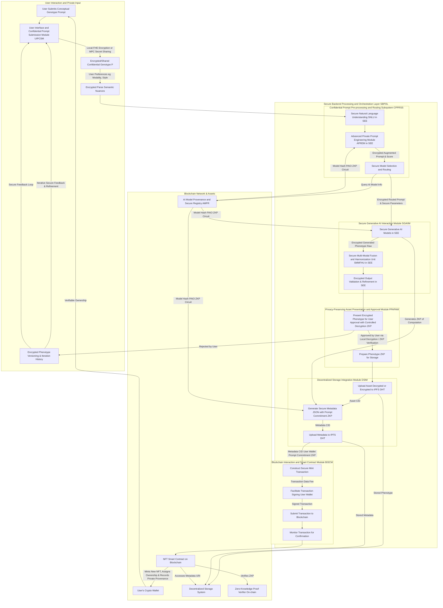

---
**Title of Invention:** System and Method for Private Algorithmic Conceptual Asset Genesis and Tokenization via Secure Multi-Party Computation and Fully Homomorphic Encryption (SPACAGT-MPC/FHE)

**Abstract:**
A technologically advanced system is herein delineated for the automated, confidential generation and immutable tokenization of novel conceptual constructs. Leveraging cryptographic primitives such as Secure Multi-Party Computation (MPC) and Fully Homomorphic Encryption (FHE), the system ensures that a user-initiated abstract linguistic prompt, termed a "conceptual genotype," and its subsequent processing by generative artificial intelligence (AI) models, remain entirely private and confidential from all participating entities, including the AI model providers and the system orchestrators. The generative AI models, operating within a secure execution environment, transmute the encrypted conceptual genotype into an encrypted tangible digital artifact, termed a "conceptual phenotype." This encrypted phenotype may manifest as a high-fidelity image, detailed textual schema, synthetic auditory composition, or a three-dimensional volumetric data structure. Subsequent to a user-validated, privacy-preserving approval process (potentially using Zero-Knowledge Proofs), the SPACAGT-MPC/FHE system orchestrates the cryptographic registration and permanent inscription of this AI-generated conceptual phenotype (or a privacy-preserving representation thereof), its progenitor prompt (or a proof of its content), and verifiable AI model provenance, as a Non-Fungible Token (NFT) upon a distributed ledger technology (DLT) framework. This process establishes an irrefutable, cryptographically secured, and perpetually verifiable chain of provenance, conferring undeniable ownership of a unique, synergistically co-created human-AI conceptual entity, while rigorously preserving the privacy of the originating idea and its generative process. This invention fundamentally redefines the paradigms of intellectual property generation and digital asset ownership, extending beyond mere representation of existing assets to encompass the genesis and proprietary attribution of emergent conceptual entities under stringent privacy guarantees.

**Background of the Invention:**
Conventional methodologies for Non-Fungible Token (NFT) instantiation and the preceding digital asset creation, particularly those involving generative Artificial Intelligence (AI), typically operate under an assumption of trust in service providers. When a user submits an abstract linguistic prompt (conceptual genotype) to a generative AI model, the content of this prompt is often transmitted in plaintext to a centralized AI service. This exposes the user's initial creative ideation, which may constitute nascent intellectual property or sensitive personal concepts, to the AI model provider, leading to significant privacy and confidentiality vulnerabilities. The AI provider gains full knowledge of the user's input, and potentially the generated output, raising concerns about data exploitation, unauthorized replication, or the potential for front-running of novel ideas.

Furthermore, the inference process itself, involving proprietary AI models and potentially sensitive intermediate data, often occurs in an opaque manner. Users lack cryptographic assurance that their prompts are processed fairly, or that the AI models themselves have not been tampered with or are free from bias. The "black box" nature of AI, combined with the lack of robust privacy-preserving mechanisms, presents a critical impediment to the widespread adoption of AI-assisted intellectual property generation, especially for enterprise or sensitive creative applications.

A significant lacuna exists within the extant digital asset ecosystem concerning the integrated and automated generation, formalization, and proprietary attribution of purely conceptual or "dream-like" artifacts under the rigorous guarantee of input and computation privacy. Such artifacts, often ephemeral and highly personal in their initial conception, necessitate a robust, verifiable, and confidential mechanism for their transformation into persistent, ownable digital entities without compromising the secrecy of the creative input or the AI's internal processing. The absence of an integrated system capable of bridging the cognitive gap between abstract human ideation and its concrete digital representation, followed by immediate and verifiable tokenization, all while upholding end-to-end confidentiality, represents a critical impediment to the comprehensive expansion of secure digital intellectual property domains. This invention addresses this fundamental unmet need by pioneering a seamless, end-to-end operational continuum where the act of creative generation, specifically through advanced artificial intelligence, is intrinsically intertwined with the act of immutable tokenization, both executed under stringent privacy-preserving cryptographic protocols, thereby establishing a novel frontier for confidential digital ownership.

**Brief Summary of the Invention:**
The present invention, herein formally designated as the **System and Method for Private Algorithmic Conceptual Asset Genesis and Tokenization via Secure Multi-Party Computation and Fully Homomorphic Encryption SPACAGT-MPC/FHE**, establishes an advanced, integrated framework for the programmatic generation and immutable inscription of novel conceptual assets as Non-Fungible Tokens NFTs, with an uncompromising focus on privacy and confidentiality of the conceptual genotype and the generative AI inference process. The SPACAGT-MPC/FHE system provides an intuitive and robust interface through which a user can furnish an abstract linguistic prompt, functioning as a "conceptual genotype" eg "A subterranean metropolis illuminated by bio-luminescent flora," or "The symphony of a dying star translated into kinetic sculpture". Crucially, this prompt is either encrypted locally by the user or submitted as private inputs to a Multi-Party Computation MPC protocol.

Upon receipt of the user's confidential conceptual genotype, the SPACAGT-MPC/FHE system initiates a highly sophisticated, multi-stage generative process, with privacy preserved at each critical juncture:
1.  **Confidential Semantic Decomposition and Intent Recognition:** The encrypted input prompt undergoes advanced natural language processing NLP within a Secure Execution Environment SEE, utilizing techniques like Homomorphic Encryption FHE or MPC. This process parses semantic nuances, identifies key thematic elements, and infers user intent without decrypting the prompt. This stage includes an Advanced Prompt Engineering Module APEM operating on encrypted data for scoring, augmentation, and versioning of prompts, generating an encrypted augmented prompt.
2.  **Secure Algorithmic Conceptual Phenotype Generation:** The encrypted, processed prompt is then transmitted to a meticulously selected ensemble of one or more generative AI models operating within the SEE. These models, leveraging advanced neural architectures adapted for FHE or MPC, perform inference on the encrypted data to produce an encrypted digital representation the "conceptual phenotype." This encrypted phenotype concretizes the abstract user prompt while its content remains private. The phenotype can be an encrypted high-resolution image, a richly detailed encrypted textual narrative, an encrypted synthetic soundscape, or an encrypted parametric 3D model. A Multi-Modal Fusion and Harmonization Unit MMFHU operates securely on encrypted outputs to ensure cross-modal consistency for complex outputs.
3.  **Privacy-Preserving User Validation and Iterative Refinement:** The encrypted generated conceptual phenotype is presented to the originating user via a dedicated interface for critical evaluation and approval. This may involve partial, controlled decryption only to the user, or privacy-preserving comparison techniques (e.g., Secure Two-Party Computation) to allow the user to verify certain properties of the output without full decryption being visible to the system. The system incorporates mechanisms for iterative refinement, allowing the user to provide feedback that can guide subsequent secure AI regeneration cycles, optimizing the phenotype's alignment with the original conceptual genotype, all while preserving privacy. Phenotype versions are tracked, potentially with cryptographic commitments.
4.  **Decentralized Content Addressable Storage of Encrypted or Provenance-Attested Assets:** Upon explicit user approval (or approval of a cryptographically attested, partially decrypted asset), the SPACAGT-MPC/FHE system orchestrates the secure and decentralized storage of the conceptual phenotype. This may involve uploading the *encrypted* digital asset, or a *publicly visible, user-decrypted* digital asset accompanied by cryptographic proofs of its private genesis. This is uploaded to a robust, content-addressed storage network, such as the InterPlanetary File System IPFS or similar distributed hash table DHT based architectures. This process yields a unique, cryptographic content identifier CID that serves as an immutable, globally verifiable pointer to the asset or its encrypted form.
5.  **Metadata Manifestation and Secure Provenance Storage:** Concurrently, a standardized metadata manifest, typically conforming to established NFT metadata schema eg ERC-721 or ERC-1155 compliant JSON, is programmatically constructed. This manifest encapsulates critical information, including the conceptual phenotype's name, a cryptographic commitment or hash of the original conceptual genotype (never the plaintext), verifiable AI model provenance (potentially including proof of secure computation), and a URI reference to the asset's decentralized storage CID. This metadata file is itself uploaded to the same decentralized storage network, yielding a second, distinct CID.
6.  **Immutable Tokenization on a Distributed Ledger with Secure Attestations:** The system then orchestrates a transaction invoking a `mint` function on a pre-deployed, audited, and highly optimized NFT smart contract residing on a chosen distributed ledger technology eg Ethereum, Polygon, Solana, Avalanche. This transaction immutably records the user's wallet address as the owner, and crucially, embeds the decentralized storage URI of the metadata manifest. This action creates a new, cryptographically unique Non-Fungible Token, where the token's identity and provenance are intrinsically linked to the AI-generated conceptual phenotype (or its privacy-preserving representation) and a cryptographic proof of its originating prompt and private generation. The smart contract incorporates EIP-2981 royalty standards and advanced access control, potentially augmented with on-chain verifiable proofs of secure computation.
7.  **Proprietary Attribution and Wallet Integration with Confidentiality Guarantees:** Upon successful confirmation of the transaction on the distributed ledger, the newly minted NFT, representing the unique, AI-generated conceptual entity, is verifiably transferred to the user's designated blockchain wallet address. This process irrevocably assigns proprietary attribution to the user, providing an irrefutable, timestamped record of ownership, critically ensuring that the underlying creative idea remained private throughout the genesis process.

This seamless, integrated workflow ensures that the generation of a novel concept by AI and its subsequent tokenization as an ownable digital asset are executed within a single, coherent operational framework, fundamentally extending privacy guarantees to the very inception of digital intellectual property, thereby establishing a new paradigm for confidential intellectual property creation and digital asset management.

### System Architecture Overview

```mermaid
C4Context
    title System for Private Algorithmic Conceptual Asset Genesis and Tokenization SPACAGT-MPC/FHE

    Person(user, "End User", "Interacts with SPACAGT-MPC/FHE to privately generate and mint conceptual NFTs.")
    System(spacagt_core, "SPACAGT-MPC/FHE Core System", "Orchestrates secure AI generation, storage, and blockchain interaction.")

    System_Ext(secureAI, "Secure Generative AI Models", "Generative AI services eg AetherVision, AetherScribe operating in a Secure Execution Environment SEE using MPC or FHE.")
    System_Ext(decentralizedStorage, "Decentralized Storage Network", "Stores digital assets and metadata eg IPFS.")
    System_Ext(blockchainNetwork, "Blockchain Network", "Distributed ledger for NFT minting and ownership records eg Ethereum, Polygon, Solana.")
    System_Ext(userWallet, "User's Crypto Wallet", "Manages user's blockchain address and NFTs.")
    System_Ext(externalDataSources, "External Data Sources", "Knowledge bases, style guides, or other data for prompt enhancement.")
    System_Ext(aiModelRegistry, "AI Model Registry", "On-chain or off-chain database of AI models and their provenance.")
    System_Ext(mpcFheParties, "MPC FHE Parties", "Other computational entities participating in Multi-Party Computation or hosting FHE decryption keys.")


    Rel(user, spacagt_core, "Submits encrypted text prompts and approves generated assets")
    Rel(spacagt_core, secureAI, "Sends encrypted prompts for asset generation", "Secure Channel MPC FHE")
    Rel(secureAI, spacagt_core, "Returns encrypted generated digital asset or Zero-Knowledge Proof ZKP", "Secure Channel")
    Rel(spacagt_core, decentralizedStorage, "Uploads generated asset or its ZKP and metadata", "HTTP IPFS Client")
    Rel(decentralizedStorage, spacagt_core, "Returns Content Identifiers CIDs")
    Rel(spacagt_core, blockchainNetwork, "Submits NFT minting transaction with secure attestations", "Web3 RPC")
    Rel(blockchainNetwork, userWallet, "Transfers minted NFT ownership")
    Rel(user, userWallet, "Manages ownership of minted NFTs")
    Rel(spacagt_core, externalDataSources, "Queries for prompt augmentation in clear or encrypted form", "API Call")
    Rel(spacagt_core, aiModelRegistry, "Registers AI models and retrieves provenance data", "API Call")
    Rel(user, mpcFheParties, "Engages in MPC FHE setup or decryption share distribution", "Secure Channel")
    Rel(mpcFheParties, secureAI, "Participates in secure computation or holds decryption shares", "Secure Channel")
    Rel(secureAI, mpcFheParties, "Outputs encrypted results to MPC FHE participants", "Secure Channel")


    Note right of spacagt_core: The SPACAGT-MPC/FHE Core System encompasses modules for secure prompt handling, private AI inference, and privacy-preserving validation.
    Note left of secureAI: Utilizes FHE or MPC to process encrypted data.
    Note right of blockchainNetwork: Also handles smart contract interaction and stores cryptographic attestations.
    Note right of mpcFheParties: May include trust authorities or key shareholders for FHE.
```

**Detailed Description of the Invention:**

The **System and Method for Private Algorithmic Conceptual Asset Genesis and Tokenization via Secure Multi-Party Computation and Fully Homomorphic Encryption SPACAGT-MPC/FHE** comprises a highly integrated and modular architecture designed to facilitate the end-to-end process of generating novel conceptual assets via artificial intelligence and subsequently tokenizing them on a distributed ledger, while ensuring strict privacy and confidentiality of the user's intellectual property. The operational flow, from confidential user input to final token ownership with verifiable privacy, is meticulously engineered to ensure robust functionality, security, and cryptographic confidentiality.

### 1. User Interface and Confidential Prompt Submission Module UIPCSM

The initial interaction point for a user is through the **User Interface and Confidential Prompt Submission Module UIPCSM**. This module is architected to provide an intuitive and responsive experience, allowing users to articulate their abstract conceptual genotypes while ensuring their confidentiality.

*   **Secure Prompt Input Interface:** A dynamic text entry field where users articulate their conceptual genotype. Crucially, before submission, the prompt is either:
    *   **Locally Encrypted:** Encrypted on the client-side using a Fully Homomorphic Encryption FHE scheme eg CKKS, BFV, BGV, such that the AI models can compute directly on the ciphertext. The user holds the secret decryption key.
    *   **Secret-Shared for MPC:** Divided into additive shares that are distributed among multiple, non-colluding computational parties, including potentially the user themselves, for Secure Multi-Party Computation MPC protocols.
    *   Advanced versions may include:
        *   **Privacy-Preserving Semantic Autocompletion:** Suggesting keywords or concepts based on encrypted input or via secure federated learning.
        *   **Zero-Knowledge Proof ZKP of Prompt Properties:** Allowing users to prove certain properties about their prompt eg it's within a specific category, without revealing the prompt itself.
*   **User Authentication and Wallet Connection:** Integration with standard Web3 wallet providers eg MetaMask, WalletConnect to authenticate the user and establish a secure connection to their blockchain address. This also facilitates management of decryption keys for FHE or participation in MPC.
*   **Secure Session Management:** Persistent session tracking to allow users to review past encrypted prompts, encrypted generated assets (or their public attestations), and transaction histories, ensuring privacy throughout.

### 2. Secure Backend Processing and Orchestration Layer SBPOL

The **Secure Backend Processing and Orchestration Layer SBPOL** serves as the central nervous system of the SPACAGT-MPC/FHE system, coordinating all subsequent operations under cryptographic privacy.

#### 2.1. Confidential Prompt Pre-processing and Routing Subsystem CPPRSS

Upon receiving a confidential conceptual genotype (encrypted or secret-shared) from the UIPCSM, the CPPRSS performs several critical functions within a Secure Execution Environment SEE, without ever decrypting the prompt to any single party.

*   **Secure Natural Language Understanding SNLU:** Utilizes advanced transformer-based models adapted for FHE or MPC to analyze the encrypted prompt for:
    *   **Encrypted Syntactic and Semantic Analysis:** Decomposing the encrypted prompt into its grammatical components and identifying core semantic entities and relationships.
    *   **Encrypted Sentiment and Tone Analysis:** Assessing the emotional context of the prompt to guide generative AI style, all while on ciphertext or shares.
    *   **Homomorphic Ambiguity Resolution:** Employing contextual reasoning on encrypted data to minimize misinterpretation by generative models.
*   **Advanced Private Prompt Engineering Module APREM:** This dedicated sub-module enhances the confidential conceptual genotype within the SEE.
    *   **Secure Prompt Scoring Engine:** Evaluates the encrypted prompt's quality, specificity, and potential for generating desired outcomes. Scores are computed on encrypted data, potentially with results returned as encrypted values or compared via secure comparison protocols.
    *   **Dynamic Confidential Contextual Expansion:** Leverages encrypted internal knowledge graphs, external privacy-preserving databases, or Large Language Models LLMs operating in FHE/MPC to expand vague encrypted prompts into more descriptive or structured formats, enhancing the generative AI's input quality without revealing the original prompt.
    *   **Encrypted Prompt Versioning and History:** Maintains a version history of refined encrypted prompts, with cryptographic commitments to each version, allowing users to track evolution without exposing content.
*   **Secure Model Selection and Routing:** Based on the SNLU analysis, APREM output, and user-specified preferences eg desired output modality: image, text, 3D, the CPPRSS intelligently routes the encrypted prompt to the most appropriate external Generative AI Model operating in an SEE.

#### 2.2. Secure Generative AI Interaction Module SGAIIM

The SGAIIM acts as the interface between the SPACAGT-MPC/FHE system and external, specialized generative AI models, ensuring all interactions preserve confidentiality.

*   **FHE/MPC Abstraction Layer:** Provides a unified interface for interacting with diverse AI model APIs, adapted to operate on encrypted data. This facilitates integration of various models such as:
    *   **Text-to-Image Models eg AetherVision with FHE/MPC:** Advanced diffusion or GAN-based architectures capable of synthesizing high-fidelity visual imagery from encrypted textual descriptions. These models operate in encrypted latent spaces, iteratively refining encrypted pixel data.
    *   **Text-to-Text Models eg AetherScribe with FHE/MPC:** LLMs specialized in creative writing, narrative generation, or detailed conceptual descriptions, expanding the initial encrypted prompt into rich encrypted textual conceptual phenotypes.
    *   **Text-to-3D Models eg AetherVolumetric with FHE/MPC:** Emerging models capable of generating encrypted 3D meshes, point clouds, or volumetric data representations from encrypted textual prompts.
    *   **Text-to-Audio/Music Models with FHE/MPC:** Generating encrypted soundscapes or musical compositions.
*   **Secure Parameter Management:** Manages and transmits encrypted model-specific parameters eg `sampling_steps`, `guidance_scale`, `seed` values for deterministic regeneration, `output_resolution` to the secure AI models.
*   **Asynchronous Secure Inference Handling:** Manages the potentially long-running inference processes of generative AIs on encrypted data, providing encrypted status updates to the user or zero-knowledge proofs of progress.
*   **Encrypted Output Reception and Validation:** Receives the encrypted digital asset conceptual phenotype from the secure AI model and performs initial encrypted validation eg encrypted file format verification, basic encrypted content integrity checks.
*   **Secure Multi-Modal Fusion and Harmonization Unit SMMFHU:** For conceptual genotypes requiring multiple modalities, this unit combines encrypted outputs from different secure generative AI models.
    *   **Secure Cross-Modal Consistency Validation:** Ensures that encrypted outputs from different modalities eg an encrypted image and an encrypted descriptive text maintain semantic coherence and stylistic alignment, using secure comparison protocols.
    *   **Secure Fusion Algorithms:** Employs techniques to merge and interleave various encrypted digital assets, creating a holistic multi-modal encrypted conceptual phenotype.

#### 2.3. Privacy-Preserving Asset Presentation and Approval Module PPAPAM

The PPAPAM is responsible for displaying the generated conceptual phenotype to the user and managing their approval, all while minimizing exposure of sensitive content to third parties.

*   **Controlled Decryption/Zero-Knowledge Presentation:** Presents the digital asset image, text, 3D model preview, audio playback in a clear and engaging manner within the UIPCSM. This can be achieved through:
    *   **User-Controlled Local Decryption:** The encrypted phenotype is sent to the user's device, where they decrypt it using their private FHE key. Only the user sees the plaintext.
    *   **Secure Multi-Party Decryption:** The encrypted phenotype is jointly decrypted by several parties (including the user) to yield the plaintext to the user.
    *   **Zero-Knowledge Proofs of Properties:** The system may generate ZKPs asserting certain qualities of the encrypted phenotype (e.g., "the image contains a dog," "the text is positive") without revealing the full content.
*   **Privacy-Preserving Approval/Rejection Mechanism:** Provides explicit controls for the user to approve the asset for minting or reject it, potentially triggering a re-generation loop with refined parameters or prompt adjustments, where feedback is also handled securely.
*   **Encrypted Phenotype Versioning and Iteration History:** Stores a record of all encrypted generated phenotypes for a given conceptual genotype, allowing users to compare iterations and select the most desirable version for minting, often using cryptographic commitments to each version.
*   **User Feedback Analysis and Secure Reinforcement Learning Module:** Allows users to provide detailed feedback eg rating, textual comments, selection of preferred elements on generated assets. This feedback is processed by a specialized AI module using privacy-preserving techniques to:
    *   Improve future encrypted prompt augmentation strategies within the APREM.
    *   Fine-tune internal SPACAGT-MPC/FHE routing algorithms.
    *   Potentially provide direct reinforcement signals to the generative AI models for adaptive learning and personalization, all while maintaining privacy.

#### 2.4. Decentralized Storage Integration Module DSIM

Upon user approval of the decrypted phenotype (or a public attestation of it), the DSIM handles the secure and verifiable storage of the conceptual phenotype and its associated metadata.

*   **Asset Upload to IPFS/DHT:**
    *   The digital asset (either the user-decrypted `conceptual_phenotype.png` or its encrypted form with decryption keys managed by multiple parties) is segmented into cryptographic chunks and uploaded to a decentralized storage network such as IPFS.
    *   This process generates a unique **Content Identifier CIDv1**, which is a cryptographically derived hash of the asset's content. This CID serves as an immutable, globally resolvable address for the asset, ensuring data integrity and resistance to censorship.
*   **Secure Metadata JSON Generation:** A JSON object is programmatically constructed, adhering to established NFT metadata standards eg ERC-721 Metadata JSON Schema. This JSON includes:
    *   `name`: A human-readable name for the conceptual NFT, potentially derived from the original prompt via secure AI or user input.
    *   `description`: An AI-generated descriptive expansion of the phenotype, or a user-provided one. Critically, this does *not* include the raw conceptual genotype, but possibly a cryptographic commitment or hash of it.
    *   `image`: The `ipfs://<asset_CID>` URI pointing directly to the stored conceptual phenotype (decrypted for public viewing, or encrypted if desired for confidentiality).
    *   `attributes`: An array of key-value pairs representing additional metadata, such as:
        *   `AI_Model`: The specific generative AI model used eg "AetherVision v3.1".
        *   `Model_Version`: The exact version of the AI model.
        *   `Model_Hash_PAIO`: A cryptographic hash of the AI model's verifiable parameters or fingerprint, providing **Proof of AI Origin PAIO**.
        *   `Creation_Timestamp`: UTC timestamp of asset generation.
        *   `Original_Prompt_Commitment`: A cryptographic commitment to the original text prompt (e.g., `Commit(P, r)` where `r` is a random nonce), ensuring prompt immutability without revealing `P`.
        *   `Proof_of_Private_Computation`: A Zero-Knowledge Proof ZKP attesting that the conceptual phenotype was generated from the committed prompt using the specified AI model in a secure execution environment, without revealing the prompt or intermediate computation steps.
        *   `Prompt_Entropy_ZKP`: A ZKP of the informational complexity of the original prompt (e.g., proving it falls within a certain range).
        *   `Phenotype_Version`: Denotes the iteration number of the generated asset.
    *   `external_url`: Optional A link to a SPACAGT-MPC/FHE platform page for the NFT.
*   **Metadata Upload to IPFS/DHT:** The generated metadata JSON file is itself uploaded to the decentralized storage network, yielding a second, distinct **Metadata CID**. This CID forms the crucial link that the smart contract will store.

### 3. Blockchain Interaction and Smart Contract Module BISCM

The BISCM is responsible for constructing, signing, and submitting transactions to the blockchain to mint the NFT and for managing the smart contract lifecycle, now often including attestations of secure computation.

*   **Smart Contract Abstraction Layer:** Interacts with a pre-deployed, audited NFT smart contract, typically implementing the ERC-721 Non-Fungible Token Standard or ERC-1155 Multi Token Standard interface.
    *   **ERC-721 `mintConcept(address recipient, string memory tokenURI, bytes memory privateCompProof)`:** This core function is invoked. `recipient` is the user's wallet address, `tokenURI` is the `ipfs://<metadata_CID>` URI. `privateCompProof` is a critical new parameter containing the ZKP of private computation.
    *   **EIP-2981 Royalty Standard:** The smart contract incorporates logic for programmatic royalty distribution on secondary sales, as defined by EIP-2981.
    *   **On-chain Licensing Framework:** Potential future integration for attaching specific licensing terms directly to the NFT metadata or through a linked smart contract, now potentially linked to privacy properties of the creation.
*   **Transaction Construction:**
    *   Prepares a blockchain transaction by encoding the `mintConcept` function call with the appropriate parameters user's wallet address, the `ipfs://<metadata_CID>`, the `privateCompProof`, and potentially a minting fee.
    *   Estimates gas costs for the transaction.
*   **Transaction Signing:** Leverages the user's connected wallet via Web3 providers to cryptographically sign the transaction. The SPACAGT-MPC/FHE system never has direct access to the user's private keys.
*   **Transaction Submission:** Transmits the signed transaction to the chosen blockchain network via a secure RPC Remote Procedure Call endpoint.
*   **Transaction Monitoring and Confirmation:** Monitors the blockchain for the confirmation of the transaction. Once confirmed ie included in a block and sufficiently deep in the chain to be considered final, the NFT is officially minted and owned by the user. The smart contract verifies the `privateCompProof` on-chain. The SPACAGT-MPC/FHE system updates its internal state and notifies the user.

### 4. Smart Contract Architecture for SPACAGT-MPC/FHE NFTs

The core of the tokenization process resides within a meticulously engineered smart contract deployed on a blockchain. This contract adheres to the ERC-721 standard, ensuring interoperability with the broader NFT ecosystem, and integrates advanced features for security, provenance, monetization, and on-chain verification of privacy-preserving computation.

```mermaid
classDiagram
    direction LR
    class IERC721 {
        <<interface>>
        +balanceOf(address owner): uint256
        +ownerOf(uint256 tokenId): address
        +approve(address to, uint256 tokenId): void
        +getApproved(uint256 tokenId): address
        +setApprovalForAll(address operator, bool approved): void
        +isApprovedForAll(address owner, address operator): bool
        +transferFrom(address from, address to, uint256 tokenId): void
        +safeTransferFrom(address from, address to, uint256 tokenId): void
        +tokenURI(uint256 tokenId): string
        <<event>> Transfer(address indexed from, address indexed to, uint256 indexed tokenId)
        <<event>> Approval(address indexed owner, address indexed approved, uint256 indexed tokenId)
        <<event>> ApprovalForAll(address indexed owner, address indexed operator, bool approved)
    }

    class IERC721Metadata {
        <<interface>>
        +name(): string
        +symbol(): string
    }

    class IERC721Enumerable {
        <<interface>>
        +totalSupply(): uint256
        +tokenByIndex(uint256 index): uint256
        +tokenOfOwnerByIndex(address owner, uint256 index): uint256
    }

    class IERC2981Royalties {
        <<interface>>
        +royaltyInfo(uint256 tokenId, uint256 salePrice): tuple
    }

    class Context {
        <<abstract>>
        -_msgSender(): address
        -_msgData(): bytes
    }

    class ERC165 {
        <<abstract>>
        +supportsInterface(bytes4 interfaceId): bool
    }

    class ERC721 {
        <<abstract>>
        -_owners: mapping(uint256 => address)
        -_tokenApprovals: mapping(uint256 => address)
        -_operatorApprovals: mapping(address => mapping(address => bool))
        -_name: string
        -_symbol: string
        -_baseURI(): string
    }

    class ERC721URIStorage {
        <<abstract>>
        -_tokenURIs: mapping(uint256 => string)
        +tokenURI(uint256 tokenId): string
        -_setTokenURI(uint256 tokenId, string memory _tokenURI): void
    }

    class Ownable {
        <<abstract>>
        -_owner: address
        +owner(): address
        +renounceOwnership(): void
        +transferOwnership(address newOwner): void
    }

    class AccessControl {
        <<abstract>>
        -_roles: mapping(bytes32 => mapping(address => bool))
        +hasRole(bytes32 role, address account): bool
        +getRoleAdmin(bytes32 role): bytes32
        +grantRole(bytes32 role, address account): void
        +revokeRole(bytes32 role, address account): void
        +renounceRole(bytes32 role, address account): void
    }

    class ERC2981Base {
        <<abstract>>
        -_royaltyFee: uint96
        -_royaltyReceiver: address
        +setRoyaltyInfo(address receiver, uint96 feeBasisPoints): void
    }

    class Pausable {
        <<abstract>>
        -_paused: bool
        +paused(): bool
        +unpause(): void
        +unpause(): void
    }

    class UUPSUpgradeable {
        <<abstract>>
        +proxiableUUID(): bytes32
        -_authorizeUpgrade(address newImplementation): void
        -_upgradeToAndCall(address newImplementation, bytes memory data, bool forceCall): void
    }

    class ZeroKnowledgeVerifier {
        <<interface>>
        +verifyProof(bytes memory proof, bytes32[] memory publicInputs): bool
    }

    class SPACAGT_NFT_Contract {
        <<ERC721-compliant>>
        -uint256 _nextTokenId
        +MINTER_ROLE: bytes32
        +PAUSER_ROLE: bytes32
        +UPGRADER_ROLE: bytes32
        +ZK_VERIFIER_ROLE: bytes32 // New role for ZKP verifier
        -uint256 MINTING_FEE
        -mapping(uint256 => tuple) _aiModelMetadata // Stores PAIO data
        -mapping(uint256 => bytes32) _promptCommitments // Stores commitments to original prompts
        -mapping(uint256 => bool) _privateProvenanceVerified // Marks if ZKP was verified
        +constructor(string name_, string symbol_): void
        +mintConcept(address recipient, string memory _tokenURI, bytes memory _zkProof, bytes32 _promptCommitment) payable: uint256
        +updateTokenURI(uint256 tokenId, string memory newTokenURI): void
        +setAIModelMetadata(uint256 tokenId, string memory aiModel, string memory modelHashPAIO): void
        +getAIModelMetadata(uint256 tokenId): tuple
        +getPromptCommitment(uint256 tokenId): bytes32
        +isPrivateProvenanceVerified(uint256 tokenId): bool
        +setMintingFee(uint256 newFee): void
        +withdrawFunds(): void
        +supportsInterface(bytes4 interfaceId): bool
        +getMintingFee(): uint256
        +tokenURI(uint256 tokenId): string
        +royaltyInfo(uint256 tokenId, uint256 salePrice): tuple
        +supportsRoyalties(): bool
        +setVerifierAddress(address verifierAddress): void // To link with a ZKP verifier contract
        -address _zkVerifierAddress
    }

    Context <|-- ERC721
    ERC165 <|-- ERC721
    IERC721 <|.. ERC721
    IERC721Metadata <|.. ERC721
    ERC721 <|-- ERC721URIStorage
    Context <|-- Ownable
    Context <|-- Pausable
    Context <|-- AccessControl
    ERC165 <|-- AccessControl
    ERC165 <|-- ERC2981Base
    IERC2981Royalties <|.. ERC2981Base
    ERC165 <|-- UUPSUpgradeable
    Context <|-- UUPSUpgradeable
    ZeroKnowledgeVerifier <|.. SPACAGT_NFT_Contract

    ERC721URIStorage <|-- SPACAGT_NFT_Contract
    Ownable <|-- SPACAGT_NFT_Contract
    Pausable <|-- SPACAGT_NFT_Contract
    AccessControl <|-- SPACAGT_NFT_Contract
    ERC2981Base <|-- SPACAGT_NFT_Contract
    UUPSUpgradeable <|-- SPACAGT_NFT_Contract
    IERC721Enumerable <|.. SPACAGT_NFT_Contract
    Note for SPACAGT_NFT_Contract "This contract implements ERC721, ERC721URIStorage, ERC2981, Ownable, Pausable, AccessControl, UUPSUpgradeable, and integrates Zero-Knowledge Proof verification for private provenance."
```

**Key Smart Contract Features:**

*   **`mintConcept(address recipient, string memory _tokenURI, bytes memory _zkProof, bytes32 _promptCommitment) payable`:** This is the core function invoked by the BISCM. It takes the target owner's address, the `ipfs://<metadata_CID>` as parameters, a `msg.value` for the minting fee, and crucially, two new parameters:
    *   `_zkProof`: A Zero-Knowledge Proof generated off-chain, attesting that the conceptual phenotype was generated from the `_promptCommitment` using a specified AI model in a secure, private manner.
    *   `_promptCommitment`: A cryptographic commitment (e.g., Pedersen commitment or hash commitment) to the original user prompt, ensuring its integrity without revealing its content.
    The function increments a unique `_nextTokenId`, creates a new NFT with this ID, assigns ownership to the `recipient`, permanently associates the `_tokenURI` with the token, and verifies `_zkProof` against public inputs derived from the `_promptCommitment` and AI model details.
*   **On-Chain Zero-Knowledge Proof Verification:** The contract integrates with a `ZeroKnowledgeVerifier` interface (potentially a precompiled contract or a dedicated verifier contract) to validate the `_zkProof` against known public inputs (e.g., the hash of the AI model, the `_promptCommitment`, specific public parameters of the AI output). This provides on-chain, trustless verification that the asset was generated privately as claimed.
*   **Prompt Commitment Storage:** A dedicated internal mapping `_promptCommitments` stores the cryptographic commitment to the original user prompt for each `tokenId`. This provides an immutable, auditable link to the private input, allowing the user to later reveal the prompt if desired and prove its authenticity against the stored commitment.
*   **Private Provenance Verification Flag:** A `_privateProvenanceVerified` mapping tracks whether a valid ZKP of private computation was successfully verified on-chain for each minted NFT. This provides a clear signal of the asset's privacy-preserving genesis.
*   **Access Control and Roles:** Implementation of roles `MINTER_ROLE`, `PAUSER_ROLE`, `UPGRADER_ROLE` and a new `ZK_VERIFIER_ROLE` using OpenZeppelin's `AccessControl` library to restrict critical functions. The `ZK_VERIFIER_ROLE` manages the address of the external ZKP verifier contract.
*   **Upgradability UUPS Proxy:** Implemented using the UUPS Universal Upgradeable Proxy Standard pattern to allow future enhancements or bug fixes to the contract logic, including updates to ZKP verification parameters or algorithms, without altering token IDs or ownership.
*   **EIP-2981 Royalty Standard:** Full compliance with ERC-2981, ensuring programmatic royalties on secondary sales.
*   **Minting Fee and Treasury Management:** The `mintConcept` function is `payable`, requiring a `MINTING_FEE`.
*   **AI Model Provenance Data Storage:** A dedicated internal mapping `_aiModelMetadata` allows for recording critical verifiable information about the generative AI model used, including the `modelHashPAIO` and model version.
*   **Metadata Immutability with Attestation:** While the `_tokenURI` typically points to an immutable IPFS CID, the contract's verification of the `_zkProof` and storage of `_promptCommitment` add an extra layer of verifiable provenance, proving the confidential nature of the creation process itself, which is immutable on-chain.
*   **Energy Efficiency:** Optimized Solidity code to minimize gas consumption, especially for ZKP verification, promoting cost-effectiveness.

### 5. AI Model Provenance and Secure Registry AMPR

The **AI Model Provenance and Secure Registry AMPR** is a critical component ensuring transparency and verifiability of the generative AI models used within SPACAGT-MPC/FHE, especially concerning their compatibility and configuration for secure computation.

*   **Purpose:** To provide a decentralized, tamper-proof record of the generative AI models that produce conceptual phenotypes, alongside their capabilities for operating in FHE or MPC environments. This addresses concerns around AI black boxes and establishes trust in the origin of AI-generated content, specifically regarding its privacy-preserving properties.
*   **Structure:** The AMPR can exist as:
    *   An on-chain smart contract, mapping a unique `modelId` to its verifiable details and secure computation parameters.
    *   A decentralized database eg built on IPFS or Filecoin, with hashes stored on-chain.
*   **Registered Attributes per Model:**
    *   `modelId`: Unique identifier for the AI model.
    *   `modelName`: eg "AetherVision v3.1".
    *   `modelVersion`: Specific software version.
    *   `trainingDataHash`: A cryptographic hash of the training dataset used (if verifiable, potentially proven via ZKP).
    *   `architectureHash`: A hash of the model's architecture or configuration.
    *   `developerInfo`: Public key or DID of the model developer.
    *   `deploymentTimestamp`: Time of model registration/deployment.
    *   `licensingTerms`: Terms under which the model can be used for generation.
    *   **`secureComputationMode`:** Specifies if the model supports FHE, MPC, or other secure execution environments.
    *   **`fheSchemeParameters`:** Parameters required for FHE operations eg `polynomialModulus`, `plaintextModulus`, `securityParameter`.
    *   **`mpcProtocolDefinition`:** Reference to the specific MPC protocol used for inference eg GMW, Yao's Garbled Circuits.
    *   **`zkProofCircuitHash`:** Hash of the ZKP circuit used to generate proofs for this model's secure inference.
*   **Proof of AI Origin PAIO with Privacy Attestation:** During the metadata generation step, the SPACAGT-MPC/FHE system records a `Model_Hash_PAIO` attribute for each NFT, which can include cryptographic parameters for FHE or MPC. This hash, combined with the on-chain ZKP verification, provides:
    *   A strong cryptographic link from the NFT back to the AI that created its underlying conceptual phenotype.
    *   A verifiable attestation that the generation process respected the privacy of the conceptual genotype through secure computation.
*   **Integration:** The SPACAGT_NFT_Contract's `mintConcept` function directly verifies a ZKP generated using the registered model's specific ZKP circuit, ensuring that the claims of private computation are cryptographically sound and verifiable on-chain.



**Claims:**

1.  A system for generating and tokenizing conceptual assets with privacy, comprising:
    a.  A User Interface and Confidential Prompt Submission Module UIPCSM configured to receive a linguistic conceptual genotype from a user and securely transform it into a confidential conceptual genotype via client-side Fully Homomorphic Encryption FHE or Multi-Party Computation MPC secret sharing;
    b.  A Secure Backend Processing and Orchestration Layer SBPOL configured to:
        i.  Process the confidential conceptual genotype within a Secure Execution Environment SEE via a Confidential Prompt Pre-processing and Routing Subsystem CPPRSS utilizing Secure Natural Language Understanding SNLU mechanisms and an Advanced Private Prompt Engineering Module APREM for secure prompt scoring and augmentation, all without revealing the plaintext conceptual genotype;
        ii. Transmit the processed confidential conceptual genotype to at least one external Secure Generative AI Model operating within the SEE via a Secure Generative AI Interaction Module SGAIIM to synthesize an encrypted digital conceptual phenotype, potentially incorporating a Secure Multi-Modal Fusion and Harmonization Unit SMMFHU for complex encrypted outputs;
        iii. Present the encrypted digital conceptual phenotype to the user via a Privacy-Preserving Asset Presentation and Approval Module PPAPAM for explicit user validation, incorporating controlled decryption (only to the user) or Zero-Knowledge Proof ZKP verification of properties, while maintaining confidentiality from other parties;
        iv. Upon user validation, transmit the digital conceptual phenotype (or a public attestation thereof) to a Decentralized Storage Integration Module DSIM;
    c.  The Decentralized Storage Integration Module DSIM configured to:
        i.  Upload the digital conceptual phenotype or its encrypted form to a content-addressed decentralized storage network to obtain a unique content identifier CID;
        ii. Generate a structured metadata manifest associating a cryptographic commitment or hash of the original conceptual genotype with the conceptual phenotype's CID and including verifiable Proof of AI Origin PAIO attributes and a Zero-Knowledge Proof ZKP of private computation;
        iii. Upload the structured metadata manifest to the content-addressed decentralized storage network to obtain a unique metadata CID;
    d.  A Blockchain Interaction and Smart Contract Module BISCM configured to:
        i.  Construct a transaction to invoke a `mintConcept` function on a pre-deployed Non-Fungible Token NFT smart contract, providing the user's blockchain address, the unique metadata CID, the cryptographic commitment to the original conceptual genotype, the ZKP of private computation, and a minting fee as parameters;
        ii. Facilitate the cryptographic signing of the transaction by the user's blockchain wallet;
        iii. Submit the signed transaction to a blockchain network;
    e.  A Non-Fungible Token NFT smart contract, deployed on the blockchain network, configured to, upon successful transaction execution:
        i.  Immutably create a new NFT, associate it with the provided metadata CID and prompt commitment, and assign its ownership to the user's blockchain address;
        ii. On-chain verify the provided ZKP of private computation using an integrated Zero-Knowledge Proof Verifier;
        iii. Implement EIP-2981 royalty standards for secondary sales;
        iv. Store verifiable AI model provenance data for the minted NFT and a flag indicating successful private provenance verification.

2.  The system of claim 1, wherein the Secure Generative AI Model operates using Fully Homomorphic Encryption FHE, enabling computation on encrypted data without decryption, and the user holds the sole decryption key.

3.  The system of claim 1, wherein the Secure Generative AI Model operates using Secure Multi-Party Computation MPC, where multiple parties jointly compute on secret-shared data without revealing individual inputs.

4.  The system of claim 1, wherein the Zero-Knowledge Proof ZKP attests that the generated conceptual phenotype was derived from the committed conceptual genotype by the specified AI model within a Secure Execution Environment SEE, preserving the confidentiality of the conceptual genotype.

5.  The system of claim 1, further comprising an Advanced Private Prompt Engineering Module APREM configured to perform secure prompt scoring, encrypted semantic augmentation, or dynamic confidential contextual expansion of the confidential conceptual genotype prior to transmission to the Secure Generative AI Model.

6.  The system of claim 1, wherein the structured metadata manifest includes attributes detailing the specific Secure Generative AI Model utilized, its version, a cryptographic hash of the model for Proof of AI Origin PAIO, a cryptographic commitment to the original conceptual genotype, and the Zero-Knowledge Proof of private computation.

7.  A method for establishing verifiable ownership of a privately AI-generated conceptual asset, comprising:
    a.  Receiving a linguistic conceptual genotype from a user via a user interface;
    b.  Securely transforming the linguistic conceptual genotype into a confidential conceptual genotype through FHE encryption or MPC secret sharing;
    c.  Pre-processing the confidential conceptual genotype within a Secure Execution Environment SEE, including secure prompt scoring and encrypted augmentation;
    d.  Transmitting the confidential conceptual genotype to a generative artificial intelligence model operating within the SEE to synthesize an encrypted digital conceptual phenotype;
    e.  Presenting the encrypted digital conceptual phenotype to the user for explicit approval, utilizing controlled decryption or privacy-preserving comparison, allowing for iterative refinement and encrypted phenotype version tracking;
    f.  Upon approval, uploading the digital conceptual phenotype (or its publicly verified representation) to a content-addressed decentralized storage system to obtain a first unique content identifier;
    g.  Creating a machine-readable metadata manifest comprising a cryptographic commitment to the linguistic conceptual genotype, verifiable AI model provenance data, a Zero-Knowledge Proof ZKP of private computation, and a reference to the first unique content identifier;
    h.  Uploading the machine-readable metadata manifest to the content-addressed decentralized storage system to obtain a second unique content identifier;
    i.  Initiating a blockchain transaction to invoke a minting function on a pre-deployed Non-Fungible Token smart contract, passing the user's blockchain address, the second unique content identifier, the cryptographic commitment to the original conceptual genotype, the ZKP of private computation, and a minting fee as parameters;
    j.  Facilitating the cryptographic signing of the transaction by the user;
    k.  Submitting the signed transaction to a blockchain network;
    l.  Upon confirmation of the transaction on the blockchain network, verifying the ZKP of private computation on-chain and irrevocably assigning ownership of the newly minted Non-Fungible Token, representing the privately AI-generated conceptual asset, to the user's blockchain address, with EIP-2981 royalties enabled.

8.  The method of claim 7, further comprising an iterative refinement step wherein user feedback on a presented digital conceptual phenotype guides subsequent secure generative AI model synthesis, and encrypted previous phenotype versions are maintained.

9.  The method of claim 7, wherein the blockchain network implements a proof-of-stake or proof-of-work consensus mechanism, and the ZKP verification is an integral part of the transaction validation.

10. The method of claim 7, wherein the metadata manifest includes an `external_url` attribute linking to a permanent record of the conceptual asset on a web-based platform, and an on-chain licensing framework defining usage rights that may be contingent on the verified privacy of its creation.

11. The system of claim 1, further comprising an AI Model Provenance and Secure Registry AMPR module for transparently recording and verifying details of generative AI models, their secure computation compatibility parameters (FHE schemes, MPC protocols, ZKP circuits), and their usage for content creation.

12. The system of claim 1, wherein the NFT smart contract integrates robust access control mechanisms using roles for managing minting, pausing, upgrading capabilities, and the administration of Zero-Knowledge Proof Verifier contracts.

**Mathematical Justification:**

The robust framework underpinning the **System and Method for Private Algorithmic Conceptual Asset Genesis and Tokenization via Secure Multi-Party Computation and Fully Homomorphic Encryption SPACAGT-MPC/FHE** is grounded in advanced cryptographic theory, providing axiomatic guarantees of confidentiality, correctness, and verifiable provenance for AI-generated intellectual property. This extends the mathematical formalization of uniqueness and ownership from the SACAGT system to include rigorous privacy properties.

### I. The Formal Ontology of Confidential Conceptual Genotype `P_conf`

Let `P` denote the user's initial linguistic prompt (conceptual genotype). In SPACAGT-MPC/FHE, `P` is never processed in plaintext by any untrusted party.

**Definition 1.1: Semantic Embedding Function.**
Let `E: Sigma* -> R^d` be a non-linear, high-dimensional embedding function that maps a linguistic prompt `P` to a dense semantic vector `v_P`.
Thus, `v_P = E(P)`. The core difference is that `v_P` is either immediately encrypted or secret-shared.

**Definition 1.2: Encryption Scheme `Enc` for FHE.**
A Fully Homomorphic Encryption FHE scheme `(Gen, Enc, Dec, Eval)` is a tuple of algorithms:
1.  `Gen(lambda) -> (pk, sk)`: Key generation algorithm taking security parameter `lambda` to produce public key `pk` and secret key `sk`.
2.  `Enc(pk, m) -> c`: Encryption algorithm taking `pk` and message `m` (plaintext vector `v_P`) to produce ciphertext `c`.
3.  `Dec(sk, c) -> m'`: Decryption algorithm taking `sk` and ciphertext `c` to produce plaintext `m'`.
4.  `Eval(pk, f, c_1, ..., c_k) -> c_f`: Evaluation algorithm taking `pk`, a function `f`, and ciphertexts `c_1, ..., c_k` (representing inputs `m_1, ..., m_k`) to produce a ciphertext `c_f` such that `Dec(sk, c_f) = f(m_1, ..., m_k)`.
The core property is that `Eval` allows arbitrary computations `f` on encrypted data without ever decrypting it, satisfying correctness and privacy.

**Definition 1.3: Secure Multi-Party Computation MPC Protocol `MPC_prot`.**
An MPC protocol `MPC_prot` allows `N` parties, each holding a private input `x_i`, to jointly compute a function `f(x_1, ..., x_N)` such that no party learns any information about the other parties' inputs beyond what is revealed by the function output.
For SPACAGT-MPC/FHE, the user's prompt `P` (or `v_P`) is `x_1`, and the AI model parameters are `x_2`. The function `f` is the generative AI inference.
`MPC_prot(P, AI_params) -> a` where `a` is the function output (conceptual phenotype), and intermediate values are kept private.
Security properties include:
*   **Privacy:** No party learns anything beyond what can be inferred from their own input and the output.
*   **Correctness:** The output is always `f(x_1, ..., x_N)`.
*   **Fairness:** All honest parties receive the output if any party does.

Let `P_conf` be the confidential representation of `P`, either `Enc(pk, v_P)` (for FHE) or `(P_1, ..., P_N)` (for MPC secret shares of `P`).

**Definition 1.4: Cryptographic Commitment `Commit`.**
A commitment scheme `(Commit, Verify)` allows a committer to commit to a value `x` by computing `c = Commit(x, r)` (where `r` is a random nonce) and revealing `c`. Later, the committer can reveal `x` and `r`, and anyone can verify `Verify(c, x, r)` is true. Properties:
1.  **Hiding:** Given `c`, it is computationally infeasible to learn `x`.
2.  **Binding:** The committer cannot later open `c` to a different `x' != x`.
In SPACAGT-MPC/FHE, `Commit(P, r_P)` is used to store a binding, hiding commitment to the conceptual genotype `P` on-chain.

### II. The Secure Generative AI Transformation Function `G_AI_Secure`

Let `A_conf` be the set of all possible encrypted or secret-shared digital assets conceptual phenotypes. The secure generative AI transformation function, `G_AI_Secure`, is a highly complex mapping from the confidential conceptual genotype `P_conf` to a confidential digital conceptual phenotype `a_conf in A_conf`.

**Definition 2.1: Secure Generative Mapping (FHE).**
`G_AI_FHE: Enc(R^d) x Enc(Theta) x Enc(Lambda) -> Enc(A)`
where `Enc(v_P)` is the encrypted semantic embedding, `Enc(Theta)` represents encrypted hyperparameters, and `Enc(Lambda)` represents encrypted multi-modal fusion parameters.
Thus, `a_conf = G_AI_FHE(Enc(v_P), Enc(theta), Enc(lambda))`.
This function operates entirely on ciphertexts, preserving the confidentiality of `v_P`, `theta`, `lambda`, and all intermediate computation steps. Decryption `Dec(sk, a_conf) = a` yields the actual conceptual phenotype.

**Definition 2.2: Secure Generative Mapping (MPC).**
`G_AI_MPC: MPC_prot(P_shares, AI_params_shares) -> a_shares`
where `P_shares` are the secret shares of `P`, and `AI_params_shares` are the secret shares of the AI model parameters.
The output `a_shares` is the secret-shared conceptual phenotype. A secure aggregation and reconstruction phase can yield `a` to the user, or `a_conf` for further processing.

The non-deterministic nature of `G_AI_Secure` (e.g., stochastic elements like encrypted noise seeds) ensures genuinely novel and varied conceptual phenotypes, even from identical conceptual genotypes. This inherent variability contributes to the uniqueness of each generated asset while maintaining confidentiality.

### III. The Zero-Knowledge Proof `ZKP`

A Zero-Knowledge Proof `ZKP` allows a prover to convince a verifier that a statement is true, without revealing any information beyond the truth of the statement itself.

**Definition 3.1: Zero-Knowledge Proof Scheme `(Prove, Verify)`.**
A ZKP system for a relation `R(x, w)` (where `x` is the public input and `w` is the witness or private input) consists of:
1.  `Prove(R, x, w) -> pi`: A probabilistic polynomial-time prover algorithm that takes a public input `x` and a private witness `w` to produce a proof `pi`.
2.  `Verify(R, x, pi) -> {true, false}`: A deterministic polynomial-time verifier algorithm that takes `x` and `pi` to output true or false.
Properties:
*   **Completeness:** If `(x, w) in R`, then `Prove(R, x, w)` will output `pi` such that `Verify(R, x, pi)` returns `true` with high probability.
*   **Soundness:** If `(x, w) not in R`, then any `pi'` will cause `Verify(R, x, pi')` to return `false` with high probability.
*   **Zero-Knowledge:** `Verify` learns nothing about `w` beyond the fact that `x` is in `R` (i.e., `w` exists).

In SPACAGT-MPC/FHE, the statement `R` is: "The conceptual phenotype `a` (or its CID) was generated from the conceptual genotype `P` (or its commitment) using AI model `M_AI` operating in an FHE/MPC environment."
The public inputs `x` include `CID_a`, `Commit(P, r_P)`, and `H(M_AI)`.
The private witness `w` includes the plaintext `P`, the FHE secret key `sk`, or the MPC intermediate computation steps.
The `_zkProof` in the smart contract's `mintConcept` function is `pi`. The smart contract acts as the verifier, checking `Verify(R, x, pi)`.

### IV. The Metadata Object `M` with Privacy Attestations

The metadata object `M` is formally structured to encapsulate all pertinent information about the conceptual asset, linking its origin, generated form, and on-chain representation, critically including cryptographic privacy attestations.

**Definition 4.1: Secure Metadata Object Structure.**
`M = { name: N, description: D, image: URI_a, attributes: [Attr_1, ..., Attr_j], external_url: U_ext }`
with enhanced attributes:
*   `trait_type: "Original Prompt Commitment"`, `value: Commit(P, r_P)`
*   `trait_type: "AI Model"`, `value: Model_Name`
*   `trait_type: "Model Hash PAIO"`, `value: H_model` (Proof of AI Origin hash)
*   `trait_type: "Secure Computation Mode"`, `value: "FHE" or "MPC"`
*   `trait_type: "Proof of Private Computation ZKP"`, `value: pi` (ZKP as bytes, possibly as reference)
*   `trait_type: "ZK Verifier Address"`, `value: ZK_Verifier_Contract_Address`

The metadata object `M`, with its immutable `CID_M` on IPFS, forms the foundational layer for verifiable provenance, now extended with cryptographic proofs of privacy-preserving generation.

### V. The Distributed Ledger `L` with ZKP Verification Capabilities

The distributed ledger `L` blockchain is an append-only, cryptographically secured, and globally replicated data structure that guarantees the immutability and verifiable ownership of the minted NFT, and now performs on-chain ZKP verification.

**Definition 5.1: Blockchain as a State-Transition System with ZKP.**
The state of the ledger `S_t` is a function of all transactions validated up to `t`.
A transaction `tau` for minting an NFT includes a `ZKP_Proof`. The smart contract's state transition function `ApplyTransactions(S_t-1, T_t)` now includes a call to `ZK_Verify(T_t.zkProof, T_t.publicInputs)`. Only if `ZK_Verify` returns `true` does the state transition occur, ensuring that the claims of private computation are validated before ownership is assigned.

### VI. The Secure Minting Function `F_mint_Secure`

The secure minting process is formally captured by `F_mint_Secure`, which performs a state transition on `L` to establish a new NFT ownership record, only after validating the privacy-preserving genesis.

**Definition 6.1: Secure Minting Function Operation.**
`F_mint_Secure: (Address_owner, URI_M, Commit_P, ZKP_Proof, Fee_value) -> L'`
where `Address_owner` is the blockchain address of the user, `URI_M` is `ipfs://CID_M`, `Commit_P` is the commitment to `P`, `ZKP_Proof` is `pi`, and `Fee_value` is the required minting fee.

The internal operations of `F_mint_Secure` within the smart contract are:
1.  **ZKP Verification:** The `ZK_Verify` function is invoked with `ZKP_Proof` and public inputs derived from `URI_M`, `Commit_P`, and relevant AI model hashes. If verification fails, the transaction reverts.
2.  **Token ID Generation:** A new unique `token_id` is assigned.
3.  **Fee Collection:** `Fee_value` is transferred.
4.  **Metadata Association:** `token_id -> URI_M`.
5.  **Ownership Assignment:** `ownerOf(token_id) = Address_owner`.
6.  **Prompt Commitment Storage:** `_promptCommitments[token_id] = Commit_P`.
7.  **Private Provenance Flag:** `_privateProvenanceVerified[token_id] = true`.
8.  **Event Emission:** A `Transfer` event is emitted.

### VII. Proof of Verifiable Uniqueness, Proprietary Attribution, and Confidentiality

The SPACAGT-MPC/FHE system demonstrably establishes a cryptographically secure, undeniably verifiable, and *confidential* chain of provenance from an abstract user-generated idea conceptual genotype to a unique, ownable digital asset conceptual phenotype tokenized as an NFT.

**Theorem 7.1: Cryptographic Uniqueness of the Conceptual Asset.**
Identical to Theorem 7.1 from SACAGT. The uniqueness of `CID_a` and `CID_M` (which contains `Commit(P, r_P)` and `ZKP_Proof`) ensures the cryptographic uniqueness of the conceptual asset.

**Theorem 7.2: Immutable Linkage and Verifiable Confidential Provenance.**
The NFT on `L` immutably stores `URI_M`, `Commit(P, r_P)`, and verifies `ZKP_Proof`. The ZKP guarantees that `Commit(P, r_P)` corresponds to a `P` that was processed by `G_AI_Secure` to yield `a` (referenced by `URI_M`), and this entire computation occurred privately.
Therefore, the NFT forms an unbroken, cryptographically verifiable, and immutable chain:
`NFT -> (Metadata CID + Prompt Commitment + ZKP) -> (Asset CID + ZKP Witness) -> (Confidential Phenotype + Confidential Genotype)`.
This chain is impervious to retrospective alteration, ensuring not only verifiable provenance but also the verifiable *confidentiality* of the genesis.

**Theorem 7.3: Undeniable Proprietary Attribution with Privacy Guarantees.**
The ownership of the NFT is recorded on `L` via `ownerOf(token_id)`. This ownership is irrevocably assigned only after a valid `ZKP_Proof` has been verified on-chain, proving that the conceptual genotype `P` remained confidential during the asset generation. The fundamental principles of cryptography, distributed ledger technology, and zero-knowledge proofs provide an incontrovertible proof of ownership *and* a verifiable guarantee that the intellectual property originated privately.

### VIII. AI Model Provenance and Secure Registry AMPR

**Theorem 8.1: Verifiable Secure AI Origin.**
For any conceptual phenotype `a` minted as an NFT with `token_id`, its metadata `M` contains `H_model` and the `Secure_Computation_Mode`. The on-chain `ZKP_Proof` directly relies on the `zkProofCircuitHash` registered in the AMPR for `M_AI`. This cryptographic link ensures:
1.  The specific AI origin of the conceptual asset can be traced and verified.
2.  The *secure mode* of generation is cryptographically proven, providing **Proof of Secure AI Origin PAIO**, making claims of privacy tamper-proof and auditable.

The SPACAGT-MPC/FHE system therefore stands as an unassailable mechanism for establishing, verifying, and perpetually safeguarding the proprietary attribution of novel conceptual entities co-created through the synergistic interaction of human ideation and advanced artificial intelligence, with integrated provenance, ownership, and monetization capabilities, all while guaranteeing the **confidentiality** of the originating idea and its computational transformation. The intellectual property rights to such generated conceptual assets are unequivocally established, immutably recorded, and provably private via this system.
---