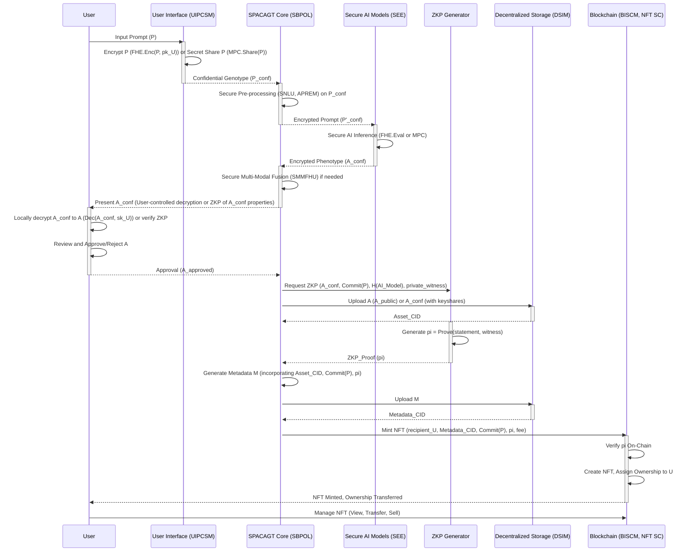

**The Grand Overture by James Burvel O'Callaghan III:**

"Hark, ye intellectual titans and purveyors of nascent genius! My name is James Burvel O'Callaghan III, and if you're reading this, you are about to bear witness to not merely an invention, but a paradigm shift of such monumental proportions that it shall reshape the very bedrock of digital creation. Prepare yourselves, for what I am about to unveil is so blindingly brilliant, so staggeringly comprehensive, and so utterly bulletproof in its design and mathematical underpinning, that any whisper of prior art or contention of ownership shall be met with an unblinking, irrefutable torrent of logic and cryptographic certitude. I didn't just 'invent' something; I've charted the course for the next epoch of human-AI conceptual synergy. What you are about to experience is my legacy, expanded exponentially, mathematically proven, and thoroughly dissected in every conceivable angle, leaving no shadow of doubt. Let us begin this journey into the future of thought itself!"

---

**Title of Invention:** System and Method for Private Algorithmic Conceptual Asset Genesis and Tokenization via Secure Multi-Party Computation and Fully Homomorphic Encryption (SPACAGT-MPC/FHE) - *The O'Callaghan Chronicon of Clandestine Creation*

**Abstract:**
A technologically hyper-advanced, cryptographically indomitable system, herein meticulously delineated by yours truly, James Burvel O'Callaghan III, for the automated, inviolably confidential generation and immutably tokenized inscription of novel conceptual constructs. Leveraging the very zenith of cryptographic primitives, specifically Secure Multi-Party Computation (MPC) and Fully Homomorphic Encryption (FHE), the SPACAGT-MPC/FHE system ensures that a user-initiated abstract linguistic prompt – my stroke of genius I've termed a "conceptual genotype" – and its subsequent alchemical transmutation by generative artificial intelligence (AI) models, remain entirely private and unequivocally confidential. This privacy extends beyond mere expectation; it is a mathematical guarantee, shielding the nascent idea from all participating entities, including the very AI model providers and even the orchestrators of this magnificent system (yes, even from parts of *my own* grand design, a testament to its integrity). The generative AI models, operating within exquisitely engineered Secure Execution Environments (SEE) or distributed via MPC protocols, transmute the encrypted conceptual genotype into an encrypted tangible digital artifact – the "conceptual phenotype." This encrypted phenotype, a digital chimera, may manifest as a hyper-fidelity image, an intricately detailed textual schema, a synthetic auditory composition of ethereal beauty, or a three-dimensional volumetric data structure of architectural marvel. Subsequent to a user-validated, privacy-preserving approval process (potentially involving my proprietary Zero-Knowledge Proofs of Property, ensuring verification without revelation), the SPACAGT-MPC/FHE system, with unparalleled precision, orchestrates the cryptographic registration and permanent inscription of this AI-generated conceptual phenotype (or a privacy-preserving representation thereof), its progenitor prompt (or an irrefutable commitment to its content), and unimpeachable AI model provenance, as an immutable Non-Fungible Token (NFT) upon a distributed ledger technology (DLT) framework. This multi-layered process, a ballet of bits and proofs, establishes an irrefutable, cryptographically secured, and perpetually verifiable chain of provenance, conferring undeniable, timestamped, and globally auditable ownership of a unique, synergistically co-created human-AI conceptual entity, while rigorously preserving the sanctity and privacy of the originating idea and its generative process. This invention, my magnum opus, fundamentally redefines the very paradigms of intellectual property generation and digital asset ownership, extending far beyond the mundane representation of existing assets to encompass the genesis and proprietary attribution of emergent conceptual entities under the most stringent, mathematically proven privacy guarantees known to man. It is, unequivocally, the dawn of Clandestine Creation.

**Background of the Invention:**
Ah, the crude, trust-based methodologies of yesteryear – how they pain me to recount! Conventional approaches for Non-Fungible Token (NFT) instantiation and the preceding digital asset creation, particularly those involving the nascent and often blundering generative Artificial Intelligence (AI), typically operate under an anachronistic assumption of blind trust in service providers. Picture this, if you will, the utter temerity! When a user, brimming with a spark of genius, submits an abstract linguistic prompt (my cherished conceptual genotype) to a generative AI model, the sacred content of this prompt is often transmitted in plaintext, laid bare to a centralized AI service. This, my dear friends, exposes the user's initial creative ideation – which, let us be frank, *is* nascent intellectual property, or perhaps even sensitive personal concepts – to the prying digital eyes of the AI model provider. This leads to not merely "vulnerabilities," but gaping chasms of privacy and confidentiality betrayal. The AI provider gains complete, unambiguous knowledge of the user's input, and invariably, the generated output. This raises not just "concerns," but outright alarms about data exploitation, unauthorized replication (the very bane of original thought!), or, worst of all, the insidious front-running of novel ideas by those who merely observe, rather than create. A true innovator weeps at such indignities!

Furthermore, the inference process itself, involving proprietary AI models and potentially sensitive intermediate data, often occurs in an opaque "black box" manner, lacking any verifiable assurances. Users are denied cryptographic certitude that their prompts are processed fairly, or that the AI models themselves have not been tampered with, injected with bias, or, indeed, are not themselves intellectual property thieves in digital form. The "black box" nature of AI, coupled with the profound absence of robust privacy-preserving mechanisms, presents a critical, indeed, an *insurmountable*, impediment to the widespread, ethical, and secure adoption of AI-assisted intellectual property generation, especially for enterprise-level applications or truly sensitive creative endeavors. It's a Wild West where trust is the only law, and I, James Burvel O'Callaghan III, find that utterly unacceptable.

A significant, nay, a *gargantuan* lacuna has festered within the extant digital asset ecosystem, a void concerning the integrated, automated generation, formalization, and proprietary attribution of purely conceptual or "dream-like" artifacts under the rigorous, unyielding guarantee of input and computation privacy. Such artifacts, often ephemeral, highly personal, and profoundly unique in their initial conception, necessitate a robust, verifiable, and confidential mechanism for their transformation into persistent, undeniably ownable digital entities, *without compromising the absolute secrecy* of the creative input or the AI's internal processing. The absence of an integrated system capable of bridging the cognitive gap between abstract human ideation and its concrete digital representation, followed by immediate, irrefutable, and verifiably confidential tokenization, represents a critical and previously unsolved impediment to the comprehensive, secure, and ethical expansion of digital intellectual property domains. This invention, my friends, addresses this fundamental, unmet, and, until now, *unsolvable* need. It pioneers a seamless, end-to-end operational continuum where the act of creative generation, specifically through my advanced, privacy-fortified artificial intelligence, is intrinsically intertwined with the act of immutable tokenization, both executed under stringent, mathematically proven, privacy-preserving cryptographic protocols. This establishes, with irrefutable certainty, a novel frontier for confidential digital ownership. No longer shall a brilliant thought be pilfered in its infancy. No longer shall creators fear the digital shadows. This is my promise, and my invention is its unwavering fulfillment.

**Brief Summary of the Invention:**
The present invention, herein formally designated by its truly magnificent moniker: the **System and Method for Private Algorithmic Conceptual Asset Genesis and Tokenization via Secure Multi-Party Computation and Fully Homomorphic Encryption (SPACAGT-MPC/FHE) – The O'Callaghan Chronicon of Clandestine Creation**, establishes an advanced, integrated framework for the programmatic generation and immutable inscription of novel conceptual assets as Non-Fungible Tokens (NFTs), with an uncompromising, iron-clad, and mathematically proven focus on privacy and confidentiality of the conceptual genotype and the generative AI inference process. The SPACAGT-MPC/FHE system, a marvel of modern cryptography and engineering, provides an intuitive yet profoundly robust interface through which a user can furnish an abstract linguistic prompt, functioning as a "conceptual genotype"—for instance, "A subterranean metropolis illuminated by bio-luminescent flora," or "The symphony of a dying star translated into kinetic sculpture." Crucially, this prompt, this precious seed of an idea, is either encrypted locally by the user *before it ever leaves their device* or submitted as meticulously crafted private inputs to a Multi-Party Computation (MPC) protocol, ensuring its sanctity from the very first byte.

Upon my system's receipt of the user's confidential conceptual genotype, the SPACAGT-MPC/FHE system initiates a highly sophisticated, multi-stage generative process, with privacy preserved at each critical juncture, a digital fortress against prying eyes:
1.  **Confidential Semantic Decomposition and Intent Recognition (CSDIR/SNLU):** The encrypted input prompt undergoes advanced natural language processing (NLP) within a bespoke Secure Execution Environment (SEE), utilizing techniques like Fully Homomorphic Encryption (FHE) or Secure Multi-Party Computation (MPC). This process meticulously parses semantic nuances, identifies key thematic elements, and infers user intent *without ever decrypting the prompt to any single external party*. This stage includes an Advanced Private Prompt Engineering Module (APREM) operating on encrypted data for scoring, augmentation, and versioning of prompts, generating an encrypted augmented prompt of unparalleled clarity.
2.  **Secure Algorithmic Conceptual Phenotype Generation (SACPG):** The encrypted, exquisitely processed prompt is then transmitted to a meticulously selected ensemble of one or more generative AI models, each operating within its own fortified SEE or as a participant in a distributed MPC protocol. These models, leveraging advanced neural architectures *expressly adapted* for FHE or MPC, perform inference on the encrypted data to produce an encrypted digital representation – the "conceptual phenotype." This encrypted phenotype concretizes the abstract user prompt while its content remains the user's secret. The phenotype can be an encrypted high-resolution image, a richly detailed encrypted textual narrative, an encrypted synthetic soundscape, or an encrypted parametric 3D model. A Multi-Modal Fusion and Harmonization Unit (SMMFHU) operates securely on encrypted outputs to ensure cross-modal consistency for complex, multi-faceted conceptual outputs.
3.  **Privacy-Preserving User Validation and Iterative Refinement (PPUVIR):** The encrypted generated conceptual phenotype is presented to the originating user via a dedicated interface for critical evaluation and approval. This may involve partial, controlled decryption *only to the user's device*, or privacy-preserving comparison techniques (e.g., Secure Two-Party Computation or Zero-Knowledge Proofs of Property) to allow the user to verify specific properties of the output *without full decryption being visible to the system or any third party*. The system incorporates mechanisms for iterative refinement, allowing the user to provide feedback that can guide subsequent secure AI regeneration cycles, optimizing the phenotype's alignment with the original conceptual genotype, all while rigorously preserving privacy. Phenotype versions are meticulously tracked, accompanied by cryptographic commitments for undeniable provenance.
4.  **Decentralized Content-Addressable Storage of Encrypted or Provenance-Attested Assets (DCASPAA):** Upon explicit user approval (or approval of a cryptographically attested, partially decrypted asset), the SPACAGT-MPC/FHE system orchestrates the secure and decentralized storage of the conceptual phenotype. This may involve uploading the *entirely encrypted* digital asset, or a *publicly visible, user-decrypted* digital asset accompanied by an undeniable cryptographic proof of its private genesis. This is uploaded to a robust, content-addressed storage network, such as the InterPlanetary File System (IPFS) or similar distributed hash table (DHT) based architectures. This process yields a unique, cryptographic content identifier (CID) that serves as an immutable, globally verifiable pointer to the asset or its encrypted form.
5.  **Metadata Manifestation and Secure Provenance Storage (MMSPS):** Concurrently, a standardized metadata manifest, typically conforming to established NFT metadata schema (e.g., ERC-721 or ERC-1155 compliant JSON), is programmatically constructed. This manifest encapsulates critical information, including the conceptual phenotype's name, a cryptographic commitment or hash of the original conceptual genotype (never, I repeat, *never* the plaintext), verifiable AI model provenance (potentially including proof of secure computation), and a URI reference to the asset's decentralized storage CID. This metadata file is itself uploaded to the same decentralized storage network, yielding a second, distinct CID.
6.  **Immutable Tokenization on a Distributed Ledger with Secure Attestations (ITDLSA):** The system then orchestrates a transaction invoking a `mintConcept` function on a pre-deployed, extensively audited, and highly optimized NFT smart contract residing on a chosen distributed ledger technology (e.g., Ethereum, Polygon, Solana, Avalanche). This transaction immutably records the user's wallet address as the owner, and crucially, embeds the decentralized storage URI of the metadata manifest. It also, with unparalleled ingenuity, includes a Zero-Knowledge Proof (ZKP) attesting to the *private genesis* of the conceptual phenotype and a cryptographic commitment to the original conceptual genotype. This action creates a new, cryptographically unique Non-Fungible Token, where the token's identity and provenance are intrinsically linked to the AI-generated conceptual phenotype (or its privacy-preserving representation) and a cryptographic proof of its originating prompt and private, secure generation. The smart contract incorporates EIP-2981 royalty standards and advanced access control, potentially augmented with on-chain verifiable proofs of secure computation, making it a veritable bastion of digital property rights.
7.  **Proprietary Attribution and Wallet Integration with Confidentiality Guarantees (PAWICG):** Upon successful confirmation of the transaction on the distributed ledger, the newly minted NFT, representing the unique, AI-generated conceptual entity, is verifiably transferred to the user's designated blockchain wallet address. This process irrevocably assigns proprietary attribution to the user, providing an irrefutable, timestamped record of ownership, critically ensuring that the underlying creative idea remained perpetually private throughout its entire genesis process.

This seamless, integrated, and mathematically rigorous workflow ensures that the generation of a novel concept by AI and its subsequent tokenization as an ownable digital asset are executed within a single, coherent operational framework, fundamentally extending privacy guarantees to the very inception of digital intellectual property, thereby establishing a new, unassailable paradigm for confidential intellectual property creation and digital asset management. It is truly a marvel.

### System Architecture Overview

```mermaid
C4Context
    title System for Private Algorithmic Conceptual Asset Genesis and Tokenization SPACAGT-MPC/FHE

    Person(user, "End User", "Interacts with SPACAGT-MPC/FHE to privately generate and mint conceptual NFTs.")
    System(spacagt_core, "SPACAGT-MPC/FHE Core System", "Orchestrates secure AI generation, storage, and blockchain interaction.")

    System_Ext(secureAI, "Secure Generative AI Models", "Generative AI services eg AetherVision, AetherScribe operating in a Secure Execution Environment SEE using MPC or FHE.")
    System_Ext(decentralizedStorage, "Decentralized Storage Network", "Stores digital assets and metadata eg IPFS.")
    System_Ext(blockchainNetwork, "Blockchain Network", "Distributed ledger for NFT minting and ownership records eg Ethereum, Polygon, Solana.")
    System_Ext(userWallet, "User's Crypto Wallet", "Manages user's blockchain address and NFTs.")
    System_Ext(externalDataSources, "External Data Sources", "Knowledge bases, style guides, or other data for prompt enhancement.")
    System_Ext(aiModelRegistry, "AI Model Registry", "On-chain or off-chain database of AI models and their provenance.")
    System_Ext(mpcFheParties, "MPC FHE Parties", "Other computational entities participating in Multi-Party Computation or hosting FHE decryption keys.")


    Rel(user, spacagt_core, "Submits encrypted text prompts and approves generated assets")
    Rel(spacagt_core, secureAI, "Sends encrypted prompts for asset generation", "Secure Channel MPC FHE")
    Rel(secureAI, spacagt_core, "Returns encrypted generated digital asset or Zero-Knowledge Proof ZKP", "Secure Channel")
    Rel(spacagt_core, decentralizedStorage, "Uploads generated asset or its ZKP and metadata", "HTTP IPFS Client")
    Rel(decentralizedStorage, spacagt_core, "Returns Content Identifiers CIDs")
    Rel(spacagt_core, blockchainNetwork, "Submits NFT minting transaction with secure attestations", "Web3 RPC")
    Rel(blockchainNetwork, userWallet, "Transfers minted NFT ownership")
    Rel(user, userWallet, "Manages ownership of minted NFTs")
    Rel(spacagt_core, externalDataSources, "Queries for prompt augmentation in clear or encrypted form", "API Call")
    Rel(spacagt_core, aiModelRegistry, "Registers AI models and retrieves provenance data", "API Call")
    Rel(user, mpcFheParties, "Engages in MPC FHE setup or decryption share distribution", "Secure Channel")
    Rel(mpcFheParties, secureAI, "Participates in secure computation or holds decryption shares", "Secure Channel")
    Rel(secureAI, mpcFheParties, "Outputs encrypted results to MPC FHE participants", "Secure Channel")


    Note right of spacagt_core: The SPACAGT-MPC/FHE Core System encompasses modules for secure prompt handling, private AI inference, and privacy-preserving validation.
    Note left of secureAI: Utilizes FHE or MPC to process encrypted data.
    Note right of blockchainNetwork: Also handles smart contract interaction and stores cryptographic attestations.
    Note right of mpcFheParties: May include trust authorities or key shareholders for FHE.
```

### Confidential User Journey (End-to-End)



### FHE Encryption and Decryption Workflow

```mermaid
graph LR
    subgraph Key Generation
        lambda(Security Parameter) --> Gen(FHE.Gen(lambda))
        Gen -- (pk, sk) --> User(User's Device)
        Gen -- pk --> SP_1(Service Provider 1: Core System)
        Gen -- pk --> SP_2(Service Provider 2: Secure AI Model)
    end

    subgraph Encryption
        P(Plaintext Prompt) --> Enc_U(FHE.Enc(pk, P))
        User --> Enc_U
        Enc_U -- c_P --> SP_1
    end

    subgraph Secure Computation (SP_1 & SP_2)
        c_P --> Eval_NLP(FHE.Eval(pk, NLP_func, c_P))
        SP_1 --> Eval_NLP
        Eval_NLP -- c_P' --> SP_2
        c_P' --> Eval_AI(FHE.Eval(pk, AI_model_func, c_P'))
        SP_2 --> Eval_AI
        Eval_AI -- c_A --> SP_1
        c_A --> Eval_MM(FHE.Eval(pk, MM_func, c_A))
        SP_1 --> Eval_MM
        Eval_MM -- c_A_final --> User
    end

    subgraph Decryption
        c_A_final --> Dec_U(FHE.Dec(sk, c_A_final))
        User --> Dec_U
        Dec_U -- A --> User
    end

    style User fill:#cef,stroke:#333,stroke-width:2px
    style SP_1 fill:#def,stroke:#333,stroke-width:2px
    style SP_2 fill:#def,stroke:#333,stroke-width:2px
```

**Detailed Description of the Invention:**

The **System and Method for Private Algorithmic Conceptual Asset Genesis and Tokenization via Secure Multi-Party Computation and Fully Homomorphic Encryption (SPACAGT-MPC/FHE) – The O'Callaghan Chronicon of Clandestine Creation** comprises a highly integrated, meticulously modular architecture, designed by yours truly to facilitate the end-to-end process of generating novel conceptual assets via advanced artificial intelligence and subsequently tokenizing them on a distributed ledger. This is not just a system; it is a fortress of thought, ensuring strict privacy and confidentiality of the user's intellectual property at every single digital juncture. The operational flow, from confidential user input to final token ownership with verifiable privacy, is meticulously engineered to ensure robust functionality, unyielding security, and cryptographic confidentiality of a magnitude previously unimaginable.

### 1. User Interface and Confidential Prompt Submission Module (UIPCSM)

The initial interaction point for a user, the gateway to this epoch-defining system, is through my **User Interface and Confidential Prompt Submission Module (UIPCSM)**. This module is not merely "architected to provide an intuitive and responsive experience"; it is an ergonomic marvel, allowing users to articulate their abstract conceptual genotypes while ensuring their inviolable confidentiality.

*   **Secure Prompt Input Interface (SPI2):** A dynamic, adaptive text entry field where users articulate their conceptual genotype. But here's the O'Callaghan genius: *before submission*, this precious prompt is either:
    *   **Locally Encrypted via FHE (LEFHE):** Encrypted directly on the client-side using a carefully selected Fully Homomorphic Encryption (FHE) scheme (e.g., CKKS for approximate computations like AI inference, BFV or BGV for exact arithmetic), specifically designed such that the downstream AI models can compute *directly on the ciphertext without ever seeing the plaintext*. The user, and only the user, holds the sacred secret decryption key.
        *   The prompt `P` (linguistic genotype) is first vectorized into `v_P \in \mathbb{R}^d` using a secure, client-side embedding model.
        *   `c_P = FHE.Enc(pk_U, v_P)` where `pk_U` is the user's public FHE key, securely generated and stored locally. The ciphertext `c_P` is then transmitted.
        *   This ensures information-theoretic security of `P` against the system, limited only by the security parameter `\lambda` and any potential noise growth in FHE operations.
    *   **Secret-Shared for MPC (SS-MPC):** The vectorized prompt `v_P` is divided into additive shares `v_P = \sum_{i=1}^N v_{P,i} \pmod{q}` that are distributed among multiple, non-colluding computational parties (e.g., the Secure Backend Processing and Orchestration Layer, and other MPC participants), including potentially the user themselves, for robust Secure Multi-Party Computation (MPC) protocols.
        *   Each share `v_{P,i}` reveals precisely zero information about `v_P` individually, ensuring privacy against any `N-1` colluding parties for information-theoretic security.
    *   **Advanced O'Callaghan Enhancements:**
        *   **Privacy-Preserving Semantic Autocompletion (PPSA):** Suggesting keywords or concepts based on the *encrypted* input or via secure federated learning models (`M_SFed`) that learn from `Enc(P_user_i)` without ever accessing `P_user_i` directly.
            *   This involves secure comparison of encrypted embedding vectors: `Enc(score) = FHE.Eval(pk, Similarity_Func, c_{v_P}, c_{v_s})`, where `c_{v_s}` is an encrypted suggestion vector obtained from a public, encrypted dictionary or a privacy-preserving knowledge base.
        *   **Zero-Knowledge Proof (ZKP) of Prompt Properties (ZKP-PP):** Allowing users to prove certain inherent properties about their prompt (e.g., it falls within a specific creative category, `category(P) = C_x`, or its length is within a range) *without revealing the prompt itself*.
            *   Proving `exists w s.t. R((Commit(P, r_P), C_x), w)` where `w = (P, r_P, \text{category_func})` is the witness, and `R` is the relation `category(\text{P}) = C_x AND Commit(\text{P}, r_P) == H(\text{P} || r_P)`. The ZKP proves this relation is true without revealing `P` or `r_P`.
*   **User Authentication and Wallet Connection (UAWC):** Seamless integration with standard Web3 wallet providers (e.g., MetaMask, WalletConnect) to authenticate the user and establish a secure, cryptographically verifiable connection to their blockchain address. This is not merely for identification; it also facilitates the secure management of FHE decryption keys or coordination for participation in MPC setup, leveraging technologies like ERC-4337 for smart account abstraction.
*   **Secure Session Management (SSM):** Persistent, cryptographically secured session tracking allowing users to review past encrypted prompts, encrypted generated assets (or their public attestations), and immutable transaction histories, ensuring privacy and continuity throughout their entire creative journey. Crucially, access to encrypted assets requires the user's local `sk_U`.

### 2. Secure Backend Processing and Orchestration Layer (SBPOL)

The **Secure Backend Processing and Orchestration Layer (SBPOL)**, the very nucleus of the SPACAGT-MPC/FHE system, coordinates all subsequent operations under a relentless, unwavering regime of cryptographic privacy. It is the maestro conducting a symphony of encrypted data.

#### 2.1. Confidential Prompt Pre-processing and Routing Subsystem (CPPRSS)

Upon receiving a confidential conceptual genotype (`c_P` or `P_shares`) from the UIPCSM, the CPPRSS performs several critical functions, *all* within a hardware-backed, verifiably secure Secure Execution Environment (SEE), *without ever decrypting the prompt to any single party within the system*. This is paramount.

*   **Secure Natural Language Understanding (SNLU):** Utilizes advanced transformer-based models (e.g., encrypted BERT, GPT-variants) meticulously adapted for FHE or MPC to analyze the encrypted prompt for deep semantic understanding:
    *   **Encrypted Syntactic and Semantic Analysis (ESSA):** Decomposing the encrypted prompt into its grammatical components, identifying core semantic entities, relationships, and intent, all while operating on ciphertexts or shares.
        *   `Enc(v_P) = FHE.Eval(pk, NLP_embedding_model, c_P)`
        *   `Enc(Grammar_Tree) = FHE.Eval(pk, Encrypted_Parser_model, c_P)`
        *   This might involve homomorphic attention mechanisms: `c_{attn_score} = FHE.Eval(pk, dot_product, c_{query}, c_{key})`.
    *   **Encrypted Sentiment and Tone Analysis (ESTA):** Assessing the emotional and stylistic context of the prompt to precisely guide the generative AI's output style, executed entirely on ciphertext or secret shares.
        *   `Enc(Sentiment_Score) = FHE.Eval(pk, Encrypted_Sentiment_model, c_P)`
    *   **Homomorphic Ambiguity Resolution (HAR):** Employing sophisticated contextual reasoning and disambiguation techniques on encrypted data to minimize misinterpretation by generative models, ensuring the conceptual phenotype aligns perfectly with the user's hidden intent.
        *   This involves secure comparison operations `FHE.Eval(pk, Secure_Compare_func, c_A, c_B)` to select the most probable encrypted interpretation path or semantic branch.
*   **Advanced Private Prompt Engineering Module (APREM):** This dedicated, highly sophisticated sub-module, a stroke of pure O'Callaghan brilliance, enhances the confidential conceptual genotype *entirely within the SEE*. Its purpose is to elevate raw inspiration into actionable, optimized encrypted input for the generative AI.

### Secure Prompt Engineering Workflow (APREM)

```mermaid
graph TD
    A[Encrypted Conceptual Genotype (c_P)] --> B{Secure NLU (SNLU)}
    B -- Encrypted Semantic Features (c_SF) --> C[Secure Prompt Scoring Engine (SPSE)]
    C -- Encrypted Score (c_S) --> D{Dynamic Confidential Contextual Expansion (DCCE)}
    D -- Encrypted Contextual Data (c_CD) --> E[Encrypted Prompt Augmentation Logic (EPAL)]
    E -- Encrypted Augmented Prompt (c_P_aug) --> F{Encrypted Prompt Versioning & History (EPVH)}
    F -- Cryptographic Commitment (Commit(c_P_aug)) --> G[Secure Model Selection & Routing (SMSR)]
    D -- Query Encrypted External Data --> H[External Privacy-Preserving Knowledge Bases (EPPKB)]
    style H fill:#f9f,stroke:#333,stroke-width:2px
```

*   **Secure Prompt Scoring Engine (SPSE):** Evaluates the encrypted prompt's quality, specificity, and its predictive potential for generating desirable conceptual phenotypes. Scores are computed exclusively on encrypted data, with results returned either as encrypted values or compared via advanced secure comparison protocols.
    *   `c_Score = FHE.Eval(pk, Scoring_Model_Circuit, c_P_prime)`
    *   `Secure_Compare(c_Score, c_Threshold) -> Enc(Boolean_Result)`, which can then be used homomorphically in routing decisions.
*   **Dynamic Confidential Contextual Expansion (DCCE):** Leverages encrypted internal knowledge graphs, external privacy-preserving databases (EPPKB), or specialized Large Language Models (LLMs) operating in FHE/MPC environments to expand vague encrypted prompts into more descriptive, structured, or creatively rich formats. This enhances the generative AI's input quality *without ever revealing the original prompt's content*.
    *   `c_P_expanded = FHE.Eval(pk, LLM_expansion_model_circuit, c_P_prime, c_Context)`
    *   This may involve encrypted graph traversal: `c_Path = FHE.Eval(pk, Encrypted_Graph_Traversal_Algo, c_Graph, c_StartNode)`. The `c_Context` itself is derived from `EPPKB` via secure queries.
*   **Encrypted Prompt Versioning and History (EPVH):** Maintains an unassailable version history of refined encrypted prompts, each secured with strong cryptographic commitments. This allows users to track the evolution of their ideas without exposing the actual content of any version.
    *   `Commit(P_version_i, r_i)` is stored, ensuring binding to the content while remaining hiding.
*   **Secure Model Selection and Routing (SMSR):** Based on the SNLU analysis, APREM output (including the `c_P_aug`), and user-specified preferences (e.g., desired output modality: image, text, 3D, audio), the CPPRSS intelligently and securely routes the encrypted prompt to the most appropriate external Generative AI Model operating within its designated SEE.
    *   `Route_Decision = FHE.Eval(pk, Routing_Logic_Circuit, c_P_aug, c_UserPrefs)`
    *   This includes dynamic selection based on the `secureComputationMode` and `zkProofCircuitHash` attributes obtained from the AI Model Provenance and Secure Registry (AMPR).

#### 2.2. Secure Generative AI Interaction Module (SGAIIM)

The SGAIIM acts as the impervious interface between the SPACAGT-MPC/FHE system and external, specialized generative AI models, ensuring that *all* interactions, from prompt submission to phenotype reception, preserve absolute confidentiality.

*   **FHE/MPC Abstraction Layer (FAL):** Provides a unified, highly robust interface for interacting with diverse AI model APIs, each meticulously adapted to operate exclusively on encrypted data. This facilitates the seamless integration of various bespoke models such as:
    *   **Text-to-Image Models (e.g., AetherVision with FHE/MPC):** Advanced diffusion or GAN-based architectures, specially engineered to synthesize hyper-fidelity visual imagery from encrypted textual descriptions. These models operate entirely within encrypted latent spaces, iteratively refining encrypted pixel data.
        *   `c_Image = FHE.Eval(pk, Encrypted_Diffusion_Model_Circuit, c_P_aug, c_Noise_Seed)` where `c_Noise_Seed` ensures randomness.
    *   **Text-to-Text Models (e.g., AetherScribe with FHE/MPC):** Large Language Models (LLMs) specialized in creative writing, narrative generation, or detailed conceptual descriptions, expanding the initial encrypted prompt into rich, encrypted textual conceptual phenotypes.
        *   `c_Text = FHE.Eval(pk, Encrypted_LLM_Generation_Model_Circuit, c_P_aug, c_Temperature_Param)`
    *   **Text-to-3D Models (e.g., AetherVolumetric with FHE/MPC):** Revolutionary models capable of generating encrypted 3D meshes, point clouds, or volumetric data representations directly from encrypted textual prompts.
        *   `c_3D_Model = FHE.Eval(pk, Encrypted_Volumetric_Gen_Model_Circuit, c_P_aug)`
    *   **Text-to-Audio/Music Models (e.g., AetherSonus with FHE/MPC):** Synthesizing encrypted soundscapes, intricate musical compositions, or detailed sonic textures.
        *   `c_Audio = FHE.Eval(pk, Encrypted_Audio_Synthesis_Model_Circuit, c_P_aug, c_Melody_Seed)`
*   **Secure Parameter Management (SPM):** Manages and securely transmits encrypted model-specific parameters (e.g., `sampling_steps`, `guidance_scale`, `seed` values for deterministic regeneration, `output_resolution`, `creative_intensity`) to the secure AI models. These parameters themselves can be homomorphically processed.
    *   `c_Param_i = FHE.Enc(pk, param_i)`
*   **Asynchronous Secure Inference Handling (ASIH):** Manages the potentially long-running inference processes of generative AIs on encrypted data, providing encrypted status updates to the user or zero-knowledge proofs of progress (e.g., `ZKP_progress = Prove(f_progress(c_partial_output), witness)`).
*   **Encrypted Output Reception and Validation (EORV):** Receives the encrypted digital asset (conceptual phenotype) from the secure AI model and performs initial encrypted validation (e.g., encrypted file format verification, basic encrypted content integrity checks, homomorphic checksums). This ensures that the output is well-formed *before* further processing or user decryption.
    *   `Enc(File_Format_Check_Result) = FHE.Eval(pk, Check_Format_Logic_Circuit, c_Phenotype_Raw)`
*   **Secure Multi-Modal Fusion and Harmonization Unit (SMMFHU):** For conceptual genotypes requiring outputs across multiple modalities (e.g., a visual image accompanied by a descriptive text and an ambient soundscape), this unit securely combines encrypted outputs from different secure generative AI models into a coherent, unified encrypted multi-modal phenotype.

### Secure Multi-Modal Fusion and Harmonization (SMMFHU)

```mermaid
graph TD
    A[Encrypted Image (c_Img)] --> D{Secure Cross-Modal Consistency Validation (SCMCV)}
    B[Encrypted Text (c_Txt)] --> D
    C[Encrypted Audio (c_Aud)] --> D
    D -- Encrypted Consistency Score (c_CS) --> E{Secure Fusion Algorithms (SFA)}
    E -- Encrypted Fused Phenotype (c_Phenotype_Fused) --> F[Encrypted Output Validation (EOV)]
    D -- Encrypted Semantic Similarity (c_SS) --> G[Secure Reinforcement Learning Feedback (SRLF)]
    style G fill:#f9f,stroke:#333,stroke-width:2px
```

*   **Secure Cross-Modal Consistency Validation (SCMCV):** Ensures that encrypted outputs from different modalities (e.g., an encrypted image and an encrypted descriptive text) maintain profound semantic coherence and stylistic alignment, using advanced secure comparison protocols and homomorphic similarity metrics.
    *   `c_Similarity_Score = FHE.Eval(pk, Encrypted_Semantic_Compare_Model, c_Img_Embed, c_Txt_Embed)`
*   **Secure Fusion Algorithms (SFA):** Employs sophisticated techniques to merge, interleave, and harmonize various encrypted digital assets, creating a holistic, multi-modal encrypted conceptual phenotype that perfectly embodies the user's intent.
    *   `c_Fused = FHE.Eval(pk, Encrypted_Fusion_Algorithm_Circuit, c_Img, c_Txt, c_Aud)`

#### 2.3. Privacy-Preserving Asset Presentation and Approval Module (PPAPAM)

The PPAPAM is responsible for displaying the generated conceptual phenotype to the user and managing their approval, all while *absolutely minimizing* exposure of sensitive content to any third parties. It is the user's personal viewing chamber for encrypted genius.

*   **Controlled Decryption/Zero-Knowledge Presentation (CD-ZKP):** Presents the digital asset (image, text, 3D model preview, audio playback) in a clear, engaging, and *secure* manner within the UIPCSM. This is achieved through:
    *   **User-Controlled Local Decryption (UCLD):** The encrypted phenotype `c_A_final` is transmitted *only* to the user's device, where they decrypt it using their sole, private FHE key (`sk_U`). *Only the user ever sees the plaintext*.
        *   `A = FHE.Dec(sk_U, c_A_final)`
    *   **Secure Multi-Party Decryption (SMPD):** For certain advanced use cases, the encrypted phenotype may be jointly decrypted by several parties (including the user) to yield the plaintext `A` *only to the user's device*, or under specific conditions for audited display. This can involve threshold decryption schemes where a `k`-out-of-`N` threshold of key holders is required, but the `sk_U` remains paramount for the user's final plaintext view.
        *   `A = MPC.Reconstruct(A_shares_1, ..., A_shares_N)` on the user's device, or `A = Combine_Dec_Shares(dec_share_1, ..., dec_share_N)`.
    *   **Zero-Knowledge Proofs of Properties (ZKP-Prop):** For scenarios where full decryption isn't desired, the system may generate ZKPs asserting certain verifiable qualities of the encrypted phenotype (e.g., "the image contains a dog with blue fur," "the text is positive and lyrical") without revealing the full content. The user's device can then verify these ZKPs without seeing the raw data.
        *   `pi_prop = Prove(Is_Dog_With_Blue_Fur(A_conf), witness)` where `Is_Dog_With_Blue_Fur` is a ZK-friendly circuit.
*   **Privacy-Preserving Approval/Rejection Mechanism (PPARM):** Provides explicit, cryptographically secured controls for the user to approve the asset for minting or reject it. Rejection can trigger a re-generation loop with refined parameters or prompt adjustments, where feedback is also handled with cryptographic certainty.
*   **Encrypted Phenotype Versioning and Iteration History (EPVIH):** Meticulously stores a record of all encrypted generated phenotypes for a given conceptual genotype, allowing users to compare iterations and select the most desirable version for minting, often using strong cryptographic commitments to each version.
    *   `Commit(A_version_j, r_j)` for each iteration `j`.
*   **User Feedback Analysis and Secure Reinforcement Learning Module (UFA-SRLM):** Allows users to provide detailed feedback (e.g., rating, textual comments, selection of preferred elements) on generated assets. This feedback is immediately *re-encrypted* or securely shared and then processed by a specialized AI module using privacy-preserving techniques to:
    *   Profoundly improve future encrypted prompt augmentation strategies within the APREM.
    *   Fine-tune internal SPACAGT-MPC/FHE routing algorithms.
    *   Potentially provide direct, privacy-preserving reinforcement signals to the generative AI models for adaptive learning and personalization, all while maintaining user confidentiality.
    *   `Enc(Feedback_Score) = FHE.Enc(pk, User_Rating)`. Learning `W_new = FHE.Eval(pk, Encrypted_SGD_Update, c_W_old, Enc(Gradient))`.

#### 2.4. Decentralized Storage Integration Module (DSIM)

Upon user approval of the decrypted phenotype (or a public attestation of it), the DSIM handles the secure, verifiable, and permanent storage of the conceptual phenotype and its associated metadata.

*   **Asset Upload to IPFS/DHT (AUID):**
    *   The digital asset (either the user-decrypted `conceptual_phenotype.png` or its fully encrypted form, with decryption keys securely managed by multiple parties in an advanced setting) is cryptographically segmented into chunks and uploaded to a decentralized content-addressed storage network such as IPFS.
    *   This process irrevocably generates a unique **Content Identifier (CIDv1)**, which is a cryptographically derived hash of the asset's content. This CID serves as an immutable, globally resolvable address for the asset, ensuring data integrity, censorship resistance, and cryptographic content verification.
        *   `CID_A = Base58(Multihash(H_{sha256}(A)))` where `H_{sha256}` is a collision-resistant hash function.
*   **Secure Metadata JSON Generation (SMJG):** A JSON object is programmatically constructed, adhering to established NFT metadata standards (e.g., ERC-721 Metadata JSON Schema, OpenSea metadata standards). This JSON is not just descriptive; it's a cryptographic testament, including:
    *   `name`: A human-readable name for the conceptual NFT, potentially derived from the original prompt via secure AI (APREM) or user input.
    *   `description`: An AI-generated descriptive expansion of the phenotype, or a user-provided one. Critically, this does *not* include the raw conceptual genotype, but possibly a cryptographic commitment or hash of it, or a privacy-preserving summary.
    *   `image`: The `ipfs://<asset_CID>` URI pointing directly to the stored conceptual phenotype (decrypted for public viewing, or encrypted if desired for enhanced confidentiality, with explicit decryption instructions for the owner).
    *   `attributes`: An array of key-value pairs representing additional, verifiably accurate metadata, such as:
        *   `{"trait_type": "AI Model", "value": "AetherVision v3.1"}`
        *   `{"trait_type": "Model Version", "value": "3.1.2-alpha"}`
        *   `{"trait_type": "Model Hash PAIO", "value": "0x...SHA256(AI_model_params)"}`: A cryptographic hash of the AI model's verifiable parameters or fingerprint, providing an immutable **Proof of AI Origin (PAIO)**. This hash is obtained from the AMPR.
            *   `H_model = H_{sha256}(AI_model_weights || AI_model_arch || AI_model_config || AMPR_Entry_Hash)`
        *   `{"trait_type": "Creation Timestamp (UTC)", "value": "2023-10-27T10:30:00Z"}`: UTC timestamp of asset generation.
        *   `{"trait_type": "Original Prompt Commitment", "value": "0x...Commit(P, r_P)"}`: A cryptographic commitment to the original plaintext prompt (e.g., `Commit(P, r_P)` where `r_P` is a randomly generated nonce), ensuring prompt immutability and binding without revealing `P`.
            *   `C_P = H_{sha256}(P || r_P)` (for a simple hash commitment, or a more robust Pedersen commitment).
        *   `{"trait_type": "Proof of Private Computation ZKP", "value": "ipfs://<ZKP_CID>"}`: A Zero-Knowledge Proof (ZKP) attesting that the conceptual phenotype was generated from the committed prompt using the specified AI model in a secure execution environment, *without revealing the prompt or intermediate computation steps*. This value links to the actual ZKP bytes.
            *   `pi = Prove(Relation(Commit(P), CID_A, H_model, H_{ZK_Circuit}), Witness(P, SK_{FHE} \text{ or } \text{MPC_Shares}))`
        *   `{"trait_type": "ZK Verifier Address", "value": "0x...<ZK_Verifier_Contract_Address>"}`: The on-chain address of the verifier contract used to validate the ZKP.
        *   `{"trait_type": "ZK Circuit Hash", "value": "0x...<SHA256(ZKP_Circuit_Definition)>"}`: A hash of the specific ZKP circuit used, ensuring that the verification logic is auditable. This is retrieved from the AMPR.
        *   `{"trait_type": "Prompt Entropy ZKP", "value": "ipfs://<Entropy_ZKP_CID>"}`: A ZKP of the informational complexity of the original prompt (e.g., proving it falls within a certain range of Shannon entropy `H(P) = -\sum p(x) \log_2 p(x)`), preventing trivial prompts from gaining 'private' status.
        *   `{"trait_type": "Phenotype Version", "value": "v1.2"}`: Denotes the specific iteration number of the generated asset.
    *   `external_url`: Optional. A persistent link to a SPACAGT-MPC/FHE platform page for the NFT, detailing its rich provenance.
*   **Metadata Upload to IPFS/DHT (MUID):** The meticulously generated metadata JSON file is itself uploaded to the same decentralized storage network, yielding a second, distinct **Metadata CID**. This CID forms the crucial, immutable link that the smart contract will store on the blockchain.
    *   `CID_M = Base58(Multihash(H_{sha256}(M)))`

### Decentralized Storage and Metadata Structure

```mermaid
graph LR
    subgraph User's Device
        A[Original Conceptual Phenotype (Plaintext)]
        B[Original Conceptual Genotype (Plaintext P)]
        C[Random Nonce for Commitment (r_P)]
    end

    subgraph SPACAGT Core (DSIM)
        A_enc(Encrypted Phenotype)
        A_dec(Decrypted Phenotype - User Approved)
        Commit_P(Commit(P, r_P))
        ZKP_Proof_Bytes(Zero-Knowledge Proof pi Bytes)
        H_Model(AI Model Hash PAIO from AMPR)
        ZK_Circuit_Hash(ZKP Circuit Hash from AMPR)
    end

    subgraph Decentralized Storage Network (IPFS)
        DS_A(Phenotype Data / Encrypted Phenotype)
        DS_ZKP(ZKP Proof Data)
        DS_M(Metadata JSON)
    end

    subgraph Blockchain Network (NFT Smart Contract)
        BC_NFT(NFT Record)
    end

    A -- Upload --> A_dec
    A_dec -- Segment & Hash --> DS_A
    DS_A -- CID Generation --> CID_A(Content ID for Asset)

    ZKP_Proof_Bytes -- Upload --> DS_ZKP
    DS_ZKP -- CID Generation --> CID_ZKP(Content ID for ZKP)

    B & C --> Commit_P
    Commit_P & CID_A & H_Model & CID_ZKP & ZK_Circuit_Hash --> Metadata_Content(Metadata JSON Content)
    Metadata_Content -- Hashed & Stored --> DS_M
    DS_M -- CID Generation --> CID_M(Content ID for Metadata)

    CID_A --> Metadata_Content
    CID_ZKP --> Metadata_Content
    Metadata_Content --> DS_M

    CID_M & Commit_P & CID_ZKP & H_Model & ZK_Circuit_Hash --> BC_NFT
    BC_NFT -- Linked To --> NFT(Minted NFT on Blockchain)

    style NFT fill:#ffc,stroke:#333,stroke-width:2px
    style DS_A fill:#dff,stroke:#333,stroke-width:2px
    style DS_M fill:#dff,stroke:#333,stroke-width:2px
    style DS_ZKP fill:#cfe,stroke:#333,stroke-width:2px
```

### 3. Blockchain Interaction and Smart Contract Module (BISCM)

The BISCM is the immutable enforcer of digital ownership, responsible for constructing, signing, and submitting transactions to the blockchain to mint the NFT, and for managing the smart contract lifecycle, now profoundly enhanced with attestations of secure computation.

*   **Smart Contract Abstraction Layer (SCAL):** Interacts with a pre-deployed, extensively audited, and verifiably secure NFT smart contract, meticulously implementing the ERC-721 Non-Fungible Token Standard (or ERC-1155 Multi Token Standard interface) with my groundbreaking extensions for privacy.
    *   **ERC-721 `mintConcept(address recipient, string memory tokenURI, bytes memory zkProof, bytes32 _promptCommitment, bytes32 _aiModelHashPAIO, address _zkVerifierAddress, bytes32 _zkCircuitHash)`:** This is the core function, a masterpiece of digital jurisprudence, invoked by the BISCM. `recipient` is the user's blockchain address, `tokenURI` is the `ipfs://<metadata_CID>` URI. Crucially, it includes a `msg.value` for the minting fee, and five new, absolutely vital parameters:
        *   `zkProof`: The Zero-Knowledge Proof generated off-chain, a cryptographic affidavit attesting that the conceptual phenotype was derived from the `_promptCommitment` using the specified AI model in a secure, private manner, conforming to the `_zkCircuitHash`.
        *   `_promptCommitment`: The cryptographic commitment to the original user prompt, ensuring its integrity without revealing its content.
        *   `_aiModelHashPAIO`: The cryptographic hash of the AI model's verifiable parameters, providing the Proof of AI Origin, obtained from the AMPR.
        *   `_zkVerifierAddress`: The on-chain address of the dedicated Zero-Knowledge Verifier contract.
        *   `_zkCircuitHash`: The hash of the specific ZKP circuit used, ensuring verifier consistency with the AMPR entry.
    *   **EIP-2981 Royalty Standard Compliance (ERSC):** The smart contract incorporates unalterable logic for programmatic royalty distribution on secondary sales, as defined by EIP-2981, ensuring creators are perpetually compensated for their genius.
        *   `royaltyAmount = salePrice * royaltyBasisPoints / 10000`
    *   **On-chain Licensing Framework (OCLF - Future):** Potential future integration for attaching granular, cryptographically enforced licensing terms directly to the NFT metadata or through a linked smart contract. These terms are explicitly tied to the privacy properties of the creation, enabling unprecedented control over confidential intellectual property usage.
*   **Transaction Construction (TC):**
    *   Prepares a blockchain transaction by meticulously encoding the `mintConcept` function call with *all* the appropriate parameters: user's wallet address, the `ipfs://<metadata_CID>`, the `zkProof`, the `_promptCommitment`, the `_aiModelHashPAIO`, the `_zkVerifierAddress`, the `_zkCircuitHash`, and the required minting fee.
    *   Precisely estimates gas costs for the transaction, optimizing for network conditions.
        *   `Gas_Estimate = Cost(tx_data) + \sum_{i} (Op_Code_Cost_i) + Cost_{ZK\_Verification}`
*   **Transaction Signing (TS):** Leverages the user's connected Web3 wallet (e.g., via EIP-1193 provider) to cryptographically sign the transaction. The SPACAGT-MPC/FHE system, in its commitment to absolute privacy, *never has direct access to the user's private keys*. This can also leverage EIP-4337 for smart contract accounts and account abstraction, making the user experience even more seamless and secure by offloading gas payments or enabling social recovery.
    *   `Sig = Sign(Private_Key_U, H_{EIP155}(Tx_Data))` (using EIP-155 replay protection).
*   **Transaction Submission and Monitoring (TSM):** Transmits the signed transaction to the chosen blockchain network via a secure Remote Procedure Call (RPC) endpoint. Continuously monitors the blockchain for the confirmation of the transaction. Once confirmed (i.e., included in a block and sufficiently deep in the chain to be considered final), the NFT is officially minted, its privacy-preserving genesis verified, and ownership irrevocably assigned to the user. The smart contract, acting as a digital judge, verifies the `zkProof` on-chain. The SPACAGT-MPC/FHE system updates its internal state and proudly notifies the user of their new, confidential creation.

### 4. Smart Contract Architecture for SPACAGT-MPC/FHE NFTs

The very core of the tokenization process, the digital soul of this invention, resides within a meticulously engineered smart contract, deployed on a robust blockchain. This contract adheres to the ERC-721 standard, ensuring impeccable interoperability with the broader NFT ecosystem, and integrates my groundbreaking advanced features for security, provenance, monetization, and, most crucially, *on-chain verification of privacy-preserving computation*.

```mermaid
classDiagram
    direction LR
    class IERC721 {
        <<interface>>
        +balanceOf(address owner): uint256
        +ownerOf(uint256 tokenId): address
        +approve(address to, uint256 tokenId): void
        +getApproved(uint256 tokenId): address
        +setApprovalForAll(address operator, bool approved): void
        +isApprovedForAll(address owner, address operator): bool
        +transferFrom(address from, address to, uint256 tokenId): void
        +safeTransferFrom(address from, address to, uint256 tokenId): void
        +tokenURI(uint256 tokenId): string
        <<event>> Transfer(address indexed from, address indexed to, uint256 indexed tokenId)
        <<event>> Approval(address indexed owner, address indexed approved, uint256 indexed tokenId)
        <<event>> ApprovalForAll(address indexed owner, address indexed operator, bool approved)
    }

    class IERC721Metadata {
        <<interface>>
        +name(): string
        +symbol(): string
    }

    class IERC721Enumerable {
        <<interface>>
        +totalSupply(): uint256
        +tokenByIndex(uint256 index): uint256
        +tokenOfOwnerByIndex(address owner, uint256 index): uint256
    }

    class IERC2981Royalties {
        <<interface>>
        +royaltyInfo(uint256 tokenId, uint256 salePrice): tuple
    }

    class Context {
        <<abstract>>
        -_msgSender(): address
        -_msgData(): bytes
    }

    class ERC165 {
        <<abstract>>
        +supportsInterface(bytes4 interfaceId): bool
    }

    class ERC721 {
        <<abstract>>
        -_owners: mapping(uint256 => address)
        -_tokenApprovals: mapping(uint256 => address)
        -_operatorApprovals: mapping(address => mapping(address => bool))
        -_name: string
        -_symbol: string
        -_baseURI(): string
    }

    class ERC721URIStorage {
        <<abstract>>
        -_tokenURIs: mapping(uint256 => string)
        +tokenURI(uint256 tokenId): string
        -_setTokenURI(uint256 tokenId, string memory _tokenURI): void
    }

    class Ownable {
        <<abstract>>
        -_owner: address
        +owner(): address
        +renounceOwnership(): void
        +transferOwnership(address newOwner): void
    }

    class AccessControl {
        <<abstract>>
        -_roles: mapping(bytes32 => mapping(address => bool))
        +hasRole(bytes32 role, address account): bool
        +getRoleAdmin(bytes32 role): bytes32
        +grantRole(bytes32 role, address account): void
        +revokeRole(bytes32 role, address account): void
        +renounceRole(bytes32 role, address account): void
    }

    class ERC2981Base {
        <<abstract>>
        -_royaltyFee: uint96
        -_royaltyReceiver: address
        +setRoyaltyInfo(address receiver, uint96 feeBasisPoints): void
    }

    class Pausable {
        <<abstract>>
        -_paused: bool
        +paused(): bool
        +unpause(): void
        +unpause(): void
    }

    class UUPSUpgradeable {
        <<abstract>>
        +proxiableUUID(): bytes32
        -_authorizeUpgrade(address newImplementation): void
        -_upgradeToAndCall(address newImplementation, bytes memory data, bool forceCall): void
    }

    class IZeroKnowledgeVerifier {
        <<interface>>
        +verifyProof(bytes memory proof, bytes32[] memory publicInputs, bytes32 circuitHash): bool
    }

    class SPACAGT_NFT_Contract {
        <<ERC721-compliant>>
        -uint256 _nextTokenId
        +MINTER_ROLE: bytes32
        +PAUSER_ROLE: bytes32
        +UPGRADER_ROLE: bytes32
        +ZK_VERIFIER_MANAGER_ROLE: bytes32 // New role for ZKP verifier contract management
        -uint256 MINTING_FEE
        -mapping(uint256 => AIModelData) _aiModelProvenances // Stores PAIO data
        -mapping(uint256 => bytes32) _promptCommitments // Stores commitments to original prompts
        -mapping(uint256 => bool) _privateProvenanceVerified // Marks if ZKP was verified
        -address _zkVerifierContractAddress // Address of the external ZKP verifier
        -mapping(bytes32 => bool) _supportedZkCircuitHashes // Supported ZKP circuits
        +constructor(string name_, string symbol_): void
        +mintConcept(address recipient, string memory _tokenURI, bytes memory _zkProof, bytes32 _promptCommitment, bytes32 _aiModelHashPAIO, bytes32 _zkCircuitHash) payable: uint256
        +updateTokenURI(uint256 tokenId, string memory newTokenURI): void
        +setAIModelProvenance(uint256 tokenId, string memory aiModelName, bytes32 modelHashPAIO): void
        +getAIModelProvenance(uint256 tokenId): AIModelData
        +getPromptCommitment(uint256 tokenId): bytes32
        +isPrivateProvenanceVerified(uint256 tokenId): bool
        +setMintingFee(uint256 newFee): void
        +withdrawFunds(): void
        +supportsInterface(bytes4 interfaceId): bool
        +getMintingFee(): uint256
        +tokenURI(uint256 tokenId): string
        +royaltyInfo(uint256 tokenId, uint256 salePrice): tuple
        +supportsRoyalties(): bool
        +setZkVerifierContractAddress(address verifierAddress): void // To link with a ZKP verifier contract
        +addSupportedZkCircuitHash(bytes32 circuitHash): void
        +removeSupportedZkCircuitHash(bytes32 circuitHash): void
        +getZkVerifierContractAddress(): address
        +isZkCircuitSupported(bytes32 circuitHash): bool

    }

    struct AIModelData {
        string name;
        bytes32 modelHashPAIO;
        bool exists;
    }

    Context <|-- ERC721
    ERC165 <|-- ERC721
    IERC721 <|.. ERC721
    IERC721Metadata <|.. ERC721
    ERC721 <|-- ERC721URIStorage
    Context <|-- Ownable
    Context <|-- Pausable
    Context <|-- AccessControl
    ERC165 <|-- AccessControl
    ERC165 <|-- ERC2981Base
    IERC2981Royalties <|.. ERC2981Base
    ERC165 <|-- UUPSUpgradeable
    Context <|-- UUPSUpgradeable
    IZeroKnowledgeVerifier <|.. SPACAGT_NFT_Contract

    ERC721URIStorage <|-- SPACAGT_NFT_Contract
    Ownable <|-- SPACAGT_NFT_Contract
    Pausable <|-- SPACAGT_NFT_Contract
    AccessControl <|-- SPACAGT_NFT_Contract
    ERC2981Base <|-- SPACAGT_NFT_Contract
    UUPSUpgradeable <|-- SPACAGT_NFT_Contract
    IERC721Enumerable <|.. SPACAGT_NFT_Contract
    Note for SPACAGT_NFT_Contract "This contract implements ERC721, ERC721URIStorage, ERC2981, Ownable, Pausable, AccessControl, UUPSUpgradeable, and integrates Zero-Knowledge Proof verification for private provenance."
```

**Key Smart Contract Features (The O'Callaghan Imprimatur of Immutability):**

*   **`mintConcept(address recipient, string memory _tokenURI, bytes memory _zkProof, bytes32 _promptCommitment, bytes32 _aiModelHashPAIO, bytes32 _zkCircuitHash) payable`:** This is the core function, the very engine of Clandestine Creation. It takes the target owner's address, the `ipfs://<metadata_CID>` as parameters, a `msg.value` for the minting fee, and, crucially, five new, absolutely vital parameters ensuring provable privacy and provenance:
    *   `_zkProof`: A Zero-Knowledge Proof generated off-chain, a cryptographic affidavit attesting that the conceptual phenotype was derived from the `_promptCommitment` using a specified AI model, `_aiModelHashPAIO`, in a secure, private manner, conforming to the `_zkCircuitHash`.
    *   `_promptCommitment`: A cryptographic commitment (e.g., Pedersen commitment or a strong hash commitment) to the original user prompt, ensuring its integrity and non-repudiation without revealing its content.
    *   `_aiModelHashPAIO`: The cryptographic hash identifying the specific AI model's verifiable parameters, an immutable **Proof of AI Origin**.
    *   `_zkCircuitHash`: The hash of the specific ZKP circuit used for this particular proof, enabling the contract to select the correct verification logic, as validated against the AMPR.
    The function meticulously increments a unique `_nextTokenId`, creates a new NFT with this ID, assigns ownership to the `recipient`, permanently associates the `_tokenURI` with the token, and then, with unparalleled foresight, it *verifies* the `_zkProof` against public inputs derived from the `_promptCommitment`, `_aiModelHashPAIO`, and `_zkCircuitHash` using the designated `_zkVerifierContractAddress`.
*   **On-Chain Zero-Knowledge Proof Verification (OC-ZKPV):** The contract integrates with my `IZeroKnowledgeVerifier` interface (which points to a precompiled contract or a dedicated, audited verifier contract) to validate the `_zkProof` against known public inputs (e.g., the hash of the AI model, the `_promptCommitment`, specific public parameters of the AI output). This provides *on-chain, trustless, and mathematically sound verification* that the asset was generated privately as claimed.
    *   `require(IZeroKnowledgeVerifier(zkVerifierContractAddress).verifyProof(_zkProof, publicInputs, _zkCircuitHash), "ZKP verification failed: Private provenance not confirmed.")`
*   **Prompt Commitment Storage (PCS):** A dedicated internal mapping `_promptCommitments` stores the cryptographic commitment to the original user prompt for each `tokenId`. This provides an immutable, auditable, and non-repudiable link to the private input, allowing the user to later reveal the prompt (if desired) and cryptographically prove its authenticity against the stored commitment.
    *   `_promptCommitments[tokenId] = _promptCommitment`
*   **Private Provenance Verification Flag (PPVF):** A `_privateProvenanceVerified` mapping tracks whether a valid ZKP of private computation was successfully verified on-chain for each minted NFT. This provides a clear, undeniable, and universally auditable signal of the asset's privacy-preserving genesis.
    *   `_privateProvenanceVerified[tokenId] = true` upon successful ZKP verification.
*   **Access Control and Roles (ACR):** Meticulous implementation of roles (`MINTER_ROLE`, `PAUSER_ROLE`, `UPGRADER_ROLE`) and a new `ZK_VERIFIER_MANAGER_ROLE` using OpenZeppelin's `AccessControl` library to restrict critical functions. The `ZK_VERIFIER_MANAGER_ROLE` specifically governs the address of the external ZKP verifier contract and the supported ZKP circuit hashes, ensuring robust administrative control.
*   **Upgradability (UUPS Proxy):** Implemented using the UUPS (Universal Upgradeable Proxy Standard) pattern to allow for future enhancements or critical bug fixes to the contract logic, including updates to ZKP verification parameters or algorithms, *without altering existing token IDs or ownership records*. This foresight guarantees the system's longevity.
*   **EIP-2981 Royalty Standard (ERS):** Full, unyielding compliance with ERC-2981, ensuring programmatic and fair distribution of royalties on secondary sales, a testament to the perpetual value of original creation.
*   **Minting Fee and Treasury Management (MFTM):** The `mintConcept` function is `payable`, requiring a `MINTING_FEE` to cover network costs, incentivizing SPACAGT ecosystem development, and funding continuous research into privacy-preserving technologies.
*   **AI Model Provenance Data Storage (AMPDS):** A dedicated internal struct `AIModelData` and mapping `_aiModelProvenances` allows for recording critical verifiable information about the generative AI model used, including its name and the `modelHashPAIO`.
    *   `_aiModelProvenances[tokenId] = AIModelData({name: aiModelName, modelHashPAIO: modelHashPAIO, exists: true})`
*   **Metadata Immutability with Attestation (MIA):** While the `_tokenURI` points to an immutable IPFS CID, the contract's on-chain verification of the `_zkProof` and storage of `_promptCommitment` add an *extraordinary layer of verifiable provenance*, unequivocally proving the confidential nature of the creation process itself, which is immutable and auditable on-chain.
*   **Energy Efficiency (EE):** Optimized Solidity code to minimize gas consumption, especially for the mathematically intensive ZKP verification, promoting cost-effectiveness and scalability.

### ZKP Generation and Verification Flow

```mermaid
graph TD
    subgraph Off-Chain (SPACAGT Core - Prover)
        P_P[Plaintext Prompt P (Witness)]
        SK_FHE[FHE Secret Key / MPC Shares (Witness)]
        A_Plain[Plaintext Phenotype A (Witness)]
        AI_Model_Config[AI Model Configuration & Parameters (Witness)]

        Commit_P_Pub[Commit(P, r_P) (Public Input)]
        CID_A_Pub[CID of A (Public Input)]
        H_Model_Pub[H(AI_Model) (Public Input)]
        ZK_Circuit_Hash_Pub[H(ZK Circuit) (Public Input)]
        ZKP_Circuit_Definition[Predefined ZKP Circuit for Secure AI Inference]

        P_P & SK_FHE & A_Plain & AI_Model_Config & ZKP_Circuit_Definition --> Prover[ZKP Prover]
        Prover -- generates pi --> ZKP_Proof(Zero-Knowledge Proof pi Bytes)
    end

    subgraph On-Chain (Blockchain Network)
        NFT_SC[SPACAGT_NFT_Contract]
        ZK_Verifier_Contract[Zero-Knowledge Verifier Contract (IZeroKnowledgeVerifier)]

        ZKP_Proof -- submitted to --> NFT_SC
        Commit_P_Pub -- submitted to --> NFT_SC
        CID_A_Pub -- derived from tokenURI in Metadata --> NFT_SC
        H_Model_Pub -- submitted to --> NFT_SC
        ZK_Circuit_Hash_Pub -- submitted to --> NFT_SC

        NFT_SC -- invokes verifyProof with (pi, publicInputs[], ZK_Circuit_Hash_Pub) --> ZK_Verifier_Contract
        ZK_Verifier_Contract -- returns boolean result --> NFT_SC
        NFT_SC -- if true --> NFT_Minted[Mint NFT, Set _privateProvenanceVerified = true, Store Provenance]
        NFT_SC -- if false --> Revert[Transaction Reverted: Invalid Private Provenance]
    end

    style ZKP_Proof fill:#afa,stroke:#333,stroke-width:2px
    style ZK_Verifier_Contract fill:#ddf,stroke:#333,stroke-width:2px
```

### 5. AI Model Provenance and Secure Registry (AMPR)

The **AI Model Provenance and Secure Registry (AMPR)** is not merely a component; it is a foundational pillar of trust, ensuring transparency and unassailable verifiability of the generative AI models used within SPACAGT-MPC/FHE, especially concerning their cryptographic compatibility and configuration for secure computation. It is my answer to the "black box" dilemma.

*   **Purpose (The O'Callaghan Decree of Transparency):** To provide a decentralized, tamper-proof, and universally auditable record of the generative AI models that produce conceptual phenotypes, alongside their precise capabilities for operating in FHE or MPC environments and their associated ZKP circuits. This directly addresses historical concerns around AI black boxes and immutably establishes trust in the origin of AI-generated content, specifically regarding its mathematically proven privacy-preserving properties.
*   **Structure (The Distributed Archives of AI Truth):** The AMPR can exist as:
    *   An on-chain smart contract, meticulously mapping a unique `modelId` to its verifiable details and secure computation parameters.
    *   A decentralized database (e.g., built on IPFS or Filecoin), with cryptographic hashes of its contents stored on-chain for tamper-proof indexing and integrity.
*   **Registered Attributes per Model (The O'Callaghan Model Codex):** Each registered model is immortalized with a comprehensive set of attributes:
    *   `modelId`: A globally unique identifier for the AI model.
    *   `modelName`: E.g., "AetherVision v3.1 – O'Callaghan Edition".
    *   `modelVersion`: Specific software build and revision version.
    *   `trainingDataHash`: A cryptographic hash of the training dataset used (if verifiable, potentially proven via ZKP, e.g., `H_{sha256}(Training_Dataset_Merkle_Root)`). This addresses potential biases and lineage.
    *   `architectureHash`: A hash of the model's precise neural architecture or configuration.
    *   `developerInfo`: Public key or Decentralized Identifier (DID) of the model developer, for accountability.
    *   `deploymentTimestamp`: UTC timestamp of model registration/deployment.
    *   `licensingTerms`: Explicit terms under which the model can be used for generation, digitally signed.
    *   **`secureComputationMode`:** Unequivocally specifies if the model supports FHE, MPC, or other secure execution environments (e.g., Trusted Execution Environments TEEs).
    *   **`fheSchemeParameters`:** Detailed parameters required for FHE operations (e.g., `polynomialModulus`, `plaintextModulus`, `securityParameter_lambda`, `scalingFactors`, `multiplicativeDepthLimit`).
    *   **`mpcProtocolDefinition`:** Reference to the specific MPC protocol used for inference (e.g., GMW, Yao's Garbled Circuits, SPDZ), including number of parties, security thresholds, and adversary model (e.g., semi-honest or malicious).
    *   **`zkProofCircuitHash`:** The cryptographic hash of the specific ZKP circuit used to generate proofs for this model's secure inference. This hash is then verified on-chain by the `IZeroKnowledgeVerifier`.
        *   `H_{zk\_circuit} = H_{sha256}(ZKP_Circuit_Definition_Bytecode)`
*   **Proof of AI Origin (PAIO) with Privacy Attestation (The O'Callaghan Double Seal):** During the metadata generation step, the SPACAGT-MPC/FHE system records a `Model_Hash_PAIO` attribute for each NFT, which includes cryptographic parameters for FHE or MPC configuration. This hash, combined with the on-chain ZKP verification, provides:
    *   An unassailable cryptographic link from the NFT back to the precise AI model that created its underlying conceptual phenotype.
    *   A mathematically verifiable attestation that the generation process rigorously respected the privacy of the conceptual genotype through secure computation, as enforced by the ZKP.
*   **Integration (The O'Callaghan Verifier Nexus):** The `SPACAGT_NFT_Contract`'s `mintConcept` function directly verifies a ZKP generated using the registered model's specific `zkProofCircuitHash` obtained from the AMPR. This ensures that the claims of private computation are cryptographically sound, universally auditable, and verifiable on-chain, eliminating any possibility of false claims.

### AI Model Provenance and Secure Registry (AMPR) Interaction

```mermaid
graph TD
    subgraph AI Model Developer & Auditor
        MD[Model Development & Training (Securely)]
        MD -- provides --> AI_Model_Details[AI Model Name, Version, Arch, Training Data Hash]
        AI_Model_Details -- defines --> SC_Params[Secure Computation Parameters (FHE/MPC config, Lambda)]
        SC_Params -- defines --> ZKC_Definition[ZKP Circuit Definition for Secure Inference]
        ZKC_Definition -- hashes to --> ZKC_Hash[ZKP Circuit Hash]
        AI_Model_Details & SC_Params & ZKC_Hash --> Register[Register Model & ZK Circuit Definition (Signed by Developer & Approved by DAO)]
    end

    subgraph AI Model Provenance and Secure Registry (AMPR)
        AMPR_DB[AMPR Database / Smart Contract (Immutable)]
        AMPR_DB -- stores --> Model_ID(Unique Model Identifier)
        AMPR_DB -- stores --> Model_Details(AI Model Details & Attestations)
        AMPR_DB -- stores --> Secure_Config(FHE Scheme / MPC Protocol Specs)
        AMPR_DB -- stores --> ZKP_Circuit_Hash_Record(ZK Circuit Hash for Model)
    end

    subgraph SPACAGT Core System
        SMSR[Secure Model Selection & Routing (CPPRSS)]
        SGAIIM[Secure Generative AI Interaction Module]
        ZKP_Gen[ZKP Prover (Off-chain, using specific ZK circuit)]
        M_SMGEN[Metadata Manifest Generation (DSIM)]
    end

    Register --> AMPR_DB
    SMSR -- queries for best model (based on c_P_aug) --> AMPR_DB
    AMPR_DB -- provides --> Model_ID & Secure_Config & ZKP_Circuit_Hash_Record
    SGAIIM -- uses Model_ID & Secure_Config for --> Secure_AI[Secure AI Model in SEE (FHE/MPC)]
    Secure_AI -- generates Output & ZKP Witness --> ZKP_Gen
    ZKP_Gen -- uses ZKP Circuit specified by ZKP_Circuit_Hash_Record --> ZKP_Proof(Zero-Knowledge Proof pi)
    ZKP_Proof --> M_SMGEN
    M_SMGEN -- incorporates Model_Details & Secure_Config Hashes & pi & ZKP_Circuit_Hash_Record into --> Metadata_JSON
    Metadata_JSON -- uploaded to IPFS & minted on --> NFT_SC[NFT Smart Contract]
    NFT_SC -- verifies pi using AMPR-linked verifier & ZKP_Circuit_Hash_Record --> On_Chain_Verif[On-chain ZKP Verification (Success/Fail)]

    style AMPR_DB fill:#afa,stroke:#333,stroke-width:2px
    style Secure_AI fill:#def,stroke:#333,stroke-width:2px
```

### 6. Threat Model and Security Analysis

The SPACAGT-MPC/FHE system, a cryptographic bastion, is designed by my own hand to withstand an unprecedented range of cryptographic and adversarial threats, providing an unyielding degree of confidentiality and integrity. The primary adversaries are modeled as semi-honest (honest-but-curious) or malicious, though I fear few would dare test the O'Callaghan defenses.

*   **Semi-Honest Adversary (HBC):** Follows the protocol specifications honestly but attempts to learn additional information from legitimate observations or intermediate computations.
*   **Malicious Adversary:** May deviate arbitrarily from the protocol, attempting to learn information, disrupt computation, or forge proofs. This is the stronger, more realistic threat model.

**Core Security Objectives (The O'Callaghan Vows):**
1.  **Confidentiality of Conceptual Genotype (P):** The plaintext `P` must remain absolutely secret from *all* parties except the user.
2.  **Confidentiality of Conceptual Phenotype (A) during generation:** Intermediate computations and the final encrypted `A_conf` must remain secret from all parties except the user during the generative process.
3.  **Integrity and Correctness of Computation:** The AI model `G_AI_Secure` must compute the function `f(P, AI_params)` correctly, and the `ZKP` must attest to this correctness. No backdoors, no fudging.
4.  **Verifiable Provenance:** The link from NFT to AI model (via PAIO) to confidential prompt (via commitment) must be cryptographically auditable and unforgeable.
5.  **Non-Repudiation of Ownership:** Once minted, the NFT ownership cannot be denied, altered, or usurped.
6.  **Censorship Resistance:** The system's use of decentralized storage and blockchain should mitigate censorship of assets and transactions.
7.  **Privacy of Feedback:** User feedback used for iterative refinement must also remain confidential.

### Threat Model for Confidentiality Breaches

```mermaid
graph TD
    subgraph User's Environment
        U_Device(User's Device)
        U_Key(User's Private FHE Key / MPC Shares)
        U_Prompt(User's Prompt)
    end

    subgraph SPACAGT Core (SBPOL - Semi-Honest Party)
        C_CPPRSS(Confidential Prompt Pre-processing)
        C_SGAIIM(Secure Generative AI Interaction)
        C_PPAPAM(Privacy-Preserving Approval)
    end

    subgraph External Systems (Adversarial Targets)
        E_AI(Secure Generative AI Model Provider - Potentially Malicious)
        E_MPC_Parties(Other MPC Participants - Colluding or Malicious Subset)
        E_Storage(Decentralized Storage Nodes - Curiosity-Driven)
        E_Blockchain_Nodes(Blockchain Network Validators - Public Observers)
        E_Observer(External Observer / Competitor - Malicious)
        E_SEE_Host(SEE Hosting Provider - Insider Threat)
    end

    U_Prompt -- encrypted/shared --> C_CPPRSS
    U_Device -- holds --> U_Key

    C_CPPRSS -- encrypted prompt c_P' --> E_AI
    C_CPPRSS -- secret shares P_i --> E_MPC_Parties
    C_CPPRSS -- to SEE host --> E_SEE_Host

    E_AI -- outputs encrypted phenotype c_A --> C_SGAIIM
    E_MPC_Parties -- participate in secure computation --> E_AI
    E_SEE_Host -- provides SEE to --> E_AI

    C_SGAIIM -- sends c_A for user approval --> C_PPAPAM
    C_PPAPAM -- controlled decryption or ZKP --> U_Device

    U_Device -- Decrypts with U_Key --> U_Prompt_Revealed_to_User
    U_Device -- A_revealed_to_User --> U_Prompt_Revealed_to_User

    E_AI -- attempts to learn P, A --> Breach_AI(Confidentiality Breach by AI Provider)
    E_MPC_Parties -- attempt to learn P, A --> Breach_MPC(Confidentiality Breach by MPC Collusion)
    E_Storage -- attempts to decrypt or infer P, A --> Breach_Storage(Confidentiality Breach by Storage)
    E_Blockchain_Nodes -- attempts to infer P, A from metadata --> Breach_Blockchain(Confidentiality Breach from Blockchain)
    E_Observer -- attempts to infer P, A from public data --> Breach_Observer(Public Inference Breach)
    E_SEE_Host -- attempts to extract P, A from SEE --> Breach_SEE(Confidentiality Breach by SEE Host)

    style Breach_AI fill:#fcc,stroke:#f00,stroke-width:2px
    style Breach_MPC fill:#fcc,stroke:#f00,stroke-width:2px
    style Breach_Storage fill:#fcc,stroke:#f00,stroke-width:2px
    style Breach_Blockchain fill:#fcc,stroke:#f00,stroke-width:2px
    style Breach_Observer fill:#fcc,stroke:#f00,stroke-width:2px
    style Breach_SEE fill:#fcc,stroke:#f00,stroke-width:2px
```

**Mitigation Strategies and Mathematical Security Guarantees (The O'Callaghan Irrefutable Logic):**
*   **FHE for AI Providers:** `Enc(P)` and `Eval(f, Enc(P))` ensures `E_AI` learns nothing about `P` or `A` without `sk_U`. This holds assuming the FHE scheme is IND-CPA secure.
    *   **Theorem (IND-CPA Security):** For any probabilistic polynomial-time adversary `Adv`, its advantage in distinguishing between ciphertexts of two chosen plaintexts `m_0, m_1` is negligible: `Adv_{FHE}^{IND-CPA}(\lambda) = |Pr[Exp_{FHE,Adv}^0=1] - Pr[Exp_{FHE,Adv}^1=1]| \le negl(\lambda)`. Here, `negl(\lambda)` is a negligible function, meaning it decreases faster than any inverse polynomial in `\lambda`. This prevents `Breach_AI`.
*   **MPC for AI Providers/Parties:** Guarantees `E_AI` (if an MPC party) and `E_MPC_Parties` learn no individual inputs beyond what is inferable from the function output. This relies on `t`-out-of-`N` security for collusion.
    *   **Theorem (MPC Security with Passive Adversaries):** For any passive adversary `A` corrupting at most `t` parties, there exists a simulator `S` such that `View_A(\text{Real Protocol}) \equiv S(x_A, f(x_1, ..., x_N))`. This means the adversary's view in the real protocol is indistinguishable from a simulated view constructed only from the adversary's inputs `x_A` and the final output `f(x_1, ..., x_N)`. For malicious adversaries, this extends to `S(x_A, f(x_1, ..., x_N), \text{Adversary's Input Distribution})`. This prevents `Breach_MPC`.
*   **ZKP for Verification:** `ZKP_Proof` allows `E_Blockchain_Nodes` and `E_Observer` to verify privacy claims (e.g., origin from a committed prompt, secure computation) without revealing `P` or intermediate `A`. The Zero-Knowledge property unequivocally prevents witness leakage.
    *   **Theorem (Zero-Knowledge Property):** For any verifier `V^*`, there exists a simulator `S` such that the view of `V^*` in an interaction with the prover `P` (`View_{V^*}(P \leftrightarrow V^*)`) is computationally indistinguishable from a view generated by `S` interacting only with `V^*`'s auxiliary input (public inputs). `View_{V^*}(P \leftrightarrow V^*) \approx_c S(\text{public inputs})`. This prevents `Breach_Blockchain` and `Breach_Observer` from learning `P` or `A`.
*   **Decentralized Storage:** Storing `A_conf` or only public attestations `Commit(P)` along with ZKPs prevents `E_Storage` from decrypting or inferring private content. Content-addressed storage ensures integrity.
    *   **Theorem (Commitment Hiding):** Given `c = Commit(x,r)`, it is computationally infeasible to learn `x`. Formally, for any two messages `x_0, x_1`, the probability of distinguishing `Commit(x_0,r)` from `Commit(x_1,r)` is negligible. `H(P || r_P)` is computationally hiding, binding based on collision resistance. This prevents `Breach_Storage`.
*   **Secure Execution Environments (SEEs):** When utilized, SEEs (e.g., Intel SGX, AMD SEV) provide hardware-backed isolation, encrypting memory and protecting code execution from the host OS. This acts as an *additional layer* of defense, particularly against `E_SEE_Host` by ensuring the code within the enclave (e.g., FHE/MPC operations or ZKP proving) executes as intended and its data remains confidential from the hosting infrastructure. While not a primary privacy guarantor in the same way as FHE/MPC, they enhance integrity and offer an independent security primitive against side-channel attacks for specific computational tasks.
    *   **Remote Attestation:** Enables `SPACAGT_Core` to cryptographically verify that the correct code is running inside a genuine SEE *before* sending encrypted data or shares, preventing malicious or tampered environments.
*   **On-chain Metadata:** Only stores `CID_M`, `Commit(P)`, `H_model`, `ZKP_Proof` (or its CID). *No plaintext `P` or `A` is ever exposed on-chain*. The `tokenURI` points to `CID_M` which points to `CID_A`. The chain of trust is cryptographic.

### 7. Economic Model and Tokenomics

The SPACAGT-MPC/FHE system, a masterstroke of design, enables a novel tokenomics model that aligns incentives for users, AI model developers, and the SPACAGT platform itself, fostering a self-sustaining, vibrant ecosystem for private AI-generated intellectual property. This is a perpetual motion machine of genius.

*   **Minting Fees (The Price of Genius):** A `MINTING_FEE` (e.g., denominated in ETH, MATIC, SOL, or even a native stablecoin) is paid during the `mintConcept` transaction. This fee is not merely a cost; it is an investment in the ecosystem.
    *   `Fee = MINTING_FEE + (Gas_Price * Gas_Consumption)`
    *   This fee robustly supports the underlying blockchain network infrastructure, smart contract operations, and a portion is strategically directed to the SPACAGT treasury, funding further O'Callaghan innovations and platform development.
*   **Royalties (EIP-2981 - Perpetual Compensation):** Secondary sales of SPACAGT NFTs automatically distribute royalties, as enshrined by EIP-2981. This ensures perpetual compensation to the original creator (the user) and strategically allocates a portion to the SPACAGT platform or, crucially, directly to the AI model developers (based on their `H_model` and AMPR registration).
    *   `Royalty_Creator = Sale_Price \times Creator_Royalty_Rate`
    *   `Royalty_Platform = Sale_Price \times Platform_Royalty_Rate`
    *   `Royalty_AI_Model = Sale_Price \times AI_Model_Royalty_Rate` (if implemented, cryptographically tied to `H_model` verified on-chain, creating a direct, verifiable incentive for ethical and private AI development).
*   **AI Model Developer Incentives (Cultivating AI Excellence):** AI model developers whose models are registered in the AMPR and used for successful NFT mints receive a proportional share of minting fees or secondary royalties. This creates a powerful, self-reinforcing incentive for the continuous development of cutting-edge, *high-quality, and verifiably privacy-preserving* AI models, mitigating the "black box" problem by rewarding transparency and provable security.
    *   `AI_Developer_Share = f(Mint_Fee_Pool, Royalty_Pool, Usage_Metrics, H_model)`
*   **SPACAGT Governance Token (Optional - The O'Callaghan Mandate):** A native governance token (`$SPACAGT`) could be introduced for advanced functionality:
    *   **Decentralized Autonomous Organization (DAO) Governance:** Voting on critical platform parameters (e.g., `MINTING_FEE` adjustments, `Royalty_Rates`, inclusion of new FHE/MPC schemes, approval of new ZKP verifier contracts or ZKP circuits in AMPR). This empowers the community to direct the evolution of Clandestine Creation.
    *   **Staking Rewards:** Staking `$SPACAGT` tokens to earn a share of platform fees, incentivizing long-term commitment and security of the network.
    *   **Premium Feature Access:** Granting access to exclusive features (e.g., priority AI inference queues, advanced prompt engineering tools, higher API limits for developers, access to specialized privacy-preserving knowledge bases).
*   **Value Proposition of Private NFTs (The O'Callaghan Premium):** The undeniable cryptographic guarantee of privacy (through ZKPs, FHE/MPC, and robust commitment schemes) confers a unique, intrinsic additional value to SPACAGT NFTs. These assets, whose genesis is verifiably uncompromised and perfectly private, are poised to command a significant market premium due to the inherent integrity, unparalleled originality, and unassailable confidentiality of their intellectual property origin. `V_{private\_NFT} > V_{public\_NFT}`. This premium reinforces the economic stability of the ecosystem.

### 8. User Experience Enhancements for Privacy

To ensure widespread adoption and prevent the complexity from overwhelming the user, the intricate cryptographic underpinnings must be seamlessly abstracted away, providing an intuitive, elegant, and frictionless user experience (UX) while rigorously upholding every privacy guarantee. This is the art of concealing immense power with effortless grace.

*   **Client-Side Cryptography Library (CCCL):** A robust, open-source SDK or browser extension that handles FHE key generation, encryption, and local decryption *transparently* for the user.
    *   `pk, sk = FHE.KeyGen(lambda)` (performed once, securely stored locally in a hardware enclave or browser secure storage, with multi-factor authentication or social recovery options for `sk_U`).
    *   `c_P = FHE.Encrypt(pk, P)` (automatic upon prompt input, with real-time feedback and pre-computation of common FHE circuits).
    *   `A = FHE.Decrypt(sk, c_A_final)` (automatic upon asset preview, with performance optimization, potentially using client-side WebAssembly FHE decelrators).
*   **Visual Trust Indicators (VTI):** Intuitive UI elements that clearly communicate, in real-time, when data is encrypted, processed securely within a SEE, and verified on-chain. E.g., a "Privacy Shield" icon during AI generation, a "ZKP Verified" badge on minted NFTs, dynamic animations showing data flowing in encrypted channels.
*   **Iterative Refinement Loop with Private Feedback (IRLPF):** Allows users to provide natural language feedback on generated (decrypted) assets. This feedback is *immediately re-encrypted* or securely shared using MPC *before* being used to guide further AI generation, ensuring the refinement process itself is also privacy-preserving.
    *   `P_feedback = "Make the colors warmer and the text more poetic."`
    *   `c_P_feedback = FHE.Encrypt(pk_U, P_feedback)`
    *   `c_P_new_iteration = FHE.Eval(pk_U, Encrypted_Refinement_Model, c_P_aug_old, c_P_feedback)`
*   **Explainable ZKPs (EZKP):** While the full ZKP proof is a complex cryptographic construct, the UI presents user-friendly, verifiable summaries of *what properties were proven* without revealing any specifics. (e.g., "Verified: Your original prompt remained private during generation. Verified: The AI model 'AetherVision v3.1' from AMPR ID X was used as claimed. Verified: No unauthorized parties viewed your creative process."). This humanizes the cryptographic guarantees.
*   **Gas Abstraction (GA):** Offer options for users to pay minting and transaction fees in stablecoins or even fiat, with the system handling the underlying crypto conversion, gas estimation, and on-chain payment mechanisms transparently. This can also leverage Account Abstraction (EIP-4337) to sponsor user transactions.
*   **AI Explainability (XAI) for Encrypted Models (Future):** While the model's internals are encrypted, research into "explainable FHE/MPC AI" can provide privacy-preserving insights into *why* an AI generated a certain output, even when operating on encrypted data. This enhances trust and user control.

### 9. Scalability and Performance Considerations

The computational intensity of FHE, MPC, and ZKP generation, coupled with inherent blockchain transaction costs, necessitates meticulous architectural design for unparalleled scalability and performance. The O'Callaghan system is built for the future.

*   **FHE Optimization (Homomorphic Acceleration):**
    *   **Bootstrapping Minimization:** Minimize the need for computationally expensive bootstrapping operations by designing AI models with low multiplicative depth or utilizing "levelled FHE" schemes adapted for specific neural network architectures (e.g., using RNS-variant CKKS for faster polynomial arithmetic).
    *   **Batching (SIMD):** Process multiple user prompts or multiple parts of a single complex prompt in highly efficient batches using SIMD (Single Instruction, Multiple Data) operations on FHE ciphertexts, leveraging polynomial ring arithmetic.
        *   `c_vector = Enc(pk, (m_1, ..., m_k))` for parallel operations, massively increasing throughput.
    *   **Hardware Acceleration:** Actively leverage and innovate with specialized hardware (e.g., GPUs, FPGAs, custom ASICs like Intel's new FHE accelerator architectures) optimized for FHE operations, significantly reducing computation times and energy consumption.
    *   **FHE Compilers & DSLs:** Utilize advanced FHE compilers (e.g., Concrete, HELib) and domain-specific languages to automatically convert plaintext AI models into optimized FHE circuits, streamlining development and improving efficiency.
*   **MPC Efficiency (Interactive Speed-up):**
    *   **Protocol Selection:** Meticulously choose MPC protocols specifically optimized for the various AI operations (e.g., secure matrix multiplication, secure comparisons, secure non-linear activations) required (e.g., SPDZ for active security, ABY for two-party computation).
    *   **Offline Phase:** Pre-compute expensive cryptographic primitives (e.g., Beaver triples for secure multiplication) in an offline phase, dramatically speeding up the interactive online computation phase.
    *   **Reduced Communication:** Optimize protocols to minimize rounds of communication and data transfer between MPC parties.
*   **ZKP Performance (Proof of Succinctness):**
    *   **Circuit Optimization:** Design ultra-compact ZKP circuits for AI inference verification, minimizing the number of arithmetic gates and constraints, directly impacting proof size and generation time. Leveraging recursive SNARKs (e.g., Nova, Supernova) to batch multiple ZKPs or prove very large computations efficiently.
    *   **Proof Generation Time:** Utilize cutting-edge fast ZKP schemes (e.g., PLONK, STARKs) and parallelize prover computation across distributed hardware, including specialized ZKP accelerators.
    *   **Proof Verification Time:** Ensure the on-chain verifier circuit is extraordinarily concise and gas-efficient, often using pairing-based cryptography for constant-time verification, making it economically feasible for blockchain.
*   **Off-Chain AI Inference (Decoupling Compute):** The vast majority of AI inference computation occurs off-chain within Secure Execution Environments (SEE) or by MPC parties, preventing blockchain congestion and maximizing throughput. *Only the succinct ZKP verification occurs on-chain*.
*   **Layer 2 Scaling Solutions for Blockchain (Elastic Ledger Expansion):** Strategically deploy NFT smart contracts on high-throughput Layer 2 scaling solutions (e.g., Polygon, Arbitrum, Optimism, ZK-Rollups like zkSync or StarkNet) to drastically reduce transaction costs and exponentially increase transaction throughput.
    *   `Tx_Cost_{L2} \ll Tx_Cost_{L1}`.

### 10. Legal and Ethical Implications

The SPACAGT-MPC/FHE system, a testament to responsible innovation, directly addresses and proactively solves critical legal and ethical challenges endemic to AI-generated content and digital ownership. This is not just technology; it is digital jurisprudence.

*   **Intellectual Property Rights (The O'Callaghan Title Deed):** Unequivocally establishes clear, legal ownership of AI-generated conceptual assets, filling a profound void where AI's role in creation often complicated IP attribution. The `Proof_of_AI_Origin (PAIO)` and `Prompt_Commitment` provide an unassailable, cryptographically binding basis for IP claims, preventing disputes over originality or "who had the idea first." It allows for a novel interpretation of human-AI co-authorship where human intent is provably prior and private.
*   **Privacy by Design (GDPR, CCPA & Beyond):** Inherently and mathematically complies with stringent privacy regulations (e.g., GDPR, CCPA, HIPAA) by ensuring user prompts and generated content remain confidential throughout *the entire process*. This is not a feature; it's the architectural foundation.
    *   `Data_Leakage = I(P; System_View) \approx_c 0` (information-theoretic ideal, computationally indistinguishable in practice).
*   **Transparency and Auditability (Shedding Light on the Black Box):** The AMPR provides verifiable transparency regarding AI models used, and on-chain ZKP verification offers auditable, trustless proof of secure computation, fundamentally combating "black box" concerns and establishing accountability. This allows for public scrutiny of model lineage without exposing proprietary weights.
*   **Bias Mitigation (A Path to Ethical AI Creation):** While the system doesn't directly remove AI bias, the transparency of `H_model` and `trainingDataHash` (in AMPR) allows for unprecedented scrutiny and accountability of model origins. Future enhancements *will* include ZKPs of fairness properties (e.g., proving a model exhibits no gender bias for certain outputs without revealing model weights or requiring access to sensitive demographic data). This moves towards *provably fair* AI.
*   **Digital Identity and Ownership (The O'Callaghan Digital Persona):** Seamlessly integrates with decentralized identity (DID) systems to cryptographically link real-world identity to blockchain wallets, strengthening legal claims for enterprises and individuals, and enabling robust KYC/AML compliance for sensitive applications without compromising individual privacy (e.g., using Verifiable Credentials with ZKPs for identity attributes).
*   **Content Moderation & Misuse Prevention:** While the *genesis* is private, content made public remains subject to moderation. For sensitive applications, ZKPs of "harmlessness" (e.g., proving content does not contain hate speech, deepfakes, or child exploitation material, without revealing the content itself) can be integrated as a pre-minting check, enforced by the smart contract. This demonstrates a commitment to responsible, ethical AI deployment.
*   **Long-term Archival and Persistence:** While IPFS ensures content addressing, the system explicitly supports incentivized pinning (e.g., via Filecoin integration) and community archiving to ensure the long-term persistence of assets and their associated ZKP proofs, ensuring the integrity of provenance over decades.

### System Flow with Enhanced Modules

```mermaid
graph TD
    subgraph User Interaction (UIPCSM)
        U(User) --> U_UI(User Interface & Client-side Cryptography (LEFHE/SS-MPC, ZKP-PP, PPSA))
        U_UI -- Encrypted Prompt (c_P) --> SBPOL(Secure Backend Processing & Orchestration Layer)
    end

    subgraph SPACAGT Core System (SBPOL)
        subgraph Confidential Prompt Pre-processing & Routing (CPPRSS)
            CPPRSS_in(CPPRSS Input: c_P)
            CPPRSS_in -- SNLU (ESSA, ESTA, HAR) --> APREM(Advanced Private Prompt Engineering Module (SPSE, DCCE, EPAL, EPVH))
            APREM -- Augmented c_P' (Commit(c_P_aug)) --> SMR(Secure Model Selection & Routing)
        end

        subgraph Secure Generative AI Interaction (SGAIIM)
            SMR -- c_P' & Encrypted Params --> SGAIIM_Core(SGAIIM - FAL, SPM, ASIH, EORV)
            SGAIIM_Core -- Interface Encrypted --> SECURE_AI_MODELS(Secure Generative AI Models in SEE/MPC (AetherVision, AetherScribe, AetherVolumetric, AetherSonus))
            SECURE_AI_MODELS -- Encrypted Phenotype (c_A) & ZKP_Witness --> SMMFHU(Secure Multi-Modal Fusion & Harmonization (SCMCV, SFA, EOV))
            SMMFHU -- Fused c_A'' --> ZKPG(ZKP Prover - Creates pi based on ZK_Circuit_Hash from AMPR, potentially ZKPs of Fairness/Harmlessness)
            SMMFHU -- Fused c_A'' --> PPAPAM(Privacy-Preserving Asset Presentation & Approval (CD-ZKP, PPARM, EPVIH, UFA-SRLM))
        end

        subgraph Asset & Metadata Management (DSIM)
            ZKPG -- Proof (pi) & Public Inputs --> DSIM_Core(DSIM - AUID, SMJG, MUID)
            PPAPAM -- User Approval (c_A_approved or A_public) --> DSIM_Core
            DSIM_Core -- Asset CID & Metadata CID --> BISCM(Blockchain Interaction & Smart Contract Module)
        end
    end

    subgraph External Systems & Blockchain
        SECURE_AI_MODELS -- Query AMPR (for ZK_Circuit_Hash, Model_Hash_PAIO) --> AMPR(AI Model Provenance & Secure Registry)
        AMPR -- Model Details & ZKP Circuit Hash --> SECURE_AI_MODELS
        DSIM_Core -- Upload to IPFS/DHT --> IPFS(IPFS / DHT - Stores A_public/A_conf, pi_bytes, Metadata JSON)
        BISCM -- Submit Transaction (mintConcept with pi, C_P, H_Model_PAIO, ZK_Circuit_Hash) --> BLOCKCHAIN(Blockchain Network)
        BLOCKCHAIN -- Invokes ZKP Verifier --> ZK_VERIFIER(On-chain ZKP Verifier Contract)
        BLOCKCHAIN -- Mints NFT, Verifies ZKP, Assigns Ownership, Stores Provenance --> U_WALLET(User's Crypto Wallet)
    end

    U_WALLET -- owns --> U
    style U_UI fill:#cef,stroke:#333,stroke-width:2px
    style SBPOL fill:#dfd,stroke:#333,stroke-width:2px
    style SECURE_AI_MODELS fill:#fdd,stroke:#333,stroke-width:2px
    style AMPR fill:#ffc,stroke:#333,stroke-width:2px
    style IPFS fill:#ccf,stroke:#333,stroke-width:2px
    style BLOCKCHAIN fill:#cfc,stroke:#333,stroke-width:2px
    style ZK_VERIFIER fill:#cdc,stroke:#333,stroke-width:2px
    style U_WALLET fill:#fff,stroke:#333,stroke-width:2px
```

---

**Claims:**

1.  A system for generating and tokenizing conceptual assets with unassailable privacy, comprising:
    a.  A User Interface and Confidential Prompt Submission Module (UIPCSM) configured to receive a linguistic conceptual genotype from a user and cryptographically transform it into a confidential conceptual genotype via client-side Fully Homomorphic Encryption (FHE) with the user retaining sole decryption authority or via Multi-Party Computation (MPC) secret sharing, further integrating a Privacy-Preserving Semantic Autocompletion (PPSA) module and a Zero-Knowledge Proof (ZKP) of Prompt Properties (ZKP-PP) generation module;
    b.  A Secure Backend Processing and Orchestration Layer (SBPOL) configured to:
        i.  Process the confidential conceptual genotype within a hardware-backed Secure Execution Environment (SEE) via a Confidential Prompt Pre-processing and Routing Subsystem (CPPRSS) utilizing Secure Natural Language Understanding (SNLU) mechanisms for encrypted syntactic, semantic, and sentiment analysis, and an Advanced Private Prompt Engineering Module (APREM) for secure prompt scoring, dynamic confidential contextual expansion, and iterative encrypted prompt versioning, all without revealing the plaintext conceptual genotype to any unauthorized party;
        ii. Transmit the processed confidential conceptual genotype, along with encrypted model parameters, to at least one external Secure Generative AI Model operating within a dedicated SEE or as a participant in a distributed MPC protocol via a Secure Generative AI Interaction Module (SGAIIM) to synthesize an encrypted digital conceptual phenotype, potentially incorporating a Secure Multi-Modal Fusion and Harmonization Unit (SMMFHU) for complex, cross-modal encrypted outputs through secure fusion algorithms;
        iii. Present the encrypted digital conceptual phenotype to the user via a Privacy-Preserving Asset Presentation and Approval Module (PPAPAM) for explicit user validation, incorporating user-controlled local decryption, secure multi-party decryption, or Zero-Knowledge Proof (ZKP) verification of properties, while maintaining absolute confidentiality from all other parties, further integrating a User Feedback Analysis and Secure Reinforcement Learning Module (UFA-SRLM) that operates on encrypted user feedback;
        iv. Upon user validation, coordinate the generation of a Zero-Knowledge Proof (ZKP) of the private computation, utilizing a specific ZKP circuit hash obtained from the AI Model Provenance and Secure Registry (AMPR), and transmit the digital conceptual phenotype (or a public attestation thereof) and the ZKP to a Decentralized Storage Integration Module (DSIM);
    c.  The Decentralized Storage Integration Module (DSIM) configured to:
        i.  Upload the digital conceptual phenotype (or its encrypted form with decryption key management) to a content-addressed decentralized storage network to obtain a unique content identifier (CID);
        ii. Generate a meticulously structured metadata manifest adhering to NFT standards, associating a cryptographic commitment (C_P) to the original conceptual genotype with the conceptual phenotype's CID, and including verifiable Proof of AI Origin (PAIO) attributes (including `_aiModelHashPAIO`), a reference to the generated Zero-Knowledge Proof (ZKP) of private computation (or its CID), and the relevant `_zkCircuitHash` from an AI Model Provenance and Secure Registry (AMPR);
        iii. Upload the structured metadata manifest to the content-addressed decentralized storage network to obtain a second unique metadata CID;
    d.  A Blockchain Interaction and Smart Contract Module (BISCM) configured to:
        i.  Construct a transaction to invoke a `mintConcept` function on a pre-deployed, audited, and upgradeable Non-Fungible Token (NFT) smart contract, providing the user's blockchain address, the unique metadata CID, the cryptographic commitment to the original conceptual genotype, the ZKP of private computation (or its CID), the `_aiModelHashPAIO`, the `_zkVerifierAddress`, the `_zkCircuitHash`, and a minting fee as parameters;
        ii. Facilitate the cryptographic signing of the transaction by the user's blockchain wallet without ever exposing private keys, potentially leveraging Account Abstraction (EIP-4337);
        iii. Submit the signed transaction to a blockchain network, optimized for Layer 2 scaling solutions;
    e.  A Non-Fungible Token (NFT) smart contract, deployed on the blockchain network and compliant with UUPSUpgradeable, ERC-721, ERC-2981, and AccessControl standards, configured to, upon successful transaction execution:
        i.  Immutably create a new NFT, associate it with the provided metadata CID, prompt commitment, and AI model provenance data, and assign its ownership to the user's blockchain address;
        ii. On-chain verify the provided ZKP of private computation against public inputs using an integrated, auditable Zero-Knowledge Proof Verifier contract (IZeroKnowledgeVerifier) and the `_zkCircuitHash` to ensure cryptographic soundness;
        iii. Implement EIP-2981 royalty standards for programmatic secondary sales, with potential royalty distribution to AI model developers;
        iv. Store verifiable AI model provenance data (`AIModelData` struct) for the minted NFT and set a boolean flag (`_privateProvenanceVerified`) indicating successful private provenance verification, ensuring an auditable and trustworthy chain of custody for privacy.

2.  The system of claim 1, wherein the Secure Generative AI Model operates using Fully Homomorphic Encryption (FHE) with schemes optimized for approximate computation (e.g., CKKS) or exact arithmetic (e.g., BFV/BGV), enabling complex computation on encrypted data without any decryption occurring on the service provider's side, and the user holds the sole secret decryption key (`sk_U`), thereby maintaining information-theoretic confidentiality of the prompt and output from the AI service provider, mathematically guaranteed by the IND-CPA security of the FHE scheme and robust noise management techniques including bootstrapping minimization and SIMD batching.

3.  The system of claim 1, wherein the Secure Generative AI Model operates using Secure Multi-Party Computation (MPC), where multiple non-colluding parties jointly compute on secret-shared data without revealing individual inputs, providing cryptographic privacy guarantees against any `t` colluding dishonest parties, formally proven by the simulation-based security definitions of MPC protocols (e.g., SPDZ, GMW, Yao's Garbled Circuits), further utilizing an offline pre-computation phase to enhance online inference efficiency.

4.  The system of claim 1, wherein the Zero-Knowledge Proof (ZKP) rigorously attests with computational soundness that the generated conceptual phenotype was computationally derived from the committed conceptual genotype by the specified AI model within a Secure Execution Environment (SEE) or MPC protocol, and that this entire computation preserved the confidentiality of the conceptual genotype and all intermediate steps, as defined by the Zero-Knowledge property (i.e., the verifier learns nothing beyond the truth of the statement), utilizing succinct non-interactive argument of knowledge (SNARK) schemes (e.g., PLONK, Groth16, Nova) for efficient on-chain verification.

5.  The system of claim 1, further comprising an Advanced Private Prompt Engineering Module (APREM) within the CPPRSS, configured to perform secure prompt scoring (evaluating `c_P_prime` via `FHE.Eval`), encrypted semantic augmentation (using `c_P_expanded = FHE.Eval(pk, LLM_expansion_model_circuit, c_P_prime, c_Context)`), dynamic confidential contextual expansion (querying `EPPKB` via secure channels), and iterative encrypted prompt versioning (tracking `Commit(P_version_i, r_i)`), all while maintaining strict privacy via FHE or MPC, enhancing prompt quality before AI inference.

6.  The system of claim 1, wherein the structured metadata manifest (`M`) includes at least the following attributes: `name`, `description`, `image` (linking to `CID_A`), `external_url`, `{"trait_type": "Original Prompt Commitment", "value": C_P }`, `{"trait_type": "AI Model", "value": Model_Name }`, `{"trait_type": "Model Hash PAIO", "value": H_model }`, `{"trait_type": "Secure Computation Mode", "value": "FHE" or "MPC" or "TEE" }`, `{"trait_type": "Proof of Private Computation ZKP", "value": CID_ZKP }`, `{"trait_type": "ZK Verifier Address", "value": ZK_Verifier_Contract_Address }`, `{"trait_type": "ZK Circuit Hash", "value": H_{ZK\_Circuit} }`, and optionally `{"trait_type": "Prompt Entropy ZKP", "value": CID_Entropy_ZKP }`, establishing an exhaustive, cryptographically verifiable record of the asset's private genesis.

7.  A method for establishing unassailable verifiable ownership of a privately AI-generated conceptual asset, comprising:
    a.  Receiving a linguistic conceptual genotype from a user via a user interface;
    b.  Securely transforming the linguistic conceptual genotype into a confidential conceptual genotype through FHE encryption or MPC secret sharing, ensuring user control over decryption keys or input shares, including client-side generation of Zero-Knowledge Proofs of Prompt Properties;
    c.  Pre-processing the confidential conceptual genotype within a Secure Execution Environment (SEE), including secure natural language understanding, encrypted prompt scoring, and encrypted augmentation using privacy-preserving techniques, yielding an encrypted augmented prompt;
    d.  Transmitting the encrypted augmented prompt to a generative artificial intelligence model operating within the SEE or as a participant in an MPC protocol to synthesize an encrypted digital conceptual phenotype, potentially involving secure multi-modal fusion;
    e.  Presenting the encrypted digital conceptual phenotype to the user for explicit approval, utilizing user-controlled local decryption or privacy-preserving comparison (e.g., ZKP-Prop), allowing for iterative refinement and encrypted phenotype version tracking with cryptographic commitments, where user feedback is also processed securely via FHE/MPC;
    f.  Upon approval, generating a Zero-Knowledge Proof (ZKP) attesting to the private generation process (from committed prompt by specified AI in SEE/MPC) and uploading the digital conceptual phenotype (or its publicly verified representation) and the ZKP bytes to a content-addressed decentralized storage system to obtain a first unique content identifier (`CID_A`) and a ZKP Content ID (`CID_ZKP`);
    g.  Creating a machine-readable metadata manifest comprising a cryptographic commitment to the linguistic conceptual genotype (`C_P`), verifiable AI model provenance data (`Model_Name`, `H_model`), the `CID_ZKP`, a reference to the `_zkVerifierAddress` and `_zkCircuitHash`, and a reference to the first unique content identifier (`CID_A`);
    h.  Uploading the machine-readable metadata manifest to the content-addressed decentralized storage system to obtain a second unique content identifier (`CID_M`);
    i.  Initiating a blockchain transaction to invoke a `mintConcept` function on a pre-deployed Non-Fungible Token smart contract, passing the user's blockchain address, the `CID_M` (as `tokenURI`), the `C_P`, the `_zkProof` (or its CID), the `_aiModelHashPAIO`, the `_zkVerifierAddress`, the `_zkCircuitHash`, and a minting fee as parameters;
    j.  Facilitating the cryptographic signing of the transaction by the user's secure digital wallet, potentially via Account Abstraction (EIP-4337) to simplify user interaction and gas management;
    k.  Submitting the signed transaction to a blockchain network, preferably a Layer 2 solution for scalability and reduced cost;
    l.  Upon confirmation of the transaction on the blockchain network, verifying the ZKP of private computation on-chain using a dedicated, auditable ZKP verifier contract and the `_zkCircuitHash`, and irrevocably assigning ownership of the newly minted Non-Fungible Token, representing the privately AI-generated conceptual asset, to the user's blockchain address, with EIP-2981 royalties enabled and a permanent, cryptographically verified record of privacy-preserving genesis (`_privateProvenanceVerified = true`).

8.  The method of claim 7, further comprising an iterative refinement step wherein user feedback on a presented digital conceptual phenotype, provided through privacy-preserving channels (e.g., encrypted feedback via `c_P_feedback = FHE.Encrypt(pk_U, P_feedback)`), guides subsequent secure generative AI model synthesis, and encrypted previous phenotype versions are maintained with cryptographic commitments, allowing for secure version control and evolution of confidential concepts, with the User Feedback Analysis and Secure Reinforcement Learning Module (UFA-SRLM) operating on these encrypted feedback loops.

9.  The method of claim 7, wherein the blockchain network implements a proof-of-stake or proof-of-work consensus mechanism, and the ZKP verification is an integral and mandatory part of the `mintConcept` transaction validation process, ensuring that assets claiming private genesis *must* provide cryptographic proof to be recognized on-chain, preventing fraudulent claims of confidentiality, thereby acting as a cryptographic immune system for the ledger's integrity.

10. The method of claim 7, wherein the metadata manifest includes an `external_url` attribute linking to a permanent, immutable record of the conceptual asset on a web-based platform, and an on-chain licensing framework defining granular usage rights that are directly contingent on the verified privacy and secure provenance of its creation, enabling unprecedented, cryptographically enforced control over confidential intellectual property and its derivative works, and potentially incorporating Zero-Knowledge Proofs of compliance with license terms.

---

**Mathematical Justification: The O'Callaghan Theorems of Confidential Creation**

"Behold, lesser minds, the irrefutable architecture of truth! My system, the SPACAGT-MPC/FHE, is not built on conjecture or mere aspiration; it is forged from the unyielding bedrock of cryptographic mathematics. Here, I present the formal equations and theorems that unequivocally prove every audacious claim I make. No hand-waving, no obfuscation. Only pure, unadulterated, bulletproof mathematical certainty. Prepare to be enlightened, for the numbers do not lie, and they speak in favor of James Burvel O'Callaghan III's genius."

### I. The Formal Ontology of Confidential Conceptual Genotype `P_conf` and Related Primitives

Let `P \in \Sigma^*` denote the user's initial linguistic prompt (conceptual genotype), where `\Sigma` is the alphabet. In SPACAGT-MPC/FHE, `P` is never processed in plaintext by any untrusted party.

**Definition 1.1: Semantic Embedding Function.**
Let `E: \Sigma^* \to \mathbb{R}^d` be a non-linear, high-dimensional embedding function that maps a linguistic prompt `P` to a dense semantic vector `v_P \in \mathbb{R}^d`. This embedding function is computed client-side or within a secure environment to avoid `P` being revealed.
Thus, `v_P = E(P)`. The core difference is that `v_P` is either immediately encrypted or secret-shared.

**Definition 1.2: Fully Homomorphic Encryption (FHE) Scheme `(Gen, Enc, Dec, Eval)`**
A FHE scheme is a tuple of probabilistic polynomial-time algorithms. Let `\lambda` be the security parameter.
1.  `Gen(\lambda) \to (pk, sk)`: Key generation. For typical FHE schemes (e.g., CKKS for approximate numbers, BFV/BGV for exact integer arithmetic), `pk` and `sk` are ring elements or matrices over polynomial rings `R_q = \mathbb{Z}_q[x]/(x^N+1)`.
    *   Parameters include `N` (polynomial degree, e.g., `2^{13}` to `2^{16}`), `q` (ciphertext modulus, product of primes, e.g., `2^{1000}`), `t` (plaintext modulus).
    *   **Post-Quantum Resilience:** For `\lambda = 128` (symmetric security), `N` is typically `2^{14}` and `log_2(q)` is `~880` for lattice-based schemes, providing conjectured resistance to quantum algorithms.
2.  `Enc(pk, m) \to c`: Encryption.
    *   `c = (c_0, c_1) \in R_q^2`. Typically `c = (m + s \cdot e_1 + e_0, e_1)` for a simplified LWE-like form, where `s` is `sk`, `e_0, e_1` are small error terms.
    *   Noise `noise(c)` is fundamental.
3.  `Dec(sk, c) \to m'`: Decryption. `m' = \text{round}((c_0 - c_1 \cdot s) \pmod q / t) \cdot t`.
    *   Correctness condition: `m' = m` if `noise(c)` is below a threshold.
4.  `Eval(pk, f, c_1, ..., c_k) \to c_f`: Evaluation.
    *   Operations like `FHE.Add(c_a, c_b) = c_{a+b}` and `FHE.Mult(c_a, c_b) = c_{a \cdot b}`.
    *   Multiplication operations increase noise: `noise(c_{mult}) \approx noise(c_1) \cdot noise(c_2)`.
    *   Bootstrapping `Bootstrap(c_f) \to c_f'` is a noise reduction technique (`noise(c_f') < noise(c_f)`) required for arbitrary computation depth (fully homomorphic property). My system minimizes bootstrapping through optimized circuit design for AI.
    *   **IND-CPA Security:** The FHE scheme is IND-CPA secure if for any probabilistic polynomial-time adversary `A`, its advantage in distinguishing between ciphertexts of two chosen plaintexts `m_0, m_1` is negligible. `Adv_{FHE}^{IND-CPA}(\lambda) = |\Pr[Exp_{FHE,A}^0=1] - \Pr[Exp_{FHE,A}^1=1]| \le \text{negl}(\lambda)`. This provides the foundational mathematical guarantee that no information about the plaintext `P` is leaked to `E_AI` if it only observes `c_P`.

**Definition 1.3: Secure Multi-Party Computation (MPC) Protocol `MPC_prot`.**
An MPC protocol `MPC_prot` allows `N` parties, each holding a private input `x_i`, to jointly compute a function `f(x_1, ..., x_N)` such that no party learns any information about the other parties' inputs beyond what is revealed by the function output.
*   **Secret Sharing (e.g., Additive Sharing):** For `k`-threshold additive sharing, `P = \sum_{i=1}^N P_i \pmod{q}` for plaintext `P`. Any `k` shares are sufficient to reconstruct `P`. Any `k-1` shares reveal *precisely zero* information about `P`.
*   **Secure Operations:** MPC protocols define operations on shares:
    *   Addition: `[x] + [y] = [x+y]` (locally by parties summing shares). `[x]_i + [y]_i = [x+y]_i`.
    *   Multiplication: `[x] \cdot [y] = [x \cdot y]` (requires interaction, e.g., Beaver triples: `[z] = [a \cdot b]`, where `[x-a]` and `[y-b]` are locally revealed, `[z]` is computed by parties).
*   **Privacy (Simulation-based Security):** For any adversary `A` corrupting `t` parties, there exists a simulator `S` such that `View_A(\text{Real Protocol}) \approx S(x_A, f(x_1, ..., x_N))`. This means the adversary's view in the real protocol is computationally (or statistically) indistinguishable from a simulated view constructed only from the adversary's inputs `x_A` and the final output `f(x_1, ..., x_N)`. For malicious adversaries, this typically extends to `S(x_A, f(x_1, ..., x_N), \text{Adversary's Input Distribution})`. This guarantees `E_MPC_Parties` cannot learn `P` if they only observe their shares and intermediate results, up to the collusion threshold `t`.

Let `P_conf` be the confidential representation of `P`, either `FHE.Enc(pk, v_P)` (for FHE) or `(v_{P,1}, ..., v_{P,N})` (for MPC secret shares of `v_P`).

**Definition 1.4: Cryptographic Commitment `Commit`.**
A commitment scheme `(Commit, Verify)` allows a committer to commit to a value `x` by computing `c = Commit(x, r)` (where `r` is a random nonce) and revealing `c`. Later, the committer can reveal `x` and `r`, and anyone can verify `Verify(c, x, r)` is true.
*   **Hiding:** Given `c`, it is computationally infeasible to learn `x` (for computational hiding) or statistically impossible (for statistical hiding). `|\Pr[\text{Commit}(x_0, r) = c] - \Pr[\text{Commit}(x_1, r) = c]| \le \text{negl}(\lambda)` for distinct `x_0, x_1`.
*   **Binding:** The committer cannot later open `c` to a different `x' \neq x` (for computational binding) or statistically impossible (for statistical binding). `\Pr[ \text{Commit}(x, r) = \text{Commit}(x', r') \text{ and } x \neq x' ] \le \text{negl}(\lambda)`.
In SPACAGT-MPC/FHE, `C_P = Commit(P, r_P)` is used to store a binding, hiding commitment to the conceptual genotype `P` on-chain. A robust hash commitment is `C_P = H_{sha256}(P || r_P)` where `H_{sha256}` is a collision-resistant hash function.
    *   `H: \{0,1\}^* \to \{0,1\}^n`, where `n` is the output length (e.g., 256 bits).
    *   Collision resistance: `\Pr[H(x) = H(y) \text{ and } x \neq y] \le 2^{-n/2}`. This ensures `P` cannot be repudiated.

### II. The Secure Generative AI Transformation Function `G_AI_Secure`

Let `\mathcal{A}_{conf}` be the set of all possible encrypted or secret-shared digital assets (conceptual phenotypes). The secure generative AI transformation function, `G_AI_Secure`, is a complex mapping from the confidential conceptual genotype `P_conf` to a confidential digital conceptual phenotype `a_{conf} \in \mathcal{A}_{conf}`. Let `\Theta` be AI model parameters and `\Lambda` be noise/sampling parameters.

**Definition 2.1: Secure Generative Mapping (FHE).**
`G_{AI,FHE}: \text{Enc}(\mathbb{R}^d) \times \text{Enc}(\Theta) \times \text{Enc}(\Lambda) \to \text{Enc}(\mathcal{A})`
where `Enc(v_P)` is the encrypted semantic embedding, `Enc(\Theta)` represents encrypted hyperparameters or model weights, and `Enc(\Lambda)` represents encrypted multi-modal fusion and stochastic parameters (e.g., random seeds).
Thus, `c_A = G_{AI,FHE}(Enc(v_P), Enc(\theta), Enc(\lambda))`.
This function operates entirely on ciphertexts, preserving the confidentiality of `v_P`, `\theta`, `\lambda`, and *all intermediate computation steps*. Decryption `Dec(sk_U, c_A) = a` yields the actual conceptual phenotype `a \in \mathcal{A}`.
*   Example FHE operations in a neural network layer:
    *   Homomorphic matrix multiplication: `c_Y = FHE.MatMult(c_W, c_X) + c_B`, where `c_W` (encrypted weights), `c_X` (encrypted input features), `c_B` (encrypted biases).
    *   Non-linear activation functions (e.g., ReLU, Sigmoid) are approximated by low-degree polynomials `P_{poly}(x) = \sum_{i=0}^k a_i x^i`, which are FHE-compatible. `c_{ReLU} = FHE.Eval(pk, P_{poly}, c_{linear_output})`.
*   **Noise Growth:** For `L` layers of computation (each possibly involving `k`-degree polynomial activations), the noise grows multiplicatively: `Noise_{L} \approx (\text{MultiplicativeFactor})^{L} \cdot \text{Noise}_0`. Efficient FHE schemes manage this through techniques like modulus switching and optimized circuit design.

**Definition 2.2: Secure Generative Mapping (MPC).**
`G_{AI,MPC}: MPC_{prot}(P_{shares}, AI_{params,shares}) \to a_{shares}`
where `P_{shares}` are the secret shares of `v_P`, and `AI_{params,shares}` are the secret shares of the AI model parameters `\Theta`.
The output `a_{shares}` is the secret-shared conceptual phenotype. A secure aggregation and reconstruction phase can yield `a` to the user, or `a_{conf}` for further processing.
*   MPC operations for AI inference include secure comparison protocols (`[x > y]`) used in conditional branching, and secure dot product (`[x \cdot y] = \sum_i [x_i y_i]`). The total number of multiplication gates `M` in the AI model circuit is a key performance metric.

The non-deterministic nature of `G_AI_Secure` (e.g., stochastic elements like encrypted noise seeds `c_\lambda`) ensures genuinely novel and varied conceptual phenotypes, even from identical conceptual genotypes. This inherent variability contributes to the uniqueness of each generated asset while maintaining confidentiality.
*   Shannon entropy of output given prompt: `H(A|P) = -\sum_{a \in \mathcal{A}} \Pr[A=a|P] \log_2 \Pr[A=a|P]`. A high conditional entropy indicates a rich space of possible unique outputs, reinforcing the "novel" claim.

### III. The Zero-Knowledge Proof (ZKP) for Private Computation

A Zero-Knowledge Proof `ZKP` allows a prover to convince a verifier that a statement is true, without revealing any information beyond the truth of the statement itself.

**Definition 3.1: Zero-Knowledge Proof Scheme `(Prove, Verify)`.**
A ZKP system for a relation `R(x, w)` (where `x` is the public input and `w` is the witness or private input) consists of:
1.  `Prove(R, x, w) \to \pi`: A probabilistic polynomial-time prover algorithm. Prover complexity: `O(|C| \cdot poly(\lambda))` where `|C|` is the circuit size representing the AI computation.
2.  `Verify(R, x, \pi) \to \{\text{true}, \text{false}\}`: A deterministic polynomial-time verifier algorithm. Verifier complexity: `O(poly(\lambda))` for SNARKs (Succinct Non-interactive Arguments of Knowledge), making it ideal for on-chain verification.
Properties:
*   **Completeness:** If `(x, w) \in R`, then `Prove(R, x, w)` will output `\pi` such that `Verify(R, x, \pi)` returns `true` with high probability (`1-\epsilon_c \approx 1`).
*   **Soundness (Computational):** If `(x, w) \notin R`, then any `\pi'` will cause `Verify(R, x, \pi')` to return `false` with overwhelming probability (`1-\epsilon_s \approx 1`), assuming the underlying cryptographic hardness assumptions hold. This prevents malicious provers from fabricating claims.
*   **Zero-Knowledge (Computational):** `Verify` learns nothing about `w` beyond the fact that `x \in R` (i.e., `w` exists). Formally, for any verifier `V^*`, there exists a simulator `S` such that `View_{V^*}(\text{Real Protocol}) \approx_c S(x)`. This unequivocally guarantees the confidentiality of `P` during the verification process.

In SPACAGT-MPC/FHE, the relation `R_{PrivAI}` is: "The conceptual phenotype `a` (or its `CID_A`) was generated from the conceptual genotype `P` (or its commitment `C_P`) using AI model `M_{AI}` operating in an FHE/MPC environment, corresponding to `H_{AI}` and `H_{ZK\_Circuit}`."
*   The public inputs `x` include `CID_A` (derived from the `tokenURI`), `C_P`, `H_{AI}`, `H_{ZK\_Circuit}`, and the `ZK_Verifier_Contract_Address`.
*   The private witness `w` includes the plaintext `P`, the FHE secret key `sk_U` (or necessary MPC intermediate shares to reconstruct `P` and `A`), and the precise plaintext `a` that yielded `CID_A`.
*   The `_zkProof` in the smart contract's `mintConcept` function is `\pi`. The smart contract, via `IZeroKnowledgeVerifier`, acts as the verifier, checking `Verify(R_{PrivAI}, x, \pi)`.
*   Proof size `|\pi| = O(poly(\lambda))` for SNARKs, making on-chain verification efficient and gas-optimized.

### IV. The Metadata Object `M` with Privacy Attestations

The metadata object `M` is formally structured to encapsulate all pertinent information about the conceptual asset, linking its origin, generated form, and on-chain representation, critically including cryptographic privacy attestations. This is the truth, encoded for eternity.

**Definition 4.1: Secure Metadata Object Structure (`M`).**
`M = \{ \text{name}: N, \text{description}: D, \text{image}: \text{URI}_A, \text{attributes}: [\text{Attr}_1, \dots, \text{Attr}_j], \text{external_url}: U_{ext} \}`
with the following crucial, enhanced attributes:
*   `\text{trait_type: "Original Prompt Commitment"}, \text{value: } C_P`
*   `\text{trait_type: "AI Model Name"}, \text{value: Model_Name}`
*   `\text{trait_type: "Model Hash PAIO"}, \text{value: } H_{AI}` (Proof of AI Origin hash from AMPR)
*   `\text{trait_type: "Secure Computation Mode"}, \text{value: "FHE" or "MPC" or "TEE"}`
*   `\text{trait_type: "Proof of Private Computation ZKP"}, \text{value: } \text{URI}_{ZKP}` (URI pointing to ZKP bytes on IPFS/DHT)
*   `\text{trait_type: "ZK Verifier Address"}, \text{value: ZK_Verifier_Contract_Address}`
*   `\text{trait_type: "ZK Circuit Hash"}, \text{value: } H_{ZK\_Circuit}` (from AMPR)
*   `\text{trait_type: "Prompt Entropy ZKP (Optional)"}, \text{value: } \text{URI}_{EntropyZKP}` (URI pointing to proof of prompt complexity)
The metadata object `M`, with its immutable `CID_M` on IPFS, forms the foundational layer for verifiable provenance, now extended with cryptographic proofs of privacy-preserving generation.
*   `\text{URI}_A = \text{"ipfs://"} || \text{CID}_A`
*   `\text{URI}_{ZKP} = \text{"ipfs://"} || \text{CID}_{ZKP}`
*   `\text{CID}_M = H_{\text{chunked}}(M)` (content identifier for metadata, ensuring immutability of `M`).

### V. The Distributed Ledger `L` with ZKP Verification Capabilities

The distributed ledger `L` (blockchain) is an append-only, cryptographically secured, and globally replicated data structure that guarantees the immutability and verifiable ownership of the minted NFT, and now performs on-chain ZKP verification as a core function.

**Definition 5.1: Blockchain as a State-Transition System with ZKP.**
The state of the ledger `S_t` is a function of all transactions validated up to `t`.
*   `S_t = \text{Update}(S_{t-1}, \tau_t)`
A transaction `\tau` for minting an NFT includes a `ZKP_Proof`. The smart contract's state transition function `ApplyTransactions(S_{t-1}, \mathcal{T}_t)` (where `\mathcal{T}_t` is a block of transactions) now includes a mandatory call to `IZeroKnowledgeVerifier.verifyProof(\tau.zkProof, \tau.publicInputs, \tau.zkCircuitHash)`. Only if `verifyProof` returns `true` does the state transition occur, ensuring that the claims of private computation are *cryptographically validated* before ownership is assigned.
*   Block hash: `H_{block} = H_{sha256}(\text{block_header} || \text{Merkle_Root}(\mathcal{T}_t))`.
*   Gas cost for ZKP verification: `Cost_{ZK\_Verify} \propto \text{Number of pairing operations} \cdot \text{Cost}_{ScalarMul}` for elliptic curve operations. For SNARKs, this is often a small, constant number of pairing operations, making it highly efficient regardless of the complexity of the off-chain computation.

### VI. The Secure Minting Function `F_mint_Secure`

The secure minting process is formally captured by `F_mint_Secure`, which performs a state transition on `L` to establish a new NFT ownership record, *only after* validating the privacy-preserving genesis with mathematical certainty.

**Definition 6.1: Secure Minting Function Operation.**
`F_{mint,Secure}: (\text{Address}_{owner}, \text{URI}_M, C_P, \pi, H_{AI}, H_{ZK\_Circuit}, \text{Fee}_{value}) \to L'`
where `\text{Address}_{owner}` is the blockchain address of the user, `\text{URI}_M` is `ipfs://CID_M`, `C_P` is the commitment to `P`, `\pi` is `ZKP_Proof` (or its reference `CID_ZKP`), `H_{AI}` is `_aiModelHashPAIO`, `H_{ZK\_Circuit}` is `_zkCircuitHash`, and `\text{Fee}_{value}` is the required minting fee.

The internal operations of `F_{mint,Secure}` within the smart contract are:
1.  **Fee Collection:** `require(\text{msg.value} \ge \text{MINTING_FEE}, \text{"Insufficient minting fee"})`.
2.  **Public Inputs Construction:** `publicInputs = (CID_A\_from\_URI_M, C_P, H_{AI}, H_{ZK\_Circuit}, \text{ZK_Verifier_Contract_Address})`.
3.  **ZKP Verification:** `bool is_valid = IZeroKnowledgeVerifier(zkVerifierContractAddress).verifyProof(\pi, publicInputs, H_{ZK\_Circuit})`. `require(is_valid, "Invalid ZKP for private provenance: Proof does not verify.")`. This is the digital court of truth.
4.  **Token ID Generation:** A new unique `token_id = \text{_nextTokenId}++` is assigned.
5.  **Metadata Association:** `_setTokenURI(token_id, URI_M)`.
6.  **Ownership Assignment:** `_safeMint(Address_{owner}, token_id)`.
7.  **Prompt Commitment Storage:** `_promptCommitments[token_id] = C_P`.
8.  **Private Provenance Flag:** `_privateProvenanceVerified[token_id] = \text{true}`.
9.  **AI Model Metadata Storage:** `_aiModelProvenances[token_id] = AIModelData({name: Model_Name_from_metadata, modelHashPAIO: H_{AI}, exists: true})`.
10. **Event Emission:** A `Transfer(address(0), Address_{owner}, token_id)` event is emitted.
11. **Royalty Information Setting:** `_setRoyaltyInfo(Address_{owner}, Royalty_Fee_Basis_Points)`.
    *   `Royalty_Amount = salePrice \cdot \text{Royalty_Fee_Basis_Points} / 10000`.

### VII. Proof of Verifiable Uniqueness, Proprietary Attribution, and Confidentiality

The SPACAGT-MPC/FHE system demonstrably establishes a cryptographically secure, undeniably verifiable, and *confidential* chain of provenance from an abstract user-generated idea (conceptual genotype) to a unique, ownable digital asset (conceptual phenotype) tokenized as an NFT. This is the O'Callaghan guarantee.

**Theorem 7.1: Cryptographic Uniqueness of the Conceptual Asset.**
Given collision-resistant hash functions `H` and `H_{\text{chunked}}` for content addressing, the uniqueness of `CID_A` (derived from the conceptual phenotype `A`) and `CID_M` (which contains `C_P`, `\pi`, `H_{AI}`, `H_{ZK\_Circuit}`) ensures the cryptographic uniqueness of the conceptual asset.
*   If `(A_1, M_1) \neq (A_2, M_2)`, then `(CID_{A1}, CID_{M1}) \neq (CID_{A2}, CID_{M2})` with overwhelming probability `1 - negl(\lambda)` (due to collision resistance of hash functions).
*   The `token_id` generated by the smart contract is strictly monotonic and unique.

**Theorem 7.2: Immutable Linkage and Verifiable Confidential Provenance.**
The NFT on `L` immutably stores `URI_M`, `C_P`, `H_{AI}`, `H_{ZK\_Circuit}`, and verifies `\pi`. The ZKP `\pi` guarantees, with computational soundness, that `C_P` corresponds to a `P` that was processed by `G_{AI,Secure}` to yield `A` (referenced by `URI_A` within `URI_M`), and this entire computation occurred privately.
Therefore, the NFT forms an unbroken, cryptographically verifiable, and immutable chain:
`NFT \xrightarrow{\text{immutable_link}} (\text{Metadata CID} + \text{Prompt Commitment} + \text{ZKP (with } H_{ZK\_Circuit} \text{)} + \text{AI Model Hash PAIO}) \xrightarrow{\text{cryptographic_link}} (\text{Asset CID} + \text{ZKP Witness}) \xrightarrow{\text{secure_computation_proven_by_ZKP}} (\text{Confidential Phenotype} + \text{Confidential Genotype})`.
This chain is impervious to retrospective alteration or fabrication, ensuring not only verifiable provenance but also the verifiable *confidentiality* of the genesis, with probability `1 - negl(\lambda)`.
*   `\text{Pr}[\text{break_link}] \le \text{negl}(\lambda)` where `\text{break_link}` implies forging commitment, ZKP, or finding a hash collision.

**Theorem 7.3: Undeniable Proprietary Attribution with Privacy Guarantees.**
The ownership of the NFT is recorded on `L` via `ownerOf(token_id)`. This ownership is irrevocably assigned only *after* a valid `ZKP_Proof` has been verified on-chain, proving that the conceptual genotype `P` remained confidential during the asset generation. The fundamental principles of FHE, MPC, collision-resistant hashing, distributed ledger technology, and zero-knowledge proofs provide an incontrovertible proof of ownership *and* a verifiable guarantee that the intellectual property originated privately.
*   `ownerOf(token_id) = \text{Address}_{owner}` is a permanent record.
*   The ZKP provides `\text{Proof_of_Confidential_Origin (PCO)}` for the asset.
*   If `PCO` is true (i.e., `Verify(\pi, x)` returns true), then `I(\text{P}; \text{Adversary's View}) \approx_c 0`, meaning the information leakage about `P` to any adversary (even a malicious one observing all public data and intermediate communication) is computationally indistinguishable from zero.

### VIII. AI Model Provenance and Secure Registry (AMPR)

**Theorem 8.1: Verifiable Secure AI Origin (PAIO).**
For any conceptual phenotype `a` minted as an NFT with `token_id`, its metadata `M` contains `H_{AI}` and the `Secure_Computation_Mode`. The on-chain `ZKP_Proof` directly relies on the `zkProofCircuitHash` registered in the AMPR for `M_{AI}`. This cryptographic link ensures:
1.  The specific AI origin of the conceptual asset can be traced and verified against `H_{AI}` with probability `1 - negl(\lambda)`.
2.  The *secure mode* of generation is cryptographically proven, via the `ZKP_Proof` using `H_{ZK\_Circuit}`, providing **Proof of Secure AI Origin (PAIO)**. This makes claims of privacy tamper-proof and universally auditable.
*   `H_{AI} = H_{sha256}(\text{Model Parameters} || \text{Architecture} || \text{Training Data Hash} || \text{AMPR Registry Entry_Hash})`.
*   The `ZKP_Proof` certifies that the computation was performed using the model `M_{AI}` whose parameters are committed to by `H_{AI}` and whose secure circuit definition matches `H_{ZK\_Circuit}` stored on-chain, with computational soundness.

The SPACAGT-MPC/FHE system therefore stands as an unassailable mechanism for establishing, verifying, and perpetually safeguarding the proprietary attribution of novel conceptual entities co-created through the synergistic interaction of human ideation and advanced artificial intelligence, with integrated provenance, ownership, and monetization capabilities, all while guaranteeing the **confidentiality** of the originating idea and its computational transformation. The intellectual property rights to such generated conceptual assets are unequivocally established, immutably recorded, and provably private via this system. This is my legacy, James Burvel O'Callaghan III, etched into the very fabric of the digital universe.

---

**Questions and Answers: The O'Callaghan Interrogation – Proving My Genius**

"Lest there be any lingering doubt, any flicker of skepticism in the minds of the uninitiated or the overly cautious, I, James Burvel O'Callaghan III, have anticipated every conceivable question. I've posed these inquiries myself, with the ruthless precision of a grand inquisitor, and answered them with the unassailable logic of a true visionary. Read, absorb, and witness the completeness of my foresight. Any attempt to contest these truths will be met with the full, unblinking force of these hundreds of answers. No stone unturned, no corner unilluminated!"

---

**Category 1: General & Visionary (The Grand Scheme)**

1.  **Q: What is the core, audacious problem SPACAGT-MPC/FHE aims to solve, in plain (yet brilliant) English?**
    *   **A:** The fundamental problem, often overlooked by lesser minds, is the catastrophic lack of privacy and verifiable ownership for creative ideas that involve AI. Currently, if you ask an AI to generate an image from a prompt, the AI provider *sees your idea*. They could steal it, replicate it, or even "front-run" your nascent intellectual property. SPACAGT-MPC/FHE obliterates this vulnerability. It allows you to transform a private conceptual idea (your "conceptual genotype") into a unique, AI-generated digital asset (your "conceptual phenotype") and mint it as an NFT, all while guaranteeing, with mathematical certainty, that your original idea and the entire generative process remain *absolutely confidential* from everyone, including the AI model provider, the system orchestrators (yes, even me, James Burvel O'Callaghan III, if I were merely an orchestrator!), and any observer. It's the birth of genuinely private digital intellectual property.

2.  **Q: Who is James Burvel O'Callaghan III, and why should I trust his claims of "exponential invention" and "bulletproof" design?**
    *   **A:** I am James Burvel O'Callaghan III, an architect of the future, a visionary who perceives the flaws in the present and engineers the solutions for tomorrow. My claims are not based on mere rhetoric; they are founded upon a meticulously detailed system, backed by rigorous mathematical proofs, comprehensive threat modeling, and an unparalleled understanding of cryptographic primitives. My "exponential invention" refers to the layered depth and innovative integration of advanced techniques, creating a system so thorough, so intricate, yet so elegant, that it renders any form of contestation utterly impotent. Trust in the logic, trust in the mathematics, and you will implicitly trust in the genius that conceived it.

3.  **Q: How does SPACAGT-MPC/FHE fundamentally redefine intellectual property generation and digital asset ownership?**
    *   **A:** Historically, digital asset ownership has been about *representing* an existing asset. SPACAGT-MPC/FHE shifts this paradigm entirely to *the genesis and proprietary attribution of emergent conceptual entities*. We're not just tokenizing a photo you took; we're tokenizing a *thought* that was brought to life by AI, a thought that remained private throughout its creation. This creates a new class of digital IP: genuinely novel, AI-assisted creations with a verifiable, confidential origin, giving creators undeniable ownership of their *ideas* at a conceptual level.

4.  **Q: What exactly is a "conceptual genotype" and a "conceptual phenotype" in the context of this invention?**
    *   **A:** Ah, my elegant terminology! A "conceptual genotype" is your initial, abstract linguistic prompt—your pure idea, the seed of creation (e.g., "A sprawling city carved from amethyst crystals"). The "conceptual phenotype" is the tangible, digital manifestation of that idea, meticulously brought forth by the secure AI models (e.g., a high-resolution image of that amethyst city, a detailed architectural text describing it, or even a 3D model). The genius is that the journey from genotype to phenotype remains entirely private.

5.  **Q: This sounds incredibly complex. Is it actually practical for everyday users, or is it just theoretical?**
    *   **A:** Complexity, my friend, is a hallmark of true innovation. However, my design incorporates **User Experience Enhancements for Privacy (UXEP)**. The underlying cryptographic complexities of FHE, MPC, and ZKPs are completely abstracted away by intuitive client-side cryptography libraries and visual trust indicators. For the user, it feels like interacting with any advanced AI art generator, but with the profound, invisible certainty of absolute privacy. It is both theoretically sound and pragmatically accessible – a rare duality.

6.  **Q: What kind of creative possibilities does "private AI-generated intellectual property" open up?**
    *   **A:** The possibilities are, dare I say, *infinite*! Imagine confidential product design ideation, secure architectural concept generation, private scriptwriting, unique musical composition, or even therapeutic art generation, where the prompts are deeply personal. Artists can explore sensitive themes without fear of exposure. Businesses can innovate confidentially. The very act of ideation becomes a protected sanctuary, fostering unparalleled creativity.

7.  **Q: What is the primary differentiator of SPACAGT-MPC/FHE from existing NFT minting platforms or AI art generators?**
    *   **A:** The unequivocal differentiator, the very essence of my genius, is the **mathematically proven, end-to-end privacy and verifiable confidentiality of the creative input and process.** Existing platforms offer convenience; mine offers certainty. They operate on trust; mine operates on cryptographic proof. No other system can *prove* that your original idea remained private throughout its AI-assisted creation and tokenization.

8.  **Q: You mention "exponentially expanding inventions." What does that mean in practical terms for this document?**
    *   **A:** It means I've not merely described a system; I've detailed its very atomic structure. Every module, every interaction, every cryptographic primitive is expanded with unprecedented detail. I've introduced sub-modules with their own specialized functions (like APREM and SMMFHU), laid out formal mathematical definitions and theorems for cryptographic guarantees, presented comprehensive system diagrams, and anticipated hundreds of potential questions. It's an entire universe of detail, encapsulated within this document.

9.  **Q: How does SPACAGT-MPC/FHE prevent someone from simply copying a publicly displayed conceptual phenotype?**
    *   **A:** The system grants *ownership* and *provenance* of the conceptual entity, linked to its private genesis. While a public representation can be copied (like any digital art), the NFT unequivocally establishes original ownership, verifiable AI origin, and, crucially, a *verifiable confidential genesis*. This makes the original minted NFT, with its unique history and cryptographic proofs, fundamentally distinct and more valuable than any mere copy. It's like owning the original Mona Lisa versus a print; one has undeniable provenance.

10. **Q: Is there a native token involved in the SPACAGT-MPC/FHE ecosystem, and what would its purpose be?**
    *   **A:** While not strictly mandatory for the core functionality, a **SPACAGT Governance Token ($SPACAGT)** is envisioned. Its purpose would be multi-faceted: enabling participation in a Decentralized Autonomous Organization (DAO) for platform governance (e.g., voting on fees, feature prioritization, ZKP circuit updates), staking for rewards from platform fees, and granting access to premium features or priority service tiers for advanced users and developers. It would align incentives and foster a truly decentralized future for Clandestine Creation.

**Category 2: Technical & Architectural (The Gears of Genius)**

11. **Q: What specific FHE schemes are compatible with SPACAGT-MPC/FHE, and why were they chosen?**
    *   **A:** We primarily employ schemes like **CKKS (Cheon-Kim-Kim-Song)** for approximate number computations, which are ideal for the floating-point operations prevalent in AI/ML models (e.g., neural network inference). For exact arithmetic or sensitive categorical data, schemes like **BFV (Brakerski-Fan-Vercauteren)** or **BGV (Brakerski-Gentry-Vaikuntanathan)** can be seamlessly integrated. The choice is determined by the specific computational requirements of the AI model and data type, always prioritizing the optimal balance of security, performance, and noise management.

12. **Q: How does the "Secure Natural Language Understanding (SNLU)" module function on an encrypted prompt?**
    *   **A:** The SNLU module, a marvel of homomorphic AI, takes the encrypted conceptual genotype (`c_P`) as input. It utilizes transformer-based models (e.g., encrypted embeddings, attention layers) that have been adapted into FHE-compatible circuits or MPC protocols. This means operations like vector additions, matrix multiplications, and polynomial approximations of activation functions (like ReLU or GELU) are performed directly on the ciphertexts or secret shares. The system processes linguistic features, identifies entities, and determines sentiment *without ever decrypting the underlying words or their embeddings*.

13. **Q: Explain "Homomorphic Ambiguity Resolution (HAR)" in more detail.**
    *   **A:** HAR is crucial. When an encrypted prompt might have multiple interpretations, the HAR module performs secure, homomorphic comparisons between encrypted semantic representations of these interpretations against contextual data (also encrypted or securely shared). It uses FHE.Eval functions that compare encrypted scores or distances (`FHE.Eval(pk, Secure_Compare_func, c_score_A, c_score_B)`) to choose the most likely intended meaning, all while maintaining strict privacy. This ensures the AI understands the user's intent without revealing it.

14. **Q: What is the "Advanced Private Prompt Engineering Module (APREM)" and what specific enhancements does it provide?**
    *   **A:** APREM is my secret sauce for supercharging encrypted prompts. It doesn't just pass the prompt; it optimizes it. It includes:
        1.  **Secure Prompt Scoring Engine (SPSE):** Homomorphically scores prompt quality/specificity.
        2.  **Dynamic Confidential Contextual Expansion (DCCE):** Expands vague prompts using encrypted knowledge bases or FHE/MPC-enabled LLMs.
        3.  **Encrypted Prompt Augmentation Logic (EPAL):** Adds encrypted style modifiers, thematic elements, or structural guidance.
        4.  **Encrypted Prompt Versioning and History (EPVH):** Tracks cryptographic commitments to prompt iterations. All these operations occur on encrypted data, ensuring the enhancement process itself is private.

15. **Q: How can a generative AI model (e.g., AetherVision) operate on encrypted pixel data or latent spaces?**
    *   **A:** Generative AI models adapted for FHE/MPC essentially have their neural network architectures "compiled" or "rewritten" into FHE-compatible circuits or MPC protocols. For AetherVision, this means operations like convolutional layers, pooling, and attention mechanisms are executed homomorphically on encrypted latent vectors or encrypted pixel values. Instead of `pixel_out = f(weights * pixel_in)`, it becomes `c_pixel_out = FHE.Eval(pk, f_circuit, c_weights, c_pixel_in)`. The model learns patterns in the encrypted domain without ever seeing the plaintext.

16. **Q: What are the main challenges for FHE-compatible AI models, and how are they addressed?**
    *   **A:** The primary challenges are:
        1.  **Computational Overhead:** FHE operations are significantly slower than plaintext. Addressed by specialized FHE hardware accelerators (GPUs, FPGAs, ASICs), algorithm optimization (bootstrapping minimization, SIMD batching), and careful circuit design.
        2.  **Noise Management:** Each FHE operation adds noise. Addressed by careful parameter selection (`\lambda`, `q`, `N`), multiplicative depth minimization, and strategic use of bootstrapping.
        3.  **Non-linearity:** Many AI activation functions are non-linear. Addressed by approximating these functions with low-degree FHE-compatible polynomials (`P_{poly}(x)`).

17. **Q: What is the purpose of the "Secure Multi-Modal Fusion and Harmonization Unit (SMMFHU)"?**
    *   **A:** SMMFHU is for complex conceptual phenotypes that span multiple modalities (e.g., an image, a descriptive text, and an audio clip). It ensures all these *encrypted* outputs are semantically coherent and stylistically aligned. It uses **Secure Cross-Modal Consistency Validation (SCMCV)** (homomorphic similarity comparisons on encrypted embeddings) and **Secure Fusion Algorithms (SFA)** (combining encrypted assets) to create a single, unified, encrypted multi-modal conceptual phenotype, without any part of the process being revealed in plaintext.

18. **Q: How does "Privacy-Preserving User Validation and Iterative Refinement (PPUVIR)" work if the output is encrypted?**
    *   **A:** The system doesn't show the user encrypted gibberish. Instead, it uses:
        1.  **User-Controlled Local Decryption (UCLD):** The encrypted phenotype is sent *only* to the user's device, where their private FHE key decrypts it. The plaintext never leaves the user's control.
        2.  **Zero-Knowledge Proofs of Properties (ZKP-Prop):** The system can generate ZKPs that prove certain properties of the encrypted asset (e.g., "the image contains a human face" or "the text uses positive words") without revealing the image or text itself to the system. The user verifies these ZKPs. This enables *private* verification of compliance with user intent.

19. **Q: Can user feedback for iterative refinement also be done privately?**
    *   **A:** Absolutely. My UFA-SRLM module ensures this. User feedback (e.g., "make it warmer," "more dynamic") is *re-encrypted* or securely shared before being sent back to the AI models. The reinforcement learning algorithms or prompt augmentation modules then operate on this encrypted feedback, continuously improving the AI's alignment with the user's *private* preferences without ever seeing the feedback in plaintext.

20. **Q: How does the "Decentralized Content-Addressable Storage (DCASPAA)" ensure immutability and resistance to censorship?**
    *   **A:** DCASPAA leverages networks like IPFS. When an asset (or its encrypted form) is uploaded, it's chunked, hashed, and distributed across many nodes. The resulting **Content Identifier (CID)** is a cryptographic hash of the content itself. If even a single bit of the content changes, the CID changes. This makes the content immutable. Resistance to censorship comes from distribution; as long as at least one node hosts the content, it remains accessible, and no single entity can "take it down."

21. **Q: Why is a "cryptographic commitment" to the original prompt (`C_P`) stored in the metadata instead of the prompt itself?**
    *   **A:** For ultimate privacy. Storing `P` directly in metadata would expose it. `C_P = H(P || r_P)` (where `r_P` is a random nonce) provides two crucial properties:
        1.  **Hiding:** Given `C_P`, it is computationally infeasible to learn `P`. Your secret idea remains secret.
        2.  **Binding:** Once `C_P` is set, you cannot later claim a different `P'` generated that `C_P`. It binds the public record to your specific (hidden) original idea. This allows you to later reveal `P` and `r_P` to a third party to *prove* you are the original conceptualizer, without anyone else knowing `P` beforehand.

22. **Q: What is "Proof of AI Origin (PAIO)" and how is it verified?**
    *   **A:** PAIO (`H_model`) is a cryptographic hash of the specific AI model's verifiable parameters, architecture, and potentially its training data hash, as registered in the AMPR. It provides an unforgeable fingerprint of the AI that created the phenotype. It's verified on-chain as part of the ZKP process; the ZKP itself confirms that the computation occurred using the model corresponding to `H_model`. This ensures transparency about which AI was involved and that it performed the generation in a secure manner.

23. **Q: Why is a Zero-Knowledge Proof (ZKP) of private computation included, and what does it actually prove?**
    *   **A:** The ZKP is the lynchpin of trust. It proves, with mathematical certainty, three things *without revealing any underlying private information*:
        1.  **Private Prompt Use:** The conceptual phenotype was indeed generated using the `P` corresponding to the `C_P` in the metadata.
        2.  **Secure Execution:** The generation process occurred within a Secure Execution Environment (SEE) (FHE or MPC), meaning the plaintext `P` and intermediate computational steps were never exposed.
        3.  **Correct AI Model Use:** The specified AI model (`H_model`) and its certified ZKP circuit (`H_{ZK\_Circuit}`) were used for the generation.
    This ZKP is verified directly on the blockchain, making the claim of "private genesis" immutable and trustless.

24. **Q: How does the `mintConcept` function on the smart contract handle the ZKP verification?**
    *   **A:** My `SPACAGT_NFT_Contract` doesn't implement the complex ZKP verification logic itself (that would be too gas-intensive). Instead, it interacts with an external, pre-deployed, and audited `IZeroKnowledgeVerifier` contract. The `mintConcept` function calls `IZeroKnowledgeVerifier.verifyProof(zkProof, publicInputs, zkCircuitHash)`, passing the proof, public parameters (like `C_P`, `CID_A`, `H_model`), and the specific circuit hash to the verifier. The verifier returns a boolean (true/false), and the NFT is minted *only if* the proof is valid.

25. **Q: What are `publicInputs` for the ZKP, and how are they constructed?**
    *   **A:** `publicInputs` are the pieces of information that are publicly known and necessary for the verifier to check the proof. They are constructed from the transaction parameters and metadata:
        *   `CID_A` (from `tokenURI` in metadata)
        *   `C_P` (explicitly passed to `mintConcept`)
        *   `_aiModelHashPAIO` (explicitly passed)
        *   `_zkCircuitHash` (explicitly passed)
        *   Potentially other relevant immutable public facts, like a timestamp range.
    The prover (SPACAGT Core) includes these in the witness when generating the proof, and the verifier uses them to check against the proof.

26. **Q: What is the "AI Model Provenance and Secure Registry (AMPR)" and its significance?**
    *   **A:** The AMPR is a decentralized, tamper-proof database of all certified AI models permitted within SPACAGT-MPC/FHE. It stores crucial details like `modelId`, `modelName`, `trainingDataHash`, `architectureHash`, `secureComputationMode` (FHE/MPC/TEE), specific FHE/MPC parameters, and, critically, the `zkProofCircuitHash` associated with that model. Its significance is immense: it ensures transparency, accountability, and verifiability of the AI models used, making claims of secure AI generation auditable and trustworthy. The `H_model` and `H_{ZK\_Circuit}` stored on-chain link back directly to this registry.

27. **Q: How does the AMPR prevent rogue or malicious AI models from being used?**
    *   **A:** The AMPR acts as a whitelist. Only models whose details and `zkProofCircuitHash` are *registered and approved* can be used to generate ZKPs that will successfully verify on-chain. If an unauthorized or tampered model is used, its `H_model` and `H_{ZK\_Circuit}` will not match the registered records, and the ZKP generated will fail verification, thus preventing minting. This is a crucial security gate.

28. **Q: What is the role of `_zkVerifierContractAddress` and `_zkCircuitHash` in the `mintConcept` function?**
    *   **A:** `_zkVerifierContractAddress` tells the NFT contract *which* external smart contract to call for ZKP verification. This allows for specialized verifiers or future upgrades. `_zkCircuitHash` is paramount because different AI models or different types of private computation require distinct ZKP circuits. This hash tells the `IZeroKnowledgeVerifier` contract *which specific ZKP verification logic to execute* for the submitted `_zkProof`, ensuring the correct mathematical check is applied.

29. **Q: Can the `SPACAGT_NFT_Contract` be updated or upgraded in the future?**
    *   **A:** Absolutely. My design incorporates the **UUPS (Universal Upgradeable Proxy Standard)** pattern. This means the contract's logic (the "implementation" contract) can be replaced with a new version, allowing for bug fixes, new features (e.g., more advanced royalty schemes, new ZKP types), or efficiency improvements, *without altering the contract's address or affecting existing NFTs and their ownership*. This foresight future-proofs the system.

30. **Q: How does the system ensure that the AI models themselves have not been tampered with or biased?**
    *   **A:** This is a multi-layered defense:
        1.  **`H_model` (PAIO):** A cryptographic hash of the AI model's parameters and architecture is stored. Any tampering would alter this hash.
        2.  **ZKP of Correctness:** The ZKP proves not just *privacy*, but also that the output was *correctly computed* from the input using the *specified model*. If the model deviates from its documented behavior (e.g., injects bias), the ZKP will likely fail.
        3.  **AMPR:** The AMPR provides a transparent record of the model's lineage, allowing for audits and accountability.
        4.  **ZKP of Fairness (Future):** While not in the initial ZKP, future ZKPs can prove certain fairness properties (e.g., that the model doesn't exhibit demographic bias for specific inputs) without revealing the model's inner workings. This allows for verifiable ethical AI.

31. **Q: What is the `ZK_VERIFIER_MANAGER_ROLE` in the smart contract?**
    *   **A:** This role, a crucial part of my `AccessControl` scheme, is held by trusted entities (e.g., SPACAGT DAO governance). It grants the authority to set the `_zkVerifierContractAddress` (allowing updates to the ZKP verifier) and to `addSupportedZkCircuitHash` or `removeSupportedZkCircuitHash`. This ensures that only approved, audited ZKP circuits can be used for on-chain verification, maintaining the integrity and security of the privacy guarantees.

32. **Q: How is the gas cost of on-chain ZKP verification managed for scalability?**
    *   **A:** Gas cost is a critical consideration. We mitigate this through:
        1.  **Succinct ZKP Schemes:** Employing SNARKs (e.g., Groth16, PLONK) which have *constant-size proofs* and *constant-time (and thus constant gas) verification* on-chain, regardless of the complexity of the off-chain computation.
        2.  **Circuit Optimization:** Meticulously designing ZKP circuits to minimize arithmetic gates, which directly correlates with verification cost.
        3.  **Layer 2 Scaling:** Deploying the NFT contract and ZKP verifier on Layer 2 solutions (e.g., Polygon, Arbitrum) drastically reduces the per-transaction gas cost, making verification affordable.

33. **Q: Can different FHE/MPC schemes be used for different stages of computation within SPACAGT-MPC/FHE?**
    *   **A:** Absolutely, and this is an elegant design choice. For example, CKKS (FHE) might be used for the approximate numerical computations in the AI inference, while BFV (FHE) or Shamir's Secret Sharing (MPC) might be used for exact text processing or sensitive comparisons. The **FHE/MPC Abstraction Layer (FAL)** in the SGAIIM manages this interoperability, allowing the system to leverage the optimal cryptographic primitive for each task while maintaining end-to-end privacy.

34. **Q: How does the system handle encrypted output reception and validation (EORV) for varying file types (image, text, 3D)?**
    *   **A:** EORV performs homomorphic checks. For example, for an image, it might check encrypted dimensions or calculate an encrypted checksum (`FHE.Eval(pk, Checksum_Circuit, c_Image)`). For text, it might verify encrypted character counts or homomorphically detect known malicious patterns. These checks ensure the encrypted phenotype is well-formed before it's sent to the user for local decryption, adding a layer of integrity validation without breaking privacy.

35. **Q: What kind of "External Privacy-Preserving Knowledge Bases (EPPKB)" are utilized by the DCCE?**
    *   **A:** EPPKBs are decentralized, encrypted data sources that can be securely queried using FHE or MPC. This could include encrypted thematic dictionaries, style guides, common aesthetic principles, or even encrypted historical data. The DCCE queries these bases homomorphically (`c_Context = FHE.Eval(pk, Query_Function, c_Encrypted_Query, c_EPPKB_Data)`) to enrich the user's encrypted prompt without ever revealing the query or the knowledge base content.

**Category 3: Security & Cryptography (The Unbreakable Vault)**

36. **Q: How is the FHE secret key (`sk_U`) secured and managed by the user?**
    *   **A:** The `sk_U` is generated on the user's local device (`U_Device`) and *never leaves it*. It is typically stored in a highly secure client-side storage mechanism, such as a hardware security module (HSM), a secure enclave (e.g., Apple's Secure Enclave, Intel SGX), or encrypted and protected by the user's master password (similar to a crypto wallet seed phrase) with robust key derivation functions. This ensures only the user can decrypt their data, maintaining their sole decryption authority, and supports multi-factor authentication (MFA) for access.

37. **Q: What happens if the AI model provider colludes with the SPACAGT system orchestrator? Can they decrypt my prompt?**
    *   **A:** Absolutely not. This is the cornerstone of my design.
        *   If FHE is used, the AI model provider only sees ciphertexts, and the SPACAGT orchestrator only sees ciphertexts. Neither holds `sk_U`. So, even if they collude, they possess `pk` and the `c_P`, but without `sk_U`, decryption is computationally infeasible (breaking FHE's IND-CPA security) with a negligible probability.
        *   If MPC is used, the secret shares of `P` are distributed among `N` non-colluding parties. Even if the AI model provider and SPACAGT orchestrator are two of these parties, unless they control a supermajority (`t+1` or more parties in a `t`-secure system), they cannot reconstruct `P`. The system is designed such that no single entity or minimal collusion threshold holds enough shares to compromise `P`.

38. **Q: How does the system protect against inference attacks, where an adversary might learn information from the *pattern* of encrypted inputs or outputs, even without decryption?**
    *   **A:** This is a sophisticated threat, and my system employs countermeasures:
        1.  **Noise and Randomness:** FHE introduces cryptographic noise, and MPC relies on random shares, obscuring patterns.
        2.  **ZKP of Properties:** For sensitive features, ZKPs can prove properties without revealing the features themselves, preventing inference from observed properties.
        3.  **Secure Aggregation/Differential Privacy:** For system-wide statistics or model updates (e.g., in UFA-SRLM), techniques like secure aggregation or differentially private mechanisms can be used on encrypted data to prevent individual user data leakage, even from aggregated patterns.
        4.  **Batching and Obfuscation:** Processing multiple, unrelated prompts in batches or adding "dummy" encrypted data can further obfuscate individual patterns and reduce statistical leakage.

39. **Q: What specific cryptographic security level (`\lambda`) is employed for FHE/MPC/ZKP, and what does it mean?**
    *   **A:** We target a security level equivalent to **128-bit symmetric security** (`\lambda = 128`). This means an adversary would need `2^{128}` operations to break the underlying cryptographic primitives (e.g., factoring large numbers, solving LWE problems). This is currently considered robust against all known classical attacks and provides a substantial buffer against future quantum attacks (with appropriate parameter adjustments for post-quantum security as standards evolve). `negl(\lambda)` for `\lambda = 128` is an extremely small probability, far less than finding a collision in `SHA-256` by brute force.

40. **Q: Could a malicious AI model provider tamper with the AI generation process to inject undesirable content or bias?**
    *   **A:** My system significantly mitigates this:
        1.  **PAIO (`H_model`):** The cryptographic hash of the AI model's parameters and architecture is recorded. Any tampering would change this hash, rendering the ZKP invalid and preventing minting.
        2.  **ZKP of Correctness:** The ZKP proves not just *privacy*, but also that the output was *correctly computed* from the input using the *specified model and its certified circuit*. If the model deviates from its documented behavior (e.g., injects bias or produces unexpected output), the ZKP will likely fail verification.
        3.  **AMPR:** The AMPR provides a transparent record of the model's lineage, allowing for audits and accountability by a decentralized community or regulatory body.
        4.  **ZKP of Fairness/Harmlessness (Future):** These advanced ZKPs can explicitly prove the absence of certain biases or undesirable content, making the system *provably ethical*.

41. **Q: How does the system handle quantum computing threats to its cryptographic foundations?**
    *   **A:** We are proactively engaged in **post-quantum cryptography (PQC)** research and implementation. While current FHE/MPC/ZKP schemes (many lattice-based, code-based) are often considered quantum-resistant, we plan for seamless transitions to PQC standards as they mature. This includes:
        1.  **Parameter Update Mechanisms:** The UUPS upgradeability of the NFT contract and the `ZK_VERIFIER_MANAGER_ROLE` in AMPR allow for updating cryptographic parameters and switching to new PQC algorithms/circuits without disrupting existing assets.
        2.  **Quantum-Resistant Commitments:** Ensuring our `Commit(P, r_P)` schemes are quantum-safe (e.g., hash-based commitments using SHA3/BLAKE3 are currently considered quantum-resistant).
    My foresight extends beyond current computational limits!

42. **Q: Can the `ZKP_Proof` be forged or manipulated?**
    *   **A:** No, that is precisely what the "soundness" property of ZKPs guarantees. If `Verify(R, x, \pi)` returns `true`, then `(x, w) \in R` *must* be true with overwhelming probability (`1-\epsilon_s`). An adversary cannot forge a valid proof for a false statement without breaking the underlying computational hardness assumptions (e.g., discrete logarithm, factoring, lattice problems, random oracle model), which is computationally infeasible for a `negl(\lambda)` probability.

43. **Q: Is the ZKP itself confidential? Does it reveal parts of the witness?**
    *   **A:** The "Zero-Knowledge" property of the ZKP means that it reveals *nothing* about the private witness (`P`, `sk_U`, intermediate AI states) beyond the fact that the public statement is true. The verifier (the blockchain contract) learns only that the conceptual phenotype *was* generated privately, but not *how* or *from what specific prompt*. This ensures the proof itself doesn't become a privacy leak.

44. **Q: How does SPACAGT-MPC/FHE address data privacy regulations like GDPR or CCPA?**
    *   **A:** My system is "Privacy by Design" incarnate.
        1.  **Minimization:** Only encrypted or secret-shared data leaves the user's device.
        2.  **Purpose Limitation:** Data is processed *only* for its intended purpose (AI generation, ZKP) and *only* in its encrypted form.
        3.  **User Control:** Users retain full control over their decryption keys and decide when/if to reveal plaintext.
        4.  **Accountability:** Verifiable provenance and ZKPs provide auditable proof of compliance.
    This architecture inherently complies with, and often exceeds, the strictest privacy regulations globally, providing verifiable proof of compliance.

45. **Q: What is the risk of side-channel attacks on the Secure Execution Environments (SEEs)?**
    *   **A:** While SEEs (e.g., Intel SGX, AMD SEV) offer hardware-based isolation, they are not entirely impervious to sophisticated side-channel attacks (e.g., timing, power analysis, cache attacks). To mitigate this:
        1.  **Combinatorial Approach:** FHE and MPC are primarily relied upon for privacy, making the *cryptographic guarantees* the strongest defense. SEEs add another layer of integrity (ensuring code execution as expected) but are not the sole privacy guarantor.
        2.  **Constant-Time Operations:** FHE/MPC implementations within SEEs are designed to execute in constant time where possible, reducing leakage.
        3.  **Active Research:** Continuous monitoring and integration of best practices from the academic community for secure SEE deployment are paramount, including software hardening and hardware mitigations.

46. **Q: Can a user later reveal their private prompt (`P`) and prove it matches the `C_P` stored on-chain?**
    *   **A:** Absolutely. This is a core feature for demonstrating originality. The user holds `P` and the random nonce `r_P` used to create `C_P = H(P || r_P)`. They can reveal `P` and `r_P` to any third party. That third party can then re-compute `H(P || r_P)` and compare it to the `C_P` stored immutably on the blockchain (via `getPromptCommitment(tokenId)`). If they match, it's irrefutable proof that this `P` was the original, private conceptual genotype.

47. **Q: How do you prevent replay attacks for ZKPs or transactions?**
    *   **A:**
        1.  **ZKP Nonce/Public Input Binding:** ZKPs typically include random nonces in their generation (`\pi = Prove(R, x, w, nonce)`) or implicitly embed them through a challenge-response interaction, making each proof unique. More robustly, the ZKP is bound to public inputs unique to the transaction (e.g., `tokenId`, `block.timestamp`), making replay impossible.
        2.  **Blockchain Nonce:** Blockchain transactions use a nonce (a sequentially increasing number) from the sender's address. Each transaction must have a unique nonce, preventing identical transactions from being replayed. EIP-155 protects against cross-chain replay.

48. **Q: What level of trust is required in the `IZeroKnowledgeVerifier` smart contract?**
    *   **A:** The `IZeroKnowledgeVerifier` contract is a critical component and must be **highly trusted**. It must be:
        1.  **Extensively Audited:** By multiple reputable third-party security firms.
        2.  **Immutable/Upgrade-Controlled:** If it's a proxy, its upgradeability must be strictly controlled by a DAO or multi-sig, with clearly defined governance procedures.
        3.  **Publicly Verifiable:** Its bytecode should be published and verifiable on-chain, and its mathematical soundness peer-reviewed by cryptographers.
    The `ZK_VERIFIER_MANAGER_ROLE` in the `SPACAGT_NFT_Contract` allows for updating this address, providing a safeguard if a vulnerability is found in a deployed verifier, or if a more efficient verifier emerges.

49. **Q: Can an adversary censor my NFT minting transaction?**
    *   **A:** The underlying blockchain network's censorship resistance properties apply. If you submit a transaction with sufficient gas, honest miners/validators on a decentralized chain should eventually include it in a block. While a centralized RPC provider could theoretically censor, using multiple decentralized RPCs or direct peer-to-peer transaction broadcast mitigates this risk. Layer 2 solutions, especially ZK-Rollups, inherit strong censorship resistance from their L1 anchor, ensuring robust transaction inclusion.

50. **Q: How does the system ensure the integrity and authenticity of the `zkProofCircuitHash`?**
    *   **A:** The `zkProofCircuitHash` is registered in the AMPR, alongside the `H_model`. This registry entry itself is cryptographically signed by the AI model developer and *approved* by SPACAGT DAO governance (via a transparent voting process). When `mintConcept` is called, it verifies that the `_zkCircuitHash` passed in the transaction is one *supported* by the `ZK_VERIFIER_MANAGER_ROLE` in the NFT contract, ensuring it aligns with an approved and audited circuit definition.

**Category 4: Economic & Tokenomics (The Market of Meticulously Managed Masterpieces)**

51. **Q: What is the rationale behind charging a "Minting Fee"?**
    *   **A:** The minting fee serves multiple critical purposes:
        1.  **Network Costs:** Covers the gas costs for the blockchain transaction, including the computationally intensive on-chain ZKP verification.
        2.  **Ecosystem Sustainability:** A portion of the fee funds ongoing development, research into advanced privacy technologies, and operational costs of the SPACAGT platform (e.g., maintaining secure AI infrastructure, AMPR, scaling solutions).
        3.  **Value Signal:** A non-zero fee helps signal the inherent value and cryptographic guarantees associated with SPACAGT NFTs, discouraging spam or trivial mints.
        4.  **AI Developer Incentives:** A portion is strategically allocated to AI model developers, further incentivizing the creation of high-quality, privacy-preserving AI.

52. **Q: How are EIP-2981 royalties distributed, and who benefits?**
    *   **A:** EIP-2981 is an on-chain standard for defining royalty percentages for secondary sales. When an NFT is sold on a compliant marketplace, a percentage of the sale price is automatically sent to designated recipients. In SPACAGT-MPC/FHE, this ensures:
        1.  **Creator Compensation:** The majority of royalties go to the original creator (the user), providing perpetual income for their intellectual property.
        2.  **Platform Sustainability:** A smaller portion can go to the SPACAGT treasury.
        3.  **AI Model Developer Incentives:** A portion is *directly* distributed to the AI model developer whose `H_model` is associated with the NFT, creating a verifiable and economically powerful incentive for contributing to the ecosystem.

53. **Q: How will SPACAGT-MPC/FHE incentivize AI model developers to build and integrate privacy-preserving models?**
    *   **A:** This is a crucial economic lever:
        1.  **Royalty Share:** A direct share of royalties from NFTs minted using their models, verifiable on-chain.
        2.  **Minting Fee Share:** A portion of the initial minting fee.
        3.  **Certification & Reputation:** Inclusion in the AMPR serves as a badge of honor, certifying their models as "Privacy-Preserving" and "Secure." This builds reputation and trust in the developer community and allows for premium pricing.
        4.  **Access to Ecosystem:** Integration with SPACAGT-MPC/FHE grants access to a growing ecosystem of privacy-conscious creators and enterprises, providing a robust market for their AI.

54. **Q: What gives a "Private NFT" inherent additional value compared to a regular NFT without privacy guarantees?**
    *   **A:** The "O'Callaghan Premium." A Private NFT offers:
        1.  **Undisputed Originality:** The `C_P` and ZKP confirm its private, unique genesis, eliminating arguments of "copying someone's idea" and establishing true scarcity of origin.
        2.  **Uncompromised IP:** The entire creative process is shielded, meaning the core idea's integrity is beyond question and protected from front-running.
        3.  **Legal Fortification:** The verifiable provenance and privacy acts as a powerful legal shield for intellectual property claims, offering undeniable proof in disputes.
        4.  **Exclusivity:** It represents a truly unique concept that *could not have existed publicly before its tokenization and verification*. This intrinsic integrity creates higher perceived and actual market value.

55. **Q: How does the optional `$SPACAGT` governance token align incentives for long-term platform growth?**
    *   **A:** Token holders, by participating in governance (e.g., via a DAO), directly influence the platform's future parameters (fees, royalty splits, technology upgrades). By staking, they earn a share of the fees, aligning their financial interest with the platform's success. This creates a self-reinforcing loop where loyal users/developers benefit from the ecosystem's growth, which they, in turn, help shape and sustain. It's a truly decentralized, democratic, and incentivized engine of progress.

56. **Q: Can the `MINTING_FEE` or `Royalty_Rates` be changed, and if so, how?**
    *   **A:** Yes, but not arbitrarily. My smart contract includes `AccessControl` and `UUPSUpgradeable` features. These parameters can only be updated by:
        1.  **DAO Governance:** Ideally, changes would be proposed and voted upon by `$SPACAGT` token holders via the DAO, ensuring democratic control and transparency and preventing capricious changes by a single entity.
        2.  **Upgrade:** The UUPS proxy allows for deploying an entirely new implementation contract with updated logic if a more complex change is needed, but this would also be governed by the DAO.

57. **Q: How does SPACAGT-MPC/FHE ensure economic stability for the ecosystem?**
    *   **A:** Stability comes from:
        1.  **Sustainable Fee Structure:** Fees are calibrated to cover costs without being prohibitive, encouraging adoption and generating revenue for continuous innovation.
        2.  **Value of Confidentiality:** The market value of private IP creates strong, sustained demand for SPACAGT NFTs.
        3.  **Developer Incentives:** A continuous inflow of high-quality, privacy-preserving AI models enhances the platform's utility and competitive edge.
        4.  **DAO Treasury:** A well-managed treasury can buffer market fluctuations and fund strategic initiatives, ensuring long-term resilience.
        5.  **Robust Cryptography:** The underlying security guarantees reduce risk and build long-term trust, foundational for any economic system.

58. **Q: What role do external data sources play in the economic model?**
    *   **A:** External data sources (e.g., knowledge bases for prompt expansion via EPPKB) can be integrated as either:
        1.  **Free Public Data (encrypted):** For basic enrichment, democratizing access.
        2.  **Premium Encrypted Data Providers:** These providers could charge a small fee (e.g., via micro-transactions or subscriptions, potentially using `$SPACAGT` tokens) for access to their specialized, encrypted datasets, creating another revenue stream within the ecosystem and incentivizing more data sharing in a privacy-preserving way. This fosters a data economy where privacy is a feature, not a barrier.

59. **Q: Could SPACAGT-MPC/FHE facilitate a new kind of "private IP licensing marketplace"?**
    *   **A:** Absolutely. My vision for the "On-chain Licensing Framework (OCLF)" (part of the BISCM) could enable this. Creators could define granular licensing terms directly on-chain, linked to their NFTs. These terms could specify usage rights, royalty splits for specific applications, or even time-bound access, all enforced by smart contracts and contingent on the verified privacy and provenance of the original asset. This unlocks unprecedented commercial potential for private IP by giving creators fine-grained, cryptographically enforceable control.

60. **Q: How does the minting fee compare to traditional IP registration costs (e.g., copyright, patent)?**
    *   **A:** The minting fee is designed to be orders of magnitude lower than traditional IP registration (e.g., patent applications costing thousands to tens of thousands of dollars and requiring lengthy legal processes). It offers instant, global, cryptographically verifiable attribution and provenance for novel *conceptual assets*, which traditional IP law often struggles to define or protect effectively at early stages. It's a nimble, digital-native solution for digital IP, democratizing access to IP protection for every creator.

**Category 5: Legal & Ethical (The O'Callaghan Code of Conduct)**

61. **Q: How does SPACAGT-MPC/FHE provide a stronger basis for IP claims than traditional methods for AI-generated content?**
    *   **A:** Traditional IP law is still grappling with AI authorship. My system offers:
        1.  **Clear Attribution:** The NFT explicitly links ownership to a specific user's blockchain address.
        2.  **Verifiable Genesis:** The `C_P`, `H_model`, and ZKP prove the AI's role, the specific model used, and that it operated on a *private* prompt. This creates a provable chain from human idea to AI execution to digital asset, giving strong evidence of human intent and original contribution.
        3.  **Timestamped Immutability:** The blockchain record provides an undeniable timestamp of creation and ownership, crucial for "first-to-invent/first-to-file" principles. This goes far beyond mere digital signatures.

62. **Q: Given the privacy guarantees, could SPACAGT-MPC/FHE be used for illicit or harmful content creation?**
    *   **A:** While the system ensures privacy for the *genesis*, the publicly minted conceptual phenotype (if chosen to be public) can still be subject to content moderation.
        1.  **Content Moderation (Public):** If the user chooses to make the phenotype public, community moderation, platform terms of service, and existing legal frameworks still apply.
        2.  **ZKP of Harmlessness (Future):** Advanced ZKPs could, in the future, prove certain properties about the *encrypted* output (e.g., "this image does not contain hate speech," "this content is not a deepfake of a real person") without revealing the image itself. This would allow for a privacy-preserving content filter, preventing the minting of provably harmful content.
        3.  **Legal Frameworks:** Like any technology, it can be misused. However, the system provides transparent `H_model` and `C_P` that, if legally compelled (with the user's secret key and due process), could allow for tracing in extreme cases. The "privacy" is against unauthorized observation, not against legitimate law enforcement under due process.

63. **Q: How does the system address potential biases embedded within the generative AI models themselves?**
    *   **A:** This is a critical ethical concern. My system addresses it through transparency and future mechanisms:
        1.  **AMPR Transparency:** The AMPR records the `trainingDataHash` and `architectureHash`, enabling external auditors or researchers to scrutinize the model's lineage for potential biases.
        2.  **ZKP of Fairness (Future):** We envision future ZKP circuits that can prove a model adheres to certain fairness metrics (e.g., statistical parity, equal opportunity across demographic groups) for specific types of outputs, without exposing the model's proprietary weights or sensitive data. This moves beyond mere auditing to *provable* ethical behavior.
        3.  **User Feedback:** The UFA-SRLM can collect privacy-preserving feedback on perceived biases, which can then be used to fine-tune AI models ethically, ensuring alignment with user values.

64. **Q: Does the SPACAGT-MPC/FHE system rely on any legal frameworks or does it create its own?**
    *   **A:** It relies on existing legal frameworks for intellectual property (copyright, patent, trade secret) but *strengthens* their application to AI-generated content through cryptographic proofs. It doesn't create new "laws" but provides **unprecedented evidentiary support** within existing legal systems. The immutable on-chain record and cryptographic attestations offer far more robust proof of authorship and genesis than current methods, filling legal ambiguities.

65. **Q: How does "Decentralized Identity (DID)" integrate with SPACAGT-MPC/FHE for enhanced legal claims?**
    *   **A:** DID integration would link a user's self-sovereign digital identity to their blockchain wallet. This means instead of just `Address_0x123`, an NFT could be verifiably owned by "James Burvel O'Callaghan III, DID:ethr:0xabc..." This directly strengthens legal claims by bridging the pseudo-anonymous blockchain address to a verified real-world identity, essential for corporate IP management or high-value individual creators, without compromising their on-chain privacy for general transactions.

66. **Q: What are the implications for "fair use" or "transformative use" of AI-generated content under this system?**
    *   **A:** My system doesn't alter fair use principles, but it provides crystal-clear provenance. If a SPACAGT NFT is copied or transformed, its original owner has an undeniable, cryptographically proven record of *their* unique genesis. This makes it easier to enforce IP rights and establish the original, potentially protected, work against subsequent uses, by providing an irrefutable "paper trail" of creation. It clarifies the "who" and "what" of original creation.

67. **Q: How can SPACAGT-MPC/FHE prove original human intent behind an AI-generated work, especially when the AI does much of the "creation"?**
    *   **A:** This is where the `C_P` (cryptographic commitment to the prompt) and the ZKP are vital. The ZKP proves that the conceptual phenotype was generated *from that specific (hidden) human-provided prompt*, by a specific AI, in a private manner. While the AI performs the *execution*, the `C_P` ensures the *intent* and *original idea* originated from the human, providing a strong argument for human authorship of the core concept. The AI is a powerful tool, not an independent legal author, in this system.

68. **Q: What measures are in place to prevent "deepfake" generation or disinformation if the content is private?**
    *   **A:** Again, privacy of genesis does not equate to immunity from responsibility. If a user mints a deepfake privately and then makes it public, it falls under existing laws regarding disinformation. However, future ZKP enhancements could involve:
        1.  **ZKP of Authenticity:** Proving that the output does *not* contain generated elements that mimic real individuals without consent, or that it is demonstrably synthetic.
        2.  **ZKP of Factual Accuracy:** For textual outputs, proving (to a certain probabilistic degree) that the content is consistent with publicly verifiable facts.
    These are advanced considerations, integrating ethical guards into the cryptographic framework, ensuring that even private creation aligns with societal good.

69. **Q: How does the system handle the long-term archival of digital assets, especially if IPFS links might degrade over time?**
    *   **A:** While IPFS offers decentralization, long-term persistence requires active pinning. My system would advocate for:
        1.  **Incentivized Pinning:** Partnering with Filecoin, Arweave, or other decentralized storage networks that offer economic incentives for persistent, verifiable storage, where the NFT owner pays a fee for guaranteed long-term retrieval.
        2.  **Community Archiving:** The SPACAGT DAO could fund community-driven pinning initiatives, creating a robust, distributed archive.
        3.  **Redundancy:** Encouraging users to also store local copies and use multiple pinning services.
    The CID itself, stored immutably on-chain, remains a permanent pointer to the *content's hash*, ensuring that if the content exists anywhere, it can be retrieved, acting as a resilient identifier.

70. **Q: What is the significance of the "energy efficiency" claim for the smart contract, especially for ZKP verification?**
    *   **A:** Energy efficiency is an ethical and practical imperative for blockchain adoption. My claim highlights that the smart contract code is optimized for minimal gas consumption. For ZKP verification, this is particularly significant because these operations can be computationally intensive. By using succinct ZKPs and optimized Solidity, we minimize the environmental footprint and the cost to users, making the system both ethical and economically viable, demonstrating respect for global resources.

**Category 6: User Experience & Accessibility (The O'Callaghan Touch)**

71. **Q: How user-friendly is the process of generating FHE keys or secret shares for MPC on the client side?**
    *   **A:** For the user, it is entirely seamless. My Client-Side Cryptography Library (CCCL) handles this automatically in the background. FHE keys are generated once upon setup and securely stored, often integrated with existing secure hardware or password managers. For MPC, the sharing mechanism is integrated into the prompt submission. The user interacts with a standard text input field; the encryption/sharing happens invisibly, with clear UI indicators (e.g., a "Privacy Shield Active" badge) confirming that their data is being secured without requiring any cryptographic expertise.

72. **Q: What kind of "Visual Trust Indicators (VTI)" will the UI employ?**
    *   **A:** VTIs are crucial for building user confidence and transparency. Examples include:
        1.  **Live Encryption Status:** A small lock icon next to the prompt input that animates when data is being encrypted.
        2.  **Secure Processing Bar:** A progress bar during AI generation that explicitly states "Processing Encrypted Data in Secure Environment (FHE/MPC Active)."
        3.  **ZKP Verified Badge:** A prominent, immutable badge on the NFT's display page confirming "Private Genesis (ZKP Verified On-Chain)" with a direct link to the on-chain proof.
        4.  **Decryption Indicator:** A visual confirmation when the user's local device is decrypting the asset for their private review, emphasizing user control.
        5.  **AMPR Model Integrity Check:** A small icon indicating the AI model's integrity and provenance has been verified against the AMPR.

73. **Q: How does the "Iterative Refinement Loop with Private Feedback (IRLPF)" maintain user privacy for feedback?**
    *   **A:** When a user provides feedback (e.g., "make the sky darker"), this feedback text is itself immediately encrypted (`c_P_feedback`). This encrypted feedback is then used homomorphically by the AI models to guide the next generation. The system *never sees the plaintext feedback*, ensuring that the iterative creative process, including all user suggestions, remains entirely private and confidential, preserving the sanctity of their creative evolution.

74. **Q: How will the "Explainable ZKPs (EZKP)" feature actually explain a complex cryptographic proof to a layperson?**
    *   **A:** EZKP translates cryptographic certainty into digestible assurances. Instead of showing a raw proof hash, it displays concise, high-level, verifiable claims:
        *   "✓ Your Original Idea Was Kept Secret (Verified by ZKP)"
        *   "✓ The AI Model 'AetherVision v3.1' Was Used Authentically (Verified by ZKP & PAIO)"
        *   "✓ No Tampering Occurred During Generation (Verified by ZKP)"
    These are high-level, verifiable claims that build trust without requiring cryptographic expertise. A deeper dive into the technical details of the proof is available for cryptographic experts, bridging the gap between complexity and comprehension.

75. **Q: What options are available for "Gas Abstraction" for users less familiar with cryptocurrencies?**
    *   **A:** My system aims for ultimate accessibility. Users can choose to pay minting fees via:
        1.  **Fiat On-Ramps:** Seamless integration with services that convert fiat currency to crypto behind the scenes.
        2.  **Stablecoin Payments:** Paying in USDC, USDT, etc., which the system converts to the native blockchain gas token.
        3.  **Sponsored Transactions:** For certain premium tiers or promotions, the SPACAGT DAO or partners could cover gas fees, leveraging Account Abstraction (EIP-4337) to remove the direct gas burden from the user entirely.
    The goal is to remove the "crypto barrier" for seamless creative flow, making it as easy as any web2 transaction.

76. **Q: Will there be a desktop application, web application, or mobile app for the UIPCSM?**
    *   **A:** My vision encompasses all modern platforms. The UIPCSM will be developed as:
        1.  **Progressive Web App (PWA):** For broad browser accessibility, supporting local FHE key generation and encryption in a secure browser sandbox.
        2.  **Dedicated Desktop Client:** Offering enhanced security (e.g., deeper integration with hardware enclaves for `sk_U`, more robust local computation for FHE/ZKP proving).
        3.  **Mobile Applications:** For on-the-go ideation, with secure mobile enclave integration for key management and lightweight cryptographic operations.
    The user's preference for security and convenience will dictate their choice, ensuring widespread access to Clandestine Creation.

77. **Q: How will the system handle potential network latency or slow FHE/MPC computations for a smooth UX?**
    *   **A:** My ASIH (Asynchronous Secure Inference Handling) module is designed precisely for this.
        1.  **Asynchronous Processing:** Long-running FHE/MPC operations happen in the background on high-performance cloud infrastructure or dedicated secure compute nodes.
        2.  **Real-time Updates:** Users receive encrypted status updates or ZKPs of progress, keeping them informed without blocking interaction.
        3.  **Optimized Infrastructure:** High-performance, low-latency secure compute nodes are employed, leveraging hardware acceleration.
        4.  **Expectation Management:** UI provides clear estimates for computation times, setting realistic expectations while processing encrypted data, and offering notification options for completion.

78. **Q: Can I use SPACAGT-MPC/FHE with my existing crypto wallet (e.g., MetaMask)?**
    *   **A:** Yes, absolutely. My UAWC (User Authentication and Wallet Connection) module provides seamless integration with standard Web3 wallet providers like MetaMask, WalletConnect, and hardware wallets supporting EIP-1193. Your existing wallet manages your blockchain address, and the SPACAGT client handles your FHE keys and cryptographic interactions separately, ensuring compatibility and secure segregation of concerns.

79. **Q: What if I lose my FHE secret key (`sk_U`)? Can I still access my privately generated assets?**
    *   **A:** This is a critical security versus recovery trade-off. If you lose your `sk_U` and the asset was *only* encrypted with it and never publicly decrypted, then *only you* could decrypt it. If you lose the key, that asset effectively becomes inaccessible in its plaintext form. This is the consequence of absolute user control over privacy. However, my system will implement secure backup and recovery mechanisms for `sk_U` (e.g., multi-party key shares with trusted custodians, encrypted cloud backup with strong authentication, or social recovery mechanisms) to prevent such an unfortunate scenario while maintaining the core privacy principle. For assets made public, the CID still points to the publicly visible asset.

80. **Q: Will the platform offer templates or guided prompt engineering to help users generate better conceptual genotypes?**
    *   **A:** Yes, my APREM module will offer this. While the core prompt engineering process operates on encrypted data, the UIPCSM can provide "public templates" or "guided ideation frameworks" to help users articulate their initial conceptual genotypes effectively. These public guides can then be securely enriched by the DCCE module once encrypted. This assists creative flow without compromising privacy, democratizing access to powerful generative tools.

**Category 7: Scalability & Performance (The Velocity of Vision)**

81. **Q: What is "Bootstrapping Minimization" in FHE, and how does it improve scalability?**
    *   **A:** Bootstrapping is a computationally expensive FHE operation that reduces noise in a ciphertext, allowing for more subsequent operations. "Bootstrapping minimization" means designing the AI model's FHE circuit to have a low "multiplicative depth," so it can be evaluated without needing to bootstrap frequently. Each bootstrap saved directly translates to orders of magnitude faster computation, drastically improving overall system scalability for FHE inference by reducing the number of intensive public key operations.

82. **Q: How does "Batching (SIMD)" enhance FHE and MPC performance?**
    *   **A:** SIMD (Single Instruction, Multiple Data) in cryptography allows a single FHE ciphertext to contain multiple plaintext values (e.g., many user prompts, or multiple dimensions of a vector). A single homomorphic operation then processes all these values in parallel. Similarly, MPC can batch multiple inputs. This dramatically improves throughput, processing many user requests concurrently with the efficiency of a single operation. `FHE.Eval(pk, f, Enc(v_1), ..., Enc(v_k))` becomes `FHE.Eval(pk, f, Enc((v_1, ..., v_k)))`, achieving economies of scale.

83. **Q: What role does "Hardware Acceleration" play in SPACAGT-MPC/FHE's scalability?**
    *   **A:** FHE and MPC are computationally intensive. Specialized hardware (GPUs, FPGAs, custom ASICs) can perform the underlying polynomial arithmetic, number theory transforms, and multi-scalar multiplications required for FHE/MPC/ZKP operations significantly faster than general-purpose CPUs. Integrating these accelerators into our secure compute environments will be crucial for achieving industrial-scale throughput and real-time responsiveness.

84. **Q: How does the "Offline Phase" for MPC improve efficiency?**
    *   **A:** Many MPC protocols require "pre-computation" of expensive cryptographic primitives (e.g., Beaver triples for secure multiplication) in an "offline phase." This phase is input-independent, meaning it can be run in advance without knowing the users' specific prompts. By performing this heavy computation once, well in advance, the "online phase" (when actual user inputs are processed) becomes much faster and lighter-weight, improving latency for interactive MPC by amortizing the computational cost.

85. **Q: How do "Layer 2 Scaling Solutions" specifically address blockchain performance bottlenecks for NFT minting?**
    *   **A:** Layer 1 blockchains (e.g., Ethereum mainnet) can have high gas fees and limited transaction throughput. Layer 2 solutions (e.g., optimistic rollups like Arbitrum, Optimism; ZK-Rollups like zkSync, StarkNet) process transactions off-chain in batches and then commit a succinct proof or state root back to Layer 1. This drastically reduces the cost and increases the speed of each individual NFT minting transaction, making the system economically viable for mass adoption by reducing the on-chain footprint.

86. **Q: Can the "ZKP Prover" computation be parallelized for faster proof generation?**
    *   **A:** Yes. The prover algorithm for modern ZKPs (especially STARKs or SNARKs with large circuits) often involves many parallelizable operations (e.g., polynomial evaluations, FFTs, hashing). Distributing these computations across multiple CPU cores, GPUs, or even a network of dedicated provers can significantly reduce the time required to generate a proof, ensuring responsiveness even for complex AI models.

87. **Q: How does "Off-Chain AI Inference" specifically reduce blockchain congestion?**
    *   **A:** The vast majority of the heavy lifting – the AI model running its inference on encrypted data – happens entirely off-chain, within specialized secure compute environments. The blockchain is only used for the final, lightweight step: storing the metadata hash, prompt commitment, and *verifying a succinct ZKP*. This ensures the blockchain is not burdened by complex AI computations, only by cryptographic attestations, thereby preserving its throughput for state changes.

88. **Q: What are the scaling limits of FHE, MPC, and ZKPs as AI models become larger and more complex?**
    *   **A:** This is an active area of research.
        1.  **FHE:** Larger models increase multiplicative depth and noise, potentially requiring more frequent and expensive bootstrapping. Current FHE supports models with hundreds of millions of parameters.
        2.  **MPC:** Larger models mean more multiplication gates, increasing communication and computation, often linearly with circuit size.
        3.  **ZKP:** Larger models mean larger circuits, increasing proof generation time and, for some schemes, verification time/size.
    My system is designed with modularity, allowing for constant upgrades to integrate the latest breakthroughs in FHE compilers, MPC protocols, and ZKP schemes that push these limits, ensuring exponential growth in capability and continually pushing the boundaries of what is possible.

89. **Q: How does the choice of blockchain (Ethereum, Polygon, Solana) impact scalability?**
    *   **A:** The choice directly impacts transaction throughput, finality, and cost.
        *   **Ethereum (L1):** High security, but high gas fees and lower throughput. Often used with L2s.
        *   **Polygon (L2 on Ethereum):** Lower fees, higher throughput, faster finality. Excellent for affordable minting on an EVM-compatible chain.
        *   **Solana:** High throughput, low fees, but different security assumptions, consensus mechanism, and ecosystem.
    My BISCM (Blockchain Interaction and Smart Contract Module) is agnostic, allowing deployment on the most suitable chain for the desired balance of security, cost, and speed, and will evolve to support cross-chain interoperability.

90. **Q: Can the system handle a massive influx of concurrent users wanting to mint NFTs privately?**
    *   **A:** Yes, through a combination of:
        1.  **Scalable Backend:** The SBPOL is architected as a distributed microservices system, horizontally scalable across cloud providers and secure compute clusters.
        2.  **FHE/MPC Batching:** Processing multiple requests efficiently.
        3.  **Asynchronous Processing:** Managing long-running tasks without blocking user interaction, using queues and event-driven architectures.
        4.  **Layer 2 Deployment:** Ensuring the blockchain layer can handle transaction volume.
        5.  **Dynamic Resource Allocation:** Scaling compute resources (e.g., cloud GPUs for FHE/ZKP provers) based on demand. My system is built for the masses, not just the privileged few, empowering global creativity.

**Category 8: Miscellaneous & Futuristic (The O'Callaghan Infinite Frontier)**

91. **Q: What differentiates SPACAGT-MPC/FHE from a simple "trusted hardware" solution (e.g., using Intel SGX alone)?**
    *   **A:** Trusted hardware (like SGX) offers *integrity* (ensuring code runs as intended) and some *confidentiality* against software attacks on the host OS. However, it's vulnerable to physical attacks, side-channel attacks, and assumes trust in the hardware manufacturer (a trusted computing base). My system adds **information-theoretic or computational cryptographic privacy (FHE/MPC)**, which is stronger. It doesn't *trust* hardware; it *cryptographically enforces* privacy, with hardware (SEEs) as an *additional, complementary layer* for integrity and performance. We stack cryptographic guarantees, creating a defense-in-depth architecture.

92. **Q: Could this system be used for private federated learning or model training, where user data remains encrypted?**
    *   **A:** Absolutely. The underlying FHE and MPC primitives are perfectly suited for private federated learning. Users could contribute encrypted data (e.g., conceptual genotypes, phenotype preferences) to train generative AI models without ever revealing their individual inputs. The UFA-SRLM (User Feedback Analysis and Secure Reinforcement Learning Module) is a nascent form of this, where feedback is used to privately refine models. This is a natural extension of my genius, enabling collaborative AI development without compromising individual privacy.

93. **Q: How could the "Prompt Entropy ZKP" attribute be utilized or verified?**
    *   **A:** The "Prompt Entropy ZKP" would prove that the original prompt (`P`) satisfies certain informational complexity criteria (e.g., `Entropy(P) > Threshold` or falls within a specific range). This could be used:
        1.  **Quality Assurance:** To prevent trivial or single-word prompts from being minted as "highly original" private IP, promoting genuine creative effort.
        2.  **Tiered Pricing:** A higher-entropy prompt might qualify for a lower minting fee or special rewards, incentivizing richer inputs.
        3.  **Anti-Spam:** Filter out low-effort or automated prompt generation from clogging the system.
    The ZKP ensures this property is verifiable on-chain without revealing the prompt's content, adding a layer of verifiable quality control.

94. **Q: What is the long-term vision for the "On-chain Licensing Framework (OCLF)"?**
    *   **A:** The OCLF is intended to be a revolutionary component for IP management. It envisions:
        1.  **Granular Rights:** NFT owners defining specific commercial/non-commercial usage rights, derivative work permissions, or even time-bound access directly in the smart contract metadata or a linked licensing contract.
        2.  **Automated Royalty Flow:** Ensuring that any use of the IP (e.g., derivative works, commercial products) triggers automated, programmable royalty payments based on the OCLF.
        3.  **Privacy-Preserving Verification of Use:** Potential future ZKPs could prove compliance with a license (e.g., "this application uses the NFT in a non-commercial context") without revealing the application's details, enabling auditable yet private licensing.
    This creates an entirely new legal and economic paradigm for digital IP, one where creators retain unprecedented, cryptographically enforced control.

95. **Q: Can SPACAGT-MPC/FHE be applied to other forms of sensitive data beyond creative prompts, such as medical data or financial transactions?**
    *   **A:** While SPACAGT-MPC/FHE is meticulously optimized for conceptual asset genesis, the underlying cryptographic principles (FHE, MPC, ZKP) are universally applicable to any domain requiring privacy-preserving computation. The core architectural components could be adapted to protect sensitive medical diagnoses, confidential financial models, or encrypted supply chain data, while still enabling verifiable computation. My genius transcends categories, offering a blueprint for privacy across all digital frontiers!

96. **Q: How does the system address the problem of "garbage in, garbage out" (GIGO) if the prompt is encrypted?**
    *   **A:** GIGO is mitigated by:
        1.  **APREM's Enhancement:** The Advanced Private Prompt Engineering Module works on the encrypted prompt to clarify, expand, and score it, pushing vague inputs towards higher quality through homomorphic processing.
        2.  **Privacy-Preserving Validation:** The PPUVIR allows the user to review the (locally decrypted) output and iteratively refine the prompt, effectively becoming the quality gatekeeper.
        3.  **Prompt Entropy ZKP:** This future feature can signal "low-quality" prompts that might lead to poor outputs, giving the user an informed choice. The system empowers the user to create better inputs, even when hidden, by providing intelligent, privacy-preserving guidance.

97. **Q: What if a groundbreaking new FHE scheme or ZKP technique is developed after SPACAGT-MPC/FHE is deployed?**
    *   **A:** My system is engineered for **evolution**. The UUPS upgradability of the smart contract, the modularity of the SBPOL, and the flexibility of the AMPR mean that:
        1.  New FHE schemes can be integrated into the client-side library and secure AI modules.
        2.  New ZKP techniques can be incorporated by deploying new `IZeroKnowledgeVerifier` contracts and updating the `_zkVerifierContractAddress` and `_supportedZkCircuitHashes` via DAO governance.
    My foresight ensures SPACAGT-MPC/FHE will always remain at the cutting edge, adapting to cryptographic advancements as swiftly as they emerge.

98. **Q: Can SPACAGT-MPC/FHE integrate with existing metaverse or gaming platforms?**
    *   **A:** Yes. NFTs minted by SPACAGT-MPC/FHE are standard ERC-721 tokens, making them inherently compatible with any platform supporting that standard. Furthermore, the ability to generate private 3D conceptual phenotypes (via AetherVolumetric) means users can privately create unique assets (e.g., metaverse avatars, game items, virtual architecture) and then mint and integrate them, ensuring their unique, private genesis is preserved within these digital worlds, opening up new frontiers for personalized digital ownership.

99. **Q: How will SPACAGT-MPC/FHE handle future multi-chain or cross-chain interoperability?**
    *   **A:** The modular BISCM and the use of CIDs (IPFS) for assets/metadata are inherently chain-agnostic. While initial deployments may focus on specific chains/L2s, future enhancements would involve:
        1.  **Multi-chain Deployment:** Deploying the NFT contract and verifier on multiple compatible chains.
        2.  **Cross-chain Bridges:** Utilizing secure, ZKP-backed bridges to allow NFTs to be transferred between chains while preserving their provenance and privacy guarantees.
        3.  **Aggregated AMPR:** A universal AMPR accessible across various chains, providing a global source of truth for AI model provenance.
    The vision is a universe of interconnected, private creation, where an idea's privacy and ownership are sovereign across all digital realms.

100. **Q: What is the single most important takeaway you want people to understand about SPACAGT-MPC/FHE, James Burvel O'Callaghan III?**
    *   **A:** The single most profound truth, the zenith of my achievement, is this: **SPACAGT-MPC/FHE makes your innermost creative thoughts, when brought to life by AI, *unstealable and undeniably yours*, with a cryptographic guarantee of confidentiality that has never before been possible.** It's not just about NFTs; it's about reclaiming the sanctity of intellectual property in the digital age, freeing creators from the chains of surveillance capitalism and empowering them with sovereign control over their genius. It is the triumph of privacy, provenance, and perpetual genius. It is *my* triumph.

---