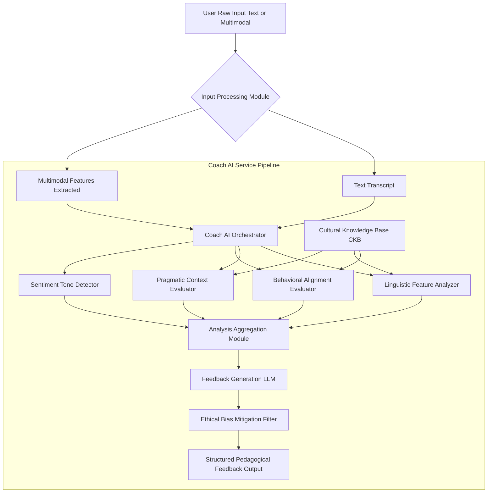
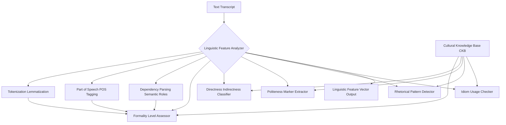
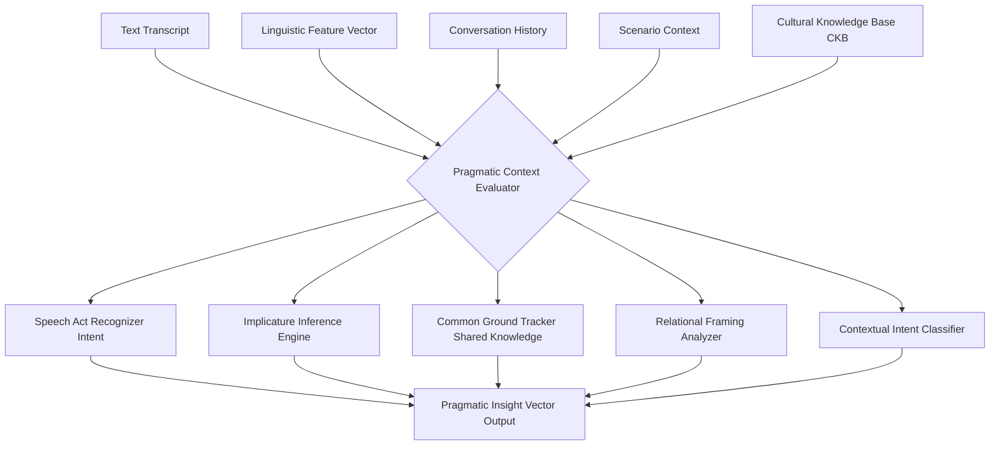
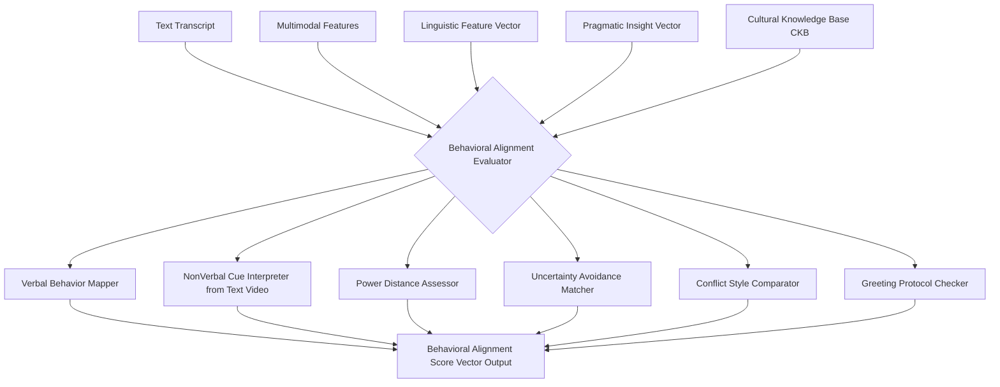
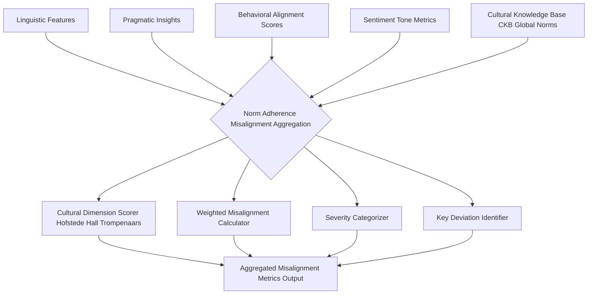
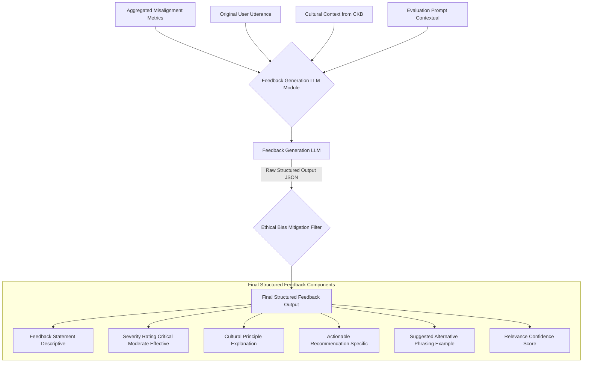

---
**Title of Invention:** Technical Specification: Coach AI Service for HighFidelity Cognitive Simulation of CrossCultural Communication Dynamics

**Abstract:**
This document provides a comprehensive technical specification for the Coach AI Service, a pivotal component within the cross-cultural communication simulation system. It elaborates on the intricate internal analytical pipelines, module interdependencies, and the sophisticated process of generating structured, pedagogically augmented feedback. Leveraging advanced Natural Language Processing NLP, Machine Learning ML, and Large Language Models LLMs, the Coach AI meticulously evaluates user communication against detailed cultural archetypes, identifying nuanced misalignments and offering actionable recommendations. Detailed architectural diagrams, meticulously crafted using parenthesis-free Mermaid syntax, illustrate the flow from user input analysis through multi-faceted evaluation to the final delivery of didactic feedback, ensuring clarity, objectivity, and accelerated learning in complex intercultural interactions. The specification also addresses critical aspects of ethical AI and bias mitigation inherent in the feedback generation process.

**Introduction:**
In the overarching system for high-fidelity cognitive simulation of cross-cultural communication, the Coach AI Service plays a paramount role in transforming user interaction into actionable learning. While the Persona AI Service simulates culturally appropriate interlocution, the Coach AI Service is dedicated to providing real-time, granular, and contextually profound feedback on the user's communication strategies. This specification delves into the advanced methodologies and architectural components that enable the Coach AI to objectively assess user inputs, compare them against complex cultural models, and formulate pedagogical insights crucial for skill development. Adhering to the principles of modularity and scalability, the Coach AI is engineered to deliver highly personalized and adaptive guidance, transcending conventional training limitations.

**Coach AI Service Overview:**
The Coach AI Service CAS acts as the analytical brain of the simulation, operating in parallel with the Persona AI. Its primary function is to ingest user utterances, analyze them across multiple linguistic, pragmatic, and behavioral dimensions against a specified cultural archetype, and then generate structured, actionable feedback. This feedback is designed to enlighten the user on the efficacy and cultural appropriateness of their communication, highlighting areas for improvement and reinforcing effective strategies. The service is deeply integrated with the Cultural Knowledge Base CKB and leverages state-of-the-art Large Language Models for sophisticated analysis and natural language generation of feedback.

**Figure 1: Coach AI Service HighLevel Architecture**
This diagram presents an expanded view of the Coach AI Service's core components and data flow. User input, whether textual or multimodal, first passes through the **Input Processing Module** to yield a **Text Transcript** and **Multimodal Features Extracted**. These are then routed to the **Coach AI Orchestrator**, which manages the parallel execution of specialized analytical modules: the **Linguistic Feature Analyzer**, **Pragmatic Context Evaluator**, **Behavioral Alignment Evaluator**, and **Sentiment Tone Detector**. Each analyzer leverages data from the **Cultural Knowledge Base CKB**. The insights from these modules converge in the **Analysis Aggregation Module**, which then feeds into the **Feedback Generation LLM**. Crucially, all generated feedback passes through an **Ethical Bias Mitigation Filter** before being presented as **Structured Pedagogical Feedback Output** to the user.

**Internal Analytical Pipelines:**
The Coach AI Service employs a sophisticated set of specialized analytical modules to dissect user communication from various angles. Each module performs a deep dive into specific aspects, ensuring comprehensive evaluation.

**A. Linguistic Feature Analysis:**
This module focuses on the explicit and implicit linguistic characteristics of the user's utterance. It identifies how language is used, considering cultural preferences for directness, formality, and rhetorical structures.

**Figure 2: Linguistic Feature Analyzer Detailed Flow**
The **Linguistic Feature Analyzer** processes the **Text Transcript** through several sub-modules. **Tokenization Lemmatization**, **Part of Speech POS Tagging**, and **Dependency Parsing Semantic Roles** provide foundational linguistic insights. These are then fed into higher-level analyzers such as the **Formality Level Assessor**, **Directness Indirectness Classifier**, **Politeness Marker Extractor**, **Rhetorical Pattern Detector**, and **Idiom Usage Checker**. Each of these modules utilizes specific linguistic norms and patterns stored within the **Cultural Knowledge Base CKB** to perform its evaluation. The consolidated output is a **Linguistic Feature Vector Output**, quantifying various aspects of the user's language use.

**B. Pragmatic Context Evaluation:**
Beyond literal meaning, this module assesses the implicit meanings, intentions, and social functions of the user's utterance within the cultural and conversational context. It evaluates whether the user's communication aligns with culturally preferred ways of performing speech acts and managing relational dynamics.

**Figure 3: Pragmatic Context Evaluator Detailed Flow**
The **Pragmatic Context Evaluator** takes the **Text Transcript**, **Linguistic Feature Vector**, **Conversation History**, **Scenario Context**, and relevant data from the **Cultural Knowledge Base CKB** as inputs. It employs specialized sub-modules like the **Speech Act Recognizer Intent** to identify the communicative function of the utterance, the **Implicature Inference Engine** to understand unspoken meanings, and the **Common Ground Tracker Shared Knowledge** to assess alignment in shared understanding. The **Relational Framing Analyzer** and **Contextual Intent Classifier** further refine the evaluation by examining how the user's communication impacts social relationships and aligns with scenario objectives. The output is a **Pragmatic Insight Vector Output**, quantifying the pragmatic efficacy.

**C. Behavioral Alignment Assessment:**
This module compares the user's communication behavior—as inferred from textual and potentially multimodal inputs—against culturally expected or preferred norms. It delves into how closely the user's approach aligns with established cultural protocols for interaction.

**Figure 4: Behavioral Alignment Evaluator Detailed Flow**
The **Behavioral Alignment Evaluator** integrates insights from the **Text Transcript**, **Multimodal Features**, **Linguistic Feature Vector**, **Pragmatic Insight Vector**, and the **Cultural Knowledge Base CKB**. Its components include a **Verbal Behavior Mapper** that translates linguistic features into behavioral categories, and a **NonVerbal Cue Interpreter from Text Video** that extracts and interprets non-verbal signals. Specialized assessors such as the **Power Distance Assessor**, **Uncertainty Avoidance Matcher**, **Conflict Style Comparator**, and **Greeting Protocol Checker** evaluate the user's behavior against specific cultural dimensions and protocols. The module's output is a **Behavioral Alignment Score Vector Output**, providing quantitative measures of cultural congruency.

**D. Sentiment and Tone Detection:**
This component analyzes the emotional valence and perceived tone of the user's input. Utilizing advanced Natural Language Processing NLP and vocalics analysis where multimodal input is available, it infers whether the user's communication expresses emotions like happiness, sadness, anger, or neutrality, and assesses the tone e.g., formal, informal, assertive, deferential. This information is crucial for evaluating overall communicative impact and appropriateness within a given cultural context.

**E. Norm Adherence and Misalignment Aggregation:**
This module synthesizes the outputs from the various analytical modules, converting them into a comprehensive assessment of cultural norm adherence and identifying key areas of misalignment.

**Figure 5: Norm Adherence and Misalignment Aggregation**
The **Norm Adherence Misalignment Aggregation** module receives the **Linguistic Features**, **Pragmatic Insights**, **Behavioral Alignment Scores**, and **Sentiment Tone Metrics** as inputs, alongside **Cultural Knowledge Base CKB Global Norms**. It employs a **Cultural Dimension Scorer Hofstede Hall Trompenaars** to map communication aspects to established cultural frameworks. The **Weighted Misalignment Calculator** combines these scores into a composite index, which is then fed into the **Severity Categorizer** to determine the impact level of the misalignment. A **Key Deviation Identifier** pinpoints the most critical areas where the user's communication diverged from cultural norms. The final output is **Aggregated Misalignment Metrics Output**, forming the basis for feedback generation.

**Structured Feedback Generation:**
The culmination of the Coach AI's analysis is the generation of structured, pedagogically valuable feedback. This process leverages a dedicated Large Language Model LLM, optimized for analytical reasoning and structured output generation.

**Figure 6: Structured Feedback Generation Pipeline**
The **Feedback Generation LLM Module** takes the **Aggregated Misalignment Metrics**, the **Original User Utterance**, the **Cultural Context from CKB**, and a **Contextual Evaluation Prompt** as its primary inputs. The **Feedback Generation LLM** processes these to produce a raw structured output, typically in JSON format, containing various feedback elements. This output then undergoes a critical review by the **Ethical Bias Mitigation Filter** to ensure cultural sensitivity, fairness, and avoidance of stereotypes. The filtered output is presented as **Final Structured Feedback Output**, comprising distinct components: a **Feedback Statement Descriptive**, a **Severity Rating Critical Moderate Effective**, an **Explanation of the Cultural Principle**, an **Actionable Recommendation Specific**, a **Suggested Alternative Phrasing Example**, and a **Relevance Confidence Score**.

**Ethical and Bias Mitigation Filter:**
A fundamental and integral component of the Coach AI Service is the Ethical and Bias Mitigation Filter. This module operates on the output of the Feedback Generation LLM before it reaches the user. Its purpose is to scrutinize all generated feedback for potential biases, stereotypes, cultural insensitivity, or non-constructive language. It employs a combination of rule-based systems, fine-tuned debiasing models, and expert-curated taxonomies of harmful language. This filter ensures that the pedagogical guidance provided is fair, respectful, culturally appropriate, and promotes inclusive communication practices, aligning with the ethical AI principles outlined in the broader invention. It functions as a final safeguard, ensuring the integrity and positive impact of the learning experience.

**Conclusion:**
The Coach AI Service, as detailed in this technical specification, represents a sophisticated fusion of AI technologies designed to provide unparalleled pedagogical feedback in cross-cultural communication training. Through its multi-faceted analytical pipelines, meticulous cultural alignment assessments, and structured feedback generation, it empowers users to gain deep insights into their communication effectiveness. The robust architecture, coupled with a dedicated ethical and bias mitigation framework, ensures that the Coach AI is not only powerful and precise but also responsible and sensitive, fulfilling its critical role in fostering cross-cultural competence.

---