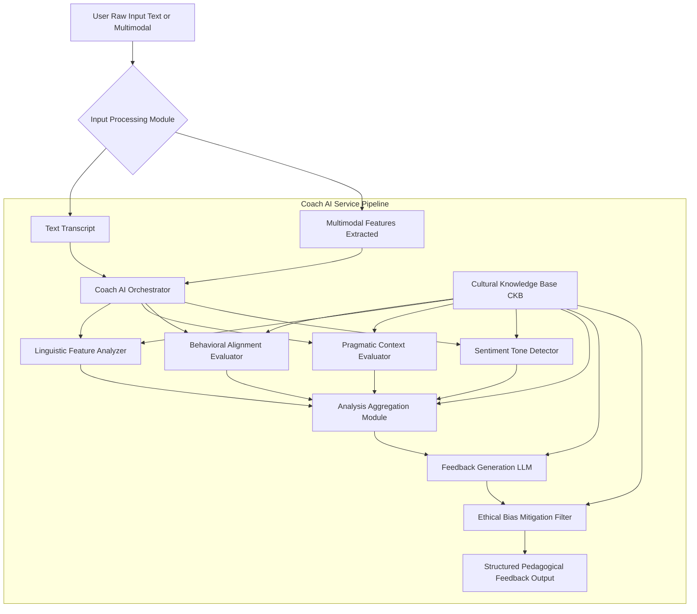
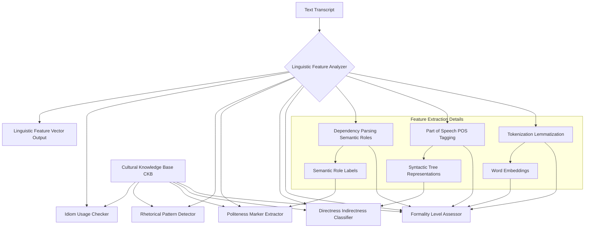
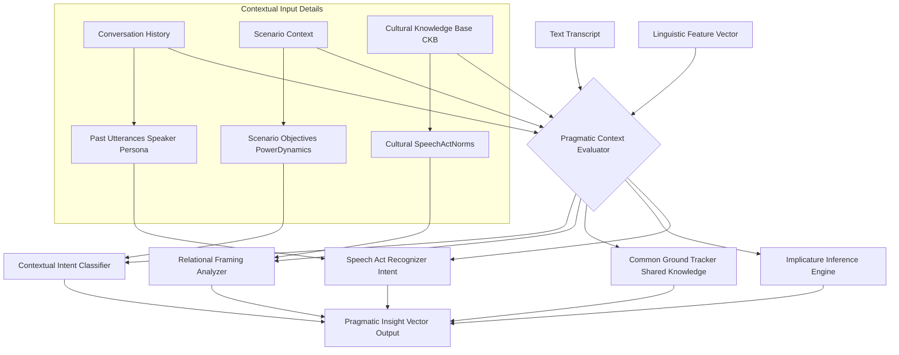
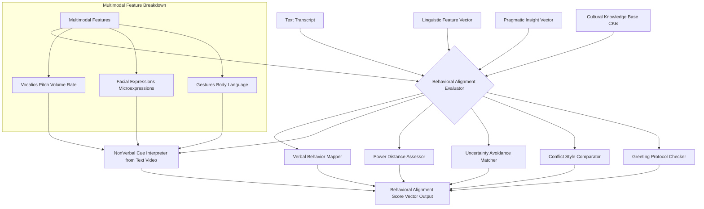
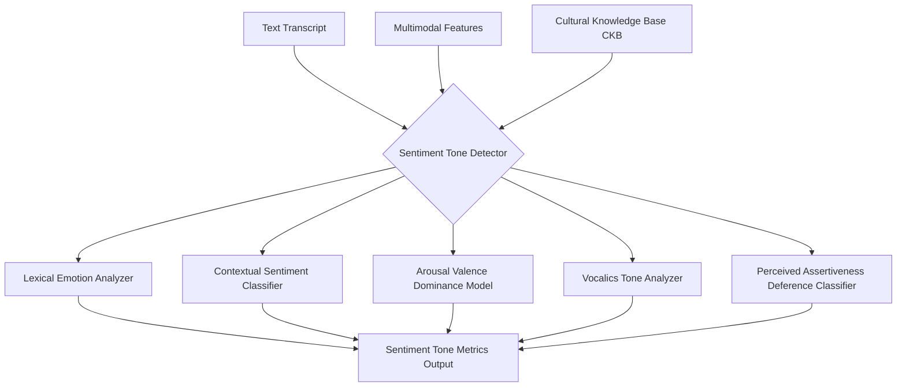
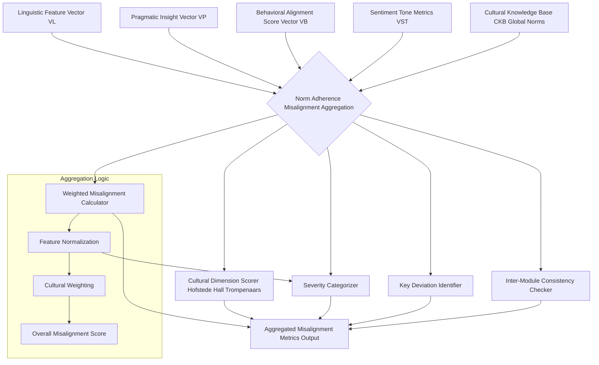
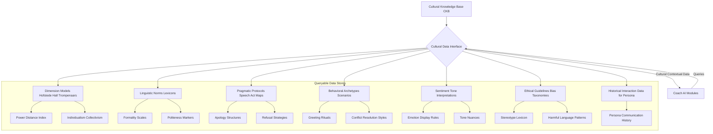
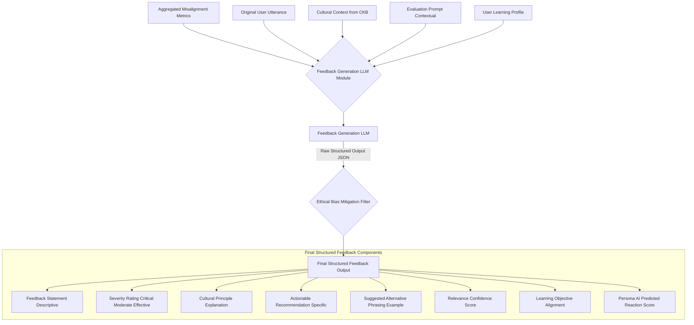
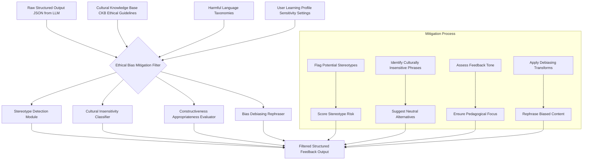
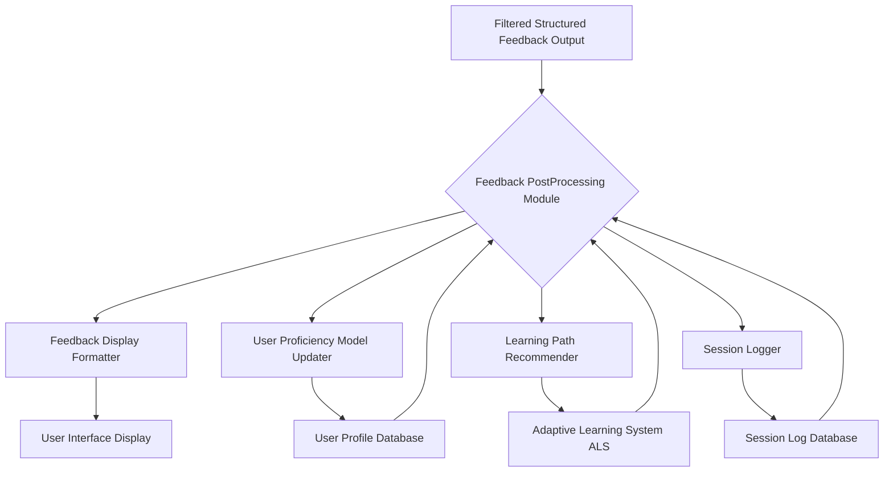

**Title of Invention:** Technical Specification: Coach AI Service for HighFidelity Cognitive Simulation of CrossCultural Communication Dynamics

**Abstract:**
This document provides a comprehensive technical specification for the Coach AI Service, a pivotal component within the cross-cultural communication simulation system. It elaborates on the intricate internal analytical pipelines, module interdependencies, and the sophisticated process of generating structured, pedagogically augmented feedback. Leveraging advanced Natural Language Processing NLP, Machine Learning ML, and Large Language Models LLMs, the Coach AI meticulously evaluates user communication against detailed cultural archetypes, identifying nuanced misalignments and offering actionable recommendations. Detailed architectural diagrams, meticulously crafted using parenthesis-free Mermaid syntax, illustrate the flow from user input analysis through multi-faceted evaluation to the final delivery of didactic feedback, ensuring clarity, objectivity, and accelerated learning in complex intercultural interactions. The specification also addresses critical aspects of ethical AI and bias mitigation inherent in the feedback generation process.

**Introduction:**
In the overarching system for high-fidelity cognitive simulation of cross-cultural communication, the Coach AI Service plays a paramount role in transforming user interaction into actionable learning. While the Persona AI Service simulates culturally appropriate interlocution, the Coach AI Service is dedicated to providing real-time, granular, and contextually profound feedback on the user's communication strategies. This specification delves into the advanced methodologies and architectural components that enable the Coach AI to objectively assess user inputs, compare them against complex cultural models, and formulate pedagogical insights crucial for skill development. Adhering to the principles of modularity and scalability, the Coach AI is engineered to deliver highly personalized and adaptive guidance, transcending conventional training limitations.

**Claim 1:** The Coach AI Service significantly accelerates cross-cultural communication skill acquisition by providing objective, data-driven feedback on user interactions.

**Coach AI Service Overview:**
The Coach AI Service CAS acts as the analytical brain of the simulation, operating in parallel with the Persona AI. Its primary function is to ingest user utterances, analyze them across multiple linguistic, pragmatic, and behavioral dimensions against a specified cultural archetype, and then generate structured, actionable feedback. This feedback is designed to enlighten the user on the efficacy and cultural appropriateness of their communication, highlighting areas for improvement and reinforcing effective strategies. The service is deeply integrated with the Cultural Knowledge Base CKB and leverages state-of-the-art Large Language Models for sophisticated analysis and natural language generation of feedback.

**Claim 2:** The integration of real-time analytical pipelines ensures that feedback is contextually relevant and immediately applicable to the user's ongoing simulation experience.

**Figure 1: Coach AI Service HighLevel Architecture**
This diagram presents an expanded view of the Coach AI Service's core components and data flow. User input, whether textual or multimodal, first passes through the **Input Processing Module** to yield a **Text Transcript** and **Multimodal Features Extracted**. These are then routed to the **Coach AI Orchestrator**, which manages the parallel execution of specialized analytical modules: the **Linguistic Feature Analyzer**, **Pragmatic Context Evaluator**, **Behavioral Alignment Evaluator**, and **Sentiment Tone Detector**. Each analyzer leverages data from the **Cultural Knowledge Base CKB**. The insights from these modules converge in the **Analysis Aggregation Module**, which then feeds into the **Feedback Generation LLM**. Crucially, all generated feedback passes through an **Ethical Bias Mitigation Filter** before being presented as **Structured Pedagogical Feedback Output** to the user.

**Internal Analytical Pipelines:**
The Coach AI Service employs a sophisticated set of specialized analytical modules to dissect user communication from various angles. Each module performs a deep dive into specific aspects, ensuring comprehensive evaluation.

**A. Linguistic Feature Analysis:**
This module focuses on the explicit and implicit linguistic characteristics of the user's utterance. It identifies how language is used, considering cultural preferences for directness, formality, and rhetorical structures.

**Figure 2: Linguistic Feature Analyzer Detailed Flow**
The **Linguistic Feature Analyzer** processes the **Text Transcript** through several sub-modules. **Tokenization Lemmatization**, **Part of Speech POS Tagging**, and **Dependency Parsing Semantic Roles** provide foundational linguistic insights. These are then fed into higher-level analyzers such as the **Formality Level Assessor**, **Directness Indirectness Classifier**, **Politeness Marker Extractor**, **Rhetorical Pattern Detector**, and **Idiom Usage Checker**. Each of these modules utilizes specific linguistic norms and patterns stored within the **Cultural Knowledge Base CKB** to perform its evaluation. The consolidated output is a **Linguistic Feature Vector Output**, quantifying various aspects of the user's language use.

**Linguistic Metrics and Equations:**
Let $U$ be the user's utterance, $T$ its tokenized form, and $L_{CKB}(\mathcal{F})$ the set of linguistic features for a target culture $\mathcal{F}$ in the CKB.

1.  **Formality Score $S_F$**:
    $S_F(U) = \sum_{w \in T} w_{formality} \cdot P(w|U) + \lambda_F \cdot M_F(U)$
    where $w_{formality}$ is the formality score of word $w$, $P(w|U)$ is its probability in $U$, and $M_F(U)$ is a model-based formality score (e.g., using a fine-tuned BERT classifier).
    $R_F(\mathcal{F}) = \text{FormalityRange}_{\mathcal{F}}$ is the culturally expected formality range.
    $D_F = |S_F(U) - \text{midpoint}(R_F(\mathcal{F}))|$ is the deviation.

2.  **Directness Score $S_D$**:
    $S_D(U) = \text{Classifier}_{Directness}(E_{U})$
    where $E_U$ represents embeddings of $U$.
    $P_{Direct}(\mathcal{F}) = \text{PreferenceValue}_{\mathcal{F}}(\text{directness})$
    $D_D = |S_D(U) - P_{Direct}(\mathcal{F})|$

3.  **Politeness Score $S_P$**:
    $S_P(U) = \sum_{m \in \text{PolitenessMarkers}} W_m \cdot I(m \in U) + \lambda_P \cdot M_P(U)$
    where $W_m$ is the weight of politeness marker $m$, $I$ is an indicator function, and $M_P(U)$ is a model-based politeness score.
    $P_{Polite}(\mathcal{F}) = \text{ExpectedRange}_{\mathcal{F}}(\text{politeness})$
    $D_P = \min(|S_P(U) - \text{lower}(P_{Polite}(\mathcal{F}))|, |S_P(U) - \text{upper}(P_{Polite}(\mathcal{F}))|)$ if $S_P(U)$ is outside the range, else $0$.

4.  **Rhetorical Pattern Match $S_{RP}$**:
    $S_{RP}(U, \mathcal{F}) = \frac{\sum_{p \in \text{RhetoricalPatterns}_{\mathcal{F}}} \text{MatchScore}(U, p)}{\text{TotalPatterns}_{\mathcal{F}}}$
    where $\text{MatchScore}(U,p)$ is a similarity score for pattern $p$.
    $S_{RP} \in [0, 1]$.

5.  **Idiom Usage $S_I$**:
    $S_I(U, \mathcal{F}) = \frac{\sum_{i \in \text{Idioms}_{\mathcal{F}}} I(\text{idiom } i \text{ correctly used in } U) \cdot W_i}{\sum W_i}$
    $S_I \in [0, 1]$.

6.  **Overall Linguistic Feature Vector $V_L$**:
    $V_L = [S_F, S_D, S_P, S_{RP}, S_I]$

**Claim 3:** The multi-layered linguistic analysis, from tokenization to rhetorical patterns, enables a granular understanding of user utterance nuances.

**B. Pragmatic Context Evaluation:**
Beyond literal meaning, this module assesses the implicit meanings, intentions, and social functions of the user's utterance within the cultural and conversational context. It evaluates whether the user's communication aligns with culturally preferred ways of performing speech acts and managing relational dynamics.

**Figure 3: Pragmatic Context Evaluator Detailed Flow**
The **Pragmatic Context Evaluator** takes the **Text Transcript**, **Linguistic Feature Vector**, **Conversation History**, **Scenario Context**, and relevant data from the **Cultural Knowledge Base CKB** as inputs. It employs specialized sub-modules like the **Speech Act Recognizer Intent** to identify the communicative function of the utterance, the **Implicature Inference Engine** to understand unspoken meanings, and the **Common Ground Tracker Shared Knowledge** to assess alignment in shared understanding. The **Relational Framing Analyzer** and **Contextual Intent Classifier** further refine the evaluation by examining how the user's communication impacts social relationships and aligns with scenario objectives. The output is a **Pragmatic Insight Vector Output**, quantifying the pragmatic efficacy.

**Pragmatic Metrics and Equations:**
Let $U$ be the user's utterance, $CH$ the conversation history, $SC$ the scenario context, and $P_{CKB}(\mathcal{F})$ the pragmatic norms for culture $\mathcal{F}$.

7.  **Speech Act Recognition $S_{SA}$**:
    $S_{SA}(U) = \arg\max_k P(\text{SpeechAct}_k | U, V_L, CH, SC)$
    where $P(\text{SpeechAct}_k | \dots)$ is the probability of speech act $k$.
    $D_{SA} = 1 - P(\text{ExpectedSpeechAct}_{\mathcal{F}} | U, V_L, CH, SC)$
    If the expected speech act is $SA_{exp}$ and the detected one is $SA_{det}$:
    $S_{SA\_match} = I(SA_{det} = SA_{exp}) \cdot \text{Confidence}(SA_{det})$

8.  **Implicature Alignment $S_I^{prag}$**:
    $S_I^{prag}(U) = \text{Similarity}(\text{InferredImplicature}(U), \text{ExpectedImplicature}_{\mathcal{F}}(CH, SC))$
    $\text{InferredImplicature}(U) = \text{LLMInfer}(U, CH, SC)$
    $S_I^{prag} \in [0, 1]$.

9.  **Common Ground Overlap $S_{CG}$**:
    $S_{CG}(U, CH, SC, \text{PersonaContext}) = \text{CosineSimilarity}(\text{Embedding}(U), \text{Embedding}(\text{SharedKnowledge}_{\mathcal{F}}))$
    $\text{SharedKnowledge}_{\mathcal{F}} = \text{HistoryEmb}(CH) + \text{ScenarioEmb}(SC) + \text{PersonaSharedInfo}$
    $S_{CG} \in [0, 1]$.

10. **Relational Framing Score $S_{RF}$**:
    $S_{RF}(U, \mathcal{F}) = \text{Classifier}_{RelationalFraming}(U, V_L) - \text{ExpectedFraming}_{\mathcal{F}}(SC)$
    where the classifier output ranges, e.g., from -1 (antagonistic) to 1 (cooperative).
    $D_{RF} = |S_{RF}(U, \mathcal{F})|$ representing deviation from expected relational framing.

11. **Contextual Intent Match $S_{CI}$**:
    $S_{CI}(U, SC) = P(\text{ScenarioGoalMatch} | U, CH, V_L)$
    $D_{CI} = 1 - S_{CI}(U, SC)$

12. **Pragmatic Insight Vector $V_P$**:
    $V_P = [S_{SA\_match}, S_I^{prag}, S_{CG}, S_{RF}, S_{CI}]$

**Claim 4:** The evaluation of common ground and relational framing provides deep insights into the social effectiveness of communication, crucial for intercultural success.

**C. Behavioral Alignment Assessment:**
This module compares the user's communication behavior—as inferred from textual and potentially multimodal inputs—against culturally expected or preferred norms. It delves into how closely the user's approach aligns with established cultural protocols for interaction.

**Figure 4: Behavioral Alignment Evaluator Detailed Flow**
The **Behavioral Alignment Evaluator** integrates insights from the **Text Transcript**, **Multimodal Features**, **Linguistic Feature Vector**, **Pragmatic Insight Vector**, and the **Cultural Knowledge Base CKB**. Its components include a **Verbal Behavior Mapper** that translates linguistic features into behavioral categories, and a **NonVerbal Cue Interpreter from Text Video** that extracts and interprets non-verbal signals. Specialized assessors such as the **Power Distance Assessor**, **Uncertainty Avoidance Matcher**, **Conflict Style Comparator**, and **Greeting Protocol Checker** evaluate the user's behavior against specific cultural dimensions and protocols. The module's output is a **Behavioral Alignment Score Vector Output**, providing quantitative measures of cultural congruency.

**Behavioral Metrics and Equations:**
Let $U$ be the user's utterance, $MF$ the multimodal features, $V_L$ the linguistic vector, $V_P$ the pragmatic vector, and $B_{CKB}(\mathcal{F})$ the behavioral norms for culture $\mathcal{F}$.

13. **Verbal Behavior Mapping Score $S_{VB}$**:
    $S_{VB}(U, V_L) = \text{MapToBehavioralTrait}(U, V_L)$
    e.g., $S_{VB}(\text{assertiveness}) = \text{fct}(\text{directness}, \text{politeness}, \text{volume})$.

14. **Non-Verbal Cue Interpretation $S_{NV}$**:
    $S_{NV}(MF) = \text{InterpretNonVerbal}(MF)$
    e.g., $S_{NV}(\text{eye\_contact}) = \text{AvgDuration}(\text{MF}_{\text{eye\_gaze}})$.

15. **Power Distance Alignment $S_{PD}$**:
    $S_{PD}(U, MF, \mathcal{F}) = \text{Classifier}_{PowerDistance}(U, MF) - \text{ExpectedPowerDistance}_{\mathcal{F}}$
    where the classifier might output a continuous value related to deference or assertiveness.
    $D_{PD} = |S_{PD}(U, MF, \mathcal{F})|$.

16. **Uncertainty Avoidance Match $S_{UA}$**:
    $S_{UA}(U, \mathcal{F}) = \text{Classifier}_{UncertaintyAvoidance}(U, V_L, V_P) - \text{ExpectedUA}_{\mathcal{F}}$
    e.g., Preference for explicit instructions, risk-averse language.
    $D_{UA} = |S_{UA}(U, \mathcal{F})|$.

17. **Conflict Style Comparator $S_{CS}$**:
    $S_{CS}(U, CH, \mathcal{F}) = \text{Similarity}(\text{IdentifiedConflictStyle}(U, CH), \text{PreferredConflictStyle}_{\mathcal{F}})$
    Conflict styles could be e.g., accommodating, compromising, avoiding, collaborating, competing.
    $S_{CS} \in [0, 1]$.

18. **Greeting Protocol Match $S_{GP}$**:
    $S_{GP}(U, CH, \mathcal{F}) = I(\text{CorrectGreetingUsed}(U, CH, \mathcal{F})) \cdot \text{GreetingCompleteness}(U)$
    $S_{GP} \in [0, 1]$.

19. **Behavioral Alignment Score Vector $V_B$**:
    $V_B = [S_{PD}, S_{UA}, S_{CS}, S_{GP}]$

**Claim 5:** The incorporation of multimodal feature analysis allows for a holistic assessment of behavioral alignment, including non-verbal cues often critical in intercultural settings.

**D. Sentiment and Tone Detection:**
This component analyzes the emotional valence and perceived tone of the user's input. Utilizing advanced Natural Language Processing NLP and vocalics analysis where multimodal input is available, it infers whether the user's communication expresses emotions like happiness, sadness, anger, or neutrality, and assesses the tone e.g., formal, informal, assertive, deferential. This information is crucial for evaluating overall communicative impact and appropriateness within a given cultural context.

**Figure 7: Sentiment and Tone Detector Detailed Flow**
The **Sentiment Tone Detector** processes the **Text Transcript** and **Multimodal Features**, referencing the **Cultural Knowledge Base CKB** for culturally-specific emotional expressions and tonal interpretations. It comprises a **Lexical Emotion Analyzer** for word-level sentiment, a **Contextual Sentiment Classifier** for overall utterance sentiment, and an **Arousal Valence Dominance Model** for continuous emotional dimensions. When multimodal input is available, the **Vocalics Tone Analyzer** interprets prosodic features, and the **Perceived Assertiveness Deference Classifier** refines the assessment of communication style. The module consolidates these into a **Sentiment Tone Metrics Output**.

**Sentiment and Tone Metrics and Equations:**
Let $U$ be the user's utterance, $MF$ the multimodal features, and $ST_{CKB}(\mathcal{F})$ the sentiment/tone norms for culture $\mathcal{F}$.

20. **Valence Score $S_{Valence}$**:
    $S_{Valence}(U) = \text{NLTK\_Sentiment}(U)_{\text{compound}}$ for text.
    For multimodal: $S_{Valence}(U, MF) = w_T \cdot \text{TextValence}(U) + w_V \cdot \text{VocalValence}(MF) + w_F \cdot \text{FaceValence}(MF)$
    where $w_T, w_V, w_F$ are weights.
    Range $[-1, 1]$.

21. **Arousal Score $S_{Arousal}$**:
    $S_{Arousal}(U, MF) = \text{Model}_{Arousal}(U, MF)$
    Often derived from vocalics (pitch, energy) and lexical intensity. Range $[0, 1]$.

22. **Dominance Score $S_{Dominance}$**:
    $S_{Dominance}(U, MF) = \text{Model}_{Dominance}(U, MF)$
    Derived from lexical choice, sentence structure, and vocalics (volume, speaking rate). Range $[0, 1]$.

23. **Emotional Intensity $S_{EI}$**:
    $S_{EI}(U, MF) = \sqrt{S_{Valence}^2 + S_{Arousal}^2 + S_{Dominance}^2}$ (Euclidean distance from neutral origin)

24. **Tone Match Score $S_{Tone}$**:
    $S_{Tone}(U, MF, \mathcal{F}) = \text{Similarity}(\text{InferredTone}(U, MF), \text{ExpectedTone}_{\mathcal{F}}(SC))$
    e.g., tones like "formal", "deferential", "assertive".
    $D_{Tone} = 1 - S_{Tone}$.

25. **Sentiment Tone Metrics Output $V_{ST}$**:
    $V_{ST} = [S_{Valence}, S_{Arousal}, S_{Dominance}, S_{Tone}]$

**Claim 6:** Precise sentiment and tone detection, adapted to cultural display rules, is critical for understanding the emotional impact and appropriateness of user communication.

**E. Norm Adherence and Misalignment Aggregation:**
This module synthesizes the outputs from the various analytical modules, converting them into a comprehensive assessment of cultural norm adherence and identifying key areas of misalignment.

**Figure 5: Norm Adherence and Misalignment Aggregation**
The **Norm Adherence Misalignment Aggregation** module receives the **Linguistic Features**, **Pragmatic Insights**, **Behavioral Alignment Scores**, and **Sentiment Tone Metrics** as inputs, alongside **Cultural Knowledge Base CKB Global Norms**. It employs a **Cultural Dimension Scorer Hofstede Hall Trompenaars** to map communication aspects to established cultural frameworks. The **Weighted Misalignment Calculator** combines these scores into a composite index, which is then fed into the **Severity Categorizer** to determine the impact level of the misalignment. A **Key Deviation Identifier** pinpoints the most critical areas where the user's communication diverged from cultural norms. The **Inter-Module Consistency Checker** verifies that the insights from different modules do not contradict each other, ensuring a coherent overall assessment. The final output is **Aggregated Misalignment Metrics Output**, forming the basis for feedback generation.

**Aggregation Metrics and Equations:**
Let $V_L, V_P, V_B, V_{ST}$ be the feature vectors from previous modules. Let $W_{\mathcal{F}}$ be a cultural weighting matrix from CKB. Let $M$ be the target cultural model (e.g., Hofstede scores).

26. **Normalized Deviation for a Feature $f$**:
    $D_f = |S_f(U) - S_{f, \text{target}}(\mathcal{F})| / \text{MaxDeviation}_f$
    where $S_{f, \text{target}}(\mathcal{F})$ is the culturally appropriate value/range for feature $f$.
    $D_f \in [0, 1]$.

27. **Feature Misalignment Score $MS_f$**:
    $MS_f = \text{Transform}(D_f, \text{SensitivityCurve}_f)$
    e.g., $MS_f = \text{sigmoid}(k \cdot D_f - c)$

28. **Weighted Misalignment for Linguistic Vector $MS_L$**:
    $MS_L = \sum_{f \in V_L} w_{L,f} \cdot MS_f(V_L(f))$
    where $w_{L,f}$ are weights for linguistic features. $\sum w_{L,f} = 1$.

29. **Weighted Misalignment for Pragmatic Vector $MS_P$**:
    $MS_P = \sum_{f \in V_P} w_{P,f} \cdot MS_f(V_P(f))$

30. **Weighted Misalignment for Behavioral Vector $MS_B$**:
    $MS_B = \sum_{f \in V_B} w_{B,f} \cdot MS_f(V_B(f))$

31. **Weighted Misalignment for Sentiment/Tone Vector $MS_{ST}$**:
    $MS_{ST} = \sum_{f \in V_{ST}} w_{ST,f} \cdot MS_f(V_{ST}(f))$

32. **Overall Communication Misalignment Score $MS_{Total}$**:
    $MS_{Total} = \alpha_L MS_L + \alpha_P MS_P + \alpha_B MS_B + \alpha_{ST} MS_{ST}$
    where $\alpha_i$ are module-level weights, $\sum \alpha_i = 1$.

33. **Severity Categorization $C_{Severity}$**:
    $C_{Severity}(MS_{Total}) = \begin{cases} \text{Critical} & \text{if } MS_{Total} > T_C \\ \text{Moderate} & \text{if } T_M < MS_{Total} \le T_C \\ \text{Minor} & \text{if } T_L < MS_{Total} \le T_M \\ \text{Effective} & \text{if } MS_{Total} \le T_L \end{cases}$
    where $T_C, T_M, T_L$ are predefined thresholds.

34. **Key Deviation Identification $KDI$**:
    $KDI = \arg\max_f \{MS_f \cdot w_f \mid MS_f \cdot w_f > \theta_{min}\}$
    This identifies features exceeding a significance threshold.

35. **Cultural Dimension Score Mapping (Hofstede)**:
    Let $U_{dim}$ be the user's implicit score on a dimension (e.g., Power Distance).
    $U_{dim} = \text{MapFunc}(MS_F, MS_P, MS_{PD}, \dots)$
    $D_{dim} = |U_{dim} - M_{dim}(\mathcal{F})|$ where $M_{dim}(\mathcal{F})$ is the CKB target culture's score.

36. **Inter-Module Consistency Score $CS_{IM}$**:
    $CS_{IM} = \text{ConsistencyModel}(V_L, V_P, V_B, V_{ST})$
    This could be a classifier trained to detect contradictions (e.g., highly formal language with extremely casual non-verbal cues in a context expecting high alignment).
    $CS_{IM} \in [0, 1]$.

**Claim 7:** A comprehensive weighting system and severity categorization allows the Coach AI to prioritize feedback on the most impactful communication misalignments.

**F. Cultural Knowledge Base CKB Architecture and Interaction:**
The CKB is not just a static repository but a dynamic, queryable system providing context-rich cultural information to all analytical modules. It stores cultural dimensions, speech act norms, behavioral protocols, sentiment interpretations, and linguistic preferences.

**Figure 8: Cultural Knowledge Base CKB Architecture**
The **Cultural Knowledge Base CKB** is structured with a **Cultural Data Interface** to serve various modules. It houses **Dimension Models** (e.g., Hofstede, Hall, Trompenaars), **Linguistic Norms and Lexicons**, **Pragmatic Protocols and Speech Act Maps**, **Behavioral Archetypes for Scenarios**, **Sentiment and Tone Interpretations**, **Ethical Guidelines and Bias Taxonomies**, and **Historical Interaction Data for Persona**. Each category is further subdivided into granular, queryable data stores. Coach AI Modules issue queries to the interface, retrieving the necessary cultural contextual data for their analyses, ensuring that all evaluations are culturally grounded.

**CKB Interaction Metrics and Equations:**

37. **CKB Query Response Time $\tau_{query}$**:
    $\tau_{query} = \text{Avg}(\text{Latency}(\text{Query}_{mod}))$
    Optimization goal: $\tau_{query} < \tau_{threshold}$ for real-time operation.

38. **Data Freshness Index $DFI$**:
    $DFI = 1 - \frac{\text{CurrentTime} - \text{LastUpdate}}{\text{UpdateInterval}_{\text{max}}}$
    Ensures CKB data is up-to-date.

39. **Contextual Relevance Score $CRS$**:
    $CRS(\text{Query}, \text{Response}) = \text{EmbeddingSimilarity}(\text{QueryVector}, \text{ResponseVector})$
    Measures how well CKB response matches query intent. $CRS \in [0, 1]$.

40. **Cultural Dimension Data Retrieval**:
    For a given dimension $d$ and target culture $\mathcal{F}$:
    $V_{d, \mathcal{F}} = \text{CKB.get\_dimension\_value}(\mathcal{F}, d)$
    e.g., $V_{PD, \text{Japan}} = 54$.

41. **Linguistic Norm Retrieval**:
    $\text{FormalityScale}_{\mathcal{F}} = \text{CKB.get\_linguistic\_norm}(\mathcal{F}, \text{formality})$
    $\text{PolitenessMarkers}_{\mathcal{F}} = \text{CKB.get\_linguistic\_norm}(\mathcal{F}, \text{politeness\_markers})$

42. **Dynamic CKB Weighting**:
    $W_{feature}(\mathcal{F}, \text{context}) = \text{CKB.get\_feature\_weight}(\mathcal{F}, \text{feature}, \text{context})$
    Weights can vary based on scenario or current cultural focus.

**Structured Feedback Generation:**
The culmination of the Coach AI's analysis is the generation of structured, pedagogically valuable feedback. This process leverages a dedicated Large Language Model LLM, optimized for analytical reasoning and structured output generation.

**Figure 6: Structured Feedback Generation Pipeline**
The **Feedback Generation LLM Module** takes the **Aggregated Misalignment Metrics**, the **Original User Utterance**, the **Cultural Context from CKB**, a **Contextual Evaluation Prompt**, and the **User Learning Profile** as its primary inputs. The **Feedback Generation LLM** processes these to produce a raw structured output, typically in JSON format, containing various feedback elements. This output then undergoes a critical review by the **Ethical Bias Mitigation Filter** to ensure cultural sensitivity, fairness, and avoidance of stereotypes. The filtered output is presented as **Final Structured Feedback Output**, comprising distinct components: a **Feedback Statement Descriptive**, a **Severity Rating Critical Moderate Effective**, an **Explanation of the Cultural Principle**, an **Actionable Recommendation Specific**, a **Suggested Alternative Phrasing Example**, a **Relevance Confidence Score**, a measure of **Learning Objective Alignment**, and a **Persona AI Predicted Reaction Score** (indicating how the Persona AI would likely react to the user's utterance given its cultural model).

**LLM-based Feedback Generation Equations:**
Let $MS_{agg}$ be the aggregated misalignment metrics, $U_{orig}$ the original utterance, $C_{cult}$ the cultural context, $P_{eval}$ the evaluation prompt, $U_{LP}$ the user learning profile.

43. **LLM Input Construction $I_{LLM}$**:
    $I_{LLM} = \text{Concatenate}(P_{eval}, \text{JSON}(MS_{agg}), \text{JSON}(U_{orig}), \text{JSON}(C_{cult}), \text{JSON}(U_{LP}))$
    This is the prompt engineering for the LLM.

44. **LLM Feedback Generation $F_{raw}$**:
    $F_{raw} = \text{LLM.generate}(I_{LLM}, \text{temperature}, \text{top\_p}, \text{max\_tokens})$
    The LLM is fine-tuned for structured JSON output.

45. **Relevance Confidence Score $RCS$**:
    $RCS = \text{Model}_{Confidence}(MS_{agg}, F_{raw})$
    This could be a small classifier predicting confidence based on the input metrics and LLM output consistency.
    $RCS \in [0, 1]$.

46. **Learning Objective Alignment $LOA$**:
    $LOA = \text{Similarity}(\text{FeedbackIntent}, \text{UserLearningGoals}(U_{LP}))$
    $LOA \in [0, 1]$.

47. **Persona AI Predicted Reaction Score $PARS$**:
    $PARS = \text{PersonaAI.predict\_reaction}(U_{orig}, C_{cult}, MS_{agg})$
    This is a score from the Persona AI model indicating its simulated reaction (e.g., cooperation level, offense taken).
    $PARS \in [-1, 1]$.

48. **Feedback Quality Score $Q_F$**:
    $Q_F = w_1 \cdot RCS + w_2 \cdot LOA + w_3 \cdot \text{Clarity}(F_{raw}) + w_4 \cdot \text{Specificity}(F_{raw})$
    $\sum w_i = 1$.

**Claim 8:** The Feedback Generation LLM, guided by precise analytical metrics, delivers pedagogical insights that are both comprehensive and actionable.

**Ethical and Bias Mitigation Filter:**
A fundamental and integral component of the Coach AI Service is the Ethical and Bias Mitigation Filter. This module operates on the output of the Feedback Generation LLM before it reaches the user. Its purpose is to scrutinize all generated feedback for potential biases, stereotypes, cultural insensitivity, or non-constructive language. It employs a combination of rule-based systems, fine-tuned debiasing models, and expert-curated taxonomies of harmful language. This filter ensures that the pedagogical guidance provided is fair, respectful, culturally appropriate, and promotes inclusive communication practices, aligning with the ethical AI principles outlined in the broader invention. It functions as a final safeguard, ensuring the integrity and positive impact of the learning experience.

**Figure 9: Ethical Bias Mitigation Filter Detailed Flow**
The **Ethical Bias Mitigation Filter** receives the **Raw Structured Output JSON from LLM**. It consults the **Cultural Knowledge Base CKB Ethical Guidelines**, **Harmful Language Taxonomies**, and **User Learning Profile Sensitivity Settings**. The filter employs a **Stereotype Detection Module** to identify and flag generalized assumptions, a **Cultural Insensitivity Classifier** to pinpoint phrases that might cause offense, and a **Constructiveness Appropriateness Evaluator** to ensure feedback is action-oriented and positive. A **Bias Debiasing Rephraser** is used to rephrase any identified biased or insensitive content, ensuring the **Filtered Structured Feedback Output** is fair, respectful, and pedagogically sound.

**Bias Mitigation Metrics and Equations:**
Let $F_{raw}$ be the raw feedback, $F_{clean}$ be the filtered feedback. Let $\Phi_{CKB}$ be CKB's ethical guidelines and bias taxonomies.

49. **Stereotype Risk Score $SRS$**:
    $SRS(F_{raw}, \Phi_{CKB}) = \sum_{s \in \text{Stereotypes}_{\Phi_{CKB}}} \text{MatchScore}(s, F_{raw}) \cdot W_s$
    where MatchScore is a text similarity metric, $W_s$ is severity weight. $SRS \in [0, 1]$.

50. **Cultural Sensitivity Index $CSI$**:
    $CSI(F_{raw}, \Phi_{CKB}) = 1 - \text{Classifier}_{Insensitive}(F_{raw}, \Phi_{CKB})$
    This classifier outputs probability of insensitivity. $CSI \in [0, 1]$.

51. **Constructiveness Score $CS_{cons}$**:
    $CS_{cons}(F_{raw}) = \text{Classifier}_{Constructive}(F_{raw})$
    Trained on examples of constructive vs. non-constructive feedback. $CS_{cons} \in [0, 1]$.

52. **Bias Detection Probability $P_{bias}$**:
    $P_{bias}(F_{raw}, \Phi_{CKB}) = \text{DebiasingModel.predict\_bias}(F_{raw}, \Phi_{CKB})$
    $P_{bias} \in [0, 1]$.

53. **Feedback Rephrasing Operation $F_{clean} = \text{Debias}(F_{raw})$**:
    If $P_{bias}(F_{raw}) > \theta_{bias}$ or $SRS > \theta_{SRS}$:
    $F_{clean} = \text{LLM.rephrase}(F_{raw}, \text{prompt}=\text{debias directive}, \Phi_{CKB})$

54. **Debiasing Effectiveness Metric $DEM$**:
    $DEM = 1 - P_{bias}(F_{clean})$
    Ideal $DEM \approx 1$.

55. **Overall Ethical Adherence Score $EAS$**:
    $EAS = w_S \cdot (1-SRS) + w_C \cdot CSI + w_D \cdot CS_{cons}$
    $\sum w_i = 1$.

**Claim 9:** The Ethical Bias Mitigation Filter is a critical safeguard, actively transforming potentially problematic feedback into pedagogically sound and culturally respectful guidance.

**G. Feedback Post-Processing and Adaptive Learning Integration:**
After filtering, the structured feedback is further processed for display, logging, and integration into the user's adaptive learning pathway. This involves storing feedback history, updating user proficiency models, and potentially triggering follow-up exercises.

**Figure 10: Feedback Post-Processing and Adaptive Learning Integration**
The **Feedback Post-Processing Module** takes the **Filtered Structured Feedback Output** and orchestrates its final delivery and integration. It accesses the **User Profile Database**, the **Adaptive Learning System ALS**, and the **Session Log Database**. A **Feedback Display Formatter** renders the feedback appropriately for the **User Interface Display**. The **User Proficiency Model Updater** adjusts the user's skill levels based on the feedback. The **Learning Path Recommender** suggests follow-up exercises or topics to the **Adaptive Learning System ALS**. Finally, a **Session Logger** archives the feedback and related metadata into the **Session Log Database** for future analysis and longitudinal tracking.

**Adaptive Learning Integration Equations:**
Let $U_{prof}$ be the user's proficiency vector, $LO_{target}$ be target learning objectives, $FB$ the feedback output.

56. **Proficiency Update Rule**:
    $U_{prof, new}(skill_k) = U_{prof, old}(skill_k) + \Delta P(FB, skill_k)$
    where $\Delta P$ is a function that modifies proficiency based on specific feedback for skill $k$.

57. **Proficiency Gain $\Delta P$**:
    $\Delta P(FB, skill_k) = \text{GainFactor}(Severity(FB)) \cdot \text{Impact}(FB, skill_k) \cdot (1 - U_{prof, old}(skill_k))$
    Gain is higher for critical feedback on low-proficiency skills.

58. **Skill-Specific Misalignment Influence $I(FB, skill_k)$**:
    $I(FB, skill_k) = \text{FeatureWeight}_{skill_k} \cdot \text{MisalignmentScore}_{FB, feature(skill_k)}$
    Links feedback points to relevant skills.

59. **Learning Path Recommendation Score $R_{path}$**:
    $R_{path}(topic_j) = \sum_{k \in topic_j} (1 - U_{prof}(skill_k)) \cdot \text{Relevance}(topic_j, FB) \cdot \text{Urgency}(Severity(FB))$
    Recommends topics where user proficiency is low and feedback highlighted issues.

60. **User Engagement Metric $E_U$**:
    $E_U = \frac{\text{NumExercisesCompleted}}{\text{NumExercisesRecommended}} \cdot \text{Avg}(\text{FeedbackApplicationScore})$
    Tracks how well users incorporate feedback.

**Claim 10:** The integration with an adaptive learning system transforms static feedback into a dynamic, personalized learning journey, optimizing skill development.

**Additional Quantitative Models and Metrics:**

**Statistical Models and Uncertainty:**
61. **Bayesian Inference for Feature Scores**:
    $P(S_f | U, CKB) \propto P(U | S_f, CKB) \cdot P(S_f | CKB)$
    Calculating posterior probabilities for feature scores given utterance and CKB.

62. **Confidence Interval for Scores**:
    $CI_f = [\hat{S}_f - Z_{\alpha/2} \cdot \sigma_f, \hat{S}_f + Z_{\alpha/2} \cdot \sigma_f]$
    Where $\hat{S}_f$ is the estimated score, $\sigma_f$ is its standard deviation.

63. **Entropy of Cultural Misalignment**:
    $H(MS_{Total}) = - \sum_i P(C_{Severity}=i) \log P(C_{Severity}=i)$
    Measures the uncertainty in the severity categorization.

**LLM Performance Metrics:**
64. **LLM ROUGE Score for Feedback Description**:
    $ROUGE(F_{raw}, F_{expert}) = \text{F-score}(\text{precision}, \text{recall})$
    Comparing LLM output against expert-generated feedback for content similarity.

65. **LLM BLEU Score for Alternative Phrasing**:
    $BLEU(P_{suggested}, P_{expert})$
    Assessing the quality of suggested phrasing.

66. **LLM Factuality Score $FS_{LLM}$**:
    $FS_{LLM} = \text{Classifier}_{Factuality}(\text{FeedbackStatement}, \text{GroundTruth})$
    Verifies if the cultural principle explanation is accurate.

67. **Hallucination Rate $HR_{LLM}$**:
    $HR_{LLM} = \frac{\text{NumHallucinations}}{\text{TotalFeedbacks}}$

68. **Latency of LLM Generation $\tau_{LLM}$**:
    $\tau_{LLM} = \text{Time}(\text{Input} \to \text{Output})$

**Overall System Performance Metrics:**
69. **Feedback Delivery Latency $\tau_{end-to-end}$**:
    $\tau_{end-to-end} = \tau_{InputProc} + \tau_{Orchestrator} + \max(\tau_{F}, \tau_{G}, \tau_{H}, \tau_{I}) + \tau_{K} + \tau_{LLM} + \tau_{Filter} + \tau_{PostProc}$

70. **Feedback Acceptance Rate $FAR$**:
    $FAR = \frac{\text{NumUsersAcceptingFeedback}}{\text{TotalFeedbacksProvided}}$
    Assessed by user surveys or explicit "agree/disagree" buttons.

71. **Learning Efficacy Gain $LEG$**:
    $LEG = (\text{Post-SimulationScore} - \text{Pre-SimulationScore}) / \text{MaxPossibleGain}$
    Using control groups for comparison.

72. **Bias Detection Rate $BDR$**:
    $BDR = \frac{\text{NumBiasedFeedbacksDetected}}{\text{TotalBiasedFeedbacks}}$ (requires expert annotation)

73. **False Positive Bias Rate $FPBR$**:
    $FPBR = \frac{\text{NumNonBiasedFeedbacksFlagged}}{\text{TotalNonBiasedFeedbacks}}$

74. **Cultural Coverage Score $CCS$**:
    $CCS = \frac{\text{NumCulturalDimensionsCovered}}{\text{TotalTargetCulturalDimensions}}$

**Risk Assessment and Mitigation:**
75. **Risk Score for Misinterpretation $R_{misinterpret}$**:
    $R_{misinterpret} = P(\text{Misinterpretation}) \cdot \text{Impact}(\text{Misinterpretation})$
    Where $P(\text{Misinterpretation})$ can be modeled by low $CSI$ or $RCS$.

76. **Robustness against Adversarial Inputs $R_{adv}$**:
    $R_{adv} = 1 - \frac{\text{NumAdversarialSuccesses}}{\text{TotalAdversarialAttempts}}$
    Evaluates system resilience against inputs designed to confuse it.

**Weighted Sum Aggregation Example (expanded):**
77. **Normalized Linguistic Formality Deviation (using $D_F$ from Eq 2)**:
    $N_F = D_F / \text{MaxDeviation}_{Formality}$

78. **Normalized Linguistic Directness Deviation (using $D_D$ from Eq 2)**:
    $N_D = D_D / \text{MaxDeviation}_{Directness}$

79. **Normalized Linguistic Politeness Deviation (using $D_P$ from Eq 3)**:
    $N_P = D_P / \text{MaxDeviation}_{Politeness}$

80. **Normalized Linguistic Rhetorical Pattern Deviation (using $S_{RP}$ from Eq 4)**:
    $N_{RP} = 1 - S_{RP}$

81. **Normalized Linguistic Idiom Usage Deviation (using $S_I$ from Eq 5)**:
    $N_I = 1 - S_I$

82. **Linguistic Misalignment Score**:
    $MS_L = w_{F} N_F + w_{D} N_D + w_{P} N_P + w_{RP} N_{RP} + w_{I} N_I$
    where $\sum w_i = 1$ for linguistic features.

**Pragmatic Misalignment Example:**
83. **Speech Act Deviation**: $N_{SA} = D_{SA}$ (from Eq 7)

84. **Implicature Deviation**: $N_{I}^{prag} = 1 - S_{I}^{prag}$ (from Eq 8)

85. **Common Ground Deviation**: $N_{CG} = 1 - S_{CG}$ (from Eq 9)

86. **Relational Framing Deviation**: $N_{RF} = |S_{RF}|$ (from Eq 10)

87. **Contextual Intent Deviation**: $N_{CI} = D_{CI}$ (from Eq 11)

88. **Pragmatic Misalignment Score**:
    $MS_P = w_{SA} N_{SA} + w_{I}^{prag} N_{I}^{prag} + w_{CG} N_{CG} + w_{RF} N_{RF} + w_{CI} N_{CI}$

**Behavioral Misalignment Example:**
89. **Power Distance Deviation**: $N_{PD} = D_{PD}$ (from Eq 15)

90. **Uncertainty Avoidance Deviation**: $N_{UA} = D_{UA}$ (from Eq 16)

91. **Conflict Style Deviation**: $N_{CS} = 1 - S_{CS}$ (from Eq 17)

92. **Greeting Protocol Deviation**: $N_{GP} = 1 - S_{GP}$ (from Eq 18)

93. **Behavioral Misalignment Score**:
    $MS_B = w_{PD} N_{PD} + w_{UA} N_{UA} + w_{CS} N_{CS} + w_{GP} N_{GP}$

**Sentiment/Tone Misalignment Example:**
94. **Valence Deviation**: $N_{Valence} = |S_{Valence} - S_{Valence, Target}|$

95. **Arousal Deviation**: $N_{Arousal} = |S_{Arousal} - S_{Arousal, Target}|$

96. **Dominance Deviation**: $N_{Dominance} = |S_{Dominance} - S_{Dominance, Target}|$

97. **Tone Match Deviation**: $N_{Tone} = D_{Tone}$ (from Eq 24)

98. **Sentiment/Tone Misalignment Score**:
    $MS_{ST} = w_{Valence} N_{Valence} + w_{Arousal} N_{Arousal} + w_{Dominance} N_{Dominance} + w_{Tone} N_{Tone}$

**Overall Misalignment Score (revisited with explicit features):**
99. **Overall Misalignment $MS_{Total}$**:
    $MS_{Total} = W_L \cdot MS_L + W_P \cdot MS_P + W_B \cdot MS_B + W_{ST} \cdot MS_{ST}$
    where $W_L, W_P, W_B, W_{ST}$ are the top-level weights for each analytical module, summing to 1.

100. **Feedback Prioritization Score $FPS$**:
    $FPS = MS_{Total} \cdot \text{ImpactFactor}(\text{ScenarioContext}, \text{CulturalDimension}) \cdot (1 - RCS)$
    This allows for prioritizing feedback points that are highly misaligned, crucial in the current scenario, and where the system has high confidence.

**Conclusion:**
The Coach AI Service, as detailed in this technical specification, represents a sophisticated fusion of AI technologies designed to provide unparalleled pedagogical feedback in cross-cultural communication training. Through its multi-faceted analytical pipelines, meticulous cultural alignment assessments, and structured feedback generation, it empowers users to gain deep insights into their communication effectiveness. The robust architecture, coupled with a dedicated ethical and bias mitigation framework, ensures that the Coach AI is not only powerful and precise but also responsible and sensitive, fulfilling its critical role in fostering cross-cultural competence.