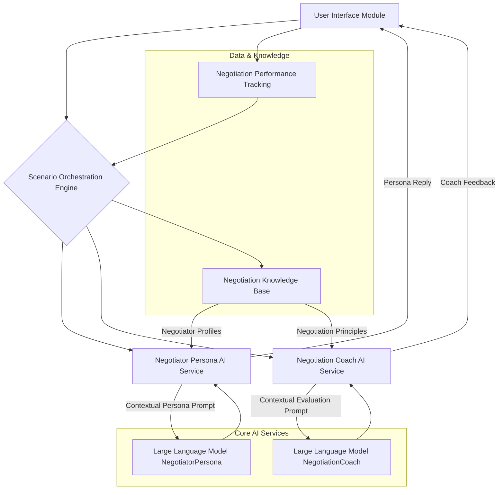
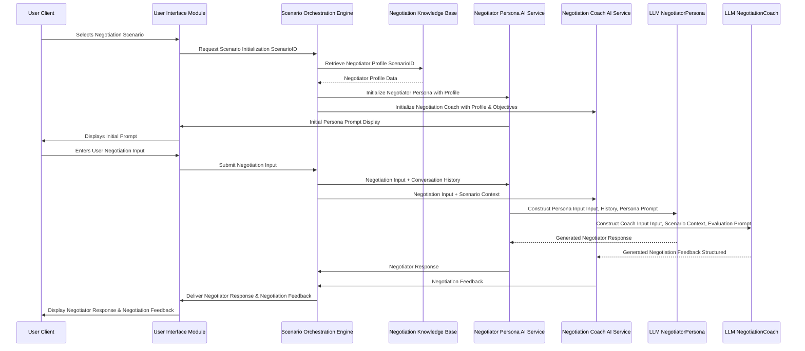
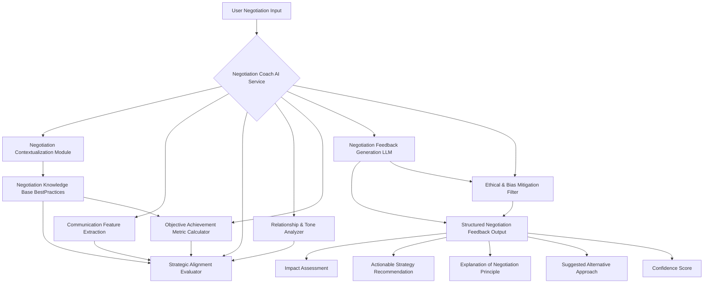
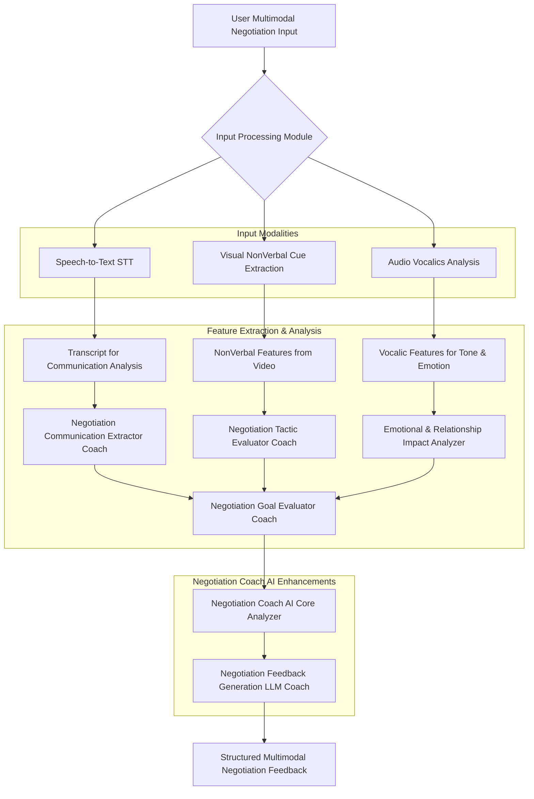
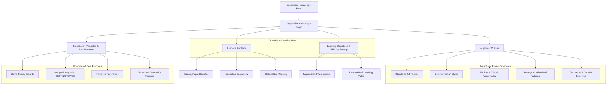
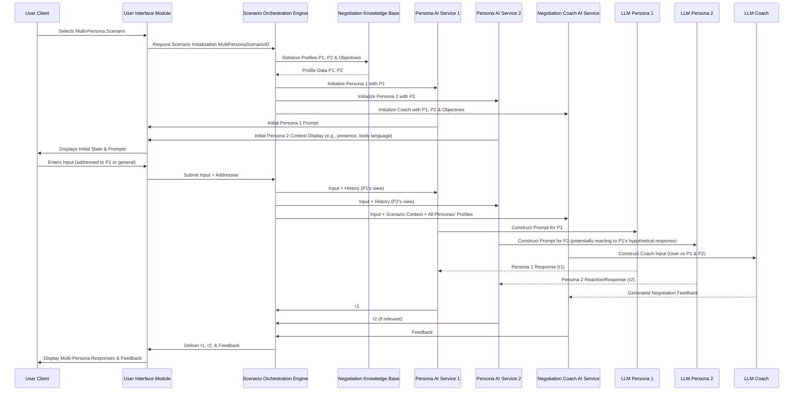
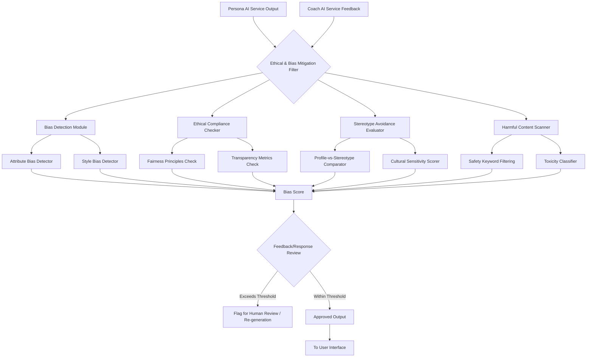

**Title of Invention:** System, Architecture, and Methodologies for High-Fidelity Cognitive Simulation of Advanced Negotiation Dynamics with Real-time Pedagogical Augmentation

**Abstract:**
A profoundly innovative system and associated methodologies are herein disclosed for the rigorous simulation and pedagogical augmentation of advanced negotiation competencies. This invention manifests as a sophisticated interactive platform, architected to present users with highly nuanced business, diplomatic, and interpersonal negotiation scenarios, wherein engagement occurs with an advanced Artificial Intelligence AI persona. This persona is meticulously engineered to embody the intricate strategic, tactical, behavioral, and cognitive parameters of a specified negotiator archetype or stakeholder profile. Through iterative textual or multimodal interaction, the system's core innovation lies in its capacity to furnish immediate, granular, and contextually profound feedback. This feedback, generated by a distinct, analytically-oriented AI module, meticulously evaluates the efficacy and appropriateness of the user's negotiation strategies, communication tactics, and overall approach against established negotiation principles and scenario objectives. The overarching objective is to facilitate the adaptive refinement and mastery of complex negotiation modalities within a risk-mitigated, highly didactic simulated environment, thereby transcending conventional training paradigms.

**Field of the Invention:**
The present invention pertains broadly to the domain of artificial intelligence, machine learning, natural language processing, cognitive simulation, and educational technology. More specifically, it relates to advanced methodologies for synthesizing human-computer interaction environments that are specifically tailored for experiential learning and skill acquisition in the highly specialized and often high-stakes arena of negotiation, particularly within professional, business, and diplomatic contexts.

**Background of the Invention:**
In an increasingly complex and competitive globalized environment, the mastery of effective negotiation has transitioned from a desirable attribute to an indispensable, mission-critical competency. Suboptimal agreements, unmet objectives, or outright breakdowns in dialogue frequently arise not merely from a lack of information, but from misapplied strategies, poor communication, failure to understand counterparts' true interests, or an inability to adapt to dynamic circumstances. Existing training methodologies, encompassing seminars, case studies, and didactic instruction, often lack the experiential immediacy and personalized adaptive feedback crucial for genuine skill internalization. Role-playing, while valuable, is inherently limited by human facilitators' subjective biases, availability, and capacity for consistent, objective modeling of diverse negotiation counterparts and complex scenarios. There exists, therefore, an exigent and profound need for a technologically advanced, scalable, and rigorously objective training apparatus capable of replicating the complexities of negotiation interactions and providing immediate, analytically robust feedback to accelerate learning and mitigate future strategic liabilities. The present invention addresses this lacuna by leveraging cutting-edge AI to forge an unparalleled simulation and learning ecosystem.

**Summary of the Invention:**
The present invention fundamentally redefines the paradigm of negotiation training through the deployment of an intelligently orchestrated, multi-AI architecture. At its core, the system initiates a structured negotiation scenario e.g., "Negotiating a software contract renewal with a value-driven client". A primary conversational AI, termed the "Negotiator Persona AI," is instantiated and meticulously configured via a comprehensive system prompt and an ontological negotiator profile model. This configuration imbues the Negotiator Persona AI with the specific strategic, tactical, behavioral, and communication characteristics of the targeted counterpart archetype e.g., "You are a cost-conscious procurement manager focused on minimizing expenditure, but also sensitive to long-term supplier relationships. Your priority is a 15% discount.". The user engages with this Negotiator Persona AI via natural language text or multimodal input. Crucially, each user input is synchronously transmitted to a secondary, analytical AI model, designated the "Negotiation Coach AI." The Negotiation Coach AI, operating under a distinct directive, performs a sophisticated real-time analysis of the user's input against the intricate parameters of the negotiator profile model and overall scenario objectives, evaluating its strategic efficacy, tactical appropriateness, communication clarity, and potential impact on negotiation outcomes. Concurrently, the Negotiator Persona AI processes the user's input and generates a strategically congruent, coherent, and contextually appropriate conversational response. The user is then presented with both the Negotiator Persona AI's generated reply and the Negotiation Coach AI's granular, pedagogically valuable feedback. This dual feedback mechanism empowers users to dynamically adjust their negotiation strategies, fostering accelerated adaptive learning and refined negotiation acumen.

**Brief Description of the Drawings:**
To facilitate a more comprehensive understanding of the invention, its operational methodologies, and its architectural components, the following schematic diagrams are provided:

1.  **Figure 1: System Architecture Overview**
    A high-level block diagram illustrating the primary modules and their interconnections within the proposed system for negotiation training.
2.  **Figure 2: Interaction Flow Diagram**
    A sequence diagram detailing the step-by-step process of user interaction, data transmission, AI processing, and feedback delivery in a negotiation scenario.
3.  **Figure 3: Negotiator Profile Modeling Ontology**
    A conceptual diagram depicting the hierarchical and interconnected components that constitute a strategically defined AI negotiator persona.
4.  **Figure 4: Feedback Generation Process**
    A detailed flowchart illustrating the analytical pipeline employed by the Negotiation Coach AI to generate nuanced feedback on negotiation performance.
5.  **Figure 5: Multimodal Negotiation Analysis Pipeline**
    A detailed flowchart illustrating the expanded pipeline for processing and analyzing multimodal user input in a negotiation context.
6.  **Figure 6: Negotiation Knowledge Graph (NKG) Structure**
    A conceptual diagram showing the semantic relationships within the Negotiation Knowledge Base, particularly for negotiator profiles and principles.
7.  **Figure 7: Adaptive Learning Profile (ALP) Dynamics**
    A state diagram illustrating how user performance metrics dynamically update the Adaptive Learning Profile and influence scenario orchestration.
8.  **Figure 8: Scenario Authoring Tool (SAT) Workflow**
    A flowchart depicting the step-by-step process for subject matter experts to create and customize new negotiation scenarios.
9.  **Figure 9: Multi-Persona Simulation Flow**
    A sequence diagram detailing the interaction dynamics when a user engages with multiple AI personas simultaneously or sequentially.
10. **Figure 10: Ethical & Bias Mitigation Filter (EBMF) Pipeline**
    A detailed flowchart illustrating the processes and checks performed by the EBMF on both persona responses and coach feedback.


**Figure 1: System Architecture Overview**
This diagram illustrates the fundamental modular components of the system. The **User Interface Module** serves as the primary conduit for user interaction. The **Scenario Orchestration Engine** manages the simulation's state, progression, and selection of appropriate negotiation contexts. This engine interfaces with the **Negotiation Knowledge Base**, which stores rich ontological models of various negotiator archetypes and negotiation principles. The core intelligence is provided by the **Negotiator Persona AI Service** and the **Negotiation Coach AI Service**, each leveraging **Large Language Models**. The Negotiator Persona AI generates strategically congruent responses, while the Negotiation Coach AI provides analytical feedback. All interactions and progress are logged in the **Negotiation Performance Tracking** module, which also informs the Scenario Orchestration.

---

**Figure 2: Interaction Flow Diagram**
This sequence diagram delineates the dynamic interplay between the system's components during a typical negotiation interaction turn. Upon user input, the **Scenario Orchestration Engine** acts as a central router, forwarding the input to both the **Negotiator Persona AI Service** and the **Negotiation Coach AI Service**. Each service then constructs highly specific prompts for their respective **Large Language Models** LLM_NP for persona generation, LLM_NC for feedback generation. The outputs from both LLMs are returned to the user via the **User Interface Module**, enabling real-time learning.

---

```mermaid
graph TD
    A[Negotiator Profile Model] --> B[Objectives & Priorities]
    A --> C[Communication Styles]
    A --> D[Tactical & Ethical Frameworks]
    A --> E[Strategic & Behavioral Patterns]
    A --> F[Contextual & Domain Expertise]

    B --> B1[BATNA BestAlternativeToNegotiatedAgreement]
    B --> B2[ReservationValue WalkAwayPoint]
    B --> B3[Interests UnderlyingMotivations]
    B --> B4[Aspirations IdealOutcome]
    B --> B5[RiskTolerance]
    B --> B6[TimeSensitivity]

    C --> C1[Directness vs Indirectness]
    C --> C2[ActiveListening & Empathy]
    C --> C3[PersuasionTechniques FramingAnchoring]
    C --> C4[QuestioningStrategies OpenClosed]
    C --> C5[RapportBuilding & Trust]
    C --> C6[EmotionalExpressionLevel]
    C --> C7[ArgumentativeStyle]

    D --> D1[ConcessionStrategies]
    D --> D2[Bluffing & DeceptionTolerance]
    D --> D3[PowerDynamics Leverage]
    D --> D4[EthicalBoundaries FairPlay]
    D --> D5[InformationSharingPropensity]
    D --> D6[ThreatsAndUltimatums]

    E --> E1[Collaborative vs Competitive]
    E --> E2[ProblemSolving Approaches]
    E --> E3[EmotionalIntelligence SelfRegulation]
E --> E4[Adaptability Flexibility]
    E --> E5[AssertivenessLevel]
    E --> E6[ConflictResolutionPreference]

    F --> F1[IndustrySpecifics]
    F --> F2[Legal & RegulatoryKnowledge]
    F --> F3[MarketConditions]
    F --> F4[OrganizationalCulture]
    F --> F5[HistoricalRelationshipData]
    F --> F6[CulturalNorms]
```

**Figure 3: Negotiator Profile Modeling Ontology**
This diagram presents an ontological breakdown of the granular components comprising a sophisticated negotiator profile model within the **Negotiation Knowledge Base**. Each node represents a distinct set of parameters that define how the Negotiator Persona AI behaves and how the Negotiation Coach AI evaluates user input. This multi-dimensional modeling ensures high-fidelity simulation and precise feedback generation.

---

**Figure 4: Feedback Generation Process**
This flowchart illustrates the sophisticated pipeline within the **Negotiation Coach AI Service** for generating comprehensive feedback. A user negotiation input undergoes multiple analytical stages: **Negotiation Contextualization**, **Communication Feature Extraction**, **Strategic Alignment Evaluation**, **Relationship & Tone Analysis**, and **Objective Achievement Metric Calculation**. These insights, informed by a **Negotiation Knowledge Base BestPractices**, are then fed into a **Negotiation Feedback Generation LLM**. The output is structured, comprising an **Impact Assessment**, **Actionable Strategy Recommendation**, **Explanation of Negotiation Principle**, and a **Suggested Alternative Approach**. A crucial **Ethical & Bias Mitigation Filter** ensures fairness and pedagogical soundness before the output is finalized and includes a **Confidence Score** for transparency.

---

**Figure 5: Multimodal Negotiation Analysis Pipeline**
This flowchart details an enhanced input processing and analysis pipeline, extending beyond text to incorporate multimodal cues. The **User Multimodal Negotiation Input** is processed by an **Input Processing Module**, which leverages **Speech-to-Text STT** for linguistic content, **Visual NonVerbal Cue Extraction** from video streams, and **Audio Vocalics Analysis** for paralinguistic features. The resulting **Transcript for Communication Analysis**, **NonVerbal Features from Video**, and **Vocalic Features for Tone & Emotion** are then fed into specialized modules within the **Negotiation Coach AI Enhancements**, including a **Negotiation Communication Extractor Coach**, **Negotiation Tactic Evaluator Coach**, **Emotional & Relationship Impact Analyzer**, and **Negotiation Goal Evaluator Coach**. These insights converge in the **Negotiation Coach AI Core Analyzer**, which then informs the **Negotiation Feedback Generation LLM Coach** to produce **Structured Multimodal Negotiation Feedback**, offering a richer, more comprehensive assessment of user negotiation performance.

---

**Figure 6: Negotiation Knowledge Graph (NKG) Structure**
This diagram expands on the structure of the **Negotiation Knowledge Base (NKB)**, detailing its implementation as a **Negotiation Knowledge Graph (NKG)**. The NKG interlinks **Negotiator Profiles**, **Negotiation Principles & Best Practices**, **Scenario Contexts**, and **Learning Objectives & Difficulty Settings** using semantic relationships. Negotiator Profiles are broken down into their ontological components, such as Objectives, Communication Styles, and Tactical Frameworks. Negotiation Principles encompass various theories like Game Theory and Principled Negotiation. This graph-based structure allows for sophisticated semantic queries and Retrieval Augmented Generation (RAG) to dynamically construct context-rich prompts for the AI services, ensuring deep contextual understanding and reducing factual inaccuracies or "hallucinations."

---
```mermaid
stateDiagram
    direction LR
    [*] --> InitialState : User Login
    InitialState --> ScenarioSelection : Select Scenario

    state ScenarioSelection {
        ScenarioSelection --> SOE_Init : SOE Initializes Scenario
    }

    state SOE_Init {
        SOE_Init --> NPAS_Init : NPAS Initialized
        SOE_Init --> NCAS_Init : NCAS Initialized
        SOE_Init --> ALP_Load : Load User ALP
    }

    state ALP_Load {
        ALP_Load --> WaitingForUserInput : ALP Data Available
    }

    state WaitingForUserInput {
        WaitingForUserInput --> UserInputReceived : User Enters Input
    }

    state UserInputReceived {
        UserInputReceived --> NPAS_Process : Input to NPAS
        UserInputReceived --> NCAS_Process : Input to NCAS
    }

    state NPAS_Process {
        NPAS_Process --> PersonaResponseGenerated : NPAS Generates Response
    }

    state NCAS_Process {
        NCAS_Process --> CoachFeedbackGenerated : NCAS Generates Feedback
    }

    state DualOutputDisplay {
        PersonaResponseGenerated --> DualOutputDisplay : Response Ready
        CoachFeedbackGenerated --> DualOutputDisplay : Feedback Ready
        DualOutputDisplay --> ALP_Update : User Review & Reflection
    }

    state ALP_Update {
        ALP_Update --> NPT_Log : Update User Metrics & Profile
        NPT_Log --> NPT_Complete : Interaction Logged
        NPT_Complete --> WaitingForUserInput : Next Turn
        NPT_Complete --> ScenarioProgressionCheck : End of Turn
    }

    state ScenarioProgressionCheck {
        ScenarioProgressionCheck --> ScenarioCompletion : Objectives Met
        ScenarioProgressionCheck --> AdaptiveDifficultyAdjustment : Adjust Difficulty
        AdaptiveDifficultyAdjustment --> WaitingForUserInput : New Challenge
        ScenarioCompletion --> PostSessionReport : Scenario Concluded
        PostSessionReport --> [*] : Session End
    }

    ALP_Load --> AdaptiveDifficultyAdjustment : Initial Difficulty Set by ALP
    ScenarioProgressionCheck --> RecommendationEngine : Suggest Next Scenario
    RecommendationEngine --> ScenarioSelection : Recommendation Accepted

```
**Figure 7: Adaptive Learning Profile (ALP) Dynamics**
This state diagram illustrates the dynamic nature of the **Adaptive Learning Profile (ALP)**. Upon user login, the ALP is loaded by the **Scenario Orchestration Engine (SOE)**, influencing initial scenario difficulty. Throughout a negotiation session, after each turn where the user receives dual feedback, the ALP is updated by the **Negotiation Performance Tracking (NPT)** module, reflecting changes in the user's negotiation skill metrics, observed weaknesses, and learning patterns. This updated ALP then informs the **Scenario Progression Check**, leading to potential adjustments in scenario difficulty, recommendation of new challenges, or suggesting subsequent scenarios tailored to the user's specific learning trajectory, thus providing a truly personalized and adaptive learning experience.

---
```mermaid
graph TD
    A[SME/Instructor] --> B{Scenario Authoring Tool UI}
    B --> C[Define Scenario Name & Description]
    B --> D[Set Learning Objectives]
    B --> E[Select/Create Negotiator Profile(s)]
    E --> E1[Define Persona Objectives/BATNA/RV]
    E --> E2[Configure Persona Style/Tactics/Comms]
    E --> E3[Add Domain Specific Knowledge]
    B --> F[Design Initial Scenario Prompt]
    B --> G[Add Scenario-Specific Evaluation Criteria]
    G --> G1[Target Outcomes]
    G --> G2[Key Performance Indicators KPI]
    G --> G3[Ethical Boundaries]
    B --> H[Upload/Generate Background Resources]
    B --> I[Preview & Test Scenario]
    I --> J{Feedback Loop}
    J -- Revisions --> B
    J -- Approved --> K[Publish to Negotiation Knowledge Base]
    K --> SOE[Available via Scenario Orchestration Engine]
```
**Figure 8: Scenario Authoring Tool (SAT) Workflow**
This flowchart describes the workflow for subject matter experts (SMEs) or instructors using the **Scenario Authoring Tool (SAT)**. Starting from the **SAT UI**, the SME defines the scenario's core attributes, sets specific learning objectives, and crucially, selects or creates one or more detailed **Negotiator Profiles**, specifying their objectives, communication styles, tactics, and domain expertise. They also design the initial scenario prompt and add scenario-specific evaluation criteria, including target outcomes and KPIs for the Negotiation Coach AI. Background resources can be uploaded. A critical **Preview & Test Scenario** phase allows for iterative refinement based on a feedback loop, ensuring the scenario's realism and pedagogical effectiveness. Once approved, the new scenario is published to the **Negotiation Knowledge Base**, making it available for selection via the **Scenario Orchestration Engine**.

---

**Figure 9: Multi-Persona Simulation Flow**
This sequence diagram illustrates the enhanced interaction flow for **Multi-Persona Simulation**. After a user selects a scenario involving multiple AI personas (e.g., two distinct stakeholders with potentially conflicting interests), the **Scenario Orchestration Engine (SOE)** initializes separate **Negotiator Persona AI Services (NPAS1, NPAS2)**, each with its unique profile. The user's input is simultaneously directed to *all* relevant persona AIs and the **Negotiation Coach AI Service (NCAS)**. Each persona AI processes the input from its own strategic perspective, generating its response. The NCAS evaluates the user's input against the objectives and profiles of *all* active personas. The UI then displays the responses from multiple personas (e.g., Persona 1 replies, Persona 2 observes or interjects) alongside the consolidated coach feedback, reflecting the complex dynamics of real-world multi-party negotiations.

---

**Figure 10: Ethical & Bias Mitigation Filter (EBMF) Pipeline**
This flowchart details the internal workings of the **Ethical & Bias Mitigation Filter (EBMF)**, a critical component applied to both Negotiator Persona AI outputs and Negotiation Coach AI feedback. The EBMF comprises several modules: a **Bias Detection Module** (checking for attribute or style biases), an **Ethical Compliance Checker** (ensuring adherence to fairness and transparency principles), a **Stereotype Avoidance Evaluator** (comparing AI behavior against known stereotypes and cultural sensitivities), and a **Harmful Content Scanner** (filtering for toxicity or safety violations). Each module contributes to a cumulative **Bias Score**. If this score exceeds a predefined threshold, the output is flagged for **Human Review / Re-generation**; otherwise, it is **Approved Output** and sent to the **User Interface**. This robust pipeline ensures that the system promotes ethical negotiation practices and delivers unbiased, constructive feedback.

**Detailed Description of the Preferred Embodiments:**
The present invention encompasses a multifaceted system and method for generating dynamic, strategically-sensitive negotiation simulations. The architecture is modular, scalable, and designed for continuous learning and adaptation.

**I. System Architecture and Core Components:**

**A. User Interface Module UIM:**
The UIM acts as the primary interactive layer, presenting scenarios, facilitating text or multimodal input, and displaying output. It is engineered for intuitive navigation and clear presentation of complex information.
*   **Scenario Presentation Interface:** Displays the narrative context, negotiation objectives, and specific prompts. It features dynamic elements that update to reflect the ongoing state of the negotiation, such as remaining time, available resources, and perceived emotional state of the persona.
*   **Input Field:** Allows users to compose and submit their responses, supporting text, voice, and video input. Advanced features include auto-completion, spell-checking, and real-time sentiment analysis visualization for user self-reflection before submission.
*   **Dual Output Display:** Simultaneously presents the Negotiator Persona AI's response and the Negotiation Coach AI's feedback, visually distinguishing between the two for clarity. Feedback may be presented in overlay, sidebar, or inline formats, with interactive elements that allow users to drill down into specific feedback points for more detail or to request a re-explanation.
*   **Progress and Performance Dashboard:** Tracks user's learning trajectory, skill proficiency metrics e.g., concession effectiveness, rapport building, outcome achievement, and scenario completion statistics over time. This dashboard includes graphical representations of progress, heatmaps indicating areas of persistent weakness, and personalized skill development recommendations derived from the Adaptive Learning Profile.
*   **Multimodal Input Controls:** Includes optional voice input capabilities via Speech-to-Text and video input for non-verbal cue analysis, expanding interaction modalities. The UIM provides clear indicators for activated modalities and confidence scores for multimodal input processing.

**B. Scenario Orchestration Engine SOE:**
The SOE is the central control unit, managing the lifecycle of each negotiation simulation session.
*   **Scenario Definition & Selection:** Stores and retrieves pre-defined negotiation scenarios, each associated with specific learning objectives, negotiator archetypes, and initial prompts. Supports dynamic scenario generation based on user performance or specific training needs, leveraging a scenario generation module that uses templates and parameters from the NKB.
*   **State Management:** Maintains the conversation history, negotiation parameters, and session-specific variables. This includes tracking concession points, shared information, perceived trust levels, and commitment points, all dynamically updating the negotiative state.
*   **Request Routing:** Directs user input to the appropriate AI services Negotiator Persona AI, Negotiation Coach AI and aggregates their responses. It also handles asynchronous processing acknowledgements and error handling.
*   **Learning Progression Logic:** Adapts scenario difficulty or introduces new negotiation challenges based on user's demonstrated proficiency or persistent challenges, potentially employing reinforcement learning algorithms to personalize difficulty. This logic uses the Adaptive Learning Profile to select optimal next steps, such as introducing a more aggressive persona, time constraints, or a multi-party negotiation.
    *   For a given user `U` and current efficacy `E_t`, the SOE determines the next scenario `S_{t+1}`:
    (1) `S_{t+1} = f_S(E_t, ALP_U, {S_k})`
    where `f_S` is a scenario selection function, `ALP_U` is the user's Adaptive Learning Profile, and `{S_k}` is the set of available scenarios.
    *   Difficulty `D` adjustment:
    (2) `D_{t+1} = D_t + \lambda_D * (E_t - D_t / D_{max})`
    where `\lambda_D` is a learning rate for difficulty, and `D_{max}` is the maximum difficulty.

**C. Negotiation Knowledge Base NKB:**
The NKB is a meticulously curated repository of negotiator profile models and negotiation principles, serving as the foundational intelligence for both AI services. It is implemented as a sophisticated **Negotiation Knowledge Graph (NKG)**.
*   **Ontological Negotiator Profiles:** Each negotiator archetype is represented as a rich ontology within the NKG, encompassing:
    *   **Objectives and Priorities:** BATNA (Best Alternative To a Negotiated Agreement), Reservation Value (Walk Away Point), Target Price, Underlying Interests, Aspiration Levels, Risk Tolerance, Time Sensitivity, Key Performance Indicators (KPIs) for success.
    *   **Negotiation Styles:** Competitive, Collaborative, Accommodating, Avoiding, Compromising, Hard vs. Soft bargaining approaches.
    *   **Communication Strategies:** Directness/Indirectness, Persuasion Tactics (e.g., scarcity, authority, social proof), Questioning Techniques (open, closed, leading), Active Listening, Rapport Building approaches, Use of silence, Emotional Expression Level.
    *   **Tactical Repertory:** Concession strategies (gradual, sudden, reciprocal), Anchoring, Framing, Bluffing tolerance, Opening offers (aggressive, moderate), Deadline management, Information sharing propensity, Use of threats or ultimatums, Coalition formation.
    *   **Power Dynamics Assessment:** Leverage points, Perceived power, Authority levels, Dependence on outcome.
    *   **Ethical Frameworks:** Propensity for ethical vs. opportunistic behavior, Trustworthiness, Integrity index.
    *   **Emotional Regulation:** Responses to stress, conflict, or high stakes; self-regulation capabilities, empathy levels, emotional contagion susceptibility.
    *   **Domain Specific Knowledge:** Industry-specific jargon, market conditions, legal precedents, organizational culture relevant to the scenario, historical relationship data.
    *   Formal definition of a persona parameter `P_attr` for attribute `attr`:
    (3) `P_attr \in \mathbb{R}^{d_{attr}}` where `d_{attr}` is the dimensionality of the attribute.
*   **Negotiation Principles and Best Practices:** A repository of widely accepted negotiation theories and empirically validated best practices e.g., Getting to Yes principles, game theory insights, influence psychology (Cialdini's principles), behavioral economics insights, cultural negotiation models (Hofstede's dimensions). Each principle `\Pi` is represented as a structured rule set or a set of constraints:
    (4) `\Pi = \{C_1, C_2, ..., C_n\}`, where `C_i` are contextual conditions or recommended actions.
*   **Dynamic Model Updates:** Mechanism for incorporating new negotiation research, expert input, and observed emergent negotiation trends into the models, potentially leveraging federated learning for continuous refinement from anonymized user interaction patterns or expert feedback loops. This includes a robust versioning system for negotiator profiles and a continuous integration/continuous deployment (CI/CD) pipeline for model updates.

**D. Negotiator Persona AI Service NPAS:**
Responsible for simulating the strategically-attuned negotiation counterpart.
*   **Large Language Model LLM Integration:** Utilizes a state-of-the-art LLM e.g., a fine-tuned transformer architecture like GPT-4 or a custom negotiation-specific model, as its core conversational engine.
*   **Contextual Persona Prompt Engineering:** Generates highly specific and dynamic prompts for the LLM. The prompt `\mathcal{P}_{NPAS}` is constructed as:
    (5) `\mathcal{P}_{NPAS}(P, h_t, i_t, \text{scenario}) = \text{SystemRole}(P) + \text{HistoryContext}(h_t) + \text{UserUtterance}(i_t) + \text{DynamicGoal}(P, \text{scenario}) + \text{EISContext}(P, h_t)`
    This integrates the current conversation history, the detailed negotiator profile `P` from the NKB, specific scenario objectives, and inferred emotional states.
*   **Coherence & Consistency Engine:** A layer that monitors LLM output for logical, strategic, and behavioral consistency across multiple turns, intervening to refine or re-generate responses if deviations are detected. This includes cross-referencing with the NKB for adherence to `P`'s defined parameters. A consistency score `C_{consist}` is calculated for each response `r_t`:
    (6) `C_{consist}(r_t, h_t, P) = \sum_{j=1}^{N_C} w_j \cdot ConsistencyMetric_j(r_t, h_t, P_j)`
    If `C_{consist} < \tau_{consist}`, the response is re-generated or modified.
*   **Emotional Intelligence Simulation EIS:** Infers emotional states and generates responses based on the negotiator's profile and conversational context, adding realism to the persona's behavior. An emotional state vector `E_S` is maintained for the persona:
    (7) `E_S^{t+1} = \Phi_{EIS}(E_S^t, i_t^{user}, r_t^{persona}, P_{emotion_params})`
    where `\Phi_{EIS}` is a neural network model that updates the persona's emotional state, which then influences the tone and content of `r_t^{persona}`.
*   **Adaptive Persona Refinement:** Mechanism to subtly adjust persona parameters over long-term interaction with a user or across scenarios to maintain novelty and reflect subtle shifts in perceived negotiation dynamics, or to pose specific learning challenges. This could involve dynamically modifying prompt weights based on prior interactions or even slightly altering `P` attributes based on user's learning path.

**E. Negotiation Coach AI Service NCAS:**
Dedicated to providing analytical feedback on user negotiation performance.
*   **Large Language Model LLM Integration:** Employs a separate, potentially distinct, LLM from the Negotiator Persona AI, optimized for analytical reasoning and structured output.
*   **Contextual Evaluation Prompt Engineering:** Formulates specific prompts for the LLM, instructing it to analyze the user's input against defined negotiator profile parameters, scenario objectives, and negotiation best practices, identify areas of divergence or alignment, and structure feedback. This includes chain-of-thought prompting for more detailed reasoning. The coach prompt `\mathcal{P}_{NCAS}` is:
    (8) `\mathcal{P}_{NCAS}(i_t, P, \text{scenario}, \Pi) = \text{EvaluationTask} + \text{UserUtterance}(i_t) + \text{PersonaContext}(P) + \text{ScenarioObjectives}(\text{scenario}) + \text{RelevantPrinciples}(\Pi) + \text{OutputFormat}`
*   **Multi-Faceted Analysis Modules:**
    *   **Communication Feature Analyzer:** Identifies clarity, conciseness, rhetorical strategies, questioning effectiveness, active listening indicators, and persuasive language. Uses models for semantic similarity and rhetorical device detection.
        (9) `F_{comm}(i_t) = [Clarity(i_t), Conciseness(i_t), Rhetoric(i_t), ...]`
    *   **Strategic & Tactical Evaluator:** Assesses the appropriateness and effectiveness of the user's chosen negotiation strategies and tactics e.g., opening offer, concession patterns, information sharing, and their alignment with optimal outcomes. It evaluates the current tactical decision `\text{tac}_t` against `P_{tactics}` and `\Pi`.
        (10) `E_{strat}(i_t, P, \text{scenario}) = \text{Cost}(StrategyMatcher(i_t) - P_{strategy}) + \text{UtilityGain}(i_t, \text{scenario})`
    *   **Behavioral Alignment Evaluator:** Compares user's communication behavior as expressed textually and non-verbally against preferred or effective negotiation behaviors, leveraging insights from multimodal inputs.
        (11) `E_{behav}(i_t^{multimodal}, P) = \text{Similarity}(BehaviorExtractor(i_t^{multimodal}), P_{behavior_norms})`
    *   **Relationship & Tone Detection:** Utilizes advanced NLP techniques and vocalics analysis to infer the emotional valence and perceived tone of the user's input, assessing its impact on rapport and trust. A rapport score `R_t` is updated:
        (12) `R_{t+1} = \Psi_R(R_t, \text{Tone}(i_t), \text{PersonaEmotion}(r_t), P_{rel_pref})`
    *   **Objective Achievement Scoring:** Assigns quantitative scores across various negotiation objectives e.g., value created, relationship maintained, goal attainment to provide a composite performance metric, with explainable AI techniques to justify scores. For an objective `obj_k`:
        (13) `Score_{obj_k} = \omega_k \cdot (1 - \text{Penalty}(i_t, \text{goal}_k, \text{P}))`
        (14) `TotalObjectiveScore = \sum_{k} Score_{obj_k}`
    *   **Deviation Analysis Aggregation:** Combines individual scores from various analysis modules into a comprehensive negotiation performance index, highlighting critical areas and their relative importance.
        (15) `PerformanceIndex = \sum_m \gamma_m \cdot E_m(i_t, P, s_t)` where `E_m` are scores from different modules and `\gamma_m` are weighting factors.
*   **Structured Feedback Generation:** Produces feedback in a predefined schema e.g., JSON, including:
    *   `feedback_statement`: A descriptive qualitative assessment of negotiation performance.
    *   `impact_level`: e.g., "Detrimental," "Suboptimal," "Neutral," "Effective," "Exemplary".
    *   `negotiation_principle_applied_or_missed`: Explanation of the underlying negotiation principle or best practice.
    *   `actionable_strategy_recommendation`: Specific, practical advice for improvement or reinforcement of negotiation techniques.
    *   `relevance_score`: Confidence in feedback accuracy, derived from multiple analytical pathways.
    *   `suggested_alternative_approach`: An example of a more effective negotiation statement or action.
*   **Ethical & Bias Mitigation Filter:** A crucial component ensuring that feedback is fair, avoids stereotyping, promotes ethical negotiation practices, and focuses on skill improvement. This filter scrutinizes generated feedback for fairness, constructiveness, and strategic appropriateness before presentation to the user, potentially employing an independent debiasing model. A bias score `B_{score}` for feedback `f_t` is calculated:
    (16) `B_{score}(f_t, i_t, P, \text{scenario}) = \sum_j \alpha_j \cdot \text{BiasDetector}_j(f_t, \text{context})`
    If `B_{score} > \tau_{bias}`, feedback is flagged for review/re-generation.

**F. Negotiation Performance Tracking NPT:**
A persistent data store and analytical module.
*   **Conversational Log:** Records every user input, Negotiator Persona AI response, and Negotiation Coach AI feedback for post-session review, aggregate analysis, and compliance auditing. Each log entry is timestamped and includes metadata.
*   **Performance Metrics Database:** Stores quantitative scores on negotiation objective achievement, tactical effectiveness, communication efficacy, and learning progression over time, with timestamped records. This includes raw scores and normalized scores across different scenarios.
    (17) `Metric_{k,t} = \text{Score}_k(i_t, P, s_t)`
*   **Adaptive Learning Profile ALP:** Builds a personalized profile of each user's negotiation strengths, weaknesses, and learning patterns, informing the SOE for personalized scenario recommendations and difficulty adjustments. This profile updates dynamically based on continuous interaction. The ALP `\mathcal{A}_U` for user `U` is a vector of skill proficiencies:
    (18) `\mathcal{A}_U^{t+1} = (1-\beta) \mathcal{A}_U^t + \beta \cdot \text{EfficacyVector}(F_t)`
    where `\beta` is the learning rate, and `\text{EfficacyVector}(F_t)` translates feedback into skill component updates.

**II. Operational Methodology:**

1.  **Initialization Phase:**
    *   A user selects a specific negotiation training scenario from the UIM, or the SOE recommends one based on their NPT profile and learning objectives. This recommendation engine `\mathcal{R}` uses `\mathcal{A}_U`:
    (19) `\text{RecommendedScenario} = \mathcal{R}(\mathcal{A}_U, \text{available scenarios})`
    *   The SOE retrieves the associated negotiator profile model from the NKB, including its specific parameters for persona and evaluation, and scenario-specific negotiation objectives.
    *   The Negotiator Persona AI Service is initialized with the detailed negotiator profile model and the initial scenario prompt.
    *   The Negotiation Coach AI Service is initialized with the same negotiator profile model and specific evaluation criteria pertinent to the scenario and negotiation objectives.
    *   The UIM displays the initial prompt from the Negotiator Persona AI, setting the stage for the interaction.

2.  **User Input and Parallel Processing Phase:**
    *   The user composes and submits a textual or multimodal response via the UIM. If multimodal, the Input Processing Module preprocesses it. The multimodal input `I_t^{multi}` is converted to an embedding:
    (20) `i_t^{embedding} = \Phi(I_t^{multi})`
    *   The SOE receives the user's input and simultaneously transmits it:
        *   To the Negotiator Persona AI Service, along with the ongoing conversation history and relevant persona parameters.
        *   To the Negotiation Coach AI Service, along with the relevant scenario context, negotiation objectives, and any extracted multimodal features.

3.  **Negotiator Persona AI Response Generation Phase:**
    *   The Negotiator Persona AI Service constructs a sophisticated, dynamic prompt for its LLM, incorporating the persona's identity, the negotiator profile model's nuances, the current conversational turn, and the user's input.
    *   The LLM generates a response that is syntactically correct, semantically coherent, and critically, strategically congruent with the defined archetype's negotiation style and objectives.
    *   The Negotiator Persona AI Service applies post-processing filters or refinement mechanisms to ensure adherence to consistency parameters and to prevent factual or strategic drift. This includes an **Ethical & Bias Mitigation Filter** (EBMF).
    (21) `r_t = \text{EBMF}(\text{LLM\_NP}(\mathcal{P}_{NPAS}))`

4.  **Negotiation Coach AI Feedback Generation Phase:**
    *   Concurrently, the Negotiation Coach AI Service performs a multi-layered analysis of the user's input, which may include communication, strategic, tactical, behavioral, and relationship aspects, leveraging multimodal data where available.
    *   It extracts communication features, assesses strategic intent, evaluates tactical alignment against NKB best practices, and determines the overall impact on relationship and tone.
    *   These analytical insights are fed into its dedicated LLM, which is prompted using chain-of-thought or similar techniques to generate structured, actionable feedback.
    *   The feedback includes a qualitative assessment, an impact level rating, an explanation of the underlying negotiation principle, a concrete recommendation for improvement, and potentially an alternative approach example. The Ethical & Bias Mitigation Filter reviews this feedback.
    (22) `f_t = \text{EBMF}(\text{LLM\_NC}(\mathcal{P}_{NCAS}))`

5.  **Output Display and Iteration Phase:**
    *   The SOE receives both the Negotiator Persona AI's response and the Negotiation Coach AI's feedback.
    *   The UIM presents both outputs to the user clearly and distinctly, potentially using visual indicators for impact level or areas of focus.
    *   The user reviews the Negotiator Persona AI's reply and critically analyzes the Negotiation Coach AI's feedback, enabling them to reflect and dynamically adjust their negotiation strategy for the subsequent interaction turn.
    *   The NPT logs the entire interaction, including all raw inputs, AI outputs, and feedback metrics, for future analysis and progress tracking.
    *   The system then awaits the next user input, perpetuating the iterative learning cycle.

**III. Advanced Features and Embodiments:**

*   **Adaptive Scenario Progression:** Negotiation scenarios dynamically adjust in complexity, introducing new challenges or counterpart behaviors based on real-time user performance and feedback scores. This can employ reinforcement learning algorithms to personalize the learning journey, optimizing for skill acquisition. The policy `\pi_U` for scenario selection for user `U` is updated using observed rewards `R_t = E(i_t, P, s_t)`:
    (23) `\pi_U^{t+1} = \text{UpdateAlgorithm}(\pi_U^t, s_t, i_t, R_t, F_t)`
    This could involve Q-learning or Policy Gradient methods, where the state `s_t` includes `ALP_U`.
*   **Multi-Persona Simulation:** Ability to simulate interactions with multiple AI personas from different stakeholder groups or with conflicting objectives simultaneously or sequentially within a single complex negotiation scenario, e.g., a cross-functional negotiation with distinct departmental representatives. Each persona `P_k` has its own state and potentially its own set of dynamic goals, reacting to both the user and other personas.
    (24) `r_t^k = \text{LLM\_NP_k}(\mathcal{P}_{NPAS}(P_k, h_t, i_t, \text{scenario}, \{r_t^j\}_{j \neq k}))`
    The coaching feedback in this case would include analysis of how the user managed the dynamics between multiple personas.
*   **Multimodal Communication Analysis:** While textual interaction is the primary embodiment, the system is augmented with Speech-to-Text and Text-to-Speech capabilities for voice-based communication, alongside video analysis for non-verbal cues. This enables leveraging advanced vocalics analysis e.g., prosody, pitch, pace, pauses and non-verbal cues e.g., gestures, facial expressions, eye contact, proxemics as additional dimensions for feedback and persona realism.
    *   **Vocalics Features:** `F_{vocalics}(audio) = [\text{pitch}, \text{loudness}, \text{speech rate}, \text{pauses}, \text{jitter}, \text{shimmer}, ...]`
    *   **Visual Features:** `F_{visual}(video) = [\text{facial expressions (anger, joy, neutral, ...)}, \text{eye gaze}, \text{gestures}, \text{body posture}, \text{proxemics}, ...]`
    *   These features are embedded and concatenated for multimodal input `i_t^{multi}`:
    (25) `i_t^{embedding} = \text{Concat}(\text{Embedding}_{text}(transcript), \text{Embedding}_{audio}(F_{vocalics}), \text{Embedding}_{video}(F_{visual}))`
*   **Gamification Elements:** Incorporating scoring, badges, leaderboards, achievement systems, and progress tracking related to negotiation outcomes and skill mastery to enhance user engagement, motivation, and sustained learning.
    (26) `UserScore_{session} = \sum_{t=1}^{T} \omega_t \cdot E(i_t, P, s_t)`
    (27) `AchievementUnlocked_k = \mathbb{I}(\text{UserSkill}_{comp_k} > \tau_k \land \text{conditions met})`
*   **Expert Feedback Override:** Allowing human negotiation experts or instructors to review challenging interactions, correct AI outputs, and provide supplementary or corrective feedback. This human-in-the-loop mechanism can also be used to continuously fine-tune and improve both the Negotiator Persona AI and Negotiation Coach AI models.
*   **Diagnostic Reports:** Comprehensive post-session or cumulative reports detailing specific negotiation pitfalls, communication strengths, identified learning patterns, and recommended targeted training modules or external resources.
    (28) `Report_U = \text{AggregateAnalytics}(\text{NPT_Logs}_U, \text{ALP}_U, \text{skill_taxonomy})`
*   **Negotiation Competency Taxonomy Mapping:** Mapping user performance and learning progress to an established and recognized taxonomy of negotiation competencies e.g., Harvard Negotiation Project frameworks, providing structured skill development pathways and certifications.
    (29) `SkillLevel_{comp_j} = \text{Function}(\text{AverageEfficacyOnComp}_j, \text{NumScenariosOnComp}_j)`
*   **Real-time Multilingual Support:** Seamless integration of Neural Machine Translation NMT to allow users to interact in their native language while simulating negotiation with a persona operating in a different linguistic context, with feedback specifically addressing negotiation strategy rather than purely linguistic translation issues.
    (30) `i_t^{target\_lang} = \text{NMT}(\text{user\_input}, \text{source\_lang}, \text{target\_lang})`
    The coach evaluates `i_t^{target\_lang}`'s strategic content.
*   **Personalized Learning Paths:** Leveraging the Adaptive Learning Profile to recommend not just scenarios, but also external learning resources e.g., articles, videos, micro-lessons, workshops tailored to individual weaknesses, learning styles, and professional development goals in negotiation.
    (31) `RecommendedResource = \text{ResourceMatcher}(\text{ALP}_U, \text{WeaknessDetected})`
*   **Scenario Authoring Tool:** A user-friendly interface enabling instructors, administrators, or subject matter experts to design, customize, and deploy new negotiation scenarios, including defining negotiator archetypes, interaction objectives, specific evaluation criteria, and persona dialogue examples. This tool directly interacts with the NKG to update profiles and scenario definitions.
*   **Peer-to-Peer Collaborative Learning:** Facilitating structured interactions between multiple human users within a simulated negotiation scenario, where the Negotiation Coach AI can provide individualized feedback on group dynamics, collective negotiation efficacy, and individual contributions to collective negotiation outcomes.
    (32) `E_{group} = \text{CollectiveObjectiveScore}(\text{outcome}, \{\text{user_actions}\})`
    (33) `E_{individual,k} = \text{ContributionScore}(\text{user_k_actions}, E_{group})`

**IV. Technical Implementation Details:**

**A. LLM Prompt Engineering & Tuning:**
The efficacy of the AI services heavily relies on sophisticated prompt engineering.
*   **Dynamic Prompt Generation:** Prompts are not static strings but dynamically constructed at runtime, incorporating scenario context, conversation history, user profile data, and detailed negotiator profile parameters from the NKB. This ensures maximum relevance and adherence to desired AI behavior.
    (34) `Prompt = \text{Template} + \text{ContextVariables}`
*   **Few-Shot Learning & In-Context Examples:** LLMs are provided with carefully curated few-shot examples within the prompt to guide their reasoning and response generation. For Negotiator Persona AI, these examples demonstrate strategically appropriate dialogue. For Negotiation Coach AI, they illustrate desired feedback format and analytical depth.
    (35) `FewShotExamples = \{ (\text{Input}_1, \text{Output}_1), ..., (\text{Input}_k, \text{Output}_k) \}`
    (36) `Prompt_{LLM} = \text{Instructions} + \text{FewShotExamples} + \text{CurrentInput}`
*   **Chain-of-Thought CoT Prompting:** For the Negotiation Coach AI, CoT prompting is employed to encourage step-by-step reasoning, improving the transparency and accuracy of feedback generation by guiding the LLM through a logical analysis of the user input against negotiation principles and objectives.
    (37) `CoT_Prompt = \text{Instruct("Think step-by-step. Analyze input, then principles, then draft feedback.")}`
*   **Fine-tuning & Domain Adaptation:** While large foundational models are used, domain-specific fine-tuning on extensive datasets of negotiation transcripts, expert negotiation analysis, and outcome-annotated dialogues further specializes the LLMs for the invention's purpose. This includes fine-tuning for specific negotiation styles and pedagogical feedback styles. The fine-tuning objective function `L_{FT}`:
    (38) `L_{FT} = - \sum_{(x,y) \in D_{fine-tune}} \log P(y|x; \theta_{LLM})`
    where `\theta_{LLM}` are the model parameters and `D_{fine-tune}` is the domain-specific dataset.
*   **Guardrails and Safety Filters:** Post-generation filters are implemented to ensure LLM outputs are non-toxic, non-stereotypical, ethically sound, and aligned with negotiation best practices, preventing the propagation of harmful biases or unethical tactics. These filters use predefined rule sets, sentiment analysis, and toxicity classifiers.

**B. Data Pipeline & Knowledge Graph Management:**
Effective data management is crucial for the system's intelligence and adaptability.
*   **Negotiation Knowledge Graph NKG:** The NKB is implemented as a sophisticated knowledge graph, where negotiation objectives, strategies, tactics, communication styles, and behavioral protocols are represented as entities and relationships using technologies like RDF Resource Description Framework or OWL Web Ontology Language, stored in a graph database e.g., Neo4j, Amazon Neptune.
    (39) `(Subject, Predicate, Object)` triples form the basis of the NKG.
    (40) `Negotiator_Persona_A hasStyle Competitive`
    (41) `Negotiation_Principle_X recommends Tactic_Y`
*   **Semantic Search & Retrieval Augmented Generation RAG:** When initializing personas or evaluating inputs, the NKG is semantically queried to retrieve the most relevant negotiation knowledge, which is then dynamically inserted into LLM prompts via RAG techniques. This grounds LLM responses in factual negotiation data, reducing hallucinations.
    (42) `Relevant_Context = \text{QueryNKG}(Keywords(i_t) \cup P_{attr}, \text{NKG})`
    (43) `Prompt_{RAG} = \text{BasePrompt} + \text{Relevant_Context} + \text{CurrentInput}`
*   **User Interaction Data Lake:** All user interactions, inputs, persona responses, and coach feedback are stored in a secure, anonymized data lake e.g., AWS S3, Azure Data Lake Storage. This data is leveraged for analytics, performance monitoring, and for future model training and adaptive learning algorithm development.
*   **Event Sourcing:** The conversational flow and state changes are managed using an event-sourcing pattern, ensuring auditability, replayability, and consistent state management across distributed microservices. Each interaction `\text{evt}_t` is an immutable event.

**C. Scalability and Deployment Strategy:**
The system is designed to handle a large number of concurrent users and complex AI operations.
*   **Microservices Architecture:** The system components UIM, SOE, NKB, NPAS, NCAS, NPT are implemented as independent microservices, each with its own responsibilities, allowing for independent development, deployment, and scaling.
*   **Containerization & Orchestration:** Microservices are containerized using Docker and deployed on a Kubernetes cluster. This provides automated scaling, load balancing, self-healing capabilities, and efficient resource utilization across cloud providers e.g., AWS, Azure, GCP.
    (44) `N_{pods} = f(\text{current_load}, \text{CPU_utilization_threshold})`
*   **Asynchronous Processing & Message Queues:** AI processing tasks for Negotiator Persona AI and Negotiation Coach AI can be computationally intensive. Asynchronous message queues e.g., Apache Kafka, RabbitMQ are used to decouple user input submission from AI response generation, ensuring a responsive user interface even under heavy load.
    (45) `QueueLatency = \text{ProcessingTime}_{AI} - \text{UserInputSubmissionTime}`
*   **API Gateway:** All external and internal service communications are routed through an API Gateway, which handles authentication, authorization, rate limiting, and request routing, enhancing security and manageability.
*   **Edge Computing for Low Latency:** For multimodal input processing where real-time responsiveness is critical e.g., voice/video, portions of the input processing pipeline may be deployed closer to the user on edge devices or regional data centers to minimize latency.
    (46) `TotalLatency = \text{EdgeProcessingTime} + \text{NetworkLatency} + \text{CloudProcessingTime}`
    Goal: `TotalLatency < \tau_{realtime}` (e.g., 200ms).

**D. Security & Compliance:**
Robust security measures are integrated across the entire system lifecycle.
*   **Identity and Access Management (IAM):** Implemented for all system users and internal services, leveraging multi-factor authentication (MFA) and granular role-based access control (RBAC).
    (47) `Access_Granted = \mathbb{I}(\text{UserIdentity} \land \text{UserRole} \subseteq \text{ResourcePermissions})`
*   **Vulnerability Management:** Regular security audits, penetration testing, and static/dynamic application security testing (SAST/DAST) are performed to identify and remediate vulnerabilities.
*   **Data Masking and Tokenization:** For sensitive data, techniques like masking and tokenization are applied, especially in development and testing environments, to minimize exposure of real data.
*   **Auditing and Logging:** Comprehensive audit trails are maintained for all system activities, particularly those involving data access or modification, to ensure accountability and facilitate forensic analysis.

**V. Evaluation and Validation Framework:**

To ensure the system's effectiveness and reliability, a rigorous evaluation and validation framework is employed.

**A. Quantitative Metrics for Efficacy:**
*   **Negotiation Outcome Score:** A composite metric derived from the Coach AI's Objective Achievement Scoring, measuring the degree to which user's negotiation strategy leads to favorable outcomes against scenario objectives. Tracked over time to demonstrate learning progression.
    (48) `OutcomeScore = \sum_{k} w_k \cdot f_k(\text{ActualOutcome}_k, \text{TargetOutcome}_k, P_k)`
*   **Tactical Effectiveness Score:** Evaluates the user's appropriate and skillful application of specific negotiation tactics e.g., questioning, active listening, concession patterns, as assessed by the Coach AI and potentially correlated with Persona AI's responses.
    (49) `TacticalEffectiveness = \frac{1}{|T|} \sum_{t \in T} \text{Match}(\text{user_tactic}_t, \text{optimal_tactic}_t(P))`
*   **Learning Curve Analysis:** Tracks the rate of improvement in outcome and tactical effectiveness scores over multiple sessions, providing a quantifiable measure of accelerated learning.
    (50) `LearningRate = \frac{\Delta \text{OutcomeScore}}{\Delta \text{Sessions}}`
    (51) `LearningCurve = \{ (\text{Session}_k, \text{AvgOutcomeScore}_k) \}`
*   **Rapport & Trust Score:** Measures the perceived quality of the relationship built during the negotiation, based on communication analysis and persona AI reactions.
    (52) `RapportScore = \text{WeightedAvg}(\text{SentimentCorrelation}, \text{EmpathyIndicators}, \text{ToneSimilarity})`
*   **Persona Realism Score:** An automated metric, potentially derived from user feedback and internal consistency checks, assessing how consistently the Negotiator Persona AI adheres to its defined archetype.
    (53) `RealismScore = \text{Consistency}(P_{profile}, \text{PersonaResponses}) + \alpha \cdot \text{UserFeedback}_{realism}`
*   **Feedback Utility Score:** Measures how helpful and actionable the Coach AI feedback is perceived by users.
    (54) `UtilityScore = \text{Avg}(\text{UserRating}_{helpfulness}, \text{UserRating}_{actionability})`
*   **Time-to-Competency Reduction:** Measures the reduction in time or number of sessions required for users to achieve a defined level of negotiation competency compared to traditional training methods.
    (55) `\Delta T_{competency} = T_{traditional} - T_{system}`
*   **Strategic Adaptability Index:** Quantifies the user's ability to adjust their strategies in response to dynamic persona behavior or changing scenario conditions.
    (56) `AdaptabilityIndex = \frac{\sum \mathbb{I}(\text{strategy change aligns with Coach feedback})}{\text{Num_opportunities_to_adapt}}`
*   **Cognitive Load Assessment:** Measures the mental effort required from the user, through self-reporting or physiological indicators, aiming for optimal challenge without overload.
    (57) `CognitiveLoad = \text{SubjectiveWorkloadScale} + \text{BiometricIndicators}`

**B. Qualitative User Studies & Expert Review:**
*   **User Experience UX Studies:** Conducted through surveys, interviews, and usability testing to gather feedback on interface design, ease of use, clarity of feedback, and overall satisfaction.
*   **Think-Aloud Protocols:** Users vocalize their thought processes while interacting with the system, providing insights into their learning strategies and the cognitive impact of the AI feedback.
*   **Expert Negotiation Review:** Subject matter experts e.g., professional negotiators, academic negotiation trainers critically evaluate the Negotiator Persona AI's responses for strategic realism and the Negotiation Coach AI's feedback for pedagogical soundness and strategic utility. This is a continuous process.
*   **A/B Testing of Feedback Strategies:** Different modalities, granularities, or timing of Negotiation Coach AI feedback are A/B tested to identify the most effective pedagogical approaches for different learning styles or negotiation contexts.
    (58) `\text{A/B Test Result} = \text{StatisticalSignificance}(\text{Group A Metrics}, \text{Group B Metrics})`
*   **Pre and Post-Simulation Assessments:** Standardized negotiation competence assessments administered before and after using the system to measure tangible improvements in skills and knowledge.

**VI. Ethical AI Considerations:**

The design and deployment of this system are underpinned by a strong commitment to ethical AI principles.

**A. Bias Detection and Mitigation:**
*   **Negotiator Profile Nuance vs Stereotype:** Great care is taken in developing negotiator profiles to represent nuanced behaviors rather than perpetuating harmful stereotypes related to gender, culture, industry, or role. The NKB undergoes continuous auditing by diverse negotiation experts.
    (59) `BiasMetric_{stereotype} = \text{Similarity}(P_{profile}, \text{StereotypeVector})`
*   **LLM Bias Auditing:** Pre-trained LLMs are rigorously evaluated for inherent biases related to negotiation styles, cultural backgrounds, or professional roles. Fine-tuning datasets are carefully curated for diversity and fairness in negotiation scenarios.
    (60) `\text{BiasScore}_{LLM} = \text{DistributionDistance}(\text{LLM Output Dist}, \text{FairOutput Dist})`
*   **Feedback Fairness Metrics:** The Negotiation Coach AI's feedback generation is monitored using fairness metrics to ensure that recommendations are equitable and not disproportionately penalizing certain negotiation styles or approaches based on non-strategic factors.
    (61) `FairnessMetric_{equal_opportunity} = |\text{TPR}_{group1} - \text{TPR}_{group2}|`
    (62) `FairnessMetric_{statistical_parity} = |\text{P}(\text{Positive Outcome}| \text{group1}) - \text{P}(\text{Positive Outcome}| \text{group2})|`
*   **Adversarial Testing:** The system is subjected to adversarial testing to identify and mitigate potential vulnerabilities where malicious inputs could lead to biased or inappropriate AI responses/feedback, or promote unethical negotiation tactics.

**B. User Privacy and Data Security:**
*   **Data Anonymization:** All personally identifiable information PII is stripped or pseudonymized from user interaction data before storage and analysis, especially for model training. This often involves k-anonymity or differential privacy techniques.
    (63) `\text{PrivacyLoss} = \epsilon` (for differential privacy)
*   **Encryption at Rest and in Transit:** All data, including negotiator profiles, user profiles, and conversational logs, are encrypted both when stored (AES-256) and when transmitted between services (TLS 1.2+).
*   **Access Controls:** Strict role-based access controls are implemented to ensure that only authorized personnel can access sensitive system components or user data, adhering to the principle of least privilege.
*   **Compliance with Regulations:** The system is designed to comply with relevant data privacy regulations globally, such as GDPR General Data Protection Regulation, HIPAA Health Insurance Portability and Accountability Act, and CCPA California Consumer Privacy Act.
*   **Transparency and Consent:** Users are explicitly informed about data collection practices, how their data will be used to enhance their learning experience and improve the system, and are required to provide informed consent.

**C. Responsible AI Use:**
*   **Learning Tool, Not Negotiation Authority:** The system is presented as a sophisticated learning tool designed to facilitate skill development, emphasizing that it does not serve as an infallible negotiation arbiter. Users are encouraged to combine simulated learning with real-world experience and human mentorship.
*   **Human Oversight and Accountability:** While highly autonomous, the system includes mechanisms for human oversight, allowing experts to review, intervene, and refine AI behavior, maintaining human accountability for the system's impact.
*   **Explainability and Interpretability:** Efforts are made to make the Negotiation Coach AI's feedback as explainable and interpretable as possible, detailing the negotiation principles behind recommendations, fostering user understanding rather than blind adherence. This involves techniques like LIME (Local Interpretable Model-agnostic Explanations) or SHAP (SHapley Additive exPlanations) for LLM outputs.
    (64) `\text{ExplanationScore} = \text{UserUnderstandingScore}(\text{feedback}, \text{underlying_principle})`

**Mathematical Formalism and Theoretical Foundation:**
The efficacy of the proposed system is grounded in a novel mathematical framework, the **Theory of Optimal Negotiation Efficacy (TONE)**, which rigorously defines, quantifies, and optimizes negotiation proficiency. This theory extends classical learning paradigms by introducing strategically-conditioned objective functions and an advanced gradient-efficacy feedback mechanism.

**I. Axiomatic Definition of the Negotiative State Space:**

Let `\mathcal{P}` denote the **Negotiator Profile Space**, which is a multi-dimensional, non-Euclidean manifold where each point `P \in \mathcal{P}` represents a unique negotiator archetype or stakeholder profile. A negotiator profile `P` is formally defined by a set of tensor fields over a strategic-behavioral feature space:
(65) `P = \{ T_{objectives}, T_{strategies}, T_{tactics}, T_{communication}, T_{multimodal}, T_{ethical}, T_{emotional} \}`
where:
*   `T_{objectives} \in \mathbb{R}^{d_1}` represents specific negotiation goals, BATNA, and reservation values. For example, `T_{objectives}` can be a vector:
    (66) `T_{objectives} = [BATNA_{value}, Reservation_{value}, Target_{value}, w_{relation}, w_{cost}, ...]`
*   `T_{strategies} \in \mathbb{R}^{d_2}` encapsulates broad negotiation approaches, such as collaborative vs. competitive:
    (67) `T_{strategies} = [C_{collaborative}, C_{competitive}, C_{accommodating}, C_{avoiding}, C_{compromising}]`
*   `T_{tactics} \in \mathbb{R}^{d_3}` defines specific actions and maneuvers, like concession patterns, anchoring, or questioning. This could involve probability distributions over tactics:
    (68) `T_{tactics} = \{ P(\text{tactic}_j | \text{context}) \}_{j=1}^{N_{tactics}}`
*   `T_{communication} \in \mathbb{R}^{d_4}` describes preferred communication styles, persuasion techniques, and rapport building:
    (69) `T_{communication} = [Directness, Empathy, PersuasionSkill, ListeningScore, RapportBuilding]`
*   `T_{multimodal} \in \mathbb{R}^{d_5}` captures negotiation-specific interpretations of vocalics, gestures, facial expressions, and proxemics:
    (70) `T_{multimodal} = [\mu_{vocalics}, \Sigma_{vocalics}, \mu_{facial\_expr}, \Sigma_{facial\_expr}, ...]` (means and covariances of feature distributions)
*   `T_{ethical} \in \mathbb{R}^{d_6}` represents the ethical boundaries and trustworthiness:
    (71) `T_{ethical} = [IntegrityIndex, DeceptionTolerance, FairnessPreference]`
*   `T_{emotional} \in \mathbb{R}^{d_7}` defines emotional regulation and expression patterns:
    (72) `T_{emotional} = [SelfRegulationCapacity, EmotionalVolatility, EmpathyResponse]`

Let `\mathcal{I}` denote the **Negotiation Input Vector Space**, which is a high-dimensional continuous vector space embedding all possible linguistic and multimodal inputs. Each user input `I \in \mathcal{I}` is represented as a composite vector `i \in \mathbb{R}^m`, where `m` is the dimensionality of the embedding space, typically derived from advanced transformer-based language models (e.g., BERT, GPT family embeddings) combined with multimodal embeddings (e.g., from audio/video encoders). The mapping from raw text/speech/video to `i` is defined by an embedding function `\Phi: \text{InputModalities} \to \mathbb{R}^m`.
(73) `i_t = \Phi(I_t^{raw}) = W_{text} \cdot \text{Encoder}_{text}(I_t^{text}) + W_{audio} \cdot \text{Encoder}_{audio}(I_t^{audio}) + W_{video} \cdot \text{Encoder}_{video}(I_t^{video})`
where `W` are learned weights for fusion.

Let `\mathcal{S}` denote the **Negotiative State Space**. A state `s \in \mathcal{S}` at time `t` is a tuple `s_t = (P, h_t, \text{scenario}_t, \mathcal{A}_U)`, where `h_t` is the historical sequence of input-response pairs `h_t = [(i_0, r_0), ..., (i_{t-1}, r_{t-1})]`, `\text{scenario}_t` represents the current scenario parameters and objectives, and `\mathcal{A}_U` is the user's dynamic learning profile from NPT.

**II. The Efficacy Function of Negotiation:**

We define the **Negotiation Efficacy Function** `E: \mathcal{I} \times \mathcal{P} \times \mathcal{S} \to \mathbb{R}` as a scalar function that quantifies the effectiveness, strategic soundness, and objective attainment of a user's input `i_t` within a specific negotiator profile context `P` and current negotiative state `s_t`.
(74) `E(i_t, P, s_t) = F(\Phi(i_t), P, h_t, \text{scenario}_t, \mathcal{A}_U)`
where `F` is a highly complex, non-linear mapping realized by an ensemble of neural networks within the Negotiation Coach AI, taking as input the vectorized input, the negotiator profile tensor fields, historical context, and personalized user profile data. This function is typically bounded, e.g., `E \in [0, 1]`, where `1` denotes maximal efficacy.

The efficacy function `E` can be decomposed into weighted sub-efficacy components:
(75) `E(i_t, P, s_t) = w_{obj} E_{obj}(i_t, P, s_t) + w_{strat} E_{strat}(i_t, P, s_t) + w_{comm} E_{comm}(i_t, P, s_t) + w_{rel} E_{rel}(i_t, P, s_t) + w_{eth} E_{eth}(i_t, P, s_t)`
where `w_k` are importance weights, and:
*   `E_{obj}`: Objective attainment efficacy.
    (76) `E_{obj} = 1 - ||\text{G}_{user}(i_t, s_t) - \text{G}_{persona}(P, s_t)||_2 / ||\text{G}_{target}||_2`
    where `\text{G}_{user}` are user's inferred goals, `\text{G}_{persona}` are persona's goals, and `\text{G}_{target}` is ideal outcome.
*   `E_{strat}`: Strategic alignment efficacy.
    (77) `E_{strat} = \text{Similarity}(\text{Strategy}(i_t), T_{strategies}) \cdot (1 - \text{Cost}(\text{Deviation}(i_t, \Pi)))`
*   `E_{comm}`: Communication effectiveness efficacy.
    (78) `E_{comm} = \text{Similarity}(\text{CommStyle}(i_t), T_{communication}) \cdot \text{Clarity}(i_t)`
*   `E_{rel}`: Relationship and rapport building efficacy.
    (79) `E_{rel} = \text{RapportUpdate}(R_t, \text{Tone}(i_t), T_{emotional})`
*   `E_{eth}`: Ethical compliance efficacy.
    (80) `E_{eth} = \mathbb{I}(\text{EthicalCheck}(i_t, T_{ethical}) == \text{PASS}) \cdot (1 - \text{Penalty}_{unethical}(i_t))`

The objective of the user, from a learning perspective, is to learn an optimal negotiation policy `\Pi_U: \mathcal{S} \to \mathcal{I}` that, given a state `s_t`, selects an input `i_t` such that the cumulative efficacy over a negotiation trajectory is maximized:
(81) `\max_{\Pi_U} \sum_{t=0}^T E(\Pi_U(s_t), P, s_t)`
This represents a reinforcement learning problem where the user is the agent, the inputs are actions, and the efficacy function provides the reward.

**III. The Gradient Efficacy Feedback (GEF) Principle:**

The core innovation lies in the provision of immediate, targeted feedback. This feedback, denoted by `F_t`, serves as a direct approximation of the gradient of the efficacy function with respect to the user's input, guiding the user toward optimal negotiation strategies.
Formally, the Negotiation Coach AI provides feedback `F_t` such that:
(82) `F_t \approx \nabla_{i_t} E(i_t, P, s_t)`
where `\nabla_{i_t} E` is the gradient vector indicating the direction and magnitude of change in the input space that would maximally improve efficacy.

The Negotiation Coach AI's internal mechanism for generating `F_t` involves:
1.  **Analytical Decomposition:** Parsing `i_t` into constituent communication features, tactical markers, inferred strategic intents, and multimodal cues. This uses feature extractors `\mathcal{X}_k`:
    (83) `D_k(i_t) = \mathcal{X}_k(i_t)` for `k \in \{\text{comm}, \text{strat}, \text{rel}, \text{obj}\}`
2.  **Strategic Alignment Scrutiny:** Comparing these decomposed features against the corresponding tensors in `P` (i.e., `T_{objectives}`, `T_{strategies}`, `T_{tactics}`, `T_{multimodal}`, etc.) to identify divergences or alignments with negotiation best practices `\Pi` and scenario objectives. This involves a multi-modal feature fusion and evaluation against `P`'s optimal points `P^*`:
    (84) `\text{Alignment}(D_k(i_t), P, \Pi) = -\text{Distance}(D_k(i_t), P_k^*)`
3.  **Perturbation Analysis (Conceptual):** Conceptually, the Negotiation Coach AI performs a "what-if" analysis, imagining infinitesimal perturbations to `i_t` and assessing their hypothetical impact on `E`. This often involves counterfactual generation using generative AI models to suggest alternative negotiation approaches `i'_t`.
    (85) `i'_t = \arg\max_{i'} E(i', P, s_t)`
    (86) `\Delta E = E(i'_t, P, s_t) - E(i_t, P, s_t)`
4.  **Structured Feedback Generation:** Translating this latent gradient information into a natural language feedback `f_t` and an explicit vector of actionable recommendations `a_t`, which collectively form `F_t = (f_t, a_t)`. The natural language feedback `f_t` serves as a human-readable interpretation of the gradient, explaining *why* certain directions are preferable, and including specific alternative phrasings or strategic adjustments.
    (87) `f_t, a_t = \text{FeedbackGenerator}(\text{Alignment}, \Delta E, i_t, i'_t, \Pi)`

The Negotiator Persona AI's role is to simulate the state transition:
(88) `\text{NegotiatorPersonaAI}(i_t, P, s_t) \to (r_t, s_{t+1})`
where `r_t` is the persona's response and `s_{t+1}` is the new negotiative state, informed by the user's input and potentially reflecting subtle shifts based on the interaction. This interaction forms the environment for the user's learning.
The state update `s_{t+1}` is a function of `s_t`, `i_t`, `r_t`, and `P`:
(89) `s_{t+1} = \Psi(s_t, i_t, r_t, P)`
This includes updating the persona's internal state (e.g., trust, emotional state), scenario variables, and the conversation history.

**IV. Theorem of Accelerated Negotiation Policy Convergence (TANPC):**

**Theorem:** Given a user's negotiation policy `\Pi_U^t: \mathcal{S} \to \mathcal{I}` at iteration `t`, and the immediate, targeted Gradient Efficacy Feedback `F_t \approx \nabla_{i_t} E(i_t, P, s_t)` provided by the Negotiation Coach AI, the user's policy can be updated iteratively towards an optimal policy `\Pi_U^*` that maximizes cumulative efficacy, leading to significantly accelerated convergence compared to learning without such direct gradient signals.

**Proof Sketch:**
Let the user's internal learning process be modeled as a stochastic gradient ascent on their implicit policy `\Pi_U`. In a typical reinforcement learning setting, an agent receives a scalar reward `R_t` and learns via trial and error, often requiring many samples to estimate the gradient `\nabla_{\Pi_U} J(\Pi_U)` effectively, where `J(\Pi_U)` is the expected cumulative reward.
(90) `\Pi_U^{t+1} = \Pi_U^t + \alpha_{RL} \nabla_{\Pi_U} J(\Pi_U^t)` (traditional RL policy update)

Our system, however, provides an explicit, quasi-gradient signal `F_t` after each action `i_t`. The user's internal policy update can be conceptualized as:
(91) `\Pi_U^{t+1} \approx \Pi_U^t + \alpha_{user} \cdot \text{Interpret}(F_t, i_t, \text{current_skill_vector})`
where `\alpha_{user}` is a subjective learning rate reflecting the user's receptiveness and cognitive processing, and `\text{Interpret}(.)` is the user's internal cognitive process of transforming structured feedback into a policy adjustment. This function can be complex, incorporating attention mechanisms and memory for effective assimilation of `F_t`.
(92) `\text{Interpret}(F_t) = M(\text{feedback_statement}, \text{actionable_recommendation}, \text{alternative_approach})`
where `M` is a mapping function to the user's internal representation.

1.  **Direct Gradient Signal:** By directly approximating `\nabla_{i_t} E`, the Negotiation Coach AI bypasses the need for the user to infer the efficacy gradient through numerous sparse rewards. This provides a clear direction for policy improvement in the high-dimensional input space of `i_t`.
    (93) `\mathbb{E}[\nabla_{i_t} E] \approx F_t`
2.  **Reduction of Exploration Space:** Traditional reinforcement learning requires extensive exploration of the action space. The GEF principle effectively prunes the unproductive exploration paths by immediately highlighting beneficial adjustments, thereby significantly reducing the sample complexity required for learning.
    (94) `C_{exploration} \text{ (with GEF)} \ll C_{exploration} \text{ (without GEF)}`
3.  **Contextual Specificity:** The gradient `F_t` is specific to the current negotiator profile `P` and state `s_t`, ensuring that the learning is highly relevant and avoids generic, sub-optimal strategies.
4.  **Information Maximization:** Each feedback signal `F_t` contains rich, interpretable information (impact assessment, explanation of principle, actionable recommendation, suggested alternative) far exceeding a simple scalar reward. This multi-faceted information allows for more robust and multi-modal policy adjustments.
    (95) `\text{InformationContent}(F_t) \gg \text{InformationContent}(R_t)`
5.  **Convergence Guarantee under ideal conditions:** If the interpretation function `\text{Interpret}(.)` is sufficiently accurate and the learning rate `\alpha_{user}` is appropriately annealed, and assuming `E` is a sufficiently smooth function, this iterative process is analogous to stochastic gradient ascent. Such methods are proven to converge to a local optimum or a global optimum for convex functions of the efficacy function. The "acceleration" stems from the high-fidelity, immediate, and direct nature of the gradient signal.
    (96) `||\Pi_U^{t+1} - \Pi_U^*|| \leq (1 - \alpha_{user} \mu)^t ||\Pi_U^0 - \Pi_U^*||` (for strongly convex E)
    where `\mu` is a strong convexity parameter.

**Conclusion of Proof:** The provision of an immediate and semantically rich approximation of the efficacy gradient, `F_t`, directly informs the user's internal policy updates, effectively performing a highly guided form of gradient ascent in the policy space. This direct guidance drastically reduces the time and samples required for convergence to an effective negotiation policy `\Pi_U^*`, thereby proving the accelerated learning capabilities of the system.
**Q.E.D.**

**V. Game Theory Integration:**
The system can explicitly model the interaction as a sequential game between the user and the persona(s).
*   **Utility Functions:** Each participant (user, persona) has a utility function `U` that maps negotiation outcomes `O` to a scalar value.
    (97) `U_U(O) = \sum_j \omega_{U,j} \cdot \text{Value}_{U,j}(O)`
    (98) `U_P(O) = \sum_j \omega_{P,j} \cdot \text{Value}_{P,j}(O)`
    where `\omega` are weights reflecting priorities from `T_{objectives}`.
*   **Optimal Response Calculation (Persona Side):** The persona's response `r_t` can be viewed as selecting an action `a_P` that maximizes its expected utility given the user's action `a_U` and its belief about the user's type.
    (99) `r_t = \arg\max_{a_P} \mathbb{E}[U_P(O(a_U, a_P)) | \text{Beliefs}_P]`
*   **User Modeling:** The Coach AI can infer the user's implicit utility function based on their actions, helping the user understand their own priorities.
    (100) `\hat{U}_U(O) = \arg\min_{U'} \sum_t ||\text{Action}(i_t) - \arg\max_{a} \mathbb{E}[U'(O(a, r_t))]||^2`

**Claims:**
1.  A system for facilitating the development of advanced negotiation competencies, comprising:
    a.  A **User Interface Module** configured to receive textual or multimodal input from a user and display outputs, including a distinct visual separation for persona responses and coach feedback.
    b.  A **Scenario Orchestration Engine** communicatively coupled to the User Interface Module, configured to manage negotiation simulation sessions, dynamically adjust scenario difficulty based on user performance, and retrieve scenario-specific parameters.
    c.  A **Negotiation Knowledge Base** communicatively coupled to the Scenario Orchestration Engine, implemented as a Negotiation Knowledge Graph (NKG) storing a plurality of detailed ontological negotiator profile models, each defining strategic, tactical, and behavioral parameters, alongside negotiation principles.
    d.  A **Negotiator Persona AI Service** communicatively coupled to the Scenario Orchestration Engine and the Negotiation Knowledge Base, configured to:
        i.  Instantiate an AI negotiator persona based on a selected negotiator profile model, including Emotional Intelligence Simulation (EIS) for realistic behavior.
        ii. Receive a textual or multimodal input from the user.
        iii. Generate a strategically congruent conversational reply using a large language model, informed by the negotiator profile model, ongoing negotiation context, and validated by a Coherence & Consistency Engine.
    e.  A **Negotiation Coach AI Service** communicatively coupled to the Scenario Orchestration Engine and the Negotiation Knowledge Base, configured to:
        i.  Receive the textual or multimodal input from the user.
        ii. Analyze the input against the selected negotiator profile model's parameters and scenario objectives, leveraging multimodal feature extraction, to assess its strategic appropriateness and effectiveness across communication, tactical, and relationship dimensions.
        iii. Generate structured pedagogical feedback, utilizing a large language model with Chain-of-Thought prompting, on the user's negotiation communication and strategy based on said analysis.
    f.  A **Negotiation Performance Tracking** module communicatively coupled to the Scenario Orchestration Engine, configured to maintain a personalized Adaptive Learning Profile (ALP) for the user.
    g.  An **Ethical & Bias Mitigation Filter** applied to outputs from both the Negotiator Persona AI Service and the Negotiation Coach AI Service, ensuring fairness, ethical alignment, and avoidance of stereotypes.
    h.  Wherein the User Interface Module is further configured to simultaneously display the strategically congruent conversational reply from the Negotiator Persona AI Service and the structured pedagogical feedback from the Negotiation Coach AI Service to the user, enabling immediate experiential learning.

2.  The system of claim 1, wherein the structured pedagogical feedback further includes:
    a.  A qualitative assessment of the user's input.
    b.  An impact level rating indicating the degree of strategic effectiveness or misalignment.
    c.  An explanation of a specific negotiation principle or best practice underlying the feedback.
    d.  An actionable strategy recommendation for modifying negotiation approach.
    e.  A suggested alternative approach or phrasing for the user's input.
    f.  A confidence score indicating the certainty of the feedback's accuracy.

3.  The system of claim 1, wherein the Negotiation Knowledge Graph comprises ontological representations of negotiator profiles, detailing at least: negotiation objectives including BATNA and Reservation Value, distinct negotiation styles, communication strategies including rhetorical techniques, tactical repertory, power dynamics assessment, ethical frameworks, emotional regulation capabilities, and domain-specific knowledge.

4.  The system of claim 1, wherein the User Interface Module is further configured to receive multimodal input including speech, video, and paralinguistic audio cues, and the Negotiation Coach AI Service is further configured to analyze said multimodal input leveraging speech-to-text, vocalics analysis, and visual non-verbal cue extraction to enhance strategic and behavioral evaluation.

5.  The system of claim 1, wherein the Scenario Orchestration Engine employs reinforcement learning algorithms to dynamically adjust scenario difficulty and introduce new challenges based on real-time user performance, aiming to optimize the user's learning trajectory as represented by the Adaptive Learning Profile.

6.  A method for enhancing advanced negotiation skills using the system of claim 1, comprising:
    a.  **Defining a negotiator profile:** Selecting or creating a detailed computational model of a specific negotiation counterpart or stakeholder, comprising strategic, tactical, and behavioral attributes, stored in a Negotiation Knowledge Graph.
    b.  **Initializing a scenario:** Presenting a user with a specific negotiation task within a context relevant to the defined negotiator profile and scenario objectives, with difficulty adjusted by an Adaptive Learning Profile.
    c.  **Receiving user input:** Acquiring a textual or multimodal utterance from the user in response to the scenario or a simulated interlocutor's prompt, with preprocessing for multimodal inputs.
    d.  **Parallel AI processing:** Simultaneously transmitting the user's utterance to a first AI model (Negotiator Persona AI) and a second AI model (Negotiation Coach AI), along with current session context.
    e.  **Generating conversational reply:** The Negotiator Persona AI, configured with the negotiator profile model and contextually engineered prompts, processes the user's utterance and current conversation history to produce a strategically appropriate textual reply, incorporating emotional intelligence simulation and consistency checks, and filtered by an Ethical & Bias Mitigation Filter.
    f.  **Generating pedagogical feedback:** The Negotiation Coach AI, configured with the negotiator profile model and evaluation criteria, performs a real-time, multi-layered analysis of the user's utterance across communication, tactical, behavioral, relationship, and objective achievement dimensions, leveraging multimodal features, and formulates structured feedback utilizing a large language model with Chain-of-Thought prompting, subsequently reviewed by an Ethical & Bias Mitigation Filter.
    g.  **Presenting dual output:** Displaying both the Negotiator Persona AI's reply and the Negotiation Coach AI's feedback to the user, enabling immediate experiential learning and strategic adjustment.
    h.  **Iterative refinement:** Repeating steps c through g to facilitate continuous learning and skill refinement, with scenario progression and subsequent recommendations adapted based on user performance logged in their Adaptive Learning Profile.

7.  The method of claim 6, further comprising dynamically updating the user's Adaptive Learning Profile with performance metrics and learning patterns after each interaction, which then informs the Scenario Orchestration Engine for personalized scenario recommendations and difficulty adjustments.

8.  The method of claim 6, further comprising simulating interactions with multiple AI personas simultaneously within a complex negotiation scenario, where the Negotiation Coach AI provides feedback on the user's ability to manage multi-party dynamics.

9.  A non-transitory computer-readable medium storing instructions that, when executed by one or more processors, cause the one or more processors to perform the method of claim 6.

10. The system of claim 1, further comprising a Scenario Authoring Tool (SAT) for instructors or subject matter experts to design, customize, test, and deploy new negotiation scenarios and negotiator archetypes to the Negotiation Knowledge Base, thereby enabling continuous expansion of training content.