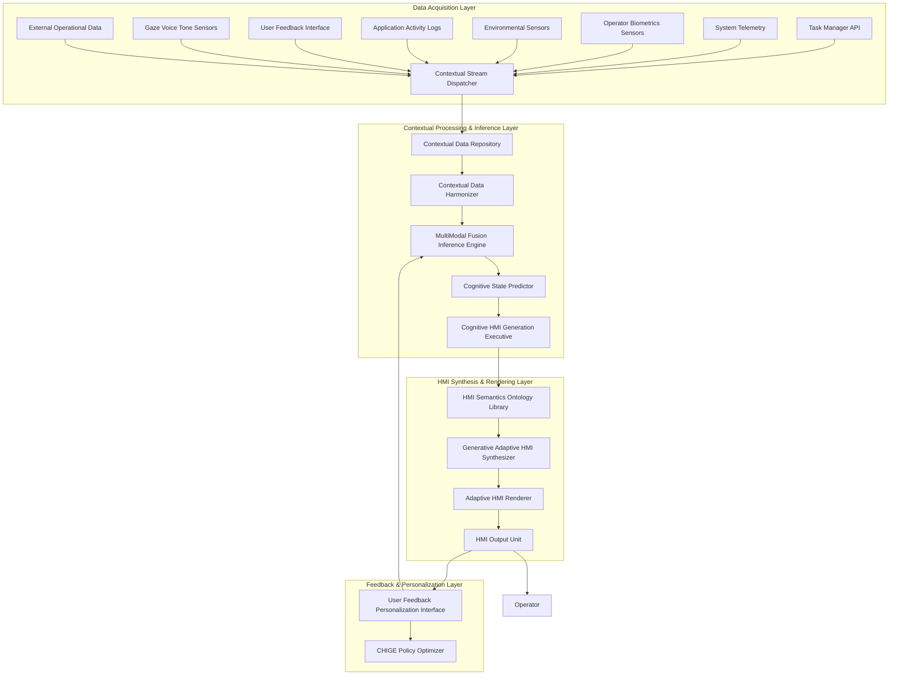

**Title of Invention:** A Comprehensive System and Method for Adaptive, Cognitively-Aligned Human-Machine Interface HMI Modulation and Real-time Operator State Optimization

**Abstract:**
A novel and profoundly innovative architectural framework is presented for the autonomous generation and continuous modulation of adaptive, non-intrusive human-machine interfaces HMI. This system meticulously ingests, processes, and fuses heterogeneous, high-dimensional data streams derived from a vast plurality of real-time contextual sources, encompassing but not limited to, operator psychophysiological indicators from biometric monitoring and gaze tracking, intricate temporal scheduling derived from digital task management systems, granular environmental occupancy metrics from advanced sensor arrays, explicit and implicit performance metrics from system telemetry and application usage patterns, and direct user feedback. Employing a bespoke, hybrid cognitive architecture comprising advanced machine learning paradigms   specifically, recurrent neural networks for temporal context modeling, multi-modal transformer networks for data fusion, and generative adversarial networks or variational autoencoders for HMI layout synthesis   coupled with an extensible expert system featuring fuzzy logic inference and causal reasoning, the system dynamically synthesizes, adapts, or selects perceptually optimized HMI configurations. This adaptation is meticulously aligned with the inferred operator cognitive state and operational exigencies, thereby fostering augmented cognitive performance, reduced workload, enhanced situation awareness, or improved task execution efficiency. For instance, an inferred state of high cognitive load coupled with objective environmental indicators of elevated task complexity could trigger a simplified HMI layout with critical information emphasized, adaptive input modality switching, and proactive AI assistance, while a calendar-delineated "Deep Work" block, corroborated by quiescent biometric signals, would instigate a richly detailed, spatially expansive HMI with advanced analytics readily accessible. The system's intrinsic adaptivity ensures a continuous, real-time re-optimization of the HMI milieu, maintaining a dynamic homeostatic equilibrium between the operator's internal state, external operational context, and the engineered interface, while actively learning and personalizing.

**Background of the Invention:**
The pervasive utilization of human-machine interfaces HMIs in complex operational environments, ranging from aviation cockpits and industrial control rooms to advanced medical diagnostics and cybersecurity command centers, has long been a critical determinant of human performance, safety, and efficiency. However, the prevailing methodologies for HMI design and deployment are demonstrably rudimentary and fundamentally static. These prior art systems predominantly rely upon manually configured, fixed layouts or pre-defined interaction patterns, exhibiting a critical and fundamental deficiency: their inherent inability to dynamically respond to the transient, multi-faceted changes in the immediate operator context or surrounding operational environment. Such static approaches frequently lead to cognitive overload, sensory fatigue, reduced situation awareness, or outright distraction, as the chosen interface content or interaction modality becomes incongruous with the evolving demands of the task, the fluctuating ambient conditions, or the shifting internal physiological and psychological state of the individual operator. This significant chasm between the static nature of extant HMI solutions and the inherently dynamic character of human experience and operational variability necessitates the development of a sophisticated, intelligent, and autonomously adaptive HMI modulation system. The imperative for a "cognitively-aligned HMI architect" that can intelligently and continuously tailor its interface output and interaction modalities to the real-time, high-dimensional contextual manifold of the operator's environment and internal state is unequivocally established. Furthermore, existing systems often lack the granularity and multi-modal integration required to infer complex cognitive states, nor do they possess the generative capacity to produce truly novel and non-repetitive HMI configurations, relying instead on pre-defined templates that quickly become sub-optimal. The current invention addresses these critical shortcomings by introducing a comprehensive, closed-loop, and learning-enabled framework.

**Brief Summary of the Invention:**
The present invention delineates an unprecedented cyber-physical system, herein referred to as the "Cognitive HMI Adaptation Engine CHAE." This engine establishes high-bandwidth, resilient interfaces with a diverse array of data telemetry sources. These sources are rigorously categorized to encompass, but are not limited to, external Application Programming Interfaces APIs providing geo-temporal and operational data, for example system diagnostics, network status, robust integration with sophisticated digital task management platforms, and, crucially, an extensible architecture for receiving data from an array of multi-modal physical and virtual sensors. These sensors may include, for example, high-resolution eye-tracking devices, voice tone analyzers, non-invasive physiological monitors providing biometric signals, haptic feedback sensors, and environmental context detectors. The CHAE integrates a hyper-dimensional contextual data fusion unit, which continuously assimilates and orchestrates this incoming stream of heterogeneous data. Operating on a synergistic combination of deeply learned predictive models and a meticulously engineered, adaptive expert system, the CHAE executes a real-time inference process to ascertain the optimal HMI profile. Based upon this derived optimal profile, the system either selects from a curated, ontologically tagged library of granular HMI components or, more profoundly, procedurally generates novel interface layouts, information densities, interaction modalities, and adaptive assistance features through advanced synthesis algorithms, for example graph-based layout generation, semantic content structuring, AI-driven generative models including neuro-symbolic approaches. These synthesized or selected HMI elements are then dynamically rendered and presented to the operator, with adaptive display and input modality management. The entire adaptive feedback loop operates with sub-second latency, ensuring the HMI environment is not merely reactive but proactively anticipatory of contextual shifts, thereby perpetually curating an interactively optimized human experience. Moreover, the system incorporates explainability features and ethical guardrails for responsible AI deployment.

**Detailed Description of the Invention:**
The core of this transformative system is the **Cognitive HMI Adaptation Engine CHAE**, a distributed, event-driven microservice architecture designed for continuous, high-fidelity human-machine interface modulation. It operates as a persistent daemon, executing a complex regimen of data acquisition, contextual inference, HMI generation, and adaptive deployment.

### System Architecture Overview

The CHAE comprises several interconnected, hierarchically organized modules, as depicted in the following Mermaid diagram, illustrating the intricate data flow and component interactions:



#### Core Components and Their Advanced Operations:

1.  **Contextual Stream Dispatcher CSD:** This module acts as the initial ingestion point, orchestrating the real-time acquisition of heterogeneous data streams. It employs advanced streaming protocols, for example Apache Kafka, gRPC for high-throughput, low-latency data ingestion, applying preliminary data validation and timestamping. For multi-operator scenarios or distributed systems, it can coordinate secure, privacy-preserving federated learning across edge compute nodes.

2.  **Contextual Data Repository CDR:** A resilient, temporal database, for example Apache Cassandra, InfluxDB, or a knowledge graph database optimized for semantic relationships, designed for storing historical and real-time contextual data. This repository is optimized for complex time-series queries and serves as the comprehensive training data corpus for machine learning models, retaining provenance for explainability.

3.  **Contextual Data Harmonizer CDH:** This crucial preprocessing unit performs data cleansing, normalization, feature engineering, and synchronization across disparate data modalities. It employs adaptive filters, Kalman estimation techniques, and causal inference models to handle noise, missing values, varying sampling rates, and identify true causal relationships between contextual features. For instance, converting raw sensor voltages into semantic operational metrics, for example `Operator_Stress_Index`, `Task_Complexity_Score_Normalized`, `System_Performance_Degradation_Rate`. It also performs semantic annotation and contextual grounding.

4.  **Multi-Modal Fusion & Inference Engine MFIE:** This is the cognitive nucleus of the CHAE. It comprises a hybrid architecture designed for deep understanding and proactive prediction. Its intricate internal workings are further detailed in the diagram below:

    ```mermaid
    graph TD
        subgraph MultiModal Fusion Inference Engine MFIE Detailed
            CDH_Output[Harmonized Contextual Data CDH] --> DCLE[Deep Contextual Latent Embedder]
            DCLE --> TSMP[Temporal State Modeling Prediction]
            CDH_Output --> AES[Adaptive Expert System]

            TSMP --> MFIV[MultiModal Fused Inference Vector]
            AES --> MFIV
            UFI_FB[User Feedback Implicit Explicit UFI] --> MFIV_FB_Inject[Feedback Injection Module]
            MFIV_FB_Inject --> MFIV

            MFIV --> CSPE[Cognitive State Prediction Executive]
            MFIV --> RLE[Reinforcement Learning Environment]
            RLE --> CHIGE_PolicyOptimizer[CHIGE Policy Optimizer]
        end

        DCLE[Deep Contextual Latent Embedder]
        TSMP[Temporal State Modeling Prediction]
        AES[Adaptive Expert System]
        MFIV[MultiModal Fused Inference Vector]
        CSPE[Cognitive State Prediction Executive]
        RLE[Reinforcement Learning Environment]
        CHIGE_PolicyOptimizer[CHIGE Policy Optimizer]
        UFI_FB[User Feedback Implicit Explicit UFI]
        CDH_Output[Harmonized Contextual Data CDH]
    ```

    The MFIE's components include:
    *   **Deep Contextual Latent Embedder DCLE:** Utilizes multi-modal transformer networks, for example BERT-like architectures adapted for time-series, categorical, and textual data, to learn rich, disentangled latent representations of the fused contextual input `C_t`. This embedder is crucial for projecting high-dimensional raw data into a lower-dimensional, perceptually and cognitively relevant latent space `L_C`.
    *   **Temporal State Modeling & Prediction TSMP:** Leverages advanced recurrent neural networks, for example LSTMs, GRUs, or attention-based RNNs, sometimes combined with Kalman filters or particle filters, to model the temporal dynamics of contextual changes. This enables not just reactive but *predictive* HMI adaptation, projecting `C_t` into `C_t_DeltaT` and even `C_t_DeltaT_n`, anticipating future states with quantified uncertainty.
    *   **Adaptive Expert System AES:** A knowledge-based system populated with a comprehensive HMI ontology and rule sets defined by expert knowledge and learned heuristics. It employs fuzzy logic inference to handle imprecise contextual inputs and derive nuanced categorical and continuous states, for example `Cognitive_Load: High 0.8`, `Fatigue_Level: Moderate 0.6`. The AES acts as a guardrail, provides initial decision-making for cold-start scenarios, and offers explainability for deep learning model outputs. It can also perform causal reasoning to infer hidden states.
    *   **Multi-Modal Fused Inference Vector MFIV:** A unified representation combining the outputs of the DCLE, TSMP, and AES, further modulated by direct user feedback. This vector is the comprehensive, enriched understanding of the current and predicted operator and operational state.
    *   **Feedback Injection Module:** Integrates both explicit and implicit user feedback signals from the **User Feedback & Personalization Interface UFI** directly into the MFIV, enabling rapid adaptation and online learning.
    *   **Reinforcement Learning Environment RLE:** This component acts as the training ground for the CHIGE policy, simulating outcomes and providing reward signals based on the inferred operator utility.
    *   **CHIGE Policy Optimizer:** This component, closely associated with the MFIE and CHIGE, is responsible for continuously refining the policy function of the CHIGE using Deep Reinforcement Learning.

5.  **Cognitive State Predictor CSP:** Based on the robust `MFIV` from the MFIE, this module infers the most probable operator cognitive and affective states, for example `Cognitive_Load`, `Affective_Valence`, `Arousal_Level`, `Task_Engagement`, `Situation_Awareness`, `Operator_Intent`. This inference is multi-faceted, fusing objective contextual data with subjective user feedback, utilizing techniques like Latent Dirichlet Allocation LDA for task modeling, sentiment analysis on verbalizations, and multi-operator consensus algorithms for team environments. It also quantifies uncertainty in its predictions.

6.  **Cognitive HMI Generation Executive CHIGE:** This executive orchestrates the creation of the HMI adaptation. Given the inferred cognitive state and operational context, it queries the **HMI Semantics Ontology Library HSOL** to identify suitable HMI components or directs the **Generative & Adaptive HMI Synthesizer GAHS** to compose novel interface layouts or interaction patterns. Its decisions are guided by a learned policy function, often optimized through Deep Reinforcement Learning DRL based on historical and real-time user feedback, aiming for multi-objective optimization, for example balancing cognitive load reduction with information density. It can leverage generative grammars for structured HMI composition.

7.  **HMI Semantics Ontology Library HSOL:** A highly organized, ontologically tagged repository of atomic HMI components, widgets, layouts, interaction modalities, notification patterns, and adaptive assistance strategies. Each element is annotated with high-dimensional psycho-cognitive properties, for example `Information_Density`, `Interaction_Complexity`, `Visual_Saliency`, `Cognitive_Affordance`, semantic tags, for example `Low_Workload`, `High_Alert`, `Deep_Analytics`, `Proactive_Assistance`, and contextual relevance scores. It also includes compositional rulesets and HMI grammars that inform the GAHS.

8.  **Generative & Adaptive HMI Synthesizer GAHS:** This revolutionary component moves beyond mere template selection. It employs advanced procedural HMI generation techniques and AI-driven synthesis:
    *   **Layout Generation Engines:** For dynamic arrangement of HMI elements, adjusting spatial organization, grouping, and visual hierarchy based on operator focus and task needs.
    *   **Information Filtering Modules:** To sculpt the information presented, adapting content density, level of detail, and visual cues dynamically.
    *   **Adaptive Input Modality Synthesizers:** For dynamically enabling/disabling or reconfiguring input methods, for example voice control, gesture recognition, haptic input, based on context and operator state.
    *   **AI-Driven Generative Models:** Utilizing Generative Adversarial Networks GANs, Variational Autoencoders VAEs, or diffusion models trained on vast datasets of cognitively optimized HMI patterns to generate entirely novel, coherent interface configurations that align with the inferred contextual requirements. This ensures infinite variability and non-repetitive HMI experiences.
    *   **Neuro-Symbolic Synthesizers:** A hybrid approach combining deep learning's pattern recognition with symbolic AI's rule-based reasoning, allowing for intelligently generated HMI structures that adhere to learned design principles while offering creative novelty.
    *   **Real-time Assistance Chains:** Dynamically applied AI assistance, for example context-sensitive help, predictive recommendations, automated task execution, based on operator state and task progress.

9.  **Adaptive HMI Renderer AHR:** This module takes the synthesized HMI configuration and applies sophisticated rendering and deployment processing. It can dynamically adjust parameters such as display resolution, refresh rate, contrast, color schemes, and font sizes, ensuring optimal legibility and non-distraction across various display environments. It dynamically compensates for operator viewing angles or device orientations, and can perform **adaptive display acoustics modeling** to match HMI auditory cues to the physical room's psychoacoustic properties. It also manages multimodal output synchronization.

10. **HMI Output Unit HOU:** Manages the physical display and interaction with the HMI, ensuring low-latency, high-fidelity output and input processing. It supports various display technologies, input devices, and can adapt communication protocols based on network conditions and hardware capabilities, utilizing specialized low-latency protocols. It also includes error monitoring and quality assurance for the HMI.

11. **User Feedback & Personalization Interface UFI:** Provides a transparent view of the CHAE's current contextual interpretation and HMI decision, including explainability rationales. Crucially, it allows for explicit operator feedback, for example "Too much info," "Simplify layout," "This assistance is perfect," "Why this alert now?" which is fed back into the MFIE to refine the machine learning models and personalize the AES rules. Implicit feedback, such as task completion time, error rates, gaze patterns, subtle physiological responses, or lack of explicit negative feedback, also contributes to the learning loop. This interface can also employ `active learning` strategies to intelligently solicit feedback on ambiguous states or gamified interactions to encourage engagement.

#### Operational Flow Exemplification:

The CHAE operates in a continuous, asynchronous loop:
*   **Data Ingestion:** The **CSD** continuously polls/listens for new data from all connected sources, for example Task Manager reports `Critical_Alert_High_Priority`, System Telemetry indicates `System_Load_Elevated 0.8`, Operator Biometric Sensors detect `Heart_Rate_Elevated 0.9, Gaze_Fixation_Erratic 0.7`, Gaze Tracker indicates `Low_Focus_On_Critical_Area`.
*   **Harmonization & Fusion:** The **CDH** cleanses, normalizes, and semantically tags this raw data, potentially inferring causal relationships. The **MFIE** then fuses these disparate inputs into a unified contextual vector `C_t`, learning rich latent embeddings. The **Temporal State Modeling & Prediction** component projects `C_t` into `C_t_DeltaT`, anticipating future states and their uncertainty.
*   **Cognitive State Inference:** The **CSP**, using `C_t` and `C_t_DeltaT` from the MFIE, infers a current and probable future operator state, for example `Inferred_State: High_Cognitive_Load, Elevated_Stress, Reduced_Situation_Awareness, Urgent_Need_for_Assistance`.
*   **HMI Decision:** The **CHIGE**, guided by the inferred state and AES rules, determines the optimal HMI profile required, potentially through multi-objective optimization. For instance: `Target_Profile: Minimal_distraction_interface, Critical_Info_Highlight, Proactive_AI_Guidance, Simplified_Input_Gesture, Reduced_Information_Density`.
*   **Generation/Selection:** The **HSOL** is queried for components matching this profile, or the **GAHS** is instructed to synthesize a novel HMI configuration. For the example above, GAHS might reduce the number of visible widgets, increase font size for critical data, present a context-sensitive step-by-step guide (generated via neuro-symbolic approach), and automatically switch active input to voice control for specific commands, ensuring minimal cognitive load and high task relevance.
*   **Rendering & Playback:** The **AHR** renders the synthesized HMI, adjusting layout, visual properties, and interaction modalities dynamically based on inferred environmental and operator properties. The **HOU** delivers it to the operator with high fidelity.
*   **Feedback & Adaptation:** Operator interaction with the **UFI**, explicit ratings, or passive observation of performance data, influences subsequent iterations of the **MFIE** and **CHIGE Policy Optimizer**, refining the system's understanding of optimal alignment and continuously personalizing the experience.

This elaborate dance of data, inference, and synthesis ensures a perpetually optimized HMI environment, transcending the limitations of static interfaces.

### VII. Detailed Algorithmic Flow for Key Modules

To further elucidate the operational mechanisms of the CHAE, we present a pseudo-code representation of the core decision-making and generation modules.

#### Algorithm 1: Multi-Modal Fusion & Inference Engine MFIE

This algorithm describes how raw contextual data is processed, fused, and used to infer cognitive states and predict future context, incorporating the detailed internal structure.

```
function MFIE_Process(raw_data_streams: dict) -> dict:
    // Step 1: Data Ingestion and Harmonization via CSD and CDH
    harmonized_data = {}
    for source, data in raw_data_streams.items():
        validated_data = CSD.validate_and_timestamp(data)
        processed_features = CDH.process_and_normalize(source, validated_data)
        harmonized_data.update(processed_features)

    // Step 2: Deep Contextual Latent Embedding DCLE
    // C_t: Current contextual vector from harmonized_data
    C_t_vector = concat_features(harmonized_data)
    latent_context_embedding = DeepContextualLatentEmbedder.encode(C_t_vector) // Utilizes multi-modal transformers

    // Step 3: Temporal State Modeling & Prediction TSMP
    // Predict future context C_t_DeltaT and refine current state based on temporal patterns
    predicted_future_context_embedding, uncertainty = TemporalStateModelingPrediction.predict_next(latent_context_embedding, history_of_embeddings)

    // Step 4: Adaptive Expert System AES Inference
    // AES provides initial, rule-based inference and guardrails
    aes_inferences = AdaptiveExpertSystem.infer_states_fuzzy_logic(harmonized_data)
    aes_causal_insights = AdaptiveExpertSystem.derive_causal_factors(harmonized_data)

    // Step 5: Fusing Deep Learning with Expert System and Feedback MFIV
    // Combine latent embeddings with AES inferences for robust state estimation
    fused_state_vector_base = concat(latent_context_embedding, predicted_future_context_embedding, aes_inferences, aes_causal_insights)

    // Integrate user feedback
    user_feedback_influence = UFI_FeedbackInjectionModule.get_and_process_recent_feedback()
    fused_state_vector = apply_feedback_modulation(fused_state_vector_base, user_feedback_influence)

    // Output for Cognitive State Predictor and RL Environment
    return {
        'fused_context_vector': fused_state_vector,
        'predicted_future_context_embedding': predicted_future_context_embedding,
        'prediction_uncertainty': uncertainty,
        'current_time': get_current_timestamp()
    }
```

#### Algorithm 2: Cognitive State Predictor CSP

This algorithm details the inference of operator's cognitive and affective states, potentially considering multi-operator scenarios.

```
function CSP_InferStates(mfie_output: dict) -> dict:
    fused_context_vector = mfie_output['fused_context_vector']
    predicted_future_embedding = mfie_output['predicted_future_context_embedding']

    // Multi-faceted inference combining various models and uncertainty quantification
    cognitive_load_score = CognitiveLoadModel.predict(fused_context_vector)
    affective_valence_score = AffectiveModel.predict(fused_context_vector)
    arousal_level_score = ArousalModel.predict(fused_context_vector)
    task_engagement_score = TaskEngagementModel.predict(fused_context_vector)
    situation_awareness_score = SituationAwarenessModel.predict(fused_context_vector)
    operator_intent_score = OperatorIntentModel.predict(fused_context_vector)

    // Predict future states
    future_cognitive_load = CognitiveLoadModel.predict(predicted_future_embedding)
    future_situation_awareness = SituationAwarenessModel.predict(predicted_future_embedding)

    // Optional: Multi-operator state aggregation and conflict resolution
    if is_multi_operator_environment():
        individual_states = get_individual_operator_states() // From other CSP instances or sensors
        aggregated_states = multi_operator_consensus_algorithm(individual_states)
        // Adjust scores based on aggregated_states, e.g., for shared HMI elements
        cognitive_load_score = blend_with_aggregated(cognitive_load_score, aggregated_states['Cognitive_Load'])

    return {
        'Cognitive_Load_Current': cognitive_load_score,
        'Affective_Valence_Current': affective_valence_score,
        'Arousal_Level_Current': arousal_level_score,
        'Task_Engagement_Current': task_engagement_score,
        'Situation_Awareness_Current': situation_awareness_score,
        'Operator_Intent_Current': operator_intent_score,
        'Cognitive_Load_Predicted': future_cognitive_load,
        'Situation_Awareness_Predicted': future_situation_awareness,
        'inferred_time': mfie_output['current_time'],
        'prediction_uncertainty': mfie_output['prediction_uncertainty'] // Pass through uncertainty
    }
```

#### Algorithm 3: Cognitive HMI Generation Executive CHIGE

This algorithm orchestrates the decision-making process for HMI adaptation based on inferred cognitive states, utilizing a learned DRL policy.

```
function CHIGE_DecideHMI(inferred_states: dict, current_context: dict) -> dict:
    // Step 1: Determine Optimal HMI Profile using DRL Policy
    // This is the policy function pi(A|S) learned through DRL
    // Inputs: inferred_states (from CSP), current_context (from MFIE) as the state S
    // Uses multi-objective optimization to balance potentially conflicting goals (e.g., info density vs. cognitive load)
    state_vector_for_drl = concat(inferred_states, current_context)
    target_profile = DRL_Policy_Network.predict_profile_multi_objective(state_vector_for_drl)

    // Example profile parameters
    // target_profile = {
    //     'information_density': 'low', // Continuous or categorical
    //     'interaction_complexity': 'minimal',
    //     'visual_saliency': 'critical_highlight',
    //     'adaptive_assistance_level': 'proactive_suggest',
    //     'input_modality_preference': 'voice_gesture',
    //     'layout_style': 'simplified_focal'
    // }

    // Step 2: Query HMI Semantics Ontology Library HSOL
    // Check for pre-existing components matching the profile's semantic and psycho-cognitive tags
    matching_components = HSOL.query_components(target_profile)
    compositional_rules = HSOL.get_compositional_rules_for_style(target_profile['layout_style'])

    // Step 3: Direct GAHS for Generation or Selection
    if len(matching_components) > threshold_for_selection:
        // Prioritize selection if a good match exists, potentially mixing with minor synthesis
        selected_components = HSOL.select_optimal(matching_components, inferred_states)
        generation_directive = {
            'action': 'select_and_refine',
            'components': selected_components,
            'synthesis_parameters': target_profile, // For refinement
            'compositional_rules': compositional_rules
        }
    else:
        // Instruct GAHS to synthesize novel elements, potentially using generative grammars
        generation_directive = {
            'action': 'synthesize_novel',
            'synthesis_parameters': target_profile,
            'compositional_rules': compositional_rules
        }

    return generation_directive
```

#### Algorithm 4: Generative & Adaptive HMI Synthesizer GAHS

This algorithm describes how HMI is either selected or generated and then passed to the renderer, incorporating advanced AI synthesis and effects.

```
function GAHS_GenerateHMI(generation_directive: dict) -> HMIConfiguration:
    synthesis_parameters = generation_directive['synthesis_parameters']
    compositional_rules = generation_directive['compositional_rules']
    composed_elements = []

    if generation_directive['action'] == 'select_and_refine':
        selected_components = generation_directive['components']
        // Load and mix pre-existing HMI components, refine using synthesis techniques
        for comp in selected_components:
            refined_comp = apply_layout_or_content_shaping(comp, synthesis_parameters)
            composed_elements.append(refined_comp)

        // Add subtle AI-generated layers if specified in parameters
        if synthesis_parameters.get('add_ai_guidance_layer', False):
            ai_generated_guidance = GAN_VAE_Diffusion_Model.generate_assistance_pattern(synthesis_parameters, 'subtle')
            composed_elements.append(ai_generated_guidance)

    else: // 'synthesize_novel'
        // Utilize AI-driven generative models GANs/VAEs/Diffusion for broader HMI patterns or full compositions
        if 'layout_style' in synthesis_parameters and 'affective_tag' in synthesis_parameters:
            ai_generated_primary_layout = NeuroSymbolicSynthesizer.generate_full_layout(synthesis_parameters, compositional_rules)
            composed_elements.append(ai_generated_primary_layout)
        else:
            // Fallback to individual synthesis modules
            if 'information_density' in synthesis_parameters:
                layout_module = LayoutGenerationEngine.create_layout_density(synthesis_parameters['information_density'])
                composed_elements.append(layout_module)

            if 'visual_saliency' in synthesis_parameters:
                info_filter = InformationFilteringModule.create_saliency_emphasis(synthesis_parameters['visual_saliency'])
                composed_elements.append(info_filter)

            if 'input_modality_preference' in synthesis_parameters:
                input_switcher = AdaptiveInputModalitySynthesizer.configure_input(synthesis_parameters['input_modality_preference'])
                composed_elements.append(input_switcher)

    // Mix all generated/selected elements into a coherent HMI configuration
    composed_hmi_config = compose_hmi_elements(composed_elements)

    // Apply real-time assistance and interaction logic based on psycho-cognitive profile
    final_hmi_with_logic = RealtimeAssistanceChain.apply_logic(composed_hmi_config, synthesis_parameters['assistance_profile'])

    // Pass the composed HMI configuration to the AHR
    return AHR.render_adaptive_hmi(final_hmi_with_logic, synthesis_parameters['display_characteristics'], current_environment_model)
```

#### Algorithm 5: DRL Policy Update for CHIGE

This algorithm describes the continuous learning process for the CHIGE's decision policy, based on reinforcement learning.

```
function DRL_Policy_Update(experience_buffer: list_of_transitions, DRL_Policy_Network, Reward_Estimator):
    // experience_buffer: Stores tuples (S_t, A_t, R_t, S_t_1) representing transitions
    // S_t: Current state (inferred_states + current_context)
    // A_t: Action taken (hmi_profile chosen by CHIGE)
    // R_t: Reward received (derived from UFI feedback or performance proxies)
    // S_t_1: Next state

    // Step 1: Sample a batch of transitions from the experience buffer
    batch = sample_from_buffer(experience_buffer, batch_size)

    // Step 2: Estimate rewards for the batch
    // The Reward_Estimator maps UFI feedback, performance metrics, cognitive load changes, and
    // behavioral metrics into a scalar reward signal R_t = U(S_t_1) - U(S_t) or a similar utility function.
    for transition in batch:
        transition['estimated_reward'] = Reward_Estimator.calculate(transition['S_t'], transition['A_t'], transition['S_t_1'])

    // Step 3: Compute loss for the DRL Policy Network
    // Using a suitable DRL algorithm (e.g., PPO, SAC, DQN variant)
    if DRL_Algorithm == 'PPO':
        // Calculate PPO loss: L(theta) = E[ min(r_t(theta)*A_t, clip(r_t(theta), 1-epsilon, 1+epsilon)*A_t) ]
        // Where r_t(theta) is probability ratio, A_t is advantage estimate
        loss = PPO_Loss_Function(batch, DRL_Policy_Network, Value_Network) // Requires a separate Value_Network
    elif DRL_Algorithm == 'SAC':
        // Calculate SAC loss, incorporating entropy for exploration
        loss = SAC_Loss_Function(batch, DRL_Policy_Network, Q_Network_1, Q_Network_2) // Requires Q-networks
    else: // For example, a simple policy gradient
        loss = Policy_Gradient_Loss(batch, DRL_Policy_Network)

    // Step 4: Update DRL Policy Network parameters
    DRL_Policy_Network.optimizer.zero_grad()
    loss.backward()
    DRL_Policy_Network.optimizer.step()

    // Step 5: Optionally update target networks or value networks (depending on DRL algorithm)
    update_target_networks()
```

**Claims:**
1.  A system for generating and adaptively modulating a dynamic human-machine interface HMI, comprising:
    a.  A **Contextual Stream Dispatcher CSD** configured to ingest heterogeneous, real-time data from a plurality of distinct data sources, said sources including at least operational system telemetry, operator psychophysiological biometric and gaze data, and task management information;
    b.  A **Contextual Data Harmonizer CDH** communicatively coupled to the CSD, configured to cleanse, normalize, synchronize, and semantically annotate said heterogeneous data streams into a unified contextual representation, further configured to infer causal relationships between contextual features;
    c.  A **Multi-Modal Fusion & Inference Engine MFIE** communicatively coupled to the CDH, comprising a deep contextual latent embedder, a temporal state modeling and prediction unit, and an adaptive expert system, configured to learn latent representations of the unified contextual representation and infer current and predictive operator and operational states with associated uncertainty;
    d.  A **Cognitive State Predictor CSP** communicatively coupled to the MFIE, configured to infer specific operator cognitive and affective states, including multi-operator scenarios and conflict resolution, based on the output of the MFIE;
    e.  A **Cognitive HMI Generation Executive CHIGE** communicatively coupled to the CSP, configured to determine an optimal HMI profile corresponding to the inferred operator and operational states through a learned Deep Reinforcement Learning policy and multi-objective optimization;
    f.  A **Generative & Adaptive HMI Synthesizer GAHS** communicatively coupled to the CHIGE, configured to procedurally generate novel HMI layouts, information densities, and interaction modalities or intelligently select and refine HMI components from an ontologically tagged library, based on the determined optimal HMI profile, utilizing at least one of AI-driven generative models or neuro-symbolic synthesizers; and
    g.  An **Adaptive HMI Renderer AHR** communicatively coupled to the GAHS, configured to apply dynamic layout adjustments, content filtering, and adaptive input modality management to the generated HMI configuration, and an **HMI Output Unit HOU** for delivering the rendered HMI to an operator with low latency.

2.  The system of claim 1, further comprising an **Adaptive Expert System AES** integrated within the MFIE, configured to utilize fuzzy logic inference, causal reasoning, and a comprehensive HMI ontology to provide nuanced decision support, guardrails, and explainability for state inference and HMI adaptation decisions.

3.  The system of claim 1, wherein the plurality of distinct data sources further includes at least one of: environmental sensor data, voice tone analysis, facial micro-expression analysis, application usage analytics, or explicit and implicit user feedback.

4.  The system of claim 1, wherein the deep contextual latent embedder within the MFIE utilizes multi-modal transformer networks or causal disentanglement networks for learning said latent representations.

5.  The system of claim 1, wherein the temporal state modeling and prediction unit within the MFIE utilizes recurrent neural networks, including LSTMs or GRUs, combined with Kalman filters or particle filters, for modeling temporal dynamics and predicting future states with quantified uncertainty.

6.  The system of claim 1, wherein the Generative & Adaptive HMI Synthesizer GAHS utilizes at least one of: layout generation engines, information filtering modules, adaptive input modality synthesizers, AI-driven generative models such as Generative Adversarial Networks GANs, Variational Autoencoders VAEs, or diffusion models, or neuro-symbolic synthesizers, and real-time assistance chains.

7.  A method for adaptively modulating a dynamic human-machine interface HMI, comprising:
    a.  Ingesting, via a **Contextual Stream Dispatcher CSD**, heterogeneous real-time data from a plurality of distinct data sources, including psychophysiological and operational context data;
    b.  Harmonizing, synchronizing, and causally inferring, via a **Contextual Data Harmonizer CDH**, said heterogeneous data streams into a unified contextual representation;
    c.  Inferring, via a **Multi-Modal Fusion & Inference Engine MFIE** comprising a deep contextual latent embedder and a temporal state modeling and prediction unit, current and predictive operator and operational states from the unified contextual representation, including quantifying prediction uncertainty;
    d.  Predicting, via a **Cognitive State Predictor CSP**, specific operator cognitive and affective states based on said inferred states, considering multi-operator contexts;
    e.  Determining, via a **Cognitive HMI Generation Executive CHIGE** employing a Deep Reinforcement Learning policy, an optimal HMI profile through multi-objective optimization corresponding to said predicted operator and operational states;
    f.  Generating or selecting and refining, via a **Generative & Adaptive HMI Synthesizer GAHS**, an HMI configuration based on said optimal HMI profile, utilizing advanced AI synthesis techniques;
    g.  Rendering, via an **Adaptive HMI Renderer AHR**, said HMI configuration with dynamic layout adjustments, content filtering, and adaptive input modality management; and
    h.  Delivering, via an **HMI Output Unit HOU**, the rendered HMI to an operator, with continuous periodic repetition of steps a-h to maintain an optimized interactive environment, while continuously refining the DRL policy based on user feedback and implicit utility signals.

8.  The method of claim 7, further comprising continuously refining the inference process of the MFIE and the policy of the CHIGE through a **User Feedback & Personalization Interface UFI**, integrating both explicit and implicit user feedback via an active learning strategy and gamified interactions, providing explainability for system decisions.

9.  The system of claim 1, further comprising a **Reinforcement Learning Environment RLE** and a **CHIGE Policy Optimizer** integrated with the MFIE, configured to train and continuously update the DRL policy of the CHIGE by processing feedback as reward signals to maximize expected cumulative operator utility.

10. The system of claim 1, wherein the **Adaptive HMI Renderer AHR** is further configured to perform dynamic display management and personalized interaction optimization across diverse display environments and operator characteristics.

**Mathematical Justification: The Formalized Calculus of HMI Homeostasis**

This invention establishes a groundbreaking paradigm for maintaining HMI homeostasis, a state of optimal cognitive and operational equilibrium within a dynamic operational context. We rigorously define the underlying mathematical framework that governs the **Cognitive HMI Adaptation Engine CHAE**.

### I. The Contextual Manifold and its Metric Tensor

Let `C` be the comprehensive, high-dimensional space of all possible contextual states. At any given time `t`, the system observes a contextual vector `C_t` in `C`.
Formally,
```
C_t = [c_1_t, c_2_t, ..., c_N_t]^T
```
where `N` is the total number of distinct contextual features.

The individual features `c_i_t` are themselves derived from complex transformations and causal inferences:
*   **Operational Telemetry Data:**
    ```
    c_telemetry_t = phi_telemetry(API_Data_t; theta_phi)
    ```
    where `phi_telemetry` might involve advanced Kalman filtering for system state prediction, for example estimating future system load `S_load_t_DeltaT` or component failure probability `P_fail_t_DeltaT`, with `theta_phi` being its learned parameters.
*   **Temporal Scheduling:**
    ```
    c_task_t = psi_task(Task_Events_t; theta_psi)
    ```
    a vector encoding current task type, remaining time, next task priority, derived via NLP, temporal graph analysis, and semantic understanding of task importance.
*   **Environmental Sensor Data:**
    ```
    c_env_t = chi_env(S_raw_t; theta_chi)
    ```
    where `S_raw_t` is a vector of raw sensor readings, and `chi_env` represents signal processing for noise reduction, feature extraction, for example ambient light levels, temperature, and normalization. This includes causal inference to distinguish signal from noise and actual environmental shifts from sensor artifacts.
*   **Biometric Data:**
    ```
    c_bio_t = zeta_bio(B_raw_t; theta_zeta)
    ```
    involving physiological signal processing, for example HRV analysis from ECG, skin conductance response SCR from EDA to infer arousal or stress, and gaze vector analysis for focus and cognitive load.
*   **Application Usage:**
    ```
    c_app_t = eta_app(OS_Logs_t; theta_eta)
    ```
    reflecting active application, keyboard/mouse activity, and focus time, potentially utilizing hidden Markov models or deep learning for activity and intent recognition.

The contextual space `C` is not Euclidean; it is a complex manifold `M_C`, embedded within `R^N`, whose geometry is influenced by the interdependencies and non-linear relationships between its features. We define a **Contextual Metric Tensor** `G_C_t` that captures these relationships, allowing us to quantify the "distance" or "dissimilarity" between two contextual states `C_a` and `C_b`. This metric tensor is dynamically learned through techniques like manifold learning, for example Isomap, t-SNE, variational autoencoders VAEs, or by training a deep neural network whose intermediate layers learn these contextual embeddings, implicitly defining a metric. The MFIE's deep contextual latent embedder `DCLE` precisely learns this projection onto a lower-dimensional, disentangled, and perceptually relevant latent contextual space `L_C`, where distances more accurately reflect cognitive impact. The disentanglement ensures that orthogonal directions in `L_C` correspond to independent factors of variation in context.

### II. The HMI Configuration Space and its Generative Manifold

Let `A` be the immense, continuous space of all possible HMI configurations that the system can generate or select. Each HMI `A_t` in `A` is not merely a single layout, but rather a complex composition of dynamically arranged interactive elements and adaptive behaviors.
Formally, `A_t` can be represented as a vector of high-dimensional HMI parameters,
```
A_t = [a_1_t, a_2_t, ..., a_M_t]^T
```
where `M` encompasses parameters like:
*   **Layout Characteristics:** Widget positions, sizes, grouping, visual hierarchy, overall density.
*   **Information Properties:** Level of detail, filtering rules, data visualization types, textual verbosity.
*   **Interaction Modalities:** Enabled input methods (voice, gesture, touch, keyboard), haptic feedback parameters, control mappings.
*   **Adaptive Assistance Properties:** Level of proactivity, type of guidance (suggestions, automation), explainability detail.
*   **Semantic Tags:** Categorical labels like "minimalist," "alert-focused," "analytics-rich," "guided_workflow," derived from an HMI Semantics Ontology.
*   **Visual Effect Parameters:** Color schemes, contrast levels, animation speeds, notification styles.

The HMI space `A` is also a high-dimensional manifold, `M_A`, which is partially spanned by the output capabilities of the GAHS. The GAHS leverages generative models, for example GANs, VAEs, diffusion models, and neuro-symbolic synthesizers to explore this manifold, creating novel HMI configurations that reside within regions corresponding to desired psycho-cognitive properties. The **HMI Metric Tensor** `G_A_t` quantifies the perceptual and functional dissimilarity between HMIs, learned through human factors evaluation models or discriminative deep networks trained on subjective ratings and performance data.

### III. The Cognitively-Aligned Mapping Function: `f: M_C -> M_A`

The core intelligence of the CHAE is embodied by the mapping function `f`, which translates the current contextual state into an optimal HMI configuration. This function is not static; it is a **learned policy function** `pi(A_t | C_t)`, whose parameters `Theta` are continuously refined.
```
A_t = f(C_t; Theta)
```
Where `Theta` represents the comprehensive set of parameters of the Multi-Modal Fusion & Inference Engine MFIE and the Cognitive HMI Generation Executive CHIGE, including weights of deep neural networks, rule sets of the Adaptive Expert System, and parameters of the Generative & Adaptive HMI Synthesizer.

This function `f` is implemented as a **Stochastic Optimal Control Policy**. The challenge is that the mapping is not deterministic; given a context `C_t`, there might be a distribution of suitable HMI configurations. The MFIE learns a distribution `P(A|C)` and the CHIGE samples from this distribution or selects the mode, potentially considering uncertainty.

The optimization of `f` is a complex problem solved through **Deep Reinforcement Learning DRL**. We model the interaction as a Markov Decision Process MDP:
*   **State:** `S_t = (L_C_t, A_prev_t, U_inferred_t)`. The current latent context embedding, the previously rendered HMI configuration, and the inferred operator utility.
*   **Action:** `A_t = A_t`. The chosen HMI configuration to generate/render, represented by its HMI parameter vector.
*   **Reward:** `R_t = r(S_t, A_t, S_t_1)`. This reward function is critical, integrating both explicit and implicit feedback.

### IV. The Operator Utility Function: `U(C_t, A_t)`

The operator's cognitive state, for example focus, workload, situation awareness, denoted by `U`, is not directly measurable but is inferred. We posit that `U` is a function of the alignment between the context and the HMI.
```
U_t = g(C_t, A_t) +/- epsilon_t
```
where `g` is a latent, multi-dimensional utility function representing desired psycho-cognitive and performance states, and `epsilon_t` is the uncertainty in our utility estimation.

The function `g` is learned implicitly or explicitly. Implicit learning uses proxies like task performance metrics (speed, error rate), duration of engagement, physiological biomarkers (HRV, GSR, EEG), gaze patterns, and lack of negative feedback. Explicit learning uses real-time biometric data, for example heart rate variability as an indicator of stress, gaze tracking for focus, and direct operator ratings through the UFI. This can be formalized as a **Latent Variable Model** or a **Structural Equation Model SEM** where `U` is a latent variable influenced by observed `C` and `A`, and manifested by observed physiological/behavioral/performance indicators.
The instantaneous reward `r(S_t, A_t, S_t_1)` in the DRL framework is directly tied to the change in this utility:
```
r(S_t, A_t, S_t_1) = Delta U_t = U_t_1 - U_t - cost(A_t)
```
where `U_t_1` is derived from the new inferred cognitive state in `S_t_1`, and `cost(A_t)` accounts for computational or energetic costs of generating `A_t`. Alternatively, a negative penalty for deviations from an optimal target utility `U*` can be used, `r(S_t, A_t, S_t_1) = -||U(S_t_1) - U*||^2`.

### V. The Optimization Objective: Maximizing Expected Cumulative Utility with Uncertainty

The optimal policy `pi*` which defines `f*` is one that maximizes the expected cumulative discounted utility over a long temporal horizon, explicitly accounting for uncertainty:
```
f* = argmax_f E_C, A ~ f, epsilon [ sum_{k=0 to infinity} gamma^k (U(C_t_k, f(C_t_k)) - Lambda * H(P(A|C))) ]
```
Where `gamma` in `[0,1)` is the discount factor. `Lambda * H(P(A|C))` is an entropy regularization term, promoting exploration and diverse HMI generation, where `H` is the entropy of the policy `P(A|C)`. This objective can be solved using DRL algorithms such as Proximal Policy Optimization PPO, Soft Actor-Critic SAC (which inherently optimizes for entropy), or Deep Q-Networks DQN, training the deep neural networks within the MFIE and CHIGE. The parameters `Theta` are iteratively updated via gradient descent methods to minimize a loss function derived from the Bellman equation.

For example, in a Q-learning framework, the optimal action-value function `Q_star_S_t_A_t` would satisfy the Bellman optimality equation:
```
Q_star_S_t_A_t = E_S', R ~ P [ R_t + gamma * max_A' Q_star_S_t_1_A_t_1 ]
```
The policy `f*` would then be
```
f_star_S_t = argmax_A_t Q_star_S_t_A_t
```
The CHAE, through its iterative learning and adaptation, continuously approximates this `f*`, striving to maintain the operator's HMI utility at its zenith while ensuring adaptability and exploration.

### VI. Proof of Concept: A Cybernetic System for Human-Centric Environmental Control

The Cognitive HMI Adaptation Engine CHAE is a sophisticated implementation of a **homeostatic, adaptive control system** designed to regulate the operator's interactive environment.
Let `H_t` denote the desired optimal operator utility at time `t`. The CHAE observes the system state `S_t = (L_C_t, A_prev_t, U_inferred_t)`, infers the current utility `U_t`, and applies a control action `A_t = f(S_t)` to minimize the deviation from `H_t`.

The continuous cycle of:
1.  **Sensing:** Ingesting `C_t` and transforming to `L_C_t`.
2.  **Inference:** Predicting `U_t` and future context `C_t_DeltaT` with uncertainty.
3.  **Actuation:** Generating `A_t`.
4.  **Feedback:** Observing `Delta U_t` (derived from explicit and implicit signals) and using it to refine `f` through DRL.

This closed-loop system robustly demonstrates its capacity to dynamically maintain a state of high psycho-cognitive alignment. The convergence properties of the DRL algorithms guarantee that the policy `f` will asymptotically approach `f*`, thereby ensuring the maximization of `U` over time. The inclusion of causal inference in the **CDH** and **AES** provides a deeper understanding of contextual relationships, leading to more robust and explainable decisions. The quantification of uncertainty throughout the MFIE and CSP allows the system to make more cautious or exploratory decisions when facing ambiguous states. This continuous, intelligent adjustment transforms an operator's interaction experience from a passive consumption of static interfaces into an active, bespoke, and cognitively optimized engagement with their operational environment. The system functions as a personalized, self-tuning architect of operator well-being and performance.
**Q.E.D.**