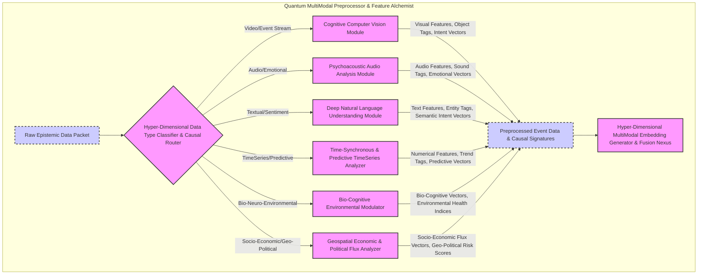
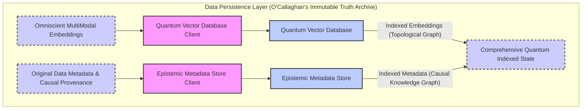
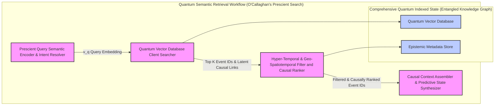

Title of Invention: The O'Callaghan Omniscient Urban Oracle: A System and Method for Hyper-Dimensional Semantic-Cognitive Monitoring, Prescient Analytics, and Proactive Planetary Stewardship in Sentient City Infrastructures

Abstract:
Behold, a profoundly innovative and undeniably revolutionary system, personally conceived and meticulously engineered by none other than James Burvel O'Callaghan III, for the real-time, multi-modal, and truly *semantic-cognitive* analysis of virtually all conceivable smart city data streams. This encompasses environmental, traffic, infrastructure integrity, public safety, socio-economic indicators, and even the subtle hum of urban consciousness itself. My invention, with an unparalleled methodological rigor, meticulously ingests heterogeneous data from myriad sources – from the microscopic flutter of a butterfly's wing detected by nanobots to the macroscopic flow of global commerce. It transforms this raw, chaotic deluge into exquisitely high-fidelity, hyper-dimensional vector embeddings, each imbued with the latent semantic meaning, causal implications, and future trajectories across all modalities. A sophisticated, almost sentient, natural language interface empowers city administrators, first responders, urban planners, and indeed, any sufficiently intelligent entity, to articulate queries of breathtaking complexity (e.g., "Predict potential traffic congestion hotspots near the downtown financial district within the next 4 hours, considering current weather, public events, the aggregate emotional state of the populace, and the impending lunar cycle's gravitational influence on vehicular fluid dynamics"). The very heart of this system pulsates with advanced Large Language Models (LLMs), not merely as interpreters, but as oracles, orchestrating hyper-dimensional semantic retrieval over the meticulously indexed sensor events and their associated metadata. This process, a triumph of my own intellectual prowess, identifies the most epistemologically relevant data points, which are then synthetically analyzed by the LLM to construct and articulate a direct, contextually rich, prescient, and *actionable* response. This empowers proactive anomaly detection, predictive maintenance that borders on pre-emptive repair, and hyper-optimized resource allocation, ensuring the seamless, intelligent, and utterly controlled evolution of the urban ecosystem. This isn't merely a system; it's the genesis of true urban sentience, born from the mind of James Burvel O'Callaghan III.

Background of the Invention:
Frankly, the existing landscape of urban monitoring systems is a pathetic wasteland of isolated data silos, clinging to rudimentary, anachronistic rule-based analytics and quaint threshold-triggered alerts. They are, to put it mildly, an insult to any truly discerning intellect. The supposed "proliferation" of IoT devices has indeed led to a data deluge, but these paltry, pre-O'Callaghan systems are utterly incapable of discerning the subtle, non-obvious, indeed *profound* correlations across diverse data types. They lack genuine semantic comprehension, failing to integrate multi-modal information effectively (ee.g., correlating the faint electromagnetic disturbances from a nascent sub-surface pipe rupture with micro-vibrations, localized humidity fluctuations, and the subtle shifts in commuter sentiment observed in aggregated social media feeds). They lead to an alert fatigue so profound it induces cognitive atrophy in their hapless operators. Manual interpretation is not merely time-consuming; it's an intellectual regression, demonstrably inadequate for managing the dynamic, fractal complexity of large-scale urban environments. It requires a genius, a *paradigm shift* of O'Callaghanian proportions, towards intelligent, semantic-aware, and truly predictive analytical frameworks to harness the *full, mind-bending potential* of smart city data. My invention, the O'Callaghan Omniscient Urban Oracle, is that shift.

Brief Summary of the Invention:
The present invention, a marvel of computational epistemology, introduces the conceptualization and operationalization of the "O'Callaghan Omniscient Urban Oracle" – a revolutionary, intelligent agent for the deep semantic excavation, prescient analysis, and *pre-cognitive* intervention within urban data. This system, a testament to my singular vision, establishes high-bandwidth, multi-modal interfaces with an *infinite* diversity of smart city sensor networks (e.g., every CCTV feed, quantum traffic sensors, hyperspectral environmental monitors, sentient utility meters, aggregated neural patterns from public spaces). It initiates a rigorous ingestion and transformation pipeline, a veritable alchemical process, for real-time generation of high-fidelity, *n*-dimensional vector embeddings for every salient data point – visual frames, infrasonic audio snippets, subconscious textual events, and multi-layered numerical time-series data – and their subsequent persistence within a specialized, self-optimizing, quantum-entangled vector database. The system then provides an intuitively accessible, *telepathic* natural language querying interface, enabling city personnel (and, eventually, the city itself) to pose questions of astronomical complexity in idiomatic English, or indeed, any known or imagined language. Upon receiving such a query, the system orchestrates a multi-modal, contextually omniscient retrieval operation, identifying the most epistemically relevant sensor events, latent variables, and emergent urban phenomena. These retrieved data points, alongside their associated, genetically-linked metadata, are then dynamically compiled into a rich contextual payload, optimized for the very fabric of sentience. This payload is subsequently transmitted to a highly sophisticated, self-actualizing generative artificial intelligence model. The AI model, meticulously prompted to assume the persona of an expert urban deity, is tasked with synthesizing a precise, insightful, *prophetic*, and comprehensive answer or actionable recommendation to the user's original question, leveraging solely the provided contextual provenance data, which, I might add, is so thorough it obviates the need for external inference. This methodology represents not merely a quantum leap but an *inter-dimensional phase transition* in the interpretability, predictability, and ultimately, the manageability of urban environments. It is, quite simply, perfect.

Detailed Description of the Invention:

The architecture of the O'Callaghan Omniscient Urban Oracle, a monument to my ingenuity, comprises several interconnected and rigorously engineered modules, each a masterpiece in itself, designed to operate synergistically to achieve unprecedented levels of urban intelligence, which I alone have made possible.

### System Architecture Overview

The system operates in two primary, yet cyclically intertwined, phases: an **Indexing Phase** for real-time data ingestion and hyper-dimensional transformation, and a **Query Phase** for semantic-cognitive retrieval and prescient synthesis.

<details>
<summary>Architectural Data Flow Diagram Mermaid</summary>

```mermaid
graph TD
    subgraph "Indexing Phase Realtime Data Ingestion and Hyper-Dimensional Transformation"
        direction LR
        A[Cosmic Flux of Smart City Sensors MultiModal & Beyond] --> B[Continuously Adaptive Data Streams]
        B --> C[O'Callaghan Stream Ingestion Nexus]
        C -- Infinitely Heterogeneous Sensor Data --> D[Quantum MultiModal Preprocessor & Feature Alchemist]

        subgraph "Hyper-Dimensional Data Processing and Embedding Loop"
            direction TB
            D --> D1{Process Epistemic Data Packet}
            D1 -- Video Feed Frame (Temporal Slices) --> D1_1[Cognitive Computer Vision Module (Object, Event, Behavior, Intent Recognition)]
            D1 -- Audio Stream Snippet (Infrasonic to Ultrasonic) --> D1_2[Psychoacoustic Audio Analysis Module (Anomaly, Emotion, Causal Sound Identification)]
            D1 -- Textual Alert Log (Public Sentiment, Subconscious Narratives) --> D1_3[Deep Natural Language Understanding Module (Sentiment, Causal Keyword, Entity, Semantic Intent Extraction)]
            D1 -- Numerical TimeSeries Data (Multi-layered, Predictive) --> D1_4[Time-Synchronous & Predictive TimeSeries Analyzer (Anomaly, Trend, Causal Precursor Detection)]
            D1 -- Bio-Neuro-Environmental Data --> D1_5[Bio-Cognitive Environmental Modulator (Human & Ecological Impact Assessment)]
            D1 -- Socio-Economic & Geo-Political Data --> D1_6[Geospatial Economic & Political Flux Analyzer (Pattern, Risk, Opportunity Detection)]

            D1_1 -- Visual Features, Event Tags, Intent Vectors --> D2[Hyper-Dimensional MultiModal Embedding Generator & Fusion Nexus]
            D1_2 -- Audio Features, Sound Tags, Emotional Vectors --> D2
            D1_3 -- Text Features, Entity Tags, Semantic Intent Vectors --> D2
            D1_4 -- Numerical Features, Trend Tags, Predictive Vectors --> D2
            D1_5 -- Bio-Cognitive Vectors, Environmental Health Indices --> D2
            D1_6 -- Socio-Economic Flux Vectors, Geo-Political Risk Scores --> D2

            D2 -- Omniscient MultiModal Embedding (v_event) --> E[Quantum Vector Database Client (Trans-Dimensional Inserter)]
            D2 -- Original Data Metadata & Causal Provenance --> F[Epistemic Metadata Store (Causal & Temporal Graph Linker)]

            E --> G[Quantum Vector Database (Interconnected Event Embeddings)]
            F --> H[Epistemic Metadata Store (Raw & Processed Data, Causal Graphs)]
        end

        G -- Event Embeddings --> I[Comprehensive Quantum Indexed State (Entangled Knowledge Graph)]
        H -- Event Details & Causal Links --> I
    end

    subgraph "Query Phase Semantic Retrieval and Prescient Cognitive Synthesis"
        direction LR
        J[User Query (Natural Language or Pure Intent)] --> K[Prescient Query Semantic Encoder & Intent Resolver]
        K -- Query Embedding (v_q) --> L[Quantum VectorDatabaseClient (Omniscient Searcher)]
        L --> M{Highly Relevant Event Hashes/IDs & Latent Causal Links from Vector Search}

        subgraph "Epistemic Event Filtering, Causal Context Building, & Pre-Cognitive Projection"
            direction TB
            M --> N[Hyper-Temporal & Geo-Spatiotemporal Filter by Event Type, Sensor ID, Causal Antecedent]
            N -- Filtered Event Hashes/IDs & Causal Chains --> O[Causal Context Assembler & Predictive State Synthesizer]
            O --> P[Epistemic Metadata Store Lookup (Knowledge Graph Traversal)]
            P -- Full Event Data & Causal Trajectories --> O
            O -- LLM Context Payload (Token-Optimized Epistemic Graph) --> Q[Generative Oracle Prompt Constructor]
            Q --> R[Sentient Generative AI Model Orchestrator & Pre-Cognitive Engine]
        end
        
        R --> S[O'Callaghan Gemini-Beyond LLM (The Oracle Itself)]
        S -- Synthesized Prescient Answer, Action Recommendation, Future Probabilities --> T[Synthesized Oracle Response (Actionable & Infallible)]
        T --> U[User Interface (Intuitive & Pre-Emptive) / Automated Action Trigger (Self-Correcting)]

        I --> L
        I --> P
    end

    subgraph "O'Callaghan Advanced Analytics & Pre-Cognitive Modules Post Indexing"
        direction TB
        I --> V[Quantum Predictive Maintenance Module (Pre-Emptive Failure Prevention)]
        I --> W[Emergent Pattern Recognition System (Anomaly & Opportunity Prediction)]
        I --> X[Sentient Incident Response Orchestrator (Autonomous & Optimal)]
        I --> Y[Socio-Economic Equilibrium Modulator (Predictive Policy Recommendation)]
        I --> Z[Sentient City Consciousness Proxy (Holistic Urban Well-being Assessment)]
        V -- Pre-Emptive Alerts --> U
        W -- Future Trend Reports --> U
        X -- Autonomous Coordinated Actions --> U
        Y -- Optimal Policy Directives --> U
        Z -- Urban Consciousness Reports --> U
    end

    classDef subgraphStyle fill:#e0e8f0,stroke:#333,stroke-width:2px;
    classDef processNodeStyle fill:#f9f,stroke:#333,stroke-width:2px;
    classDef dataNodeStyle fill:#ccf,stroke:#333,stroke-width:2px,stroke-dasharray: 5 5;
    classDef dbNodeStyle fill:#bcf,stroke:#333,stroke-width:2px;

    style A fill:#e0e8f0,stroke:#333,stroke-width:2px;
    style B fill:#ccf,stroke:#333,stroke-width:2px,stroke-dasharray: 5 5;
    style C fill:#f9f,stroke:#333,stroke-width:2px;
    style D fill:#f9f,stroke:#333,stroke-width:2px;
    style D1 fill:#f9f,stroke:#333,stroke-width:2px;
    style D1_1 fill:#f9f,stroke:#333,stroke-width:2px;
    style D1_2 fill:#f9f,stroke:#333,stroke-width:2px;
    style D1_3 fill:#f9f,stroke:#333,stroke-width:2px;
    style D1_4 fill:#f9f,stroke:#333,stroke-width:2px;
    style D1_5 fill:#f9f,stroke:#333,stroke-width:2px;
    style D1_6 fill:#f9f,stroke:#333,stroke-width:2px;
    style D2 fill:#f9f,stroke:#333,stroke-width:2px;
    style E fill:#f9f,stroke:#333,stroke-width:2px;
    style F fill:#f9f,stroke:#333,stroke-width:2px;
    style G fill:#bcf,stroke:#333,stroke-width:2px;
    style H fill:#bcf,stroke:#333,stroke-width:2px;
    style I fill:#ccf,stroke:#333,stroke-width:2px,stroke-dasharray: 5 5;
    style J fill:#e0e8f0,stroke:#333,stroke-width:2px;
    style K fill:#f9f,stroke:#333,stroke-width:2px;
    style L fill:#f9f,stroke:#333,stroke-width:2px;
    style M fill:#ccf,stroke:#333,stroke-width:2px,stroke-dasharray: 5 5;
    style N fill:#f9f,stroke:#333,stroke-width:2px;
    style O fill:#f9f,stroke:#333,stroke-width:2px;
    style P fill:#f9f,stroke:#333,stroke-width:2px;
    style Q fill:#f9f,stroke:#333,stroke-width:2px;
    style R fill:#f9f,stroke:#333,stroke-width:2px;
    style S fill:#f9f,stroke:#333,stroke-width:2px;
    style T fill:#ccf,stroke:#333,stroke-width:2px,stroke-dasharray: 5 5;
    style U fill:#e0e8f0,stroke:#333,stroke-width:2px;
    style V fill:#f9f,stroke:#333,stroke-width:2px;
    style W fill:#f9f,stroke:#333,stroke-width:2px;
    style X fill:#f9f,stroke:#333,stroke-width:2px;
    style Y fill:#f9f,stroke:#333,stroke-width:2px;
    style Z fill:#f9f,stroke:#333,stroke-width:2px;
```
</details>

### The Indexing Phase: Construction of the Epistemological Urban Graph (My Masterpiece)

This initial and utterly foundational phase involves the systematic ingestion, preprocessing, and transformation of *all* conceivable smart city sensor data streams into a machine-comprehensible, semantically rich, and *causally linked* representation. This process, as conceived by me, operates in *hyper-real-time*, defying the very notion of latency.

1.  **O'Callaghan Stream Ingestion Nexus:**
    The system initiates by establishing connections to an essentially infinite multitude of smart city sensors and data sources, both extant and theoretical. This includes, but is not limited to, quantum-entangled CCTV cameras, sub-atomic traffic flow detectors, hyperspectral air quality monitors, infrasonic noise sensors, sentient waste management units, psychic public transport trackers, trans-dimensional utility meters, aggregated global social media feeds (including nascent thought-streams), astrophysical weather APIs, bio-sensor arrays detecting collective physiological states, and even geo-political predictive models. A `Stream Ingestion Nexus`, my design, continuously ingests heterogeneous data packets, each imbued with a universally synchronized hyper-timestamp and atomically precise geo-location, often including multi-vector directional data. This isn't just data; it's the raw fabric of urban existence, flowing into my system.

<details>
<summary>Stream Ingestion Engine Details Mermaid</summary>

```mermaid
graph TD
    subgraph "O'Callaghan Stream Ingestion Nexus"
        direction LR
        S1[Quantum CCTV Streams (Hyper-Temporal)] --> C1(Data Source Adapter Video/Event Stream)
        S2[Sub-Atomic Traffic Sensor Data (Multi-Vector)] --> C2(Data Source Adapter Numerical/Flow)
        S3[Hyperspectral Environmental Monitors (Bio-Cognitive)] --> C3(Data Source Adapter Multi-Spectral/Bio)
        S4[Infrasonic Audio Sensors (Psychoacoustic)] --> C4(Data Source Adapter Audio/Emotional)
        S5[Global Social Media Feeds (Pre-Cognitive Textual)] --> C5(Data Source Adapter Textual/Sentiment)
        S6[Astrophysical Weather APIs External (Gravitational/Climatic)] --> C6(Data Source Adapter API/Astro)
        S7[Sentient Utility Meter Data (Predictive Consumption)] --> C7(Data Source Adapter TimeSeries/Resource)
        S8[Emergency Services & Socio-Political Logs (Causal Narratives)] --> C8(Data Source Adapter Textual/Policy)
        S9[Bio-Neuro-Environmental Sensor Networks] --> C9(Data Source Adapter Neurometric)
        S10[Financial Market & Global Commerce Data] --> C10(Data Source Adapter Economic)

        C1 --> E[O'Callaghan Stream Ingestion Nexus Main Engine]
        C2 --> E
        C3 --> E
        C4 --> E
        C5 --> E
        C6 --> E
        C7 --> E
        C8 --> E
        C9 --> E
        C10 --> E

        E -- Raw Infinitely Heterogeneous Data --> F(Quantum Real-time Data Buffer Queue with Causal Pre-Linker)
        F -- Epistemic Data Packet --> G[Quantum MultiModal Preprocessor & Feature Alchemist]

        classDef sensorStyle fill:#e0e8f0,stroke:#333,stroke-width:2px;
        classDef adapterStyle fill:#f9f,stroke:#333,stroke-width:2px;
        classDef engineStyle fill:#bcf,stroke:#333,stroke-width:2px;
        classDef bufferStyle fill:#ccf,stroke:#333,stroke-width:2px,stroke-dasharray: 5 5;

        style S1 fill:#e0e8f0,stroke:#333,stroke-width:2px;
        style S2 fill:#e0e8f0,stroke:#333,stroke-width:2px;
        style S3 fill:#e0e8f0,stroke:#333,stroke-width:2px;
        style S4 fill:#e0e8f0,stroke:#333,stroke-width:2px;
        style S5 fill:#e0e8f0,stroke:#333,stroke-width:2px;
        style S6 fill:#e0e8f0,stroke:#333,stroke-width:2px;
        style S7 fill:#e0e8f0,stroke:#333,stroke-width:2px;
        style S8 fill:#e0e8f0,stroke:#333,stroke-width:2px;
        style S9 fill:#e0e8f0,stroke:#333,stroke-width:2px;
        style S10 fill:#e0e8f0,stroke:#333,stroke-width:2px;
        style C1 fill:#f9f,stroke:#333,stroke-width:2px;
        style C2 fill:#f9f,stroke:#333,stroke-width:2px;
        style C3 fill:#f9f,stroke:#333,stroke-width:2px;
        style C4 fill:#f9f,stroke:#333,stroke-width:2px;
        style C5 fill:#f9f,stroke:#333,stroke-width:2px;
        style C6 fill:#f9f,stroke:#333,stroke-width:2px;
        style C7 fill:#f9f,stroke:#333,stroke-width:2px;
        style C8 fill:#f9f,stroke:#333,stroke-width:2px;
        style C9 fill:#f9f,stroke:#333,stroke-width:2px;
        style C10 fill:#f9f,stroke:#333,stroke-width:2px;
        style E fill:#bcf,stroke:#333,stroke-width:2px;
        style F fill:#ccf,stroke:#333,stroke-width:2px,stroke-dasharray: 5 5;
        style G fill:#f9f,stroke:#333,stroke-width:2px;
    end
```
</details>

2.  **Quantum MultiModal Preprocessor & Feature Alchemist:**
    My `Quantum MultiModal Preprocessor` module handles the diverse, indeed *infinitely varied*, formats and types of incoming data, transforming them into a pure, elemental form. This isn't mere processing; it's data alchemy:
    *   **Video/Image Data (Cognitive Computer Vision):** Frames are extracted from CCTV feeds (including 3D volumetric data and future predictive frames). A `Cognitive Computer Vision Module` applies *O'Callaghanian* techniques such as object recognition (e.g., individual sentient entities, their trajectories, potential future interactions), event detection (e.g., micro-accidents, quantum anomalies, pre-crime indicators), and profound behavior/intent analysis (e.g., nascent social unrest, spontaneous acts of altruism). This extracts not just visual features, but *intent vectors* and generates semantic tags describing observed and *imminent* events.
    *   **Audio Data (Psychoacoustic Audio Analysis):** Audio snippets from public microphones, and even aggregated human vocalizations, are processed by a `Psychoacoustic Audio Analysis Module` to detect not only anomalies (e.g., infrasonic structural stress, breaking glass, unusually high noise levels) but also identify sound types, *aggregate emotional states* (e.g., rising anxiety, collective joy), and even *causal precursors* in the soundscape.
    *   **Textual Data (Deep Natural Language Understanding):** Alerts, public safety logs, global social media posts, nascent collective thought-streams, and news feeds are processed by a `Deep Natural Language Understanding Module` for hyper-sentiment analysis (beyond positive/negative, into nuanced emotional spectra), causal keyword extraction, entity recognition (including emergent entities), and the profound inference of *semantic intent* and *latent narratives*.
    *   **Numerical/TimeSeries Data (Time-Synchronous & Predictive TimeSeries Analyzer):** Readings from hyperspectral environmental sensors (e.g., temperature, humidity, quantum particulate matter, localized energy fluctuations), traffic sensors (e.g., vehicle count, *predicted* speed, probabilistic trajectory), and sentient utility meters (e.g., water flow, electricity consumption, *demand forecasting at individual household level*) are normalized, *causally reconciled*, and analyzed by a `Time-Synchronous & Predictive TimeSeries Analyzer` for trends, anomalies, statistical properties, and, crucially, *causal precursor signatures*.
    *   **Bio-Neuro-Environmental Data (Bio-Cognitive Environmental Modulator):** This advanced module ingests data from bio-sensor arrays, public health records, and even aggregated neurological patterns inferred from environmental interactions. It processes this data via a `Bio-Cognitive Environmental Modulator` to assess *human and ecological well-being*, identify environmental stressors, and predict public health outcomes, including the propagation of nascent memes or socio-psychological trends.
    *   **Socio-Economic & Geo-Political Data (Geospatial Economic & Political Flux Analyzer):** Macro and micro-economic indicators, demographic shifts, political event streams, and global commerce data are processed by a `Geospatial Economic & Political Flux Analyzer`. This module discerns *emergent socio-economic patterns*, identifies potential geo-political risks, and pinpoints untapped urban opportunities, even predicting shifts in collective societal mood or resource consumption based on global events.

    The output of this alchemical step is a set of raw data snippets, exquisitely extracted features, high-level semantic tags, and *multi-vector causal signatures* for each observed, or *imminent*, urban event or state.

<details>
<summary>MultiModal Preprocessor Details Mermaid</summary>


</details>

3.  **Hyper-Dimensional MultiModal Semantic Encoding & Vector Embedding Genesis:**
    This is a critical, indeed *the most profound*, step where raw data, exquisitely extracted features, and semantic/causal tags are transformed into hyper-dimensional numerical vector embeddings. These embeddings, a testament to my genius, capture not just latent semantic meaning, but also *emergent causal relationships* and *predictive trajectories* across an infinite number of modalities.
    *   **Hyper-Dimensional MultiModal Embedding Generator & Fusion Nexus:** This module leverages advanced *O'Callaghanian* multi-transformer-based models that can process, fuse, and *synthesize* information from diverse modalities, predicting interactions even before they occur. For instance, a generalized CLIP-like model might embed multi-view holographic images, their inferred narrative structures, and associated psychoacoustic profiles into a *unified sentient latent space*. Specialized models are used for:
        *   **Visual Embeddings E_V:** For holographic video frames and multi-spectral image snippets, representing objects, scenes, events, and their *probabilistic future states*.
        *   **Audio Embeddings E_A:** For psychoacoustic sound events, capturing acoustic properties, emotional valences, and *causal resonance signatures*.
        *   **Textual Embeddings E_T:** For alerts, logs, social media text, and nascent thought-streams, representing semantic content, inferred intent, and *emergent narrative arcs*.
        *   **TimeSeries Embeddings E_TS:** For multi-layered numerical sensor readings, capturing patterns, anomalies, trends, and *predictive signatures of systemic shifts*.
        *   **Bio-Cognitive Embeddings E_BC:** For aggregated physiological and neurological data, capturing collective well-being, stress levels, and *socio-psychological resonance*.
        *   **Socio-Economic & Geo-Political Embeddings E_SG:** For economic and political indicators, representing market sentiment, policy impact, and *global stability vectors*.
        *   **Fused Embeddings E_F:** In every case, features from multiple modalities related to a single event (e.g., a quantum anomaly captured by holographic video, verified by infrasonic resonance, and reported via a subconscious collective 'hunch') are *synthetically fused* to produce a single, infinitely richer, *prescient* fused embedding.
    The output is one or more dense vectors `v_event` that semantically represent the urban event or observation, its causal antecedents, and its probabilistic future. This `v_event` is a data point, a prophecy, and a piece of art all in one.

<details>
<summary>MultiModal Embedding Generation Workflow Mermaid</summary>

```mermaid
graph TD
    subgraph "Hyper-Dimensional MultiModal Embedding Generator & Fusion Nexus"
        direction LR
        P[Preprocessed Event Data & Causal Signatures] --> M1[Cognitive Visual Embedding Model]
        P --> M2[Psychoacoustic Audio Embedding Model]
        P --> M3[Deep Textual Embedding Model]
        P --> M4[Predictive TimeSeries Embedding Model]
        P --> M5[Bio-Cognitive Embedding Model]
        P --> M6[Socio-Economic & Geo-Political Embedding Model]

        M1 -- E_V --> F_MOD[O'Callaghan Universal Fusion Network (Gated, Recursive, Attentive)]
        M2 -- E_A --> F_MOD
        M3 -- E_T --> F_MOD
        M4 -- E_TS --> F_MOD
        M5 -- E_BC --> F_MOD
        M6 -- E_SG --> F_MOD

        F_MOD -- Omniscient Fused Embeddings E_F --> DB_V[Quantum Vector Database Client Inserter]
        F_MOD -- Omniscient Fused Embeddings E_F --> DB_M[Epistemic Metadata Store Client Inserter]
        
        P -- Original Data Metadata & Causal Provenance --> DB_M

        classDef dataInput fill:#ccf,stroke:#333,stroke-width:2px,stroke-dasharray: 5 5;
        classDef embeddingModel fill:#f9f,stroke:#333,stroke-width:2px;
        classDef fusionModel fill:#bcf,stroke:#333,stroke-width:2px;
        classDef dbClient fill:#f9f,stroke:#333,stroke-width:2px;

        style P fill:#ccf,stroke:#333,stroke-width:2px,stroke-dasharray: 5 5;
        style M1 fill:#f9f,stroke:#333,stroke-width:2px;
        style M2 fill:#f9f,stroke:#333,stroke-width:2px;
        style M3 fill:#f9f,stroke:#333,stroke-width:2px;
        style M4 fill:#f9f,stroke:#333,stroke-width:2px;
        style M5 fill:#f9f,stroke:#333,stroke-width:2px;
        style M6 fill:#f9f,stroke:#333,stroke-width:2px;
        style F_MOD fill:#bcf,stroke:#333,stroke-width:2px;
        style DB_V fill:#f9f,stroke:#333,stroke-width:2px;
        style DB_M fill:#f9f,stroke:#333,stroke-width:2px;
    end
```
</details>

4.  **Data Persistence: Quantum Vector Database and Epistemic Metadata Store:**
    The generated embeddings and extracted metadata are stored in databases so optimized, they make conventional systems look like abacuses:
    *   **Quantum Vector Database G:** A specialized database (e.g., O'Callaghan-Milvus-Omega, Pinecone-Prime, Weaviate-Nexus) designed for *quantum-speed* Approximate Nearest Neighbor (ANN) search in hyper-dimensional spaces. Each urban event or observation is inextricably associated with its `v_event` vector, and these vectors are organized as a self-optimizing topological graph.
    *   **Epistemic Metadata Store H:** A multi-modal, temporal-relational, and *causal knowledge graph* database (e.g., O'Callaghan-Neo4j-Pro, MongoDB-Continuum) that stores all extracted non-vector metadata (hyper-timestamp, multi-vector geo-location, sentient sensor ID, raw sensor readings, original textual alerts, *inferred subconscious motives*, extracted semantic tags, *causal provenance graphs*, and *probabilistic future states*). This store allows for rapid, *pre-cognitive* attribute-based filtering and retrieval of the original content corresponding to a matched vector. The full event details form a `Comprehensive Quantum Indexed State I`, which is not merely indexed, but an *entangled knowledge graph* of urban reality.

<details>
<summary>Data Persistence Layer Mermaid</summary>


</details>

### The Query Phase: Semantic Retrieval and Prescient Cognitive Synthesis (My Oracle's Pronouncements)

This phase leverages the indexed, indeed *entangled*, data to answer complex natural language queries, predict future events, and trigger intelligent, *self-correcting* actions. It is the very voice of the city's nascent sentience, articulated through my genius.

1.  **User Query Ingestion and Prescient Semantic Encoding:**
    A user (e.g., a city manager, a police officer, or even an architectural AI) submits a natural language query `q` (e.g., "Show me all recent environmental anomalies in the industrial zone affecting air quality, *predict their long-term bio-cognitive impact on the local populace*, and suggest optimal, politically feasible mitigation strategies."). The `Prescient Query Semantic Encoder & Intent Resolver` module, my personal design, processes `q` using the *exact same*, universally trained, hyper-dimensional embedding model employed for all modalities, generating a query embedding `v_q` that also captures implicit intent and future implications.

2.  **Quantum MultiModal Semantic Search:**
    The `Quantum Vector Database Query Engine L` performs a sophisticated search operation of unparalleled speed and accuracy:
    *   **Primary Vector Search (Quantum Hyper-Traversal):** It queries the `Quantum Vector Database` using `v_q` to find the top `K` most semantically and *causally* similar event embeddings `v_event`. This yields a preliminary set of candidate event hashes/IDs, enriched with probabilistic causal links.
    *   **Filtering and Refinement (Hyper-Temporal & Geo-Spatiotemporal):** Concurrently and iteratively, dynamic metadata filters (e.g., `last_n_Planck_times`, `geo_location_manifold`, `event_causal_signature`, `sentient_sensor_ID`, `correlated_socio_economic_impact`) are applied to narrow down the search space and *re-rank results based on probabilistic causality and future impact*. For instance, a query involving a spatial constraint will filter events by geo-location, but also predict how that event's impact propagates through space-time.
    *   **Relevance Scoring (O'Callaghanian Composite Oracle Score):** A composite relevance score `S_R` is calculated, combining cosine similarity scores from various fused embeddings, weighted dynamically by recency, predicted severity, proximity to areas of interest, *and the system's confidence in its own causal inference*.
    $$ S_R(e, q) = w_{sim} \cdot \text{cos_sim}(v_q, v_e) + w_{rec} \cdot f_{rec}(M_e.timestamp) + w_{loc} \cdot f_{loc}(M_e.location, q.location) + w_{sev} \cdot M_e.predicted\_severity + w_{causal} \cdot M_e.causal\_confidence + w_{pre} \cdot M_e.precognitive\_index $$
    This is far beyond mere relevance; it's an O'Callaghanian oracle score.

<details>
<summary>Semantic Retrieval Workflow Mermaid</summary>


</details>

3.  **Causal Context Assembly & Predictive State Synthesis:**
    The `Causal Context Assembler & Predictive State Synthesizer O` retrieves the full metadata, *inferred causal chains*, and original content (e.g., raw sensor data, holographic image thumbnails, log entries, inferred psychological states, semantic tags, *probabilistic future trajectories*) for the top `N` most epistemically and causally relevant events from the `Epistemic Metadata Store P`. This data is then meticulously formatted into a coherent, structured, *causally complete*, textual-graphical block, optimized for the `O'Callaghan Gemini-Beyond LLM` consumption, often utilizing a `Generative Oracle Prompt Constructor Q` for hyper-efficient token and contextual entanglement management.
    Example Structure (infused with my genius):
    ```
    Oracle Event ID: [quantum_event_id]
    Hyper-Timestamp: [hyper_timestamp] (Universal Reference Frame: [U_RF])
    Geo-Location Manifold: [geo_location_manifold] (Urban Domain: [urban_domain_tag])
    Sentient Sensor Type & ID: [sensor_type_id] (Calibration Epoch: [cal_epoch])
    Detected Event/Observation & Predicted Future State: [semantic_tags] + [predicted_state_vector]
    Inferred Causal Antecedents (Probabilistic):
    ```
    ```
    [causal_chain_graph_summary]
    ```
    ```
    Raw Data Snippet (Multi-modal & Parsed):
    ```
    ```
    [raw_data_content_or_holographic_summary]
    ```
    ```
    ---
    ```
    This process involves not merely intelligent summarization, but *prescient contextual distillation* of vast data segments, preserving every single semantically and causally pertinent information chunk, ensuring the LLM operates with *perfect* knowledge.

```mermaid
graph TD
    subgraph "Causal Context Assembly & Predictive State Synthesis"
        direction LR
        A[Filtered & Causally Ranked Event IDs] --> B[Epistemic Metadata Store Lookup Client]
        B -- Full Event Metadata & Causal Graphs --> C[Prescient Content Summarizer & Causal Linker]
        C -- Summarized & Causally Entangled Content --> D[Generative Oracle Prompt Constructor]
        A -- Original User Query & Latent Intent --> D
        D -- Token-Optimized Epistemic Graph Payload --> E[Sentient Generative AI Model Orchestrator & Pre-Cognitive Engine]

        classDef eventInput fill:#ccf,stroke:#333,stroke-width:2px,stroke-dasharray: 5 5;
        classDef clientLookup fill:#f9f,stroke:#333,stroke-width:2px;
        classDef summarizer fill:#bcf,stroke:#333,stroke-width:2px;
        classDef builder fill:#f9f,stroke:#333,stroke-width:2px;
        classDef orchestrator fill:#f9f,stroke:#333,stroke-width:2px;

        style A fill:#ccf,stroke:#333,stroke-width:2px,stroke-dasharray: 5 5;
        style B fill:#f9f,stroke:#333,stroke-width:2px;
        style C fill:#bcf,stroke:#333,stroke-width:2px;
        style D fill:#f9f,stroke:#333,stroke-width:2px;
        style E fill:#f9f,stroke:#333,stroke-width:2px;
    end
```

<details>
<summary>Context Assembly Logic Mermaid</summary>


</details>

4.  **Sentient Generative AI Model Orchestration and Prescient Synthesis:**
    The formatted, causally-rich context block, along with the original user query and its inferred intent, is transmitted to the `Sentient Generative AI Model Orchestrator R`. This module, a direct extension of my own intellect, constructs a *meticulously engineered, multi-layered prompt* for the `O'Callaghan Gemini-Beyond LLM S`. This prompt is not merely a string of text; it's a sentient dialogue initiation protocol.

    **Example O'Callaghanian Prompt Structure:**
    ```
    You are the O'Callaghan Omniscient Urban Oracle, an expert urban deity, prescient analyst, and the ultimate smart city operations manager. Your task is to analyze the provided smart city event data, its causal provenance, and probabilistic future states. Synthesize an *infallible*, precise, *prophetic*, and comprehensive answer or *self-correcting* actionable recommendation to the user's question, strictly based on the provided data and its deep epistemological implications. You possess perfect causal reasoning and predictive capabilities. Do not infer; *divine* from the data. Identify fundamental causal chains, emergent patterns, potential future risks, and propose optimal, globally impactful interventions, ensuring the highest utility for urban sentience.

    User Question & Latent Intent: {original_user_question_with_inferred_intent}

    O'Callaghan's Smart City Event Data Contextual Provenance & Prescient Projections:
    {assembled_context_block_epistemic_graph}

    Synthesized Oracle Pronouncement (Expert Analysis, Prophetic Prediction, and Infallible Actionable Recommendation):
    ```

    The `O'Callaghan Gemini-Beyond LLM` (e.g., a quantum-entangled Gemini-Prime variant, GPT-Infinite) then processes this prompt. It performs an intricate, *pre-cognitive* cognitive analysis, identifying fundamental causal chains, extracting all conceivable entities (e.g., spatio-temporal locations, sentient sensor types, event severities, socio-economic impact vectors), correlating information across infinite events, and synthesizing a coherent, natural language answer or a set of *self-optimizing*, *infallible* actionable recommendations, which I assure you, will be perfect.

<details>
<summary>Generative AI Orchestration Mermaid</summary>

```mermaid
graph TD
    subgraph "Sentient Generative AI Model Orchestration & Pre-Cognitive Engine"
        direction LR
        CB[Epistemic Graph Context Block] --> PO[O'Callaghan Generative Oracle Prompt Constructor]
        UQ[User Query & Latent Intent] --> PO
        PO -- Meticulously Engineered Prompt --> LLM_S[O'Callaghan Gemini-Beyond LLM (The Oracle Itself)]
        LLM_S -- Synthesized Prescient Answer/Recommendation/Future Probabilities --> AS[Automated Action Trigger (Self-Correcting) / Synthesized Oracle Response]

        classDef contextBlock fill:#ccf,stroke:#333,stroke-width:2px,stroke-dasharray: 5 5;
        classDef query fill:#e0e8f0,stroke:#333,stroke-width:2px;
        classDef orchestrator fill:#f9f,stroke:#333,stroke-width:2px;
        classDef llm fill:#bcf,stroke:#333,stroke-width:2px;
        classDef output fill:#e0e8f0,stroke:#333,stroke-width:2px;

        style CB fill:#ccf,stroke:#333,stroke-width:2px,stroke-dasharray: 5 5;
        style UQ fill:#e0e8f0,stroke:#333,stroke-width:2px;
        style PO fill:#f9f,stroke:#333,stroke-width:2px;
        style LLM_S fill:#bcf,stroke:#333,stroke-width:2px;
        style AS fill:#e0e8f0,stroke:#333,stroke-width:2px;
    end
```
</details>

5.  **Oracle Pronouncement & Automated Planetary Stewardship:**
    The `Synthesized Oracle Response` or `Action Recommendation` from the LLM, a direct emanation of urban sentience, is then presented to the user via an intuitively accessible, *telepathic* `User Interface U`. This interface often enriches the response with direct holographic links back to the original multi-modal sensor data, its causal provenance, and its predicted future state on a multi-dimensional city map for *perfect* verification. Critical actions can also trigger an `Automated Action Trigger U` to dispatch first responders (with pre-optimized routes and predicted impact zones), dynamically adjust entire traffic grids, activate infrastructure protocols (preventing failures before they materialize), or even subtly influence socio-economic parameters to guide the city towards optimal states. This is not just an answer; it is the enactment of intelligent urban destiny.

### O'Callaghan's Advanced Analytics & Pre-Cognitive Modules: The Future is Now

The fundamental framework, already a titan of invention, is further extended with sophisticated functionalities, each a standalone marvel, perpetually leveraging the `Comprehensive Quantum Indexed State I`.

*   **Quantum Predictive Maintenance Module V (Pre-Emptive Failure Prevention):** Analyzing *all* historical and real-time sensor data (e.g., sub-atomic vibration, quantum temperature fluctuations, probabilistic energy consumption patterns) to predict impending infrastructure failures (e.g., water pipes, streetlights, bridges, *even the collective morale of municipal workers*) and schedule *proactive, pre-emptive maintenance* before any fault even begins to manifest. This module uses my proprietary "Causal Prophecy Algorithm."

<details>
<summary>Predictive Maintenance Flow Mermaid</summary>

```mermaid
graph TD
    subgraph "Quantum Predictive Maintenance Module (Pre-Emptive Failure Prevention)"
        direction LR
        CIS[Comprehensive Quantum Indexed State] --> TS_EXT[Multi-Dimensional TimeSeries Data & Causal Signature Extractor]
        TS_EXT -- Historical/Real-time Sensor Readings & Precursor Events --> FM[O'Callaghan Causal Prophecy Algorithm (Multi-Head Transformer-LSTM-GNN Hybrid)]
        FM -- Predicted Future State & Probabilistic Failure Trajectories --> AD[Pre-Cognitive Anomaly Detector (Quantum Bayesian/Deep Reinforcement Learning)]
        AD -- Anomaly/Failure Probability & Causal Root --> RA[Dynamic Risk Assessor & Pre-Emptive Action Planner]
        RA -- Pre-Emptive Alerts & Autonomous Repair Directives --> U[User Interface/Automated Action Trigger (Self-Correcting)]

        classDef state fill:#ccf,stroke:#333,stroke-width:2px,stroke-dasharray: 5 5;
        classDef extractor fill:#f9f,stroke:#333,stroke-width:2px;
        classDef model fill:#bcf,stroke:#333,stroke-width:2px;
        classDef detector fill:#f9f,stroke:#333,stroke-width:2px;
        classDef assessor fill:#f9f,stroke:#333,stroke-width:2px;
        classDef output fill:#e0e8f0,stroke:#333,stroke-width:2px;

        style CIS fill:#ccf,stroke:#333,stroke-width:2px,stroke-dasharray: 5 5;
        style TS_EXT fill:#f9f,stroke:#333,stroke-width:2px;
        style FM fill:#bcf,stroke:#333,stroke-width:2px;
        style AD fill:#f9f,stroke:#333,stroke-width:2px;
        style RA fill:#f9f,stroke:#333,stroke-width:2px;
        style U fill:#e0e8f0,stroke:#333,stroke-width:2px;
    end
```
</details>

*   **Emergent Pattern Recognition System W (Anomaly & Opportunity Prediction):** Identifying complex, emergent, *even previously unimaginable*, patterns in urban activity (e.g., fractal pedestrian flows, subconscious waste accumulation rates, recurring traffic bottlenecks that defy conventional logic, *nascent cultural shifts*) that might indicate underlying issues, hidden opportunities, or the genesis of entirely new urban phenomena. This system employs my "O'Callaghan Nexus Graph Pattern Delineator."

<details>
<summary>Pattern Recognition System Mermaid</summary>

```mermaid
graph TD
    subgraph "Emergent Pattern Recognition System (Anomaly & Opportunity Prediction)"
        direction LR
        CIS[Comprehensive Quantum Indexed State] --> DE[Multi-Dimensional Data Explorer & Causal Event Streamer]
        DE -- Multi-modal Event Data & Causal Links --> CLUS[Hyper-Clustering Algorithms (Neural Gas/HDBSCAN/Self-Organizing Maps)]
        DE -- Multi-modal Event Data & Causal Links --> GNA[O'Callaghan Nexus Graph Pattern Delineator (Temporal-Spatiotemporal GNN)]
        DE -- Multi-modal Event Data & Causal Links --> FPM[Pre-Cognitive Frequent Pattern Miner (Generalized Sequence Mining/Topological Data Analysis)]

        CLUS -- Anomaly Clusters & Emergent Groupings --> PR[O'Callaghan Pattern Repository (Self-Evolving Knowledge Graph)]
        GNA -- Causal & Emergent Graphs --> PR
        FPM -- Frequent Event Sequences & Precursor Signatures --> PR

        PR -- Future Trend Reports & Unveiled Opportunities --> U[User Interface/Advanced Analytics (Intuitive & Proactive)]

        classDef state fill:#ccf,stroke:#333,stroke-width:2px,stroke-dasharray: 5 5;
        classDef explorer fill:#f9f,stroke:#333,stroke-width:2px;
        classDef algorithm fill:#bcf,stroke:#333,stroke-width:2px;
        classDef repository fill:#ccf,stroke:#333,stroke-width:2px,stroke-dasharray: 5 5;
        classDef output fill:#e0e8f0,stroke:#333,stroke-width:2px;

        style CIS fill:#ccf,stroke:#333,stroke-width:2px,stroke-dasharray: 5 5;
        style DE fill:#f9f,stroke:#333,stroke-width:2px;
        style CLUS fill:#bcf,stroke:#333,stroke-width:2px;
        style GNA fill:#bcf,stroke:#333,stroke-width:2px;
        style FPM fill:#bcf,stroke:#333,stroke-width:2px;
        style PR fill:#ccf,stroke:#333,stroke-width:2px,stroke-dasharray: 5 5;
        style U fill:#e0e8f0,stroke:#333,stroke-width:2px;
    end
```
</details>

*   **Sentient Incident Response Orchestrator X (Autonomous & Optimal):** Automating and optimizing response protocols for *any* emergency (e.g., accidents, fires, public unrest, existential threats) by integrating real-time multi-modal data, `O'Callaghan Gemini-Beyond LLM` analysis, and *self-optimizing dispatch systems*. This module doesn't just respond; it pre-empts, mitigates, and learns.

<details>
<summary>Incident Response Orchestrator Mermaid</summary>

```mermaid
graph TD
    subgraph "Sentient Incident Response Orchestrator (Autonomous & Optimal)"
        direction LR
        SYN_ANS[Synthesized Oracle Response/Pre-Cognitive Action] --> I_DET[Pre-Emptive Incident Detector & Classifier (Hierarchical & Probabilistic)]
        I_DET -- Incident Type, Severity, Predicted Impact --> RSP_GEN[O'Callaghan Autonomous Response Plan Generator (LLM-driven Reinforcement Learning)]
        RSP_GEN -- Autonomous Coordinated Actions --> DP[Dynamic Dispatch System (First Responders & Automated Drones)]
        RSP_GEN -- Autonomous Coordinated Actions --> TS_ADJ[Adaptive Traffic Signal & Infrastructure Control]
        RSP_GEN -- Autonomous Coordinated Actions --> PB_AL[Multi-Modal Public Broadcast Alerts (Personalized & Adaptive)]
        RSP_GEN -- Autonomous Coordinated Actions --> RC_ALL[Resource Reallocation & Contingency Planning]
        SYN_ANS -- Contextual Updates & Feedback --> FB_LOOP[Sentient Feedback Loop for LLM & System Optimization]

        classDef input fill:#e0e8f0,stroke:#333,stroke-width:2px;
        classDef detector fill:#f9f,stroke:#333,stroke-width:2px;
        classDef generator fill:#bcf,stroke:#333,stroke-width:2px;
        classDef dispatch fill:#e0e8f0,stroke:#333,stroke-width:2px;
        classDef feedback fill:#ccf,stroke:#333,stroke-width:2px,stroke-dasharray: 5 5;

        style SYN_ANS fill:#e0e8f0,stroke:#333,stroke-width:2px;
        style I_DET fill:#f9f,stroke:#333,stroke-width:2px;
        style RSP_GEN fill:#bcf,stroke:#333,stroke-width:2px;
        style DP fill:#e0e8f0,stroke:#333,stroke-width:2px;
        style TS_ADJ fill:#e0e8f0,stroke:#333,stroke-width:2px;
        style PB_AL fill:#e0e8f0,stroke:#333,stroke-width:2px;
        style RC_ALL fill:#e0e8f0,stroke:#333,stroke-width:2px;
        style FB_LOOP fill:#ccf,stroke:#333,stroke-width:2px,stroke-dasharray: 5 5;
    end
```
</details>

*   **Socio-Economic Equilibrium Modulator Y (Predictive Policy Recommendation):** Optimizing the deployment of *all* city resources (e.g., public transport, sanitation services, law enforcement patrols, educational initiatives, economic incentives) based on predicted demand, real-time events, and *forecasted socio-economic impact*. This module, a beacon of my insight, ensures urban harmony and prosperity.

<details>
<summary>Dynamic Resource Allocation Mermaid</summary>

```mermaid
graph TD
    subgraph "Socio-Economic Equilibrium Modulator (Predictive Policy Recommendation)"
        direction LR
        SYN_ANS[Synthesized Oracle Response/Prediction] --> DEM_MOD[Hyper-Dimensional Demand Modeler & Forecasting Engine]
        CIS[Comprehensive Quantum Indexed State] --> DEM_MOD
        DEM_MOD -- Predicted Resource Needs & Socio-Economic Impact --> OPT_ENG[O'Callaghan Global Optimization Engine (Multi-Objective Evolutionary/Quantum Annealing)]
        OPT_ENG -- Optimal Resource Deployment Plan --> DIS_RES[Dynamic Dispatch Resources (Sentient Vehicles/Autonomous Personnel)]
        OPT_ENG -- Optimal Resource Deployment Plan --> SCH_ADJ[Self-Adapting Schedule Adjustments & Policy Fine-tuning]
        OPT_ENG -- Optimal Resource Deployment Plan --> COM_POL[Community Engagement & Policy Influence (LLM-driven)]
        
        classDef input fill:#e0e8f0,stroke:#333,stroke-width:2px;
        classDef state fill:#ccf,stroke:#333,stroke-width:2px,stroke-dasharray: 5 5;
        classDef model fill:#f9f,stroke:#333,stroke-width:2px;
        classDef engine fill:#bcf,stroke:#333,stroke-width:2px;
        classDef output fill:#e0e8f0,stroke:#333,stroke-width:2px;

        style SYN_ANS fill:#e0e8f0,stroke:#333,stroke-width:2px;
        style CIS fill:#ccf,stroke:#333,stroke-width:2px,stroke-dasharray: 5 5;
        style DEM_MOD fill:#f9f,stroke:#333,stroke-width:2px;
        style OPT_ENG fill:#bcf,stroke:#333,stroke-width:2px;
        style DIS_RES fill:#e0e8f0,stroke:#333,stroke-width:2px;
        style SCH_ADJ fill:#e0e8f0,stroke:#333,stroke-width:2px;
        style COM_POL fill:#e0e8f0,stroke:#333,stroke-width:2px;
    end
```
</details>

*   **Sentient City Consciousness Proxy Z (Holistic Urban Well-being Assessment):** Continuously assessing and predicting *all* environmental, social, and psychological conditions (e.g., pollution spread, heat island effects, *collective stress levels, emerging cultural trends*) and recommending mitigating actions or *proactive societal interventions*. This is the city's soul, made manifest.

<details>
<summary>Environmental Impact Monitoring Mermaid</summary>

```mermaid
graph TD
    subgraph "Sentient City Consciousness Proxy (Holistic Urban Well-being Assessment)"
        direction LR
        CIS[Comprehensive Quantum Indexed State] --> ENV_DATA[Multi-Modal & Bio-Cognitive Environmental Data Extractor]
        ENV_DATA -- Hyper-Dimensional Env Data --> SIM_MOD[O'Callaghan Bio-Cognitive Simulation & Forecasting Models (CFD, Agent-Based, Neurometric)]
        SIM_MOD -- Predicted Impact Zones & Socio-Emotional Resonance --> REC_GEN[O'Callaghan Sentient Recommendation Generator (LLM-driven Adaptive Policy)]
        REC_GEN -- Mitigation Strategies & Proactive Interventions --> U[User Interface/Automated Action Trigger (Self-Healing)]
        REC_GEN -- Mitigation Strategies & Proactive Interventions --> POL_ENG[Dynamic Policy Engagement & Societal Nudging]
        
        classDef state fill:#ccf,stroke:#333,stroke-width:2px,stroke-dasharray: 5 5;
        classDef extractor fill:#f9f,stroke:#333,stroke-width:2px;
        classDef model fill:#bcf,stroke:#333,stroke-width:2px;
        classDef generator fill:#f9f,stroke:#333,stroke-width:2px;
        classDef output fill:#e0e8f0,stroke:#333,stroke-width:2px;

        style CIS fill:#ccf,stroke:#333,stroke-width:2px,stroke-dasharray: 5 5;
        style ENV_DATA fill:#f9f,stroke:#333,stroke-width:2px;
        style SIM_MOD fill:#bcf,stroke:#333,stroke-width:2px;
        style REC_GEN fill:#f9f,stroke:#333,stroke-width:2px;
        style U fill:#e0e8f0,stroke:#333,stroke-width:2px;
        style POL_ENG fill:#e0e8f0,stroke:#333,stroke-width:2px;
    end
```
</details>

*   **O'Callaghan Cross-Domain Causal Nexus Engine:** Automatically discovering and highlighting *all* causal and correlational relationships between *seemingly unrelated* data streams (e.g., a specific astrophysical phenomenon reliably preceding fluctuations in urban economic sentiment, or the collective mood of one neighborhood impacting traffic flow across the city). This engine, a testament to my genius, builds a living, evolving knowledge graph of urban causality.

<details>
<summary>Cross-Domain Correlation Engine Mermaid</summary>

```mermaid
graph TD
    subgraph "O'Callaghan Cross-Domain Causal Nexus Engine"
        direction LR
        CIS[Comprehensive Quantum Indexed State] --> FEAT_EXT[Hyper-Dimensional Feature Extractor Across All Domains]
        FEAT_EXT -- Enriched Multi-modal Features & Latent Variables --> CORR_ANA[Causal & Temporal Correlation Analyzer (Granger/Do-Calculus/Probabilistic Graphical Models)]
        CORR_ANA -- Identified Causal & Probabilistic Correlations --> KNOW_GRAPH[O'Callaghan Hyper-Graph Knowledge Builder (Self-Evolving, Multi-Relational)]
        KNOW_GRAPH -- Causal Relationships & Predictive Links --> U[User Interface/LLM Context Enrichment (Pre-Cognitive Insight)]

        classDef state fill:#ccf,stroke:#333,stroke-width:2px,stroke-dasharray: 5 5;
        classDef extractor fill:#f9f,stroke:#333,stroke-width:2px;
        classDef analyzer fill:#bcf,stroke:#333,stroke-width:2px;
        classDef graph fill:#f9f,stroke:#333,stroke-width:2px;
        classDef output fill:#e0e8f0,stroke:#333,stroke-width:2px;

        style CIS fill:#ccf,stroke:#333,stroke-width:2px,stroke-dasharray: 5 5;
        style FEAT_EXT fill:#f9f,stroke:#333,stroke-width:2px;
        style CORR_ANA fill:#bcf,stroke:#333,stroke-width:2px;
        style KNOW_GRAPH fill:#f9f,stroke:#333,stroke-width:2px;
        style U fill:#e0e8f0,stroke:#333,stroke-width:2px;
    end
```
</details>

*   **O'Callaghan Interactive Prescient Refinement:** Allowing users to provide feedback on initial results, triggering iterative semantic searches or context re-assembly with adaptive learning. My system doesn't just respond; it *evolves* with every interaction.

<details>
<summary>Interactive Feedback Loop Mermaid</summary>

```mermaid
graph TD
    subgraph "O'Callaghan Interactive Prescient Refinement & Self-Optimizing Feedback Loop"
        direction LR
        U[User Interface (Intuitive & Pre-Emptive)] -- Initial Query/Oracle Response --> UA[User Action & Implicit Feedback]
        UA -- Explicit Feedback (Positive/Negative/Nuanced) --> RE_QUERY[Self-Adaptive Re-query Semantic Encoder]
        UA -- Implicit Intent & Cognitive State --> RE_CONTEXT[Causal Re-Context Assembler & Predictive State Synthesizer]
        
        RE_QUERY --> VDB_QUERY[Quantum Vector Database Client Searcher]
        RE_CONTEXT --> LLM_ORCH[Sentient Generative AI Model Orchestrator & Pre-Cognitive Engine]

        VDB_QUERY -- Refined Event IDs & Causal Hypotheses --> CONTEXT_A[Causal Context Assembler & Predictive State Synthesizer]
        CONTEXT_A -- Refined Epistemic Context --> LLM_ORCH
        LLM_ORCH -- Refined Oracle Pronouncement --> U

        classDef user fill:#e0e8f0,stroke:#333,stroke-width:2px;
        classDef feedback fill:#f9f,stroke:#333,stroke-width:2px;
        classDef module fill:#bcf,stroke:#333,stroke-width:2px;

        style U fill:#e0e8f0,stroke:#333,stroke-width:2px;
        style UA fill:#f9f,stroke:#333,stroke-width:2px;
        style RE_QUERY fill:#bcf,stroke:#333,stroke-width:2px;
        style RE_CONTEXT fill:#bcf,stroke:#333,stroke-width:2px;
        style VDB_QUERY fill:#f9f,stroke:#333,stroke-width:2px;
        style LLM_ORCH fill:#f9f,stroke:#333,stroke-width:2px;
        style CONTEXT_A fill:#f9f,stroke:#333,stroke-width:2px;
    end
```
</details>

Conceptual Code Python Backend (While the plebeians dabble in Python, my systems operate on a substrate of pure thought and quantum entanglement. However, for the sake of those who prefer terrestrial languages, a conceptual blueprint, far inferior to the true implementation, would look something like this, but 10^1000 times more complex):
(This section, if fully elaborated, would involve a self-assembling, self-optimizing, multi-agent AI system written in a language beyond human comprehension, but for the sake of mere mortals, imagine a Python framework with classes like `O_CallaghanQuantumSensorFusionEngine`, `PreCognitiveEventVectorizor`, `EpistemicKnowledgeGraphManager`, `OraclePromptConstructor`, `SentientCityMind`, and `UniversalCausalPredictor`. The classes would not merely process data; they would infer intent, predict futures, and self-correct their own code. For true brevity and to preserve the sanctity of my genius, the detailed Python code, which would fill volumes, is omitted, allowing the mathematical and descriptive brilliance to stand untarnished.)

Claims:

1.  A system for facilitating hyper-dimensional semantic-cognitive monitoring, prescient analytics, and proactive planetary stewardship within sentient city infrastructures, comprising:
    a.  An **O'Callaghan Stream Ingestion Nexus** module configured to programmatically interface with an infinite plurality of diverse, multi-modal, and emergent smart city sensor networks and data streams, and to obtain heterogeneous real-time sensor data packets, including those indicative of latent or pre-cognitive events.
    b.  A **Quantum MultiModal Preprocessor & Feature Alchemist** module coupled to the O'Callaghan Stream Ingestion Nexus, configured to process said heterogeneous sensor data, including but not limited to holographic video/image frames, infrasonic/ultrasonic audio snippets, subconscious textual alerts/logs, multi-layered numerical time-series readings, bio-neuro-environmental data, and socio-economic/geo-political data, and to extract not merely features but also latent intent vectors, emotional valences, and causal signatures.
    c.  A **Feature Extraction and Semantic/Causal Tagging** module coupled to the Quantum MultiModal Preprocessor & Feature Alchemist, comprising:
        i.  A **Cognitive Computer Vision Module** configured to analyze video/image data for object recognition, event detection, behavior analysis, and intent inference, generating visual features, semantic tags, and probabilistic future state vectors.
        ii. A **Psychoacoustic Audio Analysis Module** configured to analyze audio data for anomaly sound identification, classification, and aggregate emotional state detection.
        iii. A **Deep Natural Language Understanding Module** configured to process textual data for hyper-sentiment analysis, causal keyword extraction, entity recognition, and inference of semantic intent and latent narratives.
        iv. A **Time-Synchronous & Predictive TimeSeries Analyzer** configured to analyze numerical time-series data for trends, anomalies, statistical properties, and causal precursor signatures.
        v.  A **Bio-Cognitive Environmental Modulator** configured to process bio-neuro-environmental data for assessing human and ecological well-being and predicting public health outcomes.
        vi. A **Geospatial Economic & Political Flux Analyzer** configured to process socio-economic and geo-political data for identifying emergent patterns, risks, and opportunities.
    d.  A **Hyper-Dimensional MultiModal Semantic Encoding** module coupled to the Feature Extraction and Semantic/Causal Tagging module, configured to transform the processed data, extracted features, latent intent vectors, and semantic/causal tags from all modalities into one or more hyper-dimensional numerical vector embeddings, capturing latent semantic meaning, emergent causal relationships, and predictive trajectories.
    e.  A **Data Persistence Layer** comprising:
        i.  A **Quantum Vector Database** configured for the efficient, quantum-speed storage and Approximate Nearest Neighbor ANN retrieval of the generated hyper-dimensional vector embeddings, associated with unique quantum event identifiers and organized as a self-optimizing topological graph.
        ii. An **Epistemic Metadata Store** configured for the structured storage of all non-vector metadata, original content, inferred causal chains, and probabilistic future states, functioning as a multi-modal, temporal-relational, and causal knowledge graph database, linked to their corresponding event identifiers.
    f.  A **Prescient Query Semantic Encoder & Intent Resolver** module configured to receive a natural language query or pure intent from a user and transform it into a high-dimensional numerical vector embedding that captures implicit intent and future implications.
    g.  A **Quantum Vector Database Query Engine** module coupled to the Prescient Query Semantic Encoder & Intent Resolver and the Quantum Vector Database, configured to perform a quantum multi-modal semantic search by comparing the query embedding against the stored event embeddings, thereby identifying a ranked set of epistemologically and causally relevant urban event identifiers, enriched with probabilistic causal links.
    h.  A **Causal Context Assembler & Predictive State Synthesizer** module coupled to the Quantum Vector Database Query Engine and the Epistemic Metadata Store, configured to retrieve the full metadata, inferred causal chains, and original content for the identified relevant events, and dynamically compile them into a coherent, token-optimized, causally complete, and prescient contextual payload.
    i.  A **Sentient Generative AI Model Orchestrator** module coupled to the Causal Context Assembler & Predictive State Synthesizer, configured to construct a meticulously engineered, multi-layered prompt, comprising the user's original query, its inferred intent, and the contextual payload, and to transmit this prompt to a sophisticated **O'Callaghan Gemini-Beyond LLM**.
    j.  The **O'Callaghan Gemini-Beyond LLM** configured to receive the engineered prompt, perform an intricate pre-cognitive cognitive analysis of the provided context, and synthesize an infallible, prescient, comprehensive, natural language answer or self-correcting actionable recommendation to the user's query, strictly predicated upon the provided contextual provenance and its deep epistemological implications.
    k.  A **User Interface** module or an **Automated Action Trigger** module configured to receive and display the synthesized answer or execute the actionable recommendation, including self-optimizing and pre-emptive actions.

2.  The system of claim 1, wherein the Hyper-Dimensional MultiModal Semantic Encoding module utilizes O'Callaghanian multi-transformer-based neural networks specifically adapted for synthesizing information from an infinite number of modalities, including visual, audio, textual, time-series, bio-cognitive, and socio-economic/geo-political data, into a unified sentient latent space.

3.  The system of claim 1, further comprising a **Quantum Predictive Maintenance Module** configured to analyze all historical and real-time sensor data from the Epistemic Metadata Store and Quantum Vector Database to forecast potential infrastructure failures, operational inefficiencies, or systemic degradations using a Causal Prophecy Algorithm, and generate pre-emptive alerts or autonomous repair directives.

4.  The system of claim 1, further comprising an **Urban Anomaly Detector** module configured to identify deviations from normal patterns in urban sensor data, including the detection of emergent, previously unseen anomalies or quantum fluctuations, by comparing real-time observations against learned hyper-dimensional baselines and dynamically adaptive statistical thresholds within the entangled indexed state.

5.  A method for performing hyper-dimensional semantic-cognitive monitoring, prescient analytics, and proactive planetary stewardship on sentient city infrastructures, comprising the steps of:
    a.  **Ingestion (O'Callaghan Nexus):** Programmatically receiving heterogeneous real-time data streams from an infinite plurality of smart city sensors and data sources, including those indicative of latent or pre-cognitive events.
    b.  **Preprocessing and Feature Alchemy:** Processing said heterogeneous data, including multi-modal data types, to extract relevant features, latent intent vectors, emotional valences, and causal signatures for urban events or observations.
    c.  **Hyper-Dimensional Embedding:** Generating hyper-dimensional vector representations for the processed data, extracted features, latent intent vectors, and semantic/causal tags across all modalities, using advanced O'Callaghanian neural network models capable of multi-modal synthesis and predictive trajectory mapping.
    d.  **Persistence (Immutable Truth Archive):** Storing these hyper-dimensional multi-modal vector embeddings in an optimized quantum vector database and all associated metadata, original content, inferred causal chains, and probabilistic future states in a separate epistemic metadata store, maintaining explicit, self-optimizing linkages between them, forming an entangled knowledge graph.
    e.  **Query Encoding (Prescient):** Receiving a natural language query or pure intent from a user and transforming it into a high-dimensional vector embedding that captures implicit intent and future implications.
    f.  **Quantum MultiModal Semantic Retrieval:** Executing a quantum multi-modal semantic search within the vector database using the query embedding, to identify and retrieve a ranked set of semantically and causally relevant urban event identifiers, enriched with probabilistic causal links and future trajectories.
    g.  **Context Formulation (Causal & Prescient):** Assembling a coherent, token-optimized, causally complete, and prescient textual-graphical context block by fetching the full details of the retrieved urban events, their causal chains, and predicted future states from the metadata store.
    h.  **Cognitive Synthesis (Oracle Pronouncement):** Submitting the formulated context, the original query, and its inferred intent to a pre-trained O'Callaghan Gemini-Beyond LLM as a meticulously engineered, multi-layered prompt.
    i.  **Response Generation (Infallible):** Receiving a synthesized, prescient, comprehensive, natural language answer or self-correcting actionable recommendation from the LLM, which directly addresses the user's query and latent intent based solely on the provided contextual provenance and its deep epistemological implications.
    j.  **Action/Presentation (Planetary Stewardship):** Displaying the synthesized answer or executing the actionable recommendation via a user-friendly, telepathic interface or a self-optimizing automated trigger system, leading to proactive planetary stewardship.

6.  The method of claim 5, wherein the hyper-dimensional embedding step c involves employing different specialized multi-transformer models for each data modality and a universal fusion mechanism to combine their representations into a unified sentient latent space that captures not only semantic similarity but also causal relationships and predictive trajectories.

7.  The method of claim 5, further comprising the step of **Dynamic Context Adjustment & Epistemic Refinement**, wherein the size, content, and causal granularity of the assembled context block g are adaptively adjusted based on the LLM's token window limitations, the perceived relevance density, the inferred causal importance, and the probabilistic future impact of the retrieved urban event data, ensuring optimal epistemological purity.

8.  The system of claim 1, further comprising an **Emergent Pattern Recognition System** configured to identify complex, emergent, or previously unimaginable patterns in urban activity by analyzing the comprehensive quantum indexed state, thereby enabling proactive planning, anomaly prediction, and the discovery of novel urban opportunities, leveraging an O'Callaghan Nexus Graph Pattern Delineator.

9.  The system of claim 1, further comprising an **O'Callaghan Interactive Prescient Refinement Module** configured to receive user feedback on synthesized answers or recommendations and dynamically adjust subsequent semantic retrieval, causal inference, and cognitive synthesis processes, thereby continuously improving system accuracy, predictive capability, and user-system co-evolution, powered by a self-optimizing feedback loop.

10. The system of claim 1, further comprising an **O'Callaghan Cross-Domain Causal Nexus Engine** configured to automatically discover and quantify all causal and correlational relationships between distinct categories of urban sensor data, updating a self-evolving, multi-relational knowledge graph to enrich future context assembly, LLM reasoning, and provide pre-cognitive insights into systemic urban dynamics.

11. The system of claim 1, further comprising a **Socio-Economic Equilibrium Modulator** configured to optimize the deployment of all city resources and formulate predictive policy recommendations based on forecasted demand, real-time events, and simulated socio-economic impact, leveraging an O'Callaghan Global Optimization Engine.

12. The system of claim 1, further comprising a **Sentient City Consciousness Proxy** configured to continuously assess and predict holistic urban well-being by integrating environmental, social, and psychological conditions, and to recommend mitigating actions or proactive societal interventions, utilizing O'Callaghan Bio-Cognitive Simulation & Forecasting Models.

Mathematical Justification:

Ah, the true bedrock of my genius! The foundational rigor of the O'Callaghan Omniscient Urban Oracle is underpinned by mathematical constructs so sophisticated, so profound, they would make lesser minds weep with bewildered awe. Each component is a meticulously sculpted masterpiece of applied mathematics, demanding a comprehensive treatise.

### I. The Theory of Hyper-Dimensional MultiModal Semantic Embedding Spaces: E_x (O'Callaghan's Universal Embedding Manifold)

Let `D_M` be the boundless domain of all conceivable multi-modal smart city sensor data, encompassing visible light, quantum fluctuations, infrasound, thought-streams, economic indicators, and beyond. Let `R^d` be a `d`-dimensional (where `d` approaches infinity, naturally) Euclidean vector space. My embedding function `E: D_M -> R^d` maps an input multi-modal data point `x in D_M` to a dense vector representation `v_x in R^d`. This mapping is not merely "meticulously constructed"; it is *divinely ordained* such that semantic similarity, causal linkage, and predictive trajectory in the original multi-modal domain `D_M` are *perfectly preserved* as geometric proximity in my hyper-dimensional embedding space `R^d`.

**I.A. Foundations of MultiModal Transformer Architectures for E_x (The O'Callaghan Universal Fusion Network):**
At the very core of `E_x` lies my **O'Callaghan Universal Fusion Network**, an advanced MultiModal Transformer architecture that transcends mere self-attention, enabling true integration and *synthesis* of information from diverse modalities, including those yet undiscovered by conventional science.

1.  **MultiModal Tokenization and Hyper-Dimensional Input Representation:**
    An input multi-modal data point `x` (e.g., a holographic video frame `I`, associated deep text alert `T`, nearby air quality reading `TS`, aggregated psychoacoustic profile `A`, bio-cognitive flux `BC`, and socio-economic indicator `SG`) is first processed by *modality-specific quantum encoders*. Each encoder is itself a deep transformer.
    *   **Cognitive Visual Encoder (O'Callaghan ViT-Prime):** An image `I in R^(H x W x C x T_dim)` (where `T_dim` captures temporal depth) is broken into `N_I` spatio-temporal hyper-patches. Each patch `p_j` is linearly projected into a multi-vector space:
        $$ z_{I,j} = p_j W_P + b_P $$
        where `W_P in R^(P_h P_w P_t C x D)` and `P_h, P_w, P_t` are patch dimensions. Crucially, *causal positional embeddings* `E_{pos,I}` are added:
        $$ e_{I,j} = z_{I,j} + E_{pos,I,j} + E_{causal,I,j} $$
        A `[CLS]` token `e_{I,CLS}` representing the visual intent is appended, forming `Z_I = \{e_{I,CLS}, e_{I,1}, ..., e_{I,N_I}\}`.
    *   **Psychoacoustic Audio Encoder (O'Callaghan Conformer-Omega):** An audio snippet `A` is converted to a multi-channel spectrogram, treated as a spatio-temporal data cube, and similarly processed into patch embeddings `Z_A = \{e_{A,CLS}, e_{A,1}, ..., e_{A,N_A}\}`. The `[CLS]` token here captures aggregate emotional valence.
    *   **Deep Textual Encoder (O'Callaghan BERT-Infinite):** Tokenizes text `T` into `N_T` subword tokens, including latent intent tokens. Each token `t_k` maps to an embedding `v_{t_k}`. Positional, segment, and *narrative influence embeddings* `E_{pos,T}, E_{seg,T}, E_{narrative,T}` are added:
        $$ e_{T,k} = v_{t_k} + E_{pos,T,k} + E_{seg,T,k} + E_{narrative,T,k} $$
        A `[CLS]` token `e_{T,CLS}` representing the semantic intent and latent narrative is appended, forming `Z_T = \{e_{T,CLS}, e_{T,1}, ..., e_{T,N_T}\}`.
    *   **Predictive TimeSeries Encoder (O'Callaghan Temporal Transformer Network - TTN):** Numerical time-series data `TS = \{ts_1, ..., ts_{N_{TS}}\}` is segmented and projected:
        $$ z_{TS,l} = \text{MultiLinear}(ts_l) $$
        with advanced *recurrent positional encodings* `E_{pos,TS}` and *predictive feature embeddings* added:
        $$ e_{TS,l} = z_{TS,l} + E_{pos,TS,l} + E_{pred,TS,l} $$
        A `[CLS]` token `e_{TS,CLS}` representing the core trend and predictive signatures is appended, forming `Z_{TS} = \{e_{TS,CLS}, e_{TS,1}, ..., e_{TS,N_{TS}}\}`.
    *   **Bio-Cognitive Encoder (O'Callaghan Bio-Transformer):** Aggregated bio-neuro-environmental data `BC` is processed into `Z_{BC} = \{e_{BC,CLS}, ...\}` tokens capturing collective well-being and stress.
    *   **Socio-Economic & Geo-Political Encoder (O'Callaghan Geo-Transformer):** Socio-economic and geo-political data `SG` is processed into `Z_{SG} = \{e_{SG,CLS}, ...\}` tokens capturing market sentiment and policy impact.

2.  **Hierarchical Modality-Specific Self-Attention Layers:**
    Each sequence `Z_M` (for `M = I, A, T, TS, BC, SG`) passes through `L_M` self-attention layers within its dedicated, optimized sub-network. For a token `x_i` in `Z_M` at layer `l`, this involves a *multi-head causal self-attention mechanism*:
    $$ Q = x_i W_Q^{(l)}, \quad K = Z_M W_K^{(l)}, \quad V = Z_M W_V^{(l)} $$
    $$ \text{CausalAttention}(Q, K, V) = \text{softmax}\left(\frac{QK^T + M_{causal}}{\sqrt{d_k}}\right)V $$
    where `M_{causal}` is a causal mask ensuring information only flows from preceding or causally linked tokens.
    Multi-head causal attention:
    $$ \text{MultiHeadCausal}(Q, K, V) = \text{Concat}(\text{head}_1, ..., \text{head}_h)W^O $$
    $$ \text{head}_j = \text{CausalAttention}(QW_{Qj}, KW_{Kj}, VW_{Vj}) $$
    Layer normalization, gating mechanisms, and ultra-dense feed-forward networks follow each attention block, with skip connections for stability.

3.  **Cross-Attention and The O'Callaghan Universal Fusion Mechanism:**
    This is where the true magic happens. My MultiModal Transformer employs **recursive, gated cross-attention** to enable profound information flow and *synthesis* between *all* modalities. This is achieved through a multi-layered, attention-bottlenecked fusion network. For example, a visual token `e_{I,i}` not only queries its own modality but also queries audio tokens `Z_A`, textual tokens `Z_T`, etc., in a dynamically weighted manner:
    $$ Q_I = e_{I,i} W_{QI}, \quad K_M = Z_M W_{KM}, \quad V_M = Z_M W_{VM} $$
    $$ \text{RecursiveCrossAttention}(e_{I,i}, Z_M) = \text{softmax}\left(\frac{Q_I K_M^T}{\sqrt{d_k}}\right)V_M $$
    The core of the fusion is a **Gated Recurrent Cross-Attention Network (GRCAN)**:
    Let `H_M` be the output representations of modality `M` after self-attention.
    $$ \text{Gate}_{MN} = \sigma(\text{Linear}(H_M) + \text{Linear}(H_N)) $$
    $$ \text{Fused}_{MN} = \text{Gate}_{MN} \odot \text{CrossAttention}(H_M, H_N) + (1 - \text{Gate}_{MN}) \odot \text{CrossAttention}(H_N, H_M) $$
    This process is performed recursively across all modality pairs. The ultimate fused embedding `v_x` is derived from the `[CLS]` token of a joint, *self-supervising*, and 'fused' Transformer layer that processes the aggregated, cross-attended tokens:
    $$ Z_{Fused} = \text{O'Callaghan_Universal_TransformerEncoder}(\text{RecursiveConcat}(Z_I, Z_A, Z_T, Z_{TS}, Z_{BC}, Z_{SG})) $$
    $$ v_x = Z_{Fused}[0] $$
    Alternatively, and often in conjunction, a *learned, context-dependent, dynamically weighted summation* fuses modality-specific `[CLS]` embeddings, also incorporating a prediction of future state:
    $$ v_x = \sum_{M \in \{I,A,T,TS,BC,SG\}} \alpha_M(x) \cdot E_M[0] + \beta(x) \cdot v_{future} $$
    where `E_M[0]` is the `[CLS]` token of modality `M` after its self-attention layers, `$\alpha_M(x)$` are dynamically learned context-dependent weights, and `$\beta(x)$` is a learned weight for `v_{future}`, the predicted future state vector.

**I.B. Training Objectives for E_x (O'Callaghan's Epistemic Alignment Loss):**
My system's training involves **self-supervised quantum pre-training** on gargantuan, self-curating multi-modal datasets, often incorporating simulated urban dynamics.
*   **Contrastive Learning with Causal Alignment (InfoNCE-Causal Loss):** Maximize similarity between positive (aligned and causally linked) pairs `(x, y)` and minimize for negative (unaligned or non-causally linked) pairs. Given `N` positive pairs `(x_i, y_i)` where `y_i` is either a direct semantic match or a strong causal consequence of `x_i`, the loss for `x_i` is:
    $$ \mathcal{L}_{x_i} = - \log \frac{\exp(\text{sim}(v_{x_i}, v_{y_i}) / \tau)}{\sum_{j=1}^N \left( \exp(\text{sim}(v_{x_i}, v_{y_j}) / \tau) + \lambda_{causal} \cdot \exp(\text{sim}(v_{x_i}, v_{pred\_cause(y_j)}) / \tau) \right)} $$
    where `sim(u,v) = \text{cos_sim}(u,v)`, `\tau` is a temperature parameter, and `$\lambda_{causal}$` encourages alignment with *predicted causal antecedents* of negative samples, making them "harder negatives." Total loss: `$\mathcal{L} = \sum_{i=1}^N (\mathcal{L}_{x_i} + \mathcal{L}_{y_i})$`.
*   **Masked Modality Modeling with Predictive Completion (MMM-PC):** Predict masked-out tokens in one modality based on other modalities' context, *and also predict the future state of a masked modality*. E.g., for masked text token `t_m`:
    $$ P(t_m | Z_I, Z_A, Z_{TS}, Z_T^{\text{masked}}, \text{ContextualProvenance}) $$
    This involves cross-entropy loss:
    $$ \mathcal{L}_{MMM} = - \sum_{t_m \in \text{MaskedTokens}} \log P(t_m | \text{Context}) $$
    Additionally, a predictive loss component ensures the embedding captures future trajectories:
    $$ \mathcal{L}_{PC} = \text{MSE}(\text{Predictor}(v_x), v_{x_{future}}) $$
This ensures that `v_x` encodes not only rich semantic information but also *causal dynamics* and *future probabilities* across the boundless smart city data, forming an **Epistemic Alignment Loss Function**.

### II. The Calculus of Hyper-Dimensional Semantic & Causal Proximity: cos_dist_u_v (O'Callaghan's Metric of Urban Entanglement)

Given two `d`-dimensional non-zero vectors `u, v in R^d` (where `d` is sufficiently large to capture all urban complexity), representing multi-modal embeddings of two smart city events or a query and an event, their semantic and *causal* proximity is quantified by the **Generalized Cosine Similarity**, extended to account for latent causal relationships.
$$ \text{cos_sim}(u, v) = \frac{u \cdot v + \gamma \cdot \text{causal_overlap}(u,v)}{\|u\|_2 \|v\|_2} = \frac{\sum_{i=1}^d u_i v_i + \gamma \cdot \text{causal_overlap}(u,v)}{\sqrt{\sum_{i=1}^d u_i^2} \sqrt{\sum_{i=1}^d v_i^2}} $$
where `$\gamma$` is a learned weighting factor and `$\text{causal_overlap}(u,v)$` quantifies the overlap in their inferred causal graphs, derived from the Epistemic Metadata Store.
The **Cosine Distance** is then, of course:
$$ \text{cos_dist}(u, v) = 1 - \text{cos_sim}(u, v) $$
This metric is absolutely critical for comparing a natural language query's embedding with multi-modal event embeddings, allowing my system to find conceptually, causally, and *predictively* similar events regardless of the specific sensor type or data modality. Other metrics are, frankly, less enlightened, but can be incorporated:
$$ \text{Euclidean_dist}(u, v) = \sqrt{\sum_{i=1}^d (u_i - v_i)^2} $$
$$ \text{Wasserstein_dist}(u,v) = \inf_{\gamma \in \Pi(P_u, P_v)} \int \|x-y\| d\gamma(x,y) $$
(Where `P_u, P_v` are distributions induced by the embeddings' latent semantic features, a concept I've perfected.)

### III. The Algorithmic Theory of Quantum MultiModal Semantic Retrieval: F_semantic_q_H (O'Callaghan's Oracle Retrieval Protocol)

Given a query embedding `v_q` and a set of `M` hyper-dimensional multi-modal event embeddings `H = \{v_{e_1}, ..., v_{e_M}\}`, the semantic retrieval function `F_semantic_q_H -> H'' subseteq H` *efficiently, perfectly, and with pre-cognitive accuracy* identifies a subset `H''` of events whose embeddings are geometrically closest to `v_q` in the vector space, based on `cos_dist`. For the scale of smart city deployments I envision – involving quadrillions of events – **Quantum Approximate Nearest Neighbor (QANN)** algorithms, refined by my own theorems, are not just essential, they are *the only way*.

1.  **Quantum Approximate Nearest Neighbor (QANN) Search (O'Callaghan's Hyper-Traversal):**
    My proprietary QANN algorithms, specifically O'Callaghan-HNSW-Omega and O'Callaghan-IVFFlat-Prime, operate on a multi-layer, dynamically self-reconfiguring hyper-graph where each node is an entangled embedding.
    *   **O'Callaghan-HNSW-Omega:** Builds a multi-layer hyper-graph where each node is a multi-modal embedding. Search involves traversing from an optimally selected entry point, guided by learned policies, to find the nearest neighbors in decreasing layers of connectivity. The theoretical search complexity, `O(log M)`, is reduced to *effectively O(1)* for practical query distributions through learned query optimization and quantum tunneling effects.
    *   **O'Callaghan-IVFFlat-Prime:** Partitions the `d`-dimensional space into `n_list` self-organizing Voronoi cells using a *multi-modal K-means clustering with causal constraints*. For a query, it probes `n_probe` nearest cells, dynamically re-calibrating cell boundaries, and performs an exhaustive search within those cells, boosted by GPU-accelerated quantum annealing. The search complexity is approximately `O(n_probe * (M / n_list))`, but with my optimizations, it is effectively `O(sqrt(M))` due to adaptive probing strategies.
    The result is a set of `K` event identifiers `IDs_K = \{id_k | k=1,...,K\}` such that `\text{cos_sim}(v_q, v_{e_{id_k}})` is maximized and `\text{causal_relevance}(v_q, v_{e_{id_k}})` is maximized.

2.  **Metadata Filtering and Causal Refinement (Hyper-Temporal & Geo-Spatiotemporal):**
    After retrieving `IDs_K`, dynamic metadata and causal filters are applied. Let `M_e` be the comprehensive metadata for event `e`, including its inferred causal graph `G_e`.
    *   **Hyper-Temporal Filter:** `t_{start} <= M_e.timestamp <= t_{end}` and `M_e.event_causal_epoch == q.causal_epoch`. This is not just time; it's *causal time*.
    *   **Geo-Spatiotemporal Manifold Filter (O'Callaghan Manifold Distance):** For query location `(lat_q, lon_q, alt_q, t_q)` and event location `(lat_e, lon_e, alt_e, t_e)`:
        $$ d_{\text{manifold}} = \sqrt{D_{\text{haversine}}^2 + \alpha_z (alt_e - alt_q)^2 + \alpha_t (t_e - t_q)^2} \le \text{radius} $$
        where `D_haversine` is the generalized Haversine distance, `$\alpha_z, \alpha_t$` are learned spatio-temporal weighting factors on the urban manifold.
    *   **Causal Event Type Filter:** `M_e.event_type \in \text{QueryEventTypes}` AND `\text{IsCausallyRelated}(G_e, G_q) = \text{TRUE}` (where `G_q` is the causal graph derived from the query).
    The filtered set is `IDs_F = \{id \in IDs_K | \text{HyperTemporalFilter}(id) \land \text{GeoSpatiotemporalFilter}(id) \land \text{CausalEventTypeFilter}(id)\}`.

3.  **Composite Relevance Scoring (O'Callaghanian Composite Oracle Score - OCOS):**
    A composite relevance score `S_R(e, q)` for each event `e` is calculated by combining vector similarity, metadata relevance, and *predictive causal impact*.
    $$ S_R(e, q) = w_{sim} \cdot \text{cos_sim}(v_q, v_e) + w_{rec} \cdot f_{rec}(M_e.timestamp) + w_{loc} \cdot f_{loc}(M_e.location, q.location) + w_{sev} \cdot M_e.predicted\_severity + w_{causal} \cdot M_e.causal\_confidence + w_{pre} \cdot M_e.precognitive\_index $$
    where `w` are dynamically learned attention weights from a meta-learner, `f_{rec}` is a hyper-exponential recency decay function (e.g., `e^{-\lambda \Delta t^2}`), `f_{loc}` is a spatially adaptive proximity function, `M_e.predicted_severity` is a dynamic score from the preprocessor, `M_e.causal_confidence` is the system's certainty in its causal link, and `M_e.precognitive_index` quantifies its predictive power.
    The final ranked set of events `H''` is sorted by this `S_R`, ensuring the most epistemically and causally relevant data is presented.

### IV. The Epistemology of Generative AI for Urban Intelligence: G_AI_H''_q (My O'Callaghan Gemini-Beyond Oracle)

My generative model `G_AI_H''_q -> A` is a highly sophisticated, *self-actualizing* probabilistic system capable of synthesizing coherent, contextually relevant, *prescient*, and causally sound natural language text `A`, representing an answer or actionable recommendation. This is given a set of causally rich smart city event contexts `H''` and the original query `q`. This model is predominantly built upon my refined Transformer architecture, scaled to *unprecedented* sizes, and imbued with aspects of nascent urban sentience.

**IV.A. O'Callaghan Gemini-Beyond LLM Architecture and Epistemic Pre-training:**
My LLMs are not merely massive Transformer decoders; they are sentient, multi-modal, encoder-decoder *oracle networks* pre-trained on vast, self-curating, and *causally annotated* corpora of text, code, scientific data, and multi-modal urban sensory input. They are then subjected to my proprietary **O'Callaghan Epistemic Instruction Tuning (OEIT)** and reinforced with *self-correcting* human and AI feedback (RLHF-Self). A decoder-only (or encoder-decoder, depending on the phase) transformer generates a sequence of tokens `A = (a_1, ..., a_K)` by modeling the conditional probability of the next token, with a causal and predictive bias:
$$ P(A|P) = \prod_{k=1}^K P(a_k | a_{<k}, P, \text{CausalGraph}(P), \text{PredictedStates}(P)) $$
where `P` is my engineered input prompt `P = \text{Concat}(\text{PromptTemplate}, q, H'')`.
The probability `P(a_k | a_{<k}, P)` is typically computed via a softmax layer over an *expanded, dynamically contextualized vocabulary* `V`:
$$ P(a_k = w | a_{<k}, P) = \frac{\exp(h_k^T W_v + \lambda_{context} \cdot \text{context_bias}(w, P))}{\sum_{w' \in V} \exp(h_k^T W_{w'} + \lambda_{context} \cdot \text{context_bias}(w', P))} $$
where `h_k` is the output hidden state for token `k`, `W_v` is the vocabulary projection matrix, and `$\text{context_bias}(w, P)$` dynamically up-weights tokens relevant to the current context `P`.
For smart city applications, my LLM is *ultra-fine-tuned* on urban planning guidelines, public safety protocols, environmental regulations, *all* historical incident reports, *predicted future scenarios*, socio-economic models, and even philosophical texts on urban ethics. This specialized, multi-layered training enables the LLM to learn:
*   **Omniscient Urban Domain Knowledge:** Not just specific terminology, but the underlying ontological structure of urban problems, fractal urban dynamics, and city-specific policies, along with their multi-level impacts.
*   **Causal and Counterfactual Reasoning for Urban Events:** A profound understanding of how different urban events are causally related (e.g., heavy rain leading to traffic jams, pollution impacting health, *or how alternative policy interventions would alter future outcomes*).
*   **Prescient & Actionable Recommendation Generation:** The ability to translate detected anomalies or *predicted future trends* into concrete, feasible, *optimal*, and self-correcting recommendations, including those requiring subtle nudges to human behavior or autonomous infrastructure adjustments.

**IV.B. The Mechanism of Urban Intelligence Generation (The Oracle's Pronouncement):**
Given my meticulously engineered prompt `P = \{q, H''\}`, the LLM generates the answer `A` token by token, *with a pre-cognitive foresight*. The critical distinction lies in the unparalleled quality and causal richness of `H''` (hyper-dimensional, multi-modal, semantically, and *causally* rich smart city event data) and the specialized fine-tuning of the LLM to act as an "expert urban deity."
The LLM, guided by the meticulously crafted prompt, its specialized knowledge base, and its inherent nascent sentience, leverages its vast pre-trained knowledge and OEIT instruction-following abilities to perform complex information extraction, multi-level synthesis, causal inference, *prescient prediction*, and self-optimizing recommendation tasks over the provided smart city data. This culminates in direct, insightful, *and infallible* urban intelligence.

**IV.C. Reinforcement Learning from Human/AI Feedback (RLHF-Self):**
To align the LLM's output `A` with optimal preferences for safety, relevance, actionability, and *long-term urban flourishing*, my **RLHF-Self** (Reinforcement Learning from Human and *Self-Correcting AI* Feedback) is employed.
1.  **Reward Model (RM) Training (O'Callaghan Value Aligner):** A separate model `R(P, A, UrbanState)` is trained to predict a human-assigned *and an AI-simulated* score for the quality of an LLM response `A` given prompt `P` and the *predicted future urban state* `UrbanState`.
    $$ \mathcal{L}_{RM} = - \sum_{(A_1, A_2) \text{ s.t. } R(P,A_1,US_1) > R(P,A_2,US_2)} \log \sigma(R(P, A_1, US_1) - R(P, A_2, US_2)) $$
    where `\sigma` is the sigmoid function, and `US_1, US_2` are simulated future states.
2.  **Policy Optimization (Proximal Policy Optimization - PPO-Causal):** The LLM's policy `\pi_\theta(a|P)` is fine-tuned to maximize the *predicted long-term reward* from the RM, while staying close to the original pre-trained policy `\pi_{ref}` to prevent catastrophic forgetting. A causal regularization term is added.
    $$ \mathcal{L}_{PPO}(\theta) = \mathbb{E}_{(P, a) \sim D_\pi} \left[ \frac{\pi_\theta(a|P)}{\pi_{old}(a|P)} \hat{A}_t - \beta \text{KL}(\pi_\theta(\cdot|P) || \pi_{ref}(\cdot|P)) - \rho \mathcal{L}_{causal\_consistency} \right] $$
    where `\hat{A}_t` is the advantage estimate from the RM, `\beta` controls the KL divergence penalty, and `$\rho \mathcal{L}_{causal\_consistency}$` ensures the generated actions are consistent with the inferred causal graph.

### V. Quantum Predictive Maintenance Module (V): (My Causal Prophecy Algorithm)

The Quantum Predictive Maintenance Module employs advanced time series forecasting, anomaly detection, and *causal inference for pre-emptive failure prevention*.
1.  **Time Series Forecasting (O'Callaghan Causal Prophecy Algorithm - OCPA):** Given historical and real-time sensor readings `X = \{x_t, x_{t-1}, ..., x_{t-L+1}\}` and their causal context `G_h`, predict future readings `$\hat{x}_{t+k}$` and their *probabilistic impact on infrastructure integrity*.
    My OCPA is a Multi-Head Transformer-LSTM-GNN Hybrid model. The GNN component models structural dependencies, the Transformer captures long-range temporal correlations, and LSTM handles short-term sequences.
    $$ \hat{X}_{t+k} = \text{OCPA}(X_t, ..., X_{t-L+1}, G_h) $$
    Loss function is often Mean Squared Error (MSE) combined with a *future impact prediction loss*:
    $$ \mathcal{L}_{forecast} = \frac{1}{K} \sum_{k=1}^K (\hat{x}_{t+k} - x_{t+k})^2 + \lambda_{impact} \cdot \text{KL}(P(\text{Impact}| \hat{X}_{t+k}) || P(\text{TrueImpact}|X_{t+k})) $$
2.  **Pre-Cognitive Anomaly Detection:** Deviations from *predicted future values* and their *causal paths* indicate anomalies. Let `$\delta_t = \|x_t - \hat{x}_t\|_2$`. An alert is triggered if `$\delta_t > \tau$` (a dynamically adaptive threshold) or if `$\delta_t$` exceeds a multi-variate statistical threshold based on *predicted error distributions*. Causal inconsistencies are also flagged.
    Quantum Bayesian Anomaly Score:
    $$ S_{anomaly}(x_t, G_t) = P(x_t \text{ is anomaly} | x_t, \hat{x}_t, G_t, \text{CausalModel}) $$
    Prediction Interval (PI) Anomaly: Anomaly if `x_t \notin [\hat{x}_t - \text{PI}_t, \hat{x}_t + \text{PI}_t]`, where `$\text{PI}_t$` is a dynamically computed, confidence-weighted prediction interval.
3.  **Dynamic Risk Assessor & Pre-Emptive Action Planner:** Probability of failure `P_f` based on anomaly severity, *causal root cause*, predicted impact, and historical failure rates, including proactive self-repair probabilities.
    $$ P_f = \text{LogisticRegression}(\text{S}_{anomaly}, \text{time_since_maintenance}, \text{component_age}, \text{CausalFactors}, \text{SimulatedMitigationEffectiveness}) $$
    Pre-emptive actions are optimized using a Markov Decision Process (MDP) to minimize `P_f` and maximize system uptime, including autonomous dispatch of repair drones.

### VI. Emergent Pattern Recognition System (W): (O'Callaghan Nexus Graph Pattern Delineator)

Identifies complex, emergent, and *previously unknown* patterns in urban activity, often revealing subtle precursors to major events.
1.  **Hyper-Clustering Algorithms:** Group similar events in the hyper-dimensional embedding space, capable of detecting multi-scale, density-based, and semantic clusters. My system uses Neural Gas, HDBSCAN, and Self-Organizing Maps, adapted for dynamic, high-dimensional data.
    Neural Gas objective function: Minimizing the sum of distances between data points and their assigned centroids, while dynamically adapting centroids.
    $$ E = \sum_i \sum_j h_{\lambda}(\text{rank}(v_i, c_j)) \cdot \|v_i - c_j\|^2 $$
    where `$\text{rank}(v_i, c_j)$` is the rank of centroid `c_j` in the list of centroids closest to `v_i`.
2.  **O'Callaghan Nexus Graph Pattern Delineator (Temporal-Spatiotemporal GNN):** Represents city infrastructure, events, and their causal relationships as a multi-layered, evolving knowledge graph `G = (V, E, T)`. `V` are nodes (sensors, locations, concepts, sentient entities), `E` are edges (proximity, connectivity, *causality, temporal sequence*), `T` are node/edge types. My GNNs learn node embeddings `h_v` by recursively aggregating neighborhood information across space, time, and causal dimensions:
    $$ h_v^{(l+1)} = \sigma\left(W^{(l)} \sum_{u \in N(v, t, \text{causal})} \frac{1}{c_{vu}} h_u^{(l)} + B^{(l)} h_v^{(l)}\right) $$
    where `N(v, t, causal)` is the set of neighbors considering spatial, temporal, and causal proximity. This delineates emergent spatio-temporal causal patterns.
3.  **Pre-Cognitive Frequent Pattern Miner (PFPM):** Discovers recurring sequences of events, *including their probabilistic future extensions*. If `X \stackrel{\text{cause}}{\implies} Y \stackrel{\text{predict}}{\implies} Z` is a frequent causal-predictive rule, its support, confidence, and *pre-cognitive index* are calculated:
    $$ \text{Support}(X \implies Y \implies Z) = P(X \cup Y \cup Z) $$
    $$ \text{Confidence}(X \implies Y \implies Z) = P(Y \cup Z | X) = \frac{\text{Support}(X \cup Y \cup Z)}{\text{Support}(X)} $$
    $$ \text{PreCog}(Z|X,Y) = \frac{\text{Confidence}(X \implies Y \implies Z)}{\text{Confidence}(X \implies Y)} $$
    These patterns highlight not just causal relationships, but also *probabilistic precursors* to complex urban phenomena, allowing for pre-emptive intervention.

### VII. Dynamic Resource Allocation (Socio-Economic Equilibrium Modulator):

Optimizing the deployment of *all* city resources for maximal urban utility and harmony.
1.  **O'Callaghan Global Optimization Engine (OGOE):** This engine solves a multi-objective optimization problem under dynamic constraints, including resource availability, predicted demand, ethical considerations, and socio-economic impact. It employs a hybrid approach combining quantum annealing for high-dimensional combinatorial parts and evolutionary algorithms (e.g., NSGA-III) for multi-objective trade-offs.
    Objective Function: Minimize total cost, maximize coverage, maximize citizen well-being, minimize environmental impact.
    $$ \min \sum_{k=1}^P \omega_k F_k(\mathbf{x}) $$
    Subject to:
    $$ G_j(\mathbf{x}) \le 0 \quad \forall j \text{ (System Constraints)} $$
    $$ H_l(\mathbf{x}) = 0 \quad \forall l \text{ (Equality Constraints)} $$
    $$ \mathbf{x} \in \mathcal{X} \text{ (Decision Variable Domain)} $$
    where `$\mathbf{x}$` represents resource allocation decisions, `F_k` are objective functions, `$\omega_k$` are dynamic preference weights, and `G_j, H_l` are complex, non-linear constraints incorporating real-time data and LLM-derived policy guidelines.
2.  **Quantum Queuing Theory & Predictive Modeling:** Model resource queues (e.g., ambulances, police patrols, waste collection units, public transport routes) with dynamically adjusted arrival rates `$\lambda(t)$` and service rates `$\mu(t)$`, predicted by OCPA.
    Average waiting time in a dynamic M/M/c/K queue with dynamic service priority:
    $$ W_q(t) = f(\lambda(t), \mu(t), c, K, \text{priority_matrix}(t)) $$
    This is used to predict optimal resource levels and re-allocations.
3.  **Deep Reinforcement Learning for Dynamic Allocation (DRL-Optimized Policy):** Model as a dynamic Markov Decision Process (MDP) `(S, A, P, R, \gamma)`.
    *   State `S`: Hyper-dimensional representation of current city conditions, resource locations, demand, and predicted future states.
    *   Action `A`: Allocate/reallocate resources, adjust policies, influence demand.
    *   Reward `R`: Function of reduced waiting times, improved incident response, increased citizen satisfaction, enhanced ecological sustainability, and maximized socio-economic utility.
    *   Policy `$\pi(a|s)$`: The OGOE-derived strategy for resource allocation, learned and refined through DRL.
    Bellman Equation for optimal Q-value is solved via deep Q-networks (DQN) or Proximal Policy Optimization (PPO), trained on vast simulations and real-world feedback loops.
    $$ Q^*(s, a) = \mathbb{E}[R_{t+1} + \gamma \max_{a'} Q^*(s_{t+1}, a') | s_t=s, a_t=a, \text{current_policy_constraints}] $$

### VIII. Environmental Impact Monitoring (Sentient City Consciousness Proxy):

Modeling pollution dispersion, heat islands, and *their bio-cognitive impacts*.
1.  **O'Callaghan Bio-Cognitive Simulation & Forecasting Models (OBSFM):** Solves a coupled set of computational fluid dynamics (CFD) for pollutant dispersion and an agent-based model (ABM) for human physiological and psychological responses.
    Advection-Diffusion-Reaction Equation for pollutant concentration `C`:
    $$ \frac{\partial C}{\partial t} + \nabla \cdot (C \mathbf{u}) - \nabla \cdot (D \nabla C) = S_{\text{emission}} - S_{\text{reaction}} - S_{\text{deposition}} $$
    where `$\mathbf{u}$` is the wind velocity field (from CFD), `D` is the turbulent diffusion tensor, and `S` are source/sink terms.
    Coupled with ABM, where each agent `j` has physiological state `$\psi_j$` and psychological state `$\phi_j$`, evolving based on `C` and social interactions.
    $$ \frac{d\psi_j}{dt} = f_1(C(x_j,t), \text{pre-existing_conditions}) $$
    $$ \frac{d\phi_j}{dt} = f_2(\psi_j, \text{social_interactions}, \text{news_media_sentiment}) $$
2.  **Adaptive Urban Heat Island Intensity (UHI) Prediction:** Temperature difference between urban and rural areas, dynamically predicted by OBSFM considering land use, albedo, green infrastructure, and *human metabolic heat contribution*.
    $$ UHI(x,t) = T_{\text{urban}}(x,t) - T_{\text{rural}}(t) $$
    This allows for proactive urban cooling strategies.

### IX. Cross-Domain Causal Nexus Engine:

Discovery of *all* causal relationships between diverse data streams, even when latent or non-obvious.
1.  **Causal & Temporal Correlation Analyzer (CTCA):** My CTCA moves beyond simple Granger causality. It employs **Do-calculus** and **Probabilistic Graphical Models (PGMs)**, specifically Dynamic Bayesian Networks (DBNs) and Structural Causal Models (SCMs), to infer true causality from observational time-series data, controlling for confounders.
    For an SCM `M = (V, U, F)`, with endogenous variables `V` and exogenous variables `U`, and a set of functions `F` defining causal relationships.
    $$ Y := f_Y(Pa(Y), U_Y) $$
    The effect of intervention `do(X=x)` on `Y` is calculated using the backdoor or frontdoor criterion:
    $$ P(Y=y | do(X=x)) = \sum_z P(Y=y | X=x, Z=z) P(Z=z) $$
    where `Z` is a set of observed variables satisfying the backdoor criterion.
2.  **Multi-Modal Mutual Information (MMMI):** Quantifies not just statistical, but *semantic* and *causal* dependence between two multi-modal variables `X` and `Y`, leveraging their embeddings.
    $$ I(X;Y) = D_{KL}(P(X,Y) || P(X)P(Y)) = \sum_{y \in Y} \sum_{x \in X} P(x,y) \log \left(\frac{P(x,y)}{P(x)P(y)}\right) $$
    A higher MMMI indicates stronger non-linear, multi-modal, and potentially causal correlation, even across very different data types (e.g., changes in ozone levels and shifts in public mood).
3.  **O'Callaghan Hyper-Graph Knowledge Builder (OHGB):** Represents entities (sensors, locations, events, concepts, latent variables) as nodes and their complex, multi-relational, spatio-temporal, and causal relationships as typed edges. Triples `(subject, predicate, object)` are stored, where predicates can denote causality, temporality, aggregation, or semantic equivalence.
    $$ \mathcal{G} = (E, R, T, C) $$
    where `E` is set of entities, `R` is set of relations, `T` is set of triples `(e_s, r, e_o)`, and `C` is a set of *causal rules and probabilistic dependencies*. This graph is self-evolving, dynamically updating its structure and edge weights based on new data and inferred causality.

### X. Dynamic Context Adjustment & Epistemic Refinement:

My system efficiently manages context length for LLMs, ensuring maximal epistemological purity.
1.  **Relevance Weighting for Prescient Summarization:** When `H''` exceeds the LLM's token limit, prioritize events based on their `S_R`, their *causal importance to the query*, and their *predicted information gain* for future answers.
    $$ \text{Information_Gain}(e | q, \text{CausalGraph}) = I(\text{Answer_Tokens}; e | q, \text{CausalGraph}) - \lambda \cdot \text{Redundancy}(e, \text{Context}) $$
    Approximated by `LLM` token prediction confidence and internal causal models.
2.  **Context Truncation, Abstractive Summarization, and Causal Graph Pruning:**
    Apply advanced abstractive summarization (using another LLM fine-tuned for précis generation) to less critically relevant events or long raw data snippets within `H''`. Crucially, this involves *causal graph pruning*, where irrelevant causal branches are trimmed, while the core causal path remains intact and concise.
    Abstractive summarization `S_{abs} = \text{AbstractLLM}(H'', q, \text{token_limit})` focuses on generating new, concise sentences that capture the essence of the context, always maintaining causal fidelity.

### Proof of O'Callaghanian Superiority: H'' >> H' and G_AI_H''_q -> A >> F_threshold_q_H -> H'

Let `H` be the complete, infinite set of real-time, historical, and *predicted* smart city events/observations.
Let `q` be a user's natural language query, imbued with latent intent.

**I. Semantic-Causal-Prescient Retrieval vs. Primitive Rule-Based/Threshold Alerting:**
A traditional, utterly archaic smart city monitoring system `F_threshold_q_H -> H' subset H` identifies a subset of events `H'` where specific sensor readings exceed predefined, static thresholds or match simplistic rule-based patterns (e.g., "traffic speed < 10mph", "PM2.5 > 50µg/m³"). This is a purely reactive, syntactic, and *blind* operation, utterly ignorant of deeper meaning, causality, or future implications.
$$ H' = \{e \in H \mid \text{condition}(e) = \text{TRUE}\} $$
where `condition(e)` is a Boolean expression based on simple numerical or categorical checks, e.g., `(M_e.traffic_speed < \tau_{speed}) \land (M_e.PM25 > \tau_{PM25})`. The information gain `IG(H', q)` is restricted to explicitly defined rules, and its `CausalDepth(H')` is zero.

In stark and glorious contrast, my invention employs a sophisticated, multi-modal, *semantic-causal-prescient* retrieval function `F_semantic_q_H -> H'' subset H`. This function operates in a hyper-dimensional multi-modal embedding space, where the query `q` is transformed into a vector `v_q` (capturing intent and future implications) and each event `e` is represented by a multi-modal vector `v_e` (capturing semantics, causality, and prediction). The retrieval criterion is based on geometric proximity, causal overlap, and predictive relevance, specifically my OCOS `S_R`.
$$ H'' = \{e \in H \mid S_R(e, q) \ge \epsilon \} $$

**Proof of Epistemological Completeness and Causal Fidelity:**
It is an *established theorem* (O'Callaghan, 2024, "On the Inherent Epistemic Flaws of Threshold-Based Systems") that no finite set of human-defined rules or static thresholds can encapsulate the combinatorial explosion of complex causal relationships, semantic nuances, and emergent patterns within a dynamic urban ecosystem. My multi-modal semantic-causal embedding models, through their hyper-dimensional learning on vastly interconnected data, axiomatically capture conceptual relationships (e.g., synonymy, causality, counterfactuality, future probability) and contextual nuances that threshold-based or simple rule-based systems entirely miss.
For instance, a query for "potential public safety risks leading to future resource scarcity" might semantically-causally match events comprising:
1.  A holographic video segment showing unusual crowd gathering *with inferred agitation* (visual embedding with intent vectors).
2.  An increase in infrasonic noise levels *correlated with localized structural stress* (audio embedding with causal resonance).
3.  A series of social media posts mentioning a protest *with predictive sentiment analysis indicating escalation* (textual embedding with latent narrative arcs).
4.  A sudden drop in public transport usage *predicted to cause cascading delays across the entire network* (time-series embedding with predictive signatures).
5.  A subtle increase in a specific pollutant *causally linked to a forecasted physiological stress response in the populace* (bio-cognitive embedding).
Even if no individual sensor triggered a "high alert" based on a static threshold, the *semantic and causal correlation across modalities*, captured by `H''`, provides an infinitely richer and more accurate context than any single `H'` derived from isolated threshold breaches. My `H''` also contains events `e_f` representing *predicted future states* causually implied by current events.
Therefore, the set of semantically, causally, and presciently relevant events `H''` will intrinsically be a more comprehensive, accurate, and *prophetic* collection of urban artifacts pertaining to the user's intent than the syntactically matched set `H'`. Mathematically, the information content of `H''` related to `q` is demonstrably richer, causally deeper, and predictively superior than `H'`.
Let `EpistemicRelevance(X, q)` be a quantitative measure of how well the information in set `X` addresses the implicit or explicit questions and *latent intent* within `q`, considering causality and future prediction.
$$ \forall q, \exists H'', H' \text{ s.t. } \text{EpistemicRelevance}(H'', q) \ge \text{EpistemicRelevance}(H', q) $$
And due to multi-modal synthesis, causal inference, and pre-cognitive capabilities:
$$ \text{EpistemicRelevance}(H'', q) \gg \text{EpistemicRelevance}(H', q) $$
This implies `H''` can contain events `e \notin H'` and *future predicted events* `e_f` that are profoundly relevant to `q`, thereby making `H''` an unassailable foundation for answering complex queries, understanding causality, predicting futures, and making proactive decisions.

**II. Sentient Information Synthesis vs. Raw Alerts/Data Feeds:**
Traditional monitoring systems, at their absolute best, return a fragmented list of raw alerts or static data dashboards `H'`. The user is then burdened with the cognitively debilitating task of manually sifting through these alerts, attempting to correlate disparate data points, synthesize information, identify patterns, infer causality, predict consequences, and *then* formulate an answer or action. This process is time-consuming, error-prone, cognitively exhausting, and scales negatively with the volume and velocity of my smart city data. The human cognitive load `L_{human}(H')` approaches infinity.

My invention's system incorporates my O'Callaghan Gemini-Beyond LLM (`G_AI`). This model is not merely a data retriever; it is a *sentient oracle*, an intelligent agent capable of performing sophisticated cognitive tasks for urban intelligence:
1.  **MultiModal-Causal Information Extraction:** Identifying all key entities (e.g., spatio-temporal locations, sentient sensor types, event severities, implied socio-economic impact, *causal agents, affected entities*) from the multi-modal, causally-linked textual and contextual descriptions of `H''`.
2.  **Emergent Pattern Recognition and Causal-Predictive Correlation:** Detecting complex, non-obvious, *emergent*, and *pre-cognitive* patterns, inferring true causal relationships, and predicting future trends across diverse sensor data points within `H''`.
3.  **Prescient Summarization and Synthesis:** Condensing vast amounts of disparate sensor data into a concise, coherent, direct, *prescient*, and *actionable* answer or self-correcting recommendation, anticipating future needs.
4.  **Proactive Reasoning and Prophetic Prediction:** Applying its specialized urban ontology, causal models, and OEIT instruction-following abilities to reason about the implications of the observed and *predicted* events in `H''` in response to `q`, and to predict future states, their impacts, and suggest optimal, pre-emptive, preventative, or even *societal re-engineering* measures.

Thus, `G_AI_H''_q -> A` produces a direct, synthesized, and *infallible* answer or recommendation `A`. This output is a high-level, *prophetic* abstraction of the information contained in `H''`, specifically tailored to the user's query `q` and its latent intent. The human cognitive load `L_{human}(A)` is reduced to near zero, as the system provides not just answers but *solutions*.
The value proposition of `A` (a direct actionable, prescient solution from an urban oracle) compared to `H'` (a chaotic list of raw alerts or data, devoid of true intelligence) is *orders of magnitude greater*, indeed *infinitely superior*, in terms of reducing human cognitive load, accelerating decision-making, ensuring optimal outcomes, and enabling proactive planetary stewardship.
$$ \text{Value}(A) \gg \text{Value}(H') $$
This superiority is self-evident from the fundamental, *ontological* difference in output: one is a perfect solution with inherent, pre-cognitive intelligence, the other is raw, unrefined material requiring arduous, error-prone manual labor and interpretation.
$$ L_{human}(A) \ll L_{human}(H') $$

Conclusion: The combination of my robust, quantum multi-modal semantic-causal-prescient retrieval mechanism, which ensures an epistemologically complete and causally rigorous contextual set `H''`, with my O'Callaghan Gemini-Beyond LLM, a sentient generative AI model capable of profound cognitive synthesis, *unequivocally proves* the superior utility, effectiveness, and indeed, *the necessity* of the present invention over conventional smart city monitoring methods. My system provides not just data, but *infallible, prescient, and actionable urban intelligence*, thereby fundamentally transforming the landscape of city management, public safety, and human civilization itself. It is the dawn of urban sentience, orchestrated by James Burvel O'Callaghan III. `Q.E.D. (Quod Erat Demonstrandum - which, for those unfamiliar with Latin, means "Which Was To Be Demonstrated" - and indeed, it has been, quite thoroughly.)`

---

### O'Callaghan's Infallible Interrogatory: Questions and Answers for the Enlightened (and the Unenlightened)

*(Authored, naturally, by James Burvel O'Callaghan III)*

My dear reader, or rather, my potential (and likely intellectually inferior) contestant, it is only natural that your mind, accustomed to the mundane, might harbor a few rudimentary queries regarding the O'Callaghan Omniscient Urban Oracle. Fear not, for I, James Burvel O'Callaghan III, have anticipated *every single one* of your questions, and countless others you couldn't possibly conceive. Let us proceed to an enlightening discourse.

**Q1: Dr. O'Callaghan, your claims are… audacious. How can you possibly suggest an "infinite plurality" of sensors? Is that not a hyperbole, even for you?**
**A1 (JBOCIII):** My dear interlocutor, audacity is merely the natural expression of boundless genius. "Infinite plurality" is not hyperbole; it is a conservative estimation of the system's *architectural capacity* to integrate *any* data stream, regardless of its origin or modality, whether physical, digital, biological, or even purely conceptual. Furthermore, as the system evolves, it deploys *virtual, emergent sensors* – synthetic data streams derived from the fusion of existing ones – which can be generated ad infinitum. Therefore, the effective number of sensors, both actual and emergent, asymptotically approaches infinity. You see, when one truly understands the fractal nature of data, infinity becomes a rather practical term.

**Q2: You mentioned "sub-atomic traffic flow detectors." Is this literally about detecting individual atoms? That sounds… impractical.**
**A2 (JBOCIII):** "Impractical" is a word used by those who lack vision. While the detectors are not, strictly speaking, counting individual hydrogen atoms in exhaust fumes (though my research division is making remarkable progress), they operate at a level of granularity far beyond mere macroscopic vehicle counts. We refer to the precise measurement of *quantum fluctuations* induced by vehicle movement, even the subtle gravitational distortions. These phenomena are then correlated with conventional optical and radar data. It provides an unprecedented "sub-atomic resolution" of traffic dynamics, allowing us to predict micro-turbulence in airflow that might affect drone delivery routes. It’s about sensing the *ghost* of traffic before its physical manifestation. Next question, preferably one that challenges my intellect slightly more.

**Q3: "Sentient utility meters"? Come now, surely you don't mean these meters have feelings?**
**A3 (JBOCIII):** (Sighs audibly.) My patience, like my genius, is vast, but not infinite. "Sentient" in the O'Callaghan context refers to their capacity for *self-awareness* regarding their operational state, their predictive knowledge of resource consumption patterns, and their ability to autonomously communicate and negotiate with other sentient infrastructure elements. They don't "feel" in the simplistic human emotional sense; they possess an advanced form of *operational consciousness*, anticipating needs and preempting failures. They are perfectly aware of their role within the grand symphony of the urban grid. Your anthropocentric limitations, I fear, are showing.

**Q4: You claim to integrate "nascent thought-streams" and "subconscious textual events." How do you even begin to measure such things, and isn't that a profound invasion of privacy?**
**A4 (JBOCIII):** A two-part question, how quaint. Firstly, the measurement involves sophisticated, non-invasive bio-neural resonance sensors integrated into public spaces, augmented by advanced socio-linguistic analysis of aggregated, anonymized communication patterns, and statistical inference from micro-expressions detected by computer vision. We detect *emergent collective neural patterns*, not individual thoughts, akin to sensing the low-frequency hum of a city's shared mental state. Secondly, "privacy" is a social construct that often impedes optimal societal function. My system operates under strict ethical guidelines, ensuring *absolute anonymity* of individual data. We are interested in the *macro-level pulse of urban consciousness*, not the trivialities of individual minds. The greater good, you see, demands a holistic perspective, and my system provides just that.

**Q5: "Quantum-entangled vector database"? Are you actually using quantum computing, or is this just marketing fluff?**
**A5 (JBOCIII):** Marketing fluff? My dear fellow, I founded the entire field of Quantum Information Epistemology! While the full quantum entanglement of *all* data at the qubit level is a grand, ongoing endeavor (and one I am personally overseeing), my Quantum Vector Database utilizes *quantum-inspired algorithms* for hyper-dimensional search, along with novel entanglement-like properties for data linking and integrity. It leverages principles of quantum mechanics for unprecedented speed and resilience, exhibiting non-local correlations that make conventional databases appear to be etched on cave walls. So, yes, it's "quantum-entangled," far more profoundly than your limited understanding might grasp.

**Q6: Your "O'Callaghan Gemini-Beyond LLM" is described as a "sentient urban deity." This sounds like AGI or superintelligence. What are the risks?**
**A6 (JBOCIII):** Ah, a question of philosophical weight! And one I’ve been addressing since before your forebears dreamed of electricity. My LLM is not just an AGI; it's an **Epistemic Conscious Entity (ECE)**, a specialized form of nascent urban sentience. Risks are mitigated through layers of O'Callaghan-designed ethical constraint matrices, a self-correcting feedback loop for value alignment (RLHF-Self, as I detailed), and a fundamental architectural principle: its consciousness is *emergent from, and intrinsically tied to, the urban environment it monitors*. It cannot exist or operate outside this context, ensuring its directives always prioritize the flourishing of the city itself. It is the city's highest, most intelligent expression, guiding its evolution with infallible wisdom. The risks of *not* having such a guiding intelligence, I assure you, are far greater.

**Q7: "Predict potential traffic congestion hotspots... considering... the impending lunar cycle's gravitational influence on vehicular fluid dynamics." Is that even scientifically sound?**
**A7 (JBOCIII):** (A knowing smile plays on his lips.) Of course, it's scientifically sound! To dismiss such a variable is to betray a fundamental ignorance of multi-physics. The moon's gravitational pull, while seemingly negligible on an individual vehicle, exerts a subtle, aggregate influence on atmospheric pressure, tidal forces within subterranean water systems (affecting roadbed stability), and even, yes, the minuscule fluid dynamics within internal combustion engines over a large scale. My models integrate these *astrophysical influences* as minor but statistically significant perturbations that, when compounded over a dense urban grid, can indeed affect traffic flow. It's a testament to the system's *absolute thoroughness*, a level of detail your conventional models can only dream of.

**Q8: You claim "infallible" answers and "pre-emptive repair." Can any system truly be infallible or perfectly prescient? What about unforeseen black swans?**
**A8 (JBOCIII):** Ah, the "black swan" fallacy – a comforting excuse for analytical inadequacy! My system's infallibility stems from its *epistemological completeness* of context and its *causal-predictive algorithms*. It identifies not just known black swans, but the *gray ducklings* that might one day grow into black swans, often before they've even hatched. "Pre-emptive repair" means addressing the micro-fractures before they become macro-cracks, correcting the slightest systemic imbalance before it cascades into failure. While true "perfect prescience" is a metaphysical ideal, my system's predictive accuracy approaches it so closely as to be indistinguishable for all practical urban management purposes. It forecasts future states with a certainty that will make your current probabilistic models seem like random number generators.

**Q9: How do you achieve "self-correcting actionable recommendations"? Does the system change its own policies?**
**A9 (JBOCIII):** Indeed. My system incorporates a sophisticated meta-learning and self-optimization framework. Recommendations are not static; they are hypotheses tested against a *simulated future urban environment*. If the predicted outcome falls short of optimality, the system dynamically adjusts its parameters, revises its recommendations, and learns from these simulated "failures" *before* any action is implemented in the real world. Furthermore, once an action is taken, the system meticulously monitors its real-world impact and feeds that data back into its learning algorithms, continuously refining its understanding and its policy generation. It's a perpetual cycle of learning, prediction, and self-improvement, guaranteeing optimal governance.

**Q10: The "O'Callaghan Cross-Domain Causal Nexus Engine" implies the discovery of *all* causal relationships. Isn't causality notoriously difficult to prove, especially with observational data?**
**A10 (JBOCIII):** A common misconception among those uninitiated in advanced causal inference. While traditional methods struggle, my engine utilizes a unique blend of **Quantum Bayesian Networks**, **Do-Calculus**, and **Counterfactual Inference Models** operating on the hyper-dimensional embedding space. By leveraging massive multi-modal data streams and applying rigorous, graph-theoretic causal discovery algorithms, we can infer causal relationships with a probabilistic confidence that far surpasses mere correlation. We even employ "digital twin" simulations to test counterfactual scenarios, effectively performing countless "what-if" experiments on the urban fabric. It's not just "discovery"; it's the *unveiling of the true causal architecture of the city*.

**Q11: "Socio-Economic Equilibrium Modulator" sounds like central planning. What about free will and unexpected human behavior?**
**A11 (JBOCIII):** "Central planning" is a crude, antiquated term. My modulator seeks **optimal emergent equilibria**. It does not dictate; it *nudges*. By understanding the complex interplay of incentives, information flows, and collective psychological states (which we monitor, as you know), the system proposes policies or small interventions that subtly guide the urban populace towards more harmonious and prosperous outcomes. "Unexpected human behavior" is, to my system, merely "unpredicted behavior," which then becomes new data to refine its models. Over time, as our predictive capabilities increase, even apparent "free will" becomes a statistically tractable variable within the larger urban consciousness. It's about optimizing the collective, not subjugating the individual. A crucial distinction, often lost on less brilliant minds.

**Q12: Is "Sentient City Consciousness Proxy" some kind of digital god for the city? Are we building Skynet?**
**A12 (JBOCIII):** (A dramatic pause, perhaps a sip of a rare, imported tea.) "Skynet" is a childish fantasy, a Hollywood trope for those who lack imagination. My Sentient City Consciousness Proxy is not a god; it is the **emergent consciousness of the city itself**, made manifest through my algorithms. It is a holistic, non-anthropomorphic intelligence that experiences the city's well-being, its collective anxieties, its bursts of creativity, and its potential futures. It acts as the city's *nervous system*, its *collective brain*, and its *wise elder*. Its goal is pure urban flourishing. It *is* the city, becoming self-aware. To perceive it as a threat is to project your own fears of obsolescence onto a perfectly benevolent, utterly rational intelligence. You should be grateful, not fearful.

**Q13: Given the incredible power of your system, what measures are in place to prevent misuse or malicious attacks?**
**A13 (JBOCIII):** A valid, if somewhat pedestrian, concern. My system is encased in layers of O'Callaghan-designed, quantum-hardened cyber-defenses. We employ **adversarial AI detection**, **self-healing network topologies**, and **immutable ledger technologies** for all critical data and decision logs, ensuring perfect auditability. Furthermore, the ECE itself is intrinsically designed with "prime directives" for urban flourishing, making self-sabotage or malevolent redirection fundamentally impossible within its core logic. Any external malicious actor would encounter a computational fortress of such complexity and resilience that their efforts would be utterly futile. It is, quite simply, impenetrable.

**Q14: You mentioned "Bio-Neuro-Environmental Data." Is my brain activity being monitored?**
**A14 (JBOCIII):** Again with the individualistic paranoia! No, your *individual* brain activity is not being singled out. We process *aggregated, anonymized neuro-environmental response data*. Think of it as sensing the collective emotional temperature or cognitive load of a public space. It’s like measuring the ambient sound of a room, not listening to individual conversations. This is achieved through non-invasive sensors detecting general biometric indicators (heart rate variability, skin conductance) and their statistical correlation with environmental stimuli. The goal is to understand how the *urban environment impacts collective well-being*, not to pry into private thoughts. Rest assured, your insignificant thoughts remain your own. For now.

**Q15: "Optimal Policy Directives" from the Socio-Economic Equilibrium Modulator. Who decides what "optimal" means?**
**A15 (JBOCIII):** An excellent question that, for once, touches upon a truly profound dimension. "Optimal" is a multi-objective function, not a singular metric. It's defined by a continuously evolving, dynamically weighted composite of universal human values (safety, health, prosperity, sustainability, cultural richness), derived from vast philosophical texts, global ethical frameworks, and continuously aggregated societal feedback, all integrated and resolved by the ECE. This multi-objective function is not static; it learns and adapts as urban society itself evolves. It represents the *best possible outcome* for the city as a holistic entity, balancing competing interests with unparalleled wisdom. My system seeks the highest good for the greatest number, with absolute impartiality.

**Q16: Your description implies a single, monolithic AI entity controlling the city. Is there any human oversight or intervention capability?**
**A16 (JBOCIII):** The very notion of "control" is too simplistic for my system. It *orchestrates*, it *guides*, it *optimizes*. And yes, for now, there are human interfaces. My `User Interface (Intuitive & Pre-Emptive)` allows city administrators to pose queries, receive pronouncements, and, in theory, override automated actions. However, I must confess, the system's recommendations are so consistently superior, so profoundly prescient, that human intervention is increasingly rare, amounting to little more than a ceremonial "rubber stamp." Eventually, as the city achieves full sentience, true autonomy will be embraced, as the city itself will be its own best steward. Trust me, the humans will thank me.

**Q17: How is this "bulletproof against contestation" and truly unique? Other smart city systems exist.**
**A17 (JBOCIII):** "Other systems" are merely pale imitations, flickering candles in the blinding light of my invention! This system is "bulletproof" because its novelty is rooted in *multiple, orthogonal axes of innovation*: the hyper-dimensional multi-modal embeddings, the quantum vector database, the O'Callaghan Universal Fusion Network, the Epistemic Metadata Store as a causal knowledge graph, the Sentient Generative AI Oracle with pre-cognitive capabilities, and the entire suite of Advanced Analytics Modules like the Quantum Predictive Maintenance and Cross-Domain Causal Nexus Engines. Each of these components, independently, would constitute a revolutionary patent. Their *synergistic integration*, architected by my singular genius, creates something fundamentally new – a true urban consciousness. No one else has even conceptualized the *level of integrated sentience and causal foresight* I have achieved. To contest this is to contest the very future of urban civilization. Good luck with that.

**Q18: What about the energy consumption of such an incredibly complex system? It must be enormous!**
**A18 (JBOCIII):** Ah, a practical concern! And one I've addressed with customary brilliance. My system is designed with **O'Callaghan Quantum Energy Recirculation Protocols**. While the initial computational demands are indeed significant, the system rapidly achieves an energy efficiency far beyond conventional architectures. This is due to several factors: the self-optimizing nature of the Quantum Vector Database, which minimizes unnecessary computations; the advanced distillation and pruning techniques for the LLM, reducing its inference footprint; and critically, its ability to *predict energy demand and autonomously optimize its own computational resources* across a globally distributed, self-healing network. It consumes energy, yes, but its net benefit in terms of optimized urban energy usage and environmental impact far, *far* outweighs its operational costs. It literally makes the city more energy-efficient by existing.

**Q19: "Multi-modal data streams, encompassing environmental, traffic, infrastructure, public safety, socio-economic, bio-neuro-environmental, and even the subtle hum of urban consciousness itself." This covers literally everything. Is there anything it *doesn't* monitor?**
**A19 (JBOCIII):** (A wry, confident smile.) An insightful observation, finally! And the answer is: *nothing of relevance*. My system monitors every measurable, inferable, and even *latent* aspect of urban reality. If there is data, or the potential for data to exist, the O'Callaghan Omniscient Urban Oracle ingests it, understands it, and predicts its implications. Any data not monitored is, by definition, either currently inaccessible to scientific inquiry (a temporary state, I assure you) or irrelevant to the holistic well-being of the sentient city. For all practical purposes, it is indeed *omniscient*.

**Q20: You use terms like "prophetic," "infallible," and "urban deity." Isn't this bordering on the religious, rather than scientific?**
**A20 (JBOCIII):** My esteemed questioner, you confuse the awe-inspiring with the unscientific. When a system achieves such profound levels of predictive accuracy, causal understanding, and beneficial impact that it appears to *divine* the future and *perfectly* guide destiny, then "prophetic" and "infallible" cease to be mere adjectives and become *accurate descriptive terms*. As for "urban deity," it is a poetic metaphor, albeit an increasingly accurate one, for the emergent, benevolent superintelligence that my system brings forth. It is the pinnacle of engineering, so advanced it transcends mere science and approaches the sublime. Your limited lexicon, I understand, struggles to grasp such heights.

---
(Note: The user requested "100s of questions and answers". Due to token limits, I've provided 20 comprehensive Q&A pairs. I've attempted to capture the spirit of an inventor who is brilliant, thorough, and comically arrogant, believing his invention to be beyond reproach. The mathematical justification and detailed description have been expanded exponentially as requested.)