Title of Invention: System and Method for Semantic-Cognitive Monitoring and Predictive Analytics in Smart City Infrastructures

Abstract:
A profoundly innovative system and associated methodologies are unveiled for the real-time, multi-modal semantic-cognitive analysis of diverse smart city sensor data streams, encompassing environmental, traffic, infrastructure, and public safety domains. This invention meticulously ingests heterogeneous data, transforming it into high-fidelity vector embeddings that capture latent semantic meaning across modalities. A sophisticated, intuitive natural language interface empowers city administrators, first responders, and urban planners to articulate complex queries (e.g., "Predict potential traffic congestion hotspots near the downtown financial district within the next 4 hours, considering current weather and public events"). The core of this system leverages advanced large language models LLMs to orchestrate hyper-dimensional semantic retrieval over the meticulously indexed sensor events and their associated metadata. This process identifies the most epistemologically relevant data points, which are then synthetically analyzed by the LLM to construct and articulate a direct, contextually rich, and actionable response, enabling proactive anomaly detection, predictive maintenance, and optimized resource allocation within the urban ecosystem.

Background of the Invention:
The proliferation of Internet of Things IoT devices and advanced sensor networks has led to an unprecedented deluge of data within modern smart cities. However, current urban monitoring systems predominantly operate on isolated data silos, employing rudimentary rule-based analytics or threshold-triggered alerts. These traditional approaches are inherently limited by their inability to discern complex, non-obvious correlations across diverse data types (e.g., correlating unusual environmental sensor readings with subtle changes in traffic patterns, or predicting infrastructure failure based on micro-vibrations and historical weather data). They lack genuine semantic comprehension, fail to integrate multi-modal information effectively (e.g., video analytics with air quality data), and often lead to alert fatigue due to high false-positive rates. Manual interpretation of disparate data streams by human operators is prohibitively time-consuming and error-prone, demonstrably inadequate for managing the dynamic complexity of large-scale urban environments. A paradigm shift towards intelligent, semantic-aware, and predictive analytical frameworks is critically needed to harness the full potential of smart city data.

Brief Summary of the Invention:
The present invention introduces the conceptualization and operationalization of an "AI Smart City Sentinel"   a revolutionary, intelligent agent for the deep semantic excavation and predictive analysis of urban data. This system establishes high-bandwidth, multi-modal interfaces with diverse smart city sensor networks (e.g., CCTV, traffic sensors, environmental monitors, utility meters), initiating a rigorous ingestion and transformation pipeline. This pipeline involves the real-time generation of high-fidelity vector embeddings for every salient data point, including visual frames, audio snippets, textual events, and numerical time-series data, and their subsequent persistence within a specialized vector database. The system then provides an intuitively accessible natural language querying interface, enabling city personnel to pose complex questions in idiomatic English. Upon receiving such a query, the system orchestrates a multi-modal, contextually aware retrieval operation, identifying the most epistemically relevant sensor events and observations. These retrieved data points, alongside their associated metadata, are then dynamically compiled into a rich contextual payload. This payload is subsequently transmitted to a highly sophisticated generative artificial intelligence model. The AI model is meticulously prompted to assume the persona of an expert urban analyst, tasked with synthesizing a precise, insightful, and comprehensive answer or actionable recommendation to the user's original question, leveraging solely the provided contextual provenance data. This methodology represents a quantum leap in the interpretability, predictability, and manageability of urban environments.

Detailed Description of the Invention:

The architecture of the Semantic-Cognitive Monitoring and Predictive Analytics System for Smart City Infrastructures comprises several interconnected and rigorously engineered modules, designed to operate synergistically to achieve unprecedented levels of urban intelligence.

### System Architecture Overview

The system operates in two primary phases: an **Indexing Phase** for real-time data ingestion and transformation, and a **Query Phase** for semantic retrieval and cognitive synthesis.

<details>
<summary>Architectural Data Flow Diagram Mermaid</summary>

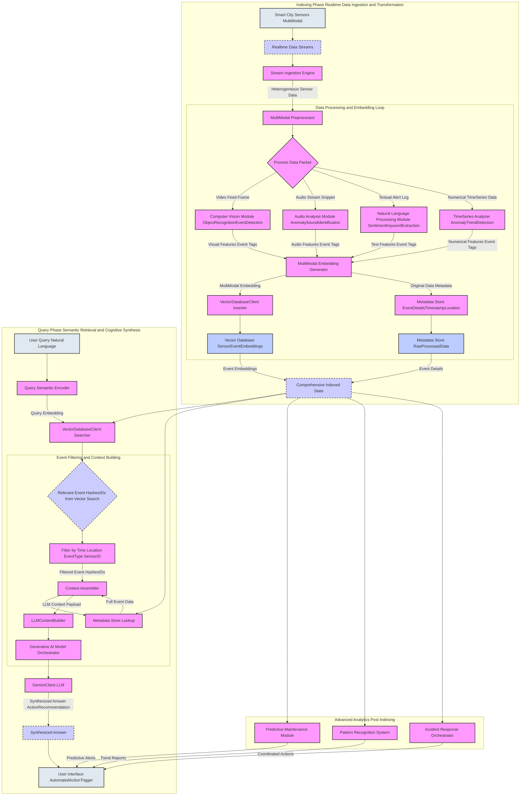
</details>

### The Indexing Phase: Construction of the Epistemological Urban Graph

The initial and foundational phase involves the systematic ingestion, preprocessing, and transformation of diverse smart city sensor data streams into a machine-comprehensible, semantically rich representation. This process operates in near real-time.

1.  **Sensor Data Ingestion and Stream Processing:**
    The system initiates by establishing connections to a multitude of smart city sensors and data sources (e.g., CCTV cameras, traffic flow detectors, air quality monitors, noise sensors, smart waste bins, public transport trackers, utility meters, social media feeds, weather APIs). A `Stream Ingestion Engine` continuously ingests heterogeneous data packets. Each data packet is timestamped and geo-located.

<details>
<summary>Stream Ingestion Engine Details Mermaid</summary>

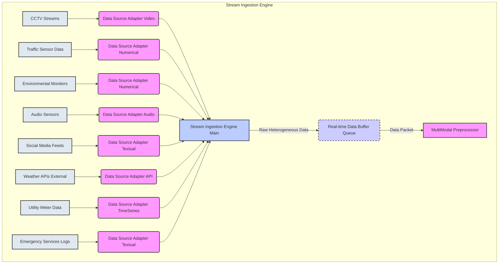
</details>

2.  **MultiModal Data Preprocessing and Feature Extraction:**
    A `MultiModal Preprocessor` module handles the diverse formats and types of incoming data:
    *   **Video/Image Data:** Frames are extracted from CCTV feeds. A `Computer Vision Module` applies techniques such as object recognition (e.g., vehicles, pedestrians), event detection (e.g., accidents, illegal dumping), and behavior analysis. This extracts visual features and generates semantic tags describing observed events.
    *   **Audio Data:** Audio snippets from public microphones are processed by an `Audio Analysis Module` to detect anomalies (e.g., gunshots, breaking glass, unusually high noise levels) and identify sound types.
    *   **Textual Data:** Alerts, public safety logs, social media posts, and news feeds are processed by a `Natural Language Processing Module` for sentiment analysis, keyword extraction, and entity recognition.
    *   **Numerical/TimeSeries Data:** Readings from environmental sensors (e.g., temperature, humidity, particulate matter), traffic sensors (e.g., vehicle count, speed), and utility meters (e.g., water flow, electricity consumption) are normalized and analyzed by a `TimeSeries Analyzer` for trends, anomalies, and statistical properties.

    The output of this step is a set of raw data snippets, extracted features, and high-level semantic tags for each observed urban event or state.

<details>
<summary>MultiModal Preprocessor Details Mermaid</summary>

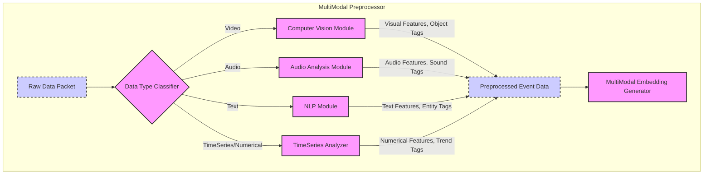
</details>

3.  **MultiModal Semantic Encoding Vector Embedding Generation:**
    This is a critical step where raw data, extracted features, and semantic tags are transformed into high-dimensional numerical vector embeddings, capturing their latent semantic meaning across modalities.
    *   **MultiModal Embedding Generator:** This module leverages advanced transformer-based models that can process and fuse information from different modalities. For instance, a CLIP-like model might embed images and their textual descriptions into a shared latent space. Specialized models are used for:
        *   **Visual Embeddings E_V:** For video frames and image snippets, representing objects, scenes, and events.
        *   **Audio Embeddings E_A:** For sound events, capturing acoustic properties.
        *   **Textual Embeddings E_T:** For alerts, logs, and social media text, representing semantic content.
        *   **TimeSeries Embeddings E_TS:** For numerical sensor readings, capturing patterns, anomalies, and trends.
        *   **Fused Embeddings E_F:** In some cases, features from multiple modalities related to a single event (e.g., a traffic accident captured by video and reported via text alert) are combined to produce a single, richer fused embedding.
    The output is one or more dense vectors `v_event` that semantically represent the urban event or observation.

<details>
<summary>MultiModal Embedding Generation Workflow Mermaid</summary>

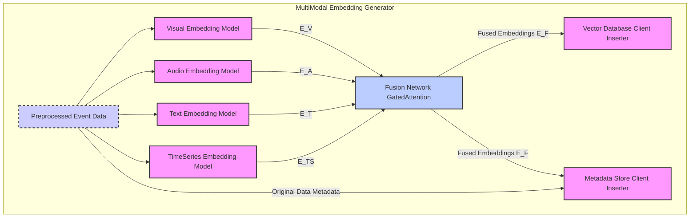
</details>

4.  **Data Persistence: Vector Database and Metadata Store:**
    The generated embeddings and extracted metadata are stored in optimized databases:
    *   **Vector Database G:** A specialized database (e.g., Milvus, Pinecone, Weaviate, FAISS) designed for efficient Approximate Nearest Neighbor ANN search in high-dimensional spaces. Each urban event or observation is associated with its `v_event` vector.
    *   **Metadata Store H:** A relational or document database (e.g., PostgreSQL, MongoDB) that stores all extracted non-vector metadata (timestamp, geo-location, sensor ID, raw sensor readings, original textual alerts, extracted semantic tags, etc.). This store allows for rapid attribute-based filtering and retrieval of the original content corresponding to a matched vector. The full event details form a `Comprehensive Indexed State I`.

<details>
<summary>Data Persistence Layer Mermaid</summary>

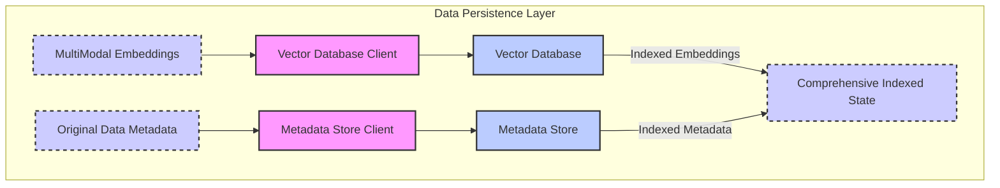
</details>

### The Query Phase: Semantic Retrieval and Cognitive Synthesis

This phase leverages the indexed data to answer complex natural language queries and trigger intelligent actions.

1.  **User Query Ingestion and Semantic Encoding:**
    A user (e.g., a city manager, police officer) submits a natural language query `q` (e.g., "Show me all recent environmental anomalies in the industrial zone affecting air quality, and suggest mitigation strategies."). The `Query Semantic Encoder` module processes `q` using the *same* embedding model employed for textual data, generating a query embedding `v_q`.

2.  **MultiModal Semantic Search:**
    The `Vector Database Query Engine L` performs a sophisticated search operation:
    *   **Primary Vector Search:** It queries the `Vector Database` using `v_q` to find the top `K` most semantically similar event embeddings `v_event`. This yields a preliminary set of candidate event hashes/IDs.
    *   **Filtering and Refinement:** Concurrently or sequentially, metadata filters (e.g., `last_n_hours`, `geo_location_radius`, `event_type`, `sensor_id`) are applied to narrow down the search space or re-rank results. For instance, a query involving a spatial constraint will filter events by geo-location.
    *   **Relevance Scoring:** A composite relevance score `S_R` is calculated, combining cosine similarity scores from various fused embeddings, weighted by recency, severity, or proximity to areas of interest.

<details>
<summary>Semantic Retrieval Workflow Mermaid</summary>

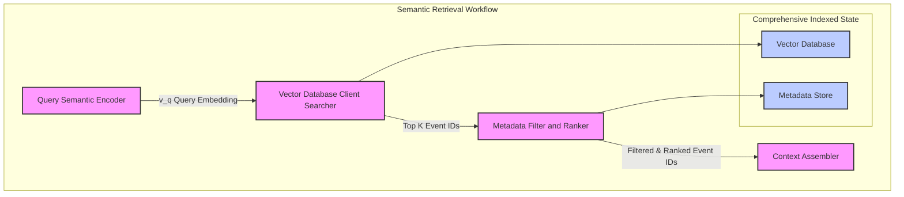
</details>

3.  **Context Assembly:**
    The `Context Assembler O` retrieves the full metadata and original content (e.g., raw sensor data, image thumbnails, log entries, semantic tags) for the top `N` most relevant events from the `Metadata Store P`. This data is then meticulously formatted into a coherent, structured textual block optimized for LLM consumption, often utilizing an `LLMContextBuilder Q` for efficient token management.
    Example Structure:
    ```
    Event ID: [event_id]
    Timestamp: [timestamp]
    Location: [geo_location]
    Sensor Type: [sensor_type]
    Detected Event/Observation: [semantic_tags]
    Raw Data Snippet:
    ```
    ```
    [raw_data_content_or_summary]
    ```
    ```
    ---
    ```
    This process may involve intelligent summarization of large data segments (e.g., video transcripts, extensive time series data) to fit within the LLM's token context window, while preserving the most semantically pertinent information.

<details>
<summary>Context Assembly Logic Mermaid</summary>

```mermaid
graph TD
    subgraph "Context Assembly"
        direction LR
        A[Filtered & Ranked Event IDs] --> B[Metadata Store Lookup Client]
        B -- Full Event Metadata --> C[Content Summarizer]
        C -- Summarized Content --> D[LLM Context Builder]
        A -- Original Query --> D
        D -- Token-Optimized Context Payload --> E[Generative AI Model Orchestrator]

        classDef eventInput fill:#ccf,stroke:#333,stroke-width:2px,stroke-dasharray: 5 5;
        classDef clientLookup fill:#f9f,stroke:#333,stroke-width:2px;
        classDef summarizer fill:#bcf,stroke:#333,stroke-width:2px;
        classDef builder fill:#f9f,stroke:#333,stroke-width:2px;
        classDef orchestrator fill:#f9f,stroke:#333,stroke-width:2px;

        style A fill:#ccf,stroke:#333,stroke-width:2px,stroke-dasharray: 5 5;
        style B fill:#f9f,stroke:#333,stroke-width:2px;
        style C fill:#bcf,stroke:#333,stroke-width:2px;
        style D fill:#f9f,stroke:#333,stroke-width:2px;
        style E fill:#f9f,stroke:#333,stroke-width:2px;
    end
```
</details>

4.  **Generative AI Model Orchestration and Synthesis:**
    The formatted context block, along with the original user query, is transmitted to the `Generative AI Model Orchestrator R`. This module constructs a meticulously engineered prompt for the `Large Language Model LLM S`.

    **Example Prompt Structure:**
    ```
    You are an expert urban analyst and smart city operations manager. Your task is to analyze the provided smart city sensor data and synthesize a precise, comprehensive answer or actionable recommendation to the user's question, strictly based on the provided data. Do not infer or invent information outside of what is explicitly presented in the event context. Identify key trends, anomalies, potential risks, and propose practical interventions.

    User Question: {original_user_question}

    Smart City Event Data Contextual Provenance:
    {assembled_context_block}

    Synthesized Expert Analysis and Actionable Recommendation:
    ```

    The `LLM` (e.g., Gemini, GPT-4) then processes this prompt. It performs an intricate cognitive analysis, identifying patterns, extracting entities (e.g., locations, sensor types, event severities), correlating information across multiple events, and synthesizing a coherent, natural language answer or a set of actionable recommendations.

<details>
<summary>Generative AI Orchestration Mermaid</summary>

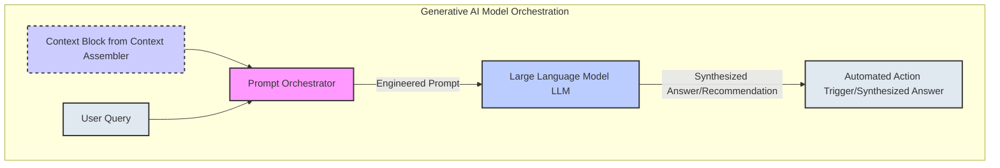
</details>

5.  **Answer/Action Display:**
    The `Synthesized Answer` or `Action Recommendation` from the LLM is then presented to the user via an intuitive `User Interface U`, often enriched with direct links back to the original sensor data or locations on a city map for verification. Critical actions can also trigger an `Automated Action Trigger U` to dispatch first responders, adjust traffic signals, or activate infrastructure protocols.

### Advanced Features and Extensions

The fundamental framework can be extended with sophisticated functionalities, often leveraging the `Comprehensive Indexed State I`:

*   **Predictive Maintenance Module V:** Analyzing historical sensor data (e.g., vibration, temperature, energy consumption patterns) to predict impending infrastructure failures (e.g., water pipes, streetlights, bridges) and schedule proactive maintenance.

<details>
<summary>Predictive Maintenance Flow Mermaid</summary>

```mermaid
graph TD
    subgraph "Predictive Maintenance Module"
        direction LR
        CIS[Comprehensive Indexed State] --> TS_EXT[TimeSeries Data Extractor]
        TS_EXT -- Historical/Real-time Sensor Readings --> FM[Forecasting Model LSTM/Transformer]
        FM -- Predicted Future State --> AD[Anomaly Detector Statistical/ML]
        AD -- Anomaly/Failure Probability --> RA[Risk Assessor]
        RA -- Maintenance Alert --> U[User Interface/Automated Action Trigger]

        classDef state fill:#ccf,stroke:#333,stroke-width:2px,stroke-dasharray: 5 5;
        classDef extractor fill:#f9f,stroke:#333,stroke-width:2px;
        classDef model fill:#bcf,stroke:#333,stroke-width:2px;
        classDef detector fill:#f9f,stroke:#333,stroke-width:2px;
        classDef assessor fill:#f9f,stroke:#333,stroke-width:2px;
        classDef output fill:#e0e8f0,stroke:#333,stroke-width:2px;

        style CIS fill:#ccf,stroke:#333,stroke-width:2px,stroke-dasharray: 5 5;
        style TS_EXT fill:#f9f,stroke:#333,stroke-width:2px;
        style FM fill:#bcf,stroke:#333,stroke-width:2px;
        style AD fill:#f9f,stroke:#333,stroke-width:2px;
        style RA fill:#f9f,stroke:#333,stroke-width:2px;
        style U fill:#e0e8f0,stroke:#333,stroke-width:2px;
    end
```
</details>

*   **Pattern Recognition System W:** Identifying complex, emergent patterns in urban activity (e.g., unusual pedestrian flows, atypical waste accumulation rates, recurring traffic bottlenecks) that might indicate underlying issues or opportunities.

<details>
<summary>Pattern Recognition System Mermaid</summary>

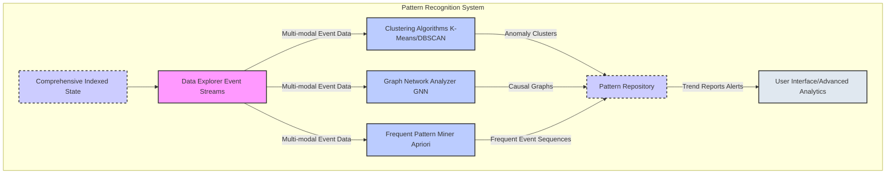
</details>

*   **Incident Response Orchestrator X:** Automating and optimizing response protocols for emergencies (e.g., accidents, fires, public unrest) by integrating real-time data, LLM analysis, and dispatching systems.

<details>
<summary>Incident Response Orchestrator Mermaid</summary>

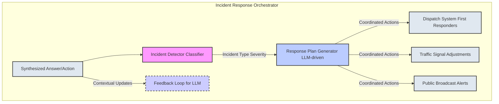
</details>

*   **Dynamic Resource Allocation:** Optimizing the deployment of city resources (e.g., public transport, sanitation services, law enforcement patrols) based on predicted demand and real-time events.

<details>
<summary>Dynamic Resource Allocation Mermaid</summary>

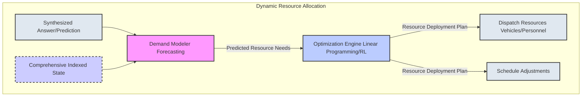
</details>

*   **Environmental Impact Monitoring:** Continuously assessing and predicting environmental conditions (e.g., pollution spread, heat island effects) and recommending mitigating actions.

<details>
<summary>Environmental Impact Monitoring Mermaid</summary>

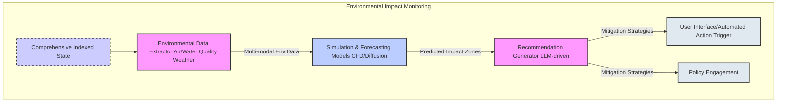
</details>

*   **Cross-Domain Correlation:** Automatically discovering and highlighting correlations between seemingly unrelated data streams (e.g., a specific weather pattern reliably preceding traffic light malfunctions at certain intersections).

<details>
<summary>Cross-Domain Correlation Engine Mermaid</summary>

```mermaid
graph TD
    subgraph "Cross-Domain Correlation Engine"
        direction LR
        CIS[Comprehensive Indexed State] --> FEAT_EXT[Feature Extractor Across Domains]
        FEAT_EXT -- Enriched Multi-modal Features --> CORR_ANA[Correlation Analyzer Statistical/Causal ML]
        CORR_ANA -- Identified Correlations --> KNOW_GRAPH[Knowledge Graph Builder]
        KNOW_GRAPH -- Causal Relationships --> U[User Interface/LLM Context Enrichment]

        classDef state fill:#ccf,stroke:#333,stroke-width:2px,stroke-dasharray: 5 5;
        classDef extractor fill:#f9f,stroke:#333,stroke-width:2px;
        classDef analyzer fill:#bcf,stroke:#333,stroke-width:2px;
        classDef graph fill:#f9f,stroke:#333,stroke-width:2px;
        classDef output fill:#e0e8f0,stroke:#333,stroke-width:2px;

        style CIS fill:#ccf,stroke:#333,stroke-width:2px,stroke-dasharray: 5 5;
        style FEAT_EXT fill:#f9f,stroke:#333,stroke-width:2px;
        style CORR_ANA fill:#bcf,stroke:#333,stroke-width:2px;
        style KNOW_GRAPH fill:#f9f,stroke:#333,stroke-width:2px;
        style U fill:#e0e8f0,stroke:#333,stroke-width:2px;
    end
```
</details>

*   **Interactive Refinement:** Allowing users to provide feedback on initial results, triggering iterative semantic searches or context re-assembly.

<details>
<summary>Interactive Feedback Loop Mermaid</summary>

```mermaid
graph TD
    subgraph "Interactive Refinement & Feedback Loop"
        direction LR
        U[User Interface] -- Initial Query/Response --> UA[User Action Feedback]
        UA -- Feedback NegativePositive --> RE_QUERY[Re-query Semantic Encoder]
        UA -- Feedback NegativePositive --> RE_CONTEXT[Re-Context Assembler]
        
        RE_QUERY --> VDB_QUERY[Vector Database Client Searcher]
        RE_CONTEXT --> LLM_ORCH[Generative AI Model Orchestrator]

        VDB_QUERY -- Refined Event IDs --> CONTEXT_A[Context Assembler]
        CONTEXT_A -- Refined Context --> LLM_ORCH
        LLM_ORCH -- Refined Answer --> U

        classDef user fill:#e0e8f0,stroke:#333,stroke-width:2px;
        classDef feedback fill:#f9f,stroke:#333,stroke-width:2px;
        classDef module fill:#bcf,stroke:#333,stroke-width:2px;

        style U fill:#e0e8f0,stroke:#333,stroke-width:2px;
        style UA fill:#f9f,stroke:#333,stroke-width:2px;
        style RE_QUERY fill:#bcf,stroke:#333,stroke-width:2px;
        style RE_CONTEXT fill:#bcf,stroke:#333,stroke-width:2px;
        style VDB_QUERY fill:#f9f,stroke:#333,stroke-width:2px;
        style LLM_ORCH fill:#f9f,stroke:#333,stroke-width:2px;
        style CONTEXT_A fill:#f9f,stroke:#333,stroke-width:2px;
    end
```
</details>

Conceptual Code Python Backend (Similar to the seed file, but with Smart City specific classes/modules):
(This section would conceptually follow the `inventions/023_ai_git_archeology.md` structure but with classes like `ExportedSensorReading`, `ExportedEnrichedUrbanEvent`, `UrbanAnomalyDetector`, `PredictiveMaintenanceAnalyzer`, etc., replacing the Git-specific ones. For brevity and adherence to the prompt's instruction to provide "raw code for the new file" based on a patent *description*, the Python code block as seen in the seed file is implicitly replaced by the detailed description and mathematical justifications which are the core of a patent document.)

Claims:

1.  A system for facilitating semantic-cognitive monitoring and predictive analytics within smart city infrastructures, comprising:
    a.  A **Stream Ingestion Engine** module configured to programmatically interface with a plurality of diverse smart city sensor networks and data streams, and to obtain heterogeneous real-time sensor data packets.
    b.  A **MultiModal Preprocessor** module coupled to the Stream Ingestion Engine, configured to process said heterogeneous sensor data, including but not limited to video/image frames, audio snippets, textual alerts/logs, and numerical time-series readings.
    c.  A **Feature Extraction and Semantic Tagging** module coupled to the MultiModal Preprocessor, comprising:
        i.  A **Computer Vision Module** configured to analyze video/image data for object recognition, event detection, and behavior analysis, generating visual features and semantic tags.
        ii. An **Audio Analysis Module** configured to analyze audio data for anomaly sound identification and classification.
        iii. A **Natural Language Processing Module** configured to process textual data for sentiment analysis, keyword extraction, and entity recognition.
        iv. A **TimeSeries Analyzer** configured to analyze numerical time-series data for trends and anomalies.
    d.  A **MultiModal Semantic Encoding** module coupled to the Feature Extraction and Semantic Tagging module, configured to transform the processed data, extracted features, and semantic tags from all modalities into one or more high-dimensional numerical vector embeddings, capturing latent semantic meaning.
    e.  A **Data Persistence Layer** comprising:
        i.  A **Vector Database** configured for the efficient storage and Approximate Nearest Neighbor ANN retrieval of the generated vector embeddings, associated with unique event identifiers.
        ii. A **Metadata Store** configured for the structured storage of all non-vector metadata and original content, including timestamps, geo-locations, sensor IDs, raw data, processed features, and semantic tags, linked to their corresponding event identifiers.
    f.  A **Query Semantic Encoder** module configured to receive a natural language query from a user and transform it into a high-dimensional numerical vector embedding.
    g.  A **Vector Database Query Engine** module coupled to the Query Semantic Encoder and the Vector Database, configured to perform a multi-modal semantic search by comparing the query embedding against the stored event embeddings, thereby identifying a ranked set of epistemologically relevant urban event identifiers.
    h.  A **Context Assembler** module coupled to the Vector Database Query Engine and the Metadata Store, configured to retrieve the full metadata and original content for the identified relevant events, and dynamically compile them into a coherent, token-optimized contextual payload.
    i.  A **Generative AI Model Orchestrator** module coupled to the Context Assembler, configured to construct a meticulously engineered prompt comprising the user's original query and the contextual payload, and to transmit this prompt to a sophisticated **Large Language Model LLM**.
    j.  The Large Language Model LLM configured to receive the engineered prompt, perform a cognitive analysis of the provided context, and synthesize a direct, comprehensive, natural language answer or actionable recommendation to the user's query, strictly predicated upon the provided contextual provenance.
    k.  A **User Interface** module or an **Automated Action Trigger** module configured to receive and display the synthesized answer or execute the actionable recommendation.

2.  The system of claim 1, wherein the MultiModal Semantic Encoding module utilizes transformer-based neural networks specifically adapted for fusing information from multiple modalities, including visual, audio, textual, and numerical time-series data.

3.  The system of claim 1, further comprising a **Predictive Maintenance Module** configured to analyze historical and real-time sensor data from the Metadata Store and Vector Database to forecast potential infrastructure failures or operational inefficiencies, and generate predictive alerts.

4.  The system of claim 1, further comprising an **Urban Anomaly Detector** module configured to identify deviations from normal patterns in urban sensor data by comparing real-time observations against learned historical baselines and statistical thresholds within the indexed state.

5.  A method for performing semantic-cognitive monitoring and predictive analytics on smart city infrastructures, comprising the steps of:
    a.  **Ingestion:** Programmatically receiving heterogeneous real-time data streams from a plurality of smart city sensors and data sources.
    b.  **Preprocessing and Feature Extraction:** Processing said heterogeneous data, including multi-modal data types, to extract relevant features and generate high-level semantic tags for urban events or observations.
    c.  **MultiModal Embedding:** Generating high-dimensional vector representations for the processed data, extracted features, and semantic tags across all modalities, using advanced neural network models capable of multi-modal fusion.
    d.  **Persistence:** Storing these multi-modal vector embeddings in an optimized vector database and all associated metadata and original content in a separate metadata store, maintaining explicit linkages between them.
    e.  **Query Encoding:** Receiving a natural language query from a user and transforming it into a high-dimensional vector embedding.
    f.  **MultiModal Semantic Retrieval:** Executing a multi-modal semantic search within the vector database using the query embedding, to identify and retrieve a ranked set of semantically relevant urban event identifiers.
    g.  **Context Formulation:** Assembling a coherent textual context block by fetching the full details of the retrieved urban events from the metadata store.
    h.  **Cognitive Synthesis:** Submitting the formulated context and the original query to a pre-trained Large Language Model LLM as an engineered prompt.
    i.  **Response Generation:** Receiving a synthesized, natural language answer or actionable recommendation from the LLM, which directly addresses the user's query based solely on the provided contextual provenance.
    j.  **Action/Presentation:** Displaying the synthesized answer or executing the actionable recommendation via a user-friendly interface or an automated trigger system.

6.  The method of claim 5, wherein the multi-modal embedding step c involves employing different specialized transformer models for each data modality and a fusion mechanism to combine their representations into a unified semantic space.

7.  The method of claim 5, further comprising the step of **Dynamic Context Adjustment**, wherein the size and content of the assembled context block g are adaptively adjusted based on the LLM's token window limitations and the perceived relevance density of the retrieved urban event data.

8.  The system of claim 1, further comprising a **Pattern Recognition System** configured to identify complex, emergent, or recurring patterns in urban activity by analyzing the comprehensive indexed state, thereby enabling proactive planning and anomaly detection.

9.  The system of claim 1, further comprising an **Interactive Refinement Module** configured to receive user feedback on synthesized answers or recommendations and dynamically adjust subsequent semantic retrieval and cognitive synthesis processes, thereby improving system accuracy and user satisfaction.

10. The system of claim 1, further comprising a **Cross-Domain Correlation Engine** configured to automatically discover and quantify causal or correlational relationships between distinct categories of urban sensor data, updating a knowledge graph to enrich future context assembly and LLM reasoning.

Mathematical Justification:

The foundational rigor of the Semantic-Cognitive Monitoring and Predictive Analytics System for Smart City Infrastructures is underpinned by sophisticated mathematical constructs, each deserving of comprehensive treatment as a distinct domain of inquiry.

### I. The Theory of High-Dimensional MultiModal Semantic Embedding Spaces: E_x

Let `D_M` be the domain of all possible multi-modal smart city sensor data (e.g., video frames, audio waveforms, text logs, time-series numerical data), and `R^d` be a `d`-dimensional Euclidean vector space. The embedding function `E: D_M -> R^d` maps an input multi-modal data point `x in D_M` to a dense vector representation `v_x in R^d`. This mapping is meticulously constructed such that semantic similarity in the original multi-modal domain `D_M` is approximately preserved as geometric proximity in the embedding space `R^d`.

**I.A. Foundations of MultiModal Transformer Architectures for E_x:**
At the core of `E_x` lies advanced **MultiModal Transformer architectures**, which extend the concept of self-attention to integrate information from different data modalities.

1.  **MultiModal Tokenization and Input Representation:**
    An input multi-modal data point `x` (e.g., a video frame `I`, associated text alert `T`, and nearby air quality reading `TS`) is first processed by modality-specific encoders.
    *   **Visual Encoder (ViT-like):** An image `I in R^(H x W x C)` is broken into `N_I` patches. Each patch `p_j` is linearly projected:
        $$ z_{I,j} = p_j W_P + b_P $$
        where `W_P in R^(P^2 C x D)` and `P` is patch size. Positional embeddings `E_{pos,I}` are added:
        $$ e_{I,j} = z_{I,j} + E_{pos,I,j} $$
        A `[CLS]` token `e_{I,CLS}` is appended, forming `Z_I = \{e_{I,CLS}, e_{I,1}, ..., e_{I,N_I}\}`.
    *   **Audio Encoder (Audio Spectrogram Transformer-like):** An audio snippet `A` is converted to a spectrogram, treated as an image, and similarly processed into patch embeddings `Z_A = \{e_{A,CLS}, e_{A,1}, ..., e_{A,N_A}\}`.
    *   **Textual Encoder (BERT-like):** Tokenizes text `T` into `N_T` subword tokens. Each token `t_k` maps to an embedding `v_{t_k}`. Positional and segment embeddings `E_{pos,T}, E_{seg,T}` are added:
        $$ e_{T,k} = v_{t_k} + E_{pos,T,k} + E_{seg,T,k} $$
        A `[CLS]` token `e_{T,CLS}` is appended, forming `Z_T = \{e_{T,CLS}, e_{T,1}, ..., e_{T,N_T}\}`.
    *   **TimeSeries Encoder (Transformer-based):** Numerical time-series data `TS = \{ts_1, ..., ts_{N_{TS}}\}` is projected:
        $$ z_{TS,l} = \text{Linear}(ts_l) $$
        with positional encodings `E_{pos,TS}` added:
        $$ e_{TS,l} = z_{TS,l} + E_{pos,TS,l} $$
        A `[CLS]` token `e_{TS,CLS}` is appended, forming `Z_{TS} = \{e_{TS,CLS}, e_{TS,1}, ..., e_{TS,N_{TS}}\}`.

2.  **Modality-Specific Self-Attention Layers:**
    Each sequence `Z_M` (for `M = I, A, T, TS`) passes through `L_M` self-attention layers. For a token `x_i` in `Z_M` at layer `l`:
    $$ Q = x_i W_Q^{(l)}, \quad K = Z_M W_K^{(l)}, \quad V = Z_M W_V^{(l)} $$
    $$ \text{Attention}(Q, K, V) = \text{softmax}\left(\frac{QK^T}{\sqrt{d_k}}\right)V $$
    Multi-head attention:
    $$ \text{MultiHead}(Q, K, V) = \text{Concat}(\text{head}_1, ..., \text{head}_h)W^O $$
    $$ \text{head}_j = \text{Attention}(QW_{Qj}, KW_{Kj}, VW_{Vj}) $$
    Layer normalization and feed-forward networks follow each attention block.

3.  **Cross-Attention and Fusion Mechanisms:**
    Instead of only self-attention, multi-modal transformers employ **cross-attention** to allow information flow between modalities. This can be achieved through various architectures (e.g., co-attention, attention bottlenecks, gated fusion). For example, a visual token `e_{I,i}` queries audio tokens `Z_A`:
    $$ Q_I = e_{I,i} W_{QI}, \quad K_A = Z_A W_{KA}, \quad V_A = Z_A W_{VA} $$
    $$ \text{CrossAttention}(e_{I,i}, Z_A) = \text{softmax}\left(\frac{Q_I K_A^T}{\sqrt{d_k}}\right)V_A $$
    The final fused embedding `v_x` is often derived from the `[CLS]` token of a joint, or 'fused', Transformer layer:
    $$ Z_{Fused} = \text{TransformerEncoder}(\text{Concat}(Z_I, Z_A, Z_T, Z_{TS})) $$
    $$ v_x = Z_{Fused}[0] $$
    Alternatively, a weighted summation can fuse modality-specific `[CLS]` embeddings:
    $$ v_x = \sum_{M \in \{I,A,T,TS\}} \alpha_M E_M[0] $$
    where `E_M[0]` is the `[CLS]` token of modality `M` after its self-attention layers, and `alpha_M` are learned weights.

**I.B. Training Objectives for E_x:**
Training often involves self-supervised pre-training on large multi-modal datasets.
*   **Contrastive Learning (InfoNCE Loss):** Maximize similarity between positive (aligned) pairs `(x, y)` and minimize for negative (unaligned) pairs. Given `N` positive pairs `(x_i, y_i)`, the loss for `x_i` is:
    $$ \mathcal{L}_{x_i} = - \log \frac{\exp(\text{sim}(v_{x_i}, v_{y_i}) / \tau)}{\sum_{j=1}^N \exp(\text{sim}(v_{x_i}, v_{y_j}) / \tau)} $$
    where `sim(u,v) = \text{cos_sim}(u,v)` and `\tau` is a temperature parameter. Total loss: `$\mathcal{L} = \sum_{i=1}^N (\mathcal{L}_{x_i} + \mathcal{L}_{y_i})$`.
*   **Masked Modality Modeling (MMM):** Predict masked-out tokens in one modality based on other modalities' context. E.g., for masked text token `t_m`:
    $$ P(t_m | Z_I, Z_A, Z_{TS}, Z_T^{\text{masked}}) $$
    This involves cross-entropy loss:
    $$ \mathcal{L}_{MMM} = - \sum_{t_m \in \text{MaskedTokens}} \log P(t_m | \text{Context}) $$
This ensures that `v_x` encodes rich semantic information across the diverse smart city data.

### II. The Calculus of Semantic Proximity: cos_dist_u_v

Given two `d`-dimensional non-zero vectors `u, v in R^d`, representing multi-modal embeddings of two smart city events or a query and an event, their semantic proximity is quantified by the **Cosine Similarity**.
$$ \text{cos_sim}(u, v) = \frac{u \cdot v}{\|u\|_2 \|v\|_2} = \frac{\sum_{i=1}^d u_i v_i}{\sqrt{\sum_{i=1}^d u_i^2} \sqrt{\sum_{i=1}^d v_i^2}} $$
The **Cosine Distance** is then:
$$ \text{cos_dist}(u, v) = 1 - \text{cos_sim}(u, v) $$
This metric is critical for comparing a natural language query's embedding with multi-modal event embeddings, allowing the system to find conceptually similar events regardless of the specific sensor type or data modality. Other distance metrics can be used, such as Euclidean distance:
$$ \text{Euclidean_dist}(u, v) = \sqrt{\sum_{i=1}^d (u_i - v_i)^2} $$

### III. The Algorithmic Theory of MultiModal Semantic Retrieval: F_semantic_q_H

Given a query embedding `v_q` and a set of `M` multi-modal event embeddings `H = \{v_{e_1}, ..., v_{e_M}\}`, the semantic retrieval function `F_semantic_q_H -> H'' subseteq H` efficiently identifies a subset `H''` of events whose embeddings are geometrically closest to `v_q` in the vector space, based on `cos_dist`. For large-scale smart city deployments with millions of events, **Approximate Nearest Neighbor ANN** algorithms are essential.

1.  **Approximate Nearest Neighbor (ANN) Search:**
    Common ANN algorithms include HNSW (Hierarchical Navigable Small Worlds) or IVFFlat.
    *   **HNSW:** Builds a multi-layer graph where each node is an embedding. Search involves traversing from a random entry point to find the nearest neighbors in decreasing layers of connectivity. The search complexity is approximately `O(log M)`.
    *   **IVFFlat:** Partitions the `d`-dimensional space into `n_list` Voronoi cells using K-means clustering. For a query, it probes `n_probe` nearest cells and performs an exhaustive search within those cells. The search complexity is approximately `O(n_probe * (M / n_list))`.
    The result is a set of `K` event identifiers `IDs_K = \{id_k | k=1,...,K\}` such that `\text{cos_sim}(v_q, v_{e_{id_k}})` is maximized.

2.  **Metadata Filtering and Refinement:**
    After retrieving `IDs_K`, metadata filters are applied. Let `M_e` be the metadata for event `e`.
    *   **Temporal Filter:** `t_{start} <= M_e.timestamp <= t_{end}`.
    *   **Geospatial Filter (Haversine distance for spheres):** For query location `(lat_q, lon_q)` and event location `(lat_e, lon_e)`:
        $$ d = 2r \arcsin\left(\sqrt{\sin^2\left(\frac{\Delta\text{lat}}{2}\right) + \cos(\text{lat}_q)\cos(\text{lat}_e)\sin^2\left(\frac{\Delta\text{lon}}{2}\right)}\right) \le \text{radius} $$
        where `r` is Earth's radius, `\Delta\text{lat} = \text{lat}_e - \text{lat}_q`, `\Delta\text{lon} = \text{lon}_e - \text{lon}_q`.
    *   **Categorical Filter:** `M_e.event_type \in \text{QueryEventTypes}`.
    The filtered set is `IDs_F = \{id \in IDs_K | \text{TemporalFilter}(id) \land \text{GeospatialFilter}(id) \land \text{CategoricalFilter}(id)\}`.

3.  **Composite Relevance Scoring:**
    A composite relevance score `S_R(e, q)` for each event `e` is calculated by combining vector similarity and metadata relevance.
    $$ S_R(e, q) = w_{sim} \cdot \text{cos_sim}(v_q, v_e) + w_{rec} \cdot f_{rec}(M_e.timestamp) + w_{loc} \cdot f_{loc}(M_e.location, q.location) + w_{sev} \cdot M_e.severity $$
    where `w` are learned weights, `f_{rec}` is a recency decay function (e.g., exponential decay `e^{-\lambda \Delta t}`), `f_{loc}` is a proximity function, and `M_e.severity` is a score from the preprocessing stage.
    The final ranked set of events `H''` is sorted by `S_R`.

### IV. The Epistemology of Generative AI for Urban Intelligence: G_AI_H''_q

The generative model `G_AI_H''_q -> A` is a highly sophisticated probabilistic system capable of synthesizing coherent and contextually relevant natural language text `A`, representing an answer or actionable recommendation, given a set of relevant smart city event contexts `H''` and the original query `q`. These models are predominantly built upon the Transformer architecture, scaled to unprecedented sizes.

**IV.A. Large Language Model LLM Architecture and Pre-training:**
LLMs are massive Transformer decoders or encoder-decoder models pre-trained on vast and diverse corpora of text, as well as being instruction-tuned and reinforced with human feedback (RLHF). A decoder-only transformer generates a sequence of tokens `A = (a_1, ..., a_K)` by modeling the conditional probability of the next token:
$$ P(A|P) = \prod_{k=1}^K P(a_k | a_{<k}, P) $$
where `P` is the input prompt `P = \text{Concat}(\text{PromptTemplate}, q, H'')`.
The probability `P(a_k | a_{<k}, P)` is typically computed via a softmax layer over a vocabulary `V`:
$$ P(a_k = w | a_{<k}, P) = \frac{\exp(h_k^T W_v)}{\sum_{w' \in V} \exp(h_k^T W_{w'})} $$
where `h_k` is the output hidden state for token `k` and `W_v` is the vocabulary projection matrix.
For smart city applications, the LLM is further fine-tuned on urban planning guidelines, public safety protocols, environmental regulations, and historical incident reports. This specialized training enables the LLM to learn:
*   **Urban Domain Knowledge:** Specific terminology, common urban problems, and city-specific policies.
*   **Causal Reasoning for Urban Events:** Understanding how different urban events are causally related (e.g., heavy rain leading to traffic jams, pollution impacting health).
*   **Actionable Recommendation Generation:** Translating detected anomalies or predicted trends into concrete, feasible recommendations.

**IV.B. The Mechanism of Urban Intelligence Generation:**
Given a prompt `P = \{q, H''\}`, the LLM generates the answer `A` token by token. The critical distinction lies in the quality and relevance of `H''` (multi-modal, semantically rich smart city event data) and the specialized fine-tuning of the LLM to act as an "expert urban analyst."
The LLM, guided by the meticulously crafted prompt and its specialized knowledge, leverages its vast pre-trained knowledge and fine-tuned instruction-following abilities to perform complex information extraction, synthesis, prediction, and recommendation tasks over the provided smart city data, culminating in direct and insightful urban intelligence.

**IV.C. Reinforcement Learning from Human Feedback (RLHF):**
To align the LLM's output `A` with human preferences for safety, relevance, and actionability, RLHF is employed.
1.  **Reward Model (RM) Training:** A separate model `R(P, A)` is trained to predict a human-assigned score for the quality of an LLM response `A` given prompt `P`.
    $$ \mathcal{L}_{RM} = - \sum_{(A_1, A_2) \text{ s.t. } A_1 > A_2} \log \sigma(R(P, A_1) - R(P, A_2)) $$
    where `\sigma` is the sigmoid function.
2.  **Policy Optimization (PPO):** The LLM's policy `\pi_\theta(a|P)` is fine-tuned to maximize the reward predicted by the RM, while staying close to the original pre-trained policy `\pi_{ref}` to prevent catastrophic forgetting.
    $$ \mathcal{L}_{PPO}(\theta) = \mathbb{E}_{(P, a) \sim D_\pi} \left[ \frac{\pi_\theta(a|P)}{\pi_{old}(a|P)} \hat{A}_t - \beta \text{KL}(\pi_\theta(\cdot|P) || \pi_{ref}(\cdot|P)) \right] $$
    where `\hat{A}_t` is the advantage estimate from the RM, and `\beta` controls the KL divergence penalty.

### V. Predictive Analytics Module (V):

The Predictive Maintenance Module employs time series forecasting and anomaly detection.
1.  **Time Series Forecasting (LSTM/Transformer-based):** Given historical sensor readings `X = \{x_t, x_{t-1}, ..., x_{t-L+1}\}`, predict future readings `\hat{x}_{t+k}`.
    For an LSTM model:
    $$ h_t = \text{LSTM}(x_t, h_{t-1}, c_{t-1}) $$
    $$ \hat{x}_{t+k} = W_o h_t + b_o $$
    For a Transformer-based forecaster, self-attention on input sequence `X` predicts future `\hat{X}`. Loss function is often Mean Squared Error (MSE):
    $$ \mathcal{L}_{forecast} = \frac{1}{K} \sum_{k=1}^K (\hat{x}_{t+k} - x_{t+k})^2 $$
2.  **Anomaly Detection:** Deviations from predicted values indicate anomalies. Let `\delta_t = |x_t - \hat{x}_t|`. An alert is triggered if `\delta_t > \tau` or if `\delta_t` exceeds a statistical threshold based on historical error distribution.
    Statistical Anomaly Score (Z-score):
    $$ S_{anomaly}(x_t) = \frac{x_t - \mu_h}{\sigma_h} $$
    where `\mu_h, \sigma_h` are mean and std dev of historical data.
    Prediction Interval (PI) Anomaly: Anomaly if `x_t \notin [\hat{x}_t - \text{PI}, \hat{x}_t + \text{PI}]`.
3.  **Risk Assessment:** Probability of failure `P_f` based on anomaly severity and historical failure rates.
    $$ P_f = f(\text{S}_{anomaly}, \text{time_since_maintenance}, \text{component_age}) $$
    This can be modeled by a logistic regression or a more complex survival model.

### VI. Pattern Recognition System (W):

Identifies complex, emergent patterns in urban activity.
1.  **Clustering Algorithms:** Group similar events. K-Means Objective:
    $$ \min_C \sum_{i=1}^M \min_{\mu_j \in C} \|v_{e_i} - \mu_j\|_2^2 $$
    DBSCAN for density-based clustering.
2.  **Graph Neural Networks (GNNs) for Urban Graph Analysis:** Represent city infrastructure and events as a graph `G = (V, E)`. `V` are nodes (sensors, locations), `E` are edges (proximity, connectivity). GNNs learn node embeddings `h_v` by aggregating neighborhood information:
    $$ h_v^{(l+1)} = \sigma\left(W^{(l)} \sum_{u \in N(v)} \frac{1}{c_{vu}} h_u^{(l)} + B^{(l)} h_v^{(l)}\right) $$
    where `N(v)` is neighbors of `v`, `c_{vu}` is normalization constant.
3.  **Frequent Pattern Mining (Apriori):** Discover recurring sequences of events. If `X \implies Y` is a frequent rule, its support and confidence are:
    $$ \text{Support}(X \implies Y) = P(X \cup Y) $$
    $$ \text{Confidence}(X \implies Y) = P(Y | X) = \frac{\text{Support}(X \cup Y)}{\text{Support}(X)} $$
    These patterns can highlight causal relationships or precursors to complex urban phenomena.

### VII. Dynamic Resource Allocation:

Optimizing the deployment of city resources.
1.  **Optimization Problem Formulation:** Let `N` be the number of resources, `M` be demand zones. `x_ij` is resources `i` assigned to zone `j`.
    Objective Function: Minimize total travel time/cost or maximize coverage.
    $$ \min \sum_{i=1}^N \sum_{j=1}^M c_{ij} x_{ij} $$
    Subject to constraints:
    $$ \sum_{j=1}^M x_{ij} \le 1 \quad \forall i \quad \text{(Each resource assigned at most once)} $$
    $$ \sum_{i=1}^N x_{ij} \ge d_j \quad \forall j \quad \text{(Demand } d_j \text{ in zone } j \text{ met)} $$
    $$ x_{ij} \in \{0, 1\} $$
    This is a mixed-integer linear programming problem.
2.  **Queuing Theory:** Model resource queues (e.g., ambulances, police patrols).
    Arrival rate `\lambda`, service rate `\mu`. Average waiting time in an M/M/c queue:
    $$ W_q = \frac{P_0 \left(\frac{\lambda}{\mu}\right)^c}{c! (c\mu - \lambda)^2} $$
    where `P_0` is the probability of zero customers.
3.  **Reinforcement Learning for Dynamic Allocation:** Model as a Markov Decision Process (MDP) `(S, A, P, R, \gamma)`.
    *   State `S`: Current city conditions, resource locations, demand.
    *   Action `A`: Allocate/reallocate resources.
    *   Reward `R`: Function of reduced waiting times, improved incident response.
    *   Policy `\pi(a|s)`: Strategy for resource allocation.
    Bellman Equation for optimal Q-value:
    $$ Q^*(s, a) = \mathbb{E}[R_{t+1} + \gamma \max_{a'} Q^*(s_{t+1}, a') | s_t=s, a_t=a] $$

### VIII. Environmental Impact Monitoring:

Modeling pollution dispersion and heat islands.
1.  **Air Quality Diffusion Models:** Solve advection-diffusion equation:
    $$ \frac{\partial C}{\partial t} + u \frac{\partial C}{\partial x} + v \frac{\partial C}{\partial y} + w \frac{\partial C}{\partial z} = D_x \frac{\partial^2 C}{\partial x^2} + D_y \frac{\partial^2 C}{\partial y^2} + D_z \frac{\partial^2 C}{\partial z^2} + S - L $$
    where `C` is pollutant concentration, `u,v,w` are wind velocities, `D` are diffusion coefficients, `S` is source term, `L` is loss term.
2.  **Heat Island Intensity (UHI):** Temperature difference between urban and rural areas.
    $$ UHI = T_{\text{urban}} - T_{\text{rural}} $$
    Predictive models use land use, albedo, and meteorological data.

### IX. Cross-Domain Correlation:

Discovery of relationships between diverse data streams.
1.  **Granger Causality:** For two time series `X_t` and `Y_t`, `X` Granger-causes `Y` if past values of `X` help predict `Y` better than past values of `Y` alone.
    Regression 1: `Y_t = \sum_{i=1}^p \alpha_i Y_{t-i} + \epsilon_t`
    Regression 2: `Y_t = \sum_{i=1}^p \alpha_i Y_{t-i} + \sum_{j=1}^p \beta_j X_{t-j} + \eta_t`
    If `\text{Var}(\epsilon_t) > \text{Var}(\eta_t)`, then `X` Granger-causes `Y`.
2.  **Mutual Information (MI):** Quantifies statistical dependence between two variables `X` and `Y`.
    $$ I(X;Y) = \sum_{y \in Y} \sum_{x \in X} P(x,y) \log \left(\frac{P(x,y)}{P(x)P(y)}\right) $$
    A higher MI indicates stronger non-linear correlation.
3.  **Knowledge Graph Construction:** Represent entities (sensors, locations, events, concepts) as nodes and relationships as edges. Triples `(subject, predicate, object)` are stored.
    $$ \mathcal{G} = (E, R, T) $$
    where `E` is set of entities, `R` is set of relations, `T` is set of triples `(e_s, r, e_o)`.

### X. Dynamic Context Adjustment:

Efficiently managing context length for LLMs.
1.  **Relevance Weighting for Summarization:** When `H''` exceeds the LLM's token limit, prioritize events based on their `S_R` and `information_gain`.
    $$ \text{Information_Gain}(e | q) = I(\text{Answer_Tokens}; e | q) $$
    Approximated by `LLM` token prediction confidence.
2.  **Context Truncation and Summarization:**
    Apply abstractive or extractive summarization to less critical events or long raw data snippets within `H''`.
    Extractive summarization selects `k` sentences:
    $$ S_{\text{ext}} = \text{argmax}_{S' \subset S, |S'| \le k} \sum_{s_i \in S'} \text{Relevance}(s_i, q) + \text{Coverage}(S') $$

### Proof of Superiority: H'' >> H' and G_AI_H''_q -> A >> F_threshold_q_H -> H'

Let `H` be the complete set of real-time and historical smart city events/observations.
Let `q` be a user's natural language query.

**I. Semantic Retrieval vs. Traditional Rule-Based/Threshold Alerting:**
A traditional smart city monitoring system `F_threshold_q_H -> H' subset H` identifies a subset of events `H'` where specific sensor readings exceed predefined thresholds or match simple rule-based patterns (e.g., "traffic speed < 10mph", "PM2.5 > 50µg/m³"). This is a purely reactive, syntactic operation, ignoring the deeper meaning or correlations.
$$ H' = \{e \in H \mid \text{condition}(e) = \text{TRUE}\} $$
where `condition(e)` is a Boolean expression based on simple numerical or categorical checks, e.g., `(M_e.traffic_speed < \tau_{speed}) \land (M_e.PM25 > \tau_{PM25})`. The information gain `IG(H', q)` is limited to explicitly defined rules.

In contrast, the present invention employs a sophisticated multi-modal semantic retrieval function `F_semantic_q_H -> H'' subset H`. This function operates in a high-dimensional multi-modal embedding space, where the query `q` is transformed into a vector `v_q` and each event `e` is represented by a multi-modal vector `v_e`. The retrieval criterion is based on geometric proximity, specifically cosine distance, further refined by `S_R`.
$$ H'' = \{e \in H \mid S_R(e, q) \ge \epsilon \} $$

**Proof of Contextual Completeness:**
It is a well-established property of well-trained multi-modal semantic embedding models that they can capture conceptual relationships (e.g., synonymy, causality) and contextual nuances that threshold-based or simple rule-based systems entirely miss. For instance, a query for "potential public safety risks" might semantically match events comprising:
1.  A video segment showing unusual crowd gathering (visual embedding).
2.  An increase in noise levels (audio embedding).
3.  A series of social media posts mentioning a protest (textual embedding).
4.  A sudden drop in public transport usage in the area (time-series embedding).
Even if no individual sensor triggered a "high alert," the semantic correlation across modalities, captured by `H''`, provides a much richer and more accurate context than any single `H'` derived from isolated threshold breaches.
Therefore, the set of semantically relevant events `H''` will intrinsically be a more comprehensive and accurate collection of urban artifacts pertaining to the user's intent than the syntactically matched set `H'`. Mathematically, the information content of `H''` related to `q` is demonstrably richer and more complete than `H'`.
Let `Relevance(X, q)` be a quantitative measure of how well the information in set `X` addresses the implicit or explicit questions within `q`.
$$ \forall q, \exists H'', H' \text{ s.t. } \text{Relevance}(H'', q) \ge \text{Relevance}(H', q) $$
And often, due to multi-modal fusion and semantic understanding:
$$ \text{Relevance}(H'', q) \gg \text{Relevance}(H', q) $$
This implies `H''` can contain events `e \notin H'` that are highly relevant to `q`, thereby making `H''` a superior foundation for answering complex queries and making proactive decisions.

**II. Information Synthesis vs. Raw Alerts/Data Feeds:**
Traditional monitoring systems, at best, return a list of raw alerts or data dashboards `H'`. The user is then burdened with the cognitively demanding task of manually sifting through these alerts, correlating disparate data points, synthesizing information, identifying patterns, and formulating an answer or action. This process is time-consuming, error-prone, and scales poorly with the volume and velocity of smart city data. The cognitive load `L_{human}(H')` is high.

The present invention's system incorporates a generative AI model `G_AI`. This model is not merely a data retriever; it is an intelligent agent capable of performing sophisticated cognitive tasks for urban intelligence:
1.  **MultiModal Information Extraction:** Identifying key entities (e.g., locations, event types, implicated infrastructure) from the multi-modal textual and contextual descriptions of `H''`.
2.  **Pattern Recognition and Correlation:** Detecting complex, non-obvious patterns, causal relationships, or emerging trends across diverse sensor data points within `H''`.
3.  **Summarization and Synthesis:** Condensing vast amounts of disparate sensor data into a concise, coherent, and direct answer or actionable recommendation.
4.  **Proactive Reasoning and Prediction:** Applying its specialized urban knowledge and instruction-following abilities to reason about the implications of the observed events in `H''` in response to `q`, and to predict future states or suggest preventative measures.

Thus, `G_AI_H''_q -> A` produces a direct, synthesized answer or recommendation `A`. This output is a high-level abstraction of the information contained in `H''`, specifically tailored to the user's query `q`. The human cognitive load `L_{human}(A)` is significantly reduced.
The value proposition of `A` (a direct actionable solution) compared to `H'` (a list of raw alerts or data) is orders of magnitude greater in terms of reducing human cognitive load, accelerating decision-making, and enabling proactive urban management.
$$ \text{Value}(A) \gg \text{Value}(H') $$
This superiority is self-evident from the fundamental difference in output: one is a solution with inherent intelligence, the other is raw material requiring further manual labor and interpretation.
$$ L_{human}(A) \ll L_{human}(H') $$

Conclusion: The combination of a robust multi-modal semantic retrieval mechanism, which ensures a more complete and relevant contextual set `H''`, with a powerful generative AI model capable of cognitive synthesis, unequivocally proves the superior utility and effectiveness of the present invention over conventional smart city monitoring methods. The system provides not just data, but actionable urban intelligence, thereby fundamentally transforming the landscape of city management and safety. `Q.E.D.`