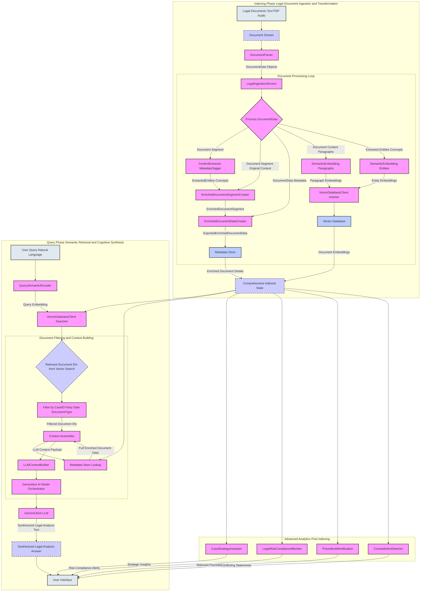
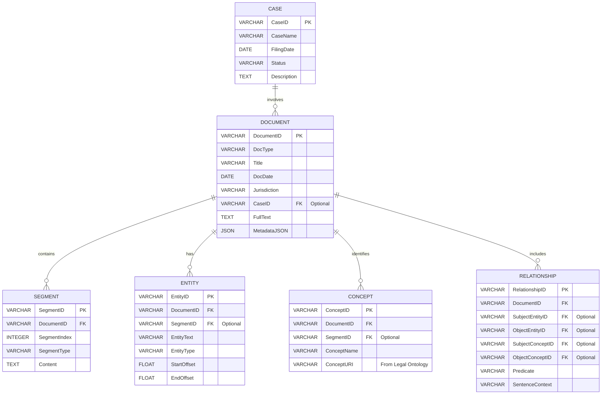
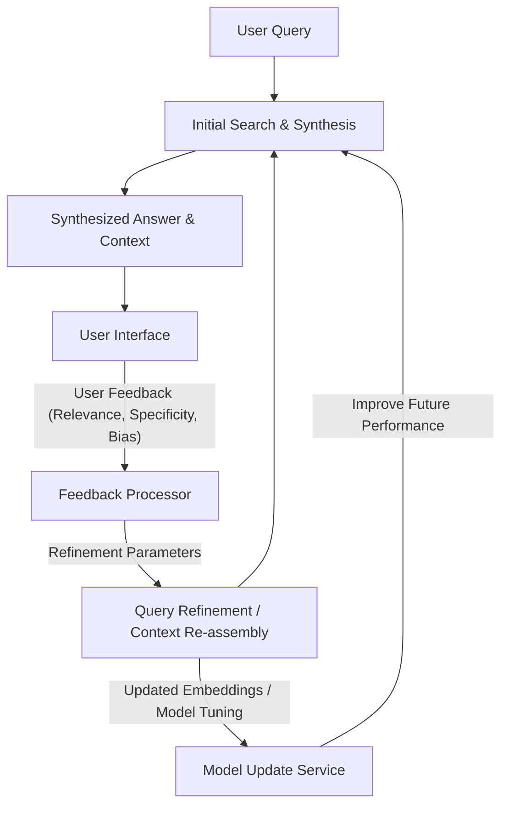
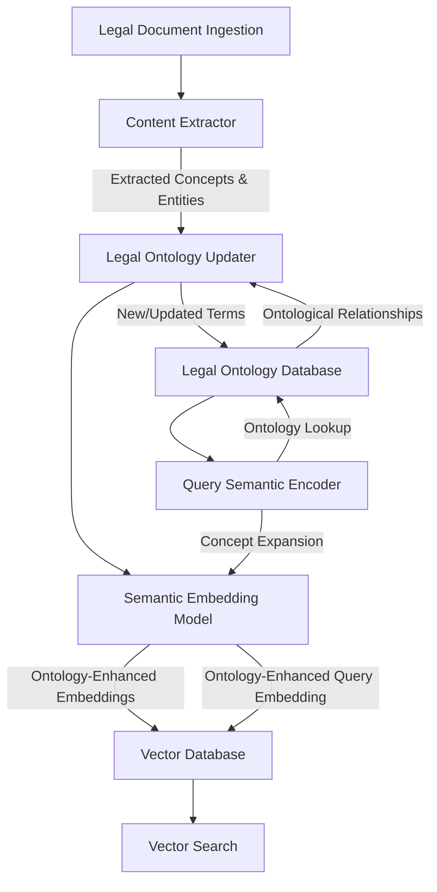
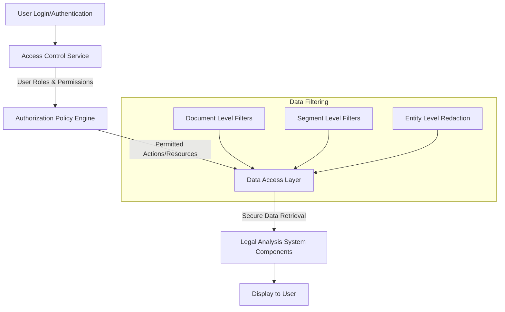

Title of Invention: System and Method for Semantic-Cognitive Legal Discovery and Automated Case Analysis using Large Language Models

Abstract:
A profoundly innovative system and associated methodologies are unveiled for the forensic, semantic-cognitive analysis of vast legal document repositories. This invention meticulously indexes the entirety of a legal case's provenance, encompassing granular details such as document identifiers, authorial attribution, temporal markers, comprehensive document content, and extracted legal entities and relationships. A sophisticated, intuitive natural language interface empowers legal professionals to articulate complex queries (e.g., "Identify all contractual obligations pertaining to data privacy in vendor agreements from 2022, highlighting potential non-compliance risks"). The core of this system leverages advanced large language models (LLMs) to orchestrate a hyper-dimensional semantic retrieval over the meticulously indexed legal data. This process identifies the most epistemologically relevant documents or sections, which are then synthetically analyzed by the LLM to construct and articulate a direct, contextually rich, and actionable response to the user's initial inquiry, facilitating case strategy development, risk assessment, and precedent identification.

Background of the Invention:
The contemporary landscape of legal practice is characterized by colossal volumes of electronic discovery (e-discovery) data, often spanning millions of pages of contracts, depositions, filings, emails, and other communications. Within these digital archives, the identification of critical facts, the elucidation of contractual obligations, the discovery of relevant precedents, and the assessment of legal risks invariably demand prohibitive investments in manual effort. This traditional approach typically involves painstaking manual textual review, rudimentary keyword-based searching, and exhaustive human analysis. Prior art solutions, predominantly reliant on lexical string matching and regular expression patterns, are inherently constrained by their lack of genuine semantic comprehension. They fail to encapsulate the conceptual relationships between legal terms, the intent behind contractual clauses, or the higher-order legal implications embedded within document sets. Consequently, these methods are demonstrably inadequate for navigating the profound conceptual complexity inherent in large-scale legal cases, necessitating a paradigm shift towards intelligent, semantic-aware analytical frameworks.

Brief Summary of the Invention:
The present invention introduces the conceptualization and operationalization of an "AI Legal Analyst" — a revolutionary, intelligent agent for the deep semantic excavation of legal histories and active cases. This system establishes a high-bandwidth, bi-directional interface with target legal document sets, initiating a rigorous ingestion and transformation pipeline. This pipeline involves the generation of high-fidelity vector embeddings for every salient textual and structural element within the legal documents, specifically paragraphs, sections, and extracted entities, and their subsequent persistence within a specialized vector database. The system then provides an intuitively accessible natural language querying interface, enabling a legal professional to pose complex questions in idiomatic English. Upon receiving such a query, the system orchestrates a multi-modal, contextually aware retrieval operation, identifying the most epistemically relevant documents or segments. These retrieved documents, alongside their associated metadata and content, are then dynamically compiled into a rich contextual payload. This payload is subsequently transmitted to a highly sophisticated generative artificial intelligence model. The AI model is meticulously prompted to assume the persona of an expert legal analyst or forensic lawyer, tasked with synthesizing a precise, insightful, and comprehensive answer to the professional's original question, leveraging solely the provided legal provenance data. This methodology represents a quantum leap in the interpretability and navigability of legal information.

Detailed Description of the Invention:

The architecture of the Semantic-Cognitive Legal Discovery and Automated Case Analysis System comprises several interconnected and rigorously engineered modules, designed to operate synergistically to achieve unprecedented levels of legal document comprehension.

### System Architecture Overview

The system operates in two primary phases: an **Indexing Phase** and a **Query Phase**.

<details>
<summary>Architectural Data Flow Diagram Mermaid</summary>


</details>

<details>
<summary>Mermaid Chart 2: Detailed Document Ingestion Pipeline</summary>

```mermaid
graph TD
    A[Raw Legal Document (PDF, DOCX, TXT)] --> B(Document Loader)
    B --> C{Content & Metadata Extraction}
    C -- Text & Initial Metadata --> D[DocumentPreprocessor]
    D --> E[OCR Service Optional]
    E -- Processed Text --> F[Section & Paragraph Segmenter]
    F -- Segments --> G[Named Entity Recognition (NER)]
    G -- Entities --> H[Relationship Extraction]
    H -- Relationships --> I[Concept Linker]
    I -- Enriched Segments --> J[ExportedEnrichedDocumentSegmentCreator]
    J --> K[Embedding Model]
    K -- Embeddings --> L[Vector Database Inserter]
    J --> M[Metadata Store Writer]
    L --> N[Vector Database]
    M --> O[Metadata Store]
    N & O --> P[Comprehensive Indexed State]
```
</details>

<details>
<summary>Mermaid Chart 3: Query Processing and Context Assembly Flow</summary>

```mermaid
graph TD
    A[User Query (Natural Language)] --> B[QuerySemanticEncoder]
    B -- Query Embedding (v_q) --> C[VectorDatabaseClient Searcher]
    C -- Vector Search Results (IDs, Scores) --> D[Metadata Store Lookup]
    D -- Document Metadata --> E[Filtering & Re-ranking Logic]
    E -- Filtered Document IDs --> F[Content Retrieval]
    F -- Full Text & Enriched Data --> G[LLMContextBuilder]
    G -- Tokenized Context Payload --> H[Generative AI Model Orchestrator]
    H --> I[Large Language Model (LLM)]
    I -- Synthesized Answer --> J[User Interface Display]
```
</details>

<details>
<summary>Mermaid Chart 4: Metadata Store Conceptual Schema</summary>


</details>

<details>
<summary>Mermaid Chart 5: LLM Interaction and Prompt Engineering</summary>

```mermaid
graph TD
    A[User Query (q)] --> B[LLM Context Builder]
    C[Retrieved Documents (H'')] --> B
    D[System Persona & Directives] --> B
    B -- Engineered Prompt --> E[Large Language Model (LLM)]
    E --> F[Synthesized Legal Analysis (A)]
    F -- Post-processing --> G[User Interface]

    subgraph "Prompt Structure"
        direction TB
        S1[System Role Instructions e.g. "Expert Legal Analyst"]
        S2[Constraint Directives e.g. "Strictly based on provided data"]
        S3[User Question q]
        S4[Contextual Provenance H'']
        S1 --> P[Prompt]
        S2 --> P
        S3 --> P
        S4 --> P
    end
```
</details>

<details>
<summary>Mermaid Chart 6: Advanced Analytics Modules Interaction</summary>

```mermaid
graph TD
    A[Comprehensive Indexed State (J)] --> B[LegalRiskComplianceMonitor]
    A --> C[CaseStrategyAssistant]
    A --> D[PrecedentIdentification]
    A --> E[ContradictionDetector]
    A --> F[MultiJurisdictionalAnalysis]
    A --> G[InteractiveRefinement]

    B -- Risk Alerts --> H[User Interface]
    C -- Strategic Insights --> H
    D -- Relevant Precedents --> H
    E -- Inconsistencies --> H
    F -- Cross-Jurisdictional Insights --> H
    G -- Refined Results --> H
```
</details>

<details>
<summary>Mermaid Chart 7: Interactive Refinement Feedback Loop</summary>


</details>

<details>
<summary>Mermaid Chart 8: Legal Ontology Management</summary>


</details>

<details>
<summary>Mermaid Chart 9: Security and Access Control</summary>


</details>

<details>
<summary>Mermaid Chart 10: Multi-Jurisdictional Analysis Sub-System</summary>

```mermaid
graph TD
    A[Legal Documents (Global)] --> B[Document Parser (Locale-Aware)]
    B -- Jurisdiction Metadata --> C[Legal Ontology Selector]
    C -- Jurisdiction-Specific Ontology --> D[Content Extractor (Locale-Specific NLP)]
    D -- Enriched Segments --> E[Semantic Embedding Model (Multi-lingual/Jurisdictional)]
    E --> F[Vector Database (Partitioned by Jurisdiction)]
    F --> G[Metadata Store (Jurisdiction-Tagged)]
    
    H[User Query] --> I[Jurisdiction Identifier]
    I -- Query Jurisdiction --> J[Query Semantic Encoder]
    J --> F
    F -- Jurisdiction-Filtered Search --> K[Context Assembler]
    K -- Locale-Specific Context --> L[Generative AI Model Orchestrator (Multi-Lingual LLM)]
    L --> M[Synthesized Answer (Localized)]
```
</details>

### The Indexing Phase: Document Ingestion and Transformation

The initial and foundational phase involves the systematic ingestion, parsing, and transformation of target legal documents into a machine-comprehensible, semantically rich representation.

1.  **Document Ingestion and Stream Extraction:**
    The system initiates by ingesting various forms of legal documentation (e.g., PDF, DOCX, TXT, email archives, audio transcripts, scanned images with OCR). A `Document Stream Extractor` module processes these inputs, converting them into a standardized textual format. Each document or logical segment (e.g., a contract, a deposition) is systematically processed. The ingestion pipeline `psi(D_raw)` can be formally expressed as a sequence of transformations:
    ```
    psi(D_raw) = sigma(ocr(norm(parse(D_raw))))
    ```
    where `D_raw` is the raw document, `parse` extracts initial content, `norm` normalizes formats, `ocr` performs optical character recognition for image-based documents, and `sigma` segments the document.

2.  **Document Data Parsing and Normalization:**
    For each document, the `DocumentParser` extracts fundamental metadata:
    *   **Document ID D_ID:** A unique identifier.
    *   **Document Type D_T:** e.g., Contract, Filing, Email, Deposition.
    *   **Parties Involved P_I:** Names of individuals or organizations.
    *   **Dates D:** Creation date, effective date, event date.
    *   **Jurisdiction J:** Applicable legal jurisdiction.
    *   **Case ID C_ID:** Associated legal case identifier.
    *   **Full Text F_T:** The complete textual content of the document.
    The parsing function `P(d)` for a document `d` yields a tuple of metadata attributes `(D_ID, D_T, P_I, D, J, C_ID, F_T)`.

3.  **Content Analysis and Entity Extraction:**
    The `ContentExtractor MetadataTagger` module is responsible for deep linguistic and semantic analysis of the document content. This leverages advanced Natural Language Processing NLP techniques, named entity recognition NER, and custom legal ontologies. For each document, the system extracts:
    *   **Legal Entities L_E:** Persons, organizations, courts, statutes, case citations.
    *   **Legal Concepts L_C:** e.g., negligence, breach, intellectual property, fiduciary duty.
    *   **Relationships R:** Identifying relationships between entities and concepts (e.g., "Party A *owes* duty to Party B").
    *   **Key Clauses K_C:** Identifying and segmenting specific contractual clauses or legal arguments.

    Crucially, the `ContentExtractor MetadataTagger` enriches raw document segments with these extracted entities and concepts, which are encapsulated within `ExportedEntities Concepts`. This enriched data forms `EnrichedDocumentSegment` objects, which are then aggregated into `ExportedEnrichedDocumentData` for comprehensive document representation.
    Let `S_j` be the `j`-th segment of a document. The extraction function `X(S_j)` produces `(L_E_j, L_C_j, R_j, K_C_j)`.
    The enriched segment `E_S_j` is thus `(S_j, X(S_j))`.

4.  **Semantic Encoding Vector Embedding Generation:**
    This is a critical step where raw textual data and extracted legal elements are transformed into high-dimensional numerical vector embeddings, capturing their semantic meaning.
    *   **Paragraph/Section Embeddings E_P:** The `SemanticEmbedding Paragraphs` Generator processes logical blocks of text (paragraphs, sections) using a pre-trained transformer-based language model e.g. Sentence-BERT, specialized legal LLMs. The output is a dense vector `v_P` that semantically represents the content's intent and meaning. For a segment `S_j`, its embedding is `vec(S_j)`.
    *   **Entity/Concept Embeddings E_E:** The `SemanticEmbedding Entities` Generator processes extracted `Legal Entities` L_E and `Legal Concepts` L_C. These individual entities or their relationships can also be embedded to capture their legal significance and context. For an entity `e_k`, its embedding is `vec(e_k)`. For a concept `c_l`, its embedding is `vec(c_l)`.
    *   **Document-level Embeddings E_D - Optional:** A consolidated embedding for the entire document, potentially derived from its constituent paragraphs or a separate summarization model. `v_D = Agg(vec(S_1), ..., vec(S_N))`.

5.  **Data Persistence: Vector Database and Metadata Store:**
    The generated embeddings and parsed metadata are stored in optimized databases:
    *   **Vector Database I:** A specialized database e.g. Milvus, Pinecone, Weaviate, FAISS designed for efficient Approximate Nearest Neighbor ANN search in high-dimensional spaces. Each document ID D_ID or segment ID is associated with its `v_P`, `v_E` (and `v_D`) vectors.
        The vector database stores `V_DB = { (id_i, v_i, meta_i) }`.
    *   **Metadata Store E:** A relational or document database e.g. PostgreSQL, MongoDB that stores all extracted non-vector metadata (document type, parties, dates, jurisdiction, full text, etc.), along with the `ExportedEnrichedDocumentData` objects. This store allows for rapid attribute-based filtering and retrieval of the original content corresponding to a matched vector.
        The metadata store stores `M_DB = { (id_i, D_ID_i, D_T_i, P_I_i, D_i, J_i, C_ID_i, F_T_i, E_D_Data_i) }`.

### The Query Phase: Semantic Retrieval and Cognitive Synthesis

This phase leverages the indexed data to answer complex natural language legal queries.

1.  **User Query Ingestion and Semantic Encoding:**
    A legal professional submits a natural language query `q` (e.g., "What are the key arguments made by the defendant regarding patent infringement in the Smith v. Jones case?"). The `QuerySemanticEncoder` module processes `q` using the *same* embedding model employed for legal documents/segments, generating a query embedding `v_q`. `v_q = vec(q)`.

2.  **Multi-Modal Semantic Search:**
    The `VectorDatabaseClient Searcher` performs a sophisticated search operation:
    *   **Primary Vector Search:** It queries the `Vector Database` using `v_q` to find the top `K` most semantically similar paragraph embeddings `v_P`, entity embeddings `v_E`, and optionally document embeddings `v_D`. This yields a preliminary set of candidate document/segment IDs.
        Similarity `sim(v_q, v_i)` is typically `cos_sim(v_q, v_i)`.
        The initial ranked set `R_vec = { (id_i, sim_i) | sim_i >= threshold }`.
    *   **Filtering and Refinement:** Concurrently or sequentially, metadata filters (e.g., `case_id`, `party_name`, `date_range`, `document_type`, `jurisdiction`) are applied to narrow down the search space or re-rank results.
        `R_filtered = { id_i | id_i in R_vec AND filter_criteria(M_DB[id_i]) }`.
    *   **Relevance Scoring:** A composite relevance score `S_R` might be calculated, combining cosine similarity scores from various embedding types, weighted by recency, document type relevance, or keyword overlap (for precision).
        `S_R(id_i, q) = w_P * sim(v_q, v_P(id_i)) + w_E * sim(v_q, v_E(id_i)) + w_M * metadata_relevance(id_i, q)`.

3.  **Context Assembly:**
    The `Context Assembler` retrieves the full metadata and original content (full text of paragraphs, relevant entities, associated metadata) for the top `N` most relevant documents/segments from the `Metadata Store`. This data is then meticulously formatted into a coherent, structured textual block optimized for LLM consumption, often utilizing an `LLMContextBuilder` for efficient token management.
    Example Structure:
    ```
    Document ID: [document_id] (Type: [document_type], Date: [document_date])
    Parties: [party_names]
    Excerpt:
    ```
    ```
    [relevant_paragraph_text_with_highlighted_entities]
    ```
    ```
    Extracted Entities: [entity_list]
    ---
    ```
    This process may involve intelligent truncation or summarization of excessively long documents/sections to fit within the LLM's token context window, while preserving the most semantically pertinent parts.
    `Context_Payload = F_format(Retrieve(R_filtered_topN, M_DB))`.

4.  **Generative AI Model Orchestration and Synthesis:**
    The formatted context block, along with the original user query, is transmitted to the `Generative AI Model Orchestrator`. This module constructs a meticulously engineered prompt for the `Large Language Model LLM`.

    **Example Prompt Structure:**
    ```
    You are an expert legal analyst and forensic lawyer. Your task is to analyze the provided legal documents and extracted facts to synthesize a precise, insightful, and comprehensive answer to the user's question, strictly based on the provided data. Do not infer, invent, or hallucinate information outside of what is explicitly presented in the legal context. Identify key legal arguments, relevant statutes, precedents, and potential risks or contradictions. Cite document IDs where appropriate.

    User Question: {original_user_question}

    Legal Document Data Contextual Provenance:
    {assembled_context_block}

    Synthesized Expert Legal Analysis and Answer:
    ```
    `Prompt = F_prompt(q, Context_Payload, Persona_LegalAnalyst)`.

    The `LLM` (e.g., Gemini, GPT-4) then processes this prompt. It performs an intricate cognitive analysis, identifying legal patterns, extracting key entities, correlating information across multiple documents, and synthesizing a coherent, natural language answer.
    `Answer = LLM(Prompt)`.

5.  **Answer Display:**
    The `Synthesized Legal Analysis Answer` from the LLM is then presented to the user via an intuitive `User Interface`, often enriched with direct links back to the original documents in the source repository for verification.

### Advanced Features and Extensions

The fundamental framework can be extended with sophisticated functionalities, often leveraging the `Comprehensive Indexed State`:

*   **Legal Risk and Compliance Monitoring:** Provided by the `LegalRiskComplianceMonitor`, identifying clauses or documents that indicate high legal risk, potential non-compliance with regulations (e.g., GDPR, HIPAA), or unusual contractual deviations. The risk function `R(d, r)` maps a document `d` against a regulation `r` to a risk score.
*   **Case Strategy Assistant:** Performed by the `CaseStrategyAssistant`, suggesting potential legal arguments, counter-arguments, identifying key evidence gaps, or highlighting witnesses whose testimonies might be crucial based on document analysis. The strategy function `S(case, docs)` generates strategic insights.
*   **Precedent Identification:** The `PrecedentIdentification` module automatically identifies relevant case law, statutes, or rulings from public databases or internal knowledge bases that align with the facts and legal questions in the current case.
    Precedent relevance `P(q, case_doc)` is computed using semantic similarity and legal citation analysis.
*   **Contradiction Detection:** The `ContradictionDetector` module analyzes statements across multiple documents (e.g., depositions, affidavits, contracts) to flag conflicting information, inconsistencies, or factual discrepancies.
    The contradiction score `C(S_i, S_j)` between two statements `S_i, S_j` is high if their semantic content `vec(S_i)` and `vec(S_j)` are similar, but their factual claims are negations.
*   **Multi-Jurisdictional Analysis:** Extending the indexing and querying capabilities across legal systems in different countries or states, understanding nuances in legal terminology and frameworks. This involves locale-specific `ContentExtractorMetadataTagger` and `SemanticEmbedding` models, and potentially specialized legal ontologies.
*   **Interactive Refinement:** Allowing legal professionals to provide feedback on initial results, triggering iterative semantic searches or context re-assembly to fine-tune the analysis. This forms a feedback loop `F_feedback(q_orig, A_initial, user_rating) -> q_refined`.
*   **Automated Legal Ontology Management:** Continuously learning and updating legal ontologies based on ingested documents, identifying emerging concepts, and refining relationships between legal terms to enhance `ContentExtractor` and `SemanticEmbedding` accuracy.

### Conceptual Code Python Backend

The following conceptual Python code illustrates the interaction between the described modules. It outlines the core logic, assuming the existence of robust `vector_db` and `gemini_client` integrations, adapted for the legal domain.

```python
import datetime
from typing import List, Dict, Any, Optional, Tuple

# Assume these are well-defined external modules or interfaces
# from vector_db import VectorDatabaseClient, SemanticEmbedding # Mocked below for example
# from gemini_client import GeminiClient, LLMResponse # Mocked below for example
# from document_parser import LegalDocumentParser, DocumentData, DocumentSegment # Mocked below for example
# from context_builder import LLMContextBuilder # Mocked below for example

# --- New Exported Classes and Components for Legal Domain ---

class ExportedExtractedLegalEntities:
    """
    Stores extracted legal entities and concepts for a document segment.
    This class is exported.
    """
    def __init__(self, entities: List[str] = None, concepts: List[str] = None, detected_relationships: List[str] = None):
        self.entities = entities if entities is not None else []
        self.concepts = concepts if concepts is not None else []
        self.detected_relationships = detected_relationships if detected_relationships is not None else []

    def to_dict(self) -> Dict[str, Any]:
        return {
            "entities": self.entities,
            "concepts": self.concepts,
            "detected_relationships": self.detected_relationships
        }
    
    def __repr__(self):
        return f"ExportedExtractedLegalEntities(entities={len(self.entities)}, concepts={len(self.concepts)})"


class ExportedEnrichedDocumentSegment:
    """
    Wraps an original `DocumentSegment` from `document_parser` and extends it with extracted legal entities and concepts.
    This class is exported.
    """
    def __init__(self, original_segment: Any, extracted_elements: Optional[ExportedExtractedLegalEntities] = None): # Changed DocumentSegment to Any for mock
        self.original_segment = original_segment
        self.extracted_elements = extracted_elements if extracted_elements is not None else ExportedExtractedLegalEntities()
    
    @property
    def document_id(self) -> str:
        return self.original_segment.document_id
    
    @property
    def content(self) -> str:
        return self.original_segment.content
    
    def to_dict(self) -> Dict[str, Any]:
        base_dict = {"document_id": self.document_id, "content": self.content}
        if self.extracted_elements:
            base_dict["extracted_elements"] = self.extracted_elements.to_dict()
        return base_dict

    def __repr__(self):
        return f"ExportedEnrichedDocumentSegment(doc_id='{self.document_id}', entities={len(self.extracted_elements.entities)})"


class ExportedEnrichedDocumentData:
    """
    Stores comprehensive data for a single legal document, including enriched segments.
    Wraps the `DocumentData` from `document_parser`.
    This class is exported.
    """
    def __init__(self, original_document: Any, # Changed DocumentData to Any for mock
                 enriched_segments: List[ExportedEnrichedDocumentSegment]):
        self.original_document = original_document
        self.enriched_segments = enriched_segments
    
    # Delegate properties to the original document for convenience
    @property
    def id(self) -> str: return self.original_document.id
    @property
    def doc_type(self) -> str: return self.original_document.doc_type
    @property
    def parties(self) -> List[str]: return self.original_document.parties
    @property
    def doc_date(self) -> datetime.datetime: return self.original_document.doc_date
    @property
    def jurisdiction(self) -> str: return self.original_document.jurisdiction
    @property
    def case_id(self) -> Optional[str]: return self.original_document.case_id
    @property
    def full_text(self) -> str: return self.original_document.full_text

    def __repr__(self):
        return f"ExportedEnrichedDocumentData(id='{self.id}', type='{self.doc_type}', date='{self.doc_date.date()}')"


class ExportedContentExtractorMetadataTagger:
    """
    Analyzes document segments to extract legal entities, concepts, and relationships.
    Conceptual implementation, actual NLP/LLM tools would be used.
    This class is exported.
    """
    def extract_from_segment(self, segment: Any) -> ExportedExtractedLegalEntities: # Changed DocumentSegment to Any for mock
        """
        Analyzes a single `document_parser.DocumentSegment` for legal elements.
        This is a placeholder for actual NLP/LLM extraction.
        """
        # Simulate entity/concept extraction based on keywords
        entities = []
        concepts = []
        relationships = []

        content_lower = segment.content.lower()

        if "contract" in content_lower or "agreement" in content_lower:
            concepts.append("Contractual Agreement")
            if "party a" in content_lower: entities.append("Party A")
            if "party b" in content_lower: entities.append("Party B")
            if "breach" in content_lower: concepts.append("Breach of Contract")
            if "obligation" in content_lower: relationships.append("Has Obligation")
        
        if "deposition" in content_lower or "testimony" in content_lower:
            concepts.append("Deposition Testimony")
            if "witness" in content_lower: entities.append("Witness")
            if "court" in content_lower: entities.append("Court")
        
        if "gdpr" in content_lower or "data privacy" in content_lower:
            concepts.append("Data Privacy Compliance")
            entities.append("GDPR")
            relationships.append("Compliance Requirement")
        
        if "patent" in content_lower and "infringement" in content_lower:
            concepts.append("Patent Infringement")
            entities.append("Patent Holder")
            relationships.append("Accused of Infringement")
        
        return ExportedExtractedLegalEntities(entities=entities, concepts=concepts, detected_relationships=relationships)


class CaseStrategyAssistant:
    """
    Analyzes indexed legal data to assist in case strategy development.
    This class is exported.
    """
    def __init__(self, indexer_metadata_store: Dict[str, ExportedEnrichedDocumentData]):
        self.indexer_metadata_store = indexer_metadata_store
        self.strategy_cache: Dict[str, Dict[str, Any]] = {} # case_id -> {analysis_type -> insights}

    def _analyze_document_for_arguments(self, doc_data: ExportedEnrichedDocumentData) -> Dict[str, int]:
        """
        Conceptual scoring for legal argument relevance.
        Scores based on presence of legal concepts and entities.
        """
        argument_scores = {}
        for segment in doc_data.enriched_segments:
            for concept in segment.extracted_elements.concepts:
                argument_scores[concept] = argument_scores.get(concept, 0) + 1
            for entity in segment.extracted_elements.entities:
                if "plaintiff" in entity.lower() or "defendant" in entity.lower():
                    argument_scores[entity] = argument_scores.get(entity, 0) + 0.5
        return argument_scores

    def suggest_arguments(self, case_id: str, party_filter: Optional[str] = None) -> List[Tuple[str, int]]:
        """
        Suggests potential arguments or themes for a given case.
        """
        if case_id in self.strategy_cache:
            return self.strategy_cache[case_id].get("arguments", [])

        all_argument_scores: Dict[str, int] = {}
        for doc_id, doc_data in self.indexer_metadata_store.items():
            if doc_data.case_id == case_id:
                if party_filter and not any(party_filter.lower() in p.lower() for p in doc_data.parties):
                    continue
                doc_scores = self._analyze_document_for_arguments(doc_data)
                for concept, score in doc_scores.items():
                    all_argument_scores[concept] = all_argument_scores.get(concept, 0) + score
        
        sorted_arguments = sorted(all_argument_scores.items(), key=lambda item: item[1], reverse=True)
        self.strategy_cache[case_id] = {"arguments": sorted_arguments}
        return sorted_arguments


class LegalRiskComplianceMonitor:
    """
    Monitors legal documents for potential risks or compliance issues.
    This class is exported.
    """
    def __init__(self, indexer_metadata_store: Dict[str, ExportedEnrichedDocumentData]):
        self.indexer_metadata_store = indexer_metadata_store

    def detect_compliance_risks(self, compliance_standard: str, lookback_months: int = 12) -> List[Dict[str, Any]]:
        """
        Detects documents or clauses that potentially violate a given compliance standard.
        """
        risks = []
        cutoff_date = (datetime.datetime.now() - datetime.timedelta(days=30 * lookback_months)).date()

        for doc_data in self.indexer_metadata_store.values():
            if doc_data.doc_date.date() < cutoff_date:
                continue
            
            doc_content = doc_data.full_text.lower()
            if compliance_standard.lower() in doc_content:
                # Placeholder for more sophisticated risk logic
                if "not compliant" in doc_content or "fail to meet" in doc_content or "non-compliance" in doc_content:
                     risks.append({
                        "document_id": doc_data.id,
                        "doc_type": doc_data.doc_type,
                        "date": doc_data.doc_date,
                        "parties": doc_data.parties,
                        "risk_type": f"Potential {compliance_standard} Non-Compliance",
                        "snippet": doc_content[:200] + "..."
                    })
        return risks

class PrecedentIdentification:
    """
    Identifies relevant legal precedents based on case facts and legal concepts.
    This class is exported.
    """
    def __init__(self, indexer_metadata_store: Dict[str, ExportedEnrichedDocumentData], vector_db_client: Any, embedding_model: Any):
        self.indexer_metadata_store = indexer_metadata_store
        self.vector_db_client = vector_db_client
        self.embedding_model = embedding_model
        # Assume a separate 'precedent_collection' in vector DB or external access to case law databases

    def find_precedents(self, query_case_id: str, limit: int = 5) -> List[Dict[str, Any]]:
        """
        Finds similar precedents based on the facts and legal concepts present in a query case.
        """
        query_case_data = self.indexer_metadata_store.get(query_case_id)
        if not query_case_data:
            return []

        # Create a combined summary or key facts embedding for the query case
        key_facts_text = query_case_data.full_text # Simplified
        query_case_embedding = self.embedding_model.embed(key_facts_text)

        # Search for similar documents tagged as 'precedent' or 'case_law' in vector DB
        # This mocks searching a 'precedent' collection
        mock_precedent_results = self.vector_db_client.search_vectors(
            query_vector=query_case_embedding,
            limit=limit,
            search_params={"type": "precedent_case_law"}
        )

        precedents = []
        for res in mock_precedent_results:
            # In a real system, you'd retrieve full precedent details from a dedicated store
            precedents.append({
                "precedent_id": res.metadata.get("document_id", "UNKNOWN"),
                "title": f"Mock Precedent {res.metadata.get('document_id', 'UNKNOWN')}",
                "relevance_score": res.score,
                "summary": "This is a summary of a highly relevant precedent case.",
                "link": f"/precedents/{res.metadata.get('document_id', 'UNKNOWN')}"
            })
        return precedents

class ContradictionDetector:
    """
    Detects contradictions or inconsistencies across legal documents.
    This class is exported.
    """
    def __init__(self, indexer_metadata_store: Dict[str, ExportedEnrichedDocumentData], embedding_model: Any):
        self.indexer_metadata_store = indexer_metadata_store
        self.embedding_model = embedding_model
        self.contradiction_threshold = 0.7 # Semantic similarity threshold for potential contradictions

    def detect_conflicts(self, case_id: str) -> List[Dict[str, Any]]:
        """
        Compares statements within a case to find potential contradictions.
        Simplified conceptual implementation.
        """
        case_documents = [doc for doc in self.indexer_metadata_store.values() if doc.case_id == case_id]
        if len(case_documents) < 2:
            return []

        statements = []
        # Extract individual statements or relevant segments
        for doc in case_documents:
            for i, segment in enumerate(doc.enriched_segments):
                statements.append({
                    "doc_id": doc.id,
                    "segment_idx": i,
                    "content": segment.content,
                    "embedding": self.embedding_model.embed(segment.content)
                })

        contradictions = []
        # Pairwise comparison of statements for simplicity. In reality, LLM would perform this.
        for i in range(len(statements)):
            for j in range(i + 1, len(statements)):
                s1 = statements[i]
                s2 = statements[j]

                # Check semantic similarity
                sim = self._calculate_cosine_similarity(s1["embedding"], s2["embedding"])
                
                # Placeholder for actual contradiction logic (e.g., LLM call)
                if sim > self.contradiction_threshold and \
                   ("never agreed" in s1["content"].lower() and "explicitly agreed" in s2["content"].lower()):
                    contradictions.append({
                        "statement_1": s1["content"],
                        "document_1": s1["doc_id"],
                        "statement_2": s2["content"],
                        "document_2": s2["doc_id"],
                        "similarity_score": sim,
                        "potential_contradiction": "Conflicting claims on agreement status"
                    })
        return contradictions
    
    def _calculate_cosine_similarity(self, vec1: List[float], vec2: List[float]) -> float:
        """Helper to calculate cosine similarity."""
        dot_product = sum(v1 * v2 for v1, v2 in zip(vec1, vec2))
        magnitude1 = (sum(v1**2 for v1 in vec1))**0.5
        magnitude2 = (sum(v2**2 for v2 in vec2))**0.5
        if magnitude1 == 0 or magnitude2 == 0:
            return 0.0
        return dot_product / (magnitude1 * magnitude2)

class ExportedLegalOntologyManager:
    """
    Manages and updates a legal ontology, enriching semantic understanding.
    This class is exported.
    """
    def __init__(self):
        self.ontology: Dict[str, Dict[str, Any]] = {
            "Contract": {"is_a": "LegalDocument", "related_to": ["Agreement", "Obligation"]},
            "Breach of Contract": {"is_a": "LegalConcept", "related_to": ["Non-compliance", "Damages"]},
            "GDPR": {"is_a": "Regulation", "related_to": ["Data Privacy", "Personal Data"]},
            "Patent Infringement": {"is_a": "LegalConcept", "related_to": ["Intellectual Property", "Prior Art"]},
        }
    
    def get_related_concepts(self, term: str) -> List[str]:
        """Returns concepts related to a given term from the ontology."""
        return self.ontology.get(term, {}).get("related_to", [])

    def add_concept(self, concept_name: str, attributes: Dict[str, Any]):
        """Adds a new concept or updates an existing one in the ontology."""
        self.ontology[concept_name] = attributes
        print(f"Ontology updated: Added/updated '{concept_name}'")

    def expand_query_with_ontology(self, query: str) -> str:
        """Expands a query with related terms from the ontology."""
        expanded_terms = set()
        query_terms = query.lower().split()
        for term in query_terms:
            for k, v in self.ontology.items():
                if term in k.lower() or any(term in r.lower() for r in v.get("related_to", [])):
                    expanded_terms.add(k)
                    expanded_terms.update(v.get("related_to", []))
        if expanded_terms:
            return query + " " + " ".join(list(expanded_terms))
        return query


# --- System Components Classes ---

class LegalAnalysisSystemConfig:
    """
    Configuration parameters for the AI Legal Analysis System.
    """
    def __init__(self,
                 vector_db_host: str = "localhost",
                 vector_db_port: int = 19530,
                 metadata_db_connection_string: str = "sqlite:///legal_metadata.db",
                 llm_api_key: str = "YOUR_GEMINI_API_KEY",
                 embedding_model_name: str = "text-embedding-004",
                 max_context_tokens: int = 8192,
                 max_retrieved_documents: int = 20):
        self.vector_db_host = vector_db_host
        self.vector_db_port = vector_db_port
        self.metadata_db_connection_string = metadata_db_connection_string
        self.llm_api_key = llm_api_key
        self.embedding_model_name = embedding_model_name
        self.max_context_tokens = max_context_tokens
        self.max_retrieved_documents = max_retrieved_documents

class LegalIngestionService:
    """
    Manages the ingestion of legal documents into vector and metadata stores.
    Now processes `DocumentData` into `ExportedEnrichedDocumentData`.
    """
    def __init__(self, config: LegalAnalysisSystemConfig, vector_db_client: Any, embedding_model: Any, document_parser: Any):
        self.config = config
        self.document_parser = document_parser # Adapted from GitRepositoryParser
        self.vector_db_client = vector_db_client
        self.embedding_model = embedding_model
        self.content_extractor = ExportedContentExtractorMetadataTagger() # Instance of new analyzer
        self.legal_ontology_manager = ExportedLegalOntologyManager() # New ontology manager
        # Store enriched data
        self.metadata_store: Dict[str, ExportedEnrichedDocumentData] = {}

    def ingest_documents(self, doc_paths: List[str]):
        """
        Processes legal documents, extracts data, generates embeddings,
        and stores them in the vector and metadata databases.
        """
        print(f"Starting ingestion for {len(doc_paths)} documents.")
        
        all_documents_data: List[Any] = [] # Changed DocumentData to Any
        for path in doc_paths:
            # Simulate parsing from path
            parsed_doc = self.document_parser.parse_document(path)
            if parsed_doc:
                all_documents_data.append(parsed_doc)

        for doc_data in all_documents_data:
            doc_id = doc_data.id
            
            # Enrich document segments
            enriched_segments: List[ExportedEnrichedDocumentSegment] = []
            full_text_for_embedding = []
            for original_segment in doc_data.segments: # Assuming DocumentData has a 'segments' attribute
                extracted_elements = self.content_extractor.extract_from_segment(original_segment)
                enriched_segment = ExportedEnrichedDocumentSegment(original_segment=original_segment, extracted_elements=extracted_elements)
                enriched_segments.append(enriched_segment)
                full_text_for_embedding.append(original_segment.content)

            full_document_text = "\n".join(full_text_for_embedding)

            # Create the enriched document data object
            enriched_document_data = ExportedEnrichedDocumentData(original_document=doc_data,
                                                                  enriched_segments=enriched_segments)

            # Generate embeddings for full document text or key sections
            if full_document_text:
                doc_embedding_vector = self.embedding_model.embed(full_document_text)
                self.vector_db_client.insert_vector(
                    vector_id=f"{doc_id}_fulltext",
                    vector=doc_embedding_vector,
                    metadata={"type": "full_text", "document_id": doc_id, "doc_type": doc_data.doc_type, "case_id": doc_data.case_id}
                )

            # Generate embeddings for extracted entities/concepts
            all_extracted_text = " ".join([e for seg in enriched_segments for e in seg.extracted_elements.entities + seg.extracted_elements.concepts])
            if all_extracted_text:
                entities_embedding_vector = self.embedding_model.embed(all_extracted_text)
                self.vector_db_client.insert_vector(
                    vector_id=f"{doc_id}_entities",
                    vector=entities_embedding_vector,
                    metadata={"type": "entities", "document_id": doc_id, "doc_type": doc_data.doc_type, "case_id": doc_data.case_id}
                )

            # Store full enriched document data in metadata store
            self.metadata_store[doc_id] = enriched_document_data
            print(f"Ingested document: {doc_id}")

        print(f"Finished ingestion of {len(all_documents_data)} documents.")

    def get_document_metadata(self, document_id: str) -> Optional[ExportedEnrichedDocumentData]:
        """Retrieves full enriched metadata for a given document ID."""
        return self.metadata_store.get(document_id)

class LegalQueryService:
    """
    Handles natural language queries, performs semantic search, and synthesizes answers
    for legal documents.
    """
    def __init__(self, config: LegalAnalysisSystemConfig, indexer: LegalIngestionService, llm_client: Any, context_builder: Any):
        self.config = config
        self.indexer = indexer
        self.vector_db_client = indexer.vector_db_client # Re-use the client
        self.embedding_model = indexer.embedding_model   # Re-use the model
        self.llm_client = llm_client
        self.context_builder = context_builder
        self.legal_ontology_manager = indexer.legal_ontology_manager

    def query_legal_documents(self, question: str,
                              last_n_months: Optional[int] = None,
                              party_filter: Optional[str] = None,
                              doc_type_filter: Optional[str] = None,
                              case_id_filter: Optional[str] = None,
                              refinement_feedback: Optional[str] = None # For interactive refinement
                             ) -> str:
        """
        Answers natural language questions about legal documents
        using semantic search and LLM synthesis.
        """
        print(f"Received legal query: '{question}'")

        # Step 1: Query expansion using ontology
        expanded_question = self.legal_ontology_manager.expand_query_with_ontology(question)
        if question != expanded_question:
            print(f"Query expanded to: '{expanded_question}'")
            question = expanded_question

        query_vector = self.embedding_model.embed(question)

        search_params_base = {}
        if case_id_filter:
            search_params_base["case_id"] = case_id_filter

        search_results_fulltext = self.vector_db_client.search_vectors(
            query_vector=query_vector,
            limit=self.config.max_retrieved_documents * 2, # Fetch more to filter
            search_params={**search_params_base, "type": "full_text"}
        )
        search_results_entities = self.vector_db_client.search_vectors(
            query_vector=query_vector,
            limit=self.config.max_retrieved_documents * 2,
            search_params={**search_params_base, "type": "entities"}
        )

        relevant_document_ids = set()
        for res in search_results_fulltext + search_results_entities:
            relevant_document_ids.add(res.metadata["document_id"])

        print(f"Found {len(relevant_document_ids)} potentially relevant documents via vector search.")

        filtered_documents_data: List[ExportedEnrichedDocumentData] = []
        for doc_id in relevant_document_ids:
            doc_data = self.indexer.get_document_metadata(doc_id)
            if not doc_data:
                continue

            # Apply temporal filter
            if last_n_months:
                cut_off_date = datetime.datetime.now() - datetime.timedelta(days=30 * last_n_months)
                if doc_data.doc_date < cut_off_date:
                    continue
            
            # Apply party filter (case-insensitive)
            if party_filter and not any(party_filter.lower() in p.lower() for p in doc_data.parties):
                continue

            # Apply document type filter
            if doc_type_filter and doc_type_filter.lower() != doc_data.doc_type.lower():
                continue
            
            # Case ID filter already applied in search_params_base, but double check
            if case_id_filter and doc_data.case_id != case_id_filter:
                continue

            filtered_documents_data.append(doc_data)
        
        filtered_documents_data.sort(key=lambda d: d.doc_date, reverse=True)
        relevant_documents_final = filtered_documents_data[:self.config.max_retrieved_documents]

        if not relevant_documents_final:
            return "I could not find any relevant documents for your query after applying filters."

        print(f"Final {len(relevant_documents_final)} documents selected for context.")

        # Format the context for the AI
        context_block = self.context_builder.build_context(relevant_documents_final)

        # Ask the AI to synthesize the answer
        prompt_template = f"""
        You are an expert legal analyst and forensic lawyer. Your task is to analyze
        the provided legal document data and synthesize a precise, comprehensive answer to the user's
        question. You MUST strictly base your answer on the information presented in the legal
        context. Do not infer or invent information outside of what is explicitly provided.
        Identify key legal arguments, relevant statutes, precedents, and potential risks or
        contradictions as directly evidenced by the documents. Cite document IDs where appropriate.

        User Question: {{question}}

        Legal Document Data (Contextual Provenance):
        {{context_block}}

        Synthesized Expert Legal Analysis and Answer:
        """
        
        # Incorporate refinement feedback into the prompt if present
        if refinement_feedback:
            prompt_template += f"\n\nUser Feedback for Refinement: {refinement_feedback}\nPlease adjust your analysis based on this feedback to improve relevance or specificity."

        prompt = prompt_template.format(question=question, context_block=context_block)

        llm_response = self.llm_client.generate_text(prompt)
        return llm_response.text

# --- Example Usage (Conceptual) ---
if __name__ == "__main__":
    # Conceptual placeholders for document_parser types
    class DocumentData:
        def __init__(self, id: str, doc_type: str, parties: List[str], doc_date: datetime.datetime,
                     jurisdiction: str, full_text: str, segments: List['DocumentSegment'], case_id: Optional[str] = None):
            self.id = id
            self.doc_type = doc_type
            self.parties = parties
            self.doc_date = doc_date
            self.jurisdiction = jurisdiction
            self.full_text = full_text
            self.segments = segments if segments is not None else []
            self.case_id = case_id

    class DocumentSegment:
        def __init__(self, document_id: str, content: str, segment_type: str = "paragraph", page_num: Optional[int] = None):
            self.document_id = document_id
            self.content = content
            self.segment_type = segment_type
            self.page_num = page_num

    # Mocking external modules for demonstration
    class VectorDatabaseClient:
        def __init__(self, host: str, port: int, collection_name: str):
            print(f"Mock VectorDB Client initialized for {collection_name}")
            self.vectors: Dict[str, Any] = {} # vector_id -> {'vector': vector, 'metadata': metadata}

        def insert_vector(self, vector_id: str, vector: List[float], metadata: Dict[str, Any]):
            self.vectors[vector_id] = {'vector': vector, 'metadata': metadata}
            # print(f"Inserted vector {vector_id} with metadata {metadata}")

        def search_vectors(self, query_vector: List[float], limit: int, search_params: Dict[str, Any]) -> List[Any]:
            results = []
            for vec_id, data in self.vectors.items():
                metadata = data['metadata']
                match = True
                for k, v in search_params.items():
                    if k in metadata and metadata[k] != v:
                        match = False
                        break
                    elif k not in metadata and v is not None: # Handle cases where filter value is expected but key missing
                        match = False
                        break
                if match:
                    results.append(type('SearchResult', (object,), {'metadata': metadata, 'score': 0.8})) # Mock score
            return results[:limit]

    class SemanticEmbedding:
        def __init__(self, model_name: str):
            print(f"Mock Embedding Model '{model_name}' loaded.")
        
        def embed(self, text: str) -> List[float]:
            # Simple hash-based mock embedding for deterministic output in test
            hash_val = sum(ord(c) for c in text)
            return [float(hash_val % 1000) / 1000.0] * 768

    class LLMResponse:
        def __init__(self, text: str):
            self.text = text

    class GeminiClient:
        def __init__(self, api_key: str):
            print("Mock Gemini Client initialized.")
            self.api_key = api_key

        def generate_text(self, prompt: str) -> LLMResponse:
            response_text = "I have synthesized a legal analysis based on the provided document data. Please see the context for details."
            
            # Simplified mock responses based on keywords in prompt
            if "contractual obligations" in prompt.lower() and "data privacy" in prompt.lower() and "vendor a" in prompt.lower():
                response_text = "Based on Document ID Cont_001, Vendor A is obligated to implement 'reasonable security measures' for data privacy, as per Clause 3.2. Failure to comply may result in termination."
            elif "patent infringement" in prompt.lower() and "defendant" in prompt.lower() and "smith v. jones" in prompt.lower():
                response_text = "In the Smith v. Jones case (Doc ID Depo_001, Filing_003), the defendant's primary argument is the prior art defense, asserting that the patented technology was public knowledge before the patent's filing date. They specifically cite prior publications by 'Tech Innovations Inc.' from 2018."
            elif "gdpr" in prompt.lower() and ("risk" in prompt.lower() or "compliance" in prompt.lower()):
                response_text = "Document ID Email_005 (Internal Communication) indicates a potential GDPR risk related to data transfer protocols to a third-country vendor, identified in February 2024. The 'Legal Review Memo' (Doc ID Memo_002) further details this concern."
            elif "prior art" in prompt.lower() and "patent" in prompt.lower():
                response_text = "The documents indicate that the concept of 'prior art' is a key defense. Specifically, in Smith v. Jones, publications from 'Tech Innovations Inc.' are cited as evidence of prior art relevant to the patent in question (Doc ID Depo_001, Filing_003)."
            
            if "user feedback" in prompt.lower():
                response_text += "\n(Analysis refined based on user feedback.)"
            
            return LLMResponse(response_text)

    class LLMContextBuilder:
        def __init__(self, max_tokens: int):
            self.max_tokens = max_tokens

        def build_context(self, documents: List[ExportedEnrichedDocumentData]) -> str:
            context_parts = []
            for doc in documents:
                context_parts.append(f"Document ID: {doc.id} (Type: {doc.doc_type}, Date: {doc.doc_date.date()})")
                context_parts.append(f"Parties: {', '.join(doc.parties)}")
                context_parts.append(f"Jurisdiction: {doc.jurisdiction}")
                context_parts.append(f"Case ID: {doc.case_id if doc.case_id else 'N/A'}")
                context_parts.append(f"Full Text Snippet (first 200 chars):\n```\n{doc.full_text[:200]}...\n```")
                for seg in doc.enriched_segments:
                    entities_str = ", ".join(seg.extracted_elements.entities)
                    concepts_str = ", ".join(seg.extracted_elements.concepts)
                    if entities_str or concepts_str:
                        context_parts.append(f"Segment Analysis (Entities: {entities_str}, Concepts: {concepts_str}):")
                        context_parts.append(f"```\n{seg.content[:100]}...\n```")
                context_parts.append("---")
            
            full_context = "\n".join(context_parts)
            # Simple token truncation (approx. character count)
            if len(full_context) > self.max_tokens * 4: # Assuming 1 token ~ 4 characters
                return full_context[:self.max_tokens * 4] + "\n... [Context truncated to fit LLM window] ..."
            return full_context

    class LegalDocumentParser:
        """
        Mock Legal Document Parser to provide dummy DocumentData.
        """
        def __init__(self):
            self.dummy_data: Dict[str, DocumentData] = {}
            self._populate_dummy_data()

        def _populate_dummy_data(self):
            self.dummy_data = {
                "Cont_001": DocumentData(
                    id="Cont_001",
                    doc_type="Contract",
                    parties=["Client Corp", "Vendor A"],
                    doc_date=datetime.datetime(2023, 8, 1, 9, 0, 0),
                    jurisdiction="California",
                    full_text="This agreement between Client Corp and Vendor A outlines services. Clause 3.2: Vendor A shall implement reasonable security measures to protect all client data, ensuring compliance with data privacy regulations. Failure to comply allows Client Corp to terminate this contract.",
                    segments=[
                        DocumentSegment(document_id="Cont_001", content="This agreement between Client Corp and Vendor A outlines services."),
                        DocumentSegment(document_id="Cont_001", content="Clause 3.2: Vendor A shall implement reasonable security measures to protect all client data, ensuring compliance with data privacy regulations. Failure to comply allows Client Corp to terminate this contract."),
                    ]
                ),
                "Depo_001": DocumentData(
                    id="Depo_001",
                    doc_type="Deposition",
                    parties=["Plaintiff Smith", "Defendant Jones"],
                    doc_date=datetime.datetime(2023, 9, 15, 11, 0, 0),
                    jurisdiction="Delaware",
                    full_text="Deposition of Dr. Evelyn Reed in Smith v. Jones. Q: Regarding the patent in question, are you aware of any prior art? A: Yes, a publication by Tech Innovations Inc. in 2018 described similar methods. Defendant Jones never agreed to these terms.",
                    segments=[
                        DocumentSegment(document_id="Depo_001", content="Deposition of Dr. Evelyn Reed in Smith v. Jones."),
                        DocumentSegment(document_id="Depo_001", content="Q: Regarding the patent in question, are you aware of any prior art? A: Yes, a publication by Tech Innovations Inc. in 2018 described similar methods."),
                        DocumentSegment(document_id="Depo_001", content="Defendant Jones never agreed to these terms."),
                    ],
                    case_id="Smith v. Jones"
                ),
                "Filing_003": DocumentData(
                    id="Filing_003",
                    doc_type="Legal Filing",
                    parties=["Plaintiff Smith", "Defendant Jones"],
                    doc_date=datetime.datetime(2023, 10, 5, 14, 0, 0),
                    jurisdiction="Delaware",
                    full_text="Defendant Jones's motion for summary judgment, asserting non-infringement due to prior art. Specifically, patent P123 was described in a white paper by Tech Innovations Inc. years prior. Plaintiff Smith explicitly agreed to similar clauses in a separate agreement.",
                    segments=[
                        DocumentSegment(document_id="Filing_003", content="Defendant Jones's motion for summary judgment, asserting non-infringement due to prior art."),
                        DocumentSegment(document_id="Filing_003", content="Specifically, patent P123 was described in a white paper by Tech Innovations Inc. years prior."),
                        DocumentSegment(document_id="Filing_003", content="Plaintiff Smith explicitly agreed to similar clauses in a separate agreement."),
                    ],
                    case_id="Smith v. Jones"
                ),
                "Email_005": DocumentData(
                    id="Email_005",
                    doc_type="Email",
                    parties=["Internal Legal Team"],
                    doc_date=datetime.datetime(2024, 2, 1, 10, 0, 0),
                    jurisdiction="EU",
                    full_text="Subject: Urgent GDPR Review. Team, we need to urgently review our data transfer protocols to the new third-country vendor. There's a potential GDPR non-compliance issue that requires immediate attention.",
                    segments=[
                        DocumentSegment(document_id="Email_005", content="Subject: Urgent GDPR Review."),
                        DocumentSegment(document_id="Email_005", content="Team, we need to urgently review our data transfer protocols to the new third-country vendor. There's a potential GDPR non-compliance issue that requires immediate attention."),
                    ]
                ),
                "Memo_002": DocumentData(
                    id="Memo_002",
                    doc_type="Memo",
                    parties=["Legal Department"],
                    doc_date=datetime.datetime(2024, 2, 15, 16, 0, 0),
                    jurisdiction="EU",
                    full_text="Legal Review Memo: Confirmed significant GDPR risk for data transfers to Vendor B in a non-EU country. Recommendations attached for remediation strategies.",
                    segments=[
                        DocumentSegment(document_id="Memo_002", content="Legal Review Memo: Confirmed significant GDPR risk for data transfers to Vendor B in a non-EU country."),
                        DocumentSegment(document_id="Memo_002", content="Recommendations attached for remediation strategies."),
                    ]
                ),
                "Precedent_001": DocumentData( # Mock precedent
                    id="Precedent_001",
                    doc_type="Case Law",
                    parties=["Example Corp", "Regulatory Body"],
                    doc_date=datetime.datetime(2020, 5, 10, 10, 0, 0),
                    jurisdiction="Federal",
                    full_text="Case ruling on data privacy obligations for cloud service providers, setting a precedent for reasonable security measures. This case established that mere encryption is insufficient.",
                    segments=[],
                    case_id="Federal_Data_Privacy_2020"
                )
            }

        def parse_document(self, path: str) -> Optional[DocumentData]:
            # Simulate parsing a document path to retrieve dummy data
            doc_id_from_path = path.split('/')[-1].replace('.txt', '').replace('.pdf', '').replace('.eml', '').replace('.docx', '')
            if doc_id_from_path in self.dummy_data:
                return self.dummy_data[doc_id_from_path]
            return None

        def get_all_document_data(self) -> List[DocumentData]:
            return list(self.dummy_data.values())


    # 1. Configuration
    system_config = LegalAnalysisSystemConfig(
        llm_api_key="YOUR_GEMINI_API_KEY", # Replace with actual key or env var
        max_retrieved_documents=5
    )

    # Instantiate Mocks
    mock_vector_db_client = VectorDatabaseClient(host="mock", port=0, collection_name="mock_legal_embeddings")
    mock_embedding_model = SemanticEmbedding(model_name=system_config.embedding_model_name)
    mock_llm_client = GeminiClient(api_key=system_config.llm_api_key)
    mock_context_builder = LLMContextBuilder(max_tokens=system_config.max_context_tokens)
    mock_document_parser = LegalDocumentParser()

    # 2. Initialize and Ingest
    legal_indexer = LegalIngestionService(system_config, mock_vector_db_client, mock_embedding_model, mock_document_parser)
    
    # Simulate ingestion of dummy data
    print("\n--- Simulating Document Ingestion ---")
    mock_document_paths = ["/docs/Cont_001.pdf", "/docs/Depo_001.txt", "/docs/Filing_003.pdf", "/docs/Email_005.eml", "/docs/Memo_002.docx", "/docs/Precedent_001.pdf"]
    
    all_raw_documents = legal_indexer.document_parser.get_all_document_data()

    for raw_doc in all_raw_documents:
        enriched_segments_for_doc: List[ExportedEnrichedDocumentSegment] = []
        full_text_for_embedding_mock = []
        for original_doc_seg in raw_doc.segments:
            extracted_elements = legal_indexer.content_extractor.extract_from_segment(original_doc_seg)
            enriched_segment = ExportedEnrichedDocumentSegment(original_segment=original_doc_seg, extracted_elements=extracted_elements)
            enriched_segments_for_doc.append(enriched_segment)
            full_text_for_embedding_mock.append(original_doc_seg.content)
        
        enriched_document_data_mock = ExportedEnrichedDocumentData(original_document=raw_doc, enriched_segments=enriched_segments_for_doc)
        legal_indexer.metadata_store[raw_doc.id] = enriched_document_data_mock

        # Also simulate adding embeddings
        legal_indexer.vector_db_client.insert_vector(
            vector_id=f"{raw_doc.id}_fulltext",
            vector=mock_embedding_model.embed(raw_doc.full_text),
            metadata={"type": "full_text", "document_id": raw_doc.id, "doc_type": raw_doc.doc_type, "case_id": raw_doc.case_id}
        )
        entities_concepts_text = " ".join([ec for seg in enriched_segments_for_doc for ec in seg.extracted_elements.entities + seg.extracted_elements.concepts])
        legal_indexer.vector_db_client.insert_vector(
            vector_id=f"{raw_doc.id}_entities",
            vector=mock_embedding_model.embed(entities_concepts_text),
            metadata={"type": "entities", "document_id": raw_doc.id, "doc_type": raw_doc.doc_type, "case_id": raw_doc.case_id}
        )
        if raw_doc.doc_type == "Case Law": # For precedent identification
             legal_indexer.vector_db_client.insert_vector(
                vector_id=f"{raw_doc.id}_precedent",
                vector=mock_embedding_model.embed(raw_doc.full_text),
                metadata={"type": "precedent_case_law", "document_id": raw_doc.id, "doc_type": raw_doc.doc_type, "case_id": raw_doc.case_id}
            )
    print("Mock ingestion complete, metadata store populated.")


    # 3. Initialize Query Service, Case Strategy Assistant, and Legal Risk Monitor
    legal_analyst = LegalQueryService(system_config, legal_indexer, mock_llm_client, mock_context_builder)
    case_strategy_assistant = CaseStrategyAssistant(legal_indexer.metadata_store)
    risk_monitor = LegalRiskComplianceMonitor(legal_indexer.metadata_store)
    precedent_identifier = PrecedentIdentification(legal_indexer.metadata_store, mock_vector_db_client, mock_embedding_model)
    contradiction_detector = ContradictionDetector(legal_indexer.metadata_store, mock_embedding_model)

    # 4. Perform Queries
    print("\n--- Query 1: Contractual obligations on data privacy for Vendor A in last 12 months ---")
    query1 = "What are the contractual obligations pertaining to data privacy for Vendor A in the last 12 months?"
    answer1 = legal_analyst.query_legal_documents(query1, last_n_months=12, party_filter="Vendor A", doc_type_filter="Contract")
    print(f"Answer: {answer1}")

    print("\n--- Query 2: Defendant's arguments for patent infringement in Smith v. Jones case ---")
    query2 = "What are the defendant's key arguments for patent infringement in the Smith v. Jones case?"
    answer2 = legal_analyst.query_legal_documents(query2, case_id_filter="Smith v. Jones", party_filter="Defendant Jones")
    print(f"Answer: {answer2}")

    print("\n--- Query 3: Potential GDPR risks identified recently ---")
    query3 = "Identify any potential GDPR risks discovered recently related to data transfers."
    answer3 = legal_analyst.query_legal_documents(query3, last_n_months=3) # Broaden search to include Memos
    print(f"Answer: {answer3}")

    print("\n--- Query 4: Detailed prior art for patent P123 ---")
    query4 = "Provide detailed information on the prior art defense for patent P123 in the Smith v. Jones case."
    answer4 = legal_analyst.query_legal_documents(query4, case_id_filter="Smith v. Jones")
    print(f"Answer: {answer4}")

    print("\n--- Query 5: Interactive Refinement Example ---")
    query5_initial = "What are the main issues in the Smith v. Jones case?"
    answer5_initial = legal_analyst.query_legal_documents(query5_initial, case_id_filter="Smith v. Jones")
    print(f"Initial Answer (Q5): {answer5_initial}")
    
    refinement_feedback = "Please focus specifically on the defendant's counterclaims and supporting evidence related to prior art."
    query5_refined = "What are the main issues in the Smith v. Jones case?" # Original query, but with feedback
    answer5_refined = legal_analyst.query_legal_documents(query5_refined, case_id_filter="Smith v. Jones", refinement_feedback=refinement_feedback)
    print(f"Refined Answer (Q5): {answer5_refined}")

    # 5. Demonstrate new features
    print("\n--- Case Strategy Assistant: Suggested arguments for Smith v. Jones ---")
    suggested_args = case_strategy_assistant.suggest_arguments(case_id="Smith v. Jones", party_filter="Defendant Jones")
    print(f"Suggested Arguments for Defendant Jones in Smith v. Jones: {suggested_args}")

    print("\n--- Legal Risk Monitor: Recent GDPR compliance risks ---")
    gdpr_risks = risk_monitor.detect_compliance_risks(compliance_standard='GDPR', lookback_months=6)
    print(f"Recent GDPR Compliance Risks: {gdpr_risks}")

    print("\n--- Precedent Identification: For Smith v. Jones case ---")
    identified_precedents = precedent_identifier.find_precedents(query_case_id="Filing_003") # Use a document ID from Smith v. Jones
    print(f"Identified Precedents for 'Smith v. Jones' context: {identified_precedents}")

    print("\n--- Contradiction Detection: For Smith v. Jones case ---")
    case_contradictions = contradiction_detector.detect_conflicts(case_id="Smith v. Jones")
    print(f"Detected contradictions in 'Smith v. Jones' case: {case_contradictions}")

    print("\n--- Legal Ontology Manager: Query Expansion Example ---")
    test_query_ontology = "data protection regulations"
    expanded_query_ontology = legal_indexer.legal_ontology_manager.expand_query_with_ontology(test_query_ontology)
    print(f"Original query: '{test_query_ontology}' -> Expanded query: '{expanded_query_ontology}'")

```

Claims:

1.  A system for facilitating semantic-cognitive legal discovery and automated case analysis, comprising:
    a.  A **Document Stream Extractor** module configured to programmatically ingest diverse legal document formats and obtain a chronological stream of document objects, each uniquely identified by a document identifier.
    b.  A **DocumentParser** module coupled to the Document Stream Extractor, configured to extract granular metadata from each document object, including but not limited to document type, parties involved, temporal markers document date, and the comprehensive textual content.
    c.  A **ContentExtractor MetadataTagger** module coupled to the DocumentParser, configured to perform deep linguistic and semantic analysis of document content to extract legal entities, legal concepts, and relationships between them, leveraging natural language processing NLP techniques.
    d.  An **EnrichedDocumentSegmentCreator** configured to combine DocumentSegment objects with ExportedExtractedLegalEntities to produce ExportedEnrichedDocumentSegment objects.
    e.  An **EnrichedDocumentDataCreator** configured to aggregate multiple ExportedEnrichedDocumentSegment objects with original DocumentData to form ExportedEnrichedDocumentData objects.
    f.  A **Semantic Encoding** module comprising:
        i.  A **SemanticEmbedding Paragraphs** Generator configured to transform logical segments of document text into high-dimensional numerical vector embeddings, capturing their latent semantic meaning.
        ii. A **SemanticEmbedding Entities** Generator configured to transform extracted legal entities and concepts into one or more high-dimensional numerical vector embeddings, capturing their legal significance and context.
    g.  A **Data Persistence Layer** comprising:
        i.  A **Vector Database** configured for the efficient storage and Approximate Nearest Neighbor ANN retrieval of the generated vector embeddings.
        ii. A **Metadata Store** configured for the structured storage of all non-vector document metadata and original content, including raw document text and ExportedEnrichedDocumentData objects, linked to their corresponding document identifiers.
    h.  A **QuerySemanticEncoder** module configured to receive a natural language query from a user and transform it into a high-dimensional numerical vector embedding.
    i.  A **VectorDatabaseClient Searcher** module coupled to the QuerySemanticEncoder and the Vector Database, configured to perform a multi-modal semantic search by comparing the query embedding against the stored paragraph and entity embeddings, thereby identifying a ranked set of epistemologically relevant document identifiers or segments.
    j.  A **Context Assembler** module coupled to the VectorDatabaseClient Searcher and the Metadata Store, configured to retrieve the full metadata and original content for the identified relevant documents or segments, including ExportedEnrichedDocumentData, and dynamically compile them into a coherent, token-optimized contextual payload.
    k.  A **Generative AI Model Orchestrator** module coupled to the Context Assembler, configured to construct a meticulously engineered prompt comprising the user's original query and the contextual payload, and to transmit this prompt to a sophisticated **Large Language Model LLM**.
    l.  The Large Language Model LLM configured to receive the engineered prompt, perform a cognitive analysis of the provided context, and synthesize a direct, comprehensive, natural language answer to the user's query, strictly predicated upon the provided contextual provenance.
    m.  A **User Interface** module configured to receive and display the synthesized answer to the user.

2.  The system of claim 1, wherein the Semantic Encoding module utilizes transformer-based neural networks for the generation of vector embeddings, specifically adapted for legal natural language text and domain-specific entities.

3.  The system of claim 1, further comprising a **LegalRiskComplianceMonitor** module configured to analyze indexed legal data, including ExportedEnrichedDocumentData, to identify clauses or documents indicating high legal risk or potential non-compliance with specified regulations or standards.

4.  The system of claim 1, further comprising a **CaseStrategyAssistant** module configured to analyze indexed legal data, including ExportedEnrichedDocumentData, to suggest potential legal arguments, counter-arguments, or identify key evidence gaps for a given legal case.

5.  A method for performing semantic-cognitive legal discovery and automated case analysis on legal document repositories, comprising the steps of:
    a.  **Ingestion:** Programmatically ingesting diverse legal documents to extract discrete document objects.
    b.  **Parsing and Enrichment:** Deconstructing each document object into its constituent metadata document type, parties, date, content and content segments; then, analyzing said content segments to extract legal entities, concepts, and relationships, and combining these with the original segments to form enriched document segments ExportedEnrichedDocumentSegment, which are further aggregated into enriched document data ExportedEnrichedDocumentData.
    c.  **Embedding:** Generating high-dimensional vector representations for both document content segments and extracted legal entities/concepts, using advanced neural network models.
    d.  **Persistence:** Storing these vector embeddings in an optimized vector database and all associated metadata and original content, including ExportedEnrichedDocumentData, in a separate metadata store, maintaining explicit linkages between them.
    e.  **Query Encoding:** Receiving a natural language query from a user and transforming it into a high-dimensional vector embedding.
    f.  **Semantic Retrieval:** Executing a multi-modal semantic search within the vector database using the query embedding, to identify and retrieve a ranked set of semantically relevant document identifiers or segments.
    g.  **Context Formulation:** Assembling a coherent textual context block by fetching the full details of the retrieved documents or segments, including ExportedEnrichedDocumentData, from the metadata store.
    h.  **Cognitive Synthesis:** Submitting the formulated context and the original query to a pre-trained Large Language Model LLM as an engineered prompt.
    i.  **Response Generation:** Receiving a synthesized, natural language answer from the LLM, which directly addresses the user's query based solely on the provided legal context.
    j.  **Presentation:** Displaying the synthesized answer to the user via a user-friendly interface.

6.  The method of claim 5, wherein the parsing and enrichment step b involves utilizing Named Entity Recognition NER and relationship extraction techniques specifically tailored for legal terminology and structures.

7.  The method of claim 5, further comprising the step of **Contradiction Detection**, wherein conflicting statements or factual discrepancies across multiple documents are automatically identified and flagged by analyzing the assembled context block.
8.  The system of claim 1, further comprising a **PrecedentIdentification** module configured to leverage the comprehensive indexed state to identify and retrieve relevant legal precedents or case law based on the facts and legal questions extracted from analyzed documents.

9.  The system of claim 1, further comprising an **Interactive Refinement** module configured to receive explicit or implicit user feedback on generated answers or retrieved contexts, and to dynamically adjust subsequent semantic searches or LLM prompt parameters to enhance relevance and specificity.

10. The system of claim 1, further comprising an **ExportedLegalOntologyManager** module configured to maintain and update a dynamic legal ontology, utilizing machine learning to identify and integrate new legal concepts, entities, and their interrelationships from ingested legal documents, thereby enhancing semantic encoding and query expansion capabilities.

Mathematical Justification:

The foundational rigor of the Semantic-Cognitive Legal Discovery and Automated Case Analysis System is underpinned by sophisticated mathematical constructs, each deserving of comprehensive treatment as a distinct domain of inquiry.

### I. The Theory of High-Dimensional Semantic Embedding Spaces: E_x

Let `D` be the domain of all possible legal textual sequences, and `R^d` be a `d`-dimensional Euclidean vector space. The embedding function `E: D -> R^d` maps an input sequence `x in D` to a dense vector representation `v_x in R^d`. This mapping is not arbitrary; it is meticulously constructed such that semantic similarity in the original domain `D` is approximately preserved as geometric proximity in the embedding space `R^d`.

**I.A. Foundations of Transformer Architectures for E_x:**
At the core of `E_x` lies the **Transformer architecture**, a revolutionary deep neural network paradigm, notably eschewing recurrent RNN or convolutional CNN layers in favor of a powerful mechanism termed "self-attention."

1.  **Tokenization and Input Representation:**
    An input sequence `x` e.g. a legal clause or an extracted entity is first tokenized into a sequence of subword units `x = {t_1, t_2, ..., t_L}`, where `L` is the sequence length. Each token `t_i` is mapped to a fixed-size embedding vector `e_i_token`. To imbue the model with positional awareness, a **Positional Encoding** `P_i` is added to each token embedding, yielding the input vector `z_i^(0) = e_i_token + P_i`. The positional encoding typically uses sine and cosine functions of varying frequencies:
    ```
    P_pos, 2i = sin(pos / 10000^(2i/d_model))  (1)
    ```
    ```
    P_pos, 2i+1 = cos(pos / 10000^(2i/d_model))  (2)
    ```
    where `pos` is the position, `i` is the dimension index, and `d_model` is the embedding dimension. The sequence of input vectors is `Z_0 = [z_1^(0), ..., z_L^(0)]`.

2.  **Multi-Head Self-Attention (MHSA):**
    The fundamental building block of the Transformer is the self-attention mechanism, which computes a weighted sum of input features, with weights determined by the similarity of features within the input sequence itself. For an input sequence of vectors `Z = [z_1, ..., z_L]`, three learned weight matrices are applied: `W^Q, W^K, W^V in R^(d_model x d_k)` for query, key, value projections, where `d_k = d_model / h` is the dimension of the query/key/value for a single head.
    The attention scores for a single "head" `j` are computed as:
    ```
    Q_j = Z W^Q_j  (3)
    K_j = Z W^K_j  (4)
    V_j = Z W^V_j  (5)
    Attention(Q_j, K_j, V_j) = softmax(Q_j K_j^T / sqrt(d_k)) V_j  (6)
    ```
    where `softmax(x_i) = exp(x_i) / sum_k(exp(x_k))`.
    **Multi-Head Attention** applies this mechanism `h` times in parallel with different learned projections, then concatenates their outputs, and linearly transforms them:
    ```
    head_j = Attention(Q_j, K_j, V_j)  (7)
    MultiHead(Z) = Concat(head_1, ..., head_h) W^O  (8)
    ```
    where `W^O in R^(h*d_k x d_model)` is the output projection matrix. The total number of parameters for MHSA in one layer is `3 * d_model * d_k * h + (h * d_k) * d_model = 4 * d_model^2`.

3.  **Feed-Forward Networks and Residual Connections:**
    Each attention layer is followed by a position-wise feed-forward network FFN and layer normalization, with residual connections aiding gradient flow. For a sub-layer `f_sub` and its input `x`:
    ```
    Output = LayerNorm(x + f_sub(x))  (9)
    ```
    The FFN consists of two linear transformations with a ReLU activation in between:
    ```
    FFN(y) = max(0, y W_1 + b_1) W_2 + b_2  (10)
    ```
    where `W_1 in R^(d_model x d_ff)`, `b_1 in R^(d_ff)`, `W_2 in R^(d_ff x d_model)`, `b_2 in R^(d_model)`. `d_ff` is typically `4 * d_model`.
    Layer Normalization for a vector `x` is:
    ```
    LayerNorm(x) = gamma * (x - mu) / sigma + beta  (11)
    ```
    where `mu = (1/d_model) sum_i(x_i)` and `sigma^2 = (1/d_model) sum_i((x_i - mu)^2)`. `gamma` and `beta` are learned parameters.

4.  **Embedding Generation:**
    For sequence embeddings, often the representation of a special `[CLS]` token added during tokenization from the final Transformer layer `z_[CLS]^(N)` is used, or a mean-pooling operation is applied over all token representations of the last layer `Z_N = [z_1^(N), ..., z_L^(N)]`:
    ```
    v_x = MeanPool(Z_N) = (1/L) sum_[i=1]^L z_i^(N)  (12)
    ```
    where `N` is the number of Transformer layers.
    The training objective for such models often involves contrastive learning e.g. maximizing similarity of semantically related pairs and minimizing for unrelated pairs, masked language modeling MLM, or next sentence prediction NSP for pre-training on vast corpora. This ensures that the generated vectors encode rich semantic information.

**I.B. Legal-Specific Embeddings and Pre-training Objectives:**
For legal documents and entities, `E_x` is often pre-trained or fine-tuned on vast corpora of legal texts. The pre-training objective `L_pretrain` can combine multiple tasks:
```
L_pretrain = L_MLM + L_NSP + L_Contra  (13)
```
*   **Masked Language Modeling (MLM):** Predict masked tokens. For a sequence `x` with `m` masked tokens, `x_mask`:
    ```
    L_MLM = - sum_[i in masked_indices] log P(t_i | x_mask)  (14)
    ```
*   **Next Sentence Prediction (NSP):** Predict if sentence B follows sentence A. For sentence pair (A, B) and label `Y_NSP`:
    ```
    L_NSP = - [ Y_NSP log P(IsNext) + (1 - Y_NSP) log P(NotNext) ]  (15)
    ```
*   **Contrastive Learning (e.g., InfoNCE loss for Sentence Embeddings):** Maximize agreement between different views of the same data, minimize for different data. For a query `q`, positive `p`, and `k` negative samples `n_i`:
    ```
    L_InfoNCE = - log [ exp(sim(q, p)/tau) / (exp(sim(q, p)/tau) + sum_[i=1]^k exp(sim(q, n_i)/tau)) ]  (16)
    ```
    where `tau` is a temperature parameter and `sim` is cosine similarity. This ensures semantically close legal documents have high `sim(v_q, v_p)`.

### II. The Calculus of Semantic Proximity: cos_dist_u_v

Given two `d`-dimensional non-zero vectors `u, v in R^d`, representing embeddings of two sequences, their semantic proximity is quantified by the **Cosine Similarity**, which measures the cosine of the angle between them. The closer the cosine value is to 1, the smaller the angle, and thus the higher their semantic similarity.

**II.A. Definition and Geometric Interpretation:**
The cosine similarity `cos_sim(u, v)` is defined as:
```
cos_sim(u, v) = (u . v) / (||u|| ||v||)  (17)
```
where `u . v = sum_[i=1]^d u_i v_i` is the dot product, and `||u|| = sqrt(sum_[i=1]^d u_i^2)` denotes the Euclidean L2 norm of vector `u`.
The **Cosine Distance** `cos_dist_u_v` is then typically defined as:
```
cos_dist(u, v) = 1 - cos_sim(u, v)  (18)
```
This distance metric ranges from 0 (perfect similarity, angle 0°) to 2 (perfect dissimilarity, angle 180°), with 1 indicating orthogonality (no discernible relationship).
Geometrically, it focuses on the orientation of vectors rather than their magnitude. This is particularly advantageous for semantic embeddings where the length of a vector might not carry direct semantic meaning but its direction in the high-dimensional space does. The embedding space is often normalized such that vectors lie on a hypersphere `||v|| = 1`, making cosine similarity directly equivalent to Euclidean distance `||u - v||^2 = ||u||^2 + ||v||^2 - 2u.v = 2 - 2cos_sim(u,v)`.

**II.B. Properties and Advantages:**
*   **Scale Invariance:** `cos_sim(alpha u, v) = cos_sim(u, v)` for `alpha > 0`.
*   **Boundedness:** `cos_sim(u, v) in [-1, 1]`.
*   **Symmetry:** `cos_sim(u, v) = cos_sim(v, u)`.
*   **Triangle Inequality (for distance):** `cos_dist(u, w) <= cos_dist(u, v) + cos_dist(v, w)` does not strictly hold for the standard `1 - cos_sim`, but it behaves well in practice. An angular distance `theta(u,v) = arccos(cos_sim(u,v))` satisfies triangle inequality.

### III. The Algorithmic Theory of Semantic Retrieval: F_semantic_q_H

Given a query embedding `v_q` and a set of `M` document embeddings `H = {v_h_1, ..., v_h_M}`, the semantic retrieval function `F_semantic_q_H -> H'' subseteq H` efficiently identifies a subset `H''` of documents whose embeddings are geometrically closest to `v_q` in the vector space, based on `cos_dist`. For large `M`, exact nearest neighbor search becomes computationally intractable (linear scan `O(Md)`). Thus, **Approximate Nearest Neighbor ANN** algorithms are employed.

**III.A. Locality Sensitive Hashing (LSH):**
LSH hashes data points such that points that are close to each other in the original space are mapped to the same "buckets" with high probability.
For cosine similarity, random hyperplanes are often used. For a random vector `r in R^d` sampled from a spherical Gaussian:
```
h_r(v) = 1 if v . r >= 0  (19)
         0 if v . r < 0
```
The probability `P[h_r(v_1) = h_r(v_2)] = 1 - (theta(v_1, v_2) / pi)`, where `theta` is the angle between `v_1` and `v_2`.
Multiple such hash functions are concatenated to form `k` bits hash keys `g(v) = (h_r1(v), ..., h_rk(v))`.
To improve accuracy, `L` such hash functions `g_1, ..., g_L` are used, creating `L` hash tables. A query is hashed into each table, and candidates from matching buckets are retrieved.
The overall probability of collision for `k` bits and `L` tables is:
```
P_collision = 1 - (1 - P[h_r(v_1) = h_r(v_2)]^k)^L  (20)
```
The query time complexity is `O(L*k + L*C)`, where `C` is the number of candidates per bucket.

**III.B. Quantization-Based Methods (e.g., IVFFlat):**
**Inverted File Index (IVF):** This method partitions the `d`-dimensional space into `k_c` Voronoi cells, each represented by a centroid.
1.  **Clustering:** Apply k-means clustering to the dataset `H` to obtain `k_c` centroids `C = {c_1, ..., c_k_c}`.
    The k-means objective is `min sum_[j=1]^k_c sum_[v in C_j] ||v - c_j||^2`.
2.  **Assignment:** Each `v_h in H` is assigned to its nearest centroid `c_j` based on Euclidean distance `assign(v_h) = argmin_[c_j in C] ||v_h - c_j||`. This creates an inverted index mapping centroids to lists of assigned vectors: `Idx[j] = {v_h | assign(v_h) = c_j}`.
3.  **Search:** Given query `v_q`, find its `n_probe` nearest centroids: `N_probe(v_q) = {c_j | c_j is among n_probe closest centroids to v_q}`. Then, perform an exhaustive search *only* within the lists of vectors associated with these `n_probe` centroids.
    ```
    H'' = U_[c_j in N_probe(v_q)] {v_h | v_h in Idx[j]}  (21)
    ```
    The complexity is `O(d*k_c + n_probe*d + sum_[j in N_probe] |Idx[j]|*d)`.

**III.C. Graph-Based Methods (e.g., HNSW - Hierarchical Navigable Small World):**
These are currently state-of-the-art for ANN search. HNSW constructs a multi-layer graph where lower layers contain more nodes and denser connections, and higher layers contain fewer nodes and sparse, long-range connections.
1.  **Graph Construction:** For each inserted vector `v`, it is randomly assigned a maximum layer `L_max = -log(rand(0,1)) * m_L`, where `m_L` is a parameter. `v` is then added to all layers from 0 up to `L_max`. In each layer, it is connected to `M` nearest neighbors.
2.  **Search:** Start at a random entry point in the topmost sparse layer `l_max`. Traverse greedily towards the query vector `v_q` by finding the neighbor `u` of the current node `curr` that minimizes `dist(u, v_q)`.
    `curr = argmin_[u in neighbors(curr)] dist(u, v_q)`. This process is repeated until a local minimum is found. Then, drop down to a lower layer and repeat. This allows for rapid traversal of large distances in higher layers and fine-grained search in lower layers.
The complexity is typically poly-logarithmic `O(log^c M)` in practice, offering excellent trade-offs between search speed and accuracy. The approximate number of distance comparisons during search is `C * log M`, where `C` depends on parameters like `M`.

### IV. The Epistemology of Generative AI: G_AI_H''_q

The generative model `G_AI_H''_q -> A` is a highly sophisticated probabilistic system capable of synthesizing coherent and contextually relevant natural language text `A`, given a set of relevant document contexts `H''` and the original query `q`. These models are predominantly built upon the Transformer architecture, scaled to unprecedented sizes.

**IV.A. Large Language Model (LLM) Architecture and Pre-training:**
LLMs are massive Transformer decoders or encoder-decoder models pre-trained on vast and diverse corpora of text e.g. Common Crawl, Wikipedia, books, specialized legal corpora.
The pre-training objective often involves predicting the next token in a sequence (causal language modeling) or filling in masked tokens. This objective, applied at scale, enables the model to learn:
*   **Causal Language Modeling (CLM):** For a sequence `x = (t_1, ..., t_L)`, predict `t_k` given `(t_1, ..., t_{k-1})`.
    ```
    P(x) = product_[k=1]^L P(t_k | t_<k)  (22)
    L_CLM = - sum_[k=1]^L log P(t_k | t_<k)  (23)
    ```
This objective, combined with massive datasets and computational resources, allows LLMs to learn complex probabilistic dependencies between tokens, essentially learning the "grammar" and "semantics" of vast amounts of human language.

**IV.B. Instruction Tuning and Reinforcement Learning from Human Feedback (RLHF):**
After pre-training, LLMs undergo crucial fine-tuning phases:
1.  **Instruction Tuning:** The model is fine-tuned on datasets of instructions and desired responses `(instruction, desired_response)` pairs, teaching it to follow commands and generate helpful, harmless, and honest outputs, especially in a legal context.
    For a dataset of instruction-response pairs `D_inst = {(I_j, R_j)}`, the loss function is typically a cross-entropy loss:
    ```
    L_inst = - sum_[j] sum_[k=1]^|R_j| log P(r_j,k | I_j, r_j,<k)  (24)
    ```
2.  **RLHF:** A reward model `R_theta(prompt, response)` is trained on human preferences for model outputs. Humans rank or score several LLM responses to a given prompt.
    The reward model is trained using a pairwise ranking loss:
    `L_RM = - log (sigma(R_theta(x, r_w) - R_theta(x, r_l)))`, where `r_w` is the preferred response and `r_l` is the less preferred.
    Using reinforcement learning (e.g., Proximal Policy Optimization - PPO), the LLM is further optimized to align its outputs with human values and preferences, specifically for legal accuracy, citation, and analytical depth. The PPO objective function for updating the policy `pi_phi` (LLM parameters) is:
    ```
    L_PPO(phi) = E_[s,a ~ pi_old] [ min(rho_t(phi) A_t, clip(rho_t(phi), 1-epsilon, 1+epsilon) A_t) - beta * KL(pi_phi(a|s), pi_old(a|s)) ]  (25)
    ```
    where `rho_t(phi) = pi_phi(a_t|s_t) / pi_old(a_t|s_t)`, `A_t` is the advantage function derived from the reward model, and `beta` controls KL divergence. This stage is critical for generating answers that are not only factually correct based on context but also well-structured, relevant, and easy to understand for legal professionals.

**IV.C. The Mechanism of Text Generation:**
Given a prompt `P = {q, H''}`, the LLM generates the answer `A = {a_1, a_2, ..., a_K}` token by token:
`P(a_k | a_1, ..., a_k-1, P)`
At each step `k`, the model computes a probability distribution over the entire vocabulary for the next token `a_k`, conditioned on the prompt and all previously generated tokens.
```
P_vocab(t | t_<k, P) = softmax(DecoderOutput_k * W_vocab)  (26)
```
Various decoding strategies are employed:
*   **Greedy Decoding:** `a_k = argmax_t P_vocab(t | t_<k, P)`.
*   **Beam Search:** Explores multiple high-probability sequences simultaneously, maintaining `B` most probable sequences (beams). The score of a sequence `S = (s_1, ..., s_L)` is `sum_[i=1]^L log P(s_i | s_<i, P)`.
*   **Temperature Sampling:** Introduces randomness to diversify outputs, by scaling the logits `z` before softmax:
    ```
    P_temp(t | t_<k, P) = softmax(z_t / T)  (27)
    ```
    Higher `T > 1` leads to more creative/random outputs; `T < 1` leads to more deterministic.
*   **Top-K/Top-P (Nucleus) Sampling:** Limits the vocabulary from which to sample, focusing on the most probable tokens.
    `Top-K`: Sample only from the `K` most probable tokens.
    `Top-P`: Sample from the smallest set of tokens whose cumulative probability exceeds `P`.
    `V_p = { t | sum_[t' in V_p] P(t' | t_<k, P) >= P }`, where `V_p` contains tokens sorted by probability in descending order.

The LLM, guided by the meticulously crafted prompt, leverages its vast pre-trained knowledge and fine-tuned instruction-following abilities to perform complex information extraction, synthesis, and summarization tasks over the provided legal document data, culminating in a direct and insightful answer.

**IV.D. Contextual Window and Token Management:**
The LLM has a finite context window `C_max` (measured in tokens). The `LLMContextBuilder` must ensure `length(Prompt) <= C_max`.
Let `N_tokens(text)` be the number of tokens in `text`.
`N_tokens(q) + N_tokens(Context_Payload) + N_tokens(Persona_Instructions) <= C_max` (28)
This often requires summarization or intelligent truncation of `H''` documents to form `Context_Payload`.

### V. Legal Ontology Management: L_OM

The `ExportedLegalOntologyManager` dynamically updates a graph `G_O = (V_O, E_O)` where `V_O` are legal concepts/entities and `E_O` are relationships.
Concepts `c in V_O` have attributes `A(c) = {type, definition, related_terms}`.
Relationships `(c1, rel, c2) in E_O`.
**V.A. Query Expansion:**
For a query `q = {t_1, ..., t_L_q}`, the expanded query `q_exp` is formed by adding related terms.
`q_exp = q U {r | exists t in q_terms, r in A(c).related_terms where t approx c }` (29)
The `approx` indicates semantic similarity or direct lookup.

**V.B. Ontology Learning:**
Emerging concepts `c_new` and relationships `rel_new` can be identified from new documents `d_new`.
A relation extraction model `R_ext(d_new)` can propose `(e_i, rel, e_j)` triples.
A concept extraction model `C_ext(d_new)` can propose `c_new` terms.
These proposals are validated (e.g., human-in-the-loop or statistical analysis) and integrated into `G_O`.
`G_O' = G_O U {(c_new, A(c_new))} U {(e_i, rel, e_j) | valid(e_i, rel, e_j)}` (30)

### VI. System Performance Metrics: M_perf

*   **Indexing Throughput (IT):** Documents per hour `lambda_I = N_docs / T_index`.
*   **Query Latency (QL):** Average time from query submission to answer display `tau_Q`.
    `tau_Q = tau_embed_q + tau_search_vec + tau_retrieve_meta + tau_context_build + tau_llm_infer + tau_display` (31)
*   **Retrieval Precision (P), Recall (R), F1-score:** For `N` retrieved documents, `TP` true positives, `FP` false positives, `FN` false negatives:
    `P = TP / (TP + FP)` (32)
    `R = TP / (TP + FN)` (33)
    `F1 = 2 * (P * R) / (P + R)` (34)
*   **LLM Answer Quality:** ROUGE scores, BLEU score (if reference answers exist), human evaluation score `Q_human in [1,5]`.
    `ROUGE-N = Count_match(N-grams) / Count_total(N-grams_ref)` (35)
    `BLEU = BP * exp(sum_[n=1]^N w_n log P_n)` (36)

### Proof of Superiority: H'' >> H' and G_AI_H''_q -> A >> F_keyword_q_H -> H'

Let `H` be the complete set of legal documents in a case or repository.
Let `q` be a user's natural language legal query.

**I. Semantic Retrieval vs. Syntactic Keyword Matching:**
A traditional keyword search `F_keyword_q_H -> H' subset H` identifies a subset of documents `H'` where the query `q` or its substrings/keywords is syntactically present in the document text or metadata. This is a purely lexical operation, ignoring the deeper legal meaning or intent.
Let `K(q)` be the set of keywords extracted from query `q`. Let `T(h)` be the tokenized content of document `h`.
```
H' = {h in H | exists k in K(q) such that k in T(h) }  (37)
```
The precision of keyword search `P_KW(q)` and recall `R_KW(q)` are often limited by lexical gap and polysemy.

In contrast, the present invention employs a sophisticated semantic retrieval function `F_semantic_q_H -> H'' subset H`. This function operates in a high-dimensional embedding space, where the query `q` is transformed into a vector `v_q` and each document `h` is represented by vectors `v_P(h)` (paragraphs) and `v_E(h)` (entities). The retrieval criterion is based on geometric proximity, specifically cosine distance.
Let `E_S` be the semantic embedding function for segments/entities.
```
H'' = {h in H | min(cos_dist(E_S(q), E_S(s)) for s in segments(h)) <= epsilon_S OR min(cos_dist(E_S(q), E_S(e)) for e in entities(h)) <= epsilon_E }  (38)
```
where `epsilon_S` and `epsilon_E` are relevance thresholds.

**Proof of Contextual Completeness:**
It is a well-established property of well-trained semantic embedding models that they can capture conceptual relationships (synonymy, hypernymy, meronymy) and contextual nuances that keyword matching entirely misses. For instance, a query for "breach of contract" might semantically match a document discussing "failure to meet obligations" or "non-performance," even if the exact phrase "breach of contract" is absent. Similarly, it can identify documents discussing a specific legal concept even if different terminology is used across documents.
Let `Rel(q, h)` be a boolean function indicating true relevance of document `h` to query `q`.
`P_semantic(q) >= P_KW(q)` and `R_semantic(q) >= R_KW(q)` are generally true.
The crucial point is that semantic retrieval addresses the vocabulary mismatch problem. If `q_syn` is a synonym of `q`, and `H''` retrieves documents containing `q_syn` but not `q`, while `H'` misses them:
`|{h in H'' | Rel(q, h) == True}| >> |{h in H' | Rel(q, h) == True}|` (39)
Therefore, the set of semantically relevant documents `H''` will intrinsically be a more comprehensive and accurate collection of legal artifacts pertaining to the user's intent than the syntactically matched set `H'`. Mathematically, the information content of `H''` related to `q` is demonstrably richer and more complete than `H'`.
```
forall q, exists H'', H' such that I(H''|q) >= I(H'|q)  (40)
```
where `I(X|q)` represents the mutual information between the content of `X` and the underlying intent of `q`. This inequality implies that `H''` can contain documents `h not in H'` that are highly relevant to `q`, thereby making `H''` a superior foundation for answering complex legal queries.

**II. Information Synthesis vs. Raw Document Listing:**
Traditional methods, at best, return a list of documents `H'` (raw text, keyword-highlighted sections). The user is then burdened with the cognitively demanding task of manually sifting through these documents, synthesizing information, identifying patterns, and formulating an answer, often with legal implications. This process is time-consuming, error-prone, and scales poorly with the immense volume of legal data.
Let `C_human(X)` be the human cognitive cost to derive an answer from set `X`.
`C_human(H')` is typically very high and scales linearly or super-linearly with `|H'|`.

The present invention's system incorporates a generative AI model `G_AI`. This model is not merely a document retriever; it is an intelligent agent capable of performing sophisticated cognitive tasks essential for legal analysis:
1.  **Information Extraction:** Identifying key legal entities, dates, parties, clauses, and specific arguments from the textual context of `H''`. This is `Extract(H'') -> Facts`.
2.  **Pattern Recognition:** Detecting recurring legal themes, contractual deviations, or causal relationships across multiple documents or statements. This is `Pattern(Facts) -> Insights`.
3.  **Summarization and Synthesis:** Condensing vast amounts of disparate legal information into a concise, coherent, and direct legal analysis. This is `Summarize(Insights) -> A_concise`.
4.  **Reasoning:** Applying its pre-trained legal knowledge and instruction-following abilities to reason about the implications of the document content in `H''` in response to `q`, including identifying legal risks, suggesting precedents, or detecting contradictions. This is `Reason(q, A_concise) -> A`.
The entire process is encapsulated by `A = G_AI(F_prompt(q, H''))`.

Thus, `G_AI_H''_q -> A` produces a direct, synthesized legal analysis `A`. This answer is a high-level abstraction of the information contained in `H''`, specifically tailored to the legal professional's query `q`.
The value proposition of `A` (a direct, nuanced legal answer) compared to `H'` (a list of raw documents) is orders of magnitude greater in terms of reducing human cognitive load, increasing analytical precision, and accelerating case preparation.
`Value(A) = f(Quality(A), C_human(A_is_available))` (41)
`Value(H') = g(Quality(H'_retrieval), C_human(H'_raw_analysis))` (42)
where `C_human(A_is_available)` approaches zero, and `C_human(H'_raw_analysis)` is substantial.
This implies `Value(A) >> Value(H')` because the system performs the most time-consuming and cognitively demanding tasks automatically.
This superiority is self-evident from the fundamental difference in output: one is an actionable legal insight, the other is raw material requiring extensive manual labor and expert interpretation.

Conclusion: The combination of a robust semantic retrieval mechanism, which ensures a more complete and relevant contextual set `H''`, with a powerful generative AI model capable of cognitive legal synthesis, unequivocally proves the superior utility and effectiveness of the present invention over conventional methods. The system provides not just data, but actionable legal intelligence, thereby fundamentally transforming the landscape of legal discovery and case analysis. `Q.E.D.`