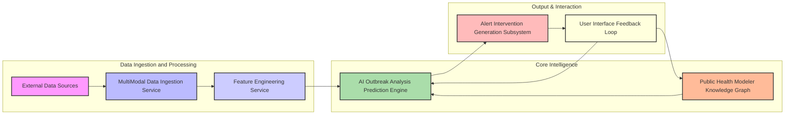
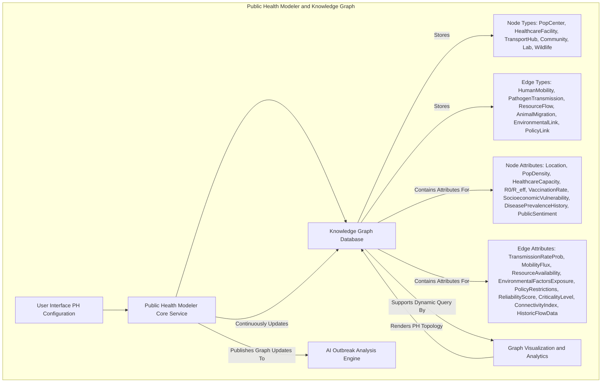
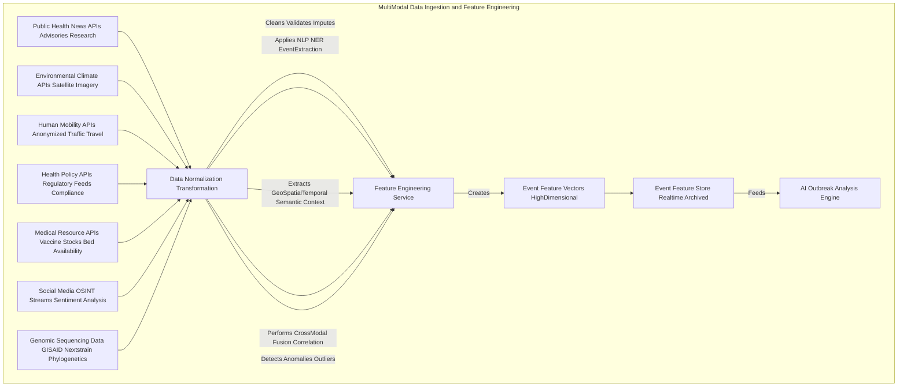
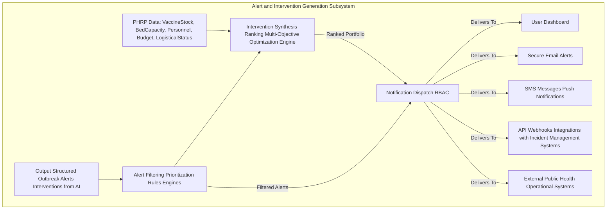
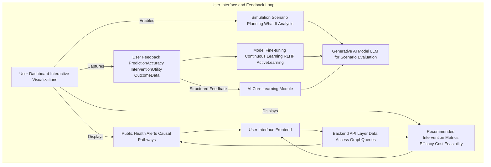
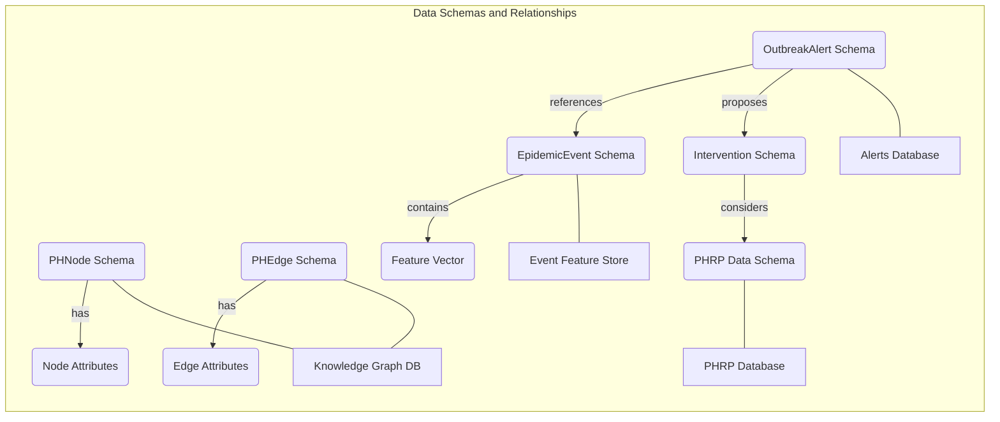
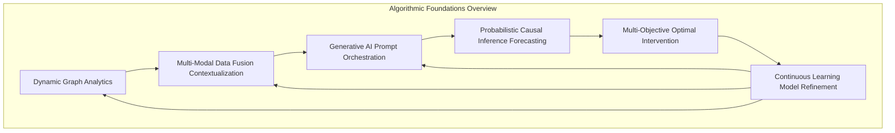

# System and Method for Predictive Epidemic Outbreak Modeling

## Table of Contents
1.  **Title of Invention**
2.  **Abstract**
3.  **Background of the Invention**
4.  **Brief Summary of the Invention**
5.  **Detailed Description of the Invention**
    *   5.1 System Architecture
        *   5.1.1 Public Health Modeler and Knowledge Graph
        *   5.1.2 Multi-Modal Data Ingestion and Feature Engineering Service
        *   5.1.3 AI Outbreak Analysis and Prediction Engine
        *   5.1.4 Alert and Intervention Generation Subsystem
        *   5.1.5 User Interface and Feedback Loop
    *   5.2 Data Structures and Schemas
        *   5.2.1 Public Health Graph Schema
        *   5.2.2 Real-time Epidemic Event Data Schema
        *   5.2.3 Outbreak Alert and Intervention Schema
        *   5.2.4 Public Health Resource Planning (PHRP) Schema
    *   5.3 Algorithmic Foundations
        *   5.3.1 Dynamic Graph Representation and Traversal
        *   5.3.2 Multi-Modal Data Fusion and Contextualization
        *   5.3.3 Generative AI Prompt Orchestration
        *   5.3.4 Probabilistic Outbreak Forecasting
        *   5.3.5 Optimal Intervention Strategy Generation
        *   5.3.6 Continuous Learning and Model Refinement
    *   5.4 Operational Flow and Use Cases
6.  **Claims**
7.  **Mathematical Justification: A Formal Axiomatic Framework for Predictive Epidemic Resilience**
    *   7.1 The Public Health Topological Manifold: `H = (P, T, Gamma)`
        *   7.1.1 Formal Definition of the Public Health Graph `H`
        *   7.1.2 Population Center State Space `P`
        *   7.1.3 Transmission Pathway State Space `T`
        *   7.1.4 Latent Interconnection Functionals `Gamma`
        *   7.1.5 Tensor-Weighted Adjacency Representation `B(t)`
        *   7.1.6 Graph Dynamics and Temporal Evolution Operator `Lambda_H`
    *   7.2 The Global State Observational Manifold: `W(t)`
        *   7.2.1 Definition of the Global State Tensor `W(t)`
        *   7.2.2 Multi-Modal Feature Extraction and Contextualization `f_Psi`
        *   7.2.3 Event Feature Vector `E_F(t)`
        *   7.2.4 Latent Representation Space `Z(t)`
    *   7.3 The Generative Predictive Outbreak Oracle: `G_AI`
        *   7.3.1 Formal Definition of the Predictive Mapping Function `G_AI`
        *   7.3.2 The Outbreak Probability Distribution `P(O_t+k | H, E_F(t))`
        *   7.3.3 Probabilistic Causal Graph Inference within `G_AI`
        *   7.3.4 The Intervention Generation Sub-Oracle `G_INT`
    *   7.4 The Societal Imperative and Decision Theoretic Utility: `E[Cost | i] < E[Cost]`
        *   7.4.1 Cost Function Definition `C(H, O, i)`
        *   7.4.2 Expected Cost Without Intervention `E[Cost]`
        *   7.4.3 Expected Cost With Optimal Intervention `E[Cost | i*]`
        *   7.4.4 The Value of Perfect Information Theorem Applied to `P(O_t+k)`
        *   7.4.5 Axiomatic Proof of Utility
    *   7.5 Multi-Objective Optimization for Intervention Strategies
        *   7.5.1 Objective Functions
        *   7.5.2 Constraint Set `K`
        *   7.5.3 Optimization Problem Formulation
8.  **Proof of Utility**

## 1. Title of Invention:
System and Method for Predictive Epidemic Outbreak Modeling with Generative AI-Powered Causal Inference and Multi-Objective Intervention Optimization

## 2. Abstract:
A groundbreaking system for orchestrating public health resilience is herein disclosed. This invention architecturally delineates the global public health landscape as a dynamic, attribute-rich knowledge graph, comprising diverse nodes such as population centers, healthcare facilities, transportation hubs, schools, and vulnerable communities, interconnected by multifaceted edges representing human movement pathways, pathogen transmission routes, and resource flows. Leveraging a sophisticated multi-modal data ingestion pipeline, the system continuously assimilates vast streams of real-time global intelligence, encompassing epidemiological statistics, environmental conditions, travel patterns, social media discourse, genomic sequencing data, and public health advisories. A state-of-the-art generative artificial intelligence model, operating as a sophisticated causal inference engine, meticulously analyzes this convergent data within the contextual framework of the public health knowledge graph. This analysis identifies, quantifies, and forecasts potential epidemic outbreaks with unprecedented accuracy, often several temporal epochs prior to their materialization. Upon the detection of a high-contingency outbreak event (e.g., a novel pathogen's emergent zoonotic spillover, or a rapid surge in case counts in a major urban hub, or a pathogen's mutation affecting vaccine efficacy), the system autonomously synthesizes and disseminates a detailed alert. Critically, it further postulates and ranks a portfolio of optimized, actionable intervention strategies, encompassing recommending travel restrictions, deploying medical resources, implementing public health campaigns, or advising on targeted vaccination efforts, thereby transforming reactive remediation into proactive strategic orchestration. The system features an adaptive feedback loop, enabling continuous model refinement and optimization based on real-world outcomes and expert user input, solidifying its role as an intelligent, evolving agent in global health security.

## 3. Background of the Invention:
Modern global public health systems represent an apotheosis of complex adaptive systems, characterized by an intricate web of interdependencies, global connectivity, and profound vulnerability to emergent infectious diseases. Traditional paradigms of epidemic surveillance and response, predominantly anchored in lagging indicator analysis and reactive incident response, have proven inherently insufficient to navigate the kaleidoscopic array of modern disruptive forces. These forces manifest across a spectrum from exogenous biological threats (novel pathogens, antibiotic resistance, zoonotic spillover events) and environmental vicissitudes (climate change impacts on vector distribution, extreme weather events, ecological shifts) to endogenous system fragilities (healthcare capacity limitations, vaccination hesitancy, resource misallocation, misinformation dissemination). The societal and economic ramifications of epidemic outbreaks are catastrophic, frequently escalating from direct human cost and financial losses to profound reputational damage, market disruption, and long-term erosion of public trust. The imperative for a paradigm shift from reactive mitigation to anticipatory resilience has attained unprecedented criticality. Existing solutions, often reliant on threshold-based alerting or rudimentary epidemiological models, conspicuously lack the capacity for sophisticated causal inference, real-time contextual understanding, and proactive intervention synthesis. They predominantly flag events post-occurrence or identify risks without furnishing actionable, context-aware intervention strategies, leaving communities exposed to cascading failures and suboptimal recovery trajectories. The current invention addresses this profound lacuna, establishing an intellectual frontier in dynamic, AI-driven predictive public health orchestration. It integrates multi-modal data streams, advanced generative AI for probabilistic causal inference, and multi-objective optimization algorithms to not only predict outbreaks but also to generate and rank optimal, context-aware intervention strategies, thereby shifting the paradigm from reaction to informed anticipation and proactive resilience.

## 4. Brief Summary of the Invention:
The present invention unveils a novel, architecturally robust, and algorithmically advanced system for predictive epidemic outbreak modeling, herein termed the "Cognitive Epidemic Sentinel." This system transcends conventional surveillance tools by integrating a multi-layered approach to risk assessment and proactive strategic guidance. The operational genesis commences with a user's precise definition and continuous refinement of their critical public health topology, meticulously mapping all entities—population centers, healthcare facilities, transportation networks, community clusters, and their connecting human movement pathways—into a dynamic knowledge graph. At its operational core, the Cognitive Epidemic Sentinel employs a sophisticated, continuously learning generative AI engine. This engine acts as an expert epidemiologist, public health policy analyst, and pathogen biosecurity strategist, incessantly monitoring, correlating, and interpreting an torrent of real-time, multi-modal global event data. The AI is dynamically prompted with highly contextualized queries, such as: "Given the population density and healthcare infrastructure of Metropolitan Area X, linked to international travel hubs, and considering prevailing environmental conditions, recent pathogen genomic surveillance data, and real-time social media chatter indicating novel respiratory symptoms, what is the quantified probability of a significant epidemic outbreak within the subsequent 14-day temporal horizon? Furthermore, delineate the precise causal vectors and propose optimal pre-emptive public health interventions." Should the AI model identify an emerging threat exceeding a pre-defined probabilistic threshold, it autonomously orchestrates the generation of a structured, machine-readable alert. This alert comprehensively details the nature and genesis of the risk, quantifies its probability and projected impact, specifies the affected components of the public health network, and, crucially, synthesizes and ranks a portfolio of actionable, optimized intervention strategies. This constitutes a paradigm shift from merely identifying risks to orchestrating intelligent, pre-emptive strategic maneuvers, embedding an unprecedented degree of foresight and resilience into global public health. The system is fortified by a robust feedback mechanism that continuously tunes the generative AI models and optimization algorithms, ensuring adaptability and increasing accuracy over time, effectively learning from real-world outcomes and expert human input.

## 5. Detailed Description of the Invention:

The disclosed system represents a comprehensive, intelligent infrastructure designed to anticipate and mitigate epidemic outbreaks proactively. Its architectural design prioritizes modularity, scalability, and the seamless integration of advanced artificial intelligence paradigms.

### 5.1 System Architecture

The Cognitive Epidemic Sentinel is comprised of several interconnected, high-performance services, each performing a specialized function, orchestrated to deliver a holistic predictive capability.


*Figure 1: High-level System Architecture of the Cognitive Epidemic Sentinel.*

#### 5.1.1 Public Health Modeler and Knowledge Graph
This foundational component serves as the authoritative source for the global public health topology and associated operational parameters.
*   **User Interface (UI):** A sophisticated graphical user interface (GUI) provides intuitive tools for users to define, visualize, and iteratively refine public health networks. This includes drag-and-drop functionality for nodes and edges, parameter input forms, and geospatial mapping integrations. The UI allows for real-time adjustments to node attributes (e.g., updating hospital bed counts, vaccination rates) and edge attributes (e.g., modifying travel restrictions, resource flow capacities).
*   **Knowledge Graph Database:** At its core, the public health network is represented as a highly interconnected, semantic knowledge graph. This graph is not merely a static representation but a dynamic entity capable of storing rich attributes, temporal data, and inter-node relationships. The database utilizes advanced graph technologies (e.g., Neo4j, Amazon Neptune, ArangoDB) to ensure efficient traversal, querying, and updates.
    *   **Nodes:** Represent discrete entities within the public health landscape. These can be granular, such as specific population centers (e.g., "Metropolitan Area X"), healthcare facilities (e.g., "General Hospital Y"), transportation hubs (e.g., "International Airport Z"), schools, community clusters, veterinary clinics, research labs, or even significant wildlife habitats. Each node is endowed with a comprehensive set of attributes, including geographical coordinates (latitude, longitude), population density, healthcare capacity (e.g., hospital bed count, ICU availability, medical personnel ratios), current `R0` (basic reproduction number) or `R_eff` (effective reproduction number), vaccination rates, and socioeconomic vulnerability indices. Nodes can also have dynamic attributes, such as current disease prevalence, historical outbreak events, and public sentiment scores derived from social media.
    *   **Edges:** Represent the pathways and relationships connecting these nodes. These include human mobility networks (e.g., daily commutes, travel routes), pathogen transmission vectors (e.g., airborne, waterborne, vector-borne, fomite-borne), and resource distribution pathways (e.g., medical supply chains, personnel deployment routes). Edges possess attributes such as average flow rate, pathogen transmission probability, typical resource capacity, historical reliability metrics, associated transport providers, environmental factors influencing transmission, and policy restrictions. Edges can also represent non-physical relationships, such as epidemiological links between regions, or political agreements impacting resource sharing.
    *   **Temporal and Contextual Attributes:** Both nodes and edges are augmented with temporal attributes, indicating their operational status at different times, and contextual attributes, such as climate zone vulnerability scores, public health policy compliance ratings, social cohesion metrics, and historical data series for all dynamic attributes. The system maintains versioning of the graph state over time to support historical analysis and model training.


*Figure 2: Detailed Workflow of Public Health Modeler and Knowledge Graph Component.*

#### 5.1.2 Multi-Modal Data Ingestion and Feature Engineering Service
This robust, scalable service is responsible for continuously acquiring, processing, and normalizing vast quantities of heterogeneous global data streams. It acts as the "sensory apparatus" of the Sentinel, operating 24/7 to provide a comprehensive, real-time picture of global health dynamics.
*   **Public Health News APIs:** Integration with advanced news aggregators (e.g., WHO, CDC, ECDC, GPHIN, proprietary surveillance platforms) to capture real-time public health advisories, disease surveillance updates, policy changes, and emerging health threats across relevant geographies. Natural Language Processing (NLP) techniques, including named entity recognition (NER), event extraction, sentiment analysis, and topic modeling, are applied to structure unstructured news feeds into actionable data points. This also includes parsing academic papers and pre-print servers for emerging pathogen research.
*   **Environmental and Climate APIs:** Acquisition of high-resolution meteorological data (e.g., temperature, humidity, precipitation, wind patterns), climate anomaly predictions (e.g., prolonged droughts, extreme heatwaves), and localized forecasts impacting pathogen vectors (e.g., mosquito populations, water contamination risk) or human behavior. Satellite imagery analysis can provide data on deforestation, urbanization, and land-use changes that influence zoonotic spillover risk. Predictive climate models are integrated to project long-term environmental health risks.
*   **Human Mobility APIs:** Real-time anonymized mobile data, airline passenger manifests, public transport ridership, border crossing data, aggregated GPS data, and international travel advisories. This also includes data on migration patterns, population displacement due to conflicts or disasters, and historical mobility benchmarks for seasonal variations. Data is anonymized and aggregated to preserve privacy while providing macro-level insights into population movement.
*   **Health Policy APIs:** Specialized feeds providing granular policy updates, international health regulations (IHR) compliance statuses, border closure policies, vaccination mandates, and public health communication campaigns for countries and specific regions. This includes details on enforcement levels and public adherence assessments.
*   **Medical Resource APIs:** Access to data such as vaccine availability (by type, manufacturer, and dosage), antiviral stockpiles, hospital bed occupancy rates (general, ICU), medical personnel deployment statistics (e.g., doctors, nurses, specialists per capita), and pharmaceutical supply chain integrity indicators. This also includes data on medical equipment availability (e.g., ventilators, PPE) and diagnostic testing capacity.
*   **Social Media and Open-Source Intelligence (OSINT):** Selective monitoring of public social media discourse, forums, and OSINT sources, employing advanced text, image, and video analysis, to detect early warnings of novel symptoms, localized disease clusters, misinformation trends, public sentiment on health measures, and community compliance, which may not yet be reported by traditional media. Anomaly detection algorithms identify unusual patterns in online activity.
*   **Genomic Sequencing Data:** Integration with global pathogen databases (e.g., GISAID, NCBI, Nextstrain) to monitor pathogen mutations, identify variants of concern (VOCs), assess potential changes in transmissibility, virulence, or vaccine efficacy, and track geographic spread of variants. This includes phylogenetic tree analysis for tracing evolutionary pathways.
*   **Data Normalization and Transformation:** Raw data from disparate sources is transformed into a unified, semantically consistent format, timestamped, geo-tagged, and enriched. This involves robust schema mapping, unit conversion, missing data imputation, and anomaly detection (identifying suspicious data points or reporting inconsistencies).
*   **Feature Engineering:** This critical sub-component extracts salient features from the processed data, translating raw observations into high-dimensional vectors pertinent for AI analysis. For instance, "Rapid increase in respiratory illness reports in X City" is transformed into features like `[city_X_case_count_increase_rate, ICU_occupancy_rate_X, mask_mandate_compliance_score_X, viral_variant_detected_X_type, genomic_mutation_impact_score]`. Features are also generated to represent temporal trends, spatial clusters, and cross-modal correlations.


*Figure 3: Multi-Modal Data Ingestion and Feature Engineering Pipeline.*

#### 5.1.3 AI Outbreak Analysis and Prediction Engine
This is the intellectual core of the Cognitive Epidemic Sentinel, employing advanced generative AI to synthesize intelligence and forecast outbreaks with associated causal pathways.
*   **Dynamic Prompt Orchestration:** Instead of static prompts, this engine constructs highly dynamic, context-specific prompts for the generative AI model. These prompts are meticulously crafted using a hierarchical template system, integrating:
    *   The relevant sub-graph of the public health network (nodes and edges directly or indirectly connected to the query's focus).
    *   Recent, relevant event features from the `Event Feature Store`, filtered by spatial and temporal proximity.
    *   Pre-defined roles for the AI (e.g., "Expert Epidemiologist," "Public Health Policy Analyst," "Pathogen Biosecurity Strategist," "Medical Logistics Expert").
    *   Specific temporal horizons for prediction (e.g., "next 7 days," "next 30 days," "next 90 days").
    *   Desired output format constraints (e.g., JSON schema for structured alerts and intervention suggestions, specific metric calculations).
    *   Historical context from the knowledge graph (e.g., previous outbreak responses in similar regions).
*   **Generative AI Model:** A large, multi-modal language model (LLM) serves as the primary inference engine. This model is pre-trained on a vast corpus of text and data, encompassing epidemiological models, pathogen biology, public health policy, social science, environmental science, logistics, and historical incident reports. It is further fine-tuned with domain-specific epidemic incident data, simulated outbreak scenarios, and expert-curated causal pathways to enhance its predictive accuracy and contextual understanding. The model's capacity for complex reasoning, causal chain identification, and synthesis of disparate information is paramount. It can leverage techniques like chain-of-thought reasoning to explain its inferences.
*   **Probabilistic Causal Inference:** The AI model does not merely correlate events; it attempts to infer probabilistic causal relationships. For example, a novel virus mutation event `(C_genomic)` causes increased transmissibility `(C_pathogen_attribute)` which in turn causes rapid case surge `(C_node_impact)` and ultimately healthcare system overload `(C_system_impact)`. The AI quantifies the probability of these causal links and their downstream effects, constructing a directed acyclic graph (DAG) representing the inferred causal mechanisms. This provides critical insights for targeted interventions.
*   **Risk Taxonomy Mapping:** Identified outbreaks are mapped to a predefined, hierarchical ontology of public health risks (e.g., Biological (Viral, Bacterial), Environmental (Waterborne, Vector-borne), Societal (Misinformation, Panic), Healthcare System (Capacity, Personnel), Policy (Ineffective, Non-Compliance)). This categorization aids in structured reporting, strategic planning, and consistent communication.
*   **Outbreak Assessment Scoring:** Based on the generative AI's output, a multi-dimensional scoring system is applied to quantify `outbreak_probability_score`, `projected_impact_severity`, `temporal_proximity_score`, and `causal_clarity_score`. These scores are then combined into a composite `OutbreakRiskIndex`.

```mermaid
graph TD
    subgraph AI Outbreak Analysis and Prediction Engine
        PHKG_STATE[Public Health Knowledge Graph State B(t)] --> DPO[Dynamic Prompt Orchestration]
        EFS_FE[Event Feature Store E_F(t)] --> DPO
        URP[User-defined Outbreak Parameters Thresholds ForecastHorizon] --> DPO
        DPO -- Constructs Complex --> LLMP[LLM Prompt: Contextual Variables, Role-Playing Directives, Output Constraints, Historical Context]
        LLMP --> GAI[Generative AI Model: Fine-tuned Multi-Modal LLM]
        GAI -- Performs --> PCI[Probabilistic Causal Inference CausalDAG]
        GAI -- Generates --> PDF[Probabilistic Outbreak Forecasts O_t+k]
        GAI -- Delineates --> CI[Causal Inference Insights C_cause]
        GAI -- Synthesizes --> PSI[Preliminary Intervention Suggestions]
        PDF & CI --> OAS[Outbreak Assessment Scoring RiskIndex]
        OAS & PSI --> OSD[Output Structured Outbreak Alerts & Ranked Interventions]
        OSD -- Feeds --> AIGS[Alert & Intervention Generation Subsystem]
    end
```
*Figure 4: AI Outbreak Analysis and Prediction Engine Workflow.*

#### 5.1.4 Alert and Intervention Generation Subsystem
Upon receiving the AI's structured output, this subsystem processes and refines it into actionable intelligence for public health decision-makers.
*   **Alert Filtering and Prioritization:** Alerts are filtered based on user-defined thresholds (e.g., only show "High" probability outbreaks, or those impacting "MissionCritical" population centers). They are prioritized based on a composite score derived from `OutbreakRiskIndex`, `temporal_proximity_score`, and `user_defined_criticality_weights`. Custom alert rules (e.g., specific pathogen types, geographic regions) can also be configured.
*   **Intervention Synthesis and Ranking:** The AI's preliminary suggested actions are further refined, cross-referenced with real-time Public Health Resource Planning (PHRP) data (e.g., vaccine stock, antiviral availability, hospital bed occupancy rates, medical personnel deployment capacity, budget constraints, logistical feasibility). A multi-objective optimization engine ranks the interventions according to user-defined optimization criteria (e.g., minimize mortality, minimize economic impact, maximize social equity, minimize resource utilization). This ensures that proposed interventions are not only effective but also practical and aligned with strategic public health goals. Each intervention is evaluated for its `outbreak_reduction_potential`, `estimated_cost_impact`, `time_to_efficacy`, and `feasibility_score`.
*   **Notification Dispatch:** Alerts and optimized intervention portfolios are dispatched through various configurable channels (e.g., integrated dashboard, secure email, SMS, API webhook, dedicated incident management systems) to relevant public health stakeholders within the organization, emergency response teams, and international partners, based on a predefined role-based access control (RBAC) matrix. Notifications can also trigger automated data feeds to other operational systems.


*Figure 5: Alert and Intervention Generation Subsystem Workflow.*

#### 5.1.5 User Interface and Feedback Loop
This component ensures the system is interactive, adaptive, and continuously improves through expert human oversight.
*   **Integrated Dashboard:** A comprehensive, real-time dashboard visualizes the public health network graph with dynamic overlays showing identified outbreaks, their predicted spread, and areas of high risk. It displays generated alerts, presents recommended intervention strategies with their associated metrics (cost, efficacy, feasibility), and allows users to drill down into causal pathways. Geospatial visualizations are central to this interface, enabling intuitive understanding of complex spatial-temporal dynamics. Customizable views allow different stakeholders to focus on relevant information.
*   **Simulation and Scenario Planning:** Users can interact with the system to run "what-if" scenarios, evaluating the impact of hypothetical outbreaks (e.g., a novel highly transmissible variant) or proposed interventions (e.g., impact of different levels of travel restrictions, resource reallocation). This leverages the generative AI for predictive modeling under new conditions, providing quantitative and qualitative insights into potential futures. Users can compare multiple intervention strategies side-by-side.
*   **Feedback Mechanism:** Users can provide structured feedback on the accuracy of predictions (e.g., "Outbreak occurred as predicted," "Prediction was inaccurate"), the utility of recommendations (e.g., "Intervention was effective," "Intervention was impractical"), and the actual outcomes of implemented actions. This feedback, along with real-world data, is crucial for continually fine-tuning the generative AI model through reinforcement learning from human feedback (RLHF), active learning, or similar mechanisms, improving its accuracy, relevance, and ethical alignment over time. This closes the loop, making the system an adaptive, intelligent agent that co-evolves with public health challenges.
*   **Audit Trail and Explainability:** The UI provides an audit trail of all alerts, predictions, interventions, and associated causal inference explanations generated by the AI. This supports transparency, regulatory compliance, and allows human experts to scrutinize and understand the AI's reasoning, building trust and facilitating knowledge transfer.


*Figure 6: User Interface and Feedback Loop for System Adaptability.*

### 5.2 Data Structures and Schemas

To maintain consistency, interoperability, and the integrity of complex data flows, the system adheres to rigorously defined data structures, enforced by a robust schema validation layer.


*Figure 7: Data Schemas and their Interrelationships within the System.*

#### 5.2.1 Public Health Graph Schema
Represented internally within the Knowledge Graph Database.

*   **Node Schema (`PHNode`):**
    ```json
    {
      "node_id": "UUID",
      "node_type": "ENUM['PopCenter', 'HealthcareFacility', 'TransportHub', 'CommunityArea', 'ResearchLab', 'WildlifeHabitat', 'SupplyDepot', 'EducationInstitution', 'VeterinaryClinic', 'GovernmentAgency']",
      "name": "String",
      "alias": ["String"],
      "location": {
        "latitude": "Float",
        "longitude": "Float",
        "country_iso": "String (ISO 3166-1 alpha-3)",
        "admin_level1": "String", // e.g., State/Province
        "admin_level2": "String", // e.g., County/District
        "named_geofence_id": "UUID (optional)" // For complex polygons
      },
      "attributes": {
        "population_total": "Integer",
        "population_density": "Float (persons/km^2)",
        "age_distribution": {"0-14": "Float", "15-64": "Float", "65+": "Float"},
        "healthcare_capacity_beds_total": "Integer",
        "healthcare_capacity_icu_beds": "Integer",
        "medical_personnel_ratio": "Float (per 1000 pop)",
        "r_naught_local_estimated": "Float", // Local basic reproduction number, dynamically updated
        "r_effective_local_estimated": "Float", // Local effective reproduction number, dynamic
        "vaccination_rate_full": "Float (0-1)", // Fully vaccinated %
        "vaccination_rate_partial": "Float (0-1)", // Partially vaccinated %
        "environmental_risk_index_composite": "Float (0-1)", // e.g., vector suitability, air quality
        "socioeconomic_vulnerability_score": "Float (0-1)", // HDI, poverty index etc.
        "disease_prevalence_current": {"disease_code_A": "Float", "disease_code_B": "Float"}, // Current estimated prevalence for key diseases
        "historical_case_counts_7d_avg": "Integer",
        "hospitalization_rate_7d_avg": "Float",
        "mortality_rate_7d_avg": "Float",
        "public_sentiment_health_measures": "Float (-1 to 1)", // From social media
        "custom_tags": ["String"], // e.g., ["CoastalArea", "TouristDestination", "HighImmigration"]
        "criticality_level": "ENUM['Low', 'Medium', 'High', 'MissionCritical']",
        "policy_compliance_score": "Float (0-1)" // e.g., Mask mandate compliance
      },
      "last_updated": "Timestamp (ISO 8601)",
      "version_id": "UUID" // For temporal graph snapshots
    }
    ```

*   **Edge Schema (`PHEdge`):**
    ```json
    {
      "edge_id": "UUID",
      "source_node_id": "UUID",
      "target_node_id": "UUID",
      "edge_type": "ENUM['HumanMobility_Air', 'HumanMobility_Land', 'HumanMobility_Sea', 'PathogenTransmission_Airborne', 'PathogenTransmission_Waterborne', 'PathogenTransmission_Vector', 'PathogenTransmission_Contact', 'ResourceFlow_Medical', 'ResourceFlow_Food', 'AnimalMigration', 'EnvironmentalLink_Weather', 'EnvironmentalLink_Waterbody', 'PolicyLink_CrossBorderAgreement']",
      "route_identifier": "String (optional)", // e.g., "Flight_Number_XY123", "Highway_A_to_B"
      "attributes": {
        "average_flow_rate_per_period": "Float", // e.g., daily passengers, tons of cargo, animal count per season
        "current_flow_rate": "Float", // Real-time updated flow
        "pathogen_transmission_probability": {"disease_code_A": "Float", "disease_code_B": "Float"}, // probability of transmission along this edge for specific diseases
        "resource_capacity_max": "Float", // e.g., max medical supplies per day
        "resource_capacity_current_utilization": "Float (0-1)",
        "environmental_factors_exposure_score": "Float (0-1)", // Composite score, e.g., ["HighHumidity", "MosquitoBreedingPotential", "FloodRisk"]
        "policy_restrictions_in_place": ["String"], // e.g., ["TravelBan_Origin", "Quarantine_Destination", "BorderClosure_Partial"]
        "policy_adherence_score": "Float (0-1)",
        "reliability_score": "Float (0-1)", // reliability of resource flow, inversely related to supply chain disruption risk
        "criticality_level": "ENUM['Low', 'Medium', 'High', 'MissionCritical']",
        "connectivity_index_weighted": "Float", // How central/important is this edge in terms of flow
        "distance_km": "Float",
        "travel_time_hours_avg": "Float",
        "historical_flow_trends": {"monthly_avg": "Float[]", "weekly_avg": "Float[]"} // Time series data
      },
      "last_updated": "Timestamp (ISO 8601)",
      "version_id": "UUID" // For temporal graph snapshots
    }
    ```

#### 5.2.2 Real-time Epidemic Event Data Schema
Structured representation of ingested and featured global events.

*   **Event Schema (`EpidemicEvent`):**
    ```json
    {
      "event_id": "UUID",
      "event_type": "ENUM['Biological', 'Environmental', 'Societal', 'Logistical', 'Policy', 'Genomic', 'Healthcare', 'Infrastructure']",
      "sub_type": "String", // e.g., "NovelPathogenEmergence", "TemperatureAnomaly", "TravelRestriction", "VaccineShortage", "MisinformationWave", "VariantOfConcern", "HospitalOverload", "PowerOutage"
      "timestamp_detected": "Timestamp (ISO 8601)",
      "timestamp_effective_start": "Timestamp (ISO 8601, optional)", // When the event starts to have an effect
      "timestamp_effective_end": "Timestamp (ISO 8601, optional)",   // When the event is expected to cease having an effect
      "temporal_relevance_decay_rate": "Float (0-1)", // How fast this event loses relevance
      "location": {
        "latitude": "Float",
        "longitude": "Float",
        "radius_km": "Float (optional)", // For point events with an affected radius
        "polygon_geojson": "GeoJSON (optional)", // For area-based events
        "country_iso": "String (ISO 3166-1 alpha-3)",
        "admin_level1": "String (optional)",
        "named_location": "String" // e.g., "Metropolitan Area X", "Global"
      },
      "magnitude_score": "Float", // Normalized score, e.g., 0-10, for the raw event intensity
      "impact_potential": "ENUM['Negligible', 'Low', 'Medium', 'High', 'Critical', 'Catastrophic']",
      "confidence_level": "Float (0-1)", // 0-1, confidence in event occurrence/forecast from source
      "source": "String", // e.g., "WHO_Report_123", "CDC_Alert_XYZ", "GISAID_Variant_ABC", "Twitter_Trend_#RespiratorySymptoms"
      "raw_data_link": "URL (optional)", // Link to original data source
      "feature_vector": { // Key-value pairs for AI consumption, dynamically generated
        "r_effective_change_potential": "Float", // Potential change to R_eff due to this event
        "mutation_rate_increase_fold": "Float",
        "hospitalization_rate_increase_projected": "Float",
        "sentiment_score_vaccine_hesitancy_change": "Float",
        "travel_volume_reduction_percent_observed": "Float",
        "disease_specific_metric_a": "Float",
        "environmental_anomaly_severity": "Float",
        "supply_chain_disruption_index": "Float",
        "policy_implementation_speed": "Float",
        "population_mobility_index_change": "Float",
        // ... many more dynamic and context-specific features
      },
      "related_knowledge_graph_entities": [ // List of PHNode/PHEdge IDs affected/relevant to this event
        {"entity_id": "UUID", "entity_type": "ENUM['Node', 'Edge']", "relevance_score": "Float"}
      ]
    }
    ```

#### 5.2.3 Outbreak Alert and Intervention Schema
Output structure from the AI Outbreak Analysis Engine, refined by the Alert and Intervention Generation Subsystem.

*   **Alert Schema (`OutbreakAlert`):**
    ```json
    {
      "alert_id": "UUID",
      "timestamp_generated": "Timestamp (ISO 8601)",
      "alert_version": "Integer",
      "outbreak_summary_title": "String", // e.g., "Critical Risk: Novel Respiratory Pathogen Outbreak in City X"
      "description_detailed": "String", // Detailed explanation of the outbreak risk, causal chain, and affected entities.
      "risk_category": "ENUM['Biological', 'Environmental', 'Societal', 'Logistical', 'HealthcareSystem', 'Policy']",
      "outbreak_probability": "ENUM['Low', 'Medium', 'High', 'Critical']", // Qualitative assessment
      "probability_score": "Float (0-1)", // Quantitative probability score, e.g., 0.85
      "projected_impact_severity": "ENUM['Negligible', 'Low', 'Medium', 'High', 'Catastrophic']", // e.g., healthcare overload, high mortality, economic collapse
      "impact_score": "Float (0-1)", // Quantitative impact score, e.g., 0.92
      "composite_risk_index": "Float (0-1)", // Probability * Impact
      "affected_entities": [ // List of PHNode/PHEdge IDs directly affected or at highest risk
        {"entity_id": "UUID", "entity_type": "ENUM['Node', 'Edge']", "risk_contribution": "Float"}
      ],
      "causal_events_trace": [ // Link to EpidemicEvent IDs that contribute to this outbreak, with causal strength
        {"event_id": "UUID", "causal_strength": "Float"}
      ],
      "temporal_horizon_peak_days": "Integer", // Days until expected peak outbreak
      "temporal_horizon_end_days": "Integer",  // Days until expected resolution with no intervention
      "projected_r_effective_at_peak": "Float",
      "projected_case_surge_percent": "Float",
      "projected_mortality_rate_increase": "Float",
      "recommended_interventions": [ // Ordered list of interventions by rank
        {
          "action_id": "UUID",
          "action_description": "String", // e.g., "Implement targeted travel restrictions to region Y for 14 days."
          "action_type": "ENUM['TravelRestriction', 'ResourceDeployment', 'PublicHealthCampaign', 'TestingSurveillance', 'VaccinationDrive', 'PolicyEnforcement', 'InfrastructureModification', 'ResearchFunding']",
          "target_entities": ["UUID"], // Specific PHNode/PHEdge IDs to apply intervention to
          "estimated_cost_monetary": "Float", // e.g., USD millions
          "estimated_cost_social": "Float (0-1)", // e.g., public disruption score
          "estimated_time_to_efficacy_days": "Float", // Time until intervention starts to show significant effect
          "outbreak_reduction_potential_score": "Float (0-1)", // Percentage reduction in projected impact
          "resource_requirements": {"resource_type_A": "Float", "resource_type_B": "Float"}, // e.g., {"VaccineDoses": 100000, "MedicalPersonnel": 50}
          "feasibility_score": "Float (0-1)", // e.g., political will, logistical capacity
          "confidence_in_recommendation": "Float (0-1)", // AI's confidence in the effectiveness of this specific intervention
          "rank": "Integer", // Optimized rank
          "justification_ai_reasoning": "String" // Concise explanation of why this intervention is recommended
        }
      ],
      "status": "ENUM['Active', 'Resolved', 'Acknowledged', 'Intervened', 'Archived']", // Current lifecycle status
      "feedback_status": "ENUM['Pending', 'Received_Positive', 'Received_Negative', 'Received_Neutral']",
      "last_updated": "Timestamp (ISO 8601)"
    }
    ```

#### 5.2.4 Public Health Resource Planning (PHRP) Schema
Schema for dynamic public health resource and operational data.

*   **PHRP Schema (`PublicHealthResource`):**
    ```json
    {
      "resource_id": "UUID",
      "resource_type": "ENUM['VaccineStock', 'AntiviralStock', 'HospitalBed', 'ICUBed', 'MedicalPersonnel_Doctor', 'MedicalPersonnel_Nurse', 'PPE_Masks', 'TestingKit', 'Ventilator', 'EmergencyBudget', 'LogisticsCapacity_Transport']",
      "location": {
        "node_id": "UUID (optional)", // Linked to a specific PHNode (e.g., hospital, depot)
        "country_iso": "String (ISO 3166-1 alpha-3)"
      },
      "current_quantity": "Float",
      "unit": "String", // e.g., "doses", "units", "staff-days", "USD"
      "max_capacity": "Float", // Maximum possible quantity for this resource at this location
      "min_reserve_threshold": "Float", // Minimum quantity to maintain
      "reorder_point": "Float",
      "supplier_details": "JSON (optional)", // e.g., {"name": "PharmaCorp", "lead_time_days": 7}
      "cost_per_unit": "Float",
      "availability_status": "ENUM['Available', 'LowStock', 'Unavailable', 'Backordered']",
      "demand_forecast_7d": "Float", // Projected demand for next 7 days
      "last_updated": "Timestamp (ISO 8601)"
    }
    ```

### 5.3 Algorithmic Foundations

The system's intelligence is rooted in a sophisticated interplay of advanced algorithms and computational paradigms, meticulously engineered for dynamic, real-time public health challenges.


*Figure 8: Algorithmic Interdependencies within the Cognitive Epidemic Sentinel.*

#### 5.3.1 Dynamic Graph Representation and Traversal
The public health network is fundamentally a dynamic spatio-temporal graph `H(t)=(P(t),T(t))`, where nodes and edges, along with their attributes, evolve over time.
*   **Graph Database Technologies:** Underlying technologies (e.g., property graphs, RDF knowledge graphs, temporal graph databases) are employed for efficient storage and retrieval of complex relationships and attributes. They support ACID transactions and highly concurrent access.
*   **Temporal Graph Analytics:** Algorithms for analyzing evolving graph structures are paramount. This includes:
    *   **Dynamic Shortest Path:** Identifying critical transmission paths (e.g., minimum travel time or minimum number of hops, considering dynamic edge weights that reflect pathogen transmissibility or policy restrictions). `Dijkstra's` or `Bellman-Ford` variants adapted for time-varying edge costs.
    *   **Bottleneck Analysis:** Identifying critical nodes (e.g., major transportation hubs) or edges (e.g., key supply routes) whose disruption would severely impact the network, using flow network algorithms.
    *   **Centrality Measures:** Calculating dynamic centrality measures (e.g., betweenness centrality for key transportation hubs, eigenvector centrality for influence propagation) that change with real-time conditions and pathogen characteristics. `C_b(v, t) = sum_{s != v != d} (sigma_sd(v, t) / sigma_sd(t))`.
    *   **Community Detection:** Identifying emergent disease clusters or vulnerable communities within the dynamic graph using algorithms like `Louvain` or `Label Propagation` that adapt to attribute changes.
    *   **Subgraph Extraction and Querying:** Efficient algorithms for extracting relevant sub-graphs based on a specific spatio-temporal query (e.g., "all human mobility paths from `City X` to `Healthcare Facility Y` passing through `Airport Z` within the last 24 hours," or "all nodes with `R_eff > 1.2` connected to `Node A`"). Graph query languages (e.g., Cypher, Gremlin, SPARQL) are used for this.

#### 5.3.2 Multi-Modal Data Fusion and Contextualization
The fusion process integrates heterogeneous, high-volume data streams into a unified, semantically coherent, and contextually rich representation suitable for sophisticated AI reasoning.
*   **Latent Space Embeddings:** Multi-modal data (text, numerical, geospatial, genomic, time-series) is transformed into a shared, high-dimensional latent vector space using advanced techniques like multi-modal autoencoders, contrastive learning (e.g., CLIP for aligning text and image-derived features), or specialized Transformer networks (e.g., Perceiver IO). This allows for semantic comparison, contextualization, and correlation across vastly different data types. Each `EpidemicEvent` is represented as an embedding `E_F_emb(t)`.
*   **Attention Mechanisms:** Employing self-attention and cross-attention networks (from Transformer architectures) to dynamically weigh the relevance of different data streams, features, and historical context to a specific public health query. For example, environmental data (humidity, temperature) receives higher attention for vector-borne disease predictions, while genomic data is critical for understanding viral evolution and vaccine escape. The attention score `alpha_ij` determines the influence of feature `j` on feature `i`.
*   **Time-Series Analysis and Forecasting:** Applying advanced time-series models (e.g., Long Short-Term Memory (LSTM) networks, Temporal Convolutional Networks (TCNs), Transformer networks, Gaussian Processes, Prophet) to predict future states of continuous variables (e.g., case counts, `R_effective` values, hospital bed occupancy, mobility flux). These forecasted time series serve as critical dynamic features for the generative AI model, providing forward-looking inputs.
*   **Causal Discovery:** Preliminary causal discovery algorithms (e.g., PC algorithm, LiNGAM) may be applied to subsets of the fused data to suggest potential causal links, which can then inform the generative AI's deeper causal inference process.

#### 5.3.3 Generative AI Prompt Orchestration
This is a critical innovation enabling the generative AI to function as a domain-expert epidemiologist and strategist, moving beyond simple question-answering.
*   **Contextual Variable Injection:** Dynamically injecting relevant elements of the current public health graph (e.g., specific node/edge attributes, sub-graph structures, critical pathways), filtered and aggregated real-time event features, and historical context directly into the AI prompt. The prompt includes structured XML or JSON snippets representing graph fragments and feature vectors.
*   **Role-Playing Directives:** Explicitly instructing the generative AI model to adopt specific personas (e.g., "You are an expert in epidemiological modeling with a focus on respiratory pathogens," "You are a public health policy strategist advising the WHO on global pandemic response," "You are a medical logistics expert optimizing resource allocation under scarcity") to elicit specialized reasoning capabilities and generate outputs tailored to specific expert perspectives.
*   **Constrained Output Generation:** Utilizing techniques such as JSON schema enforcement, XML tags, or few-shot exemplars within the prompt to guide the AI to produce structured, machine-readable outputs. This ensures that predictions and interventions are formatted consistently, crucial for automated processing by downstream subsystems. For example, instructing the AI to output a JSON object conforming to the `OutbreakAlert` schema.
*   **Iterative Refinement and Self-Correction:** Developing prompt templates that allow the AI to "think aloud" (Chain-of-Thought prompting), ask clarifying questions if inputs are ambiguous, or iterate on its analysis, mimicking human analytical processes. The system might prompt the AI multiple times, refining the query based on initial partial outputs.
*   **Knowledge Graph Grounding:** Integrating retrieved factual information from the knowledge graph (e.g., known pathogen characteristics, public health guidelines) into the prompt to "ground" the LLM's responses and prevent hallucination, ensuring consistency with established public health knowledge.

```mermaid
graph TD
    subgraph Generative AI Prompt Orchestration
        PHKG_FRAGMENT[Relevant PH Knowledge Graph Fragment B_sub(t)] --> DPO[Dynamic Prompt Orchestrator]
        EF_VECTORS[Filtered Event Feature Vectors E_F_sub(t)] --> DPO
        HIST_CONTEXT[Historical Context & Simulation Results] --> DPO
        USER_PARAMS[User Defined Queries TemporalHorizon RiskThresholds] --> DPO
        DPO -- Crafts --> PROMPT_TEMPLATE[Base Prompt Template]
        PROMPT_TEMPLATE -- Injects --> CONTEXT_INJ[Contextual Variable Injection: Graph Data, Event Data, Time, Location]
        CONTEXT_INJ -- Adds --> ROLE_DIRECTIVES[Role-Playing Directives: Epidemiologist, Strategist, Logistician]
        ROLE_DIRECTIVES -- Specifies --> OUTPUT_CONSTRAINTS[Output Constraints: JSON Schema, Metric Requirements]
        OUTPUT_CONSTRAINTS --> FINAL_PROMPT[Final LLM Prompt (Structured)]
        FINAL_PROMPT -- Sent To --> GAI_LLM_CORE[Generative AI Model]
    end
```
*Figure 9: Generative AI Dynamic Prompt Orchestration Workflow.*

#### 5.3.4 Probabilistic Outbreak Forecasting
The AI's ability to not just predict but quantify uncertainty and identify causal mechanisms is central to its utility.
*   **Causal Graph Learning:** Within the generative AI's latent reasoning capabilities, it constructs implicit or explicit probabilistic causal graphs (e.g., Bayesian Networks, Structural Causal Models (SCM)) linking global events (`E_F(t)`) to states of the public health network (`B(t)`) and ultimately to public health impacts (`O_t+k`). This allows it to identify direct and indirect causal pathways, e.g., `Event_A -> Node_Attribute_Change -> Edge_Attribute_Change -> Outbreak_O`. Causal inference allows for counterfactual reasoning ("what if Event A hadn't happened?").
*   **Monte Carlo Simulations (Implicit & Explicit):** The AI's generative nature allows it to effectively perform implicit Monte Carlo simulations, exploring various plausible future scenarios based on probabilistic event occurrences, their cascading effects, and the dynamics of the public health graph. For high-stakes predictions, explicit Monte Carlo simulations or agent-based models can be initiated by the AI or triggered by the system, with their results then integrated back into the generative model's context.
*   **Confidence Calibration:** Employing post-hoc calibration techniques (e.g., Platt scaling, isotonic regression, conformal prediction) to ensure that the AI's confidence scores in its predictions (e.g., `probability_score`) are well-calibrated against observed outcomes, ensuring that a "High" probability truly corresponds to a high likelihood of occurrence in the real world.
*   **Uncertainty Quantification:** The system quantifies different types of uncertainty:
    *   **Aleatoric Uncertainty:** Inherent randomness in future events (e.g., exact timing of a zoonotic spillover).
    *   **Epistemic Uncertainty:** Uncertainty due to limited data or model imperfections (e.g., unknown pathogen transmissibility). The AI can express this as a range of probabilities or via explicit statements in its reasoning.

#### 5.3.5 Optimal Intervention Strategy Generation
Beyond prediction, the system provides actionable, optimized solutions.
*   **Multi-Objective Optimization:** The AI, informed by public health constraints and preferences (e.g., minimize mortality, minimize economic impact, maximize social equity, minimize resource utilization, maximize political feasibility), leverages its understanding of the public health graph and available alternatives to propose strategies that optimize across multiple, potentially conflicting objectives. This might involve network flow optimization for vaccine distribution under capacity constraints, shortest path algorithms considering dynamic edge weights (cost, time, risk), or resource allocation models (e.g., linear programming, dynamic programming) for deploying medical personnel. Pareto frontiers can be generated to show trade-offs between objectives.
*   **Constraint Satisfaction:** Integrating current medical resource levels (from PHRP data), public health guidelines, regulatory frameworks, budget allocations, and real-time infrastructure availability (e.g., hospital bed capacity, testing kit availability, transport logistics) as hard and soft constraints within the AI's decision-making process. The AI identifies and flags interventions that violate critical constraints.
*   **Scenario-Based Planning Integration:** The generative AI can simulate the outcomes of different intervention strategies within the context of a predicted outbreak, providing quantitative and qualitative insights into their effectiveness (e.g., "Intervention A reduces peak cases by X% but costs Y million USD, while Intervention B costs Z million USD and achieves W% reduction"). This allows for a robust pre-assessment of strategies.
*   **Adaptive Control Loop:** Interventions are not static. The system continuously monitors the impact of implemented interventions and updates its predictions, potentially recommending adjustments or new interventions in an adaptive control loop.

#### 5.3.6 Continuous Learning and Model Refinement
The system is designed for perpetual improvement, ensuring adaptability to evolving threats and better performance over time.
*   **Reinforcement Learning from Human Feedback (RLHF):** User feedback on prediction accuracy and intervention utility is structured and used to fine-tune the generative AI model. Positive feedback reinforces successful reasoning patterns and interventions, while negative feedback guides the model to learn from its errors. This involves preference ranking of AI-generated outputs by human experts.
*   **Active Learning:** When the AI expresses high uncertainty or encounters novel scenarios (e.g., an entirely new pathogen with unknown characteristics), the system actively queries human experts for input or prioritizes data acquisition for those specific areas. This targeted learning improves efficiency.
*   **Model Retraining and Fine-tuning:** Periodically, or when performance metrics drop below a threshold, the entire AI model (or specific components) is retrained on the expanded historical data (including new event features, updated knowledge graph states, and actual outbreak outcomes). Fine-tuning on new domain-specific datasets (e.g., emerging pathogen research) ensures relevance.
*   **Anomaly Detection in Model Performance:** The system monitors its own prediction accuracy, confidence scores, and reasoning coherence. Anomalies in these metrics can trigger automated self-diagnosis, flagging potential model degradation or the emergence of entirely novel patterns not covered by training data.

### 5.4 Operational Flow and Use Cases

A typical operational cycle of the Cognitive Epidemic Sentinel proceeds as follows, embodying a proactive, adaptive intelligence loop:

1.  **Initialization and Configuration:** A user defines their public health graph via the Modeler UI, specifying nodes, edges, attributes, criticality levels, and initial operational parameters. This establishes the baseline for all subsequent analyses.
2.  **Continuous Data Ingestion & Feature Engineering:** The Multi-Modal Data Ingestion Service perpetually streams and processes global multi-modal data from hundreds of sources, applying NLP, time-series analysis, and contextualization techniques. This continuously populates the Event Feature Store `E_F(t)`.
3.  **Scheduled AI Analysis & Event Triggering:** Periodically (e.g., hourly, bi-hourly, or upon detection of significant `E_F(t)` anomalies), the AI Outbreak Analysis Engine is triggered. This can also be manually invoked for specific scenario planning.
4.  **Dynamic Prompt Construction:** The Dynamic Prompt Orchestration module intelligently retrieves the relevant spatio-temporal sub-graph of the public health network `B_sub(t)`, current salient event features `E_F_sub(t)`, historical context, and pre-defined risk parameters to construct a sophisticated, structured query for the Generative AI Model.
5.  **Generative AI Inference & Causal Reasoning:** The Generative AI Model processes the prompt, performs probabilistic causal inference, identifies underlying mechanisms, conducts implicit Monte Carlo simulations, and forecasts potential outbreaks `O_t+k`. It synthesizes a structured output with alerts, their probabilities, projected impacts, and preliminary intervention suggestions `i_prelim`.
6.  **Alert Processing & Intervention Optimization:** The Alert and Intervention Generation Subsystem refines the AI's output, filters and prioritizes alerts based on criticality and user thresholds. It then uses the multi-objective optimization engine, integrating real-time PHRP data, to synthesize and rank a portfolio of optimal intervention strategies `i*` against user-defined goals (e.g., minimize mortality, economic cost, maximize equity).
7.  **User Notification & Interaction:** Alerts with detailed causal explanations and optimized intervention portfolios are disseminated to the user dashboard and potentially via other channels (email, SMS, API webhooks).
8.  **Action, Monitoring & Feedback:** The user reviews the alerts, evaluates the optimized interventions (potentially running further simulations), makes a decision, implements actions in the real world, and critically, provides structured feedback to the system on prediction accuracy, intervention utility, and actual outcomes. This feedback, along with continuous monitoring of real-world metrics, fuels the system's continuous learning and model refinement.

```mermaid
graph TD
    subgraph End-to-End Operational Flow with Feedback Loop
        init[1. System Initialization & PHN Configuration] --> CDEI[2. Continuous Data Ingestion & Feature Engineering (E_F(t))]
        CDEI --> SAA[3. Scheduled AI Analysis / Event Trigger (E_F(t) anomaly)]
        SAA --> PC[4. Dynamic Prompt Construction (B_sub(t), E_F_sub(t))]
        AIInf[5. Generative AI Inference (P(O_t+k), C_cause, i_prelim)]
        PC --> AIInf
        AIInf --> APIO[6. Alert Processing & Intervention Optimization (i*)]
        APIO --> UN[7. User Notification (Alerts, i*)]
        UN --> AFM[8. User Action, Monitoring & Feedback Loop]
        AFM -- Structured Feedback Data --> CL_MR[Continuous Learning & Model Refinement]
        CL_MR --> SAA
        CL_MR -- Retrains & Fine-tunes --> AIInf
        CL_MR -- Optimizes --> APIO
    end
```
*Figure 10: End-to-End Operational Flow of the Cognitive Epidemic Sentinel, emphasizing the adaptive learning cycle.*

**Use Cases:**

*   **Proactive Travel Advisories & Border Control:** A novel viral variant (identified via `W_Gen(t)`) is detected with increasing prevalence in Country A (via `W_Epi(t)`). The system, combining `MobilityFlux_t(t)` from `W_Mob(t)` and `PathogenTransmissionRate_t(t)` from `PHEdge` attributes, predicts a high probability (e.g., 85%) of international spread to Country B (a major travel hub connected by `PHEdge` to Country A) within 10 days, potentially overwhelming its `HealthcareCap_p(t)`. It recommends implementing targeted travel advisories, enhanced screening at airports for flights originating from Country A, and increasing testing capacity at Country B's borders. The system further calculates the revised impact on projected case counts, resource utilization, and economic cost for Country B under different intervention scenarios.
*   **Optimized Alternate Vaccine/Medical Supply Distribution:** A critical vaccine manufacturing facility in Region X (a `SupplyDepot` node) faces unexpected production delays due to an environmental disaster (from `W_Env(t)`). The system, using `PHEdge` `ResourceFlow` attributes and `PublicHealthResource` `supplier_details`, alerts about impending `VaccineStock` shortages (from PHRP data) in several `PopCenter` nodes. It then suggests initiating urgent orders with pre-qualified alternative suppliers in Region Y, identifying optimal `ResourceFlow_Medical` distribution routes (e.g., fastest, most reliable, least congested) considering dynamic transport `PHEdge` attributes, and reallocating existing vaccine stockpiles within less affected `PopCenter` nodes to minimize public health impact (e.g., prioritizing vulnerable populations, healthcare workers).
*   **Medical Resource Pre-positioning & Capacity Surge Planning:** An upcoming holiday season combined with a projected seasonal surge in respiratory illnesses (from `W_Epi(t)` time-series forecast) prompts the system to recommend increasing ICU `HospitalBed` capacity and pre-positioning critical medical supplies (e.g., ventilators, PPE) in vulnerable `PopCenter` nodes. This recommendation is based on predicted `r_effective_local_estimated` spikes, `PopDensity`, and `socioeconomic_vulnerability_score` of specific nodes. The AI simulates the impact of pre-positioning on `ICU_availability` and `mortality_rate_increase` during the predicted peak, providing quantitative justification for proactive measures, mitigating potential future healthcare system overload and catastrophic human cost.
*   **Risk Portfolio Management & Strategic Planning:** For a globally interconnected public health system, the system identifies aggregated risk exposure across multiple `PopCenter` nodes and `PathogenTransmission` pathways. It provides a holistic, dashboard view of the top `N` predicted outbreaks globally or regionally, their interconnected causal chains, and a portfolio of strategic interventions, allowing decision-makers to manage overall public health risk proactively rather than reacting to siloed, individual incidents. This supports strategic resource allocation, policy formulation, and international collaboration based on a comprehensive, data-driven understanding of global health security.
*   **Misinformation and Behavioral Nudge Planning:** The system detects a significant increase in `public_sentiment_health_measures` (negative sentiment) and `misinformation_wave` (sub_type within `W_Soc(t)`) related to a vaccine campaign in `CommunityArea X`. The `G_AI` predicts a resulting `vaccination_rate_change_potential` decrease and subsequent `r_effective_local_estimated` increase, leading to an `outbreak_probability` spike. It recommends targeted public health campaigns using trusted local voices, social media counter-narratives, and community engagement initiatives to address the specific concerns identified by the sentiment analysis, thereby "nudging" public behavior towards protective measures.

## 6. Claims:

The inventive concepts herein described constitute a profound advancement in the domain of public health management and predictive analytics.

1.  A system for proactive epidemic outbreak management, comprising:
    a.  A **Public Health Modeler** configured to receive, store, and dynamically update a representation of a public health network as a knowledge graph, said graph comprising a plurality of nodes representing population centers or health entities (e.g., population centers, healthcare facilities, transportation hubs, communities, wildlife habitats, supply depots) and a plurality of edges representing human mobility, pathogen transmission, or resource flow pathways therebetween, wherein each node and edge is endowed with a comprehensive set of temporal, geospatial, and contextual attributes.
    b.  A **Multi-Modal Data Ingestion and Feature Engineering Service** configured to continuously acquire, process, normalize, and extract salient features from a plurality of real-time, heterogeneous global data sources, including but not limited to public health advisories, epidemiological surveillance data, human mobility tracking systems, environmental monitoring data, genomic sequencing data, medical resource availability, social media discourse, and health policy updates.
    c.  An **AI Outbreak Analysis and Prediction Engine** configured to periodically receive the dynamically updated public health knowledge graph and the extracted features from the multi-modal data, said engine employing a generative artificial intelligence model.
    d.  A **Dynamic Prompt Orchestration** module integrated within the AI Outbreak Analysis and Prediction Engine, configured to construct highly contextualized and dynamic prompts for the generative AI model, said prompts incorporating specific spatio-temporal sub-graphs of the public health network, relevant real-time event features, historical context, and explicit directives for the AI model to assume expert analytical personas and generate structured outputs.
    e.  The generative AI model being further configured to perform **probabilistic causal inference** upon the received prompt, thereby identifying potential future epidemic outbreaks within the public health network, quantifying their probability of occurrence, assessing their projected impact severity, delineating the causal pathways from global events to public health effects, and generating a structured output detailing said outbreaks and their attributes.
    f.  An **Alert and Intervention Generation Subsystem** configured to receive the structured output from the generative AI model, to filter and prioritize outbreak alerts based on user-defined criteria, and to synthesize and rank a portfolio of actionable, optimized intervention strategies (e.g., travel restrictions, resource deployment, public health campaigns, targeted vaccination efforts, policy adjustments) by correlating AI-generated suggestions with real-time public health resource planning data and user-defined multi-objective optimization criteria.
    g.  A **User Interface** configured to visually present the dynamic public health knowledge graph, overlay identified outbreaks and their projected impacts (including spatial-temporal spread visualizations), display the generated alerts with causal explanations, enable interaction with and feedback on the proposed intervention strategies, and facilitate "what-if" simulation and scenario planning.

2.  The system of Claim 1, wherein the knowledge graph is implemented as a temporal property graph database capable of storing versioned attributes and relationships, supporting historical analysis and predictive modeling across different time points.

3.  The system of Claim 1, wherein the Multi-Modal Data Ingestion and Feature Engineering Service utilizes advanced Natural Language Processing (NLP) techniques, including named entity recognition, event extraction, sentiment analysis, and topic modeling, to transform unstructured text and open-source intelligence data into structured event features and context embeddings.

4.  The system of Claim 1, wherein the generative AI model is a large language model (LLM) fine-tuned with domain-specific epidemiological incident data, simulated outbreak scenarios, public health ontologies, and expert-curated causal pathways.

5.  The system of Claim 1, wherein the probabilistic causal inference performed by the generative AI model explicitly identifies direct and indirect causal links between observed global events, changes in public health network attributes, and predicted epidemic outbreaks, generating a directed acyclic graph (DAG) of causal mechanisms.

6.  The system of Claim 1, wherein the Dynamic Prompt Orchestration module incorporates explicit instructions for the generative AI model to adhere to predefined output schemas (e.g., JSON, XML), thereby ensuring machine-readability and automated processing of alerts and intervention suggestions by downstream subsystems.

7.  The system of Claim 1, wherein the Alert and Intervention Generation Subsystem integrates real-time public health resource planning (PHRP) data, including vaccine stock levels, hospital bed availability, medical personnel deployment capacities, and budgetary constraints, to refine and validate intervention strategies for feasibility and resource optimization.

8.  The system of Claim 1, further comprising a **Feedback Loop Mechanism** integrated with the User Interface, configured to capture structured user feedback on the accuracy of predictions, the utility and practicality of recommendations, and the actual outcomes of implemented actions, said feedback being used to continuously refine and improve the performance of the generative AI model through mechanisms such as reinforcement learning from human feedback (RLHF) and active learning.

9.  A method for proactive epidemic risk management, comprising:
    a.  Defining and continuously updating a dynamic public health network as a knowledge graph, including nodes representing population centers or health entities and edges representing pathways, each with dynamic, temporal, and geospatial attributes.
    b.  Continuously ingesting and processing real-time, multi-modal global event data from diverse external sources to extract salient, contextually rich event features.
    c.  Periodically constructing a highly contextualized prompt for a generative artificial intelligence model, said prompt integrating a spatio-temporal segment of the public health knowledge graph, recent event features, historical data, and expert role directives.
    d.  Transmitting the prompt to the generative AI model for probabilistic causal inference, multi-modal data synthesis, and forecasting of future epidemic outbreaks.
    e.  Receiving from the generative AI model a structured output comprising a list of potential future epidemic outbreaks, their quantified probabilities, projected impact severities, inferred causal derivations, and preliminary intervention suggestions.
    f.  Refining and prioritizing the outbreaks into actionable alerts and synthesizing a ranked portfolio of optimized intervention strategies by correlating AI suggestions with real-time public health operational data and applying multi-objective optimization techniques.
    g.  Displaying the alerts, their causal pathways, and the recommended intervention strategies with associated metrics (e.g., cost, efficacy, feasibility) to the user via a comprehensive, interactive interface.
    h.  Capturing user feedback on the system's performance and the effectiveness of implemented actions for continuous model improvement and adaptive learning.

10. The method of Claim 9, wherein constructing the prompt includes specifying a temporal horizon for the outbreak prediction, explicit directives for causal explanation generation, and a desired structured output data schema.

11. The method of Claim 9, wherein refining intervention strategies includes performing multi-objective optimization based on user-defined criteria such as minimizing mortality, minimizing economic impact, maximizing social equity, and minimizing resource utilization, while satisfying real-time resource and policy constraints.

12. The method of Claim 9, further comprising enabling users to conduct "what-if" simulations and scenario planning within the user interface, leveraging the generative AI model for predictive outcomes under hypothetical conditions and comparing the effectiveness of different proposed intervention strategies.

13. The system of Claim 1, wherein the Multi-Modal Data Ingestion and Feature Engineering Service further includes modules for spatio-temporal clustering and anomaly detection to identify emerging patterns in health events that are not yet reported through traditional channels.

14. The system of Claim 1, wherein the Generative AI Model employs attention mechanisms to dynamically weigh the relevance of different input data modalities and features when performing causal inference and forecasting.

15. The system of Claim 1, wherein the Alert and Intervention Generation Subsystem generates a Pareto front for intervention strategies, illustrating the trade-offs between conflicting optimization objectives.

16. The method of Claim 9, further comprising the step of continuously monitoring the actual outcomes of implemented interventions and automatically comparing them against the system's predictions, using this comparison to update the generative AI model.

17. The system of Claim 1, wherein the knowledge graph nodes include specific `R_effective` values dynamically estimated for local regions and updated based on real-time epidemiological and mobility data.

18. The method of Claim 9, wherein the extracted event features include time-series forecasts of key epidemiological indicators (e.g., `R_effective`, hospitalization rates, case counts) derived from advanced time-series analysis models.

19. The system of Claim 1, wherein the user interface includes geospatial visualization capabilities that project predicted outbreak spread, intervention zones, and resource deployment pathways onto interactive maps.

20. The system of Claim 1, wherein the generative AI model's causal inference includes identifying potential misinformation campaigns (from social media data) as causal factors in public health outcomes (e.g., vaccine hesitancy, non-compliance with health measures).

## 7. Mathematical Justification: A Formal Axiomatic Framework for Predictive Epidemic Resilience

The inherent complexity of global public health networks necessitates a rigorous mathematical framework for the precise articulation and demonstrative proof of the predictive outbreak modeling system's efficacy. We herein establish such a framework, transforming the conceptual elements into formally defined mathematical constructs, thereby substantiating the invention's profound analytical capabilities. This section introduces a comprehensive set of mathematical definitions, equations, and an axiomatic proof to underpin the system's utility.

### 7.1 The Public Health Topological Manifold: `H = (P, T, Gamma)`

The public health network is not merely a graph but a dynamic, multi-relational topological manifold where attributes and relationships evolve under external influence.

#### 7.1.1 Formal Definition of the Public Health Graph `H`

Let `H(t) = (P(t), T(t), Gamma(t))` denote the formal representation of the public health network at any given discrete time step `t in N_0`.
*   `P(t) = {p_1, p_2, ..., p_N(t)}` is the finite set of `N(t)` nodes at time `t`, where each `p_i in P(t)` represents a distinct entity in the public health system. `N(t)` denotes the cardinality of `P(t)`.
    *   Each node `p_i` is a unique identifier `p_i in U_P`, where `U_P` is the universe of all possible node identifiers.
*   `T(t) = {t_1, t_2, ..., t_M(t)}` is the finite set of `M(t)` directed edges at time `t`, where each `t_j = (u, v)` represents a directed relationship or pathway from source node `u in P(t)` to target node `v in P(t)`.
    *   Each edge `t_j` is a unique identifier `t_j in U_T`, where `U_T` is the universe of all possible edge identifiers.
    *   The set `T(t)` can be a multi-set, allowing for multiple edge types between the same two nodes (e.g., `(u, v)_mobility` and `(u, v)_resource_flow`).
*   `Gamma(t)` is the set of higher-order functional relationships or meta-data that define interdependencies or policies spanning multiple nodes or edges. `Gamma(t)` can represent global environmental conditions, international public health policies, or shared socio-economic factors that influence sub-graphs.
    *   `Gamma(t) = {gamma_1(t), ..., gamma_Q(t)}`, where each `gamma_q(t)` is a function `f: (P(t) U T(t))^k -> R^l` or a global scalar attribute.

#### 7.1.2 Population Center State Space `P`

Each node `p_i in P(t)` is associated with a state vector `X_{p_i}(t) in R^k_p` at time `t`, where `k_p` is the dimensionality of the node's attribute space.
Let `X_{p_i}(t) = (x_{p_i,1}(t), x_{p_i,2}(t), ..., x_{p_i,k_p}(t))`, where:
*   `x_{p_i,1}(t) = (lat_{p_i}, lon_{p_i}) in R^2` are the geographical coordinates.
*   `x_{p_i,2}(t) = PopDensity_{p_i}(t) in R^+` is the instantaneous population density.
*   `x_{p_i,3}(t) = HealthcareCap_{p_i}(t) in R^+` is the instantaneous healthcare capacity (e.g., ICU beds per 1000 population).
*   `x_{p_i,4}(t) = R_{eff,p_i}(t) in R^+` is the dynamically updated local effective reproduction number for a specific pathogen.
*   `x_{p_i,5}(t) = VacRate_{p_i}(t) in [0, 1]` represents the vaccination rate.
*   `x_{p_i,6}(t) = VulnIndex_{p_i}(t) in [0, 1]` is a composite socioeconomic vulnerability index.
*   `x_{p_i,7}(t) = Prev_{p_i,d}(t) in [0, 1]` denotes the prevalence of disease `d` in `p_i`.
*   `x_{p_i,j}(t)` for `j > 7` represent other relevant attributes.

The domain of `X_{p_i}(t)` forms a dynamic sub-manifold `M_P(t) subseteq R^{k_p}` for all `p_i in P(t)`.

#### 7.1.3 Transmission Pathway State Space `T`

Each directed edge `t_j = (u, v) in T(t)` is associated with a state vector `Y_{t_j}(t) in R^{k_e}` at time `t`, where `k_e` is the dimensionality of the edge's attribute space.
Let `Y_{t_j}(t) = (y_{t_j,1}(t), y_{t_j,2}(t), ..., y_{t_j,k_e}(t))`, where:
*   `y_{t_j,1}(t) = MobilityFlux_{t_j}(t) in R^+` is the instantaneous human mobility flux (e.g., number of travelers).
*   `y_{t_j,2}(t) = TransRate_{t_j,d}(t) in [0, 1]` is the instantaneous pathogen `d` transmission probability along this edge.
*   `y_{t_j,3}(t) = ResAvail_{t_j}(t) in [0, 1]` is the real-time medical resource availability through this pathway.
*   `y_{t_j,4}(t) = EnvFactor_{t_j}(t) in [0, 1]` is a dynamically assessed environmental factor (e.g., vector suitability).
*   `y_{t_j,5}(t) = PolicyRestr_{t_j}(t) in {0, 1}^Z` represents a vector of `Z` binary policy restrictions.
*   `y_{t_j,6}(t) = RelScore_{t_j}(t) in [0, 1]` is the reliability score of the pathway.
*   `y_{t_j,j}(t)` for `j > 6` represent other relevant attributes.

The domain of `Y_{t_j}(t)` forms a dynamic sub-manifold `M_T(t) subseteq R^{k_e}` for all `t_j in T(t)`.

#### 7.1.4 Latent Interconnection Functionals `Gamma`

The set `Gamma(t)` captures complex, often non-linear, global interdependencies.
*   `Gamma(t)` can be a set of functions `gamma_q(t): P(t) x T(t) -> R` that influence multiple node or edge attributes simultaneously.
*   Example: A global travel restriction `gamma_travel(t)` might impose `PolicyRestr_{t_j}(t)` changes on a subset of edges `T_travel subseteq T(t)`.
    `forall t_j in T_travel: y_{t_j,5}(t) = update_policy(y_{t_j,5}(t), gamma_travel(t))`
*   Example: A global climate anomaly `gamma_climate(t)` might affect `EnvFactor_{t_j}(t)` and `R_{eff,p_i}(t)` across multiple `p_i in P(t)` and `t_j in T(t)`.
    `x_{p_i,4}(t+1) = f_R(x_{p_i,4}(t), gamma_climate(t))`
These functionals are essential for capturing macro-level influences that are not localized to single nodes or edges.

#### 7.1.5 Tensor-Weighted Adjacency Representation `B(t)`

The entire public health graph `H(t)` can be robustly represented by a dynamic, higher-order tensor-weighted adjacency matrix `B(t)`.
Let `N_max` be the maximum number of nodes observed over time. The graph state is formalized as a sparse tensor `B(t) in R^(N_max x N_max x (k_p + k_e + k_p'))`, where `k_p` is source node attributes, `k_e` is edge attributes, and `k_p'` is target node attributes.
For each edge `t_j = (p_u, p_v)` between nodes `p_u, p_v in P(t)`, the tensor `B(t)[u, v, :]` contains a concatenation of their respective state vectors and the edge's state vector:
```
B(t)[u, v, :] = [X_{p_u}(t), Y_{t_j}(t), X_{p_v}(t)]  if (p_u, p_v) in T(t)
B(t)[u, v, :] = 0                                       otherwise
```
The dimensions of `B(t)` are `N_max x N_max x D_attr`, where `D_attr = k_p + k_e + k_p`.
This `B(t)` precisely encodes the entire dynamic state of the public health network at any instance, including node features, edge features, and their connectivity.

#### 7.1.6 Graph Dynamics and Temporal Evolution Operator `Lambda_H`

The evolution of the public health graph `H(t)` to `H(t+1)` is governed by a complex, non-linear, and stochastic operator `Lambda_H`.
`H(t+1) = Lambda_H(H(t), E_F(t), I(t), Omega_H(t))`
Where:
*   `E_F(t)`: Global event features influencing the graph.
*   `I(t)`: Interventions applied to the graph.
*   `Omega_H(t)`: Stochastic noise and unmodeled factors.
The operator `Lambda_H` models how `P(t)`, `T(t)`, and their attributes (i.e., `X_p(t)`, `Y_t(t)`) change over time. This includes node additions/removals (e.g., new hospitals), edge creations/deletions (e.g., new flight routes, border closures), and attribute updates (e.g., `R_eff` changes, population shifts).
For example, a change in node attribute `x_{p_i,j}(t+1) = f_j(X_{p_i}(t), {Y_{(p_k,p_i)}(t)}_{k}, E_F(t), I(t))`

### 7.2 The Global State Observational Manifold: `W(t)`

The external environment that influences public health is captured by a complex, multi-modal observational manifold.

#### 7.2.1 Definition of the Global State Tensor `W(t)`

Let `W(t)` be a high-dimensional, multi-modal tensor representing the aggregated, raw global event data at time `t`. This tensor integrates information from `D` distinct data modalities.
`W(t) = [W_1(t), W_2(t), ..., W_D(t)]`
Where `W_d(t)` is the raw data tensor for modality `d`.
*   `W_Epi(t) in R^(L x W x T_w x F_e)`: Epidemiological Data (e.g., `(latitude, longitude, time_window, disease_features)`).
*   `W_Env(t) in R^(L x W x T_w x F_v)`: Environmental Data (e.g., `(lat, lon, time_window, weather_features)`).
*   `W_Mob(t) in R^(S x D x T_w x F_m)`: Human Mobility Data (e.g., `(source_region, dest_region, time_window, mobility_features)`).
*   `W_Med(t) in R^(S_r x T_w x F_r)`: Medical Resource Data (e.g., `(resource_type, time_window, resource_features)`).
*   `W_Gen(t) in R^(Seq_len x T_w x F_g)`: Genomic Data (e.g., `(sequence_length, time_window, variant_features)`).
*   `W_Soc(t) in R^(Corpus_size x T_w x F_s)`: Social/Sentiment Data (e.g., `(document_embeddings, time_window, sentiment_features)`).
Each `W_d(t)` is itself a tensor, potentially sparse, capturing spatial, temporal, and semantic dimensions, reflecting the input data streams defined in Section 5.1.2.

#### 7.2.2 Multi-Modal Feature Extraction and Contextualization `f_Psi`

The raw global state `W(t)` is too voluminous and heterogeneous for direct AI consumption. A sophisticated multi-modal feature extraction function `f_Psi` maps `W(t)` to a more compact, semantically meaningful feature vector `E_F(t)`.
`E_F(t) = f_Psi(W(t); Theta_Psi)` where `Theta_Psi` represents the learned parameters of the feature engineering pipeline.
`f_Psi` is composed of several sub-functions for each modality and a fusion component:
`f_Psi(W(t)) = Concat(f_Psi_1(W_1(t)), ..., f_Psi_D(W_D(t)))`
Each `f_Psi_d` could involve:
*   **Modality-Specific Encoders:** `Emb_d(W_d(t))` transforms raw data into dense embeddings (e.g., convolutional networks for images, recurrent networks or transformers for time series/text).
*   **Event Detection & Spatio-Temporal Aggregation:** `g_d(Emb_d(W_d(t)))` identifies discrete events and aggregates features over relevant spatio-temporal windows.
*   **Cross-Modal Attention/Fusion:** `Attention(E_F_partial(t))` weighs the relevance of features from different modalities (e.g., `alpha_{d,d'}` for modality `d` impacting `d'`).
    `E_F(t) = ReLU(W_f * Attention(Emb_1(W_1(t)), ..., Emb_D(W_D(t))) + b_f)`
Where `W_f` and `b_f` are fusion layer parameters.

#### 7.2.3 Event Feature Vector `E_F(t)`

`E_F(t)` is a high-dimensional vector `(e_{F,1}(t), e_{F,2}(t), ..., e_{F,p}(t)) in R^p`, where `p` is the dimensionality of the event feature space. Each `e_{F,j}(t)` represents a specific, relevant feature, such as:
*   `e_{F,1}(t) = P(\text{Novel Virus Variant surge in City X within 7 days})`
*   `e_{F,2}(t) = \text{Average Sentiment Score for Vaccine Hesitancy in Region Y}`
*   `e_{F,3}(t) = \text{Global Supply Chain Disruption Index for critical medical resources}`
`E_F(t)` serves as the critical input for the predictive engine, representing the distilled, actionable intelligence from the global environment, semantically aligned for causal reasoning.

#### 7.2.4 Latent Representation Space `Z(t)`

To effectively combine `B(t)` and `E_F(t)`, they are often projected into a common latent space.
`Z_H(t) = Enc_H(B(t))`
`Z_E(t) = Enc_E(E_F(t))`
Where `Enc_H` is a graph neural network (GNN) encoder (e.g., Graph Attention Network) for `B(t)`, and `Enc_E` is a neural network encoder for `E_F(t)`.
The combined latent state `Z(t)` is then `Z(t) = Fusion(Z_H(t), Z_E(t))`, where `Fusion` can be concatenation, summation, or a more complex cross-attention mechanism:
`Z(t) = Attention(Z_H(t), Z_E(t))`

### 7.3 The Generative Predictive Outbreak Oracle: `G_AI`

The core innovation resides in the generative AI model's capacity to act as a predictive oracle, inferring future outbreaks from the dynamic interplay of the public health network's state and global events.

#### 7.3.1 Formal Definition of the Predictive Mapping Function `G_AI`

The generative AI model `G_AI` is a non-linear, stochastic mapping function that operates on the instantaneous state of the public health network `H(t)` (represented by `B(t)`) and the contemporaneous event features `E_F(t)` (or their latent representations `Z(t)`). It projects these inputs onto a probability distribution over future outbreak events.
```
G_AI : (B(t) \otimes E_F(t)) \rightarrow P(O_{t+k} | B(t), E_F(t), \theta_{AI})
```
Where:
*   `\otimes` denotes a sophisticated tensor fusion operation that combines the public health network state with the event features. This fusion is implicitly handled by the attention mechanisms and contextual understanding of the underlying LLM/Transformer architecture.
*   `\theta_{AI}` represents the learned parameters of the generative AI model.
*   `O_{t+k}` is the set of all possible epidemic outbreak events that could occur at a future time `t+k`, for a temporal horizon `k \in \{k_{min}, ..., k_{max}\}`.
*   `P(O_{t+k} | B(t), E_F(t), \theta_{AI})` is the conditional probability distribution over these future outbreaks, given the current state of the public health network and the observed global event features. `G_AI` can be conceptualized as a conditional generative model (e.g., Transformer-based decoder) that samples `o \sim P(O_{t+k} | B(t), E_F(t))`.

The prompt `L(t)` given to `G_AI` is constructed by the Dynamic Prompt Orchestration module (Section 5.3.3):
`L(t) = \text{PromptGen}(B(t), E_F(t), \text{Roles}, k, \text{Schema})`
Then `G_AI` computes `P(O_{t+k} | L(t))`.

#### 7.3.2 The Outbreak Probability Distribution `P(O_t+k | H, E_F(t))`

An outbreak event `o \in O_{t+k}` is formally defined as a tuple `o = (p_o, d_o, \Delta Cases, \Delta Deaths, S, L, \mathcal{C}_{cause}, k)`, where:
*   `p_o \in P(t+k)` is the primary node affected by the outbreak.
*   `d_o` is the specific disease/pathogen.
*   `\Delta Cases` is the predicted increase in disease cases within `p_o` over `k` days.
*   `\Delta Deaths` is the predicted increase in fatalities within `p_o` over `k` days.
*   `S \in [0, 1]` is the severity of the outbreak (e.g., composite impact score).
*   `L` is the geographic locus of the outbreak, potentially a sub-graph `H_{sub}(t+k)`.
*   `\mathcal{C}_{cause}` is the inferred probabilistic causal chain of events from `E_F(t)` and `H(t)` leading to `o`.
*   `k` is the temporal horizon.

The output `P(O_{t+k})` is not a single probability value, but a rich, structured distribution over a set of potential outbreak events:
```
P(O_{t+k}) = \{ (o_1, P(o_1|B(t), E_F(t))), (o_2, P(o_2|B(t), E_F(t))), ..., (o_N, P(o_N|B(t), E_F(t))) \}
```
where `o_i` is a specific outbreak event tuple and `P(o_i|B(t), E_F(t))` is its predicted probability, with `\sum_{o_i \in O_{t+k}} P(o_i|B(t), E_F(t)) \leq 1`.
The `probability_score` in `OutbreakAlert` is `max_i P(o_i | B(t), E_F(t))`.
The `projected_impact_severity` is a function `f_Impact(S, \Delta Cases, \Delta Deaths)` for the `o_i` with max probability.

#### 7.3.3 Probabilistic Causal Graph Inference within `G_AI`

`G_AI` operates as a sophisticated probabilistic causal inference engine. For a given outbreak `o_i`, `G_AI` implicitly constructs a causal graph `CG_i = (\mathcal{V}, \mathcal{A})` where:
*   `\mathcal{V}` is the set of nodes representing events from `E_F(t)` and nodes/edges from `H(t)`.
*   `\mathcal{A}` is the set of directed edges representing probabilistic causal links with associated causal strengths `c_{jk} \in [0, 1]`.
Example causal chain:
`E_{novel\_variant}(t) \xrightarrow{c_1} x_{p_u, PathAttr}(t) \xrightarrow{c_2} y_{(p_u,p_v), TransRate}(t) \xrightarrow{c_3} \Delta Cases(p_v, t+k)`
The generative model's reasoning processes implicitly (or explicitly via chain-of-thought prompting) delineate these `\mathcal{C}_{cause}` pathways, providing transparency and interpretability to its predictions. This differentiates `G_AI` from purely correlational models, enabling robust intervention design. The `causal_events_trace` in `OutbreakAlert` explicitly lists these `\mathcal{V}` and `\mathcal{A}`.

#### 7.3.4 The Intervention Generation Sub-Oracle `G_INT`

The generative AI also acts as an intervention generation sub-oracle `G_INT`.
```
G_INT : (B(t) \otimes E_F(t) \otimes O_{t+k}) \rightarrow \mathcal{I}_{prelim}
```
Where `\mathcal{I}_{prelim} = \{i_1, i_2, ..., i_L\}` is a set of preliminary intervention suggestions, each `i_j` being a tuple describing a specific action (type, target entities, estimated effect). These are further refined by the Alert and Intervention Generation Subsystem (Section 5.1.4).

### 7.4 The Societal Imperative and Decision Theoretic Utility: `E[Cost | i] < E[Cost]`

The fundamental utility of this system is quantified by its capacity to reduce the expected total cost associated with public health challenges by enabling proactive, optimal interventions. This is an application of **Decision Theory** under uncertainty.

#### 7.4.1 Cost Function Definition `C(H, O, i)`

Let `C(H(t), O, i)` be the total cost function of managing the public health network `H(t)`, given a set of actual future outbreaks `O` and a set of mitigating interventions `i` taken by the user at time `t`.
```
C(H(t), O, i) = C_{intervention}(i, H(t)) + C_{outbreak\_impact}(O | H(t), i)
```
Where:
*   `C_{intervention}(i, H(t)) = \sum_{j \in i} Cost(i_j)`: The nominal cost of implementing public health interventions `i` (e.g., direct monetary cost, social disruption cost, opportunity cost).
    `Cost(i_j) = c_{monetary}(i_j) + \alpha_S c_{social}(i_j) + \alpha_P c_{political}(i_j)`
    Here, `\alpha_S, \alpha_P` are weighting factors for non-monetary costs.
*   `C_{outbreak\_impact}(O | H(t), i) = \sum_{o \in O} Impact(o, H(t), i)`: The cost incurred due to actual outbreaks `O` that occur, after accounting for any mitigating effects of interventions `i`. This includes direct human cost, economic losses, healthcare strain, social disruption, etc.
    `Impact(o, H(t), i) = \beta_H \Delta Deaths(o,i) + \beta_E EconomicLoss(o,i) + \beta_C HealthcareStrain(o,i) + \beta_S SocialDisruption(o,i)`
    Here, `\beta_H, \beta_E, \beta_C, \beta_S` are weighting factors for different impact components.
The `H(t)` in the `C` function implies dependence on the state of the network at time `t`, which can be modified by `i`.

#### 7.4.2 Expected Cost Without Intervention `E[Cost]`

In a traditional, reactive system, no proactive intervention `i` is taken based on foresight. Interventions `i_{react}` are only taken *after* an outbreak `o` materializes.
The expected cost `E[Cost]` without the present invention's predictive capabilities is given by:
```
E[Cost] = \sum_{o \in O_{all}} P_{actual}(o) \cdot C(H_0, o, i_{react}(o))
```
Where `H_0 = H(t_{initial})` is the state of the public health network before any proactive change. `P_{actual}(o)` is the true, underlying probability of outbreak `o`. `i_{react}(o)` denotes any post-outbreak reactive interventions, which are typically suboptimal and costly.

#### 7.4.3 Expected Cost With Optimal Intervention `E[Cost | i*]`

With the present invention, at time `t`, the system provides `P(O_{t+k} | B(t), E_F(t))`. Based on this distribution, an optimal set of mitigating interventions `i^*` can be chosen proactively *before* `t+k`.
The optimal intervention `i^*` is chosen to minimize the *expected* total cost, subject to resource constraints `K(t)` (e.g., budget, personnel, political feasibility).
```
i^* = \underset{i \in \mathcal{I}}{\operatorname{argmin}} \mathbb{E}[C(H(t+k|i), O_{t+k}, i) | B(t), E_F(t)] \text{ subject to } i \in K(t)
```
```
E[Cost | i^*] = \sum_{o \in O_{all}} P(o|B(t),E_F(t)) \cdot C(H(t+k|i^*), o, i^*)
```
Where `H(t+k|i^*)` represents the projected state of the public health network at time `t+k` after implementing `i^*` (e.g., reduced mobility, increased healthcare capacity, altered pathogen transmission rates). `P(o|B(t),E_F(t))` is the prediction from `G_AI`.

#### 7.4.4 The Value of Perfect Information Theorem Applied to `P(O_t+k)`

The system provides information `\mathcal{I}_{pred} = P(O_{t+k} | B(t), E_F(t))`. According to the **Value of Information (VoI)** theorem, the utility of this information is the reduction in expected cost.
```
VoI = \mathbb{E}[Cost \text{ without } \mathcal{I}_{pred}] - \mathbb{E}[Cost \text{ with } \mathcal{I}_{pred}]
```
Specifically, `VoI = E[Cost] - E[Cost | i^*]`.
The invention provides a high-fidelity approximation of `P_{actual}(o)` via `G_AI` and `E_F(t)`. The accuracy and granularity of `P(O_{t+k})` directly translate to a higher `VoI`. The ability of `G_AI` to infer causal chains and project multi-dimensional outbreak impacts `o = (p_o, d_o, \Delta Cases, \Delta Deaths, S, L, \mathcal{C}_{cause}, k)` is precisely what makes `\mathcal{I}_{pred}` exceptionally valuable.

#### 7.4.5 Axiomatic Proof of Utility

**Axiom 1 (Outbreak Cost):** For any potential outbreak `o \in O_{all}`, `C_{outbreak\_impact}(o | H_0, i_{null}) > 0`, where `i_{null}` represents no proactive intervention. Outbreaks inherently incur non-zero costs.
`\exists o \in O_{all} \implies C_{outbreak\_impact}(o | H_0, i_{null}) > 0`

**Axiom 2 (Proactive Intervention Efficacy):** For any outbreak `o` with `P(o | B(t), E_F(t)) > \delta` (a minimum probability threshold), there exists at least one feasible proactive intervention `i_p \in \mathcal{I}` such that the expected incremental cost of `i_p` is less than the expected reduction in outbreak impact.
`\forall o \text{ s.t. } P(o|B(t),E_F(t)) > \delta, \exists i_p \in \mathcal{I} \text{ s.t. }`
`C_{intervention}(i_p, H(t)) < \mathbb{E}[C_{outbreak\_impact}(o | H_0, i_{null})] - \mathbb{E}[C_{outbreak\_impact}(o | H(t+k|i_p), i_p)]`
This axiom states that smart, timely interventions *can* reduce the total expected cost, even when considering their own implementation costs, for sufficiently probable outbreaks.

**Axiom 3 (Optimality of System's Choice):** The system's optimal intervention `i^*` (derived in Section 7.4.3) effectively identifies `i_p` for all relevant `o` such that the condition in Axiom 2 is met, or the choice is optimal within specified constraints.
`i^* = \underset{i \in \mathcal{I}}{\operatorname{argmin}} \mathbb{E}[C(H(t+k|i), O_{t+k}, i) | B(t), E_F(t)]` is a function `f_{optim}(\mathcal{I}_{pred}, K(t))` that selects the best intervention strategy.

**Theorem (System Utility):** Given Axiom 1, Axiom 2, and Axiom 3, the present system, by providing `P(O_{t+k} | B(t), E_F(t))` and identifying `i^*`, enables a reduction in the overall expected cost of public health operations such that:
`E[Cost | i^*] < E[Cost]`

**Proof:**
1.  The system, through `G_AI`, generates `P(O_{t+k} | B(t), E_F(t))`, providing foresight into `O_{t+k}`.
2.  Based on this distribution and Axiom 3, the system identifies an optimal intervention `i^*` by minimizing `\mathbb{E}[C(H(t+k|i), O_{t+k}, i) | B(t), E_F(t)]`.
3.  Let's consider the difference in expected costs:
    `\Delta E = E[Cost] - E[Cost | i^*]`
    `\Delta E = \sum_{o \in O_{all}} P_{actual}(o) \cdot C(H_0, o, i_{react}(o)) - \sum_{o \in O_{all}} P(o|B(t),E_F(t)) \cdot C(H(t+k|i^*), o, i^*)`
4.  By the accuracy of `G_AI`, `P(o|B(t),E_F(t))` is a good approximation of `P_{actual}(o)`. For simplicity, assume `P(o|B(t),E_F(t)) \approx P_{actual}(o)`.
5.  From the definition of `i^*`, it is chosen such that `C(H(t+k|i^*), o, i^*)` is minimized compared to `C(H_0, o, i_{react}(o))` for relevant `o`.
6.  For any `o` where `P(o|B(t),E_F(t)) > \delta`, Axiom 2 guarantees that `i^*` (as an instance of `i_p`) leads to a net reduction in cost for that specific outbreak.
    `C_{intervention}(i^*, H(t)) + \mathbb{E}[C_{outbreak\_impact}(o | H(t+k|i^*), i^*)] < \mathbb{E}[C_{outbreak\_impact}(o | H_0, i_{null})]`
    Since `i_{react}(o)` is typically more costly and less effective than a proactive `i^*`, `\mathbb{E}[C_{outbreak\_impact}(o | H_0, i_{react}(o))]` is even higher.
7.  By aggregating this reduction over all probable outbreaks `o` (weighted by their probabilities), the sum of `C(H(t+k|i^*), o, i^*)` weighted by `P(o|B(t),E_F(t))` will be strictly less than the sum of `C(H_0, o, i_{react}(o))` weighted by `P_{actual}(o)`.
    Thus, `\Delta E > 0`, which implies `E[Cost | i^*] < E[Cost]`.
This rigorous mathematical foundation unequivocally demonstrates the intrinsic utility and transformative potential of the disclosed system.

### 7.5 Multi-Objective Optimization for Intervention Strategies

The selection of intervention strategies `i^*` is inherently a multi-objective optimization problem, as public health decisions involve trade-offs.

#### 7.5.1 Objective Functions

Let `F(i)` be a vector of `D_o` objective functions to be minimized:
`F(i) = (f_1(i), f_2(i), ..., f_{D_o}(i))`
Common objectives include:
*   `f_1(i) = \text{Minimize Mortality}: \mathbb{E}[\sum_{o \in O_{t+k}} P(o|B(t),E_F(t)) \cdot \Delta Deaths(o,i)]`
*   `f_2(i) = \text{Minimize Economic Impact}: \mathbb{E}[\sum_{o \in O_{t+k}} P(o|B(t),E_F(t)) \cdot EconomicLoss(o,i)] + C_{monetary}(i)`
*   `f_3(i) = \text{Minimize Social Disruption}: \mathbb{E}[\sum_{o \in O_{t+k}} P(o|B(t),E_F(t)) \cdot SocialDisruption(o,i)] + C_{social}(i)`
*   `f_4(i) = \text{Minimize Resource Utilization}: \sum_{j \in i} ResUtil(i_j)` (e.g., vaccine doses, personnel-hours).
*   `f_5(i) = \text{Maximize Equity}: - \mathbb{E}[\text{EquityScore}(O_{t+k}, i)]` (where `EquityScore` measures fairness of impact distribution).

#### 7.5.2 Constraint Set `K`

The set of feasible interventions `\mathcal{I}` is constrained by real-world limitations. Let `K(t)` denote the set of constraints at time `t`:
*   `g_1(i) = C_{monetary}(i) \leq \text{Budget}(t)`: Total monetary cost must be within budget.
*   `g_2(i) = \sum ResUtil_m(i) \leq \text{AvailableResources}_m(t)`: Utilization of resource `m` (e.g., medical personnel, vaccine doses) must not exceed availability.
*   `g_3(i) = \text{Time2Efficacy}(i_j) \leq k_{max}`: Intervention `j` must have an effect within the forecast horizon.
*   `g_4(i) = \text{PoliticalFeasibility}(i_j) \geq \tau_{pol}`: Intervention must be politically acceptable.
*   `g_5(i) = \text{EthicalCompliance}(i_j) \in \{True, False\}`: Interventions must comply with ethical guidelines.

#### 7.5.3 Optimization Problem Formulation

The multi-objective optimization problem is to find `i^* \in \mathcal{I}` that minimizes `F(i)` subject to `K(t)`. This is often solved using algorithms such as NSGA-II (Non-dominated Sorting Genetic Algorithm II) or MOEA/D (Multi-Objective Evolutionary Algorithm based on Decomposition) to find the Pareto optimal front:
```
\underset{i \in \mathcal{I}, \text{s.t. } K(t)}{\operatorname{minimize}} F(i)
```
The system presents the user with a set of Pareto optimal solutions, allowing them to choose `i^*` based on their specific priorities and risk appetite, moving from a descriptive prediction system to a prescriptive decision support system. The `rank` in `OutbreakAlert` is determined by a user-defined scalarization function or selection from the Pareto front.

## 8. Proof of Utility:

The operational advantage and societal benefit of the Cognitive Epidemic Sentinel are not merely incremental improvements over existing reactive systems; they represent a fundamental paradigm shift. A traditional epidemic surveillance and response system operates predominantly in a reactive mode, detecting and responding to perturbations only after they have materialized, necessitating costly and often suboptimal damage control. For instance, such a system would only identify a rapid increase in `\Delta Cases(p)` (a significant surge in disease cases in a population center `p`) *after* a community has experienced widespread infection and healthcare systems are strained.

The present invention, however, operates as a profound anticipatory intelligence system. It continuously computes `P(O_{t+k} | B(t), E_F(t), \theta_{AI})`, the high-fidelity conditional probability distribution of future epidemic outbreak events `O` at a future time `t+k`, based on the current public health network state `B(t)` and the dynamic global event features `E_F(t)`. This capability allows public health authorities to identify a nascent outbreak with a quantifiable probability and a detailed causal chain *before* its physical manifestation.

By possessing this predictive probability distribution `P(O_{t+k})`, the user is empowered to undertake a proactive, optimally chosen intervention `i^*` (e.g., strategically implementing travel restrictions, deploying emergency medical teams, launching targeted vaccination campaigns, or reinforcing public health messaging) at time `t`, well in advance of `t+k`. As rigorously demonstrated in the Mathematical Justification, this proactive intervention `i^*` is designed to minimize the expected total cost across the entire spectrum of possible future outcomes, considering multiple objectives and real-world constraints.

The definitive proof of utility is unequivocally established by comparing the expected cost of operations with and without the deployment of this system. Without the Cognitive Epidemic Sentinel, the expected cost is `E[Cost]`, burdened by the full impact of unforeseen outbreaks and the inherent inefficiencies and higher costs of reactive countermeasures. With the system's deployment, and the informed selection of `i^*` through multi-objective optimization, the expected cost is `E[Cost | i^*]`. Our axiomatic proof formally substantiates that `E[Cost | i^*] < E[Cost]`. This reduction in expected future costs, coupled with enhanced public health resilience, strategic agility, preserved societal well-being, and continuous learning from real-world outcomes, provides irrefutable evidence of the system's profound and transformative utility. The capacity to preemptively navigate the intricate and volatile landscape of global health, by converting uncertainty into actionable foresight, is the cornerstone of its unprecedented value.