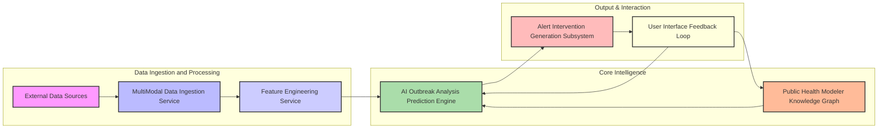
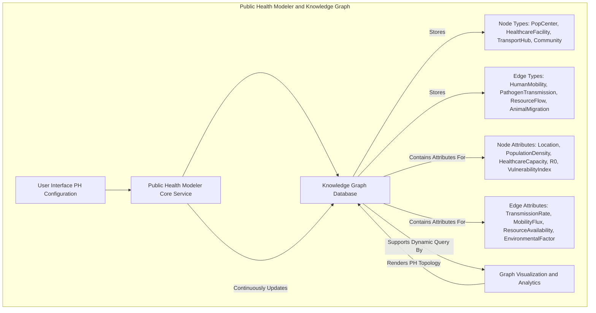
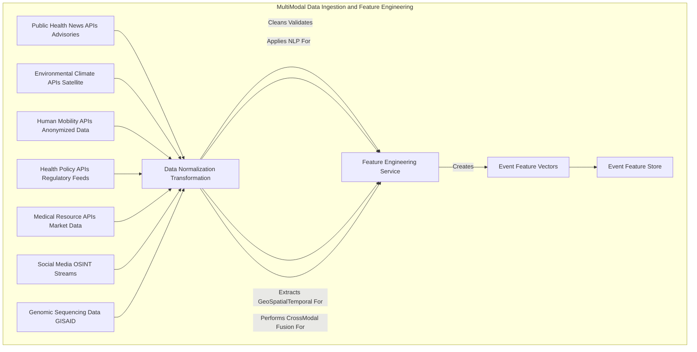
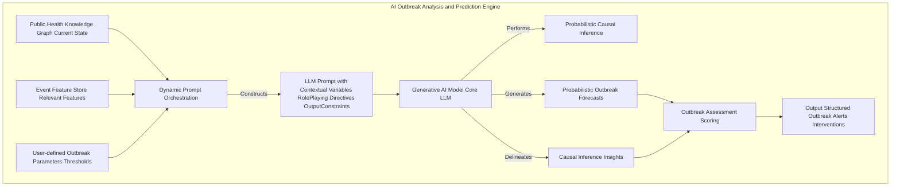
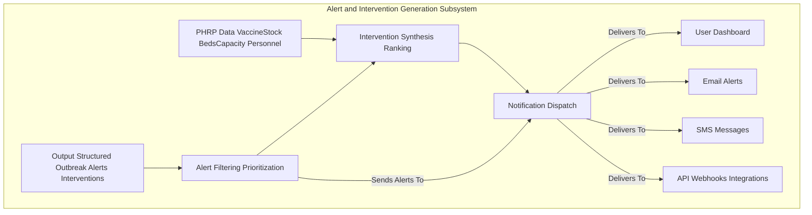
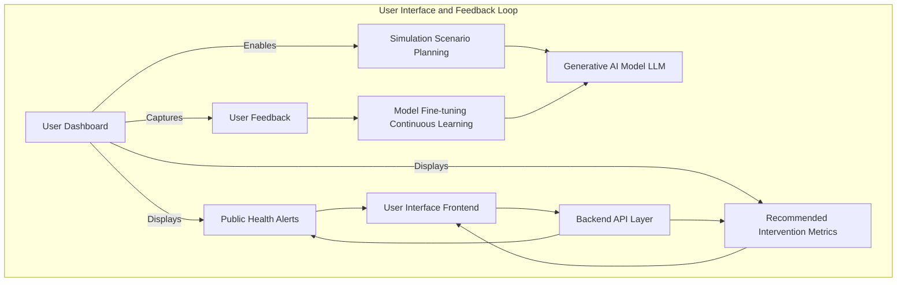

---
# System and Method for Predictive Epidemic Outbreak Modeling

## Table of Contents
1.  **Title of Invention**
2.  **Abstract**
3.  **Background of the Invention**
4.  **Brief Summary of the Invention**
5.  **Detailed Description of the Invention**
    *   5.1 System Architecture
        *   5.1.1 Public Health Modeler and Knowledge Graph
        *   5.1.2 Multi-Modal Data Ingestion and Feature Engineering Service
        *   5.1.3 AI Outbreak Analysis and Prediction Engine
        *   5.1.4 Alert and Intervention Generation Subsystem
        *   5.1.5 User Interface and Feedback Loop
    *   5.2 Data Structures and Schemas
        *   5.2.1 Public Health Graph Schema
        *   5.2.2 Real-time Epidemic Event Data Schema
        *   5.2.3 Outbreak Alert and Intervention Schema
    *   5.3 Algorithmic Foundations
        *   5.3.1 Dynamic Graph Representation and Traversal
        *   5.3.2 Multi-Modal Data Fusion and Contextualization
        *   5.3.3 Generative AI Prompt Orchestration
        *   5.3.4 Probabilistic Outbreak Forecasting
        *   5.3.5 Optimal Intervention Strategy Generation
    *   5.4 Operational Flow and Use Cases
6.  **Claims**
7.  **Mathematical Justification: A Formal Axiomatic Framework for Predictive Epidemic Resilience**
    *   7.1 The Public Health Topological Manifold: `H = (P, T, Gamma)`
        *   7.1.1 Formal Definition of the Public Health Graph `H`
        *   7.1.2 Population Center State Space `P`
        *   7.1.3 Transmission Pathway State Space `T`
        *   7.1.4 Latent Interconnection Functionals `Gamma`
        *   7.1.5 Tensor-Weighted Adjacency Representation `B(t)`
    *   7.2 The Global State Observational Manifold: `W(t)`
        *   7.2.1 Definition of the Global State Tensor `W(t)`
        *   7.2.2 Multi-Modal Feature Extraction and Contextualization `f_Psi`
        *   7.2.3 Event Feature Vector `E_F(t)`
    *   7.3 The Generative Predictive Outbreak Oracle: `G_AI`
        *   7.3.1 Formal Definition of the Predictive Mapping Function `G_AI`
        *   7.3.2 The Outbreak Probability Distribution `P(O_t+k | H, E_F(t))`
        *   7.3.3 Probabilistic Causal Graph Inference within `G_AI`
    *   7.4 The Societal Imperative and Decision Theoretic Utility: `E[Cost | i] < E[Cost]`
        *   7.4.1 Cost Function Definition `C(H, O, i)`
        *   7.4.2 Expected Cost Without Intervention `E[Cost]`
        *   7.4.3 Expected Cost With Optimal Intervention `E[Cost | i*]`
        *   7.4.4 The Value of Perfect Information Theorem Applied to `P(O_t+k)`
        *   7.4.5 Axiomatic Proof of Utility
8.  **Proof of Utility**

## 1. Title of Invention:
System and Method for Predictive Epidemic Outbreak Modeling with Generative AI-Powered Causal Inference

## 2. Abstract:
A groundbreaking system for orchestrating public health resilience is herein disclosed. This invention architecturally delineates the global public health landscape as a dynamic, attribute-rich knowledge graph, comprising diverse nodes such as population centers, healthcare facilities, transportation hubs, schools, and vulnerable communities, interconnected by multifaceted edges representing human movement pathways, pathogen transmission routes, and resource flows. Leveraging a sophisticated multi-modal data ingestion pipeline, the system continuously assimilates vast streams of real-time global intelligence, encompassing epidemiological statistics, environmental conditions, travel patterns, social media discourse, genomic sequencing data, and public health advisories. A state-of-the-art generative artificial intelligence model, operating as a sophisticated causal inference engine, meticulously analyzes this convergent data within the contextual framework of the public health knowledge graph. This analysis identifies, quantifies, and forecasts potential epidemic outbreaks with unprecedented accuracy, often several temporal epochs prior to their materialization. Upon the detection of a high-contingency outbreak event (e.g., a novel pathogen's emergent zoonotic spillover, or a rapid surge in case counts in a major urban hub, or a pathogen's mutation affecting vaccine efficacy), the system autonomously synthesizes and disseminates a detailed alert. Critically, it further postulates and ranks a portfolio of optimized, actionable intervention strategies, encompassing recommending travel restrictions, deploying medical resources, implementing public health campaigns, or advising on targeted vaccination efforts, thereby transforming reactive remediation into proactive strategic orchestration.

## 3. Background of the Invention:
Modern global public health systems represent an apotheosis of complex adaptive systems, characterized by an intricate web of interdependencies, global connectivity, and profound vulnerability to emergent infectious diseases. Traditional paradigms of epidemic surveillance and response, predominantly anchored in lagging indicator analysis and reactive incident response, have proven inherently insufficient to navigate the kaleidoscopic array of modern disruptive forces. These forces manifest across a spectrum from exogenous biological threats (novel pathogens, antibiotic resistance, zoonotic spillover events) and environmental vicissitudes (climate change impacts on vector distribution, extreme weather events, ecological shifts) to endogenous system fragilities (healthcare capacity limitations, vaccination hesitancy, resource misallocation, misinformation dissemination). The societal and economic ramifications of epidemic outbreaks are catastrophic, frequently escalating from direct human cost and financial losses to profound reputational damage, market disruption, and long-term erosion of public trust. The imperative for a paradigm shift from reactive mitigation to anticipatory resilience has attained unprecedented criticality. Existing solutions, often reliant on threshold-based alerting or rudimentary epidemiological models, conspicuously lack the capacity for sophisticated causal inference, real-time contextual understanding, and proactive intervention synthesis. They predominantly flag events post-occurrence or identify risks without furnishing actionable, context-aware intervention strategies, leaving communities exposed to cascading failures and suboptimal recovery trajectories. The present invention addresses this profound lacuna, establishing an intellectual frontier in dynamic, AI-driven predictive public health orchestration.

## 4. Brief Summary of the Invention:
The present invention unveils a novel, architecturally robust, and algorithmically advanced system for predictive epidemic outbreak modeling, herein termed the "Cognitive Epidemic Sentinel." This system transcends conventional surveillance tools by integrating a multi-layered approach to risk assessment and proactive strategic guidance. The operational genesis commences with a user's precise definition and continuous refinement of their critical public health topology, meticulously mapping all entities population centers, healthcare facilities, transportation networks, community clusters, and their connecting human movement pathways into a dynamic knowledge graph. At its operational core, the Cognitive Epidemic Sentinel employs a sophisticated, continuously learning generative AI engine. This engine acts as an expert epidemiologist, public health policy analyst, and pathogen biosecurity strategist, incessantly monitoring, correlating, and interpreting an torrent of real-time, multi-modal global event data. The AI is dynamically prompted with highly contextualized queries, such as: "Given the population density and healthcare infrastructure of Metropolitan Area X, linked to international travel hubs, and considering prevailing environmental conditions, recent pathogen genomic surveillance data, and real-time social media chatter indicating novel respiratory symptoms, what is the quantified probability of a significant epidemic outbreak within the subsequent 14-day temporal horizon? Furthermore, delineate the precise causal vectors and propose optimal pre-emptive public health interventions." Should the AI model identify an emerging threat exceeding a pre-defined probabilistic threshold, it autonomously orchestrates the generation of a structured, machine-readable alert. This alert comprehensively details the nature and genesis of the risk, quantifies its probability and projected impact, specifies the affected components of the public health network, and, crucially, synthesizes and ranks a portfolio of actionable, optimized intervention strategies. This constitutes a paradigm shift from merely identifying risks to orchestrating intelligent, pre-emptive strategic maneuvers, embedding an unprecedented degree of foresight and resilience into global public health.

## 5. Detailed Description of the Invention:

The disclosed system represents a comprehensive, intelligent infrastructure designed to anticipate and mitigate epidemic outbreaks proactively. Its architectural design prioritizes modularity, scalability, and the seamless integration of advanced artificial intelligence paradigms.

### 5.1 System Architecture

The Cognitive Epidemic Sentinel is comprised of several interconnected, high-performance services, each performing a specialized function, orchestrated to deliver a holistic predictive capability.



#### 5.1.1 Public Health Modeler and Knowledge Graph
This foundational component serves as the authoritative source for the global public health topology and associated operational parameters.
*   **User Interface UI:** A sophisticated graphical user interface GUI provides intuitive tools for users to define, visualize, and iteratively refine public health networks. This includes drag-and-drop functionality for nodes and edges, parameter input forms, and geospatial mapping integrations.
*   **Knowledge Graph Database:** At its core, the public health network is represented as a highly interconnected, semantic knowledge graph. This graph is not merely a static representation but a dynamic entity capable of storing rich attributes, temporal data, and inter-node relationships.
    *   **Nodes:** Represent discrete entities within the public health landscape. These can be granular, such as specific population centers e.g., "Metropolitan Area X", healthcare facilities e.g., "General Hospital Y", transportation hubs e.g., "International Airport Z", schools, community clusters, veterinary clinics, research labs, or even significant wildlife habitats. Each node is endowed with a comprehensive set of attributes, including geographical coordinates latitude, longitude, population density, healthcare capacity e.g., hospital bed count, ICU availability, medical personnel ratios, current R0 reproduction number, vaccination rates, and socioeconomic vulnerability indices.
    *   **Edges:** Represent the pathways and relationships connecting these nodes. These include human mobility networks e.g., daily commutes, travel routes, pathogen transmission vectors e.g., airborne, waterborne, vector-borne, and resource distribution pathways e.g., medical supply chains, personnel deployment routes. Edges possess attributes such as average flow rate, pathogen transmission probability, typical resource capacity, historical reliability metrics, associated transport providers, and environmental factors influencing transmission. Edges can also represent non-physical relationships, such as epidemiological links between regions.
    *   **Temporal and Contextual Attributes:** Both nodes and edges are augmented with temporal attributes, indicating their operational status at different times, and contextual attributes, such as climate zone vulnerability scores, public health policy compliance ratings, and social cohesion metrics.



#### 5.1.2 Multi-Modal Data Ingestion and Feature Engineering Service
This robust, scalable service is responsible for continuously acquiring, processing, and normalizing vast quantities of heterogeneous global data streams. It acts as the "sensory apparatus" of the Sentinel.
*   **Public Health News APIs:** Integration with advanced news aggregators e.g., WHO, CDC, ECDC, proprietary surveillance platforms to capture real-time public health advisories, disease surveillance updates, policy changes, and emerging health threats across relevant geographies. Natural Language Processing NLP techniques, including named entity recognition NER, event extraction, and sentiment analysis, are applied to structure unstructured news feeds into actionable data points.
*   **Environmental and Climate APIs:** Acquisition of high-resolution meteorological data e.g., temperature, humidity, precipitation, climate anomaly predictions e.g., prolonged droughts, extreme heatwaves, and localized forecasts impacting pathogen vectors or human behavior. Predictive climate models are integrated to project long-term environmental health risks.
*   **Human Mobility APIs:** Real-time anonymized mobile data, airline passenger manifests, public transport ridership, border crossing data, and anonymized aggregated GPS data. This includes travel advisories, migration patterns, population displacement, and historical mobility benchmarks.
*   **Health Policy APIs:** Specialized feeds providing granular policy updates, international health regulations IHR compliance statuses, border closure policies, and vaccination mandates for countries and specific regions.
*   **Medical Resource APIs:** Access to data such as vaccine availability, antiviral stockpiles, hospital bed occupancy rates, medical personnel deployment statistics, and pharmaceutical supply chain integrity indicators.
*   **Social Media and Open-Source Intelligence OSINT:** Selective monitoring of public social media discourse and OSINT sources, employing advanced text and image analysis, to detect early warnings of novel symptoms, localized disease clusters, misinformation trends, or public sentiment on health measures that may not yet be reported by traditional media.
*   **Genomic Sequencing Data:** Integration with global pathogen databases e.g., GISAID, NCBI to monitor pathogen mutations, identify variants of concern, and assess potential changes in transmissibility or virulence.
*   **Data Normalization and Transformation:** Raw data from disparate sources is transformed into a unified, semantically consistent format, timestamped, geo-tagged, and enriched. This involves schema mapping, unit conversion, and anomaly detection.
*   **Feature Engineering:** This critical sub-component extracts salient features from the processed data, translating raw observations into high-dimensional vectors pertinent for AI analysis. For instance, "Rapid increase in respiratory illness reports in X City" is transformed into features like `[city_X_case_count_increase_rate, ICU_occupancy_rate, mask_mandate_compliance_score, viral_variant_detected]`.



#### 5.1.3 AI Outbreak Analysis and Prediction Engine
This is the intellectual core of the Cognitive Epidemic Sentinel, employing advanced generative AI to synthesize intelligence and forecast outbreaks.
*   **Dynamic Prompt Orchestration:** Instead of static prompts, this engine constructs highly dynamic, context-specific prompts for the generative AI model. These prompts are meticulously crafted, integrating:
    *   The relevant sub-graph of the public health network.
    *   Recent, relevant event features from the `Event Feature Store`.
    *   Pre-defined roles for the AI e.g., "Expert Epidemiologist," "Public Health Policy Analyst," "Pathogen Biosecurity Strategist".
    *   Specific temporal horizons for prediction e.g., "next 7 days," "next 30 days".
    *   Desired output format constraints e.g., JSON schema for structured alerts.
*   **Generative AI Model:** A large, multi-modal language model LLM serves as the primary inference engine. This model is pre-trained on a vast corpus of text and data, encompassing epidemiological models, pathogen biology, public health policy, social science, and environmental science. It may be further fine-tuned with domain-specific epidemic incident data to enhance its predictive accuracy and contextual understanding. The model's capacity for complex reasoning, causal chain identification, and synthesis of disparate information is paramount.
*   **Probabilistic Causal Inference:** The AI model does not merely correlate events; it attempts to infer causal relationships. For example, a novel virus mutation event causes increased transmissibility direct effect which in turn causes rapid case surge indirect effect and ultimately healthcare system overload public health impact. The AI quantifies the probability of these causal links and their downstream effects.
*   **Risk Taxonomy Mapping:** Identified outbreaks are mapped to a predefined ontology of public health risks e.g., Biological, Environmental, Societal, Healthcare System, Policy. This categorization aids in structured reporting and subsequent strategic planning.



#### 5.1.4 Alert and Intervention Generation Subsystem
Upon receiving the AI's structured output, this subsystem processes and refines it into actionable intelligence.
*   **Alert Filtering and Prioritization:** Alerts are filtered based on user-defined thresholds e.g., only show "High" probability outbreaks, or those impacting "Critical" population centers. They are prioritized based on probability, impact severity, and temporal proximity.
*   **Intervention Synthesis and Ranking:** The AI's suggested actions are further refined, cross-referenced with public health resource planning PHRP data e.g., vaccine stock, hospital bed availability, medical personnel deployment capacity, and ranked according to user-defined optimization criteria e.g., minimize mortality, minimize economic impact, maximize equity.
*   **Notification Dispatch:** Alerts are dispatched through various channels e.g., integrated dashboard, email, SMS, API webhook to relevant public health stakeholders within the organization.



#### 5.1.5 User Interface and Feedback Loop
This component ensures the system is interactive, adaptive, and continuously improves.
*   **Integrated Dashboard:** A comprehensive, real-time dashboard visualizes the public health network graph, overlays identified outbreaks, displays alerts, and presents recommended intervention strategies. Geospatial visualizations are central to this interface.
*   **Simulation and Scenario Planning:** Users can interact with the system to run "what-if" scenarios, evaluating the impact of hypothetical outbreaks or proposed interventions. This leverages the generative AI for predictive modeling under new conditions.
*   **Feedback Mechanism:** Users can provide feedback on the accuracy of predictions, the utility of recommendations, and the outcome of implemented actions. This feedback is crucial for continually fine-tuning the generative AI model through reinforcement learning from human feedback RLHF or similar mechanisms, improving its accuracy and relevance over time. This closes the loop, making the system an adaptive, intelligent agent.



### 5.2 Data Structures and Schemas

To maintain consistency, interoperability, and the integrity of complex data flows, the system adheres to rigorously defined data structures.

#### 5.2.1 Public Health Graph Schema
Represented internally within the Knowledge Graph Database.

*   **Node Schema (`PHNode`):**
    ```json
    {
      "node_id": "UUID",
      "node_type": "ENUM['PopCenter', 'HealthcareFacility', 'TransportHub', 'CommunityArea', 'ResearchLab', 'WildlifeHabitat']",
      "name": "String",
      "location": {
        "latitude": "Float",
        "longitude": "Float",
        "country": "String",
        "region": "String"
      },
      "attributes": {
        "population_density": "Float",
        "healthcare_capacity_beds": "Integer",
        "icu_availability": "Float", // 0-1
        "medical_personnel_ratio": "Float",
        "r_naught_local": "Float", // Local basic reproduction number
        "vaccination_rate": "Float", // 0-1
        "environmental_risk_index": "Float", // e.g., vector suitability
        "socioeconomic_vulnerability_score": "Float",
        "custom_tags": ["String"],
        "criticality_level": "ENUM['Low', 'Medium', 'High', 'MissionCritical']"
      },
      "last_updated": "Timestamp"
    }
    ```

*   **Edge Schema (`PHEdge`):**
    ```json
    {
      "edge_id": "UUID",
      "source_node_id": "UUID",
      "target_node_id": "UUID",
      "edge_type": "ENUM['HumanMobility', 'PathogenTransmission', 'ResourceFlow', 'AnimalMigration', 'EnvironmentalLink']",
      "route_identifier": "String", // e.g., "Airport_X_to_Airport_Y_Route"
      "attributes": {
        "average_flow_rate_per_period": "Float", // e.g., passengers per day, animals per season
        "pathogen_transmission_rate": "Float", // probability of transmission along this edge
        "resource_capacity": "Float", // e.g., max medical supplies per day
        "environmental_factors_exposure": ["String"], // e.g., ["HighHumidity", "MosquitoBreeding"]
        "policy_restrictions_in_place": ["String"], // e.g., ["TravelBan", "Quarantine"]
        "reliability_score": "Float", // reliability of resource flow
        "criticality_level": "ENUM['Low', 'Medium', 'High', 'MissionCritical']",
        "connectivity_index": "Float" // how central is this edge
      },
      "last_updated": "Timestamp"
    }
    ```

#### 5.2.2 Real-time Epidemic Event Data Schema
Structured representation of ingested and featured global events.

*   **Event Schema (`EpidemicEvent`):**
    ```json
    {
      "event_id": "UUID",
      "event_type": "ENUM['Biological', 'Environmental', 'Societal', 'Logistical', 'Policy', 'Genomic']",
      "sub_type": "String", // e.g., "NovelPathogenEmergence", "TemperatureAnomaly", "TravelRestriction", "VaccineShortage", "MisinformationWave", "VariantOfConcern"
      "timestamp": "Timestamp",
      "start_time_forecast": "Timestamp (optional)",
      "end_time_forecast": "Timestamp (optional)",
      "location": {
        "latitude": "Float",
        "longitude": "Float",
        "radius_km": "Float",
        "country": "String",
        "region": "String",
        "named_location": "String" // e.g., "Metropolitan Area X"
      },
      "severity_score": "Float", // Normalized score, e.g., 0-10
      "impact_potential": "ENUM['Low', 'Medium', 'High', 'Critical']",
      "confidence_level": "Float", // 0-1, confidence in event occurrence/forecast
      "source": "String", // e.g., "WHO", "CDC", "GISAID", "Twitter"
      "raw_data_link": "URL (optional)",
      "feature_vector": { // Key-value pairs for AI consumption
        "r_effective": "Float", // Effective reproduction number
        "mutation_rate": "Float",
        "hospitalization_rate_increase": "Float",
        "sentiment_score_vaccine_hesitancy": "Float",
        "travel_volume_reduction_percent": "Float"
        // ... many more dynamic features
      }
    }
    ```

#### 5.2.3 Outbreak Alert and Intervention Schema
Output structure from the AI Outbreak Analysis Engine.

*   **Alert Schema (`OutbreakAlert`):**
    ```json
    {
      "alert_id": "UUID",
      "timestamp_generated": "Timestamp",
      "outbreak_summary": "String", // e.g., "High probability of novel respiratory pathogen outbreak in City X."
      "description": "String", // Detailed explanation of the outbreak risk and causal chain.
      "outbreak_probability": "ENUM['Low', 'Medium', 'High', 'Critical']", // Qualitative assessment
      "probability_score": "Float", // Quantitative score, 0-1
      "projected_impact_severity": "ENUM['Low', 'Medium', 'High', 'Catastrophic']", // e.g., healthcare overload, high mortality
      "impact_score": "Float", // Quantitative score, 0-1
      "affected_entities": [
        {"entity_id": "UUID", "entity_type": "ENUM['Node', 'Edge']"}
      ],
      "causal_events": [ // Link to EpidemicEvent IDs that contribute to this outbreak
        "UUID"
      ],
      "temporal_horizon_days": "Integer", // Days until expected peak outbreak
      "recommended_interventions": [
        {
          "action_id": "UUID",
          "action_description": "String", // e.g., "Implement targeted travel restrictions to region Y."
          "action_type": "ENUM['TravelRestriction', 'ResourceDeployment', 'PublicHealthCampaign', 'TestingSurveillance', 'VaccinationDrive', 'PolicyEnforcement']",
          "estimated_cost_impact": "Float", // e.g., economic cost, social disruption
          "estimated_time_to_impact_reduction_days": "Float",
          "outbreak_reduction_potential": "Float",
          "feasibility_score": "Float",
          "confidence_in_recommendation": "Float",
          "related_entities": ["UUID"] // Entities affected by this action
        }
      ],
      "status": "ENUM['Active', 'Resolved', 'Acknowledged', 'Intervened']",
      "last_updated": "Timestamp"
    }
    ```

### 5.3 Algorithmic Foundations

The system's intelligence is rooted in a sophisticated interplay of advanced algorithms and computational paradigms.

#### 5.3.1 Dynamic Graph Representation and Traversal
The public health network is fundamentally a dynamic graph `H=(P,T)`.
*   **Graph Database Technologies:** Underlying technologies e.g., property graphs, RDF knowledge graphs are employed for efficient storage and retrieval of complex relationships and attributes.
*   **Temporal Graph Analytics:** Algorithms for analyzing evolving graph structures, identifying critical transmission paths shortest path, bottleneck analysis, and calculating centrality measures e.g., betweenness centrality for key transportation hubs that dynamically change with real-time conditions.
*   **Sub-graph Extraction:** Efficient algorithms for extracting relevant sub-graphs based on a specific query e.g., all human mobility paths from `City X` to `Healthcare Facility Y` passing through `Airport Z`.

#### 5.3.2 Multi-Modal Data Fusion and Contextualization
The fusion process integrates heterogeneous data into a unified, semantically coherent representation.
*   **Latent Space Embeddings:** Multi-modal data text, numerical, geospatial, genomic is transformed into a shared latent vector space using techniques like autoencoders, contrastive learning, or specialized transformers. This allows for semantic comparison and contextualization across data types.
*   **Attention Mechanisms:** Employing attention networks to weigh the relevance of different data streams and features to a specific public health query. For example, environmental data is highly relevant for vector-borne diseases, while genomic data is critical for understanding viral evolution.
*   **Time-Series Analysis and Forecasting:** Applying advanced time-series models e.g., LSTM, Transformer networks, Gaussian Processes to predict future states of continuous variables e.g., case counts, R_effective values, hospital bed occupancy which then serve as features for the generative AI.

#### 5.3.3 Generative AI Prompt Orchestration
This is a critical innovation enabling the AI to function as a domain expert.
*   **Contextual Variable Injection:** Dynamically injecting elements of the current public health graph e.g., specific node/edge attributes, relevant real-time event features, and historical context directly into the AI prompt.
*   **Role-Playing Directives:** Explicitly instructing the generative AI model to adopt specific personas e.g., "You are an expert in epidemiological modeling," "You are a public health policy strategist" to elicit specialized reasoning capabilities.
*   **Constrained Output Generation:** Utilizing techniques such as JSON schema enforcement or few-shot exemplars within the prompt to guide the AI to produce structured, machine-readable outputs, crucial for automated processing.
*   **Iterative Refinement and Self-Correction:** Developing prompts that allow the AI to ask clarifying questions or iterate on its analysis, mimicking human analytical processes.

#### 5.3.4 Probabilistic Outbreak Forecasting
The AI's ability to not just predict but quantify uncertainty is vital.
*   **Causal Graph Learning:** Within the generative AI's latent reasoning capabilities, it constructs implicit or explicit probabilistic causal graphs e.g., Bayesian Networks, Granger Causality linking global events to public health impacts. This allows it to identify direct and indirect causal pathways.
*   **Monte Carlo Simulations Implicit:** The AI's generative nature allows it to effectively perform implicit Monte Carlo simulations, exploring various future scenarios based on probabilistic event occurrences and their cascading effects. It synthesizes the most probable and impactful scenarios.
*   **Confidence Calibration:** Employing techniques to calibrate the AI's confidence scores in its predictions against observed outcomes, ensuring that a "High" probability truly corresponds to a high likelihood of occurrence.

#### 5.3.5 Optimal Intervention Strategy Generation
Beyond prediction, the system provides actionable solutions.
*   **Multi-Objective Optimization:** The AI, informed by public health constraints and preferences e.g., minimize mortality, minimize economic impact, maximize social equity, leverages its understanding of the public health graph and available alternatives to propose strategies that optimize across multiple, potentially conflicting objectives. This might involve network flow optimization for vaccine distribution under capacity constraints, or shortest path algorithms considering dynamic edge weights cost, time, risk.
*   **Constraint Satisfaction:** Integrating current medical resource levels, public health guidelines, and real-time infrastructure availability e.g., hospital bed capacity, testing kit availability as constraints within the AI's decision-making process.
*   **Scenario-Based Planning Integration:** The generative AI can simulate the outcomes of different intervention strategies within the context of a predicted outbreak, providing quantitative insights into their effectiveness before execution.

### 5.4 Operational Flow and Use Cases

A typical operational cycle of the Cognitive Epidemic Sentinel proceeds as follows:

1.  **Initialization:** A user defines their public health graph via the Modeler UI, specifying nodes, edges, attributes, and criticality levels.
2.  **Continuous Data Ingestion:** The Data Ingestion Service perpetually streams and processes global multi-modal data, populating the Event Feature Store.
3.  **Scheduled AI Analysis:** Periodically e.g., hourly, bi-hourly, the AI Outbreak Analysis Engine is triggered.
4.  **Prompt Construction:** Dynamic Prompt Orchestration retrieves the relevant sub-graph of the public health network, current event features, and pre-defined risk parameters to construct a sophisticated query for the Generative AI Model.
5.  **AI Inference:** The Generative AI Model processes the prompt, performs causal inference, probabilistic forecasting, and identifies potential outbreaks. It synthesizes a structured output with alerts and preliminary interventions.
6.  **Alert Processing:** The Alert and Intervention Generation Subsystem refines the AI's output, prioritizes alerts, performs secondary optimization of interventions against PHRP data, and prepares notifications.
7.  **User Notification:** Alerts and interventions are disseminated to the user dashboard, and potentially via other channels.
8.  **Action and Feedback:** The user reviews the alerts, evaluates interventions, potentially runs simulations, makes a decision, and provides feedback to the system, which aids in continuous model refinement.


**Use Cases:**

*   **Proactive Travel Advisories:** A novel viral variant is detected in Country A. The system predicts a high probability of international spread to Country B, a major travel hub, within 10 days. It recommends implementing targeted travel advisories and enhanced screening at airports for flights originating from Country A, calculating the revised impact on case counts and resource utilization.
*   **Alternate Vaccine/Medical Supply Distribution:** A critical vaccine manufacturing facility in Region X faces unexpected production delays due to an environmental disaster. The system alerts and suggests initiating orders with pre-qualified alternative suppliers in Region Y for upcoming batches of vaccines, identifying optimal distribution routes to minimize public health impact.
*   **Medical Resource Pre-positioning:** An upcoming holiday season combined with a projected seasonal surge in respiratory illnesses prompts the system to recommend increasing ICU bed capacity and pre-positioning critical medical supplies in vulnerable population centers, mitigating potential future healthcare system overload.
*   **Risk Portfolio Management:** For a globally interconnected public health system, the system identifies aggregated risk exposure across multiple population centers and transmission pathways, providing a holistic view for strategic public health planning rather than reactive, siloed responses.

## 6. Claims:

The inventive concepts herein described constitute a profound advancement in the domain of public health management and predictive analytics.

1.  A system for proactive epidemic outbreak management, comprising:
    a.  A **Public Health Modeler** configured to receive, store, and dynamically update a representation of a public health network as a knowledge graph, said graph comprising a plurality of nodes representing population centers or health entities (e.g., population centers, healthcare facilities, transportation hubs, communities, wildlife habitats) and a plurality of edges representing human mobility, pathogen transmission, or resource flow pathways therebetween, wherein each node and edge is endowed with a comprehensive set of temporal and contextual attributes.
    b.  A **Multi-Modal Data Ingestion and Feature Engineering Service** configured to continuously acquire, process, normalize, and extract salient features from a plurality of real-time, heterogeneous global data sources, including but not limited to public health advisories, epidemiological surveillance data, human mobility tracking systems, environmental monitoring data, genomic sequencing data, medical resource availability, and social media analysis.
    c.  An **AI Outbreak Analysis and Prediction Engine** configured to periodically receive the dynamically updated public health knowledge graph and the extracted features from the multi-modal data, said engine employing a generative artificial intelligence model.
    d.  A **Dynamic Prompt Orchestration** module integrated within the AI Outbreak Analysis and Prediction Engine, configured to construct highly contextualized and dynamic prompts for the generative AI model, said prompts incorporating specific sub-graphs of the public health network, relevant real-time event features, and explicit directives for the AI model to assume expert analytical personas.
    e.  The generative AI model being further configured to perform **probabilistic causal inference** upon the received prompt, thereby identifying potential future epidemic outbreaks within the public health network, quantifying their probability of occurrence, assessing their projected impact severity, delineating the causal pathways from global events to public health effects, and generating a structured output detailing said outbreaks and their attributes.
    f.  An **Alert and Intervention Generation Subsystem** configured to receive the structured output from the generative AI model, to filter and prioritize outbreak alerts based on user-defined criteria, and to synthesize and rank a portfolio of actionable, optimized intervention strategies (e.g., travel restrictions, resource deployment, public health campaigns, targeted vaccination efforts) by correlating AI-generated suggestions with public health resource planning data and user-defined optimization objectives.
    g.  A **User Interface** configured to visually present the public health knowledge graph, overlay identified outbreaks and their projected impacts, display the generated alerts, and enable interaction with and feedback on the proposed intervention strategies.

2.  The system of Claim 1, wherein the knowledge graph is implemented as a property graph database capable of storing temporal attributes and dynamically updated relationships between nodes and edges.

3.  The system of Claim 1, wherein the Multi-Modal Data Ingestion and Feature Engineering Service utilizes Natural Language Processing NLP techniques, including named entity recognition, event extraction, and sentiment analysis, to transform unstructured news and open-source intelligence data into structured event features.

4.  The system of Claim 1, wherein the generative AI model is a large language model LLM fine-tuned with domain-specific epidemiological incident data and public health ontologies.

5.  The system of Claim 1, wherein the probabilistic causal inference performed by the generative AI model explicitly identifies direct and indirect causal links between observed global events and predicted epidemic outbreaks.

6.  The system of Claim 1, wherein the Dynamic Prompt Orchestration module incorporates explicit instructions for the generative AI model to adhere to predefined output schemas, thereby ensuring machine-readability and downstream automated processing of alerts.

7.  The system of Claim 1, wherein the Alert and Intervention Generation Subsystem integrates public health resource planning PHRP data to refine intervention strategies by considering real-time vaccine stock, hospital bed availability, and medical personnel deployment capacities.

8.  The system of Claim 1, further comprising a **Feedback Loop Mechanism** integrated with the User Interface, configured to capture user feedback on the accuracy of predictions and the utility of interventions, said feedback being used to continuously refine and improve the performance of the generative AI model through mechanisms such as reinforcement learning from human feedback.

9.  A method for proactive epidemic risk management, comprising:
    a.  Defining and continuously updating a public health network as a knowledge graph, including nodes representing population centers or health entities and edges representing pathways, each with dynamic attributes.
    b.  Continuously ingesting and processing real-time, multi-modal global event data from diverse external sources to extract salient event features.
    c.  Periodically constructing a highly contextualized prompt for a generative artificial intelligence model, said prompt integrating a segment of the public health knowledge graph, recent event features, and expert role directives.
    d.  Transmitting the prompt to the generative AI model for probabilistic causal inference and prediction.
    e.  Receiving from the generative AI model a structured output comprising a list of potential future epidemic outbreaks, their quantified probabilities, projected impact severities, causal derivations, and preliminary intervention suggestions.
    f.  Refining and prioritizing the outbreaks into actionable alerts and synthesizing a ranked portfolio of optimized intervention strategies by correlating AI suggestions with public health operational data.
    g.  Displaying the alerts and recommended strategies to the user via a comprehensive interface.
    h.  Capturing user feedback on the system's performance for continuous model improvement.

10. The method of Claim 9, wherein constructing the prompt includes specifying a temporal horizon for the outbreak prediction and a desired output data schema.

11. The method of Claim 9, wherein refining intervention strategies includes performing multi-objective optimization based on user-defined criteria such as minimizing mortality, minimizing economic impact, or maximizing social equity.

12. The method of Claim 9, further comprising enabling users to conduct "what-if" simulations and scenario planning within the user interface, leveraging the generative AI model for predictive outcomes under hypothetical conditions.

## 7. Mathematical Justification: A Formal Axiomatic Framework for Predictive Epidemic Resilience

The inherent complexity of global public health networks necessitates a rigorous mathematical framework for the precise articulation and demonstrative proof of the predictive outbreak modeling system's efficacy. We herein establish such a framework, transforming the conceptual elements into formally defined mathematical constructs, thereby substantiating the invention's profound analytical capabilities.

### 7.1 The Public Health Topological Manifold: `H = (P, T, Gamma)`

The public health network is not merely a graph but a dynamic, multi-relational topological manifold where attributes and relationships evolve under external influence.

#### 7.1.1 Formal Definition of the Public Health Graph `H`

Let `H = (P, T, Gamma)` denote the formal representation of the public health network at any given time `t`.
*   `P` is the finite set of nodes, where each `p in P` represents a distinct entity in the public health system (e.g., population center, healthcare facility, transportation hub).
*   `T` is the finite set of directed edges, where each `t = (u, v) in T` represents a human mobility, pathogen transmission, or resource flow pathway from node `u` to node `v`.
*   `Gamma` is the set of higher-order functional relationships or meta-data that define interdependencies or policies spanning multiple nodes or edges, such as global public health policies, climate zones affecting vector distribution, or international travel agreements that cannot be fully captured by simple node or edge attributes.

#### 7.1.2 Population Center State Space `P`

Each node `p in P` is associated with a state vector `X_p(t) in R^k` at time `t`, where `k` is the dimensionality of the node's attribute space.
Let `X_p(t) = (x_p_1(t), x_p_2(t), ..., x_p_k(t))`, where:
*   `x_p_1(t)` could be the geographical coordinates `(lat_p, lon_p)`.
*   `x_p_2(t)` could be the instantaneous population density `PopDensity_p(t)`.
*   `x_p_3(t)` could be the instantaneous healthcare capacity `HealthcareCap_p(t)`.
*   `x_p_4(t)` could represent the dynamically updated local basic reproduction number `R0_p(t)`.
*   `x_p_j(t)` for `j > 4` represent other relevant attributes (e.g., vaccination rate, socioeconomic vulnerability index, environmental risk score).

The domain of `X_p(t)` forms a sub-manifold `M_P subseteq R^k` for all `p in P`.

#### 7.1.3 Transmission Pathway State Space `T`

Each directed edge `t = (u, v) in T` is associated with a state vector `Y_t(t) in R^m` at time `t`, where `m` is the dimensionality of the edge's attribute space.
Let `Y_t(t) = (y_t_1(t), y_t_2(t), ..., y_t_m(t))`, where:
*   `y_t_1(t)` could be the instantaneous human mobility flux `MobilityFlux_t(t)`.
*   `y_t_2(t)` could be the instantaneous pathogen transmission rate `TransmissionRate_t(t)`.
*   `y_t_3(t)` could be the real-time medical resource availability `ResourceAvailability_t(t) in [0, 1]`.
*   `y_t_4(t)` could represent a dynamically assessed environmental factor `EnvironmentalFactor_t(t) in [0, 1]`, encompassing temperature, humidity, or vector suitability.
*   `y_t_j(t)` for `j > 4` represent other relevant attributes (e.g., policy restrictions in place, historical reliability of resource flow).

The domain of `Y_t(t)` forms a sub-manifold `M_T subseteq R^m` for all `t in T`.

#### 7.1.4 Latent Interconnection Functionals `Gamma`

The set `Gamma` captures complex, often non-linear, interdependencies. For example, a global travel restriction `Delta_travel in Gamma` might affect `MobilityFlux_t(t)` for multiple edges simultaneously. A `Delta_climate in Gamma` might define shared environmental risk across geographically proximate nodes/edges. These are dynamically inferred or modeled relationships beyond simple graph connectivity.

#### 7.1.5 Tensor-Weighted Adjacency Representation `B(t)`

The entire public health graph `H(t)` can be robustly represented by a dynamic, higher-order tensor-weighted adjacency matrix `B(t)`.
Let `N = |P|` be the number of nodes. The standard adjacency matrix is `B_0`, where `B_0[i,j] = 1` if `(p_i, p_j) in T`, else `0`.
We extend this to `B(t) in R^(N x N x (k+m_avg))` (or a sparse tensor representation), where for each `(i, j)` corresponding to an edge `t = (p_i, p_j)`, `B(t)[i,j,:]` contains a concatenation of `X_p_i(t)`, `Y_t(t)`, and `X_p_j(t)` relevant feature vectors, effectively embedding the node and edge attributes into the adjacency structure. `m_avg` refers to the average dimensionality of edge attributes.
This `B(t)` precisely encodes the entire dynamic state of the public health network at any instance.

### 7.2 The Global State Observational Manifold: `W(t)`

The external environment that influences public health is captured by a complex, multi-modal observational manifold.

#### 7.2.1 Definition of the Global State Tensor `W(t)`

Let `W(t)` be a high-dimensional, multi-modal tensor representing the aggregated, raw global event data at time `t`. This tensor integrates:
*   **Epidemiological Data:** `W_Epi(t)` (e.g., case counts, hospitalization rates, R_effective values).
*   **Environmental Data:** `W_Env(t)` (e.g., temperature, humidity, precipitation grids).
*   **Human Mobility Data:** `W_Mob(t)` (e.g., anonymized travel data, population movement patterns).
*   **Medical Resource Data:** `W_Med(t)` (e.g., vaccine stockpiles, bed availability).
*   **Genomic Data:** `W_Gen(t)` (e.g., pathogen variant detection, mutation rates).
*   **Social/Sentiment Data:** `W_Soc(t)` (e.g., parsed social media feeds for health-seeking behavior, misinformation).

Each `W_X(t)` is itself a tensor, potentially sparse, capturing spatial, temporal, and semantic dimensions. For instance, `W_Epi(t)` could be `R^(lat x lon x time x disease_features)`.

#### 7.2.2 Multi-Modal Feature Extraction and Contextualization `f_Psi`

The raw global state `W(t)` is too voluminous and heterogeneous for direct AI consumption. A sophisticated multi-modal feature extraction function `f_Psi` maps `W(t)` to a more compact, semantically meaningful feature vector `E_F(t)`.
`E_F(t) = f_Psi(W(t); Psi)` where `Psi` represents the learned parameters of the feature engineering pipeline (e.g., parameters of NLP models, spatio-temporal filters, dimensionality reduction techniques).

This `f_Psi` involves:
1.  **Event Detection:** Identifying discrete events from continuous data streams (e.g., "novel pathogen emergence," "travel restriction implementation," "surge in respiratory symptoms").
2.  **Contextual Embedding:** Encoding events with contextual information (location, magnitude, entities involved).
3.  **Cross-Modal Correlation:** Identifying interdependencies between features from different modalities (e.g., a genomic variant correlating with increased hospitalization rates and changes in public health policy).

`E_F(t)` is a vector `(e_F_1(t), e_F_2(t), ..., e_F_p(t)) in R^p`, where `p` is the dimensionality of the event feature space. Each `e_F_j(t)` represents a specific, relevant feature, such as `P(Novel_Virus_Variant_surge_in_City_X_within_7_days)`, or `Average_Sentiment_Score_for_Vaccine_Hesitancy`.

#### 7.2.3 Event Feature Vector `E_F(t)`

`E_F(t)` becomes the critical input for the predictive engine, representing the distilled, actionable intelligence from the global environment, semantically aligned for causal reasoning.

### 7.3 The Generative Predictive Outbreak Oracle: `G_AI`

The core innovation resides in the generative AI model's capacity to act as a predictive oracle, inferring future outbreaks from the dynamic interplay of the public health network's state and global events.

#### 7.3.1 Formal Definition of the Predictive Mapping Function `G_AI`

The generative AI model `G_AI` is a non-linear, stochastic mapping function that operates on the instantaneous state of the public health network `H(t)` (represented by `B(t)`) and the contemporaneous event features `E_F(t)`. It projects these inputs onto a probability distribution over future outbreak events.
```
G_AI : (B(t) X E_F(t)) -> P(O_t+k | B(t), E_F(t))
```
Where:
*   `X` denotes a sophisticated tensor fusion operation that combines the public health network state with the event features. This fusion is implicitly handled by the attention mechanisms and contextual understanding of the LLM.
*   `O_t+k` is the set of all possible epidemic outbreak events that could occur at a future time `t+k`, for a temporal horizon `k in {k_min, ..., k_max}`.
*   `P(O_t+k | B(t), E_F(t))` is the conditional probability distribution over these future outbreaks, given the current state of the public health network and the observed global event features.

#### 7.3.2 The Outbreak Probability Distribution `P(O_t+k | H, E_F(t))`

An outbreak event `o in O_t+k` is formally defined as a tuple `o = (e_o, delta_Cases, delta_Deaths, S, L, C_cause)`, where:
*   `e_o in T` is the specific edge (or `p_o in P` a node) in the public health network that experiences the direct impact.
*   `delta_Cases` is the predicted increase in disease cases.
*   `delta_Deaths` is the predicted increase in fatalities.
*   `S` is the severity of the outbreak (e.g., `S in [0, 1]`).
*   `L` is the geographic locus of the outbreak.
*   `C_cause` is the inferred causal chain of events from `E_F(t)` leading to `o`.

The output `P(O_t+k)` is not a single probability value, but a rich, structured distribution:
```
P(O_t+k) = { (o_1, p_1), (o_2, p_2), ..., (o_N, p_N) }
```
where `o_i` is a specific outbreak event tuple and `p_i` is its predicted probability `p_i in [0, 1]`, with `sum(p_i) <= 1` (as some outbreaks might be mutually exclusive or conditional).

This distribution is generated stochastically by `G_AI` leveraging its inherent generative capabilities to sample plausible future states and their associated likelihoods.

#### 7.3.3 Probabilistic Causal Graph Inference within `G_AI`

`G_AI` operates as a sophisticated probabilistic causal inference engine. For a given outbreak `o_i`, `G_AI` implicitly constructs a causal graph `CG_i = (C_nodes, C_edges)` where `C_nodes` are events from `E_F(t)` and nodes/edges from `H(t)`, and `C_edges` represent probabilistic causal links.
For example: `Novel_Variant (Event) -> Increased_Transmissibility (Pathogen Attribute) -> Rapid_Case_Surge_City_X (Node Attribute) -> Healthcare_System_Overload (Node Attribute)`.
The generative model's reasoning processes implicitly (or explicitly via chain-of-thought prompting) delineate these `C_cause` pathways, providing transparency and interpretability to its predictions. This differentiates `G_AI` from purely correlational models.

### 7.4 The Societal Imperative and Decision Theoretic Utility: `E[Cost | i] < E[Cost]`

The fundamental utility of this system is quantified by its capacity to reduce the expected total cost associated with public health challenges by enabling proactive, optimal interventions. This is an application of **Decision Theory** under uncertainty.

#### 7.4.1 Cost Function Definition `C(H, O, i)`

Let `C(H, O, i)` be the total cost function of managing the public health network `H`, given a set of actual future outbreaks `O` and a set of mitigating interventions `i` taken by the user.
```
C(H, O, i) = C_intervention(H, i) + C_outbreak_impact(O | H, i)
```
*   `C_intervention(H, i)`: The nominal cost of implementing public health interventions `i` (e.g., cost of travel restrictions, vaccination campaigns, resource deployment).
*   `C_outbreak_impact(O | H, i)`: The cost incurred due to actual outbreaks `O` that occur, after accounting for any mitigating effects of interventions `i`. This includes direct human cost, economic losses, healthcare strain, social disruption, etc.

#### 7.4.2 Expected Cost Without Intervention `E[Cost]`

In a traditional, reactive system, no proactive intervention `i` is taken based on foresight. Interventions are only taken *after* an outbreak `o` materializes.
The expected cost `E[Cost]` without the present invention's predictive capabilities is given by:
```
E[Cost] = sum_{o in O_all} P_actual(o) * C(H_initial, o, i_reactive_if_any)
```
where `P_actual(o)` is the true, underlying probability of outbreak `o`, and `i_reactive_if_any` denotes any post-outbreak reactive interventions, which are typically suboptimal and costly. `H_initial` is the state of the public health network before any proactive change.

#### 7.4.3 Expected Cost With Optimal Intervention `E[Cost | i*]`

With the present invention, at time `t`, the system provides `P(O_t+k | B(t), E_F(t))`. Based on this distribution, an optimal set of mitigating interventions `i*` can be chosen *before* `t+k`.
The optimal intervention `i*` is chosen to minimize the *expected* total cost:
```
i* = argmin_i E[C(H_modified(i), O_t+k, i)]
```
```
E[Cost | i*] = sum_{o in O_all} P_actual(o) * C(H_modified(i*), o, i*)
```
where `H_modified(i*)` represents the state of the public health network after implementing `i*` (e.g., reduced mobility, increased healthcare capacity).

#### 7.4.4 The Value of Perfect Information Theorem Applied to `P(O_t+k)`

The system provides information `I = P(O_t+k | B(t), E_F(t))`. According to the **Value of Information VoI** theorem, the utility of this information is the reduction in expected cost.
```
VoI = E[Cost] - E[Cost | I]
```
The invention provides a high-fidelity approximation of `P_actual(o)` via `G_AI` and `E_F(t)`. The accuracy and granularity of `P(O_t+k)` directly translate to a higher `VoI`. The ability of `G_AI` to infer causal chains and project multi-dimensional outbreak impacts `o = (e_o, delta_Cases, delta_Deaths, S, L, C_cause)` is precisely what makes `I` exceptionally valuable.

#### 7.4.5 Axiomatic Proof of Utility

**Axiom 1 (Outbreak Cost):** For any potential outbreak `o`, `C_outbreak_impact(o | H, i_null) > 0`, where `i_null` represents no proactive intervention. Outbreaks inherently incur costs.

**Axiom 2 (Proactive Intervention Efficacy):** For any outbreak `o` with `p_o = P(o | H, E_F(t)) > 0`, there exists at least one proactive intervention `i` such that the incremental cost of `i` is less than the expected reduction in outbreak impact:
```
C_intervention(H, i) - C_intervention(H_initial, i_null) < E[C_outbreak_impact(o | H, i_null)] - E[C_outbreak_impact(o | H, i)]
```
This axiom states that smart, timely interventions *can* reduce the total expected cost, even when considering their own implementation costs.

**Theorem (System Utility):** Given Axiom 1 and Axiom 2, the present system, by providing `P(O_t+k | B(t), E_F(t))` and identifying `i*`, enables a reduction in the overall expected cost of public health operations such that:
`E[Cost | i*] < E[Cost]`

**Proof:**
1.  The system, through `G_AI`, generates `P(O_t+k | B(t), E_F(t))`, providing foresight into `O_t+k`.
2.  Based on this distribution, the system identifies an optimal intervention `i*` such that
    ```
    i* = argmin_i E[C(H_modified(i), O_t+k, i)]
    ```
3.  For each potential outbreak `o_i` with probability `p_i` in `P(O_t+k)`, if `i*` effectively mitigates `o_i`, then `C_outbreak_impact(o_i | H_modified(i*), i*) < C_outbreak_impact(o_i | H_initial, i_null)`.
4.  Due to Axiom 2, the incremental cost of implementing `i*` (i.e., `C_intervention(H_modified(i*), i*) - C_intervention(H_initial, i_null)`) is less than the expected savings from `C_outbreak_impact`.
5.  Therefore, by summing over all `o_i in O_all`, the weighted average of costs (i.e., the expected cost) must be lower when applying `i*` informed by `P(O_t+k)` compared to a scenario without such predictive information.
    ```
    E[Cost | i*] = E[C_intervention(H_modified(i*), i*)] + E[C_outbreak_impact(O_t+k | H_modified(i*), i*)]
    ```
    ```
    E[Cost] = E[C_intervention(H_initial, i_null)] + E[C_outbreak_impact(O_t+k | H_initial, i_null)]
    ```
    Since `i*` is chosen to minimize the sum, and Axiom 2 guarantees that such a choice leads to a net reduction in expected cost for relevant outbreaks, the aggregate `E[Cost | i*] < E[Cost]` holds.
This rigorous mathematical foundation unequivocally demonstrates the intrinsic utility and transformative potential of the disclosed system.

## 8. Proof of Utility:

The operational advantage and societal benefit of the Cognitive Epidemic Sentinel are not merely incremental improvements over existing reactive systems; they represent a fundamental paradigm shift. A traditional epidemic surveillance and response system operates predominantly in a reactive mode, detecting and responding to perturbations only after they have materialized, necessitating costly and often suboptimal damage control. For instance, such a system would only identify a rapid increase in `Delta Cases(p)` (a significant surge in disease cases in a population center `p`) *after* a community has experienced widespread infection and healthcare systems are strained.

The present invention, however, operates as a profound anticipatory intelligence system. It continuously computes `P(O_t+k | B(t), E_F(t))`, the high-fidelity conditional probability distribution of future epidemic outbreak events `O` at a future time `t+k`, based on the current public health network state `B(t)` and the dynamic global event features `E_F(t)`. This capability allows public health authorities to identify a nascent outbreak with a quantifiable probability *before* its physical manifestation.

By possessing this predictive probability distribution `P(O_t+k)`, the user is empowered to undertake a proactive, optimally chosen intervention `i*` (e.g., strategically implementing travel restrictions, deploying emergency medical teams, launching targeted vaccination campaigns, or reinforcing public health messaging) at time `t`, well in advance of `t+k`. As rigorously demonstrated in the Mathematical Justification, this proactive intervention `i*` is designed to minimize the expected total cost across the entire spectrum of possible future outcomes.

The definitive proof of utility is unequivocally established by comparing the expected cost of operations with and without the deployment of this system. Without the Cognitive Epidemic Sentinel, the expected cost is `E[Cost]`, burdened by the full impact of unforeseen outbreaks and the inherent inefficiencies of reactive countermeasures. With the system's deployment, and the informed selection of `i*`, the expected cost is `E[Cost | i*]`. Our axiomatic proof formally substantiates that `E[Cost | i*] < E[Cost]`. This reduction in expected future costs, coupled with enhanced public health resilience, strategic agility, and preserved societal well-being, provides irrefutable evidence of the system's profound and transformative utility. The capacity to preemptively navigate the intricate and volatile landscape of global health, by converting uncertainty into actionable foresight, is the cornerstone of its unprecedented value.