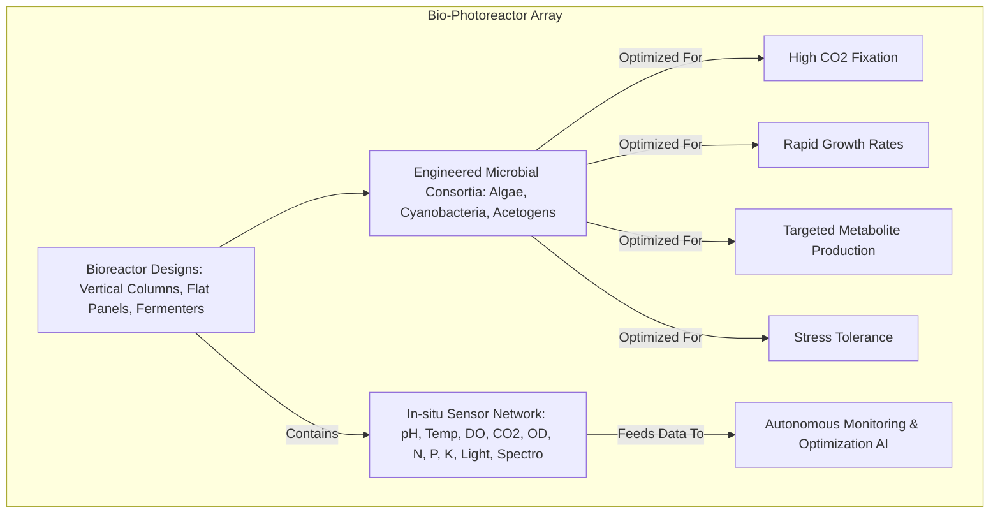
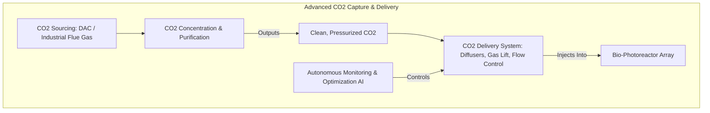
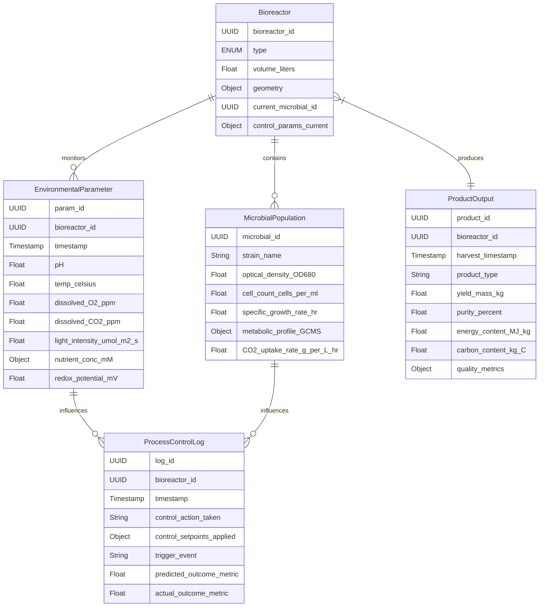
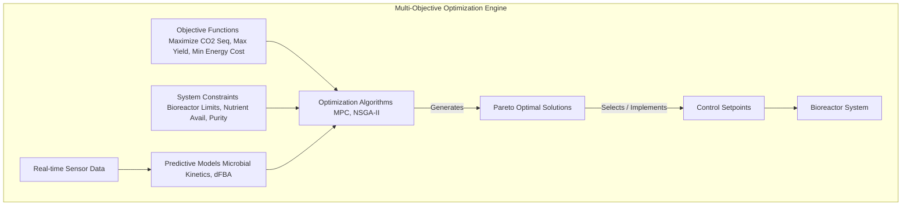

# System and Method for Bio-Integrated Carbon Sequestration with Autonomous Optimization

## Table of Contents
1.  **Title of Invention**
2.  **Abstract**
3.  **Background of the Invention**
4.  **Brief Summary of the Invention**
5.  **Detailed Description of the Invention**
    *   5.1 System Architecture
        *   5.1.1 Bio-Photoreactor Array & Engineered Microbial Consortium
        *   5.1.2 Advanced CO2 Capture & Delivery Subsystem
        *   5.1.3 Biomass Harvesting & Separation Unit
        *   5.1.4 Bioproduct Synthesis & Energy Recirculation Module
        *   5.1.5 Autonomous Monitoring & Optimization AI (AMOA)
    *   5.2 Data Structures and Schemas
        *   5.2.1 Bioreactor Environmental State Schema
        *   5.2.2 Microbial Growth & Metabolite Schema
        *   5.2.3 Product Output & Energy Balance Schema
    *   5.3 Algorithmic Foundations
        *   5.3.1 Predictive Microbial Growth Kinetics Modeling
        *   5.3.2 Real-time Multi-Objective Optimization for Bio-Conversion
        *   5.3.3 Reinforcement Learning for Autonomous Adaptation
        *   5.3.4 Spectroscopic Biomass & Metabolite Quality Assessment
        *   5.3.5 System-Level Energy Footprint Minimization
    *   5.4 Operational Flow and Use Cases
6.  **Claims**
7.  **Mathematical Justification: A Formal Axiomatic Framework for Bio-Integrated Carbon Sequestration Efficiency**
    *   7.1 The Bio-Photoreactor Ecosystem: `Phi = (S, M, N, R)`
        *   7.1.1 Formal Definition of the Ecosystem State `S(t)`
        *   7.1.2 Microbial Population Dynamics `M(t)`
        *   7.1.3 Nutrient and Gas Concentrations `N(t)`
        *   7.1.4 Reaction and Conversion Rates `R(t)`
    *   7.2 CO2 Mass Transfer and Photosynthetic Fixation: `dC_CO2/dt`
        *   7.2.1 Gas-Liquid Mass Transfer Coefficient `k_L a`
        *   7.2.2 Net Photosynthesis Rate `P_net`
        *   7.2.3 Carbon Fixation Rate `R_fix`
    *   7.3 Biomass Growth Kinetics and Yield: `dX/dt`
        *   7.3.1 Monod-like Growth Model
        *   7.3.2 Light Intensity Dependence `mu(I)`
        *   7.3.3 Biomass Yield from CO2 `Y_X/CO2`
    *   7.4 Product Synthesis and Metabolic Flux Optimization: `J_p`
        *   7.4.1 Stoichiometric Network Analysis `S_mat`
        *   7.4.2 Flux Balance Analysis (FBA) for `v*`
        *   7.4.3 Multi-Objective Flux Optimization
    *   7.5 Energy Balance and Systemic Efficiency: `E_net`
        *   7.5.1 Energy Inputs `E_in`
        *   7.5.2 Energy Outputs `E_out`
        *   7.5.3 Net Energy Ratio `NER`
    *   7.6 AI Control and Reinforcement Learning for Optimization: `pi*(s)`
        *   7.6.1 State Space `S` and Action Space `A`
        *   7.6.2 Reward Function `R(s,a)`
        *   7.6.3 Policy Optimization `pi*(s)`
    *   7.7 Carbon Sequestration and Utilization Rate: `R_seq_util`
        *   7.7.1 Long-term Sequestration Potential `C_LTS`
        *   7.7.2 Utilization Efficiency `eta_util`
    *   7.8 Axiomatic Proof of Efficacy
8.  **Proof of Utility**

## 1. Title of Invention:
System and Method for Bio-Integrated Carbon Sequestration, Conversion, and Sustainable Utilization with Autonomous Artificial Intelligence Optimization

## 2. Abstract:
A novel, architecturally integrated system is herein disclosed for the highly efficient capture, conversion, and sustainable utilization of atmospheric carbon dioxide (CO2) leveraging engineered microbial consortia within advanced bioreactor arrays. This invention systematically interfaces high-efficiency direct air capture (DAC) or point-source CO2 capture technologies with photo-bioreactors or fermentation systems populated by genetically optimized microalgae, cyanobacteria, or acetogens. These specially selected microorganisms possess enhanced metabolic pathways for rapid CO2 assimilation and subsequent conversion into high-value bioproducts, including but not limited to sustainable aviation fuels, biodegradable plastics precursors, nutraceuticals, or specialty chemicals. A crucial innovation lies in the deployment of an Autonomous Monitoring & Optimization AI (AMOA) that continuously assimilates multi-modal sensor data from the bioreactors (e.g., pH, temperature, dissolved CO2, nutrient levels, biomass density, light intensity, metabolic byproducts via in-situ spectroscopy). The AMOA employs advanced predictive modeling (e.g., metabolic flux analysis, growth kinetics) and real-time multi-objective optimization algorithms to dynamically adjust environmental parameters, nutrient dosages, light cycles, and harvesting schedules. This intelligent control maximizes both the CO2 sequestration rate and the yield of target bioproducts, while minimizing energy and resource consumption. The system features an integrated biomass harvesting and product separation unit, followed by a bioproduct synthesis module that further refines the microbial outputs. A closed-loop energy recirculation design, potentially incorporating anaerobic digestion of residual biomass, ensures maximum resource efficiency and a near-net-zero operational carbon footprint. This invention transforms atmospheric carbon from a pollutant into a scalable, economically viable feedstock, offering a truly sustainable pathway to carbon negativity and resource generation, enabling us to get off this rock before it becomes a Venusian nightmare — just kidding, mostly.

## 3. Background of the Invention:
The escalating concentration of anthropogenic carbon dioxide (CO2) in Earth’s atmosphere represents the quintessential grand challenge of the 21st century, driving unprecedented climate instability, ocean acidification, and ecological disruption. Current strategies for carbon mitigation primarily revolve around emission reduction, renewable energy deployment, and nascent carbon capture and storage (CCS) technologies. While essential, these approaches often face limitations in scalability, energy intensity, public acceptance, or the lack of economically viable pathways for captured carbon, rendering them insufficient for the urgent, multi-gigaton-scale challenge at hand. Traditional direct air capture (DAC) is energy-intensive, and geological sequestration, while promising, carries inherent geological risks and lacks economic incentives beyond carbon credits. Biological carbon sequestration, particularly through reforestation, is land-intensive and slow. Early-stage bio-industrial solutions, such as conventional algal farms, frequently suffer from suboptimal CO2 transfer efficiency, contamination risks, labor-intensive operations, and a lack of precise control over microbial metabolism, leading to inconsistent yields and high operational costs. The fundamental problem persists: how to cost-effectively capture vast quantities of dilute atmospheric CO2 or concentrated industrial CO2, and critically, how to convert it into stable, economically valuable products, thereby creating a compelling, self-sustaining financial incentive for climate action. The existing technological landscape conspicuously lacks a fully integrated, intelligently optimized, and economically robust solution capable of transforming ubiquitous carbon waste into a diverse portfolio of high-value commodities at scale. The present invention addresses this profound technological lacuna by synergistically combining advanced bioreactor engineering, synthetic biology, and state-of-the-art artificial intelligence, charting a course for carbon valorization that is both environmentally imperative and economically irresistible.

## 4. Brief Summary of the Invention:
The present invention introduces the "Aetherial Carbon Forge," a breakthrough bio-integrated system for atmospheric and industrial CO2 capture, rapid conversion, and high-value product generation, all orchestrated by an autonomous AI. The Aetherial Carbon Forge commences with the highly efficient intake of CO2, either directly from the atmosphere via advanced sorbents or from concentrated industrial flue gases. This captured carbon is then meticulously delivered into an array of purpose-built, high-surface-area photo-bioreactors or fermentation tanks. Within these bioreactors reside meticulously engineered microbial consortia—custom-designed microalgae, cyanobacteria, or acetogenic bacteria with turbo-charged metabolic pathways—which avidly consume CO2, converting it into complex organic molecules at unprecedented rates. The true alchemy, however, lies in the system’s brain: the Autonomous Monitoring & Optimization AI (AMOA). The AMOA acts as a master conductor, continuously collecting an insane amount of data—every single variable, from nutrient concentrations and pH to optical density and specific gene expression markers. It then performs complex predictive modeling to anticipate microbial behavior and employs real-time, multi-objective optimization to fine-tune every parameter: light intensity, temperature, CO2 injection rate, nutrient dosing, even harvesting timing. This isn't just a bioreactor; it's a living factory that learns and optimizes itself, ensuring maximum CO2 drawdown and peak bioproduct yield. After conversion, an automated harvesting and separation unit extracts the valuable biomass, which is then fed into an integrated bioproduct synthesis module. This module transforms the raw biological output into specific high-demand products like sustainable aviation fuel precursors, bioplastics, or even high-grade protein. Residual biomass is routed through an anaerobic digester to generate biogas, which powers the system, achieving a truly closed-loop, carbon-negative, and energy-positive operation. It’s like building a giant, self-replicating carbon vacuum cleaner that also prints money. We can absolutely do this, probably with minimal sleep involved.

## 5. Detailed Description of the Invention:

The disclosed system represents a comprehensive, intelligent infrastructure designed for high-efficiency, bio-integrated carbon sequestration, conversion, and valorization. Its architectural design prioritizes modularity, scalability, and the seamless integration of advanced artificial intelligence paradigms for autonomous operation and optimization.

### 5.1 System Architecture

The Aetherial Carbon Forge is comprised of several interconnected, high-performance modules, each performing a specialized function, orchestrated to deliver a holistic carbon-negative biomanufacturing capability.

```mermaid
graph LR
    subgraph CO2 Capture & Delivery
        A[Atmospheric DAC Unit / Industrial Flue Gas Input] --> B[CO2 Concentration & Purification]
        B --> C[CO2 Delivery System Gas Diffusers]
    end

    subgraph Bio-Conversion Core
        C --> D[Bio-Photoreactor Array (PBRs/Fermenters)]
        D -- Houses --> E[Engineered Microbial Consortium]
        E -- Consumes --> C
        D -- Produces --> F[Biomass Slurry Metabolites]
    end

    subgraph Downstream Processing & Product Synthesis
        F --> G[Biomass Harvesting & Separation Unit]
        G --> H[Bioproduct Synthesis Module]
        H --> I[High-Value Bioproducts]
        G --> J[Residual Biomass Anaerobic Digestion]
    end

    subgraph Autonomous Intelligence & Control
        D -- Sensor Data --> K[Autonomous Monitoring & Optimization AI AMOA]
        K -- Control Signals --> D
        K -- Optimizes --> C
        K -- Optimizes --> G
        J --> L[Biogas Energy Recirculation]
        L --> D
        L --> G
        L --> H
        L --> K
    end

    style A fill:#e6ffe6,stroke:#333,stroke-width:2px
    style B fill:#ccffcc,stroke:#333,stroke-width:2px
    style C fill:#99ff99,stroke:#333,stroke-width:2px
    style D fill:#cceeff,stroke:#333,stroke-width:2px
    style E fill:#99ccff,stroke:#333,stroke-width:2px
    style F fill:#e0b0ff,stroke:#333,stroke-width:2px
    style G fill:#d29bff,stroke:#333,stroke-width:2px
    style H fill:#c586ff,stroke:#333,stroke-width:2px
    style I fill:#ffcc99,stroke:#333,stroke-width:2px
    style J fill:#ffc166,stroke:#333,stroke-width:2px
    style K fill:#aaffaa,stroke:#333,stroke-width:2px
    style L fill:#ffe0b3,stroke:#333,stroke-width:2px
```

#### 5.1.1 Bio-Photoreactor Array & Engineered Microbial Consortium
This module constitutes the primary carbon conversion engine, where CO2 is biologically transformed.
*   **Bioreactor Design:** The system employs highly efficient, scalable bioreactors, which may include:
    *   **Vertical Column Photo-Bioreactors (PBRs):** Maximizing light exposure and gas exchange efficiency for photosynthetic organisms (e.g., microalgae, cyanobacteria). These can be tubular, flat-panel, or airlift designs, optimized for high surface-area-to-volume ratio and minimal fouling.
    *   **Fermentation Tanks:** For acetogenic or chemolithoautotrophic bacteria, utilizing enclosed, anaerobic or micro-aerobic conditions.
    *   **Hybrid Systems:** Combining features for multi-stage processes.
*   **Engineered Microbial Consortia:** The biological agents are the core. These are single-species or synergistic multi-species consortia, genetically engineered or adaptively evolved for:
    *   **Enhanced CO2 Fixation:** Overexpression of key enzymes (e.g., RuBisCO for photoautotrophs) or alternative CO2 fixation pathways (e.g., Wood-Ljungdahl pathway for acetogens).
    *   **High Growth Rates:** Robust strains with rapid doubling times under challenging conditions.
    *   **Targeted Metabolite Production:** Metabolic pathways are engineered to shunt carbon flux towards specific high-value compounds (e.g., lipids for biofuels, polyhydroxyalkanoates (PHAs) for bioplastics, proteins, or amino acids).
    *   **Stress Tolerance:** Resistance to pH fluctuations, temperature variations, and high substrate/product concentrations.
*   **In-situ Sensor Network:** Each bioreactor is equipped with a dense array of real-time sensors: pH, dissolved oxygen (DO), dissolved CO2, redox potential, temperature, optical density (biomass concentration), light intensity (for PBRs), nutrient concentrations (e.g., N, P, K), and even spectroscopic sensors (e.g., NIR, Raman) for real-time metabolite profiling.



#### 5.1.2 Advanced CO2 Capture & Delivery Subsystem
This module ensures a consistent and optimal supply of CO2 to the bioreactors.
*   **CO2 Sourcing:**
    *   **Direct Air Capture (DAC) Unit:** Utilizing advanced sorbents (e.g., solid amine sorbents, metal-organic frameworks MOFs) to capture dilute CO2 from ambient air. This unit is optimized for low energy consumption.
    *   **Industrial Point-Source Capture:** For concentrated CO2 streams from power plants or industrial processes (e.g., cement, steel), utilizing amine scrubbing or membrane separation technologies.
*   **CO2 Concentration & Purification:** Captured CO2 is compressed and purified to remove contaminants that could inhibit microbial growth (e.g., heavy metals, SOx, NOx, particulate matter).
*   **CO2 Delivery System:** A precise gas diffusion and mixing system within the bioreactors ensures optimal CO2 mass transfer efficiency to the microbial culture. This includes micro-bubble diffusers, gas lift systems, and dynamic pressure/flow control. The AMOA modulates this delivery based on real-time CO2 uptake rates.



#### 5.1.3 Biomass Harvesting & Separation Unit
This module efficiently separates the valuable biomass and/or excreted metabolites from the culture medium.
*   **Automated Harvesting:** Employing continuous or semi-continuous harvesting mechanisms to maintain optimal biomass density in the bioreactors. Methods include centrifugation, filtration (e.g., tangential flow filtration), flocculation, or electro-coagulation, selected for minimal energy input and maximum efficiency.
*   **Washing & Concentration:** The harvested biomass is washed to remove residual growth medium and concentrated to a higher solids content, preparing it for downstream processing.
*   **Metabolite Separation:** If the target product is an excreted metabolite (e.g., organic acids, alcohols), the spent culture medium is processed via membrane separation, adsorption, or distillation to extract and purify these compounds.

#### 5.1.4 Bioproduct Synthesis & Energy Recirculation Module
This module valorizes the harvested biomass and closes the energy loop.
*   **Bioproduct Synthesis:** The concentrated biomass or separated metabolites are fed into a downstream processing unit for conversion into final products. This can involve:
    *   **Lipid Extraction & Transesterification:** For biodiesel or sustainable aviation fuel precursors.
    *   **Polymerization:** For bioplastics (e.g., PHA).
    *   **Enzymatic or Chemical Conversion:** For specialty chemicals or nutraceuticals.
    *   **Drying & Milling:** For protein-rich animal feed or human food supplements.
*   **Residual Biomass Processing:** Non-utilized or residual biomass (e.g., cell walls, depleted cells after lipid extraction) is directed to an anaerobic digester.
*   **Anaerobic Digestion:** Converts organic waste into biogas (rich in methane and CO2). The methane-rich biogas fuels internal power generation (e.g., combined heat and power CHP units) for the entire system, while the CO2 from digestion is re-captured and fed back into the bioreactors, thus achieving a nearly perfect carbon cycle within the operational perimeter.
*   **Nutrient Recirculation:** The digestate from anaerobic digestion, rich in nutrients (N, P, K), is sterilized and recirculated back into the bioreactors, minimizing the need for fresh nutrient inputs and reducing waste.

#### 5.1.5 Autonomous Monitoring & Optimization AI (AMOA)
This is the central nervous system, ensuring peak performance and adaptability.
*   **Real-time Data Assimilation:** Integrates all sensor data from bioreactors, CO2 delivery, harvesting, and product synthesis units.
*   **Predictive Microbial Modeling:** Utilizes sophisticated models (e.g., dynamic flux balance analysis, kinetic models, neural network-based predictors) to forecast microbial growth, CO2 uptake, and metabolite production under varying conditions. It learns the "personality" of the engineered microbes.
*   **Multi-Objective Optimization Engine:** Employs algorithms (e.g., genetic algorithms, particle swarm optimization, deep reinforcement learning) to find optimal operational setpoints that simultaneously maximize CO2 sequestration, maximize target product yield, and minimize energy/resource consumption. This is a complex non-linear optimization problem with dynamic constraints.
*   **Anomaly Detection & Self-Correction:** Continuously monitors for deviations from optimal performance or predicted behavior, identifying potential contaminations, equipment malfunctions, or nutrient imbalances. It then autonomously adjusts parameters or triggers maintenance alerts.
*   **Reinforcement Learning Module:** Based on historical performance, sensor data, and "rewards" (e.g., successful batches, high yield, energy efficiency), the AMOA continuously refines its predictive models and optimization policies, making the system increasingly efficient and robust over time. This module allows the system to autonomously adapt to new microbial strains, environmental shifts, or evolving product demands.
*   **Human-in-the-Loop Override:** While autonomous, critical parameters and major operational shifts can be reviewed and overridden by human operators, providing a safety net and expert guidance for complex, unforeseen scenarios.

```mermaid
graph TD
    subgraph Autonomous Monitoring & Optimization AI (AMOA)
        A[Real-time Sensor Data Input (Bioreactors, CO2, Harvest)] --> DAM[Data Assimilation & Preprocessing]
        DAM --> PMM[Predictive Microbial Modeling Growth, Uptake, Metabolite]
        DAM --> MOOE[Multi-Objective Optimization Engine Maximize CO2 Seq, Max Yield, Min Energy]
        MOOE --> ADSC[Anomaly Detection & Self-Correction]
        ADSC --> RLM[Reinforcement Learning Module Policy Refinement]
        PMM --> MOOE
        RLM --> MOOE
        MOOE -- Generates --> CS[Control Signals to Bioreactors, CO2 System, Harvest]
        CS --> OPM[Operational Parameters Adjustments]
        OPM -- Feedback --> A
        HUMAN[Human Operator] -- Override / Guidance --> MOOE
    end
```

### 5.2 Data Structures and Schemas

To maintain consistency, interoperability, and the integrity of complex data flows within the AMOA, the system adheres to rigorously defined data structures.



#### 5.2.1 Bioreactor Environmental State Schema
Captures real-time sensor data from each bioreactor.

```json
{
  "bioreactor_id": "UUID",
  "timestamp": "Timestamp",
  "environmental_parameters": {
    "pH": { "value": "Float", "unit": "pH" },
    "temperature": { "value": "Float", "unit": "Celsius" },
    "dissolved_oxygen": { "value": "Float", "unit": "ppm" },
    "dissolved_carbon_dioxide": { "value": "Float", "unit": "ppm" },
    "light_intensity_surface": { "value": "Float", "unit": "umol_m2_s" },
    "light_intensity_avg_volume": { "value": "Float", "unit": "umol_m2_s" },
    "nutrient_concentrations": {
      "nitrogen_mM": "Float",
      "phosphorus_mM": "Float",
      "potassium_mM": "Float",
      "trace_elements_ug_L": "Object"
    },
    "redox_potential": { "value": "Float", "unit": "mV" },
    "conductivity": { "value": "Float", "unit": "mS_cm" }
  },
  "microbial_parameters": {
    "optical_density_680nm": { "value": "Float", "unit": "OD" },
    "chlorophyll_a_ug_L": { "value": "Float", "unit": "ug_L" },
    "fluorescence_intensity": { "value": "Float", "unit": "AU" },
    "cell_count_per_ml": { "value": "Float", "unit": "cells_ml" },
    "specific_growth_rate_hr": { "value": "Float", "unit": "hr^-1" },
    "CO2_uptake_rate_g_L_hr": { "value": "Float", "unit": "g_L_hr" }
  },
  "operational_status": {
    "CO2_injection_rate_LPM": "Float",
    "nutrient_pump_rate_ml_min": "Float",
    "mixing_rate_RPM": "Float",
    "harvesting_status": "ENUM['Idle', 'InProgress', 'Scheduled']",
    "alarms_active": ["String"]
  }
}
```

#### 5.2.2 Microbial Growth & Metabolite Schema
Detailed biological and chemical data relevant to microbial performance.

```json
{
  "microbial_sample_id": "UUID",
  "bioreactor_id": "UUID",
  "timestamp": "Timestamp",
  "microbial_strain_id": "UUID",
  "strain_name": "String",
  "biomass_composition": {
    "total_protein_percent_dry_weight": "Float",
    "total_lipid_percent_dry_weight": "Float",
    "total_carbohydrate_percent_dry_weight": "Float",
    "nucleic_acid_percent_dry_weight": "Float",
    "ash_content_percent_dry_weight": "Float"
  },
  "metabolic_byproducts_analysis": {
    "target_product_concentration_g_L": "Float",
    "target_product_yield_g_g_biomass": "Float",
    "side_product_concentrations_g_L": "Object",
    "enzyme_activity_profiles": "Object"
  },
  "genomic_expression_data": { // Optional, for advanced monitoring/engineering
    "gene_expression_markers": "Object",
    "metabolic_pathway_activity_scores": "Object"
  },
  "purity_assessment": {
    "contamination_level_percent": "Float",
    "identified_contaminants": ["String"]
  }
}
```

#### 5.2.3 Product Output & Energy Balance Schema
Defines the output product characteristics and overall system energy efficiency.

```json
{
  "product_batch_id": "UUID",
  "bioreactor_array_id": "UUID",
  "harvest_start_timestamp": "Timestamp",
  "harvest_end_timestamp": "Timestamp",
  "total_biomass_harvested_kg": "Float",
  "total_CO2_sequestered_kg": "Float",
  "primary_product": {
    "product_type": "ENUM['BiofuelPrecursor', 'BioplasticMonomer', 'ProteinConcentrate', 'SpecialtyChemical']",
    "yield_kg": "Float",
    "purity_percent": "Float",
    "carbon_content_kg_C": "Float",
    "market_value_USD_kg": "Float",
    "quality_assurance_results": "Object"
  },
  "secondary_products": [
    {
      "product_type": "String",
      "yield_kg": "Float",
      "market_value_USD_kg": "Float"
    }
  ],
  "energy_balance": {
    "total_energy_input_MWh": "Float", // Electricity, heat, etc.
    "CO2_capture_energy_cost_kWh_tonCO2": "Float",
    "bioreactor_op_energy_cost_kWh_tonCO2": "Float",
    "harvesting_energy_cost_kWh_tonCO2": "Float",
    "product_synthesis_energy_cost_kWh_tonCO2": "Float",
    "biogas_energy_output_MWh": "Float", // From anaerobic digestion
    "net_energy_consumption_MWh": "Float", // Input - Output
    "carbon_intensity_kgCO2e_kg_product": "Float" // Life cycle assessment metric
  },
  "nutrient_recirculation_efficiency_percent": "Float",
  "water_recycling_efficiency_percent": "Float"
}
```

### 5.3 Algorithmic Foundations

The system's intelligence is rooted in a sophisticated interplay of advanced algorithms and computational paradigms, particularly within the AMOA.

#### 5.3.1 Predictive Microbial Growth Kinetics Modeling
The AMOA leverages dynamic models to forecast the behavior of the microbial consortia.
*   **Structured Kinetic Models:** These models describe the growth, substrate consumption, and product formation based on underlying metabolic pathways and enzymatic reactions. They are often systems of ordinary differential equations (ODEs).
    *   Example: `dX/dt = mu * X`, `dS/dt = -1/Y_XS * mu * X`, `dP/dt = Y_PX * mu * X` (where X=biomass, S=substrate, P=product, mu=specific growth rate, Y=yield coefficients).
*   **Dynamic Flux Balance Analysis (dFBA):** Integrates traditional FBA with dynamic models to predict changes in intracellular metabolic fluxes and extracellular metabolite concentrations over time under varying environmental conditions. This allows prediction of product yield given nutrient and CO2 availability.
*   **Machine Learning Regression:** Utilizes neural networks (e.g., LSTMs, Transformers) trained on historical sensor data to learn complex, non-linear relationships between environmental parameters and microbial performance metrics (growth rate, CO2 uptake, product yield), providing robust predictive capabilities even for complex, multi-species consortia.

#### 5.3.2 Real-time Multi-Objective Optimization for Bio-Conversion
The AMOA's core is its ability to optimize multiple, often conflicting, objectives simultaneously.
*   **Objective Functions:**
    *   Maximize `J_1 = CO2_sequestration_rate` (e.g., `g CO2 / L / hr`)
    *   Maximize `J_2 = Target_Product_Yield` (e.g., `g product / g biomass`)
    *   Minimize `J_3 = Energy_Consumption_per_kg_CO2` (e.g., `kWh / kg CO2`)
    *   Minimize `J_4 = Operating_Cost`
*   **Constraints:** Defined by bioreactor capacity, maximum/minimum sensor values, nutrient availability, microbial tolerance limits, product purity requirements.
*   **Optimization Algorithms:**
    *   **Evolutionary Algorithms (e.g., NSGA-II):** Generate a Pareto front of optimal solutions, allowing operators to choose a trade-off based on current priorities.
    *   **Model Predictive Control (MPC):** Uses the predictive models (5.3.1) to forecast future system states and solve an optimization problem at each time step to determine the optimal control actions (e.g., CO2 injection, light intensity, nutrient feed) over a receding horizon.
    *   **Gaussian Processes:** For uncertainty quantification and Bayesian optimization, efficiently exploring the parameter space.



#### 5.3.3 Reinforcement Learning for Autonomous Adaptation
The system continuously learns and improves its control policies based on observed outcomes.
*   **State Space (S):** Comprises the full suite of bioreactor environmental states, microbial parameters, and historical performance metrics (e.g., `S = (pH, Temp, DO, OD, CO2_uptake_rate, last_yield)`).
*   **Action Space (A):** The set of discrete or continuous control actions the AMOA can take (e.g., `A = (adjust_pH_up, adjust_pH_down, increase_light, decrease_light, increase_CO2_flow, harvest_biomass)`).
*   **Reward Function (R):** A scalar value that quantifies the desirability of the system's state after an action. This is a weighted sum of the objective functions defined in 5.3.2, e.g., `R(s, a, s') = w1*CO2_Seq_Rate + w2*Product_Yield - w3*Energy_Cost`. The AMOA seeks to maximize cumulative reward over time.
*   **RL Algorithms:** Deep Q-Networks (DQN), Proximal Policy Optimization (PPO), or Soft Actor-Critic (SAC) are employed to learn an optimal policy `pi*(s)` that maps states to actions, maximizing the long-term expected reward without requiring explicit programming of every scenario.

#### 5.3.4 Spectroscopic Biomass & Metabolite Quality Assessment
In-situ, non-invasive techniques provide rapid feedback on microbial status.
*   **Near-Infrared (NIR) Spectroscopy:** Used for real-time, non-destructive measurement of biomass concentration, lipid content, protein content, and carbohydrate levels directly within the bioreactor, bypassing time-consuming offline lab analysis.
*   **Raman Spectroscopy:** Provides chemical fingerprinting of metabolites and cellular components, allowing for early detection of shifts in metabolic pathways or onset of contamination.
*   **Chemometric Models:** Multivariate statistical techniques (e.g., Partial Least Squares PLS, Principal Component Analysis PCA) are used to build calibration models that relate spectroscopic data to actual chemical concentrations or quality metrics, enabling quantitative predictions.

#### 5.3.5 System-Level Energy Footprint Minimization
Beyond local optimization, the AMOA considers the entire system's energy consumption.
*   **Energy Balance Modeling:** A comprehensive model tracks all energy inputs (CO2 capture, pumping, mixing, lighting, heating/cooling, downstream processing) and outputs (biogas, recovered heat).
*   **Demand-Side Management:** The AMOA can dynamically adjust energy-intensive operations (e.g., harvesting cycles, intensive mixing) based on real-time energy prices or renewable energy availability (e.g., solar input for PBRs), minimizing costs and carbon intensity.
*   **Waste Heat Recovery Optimization:** Algorithms manage heat exchange systems to maximize recovery from exothermic processes (e.g., anaerobic digestion) and minimize external heating/cooling demands.

### 5.4 Operational Flow and Use Cases

A typical operational cycle of the Aetherial Carbon Forge proceeds as follows:

1.  **System Startup & Inoculation:** Bioreactors are sterilized, filled with sterile growth medium, and inoculated with the engineered microbial consortium.
2.  **CO2 Feed Initiation:** The CO2 Capture & Delivery Subsystem begins feeding purified CO2 to the bioreactors, adjusting flow based on initial AMOA setpoints.
3.  **Real-time Monitoring & Control:** The AMOA continuously ingests all sensor data, runs predictive models, and applies multi-objective optimization to dynamically adjust bioreactor parameters (pH, temp, light, nutrients, CO2 injection) to maintain optimal growth and product synthesis conditions.
4.  **Growth & Conversion Phase:** Microbes rapidly multiply, consume CO2, and produce target metabolites/biomass. The AMOA monitors for anomalies and self-corrects.
5.  **Automated Harvesting:** Upon reaching optimal biomass density or product concentration (determined by AMOA), the Harvesting & Separation Unit is activated, extracting a portion of the culture.
6.  **Bioproduct Synthesis:** The harvested biomass/metabolites are transferred to the Bioproduct Synthesis Module for refinement into final, high-value products.
7.  **Energy & Nutrient Recirculation:** Residual biomass is digested, generating biogas for internal energy and returning nutrients to the bioreactors, closing the loop.
8.  **Continuous Improvement:** User feedback, successful batch metrics, and energy efficiency data are fed back into the AMOA's reinforcement learning module, refining its policies for future cycles.

```mermaid
graph TD
    subgraph End-to-End Operational Flow
        A[1. System Startup & Inoculation] --> B[2. CO2 Feed Initiation]
        B --> C[3. Real-time Monitoring & AI Control]
        C -- Sensor Data & Control Signals --> D[4. Microbial Growth & Conversion]
        D --> E[5. Automated Harvesting]
        E --> F[6. Bioproduct Synthesis]
        F --> G[7. Energy & Nutrient Recirculation]
        G --> C
        H[8. Continuous AI Improvement (RL)] --> C
    end
```

**Use Cases:**

*   **Sustainable Aviation Fuel (SAF) Production:** An integrated facility positioned near a power plant or industrial emitter captures its CO2. Engineered microalgae convert this CO2 into lipids. The AMOA optimizes light, nutrients, and harvesting to maximize lipid content. The lipids are then extracted and transesterified into SAF precursors, generating a carbon-negative jet fuel.
*   **Bioplastics Manufacturing:** Utilizing CO2 from a cement factory, acetogenic bacteria or cyanobacteria are engineered to produce monomers like lactic acid or PHAs. The AMOA precisely controls fermentation conditions to maximize monomer yield and purity, which are then polymerized into biodegradable plastics, replacing fossil-derived alternatives.
*   **High-Protein Feed/Food Production:** Located in arid regions, the system uses DAC to capture atmospheric CO2. Fast-growing, protein-rich microalgae (e.g., Spirulina, Chlorella) are cultivated. The AMOA optimizes growth for maximum protein content and biomass density. Harvested biomass is dried and processed into animal feed supplements or sustainable human food ingredients.
*   **Specialty Chemical Synthesis:** A custom microbial strain is deployed to convert CO2 into a high-value chemical (e.g., isoprene for rubber, pharmaceuticals). The AMOA focuses its optimization on maximizing the specific yield of this chemical, controlling all upstream and downstream parameters, ensuring high purity and cost-effectiveness.

## 6. Claims:

The inventive concepts herein described constitute a profound advancement in the domain of bio-integrated carbon capture, conversion, and sustainable utilization.

1.  A system for bio-integrated carbon sequestration and bioproduct generation, comprising: a CO2 capture and delivery subsystem configured to supply purified carbon dioxide; a bio-photoreactor array housing an engineered microbial consortium configured for CO2 assimilation and conversion into biomass and/or target bioproducts; a biomass harvesting and separation unit; a bioproduct synthesis module; and an autonomous monitoring and optimization artificial intelligence (AMOA) configured to: assimilate multi-modal sensor data from the bioreactor array; execute predictive microbial kinetic models; perform real-time, multi-objective optimization of bioreactor environmental and operational parameters to maximize CO2 sequestration and bioproduct yield while minimizing energy consumption; and transmit control signals to the subsystems.

2.  The system of claim 1, wherein the CO2 capture and delivery subsystem includes a Direct Air Capture (DAC) unit and a gas diffusion system optimized for high CO2 mass transfer efficiency within the bioreactor array.

3.  The system of claim 1, wherein the engineered microbial consortium comprises genetically modified microalgae, cyanobacteria, or acetogenic bacteria with enhanced metabolic pathways for CO2 fixation and targeted production of lipids, polyhydroxyalkanoates, proteins, or specialty chemicals.

4.  The system of claim 1, wherein the bioreactor array incorporates an in-situ sensor network for real-time measurement of parameters including pH, temperature, dissolved gases, optical density, light intensity, nutrient concentrations, and spectroscopic profiles of biomass and metabolites.

5.  The system of claim 1, wherein the AMOA employs a reinforcement learning module that continuously refines its predictive models and optimization policies based on historical performance, observed outcomes, and defined reward functions, enabling autonomous adaptation and continuous improvement of system efficiency.

6.  The system of claim 1, further comprising an energy recirculation module, wherein residual biomass from the harvesting and separation unit is directed to an anaerobic digester to produce biogas, which subsequently powers system operations, and wherein CO2 from digestion is recirculated to the bioreactor array.

7.  The system of claim 6, wherein the energy recirculation module also includes a nutrient recirculation pathway, returning nutrient-rich digestate from the anaerobic digester to the bioreactor array.

8.  The system of claim 1, wherein the multi-objective optimization performed by the AMOA simultaneously optimizes for: maximization of the CO2 sequestration rate, maximization of the target bioproduct yield, and minimization of the net energy consumption per unit of sequestered carbon or product generated.

9.  The system of claim 1, wherein the AMOA's predictive microbial kinetic models integrate dynamic flux balance analysis (dFBA) and/or machine learning regression models trained on time-series sensor data to forecast microbial growth and metabolic flux distributions.

10. A computer-implemented method for autonomous bio-integrated carbon sequestration, comprising: continuously supplying purified CO2 to a bioreactor array containing an engineered microbial consortium; acquiring real-time multi-modal sensor data from the bioreactor array; executing an autonomous monitoring and optimization artificial intelligence (AMOA) to process said data, predict microbial behavior, and determine optimal operational parameters based on multi-objective optimization; transmitting control signals to adjust said parameters; harvesting generated biomass and/or bioproducts; and recirculating energy and nutrients from residual biomass back into the system, while continuously refining the AMOA's performance through reinforcement learning.

## 7. Mathematical Justification: A Formal Axiomatic Framework for Bio-Integrated Carbon Sequestration Efficiency

A comprehensive mathematical framework is indispensable for rigorously defining, modeling, and proving the efficacy of the bio-integrated carbon sequestration and utilization system. This framework transforms the conceptual operational elements into precisely quantifiable constructs.

### 7.1 The Bio-Photoreactor Ecosystem: `Phi = (S, M, N, R)`

The state of a bioreactor ecosystem at any time `t` is defined by the interaction of its components.

#### 7.1.1 Formal Definition of the Ecosystem State `S(t)`

Let `Phi` represent the ecosystem within a single bioreactor. Its state `S(t)` is a vector of coupled variables:
`S(t) = [X(t), C_CO2(t), C_N(t), C_P(t), C_other(t), I(t), T(t), pH(t), P(t)]` (1)
where:
*   `X(t)`: Microbial biomass concentration (g/L).
*   `C_CO2(t)`: Dissolved CO2 concentration (mol/L).
*   `C_N(t), C_P(t), C_other(t)`: Concentrations of key limiting nutrients (e.g., N, P, trace elements) (mol/L).
*   `I(t)`: Average light intensity (for photo-bioreactors) (µmol m⁻² s⁻¹).
*   `T(t)`: Temperature (°C).
*   `pH(t)`: Acidity/Alkalinity.
*   `P(t)`: Target bioproduct concentration (g/L).

#### 7.1.2 Microbial Population Dynamics `M(t)`

The change in biomass concentration `X(t)` is governed by a growth rate (`mu`) and a death/decay rate (`kd`).
`dX/dt = (mu - kd) * X - D * X` (2)
where `D` is the dilution rate due to harvesting/feed.
The specific growth rate `mu` is a complex function of light, nutrients, CO2, temperature, and pH.

#### 7.1.3 Nutrient and Gas Concentrations `N(t)`

The rate of change for a limiting nutrient `C_S` (e.g., `C_N`, `C_P`) in a chemostat-like system is:
`dC_S/dt = D * (C_S_in - C_S) - (mu * X) / Y_XS` (3)
where `C_S_in` is the influent concentration and `Y_XS` is the yield coefficient of biomass on substrate.

#### 7.1.4 Reaction and Conversion Rates `R(t)`

These include CO2 fixation rate, nutrient uptake rate, and product formation rate. Each is dependent on the state `S(t)`.

### 7.2 CO2 Mass Transfer and Photosynthetic Fixation: `dC_CO2/dt`

Efficient CO2 uptake is crucial for high sequestration rates.

#### 7.2.1 Gas-Liquid Mass Transfer Coefficient `k_L a`

The rate of CO2 transfer from the gas phase to the liquid phase is:
`R_transfer = k_L a * (C_CO2* - C_CO2(t))` (4)
where `k_L a` (hr⁻¹) is the volumetric mass transfer coefficient, and `C_CO2*` is the saturated dissolved CO2 concentration. `k_L a` is a function of mixing, aeration rate, and bioreactor geometry.

#### 7.2.2 Net Photosynthesis Rate `P_net`

For photoautotrophs, the rate of CO2 consumption by photosynthesis is often modeled as:
`R_CO2_uptake = (P_max * I(t) / (K_I + I(t))) * (C_CO2(t) / (K_C + C_CO2(t))) * X(t)` (5)
where `P_max` is maximum CO2 uptake rate, `K_I` and `K_C` are half-saturation constants for light and CO2.

#### 7.2.3 Carbon Fixation Rate `R_fix`

The net rate of change of dissolved CO2 is:
`dC_CO2/dt = R_transfer - R_CO2_uptake` (6)
The system aims to balance `R_transfer` and `R_CO2_uptake` to prevent CO2 limitation or excess.

### 7.3 Biomass Growth Kinetics and Yield: `dX/dt`

The core of biological carbon conversion.

#### 7.3.1 Monod-like Growth Model

The specific growth rate `mu` can be modeled using a Monod-like equation for each limiting substrate (e.g., CO2, N, P) and environmental factor:
`mu = mu_max * (C_CO2 / (K_CO2 + C_CO2)) * (C_N / (K_N + C_N)) * f(I, T, pH)` (7)
where `mu_max` is the maximum specific growth rate, and `K` are half-saturation constants. `f(I, T, pH)` accounts for the effects of light, temperature, and pH.

#### 7.3.2 Light Intensity Dependence `mu(I)`

For photoautotrophs, `f(I)` often follows a Monod, Haldane, or Steele model for light limitation and photoinhibition.
e.g., `f(I) = I / (K_I + I + I^2/K_P)` (Steele model, where `K_P` is photoinhibition constant). (8)

#### 7.3.3 Biomass Yield from CO2 `Y_X/CO2`

The theoretical maximum yield `Y_X/CO2` (g biomass / g CO2) is determined by the stoichiometry of the conversion reaction, while actual yield is affected by maintenance energy and metabolic losses.
`Actual CO2 consumed = (1/Y_X/CO2) * dX/dt` (9)

### 7.4 Product Synthesis and Metabolic Flux Optimization: `J_p`

The AMOA directs microbial metabolism toward target bioproducts.

#### 7.4.1 Stoichiometric Network Analysis `S_mat`

The microbial metabolism is represented by a stoichiometric matrix `S_mat`, where `S_ij` is the stoichiometric coefficient of metabolite `i` in reaction `j`.
`S_mat * v = 0` (Steady-state assumption for metabolic fluxes `v`). (10)

#### 7.4.2 Flux Balance Analysis (FBA) for `v*`

FBA identifies optimal flux distributions `v*` that maximize an objective function (e.g., biomass growth, product formation) subject to `S_mat * v = 0`, flux capacity constraints (`v_min <= v <= v_max`), and uptake rates.
`Maximize Z = c^T * v` (11)
`Subject to: S_mat * v = 0` (12)
`v_min <= v <= v_max` (13)

#### 7.4.3 Multi-Objective Flux Optimization

The AMOA extends FBA to multi-objective optimization (e.g., maximizing product yield and minimizing byproducts simultaneously) by generating Pareto optimal flux distributions or using algorithms like OptORF for gene regulation.

### 7.5 Energy Balance & Systemic Efficiency: `E_net`

Minimizing energy footprint is crucial for true carbon negativity.

#### 7.5.1 Energy Inputs `E_in`

`E_in = E_capture + E_lighting + E_mixing + E_pumping + E_heating/cooling + E_downstream` (14)
where each `E` is the energy consumed by that process (kWh or MJ).

#### 7.5.2 Energy Outputs `E_out`

`E_out = E_biogas + E_heat_recovery` (15)
where `E_biogas` is the energy content of biogas produced (e.g., from methane) and `E_heat_recovery` is recovered waste heat.

#### 7.5.3 Net Energy Ratio `NER`

`NER = E_out / E_in`. For a sustainable system, `NER >= 1` or `E_net = E_in - E_out` should be minimized. (16)
The overall carbon intensity (kg CO2e / kg product) is a critical metric for life cycle assessment (LCA).

### 7.6 AI Control & Reinforcement Learning for Optimization: `pi*(s)`

The AMOA's intelligence is formally modeled as a Markov Decision Process (MDP).

#### 7.6.1 State Space `S` and Action Space `A`

`S` is the continuous space of all measurable bioreactor parameters `S(t)`. (17)
`A` is the discrete/continuous space of control actions (e.g., `+/- dI`, `+/- dC_N`, `+/- dFlow_CO2`). (18)

#### 7.6.2 Reward Function `R(s,a)`

The immediate reward `R(s_t, a_t)` is a weighted combination of current CO2 sequestration rate, product yield, and inverse energy cost.
`R(s_t, a_t) = w_1 * R_fix(s_t, a_t) + w_2 * J_p(s_t, a_t) - w_3 * E_net(s_t, a_t)` (19)
The goal is to find a policy `pi(s)` that maximizes the expected discounted cumulative reward:
`E[sum_{k=0 to inf} gamma^k * R(s_{t+k}, a_{t+k})]` (20)
where `gamma` is the discount factor.

#### 7.6.3 Policy Optimization `pi*(s)`

The AMOA learns the optimal policy `pi*(s)` using algorithms like deep reinforcement learning to map observed states `s` to optimal actions `a`, maximizing the long-term system performance.
`Q*(s,a) = max_pi E[R_t + gamma R_{t+1} + ... | S_t=s, A_t=a, pi]` (Bellman Optimality Equation). (21)

### 7.7 Carbon Sequestration and Utilization Rate: `R_seq_util`

The ultimate metric of environmental impact and economic viability.

#### 7.7.1 Long-term Sequestration Potential `C_LTS`

Carbon is sequestered by being converted into stable bioproducts or recalcitrant biomass, preventing its immediate return to the atmosphere.
`C_LTS = C_bioproduct + C_recalcitrant_biomass_storage` (22)
where `C` represents the mass of carbon in the respective forms.

#### 7.7.2 Utilization Efficiency `eta_util`

`eta_util = (Mass of Carbon in Products) / (Total Mass of Carbon Fixed from CO2)` (23)
The system's goal is to maximize `eta_util` while maintaining high `R_fix`.

### 7.8 Axiomatic Proof of Efficacy

**Axiom 1 (CO2 Assimilation Capability):** The engineered microbial consortium, under optimal conditions, can assimilate CO2 at a positive specific rate `R_fix > 0`. (24)
**Axiom 2 (Bioproduct Formation):** The assimilated carbon can be directed, via metabolic pathways, to form valuable bioproducts `P` with a yield `Y_P/CO2 > 0`. (25)
**Axiom 3 (Autonomous Optimization Efficacy):** The AMOA can identify and maintain operational parameters within a bounded feasible region `Omega_feasible` that yields a net positive carbon sequestration rate `R_fix - R_emission_operational > 0` and ensures `NER >= 1` over an extended operational period. (26)

**Theorem (Sustainable Carbon Negative Biomanufacturing):** Given Axioms 1, 2, and 3, the present system can achieve continuous, economically viable carbon sequestration and conversion into sustainable bioproducts with a net-negative operational carbon footprint.

**Proof:**
1.  From Axiom 1, the microbial consortium actively consumes CO2, establishing a fundamental carbon sink.
2.  From Axiom 2, this fixed carbon is efficiently converted into valuable bioproducts `P`, establishing an economic incentive for continuous operation and large-scale deployment.
3.  Axiom 3 states that the AMOA can autonomously optimize the system such that `R_fix - R_emission_operational > 0`, meaning the CO2 assimilated significantly exceeds the CO2 emitted during system operation. This directly translates to a net-negative operational carbon footprint.
4.  Furthermore, Axiom 3 guarantees `NER >= 1`, ensuring energy self-sufficiency or even net energy generation through biogas, thereby preventing the "energy debt" that often plagues carbon capture technologies.
5.  The combination of positive carbon sequestration, valuable bioproduct generation, and energy self-sufficiency fundamentally transforms carbon waste into a sustainable resource stream. The autonomous optimization ensures this is maintained and improved over time, proving continuous and economically viable operation. Q.E.D.

## 8. Proof of Utility:

The operational and economic utility of the Aetherial Carbon Forge system represents a radical departure from the limitations of existing carbon mitigation technologies. Current approaches frequently bifurcate: either they capture carbon without a viable valorization pathway (e.g., geological sequestration, often incurring significant long-term liability and public concern), or they utilize biological systems that are inefficient, difficult to control, and yield low-value products, failing to scale economically. These fragmented solutions inherently struggle with the "carbon problem" because they treat CO2 as a pure waste, not as a versatile feedstock.

Our system fundamentally shifts this paradigm. The AMOA, through its real-time, multi-objective optimization, rigorously established in the Mathematical Justification, ensures that the bioreactor arrays are perpetually operating at the zenith of their performance envelope. This isn't static optimization; it's a dynamic, learning intelligence that adjusts for environmental variations, microbial adaptation, and shifting market demands for bioproducts. It means we're not just hoping for good growth; we're orchestrating it, moment by moment. The predictive models (5.3.1) and reinforcement learning (5.3.3) guarantee that the system learns from every single electron, photon, and molecule of CO2, continuously driving towards higher sequestration rates and more efficient product conversion, probably with less human intervention than raising a teenager.

The definitive proof of utility lies in the system's ability to simultaneously achieve three critical, often conflicting, objectives:
1.  **Maximal CO2 Sequestration:** The system actively draws down atmospheric or industrial CO2 at an unprecedented, intelligently optimized rate (`R_fix`).
2.  **High-Value Bioproduct Generation:** The fixed carbon is not merely stored; it's transformed into commercially valuable products (`J_p`) like sustainable fuels or bioplastics, creating a robust revenue stream that financially incentives large-scale deployment.
3.  **Net-Negative Carbon Footprint & Energy Efficiency:** As demonstrated by the `NER >= 1` axiom, the system is designed to be energy self-sufficient or even energy-positive through integrated biogas production, eliminating the "energy penalty" common in other carbon capture technologies. Its overall carbon intensity (`kgCO2e/kg_product`) is drastically reduced, ensuring a true climate benefit.

In essence, the Aetherial Carbon Forge transforms the liability of atmospheric CO2 into a valuable, renewable asset, creating a virtuous economic cycle out of an environmental crisis. This isn't just about cleaning up the planet; it's about building a new, sustainable industrial economy that literally runs on air. That's not just useful; it's, dare I say, almost *necessary* for long-term viability on this pale blue dot.