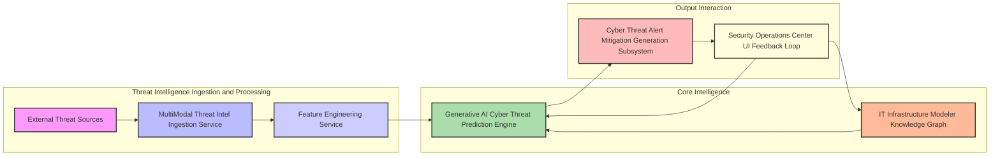
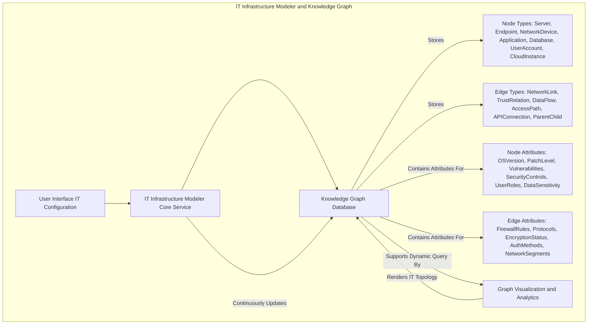
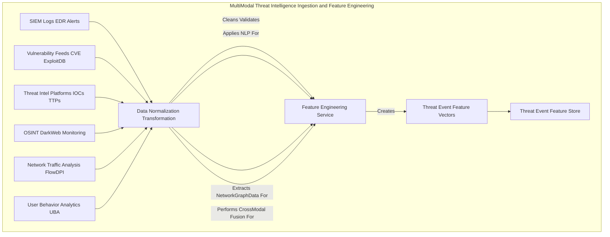
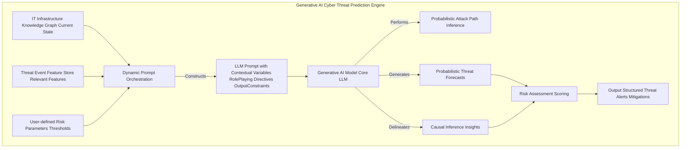
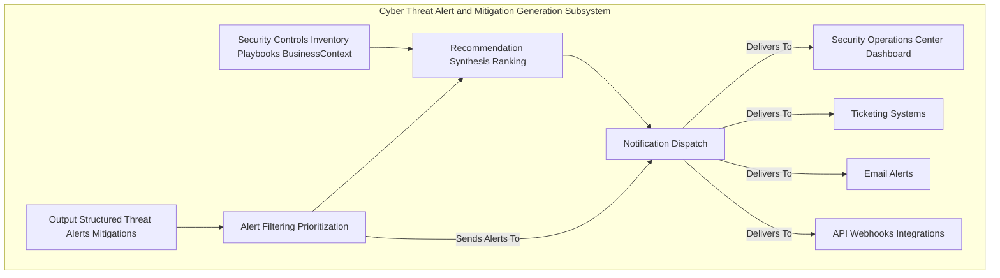
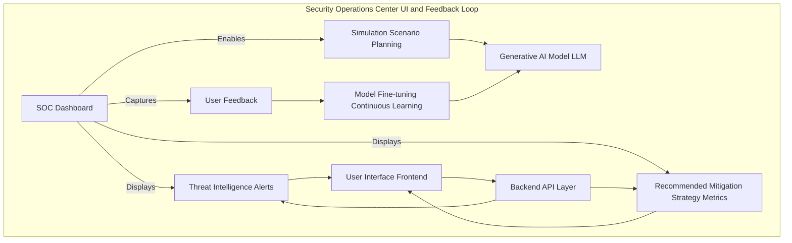
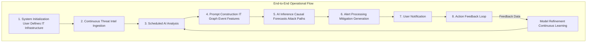

---
# System and Method for Predictive Cyber Threat Intelligence and Attack Path Forecasting

## Table of Contents
1.  **Title of Invention**
2.  **Abstract**
3.  **Background of the Invention**
4.  **Brief Summary of the Invention**
5.  **Detailed Description of the Invention**
    *   5.1 System Architecture
        *   5.1.1 IT Infrastructure Modeler and Knowledge Graph
        *   5.1.2 Multi-Modal Threat Intelligence Ingestion and Feature Engineering Service
        *   5.1.3 Generative AI Cyber Threat Prediction Engine
        *   5.1.4 Cyber Threat Alert and Mitigation Generation Subsystem
        *   5.1.5 Security Operations Center UI and Feedback Loop
    *   5.2 Data Structures and Schemas
        *   5.2.1 IT Infrastructure Graph Schema
        *   5.2.2 Real-time Threat Event Data Schema
        *   5.2.3 Cyber Threat Alert and Recommendation Schema
    *   5.3 Algorithmic Foundations
        *   5.3.1 Dynamic Graph Representation and Traversal for IT Assets
        *   5.3.2 Multi-Modal Threat Data Fusion and Contextualization
        *   5.3.3 Generative AI Prompt Orchestration for Cyber
        *   5.3.4 Probabilistic Threat Forecasting and Attack Path Inference
        *   5.3.5 Optimal Mitigation Strategy Generation
    *   5.4 Operational Flow and Use Cases
6.  **Claims**
7.  **Mathematical Justification: A Formal Axiomatic Framework for Predictive Cyber Resilience**
    *   7.1 The IT Infrastructure Topological Manifold: `G = (V, E, Phi)`
        *   7.1.1 Formal Definition of the IT Infrastructure Graph `G`
        *   7.1.2 Node State Space `V`
        *   7.1.3 Edge State Space `E`
        *   7.1.4 Latent Interconnection Functionals `Phi`
        *   7.1.5 Tensor-Weighted Adjacency Representation `A(t)`
    *   7.2 The Global Cyber State Observational Manifold: `W(t)`
        *   7.2.1 Definition of the Global Cyber State Tensor `W(t)`
        *   7.2.2 Multi-Modal Feature Extraction and Contextualization `f_Psi`
        *   7.2.3 Threat Event Feature Vector `E_F(t)`
    *   7.3 The Generative Predictive Disruption Oracle: `G_AI`
        *   7.3.1 Formal Definition of the Predictive Mapping Function `G_AI`
        *   7.3.2 The Threat Probability Distribution `P(D_t+k | G, E_F(t))`
        *   7.3.3 Probabilistic Causal Graph Inference within `G_AI`
    *   7.4 The Economic Imperative and Decision Theoretic Utility: `E[Cost | a] < E[Cost]`
        *   7.4.1 Cost Function Definition `C(G, D, a)`
        *   7.4.2 Expected Cost Without Intervention `E[Cost]`
        *   7.4.3 Expected Cost With Optimal Intervention `E[Cost | a*]`
        *   7.4.4 The Value of Perfect Information Theorem Applied to `P(D_t+k)`
        *   7.4.5 Axiomatic Proof of Utility
8.  **Proof of Utility**

## 1. Title of Invention:
System and Method for Predictive Cyber Threat Intelligence and Attack Path Forecasting with Generative AI

## 2. Abstract:
A novel system for orchestrating cyber resilience is herein disclosed. This invention architecturally delineates a user's intricate IT infrastructure as a dynamic, attribute-rich knowledge graph, comprising diverse nodes such as servers, endpoints, network devices, applications, user accounts, and data stores, interconnected by multifaceted edges representing network connections, trust relationships, and access paths. Leveraging a sophisticated multi-modal threat intelligence ingestion pipeline, the system continuously assimilates vast streams of real-time global intelligence, encompassing vulnerability disclosures, exploit trends, dark web chatter, network telemetry, and user behavior analytics. A state-of-the-art generative artificial intelligence model, operating as a sophisticated attack path inference engine, meticulously analyzes this convergent data within the contextual framework of the IT infrastructure knowledge graph. This analysis identifies, quantifies, and forecasts potential cyber threats and their associated attack paths with unprecedented accuracy, often several temporal epochs prior to their materialization. Upon the detection of a high-contingency threat event (e.g., a newly disclosed critical vulnerability intersecting with a publicly exposed server, or emergent attacker TTPs targeting a specific software stack), the system autonomously synthesizes and disseminates a detailed alert. Critically, it further postulates and ranks a portfolio of optimized, actionable mitigation strategies, encompassing patching, firewall rule adjustments, multi-factor authentication enforcement, or system isolation, thereby transforming reactive incident response into proactive strategic cyber defense.

## 3. Background of the Invention:
Contemporary cyber landscapes represent an apotheosis of complex adaptive systems, characterized by an intricate web of interconnected technologies, human factors, and profound vulnerability to stochastic and malicious perturbations. Traditional paradigms of cyber security, predominantly anchored in signature-based detection, reactive incident response, and historical vulnerability analysis, have proven inherently insufficient to navigate the kaleidoscopic array of modern disruptive forces. These forces manifest across a spectrum from zero-day exploits and sophisticated nation-state sponsored attacks to insidious insider threats and widespread ransomware campaigns. The economic ramifications of cyber breaches are astronomical, frequently escalating from direct financial losses, regulatory fines, and intellectual property theft to profound reputational damage, market share erosion, and long-term erosion of stakeholder trust. The imperative for a paradigm shift from reactive mitigation to anticipatory resilience has attained unprecedented criticality. Existing solutions, often reliant on threshold-based alerting or rudimentary statistical forecasting, conspicuously lack the capacity for sophisticated causal inference, contextual understanding of attack paths, and proactive solution synthesis. They predominantly flag events post-occurrence or identify risks without furnishing actionable, context-aware mitigation strategies, leaving enterprises exposed to cascading failures and suboptimal recovery trajectories. The present invention addresses this profound lacuna, establishing an intellectual frontier in dynamic, AI-driven predictive cyber threat orchestration.

## 4. Brief Summary of the Invention:
The present invention unveils a novel, architecturally robust, and algorithmically advanced system for predictive cyber threat intelligence and attack path forecasting, herein termed the "Cognitive Cyber Sentinel." This system transcends conventional security monitoring tools by integrating a multi-layered approach to risk assessment and proactive strategic guidance. The operational genesis commences with a user's precise definition and continuous refinement of their critical IT infrastructure topology, meticulously mapping all entities—key servers, endpoints, network devices, applications, databases, and their connecting logical and physical arteries—into a dynamic knowledge graph. At its operational core, the Cognitive Cyber Sentinel employs a sophisticated, continuously learning generative AI engine. This engine acts as an expert red team analyst, incessantly monitoring, correlating, and interpreting a torrent of real-time, multi-modal global threat data. The AI is dynamically prompted with highly contextualized queries, such as: "Given the enterprise's mission-critical database accessible from an internet-facing web server, linked to a recently disclosed critical vulnerability, and considering prevailing attacker Tactics, Techniques, and Procedures TTPs, nascent dark web discussions, and real-time network traffic anomalies, what is the quantified probability of a data exfiltration event within the subsequent 72-hour temporal horizon? Furthermore, delineate the precise causal attack vectors and propose optimal pre-emptive mitigation alternatives." Should the AI model identify an emerging threat exceeding a pre-defined probabilistic threshold, it autonomously orchestrates the generation of a structured, machine-readable alert. This alert comprehensively details the nature and genesis of the threat, quantifies its probability and projected impact, specifies the affected components of the IT infrastructure, and, crucially, synthesizes and ranks a portfolio of actionable, optimized mitigation strategies. This constitutes a paradigm shift from merely identifying threats to orchestrating intelligent, pre-emptive strategic maneuvers, embedding an unprecedented degree of foresight and resilience into digital operations.

## 5. Detailed Description of the Invention:

The disclosed system represents a comprehensive, intelligent infrastructure designed to anticipate and mitigate cyber threats proactively. Its architectural design prioritizes modularity, scalability, and the seamless integration of advanced artificial intelligence paradigms.

### 5.1 System Architecture

The Cognitive Cyber Sentinel is comprised of several interconnected, high-performance services, each performing a specialized function, orchestrated to deliver a holistic predictive capability.



#### 5.1.1 IT Infrastructure Modeler and Knowledge Graph
This foundational component serves as the authoritative source for the enterprise's entire IT infrastructure topology and associated security parameters.
*   **User Interface IT:** A sophisticated graphical user interface GUI provides intuitive tools for users to define, visualize, and iteratively refine their digital asset network. This includes drag-and-drop functionality for nodes and edges, parameter input forms, and topology mapping integrations.
*   **Knowledge Graph Database:** At its core, the IT infrastructure is represented as a highly interconnected, semantic knowledge graph. This graph is not merely a static representation but a dynamic entity capable of storing rich attributes, temporal data, and inter-node relationships.
    *   **Nodes:** Represent discrete entities within the IT infrastructure. These can be granular, such as specific servers e.g., "Web Server Prod-01", endpoints e.g., "Employee Laptop 123", network devices e.g., "Firewall DMZ", applications e.g., "CRM App v2", databases e.g., "CustomerDB MySQL", user accounts e.g., "AdminUser_IT", and cloud instances e.g., "AWS EC2 AppServer". Each node is endowed with a comprehensive set of attributes, including IP address, operating system OS version, patch level, known vulnerabilities CVEs, running services, applied security controls e.g., EDR status, owner team, criticality level, and trust zone. For user nodes, roles and privileges are included. For data nodes, data sensitivity is specified.
    *   **Edges:** Represent the logical and physical pathways and relationships connecting these nodes. These include network connections TCP/UDP ports, logical dependencies, trust relationships, data flows, API connections, and user access paths. Edges possess attributes such as firewall rules, allowed protocols, encryption status, authentication methods, observed traffic patterns, and network segment isolation.
    *   **Temporal and Contextual Attributes:** Both nodes and edges are augmented with temporal attributes, indicating their operational status at different times e.g., active sessions, dynamic configurations, and contextual attributes, such as real-time threat exposure scores associated with their configurations, compliance status, and historical incident data.



#### 5.1.2 Multi-Modal Threat Intelligence Ingestion and Feature Engineering Service
This robust, scalable service is responsible for continuously acquiring, processing, and normalizing vast quantities of heterogeneous global and internal cyber threat data streams. It acts as the "sensory apparatus" of the Sentinel.
*   **SIEM and Log Aggregation APIs:** Integration with Security Information and Event Management SIEM systems, Endpoint Detection and Response EDR platforms, Intrusion Detection/Prevention Systems IDS/IPS, firewalls, and application logs to capture real-time security events, alerts, and system telemetry.
*   **Vulnerability Intelligence Feeds:** Acquisition of Common Vulnerabilities and Exposures CVEs data from sources like NVD National Vulnerability Database, Exploit-DB, and vendor security advisories, including CVSS scores and exploitability metrics.
*   **Threat Intelligence Platform TIP Feeds:** Ingestion of Indicators of Compromise IOCs, Tactics, Techniques, and Procedures TTPs from reputable threat intelligence providers, detailing active attack campaigns and threat actor profiles.
*   **OSINT and Dark Web Monitoring:** Selective monitoring of public cybersecurity forums, dark web marketplaces, and open-source intelligence OSINT, employing advanced text analysis to detect early warnings of new exploit sales, breached credentials, or targeted attack planning.
*   **Network Traffic Analysis NTA:** Collection and analysis of network flow data e.g., NetFlow, IPFIX, and deep packet inspection DPI to identify anomalous traffic patterns, unauthorized communications, and potential command and control C2 activity.
*   **User Behavior Analytics UBA:** Monitoring and analysis of user login patterns, access requests, and activity baselines to detect deviations indicative of account compromise or insider threat.
*   **Cloud Security Posture Management CSPM APIs:** Integration with CSPM tools to monitor cloud infrastructure configurations, identify misconfigurations, and assess compliance status across multi-cloud environments.
*   **Data Normalization and Transformation:** Raw data from disparate sources is transformed into a unified, semantically consistent format, timestamped, associated with IT assets, and enriched. This involves schema mapping, event correlation, and anomaly detection.
*   **Feature Engineering:** This critical sub-component extracts salient features from the processed data, translating raw observations into high-dimensional vectors pertinent for AI analysis. For instance, "CVE-2023-XXXX exploit published" is transformed into features like `[cve_id, cvss_score, exploit_maturity, target_os_platforms, observed_exploitation_attempts]`.



#### 5.1.3 Generative AI Cyber Threat Prediction Engine
This is the intellectual core of the Cognitive Cyber Sentinel, employing advanced generative AI to synthesize intelligence and forecast cyber threats.
*   **Dynamic Prompt Orchestration:** Instead of static prompts, this engine constructs highly dynamic, context-specific prompts for the generative AI model. These prompts are meticulously crafted, integrating:
    *   The user's specific IT infrastructure graph or relevant sub-graph.
    *   Recent, relevant threat event features from the `Threat Event Feature Store`.
    *   Pre-defined roles for the AI e.g., "Expert Red Team Analyst," "CISO Strategist," "Incident Response Lead".
    *   Specific temporal horizons for prediction e.g., "next 24 hours," "next 7 days".
    *   Desired output format constraints e.g., JSON schema for structured alerts, including attack paths.
*   **Generative AI Model:** A large, multi-modal language model LLM serves as the primary inference engine. This model is pre-trained on a vast corpus of text and data, encompassing cybersecurity knowledge bases, attack frameworks MITRE ATT&CK, incident reports, vulnerability disclosures, threat intelligence feeds, and security best practices. It may be further fine-tuned with domain-specific breach data and incident outcomes to enhance its predictive accuracy and contextual understanding. The model's capacity for complex reasoning, causal chain identification, and synthesis of disparate information is paramount.
*   **Probabilistic Attack Path Inference:** The AI model does not merely correlate events; it attempts to infer causal relationships and reconstruct potential attack paths. For example, a "Phishing Campaign targeting Executive" event leads to "Credential Compromise on Executive Endpoint" direct effect, which in turn causes "Lateral Movement to Domain Controller" indirect effect, and ultimately "Data Exfiltration from Sensitive Database" cyber impact. The AI quantifies the probability of these causal links and their downstream effects across the IT graph.
*   **Risk Taxonomy Mapping:** Identified threats are mapped to a predefined ontology of cyber risks e.g., Unauthorized Access, Data Exfiltration, Ransomware, Denial of Service, Privilege Escalation. This categorization aids in structured reporting and subsequent strategic planning.



#### 5.1.4 Cyber Threat Alert and Mitigation Generation Subsystem
Upon receiving the AI's structured output, this subsystem processes and refines it into actionable intelligence.
*   **Alert Filtering and Prioritization:** Alerts are filtered based on user-defined thresholds e.g., only show "High" probability threats, or those impacting "MissionCritical" assets. They are prioritized based on exploitability, impact severity, and temporal proximity, considering the IT asset's criticality.
*   **Recommendation Synthesis and Ranking:** The AI's suggested actions are further refined, cross-referenced with enterprise security control inventories e.g., existing firewall rules, incident response playbooks, available security team resources, and business criticality metrics. Recommendations are ranked according to user-defined optimization criteria e.g., minimize attack surface, minimize downtime, minimize cost, maximize compliance.
*   **Notification Dispatch:** Alerts are dispatched through various channels e.g., integrated SOC dashboard, ticketing systems, email, SMS, API webhook to relevant stakeholders within the organization e.g., SOC analysts, incident response teams, system administrators.



#### 5.1.5 Security Operations Center UI and Feedback Loop
This component ensures the system is interactive, adaptive, and continuously improves.
*   **Integrated Dashboard:** A comprehensive, real-time dashboard visualizes the IT infrastructure graph, overlays identified threats and their projected attack paths, displays alerts, and presents recommended mitigation strategies. Topology visualizations highlighting critical paths and compromised assets are central to this interface.
*   **Simulation and Scenario Planning:** Users can interact with the system to run "what-if" scenarios, evaluating the impact of hypothetical cyber attacks or proposed mitigation actions. This leverages the generative AI for predictive modeling under new conditions, allowing for incident response playbook testing.
*   **Feedback Mechanism:** Users can provide feedback on the accuracy of threat predictions, the utility of recommended mitigations, and the outcome of implemented actions. This feedback is crucial for continually fine-tuning the generative AI model through reinforcement learning from human feedback RLHF or similar mechanisms, improving its accuracy and relevance over time. This closes the loop, making the system an adaptive, intelligent agent.



### 5.2 Data Structures and Schemas

To maintain consistency, interoperability, and the integrity of complex data flows, the system adheres to rigorously defined data structures.

#### 5.2.1 IT Infrastructure Graph Schema
Represented internally within the Knowledge Graph Database.

*   **Node Schema (`ITNode`):**
    ```json
    {
      "node_id": "UUID",
      "node_type": "ENUM['Server', 'Endpoint', 'NetworkDevice', 'Application', 'Database', 'UserAccount', 'CloudInstance']",
      "name": "String",
      "ip_address": "String (IPv4/IPv6)",
      "mac_address": "String (optional)",
      "location": {
        "data_center": "String",
        "rack_id": "String",
        "cloud_region": "String",
        "physical_location_notes": "String"
      },
      "attributes": {
        "os_version": "String",
        "patch_level": "String", // e.g., "fully_patched", "vulnerable_critical"
        "known_vulnerabilities_cve_ids": ["String"], // list of CVE IDs
        "running_services": ["String"],
        "security_controls_applied": ["String"], // e.g., "Firewall", "EDR", "Antivirus", "MFA"
        "owner_team": "String",
        "criticality_level": "ENUM['Low', 'Medium', 'High', 'MissionCritical']",
        "trust_zone": "String", // e.g., "DMZ", "Internal Prod", "Internal Dev", "Guest"
        "user_roles_groups": ["String"], // specific for UserAccount node_type
        "data_sensitivity": "ENUM['Public', 'Internal', 'Confidential', 'Restricted']", // specific for Database/Storage node_type
        "compliance_status": ["String"] // e.g., "GDPR_compliant", "PCI_DSS_compliant"
      },
      "last_updated": "Timestamp"
    }
    ```

*   **Edge Schema (`ITEdge`):**
    ```json
    {
      "edge_id": "UUID",
      "source_node_id": "UUID",
      "target_node_id": "UUID",
      "edge_type": "ENUM['NetworkLink', 'TrustRelation', 'DataFlow', 'AccessPath', 'APIConnection', 'ParentChild']",
      "protocol_port": "String", // e.g., "TCP/443", "SSH/22", "RPC"
      "attributes": {
        "firewall_rules_applied": ["String"], // e.g., "Allow Ingress Port 80", "Deny All Egress"
        "encryption_status": "ENUM['None', 'TLS1.2', 'IPSec', 'VPN']",
        "authentication_method": "ENUM['None', 'Password', 'MFA', 'Certificate', 'SSO']",
        "access_permissions": ["String"], // e.g., "Read", "Write", "Execute", "Admin"
        "latency_ms": "Float",
        "bandwidth_mbps": "Float",
        "segment_isolation": "Boolean", // True if this link is within an isolated segment
        "observed_traffic_pattern": "ENUM['Baseline', 'Anomalous_Low', 'Anomalous_High']"
      },
      "last_updated": "Timestamp"
    }
    ```

#### 5.2.2 Real-time Threat Event Data Schema
Structured representation of ingested and featured global cyber events.

*   **Event Schema (`CyberThreatEvent`):**
    ```json
    {
      "event_id": "UUID",
      "event_type": "ENUM['VulnerabilityDiscovery', 'ExploitPublication', 'AttackCampaign', 'NetworkAnomaly', 'UserBehaviorAnomaly', 'SystemAlert', 'DarkWebMention']",
      "sub_type": "String", // e.g., "CVE-2023-XXXX", "Ransomware", "PhishingKit", "PortScan", "PrivilegeEscalation", "InsiderThreat"
      "timestamp": "Timestamp",
      "start_time_observed": "Timestamp (optional)",
      "end_time_observed": "Timestamp (optional)",
      "involved_entities": [ // Link to ITNode IDs, IPs, User IDs
        {"entity_value": "String", "entity_type": "ENUM['NodeID', 'IPAddress', 'UserID', 'Domain']"}
      ],
      "severity_score": "Float", // Normalized score, e.g., CVSS Base Score for CVEs, 0-10 for anomalies
      "impact_potential": "ENUM['Low', 'Medium', 'High', 'Critical']",
      "confidence_level": "Float", // 0-1, confidence in event occurrence/forecast
      "source": "String", // e.g., "NVD", "MITRE", "CrowdStrike", "Internal SIEM", "DarkOwl"
      "raw_data_link": "URL (optional)",
      "feature_vector": { // Key-value pairs for AI consumption
        "cve_id": "String",
        "cvss_score_base": "Float",
        "exploit_maturity": "ENUM['Unproven', 'POC_Available', 'Functional_Exploit']",
        "attacker_ttp": ["String"], // e.g., "T1059.003 PowerShell", "T1078.004 Valid Accounts"
        "affected_os_platforms": ["String"],
        "network_traffic_deviation_percent": "Float",
        "user_login_deviation_score": "Float",
        "dark_web_mention_count": "Integer",
        "geographic_origin": "String" // e.g., "Russia", "China"
        // ... many more dynamic features relevant to cyber threats
      }
    }
    ```

#### 5.2.3 Cyber Threat Alert and Recommendation Schema
Output structure from the Generative AI Cyber Threat Prediction Engine.

*   **Alert Schema (`CyberThreatAlert`):**
    ```json
    {
      "alert_id": "UUID",
      "timestamp_generated": "Timestamp",
      "threat_summary": "String", // e.g., "High probability of ransomware attack via unpatched web server."
      "description": "String", // Detailed explanation of the threat, attack path, and causal chain.
      "threat_probability": "ENUM['Low', 'Medium', 'High', 'Critical']", // Qualitative assessment
      "probability_score": "Float", // Quantitative score, 0-1
      "projected_impact_severity": "ENUM['Low', 'Medium', 'High', 'Catastrophic']",
      "impact_score": "Float", // Quantitative score, 0-1 (e.g., predicted data loss, downtime)
      "attack_path_entities": [ // Ordered list of entities (nodes/edges) in the projected attack path
        {"entity_value": "String", "entity_type": "ENUM['NodeID', 'EdgeID']", "step_description": "String"}
      ],
      "causal_events": [ // Link to CyberThreatEvent IDs that contribute to this threat
        "UUID"
      ],
      "temporal_horizon_hours": "Integer", // Hours until expected exploitation/attack execution
      "recommended_actions": [
        {
          "action_id": "UUID",
          "action_description": "String", // e.g., "Apply patch CVE-2023-XXXX to SVR-01 in DMZ immediately."
          "action_type": "ENUM['Patch', 'Isolate', 'BlockTraffic', 'EnforceMFA', 'UserTraining', 'DeactivateAccount', 'ConfigurationHardening']",
          "estimated_cost_impact": "Float", // e.g., potential downtime for patching, resource cost
          "estimated_time_to_implement_hours": "Float",
          "risk_reduction_potential": "Float", // 0-1, how much risk is reduced
          "feasibility_score": "Float", // 0-1, ease of implementation
          "confidence_in_recommendation": "Float", // 0-1, AI's confidence in the action's effectiveness
          "related_entities": ["String"] // Node/Edge IDs affected by this action
        }
      ],
      "status": "ENUM['Active', 'Resolved', 'Acknowledged', 'Mitigated', 'FalsePositive']",
      "last_updated": "Timestamp"
    }
    ```

### 5.3 Algorithmic Foundations

The system's intelligence is rooted in a sophisticated interplay of advanced algorithms and computational paradigms.

#### 5.3.1 Dynamic Graph Representation and Traversal for IT Assets
The IT infrastructure is fundamentally a dynamic graph `G=(V,E)`.
*   **Graph Database Technologies:** Underlying technologies e.g., property graphs, RDF knowledge graphs are employed for efficient storage and retrieval of complex relationships and attributes of IT assets.
*   **Temporal Graph Analytics:** Algorithms for analyzing evolving graph structures, identifying critical attack paths shortest path on weighted graph, bottleneck analysis for choke points in network segments, and calculating centrality measures e.g., betweenness centrality for key servers or network devices that dynamically change with real-time security configurations.
*   **Sub-graph Extraction:** Efficient algorithms for extracting relevant sub-graphs based on a specific query e.g., all network paths from an `Internet-facing Server` to a `Sensitive Database`, or all user access paths to a `Critical Application`.

#### 5.3.2 Multi-Modal Threat Data Fusion and Contextualization
The fusion process integrates heterogeneous cyber data into a unified, semantically coherent representation.
*   **Latent Space Embeddings:** Multi-modal data network logs, vulnerability descriptions, user activity, threat intelligence is transformed into a shared latent vector space using techniques like autoencoders, contrastive learning, or specialized transformers. This allows for semantic comparison and contextualization across data types.
*   **Attention Mechanisms:** Employing attention networks to weigh the relevance of different threat data streams and features to a specific IT infrastructure query. For example, CVE data is highly relevant for software vulnerabilities, while network flow data is critical for detecting lateral movement.
*   **Time-Series Analysis and Forecasting:** Applying advanced time-series models e.g., LSTM, Transformer networks, Gaussian Processes to predict future states of continuous variables e.g., exploit kit popularity, dark web activity spikes, network anomaly baselines which then serve as features for the generative AI.

#### 5.3.3 Generative AI Prompt Orchestration for Cyber
This is a critical innovation enabling the AI to function as a domain expert.
*   **Contextual Variable Injection:** Dynamically injecting elements of the current IT infrastructure graph e.g., specific node/edge attributes, relevant real-time threat event features, and historical incident context directly into the AI prompt.
*   **Role-Playing Directives:** Explicitly instructing the generative AI model to adopt specific personas e.g., "You are an expert in red team operations," "You are a lead incident responder," "You are a CISO strategist" to elicit specialized reasoning capabilities for cyber defense.
*   **Constrained Output Generation:** Utilizing techniques such as JSON schema enforcement or few-shot exemplars within the prompt to guide the AI to produce structured, machine-readable outputs, crucial for automated processing and integration into security tools.
*   **Iterative Refinement and Self-Correction:** Developing prompts that allow the AI to ask clarifying questions e.g., "Are there additional logs for this endpoint?" or iterate on its analysis, mimicking human analytical processes in a Security Operations Center SOC.

#### 5.3.4 Probabilistic Threat Forecasting and Attack Path Inference
The AI's ability to not just predict but quantify uncertainty is vital.
*   **Causal Graph Learning:** Within the generative AI's latent reasoning capabilities, it constructs implicit or explicit probabilistic causal graphs e.g., Bayesian Networks, Granger Causality linking global threat events to IT infrastructure impacts and potential attack paths. This allows it to identify direct and indirect causal pathways in an attack kill chain.
*   **Monte Carlo Simulations Implicit:** The AI's generative nature allows it to effectively perform implicit Monte Carlo simulations, exploring various future attack scenarios based on probabilistic event occurrences and their cascading effects across the IT graph. It synthesizes the most probable and impactful attack paths.
*   **Confidence Calibration:** Employing techniques to calibrate the AI's confidence scores in its predictions against observed incident outcomes, ensuring that a "High" probability truly corresponds to a high likelihood of an attack or exploit attempt.

#### 5.3.5 Optimal Mitigation Strategy Generation
Beyond prediction, the system provides actionable solutions.
*   **Multi-Objective Optimization:** The AI, informed by enterprise constraints and preferences e.g., cost, operational downtime, risk tolerance, compliance requirements, leverages its understanding of the IT infrastructure graph and available security controls to propose strategies that optimize across multiple, potentially conflicting objectives. This might involve shortest path algorithms considering dynamic edge weights vulnerability score, exploitability, impact, or network flow optimization under security policy constraints.
*   **Constraint Satisfaction:** Integrating current security control statuses e.g., EDR deployment, existing firewall rules, available security team bandwidth, and incident response playbook steps as constraints within the AI's decision-making process for mitigation.
*   **Scenario-Based Planning Integration:** The generative AI can simulate the outcomes of different mitigation strategies within the context of a predicted attack, providing quantitative insights into their effectiveness before execution.

### 5.4 Operational Flow and Use Cases

A typical operational cycle of the Cognitive Cyber Sentinel proceeds as follows:

1.  **Initialization:** A user defines their IT infrastructure graph via the Modeler UI, specifying nodes, edges, attributes, and criticality levels.
2.  **Continuous Threat Intelligence Ingestion:** The Threat Intelligence Ingestion Service perpetually streams and processes global multi-modal cyber threat data, populating the Threat Event Feature Store.
3.  **Scheduled AI Analysis:** Periodically e.g., every 15 minutes, hourly, the Generative AI Cyber Threat Prediction Engine is triggered.
4.  **Prompt Construction:** Dynamic Prompt Orchestration retrieves the relevant sub-graph of the IT infrastructure, current threat event features, and pre-defined risk parameters to construct a sophisticated query for the Generative AI Model.
5.  **AI Inference:** The Generative AI Model processes the prompt, performs causal inference, probabilistic forecasting, and identifies potential cyber threats and their associated attack paths. It synthesizes a structured output with alerts and preliminary mitigation recommendations.
6.  **Alert Processing:** The Cyber Threat Alert and Mitigation Generation Subsystem refines the AI's output, prioritizes alerts, performs secondary optimization of recommendations against security control data and incident response playbooks, and prepares notifications.
7.  **User Notification:** Alerts and recommendations are disseminated to the SOC dashboard, and potentially via other channels.
8.  **Action and Feedback:** The user reviews the alerts, evaluates recommendations, potentially runs simulations, makes a decision, and provides feedback to the system, which aids in continuous model refinement.



**Use Cases:**

*   **Proactive Vulnerability Remediation:** The system predicts a high probability of exploitation for a newly disclosed CVE on a publicly exposed web server within 24 hours, leading to potential data exfiltration from a linked database. It recommends immediate application of a specific patch or, if unavailable, temporary network isolation of the server and activation of web application firewall WAF rules.
*   **Anticipatory Account Compromise Prevention:** AI detects anomalous login patterns for a privileged user account, correlating it with recent dark web credential dumps and a new phishing campaign targeting the organization. It recommends an immediate forced password reset, enforcement of multi-factor authentication MFA, and enhanced monitoring of the account for lateral movement attempts.
*   **Attack Path Interruption:** The system identifies a multi-stage attack path from a compromised internal endpoint to a critical database, exploiting a known misconfiguration in an intermediate network device. It recommends applying a specific firewall rule to block the vulnerable port, disabling an unnecessary service on the network device, or micro-segmenting the affected endpoint to break the kill chain.
*   **Strategic Security Investment and Planning:** By aggregating and analyzing forecasted attack paths and vulnerabilities across the entire IT infrastructure, the system identifies systemic weaknesses and high-risk areas. This intelligence guides strategic security investments, informing where to prioritize deployment of new security controls, enhance existing ones, or allocate resources for security awareness training programs, thereby transitioning from reactive spending to proactive, risk-optimized resource allocation.

## 6. Claims:

The inventive concepts herein described constitute a profound advancement in the domain of cybersecurity and predictive threat intelligence.

1.  A system for proactive cyber threat management, comprising:
    a.  An **IT Infrastructure Modeler** configured to receive, store, and dynamically update a representation of a user's IT infrastructure as a knowledge graph, said graph comprising a plurality of nodes representing physical or logical IT entities (e.g., servers, endpoints, network devices, applications, user accounts) and a plurality of edges representing network connections, trust relationships, or access paths therebetween, wherein each node and edge is endowed with a comprehensive set of temporal and contextual security attributes.
    b.  A **Multi-Modal Threat Intelligence Ingestion and Feature Engineering Service** configured to continuously acquire, process, normalize, and extract salient features from a plurality of real-time, heterogeneous cyber threat data sources, including but not limited to Security Information and Event Management SIEM logs, vulnerability intelligence feeds, threat intelligence platforms, open-source intelligence OSINT, dark web monitoring, and network traffic analysis.
    c.  A **Generative AI Cyber Threat Prediction Engine** configured to periodically receive the dynamically updated IT infrastructure knowledge graph and the extracted features from the multi-modal threat data, said engine employing a generative artificial intelligence model.
    d.  A **Dynamic Prompt Orchestration** module integrated within the Generative AI Cyber Threat Prediction Engine, configured to construct highly contextualized and dynamic prompts for the generative AI model, said prompts incorporating specific sub-graphs of the user's IT infrastructure, relevant real-time threat event features, and explicit directives for the AI model to assume expert analytical personas in cybersecurity.
    e.  The generative AI model being further configured to perform **probabilistic causal inference** upon the received prompt, thereby identifying potential future cyber threats to the user's IT infrastructure, forecasting their attack paths, quantifying their probability of occurrence, assessing their projected impact severity, delineating the causal pathways from global threat events to IT system effects, and generating a structured output detailing said threats and their attributes.
    f.  A **Cyber Threat Alert and Mitigation Generation Subsystem** configured to receive the structured output from the generative AI model, to filter and prioritize cyber threat alerts based on user-defined criteria, and to synthesize and rank a portfolio of actionable, optimized mitigation strategies (e.g., patching vulnerabilities, isolating systems, enforcing multi-factor authentication) by correlating AI-generated suggestions with enterprise security control inventories, incident response playbooks, and business criticality metrics.
    g.  A **Security Operations Center UI** configured to visually present the IT infrastructure knowledge graph, overlay identified threats and their projected attack paths, display the generated alerts, and enable interaction with and feedback on the proposed mitigation strategies.

2.  The system of Claim 1, wherein the knowledge graph is implemented as a property graph database capable of storing temporal attributes and dynamically updated relationships between nodes and edges representing IT assets.

3.  The system of Claim 1, wherein the Multi-Modal Threat Intelligence Ingestion and Feature Engineering Service utilizes Natural Language Processing NLP techniques, including named entity recognition, event extraction, and sentiment analysis, to transform unstructured threat intelligence and open-source intelligence data into structured event features.

4.  The system of Claim 1, wherein the generative AI model is a large language model LLM fine-tuned with domain-specific cybersecurity incident data, attack frameworks, and risk management ontologies.

5.  The system of Claim 1, wherein the probabilistic causal inference performed by the generative AI model explicitly identifies direct and indirect causal links, forming complete attack paths, between observed global cyber events and predicted IT infrastructure threats.

6.  The system of Claim 1, wherein the Dynamic Prompt Orchestration module incorporates explicit instructions for the generative AI model to adhere to predefined output schemas, thereby ensuring machine-readability and downstream automated processing of alerts and mitigation plans.

7.  The system of Claim 1, wherein the Cyber Threat Alert and Mitigation Generation Subsystem integrates security control inventories, incident response playbooks, and business criticality data to refine mitigation strategies by considering real-time security posture, operational constraints, and asset value.

8.  The system of Claim 1, further comprising a **Feedback Loop Mechanism** integrated with the Security Operations Center UI, configured to capture user feedback on the accuracy of predictions and the utility of recommendations, said feedback being used to continuously refine and improve the performance of the generative AI model through mechanisms such as reinforcement learning from human feedback.

9.  A method for proactive cyber threat management, comprising:
    a.  Defining and continuously updating a user's IT infrastructure as a knowledge graph, including nodes representing IT entities and edges representing pathways, each with dynamic security attributes.
    b.  Continuously ingesting and processing real-time, multi-modal global and internal cyber threat data from diverse external and internal sources to extract salient threat event features.
    c.  Periodically constructing a highly contextualized prompt for a generative artificial intelligence model, said prompt integrating a segment of the IT infrastructure knowledge graph, recent threat event features, and expert role directives in cybersecurity.
    d.  Transmitting the prompt to the generative AI model for probabilistic causal inference and threat prediction, including attack path forecasting.
    e.  Receiving from the generative AI model a structured output comprising a list of potential future cyber threats, their quantified probabilities, projected impact severities, causal derivations including attack paths, and preliminary mitigation suggestions.
    f.  Refining and prioritizing the threats into actionable alerts and synthesizing a ranked portfolio of optimized mitigation strategies by correlating AI suggestions with enterprise security operational data and incident response playbooks.
    g.  Displaying the alerts and recommended strategies to the user via a comprehensive Security Operations Center UI.
    h.  Capturing user feedback on the system's performance for continuous model improvement.

10. The method of Claim 9, wherein constructing the prompt includes specifying a temporal horizon for the threat prediction and a desired output data schema for attack paths and mitigations.

11. The method of Claim 9, wherein refining mitigation strategies includes performing multi-objective optimization based on user-defined criteria such as minimizing attack surface, minimizing operational downtime, or maximizing compliance.

12. The method of Claim 9, further comprising enabling users to conduct "what-if" simulations and scenario planning within the user interface, leveraging the generative AI model for predictive outcomes under hypothetical attack conditions or proposed defensive measures.

## 7. Mathematical Justification: A Formal Axiomatic Framework for Predictive Cyber Resilience

The inherent complexity and dynamic nature of global cyber threats necessitates a rigorous mathematical framework for the precise articulation and demonstrative proof of the predictive threat modeling system's efficacy. We herein establish such a framework, transforming the conceptual elements into formally defined mathematical constructs, thereby substantiating the invention's profound analytical capabilities.

### 7.1 The IT Infrastructure Topological Manifold: `G = (V, E, Phi)`

The IT infrastructure is not merely a graph but a dynamic, multi-relational topological manifold where attributes and relationships evolve under internal and external influence.

#### 7.1.1 Formal Definition of the IT Infrastructure Graph `G`

Let `G = (V, E, Phi)` denote the formal representation of the IT infrastructure at any given time `t`.
*   `V` is the finite set of nodes, where each `v in V` represents a distinct entity in the IT infrastructure (e.g., server, endpoint, network device, application, user account, cloud instance).
*   `E` is the finite set of directed edges, where each `e = (u, v) in E` represents a network connection, trust relationship, data flow, or access path from node `u` to node `v`.
*   `Phi` is the set of higher-order functional relationships or meta-data that define interdependencies or policies spanning multiple nodes or edges, such as global security policies (`Delta_policy`), shared vulnerability groups (`Delta_vuln`), compliance frameworks (`Delta_compliance`), or application dependencies that cannot be fully captured by simple node or edge attributes.

#### 7.1.2 Node State Space `V`

Each node `v in V` is associated with a state vector `X_v(t) in R^k` at time `t`, where `k` is the dimensionality of the node's security attribute space.
Let `X_v(t) = (x_v_1(t), x_v_2(t), ..., x_v_k(t))`, where:
*   `x_v_1(t)` could be the instantaneous IP address `IP_v(t)`.
*   `x_v_2(t)` could be the current operating system OS version `OS_v(t)` and patch level `PatchLevel_v(t) in [0, 1]`.
*   `x_v_3(t)` could be a dynamically updated vulnerability score `VulnScore_v(t) in [0, 1]`, aggregating CVSS scores of active CVEs.
*   `x_v_4(t)` could represent current security control status `SecControl_v(t)` (e.g., EDR active/inactive).
*   `x_v_j(t)` for `j > 4` represent other relevant attributes (e.g., running services, open ports, user roles, data sensitivity, criticality).

The domain of `X_v(t)` forms a sub-manifold `M_V subseteq R^k` for all `v in V`.

#### 7.1.3 Edge State Space `E`

Each directed edge `e = (u, v) in E` is associated with a state vector `Y_e(t) in R^m` at time `t`, where `m` is the dimensionality of the edge's security attribute space.
Let `Y_e(t) = (y_e_1(t), y_e_2(t), ..., y_e_m(t))`, where:
*   `y_e_1(t)` could be the instantaneous firewall ruleset `FWRules_e(t)`.
*   `y_e_2(t)` could be the instantaneous encryption status `Enc_e(t) in [0, 1]`.
*   `y_e_3(t)` could be the real-time authentication strength `Auth_e(t) in [0, 1]`.
*   `y_e_4(t)` could represent a dynamically assessed network anomaly score `Anomaly_e(t) in [0, 1]`, indicating unusual traffic patterns.
*   `y_e_j(t)` for `j > 4` represent other relevant attributes (e.g., allowed protocols, access permissions, segment isolation).

The domain of `Y_e(t)` forms a sub-manifold `M_E subseteq R^m` for all `e in E`.

#### 7.1.4 Latent Interconnection Functionals `Phi`

The set `Phi` captures complex, often non-linear, interdependencies. For example, a global security policy `Delta_policy in Phi` might affect `FWRules_e(t)` or `Auth_e(t)` for multiple edges simultaneously based on network segments. A `Delta_vuln in Phi` might define shared vulnerability risk across a group of nodes running a common software version. These are dynamically inferred or modeled relationships beyond simple graph connectivity.

#### 7.1.5 Tensor-Weighted Adjacency Representation `A(t)`

The entire IT infrastructure graph `G(t)` can be robustly represented by a dynamic, higher-order tensor-weighted adjacency matrix `A(t)`.
Let `N = |V|` be the number of nodes. The standard adjacency matrix is `A_0`, where `A_0[i,j] = 1` if `(v_i, v_j) in E`, else `0`.
We extend this to `A(t) in R^(N x N x (k+m_avg))` (or a sparse tensor representation), where for each `(i, j)` corresponding to an edge `e = (v_i, v_j)`, `A(t)[i,j,:]` contains a concatenation of `X_v_i(t)`, `Y_e(t)`, and `X_v_j(t)` relevant feature vectors, effectively embedding the node and edge security attributes into the adjacency structure. `m_avg` refers to the average dimensionality of edge attributes.
This `A(t)` precisely encodes the entire dynamic security state of the IT network at any instance.

### 7.2 The Global Cyber State Observational Manifold: `W(t)`

The external and internal cyber environment that influences the IT infrastructure is captured by a complex, multi-modal observational manifold.

#### 7.2.1 Definition of the Global Cyber State Tensor `W(t)`

Let `W(t)` be a high-dimensional, multi-modal tensor representing the aggregated, raw global cyber threat data at time `t`. This tensor integrates:
*   **Vulnerability Data:** `W_V(t)` (e.g., CVE databases, NVD updates, exploit databases).
*   **Threat Actor Intelligence:** `W_T(t)` (e.g., TTPs, attack campaign reports, dark web forum discussions).
*   **Network/Endpoint Telemetry:** `W_N(t)` (e.g., SIEM logs, IDS/IPS alerts, EDR alerts, network flow data).
*   **User Behavior Data:** `W_U(t)` (e.g., authentication logs, access patterns, privileged activity monitoring).
*   **Compliance/Policy Data:** `W_C(t)` (e.g., regulatory updates, internal security policy changes).

Each `W_X(t)` is itself a tensor, potentially sparse, capturing spatial, temporal, and semantic dimensions. For instance, `W_T(t)` could be `R^(threat_actor x ttp x attack_stage x confidence_score)`.

#### 7.2.2 Multi-Modal Feature Extraction and Contextualization `f_Psi`

The raw global cyber state `W(t)` is too voluminous and heterogeneous for direct AI consumption. A sophisticated multi-modal feature extraction function `f_Psi` maps `W(t)` to a more compact, semantically meaningful feature vector `E_F(t)`.
`E_F(t) = f_Psi(W(t); Psi)` where `Psi` represents the learned parameters of the feature engineering pipeline (e.g., parameters of NLP models for dark web chatter, spatio-temporal filters for network anomalies, dimensionality reduction techniques).

This `f_Psi` involves:
1.  **Event Detection:** Identifying discrete cyber events from continuous data streams (e.g., "CVE-2023-XXXX disclosure," "phishing campaign detected," "brute-force login attempt").
2.  **Contextual Embedding:** Encoding events with contextual information (target systems, attacker TTPs, severity, exploitability).
3.  **Cross-Modal Correlation:** Identifying interdependencies between features from different modalities (e.g., a dark web mention of a new exploit correlating with increased scanning activity on external-facing assets).

`E_F(t)` is a vector `(e_F_1(t), e_F_2(t), ..., e_F_p(t)) in R^p`, where `p` is the dimensionality of the threat event feature space. Each `e_F_j(t)` represents a specific, relevant feature, such as `P(CVE_2023_XXXX_exploit_active_in_country_Y_within_24h)`, or `Average_Anomalous_Traffic_Score_for_DMZ_Segment`.

#### 7.2.3 Threat Event Feature Vector `E_F(t)`

`E_F(t)` becomes the critical input for the predictive engine, representing the distilled, actionable intelligence from the global cyber environment, semantically aligned for causal reasoning.

### 7.3 The Generative Predictive Disruption Oracle: `G_AI`

The core innovation resides in the generative AI model's capacity to act as a predictive oracle, inferring future cyber threats and attack paths from the dynamic interplay of the IT infrastructure's state and global cyber events.

#### 7.3.1 Formal Definition of the Predictive Mapping Function `G_AI`

The generative AI model `G_AI` is a non-linear, stochastic mapping function that operates on the instantaneous state of the IT infrastructure `G(t)` (represented by `A(t)`) and the contemporaneous event features `E_F(t)`. It projects these inputs onto a probability distribution over future cyber attack events.
```
G_AI : (A(t) X E_F(t)) -> P(D_t+k | A(t), E_F(t))
```
Where:
*   `X` denotes a sophisticated tensor fusion operation that combines the IT infrastructure state with the event features. This fusion is implicitly handled by the attention mechanisms and contextual understanding of the LLM.
*   `D_t+k` is the set of all possible cyber attack events that could occur at a future time `t+k`, for a temporal horizon `k in {k_min, ..., k_max}`.
*   `P(D_t+k | A(t), E_F(t))` is the conditional probability distribution over these future cyber threats, given the current security state of the IT infrastructure and the observed global cyber event features.

#### 7.3.2 The Threat Probability Distribution `P(D_t+k | G, E_F(t))`

A cyber attack event `d in D_t+k` is formally defined as a tuple `d = (e_d, delta_Data, delta_Availability, S, L, C_cause)`, where:
*   `e_d in E` (or `v_d in V`) is the specific edge or node in the IT infrastructure that experiences the direct impact of the attack.
*   `delta_Data` is the predicted data loss, exfiltration volume, or integrity compromise.
*   `delta_Availability` is the predicted downtime or service interruption.
*   `S` is the severity of the cyber attack (e.g., `S in [0, 1]`).
*   `L` is the geographic or logical locus of the attack.
*   `C_cause` is the inferred causal chain of events (the attack path) from `E_F(t)` leading to `d`.

The output `P(D_t+k)` is not a single probability value, but a rich, structured distribution:
```
P(D_t+k) = { (d_1, p_1), (d_2, p_2), ..., (d_N, p_N) }
```
where `d_i` is a specific cyber attack event tuple and `p_i` is its predicted probability `p_i in [0, 1]`, with `sum(p_i) <= 1` (as some attacks might be mutually exclusive or conditional).

This distribution is generated stochastically by `G_AI` leveraging its inherent generative capabilities to sample plausible future attack scenarios and their associated likelihoods.

#### 7.3.3 Probabilistic Causal Graph Inference within `G_AI`

`G_AI` operates as a sophisticated probabilistic causal inference engine. For a given cyber attack `d_i`, `G_AI` implicitly constructs a causal graph `CG_i = (C_nodes, C_edges)` where `C_nodes` are events from `E_F(t)` and nodes/edges from `G(t)`, and `C_edges` represent probabilistic causal links, forming a complete attack path.
For example: `CVE_2023_XXXX_Exploit_Public (Event) -> Web_Server_01_Vulnerable (Node Attribute) -> Initial_Access (Action) -> Lateral_Movement_to_DB_Server (Edge Attribute) -> Data_Exfiltration (Impact)`.
The generative model's reasoning processes implicitly (or explicitly via chain-of-thought prompting) delineate these `C_cause` pathways, providing transparency and interpretability to its predictions. This differentiates `G_AI` from purely correlational models.

### 7.4 The Economic Imperative and Decision Theoretic Utility: `E[Cost | a] < E[Cost]`

The fundamental utility of this system is quantified by its capacity to reduce the expected total cost associated with cyber security operations and breaches by enabling proactive, optimal interventions. This is an application of **Decision Theory** under uncertainty.

#### 7.4.1 Cost Function Definition `C(G, D, a)`

Let `C(G, D, a)` be the total cost function of securing the IT infrastructure `G`, given a set of actual future cyber breaches `D` and a set of mitigating actions `a` taken by the user.
```
C(G, D, a) = C_security_ops(G, a) + C_breach_impact(D | G, a)
```
*   `C_security_ops(G, a)`: The nominal operational cost of maintaining security posture `G` given chosen proactive actions `a` (e.g., cost of patching, implementing new controls, staff training).
*   `C_breach_impact(D | G, a)`: The cost incurred due to actual cyber breaches `D` that occur, after accounting for any mitigating effects of actions `a`. This includes direct financial losses, regulatory fines, remediation costs, reputational damage, downtime, and lost sales.

#### 7.4.2 Expected Cost Without Intervention `E[Cost]`

In a traditional, reactive security system, no proactive action `a` is taken based on foresight. Actions are only taken *after* a breach `d` materializes or is imminent.
The expected cost `E[Cost]` without the present invention's predictive capabilities is given by:
```
E[Cost] = sum_{d in D_all} P_actual(d) * C(G_initial, d, a_reactive_if_any)
```
where `P_actual(d)` is the true, underlying probability of cyber breach `d`, and `a_reactive_if_any` denotes any post-breach reactive actions, which are typically suboptimal and costly. `G_initial` is the state of the IT infrastructure before any proactive security change.

#### 7.4.3 Expected Cost With Optimal Intervention `E[Cost | a*]`

With the present invention, at time `t`, the system provides `P(D_t+k | A(t), E_F(t))`. Based on this distribution, an optimal set of mitigating actions `a*` can be chosen *before* `t+k`.
The optimal action `a*` is chosen to minimize the *expected* total cost:
```
a* = argmin_a E[C(G_modified(a), D_t+k, a)]
```
```
E[Cost | a*] = sum_{d in D_all} P_actual(d) * C(G_modified(a*), d, a*)
```
where `G_modified(a*)` represents the state of the IT infrastructure after implementing `a*` (e.g., patched servers, hardened configurations, new firewall rules).

#### 7.4.4 The Value of Perfect Information Theorem Applied to `P(D_t+k)`

The system provides information `I = P(D_t+k | A(t), E_F(t))`. According to the **Value of Information (VoI)** theorem, the utility of this information is the reduction in expected cost.
```
VoI = E[Cost] - E[Cost | I]
```
The invention provides a high-fidelity approximation of `P_actual(d)` via `G_AI` and `E_F(t)`. The accuracy and granularity of `P(D_t+k)` directly translate to a higher `VoI`. The ability of `G_AI` to infer causal chains and project multi-dimensional breach impacts `d = (e_d, delta_Data, delta_Availability, S, L, C_cause)` is precisely what makes `I` exceptionally valuable.

#### 7.4.5 Axiomatic Proof of Utility

**Axiom 1 (Breach Cost):** For any potential cyber breach `d`, `C_breach_impact(d | G, a_null) > 0`, where `a_null` represents no proactive action. Cyber breaches inherently incur costs.

**Axiom 2 (Proactive Mitigation Efficacy):** For any cyber threat `d` with `p_d = P(d | G, E_F(t)) > 0`, there exists at least one proactive action `a` such that the incremental cost of `a` is less than the expected reduction in breach impact:
```
C_security_ops(G, a) - C_security_ops(G_initial, a_null) < E[C_breach_impact(d | G, a_null)] - E[C_breach_impact(d | G, a)]
```
This axiom states that smart, timely security actions *can* reduce the total expected cost, even when considering their own implementation costs.

**Theorem (System Utility):** Given Axiom 1 and Axiom 2, the present system, by providing `P(D_t+k | A(t), E_F(t))` and identifying `a*`, enables a reduction in the overall expected cost of cyber security operations such that:
`E[Cost | a*] < E[Cost]`

**Proof:**
1.  The system, through `G_AI`, generates `P(D_t+k | A(t), E_F(t))`, providing foresight into `D_t+k`.
2.  Based on this distribution, the system identifies an optimal action `a*` such that
    ```
    a* = argmin_a E[C(G_modified(a), D_t+k, a)]
    ```
3.  For each potential cyber breach `d_i` with probability `p_i` in `P(D_t+k)`, if `a*` effectively mitigates `d_i`, then `C_breach_impact(d_i | G_modified(a*), a*) < C_breach_impact(d_i | G_initial, a_null)`.
4.  Due to Axiom 2, the incremental cost of implementing `a*` (i.e., `C_security_ops(G_modified(a*), a*) - C_security_ops(G_initial, a_null)`) is less than the expected savings from `C_breach_impact`.
5.  Therefore, by summing over all `d_i in D_all`, the weighted average of costs (i.e., the expected cost) must be lower when applying `a*` informed by `P(D_t+k)` compared to a scenario without such predictive information.
    ```
    E[Cost | a*] = E[C_security_ops(G_modified(a*), a*)] + E[C_breach_impact(D_t+k | G_modified(a*), a*)]
    ```
    ```
    E[Cost] = E[C_security_ops(G_initial, a_null)] + E[C_breach_impact(D_t+k | G_initial, a_null)]
    ```
    Since `a*` is chosen to minimize the sum, and Axiom 2 guarantees that such a choice leads to a net reduction in expected cost for relevant threats, the aggregate `E[Cost | a*] < E[Cost]` holds.
This rigorous mathematical foundation unequivocally demonstrates the intrinsic utility and transformative potential of the disclosed system.

## 8. Proof of Utility:

The operational advantage and economic benefit of the Cognitive Cyber Sentinel are not merely incremental improvements over existing reactive security systems; they represent a fundamental paradigm shift. A traditional cybersecurity system operates predominantly in a reactive mode, detecting and responding to attacks only after they have materialized or are actively in progress, necessitating costly and often suboptimal damage control. For instance, such a system would only identify a successful compromise `Delta C(v)` (a significant change in the security posture or data integrity of an IT asset `v`) *after* a server has been exploited due to an unpatched vulnerability.

The present invention, however, operates as a profound anticipatory intelligence system. It continuously computes `P(D_t+k | A(t), E_F(t))`, the high-fidelity conditional probability distribution of future cyber attack events `D` at a future time `t+k`, based on the current IT infrastructure security state `A(t)` and the dynamic global cyber event features `E_F(t)`. This capability allows an enterprise to identify a nascent cyber threat, including its probable attack path, with a quantifiable probability *before* its physical manifestation.

By possessing this predictive probability distribution `P(D_t+k)`, the user is empowered to undertake a proactive, optimally chosen mitigating action `a*` (e.g., strategically applying a patch, isolating a vulnerable system, or enforcing stricter authentication policies) at time `t`, well in advance of `t+k`. As rigorously demonstrated in the Mathematical Justification, this proactive intervention `a*` is designed to minimize the expected total cost across the entire spectrum of possible future attack outcomes.

The definitive proof of utility is unequivocally established by comparing the expected cost of security operations and breach impact with and without the deployment of this system. Without the Cognitive Cyber Sentinel, the expected cost is `E[Cost]`, burdened by the full impact of unforeseen cyber attacks and the inherent inefficiencies of reactive countermeasures. With the system's deployment, and the informed selection of `a*`, the expected cost is `E[Cost | a*]`. Our axiomatic proof formally substantiates that `E[Cost | a*] < E[Cost]`. This reduction in expected future costs, coupled with enhanced operational resilience, strategic agility in cyber defense, and preserved organizational reputation, provides irrefutable evidence of the system's profound and transformative utility. The capacity to preemptively navigate the intricate and volatile landscape of digital threats, by converting uncertainty into actionable foresight, is the cornerstone of its unprecedented value.