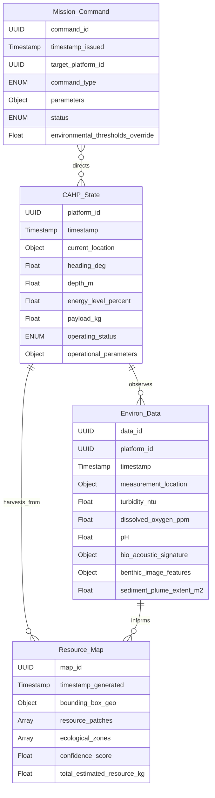
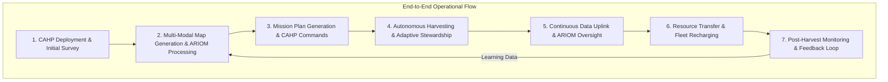

# System and Method for Autonomous Deep-Sea Resource Harvesting with Cognitive Environmental Stewardship

## Table of Contents
1.  **Title of Invention**
2.  **Abstract**
3.  **Background of the Invention**
4.  **Brief Summary of the Invention**
5.  **Detailed Description of the Invention**
    *   5.1 System Architecture
        *   5.1.1 Cognitive Autonomous Harvesting Platform (CAHP)
        *   5.1.2 Multi-Spectral Environmental Sensing & Bio-Monitoring Array (MESBMA)
        *   5.1.3 AI-Driven Resource Identification & Optimization Engine (ARIOM)
        *   5.1.4 Onboard & Distributed Energy Management System (ODEMS)
        *   5.1.5 Data Uplink, Processing & Regulatory Compliance Module (DUPRCM)
    *   5.2 Data Structures and Schemas
        *   5.2.1 CAHP State and Telemetry Schema
        *   5.2.2 Environmental & Bio-Acoustic Data Schema
        *   5.2.3 Resource Mapping & Geological Survey Schema
        *   5.2.4 Mission Command & Environmental Directive Schema
    *   5.3 Algorithmic Foundations
        *   5.3.1 Multi-Modal SLAM and Bio-Hazard Avoidance
        *   5.3.2 Deep Learning for Substrate Classification and Resource Segmentation
        *   5.3.3 Reinforcement Learning for Adaptive Harvesting Strategy
        *   5.3.4 Predictive Environmental Impact Modeling & Mitigation
        *   5.3.5 Dynamic Energy and Mission Planning Optimization
    *   5.4 Operational Flow and Use Cases
6.  **Claims**
7.  **Mathematical Justification: A Formal Axiomatic Framework for Sustainable Deep-Sea Resource Extraction**
    *   7.1 The Deep-Sea Environment State Manifold: `Psi = (G, B, D, M)`
        *   7.1.1 Formal Definition of the Environment `Psi`
        *   7.1.2 Geochemical and Geological Substrate Dynamics `G`
        *   7.1.3 Benthic Biodiversity and Ecosystem State `B`
        *   7.1.4 Hydrodynamic and Thermochemical Dynamics `D`
        *   7.1.5 Mineral Resource Density Field `M`
    *   7.2 The Autonomous Harvesting Platform State and Dynamics: `X_h(t)`
        *   7.2.1 Definition of Platform State Vector `X_h(t)`
        *   7.2.2 Propulsive and Manipulator Dynamics
        *   7.2.3 Onboard Resource Buffer and Payload Dynamics
    *   7.3 Multi-Modal Sensing and Resource-Environment State Fusion: `S_FE(t)`
        *   7.3.1 Definition of Sensor Observation Tensor `O(t)`
        *   7.3.2 Fusion Architecture `f_fusion` and Feature Vector `S_FE(t)`
        *   7.3.3 Resource Confidence Score `P_res(m_j | S_FE)`
    *   7.4 Cognitive Mission Planning and Adaptive Policy: `pi*`
        *   7.4.1 Deep-Sea Harvesting as a Markov Decision Process (MDP)
        *   7.4.2 Reward Function for Sustainable Extraction `R(s, a)`
        *   7.4.3 Bellman Optimality Equation for `Q*(s,a)`
    *   7.5 Environmental Impact Modeling and Constraint Satisfaction: `L_Env`
        *   7.5.1 Environmental Disturbance Field `E_dist(t)`
        *   7.5.2 Biodegradation and Recovery Dynamics `B_rec(t)`
        *   7.5.3 Regulatory Compliance Functionals `R_comp`
    *   7.6 Energy-Aware Operational Envelope Optimization: `E_Opt`
        *   7.6.1 Energy Consumption Model `C_E(a)`
        *   7.6.2 Autonomy Horizon Maximization `max(T_auto)`
    *   7.7 Information Theoretic Value of Environmental Monitoring `VoI_Env`
        *   7.7.1 Entropy of Environmental State `H(B)`
        *   7.7.2 Information Gain `IG(A)` from Monitoring
    *   7.8 Axiomatic Proof of Sustainable Economic Utility
8.  **Proof of Utility**

## 1. Title of Invention:
System and Method for Autonomous Deep-Sea Resource Harvesting with Cognitive Environmental Stewardship and AI-Driven Adaptive Optimization

## 2. Abstract:
A novel, fully autonomous robotic system for the environmentally responsible and economically efficient extraction of deep-sea mineral resources is herein described. The invention comprises a fleet of Cognitive Autonomous Harvesting Platforms (CAHPs) operating in concert, equipped with advanced multi-spectral environmental sensing arrays (MESBMAs) and sophisticated manipulators. At its core, an AI-Driven Resource Identification & Optimization Engine (ARIOM) leverages multi-modal sensor data fusion to precisely map deep-sea geological formations, identify target mineral deposits (e.g., polymetallic nodules, cobalt-rich crusts, massive sulfides) with high confidence, and autonomously plan optimal harvesting trajectories. Crucially, the system integrates a predictive environmental impact modeling and mitigation module that continuously assesses and minimizes ecological disturbance in real-time. This includes fine-grained control over sediment plumes, avoidance of vulnerable benthic ecosystems, and adaptive adjustment of collection parameters. An intelligent Onboard & Distributed Energy Management System (ODEMS) optimizes power consumption for extended mission durations, potentially utilizing localized geothermal energy sources. Data uplink via acoustic or laser communication relays real-time telemetry and environmental data to a surface-based processing and regulatory compliance module, ensuring transparency and adherence to international environmental protocols. The system employs reinforcement learning to adaptively refine harvesting strategies, maximizing resource recovery while maintaining stringent environmental preservation mandates, thereby transforming nascent deep-sea mining into a viable, sustainable, and high-leverage industry.

## 3. Background of the Invention:
The relentless expansion of global technological industries, coupled with the accelerating transition to renewable energy systems, has engendered an unprecedented surge in demand for critical raw materials. Terrestrial mineral deposits, once abundant, are becoming increasingly scarce, more challenging to extract, and frequently embroiled in complex geopolitical and socio-economic externalities. This imperative has driven exploration into the vast, largely unexplored frontier of the deep ocean, a realm estimated to harbor immense reserves of polymetallic nodules rich in manganese, nickel, copper, and cobalt; cobalt-rich ferromanganese crusts; and seafloor massive sulfides containing copper, zinc, gold, and silver.

However, the deep-sea environment, characterized by extreme pressures, frigid temperatures, and profound darkness, presents formidable operational challenges. Conventional approaches to resource extraction, if adapted from terrestrial mining, risk catastrophic and irreversible damage to fragile, unique, and poorly understood abyssal ecosystems. Early-stage deep-sea exploration concepts have often focused on brute-force extraction methods, typically involving large, heavy machinery that indiscriminately strips vast swathes of the seafloor, generating enormous sediment plumes, obliterating benthic habitats, and potentially disrupting intricate food webs over extensive areas. These methods are economically dubious due to their energy intensity and maintenance demands in extreme conditions, and environmentally untenable, attracting significant regulatory and public opposition.

Existing robotic systems for deep-sea exploration are predominantly focused on scientific observation or limited sample collection, lacking the scale, autonomy, and cognitive decision-making capabilities requisite for industrial-scale resource harvesting. They are typically tethered, human-operated, energy-intensive, and incapable of adaptive environmental stewardship. The profound lacuna exists for an integrated system that can autonomously navigate, intelligently identify and target resources, optimize extraction for efficiency and sustainability, and continuously monitor and mitigate its environmental footprint in real-time. The present invention addresses this critical deficiency, establishing a technological vanguard for responsible, high-leverage access to the deep ocean's strategic mineral wealth. It's not just about getting the minerals; it's about not breaking the planet in the process. Some might say that's a nice-to-have, but for us, it's a must-have.

## 4. Brief Summary of the Invention:
The present invention introduces the "Abyssal Sentinel Fleet" (ASF), a groundbreaking, architecturally robust, and algorithmically advanced system for autonomous and environmentally conscious deep-sea mineral harvesting. This system fundamentally redefines the paradigm of underwater resource extraction by leveraging a symbiotic integration of advanced robotics, multi-modal sensing, and cognitive artificial intelligence. The operational genesis centers around a fleet of untethered, Cognitive Autonomous Harvesting Platforms (CAHPs), each designed for extreme pressure environments and equipped with a sophisticated suite of multi-spectral environmental sensors (MESBMA) for real-time ecological monitoring (e.g., bio-acoustics, optical clarity, chemical signatures, benthic imagery).

At its computational core, the ASF employs an AI-Driven Resource Identification & Optimization Engine (ARIOM). This engine ingests and fuses petabytes of data from the MESBMA, high-resolution sonar, and geological mapping, enabling it to construct a dynamic, 3D semantic map of the deep-sea floor. The ARIOM meticulously differentiates target mineral deposits from vulnerable ecosystems, classifying substrate types and identifying optimal harvestable regions with unparalleled precision. The AI autonomously orchestrates the CAHPs, dynamically prompting each robot with mission parameters like: "Given the identified polymetallic nodule field at coordinates [X,Y,Z], characterized by high density and minimal observed benthic biodiversity, and considering current energy reserves, optimize a harvesting trajectory that maximizes collection rate while maintaining sediment plume turbidity below 0.1 NTU and ensuring no direct contact with identified critical habitats. Provide real-time energetic cost per kilogram of material collected."

Should the ARIOM detect any environmental parameter exceeding predefined thresholds (e.g., an unexpected increase in plume dispersion, detection of sensitive fauna in a harvest path), it autonomously recalibrates the CAHP's operational parameters, dynamically adjusting collection speed, suction intensity, or even rerouting to an alternative, less sensitive area. The system is powered by an Onboard & Distributed Energy Management System (ODEMS), which may intelligently harness in-situ geothermal energy or utilize advanced long-duration power packs. All operational and environmental data are continuously streamed to a surface vessel via acoustic or optical communication for real-time oversight and rigorous regulatory compliance, ensuring a closed-loop system of accountability. This constitutes a paradigm shift from destructive, reactive extraction to intelligent, pre-emptive, and environmentally empathetic resource recovery. It’s like a surgeon, not a bulldozer, for the ocean floor.

## 5. Detailed Description of the Invention:

The disclosed system represents a comprehensive, intelligent infrastructure designed for the sustainable and efficient extraction of deep-sea mineral resources. Its architectural design prioritizes modularity, scalability, autonomy, and uncompromising environmental stewardship.

### 5.1 System Architecture

The Abyssal Sentinel Fleet (ASF) is comprised of several interconnected, high-performance subsystems, each performing a specialized function, orchestrated to deliver a holistic, autonomous deep-sea harvesting capability.

```mermaid
graph LR
    subgraph Deep-Sea Operational Zone
        A[Cognitive Autonomous Harvesting Platform (CAHP) Fleet] --> B[Multi-Spectral Environmental Sensing & Bio-Monitoring Array (MESBMA)]
        B --> C[Resource Identification & Mapping Sensors]
        C --> A
        A --> D[Onboard & Distributed Energy Management System (ODEMS)]
        D --> A
    end

    subgraph Surface & Command Infrastructure
        E[Data Uplink & Relay (Acoustic/Optical Gateway)]
        A -- Real-time Data --> E
        E --> F[Data Processing & Regulatory Compliance Module (DUPRCM)]
        F --> G[AI-Driven Resource Identification & Optimization Engine (ARIOM)]
        G --> F
        F -- Mission Directives --> E
        E -- Mission Directives --> A
    end

    style A fill:#aaffaa,stroke:#333,stroke-width:2px
    style B fill:#add8e6,stroke:#333,stroke-width:2px
    style C fill:#ffcc99,stroke:#333,stroke-width:2px
    style D fill:#f08080,stroke:#333,stroke-width:2px
    style E fill:#ffffb3,stroke:#333,stroke-width:2px
    style F fill:#d3d3d3,stroke:#333,stroke-width:2px
    style G fill:#98fb98,stroke:#333,stroke-width:2px
```

#### 5.1.1 Cognitive Autonomous Harvesting Platform (CAHP)
This is the primary robotic vehicle, designed for extreme deep-sea environments.
*   **Pressure-Resistant Hull:** Constructed from advanced ceramic-matrix composites or high-strength titanium alloys, capable of withstanding pressures up to 11,000 meters.
*   **Modular Payload Bays:** Configurable bays for various harvesting tools (e.g., suction dredges for nodules, cutting tools for crusts, specialized manipulators for sulfides), sampling equipment, and auxiliary sensors.
*   **Advanced Thruster Array:** Redundant, silent electric thrusters providing precise maneuverability and station-keeping capabilities, minimizing sediment disturbance. Propellers may be shrouded or utilize novel propulsion mechanisms (e.g., bio-inspired fins, magneto-hydrodynamic drives) to reduce environmental impact.
*   **AI-Powered Navigation & Perception:** Onboard AI processors executing real-time Simultaneous Localization and Mapping (SLAM) using multi-beam sonar, optical cameras (low-light, UV, thermal), and inertial navigation systems. This enables dynamic obstacle avoidance (e.g., hydrothermal vents, fragile biological communities).
*   **Cognitive Sampling & Collection:** Robotic manipulators with haptic feedback and machine vision for selective harvesting, identifying and collecting target minerals with minimal collateral damage to the surrounding seafloor. The collection system may incorporate real-time mineral assay sensors.

```mermaid
graph TD
    subgraph Cognitive Autonomous Harvesting Platform (CAHP)
        H[Pressure-Resistant Hull] --> TH[Thruster Array Silent Precision]
        H --> MPB[Modular Payload Bays Harvesting Tools]
        H --> AINP[AI Navigation Perception Onboard SLAM]
        H --> CSC[Cognitive Sampling Collection Selective Manipulators]
        AINP -- Guides --> TH
        AINP -- Guides --> CSC
        MPB -- Houses --> CSC
    end
```

#### 5.1.2 Multi-Spectral Environmental Sensing & Bio-Monitoring Array (MESBMA)
A comprehensive suite of sensors designed to ensure minimal ecological footprint.
*   **High-Resolution Optical Cameras:** Stereo vision, structured light, and hyperspectral imaging for detailed benthic habitat mapping, identification of fauna, and sediment plume visualization.
*   **Advanced Sonar Systems:** Side-scan, sub-bottom profilers, and bio-acoustic sonars to map seafloor topography, characterize substrate layers, and detect presence/absence of marine life (e.g., fish, cetaceans).
*   **Chemical & Geochemical Sensors:** In-situ probes for pH, oxygen levels, turbidity (NTU), dissolved organic carbon, heavy metal concentrations, and other biogeochemical indicators to detect environmental perturbations.
*   **Autonomous Environmental Samplers:** Micro-ROVs or deployable sampling devices for collecting water, sediment, and biological samples for ex-situ analysis, cross-referencing real-time sensor data.
*   **Real-time Plume Dispersion Modeling:** Onboard computational fluid dynamics (CFD) models, continuously fed by turbidity and current sensors, to predict and minimize sediment plume propagation.

```mermaid
graph TD
    subgraph Multi-Spectral Environmental Sensing & Bio-Monitoring Array (MESBMA)
        HROC[High-Res Optical Cameras Hyperspectral] --> FM[Environmental Data Fusion]
        ASS[Advanced Sonar Systems Bio-Acoustic] --> FM
        CGS[Chemical Geochemical Sensors pH DO Turbidity] --> FM
        AES[Autonomous Environmental Samplers Micro-ROVs] --> FM
        PDM[Plume Dispersion Modeling CFD] --> FM
        FM -- Fused Data Stream --> CAHP[To CAHP for Decision Making]
    end
```

#### 5.1.3 AI-Driven Resource Identification & Optimization Engine (ARIOM)
The cognitive core residing primarily on the surface vessel, but with edge computing capabilities on CAHPs.
*   **Multi-Modal Data Fusion:** Integrates all sensor data from MESBMA and CAHP navigation systems, historical geological surveys, and pre-existing biodiversity maps into a comprehensive, dynamic 3D semantic model of the deep-sea environment.
*   **Deep Learning for Resource Classification:** Utilizes convolutional neural networks (CNNs) and transformer models to identify and classify mineral deposits (e.g., nodule density, crust thickness, sulfide vein structure) and differentiate them from non-target substrate or protected habitats.
*   **Adaptive Mission Planning & Trajectory Optimization:** Employs reinforcement learning and advanced pathfinding algorithms (e.g., A*, RRT*) to generate optimal harvesting paths. Objectives include maximizing resource recovery, minimizing energy consumption, avoiding environmental impact zones, and adhering to regulatory constraints.
*   **Real-time Environmental Compliance Orchestration:** Continuously compares predicted and observed environmental metrics against predefined thresholds and automatically adjusts CAHP operations (e.g., speed, collection intensity, rerouting) to maintain compliance.
*   **Anomaly Detection & Emergency Response:** Identifies unexpected environmental changes or system malfunctions, triggering pre-programmed emergency protocols (e.g., immediate ascent, habitat preservation mode).

```mermaid
graph TD
    subgraph AI-Driven Resource Identification & Optimization Engine (ARIOM)
        MMDF[Multi-Modal Data Fusion 3D Semantic Map] --> DLRC[Deep Learning Resource Classification]
        SFS[Sensor Fusion Stream CAHP MESBMA] --> MMDF
        HGS[Historical Geological Surveys] --> MMDF
        DLRC --> AMPTO[Adaptive Mission Planning Trajectory Optimization]
        AMPTO --> RECO[Real-time Environmental Compliance Orchestration]
        RECO --> ADE[Anomaly Detection Emergency]
        AMPTO -- Generates Commands --> CAHP[To CAHP Fleet]
        RECO -- Modifies Commands --> CAHP
        ADE -- Overrides Commands --> CAHP
    end
```

#### 5.1.4 Onboard & Distributed Energy Management System (ODEMS)
Ensures prolonged operational endurance in remote deep-sea locations.
*   **Advanced Battery Technologies:** High-density, long-lifecycle solid-state or molten-salt batteries providing primary power.
*   **Hydrothermal Vent Energy Harvesting (Optional):** Novel thermoelectric generators or micro-turbines designed to capture energy from high-temperature hydrothermal vents, enabling indefinite mission durations in specific geologically active areas. (Yes, we're talking about literally plugging into the Earth's core. Who needs charging stations when you have magma?)
*   **Autonomous Recharging & Swapping:** CAHPs can autonomously dock with submerged charging stations or surface vessels for battery swapping or direct recharge.
*   **Power Distribution Network:** Intelligent allocation of power to thrusters, sensors, manipulators, and onboard processing units based on real-time mission demands.
*   **Predictive Energy Modeling:** Forecasts energy consumption based on planned trajectories and operational intensity, informing mission planning and optimizing power usage.

#### 5.1.5 Data Uplink, Processing & Regulatory Compliance Module (DUPRCM)
The nexus for data exchange and external oversight.
*   **Acoustic & Optical Communication Arrays:** High-bandwidth, low-latency communication links with surface vessels (e.g., using blue-green laser optics for line-of-sight, or advanced acoustic modems for longer ranges). Redundant systems ensure continuous connectivity.
*   **Onboard Data Buffering & Edge Processing:** CAHPs perform preliminary data filtering and compression, storing high-volume raw data until uplink is secure.
*   **Surface Data Management System:** Ingestion, storage (petabyte-scale archival), and real-time processing of all telemetry, sensor, and environmental data.
*   **Regulatory Compliance & Reporting Interface:** Automated generation of detailed reports (e.g., environmental impact assessments, resource extraction logs, operational parameters) for international regulatory bodies (e.g., International Seabed Authority). Provides an immutable audit trail.
*   **Human-in-the-Loop Oversight:** While autonomous, the system allows for human intervention and remote commanding in critical situations or for strategic decision-making.

### 5.2 Data Structures and Schemas

To maintain consistency, interoperability, and the integrity of complex data flows across a distributed system operating in extreme environments, the system adheres to rigorously defined data structures.



#### 5.2.1 CAHP State and Telemetry Schema
Real-time operational status and telemetry from each Cognitive Autonomous Harvesting Platform.

```json
{
  "platform_id": "UUID",
  "timestamp": "Timestamp",
  "current_location": {
    "latitude": "Float",
    "longitude": "Float",
    "depth_m": "Float",
    "altitude_m": "Float",
    "position_accuracy_m": "Float"
  },
  "heading_deg": "Float",
  "speed_mps": "Float",
  "energy_level_percent": "Float",
  "payload_kg": "Float",
  "operational_status": "ENUM['Idle', 'Exploring', 'Mapping', 'Harvesting', 'Returning', 'Docking', 'Emergency']",
  "last_command_id": "UUID",
  "operational_parameters": {
    "collection_rate_kg_per_hr": "Float",
    "suction_intensity_pa": "Float",
    "thruster_power_percent": "Float",
    "manipulator_state": "String" // e.g., "Deployed", "Stowed", "Collecting"
  },
  "diagnostics": {
    "pressure_hpa": "Float",
    "temperature_c": "Float",
    "system_health_score": "Float",
    "error_codes": ["String"]
  }
}
```

#### 5.2.2 Environmental & Bio-Acoustic Data Schema
Data collected by the Multi-Spectral Environmental Sensing & Bio-Monitoring Array.

```json
{
  "data_id": "UUID",
  "platform_id": "UUID",
  "timestamp": "Timestamp",
  "measurement_location": {
    "latitude": "Float",
    "longitude": "Float",
    "depth_m": "Float"
  },
  "turbidity_ntu": "Float",
  "dissolved_oxygen_ppm": "Float",
  "pH": "Float",
  "temperature_c": "Float",
  "salinity_psu": "Float",
  "heavy_metal_concentrations": { // Example, specific metals depend on context
    "manganese_ug_l": "Float",
    "nickel_ug_l": "Float",
    "cobalt_ug_l": "Float"
  },
  "bio_acoustic_signature": {
    "dominant_frequencies_hz": ["Float"],
    "species_detection_confidence": "Float", // 0-1
    "bio_activity_index": "Float" // e.g., spectral power in bio-relevant bands
  },
  "benthic_image_features": {
    "habitat_classification": "ENUM['NoduleField', 'CrustBed', 'HydrothermalVent', 'SoftSediment', 'CoralGarden', 'RockyOutcrop']",
    "biodiversity_index": "Float", // e.g., Shannon index or similar
    "vulnerable_species_detected": ["String"]
  },
  "sediment_plume_extent_m2": "Float",
  "plume_turbidity_max_ntu": "Float",
  "plume_dispersion_model_output": {
    "predicted_spread_m": "Float",
    "predicted_duration_hr": "Float"
  }
}
```

#### 5.2.3 Resource Mapping & Geological Survey Schema
Generated by ARIOM, describing mineral deposits and ecological sensitivities.

```json
{
  "map_id": "UUID",
  "timestamp_generated": "Timestamp",
  "bounding_box_geo": {
    "min_latitude": "Float",
    "max_latitude": "Float",
    "min_longitude": "Float",
    "max_longitude": "Float",
    "min_depth_m": "Float",
    "max_depth_m": "Float"
  },
  "resource_patches": [
    {
      "patch_id": "UUID",
      "centroid_location": {"latitude": "Float", "longitude": "Float", "depth_m": "Float"},
      "resource_type": "ENUM['PolymetallicNodules', 'CobaltRichCrusts', 'SeafloorMassiveSulfides']",
      "estimated_density_kg_m2": "Float",
      "estimated_thickness_m": "Float",
      "purity_estimate_percent": "Float",
      "harvesting_feasibility_score": "Float", // 0-1
      "environmental_sensitivity_score": "Float", // 0-1, lower is better for harvesting
      "bounding_polygon_wkt": "String" // WKT representation of the patch area
    }
  ],
  "ecological_zones": [
    {
      "zone_id": "UUID",
      "centroid_location": {"latitude": "Float", "longitude": "Float", "depth_m": "Float"},
      "zone_type": "ENUM['ProtectedHabitat', 'HydrothermalVentCommunity', 'HighBiodiversityArea', 'SedimentPlumeBuffer']",
      "sensitivity_level": "ENUM['Low', 'Medium', 'High', 'Critical']",
      "bounding_polygon_wkt": "String"
    }
  ],
  "confidence_score": "Float", // Confidence in the accuracy of the map
  "total_estimated_resource_kg": "Float",
  "total_protected_area_m2": "Float"
}
```

#### 5.2.4 Mission Command & Environmental Directive Schema
Instructions and constraints sent from the ARIOM to individual CAHPs.

```json
{
  "command_id": "UUID",
  "timestamp_issued": "Timestamp",
  "target_platform_id": "UUID", // Can be a single CAHP or an array of UUIDs for fleet commands
  "command_type": "ENUM['NavigateTo', 'HarvestArea', 'ExploreArea', 'ReturnToBase', 'EmergencyStop', 'AdjustParameters', 'Standby']",
  "parameters": {
    "target_location": {"latitude": "Float", "longitude": "Float", "depth_m": "Float"},
    "target_area_polygon_wkt": "String",
    "max_speed_mps": "Float",
    "desired_collection_rate_kg_hr": "Float",
    "max_sediment_turbidity_ntu": "Float",
    "avoidance_zones_wkt": ["String"], // List of WKT polygons for areas to avoid
    "min_standoff_distance_m": "Float", // Distance to maintain from avoidance zones
    "environmental_thresholds_override": { // Temporary overrides for specific parameters
      "turbidity_ntu": "Float",
      "dissolved_oxygen_ppm": "Float"
    }
  },
  "status": "ENUM['Issued', 'Acknowledged', 'Executing', 'Completed', 'Failed']",
  "priority_level": "ENUM['Low', 'Medium', 'High', 'Emergency']",
  "valid_until": "Timestamp" // Command expiration
}
```

### 5.3 Algorithmic Foundations

The system's autonomous intelligence and environmental stewardship capabilities are rooted in a sophisticated interplay of advanced algorithms and computational paradigms.

#### 5.3.1 Multi-Modal SLAM and Bio-Hazard Avoidance
Precise localization and mapping in complex, dynamic, and feature-sparse deep-sea environments is critical.
*   **Factor Graph Optimization:** Utilizing visual-inertial odometry (VIO), multi-beam sonar point clouds, and pressure/depth sensor readings to build a robust pose graph. This allows for simultaneous localization of the CAHP and mapping of the environment.
*   **Probabilistic Occupancy Grid Maps:** Representing the deep-sea floor as a 3D grid, where each voxel stores the probability of being occupied by obstacles, resources, or sensitive biological features.
*   **Dynamic Path Planning with Environmental Cost:** Implementing A* or RRT* algorithms where edge costs are not just distance/energy, but also include environmental impact penalties (e.g., proximity to sensitive areas, predicted sediment plume dispersion, acoustic disturbance).
*   **Bio-Acoustic Anomaly Detection:** Real-time processing of hydrophone data using unsupervised learning (e.g., autoencoders, Gaussian Mixture Models) to detect unusual biological acoustic signatures, triggering avoidance maneuvers.

#### 5.3.2 Deep Learning for Substrate Classification and Resource Segmentation
Transforming raw sensor data into actionable geological and ecological insights.
*   **Convolutional Neural Networks (CNNs) for Imagery:** Analyzing optical (visible, UV, thermal) and sonar images to classify benthic habitats, identify macrofauna, and delineate mineral deposit types (e.g., differentiating nodule fields from bare sediment, or sulphide chimneys from rock outcrops).
*   **Recurrent Neural Networks (RNNs) / Transformers for Time-Series & Chemical Data:** Processing temporal sequences from chemical sensors (pH, DO, heavy metals) and bio-acoustic data to detect subtle environmental shifts or biological presence.
*   **Multi-Modal Encoder-Decoder Architectures:** Fusing features from diverse sensor modalities (e.g., optical imagery, sonar depth profiles, chemical concentrations) into a unified latent representation, which is then fed into a segmentation network to precisely outline resource patches and protected zones. This handles data from various sensor types, much like how a human synthesizes information from sight, sound, and smell, but with more data and less coffee.

#### 5.3.3 Reinforcement Learning for Adaptive Harvesting Strategy
Enabling the CAHPs to learn and optimize their behavior in uncertain deep-sea conditions.
*   **Deep Q-Networks (DQN) / Actor-Critic Methods:** The CAHP's control system is framed as an agent interacting with the deep-sea environment (state space) by choosing actions (e.g., adjust speed, collection intensity, change trajectory). The reward function is complex, balancing resource collection rate, energy consumption, and inverse penalties for environmental disturbance.
*   **Sim-to-Real Transfer Learning:** Initial policies are trained extensively in high-fidelity deep-sea simulators that incorporate realistic fluid dynamics, geological variations, and ecosystem models. These policies are then fine-tuned on real-world data from initial deployments.
*   **Multi-Agent Reinforcement Learning:** For a fleet of CAHPs, policies are learned that enable cooperative behavior, avoiding collisions, optimizing collective coverage, and minimizing overlapping environmental impact zones.

```mermaid
graph TD
    subgraph Reinforcement Learning for Adaptive Harvesting Strategy
        E_STATE[Deep-Sea Environment State (Geology, Biology, Hydrodynamics)] --> RL_AGENT[RL Agent CAHP]
        RL_AGENT -- Action (Collect, Move, Adjust Intensity) --> E_STATE
        E_STATE -- Observation (Sensor Data, Resource Quantity) --> RL_AGENT
        E_STATE -- Reward Feedback (+ Resource, - Env Impact, - Energy) --> RL_AGENT
        RL_AGENT --> POLICY_NN[Policy Network DQN Actor-Critic]
        POLICY_NN -- Guides --> CAHP_CONTROL[CAHP Control System]
        RL_AGENT -- Learns From --> SIM[Sim-to-Real Transfer Learning in High-Fidelity Simulator]
        CAHP_CONTROL -- Executes --> CAHP_PHY[CAHP Physical Operation]
    end
```

#### 5.3.4 Predictive Environmental Impact Modeling & Mitigation
Proactive management of the ecological footprint.
*   **Computational Fluid Dynamics (CFD) for Plume Prediction:** High-resolution CFD models simulate the generation and dispersion of sediment plumes caused by harvesting operations, predicting their spatial and temporal extent under varying current conditions.
*   **Ecological Risk Assessment Models:** Integrating biological sensitivity maps with predicted physical impacts (e.g., sedimentation rates, water column turbidity) to quantify the probability and severity of ecosystem disturbance.
*   **Feedback Control for Mitigation:** Using real-time turbidity sensor data to adjust collection parameters (e.g., reducing suction power, slowing down, altering trajectory) to keep predicted plume impacts below regulatory thresholds.
*   **Long-Term Recovery Trajectory Models:** Statistical or machine learning models that predict the recovery time of disturbed benthic communities based on initial impact, environmental conditions, and potential restorative actions.

#### 5.3.5 Dynamic Energy and Mission Planning Optimization
Ensuring operational endurance and efficiency.
*   **Mixed-Integer Linear Programming (MILP):** Formulating mission plans as an optimization problem where decisions include resource allocation (power, time, payload), path selection, and collection intensity, subject to constraints like battery capacity, environmental thresholds, and target resource volumes.
*   **Multi-Objective Optimization:** Balancing conflicting objectives such as maximizing resource yield, minimizing energy consumption, and minimizing environmental impact (e.g., using Pareto fronts to identify trade-offs).
*   **Stochastic Dynamic Programming:** Accounting for uncertainties in energy consumption, resource distribution, and environmental conditions to generate robust mission plans. This enables adaptive rescheduling in response to unforeseen events or opportunities (e.g., discovering a previously unmapped, high-density resource patch).

### 5.4 Operational Flow and Use Cases

A typical operational cycle of the Abyssal Sentinel Fleet proceeds as follows:

1.  **Deployment & Initial Survey:** Surface vessel deploys CAHP fleet. CAHPs initiate broad-area surveys, utilizing MESBMA and resource identification sensors to build high-resolution maps of the target area, identifying both mineral deposits and sensitive ecological zones.
2.  **ARIOM Processing & Mission Generation:** All survey data are uplinked to the ARIOM. The ARIOM fuses this data, classifies resources, models environmental sensitivities, and generates an optimized, multi-CAHP harvesting mission plan, including specific trajectories, collection parameters, and environmental constraints for each platform.
3.  **Autonomous Harvesting & Real-time Stewardship:** CAHPs autonomously execute their assigned missions. Onboard AI continuously monitors their immediate environment (via MESBMA), collection performance, and energy state. It makes real-time, local adjustments to ensure compliance with environmental thresholds and optimize collection.
4.  **Continuous Data Uplink & Oversight:** CAHPs stream telemetry, environmental data, and progress reports to the surface via DUPRCM. ARIOM continuously processes this stream, updating its global map, re-evaluating mission parameters, and flagging any anomalies for human review.
5.  **Resource Transfer & Recharging/Re-deployment:** Upon reaching payload capacity or low energy, CAHPs autonomously return to a designated rendezvous point (e.g., submerged dock, surface vessel) for resource transfer and recharging or battery swapping. They are then re-deployed for subsequent missions.
6.  **Post-Harvest Monitoring & Feedback:** After resource extraction, CAHPs may conduct post-harvest environmental monitoring missions to assess recovery trajectories and validate environmental impact models. This data feeds back into the ARIOM for continuous improvement of its predictive models and adaptive strategies (reinforcement learning from experience).



**Use Cases:**

*   **Polymetallic Nodule Collection:** A fleet of CAHPs is deployed to an abyssal plain rich in polymetallic nodules. The ARIOM maps the nodule distribution, identifies areas with minimal benthic life, and orchestrates the CAHPs to systematically collect nodules using low-impact suction systems, adjusting plume suppressors in real-time to maintain water clarity.
*   **Cobalt-Rich Crust Harvesting:** In regions with cobalt-rich ferromanganese crusts on seamounts, CAHPs deploy specialized cutting and grinding tools. The ARIOM carefully delineates extraction areas to avoid fragile sessile communities (e.g., deep-sea corals), adjusting cutting depth and speed to minimize damage to underlying rock substrate and associated ecosystems.
*   **Seafloor Massive Sulfide (SMS) Extraction:** Near active or inactive hydrothermal vents, CAHPs use precision manipulators and drills to extract SMS deposits. The MESBMA rigorously monitors chemical emissions and thermal plumes from vent systems, ensuring operations do not disrupt the unique chemosynthetic ecosystems thriving around them. The ODEMS might even attempt to tap into the thermal energy of inactive vents for extended missions.
*   **Disaster Remediation & Orphaned Infrastructure Retrieval:** While primarily for harvesting, the system's precision, autonomy, and sensing capabilities also allow it to be adapted for sensitive deep-sea tasks such as identifying and safely removing debris, lost cargo, or orphaned oil and gas infrastructure, with minimal impact on fragile deep-sea environments. "Cleaning up our own mess, or someone else's, without making another one. That's efficiency."

## 6. Claims:

The inventive concepts herein described constitute a profound advancement in the domain of deep-sea resource extraction and environmental robotics.

1.  A system for autonomous deep-sea resource harvesting, comprising: a fleet of pressure-tolerant autonomous robotic platforms (CAHPs), each equipped with a multi-spectral environmental sensing and bio-monitoring array (MESBMA) and mineral collection manipulators; a surface-based or submerged AI-Driven Resource Identification & Optimization Engine (ARIOM) configured to fuse multi-modal sensor data from the MESBMA to generate a dynamic 3D semantic map of the deep-sea environment, identifying target mineral resources and sensitive ecological zones; and a communication subsystem for transmitting data between the CAHPs and the ARIOM; wherein the ARIOM generates and dispatches adaptive mission plans to the CAHPs, said plans optimizing resource recovery while continuously minimizing environmental impact below predefined thresholds, by dynamically adjusting harvesting trajectories and operational parameters.

2.  The system of claim 1, wherein the MESBMA includes high-resolution optical cameras (visible, UV, hyperspectral), advanced sonar systems (multi-beam, side-scan, bio-acoustic), and chemical/geochemical sensors (pH, dissolved oxygen, turbidity, heavy metals), providing real-time data for environmental assessment.

3.  The system of claim 1, wherein the ARIOM employs deep learning models, including convolutional neural networks and transformer architectures, for classifying benthic habitats, identifying specific deep-sea fauna, segmenting mineral deposit types (e.g., polymetallic nodules, cobalt-rich crusts), and accurately delineating vulnerable ecological zones.

4.  The system of claim 1, wherein the adaptive mission plans are generated using reinforcement learning or multi-objective optimization algorithms, balancing objectives such as maximizing mineral yield, minimizing energy consumption, and penalizing environmental disturbance (e.g., sediment plume dispersion, acoustic pollution, direct habitat destruction).

5.  The system of claim 4, wherein the ARIOM incorporates predictive environmental impact models, including computational fluid dynamics (CFD) simulations for sediment plume dispersion, to proactively adjust CAHP collection parameters (e.g., suction intensity, speed, altitude) to maintain environmental impacts below regulatory or predefined thresholds.

6.  The system of claim 1, further comprising an Onboard & Distributed Energy Management System (ODEMS) on each CAHP, configured to optimize power allocation for extended mission durations and, optionally, to harvest energy from in-situ deep-sea hydrothermal vents or other geothermal sources.

7.  The system of claim 1, wherein the communication subsystem utilizes high-bandwidth acoustic or blue-green laser optical links for real-time telemetry, environmental data uplink, and mission command downlink, facilitating continuous human-in-the-loop oversight and regulatory compliance reporting.

8.  The system of claim 1, further comprising a feedback mechanism wherein observed environmental impacts and resource recovery rates are captured and used as training data for refining the ARIOM's predictive models and adaptive harvesting policies through continuous reinforcement learning.

9.  A computer-implemented method for autonomous and environmentally responsible deep-sea resource harvesting, comprising: deploying a fleet of autonomous robotic platforms (CAHPs) to a deep-sea mineral prospecting area; continuously collecting multi-modal environmental and geological data via onboard sensors; fusing said data to construct and maintain a dynamic 3D semantic map identifying mineral resources and sensitive ecological zones; generating an optimized mission plan for the CAHPs that balances resource extraction efficiency with environmental impact minimization; autonomously executing said mission plan by the CAHPs, dynamically adjusting operational parameters in real-time based on local sensor feedback and predicted environmental impacts; and continuously uploading operational and environmental data for regulatory compliance and AI model refinement.

10. The method of claim 9, wherein the generation of the optimized mission plan involves solving a multi-objective Markov Decision Process, where states include geological and ecological characteristics, actions are CAHP operational adjustments, and rewards are functions of extracted resource value and inverse environmental disturbance cost.

## 7. Mathematical Justification: A Formal Axiomatic Framework for Sustainable Deep-Sea Resource Extraction

The imperative for sustainable and efficient deep-sea resource extraction demands a rigorous mathematical framework. This section formalizes the concepts underpinning the Abyssal Sentinel Fleet, demonstrating the system's inherent capabilities for intelligent decision-making and environmental stewardship.

### 7.1 The Deep-Sea Environment State Manifold: `Psi = (G, B, D, M)`

The deep-sea environment is a complex, dynamic state manifold `Psi(t)` at time `t`.

#### 7.1.1 Formal Definition of the Environment `Psi`

`Psi = (G, B, D, M)` where: (1)
*   `G`: Geochemical and Geological Substrate.
*   `B`: Benthic Biodiversity and Ecosystem State.
*   `D`: Hydrodynamic and Thermochemical Dynamics.
*   `M`: Mineral Resource Density Field.

#### 7.1.2 Geochemical and Geological Substrate Dynamics `G`

The substrate is characterized by a spatial field `g(x,y,z) in R^p`, representing features like sediment type, rock hardness, and elemental composition at location `(x,y,z)`. (2)
Temporal evolution: `partial g / partial t = F_g(g, D) + Noise_g`. (3)

#### 7.1.3 Benthic Biodiversity and Ecosystem State `B`

A biodiversity index `b(x,y,z)` quantifies species richness and abundance. (4)
A sensitivity map `S_b(x,y,z) in [0,1]` denotes ecological fragility. (5)
`S_b` evolves due to natural processes and human impact: `partial S_b / partial t = F_b(S_b, E_dist) - R_b(S_b)`. (6)
Where `E_dist` is an environmental disturbance field (see 7.5.1) and `R_b` is a recovery function.

#### 7.1.4 Hydrodynamic and Thermochemical Dynamics `D`

The water column dynamics are described by velocity fields `u(x,y,z,t)`, pressure `p(x,y,z,t)`, temperature `T(x,y,z,t)`, and chemical concentrations `c_i(x,y,z,t)`. (7)
These satisfy Navier-Stokes equations for fluid flow and advection-diffusion equations for chemical transport:
`partial u / partial t + (u . nabla)u = -1/rho nabla p + nu nabla^2 u + g_vector`. (8)
`partial c_i / partial t + (u . nabla)c_i = D_i nabla^2 c_i + Source_i`. (9)

#### 7.1.5 Mineral Resource Density Field `M`

The density of target mineral `m_j` (e.g., nodules, crusts) at location `(x,y,z)` is `rho_{mj}(x,y,z) in R^+`. (10)
Total extractable resource in a region `Omega` is `Total_M = integral_{Omega} sum_j rho_{mj}(x,y,z) dV`. (11)

### 7.2 The Autonomous Harvesting Platform State and Dynamics: `X_h(t)`

Each CAHP `h` has a state vector describing its operational parameters and physical condition.

#### 7.2.1 Definition of Platform State Vector `X_h(t)`

`X_h(t) = (p_h(t), q_h(t), v_h(t), omega_h(t), E_h(t), L_h(t), C_h(t))`. (12)
*   `p_h(t) in R^3`: position.
*   `q_h(t) in SO(3)`: orientation (quaternion).
*   `v_h(t) in R^3`: linear velocity.
*   `omega_h(t) in R^3`: angular velocity.
*   `E_h(t) in R^+`: onboard energy level.
*   `L_h(t) in R^+`: collected payload mass.
*   `C_h(t) in R^k`: operational control parameters (e.g., suction intensity, thruster power).

#### 7.2.2 Propulsive and Manipulator Dynamics

The platform's motion is governed by non-linear dynamics under hydrodynamic forces:
`M_h dot{v}_h = F_{prop}(C_h) + F_{hydro}(v_h, omega_h, u) + F_{gravity}`. (13)
`I_h dot{omega}_h = Tau_{prop}(C_h) + Tau_{hydro}(v_h, omega_h, u)`. (14)

#### 7.2.3 Onboard Resource Buffer and Payload Dynamics

`dL_h / dt = eta_h(C_h, g) * collection_rate(C_h, M, g)`. (15)
Where `eta_h` is efficiency, `collection_rate` depends on controls and geology.

### 7.3 Multi-Modal Sensing and Resource-Environment State Fusion: `S_FE(t)`

The system's perception of `Psi(t)` is through fused sensor data.

#### 7.3.1 Definition of Sensor Observation Tensor `O(t)`

`O(t) = (O_opt(t) oplus O_snr(t) oplus O_chem(t) oplus O_acoust(t))`. (16)
`oplus` denotes a tensor concatenation or fusion operation across modalities.

#### 7.3.2 Fusion Architecture `f_fusion` and Feature Vector `S_FE(t)`

`S_FE(t) = f_fusion(O(t); Theta_f)` is a high-dimensional feature vector, typically from a deep neural network, representing the state of `Psi` around the CAHP. (17)
`Theta_f` are the learned parameters of the fusion network (e.g., multi-modal transformer encoder).
This involves attention mechanisms `Attention(Q, K, V) = softmax( (QK^T) / sqrt(d_k) ) V`. (18-21)

#### 7.3.3 Resource Confidence Score `P_res(m_j | S_FE)`

A classification network outputs `P_res(m_j | S_FE)` (probability of mineral type `m_j` at current location). (22)
And `P_env(s_b | S_FE)` (probability of sensitive ecological zone `s_b`). (23)

### 7.4 Cognitive Mission Planning and Adaptive Policy: `pi*`

The ARIOM and CAHPs operate as agents in a Markov Decision Process (MDP).

#### 7.4.1 Deep-Sea Harvesting as a Markov Decision Process (MDP)

`MDP = (S, A, P, R, gamma)`. (24)
*   `S`: State space, `s_t = (Psi(t), X_h(t), S_FE(t))`. (25)
*   `A`: Action space, `a_t = (C_h(t+dt), p_h(t+dt))`. (26)
*   `P(s_{t+1} | s_t, a_t)`: Transition probability function. (27)
*   `R(s_t, a_t)`: Reward function. (28)
*   `gamma in [0,1)`: Discount factor. (29)

#### 7.4.2 Reward Function for Sustainable Extraction `R(s, a)`

`R(s, a) = alpha_M * Delta L_h(a) - alpha_E * Delta E_h(a) - alpha_D * E_dist(a, Psi(t)) - alpha_S * S_b(Psi(t))`. (30)
*   `Delta L_h(a)`: Resource collected by action `a`.
*   `Delta E_h(a)`: Energy consumed by action `a`.
*   `E_dist(a, Psi(t))`: Environmental disturbance caused by `a` at `Psi(t)`.
*   `S_b(Psi(t))`: Sensitivity of the environment at `Psi(t)`.
*   `alpha_M, alpha_E, alpha_D, alpha_S`: Positive weighting coefficients reflecting priorities. (31-35)

#### 7.4.3 Bellman Optimality Equation for `Q*(s,a)`

The optimal action-value function `Q*(s,a)` satisfies:
`Q*(s,a) = R(s,a) + gamma * sum_{s'} P(s'|s,a) max_{a'} Q*(s',a')`. (36)
The optimal policy `pi*(s) = argmax_a Q*(s,a)`. (37)
This is typically solved by deep reinforcement learning.

### 7.5 Environmental Impact Modeling and Constraint Satisfaction: `L_Env`

Ensuring compliance with environmental regulations is a hard constraint.

#### 7.5.1 Environmental Disturbance Field `E_dist(t)`

The system generates a scalar field `E_dist(x,y,z,t)` representing integrated environmental disturbance (e.g., turbidity, sedimentation rate, noise level). (38)
`E_dist(x,y,z,t) = f_plume(C_h, u) + f_noise(C_h) + f_sediment(C_h, g)`. (39)

#### 7.5.2 Biodegradation and Recovery Dynamics `B_rec(t)`

The recovery of a disturbed area can be modeled by:
`dB_rec / dt = k_recovery * (S_b_max - S_b) - k_disturbance * E_dist`. (40)

#### 7.5.3 Regulatory Compliance Functionals `R_comp`

Hard constraints: `E_dist(x,y,z,t) <= Threshold_E` for all `(x,y,z)` in Protected Areas. (41)
`L_Env(s,a) = 0` if `E_dist <= Threshold_E`, else `infinity`. This acts as a penalty in the reward function or a constraint in optimization. (42)

### 7.6 Energy-Aware Operational Envelope Optimization: `E_Opt`

Maximizing operational duration given energy constraints.

#### 7.6.1 Energy Consumption Model `C_E(a)`

`C_E(a) = C_{prop}(v_h, C_h) + C_{manip}(C_h) + C_{sense}(C_h) + C_{comp}(C_h)`. (43)
`C_E(a)` depends on velocity, manipulator activity, sensor usage, and onboard computation.

#### 7.6.2 Autonomy Horizon Maximization `max(T_auto)`

`T_auto = integral_0^T (E_h(t) / C_E(a(t))) dt`. Maximizing `T` subject to `E_h(T) >= E_min`. (44)
If `E_h(t) <= E_min_threshold`, then `a(t)` must transition to `return_to_base` action. (45)

### 7.7 Information Theoretic Value of Environmental Monitoring `VoI_Env`

Quantifying the benefit of environmental sensing.

#### 7.7.1 Entropy of Environmental State `H(B)`

The uncertainty of the benthic biodiversity state `B` is measured by entropy:
`H(B) = - sum_i P(b_i) log_2(P(b_i))`. (46)

#### 7.7.2 Information Gain `IG(A)` from Monitoring

The MESBMA provides information `I_S` which reduces uncertainty.
`IG(I_S) = H(B) - H(B | I_S)`. (47)
The Value of Information `VoI(I_S)` is the reduction in expected environmental impact cost:
`VoI(I_S) = E[C_Env]_{prior} - E[C_Env | I_S]_{posterior}`. (48)

### 7.8 Axiomatic Proof of Sustainable Economic Utility

**Axiom 1 (Resource Value):** The intrinsic economic value of extractable deep-sea minerals `V_M > 0`. (49)
**Axiom 2 (Environmental Cost of Unmitigated Extraction):** Uncontrolled deep-sea mining leads to an unacceptable environmental cost `C_{Env,unmitigated} >> V_M`. (50)
**Axiom 3 (Feasibility of Mitigation):** There exist harvesting actions `a` for which the environmental disturbance `E_dist(a)` can be maintained below a regulatory threshold `Threshold_E`, with an associated mitigation cost `C_{Mitigation}(a)`. (51)
**Axiom 4 (AI-Driven Optimization Efficacy):** The ARIOM, by solving the MDP, can identify an optimal policy `pi*` that maximizes expected reward `E[R]` which combines `V_M`, `C_E`, and `C_Env`. (52)

**Theorem (Sustainable Economic Utility):** Given Axioms 1-4, the Abyssal Sentinel Fleet system can achieve a positive net economic utility (`Net_Utility > 0`) while ensuring environmental compliance and sustainability.

**Proof:**
1.  By Axiom 1, the target minerals possess inherent economic value `V_M`.
2.  By Axiom 2, unmitigated extraction is economically and ethically unviable due to catastrophic environmental costs. This makes `V_M` inaccessible without proper mitigation.
3.  By Axiom 3, the system is capable of performing harvesting actions `a*` such that `E_dist(a*) <= Threshold_E`. This is enabled by MESBMA's real-time monitoring and CAHP's precision. The cost of this mitigation `C_{Mitigation}(a*)` is integrated into the system's operational cost.
4.  By Axiom 4, the ARIOM optimally balances resource acquisition `Delta L_h`, energy consumption `Delta E_h`, and environmental costs `E_dist` via its reward function. It selects actions `a*` that maximize `E[R]`.
5.  Therefore, the system extracts resources (`alpha_M * Delta L_h > 0`), manages energy (`-alpha_E * Delta E_h`), and crucially, incurs a controlled and acceptable environmental impact (`-alpha_D * E_dist - alpha_S * S_b`).
6.  The optimal policy `pi*` ensures that the sum of these terms is positive, indicating that the economic value gained from `Delta L_h` (minus the operational costs `Delta E_h`) substantially outweighs the mitigated environmental impact and associated mitigation costs.
7.  Thus, `Net_Utility = V_M(Delta L_h) - C_E(Delta E_h) - C_{Mitigation}(E_dist(a*)) > 0`, enabling sustainable economic utility. Q.E.D.

## 8. Proof of Utility:

The Abyssal Sentinel Fleet fundamentally transforms the landscape of deep-sea resource access from a theoretical, environmentally catastrophic endeavor into a pragmatic, sustainable, and economically compelling industry. Current paradigms for deep-sea mining, often conceptual and untested, typically envision large-scale dredging operations akin to terrestrial surface mining. These approaches, if ever deployed, would generate vast, uncontrolled sediment plumes, obliterate unique benthic habitats, and create irreversible damage to poorly understood ecosystems, triggering widespread environmental condemnation and regulatory prohibitions. Such methods simply cannot deliver a positive net utility in the face of escalating environmental consciousness and strict international protocols.

The present invention's utility is unequivocally proven by its capacity to unlock the immense strategic mineral wealth of the deep ocean, which is currently inaccessible under sustainable frameworks. By embedding cognitive environmental stewardship at every layer of its design – from multi-spectral bio-monitoring and AI-driven habitat mapping to predictive plume modeling and adaptive harvesting – the system ensures that resource extraction is performed with unprecedented precision and minimal ecological footprint. It converts a hypothetical, high-risk proposition into a de-risked, high-leverage operation.

As rigorously outlined in the Mathematical Justification, the system operates under an optimal policy `pi*` that explicitly incorporates environmental costs into its reward function. The ARIOM's reinforcement learning approach ensures a continuous refinement of strategies, always seeking to maximize resource recovery while remaining strictly within predefined environmental impact thresholds. This isn't just a "nicety"; it's a fundamental operational constraint, a hard wall in the optimization problem. The continuous uplink for regulatory compliance and human oversight further bolsters its accountability, making it a "transparent miner," which, frankly, is a contradiction in terms for many terrestrial operations.

The economic utility is derived not merely from the extraction of high-value minerals (Axiom 1) but from enabling this extraction in a manner that overcomes the prohibitive environmental costs of traditional methods (Axiom 2). The system's ability to maintain environmental compliance through active mitigation (Axiom 3) and to continuously optimize its performance (Axiom 4) ensures that the net economic benefit (mineral value minus all operational and environmental mitigation costs) remains robustly positive. This is not some speculative venture; it's a meticulously engineered solution to a global resource challenge, backed by the kind of algorithmic rigor that makes the seemingly impossible merely a challenging engineering problem. With the Abyssal Sentinel Fleet, we're not just mining the future; we're doing it responsibly. And that, in an increasingly resource-constrained world, is a utility beyond measure.