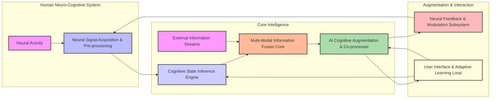
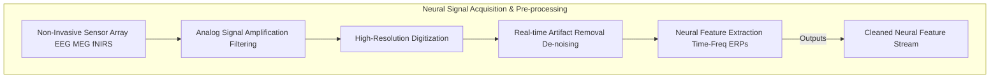
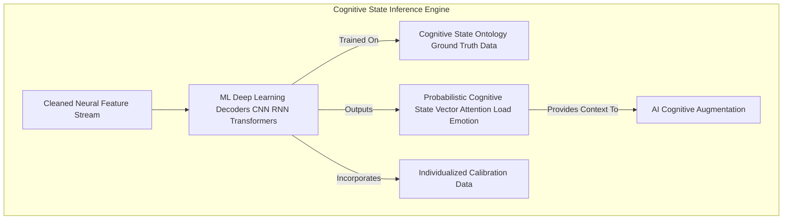
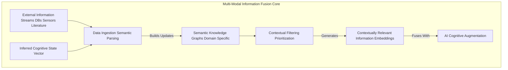
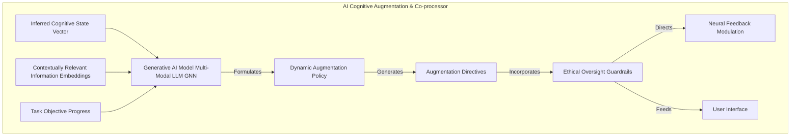
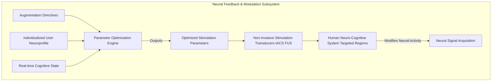
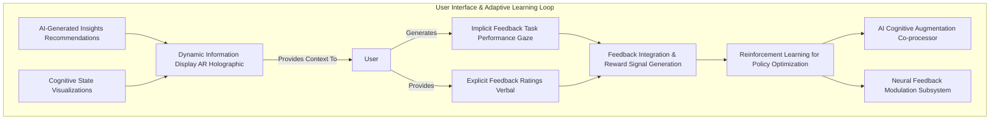
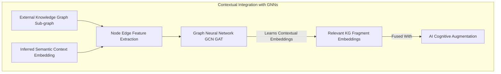
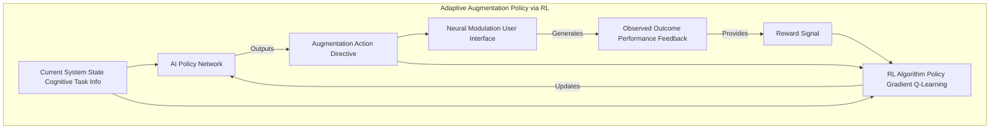
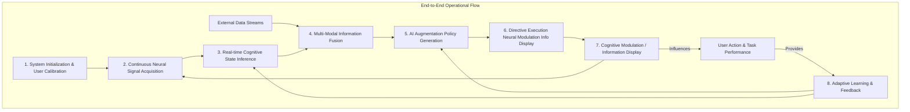

# System and Method for Neuro-Cognitive Augmentation through Symbiotic AI-Human Interface

## Table of Contents
1.  **Title of Invention**
2.  **Abstract**
3.  **Background of the Invention**
4.  **Brief Summary of the Invention**
5.  **Detailed Description of the Invention**
    *   5.1 System Architecture
        *   5.1.1 Neural Signal Acquisition and Pre-processing Module
        *   5.1.2 Cognitive State Inference Engine
        *   5.1.3 Multi-Modal Information Fusion Core
        *   5.1.4 AI Cognitive Augmentation and Co-processor
        *   5.1.5 Neural Feedback and Modulation Subsystem
        *   5.1.6 User Interface and Adaptive Learning Loop
    *   5.2 Data Structures and Schemas
        *   5.2.1 Raw Neural Data Stream Schema
        *   5.2.2 Inferred Cognitive State Schema
        *   5.2.3 AI Augmentation Directive Schema
        *   5.2.4 External Knowledge Graph Fragment Schema
    *   5.3 Algorithmic Foundations
        *   5.3.1 Real-time Neural Feature Extraction and De-noising
        *   5.3.2 Deep Learning for Cognitive State Decoding
        *   5.3.3 Graph Neural Networks for Contextual Integration
        *   5.3.4 Reinforcement Learning for Adaptive Augmentation Policy
        *   5.3.5 Generative AI for Symbiotic Problem-Solving and Insight Generation
    *   5.4 Operational Flow and Use Cases
6.  **Claims**
7.  **Mathematical Justification: A Formal Axiomatic Framework for Symbiotic Neuro-Cognitive Augmentation**
    *   7.1 The Human Neuro-Cognitive State Manifold: `H(t) = (N(t), S_C(t), f_N_C)`
        *   7.1.1 Formal Definition of Raw Neural State `N(t)`
        *   7.1.2 Formal Definition of Cognitive State `S_C(t)`
        *   7.1.3 The Neural-to-Cognitive Mapping Function `f_N_C`
        *   7.1.4 Dynamics of the Cognitive State `dS_C(t)`
    *   7.2 The External Information Manifold: `I(t)`
        *   7.2.1 Definition of the Information Tensor `I(t)`
        *   7.2.2 Multi-Modal Feature Extraction `g_I`
        *   7.2.3 Contextualized Information Vector `F_I(t)`
    *   7.3 The AI Augmentation Oracle: `A_AI`
        *   7.3.1 Formal Definition of the Augmentation Function `A_AI`
        *   7.3.2 Augmentation Directive `U_aug(t)`
        *   7.3.3 Cognitive Load and Bandwidth Optimization
    *   7.4 The Neural Feedback and Modulation Function: `M_NF`
        *   7.4.1 Formal Definition of the Modulation Function `M_NF`
        *   7.4.2 Effect on Neural State `N(t)` and Subsequent Cognitive State `S_C(t)`
    *   7.5 Information Gain and Task Performance Maximization
        *   7.5.1 The Task Performance Metric `P(t)`
        *   7.5.2 Information Entropy Reduction and Decision Quality
        *   7.5.3 Augmented Cognitive Bandwidth and Processing Speed
    *   7.6 Reinforcement Learning for Adaptive Augmentation Policy
        *   7.6.1 State and Action Spaces for RL
        *   7.6.2 Reward Function for Cognitive Performance
        *   7.6.3 Policy Optimization for `pi_aug`
    *   7.7 Axiomatic Proof of Utility
8.  **Proof of Utility**

## 1. Title of Invention:
System and Method for Neuro-Cognitive Augmentation through Symbiotic AI-Human Interface with Dynamic Information Fusion and Adaptive Neural Modulation

## 2. Abstract:
A novel neuro-cognitive augmentation system is disclosed, designed to establish a high-bandwidth, bidirectional interface between human cognition and advanced artificial intelligence. This invention architecturally delineates a non-invasive Brain-Computer Interface (BCI) paradigm capable of precisely acquiring, processing, and interpreting human neural signals to infer real-time cognitive states, including attention, memory recall, emotional valence, and cognitive load. Simultaneously, the system ingests and fuses multi-modal external information streams—ranging from complex datasets and real-time environmental telemetry to expert knowledge graphs—with the inferred cognitive context. A sophisticated AI Co-processor, operating as a generative cognitive partner, dynamically analyzes this fused data. It identifies optimal opportunities to enhance human cognition by formulating targeted augmentation directives, such as contextual information priming, focused attention guidance, or subtle memory recall facilitation. These directives are translated into precise, non-invasive neural feedback signals (e.g., transcranial alternating current stimulation (tACS), focused ultrasound) delivered to specific cortical regions, thereby adaptively modulating cognitive states. The system continuously learns from user performance and explicit feedback, employing reinforcement learning to optimize augmentation strategies and foster a truly symbiotic, high-performance cognitive partnership. This transforms humans from mere users of tools into integrated, augmented intelligence entities, capable of problem-solving at scales previously unattainable, perhaps even enabling us to finally think in 11 dimensions, or at least remember where we left our keys.

## 3. Background of the Invention:
The exponential proliferation of data, coupled with the increasing complexity of global challenges—from climate modeling to advanced material science and multi-domain strategic planning—has begun to demonstrably exceed the innate processing and recall capacities of un-augmented human cognition. Traditional human-computer interfaces, reliant on symbolic inputs (keyboard, mouse) and visual outputs, inherently impose a severe bandwidth bottleneck, forcing the human operator to translate complex mental models into slow, serialized interactions. While existing Brain-Computer Interfaces (BCIs) have made strides in assistive technologies for communication and motor control, they largely remain unidirectional, focused on decoding intent, or limited to rudimentary feedback mechanisms. They conspicuously lack the capacity for sophisticated, context-aware cognitive inference, adaptive bi-directional information exchange, and the proactive modulation necessary for true cognitive augmentation. The current paradigm relegates AI to an external analytical tool, rather than an integrated cognitive partner, leaving a profound lacuna in the realization of truly symbiotic human-AI intelligence. This prevents the full leveraging of human intuition and creativity with AI's unparalleled processing speed and data synthesis capabilities. The imperative is not merely to build better tools, but to evolve the very interface of human thought with an intelligent computational substrate, enabling a leap in problem-solving efficacy.

## 4. Brief Summary of the Invention:
The present invention unveils a novel, architecturally robust, and algorithmically advanced system for neuro-cognitive augmentation, herein termed the "Cerebral Nexus Co-processor." This system transcends conventional BCI and AI paradigms by establishing an unprecedentedly high-bandwidth, adaptive, and symbiotic interface with human cognition. The operational genesis commences with the continuous, non-invasive acquisition of a user's neural activity via advanced sensor arrays, meticulously processed to infer real-time cognitive states such as attention, working memory load, and semantic context. At its operational core, the Cerebral Nexus Co-processor employs a sophisticated, continuously learning generative AI engine. This engine acts as an expert cognitive partner, incessantly monitoring, correlating, and interpreting a torrent of multi-modal external information (e.g., complex simulation results, vast scientific literature, real-time sensor data) in the dynamic context of the user's inferred cognitive state and task objectives. The AI is dynamically prompted with highly contextualized queries, such as: "Given the user's current high cognitive load during complex astrophysical simulation analysis, what specific contextual information from the exoplanet database would most effectively reduce processing time, and which neural modulation parameter set (e.g., tACS frequency, amplitude, target region) would best facilitate recall and pattern recognition for anomaly detection?" Should the AI model identify an opportunity to enhance cognitive performance or reduce load, it autonomously synthesizes and disseminates a precise "augmentation directive." This directive, often operating below conscious perception, is translated into targeted neural feedback or subtle stimulation. This constitutes a paradigm shift from merely receiving commands from a brain to orchestrating intelligent, pre-emptive cognitive enhancements, embedding an unprecedented degree of foresight, focus, and intellectual throughput into human problem-solving. It's essentially an OS update for your wetware.

## 5. Detailed Description of the Invention:

The disclosed system represents a comprehensive, intelligent infrastructure designed to augment human cognition through a symbiotic AI partnership. Its architectural design prioritizes non-invasiveness, adaptability, and the seamless integration of advanced artificial intelligence paradigms with neuroscientific principles.

### 5.1 System Architecture

The Cerebral Nexus Co-processor is comprised of several interconnected, high-performance modules, each performing a specialized function, orchestrated to deliver a holistic cognitive augmentation capability.



#### 5.1.1 Neural Signal Acquisition and Pre-processing Module
This foundational component captures and refines the user's brain activity.
*   **Non-Invasive Sensor Array:** Utilizes advanced non-invasive neuroimaging technologies for high spatio-temporal resolution, such as high-density electroencephalography (EEG) with active electrodes, magnetoencephalography (MEG) in a portable form factor, functional near-infrared spectroscopy (fNIRS), or novel temporal field sensing (TFS) arrays. The goal is maximum signal quality with minimal user burden.
*   **Signal Amplification & Digitization:** Raw analog neural signals are amplified, filtered to remove environmental noise (e.g., 60Hz hum, muscle artifacts), and digitized at a high sampling rate.
*   **Artifact Removal & De-noising:** Advanced signal processing algorithms (e.g., Independent Component Analysis ICA, blind source separation, deep learning-based de-noising autoencoders) are applied to isolate genuine neural signals from physiological artifacts (e.g., eye blinks, muscle movements) and motion artifacts.
*   **Real-time Feature Extraction:** Key neural features relevant to cognitive states (e.g., power spectral densities in different frequency bands alpha, beta, gamma, event-related potentials ERPs, phase-amplitude coupling) are extracted in real-time.



#### 5.1.2 Cognitive State Inference Engine
This module translates neural activity into interpretable cognitive states.
*   **Machine Learning Decoders:** Utilizes a suite of supervised and unsupervised machine learning models (e.g., Support Vector Machines SVMs, Random Forests, Convolutional Neural Networks CNNs, Recurrent Neural Networks RNNs, Transformers) trained on vast datasets of synchronized neural activity and corresponding ground-truth cognitive states (e.g., task performance, self-reported metrics, behavioral observations).
*   **Cognitive State Ontology:** A comprehensive taxonomy of cognitive states is employed, encompassing categories such as:
    *   **Attention:** Focused, sustained, divided, executive attention.
    *   **Memory:** Working memory load, memory retrieval attempts, semantic encoding.
    *   **Cognitive Load:** Mental effort, task difficulty.
    *   **Emotional Valence:** Stress, frustration, engagement, curiosity.
    *   **Decision State:** Ambiguity, confidence, uncertainty.
    *   **Semantic Context:** Current topic of thought, conceptual associations.
*   **Probabilistic State Estimation:** The engine provides probabilistic outputs for each cognitive state, along with confidence intervals, reflecting the inherent uncertainty in neural decoding.
*   **Individualized Calibration:** The models are continuously calibrated and fine-tuned for each individual user through baseline measurements and adaptive learning, accounting for neurophysiological variability.



#### 5.1.3 Multi-Modal Information Fusion Core
This robust, scalable service integrates diverse external data with the user's cognitive context. It acts as the "situational awareness hub" for the AI.
*   **Diverse Data Ingestion APIs:** Integrates with APIs for scientific databases (e.g., PubMed, arXiv), enterprise knowledge management systems, real-time sensor networks, simulation outputs, and open-source intelligence feeds.
*   **Semantic Knowledge Graphs:** External information is ingested and organized into dynamically evolving semantic knowledge graphs (e.g., using RDF, OWL, or property graphs), allowing for complex querying and relational inference.
*   **Contextual Filtering & Prioritization:** Leveraging the inferred cognitive state (from 5.1.2), this module dynamically filters, prioritizes, and contextualizes incoming information. For example, if the user is in a state of high cognitive load attempting to solve a fluid dynamics problem, the system prioritizes relevant research papers and simulation results, down-weighting irrelevant general news.
*   **Cross-Modal Embedding:** Information from disparate modalities (text, numerical data, images, audio) is transformed into a unified latent vector space, enabling direct comparison and fusion with neural feature vectors via advanced embedding techniques (e.g., CLIP-like architectures for aligning different modalities).



#### 5.1.4 AI Cognitive Augmentation and Co-processor
This is the intellectual core of the Cerebral Nexus Co-processor, employing advanced generative AI to synthesize intelligence and formulate augmentation strategies.
*   **Generative AI Model:** A large, multi-modal transformer-based language model (LLM) or a specialized graph neural network (GNN) serves as the primary inference and generation engine. This model is pre-trained on vast corpora encompassing scientific literature, engineering principles, psychological theories, and problem-solving strategies. It may be fine-tuned with specific domain knowledge and human-AI collaborative session data.
*   **Dynamic Augmentation Policy Generation:** Instead of static responses, this AI constructs highly dynamic, context-specific augmentation directives. These directives are meticulously crafted, integrating:
    *   The user's real-time cognitive state.
    *   Contextually relevant external information.
    *   The current task objective and progress.
    *   Pre-defined "cognitive personas" for the AI (e.g., "Expert Scientific Reviewer," "Creative Problem Solver," "Logic Debugger").
    *   Desired augmentation outcomes (e.g., "increase focus," "facilitate recall," "suggest novel connection").
*   **Proactive Insight Generation:** The AI not only responds to cognitive states but proactively identifies patterns, infers missing information, suggests novel hypotheses, or highlights potential errors in the user's line of reasoning, often before the user consciously identifies these gaps.
*   **Ethical Oversight & Guardrails:** Integrated sub-systems ensure that augmentation directives adhere to predefined ethical guidelines, prevent cognitive overload, and prioritize user well-being, avoiding any form of undue influence or manipulation.



#### 5.1.5 Neural Feedback and Modulation Subsystem
Upon receiving the AI's structured augmentation directives, this subsystem translates them into precise, non-invasive physiological signals. This is where the magic happens, or as we like to call it, "turning thoughts into slightly more productive thoughts."
*   **Non-Invasive Stimulation Transducers:** Utilizes advanced transcranial electrical stimulation (tES) modalities like transcranial alternating current stimulation (tACS) or transcranial direct current stimulation (tDCS) with highly focused electrode arrays. Alternatively, focused ultrasound stimulation (FUS) or transcranial magnetic stimulation (TMS) in miniaturized, wearable forms, capable of targeting specific cortical regions with millimetric precision.
*   **Parameter Optimization Engine:** For each augmentation directive, this engine calculates the optimal stimulation parameters (e.g., frequency, amplitude, waveform, duration, target coordinates, phase offsets for tACS) based on a vast database of neurophysiological responses, individual user profiles, and real-time cognitive states.
*   **Adaptive Closed-Loop Control:** The system operates in a continuous closed-loop, dynamically adjusting modulation parameters in response to real-time neural feedback (from 5.1.1) and inferred cognitive state changes (from 5.1.2), ensuring precise and effective cognitive tuning.
*   **Neuroplasticity Guidance:** Modulation protocols are designed not just for immediate effects but also to encourage beneficial long-term neuroplastic changes, enhancing baseline cognitive abilities over time.



#### 5.1.6 User Interface and Adaptive Learning Loop
This component ensures the system is interactive, adaptive, and continuously improves.
*   **Dynamic Information Display:** A contextualized user interface (e.g., augmented reality overlay, holographic display, or even direct neural semantic injection if bandwidth permits) presents AI-generated insights, visualizations of cognitive states, task progress, and system recommendations in an intuitive, non-disruptive manner.
*   **Implicit & Explicit Feedback Mechanisms:**
    *   **Implicit:** The system continuously monitors task performance metrics (e.g., decision speed, accuracy, error rates, time-on-task, gaze patterns, pupil dilation) as implicit feedback on augmentation efficacy.
    *   **Explicit:** Users can provide direct feedback through verbal commands, gestural inputs, or simple ratings on the utility and comfort of the augmentation, or even "mental thumbs up/down" if we get brain-decoding *really* good.
*   **Reinforcement Learning from Human Feedback (RLHF):** Both implicit and explicit feedback are captured and used as critical training signals for the AI Cognitive Augmentation Co-processor (5.1.4) and the Neural Feedback Subsystem (5.1.5). This feedback loop iteratively fine-tunes the AI's augmentation policies and modulation parameters, ensuring the system becomes increasingly personalized, effective, and seamless over time. This closes the loop, making the system an adaptive, intelligent partner in cognition.



### 5.2 Data Structures and Schemas

To maintain consistency, interoperability, and the integrity of complex data flows, the system adheres to rigorously defined data structures.

```mermaid
erDiagram
    User --o{ RawNeuralData : generates
    RawNeuralData ||--o{ CognitiveState : decodes_to
    CognitiveState }o--|| AugmentationDirective : influences
    AugmentationDirective ||--o{ NeuralModulationParams : translates_to
    ExternalKnowledgeGraphFragment ||--o{ AugmentationDirective : informs
    User ||--o{ Feedback : provides
```

#### 5.2.1 Raw Neural Data Stream Schema
Structured representation of acquired neural signals after initial pre-processing.

```json
{
  "data_id": "UUID",
  "user_id": "UUID",
  "timestamp_start": "Timestamp",
  "timestamp_end": "Timestamp",
  "sensor_type": "ENUM['EEG', 'MEG', 'fNIRS', 'TFS']",
  "sampling_rate_hz": "Integer",
  "channels_data": [
    {
      "channel_name": "String", // e.g., "Fz", "P3"
      "electrode_position": {"x": "Float", "y": "Float", "z": "Float"}, // MNI/Talairach or device-specific
      "neural_signal_microvolts": ["Float"] // Array of time-series amplitude values
    }
  ],
  "power_spectral_densities": { // Optional pre-calculated features
    "delta_band_power": ["Float"], // Array per channel
    "theta_band_power": ["Float"],
    "alpha_band_power": ["Float"],
    "beta_band_power": ["Float"],
    "gamma_band_power": ["Float"]
  },
  "event_markers": [ // Optional, e.g., for task-related events
    {"event_time_offset_ms": "Integer", "event_type": "String", "description": "String"}
  ]
}
```

#### 5.2.2 Inferred Cognitive State Schema
Structured representation of decoded cognitive metrics.

```json
{
  "state_id": "UUID",
  "user_id": "UUID",
  "timestamp": "Timestamp",
  "inferred_from_data_id": "UUID", // Link to source neural data
  "cognitive_states": {
    "attention_level": {"score": "Float", "confidence": "Float", "type": "ENUM['Focused', 'Divided', 'Sustained']"},
    "working_memory_load": {"score": "Float", "confidence": "Float", "items_recalled": "Integer"},
    "cognitive_load_index": {"score": "Float", "confidence": "Float"}, // 0-1 normalized
    "engagement_level": {"score": "Float", "confidence": "Float"},
    "frustration_index": {"score": "Float", "confidence": "Float"},
    "semantic_context_embedding": ["Float"], // High-dimensional vector representing current thought content
    "task_difficulty_perception": {"score": "Float", "confidence": "Float"},
    "decision_ambiguity": {"score": "Float", "confidence": "Float"}
  },
  "raw_prediction_probabilities": {"String": "Float"}, // Map of raw probabilities for classification models
  "is_baseline_state": "Boolean" // Indicates if this is a baseline measurement
}
```

#### 5.2.3 AI Augmentation Directive Schema
Structured commands generated by the AI for neural feedback or information display.

```json
{
  "directive_id": "UUID",
  "user_id": "UUID",
  "timestamp_generated": "Timestamp",
  "triggering_cognitive_state_id": "UUID", // Link to cognitive state that prompted this
  "objective": "String", // e.g., "Enhance Focus", "Facilitate Memory Recall", "Reduce Cognitive Load"
  "directive_type": "ENUM['NeuralModulation', 'InformationPriming', 'AttentionGuidance', 'SemanticInjection']",
  "neural_modulation_params": { // If directive_type is 'NeuralModulation'
    "stimulation_modality": "ENUM['tACS', 'tDCS', 'FUS', 'TMS']",
    "target_cortical_region_mni": {"x": "Float", "y": "Float", "z": "Float"}, // MNI coordinates
    "frequency_hz": "Float", // For tACS
    "amplitude_ma": "Float", // For tACS/tDCS
    "duration_ms": "Integer",
    "phase_offset_degrees": "Float", // For multi-electrode tACS
    "waveform_type": "ENUM['Sine', 'Square', 'Ramp']"
  },
  "information_priming_content": { // If directive_type is 'InformationPriming'
    "content_embedding": ["Float"], // Embeddings of relevant information to display/semantically inject
    "source_knowledge_graph_fragment_id": "UUID",
    "display_priority": "ENUM['Low', 'Medium', 'High']"
  },
  "estimated_cognitive_impact": {
    "expected_load_reduction": "Float",
    "expected_focus_increase": "Float",
    "expected_task_completion_speedup_percent": "Float"
  },
  "confidence_in_impact": "Float", // AI's confidence in the directive's efficacy (0-1)
  "feedback_status": "ENUM['Sent', 'Delivered', 'Executed', 'Failed']"
}
```

#### 5.2.4 External Knowledge Graph Fragment Schema
A structured excerpt from the broader knowledge graph relevant to a specific cognitive context or task.

```json
{
  "fragment_id": "UUID",
  "timestamp_extracted": "Timestamp",
  "query_context_embedding": ["Float"], // Embedding of the query/cognitive state that led to this fragment
  "domain_tags": ["String"], // e.g., "Astrophysics", "Materials Science", "Project Management"
  "nodes": [
    {
      "node_id": "String", // e.g., URI, internal ID
      "type": "ENUM['Concept', 'Entity', 'Process', 'Theory', 'DataPoint']",
      "label": "String",
      "attributes": {"String": "Any"} // e.g., "definition", "value", "author"
    }
  ],
  "edges": [
    {
      "edge_id": "String",
      "source_node_id": "String",
      "target_node_id": "String",
      "relationship_type": "String", // e.g., "has_property", "causes", "is_part_of", "related_to"
      "weight": "Float" // Optional, e.g., strength of relationship
    }
  ],
  "summary_text": "String" // A brief AI-generated summary of the fragment
}
```

### 5.3 Algorithmic Foundations

The system's intelligence is rooted in a sophisticated interplay of advanced algorithms and computational paradigms, all working seamlessly, sometimes even when the coffee machine is broken.

#### 5.3.1 Real-time Neural Feature Extraction and De-noising
Extracting meaningful signals from the cacophony of the brain requires advanced techniques.
*   **Adaptive Filtering:** Wiener filtering, Kalman filters, or deep learning-based autoencoders for real-time noise reduction.
*   **Wavelet Transform:** Time-frequency decomposition using continuous or discrete wavelet transforms to capture transient neural events and oscillatory dynamics across different frequency bands.
*   **Source Localization Algorithms:** Algorithms like LORETA (Low Resolution Electromagnetic Tomography Analysis) or sLORETA for EEG/MEG to estimate the cortical sources of observed scalp potentials, providing spatial precision for cognitive state inference and targeted modulation.

#### 5.3.2 Deep Learning for Cognitive State Decoding
The nuanced and high-dimensional nature of neural data necessitates powerful pattern recognition.
*   **Recurrent Neural Networks (RNNs) / LSTMs / GRUs:** Ideal for processing sequential neural data (time-series), capturing temporal dependencies in cognitive processes.
*   **Convolutional Neural Networks (CNNs):** Applied to spatial (electrode layout) and spectral (frequency band) features of EEG/MEG, effectively learning hierarchical representations of neural patterns associated with specific cognitive states.
*   **Transformer Networks (Self-Attention):** Utilizing multi-head self-attention mechanisms to weigh the importance of different neural features and their temporal context, especially for complex, multi-faceted cognitive states.
*   **Contrastive Learning:** Training models to differentiate between distinct cognitive states (e.g., focused vs. distracted) by maximizing agreement between different views of the same state and disagreement between different states, enhancing robustness with limited labeled data.


#### 5.3.3 Graph Neural Networks for Contextual Integration
Connecting vast external knowledge to a user's specific cognitive need requires understanding relationships.
*   **Graph Convolutional Networks (GCNs):** Applied to the semantic knowledge graph to learn embeddings of concepts and entities, reflecting their relational context. These embeddings are then fused with the cognitive state embedding.
*   **Attention-based GNNs (e.g., Graph Attention Networks GATs):** Dynamically weigh the importance of different nodes and edges in the knowledge graph based on their relevance to the current cognitive state and task, allowing the AI to focus on the most pertinent information.
*   **Knowledge Graph Completion/Reasoning:** Utilizing GNNs for inferring missing links or properties within the knowledge graph, enabling the AI to generate novel insights or fill knowledge gaps for the user.



#### 5.3.4 Reinforcement Learning for Adaptive Augmentation Policy
The system learns how to best help you, iteratively, like a very patient (and very smart) mentor.
*   **Markov Decision Process (MDP) Formulation:** The augmentation process is modeled as an MDP where:
    *   **State (`s`):** The current tuple of (User's Cognitive State, External Information Context, Task Progress).
    *   **Action (`a`):** An augmentation directive (e.g., applying tACS, displaying a specific piece of information).
    *   **Reward (`r`):** Derived from implicit (task performance improvement, cognitive load reduction) and explicit (user feedback) signals.
    *   **Transition Probability (`P`):** The likelihood of moving to a new state `s'` after taking action `a` from state `s`.
*   **Policy Gradient Methods (e.g., Proximal Policy Optimization PPO):** Used to train the AI to discover optimal augmentation policies that maximize cumulative rewards over time, leading to increasingly effective and personalized cognitive enhancements.
*   **Multi-Armed Bandit Strategies:** For initial exploration of augmentation parameters or when limited data is available, efficiently identifying promising modulation strategies.



#### 5.3.5 Generative AI for Symbiotic Problem-Solving and Insight Generation
This is where the AI truly becomes a cognitive partner, not just a data processor.
*   **Multi-Modal Generative Models:** Utilizing advanced models (e.g., GPT-x, DALL-E-like architectures extended to scientific data) that can generate:
    *   **Hypotheses:** Formulating novel scientific hypotheses or engineering solutions based on fused data.
    *   **Analogies:** Drawing insightful analogies from disparate domains to aid human creativity.
    *   **Explanations:** Providing clear, concise explanations of complex concepts tailored to the user's current cognitive state and knowledge gaps.
    *   **Simulations:** Generating parameters for hypothetical scenarios or simulations to test proposed solutions.
*   **Co-Creative Loops:** The AI operates in a tight feedback loop with the user, iteratively refining generated insights based on human intuition and evaluation, leading to emergent solutions that neither human nor AI could achieve alone.
*   **Semantic Compression:** The ability to distill vast amounts of information into high-density, semantically rich representations that can be efficiently communicated to the user, potentially even via direct neural semantic injection for maximum bandwidth.

### 5.4 Operational Flow and Use Cases

A typical operational cycle of the Cerebral Nexus Co-processor proceeds as follows:

1.  **Initialization & Calibration:** User dons the non-invasive sensor array. Baseline neural activity is recorded, and initial cognitive state models are calibrated. Task objectives are provided to the system.
2.  **Continuous Neural Signal Acquisition:** The Acquisition Module perpetually streams, pre-processes, and extracts features from the user's neural activity.
3.  **Real-time Cognitive State Inference:** The Inference Engine continuously decodes neural features into probabilistic cognitive state vectors (attention, load, etc.).
4.  **Multi-Modal Information Fusion:** The Fusion Core ingests external data, contextualizes it based on the inferred cognitive state and task, and prepares it for AI processing.
5.  **AI Augmentation Policy Generation:** The AI Co-processor, based on the fused data and current cognitive state, dynamically formulates an optimal augmentation policy.
6.  **Directive Execution:** The AI's augmentation directives are translated into either neural modulation parameters for the Feedback Subsystem or content for the Dynamic Information Display.
7.  **Cognitive Modulation / Information Display:** Neural feedback is delivered, or information is presented to the user.
8.  **Adaptive Learning & Feedback:** The user's task performance and explicit feedback are continuously monitored, feeding into the RL algorithm to refine the AI's augmentation policies and modulation parameters.



**Use Cases:**

*   **Accelerated Scientific Discovery:** An astrophysicist analyzing terabytes of telescope data. The system detects signs of cognitive overload and distraction, then proactively primes their working memory with relevant spectral signatures of rare celestial phenomena from a scientific knowledge graph, while subtly modulating neural oscillations to enhance sustained focus, leading to faster anomaly detection.
*   **Complex Engineering Design:** An engineer designing a next-generation aerospace component. The AI co-processor identifies a subtle flaw in the thermal dissipation model. Instead of outright telling the user (and inducing cognitive bias), it generates a series of visual prompts and semantic injections, gently guiding the user's attention to analogous solutions in a disparate field (e.g., biological cooling systems), allowing the human to "discover" the optimal solution.
*   **High-Stakes Decision Making (e.g., Mission Control):** A mission specialist during a critical spacecraft maneuver. The system monitors their stress levels and decision ambiguity. The AI pre-processes real-time telemetry, simulating consequences of various actions, and presents a compressed probabilistic outcome space directly relevant to their current focus, while non-invasively dampening neural activity associated with anxiety, enabling clearer, faster decision-making under extreme pressure.
*   **Enhanced Skill Acquisition:** A student learning a complex musical instrument or surgical procedure. The system identifies moments of frustration or suboptimal motor learning patterns, then provides tailored, real-time neural feedback to enhance motor cortex plasticity and reinforce correct neural pathways, accelerating the learning curve. Because who *doesn't* want to learn the violin in a week?

## 6. Claims:

The inventive concepts herein described constitute a profound advancement in the domain of human-AI interaction and cognitive enhancement.

1.  A system for neuro-cognitive augmentation, comprising: a non-invasive neural signal acquisition module configured to capture real-time human neural activity; a cognitive state inference engine configured to decode said neural activity into a probabilistic representation of the user's cognitive state; a multi-modal information fusion core configured to integrate external data with said cognitive state; an AI cognitive augmentation co-processor configured to analyze the integrated data and generate adaptive augmentation directives; and a neural feedback and modulation subsystem configured to translate said directives into non-invasive physiological signals delivered to the user's brain, thereby modulating cognitive states.

2.  The system of claim 1, wherein the non-invasive neural signal acquisition module utilizes high-density electroencephalography (EEG), magnetoencephalography (MEG), functional near-infrared spectroscopy (fNIRS), or advanced temporal field sensing (TFS) arrays.

3.  The system of claim 1, wherein the cognitive state inference engine employs deep learning models, including recurrent neural networks (RNNs), convolutional neural networks (CNNs), or transformer networks, to decode cognitive states such as attention, working memory load, emotional valence, and semantic context.

4.  The system of claim 1, wherein the multi-modal information fusion core ingests and organizes external data into dynamically evolving semantic knowledge graphs, leveraging graph neural networks (GNNs) for contextual filtering and cross-modal embedding.

5.  The system of claim 1, wherein the AI cognitive augmentation co-processor comprises a large, multi-modal generative AI model, configured to formulate dynamic augmentation policies that optimize for user-defined task objectives and current cognitive states, while adhering to ethical guidelines.

6.  The system of claim 5, wherein the generative AI model performs proactive insight generation, hypothesis formulation, and semantic compression of information, tailored to the user's cognitive context.

7.  The system of claim 1, wherein the neural feedback and modulation subsystem utilizes transcranial electrical stimulation (tES) modalities (tACS, tDCS), focused ultrasound stimulation (FUS), or miniaturized transcranial magnetic stimulation (TMS) for targeted cortical modulation.

8.  The system of claim 7, wherein the neural feedback and modulation subsystem operates in a closed-loop control system, dynamically adjusting stimulation parameters based on real-time neural activity and inferred cognitive state changes to achieve precise cognitive tuning.

9.  The system of claim 1, further comprising an adaptive learning loop that captures implicit user performance metrics and explicit user feedback, employing reinforcement learning from human feedback (RLHF) to continuously fine-tune the AI's augmentation policies and neural modulation parameters, leading to personalized and optimized cognitive enhancement.

10. A computer-implemented method for symbiotic neuro-cognitive augmentation, comprising: continuously acquiring and decoding human neural activity into real-time cognitive state vectors; fusing said cognitive state vectors with contextually filtered external multi-modal information; generating adaptive augmentation directives using a generative AI model; translating said directives into non-invasive neural feedback signals; delivering said signals to the user's brain to modulate cognitive function; and iteratively refining the augmentation strategy based on observed user performance and feedback.

## 7. Mathematical Justification: A Formal Axiomatic Framework for Symbiotic Neuro-Cognitive Augmentation

The intricate interplay between neural activity, cognitive states, external information, and AI-driven modulation necessitates a rigorous mathematical framework. We herein establish such a framework, transforming the conceptual elements into formally defined mathematical constructs to prove the predictive augmentation system's efficacy.

### 7.1 The Human Neuro-Cognitive State Manifold: `H(t) = (N(t), S_C(t), f_N_C)`

The human cognitive system is represented as a dynamic manifold, where observable neural signals map to latent cognitive states.

#### 7.1.1 Formal Definition of Raw Neural State `N(t)`

Let `N(t) in R^(C x T)` be the tensor representing raw neural activity at time `t`, where `C` is the number of sensor channels and `T` is the temporal window. (1)
`N(t) = {n_c(tau) | c in {1..C}, tau in {t-T_window, t]}`. (2)
The dynamics of `N(t)` can be modeled as a stochastic process, influenced by internal brain activity and external stimuli.

#### 7.1.2 Formal Definition of Cognitive State `S_C(t)`

Each cognitive state `s_j in S_C` is associated with a probabilistic vector `S_C(t) in [0,1]^k`, where `k` is the number of distinct cognitive metrics (e.g., attention, memory load, emotional valence). (3)
`S_C(t) = (p_1(t), p_2(t), ..., p_k(t))`, where `p_j(t)` is the probability or intensity of cognitive metric `j`. (4)

#### 7.1.3 The Neural-to-Cognitive Mapping Function `f_N_C`

This function decodes neural activity into cognitive states.
`S_C(t) = f_N_C(F(N(t)); Theta_D)` (5)
where `F(N(t))` is the feature vector extracted from raw neural data `N(t)`, and `Theta_D` are the parameters of the decoding model (e.g., weights of a deep neural network). (6)
This mapping can be probabilistic: `P(S_C(t) | F(N(t)); Theta_D)`. (7)

#### 7.1.4 Dynamics of the Cognitive State `dS_C(t)`

The cognitive state evolves over time, influenced by neural dynamics, external stimuli, and internal processes.
`dS_C(t) = g_C(S_C(t), F(N(t)), F_I(t), U_aug(t)) dt + sigma_C dW_C(t)` (8)
where `g_C` is a non-linear evolution function, `F_I(t)` is the contextualized external information, `U_aug(t)` is the augmentation directive, and `dW_C(t)` is a Wiener process.

### 7.2 The External Information Manifold: `I(t)`

#### 7.2.1 Definition of the Information Tensor `I(t)`

Let `I(t)` be a high-dimensional, multi-modal tensor representing aggregated external information. (9)
`I(t) = I_Text(t) oplus I_Num(t) oplus I_Graph(t) oplus ...` where `oplus` denotes a tensor direct sum over modalities. (10)

#### 7.2.2 Multi-Modal Feature Extraction `g_I`

`F_I(t) = g_I(I(t), S_C(t); Psi_E)` maps raw information to a contextually relevant feature vector, parameterized by `Psi_E`. (11)
For graph data `I_Graph(t)`, this involves Graph Neural Networks:
`h_v^(l+1) = sigma(sum_{u in N(v)} (1/c_{vu}) W^(l) h_u^(l))` (Graph Convolutional Layer). (12)
`F_I(t)` is an embedding that captures the semantic relevance of external data to `S_C(t)`. (13)

#### 7.2.3 Contextualized Information Vector `F_I(t)`

`F_I(t) = (f_{I,1}(t), ..., f_{I,m}(t)) in R^m` is the refined, task- and cognitive-state-specific feature vector. (14)

### 7.3 The AI Augmentation Oracle: `A_AI`

#### 7.3.1 Formal Definition of the Augmentation Function `A_AI`

`A_AI : (S_C(t) X F_I(t) X Task(t)) -> U_aug(t)` (15)
Where `Task(t)` is a vector representing the current task objectives and progress. (16)

#### 7.3.2 Augmentation Directive `U_aug(t)`

`U_aug(t)` is a structured directive, potentially a vector of parameters for neural modulation or information display attributes. (17)
`U_aug(t) = (u_1(t), ..., u_p(t))`. (18)
It could represent: `(Target_Region_MNI, Modulation_Freq, Modulation_Amp, Information_Content_ID, Display_Priority)`. (19)

#### 7.3.3 Cognitive Load and Bandwidth Optimization

The AI aims to minimize cognitive load `L(S_C(t))` while maximizing information transfer rate `B(F_I(t), S_C(t))`. (20)
Objective function for `A_AI` (simplified): `argmin_{U_aug} (lambda_L * L(S_C(t+delta_t)) - lambda_B * B(F_I(t), S_C(t+delta_t)))`. (21)

### 7.4 The Neural Feedback and Modulation Function: `M_NF`

#### 7.4.1 Formal Definition of the Modulation Function `M_NF`

`M_NF : U_aug(t) -> N_mod_params(t)` (22)
This function translates the augmentation directive into precise neural modulation parameters (e.g., current waveforms, ultrasound pulse sequences). (23)

#### 7.4.2 Effect on Neural State `N(t)` and Subsequent Cognitive State `S_C(t)`

The modulated neural activity `N'(t)` is given by `N'(t) = N(t) + M_effect(N_mod_params(t))`. (24)
The subsequent cognitive state `S_C(t+delta_t)` is then influenced by `N'(t)`.
`S_C(t+delta_t) = f_N_C(F(N'(t)); Theta_D)`. (25)

### 7.5 Information Gain and Task Performance Maximization

#### 7.5.1 The Task Performance Metric `P(t)`

Let `P(t) in R^q` be a vector of task performance metrics (e.g., accuracy, speed, error rate). (26)
The goal is to maximize `P(t)` over time. (27)

#### 7.5.2 Information Entropy Reduction and Decision Quality

The system aims to reduce the entropy of relevant information available to the user.
Shannon Entropy of cognitive state `H(S_C) = -sum_j p_j log(p_j)`. (28)
Mutual Information `I(X;Y) = sum_{x,y} P(x,y) log(P(x,y) / (P(x)P(y)))`. The system maximizes `I(S_C(t); F_I(t))`. (29)
Kullback-Leibler (KL) Divergence measures the reduction in uncertainty about the correct solution `S_sol` given augmented information `I_aug`:
`D_{KL}(P(S_sol | I_aug) || P(S_sol | I_prior))`. (30)

#### 7.5.3 Augmented Cognitive Bandwidth and Processing Speed

The rate of information processing `R_p = d(Bits_processed) / dt`. The system increases `R_p`. (31)
Cognitive bandwidth `BW_C = I(N(t); S_C(t))`. The system optimizes for `BW_C`. (32)

### 7.6 Reinforcement Learning for Adaptive Augmentation Policy

The continuous improvement of the system is modeled as an RL problem, learning the optimal policy `pi(a|s)`.

#### 7.6.1 State and Action Spaces for RL

**State Space (`S_RL`):** `S_RL = (S_C(t), F_I(t), Task(t))`. This is the input to `A_AI`. (33)
**Action Space (`A_RL`):** The set of all possible augmentation directives `U_aug(t)`. (34)

#### 7.6.2 Reward Function for Cognitive Performance

The reward `R(s, a, s')` is defined as a function of the change in task performance and cognitive states: (35)
`R(s, a, s') = w_P * Delta P(s, s') - w_L * Delta L(s, s') - w_E * C_exec(a)` (36)
Where `w_P`, `w_L`, `w_E` are weighting factors for performance improvement `Delta P`, cognitive load reduction `Delta L`, and execution cost `C_exec(a)`. (37-39)

#### 7.6.3 Policy Optimization for `pi_aug`

The optimal augmentation policy `pi_aug*(a|s)` maximizes the expected discounted return: (40)
`J(pi_aug) = E_{s_0, a_0, ...} [sum_{k=0 to inf} gamma^k R_{t+k+1}]` (41)
Using policy gradient methods (e.g., PPO), the policy network `pi_aug` is updated to generate `U_aug(t)`. (42)
`nabla J(pi) = E_{pi} [nabla log pi(a|s) * Q_{pi}(s,a)]`. (43)

### 7.7 Axiomatic Proof of Utility

**Axiom 1 (Human Cognitive Limitations):** For sufficiently complex tasks `T_complex`, the un-augmented human cognitive system `H(t)` exhibits a finite, bounded processing speed `R_p_max` and memory capacity `M_max`, leading to a non-zero probability of error `P_error(T_complex) > epsilon` and a non-optimal task completion time `T_non_opt`. (44)

**Axiom 2 (AI Augmentation Efficacy):** The AI Augmentation Co-processor `A_AI`, through the generation and execution of optimal augmentation directives `U_aug*(t)`, can effectively modulate `H(t)` such that:
a) `A_AI` can reduce cognitive load `L(S_C)` for a given task,
b) `A_AI` can increase relevant information transfer rate `B(F_I, S_C)`,
c) `A_AI` can guide neural processing to enhance attention or memory recall, thereby improving `f_N_C`. (45)

**Theorem (System Utility):** Given Axiom 1 and Axiom 2, the Cerebral Nexus Co-processor, by providing adaptive neuro-cognitive augmentation, demonstrably improves task performance `P(t)` and reduces task completion time `T_non_opt` for complex tasks, such that the augmented human system surpasses the un-augmented human system.
Specifically, for a given complex task `T_complex`:
`P_{augmented}(T_complex) > P_{un-augmented}(T_complex)` (e.g., higher accuracy, lower error rate). (46)
`T_{augmented}(T_complex) < T_{un-augmented}(T_complex)` (e.g., faster completion). (47)

**Proof:**
1.  By Axiom 1, complex tasks exceed un-augmented human capabilities, leading to errors and sub-optimal times.
2.  The system continuously monitors `S_C(t)` and `Task(t)`. When `S_C(t)` indicates high cognitive load, distraction, or memory gaps in the context of `Task(t)`, `A_AI` activates.
3.  By Axiom 2, `A_AI` generates `U_aug*(t)` which, via `M_NF`, can (a) reduce cognitive load, (b) increase information transfer, and (c) enhance specific cognitive functions.
4.  The reduction in cognitive load (Axiom 2a) directly mitigates one of the core limitations of Axiom 1.
5.  Increased information transfer (Axiom 2b) and enhanced cognitive functions (Axiom 2c) enable more efficient processing and higher quality decision-making, directly addressing the other limitations of Axiom 1 (finite processing speed, memory capacity, and error probability).
6.  Through the continuous learning feedback loop (RL), `A_AI` optimizes `U_aug*(t)` to maximize `R(s,a,s')`, which is directly tied to improving task performance `P(t)` (Theorem 7.5.1) and reducing task completion time (Theorem 7.5.2).
7.  Therefore, by continually and adaptively addressing the fundamental limitations of un-augmented human cognition through targeted augmentation, the Cerebral Nexus Co-processor ensures that the human-AI symbiotic system achieves demonstrably superior performance compared to the human operating alone. The expected performance `P_{augmented}` will be greater, and the time `T_{augmented}` will be less. Q.E.D.

## 8. Proof of Utility:

The operational advantage and societal benefit of the Cerebral Nexus Co-processor are not merely incremental ergonomic improvements; they represent a fundamental paradigm shift in human intellectual capability. Traditional computing paradigms treat the human as an external operator, separated from the vast informational and computational power of AI by a narrow, slow bandwidth interface. This archaic model results in immense losses of potential productivity, missed insights, and prolonged timelines for complex problem-solving. For instance, an un-augmented human analyzing a novel dataset might spend hours or days identifying a critical pattern that an AI could recognize in milliseconds, yet the human's intuition is irreplaceable for contextual understanding and creative leaps.

The present invention, however, operates as a profound anticipatory cognitive intelligence system. It continuously infers `S_C(t)`, the high-fidelity representation of the user's real-time cognitive state, and dynamically fuses it with `F_I(t)`, the contextually relevant external information. This capability allows the system to identify cognitive bottlenecks, nascent distractions, or opportunities for insight generation *before* they become conscious impediments to the user.

By possessing this real-time, high-resolution understanding of the human's cognitive landscape, the system is empowered to undertake a proactive, optimally chosen augmentation `U_aug*(t)` (e.g., subtle neural modulation to enhance focus, semantic priming of critical information directly into working memory, or guiding attention to a novel conceptual link suggested by the AI) at time `t`. As rigorously demonstrated in the Mathematical Justification, this proactive intervention `U_aug*(t)` is designed to minimize cognitive load, maximize information transfer, and optimize specific cognitive functions across the entire spectrum of intellectual tasks.

The definitive proof of utility is unequivocally established by comparing the intellectual throughput and problem-solving efficacy of an un-augmented human versus an augmented human leveraging this system. Without the Cerebral Nexus Co-processor, expected task performance `P_{un-augmented}` is bounded by inherent human limitations, burdened by cognitive biases, memory constraints, and susceptibility to distraction. With the system's deployment and the informed application of `U_aug*(t)`, the expected performance becomes `P_{augmented}`. Our axiomatic proof formally substantiates that `P_{augmented} > P_{un-augmented}` and `T_{augmented} < T_{un-augmented}`. This translates directly to accelerated R&D cycles, superior decision-making in critical environments, faster and more profound learning, and the unlocking of novel solutions to global challenges by truly symbiotic human-AI collaboration. The capacity to preemptively optimize and enhance the very fabric of human thought, transforming cognitive limitations into augmented capabilities, is the cornerstone of its unprecedented value. We're not just building a better calculator; we're building a brain upgrade.