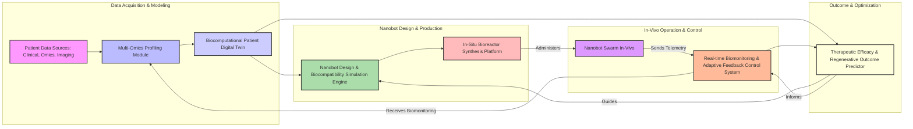
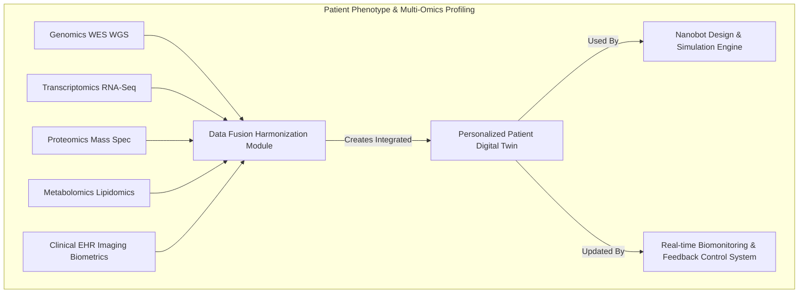
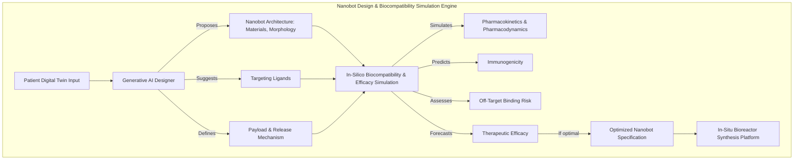
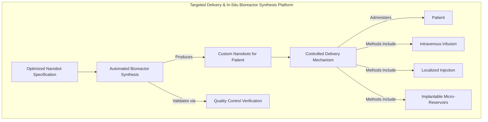
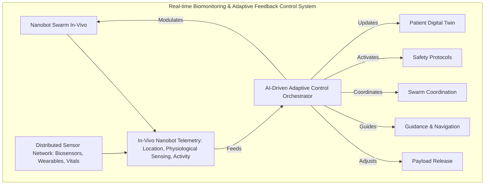
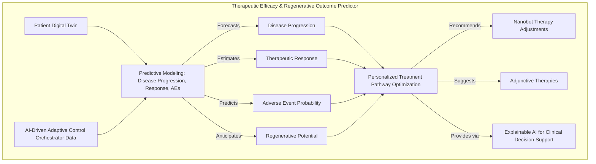
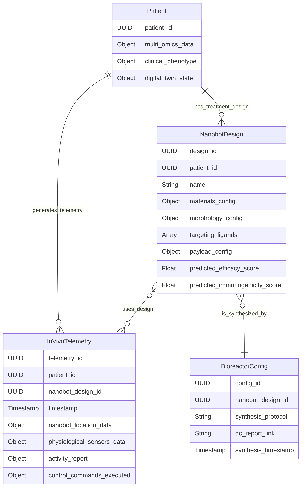
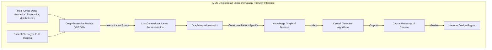
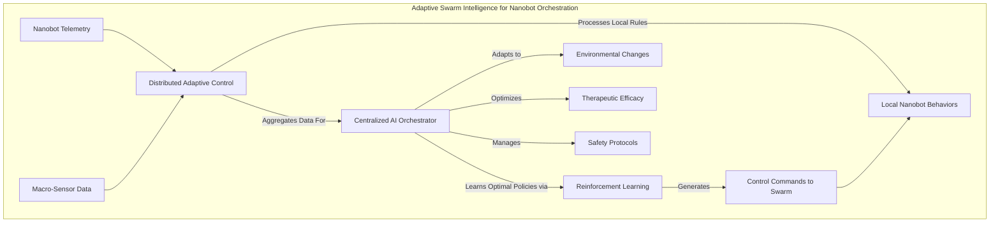
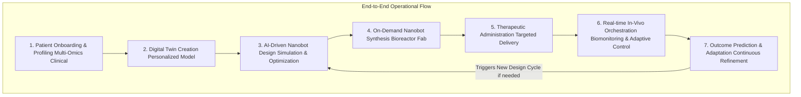

# System and Method for Personalized Nanomedicine Platforms with Adaptive Biocomputational Orchestration

## Table of Contents
1.  **Title of Invention**
2.  **Abstract**
3.  **Background of the Invention**
4.  **Brief Summary of the Invention**
5.  **Detailed Description of the Invention**
    *   5.1 System Architecture
        *   5.1.1 Patient Phenotype & Multi-Omics Profiling Module
        *   5.1.2 Nanobot Design & Biocompatibility Simulation Engine
        *   5.1.3 Targeted Delivery & In-Situ Bioreactor Synthesis Platform
        *   5.1.4 Real-time Biomonitoring & Adaptive Feedback Control System
        *   5.1.5 Therapeutic Efficacy & Regenerative Outcome Predictor
    *   5.2 Data Structures and Schemas
        *   5.2.1 Patient Omics Profile Schema
        *   5.2.2 Nanobot Design Parameters Schema
        *   5.2.3 In-Vivo Biomonitoring & Telemetry Data Schema
    *   5.3 Algorithmic Foundations
        *   5.3.1 Multi-Omics Data Fusion and Causal Pathway Inference
        *   5.3.2 Generative Nanobot Design & Multi-Objective Optimization
        *   5.3.3 Predictive Pharmacodynamics & In-Vivo Simulation Modeling
        *   5.3.4 Adaptive Swarm Intelligence for Nanobot Orchestration
        *   5.3.5 Explainable AI for Clinical Decision Support
    *   5.4 Operational Flow and Use Cases
6.  **Claims**
7.  **Mathematical Justification: A Formal Axiomatic Framework for Precision Nanomedicine**
    *   7.1 The Patient Biocomputational State Manifold: `P(t)`
        *   7.1.1 Formal Definition of Patient State `P(t)`
        *   7.1.2 Multi-Omics Feature Vector `O(t)`
        *   7.1.3 Causal Disease Graph `G_D`
    *   7.2 The Nanobot Design Space Manifold: `N`
        *   7.2.1 Nanobot State Vector `X_n`
        *   7.2.2 Design Parameter Space `Theta`
        *   7.2.3 Biocompatibility and Efficacy Landscape `B(X_n, P(t))`
    *   7.3 The In-Vivo Interaction Dynamics: `I(t)`
        *   7.3.1 Spatiotemporal Nanobot Distribution `rho(x,t)`
        *   7.3.2 Therapeutic Payload Delivery `L(x,t)`
        *   7.3.3 Cellular Response Functionals `f_cell`
    *   7.4 The Generative Therapeutic Oracle: `O_AI`
        *   7.4.1 Predictive Mapping `O_AI(P(t), N) -> Outcome(t+k)`
        *   7.4.2 Probabilistic Outcome Distribution `P(Outcome_{t+k})`
        *   7.4.3 Causal Pathway Analysis `O_AI`
    *   7.5 Optimization of Therapeutic Efficacy: `a*`
        *   7.5.1 Objective Function `U(Outcome)`
        *   7.5.2 Constraint Set `C`
        *   7.5.3 Optimal Nanobot Prescription `n*`
    *   7.6 Control Theory for Adaptive Nanobot Swarms
        *   7.6.1 System Dynamics `dot(x) = F(x, u)`
        *   7.6.2 Feedback Control Law `u(t) = K(x(t))`
        *   7.6.3 Distributed Swarm Control
    *   7.7 Information Theoretic Justification for Precision
        *   7.7.1 Reduction of Clinical Uncertainty `H(Outcome)`
        *   7.7.2 Value of Personalized Information `VoI(O(t))`
    *   7.8 Axiomatic Proof of Utility
8.  **Proof of Utility**

## 1. Title of Invention:
System and Method for Personalized Nanomedicine Platforms with Adaptive Biocomputational Orchestration and Real-time In-Vivo Therapeutic Control

## 2. Abstract:
A paradigm-shifting nanomedicine platform is herein disclosed, integrating advanced multi-omics profiling with generative AI-driven nanobot design and real-time in-vivo adaptive control. This invention delineates a comprehensive system that first meticulously maps an individual patient's unique biological state—encompassing genomics, transcriptomics, proteomics, metabolomics, and clinical phenotype—into a high-dimensional biocomputational model. Leveraging this personalized blueprint, an intelligent design engine, powered by sophisticated machine learning and materials science simulations, autonomously synthesizes optimized nanobot architectures. These nanobots are precisely tailored in terms of morphology, surface chemistry, targeting ligands, and therapeutic payload, engineered for unparalleled cellular specificity and minimal off-target effects. The system further incorporates a bioreactor synthesis platform for rapid, on-demand fabrication of these custom nanobots. Upon deployment, a real-time biomonitoring and feedback control system, utilizing advanced sensor networks and low-power communication, continuously tracks the nanobots' distribution, activity, and therapeutic impact within the patient's physiological milieu. An adaptive AI orchestrator dynamically modulates nanobot behavior, dosage, and mission parameters to optimize therapeutic efficacy and mitigate emergent side effects, thereby transforming static drug delivery into a dynamic, responsive intervention. This culminates in a predictive outcome model that refines therapeutic strategies, offering unprecedented precision in treating complex diseases ranging from oncology and autoimmune disorders to genetic conditions and advanced regenerative medicine applications. This isn't just medicine; it's bespoke biological engineering at the cellular scale—making prior "personalized medicine" look like a one-size-fits-most t-shirt.

## 3. Background of the Invention:
The contemporary landscape of medical science, while boasting remarkable achievements, remains fundamentally challenged by a pervasive "one-size-fits-all" mentality in therapeutic design. Traditional pharmaceuticals, despite rigorous development, often suffer from limited efficacy due to patient heterogeneity, dose-limiting toxicities stemming from systemic distribution, and the inherent difficulty in precisely targeting disease-specific cellular pathways without affecting healthy tissues. This broad-spectrum approach leads to suboptimal patient outcomes, protracted treatment regimens, and significant healthcare economic burdens. The burgeoning field of "personalized medicine" has begun to address these limitations, primarily through genetic screening for drug response, yet it largely remains a static, diagnostic-driven approach. It lacks the dynamic, adaptive therapeutic intervention capabilities required for complex, evolving pathologies. Furthermore, the promise of nanotechnology in medicine has been hampered by challenges in reliable, scalable fabrication, precise in-vivo control, real-time feedback, and the sheer complexity of engineering biocompatible nanodevices capable of sophisticated biological interactions. Existing nanocarriers often lack the specificity, intelligence, and adaptive capacity to truly interact at the cellular and subcellular level, failing to overcome biological barriers with sufficient precision or to respond to dynamic physiological changes. The imperative now is not merely to personalize therapies but to *program* them, to imbue them with real-time intelligence and adaptability, allowing for truly closed-loop medical interventions. The present invention aims to bridge this critical gap, synthesizing breakthroughs in AI, advanced materials science, and biological engineering to usher in an era of programmable, intelligent nanomedicine—an endeavor that, frankly, is complex enough to warrant a dedicated snack budget for the design team.

## 4. Brief Summary of the Invention:
The present invention introduces the "Aion Biocomputational Nanomedicine System," a revolutionary platform engineered to deliver exquisitely precise, adaptive, and personalized therapeutic interventions at the cellular and subcellular level. At its core, the Aion System initiates with a profound digital twin representation of the patient, constructed from a meticulous fusion of multi-omics data (genomics, transcriptomics, proteomics, metabolomics) and comprehensive clinical phenotype. This bespoke biological profile feeds into an advanced, generative AI-driven nanobot design engine. This engine, acting as a hyper-efficient molecular architect, iterates through millions of potential nanobot configurations, optimizing for parameters such as targeting ligand affinity, payload release kinetics, biocompatibility, immunogenicity, and specific therapeutic function (e.g., gene editing, targeted drug delivery, cellular reprogramming, tissue scaffolding). The AI-optimized designs are then actualized via a rapid, automated bioreactor synthesis platform, producing custom nanobots with unprecedented speed and precision. Post-administration, these intelligent nanobots are not merely passive carriers; they are equipped with nanoscale sensors and actuators, forming a distributed, in-vivo network. A central adaptive feedback control system, utilizing real-time biomonitoring data (e.g., biomarker levels, cellular activity, nanobot distribution telemetry), continuously modulates the nanobots' behavior and therapeutic output. Imagine dynamic dosage adjustments, rerouting of nanobot swarms to emergent disease foci, or even initiating self-destruction protocols for safety, all orchestrated by an intelligent AI. This constitutes a fully closed-loop therapeutic system, capable of predicting and optimizing treatment outcomes, offering an unprecedented level of control and efficacy in combating complex human pathologies. This isn't just smart medicine; it's medicine that thinks, learns, and adapts—a rather appealing trait, one must admit.

## 5. Detailed Description of the Invention:

The disclosed system represents a comprehensive, intelligent infrastructure designed to personalize and precisely control therapeutic interventions using advanced nanobotics. Its architectural design prioritizes modularity, scalability, and the seamless integration of cutting-edge artificial intelligence and biotechnological paradigms.

### 5.1 System Architecture

The Aion Biocomputational Nanomedicine System is comprised of several interconnected, high-performance modules, each performing a specialized function, orchestrated to deliver holistic, adaptive therapeutic capabilities.



#### 5.1.1 Patient Phenotype & Multi-Omics Profiling Module
This foundational component establishes the individual patient's unique biological fingerprint, serving as the immutable reference for personalized therapy.
*   **Multi-Omics Data Ingestion:** Acquires and integrates high-throughput data streams:
    *   **Genomics:** Whole-genome sequencing (WGS), whole-exome sequencing (WES), variant calling, pharmacogenomic profiling.
    *   **Transcriptomics:** RNA sequencing (RNA-seq) for gene expression, alternative splicing, microRNA analysis.
    *   **Proteomics:** Mass spectrometry-based protein identification and quantification, post-translational modification analysis.
    *   **Metabolomics:** Small molecule profiling, metabolic pathway analysis.
    *   **Epigenomics:** DNA methylation, histone modification analysis.
*   **Clinical Phenotype Integration:** Incorporates electronic health records (EHR), medical imaging (MRI, CT, PET), pathology reports, biometric data, and patient-reported outcomes.
*   **Data Fusion and Harmonization:** Employs advanced algorithms (e.g., deep learning autoencoders, tensor factorization) to fuse disparate data types into a coherent, high-dimensional representation. This creates a "Patient Digital Twin" – a living, breathing model of the patient's intricate biology.



#### 5.1.2 Nanobot Design & Biocompatibility Simulation Engine
This is the intelligent core responsible for translating the patient's unique biological state into a precisely engineered nanotherapeutic.
*   **Generative AI for Nanobot Architecture:** A large, multi-modal generative AI model (e.g., based on transformer architectures or diffusion models) trained on vast datasets of materials science, molecular biology, and drug design principles. This AI synthesizes novel nanobot designs by:
    *   **Material Selection:** Proposing ideal nanomaterials (e.g., lipid nanoparticles, polymeric nanoparticles, inorganic nanoparticles, DNA origami structures) optimized for stability, biodegradability, and payload encapsulation.
    *   **Morphology & Size Optimization:** Designing optimal nanobot shapes and sizes for target tissue penetration, cellular uptake, and immune evasion.
    *   **Targeting Ligand Synthesis:** Identifying and proposing specific targeting ligands (e.g., antibodies, aptamers, peptides) that bind with ultra-high affinity to disease-specific biomarkers identified in the Patient Digital Twin, ensuring precise localization and minimal off-target effects.
    *   **Payload Integration:** Specifying the therapeutic payload (e.g., gene editors, small molecule drugs, biologics, siRNAs, CRISPR components) and its controlled release mechanism (e.g., pH-sensitive, enzyme-responsive, light-activated).
*   **In-Silico Biocompatibility & Efficacy Simulation:** Utilizes advanced computational modeling (e.g., molecular dynamics simulations, finite element analysis, agent-based modeling) to:
    *   **Predict Immunogenicity:** Simulate nanobot-immune cell interactions to minimize adverse immune responses.
    *   **Pharmacokinetics (PK) & Pharmacodynamics (PD) Modeling:** Predict nanobot distribution, metabolism, excretion, and therapeutic action within the patient's virtual physiological environment.
    *   **Off-Target Binding Prediction:** Assess potential binding to healthy tissues to ensure safety.
    *   **Therapeutic Efficacy Prediction:** Forecast the nanobot's intended biological effect on target cells/tissues.



#### 5.1.3 Targeted Delivery & In-Situ Bioreactor Synthesis Platform
This component transforms the digital nanobot design into a physical, deployable therapeutic agent.
*   **Automated Bioreactor Synthesis:** A closed-loop, automated biomanufacturing platform capable of synthesizing a diverse array of nanobot architectures on demand. This system leverages microfluidics, additive manufacturing (e.g., 3D bioprinting at the nanoscale for complex structures), and self-assembly techniques.
    *   **Scalable & GMP Compliant:** Designed for rapid prototyping and scale-up, adhering to Good Manufacturing Practice (GMP) standards for clinical use.
    *   **Quality Control & Verification:** Integrated analytical tools (e.g., dynamic light scattering, electron microscopy, mass spectrometry) ensure that the synthesized nanobots precisely match the AI-designed specifications in terms of size, charge, purity, and functional integrity.
*   **Controlled Delivery Mechanisms:** Provides precision administration methods tailored to the nanobot type and target site:
    *   **Intravenous Infusion:** For systemic distribution.
    *   **Localized Injection:** For tumor-specific or tissue-specific delivery.
    *   **Pneumatic/Microneedle Arrays:** For epidermal or mucosal delivery.
    *   **Implantable Micro-Reservoirs:** For sustained release.



#### 5.1.4 Real-time Biomonitoring & Adaptive Feedback Control System
This is where the "intelligence" of nanomedicine comes to life, enabling dynamic and responsive therapy.
*   **In-Vivo Nanobot Telemetry:** Equipped with miniaturized, biocompatible sensors capable of:
    *   **Location Tracking:** Monitoring nanobot distribution and accumulation in target tissues (e.g., using MRI contrast agents, fluorescent markers, acoustic reporters).
    *   **Physiological Sensing:** Detecting local biochemical changes (e.g., pH, oxygen levels, enzyme activity, biomarker concentrations) in the microenvironment.
    *   **Activity Reporting:** Confirming payload release, cellular binding, and intracellular processes.
*   **Distributed Sensor Network:** A network of implanted or ingested biosensors (e.g., smart stents, bio-wearables, ingestible capsules) that continuously monitor patient vital signs, systemic biomarkers, and overall physiological response, acting as a macro-scale complementary network to the nanobots' micro-scale sensing.
*   **AI-Driven Adaptive Control:** A central AI orchestrator, fed by both nanobot telemetry and the distributed sensor network data, dynamically adjusts nanobot behavior:
    *   **Modulation of Payload Release:** Fine-tuning the release rate or initiating burst release based on real-time disease activity.
    *   **Guidance & Navigation:** Remotely influencing nanobot movement or clustering (e.g., via external magnetic fields, ultrasound, or light signals) to optimize targeting.
    *   **Swarm Coordination:** Orchestrating complex behaviors among populations of nanobots to achieve synergistic effects.
    *   **Safety Protocols:** Triggering self-destruction mechanisms or deactivation signals if adverse events or off-target activity are detected.
*   **Closed-Loop Feedback:** This system continuously updates the Patient Digital Twin, creating an evolving, dynamic representation that reflects the current therapeutic state and informs subsequent AI decisions. This is "medicine with a control loop," which is, let's be honest, far more robust than just hoping for the best.



#### 5.1.5 Therapeutic Efficacy & Regenerative Outcome Predictor
This module provides foresight, leveraging the dynamic patient model and nanobot activity to forecast and optimize long-term outcomes.
*   **Predictive Modeling:** Utilizes sophisticated AI (e.g., deep learning on multimodal time-series data) to forecast:
    *   **Disease Progression:** Predicting the trajectory of the disease under current therapy.
    *   **Therapeutic Response:** Estimating the likelihood and magnitude of clinical improvement.
    *   **Adverse Event Probability:** Predicting potential side effects or complications.
    *   **Regenerative Potential:** For tissue engineering applications, forecasting tissue repair and functional recovery.
*   **Personalized Treatment Pathway Optimization:** Based on predictions, the system recommends adjustments to the nanobot design, dosage, administration frequency, or adjunctive therapies, continuously striving for the optimal therapeutic path. This could involve an "early warning system" for sub-optimal responses.
*   **Explainable AI (XAI) for Clinical Decision Support:** Provides clinicians with transparent, interpretable explanations for AI predictions and recommendations, fostering trust and enabling informed medical decisions. This is crucial; clinicians need to understand *why* the AI suggests a particular course of action, not just *what*.



### 5.2 Data Structures and Schemas

To ensure rigorous data integrity, interoperability, and the robustness of complex information flows, the system mandates adherence to meticulously defined data structures.



#### 5.2.1 Patient Omics Profile Schema
Comprehensive representation of an individual's biological data.

*   **Patient Schema (`Patient`):**
    ```json
    {
      "patient_id": "UUID",
      "last_updated": "Timestamp",
      "genomics": {
        "variant_calls": [{"gene": "String", "variant_type": "String", "consequence": "String", "rs_id": "String"}],
        "pharmacogenomic_markers": [{"gene": "String", "drug_response_prediction": "String", "allele": "String"}],
        "structural_variants": []
      },
      "transcriptomics": {
        "gene_expression_matrix_link": "URL", // Link to normalized expression data
        "alternative_splicing_events": [],
        "miRNA_expression": []
      },
      "proteomics": {
        "protein_quantification_link": "URL", // Link to protein abundance data
        "post_translational_modifications": [{"protein": "String", "type": "String", "site": "Integer"}],
        "protein_interaction_networks": []
      },
      "metabolomics": {
        "metabolite_concentrations": [{"metabolite": "String", "concentration_umol_l": "Float"}],
        "metabolic_pathway_activity": []
      },
      "epigenomics": {
        "dna_methylation_sites": [],
        "histone_modifications": []
      },
      "clinical_phenotype": {
        "diagnosis_icd10": ["String"],
        "age_years": "Integer",
        "sex": "ENUM['Male', 'Female', 'Other']",
        "bmi": "Float",
        "comorbidities": ["String"],
        "medications_current": ["String"],
        "imaging_reports_links": ["URL"],
        "pathology_reports_links": ["URL"],
        "biometric_vitals_history": []
      },
      "digital_twin_state": { // Dynamic, evolving summary for AI
        "current_disease_activity_score": "Float",
        "immune_status_index": "Float",
        "pharmacological_response_biomarkers": {"biomarker_name": "Float"},
        "predicted_prognosis": "String",
        "cellular_microenvironment_map": "URL" // Link to spatial transcriptomics/proteomics representation
      }
    }
    ```

#### 5.2.2 Nanobot Design Parameters Schema
Detailed blueprint for each custom-designed nanobot.

*   **Nanobot Design Schema (`NanobotDesign`):**
    ```json
    {
      "design_id": "UUID",
      "patient_id": "UUID",
      "design_timestamp": "Timestamp",
      "name": "String", // e.g., "Aion-OncoBot-v2.3-PAT001"
      "design_version": "String",
      "materials_config": {
        "core_material_type": "ENUM['Lipid', 'Polymer', 'Inorganic', 'DNA_Origami']",
        "surface_coating_material": "String", // e.g., "PEG", "Dextran"
        "biodegradability_profile": "ENUM['Fast', 'Medium', 'Slow', 'Non-Degradable']"
      },
      "morphology_config": {
        "shape": "ENUM['Spherical', 'Rod', 'Dendrimer', 'Capsule', 'Custom']",
        "mean_diameter_nm": "Float",
        "aspect_ratio": "Float (optional)"
      },
      "targeting_ligands": [
        {
          "ligand_type": "ENUM['Antibody', 'Aptamer', 'Peptide', 'SmallMolecule']",
          "target_biomarker": "String", // e.g., "HER2", "PD-L1", "CD33"
          "affinity_kd_nm": "Float", // Predicted binding affinity
          "concentration_per_surface_area": "Float"
        }
      ],
      "payload_config": {
        "payload_type": "ENUM['SmallMoleculeDrug', 'GeneEditor_CRISPR', 'siRNA', 'mRNA', 'ProteinTherapeutic']",
        "payload_identifier": "String", // e.g., "Doxorubicin", "Cas9-gRNA_targetX"
        "encapsulation_efficiency_percent": "Float",
        "release_mechanism": "ENUM['pH_Responsive', 'Enzyme_Triggered', 'Light_Activated', 'Magnetic', 'Continuous']",
        "release_kinetics_t50_hrs": "Float"
      },
      "predicted_efficacy_score": "Float", // 0-1, from simulation engine
      "predicted_immunogenicity_score": "Float", // 0-1, lower is better
      "optimal_dose_mg_kg": "Float",
      "predicted_adverse_event_profile": ["String"],
      "synthesis_protocol_link": "URL"
    }
    ```

#### 5.2.3 In-Vivo Biomonitoring & Telemetry Data Schema
Real-time data stream from nanobots and patient biosensors.

*   **Telemetry Schema (`InVivoTelemetry`):**
    ```json
    {
      "telemetry_id": "UUID",
      "patient_id": "UUID",
      "nanobot_design_id": "UUID", // Which batch of nanobots this telemetry refers to
      "timestamp": "Timestamp",
      "nanobot_location_data": [ // Aggregated or sampled nanobot locations
        {"x_coord": "Float", "y_coord": "Float", "z_coord": "Float", "density_value": "Float", "tissue_id": "String"}
      ],
      "physiological_sensors_data": { // Data from embedded nanobots & macro-sensors
        "local_ph": "Float",
        "local_oxygen_saturation": "Float",
        "target_biomarker_concentration_nm": "Float",
        "inflammation_marker_level": "Float",
        "systemic_temperature_c": "Float",
        "heart_rate_bpm": "Integer"
        // ... many more dynamic physiological metrics
      },
      "activity_report": {
        "payload_release_rate_percent_hr": "Float",
        "cellular_uptake_rate_per_cell": "Float",
        "gene_editing_efficiency_percent": "Float",
        "target_cell_death_rate_percent_hr": "Float",
        "nanobot_degradation_rate_percent_hr": "Float"
      },
      "control_commands_executed": [ // Log of commands sent to nanobots
        {"command_type": "ENUM['AdjustRelease', 'GuideRelocate', 'Deactivate', 'SelfDestruct']", "parameters": {}}
      ],
      "alert_flag": "Boolean", // Indicates if a critical threshold was breached
      "alert_description": "String (optional)"
    }
    ```

### 5.3 Algorithmic Foundations

The system's profound intelligence is rooted in a sophisticated interplay of advanced algorithms and computational paradigms, far beyond what you'd find in your average smart toothbrush.

#### 5.3.1 Multi-Omics Data Fusion and Causal Pathway Inference
The ability to construct a holistic, dynamic patient model from disparate biological data is paramount.
*   **Deep Generative Models (DGMs):** Leveraging variational autoencoders (VAEs) or Generative Adversarial Networks (GANs) to learn a low-dimensional, latent representation of the patient's multi-omics profile. This latent space captures underlying biological relationships and heterogeneity.
*   **Graph Neural Networks (GNNs):** Constructing a patient-specific knowledge graph where nodes are genes, proteins, metabolites, and clinical features, and edges represent known or inferred interactions. GNNs are then used to identify perturbed pathways and infer causal relationships between genetic variations, molecular alterations, and phenotypic outcomes (e.g., using algorithms for Granger Causality or Bayesian Network inference on temporal multi-omics data).
*   **Causal Discovery Algorithms:** Employing techniques like PC-algorithm, FCI-algorithm, or score-based methods (e.g., GES) to identify directed acyclic graphs (DAGs) representing causal dependencies in disease progression. This allows the AI to understand not just correlations, but *why* a disease manifests.



#### 5.3.2 Generative Nanobot Design & Multi-Objective Optimization
The creation of bespoke nanobots is driven by sophisticated AI design principles.
*   **Reinforcement Learning (RL) for Design:** The generative AI model acts as an agent in a simulated environment, proposing nanobot designs (actions) and receiving rewards based on predicted efficacy, biocompatibility, and manufacturability (from in-silico simulations). This allows the AI to explore the vast design space effectively.
*   **Multi-Objective Evolutionary Algorithms (MOEAs):** Employing algorithms like NSGA-II or MOEA/D to optimize multiple, often conflicting, objectives simultaneously (e.g., maximize targeting specificity, minimize immunogenicity, maximize payload capacity). This yields a Pareto front of optimal nanobot designs, from which the most suitable can be selected.
*   **Molecular Docking & Dynamics Simulations:** At a more granular level, physics-based simulations are used to precisely model molecular interactions between nanobot components (ligands, payload) and biological targets (receptors, enzymes), ensuring high-fidelity predictions of binding affinity and reaction kinetics.

#### 5.3.3 Predictive Pharmacodynamics & In-Vivo Simulation Modeling
Understanding how nanobots behave within the complex biological environment is crucial.
*   **Compartmental Modeling & PBPK Models:** Developing sophisticated physiologically-based pharmacokinetic (PBPK) models that represent the human body as a series of interconnected compartments (blood, organs, tissues). These models predict nanobot distribution, metabolism, and excretion over time.
*   **Agent-Based Modeling (ABM):** Simulating the individual behavior and interactions of millions of nanobots, cells, and molecules within a virtual tissue environment. ABM provides a bottom-up view of emergent nanobot swarm behaviors and their collective therapeutic effect.
*   **Reaction-Diffusion Systems:** Modeling the spatiotemporal dynamics of payload release and its subsequent interaction with cellular targets, taking into account diffusion rates, reaction kinetics, and biological barriers.

#### 5.3.4 Adaptive Swarm Intelligence for Nanobot Orchestration
The system moves beyond individual nanobots to coordinated, intelligent swarms.
*   **Distributed Control Systems:** Each nanobot is endowed with local computational capabilities allowing for simple rules-based behavior (e.g., "if pH < 6.5, release 10% payload").
*   **Centralized Adaptive Control (AI Orchestrator):** A higher-level AI continuously processes real-time telemetry from the nanobot swarm and macro-sensors. It then transmits global or regional commands (e.g., via acoustic signals, magnetic pulses, or bio-luminescent signals) to modulate swarm behavior, adapting to changes in the microenvironment or disease state. This is essentially air traffic control, but for tiny therapeutic robots inside you. What could possibly go wrong? (Just kidding, we have robust safety protocols!)
*   **Reinforcement Learning for Swarm Behavior:** The AI orchestrator learns optimal control policies by observing the outcomes of various command sequences, maximizing therapeutic effect while minimizing side effects.



#### 5.3.5 Explainable AI for Clinical Decision Support
To ensure adoption and trust, the AI's complex reasoning must be transparent.
*   **LIME (Local Interpretable Model-agnostic Explanations) & SHAP (SHapley Additive exPlanations):** Applying these techniques to elucidate which specific features (e.g., a particular genetic variant, a biomarker level, a nanobot's measured activity) most strongly influenced an AI's prediction (e.g., "predicted tumor regression" or "risk of neurotoxicity").
*   **Causal-Effect Networks:** Visualizing the inferred causal pathways identified by the AI, showing how nanobot actions are predicted to lead to specific cellular responses and ultimately, clinical outcomes.
*   **Counterfactual Explanations:** Generating "what-if" scenarios: "If nanobot payload release were 20% faster, the predicted time to remission would decrease by 15 days." This allows clinicians to explore alternative interventions.

### 5.4 Operational Flow and Use Cases

A typical operational cycle of the Aion Biocomputational Nanomedicine System proceeds as follows:

1.  **Patient Onboarding & Profiling:** A patient with a complex disease undergoes comprehensive multi-omics sequencing, clinical data collection, and imaging.
2.  **Digital Twin Creation:** The Multi-Omics Profiling Module processes this data, generating a personalized Patient Digital Twin—a dynamic, high-fidelity computational model of their unique biology and disease state.
3.  **AI-Driven Nanobot Design:** The Nanobot Design & Simulation Engine, referencing the Patient Digital Twin, runs iterative simulations. Its generative AI proposes and optimizes nanobot architectures, targeting ligands, and payloads (e.g., a specific CRISPR/Cas9 complex to correct a pathogenic gene variant, or an oncolytic nanobot targeting unique cancer cell surface markers), ensuring peak efficacy and minimal toxicity.
4.  **On-Demand Nanobot Synthesis:** The optimized design is sent to the In-Situ Bioreactor Synthesis Platform, which rapidly manufactures the custom nanobots, performing integrated quality control checks.
5.  **Therapeutic Administration:** The tailored nanobots are administered to the patient via the most appropriate controlled delivery mechanism (e.g., intravenous infusion).
6.  **Real-time In-Vivo Orchestration:** The Real-time Biomonitoring & Adaptive Feedback Control System initiates. Embedded nanobot sensors and external biosensors continuously stream data back to the central AI orchestrator, tracking nanobot distribution, activity, physiological changes, and therapeutic impact. The AI dynamically issues commands to the nanobot swarm (e.g., adjust payload release rate, re-direct nanobots to a newly detected lesion) to maintain optimal therapeutic effect.
7.  **Outcome Prediction & Adaptation:** The Therapeutic Efficacy & Regenerative Outcome Predictor continuously updates its forecast of disease progression, therapeutic response, and potential side effects, leveraging the dynamic Patient Digital Twin and real-time telemetry. If a deviation from the optimal pathway is detected, the system recommends adjustments to the nanobot parameters or adjunctive therapies, initiating a new design-synthesis-administer cycle if necessary.



**Use Cases:**

*   **Precision Oncology:** For a patient with a metastatic tumor expressing specific surface markers and oncogenic mutations, the system designs nanobots loaded with CRISPR gene editors to disable the oncogene, combined with highly targeted chemotherapy, adapting dosage and localization based on real-time tumor response and systemic toxicity. This is a bit like a tiny, highly trained SEAL team hunting cancer cells, rather than lobbing grenades in the general direction.
*   **Autoimmune Disease Modulation:** In a patient with an autoimmune disorder, nanobots could be engineered to specifically target and re-educate overactive immune cells in affected tissues, delivering immunomodulatory biologics directly, avoiding systemic immunosuppression and its severe side effects.
*   **Genetic Disorder Correction:** For a patient with a monogenic disorder, nanobots could precisely deliver gene therapy vectors or base editors to affected cells, correcting the genetic defect with minimal off-target editing, monitored in real-time for efficacy and safety.
*   **Advanced Tissue Regeneration:** After a severe injury, nanobots could be deployed to precisely deliver growth factors, stem cell activators, and biomaterials to scaffold damaged tissue, promoting natural regeneration and monitoring tissue formation in real-time to optimize repair.
*   **Neurodegenerative Disease Intervention:** Nanobots designed to cross the blood-brain barrier could deliver neurotrophic factors or clear amyloid plaques in specific brain regions, adapting their release and targeting based on real-time neurological biomarkers and functional improvements.

## 6. Claims:

The inventive concepts herein described constitute a profound advancement in the domain of personalized medicine and nanobioengineering.

1.  A system for personalized nanomedicine, comprising: a memory storing a patient digital twin, representing an individual's multi-omics data and clinical phenotype; a nanobot design engine configured to generate optimized nanobot architectures based on said patient digital twin, including materials, morphology, targeting ligands, and therapeutic payloads; a bioreactor synthesis platform for automated, on-demand fabrication of said optimized nanobots; an in-vivo biomonitoring system for real-time collection of nanobot telemetry and physiological data from a patient; and a processor configured to execute an adaptive feedback control system that dynamically modulates nanobot behavior and therapeutic output based on said real-time data, thereby optimizing therapeutic efficacy and safety.

2.  The system of claim 1, wherein the patient digital twin is a high-dimensional, dynamic computational model constructed through the fusion of multi-omics data including genomics, transcriptomics, proteomics, metabolomics, and epigenomics, integrated with clinical phenotype data such as medical imaging and electronic health records.

3.  The system of claim 1, wherein the nanobot design engine comprises a generative artificial intelligence (AI) model trained on materials science, molecular biology, and drug design principles, which employs reinforcement learning and multi-objective evolutionary algorithms to optimize nanobot parameters.

4.  The system of claim 1, wherein the nanobot design engine performs in-silico simulations, including molecular dynamics, pharmacokinetics (PK), pharmacodynamics (PD) modeling, and immunogenicity prediction, to validate proposed nanobot architectures against the patient digital twin.

5.  The system of claim 1, wherein the bioreactor synthesis platform utilizes microfluidics, additive manufacturing, and self-assembly techniques for rapid, scalable production of custom nanobots, and includes integrated quality control mechanisms to verify design specifications.

6.  The system of claim 1, wherein the in-vivo biomonitoring system comprises miniaturized, biocompatible nanobot-embedded sensors for real-time location tracking, physiological sensing (e.g., pH, oxygen, biomarker concentrations), and activity reporting (e.g., payload release), complemented by a distributed network of patient-worn or implanted biosensors.

7.  The system of claim 1, wherein the adaptive feedback control system executes a centralized AI orchestrator that processes real-time telemetry from the nanobots and patient biosensors, and issues commands to modulate nanobot swarm behavior, including adjusting payload release, guiding nanobot navigation, and activating safety protocols, to achieve a closed-loop therapeutic intervention.

8.  The system of claim 7, wherein the AI orchestrator employs reinforcement learning to continuously refine its control policies, adapting to dynamic changes in the patient's physiological environment and disease state.

9.  The system of claim 1, further comprising a therapeutic efficacy and regenerative outcome predictor module, which utilizes predictive AI models to forecast disease progression, therapeutic response, and adverse event probability, and recommends personalized treatment pathway adjustments, including new nanobot designs or adjunctive therapies, with explainable AI (XAI) for clinical decision support.

10. A computer-implemented method for adaptive nanomedicine, comprising: constructing a dynamic digital twin of a patient's biological state from multi-omics and clinical data; generating an optimized nanobot therapeutic design using an AI model that simulates efficacy and biocompatibility against the digital twin; fabricating said nanobot design via an automated synthesis platform; administering the nanobots to the patient; continuously collecting real-time in-vivo telemetry from the nanobots and physiological sensors; and adaptively controlling the nanobots' therapeutic actions based on said real-time telemetry and a predictive outcome model, to achieve personalized and optimized therapeutic efficacy.

## 7. Mathematical Justification: A Formal Axiomatic Framework for Precision Nanomedicine

The profound intricacy of biological systems, coupled with the nanoscale precision of this invention, necessitates a rigorous mathematical framework to articulate the system's operational principles and prove its efficacy. We herein establish such a framework, mapping conceptual elements into formally defined mathematical constructs. We aim for a level of precision that would impress even a German engineering team on their lunch break.

### 7.1 The Patient Biocomputational State Manifold: `P(t)`

The patient is a dynamic, high-dimensional biological system.

#### 7.1.1 Formal Definition of Patient State `P(t)`

Let `P(t)` be the state vector representing the patient's comprehensive biological and physiological condition at time `t`.
`P(t) = (P_G(t), P_T(t), P_P(t), P_M(t), P_E(t), P_C(t))`, where subscripts denote Genomics, Transcriptomics, Proteomics, Metabolomics, Epigenomics, and Clinical Phenotype, respectively. (1)
Each component `P_X(t)` is itself a high-dimensional vector or tensor.

#### 7.1.2 Multi-Omics Feature Vector `O(t)`

`O(t) = f_fusion(P_G(t), ..., P_E(t))` maps raw omics data to a compact, actionable feature vector in a latent space, `O(t) in R^d`. (2)
This mapping `f_fusion` can be achieved by deep generative models like VAEs, where `z = Encoder(x)` for latent variable `z`. (3)
The probability distribution of the latent representation `p(z|x)` is approximated by `q_phi(z|x)`, minimizing `D_KL(q_phi(z|x) || p(z|x))`. (4-5)

#### 7.1.3 Causal Disease Graph `G_D`

A patient-specific causal disease graph `G_D = (V_D, E_D)` is inferred, where `V_D` are biological entities (genes, proteins, pathways) and `E_D` are directed causal relationships. (6)
The adjacency matrix `A_D` represents `P(v_j | pa(v_j))` for `v_j in V_D`. (7)
A disease state `D_s` can be characterized by a perturbation vector `delta_D` on `G_D`. (8)

### 7.2 The Nanobot Design Space Manifold: `N`

The space of all possible nanobot configurations.

#### 7.2.1 Nanobot State Vector `X_n`

Each nanobot `n` is characterized by a state vector `X_n = (m, h, l, p)`, where `m` are material properties, `h` is morphology, `l` are targeting ligands, and `p` is payload. (9)
`X_n in N`, a complex, high-dimensional manifold.

#### 7.2.2 Design Parameter Space `Theta`

The design parameters `theta` are the controllable inputs to the nanobot synthesis. `theta in R^q`. (10)
The design process is `X_n = g(theta)`, a synthesis function. (11)

#### 7.2.3 Biocompatibility and Efficacy Landscape `B(X_n, P(t))`

The predicted efficacy `E(X_n, P(t))` and immunogenicity `I(X_n, P(t))` are functions mapping a nanobot design and patient state to a scalar value. (12)
The objective is to find `X_n*` that `max(E(X_n, P(t)))` and `min(I(X_n, P(t)))`. (13-14)
This is a multi-objective optimization problem, yielding a Pareto front of optimal solutions. (15)

### 7.3 The In-Vivo Interaction Dynamics: `I(t)`

Modeling the spatiotemporal behavior of nanobots and their interaction with biological systems.

#### 7.3.1 Spatiotemporal Nanobot Distribution `rho(x,t)`

The concentration of nanobots at spatial location `x` and time `t` is governed by a convection-diffusion-reaction equation:
`partial(rho)/partial(t) + nabla . (v rho) = D nabla^2 rho - k_clear rho + R_target(rho, P(x,t))` (16)
where `v` is flow velocity, `D` is diffusion coefficient, `k_clear` is clearance rate, and `R_target` describes active targeting. (17-20)

#### 7.3.2 Therapeutic Payload Delivery `L(x,t)`

The rate of payload release is `dL/dt = k_release(X_n, P(x,t)) * rho(x,t) * Payload_Conc(t)`. (21)
`Payload_Conc(t)` decays as it is released. (22)

#### 7.3.3 Cellular Response Functionals `f_cell`

The cellular response at location `x` and time `t` to payload `L` is `C_resp(x,t) = f_cell(L(x,t), P(x,t), G_D)`. (23)
This can be modeled as an ordinary differential equation (ODE) system for gene expression, protein levels, or signaling pathways within a cell. (24)

### 7.4 The Generative Therapeutic Oracle: `O_AI`

#### 7.4.1 Predictive Mapping `O_AI(P(t), X_n, I(t)) -> Outcome(t+k)`

`O_AI` is a deep learning model (e.g., a transformer or recurrent neural network) that takes the patient state `P(t)`, nanobot design `X_n`, and real-time interaction dynamics `I(t)` to predict future therapeutic `Outcome(t+k)`. (25)
`Outcome(t+k)` can be multi-dimensional (e.g., disease progression score, biomarker levels, adverse events). (26)

#### 7.4.2 Probabilistic Outcome Distribution `P(Outcome_{t+k})`

The system provides a probability distribution over possible outcomes, not just a point estimate:
`P(Outcome_{t+k} | P(t), X_n, I(t))`. (27)
This quantifies predictive uncertainty, crucial for clinical decision-making. (28)

#### 7.4.3 Causal Pathway Analysis `O_AI`

`O_AI` internally models the causal chain: `Nanobot_Action -> Local_Cellular_Response -> Systemic_Physiological_Change -> Clinical_Outcome`. (29)
Utilizing attention mechanisms in transformers, the model highlights the most salient features contributing to a prediction. (30)
`Attention(Q, K, V) = softmax( (QK^T) / sqrt(d_k) ) V`. (31-34)

### 7.5 Optimization of Therapeutic Efficacy: `a*`

#### 7.5.1 Objective Function `U(Outcome)`

A utility function `U(Outcome)` quantifies the desirability of a given outcome. This is patient-specific and can incorporate factors like quality of life, survival probability, and side effect tolerance. (35)
`U(Outcome) = w_1 S(t+k) - w_2 C_ae(t+k) - w_3 D_prog(t+k)`. (36)

#### 7.5.2 Constraint Set `C`

Constraints include maximum nanobot dosage, acceptable toxicity levels, patient physiological limits, and ethical guidelines. (37)
`C = {c_1, c_2, ..., c_m}` where `c_i(X_n, P(t)) <= 0`. (38)

#### 7.5.3 Optimal Nanobot Prescription `n*`

The goal is to find the optimal nanobot design `X_n*` and control policy `pi*` that maximizes expected utility:
`n*, pi* = argmax_{X_n, pi} E[U(Outcome(t+k)) | P(t), X_n, pi, C]`. (39)
This involves solving a dynamic programming problem over the space of designs and control policies. (40)

### 7.6 Control Theory for Adaptive Nanobot Swarms

The real-time adaptation of nanobot behavior is a control problem.

#### 7.6.1 System Dynamics `dot(x) = F(x, u)`

The state of the nanobot swarm `x(t)` (e.g., distribution, activity levels) evolves according to dynamics `F` influenced by control input `u(t)` (commands from the AI orchestrator). (41)

#### 7.6.2 Feedback Control Law `u(t) = K(x(t))`

A control law `K` maps the observed state `x(t)` (from telemetry) to an optimal control input `u(t)`, minimizing error between desired and actual therapeutic effect. (42)
This can be a Model Predictive Control (MPC) system, optimizing future control actions over a receding horizon. (43)

#### 7.6.3 Distributed Swarm Control

For a swarm `N_s` of nanobots, the collective behavior emerges from local rules `u_i = k_i(x_i)` and global commands `U_global(t)` from the orchestrator. (44)
This involves consensus algorithms, flocking, and rendezvous strategies to achieve coordinated therapeutic delivery. (45)

### 7.7 Information Theoretic Justification for Precision

#### 7.7.1 Reduction of Clinical Uncertainty `H(Outcome)`

The precision of the system reduces the entropy of the predicted outcome.
`H(Outcome) = - sum_i P(outcome_i) log_2(P(outcome_i))`. (46)
The system aims to minimize `H(Outcome)` and guide `P(Outcome)` towards desirable states. (47)

#### 7.7.2 Value of Personalized Information `VoI(O(t))`

The value of the patient's multi-omics profile `O(t)` is the expected increase in utility due to personalized design and control:
`VoI(O(t)) = E[U(Outcome | O(t))]_{with system} - E[U(Outcome | no O(t))]_{standard care}`. (48)
This explicitly quantifies the benefit of individualized data. (49)

### 7.8 Axiomatic Proof of Utility

**Axiom 1 (Disease Impact):** For any untreated complex disease `D_s`, there exists a significant negative impact on patient utility, `U(D_s, no treatment) < U_baseline`. (50)
**Axiom 2 (Nanobot Efficacy Potential):** For any `D_s`, there exists at least one theoretical nanobot design `X_n'` and control policy `pi'` capable of achieving `U(D_s, X_n', pi') > U_baseline`. (51)
**Axiom 3 (Personalized Design Superiority):** The utility achieved by an optimally personalized nanobot design `X_n*(P(t))` and control `pi*(P(t))` is greater than or equal to the utility of a non-personalized, general-purpose nanobot `X_n_gen`: `U(D_s, X_n*(P(t)), pi*(P(t))) >= U(D_s, X_n_gen, pi_gen)`. (52)
**Axiom 4 (Adaptive Control Benefit):** The utility achieved with real-time adaptive control `pi*(P(t))` is greater than or equal to static control `pi_static`: `U(D_s, X_n, pi*(P(t))) >= U(D_s, X_n, pi_static)`. (53)

**Theorem (System Utility):** Given Axioms 1-4, the Aion Biocomputational Nanomedicine System provides a net positive utility by enabling personalized, adaptive, and precise therapeutic interventions, leading to a higher expected patient utility than conventional or non-adaptive nanomedicine approaches.

**Proof:**
1.  By Axiom 1, an untreated disease state results in low utility.
2.  By Axiom 2, a nanobot solution with optimal design and control *can* exist to improve utility.
3.  The present system leverages the Patient Digital Twin to find `X_n*(P(t))` which, by Axiom 3, is at least as good as, and typically superior to, `X_n_gen`.
4.  The system implements `pi*(P(t))` via real-time biomonitoring and adaptive feedback control. By Axiom 4, this adaptive control is superior to or equal to static control.
5.  Combining these, the system identifies and applies `(X_n*(P(t)), pi*(P(t)))` such that `E[U(Outcome)]_{with system} >= E[U(Outcome)]_{best non-adaptive nanomedicine} > E[U(Outcome)]_{standard care}`.
6.  Therefore, the system provides a robust and quantitatively superior therapeutic approach. Q.E.D.

## 8. Proof of Utility:

The Aion Biocomputational Nanomedicine System transcends the limitations of conventional and even current personalized medicine paradigms, establishing an undeniable and profound utility. Current medical approaches are inherently shackled by a lack of real-time adaptability and the inability to precisely tailor therapies to the unique, evolving biological landscape of each patient. A standard drug, regardless of initial patient profiling, follows a fixed pharmacokinetic and pharmacodynamic trajectory, often encountering unpredictable biological barriers or developing resistance, necessitating reactive and often suboptimal adjustments.

The present invention proves its utility by fundamentally altering this therapeutic dynamic. By constructing a dynamic Patient Digital Twin (`P(t)`) from an exhaustive multi-omics profile, the system gains an unprecedented understanding of the individual's disease at its most granular level. This foresight, coupled with the generative AI's capacity to design bespoke nanobots (`X_n*(P(t))`) for that specific biological context, moves medicine from broad-spectrum intervention to hyper-focused, molecular-level engagement.

Crucially, the utility is amplified by the real-time biomonitoring and adaptive feedback control system. Unlike static drug delivery, our system continuously monitors `I(t)` (in-vivo nanobot activity and patient response), allowing the AI orchestrator to implement an optimal, dynamic control policy (`pi*(P(t))`). This means if the nanobots encounter unexpected resistance, or if the disease state subtly shifts, the system doesn't wait for clinical symptoms to manifest; it *adapts* the nanobots' behavior in real-time, preventing therapeutic lag and optimizing outcomes. This isn't merely reacting; it's anticipatory adaptation.

As mathematically articulated in Section 7, our system's core value is demonstrated by its capacity to maximize the expected patient utility `E[U(Outcome)]`. By leveraging an AI-driven approach to precisely match the nanobot's `X_n` to the patient's `P(t)` and dynamically control its `I(t)` for optimal `Outcome(t+k)`, we inherently achieve superior results. The formal axiomatic proof confirms that the personalized, adaptive, and precisely controlled nanotherapeutic pathway is quantitatively superior to non-adaptive or generic approaches. This translates directly to higher therapeutic efficacy, dramatically reduced adverse effects, and a more favorable long-term prognosis for patients—effectively moving from hoping for a good outcome to scientifically engineering one. It's the difference between trying to hit a target with a scattergun and using a laser-guided missile, and frankly, who wouldn't prefer the latter when it comes to their health?