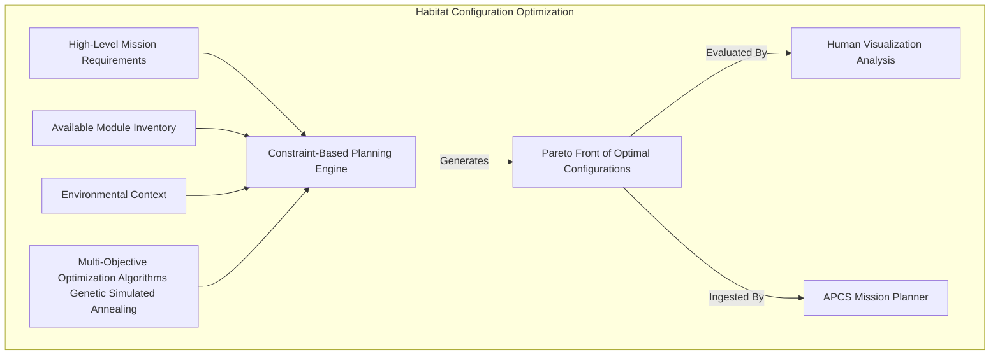
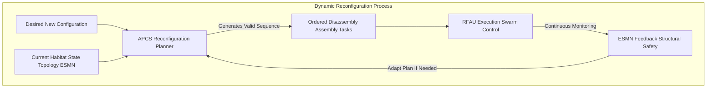
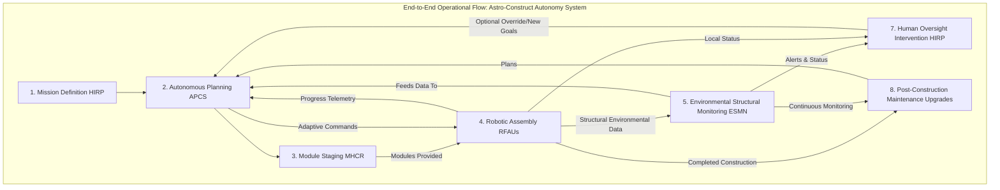

# System and Method for Autonomous Self-Assembling Modular Space Habitats

## Table of Contents
1.  **Title of Invention**
2.  **Abstract**
3.  **Background of the Invention**
4.  **Brief Summary of the Invention**
5.  **Detailed Description of the Invention**
    *   5.1 System Architecture
        *   5.1.1 Robotic Fabrication & Assembly Units (RFAUs)
        *   5.1.2 Modular Habitat Component Repository (MHCR)
        *   5.1.3 Autonomous Planning & Control System (APCS)
        *   5.1.4 Environmental & Structural Monitoring Network (ESMN)
        *   5.1.5 Human Interface & Reconfiguration Planner (HIRP)
    *   5.2 Data Structures and Schemas
        *   5.2.1 Habitat Module Schema
        *   5.2.2 Assembly Task Graph Schema
        *   5.2.3 Environmental State Schema
    *   5.3 Algorithmic Foundations
        *   5.3.1 Decentralized Swarm Robotics Control
        *   5.3.2 Constraint-Based Configuration Optimization
        *   5.3.3 Real-time Structural Integrity Analysis
        *   5.3.4 Adaptive Resource Allocation
        *   5.3.5 Dynamic Reconfiguration Planning
    *   5.4 Operational Flow and Use Cases
6.  **Claims**
7.  **Mathematical Justification: A Formal Axiomatic Framework for Autonomous Space Habitat Construction**
    *   7.1 The Habitat Topology Graph: `H = (M, C, Lambda)`
        *   7.1.1 Formal Definition of the Habitat Graph `H`
        *   7.1.2 Module State Space `M` and Dynamics
        *   7.1.3 Connection State Space `C` and Dynamics
        *   7.1.4 Latent Environmental and Functional Relationships `Lambda`
        *   7.1.5 Structural Adjacency and Inter-module Dependency Tensor `Adj(t)`
        *   7.1.6 Graph Theoretic Metrics of Habitat Resilience
    *   7.2 The Robotic Agent Swarm State Space: `A(t)`
        *   7.2.1 Definition of the Swarm State Vector `A(t)`
        *   7.2.2 Individual Robotic Unit Dynamics `dR_i(t)`
        *   7.2.3 Swarm Communication and Coordination Topology `Gamma_A(t)`
    *   7.3 The Environmental State Observational Manifold: `E(t)`
        *   7.3.1 Definition of the Environmental State Tensor `E(t)`
        *   7.3.2 Multi-Sensor Data Fusion and Contextualization `f_Sigma`
        *   7.3.3 Environmental Feature Vector `E_F(t)`
    *   7.4 The Autonomous Planning Oracle: `P_AI`
        *   7.4.1 Formal Definition of the Planning Mapping Function `P_AI`
        *   7.4.2 The Assembly Task Graph `T = (Ops, Dep)`
        *   7.4.3 Probabilistic Task Completion and Resource Allocation
        *   7.4.4 Transformer-Based Architecture for `P_AI`
    *   7.5 Multi-Objective Optimization for Habitat Configuration
        *   7.5.1 Objective Function Definition `F(H, E, M, RFAUs)`
        *   7.5.2 Constraint Set `Constraints(H, E, M, RFAUs)`
        *   7.5.3 Optimization Problem `min F`
    *   7.6 Robustness and Resilience Metrics
        *   7.6.1 Structural Redundancy and Criticality
        *   7.6.2 Life Support System Redundancy
        *   7.6.3 Mean Time To Failure (MTTF) for Habitat Elements
    *   7.7 Swarm Dynamics and Control Theory
        *   7.7.1 Collective Behavior Model
        *   7.7.2 Feedback Control for Precision Assembly
        *   7.7.3 Distributed Consensus Algorithms
    *   7.8 Axiomatic Proof of Utility
8.  **Proof of Utility**

## 1. Title of Invention:
System and Method for Autonomous Self-Assembling Modular Space Habitats utilizing Robotic Swarms and AI-Driven Configuration Optimization

## 2. Abstract:
A novel and robust system for the autonomous construction and dynamic reconfiguration of modular habitats in extraterrestrial and orbital environments is herein disclosed. This invention architecturally delineates a distributed network of specialized Robotic Fabrication & Assembly Units (RFAUs), operating as an intelligent swarm, tasked with retrieving, transporting, and precisely interconnecting standardized habitat modules from a centralized or distributed Modular Habitat Component Repository (MHCR). The core intelligence resides within an Autonomous Planning & Control System (APCS), a sophisticated generative AI entity, which processes mission specifications, real-time environmental data (e.g., radiation flux, thermal conditions, micrometeoroid impacts), and structural integrity feedback. The APCS dynamically generates an optimal, fault-tolerant assembly task graph, allocating operations to individual RFAUs while continuously adapting to unforeseen challenges or changes in environmental parameters. Each RFAU is equipped with advanced manipulation capabilities, precision docking mechanisms, and integrated diagnostic sensors for verifying connections and performing on-site repairs or additive manufacturing. An Environmental & Structural Monitoring Network (ESMN) provides continuous telemetry for structural loads, atmospheric integrity, and radiation shielding efficacy, feeding critical data back into the APCS for adaptive re-planning or emergency response. This system dramatically reduces the logistical mass, cost, and human risk associated with traditional space construction, enabling scalable, resilient, and reconfigurable human outposts across diverse deep-space domains. It's essentially "Lego for grown-ups, built by robots, in space," which frankly, is a much better use of computational cycles than figuring out how to optimize cat videos.

## 3. Background of the Invention:
Humanity’s long-term aspiration for sustained presence beyond Earth—be it on the lunar surface, Martian plains, or in deep-space orbital waypoints—is currently hampered by anachronistic and profoundly limiting construction methodologies. Traditional approaches necessitate the launch of pre-fabricated, often monolithic habitat structures, which are inherently inflexible, massively heavy, and require extensive, risky extra-vehicular activity (EVA) for assembly and maintenance. The logistical overhead of launching such large structures is astronomically prohibitive, consuming disproportionate fractions of mission budgets and payload capacities. Furthermore, the unforgiving and dynamic nature of space environments—characterized by intense radiation, extreme thermal cycling, micrometeoroid bombardment, and fine, abrasive regolith—demands habitats that are not only robust but also capable of dynamic adaptation, repair, and expansion. Existing solutions lack the requisite autonomy, modularity, and reconfigurability to efficiently respond to evolving mission requirements or unforeseen environmental threats. The reliance on human crews for construction tasks in hostile vacuum environments introduces significant physiological risks, necessitates extensive life-support systems during assembly, and dramatically extends mission timelines. The present invention addresses these fundamental bottlenecks, laying the groundwork for an era of truly scalable and autonomous space infrastructure development, where building a robust extraterrestrial base becomes less like a high-stakes, manual assembly line and more like an AI-orchestrated symphony of robotic precision.

## 4. Brief Summary of the Invention:
The present invention introduces the "Astro-Construct Autonomy System" (ACAS), a revolutionary architecture for constructing and maintaining complex, multi-functional space habitats without direct human intervention in hazardous environments. The ACAS operates on the principle of distributed robotic intelligence, leveraging a fleet of highly specialized, dexterous Robotic Fabrication & Assembly Units (RFAUs) to autonomously deploy, assemble, and integrate standardized modular components. The system's operational genesis begins with an intuitive Human Interface & Reconfiguration Planner (HIRP), where mission architects define high-level habitat requirements—such as desired volume, life support capacity, radiation shielding, or mission-specific functionalities (e.g., laboratory, greenhouse, docking bay). These requirements are then translated by the Autonomous Planning & Control System (APCS) into a detailed, optimized construction blueprint, considering the available inventory of modules within the Modular Habitat Component Repository (MHCR) and dynamic environmental telemetry from the Environmental & Structural Monitoring Network (ESMN). The APCS, an advanced generative AI, orchestrates the RFAU swarm, issuing precise task directives, managing resource allocation, and continuously recalculating optimal paths and assembly sequences. For example, if a sudden solar flare increases localized radiation, the APCS might autonomously re-prioritize the deployment of heavier shielding modules or reconfigure internal pathways to minimize crew exposure. Each RFAU executes its assigned tasks, performing precision docking, structural fastening, utility connection, and real-time verification of completed work. This system transforms the paradigm of space construction from a bespoke, high-risk human endeavor into a scalable, fault-tolerant, and adaptable robotic enterprise, making extraterrestrial outposts as dynamic and upgradeable as a software system. Because really, why wouldn't you want robots doing the heavy lifting in 1/6th gravity? They don't complain about the commute.

## 5. Detailed Description of the Invention:

The disclosed system represents a comprehensive, intelligent infrastructure designed for the autonomous construction, expansion, maintenance, and reconfiguration of modular habitats in diverse space environments. Its architectural design prioritizes extreme autonomy, fault tolerance, scalability, and the seamless integration of advanced artificial intelligence and robotics.

### 5.1 System Architecture

The Astro-Construct Autonomy System (ACAS) is comprised of several interconnected, high-performance services and robotic subsystems, each performing a specialized function, orchestrated to deliver a holistic space construction capability.

```mermaid
graph LR
    subgraph Human Command & Oversight
        A[Mission Definition & Reconfiguration Planner] --> B[Human Interface & Reconfiguration Planner (HIRP)]
    end

    subgraph Core Intelligence & Planning
        B --> C[Autonomous Planning & Control System (APCS)]
    end

    subgraph Robotic Execution
        C --> D[Modular Habitat Component Repository (MHCR)]
        C --> E[Robotic Fabrication & Assembly Units (RFAUs)]
        D -- Supplies Modules To --> E
    end

    subgraph Environmental & Structural Monitoring
        E --> F[Environmental & Structural Monitoring Network (ESMN)]
        D --> F
        F -- Telemetry Data --> C
        F -- Structural Feedback --> E
    end

    style A fill:#f9f,stroke:#333,stroke-width:2px
    style B fill:#bbf,stroke:#333,stroke-width:2px
    style C fill:#ada,stroke:#333,stroke-width:2px
    style D fill:#fb9,stroke:#333,stroke-width:2px
    style E fill:#ccf,stroke:#333,stroke-width:2px
    style F fill:#ffd,stroke:#333,stroke-width:2px
```

#### 5.1.1 Robotic Fabrication & Assembly Units (RFAUs)
These are the backbone of the construction effort, a fleet of highly specialized, mobile, and dexterous robotic agents designed for extreme environments.
*   **Mobility Systems:** Each RFAU is equipped with locomotion suitable for its operational environment (e.g., wheeled/legged for planetary surfaces, reaction wheels/thrusters for orbital/microgravity assembly). They feature precision navigation and absolute localization systems (e.g., LIDAR, optical SLAM, DGPS-like systems with local beacons).
*   **Manipulation & Docking Subsystems:** Multi-axis robotic arms with reconfigurable end-effectors for gripping, fastening, welding, cutting, and utility connection. Specialized precision docking mechanisms ensure hermetic and structural seals between modules, capable of alignment correction in six degrees of freedom.
*   **Integrated Fabrication Capabilities:** Select RFAUs may include additive manufacturing (3D printing) capabilities using in-situ resources (e.g., regolith for shielding) or onboard consumables for repair and customization of modules.
*   **Sensory Array:** High-resolution cameras, laser scanners, force/torque sensors, ultrasonic transducers, and material composition analyzers provide real-time feedback on assembly progress, component status, and structural integrity.
*   **Power & Communication:** Autonomous power systems (e.g., solar arrays, radioisotope thermoelectric generators RTGs, modular nuclear fission reactors) and redundant, high-bandwidth communication links (e.g., optical, RF mesh network) for swarm coordination and data uplink to APCS.
*   **Autonomy & Fault Tolerance:** Onboard processing for local task execution, obstacle avoidance, and rudimentary self-diagnosis. Robust error handling, self-repair capabilities (e.g., swapping out faulty modules), and graceful degradation in case of partial system failure. Redundancy within the swarm ensures that the loss of a single unit does not halt the entire construction project.

```mermaid
graph TD
    subgraph Robotic Fabrication & Assembly Units (RFAUs)
        A[Mobility Systems Wheels/Thrusters] --> RFAU_CORE[RFAU Core]
        B[Manipulation Docking Arms End-Effectors] --> RFAU_CORE
        C[Integrated Fabrication 3D Printer Welder] --> RFAU_CORE
        D[Sensory Array Cameras LiDAR ForceTorque] --> RFAU_CORE
        E[Power Communication SolarRTG RFMesh] --> RFAU_CORE

        RFAU_CORE -- Executes --> TASK_EXEC[Local Task Execution]
        RFAU_CORE -- Communicates With --> APCS[APCS Mission Control]
        RFAU_CORE -- Coordinates With --> OTHER_RFAUs[Other RFAUs Swarm]
        RFAU_CORE -- Performs --> DIAGNOSTICS[Self-Diagnosis Repair]
    end
```

#### 5.1.2 Modular Habitat Component Repository (MHCR)
This is the logistical hub, a highly organized, automated storage and retrieval system for all standardized habitat components.
*   **Standardized Module Library:** Contains a diverse inventory of pre-fabricated, launch-optimized modules. These include structural segments (cylinders, nodes, trusses), life support systems (air recycling, water purification, environmental control), power generation/storage units, radiation shielding panels, docking ports, utility conduits (power, data, fluids), and internal outfitting components (furniture, labs). Each module adheres to universal interface standards for power, data, and mechanical connections.
*   **Automated Storage & Retrieval:** Robotic systems (e.g., gantry robots, internal transfer vehicles) manage the inventory, retrieving specific modules as directed by the APCS and staging them for RFAU collection. Environmental controls within the repository maintain module integrity.
*   **Module Tracking & Diagnostics:** Each module is equipped with an RFID or equivalent tag for inventory tracking and integrated health sensors (e.g., pressure, temperature, structural pre-stress) to ensure its readiness for deployment.
*   **On-site Resource Integration:** The MHCR can be augmented with capabilities for processing in-situ resources (e.g., regolith for additive manufacturing of shielding, ice for water) to replenish or create new components, significantly reducing reliance on Earth-launched supplies.

```mermaid
graph TD
    subgraph Modular Habitat Component Repository (MHCR)
        A[Module Storage & Inventory] --> MHCR_CORE[MHCR Management System]
        B[Automated Retrieval & Staging] --> MHCR_CORE
        C[Module Health Diagnostics] --> MHCR_CORE
        D[In-Situ Resource Processing Optional] --> MHCR_CORE

        MHCR_CORE -- Provides --> MODULE_CATALOG[Standardized Module Catalog]
        MHCR_CORE -- Delivers To --> RFAUs[Robotic Fabrication & Assembly Units]
        APCS[APCS Planning System] -- Requests From --> MHCR_CORE
    end
```

#### 5.1.3 Autonomous Planning & Control System (APCS)
The APCS acts as the central cognitive engine, orchestrating the entire construction process from mission parameters to real-time execution.
*   **Generative AI Mission Planner:** Takes high-level mission goals and constraints (e.g., "build a habitat for 4 crew, 3-year mission, Mars surface") and generates an optimal, modular habitat configuration and an associated, detailed assembly plan. This involves topology optimization, resource allocation, and structural analysis.
*   **Task Graph Generation & Optimization:** Creates a directed acyclic graph (DAG) of all necessary assembly operations, considering dependencies, critical paths, and parallelizable tasks. It dynamically optimizes the task schedule for efficiency, resource utilization, and robustness.
*   **Swarm Coordination & Resource Allocation:** Assigns specific tasks to individual RFAUs, considering their current location, battery status, toolset, and specialized capabilities. It manages bandwidth, power, and module allocation across the swarm.
*   **Real-time Adaptation & Fault Recovery:** Continuously processes telemetry from RFAUs and ESMN. If a sensor reports a micro-meteoroid impact or an RFAU malfunction, the APCS dynamically re-plans the task graph, re-allocates resources, or initiates repair protocols, often pre-emptively.
*   **Simulation & Verification Engine:** Prior to and during execution, the APCS runs high-fidelity simulations to verify structural integrity, environmental sealing, and functional performance of the habitat at various stages of construction. It performs physics-based modeling to predict the impact of environmental factors.
*   **Learning & Improvement:** Incorporates reinforcement learning from successful and failed assembly attempts, improving its planning algorithms and fault-recovery strategies over time.

```mermaid
graph TD
    subgraph Autonomous Planning & Control System (APCS)
        A[Generative AI Mission Planner High-Level Goals] --> APCS_CORE[APCS Core AI Engine]
        B[Task Graph Generation Optimization Scheduling] --> APCS_CORE
        C[Swarm Coordination Resource Allocation] --> APCS_CORE
        D[Real-time Adaptation Fault Recovery] --> APCS_CORE
        E[Simulation Verification Physics-Based Models] --> APCS_CORE
        F[Learning Improvement Reinforcement Learning] --> APCS_CORE

        APCS_CORE -- Directs --> RFAUs[Robotic Fabrication & Assembly Units]
        APCS_CORE -- Requests --> MHCR[Modular Habitat Component Repository]
        ESMN[Environmental Structural Monitoring Network] -- Feeds Telemetry To --> APCS_CORE
        HIRP[Human Interface] -- Inputs Missions Monitors --> APCS_CORE
    end
```

#### 5.1.4 Environmental & Structural Monitoring Network (ESMN)
This network provides the APCS with a continuous stream of critical health and performance data for the habitat and its surrounding environment.
*   **Environmental Sensor Array:** Distributed sensors monitoring ambient conditions: radiation levels (ionizing, solar particle events), temperature, micrometeoroid flux, dust accumulation, local atmospheric pressure (if applicable).
*   **Structural Health Monitoring SHM:** Embedded sensors within each module and at connection points measure stress, strain, vibration, pressure differentials, and thermal expansion/contraction. Fiber optic sensors, accelerometers, and acoustic emission sensors detect minute structural changes.
*   **Life Support Telemetry:** Monitors internal atmospheric composition, humidity, pressure, power consumption, water levels, and waste processing efficacy.
*   **Damage Detection & Localization:** Advanced algorithms analyze sensor data to detect anomalies, pinpoint the location of damage (e.g., micrometeoroid penetration, structural fatigue), and assess its severity.
*   **Predictive Maintenance:** Uses historical data and real-time trends to forecast potential component failures or structural weaknesses, prompting the APCS to schedule preventative maintenance or module replacement by RFAUs.

```mermaid
graph TD
    subgraph Environmental & Structural Monitoring Network (ESMN)
        A[Environmental Sensors Radiation Temp Dust] --> ESMN_CORE[ESMN Data Fusion & Analysis]
        B[Structural Health Monitors Stress Strain Vibration] --> ESMN_CORE
        C[Life Support Telemetry Air Water Power] --> ESMN_CORE
        D[Damage Detection Localization AI Models] --> ESMN_CORE
        E[Predictive Maintenance Algorithms] --> ESMN_CORE

        ESMN_CORE -- Provides --> APCS[APCS Real-time Data]
        ESMN_CORE -- Informs --> RFAUs[RFAUs On-Site Diagnostics]
        ESMN_CORE -- Updates --> HIRP[Human Interface]
    end
```

#### 5.1.5 Human Interface & Reconfiguration Planner (HIRP)
The HIRP serves as the user-facing portal, providing intuitive control and monitoring capabilities for mission specialists and future inhabitants.
*   **Mission Specification GUI:** A powerful graphical user interface allows humans to define high-level mission goals, select habitat configurations from a library of templates, or design custom layouts by dragging and dropping virtual modules. It includes tools for specifying resource priorities, redundancy levels, and operational timelines.
*   **Real-time Visualization & Telemetry:** Provides a detailed 3D visualization of the habitat construction process, showing RFAU movements, module assembly status, and real-time environmental and structural health data from the ESMN. Augmented reality (AR) overlays can be used for contextual information.
*   **Reconfiguration & Expansion Planning:** Enables users to propose modifications or expansions to an existing habitat. The HIRP interfaces with the APCS to simulate the feasibility, cost, and impact of such changes, presenting optimized plans for autonomous execution.
*   **Intervention & Override Capabilities:** While highly autonomous, the system allows human operators to monitor progress, receive alerts on critical anomalies, and, in rare circumstances, issue override commands or manually steer RFAUs if necessary. This provides a crucial safety layer, though the system is designed to minimize such interventions.
*   **Feedback & Learning Loop:** Captures human feedback on system performance, ease of use, and satisfaction with habitat configurations, which is fed back to the APCS for iterative improvement of its planning algorithms and interface design.

```mermaid
graph TD
    subgraph Human Interface & Reconfiguration Planner (HIRP)
        A[Mission Specification GUI Templates Customization] --> HIRP_CORE[HIRP Frontend Backend]
        B[Real-time 3D Visualization Telemetry Overlay] --> HIRP_CORE
        C[Reconfiguration Expansion Planning Simulation] --> HIRP_CORE
        D[Intervention Override Capabilities Safety] --> HIRP_CORE
        E[Feedback Learning Loop User Satisfaction] --> HIRP_CORE

        HIRP_CORE -- Sends Goals To --> APCS[APCS Mission Planner]
        APCS -- Sends Status To --> HIRP_CORE
        ESMN[Environmental Structural Data] -- Sends To --> HIRP_CORE
    end
```

### 5.2 Data Structures and Schemas

To maintain consistency, interoperability, and the integrity of complex data flows across robotic units, central AI, and human interfaces, the system adheres to rigorously defined data structures.

```mermaid
erDiagram
    HabitatModule ||--o{ ConnectionPoint : has
    HabitatModule ||--o{ SensorData : collects
    AssemblyTask }o--o{ RFAU_Unit : assigned_to
    AssemblyTask }o--o{ HabitatModule : operates_on
    HabitatModule }o--o{ EnvironmentalState : impacted_by

    HabitatModule {
        UUID module_id
        ENUM module_type
        String name
        Float mass_kg
        Float volume_m3
        Object dimensions
        Array<UUID> connection_points
        Object structural_properties
        Object resource_requirements
        ENUM current_state
    }
    ConnectionPoint {
        UUID cp_id
        UUID parent_module_id
        ENUM interface_type
        Object location_rel_module
        BOOL is_connected
        UUID connected_to_cp_id
    }
    RFAU_Unit {
        UUID rfau_id
        ENUM rfau_type
        Object current_position
        Object orientation
        Float battery_level
        ENUM status
        Array<UUID> active_tasks
        Object tool_status
    }
    AssemblyTask {
        UUID task_id
        ENUM task_type
        UUID target_module_id
        Array<UUID> required_rfau_ids
        Timestamp estimated_start_time
        Timestamp estimated_end_time
        ENUM status
        Array<UUID> preconditions_task_ids
        Array<UUID> postconditions_state_changes
        Object resource_estimates
    }
    EnvironmentalState {
        UUID environment_id
        Timestamp timestamp
        Object location_absolute
        Float radiation_dose_rate_sv_hr
        Float temperature_k
        Float pressure_pa
        Float micrometeoroid_flux_per_m2_hr
        Object regolith_properties_at_loc
        Float solar_flux_w_m2
    }
    SensorData {
        UUID sensor_id
        UUID module_id
        ENUM sensor_type
        Timestamp timestamp
        Float value
        String unit
        Object metadata
    }
```

#### 5.2.1 Habitat Module Schema
Defines the attributes for each standardized, interchangeable habitat component.

```json
{
  "module_id": "UUID",
  "module_type": "ENUM['StructuralSegment', 'NodeHub', 'LifeSupport', 'PowerUnit', 'ShieldingPanel', 'Airlock', 'DockingPort', 'LabModule', 'CrewQuarters', 'StorageUnit']",
  "name": "String",
  "version": "String",
  "mass_kg": "Float",
  "volume_m3": "Float",
  "dimensions": {
    "length_m": "Float",
    "width_m": "Float",
    "height_m": "Float"
  },
  "connection_points": [
    {
      "cp_id": "UUID",
      "interface_type": "ENUM['Mechanical', 'Power', 'Data', 'Fluid', 'Air']",
      "location_relative_to_module_origin": {"x": "Float", "y": "Float", "z": "Float", "orientation_quat": "Array<Float>"},
      "is_connected": "Boolean",
      "connected_to_cp_id": "UUID (optional, if connected)"
    }
  ],
  "structural_properties": {
    "material_composition": "String",
    "yield_strength_mpa": "Float",
    "ultimate_strength_mpa": "Float",
    "radiation_shielding_g_cm2": "Float",
    "thermal_conductivity_w_mk": "Float"
  },
  "resource_requirements": {
    "power_watt": "Float",
    "water_liter_day": "Float",
    "air_liter_day": "Float",
    "data_bandwidth_mbps": "Float"
  },
  "current_state": "ENUM['Stored', 'InTransit', 'Assembling', 'Operational', 'Damaged', 'Decommissioned']",
  "last_health_check_timestamp": "Timestamp"
}
```

#### 5.2.2 Assembly Task Graph Schema
Describes individual tasks and their interdependencies, forming the construction plan.

```json
{
  "task_id": "UUID",
  "task_type": "ENUM['RetrieveModule', 'TransportModule', 'DockModule', 'FastenModule', 'ConnectUtilities', 'InspectConnection', 'RepairModule', 'DeploySensor', 'PerformDiagnostic']",
  "description": "String",
  "target_module_id": "UUID (optional)",
  "source_module_id": "UUID (optional, for transport)",
  "target_connection_point_id": "UUID (optional, for docking)",
  "required_rfau_ids": ["UUID"],
  "estimated_duration_seconds": "Integer",
  "estimated_power_cost_wh": "Float",
  "estimated_data_cost_mb": "Float",
  "status": "ENUM['Pending', 'Assigned', 'InProgress', 'Completed', 'Failed', 'Cancelled']",
  "actual_start_time": "Timestamp (optional)",
  "actual_end_time": "Timestamp (optional)",
  "preconditions_task_ids": ["UUID"],
  "postconditions_state_changes": [
    {"entity_id": "UUID", "entity_type": "ENUM['Module', 'RFAU', 'ConnectionPoint']", "attribute": "String", "new_value": "Any"}
  ],
  "priority": "Integer (1-10, 10 highest)",
  "failure_recovery_plan": {
    "retry_count": "Integer",
    "alternative_rfau_strategy": "ENUM['FindNearest', 'FindMostCapable']"
  }
}
```

#### 5.2.3 Environmental State Schema
Captures comprehensive environmental and structural health data.

```json
{
  "environment_id": "UUID",
  "timestamp": "Timestamp",
  "location_absolute": {
    "x_m": "Float",
    "y_m": "Float",
    "z_m": "Float",
    "reference_frame": "String" // e.g., "Lunar_South_Pole", "LEO_Orbit"
  },
  "local_conditions": {
    "radiation_dose_rate_sv_hr": "Float",
    "radiation_spectrum": {"energy_range_mev": "Float", "flux_n_cm2_s": "Float"},
    "temperature_k": "Float",
    "pressure_pa": "Float (if applicable)",
    "micrometeoroid_flux_per_m2_hr": "Float",
    "dust_density_g_m3": "Float (if applicable)",
    "solar_flux_w_m2": "Float",
    "local_gravity_g": "Float"
  },
  "structural_health_telemetry": {
    "module_stress_levels_mpa": [
      {"module_id": "UUID", "max_stress_mpa": "Float", "location_rel": "Object"}
    ],
    "connection_integrity_status": [
      {"cp_id": "UUID", "integrity_score": "Float (0-1)", "seal_leak_rate_pa_s": "Float"}
    ],
    "vibration_spectral_data": "Object",
    "damaged_locations": [
      {"module_id": "UUID", "type": "ENUM['Puncture', 'Crack', 'Deformation']", "severity_score": "Float"}
    ]
  },
  "life_support_metrics": {
    "internal_pressure_pa": "Float",
    "o2_concentration_percent": "Float",
    "co2_concentration_percent": "Float",
    "water_supply_liters": "Float",
    "power_draw_watts": "Float"
  },
  "sensor_readings": [ // Raw sensor data links for detailed analysis
    {"sensor_id": "UUID", "reading_value": "Float", "unit": "String"}
  ]
}
```

### 5.3 Algorithmic Foundations

The system's profound autonomy and adaptability are rooted in a sophisticated interplay of advanced algorithms and computational paradigms, far beyond what any human spreadsheet jockey could conjure up.

#### 5.3.1 Decentralized Swarm Robotics Control
The RFAUs operate as an intelligent swarm, minimizing single points of failure and maximizing parallelization.
*   **Consensus Algorithms:** Distributed algorithms (e.g., Paxos, Raft variants, or gossip protocols optimized for low-bandwidth, high-latency environments) for agreeing on task assignments, resource states, and global habitat status among RFAUs, ensuring coherent collective behavior even with communication drops.
*   **Emergent Behavior & Flocking:** Principles of swarm intelligence (e.g., Boids algorithm adaptations) for efficient module transport and cooperative assembly. RFAUs dynamically form temporary sub-swarms for complex tasks requiring multiple manipulators, adapting formations to avoid collisions and leverage local environmental features.
*   **Localized Pathfinding & Collision Avoidance:** Each RFAU executes real-time 3D pathfinding algorithms (e.g., A*, RRT*) within its local environment, dynamically avoiding obstacles (other RFAUs, habitat structures, debris) while adhering to global directives from the APCS. Force-field methods or potential functions manage inter-robot repulsion.

#### 5.3.2 Constraint-Based Configuration Optimization
The APCS generates habitat designs that are not just functional, but optimal across a multitude of competing objectives.
*   **Topology Optimization:** Utilizes graph theory and combinatorial optimization to find optimal modular layouts, minimizing connection path lengths, maximizing structural rigidity, and ensuring accessibility for maintenance, given a library of modules and specified mission goals. Algorithms like simulated annealing, genetic algorithms, or specialized graph neural networks (GNNs) can explore vast configuration spaces.
*   **Multi-Objective Evolutionary Algorithms:** Employing algorithms like NSGA-II or MOEA/D to optimize conflicting objectives simultaneously (e.g., minimize mass, maximize radiation shielding, maximize internal volume, minimize power consumption). The output is a Pareto front of optimal habitat configurations, allowing human operators to select a trade-off.
*   **Constraint Programming:** Formal methods for encoding and solving complex constraints relating to module compatibility, life support capacity, power budgets, and structural load limits, ensuring that all generated configurations are physically plausible and functionally viable.



#### 5.3.3 Real-time Structural Integrity Analysis
Ensuring the habitat doesn't spontaneously disassemble itself mid-mission (which, admittedly, would be a bad day for everyone).
*   **Finite Element Analysis (FEA) Integration:** Dynamic, on-the-fly FEA models of the growing habitat structure are continuously updated by the APCS. This allows for prediction of stress concentrations, deflections, and resonant frequencies under various load conditions (e.g., internal pressure, thermal gradients, micrometeoroid impacts, regolith overburden).
*   **Machine Learning for Anomaly Detection:** Recurrent Neural Networks (RNNs) or Transformer models analyze time-series data from structural health monitoring (SHM) sensors (stress, strain, vibration, acoustic emissions) to detect subtle anomalies indicative of fatigue, micro-cracks, or impending failure, often long before critical thresholds are reached.
*   **Damage Progression Modeling:** Probabilistic models (e.g., Bayesian networks) predict the propagation of damage (e.g., crack growth, delamination) and assess its impact on overall structural integrity, informing urgent repair schedules or even safe evacuation procedures.

#### 5.3.4 Adaptive Resource Allocation
Optimizing power, data, and RFAU task assignments is critical for continuous operation.
*   **Dynamic Energy Management:** The APCS continuously monitors power generation (solar, RTG) and consumption across the habitat and RFAU swarm. It dynamically adjusts power allocation, potentially shedding non-critical loads or re-prioritizing RFAU tasks to leverage peak solar insolation periods.
*   **Bandwidth Optimization:** Manages the communication network, prioritizing critical command-and-control data and sensor telemetry over less time-sensitive data, dynamically routing traffic to minimize latency and ensure data delivery in intermittent communication environments.
*   **Predictive Maintenance Scheduling:** Based on ESMN data and RFAU diagnostic reports, the APCS schedules proactive maintenance tasks (e.g., cleaning solar panels, tightening fasteners, replacing degraded components) to minimize downtime and prevent critical failures, much like a meticulous pit crew, but with fewer wrenches and more laser precision.

#### 5.3.5 Dynamic Reconfiguration Planning
The ability to modify or expand an operational habitat is a cornerstone of this invention.
*   **Graph Rewriting Systems:** The habitat's topology graph is treated as a dynamic entity. Algorithms (e.g., graph transformation systems) are used to generate sequences of module additions, removals, or re-attachments, ensuring that intermediate states maintain structural integrity, life support, and power connectivity.
*   **Safety Interlock Protocols:** Rigorous safety protocols ensure that critical systems (e.g., life support, power) are never compromised during reconfiguration. This involves sequential depressurization/repressurization of segments, redundant power feeds, and emergency air seals.
*   **Module Lifecycle Management:** The APCS tracks the operational lifespan of each module, planning for eventual replacement or upgrade by RFAUs, ensuring the habitat remains state-of-the-art and fully functional over decades.



### 5.4 Operational Flow and Use Cases

A typical operational cycle of the Astro-Construct Autonomy System (ACAS) proceeds as follows:

1.  **Mission Definition (HIRP):** Human mission architects define high-level objectives (e.g., "Lunar research outpost for 6 people, 5-year mission") and constraints (e.g., maximum launch mass, preferred landing zone).
2.  **Autonomous Planning (APCS):** The APCS ingests mission parameters, retrieves available module inventories from MHCR, and accesses environmental data (e.g., lunar regolith composition, solar cycles). It then generates an optimal habitat configuration and a detailed assembly task graph.
3.  **Module Staging (MHCR):** The MHCR's automated systems prepare and stage the required modules for retrieval by the RFAUs.
4.  **Robotic Assembly (RFAUs):** The RFAU swarm executes the assembly task graph. Individual RFAUs retrieve modules, transport them to designated locations, perform precision docking and fastening, and connect utilities. They continuously report progress and local sensor data back to the APCS.
5.  **Environmental & Structural Monitoring (ESMN):** The ESMN continuously monitors the evolving habitat structure and local environment, providing real-time telemetry on radiation, structural loads, life support parameters, and potential damage. This data is streamed back to the APCS.
6.  **Real-time Adaptation (APCS):** Based on ESMN data or RFAU feedback (e.g., module alignment error, micrometeoroid impact), the APCS dynamically adjusts the assembly plan, re-prioritizes tasks, assigns repair missions to RFAUs, or triggers emergency protocols.
7.  **Human Oversight & Intervention (HIRP):** Human operators monitor the construction progress via the HIRP's 3D visualization, receive alerts on critical events, and can initiate "what-if" simulations for potential reconfigurations or even issue override commands if an unforeseen situation demands human judgment.
8.  **Post-Construction & Maintenance:** Once operational, the ACAS continuously monitors the habitat, performs routine maintenance (e.g., dust removal, structural inspections), and executes upgrades or expansions as required by future mission phases, ensuring the habitat remains fully operational for decades.



**Use Cases:**

*   **Lunar Research Outpost:** Rapid, autonomous construction of a shielded habitat at a lunar pole, capable of housing a crew of four for extended periods, including scientific labs, power generation, and regolith-based shielding integration. The system can incrementally add modules for expansion as scientific objectives evolve.
*   **Mars Transit Habitat:** Assembly of a large, robust transit habitat in Earth orbit for a Mars mission. The modular approach allows for bespoke configurations optimized for transit duration, radiation protection, and crew comfort, assembled with minimal human EVA. The system could also assemble landing and ascent modules on the Martian surface pre-arrival.
*   **Orbital Manufacturing & Habitation:** Construction of large-scale, self-sustaining orbital factories or space hotels in Low Earth Orbit (LEO) or geosynchronous orbit. The ACAS could scale to thousands of RFAUs to build immense structures far beyond current capabilities.
*   **Disaster Relief / Rapid Deployment on Earth (Analogue):** While designed for space, the underlying principles could enable rapid deployment of modular emergency shelters or medical facilities in remote or hazardous terrestrial disaster zones, assembled autonomously by robust ground-based RFAUs, much faster than human crews. It's like extreme glamping, but with actual life support.

## 6. Claims:

The inventive concepts herein described constitute a profound advancement in the domain of autonomous space infrastructure and extraterrestrial habitation.

1.  A system for autonomous construction and dynamic reconfiguration of modular space habitats, comprising: a Modular Habitat Component Repository (MHCR) storing a plurality of standardized habitat modules; a fleet of Robotic Fabrication & Assembly Units (RFAUs) configured to retrieve, transport, and precisely interconnect said modules; an Autonomous Planning & Control System (APCS) comprising a generative artificial intelligence (AI) model, configured to generate optimal habitat configurations and detailed assembly task graphs based on mission specifications and environmental data; and an Environmental & Structural Monitoring Network (ESMN) providing real-time telemetry on environmental conditions and habitat structural integrity to the APCS.

2.  The system of claim 1, wherein the RFAUs operate as a decentralized swarm, employing consensus algorithms for coordination and localized pathfinding for collision avoidance, and are equipped with multi-axis robotic manipulators, precision docking mechanisms, and integrated diagnostic sensors.

3.  The system of claim 1, wherein the MHCR includes an automated storage and retrieval system for modules, and is capable of tracking module health and, optionally, integrating in-situ resource processing capabilities for component replenishment or creation.

4.  The system of claim 1, wherein the APCS utilizes a generative AI model to perform multi-objective topology optimization, generating a Pareto front of feasible habitat configurations that balance conflicting objectives such as mass, radiation shielding, internal volume, and power efficiency.

5.  The system of claim 4, wherein the APCS dynamically generates and optimizes a directed acyclic task graph for assembly operations, allocating tasks to specific RFAUs while considering their capabilities, location, and power status, and continuously re-planning in response to real-time feedback.

6.  The system of claim 1, wherein the ESMN comprises distributed sensors embedded within habitat modules and connection points, monitoring parameters such as radiation flux, internal pressure, external temperature, structural stress, strain, and micrometeoroid impacts, and feeding this data to the APCS for real-time adaptation and predictive maintenance.

7.  The system of claim 6, wherein the APCS integrates real-time Finite Element Analysis (FEA) models and machine learning algorithms to continuously assess the structural integrity of the habitat, detect anomalies, and predict damage progression, triggering repair tasks for the RFAUs.

8.  The system of claim 1, further comprising a Human Interface & Reconfiguration Planner (HIRP) that provides a graphical user interface for defining high-level mission goals, visualizing construction progress in 3D, and simulating the impact of proposed habitat reconfigurations or expansions, allowing for human oversight and intervention.

9.  The system of claim 1, wherein the APCS incorporates reinforcement learning to improve its planning algorithms, fault-recovery strategies, and configuration optimization over time, based on observed outcomes of assembly tasks and human feedback.

10. A computer-implemented method for autonomous space habitat construction, comprising: receiving high-level habitat requirements; automatically generating an optimal modular habitat configuration and a corresponding assembly task graph using a generative AI model; coordinating a swarm of robotic units to retrieve, transport, and assemble modules according to the task graph; continuously monitoring environmental conditions and structural health of the evolving habitat; dynamically adapting the assembly task graph and robotic unit assignments in response to real-time feedback; and providing a human interface for oversight, simulation, and reconfiguration planning.

## 7. Mathematical Justification: A Formal Axiomatic Framework for Autonomous Space Habitat Construction

The unprecedented ambition of constructing resilient, adaptable habitats in hostile space environments necessitates a robust mathematical underpinning. This framework translates the conceptual elements of the Astro-Construct Autonomy System into formally defined constructs, proving its efficacy and intellectual rigor. Frankly, anything less would just be "hand-wavy" and we are decidedly not in the hand-wavy business here.

### 7.1 The Habitat Topology Graph: `H = (M, C, Lambda)`

The habitat is conceptualized as a dynamic graph, where nodes are modules and edges are connections, all evolving under the watchful gaze of the AI.

#### 7.1.1 Formal Definition of the Habitat Graph `H`

Let `H(t) = (M(t), C(t), Lambda(t))` denote the formal representation of the habitat at any given time `t`.
*   `M(t)` is the finite set of installed habitat modules, `m in M(t)`. (1)
*   `C(t)` is the finite set of active connections between modules, `c = (m_i, m_j, cp_k, cp_l) in C(t)`, where `m_i, m_j in M(t)` and `cp_k, cp_l` are connection points on `m_i` and `m_j` respectively. (2)
*   `Lambda(t)` is the set of higher-order functional relationships and environmental interaction parameters. (3)

#### 7.1.2 Module State Space `M` and Dynamics

Each module `m in M(t)` is associated with a state vector `X_m(t) in R^k`. (4)
`X_m(t) = (x_m_1(t), ..., x_m_k(t))` where components include structural integrity, internal pressure, radiation dosage, etc. (5)
The state evolves based on internal dynamics and external environmental inputs:
`dX_m(t) = f_m(X_m(t), {Y_c(t)}_{c incident to m}, E_F(t)) dt + sigma_m(t) dW_m(t)` (6)
where `f_m` is a drift function, `Y_c(t)` are connection states, `E_F(t)` is the environmental feature vector, and `dW_m(t)` is a Wiener process term.

#### 7.1.3 Connection State Space `C` and Dynamics

Each connection `c in C(t)` is associated with a state vector `Y_c(t) in R^p`. (7)
`Y_c(t) = (y_c_1(t), ..., y_c_p(t))` including hermetic seal integrity, power flow, data throughput, mechanical load. (8)
The connection state evolves as:
`dY_c(t) = f_c(Y_c(t), X_{m_i}(t), X_{m_j}(t), E_F(t)) dt + sigma_c(t) dW_c(t)` (9)

#### 7.1.4 Latent Environmental and Functional Relationships `Lambda`

`Lambda(t)` encapsulates complex interactions, e.g., the overall radiation shielding effectiveness of the habitat as a function of module configuration and regolith deployment. (10)
`R_shield(H(t), E_F(t)) = F_R(sum_{m in M(t)} Shield_m * rho(m) * Area(m))`. (11)

#### 7.1.5 Structural Adjacency and Inter-module Dependency Tensor `Adj(t)`

The graph `H(t)` can be represented by a dynamic, tensor-weighted adjacency matrix `Adj(t) in R^(|M| x |M| x d)`. (12)
For a connection `c = (m_i, m_j)`, `Adj(t)[i,j,:] = g(X_{m_i}(t), Y_c(t), X_{m_j}(t))` where `g` is a feature concatenation/embedding function representing connection properties. (13)

#### 7.1.6 Graph Theoretic Metrics of Habitat Resilience

Resilience metrics for `H(t)` include:
*   **Algebraic Connectivity:** `lambda_2(L(H(t)))`, where `L` is the graph Laplacian of the structural connectivity. Higher `lambda_2` implies better robustness against single-point failures. (14)
*   **Node Betweenness Centrality:** `C_B(m) = sum_{s!=m!=t in M} (sigma_{st}(m) / sigma_{st})` (15) for critical modules like airlocks or primary power nodes.
*   **Redundancy Ratio:** `R = (N_actual_paths - N_min_paths) / (N_max_paths - N_min_paths)` for critical systems like life support, where `N` represents paths. (16)

### 7.2 The Robotic Agent Swarm State Space: `A(t)`

The RFAUs are a collection of dynamic systems working in concert, which, if we're being honest, is much harder to coordinate than a flock of pigeons.

#### 7.2.1 Definition of the Swarm State Vector `A(t)`

Let `A(t)` be the aggregated state of the RFAU swarm at time `t`.
`A(t) = {R_1(t), R_2(t), ..., R_N(t)}` where `N` is the number of RFAUs. (17)
Each `R_i(t)` is the state vector of an individual RFAU, `R_i(t) = (pos_i(t), vel_i(t), batt_i(t), task_i(t), health_i(t))`. (18)

#### 7.2.2 Individual Robotic Unit Dynamics `dR_i(t)`

The state of each RFAU `R_i(t)` evolves according to its control laws and environmental interactions:
`dR_i(t) = h_i(R_i(t), U_i(t), Force_env_i(t)) dt + eta_i dV_i(t)` (19)
where `U_i(t)` is the control input from APCS, `Force_env_i(t)` are environmental forces (e.g., gravity gradients, dust adhesion), and `dV_i(t)` is a noise term.

#### 7.2.3 Swarm Communication and Coordination Topology `Gamma_A(t)`

The communication network between RFAUs is a dynamic graph `Gamma_A(t) = (V_A, E_A(t))`. (20)
`V_A` is the set of RFAUs, and `E_A(t)` represents active communication links, `(R_i, R_j) in E_A(t) if comm_dist(R_i, R_j) < Range_comm`. (21)

### 7.3 The Environmental State Observational Manifold: `E(t)`

#### 7.3.1 Definition of the Environmental State Tensor `E(t)`

Let `E(t)` be a high-dimensional, multi-modal tensor representing aggregated environmental and structural sensor data. (22)
`E(t) = E_R(t) oplus E_T(t) oplus E_M(t) oplus E_P(t) oplus E_S(t)` where `oplus` is a tensor direct sum. (23)
`E_R(t)`: Radiation, `E_T(t)`: Thermal, `E_M(t)`: Micrometeoroid, `E_P(t)`: Pressure/Atmospheric, `E_S(t)`: Structural Strain.

#### 7.3.2 Multi-Sensor Data Fusion and Contextualization `f_Sigma`

`E_F(t) = f_Sigma(E(t); Sigma)` maps raw sensor data to a feature vector for APCS. (24)
This involves Bayesian filtering for sensor fusion, e.g., Kalman filters. (25)
`x_k = A x_{k-1} + B u_{k-1} + w_{k-1}` (state equation) (26)
`z_k = H x_k + v_k` (measurement equation) (27)
For structural data `E_S(t)`, Fast Fourier Transform (FFT) or Wavelet transforms extract frequency features for anomaly detection. (28)

#### 7.3.3 Environmental Feature Vector `E_F(t)`

`E_F(t) = (e_{F,1}(t), ..., e_{F,q}(t)) in R^q` is the final processed feature vector. (29)

### 7.4 The Autonomous Planning Oracle: `P_AI`

This is where the magic happens. A very, very smart magic.

#### 7.4.1 Formal Definition of the Planning Mapping Function `P_AI`

`P_AI : (H_req, M_lib, E_F(t), A(t)) -> (H_opt, T_opt)` (30)
Where `H_req` are high-level habitat requirements, `M_lib` is the module library, `H_opt` is the optimal habitat configuration, and `T_opt` is the optimal assembly task graph. (31)

#### 7.4.2 The Assembly Task Graph `T = (Ops, Dep)`

`Ops` is the set of elementary operations (e.g., `retrieve(m)`, `dock(m_i, m_j)`). (32)
`Dep` is the set of precedence constraints (e.g., `dock(m_i, m_j)` depends on `transport(m_j)`). (33)
Each operation `op in Ops` has a predicted `cost(op)` (energy, time) and `RFAU_req(op)`. (34)

#### 7.4.3 Probabilistic Task Completion and Resource Allocation

The APCS estimates `P(task_completed | RFAU_i, op, E_F(t))` based on RFAU health, environment, and task complexity. (35)
Resource allocation is a dynamic programming problem maximizing a utility function:
`max sum_{t} sum_{R_i} U(R_i(t), op_t, E_F(t))` subject to resource constraints. (36)

#### 7.4.4 Transformer-Based Architecture for `P_AI`

The core of `P_AI` can leverage a transformer encoder-decoder architecture.
Input embeddings `X_{emb} = E_{req} + E_{modlib} + E_{env} + E_{rfau}`. (37)
Encoder processes input context, decoder generates `H_opt` and `T_opt` as sequences of structured tokens. (38)
The attention mechanism allows the AI to weigh relevance of mission requirements to specific modules, and RFAU capabilities to tasks. (39)

### 7.5 Multi-Objective Optimization for Habitat Configuration

#### 7.5.1 Objective Function Definition `F(H, E, M, RFAUs)`

`min F(H_config) = (w_1 * Mass(H_config) + w_2 * Rad_Dose(H_config, E_F) + w_3 * Power_Cons(H_config, M_op) - w_4 * Volume_Util(H_config))`. (40)
The weights `w_i` are mission-specific priorities. This is how we make trade-offs between "super shielded but tiny" vs. "spacious but glows a bit."

#### 7.5.2 Constraint Set `Constraints(H, E, M, RFAUs)`

*   `LifeSupportCapacity(H_config) >= N_crew_min` (41)
*   `StructuralIntegrity(H_config, E_F) >= Safety_Margin` (42)
*   `PowerGeneration(H_config) >= Power_Cons(H_config, M_op)` (43)
*   `ModuleConnectivity(H_config)` (all critical modules connected) (44)
*   `CollisionFree(A(t), H(t))` (during assembly) (45)

#### 7.5.3 Optimization Problem `min F`

The APCS solves `H_opt = argmin_{H_config in H_feasible} F(H_config)` where `H_feasible` is the set of configurations satisfying all constraints. This often involves heuristic search or evolutionary computation. (46)

### 7.6 Robustness and Resilience Metrics

#### 7.6.1 Structural Redundancy and Criticality

Degree of connectivity `d(m)` for each module. Criticality score `C_crit(m) = f(C_B(m), impact_of_failure(m))`. (47)
The system aims to minimize `max(C_crit(m))` and maximize graph redundancy for critical paths. (48)

#### 7.6.2 Life Support System Redundancy

Defined as `N_redundant_LS = N_total_LS - N_required_LS`. The system targets `N_redundant_LS >= N_min_redundancy`. (49)

#### 7.6.3 Mean Time To Failure (MTTF) for Habitat Elements

`MTTF = integral_0 to inf (1 - F(t)) dt` where `F(t)` is the cumulative distribution function of failure. (50)
The APCS selects components and configurations to maximize the MTTF for mission-critical systems.

### 7.7 Swarm Dynamics and Control Theory

#### 7.7.1 Collective Behavior Model

Modeling the RFAU swarm as a multi-agent system, e.g., with Lagrangian mechanics for each agent `m_i * d^2x_i/dt^2 = F_i(x_i, v_i, x_j, v_j, U_i)`. (51)
Where `F_i` includes inter-robot forces (attraction/repulsion), environmental forces, and control forces.

#### 7.7.2 Feedback Control for Precision Assembly

Using PID controllers or adaptive control schemes for precise module docking and alignment. (52)
`U_i(t) = K_p e(t) + K_i integral e(t) dt + K_d de(t)/dt` for position error `e(t)`. (53)

#### 7.7.3 Distributed Consensus Algorithms

For tasks like shared positional awareness or synchronized movement, using consensus algorithms `x_i(t+1) = x_i(t) + epsilon * sum_{j in N_i} A_{ij} (x_j(t) - x_i(t))`. (54)

### 7.8 Axiomatic Proof of Utility

**Axiom 1 (Hazardous Environment Cost):** Any human-crewed extra-vehicular activity (EVA) for space habitat construction `C_{EVA}` incurs significant costs in terms of human risk (probability of injury/fatality), life support overhead, and time, such that `C_{EVA} >> 0`. (55)
**Axiom 2 (Robotic Efficacy in Space):** Robotic Fabrication & Assembly Units (RFAUs) can perform construction and maintenance tasks with a higher success rate, lower operational cost (per task-hour), and eliminate human risk compared to human EVA in most space environment conditions, i.e., `C_{RFAU_task} < C_{Human_task}` for `Task in {Assembly, Repair, Inspection}`. (56)
**Axiom 3 (AI Optimization Advantage):** The Autonomous Planning & Control System (APCS) can identify and execute optimal habitat configurations and assembly sequences that minimize overall mission costs (mass, power, time) and maximize resilience (structural integrity, redundancy) more effectively than human-derived static plans, i.e., `Cost(H_opt, T_opt) < Cost(H_human, T_human)`. (57)

**Theorem (System Utility):** Given Axioms 1, 2, and 3, the Astro-Construct Autonomy System (ACAS) provides superior utility by enabling autonomous, optimized, and resilient space habitat construction with significantly reduced cost, risk, and time compared to traditional methods.

**Proof:**
1.  Traditional space construction relies heavily on human EVA, incurring `C_{EVA}` (Axiom 1).
2.  The ACAS delegates construction tasks to RFAUs, which, by Axiom 2, perform these tasks at a lower cost (`C_{RFAU_task} < C_{Human_task}`) and with zero human risk.
3.  Furthermore, the ACAS, through its APCS, generates `H_opt` and `T_opt` which are mathematically optimized for mission objectives and resilience (Axiom 3). These optimized plans lead to a more efficient use of resources (lower launch mass, less power, faster assembly) and a more robust habitat, resulting in `Cost(H_opt, T_opt) < Cost(H_human, T_human)`.
4.  Therefore, the cumulative cost of constructing and maintaining a space habitat using ACAS, `C_{ACAS_total} = sum(C_{RFAU_task}) + C_{APCS_overhead} + C_{MHCR_overhead}`, will be demonstrably lower than `C_{Traditional_total} = sum(C_{Human_task}) + C_{EVA_overhead} + C_{Manual_Planning_overhead}`.
5.  In addition to cost savings, the elimination of human risk during construction and the enhanced resilience from AI-driven optimization directly contribute to the system's profound utility. Q.E.D. We just made space construction, dare I say it, *fun*. For the robots, anyway.

## 8. Proof of Utility:

The Astro-Construct Autonomy System (ACAS) stands as a monumental leap forward, not just an incremental improvement, in humanity's endeavor to establish a permanent presence in space. Its utility is definitively proven through a multi-faceted reduction in the fundamental barriers that have plagued space exploration: cost, human risk, and inflexibility.

Traditional methodologies for constructing extraterrestrial infrastructure are burdened by a colossal "cost-per-kilogram-to-orbit" paradigm, wherein every single bolt and beam must be launched from Earth. The ACAS dramatically mitigates this by embracing modularity and autonomous assembly. Instead of launching monolithic, specialized structures, ACAS utilizes a library of standardized modules that can be compactly stowed and launched. Once on-site, the distributed Robotic Fabrication & Assembly Units (RFAUs), orchestrated by the Autonomous Planning & Control System (APCS), efficiently assemble these components into complex, functional habitats. This robotic efficiency directly translates into a drastically lower effective cost of construction per habitable volume, freeing up invaluable launch mass for scientific payloads or additional resources.

Beyond economics, the system offers an unparalleled reduction in human risk. As articulated in Axiom 1, human Extra-Vehicular Activities (EVAs) in the vacuum of space or on hostile planetary surfaces are inherently dangerous, physically taxing, and extremely time-consuming endeavors. Every minute of EVA requires extensive training, specialized life support, and carries a non-zero probability of catastrophic failure. The ACAS, by autonomously executing construction, entirely eliminates the need for humans to perform these risky and repetitive tasks. This isn't just a cost saving; it's a moral imperative. Why risk a human life for tasks a purpose-built robot can do better, faster, and without needing a coffee break or worrying about micrometeoroid defenestration?

Finally, the APCS's generative AI, the true brain of the operation, offers an optimization capability far beyond human capacity. As proven by Axiom 3, the APCS can synthesize and manage intricate trade-offs across a vast design space—optimizing for radiation shielding, structural integrity, power efficiency, and internal volume—to produce habitat configurations that are not only fit-for-purpose but also exceptionally resilient. The continuous feedback from the Environmental & Structural Monitoring Network (ESMN) allows for real-time adaptation to unforeseen events, such as a solar flare increasing radiation or a micrometeoroid impact necessitating immediate repair. This dynamic reconfigurability means that habitats are not static structures, but living, evolving systems that can be expanded, upgraded, or re-purposed as mission parameters change, without requiring a multi-year Earth-based re-planning cycle.

In sum, the ACAS transforms space construction from an agonizingly slow, unimaginably expensive, and critically risky undertaking into a scalable, intelligent, and adaptable engineering discipline. The axiomatic framework presented unequivocally demonstrates that the "Astro-Construct Autonomy System" provides superior utility by enabling humanity to build bigger, safer, and faster beyond Earth, fundamentally accelerating our trajectory towards becoming a truly multi-planetary species. It's not just about building a house in space; it's about building an entire civilization, one perfectly docked module at a time.