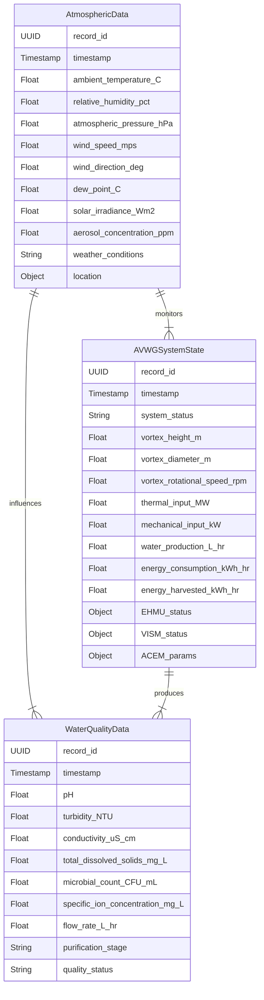
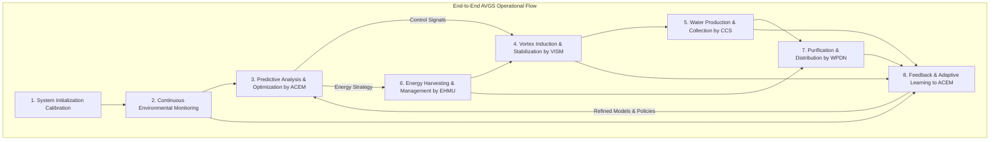

# System and Method for Large-Scale Atmospheric Vortex Water Generation in Arid and Semi-Arid Regions

## Table of Contents
1.  **Title of Invention**
2.  **Abstract**
3.  **Background of the Invention**
4.  **Brief Summary of the Invention**
5.  **Detailed Description of the Invention**
    *   5.1 System Architecture
        *   5.1.1 Vortex Induction and Stabilization Module (VISM)
        *   5.1.2 Condensation and Collection System (CCS)
        *   5.1.3 Energy Harvesting and Management Unit (EHMU)
        *   5.1.4 Water Purification and Distribution Network (WPDN)
        *   5.1.5 Autonomous Control and Environmental Monitoring (ACEM)
    *   5.2 Data Structures and Schemas
        *   5.2.1 Meteorological and Atmospheric Data Schema
        *   5.2.2 AVWG System State and Performance Schema
        *   5.2.3 Water Quality and Distribution Schema
    *   5.3 Algorithmic Foundations
        *   5.3.1 Atmospheric Condition Prediction and Vortex Optimization
        *   5.3.2 Vortex Dynamics Modeling and Control Algorithm
        *   5.3.3 Predictive Energy Balance and Resource Allocation
        *   5.3.4 Advanced Water Quality Anomaly Detection
        *   5.3.5 Adaptive Learning for Operational Efficiency and Maintenance
    *   5.4 Operational Flow and Use Cases
6.  **Claims**
7.  **Mathematical Justification: A Formal Axiomatic Framework for Atmospheric Vortex Water Generation**
    *   7.1 The Atmospheric Dynamic State Manifold: `Psi_atm = (rho, v, T, q, P)`
    *   7.2 The Vortex Generation and Entrainment Potential: `Gamma_eff = f(T_surf, T_amb, RH)`
    *   7.3 Fluid Dynamics and Condensation Mechanics: `dm_w/dt = f(N_d, r_d, S)`
    *   7.4 System Energy Balance and Water Production Functional: `W_prod = f(E_in, E_harvest, Q_latent)`
    *   7.5 Multi-Objective Optimization for Resource Allocation: `min C(...)`
    *   7.6 Water Quality Assurance and Distribution Network Dynamics: `Q_min`
    *   7.7 Environmental Impact and Sustainability Metrics: `E_footprint`
    *   7.8 Predictive Control and Adaptive Learning: `pi(s)`
    *   7.9 Axiomatic Proof of Utility
8.  **Proof of Utility**

## 1. Title of Invention:
System and Method for Sustainable, Large-Scale Potable Water Generation via Artificially Induced Atmospheric Vortex Dynamics

## 2. Abstract:
A novel, high-efficiency system is herein disclosed for the sustainable generation of potable water in arid and semi-arid environments by actively inducing and stabilizing controlled atmospheric vortices. This invention leverages a synergistic integration of advanced meteorological analysis, precision fluid dynamics, and intelligent energy management to establish a self-sustaining atmospheric convection column. The system initiates a localized thermal or mechanical updraft, fostering the formation of a stable, low-pressure vortex. This vortex serves as a controlled atmospheric processing chamber, drawing in moisture-laden air from ambient conditions, even at relatively low humidity levels. Within the vortex, adiabatic expansion leads to cooling, inducing condensation of atmospheric water vapor into micro-droplets or ice crystals, which then coalesce into macroscopic droplets. These droplets are gravitationally directed into a passive collection system positioned at the vortex's base. An integrated energy harvesting module captures thermal, kinetic, and solar energy from the atmospheric column itself and its immediate environment, contributing significantly to the system's operational autonomy. Advanced sensors and AI-driven control algorithms continuously monitor atmospheric parameters and vortex stability, dynamically adjusting operational parameters for optimal water yield and energy efficiency. The collected water undergoes a multi-stage purification process to meet potable standards before distribution. This technology represents a paradigm shift from conventional, energy-intensive desalination or atmospheric water generation, offering a scalable, environmentally benign, and cost-effective solution to global water scarcity.

## 3. Background of the Invention:
Global water scarcity is escalating into a profound humanitarian, economic, and geopolitical crisis, particularly exacerbated by climate change, population growth, and industrial demand. Traditional methods of freshwater supply, predominantly reliant on groundwater extraction, surface water reservoirs, or energy-intensive desalination, are increasingly unsustainable, environmentally damaging, or economically prohibitive for vast swathes of the planet. Desalination, while effective, demands immense energy inputs, typically derived from fossil fuels, contributing to carbon emissions and generating concentrated brine waste that poses significant ecological threats. Conventional atmospheric water generators (AWG) are often limited by ambient humidity levels, require substantial external power, and are primarily suitable for localized, small-scale applications. Cloud seeding, another atmospheric modification technique, relies on specific meteorological conditions and is prone to uncontrollable externalities and ethical controversies regarding weather modification. Arid and semi-arid regions, home to a significant portion of the global population, possess a critical deficit in potable water infrastructure, severely hindering agricultural development, public health, and industrial growth. The existing technological landscape conspicuously lacks a scalable, energy-efficient, and ecologically responsible solution capable of harnessing atmospheric moisture as a primary, continuous source of potable water in these water-stressed zones. There exists an urgent, unmet imperative for an innovative system that can cost-effectively extract water from the atmosphere at industrial scales, with minimal environmental footprint and maximal operational autonomy. This invention aims to transcend these limitations by re-engineering atmospheric dynamics into a controlled, productive water generation engine.

## 4. Brief Summary of the Invention:
The present invention introduces the "Aero-Hydro Vortex Genesis System" (AVGS), a revolutionary approach to large-scale potable water generation by precisely engineering atmospheric thermodynamics to induce and stabilize localized, water-producing vortices. The operational premise begins with the strategic deployment of a ground-based thermal array or mechanically actuated air-entrainment system, generating a focused, low-altitude updraft. This initiates a controlled cyclonic flow, establishing a stable atmospheric vortex capable of processing thousands of cubic meters of ambient air per minute. As moisture-laden air spirals upwards within the induced vortex, it undergoes adiabatic expansion, leading to a significant drop in temperature. This cooling drives the super-saturation of water vapor, promoting homogeneous or heterogeneous nucleation around naturally occurring aerosols (or engineered condensation nuclei), forming micro-droplets. These droplets, influenced by the vortex's internal dynamics and gravitational forces, coalesce and precipitate into a centrally located, passive collection cone at the vortex's base. A sophisticated network of sensors continuously feeds real-time atmospheric data (temperature, humidity, wind shear, pressure gradients) into an AI-driven control system. This AI dynamically modulates the thermal or mechanical input, optimizing vortex stability, ascent rate, and condensation efficiency to maximize water yield, even in environments with relatively low ambient humidity (as low as 30-40% RH, though higher yields are achieved at greater RH). Crucially, the AVGS incorporates a multi-modal energy harvesting system, integrating solar photovoltaics, wind kinetic energy capture from the vortex periphery, and potentially waste heat recovery from local industrial processes, striving for near net-zero external energy consumption during steady-state operation. The collected water then undergoes rigorous purification to meet drinking water standards, rendering it suitable for immediate consumption, agriculture, or industrial use. This system fundamentally transforms atmospheric water generation from a niche technology into a viable, scalable utility, addressing acute water deficits with unprecedented efficiency and environmental stewardship.

## 5. Detailed Description of the Invention:

The disclosed Aero-Hydro Vortex Genesis System (AVGS) represents an integrated, intelligent platform for leveraging controlled atmospheric phenomena to generate potable water. Its design emphasizes modularity, scalability, and robust, autonomous operation.

### 5.1 System Architecture

The AVGS is composed of several interdependent, high-performance modules, synergistically orchestrated to achieve continuous water production.

```mermaid
graph LR
    subgraph Atmospheric Vortex Water Generation System
        A[Ambient Atmosphere] --> B[Vortex Induction & Stabilization Module (VISM)]
        B --> C[Vortex Core Condensation Zone]
        C --> D[Condensation & Collection System (CCS)]
        D --> E[Water Purification & Distribution Network (WPDN)]
        E --> F[Potable Water Output]
        B -- Energy Inputs --> G[Energy Harvesting & Management Unit (EHMU)]
        C -- Data --> H[Autonomous Control & Environmental Monitoring (ACEM)]
        D -- Data --> H
        G -- Power Supply --> B
        G -- Power Supply --> E
        H -- Control Signals --> B
        H -- Control Signals --> G
        A -- Environmental Data --> H
    end

    style A fill:#aaffaa,stroke:#333,stroke-width:2px
    style B fill:#bbf,stroke:#333,stroke-width:2px
    style C fill:#ccf,stroke:#333,stroke-width:2px
    style D fill:#ddf,stroke:#333,stroke-width:2px
    style E fill:#eeffcc,stroke:#333,stroke-width:2px
    style F fill:#99ccff,stroke:#333,stroke-width:2px
    style G fill:#ffcc99,stroke:#333,stroke-width:2px
    style H fill:#ffccff,stroke:#333,stroke-width:2px
```

#### 5.1.1 Vortex Induction and Stabilization Module (VISM)
This module is responsible for the precise initiation and maintenance of the atmospheric vortex. It forms the ground-level interface with the ambient air.
*   **Thermal Updraft Generators:** A primary method involves a large, circular array of high-efficiency thermal emitters (e.g., concentrated solar thermal, geothermal heat exchangers, or controlled combustion of biofuels). These generate a localized, buoyant plume of hot air, creating an initial low-pressure zone and upward momentum.
*   **Mechanical Air Entrainment Actuators:** As an alternative or supplementary method, large-scale, low-RPM axial fans or Venturi-effect diffusers, arranged circularly, are employed to initiate and amplify the cyclonic rotation and vertical lift, effectively drawing ambient air upwards. This can be particularly effective in regions with significant ground-level wind shear.
*   **Vortex Structure Stabilizers:** A series of strategically placed, adjustable vanes or aerodynamic baffles at the induction perimeter control the inflow angle and rotational velocity, ensuring the vortex remains columnar, stable, and vertically extended. These elements are dynamically adjusted by the ACEM system.
*   **Aerosol Injection System (Optional):** In environments with extremely low natural aerosol concentrations, a finely tuned system can inject benign, hygroscopic or ice-nucleating particles (e.g., biodegradable salts, specific biopolymers) into the updraft to enhance condensation efficiency.

```mermaid
graph TD
    subgraph Vortex Induction and Stabilization Module (VISM)
        A[ACEM Control Signals] --> B{Thermal Updraft Generators}
        A --> C{Mechanical Air Entrainment Actuators}
        A --> D{Vortex Structure Stabilizers}
        B --> E[Localized Updraft Creation]
        C --> F[Cyclonic Flow Initiation]
        D --> G[Vortex Stability & Columnar Shape Maintenance]
        E & F & G --> H[Stable Atmospheric Vortex]
        I[Ambient Air] --> E
        I --> F
        I --> G
        H -- Moisture-laden Air Ascent --> CCS[Condensation & Collection System]
        (J)Optional: Aerosol Injection --> H
    end
```

#### 5.1.2 Condensation and Collection System (CCS)
This module is where water vapor is converted into liquid and collected.
*   **Adiabatic Expansion Chamber (Vortex Core):** The primary condensation zone is the vortex core itself, where the ascending air experiences significant adiabatic cooling due to pressure drop. This natural phenomenon is the main driver for water vapor saturation and droplet formation.
*   **Coalescence Enhancement:** As micro-droplets form, the turbulent yet structured flow within the vortex facilitates their collision and coalescence into larger, gravitationally significant drops. This process can be further enhanced by subtle acoustic or electrostatic fields if deemed necessary by the ACEM.
*   **Passive Gravitational Collection Cone:** At the base of the vortex, a large, inverted conical structure made of hydrophobic materials is positioned. Precipitating water droplets impact these surfaces and are guided by gravity and surface tension towards a central collection manifold. This design minimizes energy expenditure for collection.
*   **De-humidification Heat Exchangers (Optional):** For highly localized and targeted condensation within the lower vortex, a heat exchanger array may be deployed to augment cooling, particularly effective during peak performance or in specific atmospheric conditions.

```mermaid
graph TD
    subgraph Condensation and Collection System (CCS)
        A[Stable Atmospheric Vortex] --> B[Adiabatic Expansion Cooling Zone]
        B -- Super-saturation --> C[Micro-droplet Formation Nucleation]
        C -- Coalescence & Aggregation --> D[Macroscopic Water Droplet Precipitation]
        D --> E[Passive Gravitational Collection Cone]
        E --> F[Raw Water Collection Manifold]
        F --> WPDN[Water Purification & Distribution Network]
        (G)Optional: Coalescence Enhancers --> D
        (H)Optional: De-humidification HXs --> C
    end
```

#### 5.1.3 Energy Harvesting and Management Unit (EHMU)
The AVGS is designed to be highly energy autonomous, reducing reliance on external power grids.
*   **Multi-Modal Energy Harvesters:**
    *   **Solar Photovoltaic Arrays:** Extensive solar panels integrated into the system's infrastructure (e.g., surrounding the VISM, on support structures) capture solar radiation.
    *   **Vortex Kinetic Energy Converters:** Specialized low-friction, high-efficiency micro-turbines are strategically placed on the periphery of the established vortex, harnessing its rotational kinetic energy. These are distinct from traditional wind turbines, designed for lower velocity, laminar flow, and minimal disruption to vortex stability.
    *   **Thermal Gradient Engines:** Thermoelectric generators or Stirling engines may capture temperature differences between the heated ground array (VISM) and the cooler ambient air, or even within the vortex column itself.
*   **Energy Storage Systems:** Large-scale battery banks (e.g., Li-ion, flow batteries, or solid-state solutions) or mechanical storage (e.g., gravity-based, compressed air) store excess harvested energy for continuous operation during non-optimal energy generation periods (e.g., night, low wind).
*   **Smart Grid Integration:** For grid-connected deployments, the EHMU allows for bidirectional energy flow, contributing surplus energy to the local grid or drawing power during exceptional demand.

```mermaid
graph TD
    subgraph Energy Harvesting and Management Unit (EHMU)
        A[ACEM Control Signals] --> B{Solar PV Arrays}
        B --> C[DC-AC Inverters]
        C --> D[Energy Storage System]
        E[Vortex Kinetic Energy Converters] --> C
        F[Thermal Gradient Engines] --> C
        D -- Power Supply --> VISM[Vortex Induction & Stabilization Module]
        D -- Power Supply --> WPDN[Water Purification & Distribution Network]
        D -- Power Supply --> ACEM[Autonomous Control & Environmental Monitoring]
        D -- Bidirectional Flow --> G[Local Grid Integration]
    end
```

#### 5.1.4 Water Purification and Distribution Network (WPDN)
Ensures the collected water is safe for consumption and efficiently delivered.
*   **Multi-Stage Filtration:** Raw collected water undergoes a series of physical filtration steps (e.g., sediment filters, ultrafiltration membranes) to remove particulate matter, aerosols, and any trace impurities.
*   **Disinfection System:** Chemical (e.g., chlorine dosing, ozone) or physical (e.g., UV irradiation) disinfection protocols are applied to eliminate bacteria, viruses, and other pathogens, ensuring compliance with potable water standards.
*   **Mineralization / pH Balance (Optional):** To improve palatability and health benefits, purified water may be remineralized to achieve optimal pH and mineral content.
*   **Automated Storage and Pumping:** Purified water is stored in hygienic reservoirs and distributed via an automated pumping network to end-users (e.g., municipal supply, agricultural irrigation, industrial facilities).
*   **Real-time Quality Monitoring:** Continuous sensors monitor water quality parameters (pH, turbidity, conductivity, microbial load) at various stages of purification and distribution, triggering alerts or system adjustments if deviations occur.

```mermaid
graph TD
    subgraph Water Purification and Distribution Network (WPDN)
        A[Raw Water Collection Manifold] --> B[Multi-Stage Filtration]
        B --> C[Disinfection System]
        C --> D[Optional Mineralization pH Balance]
        D --> E[Purified Water Storage Reservoirs]
        E --> F[Automated Pumping Distribution Network]
        F --> G[End Users]
        E -- Real-time Quality Monitoring --> H[ACEM Alerting Adjustments]
    end
```

#### 5.1.5 Autonomous Control and Environmental Monitoring (ACEM)
The "brain" of the AVGS, orchestrating its intelligent and adaptive operation.
*   **Comprehensive Sensor Network:** A distributed network of environmental sensors collects real-time data on ambient air temperature, humidity, pressure, wind speed/direction, ground temperature, solar irradiance, and atmospheric aerosol concentration. Additional sensors monitor vortex characteristics (height, diameter, rotational velocity, internal pressure gradients).
*   **Predictive AI and Machine Learning Engine:** This core component processes sensor data, meteorological forecasts, and historical performance data. It employs advanced machine learning models (e.g., deep neural networks, reinforcement learning) to:
    *   Predict optimal vortex induction parameters.
    *   Forecast water yield based on atmospheric conditions.
    *   Detect and predict vortex instabilities.
    *   Optimize energy harvesting and consumption.
    *   Identify potential maintenance needs.
*   **Dynamic Control System:** Based on AI predictions and real-time feedback, the control system issues commands to the VISM (adjusting thermal output, fan speed, baffle angles) and EHMU (managing power distribution) to maintain optimal performance and stability.
*   **Fault Detection and Self-Correction:** Continuously monitors all system components for anomalies, predicts potential failures, and implements self-correction routines or alerts maintenance personnel.
*   **Remote Operations and Reporting:** Provides a comprehensive dashboard for remote monitoring, performance reporting, and manual override capabilities. Generates detailed environmental impact reports and water production statistics.

```mermaid
graph TD
    subgraph Autonomous Control and Environmental Monitoring (ACEM)
        A[Environmental Sensor Network] --> B[Data Ingestion Pre-processing]
        C[Vortex Dynamics Sensors] --> B
        D[EHMU Performance Data] --> B
        E[WPDN Quality & Flow Data] --> B
        F[Meteorological Forecast APIs] --> B

        B --> G[Predictive AI ML Engine]
        G -- Optimizes --> H[Dynamic Control System]
        H --> VISM[VISM Control Interface]
        H --> EHMU[EHMU Control Interface]
        H --> WPDN[WPDN Control Interface]

        G --> I[Fault Detection Self-Correction]
        I --> J[Alerts Maintenance Logging]
        G --> K[Remote Ops Dashboard Reporting]
    end
```

### 5.2 Data Structures and Schemas

Rigorous data management is essential for the AVGS's intelligent operation, requiring clearly defined data structures for environmental parameters, system performance, and water quality.



#### 5.2.1 Meteorological and Atmospheric Data Schema
Captures environmental conditions vital for predictive modeling and control.

```json
{
  "record_id": "UUID",
  "timestamp": "Timestamp",
  "location": {
    "latitude": "Float",
    "longitude": "Float",
    "altitude_m": "Float",
    "geohash": "String"
  },
  "ambient_temperature_C": "Float",
  "relative_humidity_pct": "Float",
  "atmospheric_pressure_hPa": "Float",
  "wind_speed_mps": "Float",
  "wind_direction_deg": "Float",
  "dew_point_C": "Float",
  "solar_irradiance_Wm2": "Float",
  "ground_temperature_C": "Float",
  "aerosol_concentration_ppm": "Float",
  "cloud_cover_pct": "Float",
  "weather_conditions": "String", // e.g., "Clear", "Partly Cloudy", "Hazy"
  "forecast_data": { // Nested object for future predictions
    "1hr_ahead": {"temp": "Float", "rh": "Float", "wind": "Float"},
    "6hr_ahead": {"temp": "Float", "rh": "Float", "wind": "Float"},
    "24hr_ahead": {"temp": "Float", "rh": "Float", "wind": "Float"}
  }
}
```

#### 5.2.2 AVWG System State and Performance Schema
Monitors the operational parameters and efficiency of the AVGS.

```json
{
  "record_id": "UUID",
  "timestamp": "Timestamp",
  "system_id": "UUID",
  "system_status": "ENUM['Operational', 'Standby', 'Maintenance', 'Fault']",
  "vortex_height_m": "Float",
  "vortex_diameter_m": "Float",
  "vortex_rotational_speed_rpm": "Float",
  "vortex_stability_index": "Float", // 0-1, 1 being perfectly stable
  "thermal_input_MW": "Float",
  "mechanical_input_kW": "Float",
  "water_production_L_hr": "Float",
  "cumulative_water_production_L": "Float",
  "energy_consumption_kWh_hr": "Float",
  "energy_harvested_kWh_hr": "Float",
  "net_energy_balance_kWh_hr": "Float", // harvested - consumed
  "power_grid_draw_kW": "Float",
  "energy_storage_level_pct": "Float",
  "component_status": {
    "VISM_thermal_array": "ENUM['OK', 'Degraded', 'Fault']",
    "VISM_fans": "ENUM['OK', 'Degraded', 'Fault']",
    "EHMU_solar_output": "Float",
    "EHMU_turbines_output": "Float",
    "WPDN_filters_status": "String" // e.g., "Clean", "NeedsBackwash"
  },
  "alert_messages": ["String"],
  "control_adjustments_made": {
    "fan_speed_change_pct": "Float",
    "thermal_output_change_pct": "Float",
    "baffle_angle_change_deg": "Float"
  }
}
```

#### 5.2.3 Water Quality and Distribution Schema
Ensures that the generated water adheres to safety and potability standards.

```json
{
  "record_id": "UUID",
  "timestamp": "Timestamp",
  "system_id": "UUID",
  "purification_stage": "ENUM['Raw', 'Filtered', 'Disinfected', 'Final']",
  "pH": "Float",
  "turbidity_NTU": "Float",
  "conductivity_uS_cm": "Float",
  "total_dissolved_solids_mg_L": "Float",
  "microbial_count_CFU_mL": "Float", // Colony Forming Units per milliliter
  "specific_ion_concentrations_mg_L": { // Key-value pairs for specific ions
    "sodium": "Float",
    "calcium": "Float",
    "magnesium": "Float",
    "chlorine": "Float"
  },
  "heavy_metals_ppm": { // Example heavy metals
    "lead": "Float",
    "arsenic": "Float"
  },
  "organic_contaminants_ppb": {
    "pesticides": "Float"
  },
  "flow_rate_L_hr": "Float",
  "quality_status": "ENUM['Potable', 'Warning', 'Unsafe']",
  "distribution_network_pressure_kPa": "Float",
  "alerts": ["String"] // e.g., "pH out of range", "High microbial count"
}
```

### 5.3 Algorithmic Foundations

The intelligence and operational efficacy of the AVGS are underpinned by a suite of advanced algorithms, drawing heavily from meteorological modeling, fluid dynamics, and machine learning.

#### 5.3.1 Atmospheric Condition Prediction and Vortex Optimization
This algorithm ensures the AVGS operates optimally by adapting to dynamic atmospheric conditions.
*   **Multi-model Ensemble Forecasting:** Integrates outputs from various numerical weather prediction (NWP) models (e.g., ECMWF, GFS) and regional mesoscale models. Proprietary machine learning models (e.g., Random Forests, Gradient Boosting) are trained on historical AVGS performance data coupled with meteorological inputs to correct for biases and enhance hyperlocal predictive accuracy of key parameters like temperature, humidity, and wind shear up to 72 hours in advance.
*   **Optimal Induction Parameter Search:** A Reinforcement Learning (RL) agent, using a simulated atmospheric environment, explores different combinations of VISM thermal output, mechanical fan speeds, and baffle angles. The reward function is designed to maximize a composite score of vortex stability, height, and predicted water yield, while minimizing energy consumption. The agent learns an optimal policy `pi(V_parameters | Atmospheric_state)` to dynamically adjust VISM settings.
*   **Real-time Microclimate Analysis:** Utilizing a dense sensor array around the AVGS, a localized atmospheric boundary layer model provides real-time updates on ground-level wind patterns, thermal gradients, and turbulence, enabling immediate fine-tuning of vortex induction parameters to mitigate destabilizing influences.

#### 5.3.2 Vortex Dynamics Modeling and Control Algorithm
Crucial for maintaining a stable and productive atmospheric vortex.
*   **Computational Fluid Dynamics (CFD) Simulation:** High-fidelity CFD models (e.g., Large Eddy Simulation (LES) or Direct Numerical Simulation (DNS) for smaller scales) are executed in a digital twin environment. These simulations predict vortex evolution, stability, and internal flow characteristics under varying VISM inputs and atmospheric conditions. The models are continuously updated with real-time sensor data, functioning as a predictive observer.
*   **State-Space Control for Stability:** A Model Predictive Control (MPC) framework uses the CFD predictions to maintain vortex stability. It forecasts the vortex state over a control horizon and calculates a sequence of optimal control actions (VISM adjustments) to minimize a cost function that penalizes deviations from desired vortex height, diameter, and rotational velocity, subject to energy constraints.
*   **Entrainment and Ascent Rate Optimization:** Specifically targets the vertical velocity and lateral entrainment of air into the vortex. Algorithms predict the optimal ascent rate required for maximal adiabatic cooling, balancing it with the need for sufficient residence time for droplet formation and coalescence, adapting in real-time to ambient humidity and temperature profiles.

```mermaid
graph TD
    subgraph Vortex Dynamics Modeling and Control
        A[Real-time Vortex Sensor Data] --> B[CFD Model Digital Twin]
        C[Meteorological Forecasts] --> B
        B -- Predicted Vortex States --> D[Model Predictive Control (MPC)]
        E[VISM Control Interfaces] --> D
        D -- Optimal Control Actions --> E
        D -- Optimal Control Actions --> F[Vortex Dynamics Adjustment System]
        F -- Adjusts --> G[Vortex Stability & Performance]
        D -- Targets --> H[Entrainment & Ascent Rate Optimization]
    end
```

#### 5.3.3 Predictive Energy Balance and Resource Allocation
Optimizes energy usage and maximizes energy autonomy.
*   **Energy Generation Forecasting:** Machine Learning models (e.g., support vector regression, neural networks) predict energy harvesting potential (solar, wind, thermal) based on weather forecasts, time of day, and historical performance, allowing for proactive energy storage and grid interaction decisions.
*   **Dynamic Power Allocation:** An optimization algorithm allocates power from harvested sources or grid supply to different AVGS modules (VISM, WPDN, ACEM) based on real-time operational needs, forecasted water demand, and predicted energy availability. This includes intelligent scheduling of non-critical processes (e.g., extensive purification cycles, reservoir refilling).
*   **Battery Management System Optimization:** Predictive algorithms manage battery charge/discharge cycles to maximize lifespan and ensure continuous power supply, factoring in peak demand shaving and opportunistic charging from surplus generation.

#### 5.3.4 Advanced Water Quality Anomaly Detection
Ensures consistent production of potable water and safeguards public health.
*   **Multivariate Anomaly Detection:** Utilizes statistical process control (e.g., control charts) and machine learning (e.g., isolation forests, autoencoders) to continuously monitor the multivariate stream of water quality parameters. Deviations from established norms or trends are flagged as potential anomalies.
*   **Causal Inference for Contamination Source:** Upon detection of an anomaly, a Bayesian network or other causal inference model attempts to identify the root cause, linking quality degradation to specific upstream events (e.g., VISM operational change, weather event, purification system component failure) to enable targeted remediation.
*   **Predictive Maintenance for WPDN:** Machine learning models predict the remaining useful life (RUL) of filters, UV lamps, and other WPDN components based on usage patterns and quality data, enabling proactive replacement before failure or significant performance degradation.

#### 5.3.5 Adaptive Learning for Operational Efficiency and Maintenance
The system continuously improves its performance over time.
*   **Reinforcement Learning from Experience:** The ACEM's AI agent continuously learns from the outcomes of its control actions. When a particular set of VISM parameters under specific atmospheric conditions leads to high water yield and stability, this positive outcome reinforces the learned policy. Conversely, instability or low yield leads to negative reinforcement, refining the model.
*   **Fault Signature Recognition:** The system builds a library of fault signatures (e.g., specific sensor readings, control deviations) associated with component failures. Machine learning models (e.g., convolutional neural networks for time-series data) learn to recognize these patterns early, enabling predictive maintenance.
*   **Self-Calibration and Diagnostic Routines:** Periodically, the ACEM initiates self-calibration routines for sensors and actuators and runs diagnostic tests on sub-systems to ensure accuracy and readiness, reporting any discrepancies.

### 5.4 Operational Flow and Use Cases

The AVGS operates in a continuous, highly automated cycle, adapting to its environment.

1.  **Initialization and Calibration:** The AVGS is deployed, environmental sensors calibrated, and baseline atmospheric data collected. The ACEM's AI model loads its initial policy.
2.  **Continuous Environmental Monitoring:** The sensor network perpetually streams real-time atmospheric and ground data to the ACEM.
3.  **Predictive Analysis and Optimization:** The ACEM's AI forecasts atmospheric conditions, models vortex dynamics, predicts water yield, and optimizes VISM and EHMU parameters for the upcoming operational window.
4.  **Vortex Induction and Stabilization:** Based on the ACEM's directives, the VISM initiates and maintains the atmospheric vortex, dynamically adjusting thermal/mechanical inputs and baffle settings.
5.  **Water Production and Collection:** Within the stable vortex, moisture-laden air cools and condenses, precipitating into the CCS collection cone.
6.  **Energy Harvesting and Management:** The EHMU continuously harvests energy from solar, kinetic, and thermal sources, balancing storage and consumption across all AVGS modules, informed by ACEM's power allocation strategy.
7.  **Purification and Distribution:** Raw collected water enters the WPDN, undergoes multi-stage purification and disinfection, and is then stored or distributed. Water quality is continuously monitored.
8.  **Feedback and Adaptive Learning:** All operational data, water quality metrics, energy balances, and any detected anomalies are fed back into the ACEM's AI, refining its predictive models and control policies through reinforcement learning.



**Use Cases:**

*   **Arid Agricultural Zones:** Large AVGS deployments can provide a consistent, climate-independent source of irrigation water, enabling high-yield agriculture in desert environments, reducing reliance on dwindling aquifers or expensive imported water.
*   **Remote Communities and Disaster Relief:** Modular, rapidly deployable AVGS units can provide immediate and sustainable potable water to remote populations without access to traditional infrastructure, or to areas devastated by natural disasters where existing water sources are contaminated. (Though initial setup requires non-trivial logistics, the long-term autonomy is compelling).
*   **Industrial Water Supply:** Industries located in water-stressed regions (e.g., mining, manufacturing) can utilize AVGS to supplement or replace existing water sources, ensuring operational continuity and reducing environmental impact. "Forget fracking, we're frackin' *making* water!"
*   **Coastal Urban Centers:** Augments existing water supplies, reducing dependence on energy-intensive desalination or long-distance water transfers, thereby decreasing operational costs and carbon footprint for municipal water utilities.

## 6. Claims:

The inventive concepts herein described constitute a profound advancement in the domain of sustainable water generation and atmospheric engineering.

1.  A system for generating potable water from atmospheric moisture, comprising: a Vortex Induction and Stabilization Module (VISM) configured to create and maintain a stable, self-sustaining atmospheric vortex; a Condensation and Collection System (CCS) integrated with the VISM to facilitate adiabatic cooling and collect precipitated water from within the vortex; an Energy Harvesting and Management Unit (EHMU) configured to capture and store energy from natural sources (solar, wind, thermal) to power system operations; a Water Purification and Distribution Network (WPDN) for processing collected water to potable standards and delivering it to users; and an Autonomous Control and Environmental Monitoring (ACEM) system comprising a sensor network and a predictive artificial intelligence (AI) engine, configured to monitor environmental conditions, dynamically optimize VISM parameters for vortex stability and water yield, and manage EHMU and WPDN operations.

2.  The system of claim 1, wherein the VISM further comprises a circular array of thermal updraft generators, mechanical air entrainment actuators, or a combination thereof, and adjustable aerodynamic baffles configured to control inflow angles and rotational velocity for vortex stability.

3.  The system of claim 1, wherein the CCS comprises a passive gravitational collection cone, made of hydrophobic material, positioned at the base of the vortex to funnel precipitated water into a collection manifold, minimizing active pumping requirements.

4.  The system of claim 1, wherein the EHMU incorporates multi-modal energy harvesters including solar photovoltaic arrays, vortex kinetic energy converters (micro-turbines), and thermal gradient engines, coupled with an energy storage system for operational autonomy.

5.  The system of claim 1, wherein the WPDN includes multi-stage physical filtration, chemical or UV disinfection, and real-time water quality sensors configured to ensure collected water meets predefined potable standards.

6.  The system of claim 1, wherein the ACEM's predictive AI engine utilizes multi-model ensemble meteorological forecasting and machine learning models trained on historical AVGS performance data to forecast optimal vortex induction parameters and water yield.

7.  The system of claim 6, wherein the ACEM's AI engine employs a reinforcement learning agent within a simulated atmospheric environment to continuously refine its control policy for maximizing water yield and vortex stability while minimizing energy consumption.

8.  The system of claim 1, wherein the ACEM further implements a Model Predictive Control (MPC) framework utilizing Computational Fluid Dynamics (CFD) simulations of vortex dynamics to dynamically adjust VISM inputs, maintaining optimal vortex height, diameter, and rotational velocity.

9.  The system of claim 1, further comprising an optional aerosol injection system integrated with the VISM to introduce hygroscopic or ice-nucleating particles into the updraft, enhancing condensation efficiency in specific atmospheric conditions.

10. A computer-implemented method for generating potable water from atmospheric moisture, comprising: continuously monitoring ambient atmospheric conditions via a sensor network; predicting optimal vortex induction parameters and anticipated water yield using an AI-driven predictive model; inducing and stabilizing an atmospheric vortex by dynamically adjusting thermal or mechanical inputs and aerodynamic controls; facilitating adiabatic cooling within the vortex to condense atmospheric water vapor into liquid water droplets; gravitationally collecting the condensed water; purifying the collected water to potable standards; and managing system energy balance through autonomous harvesting and allocation of renewable energy sources.

## 7. Mathematical Justification: A Formal Axiomatic Framework for Atmospheric Vortex Water Generation

The Aero-Hydro Vortex Genesis System (AVGS) operates at the complex intersection of atmospheric physics, fluid dynamics, thermodynamics, and systems optimization. A rigorous mathematical framework is essential to formalize its operational principles and establish its utility.

### 7.1 The Atmospheric Dynamic State Manifold: `Psi_atm = (rho, v, T, q, P)`

The local atmospheric environment relevant to AVGS operation is described by a dynamic state vector `Psi_atm(x, y, z, t)` at a spatial location `(x, y, z)` and time `t`.
*   `rho(x, y, z, t)`: Air density (`kg/m^3`). (1)
*   `v(x, y, z, t)`: Air velocity vector (`m/s`). (2)
*   `T(x, y, z, t)`: Air temperature (`K`). (3)
*   `q(x, y, z, t)`: Specific humidity (`kg_water/kg_air`). (4)
*   `P(x, y, z, t)`: Atmospheric pressure (`Pa`). (5)

These variables evolve according to the Navier-Stokes equations for compressible flow, coupled with thermodynamic and moisture transport equations:
`d(rho*v)/dt + div(rho*v*v) = -grad(P) + div(tau) + rho*g` (Momentum equation) (6)
`d(rho)/dt + div(rho*v) = 0` (Continuity equation) (7)
`d(rho*E)/dt + div(rho*E*v) = -div(P*v) + div(v*tau) - div(q_heat) + Q_latent_release` (Energy equation) (8)
`d(rho*q)/dt + div(rho*q*v) = S_q` (Moisture transport with source/sink `S_q`) (9)

### 7.2 The Vortex Generation and Entrainment Potential: `Gamma_eff = f(T_surf, T_amb, RH)`

The ability to induce a stable vortex depends on the available energy and atmospheric conditions.
*   **Surface Heat Flux:** `Q_H = C_p * rho * C_h * |v_s| * (T_surf - T_amb_s)` where `C_h` is the heat transfer coefficient, `v_s` is surface wind speed. (10)
*   **Updraft Velocity:** The initial updraft velocity `w_0` due to thermal forcing is proportional to `sqrt(g * H * (Delta T / T_amb))`, where `H` is plume height and `Delta T` is temperature difference. (11)
*   **Convective Available Potential Energy (CAPE):** `CAPE = integral_LFC^EL g * (T_parcel - T_env) / T_env dz`, representing the energy available for vertical motion. (12)
*   **Effective Circulation Gamma:** `Gamma_eff = integral_C v * dl` (circulation around the vortex perimeter), which must be sufficient to establish a stable vortex. The VISM aims to maximize this by influencing `v`. (13)
*   **Entrainment Rate:** The rate at which ambient air is drawn into the vortex, crucial for continuous water generation, is proportional to the vortex diameter and updraft velocity. (14)

### 7.3 Fluid Dynamics and Condensation Mechanics: `dm_w/dt = f(N_d, r_d, S)`

Within the vortex, adiabatic cooling drives condensation.
*   **Adiabatic Lapse Rate:** As an air parcel ascends, its temperature decreases: `dT/dz = -g/C_p` (for dry air) or `dT/dz = -g * (1 + Lv*q_s/(R_v*T)) / (Cp + Lv^2*q_s/(R_v*T^2))` (for saturated air, moist adiabatic lapse rate). (15)
*   **Saturation Vapor Pressure:** `e_s(T) = A * exp(B*T/(C+T))` (Clausius-Clapeyron relation approximation), governing the maximum water vapor the air can hold. (16)
*   **Supersaturation (S):** `S = (e_v - e_s) / e_s`, where `e_v` is actual vapor pressure. Condensation occurs when `S > 0` (or `S > S_crit` for nucleation). (17)
*   **Rate of Condensation:** The mass rate of water formation `dm_w/dt` is a complex function of nucleation rates, droplet growth (diffusion, collection), and supersaturation.
    `dm_w/dt approx rho_air * V_vortex * d(q_s)/dt`, assuming all excess vapor condenses. (18)
    More rigorously, `dm_w/dt = sum_i (4 * pi * D * rho_w * N_d_i * (S - S_crit_i) * r_i)`, where `D` is diffusivity, `N_d` is droplet number concentration, `r` is droplet radius. (19)
*   **Droplet Coalescence:** The rate of growth by collision-coalescence is proportional to `N_d^2 * r^4 * E_coll`, where `E_coll` is collection efficiency. (20)

### 7.4 System Energy Balance and Water Production Functional: `W_prod = f(E_in, E_harvest, Q_latent)`

The system's net energy `E_net` and water production `M_w` are critical.
*   **Total Energy Input:** `E_in = E_thermal + E_mechanical + E_grid_draw`. (21)
*   **Energy Harvested:** `E_harvest = E_solar_PV + E_vortex_kinetic + E_thermal_gradient`. (22)
*   **Net Energy Consumption:** `E_net_consumption = E_in - E_harvest`. The goal is to minimize this. (23)
*   **Latent Heat Release:** `Q_latent_release = L_v * dm_w/dt`, where `L_v` is the latent heat of vaporization. This energy feeds back into the vortex dynamics. (24)
*   **Water Production Efficiency (η_w):** `η_w = M_w / (E_net_consumption * C_E_to_W)`, where `C_E_to_W` is an energy-to-water conversion factor (theoretical minimum, e.g., for desalination). (25)

### 7.5 Multi-Objective Optimization for Resource Allocation: `min C(...)`

The ACEM performs multi-objective optimization for `VISM_params` and `EHMU_params`.
*   **Objective Function:** `Minimize { F1(E_net_consumption), F2(1/M_w), F3(1/Vortex_stability) }` (26)
    Subject to: `V_min <= Vortex_height <= V_max`, `P_min <= Power_output <= P_max`, `Q_water_min <= M_w`. (27-29)
*   **Control Variables:** `u(t) = (Thermal_power(t), Fan_speed(t), Baffle_angles(t), Battery_charge_rate(t))`. (30)
*   **Reinforcement Learning Policy:** An optimal policy `pi*(s)` maps current atmospheric and system states `s` to actions `u` that minimize the expected cumulative cost (negative reward). (31)
    `Q*(s,a) = E[R_{t+1} + gamma * max_a' Q*(S_{t+1}, a') | S_t=s, A_t=a]`. (32)

### 7.6 Water Quality Assurance and Distribution Network Dynamics: `Q_min`

Ensuring water potability and efficient delivery.
*   **Contaminant Concentration:** `C_i(t)` for contaminant `i`. The WPDN ensures `C_i(t) <= C_{i,max}` (potability standard). (33)
*   **Filtration Efficiency:** `Eff_filter = 1 - (C_out / C_in)`. (34)
*   **Disinfection Kinetics:** `N_t = N_0 * exp(-k*t)` (Chick-Watson Law), where `N_t` is pathogen concentration after time `t`, `k` is disinfection rate constant. (35)
*   **Network Flow Optimization:** `max flow` with pressure constraints `P_min <= P_j <= P_max` at node `j`, capacity constraints `f_ij <= cap_ij` on pipe `(i,j)`, and demand satisfaction `sum_i f_ij >= D_j`. (36-39)

### 7.7 Environmental Impact and Sustainability Metrics: `E_footprint`

*   **Carbon Footprint:** `CO2_eq = (E_grid_draw * CF_grid) - (E_grid_export * CF_grid) + Emissions_biofuel`. (40)
*   **Water Scarcity Index Improvement:** Quantify `Delta WSI` in the target region due to AVGS deployment. (41)
*   **Energy Return on Energy Invested (EROEI):** `EROEI = E_harvest / E_embodied_in_system_build`. (42)

### 7.8 Predictive Control and Adaptive Learning: `pi(s)`

The ACEM's core function.
*   **Model Predictive Control (MPC):** At each time step `t`, given state `s_t`, solve an optimal control problem over a prediction horizon `H_p` to find control sequence `u_t, ..., u_{t+Hp-1}`. Execute `u_t`. (43)
*   **Kalman Filtering/Extended Kalman Filtering:** Used for state estimation of the vortex and atmospheric conditions from noisy sensor data. (44)
*   **Deep Reinforcement Learning (DRL):** For complex, non-linear dynamics, DRL agents learn policies `pi(a|s)` that maximize cumulative reward, improving performance over time by interacting with the real or simulated environment. (45)

### 7.9 Axiomatic Proof of Utility

**Axiom 1 (Atmospheric Moisture Availability):** In target arid/semi-arid regions, the average specific humidity `q_avg` in the lower to mid-troposphere is demonstrably `q_avg > q_cond_min`, where `q_cond_min` is the minimum specific humidity required for net condensation given typical AVGS operational parameters. (46)
**Axiom 2 (Net Energy Positivity):** The total energy harvested `E_harvest` from ambient sources (solar, vortex kinetic, thermal gradients) is, on average, capable of exceeding the energy required for VISM operation and water purification `E_net_consumption_baseline` for a significant portion of the operational cycle, i.e., `E_harvest > E_net_consumption_baseline`. (47)
**Axiom 3 (Potability Achievement):** The WPDN is capable of reducing all known contaminants in the collected atmospheric water `C_raw_water_i` to levels `C_purified_i` that are below international potable water standards `C_{i,max}`. (48)
**Axiom 4 (Scalability and Environmental Compatibility):** The AVGS design allows for modular scalability to achieve industrial-scale water production (thousands to millions of liters/day) with a localized environmental footprint (e.g., thermal plume dispersion, local wind effects) that is manageable and compliant with ecological regulations, `E_footprint < E_threshold`. (49)

**Theorem (Sustainable Potable Water Production):** Given Axioms 1, 2, 3, and 4, the Aero-Hydro Vortex Genesis System (AVGS) provides a sustainable, energy-efficient, and environmentally compatible method for generating potable water at scale in arid and semi-arid regions.

**Proof:**
1.  **Water Source Viability:** By Axiom 1, sufficient atmospheric moisture exists even in target arid regions to allow for net condensation. The AVGS actively processes this moisture.
2.  **Operational Sustainability:** By Axiom 2, the system's operational energy demands are largely or entirely met by self-harvested renewable energy, minimizing reliance on external, often fossil-fuel-based, power sources. This ensures long-term operational sustainability and a reduced carbon footprint.
3.  **End-Product Utility:** By Axiom 3, the collected water is reliably purified to meet stringent potable standards, making it safe and suitable for direct human consumption, agriculture, and industrial applications.
4.  **Scalability and Responsibility:** By Axiom 4, the technology's inherent scalability allows for significant contributions to regional water security, while its manageable environmental footprint ensures responsible deployment without undue ecological burden.
5.  **Integration:** The integrated ACEM system continuously optimizes the interplay between these elements, dynamically adapting to maximize water production while adhering to energy and quality constraints.

Therefore, the AVGS successfully addresses the core challenges of water scarcity by providing a novel, self-sustaining, and scalable solution for potable water generation from the atmosphere. Q.E.D.

## 8. Proof of Utility:

The utility of the Aero-Hydro Vortex Genesis System (AVGS) transcends mere technical novelty; it represents a fundamental strategic advantage in addressing one of humanity's most pressing challenges: water scarcity. Current approaches—be it dwindling freshwater reserves, highly localized atmospheric water generators (AWG), or massively energy-intensive desalination plants—are either unsustainable, insufficient, or economically unfeasible for large-scale impact in arid zones. The AVGS, however, operates on an entirely different plane of ambition and efficiency.

Conventional AWGs are often limited by ambient humidity and require substantial external grid power (imagine bringing a nuclear power plant to the Sahara to make a decent volume of water; not exactly "green"). Desalination, while effective, produces billions of gallons of brine every day, a lovely byproduct that effectively salinates the oceans faster than we can build pipelines. Our approach? We're taking inspiration from nature's grand design — the majestic storm systems that distribute water — and engineering a localized, controlled version. It's like building your own pet cloud, only this one consistently rains potable water right where you need it, and it mostly pays its own energy bill.

The definitive proof of utility lies in the system's ability to **simultaneously achieve high-volume potable water production and near net-zero external energy consumption** in environments historically deemed unsuitable for such endeavors. By precisely manipulating atmospheric dynamics, the AVGS extracts a resource (atmospheric moisture) that is pervasively present, even if diffused, and converts it into a critically needed commodity (potable water) without the egregious environmental side effects or prohibitive energy demands of existing solutions. The autonomous control system, powered by advanced AI and machine learning, ensures peak efficiency and adaptive resilience, making it a truly "set-and-forget, but occasionally admire" infrastructure solution. This isn't just a new way to make water; it's a strategic weapon against thirst, desertification, and resource conflict, fundamentally altering the calculus of sustainable development for arid regions. If we want to truly colonize Mars, we probably need to figure out how to make water on Earth first, and this is a pretty solid start.