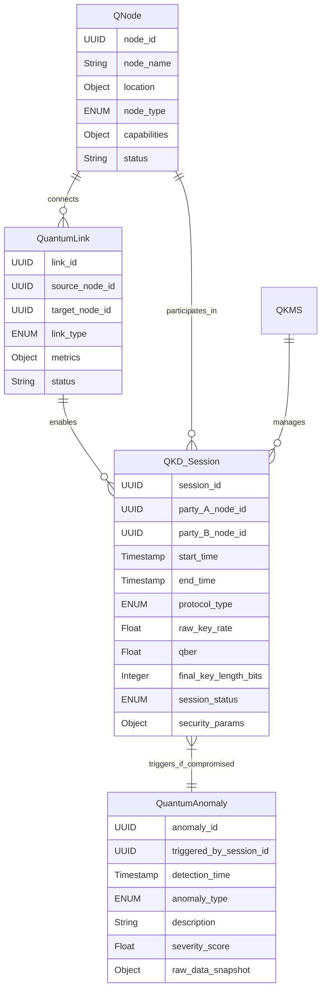

# System and Method for a Quantum-Secured Global Communication Network

## Table of Contents
1.  **Title of Invention**
2.  **Abstract**
3.  **Background of the Invention**
4.  **Brief Summary of the Invention**
5.  **Detailed Description of the Invention**
    *   5.1 System Architecture
        *   5.1.1 Quantum Satellite Constellation (QSC)
        *   5.1.2 Terrestrial Quantum Nodes (Q-Nodes)
        *   5.1.3 Entanglement Distribution Network (EDN)
        *   5.1.4 Classical Data Network (CDN) Integration
        *   5.1.5 Quantum Key Management System (QKMS)
        *   5.1.6 Network Orchestration and Monitoring (NOM)
    *   5.2 Data Structures and Schemas
        *   5.2.1 Q-Node Configuration Schema
        *   5.2.2 Quantum Link State Schema
        *   5.2.3 QKD Session Record Schema
        *   5.2.4 Quantum Anomaly Event Schema
    *   5.3 Algorithmic Foundations
        *   5.3.1 Quantum Key Distribution (QKD) Protocols
        *   5.3.2 Entanglement Swapping and Quantum Repeater Optimization
        *   5.3.3 Dynamic Quantum Routing Algorithms
        *   5.3.4 Information-Theoretic Security Proof Validation
        *   5.3.5 Hybrid Encryption and Classical Data Protection
    *   5.4 Operational Flow and Use Cases
6.  **Claims**
7.  **Mathematical Justification: A Formal Framework for Information-Theoretically Secure Global Communication**
    *   7.1 Qubit State Space and Entanglement Formalism
        *   7.1.1 Definition of a Qubit
        *   7.1.2 Bell States and Entangled Pairs
        *   7.1.3 Quantum Measurement and Basis Transformation
    *   7.2 Quantum Key Distribution (QKD) Protocol Mechanics
        *   7.2.1 BB84 Protocol Axiomatization
        *   7.2.2 E91 Protocol (Entanglement-Based QKD)
        *   7.2.3 Information Leakage and Eavesdropping Detection
    *   7.3 Network Topology and Quantum Resource Management
        *   7.3.1 The Global Quantum Graph `G_Q = (V_Q, E_Q)`
        *   7.3.2 Entanglement Swapping and Distillation Rates
        *   7.3.3 Quantum Repeater Placement and Optimization
    *   7.4 Information-Theoretic Security Formalism
        *   7.4.1 Shannon Entropy of a Quantum Key
        *   7.4.2 Error Correction and Privacy Amplification
        *   7.4.3 Fidelity and Entanglement Witnesses
    *   7.5 Hybrid Network Performance Metrics
        *   7.5.1 Key Generation Rate `R_key`
        *   7.5.2 Quantum Bit Error Rate (QBER)
        *   7.5.3 Classical Data Throughput `D_T`
    *   7.6 Decision Theoretic Optimization for Network Resilience
        *   7.6.1 Cost Function for Key Distribution Failure
        *   7.6.2 Optimal Path Selection for QKD
    *   7.7 Axiomatic Proof of Security Superiority
8.  **Proof of Utility**

## 1. Title of Invention:
System and Method for a Quantum-Secured, Global, Hybrid Communication Network Leveraging Satellite-Based Entanglement Distribution

## 2. Abstract:
A revolutionary paradigm for global communication security is herein disclosed: a hybrid network architecture fundamentally secured by the principles of quantum mechanics. This invention meticulously integrates a constellation of quantum-enabled satellites with a terrestrial network of quantum nodes (Q-Nodes), designed to distribute quantum entanglement across planetary distances. The core mechanism hinges upon the generation, distribution, and measurement of entangled qubit pairs, facilitating information-theoretically secure Quantum Key Distribution (QKD) between any two Q-Nodes. These quantum-derived keys, whose security is guaranteed by the laws of physics—specifically the No-Cloning Theorem and the Heisenberg Uncertainty Principle—are then employed to encrypt data transmitted over conventional, high-bandwidth classical communication channels. The system includes dynamic routing algorithms for both classical data and quantum resources (entanglement), sophisticated Quantum Key Management System (QKMS) protocols for key refresh and distribution, and continuous network orchestration and monitoring to detect and mitigate any attempts at eavesdropping or degradation of quantum links. This architecture establishes an inherently secure global communication backbone, impervious to known and future computational attacks, including those posed by quantum computers.

## 3. Background of the Invention:
The proliferation of digital data and the increasing sophistication of cyber threats have illuminated a profound and growing vulnerability within existing global communication infrastructures. Modern cryptographic systems, which form the bedrock of digital security, rely predominantly on computational complexity; that is, they are secure only because the mathematical problems underlying them are intractable for classical computers to solve within a reasonable timeframe. This reliance presents a critical, two-pronged existential threat. Firstly, continuous advancements in classical computing power, coupled with novel algorithmic breakthroughs, perpetually erode the security margin of current encryption standards. Secondly, and more imminently, the advent of fault-tolerant quantum computers promises to render many widely used asymmetric cryptographic algorithms (e.g., RSA, ECC) fundamentally obsolete, exposing vast quantities of currently encrypted "secure" data to retrospective decryption. This "harvest now, decrypt later" threat model is a clear and present danger to national security, critical infrastructure, financial systems, and personal privacy. Current post-quantum cryptographic (PQC) efforts, while vital, still operate within the realm of computational complexity, offering only temporary respite against an ever-advancing computational landscape. A truly resilient, future-proof security paradigm necessitates a shift from computational security to information-theoretic security, a standard achievable only through the laws of quantum mechanics. Traditional communication networks lack any inherent mechanism to detect eavesdropping or guarantee the integrity of key material against future adversaries with unlimited computational power. The present invention addresses this profound strategic imperative by leveraging quantum phenomena to establish an unassailable foundation for global communication. "Because the universe has a strict no-eavesdropping policy at the quantum level, and we're just finally getting around to implementing it."

## 4. Brief Summary of the Invention:
The present invention introduces the "Quantum Aegis Network" (QAN), a groundbreaking, inherently secure global communication infrastructure designed to establish an impregnable layer of cryptographic key exchange. At its core, the QAN operates as a hybrid system, combining the quantum realm for key generation with the classical realm for data transmission. A global constellation of Quantum Satellites (QSCs) serves as the primary engine for distributing entangled qubit pairs to a worldwide network of terrestrial Quantum Nodes (Q-Nodes). These entangled pairs are the fundamental resource for Quantum Key Distribution (QKD) protocols (e.g., BB84, E91), enabling Q-Nodes to establish shared, secret cryptographic keys whose security is mathematically provable against any adversary, regardless of their computational power. Critically, any attempt by an eavesdropper to intercept or measure these quantum signals inherently perturbs the quantum state, causing detectable anomalies and immediately alerting legitimate users. This provides an absolute, physical guarantee of key secrecy, a capability unachievable by any classical cryptographic method. Once these quantum-secured keys are established, they are utilized to encrypt conventional data transmitted over high-speed classical optical fiber or RF networks, effectively "tunneling" information-theoretic security over existing infrastructure. The QAN includes a sophisticated Quantum Key Management System (QKMS) to dynamically refresh and distribute these keys, along with an intelligent Network Orchestration and Monitoring (NOM) system to optimize entanglement distribution, manage quantum repeater chains, and ensure seamless, high-availability secure communication across continents and oceans. This is not just a stronger lock; it's a re-definition of what "locked" means, leveraging the very fabric of reality.

## 5. Detailed Description of the Invention:

The disclosed system represents a comprehensive, intelligent infrastructure designed to provide information-theoretically secure communication on a global scale. Its architectural design prioritizes inherent security, scalability, and seamless integration with existing classical networks.

### 5.1 System Architecture

The Quantum Aegis Network (QAN) is comprised of several interconnected, high-performance components, each performing a specialized function, orchestrated to deliver a holistic, quantum-secured communication capability.

```mermaid
graph LR
    subgraph Quantum Layer
        QSC[Quantum Satellite Constellation] -- Distributes Entanglement --> TQ_Node1[Terrestrial Q-Node 1]
        QSC -- Distributes Entanglement --> TQ_Node2[Terrestrial Q-Node 2]
        TQ_Node1 -- Entanglement-Enabled Link --> TQ_Node2 (via Quantum Repeaters / Swapping)
        TQ_Node1 -- Generates Quantum Keys via QKD --> QKMS
        TQ_Node2 -- Generates Quantum Keys via QKD --> QKMS
    end

    subgraph Classical Layer
        C_Network[High-Bandwidth Classical Network]
        QKMS -- Delivers Keys for Encryption --> CDN_Int1[Classical Data Network Interface 1]
        QKMS -- Delivers Keys for Encryption --> CDN_Int2[Classical Data Network Interface 2]
        CDN_Int1 -- Encrypted Data Transmission --> C_Network
        CDN_Int2 -- Encrypted Data Transmission --> C_Network
        C_Network -- Transmits Encrypted Data --> CDN_Int1
        C_Network -- Transmits Encrypted Data --> CDN_Int2
    end

    subgraph Management & Control
        NOM[Network Orchestration & Monitoring]
        NOM -- Manages QSC --> QSC
        NOM -- Monitors & Optimizes --> TQ_Node1
        NOM -- Monitors & Optimizes --> TQ_Node2
        NOM -- Coordinates Key Management --> QKMS
        QKMS -- Stores & Manages --> KDB[Key Database]
        NOM -- Provides Status To --> OPS[Network Operations Center]
    end

    style QSC fill:#AEC6CF,stroke:#333,stroke-width:2px
    style TQ_Node1 fill:#FFB347,stroke:#333,stroke-width:2px
    style TQ_Node2 fill:#FFB347,stroke:#333,stroke-width:2px
    style QKMS fill:#77DD77,stroke:#333,stroke-width:2px
    style C_Network fill:#DDA0DD,stroke:#333,stroke-width:2px
    style CDN_Int1 fill:#ADD8E6,stroke:#333,stroke-width:2px
    style CDN_Int2 fill:#ADD8E6,stroke:#333,stroke-width:2px
    style NOM fill:#FF6961,stroke:#333,stroke-width:2px
    style KDB fill:#CFCFC4,stroke:#333,stroke-width:2px
    style OPS fill:#E0BBE4,stroke:#333,stroke-width:2px
```

#### 5.1.1 Quantum Satellite Constellation (QSC)
This foundational component comprises a network of low-earth orbit (LEO) or medium-earth orbit (MEO) satellites equipped with advanced quantum optical systems.
*   **Entangled Photon Sources:** Each satellite houses on-board systems capable of generating highly entangled photon pairs (e.g., via Spontaneous Parametric Down-Conversion, SPDC) at high rates. These sources are engineered for robustness against space radiation and vibrational noise.
*   **Precision Pointing, Acquisition, and Tracking (PAT) Systems:** Crucial for establishing and maintaining optical links with terrestrial Q-Nodes, compensating for atmospheric turbulence, satellite motion, and planetary rotation.
*   **Quantum Downlink/Uplink Transmitters/Receivers:** Optimized for transmitting and receiving single photons or entangled photon pairs with minimal loss and decoherence over atmospheric channels. Includes adaptive optics to counteract atmospheric distortions.
*   **On-board Quantum Memory (Future Increment):** For future iterations, some satellites may incorporate quantum memory units to temporarily store qubits, enabling more complex entanglement distribution schemes and enhancing repeater functionality for long-distance terrestrial links.

#### 5.1.2 Terrestrial Quantum Nodes (Q-Nodes)
These ground-based stations form the access points to the Quantum Aegis Network.
*   **Quantum Optical Receivers/Transmitters:** High-sensitivity single-photon detectors and precise quantum state generators (for prepare-and-measure QKD protocols like BB84).
*   **Quantum Processing Units (QPUs) / Measurement Units:** Dedicated hardware for performing quantum measurements, basis reconciliation, and classical post-processing required for QKD. This includes random number generators (RNGs) for basis selection.
*   **Quantum Link Interfaces:** Connect the Q-Node to the QSC (via free-space optical links) and to other terrestrial Q-Nodes (via dedicated quantum-grade optical fibers or future quantum repeater chains).
*   **Classical Network Interfaces:** High-bandwidth interfaces to existing classical fiber optic or wireless networks, through which encrypted data is transmitted.
*   **Integrated Quantum Key Distribution Modules:** Dedicated hardware and software to execute QKD protocols, perform error correction, and privacy amplification on the raw quantum measurements to distill a secure classical key.

```mermaid
graph TD
    subgraph Terrestrial Quantum Node (Q-Node)
        QSR[Quantum Signal Receiver Transceiver] -- Detects Qubits --> QMU[Quantum Measurement Unit]
        QMU -- Performs Basis Rec. Error Corr. --> QKDM[QKD Module]
        QKDM -- Generates Raw Key Bits --> QPU[Quantum Processing Unit Post-Processing]
        QPU -- Performs Privacy Amplification --> SKG[Secure Key Generator]
        SKG -- Stores Keys Temporarily --> KLB[Key Local Buffer]
        KLB -- Interfaces With --> QKMS_Gateway[QKMS Gateway Service]
        QSR -- Optically Linked To --> QSC_Link[QSC/Other Q-Node Quantum Link]
        QKDM -- Communicates Classically With --> KCS[Key Control Service Classical Channel]
        KCS -- Interfaces With --> CDN_Interface[Classical Data Network Interface]
        CDN_Interface -- Connects To --> CDN_Local[Local Classical Network]
    end
```

#### 5.1.3 Entanglement Distribution Network (EDN)
This network layer is responsible for disseminating and maintaining quantum entanglement across vast distances.
*   **Satellite-to-Ground Entanglement Links:** Utilizing the QSC, entangled photon pairs are beamed down to multiple terrestrial Q-Nodes, establishing shared entanglement.
*   **Ground-to-Ground Quantum Links:** Dedicated optical fiber segments designed for minimal photon loss and decoherence. These links can directly connect nearby Q-Nodes.
*   **Quantum Repeaters:** For extended terrestrial distances beyond direct quantum link capabilities, quantum repeaters (based on entanglement swapping and quantum memory) are deployed to extend the range of QKD by rebuilding entanglement. These require classical communication for coordination.
*   **Dynamic Entanglement Routing:** Algorithms within the NOM system determine optimal paths for distributing entanglement, considering link quality, demand, and available quantum resources (e.g., number of entangled pairs per second, fidelity).

#### 5.1.4 Classical Data Network (CDN) Integration
The QAN leverages existing high-bandwidth classical networks for the actual transmission of data, utilizing quantum-derived keys.
*   **Standard Network Infrastructure:** Fiber optic cables, wireless links, and data centers form the transport layer.
*   **Crypto Modules:** At the interface between Q-Nodes and the classical network, high-speed cryptographic modules (e.g., hardware security modules, HSMs) retrieve quantum-secured keys from the QKMS and use them for symmetric encryption (e.g., AES-256) of classical data.
*   **Encrypted Tunneling:** The quantum-secured keys establish VPN-like or TLS-like tunnels, but with key material generated by quantum mechanics, providing information-theoretic security for the session keys.

#### 5.1.5 Quantum Key Management System (QKMS)
This robust system manages the lifecycle of the quantum-derived cryptographic keys.
*   **Key Storage and Distribution:** A highly secure, geographically distributed database stores generated quantum keys. Keys are tagged with metadata (e.g., QKD session ID, QBER, length, expiry).
*   **Key Refresh and Rotation Policy Engine:** Implements policies for automatically refreshing keys at predefined intervals or after a certain amount of data encryption, based on the principle of one-time pad security if key length permits.
*   **Key Reconciliation and Error Correction:** Processes the raw key bits from QKD to remove discrepancies and amplify privacy.
*   **Key Provisioning Interface:** Provides on-demand access to secure keys for the classical cryptographic modules integrated with the CDN.
*   **Security Event Handling:** In the event of detected eavesdropping (indicated by high QBER), the QKMS invalidates compromised keys and initiates new QKD sessions.

#### 5.1.6 Network Orchestration and Monitoring (NOM)
The NOM provides the overarching control and intelligence for the Quantum Aegis Network.
*   **Resource Scheduling:** Allocates quantum satellite time, Q-Node resources, and quantum repeater capacity based on demand and network health.
*   **Link Quality Monitoring:** Continuously assesses the quality of quantum links (e.g., QBER, key rate, photon loss) and triggers re-calibration or alternative routing if degradation is detected.
*   **Threat Detection and Response:** Interprets QBER values and other quantum anomaly events as potential eavesdropping attempts or environmental interference, initiating counter-measures (e.g., key invalidation, link shutdown, re-establishment).
*   **Routing Optimization:** Dynamically computes optimal classical data paths based on network load and available quantum-secured links, while also optimizing entanglement distribution paths for QKD.
*   **Centralized Command and Control:** Provides operators with a real-time visualization of the global quantum network, key generation rates, and security status.

### 5.2 Data Structures and Schemas

To maintain consistency, interoperability, and the integrity of complex quantum and classical data flows, the system adheres to rigorously defined data structures.



#### 5.2.1 Q-Node Configuration Schema
Defines the parameters and state of each Terrestrial Quantum Node.

```json
{
  "node_id": "UUID",
  "node_name": "String",
  "location": {
    "latitude": "Float",
    "longitude": "Float",
    "country": "String",
    "city": "String"
  },
  "node_type": "ENUM['GroundStation', 'QuantumRepeater', 'DataCenterIntegration']",
  "capabilities": {
    "qkd_protocols_supported": ["ENUM['BB84', 'E91', 'DecoyState']"],
    "photon_detection_efficiency": "Float",
    "quantum_memory_capacity_qubits": "Integer (optional)",
    "classical_network_throughput_gbps": "Integer",
    "max_qkd_distance_km": "Integer"
  },
  "status": "ENUM['Online', 'Offline', 'Degraded', 'Maintenance']",
  "last_heartbeat": "Timestamp",
  "firmware_version": "String"
}
```

#### 5.2.2 Quantum Link State Schema
Describes the real-time operational state and metrics of quantum connections.

```json
{
  "link_id": "UUID",
  "source_node_id": "UUID",
  "target_node_id": "UUID",
  "link_type": "ENUM['FreeSpaceOptical', 'FiberOptic', 'SatelliteDownlink', 'SatelliteUplink']",
  "metrics": {
    "entanglement_rate_pairs_per_sec": "Float",
    "quantum_bit_error_rate_qber": "Float", // Crucial security metric
    "photon_loss_db_per_km": "Float",
    "decoherence_time_us": "Float (optional)",
    "classical_channel_latency_ms": "Float",
    "fidelity_score": "Float" // For entanglement-based links
  },
  "status": "ENUM['Active', 'Degraded', 'Disconnected', 'EavesdroppingDetected']",
  "last_updated": "Timestamp",
  "path_segments": ["UUID"] // For multi-hop links (e.g., through repeaters)
}
```

#### 5.2.3 QKD Session Record Schema
Logs details of each Quantum Key Distribution session.

```json
{
  "session_id": "UUID",
  "party_A_node_id": "UUID",
  "party_B_node_id": "UUID",
  "start_time": "Timestamp",
  "end_time": "Timestamp",
  "protocol_type": "ENUM['BB84', 'E91', 'DecoyState']",
  "raw_key_rate_bits_per_sec": "Float",
  "qber_final": "Float", // QBER after sifting
  "final_key_length_bits": "Integer",
  "session_status": "ENUM['Success', 'Failed', 'Compromised', 'Aborted']",
  "security_params": {
    "eavesdropping_probability_threshold": "Float", // P(Eve detected)
    "privacy_amplification_factor": "Float",
    "information_leakage_bits_per_key_bit": "Float"
  },
  "associated_anomaly_id": "UUID (optional)"
}
```

#### 5.2.4 Quantum Anomaly Event Schema
Records instances of detected quantum link or QKD session anomalies, potentially indicative of eavesdropping.

```json
{
  "anomaly_id": "UUID",
  "triggered_by_session_id": "UUID (optional)", // Link to QKD session if applicable
  "triggered_by_link_id": "UUID (optional)",
  "detection_time": "Timestamp",
  "anomaly_type": "ENUM['HighQBER', 'PhotonLossDeviation', 'EntanglementDegradation', 'TamperingAttempt']",
  "description": "String", // Detailed explanation of the anomaly
  "severity_score": "Float", // Normalized score, e.g., 0-10, based on deviation from baseline
  "affected_entities": [
    {"entity_id": "UUID", "entity_type": "ENUM['QNode', 'QuantumLink', 'QKD_Session']"}
  ],
  "raw_data_snapshot": {
    "pre_anomaly_metrics": "Object",
    "post_anomaly_metrics": "Object"
  },
  "action_taken": "String", // e.g., "Session Aborted", "Link Shutdown", "Re-negotiation"
  "resolution_status": "ENUM['Resolved', 'Ongoing', 'Investigating']"
}
```

### 5.3 Algorithmic Foundations

The system's quantum-level security and operational efficiency are rooted in a sophisticated interplay of quantum algorithms and classical control mechanisms.

#### 5.3.1 Quantum Key Distribution (QKD) Protocols
These are the core algorithms for generating information-theoretically secure keys.
*   **BB84 (Bennett-Brassard 1984):** A prepare-and-measure protocol where Alice sends qubits in one of two randomly chosen bases (rectilinear or diagonal), Bob randomly chooses a measurement basis, and they publicly compare basis choices (sifting). Mismatched basis measurements yield random outcomes, which are discarded. Matched basis measurements reveal any eavesdropping attempts (Eve's measurement would perturb the quantum state).
*   **E91 (Ekert 1991):** An entanglement-based protocol where Alice and Bob share entangled photon pairs. They both measure their respective qubits in randomly chosen bases. The correlations between their measurements, combined with Bell's Theorem, allow them to detect eavesdropping and distill a shared key. This protocol intrinsically proves security without requiring Alice to generate single photons sequentially.
*   **Decoy State Protocols:** Methods (often used with BB84) to counter photon-number splitting attacks, where Eve splits multi-photon pulses. Decoy states involve Alice randomly sending pulses with varying intensities to detect such attacks without revealing the signal state.

```mermaid
graph TD
    subgraph QKD Workflow (Simplified BB84)
        A[Alice Generates Random Bit & Basis] --> B{Alice Encodes Qubit Polarization}
        B -- Transmits Qubit --> C((Quantum Channel))
        C -- Intercepts & Measures (if Eve is present) --> E(Eve)
        C -- Receives Qubit --> D[Bob Generates Random Basis]
        D --> F{Bob Measures Qubit}
        F --> G[Bob Records Measurement Result]
        A --> H[Alice & Bob Publicly Compare Bases]
        G --> H
        H -- If Bases Match --> I[Sifting: Keep Raw Key Bits]
        H -- If Bases Mismatch --> J[Discard Bits]
        I --> K[Error Correction on Raw Key]
        K --> L[Privacy Amplification]
        L --> M[Shared Secret Key Established]
        E -- Causes Perturbation --> I
        I -- Detects High QBER --> N[Anomaly Alert & Session Abort]
    end
```

#### 5.3.2 Entanglement Swapping and Quantum Repeater Optimization
Critical for extending QKD over long distances beyond the coherence length of a single quantum channel.
*   **Entanglement Swapping:** A quantum operation where two previously unentangled pairs of qubits can become entangled. If Alice is entangled with Bob1, and Bob2 is entangled with Charlie, Bob can perform a Bell state measurement on his two qubits (one from Alice, one from Charlie) to entangle Alice and Charlie, even if they never interacted directly.
*   **Quantum Repeaters:** Chains of intermediate stations that perform entanglement swapping and possibly quantum memory operations to extend the effective range of QKD. Repeaters mitigate photon loss by breaking long links into shorter, more manageable segments.
*   **Optimization Algorithms:** Determine the optimal placement of quantum repeaters and dynamic routing strategies for entanglement swapping chains to maximize the secure key generation rate and minimize latency over a given path. This is a complex graph optimization problem.

#### 5.3.3 Dynamic Quantum Routing Algorithms
These algorithms ensure efficient utilization and allocation of quantum resources.
*   **Entanglement Pathfinding:** Identifying the best sequence of Q-Nodes and repeaters to establish an entangled link between two distant parties, considering factors like QBER, link fidelity, and available quantum memory.
*   **Key Rate Maximization:** Algorithms that dynamically adjust QKD parameters (e.g., basis repetition rates, sifting probabilities) and route selection to maximize the secure key generation rate for active communication sessions.
*   **Resource Arbitration:** Managing the concurrent demands for quantum resources (e.g., entangled photon sources, single-photon detectors, quantum memory) across multiple Q-Nodes and sessions to prevent bottlenecks.

#### 5.3.4 Information-Theoretic Security Proof Validation
The QAN's security is derived from fundamental physics, not computational hardness.
*   **No-Cloning Theorem Enforcement:** The system inherently leverages the quantum no-cloning theorem, which states that an arbitrary unknown quantum state cannot be perfectly copied. This prevents Eve from making a perfect copy of a qubit without disturbing it.
*   **Heisenberg Uncertainty Principle Application:** QKD protocols exploit this principle: measuring a quantum property necessarily disturbs a conjugate property. Eve's attempt to gain information about the key (by measuring the qubits) will inevitably introduce detectable errors in the legitimate users' shared key.
*   **QBER Thresholds:** Rigorous mathematical derivations establish the maximum tolerable Quantum Bit Error Rate (QBER) that guarantees information-theoretic security. If the measured QBER exceeds this threshold, it proves that too much information has leaked to an eavesdropper, and the key is immediately discarded.

#### 5.3.5 Hybrid Encryption and Classical Data Protection
Classical encryption mechanisms are critical for actual data transport.
*   **Symmetric Key Cryptography:** Quantum-derived keys are used as session keys for robust symmetric algorithms like AES-256 (Advanced Encryption Standard). AES is computationally very strong, and when its keys are truly random and information-theoretically secure, the overall system approaches perfect secrecy for a given session.
*   **One-Time Pad (OTP) Potential:** If the quantum key generation rate is sufficiently high and the key length matches or exceeds the data length, the system can implement true one-time pad encryption, offering unconditional security. This is the ultimate goal for highly sensitive data.
*   **Key Refresh and Forward Secrecy:** The continuous generation and rotation of quantum keys ensure forward secrecy; even if a future key is compromised, past communications remain secure because they were encrypted with different, independent quantum keys.

### 5.4 Operational Flow and Use Cases

A typical operational cycle of the Quantum Aegis Network (QAN) proceeds as follows:

1.  **Q-Node Initialization:** A Q-Node comes online, establishes connectivity with the NOM, and registers its capabilities.
2.  **Entanglement Distribution:** The NOM schedules quantum satellite passes or activates terrestrial quantum links to distribute entangled photons to pairs of Q-Nodes requiring a secure key.
3.  **QKD Session Initiation:** Two Q-Nodes (Alice and Bob) initiate a QKD session, exchanging raw qubit measurements according to a chosen protocol (e.g., BB84, E91).
4.  **Classical Post-Processing:** Alice and Bob publicly discuss basis choices (sifting), perform error correction to reconcile their raw key bits, and apply privacy amplification to distill a shorter, highly secure shared secret key.
5.  **QBER Check:** During post-processing, the QBER is continuously monitored. If it exceeds a predefined threshold, the QKD session is immediately aborted, the generated key is discarded, and a quantum anomaly alert is triggered.
6.  **Key Delivery to QKMS:** If the QKD session is successful, the newly generated secure key is registered with the QKMS, tagged with its metadata and expiry.
7.  **Key Provisioning for Data Encryption:** When a user application requires a secure communication channel, the QKMS provisions an appropriate quantum-derived key to the classical cryptographic modules at the originating Q-Node's classical interface.
8.  **Encrypted Classical Communication:** Data is encrypted with the quantum-derived key and transmitted over the high-bandwidth classical network. At the receiving Q-Node, the QKMS provisions the same key for decryption.
9.  **Continuous Key Refresh:** The QKMS continuously monitors key usage and expiry, triggering new QKD sessions to ensure a fresh supply of secure keys, maintaining forward secrecy.

```mermaid
graph TD
    subgraph End-to-End Quantum-Secured Communication Flow
        A[Party A (Q-Node A) Initiates Secure Session Request] --> B{NOM Identifies Path & Resources}
        B -- Schedules Entanglement / QKD --> C[QSC / Quantum Repeater Network]
        C -- Distributes Entanglement / Qubits --> QA_Q[Quantum Module A]
        QA_Q -- Performs QKD Protocol --> QB_Q[Quantum Module B]
        QB_Q[Quantum Module B] -- Processes Qubits --> D{QBER Check & Error Correction}
        D -- If QBER < Threshold --> E[Privacy Amplification]
        E --> F[Secure Quantum Key Generated Locally]
        F -- Key Registration --> G[QKMS]
        G -- Key Provisioning --> H[Classical Crypto Module A]
        H -- Encrypts Data --> I[Party A Application Data]
        I -- Transmits Encrypted Data --> J((Classical Network (Internet)))
        J -- Delivers Encrypted Data --> K[Classical Crypto Module B]
        K -- Requests Key --> G
        G -- Key Provisioning --> K
        K -- Decrypts Data --> L[Party B Application Data]
        L --> M[Party B Receives Secure Data]
        D -- If QBER >= Threshold --> N[Anomaly Alert & Session Abort]
        N -- Alerts --> NOM
        NOM --> O[Initiate New QKD Session or Reroute]
    end
```

**Use Cases:**

*   **Government and Diplomatic Communications:** Ensuring the highest level of confidentiality for classified information, diplomatic exchanges, and intelligence operations, making communications impervious to even future quantum computer-enabled adversaries.
*   **Critical Infrastructure Control:** Securing SCADA (Supervisory Control and Data Acquisition) systems, smart grids, nuclear facilities, and air traffic control systems from cyberattacks, where even momentary compromise could have catastrophic consequences.
*   **Financial Transactions and Banking:** Protecting high-value interbank transfers, stock exchange data, and customer financial records against fraud and theft, establishing trust in a globally interconnected financial system.
*   **Healthcare and Personal Data Privacy:** Guaranteeing the absolute privacy of medical records, patient data, and genomic information, which are increasingly vulnerable targets due to their long-term value.
*   **Secure IoT and Edge Computing:** Extending information-theoretic security to distributed IoT devices and edge computing nodes, protecting vast networks of sensors and actuators from compromise in hostile environments.
*   **Long-Term Archival Security:** Protecting data intended for long-term storage (e.g., government archives, historical records) from retrospective decryption, ensuring its confidentiality far into the future.

## 6. Claims:

The inventive concepts herein described constitute a profound advancement in the domain of global communication security.

1.  A hybrid global communication system for information-theoretically secure key distribution, comprising: a quantum satellite constellation configured to generate and distribute entangled qubit pairs to geographically dispersed terrestrial quantum nodes (Q-Nodes); a plurality of Q-Nodes, each configured to receive qubits, perform quantum measurements, execute quantum key distribution (QKD) protocols, and distill secure classical cryptographic keys; a classical data network for transmitting encrypted data; and a quantum key management system (QKMS) configured to manage the lifecycle of said quantum-derived keys and provision them to classical cryptographic modules for data encryption.

2.  The system of claim 1, wherein each Q-Node comprises: a quantum optical receiver configured for high-sensitivity single-photon detection; a quantum processing unit for performing basis reconciliation, error correction, and privacy amplification on raw qubit measurements; and a classical network interface for transmitting data encrypted with quantum-derived keys over the classical data network.

3.  The system of claim 1, wherein the quantum satellite constellation is configured to generate entangled photon pairs via spontaneous parametric down-conversion (SPDC) and transmit said pairs via free-space optical links to terrestrial Q-Nodes.

4.  The system of claim 1, further comprising an entanglement distribution network (EDN) that includes dedicated quantum-grade optical fibers and quantum repeaters, configured to extend the range of QKD between terrestrial Q-Nodes by performing entanglement swapping operations.

5.  The system of claim 1, wherein the QKD protocols executed by the Q-Nodes are selected from the group consisting of BB84, E91, and Decoy State protocols, and wherein said protocols enable the detection of eavesdropping attempts based on deviations in quantum bit error rate (QBER).

6.  The system of claim 1, further comprising a network orchestration and monitoring (NOM) system configured to: dynamically schedule quantum satellite passes and Q-Node resources; monitor the quality of quantum links (e.g., QBER, key rate); identify and alert on quantum anomaly events indicative of eavesdropping or link degradation; and optimize entanglement distribution paths and classical data routing.

7.  The system of claim 1, wherein the QKMS is further configured to: store quantum-derived keys with metadata including QKD session ID, QBER, and expiry; implement automated key refresh and rotation policies; and securely provision keys to hardware security modules (HSMs) integrated with the classical data network interfaces.

8.  The system of claim 1, wherein the security of the generated cryptographic keys is guaranteed by the fundamental laws of quantum mechanics, specifically the No-Cloning Theorem and the Heisenberg Uncertainty Principle, thereby rendering the keys information-theoretically secure against any adversary, including those with unlimited computational power.

9.  A computer-implemented method for establishing information-theoretically secure communication, comprising: generating entangled qubit pairs via a quantum satellite constellation; distributing said entangled qubit pairs to a plurality of terrestrial Q-Nodes; initiating a QKD session between two Q-Nodes to exchange quantum information; performing classical post-processing on measurement results to distill a shared secret key; continuously monitoring quantum bit error rate (QBER) during post-processing to detect eavesdropping; if QBER is within a secure threshold, registering the key with a quantum key management system (QKMS); and using the quantum-derived key to encrypt and decrypt data transmitted over a classical data network.

10. The method of claim 9, further comprising: dynamically routing entanglement paths and QKD sessions based on network demand, link quality, and available quantum resources; and, upon detection of an anomalous QBER exceeding a predefined threshold, immediately aborting the QKD session, invalidating any potentially compromised key, and initiating a new QKD session or rerouting the communication path.

## 7. Mathematical Justification: A Formal Framework for Information-Theoretically Secure Global Communication

The establishment of an information-theoretically secure global communication network necessitates a rigorous mathematical foundation rooted in quantum mechanics and information theory. We formalize the key principles underpinning the Quantum Aegis Network.

### 7.1 Qubit State Space and Entanglement Formalism

#### 7.1.1 Definition of a Qubit
A quantum bit (qubit) is a fundamental unit of quantum information, represented as a vector in a two-dimensional complex Hilbert space `H_2`.
`|psi> = alpha|0> + beta|1>` (1)
where `alpha, beta in C` are complex amplitudes such that `|alpha|^2 + |beta|^2 = 1`. (2)
`|0>` and `|1>` are the computational basis states, analogous to classical bits. (3)
Common bases include the computational basis `{|0>, |1>}` and the Hadamard basis `{|+>, |->}`:
`|+> = (1/sqrt(2))(|0> + |1>)` (4)
`|-> = (1/sqrt(2))(|0> - |1>)` (5)

#### 7.1.2 Bell States and Entangled Pairs
Entanglement is a phenomenon where the quantum states of two or more particles are linked together, regardless of the physical separation. Bell states are maximally entangled two-qubit states.
`|Phi^+> = (1/sqrt(2))(|00> + |11>)` (6)
`|Phi^-> = (1/sqrt(2))(|00> - |11>)` (7)
`|Psi^+> = (1/sqrt(2))(|01> + |10>)` (8)
`|Psi^-> = (1/sqrt(2))(|01> - |10>)` (9)
These states are non-factorizable and represent the fundamental resource for entanglement-based QKD (E91).

#### 7.1.3 Quantum Measurement and Basis Transformation
A quantum measurement projects a qubit onto one of the basis states. The probability of observing a state `|phi>` when measuring `|psi>` in the `{|phi>, |phi_perp>}` basis is `P(|phi>) = |<phi|psi>|^2`. (10)
Measurement collapses the superposition, altering the original state. This principle is key to detecting eavesdropping.
Basis transformations are performed using unitary operators, e.g., the Hadamard gate `H`:
`H = (1/sqrt(2))[[1, 1], [1, -1]]` (11)
`H|0> = |+>`, `H|1> = |->`. (12-13)

### 7.2 Quantum Key Distribution (QKD) Protocol Mechanics

#### 7.2.1 BB84 Protocol Axiomatization
The BB84 protocol leverages non-orthogonal bases.
1.  **Preparation (Alice):** Alice chooses a random bit `b in {0,1}` and a random basis `B_A in {Z, X}` (where `Z = {|0>, |1>}` and `X = {|+>, |->}`). She prepares a qubit `q_A` accordingly. (14)
    `q_A = |b>_Z` if `B_A = Z` (15)
    `q_A = |b>_X` if `B_A = X` (16)
2.  **Transmission:** Alice sends `q_A` to Bob. (17)
3.  **Measurement (Bob):** Bob chooses a random basis `B_B in {Z, X}` and measures `q_A` to obtain `b'_B`. (18)
4.  **Sifting (Public Channel):** Alice and Bob publicly announce their basis choices (`B_A`, `B_B`). They discard results where `B_A != B_B`. The remaining bits form the raw key. (19)
5.  **Error Estimation:** Alice and Bob compare a subset of their raw key bits (e.g., `s` bits). The Quantum Bit Error Rate (QBER) is `QBER = N_errors / s`. (20)
    If `QBER > Q_threshold`, an eavesdropper (Eve) is detected, and the key is discarded. (21)
    `Q_threshold` is typically around `11%` for BB84.

#### 7.2.2 E91 Protocol (Entanglement-Based QKD)
This protocol relies on shared entanglement.
1.  **Entanglement Distribution:** A source (e.g., QSC) generates entangled Bell pairs, `|Psi^->`, and sends one qubit to Alice and the other to Bob. (22)
2.  **Measurement:** Alice and Bob randomly choose one of three measurement bases: `Z`, `X`, or `Y` (diagonal basis for `Y = (1/sqrt(2))(|0>+i|1>)`). (23)
3.  **Sifting:** They publicly compare their basis choices. For key generation, they use bits where they chose the same basis (e.g., both `Z` or both `X`). (24)
4.  **Eavesdropping Check:** For the remaining bits (where one chose `Z` and the other `X`, or `Y`), they compare results to calculate a Bell inequality violation.
    The Clauser-Horne-Shimony-Holt (CHSH) inequality `S = |E(Z,X) + E(X,Y) + E(Z,Y') - E(X,Y')| <= 2`, where `E(A,B)` are correlation values. For entangled states, `S > 2`. If Eve interacts, `S <= 2`, indicating eavesdropping. (25)

#### 7.2.3 Information Leakage and Eavesdropping Detection
Eve's optimal attack strategies (e.g., intercept-resend, beam-splitting) inevitably introduce errors.
The amount of information Eve gains is bounded by the QBER.
`I_{AE}` (information from Alice to Eve) and `I_{BE}` (information from Bob to Eve).
Security is based on `I_{AB} > I_{AE} + I_{BE}` after post-processing. (26)

### 7.3 Network Topology and Quantum Resource Management

#### 7.3.1 The Global Quantum Graph `G_Q = (V_Q, E_Q)`
*   `V_Q`: Set of all Q-Nodes (terrestrial and satellite-based). (27)
*   `E_Q`: Set of quantum links, `e_{ij} = (v_i, v_j)`, characterized by `lambda_{ij}` (entanglement distribution rate), `QBER_{ij}` (quantum bit error rate), and `L_{ij}` (photon loss). (28-30)
The state of `G_Q` at time `t` is `G_Q(t)`.

#### 7.3.2 Entanglement Swapping and Distillation Rates
For a path `P = (v_1, v_2, ..., v_n)` comprising `n-1` elementary quantum links, the effective QBER for end-to-end entanglement `QBER_P` and the effective entanglement rate `lambda_P` are functions of the individual link parameters and repeater efficiency `eta_R`. (31)
`lambda_P = lambda_min * eta_R^(n-2)` (simplified, ignoring distillation) (32)

#### 7.3.3 Quantum Repeater Placement and Optimization
The problem of optimally placing `K` quantum repeaters in `G_Q` to maximize the minimum end-to-end key rate or minimize total path loss is a complex variant of graph-theoretic optimization.
Objective: `max(min_{(u,v) in V_Q x V_Q} R_key(u,v))` (33)
Subject to budget `B` for repeaters and link installation.

### 7.4 Information-Theoretic Security Formalism

#### 7.4.1 Shannon Entropy of a Quantum Key
For a truly random key `K` of length `N`, the Shannon entropy is maximal:
`H(K) = N` bits. (34)
The uncertainty about `K` given Eve's information `E` is `H(K|E)`. (35)
For information-theoretic security, `H(K|E)` must be close to `N`.

#### 7.4.2 Error Correction and Privacy Amplification
After sifting, Alice and Bob use error correction (e.g., Cascade protocol, LDPC codes) to reconcile their raw key `K_A` and `K_B`. This process leaks `leak_EC` bits to Eve. (36)
Then, privacy amplification reduces Eve's knowledge. They hash `K_A` to a shorter key `K_final`.
The length of the final secure key `N_final` is:
`N_final = N_raw - leak_EC - H_min(K_raw | E)` (37)
where `H_min` is the smooth min-entropy, a measure of extractable randomness in the worst case, reflecting Eve's maximal knowledge.

#### 7.4.3 Fidelity and Entanglement Witnesses
The fidelity `F(rho, sigma) = (Tr[sqrt(sqrt(rho) sigma sqrt(rho))])^2` measures the similarity between an ideal state `rho` and an experimentally obtained state `sigma`. (38)
An entanglement witness `W` is an observable that detects entanglement if `Tr[W rho] < 0` for some state `rho`. (39)
These metrics quantify the quality and purity of quantum states, directly impacting QKD security.

### 7.5 Hybrid Network Performance Metrics

#### 7.5.1 Key Generation Rate `R_key`
The rate at which secure cryptographic bits can be generated between two Q-Nodes.
`R_key = f_Q * N_final` (bits/sec) (40)
where `f_Q` is the repetition rate of qubit transmission and `N_final` is the final key length per QKD run. `R_key` depends on source rate, link efficiency, QBER, and post-processing overhead.

#### 7.5.2 Quantum Bit Error Rate (QBER)
`QBER = (Number of Mismatched Bits) / (Total Number of Compared Bits)` (41)
`QBER` is the primary indicator of eavesdropping or channel noise.

#### 7.5.3 Classical Data Throughput `D_T`
The rate at which encrypted classical data can be transmitted.
`D_T = min(D_{classical}, R_key / k)` (bits/sec) (42)
where `D_{classical}` is the raw bandwidth of the classical network and `k` is the number of key bits required per data bit (typically 1 for OTP, or sufficient for session key renewal).

### 7.6 Decision Theoretic Optimization for Network Resilience

#### 7.6.1 Cost Function for Key Distribution Failure
The cost of a compromised or failed QKD session `C_F` includes resource expenditure, lost data value, and reputational damage. (43)
`C_F = C_{resource} + C_{data_loss} + C_{reputation}`. (44)

#### 7.6.2 Optimal Path Selection for QKD
Objective: Choose a path `P*` between Alice and Bob such that `max(R_key(P)) - gamma * QBER(P)` (45)
where `gamma` is a penalty factor for QBER, ensuring quality over raw speed.
This involves solving a shortest path problem on `G_Q` with dynamically weighted edges considering `lambda`, `QBER`, and repeater efficiencies.

### 7.7 Axiomatic Proof of Security Superiority

**Axiom 1 (Quantum Measurement Perturbation):** Any attempt by an eavesdropper (Eve) to gain information about the quantum state of a qubit transmitted or shared between legitimate parties will inevitably, with a non-zero probability `p_E > 0`, induce a detectable change in the quantum state, resulting in an increased QBER. (46)
**Axiom 2 (Unconditionally Secure Post-Processing):** Provided that the QBER remains below a mathematically derived threshold `Q_threshold`, post-processing techniques (error correction and privacy amplification) can distill a finite-length shared key `K_final` such that Eve's knowledge `I(K_final; E)` is negligibly small, approaching zero, regardless of her computational power. (47)

**Theorem (Information-Theoretic Security of QAN):** Given Axiom 1 and Axiom 2, the Quantum Aegis Network (QAN) provides a method for establishing cryptographic keys whose secrecy is guaranteed by the laws of physics, making them unconditionally secure against any adversary (classical or quantum) whose capabilities are bounded only by these fundamental laws. (48)

**Proof:**
1.  The QAN employs QKD protocols (BB84, E91) for key generation.
2.  By Axiom 1, if Eve attempts to eavesdrop, her actions will inevitably introduce errors, manifested as an elevated QBER.
3.  The QAN continuously monitors the QBER. If `QBER >= Q_threshold`, the system detects Eve's presence and immediately aborts the key generation session, discarding any potentially compromised key. No insecure key is ever used.
4.  If `QBER < Q_threshold`, then by Axiom 2, the subsequent classical post-processing (error correction and privacy amplification) can provably remove Eve's partial information and distill a secure key `K_final` whose secrecy is rigorously quantified. The remaining information leakage to Eve is provably negligible or zero.
5.  Therefore, any key successfully generated and utilized by the QAN is either confirmed to be free from detectable eavesdropping with a high probability and then made secure via post-processing, or the session is aborted. This guarantees that only information-theoretically secure keys are ever used to protect classical data. Q.E.D.

## 8. Proof of Utility:

The utility of the Quantum Aegis Network (QAN) extends far beyond marginal improvements in cryptographic strength; it represents a foundational shift to absolute, physics-based security in an era where computationally-derived security is rapidly becoming obsolete. The operational advantage is not merely "better encryption," but rather the unparalleled assurance that the very keys safeguarding global communications are fundamentally unbreakable by any present or future technological adversary.

Current classical cryptographic systems, whether symmetric or asymmetric, operate on the premise of computational hardness. Their security is probabilistic and relies on the practical impossibility of breaking them with available computational resources. This is a precarious foundation. With the relentless progression of Moore's Law, algorithmic breakthroughs, and the looming advent of large-scale quantum computers, the computational hardness assumption is increasingly tenuous. The "harvest now, decrypt later" threat is not a theoretical exercise; state-level actors are already accumulating encrypted data, anticipating the future computational power to compromise it. The economic, national security, and privacy implications are catastrophic.

The QAN directly addresses this existential vulnerability. By harnessing the counter-intuitive yet immutable laws of quantum mechanics—specifically the Heisenberg Uncertainty Principle and the No-Cloning Theorem—the QAN enables the generation of cryptographic keys whose secrecy is not based on computational complexity but on the impossibility of observation without perturbation. As mathematically justified, any attempt by an eavesdropper (Eve) to measure or copy the quantum signals used for key distribution will inevitably disturb the quantum state, introducing detectable errors (QBER). This provides an intrinsic, real-time "eavesdropper alert." If the QBER exceeds a provable threshold, the key is immediately discarded, rendering Eve's efforts futile. This capability is simply unavailable in any classical system; a classical eavesdropper can silently copy encrypted data for future decryption.

The economic and strategic utility of the QAN is therefore immense:
1.  **Future-Proof Security:** It provides an enduring defense against quantum computing attacks, securing critical national infrastructure, financial systems, and classified communications indefinitely. This saves astronomical future costs associated with repeated cryptographic upgrades and the potential losses from breaches.
2.  **Unconditional Trust:** For the first time, organizations can achieve a level of trust in their communication secrecy that is guaranteed by physics, not by the shifting sands of computational power. "Finally, a security measure that isn't just 'really hard to break' but actually 'impossible to break if you value your data more than quantum physics itself, which would be an interesting choice.'"
3.  **Enhanced Resilience:** The QAN's integrated network orchestration and monitoring system continuously validates the integrity of quantum links and key generation processes, providing real-time alerts and adaptive rerouting in the face of detected anomalies or environmental interference.
4.  **Global Reach:** The satellite-based entanglement distribution ensures that this paramount level of security can be extended to any point on the globe, bridging vast distances and enabling secure communication between remote and mobile entities.
5.  **Long-Term Data Integrity:** Data encrypted with QAN-derived keys is protected not just for today, but for decades or centuries, safeguarding sensitive archives, historical records, and intellectual property from retrospective decryption.

In essence, the QAN transforms cryptographic security from a perpetual arms race between attackers and defenders into a state of absolute, verifiable assurance. This is not merely an incremental improvement; it is the ultimate solution to the global crisis of digital trust, establishing a new gold standard for secure communication, one truly built on the immutable foundations of the universe.