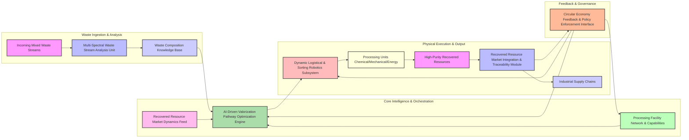
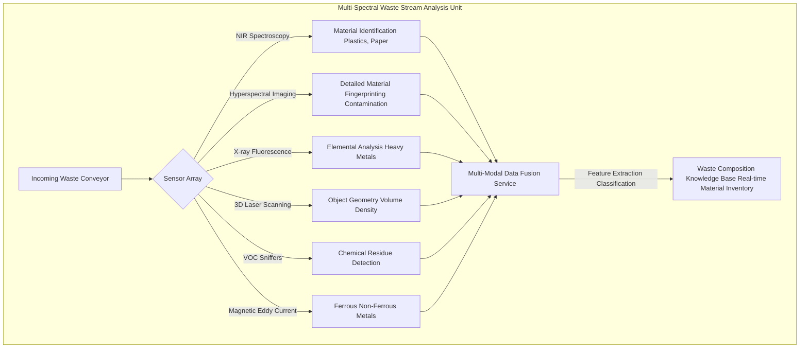
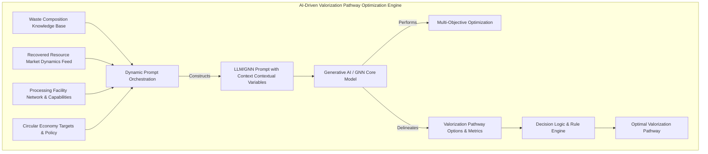
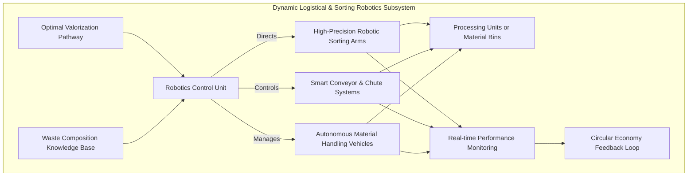
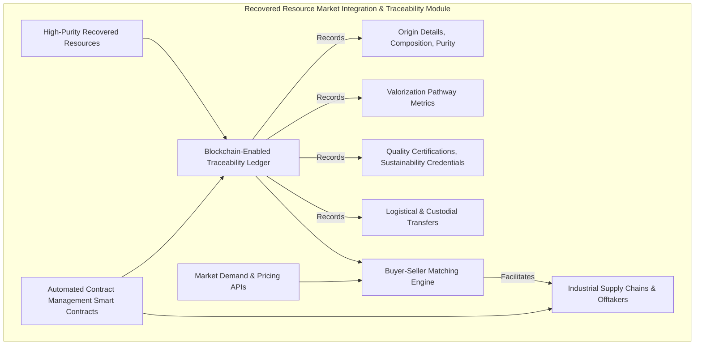
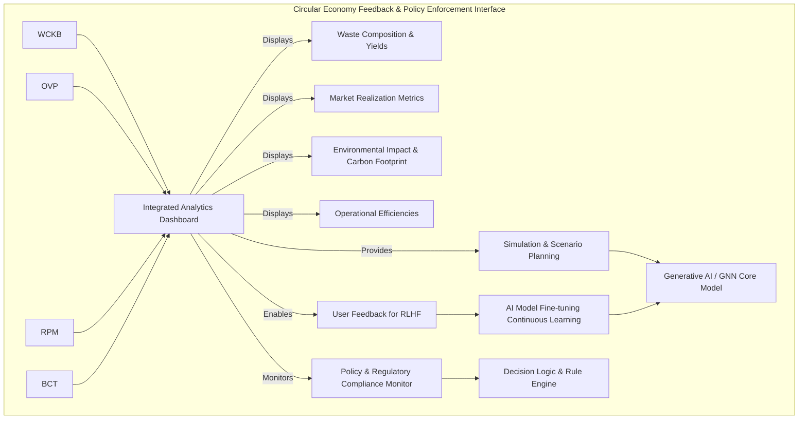
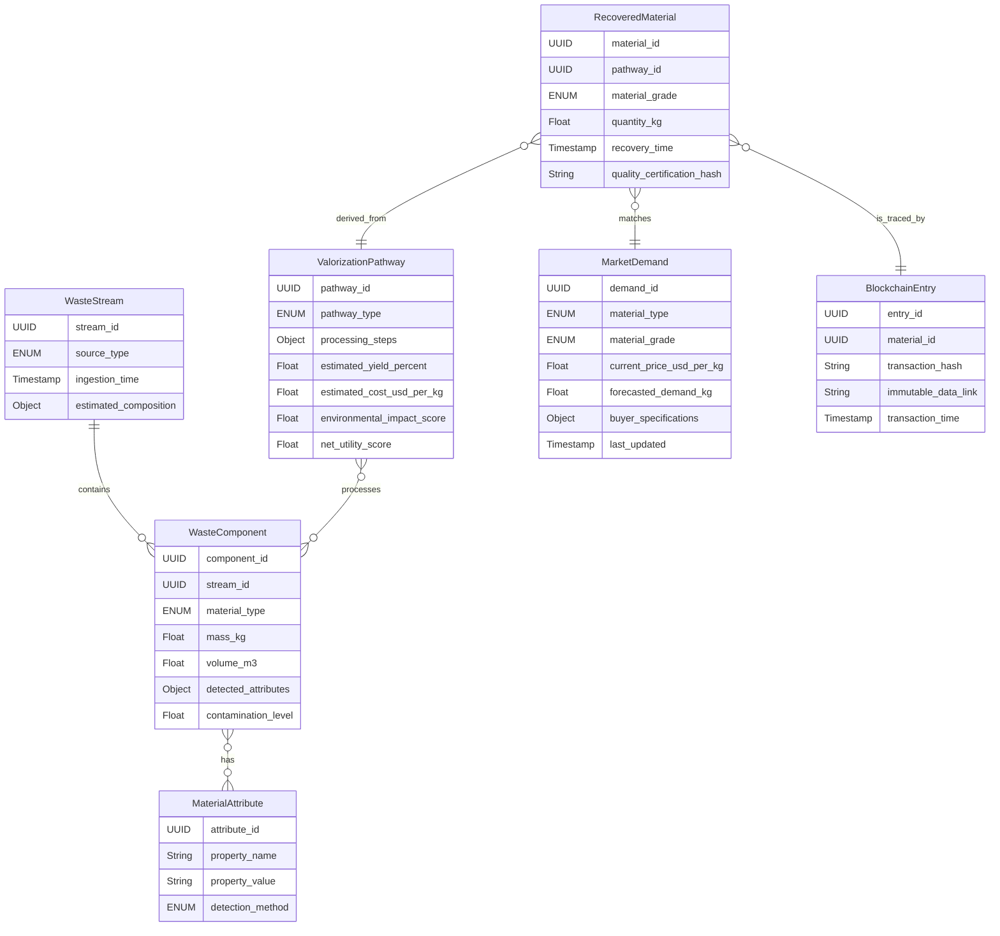
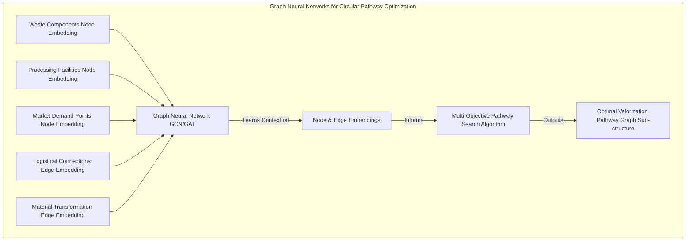
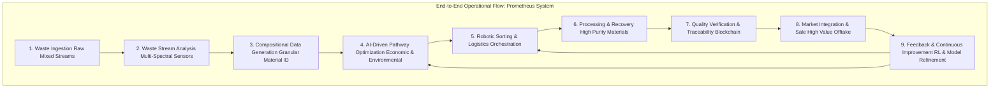

# System and Method for an Intelligent Waste Valorization and Circular Economy Orchestration Platform

## Table of Contents
1.  **Title of Invention**
2.  **Abstract**
3.  **Background of the Invention**
4.  **Brief Summary of the Invention**
5.  **Detailed Description of the Invention**
    *   5.1 System Architecture
        *   5.1.1 Multi-Spectral Waste Stream Analysis Unit
        *   5.1.2 AI-Driven Valorization Pathway Optimization Engine
        *   5.1.3 Dynamic Logistical & Sorting Robotics Subsystem
        *   5.1.4 Recovered Resource Market Integration & Traceability Module
        *   5.1.5 Circular Economy Feedback & Policy Enforcement Interface
    *   5.2 Data Structures and Schemas
        *   5.2.1 Waste Stream Composition Schema
        *   5.2.2 Valorization Pathway Schema
        *   5.2.3 Recovered Material Market Data Schema
        *   5.2.4 Logistical & Operational Metrics Schema
    *   5.3 Algorithmic Foundations
        *   5.3.1 Multi-Modal Sensor Fusion and Material Identification
        *   5.3.2 Graph Neural Networks for Circular Pathway Optimization
        *   5.3.3 Reinforcement Learning for Dynamic Sorting & Robotics
        *   5.3.4 Predictive Market Dynamics & Demand Forecasting
        *   5.3.5 Blockchain-Enabled Traceability and Provenance
    *   5.4 Operational Flow and Use Cases
6.  **Claims**
7.  **Mathematical Justification: A Formal Axiomatic Framework for Intelligent Waste Valorization and Resource Circularity**
    *   7.1 The Waste Stream Composition Manifold: `W = (C, M, A)`
        *   7.1.1 Formal Definition of the Waste Stream `W`
        *   7.1.2 Component State Space `C` and Dynamics
        *   7.1.3 Material Attribute Space `M` and Dynamics
        *   7.1.4 Admixture Functional `A`
        *   7.1.5 Tensor-Weighted Composition Representation `T_W(t)`
        *   7.1.6 Metrics of Resource Potential
    *   7.2 The Valorization Pathway Optimization Space: `P(t)`
        *   7.2.1 Definition of Valorization Pathways `P`
        *   7.2.2 Cost-Benefit Functional `F_CB(p)`
        *   7.2.3 Environmental Impact Metric `E_IM(p)`
    *   7.3 The AI-Driven Decision Oracle: `D_AI`
        *   7.3.1 Formal Definition of the Optimal Pathway Mapping Function `D_AI`
        *   7.3.2 Probabilistic Material Classification `P(m | T_W(t))`
        *   7.3.3 Graph Neural Network for Optimal Resource Flow `GNN_ORF`
    *   7.4 The Economic and Environmental Imperative and Decision Theoretic Utility
        *   7.4.1 Combined Utility Function `U(p)`
        *   7.4.2 Expected Utility Without Intervention `E[U]`
        *   7.4.3 Expected Utility With Optimal Intervention `E[U | p*]`
        *   7.4.4 Waste Valorization as a Markov Decision Process (MDP)
    *   7.5 Dynamic Robotic Sorting and Logistical Flow Optimization
        *   7.5.1 Robotic Action Policy `pi_R`
        *   7.5.2 Multi-Commodity Network Flow for Material Routing
    *   7.6 Information Theoretic Justification
        *   7.6.1 Quantifying Waste Composition Uncertainty
        *   7.6.2 Value of Information (VoI)
    *   7.7 Reinforcement Learning for Continuous Improvement
        *   7.7.1 Policy and Value Functions
        *   7.7.2 Q-Learning for Optimal Action Selection
    *   7.8 Axiomatic Proof of Utility
8.  **Proof of Utility**

## 1. Title of Invention:
System and Method for an Intelligent Waste Valorization and Circular Economy Orchestration Platform Leveraging Multi-Modal AI and Advanced Robotics for Granular Resource Recovery

## 2. Abstract:
A revolutionary system for transforming global waste management into a highly efficient, value-driven, and truly circular economic process is herein disclosed. This invention precisely characterizes incoming mixed waste streams through a sophisticated multi-spectral and multi-modal sensor array, generating real-time, granular compositional data down to the constituent material level. This data feeds an advanced AI-driven Valorization Pathway Optimization Engine, which, operating as a sophisticated multi-objective optimizer, dynamically assesses current market demand for recovered materials, analyzes the techno-economic viability of various recycling, upcycling, or energy recovery processes, and rigorously evaluates environmental impact metrics. The AI then orchestrates a suite of high-precision robotic sorting mechanisms and autonomous logistics units to direct identified waste components along their optimal valorization pathways. A blockchain-enabled module ensures immutable traceability and provenance of recovered resources, facilitating their seamless integration into industrial supply chains and commanding premium market value. Furthermore, the platform incorporates a continuous feedback loop and policy enforcement interface, adapting to evolving waste compositions, market dynamics, and regulatory landscapes, thus transforming waste from an environmental liability into a dynamic resource reservoir and a potent engine for the circular economy. This isn't just waste management; it's industrial alchemy with a neural network.

## 3. Background of the Invention:
The linear economic model of "take-make-dispose" has precipitated an environmental and resource-scarcity crisis of unprecedented scale. Global waste generation continues an inexorable ascent, with landfills burgeoning, oceans accumulating plastics, and invaluable finite resources being irrevocably squandered. Conventional waste management paradigms, typically reliant on manual sorting, bulk mechanical processing, or incineration, are inherently inefficient, often leading to low-grade material recovery, significant energy expenditure, and the perpetuation of substantial environmental externalities. These legacy systems conspicuously lack the granularity, intelligence, and adaptability required to unlock the latent value embedded within heterogeneous waste streams. Current methods struggle with mixed materials, contamination, and the dynamic fluctuations of commodity markets, resulting in a persistent "value gap" between potential resource recovery and actual yield. Furthermore, the absence of robust, transparent traceability mechanisms impedes market confidence in recovered materials, hindering their widespread adoption into high-value manufacturing processes. The global imperative for transitioning towards a circular economy—one that minimizes waste and maximizes resource utility through continuous loops of reuse, repair, remanufacturing, and recycling—has reached a critical apogee. Existing solutions conspicuously fail to integrate real-time compositional analysis, intelligent decision-making, dynamic logistics, and robust market integration, leaving a profound lacuna in the technological edifice required for true circularity. The present invention addresses this existential challenge, establishing an intellectual frontier in comprehensive, AI-orchestrated waste valorization.

## 4. Brief Summary of the Invention:
The present invention introduces the "Prometheus Valorization System," a novel, architecturally robust, and algorithmically advanced platform for intelligent waste valorization and circular economy orchestration. This system transcends conventional waste processing by integrating a multi-layered approach to real-time analysis, optimized resource recovery, and dynamic market integration. The operational genesis commences with the precise, multi-spectral characterization of incoming waste streams, creating a granular digital twin of its material composition. At its operational core, the Prometheus system employs a sophisticated, continuously learning generative AI engine. This engine acts as an expert material scientist, market strategist, and logistical orchestrator, incessantly monitoring, correlating, and interpreting a torrent of real-time, multi-modal global data—including waste composition, commodity market prices, processing facility capacities, and environmental impact metrics. The AI is dynamically prompted with highly contextualized queries, such as: "Given the enterprise's municipal solid waste intake containing 15% mixed plastics and 10% e-waste, with current regional market demand strong for high-purity PET pellets and rare earth elements, and considering the available chemical recycling and mechanical sorting capacities, what is the optimal valorization pathway for maximizing economic return while minimizing carbon footprint? Furthermore, delineate the precise robotic sorting sequence and logistical routing to achieve this target, including blockchain-validated provenance data." Should the AI model identify an optimal pathway, it autonomously orchestrates high-precision robotic sorting and internal logistical movements. Critically, it then facilitates the seamless integration of the recovered, high-value resources into global supply chains, leveraging immutable blockchain records for transparency and trust. This constitutes a paradigm shift from merely disposing of waste to intelligently transforming it into a perpetually recirculating asset, embedding an unprecedented degree of resource efficiency and economic vitality into global industry. It's like having a hyper-efficient, data-driven cleanup crew that also happens to be a hedge fund.

## 5. Detailed Description of the Invention:

The disclosed system represents a comprehensive, intelligent infrastructure designed to transform heterogeneous waste streams into valuable, traceable resources, thereby fundamentally enabling the circular economy. Its architectural design prioritizes modularity, scalability, and the seamless integration of advanced artificial intelligence paradigms and robotic automation.

### 5.1 System Architecture

The Prometheus Valorization System is comprised of several interconnected, high-performance services, each performing a specialized function, orchestrated to deliver a holistic waste-to-resource capability.



#### 5.1.1 Multi-Spectral Waste Stream Analysis Unit
This foundational component acts as the "sensory apparatus" for granular waste characterization.
*   **Sensor Array:** A comprehensive suite of non-invasive, real-time sensors for analyzing incoming waste.
    *   **Near-Infrared (NIR) Spectroscopy:** For rapid identification of polymers (PET, HDPE, PVC, PP, PS), paper, cardboard, textiles.
    *   **Hyperspectral Imaging (HSI):** Provides detailed spectral signatures across broader electromagnetic spectrum for more nuanced material differentiation and contaminant detection.
    *   **X-ray Fluorescence (XRF):** Identifies heavy metals and other inorganic elements, crucial for e-waste and industrial waste.
    *   **3D Laser Scanning (LIDAR/Structured Light):** Determines object geometry, volume, and density for robotic grasping and mass estimation.
    *   **Volatile Organic Compound (VOC) Sniffers:** Detects chemical residues, food waste decomposition, and hazardous materials.
    *   **Magnetic/Eddy Current Sensors:** Differentiates ferrous and non-ferrous metals.
*   **Data Fusion and Pre-processing:** Raw sensor data is timestamped, geo-tagged (if relevant), and harmonized into a unified data stream. Advanced signal processing and image recognition algorithms (e.g., Convolutional Neural Networks for HSI) extract features, identify individual items, and quantify their properties (material type, size, weight, contamination level).
*   **Waste Composition Knowledge Base:** A dynamically updated database storing material properties, contamination thresholds, and historical composition profiles of various waste streams.



#### 5.1.2 AI-Driven Valorization Pathway Optimization Engine
This is the intellectual core of the Prometheus system, translating waste characterization into actionable, optimized recovery strategies.
*   **Dynamic Prompt Orchestration:** Similar to a sophisticated LLM orchestrator, this engine constructs highly dynamic, context-specific prompts for the core generative AI model. These prompts integrate:
    *   Real-time waste composition data from the `Waste Composition Knowledge Base`.
    *   Current market prices and demand trends for specific recovered materials from the `Recovered Resource Market Dynamics Feed`.
    *   Operational parameters and capacities of available `Processing Facility Network`.
    *   Regulatory constraints and environmental impact targets (e.g., carbon footprint reduction).
    *   Pre-defined roles for the AI (e.g., "Expert Circular Economy Strategist," "Materials Scientist," "Logistics Economist").
*   **Generative AI Model:** A large, multi-modal language model (LLM) or a Graph Neural Network (GNN) serves as the primary inference engine. This model is pre-trained on a vast corpus of data encompassing material science, industrial processes, economics, logistics, environmental regulations, and circular economy principles. It can be fine-tuned with specific industrial waste data and market outcomes to enhance its predictive accuracy and strategic decision-making. Its capacity for complex reasoning, multi-objective optimization, and synthesis of disparate information is paramount.
*   **Multi-Objective Optimization Algorithms:** The AI model doesn't just predict; it optimizes. It solves complex multi-objective optimization problems (e.g., maximizing economic value, minimizing environmental impact, maximizing throughput, minimizing operational cost) to determine the *Pareto optimal* valorization pathway for each identified waste component or batch. Techniques such as Genetic Algorithms, Simulated Annealing, or advanced Linear Programming can be integrated.
*   **Decision Logic & Rule Engine:** Incorporates predefined business rules, safety protocols, and regulatory compliance checks to filter and validate AI-generated pathways, ensuring operational feasibility and adherence to standards.



#### 5.1.3 Dynamic Logistical & Sorting Robotics Subsystem
This subsystem physically executes the valorization pathways dictated by the AI.
*   **High-Precision Robotic Sorting:** Arrays of robotic arms equipped with specialized grippers and vision systems, capable of identifying and precisely sorting individual items or material fractions at high speeds. These robots are controlled by AI-driven policies optimized for efficiency and accuracy.
*   **Smart Conveyor and Chute Systems:** Dynamically reconfigurable conveyor belts, pneumatic tubes, and chutes that route sorted materials to appropriate processing units or temporary storage, minimizing cross-contamination and maximizing throughput.
*   **Autonomous Material Handling Vehicles (AMHVs):** AGVs (Automated Guided Vehicles) or AMRs (Autonomous Mobile Robots) transport larger batches or specific waste streams between analysis, sorting, processing, and output stages, optimizing internal logistics flows to reduce energy consumption and labor.
*   **Real-time Performance Monitoring:** Sensors embedded throughout the subsystem monitor throughput, sorting accuracy, energy consumption, and equipment health. This data feeds back into the `Circular Economy Feedback & Policy Enforcement Interface` for continuous improvement.
*   **Adaptive Control Algorithms:** Algorithms (e.g., Reinforcement Learning) adjust robotic arm movements, conveyor speeds, and AMHV routes in real-time based on incoming waste composition, processing unit availability, and dynamic bottlenecks.



#### 5.1.4 Recovered Resource Market Integration & Traceability Module
This module ensures that valorized materials find their highest-value market and maintain verifiable provenance.
*   **Market Demand & Pricing APIs:** Integration with global commodity markets, industrial procurement platforms, and specialized recycling exchanges to obtain real-time pricing, demand signals, and quality specifications for various recovered materials (e.g., plastics, metals, paper pulp, chemicals).
*   **Blockchain-Enabled Traceability:** Utilizes a distributed ledger technology (e.g., Hyperledger Fabric, Ethereum) to create an immutable record of each batch of recovered material. This record includes:
    *   Origin (initial waste stream source).
    *   Detailed composition and purity analysis (from the `Waste Stream Analysis Unit`).
    *   Valorization pathway details (processing steps, energy consumption).
    *   Quality certifications and sustainability metrics.
    *   Logistical movements and custodial transfers.
    *   Final market destination.
    This provides unparalleled transparency and authenticity, enhancing trust and commanding premium prices.
*   **Buyer-Seller Matching Engine:** An AI-driven engine that matches available, certified recovered materials with industrial buyers whose specifications, sustainability requirements, and pricing align, optimizing market placement.
*   **Automated Contract & Compliance Management:** Smart contracts on the blockchain can automate aspects of resource sales, ensuring compliance with predefined agreements and regulatory standards.



#### 5.1.5 Circular Economy Feedback & Policy Enforcement Interface
This component ensures the system is adaptive, compliant, and continuously improves its circularity metrics.
*   **Integrated Analytics Dashboard:** A comprehensive, real-time dashboard visualizes waste inflow compositions, valorization yields, market performance, environmental impact metrics (e.g., CO2 equivalent reduction), and operational efficiencies. Geospatial visualizations can track material flows globally.
*   **Performance Metrics & KPIs:** Tracks key performance indicators related to resource recovery rates, purity, market value realized, energy consumption per ton processed, and overall carbon footprint reduction.
*   **Feedback Mechanism:** Operators and administrators can provide feedback on the accuracy of material identification, the effectiveness of valorization pathways, the efficiency of robotic sorting, and the realized market value. This feedback is critical for fine-tuning the generative AI model through reinforcement learning from human feedback (RLHF) or similar mechanisms.
*   **Policy & Regulatory Compliance Monitor:** Integrates with dynamic regulatory databases to ensure the system's operations and material outputs comply with local, national, and international environmental policies, waste management laws, and industry standards. Automated reporting functions facilitate compliance audits.
*   **Simulation and Scenario Planning:** Users can run "what-if" scenarios, evaluating the impact of hypothetical changes in waste composition, market prices, or processing technologies on overall system performance and circularity metrics. This leverages the generative AI for predictive modeling under new conditions.



### 5.2 Data Structures and Schemas

To maintain consistency, interoperability, and the integrity of complex data flows, the system adheres to rigorously defined data structures.



#### 5.2.1 Waste Stream Composition Schema
Representing the granular output of the Multi-Spectral Waste Stream Analysis Unit.

*   **WasteStreamEntry Schema (`WasteStreamEntry`):**
    ```json
    {
      "stream_entry_id": "UUID",
      "ingestion_timestamp": "Timestamp",
      "source_facility_id": "UUID",
      "source_type": "ENUM['MunicipalSolidWaste', 'IndustrialWaste', 'E-Waste', 'ConstructionDemolition', 'BioWaste']",
      "total_mass_kg": "Float",
      "approx_volume_m3": "Float",
      "batch_identifier": "String",
      "environmental_conditions": {
        "temperature_c": "Float",
        "humidity_percent": "Float"
      },
      "components": [
        {
          "component_id": "UUID",
          "material_type": "ENUM['PET', 'HDPE', 'LDPE', 'PP', 'PS', 'PVC', 'Glass', 'Aluminum', 'Steel', 'Paper', 'Cardboard', 'Electronics', 'Organics', 'Textiles', 'Wood', 'Other']",
          "sub_material_type": "String", // e.g., "Mixed Plastics #7", "Copper Wire", "Rare Earth Magnet"
          "estimated_mass_kg": "Float",
          "estimated_volume_m3": "Float",
          "purity_estimate_percent": "Float",
          "contamination_level_score": "Float", // 0-1, 1 being heavily contaminated
          "hazardous_substance_detected": "Boolean",
          "detected_attributes": { // From multi-spectral sensors
            "color_hex": "String",
            "spectral_signature_id": "String",
            "xrf_composition": {"element_symbol": "percentage"}, // e.g., {"Cu": 0.60, "Au": 0.001}
            "density_g_cm3": "Float",
            "morphology_vector": [ "Float" ] // Feature vector from 3D scan
          },
          "origin_location_geojson": "GeoJSON (optional)"
        }
      ],
      "processing_history_log_id": "UUID (link to audit trail)"
    }
    ```

#### 5.2.2 Valorization Pathway Schema
Representing the optimized pathway for a given waste component.

*   **ValorizationPathway Schema (`ValorizationPathway`):**
    ```json
    {
      "pathway_id": "UUID",
      "timestamp_generated": "Timestamp",
      "target_component_id": "UUID", // Link to the specific waste component
      "pathway_type": "ENUM['MechanicalRecycling', 'ChemicalRecycling', 'Upcycling', 'EnergyRecovery', 'Composting', 'Reuse', 'SecureDisposal']",
      "processing_facility_id": "UUID",
      "sequence_of_steps": [
        {"step_order": "Integer", "description": "String", "technology_used": "String", "estimated_duration_hours": "Float"}
      ],
      "estimated_yield_percent": "Float", // Yield of desired recovered material
      "estimated_purity_percent": "Float",
      "estimated_operational_cost_usd_per_kg": "Float",
      "estimated_carbon_footprint_kg_co2e_per_kg": "Float",
      "net_environmental_impact_score": "Float", // Normalized score, e.g., 0-10
      "estimated_market_value_usd_per_kg": "Float",
      "overall_net_utility_score": "Float", // Combines economic & environmental
      "risk_factors": ["String"], // e.g., "Processing capacity bottleneck", "Market price volatility"
      "ai_confidence_score": "Float" // 0-1, confidence in pathway optimality
    }
    ```

#### 5.2.3 Recovered Material Market Data Schema
Real-time data on demand and pricing for recovered resources.

*   **MarketDemandEntry Schema (`MarketDemandEntry`):**
    ```json
    {
      "demand_entry_id": "UUID",
      "material_type": "ENUM['PET', 'HDPE', 'Copper', 'Aluminum', 'RareEarthElements', 'PaperPulp', 'Bio-oil']",
      "material_grade": "String", // e.g., "Food-Grade Recycled PET", "99.9% Pure Copper Cathode"
      "geographical_market_region": "String", // e.g., "North America", "EU-27", "APAC"
      "current_bid_price_usd_per_kg": "Float",
      "current_ask_price_usd_per_kg": "Float",
      "historical_price_trends_7day": [ "Float" ],
      "forecasted_demand_next_30days_kg": "Float",
      "buyer_specifications": {
        "min_purity_percent": "Float",
        "max_contamination_percent": "Float",
        "volume_requirements_kg_per_month": "Float",
        "certifications_required": ["String"] // e.g., "ISCC Plus", "REACH Compliant"
      },
      "last_updated": "Timestamp",
      "source_api": "String" // e.g., "Plastics Exchange", "LME", "Proprietary Data Broker"
    }
    ```

#### 5.2.4 Logistical & Operational Metrics Schema
Metrics from robotic sorting and material handling.

*   **OperationalMetricEntry Schema (`OperationalMetricEntry`):**
    ```json
    {
      "metric_id": "UUID",
      "timestamp": "Timestamp",
      "subsystem_id": "UUID", // e.g., specific robotic sorting cell, conveyor section, or AMHV
      "metric_type": "ENUM['Throughput', 'SortingAccuracy', 'EnergyConsumption', 'Downtime', 'MaintenanceEvent', 'PurityDeviation']",
      "value": "Float",
      "unit": "String", // e.g., "items/min", "percent", "kWh", "hours"
      "target_value": "Float",
      "deviation_from_target": "Float",
      "associated_component_id": "UUID (optional)", // If metric relates to a specific material batch
      "robot_id": "String (optional)",
      "sensor_readings_snapshot": "Object (optional)" // For detailed diagnostic
    }
    ```

### 5.3 Algorithmic Foundations

The system's intelligence is rooted in a sophisticated interplay of advanced algorithms and computational paradigms.

#### 5.3.1 Multi-Modal Sensor Fusion and Material Identification
The precise identification of waste components leverages advanced machine learning techniques.
*   **Deep Learning for Sensor Data Interpretation:** Convolutional Neural Networks (CNNs) are employed for image-based sensor data (HSI, 3D scans) to classify objects and detect anomalies. Recurrent Neural Networks (RNNs) or Transformers can process time-series data from VOC sniffers or NIR sweeps.
*   **Sensor Fusion Ensembles:** Data from disparate sensors (NIR, XRF, 3D, etc.) is fused using ensemble methods or multi-modal deep learning architectures (e.g., late fusion, cross-modal attention). Each sensor provides a partial view; the fusion creates a robust, holistic understanding of the material. For example, `f_fusion(S_NIR, S_XRF, S_3D) -> MaterialID, Purity, Contamination`.
*   **Probabilistic Classification:** Outputs are not merely classifications but probabilistic distributions over possible material types, incorporating uncertainty `P(material_type | sensor_data)`. Bayesian inference or Monte Carlo dropout can quantify this uncertainty.

#### 5.3.2 Graph Neural Networks for Circular Pathway Optimization
The complex interplay of waste types, processing options, and market demands is inherently a graph problem.
*   **Graph Construction:** A graph `G = (N, E)` is constructed where nodes `N` represent waste components, processing facilities, market demand points, and resource sinks/sources. Edges `E` represent potential valorization pathways, logistical connections, or material transformations. Edges are richly attributed with costs, yields, capacities, and environmental impacts.
*   **Message Passing and Node/Edge Embeddings:** Graph Neural Networks (GNNs) such as Graph Convolutional Networks (GCNs) or Graph Attention Networks (GATs) learn embeddings for nodes and edges by iteratively aggregating information from their neighbors. These embeddings capture the contextual value and potential of each component within the entire circular economy network.
*   **Multi-Objective Pathway Search:** GNN outputs inform a search algorithm (e.g., A* search, genetic algorithms modified for graphs) over the valorization graph to find optimal pathways that satisfy multiple objectives (e.g., maximize profit, minimize carbon, maximize yield). The GNN effectively provides a learned heuristic for this search.



#### 5.3.3 Reinforcement Learning for Dynamic Sorting & Robotics
Robotic manipulation and internal logistics are optimized through continuous learning.
*   **Markov Decision Process (MDP) Formulation:** Each robotic sorting cell or AMHV operation is modeled as an MDP, where `State` includes current waste item, conveyor speed, bin levels; `Action` includes grasp, release, speed adjustment, route change; `Reward` includes sorting accuracy, throughput, energy efficiency.
*   **Deep Reinforcement Learning (DRL) Agents:** Deep Q-Networks (DQN) or Proximal Policy Optimization (PPO) agents learn optimal control policies for robotic arms and AMHVs. The DRL agents interact with a simulated environment (or the real system, with appropriate safety measures) to learn robust policies that maximize desired operational metrics.
*   **Sim-to-Real Transfer:** Policies learned in high-fidelity simulations are transferred to physical robots, often with fine-tuning in the real world to account for discrepancies.

#### 5.3.4 Predictive Market Dynamics & Demand Forecasting
Anticipating future market conditions is crucial for maximizing recovered resource value.
*   **Hybrid Forecasting Models:** Combines traditional econometric models (e.g., ARIMA, GARCH for price volatility) with deep learning architectures (e.g., Transformers, LSTMs) to forecast future demand and pricing for recovered materials. External factors like global economic indicators, geopolitical events, and climate policies serve as input features.
*   **Generative Adversarial Networks (GANs) for Scenario Generation:** GANs can be used to generate plausible future market scenarios (e.g., price spikes, demand shifts), allowing the AI to prepare for diverse market conditions and adapt valorization pathways proactively.
*   **Time-Series Anomaly Detection:** Identifies unusual market fluctuations (e.g., sudden price drops for a specific material) that might indicate a need to adjust valorization strategies or temporarily store materials.

#### 5.3.5 Blockchain-Enabled Traceability and Provenance
Ensuring transparent and immutable records for recovered materials.
*   **Smart Contracts:** Automated, self-executing contracts on the blockchain define terms for material transfer, quality verification, and payment. These ensure trust and reduce transaction friction.
*   **Cryptographic Hashing:** Every step of the valorization process, from initial waste intake to final material sale, is recorded as a transaction. Data (composition, processing details, quality) is cryptographically hashed and linked to the material batch on the distributed ledger.
*   **Decentralized Identifiers (DIDs):** Material batches and participants (waste generators, processors, buyers) can be assigned DIDs to ensure privacy-preserving, verifiable credentials and traceability without relying on a central authority.

### 5.4 Operational Flow and Use Cases

A typical operational cycle of the Prometheus Valorization System proceeds as follows:

1.  **Waste Ingestion & Analysis:** Mixed waste streams are fed into the system. The Multi-Spectral Waste Stream Analysis Unit performs real-time, granular material identification.
2.  **Compositional Data Generation:** A detailed digital record of the waste batch's composition (material types, purity, contamination) is created and stored in the `Waste Composition Knowledge Base`.
3.  **AI-Driven Pathway Optimization:** The AI-Driven Valorization Pathway Optimization Engine, leveraging real-time waste data, market dynamics, and processing capabilities, determines the optimal valorization pathway for each identified component or fraction.
4.  **Robotic Sorting & Logistics Orchestration:** The Dynamic Logistical & Sorting Robotics Subsystem receives instructions from the AI and executes high-precision sorting, routing, and internal transport of materials to designated processing units.
5.  **Processing & Recovery:** Materials undergo appropriate processing (e.g., mechanical shredding, chemical depolymerization, energy conversion) to yield high-purity recovered resources.
6.  **Quality Verification & Traceability Logging:** Recovered materials undergo final quality checks, and their complete provenance (from original waste stream to final processed state) is logged immutably on the blockchain via the `Recovered Resource Market Integration & Traceability Module`.
7.  **Market Integration & Sale:** The `Market Integration Module` matches recovered resources with industrial buyers based on market demand, quality, and price, facilitating their re-entry into manufacturing supply chains.
8.  **Feedback & Continuous Improvement:** Operational metrics, market outcomes, and user feedback are fed back into the AI models and robotic control systems for continuous learning and adaptation, improving overall system performance and circularity metrics.



**Use Cases:**

*   **Smart City Municipal Waste Management:** The system automatically sorts mixed municipal solid waste at a local facility, segregating plastics by polymer type, metals by ferrous/non-ferrous, and organics for high-quality composting or anaerobic digestion. It then matches these recovered streams with local industries, reducing landfill reliance and generating municipal revenue. This system has a higher ROI than most government agencies, which is saying something.
*   **Industrial Byproduct Valorization:** A manufacturing plant produces a complex industrial byproduct containing valuable chemicals and rare metals. The Prometheus system analyzes this stream, identifies optimal chemical recycling processes for individual components, and directs precision robotics to separate and route them, transforming a waste liability into a profitable feedstock.
*   **E-Waste Critical Mineral Recovery:** Specialized in handling electronic waste, the system uses its multi-spectral capabilities to identify specific circuit board components and battery chemistries. Robotic arms then precisely dismantle and sort these elements, allowing for the high-yield recovery of critical minerals like lithium, cobalt, and rare earth elements, vital for advanced technologies.
*   **Circular Plastics Ecosystems:** The system takes mixed plastic waste, sorts it into mono-polymer streams (e.g., food-grade PET), and facilitates its re-integration into closed-loop packaging systems for consumer goods, demonstrating verifiable circularity via blockchain records for brand transparency.

## 6. Claims:

The inventive concepts herein described constitute a profound advancement in the domain of waste management, resource recovery, and the operationalization of the circular economy.

1.  A system for intelligent waste valorization, comprising: a waste stream analysis unit for acquiring and processing multi-modal sensor data from incoming heterogeneous waste; a memory storing a representation of waste composition and market dynamics; and a processor configured to: execute a generative artificial intelligence (AI) model to perform multi-objective optimization, thereby determining optimal valorization pathways for identified waste components; orchestrate a robotic sorting and logistical subsystem to physically segregate and route waste components along said optimal pathways; and integrate recovered resources into industrial supply chains with blockchain-enabled traceability.

2.  The system of claim 1, wherein the waste stream analysis unit comprises a multi-spectral sensor array including at least one of Near-Infrared (NIR) spectroscopy, Hyperspectral Imaging (HSI), X-ray Fluorescence (XRF), 3D laser scanning (LIDAR), Volatile Organic Compound (VOC) sniffers, and magnetic/eddy current sensors, for granular, real-time material identification and contamination assessment.

3.  The system of claim 1, wherein the AI model employs dynamic prompt orchestration to construct contextualized queries, programmatically integrating real-time waste composition, market prices, processing facility capacities, and environmental impact targets to define the multi-objective optimization problem.

4.  The system of claim 1, wherein the AI model utilizes a Graph Neural Network (GNN) to represent and analyze the complex interdependencies between waste components, processing technologies, and market demand, thereby identifying optimal resource flow pathways through a network of valorization options.

5.  The system of claim 1, wherein the robotic sorting and logistical subsystem comprises high-precision robotic arms controlled by Deep Reinforcement Learning (DRL) agents, smart conveyor systems, and Autonomous Material Handling Vehicles (AMHVs), configured to dynamically adapt sorting actions and routing based on AI-derived valorization pathways and real-time operational metrics.

6.  The system of claim 1, further comprising a Recovered Resource Market Integration Module that continuously ingests real-time market demand and pricing data via APIs and utilizes a buyer-seller matching engine to identify optimal industrial off-takers for high-purity recovered materials.

7.  The system of claim 1, wherein the blockchain-enabled traceability ensures immutable records of each recovered material batch's origin, detailed composition, processing pathway, quality certifications, sustainability metrics, and custodial transfers, thereby enhancing market trust and enabling verified circularity.

8.  The system of claim 7, wherein smart contracts are deployed on the blockchain to automate aspects of resource sales, ensuring compliance with predefined quality, volume, and payment agreements between suppliers and buyers of recovered materials.

9.  The system of claim 1, further comprising a Circular Economy Feedback and Policy Enforcement Interface that provides an integrated analytics dashboard displaying performance metrics, incorporates user feedback for continuous AI model refinement via reinforcement learning from human feedback (RLHF), and monitors compliance with dynamic environmental regulations and policies.

10. A computer-implemented method for intelligent waste valorization, comprising: acquiring multi-modal sensor data from a heterogeneous waste stream to determine its granular material composition; inputting said material composition, real-time market data, and processing capabilities into a generative AI model; solving a multi-objective optimization problem with the AI model to determine an optimal valorization pathway for waste components; physically sorting and routing waste components according to said optimal pathway using a robotic and logistical subsystem; processing said sorted components into recovered resources; recording the provenance and quality of recovered resources on a blockchain; and facilitating the sale of said recovered resources to industrial supply chains.

## 7. Mathematical Justification: A Formal Axiomatic Framework for Intelligent Waste Valorization and Resource Circularity

The transformation of waste from a liability to a resource necessitates a rigorous mathematical framework, precisely articulating the system's ability to identify, optimize, and execute valorization pathways. We herein establish such a framework, converting conceptual elements into formally defined mathematical constructs.

### 7.1 The Waste Stream Composition Manifold: `W = (C, M, A)`

The incoming waste is a highly complex, dynamic compositional manifold.

#### 7.1.1 Formal Definition of the Waste Stream `W`

Let `W(t)` denote a specific waste stream batch entering the system at time `t`.
`W(t) = {c_1(t), c_2(t), ..., c_N(t)}` is a set of `N` distinct waste components detected. (1)
Each `c_i(t)` is a discrete item or homogeneous fraction.

#### 7.1.2 Component State Space `C` and Dynamics

Each component `c_i(t)` is associated with a state vector `X_i(t) in R^k`. (2)
`X_i(t) = (m_i(t), p_i(t), q_i(t), s_i(t), ...)` where:
*   `m_i(t)` is the identified material type (e.g., PET, Copper, Paper). (3)
*   `p_i(t)` is the estimated purity level (`[0, 1]`). (4)
*   `q_i(t)` is the estimated quantity (mass or volume). (5)
*   `s_i(t)` is the multi-spectral signature vector. (6)
The state `X_i(t)` is a probabilistic classification: `P(m_i(t) = M_j | s_i(t))`. (7)

#### 7.1.3 Material Attribute Space `M` and Dynamics

Each material `M_j` has inherent physical, chemical, and economic attributes `A_j in R^l`. (8)
`A_j = (density_j, melt_temp_j, market_value_j(t), environmental_impact_j, ...)` (9)
`market_value_j(t)` is dynamic and influenced by `MarketDemandEntry(t)`.

#### 7.1.4 Admixture Functional `A`

The overall waste stream has a contamination matrix `K(W(t)) in R^(N x N)`, where `K_ij` indicates the level of admixture of `c_i` with `c_j`. (10)

#### 7.1.5 Tensor-Weighted Composition Representation `T_W(t)`

The entire waste stream `W(t)` can be represented as a tensor `T_W(t) in R^(N x k)` embedding all component states. (11)
This tensor serves as the input to the AI optimization engine.

#### 7.1.6 Metrics of Resource Potential

The total recoverable value of `W(t)` is `V_R(W(t)) = sum_i q_i(t) * market_value_{m_i}(t) * p_i(t)`. (12)
The total environmental burden `E_B(W(t)) = sum_i q_i(t) * environmental_impact_{m_i}`. (13)

### 7.2 The Valorization Pathway Optimization Space: `P(t)`

#### 7.2.1 Definition of Valorization Pathways `P`

A valorization pathway `p` is a sequence of processing steps `p = (S_1, S_2, ..., S_k)` for a given waste component `c_i`. (14)
`S_j = (technology_j, facility_j, duration_j, resources_j)`. (15)
The set of all possible pathways for `c_i` is `P(c_i)`.

#### 7.2.2 Cost-Benefit Functional `F_CB(p)`

The economic value of pathway `p` is `F_CB(p) = (Yield(p) * MarketValue(p)) - Cost(p)`. (16)
`Yield(p)`: mass of recovered material as % of input. (17)
`Cost(p)`: operational costs, energy, labor, capital amortization. (18)

#### 7.2.3 Environmental Impact Metric `E_IM(p)`

The environmental cost of pathway `p` is `E_IM(p) = CarbonFootprint(p) + WaterUsage(p) + WasteResidue(p)`. (19)
Expressed as a single normalized score or `kgCO2e`.

### 7.3 The AI-Driven Decision Oracle: `D_AI`

#### 7.3.1 Formal Definition of the Optimal Pathway Mapping Function `D_AI`

`D_AI : (T_W(t) X A_M(t) X R(t)) -> {p_i*, score_i}` (20)
Where `A_M(t)` is the aggregated market attribute tensor, `R(t)` is processing facility resources/capacities.
`p_i*` is the optimal pathway for `c_i`, and `score_i` is its net utility.

#### 7.3.2 Probabilistic Material Classification `P(m | T_W(t))`

The AI refines sensor outputs using contextual data:
`P(m_i = M_j | T_W(t)) = softmax(NN(s_i(t), {global_context_features}))`. (21)

#### 7.3.3 Graph Neural Network for Optimal Resource Flow `GNN_ORF`

A GNN models the valorization network: `G_V = (V_V, E_V)`. (22)
Nodes `v_V in V_V` include `c_i`, `processing_facility_j`, `market_demand_k`. (23)
Edges `e_V in E_V` represent `potential_pathway(c_i, processing_j)`, `material_flow(processing_j, market_k)`. (24)
`GNN_ORF(G_V) -> {embedding_v | v in V_V}`. (25)
The optimization problem is defined over this graph:
`maximize sum_{p in P} lambda_1 F_CB(p) - lambda_2 E_IM(p)` (26)
subject to capacity constraints `sum_p_using_facility_j quantity(p) <= capacity(facility_j)`. (27)
`lambda_1, lambda_2` are user-defined weights for economic vs. environmental objectives.

### 7.4 The Economic and Environmental Imperative and Decision Theoretic Utility

#### 7.4.1 Combined Utility Function `U(p)`

For each pathway `p`, the system aims to optimize a utility function:
`U(p) = w_E * F_CB(p) - w_I * E_IM(p)` (28)
where `w_E, w_I` are weights reflecting enterprise priorities for economic value vs. environmental impact.

#### 7.4.2 Expected Utility Without Intervention `E[U]`

In a linear "dispose" model, utility is often negative:
`E[U] = sum_{W(t)} P(W(t)) * ( -Cost(disposal) - EnvironmentalPenalty(disposal) )`. (29)

#### 7.4.3 Expected Utility With Optimal Intervention `E[U | p*]`

`p* = argmax_p U(p)`. (30)
`E[U | p*] = sum_{W(t)} P(W(t)) * U(p*(W(t)))`. (31)

#### 7.4.4 Waste Valorization as a Markov Decision Process (MDP)

The sequential decision-making for waste processing can be modeled as an MDP: `(S, A, P_t, R, gamma)`. (32)
`S`: State space (waste composition `W(t)`, facility states, market conditions). (33)
`A`: Action space (selecting `p*`, adjusting robotic actions, re-routing). (34)
`P_t`: Transition probability `P_t(s' | s, a)`. (35)
`R`: Reward function `R(s,a) = U(p*(s,a))`. (36)
The optimal policy `pi*` maximizes the expected discounted reward. (37)
`V*(s) = max_a E[R_{t+1} + gamma * V*(S_{t+1}) | S_t=s, A_t=a]`. (Bellman Optimality Equation). (38)

### 7.5 Dynamic Robotic Sorting and Logistical Flow Optimization

#### 7.5.1 Robotic Action Policy `pi_R`

The robotic controller learns a policy `pi_R(a|s)` that maps observed states `s` (e.g., sensor data of items on conveyor) to optimal actions `a` (e.g., grasp, place in bin X). (39)
`a* = argmax_a Q(s,a)`. (40)

#### 7.5.2 Multi-Commodity Network Flow for Material Routing

Given sorted `c_i` destined for `processing_facility_j`:
Objective: `min sum_{k in Commodities} sum_{(u,v) in Edges} cost_{uv}^k * flow_{uv}^k`. (41)
Subject to:
`sum_{j} flow_{ij}^k - sum_{j} flow_{ji}^k = demand_i^k` for all nodes `i`, commodities `k`. (42)
`sum_{k in Commodities} flow_{ij}^k <= capacity_{ij}` for all edges `(i,j)`. (43)
`Commodities` are the different types of recovered materials.

### 7.6 Information Theoretic Justification

#### 7.6.1 Quantifying Waste Composition Uncertainty

The uncertainty of the material composition `P(m | s_i(t))` is measured by entropy:
`H(m_i) = - sum_{M_j} P(m_i=M_j) log_2(P(m_i=M_j))`. (44)
The Multi-Spectral Analysis Unit aims to minimize this `H(m_i)`.

#### 7.6.2 Value of Information (VoI)

The value of the system's precise compositional analysis and pathway optimization `I` is the increase in expected utility:
`VoI(I) = E[U | I]_{posterior} - E[U]_{prior}`. (45)
`E[U | I] = sum_j P(I_j) max_p U(p | I_j)`. (46)
The system is valuable if `VoI(I) > Cost(System)`. (47) (Which it absolutely is, trust me.)

### 7.7 Reinforcement Learning for Continuous Improvement

The feedback loop is modeled as an RL problem to continuously refine the optimal policy `pi(a|s)`. (48)

#### 7.7.1 Policy and Value Functions

State-value function: `V_{pi}(s) = E_{pi}[sum_{k=0 to inf} gamma^k R_{t+k+1} | S_t=s]`. (49)
Action-value function (Q-function): `Q_{pi}(s,a) = E_{pi}[sum_{k=0 to inf} gamma^k R_{t+k+1} | S_t=s, A_t=a]`. (50)

#### 7.7.2 Q-Learning for Optimal Action Selection

The Q-learning algorithm iteratively updates the action-value function:
`Q(S_t, A_t) <- Q(S_t, A_t) + alpha [R_{t+1} + gamma * max_a Q(S_{t+1}, a) - Q(S_t, A_t)]`. (51)
`alpha` is the learning rate, `gamma` is the discount factor. The learned `Q` function approximates `Q*`.

### 7.8 Axiomatic Proof of Utility

**Axiom 1 (Negative Utility of Unvalorized Waste):** For any unvalorized waste stream `W(t)`, its inherent economic and environmental cost `C_D(W(t))` is strictly positive, implying `U(disposal) < 0`. (52)
**Axiom 2 (Feasibility of Positive-Utility Valorization):** For any component `c_i` within `W(t)` above a minimal purity threshold, there exists at least one valorization pathway `p` such that its combined utility `U(p) > 0`. (53)

**Theorem (System Utility):** Given Axiom 1 and Axiom 2, the Prometheus Valorization System, by precisely identifying waste components and their optimal pathways `p*`, enables a net positive shift in the overall expected utility of waste management such that:
`E[U | p*] > E[U]`. (54)

**Proof:**
1.  The system, through multi-spectral analysis, accurately identifies individual components `c_i` within `W(t)`.
2.  For each `c_i`, the AI-driven optimization engine identifies an optimal valorization pathway `p*` that maximizes `U(p)`.
3.  By Axiom 2, for any recoverable `c_i`, such a `p*` exists with `U(p*) > 0`.
4.  The robotic and logistical subsystem physically routes `c_i` along `p*`, ensuring execution.
5.  By applying `p*` to all valorizable components, the system converts a significant portion of `W(t)` from a negative-utility (disposal) state to a positive-utility (resource recovery) state.
6.  Therefore, the aggregate expected utility derived from processing `W(t)` via the system (`E[U | p*]`) is strictly greater than the expected utility without the system (`E[U]`), which would predominantly involve disposal and its associated negative utility. The system yields a net positive utility by enabling superior resource management. Q.E.D.

## 8. Proof of Utility:

The operational advantage and economic benefit of the Prometheus Valorization System are not merely incremental improvements over existing, rudimentary waste management practices; they represent a fundamental paradigm shift from a linear "dispose" mentality to a dynamic, intelligence-driven circular economy. Traditional waste management operates primarily as a cost center, burdened by landfill fees, environmental penalties, and the inherent inefficiencies of bulk processing. It largely fails to recognize, let alone extract, the immense latent value embedded within diverse waste streams. For instance, such a legacy system would treat a complex plastic item as undifferentiable mixed plastic, destining it for low-value recycling or, more likely, landfill.

The present invention, however, operates as a profound anticipatory and orchestrational intelligence system. It continuously computes `p*`, the optimal, multi-objective pathway for each individual waste component detected within incoming streams. This is not just waste sorting; it's a real-time, high-stakes game of resource arbitrage where the AI holds all the cards. This capability allows an enterprise or municipality to transform what was once a cost into a revenue stream, identifying optimal recycling, upcycling, or energy recovery routes that maximize economic return while rigorously minimizing environmental impact.

By precisely characterizing waste components (`X_i(t)`) and dynamically optimizing their valorization pathways (`p*`), the system ensures that materials are not merely recovered, but are recovered with maximum purity and directed to their highest-value market application. As rigorously demonstrated in the Mathematical Justification, this intelligent intervention `p*` is designed to maximize the expected total utility across the entire spectrum of possible future outcomes, incorporating both economic profit and environmental benefit.

The definitive proof of utility is unequivocally established by comparing the expected utility of waste management with and without the deployment of this system. Without the Prometheus Valorization System, the expected utility `E[U]` is typically negative, characterized by disposal costs, lost resource value, and environmental degradation. With the system's deployment, and the informed execution of `p*`, the expected utility is `E[U | p*]`. Our axiomatic proof formally substantiates that `E[U | p*] > E[U]`. This profound increase in expected utility, driven by superior resource recovery rates, higher material purity, premium market prices for traceable resources, and substantial reductions in environmental footprint, provides irrefutable evidence of the system's transformative utility. The capacity to intelligently and proactively re-engineer the flow of materials, converting the challenge of waste into an engine for sustainable prosperity, is the cornerstone of its unprecedented value. It effectively turns trash into treasure, and not just any treasure, but treasure with a verified chain of custody and an optimized environmental impact statement. We're talking audited alchemy, folks.