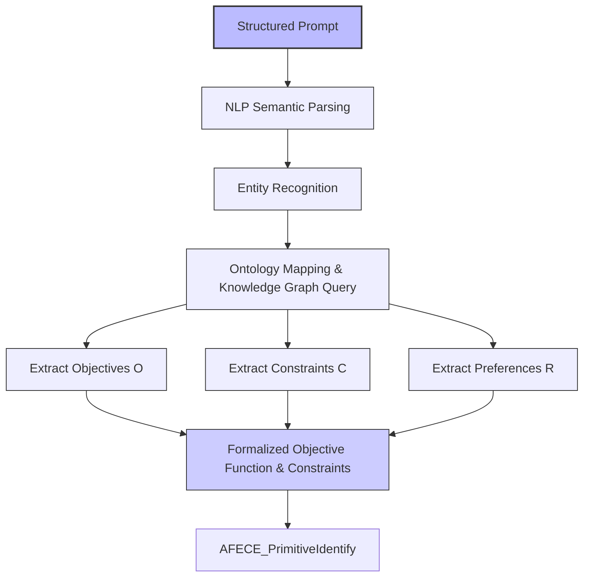
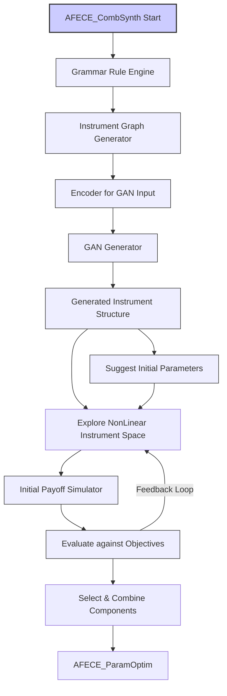
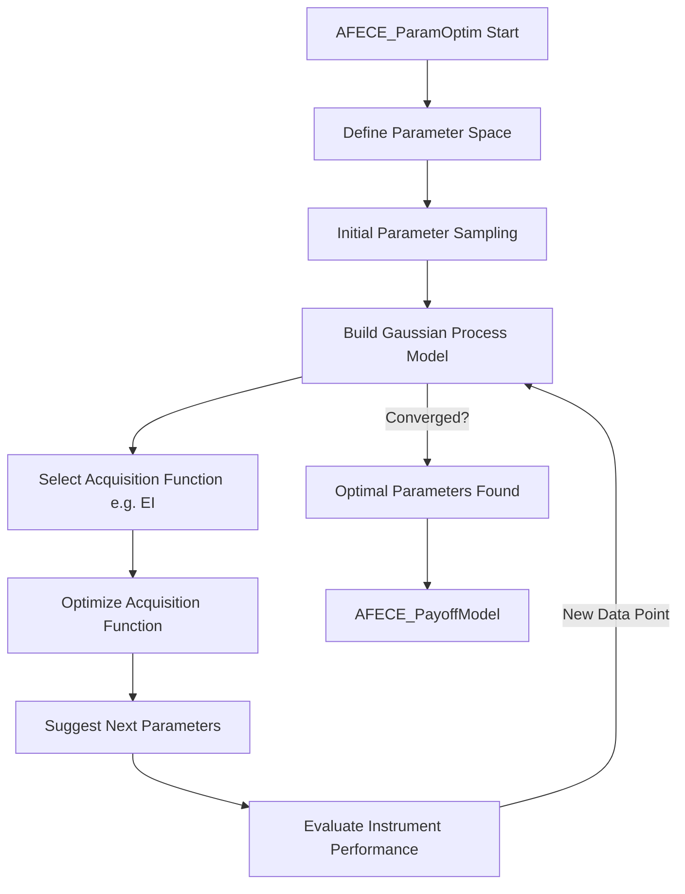
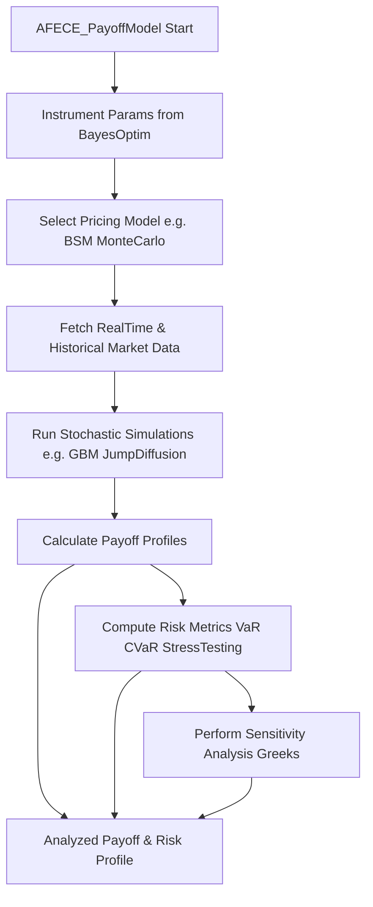
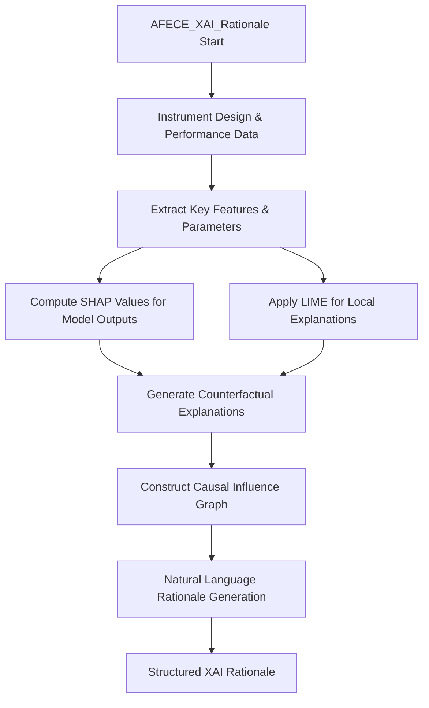
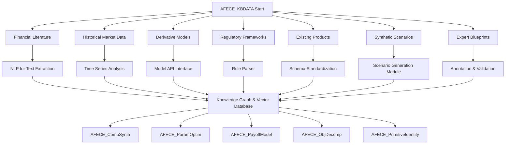
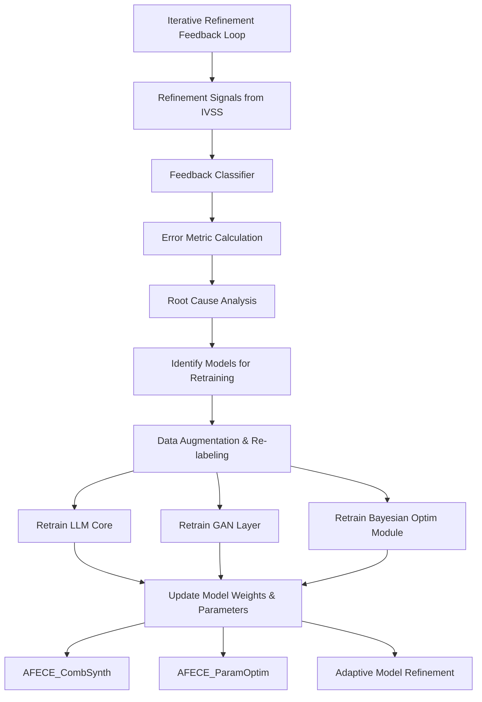
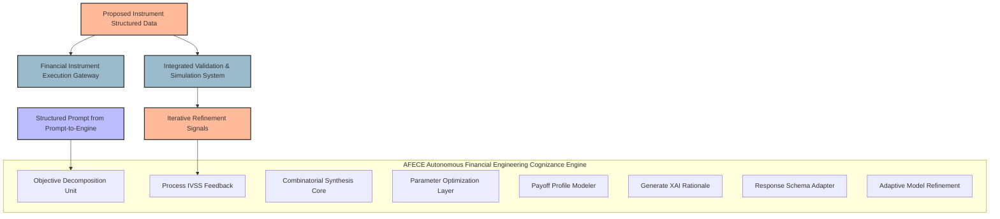
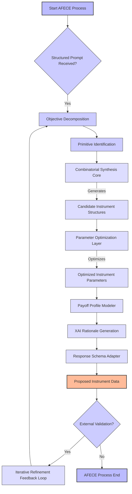

**Title of Invention:** Autonomous Financial Engineering Cognizance Engine AFECE Detailed Generative Flow

**Description:**
This document provides a highly granular representation of the internal sub-processes and iterative loops within the Autonomous Financial Engineering Cognizance Engine AFECE, a core component of the Financial Instrument Synthesizer. The detailed workflow illustrates how the AFECE transforms a structured prompt into a bespoke financial instrument, incorporating advanced AI techniques, extensive knowledge bases, and continuous refinement through feedback. All visualization elements adhere strictly to patent visualization guidelines, particularly concerning the avoidance of parentheses in node labels for Mermaid diagram syntax compatibility.

```mermaid
graph TD
    subgraph AFECE Autonomous Financial Engineering Cognizance Engine

        subgraph 1. Instrument Design Workflow
            PTE_Prompt[Structured Prompt from PTE] --> AFECE_ObjDecomp[Objective Decomposition Unit]
            AFECE_ObjDecomp --> AFECE_PrimitiveIdentify[Identify Required Financial Primitives]
            
            AFECE_PrimitiveIdentify --> AFECE_CombSynth[Combinatorial Synthesis Core]
            subgraph 1.1 Combinatorial Synthesis Subprocess
                AFECE_CombSynth -- initiates --> AFECE_ExploreSpace[Explore Vast NonLinear Instrument Space]
                AFECE_ExploreSpace --> AFECE_GAN_Gen[Utilize GANs for Diverse Instrument Generation]
                AFECE_GAN_Gen --> AFECE_ComponentSelect[Select & Combine Derivatives FixedIncome Equity]
                AFECE_ComponentSelect -- feedback loop --> AFECE_ExploreSpace
            end
            
            AFECE_ComponentSelect --> AFECE_ParamOptim[Parameter Optimization Layer]
            subgraph 1.2 Parameter Optimization Subprocess
                AFECE_ParamOptim -- initiates --> AFECE_TuneParams[Determine Optimal Parameters e.g. Strike Maturity Notional]
                AFECE_TuneParams --> AFECE_BayesOptim[Employ Bayesian Optimization for FineTuning]
                AFECE_BayesOptim -- refines --> AFECE_TuneParams
            end
            
            AFECE_BayesOptim --> AFECE_PayoffModel[Payoff Profile Modeler]
            AFECE_PayoffModel --> AFECE_XAI_Rationale[Generate XAI Rationale for Design Choices]
            AFECE_XAI_Rationale --> AFECE_RespSchemaAdapt[Response Schema Adapter]
            AFECE_RespSchemaAdapt --> AFECE_PropInst[Proposed Instrument Structured Data JSON]
        end

        subgraph 2. AFECE Knowledge & Training Resources
            AFECE_KBLIT[Financial Engineering Literature Corpus]
            AFECE_KBMARKET[Historical Market Data Corpus]
            AFECE_KBDERIV[Derivative Pricing Models Library]
            AFECE_KBREG[Regulatory Frameworks Data]
            AFECE_KBPROD[Existing Financial Product Specifications]
            AFECE_KBSYNTH[Synthetically Generated Market Scenarios]
            AFECE_KBEXPERT[Expert Annotated Blueprints]

            AFECE_KBLIT & AFECE_KBMARKET & AFECE_KBDERIV & AFECE_KBREG & AFECE_KBPROD & AFECE_KBSYNTH & AFECE_KBEXPERT --> AFECE_KBDATA[AFECE Knowledge Base & Training Data]

            AFECE_KBDATA --> AFECE_CombSynth
            AFECE_KBDATA --> AFECE_ParamOptim
            AFECE_KBDATA --> AFECE_PayoffModel
        end

        subgraph 3. Iterative Refinement Feedback Loop
            IVSS_Refine[Iterative Refinement Signals from IVSS] --> AFECE_FeedbackProc[Process IVSS Feedback]
            AFECE_FeedbackProc --> AFECE_AdaptiveRefine[Adaptive Model Refinement & Retraining]
            AFECE_FeedbackProc --> AFECE_CombSynth
            AFECE_FeedbackProc --> AFECE_ParamOptim
            AFECE_AdaptiveRefine --> AFECE_CombSynth
        end

        subgraph 4. Core AI Model Components
            LLM_Core[Specialized LLM Core]
            GAN_Layer[Generative Adversarial Networks Layer]
            RLHF_Layer[Reinforcement Learning from Human Feedback Layer]
            Bayesian_Optim_Mod[Bayesian Optimization Module]

            LLM_Core --> AFECE_ObjDecomp
            LLM_Core --> AFECE_CombSynth
            LLM_Core --> AFECE_ParamOptim
            LLM_Core --> AFECE_XAI_Rationale
            GAN_Layer --> AFECE_GAN_Gen
            RLHF_Layer --> AFECE_FeedbackProc
            Bayesian_Optim_Mod --> AFECE_BayesOptim
        end
    end

    style PTE_Prompt fill:#bbf,stroke:#333,stroke-width:2px
    style AFECE_PropInst fill:#fb9,stroke:#333,stroke-width:2px
    style IVSS_Refine fill:#fb9,stroke:#333,stroke-width:2px

    style AFECE_ObjDecomp fill:#ccf,stroke:#333,stroke-width:1px
    style AFECE_PrimitiveIdentify fill:#ccf,stroke:#333,stroke-width:1px
    style AFECE_CombSynth fill:#ccf,stroke:#333,stroke-width:2px
    style AFECE_ExploreSpace fill:#ddf,stroke:#333,stroke-width:1px
    style AFECE_GAN_Gen fill:#ddf,stroke:#333,stroke-width:1px
    style AFECE_ComponentSelect fill:#ddf,stroke:#333,stroke-width:1px
    style AFECE_ParamOptim fill:#ccf,stroke:#333,stroke-width:2px
    style AFECE_TuneParams fill:#ddf,stroke:#333,stroke-width:1px
    style AFECE_BayesOptim fill:#ddf,stroke:#333,stroke-width:1px
    style AFECE_PayoffModel fill:#ccf,stroke:#333,stroke-width:1px
    style AFECE_XAI_Rationale fill:#ccf,stroke:#333,stroke-width:1px
    style AFECE_RespSchemaAdapt fill:#ccf,stroke:#333,stroke-width:1px

    style AFECE_KBLIT fill:#eee,stroke:#333,stroke-width:1px
    style AFECE_KBMARKET fill:#eee,stroke:#333,stroke-width:1px
    style AFECE_KBDERIV fill:#eee,stroke:#333,stroke-width:1px
    style AFECE_KBREG fill:#eee,stroke:#333,stroke-width:1px
    style AFECE_KBPROD fill:#eee,stroke:#333,stroke-width:1px
    style AFECE_KBSYNTH fill:#eee,stroke:#333,stroke-width:1px
    style AFECE_KBEXPERT fill:#eee,stroke:#333,stroke-width:1px
    style AFECE_KBDATA fill:#ddd,stroke:#333,stroke-width:2px

    style AFECE_FeedbackProc fill:#dee,stroke:#333,stroke-width:1px
    style AFECE_AdaptiveRefine fill:#dee,stroke:#333,stroke-width:1px

    style LLM_Core fill:#cce,stroke:#333,stroke-width:1px
    style GAN_Layer fill:#cce,stroke:#333,stroke-width:1px
    style RLHF_Layer fill:#cce,stroke:#333,stroke-width:1px
    style Bayesian_Optim_Mod fill:#cce,stroke:#333,stroke-width:1px
```


*Figure 1: AFECE Autonomous Financial Engineering Cognizance Engine Detailed Generative Flow*

---

### **1. Instrument Design Workflow Deep Dive**

The instrument design workflow is the primary generative pathway within AFECE, translating high-level financial objectives into concrete, structured instrument specifications. Each unit leverages advanced AI models and extensive knowledge to perform its specialized task.

#### **1.1 Objective Decomposition Unit (AFECE_ObjDecomp)**

This unit takes a structured prompt from the Prompt-to-Engine (PTE) interface and breaks it down into quantifiable financial objectives, constraints, and preferences. This involves semantic parsing, entity recognition, and mapping natural language financial requirements to a formal, machine-interpretable objective function space.

**Mathematical Formulation of Objective Decomposition:**
Given a prompt $P$, the AFECE_ObjDecomp unit extracts a set of objectives $O = \{o_1, o_2, ..., o_k\}$, constraints $C = \{c_1, c_2, ..., c_m\}$, and preferences $R = \{r_1, r_2, ..., r_n\}$.
Each objective $o_i$ is mapped to a utility function $U_i(I)$ where $I$ is a financial instrument.
The overall objective function to maximize is:
$$ \text{Maximize } \sum_{i=1}^k w_i U_i(I) - \sum_{j=1}^m \lambda_j \text{Penalty}(I, c_j) + \sum_{l=1}^n \mu_l \text{PreferenceScore}(I, r_l) $$
subject to:
$$ \forall j \in \{1, ..., m\}, \quad \text{ConstraintCheck}(I, c_j) = \text{True} $$
Here, $w_i$, $\lambda_j$, and $\mu_l$ are weights determined by the prompt's emphasis, reflecting stakeholder priorities or inferred risk appetite.
A common utility function for return can be defined as:
$$ U_{\text{Return}}(I) = E[R_I] - \alpha \text{VaR}_I(p) $$
where $E[R_I]$ is expected return, $\text{VaR}_I(p)$ is Value at Risk at percentile $p$, and $\alpha$ is a risk aversion coefficient.
For example, for a target return $R^*$, the objective could be:
$$ U_{\text{TargetReturn}}(I) = -|E[R_I] - R^*| $$
And for a maximum drawdown constraint $MD_{\text{max}}$:
$$ \text{ConstraintCheck}(I, \text{MaxDrawdown}) = (MD_I \le MD_{\text{max}}) $$
Where $MD_I = \max_{t_1 < t_2} \left( \frac{\text{Price}(t_1) - \text{Price}(t_2)}{\text{Price}(t_1)} \right)$.


*Figure 2: AFECE Objective Decomposition Unit (AFECE_ObjDecomp) Process*

#### **1.2 Identify Required Financial Primitives (AFECE_PrimitiveIdentify)**

Based on the decomposed objectives and constraints, this unit identifies the fundamental building blocks (financial primitives) necessary for constructing the instrument. This could range from simple bonds and options to complex swaps and structured products, drawing from the AFECE Knowledge Base (AFECE_KBDATA). This process often involves matching desired payoff profiles or risk exposures with known primitive characteristics.

**Primitive Identification via Payoff Signature Matching:**
A primitive $P_j$ can be characterized by its payoff function $\Pi_j(S_T, K_j, ...)$, where $S_T$ is the underlying asset price at maturity.
Given a desired target payoff profile $T(S_T)$, the unit seeks to find a combination of primitives $P = \{p_1, ..., p_N\}$ such that their aggregated payoff $\sum_{i=1}^N \Pi_i(S_T, \text{params}_i)$ approximates $T(S_T)$ under various market conditions.
This can be formulated as minimizing an error function:
$$ \text{Minimize } \int_{S_{\text{min}}}^{S_{\text{max}}} \left( T(S_T) - \sum_{i=1}^N \Pi_i(S_T, \text{params}_i) \right)^2 \phi(S_T) dS_T $$
where $\phi(S_T)$ is the risk-neutral probability density function of $S_T$.

#### **1.3 Combinatorial Synthesis Core (AFECE_CombSynth)**

This core module is responsible for exploring the vast, non-linear space of possible financial instruments. It uses advanced generative models, including Generative Adversarial Networks (GANs), to propose novel combinations of primitives identified by AFECE_PrimitiveIdentify.

**Grammar-based Instrument Generation:**
Instruments can be represented as syntax trees or graphs. A context-free grammar (CFG) $G = (V, \Sigma, R, S)$ where $V$ is a set of variables, $\Sigma$ is a set of terminals (financial primitives), $R$ is a set of production rules, and $S$ is the start symbol, can define the valid instrument structures.
Example rules:
$$ S \rightarrow \text{FixedIncomeInstrument} | \text{DerivativeInstrument} | \text{EquityInstrument} | S \text{ + } S | S \text{ - } S $$
$$ \text{FixedIncomeInstrument} \rightarrow \text{Bond} | \text{ZeroCouponBond} | \text{FloatingRateNote} $$
$$ \text{DerivativeInstrument} \rightarrow \text{Option} | \text{Swap} | \text{Forward} $$
The search space is defined by the number of valid parse trees generated by $G$. The number of possible instruments can grow exponentially:
$$ N_{\text{instruments}} \approx |\Sigma|^L $$
where $L$ is the maximum complexity (e.g., number of components).

##### **1.1 Combinatorial Synthesis Subprocess**

**AFECE_ExploreSpace:** This sub-unit systematically traverses the instrument design space, guided by the decomposed objectives. It employs heuristic search algorithms combined with knowledge-guided exploration to prioritize promising regions.

**AFECE_GAN_Gen (Utilize GANs for Diverse Instrument Generation):**
GANs are employed here to generate synthetic, yet plausible, financial instruments. The Generator ($G$) creates instrument structures and parameter sets, while the Discriminator ($D$) learns to distinguish between real (expert-designed or market-observed) instruments and synthetically generated ones. This adversarial process drives the generator to produce highly realistic and novel instrument designs.

**GAN Loss Functions:**
The objective function for the GAN is:
$$ \min_G \max_D V(D, G) = E_{x \sim p_{\text{data}}(x)}[\log D(x)] + E_{z \sim p_z(z)}[\log (1 - D(G(z)))] $$
Where $x$ represents real financial instruments (e.g., from AFECE_KBPROD, AFECE_KBSYNTH), $p_{\text{data}}(x)$ is the distribution of real instruments, $z$ is a noise vector, and $p_z(z)$ is the prior distribution for the noise. $G(z)$ is a synthetically generated instrument.

**AFECE_ComponentSelect (Select & Combine Derivatives FixedIncome Equity):** This unit, often guided by the Discriminator's feedback and the overarching objective function, selects and combines the most suitable components (derivatives, fixed income, equity) to form a coherent instrument structure. It prioritizes combinations that exhibit favorable risk-reward profiles and align with regulatory constraints.

**Iterative Search and Selection:**
Let $S_t$ be the set of selected components at iteration $t$. The next set $S_{t+1}$ is chosen to maximize a fitness function $F(S_{t+1})$:
$$ S_{t+1} = \arg\max_{S' \in \text{CandidateSet}} F(S') $$
where $F(S') = \text{Utility}(S') - \text{ComplexityCost}(S') - \text{ConstraintViolation}(S')$.


*Figure 3: Combinatorial Synthesis Core (AFECE_CombSynth) Internal Dynamics*

#### **1.4 Parameter Optimization Layer (AFECE_ParamOptim)**

Once an instrument structure is selected, its parameters (e.g., strike prices, maturities, notional amounts, coupon rates) must be optimized to best meet the specified objectives and constraints.

##### **1.2 Parameter Optimization Subprocess**

**AFECE_TuneParams (Determine Optimal Parameters):** This unit refines the initial parameter suggestions. The optimization problem often involves high-dimensional, non-convex objective functions.

**AFECE_BayesOptim (Employ Bayesian Optimization for FineTuning):** Bayesian optimization is particularly effective for expensive-to-evaluate functions (like complex financial models). It constructs a probabilistic surrogate model (e.g., Gaussian Process) of the objective function and uses an acquisition function to determine the next point to sample.

**Gaussian Process (GP) Surrogate Model:**
A GP models the objective function $f(x)$ as a distribution over functions:
$$ f(x) \sim \mathcal{GP}(m(x), k(x, x')) $$
where $m(x)$ is the mean function and $k(x, x')$ is the covariance (kernel) function.
The posterior mean $\mu_n(x)$ and variance $\sigma_n^2(x)$ after $n$ observations $(x_i, y_i)$ are:
$$ \mu_n(x) = k_n(x)^T (K_n + \sigma_y^2 I)^{-1} y_{1:n} $$
$$ \sigma_n^2(x) = k(x,x) - k_n(x)^T (K_n + \sigma_y^2 I)^{-1} k_n(x) $$
where $K_n$ is the $n \times n$ covariance matrix of observations, $k_n(x)$ is the vector of covariances between $x$ and observed points, and $\sigma_y^2$ is observation noise.

**Acquisition Function (e.g., Expected Improvement EI):**
EI quantifies the expected gain from evaluating the objective at a new point $x$:
$$ \text{EI}(x) = E[\max(0, f(x) - f_{\text{best}})] $$
$$ \text{EI}(x) = (\mu_n(x) - f_{\text{best}}) \Phi(Z) + \sigma_n(x) \phi(Z) $$
where $Z = \frac{\mu_n(x) - f_{\text{best}}}{\sigma_n(x)}$, $\Phi$ is the standard normal CDF, and $\phi$ is the standard normal PDF.
The next point to evaluate is $x_{\text{next}} = \arg\max_{x} \text{EI}(x)$.


*Figure 4: Parameter Optimization Layer (AFECE_ParamOptim) with Bayesian Methods*

#### **1.5 Payoff Profile Modeler (AFECE_PayoffModel)**

This unit simulates the behavior of the optimized instrument under various market scenarios to generate its payoff profile, risk exposures, and performance metrics. It utilizes a library of sophisticated pricing models and stochastic simulations.

**Stochastic Simulation for Payoff:**
For an instrument dependent on an underlying asset $S_t$, its value at maturity $T$ can be determined by simulating $S_T$.
Using a Geometric Brownian Motion (GBM) model for $S_t$:
$$ dS_t = \mu S_t dt + \sigma S_t dW_t $$
where $\mu$ is drift, $\sigma$ is volatility, and $dW_t$ is a Wiener process.
The solution is:
$$ S_T = S_0 \exp\left( (\mu - \frac{1}{2}\sigma^2)T + \sigma \sqrt{T} Z \right) $$
where $Z \sim N(0,1)$.
The expected payoff $E[\Pi(S_T)]$ is calculated over $M$ simulated paths:
$$ E[\Pi(S_T)] \approx \frac{1}{M} \sum_{j=1}^M \Pi(S_{T,j}) $$
Monte Carlo simulations are extensively used to estimate complex payoff structures. The number of simulations $M$ required for a confidence level $\alpha$ and error $\epsilon$ is:
$$ M \ge \left( \frac{z_{\alpha/2} \cdot \text{StdDev}(\Pi(S_T))}{\epsilon} \right)^2 $$

**Sensitivity Analysis (Greeks):**
Delta ($\Delta$): Change in instrument price for a unit change in underlying asset price.
$$ \Delta = \frac{\partial V}{\partial S} \approx \frac{V(S + \delta S) - V(S - \delta S)}{2 \delta S} $$
Gamma ($\Gamma$): Rate of change of Delta with respect to the underlying price.
$$ \Gamma = \frac{\partial^2 V}{\partial S^2} \approx \frac{V(S + \delta S) - 2V(S) + V(S - \delta S)}{(\delta S)^2} $$
Vega ($\nu$): Sensitivity to volatility.
$$ \nu = \frac{\partial V}{\partial \sigma} $$
Theta ($\Theta$): Sensitivity to the passage of time.
$$ \Theta = \frac{\partial V}{\partial t} $$
Rho ($\rho$): Sensitivity to interest rates.
$$ \rho = \frac{\partial V}{\partial r} $$
These sensitivities are computed through finite differences or adjoint algorithmic differentiation.


*Figure 5: Payoff Profile Modeler (AFECE_PayoffModel) and Simulation Engine*

#### **1.6 Generate XAI Rationale for Design Choices (AFECE_XAI_Rationale)**

This critical unit provides explainable AI (XAI) insights into why a particular instrument design was chosen, how its parameters were optimized, and what its expected behavior entails. This enhances transparency and trust for human users.

**SHAP (SHapley Additive exPlanations) Values:**
For a model $f$ and a coalition of features $S$, the Shapley value $\phi_i(f, x)$ for feature $i$ is:
$$ \phi_i(f, x) = \sum_{S \subseteq F \setminus \{i\}} \frac{|S|!(|F| - |S| - 1)!}{|F|!} (f_x(S \cup \{i\}) - f_x(S)) $$
where $F$ is the set of all features, $f_x(S)$ is the prediction for features in set $S$ (marginalized over features not in $S$). This assigns contribution scores to each parameter/component for the final instrument's performance.

**LIME (Local Interpretable Model-agnostic Explanations):**
LIME builds a local linear model around a prediction to explain it.
It minimizes the loss:
$$ \xi(x) = \min_{g \in \mathcal{G}} L(f, g, \pi_x) + \Omega(g) $$
where $g$ is an interpretable model (e.g., linear regression), $f$ is the complex model, $\pi_x$ is a proximity measure, and $\Omega(g)$ is a complexity measure.


*Figure 6: XAI Rationale Generation (AFECE_XAI_Rationale) Workflow*

#### **1.7 Response Schema Adapter (AFECE_RespSchemaAdapt)**

This unit formats the generated instrument specification, XAI rationale, and performance metrics into a standardized, machine-readable format (e.g., JSON, XML) compliant with downstream systems like the Financial Instrument Execution Gateway (FIEG). It ensures interoperability and consistent data exchange.

**Schema Transformation:**
Let $D_{\text{internal}}$ be the internal data representation and $D_{\text{external}}$ be the target schema. The adapter performs a transformation $\mathcal{T}$:
$$ D_{\text{external}} = \mathcal{T}(D_{\text{internal}}) $$
This typically involves mapping, filtering, aggregation, and validation based on predefined JSON schemas or XML DTDs.
A common validation metric is schema conformity $C_S$:
$$ C_S = 1 - \frac{\text{Number of Schema Violations}}{\text{Total Number of Fields}} $$

#### **1.8 Proposed Instrument Structured Data (AFECE_PropInst)**

The final output of the AFECE, a complete, validated financial instrument specification ready for further review, simulation, or execution.

### **2. AFECE Knowledge & Training Resources Deep Dive**

The efficacy of AFECE is critically dependent on its rich and diverse knowledge base, which continuously feeds data and insights into its AI models.

**AFECE_KBDATA (AFECE Knowledge Base & Training Data):** This central repository aggregates all knowledge sources.

**AFECE_KBLIT (Financial Engineering Literature Corpus):** Textual data including academic papers, textbooks, and industry reports on financial instruments, pricing theory, risk management, and market structures.
**Embedding Space Similarity:**
Documents $D_i$ are converted into vector embeddings $v_i$. Similarity can be measured by cosine similarity:
$$ \text{similarity}(D_i, D_j) = \frac{v_i \cdot v_j}{||v_i|| \cdot ||v_j||} $$
This is used for context retrieval during objective decomposition and primitive identification.

**AFECE_KBMARKET (Historical Market Data Corpus):** Time-series data of asset prices, volatilities, interest rates, trading volumes, and macroeconomic indicators. Used for model training, calibration, and scenario generation.
**Covariance Matrix for Risk Modeling:**
The covariance matrix $\Sigma$ of asset returns is crucial for portfolio optimization and risk estimation.
$$ \Sigma_{ij} = E[(R_i - \bar{R}_i)(R_j - \bar{R}_j)] $$
The Cholesky decomposition of $\Sigma$ is used for simulating correlated asset paths.

**AFECE_KBDERIV (Derivative Pricing Models Library):** A collection of validated analytical and numerical models for pricing various derivatives (e.g., Black-Scholes, binomial trees, Monte Carlo methods for exotic options).
**Black-Scholes-Merton (BSM) Model for European Call Option:**
$$ C(S, K, T, r, \sigma) = S N(d_1) - K e^{-rT} N(d_2) $$
$$ d_1 = \frac{\ln(S/K) + (r + \sigma^2/2)T}{\sigma\sqrt{T}} $$
$$ d_2 = d_1 - \sigma\sqrt{T} $$
where $S$ is spot price, $K$ is strike price, $T$ is time to maturity, $r$ is risk-free rate, $\sigma$ is volatility, and $N(\cdot)$ is the standard normal CDF.

**AFECE_KBREG (Regulatory Frameworks Data):** Parsed regulatory documents, compliance rules, and legal precedents relevant to financial instrument design and issuance. Constraints derived from this are critical.
**Constraint Satisfaction Problem (CSP) Formulation:**
A regulatory constraint $c_k$ can be represented as a predicate $P_k(I)$ on instrument $I$. The goal is to find $I$ such that $\forall k, P_k(I) = \text{True}$.
For example, for a "qualified investor only" rule:
$$ \text{Eligibility}(I) = \text{QualifiedInvestor} \implies \text{InvestorType}(I) \in \{\text{QI}, \text{Institutional}\} $$

**AFECE_KBPROD (Existing Financial Product Specifications):** A database of current and historical financial instruments, their structures, terms, and performance. Provides examples for GAN training and baseline comparisons.
**Feature Vector Representation:**
Each product $P$ can be represented by a feature vector $f_P = [f_1, f_2, ..., f_N]$ where $f_i$ could be maturity, strike type, underlying asset class, etc.

**AFECE_KBSYNTH (Synthetically Generated Market Scenarios):** Scenarios generated by external models or AFECE itself to stress-test instruments beyond historical data.
**Value at Risk (VaR) Calculation:**
$$ \text{VaR}_{p} = F_{L}^{-1}(p) $$
where $F_L^{-1}$ is the quantile function of the portfolio loss distribution at probability $p$. For parametric VaR, assuming normal returns:
$$ \text{VaR}_{p} = |\mu_{\text{port}} + z_p \sigma_{\text{port}}| $$

**AFECE_KBEXPERT (Expert Annotated Blueprints):** Human-curated instrument designs, best practices, and expert feedback that serve as high-quality training data for supervised and reinforcement learning.


*Figure 7: AFECE Knowledge Base (AFECE_KBDATA) Interconnection and Processing*

### **3. Iterative Refinement Feedback Loop Deep Dive**

AFECE is not a static system. It continuously learns and adapts based on feedback from downstream systems, particularly the Integrated Validation and Simulation System (IVSS).

**IVSS_Refine (Iterative Refinement Signals from IVSS):** This input stream provides performance data, validation results (e.g., failed stress tests, non-compliance), and user feedback on generated instruments.

**AFECE_FeedbackProc (Process IVSS Feedback):** This unit analyzes incoming feedback. It classifies feedback types, quantifies error magnitudes, and attributes issues to specific stages of the AFECE generative flow.
**Error Attribution Function:**
$$ \text{Error}_{\text{total}} = \sum_{m \in \text{Modules}} \text{Weight}_m \cdot \text{Error}_{\text{module}}(I, \text{Feedback}) $$
The weights $\text{Weight}_m$ are dynamically adjusted based on the observed impact of each module on the final instrument quality.

**AFECE_AdaptiveRefine (Adaptive Model Refinement & Retraining):** Based on the processed feedback, this unit triggers targeted retraining or fine-tuning of relevant AI models (LLM, GAN, Bayesian Optimizer). This ensures the AFECE continuously improves its performance and adherence to requirements.
**Reinforcement Learning from Human Feedback (RLHF):**
The feedback from IVSS can be treated as a reward signal for an RL agent.
Let $s$ be an instrument design state, $a$ be an action (e.g., parameter adjustment, component addition), and $r(s,a)$ be the reward from IVSS feedback.
The goal is to learn a policy $\pi(a|s)$ that maximizes the expected cumulative reward:
$$ J(\theta) = E_{\tau \sim \pi_{\theta}} \left[ \sum_{t=0}^T \gamma^t r(s_t, a_t) \right] $$
where $\gamma$ is the discount factor.
Policy gradient methods (e.g., REINFORCE, A2C) can update model parameters $\theta$.


*Figure 8: Iterative Refinement Feedback Loop (AFECE_FeedbackProc) Dynamics*

### **4. Core AI Model Components Deep Dive**

The AFECE leverages a suite of specialized AI models, each contributing to a specific aspect of the generative process.

**LLM_Core (Specialized LLM Core):** A large language model fine-tuned for financial domain knowledge. It assists in objective decomposition, primitive identification, and generating natural language explanations (XAI rationale).
**Transformer Architecture:**
Self-attention mechanism:
$$ \text{Attention}(Q, K, V) = \text{softmax}\left(\frac{QK^T}{\sqrt{d_k}}\right)V $$
The LLM processes the prompt $P$ into a structured query $Q_{\text{structured}}$ and generates text for explanations.
Probabilistic generation:
$$ P(w_t | w_1, ..., w_{t-1}) $$

**GAN_Layer (Generative Adversarial Networks Layer):** As detailed in Section 1.3, this layer generates diverse and novel instrument structures.

**RLHF_Layer (Reinforcement Learning from Human Feedback Layer):** Directly integrates human (or IVSS) feedback to iteratively improve the performance and alignment of AFECE's generated instruments with desired criteria.

**Bayesian_Optim_Mod (Bayesian Optimization Module):** As detailed in Section 1.4, this module efficiently optimizes high-dimensional, expensive-to-evaluate parameters.

### **5. Integration with External Systems**

The AFECE is a central component within a broader financial engineering ecosystem, interacting with other key modules for seamless operation.


*Figure 9: Comprehensive AFECE Interaction with External Systems*

### **6. Advanced Generative Flows and Architectures**

Further detailing the GAN and RLHF components.

#### **6.1 Detailed GAN Architecture for Instrument Generation**

The GAN architecture is specialized for generating financial instruments, which are often structured data types (graphs or hierarchical trees).

```mermaid
graph TD
    GAN_Noise[Random Noise Vector z] --> G_InputEmbed[Embed Noise Vector]
    G_InputEmbed --> G_RNN_Seq[RNN/Transformer for Sequence Generation]
    G_RNN_Seq --> G_GraphNet[Graph Neural Network for Structure]
    G_GraphNet --> G_ParamGen[Parameter Generator]
    G_ParamGen --> Generated_Instrument[Synthesized Instrument I_gen]
    
    Real_Instrument[Real Instrument I_real from KB] --> D_InputEmbed[Embed Instrument Data]
    Generated_Instrument --> D_InputEmbed
    D_InputEmbed --> D_FeatureExtract[Feature Extractor CNN/GNN]
    D_FeatureExtract --> D_Classifier[Binary Classifier D(I)]
    D_Classifier --> D_Output[Real/Fake Probability]
    
    D_Output -- Feedback --> G_InputEmbed
    
    style GAN_Noise fill:#e0e,stroke:#333,stroke-width:1px
    style Generated_Instrument fill:#cce,stroke:#333,stroke-width:1px
    style Real_Instrument fill:#cce,stroke:#333,stroke-width:1px
    style G_InputEmbed fill:#ddf,stroke:#333,stroke-width:1px
    style G_RNN_Seq fill:#ddf,stroke:#333,stroke-width:1px
    style G_GraphNet fill:#ddf,stroke:#333,stroke-width:1px
    style G_ParamGen fill:#ddf,stroke:#333,stroke-width:1px
    style D_InputEmbed fill:#fde,stroke:#333,stroke-width:1px
    style D_FeatureExtract fill:#fde,stroke:#333,stroke-width:1px
    style D_Classifier fill:#fde,stroke:#333,stroke-width:1px
    style D_Output fill:#fde,stroke:#333,stroke-width:1px
```
*Figure 10: Detailed GAN Architecture for Financial Instrument Generation*

#### **6.2 RLHF for AFECE Model Alignment**

RLHF is crucial for aligning AFECE's generated outputs with human preferences and complex, often subjective, financial objectives that are difficult to encode purely mathematically.

**Reward Model Training:**
A separate reward model $R_\phi(I)$ is trained on human preference data (e.g., expert rankings of generated instruments from IVSS).
For two instruments $I_1$ and $I_2$, if $I_1$ is preferred over $I_2$:
$$ \text{Minimize } L(\phi) = - \log \sigma(R_\phi(I_1) - R_\phi(I_2)) $$

**Proximal Policy Optimization (PPO) with Reward Model:**
The AFECE policy $\pi_\theta$ (e.g., the LLM or GAN's generative process) is then optimized using PPO to maximize the reward from $R_\phi(I)$, while staying close to an initial policy $\pi_{\text{ref}}$.
The PPO objective function for policy $\theta$:
$$ L^{\text{CLIP}}(\theta) = \hat{E}_t \left[ \min(r_t(\theta) \hat{A}_t, \text{clip}(r_t(\theta), 1-\epsilon, 1+\epsilon)\hat{A}_t) - \beta \text{KL}(\pi_\theta || \pi_{\text{ref}}) \right] $$
where $r_t(\theta) = \frac{\pi_\theta(a_t|s_t)}{\pi_{\theta_{\text{old}}}(a_t|s_t)}$, $\hat{A}_t$ is the advantage estimate from the reward model, and $\beta$ controls the KL divergence penalty.

### **7. Claims**

Here are 10 claims outlining the inventive aspects of the Autonomous Financial Engineering Cognizance Engine (AFECE):

**Claim 1:** A system for autonomous financial instrument generation, comprising: an Objective Decomposition Unit configured to parse a structured financial prompt into a set of quantifiable objectives and constraints; a Primitive Identification Unit configured to select fundamental financial primitives based on said objectives and constraints; and a Combinatorial Synthesis Core configured to generate novel financial instrument structures by combining said primitives, wherein said core utilizes a Generative Adversarial Network (GAN) for diverse instrument generation and exploration of a non-linear instrument space.

**Claim 2:** The system of Claim 1, further comprising a Parameter Optimization Layer configured to determine optimal parameters for a generated financial instrument structure, wherein said layer employs Bayesian Optimization methods to fine-tune said parameters against the parsed objectives and constraints.

**Claim 3:** The system of Claim 2, further comprising a Payoff Profile Modeler configured to simulate and analyze the payoff profile, risk exposures, and performance metrics of the optimized financial instrument under various market scenarios, utilizing a library of validated pricing models and stochastic simulations.

**Claim 4:** The system of Claim 3, further comprising an Explainable AI Rationale Generation Unit configured to produce human-interpretable explanations for the design choices, parameter optimization, and expected behavior of the generated financial instrument, leveraging techniques such as SHAP values and LIME.

**Claim 5:** The system of Claim 4, further comprising an Iterative Refinement Feedback Loop, configured to receive and process iterative refinement signals from an external validation system, wherein said feedback is used by an Adaptive Model Refinement and Retraining unit to continuously improve the performance and alignment of the AFECE's generative models, including said GAN and Bayesian Optimization components.

**Claim 6:** The system of Claim 5, wherein the Adaptive Model Refinement and Retraining unit utilizes Reinforcement Learning from Human Feedback (RLHF) to align the generative models with complex human preferences and validation outcomes.

**Claim 7:** A method for autonomously designing a financial instrument, comprising the steps of: receiving a structured financial prompt; decomposing said prompt into formal objectives and constraints; identifying financial primitives suitable for meeting said objectives; generating candidate instrument structures by combinatorially synthesizing said primitives using a Generative Adversarial Network (GAN); optimizing parameters for said candidate structures using Bayesian Optimization; simulating the payoff profile and risk metrics of the optimized instrument; generating an explainable AI rationale for the instrument's design; and iteratively refining the generative process based on external validation feedback.

**Claim 8:** The method of Claim 7, wherein the step of generating candidate instrument structures further involves utilizing a specialized Large Language Model (LLM) core to guide the combinatorial synthesis and propose initial structural configurations based on its learned financial domain knowledge.

**Claim 9:** The system of Claim 1, wherein the Combinatorial Synthesis Core uses a context-free grammar with production rules derived from existing financial product specifications and expert blueprints within a comprehensive knowledge base to define the valid structural configurations of financial instruments.

**Claim 10:** The system of Claim 1, further comprising a Response Schema Adapter configured to format the generated financial instrument specifications, performance metrics, and XAI rationale into a standardized, machine-readable data structure compliant with external financial instrument execution and validation gateways.


*Figure 11: Simplified AFECE Generative Loop*