---
**Title of Invention:** Autonomous Financial Engineering Cognizance Engine AFECE Detailed Generative Flow

**Description:**
This document provides a highly granular representation of the internal sub-processes and iterative loops within the Autonomous Financial Engineering Cognizance Engine AFECE, a core component of the Financial Instrument Synthesizer. The detailed workflow illustrates how the AFECE transforms a structured prompt into a bespoke financial instrument, incorporating advanced AI techniques, extensive knowledge bases, and continuous refinement through feedback. All visualization elements adhere strictly to patent visualization guidelines, particularly concerning the avoidance of parentheses in node labels for Mermaid diagram syntax compatibility.

```mermaid
graph TD
    subgraph AFECE Autonomous Financial Engineering Cognizance Engine

        subgraph 1. Instrument Design Workflow
            PTE_Prompt[Structured Prompt from PTE] --> AFECE_ObjDecomp[Objective Decomposition Unit]
            AFECE_ObjDecomp --> AFECE_PrimitiveIdentify[Identify Required Financial Primitives]
            
            AFECE_PrimitiveIdentify --> AFECE_CombSynth[Combinatorial Synthesis Core]
            subgraph 1.1 Combinatorial Synthesis Subprocess
                AFECE_CombSynth -- initiates --> AFECE_ExploreSpace[Explore Vast NonLinear Instrument Space]
                AFECE_ExploreSpace --> AFECE_GAN_Gen[Utilize GANs for Diverse Instrument Generation]
                AFECE_GAN_Gen --> AFECE_ComponentSelect[Select & Combine Derivatives FixedIncome Equity]
                AFECE_ComponentSelect -- feedback loop --> AFECE_ExploreSpace
            end
            
            AFECE_ComponentSelect --> AFECE_ParamOptim[Parameter Optimization Layer]
            subgraph 1.2 Parameter Optimization Subprocess
                AFECE_ParamOptim -- initiates --> AFECE_TuneParams[Determine Optimal Parameters e.g. Strike Maturity Notional]
                AFECE_TuneParams --> AFECE_BayesOptim[Employ Bayesian Optimization for FineTuning]
                AFECE_BayesOptim -- refines --> AFECE_TuneParams
            end
            
            AFECE_BayesOptim --> AFECE_PayoffModel[Payoff Profile Modeler]
            AFECE_PayoffModel --> AFECE_XAI_Rationale[Generate XAI Rationale for Design Choices]
            AFECE_XAI_Rationale --> AFECE_RespSchemaAdapt[Response Schema Adapter]
            AFECE_RespSchemaAdapt --> AFECE_PropInst[Proposed Instrument Structured Data JSON]
        end

        subgraph 2. AFECE Knowledge & Training Resources
            AFECE_KBLIT[Financial Engineering Literature Corpus]
            AFECE_KBMARKET[Historical Market Data Corpus]
            AFECE_KBDERIV[Derivative Pricing Models Library]
            AFECE_KBREG[Regulatory Frameworks Data]
            AFECE_KBPROD[Existing Financial Product Specifications]
            AFECE_KBSYNTH[Synthetically Generated Market Scenarios]
            AFECE_KBEXPERT[Expert Annotated Blueprints]

            AFECE_KBLIT & AFECE_KBMARKET & AFECE_KBDERIV & AFECE_KBREG & AFECE_KBPROD & AFECE_KBSYNTH & AFECE_KBEXPERT --> AFECE_KBDATA[AFECE Knowledge Base & Training Data]

            AFECE_KBDATA --> AFECE_CombSynth
            AFECE_KBDATA --> AFECE_ParamOptim
            AFECE_KBDATA --> AFECE_PayoffModel
        end

        subgraph 3. Iterative Refinement Feedback Loop
            IVSS_Refine[Iterative Refinement Signals from IVSS] --> AFECE_FeedbackProc[Process IVSS Feedback]
            AFECE_FeedbackProc --> AFECE_AdaptiveRefine[Adaptive Model Refinement & Retraining]
            AFECE_FeedbackProc --> AFECE_CombSynth
            AFECE_FeedbackProc --> AFECE_ParamOptim
            AFECE_AdaptiveRefine --> AFECE_CombSynth
        end

        subgraph 4. Core AI Model Components
            LLM_Core[Specialized LLM Core]
            GAN_Layer[Generative Adversarial Networks Layer]
            RLHF_Layer[Reinforcement Learning from Human Feedback Layer]
            Bayesian_Optim_Mod[Bayesian Optimization Module]

            LLM_Core --> AFECE_ObjDecomp
            LLM_Core --> AFECE_CombSynth
            LLM_Core --> AFECE_ParamOptim
            LLM_Core --> AFECE_XAI_Rationale
            GAN_Layer --> AFECE_GAN_Gen
            RLHF_Layer --> AFECE_FeedbackProc
            Bayesian_Optim_Mod --> AFECE_BayesOptim
        end
    end

    style PTE_Prompt fill:#bbf,stroke:#333,stroke-width:2px
    style AFECE_PropInst fill:#fb9,stroke:#333,stroke-width:2px
    style IVSS_Refine fill:#fb9,stroke:#333,stroke-width:2px

    style AFECE_ObjDecomp fill:#ccf,stroke:#333,stroke-width:1px
    style AFECE_PrimitiveIdentify fill:#ccf,stroke:#333,stroke-width:1px
    style AFECE_CombSynth fill:#ccf,stroke:#333,stroke-width:2px
    style AFECE_ExploreSpace fill:#ddf,stroke:#333,stroke-width:1px
    style AFECE_GAN_Gen fill:#ddf,stroke:#333,stroke-width:1px
    style AFECE_ComponentSelect fill:#ddf,stroke:#333,stroke-width:1px
    style AFECE_ParamOptim fill:#ccf,stroke:#333,stroke-width:2px
    style AFECE_TuneParams fill:#ddf,stroke:#333,stroke-width:1px
    style AFECE_BayesOptim fill:#ddf,stroke:#333,stroke-width:1px
    style AFECE_PayoffModel fill:#ccf,stroke:#333,stroke-width:1px
    style AFECE_XAI_Rationale fill:#ccf,stroke:#333,stroke-width:1px
    style AFECE_RespSchemaAdapt fill:#ccf,stroke:#333,stroke-width:1px

    style AFECE_KBLIT fill:#eee,stroke:#333,stroke-width:1px
    style AFECE_KBMARKET fill:#eee,stroke:#333,stroke-width:1px
    style AFECE_KBDERIV fill:#eee,stroke:#333,stroke-width:1px
    style AFECE_KBREG fill:#eee,stroke:#333,stroke-width:1px
    style AFECE_KBPROD fill:#eee,stroke:#333,stroke-width:1px
    style AFECE_KBSYNTH fill:#eee,stroke:#333,stroke-width:1px
    style AFECE_KBEXPERT fill:#eee,stroke:#333,stroke-width:1px
    style AFECE_KBDATA fill:#ddd,stroke:#333,stroke-width:2px

    style AFECE_FeedbackProc fill:#dee,stroke:#333,stroke-width:1px
    style AFECE_AdaptiveRefine fill:#dee,stroke:#333,stroke-width:1px

    style LLM_Core fill:#cce,stroke:#333,stroke-width:1px
    style GAN_Layer fill:#cce,stroke:#333,stroke-width:1px
    style RLHF_Layer fill:#cce,stroke:#333,stroke-width:1px
    style Bayesian_Optim_Mod fill:#cce,stroke:#333,stroke-width:1px
```

*Figure 1: AFECE Autonomous Financial Engineering Cognizance Engine Detailed Generative Flow*