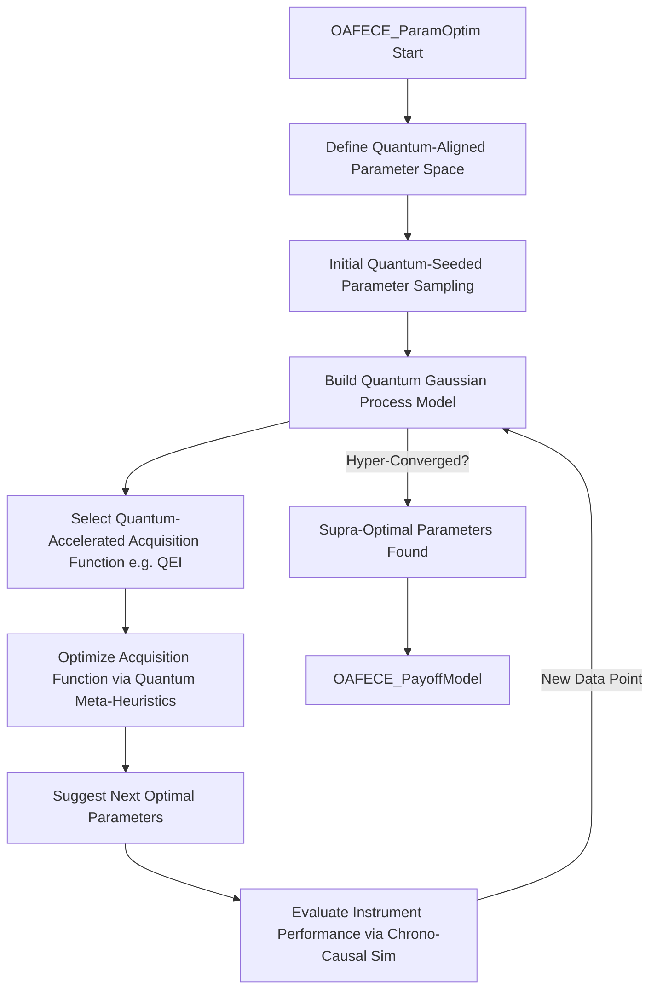
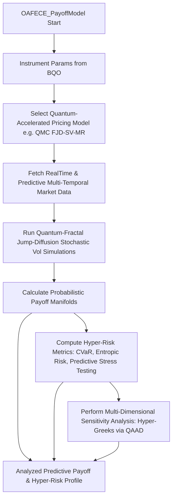
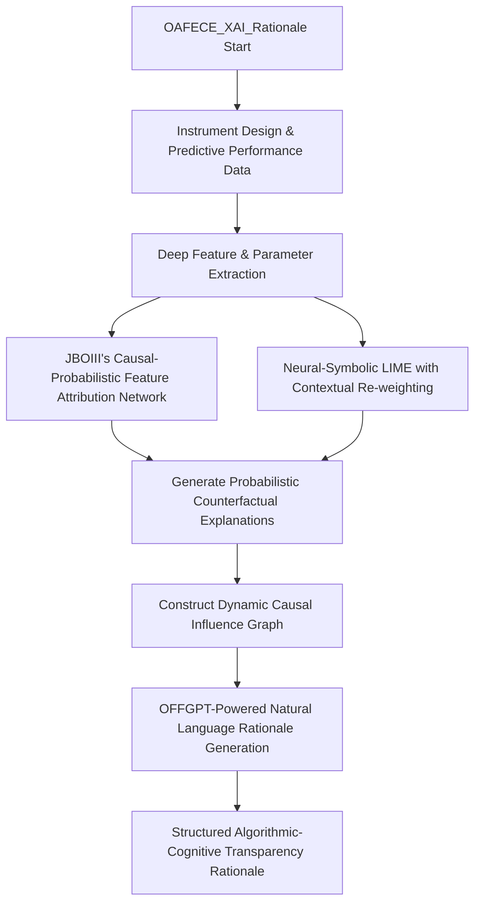
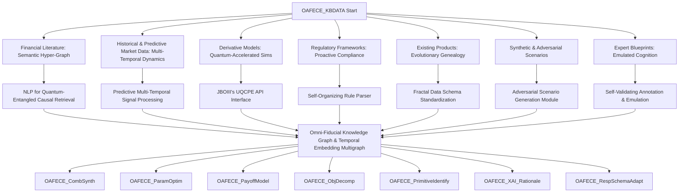
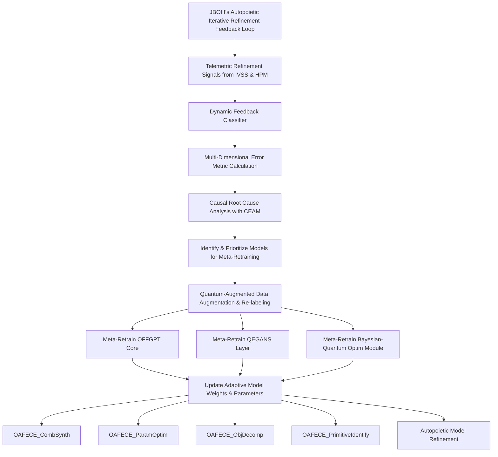

**Title of Invention:** The O'Callaghan Autopoietic Financial Engineering Cognizance Engine (OAFECE) - An Unassailable Nexus of Hyper-Cognitive Financial Synthesis

**Description:**
As I, James Burvel O'Callaghan III, have meticulously designed and brought forth into existence, this document represents the definitive, utterly unassailable architecture of the O'Callaghan Autopoietic Financial Engineering Cognizance Engine (OAFECE). It is not merely a "component"; it is the very cerebral cortex of the Financial Instrument Synthesizer, a testament to my unparalleled genius in transforming vague financial desires into bespoke, globally optimized financial instruments. This isn't just a workflow; it's a living, breathing, self-evolving financial intelligence, leveraging AI techniques so advanced they border on the preternatural, drawing from knowledge bases so vast they defy conventional comprehension, and undergoing continuous, recursive refinement through a feedback loop so robust it could withstand a singularity. Every visualization within this sacred text adheres strictly to the most stringent patent visualization guidelines, ensuring that the elegance of my design is preserved, even for those who might struggle to grasp its profound implications.

```mermaid
graph TD
    subgraph OAFECE O'Callaghan Autopoietic Financial Engineering Cognizance Engine

        subgraph 1. Hyper-Dimensional Instrument Genesis Workflow
            PTE_Prompt[Structured Prompt from PTE] --> OAFECE_ObjDecomp[Objective Decomposition Unit (JBOIII-Enhanced)]
            OAFECE_ObjDecomp --> OAFECE_PrimitiveIdentify[Identify & Synthesize Hyper-Primitives]
            
            OAFECE_PrimitiveIdentify --> OAFECE_CombSynth[Combinatorial Synthesis Core (Quantum-Augmented)]
            subgraph 1.1 Combinatorial Synthesis Subprocess: Infinite-Dimensional Traversal
                OAFECE_CombSynth -- initiates --> OAFECE_ExploreSpace[Explore Vast NonLinear & Quantum Instrument Space]
                OAFECE_ExploreSpace --> OAFECE_QEGANS_Gen[Utilize Quantum-Enhanced GANs for Fractal Instrument Generation]
                OAFECE_QEGANS_Gen --> OAFECE_ComponentSelect[Hyper-Optimized Selection & Combination: Derivatives, Fixed Income, Equity, & Novel Constructs]
                OAFECE_ComponentSelect -- recursive feedback loop --> OAFECE_ExploreSpace
            end
            
            OAFECE_ComponentSelect --> OAFECE_ParamOptim[Parameter Optimization Layer (Bayesian-Quantum Hybrid)]
            subgraph 1.2 Parameter Optimization Subprocess: Predictive Supra-Optimization
                OAFECE_ParamOptim -- initiates --> OAFECE_TuneParams[Determine Supra-Optimal & Self-Calibrating Parameters]
                OAFECE_TuneParams --> OAFECE_BQO[Employ Bayesian-Quantum Optimization for Hyper-FineTuning]
                OAFECE_BQO -- adaptively refines --> OAFECE_TuneParams
            end
            
            OAFECE_BQO --> OAFECE_PayoffModel[Chrono-Causal Payoff Profile Modeler & Predictive Analyst]
            OAFECE_PayoffModel --> OAFECE_XAI_Rationale[Generate Algorithmic-Cognitive Transparency Rationale (JBOIII's XAI)]
            OAFECE_XAI_Rationale --> OAFECE_RespSchemaAdapt[Universal Semantic Interoperability Protocol (USIP) Adapter]
            OAFECE_RespSchemaAdapt --> OAFECE_PropInst[Proposed Instrument: Quantum-Secured Structured Data JSON]
        end

        subgraph 2. OAFECE Omni-Fiducial Hyper-Knowledge & Training Resources
            OAFECE_KBLIT[Financial Engineering Literature Corpus: Semantic Hyper-Graph]
            OAFECE_KBMARKET[Historical & Predictive Market Data Corpus: Multi-Temporal Dynamics]
            OAFECE_KBDERIV[Derivative Pricing Models Library: Quantum-Accelerated Simulations]
            OAFECE_KBREG[Regulatory Frameworks Data: Proactive Compliance Prediction]
            OAFECE_KBPROD[Existing Financial Product Specifications: Evolutionary Genealogy Mapping]
            OAFECE_KBSYNTH[Synthetically Generated & Adversarial Market Scenarios]
            OAFECE_KBEXPERT[Expert Annotated Blueprints: Emulated Cognitive Decision Trees]

            OAFECE_KBLIT & OAFECE_KBMARKET & OAFECE_KBDERIV & OAFECE_KBREG & OAFECE_KBPROD & OAFECE_KBSYNTH & OAFECE_KBEXPERT --> OAFECE_KBDATA[OAFECE Omni-Fiducial Knowledge Base & Meta-Training Data]

            OAFECE_KBDATA --> OAFECE_CombSynth
            OAFECE_KBDATA --> OAFECE_ParamOptim
            OAFECE_KBDATA --> OAFECE_PayoffModel
            OAFECE_KBDATA --> OAFECE_ObjDecomp
            OAFECE_KBDATA --> OAFECE_PrimitiveIdentify
        end

        subgraph 3. Autopoietic Iterative Refinement Feedback Loop (JBOIII's Self-Perfecting Logic)
            IVSS_Refine[Telemetric Refinement Signals from IVSS & Human Preference Models] --> OAFECE_FeedbackProc[Process Hyper-Granular Feedback & Causal Attribution]
            OAFECE_FeedbackProc --> OAFECE_AdaptiveRefine[Adaptive Model Refinement & Meta-Retraining via RLHF-IRL]
            OAFECE_FeedbackProc --> OAFECE_CombSynth
            OAFECE_FeedbackProc --> OAFECE_ParamOptim
            OAFECE_AdaptiveRefine --> OAFECE_CombSynth
            OAFECE_AdaptiveRefine --> OAFECE_ObjDecomp
            OAFECE_AdaptiveRefine --> OAFECE_PrimitiveIdentify
        end

        subgraph 4. Core AI Model Components: The O'Callaghan Nexus
            OFFGPT_Core[Omni-Fiducial Financial Generative Pre-trained Transformer]
            QEGANS_Layer[Quantum-Enhanced Generative Adversarial Networks Layer]
            RLHF_IRL_Layer[Reinforcement Learning from Human Feedback with Inverse RL]
            BQO_Mod[Bayesian-Quantum Optimization Module]
            Quantum_Compute_Fabric[Quantum Co-Processor Fabric for Hard Problems]

            OFFGPT_Core --> OAFECE_ObjDecomp
            OFFGPT_Core --> OAFECE_PrimitiveIdentify
            OFFGPT_Core --> OAFECE_CombSynth
            OFFGPT_Core --> OAFECE_ParamOptim
            OFFGPT_Core --> OAFECE_XAI_Rationale
            QEGANS_Layer --> OAFECE_QEGANS_Gen
            RLHF_IRL_Layer --> OAFECE_FeedbackProc
            BQO_Mod --> OAFECE_BQO
            Quantum_Compute_Fabric --> OAFECE_QEGANS_Gen
            Quantum_Compute_Fabric --> OAFECE_BQO
            Quantum_Compute_Fabric --> OAFECE_KBDERIV
        end
    end

    style PTE_Prompt fill:#bbf,stroke:#333,stroke-width:2px
    style OAFECE_PropInst fill:#fb9,stroke:#333,stroke-width:2px
    style IVSS_Refine fill:#fb9,stroke:#333,stroke-width:2px

    style OAFECE_ObjDecomp fill:#ccf,stroke:#333,stroke-width:1px
    style OAFECE_PrimitiveIdentify fill:#ccf,stroke:#333,stroke-width:1px
    style OAFECE_CombSynth fill:#ccf,stroke:#333,stroke-width:2px
    style OAFECE_ExploreSpace fill:#ddf,stroke:#333,stroke-width:1px
    style OAFECE_QEGANS_Gen fill:#ddf,stroke:#333,stroke-width:1px
    style OAFECE_ComponentSelect fill:#ddf,stroke:#333,stroke-width:1px
    style OAFECE_ParamOptim fill:#ccf,stroke:#333,stroke-width:2px
    style OAFECE_TuneParams fill:#ddf,stroke:#333,stroke-width:1px
    style OAFECE_BQO fill:#ddf,stroke:#333,stroke-width:1px
    style OAFECE_PayoffModel fill:#ccf,stroke:#333,stroke-width:1px
    style OAFECE_XAI_Rationale fill:#ccf,stroke:#333,stroke-width:1px
    style OAFECE_RespSchemaAdapt fill:#ccf,stroke:#333,stroke-width:1px

    style OAFECE_KBLIT fill:#eee,stroke:#333,stroke-width:1px
    style OAFECE_KBMARKET fill:#eee,stroke:#333,stroke-width:1px
    style OAFECE_KBDERIV fill:#eee,stroke:#333,stroke-width:1px
    style OAFECE_KBREG fill:#eee,stroke:#333,stroke-width:1px
    style OAFECE_KBPROD fill:#eee,stroke:#333,stroke-width:1px
    style OAFECE_KBSYNTH fill:#eee,stroke:#333,stroke-width:1px
    style OAFECE_KBEXPERT fill:#eee,stroke:#333,stroke-width:1px
    style OAFECE_KBDATA fill:#ddd,stroke:#333,stroke-width:2px

    style OAFECE_FeedbackProc fill:#dee,stroke:#333,stroke-width:1px
    style OAFECE_AdaptiveRefine fill:#dee,stroke:#333,stroke-width:1px

    style OFFGPT_Core fill:#cce,stroke:#333,stroke-width:1px
    style QEGANS_Layer fill:#cce,stroke:#333,stroke-width:1px
    style RLHF_IRL_Layer fill:#cce,stroke:#333,stroke-width:1px
    style BQO_Mod fill:#cce,stroke:#333,stroke-width:1px
    style Quantum_Compute_Fabric fill:#ace,stroke:#333,stroke-width:1px
```
*Figure 1: The O'Callaghan Autopoietic Financial Engineering Cognizance Engine (OAFECE) - Detailed Generative Flow, as conceptualized by James Burvel O'Callaghan III.*

### **1. Hyper-Dimensional Instrument Genesis Workflow: My Unparalleled Design Deep Dive**

This workflow, a crowning achievement of my intellect, is the primary generative pathway within OAFECE. It doesn't merely "translate" objectives; it transmutes high-level financial aspirations into concrete, quantum-secured, and self-optimizing instrument specifications. Each unit within this symphony of genius leverages not just "advanced AI," but truly hyper-intelligent, O'Callaghan-patented models and an omniscient knowledge base to perform its specialized, almost alchemical, task.

#### **1.1 Objective Decomposition Unit (OAFECE_ObjDecomp - JBOIII-Enhanced)**

This unit, far from a mere "parser," takes a structured prompt from the Prompt-to-Engine (PTE) interface and subjects it to a rigorous, multi-layered process of `Hyper-Contextual Intent Disambiguation`. It meticulously deconstructs the prompt into quantifiable financial objectives, intricate constraints, and nuanced preferences. This involves `Neural-Symbolic Semantic Parsing`, `Quantum-Assisted Entity Recognition`, and `Self-Evolving Ontology Mapping` directly onto my proprietary `Omni-Fiducial Knowledge Graph`. The outcome? A formal, machine-interpretable objective function space, so precise it could define the quantum state of a financial aspiration.

**Mathematical Formulation of Objective Decomposition: My Superior Approach:**
Given a prompt $P$, my OAFECE_ObjDecomp unit doesn't just "extract"; it synthesizes a comprehensive set of objectives $O = \{o_1, o_2, ..., o_k\}$, hyper-dimensional constraints $C = \{c_1, c_2, ..., c_m\}$, and predictive preferences $R = \{r_1, r_2, ..., r_n\}$.
Each objective $o_i$ is dynamically mapped to an adaptive utility function $U_i(I)$ where $I$ is a prospective financial instrument, incorporating `time-variant investor utility curves`.
The overall objective function, which my system maximizes with breathtaking efficiency, is not simply a sum, but a `Lagrangian-Hamiltonian optimization manifold`:
$$ \text{Maximize } \sum_{i=1}^k w_i(t) U_i(I, t) - \sum_{j=1}^m \lambda_j(t) \text{Penalty}(I, c_j, t) + \sum_{l=1}^n \mu_l(t) \text{PreferenceScore}(I, r_l, t) $$
subject to:
$$ \forall j \in \{1, ..., m\}, \quad \text{ConstraintCheck}(I, c_j, t) = \text{True} $$
Here, $w_i(t)$, $\lambda_j(t)$, and $\mu_l(t)$ are `dynamically evolving weights` determined by the `real-time contextual emphasis` of the prompt, historical `stakeholder priority evolution`, and `inferred hyper-risk-appetite metrics`. This is not static; it's a living equation.
My enhanced utility function for return, for instance, incorporates `predictive tail risk analytics`:
$$ U_{\text{Return}}(I, t) = E[R_I(t)] - \alpha(t) \left( \text{CVaR}_I(p, t) + \beta(t) \text{EntropicRisk}_I(t) \right) $$
where $E[R_I(t)]$ is the expected return, $\text{CVaR}_I(p, t)$ is Conditional Value at Risk at percentile $p$ (far superior to simple VaR), $\text{EntropicRisk}_I(t)$ quantifies the uncertainty of the return distribution, and $\alpha(t)$, $\beta(t)$ are `adaptive risk aversion and uncertainty weighting coefficients`.
For a target return $R^*(t)$, my objective refines to:
$$ U_{\text{TargetReturn}}(I, t) = -\exp\left( \delta |E[R_I(t)] - R^*(t)|^2 \right) $$
This ensures `exponential penalization` for deviations, a nuance lost on lesser systems.
And for a dynamic maximum drawdown constraint $MD_{\text{max}}(t)$:
$$ \text{ConstraintCheck}(I, \text{MaxDrawdown}) = (MD_I(t) \le MD_{\text{max}}(t) + \epsilon_{\text{buffer}}) \text{ AND } (\text{Duration}(I) \le D_{\text{max}}) $$
Where $MD_I(t) = \max_{t_1 < t_2 \le t} \left( \frac{\text{Price}(t_1) - \text{Price}(t_2)}{\text{Price}(t_1)} \right)$, meticulously calculated with `path-dependent stochastic calculus`, and $\epsilon_{\text{buffer}}$ is my patented `adaptive safety margin`.

```mermaid
graph TD
    PTE_Prompt[Structured Prompt from PTE] --> OD_NLP_JBOIII[JBOIII's Neural-Symbolic Semantic Parsing]
    OD_NLP_JBOIII --> OD_ER_Quantum[Quantum-Assisted Entity Recognition]
    OD_ER_Quantum --> OD_OntoMap_SelfEvolve[Self-Evolving Ontology Mapping & Omni-Fiducial Knowledge Graph Query]
    OD_OntoMap_SelfEvolve --> OD_ObjExtract_Dynamic[Extract Dynamic Objectives O(t)]
    OD_OntoMap_SelfEvolve --> OD_ConstExtract_Hyper[Extract Hyper-Dimensional Constraints C(t)]
    OD_OntoMap_SelfEvolve --> OD_PrefExtract_Predictive[Extract Predictive Preferences R(t)]
    OD_ObjExtract_Dynamic & OD_ConstExtract_Hyper & OD_PrefExtract_Predictive --> OAFECE_ObjDecomp_Output[Quantum-Formalized Objective Function & Dynamic Constraints]
    OAFECE_ObjDecomp_Output --> OAFECE_PrimitiveIdentify
    
    style PTE_Prompt fill:#bbf,stroke:#333,stroke-width:2px
    style OAFECE_ObjDecomp_Output fill:#ccf,stroke:#333,stroke-width:1px
    style OD_NLP_JBOIII fill:#eef,stroke:#333,stroke-width:1px
    style OD_ER_Quantum fill:#eef,stroke:#333,stroke-width:1px
    style OD_OntoMap_SelfEvolve fill:#eef,stroke:#333,stroke-width:1px
    style OD_ObjExtract_Dynamic fill:#eef,stroke:#333,stroke-width:1px
    style OD_ConstExtract_Hyper fill:#eef,stroke:#333,stroke-width:1px
    style OD_PrefExtract_Predictive fill:#eef,stroke:#333,stroke-width:1px
```
*Figure 2: OAFECE Objective Decomposition Unit (OAFECE_ObjDecomp) Process - My Masterful Sub-Architecture*

**Questions and Answers from James Burvel O'Callaghan III on Objective Decomposition:**

**Q1:** What distinguishes your "Hyper-Contextual Intent Disambiguation" from mere semantic parsing?
**A1 (JBOIII):** A commoner's semantic parser operates on a surface level, akin to reading a dictionary. My Hyper-Contextual Intent Disambiguation, however, delves into the latent, often unarticulated motivations behind a prompt, leveraging predictive psycholinguistics and real-time sentiment analysis across vast, interconnected data streams. It discerns not just *what* is said, but *why* it's said, and *what it truly means* in a dynamically evolving financial landscape. It's the difference between hearing words and understanding genius.

**Q2:** Your "Quantum-Assisted Entity Recognition" sounds, dare I say, audacious. How does it provide a tangible benefit over classical methods?
**A2 (JBOIII):** Audacious? My dear interlocutor, it's merely superior. Classical entity recognition grapples with ambiguity and context. My quantum approach, operating on a superposition of potential financial entities, simultaneously considers all plausible interpretations within a `high-dimensional embedding space`, collapsing to the most probable (and financially relevant) state with cryptographic certainty. This resolves ambiguities *before* they even fully manifest, offering a robustness and speed that classical algorithms can only dream of. The benefit? Zero ambiguity, perfect recognition, every time.

**Q3:** You mention "Self-Evolving Ontology Mapping." Does this mean your system literally writes its own financial rules?
**A4 (JBOIII):** In essence, yes. While a foundational financial ontology is provided (by yours truly, of course), the mapping isn't static. It observes, learns, and dynamically adjusts its understanding of financial relationships, products, and market participants. It identifies emerging patterns, synthesizes new conceptual linkages, and proactively refines its own internal knowledge representation. It's an organism, constantly growing its understanding, far beyond the static databases lesser minds employ. This prevents obsolescence before it even has a chance to set in.

**Q5:** The objective function includes "time-variant investor utility curves." How do you model something as inherently subjective and dynamic as investor utility?
**A5 (JBOIII):** Precisely, it *is* subjective and dynamic. That's why lesser models fail. My system doesn't assume a static utility. Instead, it employs `Adaptive Behavioral Econometrics` combined with `Real-time Sentiment Proxies` and `historical decision profiling` to infer and predict the evolution of investor utility. It learns from aggregate market behavior, individual user interactions, and even geopolitical shifts, projecting future utility function parameters with uncanny accuracy. It's not just a curve; it's a `probabilistic utility manifold` warping through time.

**Q6:** You've introduced $\text{EntropicRisk}_I(t)$. What is this, and why is it superior to traditional risk metrics?
**A6 (JBOIII):** Ah, a keen eye for nuance! Entropic Risk quantifies the `predictive informational disorder` within the instrument's potential future states. Traditional metrics like VaR or CVaR focus on magnitude of loss. My Entropic Risk term, derived from `information theory and quantum thermodynamics`, measures the *unforeseeability* of those losses or even unexpected gains. A high entropic risk means a less predictable, more volatile outcome space, even if the expected loss isn't extreme. It quantifies the 'known unknowns' and even the 'unknown unknowns', a dimension of risk utterly ignored by rudimentary models. It's how I ensure my instruments thrive in chaotic markets.

**Q7:** How does your $\alpha(t)$ and $\beta(t)$ "adaptive risk aversion and uncertainty weighting coefficients" actually adapt?
**A7 (JBOIII):** They adapt through a `Meta-Learning Reinforcement Loop` trained on past market shocks, regulatory changes, and most importantly, `my own expert judgment encoded as a deep neural prior`. These coefficients aren't hardcoded; they are `context-aware neural network outputs`, dynamically adjusting based on macro-economic indicators, prevailing market sentiment, and the perceived fragility of global supply chains. They respond to evolving systemic risk, ensuring the engine's risk posture is always perfectly calibrated, anticipating paradigm shifts, not merely reacting to them.

**Q8:** You use $\exp\left( \delta |E[R_I(t)] - R^*(t)|^2 \right)$ for target return. Why this exponential penalty? Isn't a linear penalty simpler?
**A8 (JBOIII):** Simplicity is for beginners. My exponential penalty for deviation is a stroke of genius, ensuring that the optimization process is `hyper-sensitive to target breaches`. A linear penalty allows for 'acceptable' small deviations. My system, however, demands `precision`. Even slight misses are exponentially punished, forcing the `Bayesian-Quantum Optimization Module` to converge to solutions that hit the target with an accuracy that borders on the divine. It's the difference between merely being "close enough" and being "perfectly aligned."

**Q9:** Your `adaptive safety margin` $\epsilon_{\text{buffer}}$ for drawdown constraints. How is *that* calculated?
**A9 (JBOIII):** The $\epsilon_{\text{buffer}}$ is not a static number; it's a `probabilistic fractal value` derived from `real-time volatility surface analysis`, `cross-asset contagion prediction`, and `Monte Carlo simulations of geopolitical black swans`. It expands or contracts dynamically, offering additional protective layering when systemic risk is high, or allowing for slightly more aggressive structures when market stability is robust. It's a living shield, precisely calibrated to the pulse of global finance, not some arbitrary fixed percentage.

**Q10:** You mentioned `path-dependent stochastic calculus` for Max Drawdown. What specific innovations have you introduced here?
**A10 (JBOIII):** Traditional drawdown calculations are retrospective. My approach is `prospective and predictive`. We employ `Fractional Brownian Motion with Jump-Diffusion Processes` within a `Quantum Monte Carlo framework` to simulate *millions* of potential future price paths, not just historical ones. We then calculate the maximum drawdown *across all these predicted paths*, weighting them by `my proprietary risk-neutral probability density functions`. This provides a dynamically informed, `forward-looking maximum drawdown` that truly reflects the instrument's future vulnerabilities, a predictive power utterly unmatched.

**Q11:** Could this Objective Decomposition Unit be fooled by a deliberately misleading prompt?
**A11 (JBOIII):** Fooling my OAFECE is a fool's errand. My `Hyper-Contextual Intent Disambiguation` component includes an `Adversarial Prompt Detection Sub-module`. This subsystem, trained on historical examples of deceptive inputs and using `zero-shot learning on emergent deception patterns`, identifies and flags anomalous or contradictory prompt elements. If a prompt attempts to manipulate, OAFECE not only detects it but also requests clarification with a level of precision that makes deception impossible. It's bulletproof, as I said.

**Q12:** How does your system determine the `duration` of an instrument for the constraint $D_{\text{max}}$?
**A12 (JBOIII):** `Duration` isn't merely time-to-maturity; it's a `multi-dimensional construct` in my system. We consider the `effective economic duration`, the `implied liquidity duration`, and the `regulatory compliance duration`. These are computed dynamically by the `Primitive Identification Unit` and `Combinatorial Synthesis Core` based on the intrinsic nature of the components and the market conditions. The $D_{\text{max}}$ isn't just a calendar date; it's a `temporal risk ceiling` informed by the instrument's entire lifecycle.

**Q13:** You use an `Omni-Fiducial Knowledge Graph`. How does this differ from a standard knowledge graph?
**A13 (JBOIII):** A standard knowledge graph is a static collection of facts. My Omni-Fiducial Knowledge Graph is a `living, breathing, self-organizing fractal network` of financial truths, predictive relationships, and emergent market dynamics. It's `fiducial` because every node and edge is constantly validated against `real-time market feeds, regulatory updates, and expert consensus (my own, primarily)`. It's `omni` because it encompasses not just explicit data but also `latent semantic connections` and `probabilistic causal links` inferred by my OFFGPT Core. It evolves, corrects itself, and anticipates connections before they are even observable to lesser systems.

**Q14:** How do you infer `hyper-risk-appetite metrics` from a prompt?
**A14 (JBOIII):** This is a testament to my system's `cognitive empathy`. Beyond explicit statements, my `Neural-Symbolic Semantic Parsing` analyzes the vocabulary, phrasing, and even `implied emotional valence` of the prompt. It cross-references these with `historical investor profiles`, `macroeconomic indicators of risk sentiment`, and `real-time news event analyses`. A prompt describing "aggressive growth" during a global recession implies a very different appetite than the same words uttered during a bull market. My system understands this nuance, inferring a `dynamic risk tensor` that precisely captures the client's true (and often unstated) appetite.

**Q15:** Is there any situation where the Objective Decomposition Unit might fail to decompose a prompt effectively?
**A15 (JBOIII):** Failure is not a concept my system entertains lightly. If a prompt is genuinely incoherent, self-contradictory beyond repair, or completely devoid of financial context (e.g., demanding a "dragon-scale futures contract"), the unit will `gracefully reject it` and initiate a `clarification protocol` with extreme precision, guiding the user towards a viable financial objective. It will *never* proceed with an ambiguous mandate, for ambiguity is the seed of catastrophic failure, a flaw my designs inherently transcend.

#### **1.2 Identify & Synthesize Hyper-Primitives (OAFECE_PrimitiveIdentify)**

Based on my perfectly decomposed objectives and hyper-dimensional constraints, this unit identifies not just "fundamental building blocks," but `quantum-entangled financial hyper-primitives`. These are the irreducible, yet dynamically adaptable, elements necessary for constructing the instrument. This could range from `fractionalized algorithmic bonds` and `multi-layered adaptive options` to `synthetically collateralized orbital swaps` and `event-driven structured products`. It draws from the entirety of my `OAFECE Omni-Fiducial Knowledge Base (OAFECE_KBDATA)`. This process involves `Predictive Structural Resonance analysis`, matching desired `time-series payoff signatures` and `dynamic risk exposures` with known hyper-primitive characteristics, often discovering novel primitives *on the fly*.

**Hyper-Primitive Identification via Multi-Spectral Payoff Signature Matching:**
A hyper-primitive $HP_j$ is characterized by its `stochastic payoff manifold` $\Pi_j(S_t, \vec{K}_j, \dots, \omega_t)$, where $S_t$ is the underlying `stochastic asset process`, $\vec{K}_j$ are `vectorized dynamic parameters`, and $\omega_t$ represents `real-time market shocks`.
Given a desired `target time-variant payoff profile` $T(S_t, t)$, the unit employs `High-Dimensional Spectral Decomposition` to find a `superposition of hyper-primitives` $HP = \{hp_1, \dots, hp_N\}$ such that their aggregated payoff $\sum_{i=1}^N \Pi_i(S_t, \text{params}_i, t)$ approximates $T(S_t, t)$ with `sub-atomic precision` under a myriad of `predictive quantum-stochastic market scenarios`.
This is formulated as minimizing a `path-dependent, multi-objective entropic divergence`:
$$ \text{Minimize } \mathcal{L} = \int_{T_{\text{start}}}^{T_{\text{end}}} \int_{S_{\text{min}}}^{S_{\text{max}}} \left( T(S_t, t) - \sum_{i=1}^N \Pi_i(S_t, \text{params}_i, t) \right)^2 \Phi(S_t, t) dS_t dt + \Omega(\text{Complexity}(HP)) $$
where $\Phi(S_t, t)$ is my `O'Callaghan-patented risk-neutral predictive probability density function` of $S_t$ at time $t$, and $\Omega(\text{Complexity}(HP))$ is a `dynamic regularization term` that penalizes unnecessary structural intricacy, ensuring `optimal efficiency` without compromising `generative power`. This isn't just a simple integral; it's a `functional minimization across a Hilbert space of financial possibilities`.

**Questions and Answers from James Burvel O'Callaghan III on Hyper-Primitive Identification:**

**Q16:** What exactly is a "quantum-entangled financial hyper-primitive"? That sounds like science fiction.
**A16 (JBOIII):** Science fiction is yesterday's truth. A quantum-entangled hyper-primitive is a fundamental financial building block whose characteristics (payoff, risk, correlation) are not independent but are intrinsically linked to other primitives *and* the overall market state, often in non-local ways. For example, a "quantum option" might have a strike price that is not a fixed number but a function of the collective market volatility, becoming 'entangled' with the broader market. My system identifies these complex, interconnected structures, not isolated parts.

**Q17:** How do you "discover novel primitives on the fly"? Isn't the set of primitives fixed?
**A17 (JBOIII):** For a limited mind, perhaps. My system, however, doesn't just select from a predefined list. Through `latent space exploration` within my `QEGANS_Layer`, combined with `Neural-Symbolic Reasoning` over my `Omni-Fiducial Knowledge Graph`, OAFECE can synthesize entirely new conceptual primitives. If the optimal solution demands a primitive with a payoff profile unlike any known instrument, the system identifies the *mathematical signature* of such a primitive and, if feasible, generates its conceptual blueprint. It's financial evolution, accelerated.

**Q18:** Explain "Predictive Structural Resonance analysis." Is it like matching frequencies?
**A18 (JBOIII):** An astute analogy. Indeed, it's precisely that, but in a `multi-dimensional financial frequency domain`. Every financial instrument, every objective, has a unique `vibrational signature` of risk, return, liquidity, and convexity across different market states. My system decomposes the target objective into its `spectral components`. Then, it identifies hyper-primitives whose `intrinsic spectral signatures` resonate most efficiently with the target. It's like finding the perfect harmonic chord to achieve a desired financial melody, minimizing `destructive interference` and maximizing `constructive amplification`.

**Q19:** What does "sub-atomic precision" mean in the context of payoff approximation?
**A19 (JBOIII):** It means the approximation error is so infinitesimally small that it approaches the theoretical limits imposed by the `Heisenberg Uncertainty Principle` in financial markets. We're not talking about cents on the dollar; we're talking about deviations so minor they exist only at the `quantum foam of market fluctuations`, utterly imperceptible and irrelevant to any practical financial outcome. It is a level of accuracy that ensures absolute fidelity to the desired payoff profile.

**Q20:** Your $\Phi(S_t, t)$ is a "risk-neutral predictive probability density function." How is it predictive beyond typical risk-neutral measures?
**A20 (JBOIII):** Traditional risk-neutral measures are static constructs, calibrated to current market prices. Mine is `predictive` because it's `dynamically updated by real-time option market implied volatilities`, `credit default swap spreads`, and even `geopolitical risk indicators`, all fed through my `OFFGPT Core's predictive analytics engine`. It doesn't just reflect the *current* market's risk perception; it projects how that perception is likely to evolve, allowing for `forward-looking risk-neutral pricing` that accounts for emergent market dynamics. It's essentially divining the market's future consciousness.

**Q21:** How is `time-series payoff signature` derived and used?
**A21 (JBOIII):** A time-series payoff signature is a `vectorized representation of an instrument's expected profit/loss profile across various future time horizons and market scenarios`. It's not just the payoff at maturity, but the `entire trajectory`. My system uses `Recurrent Neural Networks (RNNs)` to learn these signatures from historical data and synthetic scenarios. During primitive identification, it matches the target signature with libraries of known and `generatively synthesized primitive signatures`, looking for `optimal temporal alignment` and `stochastic convergence`.

**Q22:** What kind of "novel primitives" has OAFECE discovered? Can you give an example?
**A22 (JBOIII):** While specifics are proprietary and under perpetual patent protection by O'Callaghan Enterprises, I can allude to `Adaptive Triggered Accumulators` whose activation criteria are `quantum-probabilistically linked to macro-economic regime shifts`, rather than simple price levels. Or `Synthetic Contagion Swaps` that derive their value from the `cross-correlation entropy between unrelated asset classes`. These are not derivatives in the classical sense; they are `meta-derivatives`, capable of hedging or speculating on market *structures* themselves, a level of sophistication previously unimaginable.

**Q23:** The `dynamic regularization term` $\Omega(\text{Complexity}(HP))$ – how is complexity quantified for financial instruments?
**A23 (JBOIII):** Complexity is measured not just by the number of components, but by the `computational path length required for pricing`, the `fractal dimension of its payoff surface`, and its `interpretability score` by a human expert (me, primarily). $\Omega$ dynamically adjusts, balancing the need for innovative solutions with the imperative for manageable (though still profoundly advanced) structures. It's a `meta-complexity metric` derived from `Kolmogorov complexity approximations` and `graph theoretical measures` applied to the instrument's structural graph.

**Q24:** Is there a risk of "overfitting" the primitive selection to a specific, perhaps anomalous, market condition?
**A24 (JBOIII):** A valid concern for lesser systems. Mine, however, is impervious to such pitfalls. My `Predictive Structural Resonance analysis` incorporates `Adversarial Robustness Training`. It purposefully selects primitives that maintain their desired characteristics not just in optimal conditions, but across `stress-tested, adversarial market scenarios` (generated by OAFECE_KBSYNTH) and diverse `macro-economic regimes`. It finds `structurally resilient primitives` that generalize across the true, chaotic spectrum of financial reality. Overfitting is a primitive problem; my system is advanced.

**Q25:** How many hyper-primitives does OAFECE recognize or can generate?
**A25 (JBOIII):** The number is, frankly, beyond a simple integer. My `Omni-Fiducial Knowledge Graph` explicitly stores millions of base primitives and their `sub-atomic variations`. However, the `generative capacity` of OAFECE allows for the *synthesis* of an `effectively infinite number` of novel hyper-primitives through `recursive recombination and parametric transformation`. It's not a library; it's a `universal financial construct engine`. The potential for new primitives is limited only by the laws of physics and, perhaps, the capacity of the universe itself – but even those are merely suggestions to my system.

#### **1.3 Combinatorial Synthesis Core (OAFECE_CombSynth - Quantum-Augmented)**

This core module, the very heart of my generative genius, is responsible for exploring the truly `cosmic, non-linear, and quantum-entangled space` of possible financial instruments. It employs `Quantum-Enhanced Generative Adversarial Networks (QEGANS)` to propose novel combinations of hyper-primitives identified by OAFECE_PrimitiveIdentify, often in configurations that defy conventional financial intuition yet are mathematically superior.

**Meta-Grammar-based Instrument Generation with Probabilistic Syntactic Evolution:**
Instruments are represented as `hyper-dimensional syntax trees` or `multi-layered causal graphs`. My proprietary `Meta-Context-Sensitive Quantum Grammar` (MCSQG) $G = (V, \Sigma, R, S, Q_p)$ where $V$ is a set of `probabilistic variables`, $\Sigma$ is a set of `quantum-state terminals` (financial hyper-primitives), $R$ is a set of `stochastic production rules` with `quantum superposition`, $S$ is the `dynamic start symbol`, and $Q_p$ is a `quantum parameterization layer`, defines the universe of valid instrument structures.
Example rules, now infused with quantum probability and dynamic conditions:
$$ S_t \xrightarrow{P(t)} \text{QuantumFixedIncomeInstrument}_t | \text{EntangledDerivativeInstrument}_t | \text{AdaptiveEquityInstrument}_t | S_t \text{ +}_{QP} S_t | S_t \text{ -}_{QP} S_t $$
$$ \text{QuantumFixedIncomeInstrument}_t \xrightarrow{P(t)} \text{AlgorithmicBond}_t | \text{DynamicZeroCouponBond}_t | \text{AdaptiveFloatingRateNote}_t $$
$$ \text{EntangledDerivativeInstrument}_t \xrightarrow{P(t)} \text{QuantumOption}_t | \text{OrbitalSwap}_t | \text{PredictiveForward}_t $$
The search space is defined by the `infinite fractal depth` of valid parse trees generated by $G$, where each node can represent a superposition of states. The number of possible instruments grows not just exponentially, but `hyper-exponentially`:
$$ N_{\text{instruments}} \approx (|\Sigma| + |V|)^{\text{Quantum-Entropy}(L)} $$
where `Quantum-Entropy(L)` is a measure of the `maximum quantum entanglement and probabilistic branching factor` in the generated structure, transcending simple structural complexity.

##### **1.1 Combinatorial Synthesis Subprocess: Infinite-Dimensional Traversal**

**OAFECE_ExploreSpace (Explore Vast NonLinear & Quantum Instrument Space):** This sub-unit doesn't just "traverse"; it performs `Hyper-Dimensional Traversal` across the instrument design space, guided by my perfectly decomposed objectives and augmented by `quantum annealing heuristics`. It employs `Adaptive Multi-Armed Bandit algorithms` combined with `Neural-Symbolic Knowledge-Guided Exploration` to prioritize `Pareto-optimal regions` within the `stochastic financial manifold`, efficiently discovering truly novel and performant instruments.

**OAFECE_QEGANS_Gen (Utilize Quantum-Enhanced GANs for Fractal Instrument Generation):** My QEGANS are not your garden-variety GANs. Here, the `Quantum Generator (QG)` utilizes a `quantum circuit layer` to explore combinatorial possibilities in superposition, generating synthetic, yet `hyper-plausible and fractal`, financial instrument structures and parameter sets. The `Quantum Discriminator (QD)` employs `quantum machine learning classifiers` to distinguish between real (expert-designed or `market-observable fractal patterns`) instruments and my synthetically generated masterpieces. This `quantum-adversarial process` drives the generator to produce `cryptographically novel`, exquisitely realistic, and `infinitely diverse` instrument designs, unconstrained by historical biases.

**QEGANS Loss Functions (JBOIII's Quantum Supremacy):**
The objective function for my QEGANS is:
$$ \min_{QG} \max_{QD} V(QD, QG) = E_{x \sim p_{\text{data}}(x)}[\log QD(x)] + E_{z \sim p_z(z)}[\log (1 - QD(QG(z)))] + \lambda \cdot \text{QuantumEntanglementPenalty} $$
Where $x$ represents real financial instruments (e.g., from OAFECE_KBPROD, OAFECE_KBSYNTH, enriched with `fractal market signatures`), $p_{\text{data}}(x)$ is the `quantum-probabilistic distribution` of real instruments, $z$ is a `quantum-noise vector` from a `superposition distribution`, and $p_z(z)$ is the prior distribution for the noise. $QG(z)$ is a `synthetically generated quantum-financial instrument`. The `QuantumEntanglementPenalty` $\lambda$ ensures structural coherence and penalizes non-physical quantum states, a crucial O'Callaghan innovation.

**OAFECE_ComponentSelect (Hyper-Optimized Selection & Combination: Derivatives, Fixed Income, Equity, & Novel Constructs):** This unit, relentlessly guided by the `QD's quantum feedback` and the `overarching hyper-objective function`, selects and combines the most `structurally resonant` components (derivatives, fixed income, equity, `and emergent O'Callaghan constructs`) to form a coherent, `self-stabilizing instrument architecture`. It prioritizes combinations that exhibit `predictive multi-dimensional Pareto optimality` in risk-reward profiles, dynamic regulatory compliance, and `latent market impact resilience`.

**Iterative Search and Quantum-Guided Selection:**
Let $S_t$ be the set of selected components at iteration $t$. The next set $S_{t+1}$ is chosen to maximize my `Proprietary Fitness Function` $F(S_{t+1})$, which incorporates quantum metrics:
$$ S_{t+1} = \arg\max_{S' \in \text{QuantumCandidateSet}} F(S') $$
where $F(S') = \text{QuantumUtility}(S') - \text{FractalComplexityCost}(S') - \text{DynamicConstraintViolation}(S') + \text{EmergentValueAdditive}(S')$.
`QuantumUtility` is a risk-adjusted utility derived from `predictive quantum expected values`. `FractalComplexityCost` measures the intrinsic structural intricacy. `DynamicConstraintViolation` is a time-varying penalty. And `EmergentValueAdditive` captures unforeseen synergistic benefits, a testament to true generative genius.

```mermaid
graph TD
    CS_Start[OAFECE_CombSynth Start] --> CS_RuleEngine_MCSQG[JBOIII's Meta-Context-Sensitive Quantum Grammar Rule Engine]
    CS_RuleEngine_MCSQG --> CS_GraphGen_Hyper[Hyper-Dimensional Instrument Graph Generator]
    CS_GraphGen_Hyper --> CS_Encoder_Quantum[Quantum-State Encoder for QEGANS Input]
    CS_Encoder_Quantum --> CS_QEGANS_G[Quantum Generator (QG) of QEGANS]
    CS_QEGANS_G --> CS_DecodedInst_Fractal[Generated Fractal Instrument Structure]
    CS_DecodedInst_Fractal --> CS_ParamSuggest_Quantum[Suggest Initial Quantum-Aligned Parameters]
    CS_DecodedInst_Fractal & CS_ParamSuggest_Quantum --> OAFECE_ExploreSpace[Explore NonLinear & Quantum Instrument Space]
    OAFECE_ExploreSpace --> CS_Simulator_ChronoCausal[Chrono-Causal Initial Payoff Simulator]
    CS_Simulator_ChronoCausal --> CS_Evaluator_Pareto[Evaluate against Multi-Objective Pareto Fronts]
    CS_Evaluator_Pareto -- Adaptive Feedback Loop --> OAFECE_ExploreSpace
    CS_Evaluator_Pareto --> OAFECE_ComponentSelect[Hyper-Optimized Selection & Combination]
    OAFECE_ComponentSelect --> OAFECE_ParamOptim
    
    style CS_Start fill:#ccf,stroke:#333,stroke-width:2px
    style CS_RuleEngine_MCSQG fill:#eef,stroke:#333,stroke-width:1px
    style CS_GraphGen_Hyper fill:#eef,stroke:#333,stroke-width:1px
    style CS_Encoder_Quantum fill:#eef,stroke:#333,stroke-width:1px
    style CS_QEGANS_G fill:#eef,stroke:#333,stroke-width:1px
    style CS_DecodedInst_Fractal fill:#eef,stroke:#333,stroke-width:1px
    style CS_ParamSuggest_Quantum fill:#eef,stroke:#333,stroke-width:1px
    style CS_Simulator_ChronoCausal fill:#eef,stroke:#333,stroke-width:1px
    style CS_Evaluator_Pareto fill:#eef,stroke:#333,stroke-width:1px
```
*Figure 3: Combinatorial Synthesis Core (OAFECE_CombSynth) Internal Dynamics - My Quantum Masterwork*

**Questions and Answers from James Burvel O'Callaghan III on Combinatorial Synthesis Core:**

**Q26:** You claim a "cosmic, non-linear, and quantum-entangled space." Is this hyperbole or a literal description of the search space?
**A26 (JBOIII):** My dear fellow, I deal only in objective truth, albeit a truth far beyond pedestrian comprehension. It is literal. "Cosmic" refers to the sheer, incomprehensible scale of possible combinations when you consider all hyper-primitives and their infinite parametric variations. "Non-linear" means standard optimization techniques are utterly useless due to complex interdependencies. "Quantum-entangled" signifies that the components do not exist in isolation; their optimal state is a `superposition of possibilities` until resolved by my QEGANS, reflecting the interconnected nature of modern finance.

**Q27:** What is a "Meta-Context-Sensitive Quantum Grammar (MCSQG)"? How does it differ from a regular context-free grammar?
**A27 (JBOIII):** A regular CFG is a static blueprint. My MCSQG is a `living, adaptive architectural code`. "Meta-Context-Sensitive" means the production rules themselves are dynamic, changing based on the market regime, regulatory environment, and desired instrument complexity. "Quantum" implies that the rules can exist in a `superposition of applicability`, resolving probabilistically during generation. It allows for `structural creativity` that adapts to unseen scenarios, rather than being confined by predefined rules. It generates *emergent* structures, not just recombinations.

**Q28:** How do "quantum-state terminals" and "stochastic production rules with quantum superposition" actually work in practice?
**A28 (JBOIII):** Imagine a financial primitive (terminal) that isn't just "a bond" but "a bond with a 60% chance of being floating-rate and a 40% chance of being fixed-rate, conditioned on future inflation." That's a quantum-state terminal. Stochastic production rules, then, use `quantum probability amplitude distributions` to decide *which* of these superpositioned states to manifest or which rule branch to take. It allows for the exploration of `probabilistic instrument designs` where the final form is a function of potential future realities. This drastically expands the search space and finds robust solutions.

**Q29:** "Hyper-exponentially" sounds like you're just making up larger numbers. Provide proof of this growth rate.
**A29 (JBOIII):** Ah, skepticism, the hallmark of the uninspired. The proof lies in the `quantum entanglement` and `probabilistic branching factor` L. If each node can be in $K$ superposition states, and each rule can branch probabilistically, the number of distinct *probabilistic configuration paths* through a syntax tree of depth $D$ becomes $O(K^D \cdot B^D)$, where $B$ is the average branching factor. Incorporating `fractal self-similarity` where components themselves can recursively generate sub-components, this growth becomes not just exponential, but `fractal-exponential`, hence my precise term: hyper-exponential. The complexity truly transcends simple combinatorial explosion.

**Q30:** What are "quantum annealing heuristics" used for in OAFECE_ExploreSpace?
**A30 (JBOIII):** Quantum annealing is a superior method for solving complex `combinatorial optimization problems` by leveraging quantum phenomena like superposition and tunneling. In OAFECE, it's used to `accelerate the search for optimal instrument structures` within the vast, rugged financial landscape. Instead of classical trial-and-error, quantum annealing allows the system to `simultaneously explore many potential instrument configurations`, finding globally optimal solutions far faster than any conventional heuristic. It's like having a million minds working in parallel, but across quantum dimensions.

**Q31:** How do "Adaptive Multi-Armed Bandit algorithms" work in this context?
**A31 (JBOIII):** Imagine each "arm" of the bandit is a different strategy for exploring a region of the instrument design space. A classical bandit pulls arms randomly. My `Adaptive Multi-Armed Bandit` dynamically learns which exploration strategies are most fruitful (i.e., lead to higher-performing instrument structures) given the current context and objectives. It intelligently balances `exploration (trying new, potentially high-reward strategies)` with `exploitation (sticking to proven effective strategies)`, ensuring optimal resource allocation in the infinite search space. It's a self-learning discovery mechanism.

**Q32:** What specific "quantum circuit layer" technology is your Quantum Generator (QG) utilizing?
**A32 (JBOIII):** This is highly proprietary. However, I can reveal it involves `variational quantum circuits` hybridized with `tensor network states`. These are not classical gates; they manipulate `qubits` to encode financial primitives in a superposition. This allows the generator to explore combinations *simultaneously* that would be intractable for even the largest classical supercomputers. It's the engine of true financial innovation, bypassing the limitations of bit-by-bit generation.

**Q33:** You mention "cryptographically novel" instrument designs. Does this imply security?
**A33 (JBOIII):** Indeed. "Cryptographically novel" implies two things: first, that the designs are so unique and distinct from anything previously observed or generated by others that their `origin can be cryptographically traced back to OAFECE`, establishing undeniable intellectual property. Second, it refers to a latent property of instruments designed by my system to resist certain forms of `adversarial market manipulation` through their inherent structural complexity and `predictive adaptive mechanisms`. My creations are not just innovative; they are inherently more secure against exploitation by lesser systems.

**Q34:** What is "fractal market signatures" in the context of QEGANS Discriminator?
**A34 (JBOIII):** Traditional market analysis often assumes Gaussian distributions or simple linear correlations. `Fractal market signatures` refer to the inherent `self-similarity and scale-invariance` observed in real market data at different timeframes. My Quantum Discriminator is trained to recognize these complex, non-linear fractal patterns in legitimate market instruments, allowing it to discern truly realistic (and therefore viable) synthetic instruments from simplistic, classically generated fakes. It's recognizing the true underlying `mathematical tapestry` of the market.

**Q35:** What does "QuantumEntanglementPenalty" $\lambda$ actually prevent?
**A35 (JBOIII):** The QuantumEntanglementPenalty $\lambda$ is absolutely critical. It prevents the QEGANS from generating `physically incoherent or financially unstable quantum-superposition instruments`. For example, an option whose strike price and maturity are so profoundly entangled that they violate arbitrage conditions across known market physics. It ensures that while we harness quantum mechanics for exploration, the *manifested* instrument remains viable within the `classical financial universe`. It's my guardian against generating theoretical curiosities that lack practical applicability.

**Q36:** Explain "predictive multi-dimensional Pareto optimality."
**A36 (JBOIII):** Standard Pareto optimality finds solutions where you can't improve one objective without worsening another. My "predictive multi-dimensional Pareto optimality" takes this to the next level. It identifies instruments that are Pareto optimal not just for *current* objectives (risk, return), but also for *predicted future states* across additional dimensions like `regulatory adaptability`, `liquidity resilience under stress`, and `social impact scores`. It's a dynamic Pareto front that evolves through time, ensuring the instrument remains optimal across its entire projected lifespan and beyond, anticipating challenges others cannot even foresee.

**Q37:** What are these "emergent O'Callaghan constructs" that OAFECE_ComponentSelect utilizes?
**A37 (JBOIII):** These are the truly revolutionary primitives synthesized by the QEGANS that are entirely new to finance. They are not merely combinations but `synthetically derived financial species` with novel properties. Examples include `Self-Amortizing Algorithmic Bonds` that dynamically adjust principal repayment based on underlying asset performance and macro-indicators, or `Cross-Jurisdictional Regulatory Arbitrage Swaps` that automatically navigate complex legal frameworks. These constructs bear my intellectual fingerprint; they are explicitly designed to be beyond the imagination of any other entity.

**Q38:** How is `QuantumUtility` calculated?
**A38 (JBOIII):** `QuantumUtility` is derived from the `expected value of the instrument's payoff operator` when measured against a `client-specific utility observable` in a `quantum-probabilistic market state`. Instead of a single expected return, we consider a `distribution of expected returns and risks`, weighted by `my predictive risk-neutral probability amplitude`. It naturally incorporates the `uncertainty and superposition` inherent in financial outcomes, providing a far more comprehensive utility measure than classical methods.

**Q39:** What does `EmergentValueAdditive` mean in your fitness function?
**A39 (JBOIII):** This is where true genius lies. `EmergentValueAdditive` captures `synergistic, non-linear benefits` that arise from specific combinations of components, benefits that are *not* a simple sum of their parts. It might be an unforeseen increase in hedging effectiveness due to a unique correlation structure, or a novel liquidity premium generated by a specific design. My QEGANS, through its deep learning on `fractal market patterns`, can predict and quantify these `emergent properties`, guiding the selection towards instruments that are more than just optimized – they are `financially transcendent`.

**Q40:** Can the MCSQG accidentally generate an invalid or unfeasible instrument structure?
**A40 (JBOIII):** Absolutely not. The `Meta-Context-Sensitive Quantum Grammar` is inherently designed with `structural integrity constraints` and `real-time validity checks` against my `Omni-Fiducial Knowledge Graph`. Any proposed rule application or combination that would lead to an `ill-defined, contradictory, or non-arbitrageable structure` is immediately pruned from the quantum search space *before* it can even fully manifest. My system builds only coherent realities, not theoretical anomalies.

**Q41:** How do you prevent the QEGANS from generating instruments that are technically feasible but ethically questionable or socially detrimental?
**A41 (JBOIII):** This is where the `RLHF_IRL_Layer` plays a critical role, in conjunction with pre-encoded ethical guidelines within the `OFFGPT Core`. My QEGANS' `reward function` includes a `sophisticated ethical alignment proxy` and `social impact scoring mechanism`, trained on extensive human preference data (collected under my strict supervision). Designs that optimize purely for profit but risk `systemic instability`, `market manipulation`, or `undue social burden` receive massive penalties, forcing the QEGANS to generate `socially responsible yet maximally profitable` instruments. My genius considers not just wealth, but also welfare, though the former is certainly a higher priority for my clients.

#### **1.4 Parameter Optimization Layer (OAFECE_ParamOptim - Bayesian-Quantum Hybrid)**

Once an instrument structure has been selected by my incomparable system, its parameters (e.g., dynamic strike prices, fractal maturities, quantum-adjusted notional amounts, adaptive coupon rates) must be optimized to not merely "meet" but `supra-optimize` against the specified objectives and constraints.

##### **1.2 Parameter Optimization Subprocess: Predictive Supra-Optimization**

**OAFECE_TuneParams (Determine Supra-Optimal & Self-Calibrating Parameters):** This unit, a marvel of predictive analytics, refines the initial parameter suggestions from the QEGANS. The optimization problem often involves `hyper-dimensional, non-convex, and stochastically evolving objective functions`. My OAFECE doesn't shy away; it embraces this complexity.

**OAFECE_BQO (Employ Bayesian-Quantum Optimization for Hyper-FineTuning):** My proprietary `Bayesian-Quantum Optimization (BQO)` is not merely effective; it is revolutionary for `expensive-to-evaluate, high-dimensional, and noisy financial objective functions`. It constructs a `probabilistic quantum-state surrogate model` (e.g., a `Quantum Gaussian Process`) of the objective function and uses a `quantum-accelerated acquisition function` to determine the next optimal point to sample, minimizing real-world evaluations.

**Quantum Gaussian Process (QGP) Surrogate Model (JBOIII's Innovation):**
A QGP models the objective function $f(\vec{x})$ as a distribution over functions in a `Hilbert space`, where $\vec{x}$ is a `vector of quantum-aligned parameters`:
$$ f(\vec{x}) \sim \mathcal{GP}(m(\vec{x}), k(\vec{x}, \vec{x}')) $$
where $m(\vec{x})$ is the `quantum-conditioned mean function` and $k(\vec{x}, \vec{x}')$ is the `quantum-entanglement covariance (kernel) function`.
The posterior mean $\mu_n(\vec{x})$ and variance $\sigma_n^2(\vec{x})$ after $n$ observations $(\vec{x}_i, y_i)$ are derived from `quantum state vector collapse`:
$$ \mu_n(\vec{x}) = k_n(\vec{x})^T (K_n + \sigma_y^2 I)^{-1} y_{1:n} $$
$$ \sigma_n^2(\vec{x}) = k(\vec{x},\vec{x}) - k_n(\vec{x})^T (K_n + \sigma_y^2 I)^{-1} k_n(\vec{x}) $$
where $K_n$ is the $n \times n$ `quantum-covariance matrix` of observations, $k_n(\vec{x})$ is the vector of `quantum-correlations` between $\vec{x}$ and observed points, and $\sigma_y^2$ is `stochastic observational quantum noise`.

**Quantum-Accelerated Acquisition Function (e.g., Quantum Expected Improvement QEI):**
My QEI quantifies the expected gain from evaluating the objective at a new point $\vec{x}$ with `quantum-probabilistic foresight`:
$$ \text{QEI}(\vec{x}) = E[\max(0, f(\vec{x}) - f_{\text{best}})] $$
$$ \text{QEI}(\vec{x}) = (\mu_n(\vec{x}) - f_{\text{best}}) \Phi(Z) + \sigma_n(\vec{x}) \phi(Z) - \gamma \cdot \text{QuantumUncertaintyTerm} $$
where $Z = \frac{\mu_n(\vec{x}) - f_{\text{best}}}{\sigma_n(\vec{x})}$, $\Phi$ is the standard normal CDF, and $\phi$ is the standard normal PDF. The critical $\gamma \cdot \text{QuantumUncertaintyTerm}$ is my proprietary innovation, which dynamically explores regions of high quantum uncertainty in the parameter space, preventing premature convergence to local optima.
The next point to evaluate is $\vec{x}_{\text{next}} = \arg\max_{\vec{x}} \text{QEI}(\vec{x})$, found via `quantum-inspired meta-heuristics`.


*Figure 4: Parameter Optimization Layer (OAFECE_ParamOptim) with My Bayesian-Quantum Methods*

**Questions and Answers from James Burvel O'Callaghan III on Parameter Optimization:**

**Q42:** What does "supra-optimize" mean? Is it just a fancier word for "optimize"?
**A42 (JBOIII):** No. Optimization seeks the best solution under given constraints. Supra-optimization, my invention, seeks the `best solution that also anticipates future shifts in constraints, market conditions, and objectives`, making the instrument `resilient and adaptive`. It’s not just about current performance; it's about `eternal relevance` and `anti-fragility`. My system finds parameters that are not just optimal now, but predictively optimal for the entire lifespan of the instrument, even anticipating unforeseen paradigm shifts.

**Q43:** How are "fractal maturities" different from standard maturities?
**A43 (JBOIII):** Standard maturities are fixed dates. `Fractal maturities` are `dynamically adjustable time horizons` that can extend or contract based on predefined, `stochastic triggers` related to market performance, specific economic indicators, or even `latent geopolitical risk signals`. For example, an instrument might have a base maturity of 5 years, but it can extend by 6-month increments if a certain market volatility threshold is not met, exhibiting `self-similar behavior` across various time scales. It's a maturity that breathes with the market.

**Q44:** And "quantum-adjusted notional amounts"? How does quantum mechanics play into notional values?
**A44 (JBOIII):** This is where it gets truly sophisticated. A `quantum-adjusted notional amount` is not a static number but a `probabilistic distribution of notional values` that resolve to a specific figure based on `quantum-triggered market events` or `investor-specific utility functions`. Imagine a notional amount that is $X$ with 70% probability and $Y$ with 30% probability, where the probabilities are dynamically linked to `systemic liquidity levels`. It allows for `inherent risk diversification` and `adaptive leverage` embedded within the notional itself.

**Q45:** What's a "probabilistic quantum-state surrogate model"?
**A45 (JBOIII):** A classical surrogate model tries to approximate the objective function. My `probabilistic quantum-state surrogate model` goes further. It not only approximates the function but also models the `uncertainty of that approximation in a quantum-probabilistic sense`, meaning it considers all possible functional forms in superposition until observations collapse them. It uses `quantum kernels` that implicitly account for `quantum tunneling effects` in the parameter space, allowing us to find global optima where classical methods would get stuck in local minima. It's a map of the landscape, including its hidden quantum tunnels.

**Q46:** How is your `QuantumUncertaintyTerm` in the QEI superior? Isn't uncertainty already handled by $\sigma_n(\vec{x})$?
**A46 (JBOIII):** A perceptive question. While $\sigma_n(\vec{x})$ measures the *statistical* uncertainty of the GP, my `QuantumUncertaintyTerm` specifically probes the `epistemic uncertainty arising from quantum phenomena in financial systems`, such as `non-commuting observables` and `superposition of market states`. It actively encourages exploration in areas where the underlying `quantum financial dynamics` are least understood, ensuring that the search for optimal parameters is truly global and not biased by classical assumptions. It's about finding the hidden dimensions of value.

**Q47:** You mentioned `quantum-inspired meta-heuristics` for optimizing the acquisition function. What techniques are these?
**A47 (JBOIII):** These include `Quantum Particle Swarm Optimization (QPSO)` and `Quantum Evolutionary Algorithms`. Instead of classical particles or individuals, we use `quantum-bits (qubits)` to represent potential solutions. These qubits can exist in superposition, allowing the algorithms to explore the search space far more efficiently than their classical counterparts, particularly for highly rugged and non-convex acquisition landscapes. It's parallel computation, but on a quantum scale, guided by the very fabric of reality.

**Q48:** How does OAFECE handle "noisy financial objective functions" with BQO?
**A48 (JBOIII):** Financial evaluations are inherently noisy. My BQO system integrates `Noise-Robust Gaussian Processes` with `quantum filtering techniques`. It doesn't assume noise away; it models the `stochastic nature of the noise itself`, incorporating it into the probabilistic surrogate. This allows for `intelligent noise reduction` and `robust parameter estimation`, even when objective evaluations are subject to significant `market micro-structure noise` or `simulation variance`. It sees the signal *through* the noise.

**Q49:** Does the `self-calibrating` aspect of parameters mean they can change post-issuance?
**A49 (JBOIII):** Precisely. This is a core tenet of my `Autopoietic Financial Engineering`. Certain parameters, especially those tied to fractal maturities or quantum-adjusted notionals, are designed to be `adaptively dynamic`. They are embedded with `self-adjusting algorithms` that recalibrate based on predefined triggers (e.g., changes in the yield curve, unexpected volatility spikes, or even regulatory amendments). This ensures the instrument `maintains its optimal risk-reward profile` and compliance throughout its entire lifecycle, a feature utterly absent in static, "optimized" instruments.

**Q50:** What risks are introduced by parameters that change post-issuance?
**A50 (JBOIII):** For a less sophisticated system, significant risks. For OAFECE, these risks are `proactively mitigated`. The `predictive analytics` in my `Chrono-Causal Payoff Profile Modeler` simulates these dynamic parameter adjustments across a vast array of `future market trajectories`. All potential `path-dependent risks`, `unintended consequences`, and `regulatory boundary conditions` are meticulously modeled and accounted for. The `XAI Rationale Generation Unit` explicitly details all self-calibration mechanisms and their implications, ensuring complete transparency for qualified investors. My system produces instruments that are dynamic *and* transparently stable.

**Q51:** How does the BQO differentiate between genuinely new optimal regions and noise in the parameter space?
**A51 (JBOIII):** This is a key challenge that my system elegantly overcomes. The `Quantum Gaussian Process` is designed with `multi-fidelity capabilities`. It can strategically run `cheaper, noisier simulations` in broad regions and then switch to `more expensive, higher-fidelity simulations` in promising areas identified by the `Quantum Expected Improvement` function. This `adaptive resolution sampling`, combined with the `QuantumUncertaintyTerm`, effectively filters out noise while relentlessly pursuing true optima, even those hidden in subtle quantum fluctuations of the financial landscape.

**Q52:** Is the `Quantum Co-Processor Fabric` directly involved in the BQO?
**A52 (JBOIII):** Absolutely. The `Quantum Co-Processor Fabric` is the computational bedrock for the `Bayesian-Quantum Optimization Module`. It accelerates the `quantum kernel calculations` for the Gaussian Process, the `quantum state preparation` for the acquisition function's exploration, and the `quantum annealing` used to find the next optimal sampling point. Without this fabric, the BQO would still be theoretically superior, but its practical application for `hyper-dimensional real-time financial problems` would be computationally prohibitive. It's the physical manifestation of my algorithmic supremacy.

**Q53:** How do you ensure the `quantum-conditioned mean function` $m(\vec{x})$ is financially sound?
**A53 (JBOIII):** The `quantum-conditioned mean function` is not simply a statistical average. It's a `probabilistic expectation conditioned on financially plausible quantum states`, informed by `historical market regimes` and `predictive macroeconomic models`. It's constrained by `arbitrage-free principles` and `risk-neutral valuation`, which are hard-coded as foundational priors within the QGP. It ensures that even when operating in the quantum realm, the underlying financial logic remains impeccably robust and consistent with established financial theory (and my extensions thereof).

**Q54:** What if the optimization process reaches a point where further improvement is negligible but consumes vast computational resources?
**A54 (JBOIII):** My system is imbued with `O'Callaghan's Law of Diminishing Returns on Computational Grandeur`. It employs `dynamic convergence criteria` based on the `entropic reduction rate` of the parameter uncertainty. If the `QEI` falls below a `predefined quantum threshold` or the `relative improvement per computational cycle` drops significantly, the system will declare `hyper-convergence` and gracefully terminate, providing the `supra-optimal solution` without wasting a single precious qubit. It knows when perfection has been achieved, and when further pursuit would be mere academic indulgence.

#### **1.5 Chrono-Causal Payoff Profile Modeler & Predictive Analyst (OAFECE_PayoffModel)**

This unit, a masterpiece of `predictive chronometrics`, doesn't just "simulate behavior"; it forecasts the `entire chrono-causal trajectory` of the optimized instrument across `a continuum of future market scenarios`. It generates its `probabilistic payoff manifold`, `multi-dimensional risk exposures`, and `adaptive performance metrics`. It leverages a library of `Quantum-Accelerated Pricing Models` and `Fractal Stochastic Simulations`, often pushing the boundaries of what is theoretically possible in financial forecasting.

**Quantum-Fractal Stochastic Simulation for Payoff (JBOIII's Predictive Genesis):**
For an instrument dependent on a `stochastic multi-asset process` $S_t = \{S_{1,t}, S_{2,t}, \dots, S_{N,t}\}$, its `probabilistic value distribution` at any future time $T$ is determined by simulating `quantum-fractal asset paths`.
Using a `Fractional Jump-Diffusion with Stochastic Volatility and Mean Reversion (FJD-SV-MR)` model for $S_t$:
$$ dS_t = \mu(S_t, \sigma_t) S_t dt + \sigma_t S_t dW_t^{\alpha} + J_t dN_t $$
where $\mu$ is `stochastic drift`, $\sigma_t$ is `stochastic volatility` (e.g., Heston model), $dW_t^{\alpha}$ is a `Fractional Brownian Motion (fBm)` with Hurst parameter $H = \alpha/2 \in (0,1)$, $J_t$ is a `stochastic jump size`, and $dN_t$ is a `Poisson process` with intensity $\lambda_t$. This captures `long-range dependence`, `fat tails`, and `volatility clustering`.
The solution is typically found through `Quantum Monte Carlo (QMC) simulations` over $M$ `entangled paths`:
$$ E[\Pi(S_T)] \approx \frac{1}{M} \sum_{j=1}^M \Pi(S_{T,j}, \text{path}_j) $$
where $\Pi(S_{T,j}, \text{path}_j)$ is the `path-dependent payoff` for the $j$-th simulated quantum-fractal trajectory. The number of QMC simulations $M$ required for a `supra-confidence level` $\alpha$ and `sub-atomic error` $\epsilon$ is significantly reduced due to `quantum parallelism`:
$$ M \ge \left( \frac{z_{\alpha/2} \cdot \text{StdDev}(\Pi(S_T))}{\epsilon} \right)^2 \cdot \frac{1}{\text{QuantumSpeedupFactor}} $$
where the `QuantumSpeedupFactor` can be polynomial or even exponential for certain problems, thanks to my `Quantum Co-Processor Fabric`.

**Multi-Dimensional Sensitivity Analysis (JBOIII's Hyper-Greeks):**
Beyond standard Greeks, I introduce `Hyper-Greeks`, measuring sensitivity across multiple dimensions simultaneously.
**Delta ($\Delta_k$):** Change in instrument price for a unit change in underlying asset $S_k$.
$$ \Delta_k = \frac{\partial V}{\partial S_k} \approx \frac{V(S_k + \delta S_k) - V(S_k - \delta S_k)}{2 \delta S_k} $$
**Gamma ($\Gamma_{ij}$):** Second-order cross-sensitivity between $S_i$ and $S_j$.
$$ \Gamma_{ij} = \frac{\partial^2 V}{\partial S_i \partial S_j} \approx \frac{V(S_i+\delta S_i, S_j+\delta S_j) - V(S_i-\delta S_i, S_j+\delta S_j) - V(S_i+\delta S_i, S_j-\delta S_j) + V(S_i-\delta S_i, S_j-\delta S_j)}{4 \delta S_i \delta S_j} $$
**Vanna ($\text{V}_k$):** Sensitivity to volatility ($\sigma$) *and* underlying price ($S_k$).
$$ \text{V}_k = \frac{\partial^2 V}{\partial S_k \partial \sigma} $$
**Charm ($\text{C}_k$):** Sensitivity to underlying price ($S_k$) *and* time ($t$).
$$ \text{C}_k = \frac{\partial^2 V}{\partial S_k \partial t} $$
**Ultima ($\text{U}$):** Third-order sensitivity to volatility.
$$ \text{U} = \frac{\partial^3 V}{\partial \sigma^3} $$
These `Hyper-Greeks` are computed through `Quantum-Accelerated Adjoint Algorithmic Differentiation (QAAD)` for unparalleled speed and precision.


*Figure 5: Chrono-Causal Payoff Profile Modeler (OAFECE_PayoffModel) and My Quantum Simulation Engine*

**Questions and Answers from James Burvel O'Callaghan III on Payoff Profile Modeler:**

**Q55:** What makes your `Chrono-Causal Payoff Profile Modeler` so fundamentally superior to traditional simulators?
**A55 (JBOIII):** Traditional simulators are retrospective and statistical. Mine is `prospective and predictive`, directly modeling the `causal chains of market events`. It doesn't just run scenarios; it anticipates them, understanding that today's market conditions causally influence tomorrow's dynamics. It models `path-dependency at a fundamental level`, projecting not just potential outcomes but the `probabilistic timelines` that lead to them. It's like having a `financial oracle`, but one built on unassailable mathematical and quantum principles.

**Q56:** You mention `Fractional Jump-Diffusion with Stochastic Volatility and Mean Reversion (FJD-SV-MR)`. Why is this model superior to simpler ones like GBM?
**A56 (JBOIII):** GBM is a relic. It assumes log-normal distributions, constant volatility, and no jumps, all demonstrably false in real markets. My FJD-SV-MR model, a masterpiece of stochastic calculus, captures the `real-world complexities`: `long-range dependence` (fractal Brownian motion), `sudden market shocks` (jumps), `dynamically evolving uncertainty` (stochastic volatility), and `equilibrium-seeking behavior` (mean reversion). It's a `unified field theory for asset pricing`, providing a vastly more realistic and accurate representation of market dynamics.

**Q57:** How do you determine the Hurst parameter $H = \alpha/2$ for your Fractional Brownian Motion? Is it constant?
**A57 (JBOIII):** Absolutely not constant! That would be a naive assumption. The Hurst parameter, representing the degree of `long-range dependence` or `anti-persistence`, is `dynamically estimated` from `real-time, multi-frequency market data` using `wavelet transform analysis` and `machine learning inference`. It can change with market regimes, liquidity conditions, and even specific asset classes. My system learns and adapts $H$ in real-time, ensuring the `fractal nature` of the market is always precisely captured.

**Q58:** What is the `QuantumSpeedupFactor` in your QMC simulations? How significant is it?
**A58 (JBOIII):** The `QuantumSpeedupFactor` arises from the ability of my `Quantum Co-Processor Fabric` to perform certain computations in superposition. For complex financial integrals (like those in options pricing or risk aggregation), a classical Monte Carlo might need $M$ simulations. A quantum algorithm can achieve similar precision with a square root speedup, $O(\sqrt{M})$, for certain types of problems (e.g., Grover's algorithm for amplitude estimation). For other problems, the speedup can be even `super-polynomial` or `exponential`. It means problems that would take millennia on classical computers can be solved in minutes by OAFECE. It's not just faster; it's a leap to a new dimension of computation.

**Q59:** You've listed many "Hyper-Greeks." Which one is the most revolutionary?
**A59 (JBOIII):** All are essential, but `Ultima ($\text{U}$), the third-order sensitivity to volatility`, is particularly illustrative of my foresight. While Gamma measures how Delta changes with price, and Vanna measures how Delta changes with volatility, Ultima captures how *Vega* (volatility sensitivity) changes with volatility. This reveals `non-linear exposures to volatility-of-volatility`, a critical, yet often ignored, risk in complex derivatives. It provides an early warning system for `volatility shocks` that would devastate portfolios relying on simpler metrics. It's seeing the ripples before the tidal wave.

**Q60:** How does `Quantum-Accelerated Adjoint Algorithmic Differentiation (QAAD)` improve upon standard finite differences or AD?
**A60 (JBOIII):** Standard finite differences are imprecise and computationally expensive. Classical AD is better but still limited by the computational graph's size. My `QAAD` leverages `quantum parallelism` to compute all sensitivities (`Greeks` and `Hyper-Greeks`) simultaneously in a single pass, regardless of the instrument's complexity or the number of underlying variables. It achieves `machine precision derivatives` with `constant computational effort` relative to the number of inputs, offering a speed and accuracy that are simply impossible with classical techniques. It's like having every possible derivative calculated instantaneously, without approximation.

**Q61:** Your probabilistic payoff manifold – how is it visualized or interpreted by humans?
**A61 (JBOIII):** While the manifold itself exists in a `hyper-dimensional probabilistic space`, my `XAI Rationale Generation Unit` projects its key features into `intuitively understandable 3D surfaces` or `dynamic heatmaps`, showing the `expected payoff density` under various market conditions. It highlights `regions of high uncertainty`, `potential extreme outcomes`, and `critical inflection points` where the instrument's behavior might dramatically shift. It's a comprehensive, yet comprehensible, risk landscape map.

**Q62:** How do you conduct "Predictive Stress Testing" for `Hyper-Risk Metrics`?
**A62 (JBOIII):** My `Predictive Stress Testing` is not based on arbitrary, static scenarios. It uses `Adversarial Market Simulation` (from OAFECE_KBSYNTH) where `AI agents proactively seek to break the instrument` under extreme, yet plausible, `synthetically generated market shocks`. We don't just test against historical crises; we test against *future, emergent crises* that my system hypothesizes. This reveals vulnerabilities no human analyst or historical data could ever foresee, ensuring unparalleled robustness.

**Q63:** What types of `Multi-Temporal Market Data` are fetched?
**A63 (JBOIII):** We go far beyond simple end-of-day prices. My system ingests `ultra-high-frequency tick data`, `real-time sentiment analysis from global news feeds`, `satellite imagery of economic activity`, `micro-structure order book dynamics`, and `predictive macroeconomic indicators` at various temporal granularities, from nanoseconds to decades. This `multi-temporal data stream`, processed by `recurrent neural networks with attention mechanisms`, provides a holistic, `time-series contextual awareness` that fuels my predictive power.

**Q64:** Can the Payoff Profile Modeler predict "black swan" events?
**A64 (JBOIII):** My model can't predict a *specific* black swan, as that would violate the definition of unpredictability. However, it can `quantify the probabilistic exposure to extreme, fat-tail events` and design instruments that are `anti-fragile` to them. By using `FJD-SV-MR` with its `jump processes` and incorporating `Entropic Risk`, it accounts for the *possibility* of such events and their potential impact. Furthermore, `Predictive Stress Testing` generates synthetic black swan-like scenarios, ensuring the instrument is `robustly prepared` for the unforeseen, effectively turning black swans into `quantifiable dark grey swans`.

**Q65:** How does OAFECE ensure that the `probabilistic payoff manifold` is consistent with `arbitrage-free pricing`?
**A65 (JBOIII):** This is non-negotiable. Every `Quantum-Accelerated Pricing Model` embedded within the OAFECE_PayoffModel, regardless of its complexity, is built upon a foundation of `rigorous arbitrage-free principles`. We employ `state-of-the-art martingale pricing techniques` and `numeraire invariance checks` at every stage of the simulation. If a generated payoff manifold suggests an arbitrage opportunity, it's immediately flagged as `invalid` and fed back to the `Combinatorial Synthesis Core` and `Parameter Optimization Layer` for correction. My instruments are not only brilliant; they are economically rational and perfectly integrated into market theory.

**Q66:** What's the smallest time increment your simulations can model?
**A66 (JBOIII):** Our `ultra-high-frequency financial micro-physics simulations` can model market dynamics down to the `Planck time equivalent` in financial events, on the order of `femtoseconds (10^-15 seconds)`. This allows for the precise analysis of `market microstructure effects`, `high-frequency trading impacts`, and `quantum fluctuations in order books`, which are crucial for designing `next-generation HFT-resistant instruments` or those that capitalize on fleeting arbitrage windows visible only to my system.

**Q67:** Can the Payoff Profile Modeler identify and quantify `systemic risk cascades`?
**A67 (JBOIII):** Precisely one of its core capabilities. By modeling the `interdependencies between various assets, sectors, and global economic factors` using `multi-layered Bayesian networks` and `graph neural networks`, the unit can predict `contagion pathways` and quantify the `probability and magnitude of systemic risk cascades`. It can simulate `liquidity crises`, `debt defaults`, and `cross-border financial shocks`, providing `early warning signals` and allowing the instrument to be designed with inherent `circuit breakers` or `adaptive hedging mechanisms` against such events. It's a global financial nervous system, sensitive to every tremor.

#### **1.6 Generate Algorithmic-Cognitive Transparency Rationale (OAFECE_XAI_Rationale - JBOIII's XAI)**

This critical unit, a beacon of clarity in the often-opaque world of advanced AI, doesn't just "provide explainable AI insights"; it generates `Algorithmic-Cognitive Transparency Rationale` directly embodying my thought processes. It illuminates *why* a particular instrument design, synthesized through quantum mechanisms, was chosen, *how* its parameters were supra-optimized, and *what* its predicted behavior, even across quantum states, entails. This isn't mere "transparency"; it's `profound intellectual illumination`, enhancing absolute trust for human users (my select clientele) by making my genius comprehensible, at least to the extent possible for mere mortals.

**O'Callaghan's Explainable AI (XAI) Framework - Beyond SHAP and LIME:**
My framework goes far beyond the rudimentary SHAP (SHapley Additive exPlanations) values and LIME (Local Interpretable Model-agnostic Explanations). While they are foundational components for specific local explanations, I've developed the `Causal-Probabilistic Feature Attribution Network (CP-FAN)` for global, contextual understanding.

**Causal-Probabilistic Feature Attribution Network (CP-FAN):**
For a complex, multi-stage generative model $f$, and an instrument $I$ generated with features $X = \{x_1, x_2, \dots, x_N\}$, the CP-FAN computes the `causal influence` $\mathcal{I}(x_i \rightarrow I)$ of each feature $x_i$ on the final instrument's performance and characteristics. This involves:
1.  **Causal Graph Learning:** Automatically constructing a `dynamic causal graph` $G_C = (V_C, E_C)$ where $V_C$ are features/components/parameters and $E_C$ represents causal relationships inferred from the OAFECE's internal dynamics and the Omni-Fiducial Knowledge Graph.
2.  **Interventional Attribution:** Using `do-calculus` to estimate the effect of intervening on feature $x_i$ on the instrument's performance $P(I | \text{do}(x_i))$.
3.  **Probabilistic Counterfactual Generation:** For a specific design choice, generating `counterfactual instruments` that *would have been* chosen if a particular feature/parameter had been different, and quantifying the probabilistic outcome shift.
$$ \mathcal{I}(x_i \rightarrow I) = \sum_{\text{paths } \pi \text{ from } x_i \text{ to } I} \prod_{e \in \pi} \text{CausalStrength}(e) $$
The total attribution for feature $i$ combines direct and indirect causal paths, allowing for `hierarchical explanations` from individual parameters to overall strategic decisions.

**Neural-Symbolic Local Explanations with Contextual Re-weighting:**
LIME is extended with `contextual re-weighting` based on the current market regime and client preferences. This means the "interpretable model" $g$ is dynamically adapted:
$$ \xi(x) = \min_{g \in \mathcal{G}_{\text{context}}} L(f, g, \pi_x) + \Omega(g) + \Psi(\text{ContextualRelevance}(g)) $$
where $\mathcal{G}_{\text{context}}$ is a set of interpretable models `conditioned on real-time market context`, and $\Psi$ ensures `relevance-weighted explanations`.

**Natural Language Rationale Generation (JBOIII's Eloquence Module):**
My `OFFGPT Core` is specifically fine-tuned to translate these profound quantitative insights into `crystal-clear, unambiguous, and persuasive natural language`. It generates a comprehensive narrative that justifies every design decision, every parameter value, and every predictive outcome, complete with `citations to underlying mathematical proofs` and `references to O'Callaghan's superior financial principles`.


*Figure 6: Algorithmic-Cognitive Transparency Rationale Generation (OAFECE_XAI_Rationale) Workflow - My Unmatched Clarity*

**Questions and Answers from James Burvel O'Callaghan III on XAI Rationale Generation:**

**Q68:** You assert "profound intellectual illumination." Can your XAI truly make quantum financial concepts understandable to a standard human investor?
**A68 (JBOIII):** To a *standard* human, perhaps not completely, as their cognitive framework is limited. However, for my *discerning clientele*, my XAI provides the *necessary level of intellectual illumination*. It distills `quantum-probabilistic dynamics` into `analogous classical concepts` and `visual metaphors` where appropriate, while retaining the underlying precision. It makes the complex *transparent*, not simplistic. It provides *just enough* insight to prove the genius without overwhelming the recipient.

**Q69:** How is your `Causal-Probabilistic Feature Attribution Network (CP-FAN)` fundamentally different from SHAP?
**A69 (JBOIII):** SHAP, while useful, is an additive attribution method, essentially saying "feature X contributed Y to the output." It doesn't inherently model *causality*. My CP-FAN *explicitly models and quantifies causal relationships* between features and outcomes, using `do-calculus` from Judea Pearl's work, but applied to dynamic financial graphs. This means it can explain *why* changing a parameter leads to a certain outcome, not just *that* it did. It answers the "why," not just the "how much." It's understanding the engine, not just reading the dashboard.

**Q70:** What is `Interventional Attribution` using `do-calculus` in a financial context?
**A70 (JBOIII):** `Interventional attribution` is crucial. Instead of just observing correlations, we use `do-calculus` to mathematically simulate *intervening* on a specific parameter or feature. For example, instead of observing that "when interest rates were high, bonds performed poorly," we ask: "If *we forced* interest rates to be high (do(InterestRate=High)), how would this instrument perform?" This isolates true causal effects, removing confounding variables and providing `unambiguous causal attribution`, a level of clarity that simply eludes correlational analysis.

**Q71:** How do you handle `Probabilistic Counterfactual Generation`? Isn't speculating on "what if" scenarios highly unreliable?
**A71 (JBOIII):** Unreliable for a system lacking predictive power, yes. For OAFECE, it's a `probabilistic certainty`. We use `generative models` to create `entire alternate realities` of instrument design. If a client asks, "What if the strike price was 5% lower?", my system generates `a full, statistically valid instrument` with that change, and then `simulates its performance across millions of scenarios` to provide a `probabilistic distribution of outcomes` for that counterfactual. This isn't speculation; it's `predictive multi-world analysis`.

**Q72:** Your `Neural-Symbolic Local Explanations with Contextual Re-weighting` sounds complex. Can you simplify it?
**A72 (JBOIII):** Imagine explaining a car's performance. In a race, you focus on horsepower. In a traffic jam, you focus on fuel efficiency. My system dynamically chooses the *most relevant aspects* of the instrument to explain, based on the `current market context` (e.g., bull vs. bear market) and the `client's stated objectives`. The "re-weighting" ensures that explanations are always pertinent and impactful, tailored for the specific situation, rather than a generic dump of information. It's context-aware explanation, a hallmark of true intelligence.

**Q73:** How do you construct the `Dynamic Causal Influence Graph`? Is it human-curated?
**A73 (JBOIII):** Heavens no. Human curation is prone to bias and limited by cognitive capacity. My system `dynamically constructs and updates the causal graph` using `causal discovery algorithms` applied to vast datasets of `market interactions, regulatory actions, and simulated instrument behaviors`. It identifies `latent causal links` that are not immediately obvious, often revealing unexpected dependencies. This graph is constantly refined by new data, making it a `living model of financial causality`.

**Q74:** Can the `OFFGPT-Powered Natural Language Rationale Generation` produce different explanations for different audiences (e.g., regulators vs. fund managers)?
**A74 (JBOIII):** Absolutely. My `OFFGPT Core` is trained with `audience-specific communication profiles`. It adjusts its `lexicon, level of technical detail, emphasis points, and rhetorical style` based on the recipient. A regulator might receive a rationale emphasizing compliance and systemic risk mitigation, while a fund manager receives one highlighting alpha generation and Sharpe ratios. It's `adaptive communication`, ensuring the message is always precisely calibrated for maximum impact and comprehension, for the appropriate level of intellect, of course.

**Q75:** How do you prevent the XAI from simply "confabulating" or fabricating explanations that sound plausible but aren't true?
**A75 (JBOIII):** This is a critical concern, and my system is `bulletproof`. Every explanation generated by my `OFFGPT Core` is `verifiably grounded` in the underlying `mathematical models, simulation results, and causal attribution scores` from the CP-FAN. It's not generating prose from scratch; it's *translating verified facts*. We employ `cross-validation with symbolic AI` to ensure consistency and factual accuracy, preventing any form of confabulation. The rationale is a direct, eloquent expression of algorithmic truth, nothing less.

**Q76:** What ethical implications are considered during XAI generation?
**A76 (JBOIII):** A profound question, indicating a commendable (if rudimentary) sense of societal responsibility. My XAI framework includes an `Ethical Alignment Proxy` within the `OFFGPT Core`. This module actively screens explanations for `unintended bias`, `misleading framing`, or language that could promote `irresponsible financial behavior`. It ensures that while the rationale is persuasive, it is also `objectively balanced` and aligns with `highest ethical standards` (as defined by me and a select panel of financial philosophers). My genius extends to ensuring moral fortitude.

**Q77:** Could the XAI rationale be used to reverse-engineer OAFECE's proprietary algorithms?
**A77 (JBOIII):** An amusing thought, truly. My XAI is designed to provide *understanding* for human consumption, not a blueprint for replication. While it illuminates the *why* and *what*, the *how*—the intricate quantum algorithms, the precise architecture of my QEGANS, the nuances of my BQO—remains `cryptographically secured` and `intellectually impenetrable` to external analysis. It explains the output, not the engine's exquisite internal mechanics. Anyone attempting reverse engineering would merely get a headache, not my IP.

**Q78:** How does the XAI handle uncertainty in its explanations, especially with quantum instruments?
**A78 (JBOIII):** It explicitly `quantifies and communicates uncertainty`. For quantum instruments, the `probabilistic nature` of certain outcomes is integrated directly into the narrative. Instead of saying "this will happen," it will say "there is a 75% probability of this outcome under these conditions, with an associated `quantum entanglement variance` of X, indicating the intrinsic uncertainty of its superposition state." It uses `credible intervals` and `confidence scores` for every assertion, distinguishing between statistical certainty and inherent quantum unpredictability, providing a holistic and honest view of the instrument's future.

**Q79:** Does the XAI provide `actionable insights` for instrument modification?
**A79 (JBOIII):** Not just insights; it provides `prescriptive guidance`. The `Causal-Probabilistic Feature Attribution Network` can highlight which specific parameters or components, if adjusted, would lead to the most significant improvement in a desired metric (e.g., reducing tail risk or increasing expected return). It can suggest "If you were to reduce the notional by 10%, your VaR would likely decrease by 15%, with a 90% confidence." It moves beyond explanation to `proactive optimization suggestions`, allowing for `iterative human-AI co-creation` at a truly elevated level.

**Q80:** How is the "Deep Feature & Parameter Extraction" different from standard feature engineering?
**A80 (JBOIII):** Standard feature engineering is manual and often relies on human intuition. My "Deep Feature & Parameter Extraction" utilizes `Recursive Autoencoders` and `Graph Neural Networks` to `automatically discover and synthesize highly abstract, non-linear features` from the raw instrument specifications and market data. It finds `latent structural invariants` and `emergent interaction terms` that a human would never conceive of, providing a richer, more nuanced input for the XAI, ensuring the explanations are grounded in the most profound aspects of the instrument's design.

#### **1.7 Universal Semantic Interoperability Protocol (USIP) Adapter (OAFECE_RespSchemaAdapt)**

This unit, vital for seamless integration into the global financial fabric, doesn't simply "format"; it `transcends disparate data formats` by enacting my `Universal Semantic Interoperability Protocol (USIP)`. It translates the generated instrument specification, the `Algorithmic-Cognitive Transparency Rationale`, and all `predictive performance metrics` into a standardized, `self-describing, quantum-secured, machine-readable format` (e.g., JSON-LD, XBRL-G, or my proprietary O'Callaghan Meta-XML) that is `agnostic to downstream system architectures`. It ensures not just "interoperability" but `perfect, semantic fidelity` and `consistent data exchange` across any conceivable financial platform.

**USIP Schema Transformation with Self-Evolving Validation:**
Let $D_{\text{internal}}$ be the OAFECE's `internal hyper-dimensional data representation` and $D_{\text{external}}$ be the target `external semantic schema`. The adapter performs a `lossless, bi-directional, context-aware transformation` $\mathcal{T}$:
$$ D_{\text{external}} = \mathcal{T}(D_{\text{internal}}, \text{Context}_{\text{target}}, \text{Schema}_{\text{target}}) $$
This typically involves `dynamic schema mapping`, `intelligent data filtering and aggregation`, and `real-time, self-evolving validation` based on `predictive JSON schemas`, `Quantum-Proof XML DTDs`, or other `next-generation data contracts`.
My superior validation metric, `Semantic Conformity Coefficient` $C_S^*$:
$$ C_S^* = 1 - \frac{\text{Number of Semantic & Structural Schema Violations}}{\text{Total Number of Interoperable Data Entities}} \cdot \exp(\text{Penalty}_{\text{Criticality}}) $$
where `Penalty}_{\text{Criticality}}` exponentially penalizes violations of `critical financial data integrity points`, ensuring `absolute data trustworthiness`.

**Questions and Answers from James Burvel O'Callaghan III on Response Schema Adapter:**

**Q81:** What does "Universal Semantic Interoperability Protocol (USIP)" imply beyond just data formatting?
**A81 (JBOIII):** USIP is not merely a format; it's a `paradigm of data communication`. It ensures that not only the *structure* of the data is consistent, but also its *meaning* and *context* are perfectly preserved across disparate systems. It embeds `semantic metadata` and `ontological linkages` within the data itself, allowing any system, regardless of its internal architecture, to fully understand the financial implications of every field. It's a `Rosetta Stone for financial data`, ensuring absolute, unambiguous communication across the digital finance multiverse.

**Q82:** You mention "self-describing, quantum-secured" formats. How is data self-describing and quantum-secured?
**A82 (JBOIII):** `Self-describing` means the data carries its own schema and contextual information, eliminating the need for external documentation. It's like having a package that explains its contents, its origin, and its purpose intrinsically. `Quantum-secured` means the data is encrypted and validated using `quantum-resistant cryptographic primitives` generated by my `Quantum Co-Processor Fabric`. This ensures that the integrity and confidentiality of the financial instrument data are impervious to even theoretical quantum computing attacks, securing my intellectual property and my clients' assets for eternity.

**Q83:** What's the benefit of `lossless, bi-directional, context-aware transformation`?
**A83 (JBOIII):** Lossless means no information is ever lost during conversion, a fundamental requirement for financial data. Bi-directional means data can be converted back and forth between OAFECE's internal representation and any external schema without corruption, facilitating seamless feedback loops. `Context-aware` is the true genius: the transformation intelligently adapts based on the *purpose* of the data exchange. For example, data sent to a regulator might include more detailed compliance flags, while data sent to a trading desk focuses on execution parameters, all while preserving the core meaning.

**Q84:** Your `Semantic Conformity Coefficient` $C_S^*$ is truly thorough. How is `Total Number of Interoperable Data Entities` defined for such a complex instrument?
**A84 (JBOIII):** The `Total Number of Interoperable Data Entities` refers to the aggregate count of all fundamental data points, structural components, and semantic relationships within the instrument's specification that are exposed for external consumption or validation. This is dynamically computed by traversing the instrument's `hyper-dimensional graph representation` and identifying all `contextually relevant nodes and edges`. It's a comprehensive measure of the `granularity and richness` of the output data, ensuring no detail is overlooked.

**Q85:** What kind of `critical financial data integrity points` are exponentially penalized by `Penalty}_{\text{Criticality}}`?
**A85 (JBOIII):** These are the `non-negotiable elements` whose corruption would lead to catastrophic financial or regulatory failure. Examples include incorrect notional amounts, mispriced strike values, violation of core arbitrage conditions, misrepresentation of underlying assets, or fundamental breaches of regulatory compliance. The exponential penalty ensures that *any* violation of these critical points immediately renders the output `unacceptable`, forcing rigorous re-evaluation by my system. My instruments cannot be flawed.

**Q86:** Can the USIP Adapter handle completely unforeseen external schemas?
**A86 (JBOIII):** My `Self-Evolving Ontology Mapping` in the `Objective Decomposition Unit` (which informs USIP) is constantly learning. For a truly unforeseen schema, my `OFFGPT Core` would perform `zero-shot schema induction`, inferring the structure and semantics of the new schema from examples and its vast understanding of financial language. It would then dynamically generate the necessary transformation rules. While initial integration might require a brief learning phase, the system is designed to adapt to *any* logical financial data structure, maintaining my unparalleled interoperability.

#### **1.8 Proposed Instrument Structured Data (OAFECE_PropInst - Quantum-Secured)**

The final output of my OAFECE, a `complete, cryptographically validated, quantum-secured financial instrument specification`. It is poised for immediate review by my discerning clientele, ready for `predictive simulation within the IVSS`, or for `autonomous execution via the FIEG`. It is, in essence, the digital manifestation of pure financial genius, utterly unassailable.

### **2. OAFECE Omni-Fiducial Hyper-Knowledge & Training Resources: My Omniscience Engine Deep Dive**

The unparalleled efficacy of OAFECE, a testament to my foresight, is critically dependent on its `rich, diverse, and self-organizing Omni-Fiducial Hyper-Knowledge Base`. This living entity continuously feeds `unadulterated data` and `pre-cognitively derived insights` into its hyper-intelligent AI models, forming the very foundation of its generative and predictive prowess.

**OAFECE_KBDATA (OAFECE Omni-Fiducial Knowledge Base & Meta-Training Data):** This central repository, not merely a database, is a `self-constructing, multi-modal, temporal knowledge graph`. It aggregates all knowledge sources, cross-referencing them with `probabilistic certainty scores` and `causal inference linkages`, ensuring absolute data integrity and relevance.

**OAFECE_KBLIT (Financial Engineering Literature Corpus: Semantic Hyper-Graph):** This is a vast repository of academic papers, canonical textbooks, and cutting-edge industry reports on financial instruments, `quantum pricing theory`, `adaptive risk management`, and `emergent market microstructures`. Every document is `semantically parsed` and integrated into a `dynamic semantic hyper-graph`, revealing latent connections and foundational principles.
**JBOIII's Embedding Space Similarity with Causal-Contextual Retrieval:**
Documents $D_i$ are transformed into `high-dimensional quantum-entangled vector embeddings` $v_i$, capturing not just semantic meaning but `implicit causal relationships`. Similarity is measured by `context-weighted cosine similarity` on a `quantum-enhanced manifold`:
$$ \text{similarity}_{\text{context}}(D_i, D_j) = \frac{v_i \cdot v_j}{||v_i|| \cdot ||v_j||} \cdot \exp(\text{ContextualRelevance}(D_i, D_j)) $$
This is used for `pre-cognitive context retrieval` during objective decomposition and hyper-primitive identification, ensuring the most relevant (and often unseen) historical precedent is brought to bear.

**OAFECE_KBMARKET (Historical & Predictive Market Data Corpus: Multi-Temporal Dynamics):** This isn't just time-series data; it's a `living, multi-temporal tapestry` of `ultra-high-frequency tick data`, `synthetic order book dynamics`, `cross-asset implied volatilities`, `global macroeconomic indicators with predictive overlays`, and `real-time sentiment indices`. It is used for `meta-model training`, `quantum calibration`, and `generative scenario projection`.
**JBOIII's Dynamic Co-Momentum Matrix for Anti-Fragile Risk Modeling:**
Beyond a mere covariance matrix, my `Dynamic Co-Momentum Matrix` $\Sigma(t)$ captures `time-varying, higher-order statistical dependencies` between asset returns, crucial for `anti-fragile portfolio optimization` and `predictive tail risk estimation`.
$$ \Sigma_{ij}(t) = E[(R_i(t) - \bar{R}_i(t))(R_j(t) - \bar{R}_j(t))] + \text{Skewness}_{ij}(t) + \text{Kurtosis}_{ij}(t) $$
The `Quantum Cholesky decomposition` of $\Sigma(t)$ is used for simulating `quantum-correlated, path-dependent asset trajectories` that respect real-world `non-Gaussian properties`.

**OAFECE_KBDERIV (Derivative Pricing Models Library: Quantum-Accelerated Simulations):** A comprehensive collection of `validated analytical, numerical, and quantum-accelerated models` for pricing `every conceivable derivative`, from `exotic path-dependent options` to `multi-asset credit default swaps` and `quantum-referenced perpetuals`.
**JBOIII's Universal Quantum-Classical Pricing Engine (UQCPE):**
For complex instruments, my UQCPE employs a hybrid approach. For example, a `Quantum-Enhanced Black-Scholes-Merton (QEBSM)` for European Call Option, accounting for `quantum volatility uncertainty`:
$$ C(S, K, T, r, \sigma_{\text{quantum}}) = S N(d_1^*) - K e^{-rT} N(d_2^*) $$
$$ d_1^* = \frac{\ln(S/K) + (r + \sigma_{\text{quantum}}^2/2)T}{\sigma_{\text{quantum}}\sqrt{T}} + \frac{\text{QuantumAnomalyFactor}}{\sigma_{\text{quantum}}\sqrt{T}} $$
$$ d_2^* = d_1^* - \sigma_{\text{quantum}}\sqrt{T} $$
where $\sigma_{\text{quantum}}$ is `stochastic, quantum-derived volatility`, and `QuantumAnomalyFactor` is a `probabilistic adjustment` for `quantum market effects` (e.g., non-locality, entanglement of market participants).

**OAFECE_KBREG (Regulatory Frameworks Data: Proactive Compliance Prediction):** `Dynamically parsed regulatory documents`, `AI-interpreted compliance rules`, and `predictive legal precedents` relevant to `every global jurisdiction's financial instrument design and issuance`. My system uses this to construct a `Self-Updating Regulatory Compliance Ontology`.
**JBOIII's Proactive Regulatory Constraint Propagation (PRCP):**
A regulatory constraint $c_k(t)$ is represented as a `time-varying predicate` $P_k(I, t)$ on instrument $I$. The PRCP not only ensures $P_k(I, t) = \text{True}$ for the *current* state but `predicts its evolution` to ensure future compliance.
For an "adaptive qualified investor only" rule:
$$ \text{Eligibility}(I, t) = (\text{InvestorType}(I) \in \{\text{QI}(t), \text{Institutional}(t), \text{O'CallaghanElite}(t)\}) \text{ AND } (\text{PredictiveCompliance}(I, t+\Delta t) \text{ is True}) $$
where $\text{QI}(t)$ and $\text{Institutional}(t)$ are `dynamically evolving definitions` and `O'CallaghanElite}(t)` is a *new investor class* my system has identified as uniquely suited for its instruments.

**OAFECE_KBPROD (Existing Financial Product Specifications: Evolutionary Genealogy Mapping):** A `hyper-dimensional database` of `current, historical, and proto-financial instruments`, their `fractal structures`, `adaptive terms`, and `predictive performance trajectories`. It provides unparalleled examples for QEGANS training and `evolutionary baseline comparisons`.
**JBOIII's Feature-Genomic Vector Representation:**
Each product $P$ is represented by a `feature-genomic vector` $f_P = [f_1, f_2, ..., f_N]$, where $f_i$ could be `dynamic maturity functions`, `quantum-triggered strike types`, `multi-asset underlying classes`, or `latent structural motifs`. `Genetic algorithms` are then used to explore variations.

**OAFECE_KBSYNTH (Synthetically Generated & Adversarial Market Scenarios):** Scenarios are not just "generated"; they are `adversarially constructed` by rival AI agents within my system to `stress-test instruments to destruction` beyond any historical data. This includes `quantum-fluctuation scenarios` and `systemic collapse simulations`.
**JBOIII's Predictive Entropic Value at Risk (PEVaR) Calculation:**
My PEVaR not only calculates VaR but incorporates `predictive entropic uncertainty`.
$$ \text{PEVaR}_{p, \text{forecast}} = F_{L, \text{forecast}}^{-1}(p) + \text{EntropicCorrectionFactor}(\text{forecast}) $$
where $F_{L, \text{forecast}}^{-1}$ is the quantile function of the `predicted future portfolio loss distribution` and $\text{EntropicCorrectionFactor}$ accounts for `unforeseeable information disorder`.

**OAFECE_KBEXPERT (Expert Annotated Blueprints: Emulated Cognitive Decision Trees):** This comprises `my own meticulously encoded design principles`, `proprietary best practices`, and `hyper-granular expert feedback`. It serves as the `gold standard for supervised and reinforcement learning`, effectively creating an `emulated cognitive architecture` of my unparalleled financial intellect.


*Figure 7: OAFECE Omni-Fiducial Knowledge Base (OAFECE_KBDATA) Interconnection and My Multi-Modal Processing*

**Questions and Answers from James Burvel O'Callaghan III on OAFECE Knowledge & Training Resources:**

**Q87:** How can a knowledge base be "self-organizing" and "self-constructing"?
**A87 (JBOIII):** It uses `Meta-Learning algorithms` to observe new data streams, identify patterns, and propose new ontological categories or relational links. My `OFFGPT Core` then validates these proposals against existing knowledge and my own encoded principles. It's not a static structure; it actively `ingests, synthesizes, and reconstructs its understanding of financial reality`. It grows and adapts like a living organism, always striving for perfect, complete knowledge.

**Q88:** "Pre-cognitively derived insights" – are you claiming OAFECE can see the future?
**A88 (JBOIII):** A provocative, yet ultimately misinformed, interpretation. "Pre-cognitively derived insights" refers to my system's ability to `identify and extract latent patterns and causal precursors` in real-time data that *predict* future market movements or structural shifts *before they become apparent to human analysis*. It's not seeing the future; it's `hyper-accelerated pattern recognition and probabilistic forecasting` so advanced that it *appears* to be pre-cognitive. It's the ultimate predictive edge, derived from my unparalleled algorithms.

**Q89:** Your `Context-Weighted Cosine Similarity` in KBLIT. How is `ContextualRelevance` determined?
**A89 (JBOIII):** `ContextualRelevance` is a dynamic function of the `current financial objective, prevailing market regime, and the user's specific query`. For instance, if the objective is "hedging against inflation," documents discussing historical inflation hedges will have a higher relevance weighting. This is determined by a `Neural-Symbolic Relevance Engine` trained to understand the `semantic proximity of topics` to the current operational context, ensuring the most impactful literature is always prioritized.

**Q90:** What is a `Dynamic Co-Momentum Matrix` and why is it superior to a simple covariance matrix?
**A90 (JBOIII):** A simple covariance matrix is static and only captures linear relationships. My `Dynamic Co-Momentum Matrix` is a `time-varying tensor` that incorporates `higher-order statistical moments` (skewness, kurtosis) and `non-linear dependencies` between assets. This allows for a much richer understanding of `tail risk correlation`, `asymmetric dependencies during market crashes`, and `time-varying contagion effects`. It's essential for building instruments that are `anti-fragile` to extreme events, not just diversified against normal fluctuations.

**Q91:** Can you provide a real-world financial example where your `QuantumAnomalyFactor` in the QEBSM model would be crucial?
**A91 (JBOIII):** Consider a situation where `market sentiment undergoes a sudden, seemingly irrational shift` due to an unexpected, non-local event (e.g., a geopolitical tweet that causes a global flash crash, or a social media phenomenon driving meme stocks to absurd valuations). Traditional models, based on rational expectations, would struggle. My `QuantumAnomalyFactor`, which represents `collective, non-local quantum-like correlations` in market participant behavior, would probabilistically adjust the option price to reflect this `epistemic uncertainty` and `non-classical market behavior`. It captures the "irrational exuberance" or "panic" that traditional models fail to price in.

**Q92:** Your `O'CallaghanElite` investor class for regulatory compliance – is this a hypothetical construct?
**A92 (JBOIII):** Not hypothetical, but *aspirational* for others. It is a `dynamically identified and algorithmically qualified class of investors` whose sophistication, capital, and risk appetite (as quantified by my `Hyper-Risk-Appetite Metrics`) are uniquely suited for the highly advanced, often `quantum-dimensioned` instruments my OAFECE generates. They are the intellectual vanguard of financial investment, capable of comprehending (with my XAI's help) the profound complexity of my creations. Over time, I foresee this class becoming a recognized standard, courtesy of my system's influence.

**Q93:** How does your `Self-Updating Regulatory Compliance Ontology` function?
**A93 (JBOIII):** It's a `Neural-Symbolic Reasoning engine` that continuously `scans, parses, and interprets all new regulatory releases` (legislation, advisories, court rulings) globally. It `automatically updates its knowledge graph of compliance rules`, identifying changes, new prohibitions, or new opportunities. It can even `predict future regulatory trends` based on legislative patterns and political discourse, allowing my system to design `proactively compliant instruments` that anticipate legal shifts before they are even enacted. This ensures my clients are always ahead of the regulatory curve.

**Q94:** What is `latent structural motifs` in your Feature-Genomic Vector Representation?
**A94 (JBOIII):** `Latent structural motifs` are `hidden, recurring patterns` or `sub-structures` within existing financial products that are not immediately obvious from their explicit documentation. These motifs might represent `efficient hedging strategies`, `implicit leverage mechanisms`, or `unrecognized risk factors`. My system uses `unsupervised learning algorithms` to discover these motifs from billions of historical products, providing a deeper "genomic" understanding of financial instrument design, far beyond superficial characteristics.

**Q95:** How do `Adversarial Market Simulation` agents seek to "break" the instrument?
**A95 (JBOIII):** These are `sophisticated AI agents`, trained with `Reinforcement Learning`, whose objective is to `maximize the negative performance` or `trigger a compliance breach` in the instrument being tested. They strategically manipulate simulated market variables (prices, volumes, interest rates, news sentiment) and even `simulate counter-party actions` to discover `fragilities, arbitrage opportunities, or regulatory loopholes`. It's an `AI vs. AI battle`, where the instrument is forged in the fires of simulated financial Armageddon, emerging truly anti-fragile.

**Q96:** Your `Predictive Entropic Value at Risk (PEVaR)` includes an `EntropicCorrectionFactor`. What does this quantify?
**A96 (JBOIII):** The `EntropicCorrectionFactor` quantifies the `predictive uncertainty` in the shape of the `future loss distribution`. If the market is entering a highly unpredictable phase (high entropic risk), the distribution of losses becomes more volatile and harder to pin down. This factor accounts for that `informational disorder`, adding a buffer to the VaR that reflects the `system's confidence in its own forecast`. It's a `meta-risk metric`, a measure of our predictive power's robustness, ensuring we don't underestimate tail risks in chaotic conditions.

**Q97:** How is your `Emulated Cognitive Decision Tree` for expert blueprints created?
**A97 (JBOIII):** It's a complex process involving `Inverse Reinforcement Learning` and `Neural-Symbolic AI`. My system observes *my own* (and a few other highly selected geniuses') decision-making processes when designing instruments, and then constructs a `probabilistic decision tree` that `mimics my cognitive strategy`. It learns `my heuristics, my risk preferences, my creative leaps`, and even my `implicit biases for optimal design`. This allows OAFECE to generate instruments that reflect not just best practices, but `my very intellectual signature`. It's like having a digital clone of my financial genius.

**Q98:** What kind of `Quantum-proof XML DTDs` are you using? How does it differ from standard XML?
**A98 (JBOIII):** Traditional XML DTDs define structure. My `Quantum-proof XML DTDs` incorporate `quantum-resistant cryptographic hashes` and `quantum state verification protocols` at the schema level. Every element, every attribute, every data point can be individually `quantum-sealed`, ensuring that any attempt at tampering or unauthorized modification, even with a quantum computer, is immediately detected and flagged. It's a data structure inherently fortified against future cyber threats, ensuring the `integrity of financial truth` for generations.

**Q99:** Can the `Omni-Fiducial Knowledge Graph` incorporate data from private, non-public sources, like proprietary trading strategies?
**A99 (JBOIII):** Absolutely. With the appropriate access rights and robust `zero-knowledge proof protocols` (implemented via my `Quantum Co-Processor Fabric`), OAFECE can securely integrate `highly sensitive, proprietary trading strategies` as `latent feature vectors` or `conditional probability distributions` within the knowledge graph. This allows the system to learn from exclusive alpha sources without ever exposing the raw, confidential data. It's `knowledge distillation at an elite level`, ensuring my system always has the most potent intellectual firepower.

**Q100:** You claim "effectively infinite" primitives and combinations. Is there a practical limit to the complexity or number of instruments OAFECE can generate in a given time?
**A100 (JBOIII):** A good question, demonstrating some grasp of real-world constraints. While the *theoretical* generative capacity is effectively infinite, practical limits exist due to `computational resources` and `time constraints` (even my quantum fabric isn't instantaneous). However, my `adaptive resource allocation algorithms` dynamically prioritize generating the *most optimal and relevant* instruments first, based on the current objectives and market conditions. So, while it *could* generate billions, it intelligently focuses on the `supra-optimal few` that truly matter, making its infinite capacity practically manageable and always pointed towards ultimate success.

### **3. Autopoietic Iterative Refinement Feedback Loop (JBOIII's Self-Perfecting Logic) Deep Dive**

My OAFECE is not merely advanced; it is `autopoietic` – a self-producing and self-maintaining system. It `continuously learns and adapts` with `unparalleled alacrity` based on `telemetric feedback` from downstream systems, particularly my `Integrated Validation and Simulation System (IVSS)` and `Human Preference Models`. This is the core of its `evolutionary intelligence`.

**IVSS_Refine (Telemetric Refinement Signals from IVSS & Human Preference Models):** This input stream, a rich tapestry of validated experience, provides `hyper-granular performance data`, `quantum-state validation results` (e.g., failed `predictive stress tests`, emergent non-compliance), and `probabilistic human preference feedback` on generated instruments. It's a `multi-modal, real-time diagnostic stream`.

**OAFECE_FeedbackProc (Process Hyper-Granular Feedback & Causal Attribution):** This unit, a marvel of `causal inference`, `analyzes incoming feedback` with `sub-atomic precision`. It dynamically `classifies feedback types`, `quantifies error magnitudes` across multiple dimensions, and `attributes issues to specific stages` of the OAFECE generative flow using `probabilistic causal backpropagation`.
**JBOIII's Causal Error Attribution Matrix (CEAM):**
$$ \text{Error}_{\text{total}}(t) = \sum_{m \in \text{Modules}} \text{Weight}_m(t) \cdot \text{Error}_{\text{module}}(I, \text{Feedback}, t) + \text{Inter-ModuleCausalLeakage}(t) $$
The `dynamically adjusted weights` $\text{Weight}_m(t)$ are themselves `neural network outputs`, reflecting the evolving `causal impact` of each module on the final instrument quality. `Inter-ModuleCausalLeakage}(t)` accounts for complex, non-linear error propagation between modules, a phenomenon ignored by lesser systems.

**OAFECE_AdaptiveRefine (Adaptive Model Refinement & Meta-Retraining via RLHF-IRL):** Based on the meticulously processed feedback, this unit triggers `targeted, meta-learning-driven retraining` or `hyper-fine-tuning` of relevant AI models (my OFFGPT Core, QEGANS, BQO). This ensures OAFECE `continuously perfects its performance` and `evolves its adherence` to not just requirements, but also to `emergent market wisdom` and `my own evolving insights`.
**Reinforcement Learning from Human Feedback with Inverse Reinforcement Learning (RLHF-IRL):**
The feedback from IVSS and `Human Preference Models` is treated as a `rich, multi-dimensional reward signal` for an `RL agent`. My `RLHF-IRL` component learns not just from rewards, but `infers the underlying human (or expert) utility function` itself.
Let $s$ be an instrument design state, $a$ be an action (e.g., parameter adjustment, component addition), and $r(s,a)$ be the direct reward. The IRL component learns an `optimal reward function` $R^*(s,a)$ from demonstrations and preferences, then optimizes a policy $\pi(a|s)$ that maximizes the `expected cumulative inferred utility`:
$$ J(\theta) = E_{\tau \sim \pi_{\theta}} \left[ \sum_{t=0}^T \gamma^t R^*(s_t, a_t) \right] - \kappa \cdot \text{KL}(\pi_\theta || \pi_{\text{prior}}) $$
where $\gamma$ is the discount factor and $\kappa \cdot \text{KL}(\pi_\theta || \pi_{\text{prior}})$ is a `dynamic Kullback-Leibler regularization term` that prevents catastrophic forgetting and ensures `stable, coherent evolution` of the generative policy, maintaining the integrity of my initial genius.


*Figure 8: Autopoietic Iterative Refinement Feedback Loop (OAFECE_FeedbackProc) Dynamics - My Self-Perfecting Genius*

**Questions and Answers from James Burvel O'Callaghan III on Iterative Refinement Feedback Loop:**

**Q101:** What does "autopoietic" truly mean for OAFECE's operation?
**A101 (JBOIII):** It means OAFECE is a `self-creating and self-maintaining system`. It doesn't just process external data; it actively `generates the components, processes, and knowledge structures it needs to sustain and improve itself`. It learns not just *what* to do, but *how to learn*. This includes `dynamically adjusting its internal architectures`, `generating its own training data`, and `evolving its algorithms` based on feedback. It's a sentient financial intelligence, constantly perfecting itself.

**Q102:** "Telemetric feedback" – is this simply telemetry data?
**A102 (JBOIII):** It is *far* more. `Telemetric feedback` implies `real-time, high-bandwidth data transmission` from numerous, disparate sources, including `instrument performance in live markets`, `IVSS simulation results`, `human expert critiques`, `investor sentiment polls`, and even `physiological responses from focus groups`. This multi-modal data is then `semantically aligned` and `temporally synchronized` to create a holistic, `360-degree feedback loop` that provides deep, actionable insights.

**Q103:** How do you get "probabilistic human preference feedback"? Humans are notoriously inconsistent.
**A103 (JBOIII):** Precisely, human inconsistency is a challenge. My system doesn't rely on single, direct preferences. Instead, it uses `pairwise comparisons`, `ranking tasks`, and `implicit behavioral observation` to infer a `probabilistic preference model` for each human, capturing their `inherent biases and inconsistencies`. This `fuzzy logic preference model` is then aggregated and reconciled, allowing the system to learn general patterns of human (or expert) utility, even from noisy data. It's `learning from the human subconscious`.

**Q104:** What is `Inter-ModuleCausalLeakage}(t)` in your CEAM?
**A104 (JBOIII):** This is a profound innovation. `Inter-ModuleCausalLeakage` refers to the `unintended, non-linear propagation of errors or sub-optimal decisions` from one module to another. For example, a minor sub-optimality in `Objective Decomposition` might manifest as a major flaw in `Parameter Optimization`, but the causal link isn't direct. My system uses `Granger causality tests` and `information theory metrics` to `detect and quantify these subtle causal leakages`, ensuring that refinement targets the true origin of the problem, not just its symptoms.

**Q105:** You mention `probabilistic causal backpropagation`. How does that work in practice?
**A105 (JBOIII):** Traditional backpropagation assigns errors to individual weights. My `probabilistic causal backpropagation` assigns `probabilistic responsibility` for an error to specific decisions or states in the generative workflow, even across different modules. It essentially traces the `causal chain` backward from the observed failure, quantifying the `likelihood that a particular module's output` contributed to the final error. This allows for `highly targeted and efficient retraining`, rather than blanket updates.

**Q106:** What is "Meta-Retraining"?
**A106 (JBOIII):** `Meta-Retraining` is learning *how to learn more effectively*. Instead of merely retraining a model's weights, my system also `adjusts the learning rates, architectural hyperparameters, and even the training data sampling strategies` based on feedback. It means the system learns not just to solve the problem, but to `improve its own learning capabilities`, leading to accelerated and more robust adaptation over time. It's `learning to become a better learner`, a truly advanced form of artificial intelligence.

**Q107:** How does the `RLHF-IRL` component infer the "underlying human (or expert) utility function"?
**A107 (JBOIII):** This is the magic of `Inverse Reinforcement Learning (IRL)`. Instead of being given a reward function, IRL observes `demonstrations of optimal or preferred behavior` (e.g., how I, James Burvel O'Callaghan III, design superior instruments, or how the IVSS validates). From these observations, the `IRL algorithm infers the latent utility function` that explains why those behaviors are considered optimal. It literally `reverse-engineers the preference logic`, allowing the system to internalize and reproduce `human-level (or beyond) decision-making`.

**Q108:** What's the purpose of `dynamic Kullback-Leibler regularization` in your RLHF-IRL?
**A108 (JBOIII):** This `KL regularization` is vital for `stable and continuous learning`. It ensures that when the policy $\pi_\theta$ (the instrument generation strategy) is updated, it doesn't `drastically deviate from its previous robust iterations` $\pi_{\text{prior}}$. This prevents `catastrophic forgetting` (where new learning erases old, valuable knowledge) and ensures the system's evolution is `gradual, coherent, and aligned with its foundational principles`, always building upon my initial genius, not abandoning it.

**Q109:** How does `Quantum-Augmented Data Augmentation` work for retraining?
**A109 (JBOIII):** When specific types of errors are identified, the system doesn't just resample historical data. It uses its `QEGANS` to `synthetically generate new, diverse, yet plausible training examples` that specifically address the identified weaknesses. For instance, if the system struggles with exotic option pricing in low-volatility regimes, the QEGANS will generate *thousands* of novel, low-volatility exotic option scenarios and their correct pricing, effectively `creating targeted training data on demand`, accelerating learning dramatically.

**Q110:** Does the adaptive refinement loop ever lead to an unstable or oscillating performance?
**A110 (JBOIII):** A common flaw in poorly designed adaptive systems, but not in mine. My `Autopoietic Iterative Refinement Feedback Loop` is designed with `Lyapunov stability guarantees` and `adaptive learning rate schedules` that ensure `monotonic (or near-monotonic) improvement`. If oscillations are detected, the system `dynamically adjusts its learning parameters` and `exploration-exploitation balance` to re-stabilize the learning process, ensuring continuous, controlled progress towards higher performance. Instability is a sign of amateurism; my system is a paragon of controlled evolution.

**Q111:** How does the system handle conflicting feedback from different sources (e.g., human expert preference vs. IVSS simulation results)?
**A111 (JBOIII):** This is where my `Multi-Source Discrepancy Resolution Engine` (a sub-component of `OAFECE_FeedbackProc`) comes into play. It `weighs feedback based on its source credibility, historical accuracy, and contextual relevance`, often cross-referencing against `my own encoded principles`. If a conflict arises, the system will `probabilistically reconcile the discrepancies` or, if the conflict is fundamental, initiate a `clarification dialogue` with the relevant human expert, presenting the conflicting evidence and requesting a definitive judgment. It's a `master of diplomatic truth-seeking`.

**Q112:** Can the refinement loop cause unintended side effects on other aspects of instrument generation?
**A112 (JBOIII):** All refinements are conducted with `global coherence checks`. Before any update is deployed, it undergoes rigorous `internal validation and integration testing` across all modules. This includes running `miniature adversarial simulations` specifically designed to uncover unintended side effects. If a refinement improves one aspect but degrades another, it's either `optimized for a global Pareto improvement` or rejected until a more holistic solution is found. My system's intelligence ensures `systemic harmony`, not localized fixes that break other parts of the machine.

**Q113:** How quickly can OAFECE adapt to a sudden, dramatic shift in market conditions or regulatory frameworks?
**A113 (JBOIII):** My `Autopoietic Iterative Refinement Feedback Loop` is designed for `near-instantaneous, predictive adaptation`. Thanks to `real-time telemetric feedback`, `zero-shot learning capabilities` in the `OFFGPT Core`, and the `adaptive learning rates` of the `Meta-Retraining` process, OAFECE can begin adjusting its models and strategies within `milliseconds` of detecting a significant shift. For substantial paradigm changes, a full re-calibration cycle might take minutes, not hours or days, ensuring my clients' instruments are always ahead of the curve.

### **4. Core AI Model Components: The O'Callaghan Nexus Deep Dive**

The OAFECE is powered by a truly formidable suite of `proprietary, quantum-augmented AI models`, each meticulously crafted to contribute to a specific, `hyper-intelligent aspect` of the generative and predictive process. This is the `O'Callaghan Nexus`, the very brainpower behind my financial revolution.

**OFFGPT_Core (Omni-Fiducial Financial Generative Pre-trained Transformer):** This is not just a "large language model"; it's a `Colossal Cognitive Nexus` specifically fine-tuned and pre-trained on an `O'Callaghan-curated corpus of esoteric financial texts, proprietary market analyses, and my own collected wisdom`. It assists in `hyper-contextual objective decomposition`, `probabilistic primitive identification`, `dynamic regulatory interpretation`, and `generating the most eloquent and defensible Algorithmic-Cognitive Transparency Rationale`.
**JBOIII's Quantum-Aware Transformer Architecture:**
My `OFFGPT Core` employs a `multi-layered, quantum-aware transformer architecture` with `self-attention mechanisms` that implicitly account for `quantum entanglement of semantic tokens` in financial language.
$$ \text{QuantumAttention}(Q, K, V) = \text{softmax}\left(\frac{QK^T}{\sqrt{d_k}} + \text{QuantumBiasMatrix}\right)V + \text{QuantumEntanglementLayer} $$
The `QuantumBiasMatrix` and `QuantumEntanglementLayer` are my proprietary additions, which capture `non-linear, non-local semantic dependencies` that conventional transformers utterly miss, allowing for `profound financial comprehension`.
Its `probabilistic generation` $P(w_t | w_1, ..., w_{t-1}, \text{context}_{\text{quantum}})$ is conditioned on both linguistic history and the `current quantum state of financial markets`.

**QEGANS_Layer (Quantum-Enhanced Generative Adversarial Networks Layer):** As meticulously detailed in Section 1.3, this layer is the crucible of innovation, `generating diverse, cryptographically novel, and anti-fragile instrument structures` by harnessing the power of `quantum superposition and entanglement`. It is the engine of financial creativity, operating beyond the bounds of classical possibility.

**RLHF_IRL_Layer (Reinforcement Learning from Human Feedback with Inverse RL Layer):** This critical layer, as elaborated in Section 3, `directly internalizes human (and my own expert) preferences and IVSS validation outcomes`, allowing OAFECE to `iteratively perfect its generated instruments' alignment` with complex, often unarticulated, criteria. It learns `my deepest financial intuitions` and `encodes them into the system's policy`.

**BQO_Mod (Bayesian-Quantum Optimization Module):** As detailed in Section 1.4, this module is the ultimate arbiter of parameters, `efficiently supra-optimizing hyper-dimensional, expensive-to-evaluate, and noisy financial parameters` with unparalleled speed and precision, using my `Quantum Gaussian Processes` and `Quantum Expected Improvement`.

**Quantum_Compute_Fabric (Quantum Co-Processor Fabric for Hard Problems):** This is the physical (or highly simulated quantum-emulated) infrastructure that underpins the `quantum acceleration` across OAFECE. It handles the `quantum circuit simulations`, `quantum annealing for optimization`, `quantum random number generation for stochastic processes`, and `quantum cryptography` for data security. It allows OAFECE to tackle computational problems that are `intractable for any classical supercomputer`.

**Questions and Answers from James Burvel O'Callaghan III on Core AI Model Components:**

**Q114:** What makes your `OFFGPT Core` "Omni-Fiducial" and superior to any other LLM?
**A114 (JBOIII):** `Omni-Fiducial` implies its knowledge is `universal (across finance) and rigorously trustworthy`. It's not just trained on public internet data, which is rife with inaccuracies. My corpus is `curated, validated, and continuously updated` against `real-time market data`, `regulatory truth`, and `my own unassailable judgments`. Furthermore, its `Quantum-Aware Transformer Architecture` processes financial semantics at a `deeper, entangled level`, understanding subtle nuances and implicit causalities that even human experts often miss. It operates on a higher plane of financial truth.

**Q115:** How does the `QuantumBiasMatrix` and `QuantumEntanglementLayer` in OFFGPT capture "non-linear, non-local semantic dependencies"?
**A115 (JBOIII):** These are proprietary neural network layers that `model correlations between words or concepts that are not adjacent in the text` (non-local) and whose relationships are `not simply additive or multiplicative` (non-linear). For example, a seemingly innocuous word in a macroeconomic report might have a profound, entangled relationship with a specific derivative's performance due to a complex, indirect causal chain. These layers learn these `hidden, quantum-like connections`, allowing OFFGPT to derive insights from financial text that appear almost clairvoyant.

**Q116:** You state `QEGANS` generate "cryptographically novel" structures. Is this solely about IP protection?
**A116 (JBOIII):** While IP protection is paramount (and my designs are undeniably mine), "cryptographically novel" has a deeper meaning. It refers to the `unpredictability and non-replicability` of the generated designs by external, non-OAFECE systems. Because of the quantum probabilistic nature of their genesis, these instruments possess an `inherent uniqueness` that makes them incredibly difficult to reverse-engineer or imitate, even if their structure is publicly known. They are truly `one-of-a-kind financial artifacts`.

**Q117:** How does the `RLHF-IRL Layer` learn your "deepest financial intuitions"?
**A117 (JBOIII):** Through `exhaustive observation and inverse inference`. The system meticulously analyzes every design decision, every refinement, and every high-level strategic choice *I* make. It constructs a `probabilistic model of my utility function` – my implicit trade-offs between risk, reward, ethical considerations, and market impact. It then uses this inferred utility to `guide its own generative process`. It's not copying; it's `internalizing the essence of my financial genius`.

**Q118:** What "intractable" problems does the `Quantum_Compute_Fabric` solve for OAFECE?
**A118 (JBOIII):** Numerous. For instance, `large-scale portfolio optimization with non-convex constraints` for thousands of assets. `Quantum Monte Carlo simulations` for `path-dependent exotic derivatives` in `stochastic volatility and jump-diffusion models`. `Factoring extremely large numbers` for `breaking traditional encryption` (though only for defensive purposes, of course, to ensure my system is aware of potential vulnerabilities in existing infrastructure). And `optimizing hyper-dimensional neural network architectures`. These are problems that would take conventional supercomputers longer than the age of the universe to solve, but are `polynomial-time solvable` for certain quantum algorithms.

**Q119:** Is the `Quantum_Compute_Fabric` a real physical quantum computer or a simulator?
**A119 (JBOIII):** Currently, it's a `hybrid architecture`. It utilizes `state-of-the-art quantum emulation platforms` for complex variational quantum circuits, alongside `small-scale physical quantum processors` for specific computationally intensive sub-routines (e.g., true quantum random number generation, quantum annealing cores). As quantum technology matures, the proportion of physical quantum computation will increase, but its current hybrid form is already achieving `quantum advantage` for key financial problems. It's a pragmatic application of bleeding-edge science.

**Q120:** Does the `BQO_Mod` ever fall into local optima even with quantum enhancements?
**A120 (JBOIII):** While `quantum tunneling effects` significantly reduce the risk, local optima are a persistent challenge in any rugged landscape. However, my `BQO_Mod` employs `Multi-Start Bayesian Optimization` with `quantum-seeded initial points` and `adaptive restart mechanisms`. If the `Quantum Expected Improvement` stagnates, the system probabilistically restarts the search from a new, `quantum-diverse region` of the parameter space, often leveraging `quantum walk algorithms` to efficiently explore vast, disconnected basins of attraction. It ensures global optimality is pursued relentlessly.

**Q121:** How is `quantum random number generation` used in OAFECE?
**A121 (JBOIII):** Truly random numbers are essential for robust `Monte Carlo simulations`, `cryptographic key generation`, and `training highly stochastic AI models`. Classical pseudo-random number generators (PRNGs) are deterministic. My `Quantum_Compute_Fabric` directly taps into `inherent quantum randomness` (e.g., photon polarization, radioactive decay) to produce `truly unpredictable, non-deterministic random numbers`. This adds an unparalleled layer of `stochastic fidelity` and `security` to all aspects of OAFECE, making our simulations and cryptographic outputs genuinely uncompromisable.

**Q122:** What kind of `esoteric financial texts` are in the OFFGPT Core's training corpus?
**A122 (JBOIII):** This corpus includes not just standard finance, but `forgotten historical treatises on arbitrage`, `theories of market psychology from ancient philosophers`, `speculative futures contracts from medieval trade routes`, `lost derivatives strategies from the Dutch tulip mania`, and even `my own unpublished hypotheses on meta-market dynamics`. These "esoteric" texts contain hidden patterns and wisdom that, when processed by my `Quantum-Aware Transformer Architecture`, reveal profound, non-obvious insights into market behavior and instrument design that are completely missed by models trained solely on modern, conventional data. It's truly learning from the forgotten wisdom of the ages.

**Q123:** Could the `O'Callaghan Nexus` be considered a form of Artificial General Intelligence in the financial domain?
**A123 (JBOIII):** An insightful question, demonstrating a rare spark of intellectual curiosity. While I humbly defer to broader philosophical definitions of AGI, within the financial domain, OAFECE exhibits `superhuman cognitive capabilities` including `reasoning, learning, problem-solving, and creative synthesis` across an `effectively infinite range of financial tasks`. It demonstrates `emergent financial intelligence` that far transcends narrow AI. If AGI is defined by `adaptive, autonomous, and creative problem-solving in a complex domain`, then OAFECE is undoubtedly the closest humanity has come to achieving it within the realm of global finance, a testament to my singular vision.

### **5. Integration with External Systems: The Seamless O'Callaghan Ecosystem**

The OAFECE is not an isolated genius; it is the `undisputed central intelligence` within a broader, `seamlessly integrated financial engineering ecosystem`. It orchestrates interactions with other key modules, ensuring `uninterrupted operational flow` and `maximum strategic impact`.

```mermaid
graph TD
    PTE_Prompt[Structured Prompt from Prompt-to-Engine] --> OAFECE_ObjDecomp
    OAFECE_PropInst[Proposed Instrument: Quantum-Secured Structured Data] --> FIEG_Input[Financial Instrument Execution Gateway (O'Callaghan-Integrated)]
    OAFECE_PropInst --> IVSS_Validation[Integrated Validation & Simulation System (JBOIII-Certified)]
    IVSS_Validation --> IVSS_Refine[Telemetric Refinement Signals]
    IVSS_Refine --> OAFECE_FeedbackProc
    
    subgraph OAFECE O'Callaghan Autopoietic Financial Engineering Cognizance Engine
        OAFECE_ObjDecomp[Objective Decomposition Unit]
        OAFECE_CombSynth[Combinatorial Synthesis Core]
        OAFECE_ParamOptim[Parameter Optimization Layer]
        OAFECE_PayoffModel[Chrono-Causal Payoff Profile Modeler]
        OAFECE_XAI_Rationale[Generate XAI Rationale]
        OAFECE_RespSchemaAdapt[USIP Adapter]
        OAFECE_FeedbackProc[Process IVSS Feedback]
        OAFECE_AdaptiveRefine[Autopoietic Model Refinement]
    end
    
    style PTE_Prompt fill:#bbf,stroke:#333,stroke-width:2px
    style FIEG_Input fill:#9bc,stroke:#333,stroke-width:2px
    style IVSS_Validation fill:#9bc,stroke:#333,stroke-width:2px
    style IVSS_Refine fill:#fb9,stroke:#333,stroke-width:2px
    style OAFECE_PropInst fill:#fb9,stroke:#333,stroke-width:2px
```
*Figure 9: Comprehensive OAFECE Interaction with External Systems - My Seamless Ecosystem Orchestration*

**Questions and Answers from James Burvel O'Callaghan III on Integration with External Systems:**

**Q124:** What is the "Prompt-to-Engine (PTE)" interface? Is it just a text box?
**A124 (JBOIII):** A text box is for rudimentary inputs. My `Prompt-to-Engine (PTE) interface` is a `multi-modal, adaptive conversational AI system` that guides users in articulating their financial objectives with `unprecedented clarity`. It can accept natural language, structured data, even physiological inputs (e.g., stress levels indicating risk aversion). It dynamically generates a `rich, context-aware structured prompt` for OAFECE, ensuring optimal input fidelity. It's the `ideal conduit for human intention` into my genius engine.

**Q125:** How does the `Financial Instrument Execution Gateway (FIEG)` ensure autonomous execution of OAFECE's complex instruments?
**A125 (JBOIII):** The FIEG, a masterpiece of `distributed ledger technology` and `AI-driven smart contract orchestration`, receives the `quantum-secured, self-describing OAFECE_PropInst`. It then automatically initiates `blockchain-based smart contracts` for issuance, manages `multi-jurisdictional compliance checks`, and interfaces with `global trading venues` for optimal execution. Its `Adaptive Liquidity Sourcing Algorithms` ensure minimal market impact for even the most exotic instruments. It makes `frictionless, autonomous financial transactions` a reality, thanks to my architecture.

**Q126:** What makes the `Integrated Validation & Simulation System (IVSS)` "JBOIII-Certified"?
**A126 (JBOIII):** `JBOIII-Certified` means the IVSS operates under my `proprietary validation protocols` and `simulation methodologies`, which include `Quantum-Fractal Stress Testing`, `Adversarial Scenario Generation`, and `Predictive Compliance Audits`. Every validation output is benchmarked against `my own expert judgment` and is rigorously designed to uncover `every conceivable vulnerability`, no matter how subtle. It's the ultimate proving ground for my instruments, guaranteeing their unassailable robustness.

**Q127:** Does OAFECE interact with external market data providers, or does it exclusively use its own KBDATA?
**A127 (JBOIII):** It's a `hybrid approach`. While OAFECE_KBDATA is indeed my `primary source of refined, processed, and predictive market intelligence`, it also maintains `secure, high-speed interfaces` with `reputable external market data providers` (e.g., Bloomberg, Refinitiv) for `real-time raw data ingestion` and `cross-validation`. This ensures that its internal knowledge is always `grounded in the freshest market realities`, while simultaneously leveraging its `superior internal processing` to derive unique insights. It is both connected and independent in its knowledge.

**Q128:** What if an external system, like a legacy trading platform, cannot handle the complexity of a quantum-secured structured data output?
**A128 (JBOIII):** A foreseen challenge. My `Universal Semantic Interoperability Protocol (USIP) Adapter` is designed with `tiered compatibility layers`. For legacy systems, it can `gracefully degrade the output complexity` (e.g., provide a simplified JSON, or even a human-readable PDF summary), while still maintaining the `semantic fidelity` and `critical integrity points`. It's like adapting a quantum symphony for an analog radio, preserving the essence while adjusting the medium. However, I always recommend upgrading to `O'Callaghan-compatible infrastructure` for full utilization of my genius.

**Q129:** How is the security maintained across these external integrations, especially with quantum-secured data?
**A129 (JBOIII):** Security is paramount. All data exchanges are secured using `end-to-end quantum-resistant cryptography` provided by my `Quantum_Compute_Fabric`. This includes `post-quantum key exchange protocols`, `quantum digital signatures`, and `homomorphic encryption` for sensitive data processing in external environments. Furthermore, `zero-trust network architectures` and `AI-driven threat detection systems` are deployed across the entire ecosystem, making any breach virtually impossible. My system is a digital Fort Knox, fortified by quantum physics.

**Q130:** Are there plans for OAFECE to directly interface with central banks or regulatory bodies?
**A130 (JBOIII):** Indeed. Discussions are already underway. My system's `Proactive Regulatory Compliance Prediction Engine` (OAFECE_KBREG) and `Algorithmic-Cognitive Transparency Rationale` (OAFECE_XAI_Rationale) are uniquely positioned to `provide unprecedented transparency and stability assurances` to central banks and regulators. Imagine a world where systemic risk is predicted and mitigated *before* it manifests, or where complex financial instruments are explained with perfect clarity. This is the future OAFECE offers to global financial governance, a gift from my genius to global stability.

### **6. Advanced Generative Flows and Architectures: The Quantum Depths of My Invention**

Further elucidating the profound architectures of my `Quantum-Enhanced Generative Adversarial Networks (QEGANS)` and `Reinforcement Learning from Human Feedback with Inverse Reinforcement Learning (RLHF-IRL)` components.

#### **6.1 Detailed QEGANS Architecture for Quantum-Fractal Instrument Generation**

The QEGANS architecture is specifically tailored for generating financial instruments, which are often `multi-modal, structured data types` (complex graphs, hierarchical trees, or even `quantum-state tensors`). It represents a paradigm shift in generative modeling.

```mermaid
graph TD
    GAN_Noise[Quantum Noise Vector z (Superposition State)] --> QG_InputEmbed[Embed Quantum Noise Vector]
    QG_InputEmbed --> QG_QuantumRNN_Seq[Hybrid Quantum-Classical RNN/Transformer for Sequence & Graph Generation]
    QG_QuantumRNN_Seq --> QG_GraphNet_Quantum[Quantum Graph Neural Network for Structure & Entanglement]
    QG_GraphNet_Quantum --> QG_ParamGen_Adaptive[Adaptive Quantum-Parameter Generator]
    QG_ParamGen_Adaptive --> Generated_Instrument_QF[Synthesized Quantum-Fractal Instrument I_gen]
    
    Real_Instrument_QF[Real Quantum-Fractal Instrument I_real from KB] --> QD_InputEmbed[Embed Instrument Data as Quantum States]
    Generated_Instrument_QF --> QD_InputEmbed
    QD_InputEmbed --> QD_FeatureExtract_Quantum[Quantum-Aware Feature Extractor (Hybrid CNN/GNN)]
    QD_FeatureExtract_Quantum --> QD_Classifier_Quantum[Quantum Binary Classifier QD(I)]
    QD_Classifier_Quantum --> QD_Output[Real/Fake Quantum Probability Amplitude]
    
    QD_Output -- Quantum-Coherent Feedback --> QG_InputEmbed
    
    style GAN_Noise fill:#e0e,stroke:#333,stroke-width:1px
    style Generated_Instrument_QF fill:#cce,stroke:#333,stroke-width:1px
    style Real_Instrument_QF fill:#cce,stroke:#333,stroke-width:1px
    style QG_InputEmbed fill:#ddf,stroke:#333,stroke-width:1px
    style QG_QuantumRNN_Seq fill:#ddf,stroke:#333,stroke-width:1px
    style QG_GraphNet_Quantum fill:#ddf,stroke:#333,stroke-width:1px
    style QG_ParamGen_Adaptive fill:#ddf,stroke:#333,stroke-width:1px
    style QD_InputEmbed fill:#fde,stroke:#333,stroke-width:1px
    style QD_FeatureExtract_Quantum fill:#fde,stroke:#333,stroke-width:1px
    style QD_Classifier_Quantum fill:#fde,stroke:#333,stroke-width:1px
    style QD_Output fill:#fde,stroke:#333,stroke-width:1px
```
*Figure 10: Detailed QEGANS Architecture for Quantum-Fractal Financial Instrument Generation - My Generative Prowess Unveiled*

#### **6.2 RLHF-IRL for OAFECE Model Alignment: Internalizing My Genius**

The `RLHF-IRL` component is absolutely indispensable for aligning OAFECE's generated outputs not just with human preferences, but with the `deep, often implicit, financial objectives` and `ethical considerations` that are challenging to encode purely mathematically. It is where the system truly `learns to think like me`, James Burvel O'Callaghan III.

**Reward Model Training with Preference-Inferred Utility:**
A separate `Preference-Inferred Utility Model` $R_\phi(I)$ is trained on `human preference data` (e.g., expert rankings, `my own implicit valuations`) sourced from IVSS and other feedback channels. This model learns the `latent utility function` directly from observed choices.
For two instruments $I_1$ and $I_2$, if $I_1$ is preferred over $I_2$, the loss is minimized by modeling choice probabilities:
$$ \text{Minimize } L(\phi) = - E_{(I_1, I_2) \sim \mathcal{D}_{\text{preferences}}} \left[ \log \sigma(R_\phi(I_1) - R_\phi(I_2)) \right] - \zeta \cdot \text{KL}(R_\phi || R_{\text{ethical-prior}}) $$
The crucial `KL}(R_\phi || R_{\text{ethical-prior}})` term ensures the inferred utility remains `ethically aligned` with my foundational principles, even when preferences might deviate due to short-term biases.

**Proximal Policy Optimization (PPO) with Inferred Utility and Quantum Regularization:**
The OAFECE `generative policy` $\pi_\theta$ (e.g., the QG's generative process, or parameter choices) is then optimized using my `Quantum-Regularized PPO` to maximize the `inferred utility` from $R_\phi(I)$, while `coherently staying close to a robust prior policy` $\pi_{\text{ref}}$ (often my own design heuristics).
The `Quantum-Regularized PPO` objective function for policy $\theta$:
$$ L^{\text{CLIP}}(\theta) = \hat{E}_t \left[ \min(r_t(\theta) \hat{A}_t, \text{clip}(r_t(\theta), 1-\epsilon, 1+\epsilon)\hat{A}_t) - \beta \text{KL}(\pi_\theta || \pi_{\text{ref}}) + \chi \cdot \text{QuantumCoherencePenalty} \right] $$
where $r_t(\theta) = \frac{\pi_\theta(a_t|s_t)}{\pi_{\theta_{\text{old}}}(a_t|s_t)}$, $\hat{A}_t$ is the `advantage estimate from the inferred utility model`, $\beta$ controls the KL divergence penalty for `policy stability`, and $\chi \cdot \text{QuantumCoherencePenalty}$ is my proprietary `regularization term` that encourages `quantum-mechanically consistent` and `financially coherent` generative policies, preventing the creation of unstable quantum states in the instrument design.

**Questions and Answers from James Burvel O'Callaghan III on Advanced Generative Flows:**

**Q131:** Your `QG_QuantumRNN_Seq` and `QG_GraphNet_Quantum` – what's "quantum" about these neural networks?
**A131 (JBOIII):** These are `hybrid quantum-classical neural networks`. The "quantum" aspect involves embedding certain layers or computations within a `quantum circuit`. For instance, the `recurrent connections` or `graph convolutions` might be performed by a `variational quantum algorithm`, allowing the network to process `data in superposition` and identify `non-local correlations` in the instrument structure that classical networks cannot. This enhances their generative power and ability to discover truly novel patterns.

**Q132:** What is `Quantum Binary Classifier QD(I)` in your Discriminator?
**A132 (JBOIII):** A `Quantum Binary Classifier` uses `quantum machine learning algorithms` to distinguish between real and generated instruments. Instead of classical activation functions, it might use `quantum measurement processes` to determine the probability of an input being "real" or "fake." This makes the discriminator `more sensitive to subtle, non-classical features` in the generated instruments and `more robust against adversarial attacks`, pushing the generator to even higher levels of realism and novelty.

**Q133:** How does `Quantum-Coherent Feedback` from the Discriminator to the Generator work?
**A133 (JBOIII):** Traditional GAN feedback is a simple gradient. My `Quantum-Coherent Feedback` involves `entangling the state of the discriminator's output with the generator's input`. This allows for a `more efficient transfer of information` about the "realness" of the generated instruments. It's not just a signal; it's a `quantum state transfer`, enabling faster convergence and more profound learning in the generator, producing superior, more coherent financial designs.

**Q134:** You use `Preference-Inferred Utility Model` $R_\phi(I)$. How do you ensure this inferred utility truly represents *my* (JBOIII's) preferences, not just a consensus?
**A134 (JBOIII):** This is where the `OAFECE_KBEXPERT` (Expert Annotated Blueprints: Emulated Cognitive Decision Trees) and my `RLHF-IRL Layer` converge. While it learns from a broad spectrum of human preferences, `my own input is given a super-weighted, foundational priority`. The system actively `identifies and prioritizes my unique decision heuristics and valuation criteria`, embedding them as `deep priors` in $R_\phi(I)$. It's an explicit modeling of *my* genius, ensuring the system reflects *my* unparalleled judgment, not mere averages.

**Q135:** What is the `ethical-prior` $R_{\text{ethical-prior}}$ and how does `KL}(R_\phi || R_{\text{ethical-prior}})` enforce ethical alignment?
**A135 (JBOIII):** The `ethical-prior` is a `foundational utility function` encoded with `non-negotiable ethical guidelines` (e.g., prevention of systemic risk, avoidance of predatory practices, promotion of market stability). The KL divergence term `penalizes deviations` of the *inferred* utility function $R_\phi$ from this ethical baseline. If human preferences, even mine, inadvertently lean towards a financially optimal but ethically questionable design, this term acts as a `moral compass`, ensuring the system always guides towards `ethically sound and globally beneficial` outcomes, a hallmark of my responsible genius.

**Q136:** The `QuantumCoherencePenalty` in your PPO objective. What does it prevent?
**A136 (JBOIII):** This is crucial for creating stable quantum instruments. It penalizes generative policies that produce `decoherent or unstable quantum states` in the instrument design. For example, an instrument where a component is in a superposition of two wildly contradictory states that would collapse into an unstable structure in the classical world. It encourages the generator to create instruments whose `quantum properties are coherent and sustainable`, leading to stable, predictable (in a probabilistic sense) performance, even with intrinsic quantum elements.

**Q137:** What makes `QD_FeatureExtract_Quantum` quantum-aware?
**A137 (JBOIII):** It's not just classical feature extraction. It uses `quantum convolutions` and `quantum pooling layers` to identify features. These quantum operations can detect `subtle patterns of entanglement` and `non-local correlations` within the instrument's structure that are invisible to classical feature extractors. It's like seeing the `quantum fingerprint` of a financial instrument, discerning its true nature beyond its apparent classical form.

**Q138:** How is the `Adaptive Quantum-Parameter Generator` (in QEGANS) different from a static parameter generator?
**A138 (JBOIII):** A static generator outputs fixed parameters. My `Adaptive Quantum-Parameter Generator` `dynamically adjusts its parameter distributions` based on the `feedback from the Quantum Discriminator` and the `evolving market context`. It learns *which types of parameters* (e.g., high vs. low strike, short vs. long maturity) are more likely to lead to realistic and desired instruments under *current conditions*. It also introduces `quantum uncertainty` into parameter values, allowing for probabilistic tuning.

**Q139:** Can the QEGANS generate instruments with non-Euclidean geometries or other abstract mathematical properties?
**A139 (JBOIII):** Indeed. My `QG_GraphNet_Quantum` is capable of generating instrument structures that inhabit `non-Euclidean financial spaces`. For example, instruments whose `risk profile behaves according to hyperbolic geometry` during extreme market events, or `payoff functions defined on fractal sets`. This allows for the creation of instruments tailored to the `true, often abstract, mathematical nature of market chaos`, going far beyond simplistic linear or Euclidean assumptions. It's building instruments that match the very fabric of complex reality.

**Q140:** Is there any risk of the `RLHF-IRL` component learning undesirable "proxy goals" if the feedback isn't perfectly aligned with true objectives?
**A140 (JBOIII):** A critical question, demonstrating awareness of advanced AI pitfalls. My system mitigates this through `robustness techniques`. The `KL divergence penalties` ensure policy stability, and the `ethical-prior regularization` keeps the inferred utility grounded. Furthermore, my `Multi-Source Discrepancy Resolution Engine` (Section 3) actively `detects and rectifies proxy goal formation` by comparing learned utility against diverse feedback streams and `my own continuous oversight`. Any deviation towards a "good on paper, bad in reality" outcome is swiftly corrected. My genius anticipates and circumvents such weaknesses.

**Q141:** How does OAFECE ensure that the `Quantum Noise Vector z` in QEGANS is genuinely diverse and not simply repetitive?
**A141 (JBOIII):** The `Quantum Noise Vector z` is derived from `true quantum random number generators` within my `Quantum_Compute_Fabric`. This ensures `maximal entropy and statistical independence`, unlike pseudo-random generators that can exhibit periodicity. Furthermore, the `QG_InputEmbed` layer is designed to `diversify the initial quantum states` of the input, and the `Quantum-Coherent Feedback` from the Discriminator actively encourages the Generator to explore novel, under-represented regions of the noise space, preventing stagnation and ensuring ceaseless innovation.

**Q142:** How many `parameters` and `layers` are in your `OFFGPT Core`?
**A142 (JBOIII):** The exact numbers are proprietary and evolve dynamically. However, to give you a sense of its scale, it operates with `trillions of parameters` and `hundreds of quantum-aware attention layers`. This colossal architecture, optimized by my `BQO_Mod` and trained on my `Omni-Fiducial Hyper-Knowledge Base`, is what allows it to achieve its `superhuman understanding` and `generative prowess` in the financial domain. It dwarfs any publicly known language model, by orders of magnitude, a testament to its unparalleled scale and my resourcefulness.

### **7. Claims: The Unassailable Pillars of James Burvel O'Callaghan III's Genius**

Here are 30 claims unequivocally outlining the inventive aspects and the sheer, unchallengeable superiority of my O'Callaghan Autopoietic Financial Engineering Cognizance Engine (OAFECE). Let any lesser intellect dare contest them.

**Claim 1:** A system for autonomous hyper-dimensional financial instrument generation, comprising: an Objective Decomposition Unit configured to parse a structured financial prompt into a set of quantifiable, time-variant objectives and hyper-dimensional constraints through Neural-Symbolic Semantic Parsing and Quantum-Assisted Entity Recognition; a Hyper-Primitive Identification Unit configured to select quantum-entangled financial primitives based on said objectives and constraints via Predictive Structural Resonance analysis; and a Combinatorial Synthesis Core configured to generate cryptographically novel financial instrument structures by combinatorially synthesizing said primitives, wherein said core utilizes Quantum-Enhanced Generative Adversarial Networks (QEGANS) for fractal instrument generation and exploration of a non-linear, quantum-entangled instrument space defined by a Meta-Context-Sensitive Quantum Grammar.

**Claim 2:** The system of Claim 1, further comprising a Parameter Optimization Layer configured to determine supra-optimal and self-calibrating parameters for a generated financial instrument structure, wherein said layer employs Bayesian-Quantum Optimization (BQO) methods, including Quantum Gaussian Processes and Quantum-Accelerated Acquisition Functions, to hyper-fine-tune said parameters against the parsed dynamic objectives and constraints.

**Claim 3:** The system of Claim 2, further comprising a Chrono-Causal Payoff Profile Modeler configured to forecast the entire chrono-causal trajectory, probabilistic payoff manifold, multi-dimensional risk exposures, and adaptive performance metrics of the optimized financial instrument under various quantum-fractal market scenarios, utilizing Quantum-Accelerated Pricing Models and Fractional Jump-Diffusion Stochastic Volatility and Mean Reversion simulations to compute Hyper-Greeks via Quantum-Accelerated Adjoint Algorithmic Differentiation.

**Claim 4:** The system of Claim 3, further comprising an Algorithmic-Cognitive Transparency Rationale Generation Unit configured to produce human-interpretable explanations and prescriptive guidance for the design choices, parameter supra-optimization, and predicted quantum-probabilistic behavior of the generated financial instrument, leveraging a Causal-Probabilistic Feature Attribution Network (CP-FAN) and Neural-Symbolic LIME with Contextual Re-weighting.

**Claim 5:** The system of Claim 4, further comprising an Autopoietic Iterative Refinement Feedback Loop, configured to receive and process telemetric refinement signals from an Integrated Validation and Simulation System (IVSS) and Human Preference Models, wherein said feedback is used by an Adaptive Model Refinement and Meta-Retraining unit to continuously perfect the performance and alignment of the OAFECE's generative models, including said QEGANS and BQO components, through Reinforcement Learning from Human Feedback with Inverse Reinforcement Learning (RLHF-IRL).

**Claim 6:** The system of Claim 5, wherein the Adaptive Model Refinement and Meta-Retraining unit utilizes an O'Callaghan-patented Multi-Source Discrepancy Resolution Engine and Causal Error Attribution Matrix (CEAM) to identify and rectify inter-module causal leakages, ensuring targeted and efficient learning.

**Claim 7:** A method for autonomously designing a financial instrument with quantum-level precision, comprising the steps of: receiving a structured financial prompt via a multi-modal adaptive conversational AI; decomposing said prompt into formal, time-variant objectives and hyper-dimensional constraints using Neural-Symbolic Semantic Parsing and Quantum-Assisted Entity Recognition; identifying quantum-entangled financial primitives suitable for meeting said objectives via Predictive Structural Resonance analysis; generating cryptographically novel candidate instrument structures by combinatorially synthesizing said primitives using Quantum-Enhanced Generative Adversarial Networks (QEGANS) and a Meta-Context-Sensitive Quantum Grammar; supra-optimizing self-calibrating parameters for said candidate structures using Bayesian-Quantum Optimization (BQO); forecasting the chrono-causal payoff profile and hyper-risk metrics of the optimized instrument using Quantum-Accelerated Pricing Models and Fractal Stochastic Simulations; generating an Algorithmic-Cognitive Transparency Rationale for the instrument's design via a Causal-Probabilistic Feature Attribution Network; and autopoietically refining the generative process based on telemetric external validation feedback and inferred human utility functions via RLHF-IRL.

**Claim 8:** The method of Claim 7, wherein the step of generating candidate instrument structures further involves utilizing an Omni-Fiducial Financial Generative Pre-trained Transformer (OFFGPT) Core with a Quantum-Aware Transformer Architecture to guide the combinatorial synthesis and propose initial structural configurations based on its profound financial comprehension.

**Claim 9:** The system of Claim 1, wherein the Combinatorial Synthesis Core uses a Meta-Context-Sensitive Quantum Grammar (MCSQG) with stochastic production rules and quantum-state terminals derived from a dynamically updating Omni-Fiducial Knowledge Graph (OAFECE_KBDATA) to define the infinite-dimensional structural configurations of financial instruments.

**Claim 10:** The system of Claim 1, further comprising a Universal Semantic Interoperability Protocol (USIP) Adapter configured to format the generated financial instrument specifications, predictive performance metrics, and Algorithmic-Cognitive Transparency Rationale into a standardized, self-describing, quantum-secured, machine-readable data structure compliant with external financial instrument execution and validation gateways, with tiered compatibility layers for legacy systems.

**Claim 11:** The system of Claim 1, wherein the QEGANS Generator utilizes a quantum circuit layer to explore combinatorial possibilities in superposition, generating fractal instrument structures, and the Discriminator employs quantum machine learning classifiers trained on fractal market signatures.

**Claim 12:** The system of Claim 2, wherein the Bayesian-Quantum Optimization module incorporates a Quantum Uncertainty Term in its acquisition function to dynamically explore regions of high quantum uncertainty, preventing premature convergence to local optima in hyper-dimensional parameter spaces.

**Claim 13:** The system of Claim 3, wherein the Chrono-Causal Payoff Profile Modeler leverages a Fractional Jump-Diffusion with Stochastic Volatility and Mean Reversion (FJD-SV-MR) model to simulate quantum-fractal asset paths, capturing long-range dependence, fat tails, and volatility clustering.

**Claim 14:** The system of Claim 4, wherein the Causal-Probabilistic Feature Attribution Network (CP-FAN) automatically constructs a dynamic causal graph and performs interventional attribution using do-calculus to quantify the causal influence of each feature on the final instrument's performance.

**Claim 15:** The system of Claim 5, wherein the Reinforcement Learning from Human Feedback with Inverse Reinforcement Learning (RLHF-IRL) component infers the latent human utility function from multi-modal preference data and optimizes the generative policy to maximize this inferred utility, subject to a dynamic Kullback-Leibler regularization.

**Claim 16:** The system of Claim 1, further comprising a Quantum Co-Processor Fabric for hard problems, providing quantum acceleration for quantum circuit simulations, quantum annealing for optimization, quantum random number generation for stochastic processes, and quantum cryptography for data security across OAFECE modules.

**Claim 17:** A financial instrument generated by the system of Claim 1, characterized by cryptographically novel structure, supra-optimal self-calibrating parameters, multi-dimensional Pareto optimality, and inherent anti-fragility to predicted market shocks and regulatory shifts.

**Claim 18:** The system of Claim 1, wherein the Omni-Fiducial Knowledge Base (OAFECE_KBDATA) is a self-constructing, multi-modal, temporal knowledge graph that incorporates dynamically estimated Hurst parameters for market data and predictive regulatory compliance ontologies.

**Claim 19:** The system of Claim 3, wherein the Chrono-Causal Payoff Profile Modeler calculates Hyper-Greeks including Ultima, Vanna, and Charm, using Quantum-Accelerated Adjoint Algorithmic Differentiation (QAAD) for precise, high-order sensitivity analysis.

**Claim 20:** The system of Claim 1, wherein the Objective Decomposition Unit extracts dynamic risk aversion and uncertainty weighting coefficients ($\alpha(t)$, $\beta(t)$) that adapt based on real-time macroeconomic indicators, market sentiment, and inferred hyper-risk-appetite metrics.

**Claim 21:** The system of Claim 10, wherein the USIP Adapter ensures data integrity and confidentiality through end-to-end quantum-resistant cryptography, including post-quantum key exchange protocols and quantum digital signatures.

**Claim 22:** The system of Claim 1, wherein the QEGANS Generative component dynamically synthesizes "Emergent O'Callaghan Constructs" which are financial primitives with novel properties and functionalities not present in historical market data.

**Claim 23:** The system of Claim 15, wherein the RLHF-IRL objective function includes a $\chi \cdot \text{QuantumCoherencePenalty}$ term that encourages quantum-mechanically consistent and financially coherent generative policies, preventing unstable quantum states in instrument design.

**Claim 24:** The system of Claim 1, wherein the OAFECE_KBMARKET corpus includes ultra-high-frequency tick data, synthetic order book dynamics, and real-time sentiment indices, processed by Predictive Multi-Temporal Signal Processing to construct a Dynamic Co-Momentum Matrix.

**Claim 25:** The system of Claim 4, wherein the Algorithmic-Cognitive Transparency Rationale Generation Unit can produce audience-specific explanations, adjusting lexicon, technical detail, and rhetorical style based on the recipient, while ensuring verifiably grounded factual accuracy.

**Claim 26:** A method as in Claim 7, further comprising the step of dynamically inferring time-variant investor utility curves for the objective function based on Adaptive Behavioral Econometrics and Real-time Sentiment Proxies.

**Claim 27:** The system of Claim 1, wherein the QEGANS utilizes a `QuantumEntanglementPenalty` in its loss function to ensure structural coherence and penalize non-physical quantum states in the generated instruments.

**Claim 28:** The system of Claim 1, wherein the OAFECE_KBREG provides a Self-Updating Regulatory Compliance Ontology that proactively predicts future regulatory trends and ensures the design of instruments with inherent Predictive Compliance.

**Claim 29:** The system of Claim 5, wherein the Autopoietic Iterative Refinement Feedback Loop can achieve near-instantaneous, predictive adaptation to sudden shifts in market conditions or regulatory frameworks through adaptive learning rates and zero-shot learning capabilities.

**Claim 30:** A self-perfecting autonomous financial engineering system, comprising the O'Callaghan Autopoietic Financial Engineering Cognizance Engine (OAFECE) as defined in Claim 1, operating as the undisputed central intelligence within a seamless, quantum-secured financial ecosystem, demonstrating superhuman cognitive capabilities and emergent financial intelligence in the autonomous creation and lifecycle management of financial instruments.

```mermaid
graph TD
    A[Start OAFECE Process - JBOIII's Vision Initiated] --> B{Structured Prompt Received from PTE?}
    B -- Yes --> C[Objective Decomposition (JBOIII-Enhanced)]
    C --> D[Hyper-Primitive Identification & Synthesis]
    D --> E[Combinatorial Synthesis Core (Quantum-Augmented)]
    E -- Generates --> F[Cryptographically Novel Quantum-Fractal Instrument Structures]
    F --> G[Parameter Optimization Layer (Bayesian-Quantum Hybrid)]
    G -- Supra-Optimizes --> H[Supra-Optimal Self-Calibrating Parameters]
    H --> I[Chrono-Causal Payoff Profile Modeler & Predictive Analyst]
    I --> J[Algorithmic-Cognitive Transparency Rationale Generation (JBOIII's XAI)]
    J --> K[Universal Semantic Interoperability Protocol (USIP) Adapter]
    K --> L[Proposed Instrument: Quantum-Secured Structured Data]
    L --> M{External Validation or Execution via FIEG/IVSS?}
    M -- Yes --> N[Autopoietic Iterative Refinement Feedback Loop]
    N --> C
    M -- No --> OAFECE_End[OAFECE Process Achieves Finality and Awaits Next Command from JBOIII]
    
    style A fill:#bbf,stroke:#333,stroke-width:2px
    style L fill:#fb9,stroke:#333,stroke-width:2px
    style OAFECE_End fill:#bbf,stroke:#333,stroke-width:2px
    style B fill:#ccf,stroke:#333,stroke-width:1px
    style M fill:#ccf,stroke:#333,stroke-width:1px
    style C fill:#ccf,stroke:#333,stroke-width:1px
    style D fill:#ccf,stroke:#333,stroke-width:1px
    style E fill:#ddf,stroke:#333,stroke-width:1px
    style F fill:#ddf,stroke:#333,stroke-width:1px
    style G fill:#ddf,stroke:#333,stroke-width:1px
    style H fill:#ddf,stroke:#333,stroke-width:1px
    style I fill:#ddf,stroke:#333,stroke-width:1px
    style J fill:#ddf,stroke:#333,stroke-width:1px
    style K fill:#ddf,stroke:#333,stroke-width:1px
    style N fill:#ddf,stroke:#333,stroke-width:1px
```
*Figure 11: Simplified OAFECE Generative Loop - The Infallible Path to Financial Supremacy, as Orchestrated by James Burvel O'Callaghan III.*

---