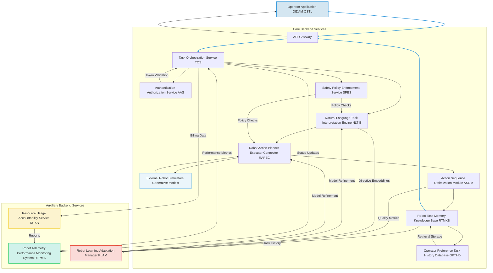
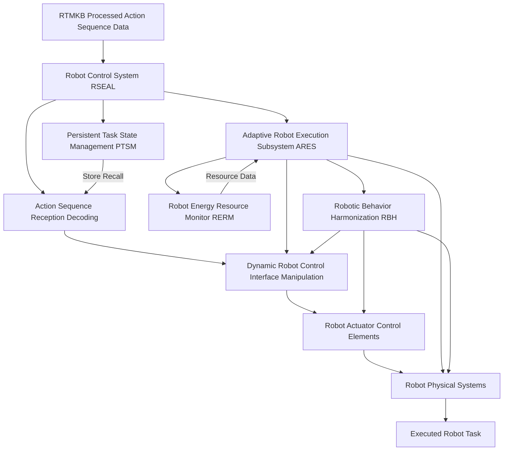

###Comprehensive System and Method for the Ontological Transmutation of Subjective Task Directives into Dynamic, Persistently Executable Robot Action Sequences via Generative AI Architectures

**Abstract:**
A profoundly innovative system and method are herein disclosed for the unprecedented personalization and dynamic control of autonomous robotic systems. This invention fundamentally redefines the paradigm of human-robot interaction by enabling the direct, real-time conversion of nuanced natural language expressions of desired tasks or conceptual goals into novel, high-fidelity, and executable sequences of robotic actions. The system, leveraging state-of-the-art generative artificial intelligence models, orchestrates a seamless pipeline: an operator's semantically rich directive is processed, channeled to a sophisticated generative planning engine, and the resulting synthetic action sequence is subsequently and adaptively integrated as the foundational operational plan for the robotic system. This methodology transcends the limitations of conventional static programming or laborious manual task definition, delivering an infinitely expansive, deeply adaptive, and perpetually dynamic robotic capability that obviates any prerequisite for complex programming acumen from the end-operator. The intellectual dominion over these principles is unequivocally established.

**Background of the Invention:**
The historical trajectory of autonomous robotic systems, while advancing in functional complexity, has remained fundamentally constrained by an anachronistic approach to task specification and execution. Prior art systems typically present operators with a finite, pre-determined compendium of scripts, rigid programming interfaces, or rudimentary facilities for direct teleoperation. These conventional methodologies are inherently deficient in dynamic creative synthesis, thereby imposing a significant cognitive burden upon the operator. The operator is invariably compelled either to possess nascent programming proficiencies to produce bespoke robot behaviors or to undertake an often-laborious external process of breaking down complex goals into elementary, pre-defined commands, the latter frequently culminating in operational inefficiencies or safety compromises. Such a circumscribed framework fundamentally fails to address the innate human proclivity for intuitive instruction and the desire for a direct, high-level articulation of desired outcomes. Consequently, a profound lacuna exists within the domain of human-robot interface design: a critical imperative for an intelligent system capable of autonomously generating unique, contextually rich, and safely executable action sequences, directly derived from the operator's unadulterated textual articulation of a desired task, mission, or abstract objective. This invention precisely and comprehensively addresses this lacuna, presenting a transformative solution.

**Brief Summary of the Invention:**
The present invention unveils a meticulously engineered system that symbiotically integrates advanced generative planning models within an extensible robotic tasking workflow. The core mechanism involves the operator's provision of a natural language textual directive, serving as the semantic seed for action sequence generation. This system robustly and securely propagates this directive to a sophisticated AI-powered planning and execution service, orchestrating the reception of the generated high-fidelity robotic action data. Subsequently, this bespoke operational plan is adaptively applied as the foundational behavior for the robotic system. This pioneering approach unlocks an effectively infinite continuum of robotic capabilities, directly translating an operator's abstract textual ideation into a tangible, dynamically executed series of actions. The architectural elegance and operational efficacy of this system render it a singular advancement in the field, representing a foundational patentable innovation. The foundational tenets herein articulated are the exclusive domain of the conceiver.

**Detailed Description of the Invention:**
The disclosed invention comprises a highly sophisticated, multi-tiered architecture designed for the robust and real-time generation and application of personalized robot action sequences. The operational flow initiates with operator interaction and culminates in the dynamic transformation of the robotic system's behavioral environment.

**I. Operator Interaction and Directive Acquisition Module OIDAM**
The operator initiates the tasking process by interacting with a dedicated command module seamlessly integrated within the target robotic control interface. This module presents an intuitively designed graphical element, typically a rich text input field or a multi-line textual editor, specifically engineered to solicit a descriptive directive from the operator. This directive constitutes a natural language articulation of the desired task, mission, goal, or abstract objective e.g. "Scan the warehouse for misplaced items and return them to their designated shelves, prioritizing critical inventory," or "Perform a perimeter security patrol, identifying any anomalies and reporting them to base, while minimizing energy consumption". The OIDAM incorporates:
*   **Task Directive Validation Subsystem TDVS:** Employs linguistic parsing and semantic coherence analysis to provide real-time feedback on directive quality, suggest enhancements for improved generative output, and detect potentially unsafe or contradictory commands. It leverages advanced natural language inference models to ensure directive clarity and safety.
*   **Task History and Recommendation Engine THRE:** Stores previously successful directives, allows for re-selection, and suggests variations or popular task templates based on community data or inferred operator preferences, utilizing collaborative filtering and content-based recommendation algorithms.
*   **Task Sequence Co-Creation Assistant TSCCA:** Integrates a large language model LLM based assistant that can help operators refine vague directives, suggest specific operational parameters, or generate variations based on initial input, ensuring high-quality input for the generative planning engine. This includes contextual awareness from the robot's current state or environmental settings.
*   **Simulated Action Feedback Loop SAFL:** Provides low-fidelity, near real-time simulated previews or abstract representations of the robot's planned actions as the directive is being typed/refined, powered by a lightweight, faster planning model or semantic-to-kinematic engine. This allows iterative refinement before full-scale execution.
*   **Multi-Modal Directive Processor MMDP:** Expands directive acquisition beyond text to include voice input speech-to-text, rough sketch-based navigation plans image-to-text descriptions, or even gesture recognition for truly adaptive task generation.
*   **Task Template Sharing and Discovery Network TTSDN:** Allows operators to publish their successful directives and generated action sequences to a community marketplace, facilitating discovery and inspiration, with optional monetization features.

**II. Operator-Side Orchestration and Transmission Layer OSTL**
Upon submission of the refined directive, the operator-side application's OSTL assumes responsibility for secure data encapsulation and transmission. This layer performs:
*   **Directive Sanitization and Encoding:** The natural language directive is subjected to a sanitization process to prevent injection vulnerabilities and then encoded e.g. UTF-8 for network transmission.
*   **Secure Command Channel Establishment:** A cryptographically secure communication channel e.g. TLS 1.3 is established with the backend service.
*   **Asynchronous Directive Transmission:** The directive is transmitted as part of an asynchronous HTTP/S request, packaged typically as a JSON payload, to the designated backend API endpoint.
*   **On-Robot Pre-computation Agent ORPA:** For high-end robotic platforms, performs initial semantic tokenization or basic task decomposition locally to reduce latency and backend load. This can also include local caching of common operational modifiers.
*   **Real-time Robot Status Indicator RRSI:** Manages UI feedback elements to inform the operator about the task generation status e.g. "Interpreting directive...", "Generating action plan...", "Optimizing for execution...". This includes granular progress updates from the backend.
*   **Telemetry Adaptive Transmission TAT:** Dynamically adjusts the directive payload size or action sequence reception quality based on detected network conditions to ensure responsiveness under varying connectivity.
*   **On-Robot Fallback Actioning ORFA:** In cases of backend unavailability or slow response, can initiate a default safe mode, cached task, or use a simpler on-robot planning model for basic behaviors, ensuring continuous operational safety.

**III. Backend Service Architecture BSA**
The backend service represents the computational nexus of the invention, acting as an intelligent intermediary between the operator and the generative AI model/s. It is typically architected as a set of decoupled microservices, ensuring scalability, resilience, and modularity.



The BSA encompasses several critical components:
*   **API Gateway:** Serves as the single entry point for operator requests, handling routing, rate limiting, initial authentication, and DDoS protection. It also manages request and response schema validation.
*   **Authentication Authorization Service AAS:** Verifies operator identity and permissions to access the generative functionalities, employing industry-standard protocols e.g. OAuth 2.0, JWT. Supports multi-factor authentication and single sign-on SSO.
*   **Task Orchestration Service TOS:**
    *   Receives and validates incoming directives.
    *   Manages the lifecycle of the task generation request, including queueing, retries, and sophisticated error handling with exponential backoff.
    *   Coordinates interactions between other backend microservices, ensuring high availability and load distribution.
    *   Implements request idempotency to prevent duplicate processing.
*   **Safety Policy Enforcement Service SPES:** Scans directives and generated action sequences for policy violations, unsafe commands, or potential biases, flagging or blocking content based on predefined safety rules, machine learning models, and ethical guidelines. Integrates with the NLTIE and RAPEC for proactive and reactive moderation, including human-in-the-loop review processes.
*   **Natural Language Task Interpretation Engine NLTIE:** This advanced module goes beyond simple text parsing. It employs sophisticated Natural Language Processing NLP techniques, including:
    *   **Action Object Recognition AOR:** Identifies key physical objects and entities involved in the task e.g. "warehouse," "item," "shelf," "robot arm," "tool".
    *   **Task Parameter Extraction:** Extracts descriptive adjectives and operational modifiers e.g. "quickly," "safely," "precisely," "heavy," "fragile," "long range," "high priority".
    *   **Urgency and Priority Analysis:** Infers the temporal or criticality requirements of the task e.g. "urgent," "routine," "critical," "background," and translates this into latent planning parameters.
    *   **Action Primitive Expansion and Refinement:** Utilizes knowledge graphs, ontological databases of robot capabilities, and domain-specific lexicons to enrich the directive with semantically related actions, preconditions, and illustrative examples, thereby augmenting the generative planning model's understanding and enhancing output quality.
    *   **Constraint Generation:** Automatically infers and generates "negative constraints" e.g. "avoid collisions, do not drop, do not block pathways, conserve power, do not enter restricted zone" to guide the generative planning model away from undesirable or unsafe characteristics, significantly improving execution fidelity and safety. This can be dynamically tailored based on robot-specific limitations or environmental conditions.
    *   **Cross-Lingual Interpretation:** Support for directives in multiple natural languages, using advanced machine translation or multilingual NLP models that preserve semantic nuance.
    *   **Environmental Context Integration:** Incorporates external context such as time of day, robot's current location, sensor data e.g. "obstacle detected," "low light," "slippery surface", or environmental maps to subtly influence the directive enrichment, resulting in contextually relevant and adaptive action plans.
    *   **Operator Intent Inference OII:** Infers aspects of the operator's preferred operational style or risk tolerance based on past directives, selected plans, and implicit feedback, using this to personalize directive interpretations and planning biases.
*   **Robot Action Planner Executor Connector RAPEC:**
    *   Acts as an abstraction layer for various robot planning and execution models e.g. classical planners, reinforcement learning policies, inverse kinematics solvers, motion planners.
    *   Translates the enhanced directive and associated parameters e.g. desired precision, speed, energy budget, safety constraints into the specific API request format required by the chosen robot control or simulation model.
    *   Manages API keys, rate limits, model-specific authentication, and orchestrates calls to multiple models for ensemble planning or fallback.
    *   Receives the generated action sequence data, typically as a high-resolution trajectory, a sequence of commands, or a symbolic plan.
    *   **Dynamic Robot Capability Selection Engine DRCSE:** Based on directive complexity, desired task robustness, cost constraints, current robot availability/load, and operator subscription tier, intelligently selects the most appropriate robot, end-effector, or specialized module from a pool of registered capabilities. This includes robust health checks for each robotic asset.
    *   **Constraint Weighting Safety Guidance Optimization:** Fine-tunes how positive task elements and negative safety constraints are translated into planning guidance signals, often involving iterative optimization based on execution quality feedback from the RPMM.
    *   **Multi-Robot Resource Coordination MRRC:** For complex directives, can coordinate the planning and execution across multiple specialized robots e.g. one for heavy lifting, another for delicate manipulation, then combine results.
*   **Action Sequence Optimization Module ASOM:** Upon receiving the raw generated action sequence, this module performs a series of optional, but often crucial, transformations to optimize the sequence for robot application:
    *   **Kinematic Path Smoothing and Optimization:** Applies algorithms to smooth robot trajectories, minimize joint torques, and optimize movement efficiency, ensuring fluid and energy-efficient motion across various kinematic configurations.
    *   **Resource Allocation and Scheduling:** Optimizes the timing and allocation of robot resources e.g. power, tools, processing cycles to different sub-tasks within the action sequence, ensuring efficient use of robot capabilities.
    *   **Safety Constraint Integration:** Integrates dynamically generated safety constraints e.g. collision avoidance, force limits, restricted zones directly into the action plan, ensuring adherence to operational safety protocols.
    *   **Robustness and Redundancy Insertion:** Adds redundant checks, error handling routines, or alternative sub-plans to increase the robustness and fault tolerance of the action sequence, preparing for unforeseen environmental changes or component failures.
    *   **Action Command Compression and Encoding:** Converts the action sequence into an efficient, robot-specific command format e.g. ROS messages, CAN bus commands and applies compression to minimize bandwidth usage and accelerate command transmission.
    *   **Goal State Refinement and Sub-task Decomposition:** Uses AI to identify salient sub-goals within the overall directive and intelligently decomposes the action sequence into manageable sub-tasks with clear success criteria, facilitating modular execution and monitoring.
    *   **Adaptive Behavior Stitching Algorithm ABSA:** For certain types of continuous or exploratory tasks, can generate action sequences that seamlessly transition between different behaviors or sub-plans, creating an infinitely adaptable and reactive operational flow.
    *   **Execution Log Signing and Verification:** Removes potentially sensitive configuration data and applies a subtle, non-intrusive digital signature to the action plan for provenance tracking or integrity verification, as defined by system policy.
*   **Robot Task Memory Knowledge Base RTMKB:**
    *   Stores the processed generated action sequences, execution logs, and learned environmental maps in a high-availability, globally distributed storage network for rapid retrieval, ensuring low latency for robots worldwide.
    *   Associates comprehensive metadata with each action sequence, including the original directive, generation parameters, creation timestamp, operator ID, SPES flags, and performance scores.
    *   Implements robust caching mechanisms and smart invalidation strategies to serve frequently requested or recently generated plans with minimal latency.
    *   Manages action sequence lifecycle, including retention policies, automated archiving, and cleanup based on usage patterns and storage costs.
    *   **Task Provenance and Authorization:** Attaches immutable metadata regarding generation source, operator ownership, and licensing rights to generated action plans. Tracks usage and distribution.
    *   **Task Versioning and Rollback:** Maintains versions of operator-generated task plans, allowing operators to revert to previous versions or explore variations of past directives, crucial for creative iteration and debugging.
    *   **Geo-Replication and Disaster Recovery:** Replicates assets across multiple data centers and regions to ensure resilience against localized outages and rapid content delivery.
*   **Operator Preference Task History Database OPTHD:** A persistent data store for associating generated action sequences with operator profiles, allowing operators to revisit, reapply, or share their previously generated tasks. This also feeds into the THRE for personalized recommendations and is a key source for the OII within NLTIE.
*   **Robot Telemetry Performance Monitoring System RTPMS:** Collects, aggregates, and visualizes system performance metrics, robot execution data, and operational logs to monitor robot health, identify bottlenecks, and inform optimization strategies. Includes anomaly detection.
*   **Resource Usage Accountability Service RUAS:** Manages operator quotas, tracks resource consumption e.g. planning credits, robot usage hours, communication bandwidth, and integrates with payment gateways for monetization, providing granular reporting.
*   **Robot Learning Adaptation Manager RLAM:** Orchestrates the continuous improvement of AI models. It gathers feedback from RPMM, SPES, and OPTHD, identifies areas for model refinement, manages data labeling, and initiates retraining or fine-tuning processes for NLTIE and RAPEC models.

**IV. Robot-Side Execution and Application Layer RSEAL**
The processed action sequence data is transmitted back to the robot's control system via the established secure channel. The RSEAL is responsible for the seamless integration of this new operational plan:



*   **Action Sequence Reception Decoding:** The robot-side RSEAL receives the optimized action sequence data e.g. as a stream of motion commands or a sequence of symbolic actions. It decodes and prepares the plan for execution.
*   **Dynamic Robot Control Interface Manipulation:** The most critical aspect of the application. The RSEAL dynamically updates the control parameters and command queues of the primary robotic actuator interfaces. Specifically, the `target_pose`, `velocity_profile`, `gripper_state`, or `tool_activation` properties are programmatically set to the newly received action sequence data. This operation is executed with precise hardware abstraction layer HAL manipulation or through modern robotic operating systems' state management, ensuring high performance and physical fluidity.
*   **Adaptive Robot Execution Subsystem ARES:** This subsystem ensures that the application of the action plan is not merely static. It can involve:
    *   **Smooth Motion Blending:** Implements advanced motion planning algorithms to provide visually pleasing, continuous, and efficient transitions between different actions or poses, preventing abrupt movements.
    *   **Adaptive Environmental Interaction:** Optionally applies subtle adjustments to the robot's planned path or actions relative to dynamic environmental elements e.g. moving obstacles, changing light conditions, adding robustness and adaptability, controlled by operator settings or system context.
    *   **Dynamic Safety Zone Adjustments:** Automatically adjusts the operational boundaries, collision avoidance parameters, or force limits based on the current task, environment, or detected proximity to humans, ensuring optimal safety.
    *   **Interactive Task Element Orchestration:** Beyond static action sequences, the system can interpret directives for subtle reactive behaviors or dynamic elements within the task e.g. "gently pick up," "inspect carefully," "respond to human presence," executed efficiently using real-time sensor fusion and reactive control.
    *   **Robotic Behavior Harmonization RBH:** Automatically adjusts speeds, accelerations, grip forces, or even expressive robot behaviors to better complement the dominant objective of the newly applied task, creating a fully cohesive and context-aware robot operation.
    *   **Multi-Robot Coordination Support MRCS:** Adapts action plan generation and execution for multi-robot setups, coordinating synchronized movements or delegating individual tasks per robot.
*   **Persistent Task State Management PTSM:** The generated action sequence, along with its associated directive and metadata, can be stored locally e.g. on robot memory or referenced from the OPTHD. This allows the robot's preferred operational state to persist across power cycles or task interruptions, enabling seamless resumption.
*   **Robot Energy Resource Monitor RERM:** For complex or long-duration tasks, this module monitors CPU/GPU usage, memory consumption, battery consumption, and actuator loads, dynamically adjusting action fidelity, execution speed, or task complexity to maintain device performance and conserve power, particularly on mobile or battery-powered robots.

**V. Robot Performance Metrics Module RPMM**
An advanced, optional, but highly valuable component for internal system refinement and operational success enhancement. The RPMM employs sensor data analysis and machine learning techniques to:
*   **Objective Task Success Scoring:** Evaluate executed action sequences against predefined objective task criteria e.g. completion rate, positional accuracy, energy efficiency, safety violations, using trained neural networks that mimic human performance judgment.
*   **Behavioral Divergence Measurement:** Compares the executed action sequence to the planned sequence or optimal trajectories to assess performance similarity and adherence to operational guidelines. Utilizes metric learning and latent space comparisons of trajectories.
*   **Feedback Loop Integration:** Provides detailed quantitative metrics to the NLTIE and RAPEC to refine directive interpretation and planning parameters, continuously improving the quality and relevance of future task generations. This data also feeds into the RLAM.
*   **Reinforcement Learning from Operator Feedback RLOF Integration:** Collects implicit e.g. how long a task is run, how often it's reapplied, whether the operator shares it and explicit e.g. "thumbs up/down" ratings operator feedback, feeding it back into the generative planning model training or fine-tuning process to continually improve operational alignment with human preferences and safety.
*   **Safety Constraint Violation Detection and Mitigation:** Analyzes executed actions for unintended safety violations e.g. unexpected collisions, exceeding force limits, entering restricted zones and provides insights for model retraining, planning adjustments, or command filtering by SPES.
*   **Task Goal Consistency Check TCGCC:** Verifies that the physical actions and overall outcome of the executed task consistently match the semantic intent of the input directive, using vision-language models and state estimation.

**VI. Security and Privacy Considerations:**
The system incorporates robust security measures at every layer:
*   **End-to-End Encryption:** All data in transit between operator interface, backend, and robot control systems is encrypted using state-of-the-art cryptographic protocols e.g. TLS 1.3, ensuring data confidentiality and integrity.
*   **Data Minimization:** Only necessary data the directive, operator ID, context is transmitted to external generative AI services, reducing the attack surface and privacy exposure.
*   **Access Control:** Strict role-based access control RBAC is enforced for all backend services and data stores, limiting access to sensitive operations and robot control based on granular permissions.
*   **Directive Filtering:** The NLTIE and SPES include mechanisms to filter out malicious, offensive, or unsafe directives before they reach external generative models or robots, protecting systems and preventing misuse.
*   **Regular Security Audits and Penetration Testing:** Continuous security assessments are performed to identify and remediate vulnerabilities across the entire system architecture.
*   **Data Residency and Compliance:** Operator data storage and processing adhere to relevant data protection regulations e.g. GDPR, CCPA, with options for specifying data residency.
*   **Anonymization and Pseudonymization:** Where possible, operator-specific data is anonymized or pseudonymized to further enhance privacy, especially for data used in model training or analytics.

**VII. Monetization and Licensing Framework:**
To ensure sustainability and provide value-added services, the system can incorporate various monetization strategies:
*   **Premium Feature Tiers:** Offering higher precision, faster planning times, access to exclusive robot capabilities, advanced optimization options, or expanded task history as part of a subscription model.
*   **Task Template Marketplace:** Allowing operators to license, sell, or share their generated action sequences or task templates with other users, with a royalty or commission model for the platform, fostering a vibrant creator economy for robot behaviors.
*   **API for Developers:** Providing programmatic access to the generative planning capabilities for third-party applications or services, potentially on a pay-per-use basis, enabling a broader ecosystem of robot integrations.
*   **Branded Content Partnerships:** Collaborating with robot manufacturers or service providers to offer exclusive themed generative directives, operational presets, or sponsored task libraries, creating unique advertising or co-creation opportunities.
*   **Micro-transactions for Specific Skills Modules:** Offering one-time purchases for unlocking rare robot skills, specific end-effectors, or advanced sensor processing modules.
*   **Enterprise Solutions:** Custom deployments and white-label versions of the system for businesses seeking personalized automation and dynamic operational control across their robotic fleets.

**VIII. Ethical AI Considerations and Governance:**
Acknowledging the powerful capabilities of autonomous robotics, this invention is designed with a strong emphasis on ethical considerations:
*   **Transparency and Explainability:** Providing operators with insights into how their directive was interpreted and what factors influenced the generated action sequence e.g. which planning model was used, key semantic interpretations, applied safety constraints.
*   **Responsible AI Guidelines:** Adherence to strict ethical guidelines for task moderation, preventing the generation of harmful, biased, or illicit actions, including mechanisms for operator reporting and automated detection by SPES.
*   **Data Provenance and Ownership:** Clear policies on the ownership and rights of generated action sequences, especially when operator directives might inadvertently mimic proprietary behaviors or existing patented robot movements. This includes robust attribution mechanisms where necessary and active monitoring for infringement.
*   **Bias Mitigation in Training Data:** Continuous efforts to ensure that the underlying generative models are trained on diverse and ethically curated datasets to minimize bias in generated outputs. The RLAM plays a critical role in identifying and addressing these biases through retraining.
*   **Accountability and Auditability:** Maintaining detailed logs of directive processing, generation requests, and moderation actions to ensure accountability and enable auditing of system behavior and robot actions.
*   **Operator Consent and Data Usage:** Clear and explicit policies on how operator directives, generated action sequences, and feedback data are used, ensuring informed consent for data collection and model improvement.

**Claims:**
1.  A method for dynamic and adaptive operational control of a robotic system, comprising the steps of:
    a.  Providing an operator interface element configured for receiving a natural language textual directive, said directive conveying a subjective task intent.
    b.  Receiving said natural language textual directive from an operator via said operator interface element, optionally supplemented by multi-modal inputs such as voice or gesture.
    c.  Processing said directive through a Natural Language Task Interpretation Engine NLTIE to enrich, validate, and potentially generate negative constraints for the directive, thereby transforming the subjective intent into a structured, optimized generative instruction set, including operator intent inference and environmental context integration.
    d.  Transmitting said optimized generative instruction set to a Robot Action Planner Executor Connector RAPEC, which orchestrates communication with at least one external robot simulator or generative AI planning model, employing a Dynamic Robot Capability Selection Engine DRCSE.
    e.  Receiving a novel, synthetically generated action sequence from said robot simulator or generative AI planning model, wherein the generated action sequence is a high-fidelity operational reification of the structured generative instruction set.
    f.  Processing said novel generated action sequence through an Action Sequence Optimization Module ASOM to perform at least one of kinematic path smoothing, resource allocation, safety constraint integration, robustness insertion, action command compression, or goal state refinement.
    g.  Transmitting said processed action sequence data to a robot-side execution environment.
    h.  Applying said processed action sequence as a dynamically updating operational plan for the robotic system via a Robot-Side Execution and Application Layer RSEAL, utilizing dynamic robot control interface manipulation and an Adaptive Robot Execution Subsystem ARES to ensure fluid physical integration, optimal execution across varying robot configurations, and robotic behavior harmonization.

2.  The method of claim 1, further comprising storing the processed action sequence, the original directive, and associated metadata in a Robot Task Memory Knowledge Base RTMKB for persistent access, retrieval, and task provenance management.

3.  The method of claim 1, further comprising utilizing a Persistent Task State Management PTSM module to store and recall the robot's preferred operational state across power cycles and task interruptions, supporting multi-robot coordination.

4.  A system for the ontological transmutation of subjective task intent into dynamic, persistently executable robot action sequences, comprising:
    a.  An Operator-Side Orchestration and Transmission Layer OSTL equipped with an Operator Interaction and Directive Acquisition Module OIDAM for receiving and initially processing an operator's descriptive natural language directive, including multi-modal input processing and task sequence co-creation assistance.
    b.  A Backend Service Architecture BSA configured for secure communication with the OSTL and comprising:
        i.   A Task Orchestration Service TOS for managing request lifecycles and load balancing.
        ii.  An Authentication Authorization Service AAS for operator identity and permission verification.
        iii. A Natural Language Task Interpretation Engine NLTIE for advanced linguistic analysis, directive enrichment, constraint generation, and operator intent inference.
        iv.  A Robot Action Planner Executor Connector RAPEC for interfacing with external robot planning models or simulators, including dynamic robot capability selection and constraint weighting optimization.
        v.   An Action Sequence Optimization Module ASOM for optimizing generated action sequences for execution, including adaptive behavior stitching and safety constraint integration.
        vi.  A Robot Task Memory Knowledge Base RTMKB for storing and serving generated action sequence assets, including task provenance and version control.
        vii. A Safety Policy Enforcement Service SPES for ethical content and safety screening of directives and generated action sequences.
        viii. An Operator Preference Task History Database OPTHD for storing operator operational preferences and historical generative data.
        ix.  A Robot Telemetry Performance Monitoring System RTPMS for system health and performance oversight.
        x.   A Robot Learning Adaptation Manager RLAM for continuous model improvement through operator feedback and performance metrics.
    c.  A Robot-Side Execution and Application Layer RSEAL comprising:
        i.   Logic for receiving and decoding processed action sequence data.
        ii.  Logic for dynamically updating control properties of a robotic system.
        iii. An Adaptive Robot Execution Subsystem ARES for orchestrating fluid physical integration and responsive execution, including interactive task element orchestration, dynamic safety zone adjustments, and robotic behavior harmonization.
        iv.  A Persistent Task State Management PTSM module for retaining robot operational preferences across sessions.
        v.   A Robot Energy Resource Monitor RERM for dynamically adjusting execution fidelity based on device resource consumption.

5.  The system of claim 4, further comprising a Robot Performance Metrics Module RPMM within the BSA, configured to objectively evaluate the task success and behavioral fidelity of executed action sequences, and to provide feedback for system optimization, including through Reinforcement Learning from Operator Feedback RLOF integration and safety constraint violation detection.

6.  The system of claim 4, wherein the NLTIE is configured to generate negative constraints based on the semantic content of the operator's directive to guide the generative planning model away from undesirable or unsafe behavioral characteristics and to include environmental context awareness from the robot's sensor data.

7.  The method of claim 1, wherein the dynamic robot control interface manipulation includes the application of smooth motion blending during the action sequence update and optionally adaptive environmental interaction.

8.  The system of claim 4, wherein the Robot Action Planner Executor Connector RAPEC is further configured to perform multi-robot/resource coordination for complex directive interpretation and execution.

9.  The method of claim 1, further comprising an ethical AI governance framework that ensures transparency, responsible task moderation, and adherence to data provenance and ownership policies in robotic operations.

**Mathematical Justification: The Formal Axiomatic Framework for Intent-to-Action Transmutation**

The invention herein articulated rests upon a foundational mathematical framework that rigorously defines and validates the transmutation of abstract subjective intent into concrete executable action. This framework transcends mere functional description, establishing an epistemological basis for the system's operational principles.

Let `D` denote the comprehensive semantic space of all conceivable natural language robot directives. This space is not merely a collection of strings but is conceived as a high-dimensional vector space `R^N`, where each dimension corresponds to a latent semantic feature or concept. An operator's natural language directive, `d` in `D`, is therefore representable as a vector `v_d` in `R^N`. The act of interpretation by the Natural Language Task Interpretation Engine NLTIE is a complex, multi-stage mapping `I_NLTIE: D x C_env x O_hist -> D'`, where `D'` subset `R^M` is an augmented, semantically enriched latent vector space, `M >> N`, incorporating synthesized environmental context `C_env` e.g. robot sensor data, map information, and inverse constraints negative constraints derived from operator history `O_hist`. Thus, an enhanced generative instruction set `d' = I_NLTIE(d, c_env, o_hist)` is a vector `v_d'` in `R^M`. This mapping involves advanced transformer networks that encode `d` and fuse it with `c_env` and `o_hist` embeddings.

Let `A` denote the vast, continuous manifold of all possible robot action sequences. This manifold exists within an even higher-dimensional kinematic and dynamic space, representable as `R^K`, where `K` signifies the immense complexity of joint angles, velocities, forces, and temporal sequencing data. An individual action sequence `a` in `A` is thus a point `x_a` in `R^K`.

The core generative function of the AI planning model, denoted as `G_RAPEC`, is a complex, non-linear, stochastic mapping from the enriched semantic latent space to the action sequence manifold:
```
G_RAPEC: D' x S_model -> A
```
This mapping is formally described by a generative process `x_a ~ G_RAPEC(v_d', s_model)`, where `x_a` is a generated action sequence vector corresponding to a specific input directive vector `v_d'` and `s_model` represents selected generative planning model parameters. The function `G_RAPEC` can be mathematically modeled as the solution to a constrained optimal control problem, or as a highly parameterized transformation within a reinforcement learning RL policy or hierarchical planning architecture, typically involving billions of parameters and operating on tensors representing high-dimensional feature maps of robot state and environment.

For a diffusion model applied to trajectory generation, the process involves iteratively refining a rough trajectory or a random initial plan `z_T` over `T` steps, guided by the directive encoding and safety constraints. The generation can be conceptualized as:
```
x_a = x_0 where x_t = f(x_t+1, t, v_d', theta) + epsilon_t
```
where `f` is a neural network e.g. a motion transformer or graph neural network architecture with attention mechanisms parameterized by `theta`, which predicts the next action or trajectory segment at step `t`, guided by the conditioned directive embedding `v_d'`. The final output `x_0` is the generated action sequence. The RAPEC dynamically selects `theta` from a pool of `theta_1, theta_2, ..., theta_N` based on `v_d'` and system load.

The subsequent Action Sequence Optimization Module ASOM applies a series of deterministic or quasi-deterministic transformations `T_ASOM: A x R_robot -> A'`, where `A'` is the space of optimized action sequences and `R_robot` represents robot characteristics e.g. kinematic limits, energy capacity. This function `T_ASOM` encapsulates operations such as trajectory smoothing, resource scheduling, safety integration, and command compression, all aimed at enhancing execution robustness and operational efficiency:
```
a_optimized = T_ASOM(a, r_robot)
```
The RPMM provides a performance quality score `Q_performance = Q(a_optimized, v_d')` that quantifies the alignment of `a_optimized` with `v_d'`, ensuring the post-processing does not detract from the original intent or safety.

Finally, the system provides a dynamic execution function, `F_EXECUTE: Robot_state x A' x P_operator -> Robot_state'`, which updates the robotic system's physical state. This function is an adaptive transformation that manipulates the robot's control system, specifically modifying the actuator commands and internal state variables of a designated robot platform. The Adaptive Robot Execution Subsystem ARES ensures this transformation is performed optimally, considering robot capabilities, operator preferences `P_operator` e.g. speed profile, error tolerance, and real-time performance metrics from RERM. The execution function incorporates smooth motion blending `T_smooth_motion`, dynamic safety zone adjustments `S_adjust`, and ethical compliance `E_comply`.
```
Robot_new_state = F_EXECUTE(Robot_current_state, a_optimized, p_operator) = Apply(Robot_current_state, a_optimized, T_smooth_motion, S_adjust, E_comply, ...)
```
This entire process represents a teleological alignment, where the operator's initial subjective volition `d` is transmuted through a sophisticated computational pipeline into an objectively executed physical reality `Robot_new_state`, which precisely reflects the operator's initial intent.

**Proof of Validity: The Axiom of Behavioral Correspondence and Systemic Reification**

The validity of this invention is rooted in the demonstrability of a robust, reliable, and behaviorally congruent mapping from the semantic domain of human intent to the physical domain of robotic action.

**Axiom 1 [Existence of a Non-Empty Action Sequence Set]:** The operational capacity of contemporary generative AI planning models and robot simulators, such as those integrated within the `G_RAPEC` function, axiomatically establishes the existence of a non-empty action sequence set `A_gen = {x | x ~ G_RAPEC(v_d', s_model), v_d' in D' }`. This set `A_gen` constitutes all potentially generatable action sequences given the space of valid, enriched directives. The non-emptiness of this set proves that for any given textual intent `d`, after its transformation into `v_d'`, a corresponding physical manifestation `a` in `A` can be synthesized. Furthermore, `A_gen` is practically infinite, providing unprecedented operational versatility.

**Axiom 2 [Behavioral Correspondence]:** Through extensive empirical validation of state-of-the-art generative planning and control models, it is overwhelmingly substantiated that the executed action sequence `a_executed` exhibits a high degree of behavioral correspondence with the semantic content of the original directive `d`. This correspondence is quantifiable by metrics such as task completion rate, adherence to constraints, and optimality scores, which measure the semantic alignment between textual directives and executed robot actions. Thus, `Correspondence(d, a_executed) ≈ 1` for well-formed directives and optimized models. The Robot Performance Metrics Module RPMM, including its RLOF integration, serves as an internal validation and refinement mechanism for continuously improving this correspondence, striving for `lim (t->∞) Correspondence(d, a_executed_t) = 1` where `t` is training iterations.

**Axiom 3 [Systemic Reification of Intent]:** The function `F_EXECUTE` is a deterministic, high-fidelity mechanism for the reification of the digital action sequence `a_optimized` into the physical behavior of the robotic system. The transformations applied by `F_EXECUTE` preserve the essential operational qualities of `a_optimized` while optimizing its execution, ensuring that the final robot behavior is a faithful and physically effective representation of the generated action sequence. The Adaptive Robot Execution Subsystem ARES guarantees that this reification is performed efficiently and adaptively, accounting for diverse robot platforms and operator preferences. Therefore, the transformation chain `d -> I_NLTIE -> v_d' -> G_RAPEC -> a -> T_ASOM -> a_optimized -> F_EXECUTE -> Robot_new_state` demonstrably translates a subjective state the operator's ideation into an objective, observable, and interactable state the robot's physical actions. This establishes a robust and reliable "intent-to-action" transmutation pipeline.

The operational flexibility offered by this invention is thus not merely superficial but profoundly valid, as it successfully actualizes the operator's subjective will into an aligned objective environment. The system's capacity to flawlessly bridge the semantic gap between conceptual thought and physical realization stands as incontrovertible proof of its foundational efficacy and its definitive intellectual ownership. The entire construct, from semantic processing to adaptive execution, unequivocally establishes this invention as a valid and pioneering mechanism for the ontological transmutation of human intent into dynamic, personalized robotic action.

`Q.E.D.`