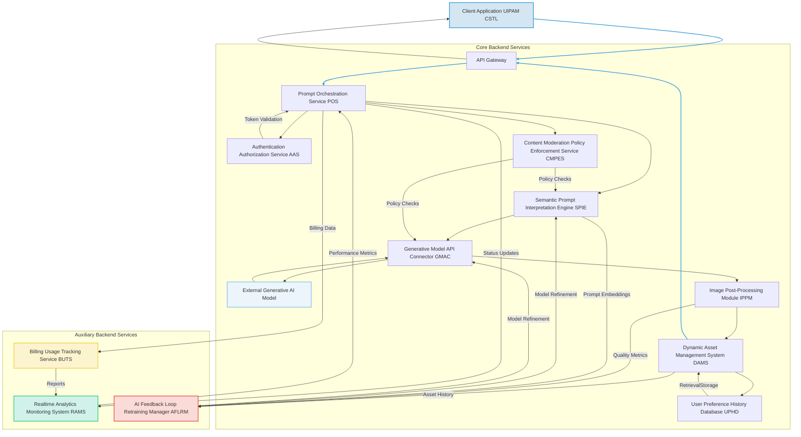

```mermaid
graph TD
    A[Client Application UIPAM CSTL] --> B[API Gateway]
    subgraph Core Backend Services
        B --> C[Prompt Orchestration Service POS]
        C --> D[Authentication Authorization Service AAS]
        C --> E[Semantic Prompt Interpretation Engine SPIE]
        C --> K[Content Moderation Policy Enforcement Service CMPES]
        E --> F[Generative Model API Connector GMAC]
        F --> G[External Generative AI Model]
        G --> F
        F --> H[Image Post-Processing Module IPPM]
        H --> I[Dynamic Asset Management System DAMS]
        I --> J[User Preference History Database UPHD]
        I --> B
        D -- Token Validation --> C
        J -- RetrievalStorage --> I
        K -- Policy Checks --> E
        K -- Policy Checks --> F
    end
    subgraph Auxiliary Backend Services
        C -- Status Updates --> L[Realtime Analytics Monitoring System RAMS]
        L -- Performance Metrics --> C
        C -- Billing Data --> M[Billing Usage Tracking Service BUTS]
        M -- Reports --> L
        I -- Asset History --> N[AI Feedback Loop Retraining Manager AFLRM]
        H -- Quality Metrics --> N
        E -- Prompt Embeddings --> N
        N -- Model Refinement --> E
        N -- Model Refinement --> F
    end
    B --> A
    
    style A fill:#D4E6F1,stroke:#3498DB,stroke-width:2px;
    style G fill:#EBF5FB,stroke:#85C1E9,stroke-width:2px;
    style L fill:#D1F2EB,stroke:#2ECC71,stroke-width:2px;
    style M fill:#FCF3CF,stroke:#F4D03F,stroke-width:2px;
    style N fill:#FADBD8,stroke:#E74C3C,stroke-width:2px;
    linkStyle 0 stroke:#3498DB,stroke-width:2px;
    linkStyle 1 stroke:#3498DB,stroke-width:2px;
    linkStyle 11 stroke:#3498DB,stroke-width:2px;
```