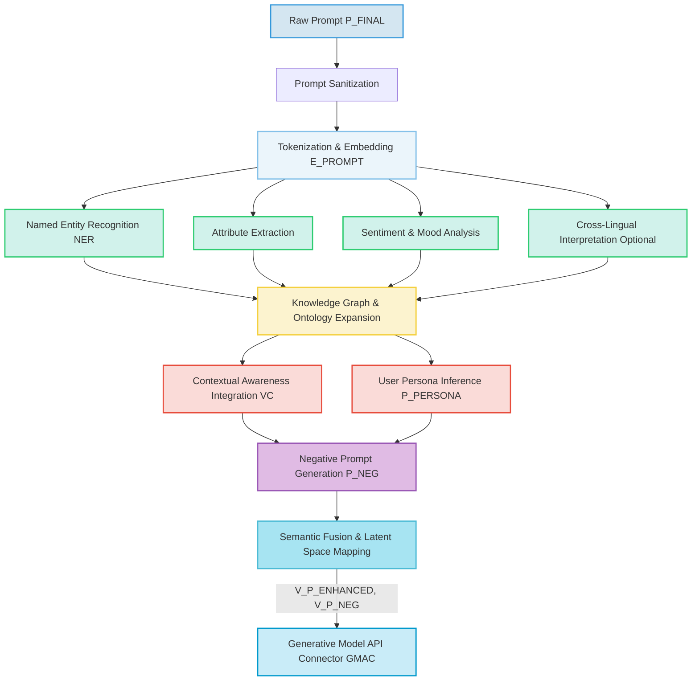

### Refactored Semantic Prompt Interpretation Engine SPIE Diagram

```mermaid
graph TD
    A[Raw Prompt P_FINAL] --> B[Prompt Sanitization];
    B --> C[Tokenization & Embedding E_PROMPT];
    C --> D[Named Entity Recognition NER];
    C --> E[Attribute Extraction];
    C --> F[Sentiment & Mood Analysis];
    C --> G[Cross-Lingual Interpretation Optional];
    D & E & F & G --> H[Knowledge Graph & Ontology Expansion];
    H --> I[Contextual Awareness Integration VC];
    H --> J[User Persona Inference P_PERSONA];
    I & J --> K[Negative Prompt Generation P_NEG];
    K --> L[Semantic Fusion & Latent Space Mapping];
    L -- V_P_ENHANCED, V_P_NEG --> M[Generative Model API Connector GMAC];

    style A fill:#D4E6F1,stroke:#3498DB,stroke-width:2px;
    style C fill:#EBF5FB,stroke:#85C1E9,stroke-width:2px;
    style D fill:#D1F2EB,stroke:#2ECC71,stroke-width:2px;
    style E fill:#D1F2EB,stroke:#2ECC71,stroke-width:2px;
    style F fill:#D1F2EB,stroke:#2ECC71,stroke-width:2px;
    style G fill:#D1F2EB,stroke:#2ECC71,stroke-width:2px;
    style H fill:#FCF3CF,stroke:#F4D03F,stroke-width:2px;
    style I fill:#FADBD8,stroke:#E74C3C,stroke-width:2px;
    style J fill:#FADBD8,stroke:#E74C3C,stroke-width:2px;
    style K fill:#E0BBE4,stroke:#9B59B6,stroke-width:2px;
    style L fill:#A7E4F2,stroke:#4DBBD5,stroke-width:2px;
    style M fill:#C9ECF8,stroke:#0099CC,stroke-width:2px;
```