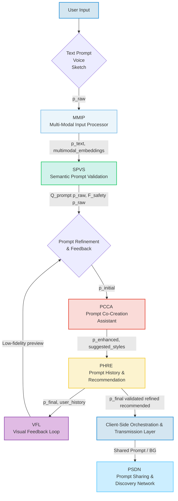

```mermaid
graph TD
    A[User Input] --> B{Text Prompt <br> Voice <br> Sketch};
    B -- p_raw --> C[MMIP <br> Multi-Modal Input Processor];
    C -- p_text, multimodal_embeddings --> D[SPVS <br> Semantic Prompt Validation];
    D -- Q_prompt p_raw, F_safety p_raw --> E{Prompt Refinement <br> & Feedback};
    E -- p_initial --> F[PCCA <br> Prompt Co-Creation Assistant];
    F -- p_enhanced, suggested_styles --> G[PHRE <br> Prompt History & Recommendation];
    G -- p_final, user_history --> H[VFL <br> Visual Feedback Loop];
    H -- Low-fidelity preview --> E;
    G -- p_final validated refined recommended --> I[Client-Side Orchestration & Transmission Layer];
    I -- Shared Prompt / BG --> J[PSDN <br> Prompt Sharing & Discovery Network];

    style A fill:#D4E6F1,stroke:#3498DB,stroke-width:2px;
    style C fill:#EBF5FB,stroke:#85C1E9,stroke-width:2px;
    style D fill:#D1F2EB,stroke:#2ECC71,stroke-width:2px;
    style F fill:#FADBD8,stroke:#E74C3C,stroke-width:2px;
    style G fill:#FCF3CF,stroke:#F4D03F,stroke-width:2px;
    style H fill:#E0BBE4,stroke:#9B59B6,stroke-width:2px;
    style I fill:#D4E6F1,stroke:#3498DB,stroke-width:2px;
    style J fill:#CCEEFF,stroke:#66CCFF,stroke-width:2px;
```