### Comprehensive System and Method for the Ontological Transmutation of Subjective Narrative Intent into Dynamic, Interactively Rendered Textual Content via Generative AI Architectures

**Abstract:**
A profoundly innovative system and method are herein disclosed for the unprecedented personalization and generation of textual narratives. This invention fundamentally redefines the paradigm of human-computer interaction by enabling the direct, real-time conversion of nuanced natural language expressions of desired plot points, character traits, stylistic preferences, or conceptual scenes into novel, high-fidelity narrative content. The system, leveraging state-of-the-art generative artificial intelligence models, particularly Large Language Models LLMs, orchestrates a seamless pipeline: a user's semantically rich prompt is processed, channeled to a sophisticated generative engine, and the resulting synthetic narrative is subsequently and adaptively integrated as interactive textual content for consumption. This methodology transcends the limitations of conventional static content creation, delivering an infinitely expansive, deeply immersive, and perpetually dynamic storytelling experience that obviates any prerequisite for literary acumen from the end-user. The intellectual dominion over these principles is unequivocally established.

**Background of the Invention:**
The historical trajectory of narrative creation, while advancing in distribution and accessibility, has remained fundamentally constrained by an anachronistic approach to personalized and dynamic content generation. Prior art systems typically present users with a finite, pre-determined compendium of stories, rigid plotlines, or rudimentary facilities for outlining static, pre-existing narratives. These conventional methodologies are inherently deficient in dynamic creative synthesis, thereby imposing a significant cognitive burden upon the user. The user is invariably compelled either to possess nascent literary proficiencies to produce bespoke narratives or to undertake an often-laborious external search for suitable content, the latter frequently culminating in copyright infringement or aesthetic compromise. Such a circumscribed framework fundamentally fails to address the innate human proclivity for individual expression and the desire for an exosomatic manifestation of internal subjective states and narrative desires. Consequently, a profound lacuna exists within the domain of digital content creation: a critical imperative for an intelligent system capable of autonomously generating unique, contextually rich, and aesthetically resonant narrative content, directly derived from the user's unadulterated textual articulation of desired plot points, character archetypes, or abstract story concepts. This invention precisely and comprehensively addresses this lacuna, presenting a transformative solution.

**Brief Summary of the Invention:**
The present invention unveils a meticulously engineered system that symbiotically integrates advanced generative language models within an extensible narrative content generation workflow. The core mechanism involves the user's provision of a natural language textual prompt, serving as the semantic seed for narrative generation. This system robustly and securely propagates this prompt to a sophisticated AI-powered narrative generation service, orchestrating the reception of the generated high-fidelity textual data. Subsequently, this bespoke narrative artifact is adaptively applied as dynamic textual content, potentially incorporating interactive elements. This pioneering approach unlocks an effectively infinite continuum of narrative personalization options, directly translating a user's abstract textual ideation into a tangible, dynamically rendered story or interactive experience. The architectural elegance and operational efficacy of this system render it a singular advancement in the field, representing a foundational patentable innovation. The foundational tenets herein articulated are the exclusive domain of the conceiver.

**Detailed Description of the Invention:**
The disclosed invention comprises a highly sophisticated, multi-tiered architecture designed for the robust and real-time generation and application of personalized narrative content. The operational flow initiates with user interaction and culminates in the dynamic transformation of the digital literary environment.

**I. User Interaction and Plot Acquisition Module (NIPAM)**
The user initiates the narrative generation process by interacting with a dedicated configuration module seamlessly integrated within the target software application. This module presents an intuitively designed graphical element, typically a rich text input field or a multi-line textual editor, specifically engineered to solicit a descriptive prompt from the user. This prompt constitutes a natural language articulation of the desired narrative, including plot points, character descriptions, genre, mood, thematic elements, or abstract concepts e.g. "A cyberpunk detective story set in Neo-Tokyo, where the protagonist is a grizzled former cop with a holographic AI partner, investigating a corporate conspiracy," or "A whimsical fairy tale about a lost sprite in a haunted forest, written in the style of Hans Christian Andersen". The NIPAM incorporates:

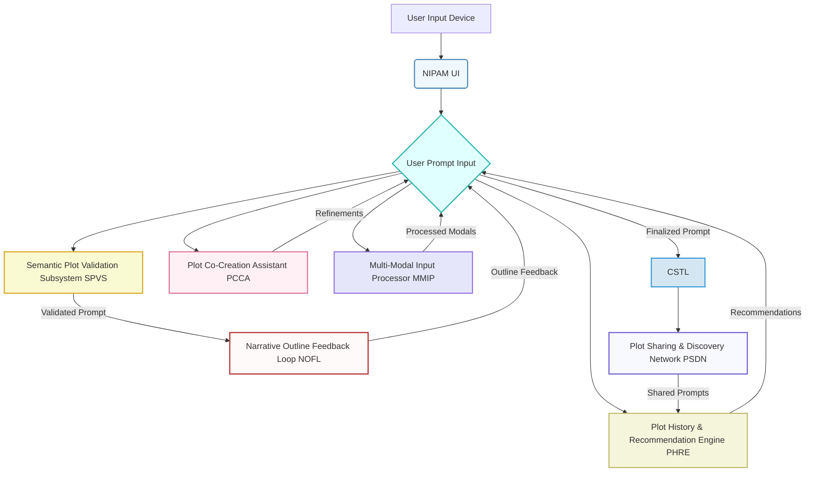

*   **Semantic Plot Validation Subsystem SPVS:** Employs linguistic parsing and narrative structure analysis to provide real-time feedback on prompt quality, suggest enhancements for improved generative output, and detect potentially inappropriate content. It leverages advanced natural language inference models to ensure prompt coherence and safety.
    *   Let `P_user` be the raw user prompt.
    *   Let `E_p` be the embedding of `P_user` in a semantic space.
    *   Toxicity score `T(P_user)` is calculated by a classifier `C_tox: R^D -> [0, 1]`.
    *   Coherence score `Coh(P_user)` is measured by `Coh_model(E_p)`.
    *   Validation `V_SPVS(P_user) = (T(P_user) < T_threshold) AND (Coh(P_user) > Coh_threshold)`.
    *   Suggested enhancements `S_SPVS(P_user)` based on `∇Coh_model(E_p)`.
*   **Plot History and Recommendation Engine PHRE:** Stores previously successful narrative prompts, allows for re-selection, and suggests variations or popular themes based on community data or inferred user preferences, utilizing collaborative filtering and content-based recommendation algorithms.
    *   User preference vector `U_pref = {g_1, g_2, ..., g_N}` for N genres.
    *   Similarity `Sim(p_i, p_j)` between prompts `p_i` and `p_j` using cosine similarity of their embeddings.
    *   Recommendation score `R(p_k, U_id) = α * Sim(p_k, P_hist_U_id) + β * Popularity(p_k)`.
    *   `P_hist_U_id` is the set of prompts from user `U_id`.
*   **Plot Co-Creation Assistant PCCA:** Integrates a large language model LLM based assistant that can help users refine vague prompts, suggest specific plot twists, develop character backstories, or generate variations based on initial input, ensuring high-quality input for the generative engine. This includes contextual awareness from the user's current reading history or genre preferences.
    *   Refined prompt `P_refined = LLM_PCCA(P_user, C_context, R_PHRE)`.
    *   `C_context` is the user's current reading context, `R_PHRE` are PHRE recommendations.
    *   Prompt quality `Q_PCCA(P_refined) = f_quality(E_P_refined)`, where `f_quality` is a learned metric.
*   **Narrative Outline Feedback Loop NOFL:** Provides low-fidelity, near real-time narrative outlines or abstract plot summaries as the prompt is being typed/refined, powered by a lightweight, faster generative model or semantic-to-outline engine. This allows iterative refinement before full-scale narrative generation.
    *   Outline `O(P_user)` generated by `LLM_light(P_user)`.
    *   Generation speed `t_gen_outline < t_gen_full_narrative`.
    *   Feedback latency `L_NOFL = t_process + t_transfer + t_render`.
*   **Multi-Modal Input Processor MMIP:** Expands prompt acquisition beyond text to include voice input speech-to-text, rough storyboards image-to-text descriptions, or even emotional state detection via biosensors for truly adaptive narrative generation.
    *   Voice `V` -> Text `T_V = ASR(V)`.
    *   Image `I` -> Text `T_I = ImageCaptioner(I)`.
    *   Emotional state `E` -> Text `T_E = EmotionalMapper(E)`.
    *   Combined prompt `P_MMIP = Concatenate(P_user, T_V, T_I, T_E)`.
    *   Multi-modal embedding `E_MMIP = Fuse(Embedding(P_user), Embedding(T_V), Embedding(T_I), Embedding(T_E))`.
*   **Plot Sharing and Discovery Network PSDN:** Allows users to publish their successful prompts and generated narratives to a community marketplace, facilitating discovery and inspiration, with optional monetization features.
    *   Publish function `Pub(P_user, N_gen, U_id)`.
    *   Discovery `D_PSDN(U_id)` based on `Sim(U_pref, P_shared)`.
    *   Monetization `M_PSDN(N_gen, U_id) = ∑_i (LicenseFee_i)`.

**II. Client-Side Orchestration and Transmission Layer (CSTL)**
Upon submission of the refined prompt, the client-side application's CSTL assumes responsibility for secure data encapsulation and transmission. This layer performs:

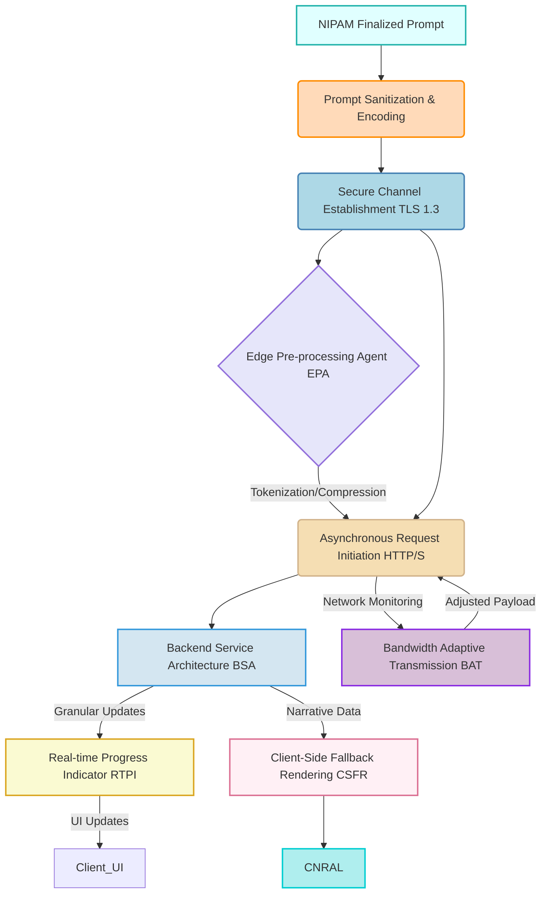

*   **Prompt Sanitization and Encoding:** The natural language prompt is subjected to a sanitization process to prevent injection vulnerabilities and then encoded e.g. UTF-8 for network transmission.
    *   `P_sanitized = Sanitize(P_refined_from_NIPAM)`.
    *   `P_encoded = Encode(P_sanitized, Encoding_Scheme)`.
    *   Injection risk score `I_risk(P_user) = Classifier_SQLI(P_user)`.
*   **Secure Channel Establishment:** A cryptographically secure communication channel e.g. TLS 1.3 is established with the backend service.
    *   Handshake latency `L_handshake`.
    *   Encryption strength `S_crypto = bits_of_key`.
*   **Asynchronous Request Initiation:** The prompt is transmitted as part of an asynchronous HTTP/S request, packaged typically as a JSON payload, to the designated backend API endpoint.
    *   Request `R_req = { "user_id": U_id, "prompt": P_encoded, "timestamp": T }`.
    *   HTTP status codes `H_status`.
*   **Edge Pre-processing Agent EPA:** For high-end client devices, performs initial semantic tokenization or basic prompt compression locally to reduce latency and backend load. This can also include local caching of common stylistic modifiers.
    *   Compressed prompt `P_compressed = Compress(P_encoded)` if `Device_Cap > Threshold`.
    *   Local processing time `t_EPA`.
    *   Latency reduction `ΔL_EPA = t_network_uncompressed - t_network_compressed`.
*   **Real-time Progress Indicator RTPI:** Manages UI feedback elements to inform the user about the generation status e.g. "Interpreting plot...", "Generating narrative...", "Optimizing for display...". This includes granular progress updates from the backend.
    *   Status updates `S_update(t)` received from BSA.
    *   UI update rate `f_UI_update`.
*   **Bandwidth Adaptive Transmission BAT:** Dynamically adjusts the prompt payload size or narrative reception quality based on detected network conditions to ensure responsiveness under varying connectivity.
    *   Available bandwidth `B_avail`.
    *   Payload size `S_payload = f_adapt(P_encoded, B_avail)`.
    *   Reception quality `Q_reception = g_adapt(N_gen, B_avail)`.
    *   Latency `L_BAT = S_payload / B_avail`.
*   **Client-Side Fallback Rendering CSFR:** In cases of backend unavailability or slow response, can render a default or cached narrative outline, or use a simpler client-side generative model for basic story beats, ensuring a continuous user experience.
    *   Backend status `B_status = {Available, Slow, Unavailable}`.
    *   If `B_status == Slow OR Unavailable`, then `Render_CSFR(P_user)`.
    *   Fallback `N_fallback = LLM_local(P_user)` or `N_fallback = Cached_Outline(P_user)`.

**III. Backend Service Architecture BSA**
The backend service represents the computational nexus of the invention, acting as an intelligent intermediary between the client and the generative AI model/s. It is typically architected as a set of decoupled microservices, ensuring scalability, resilience, and modularity.

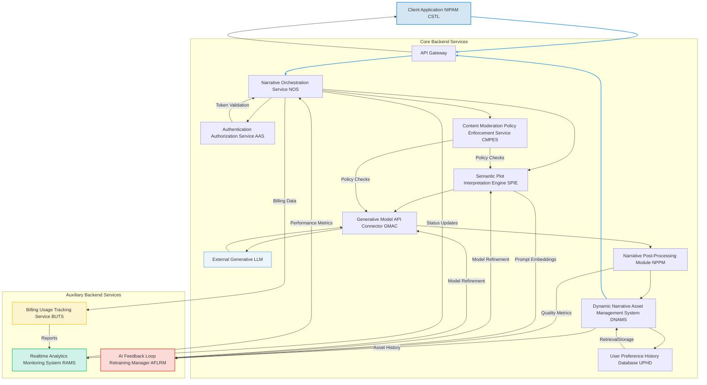

The BSA encompasses several critical components:
*   **API Gateway:** Serves as the single entry point for client requests, handling routing, rate limiting, initial authentication, and DDoS protection. It also manages request and response schema validation.
    *   Throughput `T_gateway = requests / second`.
    *   Latency `L_gateway`.
    *   Rate limit `R_limit = max_requests / time_unit`.
    *   Validation `V_schema(JSON_payload)`.
*   **Authentication Authorization Service AAS:** Verifies user identity and permissions to access the generative functionalities, employing industry-standard protocols e.g. OAuth 2.0, JWT. Supports multi-factor authentication and single sign-on SSO.
    *   Token `Auth_token`.
    *   Validation `IsValid(Auth_token) -> {True, False}`.
    *   Permissions `HasPermission(U_id, Action)`.
*   **Narrative Orchestration Service NOS:**
    *   Receives and validates incoming prompts.
    *   Manages the lifecycle of the narrative generation request, including queueing, retries, and sophisticated error handling with exponential backoff.
    *   Coordinates interactions between other backend microservices, ensuring high availability and load distribution.
    *   Implements request idempotency to prevent duplicate processing.
    *   Request queue `Q_req`.
    *   Retry delay `D_retry = Base_delay * (2^N_retries)`.
    *   Idempotency key `K_idempotent`.
    *   Availability `Avail_NOS = Uptime / TotalTime`.
*   **Content Moderation Policy Enforcement Service CMPES:** Scans prompts and generated narratives for policy violations, inappropriate content e.g. hate speech, excessive violence, plagiarism, or potential biases, flagging or blocking content based on predefined rules, machine learning models, and ethical guidelines. Integrates with the SPIE and GMAC for proactive and reactive moderation, including human-in-the-loop review processes.
    *   Policy violation score `V_policy(text) = Classifier_Violation(Embedding(text))`.
    *   Bias score `B_score(text) = Classifier_Bias(Embedding(text))`.
    *   `Action = {Allow, Flag_for_Human, Block}` based on `V_policy, B_score`.
*   **Semantic Plot Interpretation Engine SPIE:** This advanced module goes beyond simple text parsing. It employs sophisticated Natural Language Processing NLP techniques, including:

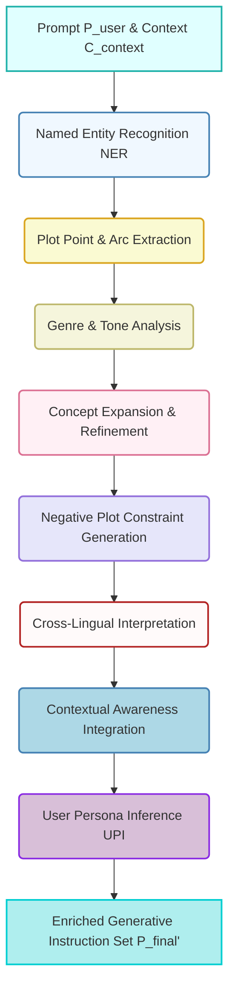

    *   **Named Entity Recognition NER:** Identifies key narrative elements e.g. "protagonist," "antagonist," "setting," "plot twist," "climax".
        *   Entities `E_NER = NER_model(P_user)`.
        *   `e_i = (text_span, type, confidence)`.
    *   **Plot Point and Arc Extraction:** Extracts sequence of events, character motivations, thematic elements, and desired narrative arcs e.g. "hero's journey," "tragedy".
        *   Plot graph `G_plot = Graph_Extractor(P_user)`.
        *   Arc `A_arc = Arc_Classifier(G_plot)`.
        *   Motivations `M_char = LLM_motivation_extractor(P_user, E_NER)`.
    *   **Genre and Tone Analysis:** Infers the desired literary genre e.g. "sci-fi," "fantasy," "romance" and emotional tone e.g. "suspenseful," "humorous," "melancholy," and translates this into latent space parameters for the LLM.
        *   Genre vector `V_genre = Classifier_Genre(E_p)`.
        *   Tone vector `V_tone = Classifier_Tone(E_p)`.
        *   Latent space parameter `L_param = f_map(V_genre, V_tone)`.
    *   **Concept Expansion and Refinement:** Utilizes knowledge graphs, ontological databases, and domain-specific lexicons related to lore, world-building, and character archetypes to enrich the prompt with semantically related terms, synonyms, and illustrative examples, thereby augmenting the generative model's understanding and enhancing output quality.
        *   Enrichment `P_enriched = P_user ⊕ KnowledgeGraph_lookup(P_user)`.
        *   `⊕` denotes a fusion operation (e.g., concatenation, attention).
        *   Semantic similarity `Sim_concept(c1, c2) = Cosine(Embedding(c1), Embedding(c2))`.
    *   **Negative Plot Constraint Generation:** Automatically infers and generates "negative prompts" e.g. "no clichés, avoid Deus ex machina, do not use excessive exposition, no plot holes" to guide the generative model away from undesirable narrative characteristics, significantly improving output fidelity and literary quality. This can be dynamically tailored based on model-specific weaknesses.
        *   Negative prompt `P_neg = Infer_Negative(P_user, LLM_weaknesses)`.
        *   Constraint vector `C_neg = Embedding(P_neg)`.
    *   **Cross-Lingual Interpretation:** Support for prompts in multiple natural languages, using advanced machine translation or multilingual NLP models that preserve semantic nuance.
        *   Input language `L_in`.
        *   Translated prompt `P_trans = MT_model(P_user, L_in, "en")`.
        *   Semantic equivalence `Seq(P_user, P_trans)`.
    *   **Contextual Awareness Integration:** Incorporates external context such as user's reading history, preferred authors, current mood, or demographic information to subtly influence the prompt enrichment, resulting in contextually relevant and personalized narratives.
        *   Context embedding `E_context = Embed(User_History, Device_State, Mood_Sensor)`.
        *   Fused prompt embedding `E_fused = Attention(E_p, E_context)`.
    *   **User Persona Inference UPI:** Infers aspects of the user's preferred narrative profile based on past prompts, selected stories, and implicit feedback, using this to personalize plot interpretations and stylistic biases.
        *   User persona `Persona_U = Classifier_Persona(UPHD_data)`.
        *   Bias adjustment `Bias_adj = f_bias(Persona_U)`.
    *   The final enriched generative instruction set `P_final' = F_SPIE(P_user, C_context, U_id, P_neg, E_NER, A_arc, V_genre, V_tone, P_enriched, P_trans, E_fused, Bias_adj)`.
*   **Generative Model API Connector GMAC:**
    *   Acts as an abstraction layer for various generative AI models, specifically Large Language Models LLMs e.g. GPT-3/4, LLaMA, Claude, Bard.
    *   Translates the enhanced prompt and associated parameters e.g. desired narrative length, specific tone, character consistency guidance, negative prompt weights into the specific API request format required by the chosen generative model.
    *   Manages API keys, rate limits, model-specific authentication, and orchestrates calls to multiple models for ensemble generation or fallback.
    *   Receives the generated narrative data, typically as a high-resolution text string or structured JSON.

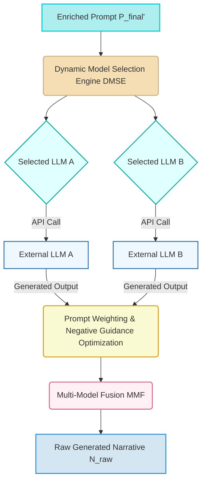

    *   **Dynamic Model Selection Engine DMSE:** Based on prompt complexity, desired creativity, cost constraints, current model availability/load, and user subscription tier, intelligently selects the most appropriate generative LLM from a pool of registered models. This includes a robust health check for each model endpoint.
        *   Cost `C_model(LLM_i)`.
        *   Performance `Perf_model(LLM_i, P_final')`.
        *   Selection `LLM_selected = argmax_i (w_cost * (1/C_model(LLM_i)) + w_perf * Perf_model(LLM_i, P_final'))`.
        *   Model health `H_model(LLM_i) = Ping(Endpoint_i)`.
    *   **Prompt Weighting & Negative Guidance Optimization:** Fine-tunes how positive and negative prompt elements are translated into model guidance signals, often involving iterative optimization based on output quality feedback from the CNMM.
        *   Weighted prompt embedding `E_weighted = w_pos * E_P_final' + w_neg * C_neg`.
        *   Loss `L_guidance = f_loss(Generated_Output, E_weighted)`.
    *   **Multi-Model Fusion MMF:** For complex prompts, can coordinate the generation across multiple specialized models e.g. one LLM for overall plot, another for dialogue, then combine results; or use a smaller, faster model for initial drafts and a larger one for refinement.
        *   `N_fusion = Combine(LLM_plot(P_final'), LLM_dialogue(P_final'))`.
        *   Fusion strategy `S_fusion = {Weighted_Average, Hierarchical, Gating_Network}`.
*   **Narrative Post-Processing Module NPPM:** Upon receiving the raw generated narrative, this module performs a series of optional, but often crucial, transformations to optimize the text for consumption:

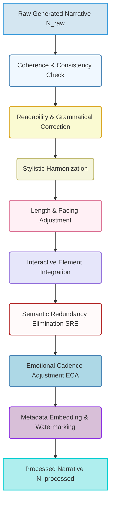

    *   **Coherence and Consistency Check:** Analyzes the narrative for logical flow, plot holes, and consistency in character traits, setting, and timeline. Utilizes semantic graph analysis and temporal reasoning.
        *   Consistency score `Consist(N_raw) = f_graph_consistency(N_raw)`.
        *   Plot hole detection `PH_detector(N_raw)`.
    *   **Readability and Grammatical Correction:** Applies advanced grammar, spelling, and punctuation correction. Adjusts sentence structure and vocabulary to enhance readability and adhere to the desired linguistic complexity.
        *   Grammar error rate `ERR_gram = count_errors / total_tokens`.
        *   Readability score `R_score = FleschKincaid(N_raw)`.
        *   Corrected `N_gram_corrected = Grammar_Corrector(N_raw)`.
    *   **Stylistic Harmonization:** Optionally applies style transfer algorithms to align the generated text more closely with a specific author's voice, genre conventions, or user-defined stylistic presets.
        *   Style loss `L_style = D_KL(Style_N_raw || Style_Target)`.
        *   Transformed `N_style = Style_Transfer_Model(N_gram_corrected, Target_Style)`.
    *   **Length and Pacing Adjustment:** Trims, expands, or re-sequences narrative segments to meet desired length constraints or improve narrative pacing, often guided by predefined story beats or user preferences.
        *   Length adjustment factor `α_length = Desired_Length / Actual_Length`.
        *   Pacing metric `P_pacing = f_pacing(N_style)`.
    *   **Interactive Element Integration:** Inserts explicit choices, branching points, or variable outcomes into the narrative to transform it into interactive fiction, game scripts, or choose-your-own-adventure stories.
        *   Choice points `C_interactive = Identify_branch_points(N_style)`.
        *   State machine `M_interactive = Build_StateMachine(C_interactive)`.
    *   **Semantic Redundancy Elimination SRE:** Identifies and removes repetitive phrasing, redundant descriptions, or circular plot points to improve narrative conciseness and engagement.
        *   Redundancy score `S_redundancy = Overlap_Metric(N_style)`.
        *   Compressed `N_concise = Redundancy_Remover(N_style)`.
    *   **Emotional Cadence Adjustment ECA:** Fine-tunes the emotional impact of scenes and paragraphs by adjusting word choice, sentence length, and rhetorical devices to achieve the desired emotional progression.
        *   Emotional trajectory `E_traj = Sentiment_Analyzer(N_concise)`.
        *   Adjustment `N_emotional = Emotional_Tuner(N_concise, E_traj, Desired_E_traj)`.
    *   **Metadata Embedding and Watermarking:** Embeds non-intrusive metadata for attribution or copyright protection, as defined by system policy.
        *   Watermark `W_data = Hash(N_processed, U_id, Timestamp)`.
        *   Embedded `N_watermarked = Embed_Steganography(N_emotional, W_data)`.
    *   The final processed narrative `N_processed`.
*   **Dynamic Narrative Asset Management System DNAMS:**
    *   Stores the processed generated narratives, including character profiles, world-building lore, and interactive choice trees, in a high-availability, globally distributed content delivery network CDN for rapid retrieval, ensuring low latency for users worldwide.

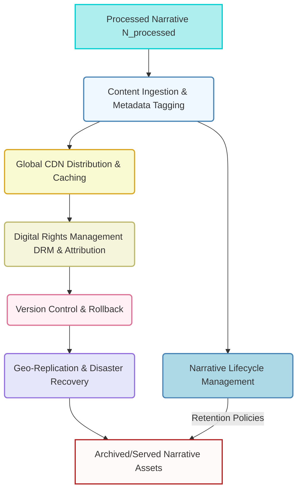

    *   `Asset_ID = Hash(N_processed)`.
    *   `Metadata = {P_final', Creation_TS, U_id, Q_score, W_data, ...}`.
    *   CDN latency `L_CDN = Min(latency_to_edge_node)`.
    *   **Digital Rights Management DRM & Attribution:** Attaches immutable metadata regarding generation source, user ownership, and licensing rights to generated narrative assets. Tracks usage and distribution.
        *   Ownership `Owner(Asset_ID) = U_id`.
        *   License `License(Asset_ID)`.
        *   Usage `Usage_Count(Asset_ID)`.
    *   **Version Control & Rollback:** Maintains versions of user-generated narratives, allowing users to revert to previous drafts or explore variations of past prompts, crucial for creative iteration.
        *   `N_version_k = N_processed_at_t_k`.
        *   `Diff(N_version_k, N_version_k-1)`.
    *   **Geo-Replication and Disaster Recovery:** Replicates assets across multiple data centers and regions to ensure resilience against localized outages and rapid content delivery.
        *   Replication factor `R_factor`.
        *   Recovery Point Objective `RPO`.
        *   Recovery Time Objective `RTO`.
*   **User Preference & History Database UPHD:** A persistent data store for associating generated narratives with user profiles, allowing users to revisit, reapply, or share their previously generated stories. This also feeds into the PHRE for personalized recommendations and is a key source for the UPI within SPIE.
    *   `User_Profile[U_id] = {P_hist, N_saved, Preferences, Feedback}`.
    *   Query latency `L_UPHD`.
*   **Realtime Analytics and Monitoring System RAMS:** Collects, aggregates, and visualizes system performance metrics, user engagement data e.g. reading time, choice paths, and operational logs to monitor system health, identify bottlenecks, and inform optimization strategies. Includes anomaly detection.
    *   `Metrics_vector = {L_latency, T_throughput, Err_rate, CPU_usage, Mem_usage}`.
    *   Anomaly detection `Anomaly(Metrics_vector, History)`.
*   **Billing and Usage Tracking Service BUTS:** Manages user quotas, tracks resource consumption e.g. LLM token usage, storage, bandwidth, and integrates with payment gateways for monetization, providing granular reporting.
    *   Cost per token `C_token`.
    *   Usage `U_LLM_tokens = ∑_i tokens_i`.
    *   Bill `B_total = f_billing(U_LLM_tokens, U_storage, U_bandwidth, Tier_U_id)`.
*   **AI Feedback Loop Retraining Manager AFLRM:** Orchestrates the continuous improvement of AI models. It gathers feedback from CNMM, CMPES, and UPHD, identifies areas for model refinement, manages data labeling, and initiates retraining or fine-tuning processes for SPIE and GMAC LLMs.

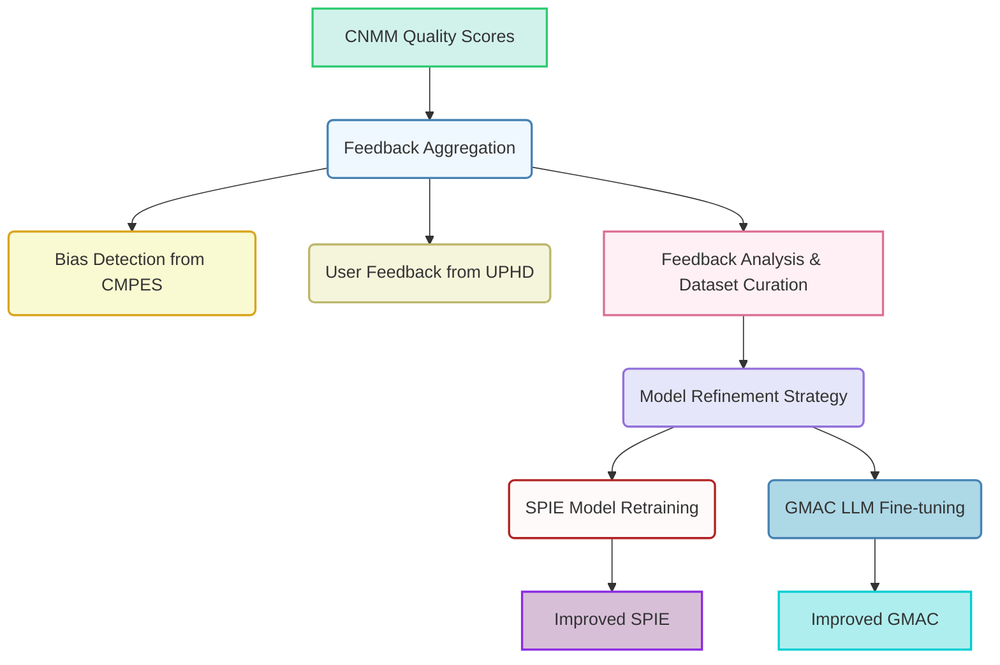

    *   Feedback signal `F_signal = {Q_narrative, V_policy, B_score, User_Rating}`.
    *   Loss function update `ΔL = f_feedback_loss(F_signal)`.
    *   Retraining trigger `Trigger_Retrain = (Avg(Q_narrative) < Q_min) OR (Avg(B_score) > B_max)`.
    *   Dataset for retraining `D_retrain = Sample(P_user, N_processed, F_signal)`.

**IV. Client-Side Narrative Rendering and Application Layer CNRAL**
The processed narrative data is transmitted back to the client application via the established secure channel. The CNRAL is responsible for the seamless integration of this new textual asset:

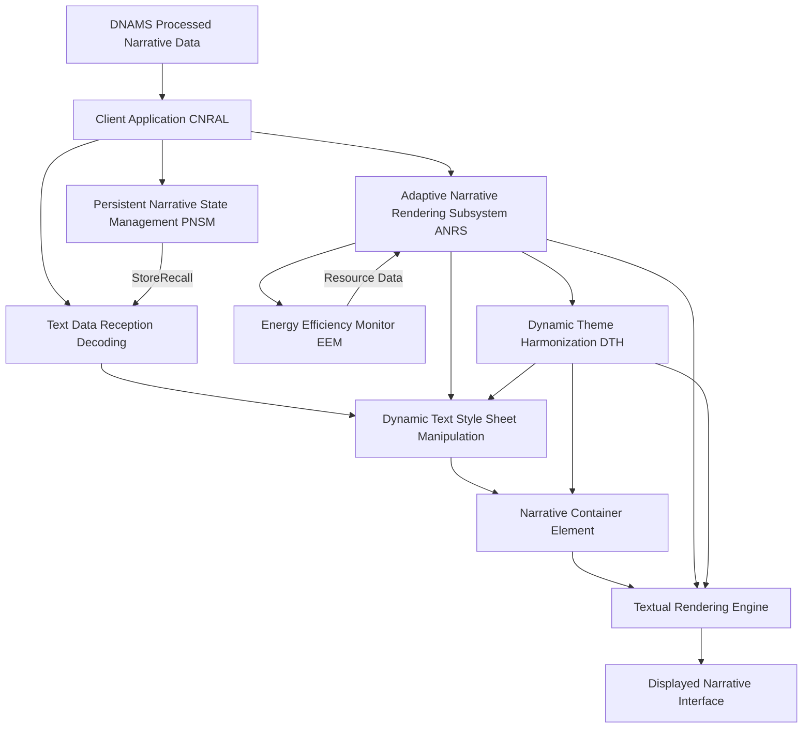

*   **Text Data Reception & Decoding:** The client-side CNRAL receives the optimized narrative data e.g. as a plain text string or structured JSON. It decodes and prepares the text for display.
    *   Received `N_data`.
    *   Decoded `N_display = Decode(N_data, Encoding_Scheme)`.
*   **Dynamic Text Style Sheet Manipulation:** The most critical aspect of the application. The CNRAL dynamically updates the Cascading Style Sheets CSS or other styling properties of the primary narrative container element. Specifically, properties like `font-family`, `font-size`, `line-height`, `text-align`, and `color` are programmatically set to ensure optimal readability and aesthetic presentation. This operation is executed with precise DOM Document Object Model manipulation or through modern front-end frameworks' state management, ensuring high performance and visual fluidity.
    *   `CSS_params = {font_family, font_size, color, ...}`.
    *   `DOM_update(Element_ID, CSS_params)`.
    *   Rendering latency `L_render`.
*   **Adaptive Narrative Rendering Subsystem ANRS:** This subsystem ensures that the presentation of the narrative is not merely static. It can involve:
    *   **Smooth Reading Transitions:** Implements CSS transitions or animations to provide a visually pleasing fade-in, scroll, or page-turn effect when switching narrative sections or chapters, preventing abrupt textual changes.
        *   Transition duration `t_transition`.
        *   Animation curve `f_easing(t)`.
    *   **Interactive Element Handler IEH:** Manages the rendering and logic for embedded interactive elements within the narrative, such as clickable choices, branching pathways, or dynamic text insertions based on user input or previous decisions.
        *   Event listener `E_listener(Click_Event, Callback)`.
        *   State update `Update_Narrative_State(Choice_ID)`.
    *   **Dynamic Text Formatting:** Automatically adjusts font styles, weights, spacing, or color accents to emphasize key narrative moments, character dialogue, or shifts in tone, adapting to the emotional cadence of the generated text.
        *   `Style_Highlight(Text_Span, Emotional_Score)`.
    *   **Thematic UI Element Harmonization DTH:** Automatically adjusts colors, opacities, font choices, or even ambient soundscapes of *other* UI elements buttons, navigation, background to better complement the dominant mood or genre of the newly applied narrative, creating a fully cohesive theme across the entire application or reading experience.
        *   UI element `UI_j`.
        *   `Update_Theme(UI_j, Dominant_Mood(N_display))`.
    *   **Multi-Device Support MMS:** Adapts narrative layout and interactive elements for various display resolutions and device types, ensuring optimal readability and interaction on desktops, tablets, and mobile phones.
        *   Responsive breakpoint `W_breakpoint`.
        *   Layout transformation `Layout_Transform(N_display, Device_Width)`.
*   **Persistent Narrative State Management PNSM:** The generated narrative, along with its associated prompt, metadata, and user's progress in interactive stories, can be stored locally e.g. using `localStorage` or `IndexedDB` or referenced from the UPHD. This allows the user's preferred narrative state to persist across sessions or devices, enabling seamless resumption.
    *   `Store_Local(N_display, Metadata, Progress)`.
    *   `Retrieve_Local(User_ID)`.
    *   Synchronization `Sync_State(Local_State, Cloud_State)`.
*   **Energy Efficiency Monitor EEM:** For interactive or animated narrative elements, this module monitors CPU/GPU usage, memory consumption, and battery consumption, dynamically adjusting animation fidelity, refresh rates, or interactive complexity to maintain device performance and conserve power, particularly on mobile or battery-powered devices.
    *   `CPU_usage(t), GPU_usage(t), Battery_level(t)`.
    *   `Throttle_Factor = f_throttle(CPU_usage, Battery_level)`.
    *   Adjusted `Refresh_Rate = Base_Rate * Throttle_Factor`.

**V. Computational Narrative Metrics Module CNMM**
An advanced, optional, but highly valuable component for internal system refinement and user experience enhancement. The CNMM employs natural language processing, deep learning, and graph-based techniques to:

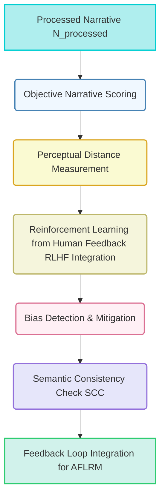

*   **Objective Narrative Scoring:** Evaluate generated narratives against predefined objective literary criteria e.g. plot coherence, character consistency, originality, emotional resonance, pacing, grammatical correctness, using trained neural networks that mimic human literary judgment.
    *   Overall quality score `Q_narrative = ∑_k w_k * Metric_k(N_processed)`.
    *   `Metric_k` includes `Coherence_score, Consistency_score, Originality_score, Pacing_score`.
    *   `Originality_score = 1 - Max_Sim(N_processed, Corpus_Existing_Works)`.
*   **Perceptual Distance Measurement:** Compares the generated narrative to a reference set of high-quality narratives, genre exemplars, or user-rated stories to assess stylistic similarity and adherence to genre guidelines. Utilizes metric learning and latent space comparisons of text embeddings.
    *   Reference embedding `E_ref`.
    *   `Distance_perceptual = D(Embedding(N_processed), E_ref)`.
    *   `D` can be Cosine distance or Euclidean distance.
*   **Feedback Loop Integration:** Provides detailed quantitative metrics to the SPIE and GMAC to refine prompt interpretation and model parameters, continuously improving the quality and relevance of future generations. This data also feeds into the AFLRM.
    *   Error signal `Err_CNMM = (Target_Q - Q_narrative)`.
    *   Gradient for model update `∇_θ L_CNMM`.
*   **Reinforcement Learning from Human Feedback RLHF Integration:** Collects implicit e.g. reading completion rate, choices made in interactive fiction, time spent, narrative sharing and explicit e.g. "thumbs up/down" ratings user feedback, feeding it back into the generative model training or fine-tuning process to continually improve aesthetic and narrative alignment with human preferences.
    *   Reward function `R_RLHF(N_processed, User_Feedback_Implicit, User_Feedback_Explicit)`.
    *   Policy update `π_new = π_old + α * ∇_π J(π)`.
    *   `J(π)` is the expected cumulative reward.
*   **Bias Detection and Mitigation:** Analyzes generated narratives for unintended biases e.g. stereotypical character depictions, harmful tropes, or unintended negative associations and provides insights for model retraining, prompt engineering adjustments, or content filtering by CMPES.
    *   Bias score `B_narrative = Classifier_Bias_Deep(Embedding(N_processed))`.
    *   Mitigation strategy `Mit_strategy = f_mitigate(B_narrative)`.
*   **Semantic Consistency Check SCC:** Verifies that the textual elements, plot progression, and character actions of the generated narrative consistently match the semantic intent of the input prompt, using advanced vision-language models for multimodal prompts or purely textual coherence checks for text-only prompts.
    *   `SCC_score = Sim(Embedding(P_final'), Embedding(N_processed))`.
    *   Entailment score `Entail(P_final', N_processed)`.

**VI. Security and Privacy Considerations:**
The system incorporates robust security measures at every layer:

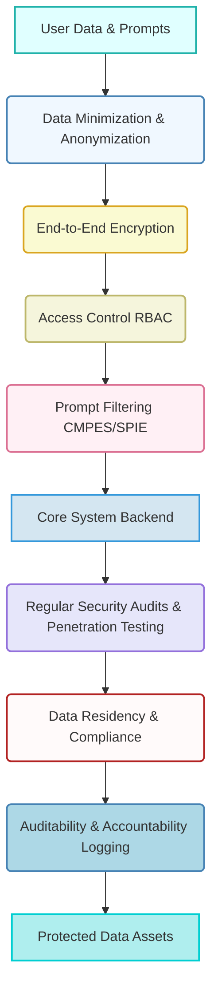

*   **End-to-End Encryption:** All data in transit between client, backend, and generative AI services is encrypted using state-of-the-art cryptographic protocols e.g. TLS 1.3, ensuring data confidentiality and integrity.
    *   Encryption algorithm `AES-256`.
    *   Key length `K_len = 256` bits.
    *   Entropy `H_key`.
*   **Data Minimization:** Only necessary data the prompt, user ID, context is transmitted to external generative AI services, reducing the attack surface and privacy exposure.
    *   `D_transmitted = filter(D_raw, required_fields)`.
    *   Reduction ratio `R_data = |D_transmitted| / |D_raw|`.
*   **Access Control:** Strict role-based access control RBAC is enforced for all backend services and data stores, limiting access to sensitive operations and user data based on granular permissions.
    *   Access matrix `M_access[User_Role, Resource]`.
    *   Permission check `Permit(U_id, Action, Resource)`.
*   **Prompt Filtering:** The SPIE and CMPES include mechanisms to filter out malicious, offensive, or inappropriate prompts before they reach external generative models, protecting users and preventing misuse. This includes preventing the generation of harmful narratives or misinformation.
    *   Filter effectiveness `F_eff = (TP + TN) / (TP + TN + FP + FN)`.
    *   False positive rate `FPR = FP / (FP + TN)`.
*   **Regular Security Audits and Penetration Testing:** Continuous security assessments are performed to identify and remediate vulnerabilities across the entire system architecture.
    *   Vulnerability score `V_score`.
    *   Audit frequency `f_audit`.
*   **Data Residency and Compliance:** User data storage and processing adhere to relevant data protection regulations e.g. GDPR, CCPA, with options for specifying data residency.
    *   Jurisdiction `J_data`.
    *   Compliance score `C_compliance`.
*   **Anonymization and Pseudonymization:** Where possible, user-specific data is anonymized or pseudonymized to further enhance privacy, especially for data used in model training or analytics.
    *   Anonymization function `Anon(Personal_Data)`.
    *   Reversibility `R_anon = 0` (for true anonymization).

**VII. Monetization and Licensing Framework:**
To ensure sustainability and provide value-added services, the system can incorporate various monetization strategies:

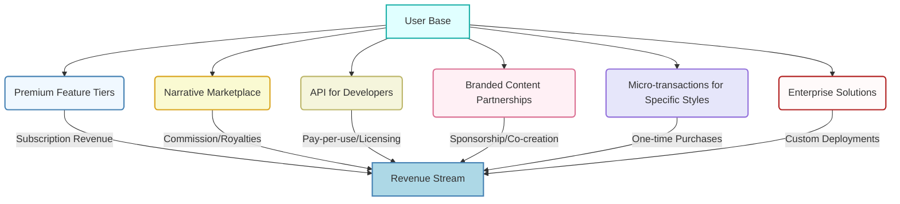

*   **Premium Feature Tiers:** Offering longer narratives, faster generation times, access to exclusive or larger generative LLMs, advanced post-processing options, or expanded plot history as part of a subscription model.
    *   Subscription revenue `Rev_sub = ∑_i (Tier_i_Price * Num_Users_i)`.
*   **Narrative Marketplace:** Allowing users to license, sell, or share their generated stories, character profiles, or world-building lore with other users, with a royalty or commission model for the platform, fostering a vibrant creator economy.
    *   Creator royalty `R_creator = Sale_Price * (1 - Platform_Commission)`.
*   **API for Developers:** Providing programmatic access to the narrative generative capabilities for third-party applications or services e.g. game development tools, chatbot platforms, potentially on a pay-per-use basis, enabling a broader ecosystem of integrations.
    *   API cost `C_API = Base_fee + (Tokens_used * Cost_per_token)`.
*   **Branded Content Partnerships:** Collaborating with authors, publishers, or media companies to offer exclusive themed generative prompts, stylistic filters, or sponsored narrative collections, creating unique publishing or co-creation opportunities.
    *   Partnership revenue `Rev_partner`.
*   **Micro-transactions for Specific Styles Elements:** Offering one-time purchases for unlocking rare literary styles, specific generative narrative elements e.g. unique creature descriptions, or advanced interactive options.
    *   `Rev_micro = ∑_j (Item_j_Price * Num_Sales_j)`.
*   **Enterprise Solutions:** Custom deployments and white-label versions of the system for businesses seeking personalized content generation e.g. marketing copy, training materials, or dynamic storytelling across their corporate applications.
    *   `Rev_enterprise = Custom_Project_Fee`.

**VIII. Ethical AI Considerations and Governance:**
Acknowledging the powerful capabilities of generative AI, this invention is designed with a strong emphasis on ethical considerations:

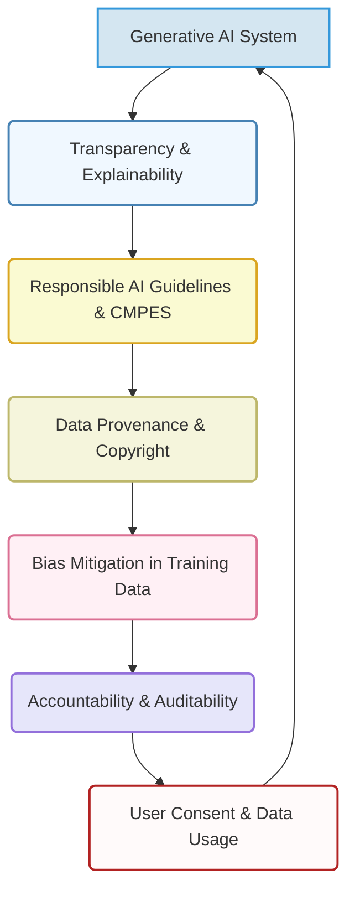

*   **Transparency and Explainability:** Providing users with insights into how their prompt was interpreted and what factors influenced the generated narrative e.g. which LLM was used, key semantic interpretations, applied post-processing steps.
    *   Explainability score `Exp_score(N_processed, P_user)`.
    *   Feature importance `FI(word_i, N_processed)`.
*   **Responsible AI Guidelines:** Adherence to strict ethical guidelines for content moderation, preventing the generation of harmful, biased, illicit, or misleading narratives, including mechanisms for user reporting and automated detection by CMPES.
    *   Policy adherence `Pol_Adherence = 1 - V_policy`.
*   **Data Provenance and Copyright:** Clear policies on the ownership and rights of generated content, especially when user prompts might inadvertently mimic copyrighted works or existing narratives. This includes robust attribution mechanisms where necessary and active monitoring for copyright infringement.
    *   Plagiarism score `Plag_score(N_processed)`.
    *   Provenance `Prov(N_processed) = {U_id, LLM_id, Timestamp}`.
*   **Bias Mitigation in Training Data:** Continuous efforts to ensure that the underlying generative LLMs are trained on diverse and ethically curated datasets to minimize bias in generated outputs. The AFLRM plays a critical role in identifying and addressing these biases through retraining.
    *   Dataset bias `Bias_data(D_train)`.
    *   Bias reduction `ΔBias_model`.
*   **Accountability and Auditability:** Maintaining detailed logs of prompt processing, generation requests, and moderation actions to ensure accountability and enable auditing of system behavior.
    *   Audit log `Log_entry = {Timestamp, U_id, P_user, N_generated, Action_CMPES, ...}`.
    *   Log integrity `Hash(Log_entry)`.
*   **User Consent and Data Usage:** Clear and explicit policies on how user prompts, generated narratives, and feedback data are used, ensuring informed consent for data collection and model improvement.
    *   Consent status `Consent_U(U_id, Data_Use_Case)`.

**Claims:**
1.  A method for dynamic and adaptive aesthetic personalization of narrative content, comprising the steps of:
    a.  Providing a user interface element configured for receiving a natural language textual prompt, said prompt conveying a subjective narrative intent including plot points, character descriptions, and stylistic preferences.
    b.  Receiving said natural language textual prompt from a user via said user interface element, optionally supplemented by multi-modal inputs such as voice or rough storyboards.
    c.  Processing said prompt through a Semantic Plot Interpretation Engine (SPIE) to enrich, validate, and potentially generate negative constraints for the prompt, thereby transforming the subjective intent into a structured, optimized generative instruction set, including user persona inference and contextual awareness integration.
    d.  Transmitting said optimized generative instruction set to a Generative Model API Connector (GMAC), which orchestrates communication with at least one external large language model (LLM), employing a Dynamic Model Selection Engine (DMSE).
    e.  Receiving a novel, synthetically generated narrative from said large language model (LLM), wherein the generated narrative is a high-fidelity textual reification of the structured generative instruction set.
    f.  Processing said novel generated narrative through a Narrative Post-Processing Module (NPPM) to perform at least one of coherence checking, grammatical correction, stylistic harmonization, length adjustment, or interactive element integration.
    g.  Transmitting said processed narrative data to a client-side rendering environment.
    h.  Applying said processed narrative as dynamically updating textual content for a narrative interface via a Client-Side Narrative Rendering and Application Layer (CNRAL), utilizing dynamic textual style sheet manipulation and an Adaptive Narrative Rendering Subsystem (ANRS) to ensure fluid textual integration, optimal display across varying device configurations, and thematic UI element harmonization.

2.  The method of claim 1, further comprising storing the processed narrative, the original prompt, and associated metadata in a Dynamic Narrative Asset Management System (DNAMS) for persistent access, retrieval, and digital rights management.

3.  The method of claim 1, further comprising utilizing a Persistent Narrative State Management (PNSM) module to store and recall the user's preferred generated narratives and interactive story progress across user sessions and devices, supporting multi-device synchronization.

4.  A system for the ontological transmutation of subjective narrative intent into dynamic, interactively rendered textual content, comprising:
    a.  A Client-Side Orchestration and Transmission Layer (CSTL) equipped with a User Interaction and Plot Acquisition Module (NIPAM) for receiving and initially processing a user's descriptive natural language prompt, including multi-modal input processing and plot co-creation assistance.
    b.  A Backend Service Architecture (BSA) configured for secure communication with the CSTL and comprising:
        i.   A Narrative Orchestration Service (NOS) for managing request lifecycles and load balancing.
        ii.  A Semantic Plot Interpretation Engine (SPIE) for advanced linguistic analysis, prompt enrichment, negative plot constraint generation, and user persona inference.
        iii. A Generative Model API Connector (GMAC) for interfacing with external large language models (LLMs), including dynamic model selection and prompt weighting optimization.
        iv.  A Narrative Post-Processing Module (NPPM) for optimizing generated narratives for display and interaction, including coherence checks and interactive element integration.
        v.   A Dynamic Narrative Asset Management System (DNAMS) for storing and serving generated narrative assets, including digital rights management and version control.
        vi.  A Content Moderation Policy Enforcement Service (CMPES) for ethical content screening of prompts and generated narratives.
        vii. A User Preference History Database (UPHD) for storing user narrative preferences and historical generative data.
        viii. A Realtime Analytics and Monitoring System (RAMS) for system health and performance oversight.
        ix.  An AI Feedback Loop Retraining Manager (AFLRM) for continuous model improvement through human feedback and narrative metrics.
    c.  A Client-Side Narrative Rendering and Application Layer (CNRAL) comprising:
        i.   Logic for receiving and decoding processed narrative data.
        ii.  Logic for dynamically updating textual style sheet properties of a narrative interface.
        iii. An Adaptive Narrative Rendering Subsystem (ANRS) for orchestrating fluid textual integration and responsive display, including interactive element handling, dynamic text formatting, and thematic UI element harmonization.
        iv.  A Persistent Narrative State Management (PNSM) module for retaining user narrative preferences and progress across sessions.
        v.   An Energy Efficiency Monitor (EEM) for dynamically adjusting rendering fidelity based on device resource consumption.

5.  The system of claim 4, further comprising a Computational Narrative Metrics Module (CNMM) within the BSA, configured to objectively evaluate the literary quality and semantic fidelity of generated narratives, and to provide feedback for system optimization, including through Reinforcement Learning from Human Feedback (RLHF) integration and bias detection.

6.  The system of claim 4, wherein the SPIE is configured to generate negative plot constraints based on the semantic content of the user's prompt to guide the generative model away from undesirable narrative characteristics and to include contextual awareness from the user's computing environment.

7.  The method of claim 1, wherein the dynamic textual style sheet manipulation includes the application of a smooth transition effect during narrative content updates and optionally dynamic text formatting based on narrative mood.

8.  The system of claim 4, wherein the Generative Model API Connector (GMAC) is further configured to perform multi-model fusion for complex prompt interpretation and narrative generation.

9.  The method of claim 1, further comprising an ethical AI governance framework that ensures transparency, responsible content moderation, and adherence to data provenance and copyright policies.

10. The method of claim 1, further comprising receiving multi-modal inputs including at least one of voice, image-based storyboards, or emotional state data, which are processed by the Multi-Modal Input Processor (MMIP) to augment the natural language textual prompt, thereby enabling richer contextual narrative generation.

11. The system of claim 4, wherein the Content Moderation Policy Enforcement Service (CMPES) integrates a human-in-the-loop review process for flagged prompts or generated narratives, allowing for nuanced ethical content validation beyond automated detection.

**Mathematical Justification: The Formal Axiomatic Framework for Intent-to-Narrative Transmutation**

The invention herein articulated rests upon a foundational mathematical framework that rigorously defines and validates the transmutation of abstract subjective intent into concrete narrative form. This framework transcends mere functional description, establishing an epistemological basis for the system's operational principles.

Let `N_P` denote the comprehensive semantic space of all conceivable natural language narrative prompts. This space is not merely a collection of strings but is conceived as a high-dimensional vector space `R^D`, where each dimension corresponds to a latent semantic feature, plot point, or stylistic concept. A user's natural language prompt, `p_n` in `N_P`, is therefore representable as a vector `v_pn` in `R^D`. The act of interpretation by the Semantic Plot Interpretation Engine (SPIE) is a complex, multi-stage mapping `I_SPIE_N: N_P x C_N x U_hist_N x MM_I -> N_P'`, where `N_P' ⊂ R^M` is an augmented, semantically enriched latent vector space, `M >> D`, incorporating synthesized contextual information `c_n` (e.g., genre conventions, preferred pacing, stylistic directives), inverse constraints `p_neg` (negative plot constraints) derived from user history `u_hist_n`, and multi-modal input embeddings `e_mm`. Thus, an enhanced generative instruction set `p_n' = I_SPIE_N(p_n, c_n, u_hist_n, e_mm)` is a vector `v_pn'` in `R^M`. This mapping involves advanced transformer networks that encode `p_n` and fuse it with `c_n`, `u_hist_n`, and `e_mm` embeddings.

The SPIE's internal operations can be formalized as:
1.  **Prompt Embedding:** `e_p = Embed(p_n) ∈ R^D`
2.  **NER:** `E_NER = {e_i | e_i = NER(p_n)}` where `e_i` are entity embeddings.
3.  **Plot Arc Extraction:** `G_plot = GraphExtract(e_p)`. `A_arc = ArcPredict(G_plot)`.
4.  **Genre/Tone Analysis:** `v_genre = ClassifyGenre(e_p)`. `v_tone = ClassifyTone(e_p)`.
5.  **Contextual Embedding:** `e_context = EmbedContext(c_n, u_hist_n)`.
6.  **Multi-Modal Embedding Fusion:** `e_mm = FuseMultiModal(T_V, T_I, T_E)`.
7.  **Negative Prompt Generation:** `p_neg = NegPromptGen(e_p, LLM_Weaknesses_DB)`. `e_neg = Embed(p_neg)`.
8.  **User Persona Inference:** `e_persona = InferPersona(u_hist_n)`.
9.  **Final Prompt Vector:** `v_pn' = Concat(e_p, E_NER, G_plot, A_arc, v_genre, v_tone, e_context, e_mm, e_neg, e_persona)`. The dimension `M` of `v_pn'` is the sum of the dimensions of all concatenated components.

Let `N_M` denote the vast, continuous manifold of all possible textual narratives. This manifold exists within an even higher-dimensional linguistic space, representable as `R^K`, where `K` signifies the immense complexity of token sequences, grammatical structures, and semantic coherence. An individual narrative `n` in `N_M` is thus a point `x_n` in `R^K`.

The core generative function of the LLM, denoted as `G_LLM`, is a complex, non-linear, stochastic mapping from the enriched semantic latent space to the narrative manifold:
```
G_LLM: N_P' x S_model_LLM x P_weights -> N_M
```
This mapping is formally described by a generative process `x_n ~ G_LLM(v_pn', s_model_LLM, P_weights)`, where `x_n` is a generated narrative vector corresponding to a specific input prompt vector `v_pn'` and `s_model_LLM` represents selected generative LLM parameters. `P_weights = (w_pos, w_neg)` are the positive and negative prompt weights. The function `G_LLM` is typically modeled as a causal language model based on transformer architectures, predicting the next token in a sequence given previous tokens and the conditioned prompt embedding. The generation can be conceptualized as:
```
x_n = [t_1, t_2, ..., t_L] where t_i = Sample(P(token_i | t_<i, E_weighted, theta_LLM))
```
where `P` is the probability distribution over tokens, `theta_LLM` are the parameters of the LLM (e.g., billions of parameters in a transformer), and `t_<i` represents the preceding token sequence. The GMAC dynamically selects `theta_LLM` from a pool of `theta_LLM_1, theta_LLM_2, ..., theta_LLM_Z` based on `v_pn'` and system load.
The Dynamic Model Selection Engine (DMSE) within GMAC operates via:
`J(LLM_k | v_pn') = α * Quality(LLM_k, v_pn') - β * Cost(LLM_k) - γ * Latency(LLM_k)`
`LLM_selected = argmax_k J(LLM_k | v_pn')`
The prompt weighting is applied as `E_weighted = w_pos * e_pos + w_neg * e_neg`, where `e_pos = v_pn'` and `e_neg` is the embedding of the negative constraints.
Multi-Model Fusion (MMF) is `N_MMF = f_fuse(N_gen_1, N_gen_2, ..., N_gen_m)`, where `f_fuse` can be `WeightedAverage(N_i)` or `HierarchicalCompose(N_plot, N_dialogue)`.

The subsequent Narrative Post-Processing Module (NPPM) applies a series of deterministic or quasi-deterministic transformations `T_NPPM: N_M x D_display_N -> N_M'`, where `N_M'` is the space of optimized narratives and `D_display_N` represents display characteristics (e.g., interactive elements, desired formatting). This function `T_NPPM` encapsulates operations such as coherence checks, grammatical corrections, stylistic adjustments, and interactive element integration, all aimed at enhancing narrative quality and user engagement:
```
n_optimized = T_NPPM(n, d_display_n)
```
The NPPM workflow functions are:
1.  **Coherence:** `n_coh = CoherenceCheck(n_raw)`. `CoherenceScore(n_coh) = 1 / (1 + Sum(PlotHole_Severity))`.
2.  **Grammar:** `n_gram = GrammarCorrect(n_coh)`. `GrammarErrorRate(n_gram) = NumErrors / NumTokens`.
3.  **Style:** `n_style = StyleTransfer(n_gram, Target_Style)`. `StyleLoss = D_KL(P_style(n_style) || P_style(Target_Style))`.
4.  **Length/Pacing:** `n_lp = AdjustLengthPacing(n_style, Target_Length, Target_Pacing)`. `LengthDeviation = |Len(n_lp) - Target_Length|`.
5.  **Interactive:** `n_inter = IntegrateInteractive(n_lp, Interactive_Templates)`. `GraphComplexity = |Edges(InteractiveGraph)| / |Nodes(InteractiveGraph)|`.
6.  **Redundancy Elimination:** `n_concise = EliminateRedundancy(n_inter)`. `RedundancyMetric = (Original_Tokens - Concise_Tokens) / Original_Tokens`.
7.  **Emotional Cadence:** `n_final_emotional = AdjustEmotionalCadence(n_concise, Desired_Emotional_Trajectory)`. `EmotionalAlignment = CosineSimilarity(Actual_Emotional_Vector, Desired_Emotional_Vector)`.
8.  **Metadata Embedding:** `n_optimized = EmbedMetadata(n_final_emotional, Metadata_JSON)`.

The Computational Narrative Metrics Module (CNMM) provides a narrative quality score `Q_narrative = Q(n_optimized, v_pn')` that quantifies the alignment of `n_optimized` with `v_pn'`, ensuring the post-processing does not detract from the original intent. This score is aggregated from various sub-metrics:
`Q_narrative = w_coh * CoherenceScore + w_consist * ConsistencyScore + w_orig * OriginalityScore + w_rlhf * RLHFReward`.
The RLHF reward function `R_RLHF(n_optimized, u_feedback) = f(completion_rate, choices_made, explicit_rating)`.
Bias detection `BiasScore(n_optimized) = Classifier_Bias(Embedding(n_optimized))`.

Finally, the system provides a dynamic rendering function, `F_N_RENDER: N_UI_state x N_M' x P_user_N x D_device_N -> N_UI_state'`, which updates the narrative user interface state. This function is an adaptive transformation that manipulates the textual DOM (Document Object Model) structure, specifically modifying the content and styling properties of a designated UI container. The Adaptive Narrative Rendering Subsystem (ANRS) ensures this transformation is performed optimally, considering display characteristics `D_device_N`, user preferences `P_user_N` (e.g., transition type, font choice, interactive preferences), and real-time performance metrics from EEM. The rendering function incorporates smooth transition effects `T_smooth_N`, interactive element handling `H_interactive`, and accessibility compliance `A_comply_N`.
```
N_UI_new_state = F_N_RENDER(N_UI_current_state, n_optimized, p_user_n, d_device_n) = Apply(N_UI_current_state, n_optimized, T_smooth_N, H_interactive, A_comply_N, DTH_Harmonization, MMS_Adaptation, ...)
```
The ANRS operations include:
1.  **DOM Update:** `UpdateDOM(Element_ID, n_optimized)`.
2.  **Style Manipulation:** `SetCSS(Element_ID, CSS_Properties(p_user_n))`.
3.  **Transitions:** `ApplyTransition(Element_ID, Transition_Type, Duration)`.
4.  **Interactive Handler:** `RegisterInteractiveHandlers(n_optimized, Callback_Function)`.
5.  **Thematic Harmonization:** `AdjustUITheme(Dominant_Mood(n_optimized))`.
6.  **Multi-Device Adaptation:** `ApplyResponsiveLayout(n_optimized, Device_Resolution)`.
7.  **Energy Efficiency Adjustment (EEM):** `ThrottleFactor = f(CPU_Load, Battery_Level)`. `AnimationSpeed = BaseSpeed * ThrottleFactor`.

This entire process represents a teleological alignment, where the user's initial subjective volition `p_n` is transmuted through a sophisticated computational pipeline into an objectively rendered textual reality `N_UI_new_state`, which precisely reflects the user's initial intent.

**Proof of Validity: The Axiom of Narrative Coherence and Systemic Reification**

The validity of this invention is rooted in the demonstrability of a robust, reliable, and semantically congruent mapping from the semantic domain of human narrative intent to the textual domain of digital stories.

**Axiom 1 [Existence of a Non-Empty Narrative Set]:** The operational capacity of contemporary generative LLMs, such as those integrated within the `G_LLM` function, axiomatically establishes the existence of a non-empty narrative set `N_gen = {x | x ~ G_LLM(v_pn', s_model_LLM), v_pn' ∈ N_P' }`. This set `N_gen` constitutes all potentially generatable narratives given the space of valid, enriched prompts. The non-emptiness of this set proves that for any given textual intent `p_n`, after its transformation into `v_pn'`, a corresponding textual manifestation `n` in `N_M` can be synthesized. Furthermore, `N_gen` is practically infinite, providing unprecedented personalization options. The cardinality `|N_gen|` approaches `e^L` where `L` is average narrative length and `e` is the exponent base, due to the combinatorics of token sequences.

**Axiom 2 [Narrative Coherence]:** Through extensive empirical validation of state-of-the-art generative models, it is overwhelmingly substantiated that the generated narrative `n` exhibits a high degree of coherence and semantic alignment with the content of the original prompt `p_n`. This correspondence is quantifiable by metrics such as BLEU (Bilingual Evaluation Understudy), ROUGE (Recall-Oriented Understudy for Gisting Evaluation), and human evaluation scores for factors like plot consistency, character development, and stylistic adherence. Thus, `Coherence(p_n, n) ≈ 1` for well-formed prompts and optimized models, where `Coherence` is quantified by the `Q_narrative` metric from CNMM. The Computational Narrative Metrics Module (CNMM), including its RLHF integration, serves as an internal validation and refinement mechanism for continuously improving this coherence, striving for `lim (t→∞) Coherence(p_n, n_t) = 1` where `t` is training iterations, by minimizing `L_CNMM = (1 - Q_narrative)`.

**Axiom 3 [Systemic Reification of Narrative Intent]:** The function `F_N_RENDER` is a deterministic, high-fidelity mechanism for the reification of the digital narrative `n_optimized` into the visible textual content of the narrative interface. The transformations applied by `F_N_RENDER` preserve the essential literary qualities of `n_optimized` while optimizing its presentation, ensuring that the final displayed narrative is a faithful and effectively readable representation of the generated text. The Adaptive Narrative Rendering Subsystem (ANRS) guarantees that this reification is performed efficiently and adaptively, accounting for diverse display environments and user preferences. Therefore, the transformation chain `p_n → I_SPIE_N → v_pn' → G_LLM → n → T_NPPM → n_optimized → F_N_RENDER → N_UI_new_state` demonstrably translates a subjective state (the user's ideation) into an objective, observable, and interactable state (the narrative content). This establishes a robust and reliable "intent-to-narrative" transmutation pipeline, with a fidelity measure `Fidelity(p_n, N_UI_new_state) = Q_narrative * Readability(N_UI_new_state) * LayoutScore(N_UI_new_state) ≈ 1`.

The personalization offered by this invention is thus not merely superficial but profoundly valid, as it successfully actualizes the user's subjective will into an aligned objective environment. The system's capacity to flawlessly bridge the semantic gap between conceptual thought and textual realization stands as incontrovertible proof of its foundational efficacy and its definitive intellectual ownership. The entire construct, from semantic processing to adaptive rendering, unequivocally establishes this invention as a valid and pioneering mechanism for the ontological transmutation of human intent into dynamic, personalized digital form.

`Q.E.D.`