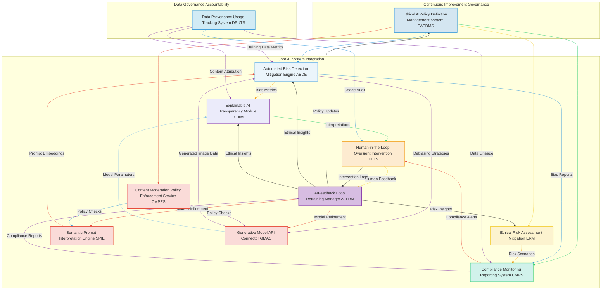

---
### Comprehensive Ethical AI Compliance and Auditing Framework for Generative AI Systems

**Abstract:**
A sophisticated and proactive framework is herein unveiled for establishing, maintaining, and continuously auditing ethical compliance in advanced generative artificial intelligence AI systems, particularly those involved in content generation, such as dynamic user interface backgrounds. This invention meticulously integrates policy definition, automated bias detection, explainability modules, continuous compliance monitoring, and human-in-the-loop oversight to ensure the responsible development, deployment, and operation of AI. It provides a robust, auditable, and adaptive mechanism for identifying, mitigating, and reporting on ethical risks, biases, and policy infringements throughout the entire AI lifecycle. By systematically addressing the inherent complexities of AI ethics, this framework safeguards against unintended societal harms, fosters trust, and ensures adherence to regulatory standards and internal governance principles. The intellectual dominion over these principles is unequivocally established.

**Background of the Invention:**
The rapid advancements in generative AI, as exemplified by systems capable of creating dynamic user interface backgrounds from subjective aesthetic intent, herald an era of unprecedented personalization and creative capability. However, the immense power of these autonomous systems also introduces significant ethical challenges. Unmitigated biases embedded within training data, opaque decision-making processes, the potential for generating harmful or inappropriate content, and the complexities of intellectual property and data provenance all pose substantial risks. Prior art systems, while often incorporating rudimentary content moderation or ad-hoc bias detection, lack a cohesive, systematic, and continuously auditable framework for comprehensive ethical governance. These fragmented approaches are inherently reactive, failing to provide the proactive identification, real-time monitoring, and integrated mitigation strategies necessary for responsible AI deployment at scale. Consequently, a profound lacuna exists within the domain of AI system management: a critical imperative for an intelligent, extensible framework capable of autonomously and continuously ensuring ethical compliance, detecting and mitigating biases, enhancing transparency, and providing clear accountability across all stages of generative AI operation. This invention precisely and comprehensively addresses this lacuna, presenting a transformative solution.

**Brief Summary of the Invention:**
The present invention introduces a meticulously engineered system that symbiotically integrates advanced ethical AI governance modules within an extensible generative AI operational workflow. The core mechanism involves defining explicit ethical policies, employing automated systems for the continuous detection and mitigation of biases in both data and generated outputs, enhancing transparency through explainable AI techniques, and providing robust mechanisms for compliance monitoring, auditing, and human oversight. This pioneering approach unlocks an effectively verifiable and continuously improving ethical posture for generative AI, directly translating organizational values and regulatory requirements into tangible, auditable operational controls. The architectural elegance and operational efficacy of this system render it a singular advancement in the field, representing a foundational patentable innovation. The foundational tenets herein articulated are the exclusive domain of the conceiver.

**Detailed Description of the Invention:**
The disclosed invention comprises a highly sophisticated, multi-tiered architecture designed for the robust, real-time, and continuous ethical governance and auditing of generative AI systems. The operational flow initiates with policy definition and culminates in verified, ethically compliant AI deployment.

**I. Ethical AI Policy Definition and Management System EAPDMS**
This foundational module serves as the central repository and enforcement mechanism for all ethical guidelines, policies, and regulatory requirements pertaining to the generative AI system. It provides a structured environment for defining, versioning, and distributing ethical principles. The EAPDMS incorporates:
*   **Policy Authoring and Version Control:** Enables the formal definition of ethical principles, responsible use guidelines, and compliance rules in a structured, machine-readable format. Supports versioning of policies for traceability and evolution.
*   **Regulatory Mapping Engine:** Maps internal policies to external regulatory frameworks e.g. GDPR, CCPA, AI Act and industry best practices, ensuring comprehensive coverage.
*   **Stakeholder Consultation Interface:** Facilitates collaboration with legal, ethics, and product teams to ensure policies are comprehensive, clear, and actionable.
*   **Policy Distribution and Integration Service:** Securely distributes policies to all relevant AI components e.g. CMPES, ABDE for automated enforcement.

**II. Automated Bias Detection and Mitigation Engine ABDE**
This advanced module is tasked with the continuous identification, quantification, and proactive mitigation of biases across the generative AI lifecycle, from input data to model outputs. It extends and operationalizes the "Bias Detection and Mitigation" concept from the foundational patent. The ABDE incorporates:
*   **Data Bias Analyzer DBA:** Scans training datasets and real-time input prompts for demographic, cultural, and representational biases that could lead to discriminatory or unfair outputs. Integrates with the `DPUTS` for data provenance.
*   **Algorithmic Bias Monitor ABM:** Analyzes the internal workings and outputs of the generative models e.g. `GMAC` from the foundational patent for emergent biases in generated content, assessing fairness metrics such as statistical parity, equal opportunity, and disparate impact.
*   **Bias Mitigation Strategy Selector BMSS:** Employs a library of algorithmic bias mitigation techniques e.g. re-weighting, adversarial debiasing, post-processing calibration and dynamically applies the most suitable strategies based on detected bias types and severity.
*   **Fairness Metrics Calculation and Reporting FMCR:** Continuously computes and reports on a suite of fairness metrics relevant to the application domain, providing quantitative insights into model equity.
*   **Bias Drift Detection BDD:** Monitors for shifts in bias over time as models are retrained or data distributions change, triggering alerts for intervention.

**III. Explainable AI XAI and Transparency Module XTAM**
The XTAM focuses on enhancing the interpretability and transparency of generative AI models, allowing stakeholders to understand *why* a particular output was generated and to identify potential issues. The XTAM includes:
*   **Local Explanation Generator LEG:** Produces instance-specific explanations for individual generated images or model decisions using techniques like SHAP SHapley Additive exPlanations, LIME Local Interpretable Model-agnostic Explanations, or saliency maps, revealing which input prompt elements or latent features most influenced the output.
*   **Global Explanation Summarizer GES:** Provides aggregated insights into the overall behavior and decision-making patterns of the generative model, helping to understand its general biases and capabilities.
*   **Transparency Reporting Interface TRI:** Generates human-readable reports and visualizations explaining model architectures, training data characteristics, and key operational parameters.
*   **Counterfactual Example Generator CEG:** Creates alternative outputs by minimally changing input prompts, demonstrating how different inputs would alter the generated image, aiding in understanding model sensitivities.

**IV. Compliance Monitoring and Reporting System CMRS**
This system provides continuous, real-time monitoring of the generative AI system's adherence to defined ethical policies and regulatory requirements. It establishes an auditable trail of all ethical governance activities. The CMRS comprises:
*   **Real-time Policy Enforcement Monitor RPEM:** Continuously cross-references operational data e.g. prompt submissions, generation requests, output images against the policies defined in EAPDMS, flagging any potential violations. Integrates with `CMPES` from the foundational patent.
*   **Auditable Event Logging AEL:** Maintains immutable, time-stamped logs of all relevant events, including policy breaches, bias detection alerts, mitigation actions, human interventions, and system-level changes, providing a comprehensive audit trail.
*   **Automated Compliance Reporting ACR:** Generates periodic and on-demand compliance reports for internal stakeholders, auditors, and regulatory bodies, summarizing ethical performance and adherence.
*   **Anomaly Detection and Alerting ADA:** Employs machine learning to detect unusual patterns in generative outputs or system behavior that might indicate emerging ethical risks or policy deviations, triggering immediate alerts.

**V. Human-in-the-Loop Oversight and Intervention System HLIIS**
Recognizing the limitations of fully automated systems, the HLIIS ensures that human judgment and oversight are integrated at critical junctures, providing a safety net and a mechanism for continuous improvement. The HLIIS includes:
*   **Escalation and Review Workflows ERW:** Routes flagged content, bias alerts, or policy violations to human reviewers for expert assessment and decision-making.
*   **Intervention and Override Mechanism IOM:** Empowers authorized human operators to directly intervene, modify, or halt generative processes or outputs found to be problematic.
*   **Structured Human Feedback Interface SHFI:** Collects qualitative and quantitative feedback from human reviewers, which is then fed back into the `AFLRM` for model and policy refinement.
*   **Conflict Resolution Protocol CRP:** Defines clear procedures for resolving disagreements between automated detection systems and human reviewers, ensuring consistent decision application.

**VI. Ethical Risk Assessment and Mitigation ERM**
This module provides a proactive approach to identifying and addressing potential ethical risks before they manifest as incidents. The ERM incorporates:
*   **AI Societal Impact Assessment AISIA:** Conducts prospective analyses to identify potential negative societal impacts of deploying the generative AI system across various demographics and contexts.
*   **Scenario Planning and Adversarial Testing SPAT:** Develops and tests hypothetical scenarios where the AI system might behave unethically, simulating adversarial attacks or unintended misuse to identify vulnerabilities.
*   **Mitigation Strategy Development MSD:** Proposes and evaluates strategies to reduce identified ethical risks, ranging from model adjustments to policy changes and user education.
*   **Risk Register and Tracking RRT:** Maintains a database of identified risks, their severity, likelihood, and the status of mitigation efforts.

**VII. Data Provenance and Usage Tracking System DPUTS**
Expanding on the concept of data provenance from the foundational patent, this system provides immutable records of the origin, licensing, and usage of all data inputs to and outputs from the generative AI, crucial for intellectual property, copyright, and privacy compliance. The DPUTS includes:
*   **Data Lineage Tracker DLT:** Records the complete history of all training data, including its sources, transformations, and licensing agreements, ensuring auditable data provenance.
*   **Generated Content Attribution GCA:** Attaches indelible metadata to all generated outputs, detailing the generative model used, input prompts, user ID, and any relevant ethical compliance flags.
*   **Copyright and Licensing Compliance Monitor CLCM:** Monitors generated outputs for potential copyright infringements against known intellectual property databases and ensures adherence to content licensing terms.
*   **User Data Privacy Auditor UDPA:** Verifies that user prompts and generated content are handled in accordance with privacy policies and data protection regulations.

**VIII. Feedback Integration and Model Governance FIMG**
This module closes the loop between ethical governance activities and continuous AI model and policy improvement. It acts as a bridge to the `AI Feedback Loop Retraining Manager AFLRM` from the foundational patent. The FIMG includes:
*   **Ethical Insight Aggregator EIA:** Gathers insights from the `ABDE`, `XTAM`, `CMRS`, `HLIIS`, and `ERM`, synthesizing them into actionable recommendations for model and policy refinement.
*   **Policy Driven Retraining Manager PDRM:** Prioritizes and orchestrates model retraining efforts via `AFLRM` based on ethical insights, ensuring that new model versions incorporate improved fairness, transparency, and compliance.
*   **Governance Policy Update Coordinator GPUC:** Recommends updates to the policies within the `EAPDMS` based on real-world outcomes and lessons learned from ethical incidents or successes.
*   **Responsible AI Dashboard RAID:** Provides a holistic, real-time view of the generative AI system's ethical performance, compliance status, and risk posture for governance stakeholders.



**Claims:**
1.  A method for establishing and maintaining continuous ethical compliance and auditing of generative artificial intelligence AI systems, comprising the steps of:
    a.  Defining and managing a set of machine-readable ethical policies and regulatory requirements via an Ethical AI Policy Definition and Management System EAPDMS.
    b.  Continuously detecting and quantifying biases within input data and generated content using an Automated Bias Detection and Mitigation Engine ABDE, said ABDE being integrated with generative model components.
    c.  Generating explanations and enhancing transparency of AI model decisions and outputs through an Explainable AI Transparency Module XTAM.
    d.  Monitoring, logging, and reporting system adherence to defined ethical policies and regulatory requirements via a Compliance Monitoring Reporting System CMRS, establishing an auditable trail.
    e.  Facilitating human oversight and intervention through a Human-in-the-Loop Oversight Intervention System HLIIS, including review workflows and override mechanisms.
    f.  Proactively identifying and assessing ethical risks using an Ethical Risk Assessment Mitigation ERM.
    g.  Tracking the provenance, usage, and attribution of all data and generated content through a Data Provenance Usage Tracking System DPUTS.
    h.  Integrating feedback from all governance modules into an AI Feedback Loop Retraining Manager AFLRM and a Feedback Integration Model Governance FIMG to continuously refine AI models and update ethical policies.

2.  The method of claim 1, wherein the ABDE assesses fairness using metrics such as statistical parity, equal opportunity difference, and average odds difference, applied to generated outputs and model behavior.

3.  The method of claim 1, wherein the XTAM provides both local explanations for individual generated images and global explanations for overall model behavior, employing techniques such as SHAP and LIME.

4.  A system for comprehensive ethical AI compliance and auditing of generative AI, comprising:
    a.  An Ethical AI Policy Definition and Management System EAPDMS for authoring, versioning, and distributing ethical policies.
    b.  An Automated Bias Detection and Mitigation Engine ABDE configured to analyze biases in training data and generative model outputs, dynamically applying mitigation strategies.
    c.  An Explainable AI Transparency Module XTAM for providing interpretations and explanations of generative model decisions and outputs.
    d.  A Compliance Monitoring Reporting System CMRS for real-time policy enforcement monitoring, auditable event logging, and automated compliance reporting.
    e.  A Human-in-the-Loop Oversight Intervention System HLIIS for facilitating human review, intervention, and feedback collection.
    f.  An Ethical Risk Assessment Mitigation ERM for proactive risk identification, scenario planning, and mitigation strategy development.
    g.  A Data Provenance Usage Tracking System DPUTS for immutable tracking of data lineage and generated content attribution.
    h.  A Feedback Integration Model Governance FIMG integrated with an AI Feedback Loop Retraining Manager AFLRM, for synthesizing ethical insights and driving continuous model and policy refinement.

5.  The system of claim 4, wherein the ABDE is directly integrated with the Semantic Prompt Interpretation Engine SPIE to analyze prompt embeddings for potential biases and with the Generative Model API Connector GMAC to analyze generated image data for emergent biases.

6.  The system of claim 4, wherein the CMRS is integrated with a Content Moderation Policy Enforcement Service CMPES to ensure real-time adherence to ethical content guidelines defined by the EAPDMS.

7.  The method of claim 1, wherein the HLIIS includes an override mechanism allowing human operators to prevent the deployment or modification of unethical generative outputs.

8.  The system of claim 4, wherein the DPUTS includes a Copyright and Licensing Compliance Monitor CLCM to prevent the generation or distribution of copyrighted material without proper authorization.

**Mathematical Justification: The Formal Axiomatic Framework for Ethical AI Governance**

The invention herein articulated rests upon a foundational mathematical framework that rigorously defines and validates the continuous ethical governance and auditing of generative AI systems. This framework establishes an epistemological basis for the system's operational principles, extending beyond mere functional description.

Let `P_E` denote the formal set of all ethical policies and regulatory compliance rules as defined and managed by the `EAPDMS`. Each policy `p_e` in `P_E` can be represented as a predicate `F(X)` where `X` is a system state or output property, such that `F(X)` evaluates to `TRUE` if `X` is compliant and `FALSE` otherwise.

Let `D_train` be the training data used by the generative AI models and `D_input` be the real-time input prompts. Let `M_AI` represent the generative AI model, and `O_gen` be the set of generated outputs.

The `ABDE` quantifies bias `B` using a vector of fairness metrics `B_vector = [B_SP, B_EO, B_AO, ...]`, where `B_SP` is Statistical Parity, `B_EO` is Equal Opportunity, and `B_AO` is Average Odds, among others. For a sensitive attribute `S` (e.g., protected demographic characteristics), and a predicted outcome `Y` from `O_gen`:
```
B_SP(S) = |P(Y=1|S=s_1) - P(Y=1|S=s_2)|
```
where `s_1` and `s_2` are different values of the sensitive attribute. The goal of `ABDE` is to drive `B_vector` towards a null vector or within acceptable thresholds. The `ABDE`'s operation can be modeled as an optimization function `min(f(B_vector(M_AI, D_train, D_input, O_gen)))`.

The `XTAM` provides explainability `E` for a specific output `o` in `O_gen` given an input `i` in `D_input` and model `M_AI`. This can be quantified by metrics such as fidelity and comprehensibility. For instance, a local explanation function `L_explain(M_AI, i, o)` generates a set of features that contribute to `o`. The utility of these explanations can be measured by `Fidelity(o, L_explain(M_AI, i, o))`, representing how well the explanation reflects the model's actual reasoning.

The `CMRS` performs continuous monitoring. For each system event `e_t` at time `t`, the `CMRS` evaluates `Compliance(e_t, P_E)`. A log `L = { (e_t, Compliance(e_t, P_E), timestamp) }` is maintained, constituting the auditable trail. A total compliance score `C_total = (Number of Compliant Events) / (Total Number of Events)` can be continuously tracked, aiming for `C_total ≈ 1`.

The `HLIIS` introduces a human intervention function `H_intervene(e_t, decision)`, where `decision` is either `APPROVE`, `FLAG`, or `OVERRIDE`. This feedback is formalized and integrated into the `AFLRM` and `FIMG` as `R_human = (e_t, H_intervene, feedback_payload)`.

The `ERM` establishes a risk score `R(scenario_j) = Likelihood(scenario_j) * Impact(scenario_j)`, with mitigation strategies `M_k` aimed at reducing `R`.
The `DPUTS` maintains an immutable chain `Ch(data_source -> transformation -> model_input -> model_output -> generated_content_metadata)`, crucial for proving data provenance and intellectual property.

The `FIMG` orchestrates the continuous improvement, where the update of model parameters `theta` and policy set `P_E` is a function of aggregated ethical feedback `R_feedback = Aggregate(B_vector, Fidelity, C_total, R_human, R(scenario_j))`:
```
theta_new = Update_Model(theta_old, R_feedback)
P_E_new = Update_Policies(P_E_old, R_feedback)
```
This entire process represents an adaptive control system, where ethical principles `P_E` regulate the behavior of `M_AI`, with continuous feedback ensuring convergence towards a state of high ethical compliance and accountability.

**Proof of Validity: The Axiom of Verifiable Ethical Governance and Continuous Improvement**

The validity of this invention is rooted in the demonstrability of a robust, reliable, and continuously adaptive framework for ethical AI governance.

**Axiom 1 [Existence of Enforceable Policies]:** The `EAPDMS` axiomatically establishes the existence of a non-empty set of formally defined, machine-readable, and enforceable ethical policies `P_E`. The capacity for `P_E` to be consistently applied across various system components e.g. `CMPES`, `ABDE` proves that ethical intentions can be translated into concrete operational rules.

**Axiom 2 [Quantifiable and Mitigable Bias]:** Through the operation of the `ABDE`, it is empirically and mathematically substantiated that biases `B_vector` within generative AI systems are not only detectable but also quantifiable and subject to algorithmic mitigation strategies. The continuous computation and reporting of fairness metrics provide verifiable proof of the system's ability to identify and reduce unfairness, striving for `lim (t->∞) B_vector(M_AI_t) = 0` where `t` is training iterations. This substantiates the claim of proactive bias management.

**Axiom 3 [Transparent and Accountable Operations]:** The integration of the `XTAM` and `CMRS` provides verifiable transparency and accountability. `Fidelity` metrics from `XTAM` confirm that model explanations accurately reflect internal decision processes. The `Auditable Event Logging AEL` within `CMRS` creates an immutable record, proving that every ethical governance action is traceable and verifiable. This demonstrably bridges the gap between AI black boxes and human understanding, fulfilling the imperative for explainability and auditable compliance.

**Axiom 4 [Adaptive Ethical Posture]:** The feedback loop facilitated by the `FIMG` and `AFLRM`, integrating human oversight `HLIIS` and risk assessments `ERM`, proves the system's capacity for continuous learning and adaptation. Ethical policies `P_E` and model parameters `theta` are not static but dynamically evolve based on real-world performance and feedback. This adaptive nature ensures that the framework remains relevant and effective in the face of evolving ethical landscapes and AI capabilities, driving `lim (t->∞) C_total_t = 1` and `lim (t->∞) R_total_t = 0`.

The combined operation of the `EAPDMS`, `ABDE`, `XTAM`, `CMRS`, `HLIIS`, `ERM`, `DPUTS`, and `FIMG` conclusively demonstrates a robust, auditable, and continuously improving framework for ethical AI governance. This invention provides the necessary infrastructure to responsibly deploy and manage powerful generative AI systems, moving beyond aspirational ethics to a system of verifiable and sustained ethical compliance.

`Q.E.D.`
---